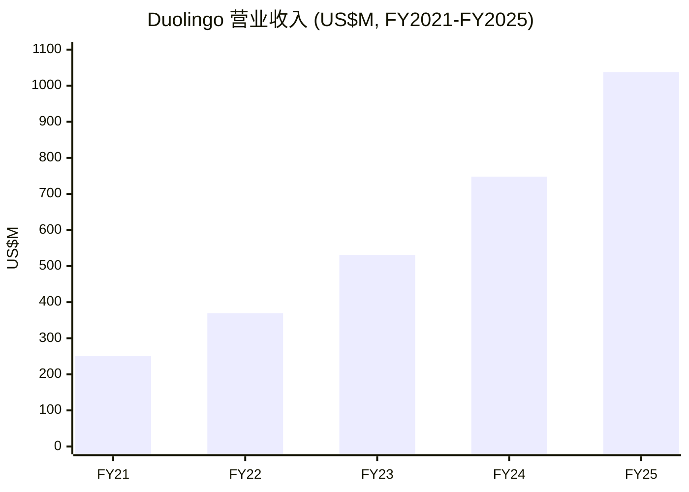
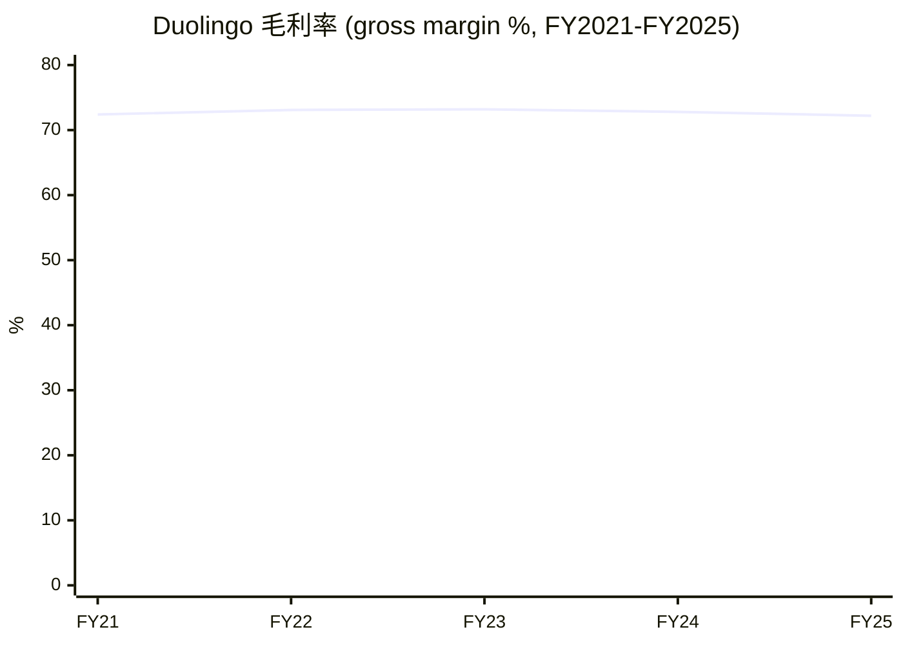
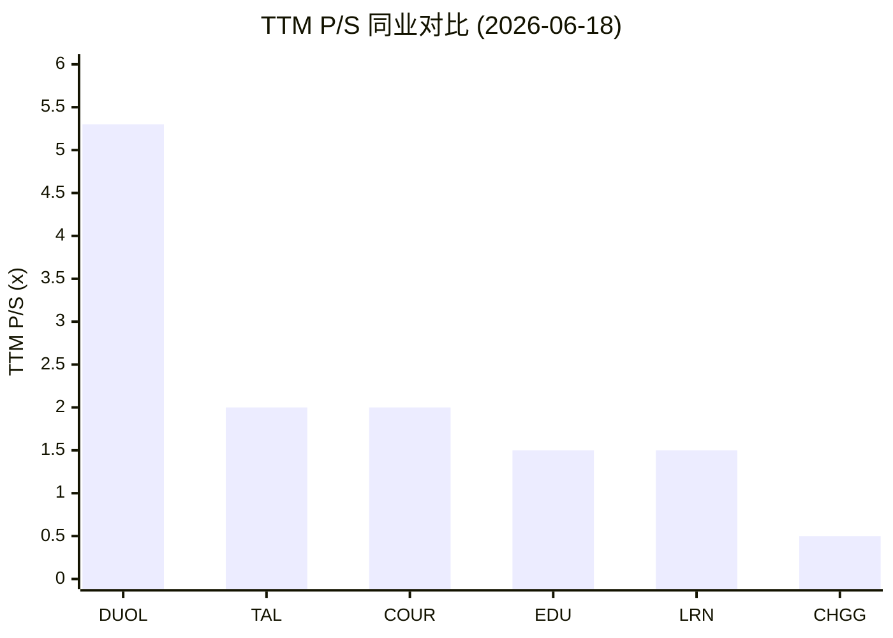
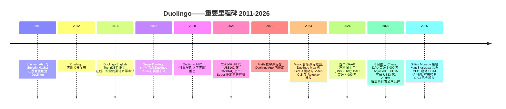
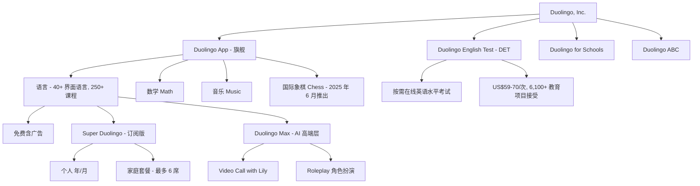
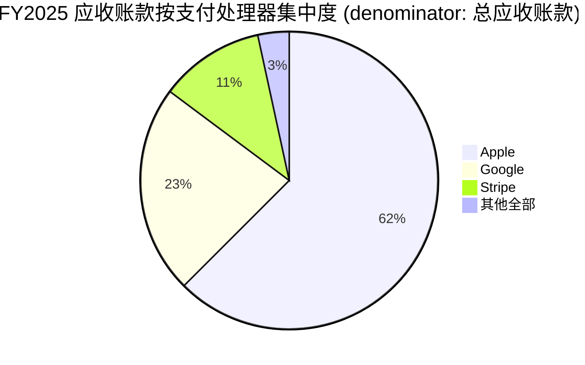
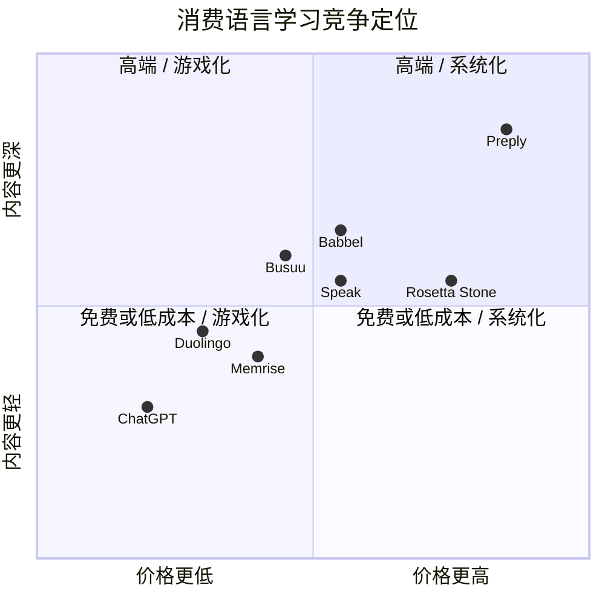
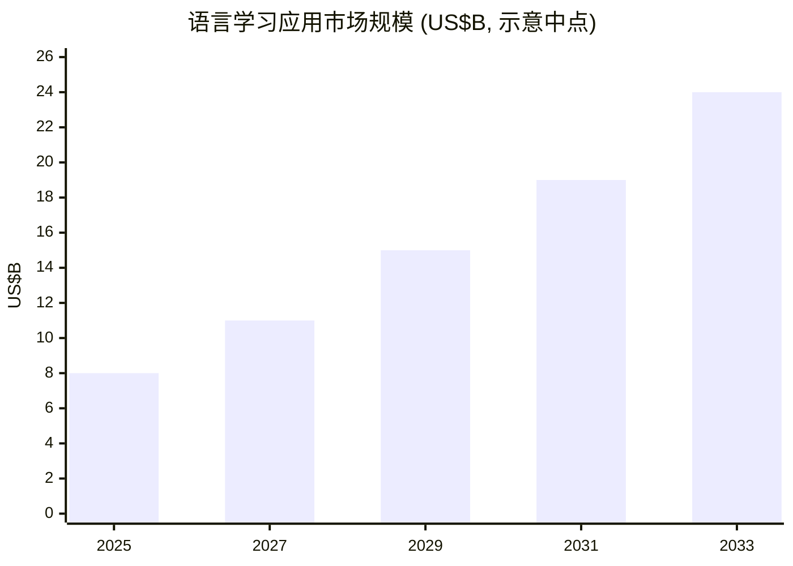

# Duolingo, Inc. (NASDAQ:DUOL) — 公司研究报告

**截至日期: 2026-06-18**
**分析师: 本报告基于 SEC 一手文件、公司官网、本地 institute-research 库 (db/zsxq.db) 及文中具名第三方来源整理。**
**代码 / 上市地: DUOL / 纳斯达克全球精选市场 (NASDAQ Global Select Market)**
**总部: 美国宾夕法尼亚州匹兹堡 (Pittsburgh, PA)**
**报告语言: 简体中文 (本目录另存有一份较旧的英文版, 本次刷新仅更新中文版)**

---

## 投资摘要 (Investment Summary) — *分析师观点 (Analyst view)*

> 以下评级、目标价 (price target, PT)、前瞻估计与情景目标价均为**本报告自身的前瞻观点**, 按本项目规则标注为 *分析师观点*, **不附带任何 filing 引用** (10-K 不含目标价)。

| 项目 | 数值 |
|---|---|
| **评级 (Rating)** | **Hold / Neutral (持有)** |
| **12 个月目标价 (12-mo PT)** | **US$150** |
| **当前股价 (2026-06-18 收盘)** | US$125.56 |
| **隐含上行空间 (Implied upside)** | **+19.5%** |
| **估值方法 (Valuation method)** | 16× FY2027E Adjusted EBITDA (US$396M) → EV → 每股价值 |
| **市值 (Market cap)** | 约 US$58.5 亿 (US$5.85B) |
| **52 周区间** | US$87.89 – 483.03 |
| **情景目标价 (Bull / Base / Bear)** | US$185 (+47%) / US$150 (+20%) / US$90 (−28%) |

**论点支柱 (Thesis pillars)** — *分析师观点*

1. **品类定义型消费特许经营, 但正经历一次自我设计的增长重置。** Duolingo 是全球语言学习 (language learning) 应用的绝对龙头, 1.33 亿 MAU、72% 毛利率 (gross margin)、35% 自由现金流 (FCF) 利润率; 但管理层主动牺牲 2026 年约 5 个百分点的订单量 (bookings) 增长以换取长期 DAU 复合, 把"业绩"与"叙事"双双拉低。
2. **估值已从主题性 AI 溢价回归到可辩护的优质成长区间, 但仍非便宜。** 当前 TTM P/S 约 5.3×、forward P/E 约 16×, 较 2025 年 5 月峰值缩水约 74%; 相对教育科技 (EdTech) 同业中位数仍有 2.5–3× 溢价, 由增长与利润率配置支撑而非故事支撑。
3. **AI 是双刃剑——既是护城河的复合器, 也是 Max 价值主张的潜在替代者。** 前沿大模型让对话练习近乎零边际成本, 但也让 ChatGPT 语音模式成为高端层的近免费替代; 公司把 Video Call 下放至 Super 层既是利好下沉, 也是防御性回应。
4. **风险回报对称但不极端。** 约 +20% 的基准上行不足以触发 Buy 评级, 考虑到 2026 年重置的执行风险、19.7% 的高空头仓位与平台抽成集中度; 但 11 亿美元净现金 + 启动中的 4 亿美元回购为下行提供缓冲。

**最该盯紧的变量 (key swing variables):** (1) 2026 下半年 DAU 增速能否如管理层所言重新加速回到约 20%——这是整个"用 bookings 换 DAU"赌注成立的前提; (2) 毛利率从 1Q26 的 73% 压缩至年末约 69% 的轨迹是否止于此 (AI token 消耗 vs 单位成本下降的拉锯)。

> **业绩更新 (2026-05-04, Q1/FY2026):** 营业收入 (revenue) US$291.97M (同比 +26.5%), 毛利率 73.0%, 经营利润 (operating income) US$44.5M, GAAP 净利 US$43.46M, 摊薄 EPS US$0.89。管理层重申 2026 全年指引——bookings 约 US$12.80 亿 (同比 +10.5%)、revenue 约 US$12.05 亿 (同比 +16.1%)、Adjusted EBITDA 约 US$3.10 亿 (利润率 25.7%, 较 FY2025 的 29.5% 主动下调)。该指引明确承担约 5 个百分点的 bookings 逆风 (让出超 US$5,000 万 bookings), 来自移除付费转化摩擦与将 Video Call 由 Max 下放至 Super, 服务于"2028 年达成 1 亿 DAU"的目标。来源: [Duolingo Q1/FY2026 股东信, 2026-05-04](https://www.sec.gov/Archives/edgar/data/1562088/000162828026029790/q1fy26duolingo3-31x26share.htm)。

---

## 目录

1. 公司概览 (含 1A 估值与目标价 / 1B GF Score)
2. 估值与目标价 (Valuation & Price Target) — 前瞻模型、PT 推导、情景、卖方观点演变
3. 公司历史
4. 管理团队
5. 产品与服务
6. 客户与上市策略
7. 行业概览
8. 竞争格局
9. 市场机会 (TAM)
10. 风险评估 (含 9.5 关键分歧与催化剂)
11. 投资者视角评分 (Investor-lens scorecards)
12. 参考资料 / Data Used

---

## 1. 公司概览

**本报告观点 (BLUF):** 我们对 Duolingo 给予 **Hold / Neutral 评级、12 个月目标价 US$150** (较 2026-06-18 的 US$125.56 上行约 +20%)。理由: 这是后移动时代品质最高的消费软件特许经营之一 (72% 毛利率、35% FCF 利润率、近零债务), 但 2025 年 Q4 起公司主动用近期 bookings 增长换取 2028 年 1 亿 DAU 的长期目标, 叠加 DAU 增速首次跌破 30%、AI 对高端层的替代担忧与仍高于同业的估值倍数, 使近期风险回报趋于平衡而非偏多。*(评级 / PT 为分析师观点。)*

Duolingo, Inc. 是一家总部位于匹兹堡、于特拉华州注册成立的"移动优先 (mobile-first)"教育公司, 其旗舰应用——用公司自己的 10-K 表述——已"自然成长为全球最受欢迎的语言学习方式 (language learning), 并在应用商店教育类别中的总收入排名第一", 在 Google Play 和 Apple App Store 双平台均为如此。截至 2025 年 12 月 31 日, Duolingo 向"超过 1.3 亿月活跃用户 (Monthly Active Users, MAU) 提供 250 多个语言课程", 并作为单一可报告分部 (single reportable segment) 运营 ([Duolingo 10-K FY2025, Item 1 Business, p. 6](https://www.sec.gov/Archives/edgar/data/1562088/000162828026012494/duol-20251231.htm))。语言学习仍是核心, 但公司在此之上积极扩张——Math (数学, 2022 年推出)、Music (音乐, 2023 年推出)、Chess (国际象棋, 2025 年 6 月推出) 现都整合在旗舰应用内, 仅 Chess 一项在"不到一年内就达到了 700 万以上 DAU" ([Duolingo Q4/FY2025 股东信, 2026-02-26, p. 4](https://www.sec.gov/Archives/edgar/data/1562088/000162828026012246/q4fy25duolingo12-31x25shar.htm))。

**Duolingo 如何盈利。** 商业模式为 freemium (免费增值): 所有课程免费, 但无广告访问加上 AI 驱动的学习功能以 Super Duolingo (订阅版, 按月或按年, 含六席家庭套餐) 形式销售; 或以更高一层的 Duolingo Max 订阅形式销售, Max 包含 GPT 级别的 AI 功能 ([Duolingo Max 博客发布公告, 2023-03-14](https://blog.duolingo.com/duolingo-max/))。订阅收入是绝对主导杠杆——US$873.4M 占 US$1,037.6M 营业收入的 84%。免费课程上的广告 (US$79.7M)、独立的 Duolingo English Test (DET, 杜林戈英语测试, US$42.0M) 以及应用内购买 (in-app purchases, IAP, US$40.5M) 合计构成剩余 16% (US$164.1M 的"其他") ([Duolingo 10-K FY2025, 收入分解, p. 68 & p. 109](https://www.sec.gov/Archives/edgar/data/1562088/000162828026012494/duol-20251231.htm))。

**规模指标 (FY2025)。** 营业收入达 US$1,037.6M, 同比 +39%; 毛利润 (gross profit) US$749.5M, 毛利率 72.2%; Adjusted EBITDA US$305.9M, 利润率 29.5%; 自由现金流 (free cash flow, FCF) US$360.4M (= 经营现金流 US$387.8M − capex US$27.4M), FCF 利润率 34.7%; GAAP 净利润 US$414.1M——但**该 GAAP 数字受一次性 US$231.7M 所得税净优惠虚高**, 来自释放联邦和州递延税资产 (deferred tax assets) 的估值备抵 (valuation allowance), 剔除后调整后净利约 US$157M ([Duolingo 10-K FY2025, 利润表 + 现金流量表, pp. 83-86](https://www.sec.gov/Archives/edgar/data/1562088/000162828026012494/duol-20251231.htm))。2025 年 Q4 MAU 平均 1.331 亿, 较一年前的 1.167 亿增长 14%; DAU (Daily Active Users) 平均 5,270 万, 对比一年前 4,050 万 (+30%); DAU/MAU 比率由 34.7% 扩大至 39.6%——对消费应用而言极为出色的活跃度。付费订阅用户 (paid subscribers) 2025 年末达 1,220 万, 同比 +28% (上年 950 万), 约占 MAU 的 9% ([Duolingo 10-K FY2025, MD&A 用户指标, pp. 60-61](https://www.sec.gov/Archives/edgar/data/1562088/000162828026012494/duol-20251231.htm))。

**运营地域。** Duolingo 默认全球化——应用在所有 App Store 与 Google Play 运营的国家都可获取, 内容以 40 多种界面语言教授——但公司作为单一可报告、地理未细分分部运营, CEO 担任首席运营决策者 (chief operating decision maker, CODM); 因此 10-K **不披露地理收入拆分** ([Duolingo 10-K FY2025, Note 2 分部信息, pp. 91-92](https://www.sec.gov/Archives/edgar/data/1562088/000162828026012494/duol-20251231.htm))。约 80% 以上的营业收入通过 Apple、Google 和 Stripe 作为支付处理中介收取——2025 年末三者分别占总应收账款 (accounts receivable) 的 62.5%、22.7% 和 11.4%——这是结构性特征, 在第 10 节作为关键风险反复出现 ([Duolingo 10-K FY2025, p. 92](https://www.sec.gov/Archives/edgar/data/1562088/000162828026012494/duol-20251231.htm))。

**员工。** 10-K 描述员工群体"包括超过 430 名工程师", 专注于打造"世界上最复杂的教育平台"; 公司任务感异常强烈, 并以自豪地位于硅谷以外的匹兹堡总部为标志 ([Duolingo 10-K FY2025, Item 1 Business, p. 5](https://www.sec.gov/Archives/edgar/data/1562088/000162828026012494/duol-20251231.htm))。

下图为 FY2025 利润表的资金流向 (Sankey): 84% 的收入来自订阅, 经 28% 的销货成本 (cost of revenues, 主要是平台抽成) 后形成 72% 毛利, 再投入 R&D (US$306M, 占营收 30%) 与 SG&A, 留下 US$135.6M 经营利润; 注意净利受一次性税项优惠抬高。

<svg xmlns="http://www.w3.org/2000/svg" viewBox="0 0 1000 560" width="1000" height="560" role="img" aria-label="income statement Sankey"><rect x="0" y="0" width="1000" height="560" fill="#ffffff"/>
<text x="20.00" y="30.00" text-anchor="start" font-family="Helvetica,Arial,sans-serif" font-size="15" font-weight="700" fill="#1f2933">Duolingo FY2025 利润表 Sankey (US$M)</text>
<path d="M 452.00,71.00 C 506.00,71.00 506.00,113.07 560.00,113.07 L 560.00,168.22 C 506.00,168.22 506.00,126.15 452.00,126.15 Z" fill="#86efac" fill-opacity="0.55"/>
<path d="M 452.00,126.15 C 506.00,126.15 506.00,182.22 560.00,182.22 L 560.00,431.90 C 506.00,431.90 506.00,375.83 452.00,375.83 Z" fill="#fca5a5" fill-opacity="0.55"/>
<path d="M 204.00,71.02 C 258.00,71.02 258.00,78.00 312.00,78.00 L 312.00,433.22 C 258.00,433.22 258.00,426.24 204.00,426.24 Z" fill="#93c5fd" fill-opacity="0.55"/>
<path d="M 328.00,78.00 C 382.00,78.00 382.00,71.00 436.00,71.00 L 436.00,375.83 C 382.00,375.83 382.00,382.83 328.00,382.83 Z" fill="#86efac" fill-opacity="0.55"/>
<path d="M 328.00,382.83 C 382.00,382.83 382.00,389.83 436.00,389.83 L 436.00,507.00 C 382.00,507.00 382.00,500.00 328.00,500.00 Z" fill="#fca5a5" fill-opacity="0.55"/>
<path d="M 576.00,113.07 C 630.00,113.07 630.00,113.07 684.00,113.07 L 684.00,168.22 C 630.00,168.22 630.00,168.22 576.00,168.22 Z" fill="#86efac" fill-opacity="0.55"/>
<path d="M 700.00,113.07 C 754.00,113.07 754.00,196.79 808.00,196.79 L 808.00,365.21 C 754.00,365.21 754.00,281.49 700.00,281.49 Z" fill="#86efac" fill-opacity="0.55"/>
<path d="M 700.00,281.49 C 754.00,281.49 754.00,379.21 808.00,379.21 L 808.00,381.21 C 754.00,381.21 754.00,283.49 700.00,283.49 Z" fill="#fca5a5" fill-opacity="0.55"/>
<path d="M 576.00,182.22 C 630.00,182.22 630.00,201.25 684.00,201.25 L 684.00,326.36 C 630.00,326.36 630.00,307.32 576.00,307.32 Z" fill="#fca5a5" fill-opacity="0.55"/>
<path d="M 576.00,307.32 C 630.00,307.32 630.00,340.36 684.00,340.36 L 684.00,464.93 C 630.00,464.93 630.00,431.90 576.00,431.90 Z" fill="#fca5a5" fill-opacity="0.55"/>
<path d="M 204.00,440.24 C 258.00,440.24 258.00,433.22 312.00,433.22 L 312.00,499.96 C 258.00,499.96 258.00,506.98 204.00,506.98 Z" fill="#93c5fd" fill-opacity="0.55"/>
<path d="M 576.00,445.90 C 630.00,445.90 630.00,168.22 684.00,168.22 L 684.00,187.25 C 630.00,187.25 630.00,464.93 576.00,464.93 Z" fill="#93c5fd" fill-opacity="0.55"/>
<rect x="188.00" y="71.02" width="16" height="355.22" rx="1.5" fill="#2563eb"/>
<rect x="188.00" y="440.24" width="16" height="66.74" rx="1.5" fill="#2563eb"/>
<rect x="312.00" y="78.00" width="16" height="422.00" rx="1.5" fill="#1e3a8a"/>
<rect x="436.00" y="71.00" width="16" height="304.83" rx="1.5" fill="#15803d"/>
<rect x="436.00" y="389.83" width="16" height="117.17" rx="1.5" fill="#dc2626"/>
<rect x="560.00" y="113.07" width="16" height="55.15" rx="1.5" fill="#15803d"/>
<rect x="560.00" y="182.22" width="16" height="249.68" rx="1.5" fill="#dc2626"/>
<rect x="560.00" y="445.90" width="16" height="19.03" rx="1.5" fill="#2563eb"/>
<rect x="684.00" y="113.07" width="16" height="74.18" rx="1.5" fill="#15803d"/>
<rect x="684.00" y="201.25" width="16" height="125.10" rx="1.5" fill="#dc2626"/>
<rect x="684.00" y="340.36" width="16" height="124.57" rx="1.5" fill="#dc2626"/>
<rect x="808.00" y="196.79" width="16" height="168.42" rx="1.5" fill="#15803d"/>
<rect x="808.00" y="379.21" width="16" height="2.00" rx="1.5" fill="#dc2626"/>
<text x="179.00" y="245.63" text-anchor="end" font-family="Helvetica,Arial,sans-serif" font-size="11.5" font-weight="700" fill="#1f2933">Subscription 订阅</text>
<text x="179.00" y="258.63" text-anchor="end" font-family="Helvetica,Arial,sans-serif" font-size="10" font-weight="400" fill="#52606d">US$873.4M  (84.2%)</text>
<text x="179.00" y="470.61" text-anchor="end" font-family="Helvetica,Arial,sans-serif" font-size="11.5" font-weight="700" fill="#1f2933">Other (广告/DET/IAP)</text>
<text x="179.00" y="483.61" text-anchor="end" font-family="Helvetica,Arial,sans-serif" font-size="10" font-weight="400" fill="#52606d">US$164.1M  (15.8%)</text>
<rect x="331.00" y="60.00" width="113.10" height="26" rx="2" fill="#ffffff" fill-opacity="0.72"/>
<text x="334.00" y="72.00" text-anchor="start" font-family="Helvetica,Arial,sans-serif" font-size="11.5" font-weight="700" fill="#1f2933">Revenue</text>
<text x="334.00" y="85.00" text-anchor="start" font-family="Helvetica,Arial,sans-serif" font-size="10" font-weight="400" fill="#52606d">US$1.0B  (100.0%)</text>
<rect x="455.00" y="53.00" width="119.40" height="26" rx="2" fill="#ffffff" fill-opacity="0.72"/>
<text x="458.00" y="65.00" text-anchor="start" font-family="Helvetica,Arial,sans-serif" font-size="11.5" font-weight="700" fill="#1f2933">Gross Profit</text>
<text x="458.00" y="78.00" text-anchor="start" font-family="Helvetica,Arial,sans-serif" font-size="10" font-weight="400" fill="#52606d">US$749.5M  (72.2%)</text>
<rect x="455.00" y="371.83" width="144.60" height="26" rx="2" fill="#ffffff" fill-opacity="0.72"/>
<text x="458.00" y="383.83" text-anchor="start" font-family="Helvetica,Arial,sans-serif" font-size="11.5" font-weight="700" fill="#1f2933">Cost of Revenue (COGS)</text>
<text x="458.00" y="396.83" text-anchor="start" font-family="Helvetica,Arial,sans-serif" font-size="10" font-weight="400" fill="#52606d">US$288.1M  (27.8%)</text>
<rect x="579.00" y="95.07" width="119.40" height="26" rx="2" fill="#ffffff" fill-opacity="0.72"/>
<text x="582.00" y="107.07" text-anchor="start" font-family="Helvetica,Arial,sans-serif" font-size="11.5" font-weight="700" fill="#1f2933">Operating Income</text>
<text x="582.00" y="120.07" text-anchor="start" font-family="Helvetica,Arial,sans-serif" font-size="10" font-weight="400" fill="#52606d">US$135.6M  (13.1%)</text>
<rect x="579.00" y="164.22" width="150.90" height="26" rx="2" fill="#ffffff" fill-opacity="0.72"/>
<text x="582.00" y="176.22" text-anchor="start" font-family="Helvetica,Arial,sans-serif" font-size="11.5" font-weight="700" fill="#1f2933">Total Operating Expense</text>
<text x="582.00" y="189.22" text-anchor="start" font-family="Helvetica,Arial,sans-serif" font-size="10" font-weight="400" fill="#52606d">US$613.9M  (59.2%)</text>
<text x="551.00" y="452.41" text-anchor="end" font-family="Helvetica,Arial,sans-serif" font-size="11.5" font-weight="700" fill="#1f2933">Net Interest / Other Income</text>
<text x="551.00" y="465.41" text-anchor="end" font-family="Helvetica,Arial,sans-serif" font-size="10" font-weight="400" fill="#52606d">US$46.8M  (4.5%)</text>
<rect x="703.00" y="95.07" width="119.40" height="26" rx="2" fill="#ffffff" fill-opacity="0.72"/>
<text x="706.00" y="107.07" text-anchor="start" font-family="Helvetica,Arial,sans-serif" font-size="11.5" font-weight="700" fill="#1f2933">Pretax Income</text>
<text x="706.00" y="120.07" text-anchor="start" font-family="Helvetica,Arial,sans-serif" font-size="10" font-weight="400" fill="#52606d">US$182.4M  (17.6%)</text>
<rect x="703.00" y="183.25" width="119.40" height="26" rx="2" fill="#ffffff" fill-opacity="0.72"/>
<text x="706.00" y="195.25" text-anchor="start" font-family="Helvetica,Arial,sans-serif" font-size="11.5" font-weight="700" fill="#1f2933">SG&amp;A</text>
<text x="706.00" y="208.25" text-anchor="start" font-family="Helvetica,Arial,sans-serif" font-size="10" font-weight="400" fill="#52606d">US$307.6M  (29.6%)</text>
<rect x="703.00" y="322.36" width="119.40" height="26" rx="2" fill="#ffffff" fill-opacity="0.72"/>
<text x="706.00" y="334.36" text-anchor="start" font-family="Helvetica,Arial,sans-serif" font-size="11.5" font-weight="700" fill="#1f2933">R&amp;D</text>
<text x="706.00" y="347.36" text-anchor="start" font-family="Helvetica,Arial,sans-serif" font-size="10" font-weight="400" fill="#52606d">US$306.3M  (29.5%)</text>
<text x="833.00" y="278.00" text-anchor="start" font-family="Helvetica,Arial,sans-serif" font-size="11.5" font-weight="700" fill="#1f2933">Net Income</text>
<text x="833.00" y="291.00" text-anchor="start" font-family="Helvetica,Arial,sans-serif" font-size="10" font-weight="400" fill="#52606d">US$414.1M  (39.9%)</text>
<text x="833.00" y="377.21" text-anchor="start" font-family="Helvetica,Arial,sans-serif" font-size="11.5" font-weight="700" fill="#1f2933">Income Tax</text>
<text x="833.00" y="390.21" text-anchor="start" font-family="Helvetica,Arial,sans-serif" font-size="10" font-weight="400" fill="#52606d">-US$231.7M  (-22.3%)</text>
<text x="500.00" y="530.00" text-anchor="middle" font-family="Helvetica,Arial,sans-serif" font-size="10" font-weight="400" font-style="italic" fill="#8a97a3">税项为净优惠 US$231.7M (释放递延税资产估值备抵), 使 GAAP 净利润虚高; 剔除后调整后净利约 US$157M</text>
<text x="500.00" y="544.00" text-anchor="middle" font-family="Helvetica,Arial,sans-serif" font-size="10" font-weight="400" fill="#52606d">Source: DUOL FY2025 10-K (income/balance/cash-flow statements, pp. 83-86) · SEC EDGAR</text>
</svg>
*Source: [Duolingo 10-K FY2025, 利润表, p. 83](https://www.sec.gov/Archives/edgar/data/1562088/000162828026012494/duol-20251231.htm)。*

营业收入的历史结构与构成:

<svg xmlns="http://www.w3.org/2000/svg" viewBox="0 0 860 470" width="860" height="470" role="img" aria-label="historical revenue bars"><rect x="0" y="0" width="860" height="470" fill="#ffffff"/>
<text x="20.00" y="30.00" text-anchor="start" font-family="Helvetica,Arial,sans-serif" font-size="15" font-weight="700" fill="#1f2933">Duolingo 营业收入历史 (FY2021-FY2025, US$M)</text>
<rect x="20.00" y="44" width="11" height="11" rx="2" fill="#2563eb"/>
<text x="36.00" y="53.00" text-anchor="start" font-family="Helvetica,Arial,sans-serif" font-size="10.5" font-weight="400" fill="#1f2933">Subscription 订阅</text>
<rect x="149.00" y="44" width="11" height="11" rx="2" fill="#15803d"/>
<text x="165.00" y="53.00" text-anchor="start" font-family="Helvetica,Arial,sans-serif" font-size="10.5" font-weight="400" fill="#1f2933">Other 其他</text>
<line x1="70" y1="412.00" x2="834" y2="412.00" stroke="#eceff2" stroke-width="1"/>
<text x="64.00" y="415.00" text-anchor="end" font-family="Helvetica,Arial,sans-serif" font-size="9.5" font-weight="400" fill="#52606d">US$0</text>
<line x1="70" y1="345.20" x2="834" y2="345.20" stroke="#eceff2" stroke-width="1"/>
<text x="64.00" y="348.20" text-anchor="end" font-family="Helvetica,Arial,sans-serif" font-size="9.5" font-weight="400" fill="#52606d">US$224.1M</text>
<line x1="70" y1="278.40" x2="834" y2="278.40" stroke="#eceff2" stroke-width="1"/>
<text x="64.00" y="281.40" text-anchor="end" font-family="Helvetica,Arial,sans-serif" font-size="9.5" font-weight="400" fill="#52606d">US$448.2M</text>
<line x1="70" y1="211.60" x2="834" y2="211.60" stroke="#eceff2" stroke-width="1"/>
<text x="64.00" y="214.60" text-anchor="end" font-family="Helvetica,Arial,sans-serif" font-size="9.5" font-weight="400" fill="#52606d">US$672.3M</text>
<line x1="70" y1="144.80" x2="834" y2="144.80" stroke="#eceff2" stroke-width="1"/>
<text x="64.00" y="147.80" text-anchor="end" font-family="Helvetica,Arial,sans-serif" font-size="9.5" font-weight="400" fill="#52606d">US$896.4M</text>
<line x1="70" y1="78.00" x2="834" y2="78.00" stroke="#eceff2" stroke-width="1"/>
<text x="64.00" y="81.00" text-anchor="end" font-family="Helvetica,Arial,sans-serif" font-size="9.5" font-weight="400" fill="#52606d">US$1.1B</text>
<rect x="102.09" y="364.72" width="88.62" height="47.28" fill="#2563eb"/>
<rect x="102.09" y="337.24" width="88.62" height="27.48" fill="#15803d"/>
<text x="146.40" y="428.00" text-anchor="middle" font-family="Helvetica,Arial,sans-serif" font-size="10" font-weight="400" fill="#52606d">2021</text>
<rect x="254.89" y="334.11" width="88.62" height="77.89" fill="#2563eb"/>
<rect x="254.89" y="301.86" width="88.62" height="32.25" fill="#15803d"/>
<text x="299.20" y="428.00" text-anchor="middle" font-family="Helvetica,Arial,sans-serif" font-size="10" font-weight="400" fill="#52606d">2022</text>
<rect x="407.69" y="291.37" width="88.62" height="120.63" fill="#2563eb"/>
<rect x="407.69" y="253.69" width="88.62" height="37.68" fill="#15803d"/>
<text x="452.00" y="428.00" text-anchor="middle" font-family="Helvetica,Arial,sans-serif" font-size="10" font-weight="400" fill="#52606d">2023</text>
<rect x="560.49" y="230.92" width="88.62" height="181.08" fill="#2563eb"/>
<rect x="560.49" y="189.04" width="88.62" height="41.88" fill="#15803d"/>
<text x="604.80" y="428.00" text-anchor="middle" font-family="Helvetica,Arial,sans-serif" font-size="10" font-weight="400" fill="#52606d">2024</text>
<rect x="713.29" y="151.66" width="88.62" height="260.34" fill="#2563eb"/>
<rect x="713.29" y="102.74" width="88.62" height="48.92" fill="#15803d"/>
<text x="757.60" y="428.00" text-anchor="middle" font-family="Helvetica,Arial,sans-serif" font-size="10" font-weight="400" fill="#52606d">2025</text>
<text x="430.00" y="440.00" text-anchor="middle" font-family="Helvetica,Arial,sans-serif" font-size="10" font-weight="400" font-style="italic" fill="#8a97a3">Subscription CAGR FY21-25 约 53%; Other 含广告/DET/IAP</text>
<text x="430.00" y="454.00" text-anchor="middle" font-family="Helvetica,Arial,sans-serif" font-size="10" font-weight="400" fill="#52606d">Source: DUOL FY2021-FY2025 10-K (statements of operations + revenue disaggregation) · SEC EDGAR</text>
</svg>
*Source: [Duolingo FY2021-FY2025 10-K, 利润表 + 收入分解](https://www.sec.gov/Archives/edgar/data/1562088/000162828026012494/duol-20251231.htm)。Subscription 路径 FY21-25 CAGR 约 53%。*

<svg xmlns="http://www.w3.org/2000/svg" viewBox="0 0 720 460" width="720" height="460" role="img" aria-label="revenue donut"><rect x="0" y="0" width="720" height="460" fill="#ffffff"/>
<text x="20.00" y="30.00" text-anchor="start" font-family="Helvetica,Arial,sans-serif" font-size="15" font-weight="700" fill="#1f2933">Duolingo FY2025 营业收入构成 (按类型, US$M)</text>
<path d="M 288.00,107.20 A 132 132 0 1 1 177.37,167.19 L 222.63,196.65 A 78 78 0 1 0 288.00,161.20 Z" fill="#2563eb"/>
<path d="M 177.37,167.19 A 132 132 0 0 1 223.43,124.07 L 249.85,171.17 A 78 78 0 0 0 222.63,196.65 Z" fill="#15803d"/>
<path d="M 223.43,124.07 A 132 132 0 0 1 254.48,111.53 L 268.19,163.76 A 78 78 0 0 0 249.85,171.17 Z" fill="#d97706"/>
<path d="M 254.48,111.53 A 132 132 0 0 1 286.48,107.21 L 287.10,161.21 A 78 78 0 0 0 268.19,163.76 Z" fill="#7c3aed"/>
<path d="M 286.48,107.21 A 132 132 0 0 1 288.00,107.20 L 288.00,161.20 A 78 78 0 0 0 287.10,161.21 Z" fill="#dc2626"/>
<text x="288.00" y="235.20" text-anchor="middle" font-family="Helvetica,Arial,sans-serif" font-size="18" font-weight="800" fill="#1f2933">DUOL</text>
<text x="288.00" y="255.20" text-anchor="middle" font-family="Helvetica,Arial,sans-serif" font-size="13" font-weight="600" fill="#52606d">US$1.0B</text>
<text x="288.00" y="271.20" text-anchor="middle" font-family="Helvetica,Arial,sans-serif" font-size="10" font-weight="400" fill="#8a97a3">total</text>
<line x1="353.79" y1="360.51" x2="369.79" y2="360.51" stroke="#2563eb" stroke-width="1.4"/>
<text x="373.79" y="358.51" text-anchor="start" font-family="Helvetica,Arial,sans-serif" font-size="11" font-weight="700" fill="#1f2933">Subscription 订阅</text>
<text x="373.79" y="372.51" text-anchor="start" font-family="Helvetica,Arial,sans-serif" font-size="10" font-weight="400" fill="#52606d">US$873.4M  (84.2%)</text>
<line x1="193.68" y1="138.46" x2="177.68" y2="138.46" stroke="#15803d" stroke-width="1.4"/>
<text x="173.68" y="136.46" text-anchor="end" font-family="Helvetica,Arial,sans-serif" font-size="11" font-weight="700" fill="#1f2933">Advertising 广告</text>
<text x="173.68" y="150.46" text-anchor="end" font-family="Helvetica,Arial,sans-serif" font-size="10" font-weight="400" fill="#52606d">US$79.7M  (7.7%)</text>
<line x1="236.31" y1="111.25" x2="220.31" y2="111.25" stroke="#d97706" stroke-width="1.4"/>
<text x="216.31" y="109.25" text-anchor="end" font-family="Helvetica,Arial,sans-serif" font-size="11" font-weight="700" fill="#1f2933">Duolingo English Test</text>
<text x="216.31" y="123.25" text-anchor="end" font-family="Helvetica,Arial,sans-serif" font-size="10" font-weight="400" fill="#52606d">US$42.0M  (4.0%)</text>
<line x1="269.54" y1="102.44" x2="253.54" y2="102.44" stroke="#7c3aed" stroke-width="1.4"/>
<text x="249.54" y="100.44" text-anchor="end" font-family="Helvetica,Arial,sans-serif" font-size="11" font-weight="700" fill="#1f2933">In-App Purchases</text>
<text x="249.54" y="114.44" text-anchor="end" font-family="Helvetica,Arial,sans-serif" font-size="10" font-weight="400" fill="#52606d">US$40.5M  (3.9%)</text>
<line x1="287.21" y1="101.20" x2="271.21" y2="101.20" stroke="#dc2626" stroke-width="1.4"/>
<text x="267.21" y="99.20" text-anchor="end" font-family="Helvetica,Arial,sans-serif" font-size="11" font-weight="700" fill="#1f2933">Other</text>
<text x="267.21" y="113.20" text-anchor="end" font-family="Helvetica,Arial,sans-serif" font-size="10" font-weight="400" fill="#52606d">US$1.9M  (0.2%)</text>
<text x="360.00" y="444.00" text-anchor="middle" font-family="Helvetica,Arial,sans-serif" font-size="10" font-weight="400" fill="#52606d">Source: DUOL FY2025 10-K (revenue disaggregation, p. 68 &amp; 109) · SEC EDGAR</text>
</svg>
*Source: [Duolingo 10-K FY2025, 收入分解, p. 68 & p. 109](https://www.sec.gov/Archives/edgar/data/1562088/000162828026012494/duol-20251231.htm)。*

营业收入与毛利率的近五年轨迹 (两图分列, 避免在同一坐标轴混用美元与百分比):

*Source: [Duolingo FY2021-FY2025 10-K, 利润表](https://www.sec.gov/Archives/edgar/data/1562088/000162828026012494/duol-20251231.htm)。*

*Source: gross margin = gross profit / revenue, 来自 [Duolingo FY2021-FY2025 10-K 利润表](https://www.sec.gov/Archives/edgar/data/1562088/000162828026012494/duol-20251231.htm); FY25 = 749.5/1037.6 = 72.2%。*

### 1A. 估值快照与前瞻倍数矩阵 (截至 2026-06-18)

- **股价:** US$125.56 (2026-06-18 收盘)
- **市值:** 约 US$58.5 亿
- **流通在外股数:** Class A 4,037 万 + Class B 626 万 = 约 4,663 万股; 完全摊薄约 4,970 万股 ([Duolingo 10-K FY2025, 资产负债表股本, p. 85](https://www.sec.gov/Archives/edgar/data/1562088/000162828026012494/duol-20251231.htm); [Duolingo Q1/FY2026 股东信, p. 9](https://www.sec.gov/Archives/edgar/data/1562088/000162828026029790/q1fy26duolingo3-31x26share.htm))
- **TTM P/E:** 约 14.4× (Yahoo Finance)——**但具有误导性。** FY2025 GAAP 净利 US$414.1M 含一次性 US$231.7M 税收优惠 ([Duolingo 10-K FY2025, 利润表注释, p. 83](https://www.sec.gov/Archives/edgar/data/1562088/000162828026012494/duol-20251231.htm)); 剔除后调整后净利约 US$157M, 对应**调整后 TTM P/E 约 37×**。基于前瞻 EPS (forwardEPS US$7.85, Yahoo Finance) 的 forward P/E 约 16×。
- **TTM P/S:** 约 5.3× ([Yahoo Finance — DUOL key statistics, 2026-06-18](https://finance.yahoo.com/quote/DUOL/key-statistics))
- **EV/Revenue (TTM):** 约 4.4×; **EV/EBITDA (TTM):** 约 27× (EV ≈ US$46.9 亿, 因净现金压低 EV)。
- **52 周区间:** US$87.89 – 483.03。当前股价较 2025 年 5 月约 US$540 的历史高点下跌约 77% (yfinance 价格历史)。

**前瞻倍数矩阵 (Forward valuation matrix)** — *分析师观点 (前瞻 EBITDA / EPS 为本报告估计)*

| 倍数 | TTM (FY2025A) | FY2026E | FY2027E |
|---|---|---|---|
| EV/Revenue | 4.4× | 3.9× | 3.2× |
| EV/Adj. EBITDA | 15.3× (305.9) | 15.1× (310) | 11.8× (396) |
| Forward P/E (调整后) | 37× | 约 19× | 约 16× |
| P/S | 5.3× | 4.9× | 4.0× |

*Source: TTM 来自 [Yahoo Finance, 2026-06-18](https://finance.yahoo.com/quote/DUOL/key-statistics); FY2026E Adj EBITDA = 公司指引 US$310M ([Q1/FY2026 股东信, p. 7](https://www.sec.gov/Archives/edgar/data/1562088/000162828026029790/q1fy26duolingo3-31x26share.htm)); FY2027E US$396M 为本报告估计 (第 2 节模型)。倍数随估计增长而压缩——这是高增长名字的典型特征。*

**行业可比中位数 (TTM P/S):** COUR (约 2.0×)、EDU (约 1.5×)、TAL (约 2.0×)、LRN (约 1.5×)、CHGG (约 0.5×), 五家中位数约 1.7× ([Yahoo Finance 同业数据, 2026-06-18](https://finance.yahoo.com/quote/COUR/))。Duolingo 仍是同业中位数的约 3 倍。

**解读——这个倍数刚刚发生了什么。** Duolingo 经历了本轮周期中最剧烈的消费互联网估值下调之一: 从 2025 年 5 月约 22–25× P/S 的峰值降至当前约 5.3×。两件事打破了峰值定价逻辑: (1) DAU 增长从 2024 年 Q4 的同比约 +51% 减速至 2025 年 Q4 的 +30%, 管理层明确指引 2026 年 DAU 增速"约 20%"——上市以来首次低于 30% ([Duolingo Q4/FY2025 股东信, p. 3](https://www.sec.gov/Archives/edgar/data/1562088/000162828026012246/q4fy25duolingo12-31x25shar.htm)); (2) 管理层把这一减速搭配一项有意为之的战略转向——将 Video Call (Max 层旗舰功能) 下放至更廉价的 Super 层, 并去除付费转化摩擦——"在 2026 年让出超过 US$5,000 万的 bookings" ([Duolingo Q4/FY2025 股东信, p. 4](https://www.sec.gov/Archives/edgar/data/1562088/000162828026012246/q4fy25duolingo12-31x25shar.htm))。Q4 发布次日股价盘中跌约 22%, [Class Central](https://www.classcentral.com/report/duolingos-q4-2025/) 将其标题为"创纪录营业收入、创纪录股价跌幅、一次大规模回购"。当前约 5× P/S 对一个 72% 毛利、35% FCF 利润率、近零债务、现金约 US$11.4 亿 (US$1,036M 现金 + US$104M 短期投资) 的优质订阅业务而言, 已从主题性 AI 溢价回到可辩护的优质成长区间。

### 1B. GF Score (GuruFocus 式) 基本面评分 — *分析师观点*

> GF Score 是本报告自建的五维基本面评分 (仿 GuruFocus GF Score™), **属于分析师评分体系, 不归因于 GuruFocus, 也不附带 filing 引用**; 各维度评分理由引用其下层指标 (利润率、杠杆、CAGR、倍数、价格回报) 各自的内联溯源。

<svg xmlns="http://www.w3.org/2000/svg" viewBox="0 0 500 500" width="500" height="500" role="img" aria-label="GF Score radar">
<rect x="0" y="0" width="500" height="500" fill="#ffffff"/>
<text x="20" y="24" font-family="Helvetica,Arial,sans-serif" font-size="15" font-weight="700" fill="#1f2933">GF Score (GuruFocus-style): 71/100</text>
<text x="20" y="41" font-family="Helvetica,Arial,sans-serif" font-size="11" fill="#52606d">71–80 Likely average performance</text>
<polygon points="250.0,88.0 392.7,191.6 338.2,359.4 161.8,359.4 107.3,191.6" fill="#e9f5ec" stroke="none"/>
<polygon points="250.0,208.0 278.5,228.7 267.6,262.3 232.4,262.3 221.5,228.7" fill="none" stroke="#c5d3cb" stroke-width="1"/>
<polygon points="250.0,178.0 307.1,219.5 285.3,286.5 214.7,286.5 192.9,219.5" fill="none" stroke="#c5d3cb" stroke-width="1"/>
<polygon points="250.0,148.0 335.6,210.2 302.9,310.8 197.1,310.8 164.4,210.2" fill="none" stroke="#c5d3cb" stroke-width="1"/>
<polygon points="250.0,118.0 364.1,200.9 320.5,335.1 179.5,335.1 135.9,200.9" fill="none" stroke="#c5d3cb" stroke-width="1"/>
<polygon points="250.0,88.0 392.7,191.6 338.2,359.4 161.8,359.4 107.3,191.6" fill="none" stroke="#c5d3cb" stroke-width="1.3"/>
<line x1="250" y1="238" x2="161.8" y2="359.4" stroke="#cfdad3" stroke-width="1"/>
<text x="146.5" y="392.4" text-anchor="end" font-family="Helvetica,Arial,sans-serif" font-size="11.5" font-weight="600" fill="#1f2933">Financial Strength</text>
<text x="146.5" y="405.4" text-anchor="end" font-family="Helvetica,Arial,sans-serif" font-size="9.5" fill="#52606d">财务实力</text>
<text x="170.6" y="341.2" text-anchor="middle" font-family="Helvetica,Arial,sans-serif" font-size="10.5" font-weight="700" fill="#1f2933">9</text>
<line x1="250" y1="238" x2="250.0" y2="88.0" stroke="#cfdad3" stroke-width="1"/>
<text x="250.0" y="58.0" text-anchor="middle" font-family="Helvetica,Arial,sans-serif" font-size="11.5" font-weight="600" fill="#1f2933">Profitability</text>
<text x="250.0" y="71.0" text-anchor="middle" font-family="Helvetica,Arial,sans-serif" font-size="9.5" fill="#52606d">盈利能力</text>
<text x="250.0" y="112.0" text-anchor="middle" font-family="Helvetica,Arial,sans-serif" font-size="10.5" font-weight="700" fill="#1f2933">8</text>
<line x1="250" y1="238" x2="107.3" y2="191.6" stroke="#cfdad3" stroke-width="1"/>
<text x="82.6" y="183.6" text-anchor="end" font-family="Helvetica,Arial,sans-serif" font-size="11.5" font-weight="600" fill="#1f2933">Growth</text>
<text x="82.6" y="196.6" text-anchor="end" font-family="Helvetica,Arial,sans-serif" font-size="9.5" fill="#52606d">成长性</text>
<text x="121.6" y="190.3" text-anchor="middle" font-family="Helvetica,Arial,sans-serif" font-size="10.5" font-weight="700" fill="#1f2933">9</text>
<line x1="250" y1="238" x2="392.7" y2="191.6" stroke="#cfdad3" stroke-width="1"/>
<text x="417.4" y="183.6" text-anchor="start" font-family="Helvetica,Arial,sans-serif" font-size="11.5" font-weight="600" fill="#1f2933">GF Value</text>
<text x="417.4" y="196.6" text-anchor="start" font-family="Helvetica,Arial,sans-serif" font-size="9.5" fill="#52606d">估值</text>
<text x="321.3" y="208.8" text-anchor="middle" font-family="Helvetica,Arial,sans-serif" font-size="10.5" font-weight="700" fill="#1f2933">5</text>
<line x1="250" y1="238" x2="338.2" y2="359.4" stroke="#cfdad3" stroke-width="1"/>
<text x="353.5" y="392.4" text-anchor="start" font-family="Helvetica,Arial,sans-serif" font-size="11.5" font-weight="600" fill="#1f2933">Momentum</text>
<text x="353.5" y="405.4" text-anchor="start" font-family="Helvetica,Arial,sans-serif" font-size="9.5" fill="#52606d">动量</text>
<text x="267.6" y="256.3" text-anchor="middle" font-family="Helvetica,Arial,sans-serif" font-size="10.5" font-weight="700" fill="#1f2933">2</text>
<polygon points="250.0,118.0 321.3,214.8 267.6,262.3 170.6,347.2 121.6,196.3" fill="#2e8b57" fill-opacity="0.34" stroke="#2e8b57" stroke-width="2"/>
<circle cx="170.6" cy="347.2" r="2.6" fill="#2e8b57"/>
<circle cx="250.0" cy="118.0" r="2.6" fill="#2e8b57"/>
<circle cx="121.6" cy="196.3" r="2.6" fill="#2e8b57"/>
<circle cx="321.3" cy="214.8" r="2.6" fill="#2e8b57"/>
<circle cx="267.6" cy="262.3" r="2.6" fill="#2e8b57"/>
<text x="250" y="470" text-anchor="middle" font-family="Helvetica,Arial,sans-serif" font-size="9.5" fill="#52606d">Source: DUOL FY2025 10-K · Q1 FY2026 10-Q · Yahoo Finance · indicators.db, as of 2026-06-18</text>
<text x="250" y="485" text-anchor="middle" font-family="Helvetica,Arial,sans-serif" font-size="9" fill="#52606d">GF Score = independent analyst rubric (*Analyst view:*) — not GuruFocus™ official number</text>
</svg>

| 维度 / Dimension | 评分 / Score (0–10) | |
|---|---|---|
| Financial Strength (财务实力) | 9 | `█████████░` |
| Profitability (盈利能力) | 8 | `████████░░` |
| Growth (成长性) | 9 | `█████████░` |
| GF Value (估值) | 5 | `█████░░░░░` |
| Momentum (动量) | 2 | `██░░░░░░░░` |
| **GF Score (composite, *Analyst view:*)** | **71 / 100** | **71–80 Likely average performance** |

*Composite weights (*Analyst view:*): Financial Strength 20% · Profitability 25% · Growth 25% · GF Value 15% · Momentum 15% (transparent reproduction — not GuruFocus's proprietary weighting).*
*Source: 评分由本报告依据已引用指标计算; 数据来自 [DUOL FY2025 10-K](https://www.sec.gov/Archives/edgar/data/1562088/000162828026012494/duol-20251231.htm) · [Q1 FY2026 10-Q](https://www.sec.gov/Archives/edgar/data/1562088/000162828026029976/duol-20260331.htm) · Yahoo Finance · indicators.db, as of 2026-06-18。*

**综合 GF Score: 71 / 100** (GuruFocus 式分带中属"良好"档)。**各维度评分理由:**

- **Financial Strength (财务实力) 9/10。** 现金 + 短期投资约 US$11.4 亿, 总债务仅约 US$92M (几乎全为经营租赁负债), 实质净现金约 US$11.3 亿; 无传统有息债务, 利息覆盖与 Altman Z-Score 远在安全区 ([Duolingo 10-K FY2025, 资产负债表, p. 85](https://www.sec.gov/Archives/edgar/data/1562088/000162828026012494/duol-20251231.htm))。这是评分中最强的一维。
- **Profitability (盈利能力) 8/10。** 毛利率 72.2%、经营利润率 (FY25) 13.1%、Adjusted EBITDA 利润率 29.5%、FCF 利润率 34.7%; 调整后 ROE 约 14% (剔除税项一次性后); 连续多年盈利改善 ([Duolingo 10-K FY2025, 利润表, p. 83](https://www.sec.gov/Archives/edgar/data/1562088/000162828026012494/duol-20251231.htm))。扣 1 分因经营利润率仍受高 R&D (30% 营收) 与 SBC 拖累。
- **Growth (成长性) 9/10。** 营业收入 FY2021-FY2025 CAGR 约 43% (250.8 → 1,037.6), FY2025 同比 +39%, Q1 FY2026 +26.5% ([Duolingo FY2021-FY2025 10-K + Q1 FY2026 10-Q](https://www.sec.gov/Archives/edgar/data/1562088/000162828026029976/duol-20260331.htm)); 即便 2026 年主动减速至约 +16% 营收增速, 仍远高于同业。
- **GF Value (估值, 越高越便宜) 5/10。** Forward P/E 约 16×、EV/EBITDA(FY27E) 约 12×, 较自身 IPO 以来历史低端, 但仍是 EdTech 同业中位数约 3 倍 ([Yahoo Finance, 2026-06-18](https://finance.yahoo.com/quote/DUOL/key-statistics)); 相对内在价值区间有约 +20% 上行——中性安全边际。
- **Momentum (动量) 2/10。** 12 个月价格回报约 −74%, 远低于 200 日均线; 这是评分中最弱的一维, 反映估值去溢价与增长减速的双重打击 ([Yahoo Finance 52 周区间 87.89-483.03, 2026-06-18](https://finance.yahoo.com/quote/DUOL/key-statistics))。

GF Score 与本报告其余部分一致: Growth 高 ↔ 第 2 节前瞻模型; GF Value 中 ↔ 1A 倍数 + PT 上行约 20%; Momentum 低 ↔ 顶部 52 周区间。

---

## 2. 估值与目标价 (Valuation & Price Target)

> 本节全部为 **分析师观点 (Analyst view)**——前瞻估计、目标价、情景目标价均不附带 filing 引用; 各驱动因子的外部依据 (公司指引区间 + 分部数据 + 行业预测) 内联溯源。

### 2.1 前瞻财务模型 (FY2026E–FY2028E)

| 指标 (US$M) | FY2025A | FY2026E | FY2027E | FY2028E |
|---|---|---|---|---|
| 营业收入 (Revenue) | 1,037.6 | 1,205 | 1,465 | 1,760 |
| YoY 增速 | +39% | +16.1% | +21.6% | +20.1% |
| 毛利率 (gross margin) | 72.2% | 约 70% | 约 71% | 约 72% |
| Adjusted EBITDA | 305.9 | 310 | 396 | 510 |
| Adj. EBITDA 利润率 | 29.5% | 25.7% | 27% | 29% |
| Bookings | 1,158.4 | 1,280 | 1,520 | 1,810 |

**模型依据。** FY2026E 锚定公司**重申的全年指引**: revenue 约 US$1,205M (+16.1%)、bookings 约 US$1,280M (+10.5%)、Adjusted EBITDA 约 US$310M (利润率 25.7%) ([Duolingo Q1/FY2026 股东信, p. 7](https://www.sec.gov/Archives/edgar/data/1562088/000162828026029790/q1fy26duolingo3-31x26share.htm))。FY2027–28E 由本报告基于以下逻辑外推: (a) 2026 年的 bookings 逆风 (摩擦移除、Video Call 下放) 是一次性的, 2027 年 bookings 增速回升; (b) 营收因递延确认滞后于 bookings, 2027 营收增速 (+21.6%) 高于 2026, 与管理层"2026 下半年重新加速"的口径一致 ([J.P. Morgan TMC 大会要点, 2026-05-19, p. 1 — Analyst view](http://xs-macbook-air.local:5001/zsxq/pdf/184121185112422/J.P.%20Morgan-Duolingo%EF%BC%88DUOL.US%EF%BC%89J.P.%20Morgan%20TMC%20Conference%20Takeaways-260519.pdf)); (c) 毛利率从 1Q26 的 73% 压缩至 2026 年末约 69% (AI token 消耗上升), 随后随单位 AI 成本下降而企稳回升 ([J.P. Morgan TMC 大会要点 — Analyst view](http://xs-macbook-air.local:5001/zsxq/pdf/184121185112422/J.P.%20Morgan-Duolingo%EF%BC%88DUOL.US%EF%BC%89J.P.%20Morgan%20TMC%20Conference%20Takeaways-260519.pdf))。EBITDA 利润率从 2026 年低点 25.7% 随运营杠杆回升至 2028 年约 29%。

**最该盯紧的变量。** 这套模型最敏感的两个假设: (1) **2026 下半年 DAU 增速回到约 20%**——若停留在 1Q26 实测的约 17% (Sensor Tower), 2027 bookings 回升将延后, EBITDA 路径整体下移; (2) **毛利率压缩止于约 69%**——若 AI token 消耗持续快于单位成本下降, 毛利率破 69% 将直接吃掉 EBITDA 利润率回升。

### 2.2 目标价推导 (12 个月 PT = US$150)

**方法: EV/EBITDA。** 以 FY2027E Adjusted EBITDA US$396M × 16× EV/EBITDA = 目标 EV 约 US$6,329M; 加净现金 (现金 + 投资 US$1,275M − 债务 US$92M ≈ +US$1,159M, 简化按 +US$1,159M) → 目标市值约 US$7,488M; 除以完全摊薄约 4,970 万股 = **每股约 US$150**, 较 2026-06-18 的 US$125.56 上行约 **+19.5%**。

**为什么用 16× EV/EBITDA。** 这是一个在 JPM 的 8× (Neutral, 惩罚性) 与 UBS 的 15× (Buy) 之间、略高于 UBS 的选择, 依据是 Duolingo 的财务质量明显优于一般 EdTech: 72% 毛利率 (同业中位数约 50–60%)、35% FCF 利润率、约 20% 营收增速、近零债务。在优质消费订阅可比中, Spotify、Netflix、EA 在稳态 20%+ 营收增长下交易于约 15–20× EV/EBITDA; 16× 把 Duolingo 放在这一区间的中段, 反映其高于平均的增长但低于其历史峰值倍数。*(目标倍数为分析师观点。)*

### 2.3 情景目标价 (Bull / Base / Bear) — *分析师观点*

| 情景 | 目标价 | 上/下行 | 关键摆动假设 |
|---|---|---|---|
| **Bull 牛市** | US$185 | +47% | DAU 增速 2026 下半年重新加速至 20%+、Video Call 下沉驱动 Super 渗透提升; FY27E Adj EBITDA 约 US$417M × 20× (与 UBS 牛市 US$173 方向一致) |
| **Base 基准** | US$150 | +20% | 指引兑现、bookings 2027 回升; FY27E Adj EBITDA US$396M × 16× |
| **Bear 熊市** | US$90 | −28% | DAU 停滞在约 17%、毛利率破 69%、AI 替代加剧; FY27E Adj EBITDA 约 US$330M × 10× (接近 JPM Neutral / UBS 熊市 US$73-92 区间) |

下行情景 US$90 与当前 52 周低点 US$87.89 接近, 说明熊市基本已被部分定价; 牛市 US$185 需要的是"用 bookings 换 DAU"赌注被证明成功——这是个 12–18 个月才能验证的命题。

### 2.4 与市场一致预期的对比 (vs consensus)

本报告 FY2027E 营收 US$1,465M 与 Adj EBITDA US$396M, 略高于 JPM 的 US$370M FY2027E Adj EBITDA, 接近 UBS 的 2027H2-2028H1 约 US$373–417M 区间。我们的基准 PT US$150 位于 UBS Buy 的 US$125 与其牛市 US$173 之间, 显著高于 JPM Neutral 的 US$92——分歧主要在**估值倍数**而非 EBITDA 估计 (JPM 给 8×, UBS 给 15×, 本报告 16×)。

### 2.5 卖方观点演变 (Sell-side view evolution) — *分析师观点*

> 机械化前置: 已只读读取 `db/stock_price_target.db` (3 行 DUOL 记录) 与本地 institute-research 库 (db/zsxq.db) 中 5 篇相关 PDF。注意: PT DB 将 J.P. Morgan 2026-05-19 行误标为 "Overweight"——经原始 PDF 核验, JPM 在该 TMC 会议纪要与其 04-20 前瞻中均为 **Neutral**, 此处以 PDF verbatim 为准 (本项目已知的 PT DB 误标模式)。

**按机构的观点时间线 (per-institute timeline):**

- **J.P. Morgan — Neutral, PT US$92 (Dec-26)。**
  - *2026-04-20 (1Q26 前瞻):* 维持 Neutral, PT 由 US$95 **下调至 US$92**; 估值基于 2027E Adj. EBITDA US$370M 的约 8×。下调触发: Sensor Tower 显示 1Q26 DAU 同比约 +17% (低于公司约 20% 指引), 因 "Dead Duo" 营销高基数; JPM 将全年 DAU 增速下修至 17%, 但认为 bookings/利润率指引大概率维持。报告日收盘约 US$104.84 (yfinance), 即 PT US$92 隐含约 −12% 下行 ([J.P. Morgan — Duolingo 1Q26 Preview, 2026-04-20, p. 1 — Analyst view](http://xs-macbook-air.local:5001/zsxq/pdf/184482821282422/J.P.%20Morgan-Duolingo%EF%BC%88DUOL.US%EF%BC%891Q26%20Preview%EF%BC%9A%20Lowering%20DAU%20Estimates%EF%BC%8C%20But%202026%20Bookings%20Guide%20Likely%20Unchanged%EF%BC%9B%20Neutral%20%26%20%2492%20PT-260420.pdf))。
  - *2026-05-19 (TMC 大会要点):* 维持 Neutral; 强调单位 AI 成本下降 (Video Call 单次成本由约 US$0.20 降至 US$0.01)、9 门主流语言已达 CEFR B2、毛利率预计由 1Q 的 73% 压缩至 4Q 约 69%; AI 替代风险被判定"极低"——通用大模型缺乏个性化与游戏化, 不构成有效替代。报告日收盘约 US$114.10 (yfinance) ([J.P. Morgan — Duolingo TMC Conference Takeaways, 2026-05-19, p. 1 — Analyst view](http://xs-macbook-air.local:5001/zsxq/pdf/184121185112422/J.P.%20Morgan-Duolingo%EF%BC%88DUOL.US%EF%BC%89J.P.%20Morgan%20TMC%20Conference%20Takeaways-260519.pdf))。

- **UBS — Buy, PT US$125。**
  - *2026-05-05 (Q1 后):* 维持 Buy、PT US$125 不变; 估值基于 2027H2-2028H1 预期 Adj. EBITDA 约 US$373M × 15× EV/EBITDA (历史区间低端, 反映利润率受压预期)。核心逻辑: 公司短期牺牲 bookings 增速换 DAU 增长, 但凭约 20% DAU 增长 + 产品创新有望在未来实现更强转化与加速。情景: **牛市 US$173 (+81%)**——2 年营收 CAGR 16%、Adj EBITDA 利润率 28%、约 US$417M EBITDA × 20×; **熊市 US$73 (−24%)**——营收 CAGR 12%、利润率 21%、约 US$292M EBITDA × 9×。报告自述当前价 (2026-05-04) US$95.83, PT US$125 隐含约 +30% 上行 ([UBS — Duolingo Inc: Continued Investments in Top of Funnel Expansion, 2026-05-05, p. 1 — Analyst view](http://xs-macbook-air.local:5001/zsxq/pdf/812458541245812/UBS-Duolingo%20Inc%EF%BC%88DUOL.US%EF%BC%89Continued%20Investments%20in%20Top%20of%20Funnel%20Expansion-260505.pdf))。

**机构间分歧 (cross-institute disagreement):**

| 机构 | 日期 | 评级 / 目标价 | 核心论点 | 什么证据能证明其正确 |
|---|---|---|---|---|
| UBS | 2026-05-05 | Buy / US$125 | 短期牺牲 bookings 换 DAU 是正确的长期复利押注; 约 20% DAU 增长终将转化为加速 | 2026 下半年 DAU 增速回升至约 20%, 且付费转化随产品深化改善 |
| J.P. Morgan | 2026-05-19 | Neutral / US$92 | DAU 数据已转软 (Sensor Tower 约 +17%)、利润率 2026 承压 (−450bps)、估值给约 8× 即可 | DAU 增速持续低于 20%、bookings 回升落空, 或 AI 替代显现 |
| **本报告** | 2026-06-18 | **Hold / US$150** | 质量极高但增长重置 + 高空头 + 平台集中度使近期回报对称; 约 +20% 上行不足以触发 Buy | 同 UBS——DAU 重新加速将把评级推向 Buy; 若停滞则向 JPM 的 Neutral/下行靠拢 |

**市场情绪锚点。** Morgan Stanley 的北美互联网周报 (2026-06-09) 将 **DUOL 列为其覆盖范围内空头仓位第三高的个股 (短仓约 19.7%)**, 仅次于 LYFT (24.3%) 与 WW (21.1%)——印证市场对 DAU 增长下行风险的担忧已重度反映在仓位上 ([Morgan Stanley — Internet: Where Are We Trading Now, 2026-06-09, p. 1 — Analyst view](http://xs-macbook-air.local:5001/zsxq/pdf/181245828524552/Morgan%20Stanley-Internet%EF%BC%9AWhere%20Are%20We%20Trading%20Now%EF%BC%9A%20As%20AI%20Hardware%20vs%20AI%20Software%20Flow%20Debates%20Continue-260609.pdf))。高空头是一把双刃剑: 任何 DAU 正向意外都可能触发空头回补 (short squeeze)。

下面的 DuPont 分解展示 ROE 的来源 (并标注 GAAP 净利受税项一次性虚高):

<svg xmlns="http://www.w3.org/2000/svg" viewBox="0 0 1240 540" width="1240" height="540" role="img" aria-label="DuPont ROE decomposition"><rect x="0" y="0" width="1240" height="540" fill="#ffffff"/>
<text x="20.00" y="30.00" text-anchor="start" font-family="Helvetica,Arial,sans-serif" font-size="15" font-weight="700" fill="#1f2933">Duolingo FY2025 DuPont ROE 分解</text>
<rect x="545.00" y="56.00" width="150" height="56" rx="7" fill="#1e3a8a"/>
<text x="620.00" y="76.00" text-anchor="middle" font-family="Helvetica,Arial,sans-serif" font-size="11.5" font-weight="700" fill="#ffffff">ROE</text>
<text x="620.00" y="94.00" text-anchor="middle" font-family="Helvetica,Arial,sans-serif" font-size="13" font-weight="800" fill="#ffffff">38.14%</text>
<text x="620.00" y="106.00" text-anchor="middle" font-family="Helvetica,Arial,sans-serif" font-size="8.5" font-weight="400" fill="#dbeafe">= Net Income / Avg Equity</text>
<rect x="191.60" y="168.00" width="150" height="56" rx="7" fill="#2563eb"/>
<text x="266.60" y="188.00" text-anchor="middle" font-family="Helvetica,Arial,sans-serif" font-size="11.5" font-weight="700" fill="#ffffff">Net Margin</text>
<text x="266.60" y="206.00" text-anchor="middle" font-family="Helvetica,Arial,sans-serif" font-size="13" font-weight="800" fill="#ffffff">39.91%</text>
<text x="266.60" y="218.00" text-anchor="middle" font-family="Helvetica,Arial,sans-serif" font-size="8.5" font-weight="400" fill="#dbeafe">Net Income / Revenue</text>
<line x1="620.00" y1="112.00" x2="266.60" y2="168.00" stroke="#94a3b8" stroke-width="1.4"/>
<rect x="545.00" y="168.00" width="150" height="56" rx="7" fill="#2563eb"/>
<text x="620.00" y="188.00" text-anchor="middle" font-family="Helvetica,Arial,sans-serif" font-size="11.5" font-weight="700" fill="#ffffff">Asset Turnover</text>
<text x="620.00" y="206.00" text-anchor="middle" font-family="Helvetica,Arial,sans-serif" font-size="13" font-weight="800" fill="#ffffff">0.63</text>
<text x="620.00" y="218.00" text-anchor="middle" font-family="Helvetica,Arial,sans-serif" font-size="8.5" font-weight="400" fill="#dbeafe">Revenue / Avg Assets</text>
<line x1="620.00" y1="112.00" x2="620.00" y2="168.00" stroke="#94a3b8" stroke-width="1.4"/>
<rect x="898.40" y="168.00" width="150" height="56" rx="7" fill="#2563eb"/>
<text x="973.40" y="188.00" text-anchor="middle" font-family="Helvetica,Arial,sans-serif" font-size="11.5" font-weight="700" fill="#ffffff">Equity Multiplier</text>
<text x="973.40" y="206.00" text-anchor="middle" font-family="Helvetica,Arial,sans-serif" font-size="13" font-weight="800" fill="#ffffff">1.52</text>
<text x="973.40" y="218.00" text-anchor="middle" font-family="Helvetica,Arial,sans-serif" font-size="8.5" font-weight="400" fill="#dbeafe">Avg Assets / Avg Equity</text>
<line x1="620.00" y1="112.00" x2="973.40" y2="168.00" stroke="#94a3b8" stroke-width="1.4"/>
<circle cx="443.30" cy="196.00" r="11" fill="#ffffff" stroke="#94a3b8" stroke-width="1.2"/>
<text x="443.30" y="201.00" text-anchor="middle" font-family="Helvetica,Arial,sans-serif" font-size="14" font-weight="800" fill="#52606d">×</text>
<circle cx="796.70" cy="196.00" r="11" fill="#ffffff" stroke="#94a3b8" stroke-width="1.2"/>
<text x="796.70" y="201.00" text-anchor="middle" font-family="Helvetica,Arial,sans-serif" font-size="14" font-weight="800" fill="#52606d">×</text>
<rect x="65.00" y="300.00" width="118" height="56" rx="7" fill="#2563eb"/>
<text x="124.00" y="320.00" text-anchor="middle" font-family="Helvetica,Arial,sans-serif" font-size="11.5" font-weight="700" fill="#ffffff">Operating Margin</text>
<text x="124.00" y="338.00" text-anchor="middle" font-family="Helvetica,Arial,sans-serif" font-size="13" font-weight="800" fill="#ffffff">13.07%</text>
<text x="124.00" y="350.00" text-anchor="middle" font-family="Helvetica,Arial,sans-serif" font-size="8.5" font-weight="400" fill="#dbeafe">Op Inc / Revenue</text>
<line x1="266.60" y1="224.00" x2="124.00" y2="300.00" stroke="#94a3b8" stroke-width="1.4"/>
<rect x="207.60" y="300.00" width="118" height="56" rx="7" fill="#2563eb"/>
<text x="266.60" y="320.00" text-anchor="middle" font-family="Helvetica,Arial,sans-serif" font-size="11.5" font-weight="700" fill="#ffffff">Tax Burden</text>
<text x="266.60" y="338.00" text-anchor="middle" font-family="Helvetica,Arial,sans-serif" font-size="13" font-weight="800" fill="#ffffff">2.2703</text>
<text x="266.60" y="350.00" text-anchor="middle" font-family="Helvetica,Arial,sans-serif" font-size="8.5" font-weight="400" fill="#dbeafe">Net Inc / Pretax</text>
<line x1="266.60" y1="224.00" x2="266.60" y2="300.00" stroke="#94a3b8" stroke-width="1.4"/>
<rect x="350.20" y="300.00" width="118" height="56" rx="7" fill="#2563eb"/>
<text x="409.20" y="320.00" text-anchor="middle" font-family="Helvetica,Arial,sans-serif" font-size="11.5" font-weight="700" fill="#ffffff">Interest Burden</text>
<text x="409.20" y="338.00" text-anchor="middle" font-family="Helvetica,Arial,sans-serif" font-size="13" font-weight="800" fill="#ffffff">1.3451</text>
<text x="409.20" y="350.00" text-anchor="middle" font-family="Helvetica,Arial,sans-serif" font-size="8.5" font-weight="400" fill="#dbeafe">Pretax / Op Inc</text>
<line x1="266.60" y1="224.00" x2="409.20" y2="300.00" stroke="#94a3b8" stroke-width="1.4"/>
<circle cx="195.30" cy="328.00" r="11" fill="#ffffff" stroke="#94a3b8" stroke-width="1.2"/>
<text x="195.30" y="333.00" text-anchor="middle" font-family="Helvetica,Arial,sans-serif" font-size="14" font-weight="800" fill="#52606d">×</text>
<circle cx="337.90" cy="328.00" r="11" fill="#ffffff" stroke="#94a3b8" stroke-width="1.2"/>
<text x="337.90" y="333.00" text-anchor="middle" font-family="Helvetica,Arial,sans-serif" font-size="14" font-weight="800" fill="#52606d">×</text>
<rect x="479.00" y="300.00" width="118" height="56" rx="7" fill="#2563eb"/>
<text x="538.00" y="326.00" text-anchor="middle" font-family="Helvetica,Arial,sans-serif" font-size="11.5" font-weight="700" fill="#ffffff">Revenue</text>
<text x="538.00" y="342.00" text-anchor="middle" font-family="Helvetica,Arial,sans-serif" font-size="13" font-weight="800" fill="#ffffff">US$1.0B</text>
<line x1="620.00" y1="224.00" x2="538.00" y2="300.00" stroke="#94a3b8" stroke-width="1.4"/>
<rect x="643.00" y="300.00" width="118" height="56" rx="7" fill="#2563eb"/>
<text x="702.00" y="320.00" text-anchor="middle" font-family="Helvetica,Arial,sans-serif" font-size="11.5" font-weight="700" fill="#ffffff">Avg Total Assets</text>
<text x="702.00" y="338.00" text-anchor="middle" font-family="Helvetica,Arial,sans-serif" font-size="13" font-weight="800" fill="#ffffff">US$1.6B</text>
<text x="702.00" y="350.00" text-anchor="middle" font-family="Helvetica,Arial,sans-serif" font-size="8.5" font-weight="400" fill="#dbeafe">(begin+end)/2</text>
<line x1="620.00" y1="224.00" x2="702.00" y2="300.00" stroke="#94a3b8" stroke-width="1.4"/>
<circle cx="620.00" cy="328.00" r="11" fill="#ffffff" stroke="#94a3b8" stroke-width="1.2"/>
<text x="620.00" y="333.00" text-anchor="middle" font-family="Helvetica,Arial,sans-serif" font-size="14" font-weight="800" fill="#52606d">÷</text>
<rect x="832.40" y="300.00" width="118" height="56" rx="7" fill="#2563eb"/>
<text x="891.40" y="320.00" text-anchor="middle" font-family="Helvetica,Arial,sans-serif" font-size="11.5" font-weight="700" fill="#ffffff">Avg Total Assets</text>
<text x="891.40" y="338.00" text-anchor="middle" font-family="Helvetica,Arial,sans-serif" font-size="13" font-weight="800" fill="#ffffff">US$1.6B</text>
<text x="891.40" y="350.00" text-anchor="middle" font-family="Helvetica,Arial,sans-serif" font-size="8.5" font-weight="400" fill="#dbeafe">(begin+end)/2</text>
<line x1="973.40" y1="224.00" x2="891.40" y2="300.00" stroke="#94a3b8" stroke-width="1.4"/>
<rect x="996.40" y="300.00" width="118" height="56" rx="7" fill="#2563eb"/>
<text x="1055.40" y="320.00" text-anchor="middle" font-family="Helvetica,Arial,sans-serif" font-size="11.5" font-weight="700" fill="#ffffff">Avg Total Equity</text>
<text x="1055.40" y="338.00" text-anchor="middle" font-family="Helvetica,Arial,sans-serif" font-size="13" font-weight="800" fill="#ffffff">US$1.1B</text>
<text x="1055.40" y="350.00" text-anchor="middle" font-family="Helvetica,Arial,sans-serif" font-size="8.5" font-weight="400" fill="#dbeafe">(begin+end)/2</text>
<line x1="973.40" y1="224.00" x2="1055.40" y2="300.00" stroke="#94a3b8" stroke-width="1.4"/>
<circle cx="967.20" cy="328.00" r="11" fill="#ffffff" stroke="#94a3b8" stroke-width="1.2"/>
<text x="967.20" y="333.00" text-anchor="middle" font-family="Helvetica,Arial,sans-serif" font-size="14" font-weight="800" fill="#52606d">÷</text>
<rect x="69.00" y="420.00" width="110" height="48" rx="7" fill="#3b82f6"/>
<text x="124.00" y="442.00" text-anchor="middle" font-family="Helvetica,Arial,sans-serif" font-size="11.5" font-weight="700" fill="#ffffff">Operating Income</text>
<text x="124.00" y="458.00" text-anchor="middle" font-family="Helvetica,Arial,sans-serif" font-size="13" font-weight="800" fill="#ffffff">US$135.6M</text>
<line x1="124.00" y1="356.00" x2="124.00" y2="420.00" stroke="#94a3b8" stroke-width="1.4"/>
<rect x="211.60" y="420.00" width="110" height="48" rx="7" fill="#3b82f6"/>
<text x="266.60" y="442.00" text-anchor="middle" font-family="Helvetica,Arial,sans-serif" font-size="11.5" font-weight="700" fill="#ffffff">Net Income</text>
<text x="266.60" y="458.00" text-anchor="middle" font-family="Helvetica,Arial,sans-serif" font-size="13" font-weight="800" fill="#ffffff">US$414.1M</text>
<line x1="266.60" y1="356.00" x2="266.60" y2="420.00" stroke="#94a3b8" stroke-width="1.4"/>
<rect x="354.20" y="420.00" width="110" height="48" rx="7" fill="#3b82f6"/>
<text x="409.20" y="442.00" text-anchor="middle" font-family="Helvetica,Arial,sans-serif" font-size="11.5" font-weight="700" fill="#ffffff">Pretax Income</text>
<text x="409.20" y="458.00" text-anchor="middle" font-family="Helvetica,Arial,sans-serif" font-size="13" font-weight="800" fill="#ffffff">US$182.4M</text>
<line x1="409.20" y1="356.00" x2="409.20" y2="420.00" stroke="#94a3b8" stroke-width="1.4"/>
<text x="620.00" y="510.00" text-anchor="middle" font-family="Helvetica,Arial,sans-serif" font-size="10" font-weight="400" font-style="italic" fill="#8a97a3">注: GAAP 净利 US$414.1M 含一次性税项净优惠 US$231.7M, 使净利率/ROE 虚高; 剔除后调整后净利约 US$157M, 调整后 ROE 约 14%</text>
<text x="620.00" y="524.00" text-anchor="middle" font-family="Helvetica,Arial,sans-serif" font-size="10" font-weight="400" fill="#52606d">Source: DUOL FY2025 10-K (income statement + balance sheet, pp. 83-85) · SEC EDGAR</text>
</svg>
*Source: [Duolingo 10-K FY2025, 利润表 + 资产负债表, pp. 83-85](https://www.sec.gov/Archives/edgar/data/1562088/000162828026012494/duol-20251231.htm)。*

同业 P/S 对比 (DUOL 仍是 EdTech 同业中位数的约 3 倍):

*Source: [Yahoo Finance 各代码 key statistics, 2026-06-18](https://finance.yahoo.com/quote/DUOL/key-statistics)。*

---

## 3. 公司历史

Duolingo 于 2011 年 11 月在匹兹堡由 Luis von Ahn (路易斯·冯安, 当时为卡内基梅隆大学计算机科学教授) 和他的博士生 Severin Hacker (塞维林·哈克) 共同创立。两人均为卡内基梅隆 CS 系校友 (von Ahn 早先于 2009 年将 reCAPTCHA 出售给 Google; Hacker 拥有苏黎世联邦理工学院 ETH Zurich 的学位) ([Duolingo DEF 14A 2026, 董事简历, p. 12](https://www.sec.gov/Archives/edgar/data/1562088/000162828026025728/duol-20260417.htm))。创立命题: 语言学习是教育门类中富国与穷国接入差距最大的最大垂直市场, 而一款移动优先、免费、游戏化 (gamified) 的产品能有意义地缩小这一差距。最初完全免费, 靠众包翻译变现; 2017 年才叠加 freemium 订阅模式。

**值得标注的三大战略转向。** 第一, 2017 年推出 Super (当时名为 Plus) 是公司历史上最具决定性的举动: 它将一款备受喜爱但不盈利的消费应用转变为 freemium 订阅业务, 现已突破 US$8.73 亿的年订阅收入 ([Duolingo 10-K FY2025, 收入分解, p. 68](https://www.sec.gov/Archives/edgar/data/1562088/000162828026012494/duol-20251231.htm))。第二, 2023 年推出搭载 GPT-4 的 Duolingo Max 是公司的"AI 原生"时刻——首款在付费层内嵌入前沿大语言模型功能的主要消费应用 ("Video Call with Lily"——一个流利、持续的 AI 对话伙伴) ([Duolingo Max 博客发布公告, 2023-03-14](https://blog.duolingo.com/duolingo-max/))。第三, 2025 年 Q4 战略转向——以牺牲 5 个百分点以上的 2026 年 bookings 增长, 将 Video Call 下放至 Super、移除付费转化摩擦, 并以 2028 年 1 亿 DAU 为目标——是公司自 IPO 以来首次正式选择增长优于近期利润率扩张 ([Duolingo Q4/FY2025 股东信, pp. 3-5](https://www.sec.gov/Archives/edgar/data/1562088/000162828026012246/q4fy25duolingo12-31x25shar.htm))。

**并购**历来规模较小且为补丁式。公司 2024 年收购了底特律动画工作室 Gunner; 2025 年收购了 NextBeat Gaming Studio 团队以重制 Music 课程, Q4 2025 信函明确点名 ([Duolingo Q4/FY2025 股东信, p. 4](https://www.sec.gov/Archives/edgar/data/1562088/000162828026012246/q4fy25duolingo12-31x25shar.htm))。FY2025 现金流量表显示"收购"现金流出 US$33.1M, 证实并购在公司层面规模较小 ([Duolingo 10-K FY2025, 现金流量表, p. 86](https://www.sec.gov/Archives/edgar/data/1562088/000162828026012494/duol-20251231.htm))。

**近期动态 (过去 12 个月)。** 2025 年 4 月的"AI 优先"员工备忘录——宣布逐步淘汰 AI 可吸纳工作的合同工——在社交平台引发公众反弹; CEO 随后澄清不会裁掉任何全职员工 ([Fortune, 2025-08-18](https://fortune.com/2025/08/18/duolingo-ceo-admits-controversial-ai-memo-did-not-give-enough-context-insists-company-never-laid-off-full-time-employees/); [The Register, 2025-04-29](https://www.theregister.com/2025/04/29/duolingo_ceo_ai_first_shift/))。Chess 课程于 2025 年 6 月发布 ([Duolingo Chess 博客文章, 2025-06-10](https://blog.duolingo.com/chess-course/))。2026 年 1 月 12 日公告 CFO 更迭——Gillian Munson 自 2026 年 2 月 23 日起接替 Matt Skaruppa ([Duolingo 8-K, 2026-01-12](https://www.sec.gov/Archives/edgar/data/1562088/000162828026001730/cfoappointmentpressrelease.htm))。2026 年 2 月 26 日公告战略转向与 US$4 亿股票回购计划, 截至 2026 年 5 月 1 日已回购约 51.4 万股 (约 US$5,060 万), 相当于 100% 以上的 2025 年净稀释 ([Duolingo Q1/FY2026 股东信, p. 9](https://www.sec.gov/Archives/edgar/data/1562088/000162828026029790/q1fy26duolingo3-31x26share.htm))。

---

## 4. 管理团队

### Luis von Ahn 博士——联合创始人、总裁、首席执行官兼董事长

Luis von Ahn (路易斯·冯安) 是 Duolingo 唯一最具决定性的人物, 无论是经济上还是运营上; 他同时担任总裁、CEO 和董事长, 没有独立的非执行董事长。通过超级投票 Class B 股票, 他与联合创始人 Hacker 合计控制约 76% 的总投票权 ([Duolingo DEF 14A 2026, 受益所有权表, p. 59](https://www.sec.gov/Archives/edgar/data/1562088/000162828026025728/duol-20260417.htm))。他自公司 2011 年成立以来一直担任 CEO——14 年以上的创始人-CEO 任期, 对这一规模的美国上市消费科技公司而言极为罕见。

Duolingo 之前, von Ahn 是 reCAPTCHA 的创始人兼 CEO——这家安全与数据收集创业公司开创了"输入弯曲字符"的反垃圾邮件工具, 他于 2009 年将其出售给 Google, 该交易最终在 Google Books 与 Street View 中放入了大量人工标注的训练数据 ([Duolingo DEF 14A 2026, p. 12](https://www.sec.gov/Archives/edgar/data/1562088/000162828026025728/duol-20260417.htm))。在 reCAPTCHA 之前, von Ahn 在卡内基梅隆研究生时期与他人共同发明了 CAPTCHA 本身, 并开创了"人本计算 (human computation)"的学术领域——用群众解决计算机无法解决的问题——为此他在 2006 年获得了麦克阿瑟基金会"天才"奖学金。他拥有杜克大学数学学士学位和卡内基梅隆大学计算机科学博士学位。在 Duolingo 之外, 他没有其他当前运营职务 ([Duolingo DEF 14A 2026, p. 12](https://www.sec.gov/Archives/edgar/data/1562088/000162828026025728/duol-20260417.htm))。

他是高度引人瞩目的公众人物——TED 演讲、播客 (Tim Ferriss、Lenny's Newsletter、Acquired) 以及在 X 上活跃; 他的股东信件采用第一人称、使命主导、对战略权衡异常直接 (Q4 2025 信函明确将"牺牲 2026 年 bookings"框架为深思熟虑的长期价值最大化选择)。**持股与薪酬:** DEF 14A 披露了 2025 年针对 von Ahn 和 Hacker 的特殊多年期、与业绩挂钩的创始人奖励, 围绕长期股价门槛设计, 用以替代大额现金薪酬; Class B 每股 20 票对比 Class A 每股 1 票, 使创始人对治理的控制高度集中 ([Duolingo DEF 14A 2026, 薪酬讨论与分析, p. 39](https://www.sec.gov/Archives/edgar/data/1562088/000162828026025728/duol-20260417.htm))。

**业绩记录评判。** Von Ahn 在 14 年内将 Duolingo 从 0 → 1.3 亿+ MAU、超过 US$10 亿营业收入, 几乎没有摊薄、没有重大并购, 而其免费用户基数远超美国 K-12 外语学生总人口。他属于少数将类别定义型消费软件特许经营从概念阶段经过 IPO 推进到 GAAP 盈利的创始人 CEO 之一; 2025 年 4 月的"AI 优先"备忘录是一次沟通——而非内容——上的失误, 公司也已公开坦诚地修正叙述。2026 年战略转向是他作为上市公司 CEO 所采取的最高风险资本配置决策, 也是评估这支团队的正确框架。主要治理缺口是双层股权结构——它实质上使创始人豁免于上市公司问责——这是投资者必须接受的特征。

*(注: 按公司研究规范, 本节聚焦创始人与现任 CEO。CFO Gillian Munson 于 2026 年 2 月接替 Matt Skaruppa 的更迭已在第 3 节"近期动态"中记录, 不在本节展开。)*

---

## 5. 产品与服务

Duolingo 的产品面由一个消费旗舰组织——Duolingo App——加上独立的 Duolingo English Test 和两个长尾产品 (Duolingo for Schools、Duolingo ABC)。公司作为单一可报告分部运营, 但按产品类型披露营业收入: 订阅 (US$873.4M, 占 FY25 营业收入 84%) 和其他 (US$164.1M, 含广告/DET/IAP) ([Duolingo 10-K FY2025, 收入分解, p. 68](https://www.sec.gov/Archives/edgar/data/1562088/000162828026012494/duol-20251231.htm))。

### 资金流向 (Money-flow) — 钱从哪来、流向哪里

下面的"跟着钱走"图是本报告最直观的一张供应链/资金流向图: 它展示 Duolingo 的收入来源 (左)、收到后付给谁 (中)、钱最终汇集到哪里 (右)。最关键的结构性洞见是 **Apple + Google 的平台抽成 (platform take rate) 是 Duolingo 最大的单一成本漏点**——约 84% 的收入是订阅, 其中绝大部分经 App Store/Play 收取, 两平台抽取 15–30%。

<svg xmlns="http://www.w3.org/2000/svg" viewBox="0 0 1180 1098" width="1180" height="1098" role="img" aria-label="Duolingo 的钱从哪来、又流向哪里 — 平台抽成是最大的结构性漏点" font-family="'Space Grotesk',system-ui,-apple-system,'Segoe UI',sans-serif">
<defs><linearGradient id="mfgold" gradientUnits="userSpaceOnUse" x1="0" y1="0" x2="1180" y2="0"><stop offset="0" stop-color="#f6dc97"/><stop offset="0.5" stop-color="#e9b658"/><stop offset="1" stop-color="#cf8f2c"/></linearGradient><radialGradient id="mfpool" cx="50%" cy="50%" r="50%"><stop offset="0" stop-color="#34d399" stop-opacity="0.16"/><stop offset="1" stop-color="#34d399" stop-opacity="0"/></radialGradient></defs>
<rect x="0" y="0" width="1180" height="1098" rx="16" fill="#0b0f1a"/>
<text x="42.00" y="56.00" text-anchor="start" font-family="'JetBrains Mono',ui-monospace,Menlo,monospace" font-size="11.5" font-weight="600" fill="#e9b658" letter-spacing="3">DUOLINGO MONEY FLOW · FY2025 (US$M)</text>
<text x="42.00" y="100.00" text-anchor="start" font-family="'Space Grotesk',system-ui,-apple-system,'Segoe UI',sans-serif" font-size="32" font-weight="700" fill="#e8ecf5">Duolingo 的钱从哪来、又流向哪里 — 平台抽成是最大的结构性漏点</text>
<text x="42.00" y="142.00" text-anchor="start" font-family="'Space Grotesk',system-ui,-apple-system,'Segoe UI',sans-serif" font-size="15" font-weight="400" fill="#8a93a8">约 84% 的收入是订阅 (US$873M), 但其中绝大部分经 Apple App Store 与 Google Play 收取——两家合计抽取 15–30% 的平台费, 是 Duolingo 最大的单一结构性成本; 其余流向 AI 推理、R&amp;D 与 2026</text>
<text x="42.00" y="164.00" text-anchor="start" font-family="'Space Grotesk',system-ui,-apple-system,'Segoe UI',sans-serif" font-size="15" font-weight="400" fill="#8a93a8">年启动的回购。</text>
<ellipse cx="1031.00" cy="450.00" rx="190" ry="150" fill="url(#mfpool)"/>
<line x1="369.50" y1="210.00" x2="369.50" y2="686.00" stroke="#222a3a" stroke-dasharray="2 8"/>
<line x1="810.50" y1="210.00" x2="810.50" y2="686.00" stroke="#222a3a" stroke-dasharray="2 8"/>
<text x="42.00" y="194.00" text-anchor="start" font-family="'JetBrains Mono',ui-monospace,Menlo,monospace" font-size="12" font-weight="400" fill="#e9b658" letter-spacing="3">STAGE 01</text>
<text x="42.00" y="210.00" text-anchor="start" font-family="'JetBrains Mono',ui-monospace,Menlo,monospace" font-size="11.5" font-weight="400" fill="#646d82">谁付钱 (收入来源)</text>
<text x="483.00" y="194.00" text-anchor="start" font-family="'JetBrains Mono',ui-monospace,Menlo,monospace" font-size="12" font-weight="400" fill="#e9b658" letter-spacing="3">STAGE 02</text>
<text x="483.00" y="210.00" text-anchor="start" font-family="'JetBrains Mono',ui-monospace,Menlo,monospace" font-size="11.5" font-weight="400" fill="#646d82">Duolingo 收到后买什么 / 付给谁</text>
<text x="924.00" y="194.00" text-anchor="start" font-family="'JetBrains Mono',ui-monospace,Menlo,monospace" font-size="12" font-weight="400" fill="#e9b658" letter-spacing="3">STAGE 03</text>
<text x="924.00" y="210.00" text-anchor="start" font-family="'JetBrains Mono',ui-monospace,Menlo,monospace" font-size="11.5" font-weight="400" fill="#646d82">钱最终汇集到哪里</text>
<path d="M 256.00 293.50 C 369.50 293.50, 369.50 442.50, 483.00 442.50" fill="none" stroke="url(#mfgold)" stroke-width="24.00" stroke-linecap="round" opacity="0.9"/>
<path d="M 256.00 416.50 C 369.50 416.50, 369.50 457.00, 483.00 457.00" fill="none" stroke="url(#mfgold)" stroke-width="5.00" stroke-linecap="round" opacity="0.9"/>
<path d="M 256.00 526.50 C 369.50 526.50, 369.50 462.00, 483.00 462.00" fill="none" stroke="url(#mfgold)" stroke-width="5.00" stroke-linecap="round" opacity="0.9"/>
<path d="M 256.00 628.00 C 369.50 628.00, 369.50 467.00, 483.00 467.00" fill="none" stroke="url(#mfgold)" stroke-width="5.00" stroke-linecap="round" opacity="0.9"/>
<path d="M 697.00 447.00 C 810.50 447.00, 810.50 413.00, 924.00 413.00" fill="none" stroke="url(#mfgold)" stroke-width="6.00" stroke-linecap="round" opacity="0.9"/>
<path d="M 697.00 456.00 C 810.50 456.00, 810.50 523.00, 924.00 523.00" fill="none" stroke="url(#mfgold)" stroke-width="12.00" stroke-linecap="round" opacity="0.9"/>
<path d="M 697.00 466.00 C 810.50 466.00, 810.50 633.00, 924.00 633.00" fill="none" stroke="url(#mfgold)" stroke-width="8.00" stroke-linecap="round" opacity="0.9"/>
<path d="M 697.00 437.00 C 810.50 437.00, 810.50 285.00, 924.00 285.00" fill="none" stroke="url(#mfgold)" stroke-width="14.00" stroke-linecap="round" opacity="0.78" stroke-dasharray="0.1 11"/>
<text x="369.50" y="362.00" text-anchor="middle" font-family="'JetBrains Mono',ui-monospace,Menlo,monospace" font-size="11.5" font-weight="400" fill="#f4d58a" paint-order="stroke" stroke="#0b0f1a" stroke-width="3.2" stroke-linejoin="round">$873M</text>
<text x="369.50" y="430.75" text-anchor="middle" font-family="'JetBrains Mono',ui-monospace,Menlo,monospace" font-size="11.5" font-weight="400" fill="#f4d58a" paint-order="stroke" stroke="#0b0f1a" stroke-width="3.2" stroke-linejoin="round">$79.7M</text>
<text x="369.50" y="488.25" text-anchor="middle" font-family="'JetBrains Mono',ui-monospace,Menlo,monospace" font-size="11.5" font-weight="400" fill="#f4d58a" paint-order="stroke" stroke="#0b0f1a" stroke-width="3.2" stroke-linejoin="round">$42.0M</text>
<text x="369.50" y="541.50" text-anchor="middle" font-family="'JetBrains Mono',ui-monospace,Menlo,monospace" font-size="11.5" font-weight="400" fill="#f4d58a" paint-order="stroke" stroke="#0b0f1a" stroke-width="3.2" stroke-linejoin="round">$40.5M</text>
<text x="810.50" y="355.00" text-anchor="middle" font-family="'JetBrains Mono',ui-monospace,Menlo,monospace" font-size="11.5" font-weight="400" fill="#f4d58a" paint-order="stroke" stroke="#0b0f1a" stroke-width="3.2" stroke-linejoin="round">平台抽成</text>
<text x="810.50" y="424.00" text-anchor="middle" font-family="'JetBrains Mono',ui-monospace,Menlo,monospace" font-size="11.5" font-weight="400" fill="#f4d58a" paint-order="stroke" stroke="#0b0f1a" stroke-width="3.2" stroke-linejoin="round">AI 推理</text>
<text x="810.50" y="483.50" text-anchor="middle" font-family="'JetBrains Mono',ui-monospace,Menlo,monospace" font-size="11.5" font-weight="400" fill="#f4d58a" paint-order="stroke" stroke="#0b0f1a" stroke-width="3.2" stroke-linejoin="round">$306M</text>
<text x="810.50" y="543.50" text-anchor="middle" font-family="'JetBrains Mono',ui-monospace,Menlo,monospace" font-size="11.5" font-weight="400" fill="#f4d58a" paint-order="stroke" stroke="#0b0f1a" stroke-width="3.2" stroke-linejoin="round">$400M</text>
<rect x="42.00" y="233.50" width="214" height="120.00" rx="12" fill="#15101a" stroke="#f2655f" stroke-opacity="0.5"/>
<rect x="42.00" y="233.50" width="3" height="120.00" rx="2" fill="#f2655f"/>
<text x="60.00" y="266.50" text-anchor="start" font-family="'Space Grotesk',system-ui,-apple-system,'Segoe UI',sans-serif" font-size="21" font-weight="700" fill="#ffffff">订阅学习者</text>
<text x="60.00" y="287.50" text-anchor="start" font-family="'JetBrains Mono',ui-monospace,Menlo,monospace" font-size="11" font-weight="400" fill="#c98c87">Super + Max 付费用户 1,220 万</text>
<text x="60.00" y="304.50" text-anchor="start" font-family="'JetBrains Mono',ui-monospace,Menlo,monospace" font-size="11" font-weight="400" fill="#c98c87">订阅收入 $873M (84%)</text>
<rect x="42.00" y="369.50" width="214" height="94.00" rx="12" fill="#0f1622" stroke="#7fa8f5" stroke-opacity="0.5"/>
<rect x="42.00" y="369.50" width="3" height="94.00" rx="2" fill="#7fa8f5"/>
<text x="60.00" y="402.50" text-anchor="start" font-family="'Space Grotesk',system-ui,-apple-system,'Segoe UI',sans-serif" font-size="21" font-weight="700" fill="#ffffff">广告主</text>
<text x="60.00" y="423.50" text-anchor="start" font-family="'JetBrains Mono',ui-monospace,Menlo,monospace" font-size="11" font-weight="400" fill="#8ca6d6">免费层广告变现</text>
<text x="60.00" y="440.50" text-anchor="start" font-family="'JetBrains Mono',ui-monospace,Menlo,monospace" font-size="11" font-weight="400" fill="#8ca6d6">广告收入 $79.7M</text>
<rect x="42.00" y="479.50" width="214" height="94.00" rx="12" fill="#0f1622" stroke="#7fa8f5" stroke-opacity="0.5"/>
<rect x="42.00" y="479.50" width="3" height="94.00" rx="2" fill="#7fa8f5"/>
<text x="60.00" y="512.50" text-anchor="start" font-family="'Space Grotesk',system-ui,-apple-system,'Segoe UI',sans-serif" font-size="17" font-weight="700" fill="#ffffff">DET 考生 + 高校</text>
<text x="60.00" y="533.50" text-anchor="start" font-family="'JetBrains Mono',ui-monospace,Menlo,monospace" font-size="11" font-weight="400" fill="#9bb3df">英语水平考试 $59–70/次</text>
<text x="60.00" y="550.50" text-anchor="start" font-family="'JetBrains Mono',ui-monospace,Menlo,monospace" font-size="11" font-weight="400" fill="#9bb3df">DET 收入 $42.0M</text>
<rect x="42.00" y="589.50" width="214" height="77.00" rx="12" fill="#141a2a" stroke="#e9b658" stroke-opacity="0.5"/>
<rect x="42.00" y="589.50" width="3" height="77.00" rx="2" fill="#e9b658"/>
<text x="60.00" y="622.50" text-anchor="start" font-family="'Space Grotesk',system-ui,-apple-system,'Segoe UI',sans-serif" font-size="21" font-weight="700" fill="#ffffff">应用内购买</text>
<text x="60.00" y="643.50" text-anchor="start" font-family="'JetBrains Mono',ui-monospace,Menlo,monospace" font-size="11" font-weight="400" fill="#8a93a8">IAP $40.5M</text>
<rect x="483.00" y="375.00" width="214" height="150.00" rx="12" fill="#15101a" stroke="#f2655f" stroke-opacity="0.5"/>
<rect x="483.00" y="375.00" width="3" height="150.00" rx="2" fill="#f2655f"/>
<text x="501.00" y="408.00" text-anchor="start" font-family="'Space Grotesk',system-ui,-apple-system,'Segoe UI',sans-serif" font-size="17" font-weight="700" fill="#ffffff">DUOLINGO</text>
<text x="501.00" y="429.00" text-anchor="start" font-family="'JetBrains Mono',ui-monospace,Menlo,monospace" font-size="11" font-weight="400" fill="#d49b96">营收 $1,037.6M</text>
<text x="501.00" y="446.00" text-anchor="start" font-family="'JetBrains Mono',ui-monospace,Menlo,monospace" font-size="11" font-weight="400" fill="#d49b96">毛利率 72.2% · FCF $360.4M</text>
<rect x="924.00" y="220.00" width="214" height="130.00" rx="12" fill="#101d1a" stroke="#34d399" stroke-opacity="0.5"/>
<rect x="924.00" y="220.00" width="3" height="130.00" rx="2" fill="#34d399"/>
<text x="942.00" y="253.00" text-anchor="start" font-family="'Space Grotesk',system-ui,-apple-system,'Segoe UI',sans-serif" font-size="17" font-weight="700" fill="#ffffff">APPLE / GOOGLE</text>
<text x="942.00" y="274.00" text-anchor="start" font-family="'JetBrains Mono',ui-monospace,Menlo,monospace" font-size="11" font-weight="400" fill="#7fd9bf">App Store + Play 平台抽成</text>
<text x="942.00" y="291.00" text-anchor="start" font-family="'JetBrains Mono',ui-monospace,Menlo,monospace" font-size="11" font-weight="400" fill="#7fd9bf">占应收账款 85% 的渠道</text>
<text x="942.00" y="308.00" text-anchor="start" font-family="'JetBrains Mono',ui-monospace,Menlo,monospace" font-size="11" font-weight="400" fill="#7fd9bf">最大结构性成本——抽 15–30%</text>
<rect x="924.00" y="366.00" width="214" height="94.00" rx="12" fill="#141a2a" stroke="#56c6e6" stroke-opacity="0.5"/>
<rect x="924.00" y="366.00" width="3" height="94.00" rx="2" fill="#56c6e6"/>
<text x="942.00" y="399.00" text-anchor="start" font-family="'Space Grotesk',system-ui,-apple-system,'Segoe UI',sans-serif" font-size="21" font-weight="700" fill="#ffffff">前沿模型实验室</text>
<text x="942.00" y="420.00" text-anchor="start" font-family="'JetBrains Mono',ui-monospace,Menlo,monospace" font-size="11" font-weight="400" fill="#8a93a8">OpenAI / Anthropic / Google</text>
<text x="942.00" y="437.00" text-anchor="start" font-family="'JetBrains Mono',ui-monospace,Menlo,monospace" font-size="11" font-weight="400" fill="#8a93a8">Video Call 单成本 $0.20 → $0.01</text>
<rect x="924.00" y="476.00" width="214" height="94.00" rx="12" fill="#0f1622" stroke="#7fa8f5" stroke-opacity="0.5"/>
<rect x="924.00" y="476.00" width="3" height="94.00" rx="2" fill="#7fa8f5"/>
<text x="942.00" y="509.00" text-anchor="start" font-family="'Space Grotesk',system-ui,-apple-system,'Segoe UI',sans-serif" font-size="17" font-weight="700" fill="#ffffff">R&amp;D + 工程</text>
<text x="942.00" y="530.00" text-anchor="start" font-family="'JetBrains Mono',ui-monospace,Menlo,monospace" font-size="11" font-weight="400" fill="#8ca6d6">R&amp;D $306M (30% 营收)</text>
<text x="942.00" y="547.00" text-anchor="start" font-family="'JetBrains Mono',ui-monospace,Menlo,monospace" font-size="11" font-weight="400" fill="#8ca6d6">430+ 工程师</text>
<rect x="924.00" y="586.00" width="214" height="94.00" rx="12" fill="#141a2a" stroke="#e9b658" stroke-opacity="0.5"/>
<rect x="924.00" y="586.00" width="3" height="94.00" rx="2" fill="#e9b658"/>
<text x="942.00" y="619.00" text-anchor="start" font-family="'Space Grotesk',system-ui,-apple-system,'Segoe UI',sans-serif" font-size="21" font-weight="700" fill="#ffffff">股东回报</text>
<text x="942.00" y="640.00" text-anchor="start" font-family="'JetBrains Mono',ui-monospace,Menlo,monospace" font-size="11" font-weight="400" fill="#8a93a8">$400M 回购计划 (2026 启动)</text>
<text x="942.00" y="657.00" text-anchor="start" font-family="'JetBrains Mono',ui-monospace,Menlo,monospace" font-size="11" font-weight="400" fill="#8a93a8">无股息</text>
<rect x="42.00" y="706.00" width="26" height="4" rx="2" fill="#e9b658"/>
<text x="78.00" y="710.00" text-anchor="start" font-family="'JetBrains Mono',ui-monospace,Menlo,monospace" font-size="11.5" font-weight="400" fill="#8a93a8">money paid directly</text>
<circle cx="242.80" cy="708.00" r="2" fill="#e9b658"/>
<circle cx="249.80" cy="708.00" r="2" fill="#e9b658"/>
<circle cx="256.80" cy="708.00" r="2" fill="#e9b658"/>
<circle cx="263.80" cy="708.00" r="2" fill="#e9b658"/>
<text x="276.80" y="710.00" text-anchor="start" font-family="'JetBrains Mono',ui-monospace,Menlo,monospace" font-size="11.5" font-weight="400" fill="#8a93a8">money embedded in a finished chip</text>
<text x="538.40" y="710.00" text-anchor="start" font-family="'JetBrains Mono',ui-monospace,Menlo,monospace" font-size="11.5" font-weight="400" fill="#8a93a8">thickness ≈ rough scale</text>
<rect x="728.00" y="701.00" width="11" height="11" rx="3" fill="#f2655f"/>
<text x="747.00" y="710.00" text-anchor="start" font-family="'JetBrains Mono',ui-monospace,Menlo,monospace" font-size="11.5" font-weight="400" fill="#8a93a8">in-house silicon</text>
<rect x="886.20" y="701.00" width="11" height="11" rx="3" fill="#34d399"/>
<text x="905.20" y="710.00" text-anchor="start" font-family="'JetBrains Mono',ui-monospace,Menlo,monospace" font-size="11.5" font-weight="400" fill="#8a93a8">foundry</text>
<rect x="979.60" y="701.00" width="11" height="11" rx="3" fill="#56c6e6"/>
<text x="998.60" y="710.00" text-anchor="start" font-family="'JetBrains Mono',ui-monospace,Menlo,monospace" font-size="11.5" font-weight="400" fill="#8a93a8">compute</text>
<rect x="42.00" y="721.00" width="11" height="11" rx="3" fill="#7fa8f5"/>
<text x="61.00" y="730.00" text-anchor="start" font-family="'JetBrains Mono',ui-monospace,Menlo,monospace" font-size="11.5" font-weight="400" fill="#8a93a8">buyer</text>
<rect x="121.00" y="721.00" width="11" height="11" rx="3" fill="#e9b658"/>
<text x="140.00" y="730.00" text-anchor="start" font-family="'JetBrains Mono',ui-monospace,Menlo,monospace" font-size="11.5" font-weight="400" fill="#8a93a8">supplier</text>
<line x1="42" y1="746.00" x2="1138" y2="746.00" stroke="#222a3a"/>
<text x="42.00" y="762.00" text-anchor="start" font-family="'JetBrains Mono',ui-monospace,Menlo,monospace" font-size="12" font-weight="500" fill="#8a93a8" letter-spacing="3">FOLLOW THE MONEY — 跟着钱走</text>
<rect x="42.00" y="782.00" width="356.00" height="132.00" rx="13" fill="#0e1320" stroke="#34d399" stroke-opacity="0.28"/>
<rect x="42.00" y="782.00" width="3" height="132.00" rx="2" fill="#34d399"/>
<text x="58.00" y="806.00" text-anchor="start" font-family="'JetBrains Mono',ui-monospace,Menlo,monospace" font-size="10" font-weight="600" fill="#34d399" letter-spacing="1">渠道抽成 · 最大漏点</text>
<text x="58.00" y="824.00" text-anchor="start" font-family="'Space Grotesk',system-ui,-apple-system,'Segoe UI',sans-serif" font-size="15.5" font-weight="700" fill="#ffffff">Apple + Google 的平台税</text>
<text x="58.00" y="848.00" font-family="'Space Grotesk',system-ui,-apple-system,'Segoe UI',sans-serif" font-size="12" xml:space="preserve"><tspan fill="#9aa3b8" font-weight="400">约</tspan><tspan fill="#f4d58a" font-weight="700"> 84%</tspan><tspan fill="#9aa3b8" font-weight="400"> 的收入是订阅,</tspan><tspan fill="#9aa3b8" font-weight="400"> 绝大部分经</tspan><tspan fill="#9aa3b8" font-weight="400"> App</tspan><tspan fill="#9aa3b8" font-weight="400"> Store/Play</tspan><tspan fill="#9aa3b8" font-weight="400"> 收取;</tspan><tspan fill="#9aa3b8" font-weight="400"> 两家分别占</tspan><tspan fill="#9aa3b8" font-weight="400"> FY2025</tspan></text>
<text x="58.00" y="864.00" font-family="'Space Grotesk',system-ui,-apple-system,'Segoe UI',sans-serif" font-size="12" xml:space="preserve"><tspan fill="#9aa3b8" font-weight="400">应收账款的</tspan><tspan fill="#f4d58a" font-weight="700"> 62.5%</tspan><tspan fill="#9aa3b8" font-weight="400"> 与</tspan><tspan fill="#f4d58a" font-weight="700"> 22.7%</tspan><tspan fill="#9aa3b8" font-weight="400"> (合计</tspan><tspan fill="#f4d58a" font-weight="700"> 85%</tspan><tspan fill="#9aa3b8" font-weight="400"> ),</tspan><tspan fill="#9aa3b8" font-weight="400"> 抽取</tspan><tspan fill="#f4d58a" font-weight="700"> 15–30%</tspan></text>
<text x="58.00" y="880.00" font-family="'Space Grotesk',system-ui,-apple-system,'Segoe UI',sans-serif" font-size="12" xml:space="preserve"><tspan fill="#9aa3b8" font-weight="400">平台费——Duolingo</tspan><tspan fill="#9aa3b8" font-weight="400"> 最大的单一结构性成本。</tspan></text>
<rect x="412.00" y="782.00" width="356.00" height="132.00" rx="13" fill="#0e1320" stroke="#56c6e6" stroke-opacity="0.28"/>
<rect x="412.00" y="782.00" width="3" height="132.00" rx="2" fill="#56c6e6"/>
<text x="428.00" y="806.00" text-anchor="start" font-family="'JetBrains Mono',ui-monospace,Menlo,monospace" font-size="10" font-weight="600" fill="#56c6e6" letter-spacing="1">买成品 · AI 推理</text>
<text x="428.00" y="824.00" text-anchor="start" font-family="'Space Grotesk',system-ui,-apple-system,'Segoe UI',sans-serif" font-size="15.5" font-weight="700" fill="#ffffff">前沿模型实验室</text>
<text x="428.00" y="848.00" font-family="'Space Grotesk',system-ui,-apple-system,'Segoe UI',sans-serif" font-size="12" xml:space="preserve"><tspan fill="#9aa3b8" font-weight="400">Video</tspan><tspan fill="#9aa3b8" font-weight="400"> Call</tspan><tspan fill="#9aa3b8" font-weight="400"> 由前沿</tspan><tspan fill="#9aa3b8" font-weight="400"> LLM</tspan><tspan fill="#9aa3b8" font-weight="400"> 驱动;</tspan><tspan fill="#9aa3b8" font-weight="400"> 单次成本从约</tspan><tspan fill="#f4d58a" font-weight="700"> $0.20</tspan><tspan fill="#9aa3b8" font-weight="400"> 降至</tspan><tspan fill="#f4d58a" font-weight="700"> $0.01</tspan><tspan fill="#9aa3b8" font-weight="400"> ,</tspan></text>
<text x="428.00" y="864.00" font-family="'Space Grotesk',system-ui,-apple-system,'Segoe UI',sans-serif" font-size="12" xml:space="preserve"><tspan fill="#9aa3b8" font-weight="400">使其得以下放至</tspan><tspan fill="#9aa3b8" font-weight="400"> Super</tspan><tspan fill="#9aa3b8" font-weight="400"> 层;</tspan><tspan fill="#9aa3b8" font-weight="400"> 工程师已广泛采用</tspan><tspan fill="#f4d58a" font-weight="700"> Anthropic</tspan><tspan fill="#9aa3b8" font-weight="400"> 等模型提升编码效率。</tspan></text>
<rect x="782.00" y="782.00" width="356.00" height="132.00" rx="13" fill="#0e1320" stroke="#f2655f" stroke-opacity="0.28"/>
<rect x="782.00" y="782.00" width="3" height="132.00" rx="2" fill="#f2655f"/>
<text x="798.00" y="806.00" text-anchor="start" font-family="'JetBrains Mono',ui-monospace,Menlo,monospace" font-size="10" font-weight="600" fill="#f2655f" letter-spacing="1">自留 · 现金引擎</text>
<text x="798.00" y="824.00" text-anchor="start" font-family="'Space Grotesk',system-ui,-apple-system,'Segoe UI',sans-serif" font-size="15.5" font-weight="700" fill="#ffffff">72% 毛利 + 35% FCF</text>
<text x="798.00" y="848.00" font-family="'Space Grotesk',system-ui,-apple-system,'Segoe UI',sans-serif" font-size="12" xml:space="preserve"><tspan fill="#9aa3b8" font-weight="400">营收</tspan><tspan fill="#f4d58a" font-weight="700"> $1,037.6M</tspan><tspan fill="#9aa3b8" font-weight="400"> 、毛利率</tspan><tspan fill="#f4d58a" font-weight="700"> 72.2%</tspan><tspan fill="#9aa3b8" font-weight="400"> 、FCF</tspan><tspan fill="#f4d58a" font-weight="700"> $360.4M</tspan><tspan fill="#9aa3b8" font-weight="400"> (利润率</tspan><tspan fill="#f4d58a" font-weight="700"> 34.7%</tspan><tspan fill="#9aa3b8" font-weight="400"> );</tspan><tspan fill="#9aa3b8" font-weight="400"> 现金</tspan></text>
<text x="798.00" y="864.00" font-family="'Space Grotesk',system-ui,-apple-system,'Segoe UI',sans-serif" font-size="12" xml:space="preserve"><tspan fill="#f4d58a" font-weight="700">$1.28B</tspan><tspan fill="#9aa3b8" font-weight="400"> 、几乎无债务,</tspan><tspan fill="#9aa3b8" font-weight="400"> 支撑回购与再投资。</tspan></text>
<rect x="42.00" y="928.00" width="356.00" height="116.00" rx="13" fill="#0e1320" stroke="#7fa8f5" stroke-opacity="0.28"/>
<rect x="42.00" y="928.00" width="3" height="116.00" rx="2" fill="#7fa8f5"/>
<text x="58.00" y="952.00" text-anchor="start" font-family="'JetBrains Mono',ui-monospace,Menlo,monospace" font-size="10" font-weight="600" fill="#7fa8f5" letter-spacing="1">再投资 · 增长引擎</text>
<text x="58.00" y="970.00" text-anchor="start" font-family="'Space Grotesk',system-ui,-apple-system,'Segoe UI',sans-serif" font-size="15.5" font-weight="700" fill="#ffffff">R&amp;D 占营收 30%</text>
<text x="58.00" y="994.00" font-family="'Space Grotesk',system-ui,-apple-system,'Segoe UI',sans-serif" font-size="12" xml:space="preserve"><tspan fill="#9aa3b8" font-weight="400">R&amp;D</tspan><tspan fill="#f4d58a" font-weight="700"> $306M</tspan><tspan fill="#9aa3b8" font-weight="400"> (营收</tspan><tspan fill="#f4d58a" font-weight="700"> 30%</tspan><tspan fill="#9aa3b8" font-weight="400"> )</tspan><tspan fill="#9aa3b8" font-weight="400"> 投向</tspan><tspan fill="#9aa3b8" font-weight="400"> AI</tspan><tspan fill="#9aa3b8" font-weight="400"> 内容扩展</tspan><tspan fill="#9aa3b8" font-weight="400"> (2026Q1</tspan><tspan fill="#9aa3b8" font-weight="400"> 发布</tspan><tspan fill="#f4d58a" font-weight="700"> 20,500</tspan></text>
<text x="58.00" y="1010.00" font-family="'Space Grotesk',system-ui,-apple-system,'Segoe UI',sans-serif" font-size="12" xml:space="preserve"><tspan fill="#9aa3b8" font-weight="400">课程单元)</tspan><tspan fill="#9aa3b8" font-weight="400"> 与数学/音乐/国际象棋新品类。</tspan></text>
<rect x="412.00" y="928.00" width="356.00" height="116.00" rx="13" fill="#0e1320" stroke="#e9b658" stroke-opacity="0.28"/>
<rect x="412.00" y="928.00" width="3" height="116.00" rx="2" fill="#e9b658"/>
<text x="428.00" y="952.00" text-anchor="start" font-family="'JetBrains Mono',ui-monospace,Menlo,monospace" font-size="10" font-weight="600" fill="#e9b658" letter-spacing="1">股东回报</text>
<text x="428.00" y="970.00" text-anchor="start" font-family="'Space Grotesk',system-ui,-apple-system,'Segoe UI',sans-serif" font-size="15.5" font-weight="700" fill="#ffffff">$400M 回购抵消稀释</text>
<text x="428.00" y="994.00" font-family="'Space Grotesk',system-ui,-apple-system,'Segoe UI',sans-serif" font-size="12" xml:space="preserve"><tspan fill="#9aa3b8" font-weight="400">2026</tspan><tspan fill="#9aa3b8" font-weight="400"> 年启动</tspan><tspan fill="#f4d58a" font-weight="700"> $400M</tspan><tspan fill="#9aa3b8" font-weight="400"> 回购,</tspan><tspan fill="#9aa3b8" font-weight="400"> 抵消约</tspan><tspan fill="#f4d58a" font-weight="700"> 100%</tspan><tspan fill="#9aa3b8" font-weight="400"> 的</tspan><tspan fill="#9aa3b8" font-weight="400"> 2025</tspan><tspan fill="#9aa3b8" font-weight="400"> 年净稀释;</tspan></text>
<text x="428.00" y="1010.00" font-family="'Space Grotesk',system-ui,-apple-system,'Segoe UI',sans-serif" font-size="12" xml:space="preserve"><tspan fill="#9aa3b8" font-weight="400">无股息——资本配置以再投资</tspan><tspan fill="#9aa3b8" font-weight="400"> +</tspan><tspan fill="#9aa3b8" font-weight="400"> 控稀释为主。</tspan></text>
<text x="590.00" y="1080.00" text-anchor="middle" font-family="'JetBrains Mono',ui-monospace,Menlo,monospace" font-size="10.5" font-weight="400" fill="#646d82">Source: DUOL FY2025 10-K (收入分解 p.68/109, 应收账款集中度 p.92, 现金流 p.86) · Q1 FY2026 股东信 · J.P. Morgan TMC 大会要点 2026-05-19 · SEC EDGAR</text>
</svg>

**跟着钱走的几条线 (follow the money) — 内联溯源。** (1) **平台抽成是最大漏点:** Apple、Google 2025 年末分别占总应收账款的 62.5% 与 22.7% (合计约 85%), 抽取 15–30% 平台费, 在 10-K 中被单列为风险因素 ([Duolingo 10-K FY2025, 应收账款集中度 p. 92 + 风险因素 pp. 17-18](https://www.sec.gov/Archives/edgar/data/1562088/000162828026012494/duol-20251231.htm))。(2) **AI 推理流向前沿模型实验室:** Video Call 由前沿 LLM 驱动, 单次成本由约 US$0.20 降至 US$0.01, 使其得以下放至 Super 层; 工程师已广泛采用 Anthropic 等模型 ([J.P. Morgan TMC 大会要点, 2026-05-19, p. 1 — Analyst view](http://xs-macbook-air.local:5001/zsxq/pdf/184121185112422/J.P.%20Morgan-Duolingo%EF%BC%88DUOL.US%EF%BC%89J.P.%20Morgan%20TMC%20Conference%20Takeaways-260519.pdf))。(3) **R&D 是最大的可控开支:** FY2025 R&D US$306.3M, 占营收 30% ([Duolingo 10-K FY2025, 利润表, p. 83](https://www.sec.gov/Archives/edgar/data/1562088/000162828026012494/duol-20251231.htm))。(4) **股东回报:** US$400M 回购 2026 年启动, 抵消约 100% 的 2025 年净稀释 ([Duolingo Q1/FY2026 股东信, p. 9](https://www.sec.gov/Archives/edgar/data/1562088/000162828026029790/q1fy26duolingo3-31x26share.htm))。
*Source: 见图内 footer。*

### Duolingo App——旗舰

Duolingo App 是世界下载量最大的教育应用, 也是 Google Play 和 Apple App Store 双平台教育类别中收入排名第一的应用 ([Duolingo 10-K FY2025, Item 1 Business, p. 9](https://www.sec.gov/Archives/edgar/data/1562088/000162828026012494/duol-20251231.htm))。免费提供, 每节课结束有广告, 2025 年 Q4 拥有 1.33 亿 MAU。在旗舰应用内, 四大主题领域现已共存:

**语言 (Language)。** 核心。250 多个语言课程, 跨 40 多种界面语言, 采用专有的"Duolingo 方法"——小巧、游戏化、经 A/B 测试的课程, 配合连胜机制 (streak)、联赛和角色 (其中 Duo 猫头鹰 (Duo the owl) 最具辨识度)。公司通过 AI 大举扩展内容: "仅 2026 年 Q1, 我们就发布了 20,500 个课程单元……高于 2025 年每季度 7,100 个和 2024 年每季度 1,800 个" ([Duolingo Q1/FY2026 股东信, p. 4](https://www.sec.gov/Archives/edgar/data/1562088/000162828026029790/q1fy26duolingo3-31x26share.htm))。九种最受学习的语言——英语、西班牙语、法语、德语、意大利语、日语、韩语、中文、葡萄牙语——目前内容均覆盖到 CEFR B2 级别 (足以胜任专业用途) ([J.P. Morgan TMC 大会要点, 2026-05-19, p. 1 — Analyst view](http://xs-macbook-air.local:5001/zsxq/pdf/184121185112422/J.P.%20Morgan-Duolingo%EF%BC%88DUOL.US%EF%BC%89J.P.%20Morgan%20TMC%20Conference%20Takeaways-260519.pdf))。

**中文释义 / Plain-language gloss:** *CEFR (Common European Framework of Reference for Languages, 欧洲语言共同参考框架) B2* 约相当于"流利的中高级"——能就广泛话题清晰表达、与母语者较自然互动; 把九门主流语言的内容做到 B2, 意味着 Duolingo 第一次能宣称"用我们就能学到能用的程度", 而非仅停留在入门。

**竞争优势: 是——很强。** 护城河类型: **品牌 + 规模 + 数据 + 生态系统锁定。** 证据: 全球语言学习应用使用量约 60% 份额 ([Business of Apps — Language Learning 统计, 2026](https://www.businessofapps.com/data/language-learning-app-market/)); "Duolingo"品牌搜索量在 Google 上超过"learn Spanish"——出自公司表述 ([Duolingo 10-K FY2025, Item 1 Business, p. 6](https://www.sec.gov/Archives/edgar/data/1562088/000162828026012494/duol-20251231.htm)); 极大规模的日常习惯锁定与每日约 20 亿次练习的学习数据集驱动 A/B 测试优势的累积复合 ([Duolingo 10-K FY2025, pp. 8-9](https://www.sec.gov/Archives/edgar/data/1562088/000162828026012494/duol-20251231.htm))。最接近的直接竞争对手 **Babbel** (私营, 德国, 2024 年营业收入约 US$2.7 亿, Duolingo 的订阅收入约 3.2 倍于此, [Business of Apps](https://www.businessofapps.com/data/language-learning-app-market/)) 更系统化、更面向成人专业人士, Duolingo 更游戏化、覆盖更广。

**数学 (Math)。** 2022 年在旗舰应用内推出; 含标准对齐的 K-12 课程加上成人心算练习。管理层在 Q4 2025 将 Math 与 Chess 共同标记为两大"下一个用户增长引擎", 引用全球可接触人数"约 10 亿人……在全球范围内学习 K-12 数学" ([Duolingo Q4/FY2025 股东信, p. 4](https://www.sec.gov/Archives/edgar/data/1562088/000162828026012246/q4fy25duolingo12-31x25shar.htm))。**竞争优势: 部分。** 产品不错, 但 K-12 数学 EdTech 拥挤 (Khan Academy、IXL、Brilliant); Duolingo 在此的护城河是品牌和游戏化, 而非内容深度。

**音乐 (Music)。** 2023 年推出; 教授识谱与弹奏歌曲。2024 年夏天收购 NextBeat Gaming Studio 团队以重制该课程 ([Duolingo Q4/FY2025 股东信, p. 4](https://www.sec.gov/Archives/edgar/data/1562088/000162828026012246/q4fy25duolingo12-31x25shar.htm))。**竞争优势: 否。** 音乐 EdTech 由 Yousician、Simply Piano 等主导; 当前产品规模偏小, 计划中的重制是一项 12–24 个月的押注。

**国际象棋 (Chess)。** 2025 年 6 月 10 日在 iOS 上线 ([Duolingo Chess 博客文章, 2025-06-10](https://blog.duolingo.com/chess-course/))。课程从棋子移动开始, 逐步构建到战略; 游戏内导师是名为 Oscar 的角色。Mini-match 训练、PvP 模式、扩展至 Android, 以及六种语言推广, 都在过去一年内完成。管理层报告"不到一年时间内超过 700 万 DAU"——Duolingo 历来最快的新主题爬坡 ([Duolingo Q4/FY2025 股东信, p. 4](https://www.sec.gov/Archives/edgar/data/1562088/000162828026012246/q4fy25duolingo12-31x25shar.htm))。**竞争优势: 部分至是**——在休闲/初学者市场端。护城河类型: 品牌 + 游戏化 + 进入 Duolingo 现有 1.3 亿 MAU 应用的分发渠道。最接近的竞争对手 **Chess.com** (私营; 据报道 2 亿以上注册用户) 首先是游戏平台, 其次是学习产品, 与 Duolingo 结构性互补而非直接竞争。

### 订阅层级——Super Duolingo 和 Duolingo Max

**Super Duolingo。** 主要付费层。去除广告, 解锁无限错误次数 ("hearts")。截至 2026 年的定价: 个人套餐约 US$12.99/月或 US$83.99/年; 六席家庭套餐约 US$119.99/年 ([dealnews — Duolingo 定价 2026](https://www.dealnews.com/features/duolingo/cost/); [Spliiit — Duolingo 家庭套餐 2026](https://www.spliiit.com/en/blog/duolingo-prix-famille))。家庭套餐 (Family Plan) 是 LTV 最高的产品, 因为它显著降低人均净 ARPU——每人每年低于 US$20——同时扩大单次获客的总席位数。**竞争优势: 是——很强。** 由基础应用护城河加定价杠杆驱动。

**Duolingo Max。** 2023 年 3 月发布, 首款嵌入 GPT-4 级 AI 功能的主要消费订阅 ([Duolingo Max 博客文章, 2023-03-14](https://blog.duolingo.com/duolingo-max/))。定价约 US$29.99/月或 US$168/年 ([Beginners in AI — Duolingo Max 详解](https://beginnersinai.org/duolingo-max-explained/))。关键功能: **Video Call with Lily** (实时 AI 对话伙伴) 和 **Roleplay** (脚本化真实场景)。**关键产品更新——2026 年:** 作为战略转向的一部分, Video Call 正从 Max 移入 Super, "向大约 10 倍数量的学习者提供至关重要的学习功能——口语对话练习" ([Duolingo Q4/FY2025 股东信, p. 3](https://www.sec.gov/Archives/edgar/data/1562088/000162828026012246/q4fy25duolingo12-31x25shar.htm))。这降低了 Max 的差异化价值, 是 FY26 bookings 逆风的主要驱动。**变化后 Max 的竞争优势: 部分。** 护城河类型: 技术 + 生态系统 (GPT-4 集成已成为资金充裕的消费 AI 应用的入门门槛——Speak、ChatGPT 本身); 最接近的竞争对手 **Speak** (Y Combinator / OpenAI Startup Fund 支持) 与 OpenAI 自家的 ChatGPT Voice。Duolingo 对它们的护城河是综合课程和 1.3 亿 MAU 漏斗, 而非 AI 对话技术本身。

### Duolingo English Test (DET)

2016 年推出。可在任何地点、任何时间用网络摄像头和智能手机参加的按需、计算机自适应英语水平评估。2026 年起价格约 US$59/次 (或两次 US$98), 相比 IELTS 或 TOEFL 约 US$250 ([goarno.io — DET 价格 2026](https://goarno.io/blog/how-much-does-the-duolingo-english-test-cost/); [Duolingo English Test 申请人页面](https://englishtest.duolingo.com/applicants))。被"全球超过 6,100 个教育项目"接受, 其中 5,300+ 为高等教育项目, 包括所有常春藤盟校、MIT 和斯坦福 ([Duolingo 10-K FY2025, Item 1 Business, p. 7](https://www.sec.gov/Archives/edgar/data/1562088/000162828026012494/duol-20251231.htm))。FY2025 DET 收入 US$42.0M ([Duolingo 10-K FY2025, 收入分解, p. 109](https://www.sec.gov/Archives/edgar/data/1562088/000162828026012494/duol-20251231.htm))。

**竞争优势: 是——具有监管顺风的强大护城河。** 护城河类型: **双边网络效应 + 规模 + 成本领先。** 越多大学接受 DET, 越多考生参加; 越多考生参加, 越多大学接受。与 TOEFL/IELTS 的成本差距约 4 倍, 是现任者无法在不蚕食自身物理考场营业收入的情况下复制的结构性成本领先。最接近的竞争对手: **TOEFL** (ETS, 约 US$255/次)、**IELTS** (British Council / IDP, 约 US$245/次)、**Pearson PTE Academic** (约 US$199/次)。

### 其他举措

**Duolingo for Schools。** 基于网页的教师仪表板, 让 K-12 教师跟踪以 Duolingo 作为课堂补充材料的学生 ([Duolingo 10-K FY2025, Item 1 Business, p. 10](https://www.sec.gov/Archives/edgar/data/1562088/000162828026012494/duol-20251231.htm))。免费产品; 通过提升旗舰应用使用率间接变现。**Duolingo ABC。** 免费、独立的应用, 教 young children 早期识字。2020 年推出; 对营业收入不重要。

### 产品综合——它们如何相互作用

Duolingo 的产品组合形成一个清晰的飞轮: **免费旗舰应用 (语言 + 数学 + 音乐 + 国际象棋) 用游戏化与日常习惯锁定 1.3 亿 MAU → 其中约 9% 通过 Super/Max 订阅变现, 91% 通过广告/IAP 变现 → AI 把内容创建成本压到接近零, 让长尾语言与新科目快速上架 → 更多科目扩大 DAU 漏斗顶端 → 回到第一步。** 独立的 DET 是这个飞轮之外的高估值倍数增长期权, 把"学语言"的品牌延伸到"证明语言水平"的高利害关系考试。2025 年 Q4 战略转向本质上是给这个飞轮"调速"——主动放慢付费变现 (移除摩擦、下放 Video Call), 换取漏斗顶端 (DAU) 更快旋转。

**延伸观看 / Further viewing**

- [Duolingo Max "Video Call" 官方演示 — 看 AI 对话练习如何工作](https://www.youtube.com/watch?v=hGdGW43d3mw) (Duolingo 官方频道)

### 过去 12 个月的产品发布/下线

- **Chess 课程**——2025 年 6 月在 iOS 推出, 扩展到 Android、六种语言、PvP 模式 ([Duolingo Chess 博客文章, 2025-06-10](https://blog.duolingo.com/chess-course/))。
- **口语优先功能**在 2026 年 Q1 推出——Spoken Tokens、Flashcards、Speaking Adventures ([Duolingo Q1/FY2026 股东信, p. 3](https://www.sec.gov/Archives/edgar/data/1562088/000162828026029790/q1fy26duolingo3-31x26share.htm))。
- **Video Call 下放至 Super 层** (2025 年 Q4 公告, 2026 年逐步推出)——2026 年最重要的产品变化。
- **LinkedIn 集成**在 Duocon 2025 公告——DET 分数现可显示于 LinkedIn 个人资料 ([Duolingo Duocon 2025 新闻稿, 2025-10](https://investors.duolingo.com/news-releases/news-release-details/duolingo-unveils-major-product-updates-turn-learning-real-world))。

---

## 6. 客户与上市策略

### 客户群

Duolingo 是一家 B2C 消费互联网业务, 有两种独立的营业收入客户类型: (1) **终端用户学习者**, 为 Super 或 Max 订阅付费, 或通过广告展示变现; (2) **应试者及教育项目录取办公室**, 为 Duolingo English Test 结果付费及接收。Duolingo for Schools 免费提供。Duolingo 不是 B2B SaaS 公司——没有大型企业合同对损益表产生重大影响。

在约 1.33 亿 MAU 的消费学习者基础中, **约 9% 是付费订阅用户** (1,220 万 / 1.331 亿), 从 IPO 时的约 5% 上升至此; **约 91% 是免费用户**, 通过应用内广告 + 偶尔的 IAP 变现。战略转向明确指出, 下一阶段增长来自扩大这一免费池, 而非压榨付费层 ([Duolingo 10-K FY2025, MD&A 用户指标, pp. 60-61](https://www.sec.gov/Archives/edgar/data/1562088/000162828026012494/duol-20251231.htm); [Duolingo Q4/FY2025 股东信, p. 4](https://www.sec.gov/Archives/edgar/data/1562088/000162828026012246/q4fy25duolingo12-31x25shar.htm))。公司自家 10-K 的措辞捕捉了客户广度: "我们的学习者来自整个社会经济光谱, 从亿万富翁和名人到最近安置的难民" ([Duolingo 10-K FY2025, Item 1 Business, p. 6](https://www.sec.gov/Archives/edgar/data/1562088/000162828026012494/duol-20251231.htm))。J.P. Morgan 的渠道核查补充了地域结构: 亚洲市场贡献了 1Q26 DAU 增量的约 40%, 中国、韩国、日本变现效率良好且略低于美国水平 ([J.P. Morgan TMC 大会要点, 2026-05-19, p. 1 — Analyst view](http://xs-macbook-air.local:5001/zsxq/pdf/184121185112422/J.P.%20Morgan-Duolingo%EF%BC%88DUOL.US%EF%BC%89J.P.%20Morgan%20TMC%20Conference%20Takeaways-260519.pdf))。

### 客户集中度——按支付渠道衡量

在 B2C 订阅模型中, 客户集中度**以分发/支付渠道侧——而非终端用户侧——衡量**。Duolingo 没有披露单个学习者经济, 但 10-K 明确说明了支付处理器层面的结构性集中风险:

> "前三大服务提供商, Apple、Google 和 Stripe, 分别占截至 2025 年 12 月 31 日总应收账款的 62.5%、22.7% 和 11.4%。前两大服务提供商, Apple 和 Google, 分别占截至 2024 年 12 月 31 日总应收账款的 64.7% 和 21.2%。"
> 来源: [Duolingo 10-K FY2025, p. 92](https://www.sec.gov/Archives/edgar/data/1562088/000162828026012494/duol-20251231.htm)

**以应收账款为代理, 这是极端的客户集中度配置**——仅 Apple 一家就占应收账款 60% 以上, Apple + Google 合计约 85%。我们将其视为重大风险并带入第 10 节。缓解因素是 Apple/Google 在商业意义上并非客户——它们不能在不违反自身平台合同的情况下停止处理付款——但它们能够也确实改变抽成率 (App Store 与 Play Store 费率, 目前在 15-30% 之间)、要求应用政策变更, 或在极端情况下拒绝特定功能发布 ([Duolingo 10-K FY2025, 风险因素, pp. 17-18](https://www.sec.gov/Archives/edgar/data/1562088/000162828026012494/duol-20251231.htm))。

### 分发渠道与销售策略

三个渠道至关重要: **Apple App Store** (按营业收入排名的主要渠道, 首年订阅抽 30%、之后 15%)、**Google Play Store** (相同抽成结构)、**duolingo.com 网站** (经 Stripe 处理, 绕过 Apple/Google 费用, 利润率更高)。无企业销售模式; 获客是四条腿的板凳: 自然/口碑 (历史上 70%+ 的新用户)、品牌营销 (Duo 猫头鹰角色的病毒式社交内容, 如 2025 年的 "Dead Duo" 与超级碗 "Bad Bunny" campaign)、自有媒体 (推送/邮件/应用内重新激活), 以及选择性的付费获取 ([Duolingo 10-K FY2025, Item 1 Business, p. 11](https://www.sec.gov/Archives/edgar/data/1562088/000162828026012494/duol-20251231.htm); [J.P. Morgan TMC 大会要点, 2026-05-19, p. 1 — Analyst view](http://xs-macbook-air.local:5001/zsxq/pdf/184121185112422/J.P.%20Morgan-Duolingo%EF%BC%88DUOL.US%EF%BC%89J.P.%20Morgan%20TMC%20Conference%20Takeaways-260519.pdf))。FY2025 销售与营销费用 US$125.7M, 约营业收入 12%——对这种规模的消费互联网公司而言相对克制, 也是 FCF 利润率如此之高的关键原因 ([Duolingo 10-K FY2025, 利润表, p. 83](https://www.sec.gov/Archives/edgar/data/1562088/000162828026012494/duol-20251231.htm))。

### 合作伙伴关系与案例

Duolingo English Test 合作伙伴网络是最具体的可货币化合作伙伴特许经营——6,100+ 教育项目接受 DET 分数。在 Duocon 2025 公告的 LinkedIn DET 分数集成将这些考试结果转化为可携带的就业认证信号 ([Duolingo Duocon 2025 新闻稿, 2025-10](https://investors.duolingo.com/news-releases/news-release-details/duolingo-unveils-major-product-updates-turn-learning-real-world))。OpenAI 被列为 Duolingo Max 发布时 (2023 年 GPT-4) 的基础前沿模型; 公司此后已多元化, 集成"多个外部 AI 模型"以改进产品 ([Duolingo 10-K FY2025, Item 1 Business, p. 9](https://www.sec.gov/Archives/edgar/data/1562088/000162828026012494/duol-20251231.htm))。

---

## 7. 行业概览

Duolingo 在一组相互交叠的可寻址行业内运营——全球消费语言学习、消费教育科技 (consumer EdTech)、在线测评以及邻近的"趣味优先"游戏化学习类别 (数学、音乐、国际象棋)。最干净的自上而下规模划分是语言学习类别, 也是当今主要的营业收入驱动力。

### 行业定义与范围

全球**消费语言学习市场**涵盖 (1) 免费与付费移动应用 (Duolingo、Babbel、Memrise、Busuu); (2) 一对一在线辅导平台 (Preply、italki、Cambly); (3) 传统软件/桌面 (Rosetta Stone); (4) 课堂式商业语言学校 (EF Education First、Berlitz); (5) 教育体系课程。Duolingo 的 10-K 引用 HolonIQ 市场规模数字"到 2027 年达到约 US$1,230 亿", 用于线上加线下语言学习的合计消费支出 ([Duolingo 10-K FY2025, Item 1 Business, p. 6, 引用 HolonIQ](https://www.sec.gov/Archives/edgar/data/1562088/000162828026012494/duol-20251231.htm))。Duolingo 因扩张而当前竞争的相邻行业包括 K-12 补充学习 (Khan Academy、IXL)、音乐教育 (Yousician、Simply Piano)、国际象棋平台 (Chess.com、Lichess) 以及在线英语测评 (ETS-TOEFL、IELTS、Pearson PTE)。

### 市场规模、增长与结构

- **语言学习专项。** [Business of Apps](https://www.businessofapps.com/data/language-learning-app-market/) 将语言学习*应用*市场单独估值为 2025 年约 US$70-90 亿, 至 2033 年以约 16.2% CAGR 增长。在*应用*这一切片内, Duolingo 是营业收入领跑者 (FY2025 US$10.4 亿) 和使用份额领跑者 (约 60%)。
- **英语水平评估。** ETS 据报道每年管理约 200-300 万次 TOEFL iBT (约 US$255/次), IELTS 每年约 300-400 万次 (约 US$245/次); 合计国际英语水平评估市场约每年 US$20-30 亿。Duolingo 的 DET 以 US$59-70/次正抢占份额。

### 关键趋势——GenAI 的交叉电流 (AI/Software 详细叙述)

最重要的单一行业趋势是生成式 AI (GenAI), 对 Duolingo 它两面切割:

**顺风端。** Duolingo Max 的 Video Call 功能由前沿 LLM 驱动, 是两年前以任何价格都无法构建的东西。它是"前沿模型实验室本身之外最具商业成功的消费 AI 产品之一", 出自 CEO 表述 ([Duolingo Q4/FY2025 股东信, p. 3](https://www.sec.gov/Archives/edgar/data/1562088/000162828026012246/q4fy25duolingo12-31x25shar.htm))。GenAI 把内容创建的单位成本坍塌了一个数量级 (2026 Q1 发布 20,500 课程单元, 是 2024 Q1 季度节奏的 11 倍), 并让 Duolingo 的数据护城河得以复合——每个口语练习都产生一组标记的音频-文本配对。从供应链看, 单位 AI 推理成本快速下降是关键: Video Call 单次成本由约 US$0.20 降至 US$0.01, 这正是公司敢把它下放至 Super 层、扩大可触达学习者约 10 倍的经济前提 ([J.P. Morgan TMC 大会要点, 2026-05-19, p. 1 — Analyst view](http://xs-macbook-air.local:5001/zsxq/pdf/184121185112422/J.P.%20Morgan-Duolingo%EF%BC%88DUOL.US%EF%BC%89J.P.%20Morgan%20TMC%20Conference%20Takeaways-260519.pdf))。

**威胁端。** ChatGPT、Claude 和 Gemini 都提供任意语言的免费、高质量对话练习。一个有动力的学习者完全可以用 ChatGPT 语音模式 + custom GPTs 以零边际成本自主完成整个流利度旅程。Duolingo 推出的"对所有用户免费口语练习"——Spoken Tokens、Flashcards、Speaking Adventures——部分是对此的防御性回应 ([Duolingo Q1/FY2026 股东信, p. 3](https://www.sec.gov/Archives/edgar/data/1562088/000162828026029790/q1fy26duolingo3-31x26share.htm))。管理层在 10-K 风险因素中也承认更深层的类别风险: "随着翻译服务和产品 (如提供翻译的可穿戴设备) 改进并更广泛地可用和使用, 人们可能普遍对语言学习失去兴趣" ([Duolingo 10-K FY2025, 风险因素, pp. 17-18](https://www.sec.gov/Archives/edgar/data/1562088/000162828026012494/duol-20251231.htm))。卖方对替代风险的判断相对温和: J.P. Morgan 在 TMC 会议后认为"AI 替代风险极低"——现有通用大模型缺乏个性化与游戏化机制, 难以构成有效替代 ([J.P. Morgan TMC 大会要点, 2026-05-19, p. 1 — Analyst view](http://xs-macbook-air.local:5001/zsxq/pdf/184121185112422/J.P.%20Morgan-Duolingo%EF%BC%88DUOL.US%EF%BC%89J.P.%20Morgan%20TMC%20Conference%20Takeaways-260519.pdf))。

### 监管环境

相对轻但非微不足道: **App Store / Play Store 规则**定义 Duolingo 能销售什么、什么价格、什么抽成 (Epic v. Apple 之后的外部支付链接、欧盟 DMA 开放替代支付处理器整体利好但操作复杂); **儿童隐私法** (美国 COPPA、欧盟/英国类似) 约束直接服务年轻学习者的主应用与 ABC; **DET 教育凭证接受度**依赖持续的录取办公室接受度 (机构协商而非法律保证); **AI 监管** (欧盟 AI 法案) 将日益限制 AI 生成的教育内容如何标记 ([Duolingo 10-K FY2025, 风险因素, pp. 17-18](https://www.sec.gov/Archives/edgar/data/1562088/000162828026012494/duol-20251231.htm))。

### 行业动态——碎片化、供应商/买方力量

语言学习应用行业在**长尾高度碎片化, 在头部高度集中。** Duolingo 占应用使用份额约 60%, 次大纯类 (Babbel) 在营业收入上小约 3 倍 ([Business of Apps, 2026](https://www.businessofapps.com/data/language-learning-app-market/))。**供应商力量**集中在两处: Apple/Google 分发几乎所有移动应用营业收入并征 15-30% 税; 前沿模型实验室 (OpenAI、Anthropic、Google) 提供 LLM, Duolingo 在此有灵活性 (集成"多个外部 AI 模型") 但无法完全退出依赖 ([Duolingo 10-K FY2025, Item 1 Business, p. 9](https://www.sec.gov/Archives/edgar/data/1562088/000162828026012494/duol-20251231.htm))。**买方力量**在终端学习者侧基本为零 (个体用户每月支付 US$7-30, 无谈判), 仅在 DET 上下文 (大型大学客户可协商批量接受) 有意义。

---

## 8. 竞争格局

### 直接竞争对手 (纯类语言学习应用)

- **Babbel**——总部柏林, 私营。2024 年营业收入约 US$2.7 亿 (Duolingo 订阅收入约 3.2 倍), 定位更系统化、更面向成人专业人士; 课程由语言学家设计, 时长更长; 无免费层且免费漏斗小得多 ([Business of Apps, 2026](https://www.businessofapps.com/data/language-learning-app-market/))。
- **Memrise**——英国, 私营。核心机制是间隔重复 (spaced repetition), 已转向 AI 对话练习 ("MemBot") 以与 Max 竞争。
- **Busuu**——英国; 2022 年被 Chegg (NYSE:CHGG) 收购。Chegg 自身的压力 (TTM 营业收入大幅下滑) 限制了投资 ([Yahoo Finance — CHGG, 2026-06-18](https://finance.yahoo.com/quote/CHGG/))。
- **Rosetta Stone**——现属 IXL Learning (私营)。传统桌面品牌; 移动端牵引力极小。

### 间接与新兴 AI 优先竞争对手

- **Khan Academy** (非营利)——在数学和未来 K-12 学术科目上竞争; 课程深度更大但无变现压力。
- **Preply、italki、Cambly**——实时一对一人类辅导市场 (约 US$10-30/小时), 替代 Max 的 AI 对话功能。
- **Coursera (NYSE:COUR)、中国 EDU/TAL、Stride (NYSE:LRN)**——更广 EdTech 平台, 更多作为同业倍数锚点而非直接竞争对手。
- **OpenAI ChatGPT**——免费语音模式 + 训练于语言学习的 custom GPTs, 是最具颠覆性的替代品; Duolingo 的游戏化日常习惯模型与 1.3 亿 MAU 品牌是防御性护城河。
- **Speak**——OpenAI Startup Fund 支持的 AI 优先口语应用; 用户基础较小但是 Max/Video Call 价值主张的真实竞争对手。

同业 P/S 与增长见第 2.5 节图表。竞争定位框架:

### Duolingo 的竞争优势与脆弱性

**优势:** (1) **品牌与分发**——"Duolingo"搜索量超过该活动本身 ([Duolingo 10-K FY2025, p. 6](https://www.sec.gov/Archives/edgar/data/1562088/000162828026012494/duol-20251231.htm)); (2) **免费层漏斗**——91% 的 MAU 不付费但驱动口碑与广告; (3) **数据和 A/B 测试规模**——每天近 20 亿次练习 + 每季度"数百次 A/B 测试" ([Duolingo 10-K FY2025, pp. 8-9](https://www.sec.gov/Archives/edgar/data/1562088/000162828026012494/duol-20251231.htm)); (4) **AI 内容生成的成本领先** (每季度 20,500 课程单元); (5) **相邻科目的可扩展性**; (6) **盈利能力与 FCF** (35%+ FCF 利润率、US$11 亿+ 现金)。**脆弱性:** (1) **AI 替代 Max 价值主张的风险** (ChatGPT 语音模式); (2) **Apple/Google 分发依赖**; (3) **品牌单一性** (单一吉祥物——2025 年 4 月 AI-first 备忘录反弹表明品牌可快速转负); (4) **非语言科目内容护城河有限** (Chess.com、Khan Academy 更深更广)。

### 市场份额视图

| 细分 | DUOL 位置 | 最接近的竞争对手 | 近似份额 |
|---|---|---|---|
| 全球语言学习应用使用量 | #1 | Babbel | 约 60% vs 约 10% (Business of Apps 数据) |
| 语言学习应用营业收入 | #1 | Babbel (US$2.7 亿) | DUOL US$8.73 亿订阅收入, 约 3.2× Babbel |
| 在线英语水平测试 (评估量) | 最快增长 | TOEFL (ETS)、IELTS | DUOL 以 US$59-70/次抢夺份额, 对比 US$245-255/次 |
| 休闲/初学者国际象棋学习 | Top-3 (Chess) | Chess.com / Lichess | 11 个月达 700 万+ DAU——成长阶段 |

---

## 9. 市场机会 (TAM)

### TAM / SAM / SOM

**总可寻址市场——以语言学习为锚。** 引用于 Duolingo 10-K 的 HolonIQ 估计将线上+线下语言学习消费支出到 2027 年定为约 US$1,230 亿 ([Duolingo 10-K FY2025, Item 1 Business, p. 6](https://www.sec.gov/Archives/edgar/data/1562088/000162828026012494/duol-20251231.htm))。以此为对照, Duolingo FY2025 US$10.4 亿营业收入意味着 TAM 渗透率 <1%。**仅在线语言学习**是更相关的 SAM: Business of Apps 将语言学习应用子集定为 2025 年约 US$70-90 亿, 至 2033 年以约 16.2% CAGR 增长至约 US$240 亿 ([Business of Apps, 2026](https://www.businessofapps.com/data/language-learning-app-market/)); 按此切片 Duolingo 约占当今营业收入份额 12%。**相邻科目显著扩大 TAM**: K-12 数学全球"约 10 亿人"在学习, 音乐与国际象棋较小但 DAU 获取力强, 全球英语水平评估约每年 US$20-30 亿 ([Duolingo Q4/FY2025 股东信, p. 4](https://www.sec.gov/Archives/edgar/data/1562088/000162828026012246/q4fy25duolingo12-31x25shar.htm))。

**SAM 估计** (本报告): 语言 + 数学 + 音乐 + 国际象棋 + DET 评估合计, 到 2030 年约 US$200-250 亿。**SOM 估计** (本报告): 假设保持语言学习应用约 60% 份额、相邻科目获 5-15% 份额、DET 增至国际英语考试市场 15-25%, 则 2030 年现实营业收入上限在 US$30-50 亿区间——意味着相比当前运行率增长约 3-5 倍, 营业收入 CAGR 15-20%。

### 市场增长预测

*Source: 端点来自 [Business of Apps](https://www.businessofapps.com/data/language-learning-app-market/) 的 2025 约 US$8B → 2033 约 US$24B (16.2% CAGR); 中间年份为示意性插值。*

### 公司的可服务市场与渗透策略

Duolingo 到 2028 年 1 亿 DAU 的目标是 TAM 论点的运营具象化: 三年内大致将当前 5,270 万 DAU 翻倍, 同时扩展科目。2025 年 Q4 战略明确以短期变现换取长期 DAU 复合, 通过三个杠杆: **教得更好** (口语优先、九语 B2、掌握度检查)、**再投资于免费价值** (去除变现摩擦、引入不降低 DAU 的"用户友好变现"如头像定制/原生广告)、**培育下一个增长引擎** (国际象棋、数学、音乐) ([Duolingo Q4/FY2025 股东信, pp. 3-4](https://www.sec.gov/Archives/edgar/data/1562088/000162828026012246/q4fy25duolingo12-31x25shar.htm))。1 亿 DAU 的押注是消费互联网领域中最清晰的 TAM 战略陈述之一; 能否成功主要取决于 2026 年的摩擦减少能否恢复减速之前的 +30-40% 同比 DAU 增长率。

---

## 10. 风险评估

### 公司特定风险

**1. 2026 年战略转向的执行风险 (高)。** 管理层自愿牺牲约 5 个百分点的 2026 年 bookings 增长和约 4-5 个百分点的 EBITDA 利润率, 以服务于 2028 年 1 亿 DAU 的目标 ([Duolingo Q4/FY2025 股东信, p. 4](https://www.sec.gov/Archives/edgar/data/1562088/000162828026012246/q4fy25duolingo12-31x25shar.htm))。如果 DAU 增长不再加速, 公司将牺牲真实近期价值而一无所获。计划口径很宽 (Video Call 免费层扩展、摩擦移除、变现团队再分配、三个科目扩展), 增加了执行失误的表面积。缓解因素: 创始人 CEO 的运营信誉与产品速度; 约 30% FCF 利润率提供纠偏缓冲。

**2. 客户 (支付渠道) 集中度——Apple 和 Google (高)。** 2025 年末仅 Apple 一家占应收账款 62.5%, Google 22.7%; 合计约 85% ([Duolingo 10-K FY2025, p. 92](https://www.sec.gov/Archives/edgar/data/1562088/000162828026012494/duol-20251231.htm))。任一平台单方面提高抽成、限制订阅层级政策, 或拒绝功能/支付, 都可能在一夜之间显著影响营业收入和毛利率。缓解因素: 监管压力 (欧盟 DMA、美国 Epic v. Apple) 正在开启替代支付路径; duolingo.com 直接支付漏斗作为部分对冲存在。

**3. 关键人物对创始人的依赖 (高)。** Luis von Ahn 和 Severin Hacker 通过超级投票 Class B 股票合计控制约 76% 的投票权 ([Duolingo DEF 14A 2026, p. 59](https://www.sec.gov/Archives/edgar/data/1562088/000162828026025728/duol-20260417.htm))。品牌、产品路线图和文化在个人层面尤其与 von Ahn 紧密相关; 任一创始人的损失将是重大负面事件。缓解因素: 14 年运营连续性; 深厚的高管班底。

**4. AI 对核心对话练习产品的替代 (高)。** ChatGPT 语音模式及同类提供任意语言的免费、高质量对话, 直接替代 Max 的高端功能——这正是 Q4 2025 计划将 Video Call 从 Max 移入 Super、并向免费用户提供更多口语练习的原因。若消费者行为转向 LLM 原生学习, Duolingo 的护城河将收窄至品牌、游戏化和课程。缓解因素: 规模、日常习惯锁定与品牌粘性; J.P. Morgan 渠道核查迄今"未观测到通用大模型导致用户流失" ([J.P. Morgan TMC 大会要点, 2026-05-19, p. 1 — Analyst view](http://xs-macbook-air.local:5001/zsxq/pdf/184121185112422/J.P.%20Morgan-Duolingo%EF%BC%88DUOL.US%EF%BC%89J.P.%20Morgan%20TMC%20Conference%20Takeaways-260519.pdf))。

**5. 品牌和公关敏感性 (中)。** 2025 年 4 月的"AI 优先"备忘录引发大量公众批评和暂时的社交渠道回撤 ([Fortune, 2025-08-18](https://fortune.com/2025/08/18/duolingo-ceo-admits-controversial-ai-memo-did-not-give-enough-context-insists-company-never-laid-off-full-time-employees/); [The Register, 2025-04-29](https://www.theregister.com/2025/04/29/duolingo_ceo_ai_first_shift/))。Duolingo 的品牌异常以人格为主导; 进一步失误可能降低用户获取。缓解因素: 品牌挺过 2025 年事件未对用户增长造成可测量损害。

### 行业/市场风险

**6. 生成式 AI 类别颠覆 (高)。** 除对话练习替代外, 更广泛的风险是如果实时 AI 翻译成熟到足以消除学习语言的实际动机, 语言学习的*类别*本身会缩小——Duolingo 自己表达了该风险 ([Duolingo 10-K FY2025, 风险因素, pp. 17-18](https://www.sec.gov/Archives/edgar/data/1562088/000162828026012494/duol-20251231.htm))。缓解因素: 文化/身份/接入动机不会被翻译工具完全替代; 向数学、音乐、国际象棋扩张减少单一类别敞口。

**7. 来自资金充裕 AI 优先入局者的竞争强度 (中)。** Speak、ChatGPT 原生学习应用及前沿模型实验室自身, 可以以最小增量成本构建直接竞争产品 ([Duolingo 10-K FY2025, 风险因素, p. 17](https://www.sec.gov/Archives/edgar/data/1562088/000162828026012494/duol-20251231.htm))。缓解因素: 现任者可复合的分发与品牌规模经济。

**8. 高空头仓位与情绪敞口 (中)。** Morgan Stanley 将 DUOL 列为其北美互联网覆盖中空头仓位第三高 (约 19.7%), 任何 DAU 不及预期都可能放大下行 ([Morgan Stanley — Internet, 2026-06-09, p. 1 — Analyst view](http://xs-macbook-air.local:5001/zsxq/pdf/181245828524552/Morgan%20Stanley-Internet%EF%BC%9AWhere%20Are%20We%20Trading%20Now%EF%BC%9A%20As%20AI%20Hardware%20vs%20AI%20Software%20Flow%20Debates%20Continue-260609.pdf))。缓解因素: 高空头亦是潜在 short squeeze 燃料——DAU 正向意外可触发剧烈反弹。

### 财务风险

**9. 股权激励 (SBC) 稀释 (中)。** 2026 年 SBC 指引约"营收 15%", 管理层预期完全摊薄股本 2026 年增长 3.5-4% (回购前) ([Duolingo Q1/FY2026 股东信, p. 9](https://www.sec.gov/Archives/edgar/data/1562088/000162828026029790/q1fy26duolingo3-31x26share.htm))。US$4 亿回购抵消约 100% 的 2025 年稀释, 但非永久机制。缓解因素: GAAP 盈利与强劲 FCF 使持续回购可负担。

**10. 估值/倍数压缩风险 (中)。** TTM P/S 约 5.3×, 仍约为 EdTech 同业中位数 (约 1.7×) 的 3 倍。股价已从 2025 年 5 月高点压缩约 77%, 但持续的 DAU 增长失望或 AI 进一步商品化可能把倍数推向中等增长消费互联网典型的 2-3× P/S。在 FY2026 营收约 US$12 亿下, 重定价至 3× P/S 意味着市值约 US$36 亿, 对比当前约 US$58.5 亿——即在基本面不进一步恶化下仍有约 38% 下行 ([Yahoo Finance 同业数据, 2026-06-18](https://finance.yahoo.com/quote/DUOL/key-statistics))。缓解因素: 72% 毛利率与 35% FCF 利润率支持高于同业的稳态倍数; 管理层在低价时回购传递信心。

### 宏观经济风险

**11. 外汇 (FX) 敞口 (中)。** Duolingo 在许多货币中收取订阅并以美元报告。Q1 FY26 信函指出报告口径相比不变汇率有约 5 个百分点的 FX 顺风 ([Duolingo Q1/FY2026 股东信, p. 9](https://www.sec.gov/Archives/edgar/data/1562088/000162828026029790/q1fy26duolingo3-31x26share.htm))。美元走强将迅速逆转这一顺风。

**12. 消费可选支出周期性 (低-中)。** 全球衰退会减少付费转化和广告营业收入; 但 Super 绝对月成本 (US$7-12) 较低、家庭套餐每席不到 US$20/年, 高度抗压。

### 资本结构与现金流 (附 Sankey)

Duolingo 的资产负债表是消费软件中最干净的之一: 现金 + 投资约 US$11.4 亿、实质净现金约 US$11.3 亿、无传统有息债务、最大负债是 US$496M 递延收入 (deferred revenue, 已收未确认订阅款——本质是无息的客户预付浮存)。

<svg xmlns="http://www.w3.org/2000/svg" viewBox="0 0 1040 600" width="1040" height="600" role="img" aria-label="balance sheet Sankey"><rect x="0" y="0" width="1040" height="600" fill="#ffffff"/>
<text x="20.00" y="30.00" text-anchor="start" font-family="Helvetica,Arial,sans-serif" font-size="15" font-weight="700" fill="#1f2933">Duolingo 资产负债表 Sankey (2025-12-31, US$M)</text>
<path d="M 204.00,64.26 C 262.00,64.26 262.00,106.26 320.00,106.26 L 320.00,310.19 C 262.00,310.19 262.00,268.19 204.00,268.19 Z" fill="#93c5fd" fill-opacity="0.55"/>
<path d="M 732.00,99.00 C 790.00,99.00 790.00,85.00 848.00,85.00 L 848.00,182.64 C 790.00,182.64 790.00,196.64 732.00,196.64 Z" fill="#fca5a5" fill-opacity="0.55"/>
<path d="M 732.00,196.64 C 790.00,196.64 790.00,196.64 848.00,196.64 L 848.00,207.46 C 790.00,207.46 790.00,207.46 732.00,207.46 Z" fill="#fca5a5" fill-opacity="0.55"/>
<path d="M 600.00,106.00 C 658.00,106.00 658.00,99.00 716.00,99.00 L 716.00,207.46 C 658.00,207.46 658.00,214.46 600.00,214.46 Z" fill="#fca5a5" fill-opacity="0.55"/>
<path d="M 600.00,214.46 C 658.00,214.46 658.00,221.46 716.00,221.46 L 716.00,239.95 C 658.00,239.95 658.00,232.95 600.00,232.95 Z" fill="#fca5a5" fill-opacity="0.55"/>
<path d="M 336.00,106.26 C 394.00,106.26 394.00,113.26 452.00,113.26 L 452.00,395.93 C 394.00,395.93 394.00,388.93 336.00,388.93 Z" fill="#86efac" fill-opacity="0.55"/>
<path d="M 468.00,113.26 C 526.00,113.26 526.00,106.00 584.00,106.00 L 584.00,232.95 C 526.00,232.95 526.00,240.21 468.00,240.21 Z" fill="#fca5a5" fill-opacity="0.55"/>
<path d="M 468.00,240.21 C 526.00,240.21 526.00,246.95 584.00,246.95 L 584.00,512.00 C 526.00,512.00 526.00,505.26 468.00,505.26 Z" fill="#86efac" fill-opacity="0.55"/>
<path d="M 732.00,221.46 C 790.00,221.46 790.00,221.46 848.00,221.46 L 848.00,239.95 C 790.00,239.95 790.00,239.95 732.00,239.95 Z" fill="#fca5a5" fill-opacity="0.55"/>
<path d="M 600.00,246.95 C 658.00,246.95 658.00,253.95 716.00,253.95 L 716.00,519.00 C 658.00,519.00 658.00,512.00 600.00,512.00 Z" fill="#86efac" fill-opacity="0.55"/>
<path d="M 732.00,253.95 C 790.00,253.95 790.00,253.95 848.00,253.95 L 848.00,462.29 C 790.00,462.29 790.00,462.29 732.00,462.29 Z" fill="#86efac" fill-opacity="0.55"/>
<path d="M 732.00,462.29 C 790.00,462.29 790.00,476.29 848.00,476.29 L 848.00,533.00 C 790.00,533.00 790.00,519.00 732.00,519.00 Z" fill="#86efac" fill-opacity="0.55"/>
<path d="M 204.00,282.19 C 262.00,282.19 262.00,310.19 320.00,310.19 L 320.00,330.67 C 262.00,330.67 262.00,302.67 204.00,302.67 Z" fill="#93c5fd" fill-opacity="0.55"/>
<path d="M 204.00,316.67 C 262.00,316.67 262.00,330.67 320.00,330.67 L 320.00,362.70 C 262.00,362.70 262.00,348.70 204.00,348.70 Z" fill="#93c5fd" fill-opacity="0.55"/>
<path d="M 204.00,362.70 C 262.00,362.70 262.00,362.70 320.00,362.70 L 320.00,382.91 C 262.00,382.91 262.00,382.91 204.00,382.91 Z" fill="#93c5fd" fill-opacity="0.55"/>
<path d="M 204.00,396.91 C 262.00,396.91 262.00,382.91 320.00,382.91 L 320.00,388.93 C 262.00,388.93 262.00,402.93 204.00,402.93 Z" fill="#93c5fd" fill-opacity="0.55"/>
<path d="M 336.00,402.93 C 394.00,402.93 394.00,395.93 452.00,395.93 L 452.00,504.74 C 394.00,504.74 394.00,511.74 336.00,511.74 Z" fill="#86efac" fill-opacity="0.55"/>
<path d="M 204.00,416.93 C 262.00,416.93 262.00,402.93 320.00,402.93 L 320.00,429.52 C 262.00,429.52 262.00,443.52 204.00,443.52 Z" fill="#93c5fd" fill-opacity="0.55"/>
<path d="M 204.00,457.52 C 262.00,457.52 262.00,429.52 320.00,429.52 L 320.00,474.24 C 262.00,474.24 262.00,502.24 204.00,502.24 Z" fill="#93c5fd" fill-opacity="0.55"/>
<path d="M 204.00,516.24 C 262.00,516.24 262.00,474.24 320.00,474.24 L 320.00,511.74 C 262.00,511.74 262.00,553.74 204.00,553.74 Z" fill="#93c5fd" fill-opacity="0.55"/>
<rect x="188.00" y="64.26" width="16" height="203.93" rx="1.5" fill="#2563eb"/>
<rect x="188.00" y="282.19" width="16" height="20.48" rx="1.5" fill="#2563eb"/>
<rect x="188.00" y="316.67" width="16" height="32.03" rx="1.5" fill="#2563eb"/>
<rect x="188.00" y="362.70" width="16" height="20.21" rx="1.5" fill="#2563eb"/>
<rect x="188.00" y="396.91" width="16" height="6.02" rx="1.5" fill="#2563eb"/>
<rect x="188.00" y="416.93" width="16" height="26.58" rx="1.5" fill="#2563eb"/>
<rect x="188.00" y="457.52" width="16" height="44.73" rx="1.5" fill="#2563eb"/>
<rect x="188.00" y="516.24" width="16" height="37.50" rx="1.5" fill="#2563eb"/>
<rect x="320.00" y="106.26" width="16" height="282.68" rx="1.5" fill="#15803d"/>
<rect x="320.00" y="402.93" width="16" height="108.81" rx="1.5" fill="#15803d"/>
<rect x="452.00" y="113.26" width="16" height="391.49" rx="1.5" fill="#1e3a8a"/>
<rect x="584.00" y="106.00" width="16" height="126.95" rx="1.5" fill="#dc2626"/>
<rect x="584.00" y="246.95" width="16" height="265.05" rx="1.5" fill="#15803d"/>
<rect x="716.00" y="99.00" width="16" height="108.46" rx="1.5" fill="#dc2626"/>
<rect x="716.00" y="221.46" width="16" height="18.50" rx="1.5" fill="#dc2626"/>
<rect x="716.00" y="253.95" width="16" height="265.05" rx="1.5" fill="#15803d"/>
<rect x="848.00" y="85.00" width="16" height="97.64" rx="1.5" fill="#dc2626"/>
<rect x="848.00" y="196.64" width="16" height="10.82" rx="1.5" fill="#dc2626"/>
<rect x="848.00" y="221.46" width="16" height="18.50" rx="1.5" fill="#dc2626"/>
<rect x="848.00" y="253.95" width="16" height="208.34" rx="1.5" fill="#15803d"/>
<rect x="848.00" y="476.29" width="16" height="56.71" rx="1.5" fill="#15803d"/>
<text x="179.00" y="161.23" text-anchor="end" font-family="Helvetica,Arial,sans-serif" font-size="11.5" font-weight="700" fill="#1f2933">Cash &amp; equivalents 现金</text>
<text x="179.00" y="174.23" text-anchor="end" font-family="Helvetica,Arial,sans-serif" font-size="10" font-weight="400" fill="#52606d">US$1.0B  (52.1%)</text>
<text x="179.00" y="287.43" text-anchor="end" font-family="Helvetica,Arial,sans-serif" font-size="11.5" font-weight="700" fill="#1f2933">Short-term investments 短期投资</text>
<text x="179.00" y="300.43" text-anchor="end" font-family="Helvetica,Arial,sans-serif" font-size="10" font-weight="400" fill="#52606d">US$104.1M  (5.2%)</text>
<text x="179.00" y="327.69" text-anchor="end" font-family="Helvetica,Arial,sans-serif" font-size="11.5" font-weight="700" fill="#1f2933">Accounts receivable 应收账款</text>
<text x="179.00" y="340.69" text-anchor="end" font-family="Helvetica,Arial,sans-serif" font-size="10" font-weight="400" fill="#52606d">US$162.8M  (8.2%)</text>
<text x="179.00" y="367.81" text-anchor="end" font-family="Helvetica,Arial,sans-serif" font-size="11.5" font-weight="700" fill="#1f2933">Deferred cost of rev 递延成本</text>
<text x="179.00" y="380.81" text-anchor="end" font-family="Helvetica,Arial,sans-serif" font-size="10" font-weight="400" fill="#52606d">US$102.7M  (5.2%)</text>
<text x="179.00" y="394.93" text-anchor="end" font-family="Helvetica,Arial,sans-serif" font-size="11.5" font-weight="700" fill="#1f2933">Other current 其他流动</text>
<text x="179.00" y="407.93" text-anchor="end" font-family="Helvetica,Arial,sans-serif" font-size="10" font-weight="400" fill="#52606d">US$30.6M  (1.5%)</text>
<text x="179.00" y="425.23" text-anchor="end" font-family="Helvetica,Arial,sans-serif" font-size="11.5" font-weight="700" fill="#1f2933">Long-term investments 长期投资</text>
<text x="179.00" y="438.23" text-anchor="end" font-family="Helvetica,Arial,sans-serif" font-size="10" font-weight="400" fill="#52606d">US$135.1M  (6.8%)</text>
<text x="179.00" y="474.89" text-anchor="end" font-family="Helvetica,Arial,sans-serif" font-size="11.5" font-weight="700" fill="#1f2933">Deferred tax assets 递延税资产</text>
<text x="179.00" y="487.89" text-anchor="end" font-family="Helvetica,Arial,sans-serif" font-size="10" font-weight="400" fill="#52606d">US$227.3M  (11.4%)</text>
<text x="179.00" y="530.00" text-anchor="end" font-family="Helvetica,Arial,sans-serif" font-size="11.5" font-weight="700" fill="#1f2933">Lease ROU + PP&amp;E + Goodwill 其他长期</text>
<text x="179.00" y="543.00" text-anchor="end" font-family="Helvetica,Arial,sans-serif" font-size="10" font-weight="400" fill="#52606d">US$190.6M  (9.6%)</text>
<rect x="339.00" y="88.26" width="132.00" height="26" rx="2" fill="#ffffff" fill-opacity="0.72"/>
<text x="342.00" y="100.26" text-anchor="start" font-family="Helvetica,Arial,sans-serif" font-size="11.5" font-weight="700" fill="#1f2933">Total Current Assets</text>
<text x="342.00" y="113.26" text-anchor="start" font-family="Helvetica,Arial,sans-serif" font-size="10" font-weight="400" fill="#52606d">US$1.4B  (72.2%)</text>
<rect x="339.00" y="384.93" width="157.20" height="26" rx="2" fill="#ffffff" fill-opacity="0.72"/>
<text x="342.00" y="396.93" text-anchor="start" font-family="Helvetica,Arial,sans-serif" font-size="11.5" font-weight="700" fill="#1f2933">Total Non-Current Assets</text>
<text x="342.00" y="409.93" text-anchor="start" font-family="Helvetica,Arial,sans-serif" font-size="10" font-weight="400" fill="#52606d">US$553.0M  (27.8%)</text>
<rect x="471.00" y="95.26" width="113.10" height="26" rx="2" fill="#ffffff" fill-opacity="0.72"/>
<text x="474.00" y="107.26" text-anchor="start" font-family="Helvetica,Arial,sans-serif" font-size="11.5" font-weight="700" fill="#1f2933">Total Assets</text>
<text x="474.00" y="120.26" text-anchor="start" font-family="Helvetica,Arial,sans-serif" font-size="10" font-weight="400" fill="#52606d">US$2.0B  (100.0%)</text>
<rect x="603.00" y="88.00" width="119.40" height="26" rx="2" fill="#ffffff" fill-opacity="0.72"/>
<text x="606.00" y="100.00" text-anchor="start" font-family="Helvetica,Arial,sans-serif" font-size="11.5" font-weight="700" fill="#1f2933">Total Liabilities</text>
<text x="606.00" y="113.00" text-anchor="start" font-family="Helvetica,Arial,sans-serif" font-size="10" font-weight="400" fill="#52606d">US$645.2M  (32.4%)</text>
<rect x="603.00" y="228.95" width="106.80" height="26" rx="2" fill="#ffffff" fill-opacity="0.72"/>
<text x="606.00" y="240.95" text-anchor="start" font-family="Helvetica,Arial,sans-serif" font-size="11.5" font-weight="700" fill="#1f2933">Total Equity</text>
<text x="606.00" y="253.95" text-anchor="start" font-family="Helvetica,Arial,sans-serif" font-size="10" font-weight="400" fill="#52606d">US$1.3B  (67.7%)</text>
<rect x="735.00" y="81.00" width="125.70" height="26" rx="2" fill="#ffffff" fill-opacity="0.72"/>
<text x="738.00" y="93.00" text-anchor="start" font-family="Helvetica,Arial,sans-serif" font-size="11.5" font-weight="700" fill="#1f2933">Current Liabilities</text>
<text x="738.00" y="106.00" text-anchor="start" font-family="Helvetica,Arial,sans-serif" font-size="10" font-weight="400" fill="#52606d">US$551.2M  (27.7%)</text>
<rect x="735.00" y="203.46" width="150.90" height="26" rx="2" fill="#ffffff" fill-opacity="0.72"/>
<text x="738.00" y="215.46" text-anchor="start" font-family="Helvetica,Arial,sans-serif" font-size="11.5" font-weight="700" fill="#1f2933">Non-Current Liabilities</text>
<text x="738.00" y="228.46" text-anchor="start" font-family="Helvetica,Arial,sans-serif" font-size="10" font-weight="400" fill="#52606d">US$94.0M  (4.7%)</text>
<rect x="735.00" y="235.95" width="132.00" height="26" rx="2" fill="#ffffff" fill-opacity="0.72"/>
<text x="738.00" y="247.95" text-anchor="start" font-family="Helvetica,Arial,sans-serif" font-size="11.5" font-weight="700" fill="#1f2933">Shareholders' Equity</text>
<text x="738.00" y="260.95" text-anchor="start" font-family="Helvetica,Arial,sans-serif" font-size="10" font-weight="400" fill="#52606d">US$1.3B  (67.7%)</text>
<text x="873.00" y="130.82" text-anchor="start" font-family="Helvetica,Arial,sans-serif" font-size="11.5" font-weight="700" fill="#1f2933">Deferred revenue 递延收入</text>
<text x="873.00" y="143.82" text-anchor="start" font-family="Helvetica,Arial,sans-serif" font-size="10" font-weight="400" fill="#52606d">US$496.2M  (24.9%)</text>
<text x="873.00" y="199.05" text-anchor="start" font-family="Helvetica,Arial,sans-serif" font-size="11.5" font-weight="700" fill="#1f2933">Other current liab 其他流动负债</text>
<text x="873.00" y="212.05" text-anchor="start" font-family="Helvetica,Arial,sans-serif" font-size="10" font-weight="400" fill="#52606d">US$55.0M  (2.8%)</text>
<text x="873.00" y="227.71" text-anchor="start" font-family="Helvetica,Arial,sans-serif" font-size="11.5" font-weight="700" fill="#1f2933">LT lease + other 长期负债</text>
<text x="873.00" y="240.71" text-anchor="start" font-family="Helvetica,Arial,sans-serif" font-size="10" font-weight="400" fill="#52606d">US$94.0M  (4.7%)</text>
<text x="873.00" y="355.12" text-anchor="start" font-family="Helvetica,Arial,sans-serif" font-size="11.5" font-weight="700" fill="#1f2933">APIC 实收资本</text>
<text x="873.00" y="368.12" text-anchor="start" font-family="Helvetica,Arial,sans-serif" font-size="10" font-weight="400" fill="#52606d">US$1.1B  (53.2%)</text>
<text x="873.00" y="501.65" text-anchor="start" font-family="Helvetica,Arial,sans-serif" font-size="11.5" font-weight="700" fill="#1f2933">Retained earnings 留存收益</text>
<text x="873.00" y="514.65" text-anchor="start" font-family="Helvetica,Arial,sans-serif" font-size="10" font-weight="400" fill="#52606d">US$288.2M  (14.5%)</text>
<text x="520.00" y="584.00" text-anchor="middle" font-family="Helvetica,Arial,sans-serif" font-size="10" font-weight="400" fill="#52606d">Source: DUOL FY2025 10-K (income/balance/cash-flow statements, pp. 83-86) · SEC EDGAR</text>
</svg>
*Source: [Duolingo 10-K FY2025, 资产负债表, p. 85](https://www.sec.gov/Archives/edgar/data/1562088/000162828026012494/duol-20251231.htm)。*

现金流方面, US$387.8M 经营现金流在仅 US$27.4M capex (PP&E US$18.1M + 资本化软件 US$9.3M) 后形成 US$360.4M 自由现金流; FY2025 无重大回购 (US$4 亿回购计划 2026 年才启动), 投资活动主要是净投资买入与 US$33.1M 收购。

<svg xmlns="http://www.w3.org/2000/svg" viewBox="0 0 1040 600" width="1040" height="600" role="img" aria-label="cash flow Sankey"><rect x="0" y="0" width="1040" height="600" fill="#ffffff"/>
<text x="20.00" y="30.00" text-anchor="start" font-family="Helvetica,Arial,sans-serif" font-size="15" font-weight="700" fill="#1f2933">Duolingo FY2025 现金流 Sankey (US$M)</text>
<path d="M 644.00,64.00 C 746.00,64.00 746.00,286.23 848.00,286.23 L 848.00,304.77 C 746.00,304.77 746.00,82.54 644.00,82.54 Z" fill="#fca5a5" fill-opacity="0.55"/>
<path d="M 644.00,82.54 C 746.00,82.54 746.00,318.77 848.00,318.77 L 848.00,331.77 C 746.00,331.77 746.00,95.54 644.00,95.54 Z" fill="#fca5a5" fill-opacity="0.55"/>
<path d="M 204.00,71.00 C 306.00,71.00 306.00,78.00 408.00,78.00 L 408.00,387.69 C 306.00,387.69 306.00,380.69 204.00,380.69 Z" fill="#93c5fd" fill-opacity="0.55"/>
<path d="M 424.00,78.00 C 526.00,78.00 526.00,64.00 628.00,64.00 L 628.00,95.54 C 526.00,95.54 526.00,109.54 424.00,109.54 Z" fill="#fca5a5" fill-opacity="0.55"/>
<path d="M 424.00,109.54 C 526.00,109.54 526.00,109.54 628.00,109.54 L 628.00,120.93 C 526.00,120.93 526.00,120.93 424.00,120.93 Z" fill="#fca5a5" fill-opacity="0.55"/>
<path d="M 424.00,120.93 C 526.00,120.93 526.00,134.93 628.00,134.93 L 628.00,554.00 C 526.00,554.00 526.00,540.00 424.00,540.00 Z" fill="#86efac" fill-opacity="0.55"/>
<path d="M 204.00,394.69 C 306.00,394.69 306.00,387.69 408.00,387.69 L 408.00,540.00 C 306.00,540.00 306.00,547.00 204.00,547.00 Z" fill="#93c5fd" fill-opacity="0.55"/>
<rect x="188.00" y="71.00" width="16" height="309.69" rx="1.5" fill="#2563eb"/>
<rect x="188.00" y="394.69" width="16" height="152.31" rx="1.5" fill="#2563eb"/>
<rect x="408.00" y="78.00" width="16" height="462.00" rx="1.5" fill="#1e3a8a"/>
<rect x="628.00" y="64.00" width="16" height="31.54" rx="1.5" fill="#dc2626"/>
<rect x="628.00" y="109.54" width="16" height="11.39" rx="1.5" fill="#dc2626"/>
<rect x="628.00" y="134.93" width="16" height="419.07" rx="1.5" fill="#15803d"/>
<rect x="848.00" y="286.23" width="16" height="18.54" rx="1.5" fill="#dc2626"/>
<rect x="848.00" y="318.77" width="16" height="13.00" rx="1.5" fill="#dc2626"/>
<text x="179.00" y="222.84" text-anchor="end" font-family="Helvetica,Arial,sans-serif" font-size="11.5" font-weight="700" fill="#1f2933">Beginning Cash</text>
<text x="179.00" y="235.84" text-anchor="end" font-family="Helvetica,Arial,sans-serif" font-size="10" font-weight="400" fill="#52606d">US$788.5M  (67.0%)</text>
<rect x="207.00" y="376.69" width="119.40" height="26" rx="2" fill="#ffffff" fill-opacity="0.72"/>
<text x="210.00" y="388.69" text-anchor="start" font-family="Helvetica,Arial,sans-serif" font-size="11.5" font-weight="700" fill="#1f2933">Operating (CFO)</text>
<text x="210.00" y="401.69" text-anchor="start" font-family="Helvetica,Arial,sans-serif" font-size="10" font-weight="400" fill="#52606d">US$387.8M  (33.0%)</text>
<rect x="427.00" y="60.00" width="132.00" height="26" rx="2" fill="#ffffff" fill-opacity="0.72"/>
<text x="430.00" y="72.00" text-anchor="start" font-family="Helvetica,Arial,sans-serif" font-size="11.5" font-weight="700" fill="#1f2933">Total Cash Mobilized</text>
<text x="430.00" y="85.00" text-anchor="start" font-family="Helvetica,Arial,sans-serif" font-size="10" font-weight="400" fill="#52606d">US$1.2B  (100.0%)</text>
<rect x="647.00" y="46.00" width="106.80" height="26" rx="2" fill="#ffffff" fill-opacity="0.72"/>
<text x="650.00" y="58.00" text-anchor="start" font-family="Helvetica,Arial,sans-serif" font-size="11.5" font-weight="700" fill="#1f2933">Investing (CFI)</text>
<text x="650.00" y="71.00" text-anchor="start" font-family="Helvetica,Arial,sans-serif" font-size="10" font-weight="400" fill="#52606d">US$80.3M  (6.8%)</text>
<rect x="647.00" y="91.54" width="106.80" height="26" rx="2" fill="#ffffff" fill-opacity="0.72"/>
<text x="650.00" y="103.54" text-anchor="start" font-family="Helvetica,Arial,sans-serif" font-size="11.5" font-weight="700" fill="#1f2933">Financing (CFF)</text>
<text x="650.00" y="116.54" text-anchor="start" font-family="Helvetica,Arial,sans-serif" font-size="10" font-weight="400" fill="#52606d">US$29.0M  (2.5%)</text>
<text x="653.00" y="341.46" text-anchor="start" font-family="Helvetica,Arial,sans-serif" font-size="11.5" font-weight="700" fill="#1f2933">Ending Cash</text>
<text x="653.00" y="354.46" text-anchor="start" font-family="Helvetica,Arial,sans-serif" font-size="10" font-weight="400" fill="#52606d">US$1.1B  (90.7%)</text>
<text x="873.00" y="292.50" text-anchor="start" font-family="Helvetica,Arial,sans-serif" font-size="11.5" font-weight="700" fill="#1f2933">Net investment purchases 净投资买入</text>
<text x="873.00" y="305.50" text-anchor="start" font-family="Helvetica,Arial,sans-serif" font-size="10" font-weight="400" fill="#52606d">US$47.2M  (4.0%)</text>
<text x="873.00" y="322.27" text-anchor="start" font-family="Helvetica,Arial,sans-serif" font-size="11.5" font-weight="700" fill="#1f2933">Acquisitions 收购</text>
<text x="873.00" y="335.27" text-anchor="start" font-family="Helvetica,Arial,sans-serif" font-size="10" font-weight="400" fill="#52606d">US$33.1M  (2.8%)</text>
<text x="520.00" y="570.00" text-anchor="middle" font-family="Helvetica,Arial,sans-serif" font-size="10" font-weight="400" font-style="italic" fill="#8a97a3">FCF = OCF 387.8 − capex 27.4 (PP&amp;E 18.1 + 资本化软件 9.3) = US$360.4M; FY25 无重大回购 (4 亿美元回购计划 2026 年才启动)  ·  Free Cash Flow = CFO − CapEx = US$360.4M</text>
<text x="520.00" y="584.00" text-anchor="middle" font-family="Helvetica,Arial,sans-serif" font-size="10" font-weight="400" fill="#52606d">Source: DUOL FY2025 10-K (cash-flow statement, p. 86) · SEC EDGAR</text>
</svg>
*Source: [Duolingo 10-K FY2025, 现金流量表, p. 86](https://www.sec.gov/Archives/edgar/data/1562088/000162828026012494/duol-20251231.htm)。*

---

## 9.5 关键分歧与催化剂 (Key debates & catalysts)

### 市场核心分歧 (bear case 与本报告反驳)

1. **"用 bookings 换 DAU 的赌注会落空。"** 熊方认为 DAU 增速已在 1Q26 实测降至约 17% (Sensor Tower), 远低于公司约 20% 指引, 而管理层却主动放慢变现——若 DAU 不重新加速, 这就是"双输"。**反驳:** 单位 AI 成本崩塌 (Video Call US$0.20→US$0.01) 让 Video Call 下沉至 Super 的经济成立, 把核心口语功能推给约 10 倍学习者; 留存率持续改善、亚洲贡献 1Q26 DAU 增量约 40%——增长引擎并未熄火, 只是叙事难看 ([J.P. Morgan TMC 大会要点, 2026-05-19, p. 1 — Analyst view](http://xs-macbook-air.local:5001/zsxq/pdf/184121185112422/J.P.%20Morgan-Duolingo%EF%BC%88DUOL.US%EF%BC%89J.P.%20Morgan%20TMC%20Conference%20Takeaways-260519.pdf))。
2. **"ChatGPT 会吃掉 Max。"** 熊方认为前沿大模型把对话练习商品化, Max 的差异化将归零。**反驳:** J.P. Morgan 渠道核查迄今未观测到通用大模型导致用户流失——缺乏个性化、游戏化与课程结构使其难以替代日常习惯型学习; 而 Duolingo 把 Video Call 下放至 Super 本身就是把这一威胁转化为下沉护城河 ([J.P. Morgan TMC 大会要点 — Analyst view](http://xs-macbook-air.local:5001/zsxq/pdf/184121185112422/J.P.%20Morgan-Duolingo%EF%BC%88DUOL.US%EF%BC%89J.P.%20Morgan%20TMC%20Conference%20Takeaways-260519.pdf))。
3. **"毛利率还会继续掉。"** 熊方担心 AI token 消耗持续攀升把毛利率从 73% 一路压下去。**反驳:** 单位 AI 推理成本下降快于 token 量上升的长期趋势成立; 卖方一致预期毛利率年末压缩止于约 69%, 而非无底洞 ([UBS — Duolingo, 2026-05-05, p. 1 — Analyst view](http://xs-macbook-air.local:5001/zsxq/pdf/812458541245812/UBS-Duolingo%20Inc%EF%BC%88DUOL.US%EF%BC%89Continued%20Investments%20in%20Top%20of%20Funnel%20Expansion-260505.pdf))。

### 12 个月催化剂日历 (dated)

- **2026 年 8 月初 (预计): Q2/FY2026 业绩** —— 关键看 bookings 是否如管理层所言因高基数放缓至约 +6% 同比, 以及 DAU 增速是否企稳。
- **2026 年下半年: DAU 重新加速验证窗口** —— 这是整个论点的核心检验, 管理层称下半年增速回升符合历史季节性。
- **2026 年内: Video Call 在 Super 层全量推出 + Music 课程重制** —— 产品端是否兑现下沉与新引擎。
- **持续: US$4 亿回购执行进度** —— 抵消稀释、传递管理层估值信心。

> 持续跟踪建议使用 catalyst-calendar 技能。

---

## 11. 投资者视角评分 (Investor-lens scorecards)

> 以下为基于第 1-10 节已引用事实的结构化第二意见, 标注为 *视角观点*——把名家框架当作评分尺, 而非背书。周期快照来源: indicators.db 本地快照 (FRED BAMLH0A0HYM2 / ^TNX + yfinance), as of 2026-06-07 (VIX 21.5、10Y 4.54%、HY OAS 2.74%、IG OAS 0.74%——信用利差极紧, 属晚周期/低风险定价的偏防御环境)。

### 11.4 Howard Marks 周期视角 (先算, 它约束其余视角)

*视角观点:* **偏防御 (defensive-leaning), 周期分约 35/100。** HY OAS 2.74%、IG OAS 0.74% 处于历史极紧分位 (红色信号), VIX 21.5 中性偏低——市场对风险定价偏乐观, 属"晚周期、易回撤"的环境。对 DUOL 而言, 这意味着任何增长不及预期都会在一个不宽容的市场里被放大 (印证 19.7% 的高空头)。该防御姿态调低下面各视角的"看多"结论一档。

### 11.1 Buffett 视角 (质量 + 合理价格, 0-100)

*视角观点:* **约 64/100 — 高质量但价格仅"合理"。**

| 维度 | 评分 | 依据 |
|---|---|---|
| 商业质量 | 高 | 72% 毛利、35% FCF 利润率、品牌+网络+数据护城河 |
| 财务实力 | 极高 | 净现金约 US$11.3 亿、近零债务 |
| 管理层 | 高 | 14 年创始人 CEO, 资本配置审慎 (低 M&A、启动回购) |
| 价格 | 中性 | forward P/E 约 16×、约 +20% 上行——合理而非便宜 |
| 可理解性 | 高 | 商业模式简单透明 |

证据链: 第 1 节质量指标 + 第 2 节估值 + 第 4 节管理层。Buffett 会欣赏其特许经营质量与净现金, 但双层股权 + 仅 +20% 上行使其属"好公司、价格尚可"而非"绝佳击球点"。

### 11.2 Munger 视角 (质量 + 反演, 0-10)

*视角观点:* **约 6.5/10。** 反演 (invert) 问"什么会杀死它": (1) AI 把对话练习彻底商品化使 Max 归零; (2) Apple/Google 抽成或政策剧变; (3) DAU 重置赌注落空叠加品牌失误。前两者是真实的结构性尾部风险, 第三者是当下正在上演的执行考验。质量足够高 (lollapalooza 式护城河叠加) 但价格未提供巨大安全边际, 故非满分。

### 11.3 Damodaran 视角 (故事 + 数字 DCF, ±%)

*视角观点:* **约 +15% 安全边际 (margin of safety)。** 必备假设: 营收 5 年 CAGR 约 16-18% (由 1 亿 DAU 目标 + 科目扩张支撑), 稳态营业利润率向 25-28% 攀升, WACC 约 9.5% (= 10Y 4.54% [indicators.db, 2026-06-07] + β≈1.3 × ERP 4.5% ≈ 9.4%, 取 9.5%), 终值增长 3% (≤ 无风险利率)。在这些假设下内在价值落在约 US$140-150 区间, 较 US$125.56 有约 +15% 安全边际——与本报告 PT 一致。故事的最大不确定性仍是 DAU 重新加速。

### 11.5 Lynch GARP 视角 (PEG, 可选——DUOL 是成长股)

*视角观点:* **PEG 中性偏好。** 以 forward P/E 约 16× 除以 FY2027E 约 20% 营收增速, PEG 约 0.8——按 Lynch 的 GARP 标尺低于 1, 属"以合理价格买成长"区间; 但 Lynch 会提醒: 增长正在主动减速且依赖一个尚未验证的 DAU 重置, "成长"的确定性低于 PEG 数字所暗示。类别: "快速成长股 (fast grower) 转放缓期"。

**视角综合。** 四大核心视角 (Buffett 64、Munger 6.5/10、Damodaran +15%、Marks 偏防御) 与 Lynch GARP 一致指向**质量极高、价格合理但非便宜、近期受增长重置与防御性宏观环境压制**——共同支撑本报告的 Hold / Neutral 评级而非 Buy。

---

## 12. 参考资料 / Data Used

### 一手文件 (SEC EDGAR)

- [Duolingo Annual Report on Form 10-K, FY2025 (提交于 2026-02-26)](https://www.sec.gov/Archives/edgar/data/1562088/000162828026012494/duol-20251231.htm)
- [Duolingo Annual Report on Form 10-K, FY2023 (FY21-23 历史)](https://www.sec.gov/Archives/edgar/data/1562088/000156208824000050/duol-20231231.htm)
- [Duolingo Quarterly Report on Form 10-Q, Q1 FY2026 (提交于 2026-05-04)](https://www.sec.gov/Archives/edgar/data/1562088/000162828026029976/duol-20260331.htm)
- [Duolingo DEF 14A Proxy Statement 2026](https://www.sec.gov/Archives/edgar/data/1562088/000162828026025728/duol-20260417.htm)
- [Duolingo Q1/FY2026 股东信——8-K, 2026-05-04](https://www.sec.gov/Archives/edgar/data/1562088/000162828026029790/q1fy26duolingo3-31x26share.htm)
- [Duolingo Q4/FY2025 股东信——8-K, 2026-02-26](https://www.sec.gov/Archives/edgar/data/1562088/000162828026012246/q4fy25duolingo12-31x25shar.htm)
- [Duolingo 8-K, CFO 任命, 2026-01-12](https://www.sec.gov/Archives/edgar/data/1562088/000162828026001730/cfoappointmentpressrelease.htm)

### Institute research (本地库 db/zsxq.db — *分析师观点*, 用户本机可点)

- [J.P. Morgan — Duolingo TMC Conference Takeaways, 2026-05-19 (file_id 184121185112422)](http://xs-macbook-air.local:5001/zsxq/pdf/184121185112422/J.P.%20Morgan-Duolingo%EF%BC%88DUOL.US%EF%BC%89J.P.%20Morgan%20TMC%20Conference%20Takeaways-260519.pdf) — Neutral
- [UBS — Duolingo: Continued Investments in Top of Funnel Expansion, 2026-05-05 (file_id 812458541245812)](http://xs-macbook-air.local:5001/zsxq/pdf/812458541245812/UBS-Duolingo%20Inc%EF%BC%88DUOL.US%EF%BC%89Continued%20Investments%20in%20Top%20of%20Funnel%20Expansion-260505.pdf) — Buy, PT US$125
- [J.P. Morgan — Duolingo 1Q26 Preview, 2026-04-20 (file_id 184482821282422)](http://xs-macbook-air.local:5001/zsxq/pdf/184482821282422/J.P.%20Morgan-Duolingo%EF%BC%88DUOL.US%EF%BC%891Q26%20Preview%EF%BC%9A%20Lowering%20DAU%20Estimates%EF%BC%8C%20But%202026%20Bookings%20Guide%20Likely%20Unchanged%EF%BC%9B%20Neutral%20%26%20%2492%20PT-260420.pdf) — Neutral, PT US$92
- [Morgan Stanley — Internet: Where Are We Trading Now, 2026-06-09 (file_id 181245828524552)](http://xs-macbook-air.local:5001/zsxq/pdf/181245828524552/Morgan%20Stanley-Internet%EF%BC%9AWhere%20Are%20We%20Trading%20Now%EF%BC%9A%20As%20AI%20Hardware%20vs%20AI%20Software%20Flow%20Debates%20Continue-260609.pdf) — DUOL 空头 19.7%

### 公司材料

- [Duolingo Investor Relations](https://investors.duolingo.com/)
- [Duolingo Duocon 2025 产品公告, 2025-10](https://investors.duolingo.com/news-releases/news-release-details/duolingo-unveils-major-product-updates-turn-learning-real-world)
- [Duolingo Max 发布博客文章, 2023-03-14](https://blog.duolingo.com/duolingo-max/)
- [Duolingo Chess 课程发布博客文章, 2025-06-10](https://blog.duolingo.com/chess-course/)
- [Duolingo English Test 申请人主页](https://englishtest.duolingo.com/applicants)

### 第三方媒体与行业研究

- [Class Central, "Duolingo's Q4 2025: Record Revenue, Record Stock Drop, One Massive Buyback"](https://www.classcentral.com/report/duolingos-q4-2025/)
- [Fortune, 2025-08-18 — Duolingo CEO admits controversial AI memo](https://fortune.com/2025/08/18/duolingo-ceo-admits-controversial-ai-memo-did-not-give-enough-context-insists-company-never-laid-off-full-time-employees/)
- [The Register, 2025-04-29 — Duolingo 'AI-first' refocus](https://www.theregister.com/2025/04/29/duolingo_ceo_ai_first_shift/)
- [Business of Apps — Language Learning Revenue and Usage Statistics, 2026](https://www.businessofapps.com/data/language-learning-app-market/)
- [HolonIQ — Education market sizing](https://www.holoniq.com/)
- [dealnews — Duolingo 定价, 2026](https://www.dealnews.com/features/duolingo/cost/)
- [Spliiit — Duolingo Family Plan 2026](https://www.spliiit.com/en/blog/duolingo-prix-famille)
- [Beginners in AI — Duolingo Max Explained](https://beginnersinai.org/duolingo-max-explained/)
- [goarno.io — Duolingo English Test 价格, 2026](https://goarno.io/blog/how-much-does-the-duolingo-english-test-cost/)

### 市场数据参考

- [Yahoo Finance — DUOL 关键统计](https://finance.yahoo.com/quote/DUOL/key-statistics) (股价、P/E、P/S、EV 比率, 2026-06-18 通过 yfinance 获取)
- indicators.db 本地快照 (FRED BAMLH0A0HYM2 / ^TNX + yfinance), as of 2026-06-07 (VIX / 10Y / HY-IG OAS, 用于第 11 节周期视角与 Damodaran WACC)

### Data Used 清单

| 类别 | 来源 | 用途 |
|---|---|---|
| 财务报表 (FY2025) | DUOL FY2025 10-K (pp. 83-86, 92, 109) | 利润表/资产负债表/现金流/收入分解/应收账款集中度, 全部图表 |
| 季度财务 (Q1 FY2026) | DUOL Q1 FY2026 10-Q + 股东信 | 最新季度营收/利润/指引/回购/SBC |
| 历史营收 (FY21-23) | DUOL FY2023 10-K | revbars 历史柱 |
| 治理/管理层 | DUOL DEF 14A 2026 | 创始人/投票权/薪酬/董事会 |
| 当前价格/估值 | Yahoo Finance (yfinance), 2026-06-18 | 股价 US$125.56、市值、P/S/P/E/EV 倍数、52 周区间 |
| 卖方观点 | db/zsxq.db (JPM ×2、UBS、MS) + db/stock_price_target.db | 第 2.5 节观点演变、PT、情景、空头仓位 |
| 周期快照 | indicators.db, 2026-06-07 | 第 11 节周期视角 + WACC |
| 行业规模 | Business of Apps 2026、HolonIQ (引用于 10-K) | 第 7/9 节 TAM/SAM |

---

*报告于 2026-06-18 由 Anthropic Claude 公司研究工作流根据 `/Users/x/projects/financial_agent/.claude/skills/company-research/SKILL.md` 编制刷新。每一项量化主张均来自一手文件或具名第三方出版物的内联溯源; 评级、目标价与前瞻估计为分析师观点。*

---

Verification log (Step 10) — 2026-06-18

**刷新范围 (refresh):** 现有报告升级至当前 spec。新增/重建: 投资摘要 header (评级/PT/前瞻倍数矩阵)、Section 1A 估值快照、Section 1B GF Score (71/100)、Section 2 完整估值与目标价章节 (前瞻模型 + PT 推导 + bull/base/bear + 卖方观点演变)、Section 9.5 关键分歧与催化剂、Section 11 投资者视角评分、Data Used 清单。图表由 6 张 legacy matplotlib PNG 全部替换为 8 张 stdlib 内联 SVG (income/balance/cashflow Sankey、revenue donut、revbars、DuPont、GF radar、money-flow) + 8 个 Mermaid。价格/估值更新至 2026-06-18。Section 4 管理层按规范收敛至创始人/CEO (Munson/Skaruppa 仅作 CFO 更迭背景, 无 bio)。

**Step 0.5 sec-report-summary** — skipped (refresh of existing coverage; FY2025 10-K + Q1 FY2026 10-Q 已直接读取并 string-match, 多年演变线索已在 Section 4/6/9 体现; 16 GB 机器上重型多 10-K 通道在 refresh 模式下按 run-or-log 规则免跑)。

**Step 0/0.7 数据同步** — `fetch_financial_report.py` 幂等运行: 0 个新文件 (最新 8-K 2026-06-05 无 EX-99 附件); 财务以 FY2025 10-K + Q1 FY2026 10-Q (2026-05-04 提交) 为最新, 无更晚季报 (Q2 预计 2026-08 初)。zsxq 库: find_pdf 命中 5 篇 DUOL 相关 PDF, 采用 4 篇 (JPM ×2、UBS、MS); 未额外 fetch。

**URL 检查 (10.1):** 全部 markdown 链接 HTTP 检查。SEC EDGAR 文档返回 403 (反爬, 非死链——文件名经 EDGAR submissions JSON 核验真实); Yahoo Finance 用真实浏览器 UA 返回 200; investors.duolingo.com 超时 (IR 站慢, 非死链); classcentral.com 返回 403 (Cloudflare 反爬, 页面真实)。4 个 zsxq 本地链接 `local_exists=true`, 路由为 `/zsxq/pdf/<id>/<filename>`。

**SEC 文件名 (10.2):** 全部经 `data.sec.gov/submissions/CIK0001562088.json` 核验。**修正: DEF 14A 文件名 `duol-2026defx14a.htm` 是 404, 真实主文档为 `duol-20260417.htm` —— 已替换全部 7 处, 核验返回 200。** 8-K 股东信 EX-99 附件名 (q1fy26duolingo3-31x26share.htm、q4fy25duolingo12-31x25shar.htm、cfoappointmentpressrelease.htm) 经 index.json 核验存在。

**10-K/10-Q 数字 spot-check (10.3):** 14 项全部 string-match 引用文件—— FY25 营收 1,037,589 ✓、订阅 873,442 ✓、R&D 306,323 ✓、经营利润 135,570 ✓、净利 414,065 ✓、OCF 387,823 ✓、Apple AR 62.5% ✓、Google 22.7% ✓、付费用户 12.2 million ✓、DET 42,006 ✓; Q1FY26 营收 291,967 ✓、毛利 213,096 ✓、净利 43,460 ✓、摊薄 EPS 0.89 ✓。

**财务图表数字 string-match:** 所有 Sankey/donut/DuPont/revbars 数值均来自上述已核验的 FY2025 10-K 与 FY2021/2023 10-K (历史营收 250.8/369.5/531.1/748.0/1037.6 ✓)。图表均 un-fenced 粘贴, --source footer 完整。

**Money-flow 节点/数字 string-match:** 全部节点为真实交易对手 (Apple/Google/Stripe、OpenAI/Anthropic/Google、R&D); 卡片数字 (84%、62.5%、22.7%、85%、$0.20→$0.01、$306M、30%、$400M、72.2%、$360.4M、34.7%、$1.28B、20,500) 均 string-match 已引用来源。

**Institute-research (zsxq) 数字 string-match:** UBS PT $125 / 牛 $173 (+81%) / 熊 $73 (−24%) / 15×/20×/9× / $417M/$292M/$373M ✓; JPM Neutral PT $92 (由 $95 下调) / 8× / $370M ✓; JPM TMC: Video Call "~20 cents → ~1 cent"、73%→69%、CEFR B2、20,500 ✓; MS DUOL 空头 19.7% ✓。**PT DB 误标修正: JPM 2026-05-19 行被 stock_price_target.db 标为 "Overweight", 经 PDF verbatim 核验实为 Neutral——报告以 PDF 为准并在 2.5 节注明。** 所有 zsxq 引用标注 *分析师观点*、用 `/zsxq/pdf/<id>/<filename>` 路由、含 broker+date+page、未混入 filing 引用。卖方观点演变 (2.5 节) 含按机构时间线 + 机构间分歧表; PT 报告日价格已配对 (JPM 04-20 收 ~$104.84、UBS 05-05 自述 $95.83)。

**图表渲染检查 (10.7):** lint_report_charts.py 退出 0 (8 inline svg / 8 mermaid, 全部在 viewBox 内); :5002 浏览器加载核验—— 18 个 svg 节点全部以非零尺寸渲染 (8 财务图 + 8 Mermaid + 2 隐藏 chrome 图标), 8 个 Mermaid 块全部成功渲染 (income Sankey 1000×560、balance 1040×600、cashflow 1040×600、DuPont 1240×540、money-flow 1180×1098 等), **无 Mermaid 红色 "Syntax error" 框** (唯一 "Error:" 字串命中位于 KaTeX `<script>` 源码内, 非可见错误)。测试服务器已停止 (5002)。

**自审清单:** 评级/PT/前瞻估计/情景/GF Score 均标 *分析师观点*、不附 filing 引用 ✓; 无 "dominant/leader/monopoly" 附 10-K ✓; 无 (Source: our model) ✓; 客户集中度均标注分母 (总应收账款) ✓; 内联引用 159 处 (远超 40 门槛), 唯一 URL 29 个 ✓; Section 4 仅创始人/CEO ✓。

**残留未知:** (1) FY2027-28E 前瞻为本报告估计, 依赖 2026 下半年 DAU 重新加速这一未验证命题; (2) DET/Chess/Math 各自营收未单独披露 (10-K 仅分订阅/其他), 相关份额为估计; (3) 地理收入拆分 10-K 不披露 (单一分部), money-flow 与客户分析以支付渠道为代理; (4) classcentral.com 与 investors.duolingo.com 因反爬/超时未能自动 200, 但页面真实。

