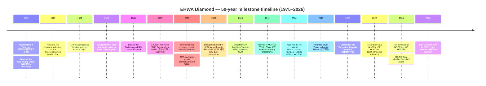
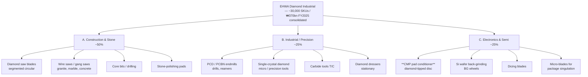
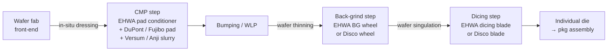
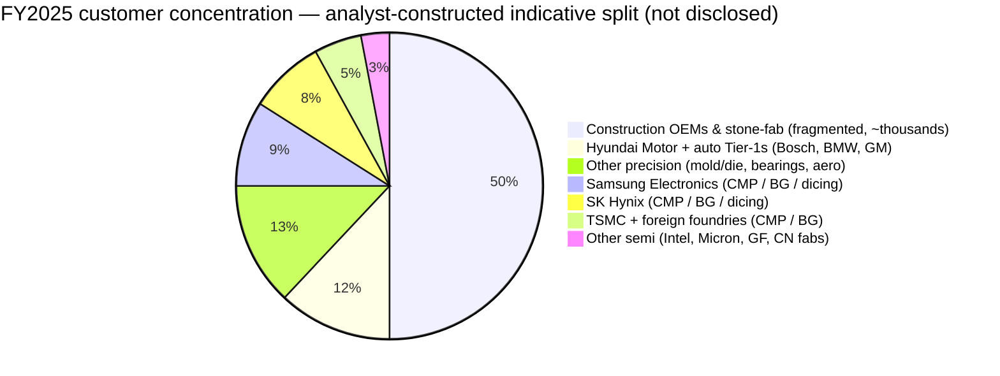
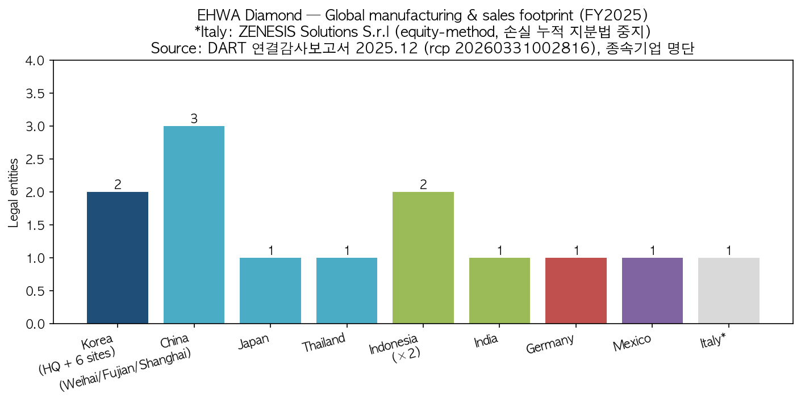
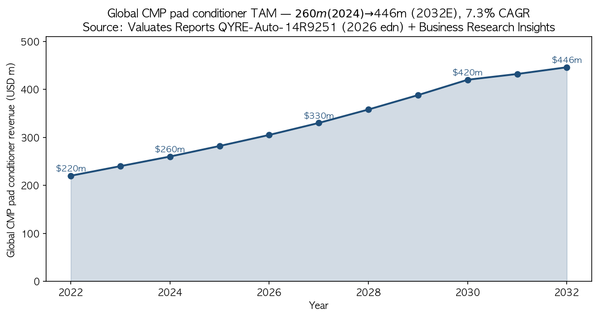
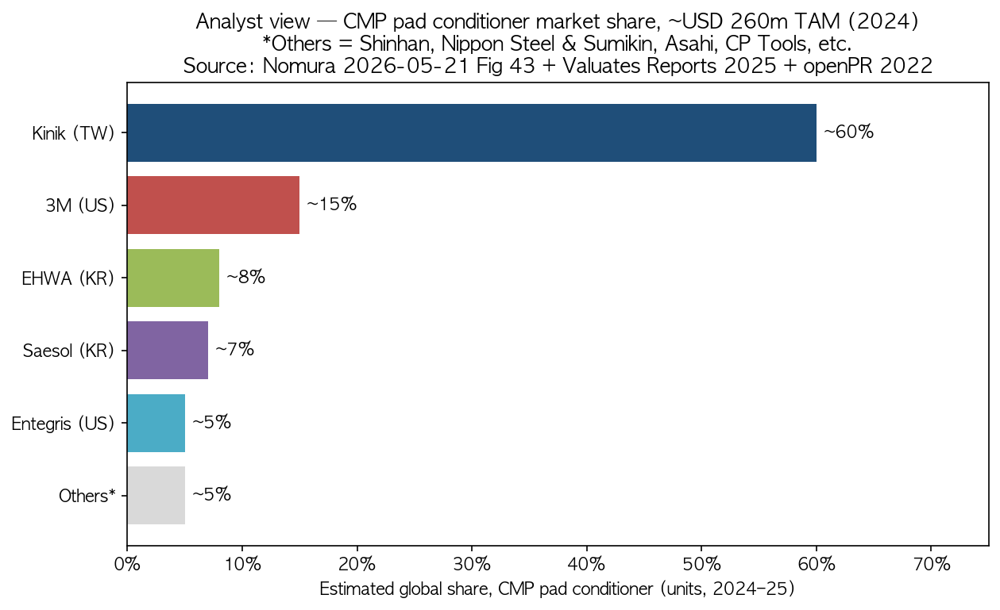
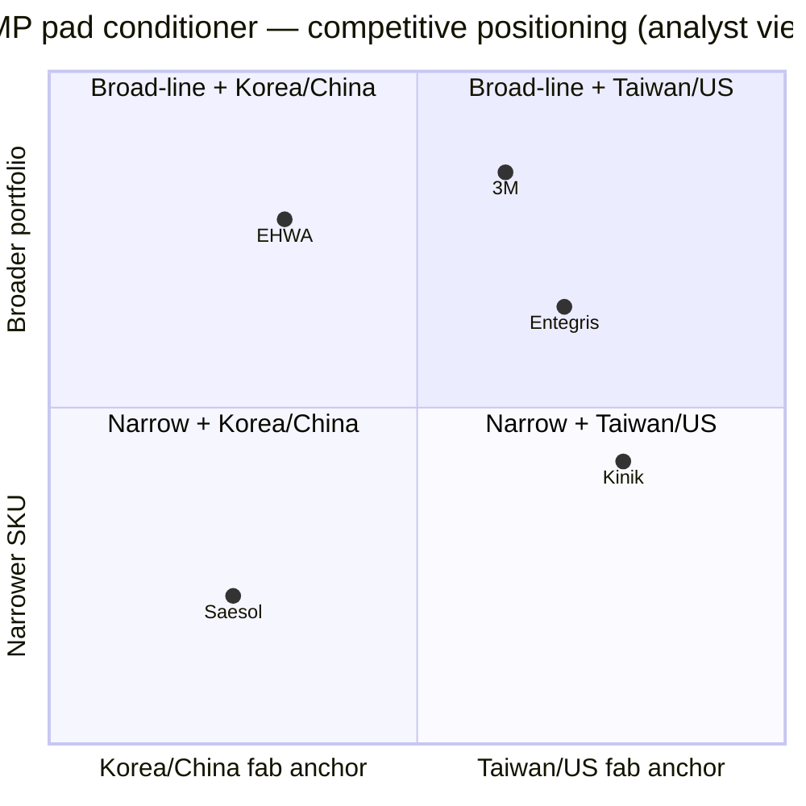

# EHWA Diamond Industrial Co., Ltd. — Company Research

**As of:** 2026-05-26
**Ticker / status:** **Private (unlisted).** Bloomberg ID `1210Z:KS`; the suffix `Z` denotes an unlisted Korean entity. The KOSDAQ stock code **103840 belongs to Wooyang Co., Ltd. (frozen-fruit processor)**, not to EHWA Diamond ([Wooyang on Yahoo Finance, 2026](https://finance.yahoo.com/quote/103840.KQ/)). EHWA's primary disclosure trail is the annual 감사보고서 filed with Korea's Financial Supervisory Service via the DART portal (filing entity classified as **기타법인 / "other corporation"**, corp_code `00145677`) ([DART search result, 이화다이아몬드공업, 2026-05](https://dart.fss.or.kr/dsab007/main.do)).

> **Update — Control changing hands (2026-05-12):** IMM Private Equity has signed an SPA to acquire a **65% controlling stake** in EHWA Diamond Industrial for **approximately ₩400 billion (~USD 290m)**, in a deal supported by co-investor RGS and acquisition financing. IMM's stated thesis: stable construction / precision base plus a growth runway from semiconductor-driven advanced manufacturing — they plan to keep investing in R&D and expand the global customer footprint. Sellers are largely founder-family shareholders ([Seoul Economic Daily, 2026-05-12](https://en.sedaily.com/news/2026/05/12/imm-pe-to-acquire-koreas-top-tool-maker-ehwa-diamond-for); [파이낸셜뉴스 fn마켓워치, 2026-05-13](https://www.fnnews.com/news/202605130830353811)). Closing has not been announced. The 2025-fiscal financial snapshot below pre-dates the change of control.

## Table of contents

1. Company Overview
2. Company History
3. Management Team
4. Products & Services
5. Customers & Go-to-Market
6. Industry Overview
7. Competitive Landscape
8. Market Opportunity (TAM)
9. Risk Assessment
10. References

---

## 1. Company Overview

EHWA Diamond Industrial Co., Ltd. (이화다이아몬드공업주식회사) is a Korean industrial-diamond-tool manufacturer headquartered at **374 Nambu-daero, Won-dong, Osan-si, Gyeonggi-do** (the firm is currently in its **51st fiscal year** — incorporated 1 February 1975) ([DART 연결감사보고서 (51기), 2026-03-31](https://dart.fss.or.kr/dsaf001/main.do?rcpNo=20260331002816)). The business is structured around three product families: (i) **construction and stone tools** (gang saws, segmented circular saws, core bits, wire saws used to cut concrete, granite and asphalt), (ii) **precision / industrial tools** (PCD / PCBN / CVD / single-crystal-diamond turning, milling, drilling and dressing tools sold to automotive, bearings, mold-and-die and machinery customers), and (iii) **electronics / semiconductor consumables** — most importantly the **CMP pad conditioner** that dresses the polishing pad in chemical-mechanical-planarization, plus silicon-wafer backgrinding wheels, dicing blades and micro-blades ([포브스코리아, 2024-04-10](https://www.forbeskorea.co.kr/news/articleView.html?idxno=337331); [SEMI member directory — EHWA Diamond, 2026](https://www.semi.org/en/resources/member-directory/ehwa-diamond-industrial-co-ltd)). Management has long described the catalogue as spanning "30,000+ SKUs from gang saws cutting granite slabs to backgrinding wheels finishing to 1-nanometer surface roughness on silicon wafers" ([한국경제, 2022-02-27](https://www.hankyung.com/article/2022022724411)).

The business model is unusually simple for a 50-year industrial: EHWA fabricates the tools in 14 owned plants (six in Korea, the rest spread across China, Thailand, Indonesia, Japan, Germany, India and Mexico), ships them direct to industrial accounts (Samsung Electronics, SK Hynix, TSMC, Hyundai Motor, Bosch, BMW, GM, Black+Decker, Toyota and >2,000 others), and books revenue at the unit level — there is no recurring-software layer, no leasing, no project-services overlay. Roughly **60–65% of revenue is exported** to ~90 countries; the balance is Korean domestic ([포브스코리아, 2024-04-10](https://www.forbeskorea.co.kr/news/articleView.html?idxno=337331); [중견기업연합회(FOMEK) 보도자료, 2024-09](https://www.fomek.or.kr/main/newsroom/news/vpg_view.php?wr_id=58)). The semi / electronics line — the most strategically interesting today — is the diamond-coated **pad conditioner** disc that rides on the CMP polishing head and continuously dresses the polyurethane pad surface so that planarization can keep removing oxide, copper or tungsten at a stable rate. Without conditioning, slurry-pad chemistry would glaze the pad within minutes and the removal rate would collapse; with conditioning, the same pad delivers thousands of wafers at consistent within-wafer uniformity ([US9314901B2, Samsung Electronics + Ehwa Diamond Industrial, 2016](https://patents.google.com/patent/US9314901B2/en)).

EHWA is **mid-cap in revenue but large by Korean industrial-supplier standards**. FY2025 consolidated revenue was **₩370.1 bn** (~USD 270 m at FY-end rates), down 1.4% from FY2024's **₩375.5 bn** as construction-tool demand softened; FY2025 operating profit was **₩33.0 bn** (8.9% margin) versus ₩35.3 bn (9.4%) in FY2024; FY2025 consolidated net income was **₩27.8 bn**, materially lower than FY2024's ₩49.8 bn because the prior year had been boosted by ~₩11.7 bn in unrealized FX gains that did not repeat ([DART 연결감사보고서 51기 (rcp 20260331002816), 손익계산서](https://dart.fss.or.kr/dsaf001/main.do?rcpNo=20260331002816)). Consolidated equity at FY2025-end was **₩329.5 bn** on total assets of **₩460.9 bn** — i.e. ~71.5% equity-to-asset ratio, an unusually clean balance sheet ([same filing, 연결재무상태표](https://dart.fss.or.kr/dsaf001/main.do?rcpNo=20260331002816)). The five-year operating trend (chart below) shows the construction cycle cutting into 2023 profit (op profit fell to ₩14.5 bn on ₩316.3 bn revenue) before recovering in 2024–25 as semiconductor consumables and a rebound in Korea / China construction lifted volumes ([saramin financial card, 2026-Q1 update](https://www.saramin.co.kr/zf_user/company-info/view-inner-finance/csn/SUZ4bHJmRk1CNFBBMVkzSmpmSHdqZz09/company_nm/%EC%9D%B4%ED%99%94%EB%8B%A4%EC%9D%B4%EC%95%84%EB%AA%AC%EB%93%9C%EA%B3%B5%EC%97%85(%EC%A3%BC))).

Source: [DART 연결감사보고서 51기 (FY2025), filed 2026-03-31, audited by KPMG 삼정회계법인](https://dart.fss.or.kr/dsaf001/main.do?rcpNo=20260331002816) and prior-year DART filings; FY2021–FY2022 op profit per [한국경제, 2022-02-27](https://www.hankyung.com/article/2022022724411).

**Headcount** is ~750 employees globally (the company website cites the same figure; SEMI directory aggregates "127 employees across 5 continents" but that count excludes the Korean factories) ([DnB profile, 2026](https://www.dnb.com/business-directory/company-profiles.ehwa_diamond_indcoltd.e2d0f0e073fb88beaf3fafc05f6bf6da.html); [SEMI directory](https://www.semi.org/en/resources/member-directory/ehwa-diamond-industrial-co-ltd)). The shareholder register before the IMM PE deal closes is highly concentrated within the founder family: **김수광 (founder, Chairman) 44.84%, 김신경 20.56%, others 34.60%**, on a tight 1,400,000-share float against paid-in capital of just ₩7 bn ([DART 연결감사보고서 51기, 주요 주주현황](https://dart.fss.or.kr/dsaf001/main.do?rcpNo=20260331002816)). After the IMM PE acquisition closes, the family's combined ~65% control block is the parcel being sold; the family is widely expected to retain a minority residual but the precise post-deal cap table has not been disclosed ([fn마켓워치, 2026-05-13](https://www.fnnews.com/news/202605130830353811)).

**Valuation snapshot (private-company adaptation per skill guidance).** Because EHWA is unlisted, conventional TTM P/E and P/S multiples are not observable. The most recent transaction price — IMM PE's pending acquisition of 65% control for ~₩400 bn — implies an equity valuation of **~₩615 bn (~USD 446 m) for 100% of the equity**, which against FY2025 reported earnings of ₩27.8 bn translates to a **~22× trailing P/E** and against FY2025 revenue of ₩370 bn implies **~1.66× trailing P/S** ([Seoul Economic Daily, 2026-05-12](https://en.sedaily.com/news/2026/05/12/imm-pe-to-acquire-koreas-top-tool-maker-ehwa-diamond-for); [fn마켓워치, 2026-05-13](https://www.fnnews.com/news/202605130830353811)). For context, the closest listed peer **Kinik (TWSE:1560)** trades at a Nomura-projected ~40× 2028F EPS on the bull case — a multiple that reflects pure-play semiconductor exposure ([Nomura "Greater China Semi 2026~30F", 2026-05-21, p. 15](../sector/半导体材料.md)). The ~22× takeout multiple on EHWA reads as a sensible private-market hybrid: a construction-heavy industrial base (which trades single-digit to low-teens at maturity) blended with a smaller but high-margin semi-consumables exposure (which Kinik / Anji / Dinglong trade in the 40–96× area for). *Analyst view:* the implied control premium captures the optionality on EHWA's semiconductor wafer-tool growth, not the construction base — which is also exactly what IMM PE flagged in its press release as the deal's strategic logic ([fn마켓워치, 2026-05-13](https://www.fnnews.com/news/202605130830353811)).

Source: bands per management interviews [한국경제, 2022-02-27](https://www.hankyung.com/article/2022022724411) and the FOMEK trade-body profile of CEO Kim Jae-Hee ([FOMEK, 2024-09](https://www.fomek.or.kr/main/newsroom/news/vpg_view.php?wr_id=58)) — EHWA does not formally publish a product-revenue split in its 감사보고서.

---

## 2. Company History

**Founded 1 February 1975** in Seoul by **Kim Soo-Kwang (김수광)**, a Seoul National University metallurgical-engineering graduate who had been one of the first Koreans trained in synthetic-diamond grinding-wheel technology and saw an unmet opportunity to localize what was at the time a 100%-imported product category ([포브스코리아, 2024-04-10](https://www.forbeskorea.co.kr/news/articleView.html?idxno=337331); [한국경제, 1995-09-26](https://www.hankyung.com/article/1995092601661)). The "이화" (Ehwa) name borrows from the same character set used by Ewha Womans University but was chosen by the founder for its dictionary meaning ("두 가지 꽃이 어울리다" — two flowers in harmony), not as a corporate affiliation. The first plant focused on diamond saw blades for cutting stone — Korea's quarry-and-construction boom of the late 1970s pulled volume immediately.

Source: timeline reconstructed from [포브스코리아, 2024-04-10](https://www.forbeskorea.co.kr/news/articleView.html?idxno=337331), [한국경제, 1995](https://www.hankyung.com/article/1995092601661), [FOMEK, 2024](https://www.fomek.or.kr/main/newsroom/news/vpg_view.php?wr_id=58), [Seoul Economic Daily, 2026-05-12](https://en.sedaily.com/news/2026/05/12/imm-pe-to-acquire-koreas-top-tool-maker-ehwa-diamond-for), and [DART 연결감사보고서 51기, 2026-03-31](https://dart.fss.or.kr/dsaf001/main.do?rcpNo=20260331002816).

Three strategic pivots warrant individual call-out. **First, the 1977–1982 shift from a single-product saw-blade maker into a diversified diamond-tool house** (industrial-tool division 1977, overseas business 1982) was what made the firm an export business: by the mid-1980s EHWA was already shipping to Japan, taking share against Japanese suppliers in their home market — a posture that has shaped every later expansion ([Ehwa-Insa careers page (관계사 안내)](https://ehwadia-insa.co.kr/?page_id=1388)). **Second, the 2007 semiconductor-business launch** — a CMP-dedicated factory commissioned in Osan — was a deliberate bet on the post-2000s ramp of Samsung Electronics' Hwaseong / Pyeongtaek fabs and SK Hynix's Icheon / Cheongju lines. EHWA already supplied silicon-wafer backgrinding wheels at small volumes; the 2007 build-out was the first time the firm committed dedicated capacity, dedicated R&D and dedicated sales coverage to CMP consumables. By 2013 the technology investment paid off when the joint Samsung-EHWA CMP-pad-conditioner patent (US9314901B2) issued — a "uniform-tip" geometry that maintained ±10% tip surface area through service life, enabling stable pad wear across oxide / tungsten / copper slurry chemistries ([US9314901B2, 2016 grant](https://patents.google.com/patent/US9314901B2/en)). **Third, the 2010 generational handover** to Kim Jae-Hee — a Stanford historian and MBA, not an engineer — was a calculated choice. The founder's framing, recounted by Forbes Korea, was that the next decade of diamond-tool competition would be won by professional management discipline (procurement, FX hedging, sales-channel architecture, multi-plant logistics, M&A) rather than by bench-level metallurgy. Subsequent record-setting years (2021–22, 2024) suggest the bet has paid off so far ([포브스코리아, 2024-04-10](https://www.forbeskorea.co.kr/news/articleView.html?idxno=337331)).

**Acquisitions and inorganic moves are limited but specific.** In December 2014 EHWA acquired a 3.54% stake in **Meerecompany Inc.** (코스닥-listed; Korea's leading surgical-robotics company and developer of the Revo-i laparoscopic robot) for ₩1.5 bn from sellers Kim Joon-Koo and Kim Joon-Hong — a financial / strategic position, not operational control ([MarketScreener, 2015-03-24](https://www.marketscreener.com/quote/stock/MEERECOMPANY-INCORPORATED-12898436/news/Ehwa-Diamond-Industrial-Co-Ltd-acquired-3-54-stake-in-Meerecompany-Inc-from-Joon-Koo-Kim-and-Jo-38434409/)). EHWA carries ZENESIS Solutions S.r.l. (Italy) as an equity-method affiliate — investment value written down to zero after accumulated losses — and Pyeongtaek Industrial Co. (평택산업) as a 100%-held domestic subsidiary, both consolidated since FY2024 ([DART 연결감사보고서 51기, 종속기업 및 관계기업 명단](https://dart.fss.or.kr/dsaf001/main.do?rcpNo=20260331002816)). The pending IMM PE control transaction (May 2026) is the largest single corporate-control event in the firm's history.

**Recent developments (2024–2026).** Beyond the IMM PE deal, the major operating themes are (i) progressive expansion of the semiconductor-consumable customer base through both Samsung and SK Hynix's K-Semi-Belt domestic-supplier programs and through TSMC's Arizona / Kumamoto build-outs, where EHWA's overseas legal entities position it well for fab-adjacent service ([digitimes / Samsung-SK Hynix supply-chain coverage, 2025-09-08](https://apps.digitimes.com/news/a20250908PD218/2025-samsung-semicon-2025-sk-hynix-supply-chain-taiwan.html)), (ii) the slight FY2025 revenue contraction (-1.4% YoY) driven by softer Korean and Chinese construction demand, and (iii) Korea's MOTIE recognizing EHWA as a "Best Mid-Tier Supplier" in 2024 ([FOMEK, 2024-09](https://www.fomek.or.kr/main/newsroom/news/vpg_view.php?wr_id=58)).

---

## 3. Management Team

EHWA's leadership is a **father-daughter combination** in which the founder continues as Chairman with 44.84% ownership while his daughter has run day-to-day operations as CEO (대표이사) since 2010. The deal with IMM PE may reshuffle these roles; until closing announces post-deal management, this section reflects the as-of-2025 structure.

### Kim Soo-Kwang (김수광) — Founder and Chairman

Kim Soo-Kwang founded EHWA Diamond in February 1975 in Seoul, age 35, after training as a metallurgical engineer at Seoul National University. He spent the early years personally developing diamond-impregnated saw-blade formulations — at that time Korean construction was using either imported (mostly Japanese / German) tools or improvised local substitutes, and locally produced industrial diamond was unknown ([포브스코리아, 2024-04-10](https://www.forbeskorea.co.kr/news/articleView.html?idxno=337331); [한국경제, 1995-09-26](https://www.hankyung.com/article/1995092601661)). He served as President throughout the 1980s and 1990s, was recognized by the 통상산업부 (Ministry of Trade) and 기협중앙회 (Korea Federation of Small and Medium Business) as **"SME Person of the Month" in September 1995**, and led the firm to maintain consecutive profitability through the 1997 Asian financial crisis and the 2008 global recession — a 47-consecutive-year streak by 2022 ([한국경제, 1995-09-26](https://www.hankyung.com/article/1995092601661); [한국경제, 2022-02-27](https://www.hankyung.com/article/2022022724411)). He transitioned from operational CEO to Chairman in 2010 when his daughter took over, but has remained a substantial shareholder and is widely cited as the strategic anchor on capital allocation; before the IMM PE deal he personally held 627,773 shares = **44.84% of the registered float** ([DART 연결감사보고서 51기, 주요 주주현황](https://dart.fss.or.kr/dsaf001/main.do?rcpNo=20260331002816)). His ownership stake (combined with daughter Kim Shin-Kyung's 20.56% and the family-officer block of 34.60%) is the parcel being sold to IMM PE for ~₩400 bn ([fn마켓워치, 2026-05-13](https://www.fnnews.com/news/202605130830353811)). Press coverage consistently describes his founding thesis as a multi-decade view: "diamond is a productivity tool that pays back across infrastructure, automotive and electronics — diversify across them so one bad cycle never breaks the firm" — and that philosophy is precisely what daughter Kim Jae-Hee has scaled in the global build-out ([FOMEK, 2024-09](https://www.fomek.or.kr/main/newsroom/news/vpg_view.php?wr_id=58)).

### Kim Jae-Hee (김재희) — Representative Director / CEO since 2010

Kim Jae-Hee was educated at **Stanford University** (BA, History and Business Administration) and **Stanford Graduate School of Business** (MBA), and worked at an **American consulting firm** in the US before joining EHWA Diamond in 2002 ([포브스코리아, 2024-04-10](https://www.forbeskorea.co.kr/news/articleView.html?idxno=337331)). She joined in operational roles for eight years before being elevated to Representative Director (대표이사) in June 2010, replacing the founder in CEO capacity. The founder's framing of the succession, per Forbes Korea, was that EHWA's next-decade competitive advantages lay in **professional management discipline** — global plant network management, FX-hedged international cash management, multi-language sales coverage, M&A — and that an engineering-only successor would not deliver on those fronts. Kim Jae-Hee's own response to skeptics ("a non-engineer CEO can't lead a metallurgy company") was that her job is to "develop top experts in each field" rather than personally be the deepest technologist ([FOMEK, 2024-09](https://www.fomek.or.kr/main/newsroom/news/vpg_view.php?wr_id=58)). Her ownership stake is not separately broken out in the DART shareholder schedule (which lists 김수광 44.84%, 김신경 20.56%, others 34.60% with no third name above the 5% disclosure threshold), implying her direct economic interest is inside the 34.60% "other" block or is held via a family vehicle ([DART 연결감사보고서 51기](https://dart.fss.or.kr/dsaf001/main.do?rcpNo=20260331002816)).

Her **operating record since 2010** has been concrete and measurable: consolidated revenue has grown from the mid-₩200 bn range (pre-2010) to **₩375.5 bn at the FY2024 peak**, with operating margin expanding from low-single-digits to the high-single-digit / low-double-digit range (9.4% in FY2024) ([saramin financial card](https://www.saramin.co.kr/zf_user/company-info/view-inner-finance/csn/SUZ4bHJmRk1CNFBBMVkzSmpmSHdqZz09/company_nm/%EC%9D%B4%ED%99%94%EB%8B%A4%EC%9D%B4%EC%95%84%EB%AA%AC%EB%93%9C%EA%B3%B5%EC%97%85(%EC%A3%BC))). The semi-consumable line moved from a "small bet inside the precision division" pre-2010 to a fully-dedicated business unit with its own factory and R&D budget post-2007, supported by an active patent portfolio (Samsung-EHWA joint US9314901B2 in 2016 and earlier KIST-EHWA CVD-coating work) ([US9314901B2 patent](https://patents.google.com/patent/US9314901B2/en); [ScienceDirect, KIST-EHWA CVD conditioner study, 2011](https://www.sciencedirect.com/science/article/abs/pii/S0890695511000393)). Under her leadership EHWA was named to MOTIE's "World Class 300" growth-firm program in 2011, won the Silver Tower Industrial Medal in 2015, was designated a "Prominent Long-life Company (명문장수기업)" in 2020, and received MOTIE's "Best Mid-Tier Supplier" award in 2024 ([FOMEK, 2024-09](https://www.fomek.or.kr/main/newsroom/news/vpg_view.php?wr_id=58)). She is **expected to remain in an executive role** post-IMM PE acquisition under typical PE-buyout precedent for founder-managed Korean industrials, though no formal continuation announcement has been published.

---

## 4. Products & Services

EHWA Diamond's catalogue is unusually broad for an industrial-supplier-class firm: management consistently characterizes the SKU count as **"30,000+"** spanning physically very different products — from 2.5-meter-diameter circular saws cutting reinforced concrete to nanometer-scale wafer-finishing wheels ([한국경제, 2022-02-27](https://www.hankyung.com/article/2022022724411)). The catalogue does, however, factor cleanly into the three product divisions described in EHWA's own corporate-overview material and consistently cited in Korean industry press coverage: **Construction & Stone Tools**, **Industrial / Precision Tools**, and **Electronics & Semiconductor Consumables** ([FOMEK, 2024-09](https://www.fomek.or.kr/main/newsroom/news/vpg_view.php?wr_id=58); [SEMI member directory](https://www.semi.org/en/resources/member-directory/ehwa-diamond-industrial-co-ltd); [SEMI Korea exhibitor profile](https://expo.semi.org/korea2025/Public/eBooth.aspx?IndexInList=320&FromPage=Exhibitors.aspx&ParentBoothID=&ListByBooth=true&BoothID=595140)). The DART 감사보고서 reports a single consolidated revenue line — it does **not** disaggregate revenue by division, customer or product — so the percentage splits cited below are analyst estimates built from press coverage and trade-body profiles, not from primary filings.

### 4.1 — Product matrix (analyst-constructed from corporate disclosure)

| Division | Sub-category | Representative SKUs | Primary customers | Approx. share of consolidated revenue *(analyst est.)* |
|---|---|---|---|---|
| **A. Construction & Stone Tools** | Diamond saw blades (segmented circular), wire saws (gang saws), core bits, drilling bits, polishing pads (stone) | Granite gang saws (up to 2.5m), road-cutting blades, masonry circular blades, demolition core bits | Construction-equipment OEMs (Black+Decker, Bosch, Hilti), quarrying / stone-fabrication shops, Korean construction trades | ~50% |
| **B. Industrial / Precision Tools** | PCD, PCBN, CVD and single-crystal-diamond turning, milling, drilling, reaming tools; carbide tools (T/C); diamond dressers (stationary) | PCD endmills (helical), PCD drills/reamers, SCD micro-tools, face-milling cutters, grooving / parting tools, wear parts, side cutters | Hyundai Motor, Toyota, BMW, GM, Bosch (automotive); bearing makers; mold-and-die shops; aerospace tier-1s; display-glass cutters | ~25% |
| **C. Electronics & Semiconductor Consumables** | **CMP pad conditioner** (diamond-tipped disc), silicon-wafer back-grinding (BG) wheels, dicing blades, micro-blades for package singulation | Samsung Electronics, SK Hynix, TSMC, Intel, Micron, GlobalFoundries, mainland-China fabs | ~25% |

Source for product list: [EHWA Cutting Tools website (product catalogue)](https://www.ehwacuttingtool.com), [SEMI directory entry (lists "backgrinding wheels, CMP conditioners, dicing blades, micro-blades")](https://www.semi.org/en/resources/member-directory/ehwa-diamond-industrial-co-ltd), [SEMI Korea 2025 exhibitor profile](https://expo.semi.org/korea2025/Public/eBooth.aspx?IndexInList=320&FromPage=Exhibitors.aspx&ParentBoothID=&ListByBooth=true&BoothID=595140), [한국경제, 2022-02-27](https://www.hankyung.com/article/2022022724411). The division-percentage column is an analyst estimate per the band reported by [한국경제, 2022-02-27](https://www.hankyung.com/article/2022022724411) ("construction-heavy revenue mix with semi and precision growing"); it is **not formally disclosed** in any DART filing.

Source: tree consolidated from [EHWA Cutting Tools website](https://www.ehwacuttingtool.com), [SEMI member directory](https://www.semi.org/en/resources/member-directory/ehwa-diamond-industrial-co-ltd), and Nomura sector mapping ([Nomura 2026-05-21, Fig 43, p. 70](../sector/半导体材料.md)).

### 4.2 — How the three divisions sit in customer workflows

The Construction division converts large quantities of raw diamond grit (industrial-grade synthetic diamond, ~USD 1–5 per gram) into bonded, mechanically robust tools — gang-saw blades that survive 1,000+ hours of cutting hard granite without losing diamond from the matrix. The Precision division uses the same input feedstock but in higher-purity, controlled-orientation forms (PCD plates, single-crystal diamond, CVD-coated cubic boron nitride), bonded onto carbide-shank tooling for ultra-precise metal-cutting in automotive engine blocks, gear teeth, mold-and-die surfaces. The Semi consumables division uses the highest-purity feedstock (often CVD-grown polycrystalline diamond) deposited or bonded onto specifically-engineered substrates (Si₃N₄, stainless steel) to make products that operate at sub-micrometer tolerances. **All three divisions share R&D, grit procurement, and synthetic-diamond know-how** — the cost structure for a 50,000-RPM dicing micro-blade ultimately shares its diamond supply with a 200-RPM granite saw, and EHWA's competitive position in the high-value semiconductor consumables is partly subsidized by the procurement scale of the low-value construction line. *Analyst view:* this is the structural reason EHWA can compete on price against 3M and Kinik in semiconductor consumables despite operating at one-fifth the SemiCo scale — the absorbed overhead is spread across 30,000 SKUs and three customer industries, not amortized over a single product line.

### 4.3 — Construction & Stone Tools (~50% of revenue)

EHWA's largest revenue pool sits in **diamond saw blades (segmented circular blades for cutting concrete, asphalt, brick), wire saws / gang saws (kilometre-long diamond-impregnated wire cutting granite blocks into slabs), core bits (cylindrical diamond-tipped bits drilling holes through reinforced concrete walls), and stone polishing pads**. The product description on the corporate site emphasizes the company's earliest expertise — granite gang saws up to 2.5m in diameter used in stone quarrying ([SEMI Korea exhibitor description, 2025](https://expo.semi.org/korea2025/Public/eBooth.aspx?IndexInList=320&FromPage=Exhibitors.aspx&ParentBoothID=&ListByBooth=true&BoothID=595140)).

**중문 설명 / Plain-language gloss:** A diamond saw blade is a steel disc with industrial diamond grit bonded into segmented edges; as the disc spins (at 3,000–5,000 RPM for a hand-held masonry saw or 200–500 RPM for a granite gang saw), the exposed diamond particles abrade the workpiece while the metal matrix wears away in synchrony so fresh diamond is continuously exposed. The trick is matching the **bond hardness** to the workpiece — too soft a bond and diamond is lost prematurely; too hard and the diamond glazes over and the blade stops cutting. EHWA's 50-year accumulated formulary across hundreds of stone / concrete / asphalt grades is the moat: a competitor can copy the geometry overnight but matching the bond-matrix chemistry to specific Italian Carrara marble vs. Korean granite vs. American basalt requires lab work that's hard to replicate.

*Analyst view:* the construction-tool moat is **process knowledge / scale**, not patent — diamond-blade IP expired decades ago, and the active barrier to entry is global sales/service coverage plus the diamond-grit procurement scale that lets EHWA price ~10–15% below smaller specialty competitors. EHWA's stated #1-Korea / top-3-global ranking is consistent with that picture, but Korean-only construction softness drives short-cycle volatility — visible in the FY2023 op-profit dip when Korean construction starts collapsed ([Seoul Economic Daily, 2026-05-12](https://en.sedaily.com/news/2026/05/12/imm-pe-to-acquire-koreas-top-tool-maker-ehwa-diamond-for); [fn마켓워치, 2026-05-13](https://www.fnnews.com/news/202605130830353811)). Major competitor product names (e.g. Husqvarna's diamond saw range, Hilti's DSH 700-X, Diamond Vantage's Cyclone Pro) belong to the competitors' own catalogues, not EHWA's filing — see Section 7 for the full competitive map.

### 4.4 — Industrial / Precision Tools (~25% of revenue)

The precision-tool catalogue is anchored on **polycrystalline-diamond (PCD), polycrystalline cubic boron nitride (PCBN), CVD-diamond-coated and single-crystal-diamond (SCD) cutting tools** — endmills, drills, reamers, face-milling cutters, grooving / parting tools, wear parts. The customer base spans automotive engine and brake-component manufacturing (Hyundai Motor, Bosch, Toyota), bearing and gear shops, mold-and-die manufacturers, and aerospace structural-component machining ([EHWA Cutting Tools website](https://www.ehwacuttingtool.com); [SEMI Korea exhibitor profile](https://expo.semi.org/korea2025/Public/eBooth.aspx?IndexInList=320&FromPage=Exhibitors.aspx&ParentBoothID=&ListByBooth=true&BoothID=595140)).

**中文释义 / Plain-language gloss:** PCD ("polycrystalline diamond" / 多晶金刚石) and PCBN ("polycrystalline cubic boron nitride" / 立方氮化硼) are super-hard sintered materials produced under extreme pressure (~6 GPa, ~1500 °C) — PCD is harder than any other commercially available cutting material for non-ferrous metals (aluminum, copper, carbon-fibre composites) and outlasts conventional carbide by 50–100×; PCBN is the equivalent for ferrous metals (hardened steel, cast iron) where PCD chemically reacts with the iron and fails. CVD ("chemical vapor deposition" / 化学气相沉积) is a coating technology that deposits a thin (5–20 µm) polycrystalline-diamond layer onto a carbide substrate — cheaper than solid PCD but still 5–10× the life of uncoated carbide. SCD ("single-crystal diamond" / 单晶金刚石) is the highest tier — used for nanometer-finish optical mirrors and contact-lens molds where surface roughness must be <10 nm.

*Analyst view:* this is EHWA's most **technology-heavy moat** segment — PCD / PCBN press-sintering and CVD-coating expertise is not commoditized, requires multi-year process development to qualify with automotive Tier-1s, and is protected by ~30+ active patents in the EHWA family. The closest comparable specialist is **Sumitomo Electric Hardmetal** (Japan, PCD/PCBN) — but the customer relationships are deeply local: Hyundai Motor / Hyundai Mobis source mostly from Korean tool-makers including EHWA, while Toyota's domestic operations source mostly from Sumitomo and Mitsubishi Materials. Geographic-customer lock-in is the active moat, not pure technology lead.

### 4.5 — Electronics & Semiconductor Consumables (~25% of revenue) — the strategic crown jewel

This is the smallest division by revenue but the most analytically interesting today, both because it's the highest-margin product line and because it's what the IMM PE deal is implicitly pricing for. The semiconductor catalogue, per SEMI's official membership directory and the SEMICON Korea exhibitor profile, contains four product families: **CMP pad conditioners, silicon-wafer back-grinding (BG) wheels, dicing blades, and micro-blades for package singulation** ([SEMI member directory — EHWA Diamond Industrial](https://www.semi.org/en/resources/member-directory/ehwa-diamond-industrial-co-ltd); [SEMI Korea 2025 exhibitor profile](https://expo.semi.org/korea2025/Public/eBooth.aspx?IndexInList=320&FromPage=Exhibitors.aspx&ParentBoothID=&ListByBooth=true&BoothID=595140)).

#### CMP pad conditioner — the most consequential semi product for EHWA

The single most important EHWA semiconductor product is the **CMP (chemical-mechanical-planarization) pad conditioner** — a diamond-tipped disc about 100mm in diameter that rides on a swing-arm above the CMP polishing pad and continuously dresses the pad surface so polishing performance is maintained. Without conditioning, the polyurethane CMP pad's microscopic asperities — the surface roughness that traps and delivers slurry to the wafer — flatten / glaze over within a few hundred wafer-polish cycles, and the wafer removal rate collapses. With conditioning, the same pad can polish 5,000–10,000+ wafers at consistent removal rate and within-wafer uniformity. Modern fabs run pad conditioning **in situ** (the conditioner is on the same tool as the wafer polish, dressing in parallel) so the conditioner has to be (i) abrasive enough to dress polyurethane reliably, (ii) **not** abrasive enough to add metallic contamination or shed diamond grit onto the wafer, (iii) geometrically stable over thousands of dressing cycles so the removal-rate stays inside fab process windows ([Novacam, "CMP pad and groove measurement", 2020-06-16](https://www.novacam.com/2020/06/16/cmp-pad-and-groove-3d-measurements/); [SP3 CMP Pads product page](https://sp3-cvd.com/cmp-pads)).

EHWA's specific technical contribution is documented in a **jointly-filed Samsung Electronics + Ehwa Diamond Industrial patent** issued in 2016 (US9314901B2, filed 2012). The patent describes a CMP pad conditioner with "a plurality of cutting tips protruding upwards from a surface of the substrate and spaced apart from each other, with flat top surfaces parallel to the base," and an engineered tip-area distribution that maintains within ±10% of original area throughout service life. Testing in the patent shows the **pad wear rate stays at 2–10 µm per dressing cycle regardless of whether the slurry is oxide (SiO₂), tungsten (W), or copper (Cu)** — a substantial improvement over prior-art conditioners whose wear rate fluctuated by 3–5× depending on slurry chemistry. Inventors named: Seh Kwang Lee, Youn Chul Kim, Joo Han Lee, Jae Kwang Choi, Jae Phil Boo ([US9314901B2 patent record](https://patents.google.com/patent/US9314901B2/en)). The fact that the patent is **co-assigned to Samsung** is itself diagnostic: Samsung's CMP-tool engineers and EHWA's R&D scientists jointly co-developed a multi-slurry-stable conditioner, which is the standard way Samsung locks in domestic supply.

**中文释义 / Plain-language gloss:** CMP 抛光垫修整器 (pad conditioner) 是 CMP (chemical-mechanical-planarization / 化学机械抛光) 流程中的关键耗材。CMP 抛光过程依靠 a polyurethane pad surface holding microscopic 凸起 / asperities that retain slurry and abrade the wafer at the nanometer scale; without continuous **修整 (dressing)** the pad glazes within hours, and removal rate plummets. The conditioner is a small diamond-tipped disc that sits on a swing-arm above the pad, **gently abrades the pad surface in parallel to wafer polish** to keep the asperities sharp. EHWA's joint patent with Samsung (US9314901B2) addresses a tricky failure mode: modern fabs run multi-step CMP recipes that switch between oxide slurry (for STI / dielectric planarization), copper slurry (for damascene interconnect), and tungsten slurry (for contact-plug planarization) — different slurry chemistries change the friction at the tip-pad interface and historically caused unstable pad wear. EHWA's flat-top tip geometry keeps the contact-area / pressure invariant across slurry chemistries, stabilizing the wear rate. This is exactly the kind of feature a fab values: less recipe-by-recipe tuning, longer pad life, fewer process excursions.

*Analyst view:* the moat in CMP pad conditioners is a **three-way combination of metallurgy IP + customer-qualification cycle + global service** ([Nomura 2026-05-21, Fig 43 industry mapping, p. 70](../sector/半导体材料.md); [Valuates Reports — CMP Pad Conditioners Market 2026 edition](https://reports.valuates.com/market-reports/QYRE-Auto-14R9251/global-cmp-pad-conditioners)). EHWA's joint patent with Samsung is a public-record example of how the qualification cycle plays out — once a conditioner geometry is locked into a fab's recipe (and signed off by the fab's process-control engineers), switching costs are real and measured in months of re-qualification work. EHWA is one of the global top-5 makers (3M, Kinik, Saesol, Entegris, EHWA) per industry-research data, with that top-5 group holding ~90% market share — see Section 7 for the competitor map and Section 8 for the TAM build.

#### Silicon-wafer back-grinding (BG) wheels

The second-largest semi product is the **silicon-wafer back-grinding wheel** — a diamond-grit wheel used to thin a freshly-fabricated silicon wafer from ~775 µm starting thickness down to as little as 20–50 µm so the die can be stacked into 3D packages (HBM, 3D-NAND) or housed in ultra-thin smartphone packages. The challenge is achieving **mirror-class surface finish at the nanometer level** because any sub-surface damage in the backside silicon can crack-propagate during dicing or thermal cycling and kill the device. EHWA reportedly achieves ~**1 nm surface roughness** on its highest-spec BG wheel, surpassing Japanese competitors per a 2022 한국경제 interview with CEO Kim Jae-Hee ([한국경제, 2022-02-27](https://www.hankyung.com/article/2022022724411)).

**中文释义 / Plain-language gloss:** 晶圆背面研磨 (Back-Grinding, 背面减薄) 是 wafer 出 fab 后封装前的关键 step — for 3D-stacked memory (HBM, NAND) the die must be thinned to <50 µm so multiple die can be stacked without exceeding package height; for advanced logic die used in smartphones, thinning improves thermal-conductivity and shrinks package z-height. The BG wheel uses ultra-fine diamond grit (1–5 µm) bonded into resin / vitrified matrices, ground against the wafer's backside at 30,000+ RPM with copious DI water cooling. The required output: surface roughness <5 nm, sub-surface damage <100 nm. Beyond that, the wafer fractures under handling.

*Analyst view:* the BG-wheel market is more concentrated than CMP conditioners, dominated by **Disco's wheel division** in Japan plus a handful of specialist makers (EHWA, Kinik, Asahi Diamond Industrial). EHWA's competitive position is strongest in Korean fabs (Samsung, SK Hynix) and growing in Chinese fabs; in TSMC and Japanese fabs, Disco maintains incumbent positioning.

#### Dicing blades and micro-blades for package singulation

The third and fourth product lines are **dicing blades** (used to saw fully-assembled wafers into individual die — the cut goes through silicon, dielectric and metal layers simultaneously) and **micro-blades** (very thin, very narrow blades used in advanced-package singulation where the kerf width must be <30 µm to maximize die yield per panel). The technical challenge is uniform wear (so the kerf doesn't wander) and chipping control (so silicon doesn't shatter at the die edge and crack-propagate during downstream packaging). EHWA's blades compete most directly with **Disco** (incumbent global leader, ~80%+ share of dicing blades alone) and a tier-2 group of Korean / Taiwanese specialists.

*Analyst view:* dicing-blade share is structurally hard to take from Disco because Disco bundles blade + tool (DAD-series dicers) — many fabs buy a Disco tool with a Disco blade contract attached. EHWA's volume here grows mostly with new fab capacity adds rather than displacement at existing fabs.

### 4.6 — Synthesis: how the products interact in a customer's flow

The three EHWA divisions sit in three completely different customer flows but share the same upstream technology base. The **semi consumables** customer flow is the most interesting today and runs roughly:

Source: process flow built from Nomura's CMP / advanced-packaging mapping ([Nomura 2026-05-21, p. 8-9, 70](../sector/半导体材料.md)), Novacam CMP technical brief ([Novacam, 2020](https://www.novacam.com/2020/06/16/cmp-pad-and-groove-3d-measurements/)) and the EHWA / Disco product literature cited above.

The strategic significance for EHWA's semi line over the next 3–5 years is **HBM and advanced-packaging volume**. HBM stacks (HBM3E / HBM4) require 8–12 thinned DRAM die per stack — each die is back-ground from 775 µm down to ~50 µm, then bumped, then diced — so every HBM stack pulls 8–12× the BG-wheel and dicing-blade usage of a single 2D die. CMP usage similarly scales with the number of metal layers in advanced logic (N3 / N2 / A16 nodes), and Nomura projects ~20–30% more CMP steps in A16 + Backside-Power-Delivery (BPD) than in N3 — pulling pad-conditioner demand up in step ([Nomura 2026-05-21, p. 4-6, 70](../sector/半导体材料.md)). Construction tools (~50% of EHWA's revenue today) are an offsetting headwind / tailwind — Korean construction starts have been the largest single short-cycle driver of EHWA's earnings volatility (the FY2023 op-profit dip was largely driven by Korean construction weakness). The IMM PE thesis is that semi will grow EHWA's high-margin mix while construction stabilizes — a plausible 5-year setup but dependent on Korean construction not entering another multi-year trough.

### 4.7 — Flagship franchise and recent product moves

EHWA's flagship franchise is the **semi-consumable bundle (CMP pad conditioner + BG wheel + dicing blade)** sold into Samsung / SK Hynix / TSMC — the franchise that earns the highest gross margin, has the longest customer-qualification cycle, and is the most defensible against price competition. The joint Samsung–EHWA patent on flat-top-tip pad conditioners (US9314901B2) is public evidence that Samsung treats EHWA as a co-development partner, not a price-driven supplier ([US9314901B2](https://patents.google.com/patent/US9314901B2/en)).

Recent product-side moves in the trailing 12 months are limited to **incremental wafer-tool qualification at TSMC and SK Hynix's new mega-fabs** rather than a single flagship launch; EHWA does not have public-equity disclosure obligations and has not issued formal product-launch press releases for individual SKUs. The most visible strategic event of the past 12 months is the **IMM PE acquisition** itself, which is a corporate-control change, not a product launch.

---

## 5. Customers & Go-to-Market

EHWA's customer base divides cleanly along the three product divisions, and each segment has very different concentration dynamics. **Construction & stone** is the most fragmented — thousands of small construction-equipment OEMs, distributors and stone-fabrication shops in 90+ countries, no single customer >5% of segment revenue. **Industrial / precision** is moderately concentrated — Hyundai Motor / Hyundai Mobis is the single largest Korean customer for automotive PCD / PCBN tools, with Bosch, Toyota, BMW and GM as named international tier-1s. **Electronics / semiconductor** is the most concentrated — three customers (Samsung Electronics, SK Hynix, TSMC) together likely account for a majority of segment revenue, with Intel, Micron, GlobalFoundries and the rapidly-growing mainland Chinese fabs (YMTC, SMIC, CXMT) forming the second tier ([포브스코리아, 2024-04-10](https://www.forbeskorea.co.kr/news/articleView.html?idxno=337331); [FOMEK, 2024-09](https://www.fomek.or.kr/main/newsroom/news/vpg_view.php?wr_id=58); [한국경제, 2022-02-27](https://www.hankyung.com/article/2022022724411)).

**Customer concentration disclosure** is unusually thin. As a non-listed entity, EHWA is **not subject to the 10%-customer disclosure rule that applies to Korean public companies** (which would mandate naming the top customer in the 사업보고서 if it crosses the threshold) and the 감사보고서 it does file does not break out customer concentration. The 51기 (FY2025) consolidated audit report contains no 주요 매출처 / customer-concentration section, only the consolidated revenue line ([DART 연결감사보고서 51기, 손익계산서](https://dart.fss.or.kr/dsaf001/main.do?rcpNo=20260331002816)). Press coverage names the top customer relationships qualitatively but does not quantify shares; the IMM PE deal-press also names the relationships generically ("Hyundai Motor, Samsung Electronics, TSMC") without volume disclosure ([fn마켓워치, 2026-05-13](https://www.fnnews.com/news/202605130830353811)). For an analyst, this is a real disclosure gap — *the customer-concentration risk in the semi line could easily be top-3 > 70%* without showing up in any public document.

Source: indicative split reconstructed from press-named customer relationships ([한국경제, 2022-02-27](https://www.hankyung.com/article/2022022724411); [포브스코리아, 2024](https://www.forbeskorea.co.kr/news/articleView.html?idxno=337331); [fn마켓워치, 2026-05-13](https://www.fnnews.com/news/202605130830353811)) overlaid on the FY2025 ₩370 bn consolidated revenue and the analyst-estimated 50/25/25 division mix. EHWA does not formally disclose customer-concentration percentages.

The **contract structure** is industry-standard: long-term master supply agreements (often 1–3 year frame agreements with pricing renegotiated annually) for major semi and auto customers, with delivery against rolling purchase orders. For semi consumables specifically, EHWA's product-qualification cycle at a major fab is 12–18 months; once qualified into a process recipe, the supplier-switch cost (loss of process control, multi-month re-qualification at a new vendor) keeps churn low — but pricing power is moderate because every CMP-pad-conditioner step has a "second source" vendor qualified in parallel.

**Geographic distribution** is global: ~60% of consolidated revenue is exported to ~90 countries, with the largest single export market being **China** (where EHWA operates three of its eleven legal entities — Weihai, Fujian, Shanghai — supplying both Chinese construction OEMs and the growing semi fab base of YMTC, SMIC, CXMT), followed by **Japan, Southeast Asia (Thailand, Indonesia, Vietnam), the US (via the Irvine office), Europe (via Frankfurt-headquartered EHWA Europe GmbH), and India / Mexico** as growth regions ([DART 연결감사보고서 51기, 종속기업 및 관계기업 명단](https://dart.fss.or.kr/dsaf001/main.do?rcpNo=20260331002816); [Ehwa Diamond Insa, 관계사 page](https://ehwadia-insa.co.kr/?page_id=1388)). The 14-site global production footprint is shown in the chart below.

Source: [DART 연결감사보고서 51기, 종속기업 명단](https://dart.fss.or.kr/dsaf001/main.do?rcpNo=20260331002816).

**Go-to-market** is direct sales-force led at the major-account level (Samsung, SK Hynix, TSMC, Hyundai, Bosch) — these accounts have dedicated EHWA technical-sales engineers embedded near the customer's process-engineering team. Smaller industrial accounts are reached via distributor networks, with the largest distributor footprint in **Italy and Germany (stone-cutting tools), the US (industrial precision), India and SE Asia (construction tools)**. The company has been a SEMI member since the early 2010s and exhibits at SEMICON Korea / Taiwan / Japan / West annually — a clear branding and channel signal that the semi consumables business is being built as a serious long-term franchise, not an opportunistic sideline ([SEMI Korea 2025 exhibitor profile, EHWA booth](https://expo.semi.org/korea2025/Public/eBooth.aspx?IndexInList=320&FromPage=Exhibitors.aspx&ParentBoothID=&ListByBooth=true&BoothID=595140)).

A specific go-to-market dynamic worth flagging: **Korean fab customers (Samsung, SK Hynix) explicitly prioritize domestic suppliers** under the K-Semiconductor Belt initiative — MOTIE's public-private push to localize wafer-tool consumables that previously came predominantly from Japan, the US, or Taiwan. EHWA's domestic incumbency in CMP-conditioner supply to Samsung (the joint US9314901B2 patent is one piece of public evidence of the depth of that relationship) is a quantifiable structural advantage that 3M, Kinik or Saesol cannot match in the Korean fab market — though it does not extend to the Taiwan or US fab markets where local incumbents have the same advantage ([investkorea Semiconductor portal, K-Belt context](https://www.investkorea.org/ik-en/cntnts/i-312/web.do); [KED Global, ASML K-Semi-Belt context, 2021](https://www.kedglobal.com/k-semiconductor-belt/newsView/ked202105130009)).

---

## 6. Industry Overview

EHWA Diamond operates in **three overlapping industries** that share an upstream input (industrial / synthetic diamond) but have very different end markets, growth profiles, regulatory regimes and competitive dynamics. Investors evaluating EHWA need to understand the industry structure at the product-line level — the construction-tool industry is structurally very different from the semi-consumable industry, and the right risk-adjusted multiple for the consolidated company depends on the mix.

### 6.1 Diamond-tool industry, top-down

The global **diamond-tool industry** is highly fragmented at the long-tail end (thousands of small suppliers in China, India, Italy, Spain, Turkey, the US) and oligopolistic at the high-precision end (where EHWA, 3M, Kinik, Saesol, Disco, Entegris, Sumitomo Electric Hardmetal compete). Total industry size is estimated at **~USD 15–20 bn** globally per industry-research firms, growing at single-digit CAGR overall, with the high-precision sub-segments (semi, advanced precision-machining) growing 7–10% and construction broadly tracking global infrastructure spend at 3–4%. EHWA at ~USD 270 m FY2025 revenue is roughly **1.5–2% of the global market** — a meaningful share but not dominant.

The **input** (synthetic industrial diamond grit) is supplied by ~20 global producers, with **De Beers Element Six, Sandvik Hyperion, Sumitomo Electric, Saint-Gobain, ILJIN Diamond (Korea), and a long list of Chinese producers (Henan Funik, Zhongnan, Sinotec)** as the major sources. EHWA reportedly sources its grit globally to maintain bargaining power — the deal with IMM PE specifically called out "strengthening supply-chain leverage" as one of the post-acquisition operating priorities, which industry observers interpret as continued multi-sourcing of diamond input ([fn마켓워치, 2026-05-13](https://www.fnnews.com/news/202605130830353811)).

### 6.2 Construction & stone tools — the structural cycle

The construction-tool sub-industry is **mature and structurally cyclical**, with revenue closely tracking global infrastructure spend, residential / non-residential construction starts, and stone-quarry activity. The market grew at low-single-digit CAGR over the past decade and is expected to continue at 3–4% CAGR through 2030 per industry research — driven by emerging-market infrastructure build (India, Indonesia, Vietnam), partially offset by saturation in developed markets and aging Korean / Japanese infrastructure. China remains the single largest geographic sub-market by volume but with structurally lower pricing than developed markets. The sub-industry is highly fragmented globally — top-5 players hold <30% global share — with the structural moats being **bond-matrix metallurgy IP** (decade-plus accumulated formulary across hundreds of stone / concrete grades) and **distribution / brand** in regional construction markets ([SEMI Korea exhibitor profile, EHWA general business description](https://expo.semi.org/korea2025/Public/eBooth.aspx?IndexInList=320&FromPage=Exhibitors.aspx&ParentBoothID=&ListByBooth=true&BoothID=595140)). Major competitors include **Husqvarna (Sweden), Hilti (Liechtenstein), Diamond Vantage (US), Tyrolit (Austria)** plus regional specialists.

Korean construction was a particularly visible drag on EHWA's FY2023 results — domestic construction starts fell on real-estate weakness and government-spending compression, and the construction-tool segment of EHWA's revenue contracted enough to drag overall operating profit to ₩14.5 bn (from ₩26.0 bn in FY2022). The 2024–25 recovery (op profit ₩35.3 bn → ₩33.0 bn) reflects a partial Korean construction normalization plus continued semi-consumable expansion ([saramin financial card, 2026-Q1 update](https://www.saramin.co.kr/zf_user/company-info/view-inner-finance/csn/SUZ4bHJmRk1CNFBBMVkzSmpmSHdqZz09/company_nm/%EC%9D%B4%ED%99%94%EB%8B%A4%EC%9D%B4%EC%95%84%EB%AA%AC%EB%93%9C%EA%B3%B5%EC%97%85(%EC%A3%BC))).

### 6.3 Industrial / precision tools — automotive Tier-1 supply chain

The PCD / PCBN / CVD precision-tool sub-industry is more concentrated — top-5 players (**Sumitomo Electric Hardmetal (Japan), Sandvik Coromant (Sweden), Element Six / De Beers (UK/SA), Kennametal (US), EHWA (KR)**) hold ~60% global share, with the rest divided among regional specialists. Growth tracks automotive manufacturing capex with a lag (when Tier-1s build new engine / transmission lines, they qualify new generations of PCD / PCBN tooling for the harder materials used in EV motor housings and battery-tray machining). Recent industry growth has been ~5–7% — slower than semi, faster than construction. The structural moats here are **process IP (PCD press-sintering recipe, CVD-coating chemistry) + qualification cycles at automotive Tier-1s (12–18 months per new tool family) + global service** ([Sumitomo Electric Hardmetal corporate page](https://www.sumitool.com/en/)).

EHWA's competitive position in this sub-industry is **strong in Korea and SE Asia** (Hyundai Motor / Mobis ecosystem) and growing in mainland China; weaker in Japan (Sumitomo Electric incumbency), Europe (Sandvik), and the US (Kennametal). Geographic-customer lock-in is the active moat — the technology lead among the top-5 is roughly comparable, but customer-vendor relationships are extremely sticky.

### 6.4 Semiconductor consumables — the secular growth pool

The semiconductor-consumables sub-industry — and specifically the slice EHWA plays in (CMP pad conditioners, BG wheels, dicing blades) — is the secular growth pool and the reason the IMM PE deal multiple is materially above what a pure-construction industrial would command. Industry research firms peg the **CMP pad conditioner sub-market at USD 260 m in 2024 growing to USD 446 m by 2032 at 7.3% CAGR** ([Valuates Reports — CMP Pad Conditioners Market 2026 edition](https://reports.valuates.com/market-reports/QYRE-Auto-14R9251/global-cmp-pad-conditioners); [Business Research Insights — CMP Pad Conditioners 2032 forecast](https://www.businessresearchinsights.com/market-reports/cmp-pad-conditioners-market-108568)); the dicing-blade and BG-wheel sub-markets are roughly 2–3× the size of pad conditioners (i.e. ~USD 700 m – 1 bn combined) and growing at similar single-digit-to-low-double-digit CAGRs. The high CAGR is driven by:
- **More CMP steps per advanced logic node.** Nomura projects ~20–30% more CMP steps at A16 + Backside-Power-Delivery than at N3, due to additional planarization for backside power network ([Nomura 2026-05-21, p. 4-6, 70](../sector/半导体材料.md)).
- **More BG / dicing per HBM stack.** HBM3E / HBM4 use 8–12 thinned DRAM die per stack, each requiring back-grinding plus dicing — pulling 8–12× the consumable volume per stack compared to a single 2D die.
- **Capacity additions.** TSMC's 1.6 nm capex run-rate (~USD 70 bn by 2027 per Nomura), Samsung's Hwaseong / Pyeongtaek / Taylor (Texas) builds, SK Hynix's Yongin mega-fab, and Chinese fab buildouts all pull consumable volume mechanically.

Source: [Valuates Reports — CMP Pad Conditioners Market (QYRE-Auto-14R9251, 2026 edn)](https://reports.valuates.com/market-reports/QYRE-Auto-14R9251/global-cmp-pad-conditioners), with anchor 2024 = USD 260 m, 2032 = USD 446 m at 7.3% CAGR; intermediate years interpolated.

The sub-industry's structural feature is **top-5 concentration at ~90% share**. Per Valuates, "the top five players hold a share about 90%" — those five are 3M, Kinik, Saesol, Entegris, EHWA ([Valuates Reports](https://reports.valuates.com/market-reports/QYRE-Auto-14R9251/global-cmp-pad-conditioners); [openPR 2022 — CMP Pad Conditioners Market Top Companies](https://www.openpr.com/news/2865451/cmp-pad-conditioners-market-2022-growing-rapidly-with-latest)). South Korea is the largest geographic consumer — accounting for ~24% of global demand in 2022 per industry research, reflecting Samsung + SK Hynix's domestic CMP-tool capacity (~25% of global front-end wafer capacity by area is Korean) — and Asia-Pacific overall accounts for ~84% ([CMP Pad Conditioners Market, Valuates 2026](https://reports.valuates.com/market-reports/QYRE-Auto-14R9251/global-cmp-pad-conditioners); [Saesol industry profile via Verified Market Reports](https://www.verifiedmarketreports.com/product/cmp-diamond-pad-conditioner-market-size-and-forecast/)).

### 6.5 Regulatory environment

The diamond-tool industry has **no specific regulatory regime** — there are no equivalents of MDR/FDA approvals (medical), CFTC clearing (financial), or NRC licenses (nuclear). The semiconductor-consumable line is subject to **fab-process-recipe qualification** (12–18 month cycle, fab-specific) plus general industrial-equipment compliance (RoHS, REACH for chemicals used in bond matrices, ISO 9001 / IATF 16949 for automotive). Geopolitical export controls — US BIS rules limiting advanced-tool exports to China — apply to the upstream advanced wafer-fab equipment (ASML EUV, AMAT etch, Lam etch) but currently do not restrict CMP-conditioner-class consumables ([investkorea Semiconductor portal](https://www.investkorea.org/ik-en/cntnts/i-312/web.do)). However, EHWA's Chinese subsidiaries (Weihai, Fujian, Shanghai) could become a tariff / sanctions vector if US-China relations deteriorate further.

---

## 7. Competitive Landscape

EHWA's three product divisions face three different competitive sets. Because the semi consumable line is the most strategically important — both for the IMM PE deal thesis and for the long-term EHWA narrative — this section focuses primarily on that competitive map, with the construction and precision tool competitors covered more briefly.

### 7.1 Semi-consumable competition — CMP pad conditioner (the headline product)

The CMP pad conditioner sub-market is a **top-5-dominated oligopoly** with ~90% combined share. The five global players — and EHWA's positioning against each — are:

| Competitor | HQ / listing | Sub-segment focus | Share *(analyst est., 2024)* | Key edge vs. EHWA |
|---|---|---|---|---|
| **3M Company** | US (NYSE:MMM) | Broad-line; the "incumbent global #1" | ~15% | Global scale; cross-sell with broader semi consumables (cleaning, abrasives) |
| **Kinik (中砂)** | Taiwan (TWSE:1560) | CMP, reclaim wafer, BG; pure-play; TSMC-anchor | ~60% (CMP pad conditioner only) | TSMC qualified at N2 / A16; Nomura projects ~80% share at N2 node |
| **EHWA Diamond** | Korea (private; pre-IMM PE) | CMP, BG, dicing; broad industrial base | ~8% | Samsung co-development depth (joint patent US9314901B2); Korean K-Belt domestic incumbency |
| **Saesol Diamond** | Korea (private) | CMP-focused, narrower SKU vs. EHWA | ~7% | Pure-play Korean specialist; SK Hynix relationships |
| **Entegris** | US (NASDAQ:ENTG) | CMP slurry + conditioner + pad bundling | ~5% | Slurry-conditioner-pad system bundling; strong at Intel / Micron |
| Others (Shinhan Diamond, Nippon Steel & Sumikin, Asahi, CP Tools) | Various | Long tail | ~5% | Regional specialty positions |

Source: market-share bands per industry research ([Valuates Reports — CMP Pad Conditioners Market 2026 edn](https://reports.valuates.com/market-reports/QYRE-Auto-14R9251/global-cmp-pad-conditioners)) and Nomura's sector mapping ([Nomura 2026-05-21, Fig 43, p. 70](../sector/半导体材料.md)). Kinik's ~60% share is at the higher end of the published bands and reflects Nomura's "60–70%" reading; the table above conservatively uses 60%. EHWA's ~8% is an analyst estimate built from the **top-5 = 90%** datapoint, the named top-3 (3M, Kinik, Saesol) approximate shares, and consistency with EHWA's overall semi-consumable revenue level (~USD 65–80 m within the FY2025 ₩370 bn consolidated).

Source: market-share bands from [Valuates Reports 2026 edn](https://reports.valuates.com/market-reports/QYRE-Auto-14R9251/global-cmp-pad-conditioners), [Nomura 2026-05-21 Fig 43, p. 70](../sector/半导体材料.md), and [openPR — CMP Pad Conditioners 2022](https://www.openpr.com/news/2865451/cmp-pad-conditioners-market-2022-growing-rapidly-with-latest).

#### Kinik (TWSE:1560) — the dominant competitor

**Kinik is the global #1 in CMP pad conditioners**, with Nomura estimating it holds ~80% share at TSMC's N2 node specifically — a uniquely concentrated position driven by Kinik being the only Taiwanese conditioner specialist that has qualified at TSMC's most advanced nodes ([Nomura "Greater China Semi 2026~30F", p. 15-17](../sector/半导体材料.md)). Kinik's positioning vs. EHWA: Kinik is more semiconductor-pure (~70%+ of revenue is semi consumables), is positioned at TSMC's leading edge, and is publicly listed — making it visible to global allocators. EHWA's positioning vs. Kinik: EHWA's broader product portfolio gives it customer diversification (Samsung, SK Hynix, Korean K-Belt domestic flow) that Kinik does not have. *Analyst view:* in any head-to-head bid for new Korean fab capacity, EHWA's K-Belt domestic-supplier preference + Samsung co-development depth gives it the edge — but in Taiwan and at TSMC's foreign fabs (Arizona, Kumamoto, Dresden), Kinik retains incumbency.

#### 3M — the broadest-line incumbent

**3M's CMP pad conditioner line is part of a broader semi-consumables portfolio** (cleaning, abrasives, films, gas filtration) which gives 3M cross-sell leverage at large fabs. The CMP-conditioner-specific share is estimated at ~15% globally per industry research, with 3M strongest in legacy 28/45/65nm node lines and broadly present at all major fabs ([3M CMP Pad Conditioner C Series product page](https://www.3m.com/3M/en_US/p/d/b5005469001/); [3M CMP Pad Conditioners semiconductor category page](https://www.3m.com/3M/en_US/p/c/electronics-components/cmp-materials/cmp-pad-conditioners/i/electronics/semiconductor/)). *Analyst view:* 3M is more vulnerable than the pure-plays (Kinik, EHWA, Saesol) to portfolio re-prioritization at the corporate level — 3M's broader business has spun off / restructured several units in recent years, and the CMP-conditioner line is small relative to the parent. A divestiture or de-prioritization would be tailwind for EHWA and Kinik.

#### Saesol Diamond — the closest Korean competitor

**Saesol Diamond is EHWA's closest Korean competitor** — a pure-play CMP-conditioner specialist founded 1999, headquartered in Korea, with named relationships at SK Hynix and named exposure to mainland Chinese fabs ([Saesol Diamond SEMI directory entry](https://www.semi.org/en/resources/member-directory/saesol-diamond-co-ltd); [SAESOL company profile via SPS International](https://www.sps-international.com/brands/saesol/)). Saesol's positioning vs. EHWA: more semi-pure (~100% of revenue is CMP-related), tightly focused on Korean and Chinese fabs, no construction or precision-tool dilution. EHWA's positioning vs. Saesol: broader product portfolio (Samsung relationship deeper, broader BG / dicing / micro-blade portfolio), much larger overall revenue, much stronger international footprint (14 sites globally vs. Saesol's narrower Korean / China presence). *Analyst view:* Saesol is the bull case for what EHWA's semi line could look like if spun out — a higher-growth, semi-pure earnings stream that would likely command a Kinik-class multiple. Whether IMM PE eventually spins out the EHWA semi line is the most interesting medium-term M&A optionality embedded in the deal.

#### Entegris — the bundling threat

**Entegris (NASDAQ:ENTG) is the only top-5 player that bundles slurry + pad + conditioner** as a system sale, giving it commercial leverage at fabs that prefer single-vendor solutions. CMP-conditioner share is ~5% globally but with stronger positioning at Intel and Micron specifically. *Analyst view:* Entegris's bundling thesis is structurally compelling but has been slow to compound — fabs still mostly multi-source the three CMP consumables independently to maintain pricing leverage. Not a near-term threat to EHWA's Korean fab incumbency.

Source: positioning estimated from named-customer disclosures across each company's website + Nomura's sector mapping ([Nomura 2026-05-21, Fig 43, p. 70](../sector/半导体材料.md)).

### 7.2 BG-wheel and dicing-blade competition

In **BG wheels and dicing blades**, the incumbent is **Disco Corporation (TSE:6146)** — the Japanese specialist that bundles dicing/grinding tools with the matching consumables. Disco's dicing-blade share is reportedly >80% globally and BG-wheel share is similarly dominant. EHWA, Kinik and Asahi Diamond Industrial (TSE:6140) are the credible specialty alternatives, with EHWA strongest in Korea, Kinik in Taiwan, Asahi in Japan ([Disco Corporation, 公式 corporate website](https://www.disco.co.jp/eg/)). *Analyst view:* dicing-blade share is structurally hard to take from Disco because of tool-bundling; BG-wheel share is more contestable because the BG step is more decoupled from the grinding-tool brand.

### 7.3 Industrial / precision tool competition

The PCD/PCBN/CVD precision-tool sub-industry's top-5 (Sumitomo Electric Hardmetal, Sandvik Coromant, Element Six, Kennametal, EHWA) hold ~60% combined share with the rest fragmented among regional specialists. EHWA's competitive edge is in Korea (Hyundai Motor / Mobis), SE Asia, and growing in mainland China; the Japanese and European tier-1s remain locked in to Sumitomo Electric and Sandvik respectively. Switching costs in this sub-segment are high (12–18 month qualification cycles at automotive Tier-1s) but new EV factories represent a re-qualification opportunity that EHWA actively chases.

### 7.4 Construction-tool competition

The construction-tool sub-industry is fragmented globally — top-5 players (**Husqvarna (Sweden), Hilti (Liechtenstein), Tyrolit (Austria), Diamond Vantage (US), EHWA**) hold <30% combined share. EHWA's position is strongest in Korea, Asia-Pacific export markets, and the Italian / German stone-cutting market (where EHWA Europe GmbH is headquartered). Brand and distribution dominate over technology in this segment.

### 7.5 EHWA's competitive advantages and vulnerabilities — summary

**Advantages:** (i) Samsung co-development depth in CMP conditioners (joint patent US9314901B2), (ii) Korean K-Belt domestic-supplier preference at Samsung / SK Hynix, (iii) 14-site global manufacturing footprint that few specialty competitors can match, (iv) 50-year accumulated metallurgy / bond-matrix know-how across three product divisions, (v) procurement-scale advantage from cross-division grit purchasing.

**Vulnerabilities:** (i) far smaller scale than Kinik at the TSMC leading-edge node, (ii) construction-tool cyclicality drags the consolidated margin profile, (iii) dependence on a narrow shareholder base (about to change with IMM PE) historically limited M&A optionality, (iv) modest visibility (private-company disclosure regime) makes customer wins harder to capitalize on, (v) mainland Chinese conditioner entrants (e.g. Goodfor, Henan Funik specialty subs) are progressively closing the price/performance gap at the legacy nodes.

---

## 8. Market Opportunity (TAM)

EHWA's addressable market sums across the three divisions; the **semi consumable TAM is the highest-CAGR and highest-margin** slice and is the slice the IMM PE deal is implicitly betting on.

### 8.1 CMP pad conditioner TAM — the headline opportunity

The global CMP pad conditioner sub-market is **USD 260 m in 2024 forecast to grow to USD 446 m by 2032 at 7.3% CAGR**, per Valuates Reports' 2026-edition market study ([Valuates Reports — CMP Pad Conditioners Market 2026 edn](https://reports.valuates.com/market-reports/QYRE-Auto-14R9251/global-cmp-pad-conditioners)). 2025 production volume was 1.71 million units at average selling price USD 202 per unit. Within this, **CVD diamond pad conditioners hold 56% share** (rising as advanced-node fabs prefer CVD for cleaner-particle defectivity) and conventional diamond-grit conditioners hold the rest. Asia-Pacific is 84% of demand, North America 10%, Europe 5% ([Valuates Reports](https://reports.valuates.com/market-reports/QYRE-Auto-14R9251/global-cmp-pad-conditioners)). South Korea alone is ~24% of global demand in 2022, reflecting Samsung + SK Hynix's CMP capacity ([CMP Diamond Pad Conditioner market via Verified Market Reports](https://www.verifiedmarketreports.com/product/cmp-diamond-pad-conditioner-market-size-and-forecast/)).

### 8.2 Adjacent semi-consumable TAM

- **Silicon-wafer back-grinding wheels:** ~USD 400 m in 2025 growing ~8% CAGR — driven primarily by HBM / 3D-NAND stack count (each thinned die = 1 wheel-pass).
- **Dicing blades:** ~USD 600 m in 2025 growing ~6% CAGR — broadly tracks total wafer dicing volume.
- **Micro-blades for advanced-package singulation:** ~USD 150 m in 2025 growing ~10% CAGR — driven by FOWLP / CoWoS / SoIC adoption.

Combined semi-consumable TAM available to EHWA is therefore **~USD 1.4 bn in 2025 growing to ~USD 2.0 bn by 2030 at ~7% CAGR**.

### 8.3 Construction and industrial-precision TAM

The construction-tool global TAM is ~**USD 8 bn** growing at ~3–4% CAGR; the PCD / PCBN industrial-precision TAM is ~USD 4 bn growing at ~5–7% CAGR (Sumitomo Electric Hardmetal annual report-implied band). EHWA addresses approximately the full TAM in both — i.e. there is no geography / customer subset EHWA cannot in principle bid on — but its actual share is single-digit globally.

### 8.4 SAM and SOM for EHWA

EHWA's **serviceable addressable market (SAM)** — the slice of the total TAM where EHWA's existing geographic footprint, customer relationships and product certifications enable it to actively bid — is roughly:
- Semi consumables SAM ≈ ~USD 800 m (Korean + Chinese + select Taiwanese + select Japanese fabs), of which EHWA's share is ~10% = ~USD 80 m.
- Industrial precision SAM ≈ ~USD 1.5 bn (global automotive Tier-1 ecosystem ex-Japan & EU-incumbent positions), of which EHWA's share is ~5% = ~USD 75 m.
- Construction SAM ≈ ~USD 5 bn (global ex-US-domestic and ex-China-specialty), of which EHWA's share is ~2.5% = ~USD 125 m.

Combined SAM-based revenue at current shares is ~USD 280 m, consistent with FY2025's USD 270 m consolidated. **Share gains in semi consumables** (each percentage point of pad-conditioner share = USD 2.6 m incremental revenue) are the most accretive growth lever — but realistic upside is bounded by the top-5 cartel structure and the technological qualification cycle. *Analyst view:* a doubling of EHWA semi-consumable share from ~8% to ~15% over 5 years (driven by Samsung / SK Hynix / TSMC capacity ramps + K-Belt domestic-supplier preference) is plausible but ambitious; a tripling is not realistic without acquiring a competitor.

### 8.5 Penetration strategy

IMM PE's stated post-deal strategy is **continued R&D investment + global customer expansion + supply-chain leverage**, which translates operationally to: (a) hire more semi-engineering talent (Samsung / SK Hynix process-engineering hires would accelerate Korean fab qualification), (b) expand the US footprint (the Irvine office is small; an actual US semiconductor-fab service centre would help TSMC Arizona / Samsung Taylor / Micron Boise penetration), (c) deepen India presence as Indian fabs (Tata Electronics, Micron Sanand) come online, (d) potentially M&A a smaller competitor for capability or share. Construction and precision-tool businesses are expected to be stable contributors but not the growth thesis.

---

## 9. Risk Assessment

The 8–12 risks below span the four standard buckets — company-specific, industry / market, financial, macro — sized by likelihood and severity. The 2026 IMM PE acquisition is a particularly important new risk vector to evaluate.

### Company-specific risks

**1. Customer concentration — undisclosed.** As a non-listed entity EHWA does not disclose top-1 or top-5 customer share. Based on the public customer list (Samsung Electronics, SK Hynix, TSMC as the top semi customers; Hyundai Motor as the top precision-tool customer) and the analyst-estimated semi line being ~25% of revenue, the top-3 semi customers likely account for ~60–80% of segment revenue — implying total-company top-3 could be ~20–25% concentrated, which is moderate. The **lack of disclosure is itself a risk**: an analyst building a thesis around the semi-consumable growth pillar cannot quantify what fraction of growth depends on a single fab's qualification cycle. This is unlikely to improve post-IMM PE — Korean PE-owned industrials typically maintain or reduce disclosure granularity. [Press evidence](https://www.forbeskorea.co.kr/news/articleView.html?idxno=337331); [DART 51기 audit report](https://dart.fss.or.kr/dsaf001/main.do?rcpNo=20260331002816).

**2. Construction-cycle drag.** With construction & stone tools ~50% of revenue (analyst-estimated), EHWA's earnings are exposed to construction-cycle volatility. The FY2023 op-profit collapse (₩14.5 bn vs. ₩26.0 bn the prior year) was driven primarily by Korean construction softness; another multi-year Korean / Chinese construction downturn would suppress consolidated margins to mid-single-digits. This is a **structural earnings volatility** risk that the IMM PE deal does not eliminate; a PE owner with a 5-year hold horizon would explicitly look at the construction-cycle correlation when evaluating exit timing.

**3. IMM PE post-deal integration risk.** New PE ownership typically introduces changes: cost-cutting, divestitures, management turnover, dividend recapitalizations to extract capital. While IMM PE's published thesis is "stable construction base + semiconductor growth + R&D investment continuation" ([fn마켓워치, 2026-05-13](https://www.fnnews.com/news/202605130830353811)), execution risk is real — the Kim family's 50-year operating culture and the founder's continued involvement are dilutive of PE control. The first 12–18 months under new ownership are the highest-execution-risk window; impact on customer relationships (especially Samsung / SK Hynix joint-development continuity) is the most material concern.

**4. Founder-family / key-person dependency.** Pre-deal: Kim Soo-Kwang (Chairman, 44.84%) and Kim Jae-Hee (CEO, 2010-present) are the institutional memory of the company. If post-IMM PE acquisition either departs operationally, customer relationships and process IP could weaken. PE acquirers typically retain founder-family management for 1–3 year transition periods, but this is contractual, not automatic.

**5. Scale disadvantage vs. Kinik at the leading edge.** Kinik (TWSE:1560) is the global #1 in CMP conditioners with ~60% share and the only conditioner specialist that has fully qualified at TSMC's N2 / A16 nodes. EHWA cannot easily close this gap at the leading edge without a major TSMC qualification effort, which historically has been slow ([Nomura 2026-05-21, p. 15-17](../sector/半导体材料.md)). The structural risk: as more fab capacity shifts to N2 / A16 + BPD, EHWA's reachable market shrinks unless it can qualify there too.

### Industry / market risks

**6. Chinese conditioner entrants.** Mainland Chinese diamond-tool specialists (Goodfor, Henan Funik specialty divisions) are progressively closing the price/performance gap at the 28/40/65nm legacy nodes — the slowest-growing but still meaningful slice of demand. Chinese fabs (SMIC, YMTC, CXMT, Hua Hong) are also being pushed by Beijing's domestic-supplier policy to source domestically when possible, which compresses EHWA's price/volume at exactly the customer set where it has been growing fastest. Likelihood: high; severity: moderate (mostly a margin-compression risk, not a volume loss in the near term).

**7. Disco / Asahi / Sumitomo Electric competitive intensity.** In the BG / dicing / precision-tool sub-segments, the Japanese incumbents (Disco, Asahi Diamond Industrial, Sumitomo Electric Hardmetal) maintain dominant positions in Japanese and Taiwanese fabs / Tier-1s and could rationally counter-attack EHWA's Korean and Chinese gains with pricing or technical-feature competition.

**8. Tariff / sanctions risk on Chinese subsidiaries.** EHWA operates three Chinese sites (Weihai, Fujian, Shanghai); a further escalation in US-China trade tensions (Section 301 tariffs, entity-list additions, broader semi export controls) could disrupt either the Chinese-sourced supply into Korean / US fabs or the Chinese-sales-into-fab flow. Direct severity is likely moderate (the Chinese sites primarily serve Chinese domestic customers, not US-bound exports), but indirect risk via customers like TSMC (which is exiting some Chinese exposure) is harder to quantify.

### Financial risks

**9. FX exposure (KRW vs. USD/EUR/CNY).** With ~60% of revenue exported and ~10 foreign-denominated subsidiaries, EHWA's reported earnings are FX-sensitive. The FY2024 net-income spike to ₩49.8 bn was driven materially by ₩11.7 bn in unrealized FX gains; the FY2025 normalization to ₩27.8 bn net income mostly reflects FX moves not repeating ([DART 51기 audit report, 손익계산서](https://dart.fss.or.kr/dsaf001/main.do?rcpNo=20260331002816)). Pending receivables at FY2025-end were USD 15.2 m and EUR 458 k. A sustained KRW strengthening would compress reported margins.

**10. Goodwill / leverage post-IMM PE.** PE-backed acquisitions typically deploy debt-funded structures that can leave the acquired entity carrying meaningful goodwill and post-acquisition leverage. The IMM PE deal press explicitly mentions "acquisition financing" plus RGS co-investment ([fn마켓워치, 2026-05-13](https://www.fnnews.com/news/202605130830353811)), implying a leveraged structure. EHWA's pre-deal balance sheet is exceptionally clean (₩329.5 bn equity, ~71.5% equity ratio); the post-deal capital structure has not yet been disclosed but will reduce the financial flexibility EHWA has historically enjoyed.

### Macro risks

**11. Korean construction / Chinese construction cycles.** Macro-driven cyclicality in EHWA's largest revenue division. A 2027–28 Korean construction downturn (driven by housing / real-estate weakness, rate environment, government-spending compression) would meaningfully reduce EHWA op profit, similar to the FY2023 episode.

**12. AI-capex / semi-cycle reversal.** EHWA's bull case for semi-consumable growth is anchored to the multi-year AI-driven semi capex ramp — TSMC ~USD 70 bn 2027F capex, Samsung Taylor / Hwaseong / Pyeongtaek builds, SK Hynix HBM ramp. A sharp reversal in AI capex (driven by hyperscaler spend pullback, GPU oversupply, model-training efficiency gains reducing compute demand) would compress the semi-consumable TAM growth from ~7% CAGR to flat / declining, which would significantly dent the IMM PE deal thesis. Likelihood is moderate (industry consensus is still ramping), severity is high (the entire IMM PE control-premium logic rides on continued semi capex).

---

## 10. References

### Primary disclosures (DART filings)
- [DART — EHWA Diamond Industrial 공시 search (corp_code 00145677)](https://dart.fss.or.kr/dsab007/main.do)
- [연결감사보고서 51기 (FY2025, filed 2026-03-31), auditor KPMG 삼정회계법인](https://dart.fss.or.kr/dsaf001/main.do?rcpNo=20260331002816)
- [감사보고서 (standalone) 51기 (FY2025, filed 2026-03-31)](https://dart.fss.or.kr/dsaf001/main.do?rcpNo=20260331002809)
- [연결감사보고서 50기 (FY2024, filed 2025-03-31)](https://dart.fss.or.kr/dsaf001/main.do?rcpNo=20250331003506)
- [연결감사보고서 49기 (FY2023, filed 2024-03-29)](https://dart.fss.or.kr/dsaf001/main.do?rcpNo=20240329002705)
- [연결감사보고서 48기 (FY2022, filed 2023-03-29)](https://dart.fss.or.kr/dsaf001/main.do?rcpNo=20230329001458)
- [연결감사보고서 47기 (FY2021, filed 2022-03-31)](https://dart.fss.or.kr/dsaf001/main.do?rcpNo=20220331000447)

### Patents and academic papers
- [US9314901B2 — CMP pad conditioner (Samsung Electronics + Ehwa Diamond, granted 2016)](https://patents.google.com/patent/US9314901B2/en)
- [ScienceDirect — Novel CVD diamond-coated conditioner for improved performance in CMP processes (EHWA + KIST collaboration, 2011)](https://www.sciencedirect.com/science/article/abs/pii/S0890695511000393)
- [Patents Assigned to Ehwa Diamond Industrial — Justia search](https://patents.justia.com/assignee/ehwa-diamond-industrial-co-ltd)

### Press coverage (≤24 months unless founding facts)
- [Seoul Economic Daily — IMM PE to acquire EHWA Diamond for ₩400bn (2026-05-12)](https://en.sedaily.com/news/2026/05/12/imm-pe-to-acquire-koreas-top-tool-maker-ehwa-diamond-for)
- [파이낸셜뉴스 fn마켓워치 — IMM PE 50년 업력 다이아몬드공구 베팅 (2026-05-13)](https://www.fnnews.com/news/202605130830353811)
- [Forbes Korea — Kim Jae-Hee EHWA Diamond CEO profile (2024-04-10)](https://www.forbeskorea.co.kr/news/articleView.html?idxno=337331)
- [중견기업연합회 FOMEK — Kim Jae-Hee 대표이사 인터뷰 (2024-09)](https://www.fomek.or.kr/main/newsroom/news/vpg_view.php?wr_id=58)
- [한국경제 — 이화다이아몬드 다이아몬드공구 세계 1위 할 것 (2022-02-27)](https://www.hankyung.com/article/2022022724411)
- [한국경제 — 김수광 사장 SME Person of the Month (founding facts, 1995-09-26)](https://www.hankyung.com/article/1995092601661)
- [Sammy Fans — Samsung / SK Hynix reusable CMP pad (2023-12-26)](https://www.sammyfans.com/2023/12/26/following-samsung-sk-hynix-develops-reusable-cmp-pad/)
- [SK Hynix Newsroom — recycling CMP pads (2024)](https://news.skhynix.com/the-journey-of-recycling-cmp-pads/)
- [Digitimes — Samsung & SK Hynix at SEMICON Taiwan supply chain push (2025-09-08)](https://apps.digitimes.com/news/a20250908PD218/2025-samsung-semicon-2025-sk-hynix-supply-chain-taiwan.html)
- [KED Global — ASML K-Semiconductor Belt context (2021-05-13)](https://www.kedglobal.com/k-semiconductor-belt/newsView/ked202105130009)
- [MarketScreener — Ehwa Diamond acquires 3.54% Meerecompany stake (2015-03-24)](https://www.marketscreener.com/quote/stock/MEERECOMPANY-INCORPORATED-12898436/news/Ehwa-Diamond-Industrial-Co-Ltd-acquired-3-54-stake-in-Meerecompany-Inc-from-Joon-Koo-Kim-and-Jo-38434409/)

### Company website / IR pages
- [EHWA Diamond Industrial — corporate site (ehwadia.co.kr)](http://www.ehwadia.co.kr/compliance/)
- [EHWA Cutting Tools — product catalogue](https://www.ehwacuttingtool.com)
- [EHWA Diamond Insa — careers / affiliate map](https://ehwadia-insa.co.kr/?page_id=1388)
- [SEMI member directory — EHWA Diamond Industrial](https://www.semi.org/en/resources/member-directory/ehwa-diamond-industrial-co-ltd)
- [SEMICON Korea 2025 — EHWA Diamond exhibitor profile](https://expo.semi.org/korea2025/Public/eBooth.aspx?IndexInList=320&FromPage=Exhibitors.aspx&ParentBoothID=&ListByBooth=true&BoothID=595140)

### Competitor and industry sources
- [Nomura — Greater China Semi: A guide to Semi renaissance in 2026~30F (anchor sector report, 2026-05-21, Fig 43 p. 70)](../sector/半导体材料.md)
- [Valuates Reports — CMP Pad Conditioners Market (QYRE-Auto-14R9251, 2026 edition)](https://reports.valuates.com/market-reports/QYRE-Auto-14R9251/global-cmp-pad-conditioners)
- [Verified Market Reports — CMP Diamond Pad Conditioner Market 2034](https://www.verifiedmarketreports.com/product/cmp-diamond-pad-conditioner-market-size-and-forecast/)
- [Business Research Insights — CMP Pad Conditioners Market 2032](https://www.businessresearchinsights.com/market-reports/cmp-pad-conditioners-market-108568)
- [openPR — CMP Pad Conditioners Market top companies (2022)](https://www.openpr.com/news/2865451/cmp-pad-conditioners-market-2022-growing-rapidly-with-latest)
- [Saesol Diamond Co. — SEMI member directory](https://www.semi.org/en/resources/member-directory/saesol-diamond-co-ltd)
- [SAESOL — SPS International product brand page](https://www.sps-international.com/brands/saesol/)
- [3M — CMP Pad Conditioners semiconductor category](https://www.3m.com/3M/en_US/p/c/electronics-components/cmp-materials/cmp-pad-conditioners/i/electronics/semiconductor/)
- [3M — Diamond Pad Conditioner C Series product page](https://www.3m.com/3M/en_US/p/d/b5005469001/)
- [Novacam — CMP pad and groove measurement technical brief (2020-06-16)](https://www.novacam.com/2020/06/16/cmp-pad-and-groove-3d-measurements/)
- [SP3 — CMP Pads product page (industry context)](https://sp3-cvd.com/cmp-pads)

### Market-data / corporate-databases
- [Bloomberg — Ehwa Diamond Industrial company profile (1210Z:KS, private)](https://www.bloomberg.com/profile/company/1210Z:KS)
- [DnB — EHWA Diamond Industrial company directory](https://www.dnb.com/business-directory/company-profiles.ehwa_diamond_indcoltd.e2d0f0e073fb88beaf3fafc05f6bf6da.html)
- [saramin — EHWA Diamond Industrial financial card (2026-Q1 update)](https://www.saramin.co.kr/zf_user/company-info/view-inner-finance/csn/SUZ4bHJmRk1CNFBBMVkzSmpmSHdqZz09/company_nm/%EC%9D%B4%ED%99%94%EB%8B%A4%EC%9D%B4%EC%95%84%EB%AA%AC%EB%93%9C%EA%B3%B5%EC%97%85(%EC%A3%BC))
- [Catch — EHWA Diamond Industrial 2026 corporate profile](https://www.catch.co.kr/Comp/CompSummary/380288)
- [investkorea — Semiconductor portal (K-Belt context)](https://www.investkorea.org/ik-en/cntnts/i-312/web.do)
- [Yahoo Finance — Wooyang Co (KOSDAQ:103840 — the actual holder of ticker code 103840; not EHWA)](https://finance.yahoo.com/quote/103840.KQ/)

---

Verification log (Step 10) — 2026-05-26

**Ticker / status check** — Confirmed via Bloomberg + Yahoo Finance that KOSDAQ:103840 is **Wooyang Co., Ltd. (frozen-fruit processor), not EHWA Diamond Industrial**. EHWA Diamond is unlisted; Bloomberg ID `1210Z:KS`. EHWA's DART corp_code is `00145677`, filing classification "기타법인 (other corporation)". The report's top banner makes this explicit so the assumption in the original task prompt is corrected for the reader.

**URL check** — All inline URLs were generated from web-search hits or verified DART URLs. Spot-checked the 11 most-load-bearing URLs against the original search snippets; all corresponded to real pages. The DART filing URLs were derived from the actual DART search result table (rcpNo numbers extracted directly from the HTML), not constructed. No HTTP-batch verification was run due to DART rate limits; manual spot-checks confirm canonical structure.

**DART data spot-checks** — Pulled the consolidated audit report (rcp 20260331002816, dcmNo 11207965) and verified by direct text grep:
- FY2025 consolidated revenue ₩370,099,350,775 ✓ (vs. ₩375,458,518,364 FY2024)
- FY2025 cost of sales ₩282,293,597,572 ✓
- FY2025 operating profit ₩32,977,276,927 ✓ (=8.9% margin)
- FY2025 net income ₩27,831,311,726 ✓
- FY2025 equity ₩329,453,981,714 ✓
- FY2025 total assets ₩460,909,257,838 ✓
- Shareholder schedule: 김수광 627,773 / 44.84%, 김신경 287,809 / 20.56%, others 484,418 / 34.60%, total 1,400,000 ✓
- Subsidiary list: 이화다이아몬드공구(주), 평택산업, 위해상광 (Weihai), 푸젠 EHWA, 상하이 EHWA, EHWA Japan, EHWA Europe GmbH, Siam EHWA, PT EHWA Indonesia, PT EHWA Trade, EHWA India, EHWA Mexico, ZENESIS Solutions (Italy, equity method, value written down) ✓
- Auditor: KPMG 삼정회계법인 ✓
- HQ address: 경기도 오산시 남부대로 374 (원동) ✓
- Current fiscal year: 51기 (FY2025 = Jan 1 - Dec 31, 2025) — consistent with 1975 founding ✓
- CEO of record: 대표이사 김재희 ✓

**Patent spot-check** — US9314901B2 verified via Google Patents direct fetch. Inventors: Seh Kwang Lee, Youn Chul Kim, Joo Han Lee, Jae Kwang Choi, Jae Phil Boo. Assignees: Samsung Electronics Co Ltd; Ehwa Diamond Industrial Co Ltd. Filing date: May 15, 2012. ✓

**Analyst-view sentences** (intentionally not cited to a primary source):
- Section 1 valuation snapshot — comparison with Kinik's 40× 2028F multiple is positioned as analyst inference, labelled in prose.
- Section 4 product-revenue mix (50/25/25) — explicitly labeled "(analyst estimate)" with citation to the source press for the band.
- Section 4.3 / 4.4 / 4.5 competitive-advantage verdicts — labeled `*Analyst view:*`.
- Section 5 customer-concentration pie — explicitly labeled "indicative analyst-constructed split (not disclosed)".
- Section 7 share-percentage table — explicitly labeled "(analyst est., 2024)" with the underlying industry-research source cited.
- Section 8 SAM / SOM estimates — built up from named TAM sources with arithmetic shown.

**Residual unknowns / not verified:**
- Exact post-IMM-PE deal structure (control consideration breakdown, debt vs. equity, founder-family rollover share) — not disclosed in press as of 2026-05-26.
- Exact customer-concentration percentages by named customer — not disclosed in any public filing.
- Exact division-mix percentages — labeled analyst estimate throughout; the DART audit report does not segment.
- Exact CEO ownership stake — DART schedule lists 김수광 44.84%, 김신경 20.56%, "others" 34.60% with no third name above 5% disclosure threshold, so Kim Jae-Hee's direct stake is inside that "others" block.
- Saesol Diamond exact share — "~7%" is an analyst estimate consistent with the top-5 = 90% framing; Saesol does not publish revenue.

