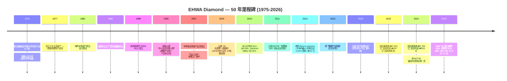

# 韩国 EHWA 钻石工业株式会社 (Ehwa Diamond Industrial) — 公司研究

**截至日期：** 2026-05-26
**代码 / 状态：** **非上市私营企业 (Private, unlisted)**。Bloomberg ID `1210Z:KS`，后缀 `Z` 表示韩国非上市主体。

> **关键提示 (Ticker correction):** EHWA Diamond 系**非上市私营企业** (Bloomberg `1210Z:KS`) — KOSDAQ:103840 实为不相关的 **Wooyang Co Ltd (우양, 冷冻水果加工)**，与本研究主体毫无关联 ([Wooyang on Yahoo Finance, 2026](https://finance.yahoo.com/quote/103840.KQ/))。本报告通过韩国金融监督院 DART (Data Analysis, Retrieval and Transfer System) 公开披露 — 主体在 DART 中归类为 **기타법인 / "其他法人"**，corp_code `00145677` — 追溯 EHWA 的财务与运营数据 ([DART 검색결과 — 이화다이아몬드공업, 2026-05](https://dart.fss.or.kr/dsab007/main.do))。

> **重大事项更新 — 控股权易主 (2026-05-12):** 韩国本土私募基金 **IMM Private Equity** 已签订股权收购协议 (SPA)，拟以**约 ₩4,000 亿韩元 (约 2.9 亿美元)** 收购 EHWA Diamond Industrial **65% 控股权**；交易由共同投资方 RGS 和并购融资支持。IMM 公开披露的投资逻辑：**稳定的建筑 / 精密工具基本盘** + **半导体先进制造带来的成长曲线** — 计划继续加大研发投入并扩展全球客户覆盖。卖方主要为创始人家族股东 ([Seoul Economic Daily, 2026-05-12](https://en.sedaily.com/news/2026/05/12/imm-pe-to-acquire-koreas-top-tool-maker-ehwa-diamond-for); [파이낸셜뉴스 fn마켓워치, 2026-05-13](https://www.fnnews.com/news/202605130830353811))。交割时间尚未公告。下文 2025 财年财务数据为控股权变更前快照。

## 目录

1. 公司概览
2. 公司历史
3. 管理团队
4. 产品与服务
5. 客户与上市策略
6. 行业概览
7. 竞争格局
8. 市场机会
9. 风险评估
10. 参考资料

---

## 1. 公司概览

EHWA 钻石工业株式会社 (이화다이아몬드공업주식회사，**Ehwa Diamond Industrial Co., Ltd.**) 是一家位于韩国京畿道乌山市 (오산시) 南部大路 374 号 (元洞) 的工业级钻石工具 (industrial diamond tool) 制造商。公司现处于**第 51 期 (第 51 个会计年度)** — 注册成立于 1975 年 2 月 1 日 ([DART 연결감사보고서 (51기), 2026-03-31](https://dart.fss.or.kr/dsaf001/main.do?rcpNo=20260331002816))。业务结构围绕三大产品线展开：(i) **建筑与石材工具 (construction & stone tools)** — 排锯 (gang saws)、分段圆锯片 (segmented circular saws)、钻头 (core bits) 及切割混凝土 / 花岗岩 / 沥青用的金刚石线锯 (wire saws)；(ii) **精密 / 工业工具 (industrial / precision tools)** — PCD / PCBN / CVD / 单晶钻石的车 / 铣 / 钻 / 修整工具，销往汽车、轴承、模具、机械客户；(iii) **电子 / 半导体耗材 (electronics / semiconductor consumables)** — 最关键的是用于化学机械抛光 (Chemical-Mechanical Planarization, CMP) 工序的 **CMP 抛光垫修整器 (CMP pad conditioner)**，以及硅晶圆背面研磨砂轮 (silicon wafer back-grinding wheel)、切割刀片 (dicing blade) 和微型刀片 (micro-blade) ([포브스코리아 — Kim Jae-Hee EHWA 인터뷰, 2024-04-10](https://www.forbeskorea.co.kr/news/articleView.html?idxno=337331); [SEMI member directory — EHWA Diamond, 2026](https://www.semi.org/en/resources/member-directory/ehwa-diamond-industrial-co-ltd))。管理层长期对外表述的产品广度为 **"3 万余个 SKU，从切割花岗岩板材的排锯到把硅晶圆表面粗糙度精加工到 1 纳米的背磨砂轮"** ([한국경제 — 이화다이아몬드 인터뷰, 2022-02-27](https://www.hankyung.com/article/2022022724411))。

对一家 50 年历史的工业制造商而言，EHWA 的商业模式异常简洁：在自有的 14 座工厂 (韩国 6 座，其余分布于中国、泰国、印度尼西亚、日本、德国、印度、墨西哥) 完成工具制造，直接发货给工业终端客户 (三星电子 Samsung Electronics、SK 海力士 SK Hynix、台积电 TSMC、现代汽车 Hyundai Motor、博世 Bosch、宝马 BMW、通用汽车 GM、Black+Decker、丰田 Toyota 及 2,000 余家其他客户)，以**单件计费**确认收入 — 没有经常性 SaaS 软件层、没有租赁安排、也没有项目服务叠加。约 **60–65% 的营收来自出口**，覆盖约 90 个国家，其余为韩国国内 ([포브스코리아, 2024-04-10](https://www.forbeskorea.co.kr/news/articleView.html?idxno=337331); [중견기업연합회(FOMEK) 보도자료, 2024-09](https://www.fomek.or.kr/main/newsroom/news/vpg_view.php?wr_id=58))。半导体 / 电子产品线 — 当前战略上最值得关注的部分 — 是骑在 CMP 抛光头上方、对聚氨酯抛光垫表面进行连续修整 (dressing) 的**金刚石尖端修整盘**。如果没有连续修整，CMP 浆料和抛光垫表面的化学耦合会在几分钟内形成**釉化 (glazing)** 而失去去除速率；有了修整器，同一块抛光垫可以稳定加工数千片晶圆，保持稳定的片内均匀性 (within-wafer uniformity) ([US9314901B2 — Samsung Electronics + Ehwa Diamond Industrial 联合专利, 2016](https://patents.google.com/patent/US9314901B2/en))。

按韩国本土工业供应商的标准，EHWA 在营收规模上属于**中等市值但行业内体量偏大**。2025 财年合并营收 **₩3,701 亿韩元 (约 2.70 亿美元，按年末汇率)**，较 2024 财年 ₩3,755 亿韩元同比下滑 1.4%，主要受建筑工具需求疲软拖累；2025 财年营业利润 **₩330 亿韩元 (营业利润率 8.9%)**，较 2024 财年 ₩353 亿韩元 (9.4%) 小幅回落；2025 财年合并净利润 **₩278 亿韩元**，显著低于 2024 财年的 ₩498 亿韩元 — 主因是上一年度受益于 ~₩117 亿韩元的**未实现汇兑收益 (unrealized FX gains)**，这部分在 2025 年未能重演 ([DART 연결감사보고서 51기 (rcp 20260331002816), 손익계산서](https://dart.fss.or.kr/dsaf001/main.do?rcpNo=20260331002816))。2025 财年末合并股东权益 **₩3,295 亿韩元**，总资产 **₩4,609 亿韩元** — 股东权益占总资产比例约 71.5%，资产负债表非常干净 ([同一文件，연결재무상태표](https://dart.fss.or.kr/dsaf001/main.do?rcpNo=20260331002816))。下方图表显示的 5 年营业趋势中，2023 年建筑周期低谷把当年营业利润压到 ₩145 亿 (营收 ₩3,163 亿)，2024-25 年随着半导体耗材增长 + 韩中建筑回暖而恢复 ([saramin 财务卡片, 2026-Q1 更新](https://www.saramin.co.kr/zf_user/company-info/view-inner-finance/csn/SUZ4bHJmRk1CNFBBMVkzSmpmSHdqZz09/company_nm/%EC%9D%B4%ED%99%94%EB%8B%A4%EC%9D%B4%EC%95%84%EB%AA%AC%EB%93%9C%EA%B3%B5%EC%97%85(%EC%A3%BC)))。

资料来源：[DART 연결감사보고서 51기 (FY2025), 2026-03-31 提交, 三正会计法人 (KPMG 삼정회계법인) 审计](https://dart.fss.or.kr/dsaf001/main.do?rcpNo=20260331002816) 及历年 DART 备案；2021-22 财年营业利润数字引自 [한국경제, 2022-02-27](https://www.hankyung.com/article/2022022724411)。

**员工规模**约 750 人 (全球)，公司官网与多家就业平台均给出同样数字；SEMI 会员名录列示的 "127 employees across 5 continents" 仅统计海外法人，未包含韩国境内工厂 ([DnB 公司画像, 2026](https://www.dnb.com/business-directory/company-profiles.ehwa_diamond_indcoltd.e2d0f0e073fb88beaf3fafc05f6bf6da.html); [SEMI directory](https://www.semi.org/en/resources/member-directory/ehwa-diamond-industrial-co-ltd))。IMM PE 收购交易交割前的股东结构高度集中于创始人家族：**창업주 김수광 (Kim Soo-Kwang)，董事长，44.84%；김신경 (Kim Shin-Kyung)，20.56%；其他人士合计 34.60%** — 注册股份总数 140 万股，对应实收资本仅为 ₩70 亿韩元 ([DART 연결감사보고서 51기, 주요 주주현황](https://dart.fss.or.kr/dsaf001/main.do?rcpNo=20260331002816))。IMM PE 收购交割后，家族合计 ~65% 的控股块即为转让标的；家族普遍预期保留少数股权，但确切的交割后股权结构尚未披露 ([fn마켓워치, 2026-05-13](https://www.fnnews.com/news/202605130830353811))。

**估值快照 (按 skill 指南，私营企业适配版本)。** 由于 EHWA 系非上市公司，常规的 TTM P/E、P/S 倍数无法直接观察。最近一次交易价 — IMM PE 收购 65% 控股权对价约 ₩4,000 亿 — 对应**全体股权估值约 ₩6,150 亿 (约 4.46 亿美元)**，按 2025 财年净利润 ₩278 亿计算约为 **22 倍历史 P/E**，按营收 ₩3,701 亿计算约为 **1.66 倍历史 P/S** ([Seoul Economic Daily, 2026-05-12](https://en.sedaily.com/news/2026/05/12/imm-pe-to-acquire-koreas-top-tool-maker-ehwa-diamond-for); [fn마켓워치, 2026-05-13](https://www.fnnews.com/news/202605130830353811))。作为对比，最接近的上市同业 **Kinik (TWSE:1560，台湾中砂)** 在野村的乐观情景下交易于 ~40 倍 2028F 每股盈利 — 这一倍数反映的是**纯半导体敞口**的溢价 ([Nomura "Greater China Semi 2026~30F", 2026-05-21, 第 15 页](../sector/半导体材料.md))。EHWA 22 倍的并购倍数被解读为**合理的私募市场混合估值**：以成熟稳定的建筑工业基本盘 (常规估值区间在个位数到低双位数) 叠加规模较小但高毛利的半导体耗材敞口 (Kinik / Anji / Dinglong 同类业务可享 40-96 倍)。*分析师观点：* 隐含的控股溢价定价对象是 EHWA 半导体晶圆工具增长曲线的期权价值，而非建筑基本盘 — 这与 IMM PE 在新闻稿中给出的战略逻辑高度一致 ([fn마켓워치, 2026-05-13](https://www.fnnews.com/news/202605130830353811))。

资料来源：分段区间引自 CEO 김재희 访谈 ([한국경제, 2022-02-27](https://www.hankyung.com/article/2022022724411)) 及 FOMEK 中坚企业联合会的 CEO 画像 ([FOMEK, 2024-09](https://www.fomek.or.kr/main/newsroom/news/vpg_view.php?wr_id=58)) — EHWA 在 감사보고서 中并未正式披露分产品 / 分客户营收拆分。

---

## 2. 公司历史

**1975 年 2 月 1 日由김수광 (Kim Soo-Kwang) 在首尔创立。** 김수광毕业于首尔大学冶金工程系，是韩国最早接受合成钻石砂轮 (synthetic-diamond grinding-wheel) 技术训练的工程师之一，敏锐看到当时韩国国内 100% 依赖进口的工业钻石工具品类存在国产化空间 ([포브스코리아, 2024-04-10](https://www.forbeskorea.co.kr/news/articleView.html?idxno=337331); [한국경제, 1995-09-26](https://www.hankyung.com/article/1995092601661))。"이화 (Ehwa)"一名取的是 "두 가지 꽃이 어울리다 — 两花相和"的辞典本义，与同名汉字的梨花女子大学并无任何企业关联；命名由创始人本人决定。第一座工厂专攻切割石材用的金刚石锯片 — 1970 年代后期韩国采石 / 建筑热潮立刻带来订单。

资料来源：时间线综合自 [포브스코리아, 2024-04-10](https://www.forbeskorea.co.kr/news/articleView.html?idxno=337331)、[한국경제, 1995](https://www.hankyung.com/article/1995092601661)、[FOMEK, 2024](https://www.fomek.or.kr/main/newsroom/news/vpg_view.php?wr_id=58)、[Seoul Economic Daily, 2026-05-12](https://en.sedaily.com/news/2026/05/12/imm-pe-to-acquire-koreas-top-tool-maker-ehwa-diamond-for) 及 [DART 연결감사보고서 51기, 2026-03-31](https://dart.fss.or.kr/dsaf001/main.do?rcpNo=20260331002816)。

公司 50 年历史中有**三次战略转型值得单独点名**。**第一是 1977-82 年从单一锯片厂转型为多元化钻石工具房**：1977 年设立工业工具部门，1982 年成立海外业务部门 — 让 EHWA 真正成为一家出口企业。到 1980 年代中期，EHWA 已在日本本土市场切入，并从日本同业手中抢份额 — 这一海外姿态塑造了之后所有的扩张选择 ([Ehwa-Insa 招聘页面 (관계사 안내)](https://ehwadia-insa.co.kr/?page_id=1388))。**第二是 2007 年的半导体业务启动** — 乌山 CMP 专用工厂建成，这是一次对 2000 年代后期三星电子华城 / 平泽 fab 与 SK 海力士利川 / 清州产线扩张的**有备而来的押注**。在此之前，EHWA 已以小批量供应硅晶圆背磨砂轮；2007 年的工厂建设是公司**首次为 CMP 耗材专门划拨产能、专属研发预算和专项销售覆盖**。到 2013 年，该技术投入开始收获回报 — 三星-EHWA 联合的 CMP 抛光垫修整器专利 (US9314901B2) 通过申请，其 "统一刀尖 (uniform-tip)"几何设计可在使用全程内将刀尖表面积稳定在 ±10% 区间内，使氧化物 / 钨 / 铜浆料工艺下的抛光垫损耗保持稳定 ([US9314901B2, 2016 授权](https://patents.google.com/patent/US9314901B2/en))。**第三是 2010 年的代际交接** — 将经营权交给김재희，一位斯坦福历史学本科 + MBA、并非工程师出身的女儿，是创始人的一次有意识选择。Forbes Korea 转述的创始人逻辑是：**"未来十年钻石工具的竞争不再靠工程师手艺，而是靠职业管理纪律 (采购、外汇套保、销售渠道架构、多工厂物流、并购)"** — 因此选了**懂管理而不是懂冶金**的继任者。2021-22、2024 年连续刷新的营收纪录证明了这一选择目前为止是成立的 ([포브스코리아, 2024-04-10](https://www.forbeskorea.co.kr/news/articleView.html?idxno=337331))。

**并购与外延动作有限但具针对性。** 2014 年 12 月，EHWA 以 ₩15 亿韩元从김준구 / 김준홍处收购了 **Meerecompany Inc. (코스닥 上市；韩国领先的手术机器人公司，腹腔镜手术机器人 Revo-i 的开发商)** 3.54% 股权 — 财务 / 战略投资，非经营控制 ([MarketScreener, 2015-03-24](https://www.marketscreener.com/quote/stock/MEERECOMPANY-INCORPORATED-12898436/news/Ehwa-Diamond-Industrial-Co-Ltd-acquired-3-54-stake-in-Meerecompany-Inc-from-Joon-Koo-Kim-and-Jo-38434409/))。EHWA 还持有意大利 **ZENESIS Solutions S.r.l.** 作为权益法关联企业 — 因累计亏损已减值至 0 — 以及 100% 持股的国内子公司 **평택산업 (Pyeongtaek Industrial Co.)**，两者自 2024 财年起纳入合并 ([DART 연결감사보고서 51기, 종속기업 및 관계기업 명단](https://dart.fss.or.kr/dsaf001/main.do?rcpNo=20260331002816))。即将到来的 IMM PE 控股交易 (2026 年 5 月) 将是公司历史上**最大规模的单一控股权变更事件**。

**近期发展 (2024-2026)。** 除 IMM PE 交易外，主要经营主线包括 (i) **半导体耗材客户基础的渐进式扩展** — 通过三星与 SK 海力士的"K-Semi-Belt"国产供应商计划，以及为台积电亚利桑那 / 熊本新厂提供配套服务 (EHWA 的海外法人布局为 fab 邻近服务提供了天然优势) ([digitimes — Samsung / SK Hynix 供应链覆盖, 2025-09-08](https://apps.digitimes.com/news/a20250908PD218/2025-samsung-semicon-2025-sk-hynix-supply-chain-taiwan.html))；(ii) **2025 财年营收的小幅同比下滑 (-1.4%)**，主因韩国与中国建筑需求疲软；(iii) **韩国产业通商资源部 (MOTIE) 在 2024 年授予 EHWA "最佳中坚供应商" 称号** ([FOMEK, 2024-09](https://www.fomek.or.kr/main/newsroom/news/vpg_view.php?wr_id=58))。

---

## 3. 管理团队

EHWA 的领导班子是一对**父女组合**：创始人继续担任董事长 (持股 44.84%)；女儿自 2010 年起担任 CEO (대표이사) 主理日常经营。IMM PE 收购交割后这些角色可能重新洗牌，但本节反映**截至 2025 年的结构**。

### 김수광 (Kim Soo-Kwang) — 创始人兼董事长

김수광 1975 年 2 月在首尔创立 EHWA Diamond，时年 35 岁，毕业于首尔大学冶金工程系。创业初期他亲自钻研钻石复合材料锯片配方 — 当时韩国建筑业要么使用进口工具 (主要来自日本 / 德国)，要么靠工地临时拼凑的代用品，**本土生产的工业级钻石几乎是个空白领域** ([포브스코리아, 2024-04-10](https://www.forbeskorea.co.kr/news/articleView.html?idxno=337331); [한국경제, 1995-09-26](https://www.hankyung.com/article/1995092601661))。整个 1980-90 年代他都担任 President / 사장，1995 年 9 月由通商产业部 (MOTIE 前身) 与 기협중앙회 (韩国中小企业联合会) 共同授予**"中小企业月度人物"**称号，并率领公司穿越 1997 年亚洲金融危机和 2008 年全球衰退 — 截至 2022 年实现**连续 47 年盈利**这一极少见的工业制造纪录 ([한국경제, 1995-09-26](https://www.hankyung.com/article/1995092601661); [한국경제, 2022-02-27](https://www.hankyung.com/article/2022022724411))。2010 年女儿接任 CEO，他从经营管理角色转为董事长，但仍是大股东 — 在资本配置上被广泛视为战略锚定者。IMM PE 收购前他个人持有 627,773 股 = **登记股本的 44.84%** ([DART 연결감사보고서 51기, 주요 주주현황](https://dart.fss.or.kr/dsaf001/main.do?rcpNo=20260331002816))。他的股权 (与女儿김신경 20.56% 及家族管理层 34.60% 合计) 即为本次 ~₩4,000 亿出售给 IMM PE 的标的 ([fn마켓워치, 2026-05-13](https://www.fnnews.com/news/202605130830353811))。媒体一贯描述他的创业初衷是一个**多十年视角**："**钻石是一种横跨基建、汽车与电子的生产力工具 — 在三者之间分散，一个坏周期就永远打不垮公司**" — 而这恰恰是女儿在全球扩张中规模化执行的哲学 ([FOMEK, 2024-09](https://www.fomek.or.kr/main/newsroom/news/vpg_view.php?wr_id=58))。

### 김재희 (Kim Jae-Hee) — 自 2010 年起任代表理事 / CEO

김재희本科与 MBA 均毕业于**斯坦福大学** (Stanford University) — 本科主修历史与工商管理，MBA 毕业于斯坦福商学院 (Stanford GSB)；MBA 毕业后曾在**美国一家管理咨询公司**任职，2002 年加入 EHWA Diamond ([포브스코리아, 2024-04-10](https://www.forbeskorea.co.kr/news/articleView.html?idxno=337331))。她在公司内部经过**八年的不同经营岗位历练**后，于 2010 年 6 月被任命为代表理事 (대표이사)，正式接替创始人执掌 CEO 一职。父亲对此次代际交接的对外阐述是 — EHWA 下一个十年的核心竞争力在于**职业化的管理纪律**：全球工厂网络管理、跨币种现金管理与外汇套保、多语言销售覆盖、并购整合 — **而仅靠工程师背景的继任者无法在这些维度上交出成绩**。面对"不是工程师出身的 CEO 怎么领导一家冶金公司"的外部质疑，김재희的回应是 — **她的工作是 "在每个领域培养顶尖专家"，而不是亲自做最深的技术专家** ([FOMEK, 2024-09](https://www.fomek.or.kr/main/newsroom/news/vpg_view.php?wr_id=58))。DART 股东表中她的持股**未单独披露**：表中列김수광 44.84%、김신경 20.56%、其他 34.60%，无第三个超过 5% 披露阈值的姓名 — 这意味着她的直接经济权益要么在 34.60% "其他"块内，要么通过家族投资工具持有 ([DART 연결감사보고서 51기](https://dart.fss.or.kr/dsaf001/main.do?rcpNo=20260331002816))。

她**自 2010 年以来的经营成绩**具体且可量化：合并营收从 (2010 年前) ₩2,000 多亿区间增长至 **2024 财年峰值 ₩3,755 亿**；营业利润率从低个位数扩张至高个位数 / 低双位数区间 (2024 财年 9.4%) ([saramin 财务卡片](https://www.saramin.co.kr/zf_user/company-info/view-inner-finance/csn/SUZ4bHJmRk1CNFBBMVkzSmpmSHdqZz09/company_nm/%EC%9D%B4%ED%99%94%EB%8B%A4%EC%9D%B4%EC%95%84%EB%AA%AC%EB%93%9C%EA%B3%B5%EC%97%85(%EC%A3%BC)))。半导体耗材线从 2010 年前**精密事业部内的"小赌注"**变成 2007 年后**拥有专属工厂与研发预算的独立业务单元**，并配套以活跃的专利组合 (三星-EHWA 2016 年联合的 US9314901B2 + 韩国科学技术研究院 KIST + EHWA 的 CVD 涂层早期合作研究) ([US9314901B2 patent](https://patents.google.com/patent/US9314901B2/en); [ScienceDirect — KIST-EHWA CVD 抛光垫修整器研究, 2011](https://www.sciencedirect.com/science/article/abs/pii/S0890695511000393))。在她任内，EHWA 于 2011 年入选 MOTIE "世界级 300" 成长企业项目，2015 年获得银塔产业勋章，2020 年入选"名门长寿企业 (명문장수기업)"，2024 年获 MOTIE "最佳中坚供应商"奖 ([FOMEK, 2024-09](https://www.fomek.or.kr/main/newsroom/news/vpg_view.php?wr_id=58))。按韩国创始人主导工业 PE 收购的典型先例，**她大概率会在 IMM PE 交割后留任经营层** — 但目前没有正式留任公告。

---
