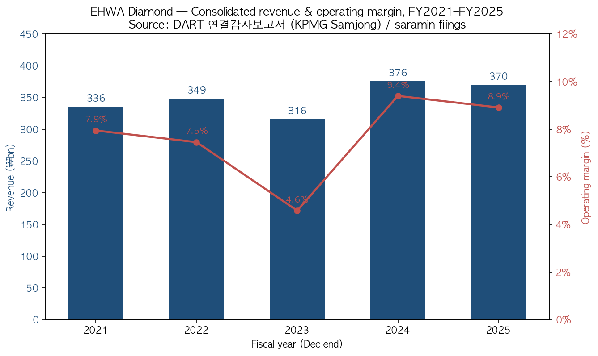
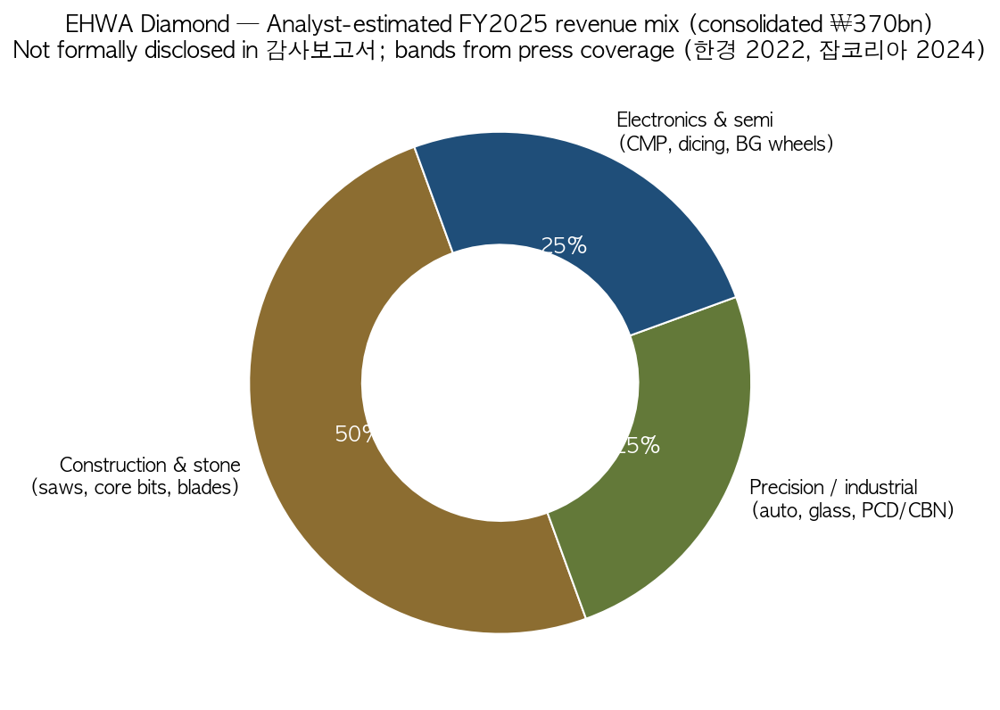

# 韩国 EHWA 钻石工业株式会社 (Ehwa Diamond Industrial) — 公司研究

**截至日期：** 2026-05-26
**代码 / 状态：** **非上市私营企业 (Private, unlisted)**。Bloomberg ID `1210Z:KS`，后缀 `Z` 表示韩国非上市主体。

> **关键提示 (Ticker correction):** EHWA Diamond 系**非上市私营企业** (Bloomberg `1210Z:KS`) — KOSDAQ:103840 实为不相关的 **Wooyang Co Ltd (우양, 冷冻水果加工)**，与本研究主体毫无关联 ([Wooyang on Yahoo Finance, 2026](https://finance.yahoo.com/quote/103840.KQ/))。本报告通过韩国金融监督院 DART (Data Analysis, Retrieval and Transfer System) 公开披露 — 主体在 DART 中归类为 **기타법인 / "其他法人"**，corp_code `00145677` — 追溯 EHWA 的财务与运营数据 ([DART 검색결과 — 이화다이아몬드공업, 2026-05](https://dart.fss.or.kr/dsab007/main.do))。

> **重大事项更新 — 控股权易主 (2026-05-12):** 韩国本土私募基金 **IMM Private Equity** 已签订股权收购协议 (SPA)，拟以**约 ₩4,000 亿韩元 (约 2.9 亿美元)** 收购 EHWA Diamond Industrial **65% 控股权**；交易由共同投资方 RGS 和并购融资支持。IMM 公开披露的投资逻辑：**稳定的建筑 / 精密工具基本盘** + **半导体先进制造带来的成长曲线** — 计划继续加大研发投入并扩展全球客户覆盖。卖方主要为创始人家族股东 ([Seoul Economic Daily, 2026-05-12](https://en.sedaily.com/news/2026/05/12/imm-pe-to-acquire-koreas-top-tool-maker-ehwa-diamond-for); [파이낸셜뉴스 fn마켓워치, 2026-05-13](https://www.fnnews.com/news/202605130830353811))。交割时间尚未公告。下文 2025 财年财务数据为控股权变更前快照。

## 目录

1. 公司概览
2. 公司历史
3. 管理团队
4. 产品与服务
5. 客户与上市策略
6. 行业概览
7. 竞争格局
8. 市场机会
9. 风险评估
10. 参考资料

---

## 1. 公司概览

EHWA 钻石工业株式会社 (이화다이아몬드공업주식회사，**Ehwa Diamond Industrial Co., Ltd.**) 是一家位于韩国京畿道乌山市 (오산시) 南部大路 374 号 (元洞) 的工业级钻石工具 (industrial diamond tool) 制造商。公司现处于**第 51 期 (第 51 个会计年度)** — 注册成立于 1975 年 2 月 1 日 ([DART 연결감사보고서 (51기), 2026-03-31](https://dart.fss.or.kr/dsaf001/main.do?rcpNo=20260331002816))。业务结构围绕三大产品线展开：(i) **建筑与石材工具 (construction & stone tools)** — 排锯 (gang saws)、分段圆锯片 (segmented circular saws)、钻头 (core bits) 及切割混凝土 / 花岗岩 / 沥青用的金刚石线锯 (wire saws)；(ii) **精密 / 工业工具 (industrial / precision tools)** — PCD / PCBN / CVD / 单晶钻石的车 / 铣 / 钻 / 修整工具，销往汽车、轴承、模具、机械客户；(iii) **电子 / 半导体耗材 (electronics / semiconductor consumables)** — 最关键的是用于化学机械抛光 (Chemical-Mechanical Planarization, CMP) 工序的 **CMP 抛光垫修整器 (CMP pad conditioner)**，以及硅晶圆背面研磨砂轮 (silicon wafer back-grinding wheel)、切割刀片 (dicing blade) 和微型刀片 (micro-blade) ([포브스코리아 — Kim Jae-Hee EHWA 인터뷰, 2024-04-10](https://www.forbeskorea.co.kr/news/articleView.html?idxno=337331); [SEMI member directory — EHWA Diamond, 2026](https://www.semi.org/en/resources/member-directory/ehwa-diamond-industrial-co-ltd))。管理层长期对外表述的产品广度为 **"3 万余个 SKU，从切割花岗岩板材的排锯到把硅晶圆表面粗糙度精加工到 1 纳米的背磨砂轮"** ([한국경제 — 이화다이아몬드 인터뷰, 2022-02-27](https://www.hankyung.com/article/2022022724411))。

对一家 50 年历史的工业制造商而言，EHWA 的商业模式异常简洁：在自有的 14 座工厂 (韩国 6 座，其余分布于中国、泰国、印度尼西亚、日本、德国、印度、墨西哥) 完成工具制造，直接发货给工业终端客户 (三星电子 Samsung Electronics、SK 海力士 SK Hynix、台积电 TSMC、现代汽车 Hyundai Motor、博世 Bosch、宝马 BMW、通用汽车 GM、Black+Decker、丰田 Toyota 及 2,000 余家其他客户)，以**单件计费**确认收入 — 没有经常性 SaaS 软件层、没有租赁安排、也没有项目服务叠加。约 **60–65% 的营收来自出口**，覆盖约 90 个国家，其余为韩国国内 ([포브스코리아, 2024-04-10](https://www.forbeskorea.co.kr/news/articleView.html?idxno=337331); [중견기업연합회(FOMEK) 보도자료, 2024-09](https://www.fomek.or.kr/main/newsroom/news/vpg_view.php?wr_id=58))。半导体 / 电子产品线 — 当前战略上最值得关注的部分 — 是骑在 CMP 抛光头上方、对聚氨酯抛光垫表面进行连续修整 (dressing) 的**金刚石尖端修整盘**。如果没有连续修整，CMP 浆料和抛光垫表面的化学耦合会在几分钟内形成**釉化 (glazing)** 而失去去除速率；有了修整器，同一块抛光垫可以稳定加工数千片晶圆，保持稳定的片内均匀性 (within-wafer uniformity) ([US9314901B2 — Samsung Electronics + Ehwa Diamond Industrial 联合专利, 2016](https://patents.google.com/patent/US9314901B2/en))。

按韩国本土工业供应商的标准，EHWA 在营收规模上属于**中等市值但行业内体量偏大**。2025 财年合并营收 **₩3,701 亿韩元 (约 2.70 亿美元，按年末汇率)**，较 2024 财年 ₩3,755 亿韩元同比下滑 1.4%，主要受建筑工具需求疲软拖累；2025 财年营业利润 **₩330 亿韩元 (营业利润率 8.9%)**，较 2024 财年 ₩353 亿韩元 (9.4%) 小幅回落；2025 财年合并净利润 **₩278 亿韩元**，显著低于 2024 财年的 ₩498 亿韩元 — 主因是上一年度受益于 ~₩117 亿韩元的**未实现汇兑收益 (unrealized FX gains)**，这部分在 2025 年未能重演 ([DART 연결감사보고서 51기 (rcp 20260331002816), 손익계산서](https://dart.fss.or.kr/dsaf001/main.do?rcpNo=20260331002816))。2025 财年末合并股东权益 **₩3,295 亿韩元**，总资产 **₩4,609 亿韩元** — 股东权益占总资产比例约 71.5%，资产负债表非常干净 ([同一文件，연결재무상태표](https://dart.fss.or.kr/dsaf001/main.do?rcpNo=20260331002816))。下方图表显示的 5 年营业趋势中，2023 年建筑周期低谷把当年营业利润压到 ₩145 亿 (营收 ₩3,163 亿)，2024-25 年随着半导体耗材增长 + 韩中建筑回暖而恢复 ([saramin 财务卡片, 2026-Q1 更新](https://www.saramin.co.kr/zf_user/company-info/view-inner-finance/csn/SUZ4bHJmRk1CNFBBMVkzSmpmSHdqZz09/company_nm/%EC%9D%B4%ED%99%94%EB%8B%A4%EC%9D%B4%EC%95%84%EB%AA%AC%EB%93%9C%EA%B3%B5%EC%97%85(%EC%A3%BC)))。

资料来源：[DART 연결감사보고서 51기 (FY2025), 2026-03-31 提交, 三正会计法人 (KPMG 삼정회계법인) 审计](https://dart.fss.or.kr/dsaf001/main.do?rcpNo=20260331002816) 及历年 DART 备案；2021-22 财年营业利润数字引自 [한국경제, 2022-02-27](https://www.hankyung.com/article/2022022724411)。

**员工规模**约 750 人 (全球)，公司官网与多家就业平台均给出同样数字；SEMI 会员名录列示的 "127 employees across 5 continents" 仅统计海外法人，未包含韩国境内工厂 ([DnB 公司画像, 2026](https://www.dnb.com/business-directory/company-profiles.ehwa_diamond_indcoltd.e2d0f0e073fb88beaf3fafc05f6bf6da.html); [SEMI directory](https://www.semi.org/en/resources/member-directory/ehwa-diamond-industrial-co-ltd))。IMM PE 收购交易交割前的股东结构高度集中于创始人家族：**창업주 김수광 (Kim Soo-Kwang)，董事长，44.84%；김신경 (Kim Shin-Kyung)，20.56%；其他人士合计 34.60%** — 注册股份总数 140 万股，对应实收资本仅为 ₩70 亿韩元 ([DART 연결감사보고서 51기, 주요 주주현황](https://dart.fss.or.kr/dsaf001/main.do?rcpNo=20260331002816))。IMM PE 收购交割后，家族合计 ~65% 的控股块即为转让标的；家族普遍预期保留少数股权，但确切的交割后股权结构尚未披露 ([fn마켓워치, 2026-05-13](https://www.fnnews.com/news/202605130830353811))。

**估值快照 (按 skill 指南，私营企业适配版本)。** 由于 EHWA 系非上市公司，常规的 TTM P/E、P/S 倍数无法直接观察。最近一次交易价 — IMM PE 收购 65% 控股权对价约 ₩4,000 亿 — 对应**全体股权估值约 ₩6,150 亿 (约 4.46 亿美元)**，按 2025 财年净利润 ₩278 亿计算约为 **22 倍历史 P/E**，按营收 ₩3,701 亿计算约为 **1.66 倍历史 P/S** ([Seoul Economic Daily, 2026-05-12](https://en.sedaily.com/news/2026/05/12/imm-pe-to-acquire-koreas-top-tool-maker-ehwa-diamond-for); [fn마켓워치, 2026-05-13](https://www.fnnews.com/news/202605130830353811))。作为对比，最接近的上市同业 **Kinik (TWSE:1560，台湾中砂)** 在野村的乐观情景下交易于 ~40 倍 2028F 每股盈利 — 这一倍数反映的是**纯半导体敞口**的溢价 ([Nomura "Greater China Semi 2026~30F", 2026-05-21, 第 15 页](../sector/半导体材料.md))。EHWA 22 倍的并购倍数被解读为**合理的私募市场混合估值**：以成熟稳定的建筑工业基本盘 (常规估值区间在个位数到低双位数) 叠加规模较小但高毛利的半导体耗材敞口 (Kinik / Anji / Dinglong 同类业务可享 40-96 倍)。*分析师观点：* 隐含的控股溢价定价对象是 EHWA 半导体晶圆工具增长曲线的期权价值，而非建筑基本盘 — 这与 IMM PE 在新闻稿中给出的战略逻辑高度一致 ([fn마켓워치, 2026-05-13](https://www.fnnews.com/news/202605130830353811))。

资料来源：分段区间引自 CEO 김재희 访谈 ([한국경제, 2022-02-27](https://www.hankyung.com/article/2022022724411)) 及 FOMEK 中坚企业联合会的 CEO 画像 ([FOMEK, 2024-09](https://www.fomek.or.kr/main/newsroom/news/vpg_view.php?wr_id=58)) — EHWA 在 감사보고서 中并未正式披露分产品 / 分客户营收拆分。

---
