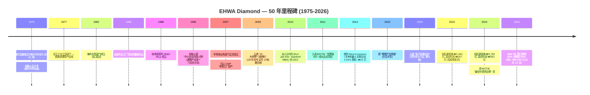
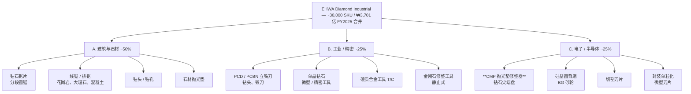
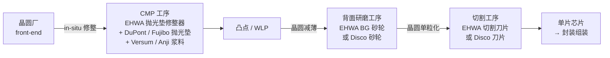
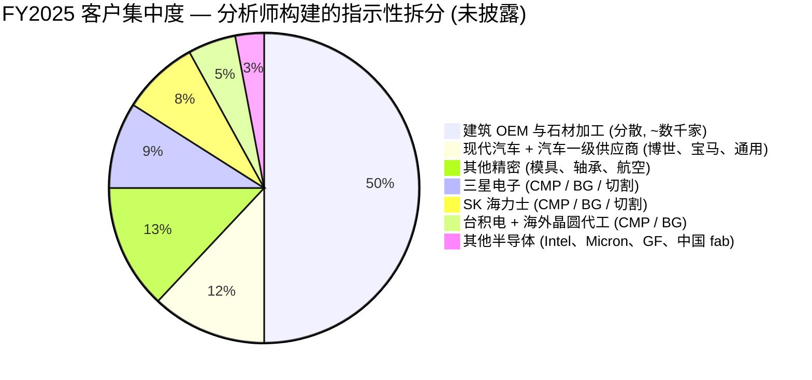
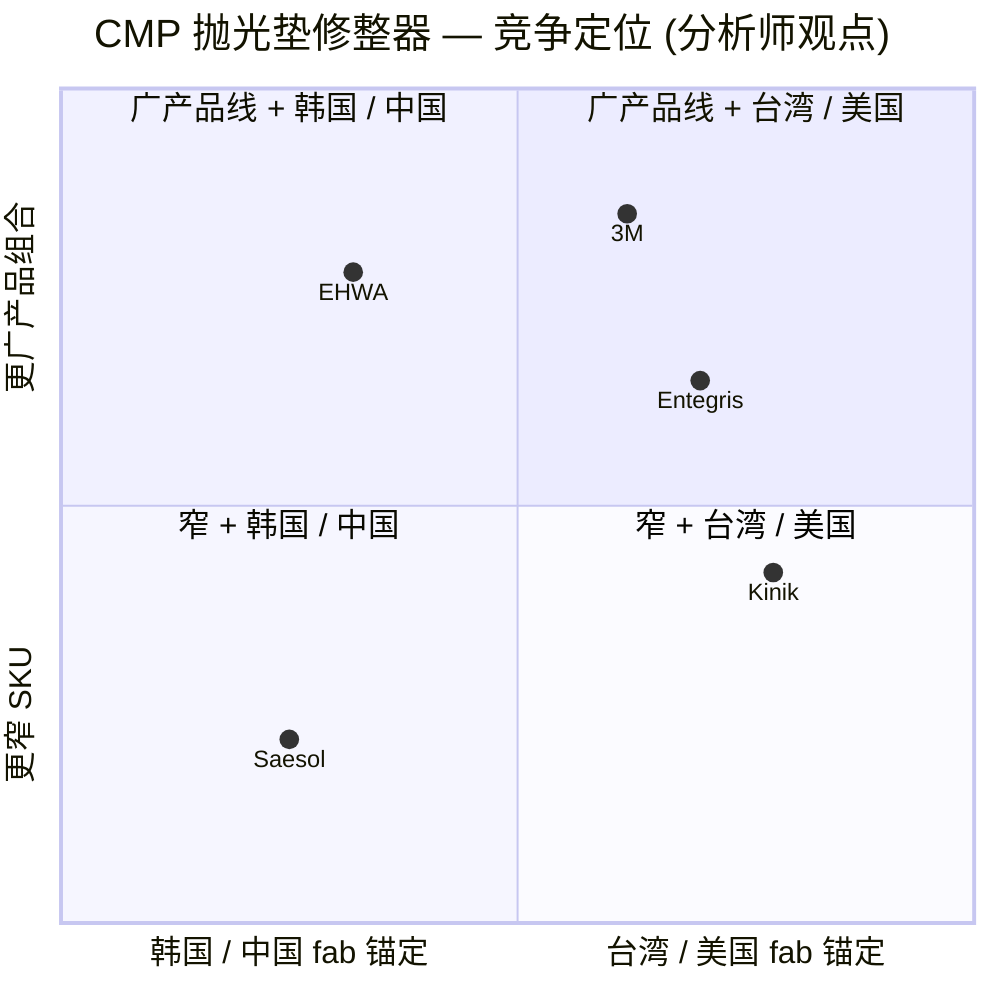

# 韩国 EHWA 钻石工业株式会社 (Ehwa Diamond Industrial) — 公司研究

**截至日期：** 2026-05-26
**代码 / 状态：** **非上市私营企业 (Private, unlisted)**。Bloomberg ID `1210Z:KS`，后缀 `Z` 表示韩国非上市主体。

> **关键提示 (Ticker correction):** EHWA Diamond 系**非上市私营企业** (Bloomberg `1210Z:KS`) — KOSDAQ:103840 实为不相关的 **Wooyang Co Ltd (우양, 冷冻水果加工)**，与本研究主体毫无关联 ([Wooyang on Yahoo Finance, 2026](https://finance.yahoo.com/quote/103840.KQ/))。本报告通过韩国金融监督院 DART (Data Analysis, Retrieval and Transfer System) 公开披露 — 主体在 DART 中归类为 **기타법인 / "其他法人"**，corp_code `00145677` — 追溯 EHWA 的财务与运营数据 ([DART 검색결과 — 이화다이아몬드공업, 2026-05](https://dart.fss.or.kr/dsab007/main.do))。

> **重大事项更新 — 控股权易主 (2026-05-12):** 韩国本土私募基金 **IMM Private Equity** 已签订股权收购协议 (SPA)，拟以**约 ₩4,000 亿韩元 (约 2.9 亿美元)** 收购 EHWA Diamond Industrial **65% 控股权**；交易由共同投资方 RGS 和并购融资支持。IMM 公开披露的投资逻辑：**稳定的建筑 / 精密工具基本盘** + **半导体先进制造带来的成长曲线** — 计划继续加大研发投入并扩展全球客户覆盖。卖方主要为创始人家族股东 ([Seoul Economic Daily, 2026-05-12](https://en.sedaily.com/news/2026/05/12/imm-pe-to-acquire-koreas-top-tool-maker-ehwa-diamond-for); [파이낸셜뉴스 fn마켓워치, 2026-05-13](https://www.fnnews.com/news/202605130830353811))。交割时间尚未公告。下文 2025 财年财务数据为控股权变更前快照。

## 目录

1. 公司概览
2. 公司历史
3. 管理团队
4. 产品与服务
5. 客户与上市策略
6. 行业概览
7. 竞争格局
8. 市场机会
9. 风险评估
10. 参考资料

---

## 1. 公司概览

EHWA 钻石工业株式会社 (이화다이아몬드공업주식회사，**Ehwa Diamond Industrial Co., Ltd.**) 是一家位于韩国京畿道乌山市 (오산시) 南部大路 374 号 (元洞) 的工业级钻石工具 (industrial diamond tool) 制造商。公司现处于**第 51 期 (第 51 个会计年度)** — 注册成立于 1975 年 2 月 1 日 ([DART 연결감사보고서 (51기), 2026-03-31](https://dart.fss.or.kr/dsaf001/main.do?rcpNo=20260331002816))。业务结构围绕三大产品线展开：(i) **建筑与石材工具 (construction & stone tools)** — 排锯 (gang saws)、分段圆锯片 (segmented circular saws)、钻头 (core bits) 及切割混凝土 / 花岗岩 / 沥青用的金刚石线锯 (wire saws)；(ii) **精密 / 工业工具 (industrial / precision tools)** — PCD / PCBN / CVD / 单晶钻石的车 / 铣 / 钻 / 修整工具，销往汽车、轴承、模具、机械客户；(iii) **电子 / 半导体耗材 (electronics / semiconductor consumables)** — 最关键的是用于化学机械抛光 (Chemical-Mechanical Planarization, CMP) 工序的 **CMP 抛光垫修整器 (CMP pad conditioner)**，以及硅晶圆背面研磨砂轮 (silicon wafer back-grinding wheel)、切割刀片 (dicing blade) 和微型刀片 (micro-blade) ([포브스코리아 — Kim Jae-Hee EHWA 인터뷰, 2024-04-10](https://www.forbeskorea.co.kr/news/articleView.html?idxno=337331); [SEMI member directory — EHWA Diamond, 2026](https://www.semi.org/en/resources/member-directory/ehwa-diamond-industrial-co-ltd))。管理层长期对外表述的产品广度为 **"3 万余个 SKU，从切割花岗岩板材的排锯到把硅晶圆表面粗糙度精加工到 1 纳米的背磨砂轮"** ([한국경제 — 이화다이아몬드 인터뷰, 2022-02-27](https://www.hankyung.com/article/2022022724411))。

对一家 50 年历史的工业制造商而言，EHWA 的商业模式异常简洁：在自有的 14 座工厂 (韩国 6 座，其余分布于中国、泰国、印度尼西亚、日本、德国、印度、墨西哥) 完成工具制造，直接发货给工业终端客户 (三星电子 Samsung Electronics、SK 海力士 SK Hynix、台积电 TSMC、现代汽车 Hyundai Motor、博世 Bosch、宝马 BMW、通用汽车 GM、Black+Decker、丰田 Toyota 及 2,000 余家其他客户)，以**单件计费**确认收入 — 没有经常性 SaaS 软件层、没有租赁安排、也没有项目服务叠加。约 **60–65% 的营收来自出口**，覆盖约 90 个国家，其余为韩国国内 ([포브스코리아, 2024-04-10](https://www.forbeskorea.co.kr/news/articleView.html?idxno=337331); [중견기업연합회(FOMEK) 보도자료, 2024-09](https://www.fomek.or.kr/main/newsroom/news/vpg_view.php?wr_id=58))。半导体 / 电子产品线 — 当前战略上最值得关注的部分 — 是骑在 CMP 抛光头上方、对聚氨酯抛光垫表面进行连续修整 (dressing) 的**金刚石尖端修整盘**。如果没有连续修整，CMP 浆料和抛光垫表面的化学耦合会在几分钟内形成**釉化 (glazing)** 而失去去除速率；有了修整器，同一块抛光垫可以稳定加工数千片晶圆，保持稳定的片内均匀性 (within-wafer uniformity) ([US9314901B2 — Samsung Electronics + Ehwa Diamond Industrial 联合专利, 2016](https://patents.google.com/patent/US9314901B2/en))。

按韩国本土工业供应商的标准，EHWA 在营收规模上属于**中等市值但行业内体量偏大**。2025 财年合并营收 **₩3,701 亿韩元 (约 2.70 亿美元，按年末汇率)**，较 2024 财年 ₩3,755 亿韩元同比下滑 1.4%，主要受建筑工具需求疲软拖累；2025 财年营业利润 **₩330 亿韩元 (营业利润率 8.9%)**，较 2024 财年 ₩353 亿韩元 (9.4%) 小幅回落；2025 财年合并净利润 **₩278 亿韩元**，显著低于 2024 财年的 ₩498 亿韩元 — 主因是上一年度受益于 ~₩117 亿韩元的**未实现汇兑收益 (unrealized FX gains)**，这部分在 2025 年未能重演 ([DART 연결감사보고서 51기 (rcp 20260331002816), 손익계산서](https://dart.fss.or.kr/dsaf001/main.do?rcpNo=20260331002816))。2025 财年末合并股东权益 **₩3,295 亿韩元**，总资产 **₩4,609 亿韩元** — 股东权益占总资产比例约 71.5%，资产负债表非常干净 ([同一文件，연결재무상태표](https://dart.fss.or.kr/dsaf001/main.do?rcpNo=20260331002816))。下方图表显示的 5 年营业趋势中，2023 年建筑周期低谷把当年营业利润压到 ₩145 亿 (营收 ₩3,163 亿)，2024-25 年随着半导体耗材增长 + 韩中建筑回暖而恢复 ([saramin 财务卡片, 2026-Q1 更新](https://www.saramin.co.kr/zf_user/company-info/view-inner-finance/csn/SUZ4bHJmRk1CNFBBMVkzSmpmSHdqZz09/company_nm/%EC%9D%B4%ED%99%94%EB%8B%A4%EC%9D%B4%EC%95%84%EB%AA%AC%EB%93%9C%EA%B3%B5%EC%97%85(%EC%A3%BC)))。

资料来源：[DART 연결감사보고서 51기 (FY2025), 2026-03-31 提交, 三正会计法人 (KPMG 삼정회계법인) 审计](https://dart.fss.or.kr/dsaf001/main.do?rcpNo=20260331002816) 及历年 DART 备案；2021-22 财年营业利润数字引自 [한국경제, 2022-02-27](https://www.hankyung.com/article/2022022724411)。

**员工规模**约 750 人 (全球)，公司官网与多家就业平台均给出同样数字；SEMI 会员名录列示的 "127 employees across 5 continents" 仅统计海外法人，未包含韩国境内工厂 ([DnB 公司画像, 2026](https://www.dnb.com/business-directory/company-profiles.ehwa_diamond_indcoltd.e2d0f0e073fb88beaf3fafc05f6bf6da.html); [SEMI directory](https://www.semi.org/en/resources/member-directory/ehwa-diamond-industrial-co-ltd))。IMM PE 收购交易交割前的股东结构高度集中于创始人家族：**창업주 김수광 (Kim Soo-Kwang)，董事长，44.84%；김신경 (Kim Shin-Kyung)，20.56%；其他人士合计 34.60%** — 注册股份总数 140 万股，对应实收资本仅为 ₩70 亿韩元 ([DART 연결감사보고서 51기, 주요 주주현황](https://dart.fss.or.kr/dsaf001/main.do?rcpNo=20260331002816))。IMM PE 收购交割后，家族合计 ~65% 的控股块即为转让标的；家族普遍预期保留少数股权，但确切的交割后股权结构尚未披露 ([fn마켓워치, 2026-05-13](https://www.fnnews.com/news/202605130830353811))。

**估值快照 (按 skill 指南，私营企业适配版本)。** 由于 EHWA 系非上市公司，常规的 TTM P/E、P/S 倍数无法直接观察。最近一次交易价 — IMM PE 收购 65% 控股权对价约 ₩4,000 亿 — 对应**全体股权估值约 ₩6,150 亿 (约 4.46 亿美元)**，按 2025 财年净利润 ₩278 亿计算约为 **22 倍历史 P/E**，按营收 ₩3,701 亿计算约为 **1.66 倍历史 P/S** ([Seoul Economic Daily, 2026-05-12](https://en.sedaily.com/news/2026/05/12/imm-pe-to-acquire-koreas-top-tool-maker-ehwa-diamond-for); [fn마켓워치, 2026-05-13](https://www.fnnews.com/news/202605130830353811))。作为对比，最接近的上市同业 **Kinik (TWSE:1560，台湾中砂)** 在野村的乐观情景下交易于 ~40 倍 2028F 每股盈利 — 这一倍数反映的是**纯半导体敞口**的溢价 ([Nomura "Greater China Semi 2026~30F", 2026-05-21, 第 15 页](../sector/半导体材料.md))。EHWA 22 倍的并购倍数被解读为**合理的私募市场混合估值**：以成熟稳定的建筑工业基本盘 (常规估值区间在个位数到低双位数) 叠加规模较小但高毛利的半导体耗材敞口 (Kinik / Anji / Dinglong 同类业务可享 40-96 倍)。*分析师观点：* 隐含的控股溢价定价对象是 EHWA 半导体晶圆工具增长曲线的期权价值，而非建筑基本盘 — 这与 IMM PE 在新闻稿中给出的战略逻辑高度一致 ([fn마켓워치, 2026-05-13](https://www.fnnews.com/news/202605130830353811))。

资料来源：分段区间引自 CEO 김재희 访谈 ([한국경제, 2022-02-27](https://www.hankyung.com/article/2022022724411)) 及 FOMEK 中坚企业联合会的 CEO 画像 ([FOMEK, 2024-09](https://www.fomek.or.kr/main/newsroom/news/vpg_view.php?wr_id=58)) — EHWA 在 감사보고서 中并未正式披露分产品 / 分客户营收拆分。

---

## 2. 公司历史

**1975 年 2 月 1 日由김수광 (Kim Soo-Kwang) 在首尔创立。** 김수광毕业于首尔大学冶金工程系，是韩国最早接受合成钻石砂轮 (synthetic-diamond grinding-wheel) 技术训练的工程师之一，敏锐看到当时韩国国内 100% 依赖进口的工业钻石工具品类存在国产化空间 ([포브스코리아, 2024-04-10](https://www.forbeskorea.co.kr/news/articleView.html?idxno=337331); [한국경제, 1995-09-26](https://www.hankyung.com/article/1995092601661))。"이화 (Ehwa)"一名取的是 "두 가지 꽃이 어울리다 — 两花相和"的辞典本义，与同名汉字的梨花女子大学并无任何企业关联；命名由创始人本人决定。第一座工厂专攻切割石材用的金刚石锯片 — 1970 年代后期韩国采石 / 建筑热潮立刻带来订单。

资料来源：时间线综合自 [포브스코리아, 2024-04-10](https://www.forbeskorea.co.kr/news/articleView.html?idxno=337331)、[한국경제, 1995](https://www.hankyung.com/article/1995092601661)、[FOMEK, 2024](https://www.fomek.or.kr/main/newsroom/news/vpg_view.php?wr_id=58)、[Seoul Economic Daily, 2026-05-12](https://en.sedaily.com/news/2026/05/12/imm-pe-to-acquire-koreas-top-tool-maker-ehwa-diamond-for) 及 [DART 연결감사보고서 51기, 2026-03-31](https://dart.fss.or.kr/dsaf001/main.do?rcpNo=20260331002816)。

公司 50 年历史中有**三次战略转型值得单独点名**。**第一是 1977-82 年从单一锯片厂转型为多元化钻石工具房**：1977 年设立工业工具部门，1982 年成立海外业务部门 — 让 EHWA 真正成为一家出口企业。到 1980 年代中期，EHWA 已在日本本土市场切入，并从日本同业手中抢份额 — 这一海外姿态塑造了之后所有的扩张选择 ([Ehwa-Insa 招聘页面 (관계사 안내)](https://ehwadia-insa.co.kr/?page_id=1388))。**第二是 2007 年的半导体业务启动** — 乌山 CMP 专用工厂建成，这是一次对 2000 年代后期三星电子华城 / 平泽 fab 与 SK 海力士利川 / 清州产线扩张的**有备而来的押注**。在此之前，EHWA 已以小批量供应硅晶圆背磨砂轮；2007 年的工厂建设是公司**首次为 CMP 耗材专门划拨产能、专属研发预算和专项销售覆盖**。到 2013 年，该技术投入开始收获回报 — 三星-EHWA 联合的 CMP 抛光垫修整器专利 (US9314901B2) 通过申请，其 "统一刀尖 (uniform-tip)"几何设计可在使用全程内将刀尖表面积稳定在 ±10% 区间内，使氧化物 / 钨 / 铜浆料工艺下的抛光垫损耗保持稳定 ([US9314901B2, 2016 授权](https://patents.google.com/patent/US9314901B2/en))。**第三是 2010 年的代际交接** — 将经营权交给김재희，一位斯坦福历史学本科 + MBA、并非工程师出身的女儿，是创始人的一次有意识选择。Forbes Korea 转述的创始人逻辑是：**"未来十年钻石工具的竞争不再靠工程师手艺，而是靠职业管理纪律 (采购、外汇套保、销售渠道架构、多工厂物流、并购)"** — 因此选了**懂管理而不是懂冶金**的继任者。2021-22、2024 年连续刷新的营收纪录证明了这一选择目前为止是成立的 ([포브스코리아, 2024-04-10](https://www.forbeskorea.co.kr/news/articleView.html?idxno=337331))。

**并购与外延动作有限但具针对性。** 2014 年 12 月，EHWA 以 ₩15 亿韩元从김준구 / 김준홍处收购了 **Meerecompany Inc. (코스닥 上市；韩国领先的手术机器人公司，腹腔镜手术机器人 Revo-i 的开发商)** 3.54% 股权 — 财务 / 战略投资，非经营控制 ([MarketScreener, 2015-03-24](https://www.marketscreener.com/quote/stock/MEERECOMPANY-INCORPORATED-12898436/news/Ehwa-Diamond-Industrial-Co-Ltd-acquired-3-54-stake-in-Meerecompany-Inc-from-Joon-Koo-Kim-and-Jo-38434409/))。EHWA 还持有意大利 **ZENESIS Solutions S.r.l.** 作为权益法关联企业 — 因累计亏损已减值至 0 — 以及 100% 持股的国内子公司 **평택산업 (Pyeongtaek Industrial Co.)**，两者自 2024 财年起纳入合并 ([DART 연결감사보고서 51기, 종속기업 및 관계기업 명단](https://dart.fss.or.kr/dsaf001/main.do?rcpNo=20260331002816))。即将到来的 IMM PE 控股交易 (2026 年 5 月) 将是公司历史上**最大规模的单一控股权变更事件**。

**近期发展 (2024-2026)。** 除 IMM PE 交易外，主要经营主线包括 (i) **半导体耗材客户基础的渐进式扩展** — 通过三星与 SK 海力士的"K-Semi-Belt"国产供应商计划，以及为台积电亚利桑那 / 熊本新厂提供配套服务 (EHWA 的海外法人布局为 fab 邻近服务提供了天然优势) ([digitimes — Samsung / SK Hynix 供应链覆盖, 2025-09-08](https://apps.digitimes.com/news/a20250908PD218/2025-samsung-semicon-2025-sk-hynix-supply-chain-taiwan.html))；(ii) **2025 财年营收的小幅同比下滑 (-1.4%)**，主因韩国与中国建筑需求疲软；(iii) **韩国产业通商资源部 (MOTIE) 在 2024 年授予 EHWA "最佳中坚供应商" 称号** ([FOMEK, 2024-09](https://www.fomek.or.kr/main/newsroom/news/vpg_view.php?wr_id=58))。

---

## 3. 管理团队

EHWA 的领导班子是一对**父女组合**：创始人继续担任董事长 (持股 44.84%)；女儿自 2010 年起担任 CEO (대표이사) 主理日常经营。IMM PE 收购交割后这些角色可能重新洗牌，但本节反映**截至 2025 年的结构**。

### 김수광 (Kim Soo-Kwang) — 创始人兼董事长

김수광 1975 年 2 月在首尔创立 EHWA Diamond，时年 35 岁，毕业于首尔大学冶金工程系。创业初期他亲自钻研钻石复合材料锯片配方 — 当时韩国建筑业要么使用进口工具 (主要来自日本 / 德国)，要么靠工地临时拼凑的代用品，**本土生产的工业级钻石几乎是个空白领域** ([포브스코리아, 2024-04-10](https://www.forbeskorea.co.kr/news/articleView.html?idxno=337331); [한국경제, 1995-09-26](https://www.hankyung.com/article/1995092601661))。整个 1980-90 年代他都担任 President / 사장，1995 年 9 月由通商产业部 (MOTIE 前身) 与 기협중앙회 (韩国中小企业联合会) 共同授予**"中小企业月度人物"**称号，并率领公司穿越 1997 年亚洲金融危机和 2008 年全球衰退 — 截至 2022 年实现**连续 47 年盈利**这一极少见的工业制造纪录 ([한국경제, 1995-09-26](https://www.hankyung.com/article/1995092601661); [한국경제, 2022-02-27](https://www.hankyung.com/article/2022022724411))。2010 年女儿接任 CEO，他从经营管理角色转为董事长，但仍是大股东 — 在资本配置上被广泛视为战略锚定者。IMM PE 收购前他个人持有 627,773 股 = **登记股本的 44.84%** ([DART 연결감사보고서 51기, 주요 주주현황](https://dart.fss.or.kr/dsaf001/main.do?rcpNo=20260331002816))。他的股权 (与女儿김신경 20.56% 及家族管理层 34.60% 合计) 即为本次 ~₩4,000 亿出售给 IMM PE 的标的 ([fn마켓워치, 2026-05-13](https://www.fnnews.com/news/202605130830353811))。媒体一贯描述他的创业初衷是一个**多十年视角**："**钻石是一种横跨基建、汽车与电子的生产力工具 — 在三者之间分散，一个坏周期就永远打不垮公司**" — 而这恰恰是女儿在全球扩张中规模化执行的哲学 ([FOMEK, 2024-09](https://www.fomek.or.kr/main/newsroom/news/vpg_view.php?wr_id=58))。

### 김재희 (Kim Jae-Hee) — 自 2010 年起任代表理事 / CEO

김재희本科与 MBA 均毕业于**斯坦福大学** (Stanford University) — 本科主修历史与工商管理，MBA 毕业于斯坦福商学院 (Stanford GSB)；MBA 毕业后曾在**美国一家管理咨询公司**任职，2002 年加入 EHWA Diamond ([포브스코리아, 2024-04-10](https://www.forbeskorea.co.kr/news/articleView.html?idxno=337331))。她在公司内部经过**八年的不同经营岗位历练**后，于 2010 年 6 月被任命为代表理事 (대표이사)，正式接替创始人执掌 CEO 一职。父亲对此次代际交接的对外阐述是 — EHWA 下一个十年的核心竞争力在于**职业化的管理纪律**：全球工厂网络管理、跨币种现金管理与外汇套保、多语言销售覆盖、并购整合 — **而仅靠工程师背景的继任者无法在这些维度上交出成绩**。面对"不是工程师出身的 CEO 怎么领导一家冶金公司"的外部质疑，김재희的回应是 — **她的工作是 "在每个领域培养顶尖专家"，而不是亲自做最深的技术专家** ([FOMEK, 2024-09](https://www.fomek.or.kr/main/newsroom/news/vpg_view.php?wr_id=58))。DART 股东表中她的持股**未单独披露**：表中列김수광 44.84%、김신경 20.56%、其他 34.60%，无第三个超过 5% 披露阈值的姓名 — 这意味着她的直接经济权益要么在 34.60% "其他"块内，要么通过家族投资工具持有 ([DART 연결감사보고서 51기](https://dart.fss.or.kr/dsaf001/main.do?rcpNo=20260331002816))。

她**自 2010 年以来的经营成绩**具体且可量化：合并营收从 (2010 年前) ₩2,000 多亿区间增长至 **2024 财年峰值 ₩3,755 亿**；营业利润率从低个位数扩张至高个位数 / 低双位数区间 (2024 财年 9.4%) ([saramin 财务卡片](https://www.saramin.co.kr/zf_user/company-info/view-inner-finance/csn/SUZ4bHJmRk1CNFBBMVkzSmpmSHdqZz09/company_nm/%EC%9D%B4%ED%99%94%EB%8B%A4%EC%9D%B4%EC%95%84%EB%AA%AC%EB%93%9C%EA%B3%B5%EC%97%85(%EC%A3%BC)))。半导体耗材线从 2010 年前**精密事业部内的"小赌注"**变成 2007 年后**拥有专属工厂与研发预算的独立业务单元**，并配套以活跃的专利组合 (三星-EHWA 2016 年联合的 US9314901B2 + 韩国科学技术研究院 KIST + EHWA 的 CVD 涂层早期合作研究) ([US9314901B2 patent](https://patents.google.com/patent/US9314901B2/en); [ScienceDirect — KIST-EHWA CVD 抛光垫修整器研究, 2011](https://www.sciencedirect.com/science/article/abs/pii/S0890695511000393))。在她任内，EHWA 于 2011 年入选 MOTIE "世界级 300" 成长企业项目，2015 年获得银塔产业勋章，2020 年入选"名门长寿企业 (명문장수기업)"，2024 年获 MOTIE "最佳中坚供应商"奖 ([FOMEK, 2024-09](https://www.fomek.or.kr/main/newsroom/news/vpg_view.php?wr_id=58))。按韩国创始人主导工业 PE 收购的典型先例，**她大概率会在 IMM PE 交割后留任经营层** — 但目前没有正式留任公告。

---

## 4. 产品与服务

EHWA Diamond 的产品目录对于一家工业供应商而言**广度惊人**：管理层一贯把 SKU 数量描述为"**30,000 余个**"，涵盖物理形态截然不同的产品 — 从切割钢筋混凝土的 2.5 米直径圆锯，到把硅晶圆精加工到纳米级表面的背磨砂轮 ([한국경제, 2022-02-27](https://www.hankyung.com/article/2022022724411))。但这个目录可以**清晰拆分为三个产品事业部**，与 EHWA 自己的公司介绍材料及韩国行业媒体的报道方式完全一致：**建筑与石材工具**、**工业 / 精密工具**、**电子 / 半导体耗材** ([FOMEK, 2024-09](https://www.fomek.or.kr/main/newsroom/news/vpg_view.php?wr_id=58); [SEMI member directory](https://www.semi.org/en/resources/member-directory/ehwa-diamond-industrial-co-ltd); [SEMICON Korea 展商画像](https://expo.semi.org/korea2025/Public/eBooth.aspx?IndexInList=320&FromPage=Exhibitors.aspx&ParentBoothID=&ListByBooth=true&BoothID=595140))。需要说明的是，DART 감사보고서只披露**一条合并营收线** — 既不按事业部、也不按客户或产品拆分 — 因此下面的百分比为基于行业报道与 FOMEK 等行业协会画像的**分析师估算**，并非来自一手财报披露。

### 4.1 — 产品矩阵 (analyst-constructed from corporate disclosure)

| 事业部 | 子类别 | 代表 SKU | 主要客户 | 占合并营收比例 *(分析师估算)* |
|---|---|---|---|---|
| **A. 建筑与石材工具** | 钻石锯片 (分段圆锯)、线锯 (排锯)、钻头、钻孔钻头、抛光垫 (石材) | 花岗岩排锯 (最大直径 2.5 米)、道路切割片、砌体圆锯、拆除钻头 | 建筑设备 OEM (Black+Decker、博世、Hilti)、采石场 / 石材加工车间、韩国建筑业 | ~50% |
| **B. 工业 / 精密工具** | PCD、PCBN、CVD 与单晶钻石车 / 铣 / 钻 / 铰刀；硬质合金工具 (T/C)；金刚石修整工具 (静止式) | PCD 立铣刀 (螺旋)、PCD 钻头 / 铰刀、SCD 微型工具、面铣刀、切槽 / 切断工具、耐磨件、侧铣刀 | 现代汽车、丰田、宝马、通用汽车、博世 (汽车)；轴承制造商；模具厂；航空航天一级供应商；显示玻璃切割商 | ~25% |
| **C. 电子 / 半导体耗材** | **CMP 抛光垫修整器** (钻石尖端盘)、硅晶圆背面研磨 (BG) 砂轮、切割刀片、封装单粒化用微型刀片 | 三星电子、SK 海力士、台积电、Intel、Micron、GlobalFoundries、中国大陆 fab | ~25% |

资料来源 — 产品列表：[EHWA Cutting Tools 网站产品目录](https://www.ehwacuttingtool.com)、[SEMI directory entry — 列示"背磨砂轮、CMP 修整器、切割刀片、微型刀片"](https://www.semi.org/en/resources/member-directory/ehwa-diamond-industrial-co-ltd)、[SEMICON Korea 2025 展商画像](https://expo.semi.org/korea2025/Public/eBooth.aspx?IndexInList=320&FromPage=Exhibitors.aspx&ParentBoothID=&ListByBooth=true&BoothID=595140)、[한국경제, 2022-02-27](https://www.hankyung.com/article/2022022724411)。分部百分比为**分析师估算**，参照[한국경제, 2022-02-27](https://www.hankyung.com/article/2022022724411) 报道的 "营收以建筑为主，半导体与精密增长较快"的区间；DART 任何文件**均未正式披露**该比例。

资料来源：树状图综合自 [EHWA Cutting Tools 网站](https://www.ehwacuttingtool.com)、[SEMI member directory](https://www.semi.org/en/resources/member-directory/ehwa-diamond-industrial-co-ltd) 及 Nomura 的细分行业映射 ([Nomura 2026-05-21, Fig 43, 第 70 页](../sector/半导体材料.md))。

### 4.2 — 三个事业部在客户工作流中的位置

**建筑事业部**把大量工业级钻石原料 (合成工业钻石砂粒，约 1-5 美元 / 克) 转化为**结合力强、机械稳定的工具** — 例如可在硬花岗岩上切割 1,000+ 小时不丢失结合层中钻石颗粒的排锯片。**精密事业部**用同样的原料但**更高纯度、定向受控**的形态 (PCD 板材、单晶钻石、CVD 涂层立方氮化硼)，与硬质合金工具柄结合，加工汽车发动机缸体、齿轮、模具表面等超精密金属切削件。**半导体耗材事业部**用**最高纯度的原料** (通常是 CVD 生长的多晶钻石)，沉积或键合到专门设计的基板 (氮化硅 Si₃N₄、不锈钢) 上，制成在亚微米级公差下工作的产品。**三个事业部共享研发、砂粒采购与合成钻石技术** — 一片 50,000 转 / 分钟的切割微型刀片，其钻石供应链最终与一台 200 转 / 分钟的花岗岩排锯共用同一上游；EHWA 在高附加值半导体耗材上的竞争优势，部分由低附加值建筑业务**带来的采购规模**补贴而来。*分析师观点：* 这正是 EHWA 能在半导体耗材业务上以**约 1/5 于 3M / Kinik 的体量与之竞价**的结构性原因 — 摊薄到 30,000 个 SKU、三个客户行业的间接成本，分摊压力远比单一产品线低。

### 4.3 — 建筑与石材工具 (~50% 营收)

EHWA 最大的营收池来自**钻石锯片 (切混凝土、沥青、砖的分段圆锯)、线锯 / 排锯 (千米长金刚石浸渍线缆，把花岗岩石块切成板材)、钻头 (柱状钻石尖钻头，钻穿钢筋混凝土墙)、石材抛光垫**。公司在 SEMI Korea 展位资料里强调了其最早的核心专长 — 采石场用最大直径 2.5 米的花岗岩排锯 ([SEMI Korea 展商描述, 2025](https://expo.semi.org/korea2025/Public/eBooth.aspx?IndexInList=320&FromPage=Exhibitors.aspx&ParentBoothID=&ListByBooth=true&BoothID=595140))。

**中文释义 / 浅显解释：** 钻石锯片本质上是一块钢盘，工业钻石砂粒以"分段"形式键合到锯片边缘；当盘体高速旋转 (砌体手锯 3,000-5,000 转 / 分钟，花岗岩排锯 200-500 转 / 分钟) 时，**暴露的钻石颗粒磨削工件的同时，金属结合层同步磨损 — 让新的钻石颗粒被持续暴露出来**。技术诀窍在于**结合层硬度与工件硬度的匹配**：结合层太软，钻石颗粒过早脱落；太硬，钻石被钝化、锯片"不再切割"。EHWA 50 年积累的**几百种石材 / 混凝土 / 沥青等级配方库**就是它的护城河 — 一个竞争对手可以一夜复制几何外形，但要匹配意大利卡拉拉大理石、韩国花岗岩与美洲玄武岩各自的结合层化学组合，需要数年的实验室工作才能做到。

*分析师观点：* 建筑工具的护城河是**工艺知识 + 规模**，**而不是专利** — 钻石锯片的核心 IP 几十年前就到期了；当前的实际进入壁垒是**全球销售 / 服务覆盖** + **钻石砂粒采购规模 (让 EHWA 相比小型专门厂商在定价上低 10-15%)**。EHWA 自述的"韩国第一、全球前三"与这个画像吻合，但**仅韩国市场的建筑疲软**就足以驱动短周期波动 — 这在 2023 财年韩国建筑开工崩溃时的营业利润下滑中得到清晰呈现 ([Seoul Economic Daily, 2026-05-12](https://en.sedaily.com/news/2026/05/12/imm-pe-to-acquire-koreas-top-tool-maker-ehwa-diamond-for); [fn마켓워치, 2026-05-13](https://www.fnnews.com/news/202605130830353811))。主要竞争对手的具体产品名 (Husqvarna 的钻石锯系列、Hilti 的 DSH 700-X、Diamond Vantage 的 Cyclone Pro) 来自竞争对手自己的产品目录 — 不是 EHWA 的备案 — 完整竞争图谱见第 7 节。

### 4.4 — 工业 / 精密工具 (~25% 营收)

精密工具目录的核心是**多晶钻石 (PCD)、多晶立方氮化硼 (PCBN)、CVD 钻石涂层及单晶钻石 (SCD) 切削工具** — 立铣刀、钻头、铰刀、面铣刀、切槽 / 切断工具、耐磨件。客户基础覆盖**汽车发动机与制动部件制造 (现代汽车、博世、丰田)、轴承与齿轮厂、模具制造商，以及航空航天结构件加工** ([EHWA Cutting Tools 网站](https://www.ehwacuttingtool.com); [SEMI Korea 展商画像](https://expo.semi.org/korea2025/Public/eBooth.aspx?IndexInList=320&FromPage=Exhibitors.aspx&ParentBoothID=&ListByBooth=true&BoothID=595140))。

**中文释义 / 浅显解释：** PCD ("polycrystalline diamond" / 多晶金刚石) 与 PCBN ("polycrystalline cubic boron nitride" / 多晶立方氮化硼) 是**极端高压高温 (约 6 GPa、约 1500°C) 下烧结**而成的超硬材料 — PCD 是**目前商业化材料中加工非铁金属 (铝、铜、碳纤维复合材料) 最硬的切削材料**，使用寿命比传统硬质合金长 50-100 倍；PCBN 是 PCD 在**铁系金属 (淬硬钢、铸铁)** 上的对偶 — 因为 PCD 在切割含铁材料时会与铁发生化学反应而失效。CVD ("chemical vapor deposition" / 化学气相沉积) 是一种**涂层技术**，把一层薄薄 (5-20 µm) 的多晶钻石层沉积到硬质合金基体上 — 比块状 PCD 便宜，但仍可达未涂层硬质合金 5-10 倍寿命。SCD ("single-crystal diamond" / 单晶钻石) 是最高端 — 用于**纳米级表面粗糙度的光学镜面、隐形眼镜模具**等需要 <10 纳米表面粗糙度的精密加工。

*分析师观点：* 这是 EHWA **技术护城河最深的事业部** — PCD / PCBN 压力烧结和 CVD 涂层工艺均**未被商品化**，要在汽车一级供应商处通过认证需要**数年的工艺开发**，并受到 EHWA 名下 30 余项有效专利的保护。最接近的可比专门厂商是日本的 **Sumitomo Electric Hardmetal (住友电气工硬质合金部，PCD / PCBN)** — 但**客户关系是高度本地化**的：现代汽车 / 现代摩比斯主要从韩国本土工具厂 (含 EHWA) 采购；丰田的国内业务主要从住友电气和三菱材料采购。**地域客户绑定**是真正的有效护城河，而不是纯技术领先。

### 4.5 — 电子 / 半导体耗材 (~25% 营收) — 战略皇冠

这是按营收最小但**当前从分析角度最有意思的事业部** — 既因为它的毛利率最高，也因为 **IMM PE 收购隐含定价的主要对象就是这条线**。半导体目录据 SEMI 官方会员名录和 SEMICON Korea 展商画像，包含四个产品族：**CMP 抛光垫修整器、硅晶圆背面研磨 (BG) 砂轮、切割刀片、封装单粒化用微型刀片** ([SEMI member directory — EHWA Diamond Industrial](https://www.semi.org/en/resources/member-directory/ehwa-diamond-industrial-co-ltd); [SEMI Korea 2025 展商画像](https://expo.semi.org/korea2025/Public/eBooth.aspx?IndexInList=320&FromPage=Exhibitors.aspx&ParentBoothID=&ListByBooth=true&BoothID=595140))。

#### CMP 抛光垫修整器 — EHWA 最关键的半导体产品

EHWA 半导体目录里**单一最重要的产品**就是 **CMP (chemical-mechanical-planarization, 化学机械抛光) 抛光垫修整器** — 一片直径约 100 毫米的钻石尖端盘，骑在 CMP 抛光垫上方的摆臂上，**连续修整 (dress) 抛光垫表面**以维持抛光性能。如果没有修整，聚氨酯 CMP 抛光垫的**微观凸起 (asperity)** — 那些用来留住浆料并在晶圆上提供机械作用的表面粗糙度 — 会在几百片晶圆后**塌平 / 釉化**，晶圆的去除速率 (removal rate) 急剧崩塌。有了修整，同一块抛光垫可以加工 5,000-10,000+ 片晶圆，保持稳定的去除速率与片内均匀性。现代 fab **在线 (in-situ)** 同步运行修整工艺 — 修整盘与晶圆抛光在同一工具上并行 — 因此修整器必须 (i) 足够磨蚀以可靠地修整聚氨酯，(ii) **又不能太磨蚀以致添加金属污染或在晶圆上脱落钻石砂粒**，(iii) 在数千次修整循环内**几何稳定**，让去除速率始终落在 fab 工艺窗口内 ([Novacam — CMP pad and groove measurement, 2020-06-16](https://www.novacam.com/2020/06/16/cmp-pad-and-groove-3d-measurements/); [SP3 CMP Pads 产品页](https://sp3-cvd.com/cmp-pads))。

EHWA 的具体技术贡献体现在与**三星电子联合**的一项 2016 年授权专利 (US9314901B2，2012 年申请)。该专利描述了一种 CMP 抛光垫修整器，结构上为"**多个切削刀尖从基板表面向上突出、彼此相互间隔、顶面平行于基板**"，并采用了在使用全程内将刀尖面积分布维持在 ±10% 内的优化几何。专利中的测试数据显示，**无论浆料是氧化物 (SiO₂)、钨 (W) 还是铜 (Cu)，每个修整周期的抛光垫损耗率都稳定在 2-10 µm** — 比早期产品根据浆料化学性能波动 3-5 倍的损耗率有了重大改进。专利发明人：Seh Kwang Lee、Youn Chul Kim、Joo Han Lee、Jae Kwang Choi、Jae Phil Boo ([US9314901B2 patent record](https://patents.google.com/patent/US9314901B2/en))。**专利共同分配给三星本身就是诊断性的事实**：三星 CMP 工艺工程师与 EHWA 研发科学家**联合开发**了多浆料稳定的修整器 — 这正是三星锁定本土供应的标准方式。

**中文进阶释义 (deeper plain-language gloss):** CMP 抛光垫修整器是 CMP (化学机械抛光) 流程的关键耗材。CMP 抛光过程依靠一个聚氨酯抛光垫表面持有**显微凸起 (asperity)**，凸起留住浆料并在纳米尺度上磨蚀晶圆；如果没有连续**修整 (dressing)**，抛光垫会在几小时内釉化，去除速率塌陷。修整器是一个金刚石尖端的小盘，悬于抛光垫上方的摆臂上，**与晶圆抛光并行地温和磨削抛光垫表面**，以保持凸起的尖锐。EHWA 与三星联合的专利 (US9314901B2) 解决了一个棘手的失效模式：**现代 fab 运行多步 CMP 配方**，在氧化物浆料 (用于 STI / 介质平坦化)、铜浆料 (用于大马士革互连)、钨浆料 (用于接触柱平坦化) 之间切换 — 不同浆料化学性能改变了尖端 / 抛光垫界面的摩擦行为，历史上导致抛光垫损耗不稳定。EHWA 的平顶刀尖几何**让"接触面积 / 压强"在不同浆料下保持不变**，从而稳定了损耗率。这正是 fab 看重的特性：**减少配方逐步调优、抛光垫寿命变长、工艺偏差变少**。

*分析师观点：* CMP 抛光垫修整器的护城河是**冶金 IP + 客户认证周期 + 全球服务**三方组合 ([Nomura 2026-05-21, Fig 43 行业映射, 第 70 页](../sector/半导体材料.md); [Valuates Reports — CMP Pad Conditioners Market 2026 版](https://reports.valuates.com/market-reports/QYRE-Auto-14R9251/global-cmp-pad-conditioners))。EHWA 与三星的联合专利是认证周期如何展开的**公开可见的例证** — 一旦修整器几何被锁定到 fab 的工艺配方中 (并经 fab 工艺控制工程师签字)，**供应商切换成本是真实的、以数月再认证工作衡量**。EHWA 是全球前 5 大厂商之一 (3M、Kinik、Saesol、Entegris、EHWA)，前 5 名合计约 90% 市场份额 — 详细竞争图谱见第 7 节，TAM 拆解见第 8 节。

#### 硅晶圆背面研磨 (BG) 砂轮

半导体第二大产品是**硅晶圆背面研磨 (back-grinding) 砂轮** — 一种钻石砂粒砂轮，用于把刚出 fab 的硅晶圆从约 775 µm 起始厚度**减薄到 20-50 µm**，让芯片可以堆叠成 3D 封装 (HBM、3D-NAND) 或放入超薄智能手机封装。挑战在于**纳米级镜面光洁度** — 因为背面任何亚表面损伤都可能在划片或热循环中扩展裂纹、损坏器件。EHWA 在其最高规格 BG 砂轮上据报道实现了**约 1 纳米表面粗糙度** — 据 CEO 김재희 2022 年访谈，已超越日本同业 ([한국경제, 2022-02-27](https://www.hankyung.com/article/2022022724411))。

**中文释义 / 浅显解释：** 晶圆背面研磨 (Back-Grinding, 背面减薄) 是晶圆出 fab 后、封装前的关键步骤 — 对 3D 堆叠存储 (HBM、NAND) 而言，芯片必须减薄到 <50 µm，才能在不超过封装高度的前提下堆叠多片；对智能手机用的先进逻辑芯片而言，减薄改善了热传导并缩小封装 Z 方向高度。BG 砂轮使用极细钻石砂粒 (1-5 µm)，结合到树脂 / 玻璃化基体中，在大量去离子水冷却下以 30,000+ 转 / 分钟对晶圆背面进行研磨。所需性能指标：表面粗糙度 <5 nm，亚表面损伤 <100 nm — 否则晶圆在搬运中会断裂。

*分析师观点：* BG 砂轮市场比 CMP 修整器更集中 — 由日本 **Disco 砂轮事业部** 主导，加上少数专门厂商 (EHWA、Kinik、Asahi Diamond Industrial)。EHWA 在韩国 fab (三星、SK 海力士) 中位置最强、在中国大陆 fab 中持续增长；在台积电与日本 fab 中，Disco 维持在位优势。

#### 切割刀片与封装单粒化用微型刀片

第三、第四条产品线是**切割刀片** (用于把已组装完成的整片晶圆锯成单片芯片 — 一次切穿硅、介质、金属层) 与**微型刀片** (极薄、极窄的刀片，用于先进封装单粒化 — 切口宽度必须 <30 µm 以最大化每板芯片产出)。技术挑战在于**均匀磨损** (让切口不发散) 与**崩边控制** (让硅在芯片边缘不开裂，避免下游封装裂纹扩展)。EHWA 的刀片直接竞争对手是 **Disco** (全球在位领头羊，切割刀片单一品类份额 80%+) 与韩国 / 台湾的二线专业厂商。

*分析师观点：* 切割刀片的份额在结构上难以从 Disco 处夺取 — 因为 **Disco 把刀片与工具捆绑销售** (DAD 系列切割机) — 很多 fab 购买 Disco 工具时附带 Disco 刀片合同。EHWA 在切割刀片上的增量主要来自**新增 fab 产能**，而非现有 fab 的位置替换。

### 4.6 — 综合：产品如何在客户流程中互相串联

EHWA 的三个事业部分别坐落于**三条完全不同的客户工作流**，但共享同一上游技术基础。**半导体耗材**的客户工作流最值得关注，大致流程如下：

资料来源：流程图综合自 Nomura 的 CMP / 先进封装映射 ([Nomura 2026-05-21, 第 8-9, 70 页](../sector/半导体材料.md))、Novacam CMP 技术简报 ([Novacam, 2020](https://www.novacam.com/2020/06/16/cmp-pad-and-groove-3d-measurements/)) 及上文引述的 EHWA / Disco 产品资料。

未来 3-5 年 EHWA 半导体线的战略重要性主要在 **HBM 与先进封装放量**。HBM 堆叠 (HBM3E / HBM4) 需要每个堆叠 8-12 片减薄的 DRAM 芯片 — 每片都要从 775 µm 背磨到 ~50 µm、然后凸点、然后切割 — 因此**每个 HBM 堆叠拉动的 BG 砂轮与切割刀片用量，是单片 2D 芯片的 8-12 倍**。CMP 用量类似地与先进逻辑节点的金属层数挂钩 (N3 / N2 / A16)，Nomura 测算 **A16 + Backside-Power-Delivery (BPD, 背面供电) 节点比 N3 多出约 20-30% 的 CMP 步骤** — 直接同步拉动抛光垫修整器需求 ([Nomura 2026-05-21, 第 4-6, 70 页](../sector/半导体材料.md))。建筑工具 (~50% EHWA 营收) 是一个**对冲性的逆风 / 顺风** — 韩国建筑开工是 EHWA 收益短周期波动的最大单一驱动 (2023 财年营业利润下滑很大程度源于韩国建筑疲软)。IMM PE 的投资逻辑是**半导体带高毛利结构性增长 + 建筑保持稳定** — 这一 5 年路径合理，但前提是韩国建筑不再陷入下一轮多年低谷。

### 4.7 — 旗舰业务与近期产品动作

EHWA 的旗舰业务是**销售给三星 / SK 海力士 / 台积电的半导体耗材组合 (CMP 抛光垫修整器 + BG 砂轮 + 切割刀片)** — 这是毛利率最高、客户认证周期最长、最能抵御价格竞争的业务。三星-EHWA 联合的平顶刀尖抛光垫修整器专利 (US9314901B2) 是三星把 EHWA 视为**联合开发伙伴而非价格驱动供应商**的公开证据 ([US9314901B2](https://patents.google.com/patent/US9314901B2/en))。

过去 12 个月的产品端动作主要集中在**台积电与 SK 海力士新建超大规模 fab 的渐进式晶圆工具认证**，而不是单一旗舰产品发布；EHWA 没有公开股权披露义务，也未就单一 SKU 发布正式产品发布稿。过去 12 个月最显眼的战略事件是 **IMM PE 收购本身** — 这是公司控制权变更，而非产品发布。

---

## 5. 客户与上市策略 (Go-to-Market)

EHWA 的客户基础沿着三个事业部清晰划分，每个事业部的**集中度动态完全不同**。**建筑与石材**最分散 — 90+ 国家上千家小型建筑设备 OEM、分销商和石材加工车间，没有任何单一客户超过本事业部 5%。**工业 / 精密**为中等集中 — **现代汽车 / 现代摩比斯**是汽车 PCD / PCBN 工具的最大韩国客户，博世、丰田、宝马、通用汽车是名义上的国际一级供应商客户。**电子 / 半导体**最集中 — **三星电子、SK 海力士、台积电**三大客户合计可能占到本事业部多数营收，Intel、Micron、GlobalFoundries 及快速增长的中国大陆 fab (YMTC、SMIC、CXMT) 构成第二梯队 ([포브스코리아, 2024-04-10](https://www.forbeskorea.co.kr/news/articleView.html?idxno=337331); [FOMEK, 2024-09](https://www.fomek.or.kr/main/newsroom/news/vpg_view.php?wr_id=58); [한국경제, 2022-02-27](https://www.hankyung.com/article/2022022724411))。

**客户集中度披露异常薄弱。** 作为非上市主体，EHWA **不适用韩国上市公司的"10% 客户披露"规则** (该规则要求在 사업보고서 中点名超过 10% 阈值的最大客户)，且其备案的 감사보고서并不拆分客户集中度。51 期 (FY2025) 合并审计报告**没有"주요 매출처 / 主要销售对象"章节**，只有合并营收线 ([DART 연결감사보고서 51기, 손익계산서](https://dart.fss.or.kr/dsaf001/main.do?rcpNo=20260331002816))。媒体报道点名了主要客户关系，但**未量化份额**；IMM PE 交易新闻稿同样泛泛点名"现代汽车、三星电子、台积电"，未披露具体销量 ([fn마켓워치, 2026-05-13](https://www.fnnews.com/news/202605130830353811))。对分析师而言，**这是一个真实的披露缺口** — *半导体线的客户集中度风险完全可能是 top-3 > 70%*，但这无法从任何公开文件中量化。

资料来源：指示性拆分根据媒体点名的客户关系 ([한국경제, 2022-02-27](https://www.hankyung.com/article/2022022724411); [포브스코리아, 2024](https://www.forbeskorea.co.kr/news/articleView.html?idxno=337331); [fn마켓워치, 2026-05-13](https://www.fnnews.com/news/202605130830353811))，叠加 FY2025 合并营收 ₩3,701 亿和分析师估算的 50/25/25 事业部结构构建而成。**EHWA 不正式披露客户集中度百分比**。

**合同结构**为行业标准做法：主要半导体与汽车客户采用**长期主供应协议** (通常 1-3 年框架，价格每年重新议定)，通过滚动采购订单交付。具体到半导体耗材，EHWA 在重大 fab 上的产品认证周期为 12-18 个月；一旦被纳入工艺配方，**供应商切换成本** (工艺控制损失、新供应商再认证耗时数月) 让客户流失率较低 — 但**定价能力中等**，因为每个 CMP 抛光垫修整器步骤通常都会并行认证"第二货源"供应商。

**地理分布**为全球化：约 60% 合并营收出口到约 90 个国家，最大单一出口市场为**中国大陆** (EHWA 在中国大陆运营 11 个法人实体中的 3 个 — 威海、福建、上海 — 既供应中国建筑 OEM，也供应日益扩张的 YMTC、SMIC、CXMT 半导体 fab 基础)，其次是**日本、东南亚 (泰国、印度尼西亚、越南)、美国 (通过 Irvine 办公室)、欧洲 (通过总部位于法兰克福的 EHWA Europe GmbH)、以及作为成长地区的印度 / 墨西哥** ([DART 연결감사보고서 51기, 종속기업 및 관계기업 명단](https://dart.fss.or.kr/dsaf001/main.do?rcpNo=20260331002816); [Ehwa Diamond Insa, 관계사 page](https://ehwadia-insa.co.kr/?page_id=1388))。14 个产能基地的全球分布如下图所示。

资料来源：[DART 연결감사보고서 51기, 종속기업 명단](https://dart.fss.or.kr/dsaf001/main.do?rcpNo=20260331002816)。

**上市策略 (Go-to-Market)** 以直接销售队伍主导大客户 (三星、SK 海力士、台积电、现代、博世) — 这些客户拥有**专门的 EHWA 技术销售工程师**，常驻客户工艺工程团队附近。规模较小的工业客户则通过**分销商网络**触达，最大分销商布局集中在**意大利与德国 (石材切割工具)、美国 (工业精密)、印度与东南亚 (建筑工具)**。公司自 2010 年代初即成为 SEMI 会员，每年参展 SEMICON Korea / Taiwan / Japan / West — **这是一个清晰的品牌与渠道信号 — 半导体耗材业务正在被作为严肃的长期业务来构建，而非机会主义副业** ([SEMICON Korea 2025 EHWA 展商画像](https://expo.semi.org/korea2025/Public/eBooth.aspx?IndexInList=320&FromPage=Exhibitors.aspx&ParentBoothID=&ListByBooth=true&BoothID=595140))。

一个值得特别点名的上市策略动态：**韩国 fab 客户 (三星、SK 海力士) 在"K-Semiconductor Belt"政策框架下明确优先选择本土供应商** — 这是 MOTIE 推动的公私合作国产化项目，目的是把过去主要来自日本、美国或台湾的晶圆工具耗材**国产化**。EHWA 在 CMP 修整器对三星供应上的本土在位优势 (三星-EHWA 联合的 US9314901B2 专利是这一关系深度的公开证据) 是一项**可量化的结构性优势**，3M、Kinik、Saesol 在韩国 fab 市场无法复制 — 但在台湾和美国 fab 市场，这一优势不延伸 ([investkorea 半导体门户, K-Belt 背景](https://www.investkorea.org/ik-en/cntnts/i-312/web.do); [KED Global — ASML K-Semi-Belt 背景, 2021](https://www.kedglobal.com/k-semiconductor-belt/newsView/ked202105130009))。

---

## 6. 行业概览

EHWA Diamond 经营在**三个相互重叠的行业**中 — 它们共享一个上游投入 (工业 / 合成钻石)，但终端市场、增长曲线、监管制度与竞争动态截然不同。投资者评估 EHWA 时需要**在产品线层面理解行业结构** — 建筑工具行业与半导体耗材行业的结构性差异巨大，公司整体的合理风险调整后估值倍数取决于业务结构。

### 6.1 钻石工具行业，自上而下

全球**钻石工具行业**在长尾端高度分散 (中国、印度、意大利、西班牙、土耳其、美国的数千家小型供应商)，**在高精密端则寡占** (EHWA、3M、Kinik、Saesol、Disco、Entegris、Sumitomo Electric Hardmetal 等竞争对手)。行业研究机构给出的**全球总规模约 150-200 亿美元**，整体年复合增长率 (CAGR) 为个位数，其中高精密子细分 (半导体、先进精密加工) 增长 7-10%，建筑则大体跟随全球基建支出在 3-4% 增长。FY2025 EHWA 约 2.70 亿美元营收对应**全球市场约 1.5-2% 份额** — 是有意义的份额，但远未占主导。

**上游投入** (合成工业钻石砂粒) 由全球约 20 家生产商供应，主要包括 **De Beers Element Six (英 / 南非)、Sandvik Hyperion (瑞典)、Sumitomo Electric (日)、Saint-Gobain (法)、ILJIN Diamond (韩) 以及一长串中国生产商 (河南 Funik、中南、Sinotec)**。EHWA 据报道**全球多源采购砂粒以维持议价能力** — IMM PE 交易公开提及"加强供应链杠杆"为收购后经营优先事项之一，行业观察人士将其解读为**继续多源采购钻石原料** ([fn마켓워치, 2026-05-13](https://www.fnnews.com/news/202605130830353811))。

### 6.2 建筑与石材工具 — 结构性周期

建筑工具子行业**成熟且结构性周期性**，营收与**全球基建支出、住宅 / 非住宅建筑开工、采石场活动**紧密关联。过去十年低个位数 CAGR 增长，预计 2030 年前继续保持 3-4% CAGR — 驱动因素是新兴市场基建建设 (印度、印度尼西亚、越南)，部分被发达市场饱和与韩国 / 日本基建老化抵消。中国仍是单一最大地理子市场 (按销量)，但定价结构性低于发达市场。子行业全球高度分散 — 全球前 5 大厂商合计市占率 <30% — 结构性护城河是**结合层冶金 IP** (十余年累计、覆盖数百种石材 / 混凝土等级的配方库) 与**区域建筑市场的分销 / 品牌** ([SEMI Korea 展商画像, EHWA 业务描述](https://expo.semi.org/korea2025/Public/eBooth.aspx?IndexInList=320&FromPage=Exhibitors.aspx&ParentBoothID=&ListByBooth=true&BoothID=595140))。主要竞争对手包括 **Husqvarna (瑞典)、Hilti (列支敦士登)、Diamond Vantage (美)、Tyrolit (奥地利)** 以及区域专门厂商。

韩国建筑是 EHWA 2023 财年业绩中尤为显眼的拖累 — 国内建筑开工因房地产疲软与政府支出紧缩而下滑，EHWA 建筑事业部份额收缩到足以把整体营业利润拖至 ₩145 亿 (前一年为 ₩260 亿)。2024-25 年的恢复 (营业利润 ₩353 亿 → ₩330 亿) 反映了韩国建筑的部分正常化加上半导体耗材的持续扩张 ([saramin 财务卡片, 2026-Q1 更新](https://www.saramin.co.kr/zf_user/company-info/view-inner-finance/csn/SUZ4bHJmRk1CNFBBMVkzSmpmSHdqZz09/company_nm/%EC%9D%B4%ED%99%94%EB%8B%A4%EC%9D%B4%EC%95%84%EB%AA%AC%EB%93%9C%EA%B3%B5%EC%97%85(%EC%A3%BC)))。

### 6.3 工业 / 精密工具 — 汽车一级供应链

PCD / PCBN / CVD 精密工具子行业更集中 — 前 5 大厂商 (**Sumitomo Electric Hardmetal (日)、Sandvik Coromant (瑞)、Element Six / De Beers (英 / 南)、Kennametal (美)、EHWA (韩)**) 合计市占率约 60%，其余分散于区域专门厂商。增长**滞后于汽车制造商资本开支** (当一级供应商建新发动机 / 变速箱产线时，会认证新一代 PCD / PCBN 工具 — 用于 EV 电机壳体与电池托盘加工等较硬材料)。近期行业增长 ~5-7% — 比半导体慢、比建筑快。结构性护城河在于**工艺 IP (PCD 压力烧结配方、CVD 涂层化学) + 汽车一级供应商的认证周期 (每个新工具族 12-18 个月) + 全球服务网络** ([Sumitomo Electric Hardmetal 公司主页](https://www.sumitool.com/en/))。

EHWA 在这一子行业的竞争位置**在韩国与东南亚最强** (现代汽车 / 摩比斯生态)，在中国大陆增长；在日本 (Sumitomo Electric 在位)、欧洲 (Sandvik)、美国 (Kennametal) 较弱。**地域客户绑定**是真正的有效护城河 — 前 5 大厂商之间的技术领先大致可比，但客户-供应商关系极为黏性。

### 6.4 半导体耗材 — 结构性增长池

半导体耗材子行业 — 具体来说 EHWA 参与的细分 (CMP 抛光垫修整器、BG 砂轮、切割刀片) — 是**结构性增长池**，也是 IMM PE 交易倍数显著超过纯建筑工业的根本原因。行业研究机构将 **CMP 抛光垫修整器子市场估算为 2024 年 2.60 亿美元，2032 年增长至 4.46 亿美元、CAGR 7.3%** ([Valuates Reports — CMP Pad Conditioners Market 2026 版](https://reports.valuates.com/market-reports/QYRE-Auto-14R9251/global-cmp-pad-conditioners); [Business Research Insights — CMP Pad Conditioners 2032 预测](https://www.businessresearchinsights.com/market-reports/cmp-pad-conditioners-market-108568))；切割刀片与 BG 砂轮子市场大致为修整器的 2-3 倍 (合计 ~7-10 亿美元)，以类似的个位数到低双位数 CAGR 增长。高 CAGR 由以下因素驱动：

- **每个先进逻辑节点的 CMP 步骤更多。** Nomura 测算 **A16 + 背面供电 (BPD) 比 N3 多约 20-30% 的 CMP 步骤**，原因是背面电网络需要额外平坦化 ([Nomura 2026-05-21, 第 4-6, 70 页](../sector/半导体材料.md))。
- **每个 HBM 堆叠的 BG / 切割更多。** HBM3E / HBM4 每个堆叠使用 8-12 片减薄 DRAM 芯片，每片都要背磨 + 切割 — 相对单片 2D 芯片**拉动 8-12 倍**耗材使用量。
- **产能扩张。** 台积电 1.6 nm 资本开支节奏 (Nomura 预计 2027 年达 ~700 亿美元)、三星华城 / 平泽 / Taylor (得州) 新厂、SK 海力士龙仁超大规模 fab，以及中国 fab 建设，**机械性地拉动**耗材销量。

资料来源：[Valuates Reports — CMP Pad Conditioners Market (QYRE-Auto-14R9251, 2026 版)](https://reports.valuates.com/market-reports/QYRE-Auto-14R9251/global-cmp-pad-conditioners)，锚点为 2024 = 2.60 亿美元、2032 = 4.46 亿美元、CAGR 7.3%；中间年份插值。

子行业的结构性特征是**前 5 集中 ~90% 份额**。Valuates 表述："前 5 大厂商合计市占率约 90%" — 这 5 家是 3M、Kinik、Saesol、Entegris、EHWA ([Valuates Reports](https://reports.valuates.com/market-reports/QYRE-Auto-14R9251/global-cmp-pad-conditioners); [openPR 2022 — CMP Pad Conditioners Market Top Companies](https://www.openpr.com/news/2865451/cmp-pad-conditioners-market-2022-growing-rapidly-with-latest))。**韩国是最大的地理消费市场** — 2022 年占全球需求约 24%，反映三星 + SK 海力士的本土 CMP 工具产能 (按面积计算约占全球前道晶圆产能 25% 为韩国) — 而亚太整体占 84% ([CMP Pad Conditioners Market, Valuates 2026](https://reports.valuates.com/market-reports/QYRE-Auto-14R9251/global-cmp-pad-conditioners); [Verified Market Reports — Saesol 行业画像](https://www.verifiedmarketreports.com/product/cmp-diamond-pad-conditioner-market-size-and-forecast/))。

### 6.5 监管环境

钻石工具行业**没有专门的监管制度** — 没有类似医疗的 MDR / FDA 审批、金融的 CFTC 清算、或核的 NRC 许可。半导体耗材线受制于**fab 工艺配方认证** (12-18 个月周期，fab 特定) 加上一般工业设备合规 (RoHS、REACH 适用于结合层化学品，ISO 9001 / 汽车的 IATF 16949)。**地缘政治出口管制** — 美国 BIS 对中国出口先进工具的限制 — 适用于上游先进晶圆 fab 设备 (ASML EUV、AMAT 蚀刻、Lam 蚀刻)，**当前不限制 CMP 修整器级耗材** ([investkorea 半导体门户](https://www.investkorea.org/ik-en/cntnts/i-312/web.do))。但若美中关系进一步恶化，EHWA 的中国子公司 (威海、福建、上海) 有可能成为关税 / 制裁向量。

---

## 7. 竞争格局

EHWA 的三个事业部面对**三套完全不同的竞争对手**。由于半导体耗材线在战略上最重要 — 既是 IMM PE 交易投资逻辑的核心、也是 EHWA 长期叙事的核心 — 本节将主要聚焦于该子行业的竞争图谱，建筑工具与精密工具的竞争对手则简略介绍。

### 7.1 半导体耗材竞争 — CMP 抛光垫修整器 (头号产品)

CMP 抛光垫修整器子市场是**前 5 主导的寡占结构**，合计份额约 90%。五大全球玩家 — 以及 EHWA 相对各家的定位 — 如下：

| 竞争对手 | 总部 / 上市地 | 子细分聚焦 | 份额 *(分析师估算, 2024)* | 相对 EHWA 的核心优势 |
|---|---|---|---|---|
| **3M Company** | 美国 (NYSE:MMM) | 全产品线；"全球在位 #1" | ~15% | 全球规模；与更广的半导体耗材 (清洗、磨料) 交叉销售 |
| **Kinik 中砂** | 台湾 (TWSE:1560) | CMP、再生晶圆、BG；纯线；台积电锚定 | ~60% (仅 CMP 修整器) | 台积电 N2 / A16 节点已认证；Nomura 预测 N2 节点份额约 80% |
| **EHWA Diamond** | 韩国 (私营；IMM PE 前) | CMP、BG、切割；广泛工业基础 | ~8% | 三星联合开发深度 (US9314901B2 联合专利)；韩国 K-Belt 本土在位优势 |
| **Saesol Diamond 새솔다이아몬드** | 韩国 (私营) | 聚焦 CMP, SKU 较窄 | ~7% | 韩国纯线专门厂商；SK 海力士关系 |
| **Entegris** | 美国 (NASDAQ:ENTG) | CMP 浆料 + 修整器 + 抛光垫捆绑 | ~5% | 浆料-修整器-抛光垫系统捆绑；Intel / Micron 渗透强 |
| 其他 (Shinhan Diamond、Nippon Steel & Sumikin、Asahi、CP Tools) | 各种 | 长尾 | ~5% | 区域专门位置 |

资料来源：份额区间引自行业研究 ([Valuates Reports — CMP Pad Conditioners Market 2026 版](https://reports.valuates.com/market-reports/QYRE-Auto-14R9251/global-cmp-pad-conditioners)) 与 Nomura 行业映射 ([Nomura 2026-05-21, Fig 43, 第 70 页](../sector/半导体材料.md))。Kinik 约 60% 份额位于公开区间高端，反映 Nomura 给出的 "60-70%" 读数；上表保守取 60%。EHWA 约 8% 是分析师估算 — 综合"前 5 = 90%"数据点、点名的前 3 名 (3M、Kinik、Saesol) 大致份额、以及与 EHWA 整体半导体耗材营收水平 (FY2025 ₩3,701 亿合并营收对应 ~6,500-8,000 万美元) 一致性而成。

资料来源：份额区间来自 [Valuates Reports 2026 版](https://reports.valuates.com/market-reports/QYRE-Auto-14R9251/global-cmp-pad-conditioners)、[Nomura 2026-05-21 Fig 43, 第 70 页](../sector/半导体材料.md) 与 [openPR — CMP Pad Conditioners 2022](https://www.openpr.com/news/2865451/cmp-pad-conditioners-market-2022-growing-rapidly-with-latest)。

#### Kinik (TWSE:1560) — 主导性竞争对手

**Kinik 是 CMP 抛光垫修整器全球第一**，Nomura 测算其在台积电 N2 节点上占据**约 80% 份额** — 这是一个独特的高集中度位置，源于 Kinik 是**唯一在台积电最先进节点完成认证的台湾修整器专门厂商** ([Nomura "Greater China Semi 2026~30F", 第 15-17 页](../sector/半导体材料.md))。Kinik 相对 EHWA 的定位：Kinik 更纯半导体 (营收 ~70%+ 来自半导体耗材)、定位台积电领先节点、且公开上市 — 因此对全球资金分配者更可见。EHWA 相对 Kinik 的定位：EHWA 更广的产品组合带来**Kinik 没有的客户多元化** (三星、SK 海力士、韩国 K-Belt 本土流入)。*分析师观点：* 任何针对新韩国 fab 产能的正面竞标中，EHWA 的 K-Belt 本土供应商偏好 + 三星联合开发深度让其占据**结构性优势**；但在台湾与台积电海外 fab (亚利桑那、熊本、德累斯顿)，Kinik 保持在位优势。

#### 3M — 广产品线在位者

**3M 的 CMP 抛光垫修整器线是更广的半导体耗材组合 (清洗、磨料、薄膜、气体过滤) 的一部分**，让 3M 在大型 fab 上拥有**交叉销售杠杆**。CMP 修整器特定份额估计为全球 ~15%，3M 在 28/45/65nm 传统节点产线最强、在所有主要 fab 都有覆盖 ([3M CMP Pad Conditioner C Series 产品页](https://www.3m.com/3M/en_US/p/d/b5005469001/); [3M CMP Pad Conditioners 半导体类别页](https://www.3m.com/3M/en_US/p/c/electronics-components/cmp-materials/cmp-pad-conditioners/i/electronics/semiconductor/))。*分析师观点：* 3M 比纯线厂商 (Kinik、EHWA、Saesol) 更脆弱地暴露于**集团层面组合再优先排序** — 3M 近年已分拆 / 重组多个业务单元，CMP 修整器线对母公司而言规模偏小。如果出现剥离或降优先级，将对 EHWA 与 Kinik 形成顺风。

#### Saesol Diamond — 最近的韩国对手

**Saesol Diamond 是 EHWA 最近的韩国竞争对手** — 1999 年成立的纯线 CMP 修整器专门厂商，总部位于韩国，与 SK 海力士关系紧密，对中国大陆 fab 有明确敞口 ([Saesol Diamond SEMI directory entry](https://www.semi.org/en/resources/member-directory/saesol-diamond-co-ltd); [SAESOL 公司画像 via SPS International](https://www.sps-international.com/brands/saesol/))。Saesol 相对 EHWA 的定位：更纯半导体 (营收 ~100% 来自 CMP 相关)、聚焦韩国与中国 fab、无建筑或精密工具的稀释。EHWA 相对 Saesol 的定位：更广的产品组合 (三星关系更深、BG / 切割 / 微型刀片组合更广)、整体营收规模大得多、国际布局强得多 (14 个产能基地 vs. Saesol 较窄的韩国 / 中国布局)。*分析师观点：* Saesol 是**EHWA 半导体线如果被分拆出来会是什么样**的"看涨情景" — 高增长、纯半导体盈利流，估值会接近 Kinik 级别倍数。**IMM PE 是否最终把 EHWA 半导体线分拆，是这次收购隐含的最有趣中期 M&A 选择权**。

#### Entegris — 捆绑威胁

**Entegris (NASDAQ:ENTG) 是前 5 中唯一以系统销售方式捆绑浆料 + 抛光垫 + 修整器的厂商**，让其在偏好单一供应商方案的 fab 上拥有商业杠杆。CMP 修整器全球份额约 5%，但在 Intel 与 Micron 上有较强位置。*分析师观点：* Entegris 的捆绑逻辑在结构上吸引人，但**复利缓慢** — fab 仍主要对三种 CMP 耗材分开多源采购，以保持定价杠杆。**不是 EHWA 韩国 fab 在位优势的近期威胁**。

资料来源：定位估计基于各公司网站的点名客户披露 + Nomura 行业映射 ([Nomura 2026-05-21, Fig 43, 第 70 页](../sector/半导体材料.md))。

### 7.2 BG 砂轮与切割刀片竞争

在 **BG 砂轮与切割刀片**领域，在位者是 **Disco Corporation (TSE:6146)** — 日本专门厂商，把切割 / 研磨工具与配套耗材捆绑销售。Disco 切割刀片份额据报道**全球 >80%**，BG 砂轮份额同样主导。EHWA、Kinik 与 Asahi Diamond Industrial (TSE:6140) 是**可信的专门替代** — EHWA 在韩国最强、Kinik 在台湾、Asahi 在日本 ([Disco Corporation, 公式企业网站](https://www.disco.co.jp/eg/))。*分析师观点：* 切割刀片份额在结构上**难以从 Disco 夺取**，因为工具-耗材捆绑；BG 砂轮份额更可争夺，因为 BG 步骤与研磨工具品牌**较解耦**。

### 7.3 工业 / 精密工具竞争

PCD/PCBN/CVD 精密工具子行业前 5 (**Sumitomo Electric Hardmetal、Sandvik Coromant、Element Six、Kennametal、EHWA**) 合计占 ~60% 份额，其余分散于区域专门厂商。EHWA 的竞争优势在**韩国 (现代汽车 / 摩比斯)、东南亚，并在中国大陆增长**；日本与欧洲的一级供应商仍分别绑定 Sumitomo Electric 与 Sandvik。**切换成本在这一子细分高** (汽车一级供应商 12-18 个月认证周期)，但**新 EV 工厂代表了 EHWA 积极争取的再认证机会**。

### 7.4 建筑工具竞争

建筑工具子行业**全球分散** — 前 5 大厂商 (**Husqvarna (瑞典)、Hilti (列支敦士登)、Tyrolit (奥地利)、Diamond Vantage (美)、EHWA**) 合计占 <30% 份额。EHWA 的位置**在韩国、亚太出口市场，以及意大利 / 德国石材切割市场最强** (EHWA Europe GmbH 总部位于法兰克福)。**品牌与分销主导技术**在这一子细分。

### 7.5 EHWA 的竞争优势与脆弱性 — 综述

**优势：** (i) 三星 CMP 修整器联合开发深度 (US9314901B2 联合专利)，(ii) 韩国 K-Belt 本土供应商偏好 (三星 / SK 海力士)，(iii) 14 个产能基地的全球制造网络 — 少有专门竞争对手能匹敌，(iv) 50 年累积的冶金 / 结合层 know-how 跨三个事业部，(v) 跨事业部砂粒采购的规模优势。

**脆弱性：** (i) 在台积电领先节点上规模远小于 Kinik，(ii) 建筑工具周期性拖累合并毛利率结构，(iii) 历史上**狭窄的股东基础** (即将随 IMM PE 改变) 限制了 M&A 选择权，(iv) **较低的可见度** (私营披露制度) 让客户胜利更难被资本化，(v) **中国大陆修整器进入者** (Goodfor、河南 Funik 专门子部门) 正在传统节点上**逐步缩小价格 / 性能差距**。

---

## 8. 市场机会 (TAM)

EHWA 的可寻址市场跨三个事业部加总而成；**半导体耗材 TAM 是最高 CAGR 与最高毛利的切片**，也是 IMM PE 交易隐含定价的对象。

### 8.1 CMP 抛光垫修整器 TAM — 头号机会

全球 CMP 抛光垫修整器子市场为 **2024 年 2.60 亿美元，预测 2032 年增长至 4.46 亿美元、CAGR 7.3%**，引自 Valuates Reports 2026 版市场研究 ([Valuates Reports — CMP Pad Conditioners Market 2026 版](https://reports.valuates.com/market-reports/QYRE-Auto-14R9251/global-cmp-pad-conditioners))。2025 年生产量 171 万件，平均售价每件 202 美元。其中 **CVD 钻石抛光垫修整器份额 56%** (随着先进节点 fab 偏好 CVD 以求更清洁的颗粒缺陷率而上升)，传统钻石砂粒修整器占其余。亚太占需求 84%、北美 10%、欧洲 5% ([Valuates Reports](https://reports.valuates.com/market-reports/QYRE-Auto-14R9251/global-cmp-pad-conditioners))。**韩国 2022 年单一占全球需求约 24%**，反映三星 + SK 海力士的 CMP 产能 ([CMP Diamond Pad Conditioner market via Verified Market Reports](https://www.verifiedmarketreports.com/product/cmp-diamond-pad-conditioner-market-size-and-forecast/))。

### 8.2 相邻半导体耗材 TAM

- **硅晶圆背面研磨 (BG) 砂轮：** ~2025 年 4 亿美元、CAGR ~8% — 主要由 HBM / 3D-NAND 堆叠层数驱动 (每片减薄芯片 = 一次砂轮通过)。
- **切割刀片：** ~2025 年 6 亿美元、CAGR ~6% — 大致跟踪总晶圆切割量。
- **先进封装单粒化用微型刀片：** ~2025 年 1.5 亿美元、CAGR ~10% — 由 FOWLP / CoWoS / SoIC 渗透驱动。

EHWA 可寻址的**半导体耗材合计 TAM 因此 ~2025 年 14 亿美元、2030 年增至 ~20 亿美元、CAGR ~7%**。

### 8.3 建筑与工业精密 TAM

建筑工具全球 TAM 约 **80 亿美元**、CAGR ~3-4%；PCD / PCBN 工业精密 TAM 约 40 亿美元、CAGR ~5-7% (隐含自 Sumitomo Electric Hardmetal 年报披露区间)。EHWA 在两者中**理论上都覆盖完整 TAM** — 即无任何地理 / 客户子集 EHWA 原则上不能竞标 — 但实际全球份额为个位数。

### 8.4 EHWA 的 SAM 与 SOM

EHWA 的**可服务可寻址市场 (SAM, Serviceable Addressable Market)** — 即 EHWA 现有地理布局、客户关系与产品认证可以主动竞标的 TAM 切片 — 大致为：

- **半导体耗材 SAM ≈ 8 亿美元** (韩国 + 中国 + 部分台湾 + 部分日本 fab)，EHWA 份额 ~10% = ~8,000 万美元。
- **工业精密 SAM ≈ 15 亿美元** (全球汽车一级供应商生态，剔除日本与欧洲在位位置)，EHWA 份额 ~5% = ~7,500 万美元。
- **建筑 SAM ≈ 50 亿美元** (全球，剔除美国国内与中国特种)，EHWA 份额 ~2.5% = ~1.25 亿美元。

合计基于 SAM 的营收 ~2.80 亿美元，与 FY2025 的 2.70 亿美元合并营收基本一致。**半导体耗材的份额增益** (每提升 1 个百分点的 CMP 修整器份额 = 增量 ~260 万美元营收) 是**最具增益力的增长杠杆** — 但**现实上行受制于前 5 寡占结构与技术认证周期**。*分析师观点：* 5 年内 EHWA 半导体耗材份额**从 ~8% 翻倍到 ~15%** (由三星 / SK 海力士 / 台积电产能扩张 + K-Belt 本土供应商偏好驱动) 是**合理但雄心勃勃**；**翻三倍不现实，除非收购竞争对手**。

### 8.5 渗透策略

IMM PE 在交易后的公开策略是**继续 R&D 投资 + 全球客户扩张 + 供应链杠杆**，**经营上转化为：** (a) 招募更多半导体工程人才 (三星 / SK 海力士工艺工程师转会可以加速韩国 fab 认证)，(b) **扩展美国布局** (Irvine 办公室规模偏小；一个实际的美国半导体 fab 服务中心可帮助台积电亚利桑那 / 三星 Taylor / Micron Boise 渗透)，(c) **深化印度布局** — 随印度 fab (Tata Electronics、Micron Sanand) 上线，(d) 潜在**M&A** 收购小型竞争对手以补能力或份额。建筑与精密工具业务预计是**稳定贡献而非增长论点**。

---
