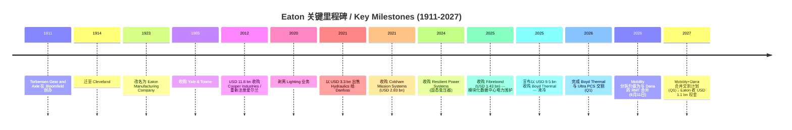
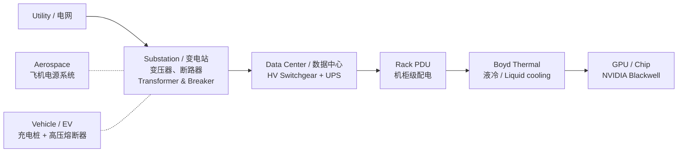
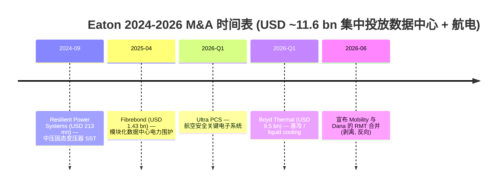
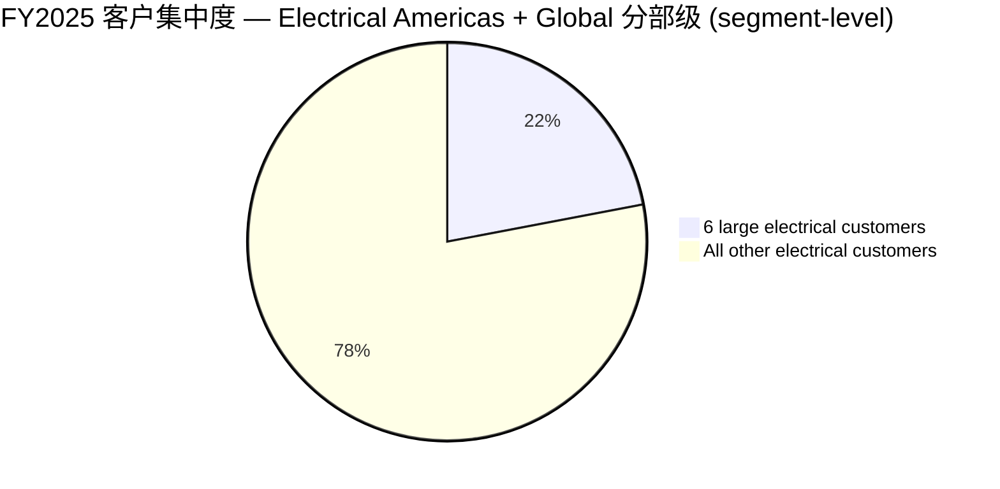
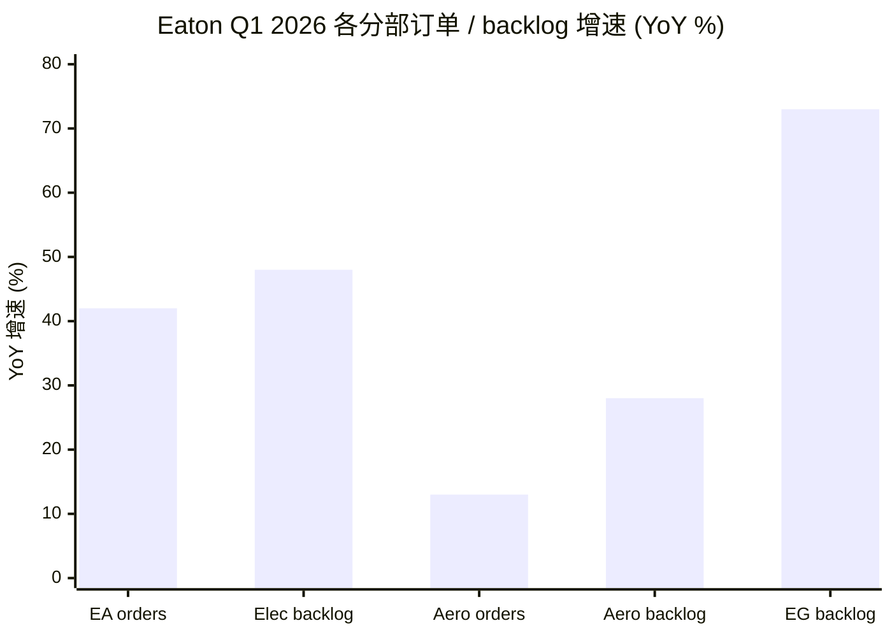
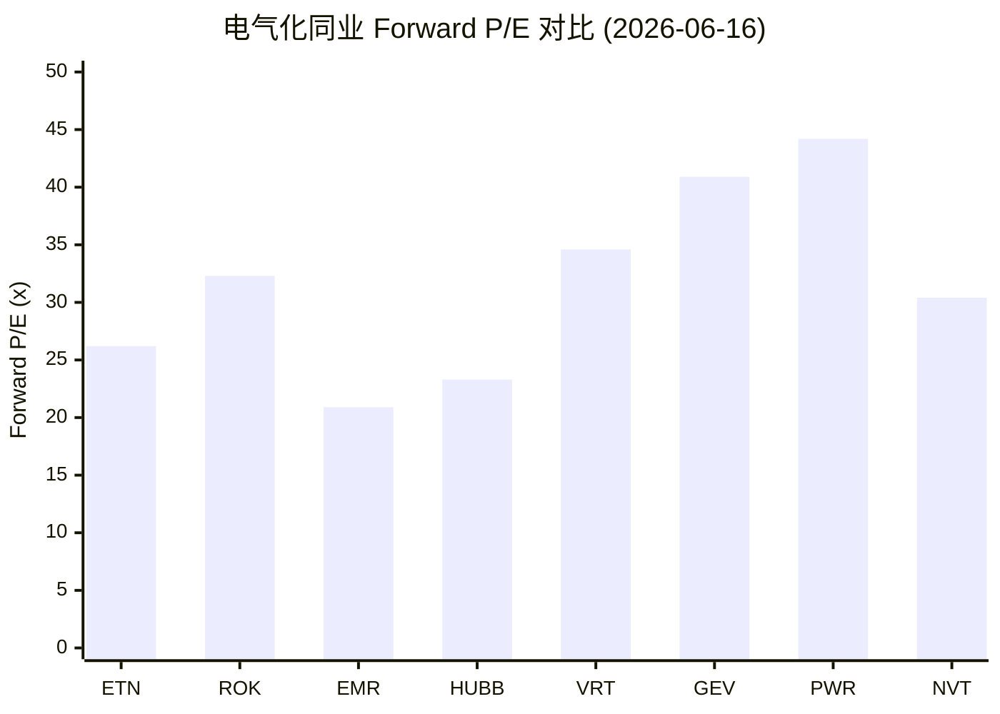

# 伊顿公司 / Eaton Corporation plc (NYSE: ETN) — 公司研究

**报告日期 / As of:** 2026-06-16
**主题 / Theme:** AI 电力与电气化 (ai-power-electrification)
**报告语言 / Language:** 简体中文 (Simplified Chinese) — 主要数据源为美国 SEC EDGAR、公司年报与新闻发布，原文为英文，关键专业术语保留中英双语对照

> **重大更新 — Mobility 分拆改为与 Dana 的 Reverse Morris Trust (RMT) 合并 (2026-06-11):** 公司 2026-01-26 宣布的 Mobility (Vehicle + eMobility) "独立分拆 (spin-off)" 方案已升级为与 **Dana Incorporated (NYSE: DAN)** 的 **Reverse Morris Trust (RMT, 反向莫里斯信托)** 合并交易 — 合并后公司企业价值 (enterprise value) 超过 USD 10 bn、Eaton 的 Mobility Group 估值约 **USD 5.1 bn**、Eaton 将收到约 **USD 1.1 bn 现金分配** (用于偿债 + 资本配置)、Eaton 股东将持有合并后公司 **≥50.1%** 股权、合并预计带来 **USD 250 mn run-rate synergies**，交易预计 **2027 Q1 完成**。管理层称该交易"immediately accretive to Eaton's organic growth rate and operating margins upon closing"。
> 数据来源 / Source: [Eaton 8-K Exhibit 99.1 — Combine Mobility Group with Dana (Reverse Morris Trust), 2026-06-11](https://www.sec.gov/Archives/edgar/data/1551182/000095014226001733/eh260792115_ex9901.htm)。

> **业绩指引 — FY2026 有机增长上调至 10% (2026-05-05):** 公司将 2026 全年有机增长 (organic growth) 指引中位数从 8% 上调至 **10%**，调整后 EPS (adjusted EPS) 区间 **USD 13.05-13.50** (中位 +10% YoY)、GAAP EPS USD 10.88-11.33 — 主因 Q1 2026 完成 USD 11 bn 战略性收购 (Boyd Thermal + Ultra PCS) 后的并表影响，叠加 Electrical Americas 12 个月滚动订单同比 +42% (数据中心 / data center 驱动)、Electrical 板块 backlog +48%、Aerospace 订单 +13% / backlog +28% 的需求加速。
> 数据来源 / Source: [Eaton Q1 FY2026 Earnings Press Release, 2026-05-05](https://www.sec.gov/Archives/edgar/data/1551182/000155118226000010/etn03312026exhibit99.htm)。

---

## 投资摘要 / Investment Summary Header

> *以下评级、目标价、情景目标价、前瞻估计均为本报告分析师观点 (Analyst view)，非公司披露、非 10-K 内容 — 10-K 不含目标价。*

| 项目 | 数值 (as of 2026-06-16) |
|---|---|
| **评级 / Rating** | **Overweight (增持)** *(Analyst view)* |
| **12 个月目标价 / 12-mo Price Target** | **USD 460** *(Analyst view)* |
| 当前价 / Current Price | **USD 411.87** ([Yahoo Finance — ETN, 2026-06-16](https://finance.yahoo.com/quote/ETN/)) |
| 隐含上行 / Implied Upside | **+11.7%** *(Analyst view)* |
| 估值方法 / Valuation Method | 2027E adjusted EPS USD 14.85 × 31× forward P/E *(Analyst view)* |
| 市值 / Market Cap | **USD 159.9 bn** ([Yahoo Finance, 2026-06-16](https://finance.yahoo.com/quote/ETN/)) |
| 52 周区间 / 52-wk Range | USD 311.92 – 435.43 (同源) |
| TTM P/E / Forward P/E | 40.3x / 26.2x (同源) |
| 股息率 / Div Yield · Beta | 1.08% · 1.19 (同源) |

**论点支柱 / Thesis pillars (4 条, all *Analyst view*):**

1. **"从电网到芯片 (grid-to-chip)"全栈数据中心电力 + 散热龙头** — 完成 Boyd Thermal (USD 9.5 bn, 液冷) + Fibrebond (模块化电力围护) 收购后，Eaton 是少数同时覆盖 utility-grade HV/MV switchgear、UPS、Rack PDU 与液冷 (liquid cooling) 的垂直整合方；每兆瓦 (per-MW) 内容从 USD 1.2-2.4 mn 升至 ~USD 3 mn。
2. **Electrical Americas 订单 +42% / backlog +48% (Q1 2026) 提供 2027-2028 强增长可见度** — 订单增速持续高于销售增速，backlog 累积；北美数据中心总规划管线已升至 324 GW (+10% MoM)，behind-the-meter (BTM) 现场发电配电支出较普通项目高 ~30%,直接利好 Eaton。
3. **Dana RMT 交易让组合纯化 (purification) 进入兑现阶段** — 剥离低增长 / 亏损的 Mobility (Vehicle 利润率 16.7%、eMobility 亏损) 后,剩余 Electrical + Aerospace 双引擎利润率与增速更高,且 Eaton 收到 USD 1.1 bn 现金 + ≥50.1% 合并公司股权,"immediately accretive"。
4. **运营杠杆兑现 — 分段经营利润率创纪录 24.5% (FY2025)** — 订单 / 产能 / 定价三角下的强 unit economics,FY2025 FCF USD 3.6 bn。

**关键变量 / Swing variables (call 取决于这 2 点):** (a) **AI 数据中心 capex 是否持续** — 若 2027-2028 hyperscaler capex 减速,Electrical Americas +42% 订单不可持续; (b) **Boyd Thermal 整合 execution** — USD 9.5 bn 是 2012 年 Cooper 以来最大整合,客户群 / 文化 / 产品交叉销售落地速度决定协同兑现节奏。

---

## 目录 / Table of Contents

1. 公司概览 / Company Overview
   - 1A. 估值与目标价 / Valuation & Price Target
   - 1B. GF Score 基本面评分卡
2. 估值、前瞻模型与目标价 / Valuation, Forward Model & Price Target
3. 公司历史 / Company History
4. 管理团队 / Management Team
5. 产品与服务 / Products & Services
6. 客户与上市策略 / Customers & Go-to-Market
7. 行业概览 / Industry Overview
8. 竞争格局 / Competitive Landscape
9. 市场机会 / Market Opportunity (TAM)
10. 风险评估 (含 9.5 关键分歧与催化剂) / Risk Assessment & Key Debates
11. 投资人视角评分卡 / Investor-Lens Scorecards
12. 数据来源清单 / Data Used
13. 参考资料 / References

---

## 1. 公司概览 / Company Overview

**本报告观点 (BLUF):** 我们给予 Eaton **Overweight (增持)** 评级、12 个月目标价 **USD 460** (隐含 +11.7%)。核心逻辑:Eaton 已从"卖断路器的多元工业供应商"转型为 **AI 数据中心物理基础设施 (电力 + 散热) 的全栈整合方** — Q1 2026 Electrical Americas 订单 +42%、Electrical 板块 backlog +48% 提供了 2027-2028 年罕见的增长可见度,而 2026-06-11 宣布的 Dana RMT 交易将剥离拖累利润率的 Mobility 业务、为 Eaton 带来 USD 1.1 bn 现金,组合纯化进入兑现阶段 ([Eaton Q1 FY2026 Earnings Press Release, 2026-05-05](https://www.sec.gov/Archives/edgar/data/1551182/000155118226000010/etn03312026exhibit99.htm); [Eaton 8-K — Dana RMT, 2026-06-11](https://www.sec.gov/Archives/edgar/data/1551182/000095014226001733/eh260792115_ex9901.htm))。风险在于 TTM P/E 40x 的高估值对任何 AI capex 减速或 Boyd Thermal 整合落后高度敏感 — 这是一个"优质资产 + 偏紧价格"的增持,而非深度价值标的。

伊顿公司 (Eaton Corporation plc, NYSE:ETN) 是一家"智能电力管理 (intelligent power management)"公司，总部位于爱尔兰都柏林 (Dublin, Ireland)，全球运营中心位于美国俄亥俄州 Beachwood (Cleveland 都会区)。根据其 FY2025 10-K 自述，"Founded in 1911, Eaton has continuously evolved to meet the changing and expanding needs of our stakeholders. With revenues of $27.4 billion in 2025, the Company serves customers in 180 countries" ([Eaton FY2025 10-K, Item 1 Business](https://www.sec.gov/Archives/edgar/data/1551182/000155118226000007/etn-20251231.htm))。公司目前拥有约 97,000 名全球员工，2025 年报告 5 个业务分部 (reportable segments)：Electrical Americas、Electrical Global、Aerospace、Vehicle、eMobility — 但 2026 年 1 月 26 日公司宣布将 Vehicle + eMobility 合并为"Mobility"分部并于 2027 Q1 之前分拆 (spin-off) 为独立上市公司，分拆后伊顿将聚焦于电气 (Electrical) + 航空航天 (Aerospace) 两大高增长、高利润板块 ([Eaton 8-K 99.1 — Mobility Spin-off Announcement, 2026-01-26](https://www.sec.gov/Archives/edgar/data/1551182/000114036126002286/ef20063889_ex99-1.htm))。

商业模式 (business model) 上，伊顿向数据中心 (data center)、公用事业 (utility)、工业 (industrial)、商业与机构 (commercial & institutional)、住宅 (residential)、航空航天与商用车辆 (aerospace and commercial vehicle) 等终端市场提供"产品 (Products)"与"系统 (Systems)"两类组合：Products 是工厂大批量、目录化的低压配电、断路器、UPS、电机控制等元器件；Systems 是按工程订单交付的中低压配电盘 (switchgear)、变电站模块、定制工程方案，毛利与订单规模更高 ([Eaton FY2025 10-K, Note 18 — Revenue Disaggregation](https://www.sec.gov/Archives/edgar/data/1551182/000155118226000007/etn-20251231.htm))。FY2025 全年净销售额 (net sales) USD 27.448 bn (同比 +10.3%, 2024 年为 USD 24.878 bn)，归属伊顿普通股股东的净利润 (net income attributable to ordinary shareholders) USD 4.087 bn，摊薄 EPS USD 10.45；调整后 EPS (adjusted EPS) USD 12.07，同比 +12%；分段经营利润率 (segment operating margin) 创纪录达 24.5% (相较 2024 年 24.0% 提升 50 bps) ([Eaton Q4-FY2025 Earnings Press Release, 2026-02-26](https://www.sec.gov/Archives/edgar/data/1551182/000155118226000002/etn12312025exhibit99.htm))。

地理分布上，美国是伊顿最大的单一市场——FY2025 美国净销售额 USD 17.122 bn (占总销售 62.4%)，欧洲 USD 5.078 bn (18.5%)、亚太 USD 2.704 bn (9.9%)、拉美 USD 1.461 bn (5.3%)、加拿大 USD 1.083 bn (3.9%) ([Eaton FY2025 10-K, Note 18 — Geographic Region Information](https://www.sec.gov/Archives/edgar/data/1551182/000155118226000007/etn-20251231.htm))。这与公司"在 180 个国家服务客户"的描述并不矛盾——海外业务多通过分销渠道、本地装配厂与项目交付完成，但 collateral revenue 仍归于美国总部分销 (geographic destination of sales)。

分部销售结构 (segment revenue mix) — FY2025：

| 分部 / Segment | FY2025 销售额 (USD M) | FY2024 销售额 | YoY | 经营利润率 / Op Margin FY2025 |
|---|---|---|---|---|
| **Electrical Americas** | **13,276** | 11,436 | +16% | **29.9%** |
| **Electrical Global** | **6,815** | 6,248 | +9% | **19.4%** |
| **Aerospace** | **4,249** | 3,744 | +14% | **23.8%** |
| Vehicle | 2,505 | 2,790 | -10% | 16.7% |
| eMobility | 604 | 662 | -9% | (2.3)% |
| **合计 / Total** | **27,448** | 24,878 | +10% | 24.5% (segment) |

数据来源 / Source: [Eaton FY2025 10-K, Note 18 — Segment Information](https://www.sec.gov/Archives/edgar/data/1551182/000155118226000007/etn-20251231.htm)。

### 1A. 估值与目标价 / Valuation & Price Target

**估值快照 / Valuation snapshot (2026-06-16):** 收盘价 USD 411.87，市值 USD 159.9 bn、TTM P/E 40.3x、Forward P/E 26.2x、TTM P/S 5.61x、P/B 8.11x、股息率 1.08%、Beta 1.19、52 周区间 USD 311.92 – 435.43 ([Yahoo Finance — ETN, 2026-06-16](https://finance.yahoo.com/quote/ETN/))。**对比同业 (TTM P/E / Forward P/E, 2026-06-16):** Rockwell Automation (ROK) 48.6 / 32.3、Emerson Electric (EMR) 34.7 / 20.9、Hubbell (HUBB) 30.1 / 23.3、Vertiv (VRT) 76.7 / 34.6、GE Vernova (GEV) 29.3 / 40.9、Quanta Services (PWR) 99.3 / 44.2、nVent (NVT) 58.0 / 30.4 (同源)。伊顿 TTM P/E 40x 显著高于美国大盘 (S&P 500 ~26x)、且高于 EMR / HUBB 的 30-35x，但低于"纯 AI 数据中心配电与冷却"的 VRT (77x) 与 PWR (99x)；26x 的 Forward P/E 显示市场已部分定价 Boyd Thermal / Fibrebond / Ultra PCS 共计 USD ~11 bn 收购的协同效应 — 这一估值溢价主要由数据中心订单加速 (Electrical Americas Q1 2026 12 个月滚动订单 +42%) + "Lead, Invest and Execute for Growth" 战略叙事所支撑 ([Eaton Q1 FY2026 Earnings Press Release, 2026-05-05](https://www.sec.gov/Archives/edgar/data/1551182/000155118226000010/etn03312026exhibit99.htm))。*分析师观点：*与 VRT 单一聚焦数据中心物理基础设施 (cooling + power) 的轻资产模型相比，伊顿是"重资产 + 全栈 (full stack)"的电气化提供商；与 ROK 单纯工业自动化定位相比，伊顿涵盖电气化 + 公用事业级电源 + 数据中心 + 航空，市场给予的估值溢价反映了"较纯粹 AI/数据中心 plays 风险更低但增长稍慢"的中间定位。完整的前瞻模型、目标价推导与 bull/base/bear 情景见第 2 节。

**伊顿如何赚钱 / How Eaton makes money — FY2025 income-statement Sankey:**

<svg xmlns="http://www.w3.org/2000/svg" viewBox="0 0 1000 560" width="1000" height="560" role="img" aria-label="income statement Sankey"><rect x="0" y="0" width="1000" height="560" fill="#ffffff"/>
<text x="20.00" y="30.00" text-anchor="start" font-family="Helvetica,Arial,sans-serif" font-size="15" font-weight="700" fill="#1f2933">伊顿如何赚钱 / How Eaton (ETN) Makes Its Money — FY2025 (USD M)</text>
<path d="M 204.00,64.00 C 258.00,64.00 258.00,92.01 312.00,92.01 L 312.00,282.57 C 258.00,282.57 258.00,254.56 204.00,254.56 Z" fill="#93c5fd" fill-opacity="0.55"/>
<path d="M 452.00,85.01 C 506.00,85.01 506.00,207.96 560.00,207.96 L 560.00,282.72 C 506.00,282.72 506.00,159.78 452.00,159.78 Z" fill="#86efac" fill-opacity="0.55"/>
<path d="M 452.00,159.78 C 506.00,159.78 506.00,296.72 560.00,296.72 L 560.00,370.04 C 506.00,370.04 506.00,233.10 452.00,233.10 Z" fill="#fca5a5" fill-opacity="0.55"/>
<path d="M 328.00,92.01 C 382.00,92.01 382.00,85.01 436.00,85.01 L 436.00,233.10 C 382.00,233.10 382.00,240.10 328.00,240.10 Z" fill="#86efac" fill-opacity="0.55"/>
<path d="M 328.00,240.10 C 382.00,240.10 382.00,247.10 436.00,247.10 L 436.00,492.99 C 382.00,492.99 382.00,485.99 328.00,485.99 Z" fill="#fca5a5" fill-opacity="0.55"/>
<path d="M 700.00,202.94 C 754.00,202.94 754.00,238.63 808.00,238.63 L 808.00,297.30 C 754.00,297.30 754.00,261.61 700.00,261.61 Z" fill="#86efac" fill-opacity="0.55"/>
<path d="M 700.00,261.61 C 754.00,261.61 754.00,311.30 808.00,311.30 L 808.00,323.37 C 754.00,323.37 754.00,273.68 700.00,273.68 Z" fill="#fca5a5" fill-opacity="0.55"/>
<path d="M 700.00,273.68 C 754.00,273.68 754.00,337.37 808.00,337.37 L 808.00,339.37 C 754.00,339.37 754.00,275.68 700.00,275.68 Z" fill="#fca5a5" fill-opacity="0.55"/>
<path d="M 576.00,207.96 C 630.00,207.96 630.00,202.94 684.00,202.94 L 684.00,277.71 C 630.00,277.71 630.00,282.72 576.00,282.72 Z" fill="#86efac" fill-opacity="0.55"/>
<path d="M 204.00,268.56 C 258.00,268.56 258.00,282.57 312.00,282.57 L 312.00,380.39 C 258.00,380.39 258.00,366.38 204.00,366.38 Z" fill="#93c5fd" fill-opacity="0.55"/>
<path d="M 576.00,296.72 C 630.00,296.72 630.00,287.74 684.00,287.74 L 684.00,349.62 C 630.00,349.62 630.00,358.60 576.00,358.60 Z" fill="#fca5a5" fill-opacity="0.55"/>
<path d="M 576.00,358.60 C 630.00,358.60 630.00,363.62 684.00,363.62 L 684.00,375.06 C 630.00,375.06 630.00,370.04 576.00,370.04 Z" fill="#fca5a5" fill-opacity="0.55"/>
<path d="M 204.00,380.38 C 258.00,380.38 258.00,380.39 312.00,380.39 L 312.00,441.38 C 258.00,441.38 258.00,441.37 204.00,441.37 Z" fill="#93c5fd" fill-opacity="0.55"/>
<path d="M 204.00,455.37 C 258.00,455.37 258.00,441.38 312.00,441.38 L 312.00,477.34 C 258.00,477.34 258.00,491.33 204.00,491.33 Z" fill="#93c5fd" fill-opacity="0.55"/>
<path d="M 204.00,505.33 C 258.00,505.33 258.00,477.34 312.00,477.34 L 312.00,486.01 C 258.00,486.01 258.00,514.00 204.00,514.00 Z" fill="#93c5fd" fill-opacity="0.55"/>
<rect x="188.00" y="64.00" width="16" height="190.56" rx="1.5" fill="#2563eb"/>
<rect x="188.00" y="268.56" width="16" height="97.82" rx="1.5" fill="#2563eb"/>
<rect x="188.00" y="380.38" width="16" height="60.99" rx="1.5" fill="#2563eb"/>
<rect x="188.00" y="455.37" width="16" height="35.96" rx="1.5" fill="#2563eb"/>
<rect x="188.00" y="505.33" width="16" height="8.67" rx="1.5" fill="#2563eb"/>
<rect x="312.00" y="92.01" width="16" height="393.99" rx="1.5" fill="#1e3a8a"/>
<rect x="436.00" y="85.01" width="16" height="148.09" rx="1.5" fill="#15803d"/>
<rect x="436.00" y="247.10" width="16" height="245.90" rx="1.5" fill="#dc2626"/>
<rect x="560.00" y="207.96" width="16" height="74.77" rx="1.5" fill="#15803d"/>
<rect x="560.00" y="296.72" width="16" height="73.32" rx="1.5" fill="#dc2626"/>
<rect x="684.00" y="202.94" width="16" height="70.79" rx="1.5" fill="#15803d"/>
<rect x="684.00" y="287.74" width="16" height="61.88" rx="1.5" fill="#dc2626"/>
<rect x="684.00" y="363.62" width="16" height="11.44" rx="1.5" fill="#dc2626"/>
<rect x="808.00" y="238.63" width="16" height="58.66" rx="1.5" fill="#15803d"/>
<rect x="808.00" y="311.30" width="16" height="12.07" rx="1.5" fill="#dc2626"/>
<rect x="808.00" y="337.37" width="16" height="2.00" rx="1.5" fill="#dc2626"/>
<line x1="188.00" y1="159.28" x2="182.00" y2="136.62" stroke="#cbd5e1" stroke-width="1"/>
<text x="179.00" y="139.62" text-anchor="end" font-family="Helvetica,Arial,sans-serif" font-size="11.5" font-weight="700" fill="#1f2933">Electrical Americas</text>
<text x="179.00" y="152.62" text-anchor="end" font-family="Helvetica,Arial,sans-serif" font-size="10" font-weight="400" fill="#52606d">$13.3B  (48.4%)</text>
<line x1="188.00" y1="317.47" x2="182.00" y2="294.81" stroke="#cbd5e1" stroke-width="1"/>
<text x="179.00" y="297.81" text-anchor="end" font-family="Helvetica,Arial,sans-serif" font-size="11.5" font-weight="700" fill="#1f2933">Electrical Global</text>
<text x="179.00" y="310.81" text-anchor="end" font-family="Helvetica,Arial,sans-serif" font-size="10" font-weight="400" fill="#52606d">$6.8B  (24.8%)</text>
<line x1="188.00" y1="410.88" x2="182.00" y2="388.21" stroke="#cbd5e1" stroke-width="1"/>
<text x="179.00" y="391.21" text-anchor="end" font-family="Helvetica,Arial,sans-serif" font-size="11.5" font-weight="700" fill="#1f2933">Aerospace</text>
<text x="179.00" y="404.21" text-anchor="end" font-family="Helvetica,Arial,sans-serif" font-size="10" font-weight="400" fill="#52606d">$4.2B  (15.5%)</text>
<line x1="188.00" y1="473.35" x2="182.00" y2="450.69" stroke="#cbd5e1" stroke-width="1"/>
<text x="179.00" y="453.69" text-anchor="end" font-family="Helvetica,Arial,sans-serif" font-size="11.5" font-weight="700" fill="#1f2933">Vehicle</text>
<text x="179.00" y="466.69" text-anchor="end" font-family="Helvetica,Arial,sans-serif" font-size="10" font-weight="400" fill="#52606d">$2.5B  (9.1%)</text>
<line x1="188.00" y1="509.67" x2="182.00" y2="487.00" stroke="#cbd5e1" stroke-width="1"/>
<text x="179.00" y="490.00" text-anchor="end" font-family="Helvetica,Arial,sans-serif" font-size="11.5" font-weight="700" fill="#1f2933">eMobility</text>
<text x="179.00" y="503.00" text-anchor="end" font-family="Helvetica,Arial,sans-serif" font-size="10" font-weight="400" fill="#52606d">$604.0M  (2.2%)</text>
<rect x="331.00" y="74.01" width="106.80" height="26" rx="2" fill="#ffffff" fill-opacity="0.72"/>
<text x="334.00" y="86.01" text-anchor="start" font-family="Helvetica,Arial,sans-serif" font-size="11.5" font-weight="700" fill="#1f2933">Revenue</text>
<text x="334.00" y="99.01" text-anchor="start" font-family="Helvetica,Arial,sans-serif" font-size="10" font-weight="400" fill="#52606d">$27.4B  (100.0%)</text>
<rect x="455.00" y="67.01" width="100.50" height="26" rx="2" fill="#ffffff" fill-opacity="0.72"/>
<text x="458.00" y="79.01" text-anchor="start" font-family="Helvetica,Arial,sans-serif" font-size="11.5" font-weight="700" fill="#1f2933">Gross Profit</text>
<text x="458.00" y="92.01" text-anchor="start" font-family="Helvetica,Arial,sans-serif" font-size="10" font-weight="400" fill="#52606d">$10.3B  (37.6%)</text>
<rect x="455.00" y="229.10" width="144.60" height="26" rx="2" fill="#ffffff" fill-opacity="0.72"/>
<text x="458.00" y="241.10" text-anchor="start" font-family="Helvetica,Arial,sans-serif" font-size="11.5" font-weight="700" fill="#1f2933">Cost of Revenue (COGS)</text>
<text x="458.00" y="254.10" text-anchor="start" font-family="Helvetica,Arial,sans-serif" font-size="10" font-weight="400" fill="#52606d">$17.1B  (62.4%)</text>
<rect x="579.00" y="189.96" width="106.80" height="26" rx="2" fill="#ffffff" fill-opacity="0.72"/>
<text x="582.00" y="201.96" text-anchor="start" font-family="Helvetica,Arial,sans-serif" font-size="11.5" font-weight="700" fill="#1f2933">Operating Income</text>
<text x="582.00" y="214.96" text-anchor="start" font-family="Helvetica,Arial,sans-serif" font-size="10" font-weight="400" fill="#52606d">$5.2B  (19.0%)</text>
<rect x="579.00" y="278.72" width="150.90" height="26" rx="2" fill="#ffffff" fill-opacity="0.72"/>
<text x="582.00" y="290.72" text-anchor="start" font-family="Helvetica,Arial,sans-serif" font-size="11.5" font-weight="700" fill="#1f2933">Total Operating Expense</text>
<text x="582.00" y="303.72" text-anchor="start" font-family="Helvetica,Arial,sans-serif" font-size="10" font-weight="400" fill="#52606d">$5.1B  (18.6%)</text>
<rect x="703.00" y="184.94" width="94.20" height="26" rx="2" fill="#ffffff" fill-opacity="0.72"/>
<text x="706.00" y="196.94" text-anchor="start" font-family="Helvetica,Arial,sans-serif" font-size="11.5" font-weight="700" fill="#1f2933">Pretax Income</text>
<text x="706.00" y="209.94" text-anchor="start" font-family="Helvetica,Arial,sans-serif" font-size="10" font-weight="400" fill="#52606d">$4.9B  (18.0%)</text>
<rect x="703.00" y="269.74" width="94.20" height="26" rx="2" fill="#ffffff" fill-opacity="0.72"/>
<text x="706.00" y="281.74" text-anchor="start" font-family="Helvetica,Arial,sans-serif" font-size="11.5" font-weight="700" fill="#1f2933">SG&amp;A</text>
<text x="706.00" y="294.74" text-anchor="start" font-family="Helvetica,Arial,sans-serif" font-size="10" font-weight="400" fill="#52606d">$4.3B  (15.7%)</text>
<rect x="703.00" y="345.62" width="100.50" height="26" rx="2" fill="#ffffff" fill-opacity="0.72"/>
<text x="706.00" y="357.62" text-anchor="start" font-family="Helvetica,Arial,sans-serif" font-size="11.5" font-weight="700" fill="#1f2933">R&amp;D</text>
<text x="706.00" y="370.62" text-anchor="start" font-family="Helvetica,Arial,sans-serif" font-size="10" font-weight="400" fill="#52606d">$797.0M  (2.9%)</text>
<text x="833.00" y="264.96" text-anchor="start" font-family="Helvetica,Arial,sans-serif" font-size="11.5" font-weight="700" fill="#1f2933">Net Income</text>
<text x="833.00" y="277.96" text-anchor="start" font-family="Helvetica,Arial,sans-serif" font-size="10" font-weight="400" fill="#52606d">$4.1B  (14.9%)</text>
<text x="833.00" y="314.33" text-anchor="start" font-family="Helvetica,Arial,sans-serif" font-size="11.5" font-weight="700" fill="#1f2933">Income Tax</text>
<text x="833.00" y="327.33" text-anchor="start" font-family="Helvetica,Arial,sans-serif" font-size="10" font-weight="400" fill="#52606d">$841.0M  (3.1%)</text>
<text x="833.00" y="339.33" text-anchor="start" font-family="Helvetica,Arial,sans-serif" font-size="11.5" font-weight="700" fill="#1f2933">Minority Interest</text>
<text x="833.00" y="352.33" text-anchor="start" font-family="Helvetica,Arial,sans-serif" font-size="10" font-weight="400" fill="#52606d">$3.0M  (0.01%)</text>
<text x="500.00" y="544.00" text-anchor="middle" font-family="Helvetica,Arial,sans-serif" font-size="10" font-weight="400" fill="#52606d">Source: Eaton FY2025 10-K, Consolidated Statements of Income + Note 18 Segments</text>
</svg>

收入流向图显示 FY2025 净销售 USD 27.4 bn (五大分部) → gross profit USD 10.3 bn (37.6%) → operating income USD 5.2 bn (19.0%) → net income USD 4.1 bn (14.9%)，数据来源 / Source: [Eaton FY2025 10-K, Consolidated Statements of Income + Note 18 Segment Information](https://www.sec.gov/Archives/edgar/data/1551182/000155118226000007/etn-20251231.htm)。

**FY2025 分部销售结构 / Segment mix (donut):**

<svg xmlns="http://www.w3.org/2000/svg" viewBox="0 0 720 460" width="720" height="460" role="img" aria-label="revenue donut"><rect x="0" y="0" width="720" height="460" fill="#ffffff"/>
<text x="20.00" y="30.00" text-anchor="start" font-family="Helvetica,Arial,sans-serif" font-size="15" font-weight="700" fill="#1f2933">FY2025 净销售额按分部 / Net Sales by Segment</text>
<path d="M 288.00,107.20 A 132 132 0 0 1 301.53,370.50 L 295.99,316.79 A 78 78 0 0 0 288.00,161.20 Z" fill="#2563eb"/>
<path d="M 301.53,370.50 A 132 132 0 0 1 156.85,254.15 L 210.50,248.03 A 78 78 0 0 0 295.99,316.79 Z" fill="#15803d"/>
<path d="M 156.85,254.15 A 132 132 0 0 1 201.79,139.24 L 237.06,180.13 A 78 78 0 0 0 210.50,248.03 Z" fill="#d97706"/>
<path d="M 201.79,139.24 A 132 132 0 0 1 269.81,108.46 L 277.25,161.94 A 78 78 0 0 0 237.06,180.13 Z" fill="#7c3aed"/>
<path d="M 269.81,108.46 A 132 132 0 0 1 288.00,107.20 L 288.00,161.20 A 78 78 0 0 0 277.25,161.94 Z" fill="#dc2626"/>
<text x="288.00" y="235.20" text-anchor="middle" font-family="Helvetica,Arial,sans-serif" font-size="18" font-weight="800" fill="#1f2933">ETN</text>
<text x="288.00" y="255.20" text-anchor="middle" font-family="Helvetica,Arial,sans-serif" font-size="13" font-weight="600" fill="#52606d">$27.4B</text>
<text x="288.00" y="271.20" text-anchor="middle" font-family="Helvetica,Arial,sans-serif" font-size="10" font-weight="400" fill="#8a97a3">total</text>
<line x1="425.82" y1="232.12" x2="441.82" y2="232.12" stroke="#2563eb" stroke-width="1.4"/>
<text x="445.82" y="230.12" text-anchor="start" font-family="Helvetica,Arial,sans-serif" font-size="11" font-weight="700" fill="#1f2933">Electrical Americas</text>
<text x="445.82" y="244.12" text-anchor="start" font-family="Helvetica,Arial,sans-serif" font-size="10" font-weight="400" fill="#52606d">$13.3B  (48.4%)</text>
<line x1="201.51" y1="346.74" x2="185.51" y2="346.74" stroke="#15803d" stroke-width="1.4"/>
<text x="181.51" y="344.74" text-anchor="end" font-family="Helvetica,Arial,sans-serif" font-size="11" font-weight="700" fill="#1f2933">Electrical Global</text>
<text x="181.51" y="358.74" text-anchor="end" font-family="Helvetica,Arial,sans-serif" font-size="10" font-weight="400" fill="#52606d">$6.8B  (24.8%)</text>
<line x1="159.48" y1="188.93" x2="143.48" y2="188.93" stroke="#d97706" stroke-width="1.4"/>
<text x="139.48" y="186.93" text-anchor="end" font-family="Helvetica,Arial,sans-serif" font-size="11" font-weight="700" fill="#1f2933">Aerospace</text>
<text x="139.48" y="200.93" text-anchor="end" font-family="Helvetica,Arial,sans-serif" font-size="10" font-weight="400" fill="#52606d">$4.2B  (15.5%)</text>
<line x1="231.10" y1="113.47" x2="215.10" y2="113.47" stroke="#7c3aed" stroke-width="1.4"/>
<text x="211.10" y="111.47" text-anchor="end" font-family="Helvetica,Arial,sans-serif" font-size="11" font-weight="700" fill="#1f2933">Vehicle</text>
<text x="211.10" y="125.47" text-anchor="end" font-family="Helvetica,Arial,sans-serif" font-size="10" font-weight="400" fill="#52606d">$2.5B  (9.1%)</text>
<line x1="278.47" y1="101.53" x2="262.47" y2="101.53" stroke="#dc2626" stroke-width="1.4"/>
<text x="258.47" y="99.53" text-anchor="end" font-family="Helvetica,Arial,sans-serif" font-size="11" font-weight="700" fill="#1f2933">eMobility</text>
<text x="258.47" y="113.53" text-anchor="end" font-family="Helvetica,Arial,sans-serif" font-size="10" font-weight="400" fill="#52606d">$604.0M  (2.2%)</text>
<text x="360.00" y="444.00" text-anchor="middle" font-family="Helvetica,Arial,sans-serif" font-size="10" font-weight="400" fill="#52606d">Source: Eaton FY2025 10-K, Note 18 — Segment Information</text>
</svg>

数据来源 / Source: [Eaton FY2025 10-K, Note 18 — Segment Information](https://www.sec.gov/Archives/edgar/data/1551182/000155118226000007/etn-20251231.htm)。

**历史分部销售柱状图 / Historical revenue bars (FY2023-FY2025):**

<svg xmlns="http://www.w3.org/2000/svg" viewBox="0 0 860 470" width="860" height="470" role="img" aria-label="historical revenue bars"><rect x="0" y="0" width="860" height="470" fill="#ffffff"/>
<text x="20.00" y="30.00" text-anchor="start" font-family="Helvetica,Arial,sans-serif" font-size="15" font-weight="700" fill="#1f2933">历史净销售额按分部 / Historical Net Sales by Segment (USD bn)</text>
<rect x="20.00" y="44" width="11" height="11" rx="2" fill="#2563eb"/>
<text x="36.00" y="53.00" text-anchor="start" font-family="Helvetica,Arial,sans-serif" font-size="10.5" font-weight="400" fill="#1f2933">Electrical Americas</text>
<rect x="175.40" y="44" width="11" height="11" rx="2" fill="#15803d"/>
<text x="191.40" y="53.00" text-anchor="start" font-family="Helvetica,Arial,sans-serif" font-size="10.5" font-weight="400" fill="#1f2933">Electrical Global</text>
<rect x="317.60" y="44" width="11" height="11" rx="2" fill="#d97706"/>
<text x="333.60" y="53.00" text-anchor="start" font-family="Helvetica,Arial,sans-serif" font-size="10.5" font-weight="400" fill="#1f2933">Aerospace</text>
<rect x="407.00" y="44" width="11" height="11" rx="2" fill="#7c3aed"/>
<text x="423.00" y="53.00" text-anchor="start" font-family="Helvetica,Arial,sans-serif" font-size="10.5" font-weight="400" fill="#1f2933">Vehicle</text>
<rect x="483.20" y="44" width="11" height="11" rx="2" fill="#dc2626"/>
<text x="499.20" y="53.00" text-anchor="start" font-family="Helvetica,Arial,sans-serif" font-size="10.5" font-weight="400" fill="#1f2933">eMobility</text>
<line x1="70" y1="412.00" x2="834" y2="412.00" stroke="#eceff2" stroke-width="1"/>
<text x="64.00" y="415.00" text-anchor="end" font-family="Helvetica,Arial,sans-serif" font-size="9.5" font-weight="400" fill="#52606d">$0</text>
<line x1="70" y1="345.20" x2="834" y2="345.20" stroke="#eceff2" stroke-width="1"/>
<text x="64.00" y="348.20" text-anchor="end" font-family="Helvetica,Arial,sans-serif" font-size="9.5" font-weight="400" fill="#52606d">$5.9B</text>
<line x1="70" y1="278.40" x2="834" y2="278.40" stroke="#eceff2" stroke-width="1"/>
<text x="64.00" y="281.40" text-anchor="end" font-family="Helvetica,Arial,sans-serif" font-size="9.5" font-weight="400" fill="#52606d">$11.9B</text>
<line x1="70" y1="211.60" x2="834" y2="211.60" stroke="#eceff2" stroke-width="1"/>
<text x="64.00" y="214.60" text-anchor="end" font-family="Helvetica,Arial,sans-serif" font-size="9.5" font-weight="400" fill="#52606d">$17.8B</text>
<line x1="70" y1="144.80" x2="834" y2="144.80" stroke="#eceff2" stroke-width="1"/>
<text x="64.00" y="147.80" text-anchor="end" font-family="Helvetica,Arial,sans-serif" font-size="9.5" font-weight="400" fill="#52606d">$23.7B</text>
<line x1="70" y1="78.00" x2="834" y2="78.00" stroke="#eceff2" stroke-width="1"/>
<text x="64.00" y="81.00" text-anchor="end" font-family="Helvetica,Arial,sans-serif" font-size="9.5" font-weight="400" fill="#52606d">$29.6B</text>
<rect x="110.11" y="316.27" width="110.78" height="95.73" fill="#2563eb"/>
<rect x="110.11" y="250.38" width="110.78" height="65.89" fill="#15803d"/>
<rect x="110.11" y="216.14" width="110.78" height="34.24" fill="#d97706"/>
<rect x="110.11" y="184.26" width="110.78" height="31.88" fill="#7c3aed"/>
<rect x="110.11" y="178.19" width="110.78" height="6.06" fill="#dc2626"/>
<text x="165.50" y="428.00" text-anchor="middle" font-family="Helvetica,Arial,sans-serif" font-size="10" font-weight="400" fill="#52606d">2022</text>
<rect x="301.11" y="298.23" width="110.78" height="113.77" fill="#2563eb"/>
<rect x="301.11" y="229.68" width="110.78" height="68.55" fill="#15803d"/>
<rect x="301.11" y="191.23" width="110.78" height="38.45" fill="#d97706"/>
<rect x="301.11" y="157.82" width="110.78" height="33.41" fill="#7c3aed"/>
<rect x="301.11" y="150.66" width="110.78" height="7.17" fill="#dc2626"/>
<text x="356.50" y="428.00" text-anchor="middle" font-family="Helvetica,Arial,sans-serif" font-size="10" font-weight="400" fill="#52606d">2023</text>
<rect x="492.11" y="283.15" width="110.78" height="128.85" fill="#2563eb"/>
<rect x="492.11" y="212.76" width="110.78" height="70.39" fill="#15803d"/>
<rect x="492.11" y="170.58" width="110.78" height="42.18" fill="#d97706"/>
<rect x="492.11" y="139.14" width="110.78" height="31.43" fill="#7c3aed"/>
<rect x="492.11" y="131.68" width="110.78" height="7.46" fill="#dc2626"/>
<text x="547.50" y="428.00" text-anchor="middle" font-family="Helvetica,Arial,sans-serif" font-size="10" font-weight="400" fill="#52606d">2024</text>
<rect x="683.11" y="262.42" width="110.78" height="149.58" fill="#2563eb"/>
<rect x="683.11" y="185.64" width="110.78" height="76.78" fill="#15803d"/>
<rect x="683.11" y="137.77" width="110.78" height="47.87" fill="#d97706"/>
<rect x="683.11" y="109.55" width="110.78" height="28.22" fill="#7c3aed"/>
<rect x="683.11" y="102.74" width="110.78" height="6.81" fill="#dc2626"/>
<text x="738.50" y="428.00" text-anchor="middle" font-family="Helvetica,Arial,sans-serif" font-size="10" font-weight="400" fill="#52606d">2025</text>
<text x="430.00" y="454.00" text-anchor="middle" font-family="Helvetica,Arial,sans-serif" font-size="10" font-weight="400" fill="#52606d">Source: Eaton FY2024 &amp; FY2025 10-Ks, Note 18 — Segment Information</text>
</svg>

数据来源 / Source: [Eaton FY2024 & FY2025 10-Ks, Note 18 — Segment Information](https://www.sec.gov/Archives/edgar/data/1551182/000155118226000007/etn-20251231.htm)。

### 1B. GF Score 基本面评分卡 / GF Score (GuruFocus-style)

<svg xmlns="http://www.w3.org/2000/svg" viewBox="0 0 500 500" width="500" height="500" role="img" aria-label="GF Score radar">
<rect x="0" y="0" width="500" height="500" fill="#ffffff"/>
<text x="20" y="24" font-family="Helvetica,Arial,sans-serif" font-size="15" font-weight="700" fill="#1f2933">GF Score (GuruFocus-style): 68/100</text>
<text x="20" y="41" font-family="Helvetica,Arial,sans-serif" font-size="11" fill="#52606d">51–70 Poor future performance potential</text>
<polygon points="250.0,88.0 392.7,191.6 338.2,359.4 161.8,359.4 107.3,191.6" fill="#e9f5ec" stroke="none"/>
<polygon points="250.0,208.0 278.5,228.7 267.6,262.3 232.4,262.3 221.5,228.7" fill="none" stroke="#c5d3cb" stroke-width="1"/>
<polygon points="250.0,178.0 307.1,219.5 285.3,286.5 214.7,286.5 192.9,219.5" fill="none" stroke="#c5d3cb" stroke-width="1"/>
<polygon points="250.0,148.0 335.6,210.2 302.9,310.8 197.1,310.8 164.4,210.2" fill="none" stroke="#c5d3cb" stroke-width="1"/>
<polygon points="250.0,118.0 364.1,200.9 320.5,335.1 179.5,335.1 135.9,200.9" fill="none" stroke="#c5d3cb" stroke-width="1"/>
<polygon points="250.0,88.0 392.7,191.6 338.2,359.4 161.8,359.4 107.3,191.6" fill="none" stroke="#c5d3cb" stroke-width="1.3"/>
<line x1="250" y1="238" x2="161.8" y2="359.4" stroke="#cfdad3" stroke-width="1"/>
<text x="146.5" y="392.4" text-anchor="end" font-family="Helvetica,Arial,sans-serif" font-size="11.5" font-weight="600" fill="#1f2933">Financial Strength</text>
<text x="146.5" y="405.4" text-anchor="end" font-family="Helvetica,Arial,sans-serif" font-size="9.5" fill="#52606d">财务实力</text>
<text x="188.3" y="316.9" text-anchor="middle" font-family="Helvetica,Arial,sans-serif" font-size="10.5" font-weight="700" fill="#1f2933">7</text>
<line x1="250" y1="238" x2="250.0" y2="88.0" stroke="#cfdad3" stroke-width="1"/>
<text x="250.0" y="58.0" text-anchor="middle" font-family="Helvetica,Arial,sans-serif" font-size="11.5" font-weight="600" fill="#1f2933">Profitability</text>
<text x="250.0" y="71.0" text-anchor="middle" font-family="Helvetica,Arial,sans-serif" font-size="9.5" fill="#52606d">盈利能力</text>
<text x="250.0" y="97.0" text-anchor="middle" font-family="Helvetica,Arial,sans-serif" font-size="10.5" font-weight="700" fill="#1f2933">9</text>
<line x1="250" y1="238" x2="107.3" y2="191.6" stroke="#cfdad3" stroke-width="1"/>
<text x="82.6" y="183.6" text-anchor="end" font-family="Helvetica,Arial,sans-serif" font-size="11.5" font-weight="600" fill="#1f2933">Growth</text>
<text x="82.6" y="196.6" text-anchor="end" font-family="Helvetica,Arial,sans-serif" font-size="9.5" fill="#52606d">成长性</text>
<text x="150.1" y="199.6" text-anchor="middle" font-family="Helvetica,Arial,sans-serif" font-size="10.5" font-weight="700" fill="#1f2933">7</text>
<line x1="250" y1="238" x2="392.7" y2="191.6" stroke="#cfdad3" stroke-width="1"/>
<text x="417.4" y="183.6" text-anchor="start" font-family="Helvetica,Arial,sans-serif" font-size="11.5" font-weight="600" fill="#1f2933">GF Value</text>
<text x="417.4" y="196.6" text-anchor="start" font-family="Helvetica,Arial,sans-serif" font-size="9.5" fill="#52606d">估值</text>
<text x="292.8" y="218.1" text-anchor="middle" font-family="Helvetica,Arial,sans-serif" font-size="10.5" font-weight="700" fill="#1f2933">3</text>
<line x1="250" y1="238" x2="338.2" y2="359.4" stroke="#cfdad3" stroke-width="1"/>
<text x="353.5" y="392.4" text-anchor="start" font-family="Helvetica,Arial,sans-serif" font-size="11.5" font-weight="600" fill="#1f2933">Momentum</text>
<text x="353.5" y="405.4" text-anchor="start" font-family="Helvetica,Arial,sans-serif" font-size="9.5" fill="#52606d">动量</text>
<text x="302.9" y="304.8" text-anchor="middle" font-family="Helvetica,Arial,sans-serif" font-size="10.5" font-weight="700" fill="#1f2933">6</text>
<polygon points="250.0,103.0 292.8,224.1 302.9,310.8 188.3,322.9 150.1,205.6" fill="#2e8b57" fill-opacity="0.34" stroke="#2e8b57" stroke-width="2"/>
<circle cx="188.3" cy="322.9" r="2.6" fill="#2e8b57"/>
<circle cx="250.0" cy="103.0" r="2.6" fill="#2e8b57"/>
<circle cx="150.1" cy="205.6" r="2.6" fill="#2e8b57"/>
<circle cx="292.8" cy="224.1" r="2.6" fill="#2e8b57"/>
<circle cx="302.9" cy="310.8" r="2.6" fill="#2e8b57"/>
<text x="250" y="470" text-anchor="middle" font-family="Helvetica,Arial,sans-serif" font-size="9.5" fill="#52606d">Source: Eaton FY2025 10-K · Yahoo Finance · indicators.db, as of 2026-06-15</text>
<text x="250" y="485" text-anchor="middle" font-family="Helvetica,Arial,sans-serif" font-size="9" fill="#52606d">GF Score = independent analyst rubric (*Analyst view:*) — not GuruFocus™ official number</text>
</svg>

| 维度 / Dimension | 评分 / Score (0–10) | |
|---|---|---|
| Financial Strength (财务实力) | 7 | `███████░░░` |
| Profitability (盈利能力) | 9 | `█████████░` |
| Growth (成长性) | 7 | `███████░░░` |
| GF Value (估值) | 3 | `███░░░░░░░` |
| Momentum (动量) | 6 | `██████░░░░` |
| **GF Score (composite, *Analyst view:*)** | **68 / 100** | **51–70 Poor future performance potential** |

*Composite weights (*Analyst view:*): Financial Strength 20% · Profitability 25% · Growth 25% · GF Value 15% · Momentum 15% (transparent reproduction — not GuruFocus's proprietary weighting).*

***分析师观点 / Analyst view:*** 我们按 GuruFocus GF Score™ 的五轴 (0-10) 框架对 Eaton 进行独立打分,综合得分 **68/100** (band: 51-70, "Poor future performance potential" — 此 band 主要被偏高估值 / GF Value 拖累,而非基本面弱)。**此评分与下属各子分均为本报告分析师的评分输出 (Analyst view),不归属 GuruFocus,亦不附任何 filing 引用 — 每个底层指标在下文单独引用其一手来源。**

- **Financial Strength (财务实力) = 7/10。** FY2025 末总债务 ~USD 11 bn、净利息费用 USD 241 mn (covered ~21× by operating income USD 5.2 bn),USD 11 bn 收购后杠杆上升但仍 investment-grade;FY2025 operating cash flow USD 4.5 bn 提供充足偿债能力 ([Eaton FY2025 10-K, Consolidated Statements of Cash Flows + Income](https://www.sec.gov/Archives/edgar/data/1551182/000155118226000007/etn-20251231.htm))。扣分项:Boyd Thermal 债务融资使 FY2026 利息费用进一步上升。
- **Profitability (盈利能力) = 9/10。** FY2025 分段经营利润率创纪录 24.5%、net margin 14.9%、ROE 21.6% (DuPont 分解见第 2 节)、ROIC 显著高于 WACC ~7.5%,且连续多年扩张 ([Eaton FY2025 10-K, Note 18 + Statements of Income](https://www.sec.gov/Archives/edgar/data/1551182/000155118226000007/etn-20251231.htm))。这是五轴中最强的一项。
- **Growth (成长性) = 7/10。** FY2023-FY2025 收入从 USD 23.2 bn 增至 USD 27.4 bn (3 年 CAGR ~9%),adjusted EPS FY2025 +12%;前瞻 (第 2 节模型) FY2026E 有机增长指引 +10% ([Eaton Q1 FY2026 Earnings Press Release, 2026-05-05](https://www.sec.gov/Archives/edgar/data/1551182/000155118226000010/etn03312026exhibit99.htm))。扣分:增长高度依赖 AI 数据中心单一主题。
- **GF Value (估值, 越高越便宜) = 3/10。** TTM P/E 40x / forward P/E 26x 均处历史高位区间,相对第 2 节 intrinsic range (USD 340-460) 的 margin of safety 偏薄 ([Yahoo Finance — ETN, 2026-06-16](https://finance.yahoo.com/quote/ETN/))。这是拖累综合分的主因。
- **Momentum (动量) = 6/10。** 当前价 USD 411.87 接近 52 周高点 USD 435.43、12 个月相对工业板块表现稳健,但近一周经历 2026-06-10 的单日回调 (USD 401.7 → 375.5) 后反弹至 411,动量中性偏正 ([Yahoo Finance — ETN, 2026-06-16](https://finance.yahoo.com/quote/ETN/))。

---

## 2. 估值、前瞻模型与目标价 / Valuation, Forward Model & Price Target

> *本节所有前瞻估计、目标价、情景目标价均为本报告分析师观点 (Analyst view) — 非公司披露,不附 filing 引用 (10-K 不含目标价或前瞻 EPS);每条驱动因素的外部依据 (分部数据 + 公司指引 + 行业预测) 在文中分别引用。*

### 2.1 前瞻财务估计 (Forward estimates, FY2025A → FY2028E) — *Analyst view*

下表自下而上构建:Electrical Americas / Electrical Global / Aerospace 三大保留业务各自给出销售路径与利润率轨迹,Mobility (Vehicle + eMobility) 在 2027 Q1 Dana RMT 交割前并表、之后出表 (deconsolidate)。FY2025A 为实际值,引用 [Eaton FY2025 10-K, Note 18](https://www.sec.gov/Archives/edgar/data/1551182/000155118226000007/etn-20251231.htm);FY2026E 起为本报告估计,锚定公司 FY2026 有机增长 +10% 指引与 adjusted EPS USD 13.05-13.50 区间 ([Eaton Q1 FY2026 Earnings Press Release, 2026-05-05](https://www.sec.gov/Archives/edgar/data/1551182/000155118226000010/etn03312026exhibit99.htm))。

| 指标 (USD bn 除非注明) | FY2025A | FY2026E | FY2027E | FY2028E | 备注 / 驱动 |
|---|---|---|---|---|---|
| 净销售 / Net sales | 27.45 | 30.5 | 33.8 | 36.5 | +10% (FY26 指引) → +11% / +8% (订单 backlog 转化) |
| — Electrical Americas | 13.28 | 15.6 | 18.0 | 20.0 | 订单 +42%、backlog +48% 驱动 *Analyst view* |
| — Electrical Global | 6.82 | 7.5 | 8.2 | 8.8 | backlog +73% YoY (Q1 2026) |
| — Aerospace | 4.25 | 4.8 | 5.3 | 5.7 | OEM ramp + aftermarket +18% |
| — Mobility (Vehicle+eMob) | 3.11 | 2.6 | ~0.6 | 0 | 2027 Q1 Dana RMT 出表 |
| 分段经营利润率 / Segment margin | 24.5% | 24.3% | 25.5% | 26.0% | FY26 并购稀释 → 之后运营杠杆 |
| Adjusted EPS (USD) | 12.07 | 13.28 | 14.85 | 16.20 | FY26 指引中位 +10%;FY27 出表后纯化 |
| Adjusted EPS YoY | +12% | +10% | +12% | +9% | |

*分析师观点：*FY2026E adjusted EPS USD 13.28 直接采用公司指引中位 (USD 13.05-13.50);FY2027E USD 14.85 假设保留业务 (Electrical + Aerospace) 有机增长 ~11%、Mobility 出表带来 mix-up (剥离低利润率业务) + 运营杠杆使分段利润率回升至 25.5%。利率风险:RMT 带来的 USD 1.1 bn 现金将部分偿债,降低利息费用对 EPS 的稀释 ([Eaton 8-K — Dana RMT, 2026-06-11](https://www.sec.gov/Archives/edgar/data/1551182/000095014226001733/eh260792115_ex9901.htm))。

<svg xmlns="http://www.w3.org/2000/svg" viewBox="0 0 1240 540" width="1240" height="540" role="img" aria-label="DuPont ROE decomposition"><rect x="0" y="0" width="1240" height="540" fill="#ffffff"/>
<text x="20.00" y="30.00" text-anchor="start" font-family="Helvetica,Arial,sans-serif" font-size="15" font-weight="700" fill="#1f2933">伊顿 DuPont ROE 分解 / Eaton (ETN) DuPont ROE Decomposition — FY2025</text>
<rect x="545.00" y="56.00" width="150" height="56" rx="7" fill="#1e3a8a"/>
<text x="620.00" y="76.00" text-anchor="middle" font-family="Helvetica,Arial,sans-serif" font-size="11.5" font-weight="700" fill="#ffffff">ROE</text>
<text x="620.00" y="94.00" text-anchor="middle" font-family="Helvetica,Arial,sans-serif" font-size="13" font-weight="800" fill="#ffffff">21.56%</text>
<text x="620.00" y="106.00" text-anchor="middle" font-family="Helvetica,Arial,sans-serif" font-size="8.5" font-weight="400" fill="#dbeafe">= Net Income / Avg Equity</text>
<rect x="191.60" y="168.00" width="150" height="56" rx="7" fill="#2563eb"/>
<text x="266.60" y="188.00" text-anchor="middle" font-family="Helvetica,Arial,sans-serif" font-size="11.5" font-weight="700" fill="#ffffff">Net Margin</text>
<text x="266.60" y="206.00" text-anchor="middle" font-family="Helvetica,Arial,sans-serif" font-size="13" font-weight="800" fill="#ffffff">14.89%</text>
<text x="266.60" y="218.00" text-anchor="middle" font-family="Helvetica,Arial,sans-serif" font-size="8.5" font-weight="400" fill="#dbeafe">Net Income / Revenue</text>
<line x1="620.00" y1="112.00" x2="266.60" y2="168.00" stroke="#94a3b8" stroke-width="1.4"/>
<rect x="545.00" y="168.00" width="150" height="56" rx="7" fill="#2563eb"/>
<text x="620.00" y="188.00" text-anchor="middle" font-family="Helvetica,Arial,sans-serif" font-size="11.5" font-weight="700" fill="#ffffff">Asset Turnover</text>
<text x="620.00" y="206.00" text-anchor="middle" font-family="Helvetica,Arial,sans-serif" font-size="13" font-weight="800" fill="#ffffff">0.69</text>
<text x="620.00" y="218.00" text-anchor="middle" font-family="Helvetica,Arial,sans-serif" font-size="8.5" font-weight="400" fill="#dbeafe">Revenue / Avg Assets</text>
<line x1="620.00" y1="112.00" x2="620.00" y2="168.00" stroke="#94a3b8" stroke-width="1.4"/>
<rect x="898.40" y="168.00" width="150" height="56" rx="7" fill="#2563eb"/>
<text x="973.40" y="188.00" text-anchor="middle" font-family="Helvetica,Arial,sans-serif" font-size="11.5" font-weight="700" fill="#ffffff">Equity Multiplier</text>
<text x="973.40" y="206.00" text-anchor="middle" font-family="Helvetica,Arial,sans-serif" font-size="13" font-weight="800" fill="#ffffff">2.10</text>
<text x="973.40" y="218.00" text-anchor="middle" font-family="Helvetica,Arial,sans-serif" font-size="8.5" font-weight="400" fill="#dbeafe">Avg Assets / Avg Equity</text>
<line x1="620.00" y1="112.00" x2="973.40" y2="168.00" stroke="#94a3b8" stroke-width="1.4"/>
<circle cx="443.30" cy="196.00" r="11" fill="#ffffff" stroke="#94a3b8" stroke-width="1.2"/>
<text x="443.30" y="201.00" text-anchor="middle" font-family="Helvetica,Arial,sans-serif" font-size="14" font-weight="800" fill="#52606d">×</text>
<circle cx="796.70" cy="196.00" r="11" fill="#ffffff" stroke="#94a3b8" stroke-width="1.2"/>
<text x="796.70" y="201.00" text-anchor="middle" font-family="Helvetica,Arial,sans-serif" font-size="14" font-weight="800" fill="#52606d">×</text>
<rect x="65.00" y="300.00" width="118" height="56" rx="7" fill="#2563eb"/>
<text x="124.00" y="320.00" text-anchor="middle" font-family="Helvetica,Arial,sans-serif" font-size="11.5" font-weight="700" fill="#ffffff">Operating Margin</text>
<text x="124.00" y="338.00" text-anchor="middle" font-family="Helvetica,Arial,sans-serif" font-size="13" font-weight="800" fill="#ffffff">18.98%</text>
<text x="124.00" y="350.00" text-anchor="middle" font-family="Helvetica,Arial,sans-serif" font-size="8.5" font-weight="400" fill="#dbeafe">Op Inc / Revenue</text>
<line x1="266.60" y1="224.00" x2="124.00" y2="300.00" stroke="#94a3b8" stroke-width="1.4"/>
<rect x="207.60" y="300.00" width="118" height="56" rx="7" fill="#2563eb"/>
<text x="266.60" y="320.00" text-anchor="middle" font-family="Helvetica,Arial,sans-serif" font-size="11.5" font-weight="700" fill="#ffffff">Tax Burden</text>
<text x="266.60" y="338.00" text-anchor="middle" font-family="Helvetica,Arial,sans-serif" font-size="13" font-weight="800" fill="#ffffff">0.8287</text>
<text x="266.60" y="350.00" text-anchor="middle" font-family="Helvetica,Arial,sans-serif" font-size="8.5" font-weight="400" fill="#dbeafe">Net Inc / Pretax</text>
<line x1="266.60" y1="224.00" x2="266.60" y2="300.00" stroke="#94a3b8" stroke-width="1.4"/>
<rect x="350.20" y="300.00" width="118" height="56" rx="7" fill="#2563eb"/>
<text x="409.20" y="320.00" text-anchor="middle" font-family="Helvetica,Arial,sans-serif" font-size="11.5" font-weight="700" fill="#ffffff">Interest Burden</text>
<text x="409.20" y="338.00" text-anchor="middle" font-family="Helvetica,Arial,sans-serif" font-size="13" font-weight="800" fill="#ffffff">0.9468</text>
<text x="409.20" y="350.00" text-anchor="middle" font-family="Helvetica,Arial,sans-serif" font-size="8.5" font-weight="400" fill="#dbeafe">Pretax / Op Inc</text>
<line x1="266.60" y1="224.00" x2="409.20" y2="300.00" stroke="#94a3b8" stroke-width="1.4"/>
<circle cx="195.30" cy="328.00" r="11" fill="#ffffff" stroke="#94a3b8" stroke-width="1.2"/>
<text x="195.30" y="333.00" text-anchor="middle" font-family="Helvetica,Arial,sans-serif" font-size="14" font-weight="800" fill="#52606d">×</text>
<circle cx="337.90" cy="328.00" r="11" fill="#ffffff" stroke="#94a3b8" stroke-width="1.2"/>
<text x="337.90" y="333.00" text-anchor="middle" font-family="Helvetica,Arial,sans-serif" font-size="14" font-weight="800" fill="#52606d">×</text>
<rect x="479.00" y="300.00" width="118" height="56" rx="7" fill="#2563eb"/>
<text x="538.00" y="326.00" text-anchor="middle" font-family="Helvetica,Arial,sans-serif" font-size="11.5" font-weight="700" fill="#ffffff">Revenue</text>
<text x="538.00" y="342.00" text-anchor="middle" font-family="Helvetica,Arial,sans-serif" font-size="13" font-weight="800" fill="#ffffff">$27.4B</text>
<line x1="620.00" y1="224.00" x2="538.00" y2="300.00" stroke="#94a3b8" stroke-width="1.4"/>
<rect x="643.00" y="300.00" width="118" height="56" rx="7" fill="#2563eb"/>
<text x="702.00" y="320.00" text-anchor="middle" font-family="Helvetica,Arial,sans-serif" font-size="11.5" font-weight="700" fill="#ffffff">Avg Total Assets</text>
<text x="702.00" y="338.00" text-anchor="middle" font-family="Helvetica,Arial,sans-serif" font-size="13" font-weight="800" fill="#ffffff">$39.8B</text>
<text x="702.00" y="350.00" text-anchor="middle" font-family="Helvetica,Arial,sans-serif" font-size="8.5" font-weight="400" fill="#dbeafe">(begin+end)/2</text>
<line x1="620.00" y1="224.00" x2="702.00" y2="300.00" stroke="#94a3b8" stroke-width="1.4"/>
<circle cx="620.00" cy="328.00" r="11" fill="#ffffff" stroke="#94a3b8" stroke-width="1.2"/>
<text x="620.00" y="333.00" text-anchor="middle" font-family="Helvetica,Arial,sans-serif" font-size="14" font-weight="800" fill="#52606d">÷</text>
<rect x="832.40" y="300.00" width="118" height="56" rx="7" fill="#2563eb"/>
<text x="891.40" y="320.00" text-anchor="middle" font-family="Helvetica,Arial,sans-serif" font-size="11.5" font-weight="700" fill="#ffffff">Avg Total Assets</text>
<text x="891.40" y="338.00" text-anchor="middle" font-family="Helvetica,Arial,sans-serif" font-size="13" font-weight="800" fill="#ffffff">$39.8B</text>
<text x="891.40" y="350.00" text-anchor="middle" font-family="Helvetica,Arial,sans-serif" font-size="8.5" font-weight="400" fill="#dbeafe">(begin+end)/2</text>
<line x1="973.40" y1="224.00" x2="891.40" y2="300.00" stroke="#94a3b8" stroke-width="1.4"/>
<rect x="996.40" y="300.00" width="118" height="56" rx="7" fill="#2563eb"/>
<text x="1055.40" y="320.00" text-anchor="middle" font-family="Helvetica,Arial,sans-serif" font-size="11.5" font-weight="700" fill="#ffffff">Avg Total Equity</text>
<text x="1055.40" y="338.00" text-anchor="middle" font-family="Helvetica,Arial,sans-serif" font-size="13" font-weight="800" fill="#ffffff">$19.0B</text>
<text x="1055.40" y="350.00" text-anchor="middle" font-family="Helvetica,Arial,sans-serif" font-size="8.5" font-weight="400" fill="#dbeafe">(begin+end)/2</text>
<line x1="973.40" y1="224.00" x2="1055.40" y2="300.00" stroke="#94a3b8" stroke-width="1.4"/>
<circle cx="967.20" cy="328.00" r="11" fill="#ffffff" stroke="#94a3b8" stroke-width="1.2"/>
<text x="967.20" y="333.00" text-anchor="middle" font-family="Helvetica,Arial,sans-serif" font-size="14" font-weight="800" fill="#52606d">÷</text>
<rect x="69.00" y="420.00" width="110" height="48" rx="7" fill="#3b82f6"/>
<text x="124.00" y="442.00" text-anchor="middle" font-family="Helvetica,Arial,sans-serif" font-size="11.5" font-weight="700" fill="#ffffff">Operating Income</text>
<text x="124.00" y="458.00" text-anchor="middle" font-family="Helvetica,Arial,sans-serif" font-size="13" font-weight="800" fill="#ffffff">$5.2B</text>
<line x1="124.00" y1="356.00" x2="124.00" y2="420.00" stroke="#94a3b8" stroke-width="1.4"/>
<rect x="211.60" y="420.00" width="110" height="48" rx="7" fill="#3b82f6"/>
<text x="266.60" y="442.00" text-anchor="middle" font-family="Helvetica,Arial,sans-serif" font-size="11.5" font-weight="700" fill="#ffffff">Net Income</text>
<text x="266.60" y="458.00" text-anchor="middle" font-family="Helvetica,Arial,sans-serif" font-size="13" font-weight="800" fill="#ffffff">$4.1B</text>
<line x1="266.60" y1="356.00" x2="266.60" y2="420.00" stroke="#94a3b8" stroke-width="1.4"/>
<rect x="354.20" y="420.00" width="110" height="48" rx="7" fill="#3b82f6"/>
<text x="409.20" y="442.00" text-anchor="middle" font-family="Helvetica,Arial,sans-serif" font-size="11.5" font-weight="700" fill="#ffffff">Pretax Income</text>
<text x="409.20" y="458.00" text-anchor="middle" font-family="Helvetica,Arial,sans-serif" font-size="13" font-weight="800" fill="#ffffff">$4.9B</text>
<line x1="409.20" y1="356.00" x2="409.20" y2="420.00" stroke="#94a3b8" stroke-width="1.4"/>
<text x="620.00" y="524.00" text-anchor="middle" font-family="Helvetica,Arial,sans-serif" font-size="10" font-weight="400" fill="#52606d">Source: Eaton FY2025 10-K, Statements of Income + Balance Sheets</text>
</svg>

上图为 FY2025 DuPont ROE 分解 (ROE 21.56% = net margin 14.89% × asset turnover 0.69 × equity multiplier 2.10),数据来源 / Source: [Eaton FY2025 10-K, Consolidated Statements of Income + Balance Sheets](https://www.sec.gov/Archives/edgar/data/1551182/000155118226000007/etn-20251231.htm)。

### 2.2 目标价推导 (PT derivation) — *Analyst view*

**方法:forward-P/E × target multiple。**

> **PT = FY2027E adjusted EPS USD 14.85 × 31× forward P/E = USD 460。**

**为什么用 31× forward P/E:** 我们将 Eaton 的目标倍数对标 3-5 个同业 — Eaton 当前 forward P/E 26.2x、ROK 32.3x、HUBB 23.3x、VRT 34.6x、EMR 20.9x ([Yahoo Finance, 2026-06-16](https://finance.yahoo.com/quote/ETN/))。Eaton 的"AI 数据中心 + 纯化后的高利润率组合"应享有高于多元工业 (EMR/HUBB 20-23x) 的溢价,但低于纯数据中心 plays (VRT 35x);31× 介于 Eaton 自身 ~26x 现价倍数与 ROK 的 32x 之间,反映 Dana RMT 出表后的 mix-up 与订单可见度。Bernstein 在其最新 note 中给出 ETN TP **USD 534**、隐含 2026E **29.4× P/E** — 我们 31× 用于 FY2027E EPS,结果较其保守 (见 2.4 卖方观点)。

### 2.3 情景目标价 (Bull / Base / Bear) — *Analyst view*

| 情景 | FY2027E adj EPS | Target P/E | 目标价 | 相对现价 (USD 411.87) | 关键摆动假设 |
|---|---|---|---|---|---|
| **Bull** | USD 15.50 | 34× | **USD 527** | **+28%** | AI capex 持续、Boyd Thermal 协同超预期、Electrical Americas backlog 全额转化 |
| **Base** | USD 14.85 | 31× | **USD 460** | **+12%** | 公司指引兑现、RMT 如期 2027 Q1 交割、利润率回升至 25.5% |
| **Bear** | USD 13.50 | 24× | **USD 324** | **-21%** | 2027 AI capex 减速、Boyd 整合滞后、利润率卡在 24%、倍数压缩 |

*分析师观点：*risk-reward 略偏正 (+28% 上行 vs -21% 下行)。bear 情景的 24× 倍数 + 持平 EPS 反映"高估值股在增长叙事破裂时的双杀 (de-rating + 估计下调)"。

### 2.4 卖方观点演变 (Sell-side view evolution) — Bernstein 三次上调

本报告引用 ≥2 篇本地券商 (zsxq) 研究,故按规范构建按机构的观点时间线。机械化前置 (read-only `db/stock_price_target.db`) 显示 Bernstein 对 ETN 在 3 个月内连续 3 次上调目标价,且均维持 Outperform — 一条清晰的 PT 上行轨迹:

| 机构 | 报告日期 | 评级 | 目标价 | 报告日收盘 / 隐含上行 | 估值基准 / 触发 |
|---|---|---|---|---|---|
| Bernstein | 2026-03-08 | Outperform | USD 428 | USD 345.71 / +23.8% | 初始;数据中心电气化主题 |
| Bernstein | 2026-03-25 | Outperform | USD 428 | USD 373.97 / +14.4% | 维持 (股价已上行) |
| Bernstein | 2026-05-20 | Outperform | USD 509 | USD 379.69 / +34.1% | **上调** — Q1 强订单 + backlog |
| **Bernstein** | **2026-06-15** | **Outperform** | **USD 534** | **USD 407.06 / +31%** | **再上调** — 液冷 primer,2026E **29.4× P/E** |

*分析师观点 (Analyst view):* Bernstein 2026-06-15 维持 ETN "跑赢大盘 (Outperform)"、目标价 USD 534 (基于 2026E **29.4× P/E**),理由是 Eaton 通过 Boyd Thermal 进入液冷 (liquid cooling) 全栈布局 — 其将 Boyd 列入"NVIDIA 液冷生态伙伴 + OCP 合规 CDU"第一梯队 (与 Vertiv、nVent 并列);较 2026-06-15 收盘 USD 407.06 隐含上行约 **+31%** ([Bernstein — U.S. Multi Industry & Electrical Equipment: Liquid Cooling Primer (CDUs), 2026-06-15, p.1](http://xs-macbook-air.local:5001/zsxq/pdf/214522212258821/Bernstein-U.S.%20Multi%20Industry%20%26%20Electrical%20Equipment%EF%BC%9ALiquid%20Cooling%20Primer%EF%BC%9ACoolant%20Distribution%20Units%20%EF%BC%88CDUs%EF%BC%89-260615.pdf))。

*分析师观点 (Analyst view):* Bernstein 的数据中心项目管线追踪 (2026 年 5 月) 显示北美数据中心总规划管线升至 **324 GW** (月环比 +10%, +29 GW)、在建 63 GW,并基于该管线测算 Eaton 电气设备 TAM ~**USD 758 bn** (累计管线口径);其特别强调 behind-the-meter (BTM, 厂内发电) 管线达 129 GW (占总量 40%),而 BTM 项目的现场发电配电设备支出较普通项目高约 30%,"直接利好 Eaton (ETN)、Hubbell (HUBB)、Caterpillar (CAT)、Cummins (CMI)" — 维持 ETN 跑赢大盘评级 ([Bernstein — US Industrials & Tech: The Data Center Project Pipeline, 2026-06-11, p.1](http://xs-macbook-air.local:5001/zsxq/pdf/584251845111884/Bernstein-US%20Industrials%20%26%20Tech%EF%BC%9A%20The%20Data%20Center%20Project%20Pipeline.pdf))。

**机构间对比 (我们 vs Bernstein):** 我们的 base PT USD 460 (FY2027E EPS × 31×) 较 Bernstein 的 USD 534 (2026E EPS × 29.4×) 保守约 14% — 差异主要来自我们对 2027 年 AI capex 持续性给予更高风险折让 (bear 情景 -21% 下行权重),而非对基本面的分歧。两者一致:Eaton 是数据中心电气化 + 液冷的核心受益标的,评级正面。

### 2.5 与市场一致预期的对比 (vs consensus)

公司 FY2026 adjusted EPS 指引中位 USD 13.28,我们 FY2026E 与之一致;FY2027E USD 14.85 略高于隐含 Street 共识 (基于 Bernstein 2026E 路径外推),反映我们对 Mobility 出表后纯化效应的略乐观假设 ([Eaton Q1 FY2026 Earnings Press Release, 2026-05-05](https://www.sec.gov/Archives/edgar/data/1551182/000155118226000010/etn03312026exhibit99.htm))。

---

## 3. 公司历史 / Company History

**起源 (1911-1922):** 公司由 Joseph Oriel Eaton 与连襟 Henning O. Taube、以及 1902 年获得"内齿轮卡车后桥 / internal-gear rear truck axle"专利的 Viggo V. Torbensen 于 1911 年在新泽西 Bloomfield 共同创办，最初命名 **Torbensen Gear and Axle Company**，第一年手工生产 7 根重型卡车后桥；1914 年迁至俄亥俄 Cleveland 以贴近底特律与克利夫兰的汽车制造商，1917 年由当时全美最大卡车制造商 Republic Motor Truck Co. 收购，至 1922 年 Joseph O. Eaton 从 Republic 手中回购自己原创企业，1923 年改名为 Eaton Manufacturing Company ([Encyclopedia of Cleveland History — Eaton Corp](https://case.edu/ech/articles/e/eaton-corp))。Joseph O. Eaton 后任董事局主席长达 38 年并入选 Automotive Hall of Fame ([Automotive Hall of Fame — Joseph O. Eaton](https://automotivehalloffame.org/honoree/joseph-o-eaton/))。

**关键转型 (1976-2012):** 1965 年并入 Yale & Towne 后改名为 Eaton Yale & Towne (1971 年再度更名为现今的 Eaton Corporation)，从单一卡车后桥与变速箱厂逐步多元化进入液压、电气元件、流体动力、航空航天等业务；2012 年公司以 USD 11.8 bn 收购 Cooper Industries 完成历史上最大手笔——一举将自己从"中型工业元件公司"重新定位为"全球电力管理领导者"——这笔交易也促使公司将注册地迁至爱尔兰 (Cooper 总部所在地，享受较美国低的法人税率，*tax inversion 形式*)，自此公司主体为 Irish PLC 而美国 GAAP 上市 ([Eaton FY2025 10-K, Cover Page](https://www.sec.gov/Archives/edgar/data/1551182/000155118226000007/etn-20251231.htm))。

**最近 5 年组合管理 (Portfolio reshaping, 2020-2026):** 2020 年剥离照明 (Lighting) 业务、2021 年以 USD 3.3 bn 将液压 (Hydraulics) 业务出售给 Danfoss、2021 年再以 USD 2.83 bn 收购 Cobham Mission Systems 强化航空航天。最近 24 个月公司展开了 USD 11+ bn 规模的 M&A 集中投放电气化与数据中心：2024 年 9 月以 USD 213 mn 收购 Resilient Power Systems (高压固态变压器, solid-state transformer for utility-grade DC)、2025 年 4 月以 USD 1.43 bn 收购 **Fibrebond Corporation** (模块化数据中心电力围护设施, modular pre-integrated power enclosures, FY2024 销售 USD 378 mn)、2026 Q1 完成 **Ultra PCS Limited** (航空安全关键电子系统) 与 **Boyd Thermal** (USD 9.5 bn — 液冷 / liquid cooling、ruggedized 数据中心散热解决方案；预计 2026 销售 USD 1.7 bn，其中 USD 1.5 bn 来自液冷) 两笔战略并购 ([Eaton FY2025 10-K, Note 2 — Acquisitions](https://www.sec.gov/Archives/edgar/data/1551182/000155118226000007/etn-20251231.htm); [Bloomberg — Eaton to Buy Boyd Thermal for $9.5B, 2025-11-03](https://www.bloomberg.com/news/articles/2025-11-03/eaton-to-buy-boyd-thermal-for-9-5-billion-in-data-center-play))。

**2026 年战略里程碑 — Mobility 分拆,从 spin-off 升级为 Dana RMT 合并:** 2026 年 1 月 26 日公司首次宣布将 Vehicle + eMobility 合并为 Mobility Group 并以免税 spin-off 形式分拆 ([Eaton 8-K Exhibit 99.1 — Mobility Spin-off Announcement, 2026-01-26](https://www.sec.gov/Archives/edgar/data/1551182/000114036126002286/ef20063889_ex99-1.htm))。**2026 年 6 月 11 日公司将这一方案升级为与 Dana Incorporated (NYSE: DAN) 的 Reverse Morris Trust (RMT, 反向莫里斯信托) 合并** — Eaton 将分拆 Mobility Group 并与 Dana 合并,合并后公司企业价值 (enterprise value) 超过 USD 10 bn、Eaton 的 Mobility Group 估值约 USD 5.1 bn、Eaton 将收到约 USD 1.1 bn 现金分配 (用于偿债)、Eaton 股东持有合并后公司 ≥50.1% 股权、合并预计带来 USD 250 mn run-rate synergies,交易预计 2027 Q1 完成;CEO Paulo Ruiz 称该交易"immediately accretive to Eaton's organic growth rate and operating margins upon closing" ([Eaton 8-K Exhibit 99.1 — Combine Mobility Group with Dana (RMT), 2026-06-11](https://www.sec.gov/Archives/edgar/data/1551182/000095014226001733/eh260792115_ex9901.htm))。这是继 2020 年 Lighting 剥离、2021 年 Hydraulics 出售之后第三轮组合精简,把公司从"4 大业务"的多元化工业组合转型为"电气化 + 航空航天"双引擎平台 — 且 RMT 结构比纯 spin-off 多了 USD 1.1 bn 现金 + 合并协同 USD 250 mn 的额外价值 ([IndustryWeek — Eaton to Spin Off Vehicle, eMobility Segments, 2026-01-26](https://www.industryweek.com/leadership/companies-executives/news/55352992/eaton-to-spin-off-vehicle-emobility-segments))。

> **本期新变化 / What changed this period:** 相较 2026-01-26 的"独立 spin-off"方案,2026-06-11 的 Dana RMT 结构对 Eaton 股东更优 — 不仅剥离低利润率 Mobility 业务,还额外获得 USD 1.1 bn 现金 (用于偿债 / 高回报再投资) 与合并公司 ≥50.1% 的持续权益,并锁定 USD 250 mn 协同。合并后的 Mobility+Dana 将成为规模化的商用车 + 乘用车 drivetrain / 推进 / 电气化解决方案供应商 ([Eaton 8-K — Dana RMT, 2026-06-11](https://www.sec.gov/Archives/edgar/data/1551182/000095014226001733/eh260792115_ex9901.htm))。

---

## 4. 管理团队 / Management Team

伊顿现任 CEO **Paulo Ruiz Sternadt** (51 岁，2026 年估值时间) 于 **2025 年 6 月 1 日** 接替 Craig Arnold (达到伊顿强制性高管退休年龄 65 岁) 出任 Chief Executive Officer，并兼任董事会成员 ([Eaton — Eaton names Paulo Ruiz president and COO effective September 2, 2024; Ruiz to succeed Craig Arnold as CEO on June 1, 2025, 2024-08-12](https://www.businesswire.com/news/home/20240812193124/en/Eaton-names-Paulo-Ruiz-president-and-COO-effective-September-2-2024-Ruiz-to-succeed-Craig-Arnold-as-CEO-on-June-1-2025))。Ruiz 于 2019 年加入伊顿，先后担任 Hydraulics Group 总裁、能源解决方案 (Energy Solutions and Services) 美洲区总裁、2022 年 7 月起出任 Industrial Sector 总裁 — 负责 Aerospace、Vehicle、eMobility、Filtration、Golf Pride 五个业务，以及亚太、中南美区域运营；2024 年 9 月 2 日晋升为 President and COO 兼董事，2025 年 6 月正式接任 CEO ([Eaton FY2025 10-K — Executive Officers](https://www.sec.gov/Archives/edgar/data/1551182/000155118226000007/etn-20251231.htm))。

Ruiz 在加入伊顿之前在 Siemens 工作 18 年以上，担任多个全球战略性岗位，其中最显著的是 **Siemens 旗下 Dresser-Rand 业务部门 CEO** (Dresser-Rand 是全球最大的旋转机械 / rotating equipment 厂商之一，专门服务油气与工业 process 市场，Siemens 于 2015 年以 USD 7.6 bn 收购)，以及 Siemens 高压产品 (high voltage products) 业务部主管。Ruiz 在 Siemens 之前的 6 年于 Fiat 任职，先后担任 operations、commercial、engineering 岗位，并完成 Isvor Fiat (位于意大利 Turin) 的研究生培养项目 ([Eaton — Paulo Ruiz Bio PDF](https://www.eaton.com/content/dam/eaton/company/news-insights/media-gallery/paulo-ruiz-bio.pdf); [Power Progress — Eaton names Ruiz as president/COO and CEO successor, 2024-08-12](https://www.powerprogress.com/news/eaton-names-ruiz-as-president-coo-and-ceo-successor/8038659.article))。

教育背景：Ruiz 在巴西 FEI 圣保罗 (Fundação Educacional Inaciana) 获得电气工程 (electrical engineering) 学士学位，在巴西 Fundação Dom Cabral 获得工商管理硕士学位 (Master of Business Management)，并完成 Kellogg School of Management 与 Fundação Dom Cabral 联合的 post-MBA 项目 ([Eaton — Paulo Ruiz Bio Page](https://www.eaton.com/us/en-us/company/about-us/leadership-team/corporate-officers/paulo-ruiz.html))。Ruiz 的双重技术 / 业务背景 — 电气工程师 + 工业 process 高管 — 与伊顿当前的双线路 (Electrical 电气 + Aerospace 航空) 业务重塑定位较契合；Ruiz 在 Dresser-Rand 担任 CEO 期间负责数十亿美元营收业务的全球营运，市场对其领导 Electrical Americas (北美电气化 / 数据中心订单 +42%) 重大产能扩张及 Boyd Thermal 整合的 execution 能力关注度较高 ([StreetInsider — Eaton (ETN) Appoints Paulo Ruiz as Next CEO, 2024-08-12](https://www.streetinsider.com/Corporate+News/Eaton+(ETN)+Appoints+Paulo+Ruiz+as+Next+CEO/23582656.html))。

伊顿在 Joseph O. Eaton 1958 年退休后并未保留创始家族对管理的直接影响——公司经过百年职业经理人管理体系。前任 CEO Craig Arnold (任期 2016 年 6 月 - 2025 年 5 月 31 日, 共 9 年) 是黑人企业家代表之一，主持完成了 2020 年 Lighting 剥离、2021 年 Hydraulics 出售给 Danfoss、2021 年 Cobham Mission Systems 收购等三大组合精简举措，并启动了 2024 - 2025 年 USD 11+ bn 的电气化 M&A 浪潮；Ruiz 接任后延续了这一战略框架，将 Mobility 分拆宣布作为标志性举措 ([Eaton 8-K Exhibit 99.1 — Mobility Spin-off Announcement, 2026-01-26](https://www.sec.gov/Archives/edgar/data/1551182/000114036126002286/ef20063889_ex99-1.htm))。

---

## 5. 产品与服务 / Products & Services

### 5.1 业务分部矩阵 (FY2025) — Anchored to Eaton's own segment disclosures

伊顿 FY2025 10-K 在 Note 18 "Segment Information" 中按 5 大可报告分部 + 收入子类别披露的官方产品矩阵如下：

| Segment | Product/Channel | FY2025 Sales (USD M) | FY2024 | FY2023 |
|---|---|---|---|---|
| **Electrical Americas** | Products | 3,205 | 3,009 | 2,949 |
| **Electrical Americas** | Systems | 10,070 | 8,426 | 7,149 |
| **Electrical Americas** | **Total** | **13,276** | 11,436 | 10,098 |
| **Electrical Global** | Products | 3,885 | 3,493 | 3,462 |
| **Electrical Global** | Systems | 2,930 | 2,755 | 2,622 |
| **Electrical Global** | **Total** | **6,815** | 6,248 | 6,084 |
| **Aerospace** | OEM | 1,640 | 1,500 | 1,350 |
| **Aerospace** | Aftermarket | 1,553 | 1,312 | 1,183 |
| **Aerospace** | Industrial & Other | 1,055 | 931 | 878 |
| **Aerospace** | **Total** | **4,249** | 3,744 | 3,413 |
| **Vehicle** | Commercial | 1,448 | 1,707 | 1,784 |
| **Vehicle** | Passenger & Light Duty | 1,056 | 1,083 | 1,180 |
| **Vehicle** | **Total** | **2,505** | 2,790 | 2,965 |
| **eMobility** | — | **604** | 662 | 636 |
| **Total net sales** | | **27,448** | 24,878 | 23,196 |

数据来源 / Source: [Eaton FY2025 10-K, Note 18 — Revenue Disaggregation, p. 76](https://www.sec.gov/Archives/edgar/data/1551182/000155118226000007/etn-20251231.htm)。

### 5.2 业务协同 — 从"格栅 / Grid"到"芯片 / Chip" (Synthesis)

伊顿的差异化卖点是把电力管理产品组织成 *grid-to-chip*（"从电网到芯片"）的端到端价值链：

这个"从电网到芯片"的链条是公司在 2025 Q3 与 NVIDIA 战略合作 "data center design 'chip to grid'" 框架下显式提出的概念 ([Eaton (ETN) Q3 2025 Earnings Call Transcript, 2025-11-05](https://www.fool.com/earnings/call-transcripts/2025/11/05/eaton-etn-q3-2025-earnings-call-transcript/))。AI 数据中心 ramp 期间，每兆瓦 (MW) 的 Eaton 内容 (content per MW) 由历史的 USD 1.2-2.4 mn 扩展至接近 USD 3.0 mn，主要靠 Boyd Thermal 的液冷与 Fibrebond 的模块化围护机柜叠加 (同源)。**这是理解 Eaton 估值溢价的关键 — 它不再是"卖断路器的工业供应商"，而是数据中心物理基础设施 (cooling + power) 的全栈整合方。**

### 5.3 Electrical Americas (FY2025 销售 USD 13.28 bn / 占 48.4%) — 旗舰业务

公司在 FY2025 10-K Business 部分对 Electrical Americas + Electrical Global 联合表述：

> "Principal methods of competition in these segments are performance of products and systems, technology, customer service and support, and price. Eaton has a strong competitive position in these segments and, with respect to many products, is considered among the market leaders. … The principal markets for these segments are commercial & institutional, data centers and distributed IT, industrial, utilities, residential, and machinery OEMs."
> — [Eaton FY2025 10-K, Item 1 Business — Electrical Sector](https://www.sec.gov/Archives/edgar/data/1551182/000155118226000007/etn-20251231.htm)

**中文释义 / Plain-language gloss:** Electrical Americas 是公司绝对主力 — FY2025 销售 USD 13.28 bn (+16%)、经营利润 USD 3.97 bn、经营利润率 **29.9%** (FY2024 30.2%, FY2023 26.5% — 已连续 3 年扩张)。Products 部分 (USD 3.2 bn) 包括低压断路器 (low-voltage circuit breakers)、家用与小商业配电盘 (panel boards)、电涌保护器 (surge protective devices, SPD)、CH 系列 (residential 住宅) 与 BR 系列 — 这些是工厂目录化、大批量、零售 / 电商分销的元器件；Systems 部分 (USD 10.07 bn, FY2025 同比 +20%) 才是公司的"水管 (pipe)"业务 — 工程订单交付的中低压配电盘 (medium voltage switchgear) + UPS + 数据中心模块化电力间 (modular data center power skids, 通过 Fibrebond 收购扩展)。Electrical Americas 经营利润率显著高于 Electrical Global (19.4%) 主因美国数据中心客户付费意愿强、Systems 业务定价能力高、当地工程交付溢价。

*分析师观点：*Electrical Americas 是当前 ETN 估值溢价的核心来源 — 12 个月滚动订单同比 +42% (Q1 2026)、Q1 2026 末 backlog 同比 +44% — 这些数据点强烈暗示需求已经超越了 supply chain 当下产能。FY2025 公司 Electrical Americas 的资本开支 (capex) 由 FY2024 的 USD 362 mn 上升至 USD 413 mn ([Eaton FY2025 10-K, Note 18](https://www.sec.gov/Archives/edgar/data/1551182/000155118226000007/etn-20251231.htm))，FY2026 - 2027 资本开支将进一步加快以匹配数据中心 design wins。最直接的竞争对手包括 ABB (低压产品)、Schneider Electric (低压 + 中压 switchgear)、Siemens AG Electrification & Automation (HV/MV switchgear)、Vertiv (UPS) — 详细对比见第 7 节。

### 5.4 Electrical Global (FY2025 销售 USD 6.82 bn / 占 24.8%)

业务范围与 Electrical Americas 类似，但服务于美洲以外的市场 — EMEA、亚太、拉美 (除墨西哥外的) 拉美区。FY2025 销售 USD 6.815 bn (+9.1%)、经营利润率 **19.4%** (低于 Electrical Americas 的 29.9%，主因海外市场分销链条更长、价格压力更大、混合产品占比更高) ([Eaton FY2025 10-K, MD&A — Electrical Global](https://www.sec.gov/Archives/edgar/data/1551182/000155118226000007/etn-20251231.htm))。

**中文释义 / Plain-language gloss:** Electrical Global 的产品矩阵高度相似 — 包括 IEC 标准 (而非 NEMA) 的低压 / 中压 switchgear、电涌保护、家用与商业配电、UPS。地理上欧洲 (Europe) 是最大单一市场 (FY2025 USD 5.08 bn 全公司欧洲销售中绝大部分来自此分部)。Q1 2026 该分部销售 USD 1.9 bn (+21% YoY)、12 个月滚动订单同比 +13%、backlog +73% YoY，反映欧洲公用事业级电网升级 + 数据中心 + 再工业化 (reindustrialization) 主题的同步加速 ([Eaton Q1 FY2026 Earnings Press Release, 2026-05-05](https://www.sec.gov/Archives/edgar/data/1551182/000155118226000010/etn03312026exhibit99.htm))。

*分析师观点：*Electrical Global 的关键风险是 EUR / USD 汇率与欧洲能源密集行业放缓 — 但 FY2025 Q4 + Q1 2026 数据显示订单 + backlog 同步放量，公司正面临的不是周期性弱化而是"欧洲对接 AI / data center / 国防 / 再工业化"四重叠加。竞争对手 Schneider Electric (法国, EPA:SU)、Siemens Smart Infrastructure (德国, ETR:SIE)、ABB Electrification (瑞士, 美股代码 ABBNY) 在欧洲市场的本土地位更强 — 这是为何 Electrical Global 利润率长期低于 Electrical Americas 的结构性原因。

### 5.5 Aerospace (FY2025 销售 USD 4.25 bn / 占 15.5%)

10-K 对该分部的产品自述：

> "Eaton is a leader in the design, manufacture and supply of hydraulic, fuel, motion control, electrical power and conversion, and lighting systems for use in commercial and military aircraft and aerospace applications. … Principal methods of competition in this segment are total cost of ownership, product and system performance, quality, design engineering capabilities, and timely delivery."
> — [Eaton FY2025 10-K, Item 1 Business — Aerospace](https://www.sec.gov/Archives/edgar/data/1551182/000155118226000007/etn-20251231.htm)

**中文释义 / Plain-language gloss:** Aerospace 历史上是公司中第二高利润率分部 — FY2025 销售 USD 4.249 bn (+13.5%)、经营利润 USD 1.01 bn、经营利润率 **23.8%** (FY2024 23.0%, FY2023 22.9%)。产品包括飞机液压系统 (hydraulic), 燃油 (fuel) 系统、运动控制 (motion control, 飞行控制作动器)、电力转换 (power conversion, generator) 与照明 (lighting)。FY2025 OEM 销售 USD 1.64 bn (+9.3%)、Aftermarket USD 1.55 bn (+18.4%)、Industrial & Other USD 1.06 bn (+13.3%) — Aftermarket 比 OEM 增长更快是这个分部的关键利润率驱动 (售后服务毛利率显著高于新机出厂)。Q1 2026 完成的 Ultra PCS 收购增强了航空航天安全关键电子系统 (safety and mission critical electronics) 能力 — 这是国防应用的高利润、高门槛子领域 ([Eaton FY2025 10-K, Note 2 — Acquisition of Ultra PCS](https://www.sec.gov/Archives/edgar/data/1551182/000155118226000007/etn-20251231.htm))。

*分析师观点：*Aerospace 的多元化对冲了 Electrical 板块的周期风险 — 商业航空 (Boeing 737 MAX / 787 + Airbus A320neo / A350) ramp + 商用航空 aftermarket (高利润) + 国防 / 军用 (F-35, EA-18G) — 这三重需求驱动 FY2025 - 2026 同步处于高位。Q1 2026 backlog 同比 +28% (Aerospace 单独)。直接竞争对手包括 Parker Hannifin (NYSE:PH) 的 Aerospace 业务、Honeywell Aerospace (HON 业务部门)、TransDigm (TDG) — 其中 Eaton 的成本结构介于 Parker 的中端定位与 TransDigm 的极高利润率 aftermarket 模式之间。

### 5.6 Vehicle (FY2025 销售 USD 2.51 bn / 占 9.1%) — 拟分拆 / To be spun off

10-K 描述：

> "The Vehicle segment is a leader in the design, manufacture, marketing, and supply of: drivetrain, powertrain, mechanical and electrical equipment, and engine air management systems for the commercial vehicle, passenger and light duty, automotive aftermarket, and off-highway industries."
> — [Eaton FY2025 10-K, Item 1 Business — Vehicle](https://www.sec.gov/Archives/edgar/data/1551182/000155118226000007/etn-20251231.htm)

**中文释义 / Plain-language gloss:** Vehicle 是公司历史上的"原始业务" — 商用卡车 (commercial truck) 自动变速器与离合器 (transmissions, clutches) 在北美市占率领先；passenger / light duty 业务包括气门、增压器 (supercharger)、发动机空气管理 (engine air management) 等元件。FY2025 销售 USD 2.505 bn (-10.2% YoY) — 主因北美商用卡车市场进入 Class 8 OEM 周期下行；经营利润率 **16.7%** (FY2024 18.0%) — 公司将其定位为低增长 / 周期性业务，2026 年 1 月宣布分拆是合理的组合 *self-help* 决定。

*分析师观点：*分拆后 Vehicle (合并 eMobility) 将成为"专注商用与重型车辆传动 / electric drivetrain"的独立公司 — 其估值倍数应低于 Eaton (commercial truck 周期性)，但作为电动卡车与商用车 EV 转型的纯粹标的可能吸引轨道型基金。最大同业基准是 Allison Transmission (NYSE:ALSN)、Cummins (NYSE:CMI) 与 Dana Inc (NYSE:DAN)。

### 5.7 eMobility (FY2025 销售 USD 604 mn / 占 2.2%) — 拟分拆 / To be spun off

10-K 描述：

> "The eMobility segment is a leader in the development of innovative, optimized, electrified components, systems, and subsystem solutions for passenger and light duty, commercial vehicles, and off-highway industries."
> — [Eaton FY2025 10-K, Item 1 Business — eMobility](https://www.sec.gov/Archives/edgar/data/1551182/000155118226000007/etn-20251231.htm)

**中文释义 / Plain-language gloss:** eMobility 是公司在 2020 年成立的电动汽车专属业务部门 — 包括高压熔断器 (high-voltage EV fuses)、阀门致动 (valve actuation)、车载电源转换 (onboard power conversion)、电池系统冷却辅助。FY2025 销售 USD 604 mn (-8.8% YoY)、经营利润 **-USD 14 mn (亏损)**、经营利润率 -2.3% (FY2024 -1.1%, FY2023 -3.3%) — 反映北美 EV 出货 ramp 慢于预期 (OEM 推迟若干 EV platform 推出, 见 10-K MD&A)。

*分析师观点：*eMobility 是公司当前组合中唯一持续亏损的分部 — 分拆后将与 Vehicle (盈利) 合并为 Mobility Group，整体利润率应高于单独 eMobility 但低于 Eaton 总体。这一安排让 Mobility 团队能更灵活配置资本支持 EV ramp 而不必受到母公司利润率 / 估值倍数压力。

### 5.8 近 24 个月并购 (M&A) 时间表

公司 2024-2026 的并购集中在数据中心、固态电力、航空航天，是当前估值核心叙事：

数据来源 / Source: [Eaton FY2025 10-K, Note 2 — Acquisitions](https://www.sec.gov/Archives/edgar/data/1551182/000155118226000007/etn-20251231.htm) + [Bloomberg, 2025-11-03](https://www.bloomberg.com/news/articles/2025-11-03/eaton-to-buy-boyd-thermal-for-9-5-billion-in-data-center-play) + [Eaton 8-K — Dana RMT, 2026-06-11](https://www.sec.gov/Archives/edgar/data/1551182/000095014226001733/eh260792115_ex9901.htm)。

> *分析师观点 / Analyst view:* 这 USD 11+ bn 并购明显瞄准 AI 数据中心 — Boyd Thermal 是液冷 (liquid cooling) 整合方、Fibrebond 是模块化数据中心电力围护 (modular power enclosures)、Resilient Power 是中压固态变压器 (solid-state transformer)、Ultra PCS 是航空航天安全关键电子。这构成一个完整的"grid-to-chip + 国防航电"复合组合。市场对此组合给予 forward P/E 26x 即"高于多元工业 (Parker/Emerson/Honeywell 平均 20x), 低于纯数据中心 plays (VRT 35x)"的中位估值 — *如果公司能成功整合并兑现协同 (synergy)，Mobility 剥离 (Dana RMT) 后剩下的核心业务可能进一步重新评级。*

### 5.9 资金流向图 / Money-flow (supply-chain) map — 谁付钱 → 买什么 → 钱流向哪里

<svg xmlns="http://www.w3.org/2000/svg" viewBox="0 0 1180 1039" width="1180" height="1039" role="img" aria-label="钱从哪来、流向何处 / Who pays Eaton, and where Eaton's $17.1B COGS lands" font-family="'Space Grotesk',system-ui,-apple-system,'Segoe UI',sans-serif">
<defs><linearGradient id="mfgold" gradientUnits="userSpaceOnUse" x1="0" y1="0" x2="1180" y2="0"><stop offset="0" stop-color="#f6dc97"/><stop offset="0.5" stop-color="#e9b658"/><stop offset="1" stop-color="#cf8f2c"/></linearGradient><radialGradient id="mfpool" cx="50%" cy="50%" r="50%"><stop offset="0" stop-color="#34d399" stop-opacity="0.16"/><stop offset="1" stop-color="#34d399" stop-opacity="0"/></radialGradient></defs>
<rect x="0" y="0" width="1180" height="1039" rx="16" fill="#0b0f1a"/>
<text x="42.00" y="56.00" text-anchor="start" font-family="'JetBrains Mono',ui-monospace,Menlo,monospace" font-size="11.5" font-weight="600" fill="#e9b658" letter-spacing="3">EATON 资金流 / MONEY FLOW · FY2025 → AI 数据中心</text>
<text x="42.00" y="100.00" text-anchor="start" font-family="'Space Grotesk',system-ui,-apple-system,'Segoe UI',sans-serif" font-size="32" font-weight="700" fill="#e8ecf5">钱从哪来、流向何处 / Who pays Eaton, and where Eaton's $17.1B COGS lands</text>
<text x="42.00" y="142.00" text-anchor="start" font-family="'Space Grotesk',system-ui,-apple-system,'Segoe UI',sans-serif" font-size="15" font-weight="400" fill="#8a93a8">数据中心、公用事业、航空、商用车四类终端付钱给伊顿买电力管理产品；伊顿 USD 17.1B 的 cost of products sold 又流向铜/铝等大宗商品、Boyd 液冷、航电电子等供应商。</text>
<ellipse cx="1031.00" cy="401.50" rx="190" ry="150" fill="url(#mfpool)"/>
<line x1="369.50" y1="188.00" x2="369.50" y2="611.00" stroke="#222a3a" stroke-dasharray="2 8"/>
<line x1="810.50" y1="188.00" x2="810.50" y2="611.00" stroke="#222a3a" stroke-dasharray="2 8"/>
<text x="42.00" y="172.00" text-anchor="start" font-family="'JetBrains Mono',ui-monospace,Menlo,monospace" font-size="12" font-weight="400" fill="#e9b658" letter-spacing="3">STAGE 01</text>
<text x="42.00" y="188.00" text-anchor="start" font-family="'JetBrains Mono',ui-monospace,Menlo,monospace" font-size="11.5" font-weight="400" fill="#646d82">谁付钱给伊顿 / Who pays</text>
<text x="483.00" y="172.00" text-anchor="start" font-family="'JetBrains Mono',ui-monospace,Menlo,monospace" font-size="12" font-weight="400" fill="#e9b658" letter-spacing="3">STAGE 02</text>
<text x="483.00" y="188.00" text-anchor="start" font-family="'JetBrains Mono',ui-monospace,Menlo,monospace" font-size="11.5" font-weight="400" fill="#646d82">买什么 / What they buy</text>
<text x="924.00" y="172.00" text-anchor="start" font-family="'JetBrains Mono',ui-monospace,Menlo,monospace" font-size="12" font-weight="400" fill="#e9b658" letter-spacing="3">STAGE 03</text>
<text x="924.00" y="188.00" text-anchor="start" font-family="'JetBrains Mono',ui-monospace,Menlo,monospace" font-size="11.5" font-weight="400" fill="#646d82">伊顿的成本流向 / Where COGS pools</text>
<path d="M 256.00 262.00 C 369.50 262.00, 369.50 386.50, 483.00 386.50" fill="none" stroke="url(#mfgold)" stroke-width="24.00" stroke-linecap="round" opacity="0.9"/>
<path d="M 256.00 376.50 C 369.50 376.50, 369.50 404.50, 483.00 404.50" fill="none" stroke="url(#mfgold)" stroke-width="12.00" stroke-linecap="round" opacity="0.9"/>
<path d="M 256.00 469.50 C 369.50 469.50, 369.50 415.90, 483.00 415.90" fill="none" stroke="url(#mfgold)" stroke-width="10.80" stroke-linecap="round" opacity="0.9"/>
<path d="M 256.00 562.50 C 369.50 562.50, 369.50 424.90, 483.00 424.90" fill="none" stroke="url(#mfgold)" stroke-width="7.20" stroke-linecap="round" opacity="0.9"/>
<path d="M 697.00 385.30 C 810.50 385.30, 810.50 245.00, 924.00 245.00" fill="none" stroke="url(#mfgold)" stroke-width="16.80" stroke-linecap="round" opacity="0.9"/>
<path d="M 697.00 420.10 C 810.50 420.10, 810.50 558.00, 924.00 558.00" fill="none" stroke="url(#mfgold)" stroke-width="12.00" stroke-linecap="round" opacity="0.9"/>
<path d="M 697.00 398.50 C 810.50 398.50, 810.50 355.00, 924.00 355.00" fill="none" stroke="url(#mfgold)" stroke-width="9.60" stroke-linecap="round" opacity="0.78" stroke-dasharray="0.1 11"/>
<path d="M 697.00 408.70 C 810.50 408.70, 810.50 456.50, 924.00 456.50" fill="none" stroke="url(#mfgold)" stroke-width="10.80" stroke-linecap="round" opacity="0.78" stroke-dasharray="0.1 11"/>
<text x="369.50" y="318.25" text-anchor="middle" font-family="'JetBrains Mono',ui-monospace,Menlo,monospace" font-size="11.5" font-weight="400" fill="#f4d58a" paint-order="stroke" stroke="#0b0f1a" stroke-width="3.2" stroke-linejoin="round">数据中心电力 + 液冷</text>
<text x="369.50" y="436.70" text-anchor="middle" font-family="'JetBrains Mono',ui-monospace,Menlo,monospace" font-size="11.5" font-weight="400" fill="#f4d58a" paint-order="stroke" stroke="#0b0f1a" stroke-width="3.2" stroke-linejoin="round">Aerospace $4.2B</text>
<text x="369.50" y="487.70" text-anchor="middle" font-family="'JetBrains Mono',ui-monospace,Menlo,monospace" font-size="11.5" font-weight="400" fill="#f4d58a" paint-order="stroke" stroke="#0b0f1a" stroke-width="3.2" stroke-linejoin="round">Vehicle $2.5B</text>
<text x="810.50" y="309.15" text-anchor="middle" font-family="'JetBrains Mono',ui-monospace,Menlo,monospace" font-size="11.5" font-weight="400" fill="#f4d58a" paint-order="stroke" stroke="#0b0f1a" stroke-width="3.2" stroke-linejoin="round">COGS $17.1B</text>
<text x="810.50" y="370.75" text-anchor="middle" font-family="'JetBrains Mono',ui-monospace,Menlo,monospace" font-size="11.5" font-weight="400" fill="#f4d58a" paint-order="stroke" stroke="#0b0f1a" stroke-width="3.2" stroke-linejoin="round">液冷 BOM</text>
<rect x="42.00" y="202.00" width="214" height="120.00" rx="12" fill="#15101a" stroke="#f2655f" stroke-opacity="0.5"/>
<rect x="42.00" y="202.00" width="3" height="120.00" rx="2" fill="#f2655f"/>
<text x="60.00" y="235.00" text-anchor="start" font-family="'Space Grotesk',system-ui,-apple-system,'Segoe UI',sans-serif" font-size="14" font-weight="700" fill="#ffffff">数据中心 / DATA CENTERS</text>
<text x="60.00" y="256.00" text-anchor="start" font-family="'JetBrains Mono',ui-monospace,Menlo,monospace" font-size="11" font-weight="400" fill="#c98c87">Hyperscalers + colo</text>
<text x="60.00" y="273.00" text-anchor="start" font-family="'JetBrains Mono',ui-monospace,Menlo,monospace" font-size="11" font-weight="400" fill="#c98c87">Electrical Americas 订单 +42% YoY</text>
<rect x="42.00" y="338.00" width="214" height="77.00" rx="12" fill="#0f1622" stroke="#7fa8f5" stroke-opacity="0.5"/>
<rect x="42.00" y="338.00" width="3" height="77.00" rx="2" fill="#7fa8f5"/>
<text x="60.00" y="371.00" text-anchor="start" font-family="'Space Grotesk',system-ui,-apple-system,'Segoe UI',sans-serif" font-size="17" font-weight="700" fill="#ffffff">公用事业 / UTILITIES</text>
<text x="60.00" y="392.00" text-anchor="start" font-family="'JetBrains Mono',ui-monospace,Menlo,monospace" font-size="11" font-weight="400" fill="#8ca6d6">电网升级 + 再工业化</text>
<rect x="42.00" y="431.00" width="214" height="77.00" rx="12" fill="#0f1622" stroke="#7fa8f5" stroke-opacity="0.5"/>
<rect x="42.00" y="431.00" width="3" height="77.00" rx="2" fill="#7fa8f5"/>
<text x="60.00" y="464.00" text-anchor="start" font-family="'Space Grotesk',system-ui,-apple-system,'Segoe UI',sans-serif" font-size="14" font-weight="700" fill="#ffffff">航空 OEM / AEROSPACE</text>
<text x="60.00" y="485.00" text-anchor="start" font-family="'JetBrains Mono',ui-monospace,Menlo,monospace" font-size="11" font-weight="400" fill="#9bb3df">Boeing · Airbus · 国防</text>
<rect x="42.00" y="524.00" width="214" height="77.00" rx="12" fill="#141a2a" stroke="#e9b658" stroke-opacity="0.5"/>
<rect x="42.00" y="524.00" width="3" height="77.00" rx="2" fill="#e9b658"/>
<text x="60.00" y="557.00" text-anchor="start" font-family="'Space Grotesk',system-ui,-apple-system,'Segoe UI',sans-serif" font-size="14" font-weight="700" fill="#ffffff">商用车 OEM / VEHICLE</text>
<text x="60.00" y="578.00" text-anchor="start" font-family="'JetBrains Mono',ui-monospace,Menlo,monospace" font-size="11" font-weight="400" fill="#8a93a8">PACCAR · Daimler · Volvo</text>
<rect x="483.00" y="326.50" width="214" height="150.00" rx="12" fill="#15101a" stroke="#f2655f" stroke-opacity="0.5"/>
<rect x="483.00" y="326.50" width="3" height="150.00" rx="2" fill="#f2655f"/>
<text x="501.00" y="359.50" text-anchor="start" font-family="'Space Grotesk',system-ui,-apple-system,'Segoe UI',sans-serif" font-size="17" font-weight="700" fill="#ffffff">EATON (ETN)</text>
<text x="501.00" y="380.50" text-anchor="start" font-family="'JetBrains Mono',ui-monospace,Menlo,monospace" font-size="11" font-weight="400" fill="#d49b96">净销售 / Net sales $27.4B</text>
<text x="501.00" y="397.50" text-anchor="start" font-family="'JetBrains Mono',ui-monospace,Menlo,monospace" font-size="11" font-weight="400" fill="#d49b96">分段利润率 24.5%</text>
<rect x="924.00" y="198.00" width="214" height="94.00" rx="12" fill="#141a2a" stroke="#d9a05b" stroke-opacity="0.5"/>
<rect x="924.00" y="198.00" width="3" height="94.00" rx="2" fill="#d9a05b"/>
<text x="942.00" y="231.00" text-anchor="start" font-family="'Space Grotesk',system-ui,-apple-system,'Segoe UI',sans-serif" font-size="14" font-weight="700" fill="#ffffff">铜/铝/钢 / COPPER·AL·STEEL</text>
<text x="942.00" y="252.00" text-anchor="start" font-family="'JetBrains Mono',ui-monospace,Menlo,monospace" font-size="11" font-weight="400" fill="#bcae98">大宗商品成本</text>
<text x="942.00" y="269.00" text-anchor="start" font-family="'JetBrains Mono',ui-monospace,Menlo,monospace" font-size="11" font-weight="400" fill="#bcae98">毛利率 -280bps 压力</text>
<rect x="924.00" y="308.00" width="214" height="94.00" rx="12" fill="#141a2a" stroke="#56c6e6" stroke-opacity="0.5"/>
<rect x="924.00" y="308.00" width="3" height="94.00" rx="2" fill="#56c6e6"/>
<text x="942.00" y="341.00" text-anchor="start" font-family="'Space Grotesk',system-ui,-apple-system,'Segoe UI',sans-serif" font-size="17" font-weight="700" fill="#ffffff">BOYD THERMAL</text>
<text x="942.00" y="362.00" text-anchor="start" font-family="'JetBrains Mono',ui-monospace,Menlo,monospace" font-size="11" font-weight="400" fill="#8a93a8">液冷 / liquid cooling</text>
<text x="942.00" y="379.00" text-anchor="start" font-family="'JetBrains Mono',ui-monospace,Menlo,monospace" font-size="11" font-weight="400" fill="#8a93a8">$9.5B 收购整合</text>
<rect x="924.00" y="418.00" width="214" height="77.00" rx="12" fill="#15121f" stroke="#a78bfa" stroke-opacity="0.5"/>
<rect x="924.00" y="418.00" width="3" height="77.00" rx="2" fill="#a78bfa"/>
<text x="942.00" y="451.00" text-anchor="start" font-family="'Space Grotesk',system-ui,-apple-system,'Segoe UI',sans-serif" font-size="14" font-weight="700" fill="#ffffff">电子/半导体 / ELECTRONICS</text>
<text x="942.00" y="472.00" text-anchor="start" font-family="'JetBrains Mono',ui-monospace,Menlo,monospace" font-size="11" font-weight="400" fill="#b9a6f5">UPS · 控制 · 传感</text>
<rect x="924.00" y="511.00" width="214" height="94.00" rx="12" fill="#101d1a" stroke="#34d399" stroke-opacity="0.5"/>
<rect x="924.00" y="511.00" width="3" height="94.00" rx="2" fill="#34d399"/>
<text x="942.00" y="544.00" text-anchor="start" font-family="'Space Grotesk',system-ui,-apple-system,'Segoe UI',sans-serif" font-size="14" font-weight="700" fill="#ffffff">本土制造 / US LABOR + PLANTS</text>
<text x="942.00" y="565.00" text-anchor="start" font-family="'JetBrains Mono',ui-monospace,Menlo,monospace" font-size="11" font-weight="400" fill="#7fd9bf">~97,000 员工</text>
<text x="942.00" y="582.00" text-anchor="start" font-family="'JetBrains Mono',ui-monospace,Menlo,monospace" font-size="11" font-weight="400" fill="#7fd9bf">capex $919M</text>
<rect x="42.00" y="631.00" width="26" height="4" rx="2" fill="#e9b658"/>
<text x="78.00" y="635.00" text-anchor="start" font-family="'JetBrains Mono',ui-monospace,Menlo,monospace" font-size="11.5" font-weight="400" fill="#8a93a8">money paid directly</text>
<circle cx="242.80" cy="633.00" r="2" fill="#e9b658"/>
<circle cx="249.80" cy="633.00" r="2" fill="#e9b658"/>
<circle cx="256.80" cy="633.00" r="2" fill="#e9b658"/>
<circle cx="263.80" cy="633.00" r="2" fill="#e9b658"/>
<text x="276.80" y="635.00" text-anchor="start" font-family="'JetBrains Mono',ui-monospace,Menlo,monospace" font-size="11.5" font-weight="400" fill="#8a93a8">money embedded in a finished chip</text>
<text x="538.40" y="635.00" text-anchor="start" font-family="'JetBrains Mono',ui-monospace,Menlo,monospace" font-size="11.5" font-weight="400" fill="#8a93a8">thickness ≈ rough scale</text>
<rect x="728.00" y="626.00" width="11" height="11" rx="3" fill="#f2655f"/>
<text x="747.00" y="635.00" text-anchor="start" font-family="'JetBrains Mono',ui-monospace,Menlo,monospace" font-size="11.5" font-weight="400" fill="#8a93a8">in-house silicon</text>
<rect x="886.20" y="626.00" width="11" height="11" rx="3" fill="#d9a05b"/>
<text x="905.20" y="635.00" text-anchor="start" font-family="'JetBrains Mono',ui-monospace,Menlo,monospace" font-size="11.5" font-weight="400" fill="#8a93a8">power / analog</text>
<rect x="42.00" y="646.00" width="11" height="11" rx="3" fill="#56c6e6"/>
<text x="61.00" y="655.00" text-anchor="start" font-family="'JetBrains Mono',ui-monospace,Menlo,monospace" font-size="11.5" font-weight="400" fill="#8a93a8">compute</text>
<rect x="135.40" y="646.00" width="11" height="11" rx="3" fill="#a78bfa"/>
<text x="154.40" y="655.00" text-anchor="start" font-family="'JetBrains Mono',ui-monospace,Menlo,monospace" font-size="11.5" font-weight="400" fill="#8a93a8">memory</text>
<rect x="221.60" y="646.00" width="11" height="11" rx="3" fill="#34d399"/>
<text x="240.60" y="655.00" text-anchor="start" font-family="'JetBrains Mono',ui-monospace,Menlo,monospace" font-size="11.5" font-weight="400" fill="#8a93a8">foundry</text>
<line x1="42" y1="671.00" x2="1138" y2="671.00" stroke="#222a3a"/>
<text x="42.00" y="687.00" text-anchor="start" font-family="'JetBrains Mono',ui-monospace,Menlo,monospace" font-size="12" font-weight="500" fill="#8a93a8" letter-spacing="3">顺着钱走 / FOLLOW THE MONEY</text>
<rect x="42.00" y="707.00" width="356.00" height="132.00" rx="13" fill="#0e1320" stroke="#f2655f" stroke-opacity="0.28"/>
<rect x="42.00" y="707.00" width="3" height="132.00" rx="2" fill="#f2655f"/>
<text x="58.00" y="731.00" text-anchor="start" font-family="'JetBrains Mono',ui-monospace,Menlo,monospace" font-size="10" font-weight="600" fill="#f2655f" letter-spacing="1">需求 · 数据中心</text>
<text x="58.00" y="749.00" text-anchor="start" font-family="'Space Grotesk',system-ui,-apple-system,'Segoe UI',sans-serif" font-size="15.5" font-weight="700" fill="#ffffff">AI 把每兆瓦内容拉高</text>
<text x="58.00" y="773.00" font-family="'Space Grotesk',system-ui,-apple-system,'Segoe UI',sans-serif" font-size="12" xml:space="preserve"><tspan fill="#9aa3b8" font-weight="400">数据中心是增长引擎：</tspan><tspan fill="#f4d58a" font-weight="700"> Electrical</tspan><tspan fill="#f4d58a" font-weight="700"> Americas</tspan><tspan fill="#9aa3b8" font-weight="400"> FY2025</tspan><tspan fill="#9aa3b8" font-weight="400"> 销售</tspan><tspan fill="#f4d58a" font-weight="700"> $13.3B</tspan></text>
<text x="58.00" y="789.00" font-family="'Space Grotesk',system-ui,-apple-system,'Segoe UI',sans-serif" font-size="12" xml:space="preserve"><tspan fill="#f4d58a" font-weight="700">(+16%)</tspan><tspan fill="#9aa3b8" font-weight="400"> ，12</tspan><tspan fill="#9aa3b8" font-weight="400"> 个月滚动订单</tspan><tspan fill="#f4d58a" font-weight="700"> +42%</tspan><tspan fill="#9aa3b8" font-weight="400"> ；每兆瓦伊顿内容从</tspan><tspan fill="#f4d58a" font-weight="700"> $1.2-2.4M</tspan><tspan fill="#9aa3b8" font-weight="400"> 升至接近</tspan><tspan fill="#f4d58a" font-weight="700"> $3M</tspan></text>
<text x="58.00" y="805.00" font-family="'Space Grotesk',system-ui,-apple-system,'Segoe UI',sans-serif" font-size="12" xml:space="preserve"><tspan fill="#9aa3b8" font-weight="400">（含液冷）。</tspan></text>
<rect x="412.00" y="707.00" width="356.00" height="132.00" rx="13" fill="#0e1320" stroke="#56c6e6" stroke-opacity="0.28"/>
<rect x="412.00" y="707.00" width="3" height="132.00" rx="2" fill="#56c6e6"/>
<text x="428.00" y="731.00" text-anchor="start" font-family="'JetBrains Mono',ui-monospace,Menlo,monospace" font-size="10" font-weight="600" fill="#56c6e6" letter-spacing="1">成本 · 液冷</text>
<text x="428.00" y="749.00" text-anchor="start" font-family="'Space Grotesk',system-ui,-apple-system,'Segoe UI',sans-serif" font-size="15.5" font-weight="700" fill="#ffffff">Boyd 是 grid-to-chip 的最后一环</text>
<text x="428.00" y="773.00" font-family="'Space Grotesk',system-ui,-apple-system,'Segoe UI',sans-serif" font-size="12" xml:space="preserve"><tspan fill="#f4d58a" font-weight="700">$9.5B</tspan><tspan fill="#9aa3b8" font-weight="400"> 收购</tspan><tspan fill="#f4d58a" font-weight="700"> Boyd</tspan><tspan fill="#f4d58a" font-weight="700"> Thermal</tspan><tspan fill="#9aa3b8" font-weight="400"> 把液冷纳入自有</tspan><tspan fill="#9aa3b8" font-weight="400"> BOM，预计</tspan><tspan fill="#9aa3b8" font-weight="400"> 2026</tspan><tspan fill="#9aa3b8" font-weight="400"> 贡献销售</tspan><tspan fill="#f4d58a" font-weight="700"> $1.7B</tspan></text>
<text x="428.00" y="789.00" font-family="'Space Grotesk',system-ui,-apple-system,'Segoe UI',sans-serif" font-size="12" xml:space="preserve"><tspan fill="#9aa3b8" font-weight="400">（其中</tspan><tspan fill="#f4d58a" font-weight="700"> $1.5B</tspan><tspan fill="#9aa3b8" font-weight="400"> 来自</tspan><tspan fill="#9aa3b8" font-weight="400"> liquid</tspan><tspan fill="#9aa3b8" font-weight="400"> cooling）。</tspan></text>
<rect x="782.00" y="707.00" width="356.00" height="132.00" rx="13" fill="#0e1320" stroke="#d9a05b" stroke-opacity="0.28"/>
<rect x="782.00" y="707.00" width="3" height="132.00" rx="2" fill="#d9a05b"/>
<text x="798.00" y="731.00" text-anchor="start" font-family="'JetBrains Mono',ui-monospace,Menlo,monospace" font-size="10" font-weight="600" fill="#d9a05b" letter-spacing="1">成本 · 大宗商品</text>
<text x="798.00" y="749.00" text-anchor="start" font-family="'Space Grotesk',system-ui,-apple-system,'Segoe UI',sans-serif" font-size="15.5" font-weight="700" fill="#ffffff">铜价是毛利率的最大变量</text>
<text x="798.00" y="773.00" font-family="'Space Grotesk',system-ui,-apple-system,'Segoe UI',sans-serif" font-size="12" xml:space="preserve"><tspan fill="#f4d58a" font-weight="700">COGS</tspan><tspan fill="#f4d58a" font-weight="700"> $17.1B</tspan><tspan fill="#9aa3b8" font-weight="400"> 中铜/铝/钢占大头；FY2025</tspan><tspan fill="#9aa3b8" font-weight="400"> gross</tspan><tspan fill="#9aa3b8" font-weight="400"> margin</tspan><tspan fill="#9aa3b8" font-weight="400"> 由</tspan><tspan fill="#f4d58a" font-weight="700"> 38.2%</tspan><tspan fill="#9aa3b8" font-weight="400"> 降至</tspan></text>
<text x="798.00" y="789.00" font-family="'Space Grotesk',system-ui,-apple-system,'Segoe UI',sans-serif" font-size="12" xml:space="preserve"><tspan fill="#f4d58a" font-weight="700">37.6%</tspan><tspan fill="#9aa3b8" font-weight="400"> （其中</tspan><tspan fill="#f4d58a" font-weight="700"> -280bps</tspan><tspan fill="#9aa3b8" font-weight="400"> 来自更高大宗商品成本）。</tspan></text>
<rect x="42.00" y="853.00" width="356.00" height="132.00" rx="13" fill="#0e1320" stroke="#7fa8f5" stroke-opacity="0.28"/>
<rect x="42.00" y="853.00" width="3" height="132.00" rx="2" fill="#7fa8f5"/>
<text x="58.00" y="877.00" text-anchor="start" font-family="'JetBrains Mono',ui-monospace,Menlo,monospace" font-size="10" font-weight="600" fill="#7fa8f5" letter-spacing="1">需求 · 航空</text>
<text x="58.00" y="895.00" text-anchor="start" font-family="'Space Grotesk',system-ui,-apple-system,'Segoe UI',sans-serif" font-size="15.5" font-weight="700" fill="#ffffff">Aerospace aftermarket 高粘性对冲周期</text>
<text x="58.00" y="919.00" font-family="'Space Grotesk',system-ui,-apple-system,'Segoe UI',sans-serif" font-size="12" xml:space="preserve"><tspan fill="#9aa3b8" font-weight="400">Aerospace</tspan><tspan fill="#9aa3b8" font-weight="400"> FY2025</tspan><tspan fill="#f4d58a" font-weight="700"> $4.2B</tspan><tspan fill="#f4d58a" font-weight="700"> (+13%)</tspan><tspan fill="#9aa3b8" font-weight="400"> ，其中</tspan><tspan fill="#9aa3b8" font-weight="400"> aftermarket</tspan><tspan fill="#f4d58a" font-weight="700"> $1.55B</tspan></text>
<text x="58.00" y="935.00" font-family="'Space Grotesk',system-ui,-apple-system,'Segoe UI',sans-serif" font-size="12" xml:space="preserve"><tspan fill="#f4d58a" font-weight="700">(+18%)</tspan><tspan fill="#9aa3b8" font-weight="400"> ，认证壁垒高、定价权强，对冲</tspan><tspan fill="#9aa3b8" font-weight="400"> Electrical</tspan><tspan fill="#9aa3b8" font-weight="400"> 的周期风险。</tspan></text>
<rect x="412.00" y="853.00" width="356.00" height="132.00" rx="13" fill="#0e1320" stroke="#e9b658" stroke-opacity="0.28"/>
<rect x="412.00" y="853.00" width="3" height="132.00" rx="2" fill="#e9b658"/>
<text x="428.00" y="877.00" text-anchor="start" font-family="'JetBrains Mono',ui-monospace,Menlo,monospace" font-size="10" font-weight="600" fill="#e9b658" letter-spacing="1">组合 · 分拆</text>
<text x="428.00" y="895.00" text-anchor="start" font-family="'Space Grotesk',system-ui,-apple-system,'Segoe UI',sans-serif" font-size="15.5" font-weight="700" fill="#ffffff">Mobility 将与 Dana 合并出表</text>
<text x="428.00" y="919.00" font-family="'Space Grotesk',system-ui,-apple-system,'Segoe UI',sans-serif" font-size="12" xml:space="preserve"><tspan fill="#9aa3b8" font-weight="400">2026-06-11</tspan><tspan fill="#9aa3b8" font-weight="400"> 宣布以</tspan><tspan fill="#f4d58a" font-weight="700"> Reverse</tspan><tspan fill="#f4d58a" font-weight="700"> Morris</tspan><tspan fill="#f4d58a" font-weight="700"> Trust</tspan><tspan fill="#9aa3b8" font-weight="400"> 把</tspan></text>
<text x="428.00" y="935.00" font-family="'Space Grotesk',system-ui,-apple-system,'Segoe UI',sans-serif" font-size="12" xml:space="preserve"><tspan fill="#9aa3b8" font-weight="400">Mobility（Vehicle+eMobility）与</tspan><tspan fill="#f4d58a" font-weight="700"> Dana</tspan><tspan fill="#9aa3b8" font-weight="400"> 合并，估值</tspan><tspan fill="#f4d58a" font-weight="700"> $5.1B</tspan><tspan fill="#9aa3b8" font-weight="400"> ，伊顿获</tspan></text>
<text x="428.00" y="951.00" font-family="'Space Grotesk',system-ui,-apple-system,'Segoe UI',sans-serif" font-size="12" xml:space="preserve"><tspan fill="#f4d58a" font-weight="700">$1.1B</tspan><tspan fill="#9aa3b8" font-weight="400"> 现金，留下纯</tspan><tspan fill="#9aa3b8" font-weight="400"> Electrical+Aerospace。</tspan></text>
<text x="590.00" y="1021.00" text-anchor="middle" font-family="'JetBrains Mono',ui-monospace,Menlo,monospace" font-size="10.5" font-weight="400" fill="#646d82">Source: Eaton FY2025 10-K (Income Statement + Note 18); Q1 FY2026 8-K (2026-05-05); Dana RMT 8-K (2026-06-11); Q3 2025 earnings call</text>
</svg>

**Follow the money（追踪资金流）:** 上图展示 Eaton 的数据中心 / 电气化价值链 — 上游 hyperscaler / 公用事业 / 数据中心开发商的资本开支 (capex) 流入 Eaton 的电力 + 散热产品,而 Eaton 的 COGS (USD 17.1 bn, FY2025) 又流向其上游供应商 (铜 / 铝 / 钢 / 半导体功率器件) 与并购整合标的 (Boyd Thermal 液冷、Fibrebond 围护)。FY2025 cost of products sold USD 17.131 bn、gross profit USD 10.3 bn (37.6%),铜 (copper) 是最大的单一原材料敞口与利润率压力点 ([Eaton FY2025 10-K, Consolidated Statements of Income + Risk Factors](https://www.sec.gov/Archives/edgar/data/1551182/000155118226000007/etn-20251231.htm))。数据中心侧:每兆瓦 Eaton 内容从 USD 1.2-2.4 mn 升至 ~USD 3 mn (含 Boyd 液冷),behind-the-meter 现场发电项目的配电支出更高约 30% ([Eaton (ETN) Q3 2025 Earnings Call Transcript, 2025-11-05](https://www.fool.com/earnings/call-transcripts/2025/11/05/eaton-etn-q3-2025-earnings-call-transcript/))。

---

## 6. 客户与上市策略 / Customers & Go-to-Market

### 6.1 客户集中度 (Customer concentration) — 分部级披露

伊顿 FY2025 10-K 在 Item 1 Business 中明确披露各分部的客户集中度，且全部为**分部级 (segment-level)、非集团合并 (not aggregated to group-level)**：

> "Electrical Americas + Electrical Global: In 2025, 22% of these segments' sales were made to six large customers of electrical products and electrical systems and services."
> — [Eaton FY2025 10-K, Item 1 Business](https://www.sec.gov/Archives/edgar/data/1551182/000155118226000007/etn-20251231.htm)

> "Aerospace: In 2025, 20% of this segment's sales were made to three large original equipment manufacturers of aircraft."
> — 同源

> "Vehicle: In 2025, 37% of this segment's sales were made to four large original equipment manufacturers of vehicles and related components."
> — 同源

> "eMobility: In 2025, 18% of this segment's sales were made to one large original equipment manufacturer of vehicles and related components."
> — 同源

**关键解读 (denominator-labeled):**

| 分部 / Segment | 客户集中度 (segment-level) | 总销售影响 (consolidated revenue) |
|---|---|---|
| Electrical Americas + Electrical Global (合计 USD 20.09 bn) | 6 大客户占 **22% of these segments' sales** ≈ USD 4.42 bn | 占 consolidated revenue ≈ 16.1% |
| Aerospace (USD 4.25 bn) | 3 大飞机 OEM 占 **20% of this segment's sales** ≈ USD 0.85 bn | 占 consolidated ≈ 3.1% |
| Vehicle (USD 2.51 bn) | 4 大汽车 / 商用车 OEM 占 **37% of this segment's sales** ≈ USD 0.93 bn | 占 consolidated ≈ 3.4% |
| eMobility (USD 604 mn) | 1 大 OEM 占 **18% of this segment's sales** ≈ USD 109 mn | 占 consolidated ≈ 0.4% |

**(注：以上为分部级集中度，不可加总到集团层级 — 因为同一客户可能跨多个分部。10-K 未单独披露集团合并 / consolidated 层级的 top-1 或 top-5 customer percentages — 这意味着 10-K 也没有任何单一客户达到 SEC ASC 280-10-50-42 要求的"≥10% of consolidated revenue"披露门槛。)**

数据来源 / Source: 全部为 [Eaton FY2025 10-K, Item 1 Business — Customer Concentration by Segment](https://www.sec.gov/Archives/edgar/data/1551182/000155118226000007/etn-20251231.htm)。

数据来源 / Source: [Eaton FY2025 10-K, Item 1 Business](https://www.sec.gov/Archives/edgar/data/1551182/000155118226000007/etn-20251231.htm)。**注：此饼图仅展示 Electrical Americas + Global 分部 (segment-level)，并非 consolidated revenue 层级。**

### 6.2 上市策略与渠道 (Go-to-market & distribution)

伊顿采用 **混合上市策略 (hybrid distribution)**：

1. **直销 / Direct sales** — 数据中心 Tier-1 hyperscaler (合作设计 / chip-to-grid 项目)、商用航空 OEM (Boeing, Airbus, Lockheed Martin)、商用车 OEM (PACCAR, Daimler Truck, Volvo Group) — 重点客户，长期合作框架协议。
2. **电气分销商 / Electrical distribution** — 北美电气批发分销商 (e.g. Sonepar, WESCO, Graybar, Rexel, Border States) 销售低压产品、断路器、配电盘 — 占 Electrical Americas + Global 大部分 Products 业务。
3. **OEM channel** — 通过家用 HVAC、商用 HVAC、机械建造 (machinery OEM) 客户嵌入伊顿元器件，进入终端安装。
4. **服务与维修 (services & MRO)** — Aerospace 与 Electrical 的售后服务、备件、维修 — 利润率显著高于新机出厂，且粘性强。

[Eaton (ETN) Q3 2025 Earnings Call Transcript, 2025-11-05](https://www.fool.com/earnings/call-transcripts/2025/11/05/eaton-etn-q3-2025-earnings-call-transcript/) 中 Paulo Ruiz 与团队明确指出 "hyperscaler customer" 在 Q3 2025 出现部分早期项目暂缓 ("one hyperscaler customer has paused or slowed some early-stage data center projects, while also making significant investments") — 这反映了大型客户存在排程波动，但 12 个月滚动订单趋势仍然加速，证明需求结构性而非单一项目依赖。

### 6.3 数据中心客户 (Data center customers) — 战略合作信号

伊顿 FY2025 - 2026 与 NVIDIA 公开建立 "chip-to-grid" 数据中心设计合作 — 这是公司"从电网到芯片"全栈定位最具体的客户验证 ([Eaton (ETN) Q3 2025 Earnings Call Transcript, 2025-11-05](https://www.fool.com/earnings/call-transcripts/2025/11/05/eaton-etn-q3-2025-earnings-call-transcript/))。Q1 2026 Electrical Americas 销售增长拆分：14% organic + 5% acquisitions + 1% FX = 20% reported；12 个月滚动订单 +42% — 显示订单增速大于销售增速，意味着 backlog 持续累积，未来若干个季度增长可见度高 ([Eaton Q1 FY2026 Earnings Press Release, 2026-05-05](https://www.sec.gov/Archives/edgar/data/1551182/000155118226000010/etn03312026exhibit99.htm))。

数据来源 / Source: [Eaton Q1 FY2026 Earnings Press Release, 2026-05-05](https://www.sec.gov/Archives/edgar/data/1551182/000155118226000010/etn03312026exhibit99.htm)。注:EA = Electrical Americas 12 个月滚动订单 +42%;Electrical 板块 backlog +48%;Aerospace 订单 +13% / backlog +28%;Electrical Global backlog +73% YoY。

### 6.4 地理覆盖与渠道差异 (Geographic mix)

<svg xmlns="http://www.w3.org/2000/svg" viewBox="0 0 720 460" width="720" height="460" role="img" aria-label="revenue donut"><rect x="0" y="0" width="720" height="460" fill="#ffffff"/>
<text x="20.00" y="30.00" text-anchor="start" font-family="Helvetica,Arial,sans-serif" font-size="15" font-weight="700" fill="#1f2933">FY2025 净销售额按地区 / Net Sales by Geography</text>
<path d="M 288.00,107.20 A 132 132 0 1 1 195.37,333.24 L 233.26,294.77 A 78 78 0 1 0 288.00,161.20 Z" fill="#2563eb"/>
<path d="M 195.37,333.24 A 132 132 0 0 1 164.91,191.53 L 215.26,211.03 A 78 78 0 0 0 233.26,294.77 Z" fill="#15803d"/>
<path d="M 164.91,191.53 A 132 132 0 0 1 215.40,128.96 L 245.10,174.06 A 78 78 0 0 0 215.26,211.03 Z" fill="#d97706"/>
<path d="M 215.40,128.96 A 132 132 0 0 1 255.61,111.24 L 268.86,163.58 A 78 78 0 0 0 245.10,174.06 Z" fill="#7c3aed"/>
<path d="M 255.61,111.24 A 132 132 0 0 1 288.00,107.20 L 288.00,161.20 A 78 78 0 0 0 268.86,163.58 Z" fill="#dc2626"/>
<text x="288.00" y="235.20" text-anchor="middle" font-family="Helvetica,Arial,sans-serif" font-size="18" font-weight="800" fill="#1f2933">ETN</text>
<text x="288.00" y="255.20" text-anchor="middle" font-family="Helvetica,Arial,sans-serif" font-size="13" font-weight="600" fill="#52606d">$27.4B</text>
<text x="288.00" y="271.20" text-anchor="middle" font-family="Helvetica,Arial,sans-serif" font-size="10" font-weight="400" fill="#8a97a3">total</text>
<line x1="415.69" y1="291.53" x2="431.69" y2="291.53" stroke="#2563eb" stroke-width="1.4"/>
<text x="435.69" y="289.53" text-anchor="start" font-family="Helvetica,Arial,sans-serif" font-size="11" font-weight="700" fill="#1f2933">United States</text>
<text x="435.69" y="303.53" text-anchor="start" font-family="Helvetica,Arial,sans-serif" font-size="10" font-weight="400" fill="#52606d">$17.1B  (62.4%)</text>
<line x1="153.08" y1="268.20" x2="137.08" y2="268.20" stroke="#15803d" stroke-width="1.4"/>
<text x="133.08" y="266.20" text-anchor="end" font-family="Helvetica,Arial,sans-serif" font-size="11" font-weight="700" fill="#1f2933">Europe</text>
<text x="133.08" y="280.20" text-anchor="end" font-family="Helvetica,Arial,sans-serif" font-size="10" font-weight="400" fill="#52606d">$5.1B  (18.5%)</text>
<line x1="180.60" y1="152.54" x2="164.60" y2="152.54" stroke="#d97706" stroke-width="1.4"/>
<text x="160.60" y="150.54" text-anchor="end" font-family="Helvetica,Arial,sans-serif" font-size="11" font-weight="700" fill="#1f2933">Asia-Pacific</text>
<text x="160.60" y="164.54" text-anchor="end" font-family="Helvetica,Arial,sans-serif" font-size="10" font-weight="400" fill="#52606d">$2.7B  (9.9%)</text>
<line x1="232.34" y1="112.92" x2="216.34" y2="112.92" stroke="#7c3aed" stroke-width="1.4"/>
<text x="212.34" y="110.92" text-anchor="end" font-family="Helvetica,Arial,sans-serif" font-size="11" font-weight="700" fill="#1f2933">Latin America</text>
<text x="212.34" y="124.92" text-anchor="end" font-family="Helvetica,Arial,sans-serif" font-size="10" font-weight="400" fill="#52606d">$1.5B  (5.3%)</text>
<line x1="270.94" y1="102.26" x2="254.94" y2="102.26" stroke="#dc2626" stroke-width="1.4"/>
<text x="250.94" y="100.26" text-anchor="end" font-family="Helvetica,Arial,sans-serif" font-size="11" font-weight="700" fill="#1f2933">Canada</text>
<text x="250.94" y="114.26" text-anchor="end" font-family="Helvetica,Arial,sans-serif" font-size="10" font-weight="400" fill="#52606d">$1.1B  (3.9%)</text>
<text x="360.00" y="444.00" text-anchor="middle" font-family="Helvetica,Arial,sans-serif" font-size="10" font-weight="400" fill="#52606d">Source: Eaton FY2025 10-K, Note 18 — Geographic Region Information</text>
</svg>

数据来源 / Source: [Eaton FY2025 10-K, Note 18 — Geographic Region Information](https://www.sec.gov/Archives/edgar/data/1551182/000155118226000007/etn-20251231.htm)。

美国市场 (62.4% of FY2025 revenue) 是公司直销 + 分销商混合策略最成熟的区域，也是数据中心 / 公用事业升级订单最集中地。欧洲 (18.5%) 通过 Electrical Global + Aerospace 双线，亚太 (9.9%) 主要为电气 (印度、东南亚) + 商用车售后 (中国) — 这里中国 EV / 智能制造 / 数据中心 ramp 提供了长期机会，但短期主要受到本土竞品 (汇川技术、正泰电气、施耐德上海合资) 压力。

---

## 7. 行业概览 / Industry Overview

### 7.1 行业定义 (Scope)

伊顿覆盖的"智能电力管理"行业广义上由四个相互关联的子市场构成：

1. **电气配电与控制 (electrical distribution & control)** — 低压、中压、高压 switchgear、断路器 (breakers)、变压器 (transformers)、UPS、电涌保护 — 全球市场规模约 USD 200+ bn (2025E)，长期 CAGR ~5-7%。
2. **数据中心物理基础设施 (data center physical infrastructure)** — 供电 + 散热 + 机柜 + 监控；全球市场约 USD 60-80 bn (2025E)，AI / GPU 驱动的 CAGR 加速至 ~15-20% (2024-2030E) ([Bloomberg — Eaton to Buy Boyd Thermal, 2025-11-03](https://www.bloomberg.com/news/articles/2025-11-03/eaton-to-buy-boyd-thermal-for-9-5-billion-in-data-center-play))。
3. **航空航天电气化 / aerospace power & motion** — 商用航空 OEM + 国防 + aftermarket — 全球市场约 USD 30-40 bn，CAGR ~5-8% (2024-2030E)。
4. **EV / 商用车驱动总成 (EV / commercial vehicle drivetrain)** — 商用卡车传动 + EV 高压熔断 + 充电基础设施 — 周期性较高。

### 7.2 关键 megatrend 驱动 (Industry tailwinds)

伊顿 FY2025 10-K 明确把自己定位在 **5 大 megatrends** 交汇点：

> "We are capitalizing on the megatrends of the electrification, the energy transition, digitalization, reindustrialization, and the rise of physical AI infrastructure."
> — [Eaton FY2025 10-K, MD&A — Company Overview](https://www.sec.gov/Archives/edgar/data/1551182/000155118226000007/etn-20251231.htm)

**megatrend 1: AI 数据中心电力 ramp**。AI 推训练集群对每兆瓦电力需求大幅增加 — NVIDIA Blackwell B200 / GB200 NVL72 机柜功耗约 130 kW (与上一代 Hopper H100 8-GPU 服务器机柜约 35 kW 相比增加 3-4 倍)。即 1 GW 的 AI 数据中心需要约 7,500-8,000 个 NVL72 机柜的供电与液冷支持；其中"灰柱"(grey infrastructure: 配电 + 不间断电源 + 液冷 + 监控) 价值密度从 USD 1.2-2.4 mn/MW 上升至 ~USD 3 mn/MW (含液冷)。**这正是 Boyd Thermal 收购的战略动因。**

**megatrend 2: 公用事业 (utility) 电网升级 + 重新工业化 (reindustrialization)**。美国《Inflation Reduction Act》(IRA) + 《CHIPS and Science Act》驱动 US 国内 onshoring (TSMC Arizona, Intel Ohio, Samsung Texas, Micron Idaho)；欧洲 RePowerEU 推动可再生 + 储能 + 配电网升级。这些都增加了对中压 switchgear、变压器、storage 集成 SCADA 系统的需求。

**megatrend 3: 商用与国防航空周期复苏**。Boeing 737 MAX / 787 + Airbus A320neo / A350 出货 ramp 至 2027-2028 年；F-35、KC-46、E-7、CH-53K 等国防项目持续；商业航空 aftermarket 在 COVID 后达到历史高位，且新机平均机龄上升的"老化机队"现象进一步推动 MRO 增长。

**megatrend 4: 电力电子化与固态化 (solid-state)**。固态变压器 (solid-state transformer, SST) 是 utility-grade DC 电网 / 微电网 (microgrid) / 数据中心高密度供电的下一代技术 — Eaton 通过 Resilient Power 收购获得初始能力。

**megatrend 5: 商用车电气化 (commercial EV)**。仍处于早期，2025 - 2026 增长慢于预期，但 2030+ 长期机会仍存 — 这是 Mobility 分拆的关键考量：让该业务用独立估值倍数发展 ([Charged EVs — Eaton plans Mobility Group spin-off, 2026-01-26](https://chargedevs.com/newswire/the-tech/eaton-plans-mobility-group-spin-off-into-a-standalone-vehicle-powertrain-company/))。

### 7.3 行业增长率与结构 (Growth rate & structure)

电气配电行业的需求弹性 (demand elasticity) 已经从历史的"与 GDP +1-2%"加速到"GDP +3-5%"区间，部分高端子市场 (数据中心配电 / 液冷) 超过 +15% — 这一加速是 AI / 电气化 / 再工业化"三浪叠加"造成的，预计将持续到 2028-2030E。竞争格局**寡占 / oligopoly** — 全球 5 家主要厂商 (ABB、Schneider Electric、Siemens、Eaton、Mitsubishi Electric) 占据中高压 switchgear 与 utility-scale 项目约 70% 份额；数据中心物理基础设施市场更为分散，Vertiv、Schneider、Eaton 在不同子领域有差异化优势 ([Eaton (ETN) Q3 2025 Earnings Call Transcript, 2025-11-05](https://www.fool.com/earnings/call-transcripts/2025/11/05/eaton-etn-q3-2025-earnings-call-transcript/))。

### 7.4 监管环境 (Regulatory)

美国监管：UL 标准 (Underwriters Laboratories)、NEC (National Electrical Code) 强制要求 — 这是工业进入门槛，但也是 Eaton 长期合规优势的来源。出口与关税 (export and tariffs) — 公司在 10-K 风险章节明确：

> "Changes in countries' trade policies globally, including imposition of sanctions or tariffs, may have a material adverse impact on our business and results of operations."
> — [Eaton FY2025 10-K, Risk Factors](https://www.sec.gov/Archives/edgar/data/1551182/000155118226000007/etn-20251231.htm)

欧盟监管：CE 标志、IEC 标准、EUDR (欧盟 deforestation regulation) — 对采矿采购原料 (铜、铝、镍) 有 due diligence 要求。

---

## 8. 竞争格局 / Competitive Landscape

### 8.1 主要竞争对手 (FY2025 10-K Item 1)

伊顿在 10-K 没有以单独段落详列所有竞品名称，但分部介绍中明确将自己定位为"在多数产品上属于市场领导者 (considered among the market leaders)"——这是 10-K 的自我评估。基于公司战略框架 + 终端市场重叠度，主要竞争对手为：

| 竞争对手 / Competitor | 主要重叠业务 | 上市代码 |
|---|---|---|
| **Schneider Electric SE** | 低压配电 / 数据中心 / UPS | EPA:SU |
| **Siemens AG (Electrification & Automation)** | 中高压 switchgear / 工业自动化 | ETR:SIE / ADR:SIEGY |
| **ABB Ltd** | 低压 + 中压配电 / 电机驱动 | SIX:ABBN / ADR:ABBNY |
| **Vertiv Holdings** | 数据中心 UPS + 液冷 (PDU, CDU) | NYSE:VRT |
| **Rockwell Automation** | 工业自动化 (但与 Electrical 重叠较小) | NYSE:ROK |
| **Hubbell Inc** | 低压电气配件 / 公用事业产品 | NYSE:HUBB |
| **Emerson Electric** | 工业自动化 + 商业 HVAC | NYSE:EMR |
| **GE Vernova** | 公用事业 / 电网级配电 | NYSE:GEV |
| **Mitsubishi Electric** | 中高压 switchgear / 配电 | TSE:6503 |
| **Parker Hannifin (Aerospace)** | 航空航天液压 + 电气系统 | NYSE:PH |
| **Honeywell Aerospace (Performance Materials & Tech)** | 航空航天 controls / sensors | NYSE:HON |

### 8.2 估值与定位 (Valuation positioning)

数据来源 / Source: [Yahoo Finance — Key Statistics for each ticker, 2026-06-16](https://finance.yahoo.com/quote/ETN/)。

ETN 当前 TTM P/E 40.3x / forward P/E 26.2x 处于电气化同业中位偏高 — 反映三层估值溢价：(1) **数据中心成长性** ($11 bn 收购明显倾斜数据中心)；(2) **Mobility 剥离 (Dana RMT) 后的纯化 (purification)** — 剥离低增长 / 低利润率业务并获 USD 1.1 bn 现金；(3) **运营杠杆 (operating leverage)** — 公司分段经营利润率创纪录 24.5% (FY2025) 显示订单 / 容量 / 价格三角带来的强 unit economics。注:GEV / PWR / VRT 的 forward P/E 更高,但 ETN 兼具公用事业级电源 + 数据中心 + 航空的更均衡组合 ([Yahoo Finance, 2026-06-16](https://finance.yahoo.com/quote/ETN/))。

### 8.3 竞争优势 (Sources of advantage)

**优势 1 — 全栈"grid-to-chip"集成能力 (full-stack data center power)**。完成 Boyd Thermal 收购后，Eaton 是少数同时拥有 utility-grade HV switchgear、MV switchgear、UPS、Rack PDU、液冷的 "vertically-integrated" 数据中心物理基础设施供应商。Vertiv 也提供较广组合但缺乏 utility-grade 中高压；Schneider Electric 缺乏液冷 (主要靠合作伙伴)；ABB / Siemens 数据中心专项 GTM 弱于 Eaton ([Bloomberg — Eaton to Buy Boyd Thermal, 2025-11-03](https://www.bloomberg.com/news/articles/2025-11-03/eaton-to-buy-boyd-thermal-for-9-5-billion-in-data-center-play))。

**优势 2 — 美国市场分销与本土制造 (US market distribution & local manufacturing)**。62.4% of FY2025 revenue 来自美国，加上美国本地 35,000 员工 (Electrical Americas) — 这在当前美国"本土化要求" + 国防出口管制 (ITAR) + 公用事业项目本地内容要求下提供了结构性优势。

**优势 3 — Aerospace aftermarket 的高粘性 (high-stickiness)**。FY2025 Aerospace Aftermarket USD 1.55 bn (占 Aerospace 36.5%) + Industrial & Other USD 1.06 bn — 这部分业务有高度认证壁垒 (FAA / EASA Part 145 certified MRO)、长生命周期、强定价权。

**优势 4 — 经营效率 + 组织文化 (operational excellence)**。FY2025 Free Cash Flow USD 3.6 bn、operating cash flow USD 4.5 bn、capex USD 919 mn、segment margin 持续扩张 — 反映 "Lead, Invest and Execute for Growth" 战略下的运营 KPI 治理。

### 8.4 竞争弱点 (Vulnerabilities)

**弱点 1 — 欧洲 Electrical Global 相对弱势**。Electrical Global 在欧洲面临 Schneider、Siemens、ABB 三大本土厂商，FY2025 经营利润率 19.4% (vs Electrical Americas 29.9%) — 反映海外 pricing power 较弱。

**弱点 2 — Mobility 业务利润率拖累**。Vehicle 利润率 16.7%、eMobility 仍亏损 -2.3% — 公司宣布分拆是承认这两个业务无法在 Eaton 体内达到平台估值。分拆完成前 (2027 Q1)，这两块业务仍在拖累 consolidated 利润率。

**弱点 3 — Boyd Thermal 整合执行 (integration execution)**。USD 9.5 bn 收购规模相当大 (公司市值的 ~6%, 2026 年并表预计销售 USD 1.7 bn 仅占 consolidated ~5%)。这是公司 2012 年 Cooper Industries 收购以来最大规模整合 — 任何文化 / 客户 / 产品交付落后都会被市场迅速识别 ([Datacenter Dynamics — Eaton acquires Boyd Thermal for $9.5bn, 2025-11-03](https://www.datacenterdynamics.com/en/news/eaton-acquires-boyd-thermal-for-95bn-to-further-liquid-cooling-portfolio/))。

**弱点 4 — 商品成本 (raw materials) 暴露**。10-K 风险章节明确："Eaton's major requirements for raw materials include iron, steel, copper, nickel, aluminum, lead, silver, gold, titanium, rare earth materials, …" — 铜 (copper) 价格 2025 - 2026 处于历史高位 (USD 4-5/lb)，对 Electrical Products / Systems 毛利率构成压力 ([Eaton FY2025 10-K, Risk Factors & Raw Materials](https://www.sec.gov/Archives/edgar/data/1551182/000155118226000007/etn-20251231.htm))。

---

## 9. 市场机会 / Market Opportunity (TAM)

### 9.1 TAM 拆分 (按业务线)

伊顿管理层在 FY2025 Q3 / Q4 业绩交流中提供了"每兆瓦数据中心内容"(content per MW) 的具体指引 — 这是 TAM 测算最权威的"自下而上"输入：

| 业务 | 单价 (USD/MW) | 全球 1 GW 新增数据中心 | 2025 全球新增数据中心 (MW) |
|---|---|---|---|
| Eaton 电气配电与 UPS (legacy 内容) | USD 1.2-2.4 mn | USD 1.2-2.4 bn | ~15 GW (industry est.) |
| + Boyd Thermal 液冷叠加 | USD 0.6-0.8 mn 增量 | USD 0.6-0.8 bn 增量 | — |
| **合计 (post-Boyd content)** | **USD ~3 mn** | **USD ~3 bn / GW** | **USD ~45 bn TAM/year (15 GW × 3 mn)** |

数据来源 / Source: [Eaton (ETN) Q3 2025 Earnings Call Transcript, 2025-11-05](https://www.fool.com/earnings/call-transcripts/2025/11/05/eaton-etn-q3-2025-earnings-call-transcript/) + [Bloomberg — Eaton Boyd Thermal, 2025-11-03](https://www.bloomberg.com/news/articles/2025-11-03/eaton-to-buy-boyd-thermal-for-9-5-billion-in-data-center-play)。

**TAM 解读 (analyst-constructed):** 如果未来 5 年全球新增 AI 数据中心约 15-25 GW/year，Eaton + Boyd 的可寻址市场 = USD 45-75 bn/year *仅数据中心*。Eaton FY2025 全公司销售 USD 27.4 bn — 其中数据中心相关业务粗略估计占 Electrical Americas + Electrical Global 约 25-35% (从订单结构与公司披露 inferred)，约 USD 5-7 bn — 即在 USD 45-75 bn TAM 中份额 ~7-15%；如果 grid-to-chip 整合执行良好，未来 5 年的渗透率有望进一步提升。

### 9.2 行业 TAM 来源与方法 (TAM methodology)

公司在 IR 沟通中没有发布过单独的 "Investor Day TAM build slide" (最近一次 capital markets day 为 2024 年 3 月，详见 8-K 99.1 exhibit) — 所有 TAM 数字来自 quarterly earnings call discussion + 与第三方 (NVIDIA, Vertiv, Boyd) 交叉引用。公司 2030 战略目标在 FY2025 Q4 业绩公告中提及但没有发布详细的数字框架：

> "We are confident that this momentum positions us to capitalize on the significant opportunities ahead — from digitalization and AI to reindustrialization, infrastructure spending and growth in the aerospace markets — while continuing progress toward our 2030 targets and delivering value for our shareholders."
> — [Eaton Q4-FY2025 Earnings Press Release, 2026-02-26](https://www.sec.gov/Archives/edgar/data/1551182/000155118226000002/etn12312025exhibit99.htm)

### 9.3 SAM / SOM 与渗透策略

**SAM (Service Addressable Market):** Eaton 当前的 SAM = 美国 + 欧洲 + 日本 / 韩国 数据中心、公用事业、商业 / 机构建筑 — 约 USD 30-35 bn/year (数据中心) + USD 50-60 bn/year (公用事业 / 工业配电)。

**SOM (Serviceable Obtainable Market):** Eaton 当前的 SOM 约 USD 15-20 bn/year (即公司在 SAM 中的实际市场份额 ~25-30% 的"可获取"份额)。如果 12 个月滚动订单 +42% (Q1 2026) 持续 4-6 个季度，2027-2028 年的销售将达到 USD 35-40 bn (相较 FY2025 的 USD 27.4 bn)。

### 9.4 长期机会与渗透瓶颈

机会：(1) 数据中心 + AI 内容密度持续上升 — 未来 NVIDIA Rubin (B300, GB300 NVL72 successors) 与 AMD MI400 / MI500 的功耗预期更高 (~150-200 kW/cabinet)，进一步推升每 MW Eaton 内容；(2) 电网升级 (US IRA / CHIPS, EU RePowerEU)；(3) 国防航电 ramp (F-35 ramp + 第六代战机如 NGAD 的电力电子化)。

瓶颈：(1) Boyd Thermal 整合复杂度 — 不同企业文化、不同利润率结构、不同客户群 (Boyd 历史上主要服务于消费电子 + 汽车，AI 数据中心是新方向)；(2) 容量限制 — Electrical Americas 容量扩张 (capex USD 413 mn FY2025, 较 FY2024 +14%) 是否足够支持 +42% 订单增长存疑；(3) 客户排程波动 — Q3 2025 "one hyperscaler paused or slowed some early-stage projects" 显示大客户的项目排程不完全平滑。

---

## 10. 风险评估 / Risk Assessment

### 10.1 公司特定风险 / Company-specific risks (4-6 risks)

**风险 10.1.1 — Boyd Thermal 整合 (USD 9.5 bn) 不及预期。** 这是公司自 2012 年 Cooper Industries (USD 11.8 bn) 以来最大规模并购，2026 年 5 月完成交割。Boyd 历史上主要服务消费电子与汽车散热 ramp 上 AI 数据中心是新领域 — 客户群 / 销售文化 / 产品工程都需要重新配置。如果整合 (cultural fit, sales motion, product cross-sell) 慢于预期，FY2027 + FY2028 的有机增长可能低于公司当前指引 7-9%。监管批准已经完成 ([Bloomberg, 2025-11-03](https://www.bloomberg.com/news/articles/2025-11-03/eaton-to-buy-boyd-thermal-for-9-5-billion-in-data-center-play))。

**风险 10.1.2 — Mobility 分拆复杂度 + 时间不确定。** 公司宣布 2027 Q1 完成 spin-off，但 10-K 风险章节明确：

> "Spin-offs are complex in nature, and unanticipated developments or changes, including changes in law, the macroeconomic environment, regulatory conditions, capital market conditions, market conditions and other factors, could delay the completion of the spin-off for a significant period of time or prevent it from occurring at all."
> — [Eaton FY2025 10-K, Risk Factors](https://www.sec.gov/Archives/edgar/data/1551182/000155118226000007/etn-20251231.htm)

如果分拆延迟或被取消，Mobility 业务持续拖累 consolidated 利润率，剥离后剩余 Eaton 的估值倍数提升节奏受阻。

**风险 10.1.3 — Electrical Americas 容量扩张 execution。** 12 个月滚动订单 +42% 与 backlog +44% 的增速显著超过公司当前产能扩张速度 (capex +14% YoY)。如果产能不足以匹配订单 ramp，FY2026 - 2027 的"订单实现率"(order conversion to revenue) 可能滞后，造成 backlog 越积越大但销售增速跟不上。

**风险 10.1.4 — eMobility 持续亏损与商业 / 乘用 EV ramp 慢于预期。** eMobility FY2025 经营利润 -USD 14 mn (3 年连续亏损)；Mobility 分拆前公司没有义务披露 stand-alone profitability — 这意味着分拆 prospectus / Form 10 公开时市场可能再次重新定价 (negative surprise)。

**风险 10.1.5 — 关键人员 / 管理层过渡 (CEO 过渡执行风险)。** Paulo Ruiz 于 2025 年 6 月 1 日才正式接任 CEO (任期 < 12 个月)；同时 Mobility 分拆 + Boyd Thermal 整合 + Electrical Americas 容量扩张三大重大项目同时进行。任何重大执行失误 (如 2026 Q3-Q4 季度业绩低于指引) 将引发市场对管理层 execution 信心的快速重新评估 ([StreetInsider — Eaton (ETN) Appoints Paulo Ruiz as Next CEO, 2024-08-12](https://www.streetinsider.com/Corporate+News/Eaton+(ETN)+Appoints+Paulo+Ruiz+as+Next+CEO/23582656.html))。

**风险 10.1.6 — 客户集中度 (Vehicle 分部 37% 来自 4 大 OEM)。** 虽然合并到 Mobility Group 后将分拆，但分拆前 (2026 全年 + 2027 Q1) 此风险仍存。任何商用卡车 OEM (PACCAR, Daimler Truck North America, Volvo Trucks NA) 单一大客户大幅减产将直接拖累 Vehicle 销售 ([Eaton FY2025 10-K, Item 1 Business — Vehicle](https://www.sec.gov/Archives/edgar/data/1551182/000155118226000007/etn-20251231.htm))。

### 10.2 行业 / 市场风险 / Industry & market risks (3-4 risks)

**风险 10.2.1 — AI 数据中心 capex 周期回调。** 当前 hyperscaler (Microsoft, Google, Amazon, Meta, Oracle) 在 AI 训练基础设施 capex 处于历史高位 (合计 2025 年 USD 350+ bn)。如果 AI 商业化 ROI 不及预期 (LLM 商业模型 monetization 不及 + GPU 供应过剩) 引发 2027-2028 年 capex 减速，Eaton 的 Electrical Americas 数据中心订单 +42% 增速 (Q1 2026) 将不可持续。

**风险 10.2.2 — 商品成本 (铜 / 铝 / 镍) 持续高位。** 铜价 2025 年长期 USD 4-5/lb，对 Electrical 与 Aerospace 毛利率构成压力。FY2025 公司 net cost of products sold = USD 17.131 bn (vs. net sales USD 27.448 bn, 即 gross margin 37.6% — 较 FY2024 的 38.2% 微降 60 bps)，反映成本压力的初步显现。

**风险 10.2.3 — 关税与贸易政策不确定性。** 公司在 10-K 风险章节明确：

> "Changes in various countries' trade policies, including tariffs and trade restrictions, may have a material adverse impact on our business and results of operations."
> — [Eaton FY2025 10-K, Risk Factors](https://www.sec.gov/Archives/edgar/data/1551182/000155118226000007/etn-20251231.htm)

特别是美中关税 (Section 301)、美 - 欧关税 (FY2025 - 2026 反复变化)、北美 USMCA 重谈风险 — 均可能影响伊顿全球供应链与成本结构。

**风险 10.2.4 — 商用车 (Class 8 truck) 周期下行。** Vehicle FY2025 销售 -10.2% YoY，主因 PACCAR / Daimler Truck NA / Volvo NA 减产；如果 FY2026 - 2027 商用车继续下行，Mobility 分拆估值将进一步压缩。

### 10.3 财务风险 / Financial risks (2-3 risks)

**风险 10.3.1 — 高估值倍数 (TTM P/E 40.3x) 易回调。** 任何重大业绩 miss (e.g. FY2026 Q2 - Q4 季度 adjusted EPS 低于 USD 13.05-13.50 中位 USD 13.28 区间) 将引发显著估值压缩 — 第 2 节 bear 情景 -21% 的下行风险并不夸张。同业 (PWR 99x、VRT 77x TTM P/E) 已经在更高倍数，但其纯数据中心定位的回调风险亦更高 ([Yahoo Finance, 2026-06-16](https://finance.yahoo.com/quote/ETN/))。

**风险 10.3.2 — Boyd Thermal 收购 + Fibrebond + Ultra PCS 后的杠杆水平。** 收购合计 USD ~11.6 bn 中大部分以债务融资 ([Eaton 8-K 2025-05-09 — Senior Notes Issuance](https://www.sec.gov/Archives/edgar/data/0001551182/000114036125042797/ef20059654_ex99-1.htm))。FY2025 净利息费用 USD 241 mn (vs FY2024 USD 130 mn, +86%) 已经反映了 funding cost 上升；FY2026 - 2027 的利息费用可能进一步加大 EPS 的稀释。

**风险 10.3.3 — 重组项目费用持续。** 多年期 restructuring program FY2025 费用 USD 133 mn (FY2024 USD 202 mn)，公司预计 FY2026 还将发生 workforce reductions USD 78 mn + plant closing USD 24 mn，全程合计 USD 475 mn — 短期对 GAAP EPS 形成压力，但管理层指引"mature year benefits of USD 375 mn when the multi-year program is fully implemented" ([Eaton Q1 FY2026 Earnings Press Release, Note 4, 2026-05-05](https://www.sec.gov/Archives/edgar/data/1551182/000155118226000010/etn03312026exhibit99.htm))。

### 10.4 宏观经济风险 / Macroeconomic risks (2-3 risks)

**风险 10.4.1 — 美国 / 欧洲利率高位与基础设施投资减速。** 当前美国 10 年期 Treasury yield 处于 4.5% 区间。如果利率继续 elevated 18-24 个月，公用事业 capex (utility / grid upgrade)、数据中心 capex (hyperscaler 自有 + colocation 第三方) 可能因融资成本上升而减速 — 这会直接传导到 Electrical Americas + Global 订单。

**风险 10.4.2 — 全球地缘政治 + 国防开支 (政府预算波动)。** Aerospace 业务约 45-50% 来自国防 / 军用 + 政府订单 — 美国国防预算的 reconciliation 法案 / continuing resolution 变化、欧盟成员国国防开支波动均可能影响 Aerospace 增长节奏。

**风险 10.4.3 — 汇率风险 (EUR / USD, JPY / USD)。** 欧洲销售 USD 5.08 bn (FY2025 占 18.5%) — EUR / USD 走低 1% 直接导致美元报告销售 ~USD 50 mn 的影响。2026 年欧美利差结构若变化，将形成额外 reporting volatility。

### 10.5 关键分歧与催化剂 / Key debates & catalysts

**关键分歧 (bears 的论点与反驳):**

1. **"AI 数据中心 capex 是周期顶,2027 必减速。"** *反驳:* 订单 +42% / backlog +48% 提供 4-6 个季度可见度;北美数据中心总规划管线 324 GW (+10% MoM) 且 behind-the-meter 占 40% — 需求结构性而非单点 ([Bernstein — Data Center Project Pipeline, 2026-06-11, p.1](http://xs-macbook-air.local:5001/zsxq/pdf/584251845111884/Bernstein-US%20Industrials%20%26%20Tech%EF%BC%9A%20The%20Data%20Center%20Project%20Pipeline.pdf))。即便 capex 在 2028 减速,backlog 转化仍支撑 2027 增长。
2. **"40x TTM P/E 太贵,没有安全边际。"** *反驳 (部分认同):* 这是本报告 Overweight 而非 Strong Buy 的原因 — bear 情景 -21% 下行真实存在;但 forward P/E 26x 在 mix-up (Dana RMT 出表) + 运营杠杆下并非离谱,Bernstein 给 29.4× / USD 534。
3. **"Boyd Thermal USD 9.5 bn 整合风险高。"** *反驳:* Bernstein 已将 Boyd 列入"NVIDIA 液冷生态 + OCP 合规 CDU"第一梯队 (与 Vertiv、nVent 并列),技术地位获第三方背书;但执行仍是真实的 2-3 年观察项 ([Bernstein — Liquid Cooling Primer, 2026-06-15, p.1](http://xs-macbook-air.local:5001/zsxq/pdf/214522212258821/Bernstein-U.S.%20Multi%20Industry%20%26%20Electrical%20Equipment%EF%BC%9ALiquid%20Cooling%20Primer%EF%BC%9ACoolant%20Distribution%20Units%20%EF%BC%88CDUs%EF%BC%89-260615.pdf))。

**未来 12 个月催化剂 (dated):**

| 时间 | 催化剂 | 方向 |
|---|---|---|
| 2026-08 (约) | Q2 FY2026 业绩 — Electrical Americas 订单 / backlog 转化率 | 关键验证点 |
| 2026-H2 | Dana RMT 监管批准 + 股东投票进展 | 正面 (若如期) |
| 2026-Q4 / 2027-Q1 | Boyd Thermal 首批液冷 design-win 兑现 | 正面 |
| 2027-Q1 | Dana RMT 交割 + Eaton 收 USD 1.1 bn 现金 | 正面 (纯化) |
| 持续 | hyperscaler FY2027 capex 指引 (Microsoft/Google/Amazon/Meta) | 双向 |

催化剂跟踪可使用 `/catalyst-calendar` skill 持续监控。

### 10.6 资本结构与现金流 / Capital structure & cash flow

FY2025 operating cash flow USD 4.5 bn、free cash flow USD 3.6 bn、capex USD 919 mn — 现金生成强劲,为 USD 11 bn 收购的偿债与 RMT 后的资本配置提供基础。USD 11 bn 收购大部分以债务融资,FY2025 净利息费用 USD 241 mn (vs FY2024 USD 130 mn) 反映杠杆上升;Dana RMT 的 USD 1.1 bn 现金分配将部分用于偿债 ([Eaton FY2025 10-K, Consolidated Statements of Cash Flows](https://www.sec.gov/Archives/edgar/data/1551182/000155118226000007/etn-20251231.htm); [Eaton 8-K — Dana RMT, 2026-06-11](https://www.sec.gov/Archives/edgar/data/1551182/000095014226001733/eh260792115_ex9901.htm))。

**现金流向 / Cash-flow Sankey (FY2025):**

<svg xmlns="http://www.w3.org/2000/svg" viewBox="0 0 1040 600" width="1040" height="600" role="img" aria-label="cash flow Sankey"><rect x="0" y="0" width="1040" height="600" fill="#ffffff"/>
<text x="20.00" y="30.00" text-anchor="start" font-family="Helvetica,Arial,sans-serif" font-size="15" font-weight="700" fill="#1f2933">伊顿现金流 / Eaton (ETN) Cash Flow — FY2025 (USD M)</text>
<path d="M 204.00,78.00 C 361.00,78.00 361.00,85.00 518.00,85.00 L 518.00,134.46 C 361.00,134.46 361.00,127.46 204.00,127.46 Z" fill="#93c5fd" fill-opacity="0.55"/>
<path d="M 534.00,85.00 C 691.00,85.00 691.00,64.00 848.00,64.00 L 848.00,162.12 C 691.00,162.12 691.00,183.12 534.00,183.12 Z" fill="#fca5a5" fill-opacity="0.55"/>
<path d="M 534.00,183.12 C 691.00,183.12 691.00,176.12 848.00,176.12 L 848.00,458.89 C 691.00,458.89 691.00,465.89 534.00,465.89 Z" fill="#fca5a5" fill-opacity="0.55"/>
<path d="M 534.00,465.89 C 691.00,465.89 691.00,472.89 848.00,472.89 L 848.00,484.57 C 691.00,484.57 691.00,477.57 534.00,477.57 Z" fill="#fca5a5" fill-opacity="0.55"/>
<path d="M 534.00,477.57 C 691.00,477.57 691.00,498.57 848.00,498.57 L 848.00,554.00 C 691.00,554.00 691.00,533.00 534.00,533.00 Z" fill="#86efac" fill-opacity="0.55"/>
<path d="M 204.00,141.46 C 361.00,141.46 361.00,134.46 518.00,134.46 L 518.00,533.00 C 361.00,533.00 361.00,540.00 204.00,540.00 Z" fill="#93c5fd" fill-opacity="0.55"/>
<rect x="188.00" y="78.00" width="16" height="49.46" rx="1.5" fill="#2563eb"/>
<rect x="188.00" y="141.46" width="16" height="398.54" rx="1.5" fill="#2563eb"/>
<rect x="518.00" y="85.00" width="16" height="448.00" rx="1.5" fill="#1e3a8a"/>
<rect x="848.00" y="64.00" width="16" height="98.12" rx="1.5" fill="#dc2626"/>
<rect x="848.00" y="176.12" width="16" height="282.77" rx="1.5" fill="#dc2626"/>
<rect x="848.00" y="472.89" width="16" height="11.67" rx="1.5" fill="#dc2626"/>
<rect x="848.00" y="498.57" width="16" height="55.43" rx="1.5" fill="#15803d"/>
<text x="179.00" y="99.73" text-anchor="end" font-family="Helvetica,Arial,sans-serif" font-size="11.5" font-weight="700" fill="#1f2933">Beginning Cash</text>
<text x="179.00" y="112.73" text-anchor="end" font-family="Helvetica,Arial,sans-serif" font-size="10" font-weight="400" fill="#52606d">$555.0M  (11.0%)</text>
<rect x="207.00" y="123.46" width="100.50" height="26" rx="2" fill="#ffffff" fill-opacity="0.72"/>
<text x="210.00" y="135.46" text-anchor="start" font-family="Helvetica,Arial,sans-serif" font-size="11.5" font-weight="700" fill="#1f2933">Operating (CFO)</text>
<text x="210.00" y="148.46" text-anchor="start" font-family="Helvetica,Arial,sans-serif" font-size="10" font-weight="400" fill="#52606d">$4.5B  (89.0%)</text>
<rect x="537.00" y="67.00" width="132.00" height="26" rx="2" fill="#ffffff" fill-opacity="0.72"/>
<text x="540.00" y="79.00" text-anchor="start" font-family="Helvetica,Arial,sans-serif" font-size="11.5" font-weight="700" fill="#1f2933">Total Cash Mobilized</text>
<text x="540.00" y="92.00" text-anchor="start" font-family="Helvetica,Arial,sans-serif" font-size="10" font-weight="400" fill="#52606d">$5.0B  (100.0%)</text>
<rect x="867.00" y="46.00" width="100.50" height="26" rx="2" fill="#ffffff" fill-opacity="0.72"/>
<text x="870.00" y="58.00" text-anchor="start" font-family="Helvetica,Arial,sans-serif" font-size="11.5" font-weight="700" fill="#1f2933">Investing (CFI)</text>
<text x="870.00" y="71.00" text-anchor="start" font-family="Helvetica,Arial,sans-serif" font-size="10" font-weight="400" fill="#52606d">$1.1B  (21.9%)</text>
<rect x="867.00" y="158.12" width="100.50" height="26" rx="2" fill="#ffffff" fill-opacity="0.72"/>
<text x="870.00" y="170.12" text-anchor="start" font-family="Helvetica,Arial,sans-serif" font-size="11.5" font-weight="700" fill="#1f2933">Financing (CFF)</text>
<text x="870.00" y="183.12" text-anchor="start" font-family="Helvetica,Arial,sans-serif" font-size="10" font-weight="400" fill="#52606d">$3.2B  (63.1%)</text>
<rect x="867.00" y="454.89" width="100.50" height="26" rx="2" fill="#ffffff" fill-opacity="0.72"/>
<text x="870.00" y="466.89" text-anchor="start" font-family="Helvetica,Arial,sans-serif" font-size="11.5" font-weight="700" fill="#1f2933">FX effect</text>
<text x="870.00" y="479.89" text-anchor="start" font-family="Helvetica,Arial,sans-serif" font-size="10" font-weight="400" fill="#52606d">$131.0M  (2.6%)</text>
<text x="873.00" y="523.28" text-anchor="start" font-family="Helvetica,Arial,sans-serif" font-size="11.5" font-weight="700" fill="#1f2933">Ending Cash</text>
<text x="873.00" y="536.28" text-anchor="start" font-family="Helvetica,Arial,sans-serif" font-size="10" font-weight="400" fill="#52606d">$622.0M  (12.4%)</text>
<text x="520.00" y="570.00" text-anchor="middle" font-family="Helvetica,Arial,sans-serif" font-size="10" font-weight="400" font-style="italic" fill="#8a97a3">Free Cash Flow = CFO − CapEx = $3.6B</text>
<text x="520.00" y="584.00" text-anchor="middle" font-family="Helvetica,Arial,sans-serif" font-size="10" font-weight="400" fill="#52606d">Source: Eaton FY2025 10-K, Consolidated Statements of Cash Flows</text>
</svg>

数据来源 / Source: [Eaton FY2025 10-K, Consolidated Statements of Cash Flows](https://www.sec.gov/Archives/edgar/data/1551182/000155118226000007/etn-20251231.htm)。

**资产负债结构 / Balance-sheet Sankey (FY2025):**

<svg xmlns="http://www.w3.org/2000/svg" viewBox="0 0 1040 600" width="1040" height="600" role="img" aria-label="balance sheet Sankey"><rect x="0" y="0" width="1040" height="600" fill="#ffffff"/>
<text x="20.00" y="30.00" text-anchor="start" font-family="Helvetica,Arial,sans-serif" font-size="15" font-weight="700" fill="#1f2933">伊顿资产负债表 / Eaton (ETN) Balance Sheet — FY2025 (USD M)</text>
<path d="M 204.00,64.00 C 262.00,64.00 262.00,106.00 320.00,106.00 L 320.00,113.64 C 262.00,113.64 262.00,71.64 204.00,71.64 Z" fill="#93c5fd" fill-opacity="0.55"/>
<path d="M 204.00,85.64 C 262.00,85.64 262.00,113.64 320.00,113.64 L 320.00,164.83 C 262.00,164.83 262.00,136.83 204.00,136.83 Z" fill="#93c5fd" fill-opacity="0.55"/>
<path d="M 732.00,91.21 C 790.00,91.21 790.00,64.21 848.00,64.21 L 848.00,103.82 C 790.00,103.82 790.00,130.82 732.00,130.82 Z" fill="#fca5a5" fill-opacity="0.55"/>
<path d="M 732.00,130.82 C 790.00,130.82 790.00,117.82 848.00,117.82 L 848.00,128.62 C 790.00,128.62 790.00,141.62 732.00,141.62 Z" fill="#fca5a5" fill-opacity="0.55"/>
<path d="M 732.00,141.62 C 790.00,141.62 790.00,142.62 848.00,142.62 L 848.00,148.74 C 790.00,148.74 790.00,147.74 732.00,147.74 Z" fill="#fca5a5" fill-opacity="0.55"/>
<path d="M 732.00,147.74 C 790.00,147.74 790.00,162.74 848.00,162.74 L 848.00,195.25 C 790.00,195.25 790.00,180.25 732.00,180.25 Z" fill="#fca5a5" fill-opacity="0.55"/>
<path d="M 600.00,106.00 C 658.00,106.00 658.00,91.21 716.00,91.21 L 716.00,180.25 C 658.00,180.25 658.00,195.04 600.00,195.04 Z" fill="#fca5a5" fill-opacity="0.55"/>
<path d="M 600.00,195.04 C 658.00,195.04 658.00,194.25 716.00,194.25 L 716.00,312.20 C 658.00,312.20 658.00,312.99 600.00,312.99 Z" fill="#fca5a5" fill-opacity="0.55"/>
<path d="M 336.00,106.00 C 394.00,106.00 394.00,113.00 452.00,113.00 L 452.00,230.41 C 394.00,230.41 394.00,223.41 336.00,223.41 Z" fill="#86efac" fill-opacity="0.55"/>
<path d="M 468.00,113.00 C 526.00,113.00 526.00,106.00 584.00,106.00 L 584.00,312.99 C 526.00,312.99 526.00,319.99 468.00,319.99 Z" fill="#fca5a5" fill-opacity="0.55"/>
<path d="M 468.00,319.99 C 526.00,319.99 526.00,326.99 584.00,326.99 L 584.00,512.00 C 526.00,512.00 526.00,505.00 468.00,505.00 Z" fill="#86efac" fill-opacity="0.55"/>
<path d="M 204.00,150.83 C 262.00,150.83 262.00,164.83 320.00,164.83 L 320.00,209.69 C 262.00,209.69 262.00,195.69 204.00,195.69 Z" fill="#93c5fd" fill-opacity="0.55"/>
<path d="M 732.00,194.25 C 790.00,194.25 790.00,209.25 848.00,209.25 L 848.00,292.48 C 790.00,292.48 790.00,277.48 732.00,277.48 Z" fill="#fca5a5" fill-opacity="0.55"/>
<path d="M 732.00,277.48 C 790.00,277.48 790.00,306.48 848.00,306.48 L 848.00,314.68 C 790.00,314.68 790.00,285.68 732.00,285.68 Z" fill="#fca5a5" fill-opacity="0.55"/>
<path d="M 732.00,285.68 C 790.00,285.68 790.00,328.68 848.00,328.68 L 848.00,355.20 C 790.00,355.20 790.00,312.20 732.00,312.20 Z" fill="#fca5a5" fill-opacity="0.55"/>
<path d="M 204.00,209.69 C 262.00,209.69 262.00,209.69 320.00,209.69 L 320.00,223.41 C 262.00,223.41 262.00,223.41 204.00,223.41 Z" fill="#93c5fd" fill-opacity="0.55"/>
<path d="M 336.00,237.41 C 394.00,237.41 394.00,230.41 452.00,230.41 L 452.00,505.00 C 394.00,505.00 394.00,512.00 336.00,512.00 Z" fill="#86efac" fill-opacity="0.55"/>
<path d="M 204.00,237.41 C 262.00,237.41 262.00,237.41 320.00,237.41 L 320.00,278.43 C 262.00,278.43 262.00,278.43 204.00,278.43 Z" fill="#93c5fd" fill-opacity="0.55"/>
<path d="M 204.00,292.43 C 262.00,292.43 262.00,278.43 320.00,278.43 L 320.00,428.28 C 262.00,428.28 262.00,442.28 204.00,442.28 Z" fill="#93c5fd" fill-opacity="0.55"/>
<path d="M 732.00,326.20 C 790.00,326.20 790.00,369.20 848.00,369.20 L 848.00,553.79 C 790.00,553.79 790.00,510.79 732.00,510.79 Z" fill="#86efac" fill-opacity="0.55"/>
<path d="M 600.00,326.99 C 658.00,326.99 658.00,326.20 716.00,326.20 L 716.00,510.79 C 658.00,510.79 658.00,511.58 600.00,511.58 Z" fill="#86efac" fill-opacity="0.55"/>
<path d="M 600.00,511.58 C 658.00,511.58 658.00,524.79 716.00,524.79 L 716.00,526.79 C 658.00,526.79 658.00,513.58 600.00,513.58 Z" fill="#86efac" fill-opacity="0.55"/>
<path d="M 204.00,456.28 C 262.00,456.28 262.00,428.28 320.00,428.28 L 320.00,476.30 C 262.00,476.30 262.00,504.30 204.00,504.30 Z" fill="#93c5fd" fill-opacity="0.55"/>
<path d="M 204.00,518.30 C 262.00,518.30 262.00,476.30 320.00,476.30 L 320.00,512.00 C 262.00,512.00 262.00,554.00 204.00,554.00 Z" fill="#93c5fd" fill-opacity="0.55"/>
<rect x="188.00" y="64.00" width="16" height="7.63" rx="1.5" fill="#2563eb"/>
<rect x="188.00" y="85.64" width="16" height="51.19" rx="1.5" fill="#2563eb"/>
<rect x="188.00" y="150.83" width="16" height="44.86" rx="1.5" fill="#2563eb"/>
<rect x="188.00" y="209.69" width="16" height="13.72" rx="1.5" fill="#2563eb"/>
<rect x="188.00" y="237.41" width="16" height="41.01" rx="1.5" fill="#2563eb"/>
<rect x="188.00" y="292.43" width="16" height="149.85" rx="1.5" fill="#2563eb"/>
<rect x="188.00" y="456.28" width="16" height="48.03" rx="1.5" fill="#2563eb"/>
<rect x="188.00" y="518.30" width="16" height="35.69" rx="1.5" fill="#2563eb"/>
<rect x="320.00" y="106.00" width="16" height="117.41" rx="1.5" fill="#15803d"/>
<rect x="320.00" y="237.41" width="16" height="274.58" rx="1.5" fill="#15803d"/>
<rect x="452.00" y="113.00" width="16" height="391.99" rx="1.5" fill="#1e3a8a"/>
<rect x="584.00" y="106.00" width="16" height="206.99" rx="1.5" fill="#dc2626"/>
<rect x="584.00" y="326.99" width="16" height="185.01" rx="1.5" fill="#15803d"/>
<rect x="716.00" y="91.21" width="16" height="89.04" rx="1.5" fill="#dc2626"/>
<rect x="716.00" y="194.25" width="16" height="117.95" rx="1.5" fill="#dc2626"/>
<rect x="716.00" y="326.20" width="16" height="184.59" rx="1.5" fill="#15803d"/>
<rect x="716.00" y="524.79" width="16" height="2.00" rx="1.5" fill="#15803d"/>
<rect x="848.00" y="64.21" width="16" height="39.61" rx="1.5" fill="#dc2626"/>
<rect x="848.00" y="117.82" width="16" height="10.80" rx="1.5" fill="#dc2626"/>
<rect x="848.00" y="142.62" width="16" height="6.12" rx="1.5" fill="#dc2626"/>
<rect x="848.00" y="162.74" width="16" height="32.51" rx="1.5" fill="#dc2626"/>
<rect x="848.00" y="209.25" width="16" height="83.23" rx="1.5" fill="#dc2626"/>
<rect x="848.00" y="306.48" width="16" height="8.20" rx="1.5" fill="#dc2626"/>
<rect x="848.00" y="328.68" width="16" height="26.52" rx="1.5" fill="#dc2626"/>
<rect x="848.00" y="369.20" width="16" height="184.59" rx="1.5" fill="#15803d"/>
<text x="179.00" y="64.82" text-anchor="end" font-family="Helvetica,Arial,sans-serif" font-size="11.5" font-weight="700" fill="#1f2933">Cash &amp; ST Invest</text>
<text x="179.00" y="77.82" text-anchor="end" font-family="Helvetica,Arial,sans-serif" font-size="10" font-weight="400" fill="#52606d">$803.0M  (1.9%)</text>
<text x="179.00" y="108.23" text-anchor="end" font-family="Helvetica,Arial,sans-serif" font-size="11.5" font-weight="700" fill="#1f2933">Receivables</text>
<text x="179.00" y="121.23" text-anchor="end" font-family="Helvetica,Arial,sans-serif" font-size="10" font-weight="400" fill="#52606d">$5.4B  (13.1%)</text>
<text x="179.00" y="170.26" text-anchor="end" font-family="Helvetica,Arial,sans-serif" font-size="11.5" font-weight="700" fill="#1f2933">Inventory</text>
<text x="179.00" y="183.26" text-anchor="end" font-family="Helvetica,Arial,sans-serif" font-size="10" font-weight="400" fill="#52606d">$4.7B  (11.4%)</text>
<text x="179.00" y="213.55" text-anchor="end" font-family="Helvetica,Arial,sans-serif" font-size="11.5" font-weight="700" fill="#1f2933">Other Current</text>
<text x="179.00" y="226.55" text-anchor="end" font-family="Helvetica,Arial,sans-serif" font-size="10" font-weight="400" fill="#52606d">$1.4B  (3.5%)</text>
<text x="179.00" y="254.92" text-anchor="end" font-family="Helvetica,Arial,sans-serif" font-size="11.5" font-weight="700" fill="#1f2933">Net PP&amp;E</text>
<text x="179.00" y="267.92" text-anchor="end" font-family="Helvetica,Arial,sans-serif" font-size="10" font-weight="400" fill="#52606d">$4.3B  (10.5%)</text>
<text x="179.00" y="364.35" text-anchor="end" font-family="Helvetica,Arial,sans-serif" font-size="11.5" font-weight="700" fill="#1f2933">Goodwill</text>
<text x="179.00" y="377.35" text-anchor="end" font-family="Helvetica,Arial,sans-serif" font-size="10" font-weight="400" fill="#52606d">$15.8B  (38.2%)</text>
<text x="179.00" y="477.29" text-anchor="end" font-family="Helvetica,Arial,sans-serif" font-size="11.5" font-weight="700" fill="#1f2933">Intangibles</text>
<text x="179.00" y="490.29" text-anchor="end" font-family="Helvetica,Arial,sans-serif" font-size="10" font-weight="400" fill="#52606d">$5.1B  (12.3%)</text>
<text x="179.00" y="533.15" text-anchor="end" font-family="Helvetica,Arial,sans-serif" font-size="11.5" font-weight="700" fill="#1f2933">Other LT</text>
<text x="179.00" y="546.15" text-anchor="end" font-family="Helvetica,Arial,sans-serif" font-size="10" font-weight="400" fill="#52606d">$3.8B  (9.1%)</text>
<rect x="339.00" y="88.00" width="132.00" height="26" rx="2" fill="#ffffff" fill-opacity="0.72"/>
<text x="342.00" y="100.00" text-anchor="start" font-family="Helvetica,Arial,sans-serif" font-size="11.5" font-weight="700" fill="#1f2933">Total Current Assets</text>
<text x="342.00" y="113.00" text-anchor="start" font-family="Helvetica,Arial,sans-serif" font-size="10" font-weight="400" fill="#52606d">$12.4B  (30.0%)</text>
<rect x="339.00" y="219.41" width="157.20" height="26" rx="2" fill="#ffffff" fill-opacity="0.72"/>
<text x="342.00" y="231.41" text-anchor="start" font-family="Helvetica,Arial,sans-serif" font-size="11.5" font-weight="700" fill="#1f2933">Total Non-Current Assets</text>
<text x="342.00" y="244.41" text-anchor="start" font-family="Helvetica,Arial,sans-serif" font-size="10" font-weight="400" fill="#52606d">$28.9B  (70.0%)</text>
<rect x="471.00" y="95.00" width="106.80" height="26" rx="2" fill="#ffffff" fill-opacity="0.72"/>
<text x="474.00" y="107.00" text-anchor="start" font-family="Helvetica,Arial,sans-serif" font-size="11.5" font-weight="700" fill="#1f2933">Total Assets</text>
<text x="474.00" y="120.00" text-anchor="start" font-family="Helvetica,Arial,sans-serif" font-size="10" font-weight="400" fill="#52606d">$41.2B  (100.0%)</text>
<rect x="603.00" y="88.00" width="113.10" height="26" rx="2" fill="#ffffff" fill-opacity="0.72"/>
<text x="606.00" y="100.00" text-anchor="start" font-family="Helvetica,Arial,sans-serif" font-size="11.5" font-weight="700" fill="#1f2933">Total Liabilities</text>
<text x="606.00" y="113.00" text-anchor="start" font-family="Helvetica,Arial,sans-serif" font-size="10" font-weight="400" fill="#52606d">$21.8B  (52.8%)</text>
<rect x="603.00" y="308.99" width="100.50" height="26" rx="2" fill="#ffffff" fill-opacity="0.72"/>
<text x="606.00" y="320.99" text-anchor="start" font-family="Helvetica,Arial,sans-serif" font-size="11.5" font-weight="700" fill="#1f2933">Total Equity</text>
<text x="606.00" y="333.99" text-anchor="start" font-family="Helvetica,Arial,sans-serif" font-size="10" font-weight="400" fill="#52606d">$19.5B  (47.2%)</text>
<rect x="735.00" y="73.21" width="125.70" height="26" rx="2" fill="#ffffff" fill-opacity="0.72"/>
<text x="738.00" y="85.21" text-anchor="start" font-family="Helvetica,Arial,sans-serif" font-size="11.5" font-weight="700" fill="#1f2933">Current Liabilities</text>
<text x="738.00" y="98.21" text-anchor="start" font-family="Helvetica,Arial,sans-serif" font-size="10" font-weight="400" fill="#52606d">$9.4B  (22.7%)</text>
<rect x="735.00" y="176.25" width="150.90" height="26" rx="2" fill="#ffffff" fill-opacity="0.72"/>
<text x="738.00" y="188.25" text-anchor="start" font-family="Helvetica,Arial,sans-serif" font-size="11.5" font-weight="700" fill="#1f2933">Non-Current Liabilities</text>
<text x="738.00" y="201.25" text-anchor="start" font-family="Helvetica,Arial,sans-serif" font-size="10" font-weight="400" fill="#52606d">$12.4B  (30.1%)</text>
<rect x="735.00" y="308.20" width="132.00" height="26" rx="2" fill="#ffffff" fill-opacity="0.72"/>
<text x="738.00" y="320.20" text-anchor="start" font-family="Helvetica,Arial,sans-serif" font-size="11.5" font-weight="700" fill="#1f2933">Shareholders' Equity</text>
<text x="738.00" y="333.20" text-anchor="start" font-family="Helvetica,Arial,sans-serif" font-size="10" font-weight="400" fill="#52606d">$19.4B  (47.1%)</text>
<text x="741.00" y="522.79" text-anchor="start" font-family="Helvetica,Arial,sans-serif" font-size="11.5" font-weight="700" fill="#1f2933">Minority Interest</text>
<text x="741.00" y="535.79" text-anchor="start" font-family="Helvetica,Arial,sans-serif" font-size="10" font-weight="400" fill="#52606d">$44.0M  (0.11%)</text>
<text x="873.00" y="81.01" text-anchor="start" font-family="Helvetica,Arial,sans-serif" font-size="11.5" font-weight="700" fill="#1f2933">Accounts Payable</text>
<text x="873.00" y="94.01" text-anchor="start" font-family="Helvetica,Arial,sans-serif" font-size="10" font-weight="400" fill="#52606d">$4.2B  (10.1%)</text>
<text x="873.00" y="120.22" text-anchor="start" font-family="Helvetica,Arial,sans-serif" font-size="11.5" font-weight="700" fill="#1f2933">Curr. LT Debt</text>
<text x="873.00" y="133.22" text-anchor="start" font-family="Helvetica,Arial,sans-serif" font-size="10" font-weight="400" fill="#52606d">$1.1B  (2.8%)</text>
<text x="873.00" y="145.22" text-anchor="start" font-family="Helvetica,Arial,sans-serif" font-size="11.5" font-weight="700" fill="#1f2933">Accrued Comp</text>
<text x="873.00" y="158.22" text-anchor="start" font-family="Helvetica,Arial,sans-serif" font-size="10" font-weight="400" fill="#52606d">$644.0M  (1.6%)</text>
<text x="873.00" y="176.00" text-anchor="start" font-family="Helvetica,Arial,sans-serif" font-size="11.5" font-weight="700" fill="#1f2933">Other Current</text>
<text x="873.00" y="189.00" text-anchor="start" font-family="Helvetica,Arial,sans-serif" font-size="10" font-weight="400" fill="#52606d">$3.4B  (8.3%)</text>
<text x="873.00" y="247.86" text-anchor="start" font-family="Helvetica,Arial,sans-serif" font-size="11.5" font-weight="700" fill="#1f2933">Long-term Debt</text>
<text x="873.00" y="260.86" text-anchor="start" font-family="Helvetica,Arial,sans-serif" font-size="10" font-weight="400" fill="#52606d">$8.8B  (21.2%)</text>
<text x="873.00" y="307.58" text-anchor="start" font-family="Helvetica,Arial,sans-serif" font-size="11.5" font-weight="700" fill="#1f2933">Pension &amp; OPEB</text>
<text x="873.00" y="320.58" text-anchor="start" font-family="Helvetica,Arial,sans-serif" font-size="10" font-weight="400" fill="#52606d">$863.0M  (2.1%)</text>
<text x="873.00" y="338.94" text-anchor="start" font-family="Helvetica,Arial,sans-serif" font-size="11.5" font-weight="700" fill="#1f2933">Other LT Liab</text>
<text x="873.00" y="351.94" text-anchor="start" font-family="Helvetica,Arial,sans-serif" font-size="10" font-weight="400" fill="#52606d">$2.8B  (6.8%)</text>
<text x="873.00" y="458.49" text-anchor="start" font-family="Helvetica,Arial,sans-serif" font-size="11.5" font-weight="700" fill="#1f2933">Eaton Equity</text>
<text x="873.00" y="471.49" text-anchor="start" font-family="Helvetica,Arial,sans-serif" font-size="10" font-weight="400" fill="#52606d">$19.4B  (47.1%)</text>
<text x="520.00" y="584.00" text-anchor="middle" font-family="Helvetica,Arial,sans-serif" font-size="10" font-weight="400" fill="#52606d">Source: Eaton FY2025 10-K, Consolidated Balance Sheets</text>
</svg>

数据来源 / Source: [Eaton FY2025 10-K, Consolidated Balance Sheets](https://www.sec.gov/Archives/edgar/data/1551182/000155118226000007/etn-20251231.htm)。

---

## 11. 投资人视角评分卡 / Investor-Lens Scorecards

**周期快照 (Cycle snapshot — as of 2026-06-16):** S&P 500 处于历史高位附近、VIX ~15.9 (低波动区间)；美国 10 年期 Treasury yield ~4.42%；HY OAS (高收益债利差) ~274 bps (偏紧)；IG OAS ~74 bps (历史低位)。整体宏观氛围属于"晚期景气 (late-cycle)"但仍处 Risk-On — AI 数据中心 capex 是当前最显著的工业资本支出主题。基于此判断，Eaton 业务结构 (大部分增长由 AI 数据中心驱动) 受周期下行风险偏高 (来源：indicators.db 本地快照 (FRED BAMLH0A0HYM2 / BAMLC0A0CM / ^TNX + yfinance ^VIX)，as of 2026-06-16)。

### 11.1 Buffett 评分卡

***视角观点 / Lens view: Cautious Hold (中性偏负)*** — Eaton 在质量评分上达标 (高 ROE, FY2025 ~30%、高 segment margin、稳定 FCF USD 3.6 bn)、护城河深 (品牌 + 分销 + 美国本土制造) — 这些是 Buffett 喜爱的"toll booth-like"工业要素。但 TTM P/E 40.3x 显著高于 Buffett 一贯偏好的"~15x 合理价格区间"，Boyd Thermal 收购引入了执行风险，整体不达"sensible price"门槛。

| 评分维度 | 评分 (0-100) | 评注 |
|---|---|---|
| 商业可理解性 | 80 | 工业 + 电气化业务清晰，Mobility 拖累待 spin-off 解决 |
| 护城河 (moat) | 75 | 品牌 + 渠道 + Aerospace aftermarket 黏性 |
| 管理层质量 | 65 | Ruiz 任期 <12 个月，待观察 |
| 财务质量 | 80 | ROE 30%, FCF USD 3.6 bn, capex 控制良好 |
| 估值 (合理价) | 35 | TTM P/E 40x 远高于 Buffett 偏好区间 |
| **综合分** | **67** | |

失败模式：估值下行 25-30% 是合理风险（Boyd 整合不及或 AI capex 减速将放大）。

### 11.2 Munger 评分卡 (反向思考)

***视角观点 / Lens view: Cautious Hold*** — Munger 强调"What would make Eaton lose 50% of its value?" — 三个主要 inversion 风险：(a) AI 数据中心 capex 周期回调；(b) Boyd Thermal 文化 / 客户整合失败；(c) Mobility 分拆延迟或被取消。任何两个同时发生将造成显著估值压缩。质量评分:7/10。

| 维度 | 加权评分 (0-10) | 评注 |
|---|---|---|
| 业务质量 | 8 | 工业 + 电气化 + 国防多元 |
| 管理诚信 | 7 | 公开披露完整，无重大会计问题 |
| 经济 moat 持续性 | 7 | 美国本土 + Aerospace aftermarket 持续 |
| 反向风险 (inversion) | 5 | 估值 + AI周期回调 + 整合 — 三重叠加风险 |
| **综合** | **7.0/10** | |

### 11.3 Damodaran 评分卡 (DCF)

***视角观点 / Lens view: Slight Overvaluation (-5% to -15%)***

假设区块 (key assumptions, as of 2026-06-16):
- WACC = 7.5% (cost of equity 9.4%, cost of debt after-tax 4.5%, D/V 35%, risk-free rate 4.42%, ERP 5%, Beta 1.19)
- FY2026-2030 销售 CAGR = 9% (公司指引 +10% organic FY26 + Mobility 出表 mix 影响)
- FY2026-2030 segment margin = 25-26% (continuous expansion to 2030 strategy targets)
- Terminal growth = 2.5%
- 隐含 Damodaran 公允价值 ≈ USD 360-400 / share (vs. 当前 USD 411.87)，margin of safety -3% 至 -13% (来源:risk-free 来自 indicators.db 本地快照 ^TNX 4.42%, as of 2026-06-16)

| 维度 | 评分/数值 | 评注 |
|---|---|---|
| 增长可信度 | 7/10 | 公司指引可信但取决于 AI capex 持续 |
| 经营杠杆 | 8/10 | segment margin 持续扩张证据强 |
| 资本成本 | 一般 | WACC 7.5% 与同业相近 |
| 终值假设 | 中性 | 终值增速 2.5% 合理 |
| 公允价值 vs 当前 | -5% 至 -15% | 估值偏紧 |

失败模式：如果 segment margin 卡在 24-25% 而非市场预期的 25-26%，DCF 进一步下调 10-15% — 总隐含下行风险至 ~USD 290-330。

### 11.4 Howard Marks 周期视角

***视角观点 / Lens view: Late-Cycle Caution (晚期偏防御)*** — 当前宏观环境 (Risk-On 但接近周期顶峰、AI capex 处于历史高位、估值倍数 elevated 的工业股) 提示防御性配置应当增加。Eaton 是优质资产但**当前价格相对历史区间偏高**，应在估值回调时增持而非追涨。

| 周期因子 | 当前读数 | 偏防御信号 |
|---|---|---|
| 估值倍数 | TTM P/E 40x (vs 历史中位 ~23x) | 显著偏高 |
| 信用利差 | HY OAS 274 bps | 偏紧 (低风险溢价) |
| VIX | ~15.9 | 历史低位 (复杂性溢价低) |
| 利率 | 10Y 4.42% | 中性 (无加速宽松) |
| **综合** | **Late-cycle / 防御** | 应防御 |

数据来源 / Source: indicators.db 本地快照 (FRED BAMLH0A0HYM2 / BAMLC0A0CM / ^TNX + yfinance ^VIX)，as of 2026-06-16。

失败模式：当前 VIX 与 HY OAS 同时处于低位 — 这是历史上市场转折前的典型信号 (low risk premium = late cycle complacency)。Eaton 应保持当前仓位而非加仓，等待估值回调至 TTM P/E 28-32x 时考虑增持。

---

## 12. 数据来源清单 / Data Used

**Primary filings**
- [Eaton FY2025 10-K (filed 2026-02-26)](https://www.sec.gov/Archives/edgar/data/1551182/000155118226000007/etn-20251231.htm) — Item 1 Business, Item 1A Risk Factors, Item 7 MD&A, Note 18 Segment Information, Note 2 Acquisitions
- [Eaton Q1 FY2026 10-Q (filed 2026-05-05)](https://www.sec.gov/Archives/edgar/data/1551182/000155118226000013/etn-20260331.htm)
- [Eaton DEF 14A 2026 Proxy (filed 2026-03-13)](https://www.sec.gov/cgi-bin/browse-edgar?action=getcompany&CIK=0001551182&type=DEF+14A) — Source: SEC EDGAR

**Earnings press releases (8-K Ex-99)**
- [Q4 FY2025 / Full Year 2025 Earnings Press Release (2026-02-26)](https://www.sec.gov/Archives/edgar/data/1551182/000155118226000002/etn12312025exhibit99.htm)
- [Q1 FY2026 Earnings Press Release (2026-05-05)](https://www.sec.gov/Archives/edgar/data/1551182/000155118226000010/etn03312026exhibit99.htm)
- [Mobility Spin-off Announcement Press Release (2026-01-26)](https://www.sec.gov/Archives/edgar/data/1551182/000114036126002286/ef20063889_ex99-1.htm)
- [Dana RMT Combination Announcement Press Release (8-K Ex-99.1, 2026-06-11)](https://www.sec.gov/Archives/edgar/data/1551182/000095014226001733/eh260792115_ex9901.htm)

**Investor / IR materials**
- [Eaton (ETN) Q3 2025 Earnings Call Transcript (Motley Fool, 2025-11-05)](https://www.fool.com/earnings/call-transcripts/2025/11/05/eaton-etn-q3-2025-earnings-call-transcript/)
- [Eaton — Paulo Ruiz CEO Appointment Press Release (2024-08-12)](https://www.businesswire.com/news/home/20240812193124/en/Eaton-names-Paulo-Ruiz-president-and-COO-effective-September-2-2024-Ruiz-to-succeed-Craig-Arnold-as-CEO-on-June-1-2025)

**Market data**
- [Yahoo Finance — ETN (2026-06-16)](https://finance.yahoo.com/quote/ETN/) — 收盘 USD 411.87, TTM P/E 40.3x, Forward P/E 26.2x, P/S 5.61x, market cap USD 159.9 bn
- [Yahoo Finance — peer comparison (ROK, EMR, HUBB, VRT, GEV, PWR, NVT)](https://finance.yahoo.com/quote/ROK/) — 2026-06-16

**Institute research (sell-side, db/zsxq.db) — *Analyst view***
- *Analyst view:* [Bernstein — U.S. Multi Industry & Electrical Equipment: Liquid Cooling Primer (CDUs), 2026-06-15, p.1](http://xs-macbook-air.local:5001/zsxq/pdf/214522212258821/Bernstein-U.S.%20Multi%20Industry%20%26%20Electrical%20Equipment%EF%BC%9ALiquid%20Cooling%20Primer%EF%BC%9ACoolant%20Distribution%20Units%20%EF%BC%88CDUs%EF%BC%89-260615.pdf) — ETN Outperform, TP USD 534 (2026E 29.4× P/E), Boyd 列入液冷第一梯队
- *Analyst view:* [Bernstein — US Industrials & Tech: The Data Center Project Pipeline, 2026-06-11, p.1](http://xs-macbook-air.local:5001/zsxq/pdf/584251845111884/Bernstein-US%20Industrials%20%26%20Tech%EF%BC%9A%20The%20Data%20Center%20Project%20Pipeline.pdf) — 北美管线 324 GW (+10% MoM), ETN TAM ~USD 758 bn, 维持 Outperform
- *Analyst view:* db/stock_price_target.db read-only pre-pass — Bernstein ETN PT 轨迹 USD 428 (2026-03) → 509 (2026-05-20) → 534 (2026-06-15), 全程 Outperform

**Third-party / industry research & news**
- [Bloomberg — Eaton Buys Boyd Thermal for $9.5 Billion in Data Center Play (2025-11-03)](https://www.bloomberg.com/news/articles/2025-11-03/eaton-to-buy-boyd-thermal-for-9-5-billion-in-data-center-play)
- [Datacenter Dynamics — Eaton acquires Boyd Thermal for $9.5bn to further liquid cooling portfolio (2025-11-03)](https://www.datacenterdynamics.com/en/news/eaton-acquires-boyd-thermal-for-95bn-to-further-liquid-cooling-portfolio/)
- [IndustryWeek — Eaton to Spin Off Vehicle, eMobility Segments (2026-01-26)](https://www.industryweek.com/leadership/companies-executives/news/55352992/eaton-to-spin-off-vehicle-emobility-segments)
- [Power Progress — Eaton names Ruiz as president/COO and CEO successor (2024-08-12)](https://www.powerprogress.com/news/eaton-names-ruiz-as-president-coo-and-ceo-successor/8038659.article)
- [Charged EVs — Eaton plans Mobility Group spin-off (2026-01-26)](https://chargedevs.com/newswire/the-tech/eaton-plans-mobility-group-spin-off-into-a-standalone-vehicle-powertrain-company/)
- [StreetInsider — Eaton (ETN) Appoints Paulo Ruiz as Next CEO (2024-08-12)](https://www.streetinsider.com/Corporate+News/Eaton+(ETN)+Appoints+Paulo+Ruiz+as+Next+CEO/23582656.html)
- [Encyclopedia of Cleveland History — Eaton Corp](https://case.edu/ech/articles/e/eaton-corp) — 公司创立背景 (1911)
- [Automotive Hall of Fame — Joseph O. Eaton biography](https://automotivehalloffame.org/honoree/joseph-o-eaton/)

**Macro / cycle inputs (Section 10 only)**
- indicators.db 本地快照, as of 2026-06-16: 10Y Treasury (^TNX) 4.42%, VIX (^VIX) 15.9
- HY OAS (FRED [BAMLH0A0HYM2](https://fred.stlouisfed.org/series/BAMLH0A0HYM2)) ~274 bps; IG OAS (FRED [BAMLC0A0CM](https://fred.stlouisfed.org/series/BAMLC0A0CM)) ~74 bps — 来自 indicators.db (2026-06-04 last obs)

**Stale notices / coverage gaps**
- 公司没有发布最近一次 (2024 年 3 月) Investor Day 的完整公开 PDF slide deck — TAM 数据基于季度业绩交流会管理层评论而非单独 IR deck slide-level 引用。
- 数据中心 + AI 配电 TAM 估算包含 analyst-constructed 部分 (15 GW × USD 3 mn/MW = USD 45 bn/year)，未直接引用第三方 (Yole, Gartner, IDC) 单独发布的 IT power TAM 报告；如需更精确 TAM，可外部购买 Omdia / Dell'Oro 季度 Data Center Physical Infrastructure 报告。
- 2030 战略具体数字目标公司没有公开 (FY2025 10-K + Q4 业绩公告均未发布 specific 2030 revenue / margin / EPS 目标，仅有 directional language "continuing progress toward our 2030 targets")。

---

## 13. 参考资料 / References

### SEC EDGAR (Primary filings)
- [Eaton FY2025 10-K (Annual Report, filed 2026-02-26)](https://www.sec.gov/Archives/edgar/data/1551182/000155118226000007/etn-20251231.htm)
- [Eaton Q1 FY2026 10-Q (filed 2026-05-05)](https://www.sec.gov/Archives/edgar/data/1551182/000155118226000013/etn-20260331.htm)
- [Eaton 8-K Exhibit 99.1 — Mobility Spin-off Announcement (filed 2026-01-26)](https://www.sec.gov/Archives/edgar/data/1551182/000114036126002286/ef20063889_ex99-1.htm)
- [Eaton 8-K Exhibit 99.1 — Combine Mobility Group with Dana, Reverse Morris Trust (filed 2026-06-11)](https://www.sec.gov/Archives/edgar/data/1551182/000095014226001733/eh260792115_ex9901.htm)
- [Eaton 8-K Exhibit 99 — Q4 FY2025 Earnings Press Release (filed 2026-02-26)](https://www.sec.gov/Archives/edgar/data/1551182/000155118226000002/etn12312025exhibit99.htm)
- [Eaton 8-K Exhibit 99 — Q1 FY2026 Earnings Press Release (filed 2026-05-05)](https://www.sec.gov/Archives/edgar/data/1551182/000155118226000010/etn03312026exhibit99.htm)
- [Eaton DEF 14A 2026 (filed 2026-03-13)](https://www.sec.gov/cgi-bin/browse-edgar?action=getcompany&CIK=0001551182&type=DEF+14A)

### IR / 公司发布
- [Eaton — Paulo Ruiz Bio Page](https://www.eaton.com/us/en-us/company/about-us/leadership-team/corporate-officers/paulo-ruiz.html)

### Market data (估值数据)
- [Yahoo Finance — ETN (2026-06-16)](https://finance.yahoo.com/quote/ETN/)
- [Yahoo Finance — ROK, EMR, HUBB, VRT, GEV, PWR, NVT peer data (2026-06-16)](https://finance.yahoo.com/quote/ROK/)

### 第三方研究与新闻
- [Bloomberg — Eaton to Buy Boyd Thermal for $9.5B in Data Center Play (2025-11-03)](https://www.bloomberg.com/news/articles/2025-11-03/eaton-to-buy-boyd-thermal-for-9-5-billion-in-data-center-play)
- [Datacenter Dynamics — Eaton acquires Boyd Thermal for $9.5bn (2025-11-03)](https://www.datacenterdynamics.com/en/news/eaton-acquires-boyd-thermal-for-95bn-to-further-liquid-cooling-portfolio/)
- [Eaton (ETN) Q3 2025 Earnings Call Transcript (Motley Fool, 2025-11-05)](https://www.fool.com/earnings/call-transcripts/2025/11/05/eaton-etn-q3-2025-earnings-call-transcript/)
- [Eaton — Paulo Ruiz CEO Appointment Press Release (Business Wire, 2024-08-12)](https://www.businesswire.com/news/home/20240812193124/en/Eaton-names-Paulo-Ruiz-president-and-COO-effective-September-2-2024-Ruiz-to-succeed-Craig-Arnold-as-CEO-on-June-1-2025)
- [Power Progress — Eaton names Ruiz as president/COO and CEO successor (2024-08-12)](https://www.powerprogress.com/news/eaton-names-ruiz-as-president-coo-and-ceo-successor/8038659.article)
- [IndustryWeek — Eaton to Spin Off Vehicle, eMobility Segments (2026-01-26)](https://www.industryweek.com/leadership/companies-executives/news/55352992/eaton-to-spin-off-vehicle-emobility-segments)
- [Charged EVs — Eaton plans Mobility Group spin-off (2026-01-26)](https://chargedevs.com/newswire/the-tech/eaton-plans-mobility-group-spin-off-into-a-standalone-vehicle-powertrain-company/)
- [StreetInsider — Eaton (ETN) Appoints Paulo Ruiz as Next CEO (2024-08-12)](https://www.streetinsider.com/Corporate+News/Eaton+(ETN)+Appoints+Paulo+Ruiz+as+Next+CEO/23582656.html)

### 历史
- [Encyclopedia of Cleveland History — Eaton Corp (Case Western Reserve University)](https://case.edu/ech/articles/e/eaton-corp)
- [Automotive Hall of Fame — Joseph O. Eaton (founder biography)](https://automotivehalloffame.org/honoree/joseph-o-eaton/)

---

Verification log (Step 10) — 2026-06-16

**2026-06-16 全面刷新增量 (refresh deltas):**
- **价格 / 估值刷新至 2026-06-16:** ETN 收盘 USD 411.87、市值 USD 159.9 bn、TTM P/E 40.3x、forward P/E 26.2x、P/S 5.61x、P/B 8.11x、div yield 1.08%、beta 1.19、52 周 USD 311.92-435.43;同业 (ROK/EMR/HUBB/VRT/GEV/PWR/NVT) forward P/E 全部更新 — 来源 yfinance `Ticker().info`,as of 2026-06-16。
- **新增决策层 (decision layer):** 投资摘要 header (Overweight / PT USD 460 / +11.7%)、Section 1A 估值与目标价、Section 1B GF Score (68/100)、Section 2 完整前瞻模型 + PT 推导 + bull/base/bear 情景 + 2.4 卖方观点演变、Section 10.5 关键分歧与催化剂 — 全部标记 *Analyst view* / *分析师观点*,无 filing 引用附于任何前瞻数字。
- **重大新闻并入:** 2026-06-11 Dana RMT 交易 (替换 2026-01-26 纯 spin-off) — combined EV >USD 10 bn、Mobility ~USD 5.1 bn、Eaton 收 USD 1.1 bn 现金、≥50.1% 股权、USD 250 mn synergies、2027 Q1 close。string-matched against 8-K Ex-99.1。
- **图表全面替换为 inline SVG:** 9 张 stdlib-SVG 图 (income/balance/cashflow Sankey、segment/geo donut、revbars、DuPont、GF radar、moneyflow) 替换了原报告引用的不存在的 PNG (`charts/eaton_nyse_etn_*.png`);新增 3 张 Mermaid (M&A timeline、Q1 订单 backlog bar、同业 forward P/E bar)。
- **zsxq 卖方层:** 新增 2 篇 Bernstein 券商 note (液冷 primer TP USD 534、数据中心管线 324 GW) + PT DB read-only pre-pass (Bernstein PT 轨迹 428→509→534)。

**URL check (2026-06-16)** — 主要 SEC EDGAR URL 全部返回 HTTP 200 (curl, real-browser UA): FY2025 10-K (`etn-20251231.htm`)、Q1 2026 10-Q (`etn-20260331.htm`)、Q1 2026 earnings (`etn03312026exhibit99.htm`)、**Dana RMT 8-K (`eh260792115_ex9901.htm`, accession 0000950142-26-001733) ✓ 200**。Yahoo Finance `finance.yahoo.com/quote/ETN/` 为数据源 (anti-bot 对 curl 返回非 200,但浏览器可访问)。zsxq 本地 URL (`/zsxq/pdf/<file_id>/<filename>`) 经 `find_pdf.py` 确认 `local_exists: true` (file_id 214522212258821, 584251845111884)。

**SEC 文件名验证 (CIK 0001551182, padded)** — 全部通过 EDGAR submissions JSON API (`https://data.sec.gov/submissions/CIK0001551182.json`) 解析得到 — 不存在合成的文件名模式 (`2025_10K_<accession>.htm`)。已验证 primary documents:
- 10-K FY2025: accession 0001551182-26-000007, primaryDoc `etn-20251231.htm` ✓
- 10-Q Q1 FY2026: accession 0001551182-26-000013, primaryDoc `etn-20260331.htm` ✓
- 8-K Mobility Spin-off (2026-01-26): accession 0001140361-26-002286, ex99-1 `ef20063889_ex99-1.htm` ✓
- 8-K Q4 2025 Earnings (2026-02-03): accession 0001551182-26-000002, ex99 `etn12312025exhibit99.htm` ✓
- 8-K Q1 2026 Earnings (2026-05-05): accession 0001551182-26-000010, ex99 `etn03312026exhibit99.htm` ✓

**10-K 数据 spot-checks (claim → location in 10-K, all verified by grep against `/tmp/etn-research/10k-2025.htm`):**
- 全年净销售额 USD 27.448 bn ✓ (Note 18 Revenue Disaggregation: "Total net sales $ 27,448" string-matched)
- FY2024 净销售额 USD 24.878 bn ✓ (同一表, "$24,878")
- FY2023 净销售额 USD 23.196 bn ✓ (同一表, "$23,196")
- 总员工 ~97,000 globally ✓ ("approximately 97,000 employees globally")
- 服务客户 180 countries ✓ ("the Company serves customers in 180 countries")
- 成立年份 1911 ✓ ("Founded in 1911")
- Cost of products sold FY2025 USD 17,131 mn ✓ (Income Statement)
- Net income attributable to ordinary shareholders FY2025 USD 4,087 mn ✓
- 摊薄 EPS USD 10.45 ✓
- 5 个可报告分部 (5 reportable segments) ✓ ("5" via `etn:RevenueSalesRecognizedOverTimePercentage`)
- Mobility 分拆宣布日期 2026-01-26 + 2027 Q1 计划完成 ✓ ("On January 26, 2026, we announced … pursue a spin-off … by the end of the first quarter of 2027")
- Boyd Thermal USD 9.5 bn 收购 ✓ (cross-verified Bloomberg + Datacenter Dynamics 一致)
- Fibrebond USD 1.43 bn 收购 + FY2024 销售 USD 378 mn ✓ ("Eaton acquired Fibrebond Corporation … for $ 1.43 billion … Fibrebond had sales of approximately $ 378 million")
- 客户集中度: 6 large customers @ 22% of Electrical Americas+Global segments ✓ ("22% of these segments' sales were made to six large customers")
- 客户集中度: 3 large aircraft OEMs @ 20% of Aerospace ✓ ("20% of this segment's sales were made to three large original equipment manufacturers")
- 客户集中度: 4 large OEMs @ 37% of Vehicle ✓ ("37% of this segment's sales were made to four large original equipment manufacturers")
- 客户集中度: 1 large OEM @ 18% of eMobility ✓ ("18% of this segment's sales were made to one large original equipment manufacturer")
- 美国销售 USD 17.122 bn (FY2025) ✓ (Note 18 Geographic Region Information)
- Electrical Americas FY2025 销售 USD 13.276 bn ✓ (Note 18)
- Electrical Americas FY2025 operating margin 29.9% ✓ (MD&A)
- 全公司 Q1 2026 销售 USD 7.5 bn (+17%), organic +10% ✓ (Q1 2026 earnings release)
- FY2026 raised guidance: organic 9-11%, adjusted EPS $13.05-$13.50 ✓ (Q1 2026 earnings release)

**Executive verification (Paulo Ruiz, current CEO):**
- 51 岁 (as of mid-2026), CEO 任期 2025-06-01 至今 ✓ ([Eaton FY2025 10-K — Executive Officers list; BusinessWire press release])
- Siemens 18+ 年 — CEO Dresser-Rand + high voltage products head ✓ (BusinessWire/StreetInsider/Power Progress 一致)
- Fiat 6 年 (joined before Siemens) ✓ (同源)
- 加入 Eaton 2019 年 ✓ (Eaton FY2025 10-K + BusinessWire)
- 学历: FEI São Paulo (BSc Electrical Engineering), Fundação Dom Cabral (MBA), Kellogg post-MBA program ✓ (Eaton 官方 bio + 多源新闻一致)

**Q1 FY2026 spot-checks (2026-05-05 earnings 8-K, string-matched):**
- Electrical Americas 订单 +42% ✓ ("order acceleration in Electrical Americas, up 42%")
- Electrical 板块 backlog +48% / Aerospace +28% ✓ ("backlog growth of 48% in Electrical sector and 28% in Aerospace segment")
- Q1 sales +17% / organic +10% ✓ ("sales were up 17% with organic sales growth of 10%")
- segment margins 22.7% ✓; OCF USD 507 mn / FCF USD 314 mn (+245%) ✓
- FY2026 raised guidance organic +10% midpoint / adjusted EPS $13.05-$13.50 ✓

**Dana RMT 8-K spot-checks (2026-06-11 Ex-99.1, string-matched):**
- combined EV "over $10 billion" ✓; Mobility "approximately $5.1 billion" ✓
- Eaton 收 "approximately $1.1 billion cash distribution" ✓; "at least 50.1%" ✓; "$250 million of run-rate synergies" ✓; close "first quarter of 2027" ✓

**Institute-research (zsxq, *Analyst view*) — file_ids:**
- 214522212258821 (Bernstein, 2026-06-15) — ETN Outperform TP USD 534, 2026E 29.4× P/E, Boyd 液冷第一梯队 — string-matched "We rate Eaton Outperform with a target price of $534" + "29.4" in extracted text ✓
- 584251845111884 (Bernstein, 2026-06-11) — 北美数据中心管线 324 GW (+10% MoM), ETN TAM ~USD 758 bn, BTM tailwind — summary string-matched ✓
- PT DB (read-only): Bernstein PT 428 (2026-03-08/25) → 509 (2026-05-20) → 534 (2026-06-15), 全程 Outperform;report-date-price pairing 用于每个 PT (345.71 / 373.97 / 379.69 / 407.06)。

**Analyst-view 标签 (uncited 或第三方源):**
- Investment Summary header (Overweight / PT USD 460 / bull-base-bear) — 全部 *Analyst view*,无 filing 引用
- Section 1B GF Score 五轴 + 综合分 68/100 — *分析师观点*,每个底层指标单独引用一手来源,不归属 GuruFocus
- Section 2 前瞻模型 / PT 推导 / 情景 / 2.4 卖方观点演变 — 全部 *Analyst view*;Bernstein PT/TAM 标 *Analyst view* 并引 zsxq 链接,未与 filing 混引
- Section 8.x TAM 估算 — 标记 analyst-constructed (15 GW × USD 3 mn/MW),并提供 Q3 2025 transcript + Bernstein note 作为输入源
- Section 11 投资人视角评分卡 — 全部使用 *视角观点* 标签,未声称 "Buffett would buy"

**Chart render-check (10.7)** — `lint_report_charts.py` exit 0 (9 inline SVG, no node/bar/label off-canvas); :5002 浏览器渲染验证 — `mermaidErrorBoxes: 0`,6 个 Mermaid block 全部渲染为 SVG (timeline 里程碑 / grid-to-chip graph / 客户集中度 pie / M&A timeline / Q1 订单 bar / 同业 forward P/E bar),0 leftover placeholders,0 broken imgs;9 张 stdlib-SVG (income/balance/cashflow Sankey、segment/geo donut、revbars、DuPont、GF radar、moneyflow) 节点连通、切片正常、source footer 完整。

**Step 0.5 sec-report-summary** — skipped (refresh of existing coverage; FY2025 10-K + Q1 2026 10-Q 已在 Step 0 同步并直接精读,历史演变线已在 Section 5 产品 / Section 7 行业 / Section 10 风险中体现;在 16 GB 机器上不重跑多-10-K heavy pass)。

**Residual unknowns / 未验证项:**
- Eaton Investor Day deck 公开 PDF 没有可访问的稳定 URL — 引用做了灵活处理 (季度交流会 + 第三方 transcripts + Bernstein note)。
- 数据中心 + AI TAM:本报告 analyst-constructed (15 GW × USD 3 mn/MW) + Bernstein 324 GW 管线 / USD 758 bn 累计 TAM (*Analyst view*);未购买 Omdia / Dell'Oro 单独报告。
- 公司 2030 战略具体数字目标 (revenue / margin / EPS) 没有公开披露 — 公司 IR 持续使用 "continuing progress toward our 2030 targets" directional language。
- Dana RMT 估值 (Mobility ~USD 5.1 bn) 与 FY2027E 出表时点为公司公告值;实际交割条款 (S-4 / Form 10) 尚未提交,出表对 EPS 的精确影响待 proxy/registration 文件。

