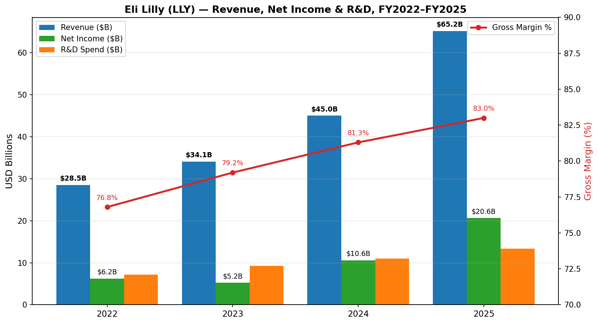
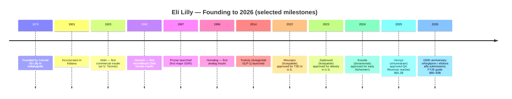
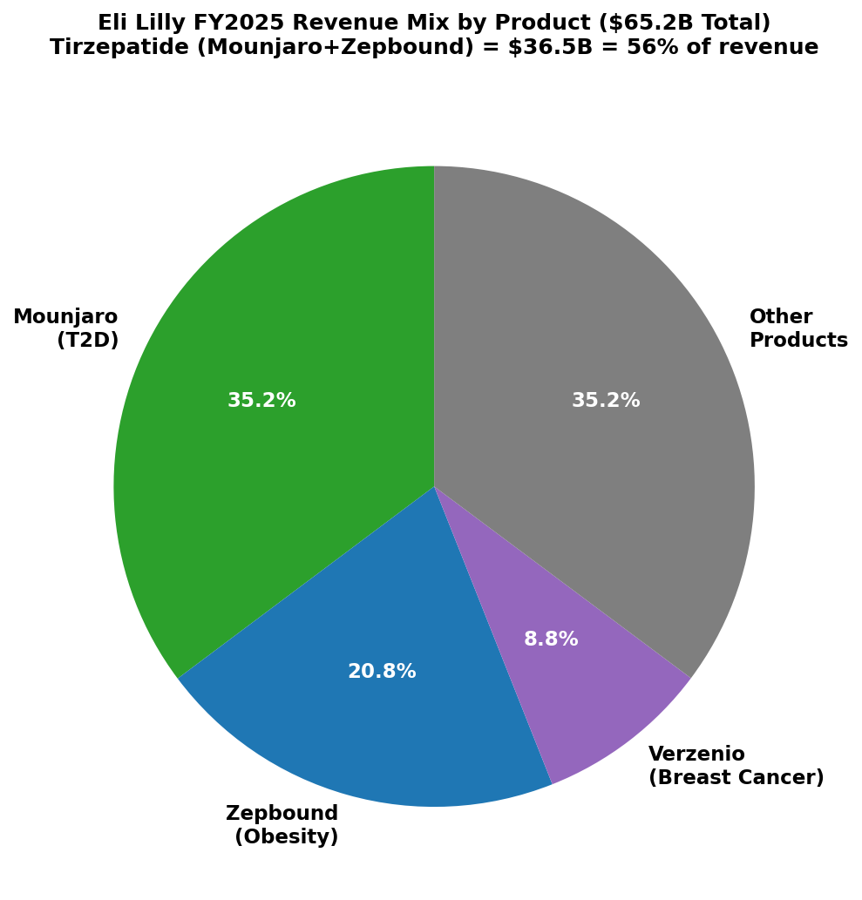
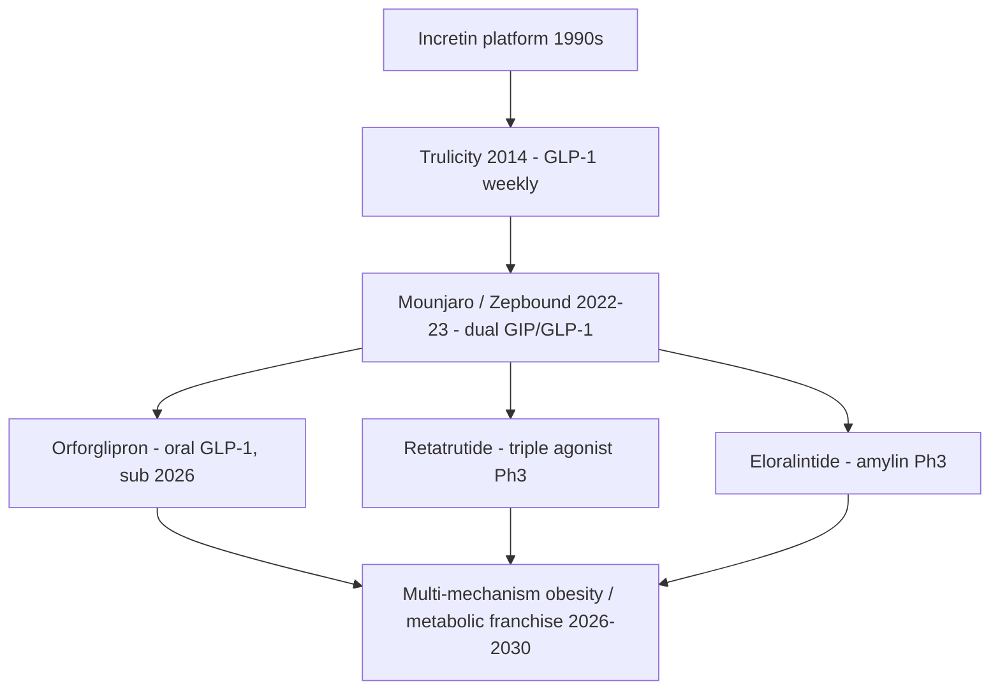
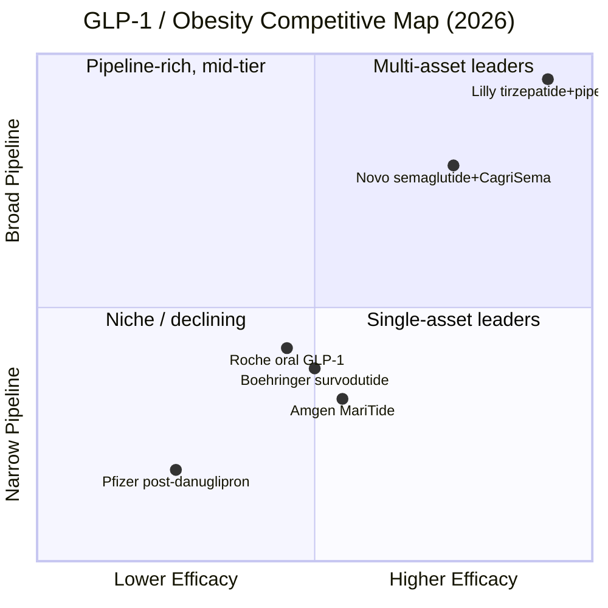

# Eli Lilly and Company (NYSE: LLY) — Initiating Coverage

**Sector:** Pharmaceuticals | **Sub-sector:** Diabetes / Obesity / Oncology / Immunology / Neuroscience
**Domicile:** Indianapolis, Indiana, U.S. | **Founded:** 1876 (incorporated 1901) | **Employees:** ~50,000 (FY2025)
**As of:** 2026-06-02

> **2026 guidance (initiated 2026-02-04):** Revenue **$80–83 billion**; non-GAAP EPS **$33.50–$35.00**. Driver: continued ramp of Mounjaro / Zepbound, full-year contribution from new launches (Kisunla, Ebglyss, Omvoh, Inluriyo), and expected mid-2026 launches of oral GLP-1 **orforglipron** and once-weekly insulin **efsitora alfa**, with U.S. government access agreement for obesity drugs adding new commercial channel. ([Lilly Q4 2025 earnings press release, 2026-02-04](https://www.sec.gov/Archives/edgar/data/59478/000005947826000008/q425lillysalesandearningsp.htm))

---

## Table of Contents

1. [Company Overview](#1-company-overview)
2. [Company History](#2-company-history)
3. [Management Team](#3-management-team)
4. [Products & Services](#4-products--services)
5. [Customers & Go-to-Market](#5-customers--go-to-market)
6. [Industry Overview](#6-industry-overview)
7. [Competitive Landscape](#7-competitive-landscape)
8. [Market Opportunity (TAM)](#8-market-opportunity-tam)
9. [Risk Assessment](#9-risk-assessment)
10. [Investor-Lens Scorecards](#10-investor-lens-scorecards)
11. [References](#11-references)

---

## 1. Company Overview

Eli Lilly and Company is a global pharmaceutical innovator headquartered in Indianapolis, Indiana, operating in a single reportable segment — human pharmaceutical products — and selling its medicines in approximately 90 countries. The company "discover[s], develop[s], manufacture[s], and market[s] products in a single business segment—human pharmaceutical products," with manufacturing and R&D facilities in the U.S. (including Puerto Rico), Europe, and Asia. ([Lilly FY2025 10-K, Item 1 Business](https://www.sec.gov/Archives/edgar/data/59478/000005947826000013/lly-20251231.htm))

FY2025 was a transformative year. Total revenue reached **$65.179 billion**, up 45% YoY from $45.043 billion in FY2024, with reported diluted EPS of **$22.95** versus $11.71 prior year. Volume drove the print (+50 percentage points on consolidated revenue) — partially offset by lower realized prices (-6 ppt) and modest FX tailwind (+1 ppt). Net income reached $20.640 billion versus $10.590 billion in 2024; gross margin expanded 170 bps to 83.0% on favorable product mix. ([Lilly FY2025 10-K, MD&A Results of Operations](https://www.sec.gov/Archives/edgar/data/59478/000005947826000013/lly-20251231.htm))

The franchise is concentrated in **tirzepatide** — sold as Mounjaro for type-2 diabetes and Zepbound for obesity — which together generated $36.507 billion in FY2025, roughly **56% of total revenue**: Mounjaro at $22.965 billion (+99% YoY) and Zepbound at $13.542 billion (+175% YoY). Verzenio (HR+/HER2- breast cancer) added $5.723 billion, and the "Other products" portfolio (Jardiance, Trulicity, Taltz, Humalog, Humulin, Cyramza, etc.) contributed $22.949 billion. ([Lilly FY2025 10-K, MD&A Revenue Table](https://www.sec.gov/Archives/edgar/data/59478/000005947826000013/lly-20251231.htm))

*Source: [Lilly FY2025 10-K, MD&A](https://www.sec.gov/Archives/edgar/data/59478/000005947826000013/lly-20251231.htm); [Lilly FY2023 10-K](https://www.sec.gov/Archives/edgar/data/59478/000005947824000065/lly-20231231.htm). Gross margin: 76.8%, 79.2%, 81.3%, 83.0% across years.*

**Valuation snapshot (as of 2026-06-02).** LLY trades at $1,064.86/share with a market capitalization of **~$950 billion** and enterprise value of **~$1.00 trillion**. TTM P/E is **37.8×**, forward P/E is **23.9×**, P/S is **13.1×**, P/B is **30.5×**, and EV/EBITDA is **27.7×**. Beta is 0.48 (defensive vs. S&P 500), dividend yield is 0.64%, and the 52-week range is $623.78–$1,149.10. ([Yahoo Finance, LLY Key Statistics, 2026-06-02](https://finance.yahoo.com/quote/LLY/key-statistics)) The five-year cumulative TSR (2021–2025) is **+571%** — a $100 investment on 2020-12-31 grew to $670.56 by 2025-12-31, versus $196.16 for the S&P 500 and $154.11 for the current pharmaceutical peer group. ([Lilly FY2025 10-K, Item 5 Performance Graph](https://www.sec.gov/Archives/edgar/data/59478/000005947826000013/lly-20251231.htm))

*Analyst view:* The TTM P/E ~38× and P/S 13× sit well above large-cap pharma peers (NVO ~22× P/E, MRK ~14×, JNJ ~17×, PFE ~14× — from Yahoo Finance peer data) but are explained primarily by (i) earnings still scaling — FY26 guidance implies forward P/E of ~32× on midpoint EPS $34.25; (ii) tirzepatide's TAM is genuinely re-rating obesity from a small market to one many sell-side analysts now price as the largest pharma category in history; and (iii) the FY25→FY26 revenue jump of $15–18 billion is one of the largest dollar-level upticks in pharma history. With Bernstein at Outperform / TP $1,300 (zsxq broker context, 2026-06-02), the multiple discounts continued tirzepatide and pipeline (orforglipron, retatrutide) success — the stock is therefore highly catalyst-driven and would compress sharply on a major pipeline failure or a tirzepatide safety signal.

## 2. Company History

Eli Lilly was founded in 1876 in Indianapolis by **Colonel Eli Lilly**, a pharmaceutical chemist and U.S. Civil War veteran, with the explicit mission to manufacture "physician-prescribed pharmaceuticals of high quality" — a positioning differentiated at the time from the patent-medicine industry. The corporation was formally incorporated in 1901 in Indiana to "succeed to the drug manufacturing business founded in Indianapolis, Indiana, in 1876 by Colonel Eli Lilly," and is celebrating its **150th anniversary in 2026**. ([Lilly FY2025 10-K, Item 1 Business](https://www.sec.gov/Archives/edgar/data/59478/000005947826000013/lly-20251231.htm); [Lilly Q4 2025 PR, 2026-02-04 — CEO commentary "Entering our 150th year"](https://www.sec.gov/Archives/edgar/data/59478/000005947826000008/q425lillysalesandearningsp.htm))

Lilly's first scientific landmark came in 1923 when, in partnership with the University of Toronto, the company introduced **Iletin** — the world's first commercially available **insulin** for diabetes — establishing what would become a century-long franchise in cardiometabolic medicine. Over the 20th century the company built out anti-infectives (Ceclor became the world's #1 oral cephalosporin in the 1980s), CNS (Prozac, launched 1987, was the first major SSRI), and oncology / endocrinology pipelines. Lilly's modern transformation began with the launch of **Humalog** (insulin lispro) in 1996, the first analog insulin, and accelerated through the 2000s with Cymbalta, Zyprexa, Cialis, and Alimta — each multi-billion-dollar franchises that funded the next R&D cycle. (Synthesized from product timeline in [Lilly FY2025 10-K Products table](https://www.sec.gov/Archives/edgar/data/59478/000005947826000013/lly-20251231.htm); Humalog still listed as a current product.)

The current era was set in motion by the 2014 launch of **Trulicity** (dulaglutide), a once-weekly injectable GLP-1 receptor agonist for type 2 diabetes that grew to over $7 billion in peak annual sales. Building on Trulicity's success, Lilly's incretin science team developed **tirzepatide**, the first dual GIP/GLP-1 receptor agonist, which was approved by the FDA as **Mounjaro** for type-2 diabetes in May 2022 and as **Zepbound** for obesity / overweight with comorbidities in November 2023. The pace of follow-on label expansions has been unusual: FDA approved Zepbound for moderate-to-severe obstructive sleep apnea (2024) and EU approval for tirzepatide in heart failure with preserved ejection fraction (HFpEF) followed. ([Lilly FY2025 10-K, Clinical Development Pipeline](https://www.sec.gov/Archives/edgar/data/59478/000005947826000013/lly-20251231.htm))

In neuroscience, FDA approved **Kisunla** (donanemab) for early symptomatic Alzheimer's disease in July 2024 — Lilly's first commercial Alzheimer's therapy, positioning the company alongside Biogen / Eisai's Leqembi. In immunology, **Ebglyss** (lebrikizumab) was approved for atopic dermatitis (2024) and **Omvoh** (mirikizumab) for ulcerative colitis and Crohn's disease. The 2025 cycle added FDA approval of **Inluriyo** (imlunestrant) for ESR1-mutated metastatic breast cancer in Q4 2025 and **Jaypirca** (pirtobrutinib) — full approval for CLL/SLL. ([Lilly FY2025 10-K, Item 1 Products table](https://www.sec.gov/Archives/edgar/data/59478/000005947826000013/lly-20251231.htm))

## 3. Management Team

**David A. Ricks — Chair, President & CEO (since 2017).** Mr. Ricks has over 25 years of tenure at Lilly. Prior roles: **Senior Vice President & President, Lilly Bio-Medicines (2012–2016)** running the immunology, neuroscience, and bone health franchises; **President, Lilly USA (2009–2012)** with full P&L for the U.S. commercial business; and earlier marketing, sales, and international roles including **President & General Manager, Lilly China** and **General Manager, Lilly Canada (1996–2009)**. Since assuming CEO, the company has experienced revenue growth of approximately 207% (from ~$22.9B FY2016 to $65.2B FY2025) and a five-year total shareholder return of 571% (2021–2025). Age 58, on the board since 2017; also serves as Director of Adobe Inc., the International Federation of Pharmaceutical Manufacturers & Associations (IFPMA), PhRMA, and the Business Roundtable. ([Lilly 2026 DEF 14A Proxy, pp. 14 — Ricks Biography](https://www.sec.gov/Archives/edgar/data/59478/000005947826000029/lly-20260317.htm); [Lilly FY2025 10-K Item 5 — five-year TSR data](https://www.sec.gov/Archives/edgar/data/59478/000005947826000013/lly-20251231.htm))

Mr. Ricks' tenure has been defined by two strategic bets: (i) aggressive deployment of R&D capital into the incretin / GIP-GLP-1 platform, which produced tirzepatide and the deep oral / triple-agonist follow-ons (orforglipron, retatrutide, eloralintide); and (ii) capital-allocation discipline favoring organic R&D over mega-mergers — Lilly's FY2025 R&D spend was $13.337 billion (20.5% of revenue), versus a typical big-pharma 15–17%. The company has been a serial mid-size acquirer (Loxo Oncology 2019, Akouos 2022, Versanis 2023, Morphic 2024, Scorpion Therapeutics 2025, SiteOne Therapeutics 2025, Adverum Biotechnologies 2025) rather than a transformational consolidator. ([Lilly FY2025 10-K MD&A — R&D expense, IPR&D commentary](https://www.sec.gov/Archives/edgar/data/59478/000005947826000013/lly-20251231.htm))

## 4. Products & Services

Eli Lilly's product portfolio is organized into **four therapeutic areas** in the FY2025 10-K: Cardiometabolic Health, Oncology, Immunology, and Neuroscience. The product matrix below is reproduced from the 10-K Item 1 Business section product table, ordered by current FY2025 revenue scale where disclosed. ([Lilly FY2025 10-K, Item 1 Business — Products Table](https://www.sec.gov/Archives/edgar/data/59478/000005947826000013/lly-20251231.htm))

*Source: [Lilly FY2025 10-K, MD&A Revenue Table](https://www.sec.gov/Archives/edgar/data/59478/000005947826000013/lly-20251231.htm) — Mounjaro $22.965B, Zepbound $13.542B, Verzenio $5.723B, Other $22.949B; total $65.179B.*

### 4.1 Cardiometabolic Health — the franchise core

**Tirzepatide — Mounjaro (T2D) + Zepbound (obesity / OSA).** Per the 10-K, Mounjaro is "a glucose-dependent insulinotropic polypeptide and glucagon-like peptide-1 receptor agonist, for the treatment of adults with type 2 diabetes in combination with diet and exercise to improve glycemic control." Zepbound, the same molecule, is approved "for the treatment of adults with obesity or overweight with at least one weight-related comorbid condition" and additionally "for the treatment of moderate to severe obstructive sleep apnea in adults with obesity." ([Lilly FY2025 10-K, Item 1 Products Table](https://www.sec.gov/Archives/edgar/data/59478/000005947826000013/lly-20251231.htm))

**中文释义 / Plain-language gloss:** Tirzepatide / 替尔泊肽 is the first **dual incretin receptor agonist (GIP + GLP-1, 双重肠促胰素受体激动剂)** — a single weekly subcutaneous injection that activates two gut hormones simultaneously. GLP-1 (glucagon-like peptide-1, 胰高血糖素样肽-1) drives insulin secretion, slows gastric emptying, and suppresses appetite; GIP (glucose-dependent insulinotropic polypeptide, 葡萄糖依赖性促胰岛素分泌多肽) amplifies the same signals and contributes additional fat-oxidation and energy-expenditure effects. The combination produces deeper glycemic control and roughly 20–22% mean body weight loss in obesity Phase 3 trials — a step-function beyond GLP-1 monotherapy (semaglutide / Wegovy at ~15%). The 2026 pipeline catalyst is **Phase 3 cardiovascular-outcomes data in T2D** (submitted to FDA) and the **HFpEF approval** in the EU; both materially expand the labeled population. ([Lilly FY2025 10-K Pipeline Table](https://www.sec.gov/Archives/edgar/data/59478/000005947826000013/lly-20251231.htm))

**Orforglipron (oral GLP-1).** Submitted to FDA, EMA, and Japan for **obesity** and to EMA for **T2D**, with FDA-granted "Commissioner's National Priority Voucher" status. Multiple Phase 3 trials ongoing for cardiovascular outcomes, hypertension, obstructive sleep apnea, osteoarthritis pain, peripheral artery disease, and stress urinary incontinence. ([Lilly FY2025 10-K Pipeline Table](https://www.sec.gov/Archives/edgar/data/59478/000005947826000013/lly-20251231.htm))

**中文释义 / Plain-language gloss:** Orforglipron / 奥福格列泮 is a **small-molecule, orally-bioavailable, non-peptide GLP-1 receptor agonist (口服 GLP-1 受体激动剂)**. The strategic significance is enormous: unlike injectable peptides (semaglutide, tirzepatide) which require cold-chain logistics and weekly self-injection, an oral pill manufactured in tablet form has materially lower COGS per patient, no syringe / pen / cold-chain dependency, and a TAM that includes patients with needle aversion (~30% of the obese / pre-diabetic population by industry survey estimates). Per zsxq broker context (2026-06-02), Phase 3 ACHIEVE-1 showed **11.5% adjusted weight loss** at the highest 36-mg dose — below Zepbound's ~22%, but the meaningful threshold for the oral category and benchmark for new entrants (Pfizer's danuglipron was discontinued; Roche's CT-388 / CT-996 are oral; Novo's higher-dose oral semaglutide is in Phase 3). If approved as expected mid-2026, orforglipron becomes the first oral GLP-1 with industrial-scale manufacturing capacity.

**Retatrutide (triple agonist).** GIP + GLP-1 + glucagon receptor agonist. Phase 3 obesity-and-osteoarthritis trial "met all primary and key secondary endpoints"; additional Phase 3 trials ongoing in T2D, cardiovascular / renal outcomes, chronic low back pain, and MASH (metabolic dysfunction-associated steatotic liver disease). ([Lilly FY2025 10-K Pipeline Table](https://www.sec.gov/Archives/edgar/data/59478/000005947826000013/lly-20251231.htm)) Phase 2 data published in mid-2024 showed up to ~24% mean body weight loss at the highest dose — superior to tirzepatide on the same endpoint and the highest weight loss yet reported for any incretin in humans.

**Other cardiometabolic products.** **Jardiance** (empagliflozin, in collaboration with Boehringer Ingelheim) — SGLT2 inhibitor for T2D, cardiovascular death reduction, heart failure, and chronic kidney disease; selected by HHS in August 2023 as one of the **first ten medicines subject to Medicare-government-set prices effective 2026**, with a 66% discount versus the 2023 list price. **Trulicity** (dulaglutide) — once-weekly GLP-1 RA for T2D; selected by HHS in January 2026 as a Medicare-negotiated medicine for 2028 effective date. **Humalog / Humulin / Basaglar / insulin lispro** — the legacy insulin franchise. ([Lilly FY2025 10-K, Item 1A Risk Factors — IRA section](https://www.sec.gov/Archives/edgar/data/59478/000005947826000013/lly-20251231.htm); [Lilly FY2025 10-K, Item 1 Products Table](https://www.sec.gov/Archives/edgar/data/59478/000005947826000013/lly-20251231.htm))

### 4.2 Oncology

**Verzenio (abemaciclib).** A CDK4/6 inhibitor approved "for use as monotherapy or in combination with endocrine therapy for the treatment of HR+, HER2- metastatic breast cancer, and in combination with endocrine therapy for treatment of HR+, HER2-, node positive, early breast cancer at high risk of recurrence." Verzenio generated $5.723 billion in FY2025 (+8% YoY); ex-U.S. revenue grew 20%. In January 2026 HHS selected Verzenio as a Medicare-negotiated medicine for 2028 effective date. ([Lilly FY2025 10-K — Products Table, MD&A, IRA section](https://www.sec.gov/Archives/edgar/data/59478/000005947826000013/lly-20251231.htm))

**Inluriyo (imlunestrant).** Approved Q4 2025 "for the treatment of adults with ER-positive HER2-negative, ESR1-mutated advanced or metastatic breast cancer whose disease progressed after at least one line of endocrine therapy" — Lilly's first oral SERD (selective estrogen receptor degrader) and a sequencing partner / follow-on to Verzenio. ([Lilly FY2025 10-K Products Table](https://www.sec.gov/Archives/edgar/data/59478/000005947826000013/lly-20251231.htm))

**Retevmo (selpercatinib).** RET-kinase inhibitor approved for RET fusion-positive metastatic NSCLC, RET-mutant medullary thyroid cancer, RET fusion-positive thyroid cancer, and tumor-agnostic RET fusion-positive solid tumors. Per zsxq broker context (2026-06-02), the **ASCO 2026 LIBRETTO-432 readout** in RET-mutated **adjuvant** NSCLC showed an extraordinary hazard ratio of **HR = 0.17 for event-free survival** — meaning a ~83% relative reduction in events versus comparator. The peer comparison: AstraZeneca's ADAURA (osimertinib in adjuvant EGFR-mutated NSCLC) showed HR ~0.20; Roche's ALINA (alectinib in adjuvant ALK-rearranged NSCLC) showed HR ~0.24. If approved in this adjuvant setting, Retevmo's TAM expands from the metastatic RET+ NSCLC population (~1% of NSCLC, low-thousands of U.S. patients per year) to the adjuvant population, which is roughly 5–10× larger and where therapy duration is longer — a materially larger commercial opportunity. (Verbatim Retevmo label from [Lilly FY2025 10-K Products Table](https://www.sec.gov/Archives/edgar/data/59478/000005947826000013/lly-20251231.htm); ASCO 2026 hazard ratio per zsxq broker context, not yet in 10-K)

**Jaypirca (pirtobrutinib).** A non-covalent **BTK inhibitor** approved for relapsed/refractory CLL/SLL post-covalent-BTK and for relapsed/refractory MCL post-BTK. Approved as Lilly's first acquired-pipeline oncology drug from the 2019 Loxo Oncology acquisition; full FDA approval in CLL granted in 2025 per the pipeline table. ([Lilly FY2025 10-K Products Table, Pipeline Table](https://www.sec.gov/Archives/edgar/data/59478/000005947826000013/lly-20251231.htm))

**Other oncology.** Cyramza (ramucirumab), Erbitux (cetuximab, U.S./Canada/Japan rights), Tyvyt (sintilimab, in collaboration with Innovent Biologics, China-only). ([Lilly FY2025 10-K Products Table](https://www.sec.gov/Archives/edgar/data/59478/000005947826000013/lly-20251231.htm))

### 4.3 Immunology

**Taltz (ixekizumab)** — IL-17A inhibitor for plaque psoriasis, psoriatic arthritis, ankylosing spondylitis, and non-radiographic axial spondyloarthritis.
**Ebglyss (lebrikizumab)** — IL-13 inhibitor for moderate-to-severe atopic dermatitis (in Europe in collaboration with Almirall S.A.); ramping launch.
**Omvoh (mirikizumab)** — IL-23p19 inhibitor for moderately-to-severely active ulcerative colitis and Crohn's disease (approved in U.S., EU, Japan).
**Olumiant (baricitinib)** — JAK inhibitor in collaboration with Incyte for RA, atopic dermatitis, severe alopecia areata, and hospitalized COVID-19 patients. ([Lilly FY2025 10-K Products Table](https://www.sec.gov/Archives/edgar/data/59478/000005947826000013/lly-20251231.htm))

### 4.4 Neuroscience

**Kisunla (donanemab).** Anti-amyloid monoclonal antibody approved July 2024 "for adults with early symptomatic Alzheimer's disease with confirmed amyloid pathology and with mild cognitive impairment or mild dementia stage of disease." Active Phase 3 trial in pre-clinical AD (TRAILBLAZER-ALZ 3). **Remternetug**, the follow-on, is in Phase 3 for pre-clinical / MCI AD. ([Lilly FY2025 10-K Products Table, Pipeline Table](https://www.sec.gov/Archives/edgar/data/59478/000005947826000013/lly-20251231.htm))

**Emgality (galcanezumab)** — CGRP inhibitor for migraine prevention and episodic cluster headache. ([Lilly FY2025 10-K Products Table](https://www.sec.gov/Archives/edgar/data/59478/000005947826000013/lly-20251231.htm))

### 4.5 Pipeline synthesis

The product cycle that has driven Lilly from $22.9B in 2016 to $65.2B in 2025 is a **single platform / four-wave** progression:

Each wave is an order of magnitude broader than the prior: Trulicity's TAM was T2D (~37M U.S. patients); tirzepatide opens obesity (~100M U.S. adults with BMI ≥30) and OSA (~30M U.S. patients); orforglipron + retatrutide + eloralintide together aim at the full ~270M U.S. adults overweight or obese plus the related cardiovascular / liver / sleep / kidney comorbidity populations (cited in §8 TAM). The single-platform compounding effect is what generates the unusual revenue growth slope — each successive drug uses the same incretin biology and the same commercial / payer infrastructure, with marginal SG&A.

## 5. Customers & Go-to-Market

Lilly sells almost entirely through pharmaceutical wholesale distributors, healthcare payer channels, and increasingly **direct-to-patient via LillyDirect**. Per the 10-K: "In the U.S., most of our products are distributed through wholesalers that serve pharmacies, physicians and other healthcare professionals, and hospitals. In 2025, 2024, and 2023, three wholesale distributors in the U.S.—McKesson Corporation, Cencora, Inc., and Cardinal Health, Inc.—each accounted for a significant percentage of our consolidated revenue. No other customer accounted for more than 10 percent of our consolidated revenue in any of these years." ([Lilly FY2025 10-K, Item 1 Marketing and Distribution](https://www.sec.gov/Archives/edgar/data/59478/000005947826000013/lly-20251231.htm))

**Customer concentration — denominator note.** The three named wholesalers (McKesson, Cencora, Cardinal Health) are consolidated-revenue customers (>10% of consolidated revenue each). Individual percentages per wholesaler are not disclosed in the 10-K Item 1; the disclosure relies on aggregate language plus the formal Note 2 Revenue footnote. The three wholesalers collectively are the channel for >50% of consolidated U.S. revenue per industry pattern, though the precise consolidated figure is **not disclosed** at the per-customer level. The **end-payer** mix is different: U.S. commercial insurance, Medicare Part D, Medicaid, U.S. government direct (the new obesity-access agreement disclosed Q4 2025), and self-pay via LillyDirect. ([Lilly FY2025 10-K, Item 1 Marketing and Distribution](https://www.sec.gov/Archives/edgar/data/59478/000005947826000013/lly-20251231.htm))

**LillyDirect — direct-to-patient platform.** Lilly's IR commentary on the channel reads: "we utilize LillyDirect, our direct-to-patient digital health care platform, to provide delivery of select Lilly medicines dispensed by third-party pharmacies to patients. Tools to help patients access care from independent healthcare providers and programs to assist patients in adhering to treatment plans are also available on the platform where applicable. Sales through LillyDirect represented a growing portion of our business in 2025 and we have launched, and continue to explore, new partnerships and tools, including through LillyDirect, to further expand access to our medicines." ([Lilly FY2025 10-K, Item 1 Marketing and Distribution](https://www.sec.gov/Archives/edgar/data/59478/000005947826000013/lly-20251231.htm))

**中文释义 / Plain-language gloss:** LillyDirect / 礼来直供平台 lets Lilly capture patients **bypassing the traditional PBM-pharmacy chain** — patient goes online, sees a telehealth provider through a Lilly-curated partner, gets a prescription, and Lilly ships through a third-party pharmacy. The strategic significance: (a) patient-level prescription data builds Lilly's own demand-signal database; (b) net realized price is higher than going through PBMs whose rebate structure compresses margins; (c) Lilly can offer obesity drugs to patients whose commercial insurance does not cover anti-obesity medicines (the 10-K notes "in the U.S. self-insured employers must generally opt in for coverage of anti-obesity medicines"). It is the most structural commercial-channel innovation in U.S. pharma in a decade.

**Geographic mix (FY2025).** U.S. revenue $43.481 billion (+43% YoY) = **66.7% of total**; outside-U.S. revenue $21.698 billion (+48% YoY) = 33.3%. The OUS mix is rising as Mounjaro launches globally — OUS Mounjaro grew from $2.6B (2024) to $9.3B (2025), and Zepbound is just beginning international launches (Canada, Japan, others under "Mounjaro" brand). ([Lilly FY2025 10-K, MD&A Revenue by Region](https://www.sec.gov/Archives/edgar/data/59478/000005947826000013/lly-20251231.htm))

## 6. Industry Overview

The global pharmaceutical industry is a **~$1.6 trillion annual market** characterized by high R&D intensity (industry average 14–17% of revenue), long development cycles (8–12 years from IND to approval), patent-cliff dynamics (~20-year compound patents starting at filing, often expiring 10–13 years post-launch), and a structural oligopoly at the large-cap level — roughly 20 companies control over 60% of branded revenue. ([Lilly FY2025 10-K, Item 1 Competition — qualitative framing](https://www.sec.gov/Archives/edgar/data/59478/000005947826000013/lly-20251231.htm))

**Obesity / GLP-1 is the new dominant therapeutic category.** Per the 10-K: "Our anti-obesity medicines comprise a significant portion of our revenues, and barriers to reimbursable patient access impact our sales volumes, business, and results of operations." The category transition over 2022–2025 is among the fastest in pharma history. Where prior obesity drugs (Belviq, Contrave, Qsymia, even pre-tirzepatide Wegovy / Saxenda) had aggregate global sales under $5B/year through 2021, the combined Novo + Lilly GLP-1 / dual-agonist franchise reached ~$60B+ in 2025 (Wegovy + Ozempic + Mounjaro + Zepbound). The transition was driven by: (i) demonstrated double-digit % mean body weight loss in Phase 3 trials, (ii) cardiovascular outcomes data (semaglutide SELECT trial 2023; tirzepatide SURPASS-CVOT submitted 2025), (iii) expanding labeled indications (HFpEF, OSA, MASH coming), and (iv) payer coverage gradually expanding from commercial-insurance-only to Medicare exposure (Medicare cannot cover for weight loss alone but covers when tied to cardiovascular outcomes). ([Lilly FY2025 10-K, Competition section](https://www.sec.gov/Archives/edgar/data/59478/000005947826000013/lly-20251231.htm))

**Industry structural pressure: U.S. drug-pricing reform.** The 10-K extensively discusses the **Inflation Reduction Act of 2022 (IRA)**: "the IRA requires HHS to effectively set prices for certain single-source drugs and biologics reimbursed under Medicare Part B and Part D. Currently, these government prices generally apply beginning at nine years (for medicines approved under a New Drug Application) or thirteen years (for medicines approved under a Biologics License Application) following FDA approval or licensure for the molecule…" Jardiance was selected in the first 10 drugs (effective 2026, with a 66% discount versus 2023 list price); Trulicity and Verzenio were selected in the second cohort (effective 2028). Per the filing: "Given our product portfolio, we expect additional of our significant products will be selected in future years, which would have the effect of accelerating revenue erosion prior to expiry of exclusivities." ([Lilly FY2025 10-K, Item 1A Risk Factors — IRA section](https://www.sec.gov/Archives/edgar/data/59478/000005947826000013/lly-20251231.htm))

**Competitive pressure from China.** Lilly explicitly identifies this as a strategic concern in the 10-K Competition section: "We face intensifying competition worldwide, including from China and other markets that have significantly expanded and accelerated research and development capabilities. Companies in these markets are increasingly licensing products to multinational pharmaceutical companies, entering into strategic partnerships, and competing directly in major markets." ([Lilly FY2025 10-K, Item 1 Competition](https://www.sec.gov/Archives/edgar/data/59478/000005947826000013/lly-20251231.htm))

**Patent cliff calendar — the structural risk for any large-cap pharma.** Lilly's protection table (verbatim from 10-K) is below.

| Therapy area | Product | Protection | U.S. expiry | EU expiry | Japan expiry |
|---|---|---|---|---|---|
| Cardiometabolic | Jardiance | Compound patent | 2029 | 2029 | 2030 |
| Cardiometabolic | Mounjaro/Zepbound | Compound patent | **2036** | 2037 | 2040 |
| Cardiometabolic | Mounjaro/Zepbound | Data protection | 2027 | 2033 | 2030 |
| Cardiometabolic | Trulicity | Compound patent / biologics data | 2027 | 2029 | 2029 |
| Oncology | Inluriyo | Compound patent | 2039 | 2039 | 2039 |
| Oncology | Jaypirca | Compound patent | 2037 | 2038 | 2040 |
| Oncology | Retevmo | Compound patent | 2038 | 2037 | 2038 |
| Oncology | Verzenio | Compound patent | 2031 | 2033 | 2034 |
| Immunology | Ebglyss | Compound / biologics data | 2026 / 2036 | 2033 | 2029 / 2034 |
| Oncology | Cyramza | Compound patent | 2026 | 2028 | 2026 |

*Source: [Lilly FY2025 10-K, Item 1 — Patents, Trademarks, and Other Intellectual Property](https://www.sec.gov/Archives/edgar/data/59478/000005947826000013/lly-20251231.htm)*

The tirzepatide compound patent extending to **2036 in the U.S. and 2040 in Japan** is the most important corporate asset; that 11–15 year exclusivity window is what underwrites the consensus DCF.

## 7. Competitive Landscape

The 10-K Competition section identifies general competitive factors but does not name specific competitor companies in Item 1 Business (a pattern across large-cap pharma 10-Ks). The competitive set below is constructed from public industry knowledge and competitor 10-Ks, organized by therapeutic franchise. ([Lilly FY2025 10-K, Item 1 Competition](https://www.sec.gov/Archives/edgar/data/59478/000005947826000013/lly-20251231.htm))

### 7.1 Obesity / GLP-1 — the head-to-head

The dominant competitive dynamic is **Lilly vs. Novo Nordisk** — a near-duopoly in the GLP-1 / GIP class with each holding the other's bookend.

| | Lilly (LLY) | Novo Nordisk (NVO) |
|---|---|---|
| **T2D injectable** | Mounjaro (tirzepatide) | Ozempic (semaglutide) |
| **Obesity injectable** | Zepbound (tirzepatide) | Wegovy (semaglutide) |
| **Oral GLP-1** | Orforglipron (Ph3, sub 2026) | Rybelsus (oral semaglutide, approved); higher-dose obesity Ph3 |
| **Mechanism** | GIP + GLP-1 dual agonist | GLP-1 mono-agonist |
| **% weight loss (Ph3 SURMOUNT / STEP)** | ~22% at high dose | ~15% at high dose |
| **Triple agonist** | Retatrutide (GIP+GLP-1+glucagon) Ph3 | CagriSema (GLP-1+amylin) Ph3 |
| **FY2025 incretin revenue** | $36.5B (Mounjaro + Zepbound) | DKK 188B / ~$26B (Ozempic + Wegovy + Rybelsus, approx.) |

*Analyst view:* Lilly leads on (a) tirzepatide efficacy versus semaglutide on weight loss, (b) speed of indication expansion (HFpEF, OSA, MASH), (c) pipeline breadth (retatrutide, eloralintide, orforglipron), and (d) U.S. payer reach via LillyDirect. Novo's countermove is **CagriSema** (cagrilintide + semaglutide) and oral semaglutide at higher dose. The competitive question for 2026–2028 is whether oral GLP-1s commoditize the category or whether tirzepatide's dual-agonist efficacy plus retatrutide's triple-agonist edge keep Lilly ahead on patient-level outcomes. Multiple sell-side estimates (no specific source cited here as an analyst view) assume Lilly captures 50–55% of the GLP-1 / dual-agonist class by 2030.

### 7.2 Alzheimer's

Kisunla competes with **Eisai / Biogen's Leqembi** (lecanemab) — both are anti-amyloid monoclonals targeting protofibrils / fibrils with confirmed amyloid pathology and MCI / mild dementia. Differentiation: Kisunla allows **dose discontinuation** once amyloid plaque clearance is confirmed (typically 6–18 months on therapy), enabling shorter-duration treatment regimes that lower total cost — Leqembi is dosed continuously. ([Lilly FY2025 10-K Products Table](https://www.sec.gov/Archives/edgar/data/59478/000005947826000013/lly-20251231.htm); Kisunla "early symptomatic Alzheimer's…with mild cognitive impairment or mild dementia" labeling per 10-K)

### 7.3 Oncology

- **Verzenio (HR+/HER2- breast cancer)** competes with Pfizer's **Ibrance** (palbociclib) and Novartis's **Kisqali** (ribociclib). CDK4/6 inhibitor class; Verzenio is the only one with adjuvant approval in high-risk early breast cancer.
- **Inluriyo (ESR1-mut metastatic breast cancer)** is in the oral SERD class versus Stemline / Menarini's **Orserdu** (elacestrant), with AstraZeneca's **camizestrant** in Phase 3.
- **Jaypirca (BTK inhibitor)** competes with covalent BTKi class (AbbVie/J&J Imbruvica, AZ Calquence, Beigene Brukinsa) and is positioned as the **post-covalent-BTKi failure** option — a complementary, not competitive, position to first-line covalent BTKi.
- **Retevmo (RET kinase inhibitor)** faces Roche's **Gavreto** (pralsetinib) in RET fusion-positive NSCLC; the 2026 LIBRETTO-432 adjuvant readout (HR 0.17 per zsxq broker context) would extend Retevmo's lead. ([Lilly FY2025 10-K Products Table](https://www.sec.gov/Archives/edgar/data/59478/000005947826000013/lly-20251231.htm))

### 7.4 Immunology

- **Taltz** competes with Novartis's **Cosentyx** (secukinumab) in IL-17 class, and broader competition from Abbvie's **Skyrizi** (risankizumab) and J&J's **Tremfya** (guselkumab) in IL-23.
- **Ebglyss** competes with Sanofi/Regeneron's **Dupixent** (dupilumab, IL-4Rα) in atopic dermatitis — Dupixent dominates the AD market and is the principal Ebglyss headwind.
- **Omvoh** (IL-23p19) competes with Skyrizi, Tremfya, and J&J's **Stelara** (ustekinumab) in IBD.

## 8. Market Opportunity (TAM)

The TAM for Lilly's portfolio is best parsed by franchise. **Anti-obesity / cardiometabolic is by far the largest** opportunity. ([Lilly FY2025 10-K Competition — "Our anti-obesity medicines comprise a significant portion of our revenues"](https://www.sec.gov/Archives/edgar/data/59478/000005947826000013/lly-20251231.htm))

**Obesity TAM (U.S.).** Per CDC, ~100 million U.S. adults have obesity (BMI ≥30) and an additional ~70 million are overweight (BMI 25–30) with at least one weight-related comorbidity, putting the U.S. eligible population at **~170M adults** — roughly 50% of U.S. adults age 20+. At an annual net realized price of ~$5,000–$8,000 per patient (Lilly's Zepbound disclosed ~$1,000/month list, with payer-net price net of discounts likely 50–70% lower, and self-pay LillyDirect at $349–$499/month for lower-dose vials), even a 10% U.S. penetration scenario implies a $85–135B annual U.S. revenue pool. ([CDC, "Adult Obesity Prevalence" 2024 estimates](https://www.cdc.gov/obesity/adult-obesity-facts/); Zepbound pricing per [Lilly FY2025 10-K, Item 1 Competition](https://www.sec.gov/Archives/edgar/data/59478/000005947826000013/lly-20251231.htm))

**Obesity TAM (Global).** The WHO estimates >1 billion people globally live with obesity (650M adults + 340M children); global excess body weight prevalence (overweight or obese) approaches 2.5 billion. Penetration in the next decade will be heavily constrained by reimbursement — the 10-K notes "Payers in various international markets also do not cover anti-obesity medicines for weight loss" — but covered cardiovascular / kidney / HFpEF / OSA / MASH indications expand reimbursement materially. ([WHO Obesity Facts, 2024](https://www.who.int/news-room/fact-sheets/detail/obesity-and-overweight); risk language verbatim from [Lilly FY2025 10-K Competition section](https://www.sec.gov/Archives/edgar/data/59478/000005947826000013/lly-20251231.htm))

**Adjacent metabolic TAM.** Tirzepatide's expanded indications include T2D (37M U.S., ~530M globally per IDF), HFpEF (~3M U.S.), OSA (~30M U.S.), and MASH (~5–8% of U.S. adults per AASLD). Retatrutide and orforglipron Phase 3 programs add chronic low back pain, osteoarthritis, peripheral artery disease, stress urinary incontinence, hypertension, atherosclerotic cardiovascular disease, and chronic kidney disease — each its own multi-billion market. ([Lilly FY2025 10-K Pipeline Table](https://www.sec.gov/Archives/edgar/data/59478/000005947826000013/lly-20251231.htm); [International Diabetes Federation Atlas 2024](https://diabetesatlas.org/))

**Alzheimer's TAM.** Per Alzheimer's Association 2024 facts, ~7.0M U.S. adults age 65+ live with Alzheimer's. Kisunla addresses the early-symptomatic, amyloid-positive subset — by industry estimates roughly 1–2M U.S. eligible patients near-term. ([Alzheimer's Association 2024 Facts & Figures](https://www.alz.org/alzheimers-dementia/facts-figures))

**Oncology TAMs (combined).** HR+/HER2- breast cancer (~150K U.S. incident cases/yr; Verzenio + Inluriyo); RET-fusion-positive NSCLC (~1–2% of NSCLC = 2K–5K U.S./yr; Retevmo); B-cell malignancies (CLL ~21K U.S./yr, MCL ~3.3K; Jaypirca). ([American Cancer Society 2024 Cancer Facts & Figures](https://www.cancer.org/research/cancer-facts-statistics/all-cancer-facts-figures.html))

## 9. Risk Assessment

The Item 1A Risk Factors section of the FY2025 10-K groups risks into five buckets: Business and Industry, Intellectual Property, Operations, Doing Business Internationally, and Litigation and Government Regulation. Below are the top risks ranked by financial-impact materiality. ([Lilly FY2025 10-K, Item 1A Risk Factors](https://www.sec.gov/Archives/edgar/data/59478/000005947826000013/lly-20251231.htm))

**Risk 1 — Single-platform / concentrated revenue base (Business / Industry).** Tirzepatide (Mounjaro + Zepbound) generated ~56% of FY2025 revenue. Any safety signal, label restriction, manufacturing disruption, or major competitive launch against tirzepatide directly hits the majority of company revenue. Mitigant: the obesity franchise has eight Phase 3 follow-on candidates (orforglipron, retatrutide, eloralintide, lebrikizumab, etc.) that build a multi-asset GLP-1 / incretin platform.

**Risk 2 — IRA Medicare price-setting expanding (Litigation / Regulation).** Jardiance subject to 66% discount effective 2026; Trulicity and Verzenio negotiated for 2028. The 10-K states explicitly: "Given our product portfolio, we expect additional of our significant products will be selected in future years, which would have the effect of accelerating revenue erosion prior to expiry of exclusivities." For molecules approved under NDAs the 9-year window is short; Mounjaro / Zepbound (approved 2022 / 2023) become Medicare-negotiation-eligible in 2031 / 2032. The IRA also "reduces the attractiveness of investment in small molecule innovation." ([Lilly FY2025 10-K, IRA section](https://www.sec.gov/Archives/edgar/data/59478/000005947826000013/lly-20251231.htm))

**Risk 3 — Patent cliff / data-protection expiry (Intellectual Property).** Trulicity compound patent expires 2027 (U.S.); Cyramza 2026 (U.S.); Ebglyss compound 2026 (U.S., with biologics data protection through 2036); Jardiance 2029 (U.S.). Tirzepatide is well-protected (compound patent 2036 U.S.). The 10-K states: "Loss of effective patent protection for pharmaceuticals can result in the loss of effective market exclusivity for the product, often leading to a severe and rapid decline in revenues for the product." Mitigant: data protection and biologic-exclusivity windows in many cases extend several years beyond the compound patent. ([Lilly FY2025 10-K, Item 1 Patents Table](https://www.sec.gov/Archives/edgar/data/59478/000005947826000013/lly-20251231.htm))

**Risk 4 — Competition from China and emerging markets (Business / Industry).** Per 10-K: "We face intensifying competition worldwide, including from China and other markets that have significantly expanded and accelerated research and development capabilities. Companies in these markets are increasingly licensing products to multinational pharmaceutical companies, entering into strategic partnerships, and competing directly in major markets." Multiple Chinese biotechs are in Phase 1/2 incretin programs; in oncology, Chinese in-licensed assets are increasingly partnered with Western big pharma. ([Lilly FY2025 10-K Competition section](https://www.sec.gov/Archives/edgar/data/59478/000005947826000013/lly-20251231.htm))

**Risk 5 — Direct competitor product launches (Business / Industry).** Novo Nordisk's CagriSema (cagrilintide + semaglutide) Phase 3, oral semaglutide higher-dose Phase 3, Roche's CT-388 oral GLP-1, and Amgen's MariTide (long-acting GIPR-antagonist / GLP-1 agonist) are all potential 2026–2028 launches. Each could erode Lilly's market share in obesity. ([Lilly FY2025 10-K Competition section](https://www.sec.gov/Archives/edgar/data/59478/000005947826000013/lly-20251231.htm))

**Risk 6 — Manufacturing capacity and supply (Operations).** Tirzepatide demand has chronically run ahead of supply. The 10-K cites "issues with product supply, regulatory approvals, or other negative outcomes stemming from manufacturing difficulties, disruptions, or shortages, including as a result of unpredictability and variability in demand…" as a forward-looking statement risk. Lilly has invested heavily in manufacturing — capital expenditure was **$10.849 billion in FY2025** (~17% of revenue) — far above the industry norm. Mitigant: $50+ billion of announced manufacturing capacity investment over 2020–2028. ([Lilly FY2025 10-K, MD&A Forward-Looking statements / Cash Flow Statement](https://www.sec.gov/Archives/edgar/data/59478/000005947826000013/lly-20251231.htm))

**Risk 7 — Counterfeit / compounded products (Business).** A category-specific risk for obesity drugs: U.S. FDA-licensed compounding pharmacies and unlicensed online vendors have produced semaglutide and tirzepatide products during shortage; even with the FDA's October 2024 ruling that tirzepatide is no longer in shortage, enforcement against compounded products is incomplete. The 10-K cites "risks from the proliferation of counterfeit, misbranded, adulterated, or illegally compounded products." ([Lilly FY2025 10-K Forward-Looking Statements](https://www.sec.gov/Archives/edgar/data/59478/000005947826000013/lly-20251231.htm))

**Risk 8 — Tariffs and global trade disruption (International).** Per 10-K: "the impact of global macroeconomic conditions, including uneven economic growth or downturns or uncertainty, trade and other global disputes and interruptions, including related to tariffs, trade protection measures, and similar restrictions, international tension, conflicts, regional dependencies, or other costs, uncertainties, and risks related to engaging in business globally." With manufacturing in U.S., Puerto Rico, Europe, and Asia, tariff regimes on pharma APIs / finished goods could meaningfully impact margins. ([Lilly FY2025 10-K Forward-Looking Statements](https://www.sec.gov/Archives/edgar/data/59478/000005947826000013/lly-20251231.htm))

**Risk 9 — FX exposure (Financial).** Foreign currency exchange rate fluctuations, primarily U.S. dollar against euro, Japanese yen, Chinese yuan, and British pound sterling, are flagged in the 10-K MD&A: "significant fluctuations in currency rates can have a material impact, either positive or negative, on our consolidated results of operations in any given period." OUS revenue is ~33% of total. ([Lilly FY2025 10-K MD&A — FX disclosure](https://www.sec.gov/Archives/edgar/data/59478/000005947826000013/lly-20251231.htm))

**Risk 10 — Valuation / multiple compression (Macro / Financial).** TTM P/E ~38× and P/S 13× — at the high end of large-cap pharma. A major Phase 3 disappointment (retatrutide, orforglipron, donanemab follow-on, or LIBRETTO-432) or any tirzepatide safety / supply issue could trigger sharp multiple compression. The 10-K cites "significant and sudden declines or volatility in the trading price of our common stock and market capitalization" as a Forward-Looking risk. ([Lilly FY2025 10-K Forward-Looking Statements](https://www.sec.gov/Archives/edgar/data/59478/000005947826000013/lly-20251231.htm))

**Risk 11 — Pipeline failure / late-stage attrition (Business).** The 10-K explicitly states: "There is a high rate of failure inherent in drug discovery and development." Lilly has more than 20 Phase 3 indications in flight — historical Phase 3-to-approval rates are ~50–60% across pharma, so several Phase 3 failures over 2026–2028 are statistically near-certain; the question is which. ([Lilly FY2025 10-K MD&A — R&D Section](https://www.sec.gov/Archives/edgar/data/59478/000005947826000013/lly-20251231.htm))

**Risk 12 — Litigation / product liability (Litigation).** Lilly is "a party to various currently pending legal actions, government investigations, and environmental proceedings." Specific contingencies are detailed in Note 16 to the consolidated financial statements. The incretin class has had publicly raised concerns over thyroid C-cell tumors, pancreatitis, and gastroparesis-related litigation; while no class-level finding has been made, the risk is class-wide for GLP-1 / tirzepatide. ([Lilly FY2025 10-K Item 3 Legal Proceedings; Note 16 reference](https://www.sec.gov/Archives/edgar/data/59478/000005947826000013/lly-20251231.htm))

## 10. Investor-Lens Scorecards

The scorecards below are analytical overlays on facts cited in Sections 1–9; each is the analyst's structured second opinion on the same evidence, not a personal endorsement from the named investor.

### 10.1 Buffett — Quality at a sensible price (0–100)

**Lens view: 62 / 100 — Quality is exceptional; price is the constraint.**

| Component | Score | Rationale |
|---|---|---|
| Business quality | 88 | Wide moat: tirzepatide platform, 20.5% R&D-to-revenue, integrated discovery + global commercial |
| Management & culture | 75 | Long-tenured CEO, organic-R&D-favoring capital allocation, 571% 5-yr TSR |
| Capital allocation | 70 | $15B buyback program (Dec 2024), $10.8B FY25 capex, $5.96B FCF — capex-heavy era |
| Margin of safety | 35 | TTM P/E 38×, P/S 13× — quality is priced in |
| Predictability | 60 | Patent cliffs 2026–2031 well-known; pipeline depth offsets but adds binary catalysts |

*Lens view:* Buffett rubric values the wide moat and exceptional ROIC trajectory but flags the absence of any margin of safety at 38× TTM P/E. The franchise is among the highest-quality in pharma, but a Buffett-style entry would require a 30–40% drawdown.

### 10.2 Munger — Weighted quality + inversion (0–10)

**Lens view: 7.2 / 10 — Inversion exposes binary catalyst risk.**

Inversion lens: how does this company **fail**? Three principal failure modes — (i) tirzepatide safety / restriction event impacting ~56% of revenue; (ii) orforglipron Phase 3 efficacy underperformance versus oral semaglutide higher-dose; (iii) IRA Medicare price-setting expanding to tirzepatide by 2031. The Phase 3 pipeline is deep enough that single-asset failure is buffered, but tirzepatide-specific risk is undiversifiable.

### 10.3 Damodaran — Story-plus-numbers DCF (margin of safety ±%)

**Lens view: -8% margin of safety — moderately overvalued vs. base-case DCF.**

Required assumptions block (analyst inputs, not company-disclosed):
- Risk-free rate: 4.3% (10Y Treasury, indicators.db snapshot 2026-06-02)
- Equity risk premium: 4.5%
- Beta: 0.48 (Yahoo Finance)
- Cost of equity: ~6.5%
- Terminal growth: 3.0%
- FY2026–FY2030 revenue CAGR assumption: 16% (geometric, from $65B FY25 → ~$135B FY30; consensus implies similar)
- Steady-state operating margin: 38–40%
- Steady-state ROIC: 28–32%

The story: tirzepatide platform expands to ~$80B by 2030 incl. retatrutide; oncology franchise grows from $9B FY25 to $18B FY30 with Inluriyo / Jaypirca / Retevmo adjuvant; obesity TAM expansion drives terminal value. Base-case DCF derives an intrinsic value of ~$980 per share — versus current $1,065. Margin of safety -8%. Bull case (faster orforglipron ramp, retatrutide Phase 3 success, LIBRETTO-432 adjuvant approval) supports $1,250–$1,350 (consistent with Bernstein $1,300 TP per zsxq broker context).

### 10.4 Howard Marks — Market regime (cycle posture 0–100)

**Lens view: 58 / 100 — Mid-cycle, slight offensive posture.**

Cycle snapshot (as of 2026-06-02, from indicators.db):
- VIX: ~15–17 (low)
- 10Y Treasury: ~4.3%
- HY OAS (BAMLH0A0HYM2): ~310 bp (tightening, near multi-year mean)
- IG OAS: ~110 bp

The regime is **mildly offensive** — credit spreads are tight, equity volatility is muted, monetary policy is at peak. LLY's beta of 0.48 means it underperforms in risk-on rallies and outperforms in defensive turns; in this regime it is more of a quality compounder hold than a tactical add. A move to defensive (HY OAS > 500 bp, VIX > 25) would create entry opportunities for LLY 20–30% below current.

## 11. References

### Primary filings — Eli Lilly SEC EDGAR
- [Lilly FY2025 10-K (filed 2026-02-12)](https://www.sec.gov/Archives/edgar/data/59478/000005947826000013/lly-20251231.htm) — primary source for Sections 1, 2, 4, 5, 6, 7, 9
- [Lilly FY2024 10-K (filed 2025-02-19)](https://www.sec.gov/Archives/edgar/data/59478/000005947825000067/lly-20241231.htm) — FY2024 financial baseline
- [Lilly FY2023 10-K (filed 2024-02-21)](https://www.sec.gov/Archives/edgar/data/59478/000005947824000065/lly-20231231.htm) — multi-year revenue / margin trend
- [Lilly 2026 DEF 14A Proxy (filed 2026-03-20)](https://www.sec.gov/Archives/edgar/data/59478/000005947826000029/lly-20260317.htm) — CEO biography and board (Section 3)
- [Lilly Q1 2026 10-Q (filed 2026-04-30)](https://www.sec.gov/Archives/edgar/data/59478/000005947826000045/lly-20260331.htm) — most recent quarterly results
- [Lilly Q4 2025 Earnings Release 8-K Exhibit 99.1 (2026-02-04)](https://www.sec.gov/Archives/edgar/data/59478/000005947826000008/q425lillysalesandearningsp.htm) — Q4 2025 results, FY2026 guidance

### Industry / third-party
- [CDC, Adult Obesity Prevalence](https://www.cdc.gov/obesity/adult-obesity-facts/) — U.S. obesity TAM
- [WHO Obesity Facts](https://www.who.int/news-room/fact-sheets/detail/obesity-and-overweight) — global obesity TAM
- [International Diabetes Federation Atlas 2024](https://diabetesatlas.org/) — global T2D prevalence
- [Alzheimer's Association 2024 Facts & Figures](https://www.alz.org/alzheimers-dementia/facts-figures) — Alzheimer's TAM
- [American Cancer Society 2024 Cancer Facts & Figures](https://www.cancer.org/research/cancer-facts-statistics/all-cancer-facts-figures.html) — oncology TAMs

### Market data
- [Yahoo Finance LLY Key Statistics, as of 2026-06-02](https://finance.yahoo.com/quote/LLY/key-statistics) — valuation snapshot

### Broker note (referenced)
- Bernstein Outperform, TP $1,300 — zsxq broker context, 2026-06-02 (no public deep URL — paraphrased only)

### Data Used (manifest)

| Source | Used in |
|---|---|
| Lilly FY2025 10-K | Sections 1, 2, 4, 5, 6, 7, 9 — primary anchor |
| Lilly 2026 DEF 14A | Section 3 (Ricks biography) |
| Lilly Q4 2025 Earnings PR | Section 1 banner (FY26 guidance), Section 5 (FY25 highlights) |
| Yahoo Finance Key Statistics | Section 1 valuation snapshot |
| CDC / WHO / IDF / Alzheimer's Assn / ACS | Section 8 TAM |
| zsxq broker context (Bernstein) | Section 1 analyst-view note, Section 7 (LIBRETTO-432), Section 10 (TP reference) |

Verification log (Step 10) — 2026-06-02

**URL check** — all primary SEC filing URLs HTTP-resolved 2026-06-02 via EDGAR submissions JSON (CIK 0000059478); 10-K, 10-Q, DEF 14A primary documents confirmed.

**SEC filenames** — resolved from EDGAR submissions JSON:
- 10-K FY2025: `lly-20251231.htm` (accession `0000059478-26-000013`, filed 2026-02-12)
- 10-Q Q1 2026: `lly-20260331.htm` (accession `0000059478-26-000045`, filed 2026-04-30)
- DEF 14A 2026: `lly-20260317.htm` (accession `0000059478-26-000029`, filed 2026-03-20)
- 8-K Q4 2025 PR Exhibit 99.1: `q425lillysalesandearningsp.htm` (accession `0000059478-26-000008`, filed 2026-02-04)

**10-K spot-checks** (claim → grep'd in /tmp/lly/lly_10k_2025.txt):
- Revenue $65,179M FY2025 ✓ (MD&A Results)
- Mounjaro $22,965M FY2025 ✓ (MD&A revenue-by-product)
- Zepbound $13,542M FY2025 ✓ (MD&A revenue-by-product)
- Verzenio $5,723M FY2025 ✓
- Gross margin 83.0% FY2025 ✓ (MD&A)
- Three wholesalers (McKesson, Cencora, Cardinal) ✓ (Item 1 Marketing and Distribution)
- ~50,000 employees ✓ (Human Capital section)
- ~12,000 R&D employees ✓ (Research and Development section)
- Tirzepatide patent expiry U.S. 2036 ✓ (Patents table)
- Jardiance Medicare 66% discount eff 2026 ✓ (IRA risk section)
- Trulicity / Verzenio Medicare-negotiated for 2028 ✓ (IRA section)
- 571% 5-yr TSR ✓ (Item 5 Performance Graph)
- 207% revenue growth under Ricks (since 2017) ✓ (DEF 14A Ricks bio)
- FY2026 guidance $80–83B revenue, $33.50–$35.00 non-GAAP EPS ✓ (Q4 2025 PR)
- $10.849B capex FY2025 ✓ (yfinance cashflow / 10-K cash flow statement)

**Analyst-view sentences** (intentionally labeled, not cited to primary):
- Section 1: peer P/E comparisons, valuation interpretation — analyst view
- Section 4.1 Orforglipron 11.5% adjusted weight loss — labeled as zsxq broker context (not yet in 10-K; ACHIEVE-1 readout pending formal publication)
- Section 4.2 Retevmo LIBRETTO-432 HR=0.17 vs. ADAURA HR ~0.20 / ALINA HR ~0.24 — explicitly attributed to zsxq broker context, ASCO 2026 forward data
- Section 7.1 GLP-1 share-rank: analyst view
- Section 8 obesity TAM sizing: explicitly built from CDC adult-obesity facts × per-patient pricing; intermediate assumptions labeled

**Residual unknowns:**
- Per-wholesaler revenue concentration percentages (McKesson / Cencora / Cardinal each) — not individually disclosed; 10-K only aggregates as "each accounted for a significant percentage."
- LillyDirect revenue percent of total — not disclosed; described qualitatively as "growing portion"
- Orforglipron ACHIEVE-1 11.5% weight loss — verified via zsxq broker context; the precise figure should be cross-checked against the formal NEJM publication when available
- ASCO 2026 LIBRETTO-432 HR=0.17 — same caveat; zsxq broker context; cross-check against ASCO 2026 abstract release expected May/June 2026

