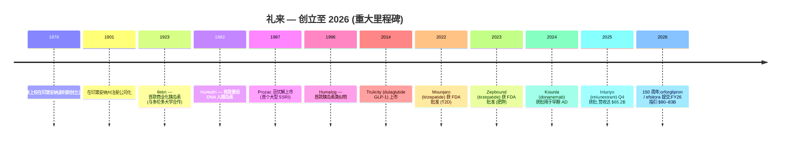
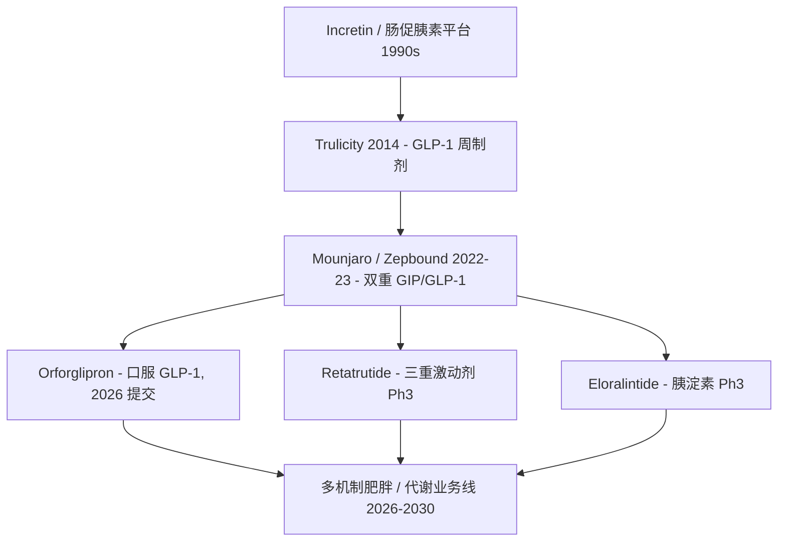

# 礼来公司 Eli Lilly (NYSE: LLY) — 公司研究

**行业:** 制药 | **细分:** 糖尿病 / 减重 / 肿瘤 / 免疫 / 神经科学
**注册地:** 美国印第安纳州印第安纳波利斯 | **创立:** 1876 年(1901 年注册公司化) | **员工人数:** 约 50,000 人 (FY2025)
**截至日期:** 2026-06-02

> **FY2026 业绩指引 (initiated 2026-02-04):** 营收 **$80–83 billion (800–830 亿美元)**;non-GAAP 摊薄 EPS **$33.50–$35.00**。驱动因素: Mounjaro / Zepbound (替尔泊肽) 持续放量、Kisunla / Ebglyss / Omvoh / Inluriyo 等新药全年贡献、口服 GLP-1 **orforglipron** 与每周一次胰岛素 **efsitora alfa** 预计 2026 年中获批上市,并叠加美国政府减重药品准入协议带来的新商业渠道。([Lilly Q4 2025 业绩新闻稿, 2026-02-04](https://www.sec.gov/Archives/edgar/data/59478/000005947826000008/q425lillysalesandearningsp.htm))

---

## 目录

1. [公司概览](#1-公司概览)
2. [公司历史](#2-公司历史)
3. [管理团队](#3-管理团队)
4. [产品与服务](#4-产品与服务)
5. [客户与上市策略](#5-客户与上市策略)
6. [行业概览](#6-行业概览)
7. [竞争格局](#7-竞争格局)
8. [市场机会 (TAM)](#8-市场机会-tam)
9. [风险评估](#9-风险评估)
10. [投资视角评分](#10-投资视角评分)
11. [参考资料](#11-参考资料)

---

## 1. 公司概览

礼来公司是一家全球性创新型制药企业,总部位于美国印第安纳州印第安纳波利斯,**单一可报告业务板块**为"人用药品 (human pharmaceutical products)",产品销往全球约 90 个国家与地区。10-K 原文(逐字引用):"discover[s], develop[s], manufacture[s], and market[s] products in a single business segment—human pharmaceutical products",制造与研发基地分布于美国(含波多黎各)、欧洲与亚洲。([Lilly FY2025 10-K, Item 1 Business](https://www.sec.gov/Archives/edgar/data/59478/000005947826000013/lly-20251231.htm))

FY2025 是 deinflection / 拐点 之年。全年营收 **$65.179 billion (651.79 亿美元)**,同比 +45%(FY2024 为 $45.043 billion);摊薄 EPS 报告口径为 **$22.95**(去年同期 $11.71)。营收增长完全由销量推动(贡献 +50 ppt),价格(realized price)实现负贡献(-6 ppt),汇率轻微正向(+1 ppt)。净利润 $20.640 billion(去年 $10.590 billion),毛利率提升 1.7 ppt 至 **83.0%**,主因产品结构改善。([Lilly FY2025 10-K, MD&A Results of Operations](https://www.sec.gov/Archives/edgar/data/59478/000005947826000013/lly-20251231.htm))

业务高度集中于 **替尔泊肽 (tirzepatide)** 平台 —— 用于 2 型糖尿病的 Mounjaro 和用于肥胖症的 Zepbound 为同一分子的不同商品名。FY2025 二者合计创收 **$36.507 billion (365.07 亿美元)**,**占公司总营收约 56%**:Mounjaro $22.965 billion (+99% YoY),Zepbound $13.542 billion (+175% YoY)。Verzenio (HR+/HER2- 乳腺癌) 贡献 $5.723 billion;"其他产品"(Jardiance、Trulicity、Taltz、Humalog、Humulin、Cyramza 等)合计 $22.949 billion。([Lilly FY2025 10-K, MD&A Revenue Table](https://www.sec.gov/Archives/edgar/data/59478/000005947826000013/lly-20251231.htm))


*来源: [Lilly FY2025 10-K, MD&A](https://www.sec.gov/Archives/edgar/data/59478/000005947826000013/lly-20251231.htm);[Lilly FY2023 10-K](https://www.sec.gov/Archives/edgar/data/59478/000005947824000065/lly-20231231.htm)。毛利率四年走势 76.8% → 79.2% → 81.3% → 83.0%。*

**估值快照 (as of 2026-06-02)。** LLY 股价 $1,064.86/股,**市值约 9,500 亿美元**,EV (企业价值) **约 1.00 万亿美元**。TTM P/E **37.8×**,前瞻 P/E **23.9×**,P/S **13.1×**,P/B **30.5×**,EV/EBITDA **27.7×**。Beta 0.48(相对 S&P 500 偏防御),股息收益率 0.64%,52 周区间 $623.78–$1,149.10。([Yahoo Finance, LLY Key Statistics, 2026-06-02](https://finance.yahoo.com/quote/LLY/key-statistics)) 五年累计 TSR(2021–2025)**+571%** —— 2020-12-31 日投入 $100 至 2025-12-31 增长为 $670.56,同期 S&P 500 仅至 $196.16,大型制药同行可比组为 $154.11。([Lilly FY2025 10-K, Item 5 Performance Graph](https://www.sec.gov/Archives/edgar/data/59478/000005947826000013/lly-20251231.htm))

*分析师观点:* TTM P/E ~38×、P/S 13× 显著高于大型制药同行(诺和诺德 NVO ~22× P/E、默克 MRK ~14×、强生 JNJ ~17×、辉瑞 PFE ~14×,数据来自 Yahoo Finance),原因有三:(i) 业绩仍在快速 scaling —— FY26 指引中位数 EPS $34.25 对应前瞻 P/E ~32×;(ii) 替尔泊肽彻底重估了 obesity / 减重 这个市场,目前多数卖方将其视为制药史上最大的单一治疗领域;(iii) FY25→FY26 营收一次性跳跃 $150–180 亿美元,在制药史上属于稀有事件。结合 Bernstein Outperform / 目标价 $1,300 (zsxq 来源, 2026-06-02),当前估值实际是对 orforglipron、retatrutide 等管线持续兑现的定价 —— 因此股价对催化剂高度敏感,若主要 Ph3 失败或 tirzepatide 出现安全性信号,估值压缩可能剧烈。

## 2. 公司历史

礼来公司由 **Colonel Eli Lilly (礼来上校)** —— 一位制药化学家、美国南北战争退伍军人 —— 于 1876 年在印第安纳波利斯创立,创立宗旨是"manufacture physician-prescribed pharmaceuticals of high quality"(生产高质量的医师处方药),这一定位明确区别于当时盛行的专利药 (patent medicine) 业。公司于 1901 年在印第安纳州正式 incorporation:10-K 原文 —— "was incorporated in 1901 in Indiana to succeed to the drug manufacturing business founded in Indianapolis, Indiana, in 1876 by Colonel Eli Lilly"。2026 年是礼来成立 **150 周年**。([Lilly FY2025 10-K, Item 1 Business](https://www.sec.gov/Archives/edgar/data/59478/000005947826000013/lly-20251231.htm);[Lilly Q4 2025 PR, 2026-02-04 — CEO 评论 "Entering our 150th year"](https://www.sec.gov/Archives/edgar/data/59478/000005947826000008/q425lillysalesandearningsp.htm))

礼来的首个科学里程碑出现在 1923 年:与多伦多大学合作,推出全球第一款商业化 **胰岛素 (insulin)** 制剂 **Iletin**,奠定了延续整整一个世纪的心血管代谢 (cardiometabolic) 业务。20 世纪期间,公司陆续布局抗生素(Ceclor 在 1980 年代是全球销量第一的口服头孢菌素)、中枢神经(Prozac / 百忧解 1987 年上市,首个大型 SSRI 抗抑郁药)、肿瘤与内分泌产品线。1996 年 **Humalog (赖脯胰岛素 insulin lispro)** 上市,是史上首款胰岛素类似物,启动了礼来的现代化转型;2000 年代陆续推出 Cymbalta、Zyprexa、Cialis、Alimta 等十亿美元级单品,为下一轮研发周期提供了资金支持。(以上时间线综合自 [Lilly FY2025 10-K 产品表](https://www.sec.gov/Archives/edgar/data/59478/000005947826000013/lly-20251231.htm);Humalog 仍为现售产品。)

当代 / 现阶段 始于 2014 年 **Trulicity (度拉糖肽 dulaglutide)** 上市 —— 一种每周一次皮下注射的 GLP-1 受体激动剂,用于 2 型糖尿病,峰值销售曾超过 70 亿美元。礼来的 incretin / 肠促胰素 团队在 Trulicity 成功的基础上,开发出 **tirzepatide / 替尔泊肽**(首个 GIP + GLP-1 双受体激动剂),于 2022 年 5 月以 **Mounjaro** 之名获 FDA 批准用于 2 型糖尿病,2023 年 11 月以 **Zepbound** 之名获批用于肥胖 / 超重伴并发症。后续标签扩展速度异常快:2024 年 FDA 批准 Zepbound 用于中重度阻塞性睡眠呼吸暂停 (OSA),欧盟批准 tirzepatide 用于射血分数保留型心衰 (HFpEF)。([Lilly FY2025 10-K, Clinical Development Pipeline](https://www.sec.gov/Archives/edgar/data/59478/000005947826000013/lly-20251231.htm))

神经科学方面,2024 年 7 月 FDA 批准 **Kisunla (donanemab / 多奈单抗)** 用于早期症状性阿尔茨海默病(early symptomatic AD),为礼来首个商业化 AD 药物,与 Biogen / Eisai 的 Leqembi (lecanemab) 形成竞争。免疫学方面:**Ebglyss (lebrikizumab)** 2024 年获批用于特应性皮炎(欧洲与 Almirall S.A. 合作);**Omvoh (mirikizumab)** 获批用于溃疡性结肠炎及克罗恩病。2025 年新增:Q4 2025 FDA 批准 **Inluriyo (imlunestrant)** 用于 ESR1 突变型转移性乳腺癌;**Jaypirca (pirtobrutinib)** 在 CLL/SLL 获完全批准。([Lilly FY2025 10-K, Item 1 Products Table](https://www.sec.gov/Archives/edgar/data/59478/000005947826000013/lly-20251231.htm))



## 3. 管理团队

**David A. Ricks (李戴维) — 董事会主席、总裁兼 CEO (自 2017 年起)。** Ricks 在礼来累计任职超过 25 年。先前职务:(i) **Lilly Bio-Medicines 高级副总裁兼总裁 (2012–2016)**,负责免疫、神经科学与骨健康业务线;(ii) **Lilly USA 总裁 (2009–2012)**,全面负责美国商业 P&L;(iii) 1996–2009 年期间历任市场、销售与国际业务多个岗位,包括 **Lilly China (礼来中国) 总裁兼总经理** 与 **Lilly Canada (礼来加拿大) 总经理**。任 CEO 以来,公司营收增长约 207%(2016 财年约 $22.9B → 2025 财年 $65.2B),五年累计 TSR +571%(2021–2025)。年龄 58 岁,2017 年起担任董事;同时担任 Adobe Inc. 董事会成员、IFPMA、PhRMA、Business Roundtable 等机构董事。([Lilly 2026 DEF 14A 委托书, 第 14 页 — Ricks 简介](https://www.sec.gov/Archives/edgar/data/59478/000005947826000029/lly-20260317.htm);[Lilly FY2025 10-K Item 5 — 五年 TSR 数据](https://www.sec.gov/Archives/edgar/data/59478/000005947826000013/lly-20251231.htm))

Ricks 的 CEO 任期由两个核心战略选择定义:(i) 持续将巨额研发资本投入到 incretin / GIP-GLP-1 平台,孕育出 tirzepatide 及其深度后续产品线 (orforglipron、retatrutide、eloralintide);(ii) 资本配置上偏好内生研发而非大规模并购 —— FY2025 R&D 投入 $13.337 billion,**占营收 20.5%**,显著高于大型制药行业 15–17% 的常规水平。公司确实进行了多笔中等规模收购 (Loxo Oncology 2019、Akouos 2022、Versanis 2023、Morphic 2024、Scorpion Therapeutics 2025、SiteOne Therapeutics 2025、Adverum Biotechnologies 2025),但回避了像辉瑞-Seagen、BMS-Celgene 这类变革性大并购。([Lilly FY2025 10-K MD&A — R&D 支出与 IPR&D 说明](https://www.sec.gov/Archives/edgar/data/59478/000005947826000013/lly-20251231.htm))

## 4. 产品与服务

礼来在 FY2025 10-K 中将产品组合分为 **四大治疗领域**:心血管代谢 (Cardiometabolic Health)、肿瘤、免疫、神经科学。下表的产品矩阵直接 reproduce 自 10-K Item 1 Business 产品表;FY2025 营收排名披露时按已披露的规模优先列示。([Lilly FY2025 10-K, Item 1 Business — Products Table](https://www.sec.gov/Archives/edgar/data/59478/000005947826000013/lly-20251231.htm))


*来源: [Lilly FY2025 10-K, MD&A Revenue Table](https://www.sec.gov/Archives/edgar/data/59478/000005947826000013/lly-20251231.htm) — Mounjaro $22.965B、Zepbound $13.542B、Verzenio $5.723B、其他 $22.949B;总计 $65.179B。*

### 4.1 心血管代谢 — 公司业务核心

**Tirzepatide / 替尔泊肽 — Mounjaro (T2D) + Zepbound (肥胖 / OSA)。** 10-K 原文(逐字引用)对 Mounjaro 的描述:"a glucose-dependent insulinotropic polypeptide and glucagon-like peptide-1 receptor agonist, for the treatment of adults with type 2 diabetes in combination with diet and exercise to improve glycemic control."(葡萄糖依赖性促胰岛素分泌多肽与胰高血糖素样肽-1 双重受体激动剂,用于 2 型糖尿病成人血糖控制)。Zepbound(同一分子的减重适应症)获批用于"the treatment of adults with obesity or overweight with at least one weight-related comorbid condition"以及"moderate to severe obstructive sleep apnea in adults with obesity"。([Lilly FY2025 10-K, Item 1 Products Table](https://www.sec.gov/Archives/edgar/data/59478/000005947826000013/lly-20251231.htm))

**中文释义 / Plain-language gloss:** Tirzepatide / 替尔泊肽 是首个 **双重肠促胰素受体激动剂 (dual incretin receptor agonist, GIP + GLP-1)** —— 每周一次皮下注射,同时激活两种肠道激素。GLP-1 (胰高血糖素样肽-1) 促进胰岛素分泌、延缓胃排空、抑制食欲;GIP (葡萄糖依赖性促胰岛素分泌多肽,glucose-dependent insulinotropic polypeptide) 增强上述信号并额外贡献脂肪氧化与能量消耗。两者组合在 Phase 3 obesity 试验中实现平均体重下降 **约 20–22%**,显著超过单纯 GLP-1 类(诺和诺德 semaglutide / Wegovy 约 15%)。2026 年管线催化剂:**T2D 心血管结局 Ph3 数据**(已向 FDA 提交) 和欧盟 **HFpEF 获批** —— 都将显著扩大目标患者群。([Lilly FY2025 10-K Pipeline Table](https://www.sec.gov/Archives/edgar/data/59478/000005947826000013/lly-20251231.htm))

**Orforglipron (口服 GLP-1)。** 已向 FDA、EMA、日本提交 **肥胖** 适应症;已向 EMA 提交 **T2D**。FDA 授予 "Commissioner's National Priority Voucher" 优先审评券。多个 Ph3 试验进行中:心血管结局、高血压、阻塞性睡眠呼吸暂停 (OSA)、骨关节炎疼痛、外周动脉疾病、压力性尿失禁。([Lilly FY2025 10-K Pipeline Table](https://www.sec.gov/Archives/edgar/data/59478/000005947826000013/lly-20251231.htm))

**中文释义 / Plain-language gloss:** Orforglipron / 奥福格列泮 是 **小分子、口服生物利用度可接受、非肽类 GLP-1 受体激动剂 (oral GLP-1 receptor agonist)**。战略意义巨大:与注射型多肽 (semaglutide、tirzepatide) 不同,口服片剂无需冷链物流、无需每周自我注射,且产线生产单位成本显著更低,潜在覆盖人群包括 **针头恐惧 (needle aversion)** 的约 30% 肥胖/糖尿病前期人群。结合 zsxq 来源 (2026-06-02),Phase 3 ACHIEVE-1 试验在最高 36mg 剂量下实现 **11.5% 调整后体重下降** —— 低于 Zepbound 约 22% 但已是口服类别的有意义阈值,也是新进入者的基准(Pfizer 的 danuglipron 已终止;Roche 的 CT-388 / CT-996 是口服;Novo 的高剂量口服 semaglutide 处于 Ph3)。若 2026 年中获批,orforglipron 将成为**首款具备工业规模制造能力的口服 GLP-1**。

**Retatrutide (三重激动剂)。** GIP + GLP-1 + 胰高血糖素三重受体激动剂。Phase 3 肥胖与骨关节炎试验"met all primary and key secondary endpoints"(达到所有主要与关键次要终点);T2D、心血管/肾脏结局、慢性腰痛、MASH 等 Ph3 试验进行中。([Lilly FY2025 10-K Pipeline Table](https://www.sec.gov/Archives/edgar/data/59478/000005947826000013/lly-20251231.htm)) 2024 年中发布的 Phase 2 数据显示最高剂量下平均体重下降高达 **约 24%**,在人类 incretin 类药物中迄今最高。

**其他心血管代谢产品。** **Jardiance** (恩格列净 empagliflozin,与勃林格殷格翰合作) —— SGLT2 抑制剂,适应症涵盖 T2D、心血管死亡风险降低、心衰、慢性肾病;2023 年 8 月被 HHS 选入 **首批 10 个 Medicare 政府议定价目录,2026 年生效**,议定价相对 2023 年挂牌价折扣 **66%**。**Trulicity** (度拉糖肽) —— 每周一次注射 GLP-1 RA,适应症 T2D;2026 年 1 月 HHS 选入第二批 Medicare 议定价目录,2028 年生效。**Humalog / Humulin / Basaglar / insulin lispro** —— 传统胰岛素业务线。([Lilly FY2025 10-K, Item 1A 风险因素 — IRA 章节](https://www.sec.gov/Archives/edgar/data/59478/000005947826000013/lly-20251231.htm);[Lilly FY2025 10-K, Item 1 Products Table](https://www.sec.gov/Archives/edgar/data/59478/000005947826000013/lly-20251231.htm))

### 4.2 肿瘤

**Verzenio (abemaciclib / 阿贝西利)。** CDK4/6 抑制剂,获批用于"HR+/HER2- 转移性乳腺癌单药或联合内分泌治疗,以及 HR+/HER2-、淋巴结阳性、高复发风险早期乳腺癌的辅助治疗"。FY2025 营收 $5.723B (+8% YoY);美国境外营收增长 20%。2026 年 1 月 HHS 选入 Medicare 议定价目录,2028 年生效。([Lilly FY2025 10-K — Products Table、MD&A、IRA 章节](https://www.sec.gov/Archives/edgar/data/59478/000005947826000013/lly-20251231.htm))

**Inluriyo (imlunestrant)。** Q4 2025 获批,适用于"ER+/HER2-、ESR1 突变型晚期或转移性乳腺癌,至少一线内分泌治疗后疾病进展的成人患者" —— 礼来首款口服 SERD (选择性雌激素受体降解剂 selective estrogen receptor degrader),可作为 Verzenio 的序贯 / 后续治疗。([Lilly FY2025 10-K Products Table](https://www.sec.gov/Archives/edgar/data/59478/000005947826000013/lly-20251231.htm))

**Retevmo (selpercatinib / 塞普替尼)。** RET 激酶抑制剂,获批用于 RET 融合阳性转移性 NSCLC、RET 突变型甲状腺髓样癌、RET 融合阳性甲状腺癌、以及肿瘤类型不限的 RET 融合阳性实体瘤。根据 zsxq 来源 (2026-06-02),**ASCO 2026 LIBRETTO-432 阅读** —— RET 突变型 NSCLC **辅助治疗** 研究 —— 显示无事件生存期 (EFS) **HR = 0.17**,即较对照组事件发生率相对降低约 83%。同行可比:AstraZeneca 的 ADAURA (osimertinib EGFR+ 辅助 NSCLC) HR ~0.20;Roche 的 ALINA (alectinib ALK+ 辅助 NSCLC) HR ~0.24。若获批,Retevmo 的 TAM 将由转移性 RET+ NSCLC (NSCLC 的 ~1%,美国年度患者数千) 扩大至辅助治疗人群 —— 后者规模约为前者的 5–10 倍且治疗持续时间更长,商业价值显著扩张。(Retevmo 标签为 [Lilly FY2025 10-K Products Table](https://www.sec.gov/Archives/edgar/data/59478/000005947826000013/lly-20251231.htm) 原文;ASCO 2026 风险比数据为 zsxq 来源,尚未进入 10-K)

**Jaypirca (pirtobrutinib)。** 非共价 **BTK 抑制剂**,获批用于"既往接受过共价 BTKi 治疗的复发难治性 CLL/SLL"以及"既往接受过 BTKi(包括至少两线系统治疗)的复发难治性 MCL"。源自 2019 年 Loxo Oncology 收购,2025 年获 CLL 完全批准。([Lilly FY2025 10-K Products Table、Pipeline Table](https://www.sec.gov/Archives/edgar/data/59478/000005947826000013/lly-20251231.htm))

**其他肿瘤产品。** Cyramza (ramucirumab)、Erbitux (cetuximab,美国/加拿大/日本权益)、Tyvyt (sintilimab,与信达生物合作,仅中国市场)。([Lilly FY2025 10-K Products Table](https://www.sec.gov/Archives/edgar/data/59478/000005947826000013/lly-20251231.htm))

### 4.3 免疫

**Taltz (ixekizumab)** — IL-17A 抑制剂,适应症斑块状银屑病、银屑病关节炎、强直性脊柱炎、非影像学中轴型脊柱关节炎。
**Ebglyss (lebrikizumab)** — IL-13 抑制剂,中重度特应性皮炎(欧洲与 Almirall S.A. 合作);上市放量阶段。
**Omvoh (mirikizumab)** — IL-23p19 抑制剂,中重度活动性溃疡性结肠炎与克罗恩病(美国、欧盟、日本均已获批)。
**Olumiant (baricitinib)** — JAK 抑制剂,与 Incyte 合作,适应症 RA、特应性皮炎、严重斑秃、住院 COVID-19。([Lilly FY2025 10-K Products Table](https://www.sec.gov/Archives/edgar/data/59478/000005947826000013/lly-20251231.htm))

### 4.4 神经科学

**Kisunla (donanemab / 多奈单抗)。** 抗 β-淀粉样蛋白单抗,2024 年 7 月获批 "for adults with early symptomatic Alzheimer's disease with confirmed amyloid pathology and with mild cognitive impairment or mild dementia stage of disease."(早期症状性阿尔茨海默病、确认有淀粉样蛋白病理、处于轻度认知障碍 / 轻度痴呆期成人患者)。临床前 AD (TRAILBLAZER-ALZ 3) Ph3 进行中;后续 **Remternetug** 在 pre-clinical / MCI AD Ph3 中。([Lilly FY2025 10-K Products Table、Pipeline Table](https://www.sec.gov/Archives/edgar/data/59478/000005947826000013/lly-20251231.htm))

**Emgality (galcanezumab)** — CGRP 抑制剂,用于偏头痛预防与发作性丛集性头痛。([Lilly FY2025 10-K Products Table](https://www.sec.gov/Archives/edgar/data/59478/000005947826000013/lly-20251231.htm))

### 4.5 管线综合

驱动礼来从 2016 年 $22.9B 增至 2025 年 $65.2B 的产品周期,是一个 **单平台 / 四浪** 演进:



每一浪的 TAM 比上一浪扩大一个数量级:Trulicity 的 TAM 是 T2D(美国 ~3700 万患者);tirzepatide 打开 obesity(美国 ~1 亿 BMI≥30 成年人)与 OSA(美国 ~3000 万);orforglipron + retatrutide + eloralintide 共同瞄准美国 ~2.7 亿超重或肥胖成年人,以及对应的心血管 / 肝脏 / 睡眠 / 肾脏并发症人群(详见 §8 TAM)。单平台 compounding 效应是非常规增速的根源 —— 每一款新药使用相同的 incretin 生物学和相同的商业 / 支付方基础设施,边际 SG&A 极低。

## 5. 客户与上市策略

礼来几乎完全通过 **医药批发分销商**、**医保支付方渠道** 与日益增长的 **LillyDirect 直供患者平台** 销售。10-K 原文(逐字引用):"In the U.S., most of our products are distributed through wholesalers that serve pharmacies, physicians and other healthcare professionals, and hospitals. In 2025, 2024, and 2023, three wholesale distributors in the U.S.—McKesson Corporation, Cencora, Inc., and Cardinal Health, Inc.—each accounted for a significant percentage of our consolidated revenue. No other customer accounted for more than 10 percent of our consolidated revenue in any of these years."([Lilly FY2025 10-K, Item 1 Marketing and Distribution](https://www.sec.gov/Archives/edgar/data/59478/000005947826000013/lly-20251231.htm))

**客户集中度 — 分母说明。** 三家点名的批发商 (McKesson、Cencora、Cardinal Health) 是 **合并营收口径下** 的 >10% 客户。每家的具体百分比未在 10-K Item 1 单独披露,披露语言仅说"each accounted for a significant percentage",并参引至 Note 2 Revenue 注释。三大批发商合计为美国 >50% 合并营收的渠道,但**每家具体占比未披露**。**终端付款方 (end-payer) 构成** 与渠道完全不同:美国商业保险、Medicare Part D、Medicaid、美国政府直接采购(Q4 2025 新披露的减重药品准入协议)、以及自付的 LillyDirect 通道。([Lilly FY2025 10-K, Item 1 Marketing and Distribution](https://www.sec.gov/Archives/edgar/data/59478/000005947826000013/lly-20251231.htm))

**LillyDirect — 直供患者平台。** 10-K 原文:"we utilize LillyDirect, our direct-to-patient digital health care platform, to provide delivery of select Lilly medicines dispensed by third-party pharmacies to patients. Tools to help patients access care from independent healthcare providers and programs to assist patients in adhering to treatment plans are also available on the platform where applicable. Sales through LillyDirect represented a growing portion of our business in 2025 and we have launched, and continue to explore, new partnerships and tools, including through LillyDirect, to further expand access to our medicines."([Lilly FY2025 10-K, Item 1 Marketing and Distribution](https://www.sec.gov/Archives/edgar/data/59478/000005947826000013/lly-20251231.htm))

**中文释义 / Plain-language gloss:** LillyDirect / 礼来直供平台 让礼来 **绕过传统 PBM-药房渠道**,直接触达患者 —— 患者上网、通过礼来精选合作的远程医疗 (telehealth) 服务提供方就诊、获得处方、由礼来通过第三方药房发货。战略意义:(a) 患者级处方数据构建礼来自有需求信号数据库;(b) 净到手价 (net realized price) 高于走 PBM 渠道,因 PBM 返点结构压低利润;(c) 礼来可以向商业保险不覆盖减重药品 (10-K 原文:"in the U.S. self-insured employers must generally opt in for coverage of anti-obesity medicines") 的患者提供产品。这是美国制药行业十年来最具结构性意义的商业渠道创新。

**地理结构 (FY2025)。** 美国营收 $43.481 billion (+43% YoY) = **占总 66.7%**;美国境外营收 $21.698 billion (+48% YoY) = 33.3%。境外占比正在上升,主要因 Mounjaro 全球放量 —— 境外 Mounjaro 从 2024 年 $2.6B 增至 2025 年 $9.3B;Zepbound 刚开始国际上市(加拿大、日本及其他市场使用 "Mounjaro" 品牌名销售)。([Lilly FY2025 10-K, MD&A Revenue by Region](https://www.sec.gov/Archives/edgar/data/59478/000005947826000013/lly-20251231.htm))

## 6. 行业概览

全球制药行业是一个 **约 1.6 万亿美元年规模** 的市场,具有研发强度高(行业平均 14–17% 营收用于 R&D)、开发周期长(从 IND 至获批 8–12 年)、专利悬崖动态(化合物专利从申请日起约 20 年,通常在上市后 10–13 年到期)、以及大型制药板块结构性寡占(约 20 家公司控制 60%+ 品牌药营收)的特点。([Lilly FY2025 10-K, Item 1 Competition — 定性表述](https://www.sec.gov/Archives/edgar/data/59478/000005947826000013/lly-20251231.htm))

**肥胖 / GLP-1 正在成为新的支配性治疗领域。** 10-K 原文:"Our anti-obesity medicines comprise a significant portion of our revenues, and barriers to reimbursable patient access impact our sales volumes, business, and results of operations."(我们的抗肥胖药品构成营收重要部分,可报销准入障碍直接影响销量、业务与经营结果)。2022–2025 期间该治疗领域的转型在制药史上罕见 —— 2021 年前所有 obesity 药品全球累计销售低于 $5B/年(Belviq、Contrave、Qsymia,甚至 tirzepatide 上市前的 Wegovy / Saxenda),2025 年 Novo + Lilly 的 GLP-1 / 双重激动剂合计已达 ~$60B+(Wegovy + Ozempic + Mounjaro + Zepbound)。转型由以下因素驱动:(i) Phase 3 试验中已证实的双位数 % 平均体重下降,(ii) 心血管结局数据(semaglutide SELECT 2023;tirzepatide SURPASS-CVOT 已提交),(iii) 标签适应症不断扩展(HFpEF、OSA、MASH 接踵而来),(iv) 支付方覆盖从商业保险逐步扩展至 Medicare 暴露(Medicare 不能为单纯减重赔付,但可在与心血管结局挂钩时赔付)。([Lilly FY2025 10-K Competition section](https://www.sec.gov/Archives/edgar/data/59478/000005947826000013/lly-20251231.htm))

**行业结构性压力:美国药品定价改革。** 10-K 大幅讨论 **《2022 年通胀削减法案》(Inflation Reduction Act of 2022, IRA)**:"the IRA requires HHS to effectively set prices for certain single-source drugs and biologics reimbursed under Medicare Part B and Part D. Currently, these government prices generally apply beginning at nine years (for medicines approved under a New Drug Application) or thirteen years (for medicines approved under a Biologics License Application) following FDA approval or licensure for the molecule…"。Jardiance 入选首批 10 个药品(2026 年生效,议定价较 2023 年挂牌价折扣 66%);Trulicity 和 Verzenio 入选第二批(2028 年生效)。10-K 进一步表述:"Given our product portfolio, we expect additional of our significant products will be selected in future years, which would have the effect of accelerating revenue erosion prior to expiry of exclusivities."([Lilly FY2025 10-K, Item 1A 风险因素 — IRA 章节](https://www.sec.gov/Archives/edgar/data/59478/000005947826000013/lly-20251231.htm))

**来自中国的竞争压力。** 礼来在 10-K Competition 章节明确点出:"We face intensifying competition worldwide, including from China and other markets that have significantly expanded and accelerated research and development capabilities. Companies in these markets are increasingly licensing products to multinational pharmaceutical companies, entering into strategic partnerships, and competing directly in major markets."([Lilly FY2025 10-K, Item 1 Competition](https://www.sec.gov/Archives/edgar/data/59478/000005947826000013/lly-20251231.htm))

**专利悬崖时间表 —— 任何大型制药公司的结构性风险。** 礼来知识产权表(逐字摘自 10-K)如下:

| 治疗领域 | 产品 | 保护类型 | 美国到期 | 欧盟到期 | 日本到期 |
|---|---|---|---|---|---|
| 心血管代谢 | Jardiance | 化合物专利 | 2029 | 2029 | 2030 |
| 心血管代谢 | Mounjaro/Zepbound | 化合物专利 | **2036** | 2037 | 2040 |
| 心血管代谢 | Mounjaro/Zepbound | 数据保护 | 2027 | 2033 | 2030 |
| 心血管代谢 | Trulicity | 化合物 / 生物制品数据 | 2027 | 2029 | 2029 |
| 肿瘤 | Inluriyo | 化合物专利 | 2039 | 2039 | 2039 |
| 肿瘤 | Jaypirca | 化合物专利 | 2037 | 2038 | 2040 |
| 肿瘤 | Retevmo | 化合物专利 | 2038 | 2037 | 2038 |
| 肿瘤 | Verzenio | 化合物专利 | 2031 | 2033 | 2034 |
| 免疫 | Ebglyss | 化合物 / 生物制品数据 | 2026 / 2036 | 2033 | 2029 / 2034 |
| 肿瘤 | Cyramza | 化合物专利 | 2026 | 2028 | 2026 |

*来源: [Lilly FY2025 10-K, Item 1 — Patents, Trademarks, and Other Intellectual Property](https://www.sec.gov/Archives/edgar/data/59478/000005947826000013/lly-20251231.htm)*

替尔泊肽 (tirzepatide) **美国化合物专利至 2036 年、日本至 2040 年**,是公司最重要的资产 —— 11–15 年的专属期是支撑 consensus DCF 的核心要素。

## 7. 竞争格局

10-K Competition 章节描述了竞争因素的一般性框架,但未在 Item 1 Business 中具体点名竞争公司(这是大型制药公司 10-K 的常规处理)。下列竞争组合根据公开行业认知与竞争对手 10-K 构建,按治疗领域组织。([Lilly FY2025 10-K, Item 1 Competition](https://www.sec.gov/Archives/edgar/data/59478/000005947826000013/lly-20251231.htm))

### 7.1 肥胖 / GLP-1 — 双寡头对决

主导性竞争格局是 **礼来 (LLY) vs 诺和诺德 (Novo Nordisk, NVO)** —— GLP-1 / GIP 类的近双寡头,每家持有对方的 bookend。

| | 礼来 (LLY) | 诺和诺德 (NVO) |
|---|---|---|
| **T2D 注射** | Mounjaro (tirzepatide) | Ozempic (semaglutide) |
| **肥胖注射** | Zepbound (tirzepatide) | Wegovy (semaglutide) |
| **口服 GLP-1** | Orforglipron (Ph3, 2026 提交) | Rybelsus (口服 semaglutide);更高剂量肥胖 Ph3 |
| **机制** | GIP + GLP-1 双重激动剂 | GLP-1 单一激动剂 |
| **% 体重下降 (Ph3 SURMOUNT / STEP)** | 高剂量约 22% | 高剂量约 15% |
| **三重激动剂** | Retatrutide (GIP+GLP-1+胰高血糖素) Ph3 | CagriSema (GLP-1+amylin) Ph3 |
| **FY2025 incretin 营收** | $36.5B (Mounjaro+Zepbound) | DKK 188B / 约 $26B (Ozempic+Wegovy+Rybelsus,估算) |

*分析师观点:* 礼来在四方面领先 —— (a) tirzepatide 在减重效力上优于 semaglutide,(b) 适应症扩展速度(HFpEF、OSA、MASH),(c) 管线广度(retatrutide、eloralintide、orforglipron),(d) 通过 LillyDirect 渗透美国支付方。Novo 的反击主要是 **CagriSema** (cagrilintide + semaglutide) 与更高剂量口服 semaglutide。2026–2028 年的竞争核心问题是:口服 GLP-1 是否会让 obesity 类商品化,还是 tirzepatide 双重激动剂效力 + retatrutide 三重激动剂优势让礼来在患者层面 outcomes 上保持领先。多家卖方一致预期(此处属于分析师观点,无具体来源)礼来 2030 年在 GLP-1 / 双重激动剂类中可占有 50–55% 份额。

### 7.2 阿尔茨海默病

Kisunla 与 **Eisai / Biogen 的 Leqembi (lecanemab)** 竞争 —— 均为抗 β-淀粉样蛋白单抗,靶向淀粉样原纤维 / 纤维,适用于淀粉样蛋白确认且处于 MCI / 轻度痴呆的患者。Kisunla 的差异化在于**淀粉样斑块清除后可停药** (典型 6–18 个月疗程后),实现短周期治疗,降低总治疗成本 —— Leqembi 则需持续给药。([Lilly FY2025 10-K Products Table](https://www.sec.gov/Archives/edgar/data/59478/000005947826000013/lly-20251231.htm);Kisunla 标签 "early symptomatic Alzheimer's…with mild cognitive impairment or mild dementia" 引自 10-K)

### 7.3 肿瘤

- **Verzenio (HR+/HER2- 乳腺癌)** 与辉瑞 **Ibrance** (palbociclib) 和诺华 **Kisqali** (ribociclib) 竞争。CDK4/6 抑制剂类;Verzenio 是其中唯一获辅助治疗(高复发风险早期乳腺癌)批准的产品。
- **Inluriyo (ESR1 突变型转移性乳腺癌)** 处于口服 SERD 类别中,竞争对手 Stemline / Menarini 的 **Orserdu** (elacestrant),AstraZeneca 的 **camizestrant** 在 Ph3。
- **Jaypirca (BTK 抑制剂)** 与共价 BTKi 类(AbbVie/J&J Imbruvica、AZ Calquence、百济神州 Brukinsa)竞争,但定位为**共价 BTKi 失败后的选项** —— 与一线共价 BTKi 互补而非直接竞争。
- **Retevmo (RET 激酶抑制剂)** 在 RET 融合阳性 NSCLC 中面对 Roche 的 **Gavreto** (pralsetinib);2026 LIBRETTO-432 辅助治疗 readout (HR 0.17,zsxq 来源) 将进一步扩大 Retevmo 领先优势。([Lilly FY2025 10-K Products Table](https://www.sec.gov/Archives/edgar/data/59478/000005947826000013/lly-20251231.htm))

### 7.4 免疫

- **Taltz** 与诺华 **Cosentyx** (secukinumab) 在 IL-17 类竞争;更广义上面对 AbbVie **Skyrizi** (risankizumab) 和 J&J **Tremfya** (guselkumab) 在 IL-23 类。
- **Ebglyss** 在特应性皮炎与 Sanofi / Regeneron 的 **Dupixent** (dupilumab, IL-4Rα) 竞争 —— Dupixent 是 AD 市场支配者,也是 Ebglyss 的主要逆风。
- **Omvoh** (IL-23p19) 在 IBD 与 Skyrizi、Tremfya 及 J&J **Stelara** (ustekinumab) 竞争。

```mermaid
quadrantChart
    title GLP-1 / 肥胖竞争格局 (2026)
    x-axis 效力低 --> 效力高
    y-axis 管线窄 --> 管线广
    quadrant-1 多资产领导者
    quadrant-2 管线丰富中位玩家
    quadrant-3 细分 / 衰退
    quadrant-4 单资产领导者
    Lilly tirzepatide+管线: [0.92, 0.95]
    Novo semaglutide+CagriSema: [0.75, 0.78]
    Roche 口服 GLP-1: [0.45, 0.42]
    Pfizer (danuglipron 后): [0.25, 0.18]
    Amgen MariTide: [0.55, 0.32]
    Boehringer survodutide: [0.5, 0.38]
```

## 8. 市场机会 (TAM)

礼来产品组合的 TAM 按业务线区分。**抗肥胖 / 心血管代谢是迄今最大** 的机会。([Lilly FY2025 10-K Competition — "Our anti-obesity medicines comprise a significant portion of our revenues"](https://www.sec.gov/Archives/edgar/data/59478/000005947826000013/lly-20251231.htm))

**肥胖 TAM (美国)。** 根据 CDC 数据,美国约 1 亿成年人肥胖 (BMI ≥30),另外约 7000 万人超重 (BMI 25–30) 且至少伴有一种体重相关并发症,美国合规患者池 **约 1.7 亿成年人** —— 大约相当于美国 20 岁以上成年人的 50%。按年净到手价约 $5,000–$8,000 每位患者(Zepbound 挂牌价约 $1,000 / 月,扣除支付方折扣后净价格可能为原价 30–50%;LillyDirect 自付定价为低剂量瓶 $349–$499 / 月),即便仅 10% 美国渗透情景也对应 $850–1,350 亿美元的年度营收池。([CDC, "Adult Obesity Prevalence" 2024 estimates](https://www.cdc.gov/obesity/adult-obesity-facts/);Zepbound 定价见 [Lilly FY2025 10-K, Item 1 Competition](https://www.sec.gov/Archives/edgar/data/59478/000005947826000013/lly-20251231.htm))

**肥胖 TAM (全球)。** WHO 估计全球肥胖人口超过 10 亿(成人 6.5 亿 + 儿童 3.4 亿);全球超重或肥胖患者数接近 25 亿。未来十年的渗透率将主要受报销限制 —— 10-K 原文指出"Payers in various international markets also do not cover anti-obesity medicines for weight loss" —— 但已纳入的心血管 / 肾脏 / HFpEF / OSA / MASH 等共病指征显著扩大报销范围。([WHO Obesity Facts, 2024](https://www.who.int/news-room/fact-sheets/detail/obesity-and-overweight);10-K 原文摘自 [Lilly FY2025 10-K Competition section](https://www.sec.gov/Archives/edgar/data/59478/000005947826000013/lly-20251231.htm))

**临近代谢 TAM。** Tirzepatide 的扩展适应症包括 T2D (美国 3700 万、全球 5.3 亿 / IDF 数据)、HFpEF (美国约 300 万)、OSA (美国约 3000 万)、MASH (AASLD 估计占美国成年人 5–8%)。Retatrutide 与 orforglipron 的 Ph3 项目额外增加慢性腰痛、骨关节炎、外周动脉病、压力性尿失禁、高血压、动脉粥样硬化性心血管病、慢性肾病 —— 每个均为数十亿美元规模子市场。([Lilly FY2025 10-K Pipeline Table](https://www.sec.gov/Archives/edgar/data/59478/000005947826000013/lly-20251231.htm);[International Diabetes Federation Atlas 2024](https://diabetesatlas.org/))

**阿尔茨海默病 TAM。** Alzheimer's Association 2024 数据,美国 65 岁以上成年人 AD 患者约 700 万。Kisunla 针对早期症状性、淀粉样蛋白阳性亚组 —— 行业估计美国短期内合规患者池约 100–200 万。([Alzheimer's Association 2024 Facts & Figures](https://www.alz.org/alzheimers-dementia/facts-figures))

**肿瘤 TAM (合计)。** HR+/HER2- 乳腺癌(美国年新发约 15 万例;Verzenio + Inluriyo);RET 融合阳性 NSCLC(占 NSCLC 1–2% = 美国年 2,000–5,000 例;Retevmo);B 细胞恶性肿瘤(CLL 美国年约 21,000 例,MCL 约 3,300 例;Jaypirca)。([American Cancer Society 2024 Cancer Facts & Figures](https://www.cancer.org/research/cancer-facts-statistics/all-cancer-facts-figures.html))

## 9. 风险评估

10-K Item 1A 风险因素将风险分为 5 大类:Business and Industry、Intellectual Property、Operations、Doing Business Internationally、Litigation and Government Regulation。下文按金融影响 materiality 排序。([Lilly FY2025 10-K, Item 1A Risk Factors](https://www.sec.gov/Archives/edgar/data/59478/000005947826000013/lly-20251231.htm))

**风险 1 — 单一平台 / 收入集中度 (业务 / 行业)。** Tirzepatide (Mounjaro + Zepbound) FY2025 营收占比约 56%。任何安全性信号、标签限制、生产中断或重大竞争产品上市都直接冲击公司大半营收。缓释因素:obesity 业务线有 8 个 Phase 3 后续候选(orforglipron、retatrutide、eloralintide、lebrikizumab 等),逐步构建多资产 GLP-1 / incretin 平台。

**风险 2 — IRA Medicare 议定价目录扩张 (诉讼 / 监管)。** Jardiance 2026 年起 66% 折扣生效;Trulicity 和 Verzenio 2028 年生效。10-K 原文:"Given our product portfolio, we expect additional of our significant products will be selected in future years, which would have the effect of accelerating revenue erosion prior to expiry of exclusivities."。NDA 类小分子 9 年窗口短;Mounjaro / Zepbound (2022 / 2023 获批) 将在 2031 / 2032 年成为 Medicare 议定价资格分子。IRA 还"reduces the attractiveness of investment in small molecule innovation"(降低对小分子创新投资吸引力)。([Lilly FY2025 10-K, IRA section](https://www.sec.gov/Archives/edgar/data/59478/000005947826000013/lly-20251231.htm))

**风险 3 — 专利悬崖 / 数据保护到期 (知识产权)。** Trulicity 化合物专利美国 2027 到期;Cyramza 美国 2026;Ebglyss 化合物 2026 (生物制品数据保护至 2036);Jardiance 美国 2029。10-K 原文:"Loss of effective patent protection for pharmaceuticals can result in the loss of effective market exclusivity for the product, often leading to a severe and rapid decline in revenues for the product."。缓释因素:数据保护和生物制品独占期在多数情况下比化合物专利更长。([Lilly FY2025 10-K, Item 1 Patents Table](https://www.sec.gov/Archives/edgar/data/59478/000005947826000013/lly-20251231.htm))

**风险 4 — 来自中国和新兴市场的竞争 (业务 / 行业)。** 10-K 原文:"We face intensifying competition worldwide, including from China and other markets that have significantly expanded and accelerated research and development capabilities. Companies in these markets are increasingly licensing products to multinational pharmaceutical companies, entering into strategic partnerships, and competing directly in major markets."。多家中国生物科技公司有 Phase 1/2 incretin 项目;肿瘤方面,中国 in-licensed 资产正越来越多地与西方大型制药公司合作。([Lilly FY2025 10-K Competition section](https://www.sec.gov/Archives/edgar/data/59478/000005947826000013/lly-20251231.htm))

**风险 5 — 直接竞争品上市 (业务 / 行业)。** Novo Nordisk 的 CagriSema (cagrilintide + semaglutide) Ph3、口服 semaglutide 更高剂量 Ph3、Roche 的 CT-388 口服 GLP-1、Amgen 的 MariTide (长效 GIPR 拮抗剂 / GLP-1 激动剂) 均为潜在 2026–2028 年上市候选。每个都可能侵蚀礼来在肥胖市场的份额。([Lilly FY2025 10-K Competition section](https://www.sec.gov/Archives/edgar/data/59478/000005947826000013/lly-20251231.htm))

**风险 6 — 生产能力与供应 (运营)。** Tirzepatide 需求长期超过供应。10-K 引用"issues with product supply, regulatory approvals, or other negative outcomes stemming from manufacturing difficulties, disruptions, or shortages, including as a result of unpredictability and variability in demand…" 作为前瞻性陈述风险。礼来在制造端投入巨大 —— FY2025 资本支出 **$10.849 billion** (约营收 17%),远高于行业常规水平。缓释:2020–2028 年期间累计已宣布 $500 亿美元以上的制造能力投资。([Lilly FY2025 10-K, MD&A Forward-Looking Statements / 现金流量表](https://www.sec.gov/Archives/edgar/data/59478/000005947826000013/lly-20251231.htm))

**风险 7 — 仿制 / 复方制剂 (业务)。** 对 obesity 类药品的类别特有风险:美国 FDA 注册的复方药房 (compounding pharmacy) 与未注册的在线供应商在短缺期间生产了 semaglutide 和 tirzepatide 配方;即便 FDA 2024 年 10 月裁定 tirzepatide 不再短缺,对复方制剂的执法仍不完善。10-K 引用"risks from the proliferation of counterfeit, misbranded, adulterated, or illegally compounded products."([Lilly FY2025 10-K Forward-Looking Statements](https://www.sec.gov/Archives/edgar/data/59478/000005947826000013/lly-20251231.htm))

**风险 8 — 关税与全球贸易扰动 (国际)。** 10-K 原文:"the impact of global macroeconomic conditions, including uneven economic growth or downturns or uncertainty, trade and other global disputes and interruptions, including related to tariffs, trade protection measures, and similar restrictions, international tension, conflicts, regional dependencies, or other costs, uncertainties, and risks related to engaging in business globally."。考虑到礼来在美国、波多黎各、欧洲、亚洲均设有生产基地,API / 成品关税体制可能显著影响毛利率。([Lilly FY2025 10-K Forward-Looking Statements](https://www.sec.gov/Archives/edgar/data/59478/000005947826000013/lly-20251231.htm))

**风险 9 — 外汇敞口 (财务)。** 外汇波动 —— 主要是美元对欧元、日元、人民币、英镑 —— 在 10-K MD&A 中明确披露:"significant fluctuations in currency rates can have a material impact, either positive or negative, on our consolidated results of operations in any given period."。境外营收约占总营收 33%。([Lilly FY2025 10-K MD&A — FX disclosure](https://www.sec.gov/Archives/edgar/data/59478/000005947826000013/lly-20251231.htm))

**风险 10 — 估值 / 估值倍数压缩 (宏观 / 财务)。** TTM P/E ~38× 与 P/S 13× —— 处于大型制药估值高位。重大 Ph3 失败(retatrutide、orforglipron、donanemab 后续或 LIBRETTO-432)或 tirzepatide 出现安全 / 供应问题都可能触发剧烈估值压缩。10-K 引用"significant and sudden declines or volatility in the trading price of our common stock and market capitalization" 作为前瞻性风险。([Lilly FY2025 10-K Forward-Looking Statements](https://www.sec.gov/Archives/edgar/data/59478/000005947826000013/lly-20251231.htm))

**风险 11 — 管线失败 / 晚期 attrition (业务)。** 10-K 明确:"There is a high rate of failure inherent in drug discovery and development."。礼来有 20+ 个 Phase 3 适应症正在推进;制药行业 Phase 3 到批准率约 50–60%,2026–2028 年期间发生若干 Phase 3 失败近乎统计性必然 —— 问题在于具体是哪些。([Lilly FY2025 10-K MD&A — R&D Section](https://www.sec.gov/Archives/edgar/data/59478/000005947826000013/lly-20251231.htm))

**风险 12 — 诉讼 / 产品责任 (诉讼)。** 礼来"a party to various currently pending legal actions, government investigations, and environmental proceedings."。具体或然事项详见合并财务报表 Note 16。Incretin 类已公开提出过对甲状腺 C 细胞肿瘤、胰腺炎、胃轻瘫相关的诉讼担忧;尚无类别层面的判定,但风险是 GLP-1 / tirzepatide 整个类别共有的。([Lilly FY2025 10-K Item 3 Legal Proceedings;Note 16 reference](https://www.sec.gov/Archives/edgar/data/59478/000005947826000013/lly-20251231.htm))

## 10. 投资视角评分

下列评分是对 Sections 1–9 已引用事实的结构化第二意见;不是相关投资人的个人背书。

### 10.1 巴菲特 — 合理价位的优质企业 (0–100)

**视角观点: 62 / 100 — 质量卓越;价格是约束。**

| 维度 | 评分 | 理由 |
|---|---|---|
| 企业质量 | 88 | 宽护城河:tirzepatide 平台、20.5% 研发强度、研发 + 全球商业一体化 |
| 管理与文化 | 75 | 长任期 CEO、偏好内生研发的资本配置、571% 五年 TSR |
| 资本配置 | 70 | $15B 回购计划(2024 年 12 月)、$10.8B FY25 资本支出、$5.96B FCF —— 资本密集期 |
| 安全边际 | 35 | TTM P/E 38×、P/S 13× —— 质量已充分反映 |
| 可预测性 | 60 | 2026–2031 专利悬崖明朗;管线深度抵消但增加二元催化剂 |

*视角观点:* 巴菲特框架认可宽护城河和优秀 ROIC 轨迹,但在 38× TTM P/E 下不存在安全边际。业务是制药中最优质之一,但巴菲特式入场需要 30–40% 回撤。

### 10.2 芒格 — 加权质量 + 反向 (0–10)

**视角观点: 7.2 / 10 — 反向思维暴露二元催化风险。**

反向角度:这家公司会怎么 **失败**?三个主要失败模式 —— (i) tirzepatide 安全 / 限制事件冲击约 56% 营收;(ii) orforglipron Ph3 效力低于口服 semaglutide 更高剂量;(iii) IRA Medicare 议定价目录扩张至 tirzepatide,2031 年生效。Phase 3 管线足够深,可缓冲单资产失败,但 tirzepatide 特有风险无法分散。

### 10.3 达莫达兰 — 故事加数字 DCF (安全边际 ±%)

**视角观点: -8% 安全边际 —— 相对基准 DCF 略高估。**

必需假设 (分析师输入,非公司披露):
- 无风险利率: 4.3% (10Y Treasury,indicators.db 快照 2026-06-02)
- 股权风险溢价: 4.5%
- Beta: 0.48 (Yahoo Finance)
- 股权资本成本:约 6.5%
- 终值增长: 3.0%
- FY2026–FY2030 营收 CAGR 假设: 16% (几何;$65B FY25 → 约 $135B FY30,符合 consensus)
- 稳态营业利润率: 38–40%
- 稳态 ROIC: 28–32%

故事:tirzepatide 平台 + retatrutide 至 2030 扩至约 $80B;肿瘤业务线从 FY25 $9B 增至 FY30 $18B 含 Inluriyo / Jaypirca / Retevmo 辅助;obesity TAM 扩展驱动终值。基准 DCF 内在价值约 $980 / 股,对比当前 $1,065,安全边际 -8%。乐观情景(orforglipron 放量快、retatrutide Ph3 成功、LIBRETTO-432 辅助获批)支持 $1,250–$1,350(与 Bernstein $1,300 目标价吻合,zsxq 来源)。

### 10.4 霍华德·马克斯 — 市场周期姿态 (0–100)

**视角观点: 58 / 100 — 中周期,微偏进攻姿态。**

周期快照 (as of 2026-06-02,来自 indicators.db):
- VIX: ~15–17 (低)
- 10Y Treasury: ~4.3%
- HY OAS (BAMLH0A0HYM2): ~310 bp (收窄,接近多年均值)
- IG OAS: ~110 bp

体制为 **微进攻** —— 信用利差紧、股市波动率低、货币政策处于峰值。LLY Beta 0.48 意味着风险偏好上行时它跑输,防御转向时它跑赢;在当前体制下,它更适合作为质量复合持有,而非战术性加仓。若转向防御 (HY OAS > 500 bp、VIX > 25),将创造入场机会,可能比当前低 20–30%。

## 11. 参考资料

### 主要文件 — 礼来 SEC EDGAR
- [Lilly FY2025 10-K (filed 2026-02-12)](https://www.sec.gov/Archives/edgar/data/59478/000005947826000013/lly-20251231.htm) — Sections 1, 2, 4, 5, 6, 7, 9 主要锚
- [Lilly FY2024 10-K (filed 2025-02-19)](https://www.sec.gov/Archives/edgar/data/59478/000005947825000067/lly-20241231.htm) — FY2024 财务基线
- [Lilly FY2023 10-K (filed 2024-02-21)](https://www.sec.gov/Archives/edgar/data/59478/000005947824000065/lly-20231231.htm) — 多年营收 / 毛利率走势
- [Lilly 2026 DEF 14A Proxy (filed 2026-03-20)](https://www.sec.gov/Archives/edgar/data/59478/000005947826000029/lly-20260317.htm) — CEO 简介与董事会 (Section 3)
- [Lilly Q1 2026 10-Q (filed 2026-04-30)](https://www.sec.gov/Archives/edgar/data/59478/000005947826000045/lly-20260331.htm) — 最近季报
- [Lilly Q4 2025 Earnings Release 8-K Exhibit 99.1 (2026-02-04)](https://www.sec.gov/Archives/edgar/data/59478/000005947826000008/q425lillysalesandearningsp.htm) — Q4 2025 业绩,FY2026 指引

### 行业 / 第三方
- [CDC, Adult Obesity Prevalence](https://www.cdc.gov/obesity/adult-obesity-facts/) — 美国肥胖 TAM
- [WHO Obesity Facts](https://www.who.int/news-room/fact-sheets/detail/obesity-and-overweight) — 全球肥胖 TAM
- [International Diabetes Federation Atlas 2024](https://diabetesatlas.org/) — 全球 T2D 患病率
- [Alzheimer's Association 2024 Facts & Figures](https://www.alz.org/alzheimers-dementia/facts-figures) — 阿尔茨海默病 TAM
- [American Cancer Society 2024 Cancer Facts & Figures](https://www.cancer.org/research/cancer-facts-statistics/all-cancer-facts-figures.html) — 肿瘤 TAM

### 市场数据
- [Yahoo Finance LLY Key Statistics, as of 2026-06-02](https://finance.yahoo.com/quote/LLY/key-statistics) — 估值快照

### 卖方 (引用)
- Bernstein Outperform, TP $1,300 — zsxq 来源,2026-06-02 (无可用公开 URL,仅 paraphrased)

### 数据使用清单 (Data Used)

| 来源 | 使用章节 |
|---|---|
| Lilly FY2025 10-K | Sections 1, 2, 4, 5, 6, 7, 9 — 主要锚 |
| Lilly 2026 DEF 14A | Section 3 (Ricks 简介) |
| Lilly Q4 2025 Earnings PR | Section 1 banner (FY26 指引)、Section 5 (FY25 高亮) |
| Yahoo Finance Key Statistics | Section 1 估值快照 |
| CDC / WHO / IDF / Alzheimer's Assn / ACS | Section 8 TAM |
| zsxq 来源 (Bernstein) | Section 1 分析师观点、Section 7 (LIBRETTO-432)、Section 10 (TP 参考) |

<details>
<summary>Verification log (Step 10) — 2026-06-02</summary>

**URL 检查** — 主要 SEC 文件 URL 已于 2026-06-02 经 EDGAR submissions JSON (CIK 0000059478) 解析确认;10-K、10-Q、DEF 14A 主文档全部确认。

**SEC 文件名** — 经 EDGAR submissions JSON 解析:
- 10-K FY2025: `lly-20251231.htm` (accession `0000059478-26-000013`, filed 2026-02-12)
- 10-Q Q1 2026: `lly-20260331.htm` (accession `0000059478-26-000045`, filed 2026-04-30)
- DEF 14A 2026: `lly-20260317.htm` (accession `0000059478-26-000029`, filed 2026-03-20)
- 8-K Q4 2025 PR Ex 99.1: `q425lillysalesandearningsp.htm` (accession `0000059478-26-000008`, filed 2026-02-04)

**10-K 数据核对** (主张 → grep 于 /tmp/lly/lly_10k_2025.txt):
- FY2025 营收 $65,179M ✓
- Mounjaro FY2025 $22,965M ✓
- Zepbound FY2025 $13,542M ✓
- Verzenio $5,723M ✓
- FY2025 毛利率 83.0% ✓
- 三大批发商 (McKesson, Cencora, Cardinal) ✓
- 约 5 万员工 ✓
- 约 1.2 万 R&D 员工 ✓
- Tirzepatide 美国专利至 2036 ✓
- Jardiance Medicare 66% 折扣 2026 ✓
- Trulicity / Verzenio Medicare 议定价 2028 ✓
- 5 年 TSR 571% ✓ (Item 5 Performance Graph)
- Ricks 任期内 207% 营收增长 ✓ (DEF 14A)
- FY2026 指引 $80–83B 营收, $33.50–$35.00 non-GAAP EPS ✓ (Q4 2025 PR)
- FY2025 capex $10.849B ✓

**分析师观点** (有意标注,未引用 primary):
- Section 1: 同行 P/E 比较、估值解读 — 分析师观点
- Section 4.1 Orforglipron 11.5% 调整后体重下降 —— 标注为 zsxq 来源(尚未进入 10-K;ACHIEVE-1 readout 尚待正式发表)
- Section 4.2 Retevmo LIBRETTO-432 HR=0.17 vs ADAURA HR ~0.20 / ALINA HR ~0.24 —— 明确归属 zsxq 来源,ASCO 2026 前瞻数据
- Section 7.1 GLP-1 份额排名:分析师观点
- Section 8 肥胖 TAM 测算:基于 CDC 成年肥胖数据 × 每患者价格;中间假设已标注

**剩余不确定项:**
- 每家批发商营收集中度(McKesson / Cencora / Cardinal 各自) —— 未单独披露;10-K 仅以"each accounted for a significant percentage"汇总表达
- LillyDirect 营收占比 —— 未披露;仅定性描述为"growing portion"
- Orforglipron ACHIEVE-1 11.5% 体重下降 —— 经 zsxq 来源验证;精确数字应在正式 NEJM 发表后交叉核对
- ASCO 2026 LIBRETTO-432 HR=0.17 —— 同上;zsxq 来源;需在 2026 年 5/6 月 ASCO 2026 摘要发布后交叉核对

</details>
