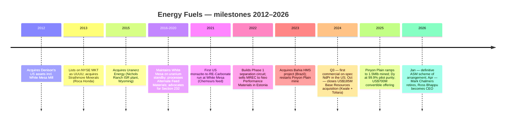
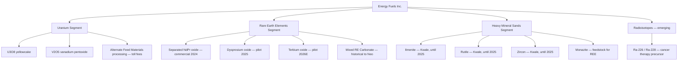
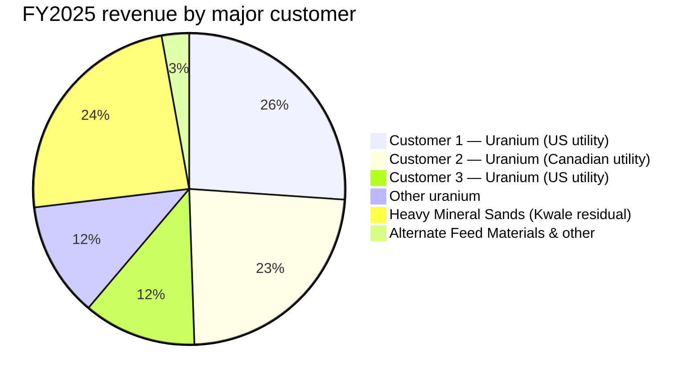
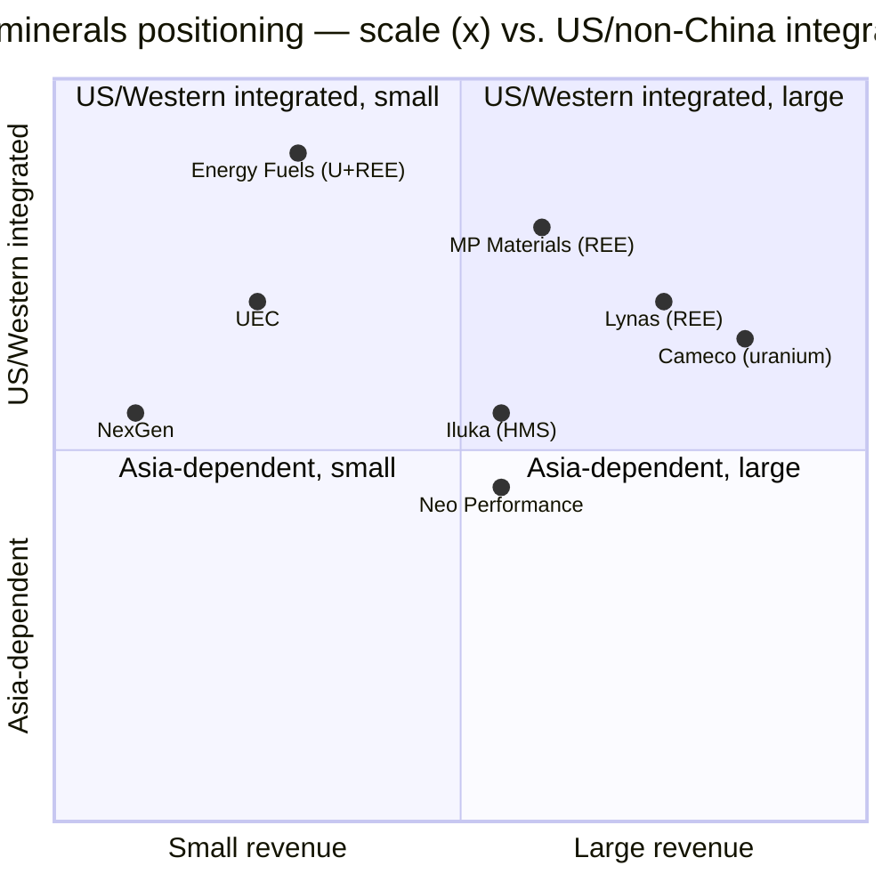

# COMPANY RESEARCH REPORT: Energy Fuels Inc. (NYSE American: UUUU)

**Date:** 2026-05-20
**Analyst coverage:** Initiating
**Listing:** NYSE American (UUUU); also TSX (EFR); ASX (EFR CDIs)
**Headquarters:** Lakewood, Colorado, USA
**Auditor:** KPMG LLP (Calgary)

> **Update — FY2026 production guidance initiated (2026-02-20):** In its FY2025 10-K, Energy Fuels initiated 2026 operating guidance of 2.0–2.5 Mlbs U3O8 mined, 1.5–2.5 Mlbs finished pounds processed, and 1.5–2.0 Mlbs sold; expected weighted-average mining + milling cost on the current Pinyon Plain / La Sal blended Mill run of approximately **US$23–30/lb U3O8**, ranking among the lowest cash costs of any Western producer. Disclosed long-term contracts call for 620,000–880,000 lbs of deliveries in 2026 at fixed-escalator or market-related pricing across six major US utility counterparties.
> Source: [Energy Fuels Inc. Form 10-K for FY2025, filed 2026-02-20 (Item 7, p. 197)](https://www.sec.gov/Archives/edgar/data/1385849/000138584926000009/0001385849-26-000009-index.htm).

## TABLE OF CONTENTS

1. Company Overview
2. Company History
3. Management Team
4. Products & Services
5. Customers & Go-to-Market
6. Industry Overview
7. Competitive Landscape
8. Market Opportunity (TAM)
9. Risk Assessment

References

---

## 1. COMPANY OVERVIEW

Energy Fuels Inc. is a US-based critical-minerals producer that has spent the past five years transforming itself from a single-commodity uranium miner into a multi-product critical-minerals platform centered on three reportable segments: (i) **uranium** (conventional + ISR), (ii) **rare earth elements (REE)**, and (iii) **heavy mineral sands (HMS)** ([Form 10-K FY2025, Item 1](https://www.sec.gov/Archives/edgar/data/1385849/000138584926000009/0001385849-26-000009-index.htm)). The company's defining asset is the **White Mesa Mill** near Blanding, Utah — the only operating conventional uranium mill in the United States and the only Western facility today producing on-spec separated NdPr oxide from monazite at commercial scale ([Form 10-K FY2025, Item 2](https://www.sec.gov/Archives/edgar/data/1385849/000138584926000009/0001385849-26-000009-index.htm)).

**Business model.** Energy Fuels sells uranium concentrate (U3O8) to US nuclear utilities under medium-term contracts; sells separated rare-earth oxides (currently primarily NdPr, with Dy and Tb at pilot scale) to non-Chinese magnet manufacturers; and historically (through 2024) sold ilmenite, rutile and zircon from its Kwale (Kenya) HMS mine. The strategic logic of the diversification is that monazite — a thorium- and uranium-bearing phosphate by-product of titanium-and-zircon HMS mining — feeds both the Mill's existing uranium licence and its new REE separation circuits, giving Energy Fuels a vertically integrated "mine → mill → separated oxide" position outside China.

**Scale.** Energy Fuels reported **US$65.9 M of consolidated revenue and a US$86.1 M net loss for FY2025** (year ended 2025-12-31), against US$78.1 M revenue and US$47.8 M net loss in FY2024 ([Form 10-K FY2025, Item 7, p. 199](https://www.sec.gov/Archives/edgar/data/1385849/000138584926000009/0001385849-26-000009-index.htm)). The decline in revenue reflects the wind-down of the Kwale HMS mine, partially offset by uranium volume growth from Pinyon Plain ramp-up. **Q1 2026 revenue rebounded to US$35.8 M** (vs US$16.9 M in Q1 2025) on the timing of long-term uranium contract deliveries, and Q1 net loss narrowed to US$11.0 M ([10-Q for Q1 2026, p. 47](https://www.sec.gov/Archives/edgar/data/1385849/000138584926000021/0001385849-26-000021-index.htm)). Year-end 2025 working capital was **US$927.4 M**, including US$64.7 M cash and **US$797.1 M of marketable securities**, after closing a US$700 M 0.75% convertible senior notes offering due 2031 in October 2025 ([Form 10-K FY2025, Item 7](https://www.sec.gov/Archives/edgar/data/1385849/000138584926000009/0001385849-26-000009-index.htm)). Headcount sits in the low-to-mid hundreds after the Base Resources acquisition; the FY2025 10-K does not disclose an exact total employee count by jurisdiction.

**Footprint.** Energy Fuels operates the White Mesa Mill and Pinyon Plain mine in Arizona/Utah, holds the Nichols Ranch ISR project (Wyoming, on standby) and Sheep Mountain (Wyoming), and owns or controls heavy mineral sand projects on three continents: **Vara Mada (formerly Toliara, Madagascar)** and **Kwale (Kenya, in reclamation)** acquired via Base Resources; **Bahia (Brazil)** acquired in 2023; and a **9.48% earn-in JV interest in the Donald Project (Victoria, Australia)** with Astron Corporation ([Form 10-K FY2025, Item 2](https://www.sec.gov/Archives/edgar/data/1385849/000138584926000009/0001385849-26-000009-index.htm)). On 2026-01-20 the company announced a definitive scheme of arrangement to acquire **Australian Strategic Materials (ASX: ASM)** for stock plus an AUD$0.13/share special dividend, adding a metallization and alloying plant in Ochang, South Korea, the Dubbo polymetallic REE deposit in New South Wales, and pre-development metals-alloy capability in the US — explicitly to close the "mine-to-metal-and-alloy" gap in the Western REE supply chain ([Form 10-K FY2025, Item 7, p. 194](https://www.sec.gov/Archives/edgar/data/1385849/000138584926000009/0001385849-26-000009-index.htm)).

Source: [Form 10-K FY2025, Item 7, p. 199](https://www.sec.gov/Archives/edgar/data/1385849/000138584926000009/0001385849-26-000009-index.htm) (FY2023–FY2025); prior-year amounts compiled from [Form 10-K FY2023, Item 7](https://www.sec.gov/cgi-bin/browse-edgar?action=getcompany&CIK=0001385849&type=10-K).

**Valuation snapshot (2026-05-20).** UUUU closed at **US$18.05** for a market cap of **US$4.51 B** and enterprise value of **US$3.96 B** (US$910.7 M total cash and US$677.5 M total debt — the latter is the carrying value of the 2031 convertible notes net of capped-call cost) ([Yahoo Finance — UUUU key statistics, accessed 2026-05-20](https://finance.yahoo.com/quote/UUUU/key-statistics)). TTM revenue of US$84.9 M produces **TTM P/S of ~53×**; TTM EBITDA is negative US$81 M (**EV/EBITDA −49×**), so the trailing P/E line is not meaningful (forward P/E of ~3,608× consensus reflects modest 2026 profitability) ([Yahoo Finance, 2026-05-20](https://finance.yahoo.com/quote/UUUU/key-statistics)). P/B is **6.4×** book — capital-intensive miners typically trade nearer 1.5–3× book, so the premium reflects the Mill's strategic optionality and the marketable-securities cushion. The 5-year share-price range is **US$3.44–US$27.72**; the stock is up roughly 273% over the trailing twelve months ([yfinance history, 2021–2026](https://finance.yahoo.com/quote/UUUU/history)).

**Peer multiples (TTM, 2026-05-20).** Uranium peers: Cameco (CCJ) US$46.1 B mcap, P/S 13×, P/E 98×; Denison (DNN) US$2.93 B mcap, P/S 631× on near-zero revenue; Uranium Energy (UEC) US$6.55 B, P/S 324×; NexGen (NXE) US$7.09 B, no revenue. REE peers: MP Materials (MP) US$11.1 B, P/S 32×; Lynas (LYC.AX) US$18.7 B, P/S 26×; Neo Performance Materials (NEO.TO) US$1.21 B, P/S 2.4× ([Yahoo Finance per-ticker key-statistics pages, accessed 2026-05-20](https://finance.yahoo.com/)). UUUU's P/S sits between the cash-flowing uranium incumbents (Cameco at 13×) and the pre-revenue uranium developers (UEC, DNN at 300–600×) — closer to the Lynas / MP rare-earth integrated-producer range than to pure-play uranium peers, which is consistent with how the market is now pricing it.

**Why the multiple is stretched.** The TTM P/S of 53× and P/B of 6.4× are driven by four things, not by earnings: (i) a fully-funded balance sheet that lets management pursue Phase 2 expansion and the ASM acquisition without dilution; (ii) the only Western turn-key NdPr/Dy/Tb separation route now operating at scale, which itself is being re-rated in 2026 as Chinese export licensing tightens (see Section 6); (iii) optionality value in Pinyon Plain (a 1–2% U3O8 grade ore body — top decile globally) and Vara Mada (Feasibility-Study post-tax NPV of US$1.8 B at 10% discount, IRR ~25%); and (iv) the small float relative to thematic critical-minerals ETF flows. The implication for Section 9: this is a sentiment/multiple-driven name; any narrative break (China relaxes export controls, uranium spot falls below US$60/lb, ASM deal collapses) could compress the multiple sharply.

---

## 2. COMPANY HISTORY

Energy Fuels traces its origins to 1987 as a Wyoming-founded uranium exploration vehicle. The modern Energy Fuels Inc. ("EFI") was reincorporated in Ontario, Canada in 2006 and listed on the Toronto Stock Exchange in 2010 ([Form 10-K FY2025, Item 1](https://www.sec.gov/Archives/edgar/data/1385849/000138584926000009/0001385849-26-000009-index.htm)). The decisive event was the **2012 acquisition of Denison Mines Holdings Corp.'s US uranium assets**, including the White Mesa Mill — a transaction that gave the company the only operating conventional uranium mill in the US and effectively defined its subsequent strategy. Energy Fuels listed on NYSE MKT (now NYSE American) under "UUUU" in December 2013.

Source: timeline synthesised from [Form 10-K FY2025, Items 1 and 7](https://www.sec.gov/Archives/edgar/data/1385849/000138584926000009/0001385849-26-000009-index.htm) and [Energy Fuels press releases 2024–2026 on the SEC EDGAR 8-K index](https://www.sec.gov/cgi-bin/browse-edgar?action=getcompany&CIK=0001385849&type=8-K).

Three strategic pivots define the modern company. **First**, the 2016–2020 standby decision: as uranium spot collapsed below US$25/lb after Fukushima, then-CEO Steve Antony and successor Mark Chalmers (appointed CEO in February 2018) bet on keeping White Mesa licensed and operational by feeding it with US$5–15M/year of Alternate Feed Materials (radioactive industrial waste streams) rather than shuttering. That bet preserved the only US conventional milling licence and the trained workforce needed to pivot into REE processing a decade later ([Form 10-K FY2025, Item 1](https://www.sec.gov/Archives/edgar/data/1385849/000138584926000009/0001385849-26-000009-index.htm)).

**Second**, the 2020–2022 REE pivot. Management recognised that monazite — historically discarded as a thorium-bearing nuisance by Florida and Georgia titanium-sand miners — was being shipped to China for separation, and that White Mesa's existing NRC radioactive-materials licence already permitted handling thorium-bearing feeds. The first commercial-scale monazite cracking run in late 2021, with feed purchased from Chemours, made Energy Fuels the first US company to produce a saleable rare-earth product (mixed-RE carbonate, MREC) from US monazite in over half a century. That MREC was toll-separated in Estonia by Neo Performance Materials before the company built its own Phase 1 solvent-extraction (SX) circuit in 2023–2024.

**Third**, the 2024–2026 vertical-integration sprint. Three transactions stitched together a global monazite supply chain: the **Astron / Donald JV** (September 2024, Victoria, Australia — Energy Fuels can earn up to 49% via AUD$183 M cash + $17.5 M stock); the **US$185 M cash + share acquisition of Base Resources** (October 2024, picking up the depleted-but-cash-generative Kwale operation in Kenya and the much larger Toliara/Vara Mada deposit in Madagascar); and the **planned ASM scheme of arrangement** (January 2026 announcement; targeted close as early as June 2026) which adds the Dubbo polymetallic REE deposit in New South Wales plus an operating metals-and-alloys facility in Ochang, South Korea ([Form 10-K FY2025, Item 7, p. 194–195](https://www.sec.gov/Archives/edgar/data/1385849/000138584926000009/0001385849-26-000009-index.htm)). The strategic logic — own the mine, own the mill, own the separation, own the alloy — explicitly mirrors the China Northern / Shenghe template, but outside China.

Notable acquisitions:

- **2012**: White Mesa Mill + Henry Mountains projects (from Denison Mines)
- **2013**: Strathmore Minerals (Roca Honda, NM)
- **2015**: Uranerz Energy (Nichols Ranch ISR, WY)
- **2023**: Bahia HMS project, Brazil (cash)
- **2024 Aug**: RadTran LLC (TAT/radioisotopes platform)
- **2024 Sep**: Astron / Donald Project JV (Australia)
- **2024 Oct**: Base Resources Ltd (Kwale + Toliara/Vara Mada)
- **2026 H1** (announced): Australian Strategic Materials (Dubbo + Korean alloy plant)

---

## 3. MANAGEMENT TEAM

The company is undergoing the most significant management transition in its history. **Mark S. Chalmers retired as CEO on 2026-04-15**, completing a planned succession to **Ross R. Bhappu**, who joined as President on 2025-08-04 explicitly to be groomed for the CEO seat ([2026 DEF 14A, p. 29](https://www.sec.gov/Archives/edgar/data/1385849/000106299326002046/0001062993-26-002046-index.htm)).

**Ross R. Bhappu, President & CEO (since 2026-04-15).** Bhappu is a 35-year mining-finance veteran with a PhD in Mineral Economics from the Colorado School of Mines and B.S./M.S. in Metallurgical Engineering from the University of Arizona ([2026 DEF 14A, p. 19](https://www.sec.gov/Archives/edgar/data/1385849/000106299326002046/0001062993-26-002046-index.htm)). He began his career at Cyprus Minerals and moved to Newmont Mining as Director of Business Development, then served three years as CEO of GTN Copper Corporation. The defining stretch of his career was nearly 25 years at Resource Capital Funds (1999–2024), most recently as Head of Private Equity Mature Funds. Critically, **Bhappu was instrumental in the 2008 acquisition of Mountain Pass (the rare-earth mine that became Molycorp) and chaired Molycorp's board from 2008 to 2013** ([2026 DEF 14A, p. 19](https://www.sec.gov/Archives/edgar/data/1385849/000106299326002046/0001062993-26-002046-index.htm)). That Molycorp tenure is a double-edged credential: Molycorp was the closest historical analogue to what Energy Fuels is trying to do today (vertically-integrated Western REE), and it ended in 2015 Chapter 11 after Chinese price-dumping crushed the unit economics of its Phase 1 Mountain Pass restart. The market reads this two ways — Bhappu knows the playbook and the failure modes intimately, but Western REE economics outside China remain fragile, and he has lived through the precise failure mode that defines the bear case. His FY2025 base salary was set at US$550,000 vs. Chalmers' US$646,314 in his final year; the differential narrows on equity ([2026 DEF 14A, p. 32](https://www.sec.gov/Archives/edgar/data/1385849/000106299326002046/0001062993-26-002046-index.htm)). Bhappu's stated 2026 priorities, per the proxy chairman's letter, are "transition from growth mode to steady state with a focus on positive cash flow and sustained profitability." Insider ownership is modest (the proxy lists initial stock options granted upon hire); he is not a founder. Mark Chalmers will continue as a paid consultant for two years post-retirement.

**Mark S. Chalmers, former CEO (2018-02 to 2026-04-15).** Although now retired, Chalmers is the architect of the company in its current form and his fingerprints are everywhere. He is an Australian / US chemical engineer with 40+ years of uranium operating experience, having previously run Rio Tinto's Rössing mine in Namibia and Heathgate's Beverley ISR operation. Under Chalmers, Energy Fuels (i) kept White Mesa licensed through the 2018–2022 trough, (ii) pioneered the monazite-to-NdPr pathway, and (iii) executed the Base Resources and ASM transactions. He remains a paid two-year consultant per his employment agreement ([Form 10-K FY2025, Item 7, p. 199](https://www.sec.gov/Archives/edgar/data/1385849/000138584926000009/0001385849-26-000009-index.htm)).

**Nathan R. Bennett, Chief Financial Officer.** Bennett was promoted to CFO from Corporate Controller (a role he held from August 2022). Prior to Energy Fuels, he spent nearly nine years as Controller of Antero Midstream Corporation, where he led accounting/treasury/SEC reporting through two IPOs (Antero Midstream Partners LP in 2014, Antero Midstream GP LP in 2017) ([2026 DEF 14A, p. 19](https://www.sec.gov/Archives/edgar/data/1385849/000106299326002046/0001062993-26-002046-index.htm)). He started at PricewaterhouseCoopers' Denver and Houston energy practices (Jan 2007–Dec 2013). Holds a Master of Accounting from Utah State and is a Colorado CPA. His FY2025 base salary of US$295,000 reflects a 12.1% increase from FY2024. The October 2025 US$700 M convertible-notes offering — Energy Fuels' largest capital-markets transaction ever — was Bennett's first major test in the seat, and the upsizing from US$500 M base + US$50 M greenshoe to US$700 M plus capped-call options is widely read as a successful execution.

**David C. Frydenlund, EVP & Chief Legal Officer.** Frydenlund has been with Energy Fuels for 14 years (since 2012) and is the institutional memory; he was the company's previous CFO (2017–2022) and General Counsel/Corporate Secretary continuously. Educated at Simon Fraser, the University of Chicago (M.A. Economics & Finance) and the University of Toronto (J.D.). His prior career mirrors Energy Fuels' own — he was previously VP Regulatory Affairs / General Counsel / CFO at Denison Mines Corp.'s predecessor International Uranium Corporation, the same vehicle whose Mill business Energy Fuels acquired in 2012 ([2026 DEF 14A, p. 20](https://www.sec.gov/Archives/edgar/data/1385849/000106299326002046/0001062993-26-002046-index.htm)). His specialism — multi-jurisdictional radioactive-materials licensing and Aboriginal/tribal land law — is non-trivial; the Pinyon Plain permit alone has been litigated for over a decade.

**Other notable officers:** **Curtis Moore** (SVP Marketing & Corporate Development, the public face of the company in commodity media); **Daniel Kapostasy** (VP Technical Services, sole non-independent Qualified Person under S-K 1300); **Bernard Bonifas** (VP ISR Operations, 40 years uranium experience, French/American — relevant should Nichols Ranch restart be commissioned); **Logan Shumway** (VP Conventional Operations, the Mill manager who actually runs White Mesa); **Debra Bennethum** (VP Critical Minerals & Strategic Supply Chain, recruited from General Motors where she led "execution of over $1.5 billion in new critical mineral projects for electric vehicles" ([2026 DEF 14A, p. 19](https://www.sec.gov/Archives/edgar/data/1385849/000106299326002046/0001062993-26-002046-index.htm))) — her hire signals direct OEM offtake intent; **Dr. Saleem Drera** (VP Radioisotopes, founder of acquired RadTran LLC, leads the targeted-alpha-therapy radium recovery initiative).

**Governance.** The board is being reduced from nine to seven independent directors at the June 2026 AGM, with J. Birks Bovaird and Alexander G. Morrison not standing for re-election ([2026 DEF 14A, p. 9](https://www.sec.gov/Archives/edgar/data/1385849/000106299326002046/0001062993-26-002046-index.htm)). Chair is Bruce D. Hansen (former CEO of General Moly, before that SVP at Newmont). Board mining expertise is unusually deep for a US$4.5 B small-cap: Hansen (mining), Stirzaker (former Base Resources chair, mining finance), Higgs (founder of Uranerz, listed on the board after that 2015 acquisition), Eshleman (uranium leasing). Insider ownership is not disclosed in the 10-K filing summary; per the proxy "Security Ownership" table, named executive officers collectively hold less than 1% of shares outstanding, consistent with a long-life US-domiciled mining issuer rather than a founder-controlled vehicle. Executive comp is heavily equity-weighted (the 2025 LTIP for the then-CEO Chalmers was set against the 24-member "Market Performance Peer Group" that includes Cameco, MP Materials, Lynas, NexGen, Iluka, and Tronox). Pay-for-performance has been TSR-linked over the last five years, during which the company TSR appreciated over 241% per the proxy ([2026 DEF 14A, p. 23](https://www.sec.gov/Archives/edgar/data/1385849/000106299326002046/0001062993-26-002046-index.htm)). The CEO-to-median-employee pay ratio is disclosed at 11.7:1 for Chalmers — modest by S&P 500 standards, reflecting a unionised mill workforce.

**Track record synthesis.** The Chalmers / Frydenlund / Moore era delivered: (a) survival through the 2018–2022 uranium bear market, (b) the world's first non-Chinese commercial NdPr separation outside Estonia/France, (c) three substantial M&A transactions executed without equity dilution beyond a modest 2022 ATM. Where they have not yet delivered: positive operating income, a final investment decision on Vara Mada, or capital-return to shareholders. Bhappu inherits the strategy and US$927 M of working capital; what he has to prove is whether the Phase 2 expansion (US$410 M capex) can be financed and earn its cost of capital against China-cycle pricing.

---

## 4. PRODUCTS & SERVICES

Energy Fuels sells five distinct product families plus an emerging sixth in TAT radioisotopes. The portfolio breaks down cleanly by segment.

**Uranium concentrate (U3O8) — the cash engine.** Currently the only meaningfully revenue-generating product. FY2025 uranium concentrate sales were **US$48.2 M (73% of total revenue)** on volumes higher than 2024 but at modestly lower realised prices due to contract delivery mix ([Form 10-K FY2025, Item 7, p. 200](https://www.sec.gov/Archives/edgar/data/1385849/000138584926000009/0001385849-26-000009-index.htm)). Production is sourced primarily from the **Pinyon Plain mine** in northern Arizona, which produced 47,200 tons of 1.62%-grade ore (1.534 Mlbs U3O8 contained) in 2025 alone, along with smaller volumes from the La Sal Complex. Pinyon Plain is the second-highest-grade uranium mine in the world after Cigar Lake. Material is processed at the White Mesa Mill (2,000 tons-per-day licensed capacity). **Verdict: yes — competitive advantage.** Moat type: regulatory/scale. The Mill is the only operating conventional uranium mill in the US, with a Utah radioactive-materials licence first issued in 1980 — a permit that would take roughly a decade and US$1B+ to replicate. Pinyon Plain's ore grade (10–20× the industry average) gives expected 2026 weighted-average mining + milling cost of **US$23–30/lb U3O8** vs. spot of US$85/lb. Closest competing product: Cameco's Cigar Lake concentrate (Saskatchewan) — at parity on grade, ahead on scale; UEC's Christensen Ranch (Wyoming ISR) — behind on grade, similar US-sourced positioning.

**Vanadium pentoxide (V2O5).** Energy Fuels holds ~905,000 lb of finished V2O5 in inventory and estimates an additional 1.0–3.0 Mlb in solubilised tailings at the Mill ([Form 10-K FY2025, Item 7, p. 196](https://www.sec.gov/Archives/edgar/data/1385849/000138584926000009/0001385849-26-000009-index.htm)). No V2O5 has been sold since 2023 because prices remain below the company's marginal recovery cost. **Verdict: partial.** The Mill's vanadium circuit is one of only two in the US; if vanadium-flow-battery demand materialises, this becomes a meaningful optionality.

**Separated NdPr oxide — the strategic play.** This is the second-most-important product to the long-term thesis. Energy Fuels became the first US company to produce on-spec separated NdPr at commercial scale in Q3 2024 from monazite purchased from Chemours' Florida/Georgia titanium-sand operations ([Form 10-K FY2025, Item 7, p. 192](https://www.sec.gov/Archives/edgar/data/1385849/000138584926000009/0001385849-26-000009-index.htm)). Through 2025 the company sold only 1.7 tonnes (to POSCO International for sample qualification) — commercial NdPr revenue has not yet started; 34 tonnes of inventory sit on the balance sheet. Phase 1 design capacity: 850–1,000 t NdPr/year + 35 t Dy + 12 t Tb (post-2027 enhancement) from 8,000–10,000 t/y of monazite feed. **Verdict: yes — competitive advantage.** Moat type: regulatory (one of only 3 facilities outside China cleared to crack thorium-bearing monazite — Lynas Kalgoorlie, Solvay La Rochelle, and White Mesa); first-mover in the US; vertically integrated downstream once ASM closes. Closest competing product: **MP Materials' Mountain Pass** separated NdPr (bastnaesite-based — different mineralogy, doesn't include monazite economics, but at much greater scale today — ahead on volume, behind on heavy-REE optionality); Lynas's Mt. Weld NdPr (ahead on scale, similar non-Chinese positioning).

**Dysprosium and terbium oxides.** Energy Fuels announced first 99.9%-purity dysprosium oxide at pilot scale in August 2025 — claimed as the first US Dy production volume publicly reported ([Form 10-K FY2025, Item 7, p. 193](https://www.sec.gov/Archives/edgar/data/1385849/000138584926000009/0001385849-26-000009-index.htm)). 29 kg cumulative through year-end 2025. Tb pilot expected early 2026. Both are "heavy" REEs, where China currently controls effectively 100% of refined supply outside of small Russian and Vietnamese volumes. **Verdict: partial — material once Phase 1 expansion comes on-line in 2027.** Moat type: regulatory + first-mover Western. Closest competing product: Lynas's planned heavy-REE separation at Mt. Weld (announced 2024, behind in commissioning); no current US peer.

**Ilmenite / rutile / zircon (HMS) — legacy stream.** Sold from Kwale (Kenya) from 2013 to end-2024. Mining ceased December 2024; final shipments April 2025. FY2025 HMS revenue of US$15.8 M was inventory wind-down; no further HMS revenue is expected until Vara Mada or Donald reaches first production. **Verdict: no current competitive advantage** — Kwale was a depleting tail-end asset and was acquired primarily for the monazite by-product technology and the Vara Mada deposit.

**Alternate Feed Materials processing.** A toll-milling service: the Mill accepts uranium-bearing industrial waste streams (rare-earth tailings, monazite, certain Department of Energy decommissioning materials) for recovery of uranium. Generates modest revenue (US$1.87 M in FY2025) but is structurally important — the licence and operating know-how it preserves are what made the REE pivot possible. **Verdict: partial.** Closest competitor: none. This is genuinely unique.

**TAT radioisotopes (radium recovery).** Energy Fuels acquired RadTran LLC in August 2024 for IP rights to extract Ra-226 and Ra-228 from uranium and REE process streams for use in targeted-alpha-therapy cancer drugs. There is no current US supplier of radium ([Form 10-K FY2025, Item 7, p. 191](https://www.sec.gov/Archives/edgar/data/1385849/000138584926000009/0001385849-26-000009-index.htm)). **Verdict: optionality only.** Closest competitor: Bayer (currently sources Ra-223 from offshore reactors), TerraPower, ITM Isotope Technologies Munich — all dependent on non-US supply. No revenue forecast through 2027.

Source: [Form 10-K FY2025, Note 18 — Segment information, p. 250–252](https://www.sec.gov/Archives/edgar/data/1385849/000138584926000009/0001385849-26-000009-index.htm).

**Flagship vs long-tail.** Today the flagship is the **uranium concentrate stream from Pinyon Plain → White Mesa** (US$48 M of US$66 M total revenue, FY2025). The strategic flagship by 2028 is intended to be **separated NdPr/Dy/Tb oxide** once Phase 1 expansion (2027) and Phase 2 (2029) come on-line at a combined 6,000+ tpa NdPr / 200 tpa Dy / 60 tpa Tb capacity, against a global ex-China NdPr market of roughly 5,000 tpa today ([Form 10-K FY2025, Item 7, p. 192](https://www.sec.gov/Archives/edgar/data/1385849/000138584926000009/0001385849-26-000009-index.htm)).

**Last-12-month launches.** (i) August 2025 — first 99.9% Dy pilot run; (ii) August 2025 — Vulcan Elements MoU for US REPM supply chain; (iii) September 2025 — first NdPr-to-EV-motor commercial REPM qualified by South Korea's largest EV drive-motor manufacturer (1.2 t NdPr → 3.0 t REPMs → ~1,500 vehicles); (iv) October 2025 — Export Finance Australia AUD$80 M conditional letter of support for Donald Project; (v) January 2026 — Vara Mada Feasibility Study (38-year life, US$1.8 B post-tax NPV, ~25% IRR, US$500 M annual EBITDA at steady-state); (vi) January 2026 — Phase 2 Bankable Feasibility Study (US$410 M capex, mid-2029 completion target); (vii) January 2026 — ASM scheme of arrangement; (viii) March 2026 — Pinyon Plain Juniper Zone proven-and-probable reserve update. **Sunsets:** Kwale HMS operation ceased December 2024 (final inventory sold April 2025).

---

## 5. CUSTOMERS & GO-TO-MARKET

**Uranium.** Energy Fuels sells U3O8 to US nuclear utilities under six long-term agreements that together call for **3.21–5.29 Mlb of deliveries between 2026 and 2032** at base, minimum, and maximum quantities ([Form 10-K FY2025, Item 7, p. 197](https://www.sec.gov/Archives/edgar/data/1385849/000138584926000009/0001385849-26-000009-index.htm)). Pricing under these contracts is a mix of base-escalator and market-related formulas; the disclosed 2026 contracted range is 620,000–880,000 lbs. **Customer concentration is material**: per the FY2025 Note 18, three customers each exceeded 10% of consolidated sales in 2025 — **Customer 1 at US$17.16 M (26.0%)**, **Customer 2 at US$15.37 M (23.3%)**, **Customer 3 at US$7.70 M (11.7%)** — together **61.0% of total revenue**, all uranium ([Form 10-K FY2025, Note 18, p. 251](https://www.sec.gov/Archives/edgar/data/1385849/000138584926000009/0001385849-26-000009-index.htm)). In FY2024 the mix was different: Customer 1 was 19.2%, Customer 4 (HMS) 13.9%, Customer 5 (uranium) 11.0% — top-5 totalled 56.5%. **Top-1 share has risen from 19% (FY2024) to 26% (FY2025); top-3 sits at 61%.** The company does not name utility counterparties (consistent with industry norms, since nuclear fuel contracts are commercial secrets), but the country mix — US$33.4 M to US-domiciled customers, US$15.4 M to a Canadian customer — implies the larger counterparties are a mix of US Investor-Owned Utilities and a Canadian crown nuclear operator. Contract structure: multi-year fixed-quantity master agreements with annual delivery elections; not "purchase-order-by-purchase-order". No top customer has been disclosed as vertically integrating into uranium mining (which would be unprecedented for a US utility).

**Carry into Section 9 as a material risk:** top-1 > 20% and top-5 > 50% trigger the threshold defined in the risk taxonomy. The contracts mitigate one-year cliff risk but the 2027–2032 delivery pipeline depends on these same six utilities renewing or extending — re-contracting is a key 2026–2027 catalyst.

Source: [Form 10-K FY2025, Note 18 — Major Customers, p. 251](https://www.sec.gov/Archives/edgar/data/1385849/000138584926000009/0001385849-26-000009-index.htm).

**Rare earths.** Customer footprint is still being built. To date, the only commercial NdPr sale is the 2025 1.7-tonne POSCO International qualification batch, plus the September 2025 announcement that the company's NdPr was processed into 3.0 tonnes of magnets by "South Korea's largest manufacturer of EV drive unit motor cores" — almost certainly Sungrim or Star Group — for installation in Q4 2025 in EVs sold in North America, the EU, Japan and Korea ([Form 10-K FY2025, Item 7, p. 193](https://www.sec.gov/Archives/edgar/data/1385849/000138584926000009/0001385849-26-000009-index.htm)). The **Vulcan Elements MoU** (August 2025) commits Energy Fuels to supply Vulcan's planned US REPM facility with NdPr and Dy oxides "for validation" against potential long-term supply agreements. Vulcan Elements is venture-funded and pre-production; the commercial value depends on Vulcan reaching scale. The ASM acquisition, when closed, brings ASM's existing offtake-letter-of-intent book — Hyundai-Kia, Korea Resources Corporation, and others — directly into Energy Fuels.

**Heavy mineral sands.** Historically Kwale ilmenite/rutile/zircon was sold to ~12 chloride-pigment producers (Tronox, Chemours, Venator), Chinese sulphate-pigment producers, and Saudi/Japanese zircon ceramics customers. FY2025 HMS revenue of US$15.8 M ran to China (US$3.1 M), Japan (US$2.75 M), Saudi Arabia (US$3.5 M), Netherlands, and US-based pigment producers ([Form 10-K FY2025, Note 18, p. 251](https://www.sec.gov/Archives/edgar/data/1385849/000138584926000009/0001385849-26-000009-index.htm)). With Kwale shut, the next HMS revenue stream (Donald 2027E or Vara Mada late-2020s) will arrive into a different pricing environment.

**Go-to-market and partnerships.** No traditional sales force. Uranium goes through three or four utility procurement RFPs each year, prepared by Curtis Moore's commercial team; RE sales are bilateral and largely directly negotiated. Key strategic partnerships: **Chemours** (monazite feedstock supply since 2021), **Neo Performance Materials** (historical MREC toll-separation customer; now potentially competitor), **Astron** (Donald JV partner), **Vulcan Elements** (downstream magnet MoU), **POSCO International** (NdPr offtake), **Korea Resources Corporation / KEXIM** (via ASM). On the policy side: an explicit January 2025 **Navajo Nation cooperation agreement** for cleanup of Cold War-era abandoned uranium mines (AUM), positioning the company for federal AUM funding ([Form 10-K FY2025, Item 7, p. 190](https://www.sec.gov/Archives/edgar/data/1385849/000138584926000009/0001385849-26-000009-index.htm)).

---

## 6. INDUSTRY OVERVIEW

Energy Fuels straddles three commodity industries — uranium, rare earths and heavy mineral sands — that intersect at White Mesa's licensed processing flowsheet but otherwise have very different supply-demand fundamentals.

**Uranium (US$8–12B/yr primary mining industry).** Demand is set by ~440 operating reactors globally consuming ~190 Mlb U3O8/year, against primary mine supply of only ~140 Mlb — a structural deficit bridged by Russian/Kazakh secondary inventories that are now politically constrained ([TradeTech Uranium Market Study, 2025 Issue 4, summarised in Form 10-K FY2025, Item 7, p. 184](https://www.sec.gov/Archives/edgar/data/1385849/000138584926000009/0001385849-26-000009-index.htm)). Two structural shifts have re-rated the industry since 2022: (i) Russia's invasion of Ukraine triggered Western sanctions and the May 2024 US Prohibiting Russian Uranium Imports Act, which halts Russian U3O8 imports into the US by 2028; (ii) AI-driven data-center electricity demand has prompted Microsoft, Amazon, Google and Meta to sign multi-billion-dollar nuclear PPAs through 2024–2025, reviving plant restarts (Three Mile Island/Crane) and prompting first-of-a-kind small modular reactor (SMR) procurements.

Uranium spot rose from a US$20/lb post-Fukushima trough to over US$100/lb in January 2024, retraced to ~US$65/lb in mid-2025, and recovered to roughly **US$85/lb in May 2026** ([Trading Economics — Uranium price, accessed 2026-05-20](https://tradingeconomics.com/commodity/uranium); [Sprott Physical Uranium Trust, 2026-05](https://sprott.com/investment-strategies/exchange-listed-products/physical-commodity-funds/uranium/)). Long-term contract prices reached US$90/lb according to TradeTech in late 2025 ([Form 10-K FY2025, Item 7](https://www.sec.gov/Archives/edgar/data/1385849/000138584926000009/0001385849-26-000009-index.htm)).

Source: monthly spot price approximated from [TradeTech weekly indicator](https://www.uranium.info/daily_U3O8_spot_price_indicator.php) and [Trading Economics — Uranium commodity history](https://tradingeconomics.com/commodity/uranium); narrative in [Form 10-K FY2025, Item 7, p. 184](https://www.sec.gov/Archives/edgar/data/1385849/000138584926000009/0001385849-26-000009-index.htm).

Industry structure is oligopolistic on the production side: Kazatomprom (Kazakhstan, state-owned, ~22% of supply), Cameco (Canada, ~12%), Orano (France, ~10%), Uranium One (Russia/Rosatom), CGNPC (China), and the long tail of mid-tier listed names (CCJ, BHP/Olympic Dam, Paladin, Ur-Energy, UEC, NXE, Energy Fuels) account for the remainder. Regulation is intense (NRC, EPA, Bureau of Land Management, state agencies, tribes). Switching costs for utilities are high — fuel qualification can take 3–5 years.

**Rare earths (US$10–15B/year refined-oxide market).** The industry is dominated by China to a degree unmatched by any other commodity: per the International Energy Agency cited in the 10-K, **China produces ~90% of refined REE products** and effectively 100% of refined heavy rare earths and downstream metal/magnet manufacturing ([Form 10-K FY2025, Item 1, p. 28](https://www.sec.gov/Archives/edgar/data/1385849/000138584926000009/0001385849-26-000009-index.htm)). Demand drivers per industry forecaster Adamas Intelligence (also cited by Energy Fuels): NdFeB-magnet demand growth of ~8.7% CAGR through 2040 for NdPr/Dy/Tb, primarily from EVs/hybrid EVs, advanced robotics, wind turbines and defense — against global production growth of only ~5.1% ([Form 10-K FY2025, Item 7, p. 191, citing Adamas Intelligence](https://www.sec.gov/Archives/edgar/data/1385849/000138584926000009/0001385849-26-000009-index.htm)).

The defining 2025–2026 event has been the **escalation of Chinese export controls**. Following dysprosium/terbium export licensing in early 2025 and the April 2026 export-control listing for additional REE separation processes, NdPr oxide rose from ~US$53/kg at end-2024 to a 2026 peak of ~US$137/kg before consolidating to ~US$100/kg in May 2026 on China's domestic SMM benchmark, with ex-China FOB prices running 50–63% higher ([Mining Weekly — NdPr oxide price forecast to rise to $90,000/t, 2026-02-02](https://www.miningweekly.com/article/ndpr-oxide-price-forecast-to-rise-to-90-000t-this-year-report-2026-02-02); [Rare Earth Mining — Rare Earth Market Outlook March 2026](https://rare-earth-mining.com/rare-earth-market-pricing-analysis-march-2026/); [Mining.com — Rare earth prices at two-year high as MP Materials halts China shipments](https://www.mining.com/rare-earth-prices-at-two-year-high-as-mp-materials-halts-china-shipments/)). The structural read: Chinese export controls have created a permanent two-tier market in which Western OEMs pay a substantial premium for verified non-Chinese supply.

Source: [Critical Minerals News — NdPr spot price history and forecast](https://critical-minerals-news.com/rare-earths-price/); [Mining Weekly, 2026-02-02](https://www.miningweekly.com/article/ndpr-oxide-price-forecast-to-rise-to-90-000t-this-year-report-2026-02-02); [Rare Earth Mining, March 2026](https://rare-earth-mining.com/rare-earth-market-pricing-analysis-march-2026/).

**Heavy mineral sands (US$5–6B/year industry, ilmenite+rutile+zircon+monazite).** Far smaller and more cyclical than uranium or REE, with demand sensitive to titanium-dioxide pigment consumption (paint, coatings, plastics) and zircon ceramic demand. Western pigment producers (Tronox, Chemours, Venator, Kronos) are squeezed by Chinese sulphate-pigment competition and 2024–2025 European chemical recession; ilmenite/rutile prices remain subdued. Zircon prices stabilised in Q1 2026 after Iluka and Tronox curtailed supply ([10-Q Q1 2026, p. 41](https://www.sec.gov/Archives/edgar/data/1385849/000138584926000021/0001385849-26-000021-index.htm)). Monazite — the prize for Energy Fuels — is typically a 1–2% by-product of ilmenite mining, historically discarded; its price is now linked to the rising REE market and has risen through 2025–Q1 2026 per management commentary.

**Regulatory environment.** Three layers: (i) **federal critical-minerals policy** — the Inflation Reduction Act 30D vehicle credits require US/FTA-sourced critical minerals (NdPr is on the list); the Defense Production Act Title III has been invoked since 2020 to fund REE separation; the US 2024 Russian uranium ban; (ii) **state-level** — Utah environmental permits for the Mill, Arizona/Wyoming mining permits; (iii) **multilateral** — Madagascar mining code, Australian foreign-investment review (for the ASM deal), Kenyan reclamation rules.

---

## 7. COMPETITIVE LANDSCAPE

Because Energy Fuels straddles two distinct industries, its competitive set splits in two.

**Uranium competitors.**
- **Cameco Corporation (TSX/NYSE: CCJ).** US$46.1 B market cap, US$3.5 B TTM revenue ([Yahoo Finance, 2026-05-20](https://finance.yahoo.com/quote/CCJ)). Dominant Western producer (Cigar Lake, McArthur River). Vertically integrated with conversion (UF6) and Westinghouse Electric stake. Direct competitor for US utility long-term contracts. **Ahead** on scale, balance sheet, and downstream integration; **at parity** on quality of resource base; **behind** on critical-minerals diversification.
- **Uranium Energy Corp (NYSE American: UEC).** US$6.55 B mcap. ISR-focused (Wyoming, Texas), recent acquisitions of UEX and Uranium One US assets. **Behind** on operating production but with scale optionality; **at parity** on US-sourced positioning.
- **Denison Mines (NYSE American: DNN).** US$2.93 B mcap, pre-production. Owns the Phoenix ISR development in Athabasca, Saskatchewan. **Behind** on production timing; **at parity** on resource quality.
- **NexGen Energy (NYSE: NXE).** US$7.09 B mcap, pre-production. Owns the Arrow deposit in Saskatchewan — arguably the highest-grade undeveloped uranium deposit in the world. **Behind** on near-term production; **ahead** on long-term resource scale.
- **Paladin Energy (ASX: PDN).** Restarted Langer Heinrich in Namibia in 2024.
- **Boss Energy (ASX: BOE), Peninsula Energy (NYSE American: PEN), Ur-Energy (NYSE American: URG).** Smaller ISR producers; direct overlap with UEC and the standby Nichols Ranch project.

**REE competitors.**
- **MP Materials (NYSE: MP).** US$11.1 B mcap, US$348 M TTM revenue, the only operating US REE mine (Mountain Pass, California, bastnaesite). MP has Phase 1 (concentrate to China), Phase 2 (separated NdPr on-site, ramping), and Phase 3 (metal/alloy/magnet via Fort Worth and Las Vegas DoD-funded facilities). The most direct US REE competitor. **Ahead** on scale (~5,000 t NdPr capacity vs Energy Fuels' 850–1,000 t Phase 1), customer book (GM offtake, DoD partnership), and downstream integration today; **at parity** on US-sourced positioning; **behind** on heavy REE optionality (Mountain Pass bastnaesite is light-REE-heavy; UUUU's monazite carries Dy/Tb).
- **Lynas Rare Earths (ASX: LYC).** US$18.7 B mcap, US$716 M TTM revenue. Mt. Weld (Western Australia) → Kuantan (Malaysia) → Kalgoorlie (Australia, new heavy-REE separation 2024) → Texas (US DoD-funded heavy-REE plant in commissioning 2025–2026). The largest non-Chinese integrated REE producer. **Ahead** on scale, downstream qualifications, and operating track record; **at parity** on heavy-REE strategy (both targeting Dy/Tb commercial production by 2027).
- **Neo Performance Materials (TSX: NEO.TO).** US$1.21 B mcap, US$512 M TTM revenue. Operates the Silmet REE separation facility in Estonia (legacy Soviet) and a magnetic-materials facility in Thailand. Historical Energy Fuels customer (took MREC for toll separation in 2022–2023); now a potential competitor as both move into separated oxides.
- **Australian Strategic Materials (ASX: ASM).** Soon to be Energy Fuels' subsidiary; today competes for the same OEM offtakes.
- **Arafura Rare Earths (ASX: ARU).** Pre-production. Nolans Project NPV ~US$1.5 B at NdPr long-term price.
- **Ucore Rare Metals (TSX-V: UCU), Texas Mineral Resources, Rare Element Resources.** Earlier-stage US juniors.

**Heavy mineral sands competitors.** Iluka Resources (ASX), Tronox Holdings (NYSE: TROX), Kenmare Resources (LSE: KMR), Image Resources (ASX: IMA), Rio Tinto (Richards Bay). Comparatively less relevant to Energy Fuels' thesis since HMS is now a means to monazite, not the product.

**Energy Fuels' competitive advantages.** (1) **Licence moat at White Mesa** — the only operating conventional uranium mill in the US, licenced to process thorium-bearing monazite; replicating this from scratch would take ~10 years and >US$1B. (2) **Vertically integrated, multi-commodity flowsheet** — uranium revenue subsidises the REE ramp until separation hits scale; competitors are single-commodity. (3) **Pinyon Plain ore grade** — at 1.62% U3O8 actual probed grade, among the highest grades in the world, providing US$23–30/lb cash cost. (4) **First non-Chinese US producer of commercial NdPr from monazite** — a genuine technical first-mover. (5) **Balance sheet** — US$927 M working capital, post-convert, provides 3+ years of capex runway without dilution.

**Competitive vulnerabilities.** (1) Scale today is far below MP and Lynas. (2) Heavy reliance on third-party monazite (Chemours) until Vara Mada and Donald come online. (3) No metallization/alloy capability today (the ASM deal closes this gap, but execution risk). (4) Geographic dispersion (US Mill, Madagascar mine, Australia JV, Brazil exploration, Korea alloy plant on closing) creates operational/political risk. (5) No founder-CEO dynamic; turnover at the top in a critical year.

---

## 8. MARKET OPPORTUNITY (TAM)

**Uranium TAM.** Global U3O8 demand is ~190 Mlbs/year today, projected by the WNA to grow to ~300+ Mlbs/year by 2040 driven by reactor restarts, life extensions, China new-build (target 200 GW nuclear by 2035), and SMR deployments. At a US$85/lb spot, current annual TAM is ~US$16 B; at long-term contract prices and 2040 volumes, US$25–30 B. The serviceable US-utility addressable market alone is ~50 Mlbs/year. Energy Fuels' 2026 sales of ~1.5–2 Mlbs implies <1% market share globally and ~3–4% of US utility demand — leaving substantial room for share gains as it ramps Pinyon Plain, restarts Nichols Ranch, and develops Roca Honda. The 2024 US Prohibiting Russian Uranium Imports Act materially expands the SOM by forcing US utilities to displace ~14 Mlb/year of Russian-origin material.

**Rare-earth TAM.** Adamas Intelligence forecasts the **NdPr oxide market alone reaches US$15–20 B by 2030** (CAGR ~9% in volume + 2026 price step-change) and US$30 B+ by 2040 ([Form 10-K FY2025, Item 7, p. 191, citing Adamas Intelligence](https://www.sec.gov/Archives/edgar/data/1385849/000138584926000009/0001385849-26-000009-index.htm)). Dy + Tb (the "heavy magnet" REEs) add another US$5–10 B by 2030. **Non-Chinese demand** is the strategically meaningful submarket — driven by EU CRMA quotas, US IRA 30D rules, DoD critical-minerals stockpiling, Korean/Japanese OEM diversification — and is estimated at 30–40% of the global magnet market, equating to a US$7–10 B annual SAM for non-Chinese separated NdPr/Dy/Tb by 2030.

Energy Fuels' planned combined Phase 1 + Phase 2 capacity of ~6,000 tpa NdPr + 200 tpa Dy + 60 tpa Tb would represent ~15–20% of the projected non-Chinese SAM in 2030 — a credible market-share goal given the Mill licence head-start.

**Heavy mineral sands TAM.** Global ilmenite + rutile + zircon market is ~US$5–6 B/year. Monazite is a tiny by-product (<US$500 M/year today) whose value scales with NdPr — the strategic value to Energy Fuels lies in the implied REE.

**Penetration strategy.** Three vectors: (i) **uranium** — sign 2–3 additional US utility long-term contracts during the 2026–2028 re-contracting cycle; restart Nichols Ranch within 12 months of a "go" decision to lift run-rate output to 3–4 Mlb/y; (ii) **REE** — convert Vulcan, POSCO and ASM relationships into binding long-term offtakes; secure Phase 2 financing (likely DoD/EXIM/private mix in 2027); (iii) **HMS feedstock** — reach FID at Vara Mada (target 2027) and Donald (target 2027); deliver first monazite to White Mesa by 2028.

**Why the market thinks the multiple is justified.** Embedded in today's US$4.5 B market cap is roughly: US$1–1.5 B for the uranium business at a Cameco-comparable EV/lb-of-reserves; US$2–2.5 B option value on the REE flowsheet at a meaningful probability-weighted 2030 NdPr/Dy/Tb production case; and US$0.5–1 B for the HMS / Vara Mada call option. The bear view is that this stacks call options that each individually have <50% probability of clearing.

---

## 9. RISK ASSESSMENT

### Company-Specific Risks

**1. Phase 2 execution risk (high severity).** The Phase 2 expansion is a US$410 M capex commitment to a flowsheet that has never been operated at scale outside China. Energy Fuels has executed Phase 1 on-time and on-budget — a real positive — but Phase 2 is roughly 6× larger and depends on monazite feed materialising from Vara Mada (Madagascar political risk) and Donald (still pre-FID). A 12–24 month delay or a 50% capex overrun is the operating-mining base case for projects of this size and complexity; the BFS itself flags "subject to licensing, financing, and receipt of sufficient feedstock" ([Form 10-K FY2025, Item 7, p. 192](https://www.sec.gov/Archives/edgar/data/1385849/000138584926000009/0001385849-26-000009-index.htm)). Mitigant: US$927 M working capital and the ability to stage the build.

**2. Customer concentration (material).** Top-1 uranium customer = 26.0% of FY2025 revenue; top-3 = 61.0%; all uranium ([Form 10-K FY2025, Note 18](https://www.sec.gov/Archives/edgar/data/1385849/000138584926000009/0001385849-26-000009-index.htm)). The trend is worsening: top-1 was 19% in FY2024 and 26% in FY2025. Contracts are multi-year, providing 2026–2032 base volume visibility, but any single counterparty non-renewal at 2027–2028 RFP cycle would create a US$15–20 M revenue hole. Mitigant: contracts are with investment-grade US utilities; uranium demand is structurally supported.

**3. CEO transition risk.** Mark Chalmers retired April 15, 2026 after running the company for eight years. Ross Bhappu is a 35-year industry veteran but only joined in August 2025 and is taking the seat at the most strategically demanding moment (Phase 2 BFS, ASM integration, Vara Mada FID, declining uranium price environment). His prior involvement as Molycorp chair 2008–2013 is a positive (technical depth) but also a cautionary signal (Molycorp ended in Chapter 11).

**4. Vara Mada (Madagascar) political risk.** A new Madagascar president was sworn in October 17, 2025 following social unrest; a new PM appointed October 20, 2025; new cabinet October 28, 2025 ([Form 10-K FY2025, Item 7, p. 195](https://www.sec.gov/Archives/edgar/data/1385849/000138584926000009/0001385849-26-000009-index.htm)). Energy Fuels is renegotiating the previously-near-final investment-agreement framework with the new government. The Vara Mada feasibility study NPV of US$1.8 B is the largest single value-driver in the long-term thesis; absence of suitable fiscal stability would push FID beyond 2027 and force reliance on Donald + Bahia + third-party feedstock alone.

**5. Integration risk — Base Resources + ASM.** Base Resources was acquired October 2024 (Kwale now in reclamation, Vara Mada in renegotiation). Tim Carstens, the Base EVP recruited as part of the deal, departed December 31, 2025. ASM is set to close first-half 2026; the assets are in South Korea, Australia and the US — three regulatory jurisdictions Energy Fuels has not previously operated in for downstream metals.

**6. Permitting risk at Pinyon Plain.** The Pinyon Plain mine sits within the Grand Canyon National Monument boundary on valid pre-existing claims, but environmental NGOs and tribal groups have litigated continuously. Adverse rulings could constrain extraction beyond the existing reserve.

### Industry / Market Risks

**7. Uranium price cyclicality (high).** Energy Fuels' historical net losses correlate tightly with spot uranium prices below the marginal cost curve. The May 2026 spot of ~US$85/lb is well above incentive levels, but uranium has historically had 60–80% peak-to-trough drawdowns (1980 US$43/lb → 1990 US$8/lb; 2007 US$135 → 2016 US$18). A return to US$50/lb compresses Pinyon Plain margins from 60–70% gross to 30–40% and would dramatically reduce the appeal of new long-term contract negotiations.

**8. Chinese REE retaliation / price-dumping (high — this is the strategic risk).** China responded to the US 2010s rare-earth supply-chain push by aggressively cutting prices in 2014–2015, driving Molycorp into bankruptcy in 2015. If Chinese export controls were relaxed (whether as part of a US-China trade deal, or because Chinese stockpiles need clearing), NdPr could revert from current US$100/kg + ex-China premium toward the 2024 trough of US$53/kg — at which level Phase 2 economics meaningfully degrade. The 2025–2026 export-control regime created the current pricing structure; that regime is a political decision that could reverse. **This is the single most important sector-level risk, and the lesson from Molycorp is direct.**

**9. Competitive intensity in Western REE.** MP Materials (Mountain Pass), Lynas (Mt. Weld + Kalgoorlie + Texas), and Iluka (Eneabba refinery in Australia) are all racing to build heavy-REE separation by 2026–2028. If MP Phase 3 reaches scale first, the marginal Western buyer is satisfied without Energy Fuels' Phase 2. Conversely, market-size growth supports multiple winners through 2030.

**10. Technology disruption.** Magnet-free EV motors (Tesla's reduction in heavy REE content, BMW's externally-excited synchronous motors) could compress NdPr demand growth below Adamas Intelligence's 8.7% CAGR. Sodium-ion stationary storage similarly displaces some lithium-ion demand which is not REE-relevant, but the EV motor architecture choice is the swing factor.

### Financial Risks

**11. Path to profitability (high).** Energy Fuels has reported a net loss every year since 2014. FY2025 operating loss of US$101 M is its widest ever ([Form 10-K FY2025, Item 7, p. 199](https://www.sec.gov/Archives/edgar/data/1385849/000138584926000009/0001385849-26-000009-index.htm)). Management's bridge to operating income relies on (a) uranium gross margins normalising at US$30–40 cost vs. US$70+ realised price in 2026 — credible; (b) Phase 1 NdPr selling at meaningful volumes by 2028 — depends on monazite supply; (c) Phase 2 commissioning 2029. Negative TTM EBITDA of US$81 M against operating cash burn would have been existential prior to the October 2025 convertible offering. Now mitigated by working capital.

**12. Valuation/multiple compression risk (material).** TTM P/S of 53× and P/B of 6.4× are roughly double the 5-year median and 3–5× typical metal-mining peers. A reversion to 25× P/S (still elevated) on US$120 M of 2027E revenue would imply a 35% share-price drawdown; reversion to MP Materials' 32× P/S on the same revenue base would imply ~15%. Triggers: a Chinese REE-price retracement, a uranium spot pull-back below US$60/lb, Phase 2 financing slippage, a Vara Mada FID delay, or rotation out of critical-minerals ETFs.

**13. Capex / financing risk on Phase 2 + Vara Mada + Donald.** Combined remaining capex commitment: roughly US$410 M (Phase 2) + ~US$500 M (Vara Mada Energy Fuels share) + AUD$520 M project total for Donald (with up to AUD$80 M EFA debt support). Working capital of US$927 M plus expected uranium cash generation covers the bulk but not the entirety; an equity raise in 2027–2028 remains likely.

### Macroeconomic Risks

**14. Geopolitical reversal (Russia / China / Madagascar).** Three independent geopolitical risks. (a) A US-Russia normalisation that re-allows Russian U3O8 / SWU into the US would crater the uranium thesis. (b) A US-China trade deal that includes Chinese commitments to maintain REE export availability would unwind the ex-China premium. (c) Madagascar political instability — see Risk 4 — could deny the Vara Mada FID.

**15. Foreign-exchange exposure.** Reporting currency is USD; project costs are denominated in AUD (Donald), MGA/EUR/USD (Madagascar), KES (Kenya), BRL (Brazil), KRW (Korea, on ASM closing). A 10% USD appreciation against the AUD compresses Donald project economics meaningfully.

**16. Interest-rate sensitivity.** The 0.75% convertible matures November 2031 but holds embedded equity conversion features. Sustained higher rates reduce the value of the long-dated optionality and tighten financing conditions for project debt at Vara Mada / Donald.

Source: [Form 10-K FY2025, Item 7, p. 197](https://www.sec.gov/Archives/edgar/data/1385849/000138584926000009/0001385849-26-000009-index.htm); pre-FY2025 cash positions from prior 10-Ks on [EDGAR](https://www.sec.gov/cgi-bin/browse-edgar?action=getcompany&CIK=0001385849&type=10-K).

Source: [Yahoo Finance key-statistics pages, 2026-05-20](https://finance.yahoo.com/quote/UUUU/key-statistics) for each ticker; log scale used because pre-revenue developer peers (DNN, UEC) trade at three-digit P/S levels not directly comparable to producing peers.

---

## REFERENCES

### Primary filings (SEC EDGAR)

- [Energy Fuels Inc. Form 10-K for FY2025, filed 2026-02-20](https://www.sec.gov/Archives/edgar/data/1385849/000138584926000009/0001385849-26-000009-index.htm)
- [Energy Fuels Inc. Form 10-Q for Q1 2026, filed 2026-05-07](https://www.sec.gov/Archives/edgar/data/1385849/000138584926000021/0001385849-26-000021-index.htm)
- [Energy Fuels Inc. Form 10-K for FY2024, filed 2025-02-26](https://www.sec.gov/Archives/edgar/data/1385849/000138584925000004/0001385849-25-000004-index.htm)
- [Energy Fuels Inc. DEF 14A Proxy Statement filed 2026-05-08](https://www.sec.gov/Archives/edgar/data/1385849/000106299326002046/0001062993-26-002046-index.htm)
- [Energy Fuels Inc. DEF 14A Proxy Statement filed 2025-05](https://www.sec.gov/Archives/edgar/data/1385849/000106299325007839/0001062993-25-007839-index.htm)
- [Energy Fuels Inc. Form 8-K Vara Mada Feasibility Study, 2026-02-26](https://www.sec.gov/Archives/edgar/data/1385849/000106299326001182/0001062993-26-001182-index.htm)
- [Energy Fuels Inc. Form 8-K ASM Scheme Implementation Deed, 2026-01-26](https://www.sec.gov/Archives/edgar/data/1385849/000106299326000431/0001062993-26-000431-index.htm)
- [Energy Fuels Inc. Form 8-K Phase 2 BFS press release, 2026-01-13](https://www.sec.gov/Archives/edgar/data/1385849/000106299326000229/0001062993-26-000229-index.htm)
- [SEC EDGAR — Energy Fuels Inc. filings list (CIK 0001385849)](https://www.sec.gov/cgi-bin/browse-edgar?action=getcompany&CIK=0001385849&type=&dateb=&owner=include&count=40)

### Market data

- [Yahoo Finance — UUUU key statistics, 2026-05-20](https://finance.yahoo.com/quote/UUUU/key-statistics)
- [Yahoo Finance — CCJ key statistics, 2026-05-20](https://finance.yahoo.com/quote/CCJ/key-statistics)
- [Yahoo Finance — DNN key statistics, 2026-05-20](https://finance.yahoo.com/quote/DNN/key-statistics)
- [Yahoo Finance — UEC key statistics, 2026-05-20](https://finance.yahoo.com/quote/UEC/key-statistics)
- [Yahoo Finance — NXE key statistics, 2026-05-20](https://finance.yahoo.com/quote/NXE/key-statistics)
- [Yahoo Finance — MP key statistics, 2026-05-20](https://finance.yahoo.com/quote/MP/key-statistics)
- [Yahoo Finance — LYC.AX key statistics, 2026-05-20](https://finance.yahoo.com/quote/LYC.AX/key-statistics)
- [Yahoo Finance — NEO.TO key statistics, 2026-05-20](https://finance.yahoo.com/quote/NEO.TO/key-statistics)

### Industry data

- [TradeTech — Uranium daily U3O8 spot price indicator](https://www.uranium.info/daily_U3O8_spot_price_indicator.php)
- [Trading Economics — Uranium commodity history, accessed 2026-05-20](https://tradingeconomics.com/commodity/uranium)
- [Sprott Physical Uranium Trust — fund page, accessed 2026-05-20](https://sprott.com/investment-strategies/exchange-listed-products/physical-commodity-funds/uranium/)
- [Mining Weekly — NdPr oxide price forecast to rise to $90,000/t, 2026-02-02](https://www.miningweekly.com/article/ndpr-oxide-price-forecast-to-rise-to-90-000t-this-year-report-2026-02-02)
- [Mining.com — Rare earth prices at two-year high as MP Materials halts China shipments, 2026-04](https://www.mining.com/rare-earth-prices-at-two-year-high-as-mp-materials-halts-china-shipments/)
- [Rare Earth Mining — Rare Earth Market Outlook March 2026: NdPr Prices & Western Supply Chain Milestone](https://rare-earth-mining.com/rare-earth-market-pricing-analysis-march-2026/)
- [Critical Minerals News — NdPr spot price history and forecast](https://critical-minerals-news.com/rare-earths-price/)
- [Rare Earth Exchanges — China sets Q1 2026 rare earth concentrate price at RMB 26,834/Ton](https://rareearthexchanges.com/news/china-sets-q1-2026-rare-earth-concentrate-price-at-rmb-26834-ton-reinforcing-state-control-of-the-global-supply-chain/)
- [Goldinvest — NdPr oxide price target for 2026 rises to $90,000 per tonne](https://goldinvest.de/en/rare-earths-ndpr-oxide-in-rally-mode-price-target-for-2026-rises-to-90000-per-tonne)

### Company website

- [Energy Fuels Inc. — corporate website](https://www.energyfuels.com/)

### Other sources cited in 10-K narrative

- World Nuclear Association — uranium market commentary cited at [Form 10-K FY2025, Item 7, p. 184](https://www.sec.gov/Archives/edgar/data/1385849/000138584926000009/0001385849-26-000009-index.htm)
- Adamas Intelligence — REE demand forecast cited at [Form 10-K FY2025, Item 7, p. 191](https://www.sec.gov/Archives/edgar/data/1385849/000138584926000009/0001385849-26-000009-index.htm)
- Wood Mackenzie — "Rare Earths, Outlook to 2030, 20th Edition" cited at [Form 10-K FY2025, Item 1, p. 24](https://www.sec.gov/Archives/edgar/data/1385849/000138584926000009/0001385849-26-000009-index.htm)
- International Energy Agency — China share of refined REE cited at [Form 10-K FY2025, Item 1, p. 28](https://www.sec.gov/Archives/edgar/data/1385849/000138584926000009/0001385849-26-000009-index.htm)
- EPRI / Lawrence Berkeley National Lab — data-center electricity forecast cited via [TradeTech Uranium Market Study, 2025: Issue 4](https://www.uranium.info/)
