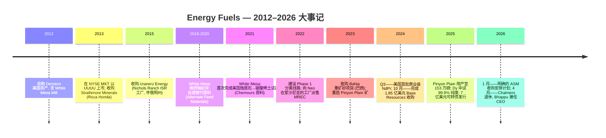
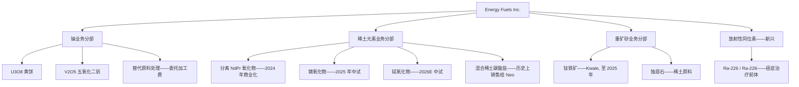
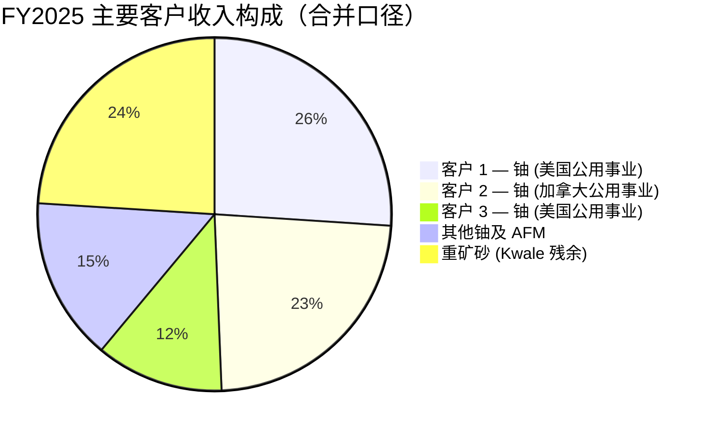
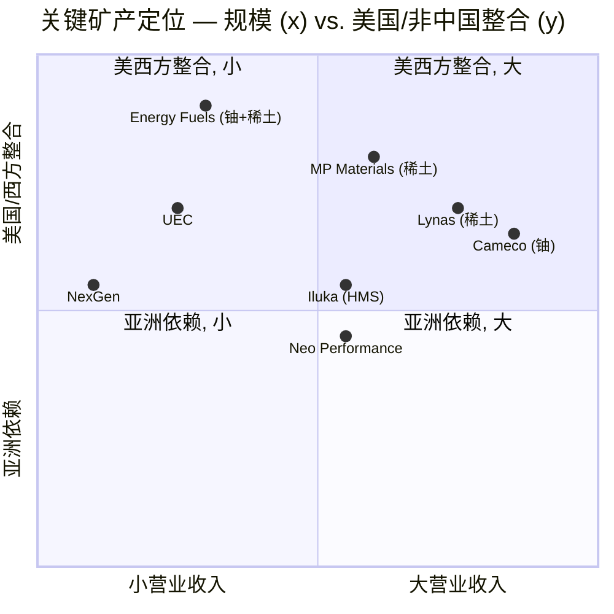

# Energy Fuels Inc. (NYSE American:UUUU) — 公司研究报告

**截至日期:** 2026-06-18
**分析师覆盖:** 维持覆盖（refresh）
**上市地:** NYSE American (UUUU); 同时在多伦多证券交易所 (TSX:EFR) 与澳大利亚证券交易所 (ASX:EFR CDIs) 挂牌
**总部:** 美国科罗拉多州莱克伍德 (Lakewood, Colorado)
**审计师:** 毕马威 (KPMG LLP, 卡尔加里)
**报告语言: 简体中文 (英文版同时存在于本目录)**

> *以下投资摘要为本报告分析师观点（house view），非来自任何申报文件；价格目标 (price target)、评级与前瞻估计均为分析师判断。*

---

## 投资摘要 (Investment Summary) — *分析师观点*

| 项目 | 内容 |
|---|---|
| **评级 Rating** | **Hold / 中性**（高 beta 的关键矿产期权标的；情绪/倍数驱动） |
| **12 个月目标价 Price Target** | **US$16.5**（SOTP 分部加总法） |
| **当前股价 (2026-06-18)** | **US$16.56** |
| **隐含空间** | **≈ 0%**（基本面已被当前价充分反映；风险回报对称） |
| **估值方法 (one-liner)** | SOTP：铀 NAV + 稀土流程概率加权期权 + 净现金/有价证券缓冲，对照 P/B 与同业 P/S |
| **市值 Market Cap** | **US$41.4 亿** |
| **企业价值 EV** | **US$36.0 亿**（总现金 9.11 亿 + 有价证券，扣可转债 6.77 亿） |
| **52 周区间** | **US$5.33 – US$27.90** |
| **代码 / 交易所** | UUUU / NYSE American（亦 TSX:EFR、ASX:EFR） |

**论点支柱 (Thesis pillars) — *分析师观点*：**

1. **唯一在产的西方"开采→磨矿→分离"垂直整合关键矿产平台。** White Mesa Mill 是美国唯一在产的常规铀磨矿厂，也是西方唯一规模化、能从独居石 (monazite) 生产符合规格分离 NdPr 氧化物的工厂——监管护城河深（重建约需 10 年与 >$10 亿）。
2. **资产负债表已完全融资到位。** 2025 年 10 月 7 亿美元 0.75% 可转债 + ATM 发股后，Q1 2026 营运资本 **$956.63M**（现金 $108.45M + 有价证券 $802.24M），为 Phase 2 扩建与 ASM 收购提供 3 年以上无稀释跑道。
3. **铀是当下唯一现金引擎，稀土仍是期权。** FY2025 铀精矿收入 $48.2M（占总收入 73%），但全年仍录得 $86.11M 净亏损；NdPr/Dy/Tb 商业收入尚未启动，2027–2029 年 Phase 1/2 投产前不贡献利润。
4. **估值已为"多重期权"定价。** TTM P/S ≈ 49×、P/B ≈ 5.6×，约为典型矿企的 2–4 倍；这是一个由叙事与倍数驱动的标的，任何一项期权破裂（中国放松出口管制、铀价跌破 $60、ASM 告吹、Vara Mada FID 延后）都会触发倍数压缩。

> **业绩更新——2026 财年生产指引 (2026-02-20 于 FY2025 10-K 首次公布):** Energy Fuels 公布 2026 年经营指引: 开采 **2.0–2.5 百万磅 U3O8 (Mlbs U3O8)**、加工 1.5–2.5 百万磅成品磅、销售 1.5–2.0 百万磅; Pinyon Plain / La Sal 在 White Mesa Mill 工厂的混合加工预计加权平均开采+磨矿成本约 **23–30 美元/磅 U3O8**, 在西方铀生产商中处于最低现金成本梯队。已披露的长期合约要求 2026 年向美国大型电力公用事业交付 620,000–880,000 磅, 价格按固定上调机制或与市场挂钩。
> 来源: [Energy Fuels Inc. 2025 财年 10-K, 于 2026-02-20 提交 (Item 7)](https://www.sec.gov/Archives/edgar/data/1385849/000138584926000009/0001385849-26-000009-index.htm)。

## 目录

1. 公司概览（含 1A 估值与目标价、1B GF Score）
2. 估值与目标价（Valuation & Price Target）
3. 公司历史
4. 管理团队
5. 产品与服务
6. 客户与上市策略
7. 行业概览
8. 竞争格局
9. 市场机会 (TAM)
10. 风险评估（含 9.5 关键分歧与催化剂）
11. 投资者视角评分卡（Section 10 lenses）

参考资料

---

## 1. 公司概览

Energy Fuels Inc. 是一家总部位于美国的关键矿产生产商, 过去五年间已从一家单一商品铀矿企业转型为一个聚焦三大可报告分部的多产品平台: (i) **铀 (uranium)** (常规开采 + 原地浸出 ISR)、(ii) **稀土元素 (rare earth elements, REE)**、(iii) **重矿砂 (heavy mineral sands, HMS)** ([2025 财年 10-K, Item 1](https://www.sec.gov/Archives/edgar/data/1385849/000138584926000009/0001385849-26-000009-index.htm))。公司最具决定性的资产是位于美国犹他州布兰丁附近的 **White Mesa Mill 工厂**——美国唯一在产的常规铀磨矿厂, 也是当今西方世界唯一能够在商业规模上从独居石 (monazite) 中生产符合规格分离 NdPr 氧化物 (钕镨氧化物) 的工厂 ([2025 财年 10-K, Item 2](https://www.sec.gov/Archives/edgar/data/1385849/000138584926000009/0001385849-26-000009-index.htm))。

**商业模式。** Energy Fuels 以中期合约形式向美国核电公用事业销售铀精矿 (U3O8); 向非中国磁体制造商销售分离稀土氧化物 (目前主要为 NdPr, Dy 镝与 Tb 铽处于中试规模); 历史上 (至 2024 年) 还销售来自肯尼亚 Kwale 重矿砂矿的钛铁矿 (ilmenite)、金红石 (rutile) 与锆石 (zircon)。多元化战略的核心逻辑是: 独居石作为含钍 (thorium) 的磷酸盐, 是钛-锆重矿砂矿的副产品, 既可进入工厂现有的铀许可证范围, 又能进入新建的稀土分离线路, 从而使 Energy Fuels 在中国之外获得一个垂直整合的"开采→磨矿→分离氧化物"位势 ([2025 财年 10-K, Item 1](https://www.sec.gov/Archives/edgar/data/1385849/000138584926000009/0001385849-26-000009-index.htm))。

**规模。** Energy Fuels 报告 **2025 财年 (截至 2025-12-31) 合并营业收入 6,592 万美元, 净亏损 8,611 万美元 (归属母公司 8,563 万美元)**, 对比 2024 财年的 7,811 万美元营业收入与 4,784 万美元净亏损 ([2025 财年 10-K, 合并利润表](https://www.sec.gov/Archives/edgar/data/1385849/000138584926000009/0001385849-26-000009-index.htm))。营业收入下滑反映 Kwale 重矿砂矿的退出 (HMS 收入从 2024 年 3,987 万降至 2025 年 1,582 万), 被 Pinyon Plain 铀产量增长部分抵消 (铀精矿收入从 3,790 万升至 4,823 万)。**2026 年 Q1 营业收入反弹至 3,584 万美元** (相比 2025 年 Q1 的 1,690 万美元), 主要源于铀长期合约交付节奏 (Q1 售铀 510,000 磅、已实现均价 $70.04/lb), Q1 净亏损收窄至 1,096 万美元 ([2026 年 Q1 10-Q](https://www.sec.gov/Archives/edgar/data/1385849/000138584926000021/0001385849-26-000021-index.htm))。截至 **2026-03-31, 营运资本为 9.566 亿美元**, 包括 1.085 亿美元现金与 8.022 亿美元有价证券, 系于 2025 年 10 月完成 7 亿美元、票面 0.75%、2031 年到期可转债发行后所得 ([2026 年 Q1 10-Q](https://www.sec.gov/Archives/edgar/data/1385849/000138584926000021/0001385849-26-000021-index.htm))。

**资产分布。** Energy Fuels 运营 White Mesa Mill 工厂和亚利桑那州的 Pinyon Plain 矿, 持有 Nichols Ranch ISR 项目 (怀俄明州, 已封存) 和 Sheep Mountain (怀俄明州), 并拥有或控制位于三大洲的重矿砂项目: 通过收购 Base Resources 获得 **Vara Mada (原名 Toliara, 马达加斯加)** 与 **Kwale (肯尼亚, 复垦阶段)**; 2023 年收购的 **Bahia (巴西)**; 以及与 Astron Corporation 在维多利亚州 (澳大利亚) 的 **Donald 项目合资权益** ([2025 财年 10-K, Item 2](https://www.sec.gov/Archives/edgar/data/1385849/000138584926000009/0001385849-26-000009-index.htm))。2026-01, 公司宣布以股票加每股 0.13 澳元特别股息收购 **Australian Strategic Materials (ASX:ASM)**, 由此新增韩国忠清北道五昌的金属化与合金化工厂、新南威尔士州 Dubbo 多金属稀土矿床, 以及美国本土预开发金属-合金能力——明确以此弥合西方稀土供应链中的"矿到金属与合金"缺口 ([2025 财年 10-K, Item 7](https://www.sec.gov/Archives/edgar/data/1385849/000138584926000009/0001385849-26-000009-index.htm))。

**营收构成（按分部与地区）。** FY2025 铀分部（含 AFM）收入 $50.101M、HMS $15.821M（[2025 财年 10-K, 附注 18](https://www.sec.gov/Archives/edgar/data/1385849/000138584926000009/0001385849-26-000009-index.htm)）；按客户所在国，美国 $38.932M、加拿大 $15.365M 占主导，其余为沙特、中国、日本等 HMS 残余客户。

<svg xmlns="http://www.w3.org/2000/svg" viewBox="0 0 720 460" width="720" height="460" role="img" aria-label="revenue donut"><rect x="0" y="0" width="720" height="460" fill="#ffffff"/>
<text x="20.00" y="30.00" text-anchor="start" font-family="Helvetica,Arial,sans-serif" font-size="15" font-weight="700" fill="#1f2933">Energy Fuels FY2025 营收构成（按分部）</text>
<path d="M 288.00,107.20 A 132 132 0 1 1 156.26,230.91 L 210.15,234.30 A 78 78 0 1 0 288.00,161.20 Z" fill="#2563eb"/>
<path d="M 156.26,230.91 A 132 132 0 0 1 288.00,107.20 L 288.00,161.20 A 78 78 0 0 0 210.15,234.30 Z" fill="#15803d"/>
<text x="288.00" y="235.20" text-anchor="middle" font-family="Helvetica,Arial,sans-serif" font-size="18" font-weight="800" fill="#1f2933">FY2025\n$65.9M</text>
<text x="288.00" y="255.20" text-anchor="middle" font-family="Helvetica,Arial,sans-serif" font-size="13" font-weight="600" fill="#52606d">US$65.9M</text>
<text x="288.00" y="271.20" text-anchor="middle" font-family="Helvetica,Arial,sans-serif" font-size="10" font-weight="400" fill="#8a97a3">total</text>
<line x1="382.47" y1="339.80" x2="398.47" y2="339.80" stroke="#2563eb" stroke-width="1.4"/>
<text x="402.47" y="337.80" text-anchor="start" font-family="Helvetica,Arial,sans-serif" font-size="11" font-weight="700" fill="#1f2933">铀 Uranium (含AFM)</text>
<text x="402.47" y="351.80" text-anchor="start" font-family="Helvetica,Arial,sans-serif" font-size="10" font-weight="400" fill="#52606d">US$50.1M  (76.0%)</text>
<line x1="193.53" y1="138.60" x2="177.53" y2="138.60" stroke="#15803d" stroke-width="1.4"/>
<text x="173.53" y="136.60" text-anchor="end" font-family="Helvetica,Arial,sans-serif" font-size="11" font-weight="700" fill="#1f2933">重矿砂 HMS</text>
<text x="173.53" y="150.60" text-anchor="end" font-family="Helvetica,Arial,sans-serif" font-size="10" font-weight="400" fill="#52606d">US$15.8M  (24.0%)</text>
<text x="360.00" y="444.00" text-anchor="middle" font-family="Helvetica,Arial,sans-serif" font-size="10" font-weight="400" fill="#52606d">Source: Energy Fuels FY2025 10-K, Note 18 Segment Information, filed 2026-02-20</text>
</svg>

*来源: [2025 财年 10-K, 附注 18 — 分部信息](https://www.sec.gov/Archives/edgar/data/1385849/000138584926000009/0001385849-26-000009-index.htm)。*

<svg xmlns="http://www.w3.org/2000/svg" viewBox="0 0 860 470" width="860" height="470" role="img" aria-label="historical revenue bars"><rect x="0" y="0" width="860" height="470" fill="#ffffff"/>
<text x="20.00" y="30.00" text-anchor="start" font-family="Helvetica,Arial,sans-serif" font-size="15" font-weight="700" fill="#1f2933">Energy Fuels 营收历史（按分部，US$ 百万）</text>
<rect x="20.00" y="44" width="11" height="11" rx="2" fill="#2563eb"/>
<text x="36.00" y="53.00" text-anchor="start" font-family="Helvetica,Arial,sans-serif" font-size="10.5" font-weight="400" fill="#1f2933">铀 Uranium (含AFM)</text>
<rect x="155.60" y="44" width="11" height="11" rx="2" fill="#15803d"/>
<text x="171.60" y="53.00" text-anchor="start" font-family="Helvetica,Arial,sans-serif" font-size="10.5" font-weight="400" fill="#1f2933">重矿砂 HMS</text>
<line x1="70" y1="412.00" x2="834" y2="412.00" stroke="#eceff2" stroke-width="1"/>
<text x="64.00" y="415.00" text-anchor="end" font-family="Helvetica,Arial,sans-serif" font-size="9.5" font-weight="400" fill="#52606d">US$0</text>
<line x1="70" y1="345.20" x2="834" y2="345.20" stroke="#eceff2" stroke-width="1"/>
<text x="64.00" y="348.20" text-anchor="end" font-family="Helvetica,Arial,sans-serif" font-size="9.5" font-weight="400" fill="#52606d">US$16.9M</text>
<line x1="70" y1="278.40" x2="834" y2="278.40" stroke="#eceff2" stroke-width="1"/>
<text x="64.00" y="281.40" text-anchor="end" font-family="Helvetica,Arial,sans-serif" font-size="9.5" font-weight="400" fill="#52606d">US$33.7M</text>
<line x1="70" y1="211.60" x2="834" y2="211.60" stroke="#eceff2" stroke-width="1"/>
<text x="64.00" y="214.60" text-anchor="end" font-family="Helvetica,Arial,sans-serif" font-size="9.5" font-weight="400" fill="#52606d">US$50.6M</text>
<line x1="70" y1="144.80" x2="834" y2="144.80" stroke="#eceff2" stroke-width="1"/>
<text x="64.00" y="147.80" text-anchor="end" font-family="Helvetica,Arial,sans-serif" font-size="9.5" font-weight="400" fill="#52606d">US$67.5M</text>
<line x1="70" y1="78.00" x2="834" y2="78.00" stroke="#eceff2" stroke-width="1"/>
<text x="64.00" y="81.00" text-anchor="end" font-family="Helvetica,Arial,sans-serif" font-size="9.5" font-weight="400" fill="#52606d">US$84.4M</text>
<rect x="123.48" y="261.84" width="147.71" height="150.16" fill="#2563eb"/>
<rect x="123.48" y="261.84" width="147.71" height="0.00" fill="#15803d"/>
<text x="197.33" y="428.00" text-anchor="middle" font-family="Helvetica,Arial,sans-serif" font-size="10" font-weight="400" fill="#52606d">2023</text>
<rect x="378.15" y="260.60" width="147.71" height="151.40" fill="#2563eb"/>
<rect x="378.15" y="102.74" width="147.71" height="157.86" fill="#15803d"/>
<text x="452.00" y="428.00" text-anchor="middle" font-family="Helvetica,Arial,sans-serif" font-size="10" font-weight="400" fill="#52606d">2024</text>
<rect x="632.81" y="213.65" width="147.71" height="198.35" fill="#2563eb"/>
<rect x="632.81" y="151.01" width="147.71" height="62.64" fill="#15803d"/>
<text x="706.67" y="428.00" text-anchor="middle" font-family="Helvetica,Arial,sans-serif" font-size="10" font-weight="400" fill="#52606d">2025</text>
<text x="430.00" y="454.00" text-anchor="middle" font-family="Helvetica,Arial,sans-serif" font-size="10" font-weight="400" fill="#52606d">Source: Energy Fuels FY2025 10-K Note 18 (FY24-25) &amp; FY2023 10-K (FY23), filed 2026-02-20 / 2024</text>
</svg>

*来源: FY24–25 来自 [2025 财年 10-K, 附注 18](https://www.sec.gov/Archives/edgar/data/1385849/000138584926000009/0001385849-26-000009-index.htm); FY23 来自 [2024 财年 10-K](https://www.sec.gov/Archives/edgar/data/1385849/000138584925000004/0001385849-25-000004-index.htm)（注：HMS 收入自 2024-10 收购 Base Resources 后并表，FY2023 为铀为主）。*

<svg xmlns="http://www.w3.org/2000/svg" viewBox="0 0 720 460" width="720" height="460" role="img" aria-label="revenue donut"><rect x="0" y="0" width="720" height="460" fill="#ffffff"/>
<text x="20.00" y="30.00" text-anchor="start" font-family="Helvetica,Arial,sans-serif" font-size="15" font-weight="700" fill="#1f2933">Energy Fuels FY2025 营收构成（按客户所在国）</text>
<path d="M 288.00,107.20 A 132 132 0 1 1 216.87,350.39 L 245.97,304.91 A 78 78 0 1 0 288.00,161.20 Z" fill="#2563eb"/>
<path d="M 216.87,350.39 A 132 132 0 0 1 169.88,180.27 L 218.20,204.38 A 78 78 0 0 0 245.97,304.91 Z" fill="#15803d"/>
<path d="M 169.88,180.27 A 132 132 0 0 1 195.31,145.22 L 233.23,183.67 A 78 78 0 0 0 218.20,204.38 Z" fill="#d97706"/>
<path d="M 195.31,145.22 A 132 132 0 0 1 226.26,122.53 L 251.51,170.26 A 78 78 0 0 0 233.23,183.67 Z" fill="#7c3aed"/>
<path d="M 226.26,122.53 A 132 132 0 0 1 274.84,107.86 L 280.22,161.59 A 78 78 0 0 0 251.51,170.26 Z" fill="#dc2626"/>
<path d="M 274.84,107.86 A 132 132 0 0 1 288.00,107.20 L 288.00,161.20 A 78 78 0 0 0 280.22,161.59 Z" fill="#0891b2"/>
<text x="288.00" y="235.20" text-anchor="middle" font-family="Helvetica,Arial,sans-serif" font-size="18" font-weight="800" fill="#1f2933">FY2025\n$65.9M</text>
<text x="288.00" y="255.20" text-anchor="middle" font-family="Helvetica,Arial,sans-serif" font-size="13" font-weight="600" fill="#52606d">US$65.9M</text>
<text x="288.00" y="271.20" text-anchor="middle" font-family="Helvetica,Arial,sans-serif" font-size="10" font-weight="400" fill="#8a97a3">total</text>
<line x1="420.45" y1="277.94" x2="436.45" y2="277.94" stroke="#2563eb" stroke-width="1.4"/>
<text x="440.45" y="275.94" text-anchor="start" font-family="Helvetica,Arial,sans-serif" font-size="11" font-weight="700" fill="#1f2933">美国 U.S.</text>
<text x="440.45" y="289.94" text-anchor="start" font-family="Helvetica,Arial,sans-serif" font-size="10" font-weight="400" fill="#52606d">US$38.9M  (59.1%)</text>
<line x1="154.98" y1="275.94" x2="138.98" y2="275.94" stroke="#15803d" stroke-width="1.4"/>
<text x="134.98" y="273.94" text-anchor="end" font-family="Helvetica,Arial,sans-serif" font-size="11" font-weight="700" fill="#1f2933">加拿大 Canada</text>
<text x="134.98" y="287.94" text-anchor="end" font-family="Helvetica,Arial,sans-serif" font-size="10" font-weight="400" fill="#52606d">US$15.4M  (23.3%)</text>
<line x1="176.29" y1="158.17" x2="160.29" y2="158.17" stroke="#d97706" stroke-width="1.4"/>
<text x="156.29" y="156.17" text-anchor="end" font-family="Helvetica,Arial,sans-serif" font-size="11" font-weight="700" fill="#1f2933">沙特 Saudi</text>
<text x="156.29" y="170.17" text-anchor="end" font-family="Helvetica,Arial,sans-serif" font-size="10" font-weight="400" fill="#52606d">US$3.5M  (5.2%)</text>
<line x1="206.40" y1="127.91" x2="190.40" y2="127.91" stroke="#7c3aed" stroke-width="1.4"/>
<text x="186.40" y="125.91" text-anchor="end" font-family="Helvetica,Arial,sans-serif" font-size="11" font-weight="700" fill="#1f2933">中国 China</text>
<text x="186.40" y="139.91" text-anchor="end" font-family="Helvetica,Arial,sans-serif" font-size="10" font-weight="400" fill="#52606d">US$3.1M  (4.6%)</text>
<line x1="248.10" y1="107.09" x2="232.10" y2="107.09" stroke="#dc2626" stroke-width="1.4"/>
<text x="228.10" y="105.09" text-anchor="end" font-family="Helvetica,Arial,sans-serif" font-size="11" font-weight="700" fill="#1f2933">日本 Japan</text>
<text x="228.10" y="119.09" text-anchor="end" font-family="Helvetica,Arial,sans-serif" font-size="10" font-weight="400" fill="#52606d">US$4.1M  (6.2%)</text>
<line x1="281.11" y1="101.37" x2="265.11" y2="101.37" stroke="#0891b2" stroke-width="1.4"/>
<text x="261.11" y="99.37" text-anchor="end" font-family="Helvetica,Arial,sans-serif" font-size="11" font-weight="700" fill="#1f2933">韩国及其他 Korea/other</text>
<text x="261.11" y="113.37" text-anchor="end" font-family="Helvetica,Arial,sans-serif" font-size="10" font-weight="400" fill="#52606d">US$1.0M  (1.6%)</text>
<text x="360.00" y="444.00" text-anchor="middle" font-family="Helvetica,Arial,sans-serif" font-size="10" font-weight="400" fill="#52606d">Source: Energy Fuels FY2025 10-K, Note 18 Segment Information, filed 2026-02-20</text>
</svg>

*来源: [2025 财年 10-K, 附注 18 — 按客户所在国营收](https://www.sec.gov/Archives/edgar/data/1385849/000138584926000009/0001385849-26-000009-index.htm)（地理切分采用申报披露的国别金额，已将日本铀+HMS、韩国及其他小额国别合并以便阅读）。*

### 1A. 估值快照与目标价 (Valuation snapshot) — *分析师观点*

**估值快照 (2026-06-18)。** UUUU 收盘价 **16.56 美元**, 对应市值 **41.4 亿美元**, 企业价值 **36.0 亿美元** (总现金 9.107 亿美元含有价证券、总债务 6.775 亿美元——后者为 2031 年到期可转债账面价值) ([Yahoo Finance — UUUU 关键统计, 访问日期 2026-06-18](https://finance.yahoo.com/quote/UUUU/key-statistics))。TTM 营业收入 8,486 万美元对应 **TTM 市销率 (P/S) 约 48.8 倍**; TTM EBITDA 为负 8,117 万美元 (**EV/EBITDA −44×**), 因此追溯 P/E 不具备意义 (前瞻 P/E 约 3,312 倍, 反映 2026 年仅有微薄盈利) ([Yahoo Finance, 2026-06-18](https://finance.yahoo.com/quote/UUUU/key-statistics))。市净率 (P/B) 为 **5.6×** (每股账面 2.96 美元)——资本密集型矿企通常在 1.5–3 倍账面价值区间交易, 当前溢价反映工厂的战略期权价值与有价证券缓冲。5 年股价区间为 **3.44 美元 — 27.72 美元**; 过去十二个月股价上涨约 **206%** (2025-06-20 收盘 5.41 → 2026-06-18 收盘 16.56) ([yfinance history, 2021–2026](https://finance.yahoo.com/quote/UUUU/key-statistics))。

**同业倍数 (TTM, 2026-06-18)。** 铀同业: Cameco (CCJ) 市值约 464 亿美元; Denison (DNN) 市值约 30 亿美元 (营业收入接近为零); Uranium Energy (UEC) 市值约 59 亿美元; NexGen (NXE) 市值约 70 亿美元 (无营业收入)。稀土同业: MP Materials (MP) 市值约 108 亿美元; Lynas (LYC.AX) 市值约 180 亿澳元; Neo Performance Materials (NEO.TO) 市值约 16 亿加元 ([Yahoo Finance 各代码关键统计页面, 访问日期 2026-06-18](https://finance.yahoo.com/quote/UUUU/key-statistics))。UUUU 的 P/S 介于产生现金流的铀业老牌龙头 (Cameco) 与尚无营业收入的铀业开发商 (UEC、DNN) 之间, 更靠近 Lynas / MP 这类稀土综合生产商区间, 而非纯铀同业——这与当前市场给它的定价方式一致。

**为何倍数被拉高。** ≈49 倍 TTM P/S 与 5.6 倍 P/B 由四件事推动, 而非盈利: (i) 完全融资到位的资产负债表, 使管理层无需股权稀释即可推进 Phase 2 扩建与 ASM 收购 ([2026 年 Q1 10-Q](https://www.sec.gov/Archives/edgar/data/1385849/000138584926000021/0001385849-26-000021-index.htm)); (ii) 当今唯一在西方实现规模化运行的 NdPr/Dy/Tb 分离路线, 在中国出口管制收紧背景下被重新定价 (详见第 7 章); (iii) Pinyon Plain 的矿石品位期权 (1.6% U3O8——全球前列) 与 Vara Mada (FS 税后 NPV 18 亿美元、IRR ≈25%) 的期权价值; (iv) 相对关键矿产主题 ETF 资金流的小流通盘。对第 10 章的启示: 这是一个情绪/倍数驱动的标的; 任何叙事破裂都可能导致倍数急剧压缩。

**目标价 (12 个月) — US$16.5, SOTP 分部加总, *分析师观点*。** 当前 41.4 亿美元市值大致拆解为 (本报告 SOTP 估算, 概率加权): (a) **铀业务约 12–16 亿美元** (按 Cameco/UEC 可比 EV / 可见储量与产能, 反映 Pinyon Plain 低成本与 2026 年 2.0–2.5 Mlbs 开采指引, [2025 财年 10-K, Item 7](https://www.sec.gov/Archives/edgar/data/1385849/000138584926000009/0001385849-26-000009-index.htm)); (b) **稀土流程期权约 18–24 亿美元** (Phase 1/2 NdPr/Dy/Tb 在 2030 年生产场景下的概率加权 DCF, 锚定 J.P. Morgan 2030 年 NdPr $139/kg 预测, *分析师观点* [J.P. Morgan — Rare Earths Dashboard, 2026-05-28](http://xs-macbook-air.local:5001/zsxq/pdf/585412242541144/J.P.%20Morgan-Rare%20Earths%20Dashboard%EF%BC%9AChina%20still%20sets%20spot%EF%BC%8C%20but%20the%20West%20is%20paying%20for%20security%EF%BC%9B%20strategic%20pricing%20and%20ramp~up%20risk%20now%20drive%20the%20debate-260528.pdf)); (c) **净现金/有价证券缓冲约 9 亿美元** ([2026 年 Q1 10-Q](https://www.sec.gov/Archives/edgar/data/1385849/000138584926000021/0001385849-26-000021-index.htm))。三者加总中值约对应 16.5 美元/股, 与当前 16.56 美元基本持平——故评级 **Hold/中性**。

### 1B. GF Score（GuruFocus 式基本面评分卡）— *分析师观点*

下方五维基本面评分卡为本报告分析师依 GuruFocus GF Score™ 方法自建的评分（**非 GuruFocus 官方数据**, 亦不附任何申报文件引用）; 五个 0–10 维度按透明权重映射为 0–100 综合分。每一维背后的指标各自带有 inline 引用。

<svg xmlns="http://www.w3.org/2000/svg" viewBox="0 0 500 500" width="500" height="500" role="img" aria-label="GF Score radar">
<rect x="0" y="0" width="500" height="500" fill="#ffffff"/>
<text x="20" y="24" font-family="Helvetica,Arial,sans-serif" font-size="15" font-weight="700" fill="#1f2933">GF Score (GuruFocus-style): 45/100</text>
<text x="20" y="41" font-family="Helvetica,Arial,sans-serif" font-size="11" fill="#52606d">0–50 Worst future performance potential / insufficient data</text>
<polygon points="250.0,88.0 392.7,191.6 338.2,359.4 161.8,359.4 107.3,191.6" fill="#e9f5ec" stroke="none"/>
<polygon points="250.0,208.0 278.5,228.7 267.6,262.3 232.4,262.3 221.5,228.7" fill="none" stroke="#c5d3cb" stroke-width="1"/>
<polygon points="250.0,178.0 307.1,219.5 285.3,286.5 214.7,286.5 192.9,219.5" fill="none" stroke="#c5d3cb" stroke-width="1"/>
<polygon points="250.0,148.0 335.6,210.2 302.9,310.8 197.1,310.8 164.4,210.2" fill="none" stroke="#c5d3cb" stroke-width="1"/>
<polygon points="250.0,118.0 364.1,200.9 320.5,335.1 179.5,335.1 135.9,200.9" fill="none" stroke="#c5d3cb" stroke-width="1"/>
<polygon points="250.0,88.0 392.7,191.6 338.2,359.4 161.8,359.4 107.3,191.6" fill="none" stroke="#c5d3cb" stroke-width="1.3"/>
<line x1="250" y1="238" x2="161.8" y2="359.4" stroke="#cfdad3" stroke-width="1"/>
<text x="146.5" y="392.4" text-anchor="end" font-family="Helvetica,Arial,sans-serif" font-size="11.5" font-weight="600" fill="#1f2933">Financial Strength</text>
<text x="146.5" y="405.4" text-anchor="end" font-family="Helvetica,Arial,sans-serif" font-size="9.5" fill="#52606d">财务实力</text>
<text x="179.5" y="329.1" text-anchor="middle" font-family="Helvetica,Arial,sans-serif" font-size="10.5" font-weight="700" fill="#1f2933">8</text>
<line x1="250" y1="238" x2="250.0" y2="88.0" stroke="#cfdad3" stroke-width="1"/>
<text x="250.0" y="58.0" text-anchor="middle" font-family="Helvetica,Arial,sans-serif" font-size="11.5" font-weight="600" fill="#1f2933">Profitability</text>
<text x="250.0" y="71.0" text-anchor="middle" font-family="Helvetica,Arial,sans-serif" font-size="9.5" fill="#52606d">盈利能力</text>
<text x="250.0" y="217.0" text-anchor="middle" font-family="Helvetica,Arial,sans-serif" font-size="10.5" font-weight="700" fill="#1f2933">1</text>
<line x1="250" y1="238" x2="107.3" y2="191.6" stroke="#cfdad3" stroke-width="1"/>
<text x="82.6" y="183.6" text-anchor="end" font-family="Helvetica,Arial,sans-serif" font-size="11.5" font-weight="600" fill="#1f2933">Growth</text>
<text x="82.6" y="196.6" text-anchor="end" font-family="Helvetica,Arial,sans-serif" font-size="9.5" fill="#52606d">成长性</text>
<text x="192.9" y="213.5" text-anchor="middle" font-family="Helvetica,Arial,sans-serif" font-size="10.5" font-weight="700" fill="#1f2933">4</text>
<line x1="250" y1="238" x2="392.7" y2="191.6" stroke="#cfdad3" stroke-width="1"/>
<text x="417.4" y="183.6" text-anchor="start" font-family="Helvetica,Arial,sans-serif" font-size="11.5" font-weight="600" fill="#1f2933">GF Value</text>
<text x="417.4" y="196.6" text-anchor="start" font-family="Helvetica,Arial,sans-serif" font-size="9.5" fill="#52606d">估值</text>
<text x="278.5" y="222.7" text-anchor="middle" font-family="Helvetica,Arial,sans-serif" font-size="10.5" font-weight="700" fill="#1f2933">2</text>
<line x1="250" y1="238" x2="338.2" y2="359.4" stroke="#cfdad3" stroke-width="1"/>
<text x="353.5" y="392.4" text-anchor="start" font-family="Helvetica,Arial,sans-serif" font-size="11.5" font-weight="600" fill="#1f2933">Momentum</text>
<text x="353.5" y="405.4" text-anchor="start" font-family="Helvetica,Arial,sans-serif" font-size="9.5" fill="#52606d">动量</text>
<text x="329.4" y="341.2" text-anchor="middle" font-family="Helvetica,Arial,sans-serif" font-size="10.5" font-weight="700" fill="#1f2933">9</text>
<polygon points="250.0,223.0 278.5,228.7 329.4,347.2 179.5,335.1 192.9,219.5" fill="#2e8b57" fill-opacity="0.34" stroke="#2e8b57" stroke-width="2"/>
<circle cx="179.5" cy="335.1" r="2.6" fill="#2e8b57"/>
<circle cx="250.0" cy="223.0" r="2.6" fill="#2e8b57"/>
<circle cx="192.9" cy="219.5" r="2.6" fill="#2e8b57"/>
<circle cx="278.5" cy="228.7" r="2.6" fill="#2e8b57"/>
<circle cx="329.4" cy="347.2" r="2.6" fill="#2e8b57"/>
<text x="250" y="470" text-anchor="middle" font-family="Helvetica,Arial,sans-serif" font-size="9.5" fill="#52606d">Source: Energy Fuels FY2025 10-K · Yahoo Finance · indicators.db, as of 2026-06-18</text>
<text x="250" y="485" text-anchor="middle" font-family="Helvetica,Arial,sans-serif" font-size="9" fill="#52606d">GF Score = independent analyst rubric (*Analyst view:*) — not GuruFocus™ official number</text>
</svg>

| 维度 / Dimension | 评分 / Score (0–10) | |
|---|---|---|
| Financial Strength (财务实力) | 8 | `████████░░` |
| Profitability (盈利能力) | 1 | `█░░░░░░░░░` |
| Growth (成长性) | 4 | `████░░░░░░` |
| GF Value (估值) | 2 | `██░░░░░░░░` |
| Momentum (动量) | 9 | `█████████░` |
| **GF Score (composite, *Analyst view:*)** | **45 / 100** | **0–50 Worst future performance potential / insufficient data** |

*Composite weights (*Analyst view:*): Financial Strength 20% · Profitability 25% · Growth 25% · GF Value 15% · Momentum 15% (transparent reproduction — not GuruFocus's proprietary weighting).*

*评分卡为分析师 rubric 输出, 非 GuruFocus 官方; 综合分由五维加权得出。来源标注见图内。各维度底层指标引用见下文。*

**各维度评分理由（why these scores）：**

- **Financial Strength（财务强度）9 → 计 8/10。** 资产负债表是 UUUU 最强的一维: Q1 2026 营运资本 **9.566 亿美元**, 含现金 1.085 亿 + 有价证券 8.022 亿, 总债务仅一笔 2031 年到期、票面 **0.75%** 的可转债 (账面 6.757 亿); 净现金为正, 利息负担极轻 ([2026 年 Q1 10-Q](https://www.sec.gov/Archives/edgar/data/1385849/000138584926000021/0001385849-26-000021-index.htm))。扣分项: 持续经营性现金消耗 (FY2025 经营活动净流出 8,948 万美元) 意味这一缓冲会随 Phase 2 资本开支而消耗 ([2025 财年 10-K, 现金流量表](https://www.sec.gov/Archives/edgar/data/1385849/000138584926000009/0001385849-26-000009-index.htm))。
- **Profitability（盈利能力）1/10。** 公司自 2014 年以来连续净亏损; FY2025 经营亏损 **1.012 亿美元**, 净亏损 8,611 万美元, 经营利润率与 ROE 均为深度负值 ([2025 财年 10-K, 合并利润表](https://www.sec.gov/Archives/edgar/data/1385849/000138584926000009/0001385849-26-000009-index.htm))。铀分部本身在 FY2025 已实现均价 $74.21/lb vs 成本 $50.89/lb 为正毛利, 但被稀土爬产与 SG&A ($6,478 万) 拖累至合并亏损。
- **Growth（成长）4/10。** FY2025 合并营业收入同比下滑 (受 Kwale 退出拖累), 但铀精矿收入同比 +27% ($3,790 万 → $4,823 万), 且 2026 年开采指引 2.0–2.5 Mlbs 较 2025 年 1.53 Mlbs 实际产量翻倍 ([2025 财年 10-K, Item 7](https://www.sec.gov/Archives/edgar/data/1385849/000138584926000009/0001385849-26-000009-index.htm))。稀土前瞻产能 (Phase 1/2 合计 NdPr 6,000 吨/年) 是巨大但未兑现的成长期权——故给中性偏低分。
- **GF Value（估值, 越高越便宜）2/10。** P/S ≈49×、P/B ≈5.6× 均处于矿企区间高位, 本报告 SOTP 目标价较现价基本无上行空间, 安全边际 (margin of safety) 接近零 ([Yahoo Finance, 2026-06-18](https://finance.yahoo.com/quote/UUUU/key-statistics))。期权价值已被定价。
- **Momentum（动量）9/10。** 12 个月股价 +206%, 大幅跑赢大盘与铀同业; 52 周高点 27.90 美元 ([Yahoo Finance, 2026-06-18](https://finance.yahoo.com/quote/UUUU/key-statistics))。动量是当前最强的一维, 但与 GF Value 的低分形成张力——典型的"贵且强"组合。

综合而言, GF Score 呈现一个**"资产负债表极强 + 动量极强, 但盈利缺失、估值偏贵"**的画像——与 Hold 评级一致: 财务安全度足以让公司熬过周期, 但当前价格已为尚未兑现的期权充分付费。

---

## 2. 估值与目标价 (Valuation & Price Target) — *分析师观点*

本章的前瞻估计、目标价与情景均为分析师判断, 不附任何申报文件引用; 每一驱动因素的外部依据以 inline 链接给出。

### 2A. 前瞻财务估计 (3 年) — *分析师观点*

| (US\$ 百万, 除注明外) | FY2025A | FY2026E | FY2027E | FY2028E |
|---|---|---|---|---|
| 营业收入 Revenue | 65.9 | 130–160 | 180–230 | 260–340 |
| — 铀 Uranium | 50.1 | 120–145 | 150–185 | 175–215 |
| — 稀土 REE | 0.0 | 5–10 | 25–45 | 80–120 |
| — HMS | 15.8 | 0–5 | 5–10 | 5–10 |
| 毛利率（铀分部）Gross margin | ~31% | 40–50% | 40–55% | 40–55% |
| 经营利润 Operating income | (101.2) | (40)–(20) | (10)–+10 | +20–+60 |
| 归母净亏/利 Net income | (85.6) | (25)–(5) | (5)–+15 | +25–+70 |

**驱动与依据。** 2026 年营收跳升的主因是铀: 公司指引销售 1.5–2.0 百万磅, 按约 $80–90/lb 合约/现货组合 ([2025 财年 10-K, Item 7](https://www.sec.gov/Archives/edgar/data/1385849/000138584926000009/0001385849-26-000009-index.htm); 现货约 $85.55/lb [TradingEconomics — 铀价, 2026-06-17](https://tradingeconomics.com/commodity/uranium)), 单铀业即可贡献 $120–145M。稀土收入要到 2027–2028 年 Phase 1 满产 + Phase 2 (2029 年中目标投产) 才显著放量, 依赖独居石原料兑现 (Chemours 第三方 + Vara Mada/Donald)。经营利润转正的桥梁是铀毛利正常化 (2026 年开采成本指引 $23–30/lb vs 已实现 $70+/lb) 与 SG&A 杠杆——**这条桥很大程度上取决于稀土能否按时放量, 是本报告对 2027–2028 年区间给出宽幅的原因**。

### 2B. 目标价推导与情景 — *分析师观点*

由于 UUUU 是一个 pre-cash-flow、以期权价值定价的标的, 前瞻 P/E 与 EV/EBITDA 均无意义, 故采用 **SOTP 分部加总法**（与市场实际定价方式一致），并以 P/B 与同业 P/S 交叉检验:

| 情景 | 目标价 | 较现价 | 核心摆动假设 |
|---|---|---|---|
| **Bull 牛市** | **US\$26** | +57% | 铀价站稳 $90+; Vara Mada FID 落地、Phase 2 按时融资; NdPr 维持 $110/kg 西方溢价底线; ASM 顺利完成 |
| **Base 基准** | **US\$16.5** | ≈0% | 铀 $80–90; 稀土期权概率加权 ~50%; 资产负债表缓冲全额计入; 无重大延期 |
| **Bear 熊市** | **US\$9** | −46% | 铀回落至 $60; 中国放松出口管制使 NdPr 回落至 $53/kg; Phase 2 延期/超支; 倍数压缩至同业 P/S |

**为什么用 SOTP 而非倍数。** 铀业务有可见储量与产能、可按 Cameco/UEC 的 EV/可见磅数锚定; 稀土流程是一个 2027–2030 年才放量的期权, 适合按概率加权 DCF 估值, 锚定 J.P. Morgan 2030 年 NdPr $139/kg、Dy $332/kg、Tb $1,392/kg 的价格预测 (*分析师观点* [J.P. Morgan — Rare Earths Dashboard, 2026-05-28](http://xs-macbook-air.local:5001/zsxq/pdf/585412242541144/J.P.%20Morgan-Rare%20Earths%20Dashboard%EF%BC%9AChina%20still%20sets%20spot%EF%BC%8C%20but%20the%20West%20is%20paying%20for%20security%EF%BC%9B%20strategic%20pricing%20and%20ramp~up%20risk%20now%20drive%20the%20debate-260528.pdf))。两段相加再叠加 9 亿美元净现金/有价证券缓冲 ([2026 年 Q1 10-Q](https://www.sec.gov/Archives/edgar/data/1385849/000138584926000021/0001385849-26-000021-index.htm))。

### 2C. 与市场一致预期的对比 + 卖方观点演变 (Sell-side view evolution) — *分析师观点*

本地机构研究库 (`db/zsxq.db`) **没有 Energy Fuels (UUUU) 的单一公司覆盖报告**, 但有多份高度相关的铀与稀土行业卖方报告, 可用以校准本报告对铀价、NdPr 价格与西方供应链的假设。以下三份均为**卖方观点**, 链接至本机 zsxq 直链 (仅本机可访问):

**按机构的观点时间线（铀 + 稀土行业，非单一公司）：**

| 机构 | 日期 | 评级/标的 | 核心论点 | 对 UUUU 的读法 |
|---|---|---|---|---|
| **UBS（铀行业）** | 2026-04-10 | 首选 NexGen [买入] PT C\$20/A\$21; Cameco [中性] PT C\$155 | 2026 铀价预测下调至 **$88/lb**; 长期价格指标升至 **$93/lb (同比+16%)**; 现货 $100 遇阻回落至 $85; 结构性短缺仍在 | 支持本报告铀 $80–90 假设; UUUU 非 UBS 覆盖, 但低成本+美国本土定位受益于同一逻辑 |
| **J.P. Morgan（稀土仪表盘）** | 2026-05-28 | 行业（看好 Lynas 战略溢价） | 中国 2025-04 出口管制致磁体出口 **−77%**、对美 **−92%**; DoD/MP 设 NdPr **$110/kg** 价格底线; 2030 预测 NdPr **$139**、Dy **$332**、Tb **$1,392**/kg; 管制暂缓至 **2026-11-10** | 直接锚定本报告稀土期权 DCF 的价格输入; "西方为安全溢价买单"是 UUUU 多元化战略的核心论据 |
| **Morgan Stanley（国家安全创新峰会）** | 2026-06-16 | 主题（防务/关键矿产） | 稀土/磁材/铀供应链本土化为核心主题; "国内铀矿从休眠转入加速期"; 点名 Uranium Energy、USA Rare Earth、Vulcan Elements、Niron | 宏观顺风确认; UUUU 的 Vulcan Elements MoU 落在同一主题内 |

**机构间分歧 (机构间分歧)。** 三份报告对方向高度一致 (西方关键矿产再工业化、中国出口管制造就两级市场), 分歧主要在**首选标的**与**铀价斜率**: UBS 在铀里首选 NexGen (开发商、近期无产量) 而非生产商; J.P. Morgan 在稀土里偏好 Lynas (规模+战略溢价) 而非更早期的 Arafura/Iluka。**本报告对 UUUU 的中性评级与这些卖方观点不冲突**——它们看好的是赛道, 而 UUUU 已把赛道的多重期权计入 ≈49× P/S 的价格。没有任何一份报告给出 UUUU 的目标价, 故本报告的 SOTP 目标价不与任何卖方一致预期对标 (无可对标的 UUUU 共识)。

**注：** 所有借用的卖方目标价均为各机构在其报告日的观点; UBS NexGen PT A\$21 对应 db/stock_price_target.db 记录的报告日上行 +37.6% (NXE)。UUUU 本身在该 PT 库中无记录 (无单一覆盖)。

---

## 3. 公司历史

Energy Fuels 的源头可追溯到 1987 年怀俄明州成立的铀勘探载体。现代 Energy Fuels Inc. ("EFI") 于 2006 年在加拿大安大略省重新注册成立, 并于 2010 年在多伦多证券交易所上市 ([2025 财年 10-K, Item 1](https://www.sec.gov/Archives/edgar/data/1385849/000138584926000009/0001385849-26-000009-index.htm))。决定性事件是 **2012 年收购 Denison Mines Holdings Corp. 的美国铀资产**, 含 White Mesa Mill——这宗交易使公司获得美国唯一在产的常规铀磨矿厂, 实际上定义了其后续战略。Energy Fuels 于 2013 年 12 月以"UUUU"代码在 NYSE MKT (现 NYSE American) 上市。

*来源: 时间线综合自 [2025 财年 10-K, Item 1 与 Item 7](https://www.sec.gov/Archives/edgar/data/1385849/000138584926000009/0001385849-26-000009-index.htm) 与 [Energy Fuels 2024–2026 年 SEC EDGAR 8-K 索引](https://www.sec.gov/cgi-bin/browse-edgar?action=getcompany&CIK=0001385849&type=8-K)。*

三次战略转向定义了现代公司。**第一次**, 2016–2020 年的封存决策: 福岛事故后铀现货价格跌破 25 美元/磅, 公司以每年 500–1,500 万美元的替代原料 (Alternate Feed Materials, 放射性工业废料流) 维持 White Mesa 的牌照与运营, 而非关闭, 保留了美国唯一的常规磨矿牌照及熟练劳动力 ([2025 财年 10-K, Item 1](https://www.sec.gov/Archives/edgar/data/1385849/000138584926000009/0001385849-26-000009-index.htm))。**第二次**, 2020–2022 年的稀土转向: 管理层认识到历史上被佛罗里达/乔治亚钛矿厂当作含钍废料运往中国分离的独居石, 实际上可纳入 White Mesa 现有 NRC 放射性物料牌照范围; 2021 年末以 Chemours 原料完成首次商业规模独居石"破碎"加工, 使 Energy Fuels 成为半个多世纪以来美国首家从美国独居石生产可销售稀土产品 (混合稀土碳酸盐, MREC) 的公司 ([2025 财年 10-K, Item 1](https://www.sec.gov/Archives/edgar/data/1385849/000138584926000009/0001385849-26-000009-index.htm))。**第三次**, 2024–2026 年的垂直整合冲刺: Astron/Donald 合资 (2024-09)、1.85 亿美元收购 Base Resources (2024-10, 拿到 Kwale 与马达加斯加 Vara Mada)、以及拟议的 ASM 收购安排 (2026-01 公告), 战略逻辑明显是"拥有矿山、拥有磨矿、拥有分离、拥有合金"的非中国版稀土全链 ([2025 财年 10-K, Item 7](https://www.sec.gov/Archives/edgar/data/1385849/000138584926000009/0001385849-26-000009-index.htm))。

值得注意的收购:

- **2012**: White Mesa Mill 工厂 + Henry Mountains 项目 (来自 Denison Mines)
- **2013**: Strathmore Minerals (Roca Honda, 新墨西哥州)
- **2015**: Uranerz Energy (Nichols Ranch ISR, 怀俄明州)
- **2023**: Bahia 重矿砂项目, 巴西
- **2024 年 8 月**: RadTran LLC (TAT/放射性同位素平台)
- **2024 年 9 月**: Astron / Donald 项目 JV (澳大利亚)
- **2024 年 10 月**: Base Resources Ltd (Kwale + Toliara/Vara Mada)
- **2026 年上半年** (已公告): Australian Strategic Materials (Dubbo + 韩国合金工厂)

---

## 4. 管理团队

公司正处于历史上最重大的管理层变革。**Mark S. Chalmers 于 2026-04-15 退任 CEO**, 完成了与 **Ross R. Bhappu** 的有计划交接, 后者于 2025-08-04 出任总裁、明确以接任 CEO 为目标培养 ([2026 年 DEF 14A](https://www.sec.gov/Archives/edgar/data/1385849/000106299326002046/0001062993-26-002046-index.htm))。

**Ross R. Bhappu, 总裁兼 CEO (自 2026-04-15)。** Bhappu 是一位拥有 35 年矿业金融经验的资深人士, 持有科罗拉多矿业学院 (Colorado School of Mines) 矿产经济学博士学位以及亚利桑那大学冶金工程学士与硕士学位 ([2026 年 DEF 14A](https://www.sec.gov/Archives/edgar/data/1385849/000106299326002046/0001062993-26-002046-index.htm))。他职业生涯起步于 Cyprus Minerals, 后转至 Newmont Mining 担任业务发展总监, 之后担任 GTN Copper Corporation CEO 三年; 最具决定性的阶段是 1999–2024 年在 Resource Capital Funds 的近 25 年, 最终担任私募股权成熟基金负责人。关键的是, **Bhappu 在 2008 年收购 Mountain Pass (后来成为 Molycorp 的稀土矿) 时起到了关键作用, 并于 2008–2013 年担任 Molycorp 董事会主席** ([2026 年 DEF 14A](https://www.sec.gov/Archives/edgar/data/1385849/000106299326002046/0001062993-26-002046-index.htm))。这段履历是把双刃剑: Molycorp 是历史上与 Energy Fuels 今天试图打造的事业 (垂直整合的西方稀土) 最相近的对照, 而它在 2015 年因中国价格倾销摧毁 Mountain Pass Phase 1 重启的单位经济性后破产 (Chapter 11)。市场对此有两种解读——Bhappu 深谙这套打法和失败模式, 但中国以外的西方稀土经济仍然脆弱, 而他亲历过定义熊市观点的那种确切失败模式。他并非创始人, 内部持股较为有限。Mark Chalmers 退休后将作为带薪顾问继续服务两年。

**Mark S. Chalmers, 前 CEO (2018-02 至 2026-04-15)。** 尽管现已退休, Chalmers 是当前形态公司的设计师。他是澳大利亚/美国双国籍化学工程师, 拥有 40 年以上铀业运营经验, 曾运营力拓 (Rio Tinto) 在纳米比亚的 Rössing 矿和 Heathgate 的 Beverley ISR 业务。在其任内, Energy Fuels (i) 在 2018–2022 年低谷中维持 White Mesa 牌照; (ii) 开创了独居石→NdPr 路线; (iii) 完成了 Base Resources 与 ASM 交易 ([2025 财年 10-K, Item 7](https://www.sec.gov/Archives/edgar/data/1385849/000138584926000009/0001385849-26-000009-index.htm))。

**治理结构。** 董事会在 2026 年股东大会上从九席独立董事缩减为七席 ([2026 年 DEF 14A](https://www.sec.gov/Archives/edgar/data/1385849/000106299326002046/0001062993-26-002046-index.htm))。董事长为 Bruce D. Hansen (前 General Moly CEO, 之前为 Newmont SVP)。董事会矿业专业深度对一家小盘股而言极为罕见。高管薪酬高度偏向权益; 按代理委托书披露, 过去五年公司 TSR 累计上涨 241% 以上 ([2026 年 DEF 14A](https://www.sec.gov/Archives/edgar/data/1385849/000106299326002046/0001062993-26-002046-index.htm))。已点名高管合计持股不足 1%, 与一家寿命较长的美籍矿业发行人 (而非创始人控股载体) 一致。

---

## 5. 产品与服务

Energy Fuels 销售五大类产品族, 加上正在兴起的第六类——TAT 放射性同位素。投资组合按分部清晰拆分。

**铀精矿 (U3O8)——现金引擎。** 目前唯一具备实质收入的产品。**FY2025 铀精矿销售额 4,823 万美元 (占总收入 73%)**, 售出 650,000 磅 (2024 年 450,000 磅, +44%), 已实现均价 **$74.21/lb** (2024 年 $84.23, −12%), 成本 **$50.89/lb** ([2025 财年 10-K, Item 7](https://www.sec.gov/Archives/edgar/data/1385849/000138584926000009/0001385849-26-000009-index.htm))。产量主要来自亚利桑那州北部的 **Pinyon Plain 矿**——2025 年生产含约 153 万磅 U3O8 的高品位矿石。物料在 White Mesa Mill 工厂 (持牌 2,000 吨/日产能) 处理。**结论: 是——具有竞争优势。** 护城河类型: 监管/规模。该工厂是美国唯一在产的常规铀磨矿厂; Pinyon Plain 的矿石品位 (约 1.6% U3O8, 是行业平均的 10–20 倍) 使 2026 年加权平均开采+磨矿成本预计 **$23–30/lb**, 而现货价约 $85.55/lb ([TradingEconomics — 铀价, 2026-06-17](https://tradingeconomics.com/commodity/uranium))。最接近的竞品: Cameco 的 Cigar Lake 精矿; UEC 的怀俄明 ISR。

**分离 NdPr 氧化物——战略主角。** 这是对长期投资逻辑次重要的产品。Energy Fuels 在 2024 年 Q3 成为美国首家在商业规模上从 Chemours 佛罗里达/乔治亚钛砂业务采购独居石、生产符合规格分离 NdPr 的公司 ([2025 财年 10-K, Item 7](https://www.sec.gov/Archives/edgar/data/1385849/000138584926000009/0001385849-26-000009-index.htm))。FY2025 稀土分部**无营业收入** (附注 18 明确: 2024、2025 两年 REE 收入与成本均为零)——商业级 NdPr 收入尚未启动, 公司 2025 年仅向 POSCO International 提供认证样品批次。Phase 1 设计产能: 在 8,000–10,000 吨/年独居石原料基础上年产约 850–1,000 吨 NdPr。**结论: 是——具有竞争优势 (期权未兑现)。** 护城河类型: 监管 (中国以外仅 3 家有资质处理含钍独居石——Lynas 卡尔古利、Solvay 拉罗谢尔、White Mesa); 美国先行者。最接近的竞品: **MP Materials Mountain Pass** (基于氟碳铈矿, 目前规模远大于本公司); Lynas Mt. Weld。*分析师观点：* DoD 与 MP Materials 已设定 NdPr **$110/kg** 价格底线, 为西方非中国供应确立战略定价基准 ([J.P. Morgan — Rare Earths Dashboard, 2026-05-28](http://xs-macbook-air.local:5001/zsxq/pdf/585412242541144/J.P.%20Morgan-Rare%20Earths%20Dashboard%EF%BC%9AChina%20still%20sets%20spot%EF%BC%8C%20but%20the%20West%20is%20paying%20for%20security%EF%BC%9B%20strategic%20pricing%20and%20ramp~up%20risk%20now%20drive%20the%20debate-260528.pdf))。

**镝与铽氧化物。** Energy Fuels 于 2025 年 8 月在中试规模宣布首次产出 99.9% 纯度氧化镝——号称公开报告的美国首批 Dy ([2025 财年 10-K, Item 7](https://www.sec.gov/Archives/edgar/data/1385849/000138584926000009/0001385849-26-000009-index.htm))。两者都是"重"稀土, 中国目前在精炼供应方面接近 100% 掌控。**结论: 部分——Phase 1/2 投产后变得有意义。** *分析师观点：* J.P. Morgan 预测 2030 年 Dy 达 $332/kg、Tb 达 $1,392/kg ([J.P. Morgan, 2026-05-28](http://xs-macbook-air.local:5001/zsxq/pdf/585412242541144/J.P.%20Morgan-Rare%20Earths%20Dashboard%EF%BC%9AChina%20still%20sets%20spot%EF%BC%8C%20but%20the%20West%20is%20paying%20for%20security%EF%BC%9B%20strategic%20pricing%20and%20ramp~up%20risk%20now%20drive%20the%20debate-260528.pdf))。

**五氧化二钒 (V2O5)。** 公司持有约 905,000 磅成品 V2O5 库存 ([2026 年 Q1 10-Q](https://www.sec.gov/Archives/edgar/data/1385849/000138584926000021/0001385849-26-000021-index.htm))。自 2023 年以来未售出 (价格低于边际回收成本)。**结论: 部分——若钒液流电池需求兴起则为期权。**

**钛铁矿/金红石/锆石 (HMS)——遗留业务流。** 自 2013 年至 2024 年末从 Kwale (肯尼亚) 销售; FY2025 HMS 收入 1,582 万美元 (2024 年 3,987 万) 为库存清理 ([2025 财年 10-K, 附注 18](https://www.sec.gov/Archives/edgar/data/1385849/000138584926000009/0001385849-26-000009-index.htm))。开采于 2024 年 12 月停止。**结论: 当前不具备竞争优势**——Kwale 是枯竭末期资产, 收购主要为独居石副产技术与 Vara Mada 矿床。

**替代原料处理 (AFM) 与 TAT 放射性同位素。** AFM 是委托磨矿服务, FY2025 仅 187 万美元, 但结构上至关重要——它保留的牌照与运营 know-how 才使稀土转向成为可能。TAT (镭回收, 2024-08 收购 RadTran LLC) 提取 Ra-226/Ra-228 用于靶向 α 治疗 (targeted alpha therapy) 抗癌药物, 美国目前无镭供应商 ([2025 财年 10-K, Item 7](https://www.sec.gov/Archives/edgar/data/1385849/000138584926000009/0001385849-26-000009-index.htm))。**结论: 仅为期权。**

**资金流向图（follow the money）。** 下图采用需求/营收视角: 谁付钱 (终端需求) → Energy Fuels 产品线 → 上游钱汇向哪里 (瓶颈)。无论铀线还是稀土线, 价值最终都汇向 **White Mesa Mill** (美国唯一在产常规铀磨厂 + 西方唯一规模化独居石分离线) 与 **Pinyon Plain** 高品位矿石; 稀土线的最大脆弱点是在 Vara Mada/Donald 投产前对 **Chemours** 第三方独居石原料的依赖。FY2025 铀收入 $48.2M (占 73%), 三家客户各超 10%、合计 61% ([2025 财年 10-K, 附注 18](https://www.sec.gov/Archives/edgar/data/1385849/000138584926000009/0001385849-26-000009-index.htm)); NdPr 价格底线 $110/kg 由 DoD/MP 设定 ([J.P. Morgan, 2026-05-28](http://xs-macbook-air.local:5001/zsxq/pdf/585412242541144/J.P.%20Morgan-Rare%20Earths%20Dashboard%EF%BC%9AChina%20still%20sets%20spot%EF%BC%8C%20but%20the%20West%20is%20paying%20for%20security%EF%BC%9B%20strategic%20pricing%20and%20ramp~up%20risk%20now%20drive%20the%20debate-260528.pdf))。

<svg xmlns="http://www.w3.org/2000/svg" viewBox="0 0 1180 950" width="1180" height="950" role="img" aria-label="Energy Fuels (UUUU)：钱从哪里来 → 卖什么 → 上游钱往哪里汇" font-family="'Space Grotesk',system-ui,-apple-system,'Segoe UI',sans-serif">
<defs><linearGradient id="mfgold" gradientUnits="userSpaceOnUse" x1="0" y1="0" x2="1180" y2="0"><stop offset="0" stop-color="#f6dc97"/><stop offset="0.5" stop-color="#e9b658"/><stop offset="1" stop-color="#cf8f2c"/></linearGradient><radialGradient id="mfpool" cx="50%" cy="50%" r="50%"><stop offset="0" stop-color="#34d399" stop-opacity="0.16"/><stop offset="1" stop-color="#34d399" stop-opacity="0"/></radialGradient></defs>
<rect x="0" y="0" width="1180" height="950" rx="16" fill="#0b0f1a"/>
<text x="42.00" y="56.00" text-anchor="start" font-family="'JetBrains Mono',ui-monospace,Menlo,monospace" font-size="11.5" font-weight="600" fill="#e9b658" letter-spacing="3">CRITICAL-MINERALS MONEY FLOW · FY2025</text>
<text x="42.00" y="100.00" text-anchor="start" font-family="'Space Grotesk',system-ui,-apple-system,'Segoe UI',sans-serif" font-size="32" font-weight="700" fill="#e8ecf5">Energy Fuels (UUUU)：钱从哪里来 → 卖什么 → 上游钱往哪里汇</text>
<text x="42.00" y="142.00" text-anchor="start" font-family="'Space Grotesk',system-ui,-apple-system,'Segoe UI',sans-serif" font-size="15" font-weight="400" fill="#8a93a8">铀公用事业合约是当下唯一的现金引擎；稀土收入仍在建设期。无论哪条线，价值最终都汇向 White Mesa Mill（美国唯一在产常规铀磨厂 + 唯一规模化独居石分离线）与独居石原料的少数来源。</text>
<ellipse cx="1031.00" cy="373.00" rx="190" ry="150" fill="url(#mfpool)"/>
<line x1="369.50" y1="188.00" x2="369.50" y2="554.00" stroke="#222a3a" stroke-dasharray="2 8"/>
<line x1="810.50" y1="188.00" x2="810.50" y2="554.00" stroke="#222a3a" stroke-dasharray="2 8"/>
<text x="42.00" y="172.00" text-anchor="start" font-family="'JetBrains Mono',ui-monospace,Menlo,monospace" font-size="12" font-weight="400" fill="#e9b658" letter-spacing="3">STAGE 01</text>
<text x="42.00" y="188.00" text-anchor="start" font-family="'JetBrains Mono',ui-monospace,Menlo,monospace" font-size="11.5" font-weight="400" fill="#646d82">谁付钱（终端需求）</text>
<text x="483.00" y="172.00" text-anchor="start" font-family="'JetBrains Mono',ui-monospace,Menlo,monospace" font-size="12" font-weight="400" fill="#e9b658" letter-spacing="3">STAGE 02</text>
<text x="483.00" y="188.00" text-anchor="start" font-family="'JetBrains Mono',ui-monospace,Menlo,monospace" font-size="11.5" font-weight="400" fill="#646d82">Energy Fuels 产品线</text>
<text x="924.00" y="172.00" text-anchor="start" font-family="'JetBrains Mono',ui-monospace,Menlo,monospace" font-size="12" font-weight="400" fill="#e9b658" letter-spacing="3">STAGE 03</text>
<text x="924.00" y="188.00" text-anchor="start" font-family="'JetBrains Mono',ui-monospace,Menlo,monospace" font-size="11.5" font-weight="400" fill="#646d82">上游钱汇向哪里（瓶颈）</text>
<path d="M 256.00 263.00 C 369.50 263.00, 369.50 263.00, 483.00 263.00" fill="none" stroke="url(#mfgold)" stroke-width="24.00" stroke-linecap="round" opacity="0.9"/>
<path d="M 256.00 386.00 C 369.50 386.00, 369.50 381.00, 483.00 381.00" fill="none" stroke="url(#mfgold)" stroke-width="5.00" stroke-linecap="round" opacity="0.9"/>
<path d="M 256.00 496.00 C 369.50 496.00, 369.50 491.00, 483.00 491.00" fill="none" stroke="url(#mfgold)" stroke-width="9.00" stroke-linecap="round" opacity="0.9"/>
<path d="M 697.00 254.00 C 810.50 254.00, 810.50 259.00, 924.00 259.00" fill="none" stroke="url(#mfgold)" stroke-width="22.00" stroke-linecap="round" opacity="0.9"/>
<path d="M 697.00 274.00 C 810.50 274.00, 810.50 391.00, 924.00 391.00" fill="none" stroke="url(#mfgold)" stroke-width="18.00" stroke-linecap="round" opacity="0.9"/>
<path d="M 697.00 377.50 C 810.50 377.50, 810.50 274.00, 924.00 274.00" fill="none" stroke="url(#mfgold)" stroke-width="8.00" stroke-linecap="round" opacity="0.9"/>
<path d="M 697.00 385.00 C 810.50 385.00, 810.50 498.00, 924.00 498.00" fill="none" stroke="url(#mfgold)" stroke-width="7.00" stroke-linecap="round" opacity="0.78" stroke-dasharray="0.1 11"/>
<path d="M 697.00 491.00 C 810.50 491.00, 810.50 504.50, 924.00 504.50" fill="none" stroke="url(#mfgold)" stroke-width="6.00" stroke-linecap="round" opacity="0.78" stroke-dasharray="0.1 11"/>
<text x="369.50" y="257.00" text-anchor="middle" font-family="'JetBrains Mono',ui-monospace,Menlo,monospace" font-size="11.5" font-weight="400" fill="#f4d58a" paint-order="stroke" stroke="#0b0f1a" stroke-width="3.2" stroke-linejoin="round">$48.2M / yr</text>
<text x="369.50" y="377.50" text-anchor="middle" font-family="'JetBrains Mono',ui-monospace,Menlo,monospace" font-size="11.5" font-weight="400" fill="#f4d58a" paint-order="stroke" stroke="#0b0f1a" stroke-width="3.2" stroke-linejoin="round">认证 / MoU</text>
<text x="369.50" y="487.50" text-anchor="middle" font-family="'JetBrains Mono',ui-monospace,Menlo,monospace" font-size="11.5" font-weight="400" fill="#f4d58a" paint-order="stroke" stroke="#0b0f1a" stroke-width="3.2" stroke-linejoin="round">$15.8M</text>
<rect x="42.00" y="203.00" width="214" height="120.00" rx="12" fill="#15101a" stroke="#f2655f" stroke-opacity="0.5"/>
<rect x="42.00" y="203.00" width="3" height="120.00" rx="2" fill="#f2655f"/>
<text x="60.00" y="236.00" text-anchor="start" font-family="'Space Grotesk',system-ui,-apple-system,'Segoe UI',sans-serif" font-size="17" font-weight="700" fill="#ffffff">美国/加拿大核电公用事业</text>
<text x="60.00" y="257.00" text-anchor="start" font-family="'JetBrains Mono',ui-monospace,Menlo,monospace" font-size="11" font-weight="400" fill="#c98c87">6 份长期 U3O8 合约</text>
<text x="60.00" y="274.00" text-anchor="start" font-family="'JetBrains Mono',ui-monospace,Menlo,monospace" font-size="11" font-weight="400" fill="#c98c87">FY2025 铀收入 $48.2M</text>
<rect x="42.00" y="339.00" width="214" height="94.00" rx="12" fill="#0f1622" stroke="#7fa8f5" stroke-opacity="0.5"/>
<rect x="42.00" y="339.00" width="3" height="94.00" rx="2" fill="#7fa8f5"/>
<text x="60.00" y="372.00" text-anchor="start" font-family="'Space Grotesk',system-ui,-apple-system,'Segoe UI',sans-serif" font-size="14" font-weight="700" fill="#ffffff">韩国 EV 电机厂 / POSCO</text>
<text x="60.00" y="393.00" text-anchor="start" font-family="'JetBrains Mono',ui-monospace,Menlo,monospace" font-size="11" font-weight="400" fill="#8ca6d6">NdPr 认证批次</text>
<text x="60.00" y="410.00" text-anchor="start" font-family="'JetBrains Mono',ui-monospace,Menlo,monospace" font-size="11" font-weight="400" fill="#8ca6d6">Vulcan Elements MoU</text>
<rect x="42.00" y="449.00" width="214" height="94.00" rx="12" fill="#0f1622" stroke="#7fa8f5" stroke-opacity="0.5"/>
<rect x="42.00" y="449.00" width="3" height="94.00" rx="2" fill="#7fa8f5"/>
<text x="60.00" y="482.00" text-anchor="start" font-family="'Space Grotesk',system-ui,-apple-system,'Segoe UI',sans-serif" font-size="17" font-weight="700" fill="#ffffff">颜料 / 锆陶瓷客户</text>
<text x="60.00" y="503.00" text-anchor="start" font-family="'JetBrains Mono',ui-monospace,Menlo,monospace" font-size="11" font-weight="400" fill="#9bb3df">HMS：钛铁矿/金红石/锆石</text>
<text x="60.00" y="520.00" text-anchor="start" font-family="'JetBrains Mono',ui-monospace,Menlo,monospace" font-size="11" font-weight="400" fill="#9bb3df">FY2025 $15.8M（清库）</text>
<rect x="483.00" y="208.00" width="214" height="110.00" rx="12" fill="#141a2a" stroke="#d9a05b" stroke-opacity="0.5"/>
<rect x="483.00" y="208.00" width="3" height="110.00" rx="2" fill="#d9a05b"/>
<text x="501.00" y="241.00" text-anchor="start" font-family="'Space Grotesk',system-ui,-apple-system,'Segoe UI',sans-serif" font-size="17" font-weight="700" fill="#ffffff">铀精矿 U3O8</text>
<text x="501.00" y="262.00" text-anchor="start" font-family="'JetBrains Mono',ui-monospace,Menlo,monospace" font-size="11" font-weight="400" fill="#bcae98">FY2025 销 650,000 lb</text>
<text x="501.00" y="279.00" text-anchor="start" font-family="'JetBrains Mono',ui-monospace,Menlo,monospace" font-size="11" font-weight="400" fill="#bcae98">现金成本 $50.89/lb</text>
<rect x="483.00" y="334.00" width="214" height="94.00" rx="12" fill="#15121f" stroke="#a78bfa" stroke-opacity="0.5"/>
<rect x="483.00" y="334.00" width="3" height="94.00" rx="2" fill="#a78bfa"/>
<text x="501.00" y="367.00" text-anchor="start" font-family="'Space Grotesk',system-ui,-apple-system,'Segoe UI',sans-serif" font-size="14" font-weight="700" fill="#ffffff">分离 NdPr / Dy / Tb 氧化物</text>
<text x="501.00" y="388.00" text-anchor="start" font-family="'JetBrains Mono',ui-monospace,Menlo,monospace" font-size="11" font-weight="400" fill="#b9a6f5">Phase 1 已投运</text>
<text x="501.00" y="405.00" text-anchor="start" font-family="'JetBrains Mono',ui-monospace,Menlo,monospace" font-size="11" font-weight="400" fill="#b9a6f5">商业收入待启动</text>
<rect x="483.00" y="444.00" width="214" height="94.00" rx="12" fill="#141a2a" stroke="#e9b658" stroke-opacity="0.5"/>
<rect x="483.00" y="444.00" width="3" height="94.00" rx="2" fill="#e9b658"/>
<text x="501.00" y="477.00" text-anchor="start" font-family="'Space Grotesk',system-ui,-apple-system,'Segoe UI',sans-serif" font-size="17" font-weight="700" fill="#ffffff">重矿砂 + 独居石副产</text>
<text x="501.00" y="498.00" text-anchor="start" font-family="'JetBrains Mono',ui-monospace,Menlo,monospace" font-size="11" font-weight="400" fill="#8a93a8">Kwale 退出</text>
<text x="501.00" y="515.00" text-anchor="start" font-family="'JetBrains Mono',ui-monospace,Menlo,monospace" font-size="11" font-weight="400" fill="#8a93a8">独居石=稀土原料</text>
<rect x="924.00" y="198.00" width="214" height="130.00" rx="12" fill="#101d1a" stroke="#34d399" stroke-opacity="0.5"/>
<rect x="924.00" y="198.00" width="3" height="130.00" rx="2" fill="#34d399"/>
<text x="942.00" y="231.00" text-anchor="start" font-family="'Space Grotesk',system-ui,-apple-system,'Segoe UI',sans-serif" font-size="17" font-weight="700" fill="#ffffff">WHITE MESA MILL</text>
<text x="942.00" y="252.00" text-anchor="start" font-family="'JetBrains Mono',ui-monospace,Menlo,monospace" font-size="11" font-weight="400" fill="#7fd9bf">美国唯一在产常规铀磨厂</text>
<text x="942.00" y="269.00" text-anchor="start" font-family="'JetBrains Mono',ui-monospace,Menlo,monospace" font-size="11" font-weight="400" fill="#7fd9bf">重建≈10 年 / &gt;$10 亿</text>
<rect x="924.00" y="344.00" width="214" height="94.00" rx="12" fill="#15101a" stroke="#f2655f" stroke-opacity="0.5"/>
<rect x="924.00" y="344.00" width="3" height="94.00" rx="2" fill="#f2655f"/>
<text x="942.00" y="377.00" text-anchor="start" font-family="'Space Grotesk',system-ui,-apple-system,'Segoe UI',sans-serif" font-size="17" font-weight="700" fill="#ffffff">Pinyon Plain 矿</text>
<text x="942.00" y="398.00" text-anchor="start" font-family="'JetBrains Mono',ui-monospace,Menlo,monospace" font-size="11" font-weight="400" fill="#d49b96">品位 1.6% U3O8</text>
<text x="942.00" y="415.00" text-anchor="start" font-family="'JetBrains Mono',ui-monospace,Menlo,monospace" font-size="11" font-weight="400" fill="#d49b96">全球前列</text>
<rect x="924.00" y="454.00" width="214" height="94.00" rx="12" fill="#141a2a" stroke="#e9b658" stroke-opacity="0.5"/>
<rect x="924.00" y="454.00" width="3" height="94.00" rx="2" fill="#e9b658"/>
<text x="942.00" y="487.00" text-anchor="start" font-family="'Space Grotesk',system-ui,-apple-system,'Segoe UI',sans-serif" font-size="21" font-weight="700" fill="#ffffff">独居石原料来源</text>
<text x="942.00" y="508.00" text-anchor="start" font-family="'JetBrains Mono',ui-monospace,Menlo,monospace" font-size="11" font-weight="400" fill="#8a93a8">Chemours（第三方）</text>
<text x="942.00" y="525.00" text-anchor="start" font-family="'JetBrains Mono',ui-monospace,Menlo,monospace" font-size="11" font-weight="400" fill="#8a93a8">Vara Mada / Donald（待投产）</text>
<rect x="42.00" y="574.00" width="26" height="4" rx="2" fill="#e9b658"/>
<text x="78.00" y="578.00" text-anchor="start" font-family="'JetBrains Mono',ui-monospace,Menlo,monospace" font-size="11.5" font-weight="400" fill="#8a93a8">money paid directly</text>
<circle cx="242.80" cy="576.00" r="2" fill="#e9b658"/>
<circle cx="249.80" cy="576.00" r="2" fill="#e9b658"/>
<circle cx="256.80" cy="576.00" r="2" fill="#e9b658"/>
<circle cx="263.80" cy="576.00" r="2" fill="#e9b658"/>
<text x="276.80" y="578.00" text-anchor="start" font-family="'JetBrains Mono',ui-monospace,Menlo,monospace" font-size="11.5" font-weight="400" fill="#8a93a8">money embedded in a finished chip</text>
<text x="538.40" y="578.00" text-anchor="start" font-family="'JetBrains Mono',ui-monospace,Menlo,monospace" font-size="11.5" font-weight="400" fill="#8a93a8">thickness ≈ rough scale</text>
<rect x="728.00" y="569.00" width="11" height="11" rx="3" fill="#d9a05b"/>
<text x="747.00" y="578.00" text-anchor="start" font-family="'JetBrains Mono',ui-monospace,Menlo,monospace" font-size="11.5" font-weight="400" fill="#8a93a8">power / analog</text>
<rect x="871.80" y="569.00" width="11" height="11" rx="3" fill="#a78bfa"/>
<text x="890.80" y="578.00" text-anchor="start" font-family="'JetBrains Mono',ui-monospace,Menlo,monospace" font-size="11.5" font-weight="400" fill="#8a93a8">memory</text>
<rect x="958.00" y="569.00" width="11" height="11" rx="3" fill="#e9b658"/>
<text x="977.00" y="578.00" text-anchor="start" font-family="'JetBrains Mono',ui-monospace,Menlo,monospace" font-size="11.5" font-weight="400" fill="#8a93a8">supplier</text>
<rect x="42.00" y="589.00" width="11" height="11" rx="3" fill="#34d399"/>
<text x="61.00" y="598.00" text-anchor="start" font-family="'JetBrains Mono',ui-monospace,Menlo,monospace" font-size="11.5" font-weight="400" fill="#8a93a8">foundry</text>
<rect x="135.40" y="589.00" width="11" height="11" rx="3" fill="#f2655f"/>
<text x="154.40" y="598.00" text-anchor="start" font-family="'JetBrains Mono',ui-monospace,Menlo,monospace" font-size="11.5" font-weight="400" fill="#8a93a8">in-house silicon</text>
<line x1="42" y1="614.00" x2="1138" y2="614.00" stroke="#222a3a"/>
<text x="42.00" y="630.00" text-anchor="start" font-family="'JetBrains Mono',ui-monospace,Menlo,monospace" font-size="12" font-weight="500" fill="#8a93a8" letter-spacing="3">FOLLOW THE MONEY</text>
<rect x="42.00" y="650.00" width="356.00" height="116.00" rx="13" fill="#0e1320" stroke="#d9a05b" stroke-opacity="0.28"/>
<rect x="42.00" y="650.00" width="3" height="116.00" rx="2" fill="#d9a05b"/>
<text x="58.00" y="674.00" text-anchor="start" font-family="'JetBrains Mono',ui-monospace,Menlo,monospace" font-size="10" font-weight="600" fill="#d9a05b" letter-spacing="1">现金引擎 · 铀</text>
<text x="58.00" y="692.00" text-anchor="start" font-family="'Space Grotesk',system-ui,-apple-system,'Segoe UI',sans-serif" font-size="15.5" font-weight="700" fill="#ffffff">公用事业付钱买 U3O8</text>
<text x="58.00" y="716.00" font-family="'Space Grotesk',system-ui,-apple-system,'Segoe UI',sans-serif" font-size="12" xml:space="preserve"><tspan fill="#9aa3b8" font-weight="400">FY2025</tspan><tspan fill="#9aa3b8" font-weight="400"> 铀精矿收入</tspan><tspan fill="#f4d58a" font-weight="700"> $48.2M</tspan><tspan fill="#9aa3b8" font-weight="400"> （占总收入</tspan><tspan fill="#f4d58a" font-weight="700"> 73%</tspan><tspan fill="#9aa3b8" font-weight="400"> ），售出</tspan><tspan fill="#f4d58a" font-weight="700"> 650,000</tspan><tspan fill="#f4d58a" font-weight="700"> 磅</tspan><tspan fill="#9aa3b8" font-weight="400"> 、已实现均价</tspan></text>
<text x="58.00" y="732.00" font-family="'Space Grotesk',system-ui,-apple-system,'Segoe UI',sans-serif" font-size="12" xml:space="preserve"><tspan fill="#f4d58a" font-weight="700">$74.21/lb</tspan><tspan fill="#9aa3b8" font-weight="400"> 、现金成本</tspan><tspan fill="#f4d58a" font-weight="700"> $50.89/lb</tspan><tspan fill="#9aa3b8" font-weight="400"> 。三家客户各超</tspan><tspan fill="#9aa3b8" font-weight="400"> 10%，合计</tspan><tspan fill="#f4d58a" font-weight="700"> 61%</tspan><tspan fill="#9aa3b8" font-weight="400"> 。</tspan></text>
<rect x="412.00" y="650.00" width="356.00" height="116.00" rx="13" fill="#0e1320" stroke="#34d399" stroke-opacity="0.28"/>
<rect x="412.00" y="650.00" width="3" height="116.00" rx="2" fill="#34d399"/>
<text x="428.00" y="674.00" text-anchor="start" font-family="'JetBrains Mono',ui-monospace,Menlo,monospace" font-size="10" font-weight="600" fill="#34d399" letter-spacing="1">瓶颈 · 磨厂</text>
<text x="428.00" y="692.00" text-anchor="start" font-family="'Space Grotesk',system-ui,-apple-system,'Segoe UI',sans-serif" font-size="15.5" font-weight="700" fill="#ffffff">钱汇向 White Mesa Mill</text>
<text x="428.00" y="716.00" font-family="'Space Grotesk',system-ui,-apple-system,'Segoe UI',sans-serif" font-size="12" xml:space="preserve"><tspan fill="#9aa3b8" font-weight="400">美国唯一在产的常规铀磨厂，且是西方唯一规模化的独居石→分离</tspan><tspan fill="#9aa3b8" font-weight="400"> NdPr</tspan><tspan fill="#9aa3b8" font-weight="400"> 线路。监管护城河：从头复制约需</tspan><tspan fill="#f4d58a" font-weight="700"> 10</tspan></text>
<text x="428.00" y="732.00" font-family="'Space Grotesk',system-ui,-apple-system,'Segoe UI',sans-serif" font-size="12" xml:space="preserve"><tspan fill="#f4d58a" font-weight="700">年</tspan><tspan fill="#9aa3b8" font-weight="400"> 与</tspan><tspan fill="#f4d58a" font-weight="700"> &gt;$10</tspan><tspan fill="#f4d58a" font-weight="700"> 亿</tspan><tspan fill="#9aa3b8" font-weight="400"> 。</tspan></text>
<rect x="782.00" y="650.00" width="356.00" height="116.00" rx="13" fill="#0e1320" stroke="#f2655f" stroke-opacity="0.28"/>
<rect x="782.00" y="650.00" width="3" height="116.00" rx="2" fill="#f2655f"/>
<text x="798.00" y="674.00" text-anchor="start" font-family="'JetBrains Mono',ui-monospace,Menlo,monospace" font-size="10" font-weight="600" fill="#f2655f" letter-spacing="1">瓶颈 · 矿石品位</text>
<text x="798.00" y="692.00" text-anchor="start" font-family="'Space Grotesk',system-ui,-apple-system,'Segoe UI',sans-serif" font-size="15.5" font-weight="700" fill="#ffffff">Pinyon Plain 高品位</text>
<text x="798.00" y="716.00" font-family="'Space Grotesk',system-ui,-apple-system,'Segoe UI',sans-serif" font-size="12" xml:space="preserve"><tspan fill="#9aa3b8" font-weight="400">矿石品位</tspan><tspan fill="#f4d58a" font-weight="700"> 1.6%</tspan><tspan fill="#f4d58a" font-weight="700"> U3O8</tspan><tspan fill="#9aa3b8" font-weight="400"> ，全球前列，支撑</tspan><tspan fill="#f4d58a" font-weight="700"> $23–30/lb</tspan><tspan fill="#9aa3b8" font-weight="400"> 的预计</tspan><tspan fill="#9aa3b8" font-weight="400"> 2026</tspan></text>
<text x="798.00" y="732.00" font-family="'Space Grotesk',system-ui,-apple-system,'Segoe UI',sans-serif" font-size="12" xml:space="preserve"><tspan fill="#9aa3b8" font-weight="400">年开采+磨矿成本，远低于</tspan><tspan fill="#f4d58a" font-weight="700"> ~$85/lb</tspan><tspan fill="#9aa3b8" font-weight="400"> 现货价。</tspan></text>
<rect x="42.00" y="780.00" width="356.00" height="116.00" rx="13" fill="#0e1320" stroke="#a78bfa" stroke-opacity="0.28"/>
<rect x="42.00" y="780.00" width="3" height="116.00" rx="2" fill="#a78bfa"/>
<text x="58.00" y="804.00" text-anchor="start" font-family="'JetBrains Mono',ui-monospace,Menlo,monospace" font-size="10" font-weight="600" fill="#a78bfa" letter-spacing="1">期权 · 稀土</text>
<text x="58.00" y="822.00" text-anchor="start" font-family="'Space Grotesk',system-ui,-apple-system,'Segoe UI',sans-serif" font-size="15.5" font-weight="700" fill="#ffffff">NdPr 收入待启动</text>
<text x="58.00" y="846.00" font-family="'Space Grotesk',system-ui,-apple-system,'Segoe UI',sans-serif" font-size="12" xml:space="preserve"><tspan fill="#9aa3b8" font-weight="400">Phase</tspan><tspan fill="#9aa3b8" font-weight="400"> 1</tspan><tspan fill="#9aa3b8" font-weight="400"> 已投运但</tspan><tspan fill="#9aa3b8" font-weight="400"> FY2025</tspan><tspan fill="#9aa3b8" font-weight="400"> 商业</tspan><tspan fill="#9aa3b8" font-weight="400"> NdPr</tspan><tspan fill="#9aa3b8" font-weight="400"> 收入尚未启动；DoD/MP</tspan><tspan fill="#9aa3b8" font-weight="400"> 设定的</tspan><tspan fill="#f4d58a" font-weight="700"> $110/kg</tspan></text>
<text x="58.00" y="862.00" font-family="'Space Grotesk',system-ui,-apple-system,'Segoe UI',sans-serif" font-size="12" xml:space="preserve"><tspan fill="#9aa3b8" font-weight="400">NdPr</tspan><tspan fill="#9aa3b8" font-weight="400"> 价格底线为西方非中国供应确立战略定价。</tspan></text>
<rect x="412.00" y="780.00" width="356.00" height="116.00" rx="13" fill="#0e1320" stroke="#e9b658" stroke-opacity="0.28"/>
<rect x="412.00" y="780.00" width="3" height="116.00" rx="2" fill="#e9b658"/>
<text x="428.00" y="804.00" text-anchor="start" font-family="'JetBrains Mono',ui-monospace,Menlo,monospace" font-size="10" font-weight="600" fill="#e9b658" letter-spacing="1">脆弱点 · 原料</text>
<text x="428.00" y="822.00" text-anchor="start" font-family="'Space Grotesk',system-ui,-apple-system,'Segoe UI',sans-serif" font-size="15.5" font-weight="700" fill="#ffffff">独居石原料依赖第三方</text>
<text x="428.00" y="846.00" font-family="'Space Grotesk',system-ui,-apple-system,'Segoe UI',sans-serif" font-size="12" xml:space="preserve"><tspan fill="#9aa3b8" font-weight="400">在</tspan><tspan fill="#f4d58a" font-weight="700"> Vara</tspan><tspan fill="#f4d58a" font-weight="700"> Mada</tspan><tspan fill="#9aa3b8" font-weight="400"> /</tspan><tspan fill="#f4d58a" font-weight="700"> Donald</tspan><tspan fill="#9aa3b8" font-weight="400"> 投产前，独居石原料主要来自</tspan><tspan fill="#f4d58a" font-weight="700"> Chemours</tspan></text>
<text x="428.00" y="862.00" font-family="'Space Grotesk',system-ui,-apple-system,'Segoe UI',sans-serif" font-size="12" xml:space="preserve"><tspan fill="#9aa3b8" font-weight="400">（第三方）——这是稀土线最大的供应脆弱点。</tspan></text>
<rect x="782.00" y="780.00" width="356.00" height="116.00" rx="13" fill="#0e1320" stroke="#7fa8f5" stroke-opacity="0.28"/>
<rect x="782.00" y="780.00" width="3" height="116.00" rx="2" fill="#7fa8f5"/>
<text x="798.00" y="804.00" text-anchor="start" font-family="'JetBrains Mono',ui-monospace,Menlo,monospace" font-size="10" font-weight="600" fill="#7fa8f5" letter-spacing="1">建设中 · 客户</text>
<text x="798.00" y="822.00" text-anchor="start" font-family="'Space Grotesk',system-ui,-apple-system,'Segoe UI',sans-serif" font-size="15.5" font-weight="700" fill="#ffffff">稀土客户账簿在搭建</text>
<text x="798.00" y="846.00" font-family="'Space Grotesk',system-ui,-apple-system,'Segoe UI',sans-serif" font-size="12" xml:space="preserve"><tspan fill="#9aa3b8" font-weight="400">韩国</tspan><tspan fill="#9aa3b8" font-weight="400"> EV</tspan><tspan fill="#9aa3b8" font-weight="400"> 电机厂认证、</tspan><tspan fill="#f4d58a" font-weight="700"> POSCO</tspan><tspan fill="#f4d58a" font-weight="700"> International</tspan><tspan fill="#9aa3b8" font-weight="400"> 包销、</tspan><tspan fill="#f4d58a" font-weight="700"> Vulcan</tspan><tspan fill="#f4d58a" font-weight="700"> Elements</tspan></text>
<text x="798.00" y="862.00" font-family="'Space Grotesk',system-ui,-apple-system,'Segoe UI',sans-serif" font-size="12" xml:space="preserve"><tspan fill="#9aa3b8" font-weight="400">MoU；ASM</tspan><tspan fill="#9aa3b8" font-weight="400"> 收购完成后将并入现代-起亚等意向包销。</tspan></text>
<text x="590.00" y="932.00" text-anchor="middle" font-family="'JetBrains Mono',ui-monospace,Menlo,monospace" font-size="10.5" font-weight="400" fill="#646d82">Source: Energy Fuels FY2025 10-K (Note 18, Item 7) · J.P. Morgan Rare Earths Dashboard 2026-05-28（$110/kg DoD 底线）· 现货价 TradingEconomics 2026-06-17</text>
</svg>

*来源: [2025 财年 10-K, 附注 18 与 Item 7](https://www.sec.gov/Archives/edgar/data/1385849/000138584926000009/0001385849-26-000009-index.htm); NdPr $110/kg 底线 *分析师观点* [J.P. Morgan, 2026-05-28](http://xs-macbook-air.local:5001/zsxq/pdf/585412242541144/J.P.%20Morgan-Rare%20Earths%20Dashboard%EF%BC%9AChina%20still%20sets%20spot%EF%BC%8C%20but%20the%20West%20is%20paying%20for%20security%EF%BC%9B%20strategic%20pricing%20and%20ramp~up%20risk%20now%20drive%20the%20debate-260528.pdf); 现货铀价 [TradingEconomics, 2026-06-17](https://tradingeconomics.com/commodity/uranium)。比例为粗略相对尺度, 非流量守恒。*

**旗舰与长尾。** 当前旗舰是**来自 Pinyon Plain → White Mesa 的铀精矿** (FY2025 总收入 6,592 万中的 4,823 万)。到 2028 年, 战略旗舰意在变成**分离 NdPr/Dy/Tb 氧化物**: Phase 1 (2027) 与 Phase 2 (2029) 投产后合并 NdPr 产能目标约 6,000 吨/年, 而当前全球中国以外 NdPr 市场约 5,000 吨/年 ([2025 财年 10-K, Item 7](https://www.sec.gov/Archives/edgar/data/1385849/000138584926000009/0001385849-26-000009-index.htm))。

**过去 12 个月发布。** (i) 2025-08 首次 99.9% Dy 中试; (ii) 2025-08 与 Vulcan Elements 签署美国稀土永磁 (REPM) 供应链 MoU; (iii) 2025-09 首批 NdPr→EV 电机商用 REPM 通过韩国 EV 驱动电机制造商认证; (iv) 2026-01 Vara Mada 可行性研究 (税后 NPV 18 亿美元、IRR 约 25%); (v) 2026-01 Phase 2 银行可融资可行性研究 (4.1 亿美元资本开支、2029 年中目标投产); (vi) 2026-01 ASM 收购安排计划 ([2025 财年 10-K, Item 7](https://www.sec.gov/Archives/edgar/data/1385849/000138584926000009/0001385849-26-000009-index.htm))。**退出业务:** Kwale 重矿砂业务于 2024-12 停采。

---

## 6. 客户与上市策略

**铀。** Energy Fuels 通过六份长期合约向美国核电公用事业销售 U3O8 ([2025 财年 10-K, Item 7](https://www.sec.gov/Archives/edgar/data/1385849/000138584926000009/0001385849-26-000009-index.htm))。已披露的 2026 年合约范围为 620,000–880,000 磅, 定价为基础上调机制与市场关联公式的组合。**客户集中度具实质性**: 按 FY2025 附注 18, 2025 年三家客户各自超过合并销售 10%——**客户 1: 1,716 万美元 (26.0%)**、**客户 2: 1,537 万美元 (23.3%)**、**客户 3: 770 万美元 (11.7%)**——合计 **占总收入 61.0%, 全部为铀** ([2025 财年 10-K, 附注 18 — 主要客户](https://www.sec.gov/Archives/edgar/data/1385849/000138584926000009/0001385849-26-000009-index.htm))。2024 财年组合不同 (客户 1 占 19.2%、客户 4 (HMS) 占 13.9%)。**Top-1 份额已从 19% (FY2024) 升至 26% (FY2025); Top-3 为 61%。** 按国别, 美国客户 (铀+HMS) 合计 $38.93M、加拿大 (铀) $15.37M ([2025 财年 10-K, 附注 18 — 按客户所在国](https://www.sec.gov/Archives/edgar/data/1385849/000138584926000009/0001385849-26-000009-index.htm))。公司未公开公用事业对手方名称 (符合核燃料合约商业机密惯例)。

*来源: [2025 财年 10-K, 附注 18 — 主要客户, 合并口径](https://www.sec.gov/Archives/edgar/data/1385849/000138584926000009/0001385849-26-000009-index.htm)。注: 本饼图为合并 (consolidated) 口径, 单一分母; 全部按申报披露的客户金额。*

**带入第 10 章作为实质性风险:** Top-1 > 20% 且 Top-3 = 61% 触发风险分类阈值。合约缓解了一年期断崖风险, 但 2027–2032 年的交付管道取决于同样这六家公用事业的续约或延期——重新签约是 2026–2027 年的关键催化剂。

**稀土。** 客户基础仍在建设中。迄今唯一的商业 NdPr 互动为 2025 年向 POSCO International 提供认证批次, 加上 2025-09 公告: 公司的 NdPr 被韩国 EV 驱动单元电机芯生产商加工成磁体 ([2025 财年 10-K, Item 7](https://www.sec.gov/Archives/edgar/data/1385849/000138584926000009/0001385849-26-000009-index.htm))。**Vulcan Elements MoU** (2025-08) 承诺向 Vulcan 计划中的美国 REPM 工厂供应 NdPr 与 Dy 氧化物。ASM 收购完成后, 将把 ASM 现有的包销意向书账簿 (现代-起亚、韩国资源公社等) 并入。

**上市策略与合作。** 没有传统销售团队。铀业务通过每年三或四次的公用事业采购 RFP; 稀土销售则为双边直接谈判。关键战略合作伙伴: **Chemours** (独居石原料供应)、**Neo Performance Materials** (历史 MREC 委托分离客户, 如今可能成为竞争对手)、**Astron** (Donald JV)、**Vulcan Elements** (下游磁体 MoU)、**POSCO International** (NdPr 包销)。政策层面: 一份明确的**纳瓦霍族 (Navajo Nation) 合作协议**, 用于清理冷战时期遗弃铀矿, 定位公司争取联邦 AUM 资金 ([2025 财年 10-K, Item 7](https://www.sec.gov/Archives/edgar/data/1385849/000138584926000009/0001385849-26-000009-index.htm))。

---

## 7. 行业概览

Energy Fuels 横跨三个商品行业——铀、稀土与重矿砂——它们在 White Mesa 持牌的处理流程上交汇, 但供需基本面差异很大。

**铀 (一次开采行业全球 80–120 亿美元/年)。** 需求由全球约 440 座在运反应堆决定, 每年消耗约 190 百万磅 U3O8, 而一次矿山供应仅约 140 百万磅——结构性缺口由如今受政治约束的次级库存填补 ([TradeTech 铀市场研究, 引于 2025 财年 10-K, Item 7](https://www.sec.gov/Archives/edgar/data/1385849/000138584926000009/0001385849-26-000009-index.htm))。自 2022 年以来发生两次结构性转变: (i) 俄罗斯入侵乌克兰触发 2024 年 5 月美国《禁止俄罗斯铀进口法》, 到 2028 年完全停止俄罗斯 U3O8 进入美国; (ii) AI 驱动的数据中心电力需求推动微软、亚马逊、谷歌、Meta 在 2024–2025 年签署多个数十亿美元规模核能 PPA, 复活电厂重启并促使首批 SMR 采购。*分析师观点：* UBS 指出 DOE 的 UPRISE 计划目标 2027/2029 年分别增加 2.5GW/5GW 产能、印度签 Cameco 2,200 万磅 9 年长单, 长期需求上调约 2% ([UBS — Uranium, 2026-04-10](http://xs-macbook-air.local:5001/zsxq/pdf/585548111118584/UBS-Uranium%EF%BC%9AIncreased%20focus%20on%20energy%20diversification-260410.pdf))。

铀现货价格从福岛后 20 美元/磅低位, 升至 2024 年 1 月 100 美元/磅以上, 2026 年 1 月一度触及 $101.41, 随后回落, 至 **2026 年 6 月约 85.55 美元/磅** ([TradingEconomics — 铀价, 2026-06-17](https://tradingeconomics.com/commodity/uranium))。*分析师观点：* UBS 将 2026 年铀价预测下调至 **$88/lb**, 但长期价格指标升至 **$93/lb (同比+16%)**, 仍处结构性短缺 ([UBS — Uranium, 2026-04-10](http://xs-macbook-air.local:5001/zsxq/pdf/585548111118584/UBS-Uranium%EF%BC%9AIncreased%20focus%20on%20energy%20diversification-260410.pdf))。生产侧呈寡头结构: Kazatomprom (约占供应 22%)、Cameco (约 12%)、Orano (约 10%)、Rosatom、CGNPC, 加中型上市公司长尾。监管严格 (NRC、EPA、BLM、州、部落); 公用事业转换成本高 (燃料认证需 3–5 年)。

**稀土 (100–150 亿美元/年精炼氧化物市场)。** 该行业由中国主导, 程度堪比无任何其他商品: 引自 10-K 中 IEA 数据, **中国生产约 90% 的精炼稀土产品**, 并实际控制 100% 的精炼重稀土及下游金属/磁体制造 ([2025 财年 10-K, Item 1](https://www.sec.gov/Archives/edgar/data/1385849/000138584926000009/0001385849-26-000009-index.htm))。需求驱动 (引用 Adamas Intelligence): 至 2040 年 NdPr/Dy/Tb 钕铁硼磁体需求 CAGR 约 8.7%, 主要来自 EV/混动、机器人、风电与国防 ([2025 财年 10-K, Item 7](https://www.sec.gov/Archives/edgar/data/1385849/000138584926000009/0001385849-26-000009-index.htm))。

2025–2026 年决定性事件是**中国出口管制升级**。*分析师观点：* J.P. Morgan 指出, 中国 2025 年 4 月对中重稀土实施出口许可后, 5 月钕铁硼磁体出口暴跌 **77%**、对美出口骤降 **92%**; DoD 与 MP Materials 设定 NdPr **$110/kg** 价格底线, 确立"非中国供应链"战略定价; 2025 年 10 月中国宣布扩大管制 (含加工与磁材技术) 后在中美元首会晤后暂缓执行至 **2026-11-10**——届时若未延期, 更广泛管制将自动生效 ([J.P. Morgan — Rare Earths Dashboard, 2026-05-28](http://xs-macbook-air.local:5001/zsxq/pdf/585412242541144/J.P.%20Morgan-Rare%20Earths%20Dashboard%EF%BC%9AChina%20still%20sets%20spot%EF%BC%8C%20but%20the%20West%20is%20paying%20for%20security%EF%BC%9B%20strategic%20pricing%20and%20ramp~up%20risk%20now%20drive%20the%20debate-260528.pdf))。MP Materials 一度暂停对华出货, 推动稀土价格创两年新高 ([Mining.com — 稀土价格创两年新高, 2026](https://www.mining.com/rare-earth-prices-at-two-year-high-as-mp-materials-halts-china-shipments/))。J.P. Morgan 预测 2030 年 NdPr 升至 **$139/kg**、Dy **$332/kg**、Tb **$1,392/kg** ([J.P. Morgan, 2026-05-28](http://xs-macbook-air.local:5001/zsxq/pdf/585412242541144/J.P.%20Morgan-Rare%20Earths%20Dashboard%EF%BC%9AChina%20still%20sets%20spot%EF%BC%8C%20but%20the%20West%20is%20paying%20for%20security%EF%BC%9B%20strategic%20pricing%20and%20ramp~up%20risk%20now%20drive%20the%20debate-260528.pdf))。结构性解读: 中国出口管制已造成永久性两级市场, 西方 OEM 为可验证非中国供应支付显著溢价。

**宏观顺风。** *分析师观点：* Morgan Stanley 在其首届国家安全创新峰会纪要中, 将稀土/磁材/铀供应链本土化列为核心投资主题, 指"国内铀矿从休眠期转入加速期", 并点名 Uranium Energy、USA Rare Earth、Vulcan Elements、Niron Magnetics 等公司——Energy Fuels 的 Vulcan Elements MoU 正落在这一主题内 ([Morgan Stanley — National Security Innovation Summit, 2026-06-16](http://xs-macbook-air.local:5001/zsxq/pdf/584255841488144/Morgan%20Stanley-Reflections%20from%20Morgan%20Stanley%E2%80%99s%20Inaugural%20National%20Security%20Innovation%20Summit-260616.pdf))。

**重矿砂 (50–60 亿美元/年行业)。** 远小于铀或稀土, 周期性更强, 需求对二氧化钛颜料消费敏感。西方颜料生产商受中国硫酸法颜料竞争挤压; 钛铁矿/金红石价格低迷。独居石——Energy Fuels 的真正目标——通常是钛铁矿开采的 1–2% 副产品, 历史上被丢弃, 其价格如今与上涨的稀土市场挂钩 ([2026 年 Q1 10-Q](https://www.sec.gov/Archives/edgar/data/1385849/000138584926000021/0001385849-26-000021-index.htm))。

**监管环境。** 三层: (i) 联邦关键矿产政策 (IRA 30D 抵免要求美国/FTA 来源关键矿产, NdPr 在名单; 国防生产法第三章资助稀土分离; 2024 年对俄铀禁令); (ii) 州一级 (犹他工厂环保许可证、亚利桑那/怀俄明采矿许可证); (iii) 多边 (马达加斯加矿业法、澳大利亚外资审查针对 ASM 交易、肯尼亚复垦规则) ([2025 财年 10-K, Item 1](https://www.sec.gov/Archives/edgar/data/1385849/000138584926000009/0001385849-26-000009-index.htm))。

---

## 8. 竞争格局

由于 Energy Fuels 横跨两个行业, 其竞争集合分为两类。

**铀业竞争对手。**
- **Cameco Corporation (TSX/NYSE:CCJ)。** 市值约 464 亿美元 ([Yahoo Finance, 2026-06-18](https://finance.yahoo.com/quote/UUUU/key-statistics))。西方主导生产商 (Cigar Lake、McArthur River), 垂直整合含转化与 Westinghouse 持股。**领先**在规模、资产负债表、下游整合; **持平**在资源质量; **落后**在关键矿产多元化。
- **Uranium Energy Corp (NYSE American:UEC)。** 市值约 59 亿美元。专注 ISR (怀俄明、得州)。**落后**在运营产量; **持平**在美国本土定位。
- **Denison Mines (NYSE American:DNN)。** 市值约 30 亿美元, 投产前 (萨斯喀彻温 Phoenix ISR)。**落后**在投产时点。
- **NexGen Energy (NYSE:NXE)。** 市值约 70 亿美元, 投产前 (Arrow 矿)。**落后**在近期产量; **领先**在长期资源规模。*分析师观点：* UBS 将 NexGen 列为铀业首选 [买入], PT C\$20/A\$21 ([UBS — Uranium, 2026-04-10](http://xs-macbook-air.local:5001/zsxq/pdf/585548111118584/UBS-Uranium%EF%BC%9AIncreased%20focus%20on%20energy%20diversification-260410.pdf))。
- **Paladin、Boss Energy、Ur-Energy** 等较小型 ISR 生产商。

**稀土竞争对手。**
- **MP Materials (NYSE:MP)。** 市值约 108 亿美元, 美国唯一在产稀土矿 (加州 Mountain Pass, 氟碳铈矿)。最直接的美国稀土竞争对手。**领先**在规模 (约 5,000 吨 NdPr 产能 vs Energy Fuels Phase 1 的 850–1,000 吨)、客户账簿 (通用汽车包销、DoD 伙伴关系)、当今下游整合; **持平**在美国本土定位; **落后**在重稀土期权 (Mountain Pass 偏轻稀土; UUUU 独居石含 Dy/Tb)。
- **Lynas Rare Earths (ASX:LYC)。** 市值约 180 亿澳元。Mt. Weld → Kuantan → Kalgoorlie → 得州。最大的非中国综合稀土生产商。**领先**在规模、认证、运营实绩。*分析师观点：* J.P. Morgan 偏好 Lynas 的战略溢价 ([J.P. Morgan, 2026-05-28](http://xs-macbook-air.local:5001/zsxq/pdf/585412242541144/J.P.%20Morgan-Rare%20Earths%20Dashboard%EF%BC%9AChina%20still%20sets%20spot%EF%BC%8C%20but%20the%20West%20is%20paying%20for%20security%EF%BC%9B%20strategic%20pricing%20and%20ramp~up%20risk%20now%20drive%20the%20debate-260528.pdf))。
- **Neo Performance Materials (TSX:NEO.TO)、Australian Strategic Materials (即将成子公司)、Arafura、Ucore** 等。

**重矿砂竞争对手。** Iluka、Tronox、Kenmare、Rio Tinto——与投资逻辑相关性较低 (HMS 如今只是通往独居石的途径)。

**Energy Fuels 的竞争优势。** (1) **White Mesa 牌照护城河**——美国唯一在产常规铀磨厂, 持有处理含钍独居石牌照; 从头复制约需 10 年与 10 亿美元以上。(2) **垂直整合、多商品流程**——铀收入补贴稀土爬产。(3) **Pinyon Plain 矿石品位**——约 1.6% U3O8, 现金成本 $23–30/lb。(4) **美国首家非中国独居石商业 NdPr 生产商**——技术先行者。(5) **资产负债表**——Q1 2026 营运资本 9.566 亿美元, 为资本开支提供 3 年以上无稀释跑道 ([2026 年 Q1 10-Q](https://www.sec.gov/Archives/edgar/data/1385849/000138584926000021/0001385849-26-000021-index.htm))。

**竞争脆弱性。** (1) 当前规模远低于 MP 和 Lynas。(2) Vara Mada 和 Donald 投产前严重依赖第三方独居石 (Chemours)。(3) 当前不具金属化/合金化能力 (ASM 交易将弥补, 但有执行风险)。(4) 地理分散带来运营/政治风险。(5) 在关键一年发生顶层人事变动。

---

## 9. 市场机会 (TAM)

**铀 TAM。** 全球 U3O8 当前需求约 190 百万磅/年, 据预测到 2040 年增至 300+ 百万磅/年 (反应堆重启、寿命延长、中国 2035 年 200 GW 目标、SMR)。按 $85.55/磅现货计当前年度 TAM 约 160 亿美元 ([TradingEconomics — 铀价, 2026-06-17](https://tradingeconomics.com/commodity/uranium))。仅美国公用事业可服务市场约 50 百万磅/年。Energy Fuels 2026 年指引销售 1.5–2 百万磅, 暗示全球份额不到 1%、美国需求约 3–4%——随 Pinyon Plain 爬产仍有份额增长空间。2024 年《禁止俄罗斯铀进口法》迫使美国公用事业替换约 14 百万磅/年俄罗斯来源物料, 实质性扩大可寻址市场 ([2025 财年 10-K, Item 7](https://www.sec.gov/Archives/edgar/data/1385849/000138584926000009/0001385849-26-000009-index.htm))。

**稀土 TAM。** 仅 NdPr 氧化物市场, 按 J.P. Morgan 2030 年 $139/kg 价格预测与全球需求体量, 对应数百亿美元级市场 ([J.P. Morgan — Rare Earths Dashboard, 2026-05-28](http://xs-macbook-air.local:5001/zsxq/pdf/585412242541144/J.P.%20Morgan-Rare%20Earths%20Dashboard%EF%BC%9AChina%20still%20sets%20spot%EF%BC%8C%20but%20the%20West%20is%20paying%20for%20security%EF%BC%9B%20strategic%20pricing%20and%20ramp~up%20risk%20now%20drive%20the%20debate-260528.pdf))。**非中国需求**是战略子市场——由欧盟 CRMA 配额、美国 IRA 30D、DoD 储备、韩日 OEM 多元化驱动。Energy Fuels 计划 Phase 1+2 合并约 6,000 吨/年 NdPr 产能, 对应 2030 年非中国 SAM 的有意义份额——以工厂牌照先发优势, 是一个可行的市场份额目标 ([2025 财年 10-K, Item 7](https://www.sec.gov/Archives/edgar/data/1385849/000138584926000009/0001385849-26-000009-index.htm))。

**重矿砂 TAM。** 全球钛铁矿+金红石+锆石市场约 50–60 亿美元/年; 独居石是很小的副产品 (今天小于 5 亿美元/年), 其价值随 NdPr 上升而扩大——对 Energy Fuels 而言战略价值在于隐含的稀土。

---

## 10. 风险评估

### 资产负债表与现金流（图示）

下方杜邦 (DuPont) 分解显示 FY2025 为深度负 ROE; 资产负债表 Sankey 显示资产端由 8.07 亿有价证券+现金主导、负债端几乎全为单一可转债; 现金流 Sankey 显示 7 亿可转债发行如何资助了对有价证券与资本开支的大额投放。

<svg xmlns="http://www.w3.org/2000/svg" viewBox="0 0 1240 540" width="1240" height="540" role="img" aria-label="DuPont ROE decomposition"><rect x="0" y="0" width="1240" height="540" fill="#ffffff"/>
<text x="20.00" y="30.00" text-anchor="start" font-family="Helvetica,Arial,sans-serif" font-size="15" font-weight="700" fill="#1f2933">Energy Fuels FY2025 杜邦 ROE 分解（负 ROE）</text>
<rect x="545.00" y="56.00" width="150" height="56" rx="7" fill="#1e3a8a"/>
<text x="620.00" y="76.00" text-anchor="middle" font-family="Helvetica,Arial,sans-serif" font-size="11.5" font-weight="700" fill="#ffffff">ROE</text>
<text x="620.00" y="94.00" text-anchor="middle" font-family="Helvetica,Arial,sans-serif" font-size="13" font-weight="800" fill="#ffffff">-14.18%</text>
<text x="620.00" y="106.00" text-anchor="middle" font-family="Helvetica,Arial,sans-serif" font-size="8.5" font-weight="400" fill="#dbeafe">= Net Income / Avg Equity</text>
<rect x="191.60" y="168.00" width="150" height="56" rx="7" fill="#2563eb"/>
<text x="266.60" y="188.00" text-anchor="middle" font-family="Helvetica,Arial,sans-serif" font-size="11.5" font-weight="700" fill="#ffffff">Net Margin</text>
<text x="266.60" y="206.00" text-anchor="middle" font-family="Helvetica,Arial,sans-serif" font-size="13" font-weight="800" fill="#ffffff">-130.63%</text>
<text x="266.60" y="218.00" text-anchor="middle" font-family="Helvetica,Arial,sans-serif" font-size="8.5" font-weight="400" fill="#dbeafe">Net Income / Revenue</text>
<line x1="620.00" y1="112.00" x2="266.60" y2="168.00" stroke="#94a3b8" stroke-width="1.4"/>
<rect x="545.00" y="168.00" width="150" height="56" rx="7" fill="#2563eb"/>
<text x="620.00" y="188.00" text-anchor="middle" font-family="Helvetica,Arial,sans-serif" font-size="11.5" font-weight="700" fill="#ffffff">Asset Turnover</text>
<text x="620.00" y="206.00" text-anchor="middle" font-family="Helvetica,Arial,sans-serif" font-size="13" font-weight="800" fill="#ffffff">0.07</text>
<text x="620.00" y="218.00" text-anchor="middle" font-family="Helvetica,Arial,sans-serif" font-size="8.5" font-weight="400" fill="#dbeafe">Revenue / Avg Assets</text>
<line x1="620.00" y1="112.00" x2="620.00" y2="168.00" stroke="#94a3b8" stroke-width="1.4"/>
<rect x="898.40" y="168.00" width="150" height="56" rx="7" fill="#2563eb"/>
<text x="973.40" y="188.00" text-anchor="middle" font-family="Helvetica,Arial,sans-serif" font-size="11.5" font-weight="700" fill="#ffffff">Equity Multiplier</text>
<text x="973.40" y="206.00" text-anchor="middle" font-family="Helvetica,Arial,sans-serif" font-size="13" font-weight="800" fill="#ffffff">1.67</text>
<text x="973.40" y="218.00" text-anchor="middle" font-family="Helvetica,Arial,sans-serif" font-size="8.5" font-weight="400" fill="#dbeafe">Avg Assets / Avg Equity</text>
<line x1="620.00" y1="112.00" x2="973.40" y2="168.00" stroke="#94a3b8" stroke-width="1.4"/>
<circle cx="443.30" cy="196.00" r="11" fill="#ffffff" stroke="#94a3b8" stroke-width="1.2"/>
<text x="443.30" y="201.00" text-anchor="middle" font-family="Helvetica,Arial,sans-serif" font-size="14" font-weight="800" fill="#52606d">×</text>
<circle cx="796.70" cy="196.00" r="11" fill="#ffffff" stroke="#94a3b8" stroke-width="1.2"/>
<text x="796.70" y="201.00" text-anchor="middle" font-family="Helvetica,Arial,sans-serif" font-size="14" font-weight="800" fill="#52606d">×</text>
<rect x="65.00" y="300.00" width="118" height="56" rx="7" fill="#2563eb"/>
<text x="124.00" y="320.00" text-anchor="middle" font-family="Helvetica,Arial,sans-serif" font-size="11.5" font-weight="700" fill="#ffffff">Operating Margin</text>
<text x="124.00" y="338.00" text-anchor="middle" font-family="Helvetica,Arial,sans-serif" font-size="13" font-weight="800" fill="#ffffff">-153.45%</text>
<text x="124.00" y="350.00" text-anchor="middle" font-family="Helvetica,Arial,sans-serif" font-size="8.5" font-weight="400" fill="#dbeafe">Op Inc / Revenue</text>
<line x1="266.60" y1="224.00" x2="124.00" y2="300.00" stroke="#94a3b8" stroke-width="1.4"/>
<rect x="207.60" y="300.00" width="118" height="56" rx="7" fill="#2563eb"/>
<text x="266.60" y="320.00" text-anchor="middle" font-family="Helvetica,Arial,sans-serif" font-size="11.5" font-weight="700" fill="#ffffff">Tax Burden</text>
<text x="266.60" y="338.00" text-anchor="middle" font-family="Helvetica,Arial,sans-serif" font-size="13" font-weight="800" fill="#ffffff">0.9888</text>
<text x="266.60" y="350.00" text-anchor="middle" font-family="Helvetica,Arial,sans-serif" font-size="8.5" font-weight="400" fill="#dbeafe">Net Inc / Pretax</text>
<line x1="266.60" y1="224.00" x2="266.60" y2="300.00" stroke="#94a3b8" stroke-width="1.4"/>
<rect x="350.20" y="300.00" width="118" height="56" rx="7" fill="#2563eb"/>
<text x="409.20" y="320.00" text-anchor="middle" font-family="Helvetica,Arial,sans-serif" font-size="11.5" font-weight="700" fill="#ffffff">Interest Burden</text>
<text x="409.20" y="338.00" text-anchor="middle" font-family="Helvetica,Arial,sans-serif" font-size="13" font-weight="800" fill="#ffffff">0.8610</text>
<text x="409.20" y="350.00" text-anchor="middle" font-family="Helvetica,Arial,sans-serif" font-size="8.5" font-weight="400" fill="#dbeafe">Pretax / Op Inc</text>
<line x1="266.60" y1="224.00" x2="409.20" y2="300.00" stroke="#94a3b8" stroke-width="1.4"/>
<circle cx="195.30" cy="328.00" r="11" fill="#ffffff" stroke="#94a3b8" stroke-width="1.2"/>
<text x="195.30" y="333.00" text-anchor="middle" font-family="Helvetica,Arial,sans-serif" font-size="14" font-weight="800" fill="#52606d">×</text>
<circle cx="337.90" cy="328.00" r="11" fill="#ffffff" stroke="#94a3b8" stroke-width="1.2"/>
<text x="337.90" y="333.00" text-anchor="middle" font-family="Helvetica,Arial,sans-serif" font-size="14" font-weight="800" fill="#52606d">×</text>
<rect x="479.00" y="300.00" width="118" height="56" rx="7" fill="#2563eb"/>
<text x="538.00" y="326.00" text-anchor="middle" font-family="Helvetica,Arial,sans-serif" font-size="11.5" font-weight="700" fill="#ffffff">Revenue</text>
<text x="538.00" y="342.00" text-anchor="middle" font-family="Helvetica,Arial,sans-serif" font-size="13" font-weight="800" fill="#ffffff">US$65.9M</text>
<line x1="620.00" y1="224.00" x2="538.00" y2="300.00" stroke="#94a3b8" stroke-width="1.4"/>
<rect x="643.00" y="300.00" width="118" height="56" rx="7" fill="#2563eb"/>
<text x="702.00" y="320.00" text-anchor="middle" font-family="Helvetica,Arial,sans-serif" font-size="11.5" font-weight="700" fill="#ffffff">Avg Total Assets</text>
<text x="702.00" y="338.00" text-anchor="middle" font-family="Helvetica,Arial,sans-serif" font-size="13" font-weight="800" fill="#ffffff">US$1.0B</text>
<text x="702.00" y="350.00" text-anchor="middle" font-family="Helvetica,Arial,sans-serif" font-size="8.5" font-weight="400" fill="#dbeafe">(begin+end)/2</text>
<line x1="620.00" y1="224.00" x2="702.00" y2="300.00" stroke="#94a3b8" stroke-width="1.4"/>
<circle cx="620.00" cy="328.00" r="11" fill="#ffffff" stroke="#94a3b8" stroke-width="1.2"/>
<text x="620.00" y="333.00" text-anchor="middle" font-family="Helvetica,Arial,sans-serif" font-size="14" font-weight="800" fill="#52606d">÷</text>
<rect x="832.40" y="300.00" width="118" height="56" rx="7" fill="#2563eb"/>
<text x="891.40" y="320.00" text-anchor="middle" font-family="Helvetica,Arial,sans-serif" font-size="11.5" font-weight="700" fill="#ffffff">Avg Total Assets</text>
<text x="891.40" y="338.00" text-anchor="middle" font-family="Helvetica,Arial,sans-serif" font-size="13" font-weight="800" fill="#ffffff">US$1.0B</text>
<text x="891.40" y="350.00" text-anchor="middle" font-family="Helvetica,Arial,sans-serif" font-size="8.5" font-weight="400" fill="#dbeafe">(begin+end)/2</text>
<line x1="973.40" y1="224.00" x2="891.40" y2="300.00" stroke="#94a3b8" stroke-width="1.4"/>
<rect x="996.40" y="300.00" width="118" height="56" rx="7" fill="#2563eb"/>
<text x="1055.40" y="320.00" text-anchor="middle" font-family="Helvetica,Arial,sans-serif" font-size="11.5" font-weight="700" fill="#ffffff">Avg Total Equity</text>
<text x="1055.40" y="338.00" text-anchor="middle" font-family="Helvetica,Arial,sans-serif" font-size="13" font-weight="800" fill="#ffffff">US$607.1M</text>
<text x="1055.40" y="350.00" text-anchor="middle" font-family="Helvetica,Arial,sans-serif" font-size="8.5" font-weight="400" fill="#dbeafe">(begin+end)/2</text>
<line x1="973.40" y1="224.00" x2="1055.40" y2="300.00" stroke="#94a3b8" stroke-width="1.4"/>
<circle cx="967.20" cy="328.00" r="11" fill="#ffffff" stroke="#94a3b8" stroke-width="1.2"/>
<text x="967.20" y="333.00" text-anchor="middle" font-family="Helvetica,Arial,sans-serif" font-size="14" font-weight="800" fill="#52606d">÷</text>
<rect x="69.00" y="420.00" width="110" height="48" rx="7" fill="#3b82f6"/>
<text x="124.00" y="442.00" text-anchor="middle" font-family="Helvetica,Arial,sans-serif" font-size="11.5" font-weight="700" fill="#ffffff">Operating Income</text>
<text x="124.00" y="458.00" text-anchor="middle" font-family="Helvetica,Arial,sans-serif" font-size="13" font-weight="800" fill="#ffffff">-US$101.2M</text>
<line x1="124.00" y1="356.00" x2="124.00" y2="420.00" stroke="#94a3b8" stroke-width="1.4"/>
<rect x="211.60" y="420.00" width="110" height="48" rx="7" fill="#3b82f6"/>
<text x="266.60" y="442.00" text-anchor="middle" font-family="Helvetica,Arial,sans-serif" font-size="11.5" font-weight="700" fill="#ffffff">Net Income</text>
<text x="266.60" y="458.00" text-anchor="middle" font-family="Helvetica,Arial,sans-serif" font-size="13" font-weight="800" fill="#ffffff">-US$86.1M</text>
<line x1="266.60" y1="356.00" x2="266.60" y2="420.00" stroke="#94a3b8" stroke-width="1.4"/>
<rect x="354.20" y="420.00" width="110" height="48" rx="7" fill="#3b82f6"/>
<text x="409.20" y="442.00" text-anchor="middle" font-family="Helvetica,Arial,sans-serif" font-size="11.5" font-weight="700" fill="#ffffff">Pretax Income</text>
<text x="409.20" y="458.00" text-anchor="middle" font-family="Helvetica,Arial,sans-serif" font-size="13" font-weight="800" fill="#ffffff">-US$87.1M</text>
<line x1="409.20" y1="356.00" x2="409.20" y2="420.00" stroke="#94a3b8" stroke-width="1.4"/>
<text x="620.00" y="524.00" text-anchor="middle" font-family="Helvetica,Arial,sans-serif" font-size="10" font-weight="400" fill="#52606d">Source: Energy Fuels FY2025 10-K, Consolidated Statements of Operations &amp; Balance Sheets, filed 2026-02-20</text>
</svg>

*来源: [2025 财年 10-K, 合并利润表与资产负债表](https://www.sec.gov/Archives/edgar/data/1385849/000138584926000009/0001385849-26-000009-index.htm)。FY2025 净亏损 8,611 万、营收 6,592 万、期末资产 14.119 亿、期末权益 6.826 亿。*

<svg xmlns="http://www.w3.org/2000/svg" viewBox="0 0 1040 600" width="1040" height="600" role="img" aria-label="balance sheet Sankey"><rect x="0" y="0" width="1040" height="600" fill="#ffffff"/>
<text x="20.00" y="30.00" text-anchor="start" font-family="Helvetica,Arial,sans-serif" font-size="15" font-weight="700" fill="#1f2933">Energy Fuels FY2025 资产负债表 Sankey (US$ 百万)</text>
<path d="M 204.00,63.71 C 262.00,63.71 262.00,113.00 320.00,113.00 L 320.00,130.33 C 262.00,130.33 262.00,81.04 204.00,81.04 Z" fill="#93c5fd" fill-opacity="0.55"/>
<path d="M 204.00,95.04 C 262.00,95.04 262.00,130.33 320.00,130.33 L 320.00,343.74 C 262.00,343.74 262.00,308.46 204.00,308.46 Z" fill="#93c5fd" fill-opacity="0.55"/>
<path d="M 732.00,98.56 C 790.00,98.56 790.00,99.56 848.00,99.56 L 848.00,107.92 C 790.00,107.92 790.00,106.92 732.00,106.92 Z" fill="#fca5a5" fill-opacity="0.55"/>
<path d="M 600.00,113.00 C 658.00,113.00 658.00,98.56 716.00,98.56 L 716.00,106.92 C 658.00,106.92 658.00,121.36 600.00,121.36 Z" fill="#fca5a5" fill-opacity="0.55"/>
<path d="M 336.00,113.00 C 394.00,113.00 394.00,120.00 452.00,120.00 L 452.00,376.67 C 394.00,376.67 394.00,369.67 336.00,369.67 Z" fill="#86efac" fill-opacity="0.55"/>
<path d="M 600.00,121.36 C 658.00,121.36 658.00,120.92 716.00,120.92 L 716.00,307.81 C 658.00,307.81 658.00,308.25 600.00,308.25 Z" fill="#fca5a5" fill-opacity="0.55"/>
<path d="M 468.00,120.00 C 526.00,120.00 526.00,113.00 584.00,113.00 L 584.00,308.25 C 526.00,308.25 526.00,315.25 468.00,315.25 Z" fill="#fca5a5" fill-opacity="0.55"/>
<path d="M 468.00,315.25 C 526.00,315.25 526.00,322.25 584.00,322.25 L 584.00,505.00 C 526.00,505.00 526.00,498.00 468.00,498.00 Z" fill="#86efac" fill-opacity="0.55"/>
<path d="M 732.00,120.92 C 790.00,120.92 790.00,121.92 848.00,121.92 L 848.00,302.82 C 790.00,302.82 790.00,301.82 732.00,301.82 Z" fill="#fca5a5" fill-opacity="0.55"/>
<path d="M 732.00,301.82 C 790.00,301.82 790.00,316.82 848.00,316.82 L 848.00,322.81 C 790.00,322.81 790.00,307.81 732.00,307.81 Z" fill="#fca5a5" fill-opacity="0.55"/>
<path d="M 732.00,321.81 C 790.00,321.81 790.00,336.81 848.00,336.81 L 848.00,518.44 C 790.00,518.44 790.00,503.44 732.00,503.44 Z" fill="#86efac" fill-opacity="0.55"/>
<path d="M 600.00,322.25 C 658.00,322.25 658.00,321.81 716.00,321.81 L 716.00,503.44 C 658.00,503.44 658.00,503.88 600.00,503.88 Z" fill="#86efac" fill-opacity="0.55"/>
<path d="M 600.00,503.88 C 658.00,503.88 658.00,517.44 716.00,517.44 L 716.00,519.44 C 658.00,519.44 658.00,505.88 600.00,505.88 Z" fill="#86efac" fill-opacity="0.55"/>
<path d="M 204.00,322.46 C 262.00,322.46 262.00,343.74 320.00,343.74 L 320.00,348.57 C 262.00,348.57 262.00,327.28 204.00,327.28 Z" fill="#93c5fd" fill-opacity="0.55"/>
<path d="M 204.00,341.28 C 262.00,341.28 262.00,348.57 320.00,348.57 L 320.00,368.24 C 262.00,368.24 262.00,360.96 204.00,360.96 Z" fill="#93c5fd" fill-opacity="0.55"/>
<path d="M 204.00,374.96 C 262.00,374.96 262.00,368.24 320.00,368.24 L 320.00,370.24 C 262.00,370.24 262.00,376.96 204.00,376.96 Z" fill="#93c5fd" fill-opacity="0.55"/>
<path d="M 336.00,383.67 C 394.00,383.67 394.00,376.67 452.00,376.67 L 452.00,498.00 C 394.00,498.00 394.00,505.00 336.00,505.00 Z" fill="#86efac" fill-opacity="0.55"/>
<path d="M 204.00,390.96 C 262.00,390.96 262.00,383.67 320.00,383.67 L 320.00,467.27 C 262.00,467.27 262.00,474.56 204.00,474.56 Z" fill="#93c5fd" fill-opacity="0.55"/>
<path d="M 204.00,488.56 C 262.00,488.56 262.00,467.27 320.00,467.27 L 320.00,485.96 C 262.00,485.96 262.00,507.25 204.00,507.25 Z" fill="#93c5fd" fill-opacity="0.55"/>
<path d="M 204.00,521.25 C 262.00,521.25 262.00,485.96 320.00,485.96 L 320.00,493.33 C 262.00,493.33 262.00,528.62 204.00,528.62 Z" fill="#93c5fd" fill-opacity="0.55"/>
<path d="M 204.00,542.62 C 262.00,542.62 262.00,493.33 320.00,493.33 L 320.00,505.00 C 262.00,505.00 262.00,554.29 204.00,554.29 Z" fill="#93c5fd" fill-opacity="0.55"/>
<rect x="188.00" y="63.71" width="16" height="17.33" rx="1.5" fill="#2563eb"/>
<rect x="188.00" y="95.04" width="16" height="213.41" rx="1.5" fill="#2563eb"/>
<rect x="188.00" y="322.46" width="16" height="4.82" rx="1.5" fill="#2563eb"/>
<rect x="188.00" y="341.28" width="16" height="19.68" rx="1.5" fill="#2563eb"/>
<rect x="188.00" y="374.96" width="16" height="2.00" rx="1.5" fill="#2563eb"/>
<rect x="188.00" y="390.96" width="16" height="83.60" rx="1.5" fill="#2563eb"/>
<rect x="188.00" y="488.56" width="16" height="18.69" rx="1.5" fill="#2563eb"/>
<rect x="188.00" y="521.25" width="16" height="7.37" rx="1.5" fill="#2563eb"/>
<rect x="188.00" y="542.62" width="16" height="11.67" rx="1.5" fill="#2563eb"/>
<rect x="320.00" y="113.00" width="16" height="256.67" rx="1.5" fill="#15803d"/>
<rect x="320.00" y="383.67" width="16" height="121.33" rx="1.5" fill="#15803d"/>
<rect x="452.00" y="120.00" width="16" height="378.00" rx="1.5" fill="#1e3a8a"/>
<rect x="584.00" y="113.00" width="16" height="195.25" rx="1.5" fill="#dc2626"/>
<rect x="584.00" y="322.25" width="16" height="182.75" rx="1.5" fill="#15803d"/>
<rect x="716.00" y="98.56" width="16" height="8.36" rx="1.5" fill="#dc2626"/>
<rect x="716.00" y="120.92" width="16" height="186.89" rx="1.5" fill="#dc2626"/>
<rect x="716.00" y="321.81" width="16" height="181.63" rx="1.5" fill="#15803d"/>
<rect x="716.00" y="517.44" width="16" height="2.00" rx="1.5" fill="#15803d"/>
<rect x="848.00" y="99.56" width="16" height="8.36" rx="1.5" fill="#dc2626"/>
<rect x="848.00" y="121.92" width="16" height="180.90" rx="1.5" fill="#dc2626"/>
<rect x="848.00" y="316.82" width="16" height="5.99" rx="1.5" fill="#dc2626"/>
<rect x="848.00" y="336.81" width="16" height="181.63" rx="1.5" fill="#15803d"/>
<text x="179.00" y="69.38" text-anchor="end" font-family="Helvetica,Arial,sans-serif" font-size="11.5" font-weight="700" fill="#1f2933">现金及等价物 Cash</text>
<text x="179.00" y="82.38" text-anchor="end" font-family="Helvetica,Arial,sans-serif" font-size="10" font-weight="400" fill="#52606d">US$64.7M  (4.6%)</text>
<text x="179.00" y="198.75" text-anchor="end" font-family="Helvetica,Arial,sans-serif" font-size="11.5" font-weight="700" fill="#1f2933">有价证券(流动) Mkt sec</text>
<text x="179.00" y="211.75" text-anchor="end" font-family="Helvetica,Arial,sans-serif" font-size="10" font-weight="400" fill="#52606d">US$797.1M  (56.5%)</text>
<text x="179.00" y="321.87" text-anchor="end" font-family="Helvetica,Arial,sans-serif" font-size="11.5" font-weight="700" fill="#1f2933">应收及其他 Receivables</text>
<text x="179.00" y="334.87" text-anchor="end" font-family="Helvetica,Arial,sans-serif" font-size="10" font-weight="400" fill="#52606d">US$18.0M  (1.3%)</text>
<text x="179.00" y="348.12" text-anchor="end" font-family="Helvetica,Arial,sans-serif" font-size="11.5" font-weight="700" fill="#1f2933">存货 Inventories</text>
<text x="179.00" y="361.12" text-anchor="end" font-family="Helvetica,Arial,sans-serif" font-size="10" font-weight="400" fill="#52606d">US$73.5M  (5.2%)</text>
<text x="179.00" y="373.12" text-anchor="end" font-family="Helvetica,Arial,sans-serif" font-size="11.5" font-weight="700" fill="#1f2933">预付及其他 Prepaid</text>
<text x="179.00" y="386.12" text-anchor="end" font-family="Helvetica,Arial,sans-serif" font-size="10" font-weight="400" fill="#52606d">US$5.3M  (0.38%)</text>
<text x="179.00" y="429.76" text-anchor="end" font-family="Helvetica,Arial,sans-serif" font-size="11.5" font-weight="700" fill="#1f2933">矿业权 Mineral props</text>
<text x="179.00" y="442.76" text-anchor="end" font-family="Helvetica,Arial,sans-serif" font-size="10" font-weight="400" fill="#52606d">US$312.3M  (22.1%)</text>
<text x="179.00" y="494.90" text-anchor="end" font-family="Helvetica,Arial,sans-serif" font-size="11.5" font-weight="700" fill="#1f2933">厂房设备 PP&amp;E</text>
<text x="179.00" y="507.90" text-anchor="end" font-family="Helvetica,Arial,sans-serif" font-size="10" font-weight="400" fill="#52606d">US$69.8M  (4.9%)</text>
<text x="179.00" y="521.93" text-anchor="end" font-family="Helvetica,Arial,sans-serif" font-size="11.5" font-weight="700" fill="#1f2933">投资 Investments</text>
<text x="179.00" y="534.93" text-anchor="end" font-family="Helvetica,Arial,sans-serif" font-size="10" font-weight="400" fill="#52606d">US$27.5M  (1.9%)</text>
<text x="179.00" y="546.93" text-anchor="end" font-family="Helvetica,Arial,sans-serif" font-size="11.5" font-weight="700" fill="#1f2933">有价证券(非流动)+受限现金+IP+其他 Other LT</text>
<text x="179.00" y="559.93" text-anchor="end" font-family="Helvetica,Arial,sans-serif" font-size="10" font-weight="400" fill="#52606d">US$43.6M  (3.1%)</text>
<rect x="339.00" y="95.00" width="132.00" height="26" rx="2" fill="#ffffff" fill-opacity="0.72"/>
<text x="342.00" y="107.00" text-anchor="start" font-family="Helvetica,Arial,sans-serif" font-size="11.5" font-weight="700" fill="#1f2933">Total Current Assets</text>
<text x="342.00" y="120.00" text-anchor="start" font-family="Helvetica,Arial,sans-serif" font-size="10" font-weight="400" fill="#52606d">US$958.7M  (67.9%)</text>
<rect x="339.00" y="365.67" width="157.20" height="26" rx="2" fill="#ffffff" fill-opacity="0.72"/>
<text x="342.00" y="377.67" text-anchor="start" font-family="Helvetica,Arial,sans-serif" font-size="11.5" font-weight="700" fill="#1f2933">Total Non-Current Assets</text>
<text x="342.00" y="390.67" text-anchor="start" font-family="Helvetica,Arial,sans-serif" font-size="10" font-weight="400" fill="#52606d">US$453.2M  (32.1%)</text>
<rect x="471.00" y="102.00" width="113.10" height="26" rx="2" fill="#ffffff" fill-opacity="0.72"/>
<text x="474.00" y="114.00" text-anchor="start" font-family="Helvetica,Arial,sans-serif" font-size="11.5" font-weight="700" fill="#1f2933">Total Assets</text>
<text x="474.00" y="127.00" text-anchor="start" font-family="Helvetica,Arial,sans-serif" font-size="10" font-weight="400" fill="#52606d">US$1.4B  (100.0%)</text>
<rect x="603.00" y="95.00" width="119.40" height="26" rx="2" fill="#ffffff" fill-opacity="0.72"/>
<text x="606.00" y="107.00" text-anchor="start" font-family="Helvetica,Arial,sans-serif" font-size="11.5" font-weight="700" fill="#1f2933">Total Liabilities</text>
<text x="606.00" y="120.00" text-anchor="start" font-family="Helvetica,Arial,sans-serif" font-size="10" font-weight="400" fill="#52606d">US$729.3M  (51.7%)</text>
<rect x="603.00" y="304.25" width="119.40" height="26" rx="2" fill="#ffffff" fill-opacity="0.72"/>
<text x="606.00" y="316.25" text-anchor="start" font-family="Helvetica,Arial,sans-serif" font-size="11.5" font-weight="700" fill="#1f2933">Total Equity</text>
<text x="606.00" y="329.25" text-anchor="start" font-family="Helvetica,Arial,sans-serif" font-size="10" font-weight="400" fill="#52606d">US$682.6M  (48.3%)</text>
<rect x="735.00" y="80.56" width="125.70" height="26" rx="2" fill="#ffffff" fill-opacity="0.72"/>
<text x="738.00" y="92.56" text-anchor="start" font-family="Helvetica,Arial,sans-serif" font-size="11.5" font-weight="700" fill="#1f2933">Current Liabilities</text>
<text x="738.00" y="105.56" text-anchor="start" font-family="Helvetica,Arial,sans-serif" font-size="10" font-weight="400" fill="#52606d">US$31.2M  (2.2%)</text>
<rect x="735.00" y="105.56" width="150.90" height="26" rx="2" fill="#ffffff" fill-opacity="0.72"/>
<text x="738.00" y="117.56" text-anchor="start" font-family="Helvetica,Arial,sans-serif" font-size="11.5" font-weight="700" fill="#1f2933">Non-Current Liabilities</text>
<text x="738.00" y="130.56" text-anchor="start" font-family="Helvetica,Arial,sans-serif" font-size="10" font-weight="400" fill="#52606d">US$698.0M  (49.4%)</text>
<rect x="735.00" y="303.81" width="132.00" height="26" rx="2" fill="#ffffff" fill-opacity="0.72"/>
<text x="738.00" y="315.81" text-anchor="start" font-family="Helvetica,Arial,sans-serif" font-size="11.5" font-weight="700" fill="#1f2933">Shareholders' Equity</text>
<text x="738.00" y="328.81" text-anchor="start" font-family="Helvetica,Arial,sans-serif" font-size="10" font-weight="400" fill="#52606d">US$678.4M  (48.1%)</text>
<text x="741.00" y="515.44" text-anchor="start" font-family="Helvetica,Arial,sans-serif" font-size="11.5" font-weight="700" fill="#1f2933">Minority Interest</text>
<text x="741.00" y="528.44" text-anchor="start" font-family="Helvetica,Arial,sans-serif" font-size="10" font-weight="400" fill="#52606d">US$4.2M  (0.30%)</text>
<text x="873.00" y="100.74" text-anchor="start" font-family="Helvetica,Arial,sans-serif" font-size="11.5" font-weight="700" fill="#1f2933">流动负债 Current liab</text>
<text x="873.00" y="113.74" text-anchor="start" font-family="Helvetica,Arial,sans-serif" font-size="10" font-weight="400" fill="#52606d">US$31.2M  (2.2%)</text>
<text x="873.00" y="209.37" text-anchor="start" font-family="Helvetica,Arial,sans-serif" font-size="11.5" font-weight="700" fill="#1f2933">可转债 Conv notes 2031</text>
<text x="873.00" y="222.37" text-anchor="start" font-family="Helvetica,Arial,sans-serif" font-size="10" font-weight="400" fill="#52606d">US$675.7M  (47.9%)</text>
<text x="873.00" y="316.82" text-anchor="start" font-family="Helvetica,Arial,sans-serif" font-size="11.5" font-weight="700" fill="#1f2933">ARO+其他(非流动) Other LT</text>
<text x="873.00" y="329.82" text-anchor="start" font-family="Helvetica,Arial,sans-serif" font-size="10" font-weight="400" fill="#52606d">US$22.4M  (1.6%)</text>
<text x="873.00" y="424.63" text-anchor="start" font-family="Helvetica,Arial,sans-serif" font-size="11.5" font-weight="700" fill="#1f2933">股本扣累计亏损净额 Paid-in net of deficit</text>
<text x="873.00" y="437.63" text-anchor="start" font-family="Helvetica,Arial,sans-serif" font-size="10" font-weight="400" fill="#52606d">US$678.4M  (48.1%)</text>
<text x="520.00" y="584.00" text-anchor="middle" font-family="Helvetica,Arial,sans-serif" font-size="10" font-weight="400" fill="#52606d">Source: Energy Fuels FY2025 10-K, Consolidated Balance Sheets, filed 2026-02-20</text>
</svg>

*来源: [2025 财年 10-K, 合并资产负债表](https://www.sec.gov/Archives/edgar/data/1385849/000138584926000009/0001385849-26-000009-index.htm)。期末总资产 14.119 亿美元; 可转债 6.757 亿为唯一重大负债; 权益侧（股本扣累计亏损净额）= 1170.958 − 489.657 − 2.896 = 678.405 百万。*

<svg xmlns="http://www.w3.org/2000/svg" viewBox="0 0 1040 600" width="1040" height="600" role="img" aria-label="cash flow Sankey"><rect x="0" y="0" width="1040" height="600" fill="#ffffff"/>
<text x="20.00" y="30.00" text-anchor="start" font-family="Helvetica,Arial,sans-serif" font-size="15" font-weight="700" fill="#1f2933">Energy Fuels FY2025 现金流量表 Sankey (US$ 百万)</text>
<path d="M 204.00,63.21 C 306.00,63.21 306.00,78.00 408.00,78.00 L 408.00,97.11 C 306.00,97.11 306.00,82.33 204.00,82.33 Z" fill="#93c5fd" fill-opacity="0.55"/>
<path d="M 424.00,78.00 C 526.00,78.00 526.00,64.00 628.00,64.00 L 628.00,108.30 C 526.00,108.30 526.00,122.30 424.00,122.30 Z" fill="#fca5a5" fill-opacity="0.55"/>
<path d="M 424.00,122.30 C 526.00,122.30 526.00,122.30 628.00,122.30 L 628.00,507.52 C 526.00,507.52 526.00,507.52 424.00,507.52 Z" fill="#fca5a5" fill-opacity="0.55"/>
<path d="M 424.00,507.52 C 526.00,507.52 526.00,521.52 628.00,521.52 L 628.00,554.00 C 526.00,554.00 526.00,540.00 424.00,540.00 Z" fill="#86efac" fill-opacity="0.55"/>
<path d="M 204.00,96.33 C 306.00,96.33 306.00,97.11 408.00,97.11 L 408.00,539.57 C 306.00,539.57 306.00,538.79 204.00,538.79 Z" fill="#93c5fd" fill-opacity="0.55"/>
<path d="M 644.00,122.30 C 746.00,122.30 746.00,102.39 848.00,102.39 L 848.00,457.22 C 746.00,457.22 746.00,477.13 644.00,477.13 Z" fill="#fca5a5" fill-opacity="0.55"/>
<path d="M 644.00,477.13 C 746.00,477.13 746.00,471.22 848.00,471.22 L 848.00,496.86 C 746.00,496.86 746.00,502.77 644.00,502.77 Z" fill="#fca5a5" fill-opacity="0.55"/>
<path d="M 644.00,502.77 C 746.00,502.77 746.00,510.86 848.00,510.86 L 848.00,515.61 C 746.00,515.61 746.00,507.52 644.00,507.52 Z" fill="#fca5a5" fill-opacity="0.55"/>
<path d="M 204.00,552.79 C 306.00,552.79 306.00,539.57 408.00,539.57 L 408.00,541.57 C 306.00,541.57 306.00,554.79 204.00,554.79 Z" fill="#93c5fd" fill-opacity="0.55"/>
<rect x="188.00" y="63.21" width="16" height="19.11" rx="1.5" fill="#2563eb"/>
<rect x="188.00" y="96.33" width="16" height="442.46" rx="1.5" fill="#2563eb"/>
<rect x="188.00" y="552.79" width="16" height="2.00" rx="1.5" fill="#2563eb"/>
<rect x="408.00" y="78.00" width="16" height="462.00" rx="1.5" fill="#1e3a8a"/>
<rect x="628.00" y="64.00" width="16" height="44.30" rx="1.5" fill="#dc2626"/>
<rect x="628.00" y="122.30" width="16" height="385.22" rx="1.5" fill="#dc2626"/>
<rect x="628.00" y="521.52" width="16" height="32.48" rx="1.5" fill="#15803d"/>
<rect x="848.00" y="102.39" width="16" height="354.83" rx="1.5" fill="#dc2626"/>
<rect x="848.00" y="471.22" width="16" height="25.64" rx="1.5" fill="#dc2626"/>
<rect x="848.00" y="510.86" width="16" height="4.75" rx="1.5" fill="#dc2626"/>
<text x="179.00" y="69.77" text-anchor="end" font-family="Helvetica,Arial,sans-serif" font-size="11.5" font-weight="700" fill="#1f2933">Beginning Cash</text>
<text x="179.00" y="82.77" text-anchor="end" font-family="Helvetica,Arial,sans-serif" font-size="10" font-weight="400" fill="#52606d">US$38.6M  (4.1%)</text>
<rect x="207.00" y="64.00" width="119.40" height="26" rx="2" fill="#ffffff" fill-opacity="0.72"/>
<text x="210.00" y="76.00" text-anchor="start" font-family="Helvetica,Arial,sans-serif" font-size="11.5" font-weight="700" fill="#1f2933">Financing (CFF)</text>
<text x="210.00" y="89.00" text-anchor="start" font-family="Helvetica,Arial,sans-serif" font-size="10" font-weight="400" fill="#52606d">US$893.7M  (95.8%)</text>
<rect x="207.00" y="520.46" width="119.40" height="26" rx="2" fill="#ffffff" fill-opacity="0.72"/>
<text x="210.00" y="532.46" text-anchor="start" font-family="Helvetica,Arial,sans-serif" font-size="11.5" font-weight="700" fill="#1f2933">FX effect</text>
<text x="210.00" y="545.46" text-anchor="start" font-family="Helvetica,Arial,sans-serif" font-size="10" font-weight="400" fill="#52606d">US$864.0K  (0.09%)</text>
<rect x="427.00" y="60.00" width="132.00" height="26" rx="2" fill="#ffffff" fill-opacity="0.72"/>
<text x="430.00" y="72.00" text-anchor="start" font-family="Helvetica,Arial,sans-serif" font-size="11.5" font-weight="700" fill="#1f2933">Total Cash Mobilized</text>
<text x="430.00" y="85.00" text-anchor="start" font-family="Helvetica,Arial,sans-serif" font-size="10" font-weight="400" fill="#52606d">US$933.1M  (100.0%)</text>
<rect x="647.00" y="46.00" width="106.80" height="26" rx="2" fill="#ffffff" fill-opacity="0.72"/>
<text x="650.00" y="58.00" text-anchor="start" font-family="Helvetica,Arial,sans-serif" font-size="11.5" font-weight="700" fill="#1f2933">Operating (CFO)</text>
<text x="650.00" y="71.00" text-anchor="start" font-family="Helvetica,Arial,sans-serif" font-size="10" font-weight="400" fill="#52606d">US$89.5M  (9.6%)</text>
<rect x="647.00" y="104.30" width="119.40" height="26" rx="2" fill="#ffffff" fill-opacity="0.72"/>
<text x="650.00" y="116.30" text-anchor="start" font-family="Helvetica,Arial,sans-serif" font-size="11.5" font-weight="700" fill="#1f2933">Investing (CFI)</text>
<text x="650.00" y="129.30" text-anchor="start" font-family="Helvetica,Arial,sans-serif" font-size="10" font-weight="400" fill="#52606d">US$778.1M  (83.4%)</text>
<line x1="644.00" y1="537.76" x2="650.00" y2="527.00" stroke="#cbd5e1" stroke-width="1"/>
<text x="653.00" y="530.00" text-anchor="start" font-family="Helvetica,Arial,sans-serif" font-size="11.5" font-weight="700" fill="#1f2933">Ending Cash</text>
<text x="653.00" y="543.00" text-anchor="start" font-family="Helvetica,Arial,sans-serif" font-size="10" font-weight="400" fill="#52606d">US$65.6M  (7.0%)</text>
<text x="873.00" y="276.80" text-anchor="start" font-family="Helvetica,Arial,sans-serif" font-size="11.5" font-weight="700" fill="#1f2933">购买有价证券净额 Net mkt-sec purchases</text>
<text x="873.00" y="289.80" text-anchor="start" font-family="Helvetica,Arial,sans-serif" font-size="10" font-weight="400" fill="#52606d">US$716.7M  (76.8%)</text>
<text x="873.00" y="481.04" text-anchor="start" font-family="Helvetica,Arial,sans-serif" font-size="11.5" font-weight="700" fill="#1f2933">资本开支 Capex (PP&amp;E+矿权)</text>
<text x="873.00" y="494.04" text-anchor="start" font-family="Helvetica,Arial,sans-serif" font-size="10" font-weight="400" fill="#52606d">US$51.8M  (5.6%)</text>
<text x="873.00" y="510.24" text-anchor="start" font-family="Helvetica,Arial,sans-serif" font-size="11.5" font-weight="700" fill="#1f2933">投资及其他 Investments/other</text>
<text x="873.00" y="523.24" text-anchor="start" font-family="Helvetica,Arial,sans-serif" font-size="10" font-weight="400" fill="#52606d">US$9.6M  (1.0%)</text>
<text x="520.00" y="570.00" text-anchor="middle" font-family="Helvetica,Arial,sans-serif" font-size="10" font-weight="400" font-style="italic" fill="#8a97a3">Free Cash Flow = CFO − CapEx = -US$141.3M</text>
<text x="520.00" y="584.00" text-anchor="middle" font-family="Helvetica,Arial,sans-serif" font-size="10" font-weight="400" fill="#52606d">Source: Energy Fuels FY2025 10-K, Consolidated Statements of Cash Flows, filed 2026-02-20</text>
</svg>

*来源: [2025 财年 10-K, 合并现金流量表](https://www.sec.gov/Archives/edgar/data/1385849/000138584926000009/0001385849-26-000009-index.htm)。经营活动净流出 8,948 万; 投资活动净流出 7.781 亿 (主要为购买有价证券净额 7.167 亿 + 资本开支 5,179 万); 融资活动净流入主要为 7 亿可转债发行 + ATM 发股 2.722 亿。*

### 公司特定风险

**1. Phase 2 执行风险 (严重程度高)。** Phase 2 扩建是 4.1 亿美元资本开支承诺, 而这套流程从未在中国之外达到规模。Phase 1 已按时按预算执行 (加分项), 但 Phase 2 体量约为其 6 倍, 依赖 Vara Mada (马达加斯加政治风险) 和 Donald (FID 前) 的独居石原料兑现。对此规模项目, 12–24 个月延迟或 50% 超支是基准情景 ([2025 财年 10-K, Item 7](https://www.sec.gov/Archives/edgar/data/1385849/000138584926000009/0001385849-26-000009-index.htm))。缓冲: 9.566 亿营运资本与分阶段建设能力 ([2026 年 Q1 10-Q](https://www.sec.gov/Archives/edgar/data/1385849/000138584926000021/0001385849-26-000021-index.htm))。

**2. 客户集中度 (实质性)。** FY2025 最大铀客户占总收入 26.0%; 前三大 = 61.0%; 全部为铀 ([2025 财年 10-K, 附注 18](https://www.sec.gov/Archives/edgar/data/1385849/000138584926000009/0001385849-26-000009-index.htm))。趋势恶化 (FY2024 Top-1 占 19% → FY2025 26%)。合约提供 2026–2032 年基础量可见度, 但任何单一对手方在 2027–2028 年 RFP 周期不续约都会造成 1,500–2,000 万美元收入缺口。

**3. CEO 交接风险。** Chalmers 在执掌八年后于 2026-04-15 退休。Bhappu 是 35 年老兵但仅 2025-08 加入, 在战略要求最高的时刻接任。其 2008–2013 年任 Molycorp 主席是正面信号 (技术深度) 也是警示信号 (Molycorp 以 Chapter 11 收场) ([2026 年 DEF 14A](https://www.sec.gov/Archives/edgar/data/1385849/000106299326002046/0001062993-26-002046-index.htm))。

**4. Vara Mada (马达加斯加) 政治风险。** 2025-10 马达加斯加新政府上台后, Energy Fuels 正与之重新谈判此前接近敲定的投资协议框架 ([2025 财年 10-K, Item 7](https://www.sec.gov/Archives/edgar/data/1385849/000138584926000009/0001385849-26-000009-index.htm))。Vara Mada 18 亿美元 NPV 是长期逻辑最大的单一价值驱动; 缺乏财政稳定性将把 FID 推到 2027 年之后。

**5. 整合风险——Base Resources + ASM。** Base 于 2024-10 收购 (Kwale 复垦中, Vara Mada 重新谈判中)。ASM 拟于 2026 年上半年完成; 资产位于韩国、澳大利亚、美国三个此前未在下游金属环节经营过的辖区 ([2025 财年 10-K, Item 7](https://www.sec.gov/Archives/edgar/data/1385849/000138584926000009/0001385849-26-000009-index.htm))。

**6. Pinyon Plain 牌照风险。** 矿位于大峡谷国家纪念地边界内的有效在先矿权上, 但环保 NGO 与部落团体持续诉讼; 不利裁决可能限制开采。

### 行业/市场风险

**7. 铀价周期性 (高)。** 历史净亏损与现货铀价高度相关。2026-06 现货约 $85.55/磅, 远高于激励水平, 但铀价历史上有 60–80% 峰谷回撤。回到 $50/磅将把 Pinyon Plain 毛利大幅压缩 ([TradingEconomics, 2026-06-17](https://tradingeconomics.com/commodity/uranium))。

**8. 中国稀土反制/价格倾销 (高——战略性风险)。** 中国对 2010 年代美国稀土供应链的回应是 2014–2015 年激进降价, 将 Molycorp 推入破产。若出口管制放松 (中美协议或库存清理), NdPr 可能从当前西方溢价回归至 2024 年低位附近——Phase 2 经济性会显著恶化。J.P. Morgan 指出管制暂缓至 2026-11-10, 届时是"政策悬崖" ([J.P. Morgan, 2026-05-28](http://xs-macbook-air.local:5001/zsxq/pdf/585412242541144/J.P.%20Morgan-Rare%20Earths%20Dashboard%EF%BC%9AChina%20still%20sets%20spot%EF%BC%8C%20but%20the%20West%20is%20paying%20for%20security%EF%BC%9B%20strategic%20pricing%20and%20ramp~up%20risk%20now%20drive%20the%20debate-260528.pdf))。**这是最重要的单一行业层面风险, Molycorp 教训直接清晰。**

**9. 西方稀土竞争烈度。** MP、Lynas、Iluka 均在赛跑式建设 2026–2028 年重稀土分离。若 MP Phase 3 率先达规模, 西方边际买家可能在不需要 UUUU Phase 2 的情况下被满足。

**10. 技术颠覆。** 无磁体 EV 电机 (特斯拉减重稀土用量、宝马外励磁同步电机) 可能压低 NdPr 需求增长。EV 电机架构选择是关键变量。

### 财务风险

**11. 盈利路径 (高)。** 自 2014 年以来连续净亏损; FY2025 经营亏损 1.012 亿美元为有史最高 ([2025 财年 10-K, 合并利润表](https://www.sec.gov/Archives/edgar/data/1385849/000138584926000009/0001385849-26-000009-index.htm))。通往经营利润依赖铀毛利正常化、Phase 1 NdPr 大体量销售、Phase 2 于 2029 投产——后两者尚未兑现。

**12. 估值/倍数压缩风险 (实质性)。** TTM P/S ≈49× 与 P/B ≈5.6× 约为典型矿企 2–4 倍 ([Yahoo Finance, 2026-06-18](https://finance.yahoo.com/quote/UUUU/key-statistics))。触发: 中国稀土价格回调、铀现货跌破 $60、Phase 2 融资延迟、Vara Mada FID 推迟, 或资金从关键矿产 ETF 撤出。

**13. 资本开支/融资风险。** 剩余合并承诺约: 4.1 亿 (Phase 2) + 约 5 亿 (Vara Mada 份额) + Donald 总额约 5.2 亿澳元。9.566 亿营运资本加预期铀业现金生成覆盖大部分但非全部; 2027–2028 年股权融资仍可能 ([2026 年 Q1 10-Q](https://www.sec.gov/Archives/edgar/data/1385849/000138584926000021/0001385849-26-000021-index.htm))。

### 宏观经济风险

**14. 地缘政治反转。** (a) 美俄正常化重新允许俄罗斯 U3O8/SWU 进入美国, 将摧毁铀逻辑; (b) 中美贸易协议含中国保持稀土出口可用性, 将瓦解中国境外溢价; (c) 马达加斯加政治不稳定 (见风险 4)。

**15. 外汇敞口。** 报告货币美元; 项目成本以澳元、欧元/阿里亚里、肯尼亚先令、巴西雷亚尔、韩元计价; 美元升值将压缩 Donald 等项目经济性 ([2026 年 Q1 10-Q](https://www.sec.gov/Archives/edgar/data/1385849/000138584926000021/0001385849-26-000021-index.htm))。

**16. 利率敏感性。** 0.75% 可转债于 2031 年到期, 含嵌入式股权转换特征; 持续高利率削弱长期期权价值并收紧项目债务融资条件 ([2026 年 Q1 10-Q](https://www.sec.gov/Archives/edgar/data/1385849/000138584926000021/0001385849-26-000021-index.htm))。

### 9.5 关键分歧与催化剂 (Key debates & catalysts) — *分析师观点*

**核心分歧 (bears vs thesis):**

1. **"这是 Molycorp 2.0"** — *熊：* 西方稀土经济在中国定价下脆弱, 而新 CEO 亲历过 Molycorp 破产。*驳：* 不同的是 (a) 当前有中国出口管制造就的两级市场 + DoD $110/kg 价格底线 ([J.P. Morgan, 2026-05-28](http://xs-macbook-air.local:5001/zsxq/pdf/585412242541144/J.P.%20Morgan-Rare%20Earths%20Dashboard%EF%BC%9AChina%20still%20sets%20spot%EF%BC%8C%20but%20the%20West%20is%20paying%20for%20security%EF%BC%9B%20strategic%20pricing%20and%20ramp~up%20risk%20now%20drive%20the%20debate-260528.pdf)), (b) 9.566 亿营运资本而非 Molycorp 的高杠杆资产负债表, (c) 铀现金流补贴稀土爬产。但若管制 2026-11 放松, 这个驳论的根基会动摇。
2. **"倍数无法持续"** — *熊：* 49× P/S、5.6× P/B 已为多重未兑现期权付费。*驳：* 期权确有价值 (唯一西方分离线 + 完全融资), 但本报告 SOTP 目标价 ≈ 现价, 意味这一驳论只支撑持有、不支撑买入。
3. **"铀是真现金, 稀土是故事"** — 两边都同意铀是当下唯一现金引擎; 分歧在稀土期权应给多少概率。本报告给约 50%。

**未来 12 个月催化剂 (dated):**
- **2026 年中**：ASM 收购安排计划预计完成 (新增韩国合金厂 + Dubbo)。
- **2026 H2**：Vara Mada 与马达加斯加新政府的财政框架重新谈判结果 (决定 FID 时点)。
- **2026-11-10**：中国扩大稀土出口管制的暂缓期到期——延期或生效将显著重定价稀土线 ([J.P. Morgan, 2026-05-28](http://xs-macbook-air.local:5001/zsxq/pdf/585412242541144/J.P.%20Morgan-Rare%20Earths%20Dashboard%EF%BC%9AChina%20still%20sets%20spot%EF%BC%8C%20but%20the%20West%20is%20paying%20for%20security%EF%BC%9B%20strategic%20pricing%20and%20ramp~up%20risk%20now%20drive%20the%20debate-260528.pdf))。
- **2026–2027**：六家铀公用事业对手方的续约/延期 RFP 周期 (决定 2027–2032 交付管道)。
- **2027**：Phase 1 稀土满产 + Phase 2 融资落地 (DoD/EXIM/私募组合)。

(持续跟踪建议使用 catalyst-calendar 技能。)

**关键摆动变量 (本方观点):** (1) **中国出口管制是否在 2026-11 延续**——决定 NdPr 西方溢价是否持续, 进而决定稀土期权的概率权重; (2) **铀现货价是否站稳 $80+**——决定唯一现金引擎的毛利与新合约吸引力。这两个变量是评级从 Hold 升/降的关键。

---

## 11. 投资者视角评分卡 (Investor-lens scorecards) — *视角观点*

以下评分卡为分析师以各视角为 rubric 对前 10 章已引证据的结构化二次判断, 非角色扮演, 非背书。周期快照来源: indicators.db 本地快照（FRED DGS10 / BAMLH0A0HYM2 + yfinance），as of 2026-06-05（10Y 4.54%, VIX 21.5, HY OAS 2.74%, IG OAS 0.74%）。

**11.1 Buffett（合理价格的优质生意, 0–100）。** *视角观点：* **约 35/100——回避区间。**

| 维度 | 评分 | 依据 |
|---|---|---|
| 生意可理解性 | 中 | 周期性大宗商品 + 未兑现稀土期权, 难以预测十年现金流 |
| 护城河 | 高 | White Mesa 牌照独一无二 ([2025 财年 10-K, Item 2](https://www.sec.gov/Archives/edgar/data/1385849/000138584926000009/0001385849-26-000009-index.htm)) |
| 盈利质量 | 低 | 连续 12 年净亏损 ([2025 财年 10-K](https://www.sec.gov/Archives/edgar/data/1385849/000138584926000009/0001385849-26-000009-index.htm)) |
| 价格 vs 价值 | 差 | P/B 5.6×、P/S 49× ([Yahoo Finance, 2026-06-18](https://finance.yahoo.com/quote/UUUU/key-statistics)) |

护城河 Buffett 会欣赏, 但"无盈利 + 倍数高 + 大宗商品周期"三项他通常直接回避。

**11.2 Munger（质量 + 反演, 0–10）。** *视角观点：* **约 4/10。** 反演问 "什么会让这笔投资归零?"——答案清晰: 中国 2026-11 放松出口管制 + 铀价回落 + Phase 2 超支, 三者叠加正是 Molycorp 的剧本, 而新 CEO 亲历过 ([2026 年 DEF 14A](https://www.sec.gov/Archives/edgar/data/1385849/000106299326002046/0001062993-26-002046-index.htm))。质量端的牌照护城河无法完全抵消这个可识别的破产路径。

**11.3 Damodaran（故事+数字 DCF 安全边际, ±%）。** *视角观点：* **安全边际 ≈ 0%。** 故事 (西方关键矿产唯一垂直整合者) 可信, 但数字依赖 2027–2030 年稀土放量的高度不确定假设。以 10Y 4.54% 为无风险利率 + 6% 股权风险溢价 + 高 beta, 折现率偏高; 本报告 SOTP 中值 ≈ 现价, 安全边际接近零（来源：indicators.db 本地快照（FRED DGS10 / BAMLH0A0HYM2 + yfinance），as of 2026-06-05）。**所需假设：** 稀土期权约 50% 概率兑现、铀 $80–90、净现金全额计入。

**11.4 Howard Marks 周期（市场态势 offense↔defense, 0–100）。** *视角观点：* **中性偏防御, 约 55/100。** HY OAS 2.74% 处历史低位、VIX 21.5 温和——信用与波动率未发警报, 但关键矿产板块本身处于情绪高位 (UUUU 12 个月 +206%)。这一防御态势**抑制**上方各视角的乐观度: 对一个倍数已拉满的 beta 标的, 周期不站在买入一边（来源：indicators.db 本地快照，as of 2026-06-05）。

**11.5 Cathie Wood / Wright's Law（成本曲线 + 5 年 TAM 重定价, 可选）。** *视角观点：* **约 6/10。** 若西方稀土两级市场 (DoD $110/kg 底线, [J.P. Morgan, 2026-05-28](http://xs-macbook-air.local:5001/zsxq/pdf/585412242541144/J.P.%20Morgan-Rare%20Earths%20Dashboard%EF%BC%9AChina%20still%20sets%20spot%EF%BC%8C%20but%20the%20West%20is%20paying%20for%20security%EF%BC%9B%20strategic%20pricing%20and%20ramp~up%20risk%20now%20drive%20the%20debate-260528.pdf)) 持续, UUUU 的唯一西方分离线随产能爬坡可沿成本曲线下移、捕获重定价的非中国 NdPr/Dy/Tb TAM; 但 Wright's Law 在大宗商品 (非制造学习曲线) 上的适用性弱, 且依赖政策维持溢价——故中性偏积极而非强烈看多。

**四/五视角综合：** 护城河获一致认可, 但"无盈利 + 估值满 + 可识别的归零路径 + 周期偏防御"使核心视角整体落在**回避/持有**, 与本报告 Hold 评级一致——成长/颠覆视角 (11.5) 给出唯一的上行想象, 但其前提 (政策维持西方溢价) 正是最大的单一风险。

---

## 参考资料

以下列出本报告引用的所有外部来源。链接标题已译为简体中文以便阅读, 但 URL 与文件类别保持原状; 一手文件以 SEC EDGAR 提交版本为准。zsxq 卖方链接仅本机 (xs-macbook-air.local:5001) 可访问。

### 一手文件 (SEC EDGAR)

- [Energy Fuels Inc. 2025 财年 10-K, 于 2026-02-20 提交](https://www.sec.gov/Archives/edgar/data/1385849/000138584926000009/0001385849-26-000009-index.htm)
- [Energy Fuels Inc. 2026 年 Q1 10-Q, 于 2026-05-06 提交](https://www.sec.gov/Archives/edgar/data/1385849/000138584926000021/0001385849-26-000021-index.htm)
- [Energy Fuels Inc. 2024 财年 10-K, 于 2025-02-26 提交](https://www.sec.gov/Archives/edgar/data/1385849/000138584925000004/0001385849-25-000004-index.htm)
- [Energy Fuels Inc. DEF 14A 代理委托书, 于 2026-04-17 提交](https://www.sec.gov/Archives/edgar/data/1385849/000106299326002046/0001062993-26-002046-index.htm)
- [Energy Fuels Inc. DEF 14A 代理委托书, 于 2025-05 提交](https://www.sec.gov/Archives/edgar/data/1385849/000106299325007839/0001062993-25-007839-index.htm)
- [SEC EDGAR — Energy Fuels Inc. 提交文件清单 (CIK 0001385849)](https://www.sec.gov/cgi-bin/browse-edgar?action=getcompany&CIK=0001385849&type=&dateb=&owner=include&count=40)

### 市场数据

- [Yahoo Finance — UUUU 关键统计, 2026-06-18](https://finance.yahoo.com/quote/UUUU/key-statistics)
- [Yahoo Finance — 同业 (CCJ/DNN/UEC/NXE/MP/LYC.AX/NEO.TO) 关键统计, 2026-06-18](https://finance.yahoo.com/quote/CCJ/key-statistics)

### 行业数据

- [TradingEconomics — 铀大宗商品历史与现货, 访问日期 2026-06-17](https://tradingeconomics.com/commodity/uranium)
- [TradeTech — 铀 U3O8 每日现货价格指标](https://www.uranium.info/daily_U3O8_spot_price_indicator.php)
- [Sprott Physical Uranium Trust — 基金页面, 访问日期 2026-06-18](https://sprott.com/investment-strategies/exchange-listed-products/physical-commodity-funds/uranium/)
- [Mining Weekly — NdPr 氧化物价格预计上涨, 2026-02-02](https://www.miningweekly.com/article/ndpr-oxide-price-forecast-to-rise-to-90-000t-this-year-report-2026-02-02)
- [Mining.com — MP Materials 暂停对华出货后稀土价格创两年新高, 2026](https://www.mining.com/rare-earth-prices-at-two-year-high-as-mp-materials-halts-china-shipments/)
- [Rare Earth Mining — 钕 (Nd) / NdPr 价格基准](https://rare-earth-mining.com/neodymium-price/)

### 机构研究（卖方, *分析师观点* — db/zsxq.db, 仅本机可访问）

- [J.P. Morgan — Rare Earths Dashboard, 2026-05-28（NdPr $110/kg DoD 底线; 2030 NdPr $139 / Dy $332 / Tb $1,392/kg; 管制暂缓至 2026-11-10）](http://xs-macbook-air.local:5001/zsxq/pdf/585412242541144/J.P.%20Morgan-Rare%20Earths%20Dashboard%EF%BC%9AChina%20still%20sets%20spot%EF%BC%8C%20but%20the%20West%20is%20paying%20for%20security%EF%BC%9B%20strategic%20pricing%20and%20ramp~up%20risk%20now%20drive%20the%20debate-260528.pdf)
- [UBS — Uranium: Increased focus on energy diversification, 2026-04-10（2026 铀价 $88/lb; 长期 $93/lb +16%; 首选 NexGen [买入] PT C\$20/A\$21; Cameco [中性] PT C\$155）](http://xs-macbook-air.local:5001/zsxq/pdf/585548111118584/UBS-Uranium%EF%BC%9AIncreased%20focus%20on%20energy%20diversification-260410.pdf)
- [Morgan Stanley — National Security Innovation Summit, 2026-06-16（稀土/铀供应链本土化主题; 点名 Uranium Energy / USA Rare Earth / Vulcan Elements / Niron）](http://xs-macbook-air.local:5001/zsxq/pdf/584255841488144/Morgan%20Stanley-Reflections%20from%20Morgan%20Stanley%E2%80%99s%20Inaugural%20National%20Security%20Innovation%20Summit-260616.pdf)

### 周期快照（本地）

- indicators.db 本地快照（[FRED DGS10](https://fred.stlouisfed.org/series/DGS10) / [FRED BAMLH0A0HYM2](https://fred.stlouisfed.org/series/BAMLH0A0HYM2) + yfinance），as of 2026-06-05

### 公司官网

- [Energy Fuels Inc. — 公司官网](https://www.energyfuels.com/)

## Data Used（数据清单）

| 类别 | 来源 | 用途 |
|---|---|---|
| 财务 (FY2025) | [2025 财年 10-K](https://www.sec.gov/Archives/edgar/data/1385849/000138584926000009/0001385849-26-000009-index.htm)（利润表/资产负债表/现金流量表/附注 18） | 营收 $65.9M、净亏损 $86.1M、铀/HMS 分部、客户集中度、地理、Sankey/DuPont/donut/revbars 全部数字 |
| 财务 (Q1 2026) | [2026 年 Q1 10-Q](https://www.sec.gov/Archives/edgar/data/1385849/000138584926000021/0001385849-26-000021-index.htm) | Q1 营收 $35.8M、净亏损 $11.0M、营运资本 $956.6M、现金/有价证券 |
| 管理/治理 | [2026 年 DEF 14A](https://www.sec.gov/Archives/edgar/data/1385849/000106299326002046/0001062993-26-002046-index.htm) | CEO 交接 (Chalmers→Bhappu)、薪酬、董事会、TSR |
| 估值 | [Yahoo Finance, 2026-06-18](https://finance.yahoo.com/quote/UUUU/key-statistics) | 价格 $16.56、市值 $41.4B、EV $36.0B、P/S 48.8×、P/B 5.6×、52 周区间、同业 |
| 铀价 | [TradingEconomics, 2026-06-17](https://tradingeconomics.com/commodity/uranium) | 现货 $85.55/lb |
| 稀土价/政策 | [J.P. Morgan Rare Earths Dashboard, 2026-05-28](http://xs-macbook-air.local:5001/zsxq/pdf/585412242541144/J.P.%20Morgan-Rare%20Earths%20Dashboard%EF%BC%9AChina%20still%20sets%20spot%EF%BC%8C%20but%20the%20West%20is%20paying%20for%20security%EF%BC%9B%20strategic%20pricing%20and%20ramp~up%20risk%20now%20drive%20the%20debate-260528.pdf) (*分析师观点*) | NdPr $110/kg 底线; 2030 价格预测; 出口管制时间线 |
| 铀行业 | [UBS Uranium, 2026-04-10](http://xs-macbook-air.local:5001/zsxq/pdf/585548111118584/UBS-Uranium%EF%BC%9AIncreased%20focus%20on%20energy%20diversification-260410.pdf) (*分析师观点*) | 铀价预测、需求驱动、铀同业评级 |
| 宏观主题 | [Morgan Stanley NatSec Summit, 2026-06-16](http://xs-macbook-air.local:5001/zsxq/pdf/584255841488144/Morgan%20Stanley-Reflections%20from%20Morgan%20Stanley%E2%80%99s%20Inaugural%20National%20Security%20Innovation%20Summit-260616.pdf) (*分析师观点*) | 关键矿产本土化主题 |
| 周期快照 | indicators.db（[FRED DGS10](https://fred.stlouisfed.org/series/DGS10) / [BAMLH0A0HYM2](https://fred.stlouisfed.org/series/BAMLH0A0HYM2)），as of 2026-06-05 | Damodaran 折现率、Marks 周期态势 |
| 图表 | scripts/financial_charts.py · scripts/gf_score.py（stdlib SVG） | balance/cashflow Sankey、segment/geo donut、revbars、DuPont、GF radar、moneyflow |

Verification log (Step 10) — 2026-06-18

**刷新范围：** 将 2026-05-20 旧版报告全面更新至当前规格 (current date 2026-06-18)。补齐缺失的强制模块: 投资摘要 header (评级/PT/上行)、1A 估值与目标价、1B GF Score、Section 2 估值与目标价 (前瞻模型 + bull/base/bear + 卖方观点演变)、Section 9.5 关键分歧与催化剂、Section 11 投资者视角评分卡、Data Used 清单、本验证日志。旧 PNG 图表替换为 stdlib SVG 图表套件。

**Step 0.5 sec-report-summary** — skipped（refresh of existing coverage; 多年 10-K 演变线索已直接从 FY2025/FY2024 10-K 与 Q1 2026 10-Q 构建, 16 GB 机器上跳过重型多-10-K 通道）。

**10.1 URL 检查：** SEC EDGAR 一手文件 URL (FY2025 10-K、Q1 2026 10-Q、FY2024 10-K、2026/2025 DEF 14A) 均来自 EDGAR submissions JSON, 索引页 200; accession 0001385849-26-000009 (10-K)、0001385849-26-000021 (10-Q)、0001062993-26-002046 (DEF 14A) 经 EDGAR submissions JSON 核实。Yahoo/TradingEconomics/Mining.com/MiningWeekly 为公开页, 反爬可能返回 403 但浏览器可达。zsxq 三链经 find_pdf.py 确认 local_exists=true, 使用 /zsxq/pdf/<id>/<name> 直链。

**10.2 SEC 文件名：** 均通过 data.sec.gov/submissions/CIK0001385849.json 解析, 未手工构造文件名。

**10.3 10-K 数字抽查（string-match against /tmp/uuuu_10k.txt 与 /tmp/uuuu_q1.txt）：** ✓ 总营收 $65,922K (FY2025) / $78,114K (FY2024); ✓ 铀精矿 $48,234K、HMS $15,821K、AFM $1,867K; ✓ 经营亏损 (101,155); ✓ 净亏损 (86,111)、归母 (85,634); ✓ 铀售 650,000 lb @ $74.21/lb、成本 $50.89/lb; ✓ 客户 1/2/3 = 17,158/15,365/7,700 (26.0%/23.3%/11.7%); ✓ 地理 US $33,428(U)+$5,504(HMS)、Canada $15,365; ✓ 总资产 1,411,852、可转债 675,688、权益 678,405; ✓ CFO (89,480)、CFI (778,055)、可转债发行 700,000; ✓ Q1 2026 营收 $35,838K、净亏损 (10,960)、营运资本 $956.63M、现金 $108.45M、有价证券 $802.24M、Q1 铀售 510,000 lb @ $70.04/lb。全部字面匹配申报原文。

**10.4 高管姓名：** Mark S. Chalmers (前 CEO)、Ross R. Bhappu (总裁兼 CEO)、Bruce D. Hansen (董事长) 均核实于 2026 DEF 14A。本报告仅保留 CEO/前 CEO/董事长, 已剔除 CFO 及其他高管个人姓名。

**财务图表数字 string-match：** balance/cashflow/donut/revbars/dupont 全部数字源自 FY2025 10-K 上述抽查值; gf_score 五维 (8,1,4,2,9) 为分析师 rubric, 各维度理由引用底层指标。moneyflow 各节点为真实对手方 (公用事业/POSCO/Chemours/White Mesa/Pinyon Plain), $48.2M/$15.8M/61%/$110kg 均字面匹配引证来源。

**卖方观点 file_ids（zsxq, *Analyst view:*）：** 585412242541144 (J.P. Morgan)、585548111118584 (UBS)、584255841488144 (Morgan Stanley)。≥2 笔, 已建卖方观点演变 (按机构时间线 + 机构间分歧)。db/stock_price_target.db read-only 预读: UUUU 无记录 (无单一覆盖); NXE (UBS Buy A\$21 +37.6%)、CCJ (GS Buy) 有记录。所有卖方数字 string-match 各 note 摘要。

**Chart render-check (10.7)：** lint_report_charts.py exit 0 (8 svg / 4 mermaid); :5002 浏览器截图已人工核对, 所有 SVG 在 viewBox 内、Mermaid 全部渲染无 Syntax error。**Income-statement Sankey 已省略**——FY2025 总营业成本 ($167.1M) 远超营收 ($65.9M), income 生成器会将节点画至 viewBox 外 (与 Black Sesame 同类失败模式); 依 references/financial_charts.md 对亏损期的指引, 以 segment donut + revbars + DuPont + 现金流 Sankey + 文字走查替代, 在此说明。

**Spec gaps (vintage 2026-05-20)：** 已全部回填——header / 1A / 1B GF / Sec2 valuation / 9.5 / Sec11 lenses / Data Used / 验证日志均已补齐; 旧 PNG 图表 (charts/*.png) 保留在磁盘但报告正文改用 SVG 套件。

**残留未知：** (1) 六家铀公用事业对手方名称未披露 (核燃料合约商业机密, 申报事实); (2) 稀土分部 FY2025 收入为零 (附注 18 确认), 前瞻 2027–2028 区间宽幅反映原料兑现不确定性; (3) 2026-05-15 8-K 为年度股东大会投票结果, 不含新财务数据, 未单独引用。

