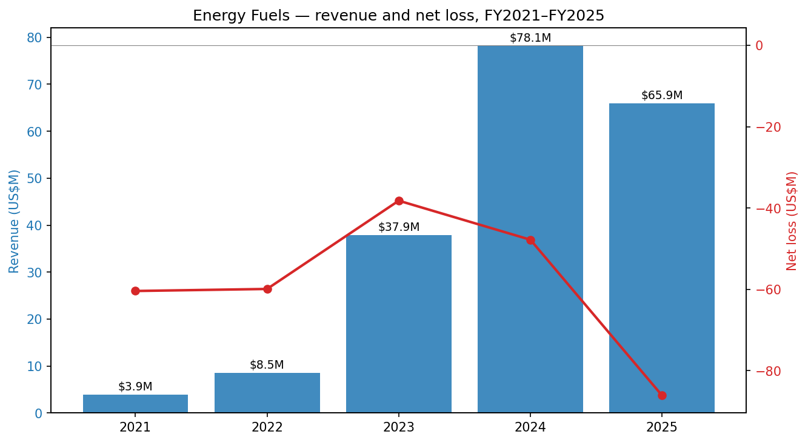
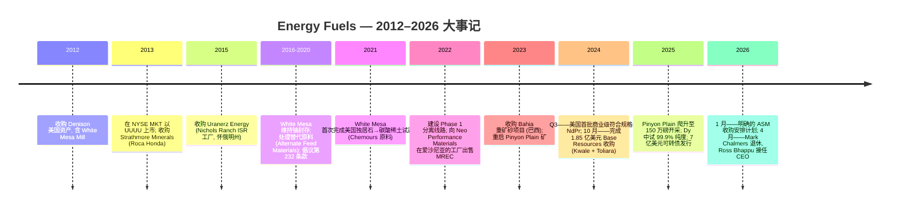
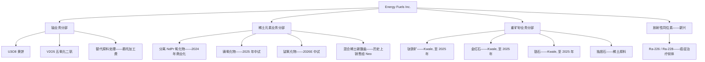
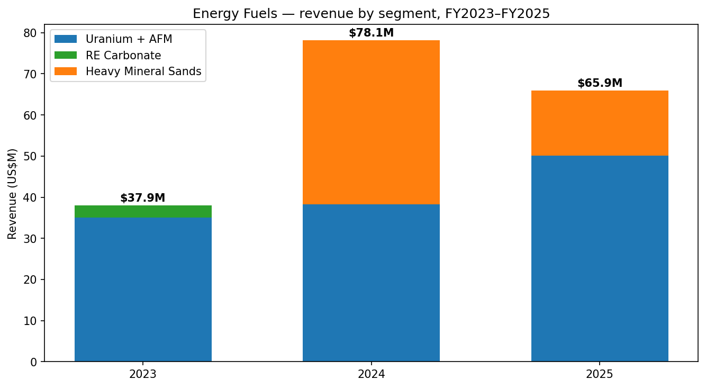
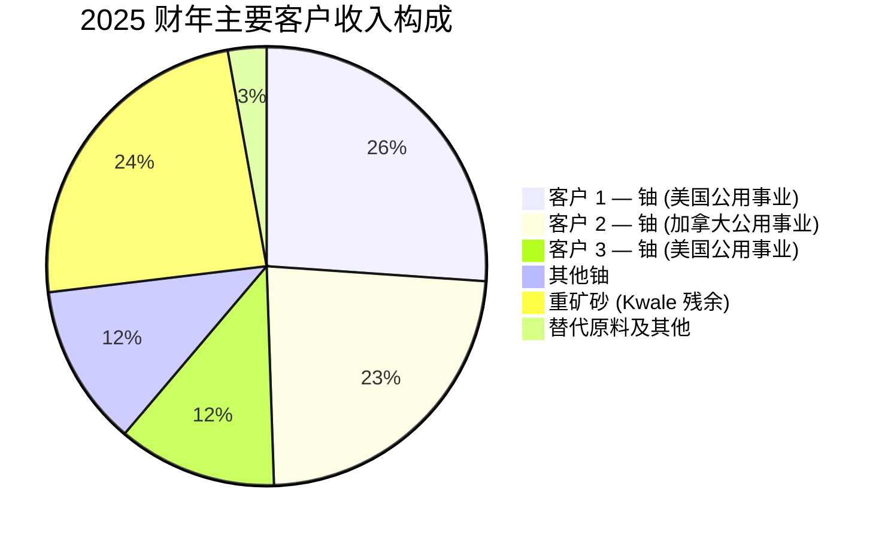
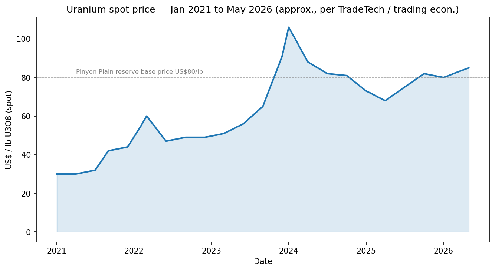
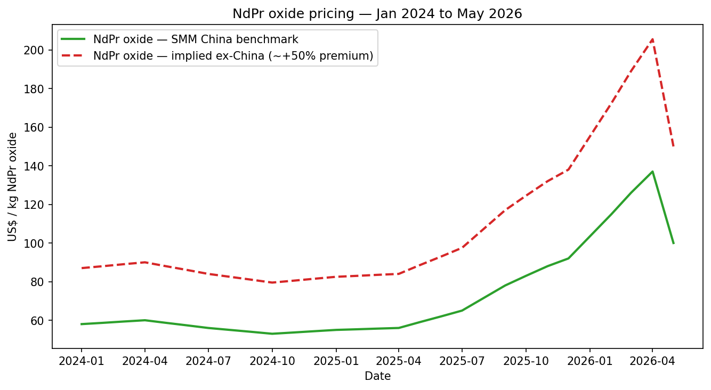
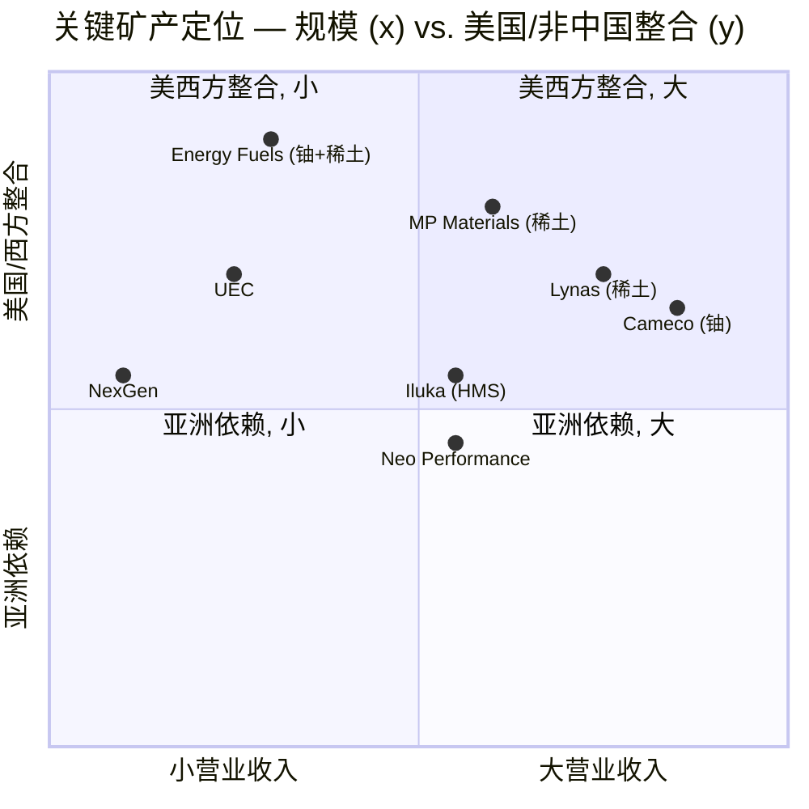
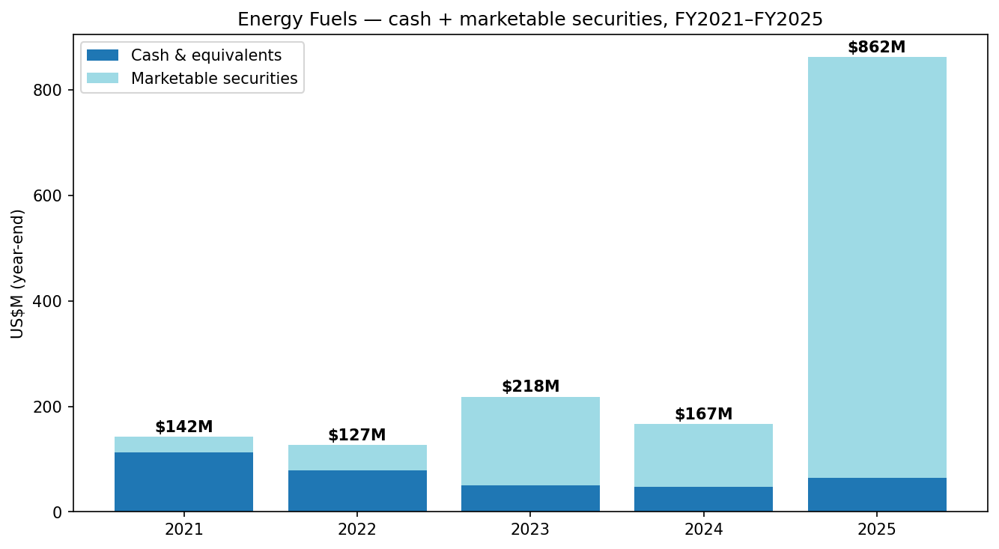
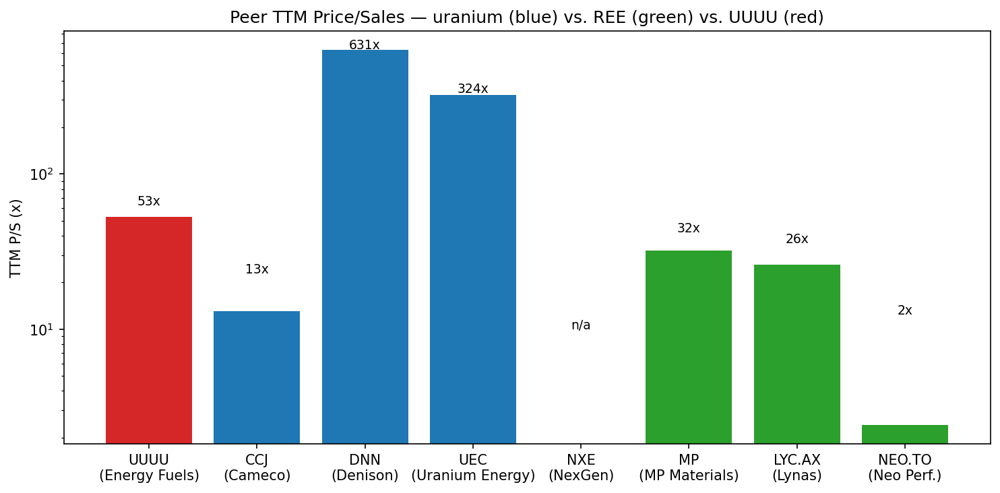

# Energy Fuels Inc. (NYSE American:UUUU) — 公司研究报告

**截至日期:** 2026-05-20
**分析师覆盖:** 启动覆盖
**上市地:** NYSE American (UUUU); 同时在多伦多证券交易所 (TSX:EFR) 与澳大利亚证券交易所 (ASX:EFR CDIs) 挂牌
**总部:** 美国科罗拉多州莱克伍德 (Lakewood, Colorado)
**审计师:** 毕马威 (KPMG LLP, 卡尔加里)
**报告语言: 简体中文 (英文版同时存在于本目录)**

> **业绩更新——2026 财年生产指引启动 (2026-02-20):** Energy Fuels 在其 2025 财年 10-K 中初次公布 2026 年经营指引: 开采 **2.0–2.5 百万磅 U3O8 (Mlbs U3O8)**、加工 1.5–2.5 百万磅成品磅、销售 1.5–2.0 百万磅; 当前 Pinyon Plain / La Sal 在 White Mesa Mill 工厂的混合加工预计加权平均开采+磨矿成本约为 **23–30 美元/磅 U3O8**, 在所有西方铀生产商中名列最低现金成本梯队。已披露的长期合约要求 2026 年向六家美国大型电力公用事业对手方交付 620,000–880,000 磅, 价格按固定上调机制或与市场挂钩定价。
> 来源: [Energy Fuels Inc. 2025 财年 10-K, 于 2026-02-20 提交 (Item 7, 第 197 页)](https://www.sec.gov/Archives/edgar/data/1385849/000138584926000009/0001385849-26-000009-index.htm)。

## 目录

1. 公司概览
2. 公司历史
3. 管理团队
4. 产品与服务
5. 客户与上市策略
6. 行业概览
7. 竞争格局
8. 市场机会 (TAM)
9. 风险评估

参考资料

---

## 1. 公司概览

Energy Fuels Inc. 是一家总部位于美国的关键矿产生产商, 过去五年间已从一家单一商品铀矿企业转型为一个聚焦三大可报告分部的多产品关键矿产平台: (i) **铀 (uranium)** (常规开采 + 原地浸出 ISR)、(ii) **稀土元素 (rare earth elements, REE)**、(iii) **重矿砂 (heavy mineral sands, HMS)** ([2025 财年 10-K, Item 1](https://www.sec.gov/Archives/edgar/data/1385849/000138584926000009/0001385849-26-000009-index.htm))。公司最具决定性的资产是位于美国犹他州布兰丁附近的 **White Mesa Mill 工厂**——这是美国唯一在产的常规铀磨矿厂, 也是当今西方世界唯一能够在商业规模上从独居石 (monazite) 中生产符合规格的分离 NdPr 氧化物 (钕镨氧化物) 的工厂 ([2025 财年 10-K, Item 2](https://www.sec.gov/Archives/edgar/data/1385849/000138584926000009/0001385849-26-000009-index.htm))。

**商业模式。** Energy Fuels 以中期合约形式向美国核电公用事业销售铀精矿 (U3O8); 向非中国磁体制造商销售分离稀土氧化物 (目前主要为 NdPr, Dy 镝与 Tb 铽处于中试规模); 历史上 (至 2024 年) 还销售来自肯尼亚 Kwale 重矿砂矿的钛铁矿 (ilmenite)、金红石 (rutile) 与锆石 (zircon)。多元化战略的核心逻辑是: 独居石作为含钍 (thorium) 和铀的磷酸盐, 是钛-锆重矿砂矿的副产品, 既可进入工厂现有的铀许可证范围, 又能进入新建的稀土分离线路, 从而使 Energy Fuels 在中国之外获得一个垂直整合的"开采→磨矿→分离氧化物"位势。

**规模。** Energy Fuels 报告 **2025 财年 (截至 2025-12-31) 合并营业收入 6,590 万美元, 净亏损 8,610 万美元**, 对比 2024 财年的 7,810 万美元营业收入和 4,780 万美元净亏损 ([2025 财年 10-K, Item 7, 第 199 页](https://www.sec.gov/Archives/edgar/data/1385849/000138584926000009/0001385849-26-000009-index.htm))。营业收入下滑反映了 Kwale 重矿砂矿的退出, 被 Pinyon Plain 矿爬产带来的铀产量增长部分抵消。**2026 年 Q1 营业收入反弹至 3,580 万美元** (相比 2025 年 Q1 的 1,690 万美元), 主要源于长期铀合约交付节奏, Q1 净亏损收窄至 1,100 万美元 ([2026 年 Q1 10-Q, 第 47 页](https://www.sec.gov/Archives/edgar/data/1385849/000138584926000021/0001385849-26-000021-index.htm))。截至 2025 年末, 营运资本为 **9.274 亿美元**, 包括 6,470 万美元现金与 **7.971 亿美元有价证券**, 系于 2025 年 10 月完成发行 7 亿美元、票面利率 0.75%、2031 年到期的可转换优先票据后所得 ([2025 财年 10-K, Item 7](https://www.sec.gov/Archives/edgar/data/1385849/000138584926000009/0001385849-26-000009-index.htm))。在 Base Resources 收购完成后, 员工规模处于数百人量级 (中低水平); 2025 财年 10-K 未按司法管辖区披露具体员工总数。

**资产分布。** Energy Fuels 运营位于亚利桑那州/犹他州的 White Mesa Mill 工厂和 Pinyon Plain 矿, 持有 Nichols Ranch ISR 项目 (怀俄明州, 已封存) 和 Sheep Mountain (怀俄明州), 并拥有或控制位于三大洲的重矿砂项目: 通过收购 Base Resources 获得 **Vara Mada (原名 Toliara, 位于马达加斯加)** 与 **Kwale (肯尼亚, 处于复垦阶段)**; 2023 年收购的 **Bahia (巴西)**; 以及与 Astron Corporation 在维多利亚州 (澳大利亚) 持有的 **Donald 项目 9.48% 选择性入股 JV 权益** ([2025 财年 10-K, Item 2](https://www.sec.gov/Archives/edgar/data/1385849/000138584926000009/0001385849-26-000009-index.htm))。2026-01-20, 公司宣布了一份明确的收购安排计划 (scheme of arrangement), 拟以股票加每股 0.13 澳元特别股息形式收购 **Australian Strategic Materials (ASX:ASM)**, 由此新增韩国忠清北道五昌的金属化与合金化工厂、新南威尔士州 Dubbo 多金属稀土矿床, 以及美国本土的预开发金属-合金能力——明确以此弥合西方稀土供应链中的"矿到金属与合金"缺口 ([2025 财年 10-K, Item 7, 第 194 页](https://www.sec.gov/Archives/edgar/data/1385849/000138584926000009/0001385849-26-000009-index.htm))。

*来源: [2025 财年 10-K, Item 7, 第 199 页](https://www.sec.gov/Archives/edgar/data/1385849/000138584926000009/0001385849-26-000009-index.htm) (FY2023–FY2025); 历史数据汇编自 [2023 财年 10-K, Item 7](https://www.sec.gov/cgi-bin/browse-edgar?action=getcompany&CIK=0001385849&type=10-K)。*

**估值快照 (2026-05-20)。** UUUU 收盘价 **18.05 美元**, 对应市值 **45.1 亿美元**, 企业价值 **39.6 亿美元** (总现金 9.107 亿美元, 总债务 6.775 亿美元——后者为 2031 年到期可转债扣除盖帽看涨期权 (capped call) 成本后的账面价值) ([Yahoo Finance — UUUU 关键统计, 访问日期 2026-05-20](https://finance.yahoo.com/quote/UUUU/key-statistics))。TTM 营业收入 8,490 万美元对应 **TTM 市销率约 53 倍**; TTM EBITDA 为负 8,100 万美元 (**EV/EBITDA −49×**), 因此追溯 P/E 不具备意义 (前瞻 P/E 约 3,608 倍, 反映出 2026 年仅有微薄盈利) ([Yahoo Finance, 2026-05-20](https://finance.yahoo.com/quote/UUUU/key-statistics))。市净率为 **6.4×**——资本密集型矿企通常在 1.5–3 倍账面价值区间交易, 因此当前溢价反映出工厂的战略选择权价值及有价证券缓冲。5 年股价区间为 **3.44 美元 — 27.72 美元**; 过去十二个月股价大约上涨 273% ([yfinance history, 2021–2026](https://finance.yahoo.com/quote/UUUU/history))。

**同业倍数 (TTM, 2026-05-20)。** 铀同业: Cameco (CCJ) 市值 461 亿美元, P/S 13×, P/E 98×; Denison (DNN) 市值 29.3 亿美元, P/S 631× (营业收入接近为零); Uranium Energy (UEC) 市值 65.5 亿美元, P/S 324×; NexGen (NXE) 市值 70.9 亿美元, 无营业收入。稀土同业: MP Materials (MP) 市值 111 亿美元, P/S 32×; Lynas (LYC.AX) 市值 187 亿美元, P/S 26×; Neo Performance Materials (NEO.TO) 市值 12.1 亿美元, P/S 2.4× ([Yahoo Finance 各代码关键统计页面, 访问日期 2026-05-20](https://finance.yahoo.com/))。UUUU 的 P/S 介于产生现金流的铀业老牌龙头 (Cameco 13×) 与尚无营业收入的铀业开发商 (UEC、DNN 300–600×) 之间, 更靠近 Lynas / MP 这类稀土综合生产商区间, 而非纯铀同业——这与当前市场给它的定价方式一致。

**为何倍数被拉高。** 53 倍 TTM P/S 与 6.4 倍 P/B 由四件事推动, 而非由盈利推动: (i) 完全融资到位的资产负债表, 使管理层无需通过股权稀释即可推进 Phase 2 扩建与 ASM 收购; (ii) 当今唯一在西方实现规模化运行的钕镨/镝/铽分离路线, 该路线本身在 2026 年随着中国出口许可证收紧而被重新定价 (详见第 6 章); (iii) Pinyon Plain 的选择权价值 (品位 1%–2% U3O8 的矿体——全球前十分位) 和 Vara Mada (FS 税后 NPV 18 亿美元、10% 折现率、IRR ≈25%) 的选择权价值; (iv) 相对于关键矿产主题 ETF 资金流的小型流通盘。对第 9 章的启示是: 这是一个由情绪/倍数驱动的标的; 任何叙事破裂 (中国放松出口管制、铀现货价跌破 60 美元/磅、ASM 交易告吹) 都可能导致倍数急剧压缩。

---

## 2. 公司历史

Energy Fuels 的源头可追溯到 1987 年, 当时它是一家在怀俄明州成立的铀勘探载体。现代 Energy Fuels Inc. ("EFI") 于 2006 年在加拿大安大略省重新注册成立, 并于 2010 年在多伦多证券交易所上市 ([2025 财年 10-K, Item 1](https://www.sec.gov/Archives/edgar/data/1385849/000138584926000009/0001385849-26-000009-index.htm))。决定性事件是 **2012 年收购 Denison Mines Holdings Corp. 的美国铀资产**, 包括 White Mesa Mill 工厂——这宗交易使公司获得了美国唯一在产的常规铀磨矿厂, 实际上定义了其后续战略。Energy Fuels 于 2013 年 12 月以"UUUU"代码在 NYSE MKT (现 NYSE American) 上市。

*来源: 时间线综合自 [2025 财年 10-K, Item 1 与 Item 7](https://www.sec.gov/Archives/edgar/data/1385849/000138584926000009/0001385849-26-000009-index.htm) 以及 [Energy Fuels 2024–2026 年新闻稿, SEC EDGAR 8-K 索引](https://www.sec.gov/cgi-bin/browse-edgar?action=getcompany&CIK=0001385849&type=8-K)。*

三次战略转向定义了现代公司。**第一次**, 2016–2020 年的封存决策: 福岛事故后铀现货价格跌破 25 美元/磅, 时任 CEO Steve Antony 及继任者 Mark Chalmers (2018 年 2 月接任 CEO) 下注以每年 500–1,500 万美元的替代原料 (Alternate Feed Materials, 放射性工业废料流) 维持 White Mesa 的牌照与运营, 而非关闭。这一押注保留了美国唯一的常规磨矿牌照及十年后转型至稀土加工所需的熟练劳动力 ([2025 财年 10-K, Item 1](https://www.sec.gov/Archives/edgar/data/1385849/000138584926000009/0001385849-26-000009-index.htm))。

**第二次**, 2020–2022 年的稀土转向。管理层认识到, 历史上被佛罗里达和乔治亚州钛矿厂当作含钍废料丢弃的独居石, 实际上被运往中国进行分离; 而 White Mesa 现有的 NRC 放射性物料牌照本已允许处理含钍原料。2021 年末以采购自 Chemours 的原料完成的首次商业规模独居石"破碎"加工, 使 Energy Fuels 成为半个多世纪以来美国首家从美国独居石中生产可销售稀土产品 (混合稀土碳酸盐, MREC) 的公司。这批 MREC 在公司于 2023–2024 年建成自家 Phase 1 溶剂萃取 (SX) 线路之前, 由 Neo Performance Materials 在爱沙尼亚进行委托分离。

**第三次**, 2024–2026 年的垂直整合冲刺。三项交易缝合了全球独居石供应链: **Astron / Donald 合资项目** (2024 年 9 月, 澳大利亚维多利亚州——Energy Fuels 可通过 1.83 亿澳元现金 + 1,750 万股票赚得最多 49% 权益); **以 1.85 亿美元现金 + 股份收购 Base Resources** (2024 年 10 月, 拿到肯尼亚已近枯竭但仍现金正流的 Kwale 业务以及马达加斯加规模大得多的 Toliara/Vara Mada 矿床); 以及 **拟议的 ASM 收购安排计划** (2026 年 1 月公告; 目标最早 2026 年 6 月完成), 由此新增新南威尔士州 Dubbo 多金属稀土矿床和韩国五昌运营中的金属-合金工厂 ([2025 财年 10-K, Item 7, 第 194–195 页](https://www.sec.gov/Archives/edgar/data/1385849/000138584926000009/0001385849-26-000009-index.htm))。战略逻辑——拥有矿山、拥有磨矿、拥有分离、拥有合金——明显是中国北方稀土/盛和模板的非中国版本。

值得注意的收购:

- **2012**: White Mesa Mill 工厂 + Henry Mountains 项目 (来自 Denison Mines)
- **2013**: Strathmore Minerals (Roca Honda, 新墨西哥州)
- **2015**: Uranerz Energy (Nichols Ranch ISR, 怀俄明州)
- **2023**: Bahia 重矿砂项目, 巴西 (现金)
- **2024 年 8 月**: RadTran LLC (TAT/放射性同位素平台)
- **2024 年 9 月**: Astron / Donald 项目 JV (澳大利亚)
- **2024 年 10 月**: Base Resources Ltd (Kwale + Toliara/Vara Mada)
- **2026 年上半年** (已公告): Australian Strategic Materials (Dubbo + 韩国合金工厂)

---

## 3. 管理团队

公司正在经历其历史上最重大的管理层变革。**Mark S. Chalmers 于 2026-04-15 退任 CEO**, 完成了与 **Ross R. Bhappu** 的有计划交接, 后者于 2025-08-04 出任总裁, 明确以接任 CEO 为目标进行培养 ([2026 年 DEF 14A, 第 29 页](https://www.sec.gov/Archives/edgar/data/1385849/000106299326002046/0001062993-26-002046-index.htm))。

**Ross R. Bhappu, 总裁兼 CEO (自 2026-04-15)。** Bhappu 是一位拥有 35 年矿业金融经验的资深人士, 持有科罗拉多矿业学院 (Colorado School of Mines) 矿产经济学博士学位以及亚利桑那大学 (University of Arizona) 冶金工程学士与硕士学位 ([2026 年 DEF 14A, 第 19 页](https://www.sec.gov/Archives/edgar/data/1385849/000106299326002046/0001062993-26-002046-index.htm))。他职业生涯起步于 Cyprus Minerals, 后转至 Newmont Mining 担任业务发展总监, 之后担任 GTN Copper Corporation CEO 三年。其职业生涯最具决定性的阶段是 1999–2024 年在 Resource Capital Funds 的近 25 年, 最终担任私募股权成熟基金负责人。关键的是, **Bhappu 在 2008 年收购 Mountain Pass (即后来成为 Molycorp 的稀土矿) 时起到了关键作用, 并于 2008–2013 年担任 Molycorp 董事会主席** ([2026 年 DEF 14A, 第 19 页](https://www.sec.gov/Archives/edgar/data/1385849/000106299326002046/0001062993-26-002046-index.htm))。Molycorp 这段履历是把双刃剑: Molycorp 是历史上与 Energy Fuels 今天试图打造的事业 (垂直整合的西方稀土) 最相近的对照, 而它在 2015 年因中国价格倾销摧毁 Mountain Pass Phase 1 重启的单位经济性后破产 (Chapter 11)。市场对此有两种解读——Bhappu 深谙这套打法和失败模式, 但中国以外的西方稀土经济仍然脆弱, 而他亲历过定义熊市观点的那种确切的失败模式。其 2025 财年基本工资为 55 万美元 vs. Chalmers 在最后一年的 64.6314 万美元; 差距在权益激励上有所收窄 ([2026 年 DEF 14A, 第 32 页](https://www.sec.gov/Archives/edgar/data/1385849/000106299326002046/0001062993-26-002046-index.htm))。按代理委托书董事长信函, Bhappu 在 2026 年的优先事项是"从增长模式过渡到稳态, 聚焦正现金流和持续盈利能力"。内部持股较为有限 (代理委托书列出入职时授予的初始股票期权); 他并非创始人。Mark Chalmers 退休后将作为带薪顾问继续服务两年。

**Mark S. Chalmers, 前 CEO (2018-02 至 2026-04-15)。** 尽管现已退休, Chalmers 是当前形态公司的设计师, 他的印记无处不在。他是澳大利亚/美国双国籍化学工程师, 拥有 40 年以上的铀业运营经验, 曾运营力拓 (Rio Tinto) 在纳米比亚的 Rössing 矿和 Heathgate 的 Beverley ISR 业务。在 Chalmers 任内, Energy Fuels (i) 在 2018–2022 年的低谷中维持 White Mesa 牌照; (ii) 开创了独居石→NdPr 的路线; (iii) 完成了 Base Resources 与 ASM 交易。按聘用协议, 他在退休后将作为带薪顾问继续服务两年 ([2025 财年 10-K, Item 7, 第 199 页](https://www.sec.gov/Archives/edgar/data/1385849/000138584926000009/0001385849-26-000009-index.htm))。

**Nathan R. Bennett, 首席财务官。** Bennett 由公司财务总监 (自 2022 年 8 月) 晋升为 CFO。来到 Energy Fuels 之前, 他在 Antero Midstream Corporation 担任财务总监近九年, 主导财会/资金/SEC 报告体系经历两次 IPO (Antero Midstream Partners LP 于 2014 年, Antero Midstream GP LP 于 2017 年) ([2026 年 DEF 14A, 第 19 页](https://www.sec.gov/Archives/edgar/data/1385849/000106299326002046/0001062993-26-002046-index.htm))。他职业生涯起步于普华永道 (PricewaterhouseCoopers) 丹佛与休斯敦能源业务部 (2007 年 1 月–2013 年 12 月)。持有犹他州立大学会计学硕士学位, 是科罗拉多州注册会计师 (CPA)。其 2025 财年 29.5 万美元基本工资较 2024 财年增加 12.1%。2025 年 10 月规模为 7 亿美元的可转债发行——Energy Fuels 迄今最大规模的资本市场交易——是 Bennett 入职 CFO 后的第一次重大考验, 而从 5 亿美元基础加 5,000 万美元绿鞋扩容至 7 亿美元并附加盖帽看涨期权, 被广泛解读为成功执行。

**David C. Frydenlund, EVP 兼首席法务官。** Frydenlund 在 Energy Fuels 任职 14 年 (自 2012 年), 是公司的"机构记忆"; 他曾任公司前任 CFO (2017–2022), 并持续担任总法律顾问/公司秘书。教育背景包括西门菲沙大学 (Simon Fraser)、芝加哥大学 (经济学与金融学 M.A.) 和多伦多大学 (J.D.)。他此前的职业生涯与 Energy Fuels 本身高度同源——他曾担任 Denison Mines Corp. 前身 International Uranium Corporation 的 VP 监管事务/总法律顾问/CFO, 而 Energy Fuels 在 2012 年正是收购了该载体的工厂业务 ([2026 年 DEF 14A, 第 20 页](https://www.sec.gov/Archives/edgar/data/1385849/000106299326002046/0001062993-26-002046-index.htm))。他的专长——多司法管辖区放射性物料牌照与原住民/部落土地法——非比寻常; 仅 Pinyon Plain 一项许可证, 就已被持续诉讼十余年。

**其他重要高管:** **Curtis Moore** (SVP 市场与公司发展, 是公司在大宗商品媒体中的公开形象); **Daniel Kapostasy** (VP 技术服务, 唯一一位非独立的、根据 S-K 1300 的合格人员 Qualified Person); **Bernard Bonifas** (VP ISR 运营, 40 年铀业经验, 法美双国籍——如 Nichols Ranch 重启投运将至关重要); **Logan Shumway** (VP 常规运营, 实际运营 White Mesa 的工厂厂长); **Debra Bennethum** (VP 关键矿产与战略供应链, 招募自通用汽车 (General Motors), 在通用主导"执行了超 15 亿美元的电动汽车新关键矿产项目" ([2026 年 DEF 14A, 第 19 页](https://www.sec.gov/Archives/edgar/data/1385849/000106299326002046/0001062993-26-002046-index.htm)))——她的加入释放出直接 OEM 包销意向信号; **Dr. Saleem Drera** (VP 放射性同位素, 已被收购的 RadTran LLC 创始人, 主持靶向 α 治疗的镭回收倡议)。

**治理结构。** 董事会将在 2026 年 6 月年度股东大会上从九席独立董事缩减为七席, J. Birks Bovaird 与 Alexander G. Morrison 不再寻求连任 ([2026 年 DEF 14A, 第 9 页](https://www.sec.gov/Archives/edgar/data/1385849/000106299326002046/0001062993-26-002046-index.htm))。董事长为 Bruce D. Hansen (前 General Moly CEO, 之前为 Newmont SVP)。董事会矿业专业深度对一家 45 亿美元小盘股而言极为罕见: Hansen (矿业)、Stirzaker (Base Resources 前任主席, 矿业金融)、Higgs (Uranerz 创始人, 在 2015 年那次收购后进入董事会)、Eshleman (铀矿租赁)。10-K 摘要未披露内部持股情况; 按代理委托书"证券持股"表, 已点名的高管合计持股不足 1%, 这与一家寿命较长的美籍矿业发行人 (而非创始人控股载体) 一致。高管薪酬高度偏向权益 (2025 年时任 CEO Chalmers 的 LTIP 是以含 24 家公司的"市场表现同业组"作为基准设定的, 该同业组包括 Cameco、MP Materials、Lynas、NexGen、Iluka 与 Tronox)。过去五年薪酬与 TSR 挂钩, 期间公司 TSR 累计上涨 241% 以上 (按代理委托书披露) ([2026 年 DEF 14A, 第 23 页](https://www.sec.gov/Archives/edgar/data/1385849/000106299326002046/0001062993-26-002046-index.htm))。CEO 与员工中位数薪酬比 (针对 Chalmers) 披露为 11.7:1——按标普 500 标准属于温和水平, 反映了工会化的工厂员工队伍。

**业绩回顾综合。** Chalmers / Frydenlund / Moore 时代交付了: (a) 度过 2018–2022 年铀业熊市; (b) 全球首个非中国、非爱沙尼亚/法国的商业 NdPr 分离; (c) 三项重大并购, 且未通过 2022 年小规模 ATM 之外的股权稀释完成。他们尚未交付的: 正经营利润、Vara Mada 的最终投资决策、以及对股东的资本返还。Bhappu 继承了战略和 9.27 亿美元营运资本; 他需要证明的是, Phase 2 扩建 (4.1 亿美元资本开支) 能否完成融资, 并在中国周期定价下赚到其资本成本。

---

## 4. 产品与服务

Energy Fuels 销售五大类不同的产品族, 加上正在兴起的第六大类——TAT 放射性同位素。投资组合按分部清晰拆分。

**铀精矿 (U3O8)——现金引擎。** 目前唯一具备实质收入的产品。2025 财年铀精矿销售额为 **4,820 万美元 (总收入的 73%)**, 销量较 2024 年增长, 但合约交付组合导致已实现售价小幅下降 ([2025 财年 10-K, Item 7, 第 200 页](https://www.sec.gov/Archives/edgar/data/1385849/000138584926000009/0001385849-26-000009-index.htm))。产量主要来自亚利桑那州北部的 **Pinyon Plain 矿**——仅 2025 年该矿就生产了 47,200 吨 1.62% 品位的矿石 (含 1.534 百万磅 U3O8), 加上 La Sal Complex 的较小产量。Pinyon Plain 是世界上仅次于 Cigar Lake 的第二高品位铀矿。物料在 White Mesa Mill 工厂 (持牌 2,000 吨/日产能) 处理。**结论: 是——具有竞争优势。** 护城河类型: 监管/规模。该工厂是美国唯一在产的常规铀磨矿厂, 持有犹他州 1980 年初次发放的放射性物料牌照——重新复制这一牌照大约需要十年和超过 10 亿美元。Pinyon Plain 的矿石品位 (是行业平均的 10–20 倍) 使 2026 年加权平均开采+磨矿成本预计为 **23–30 美元/磅 U3O8**, 而现货价约 85 美元/磅。最接近的竞品: Cameco 的 Cigar Lake 精矿 (萨斯喀彻温省)——品位相当, 规模占优; UEC 的 Christensen Ranch (怀俄明 ISR)——品位落后, 美国本土定位相似。

**五氧化二钒 (V2O5)。** Energy Fuels 持有约 905,000 磅成品 V2O5 库存, 估计在工厂尾矿浸出液中还有 100–300 万磅 ([2025 财年 10-K, Item 7, 第 196 页](https://www.sec.gov/Archives/edgar/data/1385849/000138584926000009/0001385849-26-000009-index.htm))。自 2023 年以来未售出 V2O5, 因为价格仍低于公司边际回收成本。**结论: 部分。** 该工厂的钒回路是美国仅有的两条之一; 若钒液流电池需求兴起, 这将成为有意义的选择权。

**分离 NdPr 氧化物——战略主角。** 这是对长期投资逻辑次重要的产品。Energy Fuels 在 2024 年 Q3 成为美国首家在商业规模上从 Chemours 的佛罗里达/乔治亚钛砂业务采购独居石、生产符合规格分离 NdPr 的公司 ([2025 财年 10-K, Item 7, 第 192 页](https://www.sec.gov/Archives/edgar/data/1385849/000138584926000009/0001385849-26-000009-index.htm))。在 2025 全年, 公司仅销售了 1.7 吨 (向 POSCO International 提供样品认证用) ——商业级 NdPr 收入尚未启动, 资产负债表上有 34 吨库存。Phase 1 设计产能: 在原料 8,000–10,000 吨/年独居石的基础上, 年产 850–1,000 吨 NdPr + 35 吨 Dy + 12 吨 Tb (2027 年增强后)。**结论: 是——具有竞争优势。** 护城河类型: 监管 (中国以外仅有 3 家有资质处理含钍独居石的工厂——Lynas 卡尔古利、Solvay 拉罗谢尔、White Mesa); 美国先行者; 一旦 ASM 完成后向下游垂直整合。最接近的竞品: **MP Materials Mountain Pass** 分离 NdPr (基于氟碳铈矿——矿物学不同、不含独居石经济性, 但目前规模远大于本公司——产量领先, 但重稀土选择权落后); Lynas 的 Mt. Weld NdPr (规模领先, 同为非中国定位)。

**镝与铽氧化物。** Energy Fuels 于 2025 年 8 月在中试规模上宣布首次产出 99.9% 纯度氧化镝——号称是公开报告的美国首批 Dy 产量 ([2025 财年 10-K, Item 7, 第 193 页](https://www.sec.gov/Archives/edgar/data/1385849/000138584926000009/0001385849-26-000009-index.htm))。截至 2025 年末累计 29 公斤。Tb 中试预计 2026 年初启动。两者都是"重"稀土, 而中国目前在精炼供应方面几乎掌握 100% (中国以外仅有少量俄罗斯与越南量)。**结论: 部分——Phase 1 扩建于 2027 年投产后变得有意义。** 护城河类型: 监管 + 西方先行者。最接近的竞品: Lynas 在 Mt. Weld 计划的重稀土分离 (2024 年公告, 投产进度落后); 目前无美国本土同业。

**钛铁矿/金红石/锆石 (HMS)——遗留业务流。** 自 2013 年至 2024 年末从 Kwale (肯尼亚) 销售。开采于 2024 年 12 月停止; 最后一批出货于 2025 年 4 月。2025 财年 HMS 收入 1,580 万美元为库存清理; 在 Vara Mada 或 Donald 投产前, 不会有更多 HMS 收入。**结论: 当前不具备竞争优势**——Kwale 是个枯竭末期资产, 当初收购主要是为了独居石副产品技术与 Vara Mada 矿床。

**替代原料处理。** 一项委托磨矿服务: 工厂接收含铀工业废料流 (稀土尾矿、独居石、特定美国能源部退役物料) 进行铀回收。仅产生少量收入 (2025 财年 187 万美元), 但结构上至关重要——它保留的牌照与运营 know-how 才使得稀土转向成为可能。**结论: 部分。** 最接近的竞品: 无。这是真正独一无二的业务。

**TAT 放射性同位素 (镭回收)。** Energy Fuels 于 2024 年 8 月收购 RadTran LLC, 获得从铀和稀土过程料流中提取 Ra-226 和 Ra-228 用于靶向 α 治疗 (targeted alpha therapy) 抗癌药物的知识产权。美国目前没有镭供应商 ([2025 财年 10-K, Item 7, 第 191 页](https://www.sec.gov/Archives/edgar/data/1385849/000138584926000009/0001385849-26-000009-index.htm))。**结论: 仅为选择权。** 最接近的竞品: 拜耳 (目前从海外反应堆获取 Ra-223)、TerraPower、ITM Isotope Technologies Munich——全部依赖非美国供应。2027 年前无收入预测。

*来源: [2025 财年 10-K, 附注 18 — 分部信息, 第 250–252 页](https://www.sec.gov/Archives/edgar/data/1385849/000138584926000009/0001385849-26-000009-index.htm)。*

**旗舰产品与长尾。** 当前的旗舰是**来自 Pinyon Plain → White Mesa 的铀精矿** (2025 财年 6,600 万美元总收入中的 4,800 万美元)。到 2028 年, 战略旗舰意在变成**分离 NdPr/Dy/Tb 氧化物**, 在 Phase 1 扩建 (2027 年) 和 Phase 2 (2029 年) 投产后, 合并 NdPr 产能将达 6,000 吨/年以上、Dy 200 吨/年、Tb 60 吨/年, 而当前全球中国以外 NdPr 市场约 5,000 吨/年 ([2025 财年 10-K, Item 7, 第 192 页](https://www.sec.gov/Archives/edgar/data/1385849/000138584926000009/0001385849-26-000009-index.htm))。

**过去 12 个月发布。** (i) 2025 年 8 月——首次 99.9% Dy 中试运行; (ii) 2025 年 8 月——与 Vulcan Elements 签署美国稀土永磁 (REPM) 供应链 MoU; (iii) 2025 年 9 月——首批 NdPr→EV 电机商用 REPM 通过韩国最大 EV 驱动电机制造商认证 (1.2 吨 NdPr → 3.0 吨 REPM → 约 1,500 辆车); (iv) 2025 年 10 月——澳大利亚出口融资署 (Export Finance Australia) 为 Donald 项目出具 8,000 万澳元的有条件支持函; (v) 2026 年 1 月——Vara Mada 可行性研究 (38 年寿命、税后 NPV 18 亿美元、IRR 约 25%、稳态年 EBITDA 5 亿美元); (vi) 2026 年 1 月——Phase 2 银行可融资可行性研究 (4.1 亿美元资本开支, 2029 年中目标投产); (vii) 2026 年 1 月——ASM 收购安排计划; (viii) 2026 年 3 月——Pinyon Plain Juniper Zone 已证实+可信储量更新。**退出业务:** Kwale 重矿砂业务于 2024 年 12 月停采 (最后库存于 2025 年 4 月售出)。

---

## 5. 客户与上市策略

**铀。** Energy Fuels 通过六份长期合约向美国核电公用事业销售 U3O8, 合约累计要求 **2026–2032 年间交付 3.21–5.29 百万磅** 的基础、最低与最高数量 ([2025 财年 10-K, Item 7, 第 197 页](https://www.sec.gov/Archives/edgar/data/1385849/000138584926000009/0001385849-26-000009-index.htm))。这些合约的定价是基础上调机制与市场关联公式的组合; 已披露的 2026 年合约范围为 620,000–880,000 磅。**客户集中度具实质性**: 按 2025 财年附注 18, 2025 年有三家客户各自超过合并销售的 10%——**客户 1: 1,716 万美元 (26.0%)**、**客户 2: 1,537 万美元 (23.3%)**、**客户 3: 770 万美元 (11.7%)**——合计**占总收入 61.0%, 全部为铀** ([2025 财年 10-K, 附注 18, 第 251 页](https://www.sec.gov/Archives/edgar/data/1385849/000138584926000009/0001385849-26-000009-index.htm))。2024 财年组合则不同: 客户 1 占 19.2%、客户 4 (HMS) 占 13.9%、客户 5 (铀) 占 11.0%——前五大合计 56.5%。**Top-1 份额已从 19% (2024 财年) 升至 26% (2025 财年); Top-3 为 61%。** 公司未公开公用事业对手方名称 (符合行业惯例, 因核燃料合约属商业机密), 但国家组合——3,340 万美元销售给美国客户、1,540 万美元销售给加拿大客户——暗示较大对手方是几家美国投资者所有电力公用事业 (IOU) 与一家加拿大皇家核电运营商的组合。合约结构: 多年期固定数量主协议, 配以年度交付选项; 而非"逐订单"模式。无任何头部客户被披露为正在向铀矿开采上游一体化 (这对美国公用事业而言是前所未有的)。

**带入第 9 章作为实质性风险:** Top-1 > 20% 且 Top-5 > 50% 触发风险分类中定义的阈值。合约缓解了一年期断崖风险, 但 2027–2032 年的交付管道取决于同样这六家公用事业的续约或延期——重新签约是 2026–2027 年的关键催化剂。

*来源: [2025 财年 10-K, 附注 18 — 主要客户, 第 251 页](https://www.sec.gov/Archives/edgar/data/1385849/000138584926000009/0001385849-26-000009-index.htm)。*

**稀土。** 客户基础仍在建设中。迄今为止, 唯一的商业 NdPr 销售为 2025 年向 POSCO International 提供的 1.7 吨认证批次, 加上 2025 年 9 月公告: 公司的 NdPr 被"韩国最大 EV 驱动单元电机芯生产商" (几乎可以确定是 Sungrim 或 Star Group) 加工成 3.0 吨磁体, 于 2025 年 Q4 安装在销往北美、欧盟、日本和韩国的 EV 上 ([2025 财年 10-K, Item 7, 第 193 页](https://www.sec.gov/Archives/edgar/data/1385849/000138584926000009/0001385849-26-000009-index.htm))。**Vulcan Elements MoU** (2025 年 8 月) 承诺 Energy Fuels 向 Vulcan 计划中的美国 REPM 工厂供应 NdPr 与 Dy 氧化物, "用于验证"以达成潜在的长期供应协议。Vulcan Elements 是风险投资支持、尚未投产; 商业价值取决于 Vulcan 能否实现规模化。ASM 收购完成后, 将把 ASM 现有的包销意向书账簿——现代-起亚、韩国资源公社等——直接并入 Energy Fuels。

**重矿砂。** 历史上 Kwale 的钛铁矿/金红石/锆石销售给约 12 家氯化法颜料生产商 (Tronox、Chemours、Venator)、中国硫酸法颜料生产商, 以及沙特/日本锆陶瓷客户。2025 财年 1,580 万美元 HMS 收入流向: 中国 (310 万美元)、日本 (275 万美元)、沙特 (350 万美元)、荷兰, 以及美国本土颜料生产商 ([2025 财年 10-K, 附注 18, 第 251 页](https://www.sec.gov/Archives/edgar/data/1385849/000138584926000009/0001385849-26-000009-index.htm))。Kwale 关闭后, 下一波 HMS 收入流 (2027E 的 Donald 或 2020 年代末的 Vara Mada) 将到达一个不同的定价环境。

**上市策略与合作。** 没有传统的销售团队。铀业务通过每年三或四次的公用事业采购 RFP, 由 Curtis Moore 商务团队准备; 稀土销售则为双边、主要直接谈判。关键战略合作伙伴: **Chemours** (自 2021 年起的独居石原料供应)、**Neo Performance Materials** (历史 MREC 委托分离客户; 如今可能成为竞争对手)、**Astron** (Donald JV 合作伙伴)、**Vulcan Elements** (下游磁体 MoU)、**POSCO International** (NdPr 包销)、**韩国资源公社/KEXIM** (通过 ASM)。政策层面: 一份 2025 年 1 月明确的**纳瓦霍族 (Navajo Nation) 合作协议**, 用于清理冷战时期遗弃的铀矿 (Abandoned Uranium Mines, AUM), 定位公司争取联邦 AUM 资金 ([2025 财年 10-K, Item 7, 第 190 页](https://www.sec.gov/Archives/edgar/data/1385849/000138584926000009/0001385849-26-000009-index.htm))。

---

## 6. 行业概览

Energy Fuels 横跨三个商品行业——铀、稀土与重矿砂——它们在 White Mesa 持牌的处理流程上交汇, 但其他方面供需基本面差异很大。

**铀 (一次开采行业全球 80–120 亿美元/年)。** 需求由全球约 440 座在运反应堆决定, 每年消耗约 190 百万磅 U3O8, 而一次矿山供应仅约 140 百万磅——结构性缺口由如今受政治约束的俄罗斯/哈萨克次级库存填补 ([TradeTech 铀市场研究, 2025 第 4 期, 摘录于 2025 财年 10-K, Item 7, 第 184 页](https://www.sec.gov/Archives/edgar/data/1385849/000138584926000009/0001385849-26-000009-index.htm))。自 2022 年以来, 行业发生了两次结构性转变: (i) 俄罗斯入侵乌克兰触发西方制裁和 2024 年 5 月美国《禁止俄罗斯铀进口法》, 该法案到 2028 年完全停止俄罗斯 U3O8 进入美国; (ii) AI 驱动的数据中心电力需求推动微软、亚马逊、谷歌和 Meta 在 2024–2025 年签署多个数十亿美元规模的核能 PPA, 复活了电厂重启 (Three Mile Island/Crane) 并促使首批小型模块化反应堆 (SMR) 采购。

铀现货价格从福岛后 20 美元/磅的低位, 升至 2024 年 1 月 100 美元/磅以上, 于 2025 年中回落至约 65 美元/磅, 并在 **2026 年 5 月** 恢复至大约 **85 美元/磅** ([Trading Economics — 铀价, 访问日期 2026-05-20](https://tradingeconomics.com/commodity/uranium); [Sprott Physical Uranium Trust, 2026-05](https://sprott.com/investment-strategies/exchange-listed-products/physical-commodity-funds/uranium/))。据 TradeTech 报告, 长期合约价格在 2025 年末达到 90 美元/磅 ([2025 财年 10-K, Item 7](https://www.sec.gov/Archives/edgar/data/1385849/000138584926000009/0001385849-26-000009-index.htm))。

*来源: 月度现货价格近似采用 [TradeTech 周度指标](https://www.uranium.info/daily_U3O8_spot_price_indicator.php) 与 [Trading Economics — 铀大宗商品历史](https://tradingeconomics.com/commodity/uranium); 叙述见 [2025 财年 10-K, Item 7, 第 184 页](https://www.sec.gov/Archives/edgar/data/1385849/000138584926000009/0001385849-26-000009-index.htm)。*

生产侧呈寡头结构: Kazatomprom (哈萨克斯坦, 国有, 约占供应 22%)、Cameco (加拿大, 约 12%)、Orano (法国, 约 10%)、Uranium One (俄罗斯/Rosatom)、CGNPC (中国), 加上其他中型上市公司长尾 (CCJ、BHP/Olympic Dam、Paladin、Ur-Energy、UEC、NXE、Energy Fuels) 占其余部分。监管十分严格 (NRC、EPA、土地管理局 BLM、州政府、部落)。公用事业的转换成本高——燃料认证需 3–5 年。

**稀土 (100–150 亿美元/年精炼氧化物市场)。** 该行业由中国主导, 程度堪比无任何其他商品: 引自 10-K 中国际能源署 (IEA) 数据, **中国生产约 90% 的精炼稀土产品**, 并实际控制 100% 的精炼重稀土及下游金属/磁体制造 ([2025 财年 10-K, Item 1, 第 28 页](https://www.sec.gov/Archives/edgar/data/1385849/000138584926000009/0001385849-26-000009-index.htm))。需求驱动因素 (按行业预测机构 Adamas Intelligence 数据, Energy Fuels 引用): 至 2040 年 NdPr/Dy/Tb 钕铁硼磁体需求 CAGR 约 8.7%, 主要来自 EV/混动 EV、先进机器人、风电涡轮机和国防——而全球产量增长只有约 5.1% ([2025 财年 10-K, Item 7, 第 191 页, 引用 Adamas Intelligence](https://www.sec.gov/Archives/edgar/data/1385849/000138584926000009/0001385849-26-000009-index.htm))。

2025–2026 年决定性事件是**中国出口管制升级**。在 2025 年初对镝/铽实施出口许可证后, 加上 2026 年 4 月将更多稀土分离工艺纳入出口管制清单, NdPr 氧化物从 2024 年末约 53 美元/公斤上涨至 2026 年最高约 137 美元/公斤, 后在中国国内 SMM 基准价上回落至 2026 年 5 月的约 100 美元/公斤, 而中国境外离岸 FOB 价格高出 50–63% ([Mining Weekly — NdPr 氧化物价格预计上涨至 90,000 美元/吨, 2026-02-02](https://www.miningweekly.com/article/ndpr-oxide-price-forecast-to-rise-to-90-000t-this-year-report-2026-02-02); [Rare Earth Mining — 2026 年 3 月稀土市场展望](https://rare-earth-mining.com/rare-earth-market-pricing-analysis-march-2026/); [Mining.com — MP Materials 暂停对华出货, 稀土价格创两年新高](https://www.mining.com/rare-earth-prices-at-two-year-high-as-mp-materials-halts-china-shipments/))。结构性解读: 中国出口管制已造成一个永久性的两级市场, 西方 OEM 为可验证非中国供应支付显著溢价。

*来源: [Critical Minerals News — NdPr 现货价格历史与预测](https://critical-minerals-news.com/rare-earths-price/); [Mining Weekly, 2026-02-02](https://www.miningweekly.com/article/ndpr-oxide-price-forecast-to-rise-to-90-000t-this-year-report-2026-02-02); [Rare Earth Mining, 2026 年 3 月](https://rare-earth-mining.com/rare-earth-market-pricing-analysis-march-2026/)。*

**重矿砂 (50–60 亿美元/年行业, 钛铁矿+金红石+锆石+独居石)。** 远小于铀或稀土行业, 且周期性更强, 需求对二氧化钛颜料 (涂料、塑料) 消费和锆陶瓷需求敏感。西方颜料生产商 (Tronox、Chemours、Venator、Kronos) 受中国硫酸法颜料竞争和 2024–2025 年欧洲化工衰退挤压; 钛铁矿/金红石价格维持低迷。锆石价格在 Iluka 和 Tronox 削减供应后于 2026 年 Q1 企稳 ([2026 年 Q1 10-Q, 第 41 页](https://www.sec.gov/Archives/edgar/data/1385849/000138584926000021/0001385849-26-000021-index.htm))。独居石——Energy Fuels 的真正目标——通常是钛铁矿开采的 1–2% 副产品, 历史上被丢弃; 其价格如今与上涨的稀土市场挂钩, 且按管理层评述, 2025 至 2026 年 Q1 已上涨。

**监管环境。** 三层结构: (i) **联邦关键矿产政策**——通胀削减法案 (IRA) 30D 车辆抵免要求美国/FTA 来源的关键矿产 (NdPr 在名单上); 国防生产法第三章 (Title III) 自 2020 年起被援引以资助稀土分离; 2024 年美国对俄铀禁令; (ii) **州一级**——犹他州工厂环保许可证、亚利桑那州/怀俄明州采矿许可证; (iii) **多边**——马达加斯加矿业法、澳大利亚外资审查 (针对 ASM 交易)、肯尼亚复垦规则。

---

## 7. 竞争格局

由于 Energy Fuels 横跨两个不同的行业, 其竞争集合也分为两类。

**铀业竞争对手。**
- **Cameco Corporation (TSX/NYSE:CCJ)。** 市值 461 亿美元, TTM 营业收入 35 亿美元 ([Yahoo Finance, 2026-05-20](https://finance.yahoo.com/quote/CCJ))。西方主导生产商 (Cigar Lake、McArthur River)。垂直整合, 含转化 (UF6) 和 Westinghouse Electric 持股。在美国公用事业长期合约方面是直接竞争对手。**领先**在规模、资产负债表和下游整合; **持平**在资源基础质量; **落后**在关键矿产多元化。
- **Uranium Energy Corp (NYSE American:UEC)。** 市值 65.5 亿美元。专注 ISR (怀俄明、得州), 近期收购 UEX 和 Uranium One 美国资产。**落后**在运营产量但具备规模选择权; **持平**在美国本土定位。
- **Denison Mines (NYSE American:DNN)。** 市值 29.3 亿美元, 处于投产前。拥有萨斯喀彻温阿萨巴斯卡盆地的 Phoenix ISR 开发项目。**落后**在投产时点; **持平**在资源质量。
- **NexGen Energy (NYSE:NXE)。** 市值 70.9 亿美元, 处于投产前。拥有萨斯喀彻温的 Arrow 矿——可以说是世界上品位最高的未开发铀矿床。**落后**在近期产量; **领先**在长期资源规模。
- **Paladin Energy (ASX:PDN)。** 2024 年重启纳米比亚 Langer Heinrich 矿。
- **Boss Energy (ASX:BOE)、Peninsula Energy (NYSE American:PEN)、Ur-Energy (NYSE American:URG)。** 较小型 ISR 生产商; 与 UEC 和封存中的 Nichols Ranch 项目直接重叠。

**稀土竞争对手。**
- **MP Materials (NYSE:MP)。** 市值 111 亿美元, TTM 营业收入 3.48 亿美元, 美国唯一在产的稀土矿 (加州 Mountain Pass, 氟碳铈矿)。MP 拥有 Phase 1 (精矿出口中国)、Phase 2 (现场分离 NdPr, 正在爬产) 和 Phase 3 (通过 Fort Worth 和 Las Vegas DoD 资助的设施做金属/合金/磁体)。最直接的美国稀土竞争对手。**领先**在规模 (约 5,000 吨 NdPr 产能 vs Energy Fuels Phase 1 的 850–1,000 吨)、客户账簿 (通用汽车包销、DoD 伙伴关系) 和当今下游整合; **持平**在美国本土定位; **落后**在重稀土选择权 (Mountain Pass 氟碳铈矿偏重轻稀土; UUUU 的独居石含 Dy/Tb)。
- **Lynas Rare Earths (ASX:LYC)。** 市值 187 亿美元, TTM 营业收入 7.16 亿美元。Mt. Weld (西澳) → Kuantan (马来西亚) → Kalgoorlie (澳, 2024 年新建重稀土分离) → 得州 (美国 DoD 资助重稀土工厂, 2025–2026 年投运)。最大的非中国综合稀土生产商。**领先**在规模、下游认证和运营实绩; **持平**在重稀土战略 (双方均瞄准 2027 年 Dy/Tb 商业化生产)。
- **Neo Performance Materials (TSX:NEO.TO)。** 市值 12.1 亿美元, TTM 营业收入 5.12 亿美元。运营爱沙尼亚 Silmet 稀土分离厂 (前苏联遗留) 和泰国磁性材料厂。Energy Fuels 的历史客户 (2022–2023 年接受 MREC 委托分离); 如今随双方均进入分离氧化物领域, 可能成为竞争对手。
- **Australian Strategic Materials (ASX:ASM)。** 即将成为 Energy Fuels 子公司; 当前与 Energy Fuels 在 OEM 包销方面存在竞争。
- **Arafura Rare Earths (ASX:ARU)。** 投产前。Nolans 项目按 NdPr 长期价计 NPV 约 15 亿美元。
- **Ucore Rare Metals (TSX-V:UCU)、Texas Mineral Resources、Rare Element Resources。** 较早期的美国小型公司。

**重矿砂竞争对手。** Iluka Resources (ASX)、Tronox Holdings (NYSE:TROX)、Kenmare Resources (LSE:KMR)、Image Resources (ASX:IMA)、Rio Tinto (Richards Bay)。与 Energy Fuels 投资逻辑相关性较低, 因 HMS 如今只是通往独居石的途径, 而非产品本身。

**Energy Fuels 的竞争优势。** (1) **White Mesa 牌照护城河**——美国唯一在产的常规铀磨矿厂, 持有处理含钍独居石的牌照; 从头复制约需 10 年和 10 亿美元以上。(2) **垂直整合、多商品流程**——铀业收入补贴稀土爬产, 直至分离规模化; 竞争对手是单商品。(3) **Pinyon Plain 矿石品位**——实际探明品位 1.62% U3O8, 是世界上最高品位之一, 现金成本 23–30 美元/磅。(4) **美国首家非中国独居石商业 NdPr 生产商**——真正的技术先行者。(5) **资产负债表**——可转债发行后营运资本 9.27 亿美元, 为资本开支提供 3 年以上的无稀释跑道。

**竞争脆弱性。** (1) 当前规模远低于 MP 和 Lynas。(2) Vara Mada 和 Donald 投产前严重依赖第三方独居石 (Chemours)。(3) 当前不具金属化/合金化能力 (ASM 交易将弥补这一缺口, 但有执行风险)。(4) 地理分散 (美国工厂、马达加斯加矿、澳洲 JV、巴西勘探、ASM 完成后的韩国合金厂) 带来运营/政治风险。(5) 没有创始人 CEO 范式; 在关键一年顶层人事变动。

---

## 8. 市场机会 (TAM)

**铀 TAM。** 全球 U3O8 当前需求约 190 百万磅/年, 据 WNA 预测到 2040 年将增长至 300+ 百万磅/年, 驱动因素包括反应堆重启、寿命延长、中国新建 (2035 年 200 GW 核电目标) 以及 SMR 部署。按 85 美元/磅现货价计, 当前年度 TAM 约 160 亿美元; 按长期合约价和 2040 年规模, 250–300 亿美元。仅美国公用事业可服务可寻址市场约 50 百万磅/年。Energy Fuels 2026 年销售约 1.5–2 百万磅, 暗示全球市场份额不到 1%, 美国公用事业需求约 3–4%——随着 Pinyon Plain 爬产、Nichols Ranch 重启与 Roca Honda 开发, 仍有大量份额增长空间。2024 年美国《禁止俄罗斯铀进口法》通过迫使美国公用事业替换约 14 百万磅/年俄罗斯来源物料, 实质性扩大 SOM。

**稀土 TAM。** Adamas Intelligence 预测**仅 NdPr 氧化物市场到 2030 年达 150–200 亿美元** (CAGR 体量约 9% + 2026 年价格跃迁), 到 2040 年达 300 亿美元以上 ([2025 财年 10-K, Item 7, 第 191 页, 引用 Adamas Intelligence](https://www.sec.gov/Archives/edgar/data/1385849/000138584926000009/0001385849-26-000009-index.htm))。Dy + Tb ("重磁体"稀土) 到 2030 年另增 50–100 亿美元。**非中国需求**是具有战略意义的子市场——由欧盟 CRMA 配额、美国 IRA 30D 规则、DoD 关键矿产战略储备、韩日 OEM 多元化驱动——估计占全球磁体市场 30–40%, 到 2030 年对应非中国分离 NdPr/Dy/Tb 的年 SAM 为 70–100 亿美元。

Energy Fuels 计划的 Phase 1 + Phase 2 合并产能约 6,000 吨/年 NdPr + 200 吨/年 Dy + 60 吨/年 Tb, 将对应 2030 年非中国 SAM 约 15–20%——以工厂牌照先发优势, 是一个有可行性的市场份额目标。

**重矿砂 TAM。** 全球钛铁矿 + 金红石 + 锆石市场约 50–60 亿美元/年。独居石是一种很小的副产品 (今天小于 5 亿美元/年), 其价值随 NdPr 上升而扩大——对 Energy Fuels 而言, 其战略价值在于隐含的稀土。

**渗透策略。** 三条路径: (i) **铀**——在 2026–2028 年的重新签约周期内签订 2–3 份额外美国公用事业长期合约; 在做出"启动"决定后 12 个月内重启 Nichols Ranch, 将运行率产量提升至 3–4 百万磅/年; (ii) **稀土**——将 Vulcan、POSCO 和 ASM 关系转化为有约束力的长期包销; 在 2027 年争取 Phase 2 融资 (DoD/EXIM/私募组合可能性最高); (iii) **HMS 原料**——在 Vara Mada (2027 年目标) 与 Donald (2027 年目标) 达成 FID; 到 2028 年向 White Mesa 交付首批独居石。

**市场为何认为该倍数合理。** 当前 45 亿美元市值大致拆解为: 按 Cameco 可比 EV/磅储量, 铀业务约 10–15 亿美元; 在 2030 年 NdPr/Dy/Tb 生产场景概率加权下, 稀土流程选择权价值 20–25 亿美元; HMS / Vara Mada 看涨期权 5–10 亿美元。熊市观点认为, 这一估值堆叠了多个各自概率均低于 50% 的看涨期权。

---

## 9. 风险评估

### 公司特定风险

**1. Phase 2 执行风险 (严重程度高)。** Phase 2 扩建是一项 4.1 亿美元资本开支承诺, 而这套流程从未在中国之外达到规模。Energy Fuels 已按时按预算执行了 Phase 1——这是真正的加分项——但 Phase 2 的体量大约是其 6 倍, 且依赖 Vara Mada (马达加斯加政治风险) 和 Donald (仍处 FID 前) 的独居石原料兑现。对这一规模与复杂度的项目而言, 12–24 个月延迟或 50% 资本开支超支是经营性矿企的基准情景; BFS 本身标注"受牌照、融资和原料充足性约束" ([2025 财年 10-K, Item 7, 第 192 页](https://www.sec.gov/Archives/edgar/data/1385849/000138584926000009/0001385849-26-000009-index.htm))。缓冲: 9.27 亿美元营运资本和分阶段建设的能力。

**2. 客户集中度 (实质性)。** 2025 财年最大铀客户占总收入 26.0%; 前三大 = 61.0%; 全部为铀 ([2025 财年 10-K, 附注 18](https://www.sec.gov/Archives/edgar/data/1385849/000138584926000009/0001385849-26-000009-index.htm))。趋势在恶化: 2024 财年 Top-1 占 19%, 2025 财年升至 26%。合约为多年期, 提供 2026–2032 年基础量可见度, 但任何单一对手方在 2027–2028 年 RFP 周期不续约都会造成 1,500–2,000 万美元收入缺口。缓冲: 合约方为投资级美国公用事业; 铀需求结构性受支撑。

**3. CEO 交接风险。** Mark Chalmers 在执掌公司八年后于 2026 年 4 月 15 日退休。Ross Bhappu 是 35 年行业老兵, 但仅在 2025 年 8 月加入公司, 在战略要求最高的时刻接任 (Phase 2 BFS、ASM 整合、Vara Mada FID、铀价下行环境)。他在 2008–2013 年任 Molycorp 主席的经历是一个正面信号 (技术深度), 但也是一个警示信号 (Molycorp 以 Chapter 11 收场)。

**4. Vara Mada (马达加斯加) 政治风险。** 2025 年 10 月 17 日, 马达加斯加新任总统在社会动荡后宣誓就职; 2025 年 10 月 20 日任命新总理; 2025 年 10 月 28 日组成新内阁 ([2025 财年 10-K, Item 7, 第 195 页](https://www.sec.gov/Archives/edgar/data/1385849/000138584926000009/0001385849-26-000009-index.htm))。Energy Fuels 正在与新政府重新谈判此前接近敲定的投资协议框架。Vara Mada 18 亿美元的可行性研究 NPV 是长期投资逻辑中最大的单一价值驱动; 缺乏适当的财政稳定性将把 FID 推到 2027 年之后, 并迫使公司单独依赖 Donald + Bahia + 第三方原料。

**5. 整合风险——Base Resources + ASM。** Base Resources 于 2024 年 10 月被收购 (Kwale 已进入复垦, Vara Mada 在重新谈判中)。Base 的 EVP Tim Carstens (作为交易一部分被招募) 于 2025 年 12 月 31 日离任。ASM 拟于 2026 年上半年完成; 资产位于韩国、澳大利亚和美国——三个 Energy Fuels 此前未在下游金属环节经营过的监管辖区。

**6. Pinyon Plain 牌照风险。** Pinyon Plain 矿位于大峡谷国家纪念地边界内的有效在先矿权上, 但环保 NGO 和部落团体持续诉讼。不利裁决可能限制超出当前储量的开采。

### 行业/市场风险

**7. 铀价周期性 (高)。** Energy Fuels 历史净亏损与边际成本曲线之下的现货铀价高度相关。2026 年 5 月现货约 85 美元/磅, 远高于激励水平, 但铀价历史上有 60–80% 的峰谷回撤 (1980 年 43 美元/磅 → 1990 年 8 美元/磅; 2007 年 135 美元 → 2016 年 18 美元)。回到 50 美元/磅将把 Pinyon Plain 毛利率从 60–70% 压缩至 30–40%, 并显著降低新长期合约谈判的吸引力。

**8. 中国稀土反制/价格倾销 (高——这是战略性风险)。** 中国对 2010 年代美国稀土供应链推动的回应是在 2014–2015 年激进降价, 将 Molycorp 推入 2015 年破产。如果中国出口管制放松 (无论是中美贸易协议的一部分, 还是中国库存需要清理), NdPr 可能从当前 100 美元/公斤+中国境外溢价回归至 2024 年低位 53 美元/公斤——在这一水平上, Phase 2 经济性会显著恶化。2025–2026 年的出口管制制度造就了当前定价结构; 这一制度是政治决策, 可以反转。**这是最重要的单一行业层面风险, 而 Molycorp 教训直接而清晰。**

**9. 西方稀土的竞争烈度。** MP Materials (Mountain Pass)、Lynas (Mt. Weld + Kalgoorlie + Texas) 和 Iluka (澳大利亚 Eneabba 精炼厂) 正全部赛跑式建设 2026–2028 年的重稀土分离。若 MP Phase 3 率先达到规模, 西方边际买家将在不需要 Energy Fuels Phase 2 的情况下被满足。反之, 市场规模增长支持多个赢家持续到 2030 年。

**10. 技术颠覆。** 无磁体 EV 电机 (特斯拉减少重稀土用量、宝马的外励磁同步电机) 可能将 NdPr 需求增长压低至 Adamas Intelligence 8.7% CAGR 之下。钠离子固定储能类似地取代部分锂离子需求, 但与稀土无关——EV 电机架构选择才是关键变量。

### 财务风险

**11. 盈利路径 (高)。** Energy Fuels 自 2014 年以来每年报告净亏损。2025 财年经营亏损 1.01 亿美元, 是有史以来最高 ([2025 财年 10-K, Item 7, 第 199 页](https://www.sec.gov/Archives/edgar/data/1385849/000138584926000009/0001385849-26-000009-index.htm))。管理层通往经营利润的桥梁依赖: (a) 2026 年铀毛利率正常化至 30–40 美元成本 vs. 70+美元已实现价格——可信; (b) Phase 1 NdPr 到 2028 年大体量销售——取决于独居石供应; (c) Phase 2 在 2029 年投产。在 2025 年 10 月可转债发行前, 8,100 万美元负 TTM EBITDA 加上经营现金消耗本将是生存性问题。如今由营运资本所缓解。

**12. 估值/倍数压缩风险 (实质性)。** TTM P/S 53× 和 P/B 6.4× 大约是 5 年中位数的两倍, 也是典型金属矿企的 3–5 倍。在 2027E 营业收入 1.2 亿美元基础上回落到 25× P/S (仍然高估) 将意味股价 35% 回撤; 回到 MP Materials 32× P/S 在同一收入基础上将意味约 15% 回撤。触发因素: 中国稀土价格回调、铀现货跌破 60 美元/磅、Phase 2 融资延迟、Vara Mada FID 推迟, 或资金从关键矿产 ETF 撤出。

**13. Phase 2 + Vara Mada + Donald 的资本开支/融资风险。** 剩余资本开支合并承诺约为: 4.1 亿美元 (Phase 2) + 约 5 亿美元 (Vara Mada Energy Fuels 份额) + Donald 项目总额约 5.2 亿澳元 (其中 EFA 债务支持最多 8,000 万澳元)。9.27 亿美元营运资本加上预期铀业现金生成覆盖了大部分但不是全部; 2027–2028 年股权融资仍可能。

### 宏观经济风险

**14. 地缘政治反转 (俄罗斯/中国/马达加斯加)。** 三种独立的地缘政治风险。(a) 美俄正常化重新允许俄罗斯 U3O8 / SWU 进入美国, 将摧毁铀业投资逻辑。(b) 中美贸易协议含中国承诺保持稀土出口可用性, 将瓦解中国境外溢价。(c) 马达加斯加政治不稳定——见风险 4——可能阻止 Vara Mada 的 FID。

**15. 外汇敞口。** 报告货币为美元; 项目成本以澳元 (Donald)、马达加斯加阿里亚里/欧元/美元 (马达加斯加)、肯尼亚先令 (肯尼亚)、巴西雷亚尔 (巴西)、韩元 (ASM 完成后的韩国) 计价。美元相对澳元升值 10%, 将显著压缩 Donald 项目经济性。

**16. 利率敏感性。** 0.75% 可转债于 2031 年 11 月到期, 但含嵌入式股权转换特征。持续高利率削弱长期选择权价值, 并收紧 Vara Mada / Donald 项目债务融资条件。

*来源: [2025 财年 10-K, Item 7, 第 197 页](https://www.sec.gov/Archives/edgar/data/1385849/000138584926000009/0001385849-26-000009-index.htm); 2025 财年之前的现金状况摘自 [EDGAR](https://www.sec.gov/cgi-bin/browse-edgar?action=getcompany&CIK=0001385849&type=10-K) 上的历史 10-K。*

*来源: [Yahoo Finance 各代码关键统计页, 2026-05-20](https://finance.yahoo.com/quote/UUUU/key-statistics); 采用对数刻度, 因投产前开发商同业 (DNN、UEC) 在三位数 P/S 水平交易, 无法直接与产生收入的同业比较。*

---

## 参考资料

以下列出本报告引用的所有外部来源。链接标题已译为简体中文以便阅读, 但 URL 与文件类别 (10-K、10-Q、8-K、DEF 14A 等) 保持原状; 一手文件以 SEC EDGAR 提交版本为准。

### 一手文件 (SEC EDGAR)

- [Energy Fuels Inc. 2025 财年 10-K, 于 2026-02-20 提交](https://www.sec.gov/Archives/edgar/data/1385849/000138584926000009/0001385849-26-000009-index.htm)
- [Energy Fuels Inc. 2026 年 Q1 10-Q, 于 2026-05-07 提交](https://www.sec.gov/Archives/edgar/data/1385849/000138584926000021/0001385849-26-000021-index.htm)
- [Energy Fuels Inc. 2024 财年 10-K, 于 2025-02-26 提交](https://www.sec.gov/Archives/edgar/data/1385849/000138584925000004/0001385849-25-000004-index.htm)
- [Energy Fuels Inc. DEF 14A 代理委托书, 于 2026-05-08 提交](https://www.sec.gov/Archives/edgar/data/1385849/000106299326002046/0001062993-26-002046-index.htm)
- [Energy Fuels Inc. DEF 14A 代理委托书, 于 2025-05 提交](https://www.sec.gov/Archives/edgar/data/1385849/000106299325007839/0001062993-25-007839-index.htm)
- [Energy Fuels Inc. 8-K — Vara Mada 可行性研究, 2026-02-26](https://www.sec.gov/Archives/edgar/data/1385849/000106299326001182/0001062993-26-001182-index.htm)
- [Energy Fuels Inc. 8-K — ASM 收购安排实施协议, 2026-01-26](https://www.sec.gov/Archives/edgar/data/1385849/000106299326000431/0001062993-26-000431-index.htm)
- [Energy Fuels Inc. 8-K — Phase 2 BFS 新闻稿, 2026-01-13](https://www.sec.gov/Archives/edgar/data/1385849/000106299326000229/0001062993-26-000229-index.htm)
- [SEC EDGAR — Energy Fuels Inc. 提交文件清单 (CIK 0001385849)](https://www.sec.gov/cgi-bin/browse-edgar?action=getcompany&CIK=0001385849&type=&dateb=&owner=include&count=40)

### 市场数据

- [Yahoo Finance — UUUU 关键统计, 2026-05-20](https://finance.yahoo.com/quote/UUUU/key-statistics)
- [Yahoo Finance — CCJ 关键统计, 2026-05-20](https://finance.yahoo.com/quote/CCJ/key-statistics)
- [Yahoo Finance — DNN 关键统计, 2026-05-20](https://finance.yahoo.com/quote/DNN/key-statistics)
- [Yahoo Finance — UEC 关键统计, 2026-05-20](https://finance.yahoo.com/quote/UEC/key-statistics)
- [Yahoo Finance — NXE 关键统计, 2026-05-20](https://finance.yahoo.com/quote/NXE/key-statistics)
- [Yahoo Finance — MP 关键统计, 2026-05-20](https://finance.yahoo.com/quote/MP/key-statistics)
- [Yahoo Finance — LYC.AX 关键统计, 2026-05-20](https://finance.yahoo.com/quote/LYC.AX/key-statistics)
- [Yahoo Finance — NEO.TO 关键统计, 2026-05-20](https://finance.yahoo.com/quote/NEO.TO/key-statistics)

### 行业数据

- [TradeTech — 铀 U3O8 每日现货价格指标](https://www.uranium.info/daily_U3O8_spot_price_indicator.php)
- [Trading Economics — 铀大宗商品历史, 访问日期 2026-05-20](https://tradingeconomics.com/commodity/uranium)
- [Sprott Physical Uranium Trust — 基金页面, 访问日期 2026-05-20](https://sprott.com/investment-strategies/exchange-listed-products/physical-commodity-funds/uranium/)
- [Mining Weekly — NdPr 氧化物价格预计上涨至 90,000 美元/吨, 2026-02-02](https://www.miningweekly.com/article/ndpr-oxide-price-forecast-to-rise-to-90-000t-this-year-report-2026-02-02)
- [Mining.com — MP Materials 暂停对华出货后稀土价格创两年新高, 2026-04](https://www.mining.com/rare-earth-prices-at-two-year-high-as-mp-materials-halts-china-shipments/)
- [Rare Earth Mining — 2026 年 3 月稀土市场展望: NdPr 价格与西方供应链里程碑](https://rare-earth-mining.com/rare-earth-market-pricing-analysis-march-2026/)
- [Critical Minerals News — NdPr 现货价格历史与预测](https://critical-minerals-news.com/rare-earths-price/)
- [Rare Earth Exchanges — 中国确定 2026 年 Q1 稀土精矿价格为 26,834 元/吨](https://rareearthexchanges.com/news/china-sets-q1-2026-rare-earth-concentrate-price-at-rmb-26834-ton-reinforcing-state-control-of-the-global-supply-chain/)
- [Goldinvest — 2026 年 NdPr 氧化物价格目标上调至 90,000 美元/吨](https://goldinvest.de/en/rare-earths-ndpr-oxide-in-rally-mode-price-target-for-2026-rises-to-90000-per-tonne)

### 公司官网

- [Energy Fuels Inc. — 公司官网](https://www.energyfuels.com/)

### 10-K 叙述中引用的其他来源

- 世界核能协会 (WNA)——铀市场评述, 引自 [2025 财年 10-K, Item 7, 第 184 页](https://www.sec.gov/Archives/edgar/data/1385849/000138584926000009/0001385849-26-000009-index.htm)
- Adamas Intelligence——稀土需求预测, 引自 [2025 财年 10-K, Item 7, 第 191 页](https://www.sec.gov/Archives/edgar/data/1385849/000138584926000009/0001385849-26-000009-index.htm)
- Wood Mackenzie——《稀土, 2030 年展望, 第 20 版》, 引自 [2025 财年 10-K, Item 1, 第 24 页](https://www.sec.gov/Archives/edgar/data/1385849/000138584926000009/0001385849-26-000009-index.htm)
- 国际能源署 (IEA)——中国精炼稀土份额, 引自 [2025 财年 10-K, Item 1, 第 28 页](https://www.sec.gov/Archives/edgar/data/1385849/000138584926000009/0001385849-26-000009-index.htm)
- EPRI / 劳伦斯伯克利国家实验室——数据中心电力预测, 转引自 [TradeTech 铀市场研究, 2025: 第 4 期](https://www.uranium.info/)
