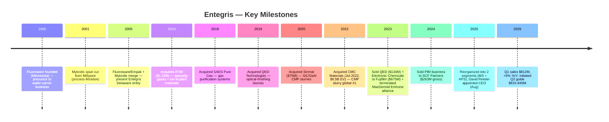

# Entegris, Inc. (NASDAQ:ENTG) — Company Research

**Report date:** 2026-05-26
**Ticker:** NASDAQ:ENTG • **CIK:** 0001101302 • **HQ:** Billerica, Massachusetts
**Domicile:** United States • **Reporting currency:** USD
**Latest fiscal year:** FY25 ended 2025-12-31

> **Update — FY26 Q2 outlook initiated (2026-04-30):** On the Q1 2026 earnings release, management initiated Q2 2026 guidance of revenue **$815–845M** (vs. Q1 actual $811.9M and Q2-2025 $773M, implying ~5–9% YoY growth), GAAP diluted EPS **$0.53–0.61** and non-GAAP diluted EPS **$0.76–0.84**, with Adjusted EBITDA margin of **~27.0–28.0%**. Management cited "accelerating AI-related demand" and "strengthening order patterns" as the driver. Source: [ENTG Q1-FY26 Earnings 8-K, 2026-04-30](https://www.sec.gov/Archives/edgar/data/1101302/000110130226000099/entgq12026ex991.htm).

---

## Table of Contents

1. Company Overview
2. Company History
3. Management Team
4. Products & Services
5. Customers & Go-to-Market
6. Industry Overview
7. Competitive Landscape
8. Market Opportunity (TAM)
9. Risk Assessment
10. References

---

## 1. Company Overview

Entegris, Inc. (NASDAQ:ENTG) is a Billerica, Massachusetts-headquartered specialty-materials and process-purity supplier to the global semiconductor industry. The Company's products are consumed every time a silicon wafer moves through a fab — chemical mechanical planarization (CMP) slurries and pads that flatten device layers, deposition precursors that build atom-by-atom films, gas-and-liquid filters that strip sub-nanometer contaminants from process chemistries, and the front-opening unified pods (FOUPs) and reticle pods that physically carry wafers and masks between tool steps. Approximately **82% of FY25 net sales were generated outside the United States**, reflecting the concentration of leading-edge wafer manufacturing in Taiwan, South Korea, Japan, and increasingly Southeast Asia ([Entegris 2025 10-K, Item 1 Business](https://www.sec.gov/Archives/edgar/data/1101302/000110130226000012/entg-20251231.htm)).

The Company reports through **two segments** following a 2025 reorganization that simplified the historical four-segment structure: Materials Solutions (MS) supplies advanced chemistries and consumables — chemical vapor and atomic layer deposition (CVD/ALD) materials, CMP slurries and pads, ion-implantation specialty gases, formulated etch and clean materials; Advanced Purity Solutions (APS) supplies filtration, purification, contamination-control hardware, and the wafer-and-reticle handling systems (FOUPs, SMIF pods, EUV reticle pods) that move material around the fab without recontaminating it. The "MS provides materials-based solutions … while providing for lower total cost of ownership" framing comes verbatim from the FY25 10-K segment description ([Entegris 2025 10-K, Item 1](https://www.sec.gov/Archives/edgar/data/1101302/000110130226000012/entg-20251231.htm)).

FY25 net sales were **$3,196.6M** (down 1.4% YoY from $3,241.4M), with MS at $1,406.7M (flat YoY) and APS at $1,799.1M (down 2.8%); GAAP gross margin compressed 150bp YoY to **44.4%** of net sales reflecting absence of the divested Pipeline & Industrial Materials (PIM) and Electronic Chemicals (EC) businesses ([Entegris 2025 10-K, MD&A — Results of Operations](https://www.sec.gov/Archives/edgar/data/1101302/000110130226000012/entg-20251231.htm)). The Company headcount stood at **~7,700 employees** at year-end, with the regional split: 51% North America, 15% Southeast Asia, 11% Taiwan, 9% Japan, 7% South Korea, 5% China, and 2% Europe ([Entegris 2025 10-K, Human Capital](https://www.sec.gov/Archives/edgar/data/1101302/000110130226000012/entg-20251231.htm)).

*Source: ENTG 10-Ks FY20–FY25 (filed 2021–2026), per [SEC EDGAR submissions for CIK 0001101302](https://www.sec.gov/cgi-bin/browse-edgar?action=getcompany&CIK=0001101302&type=10-K). The 2022 jump reflects the closing of the CMC Materials acquisition on July 6, 2022; the 2023 decline reflects ~5 months of CMC contribution rolling off as 2022's stub year, plus the EC business sale to Fujifilm (Oct 2023, $675M proceeds) and QED divestiture (Mar 2023, $134M).*

Customer concentration is high but not pathological for a semiconductor materials supplier: **Taiwan Semiconductor Manufacturing Company (TSMC) accounted for 16% of FY25 net sales** (16% in 2024, 11% in 2023 — the trend reflects TSMC's escalating share of global advanced-node capacity), and the remaining top-ten customers collectively contributed 34%, putting **total top-ten exposure at 50%** ([Entegris 2025 10-K, Risk Factors — Customer Concentration](https://www.sec.gov/Archives/edgar/data/1101302/000110130226000012/entg-20251231.htm)). The other named relationships in the customer base run through every leading-edge logic and memory IDM — Samsung, Intel, SK hynix, Micron — though only TSMC crosses the 10% disclosure threshold individually.

*Source: ENTG 10-Ks FY23–FY25, Segment Reporting. APS revenue fell 2.8% in FY25 in part on softer industrial / non-semi end markets; MS held flat on resilient advanced-node CMP and deposition consumables.*

### Valuation snapshot

As of mid-May 2026, ENTG trades at approximately **$135.28 per share** with a market capitalization of **~$20.6 billion** and enterprise value of **~$24.0 billion** ([Stockanalysis.com ENTG statistics, 2026-05](https://stockanalysis.com/stocks/entg/statistics/)). On TTM metrics, the stock screens at **P/E ~77.7×**, **P/S ~6.4×**, **P/B ~5.1×**, and **EV/EBITDA ~27.2×**, with total debt of **~$3.76B** against **~$0.45B** of cash (i.e. ~$3.31B net debt) ([Stockanalysis.com ENTG statistics, 2026-05](https://stockanalysis.com/stocks/entg/statistics/)). The dividend yield is a token 0.30% — Entegris pays a small dividend (currently $0.10/quarter) but the cash priority is deleveraging post-CMC ([ENTG Q1-FY26 Earnings 8-K, 2026-04-30](https://www.sec.gov/Archives/edgar/data/1101302/000110130226000099/entgq12026ex991.htm)).

The TTM P/E is elevated for three identifiable reasons, none of which is a structural value-trap signal. **First**, GAAP earnings are still depressed by acquisition-related amortization on the CMC purchase (the FY25 non-GAAP EPS of $2.86 versus GAAP $1.55 implies roughly $1.30/share of non-cash and one-time adjustments primarily tied to intangible amortization and restructuring) ([Entegris 2025 10-K, Non-GAAP reconciliation](https://www.sec.gov/Archives/edgar/data/1101302/000110130226000012/entg-20251231.htm)). **Second**, forward P/E compresses to **~35×** on consensus FY26E EPS — still a premium multiple, but consistent with the AI-driven re-rating of the broader semi-materials complex over the past 12 months (the stock has gained ~87% on a 52-week basis through May 2026, per [Stockanalysis.com](https://stockanalysis.com/stocks/entg/statistics/)). **Third**, peers in CMP / consumable materials (Anji Microelectronics 688019.SS, Dinglong 300054.SZ) trade at 60–70× TTM P/E reflecting the same AI-secular-growth narrative; the industrial-gas peers (Linde LIN 30×, Air Products APD ~20×) anchor the low end of a wide dispersion ([Nomura "Greater China Semi: Guide to Semi renaissance 2026–30F", 2026-05-21, p. 15–17 — covered in project sector note](../../sector/半导体材料.md)).

*Source: TTM P/E for ENTG from [Stockanalysis.com, 2026-05](https://stockanalysis.com/stocks/entg/statistics/); LIN/APD/AI.PA from Yahoo Finance / Reuters May 2026; Anji 688019 and Dinglong 300054 multiples from Nomura "Greater China Semi" report ([sector note](../../sector/半导体材料.md), pp. 130, 132). Merck KGaA EU listing.*

*Analyst view:* The valuation tension here is straightforward — investors are paying a 35× forward multiple for a business that grew 5% YoY in Q1 2026 with mid-twenties EBITDA margins and ~$3.3B of net debt to deleverage. The bull case rests on (i) advanced-node CMP step-count expansion as 2nm logic and 400-layer NAND ramp, (ii) co-optimized "filtration + slurry" cross-sell now that CMC's slurry is integrated under Entegris's filtration platform, and (iii) molybdenum's emergence as a replacement for tungsten in advanced interconnects (Entegris has both the precursor chemistry and the post-Mo CMP slurry chemistry) ([Entegris 2025 10-K, Item 1 Semiconductor Ecosystem](https://www.sec.gov/Archives/edgar/data/1101302/000110130226000012/entg-20251231.htm)). The bear case is that the stock has run faster than near-term earnings and a 2027 demand pause in conjunction with tariff escalation could compress the multiple to a sector-median 20–25× — implying meaningful downside.

## 2. Company History

The current Entegris is the product of three corporate mergers, four large acquisitions, and a string of opportunistic bolt-ons spanning two decades. The operating roots trace to two Minnesota plastic-products specialists — Fluoroware (founded 1966) and Empak — that pioneered the PFA fluoropolymer wafer carriers, which became the industry-standard FOUP design. The Company in its present legal form was **"incorporated in Delaware on March 17, 2005 through a merger of Entegris, Inc., a Minnesota corporation, and Mykrolis Corporation, a Delaware corporation"**, the latter being a 2001 spin-out of Millipore's microelectronics filtration business ([Entegris 2025 10-K, Item 1 Business](https://www.sec.gov/Archives/edgar/data/1101302/000110130226000012/entg-20251231.htm)). The 2005 merger combined Fluoroware-Empak's wafer-handling franchise with Mykrolis's process-filtration franchise — the structural seed of today's Advanced Purity Solutions segment.

The next transformative move came in 2014 with the **acquisition of ATMI** (Danbury, Connecticut) for approximately $1.15B — a deal that brought specialty gases, ion-implantation precursors, and SDS (Safe Delivery Source) gas-cylinder technology into the portfolio. ATMI became the nucleus of what would later be branded "Specialty Chemicals & Engineered Materials" (SCEM) and is now part of Materials Solutions ([Entegris 2025 10-K, Item 1 — Acquisitions and Divestitures background](https://www.sec.gov/Archives/edgar/data/1101302/000110130226000012/entg-20251231.htm)). A series of smaller bolt-ons followed through the late 2010s, including the 2018 acquisition of SAES Pure Gas (gas-purification systems) and the 2019 acquisition of QED Technologies (precision optical-finishing slurries — later divested in 2023).

The most consequential M&A — and the one that defines the current capital structure — was the **December 2021 agreement to acquire CMC Materials** (then NASDAQ:CCMP, the former Cabot Microelectronics) for ~$6.5B enterprise value, closed on July 6, 2022 ([Entegris CMC Materials acquisition press release, 2022-07-06](https://investor.entegris.com/news/news-details/2022/Entegris-Completes-Acquisition-of-CMC-Materials-Solidifying-Position-as-the-Global-Leader-in-Electronic-Materials-07-06-2022/default.aspx)). CMC was at the time the global leader in CMP slurry; combining CMC's slurry product line with Entegris's downstream slurry filtration and high-purity packaging created what the Company describes as the only platform delivering CMP slurries, pads, post-CMP cleaning chemistries, slurry filters, and fluid-handling systems from a single supplier ([Entegris 2025 10-K, Item 1 — Semiconductor Ecosystem](https://www.sec.gov/Archives/edgar/data/1101302/000110130226000012/entg-20251231.htm)).

The 2023–2024 portfolio actions completed the rationalization. The Company **sold QED** (March 2023, $134.3M proceeds), **sold the Electronic Chemicals business to FUJIFILM Holdings** (October 2023, $675.3M proceeds), **terminated the Alliance Agreement with MacDermid Enthone** (June 2023, $191.2M net proceeds), and **sold the Pipeline & Industrial Materials business to SCF Partners** (March 2024, $263.2M gross / $256.2M net plus up to $25M earn-out) ([Entegris 2025 10-K, Acquisitions and Divestitures](https://www.sec.gov/Archives/edgar/data/1101302/000110130226000012/entg-20251231.htm)). Combined proceeds of ~$1.4B were directed at debt paydown — by year-end 2025, long-term debt had fallen to approximately **$3.88B** from the post-close 2022 peak near **$4.93B**, with leverage (Adjusted EBITDA basis) dropping below 4.0× ([Entegris 2025 10-K, Liquidity and Capital Resources](https://www.sec.gov/Archives/edgar/data/1101302/000110130226000012/entg-20251231.htm)).

*Source: ENTG 10-Ks FY21–FY25. The 4.5–5.0× gross leverage post-CMC is consistent with management's guidance at deal announcement of "approximately 4.0× at closing, deleveraging to less than 3.0× over time" — see [Entegris CMC announcement, 2021-12-15](https://investor.entegris.com/news/news-details/2021/Entegris-to-Acquire-CMC-Materials-to-Create-a-Leader-in-Electronic-Materials-12-15-2021/default.aspx). The deleveraging trajectory through 2025 is tracking expectations.*

The most recent strategic move was the **August 2025 CEO transition**: long-time CEO Bertrand Loy (12 years in the role, since November 2012) handed the role to David Reeder, formerly CFO at Chewy, Inc. and previously CFO of GlobalFoundries Inc. through its 2021 IPO. Loy remained at the Company as Executive Chair ([Entegris 2025 10-K, Information about our Executive Officers](https://www.sec.gov/Archives/edgar/data/1101302/000110130226000012/entg-20251231.htm)). The transition is notable for the choice of an externally-recruited semiconductor-CFO profile rather than an internal materials-science executive — interpretation under Section 3 below.

## 3. Management Team

### David Reeder — President & Chief Executive Officer (since August 2025)

David Reeder became Entegris's President and Chief Executive Officer in August 2025 and has served on the Board of Directors since March 2024 ([Entegris 2025 10-K, Executive Officers](https://www.sec.gov/Archives/edgar/data/1101302/000110130226000012/entg-20251231.htm)). His appointment marked the end of Bertrand Loy's nearly 13-year tenure as CEO, with Loy moving to the role of Executive Chair. Reeder is 51 years old per the 10-K. From **February 2024 until June 2025**, Reeder served as **Chief Financial Officer at Chewy, Inc.**, a supplier of pet products and services, where he oversaw the company's financial functions ([Entegris 2025 10-K, Executive Officers](https://www.sec.gov/Archives/edgar/data/1101302/000110130226000012/entg-20251231.htm)). Prior to Chewy, from **August 2020 until February 2024**, he was **Chief Financial Officer of GlobalFoundries Inc.**, the global semiconductor foundry — and most consequentially, he oversaw GlobalFoundries' **initial public offering in October 2021** ([Entegris 2025 10-K, Executive Officers](https://www.sec.gov/Archives/edgar/data/1101302/000110130226000012/entg-20251231.htm)) — a transaction that valued the business at ~$26B and was one of the largest semiconductor IPOs in the public market over the past decade.

Reeder's career before GlobalFoundries spans CEO-level operational roles and CFO seats at large public technology companies. From **2017 to 2020**, he served as Chief Executive Officer of Tower Hill Insurance Group; from **2015 to 2017**, he held senior roles at **Lexmark International Inc.**, including as President and CEO and as CFO; he also served as CFO of Electronics for Imaging, Inc. ([Entegris 2025 10-K, Executive Officers](https://www.sec.gov/Archives/edgar/data/1101302/000110130226000012/entg-20251231.htm)). Earlier in his career, he held executive positions at three of the most relevant US semiconductor names: **Cisco Systems** (CFO of the Enterprise Networking Division), **Broadcom Corporation** (Vice President of Asia), and **Texas Instruments Incorporated** (in both financial and operational roles). He served on the board of directors of Alphawave IP Group plc from September 2023 until December 2025 ([Entegris 2025 10-K, Executive Officers](https://www.sec.gov/Archives/edgar/data/1101302/000110130226000012/entg-20251231.htm)).

*Analyst view:* The Reeder selection signals a particular Board thesis: with the CMC integration broadly complete and the deleveraging path established, the next chapter is about capital-allocation discipline, valuation re-rating through investor-communication tightening, and possibly another large acquisition or strategic re-segmentation. A CFO with both foundry experience (GlobalFoundries) and successful IPO execution is precisely the profile picked when those are the priorities. The 2-segment reorganization announced under Reeder's first quarter as CEO is a visible early signal of structural simplification.

### Bertrand Loy — Executive Chair (CEO November 2012 – August 2025)

While Loy is no longer in operational control, the FY25 10-K still names him as Executive Chair — a meaningful role on a Board that retained him as Chair from 2023 onward ([Entegris 2025 10-K, Executive Officers](https://www.sec.gov/Archives/edgar/data/1101302/000110130226000012/entg-20251231.htm)). Loy is 60 years old per the same disclosure. Loy joined the present Entegris entity in 2005 — the year of the Mykrolis merger — and was promoted through the financial and operating ranks: Executive Vice President in charge of IT, global supply chain, and manufacturing operations (2005–2008); Executive Vice President and Chief Operating Officer (2008–2012); and Chief Executive Officer, President, and Director from November 2012, Chair of the Board from 2023. Before joining Entegris, he served as Vice President and CFO of Mykrolis from January 2001 until the 2005 merger, having earlier been CIO of Millipore Corporation (1999–2000) ([Entegris 2025 10-K, Executive Officers](https://www.sec.gov/Archives/edgar/data/1101302/000110130226000012/entg-20251231.htm)).

The two transformative deals of Loy's CEO tenure are the **2014 acquisition of ATMI** (~$1.15B) and the **2022 acquisition of CMC Materials** ($6.5B EV) — taken together, the moves that converted Entegris from a sub-$1B filtration-and-handling specialist into a >$3B diversified electronic-materials platform. Loy has also been on the board of SEMI, the global industry association representing the electronics manufacturing supply chain, since July 2013, serving as Chair until December 2022 ([Entegris 2025 10-K, Executive Officers](https://www.sec.gov/Archives/edgar/data/1101302/000110130226000012/entg-20251231.htm)). The Executive Chair seat keeps Loy plugged into industry-level coordination and the long-term M&A pipeline — he is not a ceremonial outgoing CEO but an active strategic anchor.

