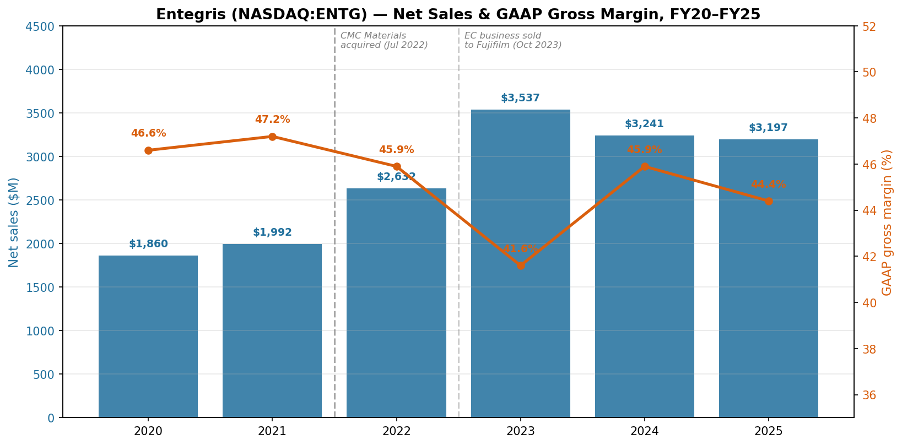
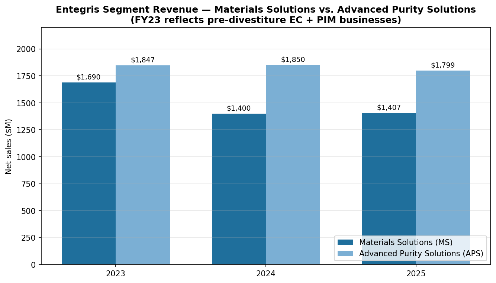
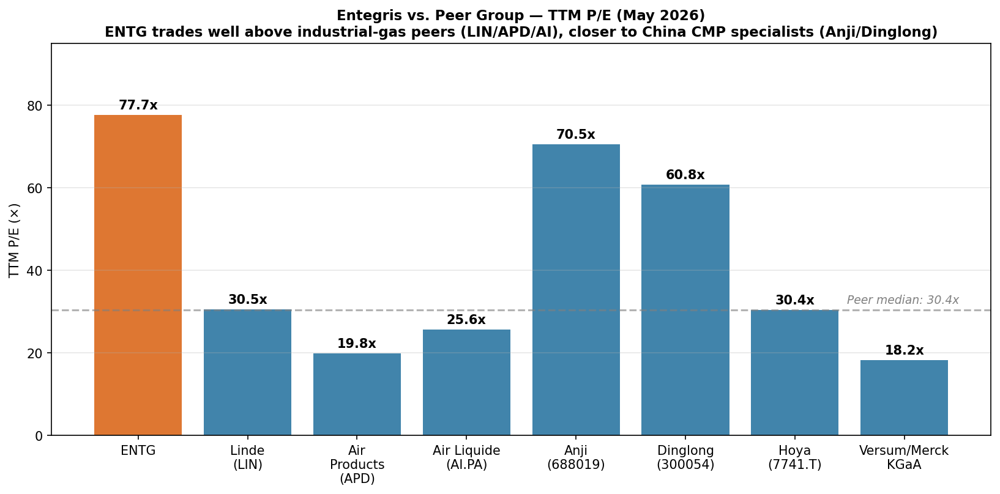
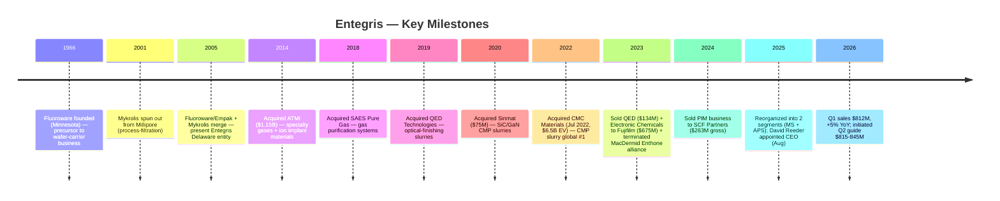
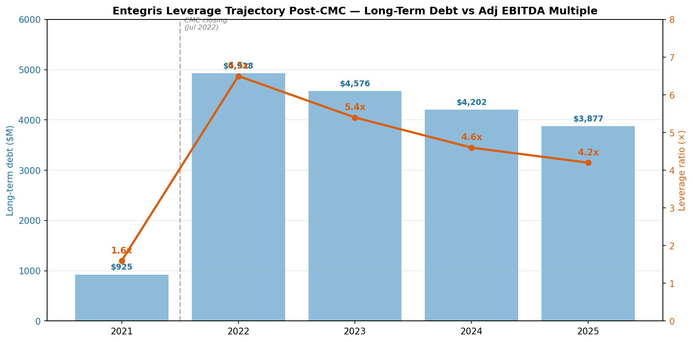
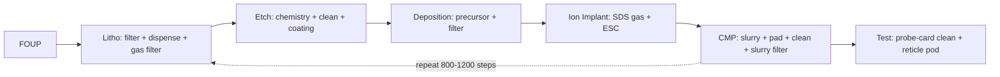
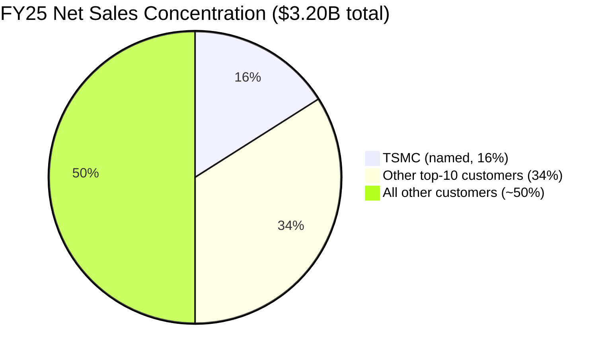
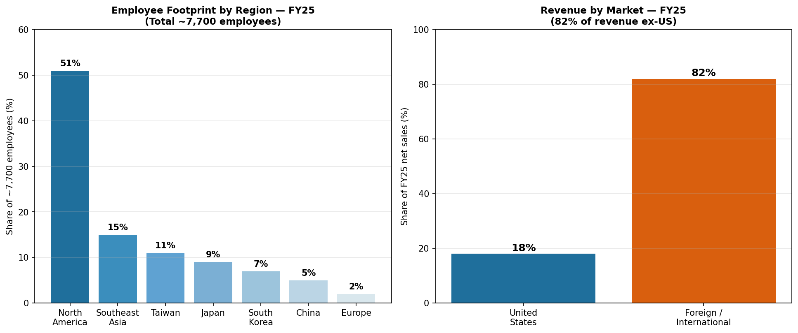
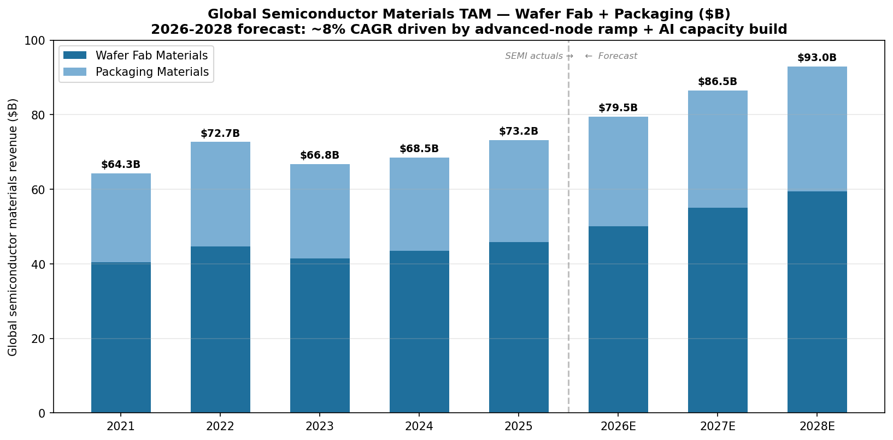

# Entegris, Inc. (NASDAQ:ENTG) — Company Research

**Report date:** 2026-05-26
**Ticker:** NASDAQ:ENTG • **CIK:** 0001101302 • **HQ:** Billerica, Massachusetts
**Domicile:** United States • **Reporting currency:** USD
**Latest fiscal year:** FY25 ended 2025-12-31

> **Update — FY26 Q2 outlook initiated (2026-04-30):** On the Q1 2026 earnings release, management initiated Q2 2026 guidance of revenue **$815–845M** (vs. Q1 actual $811.9M and Q2-2025 $773M, implying ~5–9% YoY growth), GAAP diluted EPS **$0.53–0.61** and non-GAAP diluted EPS **$0.76–0.84**, with Adjusted EBITDA margin of **~27.0–28.0%**. Management cited "accelerating AI-related demand" and "strengthening order patterns" as the driver. Source: [ENTG Q1-FY26 Earnings 8-K, 2026-04-30](https://www.sec.gov/Archives/edgar/data/1101302/000110130226000099/entgq12026ex991.htm).

---

## Table of Contents

1. Company Overview
2. Company History
3. Management Team
4. Products & Services
5. Customers & Go-to-Market
6. Industry Overview
7. Competitive Landscape
8. Market Opportunity (TAM)
9. Risk Assessment
10. References

---

## 1. Company Overview

Entegris, Inc. (NASDAQ:ENTG) is a Billerica, Massachusetts-headquartered specialty-materials and process-purity supplier to the global semiconductor industry. The Company's products are consumed every time a silicon wafer moves through a fab — chemical mechanical planarization (CMP) slurries and pads that flatten device layers, deposition precursors that build atom-by-atom films, gas-and-liquid filters that strip sub-nanometer contaminants from process chemistries, and the front-opening unified pods (FOUPs) and reticle pods that physically carry wafers and masks between tool steps. Approximately **82% of FY25 net sales were generated outside the United States**, reflecting the concentration of leading-edge wafer manufacturing in Taiwan, South Korea, Japan, and increasingly Southeast Asia ([Entegris 2025 10-K, Item 1 Business](https://www.sec.gov/Archives/edgar/data/1101302/000110130226000012/entg-20251231.htm)).

The Company reports through **two segments** following a 2025 reorganization that simplified the historical four-segment structure: Materials Solutions (MS) supplies advanced chemistries and consumables — chemical vapor and atomic layer deposition (CVD/ALD) materials, CMP slurries and pads, ion-implantation specialty gases, formulated etch and clean materials; Advanced Purity Solutions (APS) supplies filtration, purification, contamination-control hardware, and the wafer-and-reticle handling systems (FOUPs, SMIF pods, EUV reticle pods) that move material around the fab without recontaminating it. The "MS provides materials-based solutions … while providing for lower total cost of ownership" framing comes verbatim from the FY25 10-K segment description ([Entegris 2025 10-K, Item 1](https://www.sec.gov/Archives/edgar/data/1101302/000110130226000012/entg-20251231.htm)).

FY25 net sales were **$3,196.6M** (down 1.4% YoY from $3,241.4M), with MS at $1,406.7M (flat YoY) and APS at $1,799.1M (down 2.8%); GAAP gross margin compressed 150bp YoY to **44.4%** of net sales reflecting absence of the divested Pipeline & Industrial Materials (PIM) and Electronic Chemicals (EC) businesses ([Entegris 2025 10-K, MD&A — Results of Operations](https://www.sec.gov/Archives/edgar/data/1101302/000110130226000012/entg-20251231.htm)). The Company headcount stood at **~7,700 employees** at year-end, with the regional split: 51% North America, 15% Southeast Asia, 11% Taiwan, 9% Japan, 7% South Korea, 5% China, and 2% Europe ([Entegris 2025 10-K, Human Capital](https://www.sec.gov/Archives/edgar/data/1101302/000110130226000012/entg-20251231.htm)).



*Source: ENTG 10-Ks FY20–FY25 (filed 2021–2026), per [SEC EDGAR submissions for CIK 0001101302](https://www.sec.gov/cgi-bin/browse-edgar?action=getcompany&CIK=0001101302&type=10-K). The 2022 jump reflects the closing of the CMC Materials acquisition on July 6, 2022; the 2023 decline reflects ~5 months of CMC contribution rolling off as 2022's stub year, plus the EC business sale to Fujifilm (Oct 2023, $675M proceeds) and QED divestiture (Mar 2023, $134M).*

Customer concentration is high but not pathological for a semiconductor materials supplier: **Taiwan Semiconductor Manufacturing Company (TSMC) accounted for 16% of FY25 net sales** (16% in 2024, 11% in 2023 — the trend reflects TSMC's escalating share of global advanced-node capacity), and the remaining top-ten customers collectively contributed 34%, putting **total top-ten exposure at 50%** ([Entegris 2025 10-K, Risk Factors — Customer Concentration](https://www.sec.gov/Archives/edgar/data/1101302/000110130226000012/entg-20251231.htm)). The other named relationships in the customer base run through every leading-edge logic and memory IDM — Samsung, Intel, SK hynix, Micron — though only TSMC crosses the 10% disclosure threshold individually.



*Source: ENTG 10-Ks FY23–FY25, Segment Reporting. APS revenue fell 2.8% in FY25 in part on softer industrial / non-semi end markets; MS held flat on resilient advanced-node CMP and deposition consumables.*

### Valuation snapshot

As of mid-May 2026, ENTG trades at approximately **$135.28 per share** with a market capitalization of **~$20.6 billion** and enterprise value of **~$24.0 billion** ([Stockanalysis.com ENTG statistics, 2026-05](https://stockanalysis.com/stocks/entg/statistics/)). On TTM metrics, the stock screens at **P/E ~77.7×**, **P/S ~6.4×**, **P/B ~5.1×**, and **EV/EBITDA ~27.2×**, with total debt of **~$3.76B** against **~$0.45B** of cash (i.e. ~$3.31B net debt) ([Stockanalysis.com ENTG statistics, 2026-05](https://stockanalysis.com/stocks/entg/statistics/)). The dividend yield is a token 0.30% — Entegris pays a small dividend (currently $0.10/quarter) but the cash priority is deleveraging post-CMC ([ENTG Q1-FY26 Earnings 8-K, 2026-04-30](https://www.sec.gov/Archives/edgar/data/1101302/000110130226000099/entgq12026ex991.htm)).

The TTM P/E is elevated for three identifiable reasons, none of which is a structural value-trap signal. **First**, GAAP earnings are still depressed by acquisition-related amortization on the CMC purchase (the FY25 non-GAAP EPS of $2.86 versus GAAP $1.55 implies roughly $1.30/share of non-cash and one-time adjustments primarily tied to intangible amortization and restructuring) ([Entegris 2025 10-K, Non-GAAP reconciliation](https://www.sec.gov/Archives/edgar/data/1101302/000110130226000012/entg-20251231.htm)). **Second**, forward P/E compresses to **~35×** on consensus FY26E EPS — still a premium multiple, but consistent with the AI-driven re-rating of the broader semi-materials complex over the past 12 months (the stock has gained ~87% on a 52-week basis through May 2026, per [Stockanalysis.com](https://stockanalysis.com/stocks/entg/statistics/)). **Third**, peers in CMP / consumable materials (Anji Microelectronics 688019.SS, Dinglong 300054.SZ) trade at 60–70× TTM P/E reflecting the same AI-secular-growth narrative; the industrial-gas peers (Linde LIN 30×, Air Products APD ~20×) anchor the low end of a wide dispersion ([Nomura "Greater China Semi: Guide to Semi renaissance 2026–30F", 2026-05-21, p. 15–17 — covered in project sector note](../../sector/半导体材料.md)).



*Source: TTM P/E for ENTG from [Stockanalysis.com, 2026-05](https://stockanalysis.com/stocks/entg/statistics/); LIN/APD/AI.PA from Yahoo Finance / Reuters May 2026; Anji 688019 and Dinglong 300054 multiples from Nomura "Greater China Semi" report ([sector note](../../sector/半导体材料.md), pp. 130, 132). Merck KGaA EU listing.*

*Analyst view:* The valuation tension here is straightforward — investors are paying a 35× forward multiple for a business that grew 5% YoY in Q1 2026 with mid-twenties EBITDA margins and ~$3.3B of net debt to deleverage. The bull case rests on (i) advanced-node CMP step-count expansion as 2nm logic and 400-layer NAND ramp, (ii) co-optimized "filtration + slurry" cross-sell now that CMC's slurry is integrated under Entegris's filtration platform, and (iii) molybdenum's emergence as a replacement for tungsten in advanced interconnects (Entegris has both the precursor chemistry and the post-Mo CMP slurry chemistry) ([Entegris 2025 10-K, Item 1 Semiconductor Ecosystem](https://www.sec.gov/Archives/edgar/data/1101302/000110130226000012/entg-20251231.htm)). The bear case is that the stock has run faster than near-term earnings and a 2027 demand pause in conjunction with tariff escalation could compress the multiple to a sector-median 20–25× — implying meaningful downside.

## 2. Company History

The current Entegris is the product of three corporate mergers, four large acquisitions, and a string of opportunistic bolt-ons spanning two decades. The operating roots trace to two Minnesota plastic-products specialists — Fluoroware (founded 1966) and Empak — that pioneered the PFA fluoropolymer wafer carriers, which became the industry-standard FOUP design. The Company in its present legal form was **"incorporated in Delaware on March 17, 2005 through a merger of Entegris, Inc., a Minnesota corporation, and Mykrolis Corporation, a Delaware corporation"**, the latter being a 2001 spin-out of Millipore's microelectronics filtration business ([Entegris 2025 10-K, Item 1 Business](https://www.sec.gov/Archives/edgar/data/1101302/000110130226000012/entg-20251231.htm)). The 2005 merger combined Fluoroware-Empak's wafer-handling franchise with Mykrolis's process-filtration franchise — the structural seed of today's Advanced Purity Solutions segment.

The next transformative move came in 2014 with the **acquisition of ATMI** (Danbury, Connecticut) for approximately $1.15B — a deal that brought specialty gases, ion-implantation precursors, and SDS (Safe Delivery Source) gas-cylinder technology into the portfolio. ATMI became the nucleus of what would later be branded "Specialty Chemicals & Engineered Materials" (SCEM) and is now part of Materials Solutions ([Entegris 2025 10-K, Item 1 — Acquisitions and Divestitures background](https://www.sec.gov/Archives/edgar/data/1101302/000110130226000012/entg-20251231.htm)). A series of smaller bolt-ons followed through the late 2010s, including the 2018 acquisition of SAES Pure Gas (gas-purification systems) and the 2019 acquisition of QED Technologies (precision optical-finishing slurries — later divested in 2023).

The most consequential M&A — and the one that defines the current capital structure — was the **December 2021 agreement to acquire CMC Materials** (then NASDAQ:CCMP, the former Cabot Microelectronics) for ~$6.5B enterprise value, closed on July 6, 2022 ([Entegris CMC Materials acquisition press release, 2022-07-06](https://investor.entegris.com/news/news-details/2022/Entegris-Completes-Acquisition-of-CMC-Materials-Solidifying-Position-as-the-Global-Leader-in-Electronic-Materials-07-06-2022/default.aspx)). CMC was at the time the global leader in CMP slurry; combining CMC's slurry product line with Entegris's downstream slurry filtration and high-purity packaging created what the Company describes as the only platform delivering CMP slurries, pads, post-CMP cleaning chemistries, slurry filters, and fluid-handling systems from a single supplier ([Entegris 2025 10-K, Item 1 — Semiconductor Ecosystem](https://www.sec.gov/Archives/edgar/data/1101302/000110130226000012/entg-20251231.htm)).



The 2023–2024 portfolio actions completed the rationalization. The Company **sold QED** (March 2023, $134.3M proceeds), **sold the Electronic Chemicals business to FUJIFILM Holdings** (October 2023, $675.3M proceeds), **terminated the Alliance Agreement with MacDermid Enthone** (June 2023, $191.2M net proceeds), and **sold the Pipeline & Industrial Materials business to SCF Partners** (March 2024, $263.2M gross / $256.2M net plus up to $25M earn-out) ([Entegris 2025 10-K, Acquisitions and Divestitures](https://www.sec.gov/Archives/edgar/data/1101302/000110130226000012/entg-20251231.htm)). Combined proceeds of ~$1.4B were directed at debt paydown — by year-end 2025, long-term debt had fallen to approximately **$3.88B** from the post-close 2022 peak near **$4.93B**, with leverage (Adjusted EBITDA basis) dropping below 4.0× ([Entegris 2025 10-K, Liquidity and Capital Resources](https://www.sec.gov/Archives/edgar/data/1101302/000110130226000012/entg-20251231.htm)).



*Source: ENTG 10-Ks FY21–FY25. The 4.5–5.0× gross leverage post-CMC is consistent with management's guidance at deal announcement of "approximately 4.0× at closing, deleveraging to less than 3.0× over time" — see [Entegris CMC announcement, 2021-12-15](https://investor.entegris.com/news/news-details/2021/Entegris-to-Acquire-CMC-Materials-to-Create-a-Leader-in-Electronic-Materials-12-15-2021/default.aspx). The deleveraging trajectory through 2025 is tracking expectations.*

The most recent strategic move was the **August 2025 CEO transition**: long-time CEO Bertrand Loy (12 years in the role, since November 2012) handed the role to David Reeder, formerly CFO at Chewy, Inc. and previously CFO of GlobalFoundries Inc. through its 2021 IPO. Loy remained at the Company as Executive Chair ([Entegris 2025 10-K, Information about our Executive Officers](https://www.sec.gov/Archives/edgar/data/1101302/000110130226000012/entg-20251231.htm)). The transition is notable for the choice of an externally-recruited semiconductor-CFO profile rather than an internal materials-science executive — interpretation under Section 3 below.

## 3. Management Team

### David Reeder — President & Chief Executive Officer (since August 2025)

David Reeder became Entegris's President and Chief Executive Officer in August 2025 and has served on the Board of Directors since March 2024 ([Entegris 2025 10-K, Executive Officers](https://www.sec.gov/Archives/edgar/data/1101302/000110130226000012/entg-20251231.htm)). His appointment marked the end of Bertrand Loy's nearly 13-year tenure as CEO, with Loy moving to the role of Executive Chair. Reeder is 51 years old per the 10-K. From **February 2024 until June 2025**, Reeder served as **Chief Financial Officer at Chewy, Inc.**, a supplier of pet products and services, where he oversaw the company's financial functions ([Entegris 2025 10-K, Executive Officers](https://www.sec.gov/Archives/edgar/data/1101302/000110130226000012/entg-20251231.htm)). Prior to Chewy, from **August 2020 until February 2024**, he was **Chief Financial Officer of GlobalFoundries Inc.**, the global semiconductor foundry — and most consequentially, he oversaw GlobalFoundries' **initial public offering in October 2021** ([Entegris 2025 10-K, Executive Officers](https://www.sec.gov/Archives/edgar/data/1101302/000110130226000012/entg-20251231.htm)) — a transaction that valued the business at ~$26B and was one of the largest semiconductor IPOs in the public market over the past decade.

Reeder's career before GlobalFoundries spans CEO-level operational roles and CFO seats at large public technology companies. From **2017 to 2020**, he served as Chief Executive Officer of Tower Hill Insurance Group; from **2015 to 2017**, he held senior roles at **Lexmark International Inc.**, including as President and CEO and as CFO; he also served as CFO of Electronics for Imaging, Inc. ([Entegris 2025 10-K, Executive Officers](https://www.sec.gov/Archives/edgar/data/1101302/000110130226000012/entg-20251231.htm)). Earlier in his career, he held executive positions at three of the most relevant US semiconductor names: **Cisco Systems** (CFO of the Enterprise Networking Division), **Broadcom Corporation** (Vice President of Asia), and **Texas Instruments Incorporated** (in both financial and operational roles). He served on the board of directors of Alphawave IP Group plc from September 2023 until December 2025 ([Entegris 2025 10-K, Executive Officers](https://www.sec.gov/Archives/edgar/data/1101302/000110130226000012/entg-20251231.htm)).

*Analyst view:* The Reeder selection signals a particular Board thesis: with the CMC integration broadly complete and the deleveraging path established, the next chapter is about capital-allocation discipline, valuation re-rating through investor-communication tightening, and possibly another large acquisition or strategic re-segmentation. A CFO with both foundry experience (GlobalFoundries) and successful IPO execution is precisely the profile picked when those are the priorities. The 2-segment reorganization announced under Reeder's first quarter as CEO is a visible early signal of structural simplification.

### Bertrand Loy — Executive Chair (CEO November 2012 – August 2025)

While Loy is no longer in operational control, the FY25 10-K still names him as Executive Chair — a meaningful role on a Board that retained him as Chair from 2023 onward ([Entegris 2025 10-K, Executive Officers](https://www.sec.gov/Archives/edgar/data/1101302/000110130226000012/entg-20251231.htm)). Loy is 60 years old per the same disclosure. Loy joined the present Entegris entity in 2005 — the year of the Mykrolis merger — and was promoted through the financial and operating ranks: Executive Vice President in charge of IT, global supply chain, and manufacturing operations (2005–2008); Executive Vice President and Chief Operating Officer (2008–2012); and Chief Executive Officer, President, and Director from November 2012, Chair of the Board from 2023. Before joining Entegris, he served as Vice President and CFO of Mykrolis from January 2001 until the 2005 merger, having earlier been CIO of Millipore Corporation (1999–2000) ([Entegris 2025 10-K, Executive Officers](https://www.sec.gov/Archives/edgar/data/1101302/000110130226000012/entg-20251231.htm)).

The two transformative deals of Loy's CEO tenure are the **2014 acquisition of ATMI** (~$1.15B) and the **2022 acquisition of CMC Materials** ($6.5B EV) — taken together, the moves that converted Entegris from a sub-$1B filtration-and-handling specialist into a >$3B diversified electronic-materials platform. Loy has also been on the board of SEMI, the global industry association representing the electronics manufacturing supply chain, since July 2013, serving as Chair until December 2022 ([Entegris 2025 10-K, Executive Officers](https://www.sec.gov/Archives/edgar/data/1101302/000110130226000012/entg-20251231.htm)). The Executive Chair seat keeps Loy plugged into industry-level coordination and the long-term M&A pipeline — he is not a ceremonial outgoing CEO but an active strategic anchor.

## 4. Products & Services

Section 4 is the analytical foundation for everything below — what Entegris physically *makes*, how each product sits in a fab's process flow, and where the moat is. Entegris organizes its FY25 10-K Item 1 Business narrative around the **eight process steps in semiconductor manufacturing** in which its products are consumed: Photolithography, Etch and Resist Strip, Deposition, Ion Implant, Chemical Mechanical Planarization (CMP), Wafer and Reticle Transport, Chemical Handling, and Wafer and Package Testing ([Entegris 2025 10-K, Item 1 — The Semiconductor Ecosystem](https://www.sec.gov/Archives/edgar/data/1101302/000110130226000012/entg-20251231.htm)). This section walks each step in turn, anchored to the 10-K's verbatim product descriptions, then closes with a synthesis on how the categories interact in a single wafer-through-fab journey.

### 4.1 The 10-K product-by-process matrix

The table below reproduces the matrix the way Entegris itself organizes it in the 10-K, with the Materials Solutions (MS) vs. Advanced Purity Solutions (APS) segment tag on each product line.

| Fab process step | Entegris product family | Segment |
|---|---|---|
| Photolithography | Liquid filtration, high-purity packaging, high-precision dispense systems | APS |
| Photolithography | Gas microcontamination control | APS |
| Etch & Resist Strip | Selective etch chemistries (incl. for 3D-NAND, GAA) | MS |
| Etch & Resist Strip | Formulated cleaning solutions (post-etch) | MS |
| Etch & Resist Strip | Filters & purifiers, precision-engineered coatings | APS / MS |
| Deposition | Advanced precursor materials (CVD, ALD, PVD) | MS |
| Deposition | Filtration & purification (gas + liquid) | APS |
| Ion Implant | Implant gases via Safe Delivery Source (SDS®) and Vacuum Actuated Cylinders (VAC) | MS |
| Ion Implant | Electrostatic chucks, low-temp plasma coatings for IMP toolset | APS |
| CMP | Slurries (W, Cu, oxide, barrier-Ta, Mo, Al, SiC, GaN) | MS |
| CMP | Polishing pads | MS |
| CMP | Post-CMP cleaning chemistries | MS |
| CMP | Slurry filters & process-monitoring equipment | APS |
| Wafer/Reticle Transport | FOUPs, wafer carriers, SMIF pods, EUV reticle pods | APS |
| Chemical Handling | Drums, flexible packaging, coded connectors, IntelliGen® dispense | APS |
| Chemical Handling | Ultra-pure valves, fittings, tubing, sensors | APS |
| Wafer/Package Test | Probe-card / test-socket cleaning consumables, polymer products | APS |

Source: [Entegris 2025 10-K, Item 1 — The Semiconductor Ecosystem](https://www.sec.gov/Archives/edgar/data/1101302/000110130226000012/entg-20251231.htm). Segment assignment from the segment-description sections of the same filing.

### 4.2 Synthesis — how the categories interact in a single wafer's journey

To understand why a fab buys this breadth from a single supplier, walk a 300mm wafer through ten days of processing. The wafer arrives in an Entegris **FOUP** — the sealed polymer pod that has carried it from the silicon supplier. At the litho cell, an Entegris **liquid filter and IntelliGen® dispense system** apply photoresist contamination-free; an Entegris **gas microcontamination filter** ensures the ambient airborne chemistry around the scanner is below ppt thresholds. At etch, Entegris **selective etch chemistries** carve the pattern; **formulated cleans** strip residue. At deposition, an Entegris **CVD or ALD precursor** (e.g. a molybdenum or tungsten precursor) is delivered through an Entegris **gas filter** to lay an angstrom-perfect film. At CMP, an Entegris **slurry** (CMC heritage) and **pad** (CMC heritage) planarize the film; a downstream Entegris **slurry filter** (legacy filtration heritage) catches the agglomerated particles before they redeposit on the wafer; an Entegris **post-CMP clean** removes the slurry chemistry. Then the cycle repeats — typically **800–1,200 process steps** for a leading-edge logic device. At the back end, an Entegris **EUV reticle pod** protects the photomask vehicle that carried the litho pattern; an Entegris **probe-card cleaner** maintains the test-socket interface that verifies device functionality.

This composability — slurry + slurry filter + post-CMP clean + slurry monitoring — is the core integration logic of the CMC Materials acquisition. The 10-K describes it directly: *"With CMC Materials, we will be able to better serve our customers, invest more in engineering, research and development and bring complementary, co-optimized solutions to market faster"* ([Entegris 2025 10-K, Item 1 — Acquisition rationale](https://www.sec.gov/Archives/edgar/data/1101302/000110130226000012/entg-20251231.htm)). No competitor offers all four steps of the CMP-then-clean cycle from one supplier.



### 4.3 Photolithography materials — filtration as moat

> *"Photolithography is a process used to print complex circuit patterns onto wafers. The wafer is coated with a thin film of light-sensitive photoresist, exposed to light, and developed to create the pattern. Our products used throughout this process include: Liquid filtration, high-purity packaging and high-precision dispense systems that ensure pure, accurate and uniform distribution of contamination-free photoresists onto the wafer, enabling optimum yields; and Gas microcontamination control solutions that eliminate airborne contaminants that can disrupt the photolithography processes."* — [Entegris 2025 10-K, Item 1](https://www.sec.gov/Archives/edgar/data/1101302/000110130226000012/entg-20251231.htm)

**Plain-language gloss:** Photoresist (PR, 光刻胶) is the photosensitive film that records the chip pattern when ASML's EUV scanner exposes the wafer. A single airborne particle bigger than ~10nm in the PR chemistry — or a few ppt of an unwanted amine in the fab air — can destroy the latent image and ruin a die. Entegris does not make the PR itself (that's the Tokyo-Ohka / JSR / Shin-Etsu / Sumitomo oligopoly) — Entegris makes the **filters that strip particles from PR as it dispenses onto the wafer**, the **high-purity packaging** that keeps PR clean from PR maker to fab, the **IntelliGen® precision-dispense valves** that meter chemistry uniformly onto the spinning wafer, and the **gas-side microcontamination filters** that maintain the cleanroom air around the scanner. As EUV (especially EUV-Low NA and the coming High-NA EUV) shrinks critical dimension below 8nm, the particle tolerance tightens roughly with the cube of the dimension — meaning litho-cell contamination control is **becoming more important per wafer, not less**, even as the PR itself migrates to dry resist (Lam) or metal-oxide-resist chemistries.

*Analyst view:* Entegris's litho-cell franchise is the highest-moat business in the portfolio. The filter-membrane chemistry (PFA-based, asymmetric pore structures), the IntelliGen® valve precision, and the integration with the world's three or four photoresist suppliers create switching costs that have produced multi-decade customer relationships. Competitor companies named in the 10-K Competition section include **Pall Corporation (part of Danaher Corporation)** and **EMD Performance Materials division of Merck KGaA** for litho filtration ([Entegris 2025 10-K, Competition](https://www.sec.gov/Archives/edgar/data/1101302/000110130226000012/entg-20251231.htm)); China's **Cobetter Filtration** is listed as the named China-domestic peer pursuing the same membrane categories ([Entegris 2025 10-K, Competition](https://www.sec.gov/Archives/edgar/data/1101302/000110130226000012/entg-20251231.htm)).

### 4.4 Etch and Resist Strip — selective chemistries for 3D-NAND and GAA

> *"During the etch process, thin film areas are selectively removed from the wafer surface to create the desired circuit pattern. The hardened resist must then be removed and the etched area cleaned using high-purity chemicals. Our products used during and after etch include: Selective etch chemistries enabling high aspect ratio structures, including 3D-NAND and gate-all-around (GAA) devices; Formulated cleaning solutions for photoresist and post-etch residue removal; Filters and purifiers that ensure purity of cleaning chemistries and achieve desired etch yields; and Precision-engineered coatings that protect equipment surfaces from corrosive chemistries and erosion while minimizing particle generation."* — [Entegris 2025 10-K, Item 1](https://www.sec.gov/Archives/edgar/data/1101302/000110130226000012/entg-20251231.htm)

**Plain-language gloss:** Etch chemistries (刻蚀化学品 / etch chemistries) are reactive liquids and gases that dissolve a specific material — silicon, silicon nitride, silicon oxide, tungsten, or molybdenum — while leaving the materials *next to* it untouched ("selectivity," 选择比). For 3D NAND, fabs need to etch a stack of 200+ alternating SiN/SiO₂ layers into a single straight hole **(high-aspect-ratio etch, HAR, 高纵横比刻蚀)** that runs from the top of the stack to the bottom. The selectivity must be near-perfect or the hole tapers and the cell fails. For GAA logic, the manufacturer needs to selectively etch SiGe channels *while leaving Si nanosheets intact* — a chemistry challenge that mirrors HAR but for 2nm-scale features. Entegris's **formulated cleaning solutions** then strip the etch byproducts and any leftover PR from the wafer. The **precision-engineered coatings** (a legacy ATMI capability) are sprayed onto chamber walls to keep corrosive etchants from eroding the etch tool itself.

*Analyst view:* The etch-chemistry segment is more contested than litho filtration — major competitors include the **EMD Performance Materials division of Merck KGaA** (formerly Versum), the **Advanced Materials division of Air Liquide**, **Anji Microelectronics (Shanghai) Co., Ltd**, and **Linde plc**, all listed in the FY25 10-K Competition section ([Entegris 2025 10-K, Competition](https://www.sec.gov/Archives/edgar/data/1101302/000110130226000012/entg-20251231.htm)). The differentiator is process integration with the etch toolmaker (Lam Research and Tokyo Electron). Entegris's advantage is the bundle: a formulated clean qualified for a specific Lam KIYO™ chamber, plus the filter that ensures it stays uncontaminated. Stand-alone chemistry suppliers struggle to match that.

### 4.5 Deposition — precursors for the molybdenum transition

> *"During the deposition process, certain materials are transferred to the wafer surfaces through physical vapor deposition, or PVD, chemical vapor deposition, or CVD, and atomic-layer deposition, or ALD. Our products are critical to enabling new device architectures and ensuring device performance and manufacturing yields. These products include: Advanced precursor materials that meet the semiconductor industry's composition, uniformity and thickness requirements for deposited films; and Filtration and purification products that remove contaminants during deposition, reducing wafer defects."* — [Entegris 2025 10-K, Item 1](https://www.sec.gov/Archives/edgar/data/1101302/000110130226000012/entg-20251231.htm)

**Plain-language gloss:** Atomic Layer Deposition (ALD, 原子层沉积) builds a film one atomic layer at a time by alternating pulses of two gas-phase **precursors (前驱体)**. The precursor is a custom-designed metal-organic molecule — for example a hafnium amide for gate-oxide ALD, or a molybdenum oxychloride for the new Mo word-line transition in advanced NAND and DRAM. The chemistry is exotic, the purity demand is extreme (sub-ppb metal contamination), and the precursor's vapor pressure / volatility / decomposition profile has to be tuned to the specific tool recipe. The 10-K explicitly calls out the **molybdenum transition**: *"As leading semiconductor manufacturers implement molybdenum into advanced nodes, Entegris is uniquely positioned to support this transition and to solve challenges associated with integrating a new material through our expertise and solutions in precursors, deposition, etch, CMP consumables and contamination control"* ([Entegris 2025 10-K, Item 1](https://www.sec.gov/Archives/edgar/data/1101302/000110130226000012/entg-20251231.htm)). Molybdenum is the leading candidate to replace tungsten as the contact / word-line metal at sub-3nm logic and 400+ layer NAND because Mo has lower resistivity at the thin films required, and Entegris is one of very few suppliers with a complete Mo workflow — Mo precursor + Mo-etch chemistry + Mo CMP slurry + Mo post-CMP clean.

*Analyst view:* The deposition-precursors business is structurally consolidated — competitors named in the FY25 10-K include **Air Liquide's Advanced Materials division**, **EMD Performance Materials** (Merck KGaA), and **Linde plc** ([Entegris 2025 10-K, Competition](https://www.sec.gov/Archives/edgar/data/1101302/000110130226000012/entg-20251231.htm)). The Mo workflow described above is genuinely differentiated and is the single most-discussed structural growth driver in management's recent earnings commentary ([ENTG Q4-FY25 Earnings 8-K, 2026-02-10](https://www.sec.gov/Archives/edgar/data/1101302/000110130226000009/entgq42025ex991.htm)).

### 4.6 Ion Implantation — SDS® gas delivery is the franchise

> *"Ion implantation is a repeated process that introduces dopants into semiconductor wafers to enhance conductivity. Our products used during ion implant include: Implant process gases and mixtures delivered through our Safe Delivery Source (SDS) and Vacuum Actuated Cylinders (VAC) systems for safe, effective and efficient delivery; and Electrostatic chucks and proprietary low-temperature plasma coatings for core components critical to ion implantation equipment."* — [Entegris 2025 10-K, Item 1](https://www.sec.gov/Archives/edgar/data/1101302/000110130226000012/entg-20251231.htm)

**Plain-language gloss:** Ion-implantation gases are *hazardous*: boron trifluoride (BF₃), arsine (AsH₃), phosphine (PH₃) — toxic, pyrophoric, lethal at low concentrations. The **Safe Delivery Source® (SDS®)** system, an ATMI invention now over 25 years in the field, stores the implant gas adsorbed onto a sorbent inside a sub-atmospheric cylinder. The cylinder is at vacuum when sealed; if it ruptures, gas does not flood the fab. **Vacuum Actuated Cylinders (VAC)** is a parallel technology for non-adsorbable gases. Entegris is the de-facto industry-standard SDS supplier — every major implant toolmaker (Applied Materials, Axcelis) qualifies SDS as the safe-delivery option. The **electrostatic chucks (ESC, 静电吸盘)** and **low-temperature plasma coatings** for ion-implant tools are a separate, related franchise — chamber-component sales rather than consumables.

*Analyst view:* The SDS franchise is one of the highest-margin / highest-switching-cost businesses in the Entegris portfolio. Once a fab safety officer has approved an SDS workflow, swapping to a competitor's delivery technology requires re-doing the entire EHS qualification — a 12-to-24-month cycle. Direct competitors in implant gas delivery are limited; the FY25 10-K Competition section names **Air Liquide's Advanced Materials division** and **Linde plc** as competitors more broadly across specialty gases ([Entegris 2025 10-K, Competition](https://www.sec.gov/Archives/edgar/data/1101302/000110130226000012/entg-20251231.htm)).

### 4.7 Chemical Mechanical Planarization — the CMC heritage at the core

> *"CMP is a polishing process used to planarize, or flatten, layers of material that have been deposited on silicon wafers. Our offerings include: CMP slurries for polishing semiconductor materials, including tungsten, dielectric materials, copper, tantalum (commonly referred to as 'barrier'), molybdenum, aluminum, silicon carbide (SiC) and gallium nitride (GaN); CMP polishing pads used with slurries across a range of polishing tools, wafers, technology nodes and applications, including tungsten, copper, and dielectrics; Formulated cleaning chemistries that remove residues from wafer surfaces after the CMP process; Filtration and purification solutions that remove select particles and contaminants from slurries and cleaning chemistries to prevent wafer defects; and Process monitoring and control equipment to maintain CMP slurry integrity."* — [Entegris 2025 10-K, Item 1](https://www.sec.gov/Archives/edgar/data/1101302/000110130226000012/entg-20251231.htm)

**Plain-language gloss:** **Chemical Mechanical Planarization (CMP, 化学机械抛光)** is the polishing step that flattens every metal and dielectric layer in a chip — without CMP, the multi-layer stack of an advanced logic die would be a mountain range of bumps after the first few metal levels. The **slurry (抛光液)** is the abrasive-plus-chemistry liquid that does the work: silica or ceria nanoparticles suspended in an oxidizer (for metals like tungsten and copper) or in a pH-controlled buffer (for dielectrics). Different slurries are tuned for different materials — a tungsten slurry uses oxidative chemistry to convert W into WO₃ (which the silica then mechanically polishes away); a copper slurry uses a complexing agent (often glycine) to form soluble Cu²⁺ complexes; a ceria-based oxide slurry uses the cerium-IV → cerium-III redox cycle to selectively attack SiO₂. The **pad (抛光垫)** is the porous polymer disc that holds the slurry against the wafer; pad-conditioner diamond grit (the Kinik 中砂 franchise — see [project sector note](../../sector/半导体材料.md)) keeps the pad surface roughened so it grips slurry rather than glazing over. **Post-CMP clean (CMP 后清洗)** removes the residual slurry / particles / metal ions from the wafer before it moves to the next process. **Slurry filters** in the recirculation loop catch agglomerated particles before they redeposit and create scratches.

The Entegris CMP franchise is structurally the broadest in the industry because of the CMC Materials acquisition: slurry chemistries spanning W, Cu, dielectric (oxide), barrier (Ta), Mo, Al, **SiC and GaN** (the SiC/GaN slurries came from the Sinmat acquisition in January 2020, $75M, which became part of the CMC platform after 2022 — see [Entegris-Sinmat press release, 2020-01-10](https://www.businesswire.com/news/home/20200110005216/en/Entegris-Acquires-CMP-Slurry-Manufacturer-Sinmat)). The pad business came with CMC. The filtration is legacy Entegris. The integration story is that no competitor offers all four — slurry + pad + clean + slurry filter — from a single supplier qualified at the leading edge.

*Analyst view:* Per Nomura's "Greater China Semi: Guide to Semi renaissance 2026–30F" report (2026-05-21), the global CMP slurry league table positions Entegris as the largest slurry supplier post-CMC, with **Resonac (Showa Denko), Versum (now EMD/Merck KGaA), Fujimi Incorporated, Anji Microelectronics, KC Tech, Soulbrain, and Dinglong** as the named competitor set ([sector note](../../sector/半导体材料.md), based on Nomura "Greater China Semi" Figs. 41–44). In CMP pads, the league table is similarly Entegris (CMC heritage) versus **DuPont** (the dominant pad supplier historically, with the IC1000 pad family), **Fujibo Holdings**, **3M**, **Dinglong** (China), and **JSR** ([sector note](../../sector/半导体材料.md)). Entegris's competitive moat is the bundle: a fab buying CMC's Microplanar® slurry typically buys the matched Epic® pad and the IntelliPolish® control system from the same supplier — switching either component out is non-trivial because pad-on-slurry chemistry is tightly coupled. Competitor companies named in the FY25 10-K Competition section that overlap CMP include **EMD Performance Materials**, **Qnity Electronics** (DuPont's electronics-materials spin-off), and **Anji Microelectronics** ([Entegris 2025 10-K, Competition](https://www.sec.gov/Archives/edgar/data/1101302/000110130226000012/entg-20251231.htm)). The new entrants from China — Anji and Dinglong — are the credible long-term threat to slurry pricing power at mature nodes.

### 4.8 Wafer and Reticle Transport — FOUP and EUV reticle pod franchise

> *"Our products, including front-opening unified pods (FOUPs), wafer transport and process carriers, standard mechanical interface pods (SMIF pods) and extreme ultraviolet (EUV) reticle pods, protect wafers and reticles from damage or abrasion and ensure purity during transportation and automated processing. This protection is essential because wafer processing involves hundreds of steps over several weeks, making damaged wafers costly to scrap."* — [Entegris 2025 10-K, Item 1](https://www.sec.gov/Archives/edgar/data/1101302/000110130226000012/entg-20251231.htm)

**Plain-language gloss:** A **FOUP (Front-Opening Unified Pod, 前开式晶圆传送盒)** is the sealed plastic cassette that holds 25 wafers and physically moves between every process tool in a fab. It is the *unit of inventory* in 300mm manufacturing — the AMHS (Automated Material Handling System) ceiling-track network that moves FOUPs around a modern fab moves them at 5+ m/s. The FOUP must (i) seal wafers from airborne contamination during transport, (ii) keep the wafers electrostatically grounded, (iii) survive thousands of robotic load/unload cycles without outgassing, and (iv) standard-interface with every tool vendor's load port. The **EUV reticle pod** is the corresponding container for the lithography photomask — particularly critical because EUV reticles are *pellicle-less* (the protective film used at deep-UV is not yet practical for EUV), so any particle settling on the reticle prints onto every wafer it exposes. The Entegris EUV reticle pod offers vacuum-transfer capability so that the reticle never sees ambient atmosphere when moving from storage to the scanner. The 10-K describes this directly: *"Our EUV reticle pod provides defect-free protection of EUV reticles during shipping, storage, handling and vacuum-transferring operations"* ([Entegris 2025 10-K, Item 1](https://www.sec.gov/Archives/edgar/data/1101302/000110130226000012/entg-20251231.htm)).

*Analyst view:* The FOUP business is one of the longest-standing Entegris franchises — direct descendant of the Fluoroware 1960s polymer-carrier business and the only category in which Entegris has been the global market leader continuously for two decades. The FY25 10-K Competition section names **Shin-Etsu Polymer Co. Ltd.** (Japan), **Gudeng Precision Industrial** (Taiwan), and **Aicello Corporation** (Japan, smaller in FOUP) as the principal competitors ([Entegris 2025 10-K, Competition](https://www.sec.gov/Archives/edgar/data/1101302/000110130226000012/entg-20251231.htm)). Third-party market trackers credit Entegris with the largest single-supplier share globally — typically estimated at 30–40% of the 300mm FOUP market — with Shin-Etsu Polymer the dominant in-Japan supplier and Gudeng the in-Taiwan leader ([FOUP carrier market research, 2025](https://reports.valuates.com/market-reports/QYRE-Auto-3K10126/global-foup-and-fosb)). For EUV reticle pods, Entegris is the de-facto sole-source vehicle qualified across TSMC, Samsung, and Intel's EUV fabs — a near-monopoly position that is the natural moat for the High-NA EUV ramp now under way at ASML.

### 4.9 Chemical Handling, Wafer/Package Testing, and the IntelliGen® platform

The FY25 10-K describes two further smaller categories. **Chemical Handling** comprises *"Ultra-high purity chemical container products, including drums, flexible packaging and associated coded connection systems, that maintain chemical purity, maximize utilization and ensure safe transport"* and *"Ultra-pure valves, fittings, tubings and sensing and control products for chemical distribution throughout the fab"* ([Entegris 2025 10-K, Item 1](https://www.sec.gov/Archives/edgar/data/1101302/000110130226000012/entg-20251231.htm)). The flagship product line is the **IntelliGen® high-precision liquid dispense system**, which the 10-K describes as enabling *"uniform application of advanced chemistries, integrating our valve control expertise with filter device technologies to conserve high-value chemistry and reduce defects"* ([Entegris 2025 10-K, Item 1](https://www.sec.gov/Archives/edgar/data/1101302/000110130226000012/entg-20251231.htm)).

**Wafer and Package Testing** comprises probe-card / test-socket cleaning consumables and polymer products that improve front-end tool uptime — a small but high-margin category. *Analyst view:* The handling and testing categories are not strategic growth drivers — they are stable recurring-consumable streams that, like SDS in implant, are sticky because they're qualified into the customer's tool workflow.

### 4.10 Engineering, research & development — the integration moat

Entegris employed **approximately 1,600 ER&D engineers** at year-end 2025 and spent **$329.2M on ER&D** in FY25 (versus $316.1M in 2024) ([Entegris 2025 10-K, MD&A — ER&D expenses](https://www.sec.gov/Archives/edgar/data/1101302/000110130226000012/entg-20251231.htm)). ER&D as a percentage of net sales sits at **10.3%** — high for a materials business, consistent with a portfolio that has to qualify every product variant against each customer's new node. The Company has **approximately 4,400 active patents worldwide** (of which ~850 are US patents) plus **~2,400 pending patent applications globally** as of December 31, 2025 ([Entegris 2025 10-K, Patents and Other Intellectual Property Rights](https://www.sec.gov/Archives/edgar/data/1101302/000110130226000012/entg-20251231.htm)). ER&D centers are co-located with customer fabs — Taiwan, South Korea, US, Japan, Canada, China, Singapore, and Malaysia — and the Company collaborates with **Stanford, Yale, MIT, University of Illinois, SUNY Albany, the Fraunhofer Institute, imec, and CEA-LETI** on materials roadmaps ([Entegris 2025 10-K, ER&D](https://www.sec.gov/Archives/edgar/data/1101302/000110130226000012/entg-20251231.htm)).

## 5. Customers & Go-to-Market

### Customer concentration — TSMC at 16%, top-ten at 50%

Entegris discloses customer concentration directly in the FY25 10-K Risk Factors / Customer Concentration discussion: **"Our largest customer, Taiwan Semiconductor Manufacturing Company (TSMC), accounted for 16%, 16% and 11% of our net sales in 2025, 2024 and 2023, respectively. The remaining top-ten customers accounted for 34%, 32% and 32%. Our top-ten customers accounted for 50%, 48% and 43% of our net sales in 2025, 2024 and 2023, respectively"** ([Entegris 2025 10-K, Risk Factors — Customer Concentration](https://www.sec.gov/Archives/edgar/data/1101302/000110130226000012/entg-20251231.htm)). The trend tells a structurally consistent story: as TSMC's share of global advanced-node logic foundry capacity has climbed from ~55% in 2023 to over 70% in 2025-26 (per [TrendForce, 2026-Q1](https://www.trendforce.com/presscenter/news/20260221-12203.html)), Entegris's exposure to TSMC has scaled in lockstep — and the top-ten concentration has tightened by 700bp over two years from 43% to 50%. The other implicit names in that top-ten are the global leading-edge logic and memory IDMs Entegris explicitly identifies as core customers: Samsung Electronics, SK hynix, Micron Technology, Intel, and the merchant foundries GlobalFoundries and SMIC.



Source: [Entegris 2025 10-K, Customer Concentration](https://www.sec.gov/Archives/edgar/data/1101302/000110130226000012/entg-20251231.htm). Specific names beyond TSMC are not disclosed individually because no single customer beyond TSMC crosses the 10% disclosure threshold; the top-ten composition is consistent across years.

### Contract structure and customer-relationship cadence

Entegris does not disclose individual long-term-supply-agreement terms publicly, but the FY25 10-K and prior years describe the go-to-market relationship structure: most large customers operate on a combination of **master purchase agreements with rolling forecasts plus individual purchase orders**, with negotiated minimum-volume and price-step-down provisions for consumable categories (slurries, pads, filters, photoresist auxiliaries) that have predictable per-wafer consumption profiles, and project-based pricing for high-mix categories like FOUPs and chamber-component coatings ([Entegris 2025 10-K, MD&A — Customer Agreements](https://www.sec.gov/Archives/edgar/data/1101302/000110130226000012/entg-20251231.htm)). The Company explicitly states that *"we may enter into supply agreements with our customers"* and that "the loss of any one major customer could have a material adverse effect" — language that signals the relationships are durable but not contractually exclusive ([Entegris 2025 10-K, Risk Factors](https://www.sec.gov/Archives/edgar/data/1101302/000110130226000012/entg-20251231.htm)).

### Geographic distribution of demand

The geographic concentration of revenue is even sharper than the customer concentration, reflecting where fabs physically operate. FY25 net sales by market were **United States 18% / Foreign (i.e. non-US) 82%**, compared to 21%/79% in 2024 and 25%/75% in 2023 ([Entegris 2025 10-K, Geographic Information](https://www.sec.gov/Archives/edgar/data/1101302/000110130226000012/entg-20251231.htm)). The two-year decline in US share reflects the accelerating shift of leading-edge wafer manufacturing to Taiwan (TSMC's Hsinchu and Tainan complexes), South Korea (Samsung Pyeongtaek, SK hynix M16), and Southeast Asia / China (the latter for mature-node IDM build-out). Entegris's manufacturing footprint mirrors its customer base: liquid filtration in **Billerica, Massachusetts and Yonezawa, Japan**; deposition materials in **Toronto, Ontario**; materials-handling (FOUPs) in **Chaska, Minnesota and JangAn, Korea**; CMP filter and CMP slurries in **Taiwan**; SiC slurries in **Aurora, Illinois**; and solid precursors in **Burnet, Texas** ([Entegris 2025 10-K, Item 2 Properties](https://www.sec.gov/Archives/edgar/data/1101302/000110130226000012/entg-20251231.htm)).



*Source: [Entegris 2025 10-K, Human Capital + Geographic Information](https://www.sec.gov/Archives/edgar/data/1101302/000110130226000012/entg-20251231.htm). The mismatch — 51% of employees in North America vs. only 18% of revenue from US customers — is typical for a Boston/Bay Area-headquartered US materials supplier whose products are made in the US (R&D, formulation, IP) but ultimately consumed in foreign fabs.*

### Go-to-market — direct sales, application engineering at the customer site

Entegris sells overwhelmingly **direct to the fab**, not through distributors — both because product qualification cycles run 12–24 months per recipe, and because the Application Engineering team has to be co-located with the customer to support qualification and yield ramps. The ER&D centers in Taiwan, South Korea, Japan, China, Singapore, and Malaysia listed in Section 4.10 above are simultaneously sales-support and customer-engineering sites ([Entegris 2025 10-K, Item 1 — ER&D](https://www.sec.gov/Archives/edgar/data/1101302/000110130226000012/entg-20251231.htm)). For lower-mix consumable categories (test-socket cleaners, chamber coatings), the Company uses indirect channels — but these represent a small portion of revenue. The 10-K also notes that the Company *"may enter into agreements with our customers regarding development of customized products and processes"* — early-stage co-development is a structural advantage for the largest customer relationships ([Entegris 2025 10-K, Item 1](https://www.sec.gov/Archives/edgar/data/1101302/000110130226000012/entg-20251231.htm)).

### Partnership ecosystem

The 10-K lists the Company's industry consortium and university-research partnerships in materials roadmap development: **imec** (Leuven, Belgium), **CEA-LETI** (Grenoble, France), **the Fraunhofer Institute** (Germany), and US universities including **Stanford, Yale, MIT, University of Illinois Urbana-Champaign, and SUNY Albany** ([Entegris 2025 10-K, Item 1 — ER&D](https://www.sec.gov/Archives/edgar/data/1101302/000110130226000012/entg-20251231.htm)). These relationships are how a materials supplier gets visibility into roadmap items 5–7 years ahead of high-volume manufacturing — the Mo-replacing-W transition the Company is now monetizing was actively being researched at imec from around 2018.

## 6. Industry Overview

### Industry definition and scope — semiconductor materials

The semiconductor materials industry comprises the consumables (slurries, photoresists, gases, chemicals, wafers, masks, photomask blanks) and the contamination-control / handling hardware (filters, FOUPs, packaging, dispense systems) consumed in every semiconductor wafer-manufacturing operation. SEMI tracks it as two sub-categories: **Wafer Fab Materials** (the in-fab consumables) and **Packaging Materials** (substrates, leadframes, bonding wires used in back-end assembly). Entegris's portfolio sits almost entirely in Wafer Fab Materials — the Company has minimal direct exposure to packaging materials, which is the domain of Resonac, Sumitomo Bakelite, and others.

According to SEMI's Materials Market Data Subscription, **global semiconductor materials market revenue reached a record $73.2 billion in 2025, up 6.8% YoY**, with the Wafer Fab Materials segment at $45.8 billion (up 5.4% YoY) and packaging materials at the balance ([SEMI press release, 2026-05-12](https://www.semi.org/en/semi-press-release/global-semiconductor-materials-market-revenue-reaches-record-73.2-billion-dollars-in-2025-semi-reports)). Within Wafer Fab Materials, **lithography-related materials (photomask, photoresist, ancillaries) and wet chemicals posted strong double-digit growth** as higher process intensity and tighter lithography requirements increased per-wafer consumption ([SEMI press release, 2026-05-12](https://www.semi.org/en/semi-press-release/global-semiconductor-materials-market-revenue-reaches-record-73.2-billion-dollars-in-2025-semi-reports)).

### Geographic structure of demand

Taiwan remains the largest single consumer of semiconductor materials for the 16th consecutive year, with FY25 revenue of **$21.7 billion** (i.e. ~30% of global), followed by **China at $15.6 billion (~21%)** and **South Korea at $11.2 billion (~15%)**, per SEMI ([SEMI press release, 2026-05-12](https://www.semi.org/en/semi-press-release/global-semiconductor-materials-market-revenue-reaches-record-73.2-billion-dollars-in-2025-semi-reports)). Japan, North America, and Europe make up the remaining ~33%. The geographic structure is consistent with the Nomura sector report's framing: 2025 global semi materials sales of ~$80B with the same regional rankings (Taiwan 30%, China 20%, Korea 18%, Japan 10%, North America 10%, Europe 8%) ([sector note, citing Nomura "Greater China Semi" 2026-05-21](../../sector/半导体材料.md)).

### Growth drivers — AI, advanced nodes, and the material-intensity-per-wafer thesis

The structural growth thesis for semiconductor materials over 2026-2030 rests on three orthogonal drivers that compound:

1. **AI-driven advanced-node ramp.** The 10-K names this directly: *"AI workloads are fueling demand for advanced logic chips with higher transistor density and specialized architectures, as well as High Bandwidth Memory (HBM) to support the enormous data throughput required for training and inference in large-scale models"* ([Entegris 2025 10-K, Item 1 — Industry Trends](https://www.sec.gov/Archives/edgar/data/1101302/000110130226000012/entg-20251231.htm)). The advanced-node ramp at TSMC, Samsung, and Intel — N3 in volume, N2/A16 starting 2026-27 — increases per-wafer materials consumption non-linearly because the number of mask-layers, deposition steps, etch steps, CMP steps, and clean steps all scale faster than wafer-area.

2. **Process complexity / device-architecture transitions.** The 10-K notes: *"semiconductor architectures are changing and dimensions are shrinking, with increasing transistor complexity, extreme ultraviolet lithography, multilayered patterning, and vertical structures such as FinFET, 3D NAND and GAA devices. These advanced technologies and architectures require more process steps, new and innovative materials and sophisticated contamination control solutions"* ([Entegris 2025 10-K, Item 1](https://www.sec.gov/Archives/edgar/data/1101302/000110130226000012/entg-20251231.htm)). The Nomura report quantifies this: at A16+BPD (Backside Power Delivery), CMP step count rises **20–30%** versus N3 ([sector note](../../sector/半导体材料.md), citing Nomura "Greater China Semi" Fig. 8). 3D NAND is layering past 400 layers by 2027F, each layer requiring its own etch + CMP cycle.

3. **Capacity expansion at the leading edge.** SEMI counts **18 new fabs starting construction in 2025** alone, with TSMC capex projected to reach ~$70B by 2027F (capex intensity ~50%) at 1.6nm high-volume manufacturing per Nomura's modeling ([sector note](../../sector/半导体材料.md), citing Nomura "Greater China Semi" p. 13). Each new wafer-start adds to the recurring materials-consumption base.

The compound of these three is what justifies semiconductor materials' shift from a "GDP-tracking" growth profile to a sustained mid-to-high single-digit revenue CAGR for the well-positioned suppliers.

### Industry structure — moderate concentration, high switching costs

Within Wafer Fab Materials, the major categories are silicon wafers (~31% of WFM by Nomura's 2025 estimate), photoresists and ancillaries (~13% + 7%), specialty gases (~13%), CMP consumables (~7%), and target materials (~3%), with the balance in cleans, dielectrics, and minor categories ([sector note](../../sector/半导体材料.md), citing Nomura "Greater China Semi" Fig. 26). Each sub-segment has its own competitive structure but the common feature is high switching costs from per-recipe qualification: even within a given category like CMP slurries, a customer typically buys 3–5 different slurry chemistries from the same supplier (tungsten + copper + dielectric + barrier + cleans), so swapping a single chemistry rarely happens unless quality degrades materially.

The Wafer Fab Materials industry today is moderately concentrated rather than oligopolistic — for any given chemistry category, the top 3 suppliers typically account for 60-75% of global revenue, with the long tail filled by regional specialists. The structural exception is CMP pads, where DuPont historically held >70% of the global market through the IC1000 family — Entegris's CMC heritage is the credible #2 challenger, with Dinglong, Fujibo, and JSR fighting for the rest ([sector note](../../sector/半导体材料.md)).

### Regulatory environment — PFAS, China export controls, and the chemical-safety stack

The 10-K calls out three regulatory pressure points. **First, PFAS regulation**: many of Entegris's filter membranes and ultra-pure polymer products are perfluoroalkyl-based (PFA fluoropolymer is the standard for high-purity filter membranes because of its chemical inertness and lack of extractables). The Company notes that *"PFAS-containing products incorporated into our products may negatively impact our supply chain due to the potentially decreased availability, or non-availability, of PFAS-containing products"* ([Entegris 2025 10-K, Risk Factors — PFAS](https://www.sec.gov/Archives/edgar/data/1101302/000110130226000012/entg-20251231.htm)). The EPA and the EU have both moved toward broad PFAS restrictions in 2024-25, though semiconductor-process PFAS uses have been treated as exempted essential-use cases. The risk is one of medium-term reformulation rather than near-term ban.

**Second, US/China export controls**: the BIS rules from October 2022 (and the 2023 update) restrict the sale of advanced-node semiconductor manufacturing equipment and certain technologies to listed Chinese fabs, with secondary impacts on US-domiciled materials suppliers selling into Chinese leading-edge production. The 10-K cites this directly: *"The impact of export controls, economic sanctions and other similar restrictions"* is named as a top-tier risk factor ([Entegris 2025 10-K, Risk Factors](https://www.sec.gov/Archives/edgar/data/1101302/000110130226000012/entg-20251231.htm)).

**Third, tariff exposure**: the 10-K names *"The impact of tariffs and a volatile trade environment"* — particularly relevant as the US administration's 2025 tariff stack adds layered cost pressure across global supply chains ([Entegris 2025 10-K, Risk Factors](https://www.sec.gov/Archives/edgar/data/1101302/000110130226000012/entg-20251231.htm)). Entegris's mitigation is regional production: CMP slurries are made in Taiwan, FOUPs in Korea and Minnesota, filters in Japan and Massachusetts — so the Company can typically serve a regional customer from a regional plant.

## 7. Competitive Landscape

### 10-K-anchored competitor list (verbatim)

Section 1 of the FY25 10-K (Item 1 Business) names the Company's principal competitors directly. The list is reproduced below — every name pulled verbatim from the Competition discussion, with the segment they primarily overlap noted in brackets:

- **Pall Corporation (part of Danaher Corporation)** — APS (liquid + gas filtration)
- **EMD Performance Materials division of Merck KGaA** — both segments (CMP slurry, deposition precursors, formulated chemistries; this was the former Versum Materials business that Merck KGaA acquired in 2019)
- **Shin-Etsu Polymer Co. Ltd.** — APS (wafer carriers / FOUPs)
- **Qnity Electronics, Inc.** — both segments (this is the DuPont electronics-and-industrial spin-off that completed in late 2025, carrying DuPont's CMP pads, photoresists, and other electronic-materials businesses)
- **Cobetter Filtration** — APS (China-domestic filter membranes)
- **Electronics Advanced Materials division of Air Liquide** — MS (specialty gases, precursors, formulated chemistries)
- **Gudeng Precision Industrial** — APS (Taiwan FOUP supplier)
- **Linde plc** — MS (specialty gases, deposition precursors)
- **Aicello Corporation** — APS (Japanese FOUP / packaging — smaller scale)
- **Anji Microelectronics (Shanghai) Co., Ltd** — MS (CMP slurry — leading China challenger)
- **Mersen** — APS (graphite components and engineered materials)

Source: [Entegris 2025 10-K, Item 1 — Competition](https://www.sec.gov/Archives/edgar/data/1101302/000110130226000012/entg-20251231.htm). Note: the absence of certain expected names — Resonac (Showa Denko), Fujimi Incorporated, Dinglong, KC Tech, Soulbrain — is meaningful and reflects either (a) competition only at specific narrow product categories or (b) regional-only overlap. Those names appear elsewhere in industry analyst coverage and are added below with appropriate sourcing.

### Category-by-category positioning

**CMP slurry.** Per the Nomura "Greater China Semi" 2026-05-21 anchor report's Fig. 41 (the global CMP slurry league table for 2025), the named participants are: **Entegris (CMC heritage), Resonac, Versum (Merck KGaA / EMD), Fujimi Incorporated, Anji Microelectronics, KC Tech, Soulbrain, and other regional players** ([sector note](../../sector/半导体材料.md)). *Analyst view:* Entegris is positioned as the global market-leader in CMP slurry post-CMC; third-party trackers like Cognitive Market Research and the Nomura report both put the company at the top of the league table, with Resonac and Fujimi at second and third on global revenue. Anji and Dinglong are the rapidly-growing China challengers at mature and trailing-edge nodes; at leading-edge logic (sub-10nm) Entegris and Resonac remain the dominant qualified suppliers, with Anji approaching qualification on 7nm copper at major Chinese customers as of 2025-26 ([sector note citing Nomura "Greater China Semi" p. 130, 2026-05-21](../../sector/半导体材料.md)).

**CMP pads.** The historic global leader is DuPont with the **IC1000™ pad family** — the workhorse pad qualified across virtually every advanced-logic fab globally for two decades ([DuPont Electronics & Industrial — CMP page](https://www.dupont.com/electronics-industrial/cmp-pads.html)). Entegris (via the CMC Materials acquisition) is the credible #2, with the **Epic™ pad family**. **Fujibo Holdings, JSR Corporation, and 3M** complete the historic Western/Japanese set; **Dinglong** has emerged as the leading China-domestic supplier (Nomura ranks Dinglong as taking material share at memory fabs and approaching qualification at SMIC's advanced-logic line). *Analyst view:* In pads, Entegris is structurally #2 globally — closer to a 20-30% share versus DuPont's ~40-50% per the Nomura league table — but the bundle moat (Epic pad + matched CMC slurry + IntelliPolish process control) is meaningfully better than DuPont's stand-alone pad offering ([sector note](../../sector/半导体材料.md), Nomura "Greater China Semi" Fig. 42).

**FOUPs and EUV reticle pods.** Direct competitors per the 10-K are **Shin-Etsu Polymer Co. Ltd., Gudeng Precision Industrial, and Aicello Corporation** ([Entegris 2025 10-K, Competition](https://www.sec.gov/Archives/edgar/data/1101302/000110130226000012/entg-20251231.htm)). Third-party trackers credit Entegris with the largest single-supplier share of the 300mm FOUP market globally; Shin-Etsu Polymer dominates in Japan; Gudeng dominates in Taiwan ([FOUP carrier market research, 2025-2031](https://reports.valuates.com/market-reports/QYRE-Auto-3K10126/global-foup-and-fosb)). *Analyst view:* Entegris is the global market leader in FOUPs and effectively sole-source on EUV reticle pods at TSMC, Samsung, and Intel's EUV fabs — this is the highest-moat franchise in the entire portfolio, with a 25+ year history and patent estate originating in the Fluoroware-Empak heritage.

**Liquid + gas filtration.** Direct competitors per the 10-K are **Pall Corporation** (part of Danaher) and **Cobetter Filtration** (China). *Analyst view:* Pall is the historic global leader across industrial filtration, but Entegris is dominant specifically in semiconductor liquid filtration (the photoresist-dispense use case) where the integration with IntelliGen® dispense systems is the differentiator. Cobetter is the credible China challenger pursuing import substitution at SMIC, YMTC, and CXMT. The PFA-membrane chemistry barrier is real — even Pall has struggled to displace Entegris at advanced-node litho cells.

**Specialty gases (CVD / ALD precursors + implant gases).** Direct competitors per the 10-K are **EMD Performance Materials, Air Liquide's Advanced Materials division, and Linde plc** ([Entegris 2025 10-K, Competition](https://www.sec.gov/Archives/edgar/data/1101302/000110130226000012/entg-20251231.htm)). *Analyst view:* This is the most-contested category. The industrial-gas majors (Air Liquide, Linde, formerly Praxair, now part of Linde post-2018 merger) have larger gas-distribution networks and lower bulk-gas costs; Entegris's edge is in the ATMI-heritage SDS® safe-delivery technology for hazardous implant gases and in custom precursor synthesis for new-node deposition (the Mo precursor is a leading example). In implant gases specifically, the SDS franchise approaches sole-source at most major fabs.

```mermaid
quadrantChart
    title Semi-Materials Competitive Positioning (Breadth × Leading-Edge Capability)
    x-axis Narrow Product Breadth --> Broad Product Breadth
    y-axis Trailing-Edge Focus --> Leading-Edge Focus
    quadrant-1 Leading-Edge Specialists
    quadrant-2 Leading-Edge Broadliners
    quadrant-3 Trailing-Edge Narrow
    quadrant-4 Trailing-Edge Broad
    Entegris: [0.85, 0.85]
    Merck/EMD: [0.75, 0.7]
    Resonac: [0.55, 0.65]
    Air Liquide AM: [0.4, 0.6]
    Linde: [0.4, 0.5]
    Pall (Danaher): [0.3, 0.5]
    DuPont/Qnity: [0.45, 0.7]
    Anji: [0.2, 0.45]
    Dinglong: [0.35, 0.4]
    Shin-Etsu Polymer: [0.2, 0.65]
    Gudeng: [0.15, 0.5]
```

### Entegris's structural advantages

The Company's competitive position rests on five tangible advantages, each anchored to a specific product family discussed in Section 4:

1. **Breadth-with-integration.** No other materials supplier offers slurry + pad + post-CMP clean + slurry filter + dispense system + FOUP from a single qualified supplier. The CMC acquisition was specifically about adding the slurry/pad piece to complete the bundle. This breadth lets Entegris pitch single-vendor optimization to fab CMP operations — a real value-prop in yield ramp.

2. **Litho-cell filtration franchise.** Two decades of co-development with the world's three or four photoresist makers (Tokyo Ohka, JSR, Shin-Etsu Chemical, Sumitomo) have produced filter membrane chemistries and IntelliGen® dispense kinetics that are difficult to replicate at sub-nanometer particle tolerance. The advanced-node litho-cell is the most defended category.

3. **SDS® safe-delivery in ion implant.** The ATMI-heritage SDS technology approaches sole-source status at every major fab's implant operation. EHS approval cycles create switching costs measured in years.

4. **EUV reticle pod near-monopoly.** The vacuum-transfer EUV reticle pod is qualified at TSMC, Samsung, and Intel; no competitor has equivalent qualification. As High-NA EUV ramps in 2027-28, this franchise grows directly with the EUV mask install base.

5. **Molybdenum-workflow integration.** Entegris is one of very few suppliers with the complete Mo workflow — precursor + deposition filter + Mo etch chemistry + Mo CMP slurry + Mo post-CMP clean. As Mo replaces W in sub-3nm logic and advanced NAND, this is the structurally new advantage that materializes through 2026-28.

### Entegris's competitive vulnerabilities

Three structural vulnerabilities are worth naming explicitly:

1. **China-domestic substitution at mature nodes.** Anji Microelectronics, Dinglong, Cobetter, Sino-American Silicon Products (SAS) and others are systematically targeting Entegris's revenue at Chinese mature-node fabs (28nm and above). The economic logic is simple: Chinese fabs face escalating US export-control risk if they remain reliant on US-domiciled suppliers, and the China government has explicit import-substitution incentive programs. Entegris's mature-node revenue from China is at structural risk over 5-7 years; the leading-edge revenue is more defensible.

2. **Slurry commoditization at trailing-edge.** CMP slurry chemistry for mature nodes (oxide, tungsten, copper at 28nm and above) is increasingly commoditized — the technical differentiation that justified Cabot Microelectronics' historical premium pricing is narrower at trailing-edge than at leading-edge. Anji and Dinglong are competitive on price at these nodes.

3. **Concentration on TSMC.** TSMC at 16% of net sales is both an advantage (TSMC's share-of-foundry is rising, which compounds Entegris's growth) and a single-point risk (a TSMC inventory cycle, a TSMC qualification setback at A16, or a major TSMC customer loss directly hits Entegris).

## 8. Market Opportunity (TAM)

### Sized TAM and the Entegris-addressable slice

The global semiconductor materials market reached **$73.2 billion in 2025**, of which **Wafer Fab Materials was $45.8 billion (62.6% of total)** and Packaging Materials was the balance ([SEMI press release, 2026-05-12](https://www.semi.org/en/semi-press-release/global-semiconductor-materials-market-revenue-reaches-record-73.2-billion-dollars-in-2025-semi-reports)). Entegris's FY25 net sales of $3,196.6M imply a global share of approximately **4.4% of total semiconductor materials, or ~7% of Wafer Fab Materials** — a meaningful but not dominant share of a fragmented industry where the largest single supplier (likely Shin-Etsu Chemical, the silicon wafer leader) sits at ~12% of materials globally.



*Source: 2021-2025 actuals from [SEMI MMDS press releases](https://www.semi.org/en/semi-press-release/global-semiconductor-materials-market-revenue-reaches-record-73.2-billion-dollars-in-2025-semi-reports); 2026-2028 forecast extrapolated at SEMI's ~8% CAGR consistent with the implied ramp from advanced-node + AI demand. Wafer Fab Materials share of total holds around 62-65%.*

### Serviceable Available Market — Entegris's specific category exposures

Within the ~$45.8B Wafer Fab Materials market, Entegris's product portfolio specifically addresses (approximate share-of-WFM and Entegris's share-of-each):

- **CMP consumables (slurry + pad + clean + filter)** ≈ $4.5–5.0B (10–11% of WFM per Nomura's 7% slurry + ancillary pad/clean). Entegris is the global leader at ~30-35% combined share ([sector note](../../sector/半导体材料.md), Nomura "Greater China Semi" Fig. 41-42).
- **Wafer carriers / FOUPs / reticle pods** ≈ $1.0–1.5B globally per third-party trackers ([FOUP carrier market research, 2025-2031](https://reports.valuates.com/market-reports/QYRE-Auto-3K10126/global-foup-and-fosb)); Entegris at ~30-40% share. EUV reticle pod sub-category is a small but rapidly-growing slice within this.
- **Liquid + gas process filtration** ≈ $3–4B globally; Entegris is one of the top 2 globally (with Pall/Danaher).
- **Deposition precursors (CVD, ALD, PVD)** ≈ $3.5–4.5B globally and growing fastest at advanced nodes; Entegris is in the top 5 with EMD/Merck, Air Liquide, Linde, ASM Microelectronic Chemicals (a subsidiary of ASMI), and others.
- **Ion implant gases (SDS-delivered + bulk)** ≈ $0.5–1.0B globally; Entegris near-sole-source at major fabs through the SDS franchise.
- **Specialty etch + clean formulations** ≈ $2–3B globally; Entegris is a top-5 player with EMD/Merck, Versum, Showa Denko, and Dinglong.
- **Chemical handling (IntelliGen, valves, drums, packaging)** ≈ $1.5–2B globally; Entegris is the leader.

Sum of Entegris-addressable categories ≈ **~$16-20B** — implying Entegris's $3.2B revenue represents roughly **17-20% of its serviceable available market** in 2025. This is the headline TAM number that frames the long-term growth case: the runway to grow share in adjacent categories (deposition precursors, ALD chemistry, etch formulations) plus the absolute TAM expansion in leading-edge consumables compounds.

### Growth math — 2026 to 2028

The 2026E-2028E forecast in the chart above implies global semiconductor materials growing from $73.2B to ~$93B over three years — a **8.4% CAGR**, blending Wafer Fab Materials at ~10% and Packaging at ~5-6%. Within Entegris's footprint, CMP consumables (slurry + pad) is one of the highest-growth sub-categories at ~7-9% CAGR driven by step-count expansion at A16 / N2 / 1.6nm logic and 400-layer NAND ([sector note](../../sector/半导体材料.md), citing Nomura "Greater China Semi" p. 8). Deposition precursors at advanced nodes (Mo, ALD chemistries) is the highest-growth sub-category at 10-12% CAGR — and is the structural new tailwind specifically called out in management's recent earnings commentary ([ENTG Q4-FY25 Earnings 8-K, 2026-02-10](https://www.sec.gov/Archives/edgar/data/1101302/000110130226000009/entgq42025ex991.htm)).

The headline takeaway: Entegris's TAM is real, growing, and the company has identifiable share-gain opportunities in deposition precursors and CMP that should let revenue compound at the high end of the materials industry's growth rate through 2028. Whether the stock multiple ($35× forward P/E) is justified by that growth depends largely on whether the deposition-precursor and Mo-workflow stories deliver on the timeline management has implied.

### Penetration strategy

The Company has three identifiable share-gain levers for the 2026-2028 window:

1. **Cross-sell CMC slurry/pad customers into Entegris filtration + dispense.** Three years post-CMC, this has been the explicit revenue-synergy thesis. Management has not quantified achieved revenue synergies in a clean way (only run-rate cost synergies of $75M-class were specified at deal announcement, and these have been broadly achieved per the segment reporting), but the integration story is most visible in the breadth-of-bundle pitch to advanced-node CMP customers.

2. **Win the molybdenum workflow.** As Mo replaces W in advanced logic contacts/word-lines and in DRAM/NAND interconnects, Entegris's complete Mo-precursor + Mo-etch + Mo-CMP-slurry + Mo-clean offering becomes the path-of-least-friction qualification choice for fabs that don't want to manage five separate suppliers for one new metal system. This is the highest-priority strategic priority management calls out in the 10-K Industry Trends discussion.

3. **EUV reticle-pod franchise expansion.** As High-NA EUV ramps at TSMC's 1.6nm (~2028F per Nomura), the EUV reticle-pod install base expands materially. Entegris's near-sole-source position translates directly into incremental revenue with very high incremental margins.

