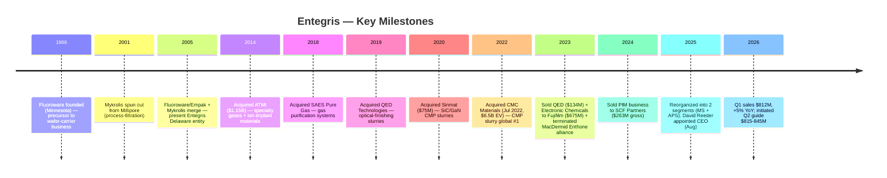
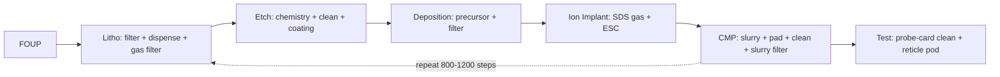

# Entegris, Inc. (NASDAQ:ENTG) — Company Research

**Report date:** 2026-05-26
**Ticker:** NASDAQ:ENTG • **CIK:** 0001101302 • **HQ:** Billerica, Massachusetts
**Domicile:** United States • **Reporting currency:** USD
**Latest fiscal year:** FY25 ended 2025-12-31

> **Update — FY26 Q2 outlook initiated (2026-04-30):** On the Q1 2026 earnings release, management initiated Q2 2026 guidance of revenue **$815–845M** (vs. Q1 actual $811.9M and Q2-2025 $773M, implying ~5–9% YoY growth), GAAP diluted EPS **$0.53–0.61** and non-GAAP diluted EPS **$0.76–0.84**, with Adjusted EBITDA margin of **~27.0–28.0%**. Management cited "accelerating AI-related demand" and "strengthening order patterns" as the driver. Source: [ENTG Q1-FY26 Earnings 8-K, 2026-04-30](https://www.sec.gov/Archives/edgar/data/1101302/000110130226000099/entgq12026ex991.htm).

---

## Table of Contents

1. Company Overview
2. Company History
3. Management Team
4. Products & Services
5. Customers & Go-to-Market
6. Industry Overview
7. Competitive Landscape
8. Market Opportunity (TAM)
9. Risk Assessment
10. References

---

## 1. Company Overview

Entegris, Inc. (NASDAQ:ENTG) is a Billerica, Massachusetts-headquartered specialty-materials and process-purity supplier to the global semiconductor industry. The Company's products are consumed every time a silicon wafer moves through a fab — chemical mechanical planarization (CMP) slurries and pads that flatten device layers, deposition precursors that build atom-by-atom films, gas-and-liquid filters that strip sub-nanometer contaminants from process chemistries, and the front-opening unified pods (FOUPs) and reticle pods that physically carry wafers and masks between tool steps. Approximately **82% of FY25 net sales were generated outside the United States**, reflecting the concentration of leading-edge wafer manufacturing in Taiwan, South Korea, Japan, and increasingly Southeast Asia ([Entegris 2025 10-K, Item 1 Business](https://www.sec.gov/Archives/edgar/data/1101302/000110130226000012/entg-20251231.htm)).

The Company reports through **two segments** following a 2025 reorganization that simplified the historical four-segment structure: Materials Solutions (MS) supplies advanced chemistries and consumables — chemical vapor and atomic layer deposition (CVD/ALD) materials, CMP slurries and pads, ion-implantation specialty gases, formulated etch and clean materials; Advanced Purity Solutions (APS) supplies filtration, purification, contamination-control hardware, and the wafer-and-reticle handling systems (FOUPs, SMIF pods, EUV reticle pods) that move material around the fab without recontaminating it. The "MS provides materials-based solutions … while providing for lower total cost of ownership" framing comes verbatim from the FY25 10-K segment description ([Entegris 2025 10-K, Item 1](https://www.sec.gov/Archives/edgar/data/1101302/000110130226000012/entg-20251231.htm)).

FY25 net sales were **$3,196.6M** (down 1.4% YoY from $3,241.4M), with MS at $1,406.7M (flat YoY) and APS at $1,799.1M (down 2.8%); GAAP gross margin compressed 150bp YoY to **44.4%** of net sales reflecting absence of the divested Pipeline & Industrial Materials (PIM) and Electronic Chemicals (EC) businesses ([Entegris 2025 10-K, MD&A — Results of Operations](https://www.sec.gov/Archives/edgar/data/1101302/000110130226000012/entg-20251231.htm)). The Company headcount stood at **~7,700 employees** at year-end, with the regional split: 51% North America, 15% Southeast Asia, 11% Taiwan, 9% Japan, 7% South Korea, 5% China, and 2% Europe ([Entegris 2025 10-K, Human Capital](https://www.sec.gov/Archives/edgar/data/1101302/000110130226000012/entg-20251231.htm)).

*Source: ENTG 10-Ks FY20–FY25 (filed 2021–2026), per [SEC EDGAR submissions for CIK 0001101302](https://www.sec.gov/cgi-bin/browse-edgar?action=getcompany&CIK=0001101302&type=10-K). The 2022 jump reflects the closing of the CMC Materials acquisition on July 6, 2022; the 2023 decline reflects ~5 months of CMC contribution rolling off as 2022's stub year, plus the EC business sale to Fujifilm (Oct 2023, $675M proceeds) and QED divestiture (Mar 2023, $134M).*

Customer concentration is high but not pathological for a semiconductor materials supplier: **Taiwan Semiconductor Manufacturing Company (TSMC) accounted for 16% of FY25 net sales** (16% in 2024, 11% in 2023 — the trend reflects TSMC's escalating share of global advanced-node capacity), and the remaining top-ten customers collectively contributed 34%, putting **total top-ten exposure at 50%** ([Entegris 2025 10-K, Risk Factors — Customer Concentration](https://www.sec.gov/Archives/edgar/data/1101302/000110130226000012/entg-20251231.htm)). The other named relationships in the customer base run through every leading-edge logic and memory IDM — Samsung, Intel, SK hynix, Micron — though only TSMC crosses the 10% disclosure threshold individually.

*Source: ENTG 10-Ks FY23–FY25, Segment Reporting. APS revenue fell 2.8% in FY25 in part on softer industrial / non-semi end markets; MS held flat on resilient advanced-node CMP and deposition consumables.*

### Valuation snapshot

As of mid-May 2026, ENTG trades at approximately **$135.28 per share** with a market capitalization of **~$20.6 billion** and enterprise value of **~$24.0 billion** ([Stockanalysis.com ENTG statistics, 2026-05](https://stockanalysis.com/stocks/entg/statistics/)). On TTM metrics, the stock screens at **P/E ~77.7×**, **P/S ~6.4×**, **P/B ~5.1×**, and **EV/EBITDA ~27.2×**, with total debt of **~$3.76B** against **~$0.45B** of cash (i.e. ~$3.31B net debt) ([Stockanalysis.com ENTG statistics, 2026-05](https://stockanalysis.com/stocks/entg/statistics/)). The dividend yield is a token 0.30% — Entegris pays a small dividend (currently $0.10/quarter) but the cash priority is deleveraging post-CMC ([ENTG Q1-FY26 Earnings 8-K, 2026-04-30](https://www.sec.gov/Archives/edgar/data/1101302/000110130226000099/entgq12026ex991.htm)).

The TTM P/E is elevated for three identifiable reasons, none of which is a structural value-trap signal. **First**, GAAP earnings are still depressed by acquisition-related amortization on the CMC purchase (the FY25 non-GAAP EPS of $2.86 versus GAAP $1.55 implies roughly $1.30/share of non-cash and one-time adjustments primarily tied to intangible amortization and restructuring) ([Entegris 2025 10-K, Non-GAAP reconciliation](https://www.sec.gov/Archives/edgar/data/1101302/000110130226000012/entg-20251231.htm)). **Second**, forward P/E compresses to **~35×** on consensus FY26E EPS — still a premium multiple, but consistent with the AI-driven re-rating of the broader semi-materials complex over the past 12 months (the stock has gained ~87% on a 52-week basis through May 2026, per [Stockanalysis.com](https://stockanalysis.com/stocks/entg/statistics/)). **Third**, peers in CMP / consumable materials (Anji Microelectronics 688019.SS, Dinglong 300054.SZ) trade at 60–70× TTM P/E reflecting the same AI-secular-growth narrative; the industrial-gas peers (Linde LIN 30×, Air Products APD ~20×) anchor the low end of a wide dispersion ([Nomura "Greater China Semi: Guide to Semi renaissance 2026–30F", 2026-05-21, p. 15–17 — covered in project sector note](../../sector/半导体材料.md)).

*Source: TTM P/E for ENTG from [Stockanalysis.com, 2026-05](https://stockanalysis.com/stocks/entg/statistics/); LIN/APD/AI.PA from Yahoo Finance / Reuters May 2026; Anji 688019 and Dinglong 300054 multiples from Nomura "Greater China Semi" report ([sector note](../../sector/半导体材料.md), pp. 130, 132). Merck KGaA EU listing.*

*Analyst view:* The valuation tension here is straightforward — investors are paying a 35× forward multiple for a business that grew 5% YoY in Q1 2026 with mid-twenties EBITDA margins and ~$3.3B of net debt to deleverage. The bull case rests on (i) advanced-node CMP step-count expansion as 2nm logic and 400-layer NAND ramp, (ii) co-optimized "filtration + slurry" cross-sell now that CMC's slurry is integrated under Entegris's filtration platform, and (iii) molybdenum's emergence as a replacement for tungsten in advanced interconnects (Entegris has both the precursor chemistry and the post-Mo CMP slurry chemistry) ([Entegris 2025 10-K, Item 1 Semiconductor Ecosystem](https://www.sec.gov/Archives/edgar/data/1101302/000110130226000012/entg-20251231.htm)). The bear case is that the stock has run faster than near-term earnings and a 2027 demand pause in conjunction with tariff escalation could compress the multiple to a sector-median 20–25× — implying meaningful downside.

## 2. Company History

The current Entegris is the product of three corporate mergers, four large acquisitions, and a string of opportunistic bolt-ons spanning two decades. The operating roots trace to two Minnesota plastic-products specialists — Fluoroware (founded 1966) and Empak — that pioneered the PFA fluoropolymer wafer carriers, which became the industry-standard FOUP design. The Company in its present legal form was **"incorporated in Delaware on March 17, 2005 through a merger of Entegris, Inc., a Minnesota corporation, and Mykrolis Corporation, a Delaware corporation"**, the latter being a 2001 spin-out of Millipore's microelectronics filtration business ([Entegris 2025 10-K, Item 1 Business](https://www.sec.gov/Archives/edgar/data/1101302/000110130226000012/entg-20251231.htm)). The 2005 merger combined Fluoroware-Empak's wafer-handling franchise with Mykrolis's process-filtration franchise — the structural seed of today's Advanced Purity Solutions segment.

The next transformative move came in 2014 with the **acquisition of ATMI** (Danbury, Connecticut) for approximately $1.15B — a deal that brought specialty gases, ion-implantation precursors, and SDS (Safe Delivery Source) gas-cylinder technology into the portfolio. ATMI became the nucleus of what would later be branded "Specialty Chemicals & Engineered Materials" (SCEM) and is now part of Materials Solutions ([Entegris 2025 10-K, Item 1 — Acquisitions and Divestitures background](https://www.sec.gov/Archives/edgar/data/1101302/000110130226000012/entg-20251231.htm)). A series of smaller bolt-ons followed through the late 2010s, including the 2018 acquisition of SAES Pure Gas (gas-purification systems) and the 2019 acquisition of QED Technologies (precision optical-finishing slurries — later divested in 2023).

The most consequential M&A — and the one that defines the current capital structure — was the **December 2021 agreement to acquire CMC Materials** (then NASDAQ:CCMP, the former Cabot Microelectronics) for ~$6.5B enterprise value, closed on July 6, 2022 ([Entegris CMC Materials acquisition press release, 2022-07-06](https://investor.entegris.com/news/news-details/2022/Entegris-Completes-Acquisition-of-CMC-Materials-Solidifying-Position-as-the-Global-Leader-in-Electronic-Materials-07-06-2022/default.aspx)). CMC was at the time the global leader in CMP slurry; combining CMC's slurry product line with Entegris's downstream slurry filtration and high-purity packaging created what the Company describes as the only platform delivering CMP slurries, pads, post-CMP cleaning chemistries, slurry filters, and fluid-handling systems from a single supplier ([Entegris 2025 10-K, Item 1 — Semiconductor Ecosystem](https://www.sec.gov/Archives/edgar/data/1101302/000110130226000012/entg-20251231.htm)).

The 2023–2024 portfolio actions completed the rationalization. The Company **sold QED** (March 2023, $134.3M proceeds), **sold the Electronic Chemicals business to FUJIFILM Holdings** (October 2023, $675.3M proceeds), **terminated the Alliance Agreement with MacDermid Enthone** (June 2023, $191.2M net proceeds), and **sold the Pipeline & Industrial Materials business to SCF Partners** (March 2024, $263.2M gross / $256.2M net plus up to $25M earn-out) ([Entegris 2025 10-K, Acquisitions and Divestitures](https://www.sec.gov/Archives/edgar/data/1101302/000110130226000012/entg-20251231.htm)). Combined proceeds of ~$1.4B were directed at debt paydown — by year-end 2025, long-term debt had fallen to approximately **$3.88B** from the post-close 2022 peak near **$4.93B**, with leverage (Adjusted EBITDA basis) dropping below 4.0× ([Entegris 2025 10-K, Liquidity and Capital Resources](https://www.sec.gov/Archives/edgar/data/1101302/000110130226000012/entg-20251231.htm)).

*Source: ENTG 10-Ks FY21–FY25. The 4.5–5.0× gross leverage post-CMC is consistent with management's guidance at deal announcement of "approximately 4.0× at closing, deleveraging to less than 3.0× over time" — see [Entegris CMC announcement, 2021-12-15](https://investor.entegris.com/news/news-details/2021/Entegris-to-Acquire-CMC-Materials-to-Create-a-Leader-in-Electronic-Materials-12-15-2021/default.aspx). The deleveraging trajectory through 2025 is tracking expectations.*

The most recent strategic move was the **August 2025 CEO transition**: long-time CEO Bertrand Loy (12 years in the role, since November 2012) handed the role to David Reeder, formerly CFO at Chewy, Inc. and previously CFO of GlobalFoundries Inc. through its 2021 IPO. Loy remained at the Company as Executive Chair ([Entegris 2025 10-K, Information about our Executive Officers](https://www.sec.gov/Archives/edgar/data/1101302/000110130226000012/entg-20251231.htm)). The transition is notable for the choice of an externally-recruited semiconductor-CFO profile rather than an internal materials-science executive — interpretation under Section 3 below.

## 3. Management Team

### David Reeder — President & Chief Executive Officer (since August 2025)

David Reeder became Entegris's President and Chief Executive Officer in August 2025 and has served on the Board of Directors since March 2024 ([Entegris 2025 10-K, Executive Officers](https://www.sec.gov/Archives/edgar/data/1101302/000110130226000012/entg-20251231.htm)). His appointment marked the end of Bertrand Loy's nearly 13-year tenure as CEO, with Loy moving to the role of Executive Chair. Reeder is 51 years old per the 10-K. From **February 2024 until June 2025**, Reeder served as **Chief Financial Officer at Chewy, Inc.**, a supplier of pet products and services, where he oversaw the company's financial functions ([Entegris 2025 10-K, Executive Officers](https://www.sec.gov/Archives/edgar/data/1101302/000110130226000012/entg-20251231.htm)). Prior to Chewy, from **August 2020 until February 2024**, he was **Chief Financial Officer of GlobalFoundries Inc.**, the global semiconductor foundry — and most consequentially, he oversaw GlobalFoundries' **initial public offering in October 2021** ([Entegris 2025 10-K, Executive Officers](https://www.sec.gov/Archives/edgar/data/1101302/000110130226000012/entg-20251231.htm)) — a transaction that valued the business at ~$26B and was one of the largest semiconductor IPOs in the public market over the past decade.

Reeder's career before GlobalFoundries spans CEO-level operational roles and CFO seats at large public technology companies. From **2017 to 2020**, he served as Chief Executive Officer of Tower Hill Insurance Group; from **2015 to 2017**, he held senior roles at **Lexmark International Inc.**, including as President and CEO and as CFO; he also served as CFO of Electronics for Imaging, Inc. ([Entegris 2025 10-K, Executive Officers](https://www.sec.gov/Archives/edgar/data/1101302/000110130226000012/entg-20251231.htm)). Earlier in his career, he held executive positions at three of the most relevant US semiconductor names: **Cisco Systems** (CFO of the Enterprise Networking Division), **Broadcom Corporation** (Vice President of Asia), and **Texas Instruments Incorporated** (in both financial and operational roles). He served on the board of directors of Alphawave IP Group plc from September 2023 until December 2025 ([Entegris 2025 10-K, Executive Officers](https://www.sec.gov/Archives/edgar/data/1101302/000110130226000012/entg-20251231.htm)).

*Analyst view:* The Reeder selection signals a particular Board thesis: with the CMC integration broadly complete and the deleveraging path established, the next chapter is about capital-allocation discipline, valuation re-rating through investor-communication tightening, and possibly another large acquisition or strategic re-segmentation. A CFO with both foundry experience (GlobalFoundries) and successful IPO execution is precisely the profile picked when those are the priorities. The 2-segment reorganization announced under Reeder's first quarter as CEO is a visible early signal of structural simplification.

### Bertrand Loy — Executive Chair (CEO November 2012 – August 2025)

While Loy is no longer in operational control, the FY25 10-K still names him as Executive Chair — a meaningful role on a Board that retained him as Chair from 2023 onward ([Entegris 2025 10-K, Executive Officers](https://www.sec.gov/Archives/edgar/data/1101302/000110130226000012/entg-20251231.htm)). Loy is 60 years old per the same disclosure. Loy joined the present Entegris entity in 2005 — the year of the Mykrolis merger — and was promoted through the financial and operating ranks: Executive Vice President in charge of IT, global supply chain, and manufacturing operations (2005–2008); Executive Vice President and Chief Operating Officer (2008–2012); and Chief Executive Officer, President, and Director from November 2012, Chair of the Board from 2023. Before joining Entegris, he served as Vice President and CFO of Mykrolis from January 2001 until the 2005 merger, having earlier been CIO of Millipore Corporation (1999–2000) ([Entegris 2025 10-K, Executive Officers](https://www.sec.gov/Archives/edgar/data/1101302/000110130226000012/entg-20251231.htm)).

The two transformative deals of Loy's CEO tenure are the **2014 acquisition of ATMI** (~$1.15B) and the **2022 acquisition of CMC Materials** ($6.5B EV) — taken together, the moves that converted Entegris from a sub-$1B filtration-and-handling specialist into a >$3B diversified electronic-materials platform. Loy has also been on the board of SEMI, the global industry association representing the electronics manufacturing supply chain, since July 2013, serving as Chair until December 2022 ([Entegris 2025 10-K, Executive Officers](https://www.sec.gov/Archives/edgar/data/1101302/000110130226000012/entg-20251231.htm)). The Executive Chair seat keeps Loy plugged into industry-level coordination and the long-term M&A pipeline — he is not a ceremonial outgoing CEO but an active strategic anchor.

## 4. Products & Services

Section 4 is the analytical foundation for everything below — what Entegris physically *makes*, how each product sits in a fab's process flow, and where the moat is. Entegris organizes its FY25 10-K Item 1 Business narrative around the **eight process steps in semiconductor manufacturing** in which its products are consumed: Photolithography, Etch and Resist Strip, Deposition, Ion Implant, Chemical Mechanical Planarization (CMP), Wafer and Reticle Transport, Chemical Handling, and Wafer and Package Testing ([Entegris 2025 10-K, Item 1 — The Semiconductor Ecosystem](https://www.sec.gov/Archives/edgar/data/1101302/000110130226000012/entg-20251231.htm)). This section walks each step in turn, anchored to the 10-K's verbatim product descriptions, then closes with a synthesis on how the categories interact in a single wafer-through-fab journey.

### 4.1 The 10-K product-by-process matrix

The table below reproduces the matrix the way Entegris itself organizes it in the 10-K, with the Materials Solutions (MS) vs. Advanced Purity Solutions (APS) segment tag on each product line.

| Fab process step | Entegris product family | Segment |
|---|---|---|
| Photolithography | Liquid filtration, high-purity packaging, high-precision dispense systems | APS |
| Photolithography | Gas microcontamination control | APS |
| Etch & Resist Strip | Selective etch chemistries (incl. for 3D-NAND, GAA) | MS |
| Etch & Resist Strip | Formulated cleaning solutions (post-etch) | MS |
| Etch & Resist Strip | Filters & purifiers, precision-engineered coatings | APS / MS |
| Deposition | Advanced precursor materials (CVD, ALD, PVD) | MS |
| Deposition | Filtration & purification (gas + liquid) | APS |
| Ion Implant | Implant gases via Safe Delivery Source (SDS®) and Vacuum Actuated Cylinders (VAC) | MS |
| Ion Implant | Electrostatic chucks, low-temp plasma coatings for IMP toolset | APS |
| CMP | Slurries (W, Cu, oxide, barrier-Ta, Mo, Al, SiC, GaN) | MS |
| CMP | Polishing pads | MS |
| CMP | Post-CMP cleaning chemistries | MS |
| CMP | Slurry filters & process-monitoring equipment | APS |
| Wafer/Reticle Transport | FOUPs, wafer carriers, SMIF pods, EUV reticle pods | APS |
| Chemical Handling | Drums, flexible packaging, coded connectors, IntelliGen® dispense | APS |
| Chemical Handling | Ultra-pure valves, fittings, tubing, sensors | APS |
| Wafer/Package Test | Probe-card / test-socket cleaning consumables, polymer products | APS |

Source: [Entegris 2025 10-K, Item 1 — The Semiconductor Ecosystem](https://www.sec.gov/Archives/edgar/data/1101302/000110130226000012/entg-20251231.htm). Segment assignment from the segment-description sections of the same filing.

### 4.2 Synthesis — how the categories interact in a single wafer's journey

To understand why a fab buys this breadth from a single supplier, walk a 300mm wafer through ten days of processing. The wafer arrives in an Entegris **FOUP** — the sealed polymer pod that has carried it from the silicon supplier. At the litho cell, an Entegris **liquid filter and IntelliGen® dispense system** apply photoresist contamination-free; an Entegris **gas microcontamination filter** ensures the ambient airborne chemistry around the scanner is below ppt thresholds. At etch, Entegris **selective etch chemistries** carve the pattern; **formulated cleans** strip residue. At deposition, an Entegris **CVD or ALD precursor** (e.g. a molybdenum or tungsten precursor) is delivered through an Entegris **gas filter** to lay an angstrom-perfect film. At CMP, an Entegris **slurry** (CMC heritage) and **pad** (CMC heritage) planarize the film; a downstream Entegris **slurry filter** (legacy filtration heritage) catches the agglomerated particles before they redeposit on the wafer; an Entegris **post-CMP clean** removes the slurry chemistry. Then the cycle repeats — typically **800–1,200 process steps** for a leading-edge logic device. At the back end, an Entegris **EUV reticle pod** protects the photomask vehicle that carried the litho pattern; an Entegris **probe-card cleaner** maintains the test-socket interface that verifies device functionality.

This composability — slurry + slurry filter + post-CMP clean + slurry monitoring — is the core integration logic of the CMC Materials acquisition. The 10-K describes it directly: *"With CMC Materials, we will be able to better serve our customers, invest more in engineering, research and development and bring complementary, co-optimized solutions to market faster"* ([Entegris 2025 10-K, Item 1 — Acquisition rationale](https://www.sec.gov/Archives/edgar/data/1101302/000110130226000012/entg-20251231.htm)). No competitor offers all four steps of the CMP-then-clean cycle from one supplier.

### 4.3 Photolithography materials — filtration as moat

> *"Photolithography is a process used to print complex circuit patterns onto wafers. The wafer is coated with a thin film of light-sensitive photoresist, exposed to light, and developed to create the pattern. Our products used throughout this process include: Liquid filtration, high-purity packaging and high-precision dispense systems that ensure pure, accurate and uniform distribution of contamination-free photoresists onto the wafer, enabling optimum yields; and Gas microcontamination control solutions that eliminate airborne contaminants that can disrupt the photolithography processes."* — [Entegris 2025 10-K, Item 1](https://www.sec.gov/Archives/edgar/data/1101302/000110130226000012/entg-20251231.htm)

**Plain-language gloss:** Photoresist (PR, 光刻胶) is the photosensitive film that records the chip pattern when ASML's EUV scanner exposes the wafer. A single airborne particle bigger than ~10nm in the PR chemistry — or a few ppt of an unwanted amine in the fab air — can destroy the latent image and ruin a die. Entegris does not make the PR itself (that's the Tokyo-Ohka / JSR / Shin-Etsu / Sumitomo oligopoly) — Entegris makes the **filters that strip particles from PR as it dispenses onto the wafer**, the **high-purity packaging** that keeps PR clean from PR maker to fab, the **IntelliGen® precision-dispense valves** that meter chemistry uniformly onto the spinning wafer, and the **gas-side microcontamination filters** that maintain the cleanroom air around the scanner. As EUV (especially EUV-Low NA and the coming High-NA EUV) shrinks critical dimension below 8nm, the particle tolerance tightens roughly with the cube of the dimension — meaning litho-cell contamination control is **becoming more important per wafer, not less**, even as the PR itself migrates to dry resist (Lam) or metal-oxide-resist chemistries.

*Analyst view:* Entegris's litho-cell franchise is the highest-moat business in the portfolio. The filter-membrane chemistry (PFA-based, asymmetric pore structures), the IntelliGen® valve precision, and the integration with the world's three or four photoresist suppliers create switching costs that have produced multi-decade customer relationships. Competitor companies named in the 10-K Competition section include **Pall Corporation (part of Danaher Corporation)** and **EMD Performance Materials division of Merck KGaA** for litho filtration ([Entegris 2025 10-K, Competition](https://www.sec.gov/Archives/edgar/data/1101302/000110130226000012/entg-20251231.htm)); China's **Cobetter Filtration** is listed as the named China-domestic peer pursuing the same membrane categories ([Entegris 2025 10-K, Competition](https://www.sec.gov/Archives/edgar/data/1101302/000110130226000012/entg-20251231.htm)).

### 4.4 Etch and Resist Strip — selective chemistries for 3D-NAND and GAA

> *"During the etch process, thin film areas are selectively removed from the wafer surface to create the desired circuit pattern. The hardened resist must then be removed and the etched area cleaned using high-purity chemicals. Our products used during and after etch include: Selective etch chemistries enabling high aspect ratio structures, including 3D-NAND and gate-all-around (GAA) devices; Formulated cleaning solutions for photoresist and post-etch residue removal; Filters and purifiers that ensure purity of cleaning chemistries and achieve desired etch yields; and Precision-engineered coatings that protect equipment surfaces from corrosive chemistries and erosion while minimizing particle generation."* — [Entegris 2025 10-K, Item 1](https://www.sec.gov/Archives/edgar/data/1101302/000110130226000012/entg-20251231.htm)

**Plain-language gloss:** Etch chemistries (刻蚀化学品 / etch chemistries) are reactive liquids and gases that dissolve a specific material — silicon, silicon nitride, silicon oxide, tungsten, or molybdenum — while leaving the materials *next to* it untouched ("selectivity," 选择比). For 3D NAND, fabs need to etch a stack of 200+ alternating SiN/SiO₂ layers into a single straight hole **(high-aspect-ratio etch, HAR, 高纵横比刻蚀)** that runs from the top of the stack to the bottom. The selectivity must be near-perfect or the hole tapers and the cell fails. For GAA logic, the manufacturer needs to selectively etch SiGe channels *while leaving Si nanosheets intact* — a chemistry challenge that mirrors HAR but for 2nm-scale features. Entegris's **formulated cleaning solutions** then strip the etch byproducts and any leftover PR from the wafer. The **precision-engineered coatings** (a legacy ATMI capability) are sprayed onto chamber walls to keep corrosive etchants from eroding the etch tool itself.

*Analyst view:* The etch-chemistry segment is more contested than litho filtration — major competitors include the **EMD Performance Materials division of Merck KGaA** (formerly Versum), the **Advanced Materials division of Air Liquide**, **Anji Microelectronics (Shanghai) Co., Ltd**, and **Linde plc**, all listed in the FY25 10-K Competition section ([Entegris 2025 10-K, Competition](https://www.sec.gov/Archives/edgar/data/1101302/000110130226000012/entg-20251231.htm)). The differentiator is process integration with the etch toolmaker (Lam Research and Tokyo Electron). Entegris's advantage is the bundle: a formulated clean qualified for a specific Lam KIYO™ chamber, plus the filter that ensures it stays uncontaminated. Stand-alone chemistry suppliers struggle to match that.

### 4.5 Deposition — precursors for the molybdenum transition

> *"During the deposition process, certain materials are transferred to the wafer surfaces through physical vapor deposition, or PVD, chemical vapor deposition, or CVD, and atomic-layer deposition, or ALD. Our products are critical to enabling new device architectures and ensuring device performance and manufacturing yields. These products include: Advanced precursor materials that meet the semiconductor industry's composition, uniformity and thickness requirements for deposited films; and Filtration and purification products that remove contaminants during deposition, reducing wafer defects."* — [Entegris 2025 10-K, Item 1](https://www.sec.gov/Archives/edgar/data/1101302/000110130226000012/entg-20251231.htm)

**Plain-language gloss:** Atomic Layer Deposition (ALD, 原子层沉积) builds a film one atomic layer at a time by alternating pulses of two gas-phase **precursors (前驱体)**. The precursor is a custom-designed metal-organic molecule — for example a hafnium amide for gate-oxide ALD, or a molybdenum oxychloride for the new Mo word-line transition in advanced NAND and DRAM. The chemistry is exotic, the purity demand is extreme (sub-ppb metal contamination), and the precursor's vapor pressure / volatility / decomposition profile has to be tuned to the specific tool recipe. The 10-K explicitly calls out the **molybdenum transition**: *"As leading semiconductor manufacturers implement molybdenum into advanced nodes, Entegris is uniquely positioned to support this transition and to solve challenges associated with integrating a new material through our expertise and solutions in precursors, deposition, etch, CMP consumables and contamination control"* ([Entegris 2025 10-K, Item 1](https://www.sec.gov/Archives/edgar/data/1101302/000110130226000012/entg-20251231.htm)). Molybdenum is the leading candidate to replace tungsten as the contact / word-line metal at sub-3nm logic and 400+ layer NAND because Mo has lower resistivity at the thin films required, and Entegris is one of very few suppliers with a complete Mo workflow — Mo precursor + Mo-etch chemistry + Mo CMP slurry + Mo post-CMP clean.

*Analyst view:* The deposition-precursors business is structurally consolidated — competitors named in the FY25 10-K include **Air Liquide's Advanced Materials division**, **EMD Performance Materials** (Merck KGaA), and **Linde plc** ([Entegris 2025 10-K, Competition](https://www.sec.gov/Archives/edgar/data/1101302/000110130226000012/entg-20251231.htm)). The Mo workflow described above is genuinely differentiated and is the single most-discussed structural growth driver in management's recent earnings commentary ([ENTG Q4-FY25 Earnings 8-K, 2026-02-10](https://www.sec.gov/Archives/edgar/data/1101302/000110130226000009/entgq42025ex991.htm)).

### 4.6 Ion Implantation — SDS® gas delivery is the franchise

> *"Ion implantation is a repeated process that introduces dopants into semiconductor wafers to enhance conductivity. Our products used during ion implant include: Implant process gases and mixtures delivered through our Safe Delivery Source (SDS) and Vacuum Actuated Cylinders (VAC) systems for safe, effective and efficient delivery; and Electrostatic chucks and proprietary low-temperature plasma coatings for core components critical to ion implantation equipment."* — [Entegris 2025 10-K, Item 1](https://www.sec.gov/Archives/edgar/data/1101302/000110130226000012/entg-20251231.htm)

**Plain-language gloss:** Ion-implantation gases are *hazardous*: boron trifluoride (BF₃), arsine (AsH₃), phosphine (PH₃) — toxic, pyrophoric, lethal at low concentrations. The **Safe Delivery Source® (SDS®)** system, an ATMI invention now over 25 years in the field, stores the implant gas adsorbed onto a sorbent inside a sub-atmospheric cylinder. The cylinder is at vacuum when sealed; if it ruptures, gas does not flood the fab. **Vacuum Actuated Cylinders (VAC)** is a parallel technology for non-adsorbable gases. Entegris is the de-facto industry-standard SDS supplier — every major implant toolmaker (Applied Materials, Axcelis) qualifies SDS as the safe-delivery option. The **electrostatic chucks (ESC, 静电吸盘)** and **low-temperature plasma coatings** for ion-implant tools are a separate, related franchise — chamber-component sales rather than consumables.

*Analyst view:* The SDS franchise is one of the highest-margin / highest-switching-cost businesses in the Entegris portfolio. Once a fab safety officer has approved an SDS workflow, swapping to a competitor's delivery technology requires re-doing the entire EHS qualification — a 12-to-24-month cycle. Direct competitors in implant gas delivery are limited; the FY25 10-K Competition section names **Air Liquide's Advanced Materials division** and **Linde plc** as competitors more broadly across specialty gases ([Entegris 2025 10-K, Competition](https://www.sec.gov/Archives/edgar/data/1101302/000110130226000012/entg-20251231.htm)).

### 4.7 Chemical Mechanical Planarization — the CMC heritage at the core

> *"CMP is a polishing process used to planarize, or flatten, layers of material that have been deposited on silicon wafers. Our offerings include: CMP slurries for polishing semiconductor materials, including tungsten, dielectric materials, copper, tantalum (commonly referred to as 'barrier'), molybdenum, aluminum, silicon carbide (SiC) and gallium nitride (GaN); CMP polishing pads used with slurries across a range of polishing tools, wafers, technology nodes and applications, including tungsten, copper, and dielectrics; Formulated cleaning chemistries that remove residues from wafer surfaces after the CMP process; Filtration and purification solutions that remove select particles and contaminants from slurries and cleaning chemistries to prevent wafer defects; and Process monitoring and control equipment to maintain CMP slurry integrity."* — [Entegris 2025 10-K, Item 1](https://www.sec.gov/Archives/edgar/data/1101302/000110130226000012/entg-20251231.htm)

**Plain-language gloss:** **Chemical Mechanical Planarization (CMP, 化学机械抛光)** is the polishing step that flattens every metal and dielectric layer in a chip — without CMP, the multi-layer stack of an advanced logic die would be a mountain range of bumps after the first few metal levels. The **slurry (抛光液)** is the abrasive-plus-chemistry liquid that does the work: silica or ceria nanoparticles suspended in an oxidizer (for metals like tungsten and copper) or in a pH-controlled buffer (for dielectrics). Different slurries are tuned for different materials — a tungsten slurry uses oxidative chemistry to convert W into WO₃ (which the silica then mechanically polishes away); a copper slurry uses a complexing agent (often glycine) to form soluble Cu²⁺ complexes; a ceria-based oxide slurry uses the cerium-IV → cerium-III redox cycle to selectively attack SiO₂. The **pad (抛光垫)** is the porous polymer disc that holds the slurry against the wafer; pad-conditioner diamond grit (the Kinik 中砂 franchise — see [project sector note](../../sector/半导体材料.md)) keeps the pad surface roughened so it grips slurry rather than glazing over. **Post-CMP clean (CMP 后清洗)** removes the residual slurry / particles / metal ions from the wafer before it moves to the next process. **Slurry filters** in the recirculation loop catch agglomerated particles before they redeposit and create scratches.

The Entegris CMP franchise is structurally the broadest in the industry because of the CMC Materials acquisition: slurry chemistries spanning W, Cu, dielectric (oxide), barrier (Ta), Mo, Al, **SiC and GaN** (the SiC/GaN slurries came from the Sinmat acquisition in January 2020, $75M, which became part of the CMC platform after 2022 — see [Entegris-Sinmat press release, 2020-01-10](https://www.businesswire.com/news/home/20200110005216/en/Entegris-Acquires-CMP-Slurry-Manufacturer-Sinmat)). The pad business came with CMC. The filtration is legacy Entegris. The integration story is that no competitor offers all four — slurry + pad + clean + slurry filter — from a single supplier qualified at the leading edge.

*Analyst view:* Per Nomura's "Greater China Semi: Guide to Semi renaissance 2026–30F" report (2026-05-21), the global CMP slurry league table positions Entegris as the largest slurry supplier post-CMC, with **Resonac (Showa Denko), Versum (now EMD/Merck KGaA), Fujimi Incorporated, Anji Microelectronics, KC Tech, Soulbrain, and Dinglong** as the named competitor set ([sector note](../../sector/半导体材料.md), based on Nomura "Greater China Semi" Figs. 41–44). In CMP pads, the league table is similarly Entegris (CMC heritage) versus **DuPont** (the dominant pad supplier historically, with the IC1000 pad family), **Fujibo Holdings**, **3M**, **Dinglong** (China), and **JSR** ([sector note](../../sector/半导体材料.md)). Entegris's competitive moat is the bundle: a fab buying CMC's Microplanar® slurry typically buys the matched Epic® pad and the IntelliPolish® control system from the same supplier — switching either component out is non-trivial because pad-on-slurry chemistry is tightly coupled. Competitor companies named in the FY25 10-K Competition section that overlap CMP include **EMD Performance Materials**, **Qnity Electronics** (DuPont's electronics-materials spin-off), and **Anji Microelectronics** ([Entegris 2025 10-K, Competition](https://www.sec.gov/Archives/edgar/data/1101302/000110130226000012/entg-20251231.htm)). The new entrants from China — Anji and Dinglong — are the credible long-term threat to slurry pricing power at mature nodes.

### 4.8 Wafer and Reticle Transport — FOUP and EUV reticle pod franchise

> *"Our products, including front-opening unified pods (FOUPs), wafer transport and process carriers, standard mechanical interface pods (SMIF pods) and extreme ultraviolet (EUV) reticle pods, protect wafers and reticles from damage or abrasion and ensure purity during transportation and automated processing. This protection is essential because wafer processing involves hundreds of steps over several weeks, making damaged wafers costly to scrap."* — [Entegris 2025 10-K, Item 1](https://www.sec.gov/Archives/edgar/data/1101302/000110130226000012/entg-20251231.htm)

**Plain-language gloss:** A **FOUP (Front-Opening Unified Pod, 前开式晶圆传送盒)** is the sealed plastic cassette that holds 25 wafers and physically moves between every process tool in a fab. It is the *unit of inventory* in 300mm manufacturing — the AMHS (Automated Material Handling System) ceiling-track network that moves FOUPs around a modern fab moves them at 5+ m/s. The FOUP must (i) seal wafers from airborne contamination during transport, (ii) keep the wafers electrostatically grounded, (iii) survive thousands of robotic load/unload cycles without outgassing, and (iv) standard-interface with every tool vendor's load port. The **EUV reticle pod** is the corresponding container for the lithography photomask — particularly critical because EUV reticles are *pellicle-less* (the protective film used at deep-UV is not yet practical for EUV), so any particle settling on the reticle prints onto every wafer it exposes. The Entegris EUV reticle pod offers vacuum-transfer capability so that the reticle never sees ambient atmosphere when moving from storage to the scanner. The 10-K describes this directly: *"Our EUV reticle pod provides defect-free protection of EUV reticles during shipping, storage, handling and vacuum-transferring operations"* ([Entegris 2025 10-K, Item 1](https://www.sec.gov/Archives/edgar/data/1101302/000110130226000012/entg-20251231.htm)).

*Analyst view:* The FOUP business is one of the longest-standing Entegris franchises — direct descendant of the Fluoroware 1960s polymer-carrier business and the only category in which Entegris has been the global market leader continuously for two decades. The FY25 10-K Competition section names **Shin-Etsu Polymer Co. Ltd.** (Japan), **Gudeng Precision Industrial** (Taiwan), and **Aicello Corporation** (Japan, smaller in FOUP) as the principal competitors ([Entegris 2025 10-K, Competition](https://www.sec.gov/Archives/edgar/data/1101302/000110130226000012/entg-20251231.htm)). Third-party market trackers credit Entegris with the largest single-supplier share globally — typically estimated at 30–40% of the 300mm FOUP market — with Shin-Etsu Polymer the dominant in-Japan supplier and Gudeng the in-Taiwan leader ([FOUP carrier market research, 2025](https://reports.valuates.com/market-reports/QYRE-Auto-3K10126/global-foup-and-fosb)). For EUV reticle pods, Entegris is the de-facto sole-source vehicle qualified across TSMC, Samsung, and Intel's EUV fabs — a near-monopoly position that is the natural moat for the High-NA EUV ramp now under way at ASML.

### 4.9 Chemical Handling, Wafer/Package Testing, and the IntelliGen® platform

The FY25 10-K describes two further smaller categories. **Chemical Handling** comprises *"Ultra-high purity chemical container products, including drums, flexible packaging and associated coded connection systems, that maintain chemical purity, maximize utilization and ensure safe transport"* and *"Ultra-pure valves, fittings, tubings and sensing and control products for chemical distribution throughout the fab"* ([Entegris 2025 10-K, Item 1](https://www.sec.gov/Archives/edgar/data/1101302/000110130226000012/entg-20251231.htm)). The flagship product line is the **IntelliGen® high-precision liquid dispense system**, which the 10-K describes as enabling *"uniform application of advanced chemistries, integrating our valve control expertise with filter device technologies to conserve high-value chemistry and reduce defects"* ([Entegris 2025 10-K, Item 1](https://www.sec.gov/Archives/edgar/data/1101302/000110130226000012/entg-20251231.htm)).

**Wafer and Package Testing** comprises probe-card / test-socket cleaning consumables and polymer products that improve front-end tool uptime — a small but high-margin category. *Analyst view:* The handling and testing categories are not strategic growth drivers — they are stable recurring-consumable streams that, like SDS in implant, are sticky because they're qualified into the customer's tool workflow.

### 4.10 Engineering, research & development — the integration moat

Entegris employed **approximately 1,600 ER&D engineers** at year-end 2025 and spent **$329.2M on ER&D** in FY25 (versus $316.1M in 2024) ([Entegris 2025 10-K, MD&A — ER&D expenses](https://www.sec.gov/Archives/edgar/data/1101302/000110130226000012/entg-20251231.htm)). ER&D as a percentage of net sales sits at **10.3%** — high for a materials business, consistent with a portfolio that has to qualify every product variant against each customer's new node. The Company has **approximately 4,400 active patents worldwide** (of which ~850 are US patents) plus **~2,400 pending patent applications globally** as of December 31, 2025 ([Entegris 2025 10-K, Patents and Other Intellectual Property Rights](https://www.sec.gov/Archives/edgar/data/1101302/000110130226000012/entg-20251231.htm)). ER&D centers are co-located with customer fabs — Taiwan, South Korea, US, Japan, Canada, China, Singapore, and Malaysia — and the Company collaborates with **Stanford, Yale, MIT, University of Illinois, SUNY Albany, the Fraunhofer Institute, imec, and CEA-LETI** on materials roadmaps ([Entegris 2025 10-K, ER&D](https://www.sec.gov/Archives/edgar/data/1101302/000110130226000012/entg-20251231.htm)).

