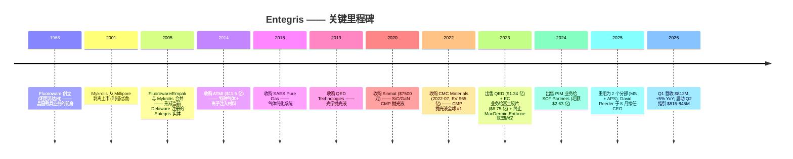

# 恩特格里斯 Entegris, Inc. (NASDAQ:ENTG) — 公司研究

**报告日期：** 2026-05-26
**代码：** NASDAQ:ENTG • **CIK：** 0001101302 • **总部：** 美国马萨诸塞州 Billerica
**注册地：** 美国 (Delaware) • **报告货币：** 美元 (USD)
**最新财年：** FY25，截止 2025-12-31

> **更新 — FY26 Q2 指引启动 (2026-04-30)：** 在 2026 年 Q1 季报发布会上，管理层启动 Q2 2026 营收指引区间 **$815–845M**（对照 Q1 实际 $811.9M、Q2-2025 $773M，隐含同比 +5%~+9%），GAAP 摊薄每股盈余 **$0.53–0.61**，非 GAAP 摊薄每股盈余 **$0.76–0.84**，调整后 EBITDA 利润率 **~27.0–28.0%**。管理层在电话会议中点名 "AI 相关需求加速" 与 "订单模式增强" 为核心驱动。资料：[ENTG Q1-FY26 Earnings 8-K, 2026-04-30](https://www.sec.gov/Archives/edgar/data/1101302/000110130226000099/entgq12026ex991.htm)。

---

## 目录

1. 公司概览
2. 公司历史
3. 管理团队
4. 产品与服务
5. 客户与上市策略
6. 行业概览
7. 竞争格局
8. 市场机会 (TAM)
9. 风险评估
10. 参考资料

---

## 1. 公司概览

恩特格里斯 (Entegris, Inc., NASDAQ:ENTG) 是一家总部位于美国马萨诸塞州 Billerica 的半导体专用材料与制程纯净度 (process purity) 解决方案供应商，向全球晶圆厂供应一片硅晶圆从硅基板到成品所需的几乎每一种 "进入晶圆与离开晶圆都必须经过的耗材"——包括用于平坦化各层结构的 `CMP 抛光液 (CMP slurry — 全球 #1, post-CMC)` 和抛光垫、用于一原子层一原子层构筑薄膜的沉积前驱体 (deposition precursor)、用于在工艺化学品进入腔体前剥离亚纳米级污染的 `液气过滤器 (liquid / gas filters)`、以及用于在工艺工序间物理搬运晶圆与光罩的 `FOUP 晶圆载具 (Front Opening Unified Pod)` 与 `Reticle pods 光罩盒`。**FY25 净销售约 82% 来自美国本土以外**，反映出全球领先节点晶圆制造对台湾、韩国、日本以及日益重要的东南亚地区的高度集中 ([Entegris 2025 10-K, Item 1 Business](https://www.sec.gov/Archives/edgar/data/1101302/000110130226000012/entg-20251231.htm))。

公司在 2025 年完成了一次重大组织重整，将历史上的四个分部精简为 **两个可报告分部**：(i) `Materials Solutions (MS) 业务` 供应先进化学品与耗材——化学气相 / 原子层沉积 (CVD/ALD) 材料、CMP 抛光液与抛光垫、离子注入特种气体、配方蚀刻与清洗化学品；(ii) `Advanced Planarization Solutions (APS) 业务` 供应过滤纯化、`微污染控制 (Microcontamination Control)` 硬件，以及在晶圆厂内移动晶圆和光罩而不会再次污染它们的载具系统（FOUP、SMIF pod、EUV reticle pod）。"MS 部门提供基于材料的解决方案……同时为客户提供更低的总体拥有成本"——这一表述直接来自 FY25 10-K 分部章节的原文 ([Entegris 2025 10-K, Item 1](https://www.sec.gov/Archives/edgar/data/1101302/000110130226000012/entg-20251231.htm))。

FY25 净销售为 **$3,196.6M**（同比 -1.4%，对比 FY24 $3,241.4M），其中 MS $1,406.7M（同比基本持平）、APS $1,799.1M（同比 -2.8%）；GAAP 毛利率同比压缩 150bp 至 **44.4%**，主要反映已剥离的 Pipeline & Industrial Materials (PIM) 与 Electronic Chemicals (EC) 业务不再贡献收入 ([Entegris 2025 10-K, MD&A — Results of Operations](https://www.sec.gov/Archives/edgar/data/1101302/000110130226000012/entg-20251231.htm))。年末员工约 **7,700 人**，地区分布为：北美 51%、东南亚 15%、台湾 11%、日本 9%、韩国 7%、中国大陆 5%、欧洲 2% ([Entegris 2025 10-K, Human Capital](https://www.sec.gov/Archives/edgar/data/1101302/000110130226000012/entg-20251231.htm))。

*资料：ENTG FY20–FY25 10-K（提交于 2021–2026 年），通过 [SEC EDGAR submissions for CIK 0001101302](https://www.sec.gov/cgi-bin/browse-edgar?action=getcompany&CIK=0001101302&type=10-K) 检索得到。2022 年的跳升对应 `2022 年 65 亿美元收购 CMC Materials` 于 2022-07-06 完成交割；2023 年的回落则同时来自 (i) CMC 仅贡献全年约 5 个月业绩的同比效应 (stub-year roll-off)、(ii) 2023-10 将 EC 业务以 $675M 出售给富士胶片 (Fujifilm)、以及 (iii) 2023-03 出售 QED 资产 ($134M)。*

客户集中度高，但对一家半导体材料供应商而言并非异常：**台积电 (TSMC) 占 FY25 净销售的 16%**（FY24 16%、FY23 11%——这条上行轨迹反映了 TSMC 在全球先进节点产能中份额的持续提升），其余 top-10 客户合计贡献 34%，所以 **top-10 集中度达 50%** ([Entegris 2025 10-K, Risk Factors — Customer Concentration](https://www.sec.gov/Archives/edgar/data/1101302/000110130226000012/entg-20251231.htm))。客户名单中其它可命名关系覆盖所有头部先进逻辑与存储 IDM——三星、英特尔、SK 海力士、美光——但只有 TSMC 跨越 10% 的单独披露门槛。

*资料：ENTG FY23–FY25 10-K 分部报告。FY25 APS 营收下降 2.8% 部分来自工业 / 非半导体终端市场疲软；MS 在先进节点 CMP 与沉积耗材的韧性支撑下维持持平。*

### 估值速览

截至 2026 年 5 月中旬，ENTG 股价约 **$135.28/股**，市值约 **$206 亿**，企业价值约 **$240 亿** ([Stockanalysis.com ENTG statistics, 2026-05](https://stockanalysis.com/stocks/entg/statistics/))。基于 TTM 指标，估值倍数分别为 **P/E 约 77.7×**、**P/S 约 6.4×**、**P/B 约 5.1×**、**EV/EBITDA 约 27.2×**；总债务约 **$37.6 亿**，对应 **$4.5 亿** 现金（即净债务约 $33.1 亿）([Stockanalysis.com ENTG statistics, 2026-05](https://stockanalysis.com/stocks/entg/statistics/))。股息率仅约 0.30%——公司支付小额股息（目前每季度 $0.10），现金优先用于 CMC 收购后的去杠杆 ([ENTG Q1-FY26 Earnings 8-K, 2026-04-30](https://www.sec.gov/Archives/edgar/data/1101302/000110130226000099/entgq12026ex991.htm))。

TTM P/E 偏高有三个可识别的结构性原因，没有一个是基本面价值陷阱信号。**第一**，GAAP 盈余仍被 CMC 收购相关的无形资产摊销 (acquisition amortization) 拖累——FY25 非 GAAP EPS $2.86 对应 GAAP EPS $1.55，差额约 $1.30/股，主要来自非现金的无形资产摊销与重组费用 ([Entegris 2025 10-K, Non-GAAP reconciliation](https://www.sec.gov/Archives/edgar/data/1101302/000110130226000012/entg-20251231.htm))。**第二**，按 FY26E 一致预期 EPS 计算的远期 P/E 压缩至 **约 35×**——仍属溢价倍数，但与过去 12 个月整个半导体材料板块在 AI 行情中被重新定价的趋势一致（截至 2026-05，过去 52 周股价上涨约 87%——[Stockanalysis.com](https://stockanalysis.com/stocks/entg/statistics/)）。**第三**，CMP / 耗材同业（安集 688019.SS、鼎龙 300054.SZ）按相同的 AI 长线增长叙事在 60–70× TTM P/E 区间交易；工业气体类同业（林德 LIN 30×、空气化工 APD 约 20×）则锚定较低端，整体行业估值离散度大 ([Nomura "Greater China Semi: Guide to Semi renaissance 2026–30F", 2026-05-21, p. 15–17 — covered in project sector note](../../sector/半导体材料.md))。

*资料：ENTG TTM P/E 来自 [Stockanalysis.com, 2026-05](https://stockanalysis.com/stocks/entg/statistics/)；LIN/APD/AI.PA 来自 2026 年 5 月 Yahoo Finance / Reuters；安集 688019 与鼎龙 300054 倍数来自野村《Greater China Semi》报告（[行业笔记](../../sector/半导体材料.md)第 130、132 页）。Merck KGaA 为欧洲上市。*

*分析师观点：* 估值张力一目了然——投资者用 35× 远期倍数买入一家 Q1 2026 同比仅 +5%、调整后 EBITDA 利润率约 25% 上下、净债务 $33 亿待去杠杆的企业。多头逻辑依赖于：(i) 2nm 逻辑与 400 层 NAND 量产推动先进节点 CMP 工序步数扩张、(ii) CMC 抛光液已并入 Entegris 过滤平台后的 "过滤 + 抛光液" 交叉销售协同、(iii) 钼 (Mo) 替代钨 (W) 作为先进互连金属的趋势——Entegris 同时拥有 Mo 前驱体化学品与 Mo CMP 抛光液 ([Entegris 2025 10-K, Item 1 Semiconductor Ecosystem](https://www.sec.gov/Archives/edgar/data/1101302/000110130226000012/entg-20251231.htm))。空头逻辑则是股价已跑在近端盈余前面，2027 年若出现需求停顿叠加关税升级，倍数压缩到行业中位数 20–25× 将意味着明显下行空间。

## 2. 公司历史

如今的 Entegris 是三次公司合并、四笔大型收购，以及跨越二十年的若干机会型并购拼出的整体。其运营根基可追溯至两家美国明尼苏达州的塑料制品专家——Fluoroware（创立于 1966）与 Empak——他们开拓的 PFA 氟聚合物晶圆载具后来演化为行业标准的 FOUP 设计。公司在当前法律形态上 **"于 2005 年 3 月 17 日在 Delaware 注册，由明尼苏达州的 Entegris, Inc. 与 Delaware 州的 Mykrolis Corporation 合并形成"**，其中 Mykrolis 是 2001 年从 Millipore 微电子过滤业务剥离出来的独立公司 ([Entegris 2025 10-K, Item 1 Business](https://www.sec.gov/Archives/edgar/data/1101302/000110130226000012/entg-20251231.htm))。2005 年的合并把 Fluoroware-Empak 的晶圆搬运业务与 Mykrolis 的制程过滤业务整合到同一家公司——这是今天 APS 分部的结构性种子。

下一个变革性时刻发生在 2014 年的 **ATMI 收购**（康涅狄格州 Danbury）——约 $11.5 亿美元的交易把 `特种气体 (specialty gas)`、离子注入前驱体以及 SDS (Safe Delivery Source) 气瓶技术带进了组合。ATMI 后来成为 "Specialty Chemicals & Engineered Materials" (SCEM) 分部的核心——今天则在 MS 分部内 ([Entegris 2025 10-K, Item 1 — Acquisitions and Divestitures background](https://www.sec.gov/Archives/edgar/data/1101302/000110130226000012/entg-20251231.htm))。2010 年代后期还有一批规模较小的螺栓收购，例如 2018 年收购 SAES Pure Gas（气体纯化系统）、2019 年收购 QED Technologies（精密光学抛光液——已于 2023 年剥离）。

但塑造今日资本结构的最具决定性 M&A 是 **2021 年 12 月签署、2022 年 7 月 6 日交割的 CMC Materials 收购**（曾用代码 NASDAQ:CCMP，前身是 Cabot Microelectronics），企业价值约 $65 亿美元 ([Entegris CMC Materials acquisition press release, 2022-07-06](https://investor.entegris.com/news/news-details/2022/Entegris-Completes-Acquisition-of-CMC-Materials-Solidifying-Position-as-the-Global-Leader-in-Electronic-Materials-07-06-2022/default.aspx))。CMC 当时是全球 CMP 抛光液的龙头；将 CMC 的抛光液产品线与 Entegris 下游的 `先进材料处理 (advanced material handling)`、抛光液过滤器与高纯度包装结合，造就了公司自我描述的——业内唯一能从单一供应商提供 "CMP 抛光液 + 抛光垫 + CMP 后清洗 + 抛光液过滤器 + 流体处理系统" 完整堆栈的平台 ([Entegris 2025 10-K, Item 1 — Semiconductor Ecosystem](https://www.sec.gov/Archives/edgar/data/1101302/000110130226000012/entg-20251231.htm))。

2023–2024 年的组合调整收尾了整个重整过程。公司 **(i)** 于 2023-03 出售 QED（$1.343 亿现金）、**(ii)** 于 2023-10 将 Electronic Chemicals 业务出售给 FUJIFILM 控股（$6.753 亿现金）、**(iii)** 于 2023-06 终止与 MacDermid Enthone 的联盟协议（净收益 $1.912 亿）、**(iv)** 于 2024-03 把 Pipeline & Industrial Materials 业务出售给 SCF Partners（毛额 $2.632 亿、净额 $2.562 亿，加最多 $2500 万的 earn-out）([Entegris 2025 10-K, Acquisitions and Divestitures](https://www.sec.gov/Archives/edgar/data/1101302/000110130226000012/entg-20251231.htm))。合计约 $14 亿的剥离收益悉数用于还债——截至 2025 年末，长期债务从 2022 年 CMC 交割后约 **$49.3 亿** 的峰值下降到约 **$38.8 亿**，调整后 EBITDA 口径杠杆率回落至 4.0× 以下 ([Entegris 2025 10-K, Liquidity and Capital Resources](https://www.sec.gov/Archives/edgar/data/1101302/000110130226000012/entg-20251231.htm))。

*资料：ENTG FY21–FY25 10-K。CMC 收购后约 4.5–5.0× 的毛杠杆率与公司宣布交易时管理层给出的 "交割时约 4.0×，逐步降至低于 3.0×" 指引一致——参见 [Entegris CMC announcement, 2021-12-15](https://investor.entegris.com/news/news-details/2021/Entegris-to-Acquire-CMC-Materials-to-Create-a-Leader-in-Electronic-Materials-12-15-2021/default.aspx)。截至 2025 年的去杠杆轨迹符合预期。*

最近一项战略动作是 **2025 年 8 月的 CEO 换届**：在位 12 年的老 CEO Bertrand Loy（自 2012-11 担任）将职位交给 David Reeder——后者此前在 Chewy, Inc. 担任 CFO，更早曾担任 GlobalFoundries Inc. CFO 并主导其 2021 年 IPO。Loy 则留任公司执行董事长 (Executive Chair) ([Entegris 2025 10-K, Information about our Executive Officers](https://www.sec.gov/Archives/edgar/data/1101302/000110130226000012/entg-20251231.htm))。换届方式值得注意——董事会选择一位 "半导体 CFO 背景的外部人选" 而不是内部材料科学出身的高管，其含义将在第 3 节展开。

## 3. 管理团队

### David Reeder —— 总裁兼首席执行官 (2025-08 起)

David Reeder 于 2025-08 出任 Entegris 总裁兼 CEO，自 2024-03 起担任董事 ([Entegris 2025 10-K, Executive Officers](https://www.sec.gov/Archives/edgar/data/1101302/000110130226000012/entg-20251231.htm))。他的上任标志着 Bertrand Loy 近 13 年 CEO 任期的结束，Loy 转任执行董事长 (Executive Chair)。Reeder 年龄 51 岁（按 10-K 披露）。从 **2024-02 至 2025-06**，Reeder 担任宠物用品与服务零售商 **Chewy, Inc. 的首席财务官 (CFO)**，主管全公司财务职能 ([Entegris 2025 10-K, Executive Officers](https://www.sec.gov/Archives/edgar/data/1101302/000110130226000012/entg-20251231.htm))。在 Chewy 之前，他于 **2020-08 至 2024-02** 担任全球半导体代工厂 **GlobalFoundries Inc. 的 CFO**，并直接主导了 **2021-10 GlobalFoundries 的 IPO** ([Entegris 2025 10-K, Executive Officers](https://www.sec.gov/Archives/edgar/data/1101302/000110130226000012/entg-20251231.htm))——这笔交易估值约 $260 亿美元，是过去十年公开市场上规模最大的半导体 IPO 之一。

Reeder 在 GlobalFoundries 之前的履历则横跨 CEO 级运营职位与多家大型上市科技公司的 CFO 职位。**2017–2020** 年担任 Tower Hill Insurance Group 的 CEO；**2015–2017** 年在 **Lexmark International Inc.** 历任总裁兼 CEO 以及 CFO；他还曾担任 Electronics for Imaging, Inc. 的 CFO ([Entegris 2025 10-K, Executive Officers](https://www.sec.gov/Archives/edgar/data/1101302/000110130226000012/entg-20251231.htm))。更早些时候，他在美国半导体行业最相关的三家公司任职过：**Cisco Systems**（企业网络业务 CFO）、**Broadcom Corporation**（亚太副总裁）、以及 **Texas Instruments Incorporated**（财务与运营双线职责）。2023-09 至 2025-12 期间任 Alphawave IP Group plc 董事 ([Entegris 2025 10-K, Executive Officers](https://www.sec.gov/Archives/edgar/data/1101302/000110130226000012/entg-20251231.htm))。

*分析师观点：* 选择 Reeder 反映了董事会的一个特定论点：CMC 整合已大体完成、去杠杆轨迹也已建立，下一阶段的核心是资本配置纪律、通过精细化投资者沟通获得估值重估，以及可能的下一笔大型收购或战略性再分部。一位同时拥有代工厂经验 (GlobalFoundries) 与成功 IPO 执行记录的 CFO，恰好是这些优先级下的最佳画像。Reeder 上任首个完整季度即宣布的 2 个分部重组，是结构性精简意图的早期可见信号。

### Bertrand Loy —— 执行董事长 (CEO 任期 2012-11 至 2025-08)

虽然 Loy 已不再担任运营职位，FY25 10-K 仍将他列为执行董事长——一个董事会层面的实权角色，自 2023 年起担任董事长 ([Entegris 2025 10-K, Executive Officers](https://www.sec.gov/Archives/edgar/data/1101302/000110130226000012/entg-20251231.htm))。Loy 年龄 60 岁（按同一份披露）。Loy 于 2005 年——Mykrolis 合并那一年——加入现今的 Entegris 实体，并在财务与运营序列上一路升任：负责 IT、全球供应链与制造运营的执行副总裁（2005–2008）、执行副总裁兼首席运营官（2008–2012）、自 2012-11 起担任 CEO、总裁兼董事，并自 2023 年起兼任董事长。加入 Entegris 之前，他在 2001-01 至 2005 年合并间担任 Mykrolis 副总裁兼 CFO，更早还曾任 Millipore Corporation 的首席信息官（1999–2000）([Entegris 2025 10-K, Executive Officers](https://www.sec.gov/Archives/edgar/data/1101302/000110130226000012/entg-20251231.htm))。

Loy 任期内两笔决定性 M&A——**2014 年的 ATMI 收购**（约 $11.5 亿）与 **2022 年的 CMC Materials 收购**（EV $65 亿）——合在一起，把 Entegris 从一家不到 $10 亿规模的过滤与搬运专家，转型为一家 $30 亿规模、多元化的电子材料平台。Loy 同时自 2013-07 起任 SEMI（全球电子制造供应链行业协会）董事，并曾任主席直至 2022-12 ([Entegris 2025 10-K, Executive Officers](https://www.sec.gov/Archives/edgar/data/1101302/000110130226000012/entg-20251231.htm))。执行董事长身份让 Loy 持续介入行业层面的协调与长期 M&A 管道——他不是一位象征性的离任 CEO，而是公司在战略层面的实质性锚定。

