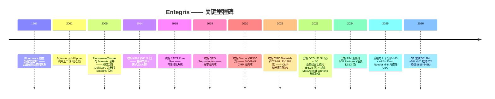
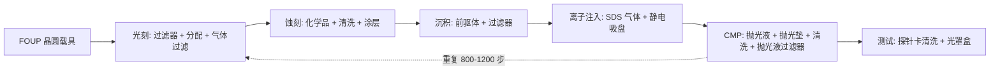

# 恩特格里斯 Entegris, Inc. (NASDAQ:ENTG) — 公司研究

**报告日期：** 2026-05-26
**代码：** NASDAQ:ENTG • **CIK：** 0001101302 • **总部：** 美国马萨诸塞州 Billerica
**注册地：** 美国 (Delaware) • **报告货币：** 美元 (USD)
**最新财年：** FY25，截止 2025-12-31

> **更新 — FY26 Q2 指引启动 (2026-04-30)：** 在 2026 年 Q1 季报发布会上，管理层启动 Q2 2026 营收指引区间 **$815–845M**（对照 Q1 实际 $811.9M、Q2-2025 $773M，隐含同比 +5%~+9%），GAAP 摊薄每股盈余 **$0.53–0.61**，非 GAAP 摊薄每股盈余 **$0.76–0.84**，调整后 EBITDA 利润率 **~27.0–28.0%**。管理层在电话会议中点名 "AI 相关需求加速" 与 "订单模式增强" 为核心驱动。资料：[ENTG Q1-FY26 Earnings 8-K, 2026-04-30](https://www.sec.gov/Archives/edgar/data/1101302/000110130226000099/entgq12026ex991.htm)。

---

## 目录

1. 公司概览
2. 公司历史
3. 管理团队
4. 产品与服务
5. 客户与上市策略
6. 行业概览
7. 竞争格局
8. 市场机会 (TAM)
9. 风险评估
10. 参考资料

---

## 1. 公司概览

恩特格里斯 (Entegris, Inc., NASDAQ:ENTG) 是一家总部位于美国马萨诸塞州 Billerica 的半导体专用材料与制程纯净度 (process purity) 解决方案供应商，向全球晶圆厂供应一片硅晶圆从硅基板到成品所需的几乎每一种 "进入晶圆与离开晶圆都必须经过的耗材"——包括用于平坦化各层结构的 `CMP 抛光液 (CMP slurry — 全球 #1, post-CMC)` 和抛光垫、用于一原子层一原子层构筑薄膜的沉积前驱体 (deposition precursor)、用于在工艺化学品进入腔体前剥离亚纳米级污染的 `液气过滤器 (liquid / gas filters)`、以及用于在工艺工序间物理搬运晶圆与光罩的 `FOUP 晶圆载具 (Front Opening Unified Pod)` 与 `Reticle pods 光罩盒`。**FY25 净销售约 82% 来自美国本土以外**，反映出全球领先节点晶圆制造对台湾、韩国、日本以及日益重要的东南亚地区的高度集中 ([Entegris 2025 10-K, Item 1 Business](https://www.sec.gov/Archives/edgar/data/1101302/000110130226000012/entg-20251231.htm))。

公司在 2025 年完成了一次重大组织重整，将历史上的四个分部精简为 **两个可报告分部**：(i) `Materials Solutions (MS) 业务` 供应先进化学品与耗材——化学气相 / 原子层沉积 (CVD/ALD) 材料、CMP 抛光液与抛光垫、离子注入特种气体、配方蚀刻与清洗化学品；(ii) `Advanced Planarization Solutions (APS) 业务` 供应过滤纯化、`微污染控制 (Microcontamination Control)` 硬件，以及在晶圆厂内移动晶圆和光罩而不会再次污染它们的载具系统（FOUP、SMIF pod、EUV reticle pod）。"MS 部门提供基于材料的解决方案……同时为客户提供更低的总体拥有成本"——这一表述直接来自 FY25 10-K 分部章节的原文 ([Entegris 2025 10-K, Item 1](https://www.sec.gov/Archives/edgar/data/1101302/000110130226000012/entg-20251231.htm))。

FY25 净销售为 **$3,196.6M**（同比 -1.4%，对比 FY24 $3,241.4M），其中 MS $1,406.7M（同比基本持平）、APS $1,799.1M（同比 -2.8%）；GAAP 毛利率同比压缩 150bp 至 **44.4%**，主要反映已剥离的 Pipeline & Industrial Materials (PIM) 与 Electronic Chemicals (EC) 业务不再贡献收入 ([Entegris 2025 10-K, MD&A — Results of Operations](https://www.sec.gov/Archives/edgar/data/1101302/000110130226000012/entg-20251231.htm))。年末员工约 **7,700 人**，地区分布为：北美 51%、东南亚 15%、台湾 11%、日本 9%、韩国 7%、中国大陆 5%、欧洲 2% ([Entegris 2025 10-K, Human Capital](https://www.sec.gov/Archives/edgar/data/1101302/000110130226000012/entg-20251231.htm))。

*资料：ENTG FY20–FY25 10-K（提交于 2021–2026 年），通过 [SEC EDGAR submissions for CIK 0001101302](https://www.sec.gov/cgi-bin/browse-edgar?action=getcompany&CIK=0001101302&type=10-K) 检索得到。2022 年的跳升对应 `2022 年 65 亿美元收购 CMC Materials` 于 2022-07-06 完成交割；2023 年的回落则同时来自 (i) CMC 仅贡献全年约 5 个月业绩的同比效应 (stub-year roll-off)、(ii) 2023-10 将 EC 业务以 $675M 出售给富士胶片 (Fujifilm)、以及 (iii) 2023-03 出售 QED 资产 ($134M)。*

客户集中度高，但对一家半导体材料供应商而言并非异常：**台积电 (TSMC) 占 FY25 净销售的 16%**（FY24 16%、FY23 11%——这条上行轨迹反映了 TSMC 在全球先进节点产能中份额的持续提升），其余 top-10 客户合计贡献 34%，所以 **top-10 集中度达 50%** ([Entegris 2025 10-K, Risk Factors — Customer Concentration](https://www.sec.gov/Archives/edgar/data/1101302/000110130226000012/entg-20251231.htm))。客户名单中其它可命名关系覆盖所有头部先进逻辑与存储 IDM——三星、英特尔、SK 海力士、美光——但只有 TSMC 跨越 10% 的单独披露门槛。

*资料：ENTG FY23–FY25 10-K 分部报告。FY25 APS 营收下降 2.8% 部分来自工业 / 非半导体终端市场疲软；MS 在先进节点 CMP 与沉积耗材的韧性支撑下维持持平。*

### 估值速览

截至 2026 年 5 月中旬，ENTG 股价约 **$135.28/股**，市值约 **$206 亿**，企业价值约 **$240 亿** ([Stockanalysis.com ENTG statistics, 2026-05](https://stockanalysis.com/stocks/entg/statistics/))。基于 TTM 指标，估值倍数分别为 **P/E 约 77.7×**、**P/S 约 6.4×**、**P/B 约 5.1×**、**EV/EBITDA 约 27.2×**；总债务约 **$37.6 亿**，对应 **$4.5 亿** 现金（即净债务约 $33.1 亿）([Stockanalysis.com ENTG statistics, 2026-05](https://stockanalysis.com/stocks/entg/statistics/))。股息率仅约 0.30%——公司支付小额股息（目前每季度 $0.10），现金优先用于 CMC 收购后的去杠杆 ([ENTG Q1-FY26 Earnings 8-K, 2026-04-30](https://www.sec.gov/Archives/edgar/data/1101302/000110130226000099/entgq12026ex991.htm))。

TTM P/E 偏高有三个可识别的结构性原因，没有一个是基本面价值陷阱信号。**第一**，GAAP 盈余仍被 CMC 收购相关的无形资产摊销 (acquisition amortization) 拖累——FY25 非 GAAP EPS $2.86 对应 GAAP EPS $1.55，差额约 $1.30/股，主要来自非现金的无形资产摊销与重组费用 ([Entegris 2025 10-K, Non-GAAP reconciliation](https://www.sec.gov/Archives/edgar/data/1101302/000110130226000012/entg-20251231.htm))。**第二**，按 FY26E 一致预期 EPS 计算的远期 P/E 压缩至 **约 35×**——仍属溢价倍数，但与过去 12 个月整个半导体材料板块在 AI 行情中被重新定价的趋势一致（截至 2026-05，过去 52 周股价上涨约 87%——[Stockanalysis.com](https://stockanalysis.com/stocks/entg/statistics/)）。**第三**，CMP / 耗材同业（安集 688019.SS、鼎龙 300054.SZ）按相同的 AI 长线增长叙事在 60–70× TTM P/E 区间交易；工业气体类同业（林德 LIN 30×、空气化工 APD 约 20×）则锚定较低端，整体行业估值离散度大 ([Nomura "Greater China Semi: Guide to Semi renaissance 2026–30F", 2026-05-21, p. 15–17 — covered in project sector note](../../sector/半导体材料.md))。

*资料：ENTG TTM P/E 来自 [Stockanalysis.com, 2026-05](https://stockanalysis.com/stocks/entg/statistics/)；LIN/APD/AI.PA 来自 2026 年 5 月 Yahoo Finance / Reuters；安集 688019 与鼎龙 300054 倍数来自野村《Greater China Semi》报告（[行业笔记](../../sector/半导体材料.md)第 130、132 页）。Merck KGaA 为欧洲上市。*

*分析师观点：* 估值张力一目了然——投资者用 35× 远期倍数买入一家 Q1 2026 同比仅 +5%、调整后 EBITDA 利润率约 25% 上下、净债务 $33 亿待去杠杆的企业。多头逻辑依赖于：(i) 2nm 逻辑与 400 层 NAND 量产推动先进节点 CMP 工序步数扩张、(ii) CMC 抛光液已并入 Entegris 过滤平台后的 "过滤 + 抛光液" 交叉销售协同、(iii) 钼 (Mo) 替代钨 (W) 作为先进互连金属的趋势——Entegris 同时拥有 Mo 前驱体化学品与 Mo CMP 抛光液 ([Entegris 2025 10-K, Item 1 Semiconductor Ecosystem](https://www.sec.gov/Archives/edgar/data/1101302/000110130226000012/entg-20251231.htm))。空头逻辑则是股价已跑在近端盈余前面，2027 年若出现需求停顿叠加关税升级，倍数压缩到行业中位数 20–25× 将意味着明显下行空间。

## 2. 公司历史

如今的 Entegris 是三次公司合并、四笔大型收购，以及跨越二十年的若干机会型并购拼出的整体。其运营根基可追溯至两家美国明尼苏达州的塑料制品专家——Fluoroware（创立于 1966）与 Empak——他们开拓的 PFA 氟聚合物晶圆载具后来演化为行业标准的 FOUP 设计。公司在当前法律形态上 **"于 2005 年 3 月 17 日在 Delaware 注册，由明尼苏达州的 Entegris, Inc. 与 Delaware 州的 Mykrolis Corporation 合并形成"**，其中 Mykrolis 是 2001 年从 Millipore 微电子过滤业务剥离出来的独立公司 ([Entegris 2025 10-K, Item 1 Business](https://www.sec.gov/Archives/edgar/data/1101302/000110130226000012/entg-20251231.htm))。2005 年的合并把 Fluoroware-Empak 的晶圆搬运业务与 Mykrolis 的制程过滤业务整合到同一家公司——这是今天 APS 分部的结构性种子。

下一个变革性时刻发生在 2014 年的 **ATMI 收购**（康涅狄格州 Danbury）——约 $11.5 亿美元的交易把 `特种气体 (specialty gas)`、离子注入前驱体以及 SDS (Safe Delivery Source) 气瓶技术带进了组合。ATMI 后来成为 "Specialty Chemicals & Engineered Materials" (SCEM) 分部的核心——今天则在 MS 分部内 ([Entegris 2025 10-K, Item 1 — Acquisitions and Divestitures background](https://www.sec.gov/Archives/edgar/data/1101302/000110130226000012/entg-20251231.htm))。2010 年代后期还有一批规模较小的螺栓收购，例如 2018 年收购 SAES Pure Gas（气体纯化系统）、2019 年收购 QED Technologies（精密光学抛光液——已于 2023 年剥离）。

但塑造今日资本结构的最具决定性 M&A 是 **2021 年 12 月签署、2022 年 7 月 6 日交割的 CMC Materials 收购**（曾用代码 NASDAQ:CCMP，前身是 Cabot Microelectronics），企业价值约 $65 亿美元 ([Entegris CMC Materials acquisition press release, 2022-07-06](https://investor.entegris.com/news/news-details/2022/Entegris-Completes-Acquisition-of-CMC-Materials-Solidifying-Position-as-the-Global-Leader-in-Electronic-Materials-07-06-2022/default.aspx))。CMC 当时是全球 CMP 抛光液的龙头；将 CMC 的抛光液产品线与 Entegris 下游的 `先进材料处理 (advanced material handling)`、抛光液过滤器与高纯度包装结合，造就了公司自我描述的——业内唯一能从单一供应商提供 "CMP 抛光液 + 抛光垫 + CMP 后清洗 + 抛光液过滤器 + 流体处理系统" 完整堆栈的平台 ([Entegris 2025 10-K, Item 1 — Semiconductor Ecosystem](https://www.sec.gov/Archives/edgar/data/1101302/000110130226000012/entg-20251231.htm))。

2023–2024 年的组合调整收尾了整个重整过程。公司 **(i)** 于 2023-03 出售 QED（$1.343 亿现金）、**(ii)** 于 2023-10 将 Electronic Chemicals 业务出售给 FUJIFILM 控股（$6.753 亿现金）、**(iii)** 于 2023-06 终止与 MacDermid Enthone 的联盟协议（净收益 $1.912 亿）、**(iv)** 于 2024-03 把 Pipeline & Industrial Materials 业务出售给 SCF Partners（毛额 $2.632 亿、净额 $2.562 亿，加最多 $2500 万的 earn-out）([Entegris 2025 10-K, Acquisitions and Divestitures](https://www.sec.gov/Archives/edgar/data/1101302/000110130226000012/entg-20251231.htm))。合计约 $14 亿的剥离收益悉数用于还债——截至 2025 年末，长期债务从 2022 年 CMC 交割后约 **$49.3 亿** 的峰值下降到约 **$38.8 亿**，调整后 EBITDA 口径杠杆率回落至 4.0× 以下 ([Entegris 2025 10-K, Liquidity and Capital Resources](https://www.sec.gov/Archives/edgar/data/1101302/000110130226000012/entg-20251231.htm))。

*资料：ENTG FY21–FY25 10-K。CMC 收购后约 4.5–5.0× 的毛杠杆率与公司宣布交易时管理层给出的 "交割时约 4.0×，逐步降至低于 3.0×" 指引一致——参见 [Entegris CMC announcement, 2021-12-15](https://investor.entegris.com/news/news-details/2021/Entegris-to-Acquire-CMC-Materials-to-Create-a-Leader-in-Electronic-Materials-12-15-2021/default.aspx)。截至 2025 年的去杠杆轨迹符合预期。*

最近一项战略动作是 **2025 年 8 月的 CEO 换届**：在位 12 年的老 CEO Bertrand Loy（自 2012-11 担任）将职位交给 David Reeder——后者此前在 Chewy, Inc. 担任 CFO，更早曾担任 GlobalFoundries Inc. CFO 并主导其 2021 年 IPO。Loy 则留任公司执行董事长 (Executive Chair) ([Entegris 2025 10-K, Information about our Executive Officers](https://www.sec.gov/Archives/edgar/data/1101302/000110130226000012/entg-20251231.htm))。换届方式值得注意——董事会选择一位 "半导体 CFO 背景的外部人选" 而不是内部材料科学出身的高管，其含义将在第 3 节展开。

## 3. 管理团队

### David Reeder —— 总裁兼首席执行官 (2025-08 起)

David Reeder 于 2025-08 出任 Entegris 总裁兼 CEO，自 2024-03 起担任董事 ([Entegris 2025 10-K, Executive Officers](https://www.sec.gov/Archives/edgar/data/1101302/000110130226000012/entg-20251231.htm))。他的上任标志着 Bertrand Loy 近 13 年 CEO 任期的结束，Loy 转任执行董事长 (Executive Chair)。Reeder 年龄 51 岁（按 10-K 披露）。从 **2024-02 至 2025-06**，Reeder 担任宠物用品与服务零售商 **Chewy, Inc. 的首席财务官 (CFO)**，主管全公司财务职能 ([Entegris 2025 10-K, Executive Officers](https://www.sec.gov/Archives/edgar/data/1101302/000110130226000012/entg-20251231.htm))。在 Chewy 之前，他于 **2020-08 至 2024-02** 担任全球半导体代工厂 **GlobalFoundries Inc. 的 CFO**，并直接主导了 **2021-10 GlobalFoundries 的 IPO** ([Entegris 2025 10-K, Executive Officers](https://www.sec.gov/Archives/edgar/data/1101302/000110130226000012/entg-20251231.htm))——这笔交易估值约 $260 亿美元，是过去十年公开市场上规模最大的半导体 IPO 之一。

Reeder 在 GlobalFoundries 之前的履历则横跨 CEO 级运营职位与多家大型上市科技公司的 CFO 职位。**2017–2020** 年担任 Tower Hill Insurance Group 的 CEO；**2015–2017** 年在 **Lexmark International Inc.** 历任总裁兼 CEO 以及 CFO；他还曾担任 Electronics for Imaging, Inc. 的 CFO ([Entegris 2025 10-K, Executive Officers](https://www.sec.gov/Archives/edgar/data/1101302/000110130226000012/entg-20251231.htm))。更早些时候，他在美国半导体行业最相关的三家公司任职过：**Cisco Systems**（企业网络业务 CFO）、**Broadcom Corporation**（亚太副总裁）、以及 **Texas Instruments Incorporated**（财务与运营双线职责）。2023-09 至 2025-12 期间任 Alphawave IP Group plc 董事 ([Entegris 2025 10-K, Executive Officers](https://www.sec.gov/Archives/edgar/data/1101302/000110130226000012/entg-20251231.htm))。

*分析师观点：* 选择 Reeder 反映了董事会的一个特定论点：CMC 整合已大体完成、去杠杆轨迹也已建立，下一阶段的核心是资本配置纪律、通过精细化投资者沟通获得估值重估，以及可能的下一笔大型收购或战略性再分部。一位同时拥有代工厂经验 (GlobalFoundries) 与成功 IPO 执行记录的 CFO，恰好是这些优先级下的最佳画像。Reeder 上任首个完整季度即宣布的 2 个分部重组，是结构性精简意图的早期可见信号。

### Bertrand Loy —— 执行董事长 (CEO 任期 2012-11 至 2025-08)

虽然 Loy 已不再担任运营职位，FY25 10-K 仍将他列为执行董事长——一个董事会层面的实权角色，自 2023 年起担任董事长 ([Entegris 2025 10-K, Executive Officers](https://www.sec.gov/Archives/edgar/data/1101302/000110130226000012/entg-20251231.htm))。Loy 年龄 60 岁（按同一份披露）。Loy 于 2005 年——Mykrolis 合并那一年——加入现今的 Entegris 实体，并在财务与运营序列上一路升任：负责 IT、全球供应链与制造运营的执行副总裁（2005–2008）、执行副总裁兼首席运营官（2008–2012）、自 2012-11 起担任 CEO、总裁兼董事，并自 2023 年起兼任董事长。加入 Entegris 之前，他在 2001-01 至 2005 年合并间担任 Mykrolis 副总裁兼 CFO，更早还曾任 Millipore Corporation 的首席信息官（1999–2000）([Entegris 2025 10-K, Executive Officers](https://www.sec.gov/Archives/edgar/data/1101302/000110130226000012/entg-20251231.htm))。

Loy 任期内两笔决定性 M&A——**2014 年的 ATMI 收购**（约 $11.5 亿）与 **2022 年的 CMC Materials 收购**（EV $65 亿）——合在一起，把 Entegris 从一家不到 $10 亿规模的过滤与搬运专家，转型为一家 $30 亿规模、多元化的电子材料平台。Loy 同时自 2013-07 起任 SEMI（全球电子制造供应链行业协会）董事，并曾任主席直至 2022-12 ([Entegris 2025 10-K, Executive Officers](https://www.sec.gov/Archives/edgar/data/1101302/000110130226000012/entg-20251231.htm))。执行董事长身份让 Loy 持续介入行业层面的协调与长期 M&A 管道——他不是一位象征性的离任 CEO，而是公司在战略层面的实质性锚定。

## 4. 产品与服务

第 4 节是后续所有章节的分析基础——讲清楚 Entegris **物理上做出了什么产品**、每个产品在晶圆厂工艺流程中的位置在哪、护城河在哪里。Entegris 在 FY25 10-K Item 1 业务章节按 **半导体制造过程的 8 个工艺步骤** 组织其产品叙事——其产品被消耗于：光刻 (Photolithography)、蚀刻与光阻剥除 (Etch and Resist Strip)、沉积 (Deposition)、离子注入 (Ion Implant)、化学机械抛光 (CMP)、晶圆与光罩搬运 (Wafer and Reticle Transport)、化学品输送 (Chemical Handling)、晶圆与封装测试 (Wafer and Package Testing) ([Entegris 2025 10-K, Item 1 — The Semiconductor Ecosystem](https://www.sec.gov/Archives/edgar/data/1101302/000110130226000012/entg-20251231.htm))。本节按顺序拆解每个步骤，锚定到 10-K 的原文产品描述，并以一整条 "晶圆穿越晶圆厂" 的串联视角作收。

### 4.1 10-K 中的产品 × 工艺步骤矩阵

下表完整复刻 10-K 中的矩阵组织方式，并对每条产品线标注它主要落在 MS 还是 APS 分部。

| 晶圆厂工艺步骤 | Entegris 产品族 | 所属分部 |
|---|---|---|
| 光刻 (Photolithography) | 液体过滤、超高纯包装、高精度分配系统 | APS |
| 光刻 (Photolithography) | 气体微污染控制 | APS |
| 蚀刻与光阻剥除 (Etch & Resist Strip) | 选择性蚀刻化学品（含 3D-NAND、GAA） | MS |
| 蚀刻与光阻剥除 (Etch & Resist Strip) | 蚀刻后配方清洗液 | MS |
| 蚀刻与光阻剥除 (Etch & Resist Strip) | 过滤纯化、精密工程涂层 | APS / MS |
| 沉积 (Deposition) | 先进前驱体材料 (CVD、ALD、PVD) | MS |
| 沉积 (Deposition) | 过滤纯化（气、液两种） | APS |
| 离子注入 (Ion Implant) | 通过 Safe Delivery Source (SDS®) 与真空致动钢瓶 (VAC) 输送的注入气体 | MS |
| 离子注入 (Ion Implant) | 静电吸盘、低温电浆涂层（用于 IMP 工艺机台） | APS |
| CMP | 抛光液 (W、Cu、氧化物、阻障层 Ta、Mo、Al、SiC、GaN) | MS |
| CMP | 抛光垫 | MS |
| CMP | CMP 后清洗化学品 | MS |
| CMP | 抛光液过滤器与制程监控装置 | APS |
| 晶圆 / 光罩搬运 (Transport) | FOUP、晶圆载具、SMIF pod、EUV reticle pod | APS |
| 化学品输送 (Chemical Handling) | 桶装、柔性包装、编码连接器、IntelliGen® 分配系统 | APS |
| 化学品输送 (Chemical Handling) | 超纯阀件、接头、管路、传感器 | APS |
| 晶圆 / 封装测试 (Test) | 探针卡 / 测试座清洁耗材、聚合物产品 | APS |

资料：[Entegris 2025 10-K, Item 1 — The Semiconductor Ecosystem](https://www.sec.gov/Archives/edgar/data/1101302/000110130226000012/entg-20251231.htm)。分部归属来自同一文件分部章节。

### 4.2 综合 —— 一片晶圆走完整个晶圆厂的视角

要理解为什么晶圆厂愿意从一家供应商采购这么宽的产品组合，可以跟随一片 300mm 晶圆走完十天左右的处理流程。晶圆抵达时坐在一只 Entegris **FOUP** 里——这只密封聚合物盒承载它从硅基板供应商一路送达晶圆厂。在光刻单元，一组 Entegris **液体过滤器与 IntelliGen® 分配系统** 把光阻 (photoresist) 无污染地涂布到晶圆上；一只 Entegris **气体微污染过滤器** 确保扫描机周围的空气化学背景低于 ppt 量级。蚀刻段，Entegris **选择性蚀刻化学品** 雕出图形；**配方清洗液** 剥除残留物。沉积段，一种 Entegris **CVD 或 ALD 前驱体**（例如钼或钨前驱体）经由 Entegris **气体过滤器** 送达腔体，铺出 Å 量级精确的薄膜。CMP 段，Entegris **抛光液**（来自 CMC 资产）与 **抛光垫**（来自 CMC 资产）平坦化薄膜；下游 Entegris **抛光液过滤器**（传统 Entegris 过滤业务）在颗粒重新落回晶圆之前拦截聚集的颗粒；Entegris **CMP 后清洗液** 除去抛光液化学残留。然后整个循环重复——先进逻辑器件典型需要 **800–1,200 个工艺步骤**。在后段，Entegris **EUV 光罩盒** 保护承载光刻图案的光罩；Entegris **探针卡清洁耗材** 维持测试座的接触界面以验证晶粒功能。

这种 "可组合性"——抛光液 + 抛光液过滤器 + CMP 后清洗 + 抛光液监控——是 CMC Materials 收购的核心整合逻辑。10-K 直接如此表述：*"With CMC Materials, we will be able to better serve our customers, invest more in engineering, research and development and bring complementary, co-optimized solutions to market faster"* ([Entegris 2025 10-K, Item 1 — Acquisition rationale](https://www.sec.gov/Archives/edgar/data/1101302/000110130226000012/entg-20251231.htm))。没有任何竞争对手能从一家供应商提供 CMP "抛光—清洗" 循环的全部四个环节。

### 4.3 光刻材料 —— 过滤作为护城河

> *"Photolithography is a process used to print complex circuit patterns onto wafers. The wafer is coated with a thin film of light-sensitive photoresist, exposed to light, and developed to create the pattern. Our products used throughout this process include: Liquid filtration, high-purity packaging and high-precision dispense systems that ensure pure, accurate and uniform distribution of contamination-free photoresists onto the wafer, enabling optimum yields; and Gas microcontamination control solutions that eliminate airborne contaminants that can disrupt the photolithography processes."* —— [Entegris 2025 10-K, Item 1](https://www.sec.gov/Archives/edgar/data/1101302/000110130226000012/entg-20251231.htm)

**通俗解释：** 光阻 (Photoresist, PR, 光刻胶) 是 ASML EUV 扫描机曝光晶圆时记录芯片图案的感光薄膜。PR 化学品中一颗超过 ~10nm 的悬浮粒子，或晶圆厂空气中几个 ppt 的胺类杂质，就能毁掉潜像并报废晶粒。Entegris 不生产 PR 本身（那是 Tokyo-Ohka / JSR / Shin-Etsu / Sumitomo 形成的寡占领域）——Entegris 做的是 **把颗粒从 PR 中过滤出来的滤芯**（PR 在分配到晶圆瞬间通过过滤器）、**保持 PR 从制造商到晶圆厂全程洁净的高纯度包装**、**把化学品均匀涂布到旋转晶圆上的 IntelliGen® 精密分配阀**，以及 **维持扫描机周围洁净室空气化学背景的气体微污染过滤器**。随着 EUV（尤其是当前的 Low-NA EUV 与即将量产的 High-NA EUV）把关键尺寸缩到 8nm 以下，颗粒容忍度大致按尺寸的立方收紧——也就是说，**光刻单元污染控制每片晶圆的重要性是上升而非下降的**，即便 PR 本身正在迁移到 Lam 的干式光阻或金属氧化物光阻化学体系。

*分析师观点：* Entegris 的光刻单元业务是整个组合中护城河最深的一块。滤芯膜化学（PFA 基础、不对称孔结构）、IntelliGen® 阀的精度，以及与全球三、四家光刻胶供应商的工艺整合，共同构建出延续数十年的客户关系和高昂的切换成本。10-K Competition 章节点名的光刻过滤竞争对手包括 **Pall Corporation (隶属于 Danaher Corporation)** 与 **EMD Performance Materials division of Merck KGaA** ([Entegris 2025 10-K, Competition](https://www.sec.gov/Archives/edgar/data/1101302/000110130226000012/entg-20251231.htm))；中国厂商 **科百特 (Cobetter Filtration)** 是 10-K 唯一点名的中国本土同业，专门针对相同的膜类别 ([Entegris 2025 10-K, Competition](https://www.sec.gov/Archives/edgar/data/1101302/000110130226000012/entg-20251231.htm))。

### 4.4 蚀刻与光阻剥除 —— 用于 3D-NAND 与 GAA 的选择性化学品

> *"During the etch process, thin film areas are selectively removed from the wafer surface to create the desired circuit pattern. The hardened resist must then be removed and the etched area cleaned using high-purity chemicals. Our products used during and after etch include: Selective etch chemistries enabling high aspect ratio structures, including 3D-NAND and gate-all-around (GAA) devices; Formulated cleaning solutions for photoresist and post-etch residue removal; Filters and purifiers that ensure purity of cleaning chemistries and achieve desired etch yields; and Precision-engineered coatings that protect equipment surfaces from corrosive chemistries and erosion while minimizing particle generation."* —— [Entegris 2025 10-K, Item 1](https://www.sec.gov/Archives/edgar/data/1101302/000110130226000012/entg-20251231.htm)

**通俗解释：** 蚀刻化学品（etch chemistries, 刻蚀化学品）是能选择性溶解某一种材料——硅、氮化硅、氧化硅、钨或钼——而让 *相邻的* 材料完好的反应性液体和气体（"选择比"，selectivity）。对 3D NAND 而言，晶圆厂需要把 200+ 层交替的 SiN/SiO₂ 堆叠刻出一个从顶到底贯穿的笔直深孔 **(高纵横比刻蚀, High-Aspect-Ratio Etch, HAR)**。选择比必须接近完美，否则孔会"上宽下窄"导致存储单元失效。对 GAA 逻辑而言，制造商需要选择性蚀刻 SiGe 沟道 *而保留 Si 纳米片* 完好——这是一类 2nm 级特征下与 HAR 平行的化学难题。Entegris 的 **配方清洗液** 随后剥除蚀刻副产物以及残留 PR。**精密工程涂层**（来自 ATMI 历史的能力）以喷涂方式覆盖在腔体内壁，保护蚀刻设备免受腐蚀。

*分析师观点：* 蚀刻化学品段落比光刻过滤更竞争——FY25 10-K Competition 章节列出的主要对手包括 **EMD Performance Materials division of Merck KGaA**（原 Versum）、**Air Liquide 先进材料部门**、**安集科技 (Anji Microelectronics, Shanghai)**、以及 **林德 (Linde plc)** ([Entegris 2025 10-K, Competition](https://www.sec.gov/Archives/edgar/data/1101302/000110130226000012/entg-20251231.htm))。差异化关键在于与刻蚀机台厂商（Lam Research、Tokyo Electron）的工艺整合度。Entegris 的优势是 "捆绑"：一个为特定 Lam KIYO™ 腔体认证的配方清洗液，加上确保它持续保持洁净的过滤器。单一化学品供应商难以匹配这套深度。

### 4.5 沉积 —— 钼 (Mo) 替代潮中的前驱体

> *"During the deposition process, certain materials are transferred to the wafer surfaces through physical vapor deposition, or PVD, chemical vapor deposition, or CVD, and atomic-layer deposition, or ALD. Our products are critical to enabling new device architectures and ensuring device performance and manufacturing yields. These products include: Advanced precursor materials that meet the semiconductor industry's composition, uniformity and thickness requirements for deposited films; and Filtration and purification products that remove contaminants during deposition, reducing wafer defects."* —— [Entegris 2025 10-K, Item 1](https://www.sec.gov/Archives/edgar/data/1101302/000110130226000012/entg-20251231.htm)

**通俗解释：** 原子层沉积 (ALD, 原子层沉积) 通过交替脉冲两种气态 **前驱体 (前驱体)** 一原子层一原子层地构筑薄膜。前驱体是一种为该目标定制设计的有机金属分子——例如用于栅氧 ALD 的铪 amide，或用于先进 NAND / DRAM 中钼字线工艺的钼氧氯化物。化学性质特殊、纯度要求极致（金属杂质要求 ppb 以下），前驱体的蒸气压 / 挥发性 / 分解行为都必须为特定机台 recipe 量身调校。10-K 明确点出 **钼转型**：*"As leading semiconductor manufacturers implement molybdenum into advanced nodes, Entegris is uniquely positioned to support this transition and to solve challenges associated with integrating a new material through our expertise and solutions in precursors, deposition, etch, CMP consumables and contamination control"* ([Entegris 2025 10-K, Item 1](https://www.sec.gov/Archives/edgar/data/1101302/000110130226000012/entg-20251231.htm))。在亚 3nm 逻辑与 400+ 层 NAND 中，Mo 是最可能替代钨作为接触金属 / 字线金属的候选——因为 Mo 在所需的薄膜厚度下电阻率更低；Entegris 是少数几家拥有完整 Mo 工作流的供应商——Mo 前驱体 + Mo 蚀刻化学品 + Mo CMP 抛光液 + Mo CMP 后清洗。

*分析师观点：* 沉积前驱体业务在行业上是高度集中化的——FY25 10-K 列出的竞争对手包括 **Air Liquide 先进材料部门**、**EMD Performance Materials (Merck KGaA)** 与 **林德 (Linde plc)** ([Entegris 2025 10-K, Competition](https://www.sec.gov/Archives/edgar/data/1101302/000110130226000012/entg-20251231.htm))。上文描述的 Mo 工作流是真正差异化的，也是管理层近期电话会议中最常被讨论的结构性增长动力 ([ENTG Q4-FY25 Earnings 8-K, 2026-02-10](https://www.sec.gov/Archives/edgar/data/1101302/000110130226000009/entgq42025ex991.htm))。

### 4.6 离子注入 —— SDS® 气体输送即整个业务护城河

> *"Ion implantation is a repeated process that introduces dopants into semiconductor wafers to enhance conductivity. Our products used during ion implant include: Implant process gases and mixtures delivered through our Safe Delivery Source (SDS) and Vacuum Actuated Cylinders (VAC) systems for safe, effective and efficient delivery; and Electrostatic chucks and proprietary low-temperature plasma coatings for core components critical to ion implantation equipment."* —— [Entegris 2025 10-K, Item 1](https://www.sec.gov/Archives/edgar/data/1101302/000110130226000012/entg-20251231.htm)

**通俗解释：** 离子注入气体本质上是 *剧毒*：三氟化硼 (BF₃)、砷化氢 (AsH₃)、磷化氢 (PH₃)——皆有毒、自燃，在低浓度即可致死。**Safe Delivery Source® (SDS®)** 系统——ATMI 的发明、入市已超过 25 年——把注入气体吸附在亚常压气瓶内部的固态吸附剂上。气瓶在密封状态下处于真空；即便破裂，气体也不会涌入晶圆厂。**真空致动钢瓶 (Vacuum Actuated Cylinders, VAC)** 是面向不可吸附气体的并行技术。Entegris 是事实上的行业标准 SDS 供应商——每家主要离子注入机台厂商（Applied Materials、Axcelis）都把 SDS 列为安全输送选项。**静电吸盘 (ESC, 静电吸盘)** 与 **低温电浆涂层**（用于离子注入机台）是独立但相关的业务——属于腔体配件销售而非耗材。

*分析师观点：* SDS 业务是 Entegris 组合中利润率与切换成本同时最高的业务之一。一旦晶圆厂安全官批准了 SDS 工作流，要切换到竞争对手的输送技术意味着整套 EHS 重新认证——是 12 到 24 个月级别的周期。离子注入气体输送的直接对手极为有限；FY25 10-K Competition 章节把 **Air Liquide 先进材料部门** 与 **林德 (Linde plc)** 列为更广义的特种气体竞争对手 ([Entegris 2025 10-K, Competition](https://www.sec.gov/Archives/edgar/data/1101302/000110130226000012/entg-20251231.htm))。

### 4.7 化学机械抛光 (CMP) —— 来自 CMC 资产的核心

> *"CMP is a polishing process used to planarize, or flatten, layers of material that have been deposited on silicon wafers. Our offerings include: CMP slurries for polishing semiconductor materials, including tungsten, dielectric materials, copper, tantalum (commonly referred to as 'barrier'), molybdenum, aluminum, silicon carbide (SiC) and gallium nitride (GaN); CMP polishing pads used with slurries across a range of polishing tools, wafers, technology nodes and applications, including tungsten, copper, and dielectrics; Formulated cleaning chemistries that remove residues from wafer surfaces after the CMP process; Filtration and purification solutions that remove select particles and contaminants from slurries and cleaning chemistries to prevent wafer defects; and Process monitoring and control equipment to maintain CMP slurry integrity."* —— [Entegris 2025 10-K, Item 1](https://www.sec.gov/Archives/edgar/data/1101302/000110130226000012/entg-20251231.htm)

**通俗解释：** **化学机械抛光 (CMP, 化学机械抛光)** 是把芯片每一层金属与介质平坦化的关键工艺——没有 CMP，先进逻辑器件的多层堆叠在前几层金属化之后就会变成 "崎岖山脉"。**抛光液 (slurry, 抛光液)** 是干这件事的核心耗材：在氧化剂中悬浮二氧化硅 (silica) 或氧化铈 (ceria) 纳米颗粒（金属层如钨、铜），或在 pH 缓冲液中悬浮（介质层）。不同抛光液针对不同材料：钨抛光液用氧化性化学把 W 转化为 WO₃（再由 silica 机械磨除）；铜抛光液用络合剂（多数为甘氨酸）形成可溶的 Cu²⁺ 络合物；氧化铈基介质抛光液利用 Ce⁴⁺ → Ce³⁺ 氧化还原循环选择性进攻 SiO₂。**抛光垫 (pad, 抛光垫)** 是将抛光液压紧在晶圆表面的多孔聚合物垫；垫面修整 (pad conditioner) 的金刚石颗粒——中砂 Kinik 的业务领域——维持垫面粗糙度让它持续抓住抛光液而不会被磨光 ([项目行业笔记](../../sector/半导体材料.md))。**CMP 后清洗 (post-CMP clean)** 把残余抛光液 / 颗粒 / 金属离子从晶圆上去除，再进入下一个工艺。**抛光液过滤器** 在循环回路上拦截聚集的颗粒，避免它们重新沉积造成划伤。

CMC Materials 收购后的 Entegris CMP 业务，是行业里结构上最宽的：抛光液化学跨越 W、Cu、介质（氧化物）、阻障层 (Ta)、Mo、Al，以及 **SiC 和 GaN**（SiC/GaN 抛光液来自 2020-01 收购的 Sinmat，金额 $7500 万，2022 年并入 CMC 平台——参见 [Entegris-Sinmat press release, 2020-01-10](https://www.businesswire.com/news/home/20200110005216/en/Entegris-Acquires-CMP-Slurry-Manufacturer-Sinmat))。抛光垫业务来自 CMC。过滤业务是 Entegris 自身的传统。完整的整合故事是——业内没有其他对手能从单一合格供应商交付 "抛光液 + 抛光垫 + CMP 后清洗 + 抛光液过滤器" 全部四个组件，且符合先进节点认证。

*分析师观点：* 按野村《Greater China Semi: Guide to Semi renaissance 2026–30F》(2026-05-21) 的全球 CMP 抛光液 league table，CMC 收购后 Entegris 排名第一，被列入名单的对手集合是 **Resonac (Showa Denko)、Versum (现 EMD/Merck KGaA)、Fujimi Incorporated、安集 (Anji Microelectronics)、KC Tech、Soulbrain、鼎龙 (Dinglong)** ([行业笔记](../../sector/半导体材料.md), 基于野村 Figs. 41–44)。CMP 抛光垫方面同样以 Entegris (CMC 资产) 与 **杜邦 (DuPont)** 为首（杜邦历史上以 IC1000 垫族占据主导）、**富士纺 (Fujibo Holdings)**、**3M**、**鼎龙** (中国)、与 **JSR** ([行业笔记](../../sector/半导体材料.md))。Entegris 的护城河是 "捆绑"：晶圆厂买 CMC 的 Microplanar® 抛光液，通常会同时买配套的 Epic® 抛光垫与 IntelliPolish® 控制系统——更换其中任何一个组件都不简单，因为抛光垫与抛光液化学是高度耦合的。FY25 10-K Competition 章节中与 CMP 重叠的竞争对手还有 **EMD Performance Materials**、**Qnity Electronics**（DuPont 电子材料分拆）、与 **安集** ([Entegris 2025 10-K, Competition](https://www.sec.gov/Archives/edgar/data/1101302/000110130226000012/entg-20251231.htm))。来自中国的两家新进入者——安集与鼎龙——是中期内 mature node 抛光液定价权的实质性威胁。

### 4.8 晶圆与光罩搬运 —— FOUP 与 EUV 光罩盒业务

> *"Our products, including front-opening unified pods (FOUPs), wafer transport and process carriers, standard mechanical interface pods (SMIF pods) and extreme ultraviolet (EUV) reticle pods, protect wafers and reticles from damage or abrasion and ensure purity during transportation and automated processing. This protection is essential because wafer processing involves hundreds of steps over several weeks, making damaged wafers costly to scrap."* —— [Entegris 2025 10-K, Item 1](https://www.sec.gov/Archives/edgar/data/1101302/000110130226000012/entg-20251231.htm)

**通俗解释：** **FOUP (Front-Opening Unified Pod, 前开式晶圆传送盒)** 是一只装 25 片晶圆的密封塑料盒，物理穿梭于晶圆厂的每一台工艺设备之间。FOUP 是 300mm 制造里的 *库存单位*——现代晶圆厂天花板轨道的 AMHS (Automated Material Handling System) 自动搬运系统以 5+ m/s 速度移动 FOUP。FOUP 必须 (i) 在运输中隔绝空气污染、(ii) 让晶圆持续接地以释放静电、(iii) 经受机器人成千上万次装载 / 卸载循环而不放气 (outgassing)、(iv) 标准化对接每家机台厂商的 load port。**EUV 光罩盒** 是光罩 (photomask) 的对应容器——尤其关键，因为 EUV 光罩是 *无 pellicle* 的（深紫外光时代的保护薄膜在 EUV 还不实用）——任何落在光罩上的颗粒都会复制到它后续曝光的每片晶圆上。Entegris EUV 光罩盒提供真空转移能力，使光罩从存储到扫描机的运输全程不暴露于大气。10-K 直接表述：*"Our EUV reticle pod provides defect-free protection of EUV reticles during shipping, storage, handling and vacuum-transferring operations"* ([Entegris 2025 10-K, Item 1](https://www.sec.gov/Archives/edgar/data/1101302/000110130226000012/entg-20251231.htm))。

*分析师观点：* FOUP 业务是 Entegris 最悠久的业务——直接继承自 Fluoroware 1960 年代的聚合物载具，也是 Entegris 在全球持续保持市场龙头超过 20 年的唯一产品类别。FY25 10-K Competition 章节点名的主要对手为 **Shin-Etsu Polymer Co. Ltd.**（日本）、**家登精密 (Gudeng Precision Industrial)**（台湾）、与 **Aicello Corporation**（日本，规模较小） ([Entegris 2025 10-K, Competition](https://www.sec.gov/Archives/edgar/data/1101302/000110130226000012/entg-20251231.htm))。第三方市场追踪机构估算 Entegris 在 300mm FOUP 全球市场单一供应商份额最大，通常估计 30–40%；Shin-Etsu Polymer 在日本主导，家登在台湾主导 ([FOUP carrier market research, 2025](https://reports.valuates.com/market-reports/QYRE-Auto-3K10126/global-foup-and-fosb))。在 EUV 光罩盒细分，Entegris 在 TSMC、三星、Intel 的 EUV 晶圆厂均为事实上唯一合格供应商——这种近乎垄断的地位是 ASML High-NA EUV 量产周期中的天然护城河。

### 4.9 化学品输送、晶圆/封装测试，以及 IntelliGen® 平台

FY25 10-K 还有两个较小的产品类别。**化学品输送 (Chemical Handling)** 包括 *"超高纯化学品容器，包括桶装、柔性包装与相关编码连接系统，用于维持化学品纯度、最大化利用率并确保安全运输"* 以及 *"超纯阀件、接头、管路、传感与控制产品，用于晶圆厂内化学品分配"* ([Entegris 2025 10-K, Item 1](https://www.sec.gov/Archives/edgar/data/1101302/000110130226000012/entg-20251231.htm))。旗舰产品线是 **IntelliGen® 高精度液体分配系统**，10-K 描述其能 *"在保留高价值化学品并降低缺陷的同时，整合阀件控制与过滤装置技术，实现先进化学品的均匀涂布"* ([Entegris 2025 10-K, Item 1](https://www.sec.gov/Archives/edgar/data/1101302/000110130226000012/entg-20251231.htm))。

**晶圆与封装测试** 包括探针卡 / 测试座清洁耗材，以及提升前端机台正常运行时间 (uptime) 的聚合物产品——这是一个小而高利润率的类别。*分析师观点：* 搬运与测试两类不是战略性增长驱动——它们是稳定的循环耗材流，与 SDS 在离子注入中类似，由于已被嵌入客户机台工作流而具有粘性。

### 4.10 工程研发 —— 整合护城河的来源

Entegris 2025 年末雇用 **约 1,600 名 ER&D 工程师**，FY25 ER&D 支出 **$3.292 亿**（FY24 为 $3.161 亿）([Entegris 2025 10-K, MD&A — ER&D expenses](https://www.sec.gov/Archives/edgar/data/1101302/000110130226000012/entg-20251231.htm))。ER&D 占净销售约 **10.3%**——对一家材料公司而言这是较高水平，反映出这一组合需要对每位客户每代节点逐项 SKU 完成认证。公司在 2025-12-31 持有 **约 4,400 件有效专利**（其中约 850 件为美国专利）以及 **约 2,400 件正在申请的专利** ([Entegris 2025 10-K, Patents and Other Intellectual Property Rights](https://www.sec.gov/Archives/edgar/data/1101302/000110130226000012/entg-20251231.htm))。ER&D 中心与客户晶圆厂物理相邻——台湾、韩国、美国、日本、加拿大、中国、新加坡、马来西亚——同时与 **斯坦福、耶鲁、MIT、伊利诺伊大学、SUNY Albany、Fraunhofer Institute、imec、CEA-LETI** 合作发展材料路线图 ([Entegris 2025 10-K, ER&D](https://www.sec.gov/Archives/edgar/data/1101302/000110130226000012/entg-20251231.htm))。

### 4.11 MS 业务深拆 —— 抛光液、特种气体、配方化学品

**MS 分部 (Materials Solutions) FY25 营收 $1,406.7M，同比基本持平**——是 CMC 整合最直接受益的分部，承载了公司未来 3 年最重要的两项结构性增长机会：CMP 抛光液在先进节点的步数扩张，以及钼工作流的整体量产 ([Entegris 2025 10-K, Segment Reporting](https://www.sec.gov/Archives/edgar/data/1101302/000110130226000012/entg-20251231.htm))。在 MS 内部可以按 "面向化学品" 进一步拆分为四块——CMP 抛光液与抛光垫、沉积前驱体、离子注入气体（SDS 平台）、配方蚀刻与清洗化学品——每一块都对应不同的护城河深度与定价权曲线。

CMP 抛光液与抛光垫合在一起是 MS 内的最大单一品类，行业上 Entegris 在抛光液方面排名第一、在抛光垫方面排名第二（仅次于杜邦/Qnity）。结构性优势在于 CMP 工序步数的非线性扩张——根据野村估算，A16+ 节点搭配 Backside Power Delivery (BPD) 后 CMP 步数比 N3 多出 20–30% ([行业笔记](../../sector/半导体材料.md)，引用野村 Fig. 8)，叠加 400+ 层 3D NAND 的每层 CMP 循环，使得抛光液 + 抛光垫 + 后清洗 的 "每片晶圆消耗金额" 显著上升。沉积前驱体段则承载钼工作流的核心——Mo 前驱体 (典型为 MoO₂Cl₂ 或 Mo(CO)₆) 已经在主要客户的 NAND 字线工艺中量产、在先进逻辑接触金属化工艺中处于 last-mile 认证阶段；这是管理层在 Q4-FY25 与 Q1-FY26 电话会议中反复强调的结构性新动力 ([ENTG Q4-FY25 Earnings 8-K, 2026-02-10](https://www.sec.gov/Archives/edgar/data/1101302/000110130226000009/entgq42025ex991.htm))。

离子注入气体（SDS 平台）是 MS 内利润率最高的子业务——SDS 已经接近事实上的行业唯一安全输送选项，在主要晶圆厂均为单一供应商；EHS 认证周期天然抬高切换成本，使这块业务承担起 MS 整体利润率的下限。配方蚀刻与清洗化学品在 MS 内规模最分散——竞争烈度最高、与机台厂商 (Lam、TEL) 的协同程度决定每个 SKU 的胜负；CMC 资产带来的抛光后清洗化学品 (post-CMP clean) 与 Entegris 自身的蚀刻后清洗化学品在客户端形成 "整套清洗方案" 的卖点，但相对 SDS 的护城河仍较浅。

### 4.12 APS 业务深拆 —— 过滤、FOUP、化学品输送、IntelliGen®

**APS 分部 (Advanced Purity Solutions) FY25 营收 $1,799.1M，同比 -2.8%**——是公司更大的分部，承载传统 Entegris 的过滤、搬运、化学品输送业务，并以纯度控制 (purity control) 为统一主题 ([Entegris 2025 10-K, Segment Reporting](https://www.sec.gov/Archives/edgar/data/1101302/000110130226000012/entg-20251231.htm))。FY25 同比小幅下降主要来自工业与非半导体终端市场疲软，半导体端反而保持微正增长。APS 同样可按四个子类深拆——液气过滤器、FOUP 与 EUV 光罩盒、化学品输送 (含 IntelliGen®)、测试耗材——其中前两块是最具结构性护城河的资产。

液气过滤器是 APS 的传统核心——Mykrolis 资产的延续，覆盖从光阻分配前的 PR 过滤、到 CMP 抛光液过滤、到 ALD 前驱体气流过滤的全谱使用场景。护城河来自三层：PFA 膜化学的工艺壁垒（即便是 Pall 这样的全球工业过滤龙头也难以在先进节点光刻单元置换 Entegris）、与 PR 厂商 (TOK、JSR、Shin-Etsu、Sumitomo) 长达 20+ 年的协同认证、以及与 IntelliGen® 分配系统的系统级整合（过滤 + 分配为一体的解决方案）。

FOUP 与 EUV 光罩盒是 Entegris 全组合中护城河最深的业务——FOUP 在 300mm 市场单一供应商份额 30–40%，EUV 光罩盒在 TSMC / 三星 / Intel 的 EUV 晶圆厂为事实上唯一合格供应商。这块业务的增长方式不依赖步数扩张而依赖 EUV 装机量扩张——随着 ASML High-NA EUV 在 TSMC 1.6nm 节点 (~2028F) 上量产，光罩盒装机量将大幅扩张，且属于近 100% 增量收入。

化学品输送（含 IntelliGen® 与超纯阀件 / 接头 / 管路 / 传感器）是 APS 的稳定基底——属于晶圆厂 capex 中 "化学品分配系统 (CDS)" 的供应类别，随 fab 数量增长而扩张，但增速温和。测试耗材是最小但利润率最高的子类——探针卡 / 测试座清洁耗材是耗损件，随测试机台年代际推进而稳步消耗。

