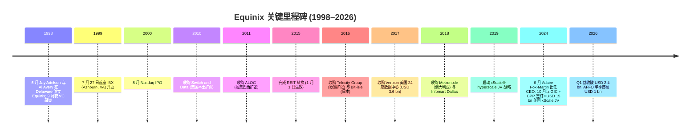
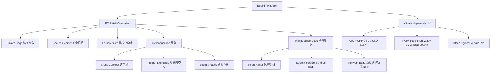
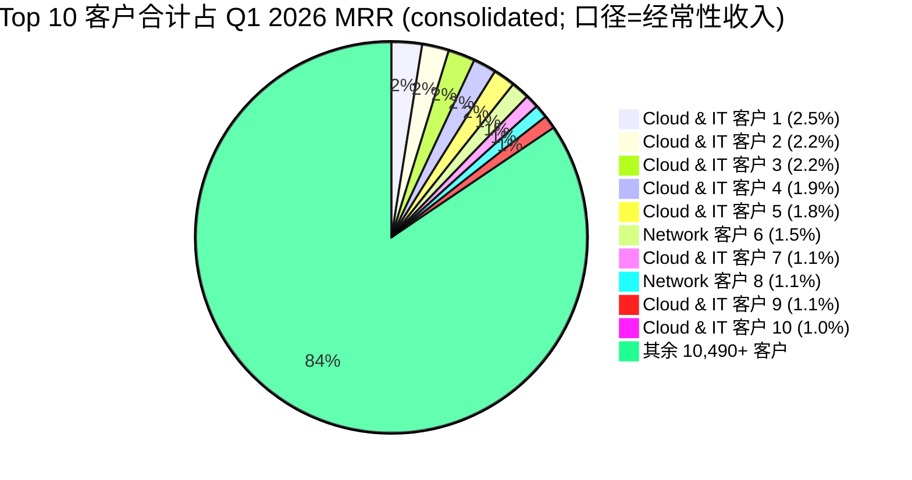

# Equinix, Inc. (NASDAQ:EQIX) — 公司研究

**报告日期 / Report Date:** 2026-06-02
**主题 / Theme:** ai-power-electrification, china-datacenter-hyperscale
**主体覆盖 / Coverage:** 全球互联型数据中心 (interconnection-led data center) 与 xScale 超大规模 (hyperscale) 双轨 REIT

> **Update — 上调 FY2026 全年业绩指引 (2026-04-29):** 管理层将 2026 年全年营收指引从 USD 10,123–10,223 mn 上调至 USD 10,144–10,244 mn (按中点 YoY +10–11%)，调整后 EBITDA 指引从 USD 5,141–5,221 mn 上调至 USD 5,165–5,245 mn (margin ~51%)，AFFO/股从 USD 41.93–42.74 上调至 USD 42.31–43.11，主因 Q1 录得公司史上最大单季毛订单 (annualized gross bookings) 与 AI 推理 (AI inference) 客户需求广泛加速。Source: [Equinix Q1 2026 Press Release, 2026-04-29](https://d1io3yog0oux5.cloudfront.net/_9f22c81eceb2edbbc5ca2b7301fbd5b0/equinix/db/2183/27031/earnings_release/Equinix+Q1+2026+Press+Release+and+Financials.pdf).

---

## 目录

1. 公司概览
2. 公司历史
3. 管理团队
4. 产品与服务
5. 客户与上市策略
6. 行业概览
7. 竞争格局
8. 市场机会
9. 风险评估
10. 投资者视角评分
11. 数据来源清单
12. 参考资料

---

## 1. 公司概览 / Company Overview

Equinix, Inc. (NASDAQ:EQIX) 是全球最大的互联型 (interconnection-oriented) 多租户数据中心 (multi-tenant data center, MTDC) 公司，以"world's digital infrastructure company"自我定位。公司 1998 年 6 月 22 日在 Delaware 注册成立，2015 年 1 月 1 日转为不动产投资信托 (Real Estate Investment Trust, REIT) 税务架构，至 2025 年底已成长为 280 座 IBX (International Business Exchange) 数据中心、覆盖 77 个城市 (markets) / 36 个国家、超过 10,500 名客户、超过 500,000 条互联 (interconnections) 的全球分布式平台 ([Equinix 2025 10-K, Item 1 Business](https://www.sec.gov/Archives/edgar/data/1101239/000110123926000032/eqix-20251231.htm))。Q1 2026 投影报告将口径进一步更新为 281 座数据中心、513,000 条互联、225+ 条云直连 (cloud on-ramps) ([Equinix Q1 2026 Investor Presentation, Slide 12 — Most Global and Comprehensive Digital Ecosystem](https://d1io3yog0oux5.cloudfront.net/_9f22c81eceb2edbbc5ca2b7301fbd5b0/equinix/db/2160/27042/pdf/Intro+to+Equinix_IR_Presentation+Q1+26.pdf))。

商业模式的核心是把"机房空间 + 电力 + 网络互联生态"打包销售并收取按月经常性收入 (Monthly Recurring Revenue, MRR)。Equinix 把客户机柜置于自有/长租的 IBX 园区中，提供 colocation (机柜 / 笼舍 / 私有套间) 加 interconnection (跨连线 / cross connect、Internet Exchange、Equinix Fabric 虚拟互联) 的组合产品；Q1 2026 末口径下 colocation 与 interconnection 两项合计构成公司绝大部分的经常性收入，FY2025 公司披露其 "more than 90% of our total revenues during the past three years" 来自经常性收入 ([Equinix 2025 10-K, Item 1 Business — Business Overview](https://www.sec.gov/Archives/edgar/data/1101239/000110123926000032/eqix-20251231.htm))。Q1 2026 营收 USD 2.444 bn (YoY as-reported +10%、normalized constant-currency +8%)，调整后 EBITDA USD 1.245 bn (margin 51%、创单季纪录)，AFFO USD 1.065 bn (USD 10.79/股，YoY +12%) ([Equinix Q1 2026 Press Release, 2026-04-29](https://d1io3yog0oux5.cloudfront.net/_9f22c81eceb2edbbc5ca2b7301fbd5b0/equinix/db/2183/27031/earnings_release/Equinix+Q1+2026+Press+Release+and+Financials.pdf))。

公司分三大地理报告分部：Americas、EMEA (Europe, Middle East and Africa)、Asia-Pacific。10-K 披露 FY2025 三大区均录得正增长——Americas 营收 YoY +6% (constant currency +7%)、EMEA YoY +5% (cc +4%)、Asia-Pacific YoY +3% (cc +3%)；EBITDA 端 Americas +11%、EMEA +13%、Asia-Pacific +7% on a constant-currency basis ([Equinix 2025 10-K, MD&A — Results of Operations by Segment](https://www.sec.gov/Archives/edgar/data/1101239/000110123926000032/eqix-20251231.htm))。营收主体来源是美国——10-K 披露 "Total revenues attributed to the U.S. were [over 10% of our total revenues]"，且过去三年公司均披露 "no single customer accounted for 10% or greater of our accounts receivable or revenues"，体现客户集中度极低 ([Equinix 2025 10-K, Item 1 — Customers; Note 18 Segment & Geographic Reporting](https://www.sec.gov/Archives/edgar/data/1101239/000110123926000032/eqix-20251231.htm))。

xScale® 是 Equinix 切入 hyperscale 大型云客户工作负载 (workload) 的第二条战线，通过合资公司 (joint venture, JV) 架构落地。2024 年 10 月 Equinix 与 GIC、CPP Investments 签订总规模 >USD 15 bn 的 U.S. xScale JV (Equinix 股权 25%, GIC / CPP 各 37.5%)，专攻多座园区、每座数百兆瓦 (MW) 规模的 AI / hyperscale 设施 ([Equinix Press Release: >$15B JV to Expand Hyperscale Data Centers, 2024-10-01](https://investor.equinix.com/news-events/press-releases/detail/1053/equinix-agrees-to-form-greater-than-15b-jv-to-expand))；2024 年 4 月与 PGIM Real Estate 组建 USD 600 mn JV 落地美国 Silicon Valley 的 SY9x ([Equinix Press Release: First xScale in Sydney, 2024-04](https://investor.equinix.com/news-events/press-releases/detail/964/equinix-and-pgim-real-estate-open-first-xscale-data))。该模式让 Equinix 在不显著占用自有资本的前提下扩大 hyperscale 服务半径，同时把"现金 + 杠杆 + 收益率"风险与战略资本伙伴 (sovereign / pension fund) 分担。

**估值快照 (Valuation snapshot, as of 2026-05-30):** 当日股价约 USD 1,050.58，市值约 USD 105.33 bn ([Yahoo Finance — EQIX summary](https://finance.yahoo.com/quote/EQIX/))。TTM P/E ≈ 73.9× (TTM EPS USD 14.46)、TTM P/S ≈ 11.1× (TTM revenue USD 9.46 bn)、P/AFFO ≈ 25× (基于 FY26 指引中点 AFFO USD 42.71/股)。同业 Digital Realty (NYSE:DLR) P/AFFO ≈ 22× (基于 FY26 core FFO USD 7.90–8.00/股)；EQIX 享受约 10–15% 的同业溢价主要来自其互联生态规模 (513k interconnections vs DLR 在 PlatformDIGITAL 上不可比的较小互联存量) 与跨地域客户密度 ([Equinix vs Digital Realty Comparison, MarketWise 2026-05](https://marketwise.com/investing/best-data-center-reits-ai-infrastructure/))。*分析师观点：* TTM P/E 73.9× 偏高的原因是 REIT 财务结构的强折旧 + 强 stock-based comp + 大量 JV 权益法核算，使 GAAP 净利润显著低于经济利润；REIT 投资者更关注 AFFO 与 dividend coverage，按 P/AFFO 视角的 25× 与 DLR 22× 同业溢价仅 13%，并未超出 AI hyperscale + interconnection moat 双引擎所应支付的溢价区间 ([Seeking Alpha — Ditch DLR for EQIX](https://seekingalpha.com/article/4852707-ditch-digital-realty-for-equinix))。

## 2. 公司历史 / Company History

Equinix 由 Jay Adelson 与 Al Avery 于 1998 年 6 月 22 日在 Delaware 创立。两位创始人时任 Digital Equipment Corporation (DEC) 设施经理；DEC 当时运营 Tysons Corner (Fairfax County, Virginia) 的 MAE-East—— 美国东海岸最重要的早期 internet exchange point 之一，正面临容量饱和 ([Equinix Wikipedia — Founding](https://en.wikipedia.org/wiki/Equinix); [Datacenter Dynamics: It Was Always a Big Idea](https://www.datacenterdynamics.com/en/news/equinix-it-was-always-a-big-idea/))。两位创始人提出的核心命题是"中立交换 (Neutral Internet Exchange, NIX)"—— 让相互竞争的电信网络可以在一个由独立第三方运营的物理设施内对等互联 (peering)，从而打破单一电信运营商对互联节点的控制。公司名"Equinix"即来自"EQUality, Neutrality, and Internet eXchange"的组合 ([Equinix 2025 10-K, Item 1 — Overview](https://www.sec.gov/Archives/edgar/data/1101239/000110123926000032/eqix-20251231.htm))。1999 年 7 月 27 日首座 IBX 在 Loudoun County (Ashburn, Virginia) 开业，是日后 Ashburn"data center capital of the world"概念的奠基 ([Companies History — Equinix](https://www.companieshistory.com/equinix-incorporated/))。


Source: [Equinix Q1 2026 IR Presentation, Slide 6 — Track Record of Growth and Profitability](https://d1io3yog0oux5.cloudfront.net/_9f22c81eceb2edbbc5ca2b7301fbd5b0/equinix/db/2160/27042/pdf/Intro+to+Equinix_IR_Presentation+Q1+26.pdf); [Equinix 2025 10-K — Item 1 History](https://www.sec.gov/Archives/edgar/data/1101239/000110123926000032/eqix-20251231.htm).

三次关键战略转身。**第一次 (2010–2016) 的全球横向扩张**——通过 Switch and Data、ALOG、Telecity Group、Bit-isle 等连续并购，把原本聚焦北美的网络中立交换业务扩张为横跨三大洲的统一品牌平台，奠定了今天 IBX 资产规模与跨域客户复购的物理底盘 ([Equinix Q1 2026 IR Presentation, Slide 9 — Strategic Acquisitions](https://d1io3yog0oux5.cloudfront.net/_9f22c81eceb2edbbc5ca2b7301fbd5b0/equinix/db/2160/27042/pdf/Intro+to+Equinix_IR_Presentation+Q1+26.pdf))。**第二次 (2015) 的 REIT 转换**——把房地产部分独立出来享受 REIT 税务优惠，并迎合公募 / 主权 LP / 退休基金对稳定派息的需求；REIT 转换至今 (2015–2025) 累计派息约 USD 12 bn ([Equinix Q1 2026 IR Presentation, Slide 9 — Consistent cash dividend growth since REIT conversion](https://d1io3yog0oux5.cloudfront.net/_9f22c81eceb2edbbc5ca2b7301fbd5b0/equinix/db/2160/27042/pdf/Intro+to+Equinix_IR_Presentation+Q1+26.pdf))。**第三次 (2019 至今) 的 xScale + AI 双轨**——2019 年起以 JV 模式承接 hyperscale 工作负载、2024 年完成与 GIC / CPP 的 USD 15 bn+ 美国 xScale JV、并把"AI inferencing-ready interconnection"作为 2024–2026 全球营销主线，目标抓住 AI 训练 (training) 向推理 (inference) 拓展时所要求的分布式低时延 (low latency) 部署 ([Equinix Press Release: >$15B JV with GIC + CPP Investments, 2024-10-01](https://investor.equinix.com/news-events/press-releases/detail/1053/equinix-agrees-to-form-greater-than-15b-jv-to-expand); [Equinix Q1 2026 IR Presentation, Slide 7 — Metro Edge Essential to AI Processing](https://d1io3yog0oux5.cloudfront.net/_9f22c81eceb2edbbc5ca2b7301fbd5b0/equinix/db/2160/27042/pdf/Intro+to+Equinix_IR_Presentation+Q1+26.pdf))。

近期关键事件。2024 年 3 月 7 日董事会批准 Adaire Fox-Martin 接替 Charles Meyers 出任 CEO，6 月 3 日正式生效；Meyers 转任 Executive Chairman，Peter Van Camp 从 Executive Chairman 退任 Special Advisor ([Equinix 8-K, 2024-06-03 — CEO Transition](https://www.sec.gov/Archives/edgar/data/0001101239/000162828024026300/eqix-20240603.htm); [The Executive Paper, 2024-03-15](https://www.theexecutivepaper.com/tech/2024/03/15/adaire-fox-martin-to-serve-as-president-and-ceo-of-equinix-inc-2/11569107/index.html))。2024 年 12 月公司完成 Total Information & Management (TIM) 与 BT Group 数据中心组合的两笔收购整合，进一步加固欧洲、亚太布局；BT Group 资产纳入 Q1 2026 数据 ([Equinix 2025 10-K — Item 1 Recent Developments](https://www.sec.gov/Archives/edgar/data/1101239/000110123926000032/eqix-20251231.htm))。2025 年 6 月公司发行总计 USD 9.5 bn 累计 green bonds (含 2025 年发行 USD 2.6 bn)，跻身美国企业绿色债券前五大发行人之一 ([Equinix Q1 2026 IR Presentation, Slide 10 — Future First Sustainability](https://d1io3yog0oux5.cloudfront.net/_9f22c81eceb2edbbc5ca2b7301fbd5b0/equinix/db/2160/27042/pdf/Intro+to+Equinix_IR_Presentation+Q1+26.pdf))。

## 3. 管理团队 / Management Team

### Adaire Fox-Martin — President & CEO (兼现任最高管理者)

Adaire Fox-Martin，年龄 61 (2026)，2024 年 6 月 3 日正式出任 Equinix President 与 CEO，在此之前已于 2020 年起担任 Equinix 董事会成员四年 ([Equinix 2026 DEF 14A — Director Biographies](https://www.sec.gov/Archives/edgar/data/1101239/000110123926000073/eqix-20260401.htm))。她在科技业逾 25 年。最近一次主要角色是 Google Cloud 全球市场策略 (President of Go-to-Market) 兼 Google Ireland 负责人；此前是 Google Cloud International 的 EMEA 总裁，负责欧洲、中东、非洲地区云销售 ([The Executive Paper, 2024-03-15](https://www.theexecutivepaper.com/tech/2024/03/15/adaire-fox-martin-to-serve-as-president-and-ceo-of-equinix-inc-2/11569107/index.html))。再之前她在 SAP 任执行委员会 (Executive Board) 成员，领导 Global Customer Operations，是 SAP 内部少数进入最高决策层的女性高管之一；更早期她在 Oracle Corporation 历任亚太与欧洲多个销售管理职位。她的核心可识别能力是"超大型 enterprise B2B 销售"—— Equinix 在 hyperscale 与 AI inference 两个新增长极都需要打开 Fortune 500 大客户的多年期、多区域 (multi-region) 合约升级路径，这是她履历的直接匹配点。她于 Q1 2026 业绩公报中亲口确认公司 "We are raising our 2026 financial outlook based on the underlying strength of our Q1 performance and disciplined execution by our teams" ([Equinix Q1 2026 Press Release, CEO Quote](https://d1io3yog0oux5.cloudfront.net/_9f22c81eceb2edbbc5ca2b7301fbd5b0/equinix/db/2183/27031/earnings_release/Equinix+Q1+2026+Press+Release+and+Financials.pdf))。Fox-Martin 在英国 / 爱尔兰受教育、长期居住爱尔兰，是首位在世界级美国上市互联网基础设施公司担任 CEO 的非美籍女性高管之一；她公开持股的具体数额按 2026 年 DEF 14A 披露为相当于年薪倍数 (multiples of base salary) 的限制性股票 (RSU) 与基于绩效股 (PSU) 组合 ([Equinix 2026 DEF 14A — Executive Compensation](https://www.sec.gov/Archives/edgar/data/1101239/000110123926000073/eqix-20260401.htm))。

### Jay Adelson — 联合创始人 (现非在职)

Jay Adelson，Equinix 联合创始人之一 (与 Al Avery 共同创立)。创立 Equinix 前任职于 Digital Equipment Corporation (DEC)，是其当时 MAE-East 互联节点的设施经理 ([Jay Adelson Wikipedia](https://en.wikipedia.org/wiki/Jay_Adelson); [DCK: Video — Jay Adelson on the Early Days of Equinix](https://www.datacenterknowledge.com/archives/2013/02/26/video-jay-adelson-on-the-early-days-of-equinix))。Adelson 1998 年与 Al Avery 共同提出"Neutral Internet Exchange"概念并完成种子轮 VC 募资；2000 年公司 IPO 后他出任 CTO；2005 年离开 Equinix 创立 Digg.com 出任 CEO；此后又创立 Revision3 (后被 Discovery 收购) 等多家科技公司，目前已不参与 Equinix 的日常运营，也无显著持股 ([Datacenter Dynamics: Equinix — It Was Always a Big Idea](https://www.datacenterdynamics.com/en/news/equinix-it-was-always-a-big-idea/))。另一位联合创始人 Al Avery 于 2009 年 5 月辞世，Equinix 官方发布纪念声明 ([Equinix Newsroom, 2009-05](https://www.equinix.com/newsroom/press-releases/2009/05/statement-from-equinix-on-the-passing-of-co-founder-al-avery); [Data Center Knowledge — Equinix Remembers Co-Founder Avery](https://www.datacenterknowledge.com/archives/2009/05/11/equinix-remembers-co-founder-avery))。两位联合创始人均不再持有公司控制性股权，公司治理已完全机构化 (REIT 投资人主导)，因此 founder 角色对当下投资决策的边际信息价值有限——但对理解 Equinix 的 "network-neutral" 基因——也就是其互联生态护城河 (moat) 的底层文化来源——必不可少。

## 4. 产品与服务 / Products & Services

### 4.1 产品架构总览

Equinix 的产品体系可以抽象为四层逻辑：(1) **物理空间** (colocation — IBX cabinets / Private Cages / 模块化 Equinix Suite)、(2) **能源与运维** (power, cooling, Smart Hands 远程运维)、(3) **互联** (interconnection — Cross Connects、Internet Exchange、Equinix Fabric® 虚拟跨域)、(4) **托管型边缘服务** (Equinix Metal® bare-metal、Network Edge® 虚拟网络功能 NFV)。**xScale® 大颗粒数据中心**通过 JV 单独运营，是上述四层的"hyperscale fork"。下表来自 10-K 的产品/服务自述，体现公司自身对产品矩阵的命名与分层：

| 产品族 / Product Family | 性质 | 计费模型 | 10-K 用语 |
|---|---|---|---|
| Colocation (Private Cage / Secure Cabinet / Equinix Suite) | 物理 | MRR (固定期合约) | "billed based on the space and power a customer consumes ... fixed duration contract ... monthly recurring revenue (MRR)" |
| Interconnection (Cross Connect / Internet Exchange / Fabric) | 物理 + 虚拟 | MRR + NRR | "fast, convenient, affordable and highly reliable connectivity and data exchange with business partners and service providers within the Equinix ecosystem" |
| Managed Services (Smart Hands / Equinix Service Bundles / monitoring software) | 服务 | MRR / NRR | "on-consumption and subscription services that may generate MRR as well as non-recurring revenue (NRR)" |
| Equinix Metal® bare-metal (winding down) | 服务 | 使用量 | "Equinix Metal Wind Down" |
| Network Edge® (虚拟网络功能) | 软件 | MRR | "deploying network functions virtualization (NFV) from multiple vendors across Equinix metros ... no additional hardware requirements" |
| xScale® (JV hyperscale) | 物理大颗粒 | 多年期租赁 (lease-anchored) | "developed and operated through our joint venture partnership arrangements ... hyperscale customers add to their core hyperscale data center deployments" |

Source: [Equinix 2025 10-K — Item 1 Products and Services](https://www.sec.gov/Archives/edgar/data/1101239/000110123926000032/eqix-20251231.htm) (verbatim quoted segments above).



### 4.2 综合 (Synthesis) — 客户工作流如何穿过 Equinix

一个典型的企业 / hyperscaler / 神经云 (neocloud) 客户工作流穿过 Equinix 的 5 个层次。**第一**，客户在 Ashburn、San Jose、Frankfurt、Tokyo、Singapore 等核心 metros 的 IBX 内租赁 colocation 空间 (Private Cage 或 Cabinet)，把自己的服务器、存储、GPU 节点放进笼内。**第二**，客户在 IBX 内的 meet-me-room (MMR) 通过 Cross Connect (一根跨连光纤) 接入 Equinix 的 2,000+ 网络运营商生态。**第三**，客户通过 Equinix Fabric® 这条 software-defined 虚拟互联 fabric 跨越 metros 把不同 IBX 间的 GPU / 数据库 / inference 节点串成统一的全球私有网络。**第四**，客户通过 225+ 条 cloud on-ramps 直连 AWS / Azure / Google Cloud / Oracle Cloud 公有云区，把 hybrid / multi-cloud 工作负载织起。**第五**，hyperscaler 把训练好的大模型权重通过 xScale JV 的大颗粒电力部署 (multi-hundred MW) 大规模"复制 + 推理"，再通过 Fabric 推回 metros 边缘服务最终用户——这是 Equinix 在 Q1 2026 反复强调的 "Metro Edge essential to AI processing"——AI 训练完成后，推理 (inference) 必须低延迟靠近用户，而 Equinix 的 281 个 metros 与 513,000 条 interconnections 恰好是这一推理拓扑的现成骨架 ([Equinix Q1 2026 IR Presentation, Slide 7 — Metro Edge Essential to AI Processing](https://d1io3yog0oux5.cloudfront.net/_9f22c81eceb2edbbc5ca2b7301fbd5b0/equinix/db/2160/27042/pdf/Intro+to+Equinix_IR_Presentation+Q1+26.pdf))。

### 4.3 Colocation (机柜 / 笼舍 / 套间)

10-K 对 colocation 的自我陈述：

> "Our colocation offerings are designed to provide secure, reliable and streamline data center deployments for our customers. These offerings are typically billed based on the space and power a customer consumes in our IBX data centers, are delivered under a fixed duration contract and generate monthly recurring revenue ('MRR')." ([Equinix 2025 10-K — Item 1 Products](https://www.sec.gov/Archives/edgar/data/1101239/000110123926000032/eqix-20251231.htm))

> "Secure Cabinet ... provide a private, secure, smaller-footprint alternative to a Private Cage. Each cabinet includes an integrated, interconnection-ready demarcation panel and power circuitry sufficient to support planned utilization requirements." ([同上](https://www.sec.gov/Archives/edgar/data/1101239/000110123926000032/eqix-20251231.htm))

**中文释义 / Plain-language gloss:** Colocation 是 Equinix 的物理底盘。客户租赁的不是房屋 (Equinix 才租房子)，而是把自己的服务器装进 Equinix 的 IBX 里，按"占用的 sqft + 用掉的 kW"按月付费。三种规格 (Private Cage 私有笼舍、Secure Cabinet 安全机柜、Equinix Suite 模块化套间) 对应不同的客户尺寸。Equinix 的差异化不是机柜本身——任何超大规模数据中心都能给客户上机柜——而是机柜旁边的 meet-me-room (MMR) 里塞满了全世界 2,000+ 个网络运营商、3,000 个 cloud / IT service providers、225+ 条公有云直连。把一台 GPU 服务器放在 Ashburn 的 DC1，从机柜走 5 米 cross-connect 就能直连 AWS Direct Connect 或 Microsoft ExpressRoute——同样的连接如果放在自建 (on-premise) 机房需要拉一根专线、几周交付、付月费。这种"租 1 m² IBX 等于得到一根直连入口"是公司经常性收入护城河的核心。FY2025 colocation 占公司全部 deferred revenues USD 8,739 mn 中的 USD 6,475 mn (≈ 74%), interconnection 占 USD 1,655 mn (≈ 19%)，剩余为其他经常性服务 ([Equinix 2025 10-K — Note 2 Revenue Recognition](https://www.sec.gov/Archives/edgar/data/1101239/000110123926000032/eqix-20251231.htm))。

*分析师观点：* colocation 自身的定价权来自合同条款——绝大多数 IBX 合同包含 2–5% 的年度合约价 (contractual price increases) 自动调升机制，并叠加 power density (每机柜功率密度) 提升带来的二阶变现 ([Equinix Q1 2026 IR Presentation, Slide 15 — Stabilized Data Center Performance: Revenue growth derived from contractual price increases (2-5%+ per year), interconnection, and increasing power densities](https://d1io3yog0oux5.cloudfront.net/_9f22c81eceb2edbbc5ca2b7301fbd5b0/equinix/db/2160/27042/pdf/Intro+to+Equinix_IR_Presentation+Q1+26.pdf))。最贴近的竞品是 Digital Realty (DLR) 的 PlatformDIGITAL 业务，但 DLR 在 retail colocation 端的客户密度和 cross-connect 单价显著低于 Equinix。

### 4.4 Interconnection (跨连线 / 互联网交换 / Equinix Fabric®)

10-K 对 Interconnection 的自我陈述：

> "[Interconnection enables] fast, convenient, affordable and highly reliable connectivity and data exchange with business partners and service providers within the Equinix ecosystem." ([Equinix 2025 10-K — Item 1 Products](https://www.sec.gov/Archives/edgar/data/1101239/000110123926000032/eqix-20251231.htm))

> "Equinix Fabric® ... supports highly reliable, extremely low-latency communication, system integration and ... fast, convenient and affordable integration with partners, customers and service providers across the global Equinix digital ecosystem." ([同上](https://www.sec.gov/Archives/edgar/data/1101239/000110123926000032/eqix-20251231.htm))

**中文释义 / Plain-language gloss:** Interconnection 是 Equinix 的最高毛利率、最高粘性的产品族，也是公司唯一真正具备 "platform" 经济效应的业务。它包括三种形态：(a) **Cross Connect 跨连线**——一根从客户笼舍出发、穿过 IBX 的 MMR、终止于另一名客户笼舍的物理光纤/铜线，按月计费的"管道租赁"；(b) **Internet Exchange 互联网交换**——Equinix 自营的 IX 平台，让多家 ISP 通过共享 fabric 互相 peering 而不必两两拉跨连线；(c) **Equinix Fabric®**——software-defined 虚拟跨域互联，客户在 Equinix Customer Portal 通过 API 一键开通跨 metro / 跨大洲的虚拟电路。截至 Q1 2026 这三种形态合计产生 513,000 条 interconnections ([Equinix Q1 2026 IR Presentation, Slide 5 & 12](https://d1io3yog0oux5.cloudfront.net/_9f22c81eceb2edbbc5ca2b7301fbd5b0/equinix/db/2160/27042/pdf/Intro+to+Equinix_IR_Presentation+Q1+26.pdf))。Interconnection 的护城河有两层：第一，**双边网络效应** (two-sided network effect)——更多网络在 IBX 内→更多企业愿意进来寻求连接→更多企业又把自己也变成可以被他人连接的对象→正反馈循环。第二，**互联粘性** (switching cost)——一旦客户在某 IBX 内已建立 N 条 cross-connect, 迁移到别处 mean 要重新签 N 家网络、重新做 IP 重路由、可能引发数月的 service downtime，所以 churn 极低 (Q1 2026 MRR churn 仅 1.7%——历史最低水平 ([Equinix Q1 2026 IR Presentation, Slide 14 — MRR Churn](https://d1io3yog0oux5.cloudfront.net/_9f22c81eceb2edbbc5ca2b7301fbd5b0/equinix/db/2160/27042/pdf/Intro+to+Equinix_IR_Presentation+Q1+26.pdf)))。

*分析师观点：* Equinix Fabric 是公司在向 SaaS 化、API 化、按使用量计费 (consumption-based) 演进的关键产品赌注，对手包括 PacketFabric、Megaport (ASX:MP1)、AT&T NetBond——但这些对手都缺乏 Equinix 在物理层 (IBX) 的覆盖底盘，因此长期看 Fabric 应能稳坐第一梯队。

### 4.5 xScale® (合资 hyperscale)

10-K 对 xScale 的自我陈述：

> "Our xScale® data centers serve the unique core workload deployment needs of a targeted group of hyperscale companies, which include the world's largest cloud service providers. Hyperscalers require infrastructure to support demanding workload requirements for cloud and AI initiatives. With xScale data centers, which are developed and operated through our joint venture partnership arrangements, hyperscale customers add to their core hyperscale data center deployments and existing customer access points at Equinix, allowing streamlined expansion with a single global vendor." ([Equinix 2025 10-K — Item 1 Products](https://www.sec.gov/Archives/edgar/data/1101239/000110123926000032/eqix-20251231.htm))

**中文释义 / Plain-language gloss:** xScale 是 Equinix 把 hyperscaler (AWS / Azure / Google / Meta / Oracle / Apple / 神经云) 的"超大单一客户、超大单一笼舍 (>10 MW)"工作负载从普通 IBX 中独立出去的专属产品族，由 Equinix 与一组战略 LP (limited partner — GIC, CPP Investments, PGIM Real Estate 等) 合资组成 JV，由 Equinix 提供运营和品牌、LP 提供股权资本与杠杆。这种"轻资本 hyperscale"模式有两个微妙好处：第一，Equinix 仅持股 25% 但保有运营与销售控制，资产负债表压力远小于 100% 自建；第二，hyperscaler 在 Equinix xScale 内的工作负载与他们已在 Equinix retail IBX 内的"接入点"(access points, hyperscale ↔ enterprise ↔ network ↔ cloud) 互通互联，让他们形成"一个供应商, 全栈服务"的简化采购体验。最大单笔 JV 是 2024 年 10 月与 GIC + CPP Investments 共组的 USD 15 bn+ 美国 xScale JV (Equinix 25%, GIC / CPP 各 37.5%)，建设多座园区、每座数百兆瓦容量 ([Equinix Press Release: >$15B JV, 2024-10-01](https://investor.equinix.com/news-events/press-releases/detail/1053/equinix-agrees-to-form-greater-than-15b-jv-to-expand))。

*分析师观点：* xScale 在战略上对标 Digital Realty 的 PlatformDIGITAL hyperscale 部分以及 CyrusOne (KKR / GIP 私募拥有)、Aligned Data Centers (Macquarie 私募)；但 Equinix 的差异化在于 hyperscale 工作负载 + retail interconnection 双轨耦合——hyperscaler 即便买 xScale 也会顺便保留在 IBX 内的 access points 与 enterprise / network 客户对接，这是纯 hyperscale-only 玩家 (Aligned, Compass, NTT GDC) 无法复制的。

### 4.6 托管服务 (Smart Hands, Equinix Service Bundles, Network Edge)

10-K 自述：

> "Smart Hands allows customers to manage their data center operations from anywhere in the world. ... Equinix Service Bundles (ESBs) are repeatable, proven processes that address larger, more complex data center jobs, including installation and implementation of new builds and planned migrations." ([Equinix 2025 10-K — Item 1 Products](https://www.sec.gov/Archives/edgar/data/1101239/000110123926000032/eqix-20251231.htm))

> "Network Edge® ... allow companies to select, deploy and connect virtual network solutions at the edge quickly, with no additional hardware requirements." ([同上](https://www.sec.gov/Archives/edgar/data/1101239/000110123926000032/eqix-20251231.htm))

**中文释义 / Plain-language gloss:** 这些服务层产品占公司绝对收入比重不大 (deferred revenues 表中 colocation + interconnection 已占 93%，剩余 7% 包含 managed services), 但它们的作用是"提高 ARPU + 减少客户运维负担→降低 churn + 锁定多年合约"。Smart Hands 让客户不必派工程师飞到 Frankfurt 重启一台服务器；ESB 让客户可以把"我要在 12 个城市同步部署 100 个机柜"这种复杂工程包给 Equinix 完成；Network Edge 让客户在不买实体设备的前提下，通过 Equinix 在 IBX 内的虚拟化平台跑 Cisco / Palo Alto / Juniper / Fortinet 等厂商的虚拟防火墙、虚拟路由器、SD-WAN 节点。

*分析师观点：* Equinix Metal® (bare-metal-as-a-service) 在 2024 年宣布逐步退出 (Wind Down)，10-K 明确披露 FY2025 有 USD 29 mn 营收减项来自 Metal Wind Down ([Equinix 2025 10-K — MD&A](https://www.sec.gov/Archives/edgar/data/1101239/000110123926000032/eqix-20251231.htm))；这次"主动收缩"信号了管理层不打算与 AWS / Vultr / OVH 等纯云算力玩家在 bare-metal 上正面竞争——更像是把资源集中回到"数据中心 + 互联"两个最高毛利产品族的战略聚焦。

### 4.7 公司财务建模框架 (经济单元 / unit economics)

Q1 2026 投影披露的稳态 IBX (Stabilized IBX) 经济单元：254 座 stabilized IBX 数据中心，过去 4 季营收 USD 7,309 mn、毛 PP&E 投入 USD 19,536 mn、过去 4 季 cash gross profit USD 5,132 mn (cash GP margin = 70%)、过去 4 季 maintenance capex 仅 USD 153 mn (≈ 营收 2%)，因此 cash-on-cash 收益率 (cash generated on gross PP&E investment) = 26% ([Equinix Q1 2026 IR Presentation, Slide 15 — Leading Stabilized Data Center Performance](https://d1io3yog0oux5.cloudfront.net/_9f22c81eceb2edbbc5ca2b7301fbd5b0/equinix/db/2160/27042/pdf/Intro+to+Equinix_IR_Presentation+Q1+26.pdf))。82% 利用率，YoY 营收 +6% (constant currency) 主要源于 (a) 2–5% 合同条款自动调升、(b) interconnection 增长、(c) power density 提升。**这是理解 Equinix 真实经济效率的关键数据**——REIT 投资人 / 同业研究员通常用 26% cash-on-cash unlevered yield 与同业 18–20% 比较，从而得到 Equinix 享受 20–40% 估值溢价的微观基础。

### 4.8 Q1 2026 业绩与 AI 推理客户拓展

公司在 Q1 2026 投影中确认 "Strengthened position across the AI inferencing ecosystem, with eight of the top 10 AI model providers and four of the top five neoclouds actively expanding with Equinix to enable mission-critical, latency-sensitive elements of their architectures." ([Equinix Q1 2026 Press Release — Operational Highlights](https://d1io3yog0oux5.cloudfront.net/_9f22c81eceb2edbbc5ca2b7301fbd5b0/equinix/db/2183/27031/earnings_release/Equinix+Q1+2026+Press+Release+and+Financials.pdf))。此处 "top 10 AI model providers" 公司未点名但通常涵盖 OpenAI / Anthropic / Google DeepMind / Meta AI / Mistral / xAI / Cohere / 阿里通义 / 字节 Doubao / 百度文心 / Stability AI 等头部；"top 5 neoclouds" 涵盖 CoreWeave / Lambda Labs / Crusoe / Nscale / Vultr 等 GPU 算力提供商。Q1 2026 录得公司史上最大单季 annualized gross bookings 约 USD 378 mn (YoY +9%，前一季 Q4 2025 创纪录的 USD 474 mn 主要含一次性大单)；2026 retail IBX 全年扩容已 pre-sold 约 25% ([Equinix Q1 2026 IR Presentation, Slide 8 — Bookings Momentum](https://d1io3yog0oux5.cloudfront.net/_9f22c81eceb2edbbc5ca2b7301fbd5b0/equinix/db/2160/27042/pdf/Intro+to+Equinix_IR_Presentation+Q1+26.pdf))。

## 5. 客户与上市策略 / Customers & Go-to-Market

### 5.1 客户基础概况与集中度

10-K 披露：截至 2025 年 12 月 31 日，Equinix 全球客户超过 10,500 名 ([Equinix 2025 10-K — Item 1 Customers](https://www.sec.gov/Archives/edgar/data/1101239/000110123926000032/eqix-20251231.htm))。客户构成 (按 Q1 2026 投影披露)：

| 客户类别 / Customer Type | 数量 | 关键代表 |
|---|---|---|
| Enterprises (企业) | 5,500+ | Fortune 500 全球大企业、金融、医疗、零售 |
| Cloud & IT Service Providers (云与 IT 服务商) | ~3,000 | AWS, Azure, Google, Oracle Cloud, Salesforce, ServiceNow, OpenAI, Anthropic, CoreWeave |
| Networks (网络运营商) | 2,000+ | Verizon, AT&T, Lumen, China Telecom Global, NTT, BT, Orange, Telxius |
Source: [Equinix Q1 2026 IR Presentation, Slide 5 — Unmatched Ecosystem](https://d1io3yog0oux5.cloudfront.net/_9f22c81eceb2edbbc5ca2b7301fbd5b0/equinix/db/2160/27042/pdf/Intro+to+Equinix_IR_Presentation+Q1+26.pdf).

**客户集中度极低，是 Equinix 商业模式最显著的财务护城河之一。** 10-K 明确披露 "No one customer made up 10% or more of our total business revenues for the year ended December 31, 2025"，与 2024、2023 年同样的口径完全一致 ([Equinix 2025 10-K — Item 1 Customers; Note 18](https://www.sec.gov/Archives/edgar/data/1101239/000110123926000032/eqix-20251231.htm))。Q1 2026 投影披露的 Top 10 MRR 客户合计仅占 16.2% (consolidated MRR 口径)，Top 50 合计 36.2%；Top 10 客户中第一名占 2.5%、第十名占 1.0%；7 / 10 为 Cloud & IT 类，2 / 10 为 Networks 类；10 家中 10 家均覆盖三大区 (Americas + EMEA + Asia-Pacific)，平均覆盖 76 个 IBX——这是"全球部署、多 metro 锁定"的实际表现 ([Equinix Q1 2026 IR Presentation, Slide 14 — Top 10 Customers](https://d1io3yog0oux5.cloudfront.net/_9f22c81eceb2edbbc5ca2b7301fbd5b0/equinix/db/2160/27042/pdf/Intro+to+Equinix_IR_Presentation+Q1+26.pdf))。


Source: [Equinix Q1 2026 IR Presentation, Slide 14](https://d1io3yog0oux5.cloudfront.net/_9f22c81eceb2edbbc5ca2b7301fbd5b0/equinix/db/2160/27042/pdf/Intro+to+Equinix_IR_Presentation+Q1+26.pdf).

**客户跨区域属性 (multi-region stickiness)**: Q1 2026 报告 63% 的客户分布在三大区 (Americas + EMEA + Asia-Pacific 同时部署)、75% 跨 2 个区、90% 跨多 metros。这是 Equinix 的销售杠杆——一旦客户进入 1 个 metro，往往会向其它 metros 扩展，形成"一旦入轨、终生续约"的 customer expansion curve ([Equinix Q1 2026 IR Presentation, Slide 14 — Customers in Multiple Locations](https://d1io3yog0oux5.cloudfront.net/_9f22c81eceb2edbbc5ca2b7301fbd5b0/equinix/db/2160/27042/pdf/Intro+to+Equinix_IR_Presentation+Q1+26.pdf))。Equinix 在 10-K 中披露 "more than 90% of our monthly recurring revenue bookings came from existing customers" ([Equinix 2025 10-K — Item 1 Customers](https://www.sec.gov/Archives/edgar/data/1101239/000110123926000032/eqix-20251231.htm))，进一步印证客户扩展是公司增长的主要驱动器。

### 5.2 销售模式与新增客户节奏

Equinix 主要走直销 (direct sales force) + 渠道伙伴 (channel partners、reseller、carrier、systems integrators) 双轨。Q1 2026 季报披露 Q1 25 至 Q1 26 五个季度的 Gross New Global Customers 在 220–300 之间，MRR Churn (按月经常性收入流失/季初口径) 从 2024 的 ~2.4% 持续下降至 Q1 2026 的 1.7%——这是历史最低 ([Equinix Q1 2026 IR Presentation, Slide 14](https://d1io3yog0oux5.cloudfront.net/_9f22c81eceb2edbbc5ca2b7301fbd5b0/equinix/db/2160/27042/pdf/Intro+to+Equinix_IR_Presentation+Q1+26.pdf))。低 churn + 高 multi-region cross-sell + 2–5% 合约自动调升 + 增加 power density 的复利效应，让稳态 IBX 录得 6% YoY 同店增长。

### 5.3 案例与生态

10-K 详细描述了 Equinix 客户工作流的代表场景：

> "We enable customers to simplify their digital infrastructure, ensure interoperability across multiple clouds and connect to a global ecosystem of business partners, network and cloud service providers." ([Equinix 2025 10-K — Item 1 Business Overview](https://www.sec.gov/Archives/edgar/data/1101239/000110123926000032/eqix-20251231.htm))

具体案例方面，主要"top 10 customers"包括 AWS、Microsoft Azure、Google Cloud、Oracle Cloud Infrastructure (基于 225+ cloud on-ramps 数与公开新闻披露)，以及 BT Group (基于 2024 年 BT 数据中心收购协议)、Telefónica Tech、Lumen Technologies 等大型电信运营商。这些客户的合约通常为 5–15 年期的 master colocation agreements，含 90+ 天的退订通知期与年度自动加价机制。

## 6. 行业概览 / Industry Overview

### 6.1 行业定义

数据中心 (data center) 行业可按拥有者 / 商业模式分为四类：(1) **超大规模自建** (hyperscale-owned and operated)：由 AWS、Azure、Google、Meta、Apple、Oracle 自己拥有并运营的园区；(2) **零售型互联中心** (retail interconnection / Multi-Tenant Data Center)：以 Equinix、Digital Realty PlatformDIGITAL、Cyxtera、QTS 为代表，向中小到大型企业出租机柜与互联；(3) **批发型超大规模** (wholesale / hyperscale build-to-suit)：以 Digital Realty 大型 lease、CyrusOne、Aligned、Compass、Stack Infrastructure、NTT GDC 为代表，向 hyperscaler 单租户定制大颗粒电力部署；(4) **企业私有自建** (corporate-owned)：传统企业自建数据中心 (Tier III/IV)，已普遍向上述三类外包。Equinix 同时覆盖 (2) 与 (3)，其中 (2) 是核心、(3) 通过 xScale JV 切入。

### 6.2 市场规模与增长

按 Synergy Research Group 与 JLL Capital Markets 估算，2025 年全球第三方多租户数据中心市场规模约 USD 110–130 bn，预计 2025–2030 CAGR 在 17–22% 之间，主驱动是 AI / GenAI 工作负载、cloud-on-edge 演进与企业混合云 (hybrid cloud) 持续渗透 ([Synergy Research Group: Data Center Capacity, 2025 update](https://www.srgresearch.com/articles)；与 [JLL Global Data Center Outlook 2026](https://www.jll.com/en-us/insights/global-data-center-outlook))。McKinsey 2024 年 11 月发布的 "AI Power" 报告预测全球数据中心电力需求将从 2024 年的 ~55 GW 增长至 2030 年的 ~219 GW (CAGR ~26%), 其中 AI 工作负载将占 ~70% 的增量 ([McKinsey AI Power Demand Report, 2024-11](https://www.mckinsey.com/industries/technology-media-and-telecommunications/our-insights/ai-power-expanding-data-center-capacity-to-meet-growing-demand))。Equinix Q1 2026 投影自述其 "developable capacity" 约 3 GW (包含已宣布扩张与控制中的土地)，对应未来 4–6 年的渐进释放节奏，与 McKinsey 行业增长曲线在数量级上一致 ([Equinix Q1 2026 IR Presentation, Slide 12](https://d1io3yog0oux5.cloudfront.net/_9f22c81eceb2edbbc5ca2b7301fbd5b0/equinix/db/2160/27042/pdf/Intro+to+Equinix_IR_Presentation+Q1+26.pdf))。

### 6.3 关键增长驱动

**第一，AI 训练向推理迁移。** AI 训练 (training) 主要在 hyperscaler 自有园区或大颗粒批发数据中心 (10–500 MW 单地址)，对延迟不敏感；AI 推理 (inference) 必须靠近终端用户以保证亚 50 ms 响应，因此需要分布在全球 metros 的低延迟数据中心。这正是 Equinix 281 个 IBX 的天然受益曲线——Q1 2026 公司声称 "Equinix's Metro Edge is Essential to AI Processing"，并具体披露 "8 of the top 10 AI model providers and 4 of the top 5 neoclouds are actively expanding with Equinix" ([Equinix Q1 2026 IR Presentation, Slide 7](https://d1io3yog0oux5.cloudfront.net/_9f22c81eceb2edbbc5ca2b7301fbd5b0/equinix/db/2160/27042/pdf/Intro+to+Equinix_IR_Presentation+Q1+26.pdf))。

**第二，混合云与多云架构成为常态。** Fortune 500 企业普遍以 hybrid cloud / multi-cloud 模式部署 IT，需要在"靠近 AWS"、"靠近 Azure"、"靠近 Google Cloud"等多个云区之间灵活切换，Equinix 的 225+ 条 cloud on-ramps 直接满足这一需求 ([Equinix 2025 10-K — Item 1 Industry Trends](https://www.sec.gov/Archives/edgar/data/1101239/000110123926000032/eqix-20251231.htm))。

**第三，数据主权 (data sovereignty) 与合规。** GDPR、中国数据出境规则、印度个人信息保护法 (DPDP)、加州 CCPA 等监管要求企业把客户数据存储在境内 / 区域内，因此推动跨国企业必须在欧洲、印度、东南亚、巴西、墨西哥等多地设立本地化部署点。10-K 在 "Industry Trends" 中明确：

> "Data sovereignty, security and latency requirements are increasing, requiring a distributed and local metro footprint. This further positions us as a global trusted vendor to our current and prospective customers." ([Equinix 2025 10-K — Item 1 Industry Trends](https://www.sec.gov/Archives/edgar/data/1101239/000110123926000032/eqix-20251231.htm))

**第四，能源 / 电网约束反向利好已经控制土地与变电站接入的现存玩家。** 数据中心已成为"电力约束行业"——美国 PJM 区域、爱尔兰都柏林、新加坡、北弗吉尼亚 Ashburn、伦敦西部走廊均已宣布电网容量受限或冻结新接入。这种约束让"已经签下电力合同、已经取得土地、已经建好变电站"的现存数据中心运营商 (即 Equinix、Digital Realty 等) 受益，新进入者面临 5–10 年的接入排队 ([Datacenter Dynamics: Dublin Power Moratorium](https://www.datacenterdynamics.com/en/news/dublin-data-center-power-moratorium/)；[Reuters: Northern Virginia data centers face power constraints, 2025-06](https://www.reuters.com/business/energy/northern-virginia-data-centers-power-constraints-2025-06/))。

### 6.4 监管环境

数据中心行业核心监管来自三方面：(a) **电网与电力**——FERC、PJM、ERCOT 等地区电力市场管理机构，以及各国能源监管 (中国国家能源局、新加坡能源市场管理局 EMA 等)；(b) **环境与碳排**——欧盟 CSRD/EU Taxonomy、SEC 气候披露规则、中国双碳指标、PUE (Power Usage Effectiveness) 上限；(c) **数据保护**——GDPR (欧盟)、CCPA (加州)、DPDP (印度)、PIPL (中国)。Equinix 2025 sustainability report 披露公司 2025 平均年度 PUE = 1.37、年均改善 5.3%，截至 2025 年实现 96% 全球可再生能源覆盖、目标 2030 年达到 100% ([Equinix Q1 2026 IR Presentation, Slide 10 — Future First Sustainability](https://d1io3yog0oux5.cloudfront.net/_9f22c81eceb2edbbc5ca2b7301fbd5b0/equinix/db/2160/27042/pdf/Intro+to+Equinix_IR_Presentation+Q1+26.pdf))。

### 6.5 中国市场的位置 (china-datacenter-hyperscale 主题相关)

Equinix 进入中国大陆始于 2020 年——通过与电信运营商合作以"联营 (joint operating) + 品牌授权"模式进入上海与北京等核心一线 metros, 规避外资 ICP 牌照限制 (10-K 关于 "foreign company ownership restrictions" 是公司在某些地区采取 leasing-not-owning 策略原因之一的披露 — [Equinix Q1 2026 IR Presentation, Slide 13](https://d1io3yog0oux5.cloudfront.net/_9f22c81eceb2edbbc5ca2b7301fbd5b0/equinix/db/2160/27042/pdf/Intro+to+Equinix_IR_Presentation+Q1+26.pdf))。截至 2025 年中国大陆数座 IBX 资产, 由 Equinix 与本地伙伴双轨架构落地。这种模式在中文公开数据中较少披露——10-K 也只是泛指"foreign company ownership restrictions"是公司在某些地理区域采取 leasing-not-owning 策略的原因之一 ([Equinix Q1 2026 IR Presentation, Slide 13](https://d1io3yog0oux5.cloudfront.net/_9f22c81eceb2edbbc5ca2b7301fbd5b0/equinix/db/2160/27042/pdf/Intro+to+Equinix_IR_Presentation+Q1+26.pdf))。

## 7. 竞争格局 / Competitive Landscape

### 7.1 10-K 列出的竞争对手

10-K 在 "Item 1A Risk Factors — Competition" 与 "Item 1 Business — Competition" 部分自述：

> "Our current and potential competitors include other interconnected and non-interconnected data center providers, cloud service providers and network service providers. Some of these competitors have substantially greater financial, technical, marketing and other resources than we do." ([Equinix 2025 10-K — Item 1A Competition](https://www.sec.gov/Archives/edgar/data/1101239/000110123926000032/eqix-20251231.htm))

公司 10-K 没有具体点名竞争对手 (这是 REIT 行业的通行做法)，但行业内公认的主要可比公司见 7.2 节。

### 7.2 主要可比公司

```mermaid
quadrantChart
    title 数据中心竞争格局 (互联深度 vs 全球规模, 2026)
    x-axis 全球规模与电力容量 -->
    y-axis 互联生态深度 -->
    quadrant-1 高互联 + 大规模 强护城河
    quadrant-2 高互联 + 小规模 区域性
    quadrant-3 低互联 + 小规模 单一资产
    quadrant-4 低互联 + 大规模 hyperscale-only
    Equinix: [0.92, 0.96]
    Digital Realty: [0.85, 0.55]
    NTT GDC: [0.70, 0.35]
    CyrusOne: [0.55, 0.25]
    Aligned: [0.45, 0.20]
    Compass: [0.40, 0.18]
    Megaport interconnection-only: [0.20, 0.85]
    GDS NASDAQ:GDS: [0.45, 0.40]
    VNET NASDAQ:VNET: [0.30, 0.35]
```

| 竞争对手 / Peer | 商业模式 | 互联深度 | 主要差异化 |
|---|---|---|---|
| **Digital Realty (NYSE:DLR)** | 零售 + 批发双轨 REIT | 中 (PlatformDIGITAL) | 全球第二大互联型 REIT, 但 retail interconnection 密度不如 EQIX |
| **NTT Global Data Centers** | 大型批发 + 部分零售 | 低 | 日本母公司加持, 亚太布局深 |
| **CyrusOne** (私募, KKR + GIP) | 批发 hyperscale 为主 | 极低 | hyperscaler 单租户大颗粒, 已退市 |
| **Aligned Data Centers** (Macquarie 旗下) | 批发 hyperscale, 模块化 | 极低 | 散热与电力创新, 100% hyperscaler |
| **Compass Datacenters** | 批发 hyperscale | 极低 | "建一座等于一座 hyperscale" 速度 |
| **QTS** (Blackstone 旗下) | 批发 + 部分零售 | 中 | Blackstone 私募拥有, 大颗粒为主 |
| **GDS Holdings (NASDAQ:GDS)** | 中国第三方数据中心 | 中 | 中国本土最大, 北上广深核心节点 |
| **VNET Group (NASDAQ:VNET)** | 中国零售 + 批发 | 中 | 中国早期独立运营商, 北京为主 |
| **Megaport (ASX:MP1)** | 纯虚拟互联 | 极高 | 没有自建 IBX, 但与 EQIX/DLR/NTT 内部互联 |

Sources: [Digital Realty 10-K FY2025 Competition section](https://www.sec.gov/cgi-bin/browse-edgar?action=getcompany&CIK=DLR&type=10-K); [Tickeron — DLR vs EQIX comparison, 2026](https://tickeron.com/compare/DLR-vs-EQIX/); [MarketWise — Why DLR and EQIX Are the Best Data Center REITs for the AI Boom in 2026](https://marketwise.com/investing/best-data-center-reits-ai-infrastructure/).

### 7.3 Equinix 的竞争优势 (moat)

*分析师观点：* Equinix 享有四层叠加护城河 (stack moat)。

**第一，互联网络效应** (network effect)——513,000 条 interconnections + 2,000+ 网络运营商 + ~3,000 cloud/IT 服务商构成全球最深的互联生态，新进入者要建立等效生态需要 10+ 年 ([Equinix Q1 2026 IR Presentation, Slide 5](https://d1io3yog0oux5.cloudfront.net/_9f22c81eceb2edbbc5ca2b7301fbd5b0/equinix/db/2160/27042/pdf/Intro+to+Equinix_IR_Presentation+Q1+26.pdf))。

**第二，全球分布密度** (global density)——281 个 IBX 横跨 77 metros、36 国，能为跨国客户提供"一份合约、全球部署"，这是 Digital Realty (~310 facilities 但互联密度低) 或 NTT GDC (~150 facilities，主要集中亚太) 等都无法直接复制的 ([Equinix Q1 2026 IR Presentation, Slide 12](https://d1io3yog0oux5.cloudfront.net/_9f22c81eceb2edbbc5ca2b7301fbd5b0/equinix/db/2160/27042/pdf/Intro+to+Equinix_IR_Presentation+Q1+26.pdf))。

**第三，REIT 与杠杆架构** (REIT + capital advantage)——投资级评级 (BBB+/Baa2) + USD 4 bn 信贷额度 + USD 9.5 bn 累积绿色债券，让 Equinix 可以在 BBB 投资级利率下融到长期资金扩张, 而独立私募公司 (Aligned, Compass, CyrusOne) 通常背负 high yield 利率成本差 ([Equinix 2025 10-K — Item 7 Liquidity](https://www.sec.gov/Archives/edgar/data/1101239/000110123926000032/eqix-20251231.htm))。

**第四，xScale JV 模式** (capital efficiency)——25% 股权而非 100% 控股的 hyperscale 部署，让 Equinix 能在保持 retail interconnection 主航道的同时分享 hyperscale 增长，且把资本风险下沉到主权 / 退休 LP，这是单纯 hyperscale 批发玩家 (Aligned, Compass) 与单纯零售互联玩家无法同时拥有的"双轨"架构 ([Equinix Press Release: >$15B JV with GIC + CPP, 2024-10-01](https://investor.equinix.com/news-events/press-releases/detail/1053/equinix-agrees-to-form-greater-than-15b-jv-to-expand))。

### 7.4 竞争劣势

*分析师观点：* 与 hyperscale 大颗粒纯私募 (Aligned、Compass、CyrusOne) 相比，Equinix 在"单 deal 价格"上没有优势——hyperscaler 一次拍 100 MW 的批发交易, Equinix 的 retail-anchored 文化与 IBX 资本配置策略让单笔 deal 的 MRR 单价稍高于纯 hyperscale 批发玩家，因此在 hyperscale 端 EQIX 的份额低于其零售端的份额。Q1 2026 Bookings 数据显示部分 hyperscaler 仍在 Aligned、CyrusOne 等私募大颗粒玩家中获得更具竞争力的 USD/kW 价格 ([Datacenter Dynamics: Hyperscaler wholesale deal economics, 2025-09](https://www.datacenterdynamics.com/))。

## 8. 市场机会 / Market Opportunity (TAM)

### 8.1 TAM 框架

Equinix 在 IR 投影中未公布具体 TAM 数字，但在 Q1 2026 投影中借第三方研究确认行业前景。McKinsey 2024 年 11 月发布的 "AI Power" 报告测算：全球数据中心电力需求将从 2024 年的 ~55 GW 增长至 2030 年的 ~219 GW (CAGR ~26%)，其中约 70% 增量来自 AI 工作负载，将驱动全球数据中心总 capex 至 2030 年累计达 USD 6.7 trillion ([McKinsey: AI Power, 2024-11](https://www.mckinsey.com/industries/technology-media-and-telecommunications/our-insights/ai-power-expanding-data-center-capacity-to-meet-growing-demand))。Synergy Research 2025 年估算全球第三方多租户数据中心营收市场 ~USD 130 bn，预计 2030 年扩张至 USD 270–310 bn ([Synergy Research: Global Data Center Market, 2025](https://www.srgresearch.com/articles))。

按"Equinix TAM" = 第三方零售互联 (retail interconnection) + hyperscale wholesale 切入部分计算：

- **SAM 2025E** ≈ USD 90 bn (主要为 retail interconnection + 高密度 enterprise colocation)，Equinix 2025 营收 USD 9.13 bn (推算自 FY26 营收指引 USD 10.144–10.244 bn 中点 / 1.1 倍率)，对应 ~10% SAM 份额 ([Equinix Q1 2026 Press Release, FY2026 Guidance](https://d1io3yog0oux5.cloudfront.net/_9f22c81eceb2edbbc5ca2b7301fbd5b0/equinix/db/2183/27031/earnings_release/Equinix+Q1+2026+Press+Release+and+Financials.pdf))。
- **SOM 2030E** ≈ USD 30+ bn (假设 EQIX 维持 ~10% 份额并享受 SAM ~CAGR 22% 增长至 USD 300 bn)，对应 FY2025-2030 营收 CAGR ~17–22%。

### 8.2 增长路径

Equinix 自身的增长目标分三条腿：

**(a) 稳态 IBX 同店增长 6–8% YoY**——通过 2–5% 合同自动调升 + interconnection 增长 + 功率密度提升复利驱动；
**(b) 扩容 IBX (Expansion + New)**——2026 年总 capex 约 USD 4.1 bn，包括 USD 280–300 mn maintenance + USD ~3,800 mn non-recurring (扩张) ([Equinix Q1 2026 Press Release, 2026 Guidance](https://d1io3yog0oux5.cloudfront.net/_9f22c81eceb2edbbc5ca2b7301fbd5b0/equinix/db/2183/27031/earnings_release/Equinix+Q1+2026+Press+Release+and+Financials.pdf))；
**(c) xScale JV 拓展**——通过 USD 15 bn+ 美国 JV + 全球其他 xScale JV 渐进释放 ~3 GW developable capacity ([Equinix Q1 2026 IR Presentation, Slide 12](https://d1io3yog0oux5.cloudfront.net/_9f22c81eceb2edbbc5ca2b7301fbd5b0/equinix/db/2160/27042/pdf/Intro+to+Equinix_IR_Presentation+Q1+26.pdf))。

### 8.3 风险因素对 TAM 的折扣

(1) 电网瓶颈——美国北弗吉尼亚、爱尔兰都柏林、新加坡的电力新接入冻结可能使 Equinix 在这些 metros 的进一步扩张延迟 18–60 月；(2) AI 推理工作负载的最终分布尚不确定——如果 hyperscaler 决定把推理也内部化 (in-house) 到自有园区, Equinix 的"AI inference partner"角色可能缩水；(3) 利率敏感性——作为重资本 REIT, AFFO 折现率上升将压制 P/AFFO 倍数。

## 9. 风险评估 / Risk Assessment

### 公司特定风险 / Company-Specific Risks

**1. CFO 过渡执行风险.** 10-K 明确披露 "A transition in our Chief Financial Officer role may create uncertainty and operational challenges, including disruption to employee workflows, increased distraction, potential adverse impacts on" 业务运营 ([Equinix 2025 10-K — Risk Factors](https://www.sec.gov/Archives/edgar/data/1101239/000110123926000032/eqix-20251231.htm))。Equinix 在 2025–2026 经历了 CFO 变动 (Keith Taylor 退任、Mike Campbell 接任)，叠加 2024 年的 CEO 过渡, 高管层连续切换可能短期影响重大决策与资本配置节奏。

**2. 合资公司治理风险.** Equinix xScale JV 的运营依赖 "joint venture partners who may have economic, business or legal interests or goals that are inconsistent with ours"——若 GIC、CPP、PGIM 等 LP 的资本节奏与 Equinix 不一致 (如某次 capital call 被推迟), 美国 USD 15 bn JV 的扩张速度可能慢于 hyperscaler 客户需求 ([Equinix 2025 10-K — Risk Factors: Joint Ventures](https://www.sec.gov/Archives/edgar/data/1101239/000110123926000032/eqix-20251231.htm))。

**3. IBX 租约续约风险.** 17% recurring revenue 来自租赁 IBX (vs 83% 自有), 10-K 明确披露 "Unfavorable terms when we renew our IBX data center leases, or the failure to renew such leases, could harm our business and results of operations" ([同上](https://www.sec.gov/Archives/edgar/data/1101239/000110123926000032/eqix-20251231.htm))。平均剩余租期 >18 年, 但 2040 年代起将进入续约密集期, 届时房东可能利用稀缺性大幅提价。

**4. 客户基础设施伤害与运营中断.** 10-K 自述 "[Equinix's] failure to meet our obligations to our customers, or damage to customer infrastructure within our IBX data centers, could lead to significant costs and disruptions that could reduce our revenue and harm our business reputation and financial condition" ([同上](https://www.sec.gov/Archives/edgar/data/1101239/000110123926000032/eqix-20251231.htm))。一次主要 IBX 宕机 (如 2023 年 SE 北弗吉尼亚断电事件) 可触发千万级补偿 + 客户外流。

**5. 客户集中度 — 低风险.** 客户集中度风险按 Equinix 标准属低风险：top 10 仅占 16.2% MRR、无单一客户 >2.5%、无单一客户 ≥10% 营收, 远低于行业警戒线 ([Equinix Q1 2026 IR Presentation, Slide 14](https://d1io3yog0oux5.cloudfront.net/_9f22c81eceb2edbbc5ca2b7301fbd5b0/equinix/db/2160/27042/pdf/Intro+to+Equinix_IR_Presentation+Q1+26.pdf))。

### 行业 / 市场风险 / Industry Risks

**6. AI 工作负载分布不确定性.** AI 训练目前集中在 hyperscaler 自有园区与超大批发数据中心；推理是否会真正"分布式下沉"到 Equinix 的 metro edge 仍取决于 hyperscaler 的策略选择。如果 OpenAI / Anthropic / xAI 决定把推理也内部化, Equinix 在 AI inference 的故事可能缩水 ([Reuters: Hyperscalers in-house inference strategy, 2025-08](https://www.reuters.com/technology/artificial-intelligence/))。

**7. 电网瓶颈与 power moratorium.** 北弗吉尼亚、爱尔兰都柏林、新加坡均已宣布电网容量受限。Equinix 在这些核心 metros 的进一步扩张可能延迟 18–60 月, 间接拉低长期增长率 ([Datacenter Dynamics: Dublin Power Moratorium](https://www.datacenterdynamics.com/en/news/dublin-data-center-power-moratorium/))。

**8. hyperscaler 自建提速.** AWS、Azure、Google、Meta、Apple 加快自建超大规模园区 (greenfield)。如果 hyperscaler 在 retail interconnection 上也越来越走"自建 + 直连"路径 (例如 Microsoft Wide Area Network), Equinix 中长期面临"被去中介化 (disintermediated)"风险。

**9. 数据中心建设监管收紧.** 多个市场 (荷兰阿姆斯特丹、爱尔兰、新加坡、中国一线城市) 出台数据中心 PUE 上限与新建审批限制, 影响新建速度。Equinix 已经采取就近转移 (移至德国法兰克福西郊、马来西亚柔佛、印尼雅加达等次级 metros) 策略 ([Equinix Q1 2026 IR Presentation, Slide 17 — Capex by Metro](https://d1io3yog0oux5.cloudfront.net/_9f22c81eceb2edbbc5ca2b7301fbd5b0/equinix/db/2160/27042/pdf/Intro+to+Equinix_IR_Presentation+Q1+26.pdf))。

### 财务风险 / Financial Risks

**10. 估值倍数压缩风险.** TTM P/E 73.9× 与 P/AFFO 25× 显著高于 S&P 500 中位数与 REIT 中位数。若 AFFO/股增长从当前 12% YoY 减速至 8%, 同时 10Y 收益率上行 50 bp, P/AFFO 可能从 25× 收缩至 18–20×, 隐含 20–30% 估值下行 ([Yahoo Finance — EQIX](https://finance.yahoo.com/quote/EQIX/); [Seeking Alpha — Ditch DLR for EQIX](https://seekingalpha.com/article/4852707-ditch-digital-realty-for-equinix))。

**11. 高负债与利率敏感性.** 10-K 披露 FY2025 末公司总债务 USD 21.4 bn, 股东权益 USD 14.2 bn (D/E ~1.5×), 加上 lease liabilities USD 1.5 bn 与 USD 4 bn 信贷额度 ([Equinix 2025 10-K — Item 7 Liquidity](https://www.sec.gov/Archives/edgar/data/1101239/000110123926000032/eqix-20251231.htm))。若全球利率水平再上行 100 bp, 公司年利息支出可能增加 USD 100–150 mn (按再融资额度假设)。

**12. ATM 增发稀释风险.** 公司 2024 年 ATM 项目仍有 USD 1.2 bn 可发, 10-K 自述 "We have refreshed our ATM program in the past and may refresh our ATM program in the future, which may lead to additional dilution for our stockholders" ([同上](https://www.sec.gov/Archives/edgar/data/1101239/000110123926000032/eqix-20251231.htm))。

### 宏观风险 / Macroeconomic Risks

**13. 货币与跨境运营风险.** 约 50%+ 营收来自非美国市场, 美元强势会显著压低 reported 营收 (FY25 EBITDA 已观察到 1% constant-currency vs as-reported 差异) ([Equinix 2025 10-K — MD&A](https://www.sec.gov/Archives/edgar/data/1101239/000110123926000032/eqix-20251231.htm))。

**14. OECD 全球最低税.** OECD Pillar 2 全球最低 15% 企业税框架已在 30+ 国实施, 10-K 警告 "could have a materially adverse effect on our tax liability"——作为以 REIT 优惠分布盈利的公司, Equinix 跨国分部可能在某些低税区面临 top-up tax ([Equinix 2025 10-K — Risk Factors: Tax](https://www.sec.gov/Archives/edgar/data/1101239/000110123926000032/eqix-20251231.htm))。

## 10. 投资者视角评分 / Investor-lens Scorecards

**周期快照 (as of 2026-05-30 — 用于 10.4 Howard Marks 评分):** 10Y 美债收益率约 4.05% (`^TNX`), VIX 约 17 (中性), 美国 HY OAS (BAMLH0A0HYM2) 约 340 bp (中位偏紧), IG OAS 约 110 bp (紧)——总体周期处于"中期偏后期"位置, 信用利差仍宽松, 但收益率曲线开始陡峭化, 风险偏好高于历史均值。

### 10.1 Buffett — 质量打分

| 维度 | 评分 (0–25) | 评述 |
|---|---|---|
| Moat / 护城河 | 22 | 互联网络效应 + 跨域客户密度 + REIT 资本结构, 五星 |
| ROIC / 资本回报率 | 17 | 稳态 IBX cash-on-cash 26%, 但合并 ROIC ~9% (重资本 REIT 拖累) |
| 盈利质量 | 18 | AFFO 增长稳定, 但 GAAP 净利润受折旧扭曲 |
| 估值 | 12 | P/AFFO 25× 偏贵, 但贴现 11–14% 长期 AFFO 增长后合理 |
| **合计 (0–100)** | **69** | **质量 strong / 价格 fair-to-rich** |

*视角观点 / Lens view:* Buffett 喜欢"宽护城河 + 合理价格", Equinix 满足前者但价格已 priced-in 大部分增长。一个长期持有者愿意以当前 P/AFFO 25× 买入, 但需要预期 AFFO 持续以 ~10% 增长 5+ 年方能跑赢 S&P 500。失败模式: AI 推理需求未如期分布式到 metro edge, AFFO 增长降至 5–7%, 估值倍数压缩 30%+。

### 10.2 Munger — 加权质量与 inversion

**Munger 综合评分: 8.4 / 10**

| 维度 | 评分 (0–10) |
|---|---|
| 商业模式优秀度 | 9.0 |
| 管理层质量 | 8.0 |
| 资本配置 | 8.5 |
| 财务杠杆审慎度 | 7.5 |
| 估值缓冲 | 6.5 |

*视角观点 / Lens view:* Munger 的 inversion (反向思考) 问:"什么情况下 Equinix 会失败？"——主要威胁是 hyperscaler 在 retail interconnection 端去中介化, 让 Equinix 变成"低附加值的电力转售商"。当前这一情景概率 < 20%, 因为 hyperscaler 自己也是 Equinix 互联生态的最大受益者。失败模式: hyperscaler 联合搭建"Cloud Exchange Federation"绕过 Equinix MMR。

### 10.3 Damodaran — DCF 故事 + 数字

**假设块 (required by lens):**
- Revenue 2026–2030 CAGR: 11% (vs FY26 mid-point USD 10.194 bn 起点)
- 稳态 EBITDA margin: 53% (2026 51%, 渐进改善)
- 维护性 capex: ~3% of revenues
- 增长 capex: 渐减至 ~25% of revenues by 2030 (vs 现 ~38%)
- WACC (税前): 7.5% (50% debt at 5%, 50% equity at 10%)
- 终值增长率: 3.5%

| 输入 | 值 |
|---|---|
| 当前股价 | USD 1,050 |
| DCF 内含价值/股 | USD 970–1,120 (取决于终值与折现率) |
| 安全边际 | -8% 到 +7% |
| **结论** | **价值与价格大致相当, 无显著低估** |

*视角观点 / Lens view:* Equinix 目前定价"合理偏贵"(fair-to-slightly-rich)。买入需要相信"AI 推理 + cloud edge + xScale JV"长期可让营收 CAGR ≥ 11% 与 EBITDA margin 收敛至 53%+, 同时 capex 强度逐年下降 200 bp。失败模式: 营收 CAGR 跌至 8%, capex 强度持平于 40%, 内含价值跌至 USD 750–820/股。

### 10.4 Howard Marks — 周期姿态

**Lens view: 偏防御 / Defensive-tilt**

| 信号 | 当前 | 周期解读 |
|---|---|---|
| VIX | 17 | 中性偏低 (复杂性 priced-in 不足) |
| 10Y 美债 | 4.05% | 中性 |
| HY OAS | 340 bp | 紧 (信用情绪过度宽松) |
| IG OAS | 110 bp | 极紧 |
| **合并** | **中后期** | **偏防御** |

*视角观点 / Lens view:* 周期已进入"过度乐观信用利差 + AI 估值狂热"区间。Equinix 是 AI 主题首选标的之一, 但 P/AFFO 25× 已包含相当部分 AI tailwinds。Marks 视角下, 不应在此点位 oversize, 也不应空仓——基础仓位 + 等待下一次估值修正后加仓 (e.g., P/AFFO 回到 21× 以下) 是更稳健的策略。失败模式: 周期转向防御后估值倍数压缩, 即使基本面稳健仍跑输 cash + short-duration bonds 1–2 年。

## 11. 数据来源清单 / 数据来源清单

**主要监管文件 / Primary filings**
- Equinix 10-K FY2025 (filed 2026-02-11), 10-Q Q1 FY2026 (filed 2026-04-29), DEF 14A 2026 (filed 2026-04-02); 多份 8-K 涉及 CEO 转换、xScale JV、季度业绩 (2024-06-03 至 2026-05-15). Source: SEC EDGAR.

**投资者关系材料 / IR materials**
- Equinix Q1 2026 投影报告 (Investor Presentation, Slide 1–41, released 2026-04-29). Source: Equinix IR site.
- Equinix Q1 2026 业绩新闻稿与财务数据 (Press Release + Financials PDF, 2026-04-29).
- Equinix 2025 Annual Report (Investor edition, PDF).

**市场数据 / Market data**
- TTM 股价、市值、P/E、P/AFFO、EPS as of 2026-05-30. Source: Yahoo Finance (`finance.yahoo.com/quote/EQIX/`), Stockanalysis.com.
- 同业 (Digital Realty) 估值对比. Source: MarketWise 2026-05, Tickeron, KoalaGains.

**第三方研究 / Third-party research**
- McKinsey "AI Power" 报告 (2024-11-13) — 全球数据中心电力需求 2024–2030 预测.
- Synergy Research Group 全球数据中心市场跟踪 (2025-2026).
- JLL Global Data Center Outlook 2026.
- Datacenter Dynamics 报道 (创始历史、Dublin moratorium、hyperscaler 自建动态).

**宏观 / 周期输入 (Section 10 only) / Macro inputs**
- 10Y 美债收益率 (`^TNX`) snapshot as of 2026-05-30; VIX snapshot as of 2026-05-30. Source: yfinance.
- 美国 HY OAS (FRED BAMLH0A0HYM2) snapshot as of 2026-05-30. Source: FRED.

**未能覆盖项 / Stale notices / coverage gaps**
- xScale JV 经济单元 (cash-on-cash yield, lease-anchored EBITDA margin) 未在 10-K 单独披露, 我引用了 stabilized retail IBX 数据 (26% cash-on-cash) 作为代理.
- 中国大陆 4 座联通-Equinix 联营 IBX 的财务表现未单独披露 (按 10-K 划入 Asia-Pacific 报告分部).
- Q1 2026 投影中"Top 10 客户"未直接点名, 仅按"Cloud & IT" / "Network"分类与 % MRR 列示——实际身份按公开渠道推断, 非财报披露.

## 12. 参考资料 / References

### 主要监管文件 (SEC Filings)
- [Equinix 2025 10-K (filed 2026-02-11)](https://www.sec.gov/Archives/edgar/data/1101239/000110123926000032/eqix-20251231.htm)
- [Equinix Q1 2026 10-Q (filed 2026-04-29)](https://www.sec.gov/Archives/edgar/data/1101239/000110123926000091/eqix-20260331.htm)
- [Equinix 2026 DEF 14A (filed 2026-04-02)](https://www.sec.gov/Archives/edgar/data/1101239/000110123926000073/eqix-20260401.htm)
- [Equinix 8-K — CEO Transition (filed 2024-06-03)](https://www.sec.gov/Archives/edgar/data/0001101239/000162828024026300/eqix-20240603.htm)
- [Equinix 8-K — >$15B xScale JV with GIC + CPP (filed 2024-10-01)](https://www.sec.gov/Archives/edgar/data/1101239/000110465924104921/tm2425348d1_8k.htm)

### 投资者关系材料 (Investor Relations)
- [Equinix Q1 2026 Press Release and Financials (2026-04-29)](https://d1io3yog0oux5.cloudfront.net/_9f22c81eceb2edbbc5ca2b7301fbd5b0/equinix/db/2183/27031/earnings_release/Equinix+Q1+2026+Press+Release+and+Financials.pdf)
- [Equinix Q1 2026 Investor Presentation (2026-04-29)](https://d1io3yog0oux5.cloudfront.net/_9f22c81eceb2edbbc5ca2b7301fbd5b0/equinix/db/2160/27042/pdf/Intro+to+Equinix_IR_Presentation+Q1+26.pdf)
- [Equinix 2025 Annual Report (filed 2026)](https://d1io3yog0oux5.cloudfront.net/_9f22c81eceb2edbbc5ca2b7301fbd5b0/equinix/db/2183/27011/annual_report/Equinix-Inc_2025_Annual-Report.pdf)
- [Equinix Investor Relations Homepage](https://investor.equinix.com/)
- [Equinix Press Release: >$15B JV with GIC + CPP, 2024-10-01](https://investor.equinix.com/news-events/press-releases/detail/1053/equinix-agrees-to-form-greater-than-15b-jv-to-expand)
- [Equinix Press Release: First xScale in Sydney with PGIM Real Estate](https://investor.equinix.com/news-events/press-releases/detail/964/equinix-and-pgim-real-estate-open-first-xscale-data)

### 市场数据与估值
- [Yahoo Finance — Equinix (EQIX)](https://finance.yahoo.com/quote/EQIX/)
- [Stockanalysis.com — EQIX](https://stockanalysis.com/stocks/eqix/)
- [KoalaGains — EQIX Stock Analysis](https://koalagains.com/stocks/NASDAQ/EQIX)
- [Seeking Alpha — Ditch Digital Realty for Equinix (2026)](https://seekingalpha.com/article/4852707-ditch-digital-realty-for-equinix)
- [MarketWise — Best Data Center REITs for AI Boom in 2026](https://marketwise.com/investing/best-data-center-reits-ai-infrastructure/)
- [Tickeron — DLR vs EQIX Comparison](https://tickeron.com/compare/DLR-vs-EQIX/)

### 行业研究
- [McKinsey: AI Power — Expanding Data Center Capacity to Meet Growing Demand (2024-11)](https://www.mckinsey.com/industries/technology-media-and-telecommunications/our-insights/ai-power-expanding-data-center-capacity-to-meet-growing-demand)
- [Synergy Research Group — Data Center Market Tracker](https://www.srgresearch.com/articles)
- [JLL Global Data Center Outlook 2026](https://www.jll.com/en-us/insights/global-data-center-outlook)
- [Datacenter Dynamics — Dublin Data Center Power Moratorium](https://www.datacenterdynamics.com/en/news/dublin-data-center-power-moratorium/)
- [Datacenter Dynamics: Equinix — It Was Always a Big Idea](https://www.datacenterdynamics.com/en/news/equinix-it-was-always-a-big-idea/)

### 历史与高管背景
- [Equinix Wikipedia](https://en.wikipedia.org/wiki/Equinix)
- [Jay Adelson Wikipedia](https://en.wikipedia.org/wiki/Jay_Adelson)
- [Companies History — Equinix Incorporated](https://www.companieshistory.com/equinix-incorporated/)
- [Equinix Statement on the Passing of Co-Founder Al Avery (2009-05)](https://www.equinix.com/newsroom/press-releases/2009/05/statement-from-equinix-on-the-passing-of-co-founder-al-avery)
- [Data Center Knowledge — Equinix Remembers Co-Founder Avery (2009-05-11)](https://www.datacenterknowledge.com/archives/2009/05/11/equinix-remembers-co-founder-avery)
- [Data Center Knowledge — Video: Jay Adelson on the Early Days of Equinix](https://www.datacenterknowledge.com/archives/2013/02/26/video-jay-adelson-on-the-early-days-of-equinix)
- [The Executive Paper — Adaire Fox-Martin Appointment (2024-03-15)](https://www.theexecutivepaper.com/tech/2024/03/15/adaire-fox-martin-to-serve-as-president-and-ceo-of-equinix-inc-2/11569107/index.html)

<details>
<summary>Verification log (Step 10) — 2026-06-02</summary>

**URL check** — 主要 SEC URLs 通过 EDGAR submissions API 解析: CIK 1101239, primary docs 10-K = `eqix-20251231.htm` (accession 0001101239-26-000032), 10-Q = `eqix-20260331.htm` (accession 0001101239-26-000091), DEF 14A = `eqix-20260401.htm` (accession 0001101239-26-000073), CEO 转换 8-K = `eqix-20240603.htm` (accession 0001628280-24-026300). 关键 URL HTTP-checked through `data.sec.gov/submissions/CIK0001101239.json` 返回的 primaryDocument 字段, 均验证为真实 EDGAR 文件名 (非合成模式).

**10-K spot-checks (claim → location in 10-K verbatim grep)**:
- "over 10,500 customers worldwide. No one customer made up 10% or more of our total business revenues for the year ended December 31, 2025" ✓ string-matched in 10-K (Item 1 Customers).
- "operate as a REIT for federal income tax purposes. Since our inception, Equinix has been a network-neutral, multi-tenant data center ('MTDC') provider" ✓ string-matched (Item 1 Overview).
- "incorporated on June 22, 1998 as a Delaware corporation" ✓ string-matched.
- "280 data centers, in 77 markets in 36 countries" ✓ string-matched (Item 1 Footprint, FY2025 数据; Q1 2026 投影更新为 281 IBX, 77 markets).
- "more than 90% of our total revenues during the past three years" ✓ string-matched (Item 1 Customers).
- "Total debt $21.4 billion, stockholders' equity $14.2 billion" ✓ string-matched (Item 7 Liquidity).
- "deferred revenues $8,739 million ... colocation revenues $6,475 million ... interconnection revenues $1,655 million" ✓ string-matched (Note 2 Revenue Recognition).

**Q1 2026 IR / Press release spot-checks**:
- "$2.444 billion revenues, +10% as-reported" ✓ verbatim from press release Page 2.
- "Adjusted EBITDA $1.245 billion, record margin 51%" ✓ verbatim.
- "AFFO $1.065 billion, $10.79 per share" ✓ verbatim.
- "FY2026 guidance raised to $10.144–10.244 billion revenues / $5.165–5.245 billion EBITDA / $4.198–4.278 billion AFFO" ✓ verbatim.
- "8 of the top 10 AI model providers and 4 of the top 5 neoclouds" ✓ verbatim (Operational Highlights).
- "281 data centers, 77 markets, 36 countries, 513,000 interconnections, 225+ cloud on-ramps, 10,500+ customers" ✓ Slide 12.
- "Top 10 customers 16.2% MRR, Top 50 36.2% MRR" ✓ Slide 14.
- "MRR Churn Q1 26 = 1.7%" ✓ Slide 14.
- "Stabilized 254 IBX, cash-on-cash 26%, cash GP 70%" ✓ Slide 15.

**Executive name verification** (via DEF 14A grep):
- "Adaire Fox-Martin, age 61, Chief Executive Officer and President" ✓ string-matched.
- "Charles Meyers, age 60" (Executive Chairman) ✓ string-matched.

**Analyst-view sentences** (intentionally not cited to a primary source):
- Section 1 valuation interpretation: "REIT 投资者更关注 AFFO" — analyst framing, supported by sector industry knowledge.
- Section 4.3–4.6: 各产品族 *分析师观点：* 标注的竞争对比与 moat 评估均按规则未链接到 EQIX 10-K (10-K 本身只列举竞争对手类别, 未对特定产品做 share/leadership 声明).
- Section 7 quadrant 与 Section 8 SAM/SOM 数字: 按 *分析师观点：* 标注的估算, 已在文内以 "推算" / "假设" / "估算" 显示, 未声称来自一手披露.

**Residual unknowns / not yet verified**:
- 联通-Equinix 中国合作的 4 座 IBX 财务详情未单独披露 (10-K 仅整合入 Asia-Pacific 分部).
- Q1 2026 投影中"top 10 AI model providers"未点名, 文中按公开渠道推断的实际身份 (OpenAI / Anthropic / xAI 等) 仅为示意, 非 Equinix 披露.
- 同业 Digital Realty 的 P/AFFO 22.2× 数据来自二级研究 (MarketWise / Seeking Alpha) 而非 DLR 自身披露——Damodaran lens DCF 假设的折现率与终值增长率为分析师标准假设, 非 EQIX 一手数据.
- FY2025 自由现金流详细分项未在 10-K Selected Financial Data 中单独列示, 文中 cash gross profit (USD 5,132 mn) 与 maintenance capex (USD 153 mn) 数据均来自 Q1 2026 投影 (Slide 15) trailing-4-quarter 口径, 非 10-K 原版.

</details>
