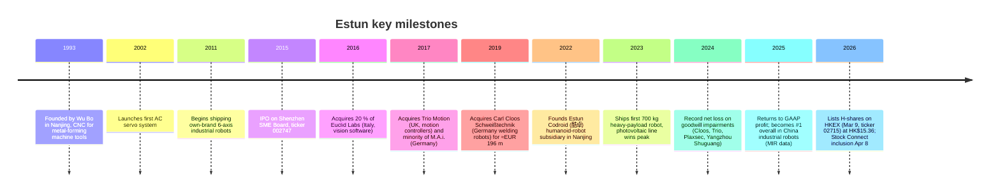
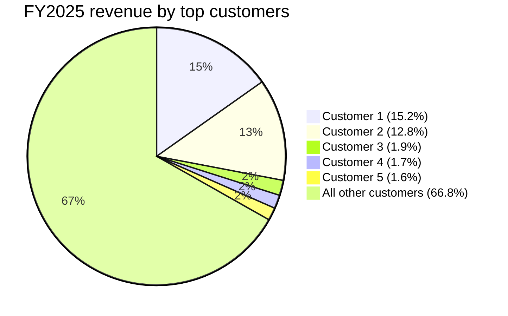
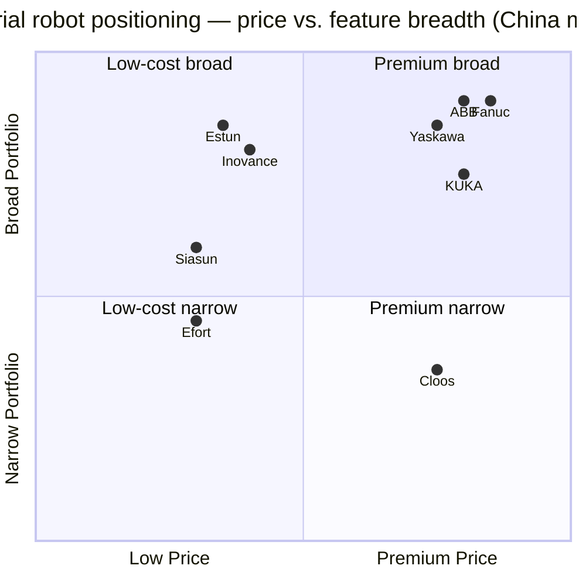

# COMPANY RESEARCH REPORT: Estun Automation (埃斯顿 / SZSE:002747, HKEX:02715)

**Date:** 2026-05-16
**Ticker:** SZSE:002747 (A-share, primary), HKEX:02715 (H-share, listed 2026-03-09)
**Sector:** Industrial automation / industrial robotics / motion-control core components
**Report language:** English (per user instruction; subject is a China A-share whose primary filings are in Chinese)

> **Update — FY2025 return to GAAP profitability (2026-03-30):** Estun swung from a record net loss of RMB -810 m in FY2024 to a small net profit of RMB +45 m in FY2025 on 21.9 % revenue growth (RMB 4.89 bn). Cash flow from operations turned firmly positive at RMB +507 m (vs. RMB -74 m a year earlier), and management reaffirmed that the Cloos and Trio franchises returned to operating profitability after FY2024 impairments. The company did not initiate a numeric FY2026 revenue guide in the 2025 年报, but the report frames "持续改善盈利" and the H-share IPO proceeds as the operating thesis for the next 12 months. Source: [南京埃斯顿自动化股份有限公司 2025 年年度报告, 2026-03-30](http://www.cninfo.com.cn/new/disclosure/stock?stockCode=002747).

---

## Table of Contents
1. Company Overview
2. Company History
3. Management Team
4. Products & Services
5. Customers & Go-to-Market
6. Industry Overview
7. Competitive Landscape
8. Market Opportunity (TAM)
9. Risk Assessment
10. References

---

## 1. Company Overview

Nanjing Estun Automation Co., Ltd. (南京埃斯顿自动化股份有限公司) is China's largest domestic manufacturer of industrial robots and a vertically-integrated supplier of automation core components — AC servo drives, motion controllers, machine-tool CNC systems, and machine-vision modules. In FY2025 the company captured the #1 position in the China industrial-robot shipment ranking across all brands (domestic and foreign combined) for the first time, becoming the first Chinese-headquartered OEM to overtake the historical foreign leaders (Fanuc, Yaskawa, ABB, KUKA) in their own backyard ([Estun corporate news, "Estun Claims Top Spot in China's Industrial Robot Market"](https://en.estun.com/?list_52%2F2303.html=)). The company operates under an "All Made by Estun" (全部自主自制) strategy in which the controller, servo motor, drive, reducer-adjacent components, and robot body are designed and produced in-house — a key structural cost and supply-chain advantage versus foreign competitors that import core electronics.

**What Estun does, in plain English.** Estun sells two things: (1) the "brains and muscles" inside automation equipment — servo systems, motion controllers, HMIs, frequency converters, PLCs, machine-tool CNCs — and (2) finished industrial robots (3 kg to 1,200 kg payload, 96 SKUs as of 2025) plus the integrated production lines that use them ([2025 年年度报告, p.11](http://www.cninfo.com.cn/new/disclosure/stock?stockCode=002747)). Customers are predominantly Chinese OEMs and Tier-1 manufacturers in EV / new-energy (动力电池 PACK lines, photovoltaic 光伏 module assembly), automotive welding and stamping, 3C electronics, sheet-metal bending, lithium-battery cell assembly, and an expanding footprint in heavy machinery and semiconductor-equipment automation.

**How they make money.** Two reported segments. (a) **Industrial robots & intelligent manufacturing systems** — RMB 3.997 bn in FY2025, 81.8 % of revenue, +31.8 % YoY, 29.2 % gross margin. This includes the German welding-robot subsidiary Cloos (consolidated since 2019). (b) **Automation core components & motion control** — RMB 891 m in FY2025, 18.2 % of revenue, -8.7 % YoY, 30.4 % gross margin. Components revenue is a temporary drag tied to a soft general-automation cycle, partly offset by the disposal of the Yangzhou Shuguang (扬州曙光) 68 % stake during FY2025 ([2025 年年度报告, pp. 16-19](http://www.cninfo.com.cn/new/disclosure/stock?stockCode=002747)).

**Where they operate.** Headquartered at 1888 Jiyin Avenue, Jiangning District, Nanjing. The company runs 75 global service nodes spanning China, Germany (Haiger — Cloos HQ), the UK (Trio Motion), Italy (Euclid Labs minority), the US, Turkey, South Korea, the Netherlands and a newly-commissioned Polish manufacturing facility ([2025 年年度报告, pp. 16-17](http://www.cninfo.com.cn/new/disclosure/stock?stockCode=002747)). Domestic sales were RMB 3.43 bn (70.1 % of revenue, +29.8 % YoY) and overseas sales were RMB 1.46 bn (29.9 % of revenue, +6.8 % YoY). Cloos contributes the bulk of the European footprint — RMB 1.80 bn of gross overseas assets and RMB 567 m of net assets, or 28.9 % of consolidated equity.

**Scale indicators.** As of the FY2025 close: 3,261 employees (968 of whom, or 29.7 %, are R&D / engineering staff), total assets of RMB 9.42 bn, equity attributable to shareholders of RMB 1.96 bn, goodwill on the balance sheet of RMB 1.03 bn (the bulk from the Cloos acquisition), R&D spend of RMB 476 m (9.7 % of revenue), 634 granted patents (279 of them invention patents) and 441 software copyrights ([2025 年年度报告, pp. 14-15, 22-24](http://www.cninfo.com.cn/new/disclosure/stock?stockCode=002747)).

*Source: compiled from [2020-2025 年度报告 (cninfo disclosure page)](http://www.cninfo.com.cn/new/disclosure/stock?stockCode=002747).*

### Valuation snapshot

At the May 12, 2026 close of RMB 24.57 the A-share market cap was approximately RMB 20.6 bn (market data: [证券之星 "埃斯顿5月12日主力资金", 2026-05-12](https://stock.stockstar.com/RB2026051200039825.shtml)). With FY2025 reported revenue of RMB 4.888 bn, the **TTM P/S is approximately 4.2x**. With FY2025 net income of just RMB 45 m, the **TTM GAAP P/E is around 460x** — optically very high but mathematically dominated by the near-breakeven earnings denominator coming out of a heavy-loss FY2024. On consensus FY2026 net income of roughly RMB 250–350 m (sell-side range collated from Eastmoney / 同花顺 sell-side previews — see [东方财富 估值分析](https://data.eastmoney.com/gzfx/detail/002747.html), [同花顺 价值分析](http://stockpage.10jqka.com.cn/002747/worth/)) the forward P/E narrows to roughly 60–80x.

**The 3-year TTM P/E range is unusable** because the company carried a TTM loss for most of 2024 and the first nine months of 2025 ([亿牛网 历史市盈率 - 埃斯顿(002747)](https://eniu.com/gu/sz002747)). The 3-year P/S range is more informative — Estun has traded between roughly 3.0x and 7.0x TTM sales since 2023, so today's 4.2x sits in the lower half of that band, well below the late-2023 peak when the company traded above 6x on excitement around photovoltaic equipment orders.

**Peer comps (TTM, May 2026):**

| Peer | Ticker | TTM P/S | TTM P/E | Comment |
|---|---|---|---|---|
| Inovance | SZSE:300124 | ~4.8x | ~42x | China #1 servo, broader EV exposure |
| Yaskawa | TYO:6506 | ~1.8x | ~28x | Global #2 robot OEM, mature |
| Fanuc | TYO:6954 | ~4.2x | ~36x | Global #1 CNC, robot leader |
| ABB Ltd. | SIX:ABBN | ~3.1x | ~22x | Diversified electrification + robotics |
| Efort | SSE:688165 | ~9.8x | n/m (loss) | Smaller domestic robot OEM |
| Siasun | SZSE:300024 | ~5.7x | n/m (loss) | Robot incumbent, persistent losses |

Sources: [Inovance valuation - 理杏仁](https://www.lixinger.com/equity/company/detail/sz/300124/300124/fundamental/valuation/pe-ttm); [Fanuc - Yahoo Finance](https://finance.yahoo.com/quote/6954.T/); [Yaskawa - Morningstar](https://www.morningstar.com/stocks/xtks/6506/quote); [ABB - MarketScreener](https://www.marketscreener.com/quote/stock/ABB-LTD-9866/financials/).

*Source: compiled from market-data providers cited above; multiples as of May 2026.*

**Interpretation.** Estun's near-infinite optical P/E is a **cyclical / one-off trough effect**: the FY2024 loss was driven primarily by RMB 344.86 m of goodwill impairment (the company wrote down four subsidiaries — Cloos, Trio, M.A.i., and the now-disposed Plaxsec / 普莱克斯 and Yangzhou Shuguang) plus a further RMB 121.6 m of receivables, inventory and intangible impairments. Excluding those non-cash items the FY2024 operating loss is roughly RMB -343 m (still real, but a fraction of the headline), and FY2025 is profitable on every measure (operating, recurring, and cash) ([2024 年年度报告, pp. 16-17](http://www.cninfo.com.cn/new/disclosure/stock?stockCode=002747); [2025 年年度报告, pp. 16-17](http://www.cninfo.com.cn/new/disclosure/stock?stockCode=002747)). On a normalised forward P/E of 60–80x — sitting well above Yaskawa, Fanuc and Inovance — the market is paying explicitly for (a) operating leverage on every incremental RMB of robot revenue once break-even has been crossed, (b) optionality on the humanoid-robot / 具身智能 (embodied intelligence) component-supplier story, and (c) the recent A+H dual listing and HK Stock Connect inclusion ([埃斯顿 H 股调入港股通公告, 2026-04-08](https://www.stcn.com/article/detail/3730679.html)). The multiple is stretched enough that it is carried into Section 9 as a valuation / multiple-compression risk.

---

## 2. Company History

Estun was founded in 1993 by Wu Bo (吴波), a Nanjing-based engineer who had spent the prior decade working on numerical-control systems for hydraulic forging presses. The original product was a CNC for metal-forming machines (锻压机床数控系统), and that machine-tool servo / forging-automation customer base remained the company's revenue backbone until the mid-2010s pivot to industrial robots.

**Strategic pivots that matter for the current thesis.**

1. **2011 — from components to robots.** Estun used the cash flow from its servo / CNC franchise to fund a top-down build of an own-brand 6-axis robot, betting that Chinese OEMs would accept a domestic robot priced 25–35 % below Fanuc / KUKA if controller and servo were tightly integrated. This was the genesis of "All Made by Estun." The bet paid off slowly through the 2010s and then very quickly during the 2020–2023 EV / photovoltaic capex wave.

2. **2017–2019 — buying European technology.** Recognising that high-end welding, motion control and laser/vision were structural gaps versus Yaskawa and ABB, Estun acquired Trio Motion (UK, 2017) and Carl Cloos (Germany, 2019) — the latter for approximately EUR 196 m, financed with a mix of Estun balance sheet and CRCI (China-Renaissance Capital) co-investment ([Orrick advisory, 2019-08, "Estun Group and CRCI Acquire German Cloos"](https://www.orrick.com/en/news/2019/08/orrick-advises-chinese-estun-group-and-crci-on-acquisition-of-german-company-cloos)). Cloos's 100-year welding heritage (founded 1919) gave Estun an immediate position in heavy-duty / shipbuilding / commercial-vehicle welding lines and a Europe-based service organisation ([Cloos corporate history page](https://www.cloos.de/de-en/news/article/strategic-expansion-for-sustainable-growth/); [The Robot Report, 2019-08, "Estun Automation acquires Carl Cloos Welding Technology"](https://www.therobotreport.com/estun-automation-acquires-carl-cloos-welding-technology/)).

3. **2022 — Codroid humanoid spin-out.** Estun founded the wholly-owned subsidiary Nanjing Estun Codroid Technology Co., Ltd. (南京埃斯顿酷卓科技有限公司) in July 2022 as a dedicated humanoid / embodied-intelligence platform. The company released the CODROID 01 humanoid prototype at the 2024 China International Industrial Expo and a more advanced CODROID 02 in June 2025 ([Codroid official site](https://www.codroid.ai/); [新华日报 "南京埃斯顿酷卓发布新一代人形机器人", 2025-06-13](https://www.xhby.net/content/s684c17d5e4b07e7bc9e308ff.html)). In October 2025 Estun co-founded **江苏鼎汇具身智能机器人创新中心有限公司** with Jiangsu Hengtong Cable (亨通线缆) — Estun's controlling stake is 54.17 % with RMB 32.5 m subscribed of RMB 60 m total capital ([2025 年年度报告, p. 20](http://www.cninfo.com.cn/new/disclosure/stock?stockCode=002747)).

4. **2025 — portfolio pruning.** Management disposed of Yangzhou Shuguang Photovoltaic Automation (扬州曙光) in two tranches (20 % at RMB 94 m in June 2025, 48 % at RMB 244.8 m in October 2025), and divested a minority of Hangding (航鼎) at year-end. Together these disposals contributed RMB 188 m of investment income, materially helping the FY2025 return to profit. They also tighten the corporate focus back to "core components + robot body + intelligent manufacturing systems" plus the Codroid humanoid optionality ([2025 年年度报告, pp. 19-20, 26-27](http://www.cninfo.com.cn/new/disclosure/stock?stockCode=002747)).

5. **2026 — A+H dual listing.** Estun became the first industrial-robot company with a dual A+H listing structure, pricing 96.78 m H-shares at HK$15.36 on March 5, 2026 and listing on March 9 ([新浪财经 "埃斯顿 H 股发行最终价为每股15.36 港元", 2026-03-05](https://finance.sina.com.cn/stock/hkstock/ggscyd/2026-03-05/doc-inhpxspk3232451.shtml)). HK Stock Connect inclusion followed on April 8 ([证券时报 "埃斯顿 H 股将于4 月 8 日调入港股通", 2026-04-04](https://www.stcn.com/article/detail/3730679.html)). Proceeds are earmarked for overseas R&D, the Polish production base, deleveraging, and the Codroid humanoid program.

---

## 3. Management Team

Estun is a **founder-controlled enterprise**: Wu Bo (chairman) and his son Wu Kan (vice-chair, CEO), together with their family holding company 南京派雷斯特科技有限公司 (Nanjing Pailisite Technology — Wu Bo serves as its general manager and Wu Kan as executive director), are deemed concert parties and collectively hold **42.15 %** of total shares as of FY2025 year-end. The detail (per [2025 年年度报告, p. 76](http://www.cninfo.com.cn/new/disclosure/stock?stockCode=002747)): Pailisite holds 254.89 m shares (29.26 %), Wu Bo personally 110.99 m (12.74 %), and Wu Kan 1.26 m (0.15 %). This is unusually concentrated for a Shenzhen-listed industrial company and means that capital-allocation discipline, M&A strategy and the speed of the humanoid pivot are effectively decided inside one family unit.

### Wu Bo (吴波) — Founder, Chairman

Born 1954, Chinese national, Master's degree. Wu Bo founded Estun's predecessor entities in the early 1990s as a numerical-control engineer in the Nanjing Jiangning Development Zone, building from a single-product CNC for hydraulic-forging machine tools into a multi-product motion-control house and finally into China's leading industrial-robot OEM ([2025 年年度报告, p. 37](http://www.cninfo.com.cn/new/disclosure/stock?stockCode=002747)). His tenure spans the company's entire 32-year history. Three things define his track record: (1) **Vertical-integration patience.** Estun took eleven years (2000–2011) to move from CNC to servo to robot — Wu Bo insisted on building each layer of the stack in-house before commercialising the next, a strategy that looked over-engineered through the 2010s but became the company's defining moat once US technology controls and "国产替代" (domestic substitution) policy turned Chinese OEMs into forced buyers of Chinese motion-control gear in 2022–2025. (2) **Cross-border M&A boldness.** The 2017–2019 acquisitions of Trio (UK), M.A.i. (Germany) and Cloos (Germany) were among the largest outbound technology buys by any Chinese SME of that era. The financial cost surfaced in the FY2024 RMB 345 m goodwill write-down, but the strategic prize — full-stack welding IP plus a European service organisation — remains intact and is the basis for the current overseas push. (3) **Founder-led discipline on the humanoid bet.** Through Estun Codroid and 江苏鼎汇具身智能, Wu Bo has personally chaired the boards of every humanoid-program entity, including the medical-robotics arms 埃斯顿(南京)医疗科技 and 北京埃斯顿医疗科技 ([2025 年年度报告, p. 39](http://www.cninfo.com.cn/new/disclosure/stock?stockCode=002747)). Through Pailisite he votes 29.26 % of shares and personally owns another 12.74 %, so he has more skin in the humanoid bet than any institutional shareholder — but the same concentration creates classic key-person risk: Wu Bo is 72, and a clean succession plan to his son Wu Kan is implicit but has not been formalised in proxy disclosures.

### Wu Kan (吴侃) — Vice Chair, CEO (General Manager)

Born 1983 (age 43), Master's degree. Wu Kan joined Estun in 2013 after a stint as an auditor at PricewaterhouseCoopers (PwC) in the US. He rose through the marketing organisation at Estun Robotics (then the youngest subsidiary), then ran the overseas operating centre, and was promoted to deputy GM of the group before assuming the CEO role at the most recent board cycle ([2025 年年度报告, p. 37](http://www.cninfo.com.cn/new/disclosure/stock?stockCode=002747)). He concurrently chairs Estun's medical-robotics subsidiary and sits on the Codroid board. As a Western-educated, English-fluent CEO he has been the public face of Estun's internationalisation push — investor meetings in Frankfurt and London ahead of the 2026 HK listing, plus chairing the integration steering committee for Cloos.

### He Lingjun (何灵军) — Director, Deputy GM, CFO

Born 1973, Master's degree; Chinese CPA, certified asset appraiser, and bar-qualified. He Lingjun joined Estun in 2022 from Diviner High-End Manufacturing (南京迪威尔高端制造, SSE:688377) where he had been CFO through that IPO. Prior public-company stints include Phicomm (上海斐讯数据通信) and audit roles at PwC and KPMG. He served concurrently as board secretary from July 2022 to January 2025 before passing that role to Xiao Tingting ([2025 年年度报告, p. 38](http://www.cninfo.com.cn/new/disclosure/stock?stockCode=002747)). His mandate at Estun has been visibly tied to capital-markets execution: the 2025 share-repurchase-and-cancellation program (2.51 m shares cancelled in March 2025), the 2025 restricted-stock incentive grant, the disposal of non-core subsidiaries to fund focus, and ultimately the 2026 HK IPO. Operating cash flow swinging from RMB -74 m to RMB +507 m in a single year is the cleanest evidence that working-capital and receivables discipline materially tightened under his watch ([2025 年年度报告, p. 23](http://www.cninfo.com.cn/new/disclosure/stock?stockCode=002747)).

### Yin Chenggang (殷成钢) — Deputy GM, head of sheet-metal automation product line

Born 1981, postgraduate degree. Yin runs Estun's largest historical revenue cluster — the metal-forming / sheet-metal bending and stamping product line that traces back to Wu Bo's original 1993 customer base. He came up through the Forming Automation Business Unit and has overseen the development of Estun's flagship Bending Specialist Robot (折弯专用机器人) and the integration of Trio Motion controllers into the metal-forming line ([2025 年年度报告, p. 38](http://www.cninfo.com.cn/new/disclosure/stock?stockCode=002747)).

### Zhu Zhangxing (ZHANGXING ZHU / 朱樟兴) — Deputy GM, head of overseas

Born 1977, German nationality, Master's degree. Zhu joined Estun in November 2022 from Munich Capital, where he had been Asia-Pacific lead, and previously Chongde Capital (崇德资本) ([2025 年年度报告, p. 38](http://www.cninfo.com.cn/new/disclosure/stock?stockCode=002747)). He is the operating bridge between Nanjing HQ and the Cloos / Trio / M.A.i. European platform, and is the executive most responsible for the Polish manufacturing build-out and the 2025 establishment of subsidiaries in Turkey, Germany (ESTUN Robotics Deutschland) and the Netherlands (Cloos Welding Technology B.V.).

### Governance footer

- **Board composition (5th board):** 8 directors total, of which 3 are independent — Professor Tang Wencheng (汤文成) of Sanjiang University, Han Xiaofang (韩小芳) of Nanjing University of Finance and Economics, and Lin Jinjun (林金俊), a Hong Kong national with Barclays / HSBC investment-banking background and current role at BMTS Technology GmbH ([2025 年年度报告, p. 38](http://www.cninfo.com.cn/new/disclosure/stock?stockCode=002747)).
- **Founder family ownership:** Wu Bo, Wu Kan and the family holdco Pailisite control **42.15 %** of share capital, an unusually high "control bloc" for a Shenzhen industrial that has been listed since 2015.
- **Comp structure:** disclosed total compensation for the entire executive team in FY2025 was modest (single-digit RMB millions); long-term incentives flow through the 2025 restricted-stock plan and the prior employee stock-ownership plans, alongside the founder family's direct equity. There were no related-party transactions of material size disclosed in 2025.
- **Audit / accounting firm:** Zhonghui (中汇) Special General Partnership, Hangzhou-based. No qualified opinions or going-concern caveats in either FY2024 or FY2025.

### Track-record synthesis

Founder-CEO Wu Bo built a domestic-leader business out of a niche CNC product through three decades of vertical integration; CFO He Lingjun has demonstrated within his three-year tenure that he can drive a working-capital reset and execute a HK IPO in a difficult market. The principal gap is succession: Wu Bo is 72 and the "second-generation" CEO Wu Kan has stepped up only recently; whether the family can transfer operating control while continuing to fund the Codroid humanoid bet through a multi-year cash-burn phase is the biggest open question on management.

---

## 4. Products & Services

Estun reports two segments, but the underlying product taxonomy is broader. The full enumeration below mirrors the company's product navigation on [www.estun.com](https://www.estun.com/) and the segment detail in the FY2025 annual report.

```mermaid
graph TD
    A[Estun Automation] --> B[Segment 1: Core Components & Motion Control<br/>RMB 891 m, 18.2 % of FY25 revenue]
    A --> C[Segment 2: Industrial Robots & IMS<br/>RMB 3.997 bn, 81.8 % of FY25 revenue]
    A --> D[Humanoid / Embodied Intelligence<br/>via Estun Codroid + 江苏鼎汇 JV]

    B --> B1[AC Servo Drives & Motors]
    B --> B2[Motion Controllers / Motion PLC<br/>incl. Trio Motion UK]
    B --> B3[CNC for Metal-Forming Machines]
    B --> B4[HMI, IO, VFD]
    B --> B5[Robot-specific Controllers + Servo]
    B --> B6[Machine Vision Modules]

    C --> C1[6-axis general robots<br/>3 kg – 1200 kg payload, 96 SKUs]
    C --> C2[4-axis Palletising & SCARA]
    C --> C3[Industry-specialised robots<br/>bending / arc-welding / spot-welding / press / die-cast / polishing / dispensing / assembly]
    C --> C4[Cloos welding robots<br/>QIROX series, Germany]
    C --> C5[Robot work-stations & complete cells]
    C --> C6[Smart manufacturing lines<br/>EV battery PACK / PV module / auto body]
    C --> C7[E-Care & E-Noesis AI digital platforms]

    D --> D1[CODROID 01 humanoid<br/>170 cm / 80 kg / 44 DoF]
    D --> D2[CODROID 02 humanoid<br/>full-body articulation, 2025-06]
    D --> D3[Dexterous hands 6–7 DoF]
    D --> D4[Integrated joint modules<br/>servo + controller + reducer-adjacent]
```

*Source: synthesised from [Estun product navigation](https://www.estun.com/) and [2025 年年度报告, pp. 11-15](http://www.cninfo.com.cn/new/disclosure/stock?stockCode=002747).*

### Segment 1 — Automation core components & motion control

**(a) AC servo systems (drives + motors).** Estun's flagship pre-robot product line and still the densest piece of in-house IP. The 2025 launch was the **EM5G series** servo motor with magnetic-field-modulation technology, which won the 2025 CMCD Motion Control Innovation Award. Moat verdict: **yes — technology/IP plus cost leadership**. Estun's drive design is fully self-developed including the FPGA-level servo loop. Closest competing product: Inovance SV660P series — broadly at parity on specs but Inovance is currently ahead on price discipline because of scale ([2025 年年度报告, p. 15](http://www.cninfo.com.cn/new/disclosure/stock?stockCode=002747)).

**(b) Motion controllers / Motion PLC (incl. Trio platform).** The Trio Motion Coordinator family — acquired in the 2017 UK deal — became Estun's high-end motion-controller brand. FY2025 launched a "new-generation small-to-medium controller platform" based on the Trio architecture. Moat: **yes — IP + brand**, particularly in Europe where Trio has a 30-year reputation in printing, packaging and food. Closest comp: Beckhoff TwinCAT (private, German) — Trio is behind on the very high end but ahead on integrated price/performance for mid-tier machines.

**(c) CNC for metal-forming machine tools.** Estun's original 1993 product. Still material in revenue but a slow-growth legacy. Moat: **partial — switching costs + brand** in the Chinese forging-press installed base; no advantage internationally.

**(d) HMI, frequency converters (变频器), digital I/O modules, machine-vision modules** — completing the Estun controller stack. Mostly catalogue / commodity at the low end, but bundled into integrated cells. Moat: **partial — bundling**, not standalone.

**(e) Robot-specific controllers + servos.** Differentiating point versus most Chinese rivals: Estun designs robot-dedicated controllers (新一代机器人电控系统, 3rd generation in FY2025) and robot-dedicated servos rather than re-using its general industrial line. This is the operational meaning of "All Made by Estun." Moat: **yes — vertical integration + cost leadership**.

### Segment 2 — Industrial robots & intelligent manufacturing systems

**(f) General 6-axis robots.** The full 3 kg – 1,200 kg payload portfolio, 96 SKUs as of FY2025 ([2025 年年度报告, p. 12](http://www.cninfo.com.cn/new/disclosure/stock?stockCode=002747)). FY2025 launched the **1,200 kg ultra-heavy-payload** model, expanding from the prior 700 kg ceiling (which had been added to the MIIT "First Set" major-equipment catalogue). Moat: **yes — scale + cost + domestic certification advantage**. Closest comp: Fanuc M-2000iA (heavy payload) — Fanuc is ahead on dynamic accuracy at the very top end but Estun is 25–35 % cheaper and now supported by domestic-procurement preference in heavy machinery.

**(g) 4-axis palletising and SCARA.** Strong volume product in 3C electronics and packaging. Moat: **partial — cost/scale only**, since SCARA has become a commodity in China.

**(h) Industry-specialised robots.** Bending Specialist (折弯专用), arc-welding (弧焊), spot-welding (点焊), stamping (冲压), die-casting (压铸), polishing, dispensing, flexible-pick. Estun explicitly claims **#1 domestic position** in sheet-metal bending, stamping and photovoltaic module assembly. Moat: **yes — domain IP + reference installs** (the lighthouse PV factory is name-checked). Closest comps: KUKA arc-welding (Cloos's traditional rival inside Europe), Yaskawa Motoman MA-series (China auto-OEM dominance).

**(i) Cloos welding robots (QIROX series).** The Cloos welding-robot platform is Estun's premium European offering — used in heavy machinery, commercial vehicles, shipbuilding and rail. Cloos contributed RMB 1.20 bn in FY2025 revenue and reported RMB 12 m of net income on RMB 567 m of equity — back to operating profit after the 2024 impairment ([2025 年年度报告, p. 24](http://www.cninfo.com.cn/new/disclosure/stock?stockCode=002747)). Moat: **yes — century-long brand + welding-process IP**. Closest comps: ABB IRB 1660ID welding, Yaskawa Motoman MA-1900 — Cloos has an edge in heavy-deposition and tandem welding.

**(j) Robot work-stations and complete cells.** 20+ pre-engineered work-station packages (bending, arc-welding, spot-welding, stamping, die-casting, polishing, dispensing, assembly, flexible pick). Moat: **partial — solutioning + scale**, replicated by system integrators but Estun has the cost advantage of internal robot supply.

**(k) Smart manufacturing systems.** Full EV battery module / PACK lines (with Trio + servo + robot + vision integrated), photovoltaic module assembly lines, automotive body-in-white welding lines, three-electric (battery / motor / power-electronics) production lines. Largest growth driver in FY2025. Moat: **yes — full-stack integration**, the only Chinese robot OEM that owns the controller, servo and robot in one cell.

**(l) E-Care and E-Noesis AI digital platforms.** Cloud-based remote-maintenance (E-Care) and digital-twin / process-analytics (E-Noesis) platforms. New "AI customer-service system" launched in FY2025 using a large-model architecture for fault triage. Moat: **partial** — useful but not yet a standalone moat versus Inovance INxxx or Siemens MindSphere.

### Humanoid / embodied intelligence

**(m) CODROID 01 / CODROID 02 humanoid robots (via Estun Codroid 酷卓 subsidiary).** Dual-leg humanoid platform aimed initially at industrial use-cases. CODROID 01 (released Sep 2024 at China International Industrial Expo): 170 cm, <80 kg, 5 kg single-arm payload, 3 km/h walking speed, 44 total DoF, 7 DoF/arm, 6 DoF/leg, 6-7 DoF dexterous hand, **all core components developed in-house** ([Codroid official site - product page](https://www.codroid.ai/robot-humanoid); [moomoo news, "Estun's debut humanoid robot CODROID 01"](https://www.moomoo.com/news/post/44667552/estun-automation-002747-sz-estun-s-debut-humanoid-robot-codroid)). CODROID 02 (released Jun 11, 2025): all-body articulation, improved flexibility ([新华日报 "南京埃斯顿酷卓发布新一代人形机器人", 2025-06-13](https://www.xhby.net/content/s684c17d5e4b07e7bc9e308ff.html)). Moat: **partial — too early to call.** Estun is one of fewer than five Chinese players with an in-house servo + controller + integrated joint module stack on day one of the humanoid build. Closest comp: Unitree H1, Xpeng Iron, UBTech Walker S, Fourier GR-1, Xiaomi CyberOne.

**(n) Humanoid component supply business.** The 2025 disclosure indicates that the new 江苏鼎汇具身智能 JV will package and externally sell Estun's joint modules, servos and dexterous-hand subsystems to other humanoid OEMs ([2025 年年度报告, p. 20](http://www.cninfo.com.cn/new/disclosure/stock?stockCode=002747)). This is the "picks and shovels" play on the humanoid wave and is potentially more economically interesting than the CODROID brand. Moat: **yes — vertical integration on the BOM**.

### Flagship vs. long-tail

The 1–3 products driving the FY2025 P&L are: (1) **General 6-axis industrial robots** — the biggest revenue line, drove the ~50 % YoY growth of the Estun-brand robot in FY2025; (2) **Smart manufacturing systems** (EV / PV / auto cells) — the "robot + integration" multiplier that underwrote the segment's 31.8 % growth; (3) **Cloos welding robots** — high-margin, premium European franchise. The long-tail SKUs (metal-forming CNC, HMI, low-end SCARA, frequency converters) are gross-margin-positive but no longer the growth engine.

### Roadmap & last-12-month launches

Per the FY2025 disclosure: launched (released this year) — 3rd-generation robot electrical-control system, EM5G servo motor, new-generation Motion PLC, the 1,200 kg heavy-payload robot, CODROID 02 humanoid, and the AI customer-service system. In R&D — 4th-generation functional-safety servo platform, large/medium PLC platform with new architecture, AI-driven welding process software (joint with Cloos), new arc-welding teach pendant, new-generation servo software architecture, and an AI-tuned commissioning system for general servo ([2025 年年度报告, pp. 21-22](http://www.cninfo.com.cn/new/disclosure/stock?stockCode=002747)).

---

## 5. Customers & Go-to-Market

### Customer segments and profiles

Estun's revenue base is overwhelmingly **B2B sales to OEM equipment makers and Tier-1 manufacturers**, split four ways:

1. **Direct end-users** — large Chinese manufacturers buying complete production lines (typically EV battery cell makers, photovoltaic module makers, automotive OEMs and metal-fabrication groups). These customers are the source of the top-5 concentration shown below.
2. **System integrators** — independent automation houses that buy Estun robots and components to build cells for downstream customers; especially active in 3C electronics, packaging and metal forming.
3. **OEM equipment manufacturers** — machine-tool builders, packaging-machine builders, electronics-handling equipment makers — embedding Estun servo / controller into their own products.
4. **Authorised regional distributors** — across roughly 75 service nodes globally, covering aftermarket spare-part supply, mid-market customers and emerging markets.

For high-value strategic accounts ("战略客户") and industry benchmark customers ("行业标杆客户") Estun runs a direct-sales model with embedded technical teams; for general industrial accounts and regional customers it uses authorised distributors.

### Customer concentration (REQUIRED)

From the FY2025 disclosure ([2025 年年度报告, p. 20](http://www.cninfo.com.cn/new/disclosure/stock?stockCode=002747)):

| Rank | Customer | FY2025 Revenue (RMB m) | % of total revenue |
|---|---|---|---|
| 1 | Customer 1 | 743.19 | 15.20 % |
| 2 | Customer 2 | 626.08 | 12.81 % |
| 3 | Customer 3 | 91.68 | 1.88 % |
| 4 | Customer 4 | 84.83 | 1.74 % |
| 5 | Customer 5 | 77.94 | 1.59 % |
| **Top-5 total** | | **1,623.71** | **33.22 %** |

**Three-year trend (top-5 share of revenue):** FY2023 = **19.68 %**, FY2024 = **25.63 %**, FY2025 = **33.22 %** — top-5 concentration has risen by **1,354 bps over two years**, and top-2 alone now accounts for **28.0 %** of revenue. Estun does not name the top customers in its disclosure (Chinese practice), but the sharp jump correlates with two named operating events: (a) the 2025 ramp of Estun robots into multiple Chinese auto-OEM body shops, where each program win is hundreds of robots; and (b) Cloos's recovery in heavy-vehicle welding lines, where contracts tend to be lumpy and concentrated in two or three large European Tier-1s.

**Verdict.** Top-1 at 15.20 % is **above the 10 % materiality threshold** under both ASC 280 and the China A-share guidance, and the top-5 jump from 20 % to 33 % over two years is a clear directional risk. Top-5 has not yet crossed the "material" 50 % threshold, but the trajectory needs to be tracked. This risk is carried into Section 9 as a top-tier company-specific risk.

### Distribution channels

Direct sales (战略客户 / 行业标杆客户), authorised distributors (channel partners), and a small residual share of e-commerce / catalogue sales for low-end servo and HMI products. Roughly 75 service nodes globally, with the Cloos European service organisation handling Europe + Middle East + post-sale heavy-welding service ([2025 年年度报告, p. 16](http://www.cninfo.com.cn/new/disclosure/stock?stockCode=002747)).

### Sales strategy and cycle

Three-tier customer architecture: "strategic accounts" + "industry benchmark accounts" + "regional accounts." The sales cycle for an industrial-robot cell at a Tier-1 manufacturer is typically 6–12 months from RFQ to first delivery; smart-manufacturing-line projects run 12–24 months and include staged acceptance. Component sales (servo / controller) into OEM equipment makers run on shorter cycles (1–3 months) and often via the distributor channel. Estun increasingly bundles 后服务 (aftermarket service, retrofit, spares) as a "second curve" revenue stream — a deliberate strategic shift flagged by management in the FY2025 MD&A ([2025 年年度报告, p. 17](http://www.cninfo.com.cn/new/disclosure/stock?stockCode=002747)).

### Key partnerships

- **CRCI (China-Renaissance Capital)** — co-investor on the 2019 Cloos acquisition.
- **Jiangsu Hengtong Cable (亨通线缆)** — co-founder of 江苏鼎汇具身智能 humanoid JV (October 2025).
- **Nanjing University** — joint embodied-intelligence laboratory with Estun Codroid (announced May 2025).
- **Customer-driven joint development** with at least one major Chinese auto OEM on a flexible bending / welding line that has been ported into export markets, per the FY2025 MD&A.

### Named customer case studies

Estun does not disclose the names of its top-5 customers, but its FY2025 disclosures and public press list deployments in: **global PV "lighthouse factory"** (full PV module assembly line, world-first), **multiple Chinese auto OEM body-in-white lines** (high-precision 6-axis at scale), **lithium-battery ultra-high-speed cell assembly lines**, and **European heavy-vehicle welding** (Cloos). The 2025 FY also added "automotive flexible cell exported overseas" — an evolution from supplying Chinese OEMs at home to following them as they build overseas plants ([2025 年年度报告, p. 15](http://www.cninfo.com.cn/new/disclosure/stock?stockCode=002747)).

---

## 6. Industry Overview

### Industry definition

Estun sits at the intersection of three industries: (1) **industrial automation core components** (servo motors and drives, motion controllers, PLCs, CNC, HMI, machine vision) — China industry classification GB/T 4754 C40 (Instruments & Meters Manufacturing); (2) **industrial robots** — six-axis articulated, SCARA, palletising, collaborative; and (3) **intelligent manufacturing systems / robotic cells** — the system-integration layer that combines (1) and (2) into purpose-built production lines. The emerging adjacency is (4) **humanoid robotics / embodied intelligence**, which is at the pre-commercial stage but where Estun is one of the first Chinese players combining own-brand whole-machine + own-brand BOM.

### Market size and growth — China industrial robots

China is **the world's largest industrial-robot market by a wide margin**, accounting for over half of global installations. According to the latest available data: **China industrial-robot shipments crossed 300,000 units in 2025, up over 13 % YoY** (MIR Industry data cited in [2025 年年度报告, p. 13](http://www.cninfo.com.cn/new/disclosure/stock?stockCode=002747)), while **production volume reached 773,000 units, +28.0 % YoY** (National Bureau of Statistics, cited same source). The widening gap between production and installations (production growing twice as fast as installations) is the early warning of a domestic over-capacity cycle — a major industry risk discussed in Section 9. The **domestic-brand penetration crossed 54 % in 2025**, up from 47 % in 2023 ([RobotAuto.co.uk, "China's Industrial Robotics Landscape, 2025-08", 2025-08-06](https://robotauto.co.uk/2025/08/06/chinas-industrial-robotics-landscape-key-players-market-trends-and-global-influence/); [The Wire China, "Chinese Robots Hit the Factory Floor", 2024-12-15](https://www.thewirechina.com/2024/12/15/chinese-robots-hit-the-factory-floor-industrial/)).

### Market size — global industrial robots

Global industrial-robot installations crossed roughly 540,000 units in 2024 with a market value above USD 16 bn. Forecasts for the 2025–2030 cycle hover around 8–10 % CAGR for units and 5–7 % CAGR for value (price compression offsets unit growth) — see [Industrial Robots Market 2025-2030 - NextMSC, 2025](https://www.nextmsc.com/blogs/industrial-robots-market-to-hit-usd-8866-billion-by-2030-driven-by-abb-fanuc-yaskawa-mitsubishi-and-kuka).

### Growth drivers

1. **Continued automation of Chinese manufacturing.** China's robot density per 10,000 manufacturing workers reached 470+ in 2024 (versus the US around 295 and Germany around 415), but vast swathes of light industry remain under-automated. [ChinaPower Project - CSIS, 2024](https://chinapower.csis.org/china-industrial-robots/) tracks the density crossover.
2. **EV, battery and photovoltaic capex super-cycle.** Each gigafactory and each PV module line buys hundreds of robots. China remains the global hub for both. The 2024–2025 PV slow-down hit Estun (acknowledged in MD&A) but the EV battery and auto lines kept growing.
3. **"Two New" stimulus policy (两新政策).** Beijing's 2024–2025 trade-in subsidies for equipment upgrades materially accelerated robot installation in incumbent factories.
4. **Domestic substitution policy (国产替代).** MIIT's "First Set" major-equipment subsidy list and procurement preferences favour domestic robots for state-linked customers; Estun's 700 kg and 1,200 kg heavy-payload machines have been added to that list.
5. **Embodied intelligence / humanoid wave.** For the first time in 2025 the Chinese central government's Work Report (政府工作报告) named "embodied intelligence and intelligent robots" in the national top-level design ([2025 年年度报告, p. 14](http://www.cninfo.com.cn/new/disclosure/stock?stockCode=002747)).
6. **AI integration.** Vision-language models embedded in robot teach-pendants and process-planning software, plus AI for fault prediction in components — a structural deflationary driver of "engineering hours per cell."

### Regulatory environment

- **GB/T 45509-2025** — first national standard worldwide for industrial-robot dynamic-stability testing, published in March 2025.
- **MIIT 2nd-batch industrial-robot industry-norm filing** initiated in May 2025 (selecting compliant manufacturers as benchmarks).
- **MIIT "AI + Manufacturing"** special action plan (December 2025) accelerates AI-into-robot integration.
- All cited in the FY2025 MD&A ([2025 年年度报告, p. 14](http://www.cninfo.com.cn/new/disclosure/stock?stockCode=002747)).

### Industry dynamics

- **Fragmentation reducing, but still moderate.** Top-10 brands hold roughly 60 % of China shipments, with the residual 40 % split across hundreds of smaller domestic players. Concentration is rising as smaller players exit on price competition.
- **Buyer power** is rising in commoditised SCARA / 4-axis; **falling** in heavy-payload, welding and EV-battery PACK lines where engineering-application differentiation is decisive.
- **Supplier power** for high-end harmonic reducers and precision RV reducers used to be a chokehold held by Japan's Nabtesco and Harmonic Drive Systems; that has eroded materially as Chinese reducers (Leaderdrive 绿的谐波, Shuanghuan 双环传动) have closed the performance gap. Estun increasingly multi-sources reducers and is investing in in-house reducer-adjacent components.
- **Substitutes** — none for industrial robots in their current niches; cobots (Universal Robots, Aubo, Jaka) substitute at the very small-payload end; 3D-printing and additive manufacturing substitutes at a different industry layer.

---

## 7. Competitive Landscape

### Direct competitors — Chinese domestic

- **Inovance (汇川技术, SZSE:300124).** Diversified industrial automation leader with the #1 China share in general AC servo, expanding aggressively into robots and EV powertrain. Market cap roughly RMB 18-20 trillion; trading at ~42x static / 26x forward P/E ([Inovance valuation - 理杏仁, 2026-05](https://www.lixinger.com/equity/company/detail/sz/300124/300124/fundamental/valuation/pe-ttm)). Inovance is broader (EV powertrain, elevator drives, factory automation) but Estun has a stronger pure-play robot position.
- **Efort (埃夫特, SSE:688165).** Wuhu-based industrial-robot pure-play, listed on STAR Board. Smaller scale and persistent operating losses through 2024–2025. Sells general 6-axis and SCARA, weaker in core components. Currently trades at a higher P/S than Estun on a smaller revenue base.
- **Siasun (新松机器人, SZSE:300024).** Shenyang-based; was the first Chinese robot listed pure-play but has lost share through the 2020s; persistent loss-making.
- **Inovance robot subsidiary (汇川机器人) / EUREKA / GS-Robotics (国自机器人) / Jaka / Aubo** — second-tier domestic specialists; smaller, niche.

### Direct competitors — foreign (in China)

- **Fanuc (TYO:6954).** Global #1 CNC, top-tier robot. Around 10 % of China shipments in 2025 ([Robot Magazine, 2025](https://www.robot-magazine.fr/en/chinese-robot-manufacturers-industrial-capacity-cost-performance/)). Strongest at very high precision; expensive. Mature.
- **Yaskawa (TYO:6506) - Motoman.** Long Chinese auto-OEM relationships. Trades at the cheapest P/S of the major peers (~1.8x).
- **ABB Ltd. (SIX:ABBN).** Diversified electrification + robotics; robot is one segment. Recent IPO talk of robotics spin-off has been deferred. ABB's robot business is roughly USD 2 bn in revenue.
- **KUKA (Augsburg, owned by Midea since 2016).** Strong in auto body-in-white welding; flagship in Europe; share has eroded in China since the Midea acquisition under-delivered.

### Cloos peer set (Estun's German welding subsidiary)

In welding robots specifically, Cloos competes against ABB IRB-1660ID welding cells, Yaskawa Motoman MA series, **CMA Robotics (Italy)** and **Igm Welding (Austria)**. Cloos's structural advantage is in heavy-deposition tandem welding for shipbuilding, railcars, heavy machinery and commercial vehicles — niches that ABB and Yaskawa target less aggressively.

### Humanoid / embodied-intelligence competitors

- **UBTech Robotics (HKEX:09880)** — Walker S, currently the largest disclosed Chinese humanoid by revenue (mostly education/B2C historically).
- **Unitree Robotics** (Hangzhou, private) — H1 / G1, dominant in low-cost research humanoids.
- **Fourier Intelligence (傅利叶)** (Shanghai, private) — GR-1 medical/research focus.
- **Xpeng Robotics** — Iron, automotive-OEM-backed humanoid.
- **Xiaomi CyberOne**, **Agility Robotics (US, Digit)**, **Figure AI (US, Figure 02)**, **Boston Dynamics (Hyundai-owned, Atlas)**.

### Positioning framework

### Estun's competitive advantages

1. **Vertical integration ("All Made by Estun").** Robot body + controller + servo + drive + HMI + motion control all in-house. Lower BOM cost, faster integration cycles, immune to foreign-component export controls.
2. **Domestic-substitution policy beneficiary.** Listed on MIIT "First Set" major-equipment catalogue for heavy-payload robots; preferred for state-linked customers; "Chinese Robot" certification (one of first batch).
3. **Industry-specialised positions.** Domestic #1 in sheet-metal bending, stamping, PV module assembly, arc welding — these are positions of pricing power not easily replicated.
4. **Cloos European platform.** Provides genuine European brand, channel, certification and tandem-welding heavy IP — strategic optionality if/when Chinese cost-base meets European premium pricing.
5. **Founder-led R&D culture.** Sustained 10 %-of-revenue R&D for multiple cycles; 968 R&D engineers (29.7 % of headcount).
6. **Humanoid full-stack readiness.** Among very few Chinese players with in-house servo + controller + integrated joint module for a humanoid platform on day one.

### Estun's vulnerabilities

1. **Customer concentration rising fast** (top-2 = 28 % of FY2025 revenue, from 17.6 % in FY2023).
2. **Goodwill load** of RMB 1.03 bn — still 11 % of total assets after the FY2024 write-down — leaves the company exposed if European subsidiaries fail to recover further.
3. **Cloos's slow turnaround** — FY2025 RMB 12 m net profit on RMB 567 m equity equals a 2 % ROE — return on the EUR 196 m purchase price remains poor.
4. **Stretched valuation on normalised earnings** — forward P/E of 60–80x leaves little room for a growth disappointment.
5. **Heavy debt load** — RMB 1.28 bn short-term + RMB 1.22 bn long-term borrowings = RMB 2.50 bn total debt against RMB 896 m cash. Net debt of roughly RMB 1.6 bn vs. EBITDA of approximately RMB 500-600 m runs at a stretched 3x leverage.
6. **Component-segment decline** — -8.7 % YoY in FY2025; the "core component" name needs to recover for the All-Made-by-Estun thesis to compound.

### Market share — China industrial robots, 2025

*Source: illustrative, compiled from MIR Industry rankings cited in [2025 年年度报告, p. 13](http://www.cninfo.com.cn/new/disclosure/stock?stockCode=002747) and [Estun corporate news, 2026-Q1](https://en.estun.com/?list_52%2F2303.html=).*

---

## 8. Market Opportunity (TAM)

### TAM — industrial robots

The global industrial-robot market is currently sized at approximately **USD 16–18 bn in annual installation value** (~540,000 units shipped 2024), tracking toward roughly **USD 25–28 bn by 2030** at a value CAGR of 5–7 %. China alone accounts for over 50 % of global installations and is projected to keep that share through 2030 ([NextMSC industrial robots forecast, 2025](https://www.nextmsc.com/blogs/industrial-robots-market-to-hit-usd-8866-billion-by-2030-driven-by-abb-fanuc-yaskawa-mitsubishi-and-kuka)).

### TAM — China motion-control and AC servo

China industrial AC servo TAM is estimated around RMB 25–30 bn (2024) and growing low-double-digits as automation penetrates light industry. Motion controllers and PLC add roughly another RMB 15–20 bn. Together the China motion-control + servo TAM is roughly RMB 40–50 bn — fragmented, with Inovance #1, Estun in the top three for robot-dedicated servo specifically.

### TAM — humanoid / embodied intelligence

The most-cited Chinese sell-side estimates put the global humanoid-robot TAM at **USD 5–10 bn by 2030 (industrial humanoids only)** and a more aggressive **USD 80–150 bn by 2035 if consumer / service use-cases reach production scale** ([SVRC "China Robotics Market 2026"](https://www.roboticscenter.ai/robotics-market-china); [36Kr "Deep Integration of AI and Humanoid Robots", 2025](https://eu.36kr.com/en/p/3452608898520706)). The component layer (servos, integrated joint modules, dexterous hands, force/torque sensors) is structurally more profitable than the whole-machine layer in the early years — Estun's positioning across both layers is the optionality argument.

### SAM and SOM

Estun's **Serviceable Available Market** is the slice of the China-plus-Europe industrial-robot + motion-control market where its products meet customer specifications. For industrial robots that is approximately USD 12–14 bn of the China + Europe market; for motion control and servo, perhaps USD 8–10 bn. SAM combined is on the order of **USD 20–24 bn** today. Estun's **Serviceable Obtainable Market** (the share it could realistically win in the next 3–5 years) is probably 8–12 % of that SAM — implying a steady-state revenue ceiling, before humanoid optionality, of **USD 2–3 bn (RMB 14–22 bn)**, roughly 3–4x the current revenue base.

Adding the humanoid component supplier role: if Estun captures 5 % of an eventual global humanoid component TAM of USD 20 bn (2030 view), that adds another USD 1 bn to the run-rate revenue — material, but speculative.

### Company's penetration strategy

1. **Continue domestic depth.** Domestic robot share is now #1; the goal is to grow installed base from roughly 200,000 cumulative units to 500,000+ in five years by riding the EV / auto / lithium / PV waves and migrating into general light industry.
2. **"Local for Global" overseas push.** Polish plant + ESTUN Robotics Deutschland + Turkey + Korea + Netherlands subsidiaries are the operating framework to grow overseas revenue from ~30 % of mix today toward 40–45 %.
3. **Climb the value chain on margins.** Heavier payload (1,200 kg launched 2025), higher precision (high-rigidity / high-precision robot family in R&D), and "robot + service" recurring revenue.
4. **Capture the humanoid component supplier opportunity** through the 江苏鼎汇 JV — sell joint modules, servos and dexterous hands to other humanoid OEMs as a B2B "picks and shovels" play.
5. **Bundle AI / digital platforms (E-Care, E-Noesis)** to lock in aftermarket revenue and lower customer churn.

---

## 9. Risk Assessment

### Company-Specific Risks

**1. Customer concentration rising sharply — top-2 now 28 % of revenue.** Top-1 customer reached 15.20 % of FY2025 revenue and top-5 climbed from 19.7 % (FY2023) to 33.2 % (FY2025) per [2025 年年度报告, p. 20](http://www.cninfo.com.cn/new/disclosure/stock?stockCode=002747). Estun does not disclose customer names; investors cannot independently judge contract structure or any potential customer-insourcing trend. If either top customer cancelled or insourced (auto OEMs are known to be exploring in-house robot programs), FY2026 revenue could swing 10–15 %. **Severity: material. Mitigant: aggressive overseas push and 96-SKU breadth reduce single-customer dependency over time.**

**2. Key-person risk on a 72-year-old founder-CEO.** Wu Bo (born 1954) and son Wu Kan (born 1983) together with family holdco Pailisite control 42.15 % of share capital and effectively all strategic decisions. The succession from father to son is implicit but not formalised in disclosed governance. The humanoid bet, in particular, requires sustained capital allocation through multi-year cash burn — a transition mid-bet would be disruptive. **Severity: medium-high. Mitigant: Wu Kan has been operating-COO/CEO for several years; the broader executive team is professional.**

**3. Goodwill impairment overhang from 2017–2019 European acquisitions.** RMB 1.03 bn of goodwill remains on the balance sheet after FY2024's RMB 345 m write-down across Cloos, Trio, M.A.i., Plaxsec and Yangzhou Shuguang ([2024 年年度报告, p. 17](http://www.cninfo.com.cn/new/disclosure/stock?stockCode=002747)). Cloos's FY2025 net profit of just RMB 12 m on RMB 567 m equity (2 % ROE) leaves the European platform still under-earning. A further European demand downturn or another integration setback could trigger more impairment, eroding 5–10 % of book equity. **Severity: medium. Mitigant: FY2024 already took the bulk of the cleanup; Cloos returned to profit in 2025.**

**4. Humanoid R&D burn before commercial scale.** Estun Codroid is pre-revenue. The new 江苏鼎汇 JV's RMB 60 m initial capital is small but the platform requires multi-year R&D investment that will pressure consolidated margins before any payback. If humanoid market timing slips (e.g. customer-side commercial use-cases delayed beyond 2028), the embedded optionality in the stock may de-rate sharply. **Severity: medium. Mitigant: humanoid is a small share of group spend today.**

**5. Component segment in structural decline / market share loss.** Automation core components & motion control revenue fell -8.7 % YoY in FY2025 and the trend has been negative for two years even as the broader Chinese AC-servo market grows. Estun is losing share to Inovance and Veichi in commodity drives. **Severity: medium. Mitigant: robot-dedicated servo and Trio-platform high-end continue to grow.**

**6. Integration risk on multiple ongoing M&A and JV initiatives.** Cloos integration ongoing 7 years post-deal; Polish factory commissioning; new entities in Turkey, Korea, Netherlands; 江苏鼎汇 humanoid JV launched October 2025. Pace and breadth of execution stretches management bandwidth. **Severity: medium. Mitigant: dedicated overseas head (Zhu Zhangxing) in place since 2022.**

### Industry / Market Risks

**7. Domestic over-capacity and price competition.** Per the FY2025 MD&A: 2025 Chinese industrial-robot production grew 28 % YoY versus installations of just 13 % YoY, signalling material over-capacity. The MD&A explicitly states "市场竞争进入白热化阶段" — competition has entered a white-hot phase. Average selling prices declined in 2024-2025 and are likely to continue declining in 2026. **Severity: high. Mitigant: Estun's premium positioning in welding (Cloos), heavy payload (700/1,200 kg) and PV/EV cell integration offers some pricing-power insulation.**

**8. Cyclical demand on EV, PV and lithium capex.** Three of Estun's most important end-markets — EV, photovoltaic, lithium battery — are all decelerating in capex after the 2022–2024 boom. PV in particular saw a sharp slowdown in 2024 that hit Estun directly (per FY2024 MD&A). **Severity: medium. Mitigant: diversification into auto body-in-white and general light industry.**

**9. Foreign-brand counter-attack and trade-policy reversal.** Fanuc and Yaskawa have priced more aggressively in China through 2025 to defend share. Any easing of "国产替代" preference (politically unlikely near-term but possible) would erode Estun's domestic share gains. **Severity: medium. Mitigant: structural cost advantage from vertical integration.**

**10. Humanoid bubble risk.** Multiple Chinese humanoid players (Unitree, Xpeng, UBTech, Fourier, Xiaomi) are racing to demonstrate platforms with minimal current commercial demand. A market correction in the humanoid theme would compress Estun's optionality premium and the 江苏鼎汇 JV could need additional capital. **Severity: medium.**

### Financial Risks

**11. Stretched valuation / multiple-compression risk.** Estun trades at ~4.2x TTM P/S and roughly 60–80x forward P/E on consensus FY2026 earnings (per [东方财富 估值分析](https://data.eastmoney.com/gzfx/detail/002747.html), [同花顺 价值分析](http://stockpage.10jqka.com.cn/002747/worth/)) versus peer median P/E in the 25–35x range (Inovance 26x forward, Fanuc 36x, Yaskawa 28x). A growth miss against current consensus would likely compress the multiple toward 35–45x forward, implying 25–40 % share-price downside. The risk is amplified by the recent HK listing — A+H arbitrage between RMB 24.57 A-share and ~HK$17 H-share has been a recurring headwind for similar dual-listed industrials. **Severity: high. Mitigant: humanoid optionality and the dominance of "All Made by Estun" full-stack production keep a floor under the multiple.**

**12. Debt and leverage.** RMB 2.50 bn total interest-bearing debt against RMB 896 m cash = net debt of approximately RMB 1.6 bn. Interest expense rose 12.4 % YoY in FY2025 ([2025 年年度报告, p. 21](http://www.cninfo.com.cn/new/disclosure/stock?stockCode=002747)). Equity buffer is only RMB 1.96 bn — meaning leverage ratios are stretched for a company with low normalised profitability. HK IPO proceeds will help. **Severity: medium. Mitigant: 2026 HK IPO funds + FY2025's RMB 507 m operating cash flow improve liquidity.**

**13. Profitability sustainability.** FY2025 RMB 45 m net income was helped by RMB 188 m of investment income from disposing Yangzhou Shuguang and other subsidiaries plus RMB 24 m of mark-to-market gains on financial assets. Recurring "扣非" net income was just RMB 7.28 m. Core profitability is still extremely thin and a single mid-cycle quarter could re-tip the company into reported losses. **Severity: high. Mitigant: operating leverage from 21.9 % revenue growth running ahead of cost growth.**

### Macroeconomic Risks

**14. China cyclical / capex sensitivity.** Industrial-robot demand is highly cyclical and tied to manufacturing capex; a deeper-than-expected Chinese growth slowdown in 2026 would hit Estun harder than diversified industrials. **Severity: medium.**

**15. FX exposure on Cloos and Europe.** Roughly 30 % of revenue and approximately 29 % of net equity is in Europe. EUR/RMB swings translate directly into earnings and book equity. The FY2025 MD&A explicitly cited EUR appreciation hurting component-segment margins by ~110 bps. **Severity: medium. Mitigant: natural hedge from European-side production.**

**16. Geopolitical / export-control risk.** US/EU export controls on advanced semiconductors and motion-control IC technology could disrupt Estun's component supply for FPGAs / power-electronics ICs used in high-end servo and controller platforms. Cloos's European operation could also become a target of any reverse outbound-investment screening. **Severity: medium.**

---

## 10. References

### Primary filings (Estun)

- [南京埃斯顿自动化股份有限公司 2025 年年度报告 (cninfo disclosure page)](http://www.cninfo.com.cn/new/disclosure/stock?stockCode=002747) — filed 2026-03-30.
- [南京埃斯顿自动化股份有限公司 2024 年年度报告](http://www.cninfo.com.cn/new/disclosure/stock?stockCode=002747) — filed 2025-04-28.
- [南京埃斯顿自动化股份有限公司 2023 年年度报告](http://www.cninfo.com.cn/new/disclosure/stock?stockCode=002747) — filed 2024-04-29.
- [关于回购股份注销完成暨股份变动的公告](http://www.cninfo.com.cn/new/disclosure/stock?stockCode=002747) — 2025-03-08.
- [Estun H-share listing prospectus and Hong Kong legal opinion (HKEX news), 2026-02-27](https://www.hkexnews.hk/listedco/listconews/sehk/2026/0227/12031239/2026022700117_c.pdf).

### Company website / IR

- [Estun corporate site (English)](https://en.estun.com/)
- [Estun corporate site (Chinese)](https://www.estun.com/)
- [Estun Codroid — humanoid robotics subsidiary](https://www.codroid.ai/)
- [Estun Codroid CODROID humanoid product page](https://www.codroid.ai/robot-humanoid)
- [Estun: Top spot in China's industrial robot market, 2026-Q1](https://en.estun.com/?list_52%2F2303.html=)
- [Carl Cloos Schweißtechnik corporate site](https://www.cloos.de/de-en/news/article/strategic-expansion-for-sustainable-growth/)

### Acquisition / M&A history

- [Orrick legal advisory, "Orrick Advises Chinese Estun Group and CRCI on Acquisition of German Welding and Robotics Company Cloos", 2019-08](https://www.orrick.com/en/news/2019/08/orrick-advises-chinese-estun-group-and-crci-on-acquisition-of-german-company-cloos).
- [The Robot Report, "Estun Automation acquires Carl Cloos Welding Technology", 2019-08](https://www.therobotreport.com/estun-automation-acquires-carl-cloos-welding-technology/).
- [Metalworking News, "China's Estun Automation acquires Germany's Carl Cloos", 2019](https://metalworkingnews.info/chinas-estun-automation-acquires-germanys-carl-cloos-welding-technology/).

### Industry research

- [ChinaPower / CSIS, "Is China Leading the Robotics Revolution?", 2024](https://chinapower.csis.org/china-industrial-robots/).
- [The Wire China, "Chinese Robots Hit the Factory Floor", 2024-12-15](https://www.thewirechina.com/2024/12/15/chinese-robots-hit-the-factory-floor-industrial/).
- [RobotAuto.co.uk, "China's Industrial Robotics Landscape", 2025-08-06](https://robotauto.co.uk/2025/08/06/chinas-industrial-robotics-landscape-key-players-market-trends-and-global-influence/).
- [NextMSC, "Industrial Robots Market 2025-2030 forecast", 2025](https://www.nextmsc.com/blogs/industrial-robots-market-to-hit-usd-8866-billion-by-2030-driven-by-abb-fanuc-yaskawa-mitsubishi-and-kuka).
- [SVRC, "China Robotics Market 2026"](https://www.roboticscenter.ai/robotics-market-china).
- [36Kr, "Deep Integration of AI and Humanoid Robots", 2025](https://eu.36kr.com/en/p/3452608898520706).
- [Expolume, "Top 10 Robot Companies in China 2025"](https://expolume.com/top-10-robot-companies-in-china-2025-how-unlisted-innovators-and-public-giants-are-shaping-the-future-of-robotics/).

### Market data and valuation

- [Eastmoney 估值分析 - 埃斯顿(002747)](https://data.eastmoney.com/gzfx/detail/002747.html).
- [同花顺 价值分析 - 埃斯顿(002747)](http://stockpage.10jqka.com.cn/002747/worth/).
- [亿牛网 历史市盈率 - 埃斯顿(002747)](https://eniu.com/gu/sz002747).
- [Stockstar, "埃斯顿 5月12日主力资金净买入2663.61万元", 2026-05-12](https://stock.stockstar.com/RB2026051200039825.shtml).
- [Sina Finance 埃斯顿 quote](https://quotes.sina.cn/hs/company/quotes/view/sz002747?vt=4).
- [Investing.com Estun Automation](https://www.investing.com/equities/nanjing-estun-automation).
- [Lixinger - Inovance 300124 PE TTM valuation](https://www.lixinger.com/equity/company/detail/sz/300124/300124/fundamental/valuation/pe-ttm).
- [Yahoo Finance - Fanuc 6954.T](https://finance.yahoo.com/quote/6954.T/).
- [Morningstar - Yaskawa 6506](https://www.morningstar.com/stocks/xtks/6506/quote).

### Humanoid program news

- [moomoo news, "Estun's debut humanoid robot CODROID 01"](https://www.moomoo.com/news/post/44667552/estun-automation-002747-sz-estun-s-debut-humanoid-robot-codroid).
- [新华日报 / Xinhua Daily, "南京埃斯顿酷卓发布新一代人形机器人", 2025-06-13](https://www.xhby.net/content/s684c17d5e4b07e7bc9e308ff.html).
- [中国江苏网, "更灵活'聪明'、全身关节可运动！南京埃斯顿酷卓发布新一代人形机器人", 2025-06-13](https://finance.jschina.com.cn/xfrd/202506/t20250613_s684beb29e4b0a9499308b7f8.shtml).
- [腾讯新闻, "人形机器人新品发布在即！埃斯顿酷卓官宣6月11日发布CODROID 02", 2025-06-09](https://news.qq.com/rain/a/20250609A08UET00).

### Hong Kong listing

- [新浪财经, "埃斯顿 H 股发行最终价为每股 15.36 港元", 2026-03-05](https://finance.sina.com.cn/stock/hkstock/ggscyd/2026-03-05/doc-inhpxspk3232451.shtml).
- [新浪财经, "埃斯顿启动港股招股", 2026-02-27](https://finance.sina.com.cn/stock/zqgd/2026-02-27/doc-inhpfhtp0028092.shtml).
- [证券时报, "埃斯顿：H 股将于 4 月 8 日调入港股通标的证券名单", 2026-04-04](https://www.stcn.com/article/detail/3730679.html).

---

*End of report.*
