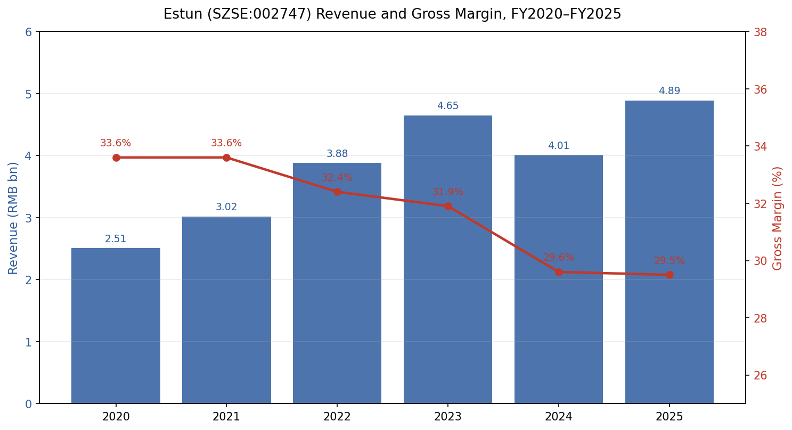
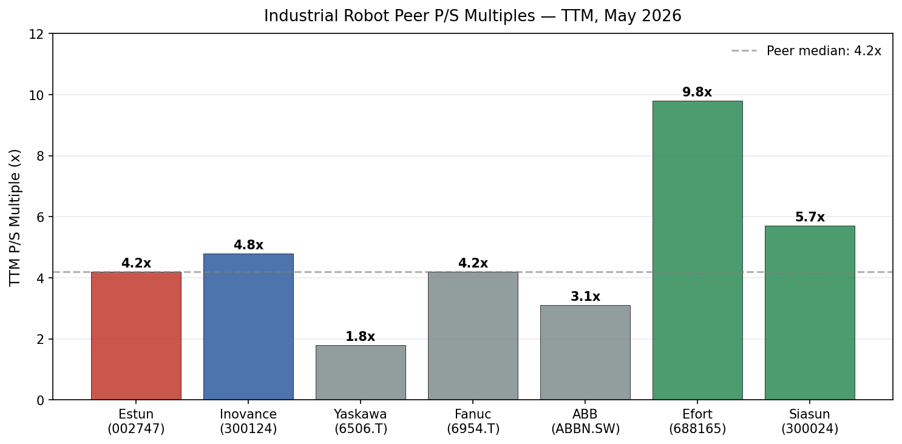
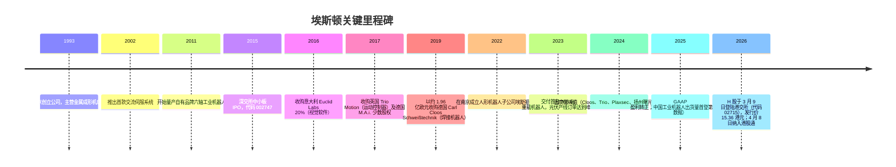
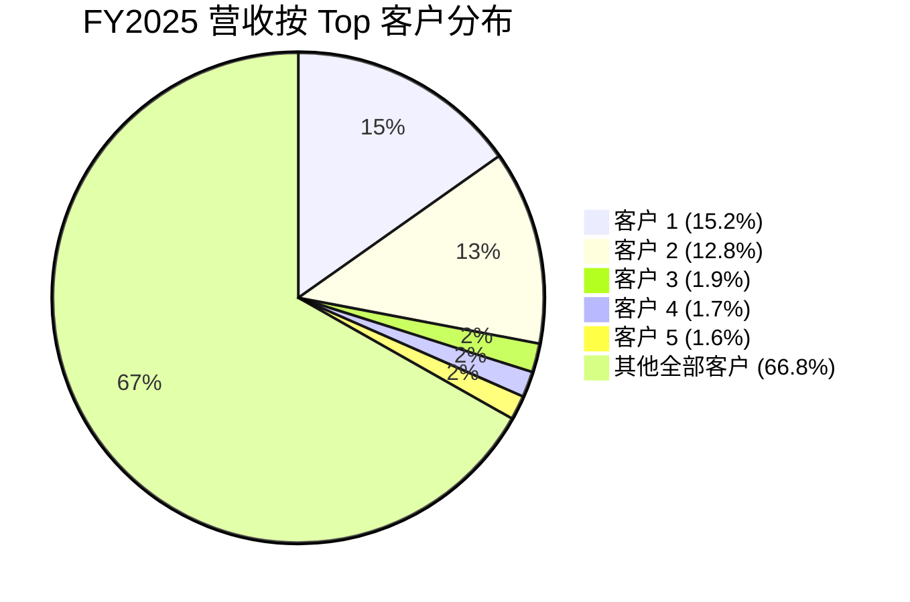
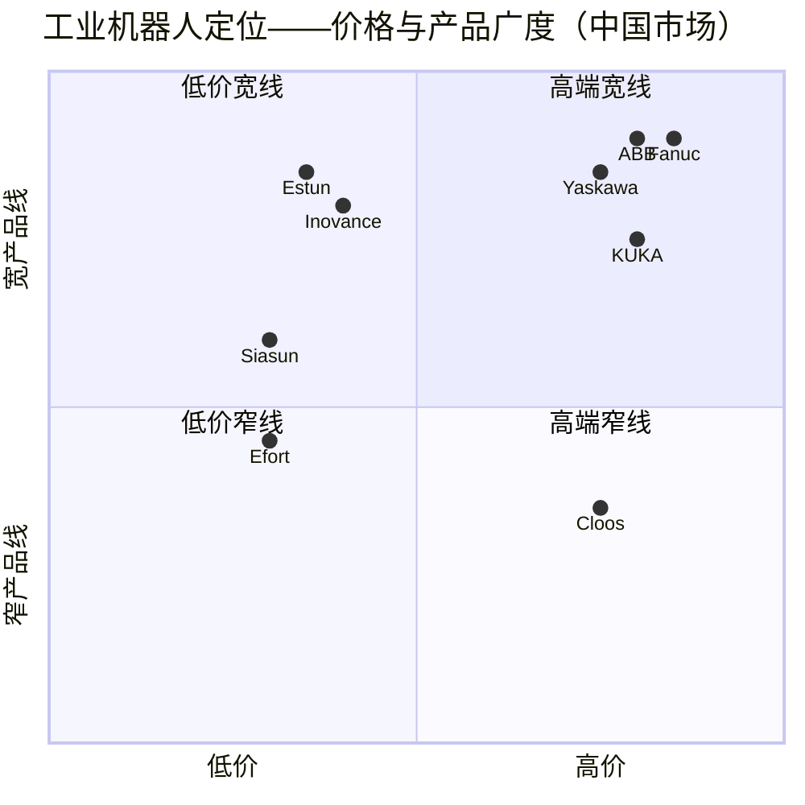
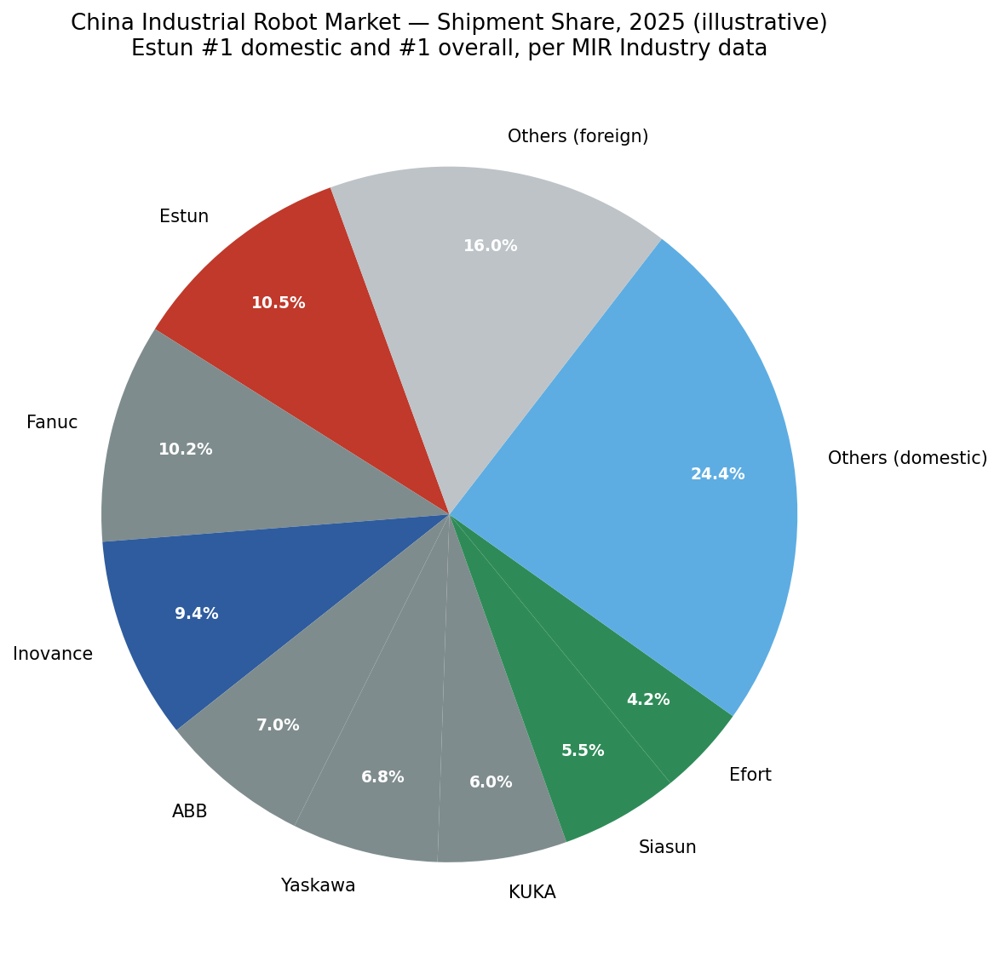

# 公司研究报告：埃斯顿自动化（埃斯顿 / SZSE:002747, HKEX:02715）

**日期：** 2026-05-16
**股票代码：** SZSE:002747（A股，主要上市地）、HKEX:02715（H股，2026-03-09 上市）
**行业：** 工业自动化 / 工业机器人 / 运动控制核心部件
**报告语言：** 中文（原报告为英文。考虑到标的为中国A股、主要披露文件为中文，本版本翻译为简体中文）

> **更新——FY2025 GAAP 利润转正（2026-03-30）：** 埃斯顿从 FY2024 创纪录的 -8.10 亿元净亏损，扭转为 FY2025 的小幅净盈利 +0.45 亿元，营收同比增长 21.9% 至 48.89 亿元。经营性现金流由上年同期的 -0.74 亿元强劲转正至 +5.07 亿元，管理层确认 Cloos 与 Trio 业务在 FY2024 减值后已恢复经营性盈利。公司未在 2025 年报中给出 FY2026 的具体营收指引，但报告将"持续改善盈利"与 H 股 IPO 募集资金定位为未来 12 个月的核心经营主线。来源：[南京埃斯顿自动化股份有限公司 2025 年年度报告，2026-03-30](http://www.cninfo.com.cn/new/disclosure/stock?stockCode=002747)。

---

## 目录
1. 公司概览
2. 公司历史
3. 管理团队
4. 产品与服务
5. 客户与市场策略
6. 行业概况
7. 竞争格局
8. 市场机会（TAM）
9. 风险评估
10. 参考资料

---

## 1. 公司概览

南京埃斯顿自动化股份有限公司是中国本土最大的工业机器人制造商，并且是垂直一体化的自动化核心部件供应商——产品涵盖交流伺服驱动器、运动控制器、机床数控系统及机器视觉模块。FY2025 公司首次在中国工业机器人出货量排名（涵盖国产与外资全部品牌）中跃居第 1 位，成为首家在主场超越历史上的外资龙头（Fanuc 发那科、Yaskawa 安川、ABB、KUKA 库卡）的中资本土 OEM（[埃斯顿官网新闻，"Estun Claims Top Spot in China's Industrial Robot Market"](https://en.estun.com/?list_52%2F2303.html=)）。公司奉行"全部自主自制"（All Made by Estun）战略——控制器、伺服电机、驱动器、减速器相关部件以及机器人本体均由自身研发并生产——这相对依赖进口核心电子件的外资竞争对手而言，构成了结构性的成本和供应链优势。

**埃斯顿到底做什么，用通俗的话讲。** 埃斯顿销售两类产品：（1）自动化设备内部的"大脑与肌肉"——伺服系统、运动控制器、人机界面（HMI）、变频器、可编程逻辑控制器（PLC）、机床数控系统；以及（2）成品工业机器人（载荷 3 kg 至 1,200 kg，截至 2025 年共 96 个 SKU）以及搭载这些机器人的整体集成生产线（[2025 年年度报告，第 11 页](http://www.cninfo.com.cn/new/disclosure/stock?stockCode=002747)）。客户主要为新能源车 / 新能源（动力电池 PACK 产线、光伏组件装配）、汽车焊装与冲压、3C 电子、钣金折弯、锂电池电芯装配领域的中国 OEM 与一级制造商，并在重型机械及半导体设备自动化领域加速渗透。

**盈利模式。** 公司报告两大业务板块。（a）**工业机器人及智能制造系统**——FY2025 营收 39.97 亿元，占比 81.8%，同比+31.8%，毛利率 29.2%。包括 2019 年并表的德国焊接机器人子公司 Cloos。（b）**自动化核心部件及运动控制**——FY2025 营收 8.91 亿元，占比 18.2%，同比-8.7%，毛利率 30.4%。部件板块的下滑是通用自动化周期偏弱所导致的暂时性拖累，FY2025 期间处置扬州曙光 68% 股权部分对冲了下滑影响（[2025 年年度报告，第 16-19 页](http://www.cninfo.com.cn/new/disclosure/stock?stockCode=002747)）。

**经营布局。** 总部位于南京市江宁区吉印大道 1888 号。公司在全球设有 75 个服务节点，覆盖中国、德国（海格——Cloos 总部）、英国（Trio Motion）、意大利（参股 Euclid Labs）、美国、土耳其、韩国、荷兰，以及新近投产的波兰生产基地（[2025 年年度报告，第 16-17 页](http://www.cninfo.com.cn/new/disclosure/stock?stockCode=002747)）。境内销售 34.3 亿元（占比 70.1%，同比+29.8%），境外销售 14.6 亿元（占比 29.9%，同比+6.8%）。Cloos 是欧洲布局的主体——海外总资产口径下贡献 18.00 亿元、净资产 5.67 亿元，占合并权益的 28.9%。

**规模指标。** 截至 FY2025 期末：员工 3,261 人（其中研发 / 工程人员 968 人，占比 29.7%），总资产 94.2 亿元，归属于母公司股东权益 19.6 亿元，账面商誉 10.3 亿元（主要源自 Cloos 并购），研发投入 4.76 亿元（占营收 9.7%），授权专利 634 项（其中发明专利 279 项），软件著作权 441 项（[2025 年年度报告，第 14-15、22-24 页](http://www.cninfo.com.cn/new/disclosure/stock?stockCode=002747)）。

*来源：根据 [2020-2025 年年度报告（巨潮资讯披露页面）](http://www.cninfo.com.cn/new/disclosure/stock?stockCode=002747) 整理。*

### 估值速览

按 2026 年 5 月 12 日 A 股收盘价 24.57 元计算，A 股市值约 206 亿元（行情数据：[证券之星 "埃斯顿5月12日主力资金"，2026-05-12](https://stock.stockstar.com/RB2026051200039825.shtml)）。基于 FY2025 报告口径营收 48.88 亿元，**TTM 市销率约为 4.2x**。基于 FY2025 净利润仅 0.45 亿元，**TTM GAAP 市盈率约为 460x**——表面上极高，但本质上是因 FY2024 大额亏损出清后的近盈亏平衡的分母过低所致。基于卖方一致预期下 FY2026 净利润约 2.5-3.5 亿元（自东方财富 / 同花顺卖方预览汇总——参见 [东方财富 估值分析](https://data.eastmoney.com/gzfx/detail/002747.html)、[同花顺 价值分析](http://stockpage.10jqka.com.cn/002747/worth/)），动态市盈率收窄至约 60-80x。

**近 3 年的 TTM 市盈率区间已无参考意义**，因为公司在 2024 年大部分时间及 2025 年前三季度均处于 TTM 亏损状态（[亿牛网 历史市盈率 - 埃斯顿(002747)](https://eniu.com/gu/sz002747)）。近 3 年市销率区间则更具参考价值——自 2023 年以来埃斯顿 TTM 市销率大致在 3.0x 至 7.0x 之间波动，因此当前 4.2x 处于该区间的下半段，明显低于 2023 年末因光伏设备订单热潮而冲上 6x 以上的高点。

**可比公司估值（TTM，2026 年 5 月）：**

| 同业公司 | 代码 | TTM 市销率 | TTM 市盈率 | 备注 |
|---|---|---|---|---|
| 汇川技术 | SZSE:300124 | ~4.8x | ~42x | 中国伺服龙头，EV 业务敞口更广 |
| Yaskawa 安川 | TYO:6506 | ~1.8x | ~28x | 全球机器人第二，业务成熟 |
| Fanuc 发那科 | TYO:6954 | ~4.2x | ~36x | 全球数控第一、机器人龙头 |
| ABB Ltd. | SIX:ABBN | ~3.1x | ~22x | 电气化与机器人多元化 |
| 埃夫特 | SSE:688165 | ~9.8x | n/m（亏损） | 规模较小的国产机器人 OEM |
| 新松机器人 | SZSE:300024 | ~5.7x | n/m（亏损） | 老牌机器人企业，长期亏损 |

来源：[Inovance 汇川技术估值 - 理杏仁](https://www.lixinger.com/equity/company/detail/sz/300124/300124/fundamental/valuation/pe-ttm)；[Fanuc - Yahoo Finance](https://finance.yahoo.com/quote/6954.T/)；[Yaskawa - Morningstar](https://www.morningstar.com/stocks/xtks/6506/quote)；[ABB - MarketScreener](https://www.marketscreener.com/quote/stock/ABB-LTD-9866/financials/)。

*来源：根据上述行情数据提供商整理，估值倍数截至 2026 年 5 月。*

**解读。** 埃斯顿表面上接近无穷大的市盈率属于**周期性 / 一次性的底部效应**：FY2024 亏损主要由 3.4486 亿元的商誉减值驱动（公司对 Cloos、Trio、M.A.i.、以及现已处置的 Plaxsec / 普莱克斯与扬州曙光这四家子公司计提了减值），另加 1.216 亿元的应收账款、存货及无形资产减值。剔除这些非现金项后，FY2024 经营性亏损约为 -3.43 亿元（仍为实际亏损，但只占报表亏损的一小部分），而 FY2025 在经营性、扣非及现金口径下均实现盈利（[2024 年年度报告，第 16-17 页](http://www.cninfo.com.cn/new/disclosure/stock?stockCode=002747)；[2025 年年度报告，第 16-17 页](http://www.cninfo.com.cn/new/disclosure/stock?stockCode=002747)）。在 60-80x 的正常化动态市盈率下——明显高于 Yaskawa 安川、Fanuc 发那科及汇川技术——市场实际上是在为以下三项支付溢价：（a）跨过盈亏平衡点后，每增加 1 元机器人营收所带来的经营杠杆；（b）人形机器人 / 具身智能部件供应商故事的期权价值；（c）近期 A+H 两地上市以及纳入港股通（[埃斯顿 H 股调入港股通公告，2026-04-08](https://www.stcn.com/article/detail/3730679.html)）。估值已经偏紧，足以让该项作为估值 / 估值压缩风险被列入第 9 节。

---

## 2. 公司历史

埃斯顿由吴波于 1993 年创立。吴波此前作为南京当地工程师，已在液压锻压机数控系统领域积累了十余年经验。公司最初的产品是金属成形机床的数控系统（锻压机床数控系统），机床伺服 / 锻压自动化客户群在 2010 年代中期向工业机器人的战略转型之前，长期是公司的营收支柱。

**对当前投资逻辑至关重要的几次战略转型。**

1. **2011 年——从核心部件切入机器人。** 埃斯顿利用伺服 / 数控业务的现金流自上而下打造自有品牌的六轴机器人，押注中国 OEM 在控制器与伺服深度整合的前提下，会愿意接受比 Fanuc 发那科 / KUKA 库卡 低 25-35% 的国产机器人。这就是"全部自主自制"的起点。该战略在 2010 年代慢慢兑现，并在 2020-2023 年 EV / 光伏资本开支浪潮中加速兑现。

2. **2017-2019 年——海外收购欧洲技术。** 公司意识到高端焊接、运动控制、激光 / 视觉是相对 Yaskawa 安川和 ABB 的结构性短板，于 2017 年收购英国 Trio Motion，并于 2019 年以约 1.96 亿欧元收购德国 Carl Cloos——后者由埃斯顿自有资金与华兴资本（CRCI）联合投资完成（[Orrick 法律意见，2019-08，"Estun Group and CRCI Acquire German Cloos"](https://www.orrick.com/en/news/2019/08/orrick-advises-chinese-estun-group-and-crci-on-acquisition-of-german-company-cloos)）。Cloos 拥有 100 年焊接技术积淀（创立于 1919 年），帮助埃斯顿直接切入重型 / 船舶 / 商用车焊装产线，并获得了一个以欧洲为根据地的售后服务体系（[Cloos 企业历史页面](https://www.cloos.de/de-en/news/article/strategic-expansion-for-sustainable-growth/)；[The Robot Report，2019-08，"Estun Automation acquires Carl Cloos Welding Technology"](https://www.therobotreport.com/estun-automation-acquires-carl-cloos-welding-technology/)）。

3. **2022 年——拆分酷卓人形子公司。** 2022 年 7 月，埃斯顿设立全资子公司南京埃斯顿酷卓科技有限公司，作为人形 / 具身智能的专属平台。该子公司于 2024 年中国国际工业博览会上发布 CODROID 01 人形原型机，并于 2025 年 6 月发布更先进的 CODROID 02（[酷卓官网](https://www.codroid.ai/)；[新华日报 "南京埃斯顿酷卓发布新一代人形机器人"，2025-06-13](https://www.xhby.net/content/s684c17d5e4b07e7bc9e308ff.html)）。2025 年 10 月，埃斯顿与江苏亨通线缆共同设立**江苏鼎汇具身智能机器人创新中心有限公司**——埃斯顿持股 54.17%，认缴出资 3,250 万元，注册资本 6,000 万元（[2025 年年度报告，第 20 页](http://www.cninfo.com.cn/new/disclosure/stock?stockCode=002747)）。

4. **2025 年——资产组合精简。** 管理层分两笔处置扬州曙光光伏自动化（扬州曙光）股权（2025 年 6 月以 9,400 万元转让 20%，10 月以 2.448 亿元转让 48%），并在年末减持航鼎部分股权。两项处置合计贡献了 1.88 亿元投资收益，是 FY2025 利润转正的重要推手。这也使公司战略重心进一步聚焦于"核心部件 + 机器人本体 + 智能制造系统" + 酷卓人形机器人期权价值的组合（[2025 年年度报告，第 19-20、26-27 页](http://www.cninfo.com.cn/new/disclosure/stock?stockCode=002747)）。

5. **2026 年——A+H 双重上市。** 埃斯顿成为首家具备 A+H 双重上市结构的工业机器人企业，于 2026 年 3 月 5 日以 15.36 港元 / 股的价格发行 9,678 万股 H 股，并于 3 月 9 日挂牌上市（[新浪财经 "埃斯顿 H 股发行最终价为每股15.36 港元"，2026-03-05](https://finance.sina.com.cn/stock/hkstock/ggscyd/2026-03-05/doc-inhpxspk3232451.shtml)）。4 月 8 日正式纳入港股通（[证券时报 "埃斯顿 H 股将于4 月 8 日调入港股通"，2026-04-04](https://www.stcn.com/article/detail/3730679.html)）。募集资金将用于海外研发、波兰生产基地、降低资产负债率以及酷卓人形机器人项目。

---

## 3. 管理团队

埃斯顿是一家**创始人控股型企业**：吴波（董事长）与其子吴侃（副董事长兼总经理）连同家族控股公司南京派雷斯特科技有限公司（吴波担任总经理，吴侃担任执行董事），构成一致行动人，截至 FY2025 期末合计持有总股本的 **42.15%**。具体明细（参见 [2025 年年度报告，第 76 页](http://www.cninfo.com.cn/new/disclosure/stock?stockCode=002747)）：派雷斯特持股 2.5489 亿股（29.26%），吴波个人持股 1.1099 亿股（12.74%），吴侃持股 126 万股（0.15%）。对于一家深交所上市的工业企业来说，这一股权集中度非常高，意味着资本配置纪律、并购战略以及人形机器人转型的节奏，实际上由一个家族单位掌控。

### 吴波——创始人、董事长

生于 1954 年，中国国籍，硕士学位。吴波于 1990 年代初在南京江宁开发区创立了埃斯顿的前身公司，从最初的单一产品——液压锻压机床数控系统——一步步打造为多品类的运动控制企业，最终发展为中国领先的工业机器人 OEM（[2025 年年度报告，第 37 页](http://www.cninfo.com.cn/new/disclosure/stock?stockCode=002747)）。其任期贯穿公司全部 32 年的发展史。其个人履历有三点尤为关键：（1）**对垂直整合的耐心。** 埃斯顿用了 11 年（2000-2011）才完成从数控到伺服再到机器人的演进——吴波坚持每一层堆栈先在内部跑通，再向上推进商业化。该战略在 2010 年代曾被视为过度工程化，但在 2022-2025 年美国技术管制收紧与"国产替代"政策催化下、中国 OEM 被动转向中国本土运动控制供应商的环境下，反而成为公司决定性的护城河。（2）**跨境并购的果敢。** 2017-2019 年完成的 Trio（英国）、M.A.i.（德国）与 Cloos（德国）并购，是同时代中国中小企业最大规模的海外技术收购之一。其财务代价在 FY2024 的 3.45 亿元商誉减值中显现，但其战略价值——全栈焊接 IP 加欧洲服务网络——完整保留，成为当下海外扩张的基础。（3）**创始人领导下对人形机器人投入的纪律性。** 通过埃斯顿酷卓与江苏鼎汇具身智能，吴波亲自担任所有人形机器人项目相关实体（包括医疗机器人板块的埃斯顿（南京）医疗科技及北京埃斯顿医疗科技）的董事长（[2025 年年度报告，第 39 页](http://www.cninfo.com.cn/new/disclosure/stock?stockCode=002747)）。他通过派雷斯特控制 29.26% 表决权、个人另持 12.74%，对人形机器人的"利益绑定"远高于任何机构股东——但同样的股权集中度也带来了典型的关键人物风险：吴波年届 72 岁，向其子吴侃的接班路径虽然隐含可见，但在公开治理披露中尚未正式落定。

### 吴侃——副董事长、总经理（CEO）

生于 1983 年（现年 43 岁），硕士学位。吴侃于 2013 年加入埃斯顿，此前曾在普华永道（PricewaterhouseCoopers，PwC）美国担任审计师。他从埃斯顿机器人公司（当时最年轻的子公司）市场部门起步，后负责海外运营中心，再升任集团副总经理，并于上一轮董事会换届中接任 CEO（[2025 年年度报告，第 37 页](http://www.cninfo.com.cn/new/disclosure/stock?stockCode=002747)）。他兼任埃斯顿医疗机器人子公司董事长，并担任酷卓董事。作为接受西方教育、英语流利的 CEO，他始终是埃斯顿国际化的对外面孔——2026 年港股上市前在法兰克福与伦敦的投资者路演，以及主持 Cloos 整合指导委员会，均由其牵头。

### 何灵军——董事、副总经理、CFO

生于 1973 年，硕士学位；中国注册会计师、注册资产评估师，并具备律师执业资格。何灵军于 2022 年从南京迪威尔高端制造（SSE:688377）加入埃斯顿，此前曾担任该公司 CFO 并主导其 IPO。上市公司经历还包括上海斐讯数据通信，并曾任职于普华永道与毕马威审计部门。他于 2022 年 7 月至 2025 年 1 月期间兼任董事会秘书，后将该职务交棒予肖婷婷（[2025 年年度报告，第 38 页](http://www.cninfo.com.cn/new/disclosure/stock?stockCode=002747)）。其在埃斯顿的职责明显紧扣资本市场执行：2025 年股份回购与注销计划（2025 年 3 月注销 251 万股）、2025 年限制性股票激励授予、非核心子公司处置以聚焦主业，以及最终落地的 2026 年港股 IPO。一年之内经营性现金流从 -0.74 亿元跃升至 +5.07 亿元，是何灵军任内营运资本与应收账款管控明显趋紧最有力的证据（[2025 年年度报告，第 23 页](http://www.cninfo.com.cn/new/disclosure/stock?stockCode=002747)）。

### 殷成钢——副总经理，钣金自动化产品线负责人

生于 1981 年，研究生学历。殷成钢负责埃斯顿历史上最大的营收集群——可追溯至吴波 1993 年最初客户基础的金属成形 / 钣金折弯与冲压产品线。他从成形自动化事业部一路成长，主导了埃斯顿旗舰产品折弯专用机器人的开发，以及 Trio Motion 控制器在金属成形产品线中的整合应用（[2025 年年度报告，第 38 页](http://www.cninfo.com.cn/new/disclosure/stock?stockCode=002747)）。

### 朱樟兴（ZHANGXING ZHU）——副总经理，海外业务负责人

生于 1977 年，德国国籍，硕士学位。朱樟兴于 2022 年 11 月从慕尼黑资本（Munich Capital，曾任亚太区负责人）加入埃斯顿，更早供职于崇德资本（[2025 年年度报告，第 38 页](http://www.cninfo.com.cn/new/disclosure/stock?stockCode=002747)）。他是南京总部与 Cloos / Trio / M.A.i. 欧洲平台之间的经营桥梁，也是波兰生产基地建设以及 2025 年新设土耳其、德国（ESTUN Robotics Deutschland）、荷兰（Cloos Welding Technology B.V.）子公司最主要的执行负责人。

### 治理摘要

- **董事会构成（第五届董事会）：** 共 8 名董事，其中 3 名独立董事——三江学院汤文成教授、南京财经大学韩小芳，以及具备巴克莱 / 汇丰投行背景、目前任职于 BMTS Technology GmbH 的香港籍独立董事林金俊（[2025 年年度报告，第 38 页](http://www.cninfo.com.cn/new/disclosure/stock?stockCode=002747)）。
- **创始人家族持股：** 吴波、吴侃及家族控股平台派雷斯特合计控制 **42.15%** 股本，对于一家自 2015 年上市至今的深市工业企业而言，这一"控制集团"持股比例显著偏高。
- **薪酬结构：** FY2025 全体高管披露薪酬总额规模温和（仅为数百万元级别）；长期激励通过 2025 年限制性股票计划与此前的员工持股计划兑现，与创始人家族直接持股形成互补。2025 年未披露重大关联交易。
- **审计 / 会计师事务所：** 中汇会计师事务所（特殊普通合伙），杭州总部。FY2024 与 FY2025 审计意见均无保留意见或持续经营提示。

### 履历综合判断

创始人 CEO 吴波用 30 年的垂直整合，把一家小众数控产品公司做成了国内龙头；CFO 何灵军 3 年任内已证明其能完成营运资本重塑并在艰难市场中执行港股 IPO。最主要的待解问题是接班：吴波已 72 岁，"二代" CEO 吴侃刚接任不久；能否在持续多年烧钱推进酷卓人形机器人项目的同时顺利完成家族向职业经理人 / 二代的经营控制权过渡，是管理层层面最大的悬念。

---

## 4. 产品与服务

埃斯顿对外按两个业务板块披露，但底层的产品分类更为细致。下文逐项穷举对照公司官网 [www.estun.com](https://www.estun.com/) 的产品导航与 FY2025 年报中板块明细。

```mermaid
graph TD
    A[埃斯顿自动化] --> B[板块 1：核心部件与运动控制<br/>8.91 亿元，占 FY25 营收 18.2%]
    A --> C[板块 2：工业机器人及智能制造系统<br/>39.97 亿元，占 FY25 营收 81.8%]
    A --> D[人形 / 具身智能<br/>通过埃斯顿酷卓 + 江苏鼎汇合资]

    B --> B1[交流伺服驱动器与电机]
    B --> B2[运动控制器 / Motion PLC<br/>含英国 Trio Motion]
    B --> B3[金属成形机床数控系统]
    B --> B4[HMI、IO、变频器]
    B --> B5[机器人专用控制器 + 伺服]
    B --> B6[机器视觉模块]

    C --> C1[六轴通用机器人<br/>载荷 3 kg - 1200 kg，96 SKU]
    C --> C2[四轴码垛与 SCARA]
    C --> C3[行业专用机器人<br/>折弯 / 弧焊 / 点焊 / 冲压 / 压铸 / 抛光 / 点胶 / 装配]
    C --> C4[Cloos 焊接机器人<br/>QIROX 系列，德国]
    C --> C5[机器人工作站与整线机器人单元]
    C --> C6[智能制造产线<br/>EV 电池 PACK / 光伏组件 / 汽车车身]
    C --> C7[E-Care 与 E-Noesis AI 数字化平台]

    D --> D1[CODROID 01 人形机器人<br/>170 cm / 80 kg / 44 自由度]
    D --> D2[CODROID 02 人形机器人<br/>全身关节联动，2025-06]
    D --> D3[6-7 自由度灵巧手]
    D --> D4[一体化关节模组<br/>伺服 + 控制器 + 减速器相关]
```

*来源：综合 [埃斯顿产品导航](https://www.estun.com/) 与 [2025 年年度报告，第 11-15 页](http://www.cninfo.com.cn/new/disclosure/stock?stockCode=002747)。*

### 板块 1——自动化核心部件与运动控制

**（a）交流伺服系统（驱动器 + 电机）。** 埃斯顿在机器人业务之前的旗舰产品线，至今仍是公司技术积累最厚的部分。2025 年推出 **EM5G 系列**伺服电机，采用磁场调制技术，斩获 2025 年 CMCD 运动控制创新奖。护城河判断：**有——技术 / IP 加成本领先**。埃斯顿的驱动器从 FPGA 级伺服控制环开始就完全自主设计。最接近的对标产品：汇川技术 SV660P 系列——在性能规格上大致平齐，但由于规模效应汇川目前在价格端更具优势（[2025 年年度报告，第 15 页](http://www.cninfo.com.cn/new/disclosure/stock?stockCode=002747)）。

**（b）运动控制器 / Motion PLC（含 Trio 平台）。** 2017 年英国并购获得的 Trio Motion Coordinator 系列，成为埃斯顿高端运动控制器品牌。FY2025 发布"基于 Trio 架构的新一代中小型控制器平台"。护城河：**有——IP + 品牌**，尤其在欧洲市场，Trio 在印刷、包装、食品领域享有 30 年口碑。最接近的对标：德国私营企业倍福（Beckhoff）TwinCAT——Trio 在最高端略落后，但在中端机型的"性价比一体化"上占优。

**（c）金属成形机床数控系统。** 埃斯顿 1993 年的原始产品。目前在营收中仍具一定规模但已属慢增长业务。护城河：**部分——切换成本 + 品牌**，在中国锻压设备存量基础上仍有优势；国际市场无优势。

**（d）HMI、变频器、数字 I/O 模块、机器视觉模块**——构成埃斯顿控制器全栈的最后一块拼图。低端产品多为目录件 / 通用品，但可整合捆绑进集成单元。护城河：**部分——靠捆绑销售**，独立来看并无明显护城河。

**（e）机器人专用控制器 + 伺服。** 相较多数中国对手的关键差异点：埃斯顿专门为机器人开发了控制器（FY2025 推出新一代机器人电控系统，第三代）和机器人专用伺服，而非简单复用通用工业产品线。这正是"全部自主自制"的操作含义。护城河：**有——垂直整合 + 成本领先**。

### 板块 2——工业机器人与智能制造系统

**（f）通用六轴机器人。** 完整载荷 3 kg - 1,200 kg 全谱系产品组合，截至 FY2025 共 96 SKU（[2025 年年度报告，第 12 页](http://www.cninfo.com.cn/new/disclosure/stock?stockCode=002747)）。FY2025 推出 **1,200 kg 超重载**机型，将此前 700 kg 的上限再次抬高（700 kg 机型此前已被列入工信部"首台套"重大装备目录）。护城河：**有——规模 + 成本 + 国产认证优势**。最接近的对标：Fanuc 发那科 M-2000iA（重载）——发那科在动态精度顶端仍占优势，但埃斯顿便宜 25-35%，且在重型机械领域享受国产采购优惠。

**（g）四轴码垛与 SCARA。** 在 3C 电子与包装行业的走量大户。护城河：**部分——仅靠成本 / 规模**，SCARA 在中国已高度同质化。

**（h）行业专用机器人。** 折弯专用、弧焊、点焊、冲压、压铸、抛光、点胶、柔性抓取。埃斯顿明确宣称在**国内市场**的钣金折弯、冲压及光伏组件装配中排名**第一**。护城河：**有——领域 IP + 标杆案例**（其灯塔工厂光伏产线为最具代表性的案例）。最接近的对标：KUKA 库卡 弧焊机器人（Cloos 在欧洲的传统对手）、Yaskawa 安川 Motoman MA 系列（在中国汽车 OEM 市场占主导地位）。

**（i）Cloos 焊接机器人（QIROX 系列）。** Cloos 焊接机器人平台是埃斯顿在欧洲市场的高端产品线——服务于重型机械、商用车、船舶、轨交。Cloos 在 FY2025 贡献营收 12.00 亿元，5.67 亿元净资产基础上实现净利润 1,200 万元——在 2024 年减值后恢复经营性盈利（[2025 年年度报告，第 24 页](http://www.cninfo.com.cn/new/disclosure/stock?stockCode=002747)）。护城河：**有——百年品牌 + 焊接工艺 IP**。最接近的对标：ABB IRB 1660ID 焊接、Yaskawa 安川 Motoman MA-1900——但 Cloos 在重熔深焊与双丝焊领域具备领先优势。

**（j）机器人工作站与整线机器人单元。** 提供 20 余款预制工作站方案（折弯、弧焊、点焊、冲压、压铸、抛光、点胶、装配、柔性抓取）。护城河：**部分——方案能力 + 规模**，系统集成商可复制，但埃斯顿凭借内部机器人供应享有成本优势。

**（k）智能制造系统。** 包括完整 EV 电池模组 / PACK 产线（Trio + 伺服 + 机器人 + 视觉整合）、光伏组件装配线、汽车白车身焊接线、三电（电池 / 电机 / 电控）产线。FY2025 的最大增长驱动力。护城河：**有——全栈集成能力**，是唯一在控制器、伺服和机器人三者均自有的中国机器人 OEM。

**（l）E-Care 与 E-Noesis AI 数字化平台。** 基于云端的远程运维（E-Care）与数字孪生 / 工艺分析（E-Noesis）平台。FY2025 推出新版"AI 客服系统"，采用大模型架构进行故障分诊。护城河：**部分**——有实用性，但相对汇川技术 INxxx 或西门子 MindSphere 还未形成独立护城河。

### 人形 / 具身智能

**（m）CODROID 01 / CODROID 02 人形机器人（通过埃斯顿酷卓子公司）。** 双足人形机器人平台，最初定位工业用途。CODROID 01（2024 年 9 月在中国国际工业博览会上发布）：身高 170 cm，体重不到 80 kg，单臂负载 5 kg，行走速度 3 km/h，全身 44 自由度，单臂 7 自由度，单腿 6 自由度，灵巧手 6-7 自由度，**全部核心部件均为自主研发**（[酷卓官网——产品页面](https://www.codroid.ai/robot-humanoid)；[moomoo 资讯，"Estun's debut humanoid robot CODROID 01"](https://www.moomoo.com/news/post/44667552/estun-automation-002747-sz-estun-s-debut-humanoid-robot-codroid)）。CODROID 02（2025 年 6 月 11 日发布）：全身关节联动，柔性进一步提升（[新华日报 "南京埃斯顿酷卓发布新一代人形机器人"，2025-06-13](https://www.xhby.net/content/s684c17d5e4b07e7bc9e308ff.html)）。护城河：**部分——尚处早期，难下定论。** 埃斯顿是少于 5 家、能在人形机器人产品出炉第一天就具备自有伺服 + 控制器 + 一体化关节模组堆栈的中国厂商之一。最接近的对标：宇树 H1、小鹏 Iron、优必选 Walker S、傅利叶 GR-1、小米 CyberOne。

**（n）人形机器人零部件供应业务。** 2025 年披露显示，新成立的江苏鼎汇具身智能合资公司将整合并对外销售埃斯顿的关节模组、伺服系统与灵巧手子系统给其他人形机器人 OEM（[2025 年年度报告，第 20 页](http://www.cninfo.com.cn/new/disclosure/stock?stockCode=002747)）。这是抢占人形机器人浪潮的"卖铲子"策略，且在早期阶段较整机环节的经济性可能更优。护城河：**有——BOM 端的垂直整合**。

### 旗舰产品 vs 长尾产品

驱动 FY2025 损益表的 1-3 个核心产品为：（1）**通用六轴工业机器人**——最大营收线，是 FY2025 埃斯顿品牌机器人约 50% 同比增长的主要驱动力；（2）**智能制造系统**（EV / 光伏 / 汽车产线）——"机器人 + 集成"的乘数效应，支撑了整个板块 31.8% 的增长；（3）**Cloos 焊接机器人**——高毛利率的欧洲高端业务。长尾 SKU（金属成形数控、HMI、低端 SCARA、变频器）虽然毛利率仍为正，但已不再是增长引擎。

### 产品路线图与近 12 个月新品

依据 FY2025 披露：已上市（年内发布）——第三代机器人电控系统、EM5G 伺服电机、新一代 Motion PLC、1,200 kg 重载机器人、CODROID 02 人形机器人、AI 客服系统。研发中——第四代功能安全伺服平台、新架构大中型 PLC 平台、AI 驱动焊接工艺软件（与 Cloos 联合）、新一代弧焊示教器、新一代伺服软件架构，以及一套用于通用伺服的 AI 调试系统（[2025 年年度报告，第 21-22 页](http://www.cninfo.com.cn/new/disclosure/stock?stockCode=002747)）。

---

## 5. 客户与市场策略

### 客户分群与画像

埃斯顿的营收基础以**面向 OEM 设备厂与一级制造商的 B2B 销售**为绝对主体，可分为四类：

1. **直接终端用户**——购买完整生产线的大型中国制造商（通常包括 EV 电池电芯厂、光伏组件厂、汽车 OEM 与金属加工集团）。这类客户是下文 Top-5 集中度数据的来源。
2. **系统集成商**——独立的自动化解决方案商，采购埃斯顿机器人与部件，再为下游客户搭建生产线；在 3C 电子、包装、金属成形领域尤为活跃。
3. **OEM 设备制造商**——机床厂商、包装设备厂商、电子加工设备制造商，将埃斯顿伺服 / 控制器嵌入自身产品。
4. **授权区域分销商**——全球约 75 个服务节点，负责售后备件供应、中端客户以及新兴市场。

针对高价值的"战略客户"与"行业标杆客户"，埃斯顿采用直销模式并配备嵌入式技术团队；针对一般工业账户与区域客户则借助授权分销商。

### 客户集中度（重要）

参见 FY2025 披露（[2025 年年度报告，第 20 页](http://www.cninfo.com.cn/new/disclosure/stock?stockCode=002747)）：

| 排名 | 客户 | FY2025 营收（百万元） | 占总营收比例 |
|---|---|---|---|
| 1 | 客户 1 | 743.19 | 15.20% |
| 2 | 客户 2 | 626.08 | 12.81% |
| 3 | 客户 3 | 91.68 | 1.88% |
| 4 | 客户 4 | 84.83 | 1.74% |
| 5 | 客户 5 | 77.94 | 1.59% |
| **Top-5 合计** | | **1,623.71** | **33.22%** |

**近三年 Top-5 占比趋势：** FY2023 = **19.68%**，FY2024 = **25.63%**，FY2025 = **33.22%**——Top-5 集中度在两年内上升 **1,354 bps**，Top-2 单独已占营收 **28.0%**。埃斯顿未在披露中具名 Top 客户（符合中国惯例），但该项跃升与两项已披露事件高度相关：（a）2025 年埃斯顿机器人对多家中国汽车 OEM 焊装车间的批量上量——每个项目动辄数百台机器人；（b）Cloos 在重型车辆焊接线上的复苏——这类合同高度集中于两到三家欧洲一级供应商，且订单往往呈现"块状"分布。

**结论。** Top-1 客户占比 15.20% **超过了 ASC 280 与中国 A 股准则下 10% 的重要性披露门槛**，Top-5 在两年内从 20% 跃升至 33% 是明确的方向性风险。Top-5 尚未跨越 50% 的"重大"门槛，但趋势需要持续跟踪。该风险已被纳入第 9 节作为公司层面的首要风险。

### 销售渠道

直销（战略客户 / 行业标杆客户）、授权分销商（渠道合作伙伴），以及面向低端伺服与 HMI 产品的小比例电商 / 目录销售。全球设有约 75 个服务节点，欧洲、中东及重型焊接售后服务由 Cloos 欧洲服务体系负责（[2025 年年度报告，第 16 页](http://www.cninfo.com.cn/new/disclosure/stock?stockCode=002747)）。

### 销售策略与周期

采取三层客户架构：战略客户 + 行业标杆客户 + 区域客户。一级制造商的工业机器人单元从询价（RFQ）到首次交付通常需要 6-12 个月；智能制造产线项目从启动到分阶段验收的周期为 12-24 个月。对 OEM 设备厂的部件销售（伺服 / 控制器）周期更短（1-3 个月），且多通过分销商渠道。埃斯顿越来越多将**后服务**（售后服务、改造、备件）作为"第二曲线"营收，这是管理层在 FY2025 管理层讨论与分析中明确强调的战略转向（[2025 年年度报告，第 17 页](http://www.cninfo.com.cn/new/disclosure/stock?stockCode=002747)）。

### 关键合作伙伴

- **华兴资本（CRCI，China-Renaissance Capital）**——2019 年 Cloos 并购的联合投资方。
- **江苏亨通线缆**——2025 年 10 月成立的江苏鼎汇具身智能合资公司的联合发起方。
- **南京大学**——2025 年 5 月与埃斯顿酷卓共建具身智能联合实验室。
- **客户联合开发**——FY2025 管理层讨论与分析披露，至少与一家中国主流汽车 OEM 联合开发一条柔性折弯 / 焊接产线，并已成功"复制"至出口市场。

### 客户案例

埃斯顿未公开 Top-5 客户的名称，但其 FY2025 披露与公开媒体报道列示了以下应用：**全球光伏"灯塔工厂"**（全光伏组件装配线，世界首座）、**多家中国汽车 OEM 白车身产线**（大规模高精度六轴）、**锂电超高速电芯装配线**，以及**欧洲重型车辆焊接**（Cloos）。FY2025 还新增了"出口至海外的汽车柔性单元"——标志着从在国内为中国 OEM 供货，到跟随其海外建厂的演进（[2025 年年度报告，第 15 页](http://www.cninfo.com.cn/new/disclosure/stock?stockCode=002747)）。

---

## 6. 行业概况

### 行业定义

埃斯顿处于三个行业的交叉点：（1）**工业自动化核心部件**（伺服电机与驱动器、运动控制器、PLC、数控、HMI、机器视觉）——按中国行业分类 GB/T 4754 属于 C40（仪器仪表制造业）；（2）**工业机器人**——六轴关节、SCARA、码垛、协作机器人；（3）**智能制造系统 / 机器人单元**——把（1）与（2）整合为专用产线的集成层。新兴邻近领域为（4）**人形机器人 / 具身智能**，目前尚处于商业化前阶段，但埃斯顿是首批同时具备自有整机品牌 + 自有 BOM 的中国玩家之一。

### 市场规模与增速——中国工业机器人

中国是**全球最大的工业机器人市场**且大幅领先，占全球安装量的一半以上。依据最新数据：**中国工业机器人 2025 年出货量超过 30 万台，同比增长 13% 以上**（MIR Industry 数据，引自 [2025 年年度报告，第 13 页](http://www.cninfo.com.cn/new/disclosure/stock?stockCode=002747)），而**产量达到 77.3 万台，同比+28.0%**（国家统计局数据，同源引用）。产量与安装量之间的剪刀差（产量增速是安装量的两倍）是国内产能过剩周期开始的早期警示——这是第 9 节讨论的重大行业风险。**国产品牌渗透率在 2025 年超过 54%**，高于 2023 年的 47%（[RobotAuto.co.uk, "China's Industrial Robotics Landscape, 2025-08", 2025-08-06](https://robotauto.co.uk/2025/08/06/chinas-industrial-robotics-landscape-key-players-market-trends-and-global-influence/)；[The Wire China, "Chinese Robots Hit the Factory Floor", 2024-12-15](https://www.thewirechina.com/2024/12/15/chinese-robots-hit-the-factory-floor-industrial/)）。

### 市场规模——全球工业机器人

2024 年全球工业机器人安装量约 54 万台，市场价值超过 160 亿美元。2025-2030 周期的预测大致为：单台量 8-10% CAGR，金额 5-7% CAGR（价格下行抵消了部分单台增长）——参见 [Industrial Robots Market 2025-2030 - NextMSC, 2025](https://www.nextmsc.com/blogs/industrial-robots-market-to-hit-usd-8866-billion-by-2030-driven-by-abb-fanuc-yaskawa-mitsubishi-and-kuka)。

### 增长驱动

1. **中国制造业自动化的持续推进。** 中国制造业每万名工人机器人密度在 2024 年突破 470 台（美国约 295 台，德国约 415 台），但轻工业大量场景仍处于自动化欠覆盖状态。[ChinaPower Project - CSIS, 2024](https://chinapower.csis.org/china-industrial-robots/) 跟踪了密度交叉点。
2. **EV、电池与光伏资本开支超级周期。** 每座超级工厂、每条光伏组件线背后都是数百台机器人订单。中国仍是两者的全球中心。2024-2025 光伏降温对埃斯顿造成冲击（管理层讨论与分析已承认），但 EV 电池与汽车产线维持增长。
3. **"两新政策"刺激。** 中央 2024-2025 设备更新以旧换新补贴显著加快了存量工厂的机器人安装节奏。
4. **国产替代政策。** 工信部"首台套"重大装备补贴与采购倾斜偏向国产机器人，特别是对国资 / 国企客户；埃斯顿 700 kg 与 1,200 kg 重载机型已被列入该目录。
5. **具身智能 / 人形机器人浪潮。** 2025 年中国中央政府工作报告首次将"具身智能与智能机器人"写入国家级顶层设计（[2025 年年度报告，第 14 页](http://www.cninfo.com.cn/new/disclosure/stock?stockCode=002747)）。
6. **AI 整合。** 在机器人示教器与工艺规划软件中嵌入视觉语言大模型，以及部件层面的 AI 故障预测，结构性压低"单台产线工程工时"。

### 监管环境

- **GB/T 45509-2025**——全球首个工业机器人动态稳定性测试国家标准，2025 年 3 月发布。
- **工信部第二批工业机器人行业规范条件**——2025 年 5 月启动（遴选合规企业作为行业标杆）。
- **工信部"AI + 制造"专项行动方案**（2025 年 12 月）加速 AI 与机器人的整合。
- 上述均引自 FY2025 管理层讨论与分析（[2025 年年度报告，第 14 页](http://www.cninfo.com.cn/new/disclosure/stock?stockCode=002747)）。

### 行业格局

- **集中度提升中，但仍中度分散。** 中国出货量 Top-10 品牌合计约 60% 市占率，剩余 40% 分散在数百家中小厂商。受价格竞争挤出，集中度正在快速上升。
- **买方议价能力**：在 SCARA / 四轴等同质化领域上升；在重载、焊接与 EV 电池 PACK 产线上下降，因为工程应用差异化是决定性因素。
- **供应商议价能力**：高端谐波减速器与精密 RV 减速器曾长期由日本 Nabtesco 与 Harmonic Drive Systems 掌控，但随着中国本土减速器（绿的谐波、双环传动）性能差距快速收窄，该瓶颈已显著缓解。埃斯顿正逐步多源采购减速器，并投入减速器相关部件的自研。
- **替代品**——在当前细分领域中工业机器人无替代品；协作机器人（Universal Robots、遨博、节卡）在极小负载端起到部分替代作用；3D 打印 / 增材制造在更上游的工艺层替代。

---

## 7. 竞争格局

### 直接竞争对手——中国本土

- **汇川技术（SZSE:300124）。** 多元化工业自动化龙头，国内通用交流伺服份额第一，正积极向机器人与 EV 动力总成扩张。市值约 1.8-2.0 万亿元；估值约静态 42x / 动态 26x 市盈率（[Inovance 汇川技术估值 - 理杏仁，2026-05](https://www.lixinger.com/equity/company/detail/sz/300124/300124/fundamental/valuation/pe-ttm)）。汇川业务面更广（EV 动力总成、电梯驱动、工厂自动化），但埃斯顿在纯机器人定位上更强。
- **埃夫特（SSE:688165）。** 总部位于芜湖的工业机器人纯玩家，科创板上市。规模更小，且 2024-2025 持续经营亏损。主要产品为通用六轴与 SCARA，核心部件能力较弱。当前在较小营收基础上市销率高于埃斯顿。
- **新松机器人（SZSE:300024）。** 沈阳企业，曾是中国首家上市机器人纯玩家，但在 2020 年代以来份额持续流失，长期亏损。
- **汇川机器人 / EUREKA / 国自机器人 / 节卡 / 遨博**——二线国产专业厂商，规模较小，定位细分。

### 直接竞争对手——外资（中国市场）

- **Fanuc 发那科（TYO:6954）。** 全球数控第一、机器人顶级玩家，2025 年中国出货量份额约 10%（[Robot Magazine, 2025](https://www.robot-magazine.fr/en/chinese-robot-manufacturers-industrial-capacity-cost-performance/)）。在极高精度场景最强；价格偏高；业务成熟。
- **Yaskawa 安川（TYO:6506）- Motoman。** 与中国汽车 OEM 关系深厚。主要可比公司中市销率最低（~1.8x）。
- **ABB Ltd.（SIX:ABBN）。** 电气化 + 机器人多元化业务，机器人是其中一个板块。此前讨论的机器人业务分拆已推迟。ABB 机器人业务约 20 亿美元营收。
- **KUKA 库卡（位于德国奥格斯堡，2016 年被美的收购）。** 在汽车白车身焊接领域较强；欧洲旗舰品牌；但自美的收购后整合不力，中国市场份额持续流失。

### Cloos 对标公司（埃斯顿德国焊接子公司）

具体到焊接机器人领域，Cloos 的竞争对手包括 ABB IRB-1660ID 焊接单元、Yaskawa 安川 Motoman MA 系列、**CMA Robotics（意大利）**与**Igm Welding（奥地利）**。Cloos 的结构性优势在于船舶、轨道车辆、重型机械、商用车的重熔深焊与双丝焊——这些细分领域 ABB 与 Yaskawa 安川 投入相对较少。

### 人形 / 具身智能竞争对手

- **优必选（HKEX:09880）**—— Walker S，目前披露收入最高的中国人形机器人企业（历史上以教育 / B2C 为主）。
- **宇树科技（杭州，私营）**—— H1 / G1，在低成本科研用人形领域占主导。
- **傅利叶智能（上海，私营）**—— GR-1，定位医疗 / 科研。
- **小鹏机器人**—— Iron，汽车 OEM 背景的人形机器人。
- **小米 CyberOne**、**Agility Robotics（美国，Digit）**、**Figure AI（美国，Figure 02）**、**Boston Dynamics（现代汽车旗下，Atlas）**。

### 竞争定位框架

### 埃斯顿的竞争优势

1. **垂直整合（"全部自主自制"）。** 机器人本体 + 控制器 + 伺服 + 驱动器 + HMI + 运动控制全部自主研发。BOM 成本更低、整合周期更快、且对外资部件出口管制免疫。
2. **国产替代政策受益者。** 重载机器人入选工信部"首台套"重大装备目录；为国资 / 国企客户的优先选择；首批"中国机器人"认证。
3. **行业专项地位。** 在国内钣金折弯、冲压、光伏组件装配、弧焊等领域排名第一——这些是难以被复制的定价权位置。
4. **Cloos 欧洲平台。** 提供真正意义上的欧洲品牌、渠道、认证以及双丝焊重型 IP——为中国成本基础与欧洲高端定价的可能融合提供了战略期权。
5. **创始人主导的研发文化。** 持续多个周期保持营收的 10% 用于研发；968 名研发工程师（占比 29.7%）。
6. **人形机器人全栈就绪。** 极少数能够在人形机器人产品出炉第一天就具备自有伺服 + 控制器 + 一体化关节模组的中国玩家。

### 埃斯顿的脆弱性

1. **客户集中度快速上升**（Top-2 已占 FY2025 营收 28%，FY2023 仅为 17.6%）。
2. **商誉余额** 10.3 亿元——即使经历 FY2024 减值，仍占总资产 11%——若欧洲子公司未能进一步复苏，公司将持续承压。
3. **Cloos 周转速度慢**—— FY2025 在 5.67 亿元权益基础上仅取得 1,200 万元净利润，ROE 仅 2%——相对于 1.96 亿欧元的收购价仍未实现合理回报。
4. **正常化盈利下估值偏紧**——动态市盈率 60-80x，几乎不容许任何成长不及预期的"踩空"。
5. **债务负担较重**—— 短期借款 12.8 亿元 + 长期借款 12.2 亿元 = 总有息负债 25.0 亿元，而账上现金仅 8.96 亿元。净负债约 16 亿元，对应 EBITDA 约 5-6 亿元，杠杆率约 3x，相对偏紧。
6. **部件板块下行**—— FY2025 同比-8.7%；"核心部件"业务必须恢复增长才能让"全部自主自制"叙事再次正向复利。

### 中国工业机器人市占率（2025 年）

*来源：示意图，根据 MIR Industry 排名整理（引自 [2025 年年度报告，第 13 页](http://www.cninfo.com.cn/new/disclosure/stock?stockCode=002747) 及 [埃斯顿企业公告，2026-Q1](https://en.estun.com/?list_52%2F2303.html=)）。*

---

## 8. 市场机会（TAM）

### TAM——工业机器人

全球工业机器人市场目前年度安装价值约为 **160-180 亿美元**（2024 年出货约 54 万台），到 2030 年预计将达到 **250-280 亿美元**，价值口径 CAGR 为 5-7%。仅中国就占全球安装量一半以上，并预期在 2030 年前保持这一份额（[NextMSC 工业机器人预测，2025](https://www.nextmsc.com/blogs/industrial-robots-market-to-hit-usd-8866-billion-by-2030-driven-by-abb-fanuc-yaskawa-mitsubishi-and-kuka)）。

### TAM——中国运动控制与交流伺服

中国工业交流伺服 TAM 大致为 250-300 亿元（2024 年），随着自动化向轻工业渗透，年增速约低双位数。运动控制器与 PLC 再贡献约 150-200 亿元。两者合计，中国运动控制 + 伺服 TAM 大致为 **400-500 亿元**——市场分散，汇川技术第一，埃斯顿在机器人专用伺服细分中位列前三。

### TAM——人形机器人 / 具身智能

最常被中国卖方援引的预测显示：到 2030 年全球人形机器人 TAM 在 **50-100 亿美元（仅工业人形机器人）**，更激进的预测为：若消费 / 服务场景规模化落地，到 2035 年可达 **800-1500 亿美元**（[SVRC "China Robotics Market 2026"](https://www.roboticscenter.ai/robotics-market-china)；[36Kr "Deep Integration of AI and Humanoid Robots", 2025](https://eu.36kr.com/en/p/3452608898520706)）。早期阶段，零部件层（伺服、一体化关节模组、灵巧手、力矩传感器）的盈利能力结构性优于整机层——埃斯顿在两个层面均有布局，正是其期权价值所在。

### SAM 与 SOM

埃斯顿的**可服务市场（SAM）**为其产品能够满足客户规格的"中国 + 欧洲"工业机器人 + 运动控制市场切片。工业机器人方面对应中国 + 欧洲约 120-140 亿美元；运动控制与伺服方面约 80-100 亿美元。合计 SAM 当前约为 **200-240 亿美元**。**可获得市场（SOM）**——即埃斯顿在未来 3-5 年内可现实争取的份额——可能为 SAM 的 8-12%，意味着在不计人形机器人期权价值的情况下，稳态营收上限约为 **20-30 亿美元（140-220 亿元人民币）**，约为当前营收基础的 3-4 倍。

若再叠加人形机器人零部件供应商角色：若埃斯顿在 2030 年视角下捕获 200 亿美元全球人形机器人零部件 TAM 的 5%，将额外贡献 10 亿美元的运营营收——量级可观，但属投机性敞口。

### 公司渗透策略

1. **巩固国内深度。** 国内机器人份额已升至第一；目标是在未来 5 年内通过 EV / 汽车 / 锂电 / 光伏浪潮，并向通用轻工业渗透，将累计装机从当前约 20 万台扩张到 50 万台以上。
2. **"Local for Global"出海。** 波兰工厂 + ESTUN Robotics Deutschland + 土耳其 + 韩国 + 荷兰子公司构成出海运营框架，目标将海外营收占比从当前约 30% 提升至 40-45%。
3. **沿价值链向毛利上行。** 提升载荷（2025 年推 1,200 kg）、提升精度（高刚性 / 高精度机器人家族研发中）、并发展"机器人 + 服务"的经常性收入。
4. **抓住人形机器人零部件供应机会**——通过江苏鼎汇合资公司将关节模组、伺服、灵巧手销售给其他人形机器人 OEM，作为 B2B"卖铲子"生意。
5. **将 AI / 数字化平台（E-Care、E-Noesis）打包销售**以锁定售后收入并降低客户流失率。

---

## 9. 风险评估

### 公司层面风险

**1. 客户集中度快速上升—— Top-2 已占营收 28%。** Top-1 客户在 FY2025 营收占比达 15.20%，Top-5 从 FY2023 的 19.7% 升至 FY2025 的 33.2%，依据 [2025 年年度报告，第 20 页](http://www.cninfo.com.cn/new/disclosure/stock?stockCode=002747)。埃斯顿未披露客户名称，投资者无法独立判断合同结构或潜在的客户内部化趋势。若任一 Top 客户取消订单或自研内部化（汽车 OEM 已知正在评估自有机器人计划），FY2026 营收可能波动 10-15%。**严重性：实质性。缓解因素：积极的海外扩张以及 96 SKU 的产品广度，将随时间降低单一客户依赖度。**

**2. 72 岁创始人 CEO 的关键人物风险。** 吴波（生于 1954 年）与其子吴侃（生于 1983 年）及家族控股平台派雷斯特合计控制 42.15% 股本，事实上掌控所有战略决策。父传子的接班路径隐含可见，但尚未在已披露治理文件中正式化。人形机器人押注尤其需要在多年烧钱期间保持稳定的资本配置——在押注过程中权力交接可能造成扰动。**严重性：中高。缓解因素：吴侃已担任运营 COO / CEO 多年，更广泛的高管团队均为专业职业经理人。**

**3. 2017-2019 欧洲并购的商誉减值悬挂风险。** FY2024 对 Cloos、Trio、M.A.i.、Plaxsec 及扬州曙光合计计提 3.45 亿元商誉减值后，资产负债表上仍有 10.3 亿元商誉余额（[2024 年年度报告，第 17 页](http://www.cninfo.com.cn/new/disclosure/stock?stockCode=002747)）。Cloos 在 5.67 亿元权益基础上 FY2025 净利润仅 1,200 万元（ROE 2%），欧洲平台仍处于盈利欠佳状态。若欧洲再次下行或整合再次受挫，可能引发新一轮减值，侵蚀账面权益的 5-10%。**严重性：中等。缓解因素：FY2024 已完成大部分清算；Cloos 已于 2025 年扭亏。**

**4. 人形机器人在商业化规模化前的研发烧钱。** 埃斯顿酷卓尚处于无营收阶段。新设的江苏鼎汇合资公司初始注资仅 6,000 万元规模不大，但该平台需要多年研发投入，将在回报兑现前持续压制合并毛利率。若人形机器人市场时点滞后（例如客户端商业化用例推迟至 2028 年以后），股价中所隐含的期权价值可能大幅压缩。**严重性：中等。缓解因素：当前人形机器人在集团整体开支中占比尚小。**

**5. 部件板块的结构性下行 / 份额流失。** FY2025 自动化核心部件与运动控制营收同比-8.7%，且即使在中国交流伺服整体市场扩张的背景下，趋势已连续两年为负。埃斯顿在通用伺服领域正向汇川和伟创流失份额。**严重性：中等。缓解因素：机器人专用伺服与 Trio 平台高端业务继续增长。**

**6. 多项并行的并购与合资整合风险。** Cloos 整合至今已 7 年仍在进行；波兰工厂正在试运行；土耳其、韩国、荷兰新设主体；江苏鼎汇于 2025 年 10 月成立。执行节奏与广度对管理层带宽形成持续压力。**严重性：中等。缓解因素：自 2022 年起已有专属海外业务负责人（朱樟兴）就位。**

### 行业 / 市场风险

**7. 国内产能过剩与价格竞争。** FY2025 管理层讨论与分析披露：2025 年中国工业机器人产量同比+28%，安装量仅+13%，预示明显产能过剩。管理层讨论与分析明确指出"市场竞争进入白热化阶段"。2024-2025 年平均售价已下行，2026 年大概率延续下行。**严重性：高。缓解因素：埃斯顿在焊接（Cloos）、重载（700 / 1,200 kg）以及光伏 / EV 单元集成中的高端定位为定价权提供一定缓冲。**

**8. EV、光伏与锂电资本开支的周期性需求。** 埃斯顿三大重要下游——EV、光伏、锂电——在 2022-2024 年扩张潮后的资本开支均在减速。光伏 2024 年的明显放缓已直接冲击埃斯顿（参见 FY2024 管理层讨论与分析）。**严重性：中等。缓解因素：向汽车白车身与通用轻工业的多元化布局。**

**9. 外资品牌反击与贸易政策反转。** Fanuc 发那科 与 Yaskawa 安川 在 2025 年加大在中国的价格攻势以保卫份额。任何"国产替代"政策的减弱（短期政治上不太可能但并非完全不可能）都会侵蚀埃斯顿的国内份额提升。**严重性：中等。缓解因素：垂直整合带来的结构性成本优势。**

**10. 人形机器人泡沫风险。** 多家中国人形机器人玩家（宇树、小鹏、优必选、傅利叶、小米）正在赛跑式发布平台，但当前实际商业需求极为有限。人形机器人主题若出现回调，埃斯顿的期权价值溢价将被压缩，江苏鼎汇合资公司可能需要追加注资。**严重性：中等。**

### 财务风险

**11. 估值偏紧 / 估值压缩风险。** 埃斯顿目前 TTM 市销率约 4.2x，基于 FY2026 一致预期的动态市盈率约 60-80x（参见 [东方财富 估值分析](https://data.eastmoney.com/gzfx/detail/002747.html)、[同花顺 价值分析](http://stockpage.10jqka.com.cn/002747/worth/)），高于同业中位数 25-35x（汇川动态 26x、Fanuc 发那科 36x、Yaskawa 安川 28x）。若增长不及当前一致预期，估值可能向动态 35-45x 压缩，对应 25-40% 股价下行空间。最近港股上市进一步放大该风险——A 股 24.57 元 vs H 股约 17 港元的 A+H 价差，是类似两地上市工业企业历史上的反复风险源。**严重性：高。缓解因素：人形机器人期权价值与"全部自主自制"全栈生产能力的主导地位为估值倍数提供地板支撑。**

**12. 债务与杠杆。** 总有息负债 25.0 亿元，对账上 8.96 亿元现金 = 净负债约 16 亿元。FY2025 利息支出同比+12.4%（[2025 年年度报告，第 21 页](http://www.cninfo.com.cn/new/disclosure/stock?stockCode=002747)）。权益缓冲仅 19.6 亿元——对于正常化盈利能力偏低的公司，杠杆比率偏紧。港股 IPO 募集资金将带来缓解。**严重性：中等。缓解因素：2026 年港股 IPO 资金 + FY2025 的 5.07 亿元经营性现金流改善流动性。**

**13. 盈利可持续性。** FY2025 净利润 0.45 亿元中，包含处置扬州曙光及其他子公司带来的 1.88 亿元投资收益、以及金融资产公允价值变动收益 0.24 亿元。扣非归母净利润仅为 728 万元。核心盈利能力仍极薄，一个普通的中周期季度即可重新把公司推回报表亏损状态。**严重性：高。缓解因素：21.9% 营收增速持续跑赢成本增长，带来经营杠杆释放。**

### 宏观经济风险

**14. 中国周期性 / 资本开支敏感度。** 工业机器人需求与制造业资本开支高度相关；2026 年若中国增长意外深度放缓，对埃斯顿的冲击将比多元化工业企业更剧烈。**严重性：中等。**

**15. Cloos 与欧洲业务的汇率敞口。** 约 30% 营收与约 29% 净权益在欧洲。EUR/RMB 波动将直接传导至利润与账面权益。FY2025 管理层讨论与分析明确指出，欧元升值压缩了部件板块毛利率约 110 bps。**严重性：中等。缓解因素：欧洲本地化生产形成的自然对冲。**

**16. 地缘政治 / 出口管制风险。** 美 / 欧对先进半导体与运动控制 IC 技术的出口管制可能扰动埃斯顿在高端伺服与控制器平台上的 FPGA / 功率电子 IC 供应。Cloos 的欧洲业务也可能成为某些反向境外投资审查的目标。**严重性：中等。**

---

## 10. 参考资料

### 主要披露文件（埃斯顿）

- [南京埃斯顿自动化股份有限公司 2025 年年度报告（巨潮资讯披露页面）](http://www.cninfo.com.cn/new/disclosure/stock?stockCode=002747)——2026-03-30 披露。
- [南京埃斯顿自动化股份有限公司 2024 年年度报告](http://www.cninfo.com.cn/new/disclosure/stock?stockCode=002747)——2025-04-28 披露。
- [南京埃斯顿自动化股份有限公司 2023 年年度报告](http://www.cninfo.com.cn/new/disclosure/stock?stockCode=002747)——2024-04-29 披露。
- [关于回购股份注销完成暨股份变动的公告](http://www.cninfo.com.cn/new/disclosure/stock?stockCode=002747)——2025-03-08。
- [埃斯顿 H 股招股说明书及香港法律意见（HKEX 披露），2026-02-27](https://www.hkexnews.hk/listedco/listconews/sehk/2026/0227/12031239/2026022700117_c.pdf)。

### 公司网站 / 投资者关系

- [埃斯顿企业网站（英文）](https://en.estun.com/)
- [埃斯顿企业网站（中文）](https://www.estun.com/)
- [埃斯顿酷卓——人形机器人子公司](https://www.codroid.ai/)
- [埃斯顿酷卓 CODROID 人形机器人产品页面](https://www.codroid.ai/robot-humanoid)
- [Estun: Top spot in China's industrial robot market, 2026-Q1](https://en.estun.com/?list_52%2F2303.html=)
- [Carl Cloos Schweißtechnik 企业网站](https://www.cloos.de/de-en/news/article/strategic-expansion-for-sustainable-growth/)

### 并购历史

- [Orrick 法律意见，"Orrick Advises Chinese Estun Group and CRCI on Acquisition of German Welding and Robotics Company Cloos", 2019-08](https://www.orrick.com/en/news/2019/08/orrick-advises-chinese-estun-group-and-crci-on-acquisition-of-german-company-cloos)。
- [The Robot Report, "Estun Automation acquires Carl Cloos Welding Technology", 2019-08](https://www.therobotreport.com/estun-automation-acquires-carl-cloos-welding-technology/)。
- [Metalworking News, "China's Estun Automation acquires Germany's Carl Cloos", 2019](https://metalworkingnews.info/chinas-estun-automation-acquires-germanys-carl-cloos-welding-technology/)。

### 行业研究

- [ChinaPower / CSIS, "Is China Leading the Robotics Revolution?", 2024](https://chinapower.csis.org/china-industrial-robots/)。
- [The Wire China, "Chinese Robots Hit the Factory Floor", 2024-12-15](https://www.thewirechina.com/2024/12/15/chinese-robots-hit-the-factory-floor-industrial/)。
- [RobotAuto.co.uk, "China's Industrial Robotics Landscape", 2025-08-06](https://robotauto.co.uk/2025/08/06/chinas-industrial-robotics-landscape-key-players-market-trends-and-global-influence/)。
- [NextMSC, "Industrial Robots Market 2025-2030 forecast", 2025](https://www.nextmsc.com/blogs/industrial-robots-market-to-hit-usd-8866-billion-by-2030-driven-by-abb-fanuc-yaskawa-mitsubishi-and-kuka)。
- [SVRC, "China Robotics Market 2026"](https://www.roboticscenter.ai/robotics-market-china)。
- [36Kr, "Deep Integration of AI and Humanoid Robots", 2025](https://eu.36kr.com/en/p/3452608898520706)。
- [Expolume, "Top 10 Robot Companies in China 2025"](https://expolume.com/top-10-robot-companies-in-china-2025-how-unlisted-innovators-and-public-giants-are-shaping-the-future-of-robotics/)。

### 行情数据与估值

- [东方财富 估值分析 - 埃斯顿(002747)](https://data.eastmoney.com/gzfx/detail/002747.html)。
- [同花顺 价值分析 - 埃斯顿(002747)](http://stockpage.10jqka.com.cn/002747/worth/)。
- [亿牛网 历史市盈率 - 埃斯顿(002747)](https://eniu.com/gu/sz002747)。
- [证券之星, "埃斯顿 5月12日主力资金净买入2663.61万元", 2026-05-12](https://stock.stockstar.com/RB2026051200039825.shtml)。
- [新浪财经 埃斯顿行情](https://quotes.sina.cn/hs/company/quotes/view/sz002747?vt=4)。
- [Investing.com Estun Automation](https://www.investing.com/equities/nanjing-estun-automation)。
- [理杏仁 - 汇川技术 300124 PE TTM 估值](https://www.lixinger.com/equity/company/detail/sz/300124/300124/fundamental/valuation/pe-ttm)。
- [Yahoo Finance - Fanuc 6954.T](https://finance.yahoo.com/quote/6954.T/)。
- [Morningstar - Yaskawa 6506](https://www.morningstar.com/stocks/xtks/6506/quote)。

### 人形机器人项目新闻

- [moomoo 资讯, "Estun's debut humanoid robot CODROID 01"](https://www.moomoo.com/news/post/44667552/estun-automation-002747-sz-estun-s-debut-humanoid-robot-codroid)。
- [新华日报, "南京埃斯顿酷卓发布新一代人形机器人", 2025-06-13](https://www.xhby.net/content/s684c17d5e4b07e7bc9e308ff.html)。
- [中国江苏网, "更灵活'聪明'、全身关节可运动！南京埃斯顿酷卓发布新一代人形机器人", 2025-06-13](https://finance.jschina.com.cn/xfrd/202506/t20250613_s684beb29e4b0a9499308b7f8.shtml)。
- [腾讯新闻, "人形机器人新品发布在即！埃斯顿酷卓官宣6月11日发布CODROID 02", 2025-06-09](https://news.qq.com/rain/a/20250609A08UET00)。

### 港股上市

- [新浪财经, "埃斯顿 H 股发行最终价为每股 15.36 港元", 2026-03-05](https://finance.sina.com.cn/stock/hkstock/ggscyd/2026-03-05/doc-inhpxspk3232451.shtml)。
- [新浪财经, "埃斯顿启动港股招股", 2026-02-27](https://finance.sina.com.cn/stock/zqgd/2026-02-27/doc-inhpfhtp0028092.shtml)。
- [证券时报, "埃斯顿：H 股将于 4 月 8 日调入港股通标的证券名单", 2026-04-04](https://www.stcn.com/article/detail/3730679.html)。

---

*报告结束。*
