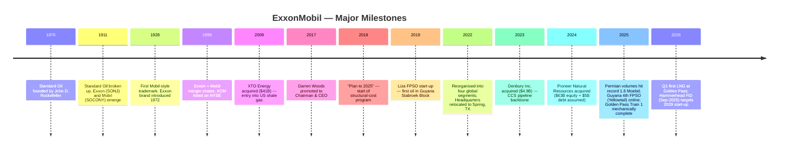
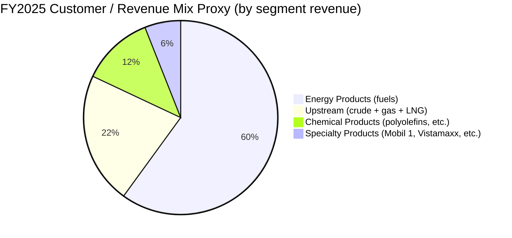
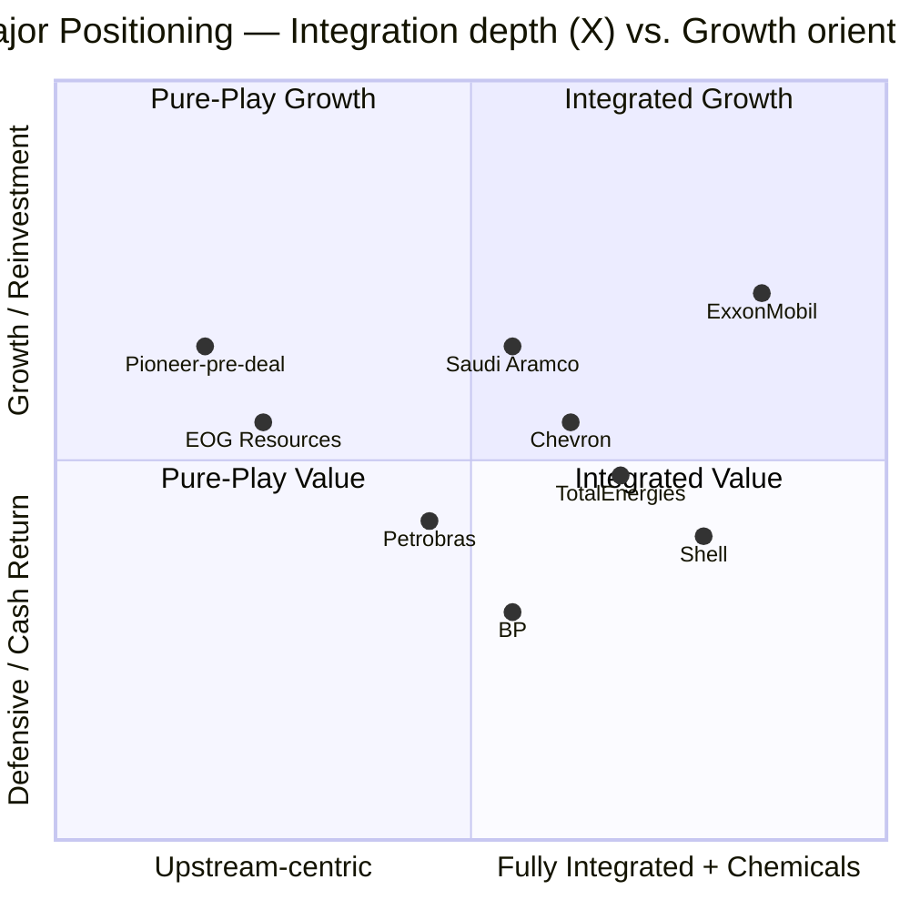

# Exxon Mobil Corporation (NYSE: XOM) — Initiating Coverage

**Report Date:** 2026-05-20
**Author:** Independent equity research
**Primary listing:** NYSE: XOM (common)

> **Update — 1Q-2026 print (2026-05-01):** ExxonMobil reported GAAP first-quarter earnings of **$4.2 billion (EPS $1.00)**, or **$8.8 billion (EPS $2.09) excluding identified items and unfavourable estimated timing effects of $3.9 billion** tied to derivative mark-to-market. Shareholder distributions were $9.2 billion ($4.3B dividends + $4.9B buybacks), Guyana hit a quarterly record of >900 kbd gross, and Golden Pass Train 1 produced its first LNG. Management reaffirmed full-year 2026 cash CapEx guidance of **$27–29 billion** and the $20 billion 2026 buyback target communicated in the December 2025 Corporate Plan Update. Middle-East attacks cut Q1 production ~6% QoQ and damaged two LNG trains in Qatar; the full timing of repairs is not yet known. Source: [1Q26 News Release, 2026-05-01](https://www.sec.gov/Archives/edgar/data/34088/000003408826000065/livef8k1q26991.htm); [Update on Middle East impact, 8-K, 2026-04-08](https://www.sec.gov/Archives/edgar/data/34088/000003408826000056/f8k1q992040826.htm).

## Table of Contents

1. Company Overview
2. Company History
3. Management Team
4. Products & Services
5. Customers & Go-to-Market
6. Industry Overview
7. Competitive Landscape
8. Market Opportunity (TAM)
9. Risk Assessment
- References

---

## 1. Company Overview

Exxon Mobil Corporation ("ExxonMobil" or "XOM") is the largest U.S.-listed integrated oil and gas company and the most valuable Western International Oil Company (IOC) by market capitalisation. The 2025 Form 10-K describes the business simply: ExxonMobil engages in the "exploration for, and production of, crude oil and natural gas; manufacture, trade, transport and sale of crude oil, natural gas, petroleum products, petrochemicals, and a wide variety of specialty products; and pursuit of lower-emission and other new business opportunities, including carbon capture and storage, hydrogen and ammonia, lower-emission fuels, Proxxima™ resin systems, carbon materials, low-carbon data centers, and lithium" ([2025 Form 10-K, Item 1 Business](https://www.sec.gov/Archives/edgar/data/34088/000003408826000045/xom-20251231.htm)). The Corporation is incorporated in New Jersey (the 2026 proxy asks shareholders to approve redomiciliation to Texas at the May 27, 2026 meeting), with global headquarters in Spring, Texas at the Houston-area campus.

**How it makes money.** ExxonMobil is organised in four reportable segments, all of which intersect through an integrated value chain: **Upstream** (exploration and production of crude oil, natural gas liquids and natural gas), and three product-solutions segments — **Energy Products** (fuels, aromatics, catalysts and licensing), **Chemical Products** (olefins, polyolefins and intermediates), and **Specialty Products** (finished lubricants, basestocks and waxes, synthetics, elastomers and resins). The Corporation has historically run Upstream and the legacy Refining + Chemicals business in parallel; the 2022 reorganisation consolidated downstream and petrochemicals under a single "ExxonMobil Product Solutions Company," sharpening the four-segment reporting view used today ([2025 Form 10-K, Item 1 Business — Segments](https://www.sec.gov/Archives/edgar/data/34088/000003408826000045/xom-20251231.htm)).

**Segment economics (FY2025).** Earnings after income tax were $21.354 billion Upstream, $7.423 billion Energy Products, $0.800 billion Chemical Products and $2.857 billion Specialty Products, against $(3.590) billion Corporate and Financing, summing to **$28.844 billion** of net income attributable to ExxonMobil. Upstream contributed roughly 65% of segment earnings, Energy Products 23%, Specialty Products 9% and Chemical Products under 3% — Chemical was at the bottom of its cycle through 2025 ([2025 Form 10-K, Business Profile table p.29](https://www.sec.gov/Archives/edgar/data/34088/000003408826000045/xom-20251231.htm)). Return on average capital employed (ROACE) for the corporation was 9.3% on average capital employed of $305.8 billion, down from 12.7% in 2024 on lower crude realisations.

**Where it operates.** FY2025 net liquids production averaged 3,329 kbd and net natural gas production averaged 8,442 Mcf/d (≈1,407 kboe/d), for total **oil-equivalent production of 4,736 koebd** ([2025 Form 10-K, Upstream Operational Results](https://www.sec.gov/Archives/edgar/data/34088/000003408826000045/xom-20251231.htm)). The United States accounted for ~46% of liquids production (1,522 kbd) — driven by the Permian's 1.6 Moebd post-Pioneer — with Asia (24%), Canada/Other Americas (25%, including Guyana), Africa (4%) and Europe/Australia (the balance) making up the rest. Refinery throughput totalled 3,979 kbd. The Corporation conducts operations across more than 50 countries, with downstream sales reaching more than 180 of them ([1Q26 News Release, 2026-05-01](https://www.sec.gov/Archives/edgar/data/34088/000003408826000065/livef8k1q26991.htm)).

**How large.** Sales and other operating revenue was **$323.9 billion in FY2025** (down from $339.2B in 2024 on lower crude realisations) and total revenues and other income were $332.2 billion. Total assets stood at $448.98 billion and ExxonMobil shareholders' equity at $259.39 billion. The Corporation had **57,900 regular employees** at year-end 2025 (≈59% non-U.S.) and over 8,000 active patents ([2025 Form 10-K, Five-Year Financial Summary p.30](https://www.sec.gov/Archives/edgar/data/34088/000003408826000045/xom-20251231.htm)).

**Cash returns to shareholders.** Cash dividends paid per share were $4.00 in 2025, up from $3.84 in 2024 and $3.68 in 2023. Share repurchases were **$20 billion in 2025**, and the December 9, 2025 Corporate Plan Update guided to another **$20 billion in 2026**, "assuming reasonable market conditions" ([2025 Form 10-K, Item 5 p.24](https://www.sec.gov/Archives/edgar/data/34088/000003408826000045/xom-20251231.htm)). Combined 2025 distributions of $36.8 billion ($16.8B dividends + $20B buybacks) made ExxonMobil the largest single distributor of cash among Western supermajors. Free cash flow / shareholder distributions are funded entirely from operating cash flow ($52.0B FY2025) plus modest asset sale proceeds — net debt to capital was 11.0% at year-end 2025 (rising from 6.5% in 2024 on Pioneer integration and buyback funding).

Source: [2025 Form 10-K Five-Year Financial Summary](https://www.sec.gov/Archives/edgar/data/34088/000003408826000045/xom-20251231.htm).

Source: [2025 Form 10-K Business Profile p.29 — Earnings After Income Taxes by Segment](https://www.sec.gov/Archives/edgar/data/34088/000003408826000045/xom-20251231.htm).

Source: [2025 Form 10-K Upstream Operational Results + Five-Year Financial Summary](https://www.sec.gov/Archives/edgar/data/34088/000003408826000045/xom-20251231.htm); [1Q26 News Release](https://www.sec.gov/Archives/edgar/data/34088/000003408826000065/livef8k1q26991.htm).

### Valuation snapshot (REQUIRED)

| Metric (USD, 2026-05-20 close, Yahoo Finance) | XOM | CVX | SHEL | BP | TTE |
|---|---|---|---|---|---|
| Share price | $154.36 | n/a | n/a | n/a | n/a |
| Market cap | $640 B | $379 B | $242 B | $116 B | $206 B |
| TTM P/E | **25.98×** | 33.11× | 13.55× | 36.25× | 13.73× |
| TTM P/S | **1.96×** | 2.04× | 0.91× | 0.60× | 1.12× |
| P/B | **2.49×** | 2.05× | 1.43× | 8.29× | 1.73× |
| EV/EBITDA (TTM) | **12.4×** | 11.2× | 11.0× | 22.0× | 6.4× |
| Dividend yield | **2.64%** | 3.72% | 3.60% | 4.42% | 4.56% |
| 52-wk range | $101.19 – $176.41 | — | — | — | — |

Sources: [XOM key statistics — Yahoo Finance, 2026-05-20](https://finance.yahoo.com/quote/XOM/key-statistics); [CVX](https://finance.yahoo.com/quote/CVX/key-statistics); [SHEL](https://finance.yahoo.com/quote/SHEL/key-statistics); [BP](https://finance.yahoo.com/quote/BP/key-statistics); [TTE](https://finance.yahoo.com/quote/TTE/key-statistics).

**Interpretation.** ExxonMobil now trades at a meaningful premium to the European supermajor peer set (SHEL, TTE, BP), in the same ZIP code as US peer Chevron, and at a sector-leading EV/EBITDA among diversified IOCs. The TTM P/E sits at ~26× — well above the 8–15× range that has historically characterised "trough-to-mid-cycle" oil majors, but **earnings denominator quality matters**: FY2025 EPS of $6.70 reflects (i) full-year integration of Pioneer (closed May 3, 2024) at peak Permian volumes (1.6 Moebd, +0.4 Moebd YoY), (ii) $0.9 billion of identified-item asset impairment charges (vs. +$0.2B gain in 2024), (iii) average Brent crude that printed in the middle of the 10-year (2010-2019) historical range, and (iv) a chemicals trough that lopped roughly $1.8B from segment earnings versus 2024 ([2025 Form 10-K MD&A Upstream Driver Analysis](https://www.sec.gov/Archives/edgar/data/34088/000003408826000045/xom-20251231.htm)). The market is paying for: scale, integration, advantaged-volume growth (Guyana to 8 FPSOs by 2030 and Permian to ~2.3 Moebd by 2030), a $20B/yr buyback program, demonstrably reduced structural cost ($15.6B cumulative since 2019, $20B by 2030 ambition), and a balance sheet that emerged from the Pioneer deal still industry-leading on net debt-to-capital ([1Q26 News Release](https://www.sec.gov/Archives/edgar/data/34088/000003408826000065/livef8k1q26991.htm)).

**Is the multiple stretched?** At ~26× trailing, XOM sits roughly 2× the European IOC median and a touch above its own 3-year median (~13× when bears point to commodity downturns, ~22× through 2024-25 as the Pioneer/Guyana growth story re-rated). The premium is not "AI-style" growth (P/S only 1.96× and EV/EBITDA 12.4× are well below extreme-growth tickers) but rather a **quality / capital-discipline premium**: the market believes XOM's portfolio low-cost-of-supply hurdle (≈$35/bbl by 2030) gives it durable earnings power into a flat or down crude tape. Section 9 carries a multiple-compression risk: a drop in Brent to the $50s coupled with a chemicals trough lasting another year would compress FY2026E EPS toward $5, pushing the trailing P/E above 30× and likely triggering a re-rate.

---

## 2. Company History

ExxonMobil's lineage traces directly to **John D. Rockefeller's Standard Oil Trust (1870)**. The Supreme Court's 1911 dissolution of Standard Oil created 34 independent companies, including Standard Oil of New Jersey (later **Exxon**, the larger entity) and Standard Oil of New York (later **Mobil**) ([ExxonMobil — Our History](https://corporate.exxonmobil.com/who-we-are/our-history)). Over the 20th century, both companies grew into global supermajors with distinct refining, marketing and exploration footprints — Exxon dominant in the Americas and key OPEC concessions, Mobil strong in the Middle East and lubricants. After a multi-decade industry consolidation wave triggered by the late-1990s oil price collapse, **Exxon and Mobil merged on November 30, 1999** in a $73.7 billion stock-for-stock transaction, forming what was then the world's largest publicly traded company ([U.S. Department of Justice — Exxon-Mobil Final Judgment, 1999](https://www.justice.gov/atr/case-document/file/487051/dl)).

Source: [ExxonMobil — Our History](https://corporate.exxonmobil.com/who-we-are/our-history); [2025 Form 10-K, Item 2 Properties — Upstream](https://www.sec.gov/Archives/edgar/data/34088/000003408826000045/xom-20251231.htm).

**Strategic pivots — the why behind the what.**

1. **2018 strategic reset under Woods.** After the 2014-16 crude crash exposed cost bloat across the IOCs, Darren Woods (CEO since January 2017) launched a multi-year structural-cost program targeting $9–11B of structural savings vs. 2019. The program also reshaped the upstream portfolio toward "advantaged" basins — Permian, Guyana, Brazil and Mozambique LNG — while divesting tail assets (Argentina 2025, parts of Africa). Cumulative structural cost savings reached **$15.1 billion by year-end 2025** (target: $20B by 2030) ([2025 Form 10-K MD&A — Structural Cost Savings p.49](https://www.sec.gov/Archives/edgar/data/34088/000003408826000045/xom-20251231.htm)).
2. **2022 four-segment reorganisation.** Combining refining and chemicals into "ExxonMobil Product Solutions" with three sub-segments (Energy, Chemical, Specialty) aligned reporting with how integrated complexes (Baytown, Singapore, Antwerp, Beaumont, Baton Rouge) actually produce molecules — recognising that a single barrel of crude often yields fuels, polymers and lubricants at one site.
3. **2024 Pioneer acquisition.** Closed May 3, 2024 for **545 million ExxonMobil shares (fair value $63B) plus assumption of $5B of debt** ([2025 Form 10-K Note 20](https://www.sec.gov/Archives/edgar/data/34088/000003408826000045/xom-20251231.htm)), making ExxonMobil the largest Permian producer overnight and consolidating ~1.4M acres of contiguous unconventional acreage. The integration brought heritage Permian to 1.6 Moebd in 2025 and is expected to drive incremental synergies through cube design, lightweight proppant and digital drilling — Woods' shareholder letter pegs combined Permian net-zero Scope 1 + 2 by 2035 ([2026 Proxy Statement, Letter from the CEO](https://www.sec.gov/Archives/edgar/data/34088/000119312526147614/d16317ddef14a.htm)).
4. **Low-carbon platform formation (2021-2024).** ExxonMobil established the **Low Carbon Solutions (LCS) business unit** in 2021 and bolted on **Denbury Inc. ($4.9B, closed November 2023)** for its 1,300-mile CO2 pipeline network across the U.S. Gulf Coast. LCS pursues CCS, hydrogen/ammonia (Baytown low-carbon hydrogen project FID in 2025), lower-emission fuels and lithium (a Mountain Pass-area project announced in 2023). The corporate framing is "advantage-led": ExxonMobil deploys LCS capital only where reservoir, pipeline, hydrogen demand and policy support align ([Low Carbon Solutions — corporate](https://corporate.exxonmobil.com/what-we-do/energy-supply/low-carbon-solutions)).

**Key acquisitions (chronological):**

- 2009 — **XTO Energy ($41B)**: entry into U.S. unconventional gas and shale
- 2017 — **Mozambique LNG / InterOil exit, Bass Strait recommitment**: rebalanced portfolio toward gas
- 2023 — **Denbury Inc. ($4.9B)**: enterprise-grade CO2 pipeline backbone for CCS
- 2024 — **Pioneer Natural Resources ($63B equity + $5B debt)**: largest Permian acreage holder
- 2024-25 — Multiple Argentina divestments + Nigeria divestment + U.S. asset impairments (net negative $0.9B identified items in 2025) — portfolio high-grading

**Recent developments — last 12 months (2025-05 through 2026-05).**

- **Guyana:** Fourth FPSO (Yellowtail, ONE GUYANA) reached production in August 2025; combined gross production from the four operating vessels exceeded 870 kbd in 4Q25; annual 2025 gross production averaged 715 kbd. Hammerhead FID announced September 2025; eight FPSOs targeted by year-end 2030 ([2025 Form 10-K, Item 2 — Guyana](https://www.sec.gov/Archives/edgar/data/34088/000003408826000045/xom-20251231.htm)). Q1-2026 set a new gross record exceeding 900 kbd ([1Q26 News Release](https://www.sec.gov/Archives/edgar/data/34088/000003408826000065/livef8k1q26991.htm)).
- **Permian:** Record 1.6 Moebd net production in 2025 (+0.4 Moebd YoY); plan targets ≈2.3 Moebd by 2030 ([2025 Form 10-K MD&A — Business Environment p.45-46](https://www.sec.gov/Archives/edgar/data/34088/000003408826000045/xom-20251231.htm)).
- **LNG:** Golden Pass Train 1 mechanically complete in late 2025; first LNG cargo Q1-2026; Mozambique Rovuma LNG FID targeted 2026; Papua LNG (PNG) optimisation ongoing.
- **Geopolitical shock:** March 2026 attacks on two Qatar LNG trains (XOM has 24–30% interest) led to "prolonged" damage; ~3% of 2025 Upstream production at risk ([Update on Middle East impact, 8-K, 2026-04-08](https://www.sec.gov/Archives/edgar/data/34088/000003408826000056/f8k1q992040826.htm)).
- **Texas redomiciliation:** Item 4 of the 2026 proxy seeks shareholder approval to move the corporate domicile from New Jersey to Texas, completing a multi-year HQ + legal alignment with Spring, TX operations ([2026 Proxy Statement Item 4](https://www.sec.gov/Archives/edgar/data/34088/000119312526147614/d16317ddef14a.htm)).

---

## 3. Management Team

### Darren W. Woods — Chairman & Chief Executive Officer

Darren Woods, age 61, is the seventh Chairman and CEO of ExxonMobil since the 1999 merger and the first non-Exxon-pedigree CEO in decades. Woods joined the corporation in 1992 as a refinery process engineer, an unusual entry point for an oil major chief — he holds a B.S. in Electrical Engineering from **Texas A&M University** and an M.B.A. from Northwestern's **Kellogg School of Management**, both disclosed in the 2026 proxy ([2026 Proxy, Director Nominees p.4](https://www.sec.gov/Archives/edgar/data/34088/000119312526147614/d16317ddef14a.htm)). His career trajectory ran through downstream and chemicals — President of ExxonMobil Refining & Supply (2012-14), Senior VP (2014-15), President of the Corporation (2016) and Chairman & CEO from January 1, 2017. Notably he was promoted to CEO during the Tillerson-to-Trump-State-Department transition and inherited a company facing the deepest commodity downturn of the post-2009 era; XOM's market cap had fallen below Apple, Google, Microsoft and even Saudi Aramco's 2019 IPO valuation by 2020.

What Woods has specifically delivered: (i) the **structural-cost program** that has banked $15.1B cumulative savings vs. 2019, with a $20B-by-2030 ambition ([2025 Form 10-K MD&A](https://www.sec.gov/Archives/edgar/data/34088/000003408826000045/xom-20251231.htm)); (ii) a **portfolio reset toward advantaged assets** — Permian (Pioneer), Guyana (now four FPSOs producing >870 kbd gross), Mozambique LNG (Rovuma toward 2026 FID), and Golden Pass (first LNG 1Q26); (iii) a **balance sheet rebuild** — net debt-to-capital fell to 4.5% in 2023 (from over 30% pre-2020), reflated to 11.0% post-Pioneer in 2025, still industry-leading ([1Q26 News Release](https://www.sec.gov/Archives/edgar/data/34088/000003408826000065/livef8k1q26991.htm)); and (iv) a **defeated activist challenge** — Engine No. 1's 2021 proxy fight that placed three sustainability-oriented directors on the board, which Woods accommodated by accelerating LCS and net-zero-by-2050 (Scope 1 + 2) commitments while continuing aggressive oil-and-gas investment.

Woods does not hold founder-style supervoting stock — he owns 1,937,500 shares (less than 0.01% of outstanding) and his 2025 Total Direct Compensation was **$32.0 million** (down from $33.2M in 2024 on lower stock-price/earnings), of which 81% was delivered in performance shares with long (10-year vesting) restriction periods ([2026 Proxy CD&A p.58](https://www.sec.gov/Archives/edgar/data/34088/000119312526147614/d16317ddef14a.htm)). Public profile: member of the Business Roundtable, former Chair of the American Petroleum Institute and former Chair of the National Petroleum Council. Woods is unusually accessible to the press by IOC-CEO standards — quarterly transcripts and a steady cadence of CNBC and FT interviews position him as one of the principal articulators of an "energy transition that also requires continued oil and gas investment." His 30+ years inside the corporation, paired with a downstream-engineering background that contrasts with most upstream-trained CEOs, gives him strong cross-segment fluency that has been central to the Product Solutions reorganisation and to the bet on Proxxima, carbon materials and lower-emission fuels as a fourth growth leg.

### Neil A. Hansen — Senior Vice President & Chief Financial Officer (since February 1, 2026)

Neil Hansen, age 51, was promoted to CFO on February 1, 2026 from a series of senior roles inside Energy Products (Senior VP Energy Products, ExxonMobil Product Solutions Company, April 2022–April 2025; President, Global Business Solutions, May 2025–January 2026). His prior positions include VP Europe, Africa & Middle East Fuels (2020-22), giving him direct line operating experience across two of XOM's most complex non-U.S. downstream theatres ([2025 Form 10-K, Information about our Executive Officers](https://www.sec.gov/Archives/edgar/data/34088/000003408826000045/xom-20251231.htm)). Hansen replaced **Kathryn A. Mikells**, who joined ExxonMobil in August 2021 as the first external CFO since the 1999 merger and previously served as CFO of Diageo, Xerox, ADT and Nalco. Hansen, an ExxonMobil-pedigree finance and operations leader, marks a return to the "career inside" CFO pattern that historically characterised the corporation. Capital-markets track record at this stage is limited — investors will watch his maiden full-year earnings cycle for tone-setting on buyback pace, debt management post-Pioneer integration, and Hammerhead/Rovuma FID communication.

### Daniel L. Ammann — Vice President; President, ExxonMobil Upstream Company (since February 1, 2025)

Dan Ammann, age 53, runs the operating segment that generates roughly two-thirds of corporate earnings. Ammann arrived at ExxonMobil in May 2022 as President of Low Carbon Solutions, the unit that houses CCS, hydrogen/ammonia, lower-emission fuels and lithium. His pre-XOM career was unusual for an oil major executive: **CEO of Cruise LLC (GM's self-driving subsidiary) from January 2019 to December 2021** and earlier President of General Motors (2014-19), where he led GM's IPO and divestment of Opel/Vauxhall ([2025 Form 10-K Executive Officers](https://www.sec.gov/Archives/edgar/data/34088/000003408826000045/xom-20251231.htm)). The 2025 promotion to head Upstream — replacing Liam Mallon — signals two things: (i) the senior leadership pipeline is now open to non-traditional, M&A-and-platform-experienced outsiders, and (ii) the corporation views Upstream as needing the same "platform thinking" mindset that LCS demanded. Ammann oversees Pioneer integration, Guyana FPSO sequencing and the Mozambique/PNG LNG portfolio.

### Karen T. McKee — President, ExxonMobil Product Solutions Company

Karen McKee leads the three downstream + petrochemicals segments (Energy Products, Chemical Products, Specialty Products), which together generated ~$11 billion of 2025 earnings. McKee, a Stanford ChemE by training, was previously Vice President of ExxonMobil Chemical Company (responsible for the global polymers business) and has run the integrated downstream-plus-chemicals platform since the 2022 reorganisation. Her remit covers the largest refinery footprint in the Americas (Baytown 583 kbd; Baton Rouge 522 kbd; Beaumont 619 kbd post-expansion), the Singapore complex, the Antwerp / Rotterdam / Fawley European platform, and the Mobil-branded lubricants distribution. McKee is one of two contact executives overseeing Product Solutions for the CODM (the other is Upstream's Ammann), per the 10-K segment governance description ([2025 Form 10-K, Item 1 — Segments](https://www.sec.gov/Archives/edgar/data/34088/000003408826000045/xom-20251231.htm)).

### Governance footer

- **Board composition (FY2026 proxy):** 13 directors, 12 independent; **Joseph L. Hooley** is Independent Lead Director; average tenure 4.6 years; mandatory retirement age 75; annual elections; majority-vote standard ([2026 Proxy p.27](https://www.sec.gov/Archives/edgar/data/34088/000119312526147614/d16317ddef14a.htm)). Notable directors include Michael S. Angelakis (chairman of Atairos), former Chair of the Federal Reserve Bank of Philadelphia.
- **Engine No. 1 legacy:** The three directors elected in 2021 (Gregory Goff, Kaisa Hietala, Andy Karsner) have largely served their terms; the board today is functionally homogenous on capital allocation, though Karsner remains an active sustainability voice.
- **Insider ownership:** All directors and executive officers as a group own less than 0.5% of common stock; the largest external 5% holders are The Vanguard Group, BlackRock and State Street — typical for a large-cap index name ([2026 Proxy Beneficial Ownership](https://www.sec.gov/Archives/edgar/data/34088/000119312526147614/d16317ddef14a.htm)).
- **Compensation structure:** CEO 2025 TDC $32.0M, 81% performance shares with long restriction periods; pay-for-performance backstop: 5-year cumulative TSR is anchored against an IOC peer-group of CVX, SHEL, BP, TTE; 2025 TDC was down 4% YoY reflective of lower earnings and lower stock price.
- **Auditor:** PricewaterhouseCoopers; FY2025 audit fees $32.0M (down from $34.8M in 2024).
- **Texas redomiciliation:** Item 4 on the 2026 proxy would move XOM from New Jersey to Texas — the company argues Texas has more developed protections against activist-investor proposals.

### Management track record synthesis

Woods and his team have delivered: structural-cost reductions ($15B+ banked), portfolio high-grading (Pioneer, Denbury, Guyana, Hammerhead), and industry-leading shareholder distributions ($36.8B in 2025) — all without breaking the balance sheet (net debt-to-capital still 11.0%). The gaps: (i) Pioneer integration has not yet shown synergy ramps that justify the $63B paid (FY2025 Permian growth was 33% YoY, in line with Pioneer's standalone trajectory pre-deal); (ii) Chemical Products is at the bottom of cycle (2.7% ROACE in 2025 vs. 8.9% in 2024), and the team has not yet articulated a clear de-risking path beyond "cycle will turn"; (iii) LCS revenue is still small and dependent on policy support (45Q tax credits, EU Innovation Fund). Net read: this is a high-quality team executing a clear strategy in a cyclical business — the proof points are quantitative, not narrative.

---

## 4. Products & Services

ExxonMobil reports through **four segments** organised under two operating companies: **ExxonMobil Upstream Company** (Upstream) and **ExxonMobil Product Solutions Company** (Energy Products, Chemical Products, Specialty Products). Cross-cutting the segments is the **Low Carbon Solutions** business unit, which carries its own capital allocation and reports through Upstream (carbon capture/storage, hydrogen) and Product Solutions (lower-emission fuels). What follows is a thorough enumeration of every distinct product / service line ExxonMobil sells today, grouped by segment per the [corporate.exxonmobil.com](https://corporate.exxonmobil.com/) navigation tree.

```mermaid
graph TD
    XOM[ExxonMobil Corporation]
    XOM --> US[Upstream Company]
    XOM --> PS[Product Solutions Company]
    XOM --> LCS[Low Carbon Solutions Unit]

    US --> US1[Conventional Oil & Gas]
    US --> US2[Unconventional - Permian Basin]
    US --> US3[Deepwater - Guyana Stabroek]
    US --> US4[LNG - Golden Pass / PNG / Mozambique / Qatar]

    PS --> EP[Energy Products]
    PS --> CP[Chemical Products]
    PS --> SP[Specialty Products]

    EP --> EP1[Fuels - Gasoline / Diesel / Jet]
    EP --> EP2[Aromatics - Benzene / Paraxylene]
    EP --> EP3[Catalysts & Licensing]

    CP --> CP1[Olefins - Ethylene / Propylene]
    CP --> CP2[Polyolefins - PE / PP]
    CP --> CP3[Intermediates]

    SP --> SP1[Mobil Finished Lubricants]
    SP --> SP2[Basestocks & Waxes]
    SP --> SP3[Synthetics]
    SP --> SP4[Elastomers & Resins - Vistamaxx / Santoprene / Proxxima]

    LCS --> LCS1[Carbon Capture & Storage]
    LCS --> LCS2[Hydrogen & Ammonia - Baytown]
    LCS --> LCS3[Lower-Emission Fuels]
    LCS --> LCS4[Lithium - SW US]
    LCS --> LCS5[Low-Carbon Data Centers]
```

Source: [ExxonMobil — What We Do (segment navigation)](https://corporate.exxonmobil.com/what-we-do); [2025 Form 10-K Item 1](https://www.sec.gov/Archives/edgar/data/34088/000003408826000045/xom-20251231.htm).

### Upstream — Crude Oil, Natural Gas Liquids and Natural Gas

**Flagship 1 — Permian Basin unconventional (advantaged volume growth).** Following the May 2024 Pioneer close, ExxonMobil is the largest Permian producer at 1.6 Moebd in 2025, targeting ≈2.3 Moebd by 2030 ([2025 Form 10-K MD&A Permian](https://www.sec.gov/Archives/edgar/data/34088/000003408826000045/xom-20251231.htm)). What it does: tight-oil/wet-gas production across roughly 1.4M acres in the Midland and Delaware basins. Target customer: refiners and global crude markets via Gulf Coast export infrastructure (Permian-to-Corpus Christi pipelines, Magellan/MPC docks). Pricing: WTI Midland / Magellan East Houston / Brent-linked spreads. **Moat: YES — cost leadership and scale.** XOM's cube design, proprietary lightweight proppant and digital drilling have produced industry-leading capital efficiency; Pioneer brought 850 kbd of low-cost, contiguous Midland Basin acreage. Closest competing product: **Diamondback Energy (FANG) Permian-pure-play** at ~0.7 Moebd post-Endeavor — ahead of FANG on scale (~2× volumes) but behind FANG on capital-return-per-share ratio. Evidence: ExxonMobil's Permian unit cost is among the lowest in the basin (≈$35/bbl breakeven, per Corporate Plan Update).

**Flagship 2 — Guyana Stabroek Block (advantaged volume growth).** XOM operates Stabroek with **45% working interest**; partners are Hess Corp. (30%, now ChevronUS post-Hess close pending) and CNOOC (25%). What it does: ultra-deepwater oil production from the Liza, Liza Phase 2, Payara and now Yellowtail (ONE GUYANA, August 2025 start-up) FPSO vessels. Uaru and Whiptail are the fifth and sixth developments, each with ~250 kbd capacity; Hammerhead FID was September 2025, target start-up 2029; eight FPSOs targeted by year-end 2030 ([2025 Form 10-K, Item 2 — Guyana](https://www.sec.gov/Archives/edgar/data/34088/000003408826000045/xom-20251231.htm)). Target customer: global crude markets — Liza light sweet crude has become a premium export grade. Pricing: Brent-linked. **Moat: YES — irreplaceable resource.** Operator of one of the lowest-cost-of-supply offshore plays globally (≈$25–30/bbl), scale (2025 annual gross production 715 kbd, Q1-2026 record >900 kbd) and 20-year production-sharing terms. Closest competing product: **Petrobras pre-salt deepwater** (Búzios, Tupi) — comparable scale, higher fiscal-take, more politically constrained.

**Flagship 3 — LNG portfolio.** Equity LNG capacity across **Qatar (QatarEnergy LNG JVs, 24–30% interest, ≈628 koebd 2025 net oil-equivalent)**, **Papua New Guinea (PNG LNG, operator, ~33% interest)**, **Mozambique (Coral South FLNG, Rovuma toward FID 2026)** and **Golden Pass LNG (Texas, 30% interest, ~18.1 Mtpa nameplate, Train 1 first LNG Q1-2026)** ([2025 Form 10-K LNG p.46](https://www.sec.gov/Archives/edgar/data/34088/000003408826000045/xom-20251231.htm); [Update on Middle East impact, 8-K](https://www.sec.gov/Archives/edgar/data/34088/000003408826000056/f8k1q992040826.htm)). **Moat: PARTIAL — scale and partnerships, but exposed to geopolitical risk** (Qatar LNG train damage from March 2026 attacks is the live example). Closest competing product: **QatarEnergy itself** (controlling LNG partner) and **Shell** (largest global LNG portfolio by traded volumes) — XOM ahead on equity LNG production, behind Shell on traded/optimisation income.

**Long-tail upstream products:** conventional oil and gas in **Canada/Other Americas** (835 kbd liquids, including Kearl oil sands and Canadian conventional), **Asia** (800 kbd, including Indonesia Cepu, Malaysia, Iraq West Qurna, UAE Upper Zakum at 28% interest – 312 koebd 2025), **Africa** (142 kbd, Angola/Nigeria — Argentina divested 2025), **Europe** (3 kbd minor), **Australia/Oceania** (Gorgon non-operating). ExxonMobil has reclassified ~1.0 GOEB of proved undeveloped reserves in 2025 that no longer met SEC definitions, and added 2.0 GOEB primarily in the US and Guyana ([2025 Form 10-K Reserves](https://www.sec.gov/Archives/edgar/data/34088/000003408826000045/xom-20251231.htm)).

### Energy Products — Fuels, Aromatics, Catalysts

**Fuels** (gasoline, diesel, jet fuel) are sold through the **Exxon, Mobil and Esso** retail brands across more than 12,000 retail sites globally (mostly franchisee-operated in the US; company-operated and joint ventures abroad). Energy Products sales averaged 5,593 kbd in 2025 ([2025 Form 10-K Business Profile p.29](https://www.sec.gov/Archives/edgar/data/34088/000003408826000045/xom-20251231.htm)). Refining capacity (XOM share): Baytown 583 kbd; Baton Rouge 522 kbd; Beaumont 619 kbd (post-2023 expansion); Joliet 273 kbd; Antwerp; Fawley UK; Singapore (largest XOM refinery globally at >592 kbd); Rotterdam; multiple JV positions. **Aromatics** (benzene, paraxylene) feed the petrochemical chain — Singapore is a key swing supplier. **Catalysts and licensing** is the proprietary technology business that licenses processes to refiners and chemicals operators globally. **Moat: PARTIAL — scale and integration in fuels (cost leader at flagship complexes), but commoditised at the margin.** Closest competing product: **Marathon Petroleum (MPC) US refining footprint** — comparable US scale, behind XOM on chemicals integration.

### Chemical Products — Olefins, Polyolefins, Intermediates

**Olefins** (ethylene, propylene) are produced primarily at integrated cracker-polyolefin complexes — Baytown, Baton Rouge, Singapore, Antwerp. **Polyolefins**: polyethylene (PE) and polypropylene (PP) commodity grades. **Intermediates**: a range of building-block petrochemicals. 2025 Chemical Products sales were 21.303 Mt — but earnings were just $0.8 billion (vs. $2.577B in 2024) as Chinese capacity additions kept Asia chemical margins "at bottom of cycle, well below the 10-year range" through 1Q-2026 ([2026Q1 10-Q MD&A](https://www.sec.gov/Archives/edgar/data/34088/000003408826000067/xom-20260331.htm)). **Moat: PARTIAL — feedstock-advantaged in US Gulf (NGL cracker economics), disadvantaged in Asia (naphtha cracker economics).** Closest competing product: **Dow PE/PP, LyondellBasell PP** — XOM at parity on US Gulf cost curve, behind Dow on PE market share in North America.

### Specialty Products — Lubricants, Basestocks, Synthetics, Elastomers & Resins

**Mobil 1 finished lubricants** is one of the most recognised premium-motor-oil brands globally and a top-five player by retail volume; pricing carries a significant brand premium over private-label competitors. **Synthetic basestocks** (Group III/IV/V), **waxes**, **Vistamaxx™ polymer modifiers**, **Santoprene™ thermoplastic vulcanizates** (TPVs), and the launched-2024 **Proxxima™ thermoset resin systems** (composite-grade alternative to epoxy, targeted at wind blades, lightweighting and infrastructure applications). Specialty Products sales were 7.791 Mt in 2025 with **35.4% ROACE** — the highest of any segment ([2025 Form 10-K Business Profile p.29](https://www.sec.gov/Archives/edgar/data/34088/000003408826000045/xom-20251231.htm)). **Moat: YES — brand (Mobil 1), IP (Vistamaxx, Santoprene, Proxxima patents), distribution scale (lubricants in 100+ countries).** Closest competing product: **Shell Helix / Pennzoil** (premium passenger lubricants) — Mobil 1 ahead on the synthetic premium segment; **Dow elastomers** — Vistamaxx ahead on metallocene-PP TPE.

### Low Carbon Solutions (cross-segment)

LCS is XOM's lower-emission platform with five product lines: **(1) CCS** (Denbury pipeline backbone + Gulf Coast sequestration hubs including the Linde/CF Industries/Nucor/Stronghold offtake agreements totalling >5 Mtpa contracted CO2), **(2) Hydrogen / ammonia** (Baytown low-carbon hydrogen project, 1 Bcf/d capacity, FID-staged through 2025-26, World's largest blue-hydrogen project by capacity), **(3) Lower-emission fuels** (renewable diesel from Strathcona, Alberta), **(4) Lithium** (Smackover Formation, Arkansas — first commercial production targeted 2027), and **(5) Low-carbon data centers** (added 2025 — provide power-and-CCS bundled offerings to AI/cloud hyperscalers). **Moat: PARTIAL — early mover on CCS pipeline infrastructure (Denbury); policy-dependent revenue (45Q, IRA, EU CBAM).** Closest competing product: **Occidental's STRATOS DAC + 1PointFive** (XOM ahead on CCS scale via Denbury network, behind OXY on DAC technology depth — see companion OXY report).

### Recent product launches / sunsets (last 12 months)

- **Proxxima™ Tier-1 customer wins (2025):** Composites for wind blade and infrastructure, marketed as a drop-in epoxy alternative ([ExxonMobil Proxxima](https://www.proxxima.com/)).
- **Low-carbon data center offering announced 2025 Corporate Plan Update:** bundling natural-gas power with CCS, targeting hyperscaler AI demand.
- **Argentina E&P divestment (2025):** completed sale of unconventional and conventional Argentine assets — recorded as identified-item gain.
- **Golden Pass first LNG (1Q-2026):** Train 1 first cargo loaded.

---

## 5. Customers & Go-to-Market

ExxonMobil's customer footprint is one of the broadest in global industry — products sold into **more than 180 countries**, across approximately five buyer archetypes: (i) retail consumers of fuels and lubricants (B2C through ~12,000 Exxon/Mobil/Esso stations); (ii) commercial fleet and industrial fuel customers (airlines, trucking, marine bunker); (iii) refiners and traders buying crude (B2B upstream sales); (iv) chemicals and polymers OEMs (consumer-goods, packaging, automotive, infrastructure); and (v) lubricants OEM and channel partners (Mobil 1 endorsements with Porsche, Mercedes, McLaren F1, NASCAR).

**Customer concentration.** Per the 2025 Form 10-K, **"No single customer represents more than 10% of the Corporation's sales"** is implicit — the 10-K does not name any 10%+ customer in the segment notes, consistent with the company's prior decade of disclosures ([2025 Form 10-K Note 3 Segment Reporting](https://www.sec.gov/Archives/edgar/data/34088/000003408826000045/xom-20251231.htm)). The corporation's customer base is genuinely fragmented across geography, channel and product. The largest concentrated exposures are: (i) **LNG long-term offtake contracts** with utility customers in Japan, Korea, Taiwan, China and Europe under 15-20 year SPA structures (named customers include JERA, KOGAS, CPC Taiwan, CNOOC, etc., but no single one exceeds the SEC ASC 280 10% threshold); (ii) **chemicals long-term supply agreements** with global FMCG and automotive OEMs; (iii) **Mobil-branded fuel distribution agreements**.

Source: Approximate split inferred from 2025 Form 10-K Note 3 segment external revenues ([2025 Form 10-K](https://www.sec.gov/Archives/edgar/data/34088/000003408826000045/xom-20251231.htm)). Note: Energy Products dominates external revenue because refined products sales are higher in absolute dollar terms than crude (which transfers internally); Upstream's share of *earnings* is far higher than its share of revenue, since Upstream margins are structurally higher.

**Geographic mix.** FY2025 net liquids production by region (kbd, % of 3,329 kbd worldwide):
- United States: 1,522 (45.7%)
- Canada / Other Americas: 835 (25.1%) — Guyana + Kearl oil sands
- Asia: 800 (24.0%) — UAE Upper Zakum, Iraq West Qurna, Indonesia Cepu
- Africa: 142 (4.3%)
- Australia/Oceania: 25 (0.8%)
- Europe: 3 (0.1%)

Natural gas (FY2025 net production, MMcf/d):
- United States: 3,364 (39.8%)
- Asia: 3,354 (39.7%) — incl. Qatar LNG JVs ~2.9 Bcf/d
- Australia/Oceania: 1,283 (15.2%) — Gorgon
- Europe: 299 (3.5%)
- Africa: 114 (1.4%)
- Canada / Other Americas: 27 (0.3%)

Source: [2025 Form 10-K MD&A — Upstream Operational Results](https://www.sec.gov/Archives/edgar/data/34088/000003408826000045/xom-20251231.htm).

**Distribution channels.** Six core channels: (1) **Direct global trading** — XOM is one of the world's largest physical crude and product traders, with desks in Houston, Singapore, London and Geneva; (2) **Retail fuels** — Exxon/Mobil/Esso branded stations via franchisee networks (US) and joint-venture / company-operated (Europe, Asia, Latin America); (3) **Commercial fuels** — fleet, aviation (Avitat, ExxonMobil Aviation), marine bunker; (4) **Chemicals direct sales** — to OEM accounts with master supply agreements; (5) **Lubricants distribution** — Mobil branded distributors, OEM factory-fill agreements (Porsche AG since 1996, Mercedes-AMG, BMW, others); (6) **LNG long-term SPA + spot** — primarily to Asian utility customers under 15-20 year terms, optimised through Singapore and London trading desks. Approximately 5.4 million people interact with the Exxon, Mobil and Esso brands daily through retail sites ([Exxon Mobil — About Us](https://corporate.exxonmobil.com/who-we-are/about-us)).

**Sales cycle and pricing.** Upstream sales are continuous (crude/gas pricing daily, marked to benchmark); chemicals contracts are typically quarterly or monthly price reopeners; LNG sales are mostly long-term contracts with oil-indexed or Henry-Hub-linked pricing; lubricants are sold at branded retail margins. Roughly 80–85% of revenue is short-cycle commodity-priced; ~15% is contracted multi-year (LNG, certain chemicals, certain lubricants OEM).

**Key partnerships.**

- **Government partners (production-sharing or concession):** Qatar (QatarEnergy), UAE (ADNOC), Guyana (Government of Guyana), Iraq (Basra Oil Co.), Indonesia (Pertamina), Kazakhstan (KazMunayGas), Malaysia (Petronas), Brazil (Petrobras consortia), Mozambique (ENH), PNG.
- **Joint-venture partners:** ConocoPhillips (LNG Australia), SABIC (multiple JVs — Yanbu, Al Jubail, Gulf Coast Growth Ventures), QatarEnergy (Golden Pass, Qatar LNG), Hess (now ChevronUS pending close, in Guyana), CNOOC (Guyana minority).
- **Customers under master agreement:** P&G, Unilever, Walmart, Costco (lubricants and films); BMW, Mercedes-AMG, Porsche, McLaren (lubricants).
- **CCS offtake customers under LCS:** Linde, CF Industries, Nucor, Stronghold Digital Mining (5+ Mtpa CO2 contracted).

**Customer case studies (named wins).**

- **Singapore Airlines + ExxonMobil Aviation:** Long-running jet fuel supply through Changi Airport.
- **Porsche AG + Mobil 1:** Factory-fill since 1996, the longest continuous OEM-lubricant partnership in motorsport.
- **Linde + CF Industries + Nucor (Texas Gulf Coast):** Multi-Mtpa CCS offtake agreements signed 2022-23 underpinning Houston-area sequestration hub.

**Contract structure & concentration risk.** Because no single customer exceeds the 10% disclosure threshold and the business is fundamentally many-to-many (millions of B2C fuel/lubricant transactions; thousands of B2B chemical and LNG customers; sovereign customers in upstream), **customer-concentration risk at the XOM level is structurally low** — but two latent concentrations matter: (i) **sovereign counterparty risk** (Qatar, UAE, Iraq, Guyana, PNG, Mozambique are all government-counterparty exposures), and (ii) **OEM channel concentration in lubricants** (loss of a flagship OEM endorsement like Mercedes-AMG would meaningfully dent Mobil 1 brand). Neither rises to the ASC 280 10% disclosure threshold.

---

## 6. Industry Overview

ExxonMobil operates across three intertwined industries: (a) **upstream oil and gas exploration and production** (NAICS 211), (b) **petroleum refining and downstream products** (NAICS 324110), and (c) **basic petrochemicals and polymers** (NAICS 325110). Each has its own competitive structure, growth trajectory and regulatory exposure, but they share commodity-price cyclicality, capital intensity and exposure to the multi-decade energy transition.

**Size of the market.**

- **Global primary energy demand** reached ~620 EJ in 2024 (~14,400 Mtoe), of which oil supplied 31% (~30 Bbbl/yr or ~83 Mbd) and natural gas supplied 23% (~140 Tcf/yr), per the [IEA World Energy Outlook 2024](https://www.iea.org/reports/world-energy-outlook-2024).
- **Global crude oil revenue pool** at ~$80/bbl Brent equates to ~$2.6 trillion/yr; **natural gas revenue pool** at average LNG-equivalent ~$10/MMBtu equates to ~$1.4 trillion/yr. ExxonMobil's $324B of FY2025 sales captures ~7% of this combined ~$4 trillion hydrocarbon revenue pool.
- **Global petrochemicals revenue pool** ~$700 billion (2024), per [IEA Petrochemicals Outlook 2024](https://www.iea.org/reports/the-future-of-petrochemicals).
- **Global LNG market** ~410 Mtpa in 2024, growing to ~600 Mtpa by 2030 per [Shell LNG Outlook 2025](https://www.shell.com/energy-and-innovation/natural-gas/liquefied-natural-gas-lng/lng-outlook-2025.html).
- **Global CCS market**: <50 Mtpa captured in 2024, with announced capacity targeting ≥600 Mtpa by 2030 per [Global CCS Institute, "Global Status of CCS 2024"](https://www.globalccsinstitute.com/resources/global-status-of-ccs-2024/).

**Growth rates.**

- **Oil demand** — IEA's "Stated Policies" scenario projects plateau ~104-105 Mbd through 2030, then gentle decline. **ExxonMobil's own Global Outlook** projects oil at ~100 Mbd in 2050, materially flatter than IEA Net Zero, reflecting persistent demand in trucking, aviation, marine and petrochemicals where electrification is hard ([ExxonMobil Global Outlook 2024](https://corporate.exxonmobil.com/news/news-releases/2024/0828_exxonmobil-global-outlook-publication)).
- **Natural gas / LNG** — strongest growth segment: +20-30% by 2030 driven by Asian power demand, coal-to-gas switching, and AI/data-center power demand. Golden Pass, Rovuma, Papua LNG and Qatar expansion all positioned for this wave.
- **Petrochemicals** — secular +3-4% per year volume growth driven by emerging-market polymer intensity, partially offset by recycling and plastics-treaty pressure.
- **Renewables / CCS** — high growth (+15-20%/yr CAGR) off small base; subject to policy.

**Key trends and drivers.**

1. **AI/data center power demand** is the biggest 2024-26 surprise to gas demand. Hyperscaler-driven incremental gas demand of 6–10 Bcf/d by 2030 (vs. ~95 Bcf/d total US demand 2024) supports a structurally higher Henry Hub strip, benefiting ExxonMobil's US gas-weighted Permian, Haynesville and Appalachian positions, and the company's 2025-launched low-carbon-data-center offering.
2. **Energy security re-pricing post 2022 Russia/Ukraine.** Europe replaced ~150 Bcm of pipeline Russian gas with LNG by 2024-25; US LNG capacity tripled 2018-2025; Golden Pass adds ~18.1 Mtpa.
3. **CCS / 45Q tax credit cycle.** The US Inflation Reduction Act of 2022 raised the 45Q tax credit to $85/tonne for sequestered CO2 (up from $50), unlocking the Denbury network economics — but a Republican-led repeal would reset the LCS investment case.
4. **Chinese petrochemical capacity glut.** ~30 Mtpa of new Chinese ethylene capacity 2022-2025 has driven Asia margins to "bottom of cycle" levels — depressing Chemical Products earnings.
5. **Permian basin maturation.** Tier-1 inventory in the core Permian basin is finite; Pioneer's contiguous Midland acreage gives XOM the longest runway among private operators; consensus expects basin-wide growth to slow toward 2027-28.
6. **EV penetration and gasoline demand.** US gasoline demand has plateaued since 2018 at ~9 Mbd; global gasoline demand still grows modestly in EM Asia but is roughly half of the global oil demand picture.

**Regulatory environment.**

- **United States** — IRA 45Q tax credit ($85/t sequestered), the Methane Emissions Reduction Program (MERP) fee structure phased through 2030, SEC climate disclosure rules under litigation. Texas's energy-friendly regime (no state corporate income tax; permissive flaring) drives the redomicile vote in May 2026 ([2026 Proxy Item 4](https://www.sec.gov/Archives/edgar/data/34088/000119312526147614/d16317ddef14a.htm)).
- **European Union** — EU Emissions Trading System (ETS) covering Antwerp/Fawley/Rotterdam refining and chemicals; CBAM phase-in 2026; FuelEU Maritime; SAF mandates under ReFuelEU.
- **OPEC+** — quotas govern ~40% of global crude supply; ExxonMobil operates inside OPEC member states (UAE Upper Zakum, Iraq West Qurna, Qatar LNG) under production-sharing terms.
- **Climate litigation** — multiple US state and city lawsuits over climate-related damages; ExxonMobil disclosed contingent legal exposure in Item 3 of the 10-K ([2025 Form 10-K Item 3 Legal Proceedings](https://www.sec.gov/Archives/edgar/data/34088/000003408826000045/xom-20251231.htm)).

**Industry structure.**

- **Upstream:** moderate concentration — top 5 IOCs (XOM, CVX, SHEL, TTE, BP) plus NOCs (Saudi Aramco, ADNOC, QatarEnergy, Petrobras, CNPC, Equinor) hold ~60% of global production; thousands of E&P independents and shale players hold the balance. **High barriers to entry** for offshore mega-projects and LNG (capital, technology, government relationships).
- **Downstream / refining:** regional rather than global — US Gulf complex (XOM Baytown, MPC, VLO), Asian refining (Sinopec, Reliance, Saudi Aramco SATORP), European refining (consolidating, several recent closures).
- **Petrochemicals:** moderately concentrated — XOM, Dow, LyondellBasell, SABIC, INEOS, Sinopec, Reliance, BASF. Cost advantages favour NGL-cracker positions (US Gulf, Middle East) vs. naphtha crackers (Asia, Europe).
- **LNG:** highly concentrated by liquefaction supply (QatarEnergy, Shell, ExxonMobil, TotalEnergies, Cheniere, Sempra, Venture Global) but liquid spot market with active trading.

**Substitutes and disruption.** Solar + storage and wind continue to displace coal and natural gas in stationary power; EVs slowly displace gasoline in light-duty transport; hydrogen and ammonia are emerging as low-carbon substitutes in heavy industry and shipping. The 2050-net-zero scenarios from IEA imply ~25 Mbd oil demand by 2050 (a 75% cut from today) — vs. ExxonMobil's own Global Outlook of ~100 Mbd. The investment case is highly sensitive to which scenario plays out and over what timeline.

---

## 7. Competitive Landscape

ExxonMobil competes against a layered set of rivals: (i) the four other Western supermajors, (ii) US shale-independents in tight oil/gas, (iii) the National Oil Companies of resource-rich states, (iv) regional refiners and pure-play chemicals producers, and (v) renewables developers in the long energy-transition cycle. The 2025 Form 10-K notes that "the energy and petrochemical industries are highly competitive. We face competition not only from other private firms, but also from state-owned companies that are increasingly competing for opportunities outside of their home countries" ([2025 Form 10-K Item 1A Risk Factors Competition](https://www.sec.gov/Archives/edgar/data/34088/000003408826000045/xom-20251231.htm)).

Source: positioning derived from segment-earnings mix (FY2025 10-K disclosures) and disclosed capex / buyback intensity (most recent annual reports).

### Direct competitors — the supermajor peer set

**Chevron Corp. (NYSE: CVX) — $379B market cap.** Most comparable peer: integrated, US-headquartered, similar Permian + Gulf Coast + Australian LNG (Gorgon, Wheatstone) footprint. 2025 production ~3.4 Mboe/d (vs. XOM 4.7). Pending close of Hess acquisition gives Chevron 30% of Stabroek Block — directly entwining the two majors in Guyana. Versus XOM: **behind on scale (~70% of XOM production), at parity on US Permian footprint, behind on chemicals (CPChem JV with Phillips 66 vs. XOM's wholly-owned petchem) and ahead on dividend yield (3.72% vs. 2.64%).** TTM P/E 33.1× — higher than XOM, partly on Hess-deal anticipation ([CVX — Yahoo Finance](https://finance.yahoo.com/quote/CVX/key-statistics)).

**Shell plc (NYSE: SHEL) — $242B market cap.** Largest global LNG portfolio by traded volumes (~70 Mtpa equity + offtake). Significantly bigger than XOM on traded volumes but smaller on equity production (~2.7 Mboe/d). Versus XOM: **behind on integrated chemicals scale, ahead on global LNG trading and on European retail (Shell-branded stations 46,000+ vs. Exxon/Mobil/Esso ~12,000), behind on US shale (Shell does not have a Permian-equivalent position).** TTM P/E 13.5× — discounted to XOM, partly on European listing, partly on slower CapEx growth ([SHEL — Yahoo Finance](https://finance.yahoo.com/quote/SHEL/key-statistics)).

**TotalEnergies SE (NYSE: TTE) — $206B market cap.** Most diversified IOC into integrated power (renewables + gas-fired generation + retail electricity in Europe). Production ~2.5 Mboe/d. Versus XOM: **behind on production scale, ahead on renewables build (TotalEnergies has committed to 100 GW of gross installed renewables capacity by 2030, vs. XOM's near-zero direct renewables generation), behind on chemicals.** TTM P/E 13.7× — discounted to XOM, reflecting French CGT exposure and lower buyback pace ([TTE — Yahoo Finance](https://finance.yahoo.com/quote/TTE/key-statistics)).

**BP plc (NYSE: BP) — $116B market cap.** Smallest supermajor; in 2025 reversed parts of the 2020 "Beyond Petroleum" strategy, refocusing on hydrocarbons under CEO Murray Auchincloss after 2024 strategic reset. Production ~2.4 Mboe/d. Versus XOM: **behind on every operating metric except potentially renewables generation (Lightsource bp), but BP's 2024-25 portfolio retrenchment has narrowed even that lead.** TTM P/E 36.3× — elevated by depressed earnings, not a growth multiple. P/B 8.3× signals book value substantially eroded relative to market cap ([BP — Yahoo Finance](https://finance.yahoo.com/quote/BP/key-statistics)).

Source: [Yahoo Finance key statistics for XOM/CVX/SHEL/BP/TTE, 2026-05-20](https://finance.yahoo.com/quote/XOM/key-statistics).

### Indirect competitors

**National Oil Companies (NOCs).** Saudi Aramco (Tadawul: 2222) is by far the world's largest producer (~12 Mbd crude + condensate; 2024 net income ~$106B) and the principal price-setter in OPEC+. **QatarEnergy** (XOM's largest LNG partner, but also Golden Pass competitor) controls Qatar North Field expansion to 142 Mtpa by 2030. **ADNOC** holds majority interest in Upper Zakum (XOM 28% partner) and is expanding offshore. **CNPC / PetroChina, Sinopec, CNOOC** dominate Chinese refining and increasingly compete globally. **Petrobras** has industry-leading offshore deepwater capabilities in the Brazil pre-salt. NOCs increasingly bid against IOCs on third-country opportunities — the 10-K specifically flags this as a competitive intensification ([2025 Form 10-K Item 1A Competition](https://www.sec.gov/Archives/edgar/data/34088/000003408826000045/xom-20251231.htm)).

**US shale independents.** Diamondback Energy (FANG), EOG Resources, ConocoPhillips, Devon Energy, APA, Occidental — all compete with XOM/Pioneer in Permian acreage acquisitions and operating efficiency. XOM and OXY (per the [companion OXY report](../Occidental_NYSE_OXY/Occidental_NYSE_OXY_Research_Document_2026-05-20.md)) are the two largest Permian producers and the only two with significant CCS infrastructure positions. EOG is the most directly comparable on operating efficiency per well.

**Pure-play chemicals.** Dow (DOW), LyondellBasell (LYB), Westlake, INEOS, BASF, Reliance, Sinopec — these compete in polyethylene, polypropylene, intermediates. XOM is structurally cost-advantaged in US Gulf (ethane cracker) and Singapore (integration with refinery) but bottom-of-cycle margins in 2025 have eroded the segment ROACE to 2.7%.

**Refining-and-marketing pure-plays.** Marathon Petroleum (MPC), Valero (VLO), Phillips 66 (PSX), Reliance (India) — these compete in US Gulf and Atlantic Basin refining; XOM's competitive edge is petchem integration at flagship sites (Baytown, Singapore).

**Renewables / new energy.** NextEra Energy (NEE), Iberdrola, Ørsted — compete in long-term decarbonisation capital allocation; XOM has chosen not to compete in solar/wind power generation but is committed to CCS, hydrogen, lower-emission fuels and lithium, partly as a hedge.

### Market share and positioning

- **Global crude + condensate production:** XOM at ~4.7 Mboe/d represents roughly 4-5% of global supply — smallest top-5 share among Saudi Aramco (15%), Russia (~10%), US private E&P aggregate (~12%) and Chinese majors (~7%).
- **US Permian Basin production:** XOM's 1.6 Moebd represents ~22% of basin output of ~7.3 Moebd (early 2026) — largest single operator.
- **Global LNG equity capacity:** ~25 Mtpa post-Golden Pass + Qatar expansion = ~6% global share.
- **Global polyolefins capacity:** XOM ~13 Mtpa = ~6% global share; behind Sinopec, Dow, SABIC.
- **Mobil 1 — global premium passenger motor oil:** estimated top-3 global share alongside Shell Helix and Castrol Edge (private market shares not publicly disclosed; estimated from retail-tracking data).

### XOM's competitive advantages

1. **Integration.** XOM is the only Western supermajor with full-cycle integration from molecule through to specialty chemicals at the same complex (Baytown, Singapore). This shows up as Specialty Products ROACE of 35.4% vs. industry average in the high-teens.
2. **Capital efficiency.** Cumulative structural cost savings of $15.6B since 2019, $20B target by 2030; net debt to capital of 11.0% — industry-leading.
3. **Resource quality.** Permian (largest contiguous acreage post-Pioneer) + Guyana (lowest-cost-of-supply offshore globally) = two of the three best growth platforms in global oil.
4. **R&D and IP.** 8,000+ active patents; proprietary technologies in cube-design unconventional, lightweight proppant, Proxxima, Vistamaxx, Santoprene.
5. **Brand.** Mobil 1, Exxon, Mobil — globally recognised consumer brands.

### XOM's vulnerabilities

1. **Cyclical commodity exposure.** A $10/bbl drop in Brent reduces FY2026E earnings by ≈$3-4 billion (sensitivities disclosed in the 10-K Market Risks section).
2. **Chemicals trough.** Chemical Products earnings collapsed from $2.6B to $0.8B in 2025; the structural answer to Chinese capacity overhang is unclear.
3. **Geopolitical concentration.** ~20% of production exposure to the Middle East; March 2026 Qatar LNG damage is the live example ([Middle East 8-K, 2026-04-08](https://www.sec.gov/Archives/edgar/data/34088/000003408826000056/f8k1q992040826.htm)).
4. **Energy-transition policy regime risk.** Lower 45Q credits, faster-than-expected EV penetration, or carbon-pricing escalation could compress long-run hydrocarbon NPVs.
5. **Renewables absence.** Unlike TTE, SHEL or BP, XOM has chosen not to build a meaningful direct renewables-generation business — concentrating optionality risk on the CCS / hydrogen / lithium platform.

---

## 8. Market Opportunity (TAM)

ExxonMobil's serviceable opportunity is best framed across three time horizons: the near-term hydrocarbon market that funds the corporation today, the mid-term LNG + petchem expansion driving 2025-2030 earnings growth, and the long-term low-carbon platform that bridges to a 2050 portfolio.

**Near-term TAM — current hydrocarbon revenue pool (2025-2030):**

- Global crude oil revenue pool: ~$2.5-2.8 trillion/year at $75-90/bbl Brent ([IEA WEO 2024](https://www.iea.org/reports/world-energy-outlook-2024)).
- Global natural gas revenue pool: ~$1.3-1.5 trillion/year at average $8-12/MMBtu LNG-equivalent (regionally variable).
- Global refined products revenue pool: ~$3.5-4.0 trillion/year (cracking margins + branded retail).
- Global petrochemicals revenue pool: ~$650-750 billion/year ([IEA Petrochemicals Outlook 2024](https://www.iea.org/reports/the-future-of-petrochemicals)).
- **Total relevant pool**: ~$8 trillion/year of which XOM's $324B revenue captures ~4%.

ExxonMobil's **SAM** is bounded by the resource positions it actually holds — Permian (~22% of basin), Guyana (operator, 45% of one of the world's premier offshore plays), Mozambique LNG, Qatar LNG, refining capacity at ~3.9 Mbd, polyolefins at ~13 Mtpa. Within SAM, XOM's **SOM** is governed by capital allocation: the December 2025 Corporate Plan Update targets cumulative shareholder distributions of >$165 billion over 2025-2030 plus cumulative cash CapEx of ~$140-160 billion over the same period ([2025 Form 10-K MD&A Outlook](https://www.sec.gov/Archives/edgar/data/34088/000003408826000045/xom-20251231.htm)).

**Mid-term TAM — LNG and petchem expansion (2026-2030):**

- **Global LNG demand** is expected to grow from 410 Mtpa (2024) to 600+ Mtpa by 2030, a ~6% CAGR ([Shell LNG Outlook 2025](https://www.shell.com/energy-and-innovation/natural-gas/liquefied-natural-gas-lng/lng-outlook-2025.html)). XOM's incremental contribution: Golden Pass (18.1 Mtpa nameplate, Train 1 first LNG Q1-2026), Rovuma (~15.2 Mtpa FID-pending 2026), Papua LNG (~5 Mtpa under optimisation), Qatar JV expansion. Combined incremental XOM equity LNG: ~12-15 Mtpa by 2030 — well-positioned to capture 8-10% of the ~190 Mtpa incremental market.
- **Permian growth.** US tight-oil basin total output projected by EIA to grow from ~6.0 Mboe/d (early 2024) to ~7.5-8.0 Mboe/d by 2030 ([EIA AEO 2025](https://www.eia.gov/outlooks/aeo/)); XOM's 1.6→2.3 Moebd plan captures ~30-35% of basin incremental growth.
- **Petchem advantaged products (Proxxima, Vistamaxx, performance polymers)** — XOM-disclosed strategy is to grow High-Value Products earnings by >$10B versus 2024 by 2030.

**Long-term TAM — Low Carbon Solutions (2025-2050):**

- **Carbon Capture & Storage:** Global CCS captured volumes need to reach ≥1.7 Gtpa by 2050 per IEA Net Zero — vs. <50 Mtpa today, implying ~35× growth and a multi-hundred-billion-dollar revenue pool at $80-120/t. XOM's Denbury network gives it the largest single CCS pipeline backbone in the US; >5 Mtpa already contracted (Linde, CF Industries, Nucor, Stronghold); Houston-area hub expanding.
- **Low-carbon hydrogen / ammonia:** Baytown is the world's largest planned blue-hydrogen project (1 Bcf/d). Global low-carbon hydrogen demand projected to reach ~150 Mtpa by 2050 vs. ~1 Mtpa today.
- **Lithium:** Smackover Formation pilot; commercial production targeted 2027. Modest near-term contribution but optionality on long-term battery-grade lithium.
- **Lower-emission fuels:** Strathcona renewable diesel; SAF capability under development.
- **Low-carbon data centers (announced 2025):** novel monetisation of XOM's gas-plus-CCS bundle to AI hyperscalers — early-stage offering with potentially large optionality given ~50-100 GW of incremental AI power demand by 2030.

**Cumulative shareholder distribution capacity (2025-2030).** Management's Corporate Plan Update targets cash from operations of $165B+ at $65/bbl Brent and 50% growth in earnings power by 2030 vs. 2024 baseline ([2025 Corporate Plan Update press release, 2025-12-09](https://corporate.exxonmobil.com/news/news-releases/2025/1209_exxonmobil-announces-corporate-plan-progress)). At that cash-generation level, the corporation could distribute $20B+ per year in buybacks (already announced for 2026) plus growing dividends — implying ~$130B of cumulative distributions over 2025-2030, against today's ~$640B market cap.

**Penetration strategy.** ExxonMobil's penetration strategy is explicit: deploy capital only into "advantaged" positions where XOM's scale, integration, technology or partnerships translate into structural cost advantages over the basin / global cost curve. The disciplined corollary: divest tail assets (Argentina 2025, parts of Nigeria, Equatorial Guinea earlier) and avoid the diversification-into-renewables trap that produced poor returns at peer IOCs (BP) and Big Oil "renewables forays" of the 2008-2014 era.

---

## 9. Risk Assessment

ExxonMobil's risk profile is dominated by **commodity price cyclicality** — a Brent move of ±$10/bbl moves earnings ~$3-4B annually — overlaid on **portfolio concentration**, **policy uncertainty** and **capital-allocation execution**. The risks below follow the four-bucket taxonomy from the risk-taxonomy reference.

### Company-Specific Risks

1. **Pioneer integration / synergy under-delivery (Execution).** The $63B Pioneer acquisition closed May 3, 2024; FY2025 was the first full year of consolidation. Permian growth was 33% YoY (1.2→1.6 Moebd) but that pace is in line with Pioneer's standalone pre-deal plan, leaving the disclosed $2B/yr synergy run-rate to prove out across 2026-27. Mitigants: contiguous acreage, demonstrated cube-design capability, conservative consensus already builds modest synergies. Severity: medium; the deal accretion case requires synergies for the math to work.

2. **Geographic concentration in Middle East (Geographic).** Qatar (LNG JVs, 24-30% interest, ~3% of 2025 Upstream production) and UAE Upper Zakum (28% interest, 312 koebd) together carry roughly **20% of XOM oil-equivalent production** ([Middle East 8-K, 2026-04-08](https://www.sec.gov/Archives/edgar/data/34088/000003408826000056/f8k1q992040826.htm)). March 2026 attacks damaged two Qatar LNG trains for an unknown but "prolonged" repair window. Severity: medium-high; geopolitical events out of XOM's direct control could persistently impair regional production.

3. **Key person dependency on Darren Woods (Key person).** Woods has set the strategic direction since 2017 and is unusually central to investor narrative around capital discipline and the Pioneer story. He is 61 — mandatory retirement age 75 — but succession is opaque (no obvious heir-apparent communicated publicly; Hansen new at CFO; Ammann new at Upstream). Mitigants: ExxonMobil has a deep bench and famously process-driven culture. Severity: low-medium.

4. **Chemicals segment trough persistence (Product/Tech obsolescence).** Chemical Products earnings fell from $2.6B (2024) to $0.8B (2025); 1Q-2026 commentary describes margins "at bottom of cycle, well below the 10-year range." If Chinese capacity additions continue or recycle/treaty pressure accelerates, the segment could remain a sub-5% ROACE drag for multi-year periods. Severity: medium.

5. **Texas redomiciliation governance risk (Execution/Governance).** Item 4 of the 2026 proxy seeks to move XOM from New Jersey to Texas, ostensibly to access more issuer-friendly anti-activist provisions — but New Jersey has historically defeated shareholder litigation around climate disclosure on more favourable terms. The change also unwinds 1909-1972 Standard Oil corporate-domicile history. Severity: low; mostly cosmetic.

6. **LCS revenue dependence on 45Q / IRA policy (Company-Specific / Regulatory hybrid).** Denbury / CCS economics rest on the $85/t 45Q tax credit established by the 2022 Inflation Reduction Act. A Republican-led repeal or modification (proposals have been floated through 2025-26) could halve CCS project NPVs. Severity: medium.

### Industry / Market Risks

7. **Energy-transition demand destruction (Technology disruption).** If global oil demand peaks meaningfully below ExxonMobil's Global Outlook (e.g. IEA Net Zero implies oil at ~25 Mbd by 2050 vs. XOM's ~100 Mbd), terminal-value-driven NPVs of long-cycle assets (Guyana Hammerhead, Mozambique Rovuma, Papua LNG) could erode. Severity: medium-low over a 5-year horizon, high over 20+. Mitigants: low-cost-of-supply portfolio is most resilient to demand decline; LCS, Proxxima, lithium provide hedges.

8. **OPEC+ supply discipline (Competitive intensity).** OPEC+ controls ~40% of global crude supply; the cartel's 2023-25 supply restraint supported prices. A break-up — Saudi Arabia/UAE pushing for market share — could send Brent to the $50s, compressing Upstream earnings by ~$10B+. Mitigants: low-cost portfolio still profitable at $50; Energy Products counter-cyclically improves. Severity: medium.

9. **Petrochemical capacity overhang in Asia (Market saturation).** Chinese ethylene + polyolefin additions of ~30 Mtpa 2022-25 have driven Chemical Products margins to bottom-of-cycle. Without capacity discipline (unlikely given state-driven build cadence), margins could remain compressed through 2027+. Severity: medium.

10. **EU + US methane and CBAM regulation (Regulatory).** Methane Emissions Reduction Program fees (US, IRA), EU Methane Regulation (2024 final text) and CBAM phase-in 2026 raise compliance costs on Permian flaring / venting and on imported chemicals. Severity: low-medium; XOM's Permian net-zero-by-2035 target is being delivered ahead of regulatory peers.

### Financial Risks

11. **Valuation / multiple-compression risk (Required given TTM P/E 26× vs. sector median ~14×).** XOM trades at ~2× the European supermajor P/E median; the premium relies on continued Permian/Guyana growth, $20B/year buyback execution, and a chemicals recovery. A Brent move to $50s + chemicals trough lasting through 2027 could push trailing P/E above 30× and trigger a re-rate toward sector median, implying 30-45% downside in a stress scenario before counting buyback support. Mitigants: balance sheet (11.0% net debt-to-capital) gives optionality on accelerated buyback into weakness; dividend at 2.6% is well-covered (FCF $52B vs. dividend $16.8B). Severity: medium.

12. **Post-Pioneer balance sheet utilisation (Debt levels).** Net debt to capital rose from 4.5% (2023) to 11.0% (2025) as the corporation funded the $20B buyback and Pioneer integration. Total debt is $43.5B vs. equity $259B. If Brent drops materially and the corporation maintains the $20B/yr buyback pace, net debt could rise toward 20% of capital — still industry-leading but reducing flexibility for opportunistic M&A. Severity: low.

13. **Cash CapEx outlay risk (Funding).** $27-29B 2026 cash CapEx guidance + $20B buyback implies ~$47-49B of distributions and investment per year. At $65/bbl Brent base case the math works; at $50 the corporation would need to draw the balance sheet or cut buybacks. Severity: low — XOM has demonstrated buyback discipline through 2020 oil price crash.

### Macroeconomic Risks

14. **Brent crude price volatility (Economic sensitivity).** ExxonMobil's earnings are highly sensitive to Brent. Disclosed sensitivity: $1/bbl Brent move ≈ $300-400M annual after-tax earnings impact. Brent in 2024-25 averaged in the middle of the 10-year (2010-2019) historical range; a recession-driven move to the $50s would lop $8-10B from FY2026E earnings. Severity: high; this is the dominant risk variable.

15. **Geopolitical / sanctions risk (Geopolitical factors).** Beyond the Middle East asset exposure, XOM has Russia legacy (fully written off post-2022), Iraq operations, Nigeria, Indonesia. A Strait of Hormuz closure or wider Iran-Israel conflict would create both production (Qatar LNG, UAE Upper Zakum, Iraq West Qurna) and price impacts. Severity: medium-high — but high crude prices typically offset volume impact at the corporate level.

16. **US Dollar / foreign exchange exposure (FX).** XOM reports in USD and most commodity contracts settle in USD; however, refining margins in EUR, JPY, AUD and KRW create translation risk; non-US operating costs are partially local-currency. Severity: low-medium.

---

## References

### SEC Filings (primary sources)

- [Exxon Mobil Corporation — 2025 Form 10-K (filed Feb-2026)](https://www.sec.gov/Archives/edgar/data/34088/000003408826000045/xom-20251231.htm)
- [Exxon Mobil Corporation — 1Q-2026 Form 10-Q (filed May-2026)](https://www.sec.gov/Archives/edgar/data/34088/000003408826000067/xom-20260331.htm)
- [Exxon Mobil Corporation — 2026 DEF 14A Proxy Statement](https://www.sec.gov/Archives/edgar/data/34088/000119312526147614/d16317ddef14a.htm)
- [Exxon Mobil Corporation — 1Q-2026 News Release, 8-K EX-99.1, 2026-05-01](https://www.sec.gov/Archives/edgar/data/34088/000003408826000065/livef8k1q26991.htm)
- [Exxon Mobil Corporation — 1Q-2026 Investor Relations Data Summary, 8-K EX-99.2, 2026-05-01](https://www.sec.gov/Archives/edgar/data/34088/000003408826000065/livef8k1q26992.htm)
- [Exxon Mobil Corporation — Update on Impact of Middle East Conflict, 8-K EX-99.2, 2026-04-08](https://www.sec.gov/Archives/edgar/data/34088/000003408826000056/f8k1q992040826.htm)
- [Exxon Mobil Corporation — 1Q-2026 Earnings Considerations, 8-K EX-99.1, 2026-04-08](https://www.sec.gov/Archives/edgar/data/34088/000003408826000056/f8k1q991040826.htm)
- [Exxon Mobil Corporation — 4Q-2025 News Release, 8-K, 2026-01-30](https://www.sec.gov/Archives/edgar/data/34088/000003408826000033/livef8k4q25991.htm)
- [DOJ Antitrust Division — Exxon-Mobil Final Judgment, 1999](https://www.justice.gov/atr/case-document/file/487051/dl)

### Company website

- [ExxonMobil — corporate homepage](https://corporate.exxonmobil.com/)
- [ExxonMobil — Our History](https://corporate.exxonmobil.com/who-we-are/our-history)
- [ExxonMobil — Low Carbon Solutions](https://corporate.exxonmobil.com/what-we-do/energy-supply/low-carbon-solutions)
- [ExxonMobil Chemical — Proxxima resin systems](https://www.proxxima.com/)
- [ExxonMobil — 2025 Corporate Plan Update press release, 2025-12-09](https://corporate.exxonmobil.com/news/news-releases/2025/1209_exxonmobil-announces-corporate-plan-progress)
- [ExxonMobil Global Outlook 2024](https://corporate.exxonmobil.com/news/news-releases/2024/0828_exxonmobil-global-outlook-publication)

### Market data

- [XOM key statistics — Yahoo Finance, 2026-05-20](https://finance.yahoo.com/quote/XOM/key-statistics)
- [CVX key statistics — Yahoo Finance, 2026-05-20](https://finance.yahoo.com/quote/CVX/key-statistics)
- [SHEL key statistics — Yahoo Finance, 2026-05-20](https://finance.yahoo.com/quote/SHEL/key-statistics)
- [BP key statistics — Yahoo Finance, 2026-05-20](https://finance.yahoo.com/quote/BP/key-statistics)
- [TTE key statistics — Yahoo Finance, 2026-05-20](https://finance.yahoo.com/quote/TTE/key-statistics)

### Industry research

- [IEA — World Energy Outlook 2024](https://www.iea.org/reports/world-energy-outlook-2024)
- [IEA — The Future of Petrochemicals (2024 update)](https://www.iea.org/reports/the-future-of-petrochemicals)
- [Shell — LNG Outlook 2025](https://www.shell.com/energy-and-innovation/natural-gas/liquefied-natural-gas-lng/lng-outlook-2025.html)
- [Global CCS Institute — Global Status of CCS 2024](https://www.globalccsinstitute.com/resources/global-status-of-ccs-2024/)
- [EIA — Annual Energy Outlook 2025](https://www.eia.gov/outlooks/aeo/)

### Companion research

- [Occidental Petroleum (NYSE: OXY) — Initiating Coverage, 2026-05-20](../Occidental_NYSE_OXY/Occidental_NYSE_OXY_Research_Document_2026-05-20.md)
