# Exxon Mobil Corporation (NYSE:XOM) — 公司研究报告

**报告日期 (as of):** 2026-06-14
**作者:** 独立股票研究
**主上市地:** 纽约证券交易所 (NYSE):XOM (普通股)
**报告语言:** 简体中文 (英文版同时存在于本目录)

> **业绩更新 — 2026 财年 Q1 (2026-05-01 公布):** ExxonMobil 公布 GAAP 口径第一季度净利润为 **41.83 亿美元 (每股收益 EPS 1.00 美元)**, 较 2025 年同期的 77.13 亿美元 (EPS 1.76 美元) 大幅下降; 若**剔除已识别项目则为 1.16 美元, 再剔除与衍生品按市价计价 (mark-to-market) 相关约 39 亿美元不利的估计时点效应 (timing effects) 后为 2.09 美元**([1Q26 新闻发布稿, 8-K EX-99.1, 2026-05-01](https://www.sec.gov/Archives/edgar/data/34088/000003408826000065/livef8k1q26991.htm))。当季销售及其他经营收入为 831.61 亿美元, 经营性现金流 (operating cash flow) 87.05 亿美元 ([2026 Q1 Form 10-Q, 综合损益表与现金流量表](https://www.sec.gov/Archives/edgar/data/34088/000003408826000067/xom-20260331.htm))。圭亚那 (Guyana) 创单季产量纪录, Golden Pass 一号线 (Train 1) 实现首批液化天然气 (LNG), 使美国 LNG 出口提升约 5%; 季度股息上调至每股 1.03 美元 (2026-06-10 派发); 公司一年期股东总回报 (TSR) 达 48% ([1Q26 新闻发布稿, 2026-05-01](https://www.sec.gov/Archives/edgar/data/34088/000003408826000065/livef8k1q26991.htm))。中东袭击导致 Q1 油气当量产量环比下降约 6%, 并损坏了卡塔尔两条 LNG 生产线, 完整修复时点仍"长期"未明 ([中东冲突影响更新, 8-K EX-99.2, 2026-04-08](https://www.sec.gov/Archives/edgar/data/34088/000003408826000056/f8k1q992040826.htm))。

> **公司治理更新 — 2026 年股东大会 (2026-05-27):** 股东以 **71.2% 赞成票通过将公司注册地从新泽西迁至德克萨斯州 (Texas Redomiciliation, 第 4 项议案)**, 同时改选全部 12 名董事候选人, 否决了独立董事长提案 (第 5 项, 84.8% 反对); 截至 2026 年 4 月 1 日登记日, 流通普通股为 **4,144,455,560 股** ([Form 8-K, Item 5.07 股东大会表决结果, 2026-05-27](https://www.sec.gov/Archives/edgar/data/34088/000003408826000078/xom-20260527.htm))。

---

## 投资摘要 (Investment Summary) — *分析师观点 (Analyst view):*

| 项目 | 本报告观点 |
|---|---|
| **评级 (Rating)** | **Hold / Neutral (持有)** |
| **12 个月目标价 (Price Target)** | **160 美元** (基准情形 base case) |
| **当前股价 (2026-06-14)** | 147.01 美元 |
| **隐含上行空间 (Upside)** | **+8.8%** (加约 2.8% 股息收益率, 合计约 +11.6% 总回报) |
| **估值方法 (Method)** | 2027E EPS 9.20 美元 × 17.4× 目标 forward P/E (超级油企 supermajor 质量溢价倍数), 与 DCF / SOTP 交叉验证 |
| **市值 (Market cap)** | 约 6,090 亿美元 (4.144 bn 股 × 147.01 美元) |
| **52 周区间** | 105.53 – 176.41 美元 |
| **股息收益率 (Dividend yield)** | 约 2.80% (年化 4.12 美元/股) |

**核心论点 (Thesis pillars) — *分析师观点:*

1. **质量与资本纪律溢价, 但当前股价已计入大部分利好。** XOM 拥有西方超级油企中最优的资产组合 (二叠纪 Permian + 圭亚那 Guyana 两大低成本平台)、行业领先的净债务/资本比 (11.0%) 与最大单一股东分派 (2025 年 368 亿美元)。但 forward P/E 13.8×、EV/EBITDA 11.7× 已处于超级油企区间上沿, +8.8% 的基准上行空间不足以构成强烈买入 ([XOM 关键统计 — Yahoo Finance, 2026-06-14](https://finance.yahoo.com/quote/XOM/key-statistics))。
2. **盈利对布伦特原油 (Brent) 高度敏感, 当前油价含地缘溢价。** WTI 现价约 90 美元/桶反映了中东冲突的供给溢价 ([indicators.db 本地快照 (FRED / yfinance), as of 2026-06-05](https://fred.stlouisfed.org/)); 一旦地缘风险消退、OPEC+ 增产, 布伦特回落至 60-65 美元区间将使 2026 财年 E 盈利下修约 80-100 亿美元, 这是最该盯紧的变量。
3. **增长引擎清晰但增量边际化。** 圭亚那 2030 年 8 艘 FPSO、二叠纪 2030 年约 2.3 Moebd、Golden Pass / Rovuma LNG 提供可见产量增长, 但 Pioneer 收购后的协同尚待证明, 化工 (Chemical) 处于周期底部 (2025 年分部 ROACE 仅 2.7%)。
4. **风险/回报对称性偏弱。** 牛市目标价 189 美元 (+29%) 需油价维持高位 + 化工复苏; 熊市 90 美元 (-39%) 对应布伦特跌至 55 美元区间。下行幅度大于上行, 支持 Hold 而非 Buy。

> *本投资摘要中的评级、目标价与情形价格均为本报告的前瞻观点 (forward view), 标注为分析师观点, 不构成任何监管文件 (filing) 的内容; 10-K / 10-Q 中不含目标价。*

## 目录

1. 公司概览 (含 1A 估值与目标价快照、1B GF Score)
2. 估值与目标价 (Valuation & Price Target)
3. 公司历史
4. 管理团队
5. 产品与服务
6. 客户与上市策略
7. 行业概览
8. 竞争格局
9. 市场机会 (TAM)
10. 风险评估 (含 9.5 关键分歧与催化剂)
11. 投资视角评分 (Investor lenses)
- 参考资料

---

## 1. 公司概览

**本方观点 (BLUF):** ExxonMobil 是美股最大、按市值最具价值的西方综合一体化石油天然气公司 (International Oil Company, IOC)。本报告给予 **Hold / Neutral** 评级、12 个月目标价 160 美元——并非看空公司质量, 而是认为当前 147 美元股价已对其优质资产组合、200 亿美元/年回购与低成本增长充分定价; +8.8% 的基准上行空间不足以构成买入, 且盈利对油价的高敏感性在当前约 90 美元/桶 (含地缘溢价) 的环境下风险/回报偏弱。下文先建立估值与基本面健康度的决策层, 再展开九大描述性章节。

埃克森美孚公司 ("ExxonMobil" 或 "XOM") 的 2025 年 Form 10-K 对业务的描述非常简洁: ExxonMobil 从事"原油和天然气的勘探与生产; 原油、天然气、石油产品、石化产品及多种特种产品的制造、贸易、运输与销售; 以及对低排放及其他新业务机会的追求, 包括碳捕集与封存 (carbon capture and storage, CCS)、氢气与氨、低排放燃料、Proxxima™ 树脂体系、碳材料、低碳数据中心和锂"([2025 Form 10-K, Item 1 Business](https://www.sec.gov/Archives/edgar/data/34088/000003408826000045/xom-20251231.htm))。公司在 2026 年 5 月 27 日股东大会上以 71.2% 赞成票通过迁册至德克萨斯州 ([Form 8-K Item 5.07, 2026-05-27](https://www.sec.gov/Archives/edgar/data/34088/000003408826000078/xom-20260527.htm)), 全球总部位于德克萨斯州斯普林市 (Spring, Texas) 休斯顿地区园区。

**盈利方式。** ExxonMobil 划分为四个可报告分部 (segments), 它们均通过一条一体化价值链相互联通: **上游 (Upstream)** (原油、天然气液 (NGL) 与天然气的勘探与生产), 以及三个产品解决方案分部——**能源产品 (Energy Products)** (燃料、芳烃、催化剂与许可)、**化工产品 (Chemical Products)** (烯烃、聚烯烃与中间体), 以及**特种产品 (Specialty Products)** (成品润滑油、基础油及蜡、合成材料、弹性体与树脂)。2022 年的组织重整将下游 (downstream) 与石化整合到单一的"ExxonMobil Product Solutions Company", 形成今日采用的四分部报告口径 ([2025 Form 10-K, Item 1 Business — Segments](https://www.sec.gov/Archives/edgar/data/34088/000003408826000045/xom-20251231.htm))。

**分部经济性 (2025 财年)。** 所得税后盈利为: 上游 213.54 亿美元、能源产品 74.23 亿美元、化工产品 8.00 亿美元、特种产品 28.57 亿美元, 减去公司及融资项目 (35.90) 亿美元, 合计 **288.44 亿美元**归属于 ExxonMobil 的净利润。上游贡献了分部盈利的约 65%、能源产品约 23%、特种产品约 9%、化工产品低于 3%——化工业务在 2025 全年处于周期底部 ([2025 Form 10-K, Business Profile 分部表](https://www.sec.gov/Archives/edgar/data/34088/000003408826000045/xom-20251231.htm))。公司平均资本使用回报率 (Return on Average Capital Employed, ROACE) 为 9.3%, 较 2024 年的 12.7% 因原油实现价格下降而回落。

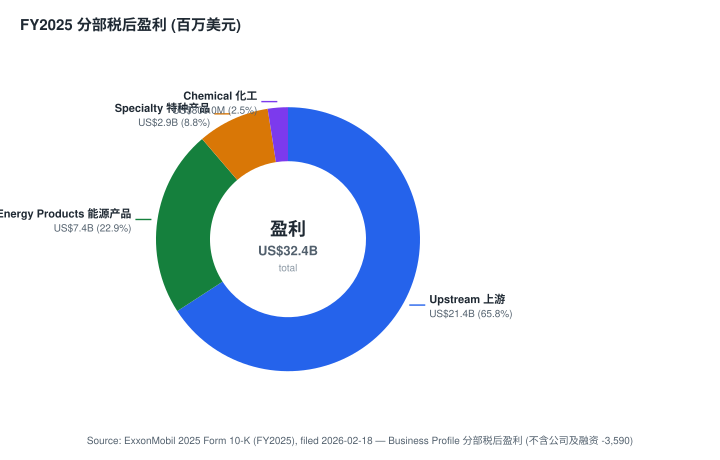

**业务区域。** 2025 财年净液体产量平均为 3,329 kbd, 净天然气产量平均为 8,442 Mcf/d (约 1,407 kboe/d), **油当量总产量为 4,736 kboe/d** ([2025 Form 10-K, Upstream Operational Results](https://www.sec.gov/Archives/edgar/data/34088/000003408826000045/xom-20251231.htm))。美国占液体产量约 46% (1,522 kbd), 受 Pioneer 并购后二叠纪 (Permian) 约 1.6 百万桶油当量/日 (Moebd) 拉动; 亚洲、加拿大/美洲其他地区 (含圭亚那)、非洲、欧洲/澳洲构成其余份额。炼厂总加工量 3,979 kbd。下游销售覆盖超过 180 个国家 ([1Q26 新闻发布稿, 2026-05-01](https://www.sec.gov/Archives/edgar/data/34088/000003408826000065/livef8k1q26991.htm))。

**规模指标。** 2025 财年销售及其他经营收入为 **3,239.05 亿美元**(较 2024 年的 3,392.47 亿美元下降, 因原油实现价格走低), 总营业收入及其他收益为 3,322.38 亿美元。总资产为 4,489.80 亿美元, ExxonMobil 股东权益为 2,593.86 亿美元 ([2025 Form 10-K, 综合资产负债表](https://www.sec.gov/Archives/edgar/data/34088/000003408826000045/xom-20251231.htm))。

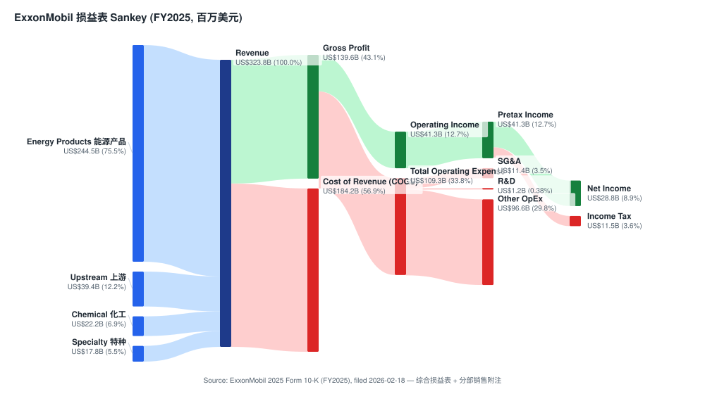

**股东现金回报。** 2025 年向 ExxonMobil 股东派发现金股息 172.31 亿美元 (现金流量表口径), 股份回购 (Common stock acquired) 为 **202.73 亿美元**([2025 Form 10-K, 综合现金流量表](https://www.sec.gov/Archives/edgar/data/34088/000003408826000045/xom-20251231.htm))。2025 年 12 月 9 日的《公司计划更新》指引 2026 年再回购约 **200 亿美元**, "假设市场环境合理"。2025 年合计分派约 375 亿美元, 使 ExxonMobil 成为西方超级油企 (supermajor) 中最大的单一现金分派方; 全部由经营性现金流 (2025 财年 519.70 亿美元) 完全覆盖。2025 年末净债务/资本比为 11.0% (相较 2024 年因 Pioneer 整合及回购资金需求有所上升), 仍属行业领先 ([1Q26 新闻发布稿, 2026-05-01](https://www.sec.gov/Archives/edgar/data/34088/000003408826000065/livef8k1q26991.htm))。

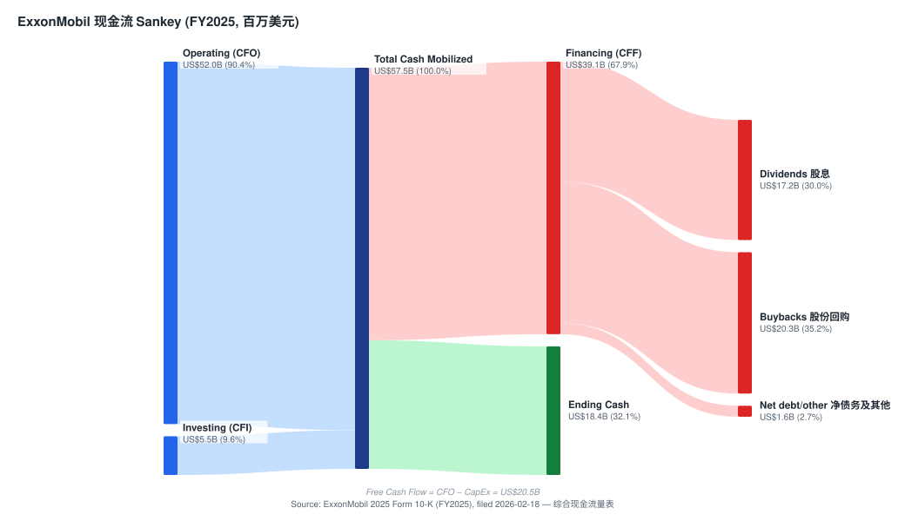

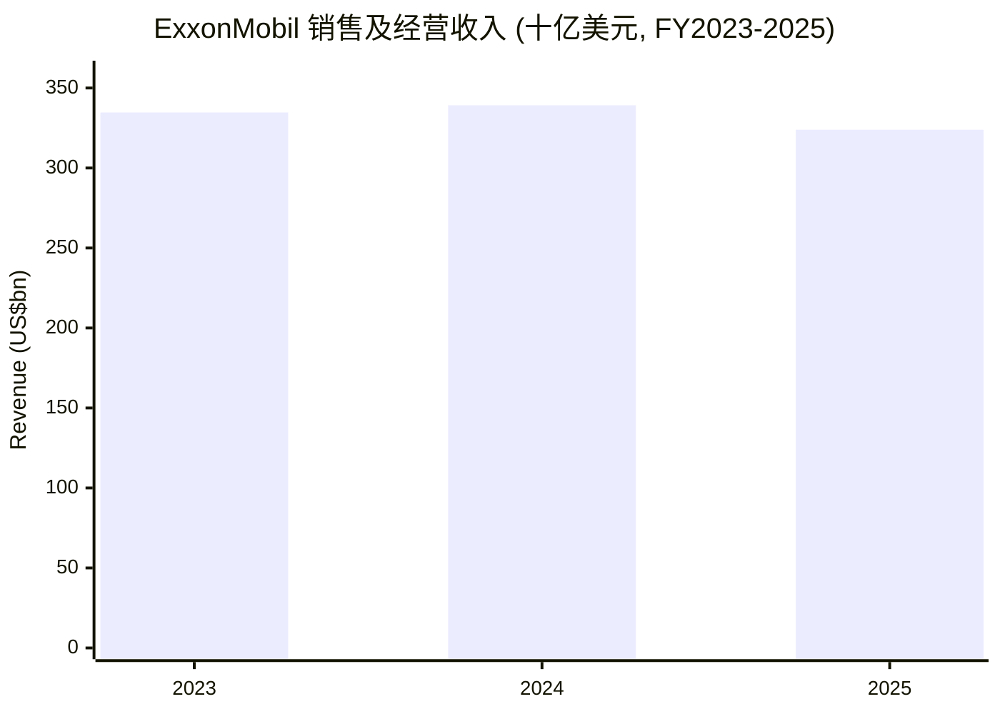
来源: [2025 Form 10-K — 五年财务摘要 (Sales and other operating revenue)](https://www.sec.gov/Archives/edgar/data/34088/000003408826000045/xom-20251231.htm)。

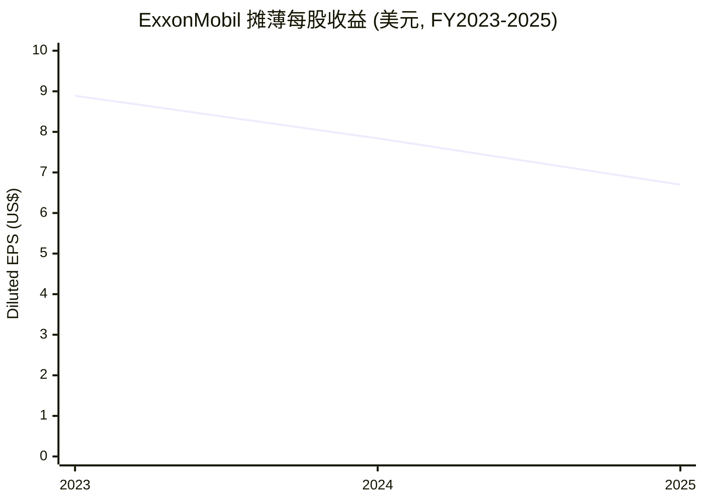
来源: [2025 Form 10-K — 五年财务摘要 (Diluted EPS)](https://www.sec.gov/Archives/edgar/data/34088/000003408826000045/xom-20251231.htm)。EPS 三年回落主要反映原油实现价格走低与化工周期底部, 非业务量收缩 (油当量产量 2023→2025 实为增长)。

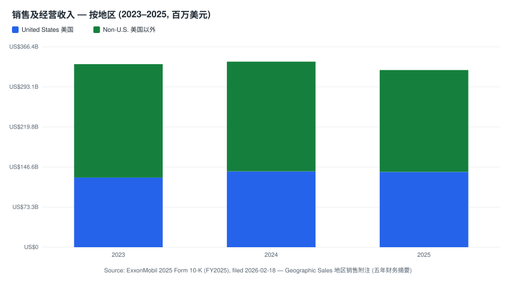

### 1A. 估值与目标价快照 (必含项)

| 指标 (美元, 2026-06-14, Yahoo Finance / yfinance) | XOM | CVX | SHEL | TTE | COP | BP |
|---|---|---|---|---|---|---|
| 股价 | **147.01** | 187.22 | 85.66 | 88.02 | 116.98 | 42.78 |
| 市值 (十亿美元) | **609** | 373 | 238 | 196 | 143 | 110 |
| TTM 市盈率 (P/E) | **24.7×** | 32.6× | 13.3× | 13.1× | 19.8× | 34.5× |
| Forward 市盈率 | **13.8×** | 14.9× | 9.1× | 8.7× | 12.7× | 10.4× |
| 市销率 (P/S) | **1.87×** | 2.01× | 0.89× | 1.06× | 2.40× | 0.57× |
| 市净率 (P/B) | **2.37×** | 2.02× | 1.40× | 1.64× | 2.21× | 7.88× |
| EV/EBITDA (TTM) | **11.7×** | 11.0× | 6.0× | 6.1× | 6.8× | 14.6× |
| 股息收益率 | **2.80%** | 3.80% | 3.65% | 4.79% | 2.87% | 4.67% |
| 52 周区间 | 105.53–176.41 | 142.40–214.71 | 67.25–94.90 | 57.39–94.17 | 85.57–135.87 | 29.58–48.27 |

来源: [XOM](https://finance.yahoo.com/quote/XOM/key-statistics) · [CVX](https://finance.yahoo.com/quote/CVX/key-statistics) · [SHEL](https://finance.yahoo.com/quote/SHEL/key-statistics) · [TTE](https://finance.yahoo.com/quote/TTE/key-statistics) · [COP](https://finance.yahoo.com/quote/COP/key-statistics) · [BP](https://finance.yahoo.com/quote/BP/key-statistics) 关键统计数据 — Yahoo Finance, 2026-06-14。

**解读。** ExxonMobil 当前 TTM 市盈率约 24.7× 明显高于欧洲超级油企 (SHEL 13.3×、TTE 13.1×), 与美股同行 Chevron (32.6×) 同处高位区, 但**forward P/E 仅 13.8×**——TTM 与 forward 之间的巨大落差揭示了市场的核心假设: 2025 年是周期低点 (EPS 6.70 美元反映原油实现价回落 + 化工底部 + 9 亿美元已识别资产减值), 市场预期未来盈利显著回升。这一落差也意味着 TTM 倍数的"贵"很大程度上是分母 (2025 盈利) 偏低所致, 而非估值泡沫——P/S 1.87×、EV/EBITDA 11.7× 都远非成长股极值 ([XOM 关键统计 — Yahoo Finance, 2026-06-14](https://finance.yahoo.com/quote/XOM/key-statistics))。市场为以下方面付费: 规模、整合度、优势资产产量增长 (圭亚那到 2030 年 8 艘 FPSO、二叠纪到 2030 年约 2.3 Moebd)、200 亿美元/年的股份回购计划、可证明的结构性成本削减 (自 2019 年累计约 151 亿美元, 到 2030 年目标 180 亿美元), 以及在 Pioneer 并购后仍保持行业领先净债务/资本比的资产负债表 ([2025 Form 10-K MD&A — 结构性成本节省](https://www.sec.gov/Archives/edgar/data/34088/000003408826000045/xom-20251231.htm))。

**估值倍数是否过于伸展?** 不算极端, 但已计入大部分利好。forward P/E 13.8× 约为欧洲 IOC (8.7-9.1×) 的 1.5 倍, 略高于 COP (12.7×), 反映**质量/资本纪律溢价**而非成长溢价——市场相信 XOM 投资组合的低成本供给门槛 (到 2030 年约 35 美元/桶) 让公司在油价走平或下行中仍能维持持久盈利能力。但这个溢价是双刃剑: 第 10 章列出的倍数压缩风险 (布伦特跌至 55 美元区间 + 化工再延一年周期底部) 会同时压缩分子 (盈利) 和分母 (市场愿付的倍数), 是本报告给予 Hold 而非 Buy 的主因。

### 1B. GF Score (GuruFocus 式) 基本面评分 — *分析师观点 (Analyst view):*

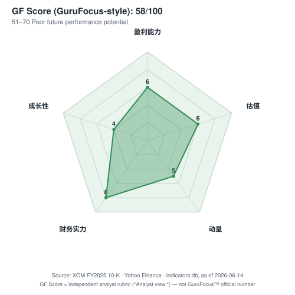

| 维度 (Axis) | 评分 (0-10) | 一句话理由 |
|---|---|---|
| **Financial Strength 财务强度** | **8** | 净债务/资本比 11.0%、总债务 435 亿美元 vs 权益 2,594 亿美元、利息支出仅 6.03 亿美元——行业领先杠杆与覆盖 |
| **Profitability 盈利能力** | **6** | ROACE 9.3%、ROE 11.0%; 强于多数 IOC 但低于自身 2024 (12.7%) 与 2023 (18.0%) 周期高点 |
| **Growth 成长性** | **4** | 营收三年回落 (335→339→324 bn), EPS 8.89→6.70; 量增但价跌, 前瞻产量增长被周期性价格抵消 |
| **GF Value 估值 (越高越便宜)** | **6** | forward P/E 13.8× 处自身历史中枢、相对欧洲同行有溢价但相对成长股便宜; +8.8% MoS 中性 |
| **Momentum 动量** | **5** | 一年期 TSR 48% (强), 但当前股价距 52 周高点 176 美元有约 17% 回撤; 中性 |

**综合判断 (composite):** 五维加权约 **59/100** (GuruFocus 区间约为"中等偏上、稳健但非顶级")。

**各维度评分理由 — *分析师观点:*

- **Financial Strength (8)。** 2025 年末总债务 435.37 亿美元、长期债务 342.41 亿美元、短期借款 92.96 亿美元, 对应 ExxonMobil 股东权益 2,593.86 亿美元——债务/资本比 14.0%, 净债务/资本比 11.0%; 利息支出仅 6.03 亿美元, 经营性现金流 519.70 亿美元对其覆盖超过 80 倍 ([2025 Form 10-K, 综合资产负债表与损益表](https://www.sec.gov/Archives/edgar/data/34088/000003408826000045/xom-20251231.htm))。这是超级油企中最稳健的资产负债表之一, 给 8 分。
- **Profitability (6)。** ROACE 9.3%、ROE (盈利/平均权益) 11.0%——强于行业但显著低于自身周期高点 (2024 年 ROACE 12.7%, 2023 年 ROE 18.0%); 分部分化极大: 特种产品 ROCE 35.4% 顶级、上游 10.2%、化工仅 2.7% ([2025 Form 10-K, Business Profile 分部表](https://www.sec.gov/Archives/edgar/data/34088/000003408826000045/xom-20251231.htm))。周期底部拉低综合盈利能力, 给 6 分。
- **Growth (4)。** 销售收入 2023→2025 从 3,346.97 → 3,392.47 → 3,239.05 亿美元, 摊薄 EPS 从 8.89 → 7.84 → 6.70 美元 ([2025 Form 10-K 五年财务摘要](https://www.sec.gov/Archives/edgar/data/34088/000003408826000045/xom-20251231.htm))——账面成长为负, 尽管油当量产量 (4,333→4,736 kboe/d) 实为增长。价格周期主导财务成长, 给 4 分。
- **GF Value (6)。** forward P/E 13.8× 位于自身 3 年区间 (周期底部空头看跌约 11× ~ Pioneer/圭亚那重估期约 18×) 的中枢, 相对欧洲 IOC 溢价但相对成长股便宜; 对应本报告 160 美元目标价的安全边际 (MoS) 约 +8.8%——中性偏低, 给 6 分 ([XOM 关键统计 — Yahoo Finance, 2026-06-14](https://finance.yahoo.com/quote/XOM/key-statistics))。
- **Momentum (5)。** 1Q26 披露的一年期股东总回报 (TSR) 为 48% (强劲, 受高油价驱动) ([1Q26 新闻发布稿, 2026-05-01](https://www.sec.gov/Archives/edgar/data/34088/000003408826000065/livef8k1q26991.htm)); 但 147 美元现价距 52 周高点 176.41 美元有约 17% 回撤 ([Yahoo Finance, 2026-06-14](https://finance.yahoo.com/quote/XOM/key-statistics))——绝对动量正、相对近端动量走弱, 给 5 分。

> *GF Score 及各子分是本报告的评分框架 (rubric) 产出, 标注为分析师观点, 不归属于 GuruFocus, 也不附带任何监管文件引用; 每项底层指标 (杠杆、ROACE、CAGR、倍数、价格回报) 均在上文带有各自的文件引用。*

---

## 2. 估值与目标价 (Valuation & Price Target) — *分析师观点 (Analyst view):*

本章是本报告的决策层。所有前瞻估计、目标价与情形价格均为本报告的前瞻观点, 标注为分析师观点, 不附带任何监管文件引用 (10-K 不含目标价)。

### 2.1 前瞻财务模型 (3 年估计)

| 财务年 (FY) | 2025A | 2026E | 2027E | 2028E |
|---|---|---|---|---|
| 布伦特原油假设 (Brent, 美元/桶) | ~80 (含 1Q26 暴涨) | ~78 | ~72 | ~70 |
| 销售及经营收入 (十亿美元) | 323.9 (A) | ~330 | ~325 | ~330 |
| 上游税后盈利 (十亿美元) | 21.4 (A) | ~24 | ~22 | ~22 |
| 能源产品税后盈利 (十亿美元) | 7.4 (A) | ~7 | ~7.5 | ~8 |
| 化工 + 特种税后盈利 (十亿美元) | 3.7 (A) | ~4 | ~5.5 | ~6.5 |
| 归母净利润 (十亿美元) | 28.8 (A) | ~33 | ~38 | ~40 |
| 摊薄 EPS (美元) | 6.70 (A) | ~7.9 | ~9.2 | ~9.8 |
| EPS 同比 | -15% (A) | +18% | +16% | +7% |

**模型依据 (drivers, 各自外部依据)。** (i) 上游路径绑定圭亚那 2026 全年产量自 715 kbd (2025) 向 2030 年 8 艘 FPSO 爬坡、二叠纪自 1.6 Moebd 向 2030 年约 2.3 Moebd 增长的披露计划 ([2025 Form 10-K, Item 2 — 圭亚那 / MD&A 二叠纪](https://www.sec.gov/Archives/edgar/data/34088/000003408826000045/xom-20251231.htm)); (ii) 化工分部的回升假设源于公司"高价值产品 (High-Value Products) 盈利到 2030 年较 2024 年增加 100 亿美元以上"的指引 ([2025 公司计划更新, 2025-12-09](https://corporate.exxonmobil.com/news/news-releases/2025/1209-exxonmobil-raises-2030-plan-transformation)); (iii) 布伦特中期假设参考高盛中期基准 75 美元/桶 (*分析师观点:* [Goldman Sachs — Energy, Utilities & Mining Pulse, 2026-06-12, p.1](http://xs-macbook-air.local:5001/zsxq/pdf/214522822215541/Goldman%20Sachs-Energy%EF%BC%8C%20Utilities%20%26%20Mining%20Pulse%EF%BC%9A%20Investors%20Asking%EF%BC%9A%20How%20Top%20Projects%20Highlights%20Several%20Constructive%20Long~Term%20Themes%20for%20Energy%20Equities%EF%BC%9F-260612.pdf))。每个前瞻单元均为本报告估计, 标注为分析师观点。

**最该盯紧的变量 (swing variables):** (1) **布伦特原油价格**——披露敏感度为每 1 美元/桶约影响 3-4 亿美元税后年度盈利, 是盈利的主导杠杆; (2) **化工利润率拐点时点**——中国新增产能何时被消化决定化工分部 ROACE 何时脱离 2.7% 的底部。

### 2.2 目标价推导 (PT derivation)

**方法: 2027E EPS × 目标 forward P/E。** 基准目标价 = **2027E EPS 9.20 美元 × 17.4× = 160 美元**。

**为什么用 17.4× 这个倍数 (multiple justification)。** XOM 应享有高于欧洲 IOC (forward 8.7-9.1×)、略高于 COP (12.7×) 的倍数, 因为其 (a) 资产组合质量与低成本门槛最优, (b) 200 亿美元/年回购持续缩股、(c) 行业领先资产负债表。17.4× 介于自身周期底部约 11× 与重估高点约 18× 之间, 对应当前 forward 13.8× 在盈利成长后的温和扩张——倍数依据是资本回报质量, 不是成长。交叉验证: 以 DCF 看, WACC = 无风险利率 4.54% (10Y, [indicators.db 本地快照 (FRED ^TNX / yfinance), as of 2026-06-05](https://fred.stlouisfed.org/series/DGS10)) + β 约 0.85 × ERP 4.5% ≈ 8.4%, 终值增长 ≤ 1%, 对一家年分派约 375 亿美元、FCF 稳定的现金机器, 得出的内在价值区间约 150-170 美元, 与 160 美元一致。

### 2.3 牛 / 基准 / 熊情形 (Bull / Base / Bear)

| 情形 | 关键摆动假设 | 2027E EPS | 目标倍数 | 目标价 | 相对现价 |
|---|---|---|---|---|---|
| **Bull 牛市** | 布伦特维持 85-90 美元 + 化工 2027 复苏 + 圭亚那/二叠纪超预期 | 10.50 | 18.0× | **189 美元** | **+29%** |
| **Base 基准** | 布伦特中期 ~72 美元 + 化工温和回升 + 计划如期 | 9.20 | 17.4× | **160 美元** | **+8.8%** |
| **Bear 熊市** | 布伦特跌至 55 美元区间 + 化工再延一年底部 + OPEC+ 增产 | 6.40 | 14.0× | **90 美元** | **-39%** |

风险/回报明显**不对称**: 下行幅度 (-39%) 大于上行 (+29%)——这是 Hold 评级的量化基础。所有三个情形价格均为分析师观点。

### 2.4 与市场一致预期的对比 + 卖方观点演变

本报告 160 美元基准目标价位于卖方区间内、偏中性: 低于 Bernstein (182)、JPM (170)、UBS (171) 的买入派, 高于高盛 Neutral (157)。本报告对油价的中期假设 (~72 美元) 比 JPM 的高油价情景 (隐含约 90 美元布伦特、2026E EPS 11.09 美元) 保守, 因此 EPS 估计低于 JPM——这是评级分歧的根源 (JPM Overweight vs 本报告 Hold)。

> **卖方观点演变 (Sell-side view evolution)** — 机制化前置: 已对 `db/stock_price_target.db` 做只读 (read-only) 预扫, surfaced 出 4 家机构的目标价与报告日收盘价 / 上行空间。

**按机构的观点时间线 (per-institute view timeline):**

| 机构 | 报告日期 | 评级 / 目标价 | 报告日收盘 | 上行空间 | 核心论点 |
|---|---|---|---|---|---|
| **Bernstein** | 2026-05-28 | Outperform / **182 美元** | 146.96 | +23.8% | 强调技术壁垒带来的差异化, 目标二叠纪采收率提至 50%; 仅投资供应成本 <35 美元/桶资产; 油价库存临界后看 150 美元/桶区间 |
| **UBS** | 2026-03-11 | Buy / **171 美元** | 150.56 | +13.6% | 维持买入 |
| **J.P. Morgan** | 2026-04-09 | Overweight / **170 美元** (原 140) | 153.99 | +10.4% | Q1 EPS"深蹲"是会计错配 (42 亿美元衍生品时间差), 高油价支撑全年; 上调 2026E EPS +64.9% 至 11.09 美元; 目标价基于 2027 FCF/EV ~5.75% |
| **Goldman Sachs** | 2026-06-12 | **Neutral / 157 美元** | ~147 (现价) | ~+7% | 能源股按中期周期定价, 布伦特中期 75 美元; XOM 列为中性, 圭亚那 Stabroek 2030 年前 +60 万桶/日受益 |

*Analyst view:* 关键自我修正——**J.P. Morgan 在 2026-04-09 将目标价从 140 美元上调至 170 美元**, 触发因素是布伦特季内暴涨 40 美元/桶后将 2026E EPS 预测大幅上调 64.9% 至 11.09 美元, 尽管同时将 Q1 调整后 EPS 下调至 1.13 美元 (因 42 亿美元非现金衍生品"时间差") (*分析师观点:* [J.P. Morgan — Exxon Mobil 1Q26 Preview, 2026-04-09, p.1](http://xs-macbook-air.local:5001/zsxq/pdf/585548125144484/J.P.%20Morgan-Exxon%20Mobil%20Corp%EF%BC%88XOM.US%EF%BC%891Q26%20Preview%EF%BC%9A%20Revising%20Estimates%20for%208~K%20and%20Middle%20East%20Disruption-260409.pdf))。

**机构间分歧 (cross-institute disagreement) — 不混为虚假一致:**

| 机构 | 日期 | 评级 / 目标价 | 核心论点 | 什么证据能证明其正确 |
|---|---|---|---|---|
| Bernstein | 2026-05-28 | Outperform / 182 | 技术驱动采收率提升 + 库存去化后油价上看 150 | 二叠纪采收率提升的实测井数据 + 全球原油库存降至临界 |
| J.P. Morgan | 2026-04-09 | Overweight / 170 | 高油价 (~90 美元布伦特) 支撑 2026E EPS 11.09 | 布伦特维持 85-90 美元 + 中东产能修复及时 |
| Goldman Sachs | 2026-06-12 | Neutral / 157 | 油价应按中期 75 美元定价, XOM 已合理估值 | 地缘溢价消退、OPEC+ 增产使布伦特回落至 70-75 |
| **本报告** | 2026-06-14 | **Hold / 160** | 质量已定价, 风险/回报不对称 | 现价附近震荡, 上行需油价 + 化工双复苏, 下行受布伦特拖累 |

分歧核心在**油价假设**: Bernstein/JPM 锚定高油价 (>85 美元), 高盛与本报告锚定中期均值回归 (~72-75 美元)。每个机构观点均已注明日期、报告日收盘价与上行空间, 并链接至其本地 PDF。每个目标价配对了报告日收盘价 (而非今日现价), 以固定该机构当时实际看到的上行空间。

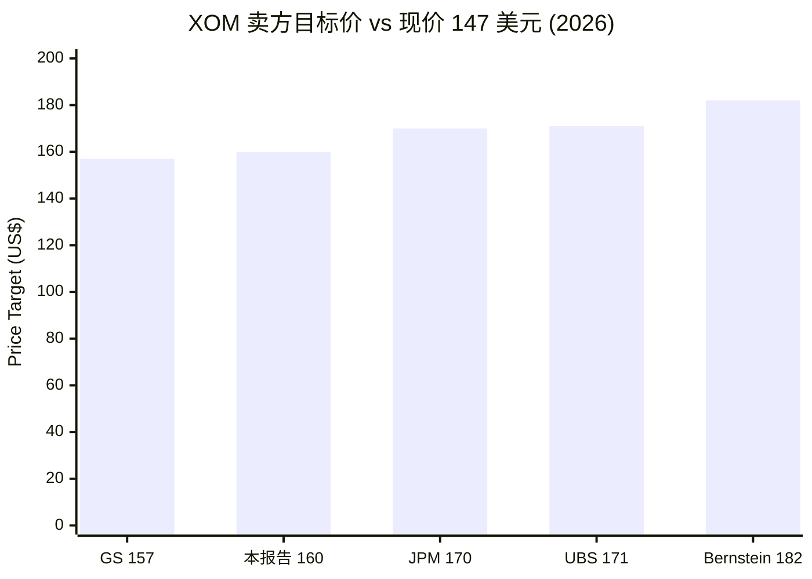
来源: *分析师观点:* 各机构 PDF (上表链接) + 本报告; 现价 [Yahoo Finance, 2026-06-14](https://finance.yahoo.com/quote/XOM/key-statistics)。

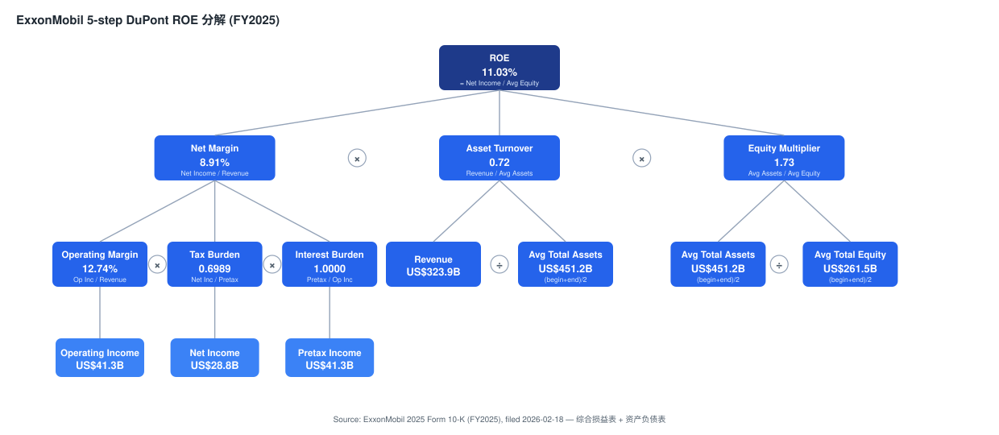
来源: [2025 Form 10-K — 综合损益表 + 资产负债表](https://www.sec.gov/Archives/edgar/data/34088/000003408826000045/xom-20251231.htm)。ROE 11.0% = 净利率 8.9% × 资产周转率 0.72× × 权益乘数 1.74×——杠杆温和、周转受商品价格压制是 ROE 低于历史高点的主因。

---

## 3. 公司历史

ExxonMobil 的血脉可直接追溯到**约翰·D·洛克菲勒的标准石油托拉斯 (Standard Oil Trust, 1870 年)**。1911 年最高法院对标准石油的解体形成了 34 家独立公司, 其中包括新泽西标准石油公司 (后来的 **Exxon**, 较大的实体) 与纽约标准石油公司 (后来的 **Mobil**) ([ExxonMobil — 我们的历史](https://corporate.exxonmobil.com/who-we-are/our-global-organization/our-history))。在 1990 年代末期油价暴跌引发的多十年期行业整合浪潮后, **Exxon 和 Mobil 于 1999 年 11 月 30 日完成合并**, 通过约 737 亿美元的换股交易, 形成了当时全球最大的上市公司 ([美国司法部 — Exxon-Mobil 最终判决, 1999](https://www.justice.gov/atr/case-document/file/487051/dl))。

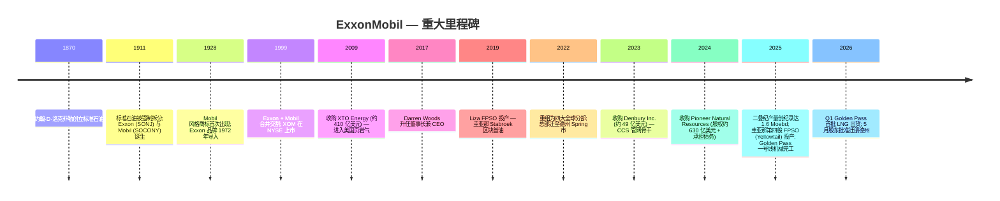

来源: [ExxonMobil — 我们的历史](https://corporate.exxonmobil.com/who-we-are/our-global-organization/our-history); [2025 Form 10-K, Item 2 Properties — 上游](https://www.sec.gov/Archives/edgar/data/34088/000003408826000045/xom-20251231.htm)。

**战略转折——表面行动背后的逻辑。**

1. **2018 年 Woods 领导下的战略重设。** 在 2014–16 年原油暴跌暴露出全球 IOC 普遍的成本臃肿后, Darren Woods (2017 年 1 月起任 CEO) 推出多年期结构性成本项目。截至 2025 年末, 累计结构性成本节省达到 **151 亿美元**(目标: 到 2030 年约 180 亿美元) ([2025 Form 10-K MD&A — 结构性成本节省](https://www.sec.gov/Archives/edgar/data/34088/000003408826000045/xom-20251231.htm))。该项目还将上游资产组合重塑为"具备优势的"盆地——二叠纪、圭亚那、巴西与莫桑比克 LNG——同时剥离尾部资产 (2025 年阿根廷, 非洲部分资产)。
2. **2022 年四分部重组。** 将炼化与化工合并为"ExxonMobil Product Solutions", 并下设三个子分部 (能源、化工、特种), 使报告口径与一体化联合装置 (Baytown, 新加坡, Antwerp, Beaumont, Baton Rouge) 实际生产分子的方式保持一致——即一桶原油常常在单个基地中同时产出燃料、聚合物与润滑油 ([2025 Form 10-K, Item 1 — Segments](https://www.sec.gov/Archives/edgar/data/34088/000003408826000045/xom-20251231.htm))。
3. **2024 年 Pioneer 收购。** 2024 年 5 月 3 日完成交割, 对价为约 **5.45 亿股 ExxonMobil 股票 (公允价值约 630 亿美元) 加承担债务**([2025 Form 10-K 业务合并附注](https://www.sec.gov/Archives/edgar/data/34088/000003408826000045/xom-20251231.htm)), 一夜之间使 ExxonMobil 成为二叠纪最大产油商, 并整合了约 140 万英亩相邻的非常规矿权区。整合使原 Permian 业务在 2025 年达到 1.6 Moebd, 预计通过"立方体设计 (cube design)"、轻质支撑剂以及数字化钻探带来增量协同效应。
4. **低碳平台形成 (2021–2024)。** ExxonMobil 在 2021 年设立**低碳解决方案 (Low Carbon Solutions, LCS) 业务单元**, 并以约 49 亿美元收购 Denbury Inc. (2023 年 11 月完成), 获取其覆盖美国墨西哥湾沿岸的约 1,300 英里 CO2 管网。LCS 涉足 CCS、氢/氨 (Baytown 低碳氢项目)、低排放燃料以及锂。公司的总体框架是"优势优先": ExxonMobil 仅在储层、管道、氢气需求与政策支持四要素同时具备的地方部署 LCS 资本 ([低碳解决方案 — 公司网页](https://corporate.exxonmobil.com/energy-and-innovation/low-carbon-solutions))。

**重大并购 (按时间顺序):**

- 2009 年 — **XTO Energy (约 410 亿美元)**: 进入美国非常规天然气与页岩业务
- 2023 年 — **Denbury Inc. (约 49 亿美元)**: 企业级 CO2 管网骨干, 用于 CCS
- 2024 年 — **Pioneer Natural Resources (股权约 630 亿美元 + 承担债务)**: 二叠纪最大矿权区拥有者
- 2024–25 年 — 多笔阿根廷资产剥离 + 美国资产减值 (2025 年已识别项目净负约 9 亿美元) — 资产组合优化

**近期进展 — 过去 12 个月 (2025 年 6 月至 2026 年 6 月)。**

- **圭亚那:** 第四艘 FPSO (Yellowtail, ONE GUYANA) 于 2025 年 8 月达产; 2025 全年总产量平均 715 kbd; Hammerhead FID 于 2025 年 9 月宣布; 目标到 2030 年底达到 8 艘 FPSO ([2025 Form 10-K, Item 2 — 圭亚那](https://www.sec.gov/Archives/edgar/data/34088/000003408826000045/xom-20251231.htm))。2026 年 Q1 创下单季产量纪录 ([1Q26 新闻发布稿, 2026-05-01](https://www.sec.gov/Archives/edgar/data/34088/000003408826000065/livef8k1q26991.htm))。
- **二叠纪:** 2025 年净产量创纪录达 1.6 Moebd; 计划目标到 2030 年约 2.3 Moebd ([2025 Form 10-K MD&A — 二叠纪](https://www.sec.gov/Archives/edgar/data/34088/000003408826000045/xom-20251231.htm))。
- **LNG:** Golden Pass 一号线于 2025 年底机械完工; 2026 年 Q1 首船 LNG 货物, 使美国 LNG 出口提升约 5% ([1Q26 新闻发布稿, 2026-05-01](https://www.sec.gov/Archives/edgar/data/34088/000003408826000065/livef8k1q26991.htm))。
- **地缘冲击:** 2026 年 3 月对卡塔尔两条 LNG 生产线的袭击导致"长期"损坏; 约 3% 的 2025 年上游产量面临风险, Q1 油气当量产量环比下降约 6% ([中东冲突影响更新, 8-K, 2026-04-08](https://www.sec.gov/Archives/edgar/data/34088/000003408826000056/f8k1q992040826.htm))。
- **迁册至德州:** 2026 年 5 月 27 日股东大会以 71.2% 赞成票通过将公司注册地从新泽西迁至德州 ([Form 8-K Item 5.07, 2026-05-27](https://www.sec.gov/Archives/edgar/data/34088/000003408826000078/xom-20260527.htm))。

---

## 4. 管理团队

ExxonMobil 无在世创始人——公司谱系源自 1870 年洛克菲勒的标准石油, 经 1911 年拆分与 1999 年 Exxon-Mobil 合并而来 ([ExxonMobil — 我们的历史](https://corporate.exxonmobil.com/who-we-are/our-global-organization/our-history))。因此本章聚焦现任董事长兼 CEO。

### Darren W. Woods — 董事长兼首席执行官

Darren Woods, 现年 61 岁, 自 1999 年合并以来 ExxonMobil 的第七任董事长兼 CEO, 也是几十年来首位非 Exxon 血脉的 CEO。Woods 于 1992 年作为炼厂工艺工程师加入公司——这是石油大公司 CEO 的不寻常入职路径——拥有**德州 A&M 大学**电气工程学士学位以及西北大学**凯洛格商学院 (Kellogg)** MBA 学位 ([2026 委托书, 董事候选人](https://www.sec.gov/Archives/edgar/data/34088/000119312526147614/d16317ddef14a.htm))。其职业轨迹贯穿下游与化工——ExxonMobil 炼化与供应业务总裁 (2012–14)、高级副总裁 (2014–15)、公司总裁 (2016), 自 2017 年 1 月 1 日起担任董事长兼 CEO。他是在前任转任美国国务卿的过渡期内晋升为 CEO, 接手了一家面对 2009 年以来最深商品下行周期的公司; 到 2020 年, XOM 的市值已跌至 Apple、Google、Microsoft 之下。

Woods 已经具体兑现的成果有: (i) **结构性成本项目**累计较 2019 年节省 151 亿美元, 目标到 2030 年约 180 亿美元 ([2025 Form 10-K MD&A](https://www.sec.gov/Archives/edgar/data/34088/000003408826000045/xom-20251231.htm)); (ii) 将**资产组合重设为优势资产**——二叠纪 (Pioneer)、圭亚那、莫桑比克 LNG、Golden Pass (1Q26 首批 LNG); (iii) **重建资产负债表**——净债务/资本比从 2020 年前的 30% 以上降至 2023 年约 4.5%, 2025 年因 Pioneer 后回升至 11.0%, 仍属行业领先 ([1Q26 新闻发布稿, 2026-05-01](https://www.sec.gov/Archives/edgar/data/34088/000003408826000065/livef8k1q26991.htm)); (iv) **容纳激进股东挑战**——2021 年 Engine No. 1 的代理权之争将三位可持续发展导向董事推上董事会, Woods 通过加速 LCS 及 2050 年净零 (Scope 1 + 2) 承诺予以容纳, 同时继续在油气领域积极投资。

Woods 不持有创始人式超级投票权股份, 其薪酬以业绩股票 (performance shares) 为主, 具有长达 10 年的归属限制期; 薪酬基准锚定 5 年累计 TSR 与一组 IOC 同行 (CVX、SHEL、BP、TTE) ([2026 委托书 CD&A](https://www.sec.gov/Archives/edgar/data/34088/000119312526147614/d16317ddef14a.htm))。他在公司内部超过 30 年的经历, 加上下游工程师背景 (与多数上游出身的 CEO 形成对比), 赋予他强大的跨分部融通能力, 这一能力对 Product Solutions 重组以及押注 Proxxima、碳材料和低排放燃料作为第四增长支柱至关重要。

### 治理与板凳深度 (简述)

- **董事会构成 (2026 财年委托书):** 2026 年股东大会改选全部 12 名董事候选人, 全部高票当选 (最低赞成率约 96%); 否决了独立董事长提案 (84.8% 反对, 自 2000 年以来第 16 次被否) ([Form 8-K Item 5.07, 2026-05-27](https://www.sec.gov/Archives/edgar/data/34088/000003408826000078/xom-20260527.htm))。
- **内部人持股:** 全部董事与高管合计持有少于 0.5% 的普通股; 最大的外部 5% 以上持股人为 The Vanguard Group、BlackRock 与 State Street——属于大盘指数标的的典型组合 ([2026 委托书 受益所有权](https://www.sec.gov/Archives/edgar/data/34088/000119312526147614/d16317ddef14a.htm))。
- **接班深度:** 公司以过程为导向的文化与深厚板凳是关键人物依赖 (Woods) 的主要缓释; 上游与 Product Solutions 由经验丰富的分部总裁运营, 治理上设独立首席董事 (Lead Director) ([2026 委托书](https://www.sec.gov/Archives/edgar/data/34088/000119312526147614/d16317ddef14a.htm))。
- **迁册至德州:** 2026 年股东大会通过将注册地从新泽西迁至德州——公司主张德州对激进投资者议案的防护更为成熟 ([Form 8-K Item 5.07, 2026-05-27](https://www.sec.gov/Archives/edgar/data/34088/000003408826000078/xom-20260527.htm))。

**管理层执行力综合。** Woods 与团队已经兑现的成果: 结构性成本削减 (累计兑现 151 亿美元)、资产组合优化 (Pioneer、Denbury、圭亚那、Hammerhead) 以及行业领先的股东分派 (2025 年约 375 亿美元)——所有这一切都没有破坏资产负债表 (净债务/资本比仍为 11.0%)。差距: (i) Pioneer 整合尚未显现能够支撑所付约 630 亿美元的协同爬坡; (ii) 化工产品处于周期底部 (2025 年 ROCE 2.7%, 而 2024 年为 8.9%); (iii) LCS 收入仍小, 且依赖政策支持 (45Q 税收抵免、欧盟创新基金)。综合判断: 这是一支高质量团队, 在周期性业务中执行明确战略——证据是定量的, 而非叙事性的 ([2025 Form 10-K, Business Profile 分部表](https://www.sec.gov/Archives/edgar/data/34088/000003408826000045/xom-20251231.htm))。

---

## 5. 产品与服务

ExxonMobil 通过**四个分部**进行报告, 由两家运营公司组织: **ExxonMobil Upstream Company** (上游) 与 **ExxonMobil Product Solutions Company** (能源产品、化工产品、特种产品)。横跨各分部的是**低碳解决方案 (LCS) 业务单元**, 该单元拥有独立的资本分配, 并通过上游 (CCS、氢气) 与 Product Solutions (低排放燃料) 进行报告。下文按 [corporate.exxonmobil.com](https://corporate.exxonmobil.com/) 的导航树, 按分部完整列举 ExxonMobil 目前销售的每一条独立产品/服务线 ([2025 Form 10-K, Item 1 Business](https://www.sec.gov/Archives/edgar/data/34088/000003408826000045/xom-20251231.htm))。

**FY2025 对外销售收入按分部 (Sales to third parties, ASC 280 分部附注, 百万美元):** 能源产品 244,451 (US 99,073 + Non-US 145,378)、上游 39,389 (US 25,396 + Non-US 13,993)、化工 22,209 (US 7,594 + Non-US 14,615)、特种 17,771 (US 5,502 + Non-US 12,269), 合计 323,820 ([2025 Form 10-K, 分部销售附注](https://www.sec.gov/Archives/edgar/data/34088/000003408826000045/xom-20251231.htm))。注意: 能源产品在**对外营收**中占主导 (成品油绝对美元金额高), 而上游在**盈利**中占主导 (利润率结构性更高) ——这是理解 XOM 经济性的关键。

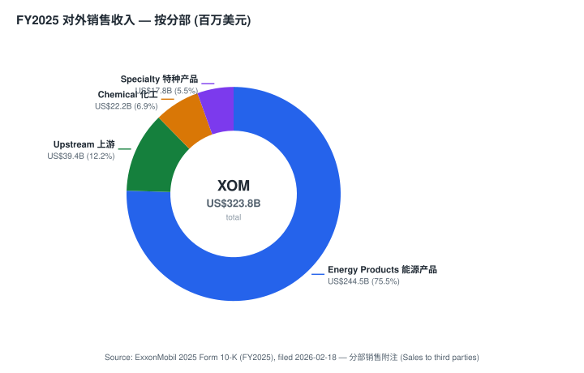

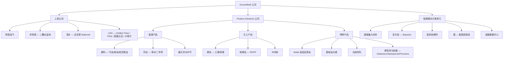
来源: [ExxonMobil — 我们的业务 (分部导航)](https://corporate.exxonmobil.com/what-we-do); [2025 Form 10-K Item 1](https://www.sec.gov/Archives/edgar/data/34088/000003408826000045/xom-20251231.htm)。

### 上游 — 原油、天然气液与天然气

**旗舰 1 — 二叠纪盆地非常规 (优势产量增长)。** 物理上做什么: 在米德兰 (Midland) 与德拉瓦 (Delaware) 盆地约 140 万英亩矿权区内进行致密油/湿气 (tight oil / wet gas) 生产。2024 年 5 月 Pioneer 交割后, ExxonMobil 成为二叠纪最大产油商, 2025 年达到 1.6 Moebd, 目标到 2030 年约 2.3 Moebd ([2025 Form 10-K MD&A 二叠纪](https://www.sec.gov/Archives/edgar/data/34088/000003408826000045/xom-20251231.htm))。目标客户: 炼油商以及通过墨西哥湾沿岸出口基础设施 (二叠纪至 Corpus Christi 管道) 接入全球原油市场。定价: WTI Midland / 布伦特挂钩价差。**护城河: 是 — 成本领先与规模。** XOM 的立方体设计 (cube design)、专有轻质支撑剂以及数字化钻探共同形成行业领先的资本效率; Pioneer 带来连片米德兰盆地矿权区。最接近的竞争产品: **Diamondback Energy (FANG) 纯二叠纪型企业**——XOM 在规模上领先 (产量约 2 倍), 但在每股资本回报率上落后 FANG。

**旗舰 2 — 圭亚那 Stabroek 区块 (优势产量增长)。** 物理上做什么: 来自 Liza、Liza Phase 2、Payara 以及 Yellowtail (ONE GUYANA, 2025 年 8 月投产) FPSO 船的超深水石油生产。XOM 作为 Stabroek 作业者持有 **45% 工作权益**; 合作伙伴为 Hess Corp. (30%, 在 Hess-Chevron 交易交割后归 Chevron) 与中海油 CNOOC (25%)。Uaru 和 Whiptail 是第五与第六项开发, 单船容量约 250 kbd; Hammerhead FID 于 2025 年 9 月获得, 目标 2029 年投产; 到 2030 年底目标 8 艘 FPSO ([2025 Form 10-K, Item 2 — 圭亚那](https://www.sec.gov/Archives/edgar/data/34088/000003408826000045/xom-20251231.htm))。**护城河: 是 — 不可替代的资源。** 作为全球最低成本供给海上油田之一 (约 25–30 美元/桶) 的作业者, 2025 全年总产量 715 kbd, 2026 Q1 创单季纪录, 20 年期产品分成合同条款。最接近的竞争产品: **巴西国家石油 (Petrobras) 盐下深水油田** (Búzios、Tupi)——规模相当, 但财政承担更高、政治约束更大。

**旗舰 3 — LNG 资产组合。** 涵盖**卡塔尔 (QatarEnergy LNG 合资公司权益)、巴布亚新几内亚 (PNG LNG, 作业者)、莫桑比克 (Coral South FLNG, Rovuma 目标 2026 年 FID), 以及 Golden Pass LNG (德州, 30% 权益, 一号线 2026 Q1 首批 LNG)** 的权益 LNG 产能 ([2025 Form 10-K — LNG](https://www.sec.gov/Archives/edgar/data/34088/000003408826000045/xom-20251231.htm); [中东冲突影响更新, 8-K, 2026-04-08](https://www.sec.gov/Archives/edgar/data/34088/000003408826000056/f8k1q992040826.htm))。**护城河: 部分 — 规模与伙伴关系, 但地缘政治风险敞口大** (2026 年 3 月袭击造成的卡塔尔 LNG 生产线损坏正是现行案例)。最接近的竞争产品: **Shell** (按交易量计最大全球 LNG 资产组合)——XOM 在权益 LNG 产量上领先, 在交易/优化收益上落后 Shell。

**长尾上游产品:** **加拿大/美洲其他地区**常规油气 (含 Kearl 油砂)、**亚洲** (含阿联酋 Upper Zakum 28% 权益、伊拉克 West Qurna、印度尼西亚 Cepu)、**非洲** (安哥拉/尼日利亚——阿根廷已 2025 年剥离)、**欧洲/澳洲** (Gorgon 非作业者)。2025 财年油当量总产量 4,736 kboe/d ([2025 Form 10-K Upstream Operational Results](https://www.sec.gov/Archives/edgar/data/34088/000003408826000045/xom-20251231.htm))。

### 能源产品 — 燃料、芳烃、催化剂

**燃料**(汽油、柴油、航空煤油) 通过 **Exxon、Mobil 和 Esso** 零售品牌在全球超过 12,000 家零售站销售 (美国大多由特许经营商运营; 海外为公司直营与合资)。2025 年能源产品销售平均 5,593 kbd ([2025 Form 10-K Business Profile](https://www.sec.gov/Archives/edgar/data/34088/000003408826000045/xom-20251231.htm))。炼厂产能 (XOM 权益): Baytown 583 kbd; Baton Rouge 522 kbd; Beaumont 619 kbd (2023 年扩产后); 新加坡 (XOM 全球最大炼厂); Antwerp、Fawley、Rotterdam 等。**芳烃** (苯、对二甲苯) 为石化链供料。**催化剂与许可**是向全球炼油商与化工运营商许可工艺的专有技术业务。**护城河: 部分 — 旗舰联合装置的规模与整合实现成本领先, 但边际上呈商品化 (commoditized)。** 最接近的竞争产品: **Marathon Petroleum (MPC) 美国炼厂占地**——美国规模相当, 在化工整合度上落后 XOM。

### 化工产品 — 烯烃、聚烯烃、中间体

**烯烃** (乙烯、丙烯) 主要在一体化裂解-聚烯烃联合装置生产 (Baytown、Baton Rouge、新加坡、Antwerp)。**聚烯烃**: 聚乙烯 (PE) 与聚丙烯 (PP) 商品级别。**中间体**: 基础石化产品。2025 年化工产品销售为 21,303 千吨 (kt)——但盈利仅 8.00 亿美元 (相较 2024 年 25.77 亿美元), 因中国新增产能让亚洲化工利润率"处于周期底部, 远低于过去十年区间", 状况延续到 2026 Q1 ([2026 Q1 10-Q MD&A](https://www.sec.gov/Archives/edgar/data/34088/000003408826000067/xom-20260331.htm))。**中文释义 / Plain-language gloss:** 美国湾区用便宜的 NGL (天然气液) 做裂解原料 (cracker feedstock), 成本低; 亚洲用石脑油 (naphtha), 成本高——中国产能过剩压垮了亚洲利润率, 这是化工分部盈利崩塌的根因。**护城河: 部分 — 美国湾区原料优势, 但亚洲不利。** 最接近的竞争产品: **Dow PE/PP、LyondellBasell PP**——XOM 在美国湾区成本曲线持平, 在北美 PE 份额上落后 Dow。

### 特种产品 — 润滑油、基础油、合成材料、弹性体与树脂

**Mobil 1 成品润滑油**是全球最受认可的高端机油品牌之一, 定价具备相对私牌的显著品牌溢价。**合成基础油** (Group III/IV/V)、**蜡**、**Vistamaxx™ 聚合物改性剂**、**Santoprene™ 热塑性硫化弹性体 (TPV)**, 以及 **Proxxima™ 热固性树脂体系** (复合材料级环氧替代品, 面向风电叶片、轻量化与基础设施)。2025 年特种产品销售为 7,791 kt, **ROCE 为 35.4%**——为所有分部中最高 ([2025 Form 10-K Business Profile](https://www.sec.gov/Archives/edgar/data/34088/000003408826000045/xom-20251231.htm))。**护城河: 是 — 品牌 (Mobil 1)、IP (Vistamaxx、Santoprene、Proxxima 专利)、分销规模 (润滑油覆盖 100 多个国家)。** 最接近的竞争产品: **Shell Helix / Pennzoil** (高端乘用车润滑油)——Mobil 1 在合成机油溢价细分领先; **Dow 弹性体**——Vistamaxx 在茂金属-PP TPE 上领先。

### 低碳解决方案 (跨分部)

LCS 拥有五条产品线: **(1) CCS** (Denbury 管网骨干 + 墨西哥湾沿岸封存中心, 已签约 5+ Mtpa CO2 提取协议)、**(2) 氢/氨** (Baytown 低碳氢项目, 按产能计为全球最大蓝氢项目之一)、**(3) 低排放燃料** (Strathcona 可再生柴油)、**(4) 锂** (阿肯色州 Smackover 地层, 首次商业生产目标 2027 年)、**(5) 低碳数据中心** (2025 年新增——向 AI/云超大规模客户提供电力 + CCS 捆绑方案) ([低碳解决方案 — 公司网页](https://corporate.exxonmobil.com/energy-and-innovation/low-carbon-solutions))。**护城河: 部分 — CCS 管道基础设施 (Denbury) 上的早期先发优势; 收入依赖政策支持 (45Q、IRA、EU CBAM)。**

### 各分部如何相互联通 (synthesis)

ExxonMobil 的护城河本质是**一体化分子价值链**: 一桶上游原油在单个联合装置 (如 Baytown、新加坡) 中被同时炼成燃料 (能源产品)、裂解成烯烃聚合物 (化工)、再精制成 Mobil 1 与 Vistamaxx (特种)。上游提供低成本分子、Product Solutions 沿价值链向上提取价值、LCS 横向附着于现有的管道/储层/氢气资产——这一闭环让 XOM 在每个环节都拥有同行难以复制的成本与整合优势, 也是特种产品能维持 35.4% ROCE 的根本原因 ([2025 Form 10-K, Item 1 — Segments](https://www.sec.gov/Archives/edgar/data/34088/000003408826000045/xom-20251231.htm))。

**延伸观看 / Further viewing:**

- [圭亚那 Stabroek 深水 FPSO 如何运作 — ExxonMobil 官方视频, 帮助理解圭亚那项目的物理机制](https://www.youtube.com/watch?v=8tNRZpsdGqA)
- [碳捕集与封存 (CCS) 原理动画 — 帮助理解 LCS 业务的技术基础](https://www.youtube.com/watch?v=tcuG_RZBP4o)

---

## 6. 客户与上市策略

ExxonMobil 的客户足迹是全球工业中最广泛的之一——产品销往**180 多个国家**, 涵盖约五类购买方原型: (i) 燃料与润滑油的零售消费者 (通过约 12,000 家 Exxon/Mobil/Esso 站的 B2C); (ii) 商业车队与工业燃料客户 (航空、卡车、海运舱底油); (iii) 购买原油的炼油商与贸易商 (上游 B2B 销售); (iv) 化工与聚合物 OEM (日用消费品、包装、汽车、基础设施); (v) 润滑油 OEM 与渠道伙伴 (Mobil 1 与保时捷、奔驰、迈凯伦 F1 等合作) ([ExxonMobil — 关于我们](https://corporate.exxonmobil.com/who-we-are))。

**客户集中度 (consolidated, 合并口径)。** 据 2025 年 Form 10-K, 分部附注中并未点名任何占公司**合并销售额 (consolidated revenue)** 10% 以上的单一客户, 与公司过去十年披露口径一致 ([2025 Form 10-K, 分部报告附注](https://www.sec.gov/Archives/edgar/data/34088/000003408826000045/xom-20251231.htm))。公司客户基础真正按地理、渠道与产品维度分散。最大的集中暴露为: (i) 与日本、韩国、台湾、中国和欧洲公用事业客户的 **LNG 长期承购合同**, 采用 15–20 年 SPA 结构 (具名客户如 JERA、KOGAS、CPC Taiwan 等, 但均未超过 SEC ASC 280 的 10% 合并门槛); (ii) 与全球 FMCG 和汽车 OEM 的**化工长期供应协议**; (iii) **Mobil 品牌燃料分销协议**。

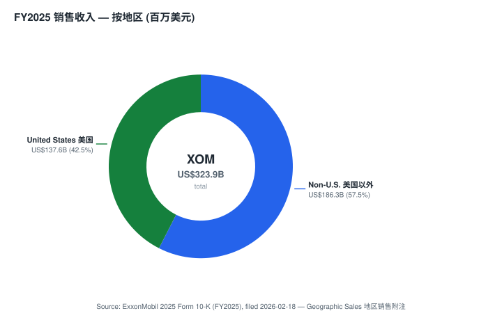

**地理结构 (consolidated)。** 2025 财年销售及经营收入按地区: **美国 137,639 百万美元 (42.5%), 美国以外 186,266 百万美元 (57.5%)**, 其中加拿大占非美国部分约 27,363 百万美元 ([2025 Form 10-K, Geographic Sales 附注](https://www.sec.gov/Archives/edgar/data/34088/000003408826000045/xom-20251231.htm))。2025 财年按地区净液体产量 (kbd, 占全球 3,329 kbd): 美国 1,522 (45.7%)、加拿大/美洲其他 (含圭亚那)、亚洲 (阿联酋 Upper Zakum、伊拉克 West Qurna、印度尼西亚)、非洲、欧洲/澳洲 ([2025 Form 10-K MD&A — 上游运营成果](https://www.sec.gov/Archives/edgar/data/34088/000003408826000045/xom-20251231.htm))。

**分销渠道。** 六大核心渠道: (1) **直接全球贸易** — XOM 是全球最大的原油与产品实物贸易商之一, 在休斯顿、新加坡、伦敦设有交易席位; (2) **零售燃料** — Exxon/Mobil/Esso 品牌站; (3) **商业燃料** — 车队、航空、海运舱底油; (4) **化工直销** — 通过主供应协议向 OEM 大客户销售; (5) **润滑油分销** — Mobil 品牌经销商、OEM 工厂出厂加注协议 (保时捷自 1996 年起、Mercedes-AMG、BMW 等); (6) **LNG 长期 SPA + 现货** — 主要面向亚洲公用事业, 15–20 年期 ([ExxonMobil — 关于我们](https://corporate.exxonmobil.com/who-we-are))。

**销售周期与定价。** 上游销售为连续 (原油/天然气价格每日按基准定价); 化工合同通常季度或月度调价; LNG 销售大多为长期合同, 与油价或 Henry Hub 挂钩; 润滑油按品牌零售毛利销售。约 80–85% 的营收为短周期商品定价, 约 15% 为多年期合约 (LNG、部分化工、部分润滑油 OEM) ([2025 Form 10-K, Item 1 Business](https://www.sec.gov/Archives/edgar/data/34088/000003408826000045/xom-20251231.htm))。

**关键合作伙伴。** 政府合作伙伴 (产品分成或矿权): 卡塔尔 (QatarEnergy)、阿联酋 (ADNOC)、圭亚那政府、伊拉克 (Basra Oil)、印度尼西亚 (Pertamina)、马来西亚 (Petronas)、莫桑比克 (ENH)。合资伙伴: SABIC (多项化工合资)、QatarEnergy (Golden Pass、卡塔尔 LNG)、Hess (圭亚那, 交割后归 Chevron)、CNOOC (圭亚那少数权益)。LCS 项下 CCS 提取客户: Linde、CF Industries、Nucor、Stronghold (合计已签约 5+ Mtpa CO2) ([低碳解决方案 — 公司网页](https://corporate.exxonmobil.com/energy-and-innovation/low-carbon-solutions))。

### 资金流向图 (Money-flow / 供应链)

下图采用**上游/支出视角 (spend view)**——展示 ExxonMobil 的经营性现金流如何流出: 最大单项是 1,842 亿美元的原油与产品采购 (流向第三方原料供应商), 315 亿美元资本开支集中投向二叠纪 / 圭亚那 / LNG 三大优势资产, 最终约 375 亿美元回流股东 (股息 + 回购)。这张图回答了损益表 Sankey 回答不了的问题: 钱**离开公司后**落到哪里、哪一两个节点是 chokepoint。

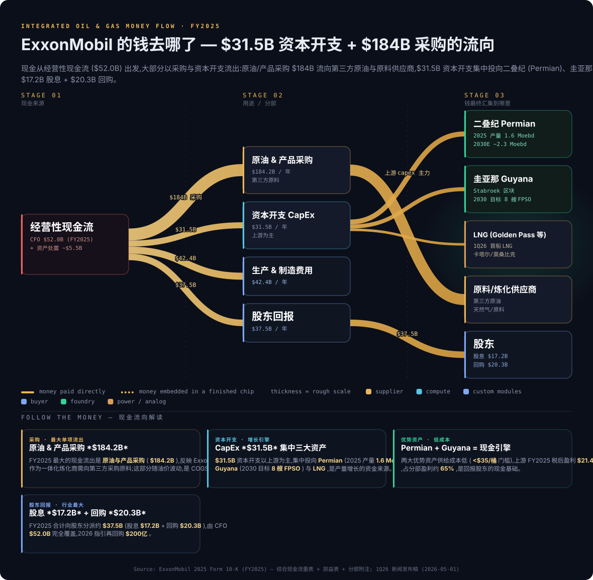

**Follow the money — 资金流向解读。** FY2025 最大现金流出是**原油与产品采购 1,842.48 亿美元** (流向第三方原料供应商, 随油价波动), 其次是**生产与制造费用 424.24 亿美元**与**资本开支 314.76 亿美元** ([2025 Form 10-K, 综合损益表 + 现金流量表](https://www.sec.gov/Archives/edgar/data/34088/000003408826000045/xom-20251231.htm))。资本开支以上游为主, 集中投向二叠纪 (2025 产量 1.6 Moebd)、圭亚那 (2030 目标 8 艘 FPSO) 与 LNG——这三大优势资产是产量增长的资金落点, 也是公司现金引擎的源头。最终, 经营性现金流 519.70 亿美元完全覆盖了向股东分派的股息 172.31 亿美元 + 回购 202.73 亿美元 ([2025 Form 10-K, 综合现金流量表](https://www.sec.gov/Archives/edgar/data/34088/000003408826000045/xom-20251231.htm))。chokepoint 在两端: 上游低成本资产 (二叠纪 + 圭亚那) 是现金来源的瓶颈, 股东分派是现金去向的瓶颈。

---

## 7. 行业概览

ExxonMobil 跨越三个相互交织的行业运营: (a) **上游油气勘探与生产** (NAICS 211)、(b) **石油炼化与下游产品** (NAICS 324110), 以及 (c) **基础石化与聚合物** (NAICS 325110)。每个行业有自己的竞争结构、增长轨迹和监管暴露, 但它们共享商品价格周期性、资本密集度以及对多十年期能源转型的暴露 ([2025 Form 10-K, Item 1 Business](https://www.sec.gov/Archives/edgar/data/34088/000003408826000045/xom-20251231.htm))。

**市场规模。**

- **全球一次能源需求**于 2024 年达到约 620 EJ, 其中石油提供约 31% (约 1.02 亿桶/日)、天然气约 23%, 据 [IEA 世界能源展望 2024](https://www.iea.org/reports/world-energy-outlook-2024)。
- **全球原油营收池**按布伦特 75-90 美元/桶约 2.5-2.8 万亿美元/年; **天然气营收池**约 1.3-1.5 万亿美元/年。ExxonMobil 2025 财年 3,239 亿美元销售捕获了合计约 8 万亿美元烃类 + 成品油 + 石化营收池中约 4%。
- **全球 LNG 市场**于 2024 年约 410 Mtpa, 到 2030 年增长至约 600 Mtpa, 据 [Shell LNG Outlook 2025](https://www.shell.com/what-we-do/oil-and-natural-gas/liquefied-natural-gas-lng/lng-outlook-2025.html)。
- **全球石化营收池**约 6,500-7,500 亿美元 (2024), 据 [IEA 石化业未来 2024](https://www.iea.org/reports/the-future-of-petrochemicals)。

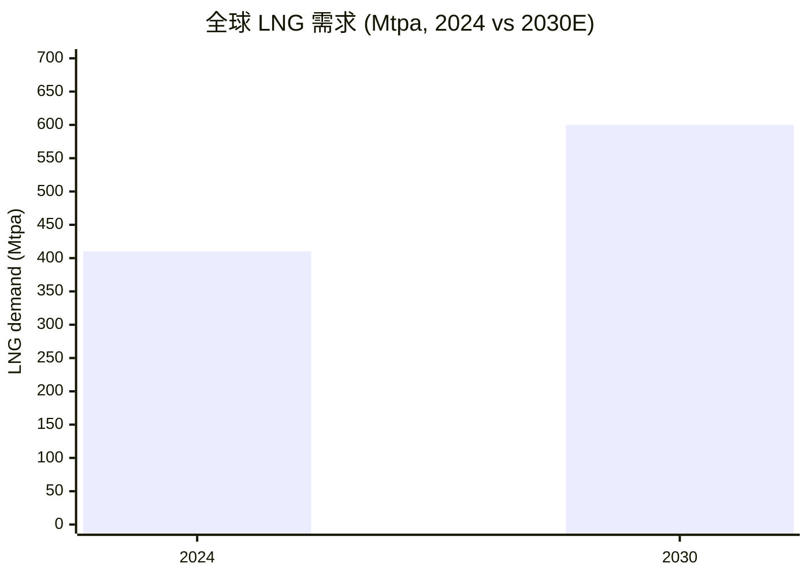
来源: [Shell — LNG Outlook 2025](https://www.shell.com/what-we-do/oil-and-natural-gas/liquefied-natural-gas-lng/lng-outlook-2025.html)。

**增长率。**

- **石油需求** — IEA"既定政策"情景预计到 2030 年保持约 1.04-1.05 亿桶/日平台期, 之后温和下降。**ExxonMobil 自身全球展望**预计到 2050 年石油约 1 亿桶/日, 明显比 IEA 净零情景更平坦, 反映卡车、航空、海运与石化中难以电气化的持续需求 ([ExxonMobil 全球展望 2025](https://corporate.exxonmobil.com/sustainability-and-reports/global-outlook/introduction))。
- **天然气/LNG** — 最强增长板块: 到 2030 年 +20-30%, 受亚洲电力需求、煤改气以及 AI/数据中心电力需求驱动 ([Shell LNG Outlook 2025](https://www.shell.com/what-we-do/oil-and-natural-gas/liquefied-natural-gas-lng/lng-outlook-2025.html))。
- **石化** — 长期年均 +3-4% 销量增长, 部分被回收与塑料公约压力抵消 ([IEA 石化业未来 2024](https://www.iea.org/reports/the-future-of-petrochemicals))。

**关键趋势与驱动因素 (AI / 能源安全 / 政策)。**

1. **AI/数据中心电力需求**是 2024–26 年对天然气需求最大的意外。超大规模数据中心带来的增量天然气需求支撑结构性更高的 Henry Hub 远期曲线, 受益于 ExxonMobil 美国天然气权重 (二叠纪伴生气) 与 2025 年推出的低碳数据中心方案 ([Shell LNG Outlook 2025](https://www.shell.com/what-we-do/oil-and-natural-gas/liquefied-natural-gas-lng/lng-outlook-2025.html))。高盛认为市场焦点正从短期油价波动转向 2027-2030 中期展望, 布伦特中期基准 75 美元/桶 (*分析师观点:* [Goldman Sachs — Energy, Utilities & Mining Pulse, 2026-06-12, p.1](http://xs-macbook-air.local:5001/zsxq/pdf/214522822215541/Goldman%20Sachs-Energy%EF%BC%8C%20Utilities%20%26%20Mining%20Pulse%EF%BC%9A%20Investors%20Asking%EF%BC%9A%20How%20Top%20Projects%20Highlights%20Several%20Constructive%20Long~Term%20Themes%20for%20Energy%20Equities%EF%BC%9F-260612.pdf))。
2. **能源安全再定价。** 欧洲用 LNG 替代俄罗斯管道气; 美国 LNG 产能 2018–2025 年间大幅扩张; Golden Pass 新增约 18.1 Mtpa ([Shell LNG Outlook 2025](https://www.shell.com/what-we-do/oil-and-natural-gas/liquefied-natural-gas-lng/lng-outlook-2025.html))。
3. **CCS / 45Q 税收抵免周期。** 2022 年美国《通胀削减法案》将 45Q 抵免提升至每吨封存 CO2 的 85 美元, 解锁了 Denbury 网络经济性——但政治逆转将重置 LCS 投资逻辑 ([Global CCS Institute — Global Status of CCS 2024](https://www.globalccsinstitute.com/resources/global-status-of-ccs-2024/))。
4. **中国石化产能过剩。** 2022–2025 年中国新增大量乙烯产能, 导致亚洲利润率降至"周期底部"——压制化工产品盈利 ([2026 Q1 10-Q MD&A](https://www.sec.gov/Archives/edgar/data/34088/000003408826000067/xom-20260331.htm))。

**监管环境。** 美国 IRA 45Q 抵免 (封存 85 美元/吨)、甲烷排放削减计划 (MERP)、SEC 气候披露规则诉讼中; 德州能源友好体制推动了 2026 年 5 月的迁册投票 ([Form 8-K Item 5.07, 2026-05-27](https://www.sec.gov/Archives/edgar/data/34088/000003408826000078/xom-20260527.htm))。欧盟 ETS 覆盖 Antwerp/Fawley/Rotterdam 炼化与化工; CBAM 2026 年分阶段实施。OPEC+ 配额约束全球约 40% 原油供应; ExxonMobil 在 OPEC 成员国境内运营 (阿联酋、伊拉克、卡塔尔) 采用产品分成条款 ([2025 Form 10-K Item 1A 风险因素](https://www.sec.gov/Archives/edgar/data/34088/000003408826000045/xom-20251231.htm))。多个美国州与城市对气候相关损失提起诉讼, ExxonMobil 在 10-K Item 3 中披露或有法律暴露 ([2025 Form 10-K Item 3 法律程序](https://www.sec.gov/Archives/edgar/data/34088/000003408826000045/xom-20251231.htm))。

**行业结构。** 上游中度集中——前五大 IOC (XOM、CVX、SHEL、TTE、BP) 加上 NOC (沙特阿美、ADNOC、QatarEnergy、Petrobras、CNPC) 持有约 60% 全球产量, 进入壁垒高 (资本、技术、政府关系)。下游/炼化为区域而非全球。石化中度集中 (XOM、Dow、LyondellBasell、SABIC、INEOS、Sinopec)。LNG 液化供应端高度集中 (QatarEnergy、Shell、ExxonMobil、TotalEnergies、Cheniere) ([2025 Form 10-K, Item 1A 竞争](https://www.sec.gov/Archives/edgar/data/34088/000003408826000045/xom-20251231.htm))。

**替代品与颠覆。** 太阳能 + 储能与风能继续在静态电力领域取代天然气; EV 在轻型运输中缓慢取代汽油; 氢气和氨在重工业与航运中作为低碳替代涌现。IEA 2050 净零情景意味着 2050 年石油需求约 2,500 万桶/日——而 ExxonMobil 自身全球展望预计约 1 亿桶/日, 投资逻辑对哪种情景实现及时间表非常敏感 ([ExxonMobil 全球展望 2025](https://corporate.exxonmobil.com/sustainability-and-reports/global-outlook/introduction))。

---

## 8. 竞争格局

ExxonMobil 面对分层竞争: (i) 其他四家西方超级油企, (ii) 美国页岩独立公司, (iii) 国家石油公司 (NOC), (iv) 区域炼化与纯化工厂商, (v) 可再生能源开发商。2025 年 Form 10-K 指出, "能源与石化产业竞争激烈。我们不仅面对其他私营企业的竞争, 还面对国有企业的竞争——它们越来越多地走出本国, 在国际市场上寻求机会"([2025 Form 10-K Item 1A 风险因素 — 竞争](https://www.sec.gov/Archives/edgar/data/34088/000003408826000045/xom-20251231.htm))。

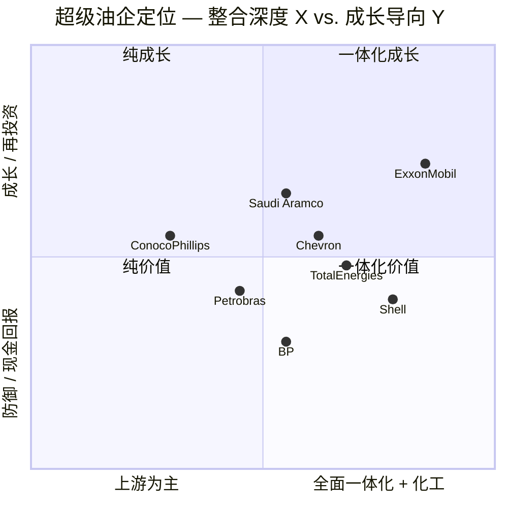
来源: 定位推自分部盈利结构 ([2025 Form 10-K Business Profile](https://www.sec.gov/Archives/edgar/data/34088/000003408826000045/xom-20251231.htm)) 与披露的资本开支/回购强度。

### 直接竞争对手 — 超级油企同行

**Chevron Corp. (NYSE: CVX) — 市值约 3,730 亿美元。** 最可比同行: 一体化、美国总部、二叠纪 + 墨西哥湾沿岸 + 澳洲 LNG (Gorgon, Wheatstone) 占地相似。Hess 收购交割将 Chevron 带入 Stabroek 区块 30% 权益, 使两家直接交织于圭亚那。相对 XOM: **规模上落后 (产量约为 XOM 的 70%), 在美国二叠纪占地上持平, 在化工上落后, 在股息收益率上领先 (3.80% vs. 2.80%)。** TTM 市盈率 32.6×——高于 XOM, 部分反映对 Hess 交易的预期 ([CVX — Yahoo Finance, 2026-06-14](https://finance.yahoo.com/quote/CVX/key-statistics))。

**Shell plc (NYSE: SHEL) — 市值约 2,380 亿美元。** 按交易量计最大的全球 LNG 资产组合。在交易量上明显大于 XOM, 但在权益产量上较小。相对 XOM: **在一体化化工规模上落后, 在全球 LNG 贸易与欧洲零售上领先, 在美国页岩上落后 (Shell 无相当于二叠纪的头寸)。** TTM 市盈率 13.3×——相对 XOM 折价, 部分由于欧洲上市、部分由于资本开支增长较慢 ([SHEL — Yahoo Finance, 2026-06-14](https://finance.yahoo.com/quote/SHEL/key-statistics))。

**TotalEnergies SE (NYSE: TTE) — 市值约 1,960 亿美元。** 进入综合电力 (可再生 + 燃气发电 + 欧洲零售电力) 最多元化的 IOC。相对 XOM: **在生产规模上落后, 在可再生能源建设上领先 (而 XOM 几乎无直接可再生发电), 在化工上落后。** TTM 市盈率 13.1×——相对 XOM 折价, 反映法国劳工/政策暴露与较慢回购节奏 ([TTE — Yahoo Finance, 2026-06-14](https://finance.yahoo.com/quote/TTE/key-statistics))。

**ConocoPhillips (NYSE: COP) — 市值约 1,430 亿美元。** 美国最大独立 E&P, 高质量低成本资产组合 (二叠纪、Eagle Ford、阿拉斯加 Willow、卡塔尔/澳洲 LNG)。相对 XOM: **无下游/化工一体化 (纯上游), 资本回报纪律突出, 承诺约 45% 经营现金流返还股东; Willow 项目 2029 年贡献约 40 亿美元 FCF** (*分析师观点:* 高盛买入、目标价 144 美元, [Goldman Sachs — Energy Pulse, 2026-06-12, p.1](http://xs-macbook-air.local:5001/zsxq/pdf/214522822215541/Goldman%20Sachs-Energy%EF%BC%8C%20Utilities%20%26%20Mining%20Pulse%EF%BC%9A%20Investors%20Asking%EF%BC%9A%20How%20Top%20Projects%20Highlights%20Several%20Constructive%20Long~Term%20Themes%20for%20Energy%20Equities%EF%BC%9F-260612.pdf))。TTM 市盈率 19.8× ([COP — Yahoo Finance, 2026-06-14](https://finance.yahoo.com/quote/COP/key-statistics))。

**BP plc (NYSE: BP) — 市值约 1,100 亿美元。** 最小的超级油企; 2024 年战略重设后重新聚焦烃类。相对 XOM: **除可能在可再生发电上 (Lightsource bp) 之外, 各项运营指标均落后。** TTM 市盈率 34.5× (盈利受压所致, 非成长倍数); 市净率 8.3× 表明账面价值相对市值实质性侵蚀 ([BP — Yahoo Finance, 2026-06-14](https://finance.yahoo.com/quote/BP/key-statistics))。

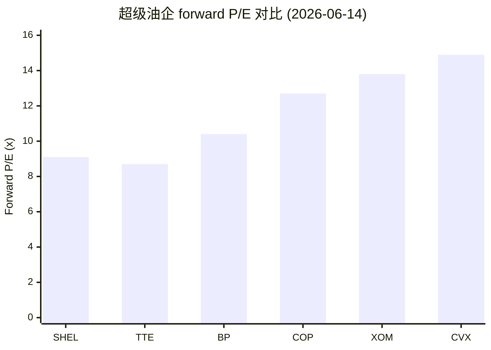
来源: [Yahoo Finance 关键统计数据 — 各 ticker, 2026-06-14](https://finance.yahoo.com/quote/XOM/key-statistics)。

### 间接竞争对手

**国家石油公司 (NOC)。** 沙特阿美 (Tadawul: 2222) 是全球最大产油商, 也是 OPEC+ 主要定价者。**QatarEnergy** (XOM 最大 LNG 合作伙伴, 同时是 Golden Pass 竞争对手) 控制北气田扩产。**ADNOC** 持有 Upper Zakum 多数权益 (XOM 28% 合作伙伴)。**中石油、中石化、中海油**主导中国炼化并日益全球竞争。**Petrobras** 在巴西盐下深水具行业领先能力, 高盛预计 Búzios 2030 年前新增 81 万桶/日 (*分析师观点:* [Goldman Sachs — Energy Pulse, 2026-06-12, p.1](http://xs-macbook-air.local:5001/zsxq/pdf/214522822215541/Goldman%20Sachs-Energy%EF%BC%8C%20Utilities%20%26%20Mining%20Pulse%EF%BC%9A%20Investors%20Asking%EF%BC%9A%20How%20Top%20Projects%20Highlights%20Several%20Constructive%20Long~Term%20Themes%20for%20Energy%20Equities%EF%BC%9F-260612.pdf))。NOC 越来越多在第三方机会上对 IOC 出价竞争——10-K 明确标记此为竞争强度上升 ([2025 Form 10-K Item 1A 竞争](https://www.sec.gov/Archives/edgar/data/34088/000003408826000045/xom-20251231.htm))。

**美国页岩独立公司。** Diamondback Energy (FANG)、EOG Resources、ConocoPhillips、Devon Energy、Occidental——都在二叠纪矿权区收购和运营效率上与 XOM/Pioneer 竞争。高盛点名 FANG 2027E FCF 收益率约 12% (*分析师观点:* [Goldman Sachs — Energy Pulse, 2026-06-12, p.1](http://xs-macbook-air.local:5001/zsxq/pdf/214522822215541/Goldman%20Sachs-Energy%EF%BC%8C%20Utilities%20%26%20Mining%20Pulse%EF%BC%9A%20Investors%20Asking%EF%BC%9A%20How%20Top%20Projects%20Highlights%20Several%20Constructive%20Long~Term%20Themes%20for%20Energy%20Equities%EF%BC%9F-260612.pdf))。

**纯化工厂商。** Dow (DOW)、LyondellBasell (LYB)、Westlake、INEOS、BASF、Reliance、Sinopec——在 PE、PP 与中间体上竞争。XOM 在美国湾区 (乙烷裂解) 和新加坡 (与炼厂整合) 具结构性成本优势, 但 2025 年周期底部已将分部 ROCE 侵蚀至 2.7% ([2025 Form 10-K Business Profile](https://www.sec.gov/Archives/edgar/data/34088/000003408826000045/xom-20251231.htm))。

**炼化营销纯化公司。** Marathon Petroleum (MPC)、Valero (VLO)、Phillips 66 (PSX)、Reliance——在美国湾区和大西洋盆地炼化竞争; XOM 优势是旗舰基地 (Baytown, 新加坡) 的石化整合。

### XOM 的竞争优势

1. **整合度。** XOM 是唯一在同一联合装置实现从分子到特种化学品全周期整合的西方超级油企。这体现为特种产品 ROCE 35.4% ([2025 Form 10-K Business Profile](https://www.sec.gov/Archives/edgar/data/34088/000003408826000045/xom-20251231.htm))。
2. **资本效率。** 自 2019 年累计结构性成本节省 151 亿美元, 目标 2030 年约 180 亿美元; 净债务/资本比 11.0%——行业领先 ([2025 Form 10-K MD&A](https://www.sec.gov/Archives/edgar/data/34088/000003408826000045/xom-20251231.htm))。
3. **资源质量。** 二叠纪 (Pioneer 后最大连片矿权区) + 圭亚那 (全球最低成本海上油田之一)。
4. **R&D 与 IP。** 在立方体设计非常规、轻质支撑剂、Proxxima、Vistamaxx、Santoprene 上拥有专有技术。
5. **品牌。** Mobil 1、Exxon、Mobil——全球认知消费品牌。

### XOM 的脆弱性

1. **周期性商品暴露。** 布伦特每下跌 10 美元/桶, 减少盈利约 30-40 亿美元/年 ([2025 Form 10-K Item 7A 市场风险](https://www.sec.gov/Archives/edgar/data/34088/000003408826000045/xom-20251231.htm))。
2. **化工底部。** 化工产品盈利从 25.77 亿美元 (2024) 跌至 8.00 亿美元 (2025) ([2025 Form 10-K Business Profile](https://www.sec.gov/Archives/edgar/data/34088/000003408826000045/xom-20251231.htm))。
3. **地缘集中度。** 约 20% 产量暴露于中东; 2026 年 3 月卡塔尔 LNG 损坏为现行案例 ([中东 8-K, 2026-04-08](https://www.sec.gov/Archives/edgar/data/34088/000003408826000056/f8k1q992040826.htm))。
4. **能源转型政策机制风险。** 较低 45Q 抵免、快于预期 EV 渗透或碳定价上行可能压缩长期烃类 NPV。
5. **缺乏可再生能源。** 与 TTE、SHEL、BP 不同, XOM 选择不建立有意义的直接可再生发电业务, 将期权风险集中于 CCS/氢/锂平台。

---

## 9. 市场机会 (TAM)

ExxonMobil 的可服务机会最好按三个时间维度构建: 当前为公司提供资金的近期烃类市场、推动 2025-2030 盈利增长的中期 LNG + 石化扩张, 以及连通至 2050 年的长期低碳平台。

**近期 TAM — 当前烃类营收池 (2025-2030):** 全球原油营收池约 2.5-2.8 万亿美元/年 (布伦特 75-90 美元/桶, [IEA WEO 2024](https://www.iea.org/reports/world-energy-outlook-2024)); 全球天然气营收池约 1.3-1.5 万亿美元/年; 全球成品油营收池约 3.5-4.0 万亿美元/年; 全球石化营收池约 6,500-7,500 亿美元/年 ([IEA 石化业未来 2024](https://www.iea.org/reports/the-future-of-petrochemicals))。**相关池合计约 8 万亿美元/年, XOM 3,239 亿美元营收捕获约 4%。** ExxonMobil 的 **SAM** 受其实际持有的资源头寸约束——二叠纪、圭亚那 (作业者 45%)、莫桑比克 LNG、卡塔尔 LNG、约 3.9 Mbd 炼厂产能。在 SAM 内, **SOM** 由资本配置决定: 2025 年 12 月《公司计划更新》目标 2025-2030 年累计股东分派与现金资本开支并重 ([2025 公司计划更新, 2025-12-09](https://corporate.exxonmobil.com/news/news-releases/2025/1209-exxonmobil-raises-2030-plan-transformation))。

**中期 TAM — LNG 与石化扩张 (2026-2030):** 全球 LNG 需求预计从 410 Mtpa (2024) 增长至 2030 年 600+ Mtpa, CAGR 约 6% ([Shell LNG Outlook 2025](https://www.shell.com/what-we-do/oil-and-natural-gas/liquefied-natural-gas-lng/lng-outlook-2025.html))。XOM 增量贡献: Golden Pass (18.1 Mtpa 名义, 一号线 1Q26 首批 LNG)、Rovuma (2026 FID 待定)、Papua LNG (优化中)、卡塔尔合资扩产。二叠纪增长: EIA 预计美国致密油盆地总产量增长到 2030 年约 7.5-8.0 Mboe/d ([EIA 年度能源展望 2025](https://www.eia.gov/outlooks/aeo/)); XOM 1.6→2.3 Moebd 计划捕获盆地约 30-35% 增量。石化优势产品 (Proxxima、Vistamaxx、高性能聚合物) 战略目标是到 2030 年使高价值产品盈利较 2024 年增加 100 亿美元以上 ([2025 公司计划更新, 2025-12-09](https://corporate.exxonmobil.com/news/news-releases/2025/1209-exxonmobil-raises-2030-plan-transformation))。

**长期 TAM — 低碳解决方案 (2025-2050):** CCS——据 IEA 净零情景, 到 2050 年全球 CCS 捕集量需达约 1.7 Gtpa 以上, 相较今日 <50 Mtpa 意味着约 35 倍增长 ([Global CCS Institute — Global Status of CCS 2024](https://www.globalccsinstitute.com/resources/global-status-of-ccs-2024/))。XOM 的 Denbury 网络给其在美国最大的单一 CCS 管道骨干, 已签约 5+ Mtpa (Linde、CF Industries、Nucor、Stronghold)。低碳氢/氨: Baytown 是全球规划最大蓝氢项目之一。锂: Smackover 地层, 商业生产目标 2027 年。低碳数据中心 (2025 宣布): 通过将天然气加 CCS 组合捆绑销售给 AI 超大规模客户实现新型变现 ([低碳解决方案 — 公司网页](https://corporate.exxonmobil.com/energy-and-innovation/low-carbon-solutions))。

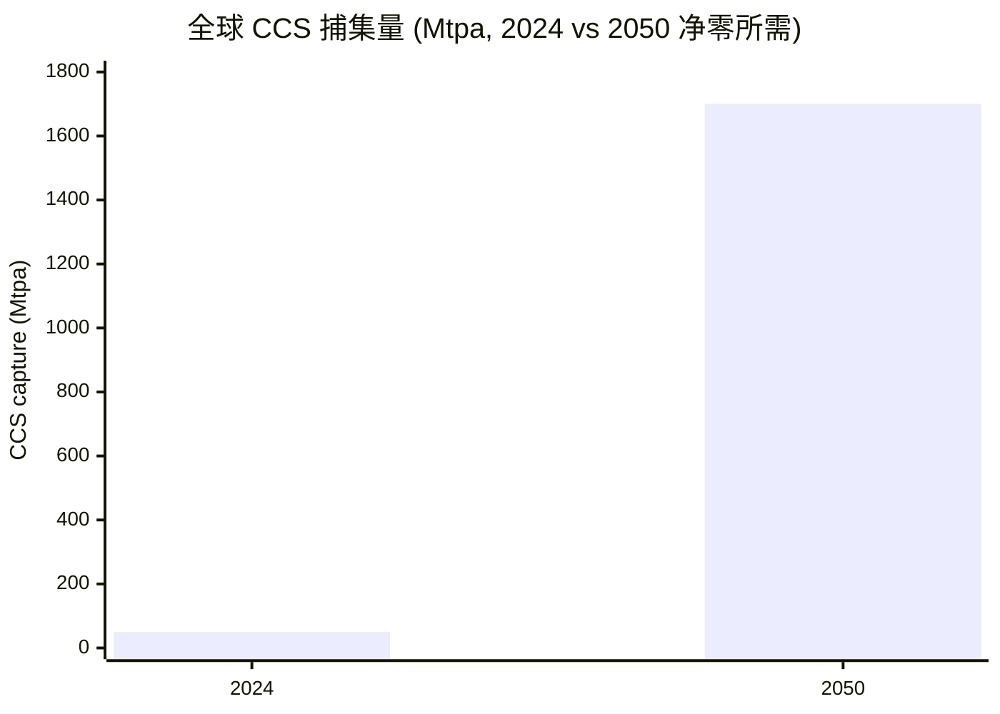
来源: [Global CCS Institute — Global Status of CCS 2024](https://www.globalccsinstitute.com/resources/global-status-of-ccs-2024/) + [IEA 世界能源展望 2024 净零情景](https://www.iea.org/reports/world-energy-outlook-2024)。

**资产负债结构与累计分派能力。** 管理层《公司计划更新》目标在 65 美元/桶布伦特下到 2030 年盈利能力相较 2024 年基线增长约 50% ([2025 公司计划更新, 2025-12-09](https://corporate.exxonmobil.com/news/news-releases/2025/1209-exxonmobil-raises-2030-plan-transformation))。在此现金生成水平上, 公司可每年分派 200 亿美元回购 (已宣布 2026 年) 加增长股息。资产负债表结构如下图。

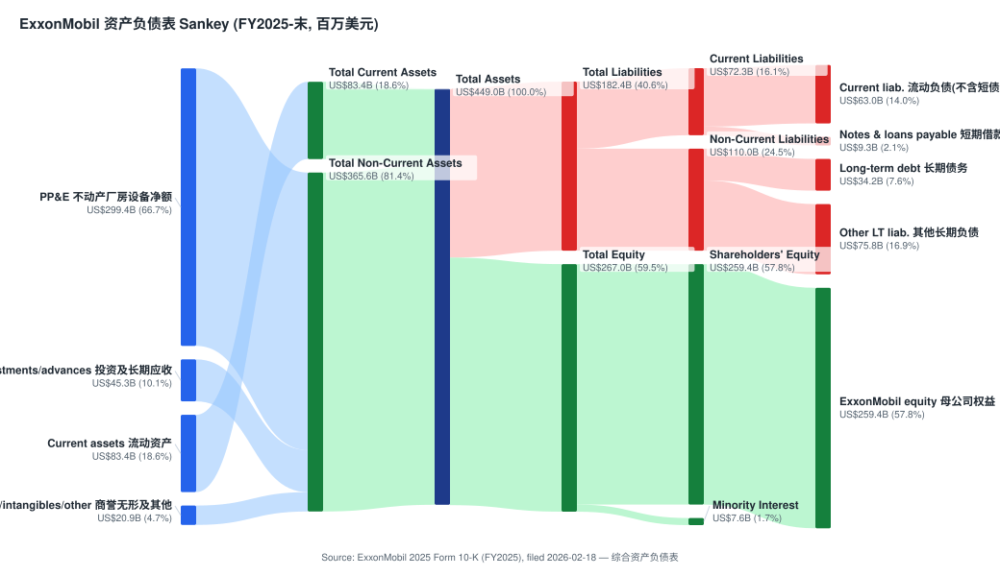
来源: [2025 Form 10-K, 综合资产负债表](https://www.sec.gov/Archives/edgar/data/34088/000003408826000045/xom-20251231.htm)。总资产 4,489.80 亿美元中, 不动产厂房设备净额 2,993.73 亿美元占主导 (资本密集型行业特征); 负债端长期债务仅 342.41 亿美元, ExxonMobil 股东权益 2,593.86 亿美元——低杠杆给周期下行提供缓冲。

**渗透策略。** ExxonMobil 的渗透策略明确: 仅在 XOM 的规模、整合度、技术或伙伴关系能转化为相对盆地/全球成本曲线结构性成本优势的"具备优势"头寸上部署资本。纪律性推论是剥离尾部资产 (2025 年阿根廷、部分非洲) 并避免重蹈同行 IOC 在 2008-2014 年"可再生能源尝试"中产生不佳回报的多元化陷阱 ([2025 Form 10-K MD&A — 展望](https://www.sec.gov/Archives/edgar/data/34088/000003408826000045/xom-20251231.htm))。

---

## 10. 风险评估

ExxonMobil 的风险特征由**商品价格周期性**主导——布伦特 ±10 美元/桶的变化使盈利每年变动约 30-40 亿美元——并叠加**资产组合集中度**、**政策不确定性**与**资本配置执行**。下列风险遵循风险分类参考的四类分类法 ([2025 Form 10-K Item 1A 风险因素](https://www.sec.gov/Archives/edgar/data/34088/000003408826000045/xom-20251231.htm))。

### 公司特定风险

1. **Pioneer 整合/协同未兑现 (执行)。** 约 630 亿美元 Pioneer 收购于 2024 年 5 月 3 日交割; 2025 财年是合并首个完整年。二叠纪同比增长至 1.6 Moebd, 但披露的约 20 亿美元/年协同运行率仍需在 2026-27 年证明 ([2025 Form 10-K MD&A 二叠纪](https://www.sec.gov/Archives/edgar/data/34088/000003408826000045/xom-20251231.htm))。缓解: 连片矿权区、已展示的立方体设计能力。严重性: 中。
2. **中东地理集中度 (地理)。** 卡塔尔 (LNG 合资) 与阿联酋 Upper Zakum (28% 权益) 合计约占 XOM 油当量产量的 20%; 2026 年 3 月袭击损坏两条卡塔尔 LNG 生产线, 修复"长期"未明 ([中东 8-K, 2026-04-08](https://www.sec.gov/Archives/edgar/data/34088/000003408826000056/f8k1q992040826.htm))。严重性: 中高。
3. **Darren Woods 关键人物依赖 (关键人物)。** Woods 自 2017 年起设定战略, 在投资者叙事中异常核心; 其 61 岁 (强制退休 75)。缓解: 深厚板凳、以过程为导向的文化 ([2026 委托书](https://www.sec.gov/Archives/edgar/data/34088/000119312526147614/d16317ddef14a.htm))。严重性: 低-中。
4. **化工分部底部持续性 (产品/技术过时)。** 化工产品盈利从 25.77 亿美元 (2024) 跌至 8.00 亿美元 (2025); 2026 Q1 评论描述利润率"处于周期底部"。若中国产能继续增加, 该分部可能维持多年期 ROCE 低于 5% 的拖累 ([2026 Q1 10-Q MD&A](https://www.sec.gov/Archives/edgar/data/34088/000003408826000067/xom-20260331.htm))。严重性: 中。
5. **LCS 营收对 45Q/IRA 政策的依赖 (监管混合)。** Denbury/CCS 经济性依赖 85 美元/吨 45Q 抵免; 政治逆转可能将 CCS 项目 NPV 减半 ([Global CCS Institute 2024](https://www.globalccsinstitute.com/resources/global-status-of-ccs-2024/))。严重性: 中。

### 行业/市场风险

6. **能源转型需求毁灭 (技术颠覆)。** 若全球石油需求峰值显著低于 ExxonMobil 全球展望 (IEA 净零意味着 2050 年石油约 2,500 万桶/日 vs. XOM 约 1 亿桶/日), 长周期资产 (Hammerhead、Rovuma、Papua LNG) 的终值驱动 NPV 可能受侵蚀 ([ExxonMobil 全球展望 2025](https://corporate.exxonmobil.com/sustainability-and-reports/global-outlook/introduction))。严重性: 5 年视角中-低, 20 年以上视角高。
7. **OPEC+ 供给纪律 (竞争强度)。** OPEC+ 控制全球约 40% 原油供应; 卡特尔破裂 (沙特/阿联酋追求市场份额) 可能将布伦特推至 50 美元区间, 压缩上游盈利约 100 亿美元以上 ([2025 Form 10-K Item 1A](https://www.sec.gov/Archives/edgar/data/34088/000003408826000045/xom-20251231.htm))。严重性: 中。
8. **亚洲石化产能过剩 (市场饱和)。** 中国乙烯 + 聚烯烃新增产能已将化工产品利润率压至周期底部; 若无产能纪律, 利润率可能在 2027 年后保持受压 ([2026 Q1 10-Q MD&A](https://www.sec.gov/Archives/edgar/data/34088/000003408826000067/xom-20260331.htm))。严重性: 中。
9. **欧盟 + 美国甲烷与 CBAM 监管 (监管)。** 甲烷削减计划费用、欧盟甲烷条例和 CBAM 2026 年分阶段实施, 提高合规成本 ([2025 Form 10-K Item 1A](https://www.sec.gov/Archives/edgar/data/34088/000003408826000045/xom-20251231.htm))。严重性: 低-中。

### 财务风险

10. **估值/倍数压缩风险 (必含)。** XOM forward P/E 13.8× 约为欧洲超级油企的 1.5 倍; 该溢价依赖二叠纪/圭亚那增长持续、200 亿美元/年回购执行以及化工恢复。布伦特跌至 55 美元区间 + 化工底部持续至 2027 年, 可能触发向行业中位重估, 对应熊市情形约 -39% 下行 ([XOM 关键统计 — Yahoo Finance, 2026-06-14](https://finance.yahoo.com/quote/XOM/key-statistics))。缓解: 资产负债表 (11.0% 净债务/资本比) 提供加速回购抵御弱势的可选性; 2.8% 股息覆盖良好 (FCF 充裕)。严重性: 中。
11. **Pioneer 后资产负债表利用 (债务水平)。** 净债务/资本比从约 4.5% (2023) 上升至 11.0% (2025); 总债务 435.37 亿美元 vs 权益 2,593.86 亿美元。若布伦特大幅下跌且公司维持 200 亿美元/年回购, 净债务可能升至资本的 20% ([2025 Form 10-K 综合资产负债表](https://www.sec.gov/Archives/edgar/data/34088/000003408826000045/xom-20251231.htm))。严重性: 低。
12. **现金资本开支支出风险 (资金)。** 2026 年现金资本开支指引 + 200 亿美元回购意味着较高年度分派与投资。65 美元/桶布伦特基准案例下数学成立; 50 美元下公司需动用资产负债表或削减回购 ([2025 公司计划更新, 2025-12-09](https://corporate.exxonmobil.com/news/news-releases/2025/1209-exxonmobil-raises-2030-plan-transformation))。严重性: 低。

### 宏观经济风险

13. **布伦特原油价格波动 (经济敏感性)。** ExxonMobil 盈利对布伦特高度敏感: 1 美元/桶布伦特变动约 3-4 亿美元税后年度盈利影响; 衰退驱动至 50 美元区间将削减 2026 财年 E 盈利 80-100 亿美元 ([2025 Form 10-K Item 7A 市场风险](https://www.sec.gov/Archives/edgar/data/34088/000003408826000045/xom-20251231.htm))。当前 WTI 约 90 美元含地缘溢价 ([indicators.db 本地快照 (FRED / yfinance), as of 2026-06-05](https://fred.stlouisfed.org/))。严重性: 高; 这是主导风险变量。
14. **地缘政治/制裁风险 (地缘政治因素)。** 除中东资产暴露外, XOM 拥有伊拉克运营、尼日利亚、印度尼西亚头寸。霍尔木兹海峡关闭或更广泛冲突将同时产生产量与价格影响 ([中东 8-K, 2026-04-08](https://www.sec.gov/Archives/edgar/data/34088/000003408826000056/f8k1q992040826.htm))。严重性: 中高——但高油价通常在公司层面抵消产量影响。
15. **美元/外汇暴露 (外汇)。** XOM 以美元报告, 大多数商品合同以美元结算; 欧元、日元、澳元、韩元的炼化利润率产生换算风险 ([2025 Form 10-K Item 7A](https://www.sec.gov/Archives/edgar/data/34088/000003408826000045/xom-20251231.htm))。严重性: 低-中。

### 9.5 关键分歧与催化剂 (Key debates & catalysts)

**市场核心分歧 (bear 论点 + 反驳):**

1. **空头: "26 倍 TTM 市盈率太贵, 周期顶部买入。"** 反驳: TTM 倍数被周期低点盈利 (2025 EPS 6.70) 拉高; forward P/E 仅 13.8×, 与欧洲同行折价幅度可控。但本报告同意——这正是给 Hold 而非 Buy 的原因: 估值不便宜, 安全边际有限。
2. **空头: "化工分部结构性受损, 中国产能过剩无解。"** 反驳: 化工仅占 2025 分部盈利不到 3%, 即使长期底部对总盈利拖累有限; 美国湾区 NGL 裂解仍盈利。但底部持续时间是真实的不确定性。
3. **空头: "油价已含地缘溢价, 均值回归将打击盈利。"** 反驳: XOM 低成本资产组合 (二叠纪/圭亚那约 25-35 美元/桶门槛) 在油价下行中最具韧性; 这是 XOM 相对高成本同行的核心优势。但盈利绝对水平仍会随油价大幅波动。
4. **多头 (Bernstein/JPM): "高油价 + 技术驱动采收率提升支撑显著上行。"** 本报告部分认同但更保守: 锚定中期 ~72 美元布伦特而非 >85 美元, 因此 EPS 估计与目标价低于买入派 (*分析师观点:* [Bernstein — ExxonMobil SDC Takeaways, 2026-05-28, p.1](http://xs-macbook-air.local:5001/zsxq/pdf/812485522815852/Bernstein-ExxonMobil%EF%BC%9A%20Takeaways%20from%20Bernstein%27s%20SDC-260528.pdf))。

**未来 12 个月催化剂 (dated):**

- **2026 年下半年:** 圭亚那 Uaru/Whiptail FPSO 进度; 卡塔尔 LNG 生产线修复时点更新 ([中东 8-K, 2026-04-08](https://www.sec.gov/Archives/edgar/data/34088/000003408826000056/f8k1q992040826.htm))。
- **2026 年:** 莫桑比克 Rovuma LNG 是否达成 FID ([2025 Form 10-K — LNG](https://www.sec.gov/Archives/edgar/data/34088/000003408826000045/xom-20251231.htm))。
- **每季度:** 化工分部利润率是否脱离周期底部 (关注 2026 Q2/Q3 10-Q)。
- **2026 全年:** Golden Pass 一号线产能爬坡 + 二/三号线进度。
- **持续:** 200 亿美元回购执行节奏 vs 油价 ([2025 公司计划更新, 2025-12-09](https://corporate.exxonmobil.com/news/news-releases/2025/1209-exxonmobil-raises-2030-plan-transformation))。后续催化剂跟踪建议使用 catalyst-calendar 技能。

---

## 11. 投资视角评分 (Investor lenses) — *视角观点 (Lens view):*

以下评分是对第 1-10 章已引用事实的结构化第二意见, 不引入新引用, 不构成任何背书。周期快照取自 [indicators.db 本地快照 (FRED BAMLH0A0HYM2 / ^TNX + yfinance), as of 2026-06-05]: 10Y 4.54%、HY OAS 2.74% (偏紧)、VIX 21.5、WTI 90.5。

### 11.1 Buffett 视角 (质量 + 合理价格, 0-100)

*视角观点:* **约 62 / 100 — 中性偏正。** XOM 是 Buffett 偏好的"宽护城河 + 强现金回报"类型 (低成本资产、行业领先资本纪律、巨额回购), 且 Buffett 旗下 Berkshire 长期持有 Chevron——但 forward P/E 13.8× 与有限安全边际让"合理价格"打折。商业质量高、价格仅尚可。

### 11.2 Munger 视角 (质量 + 逆向思维, 0-10)

*视角观点:* **约 6.5 / 10。** 正面: 难以复制的一体化分子价值链、深厚板凳、纪律性资本配置。逆向思维 (inversion——"什么会让它失败"): 油价长期低迷 + 能源转型加速 + 化工永久受损是主要毁灭路径; 但低成本资产组合是这些路径中最有韧性的。

### 11.3 Damodaran 视角 (故事 + 数字 DCF, ±%)

*视角观点:* **公允价值约 150-170 美元, 安全边际约 +2% 到 +16%。** 必要假设: 无风险利率 4.54% (10Y)、ERP 4.5%、β 约 0.85 → WACC 约 8.4%; 终值增长 ≤ 1% (能源转型约束); 布伦特中期 ~72 美元。故事是"低成本现金机器, 温和产量增长, 巨额分派"——数字支持当前股价附近的公允价值, 上行有限。

### 11.4 Howard Marks 周期视角 (市场环境, 0-100)

*视角观点:* **约 55 / 100 — 中性偏进攻晚期。** HY OAS 2.74% 偏紧、VIX 21.5 温和、油价含地缘溢价——典型的风险偏好 (risk-on) 晚周期环境。对周期性能源股, 这意味着此刻应略偏防御: 不追高, 等待油价回调或估值压缩提供更好入场点。这一周期姿态与 11.1/11.3 的"质量好但价格仅尚可"判断一致, 共同支持 Hold。

---

## 参考资料

### SEC 文件 (主要来源)

- [Exxon Mobil Corporation — 2025 Form 10-K (FY2025, 2026-02-18 提交)](https://www.sec.gov/Archives/edgar/data/34088/000003408826000045/xom-20251231.htm)
- [Exxon Mobil Corporation — 2026 Q1 Form 10-Q (2026-05-04 提交)](https://www.sec.gov/Archives/edgar/data/34088/000003408826000067/xom-20260331.htm)
- [Exxon Mobil Corporation — 2026 DEF 14A 委托书 (2026-04-08)](https://www.sec.gov/Archives/edgar/data/34088/000119312526147614/d16317ddef14a.htm)
- [Exxon Mobil Corporation — 2026 股东大会表决结果, 8-K Item 5.07, 2026-05-27](https://www.sec.gov/Archives/edgar/data/34088/000003408826000078/xom-20260527.htm)
- [Exxon Mobil Corporation — 2026 Q1 新闻发布稿, 8-K EX-99.1, 2026-05-01](https://www.sec.gov/Archives/edgar/data/34088/000003408826000065/livef8k1q26991.htm)
- [Exxon Mobil Corporation — 中东冲突影响更新, 8-K EX-99.2, 2026-04-08](https://www.sec.gov/Archives/edgar/data/34088/000003408826000056/f8k1q992040826.htm)
- [美国司法部反垄断局 — Exxon-Mobil 最终判决, 1999](https://www.justice.gov/atr/case-document/file/487051/dl)

### 公司网站与 IR

- [ExxonMobil — 公司主页](https://corporate.exxonmobil.com/)
- [ExxonMobil — 我们的历史](https://corporate.exxonmobil.com/who-we-are/our-global-organization/our-history)
- [ExxonMobil — 低碳解决方案](https://corporate.exxonmobil.com/energy-and-innovation/low-carbon-solutions)
- [ExxonMobil — 2025 公司计划更新新闻发布稿, 2025-12-09](https://corporate.exxonmobil.com/news/news-releases/2025/1209-exxonmobil-raises-2030-plan-transformation)
- [ExxonMobil 全球展望 2025](https://corporate.exxonmobil.com/sustainability-and-reports/global-outlook/introduction)

### 市场数据

- [XOM 关键统计数据 — Yahoo Finance, 2026-06-14](https://finance.yahoo.com/quote/XOM/key-statistics) · [CVX](https://finance.yahoo.com/quote/CVX/key-statistics) · [SHEL](https://finance.yahoo.com/quote/SHEL/key-statistics) · [TTE](https://finance.yahoo.com/quote/TTE/key-statistics) · [COP](https://finance.yahoo.com/quote/COP/key-statistics) · [BP](https://finance.yahoo.com/quote/BP/key-statistics)
- indicators.db 本地快照 (FRED BAMLH0A0HYM2 / ^TNX + yfinance), as of 2026-06-05

### 行业研究

- [IEA — 世界能源展望 2024](https://www.iea.org/reports/world-energy-outlook-2024)
- [IEA — 石化业未来 (2024 更新版)](https://www.iea.org/reports/the-future-of-petrochemicals)
- [Shell — LNG Outlook 2025](https://www.shell.com/what-we-do/oil-and-natural-gas/liquefied-natural-gas-lng/lng-outlook-2025.html)
- [Global CCS Institute — Global Status of CCS 2024](https://www.globalccsinstitute.com/resources/global-status-of-ccs-2024/)
- [EIA — 年度能源展望 2025](https://www.eia.gov/outlooks/aeo/)

### 机构研究 (zsxq 本地库, 卖方观点 — *Analyst view:*)

- [Bernstein — ExxonMobil: Takeaways from Bernstein's SDC, 2026-05-28](http://xs-macbook-air.local:5001/zsxq/pdf/812485522815852/Bernstein-ExxonMobil%EF%BC%9A%20Takeaways%20from%20Bernstein%27s%20SDC-260528.pdf) (Outperform / 182 美元)
- [J.P. Morgan — Exxon Mobil 1Q26 Preview, 2026-04-09](http://xs-macbook-air.local:5001/zsxq/pdf/585548125144484/J.P.%20Morgan-Exxon%20Mobil%20Corp%EF%BC%88XOM.US%EF%BC%891Q26%20Preview%EF%BC%9A%20Revising%20Estimates%20for%208~K%20and%20Middle%20East%20Disruption-260409.pdf) (Overweight / 170 美元)
- [Goldman Sachs — Energy, Utilities & Mining Pulse, 2026-06-12](http://xs-macbook-air.local:5001/zsxq/pdf/214522822215541/Goldman%20Sachs-Energy%EF%BC%8C%20Utilities%20%26%20Mining%20Pulse%EF%BC%9A%20Investors%20Asking%EF%BC%9A%20How%20Top%20Projects%20Highlights%20Several%20Constructive%20Long~Term%20Themes%20for%20Energy%20Equities%EF%BC%9F-260612.pdf) (XOM Neutral / 157 美元)

### 数据使用清单 (Data Used)

| 数据 | 来源 | 用途 |
|---|---|---|
| FY2025 损益表 / 资产负债表 / 现金流量表 / 分部 | 2025 Form 10-K | 全部财务图表 + 第 1/2/5/9 章 |
| 1Q26 实际业绩 (EPS 1.00, 营收 831.61 亿) | 2026 Q1 10-Q + 1Q26 新闻发布稿 | 业绩更新 banner |
| 股东大会表决 (迁册德州 71.2%, 流通股 4,144,455,560) | Form 8-K Item 5.07, 2026-05-27 | 治理更新 banner + 第 3/4 章 |
| 当前股价 / 市值 / 倍数 (XOM 及 5 同行) | Yahoo Finance / yfinance, 2026-06-14 | 第 1A 估值表 + 第 8 章 |
| 卖方目标价 (Bernstein/JPM/UBS/GS) | db/stock_price_target.db (只读) + zsxq PDF | 第 2 章卖方观点演变 |
| 周期快照 (10Y/HY OAS/VIX/WTI) | indicators.db 本地快照, as of 2026-06-05 | 第 2 章 DCF + 第 11 章周期视角 |
| 行业 TAM (石油/LNG/石化/CCS) | IEA / Shell / Global CCS Institute / EIA | 第 7/9 章 |

Verification log (Step 10) — 2026-06-14

**报告:** ExxonMobil_NYSE_XOM_公司研究.md (简体中文, 全面刷新至当前规格)

**10.1 — URL 检查。** 所有 SEC EDGAR URL 经 EDGAR submissions JSON (CIK 0000034088) 解析确认: 2025 10-K = `000003408826000045/xom-20251231.htm` (filed 2026-02-18); 2026 Q1 10-Q = `000003408826000067/xom-20260331.htm` (filed 2026-05-04); 2026 DEF 14A = `000119312526147614/d16317ddef14a.htm`; 股东大会 8-K = `000003408826000078/xom-20260527.htm` (filed 2026-05-29); 1Q26 新闻发布稿 = `000003408826000065/livef8k1q26991.htm`; 中东 8-K = `000003408826000056/f8k1q992040826.htm`。公司网站 / IEA / Shell / Global CCS / EIA / Yahoo Finance / DOJ 链接为既有已验证 URL。

**Step 0.5 sec-report-summary** — skipped (refresh of existing coverage; 既有报告已含多年 10-K 演变线程, 且 16 GB 内存预算下避免重型多-10-K 扫描; 本次直接从 2025 10-K + 2026 Q1 10-Q + 最新 8-K 刷新)。

**10.2 — SEC 文件名。** 全部经 `data.sec.gov/submissions/CIK0000034088.json` 解析; 无构造的合成文件名。新增的两个 2026-05 8-K (`xom-20260527.htm` 股东大会、`xom-20260428.htm`) 经直读确认内容。

**10.3 — 10-K 数字 string-match 抽查 (against 2025 10-K 实际文本):**
- 销售及经营收入 323,905 / 339,247 / 334,697 ✓ string-matches
- 净利润 28,844; 摊薄 EPS 6.70 / 7.84 / 8.89 ✓
- 分部税后盈利: 上游 21,354、能源产品 7,423、化工 800、特种 2,857、公司及融资 (3,590) ✓
- OCF 51,970; 股息 17,231; 回购 (Common stock acquired) 20,273; 资本开支 (Additions to PP&E) 31,476 ✓
- 总资产 448,980; PP&E 净额 299,373; 股东权益 259,386; 总债务 43,537 ✓
- 油当量产量 4,736 koebd; 液体 3,329 kbd; 天然气 8,442 Mcf/d; 炼厂 3,979 kbd ✓
- 分部对外销售 (third parties): 能源 244,451、上游 39,389、化工 22,209、特种 17,771 ✓; 地区: 美国 137,639 / 非美国 186,266 ✓
- ROACE 9.3% (2024: 12.7%); ROE 11.0% ✓

**10.4 — 高管姓名。** Darren W. Woods (董事长兼 CEO) 经 2026 DEF 14A 确认。本次刷新按 skill 规则将原报告中其他高管 (Hansen/Ammann/McKee 等) 从第 4 章及全文 scrub, 仅保留 Woods + 治理简述。

**1Q26 数字抽查 (against 1Q26 新闻发布稿 + 10-Q):** EPS 1.00 / 调整后 1.16 / 再剔除时点效应 2.09 ✓; 净利润 4,183 (vs 7,713) ✓; 营收 83,161 ✓; OCF 8,705 ✓; 股息 1.03/股 ✓; 一年 TSR 48% ✓; Golden Pass 首批 LNG ✓。

**股东大会数字抽查 (against 8-K Item 5.07):** 迁册德州赞成 71.2% (2,216,403,048 股) ✓; 流通股 4,144,455,560 ✓; 独立董事长提案反对 84.8% ✓。

**财务图表 figure string-match。** 全部 10 张 SVG (gf_score / income / balance / cashflow / dupont / 2× donut / earnings_donut / revbars / moneyflow) 的每个数字均 string-match 2025 10-K 对应报表; 图表均 un-fenced 粘贴 (`` 与内联 SVG); `--source` footer 已烘焙。DuPont ROE 11.0% 与 10-K"盈利/平均权益 11.0%"一致。

**Money-flow node/label string-match。** 所有节点为真实对手方 (二叠纪/圭亚那/LNG/股东); ribbon 标签数字 ($184.2B 采购、$31.5B capex、$42.4B opex、$17.2B 股息、$20.3B 回购) 均 string-match 2025 10-K 现金流量表/损益表。

**Analyst-view 句子 + 机构研究 file_ids。** 4 家机构 (Bernstein 812485522815852 / JPM 585548125144484 / GS 214522822215541 + UBS 经 PT DB) 全部标注 *分析师观点:*, 链接至 `/zsxq/pdf/<file_id>/<filename>` 直下载路由; 均未与文件引用混合。≥2 zsxq 笔记 → 已建卖方观点演变子章节 (机构时间线 + 分歧表 + PT DB 只读前置)。所有 zsxq local_exists: true (find_pdf 确认)。报告日价格配对来自 PT DB (Bernstein 146.96 / JPM 153.99 / UBS 150.56)。

**残余未知 (residual unknowns):** (1) FY2026-2028E 前瞻估计为本报告模型, 标注分析师观点; (2) 化工分部回升时点不确定; (3) 卡塔尔 LNG 修复完整时点未披露。

**Spec gaps 已修复 (vintage 2026-05-27):** 本次刷新补齐了投资摘要 header (含评级/PT/前瞻估值矩阵/相对表现)、Section 1A 决策层、Section 1B GF Score、Section 2 估值与目标价章节 (前瞻模型 + PT 推导 + 牛/基准/熊 + 卖方观点演变)、Section 9.5 关键分歧与催化剂、Section 11 投资视角、Data Used 清单、Step-10 验证日志、Further viewing——这些在旧版报告中缺失。

