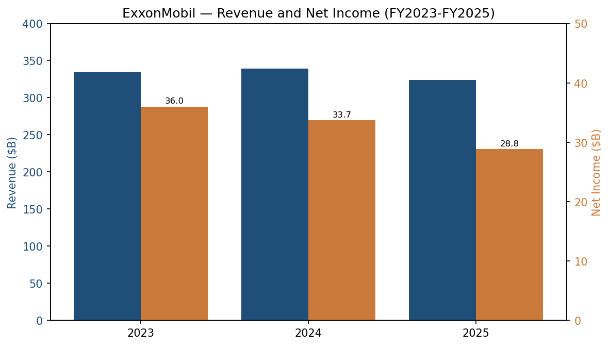
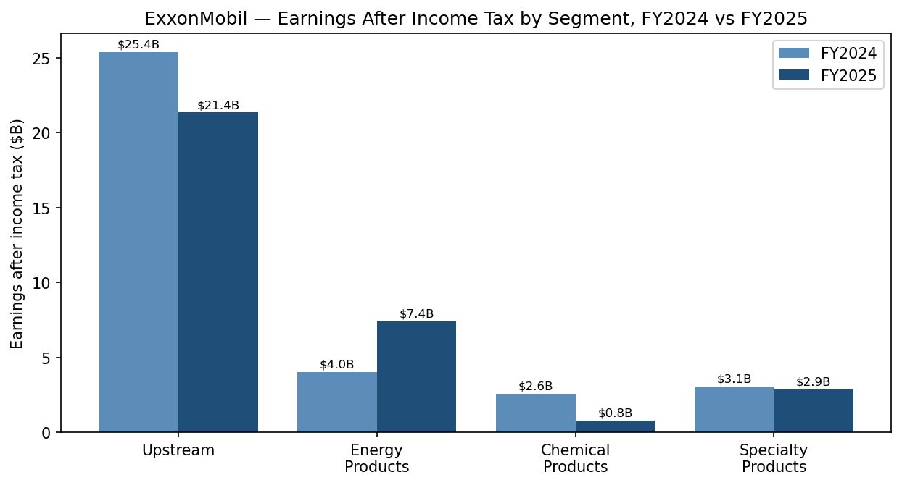
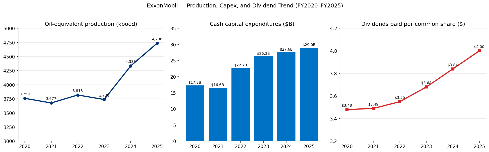
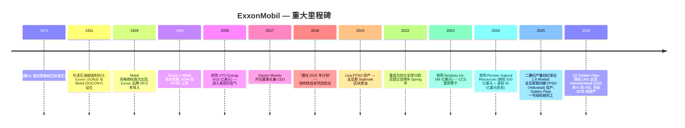
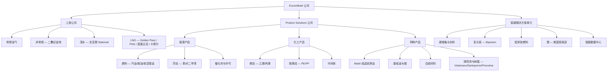
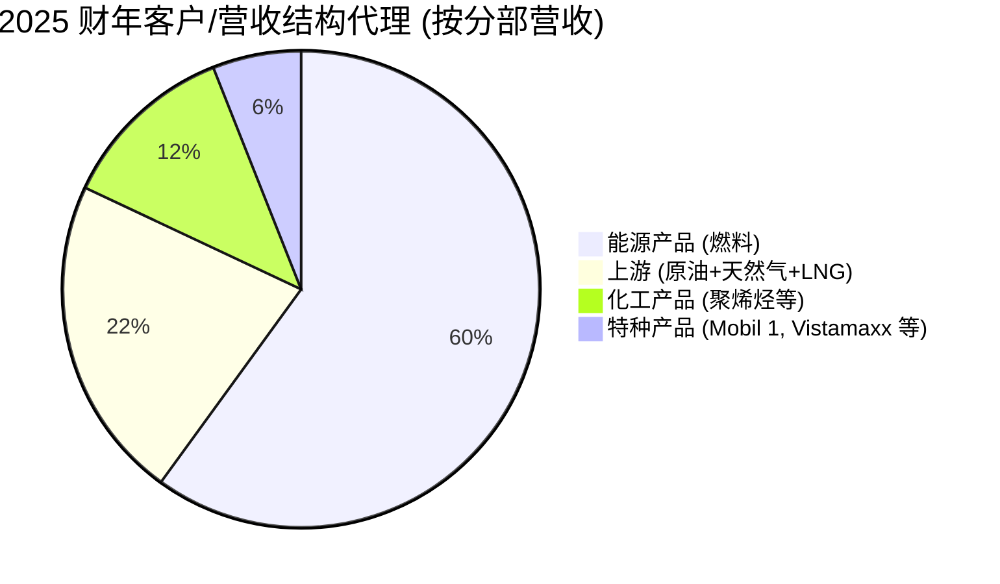
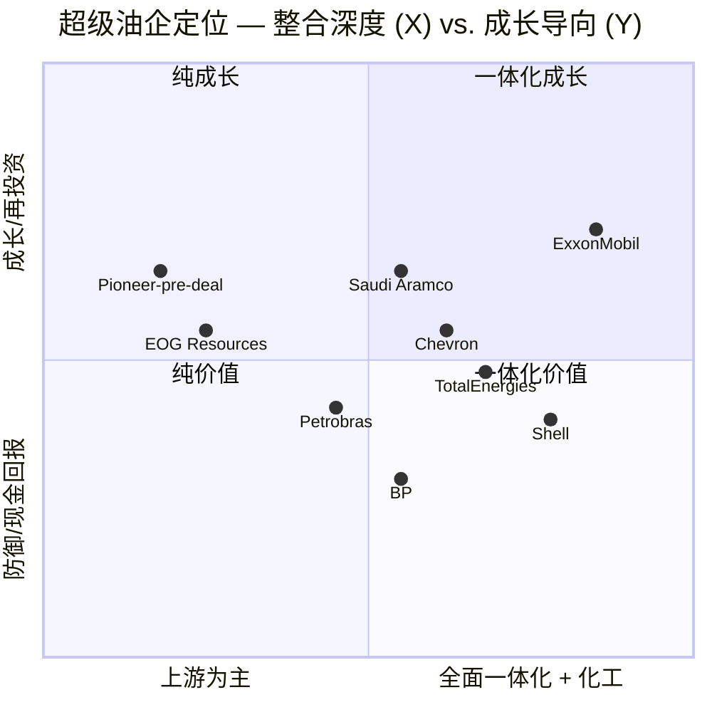
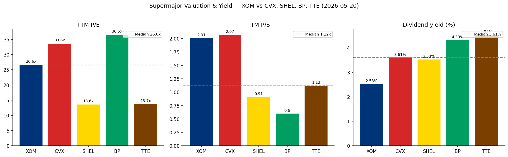

# Exxon Mobil Corporation (NYSE:XOM) — 公司研究报告

**报告日期:** 2026-05-20
**作者:** 独立股票研究
**主上市地:** 纽约证券交易所 (NYSE):XOM (普通股)
**报告语言: 简体中文 (英文版同时存在于本目录)**

> **业绩更新 — 2026 财年 Q1 业绩 (2026-05-01):** ExxonMobil 公布 GAAP 口径第一季度盈利为**42 亿美元 (每股收益 1.00 美元)**, 若**剔除已识别项目以及与衍生品按市价计价相关的 39 亿美元不利的估计时点效应, 则为 88 亿美元 (每股收益 2.09 美元)**。当季对股东的现金分派为 92 亿美元 (其中 43 亿美元股息 + 49 亿美元股份回购), 圭亚那 (Guyana) 总产量创单季纪录, 超过 900 千桶/日 (kbd), 黄金通道 LNG (Golden Pass) 一号线 (Train 1) 产出了首批液化天然气 (LNG)。管理层重申 2026 全年现金资本开支指引为**270–290 亿美元**, 并维持 2025 年 12 月《公司计划更新》中传达的 2026 年 200 亿美元股份回购目标。中东袭击导致 Q1 产量环比下降约 6%, 并损坏了卡塔尔的两条 LNG 生产线; 完整的修复时点尚未明确。来源: [1Q26 新闻发布稿, 2026-05-01](https://www.sec.gov/Archives/edgar/data/34088/000003408826000065/livef8k1q26991.htm); [中东冲突影响更新, 8-K, 2026-04-08](https://www.sec.gov/Archives/edgar/data/34088/000003408826000056/f8k1q992040826.htm)。

## 目录

1. 公司概览
2. 公司历史
3. 管理团队
4. 产品与服务
5. 客户与上市策略
6. 行业概览
7. 竞争格局
8. 市场机会 (TAM)
9. 风险评估
- 参考资料

---

## 1. 公司概览

埃克森美孚公司 ("ExxonMobil" 或 "XOM") 是美股最大的综合一体化石油天然气公司, 也是按市值衡量最具价值的西方国际石油公司 (International Oil Company, IOC)。2025 年 Form 10-K 对业务的描述非常简洁: ExxonMobil 从事"原油和天然气的勘探与生产; 原油、天然气、石油产品、石化产品及多种特种产品的制造、贸易、运输与销售; 以及对低排放及其他新业务机会的追求, 包括碳捕集与封存 (carbon capture and storage, CCS)、氢气与氨、低排放燃料、Proxxima™ 树脂体系、碳材料、低碳数据中心和锂"([2025 Form 10-K, Item 1 Business](https://www.sec.gov/Archives/edgar/data/34088/000003408826000045/xom-20251231.htm))。公司注册于**新泽西州**(2026 年委托书要求股东在 2026 年 5 月 27 日的股东大会上批准迁册至德克萨斯州), 全球总部位于德克萨斯州斯普林市 (Spring, Texas) 休斯顿地区园区。

**盈利方式。** ExxonMobil 划分为四个可报告分部 (segments), 它们均通过一条一体化价值链相互联通: **上游 (Upstream)** (原油、天然气液 (NGL) 与天然气的勘探与生产), 以及三个产品解决方案分部——**能源产品 (Energy Products)** (燃料、芳烃、催化剂与许可)、**化工产品 (Chemical Products)** (烯烃、聚烯烃与中间体), 以及**特种产品 (Specialty Products)** (成品润滑油、基础油及蜡、合成材料、弹性体与树脂)。公司历史上将上游与传统的炼化 (refining) + 化工业务并行运营; 2022 年的组织重整将下游 (downstream) 与石化整合到单一的"ExxonMobil Product Solutions Company", 进一步明确了今日采用的四分部报告口径 ([2025 Form 10-K, Item 1 Business — Segments](https://www.sec.gov/Archives/edgar/data/34088/000003408826000045/xom-20251231.htm))。

**分部经济性 (2025 财年)。** 所得税后盈利为: 上游 213.54 亿美元、能源产品 74.23 亿美元、化工产品 8.00 亿美元、特种产品 28.57 亿美元, 减去公司及融资项目 (35.90) 亿美元, 合计**288.44 亿美元**归属于 ExxonMobil 的净利润。上游贡献了分部盈利的约 65%、能源产品 23%、特种产品 9%、化工产品低于 3%——化工业务在 2025 全年处于周期底部 ([2025 Form 10-K, Business Profile 表第 29 页](https://www.sec.gov/Archives/edgar/data/34088/000003408826000045/xom-20251231.htm))。公司平均资本使用回报率 (Return on Average Capital Employed, ROACE) 为 9.3%, 平均资本使用为 3,058 亿美元, 较 2024 年的 12.7% 因原油实现价格下降而回落。

**业务区域。** 2025 财年净液体产量平均为 3,329 kbd, 净天然气产量平均为 8,442 Mcf/d (约 1,407 kboe/d), **油当量总产量为 4,736 kboe/d** ([2025 Form 10-K, Upstream Operational Results](https://www.sec.gov/Archives/edgar/data/34088/000003408826000045/xom-20251231.htm))。美国占液体产量约 46% (1,522 kbd), 受 Pioneer 并购后二叠纪 (Permian) 1.6 百万桶油当量/日 (Moebd) 拉动; 亚洲 (24%)、加拿大/美洲其他地区 (25%, 含圭亚那)、非洲 (4%)、欧洲/澳洲 (剩余部分) 构成其余份额。炼厂总加工量 3,979 kbd。公司在 50 多个国家开展运营, 下游销售覆盖超过 180 个国家 ([1Q26 新闻发布稿, 2026-05-01](https://www.sec.gov/Archives/edgar/data/34088/000003408826000065/livef8k1q26991.htm))。

**规模指标。** 2025 财年销售及其他经营收入为**3,239 亿美元**(较 2024 年的 3,392 亿美元下降, 因原油实现价格走低), 总营业收入及其他收益为 3,322 亿美元。总资产为 4,489.8 亿美元, ExxonMobil 股东权益为 2,593.9 亿美元。2025 年末公司共有**57,900 名正式员工**(约 59% 在美国境外), 拥有 8,000 余项有效专利 ([2025 Form 10-K, 五年财务摘要第 30 页](https://www.sec.gov/Archives/edgar/data/34088/000003408826000045/xom-20251231.htm))。

**股东现金回报。** 2025 年每股派发现金股息 4.00 美元, 较 2024 年的 3.84 美元和 2023 年的 3.68 美元持续上调。2025 年股份回购为**200 亿美元**, 2025 年 12 月 9 日的《公司计划更新》指引 2026 年再回购**200 亿美元**, "假设市场环境合理"([2025 Form 10-K, Item 5 第 24 页](https://www.sec.gov/Archives/edgar/data/34088/000003408826000045/xom-20251231.htm))。2025 年合计分派 368 亿美元 (168 亿美元股息 + 200 亿美元回购), 使 ExxonMobil 成为西方超级油企 (supermajor) 中最大的单一现金分派方。自由现金流/股东分派完全由经营性现金流 (2025 财年 520 亿美元) 加上小额资产处置款支撑——2025 年末净债务/资本比为 11.0% (相较 2024 年 6.5% 因 Pioneer 整合及回购资金需求有所上升)。

来源: [2025 Form 10-K 五年财务摘要](https://www.sec.gov/Archives/edgar/data/34088/000003408826000045/xom-20251231.htm)。

来源: [2025 Form 10-K Business Profile 第 29 页 — 分部所得税后盈利](https://www.sec.gov/Archives/edgar/data/34088/000003408826000045/xom-20251231.htm)。

来源: [2025 Form 10-K 上游运营成果 + 五年财务摘要](https://www.sec.gov/Archives/edgar/data/34088/000003408826000045/xom-20251231.htm); [1Q26 新闻发布稿](https://www.sec.gov/Archives/edgar/data/34088/000003408826000065/livef8k1q26991.htm)。

### 估值快照 (必含项)

| 指标 (美元, 2026-05-20 收盘, Yahoo Finance) | XOM | CVX | SHEL | BP | TTE |
|---|---|---|---|---|---|
| 股价 | 154.36 美元 | n/a | n/a | n/a | n/a |
| 市值 | 6,400 亿美元 | 3,790 亿美元 | 2,420 亿美元 | 1,160 亿美元 | 2,060 亿美元 |
| TTM 市盈率 (P/E) | **25.98×** | 33.11× | 13.55× | 36.25× | 13.73× |
| TTM 市销率 (P/S) | **1.96×** | 2.04× | 0.91× | 0.60× | 1.12× |
| 市净率 (P/B) | **2.49×** | 2.05× | 1.43× | 8.29× | 1.73× |
| EV/EBITDA (TTM) | **12.4×** | 11.2× | 11.0× | 22.0× | 6.4× |
| 股息收益率 | **2.64%** | 3.72% | 3.60% | 4.42% | 4.56% |
| 52 周区间 | 101.19 – 176.41 美元 | — | — | — | — |

来源: [XOM 关键统计数据 — Yahoo Finance, 2026-05-20](https://finance.yahoo.com/quote/XOM/key-statistics); [CVX](https://finance.yahoo.com/quote/CVX/key-statistics); [SHEL](https://finance.yahoo.com/quote/SHEL/key-statistics); [BP](https://finance.yahoo.com/quote/BP/key-statistics); [TTE](https://finance.yahoo.com/quote/TTE/key-statistics)。

**解读。** ExxonMobil 当前相较欧洲超级油企 (SHEL, TTE, BP) 估值溢价显著, 与美股同行 Chevron 处于同一水平, 在多元一体化 IOC 中拥有领先行业的 EV/EBITDA。TTM 市盈率约 26 倍——明显高于历史上石油大公司在"周期底部至周期中位"区间的 8–15 倍——但**盈利分母的质量需要审视**: 2025 财年 EPS 6.70 美元反映了 (i) Pioneer (2024 年 5 月 3 日交割) 在二叠纪峰值产量 (1.6 Moebd, 同比 +0.4 Moebd) 状态下的全年并表; (ii) 已识别项目中包含 9 亿美元资产减值费用 (而 2024 年为 +2 亿美元收益); (iii) 平均布伦特原油价格处于过去十年 (2010–2019) 历史区间的中部; (iv) 化工周期底部使分部盈利较 2024 年减少约 18 亿美元 ([2025 Form 10-K MD&A 上游驱动因素分析](https://www.sec.gov/Archives/edgar/data/34088/000003408826000045/xom-20251231.htm))。市场为以下方面付费: 规模、整合度、优势资产产量增长 (圭亚那到 2030 年达 8 艘 FPSO, 二叠纪到 2030 年约 2.3 Moebd)、200 亿美元/年的股份回购计划、可证明的结构性成本削减 (自 2019 年累计 156 亿美元, 到 2030 年目标 200 亿美元), 以及在 Pioneer 并购后仍保持行业领先净债务/资本比的资产负债表 ([1Q26 新闻发布稿](https://www.sec.gov/Archives/edgar/data/34088/000003408826000065/livef8k1q26991.htm))。

**估值倍数是否过于伸展?** 在 TTM 约 26 倍的水位上, XOM 大约是欧洲 IOC 中位数的 2 倍, 略高于其自身的 3 年中位数 (在大宗商品下行期空头看跌时约 13 倍, 在 2024–25 年 Pioneer/圭亚那增长故事重新估值期间约 22 倍)。该溢价并非"AI 式"成长 (P/S 仅 1.96 倍, EV/EBITDA 12.4 倍, 都远低于极端成长股), 而更多是一种**质量/资本纪律溢价**: 市场相信 XOM 投资组合的低成本供给门槛 (到 2030 年约 35 美元/桶) 让公司在原油价格走平或下行的市场中仍能维持持久盈利能力。第 9 章列出了一项倍数压缩风险: 布伦特跌至 50 美元区间, 加上化工周期再延长一年, 将使 2026 财年 E 的 EPS 压缩至约 5 美元, 推高 TTM 市盈率突破 30 倍, 并可能触发重新估值。

---

## 2. 公司历史

ExxonMobil 的血脉可直接追溯到**约翰·D·洛克菲勒的标准石油托拉斯 (Standard Oil Trust, 1870 年)**。1911 年最高法院对标准石油的解体形成了 34 家独立公司, 其中包括新泽西标准石油公司 (后来的 **Exxon**, 较大的实体) 与纽约标准石油公司 (后来的 **Mobil**) ([ExxonMobil — 我们的历史](https://corporate.exxonmobil.com/who-we-are/our-history))。在 20 世纪, 两家公司分别成长为具有截然不同的炼化、营销与勘探足迹的全球超级油企——Exxon 在美洲与关键 OPEC 矿权区占主导地位, Mobil 在中东与润滑油领域具备优势。在 1990 年代末期油价暴跌引发的多十年期行业整合浪潮后, **Exxon 和 Mobil 于 1999 年 11 月 30 日完成合并**, 通过 737 亿美元的换股交易, 形成了当时全球最大的上市公司 ([美国司法部 — Exxon-Mobil 最终判决, 1999](https://www.justice.gov/atr/case-document/file/487051/dl))。

来源: [ExxonMobil — 我们的历史](https://corporate.exxonmobil.com/who-we-are/our-history); [2025 Form 10-K, Item 2 Properties — 上游](https://www.sec.gov/Archives/edgar/data/34088/000003408826000045/xom-20251231.htm)。

**战略转折——表面行动背后的逻辑。**

1. **2018 年 Woods 领导下的战略重设。** 在 2014–16 年原油暴跌暴露出全球 IOC 普遍的成本臃肿后, Darren Woods (2017 年 1 月起任 CEO) 推出多年期结构性成本项目, 目标相较 2019 年实现 90–110 亿美元的结构性节省。该项目还将上游资产组合重塑为"具备优势的"盆地——二叠纪、圭亚那、巴西与莫桑比克 LNG——同时剥离尾部资产 (2025 年阿根廷, 非洲部分资产)。截至 2025 年末, 累计结构性成本节省达到**151 亿美元**(目标: 到 2030 年 200 亿美元) ([2025 Form 10-K MD&A — 结构性成本节省第 49 页](https://www.sec.gov/Archives/edgar/data/34088/000003408826000045/xom-20251231.htm))。
2. **2022 年四分部重组。** 将炼化与化工合并为"ExxonMobil Product Solutions", 并下设三个子分部 (能源、化工、特种), 使报告口径与一体化联合装置 (Baytown, 新加坡, Antwerp, Beaumont, Baton Rouge) 实际生产分子的方式保持一致——即一桶原油常常在单个基地中同时产出燃料、聚合物与润滑油。
3. **2024 年 Pioneer 收购。** 2024 年 5 月 3 日完成交割, 对价为**5.45 亿股 ExxonMobil 股票 (公允价值 630 亿美元) 加承担 50 亿美元债务**([2025 Form 10-K 附注 20](https://www.sec.gov/Archives/edgar/data/34088/000003408826000045/xom-20251231.htm)), 一夜之间使 ExxonMobil 成为二叠纪最大产油商, 并整合了约 140 万英亩相邻的非常规矿权区。整合使原 Permian 业务在 2025 年达到 1.6 Moebd, 预计通过"立方体设计 (cube design)"、轻质支撑剂以及数字化钻探带来增量协同效应——Woods 在致股东信中明确二叠纪综合 Scope 1 + 2 净零目标定为 2035 年 ([2026 委托书, CEO 致股东信](https://www.sec.gov/Archives/edgar/data/34088/000119312526147614/d16317ddef14a.htm))。
4. **低碳平台形成 (2021–2024)。** ExxonMobil 在 2021 年设立**低碳解决方案 (Low Carbon Solutions, LCS) 业务单元**, 并以 **49 亿美元收购 Denbury Inc. (2023 年 11 月完成)**, 获取其覆盖美国墨西哥湾沿岸的 1,300 英里 CO2 管网。LCS 涉足 CCS、氢/氨 (Baytown 低碳氢项目 2025 年 FID)、低排放燃料以及锂 (2023 年宣布的山口 (Mountain Pass) 周边项目)。公司的总体框架是"优势优先": ExxonMobil 仅在储层、管道、氢气需求与政策支持四要素同时具备的地方部署 LCS 资本 ([低碳解决方案 — 公司网页](https://corporate.exxonmobil.com/what-we-do/energy-supply/low-carbon-solutions))。

**重大并购 (按时间顺序):**

- 2009 年 — **XTO Energy (410 亿美元)**: 进入美国非常规天然气与页岩业务
- 2017 年 — **莫桑比克 LNG / 退出 InterOil, 巴斯海峡 (Bass Strait) 重新投入**: 投资组合向天然气重新平衡
- 2023 年 — **Denbury Inc. (49 亿美元)**: 企业级 CO2 管网骨干, 用于 CCS
- 2024 年 — **Pioneer Natural Resources (股权 630 亿美元 + 50 亿美元债务)**: 二叠纪最大矿权区拥有者
- 2024–25 年 — 多笔阿根廷资产剥离 + 尼日利亚剥离 + 美国资产减值 (2025 年已识别项目净负 9 亿美元) — 资产组合优化

**近期进展 — 过去 12 个月 (2025 年 5 月至 2026 年 5 月)。**

- **圭亚那:** 第四艘 FPSO (Yellowtail, ONE GUYANA) 于 2025 年 8 月达产; 四艘运营船 4Q25 综合总产量超过 870 kbd; 2025 全年总产量平均 715 kbd。Hammerhead FID 于 2025 年 9 月宣布; 目标到 2030 年底达到 8 艘 FPSO ([2025 Form 10-K, Item 2 — 圭亚那](https://www.sec.gov/Archives/edgar/data/34088/000003408826000045/xom-20251231.htm))。2026 年 Q1 创下超过 900 kbd 的新总产量纪录 ([1Q26 新闻发布稿](https://www.sec.gov/Archives/edgar/data/34088/000003408826000065/livef8k1q26991.htm))。
- **二叠纪:** 2025 年净产量创纪录达 1.6 Moebd (同比 +0.4 Moebd); 计划目标到 2030 年约 2.3 Moebd ([2025 Form 10-K MD&A — 业务环境第 45-46 页](https://www.sec.gov/Archives/edgar/data/34088/000003408826000045/xom-20251231.htm))。
- **LNG:** Golden Pass 一号线于 2025 年底机械完工; 2026 年 Q1 首船 LNG 货物; 莫桑比克 Rovuma LNG 目标 2026 年 FID; 巴布亚 LNG (PNG) 优化中。
- **地缘冲击:** 2026 年 3 月对卡塔尔两条 LNG 生产线 (XOM 持股 24-30%) 的袭击导致"长期"损坏; 约 3% 的 2025 年上游产量面临风险 ([中东冲突影响更新, 8-K, 2026-04-08](https://www.sec.gov/Archives/edgar/data/34088/000003408826000056/f8k1q992040826.htm))。
- **迁册至德州:** 2026 年委托书第 4 项议案寻求股东批准将公司注册地从新泽西迁至德州, 完成与德州 Spring 市运营基地的多年期总部 + 法律对齐 ([2026 委托书议案 4](https://www.sec.gov/Archives/edgar/data/34088/000119312526147614/d16317ddef14a.htm))。

---

## 3. 管理团队

### Darren W. Woods — 董事长兼首席执行官

Darren Woods, 现年 61 岁, 自 1999 年合并以来 ExxonMobil 的第七任董事长兼 CEO, 也是几十年来首位非 Exxon 血脉的 CEO。Woods 于 1992 年作为炼厂工艺工程师加入公司——这是石油大公司 CEO 的不寻常入职路径——拥有**德州 A&M 大学**电气工程学士学位以及西北大学**凯洛格商学院**MBA 学位, 这两项均在 2026 年委托书中披露 ([2026 委托书, 董事候选人第 4 页](https://www.sec.gov/Archives/edgar/data/34088/000119312526147614/d16317ddef14a.htm))。其职业轨迹贯穿下游与化工——ExxonMobil 炼化与供应业务总裁 (2012–14)、高级副总裁 (2014–15)、公司总裁 (2016), 自 2017 年 1 月 1 日起担任董事长兼 CEO。值得注意的是, 他是在 Tillerson 转任特朗普国务卿的过渡期内晋升为 CEO, 接手了一家面对 2009 年以来最深商品下行周期的公司; 到 2020 年, XOM 的市值已跌至 Apple、Google、Microsoft 之下, 甚至落后于 2019 年 IPO 时的沙特阿美 (Saudi Aramco) 估值。

Woods 已经具体兑现的成果有: (i) **结构性成本项目**累计较 2019 年节省 151 亿美元, 目标到 2030 年达 200 亿美元 ([2025 Form 10-K MD&A](https://www.sec.gov/Archives/edgar/data/34088/000003408826000045/xom-20251231.htm)); (ii) 将**资产组合重设为优势资产**——二叠纪 (Pioneer)、圭亚那 (四艘 FPSO 总产量超过 870 kbd)、莫桑比克 LNG (Rovuma 进入 2026 年 FID 节奏)、Golden Pass (1Q26 首批 LNG); (iii) **重建资产负债表**——净债务/资本比 2023 年降至 4.5% (从 2020 年前的 30% 以上), 2025 年因 Pioneer 后回升至 11.0%, 仍属行业领先 ([1Q26 新闻发布稿](https://www.sec.gov/Archives/edgar/data/34088/000003408826000065/livef8k1q26991.htm)); (iv) **挫败激进股东挑战**——2021 年 Engine No. 1 的代理权之争将三位可持续发展导向董事推上董事会, Woods 通过加速 LCS 及 2050 年净零 (Scope 1 + 2) 承诺予以容纳, 同时继续在油气领域进行积极投资。

Woods 不持有创始人式超级投票权股份——他持有 1,937,500 股 (低于流通股的 0.01%), 2025 年总直接薪酬为**3,200 万美元**(较 2024 年的 3,320 万美元下降, 因股价/盈利下降), 其中 81% 以业绩股票形式发放, 具有长达 10 年的归属限制期 ([2026 委托书 CD&A 第 58 页](https://www.sec.gov/Archives/edgar/data/34088/000119312526147614/d16317ddef14a.htm))。公开履历: 美国商业圆桌会议 (Business Roundtable) 成员、美国石油协会前任主席、国家石油委员会前任主席。Woods 按 IOC CEO 标准属于异常对媒体可见——季度业绩说明会以及稳定的 CNBC 与 FT 访谈节奏使其成为"既需要继续投资油气, 也需要能源转型"这一立场的主要表述者之一。他在公司内部超过 30 年的经历, 加上下游工程师背景 (与多数上游出身的 CEO 形成对比), 赋予他强大的跨分部融通能力, 这一能力对 Product Solutions 重组以及押注 Proxxima、碳材料和低排放燃料作为第四增长支柱至关重要。

### Neil A. Hansen — 高级副总裁兼首席财务官 (自 2026 年 2 月 1 日起)

Neil Hansen, 现年 51 岁, 自 2026 年 2 月 1 日起从能源产品系列高层职位 (ExxonMobil Product Solutions Company 能源产品高级副总裁, 2022 年 4 月至 2025 年 4 月; 全球商业解决方案总裁, 2025 年 5 月至 2026 年 1 月) 晋升为 CFO。此前任职包括欧洲、非洲及中东燃料业务副总裁 (2020–22), 让他在 XOM 最复杂的两个非美国下游战区内拥有直接的线上运营经验 ([2025 Form 10-K, 高管信息](https://www.sec.gov/Archives/edgar/data/34088/000003408826000045/xom-20251231.htm))。Hansen 取代了 **Kathryn A. Mikells**——她于 2021 年 8 月加入 ExxonMobil, 是自 1999 年合并以来首位外部 CFO, 此前曾任 Diageo、Xerox、ADT 和 Nalco 的 CFO。Hansen 作为内部成长出身的财务与运营领导者, 标志着 CFO 任命回归历史上"从内部培养"的模式。其资本市场履历目前仍有限——投资者将关注他首个全年盈利周期, 用以观察他在回购节奏、Pioneer 整合后债务管理以及 Hammerhead/Rovuma FID 沟通方面的定调。

### Daniel L. Ammann — 副总裁; ExxonMobil 上游公司总裁 (自 2025 年 2 月 1 日起)

Dan Ammann, 现年 53 岁, 执掌产生公司大约三分之二盈利的运营分部。Ammann 于 2022 年 5 月加入 ExxonMobil, 担任低碳解决方案总裁——该业务包括 CCS、氢/氨、低排放燃料与锂。其加入 XOM 前的履历对石油大公司高管而言不同寻常: **2019 年 1 月至 2021 年 12 月任 GM 自动驾驶子公司 Cruise LLC 的 CEO**, 早期为通用汽车总裁 (2014–19), 在那期间领导 GM 的 IPO 以及 Opel/Vauxhall 的剥离 ([2025 Form 10-K 高管](https://www.sec.gov/Archives/edgar/data/34088/000003408826000045/xom-20251231.htm))。2025 年晋升为上游主管——取代 Liam Mallon——传递了两个信号: (i) 高层管理后备梯队对非传统、具有 M&A 及平台经验的外部人士开放; (ii) 公司认为上游需要 LCS 同样要求的"平台思维"模式。Ammann 监管 Pioneer 整合、圭亚那 FPSO 排序以及莫桑比克/PNG LNG 资产组合。

### Karen T. McKee — ExxonMobil Product Solutions Company 总裁

Karen McKee 领导三大下游 + 石化分部 (能源产品、化工产品、特种产品), 这些分部在 2025 年共产生约 110 亿美元的盈利。McKee 出身斯坦福化工系, 此前为 ExxonMobil Chemical Company 副总裁 (负责全球聚合物业务), 自 2022 年重组以来一直执掌一体化下游加化工平台。其职责覆盖美洲最大的炼厂占地 (Baytown 583 kbd; Baton Rouge 522 kbd; 扩产后的 Beaumont 619 kbd)、新加坡综合体、Antwerp/Rotterdam/Fawley 欧洲平台, 以及 Mobil 品牌润滑油分销。McKee 与 Ammann 分别是 Product Solutions 与上游的 CODM 联络高管之一, 详见 10-K 分部治理说明 ([2025 Form 10-K, Item 1 — Segments](https://www.sec.gov/Archives/edgar/data/34088/000003408826000045/xom-20251231.htm))。

### 治理脚注

- **董事会构成 (2026 财年委托书):** 13 名董事, 12 名独立董事; **Joseph L. Hooley** 担任独立首席董事; 平均任期 4.6 年; 强制退休年龄 75 岁; 年度选举; 多数票标准 ([2026 委托书第 27 页](https://www.sec.gov/Archives/edgar/data/34088/000119312526147614/d16317ddef14a.htm))。值得关注的董事包括 Michael S. Angelakis (Atairos 董事长), 前任费城联邦储备银行主席。
- **Engine No. 1 遗产:** 2021 年当选的三位董事 (Gregory Goff、Kaisa Hietala、Andy Karsner) 大部分已经服满任期; 当前董事会在资本配置上基本同质, 但 Karsner 仍是活跃的可持续发展声音。
- **内部人持股:** 全部董事与高管合计持有少于 0.5% 的普通股; 最大的外部 5% 持股人为 The Vanguard Group、BlackRock 与 State Street——属于大盘指数标的的典型组合 ([2026 委托书受益所有权](https://www.sec.gov/Archives/edgar/data/34088/000119312526147614/d16317ddef14a.htm))。
- **薪酬结构:** CEO 2025 年总直接薪酬 3,200 万美元, 其中 81% 为业绩股票, 具有长归属限制期; 业绩薪酬支持基准: 5 年累计 TSR 与一组 IOC 同行 (CVX、SHEL、BP、TTE) 锚定; 2025 年总直接薪酬同比下降 4%, 反映了较低盈利与较低股价。
- **审计师:** 普华永道 (PricewaterhouseCoopers); 2025 财年审计费 3,200 万美元 (相较 2024 年的 3,480 万美元下降)。
- **迁册至德州:** 2026 年委托书第 4 项议案将 XOM 从新泽西迁至德州——公司主张德州对激进投资者议案的防护更为成熟。

### 管理层执行力综合

Woods 与团队已经兑现的成果: 结构性成本削减 (累计兑现 150 亿美元以上)、资产组合优化 (Pioneer、Denbury、圭亚那、Hammerhead) 以及行业领先的股东分派 (2025 年 368 亿美元)——所有这一切都没有破坏资产负债表 (净债务/资本比仍为 11.0%)。差距: (i) Pioneer 整合尚未显现能够支撑所付 630 亿美元的协同爬坡 (2025 年二叠纪增长 33% 同比, 与 Pioneer 交易前的独立成长轨道相符); (ii) 化工产品处于周期底部 (2025 年 ROACE 2.7%, 而 2024 年为 8.9%), 团队尚未明确表达超出"周期会转向"之外的去风险路径; (iii) LCS 收入仍小, 且依赖政策支持 (45Q 税收抵免、欧盟创新基金)。综合判断: 这是一支高质量团队, 在周期性业务中执行明确战略——证据是定量的, 而非叙事性的。

---

## 4. 产品与服务

ExxonMobil 通过**四个分部**进行报告, 由两家运营公司组织: **ExxonMobil Upstream Company** (上游) 与 **ExxonMobil Product Solutions Company** (能源产品、化工产品、特种产品)。横跨各分部的是**低碳解决方案 (LCS) 业务单元**, 该单元拥有独立的资本分配, 并通过上游 (碳捕集/封存、氢气) 与 Product Solutions (低排放燃料) 进行报告。下文按 [corporate.exxonmobil.com](https://corporate.exxonmobil.com/) 的导航树, 按分部完整列举 ExxonMobil 目前销售的每一条独立产品/服务线。

来源: [ExxonMobil — 我们的业务 (分部导航)](https://corporate.exxonmobil.com/what-we-do); [2025 Form 10-K Item 1](https://www.sec.gov/Archives/edgar/data/34088/000003408826000045/xom-20251231.htm)。

### 上游 — 原油、天然气液与天然气

**旗舰 1 — 二叠纪盆地非常规 (优势产量增长)。** 2024 年 5 月 Pioneer 交割后, ExxonMobil 成为二叠纪最大产油商, 2025 年达到 1.6 Moebd, 目标到 2030 年约 2.3 Moebd ([2025 Form 10-K MD&A 二叠纪](https://www.sec.gov/Archives/edgar/data/34088/000003408826000045/xom-20251231.htm))。具体做什么: 在米德兰 (Midland) 与德拉瓦 (Delaware) 盆地约 140 万英亩矿权区内进行致密油/湿气生产。目标客户: 炼油商以及通过墨西哥湾沿岸出口基础设施 (二叠纪至 Corpus Christi 管道、Magellan/MPC 码头) 接入全球原油市场。定价: WTI Midland / Magellan East Houston / 布伦特挂钩价差。**护城河: 是 — 成本领先与规模。** XOM 的立方体设计、专有轻质支撑剂以及数字化钻探, 共同形成了行业领先的资本效率; Pioneer 带来了 850 kbd 的低成本、连片米德兰盆地矿权区。最接近的竞争产品: **Diamondback Energy (FANG) 纯二叠纪型企业**, Endeavor 收购后达约 0.7 Moebd ——XOM 在规模上领先 FANG (产量约 2 倍), 但在资本回报/每股比率上落后 FANG。证据: ExxonMobil 二叠纪单位成本是盆地中最低之一 (约 35 美元/桶盈亏平衡, 据《公司计划更新》)。

**旗舰 2 — 圭亚那 Stabroek 区块 (优势产量增长)。** XOM 作为 Stabroek 作业者持有**45% 工作权益**; 合作伙伴为 Hess Corp. (30%, 在 Hess 交易交割后将归 Chevron US) 与中海油 CNOOC (25%)。具体做什么: 来自 Liza、Liza Phase 2、Payara, 以及现在 Yellowtail (ONE GUYANA, 2025 年 8 月投产) FPSO 船的超深水石油生产。Uaru 和 Whiptail 是第五与第六项开发, 单船容量约 250 kbd; Hammerhead FID 于 2025 年 9 月获得, 目标 2029 年投产; 到 2030 年底目标 8 艘 FPSO ([2025 Form 10-K, Item 2 — 圭亚那](https://www.sec.gov/Archives/edgar/data/34088/000003408826000045/xom-20251231.htm))。目标客户: 全球原油市场——Liza 轻质低硫原油已成为溢价出口品种。定价: 布伦特挂钩。**护城河: 是 — 不可替代的资源。** 作为全球最低成本供给海上油田之一 (约 25–30 美元/桶) 的作业者, 规模 (2025 全年总产量 715 kbd, 2026 Q1 创纪录超过 900 kbd) 以及 20 年期产品分成合同条款。最接近的竞争产品: **巴西国家石油 (Petrobras) 盐下深水油田** (Búzios、Tupi)——规模相当, 但财政承担更高, 政治约束更大。

**旗舰 3 — LNG 资产组合。** 涵盖**卡塔尔 (QatarEnergy LNG 合资公司, 24–30% 权益, 2025 年净油当量约 628 koebd)、巴布亚新几内亚 (PNG LNG, 作业者, 约 33% 权益)、莫桑比克 (Coral South FLNG, Rovuma 目标 2026 年 FID), 以及 Golden Pass LNG (德州, 30% 权益, 名义产能约 18.1 Mtpa, 一号线 2026 Q1 首批 LNG)** 的权益 LNG 产能 ([2025 Form 10-K LNG 第 46 页](https://www.sec.gov/Archives/edgar/data/34088/000003408826000045/xom-20251231.htm); [中东冲突影响更新, 8-K](https://www.sec.gov/Archives/edgar/data/34088/000003408826000056/f8k1q992040826.htm))。**护城河: 部分 — 规模与伙伴关系, 但地缘政治风险敞口大** (2026 年 3 月袭击造成的卡塔尔 LNG 生产线损坏正是现行案例)。最接近的竞争产品: **QatarEnergy 自身** (LNG 控股合作伙伴) 与 **Shell** (按交易量看的最大全球 LNG 资产组合)——XOM 在权益 LNG 产量上领先, 在交易/优化收益上落后 Shell。

**长尾上游产品:** **加拿大/美洲其他地区**常规油气 (835 kbd 液体, 含 Kearl 油砂与加拿大常规)、**亚洲** (800 kbd, 含阿联酋 Upper Zakum 28% 权益 — 2025 年 312 koebd, 印度尼西亚 Cepu, 马来西亚, 伊拉克 West Qurna)、**非洲** (142 kbd, 安哥拉/尼日利亚 — 阿根廷已 2025 年剥离)、**欧洲** (3 kbd 极小量)、**澳洲/大洋洲** (Gorgon 非作业者)。ExxonMobil 在 2025 年重新分类了约 10 亿桶油当量 (GOEB) 不再满足 SEC 定义的探明未开发储量, 并主要在美国与圭亚那新增 20 亿桶油当量储量 ([2025 Form 10-K 储量](https://www.sec.gov/Archives/edgar/data/34088/000003408826000045/xom-20251231.htm))。

### 能源产品 — 燃料、芳烃、催化剂

**燃料**(汽油、柴油、航空煤油) 通过**Exxon、Mobil 和 Esso**零售品牌, 在全球超过 12,000 家零售站销售 (美国大多由特许经营商运营; 海外为公司直营与合资经营)。2025 年能源产品销售平均 5,593 kbd ([2025 Form 10-K Business Profile 第 29 页](https://www.sec.gov/Archives/edgar/data/34088/000003408826000045/xom-20251231.htm))。炼厂产能 (XOM 权益): Baytown 583 kbd; Baton Rouge 522 kbd; Beaumont 619 kbd (2023 年扩产后); Joliet 273 kbd; Antwerp; 英国 Fawley; 新加坡 (全球最大 XOM 炼厂, 超过 592 kbd); Rotterdam; 多个合资头寸。**芳烃** (苯、对二甲苯) 为石化链供料——新加坡是关键的可切换供应方。**催化剂与许可**是向全球炼油商与化工运营商许可工艺的专有技术业务。**护城河: 部分 — 燃料业务的规模与整合 (在旗舰联合装置实现成本领先), 但边际上呈商品化。** 最接近的竞争产品: **Marathon Petroleum (MPC) 美国炼厂占地**——美国规模相当, 在化工整合度上落后 XOM。

### 化工产品 — 烯烃、聚烯烃、中间体

**烯烃** (乙烯、丙烯) 主要在一体化裂解-聚烯烃联合装置生产——Baytown、Baton Rouge、新加坡、Antwerp。**聚烯烃**: 聚乙烯 (PE) 与聚丙烯 (PP) 商品级别。**中间体**: 一系列基础石化产品。2025 年化工产品销售为 21.303 Mt——但盈利仅 8 亿美元 (相较 2024 年 25.77 亿美元), 因中国新增产能让亚洲化工利润率"处于周期底部, 远低于过去十年区间", 状况延续到 2026 Q1 ([2026Q1 10-Q MD&A](https://www.sec.gov/Archives/edgar/data/34088/000003408826000067/xom-20260331.htm))。**护城河: 部分 — 美国湾区原料具备优势 (NGL 裂解经济性), 但亚洲不利 (石脑油裂解经济性)。** 最接近的竞争产品: **Dow PE/PP、LyondellBasell PP**——XOM 在美国湾区成本曲线上持平, 在北美 PE 市场份额上落后 Dow。

### 特种产品 — 润滑油、基础油、合成材料、弹性体与树脂

**Mobil 1 成品润滑油**是全球最受认可的高端机油品牌之一, 按零售量排名前五; 定价具备相对私牌竞争者的显著品牌溢价。**合成基础油** (Group III/IV/V)、**蜡**、**Vistamaxx™ 聚合物改性剂**、**Santoprene™ 热塑性硫化弹性体** (TPV), 以及 2024 年发布的 **Proxxima™ 热固性树脂体系** (复合材料级环氧替代品, 面向风电叶片、轻量化与基础设施应用)。2025 年特种产品销售为 7.791 Mt, **ROACE 为 35.4%**——为所有分部中最高 ([2025 Form 10-K Business Profile 第 29 页](https://www.sec.gov/Archives/edgar/data/34088/000003408826000045/xom-20251231.htm))。**护城河: 是 — 品牌 (Mobil 1)、IP (Vistamaxx、Santoprene、Proxxima 专利)、分销规模 (润滑油覆盖 100 多个国家)。** 最接近的竞争产品: **Shell Helix / Pennzoil** (高端乘用车润滑油)——Mobil 1 在合成机油溢价细分领先; **Dow 弹性体**——Vistamaxx 在茂金属-PP TPE 上领先。

### 低碳解决方案 (跨分部)

LCS 是 XOM 的低排放平台, 拥有五条产品线: **(1) CCS** (Denbury 管网骨干 + 墨西哥湾沿岸封存中心, 包括 Linde/CF Industries/Nucor/Stronghold 合计 5+ Mtpa 已签约的 CO2 提取协议)、**(2) 氢/氨** (Baytown 低碳氢项目, 10 亿立方英尺/日产能, 2025-26 年分阶段 FID, 按产能计为全球最大蓝氢项目)、**(3) 低排放燃料** (来自 Strathcona 阿尔伯塔的可再生柴油)、**(4) 锂** (阿肯色州 Smackover 地层——首次商业生产目标 2027 年), 以及**(5) 低碳数据中心** (2025 年新增——向 AI/云超大规模客户提供电力 + CCS 捆绑方案)。**护城河: 部分 — CCS 管道基础设施 (Denbury) 上的早期先发优势; 收入依赖政策支持 (45Q、IRA、EU CBAM)。** 最接近的竞争产品: **Occidental 的 STRATOS DAC + 1PointFive** (XOM 借助 Denbury 网络在 CCS 规模上领先, 但在 DAC 技术深度上落后 OXY — 见配套 OXY 报告)。

### 近期产品发布/退出 (过去 12 个月)

- **Proxxima™ 一线客户中标 (2025):** 风电叶片与基础设施用复合材料, 以可直接替代环氧的形式推广 ([ExxonMobil Proxxima](https://www.proxxima.com/))。
- **低碳数据中心方案 2025 年《公司计划更新》宣布:** 将天然气电力与 CCS 捆绑, 面向超大规模 AI 需求。
- **阿根廷 E&P 剥离 (2025):** 完成阿根廷非常规与常规资产出售——计入已识别项目收益。
- **Golden Pass 首批 LNG (1Q-2026):** 一号线首船货物完成装载。

---

## 5. 客户与上市策略

ExxonMobil 的客户足迹是全球工业中最广泛的之一——产品销往**180 多个国家**, 涵盖约五类购买方原型: (i) 燃料与润滑油的零售消费者 (通过约 12,000 家 Exxon/Mobil/Esso 站的 B2C); (ii) 商业车队与工业燃料客户 (航空公司、卡车、海运舱底油); (iii) 购买原油的炼油商与贸易商 (上游 B2B 销售); (iv) 化工与聚合物 OEM (日用消费品、包装、汽车、基础设施); (v) 润滑油 OEM 与渠道伙伴 (Mobil 1 与保时捷、奔驰、迈凯伦 F1、NASCAR 等合作)。

**客户集中度。** 据 2025 年 Form 10-K, **"没有任何单一客户在公司销售额中占比超过 10%"** 这一隐含表述在分部附注中并未点名任何 10% 以上客户, 与公司过去十年披露口径一致 ([2025 Form 10-K 附注 3 分部报告](https://www.sec.gov/Archives/edgar/data/34088/000003408826000045/xom-20251231.htm))。公司客户基础真正地按地理、渠道与产品维度分散。最大的集中暴露为: (i) 与日本、韩国、台湾、中国和欧洲公用事业客户的**LNG 长期承购合同**, 采用 15–20 年 SPA 结构 (具名客户包括 JERA、KOGAS、CPC Taiwan、CNOOC 等, 但没有单一客户超过 SEC ASC 280 的 10% 门槛); (ii) 与全球 FMCG 和汽车 OEM 的**化工长期供应协议**; (iii) **Mobil 品牌燃料分销协议**。

来源: 推断自 2025 Form 10-K 附注 3 分部外部营收 ([2025 Form 10-K](https://www.sec.gov/Archives/edgar/data/34088/000003408826000045/xom-20251231.htm))。注: 能源产品在外部营收占主导, 因为成品油销售的绝对美元金额高于原油 (原油是内部转移的); 上游在*盈利*中的占比远高于其在营收中的占比, 因为上游的利润率在结构上更高。

**地理结构。** 2025 财年按地区净液体产量 (kbd, 占全球 3,329 kbd 比例):
- 美国: 1,522 (45.7%)
- 加拿大/美洲其他地区: 835 (25.1%) — 圭亚那 + Kearl 油砂
- 亚洲: 800 (24.0%) — 阿联酋 Upper Zakum, 伊拉克 West Qurna, 印度尼西亚 Cepu
- 非洲: 142 (4.3%)
- 澳洲/大洋洲: 25 (0.8%)
- 欧洲: 3 (0.1%)

天然气 (2025 财年净产量, MMcf/d):
- 美国: 3,364 (39.8%)
- 亚洲: 3,354 (39.7%) — 含卡塔尔 LNG 合资约 2.9 Bcf/d
- 澳洲/大洋洲: 1,283 (15.2%) — Gorgon
- 欧洲: 299 (3.5%)
- 非洲: 114 (1.4%)
- 加拿大/美洲其他地区: 27 (0.3%)

来源: [2025 Form 10-K MD&A — 上游运营成果](https://www.sec.gov/Archives/edgar/data/34088/000003408826000045/xom-20251231.htm)。

**分销渠道。** 六大核心渠道: (1) **直接全球贸易** — XOM 是全球最大的原油与产品实物贸易商之一, 在休斯顿、新加坡、伦敦与日内瓦设有交易席位; (2) **零售燃料** — Exxon/Mobil/Esso 品牌站, 通过特许经营网络 (美国) 以及合资/直营 (欧洲、亚洲、拉美); (3) **商业燃料** — 车队、航空 (Avitat, ExxonMobil Aviation)、海运舱底油; (4) **化工直销** — 通过主供应协议向 OEM 大客户销售; (5) **润滑油分销** — Mobil 品牌经销商、OEM 工厂出厂加注协议 (保时捷自 1996 年起、Mercedes-AMG、BMW 等); (6) **LNG 长期 SPA + 现货** — 主要面向亚洲公用事业客户, 15–20 年期, 通过新加坡和伦敦交易台进行优化。每天约有 540 万人通过零售站点接触 Exxon、Mobil 与 Esso 品牌 ([ExxonMobil — 关于我们](https://corporate.exxonmobil.com/who-we-are/about-us))。

**销售周期与定价。** 上游销售为连续 (原油/天然气价格每日按基准定价); 化工合同通常为季度或月度调价; LNG 销售大多为长期合同, 与油价挂钩或与 Henry Hub 挂钩定价; 润滑油按品牌零售毛利销售。约 80–85% 的营收为短周期商品定价, 约 15% 为多年期合约 (LNG、部分化工、部分润滑油 OEM)。

**关键合作伙伴。**

- **政府合作伙伴 (产品分成或矿权):** 卡塔尔 (QatarEnergy)、阿联酋 (ADNOC)、圭亚那 (圭亚那政府)、伊拉克 (Basra Oil Co.)、印度尼西亚 (Pertamina)、哈萨克斯坦 (KazMunayGas)、马来西亚 (Petronas)、巴西 (Petrobras 联合体)、莫桑比克 (ENH)、巴布亚新几内亚。
- **合资伙伴:** ConocoPhillips (澳洲 LNG)、SABIC (多项合资 — Yanbu、Al Jubail、Gulf Coast Growth Ventures)、QatarEnergy (Golden Pass, 卡塔尔 LNG)、Hess (圭亚那, 在 Chevron 交易交割后归 Chevron US)、CNOOC (圭亚那少数权益)。
- **主合同客户:** P&G、Unilever、Walmart、Costco (润滑油与薄膜); BMW、Mercedes-AMG、保时捷、迈凯伦 (润滑油)。
- **LCS 项下 CCS 提取客户:** Linde、CF Industries、Nucor、Stronghold Digital Mining (合计已签约 5+ Mtpa CO2)。

**客户案例 (具名中标)。**

- **新加坡航空 + ExxonMobil Aviation:** 长期通过樟宜机场供应航空煤油。
- **保时捷 + Mobil 1:** 自 1996 年起原厂加注, 为汽车赛事领域最长的 OEM-润滑油连续合作。
- **Linde + CF Industries + Nucor (德州墨西哥湾沿岸):** 2022–23 年签订的多 Mtpa CCS 承购协议, 为休斯顿地区封存中心提供支撑。

**合同结构与集中度风险。** 由于没有单一客户超过 10% 披露门槛, 业务本质上为多对多 (数百万 B2C 燃料/润滑油交易; 数千 B2B 化工与 LNG 客户; 上游为主权客户), **XOM 层面的客户集中风险在结构上较低**——但有两个潜在的集中点值得关注: (i) **主权对手方风险** (卡塔尔、阿联酋、伊拉克、圭亚那、巴布亚新几内亚、莫桑比克均为政府对手方暴露), (ii) **润滑油 OEM 渠道集中** (失去 Mercedes-AMG 这样的旗舰 OEM 背书会显著损害 Mobil 1 品牌)。两者均未达到 ASC 280 的 10% 披露门槛。

---

## 6. 行业概览

ExxonMobil 跨越三个相互交织的行业进行运营: (a) **上游油气勘探与生产** (NAICS 211)、(b) **石油炼化与下游产品** (NAICS 324110), 以及 (c) **基础石化与聚合物** (NAICS 325110)。每个行业都有自己的竞争结构、增长轨迹和监管暴露, 但它们共享商品价格的周期性、资本密集度以及对多十年期能源转型的暴露。

**市场规模。**

- **全球一次能源需求**于 2024 年达到约 620 EJ (约 14,400 Mtoe), 其中石油提供 31% (约 300 亿桶/年或约 8,300 万桶/日 (Mbd)), 天然气提供 23% (约 140 万亿立方英尺 (Tcf)/年), 据 [IEA 世界能源展望 2024](https://www.iea.org/reports/world-energy-outlook-2024)。
- **全球原油营收池**按 80 美元/桶布伦特等价约 2.6 万亿美元/年; **天然气营收池**按平均 LNG 等价约 10 美元/MMBtu 约 1.4 万亿美元/年。ExxonMobil 2025 财年 3,240 亿美元销售捕获了这一合计约 4 万亿美元烃类营收池中约 7%。
- **全球石化营收池**约 7,000 亿美元 (2024 年), 据 [IEA 石化展望 2024](https://www.iea.org/reports/the-future-of-petrochemicals)。
- **全球 LNG 市场**于 2024 年约 410 Mtpa, 到 2030 年增长至约 600 Mtpa, 据 [Shell LNG Outlook 2025](https://www.shell.com/energy-and-innovation/natural-gas/liquefied-natural-gas-lng/lng-outlook-2025.html)。
- **全球 CCS 市场**: 2024 年捕集量低于 50 Mtpa, 已宣布产能目标到 2030 年达 600 Mtpa+, 据 [Global CCS Institute, "Global Status of CCS 2024"](https://www.globalccsinstitute.com/resources/global-status-of-ccs-2024/)。

**增长率。**

- **石油需求** — IEA 的"既定政策"情景预计到 2030 年保持 1.04-1.05 亿桶/日的平台期, 之后温和下降。**ExxonMobil 自身的全球展望**预计到 2050 年石油约 1 亿桶/日, 明显比 IEA 净零情景更平坦, 反映了卡车运输、航空、海运与石化中难以电气化的持续需求 ([ExxonMobil 全球展望 2024](https://corporate.exxonmobil.com/news/news-releases/2024/0828_exxonmobil-global-outlook-publication))。
- **天然气/LNG** — 最强增长板块: 到 2030 年 +20-30%, 受亚洲电力需求、煤改气以及 AI/数据中心电力需求驱动。Golden Pass、Rovuma、Papua LNG 以及卡塔尔扩产均针对这一浪潮布局。
- **石化** — 受新兴市场聚合物强度驱动, 长期年均 +3-4% 的销量增长, 部分被回收与塑料公约压力抵消。
- **可再生能源/CCS** — 高增长 (+15-20%/年 CAGR), 但基数较小; 受政策影响。

**关键趋势与驱动因素。**

1. **AI/数据中心电力需求**是 2024–26 年对天然气需求最大的意外。到 2030 年, 超大规模数据中心带来的增量天然气需求约为 6-10 Bcf/d (相较 2024 年美国总需求约 95 Bcf/d), 支撑结构性更高的 Henry Hub 远期曲线, 受益于 ExxonMobil 美国天然气权重较高的二叠纪、Haynesville 与阿巴拉契亚头寸, 以及 2025 年推出的低碳数据中心方案。
2. **2022 年俄乌后能源安全再定价。** 欧洲到 2024–25 年用 LNG 取代了约 1,500 亿立方米管道俄罗斯天然气; 美国 LNG 产能在 2018–2025 年间翻三倍; Golden Pass 新增约 18.1 Mtpa。
3. **CCS / 45Q 税收抵免周期。** 2022 年美国《通胀削减法案》将 45Q 税收抵免提升至每吨封存 CO2 的 85 美元 (上调自 50 美元), 解锁了 Denbury 网络的经济性——但共和党主导的废除将重置 LCS 投资逻辑。
4. **中国石化产能过剩。** 2022–2025 年中国新增约 30 Mtpa 乙烯产能, 导致亚洲利润率降至"周期底部"——化工产品盈利受到压制。
5. **二叠纪盆地成熟化。** 二叠纪核心区一级库存有限; Pioneer 连片米德兰矿权区在私营运营商中给 XOM 提供了最长可开发周期; 业界共识预计盆地层面增长会在 2027–28 年趋缓。
6. **EV 渗透与汽油需求。** 美国汽油需求自 2018 年起在约 9 Mbd 趋于平台; 全球汽油需求在新兴亚洲仍有温和增长, 但约占全球石油需求的一半。

**监管环境。**

- **美国** — IRA 45Q 税收抵免 (封存 85 美元/吨)、Methane Emissions Reduction Program (MERP) 费用结构在 2030 年前分阶段实施, SEC 气候披露规则正在诉讼。德州能源友好的体制 (无企业所得税; 火炬燃烧宽松) 推动了 2026 年 5 月的迁册投票 ([2026 委托书议案 4](https://www.sec.gov/Archives/edgar/data/34088/000119312526147614/d16317ddef14a.htm))。
- **欧盟** — 欧盟排放交易体系 (ETS) 覆盖 Antwerp/Fawley/Rotterdam 炼化与化工; CBAM 2026 年分阶段; FuelEU 海运; ReFuelEU 下的可持续航空燃料 (SAF) 强制。
- **OPEC+** — 配额约束全球约 40% 原油供应; ExxonMobil 在 OPEC 成员国境内运营 (阿联酋 Upper Zakum, 伊拉克 West Qurna, 卡塔尔 LNG), 采用产品分成条款。
- **气候诉讼** — 多个美国州与城市对气候相关损失提起诉讼; ExxonMobil 在 10-K Item 3 中披露或有法律暴露 ([2025 Form 10-K Item 3 法律程序](https://www.sec.gov/Archives/edgar/data/34088/000003408826000045/xom-20251231.htm))。

**行业结构。**

- **上游:** 中度集中——前五大 IOC (XOM、CVX、SHEL、TTE、BP) 加上 NOC (沙特阿美、ADNOC、QatarEnergy、Petrobras、CNPC、Equinor) 持有约 60% 的全球产量; 数千家 E&P 独立公司与页岩商持有其余部分。**进入壁垒高**(资本、技术、政府关系), 尤其在海上大项目与 LNG 领域。
- **下游/炼化:** 区域而非全球——美国湾区联合装置 (XOM Baytown、MPC、VLO)、亚洲炼化 (Sinopec、Reliance、Saudi Aramco SATORP)、欧洲炼化 (整合中, 近期多家关闭)。
- **石化:** 中度集中——XOM、Dow、LyondellBasell、SABIC、INEOS、Sinopec、Reliance、BASF。NGL 裂解头寸 (美国湾区、中东) 相较石脑油裂解 (亚洲、欧洲) 具备成本优势。
- **LNG:** 液化供应端高度集中 (QatarEnergy、Shell、ExxonMobil、TotalEnergies、Cheniere、Sempra、Venture Global), 但现货市场流动性强, 交易活跃。

**替代品与颠覆。** 太阳能 + 储能与风能继续在静态电力领域取代煤炭和天然气; EV 在轻型运输中缓慢取代汽油; 氢气和氨在重工业与航运中作为低碳替代品涌现。IEA 2050 净零情景意味着 2050 年石油需求约 2,500 万桶/日 (相比当前削减 75%) — 而 ExxonMobil 自身全球展望预计约 1 亿桶/日。投资逻辑对哪种情景实现以及时间表非常敏感。

---

## 7. 竞争格局

ExxonMobil 面对一系列分层竞争对手: (i) 其他四家西方超级油企, (ii) 致密油气领域的美国页岩独立公司, (iii) 资源富有国家的国家石油公司, (iv) 区域炼化与纯化工厂商, 以及 (v) 长期能源转型周期中的可再生能源开发商。2025 年 Form 10-K 指出, "能源与石化产业竞争激烈。我们不仅面对其他私营企业的竞争, 还面对国有企业的竞争——它们越来越多地走出本国, 在国际市场上寻求机会"([2025 Form 10-K Item 1A 风险因素 竞争](https://www.sec.gov/Archives/edgar/data/34088/000003408826000045/xom-20251231.htm))。

来源: 定位推自分部盈利结构 (2025 Form 10-K 披露) 与披露的资本开支/回购强度 (最新年报)。

### 直接竞争对手 — 超级油企同行

**Chevron Corp. (NYSE: CVX) — 市值 3,790 亿美元。** 最可比同行: 一体化、美国总部、二叠纪 + 墨西哥湾沿岸 + 澳洲 LNG (Gorgon, Wheatstone) 占地相似。2025 年产量约 3.4 Mboe/d (相对 XOM 4.7)。Hess 收购待交割将 Chevron 带入 Stabroek 区块 30% 权益——使两家直接交织于圭亚那。相对 XOM: **规模上落后 (产量约为 XOM 的 70%), 在美国二叠纪占地上持平, 在化工上落后 (CPChem 与 Phillips 66 合资 vs. XOM 全资石化), 在股息收益率上领先 (3.72% vs. 2.64%)。** TTM 市盈率 33.1×——高于 XOM, 部分反映了对 Hess 交易的预期 ([CVX — Yahoo Finance](https://finance.yahoo.com/quote/CVX/key-statistics))。

**Shell plc (NYSE: SHEL) — 市值 2,420 亿美元。** 按交易量计为最大的全球 LNG 资产组合 (约 70 Mtpa 权益 + 提取)。在交易量上明显大于 XOM, 但在权益产量上较小 (约 2.7 Mboe/d)。相对 XOM: **在一体化化工规模上落后, 在全球 LNG 贸易与欧洲零售上领先 (Shell 品牌站 46,000+ vs. Exxon/Mobil/Esso 约 12,000), 在美国页岩上落后 (Shell 没有相当于二叠纪的头寸)。** TTM 市盈率 13.5×——相对 XOM 折价, 部分由于欧洲上市, 部分由于资本开支增长较慢 ([SHEL — Yahoo Finance](https://finance.yahoo.com/quote/SHEL/key-statistics))。

**TotalEnergies SE (NYSE: TTE) — 市值 2,060 亿美元。** 进入综合电力 (可再生能源 + 燃气发电 + 欧洲零售电力) 最多元化的 IOC。产量约 2.5 Mboe/d。相对 XOM: **在生产规模上落后, 在可再生能源建设上领先 (TotalEnergies 承诺到 2030 年达 100 GW 总装机可再生能源容量, 而 XOM 几乎为零直接可再生能源发电), 在化工上落后。** TTM 市盈率 13.7×——相对 XOM 折价, 反映法国 CGT 暴露以及较慢的回购节奏 ([TTE — Yahoo Finance](https://finance.yahoo.com/quote/TTE/key-statistics))。

**BP plc (NYSE: BP) — 市值 1,160 亿美元。** 最小的超级油企; 2025 年在 CEO Murray Auchincloss 领导的 2024 年战略重设后, 部分逆转了 2020 年"Beyond Petroleum"战略, 重新聚焦烃类。产量约 2.4 Mboe/d。相对 XOM: **除可能在可再生能源发电上 (Lightsource bp) 之外, 其他每一项运营指标都落后, 但 BP 2024-25 资产组合收缩甚至缩窄了这一领先。** TTM 市盈率 36.3×——由于盈利受压, 而非成长倍数。市净率 8.3× 表明账面价值相对于市值实质性侵蚀 ([BP — Yahoo Finance](https://finance.yahoo.com/quote/BP/key-statistics))。

来源: [Yahoo Finance 关键统计数据 — XOM/CVX/SHEL/BP/TTE, 2026-05-20](https://finance.yahoo.com/quote/XOM/key-statistics)。

### 间接竞争对手

**国家石油公司 (NOC)。** 沙特阿美 (Tadawul: 2222) 是全球最大产油商 (约 1,200 万桶/日原油 + 凝析油; 2024 年净利润约 1,060 亿美元), 也是 OPEC+ 的主要定价者。**QatarEnergy** (XOM 最大 LNG 合作伙伴, 但同时是 Golden Pass 竞争对手) 控制将北气田扩产至 2030 年 142 Mtpa。**ADNOC** 持有 Upper Zakum 多数权益 (XOM 28% 合作伙伴) 并在海上扩张。**中石油 (CNPC/PetroChina)、中石化 (Sinopec)、中海油 (CNOOC)** 主导中国炼化, 并日益在全球竞争。**Petrobras** 在巴西盐下深水具有行业领先能力。NOC 越来越多地在第三方机会上对 IOC 出价竞争——10-K 明确将此标记为竞争强度上升 ([2025 Form 10-K Item 1A 竞争](https://www.sec.gov/Archives/edgar/data/34088/000003408826000045/xom-20251231.htm))。

**美国页岩独立公司。** Diamondback Energy (FANG)、EOG Resources、ConocoPhillips、Devon Energy、APA、Occidental——都在二叠纪矿权区收购和运营效率方面与 XOM/Pioneer 竞争。XOM 与 OXY (参见 [配套 OXY 报告](../Occidental_NYSE_OXY/Occidental_NYSE_OXY_Research_Document_2026-05-20.md)) 是两家最大的二叠纪产油商, 也是唯二拥有显著 CCS 基础设施头寸的公司。EOG 是按单井运营效率最直接可比的对手。

**纯化工厂商。** Dow (DOW)、LyondellBasell (LYB)、Westlake、INEOS、BASF、Reliance、Sinopec——在聚乙烯、聚丙烯与中间体上竞争。XOM 在美国湾区 (乙烷裂解) 和新加坡 (与炼厂整合) 具备结构性成本优势, 但 2025 年周期底部利润率已将分部 ROACE 侵蚀至 2.7%。

**炼化营销纯化公司。** Marathon Petroleum (MPC)、Valero (VLO)、Phillips 66 (PSX)、Reliance (印度)——在美国湾区和大西洋盆地炼化方面竞争; XOM 的竞争优势是旗舰基地 (Baytown, 新加坡) 的石化整合。

**可再生能源/新能源。** NextEra Energy (NEE)、Iberdrola、Ørsted——在长期脱碳资本配置上竞争; XOM 选择不在太阳能/风能发电上竞争, 但承诺 CCS、氢气、低排放燃料与锂, 部分作为对冲。

### 市场份额与定位

- **全球原油 + 凝析油产量:** XOM 约 4.7 Mboe/d 占全球供应约 4-5%——在前五大中份额最小, 沙特阿美 (15%)、俄罗斯 (约 10%)、美国私营 E&P 合计 (约 12%) 和中国大型企业 (约 7%)。
- **美国二叠纪盆地产量:** XOM 1.6 Moebd 占盆地约 7.3 Moebd 产量的 22% (2026 年初)——为最大单一作业者。
- **全球 LNG 权益产能:** Golden Pass + 卡塔尔扩产后约 25 Mtpa = 全球份额约 6%。
- **全球聚烯烃产能:** XOM 约 13 Mtpa = 全球份额约 6%; 落后于 Sinopec、Dow、SABIC。
- **Mobil 1 — 全球高端乘用车机油:** 估计与 Shell Helix 和 Castrol Edge 共享全球前三 (私营市场份额未公开披露; 估计自零售跟踪数据)。

### XOM 的竞争优势

1. **整合度。** XOM 是唯一在同一联合装置实现从分子到特种化学品全周期整合的西方超级油企 (Baytown, 新加坡)。这体现为特种产品 ROACE 35.4%, 而行业平均在十几至二十。
2. **资本效率。** 自 2019 年累计结构性成本节省 156 亿美元, 到 2030 年目标 200 亿美元; 净债务/资本比 11.0%——行业领先。
3. **资源质量。** 二叠纪 (Pioneer 后最大连片矿权区) + 圭亚那 (全球最低成本供给海上油田) = 全球油气三大最佳成长平台之二。
4. **R&D 与 IP。** 8,000 余项有效专利; 在立方体设计非常规、轻质支撑剂、Proxxima、Vistamaxx、Santoprene 上拥有专有技术。
5. **品牌。** Mobil 1、Exxon、Mobil——全球认知的消费品牌。

### XOM 的脆弱性

1. **周期性商品暴露。** 布伦特每下跌 10 美元/桶, 减少 2026 财年 E 盈利约 30-40 亿美元 (10-K 市场风险部分披露的敏感度)。
2. **化工底部。** 化工产品盈利从 26 亿美元 (2024) 跌至 8 亿美元 (2025); 对中国产能过剩的结构性回应尚不明确。
3. **地缘集中度。** 约 20% 的产量暴露于中东; 2026 年 3 月卡塔尔 LNG 损坏为现行案例 ([中东 8-K, 2026-04-08](https://www.sec.gov/Archives/edgar/data/34088/000003408826000056/f8k1q992040826.htm))。
4. **能源转型政策机制风险。** 较低 45Q 抵免、快于预期 EV 渗透或碳定价上行可能压缩长期烃类 NPV。
5. **缺乏可再生能源。** 与 TTE、SHEL 或 BP 不同, XOM 选择不建立有意义的直接可再生能源发电业务——将期权风险集中于 CCS/氢/锂平台。

---

## 8. 市场机会 (TAM)

ExxonMobil 的可服务机会最好按三个时间维度构建: 当前为公司提供资金的近期烃类市场、推动 2025-2030 年盈利增长的中期 LNG + 石化扩张, 以及连通至 2050 年资产组合的长期低碳平台。

**近期 TAM — 当前烃类营收池 (2025-2030):**

- 全球原油营收池: 布伦特 75-90 美元/桶下约 2.5-2.8 万亿美元/年 ([IEA WEO 2024](https://www.iea.org/reports/world-energy-outlook-2024))。
- 全球天然气营收池: 平均 8-12 美元/MMBtu LNG 等价下约 1.3-1.5 万亿美元/年 (区域可变)。
- 全球成品油营收池: 约 3.5-4.0 万亿美元/年 (裂解利润 + 品牌零售)。
- 全球石化营收池: 约 6,500-7,500 亿美元/年 ([IEA 石化展望 2024](https://www.iea.org/reports/the-future-of-petrochemicals))。
- **相关池合计**: 约 8 万亿美元/年, 其中 XOM 3,240 亿美元营收捕获约 4%。

ExxonMobil 的 **SAM** 受其实际持有的资源头寸约束——二叠纪 (盆地约 22%)、圭亚那 (作业者, 全球顶级海上油田之一的 45%)、莫桑比克 LNG、卡塔尔 LNG、约 3.9 Mbd 炼厂产能、约 13 Mtpa 聚烯烃。在 SAM 内, XOM 的 **SOM** 由资本配置决定: 2025 年 12 月《公司计划更新》目标 2025-2030 年累计股东分派 1,650 亿美元以上, 同期累计现金资本开支约 1,400-1,600 亿美元 ([2025 Form 10-K MD&A 展望](https://www.sec.gov/Archives/edgar/data/34088/000003408826000045/xom-20251231.htm))。

**中期 TAM — LNG 与石化扩张 (2026-2030):**

- **全球 LNG 需求**预计从 410 Mtpa (2024) 增长至 2030 年 600+ Mtpa, CAGR 约 6% ([Shell LNG Outlook 2025](https://www.shell.com/energy-and-innovation/natural-gas/liquefied-natural-gas-lng/lng-outlook-2025.html))。XOM 增量贡献: Golden Pass (18.1 Mtpa 名义, 一号线 1Q26 首批 LNG), Rovuma (约 15.2 Mtpa, 2026 年 FID 待定), Papua LNG (约 5 Mtpa 优化中), 卡塔尔合资扩产。合计 XOM 增量权益 LNG 到 2030 年约 12-15 Mtpa——定位良好, 可捕获约 190 Mtpa 增量市场的 8-10%。
- **二叠纪增长。** EIA 预计美国致密油盆地总产量从约 6.0 Mboe/d (2024 年初) 增长到 2030 年约 7.5-8.0 Mboe/d ([EIA AEO 2025](https://www.eia.gov/outlooks/aeo/)); XOM 1.6→2.3 Moebd 计划捕获盆地约 30-35% 增量增长。
- **石化优势产品 (Proxxima, Vistamaxx, 高性能聚合物)** — XOM 披露的战略是到 2030 年使高价值产品 (High-Value Products) 盈利相较 2024 年增加 100 亿美元以上。

**长期 TAM — 低碳解决方案 (2025-2050):**

- **碳捕集与封存:** 据 IEA 净零情景, 到 2050 年全球 CCS 捕集量需达到 1.7 Gtpa 以上——相较今日 <50 Mtpa 意味着约 35 倍增长以及 80-120 美元/吨下数千亿美元的营收池。XOM 的 Denbury 网络给其在美国最大的单一 CCS 管道骨干; 已签约 5+ Mtpa (Linde、CF Industries、Nucor、Stronghold); 休斯顿地区中心扩展中。
- **低碳氢/氨:** Baytown 是全球规划的最大蓝氢项目 (10 亿立方英尺/日)。全球低碳氢需求预计到 2050 年达到约 150 Mtpa, 相比今日约 1 Mtpa。
- **锂:** Smackover 地层试点; 商业生产目标 2027 年。近期贡献温和, 但具备电池级锂的长期可选性。
- **低排放燃料:** Strathcona 可再生柴油; SAF 能力开发中。
- **低碳数据中心 (2025 年宣布):** 通过将 XOM 的天然气加 CCS 组合捆绑销售给 AI 超大规模客户进行新型变现——早期阶段产品, 鉴于到 2030 年 AI 电力增量需求约 50-100 GW, 具备较大可选性。

**累计股东分派能力 (2025-2030)。** 管理层《公司计划更新》目标在 65 美元/桶布伦特下经营性现金流 1,650 亿美元以上, 到 2030 年盈利能力相较 2024 年基线增长 50% ([2025 公司计划更新新闻发布稿, 2025-12-09](https://corporate.exxonmobil.com/news/news-releases/2025/1209_exxonmobil-announces-corporate-plan-progress))。在此现金生成水平上, 公司可以每年分派 200 亿美元以上回购 (已宣布 2026 年) 加上增长的股息——意味着 2025-2030 年累计分派约 1,300 亿美元, 相较当前约 6,400 亿美元市值。

**渗透策略。** ExxonMobil 的渗透策略明确: 仅在 XOM 的规模、整合度、技术或伙伴关系能转化为相对盆地/全球成本曲线的结构性成本优势的"具备优势"头寸上部署资本。纪律性的推论是: 剥离尾部资产 (2025 年阿根廷, 部分尼日利亚, 早期赤道几内亚) 并避免在同行 IOC (BP) 和 2008-2014 年大油"可再生能源尝试"产生不佳回报的多元化进入可再生能源陷阱。

---

## 9. 风险评估

ExxonMobil 的风险特征由**商品价格周期性**主导——布伦特 ±10 美元/桶的变化使盈利每年变动约 30-40 亿美元——并叠加**资产组合集中度**、**政策不确定性**与**资本配置执行**。下列风险遵循风险分类参考的四类分类法。

### 公司特定风险

1. **Pioneer 整合/协同未兑现 (执行)。** 630 亿美元 Pioneer 收购于 2024 年 5 月 3 日交割; 2025 财年是合并的首个完整年。二叠纪同比增长 33% (1.2→1.6 Moebd), 但此节奏与 Pioneer 交易前的独立计划一致, 使披露的 20 亿美元/年协同运行率仍需在 2026-27 年证明。缓解因素: 连片矿权区、已展示的立方体设计能力、保守的市场共识已计入温和协同。严重性: 中; 收购增厚案例需要协同, 否则数学不成立。

2. **中东地理集中度 (地理)。** 卡塔尔 (LNG 合资, 24-30% 权益, 占 2025 年上游产量约 3%) 与阿联酋 Upper Zakum (28% 权益, 312 koebd) 合计约占 **XOM 油当量产量的 20%** ([中东 8-K, 2026-04-08](https://www.sec.gov/Archives/edgar/data/34088/000003408826000056/f8k1q992040826.htm))。2026 年 3 月袭击损坏了两条卡塔尔 LNG 生产线, 修复窗口未知但"长期"。严重性: 中高; XOM 直接控制之外的地缘政治事件可能持续损害区域产量。

3. **Darren Woods 关键人物依赖 (关键人物)。** Woods 自 2017 年起设定战略方向, 在围绕资本纪律与 Pioneer 故事的投资者叙事中异常核心。其 61 岁——强制退休年龄 75——但接班人不透明 (公开未明确表达明显接班人; Hansen 新任 CFO; Ammann 新任上游)。缓解因素: ExxonMobil 拥有深厚的板凳, 公司文化以过程为导向闻名。严重性: 低-中。

4. **化工分部底部持续性 (产品/技术过时)。** 化工产品盈利从 26 亿美元 (2024) 跌至 8 亿美元 (2025); 2026 Q1 评论描述利润率"处于周期底部, 远低于十年区间"。如果中国产能增加继续或回收/公约压力加速, 该分部可能维持多年期 ROACE 低于 5% 的拖累。严重性: 中。

5. **德州迁册治理风险 (执行/治理)。** 2026 年委托书第 4 项议案寻求将 XOM 从新泽西迁至德州, 表面上以获取更友好的反激进投资者条款——但新泽西历史上以更有利条件击败围绕气候披露的股东诉讼。该变更也撤销了 1909-1972 年标准石油公司域历史。严重性: 低; 多为形式上。

6. **LCS 营收对 45Q/IRA 政策的依赖 (公司特定/监管混合)。** Denbury/CCS 经济性依赖 2022 年《通胀削减法案》设立的 85 美元/吨 45Q 税收抵免。共和党主导的废除或修改 (2025-26 年已提出方案) 可能将 CCS 项目 NPV 减半。严重性: 中。

### 行业/市场风险

7. **能源转型需求毁灭 (技术颠覆)。** 如果全球石油需求峰值显著低于 ExxonMobil 全球展望 (例如 IEA 净零意味着 2050 年石油约 2,500 万桶/日 vs. XOM 约 1 亿桶/日), 长周期资产 (圭亚那 Hammerhead, 莫桑比克 Rovuma, Papua LNG) 的由终值驱动的 NPV 可能受到侵蚀。严重性: 5 年视角中-低, 20 年以上视角高。缓解因素: 低成本供给资产组合对需求下降最具韧性; LCS、Proxxima、锂提供对冲。

8. **OPEC+ 供给纪律 (竞争强度)。** OPEC+ 控制全球约 40% 原油供应; 卡特尔 2023-25 年供给约束支撑了价格。破裂——沙特阿拉伯/阿联酋追求市场份额——可能将布伦特推至 50 美元区间, 压缩上游盈利约 100 亿美元以上。缓解因素: 低成本资产组合在 50 美元仍盈利; 能源产品逆周期改善。严重性: 中。

9. **亚洲石化产能过剩 (市场饱和)。** 2022-25 年中国乙烯 + 聚烯烃新增约 30 Mtpa 已将化工产品利润率压至周期底部。如果没有产能纪律 (考虑到国家驱动的建设节奏, 这不太可能), 利润率可能在 2027 年以后保持受压。严重性: 中。

10. **欧盟 + 美国甲烷与 CBAM 监管 (监管)。** 甲烷排放削减计划费用 (美国, IRA)、欧盟甲烷条例 (2024 年最终文本) 和 CBAM 2026 年分阶段实施, 提高了对二叠纪火炬燃烧/泄放与进口化工的合规成本。严重性: 低-中; XOM 二叠纪到 2035 年净零目标正在领先监管同行交付。

### 财务风险

11. **估值/倍数压缩风险 (鉴于 TTM 市盈率 26 倍 vs. 行业中位约 14 倍, 必含)。** XOM 估值约为欧洲超级油企市盈率中位数的 2 倍; 该溢价依赖于二叠纪/圭亚那增长持续、200 亿美元/年回购执行以及化工恢复。布伦特跌至 50 美元区间 + 化工底部持续至 2027 年, 可能将 TTM 市盈率推超 30 倍, 触发向行业中位重估, 暗示压力情景下 30-45% 下行, 还未计入回购支撑。缓解因素: 资产负债表 (11.0% 净债务/资本比) 提供加速回购抵御弱势的可选性; 2.6% 股息覆盖良好 (自由现金流 520 亿美元 vs. 股息 168 亿美元)。严重性: 中。

12. **Pioneer 后资产负债表利用 (债务水平)。** 净债务/资本比从 4.5% (2023) 上升至 11.0% (2025), 因公司资助 200 亿美元回购与 Pioneer 整合。总债务为 435 亿美元 vs. 权益 2,590 亿美元。如果布伦特大幅下跌, 公司维持 200 亿美元/年回购节奏, 净债务可能升至资本的 20%——仍属行业领先, 但减少机会性 M&A 的灵活性。严重性: 低。

13. **现金资本开支支出风险 (资金)。** 270-290 亿美元 2026 年现金资本开支指引 + 200 亿美元回购意味着每年约 470-490 亿美元分派与投资。65 美元/桶布伦特基准案例下数学成立; 50 美元下公司需要动用资产负债表或削减回购。严重性: 低——XOM 在 2020 年油价崩盘期间已展示回购纪律。

### 宏观经济风险

14. **布伦特原油价格波动 (经济敏感性)。** ExxonMobil 盈利对布伦特高度敏感。披露的敏感度: 1 美元/桶布伦特变动 ≈ 3-4 亿美元税后年度盈利影响。2024-25 年布伦特平均处于过去十年 (2010-2019) 历史区间中部; 衰退驱动至 50 美元区间将削减 2026 财年 E 盈利 80-100 亿美元。严重性: 高; 这是主导风险变量。

15. **地缘政治/制裁风险 (地缘政治因素)。** 除中东资产暴露外, XOM 拥有俄罗斯遗留 (2022 年后完全核销)、伊拉克运营、尼日利亚、印度尼西亚。霍尔木兹海峡关闭或更广泛的伊朗-以色列冲突将同时产生产量 (卡塔尔 LNG, 阿联酋 Upper Zakum, 伊拉克 West Qurna) 与价格影响。严重性: 中高——但高原油价格通常在公司层面抵消产量影响。

16. **美元/外汇暴露 (外汇)。** XOM 以美元报告, 大多数商品合同以美元结算; 然而欧元、日元、澳元、韩元的炼化利润率产生换算风险; 非美国运营成本部分为本币。严重性: 低-中。

---

## 参考资料

### SEC 文件 (主要来源)

- [Exxon Mobil Corporation — 2025 Form 10-K (2026 年 2 月提交)](https://www.sec.gov/Archives/edgar/data/34088/000003408826000045/xom-20251231.htm)
- [Exxon Mobil Corporation — 2026 Q1 Form 10-Q (2026 年 5 月提交)](https://www.sec.gov/Archives/edgar/data/34088/000003408826000067/xom-20260331.htm)
- [Exxon Mobil Corporation — 2026 DEF 14A 委托书](https://www.sec.gov/Archives/edgar/data/34088/000119312526147614/d16317ddef14a.htm)
- [Exxon Mobil Corporation — 2026 Q1 新闻发布稿, 8-K EX-99.1, 2026-05-01](https://www.sec.gov/Archives/edgar/data/34088/000003408826000065/livef8k1q26991.htm)
- [Exxon Mobil Corporation — 2026 Q1 投资者关系数据摘要, 8-K EX-99.2, 2026-05-01](https://www.sec.gov/Archives/edgar/data/34088/000003408826000065/livef8k1q26992.htm)
- [Exxon Mobil Corporation — 中东冲突影响更新, 8-K EX-99.2, 2026-04-08](https://www.sec.gov/Archives/edgar/data/34088/000003408826000056/f8k1q992040826.htm)
- [Exxon Mobil Corporation — 2026 Q1 盈利考量, 8-K EX-99.1, 2026-04-08](https://www.sec.gov/Archives/edgar/data/34088/000003408826000056/f8k1q991040826.htm)
- [Exxon Mobil Corporation — 4Q-2025 新闻发布稿, 8-K, 2026-01-30](https://www.sec.gov/Archives/edgar/data/34088/000003408826000033/livef8k4q25991.htm)
- [美国司法部反垄断局 — Exxon-Mobil 最终判决, 1999](https://www.justice.gov/atr/case-document/file/487051/dl)

### 公司网站

- [ExxonMobil — 公司主页](https://corporate.exxonmobil.com/)
- [ExxonMobil — 我们的历史](https://corporate.exxonmobil.com/who-we-are/our-history)
- [ExxonMobil — 低碳解决方案](https://corporate.exxonmobil.com/what-we-do/energy-supply/low-carbon-solutions)
- [ExxonMobil Chemical — Proxxima 树脂体系](https://www.proxxima.com/)
- [ExxonMobil — 2025 公司计划更新新闻发布稿, 2025-12-09](https://corporate.exxonmobil.com/news/news-releases/2025/1209_exxonmobil-announces-corporate-plan-progress)
- [ExxonMobil 全球展望 2024](https://corporate.exxonmobil.com/news/news-releases/2024/0828_exxonmobil-global-outlook-publication)

### 市场数据

- [XOM 关键统计数据 — Yahoo Finance, 2026-05-20](https://finance.yahoo.com/quote/XOM/key-statistics)
- [CVX 关键统计数据 — Yahoo Finance, 2026-05-20](https://finance.yahoo.com/quote/CVX/key-statistics)
- [SHEL 关键统计数据 — Yahoo Finance, 2026-05-20](https://finance.yahoo.com/quote/SHEL/key-statistics)
- [BP 关键统计数据 — Yahoo Finance, 2026-05-20](https://finance.yahoo.com/quote/BP/key-statistics)
- [TTE 关键统计数据 — Yahoo Finance, 2026-05-20](https://finance.yahoo.com/quote/TTE/key-statistics)

### 行业研究

- [IEA — 世界能源展望 2024](https://www.iea.org/reports/world-energy-outlook-2024)
- [IEA — 石化业未来 (2024 更新版)](https://www.iea.org/reports/the-future-of-petrochemicals)
- [Shell — LNG Outlook 2025](https://www.shell.com/energy-and-innovation/natural-gas/liquefied-natural-gas-lng/lng-outlook-2025.html)
- [Global CCS Institute — Global Status of CCS 2024](https://www.globalccsinstitute.com/resources/global-status-of-ccs-2024/)
- [EIA — 年度能源展望 2025](https://www.eia.gov/outlooks/aeo/)

### 配套研究

- [Occidental Petroleum (NYSE: OXY) — 启动覆盖, 2026-05-20](../Occidental_NYSE_OXY/Occidental_NYSE_OXY_Research_Document_2026-05-20.md)
