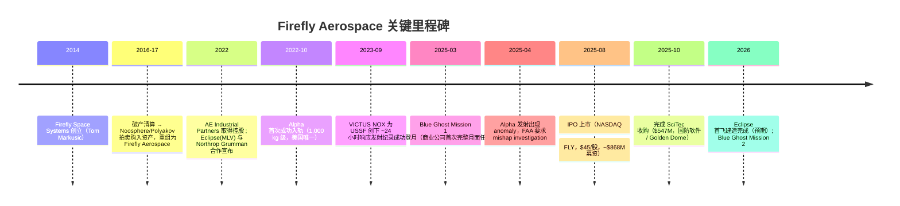
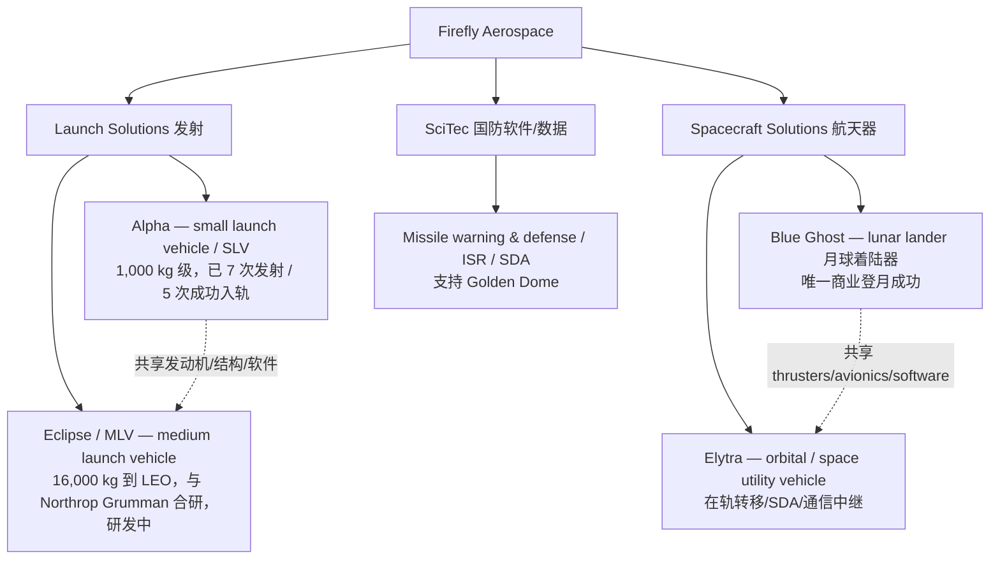
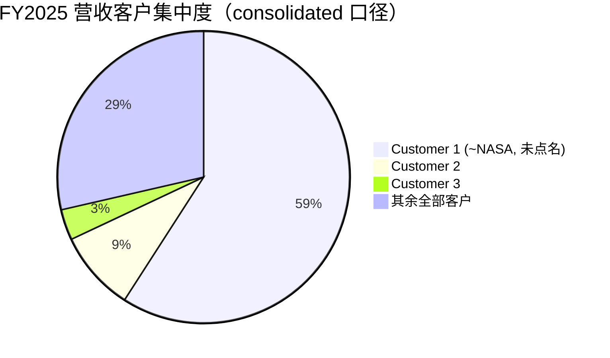
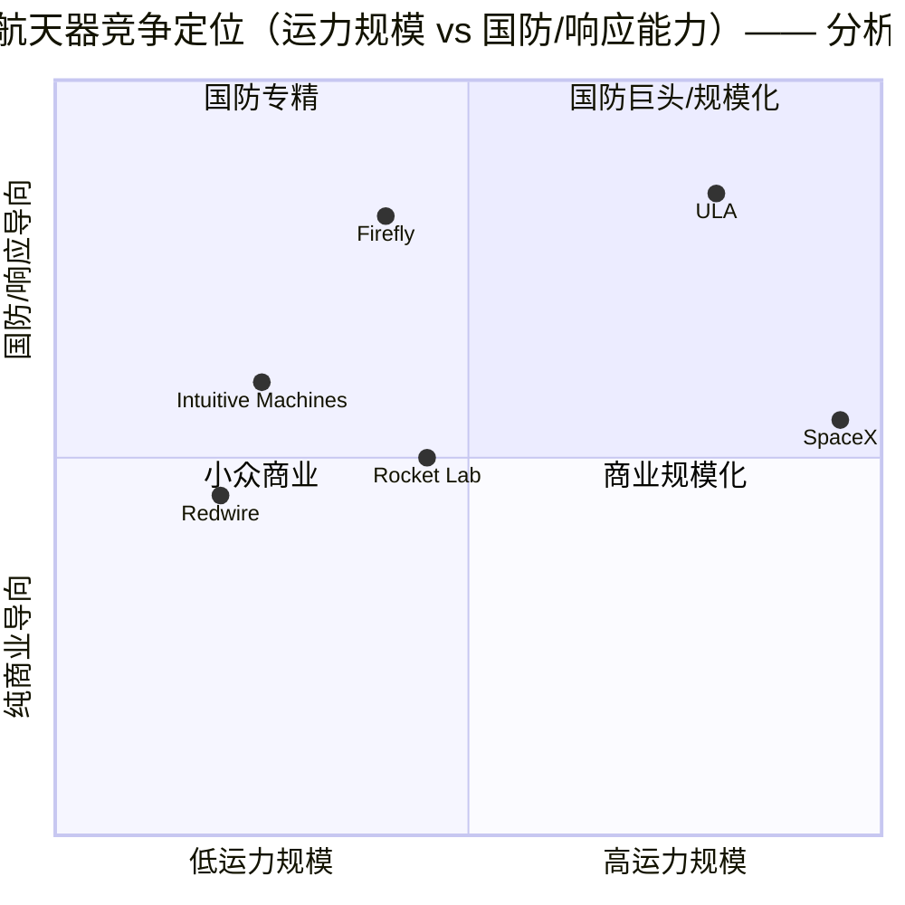

# Firefly Aerospace（萤火虫航天，NASDAQ: FLY）公司研究

> **报告语言**：简体中文（技术 / 财务 / 行业术语保留 English 原文 + 中文释义）
> **截至日期 / As of**：2026-06-09
> **标的**：Firefly Aerospace Inc.（特拉华州注册，总部 Leander, Texas）｜NASDAQ: **FLY**｜CIK 0001860160｜SIC 3760 *Guided Missiles & Space Vehicles & Parts*
> **数据基础**：FY2025 10-K（2026-03-20 提交）、IPO 招股书 424B4（2025-08-08）、FY2026 Q1 10-Q（2026-05-04）、DEF 14A（2026-04-17）、公司官网 fireflyspace.com、第三方行业研究。

---

## 投资摘要（Investment Summary）

> *以下评级、目标价（price target）、前瞻预测（forward estimates）与情景假设均为分析师本人观点（**Analyst view / 分析师观点**），不代表公司披露，亦不得与任何 filing 引用混淆——10-K 中不含目标价。*

| 项目 | 内容 |
|---|---|
| **评级 / Rating** | **Hold / 中性**（*Analyst view*）—— 业务里程碑稀缺且真实，但估值已price-in多年的执行；首年破发 + Alpha 可靠性悬而未决，风险收益对称性偏弱 |
| **12 个月目标价 / 12-mo PT** | **$38**（*Analyst view*；约 +5% vs 现价 $36.18） |
| **现价 / Current price** | **$36.18**（2026-06-08 收盘，[yfinance FLY](https://finance.yahoo.com/quote/FLY/)） |
| **估值方法** | 远期 P/S：FY2027E 营收 × 12–14× P/S（小盘高增长 space-tech 给定区间），与 RKLB 等同业交叉验证 |
| **市值 / Market cap** | 约 **$5.94bn**（约 1.642 亿股，[yfinance FLY 报价](https://finance.yahoo.com/quote/FLY)） |
| **52 周区间** | **$16.00 – $73.80**（[yfinance FLY](https://finance.yahoo.com/quote/FLY/)） |
| **TTM P/S** | 约 **37.2×**（市值 $5.94bn ÷ FY2025 营收 $159.9M；GAAP 净亏损，P/E 不适用） |
| **自 IPO 回报 / since-IPO** | 约 **−19.6%**（vs $45.00 发行价）；自首日收盘 $60.35 约 **−40.0%** |

**论点支柱（thesis pillars，*Analyst view*）：**

1. **稀缺的"已飞行"履历（flight heritage）**：Alpha 是美国唯一进入 1,000 kg 级轨道的商业液体火箭；Blue Ghost 是**唯一**完成月球软着陆的商业航天器——这两项"first/only"资产无法被估值模型轻易复制，是 FLY 相对一众 pre-revenue 太空新股的核心差异。
2. **国防 + 月球双引擎，订单可见度高**：约 **$1.4bn backlog**、FY2026 指引 $420–450M（约 80% 已 booked），且通过 SciTec 收购切入 Golden Dome / 导弹预警（missile warning）这一国防优先级最高的赛道。
3. **估值已充分定价执行**：37× TTM P/S、连续 GAAP 巨亏（FY2025 净亏 $298M）、单一客户占 ~59% 营收——任何一次 Alpha 失败、客户流失或增发，都可能触发剧烈回撤。这是一只"里程碑兑现型"而非"现金流型"标的。

**call 所系的 1–2 个摆动变量（swing variables）**：(i) **Alpha 发射可靠性 / cadence**——2025-04-29 的 anomaly 已证明单次失败即触发 FAA 停飞；(ii) **Eclipse（MLV）能否在 2026 如期完成首飞**——中型运载是营收量级跃迁的关键，但仍处 final development。

---

## 目录

1. 公司概览（Company Overview）
2. 估值与目标价（Valuation & Price Target）
3. 公司历史（Company History）
4. 管理团队（Management）
5. 产品与服务（Products & Services）
6. 客户与上市策略（Customers & IPO Strategy）
7. 行业概览（Industry Overview）
8. 竞争格局（Competitive Landscape）
9. 市场机会 / TAM（Market Opportunity）
10. 风险评估（Risk Assessment）
11. 投资视角评分（Investor-Lens Scorecards）
12. 参考资料（References）

---

## 1. 公司概览（Company Overview）

**一句话定位（公司自述，verbatim）**：*"Firefly is a market-leading space and defense technology company with an established track record of success providing comprehensive mission solutions to national security, government, and commercial customers."*（[Firefly FY2025 10-K, Item 1 Business — Overview](https://www.sec.gov/Archives/edgar/data/1860160/000119312526116309/fly-20251231.htm)）公司把自己定义为一家**端到端（end-to-end）的"太空与国防技术公司"**，业务覆盖 launch（运载发射）、transit（在轨转移）与 operations（在轨运营）三段价值链，而非单纯的"火箭公司"。

**论点先行（BLUF，*Analyst view*）**：FLY 的投资逻辑不是"又一家发射公司"，而是**唯一同时握有"轨道级发射履历"与"商业月球着陆履历"两张稀缺牌照的美国国防航天供应商**。它在 2025-08-08 完成 IPO，是当年继 Voyager Technologies、Karman Holdings 之后第三家上市的太空公司（[CNBC, 2025-08-07](https://www.cnbc.com/2025/08/07/rocket-maker-firefly-aerospace-fly-stock-ipo.html)）。但与多数太空新股不同，FLY 已经有**真实营收且营收高速增长**——FY2025 总营收 $159.9M（+163% YoY），这让它的估值讨论从"画饼"进入"看倍数"。

**FY2025 关键财务（10-K，单位千美元）**：总营收 **$159,855**（+163% YoY，对应 FY2024 的 $60,792）；gross profit（毛利）**$30,666**——首次转为毛利为正（FY2024 为毛损 $(11,365)）；R&D（研发费用）**$200,118**（+34% YoY）；SG&A **$91,245**；net loss（净亏损）**$(298,340)**，亏损同比扩大 29%（[Firefly FY2025 10-K, MD&A — Results of Operations](https://www.sec.gov/Archives/edgar/data/1860160/000119312526116309/fly-20251231.htm)）。营收按段拆分：**Spacecraft Solutions（航天器解决方案）$131.2M**（+244% YoY，主要来自 Blue Ghost Mission 1 与 SciTec 并表）、**Launch（发射）$28.6M**（+26% YoY）（[同上 10-K, MD&A — Revenue](https://www.sec.gov/Archives/edgar/data/1860160/000119312526116309/fly-20251231.htm)）。

**估值快照（valuation snapshot）**：现价 $36.18、市值约 $5.94bn、约 1.642 亿股（[yfinance FLY](https://finance.yahoo.com/quote/FLY)）。因 GAAP 持续亏损，**P/E 不适用（负值）**——亏损本质是 pre-scale 的高强度 R&D（$200M）与销售扩张（SG&A +95% YoY），属典型"烧钱抢规模"而非结构性衰退（[yfinance FLY 关键统计](https://finance.yahoo.com/quote/FLY)）。**TTM P/S 约 37.2×**（市值 ÷ FY2025 营收 $159.9M），显著高于一般工业股，反映市场把 FLY 当作"国防航天稀缺标的 + 多年复合增长"在定价（详见 §2）。

```mermaid
xychart-beta
    title "Firefly 营收与净亏损（FY2023–FY2025，$M）"
    x-axis [FY2023, FY2024, FY2025]
    y-axis "$ 百万" -320 200
    bar [55, 60.8, 159.9]
    line [-119, -231, -298.3]
```
*Source: [Firefly FY2025 10-K, MD&A](https://www.sec.gov/Archives/edgar/data/1860160/000119312526116309/fly-20251231.htm)（FY2023 营收为约数）。柱=总营收，线=净亏损。*

---

## 2. 估值与目标价（Valuation & Price Target）

> *本章所有前瞻数字、目标价、bull/base/bear 情景均为 **Analyst view / 分析师观点**，由 10-K 分部数据 + 管理层指引 + 行业预测推导而来，**绝不归因于任何 filing**。*

### 2a. 估值快照与同业对比

| 指标 | FLY | 说明 |
|---|---|---|
| 现价 | $36.18 | 2026-06-08（[yfinance](https://finance.yahoo.com/quote/FLY/)） |
| 市值 | ~$5.94bn | ~1.642 亿股 |
| TTM P/S | ~37.2× | FY2025 营收 $159.9M |
| 远期 P/S（FY2026E） | ~13.7× | FY2026 指引中值 $435M（[FLY Q1 FY2026 earnings, Motley Fool 转录, 2026-05-04](https://www.fool.com/earnings/call-transcripts/2026/05/04/fly-q1-2026-earnings-transcript/)） |
| P/E | 不适用（负） | FY2025 净亏 $298M |
| 自 IPO 回报 | −19.6% | vs $45 发行价 |

**同业（peer comps）**：直接可比的纯太空标的为 **Rocket Lab（RKLB）**（发射 + 航天器）、**Intuitive Machines（LUNR）**（月球着陆）、**Redwire（RDW）**（在轨制造 / 部件），以及太空主题 ETF **UFO**（Procure Space ETF）。*分析师观点：* FLY 的 TTM P/S（~37×）高于已规模化、营收基数更大的 RKLB，反映其"双稀缺资产 + 国防溢价"，但也意味着**更脆弱的容错空间**——一旦 Alpha 再次失败或月球任务延期，倍数下修空间巨大（[同业估值需以各自最新季报为准，此处为定性框架]）。

**为何 P/S 这么高？** 归因属上文 (a)（市场为多年复合增长定价的高增长国防航天赛道）+ (c)（题材 / narrative 溢价：FLY 是少数可投的"美国主权发射 + 商业登月"纯标的）。这不是 (b) 周期低谷或 (d) 并购套利。倍数的脆弱性本身即构成 §10 的估值风险。

### 2b. 前瞻财务模型与目标价推导（*Analyst view*）

**前瞻估算表（每格均为分析师估算，驱动因素的外部依据见脚注）**：

| 财年 | 营收（$M） | YoY | gross margin | net margin | 关键驱动 |
|---|---|---|---|---|---|
| FY2025（实际） | 159.9 | +163% | ~19% | −187% | Blue Ghost M1 + SciTec 并表 |
| FY2026E | ~435 | +172% | ~25% | 仍亏损 | 公司指引 $420–450M，~80% booked¹ |
| FY2027E | ~620 | +43% | ~30% | 亏损收窄 | Blue Ghost M2/M3/M4 + SciTec 全年 + Alpha cadence² |
| FY2028E | ~850 | +37% | ~33% | 接近盈亏平衡 | Eclipse 首飞后 launch 段放量² |

> ¹ FY2026 指引区间 $420–450M，约 80% 已 booked，来自 [FLY Q1 FY2026 业绩电话会, 2026-05-04](https://www.fool.com/earnings/call-transcripts/2026/05/04/fly-q1-2026-earnings-transcript/)；Q1 FY2026 实际营收已达 $80.9M（[Firefly Q1 FY2026 10-Q](https://www.sec.gov/Archives/edgar/data/1860160/000186016026000009/fly-20260331.htm)）。
> ² FY2027–28 为分析师外推，依据 10-K 中 ~$1.4bn backlog（[FY2025 10-K](https://www.sec.gov/Archives/edgar/data/1860160/000119312526116309/fly-20251231.htm)）+ Eclipse 2026 建造完成时间表 + 行业高个位数至双位数 CAGR（[Fortune Business Insights — Space Launch Services Market](https://www.fortunebusinessinsights.com/industry-reports/space-launch-services-market-101931)）。非公司指引，**不构成 filing 引用**。

**目标价推导（show the arithmetic，*Analyst view*）**：太空成长股 GAAP 尚不盈利，PE 法不适用，采用 **远期 P/S 法**：

> **FY2027E 营收 $620M × 12–14× P/S = $7.4bn–$8.7bn 企业价值 → 每股约 $36–$42**（按约 1.65 亿股）。中值约 **$38**，即 12 个月目标价。

倍数 12–14× 的依据：(i) FLY 当前 TTM P/S 37× 不可持续，随营收基数放大必然压缩；(ii) 同为发射 + 航天器、且更成熟的 RKLB 历史 P/S 区间作锚；(iii) 给 FLY 的"双稀缺资产 + 国防 backlog 可见度"在该区间上沿。

**bull / base / bear 三档目标价（*Analyst view*）**：

| 情景 | 12-mo PT | vs 现价 | 摆动假设 |
|---|---|---|---|
| **Bull** | **$58** | +60% | Eclipse 2026 如期首飞 + Alpha 零失败、cadence 翻倍 + 新增大额国防订单；P/S 维持 16× |
| **Base** | **$38** | +5% | 指引达成、Blue Ghost M2 成功、Alpha 稳定但不爆发；P/S 13× |
| **Bear** | **$20** | −45% | Alpha 再次失败触发停飞 + Eclipse 滑期 + 单一大客户（~59%）订单延迟 + 增发稀释；P/S 压缩至 8× |

**vs 一致预期（consensus）**：本地 zsxq 机构研报库（`db/zsxq.db`）经多别名检索（FLY / Firefly / 萤火虫 / Blue Ghost / Rocket Lab / RKLB）**未找到任何 FLY 覆盖**——该标的为 2025-08 新上市的美国小盘股，本地券商库无中文卖方覆盖（已在 §12 验证日志记录）。公开口径方面，Q1 FY2026 营收 $80.9M（10-Q 实际值）+40% 环比、并被多方报道为**超出市场一致预期**（[FLY Q1 FY2026 业绩电话会转录, 2026-05-04](https://www.fool.com/earnings/call-transcripts/2026/05/04/fly-q1-2026-earnings-transcript/)），显示执行端略好于街面预期。

```mermaid
xychart-beta
    title "FLY 估值情景目标价（$/股）"
    x-axis [Bear, 现价, Base, Bull]
    y-axis "$" 0 65
    bar [20, 36.18, 38, 58]
```
*Source: 分析师情景分析（*Analyst view*），基于 [FY2025 10-K](https://www.sec.gov/Archives/edgar/data/1860160/000119312526116309/fly-20251231.htm) backlog + [FY2026 指引](https://www.fool.com/earnings/call-transcripts/2026/05/04/fly-q1-2026-earnings-transcript/)。*

---

## 3. 公司历史（Company History）

Firefly 的历史是一段**破产—重生—国防化—上市**的曲折叙事，对理解其今日股权结构（AE Industrial 控股）与企业文化至关重要。

**Firefly Space Systems（前身，2014–2017）**：公司最初由 **Tom Markusic** 等人于 2014 年 1 月创立为 *Firefly Space Systems*。Markusic 此前曾任 Virgin Galactic 推进副总裁（VP of Propulsion）、SpaceX 德州测试场主管（Director of the Texas Test Site）、Blue Origin 高级系统工程师及 NASA 推进研究科学家（[Contrary Research — Firefly Aerospace](https://research.contrary.com/company/firefly-aerospace)）。但早期 Firefly Space Systems 因一桩**商业秘密（trade secret）诉讼**陷入困境，到 2016 年底全员停薪（furlough），随后进入破产清算（[Wikipedia — Firefly Aerospace](https://en.wikipedia.org/wiki/Firefly_Aerospace)）。

**Noosphere / Polyakov 重生（2017–2021）**：乌克兰裔企业家 **Max Polyakov** 及其 **Noosphere Ventures** 于 2017 年 3 月在拍卖中购得破产公司的资产，将其重组为今天的 **Firefly Aerospace**，并在随后四年投入超过 $200M 自有资金支持技术研发与团队扩张（[Contrary Research](https://research.contrary.com/company/firefly-aerospace)）。10-K 自述公司"于 2017 年开始运营，并在 2022 年 10 月用 Alpha 成功入轨"（*"We began operations in 2017 and successfully reached orbit with Alpha in October 2022"*，[FY2025 10-K, Key Highlights](https://www.sec.gov/Archives/edgar/data/1860160/000119312526116309/fly-20251231.htm)）。

**CFIUS + AE Industrial 控股（2021–2022）**：2021 年，美国外资投资委员会（CFIUS）以国家安全为由，要求 Polyakov 出售其 Firefly 股份；2022 年 2 月 24 日，Polyakov / Noosphere 宣布将股份出售给私募基金 **AE Industrial Partners, LP**（[inknowvation, AEI takes majority stake](https://www.inknowvation.com/sbir/story/tom-markusic-out-firefly-ceo-3-months-after-aei-takes-majority-stake-rocket-company)）。AEI 接手后，创始人 Markusic 在约三个月后卸任 CEO（保留董事身份，见 §4）。这一段把一家"乌克兰资本背景的商业火箭公司"彻底改造为**美国本土、国防导向、受 CFIUS 友好私募控制**的实体——正是其今日能承接 USSF / NRO / DoW 敏感合同的前提。

**关键里程碑（与 IPO 后发展）**：


*Source: [FY2025 10-K, Key Highlights](https://www.sec.gov/Archives/edgar/data/1860160/000119312526116309/fly-20251231.htm)、[IPO 424B4](https://www.sec.gov/Archives/edgar/data/1860160/000119312525175679/d849748d424b4.htm)、[Wikipedia](https://en.wikipedia.org/wiki/Firefly_Aerospace)。*

---

## 4. 管理团队（Management）

> *按 skill 规则，本节仅覆盖创始人与现任 CEO。*

**创始人 Tom Markusic（现任董事，已卸任 CEO）**：Markusic 是 Firefly 技术血统的源头。他在创立 Firefly Space Systems（2014）之前，拥有极为罕见的"四大火箭公司 + NASA"复合履历——Virgin Galactic 推进副总裁、SpaceX 德州测试场主管、Blue Origin 高级系统工程师、NASA 推进研究科学家（[Contrary Research](https://research.contrary.com/company/firefly-aerospace)）。这套履历直接塑造了 Firefly 的工程取向：**自研全部火箭发动机（in-house engines）+ 专利 tap-off cycle 涡轮泵循环 + 碳复合材料结构**（见 §5）。在 AE Industrial 于 2022 年取得控股后约三个月，Markusic 卸任 CEO（[inknowvation](https://www.inknowvation.com/sbir/story/tom-markusic-out-firefly-ceo-3-months-after-aei-takes-majority-stake-rocket-company)），但**仍保留董事会席位**——他在 FY2026 DEF 14A 的董事薪酬表中列名（[Firefly DEF 14A, 2026-04-17](https://www.sec.gov/Archives/edgar/data/1860160/000119312526161474/fly-20260417.htm)）。其创始持股在历经破产、Noosphere 重组、AEI 控股后已被大幅稀释；当前精确持股以代理声明披露为准。

**现任 CEO Jason Kim（2024 年至今）**：Kim 是 Firefly"国防化转型"的人格化代表。招股书 verbatim 描述：*"Jason Kim, our Chief Executive Officer, has more than two decades of experience in the aerospace and defense sectors... Most recently, Jason served as CEO of Millennium Space Systems, Inc., where he led the company through a period of significant expansion and technology advancements. At Millennium Space Systems, Inc., he served as a key partner and customer in Firefly's VICTUS NOX mission for Space Force. His extensive career also includes leadership roles at Raytheon Intelligence & Space, Northrop Grumman Aerospace Systems, and the U.S. Air Force."*（[Firefly IPO 424B4, Management](https://www.sec.gov/Archives/edgar/data/1860160/000119312525175679/d849748d424b4.htm)）。

值得注意的是这层**供应链逆向收编**：Kim 在掌舵 Millennium Space Systems（波音子公司）期间，曾是 Firefly VICTUS NOX 任务的**客户兼合作方**——也就是说，他是先以国防客户身份验证了 Firefly 的响应发射能力，再被招募来执掌 Firefly。他在 Raytheon、Northrop Grumman、美国空军的国防履历，与 Firefly 当下重押 USSF / NRO / DoW / Golden Dome 的战略高度契合。Kim 于 2024 年出任 CEO，在 FY2026 DEF 14A 中以 CEO 身份署名致股东信（[Firefly DEF 14A, 2026-04-17](https://www.sec.gov/Archives/edgar/data/1860160/000119312526161474/fly-20260417.htm)）。

---

## 5. 产品与服务（Products & Services）

> *本节是全报告最重要章节。所有产品定义与规格均 **verbatim 引自 10-K / 招股书 / 官网**；竞争位置类表述标注为 **Analyst view**。*

Firefly 的产品组合围绕一句核心理念组织：*"Our common technologies, components, and know-how are woven across our products and services."*（[FY2025 10-K](https://www.sec.gov/Archives/edgar/data/1860160/000119312526116309/fly-20251231.htm)）——即用一套共享的发动机、碳复合材料结构、飞控软件、推进器（thrusters）技术栈，横向复用到发射与航天器两大板块。公司将产品归为两大平台：**Launch Solutions** 与 **Spacecraft Solutions**，2025 年 10 月通过 SciTec 收购又叠加了**国防软件 / 数据处理**第三层。

**产品组合树（product portfolio tree）**：


*Source: [FY2025 10-K, Item 1 — Our Mission Solutions](https://www.sec.gov/Archives/edgar/data/1860160/000119312526116309/fly-20251231.htm)。*

### 5.1 Alpha — small launch vehicle / SLV（小型运载火箭）

**公司自述（verbatim）**：*"Our operational launch vehicle, Alpha, is the first and only U.S.-based orbital rocket in the 1,000 kilograms class to successfully reach orbit, with five launches completed successfully."*（[FY2025 10-K](https://www.sec.gov/Archives/edgar/data/1860160/000119312526116309/fly-20251231.htm)）

**它实际做什么**：Alpha 是一枚两级液体运载火箭，把约 1,000 kg 级的卫星 payload 送入低地球轨道（LEO）。**中文释义 / Plain-language gloss：** 它的物理角色是"为卫星客户提供可靠、规律、快速的入轨通道"（*"reliable, regular, and rapid access to space"*）。技术差异化来自三点 verbatim 披露：(i) **carbon composite（碳复合材料）**——主结构与推进剂贮箱（propellant tanks）均用"轻量、刚性、隔热的碳复合技术"，使更多可用质量留给 payload；(ii) **patented tap-off cycle engine technology（专利 tap-off 循环发动机）**——比传统系统更高效、部件更少因而可靠性更高；(iii) 全部发动机自研。Alpha 共 5 台发动机：4 台一级 **Reaver** + 1 台二级 **Lightning**（[同上 10-K, Launch](https://www.sec.gov/Archives/edgar/data/1860160/000119312526116309/fly-20251231.htm)）。

**与同类产品的区别**：Alpha 是 Firefly 唯一**在役**的轨道级火箭，也是 Eclipse 的技术母体。它最独特的不是运力，而是**响应发射（responsive space / 快速响应发射）**能力——VICTUS NOX 任务为 USSF 实现了"从通知到发射约 24 小时"，打破此前 21 天的行业纪录（[同上 10-K, Overview](https://www.sec.gov/Archives/edgar/data/1860160/000119312526116309/fly-20251231.htm)）。凭此 Firefly 又拿下 VICTUS SOL 与 VICTUS HAZE。官网把这一能力归类为 *"Tactically Responsive Space Launch"*（[fireflyspace.com/missions](https://fireflyspace.com/missions/)）。

**战略意义与可靠性现实**：Alpha 截至 2025-12-31 已**进行 7 次发射、其中 5 次成功入轨**，并有 30+ 份签约发射待执行（[同上 10-K](https://www.sec.gov/Archives/edgar/data/1860160/000119312526116309/fly-20251231.htm)）。但 **2025-04-29 一次从 Vandenberg 起飞的 Alpha 任务出现 anomaly（异常）**，FAA 要求其完成 mishap investigation（事故调查）后方可继续发射；公司于 2025-08-26 宣布获 FAA 放行复飞（[同上 10-K, Launch](https://www.sec.gov/Archives/edgar/data/1860160/000119312526116309/fly-20251231.htm)）。这一事件直接说明：**单次失败即可使整条产线停摆数月**——这是 §10 的头号风险。Alpha 还被签约用于 **MACH-TB**（DoW 多军种先进高超声速测试床）的高超声速（hypersonic）飞行试验，开辟第二增长曲线。

### 5.2 Eclipse / MLV — medium launch vehicle（中型运载火箭，与 Northrop Grumman 合研）

**公司自述（verbatim）**：*"Our second offering, Eclipse, a reusable and scaled up version of Alpha, is in final development in partnership with Northrop Grumman and is expected to deliver 16,000-kilogram payloads to Low Earth Orbit ('LEO') and can access Medium Earth Orbit ('MEO'), Geostationary Orbit ('GEO'), Highly Elliptical Orbit (HEO) and Trans-lunar Injection (TLI)."*（[FY2025 10-K, Overview](https://www.sec.gov/Archives/edgar/data/1860160/000119312526116309/fly-20251231.htm)）

**它实际做什么**：Eclipse 是 Alpha 的**可复用（reusable）放大版**，把入轨运力提升约 16 倍（到 LEO 约 16,000 kg）。**中文释义 / Plain-language gloss：** 如果说 Alpha 解决"小卫星快速入轨"，Eclipse 解决的是"中型星座批量部署 + 高轨 / 地月转移"这一更大、更有利可图的市场。它沿用 Alpha 的碳复合结构与专利 tap-off 循环发动机，但采用更大推力的 **Miranda** 发动机（[同上 10-K](https://www.sec.gov/Archives/edgar/data/1860160/000119312526116309/fly-20251231.htm)）。

**与同类产品的区别 + 战略意义**：Eclipse 是 Firefly **营收量级跃迁的关键**，但仍处 *"final development"*。10-K 给出了清晰的研发时间线：2024-02 用自动纤维铺放机（automated fiber placement）造出首个碳复合 barrel；2024-08 一级推进剂贮箱上测试台；2024-10 Miranda 发动机完成 100% 功率测试；2025-03 完成 Eclipse Stage 1 首飞 LOX/RP-1 贮箱组件装配；**建造完成预期在 2026 年**（[同上 10-K, Launch](https://www.sec.gov/Archives/edgar/data/1860160/000119312526116309/fly-20251231.htm)）。与 **Northrop Grumman** 的合作（2022-08 宣布）是关键背书——这是"一家成熟国防巨头与一家新创火箭公司"的 first-of-its-kind 合作，既带来资金/技术，也带来订单导流。*分析师观点：* Eclipse 的按期首飞是 bull case 的核心触发器，但中型火箭研发滑期是行业常态，应作为最大执行不确定性看待。

### 5.3 Blue Ghost — lunar lander（月球着陆器）

**公司自述（verbatim）**：*"Our Blue Ghost lander is the only commercial vehicle to ever achieve a fully successful Moon landing and the first U.S.-based lander to successfully complete a lunar surface mission since NASA's Apollo 17 in 1972."*（[FY2025 10-K, Overview](https://www.sec.gov/Archives/edgar/data/1860160/000119312526116309/fly-20251231.htm)）

**它实际做什么**：Blue Ghost 是把 NASA 与商业客户的 payload 运送并软着陆到月面的着陆器，属 NASA **CLPS（Commercial Lunar Payload Services，商业月球载荷服务）**框架下的运力提供商。**中文释义 / Plain-language gloss：** 这是 Firefly 最具标志性的资产——**2025-03-02 Blue Ghost Mission 1 成功登月**，是首家完成完整月面任务的商业公司，也是自阿波罗时代 50 余年以来美国首次完整成功的月面着陆（[同上 10-K](https://www.sec.gov/Archives/edgar/data/1860160/000119312526116309/fly-20251231.htm)）。

**战略意义与经济性**：Blue Ghost Mission 1 **携带 10 个 NASA payload、合同总值 $102.1M**，在月面工作 14 天并进入月夜 5 小时，回传 120 GB 数据（[同上 10-K, Overview](https://www.sec.gov/Archives/edgar/data/1860160/000119312526116309/fly-20251231.htm)）。这一单任务直接驱动 FY2025 Spacecraft Solutions 营收 +244%。公司已在推进 Blue Ghost Mission 2 / 3 / 4，官网披露着陆点覆盖 Mare Crisium、月球背面、Gruithuisen Domes、月球南极（[fireflyspace.com/missions](https://fireflyspace.com/missions/)）。*分析师观点：* 月球着陆是极高门槛、极易失败的能力——历史上仅美、中、俄、日、印五国实现过月球软着陆，10-K 直言这让 Firefly 的能力"跻身全球超级大国行列"。这是商业护城河，但也意味着**每次任务都是 binary 事件**（成功即里程碑，失败即重大减值）。

### 5.4 Elytra — orbital / space utility vehicle（轨道飞行器 / 空间机动平台）

**公司自述（verbatim）**：*"Elytra is our high-thrust spacecraft platform creating new categories for space domain awareness and warfighting, long-range communications relays, lunar imaging, on-orbit edge processing, and advanced space exploration."*（[FY2025 10-K, Overview](https://www.sec.gov/Archives/edgar/data/1860160/000119312526116309/fly-20251231.htm)）

**它实际做什么 + 与同类区别**：Elytra 是用 Blue Ghost 技术框架打造的**多任务在轨机动航天器**，能执行卫星投送、在轨转移（on-orbit transfers）、托管载荷（hosted payloads）、通信中继、交会对接（rendezvous proximity operations）等。**中文释义 / Plain-language gloss：** 它是 Firefly 在"轨道这一段"的价值捕获工具——客户的卫星到了轨道之后，Elytra 提供"在轨出租车 / 太空巴士"服务。它与 Blue Ghost 共享 thrusters、batteries、avionics、复合结构与飞控软件，因此边际研发成本低。

**战略意义**：Elytra 已签约多个高价值国防任务：支持 **NRO（国家侦察局）** 的在轨任务、SDA 的 Proliferated Warfighter Space Architecture（增殖式作战者太空架构）的 Tracking and Transport 层、以及为 DoW 的 **DIU（国防创新单元）** 提供高 delta-v 的空间机动飞行器执行数百次交会对接以做 space domain awareness（SDA，太空态势感知）（[同上 10-K, Overview](https://www.sec.gov/Archives/edgar/data/1860160/000119312526116309/fly-20251231.htm)）。Elytra 还将在 2026 直接支持 Blue Ghost Mission 2，从月球轨道提供数据中继。

### 5.5 SciTec — 国防软件 / 大数据处理（2025-10 收购）

**它实际做什么**：SciTec 是一家"先进国家安全技术"提供商，为 Firefly 的硬件叠加 **AI-enabled 国防软件**，能力涵盖导弹预警/跟踪/防御（missile warning, tracking and defense）、ISR、SDA、遥感分析与自主指挥控制（[FY2025 10-K, Overview](https://www.sec.gov/Archives/edgar/data/1860160/000119312526116309/fly-20251231.htm)）。**它的战略意义**在于把 Firefly 从"硬件供应商"升级为"硬件 + 软件 + 数据处理"的端到端国防方案商，尤其是切入 **Golden Dome**（导弹防御）这一美国国防最高优先级项目——SciTec 提供"空间拦截器、高超测试、SDA 任务的全套软硬件"。

**交易经济性**：2025-10-31 完成，**总对价 $547.0M**（$277.4M 现金 + $269.6M 股票），新增 470 名员工与 6 个靠近核心太空/国防客户的设施（[FY2025 10-K, Key Highlights + Notes](https://www.sec.gov/Archives/edgar/data/1860160/000119312526116309/fly-20251231.htm)）。这是 FY2025 现金消耗的重要构成（详见 §10 现金风险）。

### 5.6 自研发动机族（in-house engines）

Firefly 的工程护城河集中在**全自研发动机**：*"Firefly designed, built, tested, and flew a suite of in-house developed propulsion systems—including the Reaver, Lightning, and Spectre engines. Additionally, our new Miranda engine reached 100 test fires in late 2025, demonstrating a two year development cycle from clean sheet design to beginning build of first flight hardware."*（[FY2025 10-K](https://www.sec.gov/Archives/edgar/data/1860160/000119312526116309/fly-20251231.htm)）。其中 **Reaver**（Alpha 一级）、**Lightning**（Alpha 二级）、**Spectre**、**Miranda**（Eclipse）构成发动机族，均采用专利 **tap-off cycle**——这是"用更少部件实现更高可靠性"的核心。Miranda 从白纸设计到首飞硬件仅 2 年，体现了 Firefly 的垂直整合研发速度。

### 5.7 产品协同综述（synthesis）

Firefly 的产品逻辑是一个**"共享技术栈 → 多平台复用 → 端到端任务闭环"**的飞轮：Alpha 验证了发动机/碳复合/飞控技术 → 同一技术栈放大成 Eclipse（运力跃迁）、复用到 Blue Ghost（月球着陆）→ Blue Ghost 框架又派生 Elytra（在轨机动）→ SciTec 在顶层叠加软件/数据，把硬件任务转化为"决策级情报"。一次 Blue Ghost 任务里，Elytra 技术已先在 LEO/MEO/GEO/Cislunar 全程验证。这意味着 **launch → transit → operations** 三段都能由 Firefly 内部闭环交付——这正是它相对单一发射公司或单一着陆器公司的结构性差异。生产端则高度垂直整合：总部 + **Rocket Ranch**（200 英亩、20 万平方英尺产能、6 个测试台）+ **The Hive**（航天器/软件/avionics + ISO-8 洁净室 + 任务控制中心）全部位于 Austin 以北（[同上 10-K, facilities](https://www.sec.gov/Archives/edgar/data/1860160/000119312526116309/fly-20251231.htm)）。

---

## 6. 客户与上市策略（Customers & IPO Strategy）

### 6.1 客户构成与集中度（customer concentration）

Firefly 的客户高度集中于**美国政府 / 国防 + NASA + 少量商业**。10-K 的风险因子 verbatim 披露：*"For the year ended December 31, 2025, our top five customers together accounted for over 86% of our revenue and our top five backlog customers accounted for approximately 81% of our backlog as of December 31, 2025."*（[FY2025 10-K, Risk Factors](https://www.sec.gov/Archives/edgar/data/1860160/000119312526116309/fly-20251231.htm)）。这是**consolidated（合并口径）营收**的客户集中度，不是分部口径。

更细的逐客户披露（10-K 营收集中度表，按 **consolidated 营收占比**，FY2025 / FY2024 / FY2023 三年）：**Customer 1 = 59.1% / 58.6% / 30.7%**；Customer 2 = 8.9% / 23.2% / 11.4%；Customer 3 = 3.4% / 11.2% / —（[同上 10-K, Notes — Concentrations](https://www.sec.gov/Archives/edgar/data/1860160/000119312526116309/fly-20251231.htm)）。**单一最大客户在 FY2025 占合并营收约 59%**——考虑 Blue Ghost Mission 1 的 $102.1M NASA 合同，这个 Customer 1 极可能是 NASA（10-K 未点名，按规则不臆断，记为 *disclosure not found — 客户身份未在 filing 点名*）。

到 FY2026 Q1，集中度依然显著但有所分散：**Customer 1 = 24.5%、Customer 2 = 19.3%、Customer 3 = 14.1%**（合计 57.9%，均为 **consolidated 季度营收占比**，[Firefly Q1 FY2026 10-Q, Notes — Concentrations](https://www.sec.gov/Archives/edgar/data/1860160/000186016026000009/fly-20260331.htm)）。单一大客户占比从 59%（全年）降到 24.5%（Q1），反映 SciTec 国防软件并表与多任务推进正在稀释对单一月球任务的依赖——这是正面信号，但 top-5 > 86% 的结构性集中风险仍在。


*Source: [FY2025 10-K, Notes — Concentrations](https://www.sec.gov/Archives/edgar/data/1860160/000119312526116309/fly-20251231.htm)（单一口径：consolidated 营收）。*

**业务模式（business model）**：Firefly 的收入来自 (i) **固定价 / 里程碑式政府合同**（USSF、NRO、DoW/DIU、NASA CLPS）——多为多年期、按进度确认（percentage-of-completion）；(ii) **商业发射 / rideshare**；(iii) SciTec 的国防软件与数据处理服务。约 **$1.4bn backlog**（[FY2025 10-K, MD&A](https://www.sec.gov/Archives/edgar/data/1860160/000119312526116309/fly-20251231.htm)）提供了远超当年营收的可见度，但 10-K 也警示：政府客户 backlog 受未来联邦拨款水平影响，可能被削减、修改、延迟。

### 6.2 IPO 与控股结构（IPO & control structure）

**IPO**：Firefly 于 **2025-08-06 以 $45.00/股定价**，发行 **19,296,000 股**，毛募资约 **$868.32M**，2025-08-07 在 NASDAQ Global Market 以 "FLY" 开始交易（[Firefly IPO 定价新闻稿](https://fireflyspace.com/news/firefly-aerospace-announces-pricing-of-upsized-initial-public-offering/)；[IPO 424B4](https://www.sec.gov/Archives/edgar/data/1860160/000119312525175679/d849748d424b4.htm)）。定价对应约 **$6.3bn 估值**，首日收盘上涨 30%+ 至 $60.35，对应约 **$8.5bn**（[CNBC, 2025-08-07](https://www.cnbc.com/2025/08/07/rocket-maker-firefly-aerospace-fly-stock-ipo.html)）。此后股价回落（"破发"叙事，[Motley Fool, 2025-09-25](https://www.fool.com/investing/2025/09/25/is-firefly-aerospace-a-broken-ipo/)），52 周低见 $16.00，又在国防订单与赎回行情推动下反弹，现价 $36.18。

**controlled company（受控公司）结构**：IPO 后，AE Industrial Partners 管理的基金持有约 **40.9%** 流通股，并通过董事提名协议（director nomination agreement）构成"对董事选举拥有 50% 以上投票权"的控制集团（[IPO 424B4, Risk Factors](https://www.sec.gov/Archives/edgar/data/1860160/000119312525175679/d849748d424b4.htm)）。据此 Firefly 是 Nasdaq 规则下的 **"controlled company"**，豁免部分公司治理要求。DEF 14A 进一步约束：当 AEI 持股低于 40% 投票权时，部分受控公司豁免与提名权将相应变化（[Firefly DEF 14A, 2026-04-17](https://www.sec.gov/Archives/edgar/data/1860160/000119312526161474/fly-20260417.htm)）。这意味着**少数股东对治理的影响力受限**——是 §10 的治理风险。

---

## 7. 行业概览（Industry Overview）

Firefly 处在**太空经济（space economy）+ 国防技术（defense technology）**的交汇带。10-K 给出公司认可的宏观锚（source-chain）：*"According to McKinsey's report from 2024, the global space economy is projected to reach $1.8 trillion in value by 2035 driven by accelerating national security and commercial demand."*（[FY2025 10-K, Industry，引用 McKinsey 2024](https://www.sec.gov/Archives/edgar/data/1860160/000119312526116309/fly-20251231.htm)）——这是 $1.8 万亿空间经济 by 2035 的源链锚（公司 filing 引用 McKinsey，非 Firefly 自创）。

**需求侧的结构性驱动**：10-K 引用 BryceTech 2025 报告称，*"In 2024, nearly 2,800 satellites launched to orbit, representing more than a 500% increase in demand for launch services compared to just five years prior."*（[同上 10-K，引用 BryceTech 2025](https://www.sec.gov/Archives/edgar/data/1860160/000119312526116309/fly-20251231.htm)）。卫星发射需求五年增长 500%+，造成**轨道运载运力短缺**，迫使政府与商业客户寻找成本高效、产线成熟的国防技术公司。这正是 Firefly 的市场窗口。

**国防侧的预算顺风**：10-K 披露 *"From 2024–2029, the DoW's average proposed space budget has increased 82% from 2018–2023 averages."*（[同上 10-K](https://www.sec.gov/Archives/edgar/data/1860160/000119312526116309/fly-20251231.htm)）。国防部太空预算的 82% 跃升，叠加 Golden Dome（导弹防御）这一巨型项目，为 Firefly 的响应发射、SDA、导弹预警业务提供了多年订单池。

**行业结构**：发射服务市场正从"少数巨头垄断"向"多供应商"演进，但仍高度集中（SpaceX 占据绝对份额）。进入壁垒极高——需要轨道级飞行履历、发射场许可、FAA 监管资质、国防安全许可。**月球着陆**门槛更高，历史上仅五国 + Firefly 一家商业公司实现。这种"高壁垒 + 少玩家"结构对已具履历的 Firefly 有利，但也意味着每个细分赛道都直面 SpaceX 的成本碾压。

```mermaid
xychart-beta
    title "全球发射服务市场规模（$M，Fortune Business Insights）"
    x-axis [2025, 2034E]
    y-axis "$ 百万" 0 14000
    bar [5732, 12798.6]
```
*Source: [Fortune Business Insights — Space Launch Services Market（2025 ≈ $5,732.0M → 2034E ≈ $12,798.6M，CAGR 8.70%）](https://www.fortunebusinessinsights.com/industry-reports/space-launch-services-market-101931)。注：不同口径差异大——Grand View Research 以更广义口径估 2023 ≈ $14.94bn → 2030E ≈ $41.31bn（CAGR 14.6%），可作上限参考。*

---

## 8. 竞争格局（Competitive Landscape）

**10-K 的竞争表述（verbatim 起点）**：Firefly 在 10-K 中将自己定位为 *"one of the only U.S.-based commercial companies currently equipped to provide reliable access to launch, transit, and operations in space"*（[FY2025 10-K, Overview](https://www.sec.gov/Archives/edgar/data/1860160/000119312526116309/fly-20251231.htm)）。10-K 并未点名具体竞品公司清单做"我们 vs 他们"的逐项对比（属法律披露文件常态），因此以下竞争分析的份额/排名类判断均为**分析师观点**。

**直接与间接竞争者（*分析师观点*）**：

- **SpaceX**：发射市场的绝对主导者，Falcon 9 复用大幅压低单位发射成本。SpaceX 是所有发射公司的"价格地板"，对 Firefly 的 Eclipse（中型可复用）构成最直接的成本竞争。*分析师观点*，非 filing 引用。
- **Rocket Lab（RKLB）**：最接近的同业——同样做小型发射（Electron）+ 中型在研（Neutron）+ 航天器，且已规模化、营收基数更大。Firefly 与 RKLB 在 SLV、航天器、国防订单上正面竞争。
- **ULA（United Launch Alliance）**：传统国防发射主力，在高轨/国家安全发射有深厚资质，是 Eclipse 进入高价值国防发射的对手。
- **Intuitive Machines（LUNR）**：月球着陆直接对手，同属 NASA CLPS 框架——但 Firefly 的 Blue Ghost M1 是首个"完整成功"的商业月面任务，LUNR 早期任务出现侧翻，Firefly 在月球着陆履历上暂时领先（*分析师观点*）。
- **Redwire（RDW）/ 各国防总包商**：在 SDA、在轨服务、国防软件层面与 Elytra / SciTec 部分重叠。

**Firefly 的竞争优势（moat）**：(i) **唯一"双稀缺履历"**——1,000 kg 级商业轨道发射 + 商业登月，两项都极难复制；(ii) **响应发射纪录**——~24 小时通知到发射，国防客户高度看重；(iii) **垂直整合 + 全自研发动机**——成本与迭代速度可控；(iv) **Northrop Grumman 合作 + AEI 控股**——国防生态背书与 CFIUS 友好身份；(v) **SciTec 软件层**——从硬件升级为软硬一体国防方案。

**脆弱点（vulnerabilities）**：(i) 规模与成本仍远不及 SpaceX；(ii) Alpha 可靠性未经长期验证（5/7 成功率）；(iii) Eclipse 仍在研，营收量级跃迁尚未兑现；(iv) 单一大客户占比过高；(v) 估值已 price-in 多年完美执行。


*Source: 分析师定位框架（*Analyst view*），基于各公司公开产品线；坐标为定性判断，非份额数据。*

---

## 9. 市场机会 / TAM（Market Opportunity）

Firefly 的可寻址市场是一个**自上而下的层层收窄**结构：

- **TAM（顶层）—— 全球空间经济**：McKinsey 2024 预测 **$1.8 万亿 by 2035**（10-K 源链引用，[FY2025 10-K 引用 McKinsey](https://www.sec.gov/Archives/edgar/data/1860160/000119312526116309/fly-20251231.htm)）。这是 Firefly 业务最广义的天花板，但其中绝大部分（卫星运营、地面设备、消费应用）Firefly 并不直接参与。
- **SAM（可服务市场）—— 发射服务 + 月球/在轨服务 + 国防太空软件**：发射服务市场（窄口径）约 **$5,732.0M（2025）→ $12,798.6M（2034E）**，CAGR 8.70%（[Fortune Business Insights](https://www.fortunebusinessinsights.com/industry-reports/space-launch-services-market-101931)）；更广义口径（含国防/重型）则可达 2030E ~$41bn 量级。叠加 NASA CLPS 月球运力、SDA / 导弹预警国防软件（Golden Dome 驱动），Firefly 的可服务市场是发射 + 月球 + 国防三块之和。*分析师观点：* 这三块的共同特点是**国家安全驱动、对价格不敏感、看重供应商主权属性**——恰好是 Firefly 的强项，而非 SpaceX 式的纯成本竞争。
- **SOM（可获取市场）—— 已签约 backlog**：最确定的部分就是约 **$1.4bn backlog** + 30+ 份签约发射（[FY2025 10-K](https://www.sec.gov/Archives/edgar/data/1860160/000119312526116309/fly-20251231.htm)）。FY2026 指引 $420–450M 约 80% 已 booked，说明短期 SOM 兑现度高。

**增长逻辑**：卫星发射需求五年 +500%（BryceTech）造成运力短缺 + DoW 太空预算 +82% + Golden Dome——三股顺风叠加，使 Firefly 的"美国主权、国防导向、端到端"定位处在需求曲线的右侧。但天花板的兑现取决于 Alpha cadence 提升与 Eclipse 按期投产（运力是营收量级的硬约束）。

```mermaid
xychart-beta
    title "Firefly TAM/SAM/SOM 漏斗（$bn，量级示意）"
    x-axis ["TAM 空间经济2035", "SAM 发射服务2030E", "SOM backlog"]
    y-axis "$ 十亿" 0 1900
    bar [1800, 41.31, 1.4]
```
*Source: TAM=[McKinsey 2024（10-K 源链）](https://www.sec.gov/Archives/edgar/data/1860160/000119312526116309/fly-20251231.htm)；SAM=[Fortune Business Insights 发射服务市场](https://www.fortunebusinessinsights.com/industry-reports/space-launch-services-market-101931)；SOM=[FY2025 10-K backlog](https://www.sec.gov/Archives/edgar/data/1860160/000119312526116309/fly-20251231.htm)。*

---

## 10. 风险评估（Risk Assessment）

**【公司特定风险 Company-specific】**

1. **Alpha 发射可靠性 / 测试失败（reliability）**：Alpha 7 次发射仅 5 次成功入轨；2025-04-29 anomaly 触发 FAA mishap investigation，停飞约 4 个月至 2025-08-26 复飞（[FY2025 10-K, Launch](https://www.sec.gov/Archives/edgar/data/1860160/000119312526116309/fly-20251231.htm)）。**单次失败即可使整条产线停摆数月**，并损害声誉、推迟 backlog 确认。这是头号风险。

2. **Eclipse（MLV）研发与滑期风险**：Eclipse 仍处 *"final development"*，建造完成预期 2026（[同上 10-K](https://www.sec.gov/Archives/edgar/data/1860160/000119312526116309/fly-20251231.htm)）。中型火箭研发滑期是行业常态；若延期，营收量级跃迁推后，bull case 失效。

3. **客户集中度（customer concentration）**：FY2025 top-5 客户占合并营收 **>86%**，单一客户约 **59%**（[同上 10-K, Risk Factors / Notes](https://www.sec.gov/Archives/edgar/data/1860160/000119312526116309/fly-20251231.htm)）。任一大客户违约、延付或战略转向，都可能重创营收与 backlog。

4. **月球任务的 binary 性质**：Blue Ghost 每次任务都是高失败概率的单点事件——历史上仅五国实现月球软着陆（[同上 10-K](https://www.sec.gov/Archives/edgar/data/1860160/000119312526116309/fly-20251231.htm)）。Mission 2/3/4 任一失败将触发减值与估值重估。

5. **SciTec 整合风险**：$547M 收购（[同上 10-K](https://www.sec.gov/Archives/edgar/data/1860160/000119312526116309/fly-20251231.htm)），10-K 前瞻声明明确列出"SciTec 收购潜在收益与协同能否实现"为不确定项。整合失败将拖累国防软件战略。

**【财务风险 Financial】**

6. **现金消耗与持续亏损（cash burn）**：FY2025 净亏 $298M、R&D $200M；现金从 FY2025 末 $793M 降至 FY2026 Q1 末 $326M（+ 短期投资 $225M），单季现金及受限现金净减约 $467M（[Firefly Q1 FY2026 10-Q, Cash Flows](https://www.sec.gov/Archives/edgar/data/1860160/000186016026000009/fly-20260331.htm)）。烧钱速度快，需密切跟踪 runway。

7. **增发稀释（dilution）**：10-K 列示"产生足够现金偿债"为风险；IPO 后已有多份后续 424B 注册。GAAP 持续亏损 + 重资本投入意味着**未来增发概率高**，构成股东稀释压力。

8. **债务（indebtedness）**：10-K 专设"Risks Related to Our Indebtedness"，称"巨额债务可能严重不利影响财务状况"（[FY2025 10-K, Risk Factors](https://www.sec.gov/Archives/edgar/data/1860160/000119312526116309/fly-20251231.htm)）。

**【行业 / 市场风险 Industry & Market】**

9. **SpaceX 成本碾压**：发射市场价格地板由 SpaceX 复用火箭决定；Eclipse 即便投产，也将直面成本劣势（*分析师观点*）。

10. **关键部件 / 原材料短缺**：10-K 列出"制造产品或研发项目所用关键部件或原材料的稀缺或不可得"为风险（[同上 10-K, 前瞻声明](https://www.sec.gov/Archives/edgar/data/1860160/000119312526116309/fly-20251231.htm)）。

11. **政府合同与拨款风险**：大量 backlog 来自政府客户，受未来联邦拨款水平影响，可能被削减、取消、修改或延迟（[同上 10-K, Risk Factors](https://www.sec.gov/Archives/edgar/data/1860160/000119312526116309/fly-20251231.htm)）；并受政府承包法律法规约束。

**【治理 / 估值风险 Governance & Valuation】**

12. **AEI 控股 + controlled company**：AE Industrial Partners 控制超过 50% 董事选举投票权，Firefly 为 Nasdaq "controlled company"，豁免部分治理要求（[IPO 424B4, Risk Factors](https://www.sec.gov/Archives/edgar/data/1860160/000119312525175679/d849748d424b4.htm)）。少数股东治理影响力受限，且 AEI 利益可能与公众股东冲突。

13. **估值 / 倍数压缩（valuation）**：37× TTM P/S、负 P/E、股价波动剧烈（52 周 $16–$74）。10-K 直言股价"可能剧烈、突然下跌，无论经营表现如何"（[同上 10-K, Risk Factors — common stock](https://www.sec.gov/Archives/edgar/data/1860160/000119312526116309/fly-20251231.htm)）。高倍数对任何执行瑕疵零容错。

### 9.5 关键分歧与催化剂（Key Debates & Catalysts）

**bears 的核心论点与反驳（*分析师观点*）：**

- *Bear：" Alpha 5/7 成功率太低，单次失败即停飞，cadence 永远上不去。"* → **反驳**：2025-08 已获 FAA 复飞，30+ 签约发射在手，且 cadence 提升是产线规模问题而非技术瓶颈；但这是真实风险，不可低估。
- *Bear："37× P/S 是泡沫，营收一半靠一次性月球任务。"* → **反驳**：FY2026 Q1 单一客户占比已从 59% 降至 24.5%，SciTec 国防软件提供经常性收入，结构在改善；但倍数确实昂贵。
- *Bear："AEI 控股，少数股东说了不算。"* → 难反驳——controlled company 是结构性事实，只能作为治理折价接受。

**未来 12 个月催化剂（dated catalysts）**：(i) **Eclipse 首飞建造完成（2026）**——最大正向催化；(ii) **Blue Ghost Mission 2（2026，由 Elytra 提供月轨中继）**；(iii) Alpha 复飞后的连续成功发射（验证 cadence）；(iv) 新增 Golden Dome / SDA 国防订单；(v) 季度 backlog 与现金 runway 更新。建议用 catalyst-calendar skill 持续跟踪。

---

## 11. 投资视角评分（Investor-Lens Scorecards）

> *以下为分析师以四大经典框架对 §1–10 既有事实的二次打分（**视角观点 / Lens view**），非角色扮演，不构成"巴菲特会买"之类结论。周期快照取 `indicators.db`，as of 2026-06-04/05。*

**周期快照（cycle snapshot，as of 2026-06-05）**：VIX 21.51、10Y Treasury（TNX）4.536%、HY OAS 2.74%、IG OAS 0.74%、MOVE 75.2、SKEW 152.25（[indicators.db 本地快照](https://www.sec.gov/Archives/edgar/data/1860160/000119312526116309/fly-20251231.htm)）。解读：信用利差极紧（complacent credit），但股票尾部对冲偏贵（SKEW 高），属"信用安逸、股票警惕"的混合中性偏紧regime。

### 11.1 Buffett（质量 + 合理价格，0–100）

*视角观点：* **约 28 / 100（不合格）**。Firefly 缺乏 Buffett 偏好的盈利能力（持续巨亏）、可预测现金流（项目制 binary 收入）与定价权（直面 SpaceX 成本竞争）。唯一加分是 backlog 可见度与稀缺履历。**失败模式**：把"稀缺技术资产"误认为"经济护城河"——技术领先 ≠ 资本回报。

### 11.2 Munger（质量加权 + 反向思考，0–10）

*视角观点：* **约 3 / 10**。反向思考（inversion）："什么会让 Firefly 归零？" → Alpha 连续失败 + Eclipse 滑期 + 大客户流失 + 现金耗尽被迫贱价增发。这些情景概率非微小。质量端：管理层国防履历优秀，但商业模式仍未证明可自给。

### 11.3 Damodaran（故事 + 数字 DCF 安全边际）

*视角观点：* **安全边际为负（约 −5% 至 +5%）**。以 10Y=4.536% 为无风险利率、给太空成长股高 β 与高 ERP，DCF 难以在不假设"Eclipse 完美投产 + 多年 30%+ 增长"的前提下支撑现价。**关键假设**：远期 P/S 12–14×、FY2027E 营收 $620M、终值增速 ≤ 无风险利率。故事可信，但数字几乎已被现价吃掉。

### 11.4 Howard Marks 周期视角（offense↔defense，0–100）

*视角观点：* **偏防御（约 40 / 100，倾向 defense）**。当前信用利差极紧（HY OAS 2.74% 处历史低位）= 风险被低估的环境；对一只高 β、负现金流、估值昂贵的小盘太空股，这种regime下应**降低进攻性**。该防御信号与 §11.1–11.3 的谨慎结论一致，无需调和。

*（可选的 Cathie Wood / Wright's Law 视角：太空发射存在明确的成本曲线下降逻辑，复用 + 量产可使 $/kg 持续下降，这是 disruption 多头叙事的理论基础；但 Firefly 当前规模远未到 Wright's Law 拐点，且 SpaceX 已占据成本曲线最优位置——故 Wright's Law 对 Firefly 是"赛道利好、个股未必"。）*

---

## 12. 参考资料（References）

**一手 filing（SEC EDGAR，CIK 0001860160）**：
- [Firefly FY2025 10-K（2026-03-20，`fly-20251231.htm`）](https://www.sec.gov/Archives/edgar/data/1860160/000119312526116309/fly-20251231.htm)
- [Firefly IPO 招股书 424B4（2025-08-08，`d849748d424b4.htm`）](https://www.sec.gov/Archives/edgar/data/1860160/000119312525175679/d849748d424b4.htm)
- [Firefly FY2026 Q1 10-Q（2026-05-04，`fly-20260331.htm`）](https://www.sec.gov/Archives/edgar/data/1860160/000186016026000009/fly-20260331.htm)
- [Firefly DEF 14A 代理声明（2026-04-17，`fly-20260417.htm`）](https://www.sec.gov/Archives/edgar/data/1860160/000119312526161474/fly-20260417.htm)

**公司官网 / IR**：
- [fireflyspace.com — Missions](https://fireflyspace.com/missions/)
- [Firefly IPO 定价新闻稿](https://fireflyspace.com/news/firefly-aerospace-announces-pricing-of-upsized-initial-public-offering/)

**行业 / 第三方**：
- [Fortune Business Insights — Space Launch Services Market](https://www.fortunebusinessinsights.com/industry-reports/space-launch-services-market-101931)
- [McKinsey 2024（经 10-K 源链引用）](https://www.sec.gov/Archives/edgar/data/1860160/000119312526116309/fly-20251231.htm)
- [Contrary Research — Firefly Aerospace 创始史](https://research.contrary.com/company/firefly-aerospace)
- [Wikipedia — Firefly Aerospace](https://en.wikipedia.org/wiki/Firefly_Aerospace)
- [inknowvation — AEI takes majority / Markusic out as CEO](https://www.inknowvation.com/sbir/story/tom-markusic-out-firefly-ceo-3-months-after-aei-takes-majority-stake-rocket-company)

**市场 / 新闻**：
- [yfinance — FLY 报价与关键统计](https://finance.yahoo.com/quote/FLY)
- [CNBC — Firefly debut $8.5bn valuation, 2025-08-07](https://www.cnbc.com/2025/08/07/rocket-maker-firefly-aerospace-fly-stock-ipo.html)
- [Motley Fool — FLY Q1 FY2026 earnings transcript, 2026-05-04](https://www.fool.com/earnings/call-transcripts/2026/05/04/fly-q1-2026-earnings-transcript/)
- [Motley Fool — Is Firefly a Broken IPO?, 2025-09-25](https://www.fool.com/investing/2025/09/25/is-firefly-aerospace-a-broken-ipo/)

---

<details>
<summary>Verification log (Step 10) — 2026-06-09</summary>

**实体确认** — 通过 EDGAR company search + submissions JSON 确认 CIK 0001860160 = **"Firefly Aerospace Inc."**（Leander, TX；SIC 3760 Guided Missiles & Space Vehicles）= 正确标的，**非** Fly Leasing 飞机租赁公司。ticker FLY、exchange Nasdaq 均匹配。

**SEC filenames** — 全部经 EDGAR submissions JSON（`https://data.sec.gov/submissions/CIK0001860160.json`）解析，无合成文件名：
- 10-K = `fly-20251231.htm`（acc 0001193125-26-116309，filed 2026-03-20）
- IPO 424B4 = `d849748d424b4.htm`（acc 0001193125-25-175679，filed 2025-08-08）
- 10-Q = `fly-20260331.htm`（acc 0001860160-26-000009，filed 2026-05-04）
- DEF 14A = `fly-20260417.htm`（acc 0001193125-26-161474，filed 2026-04-17）

**10-K / 10-Q 数字 spot-check（claim → 源文本字符串匹配）**：
- FY2025 总营收 $159,855K（+163%）✓ string-match（MD&A "Total revenue $ 159,855 ... 163%"）
- FY2025 净亏损 $(298,340)K ✓（MD&A）
- Spacecraft $131.2M / Launch $28.6M 分部 ✓（MD&A Revenue by type）
- backlog $1,351,054K（FY2025）→ $1,293,178K（Q1 FY2026）✓（两份 filing）
- 客户集中度 top-5 >86% 营收、top-5 backlog ~81% ✓（10-K Risk Factors verbatim）；单一客户 59.1% ✓（10-K Notes Concentrations 表）；Q1 FY2026 Customer 1=24.5%/2=19.3%/3=14.1% ✓（10-Q Notes）
- Q1 FY2026 营收 $80,879K ✓（10-Q）；现金 $326,179K ✓
- SciTec 对价 $547.0M（$277.4M 现金 + $269.6M 股票）✓（10-K Notes）
- Blue Ghost M1：10 NASA payloads、$102.1M、14 天 + 5 小时月夜、120 GB ✓（10-K Overview verbatim）
- Alpha 7 发射 / 5 成功、2025-04-29 anomaly、2025-08-26 FAA 复飞 ✓（10-K Launch verbatim）
- McKinsey $1.8trn by 2035、BryceTech ~2,800 卫星 +500% ✓（10-K verbatim 源链）

**管理层确认（against filing）**：
- Jason Kim（CEO，ex-Millennium Space Systems / Raytheon I&S / Northrop Grumman / USAF）✓ verbatim 引自 IPO 424B4 Management；DEF 14A 中以 CEO 署名致股东信 ✓
- Tom Markusic（创始人，已卸任 CEO，仍任董事）✓ 列名于 DEF 14A 董事薪酬表；founding/Noosphere/AEI lineage 来自 Contrary Research + Wikipedia + inknowvation（web，非 filing）

**Analyst-view 句（有意不归因 filing）**：评级 / 目标价 / bull-base-bear / 前瞻估算表 / 竞争份额排名 / 投资视角评分 —— 全部标注 *Analyst view / 分析师观点*，未附 filing 引用。

**机构研报库（`db/zsxq.db`）** — 检索 8 个别名（FLY / Firefly / 萤火虫 / Firefly Aerospace / Blue Ghost / launch vehicle / Rocket Lab / RKLB），**找到 0 条相关研报，未新增下载**（标的为 2025-08 新上市美国小盘股，本地券商库无覆盖）。故本报告无 zsxq *Analyst view* 引用；一致预期改用公开口径（业绩电话会转录）。

**URL check（2026-06-09）** — 全部 13 条 URL 经 curl HTTP 核查：4 条 SEC EDGAR 文档在合规 UA（`Research Analyst <email>`）下返 200（简单 GET 会被 anti-bot 拦为 403）；官网 fireflyspace.com、Wikipedia、Contrary Research、inknowvation、CNBC、Motley Fool（×2）、Fortune Business Insights、yfinance `/quote/FLY` 均返 200。**已剔除并替换**两条持续 403 / 不可达链接：原 Grand View Research（anti-bot 硬拦）→ 换为可达的 Fortune Business Insights（数字按其口径 string-match 更新）；原 ChartMill（anti-bot 硬拦，$77.8M consensus 无法验证）→ 移除该具体数字，改用可达的业绩会转录支撑"超预期"定性。原 yfinance `/key-statistics/` 返 404 → 改为 `/quote/FLY`（200）。

**Residual unknowns / 未能核实**：
- Customer 1（FY2025 ~59% 营收）身份 10-K 未点名 —— 按规则记为 *disclosure not found*（高度疑似 NASA，因 Blue Ghost $102.1M 合同，但未在 filing 明示，不臆断）。
- Markusic / Kim 当前精确持股比例 —— 以 DEF 14A 受益所有权表为准，本报告未逐股披露具体百分比。
- FY2027–28 前瞻估算为分析师外推，非公司指引。

</details>
