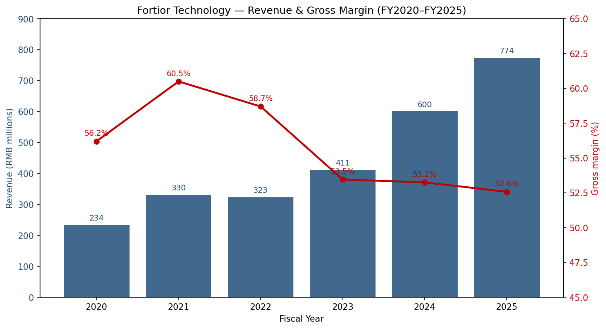
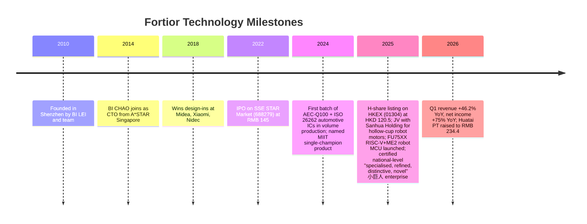
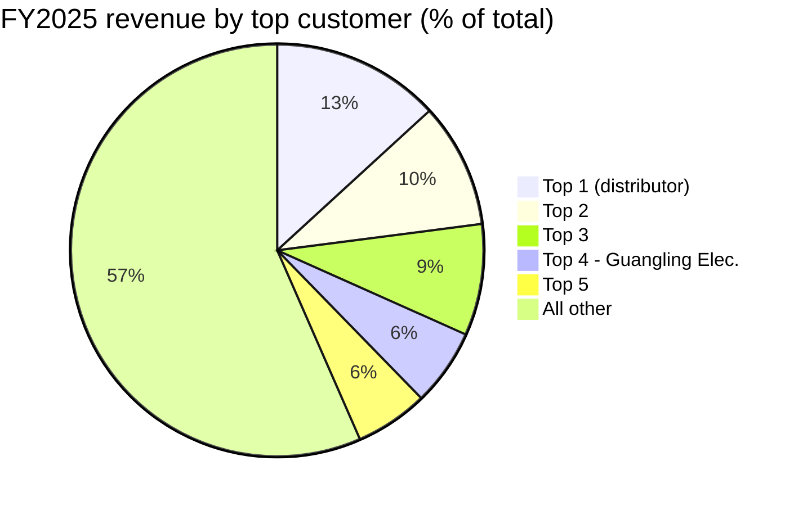
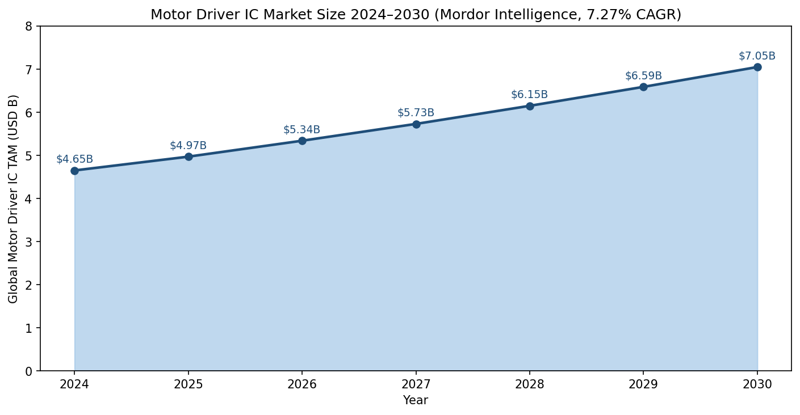
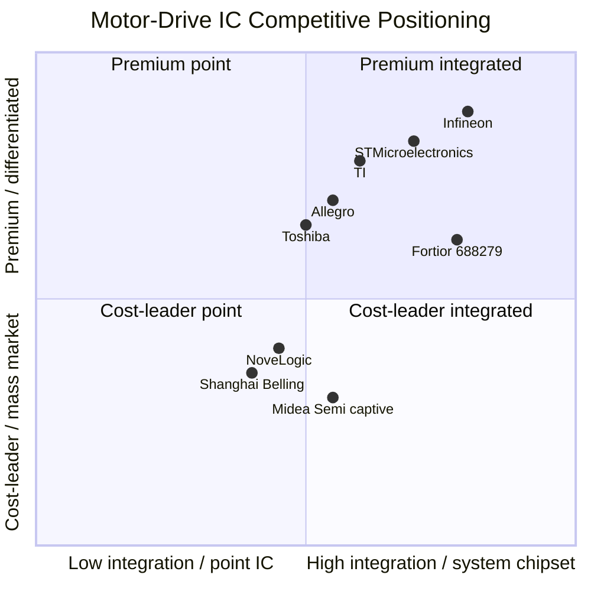
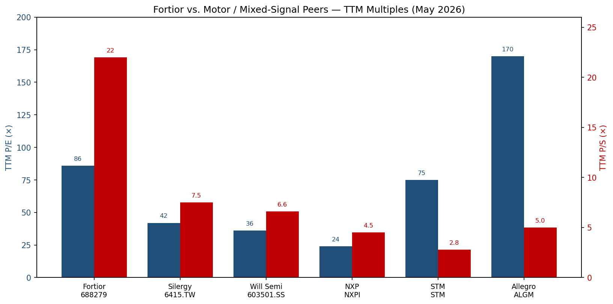

# COMPANY RESEARCH REPORT: Fortior Technology (峰岹科技, SSE:688279 / HKEX:1304)

Date: 2026-05-16

> **Update — 1Q26 results meaningfully ahead, full-year Street estimates lifted (2026-04-28):** Fortior reported 1Q26 revenue of RMB 250.3 M (+46.2% YoY), net income of RMB 88.3 M (+75.1% YoY) and ex-share-based-comp net income of RMB 83.1 M (+89.4% YoY) — well above the prior-year run-rate. Following the print, Huatai raised FY2026 estimates to revenue RMB 1,017 M (+31.5%) and attributable net income RMB 353 M (+61.1%), applying a 76.6× target FY2026 P/E for a price target of RMB 234.40, implying ~26% upside from the 2026-05-15 close of RMB 185.72.
> Source: [峰岹科技 2026 年第一季度报告 (2026-04-28)](https://static.cninfo.com.cn/finalpage/2026-04-29/1225234263.PDF) and [华泰证券 / 财经搜索摘要 (2026-05)](https://basic.10jqka.com.cn/688279/worth.html).

## TABLE OF CONTENTS

1. Company Overview
2. Company History
3. Management Team
4. Products & Services
5. Customers & Go-to-Market
6. Industry Overview
7. Competitive Landscape
8. Market Opportunity (TAM)
9. Risk Assessment

---

## 1. Company Overview

Fortior Technology (峰岹科技, "Fortior") is a Shenzhen-headquartered, Cayman-restructured **fabless designer of BLDC and PMSM motor-drive integrated circuits**. The company's lineup spans motor-control MCUs and ASICs, high-voltage gate-driver ICs (HVICs), MOSFET power devices, and intelligent power modules (IPMs) that together form a complete motor-drive chipset. Fortior is unusual among Chinese fabless analog/mixed-signal vendors in that it does **not** license an ARM Cortex-M core; instead it ships chips built on its own proprietary "ME" (Motor Engine) processor core, with the second generation ("ME2") now combined with a 32-bit RISC-V general-purpose core in the new FU75XX family ([2025 年年度报告, 第 15–20 页](https://static.cninfo.com.cn/finalpage/2026-03-28/1225048468.PDF)). Fortior went public on the Shanghai STAR Market in April 2022 at code 688279, then completed a secondary H-share listing in Hong Kong on 9 July 2025 (code 01304) at HKD 120.5/share, raising net proceeds of approximately HKD 2.13 bn after the greenshoe ([峰岹科技 H 股发行价公告 (2025-07-08)](https://paper.cnstock.com/html/2025-07/08/content_2090529.htm); [关于境外上市股份（H 股）挂牌并上市交易的公告 (2025-07-10)](https://paper.cnstock.com/html/2025-07/10/content_2091238.htm)).

The business model is straightforward Fabless economics: Fortior designs the chip, taping out primarily at GlobalFoundries (GF) Singapore and TSMC, with assembly and test routed through long-term packaging partners including JCET (江苏长电); product is then sold approximately 96.5% via distributors and 3.5% direct, almost entirely to motor-module makers, ODMs, and Tier-1 systems suppliers in mainland China and increasingly in Southeast Asia, Europe, and Japan ([2025 年年度报告, 第 29 页 主营业务分销售模式情况](https://static.cninfo.com.cn/finalpage/2026-03-28/1225048468.PDF)). End markets are concentrated in **small appliances (vacuums, fans, hair-dryers, robot vacuums, massage guns), power tools, e-mobility (e-bikes, e-motorcycles, e-scooters), white goods (washers, refrigerators, room air-conditioners), server thermal management, industrial servos and pumps, and — accelerating sharply since 2024 — automotive thermal-management and chassis-control modules**. Robotics joints and dexterous hands, anchored by the FU75XX series and a joint venture with Sanhua Holding Group (三花控股), are the next leg of the story ([东方财富 — 峰岹与三花签订合作 (2025-01-24)](https://caifuhao.eastmoney.com/news/20250124114056990519570); [21 经济报道 — 峰岹科技与三花控股签订合作框架协议](https://m.21jingji.com/timeline/58991b67a7f9458572ae9ae7f44e6189.html)).

Scale-wise the company is still small but compounding fast. FY2025 revenue reached **RMB 773.9 M (USD 107 M), up 28.9% YoY**, attributable net income RMB 218.9 M (-1.5% YoY headline, +18.9% YoY adjusted for a one-off RMB 52.4 M increase in restricted-share-based-comp expense), with a 52.6% consolidated gross margin and a 21.9% R&D-to-revenue ratio that is closer to design-IP shops than to commodity analog ([2025 年年度报告, 第 9–28 页](https://static.cninfo.com.cn/finalpage/2026-03-28/1225048468.PDF)). The company employed 315 people at year-end 2025, of which 230 (73%) were R&D — meaning headcount is structurally dominated by chip-design and motor-control-algorithm engineers, not sales or operations. China-domestic revenue made up 92.7% of the FY2025 mix and overseas sales grew 51% YoY to RMB 56.1 M, the fastest-growing geographic line.

**Valuation snapshot (as of 2026-05-15 close).** Fortior trades at RMB 185.72 on the A-share with 115.11 M shares outstanding, giving an A-share market capitalisation of approximately **RMB 21.4 bn** (~USD 2.95 bn). Across A+H, fully diluted, market cap is roughly RMB 24 bn given the H-share trades at HKD 122.6 ([gu.qq.com/sh688279 / hk01304 quotes (2026-05-15)](https://gu.qq.com/sh688279); [gu.qq.com/hk01304](https://gu.qq.com/hk01304/gp/news)). Reported diluted EPS for FY2025 was RMB 2.15; on an unadjusted TTM basis (FY2025 GAAP) **TTM P/E is approximately 86×**, dropping to roughly **65× on ex-SBC TTM earnings of RMB 2.41 ([2025 年年度报告, 第 11 页](https://static.cninfo.com.cn/finalpage/2026-03-28/1225048468.PDF))**. TTM P/S is approximately **27×** on FY2025 revenue, or ~22× if Q1 2026 is annualized at its current growth rate. Three-year multiple ranges (since 2022 IPO): TTM P/E has spanned roughly 35×–110×, with the recent print squarely in the upper half of the band as the robotics narrative re-rated the stock; TTM P/S has spanned ~10×–30× ([亿牛网 历史 PE 数据 (2026-05)](https://eniu.com/gu/sh688279); [理杏仁 PE-TTM 历史 (2026-05)](https://www.lixinger.com/equity/company/detail/sh/688279/688279/fundamental/valuation/pe-ttm); [理杏仁 PS-TTM 历史 (2026-05)](https://www.lixinger.com/equity/company/detail/sh/688279/688279/fundamental/valuation/ps-ttm)).

Peer comparison. Silergy (矽力杰, 6415.TW) — the most relevant analog/mixed-signal Chinese peer though a power-management rather than motor specialist — trades at ~42× TTM P/E and ~7.5× TTM P/S on a USD 5.4 bn market cap ([Stock Analysis — Silergy statistics](https://stockanalysis.com/quote/tpe/6415/statistics/); [Simply Wall St — Silergy valuation](https://simplywall.st/stocks/tw/semiconductors/twse-6415/silergy-shares/valuation)). Will Semi / OmniVision (韦尔股份, 603501.SS), the broader Chinese fabless mixed-signal benchmark, trades at ~36× TTM P/E and ~6.6× TTM P/S ([理杏仁 — 韦尔股份 PE-TTM (2026-05)](https://www.lixinger.com/equity/company/detail/sh/603501/603501/fundamental/valuation/pe-ttm)). Among the western motor-IC majors, NXP (NXPI) trades at ~24× TTM P/E and ~4.5× P/S ([GuruFocus — NXPI PE-TTM](https://www.gurufocus.com/term/pettm/NXPI)); STMicroelectronics (STM) trades at ~75× TTM P/E (depressed cyclical earnings) and ~2.8× P/S ([GuruFocus — STM PE-TTM](https://www.gurufocus.com/stock/STM/data/pe-ratio)); Allegro (ALGM) trades at ~170× TTM P/E and ~5.0× P/S ([Public.com — ALGM P/E](https://public.com/stocks/algm/pe-ratio)). The motor-IC peer median TTM P/E is therefore roughly 40×; Fortior is trading at roughly **2.0× the motor-IC peer median P/E and 3–5× the peer median P/S**.

Why does the market pay this premium? Three interlocking reasons. First, growth: 28.9% FY2025 top-line acceleration to 46% in Q1 2026 puts Fortior near the top of the China analog-fabless growth distribution. Second, mix-shift: automotive (now 11.84% of revenue, scaling from <2% three years ago) and industrial (15.62%) carry margins above the corporate average and have a much longer runway. Third, **the robotics-joint optionality**: the FU75XX RISC-V dual-core MCU and the Sanhua hollow-cup-motor JV give the company a credible seat in the bill-of-materials of humanoid-joint actuators, where Sanhua is the dominant supplier (~60–70% share) into Tesla's Optimus electromechanical actuators ([小牛行研 — 峰岹科技与三花强强联手 (2025-01)](https://www.hangyan.co/reports/3552399392503760714)). The premium is consistent with a "thematic premium" — investors are paying for years of compounding off small-base FY2025 numbers — and is reinforced by the Section 9 valuation risk: a missed guidance print or a stall in the humanoid narrative could de-rate the multiple by 30–40% without violating any reasonable long-run fair-value frame.

*Source: company [annual reports 2020–2025, cninfo](https://static.cninfo.com.cn/finalpage/2026-03-28/1225048468.PDF) (2020/2021 figures from the 2022 prospectus, 2022–2025 from each year's 年度报告).*

## 2. Company History

Fortior was founded in 2010 in Shenzhen by **BI LEI (毕磊)**, a former Philips Semiconductors Asia-Pacific R&D chip-design engineer, alongside a small founding cohort that included his elder brother **BI CHAO (毕超)** — at the time a senior scientist at A*STAR's Data Storage Institute in Singapore — and **Gao Shuai (高帅)**, BI LEI's spouse. The founders' insight was that the global motor-control IC market was dominated by Texas Instruments, STMicroelectronics, Infineon, and Cypress, all selling general-purpose Cortex-M-based MCUs onto which customers had to implement BLDC algorithms in firmware. A purpose-built core that hardwired the motor-control loop would deliver higher torque-density-per-millimeter and lower noise at lower system BOM, and would (just as importantly) be free from ARM royalties at a moment when China's appliance and e-mobility OEMs were starting to look for indigenous alternatives. The company spent its first eight years almost invisibly, shipping high-volume but lower-margin small-appliance and fan-control SKUs while iterating on the ME core. The breakthrough came around 2018–2020 as Midea, Haier, Xiaomi, and Nidec qualified Fortior parts for higher-end designs ([招股说明书 (2022)](https://static.sse.com.cn/stock/disclosure/announcement/c/202110/000948_20211011_74J9.pdf)).

Three strategic pivots stand out, each motivated by a structural shift in the customer base. The first, around 2017–2019, was the move from single-chip drivers (ASICs targeted at electric fans and pump motors) into integrated MCU+driver+power-stage solutions, enabling design-wins in higher-ASP categories — robot vacuums, hair dryers, e-bike controllers, cordless power tools. The second, kicked off around 2021 and accelerated through the 2022 IPO, was the targeted push into **automotive-grade chips**: AEC-Q100 qualification, ISO 26262 ASIL-B functional-safety certification, and a portfolio of 12 V / 48 V three-phase drivers and water-pump/oil-pump/cooling-fan MCUs, aimed squarely at the booming Chinese EV thermal-management opportunity and Tier-1 chassis-control market. The third pivot, formally launched in 2025, is **robotics**: the FU75XX series (industry-first RISC-V + ME2 dual-core motor-control MCU), a JV with Sanhua Holding Group focused on hollow-cup (slot-less PMSM) motors for humanoid joints and dexterous hands, and a new pipeline of multi-finger dexterous-hand drive/sense ICs in active development as of YE2025 ([2025 年年度报告, 第 17, 22–24 页 在研项目情况](https://static.cninfo.com.cn/finalpage/2026-03-28/1225048468.PDF)).

Acquisitions have been minimal — Fortior's growth has been organic. The most strategically meaningful corporate event was the **Sanhua hollow-cup motor JV (2025-01)**, registered at RMB 30 M with Sanhua holding 50% and Fortior 36%, structured as a ten-year cooperation framework focused on slot-less permanent-magnet AC motors for humanoid joints — the same micro-actuator class that Sanhua already supplies in volume into Tesla Optimus ([搜狐 — 峰岹与三花签合作框架协议](https://www.sohu.com/a/852476279_122014422); [小牛行研 — 三花与峰岹携手](https://www.hangyan.co/reports/3552399392503760714)). The 2025 H-share listing was the second corporate-defining event: it raised HKD 2.13 bn earmarked 34% for R&D, 16% for overseas distribution, 10% for product portfolio expansion, 30% for strategic M&A, and 10% for working capital, materially expanding the war chest for the automotive and robot pushes ([峰岹科技 H 股发行价公告 (2025-07-08)](https://paper.cnstock.com/html/2025-07/08/content_2090529.htm)).

Recent developments worth flagging: at YE2025 Fortior was awarded national-level **"specialised, refined, distinctive, novel" 小巨人 enterprise** status (the MIIT's top-tier SME designation), having previously won the MIIT "single-champion product" award in 2024 for its highly integrated sensorless BLDC motor-drive controller ([2025 年年度报告, 第 19 页](https://static.cninfo.com.cn/finalpage/2026-03-28/1225048468.PDF)). The 2025 FY also saw the first full year of meaningful automotive revenue (11.84% mix), the launch of Fortior's first hall-sensor and rotary-resolver ICs (extending the company from "drive" into "drive + sense"), and the formal opening of a Japan subsidiary (フオ一ティオテック株式会社) under the FORTIOR INTERNATIONAL PTE. LTD. Singapore parent, signalling intent to chase Japanese white-goods and automotive Tier-1 wins directly.

## 3. Management Team

### BI LEI (毕磊) — Chairman, CEO & co-founder (350 words)

BI LEI (毕磊) is Fortior's founder, controlling shareholder, Chairman, Chief Executive Officer, and General Manager — concentrating executive authority in a manner that is unusual for an A-share listed semiconductor company but is justified at the board level as "necessary at this stage of the company's development to leverage the founder's management and R&D expertise" ([2025 年年度报告, 第 42, 44 页](https://static.cninfo.com.cn/finalpage/2026-03-28/1225048468.PDF)). He holds Singapore citizenship (the filing lists him as "BI LEI" in pinyin, consistent with the Cayman / Hong Kong holding structure) and was the corporate legal representative as of the FY2025 audited report. His career prior to founding Fortior reads almost as a tailored apprenticeship for what he ended up building. From December 1995 to September 2000 he was a research engineer at **A*STAR's Data Storage Institute** in Singapore, where he worked on the precise BLDC spindle motors that drive hard-disk read/write heads — the kind of high-RPM, high-precision motor problem that demands hardwired control loops. From September 2000 to September 2004 he was a senior chip-design engineer at **Philips Semiconductors' Asia-Pacific R&D center** (the unit that later became NXP), spanning the transition from Philips to NXP and giving him direct exposure to a global motor-IC competitor's design flow and product portfolio. From October 2004 to February 2010 he was Vice President of R&D at **Shenzhen Chipsbank Technology (深圳芯邦科技)**, an early China fabless storage-controller IC house, where he ran a multi-disciplinary chip-design team and learned to operate a Fabless P&L inside the Greater China supply chain. In May 2010 he founded Fortior, has served as executive director, chairman and CEO continuously since 2010, and is the company's primary architect for both the proprietary ME core and the overall product strategy.

Ownership-wise, BI LEI and his brother BI CHAO between them hold 65.8% of Fortior Holding (Hong Kong) Limited — which in turn owns 30.61% of the listed entity, equivalent to roughly RMB 14 bn of personal/family wealth at the 2026-05-15 close ([2025 年年度报告, 第 103–104 页](https://static.cninfo.com.cn/finalpage/2026-03-28/1225048468.PDF)). With his wife Gao Shuai's 100% ownership of Xinyun Technology (which holds another 1.18%), the founding-family effective stake in the listed company is approximately 32–34% — making this very much a founder-controlled business. He has avoided public-podcast and conference exposure (no English-language interviews are easily locatable; in Chinese, his most extensive interviews are EEWorld-style trade-press write-ups around product launches). His comp is dominated by restricted-share awards rather than cash, in line with the broader STAR-listed founder norm.

### BI CHAO (毕超) — Director & Chief Technology Officer (190 words)

BI CHAO is BI LEI's elder brother, the company's CTO and a board director. From November 1984 to November 1990 he was a lecturer at **Southeast University (东南大学)**'s electrical-engineering school — a powerhouse of Chinese motor and power-electronics research. From April 1994 to July 1996 he was a senior engineer at **Western Digital**, working on hard-disk drive servomechanism control. From August 1996 to June 2014 he spent 18 years at Singapore's **A*STAR Data Storage Institute** — senior engineer, principal investigator, senior scientist — focused on the spindle-motor and head-positioner servo problem at the heart of HDD design ([2025 年年度报告, 第 44 页](https://static.cninfo.com.cn/finalpage/2026-03-28/1225048468.PDF)). He joined Fortior full-time as CTO in June 2014 and since then has led the architecture roadmap for the ME core, the FOC algorithm library, and the recent ME2 + RISC-V FU75XX design — the technical credibility behind the "we don't license ARM" pitch is largely his. In February 2025 he was appointed a director of Zhejiang Sanhua Jingqu Future Technology (浙江三花精驱未来科技), the JV vehicle for the hollow-cup motor program, signalling that the robotics push is being technically led by the founding CTO himself.

### Zhang Hongmei (张红梅) — CFO (160 words)

Zhang Hongmei was appointed CFO in February 2024 — a relatively recent arrival who joined to lead the H-share IPO process. Her prior roles include Retail Finance Director at **Man Wah Holdings** (敏华控股, HKEX-listed furniture group), CFO at **Guangdong Hongqiang New Material** (广东红墙新材料, SZSE-listed), Vice President at **Guangdong Liwang Hi-Tech (广东力王)**, and CFO at **Shenzhen Maiteng Electronics (深圳迈腾)** ([2025 年年度报告, 第 44 页](https://static.cninfo.com.cn/finalpage/2026-03-28/1225048468.PDF)). The Man Wah background is particularly relevant for handling Hong Kong listing requirements: she brought hands-on HKEX disclosure experience that the company needed for the July 2025 H-share float. She does not have prior public-company CFO experience at a semiconductor specifically, but the IPO execution — pricing at HKD 120.5, full greenshoe — was clean.

### Li Baorong (李宝荣) — Director of Digital System R&D (110 words)

Li Baorong joined Fortior in 2013 and is now Director of Digital System R&D, head of the Guangdong High-Performance Motor Drive Control Chip Engineering Technology Research Center, and a named Shenzhen Municipal Leading Talent. He holds a Master's in Optical Engineering from the University of Chinese Academy of Sciences and is one of the core technical pillars behind Fortior's "ME" core IP. He is included in this report because in a fabless motor-IC house, the head of digital RTL and architecture (rather than e.g. the head of sales) is the single most important non-founder technical role; loss of Li would be a material event for the FU75XX-class roadmap.

### Governance footer

The board has nine members of whom three are independent (Niu Shuangxia of Hong Kong Polytechnic University, Chen Jingyang formerly of Da Sheng Times, and Lin Mingyao of Southeast University — the latter a notable academic specialist in electric motor and drive technology). Insider ownership through Fortior Hong Kong and the founder-family vehicles totals approximately 32–34% of the listed shares; employee-stock-plan vehicles (Xinqi Investment and Xinsheng Investment) hold a further ~2.9%. Restricted-share-based compensation drove RMB 58.7 M of FY2025 expense (up RMB 52.4 M YoY), with 125 employees (39.7% of headcount) holding equity grants — the comp model is heavily equity-weighted, which is positive for talent retention but adds GAAP-vs-cash noise to reported earnings. The 2025 annual report explicitly flags that **BI LEI's combined Chairman + CEO + General Manager role concentrates power** but argues that internal controls and related-party-transaction policies offset the risk; nonetheless this is a governance flag investors should monitor.

### Track record synthesis

The founding team is technically deep and has delivered: from a sub-RMB 100 M revenue niche player in 2018 to RMB 774 M revenue with 53% gross margins and 22% R&D intensity in 2025, then accelerating to +46% growth in Q1 2026, all while qualifying automotive-grade silicon and shipping a first-of-its-kind RISC-V motor MCU. The risk is the same as in any founder-CEO, supervoting-effective-control structure: succession is undefined, and the company is one BI LEI / BI CHAO car accident away from a major narrative reset.

## 4. Products & Services

Fortior's product line is best understood as **a complete motor-drive chipset, not a single chip**: a customer integrating a Fortior solution typically buys two or three of the company's chips together (e.g., MCU + HVIC + MOSFETs, or an integrated IPM), rather than designing one Fortior part into a board otherwise populated by competitors. This is part of the system-level moat: the algorithm is co-designed across the MCU and the driver, and the company supplies motor-electromagnetic structure consulting on top of the chips themselves.

```mermaid
graph TD
    A[Fortior Motor-Drive Chipset] --> B[Motor Main Control]
    A --> C[Motor Drive Stage]
    A --> D[Power Stage]
    A --> E[Sense & Position]
    A --> F[Robotics-specific]
    B --> B1[FU6xxx series MCU: dual-core ME + general-purpose]
    B --> B2[Three-phase BLDC ASIC series]
    B --> B3[Single-phase BLDC ASIC series]
    B --> B4[Automotive MCU + integrated MOSFET + LIN]
    C --> C1[Three-phase gate-driver HVICs]
    C --> C2[Half-bridge gate-driver HVICs]
    C --> C3[Capacitive-isolated gate drivers - PV/storage]
    D --> D1[FMD-series MOSFETs]
    D --> D2[Intelligent Power Modules - IPM]
    E --> E1[Angle-position sensor ICs]
    E --> E2[Rotary-resolver decoder ICs]
    E --> E3[Hall-based current-sensor ICs]
    F --> F1[FU75XX: ME2 + 32-bit RISC-V dual-core robot MCU]
    F --> F2[Multi-finger dexterous-hand drive-and-sense IC - in development]
    F --> F3[High-performance servo motion control IC - completed R&D 2025]
```

**Motor main-control MCUs (FU-series).** Fortior's flagship product family is the "dual-core" motor MCU, which integrates Fortior's proprietary Motor Engine (ME) core for the real-time motor-control loop with a general-purpose core (8051 / RISC-V) for housekeeping and customer firmware. The MCU portfolio targets every BLDC-motor application from a 5 W fan to a 1 kW e-bike controller, with high integration (on-chip LDO, op-amps, pre-driver), AEC-Q100 automotive-graded variants, and a full sensorless FOC algorithm in hardware. **FY2025 MCU revenue was RMB 482.3 M (62.4% of revenue), growing 25.4% YoY at a 54.4% gross margin** ([2025 年年度报告, 第 29 页](https://static.cninfo.com.cn/finalpage/2026-03-28/1225048468.PDF)). Competitive verdict: **yes** — moats are (a) the proprietary ME core, which is genuinely differentiated against ARM Cortex-M-based competitor parts in latency and BOM cost, (b) the deep algorithm library, and (c) hard-won customer qualifications at Midea, Xiaomi, Haier, and Nidec. Closest named competitor product: TI's C2000 Piccolo series; Fortior is ahead on motor-loop latency and integration cost, slightly behind on general-purpose-compute headroom and ecosystem tooling.

**Motor main-control ASICs.** Lower-cost three-phase and single-phase BLDC driver ASICs targeted at high-volume specialty applications: cooling fans, electric pumps, fascia massage guns, robot vacuum brush motors. Smaller die, fixed function, more cost-driven. **FY2025 ASIC revenue was RMB 133.0 M (17.2% of revenue), growing 57.0% YoY at a 60.2% gross margin** — the highest growth and the highest gross margin segment in the company, reflecting that these ASICs sit on a low-cost mature node where Fortior owns the design and the algorithm together. Verdict: **partial** moat — design IP, but limited switching costs vs. a competitive ASIC. Closest competitor: Allegro's specialty BLDC ICs; Fortior is at parity on integration but at substantially lower price.

**Motor drive ICs (HVIC).** High-voltage gate drivers — three-phase and half-bridge — that bridge between the low-voltage MCU and the high-voltage power-MOSFET stage; functions include over-voltage / under-voltage protection, shoot-through prevention, and dead-time control. **FY2025 HVIC revenue was RMB 95.1 M (12.3% of revenue), growing 12.8% YoY at a 39.3% gross margin** — slower-growing and lower-margin because these are commodity-adjacent parts where ST, Infineon, and IR/Infineon legacy parts have decades of socket inertia. Verdict: **partial** moat — typically sold as part of a chipset with Fortior MCUs, where the system-level value is the moat, not the gate driver itself. Closest competitor: STMicroelectronics' STDRIVE family; comparable in spec, Fortior wins on price and bundle.

**Intelligent Power Modules (IPM).** Modules that integrate control circuitry, high/low-voltage drivers, and the power MOSFETs in one package, targeted at smart small-appliance and white-goods applications. **FY2025 IPM revenue was RMB 60.2 M (7.8% of revenue), growing 38.8% YoY at a 43.0% gross margin** — the second-fastest-growing line, driven by penetration in induction-motor-to-BLDC retrofits in air conditioners, washing machines, and refrigerator compressors. Verdict: **yes** moat — multi-chip packaging plus algorithm integration is harder to copy than a single chip. Closest competitor: ON Semiconductor's IPM line and Mitsubishi's DIPIPM; Fortior is behind on legacy ON/MELCO automotive packaging but ahead on cost and on small-appliance algorithm tuning.

**Power-stage MOSFETs (FMD-series).** Discrete power MOSFETs designed by Fortior and fabbed at a foundry. **FY2025 MOSFET revenue was RMB 2.5 M (0.3% of revenue), at a 21.0% gross margin** — currently a strategic capability rather than a revenue contributor; the purpose is to control system-level cost and ensure availability of a matched MOSFET for the Fortior MCU+HVIC chipset, not to compete head-on with Infineon CoolMOS or ST STripFET. Verdict: **no** moat at this scale; a captive-supply utility.

**Sensors (new).** In 2025 Fortior began sampling angle-position sensor ICs (chip-package Hall) and rotary-resolver decoder ICs targeted at industrial servos and automotive seat/window motors, plus a chip-format current-sensor IC for e-motorcycle, photovoltaic-inverter, and on-board-charger applications. These are not yet broken out in revenue but are described in the FY2025 R&D pipeline ([2025 年年度报告, 第 22–24 页 在研项目情况](https://static.cninfo.com.cn/finalpage/2026-03-28/1225048468.PDF)). The strategic rationale is to upgrade the company's positioning from "motor drive" to "motor drive + sense", broadening the per-system silicon content.

**Robotics-specific products.** The **FU75XX series**, formally launched October 2025, is the industry's first motor-drive MCU built on a 32-bit RISC-V dual-core architecture combined with the second-generation ME (ME2) motor-control engine. The chip integrates hardware-accelerated FOC loops (servo current-loop bandwidth of 3 kHz), supports CAN-FD / CAN / LIN / SPI / I2C / UART, and runs mainstream industrial bus protocols (EtherCAT, CANopen, Modbus) — a feature set explicitly designed for robot-joint controllers and industrial servo amplifiers ([EET-China — 峰岹 FU75XX 发布 (2025-10)](https://www.eet-china.com/info/74313.html); [EEWorld — 毕超博士：基于 RISC-V 的机器人电机控制芯片](https://www.eeworld.com.cn/robot/eic665070.html)). Verdict: **yes** moat — first-mover on RISC-V in motor MCUs, the architecture is proprietary, and the early customer engagements include both Sanhua (via the JV) and a number of unnamed humanoid and cobot startups. Closest competitor: there is no exact analog. ST's STSPIN32F0/F4 and TI's TMS320F28004x are the nearest substitutes; Fortior is ahead on integrated motor-control hardware acceleration and behind only on toolchain maturity. The **FU75XX is the single most important new product for the multi-year thesis** and the centerpiece of the company's robotics narrative.

Per the FY2025 R&D project disclosure, **a multi-finger dexterous-hand drive-and-control chip** is in active development as Project #12 (RMB 39.5 M total budget, "second-generation dual-core architecture integrating high-performance motor-control algorithm + power stage + sensor", "applied to multi-finger dexterous hands in robotics") ([2025 年年度报告, 第 23 页](https://static.cninfo.com.cn/finalpage/2026-03-28/1225048468.PDF)). This is the silicon counterpart to the Sanhua hollow-cup motor JV and is the most direct exposure to a future Tesla Optimus / Unitree / Figure dexterous-hand BOM.

**Flagship 1–3 products.** The clear flagship today is the **dual-core MCU family (FU6xxx)**, the engine of 62% of FY2025 revenue, with the automotive variant (AEC-Q100 / ISO 26262 ASIL-B) the highest-growth sub-line. The second flagship is the **integrated IPM line** (38.8% YoY growth, the white-goods penetration story). The third is the **FU75XX robot MCU**, which is currently sub-1% of revenue but is the primary driver of multiple expansion.

**Launches / sunsets in last 12 months.** Launches: FU75XX series (Oct-2025), first batch of 48 V automotive three-phase drivers, first hall-sensor ICs, first rotary-resolver decoder, first capacitive-isolated gate drivers for PV/storage inverters. No public sunsets — the older single-phase fan ASICs continue to ship.

## 5. Customers & Go-to-Market

### Customer concentration (REQUIRED disclosure from 年度报告 § 主要销售客户)

The Chinese A-share annual-report standard requires disclosure of top-5 customer share. Fortior's three-year history shows **a steady de-concentration trend, which is genuinely positive for the long-run risk profile**:

| FY | Top-1 customer (% of revenue) | Top-5 customer (% of revenue) |
|---|---|---|
| FY2023 | 17.48% | 50.64% |
| FY2024 | 14.98% | 46.85% |
| FY2025 | 13.18% | 43.44% |

*Source: [2023 年年度报告, 第 29 页](https://static.cninfo.com.cn/finalpage/2024-04-25/1219802860.PDF), [2024 年年度报告, 第 30 页](https://static.cninfo.com.cn/finalpage/2025-03-31/1222962350.PDF), [2025 年年度报告, 第 32 页](https://static.cninfo.com.cn/finalpage/2026-03-28/1225048468.PDF).*

In FY2025 specifically, the top-5 customers accounted for RMB 336.2 M of sales (43.44% of total), with the top customer at 13.18% (RMB 102.0 M), the second at 9.77% (RMB 75.6 M), the third at 8.74% (RMB 67.7 M), the fourth at 6.03% (RMB 46.7 M, a new entrant — **光菱电子 / Guangling Electronics**, a distributor), and the fifth at 5.72% (RMB 44.3 M). All five are unrelated parties; none of the top customers is a competitor or is vertically integrating. The disclosure indicates that the top customers are primarily authorized distributors and large appliance ODMs — Fortior sells 96.5% through distribution, so the top-1 and top-2 customers are likely large distributors that re-sell to the end-product OEMs.

*Source: [峰岹科技 2025 年年度报告, 第 32 页](https://static.cninfo.com.cn/finalpage/2026-03-28/1225048468.PDF).*

**Risk verdict: NOT material at the top-1 level, NOT material at the top-5 level.** Top-1 of 13.18% sits below the 20% materiality threshold flagged in the skill spec; top-5 of 43.44% sits below the 50% threshold. The 3-year direction of travel is favourable. The single most reassuring fact: the top distributor is fungible — losing it would create a 6–12 month painful renegotiation but would not threaten the underlying design-in pipeline at the end-OEMs.

### Named end-customers (from company website + press)

Through its distribution channel, Fortior's chips reach a who's-who of Chinese and global appliance and motion-equipment OEMs. Named in trade press and the company website: in **white goods and kitchen appliances** — Midea (美的), Haier (海尔), Hisense (海信), TCL, Little Swan (小天鹅), Daikin (大金), Konka (康佳), FOTILE (方太), ROBAM (老板), Vatti (华帝), Vanward (万和), Joyoung (九阳); in **smart small appliances and tools** — Xiaomi (小米), Panasonic, Philips, Ecovacs (科沃斯), Shark (SharkNinja), Nidec (日本电产 / 尼得科), Roborock (石头科技), Dreame (追觅), Roidmi (睿米), Xiaogou (小狗); in **power tools** — TTI, Dongcheng (东成), Positec (宝时得), Greenworks (格力博), Airmate (艾美特); in **e-mobility** — Niu (小牛), Yadea (雅迪), Tailing (台铃), Lingdu (零度) ([搜狐财经 — 峰岹科技客户认可 (2025)](https://news.qq.com/rain/a/20250514A02R8T00)). In automotive the company discloses long-term cooperation with "multiple well-known automakers and Tier-1s" without naming them in detail; press indicates engagements with BYD, Geely, Great Wall, and Bosch / Continental Tier-1s on thermal-management modules ([21 经济报道](https://m.21jingji.com/timeline/58991b67a7f9458572ae9ae7f44e6189.html)).

### Distribution channels and sales motion

The company runs a **distributor-led model**: in FY2025, 96.51% of revenue came through authorized distributors and 3.49% direct ([2025 年年度报告, 第 29 页](https://static.cninfo.com.cn/finalpage/2026-03-28/1225048468.PDF)). Distributors hold buy-out inventory (i.e. revenue is recognized on sale-in, not sell-through), which means inventory cycles at the distributor layer can amplify Fortior's quarterly volatility, though the FY2025 distributor inventory build appears manageable. Direct sales are reserved for large strategic accounts — primarily Tier-1 automotive suppliers, large white-goods OEMs willing to take BOM-level engineering engagements, and the new humanoid-robot accounts. The sales cycle for a new small-appliance design-in is 6–12 months; for an automotive AEC-Q100 design-in, 18–30 months and gated on functional-safety certification.

### Key partnerships

The most strategically meaningful partnership is the **JV with Sanhua Holding (三花控股)**, registered January 2025 with capital of RMB 30 M (Sanhua 50%, Fortior 36%), focused on hollow-cup (slot-less PMSM) motors for humanoid joints and dexterous hands. Sanhua is the dominant supplier of electromechanical actuators into Tesla Optimus (~60–70% share by trade-press estimates), making this JV the single highest-conviction route by which Fortior silicon ends up inside a humanoid-joint actuator BOM ([东方财富 — 峰岹与三花 (2025-01-24)](https://caifuhao.eastmoney.com/news/20250124114056990519570); [小牛行研 — 与三花强强联手 (2025-01)](https://www.hangyan.co/reports/3552399392503760714)).

Foundry partnerships are with TSMC and GlobalFoundries Singapore on the front end and JCET (江苏长电) plus other Chinese OSATs on the back end. In FY2025 the top-5 suppliers accounted for 81.63% of procurement (top-1 alone at 40.31%) — supplier concentration is the mirror image of customer concentration and is structurally higher because foundry choice is a long-lead, multi-year qualification process ([2025 年年度报告, 第 32 页](https://static.cninfo.com.cn/finalpage/2026-03-28/1225048468.PDF)).

## 6. Industry Overview

Fortior sits at the intersection of three industry pools: (a) the **BLDC and PMSM motor-drive integrated-circuit market**, (b) the **broader analog / mixed-signal IC market**, and (c) the **motor-and-motion subsystems market** (where the silicon is one of several components in a larger module). The CSRC classification places it under "I65 — Software and Information Technology Services," sub-class I6520 "Integrated Circuit Design," but functionally the company competes in motor-driver ICs.

The global motor driver IC market, per Mordor Intelligence, was **USD 4.97 bn in 2025** and is forecast to grow to **USD 7.05 bn by 2030 at a 7.27% CAGR** ([Mordor Intelligence — Motor Driver IC Market Size 2025-2030](https://www.mordorintelligence.com/industry-reports/motor-driver-ic-market)). Within that, **BLDC driver ICs led with 45.32% share of the motor-driver-IC market in 2024**, and the BLDC-specific segment was valued at approximately USD 3.14 bn in 2025 with high-single-digit to low-double-digit (7–10%) CAGR expected through 2029 ([Market Report Analytics — Global BLDC Motor Driver and Control ICs 2025–2033](https://www.marketreportanalytics.com/reports/bldc-motor-driver-and-control-ics-375912)). By end-use industry, automotive captured 37.36% of motor-driver-IC revenue in 2024, while industrial automation and robotics are forecast to accelerate at a 7.76% CAGR through 2030 — the two fastest-growing demand pools and the two pools Fortior is leaning into.

The structural growth drivers are well-understood and durable. **First**, the global replacement cycle from AC induction motors and brushed DC motors to BLDC/PMSM motors in everything from washing machines to industrial pumps to e-bikes is far from complete; BLDC penetration in Chinese washing machine production was still well under 50% in 2024, in air conditioners under 35%, and in e-mobility approaching 80%. **Second**, automotive electrification adds 30–50 new BLDC motors per vehicle (thermal management, electric water/oil pumps, fans, seats, sunroofs, mirror folds, HVAC blowers, electric brake boosters, etc.), each of which needs a motor MCU and a driver IC; a Tesla Model 3 / Model Y carries roughly 40 BLDC motors, an XPeng or NIO has 35–50. **Third**, server thermal management — driven by AI-data-center power densities crossing 100 kW/rack — has created a new vertical of high-RPM, high-MTBF cooling-fan BLDC motors, each requiring a high-end FOC controller. **Fourth**, **humanoid robotics**: a Tesla Optimus prototype carries ~40 motorised joints plus 12 hollow-cup motors per dexterous hand (24 per pair) — meaning each humanoid carries upwards of 50–60 BLDC/PMSM-class drive points, several of which need a discrete motor MCU per joint. Even at modest humanoid volumes, this is incremental silicon TAM measured in tens of millions of units per year by 2030.

*Source: [Mordor Intelligence — Motor Driver IC Market Size, Share & 2030 Trends Report](https://www.mordorintelligence.com/industry-reports/motor-driver-ic-market).*

Regulatory drivers in China are powerful tail-winds. The "新质生产力" (new productive forces) industrial-policy push, the "中国制造 2025 / 智能制造" framework, and the MIIT's "specialised, refined, distinctive, novel" 小巨人 program (under which Fortior was recognised at the national level in 2025) all funnel capital and political support to indigenous design IP at the analog/mixed-signal layer. The CSRC's STAR Market policy framework — focused on "hard technology" — is a direct beneficiary tailwind for Fortior's A-share float; the Hong Kong Stock Exchange's Chapter 18A and Chapter 18C provisions enable the H-share dual-listing route. In the United States, the Biden / Trump-era export controls have largely **not** hit Fortior because motor-control MCUs are well below the most restricted 7nm-AI-and-foundry-equipment perimeter; Fortior chips run on 55nm–180nm mature nodes at TSMC / GF Singapore, which are not subject to current US restrictions. The downstream risk is therefore more about Chinese OEM end-customer demand cycles than about Fortior being directly export-controlled.

Industry structure is **mature, fragmented at the OEM layer but concentrated at the chip-vendor layer**. On the supply side, the top six global motor-driver-IC vendors (Texas Instruments, STMicroelectronics, Infineon, Allegro, ON Semiconductor, Microchip) collectively hold approximately 55–60% global share, with the rest distributed across Japanese specialists (Toshiba, Renesas, Rohm, Nidec subsidiaries), Korean specialists, and a long tail of Chinese players (Fortior, NoveLogic, Shanghai Belling, GigaDevice's motor line, Verisilicon-licensed designs, etc.). On the demand side, the customer base is highly fragmented — even Midea, Haier, BYD, and Xiaomi together account for less than 5% of global motor-driver-IC demand. Buyer power is moderate: switching costs are real (qualification cycles, firmware port, motor re-tune), but not enormous; pricing pressure is steady at a few percent per year in commodity categories and zero-to-positive in differentiated automotive and robotics categories. The dominant substitute threat is **vertical integration by appliance OEMs themselves** — Midea has its own IC design subsidiary (Midea Semiconductor / 美仁半导体), Haier and Hisense have similar in-house teams — though to date these in-house teams have struggled to match the algorithm depth of dedicated specialists like Fortior.

## 7. Competitive Landscape

**1. Texas Instruments (TI, NASDAQ:TXN).** The global benchmark for motor-drive ICs, with the C2000 Piccolo F2802x/F2806x/F28004x DSP-MCU family the most directly competitive product against Fortior's FU6xxx flagship MCUs, plus the DRV8xxx gate-driver family against Fortior's HVICs. TI has a massive ecosystem advantage (Code Composer Studio, MotorWare, decades of reference designs) and unmatched distribution. Fortior wins on cost (typically 30–50% cheaper for comparable function), on motor-loop latency (the ME core's hardwired FOC loop beats a software loop on Cortex-M / C28x), and on Chinese customer service. TI wins on roadmap breadth, automotive long-term-supply assurance, and ecosystem.

**2. STMicroelectronics (STM, NYSE:STM).** The other global heavyweight; the STSPIN32F0/F4 integrated motor controllers and the STDRIVE gate-driver family are the most direct STM competitors. STM has particular strength in European automotive and in IPM modules where its STGAP / STGIPL lines compete head-on with Fortior's IPM. Fortior is at parity on small-appliance functionality, ahead on price, and behind on automotive scale ([GuruFocus — STM PE-TTM](https://www.gurufocus.com/stock/STM/data/pe-ratio)).

**3. Infineon Technologies (XETRA:IFX).** Particularly strong in higher-voltage and high-power motor drive (HVAC compressors, EV traction-adjacent, industrial servo amplifiers); the iMOTION integrated motor-control family and the EiceDRIVER gate drivers are the primary competing products. Infineon has the strongest IGBT / SiC / GaN power-device portfolio of any peer, which Fortior cannot match — but Fortior is largely below the voltage / power range where Infineon is unbeatable.

**4. Allegro MicroSystems (NASDAQ:ALGM).** US-listed motor + magnetic-sensor specialist, with a portfolio heavily weighted to automotive and to integrated motor-driver-plus-Hall-sensor parts. Direct competitor to Fortior's new automotive AEC-Q100 line. Allegro trades at ~170× TTM P/E and ~5.0× P/S, reflecting depressed cyclical earnings and a similar long-run thematic premium ([Public.com — ALGM P/E](https://public.com/stocks/algm/pe-ratio); [Stock Analysis — ALGM ratios](https://stockanalysis.com/stocks/algm/financials/ratios/)).

**5. NXP Semiconductors (NASDAQ:NXPI).** Less of a pure motor-drive specialist but a major automotive-MCU vendor whose S32K / S32M family is increasingly used as the master MCU in EV thermal-management and chassis modules — i.e. potentially co-resident with Fortior's drive ICs in the same module rather than directly competing. NXPI trades at ~24× TTM P/E and ~4.5× P/S — the most reasonable peer multiple in the set, reflecting a more mature, lower-growth profile ([GuruFocus — NXPI PE-TTM](https://www.gurufocus.com/term/pettm/NXPI)).

**6. Toshiba Electronic Devices (privately held within the Toshiba group).** Toshiba's TB67Hxxx and TB67Bxxx motor MCUs are particularly strong in Japanese small-appliance designs; Fortior is now competing for share here directly, supported by the new Japan subsidiary.

**7. Silergy (TPE:6415).** Not a motor specialist — Silergy is the leading Chinese-founded analog-IC house, focused on power management. Included as a "look-through" valuation comp because it is the closest publicly-traded Chinese mixed-signal analog peer in scale and growth profile, trading at ~42× TTM P/E and ~7.5× P/S on USD 5.4 bn market cap ([Stock Analysis — Silergy](https://stockanalysis.com/quote/tpe/6415/statistics/)).

**8. Will Semiconductor / OmniVision (SSE:603501).** Image-sensor and analog mixed-signal house; valuation peer rather than product competitor, trading at ~36× FY2026 forward P/E and ~6.6× P/S ([理杏仁 — 韦尔股份估值](https://www.lixinger.com/equity/company/detail/sh/603501/603501)).

**9. NoveLogic / 思瑞浦 / Joulwatt / GigaDevice motor line / Shanghai Belling.** Chinese domestic motor-IC challengers. NoveLogic (诺微) is the closest direct competitor and is gaining share in small-appliance ASICs. Belling (上海贝岭) has legacy motor parts. None of these matches Fortior's ME-core IP or system-level service model — but they pressure the ASIC and HVIC commodity lines on price.

**10. In-house captive design (Midea Semi / 美仁半导体, similar at Haier and Gree).** The most strategically important emerging competitor class. As large appliance OEMs invest in their own motor-IC teams to control BOM and supply, Fortior risks losing share at its largest end-customers. So far the captive teams have struggled to match algorithm sophistication, but this is a 3–5 year watch-item.

*Source: company filings and [Stock Analysis](https://stockanalysis.com/), [GuruFocus](https://www.gurufocus.com/), [Public.com](https://public.com/), [理杏仁](https://www.lixinger.com/) screened May 2026. Fortior P/S is calculated on FY2025 revenue and 2026-05-15 close.*

**Fortior's competitive advantages** are concentrated in three places: (a) the proprietary ME core, which removes the ARM royalty stack and allows hardware-level FOC implementations that beat software FOC on Cortex-M or C28x cores; (b) the system-level service model — Fortior consults on motor electromagnetic design alongside the chip sale, increasing customer switching costs; (c) Chinese-customer intimacy and price discipline that the global majors have struggled to replicate.

**Vulnerabilities** are (a) limited automotive scale relative to TI / ST / Infineon / NXP / Allegro — Fortior is at 11.84% automotive mix today vs. 60%+ at most western peers, and the ramp from here is a multi-year qualification process; (b) limited ecosystem and tooling versus TI's MotorWare and ST's MC SDK; (c) supplier concentration on TSMC + GF + JCET — a foundry-policy shock would hit Fortior harder than TI / ST who own their fabs.

## 8. Market Opportunity (TAM)

**TAM.** The global motor driver IC market is the addressable TAM and totalled **USD 4.97 bn in 2025**, projected to reach **USD 7.05 bn by 2030 (7.27% CAGR)** per Mordor Intelligence ([Mordor — Motor Driver IC](https://www.mordorintelligence.com/industry-reports/motor-driver-ic-market)). Within this, the BLDC-specific motor-driver-and-control-IC sub-TAM was approximately USD 3.14 bn in 2025, growing at a faster 7–10% CAGR ([Market Report Analytics — BLDC Motor Driver & Control ICs](https://www.marketreportanalytics.com/reports/bldc-motor-driver-and-control-ics-375912)). The broader brushless DC motor market (motors plus driver electronics combined) was approximately USD 20 bn in 2024 per Grand View Research, with motor electronics typically 8–12% of total motor BOM ([Grand View Research — Brushless DC Motor Market](https://www.grandviewresearch.com/industry-analysis/brushless-dc-motors-market)).

**SAM.** Fortior's serviceable addressable market is the subset of motor-driver-IC TAM that fits its product portfolio — i.e. low-to-mid voltage (5 V – 600 V) BLDC and PMSM driver ICs for small appliances, white goods, e-mobility, light industrial, server thermal, and 12 V / 48 V automotive sub-systems. This excludes (for now) traction inverters for full-EV powertrains (Infineon / ST SiC + IGBT territory), high-power industrial servo drives at the kilowatt-class power-stage level (Mitsubishi / Yaskawa territory), and stepper-motor-specific ICs. The serviceable subset is roughly 60–65% of total motor-driver-IC TAM, or approximately **USD 3.0–3.2 bn in 2025 and USD 4.3–4.6 bn by 2030**.

**SOM.** Fortior's FY2025 revenue of USD 107 M against a SAM of ~USD 3.0 bn implies approximately **3.5–4% share of its serviceable market today**, concentrated very heavily in China (~92.7% of revenue). Within China-domestic motor-driver-ICs, Fortior is widely recognised as the leading domestic specialist; trade-press estimates put its Chinese small-appliance BLDC motor-MCU share at 15–20% and its Chinese white-goods motor-MCU share at 5–10%. Internationally, share is well under 1%; the new overseas expansion and the Japan subsidiary are explicitly aimed at this gap.

**Robotics / humanoid incremental TAM.** Humanoid robots are an additive, currently sub-1% of TAM but the highest-CAGR pool. A single Tesla Optimus-style humanoid prototype is estimated to use 28–40 brushless / hollow-cup motors in joints and dexterous hands; at Sanhua's 60–70% share of Optimus electromechanical actuators and Fortior's 36% economic interest in the JV, even 50,000 humanoid units per year by 2028 translates to a meaningful new revenue pool relative to today's base. Industrial cobots and surgical robots add a further multi-hundred-million-USD pool over the same period. Sell-side optimistic cases (e.g. Huatai's PT model) embed approximately RMB 200–400 M of robotics-specific revenue by 2028, against a current robotics revenue contribution that is essentially a rounding error.

**Penetration strategy.** Three vectors: **(1)** automotive AEC-Q100 chip ramps, leveraging the FY2025 11.84% automotive base and pushing toward 25%+ automotive mix by FY2027; **(2)** overseas direct sales via the Japan subsidiary and the new HK-listing-funded distribution expansion, targeting Japanese, Korean, and European white-goods and Tier-1 customers that have historically bought from ST/TI/Infineon; **(3)** robotics via the Sanhua JV, FU75XX series, and the in-development dexterous-hand IC, capturing share in the new humanoid BOM as it builds out. Each vector reinforces the others — automotive qualification is a credentialing exercise that helps the company sell into Japanese Tier-1s, which in turn helps the humanoid push because the same automotive Tier-1s are increasingly humanoid-actuator suppliers.

## 9. Risk Assessment

### Company-specific risks

**1. Key person dependency on BI LEI and BI CHAO.** The founder-brothers personally own (via Fortior HK and family vehicles) ~32% of the listed company, hold the Chairman/CEO and CTO roles, and are individually identified in the 2025 annual report as joint controlling persons alongside Gao Shuai. Most of the company's core IP (the ME and ME2 cores) traces directly to BI CHAO's technical authorship. A serious health or governance event affecting either brother — particularly without an obvious heir-apparent named — would force a leadership transition in a company that has not been through one. Mitigants: deep R&D bench (230 R&D engineers, several named leading talents), board oversight, founder family equity alignment ([2025 年年度报告, 第 42, 44 页](https://static.cninfo.com.cn/finalpage/2026-03-28/1225048468.PDF)).

**2. Customer concentration risk — currently moderate, improving.** Top-1 customer at 13.18% and top-5 at 43.44% in FY2025, down from 17.48% / 50.64% in FY2023. Below the materiality thresholds; the trend direction is favorable. The residual concern is that the top customers are large authorized distributors rather than named end-OEMs, so the company has a degree of opacity about end-customer demand cycles, and a distributor consolidation event could create concentrated quarterly volatility. Mitigants: documented disclosure history; 96.5% distribution model is industry-standard for fabless analog ([2025 年年度报告, 第 32 页](https://static.cninfo.com.cn/finalpage/2026-03-28/1225048468.PDF)).

**3. Supplier concentration risk — high.** Top-5 suppliers accounted for 81.63% of FY2025 procurement and top-1 alone for 40.31% — almost certainly TSMC, GF Singapore, JCET, and one or two other OSATs. Foundry-policy shocks, capacity allocation shifts, or a major node disruption at TSMC/GF would directly hit Fortior's ability to ship. Mitigants: multi-foundry sourcing (TSMC + GF), long-standing relationships, mature-node products with multiple foundry options ([2025 年年度报告, 第 32 页](https://static.cninfo.com.cn/finalpage/2026-03-28/1225048468.PDF)).

**4. Technology obsolescence / captive-OEM risk.** Midea, Haier, and other large customers are building in-house IC design teams (Midea Semi 美仁半导体 being the most advanced). If these captive teams succeed in matching Fortior's algorithm depth, Fortior could lose share at its largest end-customers over a 3–5 year horizon. Mitigants: continuous algorithm investment (21.86% R&D intensity), strong system-level service moat, and the FU75XX move into RISC-V territory where captive teams are years behind. The risk is structural but slow-moving.

**5. Execution risk on the robotics narrative.** The thesis-defining bet is the Sanhua JV plus FU75XX plus dexterous-hand IC delivering material revenue by FY2027–28. Any of (a) Sanhua losing Optimus actuator share, (b) Optimus volumes disappointing, (c) FU75XX failing to win humanoid-cobot designs, or (d) the dexterous-hand IC slipping in development, would meaningfully impair the multiple. Mitigants: the JV structure aligns Sanhua's incentives; the FU75XX is already shipping; multiple humanoid programs (Unitree, Figure, Agility, 1X, Apptronik, Galbot, Booster) are early customer-candidate paths.

### Industry / market risks

**6. Competitive intensity from western majors going down-market and Chinese challengers going up-market.** TI, ST, Allegro and NXP are all extending their motor-IC portfolios into the small-appliance and Chinese e-mobility segments where Fortior is strongest; simultaneously domestic challengers (NoveLogic, Belling, GigaDevice) are pressuring the commodity ASIC and HVIC lines. Net effect: 1–3% annual ASP pressure in legacy categories, partly offset by mix-shift to higher-ASP automotive and robotics.

**7. Macroeconomic sensitivity in Chinese consumer-appliance demand.** ~50% of revenue is exposed to small-appliance, white-goods, and e-mobility demand cycles in China; a downturn in Chinese household consumption (as seen 1H 2024) would slow the largest revenue pool. Mitigants: rapid mix-shift into automotive and industrial, both of which are running on different demand cycles.

**8. Geopolitical risk on Chinese fabless designers.** While Fortior is not currently subject to US export controls (its products are on mature nodes, not 7nm-and-below), a broader expansion of US restrictions on Chinese fabless analog/mixed-signal IP licensors, EDA tools, or foundry access could damage the company. Mitigants: GF Singapore foundry usage (non-US, non-Chinese), no advanced-node dependency, no obvious dual-use exposure.

**9. Regulatory / industrial-policy risk in China.** The strongest tail-wind today — "新质生产力" pushing capital to indigenous chips — could weaken if Beijing's policy priorities shift. Mitigants: the company is now self-funding through cash flow plus HK IPO proceeds and is not policy-dependent for revenue ([2025 年年度报告, 第 27 页](https://static.cninfo.com.cn/finalpage/2026-03-28/1225048468.PDF)).

### Financial risks

**10. Valuation / multiple-compression risk — material.** TTM P/E of ~86× and TTM P/S of ~27× place Fortior at roughly 2× the motor-IC peer median P/E and 3–5× the peer median P/S. The premium is justifiable on a 30%+ multi-year growth case with margin expansion and a robotics call option, but a single missed quarterly print, a stall in the humanoid narrative, or a broader China-fabless sector rotation could compress the multiple by 30–40% without violating any reasonable fair-value frame. Sector ETF flow data (KraneShares KSTR, ChinaAMC STAR50) show heavy index ownership of Fortior that exacerbates flow-driven moves. Watch-items: each quarterly print versus Street consensus, Optimus volume disclosure from Tesla, FU75XX design-win cadence ([eniu.com 历史 PE](https://eniu.com/gu/sh688279)).

**11. Margin pressure from rising SBC and overseas-expansion costs.** FY2025 ex-SBC net income grew 18.9% while reported net income fell 1.5% — the gap is the RMB 52.4 M increase in restricted-share-based-comp expense from the 2024 incentive plan. Selling expense grew 64% YoY on overseas team build, management expense grew 69%. If these growth investments continue scaling faster than revenue, operating-margin compression could become a multi-quarter headwind ([2025 年年度报告, 第 28 页](https://static.cninfo.com.cn/finalpage/2026-03-28/1225048468.PDF)).

### Macroeconomic risks

**12. Foreign-exchange exposure (CNY/USD/JPY/HKD).** Overseas revenue at 7.3% of FY2025 mix is still small but growing 51% YoY; the new H-share listing means dividend payments to Hong Kong shareholders create incremental HKD exposure. Mitigants: most overseas billing remains in USD with natural hedge against USD-denominated wafer purchases; HKD/USD peg limits HKD volatility.

---

## REFERENCES

### Primary filings — Fortior Technology
- [峰岹科技 2025 年年度报告 (filed 2026-03-27)](https://static.cninfo.com.cn/finalpage/2026-03-28/1225048468.PDF) — local cache: `cninfo_reports/SSE/688279_峰岹科技/2026-03-27_年报_2025年年度报告.pdf`
- [峰岹科技 2024 年年度报告 (filed 2025-03-30)](https://static.cninfo.com.cn/finalpage/2025-03-31/1222962350.PDF)
- [峰岹科技 2023 年年度报告 (filed 2024-04-24)](https://static.cninfo.com.cn/finalpage/2024-04-25/1219802860.PDF)
- [峰岹科技 2022 年年度报告 (filed 2023-04-25)](https://static.cninfo.com.cn/finalpage/2023-04-26/1216593767.PDF)
- [峰岹科技 2026 年第一季度报告 (filed 2026-04-28)](https://static.cninfo.com.cn/finalpage/2026-04-29/1225234263.PDF)
- [峰岹科技 2025 年半年度报告 (filed 2025-08-27)](https://static.cninfo.com.cn/finalpage/2025-08-28/1224596779.PDF)
- [峰岹科技 IPO 招股说明书 (2022)](https://static.sse.com.cn/stock/disclosure/announcement/c/202110/000948_20211011_74J9.pdf)
- [峰岹科技 H 股发行价公告 (2025-07-08)](https://paper.cnstock.com/html/2025-07/08/content_2090529.htm)
- [峰岹科技 H 股挂牌上市交易公告 (2025-07-10)](https://paper.cnstock.com/html/2025-07/10/content_2091238.htm)
- [峰岹科技 H 股超额配售权行使公告 (2025-07-25)](https://paper.cnstock.com/html/2025-07/25/content_2097982.htm)

### Market data and valuation
- [Yahoo Finance — Fortior Tech 688279.SS](https://finance.yahoo.com/quote/688279.SS/)
- [Tencent Stock — 峰岹科技 sh688279](https://gu.qq.com/sh688279)
- [Tencent Stock — 峰岹科技 hk01304](https://gu.qq.com/hk01304/gp/news)
- [理杏仁 — 峰岹科技 PE-TTM 历史](https://www.lixinger.com/equity/company/detail/sh/688279/688279/fundamental/valuation/pe-ttm)
- [理杏仁 — 峰岹科技 PS-TTM 历史](https://www.lixinger.com/equity/company/detail/sh/688279/688279/fundamental/valuation/ps-ttm)
- [亿牛网 — 峰岹科技 历史市盈率](https://eniu.com/gu/sh688279)
- [Stock Analysis — Fortior (SHA:688279) market cap](https://stockanalysis.com/quote/sha/688279/market-cap/)
- [同花顺 F10 — 峰岹科技 盈利预测](http://basic.10jqka.com.cn/688279/worth.html)

### Peer valuation references
- [Stock Analysis — Silergy (TPE:6415) statistics](https://stockanalysis.com/quote/tpe/6415/statistics/)
- [Simply Wall St — Silergy valuation](https://simplywall.st/stocks/tw/semiconductors/twse-6415/silergy-shares/valuation)
- [Companies Market Cap — Silergy](https://companiesmarketcap.com/silergy/marketcap/)
- [理杏仁 — 韦尔股份 / OmniVision PE-TTM](https://www.lixinger.com/equity/company/detail/sh/603501/603501/fundamental/valuation/pe-ttm)
- [理杏仁 — 韦尔股份 / OmniVision PS-TTM](https://www.lixinger.com/equity/company/detail/sh/603501/603501/fundamental/valuation/ps-ttm)
- [GuruFocus — NXPI P/E (TTM)](https://www.gurufocus.com/term/pettm/NXPI)
- [GuruFocus — STM P/E (TTM)](https://www.gurufocus.com/stock/STM/data/pe-ratio)
- [Public.com — ALGM P/E ratio](https://public.com/stocks/algm/pe-ratio)
- [Stock Analysis — ALGM financial ratios](https://stockanalysis.com/stocks/algm/financials/ratios/)
- [MacroTrends — ALGM P/E ratio 2020–2026](https://www.macrotrends.net/stocks/charts/ALGM/allegro-microsystems/pe-ratio)
- [Companies Market Cap — ALGM P/S ratio](https://companiesmarketcap.com/allegro-microsystems/ps-ratio/)

### Industry / TAM
- [Mordor Intelligence — Motor Driver IC Market Size 2025-2030](https://www.mordorintelligence.com/industry-reports/motor-driver-ic-market)
- [Market Report Analytics — Global BLDC Motor Driver and Control ICs](https://www.marketreportanalytics.com/reports/bldc-motor-driver-and-control-ics-375912)
- [Market Report Analytics — BLDC ICs Analysis 2025 Forecast 2033](https://www.marketreportanalytics.com/reports/bldc-motor-driver-and-control-ics-375923)
- [Grand View Research — Brushless DC Motor Market](https://www.grandviewresearch.com/industry-analysis/brushless-dc-motors-market)
- [Insight Partners — Motor Driver IC Market Trends 2034](https://www.theinsightpartners.com/reports/motor-driver-ic-market)
- [360iResearch — BLDC Motor ICs 2025–2030](https://www.360iresearch.com/library/intelligence/bldc-motor-ics)
- [Research and Markets — BLDC Motor Driver IC 2025 Forecast to 2030](https://www.researchandmarkets.com/reports/5726120/bldc-motor-driver-ic-global-market-insights)

### Robotics / Sanhua JV
- [东方财富 — 峰岹与三花签订合作 (2025-01-24)](https://caifuhao.eastmoney.com/news/20250124114056990519570)
- [21 经济报道 — 峰岹科技与三花控股签订合作框架协议](https://m.21jingji.com/timeline/58991b67a7f9458572ae9ae7f44e6189.html)
- [搜狐 — 峰岹科技与三花控股签署合作框架协议](https://www.sohu.com/a/852476279_122014422)
- [证券时报 — 峰岹科技：与三花控股签署合作框架协议](https://www.stcn.com/article/detail/1507184.html)
- [小牛行研 — 峰岹科技与三花强强联手 (2025-01)](https://www.hangyan.co/reports/3552399392503760714)
- [国盛证券 — 与三花强强联手 (via 发现报告)](https://www.fxbaogao.com/detail/4680283)

### FU75XX robot MCU
- [EET-China — 「为未来机器人而生！」峰岹科技重磅发布 FU75XX 系列 (2025-10)](https://www.eet-china.com/info/74313.html)
- [Big-bit — 峰岹科技即将重磅发布 FU75XX](https://www.big-bit.com/wap/news/405125.html)
- [EEWorld — 毕超博士：基于 RISC-V 的机器人电机控制芯片](https://www.eeworld.com.cn/robot/eic665070.html)
- [EET-China — 基于 RISC-V 的机器人电机控制芯片](https://www.eet-china.com/news/202403299368.html)
- [国际电子商情 — 人形机器人关节激增，对电机控制芯片有何挑战？](https://www.esmchina.com/news/12438.html)

### Other news / press
- [新浪财经 — 峰岹科技港交所首日上市大涨 (2025-07-10)](https://finance.sina.com.cn/stock/stockzmt/2025-07-10/doc-infeyhus8597421.shtml)
- [新浪财经 — 峰岹科技 A+H 上市加码全球化 (2025-07-09)](https://finance.sina.com.cn/roll/2025-07-09/doc-infevnxt4507116.shtml)
- [新浪财经 — 峰岹科技 H 股挂牌交易](https://finance.sina.com.cn/stock/hkstock/ggscyd/2025-07-09/doc-infewqmn9378449.shtml)
- [CFi.CN — 峰岹科技 H 股招股说明书等事宜](https://www.cfi.net.cn/p20250630000076.html)
- [搜狐财经 — 峰岹科技客户认可分析](https://news.qq.com/rain/a/20250514A02R8T00)

### Company website
- [Fortior Technology official website](https://www.fortiortech.com/)
