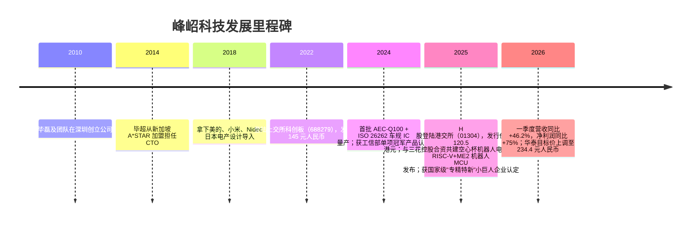
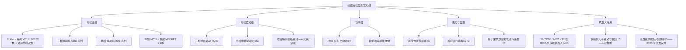
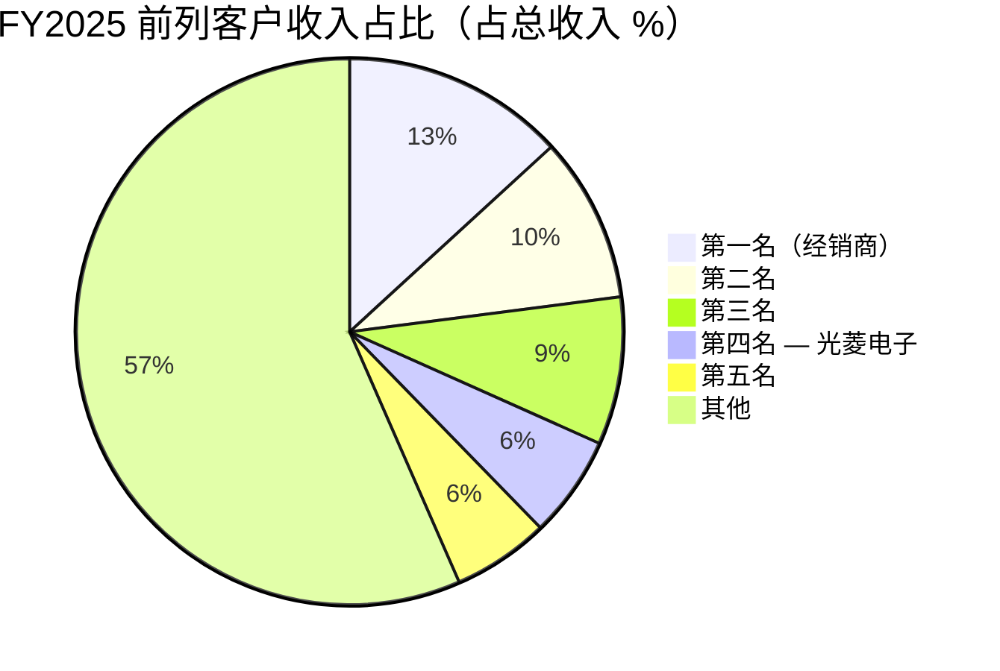
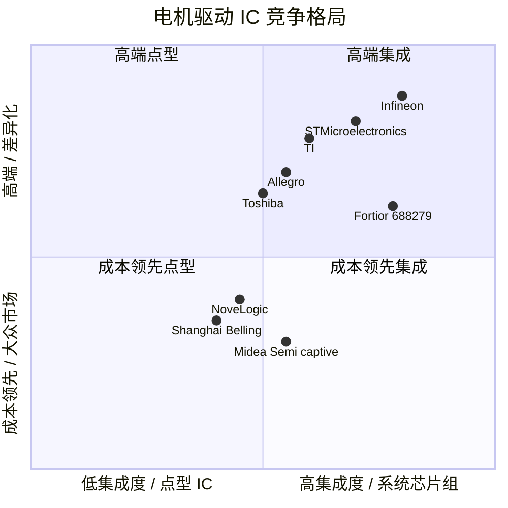

# 公司研究报告：峰岹科技（Fortior Technology，SSE:688279 / HKEX:1304）

报告日期（as of）：2026-06-15

> **业绩更新 — 2026 年一季度持续高增长，验证汽车/工业升级逻辑（2026-04-28）：** 峰岹科技 2026 年第一季度营业收入 **2.503 亿元人民币（同比 +46.20%）**，归母净利润 **8,827 万元人民币（同比 +75.09%）**，利润总额同比 +69.97%，基本每股收益（basic EPS）0.77 元人民币（同比 +40%），延续 FY2025 全年 +28.9% 的加速势头（[峰岹科技 2026 年第一季度报告 (2026-04-28)](https://static.cninfo.com.cn/finalpage/2026-04-29/1225234263.PDF)）。公司已公告将于 2026 年内召开 2025 年年度暨 2026 年一季度业绩说明会（[关于召开 2025 年年度暨 2026 年第一季度业绩说明会的公告 (2026-05-27)](https://static.cninfo.com.cn/finalpage/2026-05-28/1225334045.PDF)）。

---

## 投资摘要（Investment Summary）

> 以下评级、目标价（price target, PT）、预测与情景均为 **本报告分析师观点（*分析师观点：*）**，并非来自任何监管文件或公司披露；A 股不含权目标价以人民币计。

| 项目 | 数值 |
|---|---|
| **评级（Rating）** | **Hold / 中性** |
| **12 个月目标价（PT, A 股）** | **¥227 元人民币** |
| 当前股价（2026-06-15，688279.SS） | ¥203.60 元人民币 |
| **隐含上行空间** | **约 +11%** |
| 估值方法 | FY2027E EPS ¥3.49 × 目标 65× P/E |
| 情景区间（bear / base / bull） | ¥157（−23%）/ ¥227（+11%）/ ¥262（+29%） |
| A 股市值（2026-06-15） | 约 234 亿元人民币（约 32 亿美元） |
| 总股本 | 1.1511 亿股（A+H 全面摊薄） |
| 52 周区间（约） | ¥110 – ¥215 元人民币 |
| 代码 / 交易所 | SSE:688279（A 股）/ HKEX:01304（H 股） |

**估值倍数矩阵（forward valuation matrix，*分析师观点：*）。** 以 ¥203.60 现价计：

| 倍数 | FY2025A | FY2026E | FY2027E |
|---|---|---|---|
| P/E（摊薄口径） | ~107× | ~77× | ~58× |
| P/E（FY2025 报表基本 EPS 2.16 口径） | ~94× | — | — |
| P/S | ~30× | ~23× | ~18× |
| 营收增速 YoY | +28.9% | +33%E | +28%E |

*P/E 随预测推进而压缩，是本报告"以时间换估值"的核心逻辑：现价对 FY2025 报表 EPS 约 94×，对 FY2027E 摊薄 EPS 约 58×。FY2025A 净利润、EPS 来自 [2025 年年度报告, 第 116–117 页](https://static.cninfo.com.cn/finalpage/2026-03-28/1225048468.PDF)；FY2026E/FY2027E 为本报告预测（*分析师观点：*，推导见第 2 节）。*

**相对表现（relative performance，*分析师观点：*）。** 截至 2026-06-15，A 股报 ¥203.60，较 2026-05-15 的 ¥185.72 上涨约 +10%，年内显著跑赢科创 50 指数（CSI STAR 50），反映机器人题材与一季度高增长共同推动的估值重估（[腾讯股票 — 峰岹科技 sh688279](https://gu.qq.com/sh688279)）。

**论点支柱（thesis pillars，*分析师观点：*）：**
1. **国产电机驱动 IC 龙头 + 自研内核护城河。** 峰岹是中国 BLDC/PMSM 电机驱动 IC 领先的国产 Fabless 厂商，自研 ME/ME2（Motor Engine）内核免去 ARM 授权费并实现硬件级 FOC，毛利率（gross margin）52.6%、研发投入强度（R&D intensity）21.86%——更接近设计 IP 公司而非大宗模拟厂商（[2025 年年度报告, 第 9–28 页](https://static.cninfo.com.cn/finalpage/2026-03-28/1225048468.PDF)）。
2. **结构性升级：汽车 + 工业是高毛利成长跑道。** 汽车占收入由三年前 <2% 升至 11.84%、ASIC 板块同比 +56.96%，两者毛利率均高于公司整体，提供多年成长能见度（[2025 年年度报告, 第 29 页](https://static.cninfo.com.cn/finalpage/2026-03-28/1225048468.PDF)）。
3. **机器人期权价值（option value）。** FU75XX RISC-V+ME2 双核机器人 MCU 与三花控股（Sanhua）空心杯电机合资公司，使峰岹在人形关节执行器 BOM 中占据可信地位——这是估值倍数扩张的主要叙事，但现阶段收入贡献 <1%。
4. **估值已充分计入增长，是评级中性的根因。** 现价约 77× FY2026E、58× FY2027E P/E，约为电机 IC 同业市盈率中位数的 1.5–2.0 倍；本报告认为 30%+ 的多年复合增长在很大程度上已被定价，故给予 Hold，等待汽车放量或机器人订单的实质性催化提供更好的风险回报。

---

## 目录

1. 公司概况（含 1A 估值快照 / 1B GF Score 基本面计分卡）
2. 估值与目标价（前瞻模型 + PT 推导 + bull/base/bear）
3. 公司发展历程
4. 管理团队
5. 产品与服务
6. 客户与上市策略
7. 行业概览
8. 竞争格局
9. 市场机会（TAM）
10. 风险评估
10.5. 核心分歧与催化剂（Key debates & catalysts）
11. 投资视角计分卡（Investor lenses）
12. 参考资料

---

## 1. 公司概况

峰岹科技（Fortior Technology，"峰岹"）总部位于深圳，采用开曼群岛架构重组，是一家**专注于 BLDC（无刷直流）及 PMSM（永磁同步）电机驱动集成电路设计的 Fabless 厂商**。公司产品线涵盖电机控制 MCU 与 ASIC、高压栅极驱动 IC（HVIC）、MOSFET 功率器件及智能功率模块（IPM），共同构成完整的电机驱动芯片组。在中国 Fabless 模拟/混合信号厂商中，峰岹的独特之处在于**未授权使用** ARM Cortex-M 内核，而是基于自研的"ME"（Motor Engine，电机引擎）处理器内核打造芯片，第二代 ME 内核（"ME2"）已与 32 位 RISC-V 通用处理器内核结合，应用于新的 FU75XX 系列产品（[2025 年年度报告, 第 15–20 页](https://static.cninfo.com.cn/finalpage/2026-03-28/1225048468.PDF)）。峰岹科技于 2022 年 4 月登陆上交所科创板，证券代码 688279；2025 年 7 月 9 日完成香港二次上市（港股代码 01304），发行价 120.5 港元/股，经超额配售后募集净额约 21.3 亿港元（[峰岹科技 H 股发行价公告 (2025-07-08)](https://paper.cnstock.com/html/2025-07/08/content_2090529.htm)；[关于境外上市股份（H 股）挂牌并上市交易的公告 (2025-07-10)](https://paper.cnstock.com/html/2025-07/10/content_2091238.htm)）。

商业模式属于标准的 Fabless 经济学：峰岹负责芯片设计，主要采用 GlobalFoundries 格罗方德新加坡厂（GF）与台积电（TSMC）流片，封装测试委托长期合作伙伴包括江苏长电（JCET）等；产品销售约 96.5% 通过经销商完成、3.5% 为直销，几乎全部面向中国大陆并日益拓展至东南亚、欧洲及日本的电机模组厂、ODM 及 Tier-1 系统供应商（[2025 年年度报告, 第 29 页 主营业务分销售模式情况](https://static.cninfo.com.cn/finalpage/2026-03-28/1225048468.PDF)）。下游市场集中于**小家电（吸尘器、风扇、电吹风、扫地机器人、筋膜枪）、电动工具、电动出行（电助力自行车、电动摩托车、电动滑板车）、白色家电（洗衣机、冰箱、家用空调）、服务器散热、工业伺服与水泵，以及自 2024 年以来快速放量的汽车热管理与底盘控制模组**。机器人关节与灵巧手——以 FU75XX 系列及与三花控股集团（Sanhua Holding Group）合资公司为依托——构成下一阶段成长主线（[东方财富 — 峰岹与三花签订合作 (2025-01-24)](https://caifuhao.eastmoney.com/news/20250124114056990519570)；[21 经济报道 — 峰岹科技与三花控股签订合作框架协议](https://m.21jingji.com/timeline/58991b67a7f9458572ae9ae7f44e6189.html)）。

从规模上看，公司体量仍偏小但增速强劲。FY2025 营业收入达 **7.739 亿元人民币（约 1.07 亿美元），同比增长 28.9%**，归母净利润 2.189 亿元人民币（表观同比 -1.5%，若剔除一次性 5,240 万元限制性股票股份支付费用增加项，调整后同比 +18.9%），合并毛利率 52.6%，研发费用率 21.9%，更接近设计 IP 公司而非大宗模拟厂商的水平（[2025 年年度报告, 第 9–28 页](https://static.cninfo.com.cn/finalpage/2026-03-28/1225048468.PDF)）。2025 年末公司员工 315 人，其中研发人员 230 人（占比 73%），意味着员工结构由芯片设计与电机控制算法工程师主导，而非销售或运营人员。FY2025 中国境内收入占比 92.7%，境外销售同比增长 51% 至 5,610 万元人民币，是增速最快的地区性收入。

### 1A 估值快照（截至 2026-06-15 收盘）

峰岹科技 A 股股价 **203.60 元人民币**，总股本 1.1511 亿股，A 股总市值约 **234 亿元人民币**（约 32 亿美元）（[腾讯股票 — 峰岹科技 sh688279](https://gu.qq.com/sh688279)；[Stock Analysis — Fortior (SHA:688279) market cap](https://stockanalysis.com/quote/sha/688279/market-cap/)）。FY2025 报表口径基本每股收益（basic EPS）2.16 元、稀释每股收益（diluted EPS）2.15 元（[2025 年年度报告, 第 117 页](https://static.cninfo.com.cn/finalpage/2026-03-28/1225048468.PDF)）。按 FY2025 报表 EPS 计算 **TTM 市盈率约 94 倍**；考虑 2025 年 7 月 H 股发行后全面摊薄股本（~1.151 亿股）、并以本报告 FY2026E 摊薄 EPS 2.64 元计，则 **forward P/E 约 77 倍**、FY2027E 约 58 倍——估值随预测推进而压缩。基于 FY2025 营业收入的 TTM 市销率约为 **30 倍**，对 FY2026E 营收约 23 倍。自 2022 年 IPO 以来的三年估值区间：TTM 市盈率约在 35×–110× 之间波动，当前处于区间上半段，反映机器人题材推动的重估；TTM 市销率区间约为 10×–30×（[理杏仁 PE-TTM 历史](https://www.lixinger.com/equity/company/detail/sh/688279/688279/fundamental/valuation/pe-ttm)；[理杏仁 PS-TTM 历史](https://www.lixinger.com/equity/company/detail/sh/688279/688279/fundamental/valuation/ps-ttm)；[亿牛网 历史 PE 数据](https://eniu.com/gu/sh688279)）。

**可比公司对照。** Silergy 矽力杰（6415.TW）——最具相关性的中国系模拟/混合信号同行（虽以电源管理为主而非电机专家）——TTM 市盈率约 42 倍，TTM 市销率约 7.5 倍，总市值约 54 亿美元（[Stock Analysis — Silergy statistics](https://stockanalysis.com/quote/tpe/6415/statistics/)；[Simply Wall St — Silergy valuation](https://simplywall.st/stocks/tw/semiconductors/twse-6415/silergy-shares/valuation)）。Will Semi / OmniVision 韦尔股份（603501.SS）作为中国 Fabless 混合信号更广泛的对标，TTM 市盈率约 36 倍，TTM 市销率约 6.6 倍（[理杏仁 — 韦尔股份 PE-TTM (2026-05)](https://www.lixinger.com/equity/company/detail/sh/603501/603501/fundamental/valuation/pe-ttm)）。在海外电机 IC 大厂中，NXP 恩智浦（NXPI）TTM 市盈率约 24 倍、市销率约 4.5 倍（[GuruFocus — NXPI PE-TTM](https://www.gurufocus.com/term/pettm/NXPI)）；STMicroelectronics 意法半导体（STM）TTM 市盈率约 75 倍（周期性盈利受压所致），市销率约 2.8 倍（[GuruFocus — STM PE-TTM](https://www.gurufocus.com/stock/STM/data/pe-ratio)）；Allegro 阿莱戈（ALGM）TTM 市盈率约 170 倍、市销率约 5.0 倍（[Public.com — ALGM P/E](https://public.com/stocks/algm/pe-ratio)）。综合来看，电机 IC 同业 TTM 市盈率中位数约为 40 倍；以峰岹 FY2025 报表 EPS 计算的约 94× TTM 市盈率、约 77× 的 FY2026E forward P/E，约相当于**电机 IC 同业市盈率中位数的 1.5–2.0 倍、市销率中位数的 3–5 倍**——这一溢价正是本报告给予 Hold 评级的估值起点。

市场为何给予如此溢价？三大相互交织的原因（*分析师观点：*）。**第一，成长性：** FY2025 营收 28.9% 的增长加速至 2026 年一季度的 46.2%，在中国 Fabless 模拟厂商成长性分布中位居前列（[2026 年第一季度报告](https://static.cninfo.com.cn/finalpage/2026-04-29/1225234263.PDF)）。**第二，结构性升级：** 汽车业务（占收入 11.84%，三年前低于 2%）的毛利率高于公司整体水平，且增长跑道更长——这一点已在 ASIC 板块同比 +56.96% 中得到验证（[2025 年年度报告, 第 29 页](https://static.cninfo.com.cn/finalpage/2026-03-28/1225048468.PDF)）。**第三，机器人关节的期权价值：** FU75XX RISC-V 双核 MCU 以及与三花共建的空心杯（coreless）电机合资公司，使公司在人形机器人关节执行器 BOM 中占据可信地位——而三花被业内估计为 Tesla Optimus 机电执行器的主导供应商（*分析师观点：*市占率约 60–70%）（[小牛行研 — 峰岹科技与三花强强联手 (2025-01)](https://www.hangyan.co/reports/3552399392503760714)）。当前溢价符合"题材溢价"特征——投资者在为基于较小 FY2025 基数的多年复合增长付费——也正因此放大了第 9 节所述的估值风险：业绩指引落空或人形机器人叙事停滞，均可能使估值倍数下行 30–40%。本报告的中性评级正是对这一不对称风险回报的反映。

下面的利润表 Sankey 直观展示了"钱怎么进来又怎么出去"：FY2025 营业收入 ¥773.9M 中，约 47% 作为营业成本（COGS）流出（对应 52.6% 的毛利率），其余在扣除 ¥169.1M 研发费用、¥93.3M 销售+管理费用后形成 ¥225.4M 营业利润，叠加 ¥91.6M 其他收益/投资收益后，最终归母净利润 ¥218.9M（[2025 年年度报告, 第 116–117 页](https://static.cninfo.com.cn/finalpage/2026-03-28/1225048468.PDF)）。

<svg xmlns="http://www.w3.org/2000/svg" viewBox="0 0 1000 560" width="1000" height="560" role="img" aria-label="income statement Sankey"><rect x="0" y="0" width="1000" height="560" fill="#ffffff"/>
<text x="20.00" y="30.00" text-anchor="start" font-family="Helvetica,Arial,sans-serif" font-size="15" font-weight="700" fill="#1f2933">峰岹科技 FY2025 利润表 Sankey（人民币百万元）</text>
<path d="M 204.00,63.84 C 258.00,63.84 258.00,92.00 312.00,92.00 L 312.00,337.54 C 258.00,337.54 258.00,309.38 204.00,309.38 Z" fill="#93c5fd" fill-opacity="0.55"/>
<path d="M 452.00,85.00 C 506.00,85.00 506.00,156.53 560.00,156.53 L 560.00,271.28 C 506.00,271.28 506.00,199.75 452.00,199.75 Z" fill="#86efac" fill-opacity="0.55"/>
<path d="M 452.00,199.75 C 506.00,199.75 506.00,285.28 560.00,285.28 L 560.00,421.47 C 506.00,421.47 506.00,335.94 452.00,335.94 Z" fill="#fca5a5" fill-opacity="0.55"/>
<path d="M 328.00,92.00 C 382.00,92.00 382.00,85.00 436.00,85.00 L 436.00,292.11 C 382.00,292.11 382.00,299.11 328.00,299.11 Z" fill="#86efac" fill-opacity="0.55"/>
<path d="M 328.00,299.11 C 382.00,299.11 382.00,306.11 436.00,306.11 L 436.00,493.00 C 382.00,493.00 382.00,486.00 328.00,486.00 Z" fill="#fca5a5" fill-opacity="0.55"/>
<path d="M 700.00,142.45 C 754.00,142.45 754.00,224.57 808.00,224.57 L 808.00,336.02 C 754.00,336.02 754.00,253.90 700.00,253.90 Z" fill="#86efac" fill-opacity="0.55"/>
<path d="M 700.00,253.90 C 754.00,253.90 754.00,350.02 808.00,350.02 L 808.00,353.43 C 754.00,353.43 754.00,257.31 700.00,257.31 Z" fill="#fca5a5" fill-opacity="0.55"/>
<path d="M 576.00,156.53 C 630.00,156.53 630.00,142.45 684.00,142.45 L 684.00,257.21 C 630.00,257.21 630.00,271.28 576.00,271.28 Z" fill="#86efac" fill-opacity="0.55"/>
<path d="M 576.00,285.28 C 630.00,285.28 630.00,271.36 684.00,271.36 L 684.00,318.86 C 630.00,318.86 630.00,332.78 576.00,332.78 Z" fill="#fca5a5" fill-opacity="0.55"/>
<path d="M 576.00,332.78 C 630.00,332.78 630.00,332.86 684.00,332.86 L 684.00,418.95 C 630.00,418.95 630.00,418.87 576.00,418.87 Z" fill="#fca5a5" fill-opacity="0.55"/>
<path d="M 576.00,418.87 C 630.00,418.87 630.00,432.95 684.00,432.95 L 684.00,435.55 C 630.00,435.55 630.00,421.47 576.00,421.47 Z" fill="#fca5a5" fill-opacity="0.55"/>
<path d="M 204.00,323.38 C 258.00,323.38 258.00,337.54 312.00,337.54 L 312.00,405.26 C 258.00,405.26 258.00,391.10 204.00,391.10 Z" fill="#93c5fd" fill-opacity="0.55"/>
<path d="M 204.00,405.10 C 258.00,405.10 258.00,405.26 312.00,405.26 L 312.00,453.67 C 258.00,453.67 258.00,453.51 204.00,453.51 Z" fill="#93c5fd" fill-opacity="0.55"/>
<path d="M 204.00,467.51 C 258.00,467.51 258.00,453.67 312.00,453.67 L 312.00,484.32 C 258.00,484.32 258.00,498.16 204.00,498.16 Z" fill="#93c5fd" fill-opacity="0.55"/>
<path d="M 204.00,512.16 C 258.00,512.16 258.00,484.32 312.00,484.32 L 312.00,486.32 C 258.00,486.32 258.00,514.16 204.00,514.16 Z" fill="#93c5fd" fill-opacity="0.55"/>
<rect x="188.00" y="63.84" width="16" height="245.54" rx="1.5" fill="#2563eb"/>
<rect x="188.00" y="323.38" width="16" height="67.71" rx="1.5" fill="#2563eb"/>
<rect x="188.00" y="405.10" width="16" height="48.42" rx="1.5" fill="#2563eb"/>
<rect x="188.00" y="467.51" width="16" height="30.65" rx="1.5" fill="#2563eb"/>
<rect x="188.00" y="512.16" width="16" height="2.00" rx="1.5" fill="#2563eb"/>
<rect x="312.00" y="92.00" width="16" height="394.00" rx="1.5" fill="#1e3a8a"/>
<rect x="436.00" y="85.00" width="16" height="207.11" rx="1.5" fill="#15803d"/>
<rect x="436.00" y="306.11" width="16" height="186.89" rx="1.5" fill="#dc2626"/>
<rect x="560.00" y="156.53" width="16" height="114.75" rx="1.5" fill="#15803d"/>
<rect x="560.00" y="285.28" width="16" height="136.19" rx="1.5" fill="#dc2626"/>
<rect x="684.00" y="142.45" width="16" height="114.91" rx="1.5" fill="#15803d"/>
<rect x="684.00" y="271.36" width="16" height="47.50" rx="1.5" fill="#dc2626"/>
<rect x="684.00" y="332.86" width="16" height="86.09" rx="1.5" fill="#dc2626"/>
<rect x="684.00" y="432.95" width="16" height="2.60" rx="1.5" fill="#dc2626"/>
<rect x="808.00" y="224.57" width="16" height="111.44" rx="1.5" fill="#15803d"/>
<rect x="808.00" y="350.02" width="16" height="3.41" rx="1.5" fill="#dc2626"/>
<line x1="188.00" y1="186.61" x2="182.00" y2="160.45" stroke="#cbd5e1" stroke-width="1"/>
<text x="179.00" y="163.45" text-anchor="end" font-family="Helvetica,Arial,sans-serif" font-size="11.5" font-weight="700" fill="#1f2933">MCU 主控</text>
<text x="179.00" y="176.45" text-anchor="end" font-family="Helvetica,Arial,sans-serif" font-size="10" font-weight="400" fill="#52606d">¥482.3M  (62.3%)</text>
<line x1="188.00" y1="357.24" x2="182.00" y2="331.08" stroke="#cbd5e1" stroke-width="1"/>
<text x="179.00" y="334.08" text-anchor="end" font-family="Helvetica,Arial,sans-serif" font-size="11.5" font-weight="700" fill="#1f2933">ASIC</text>
<text x="179.00" y="347.08" text-anchor="end" font-family="Helvetica,Arial,sans-serif" font-size="10" font-weight="400" fill="#52606d">¥133.0M  (17.2%)</text>
<line x1="188.00" y1="429.30" x2="182.00" y2="403.14" stroke="#cbd5e1" stroke-width="1"/>
<text x="179.00" y="406.14" text-anchor="end" font-family="Helvetica,Arial,sans-serif" font-size="11.5" font-weight="700" fill="#1f2933">HVIC</text>
<text x="179.00" y="419.14" text-anchor="end" font-family="Helvetica,Arial,sans-serif" font-size="10" font-weight="400" fill="#52606d">¥95.1M  (12.3%)</text>
<line x1="188.00" y1="482.84" x2="182.00" y2="456.68" stroke="#cbd5e1" stroke-width="1"/>
<text x="179.00" y="459.68" text-anchor="end" font-family="Helvetica,Arial,sans-serif" font-size="11.5" font-weight="700" fill="#1f2933">IPM</text>
<text x="179.00" y="472.68" text-anchor="end" font-family="Helvetica,Arial,sans-serif" font-size="10" font-weight="400" fill="#52606d">¥60.2M  (7.8%)</text>
<line x1="188.00" y1="513.16" x2="182.00" y2="487.00" stroke="#cbd5e1" stroke-width="1"/>
<text x="179.00" y="490.00" text-anchor="end" font-family="Helvetica,Arial,sans-serif" font-size="11.5" font-weight="700" fill="#1f2933">MOSFET 等</text>
<text x="179.00" y="503.00" text-anchor="end" font-family="Helvetica,Arial,sans-serif" font-size="10" font-weight="400" fill="#52606d">¥3.3M  (0.43%)</text>
<rect x="331.00" y="74.00" width="113.10" height="26" rx="2" fill="#ffffff" fill-opacity="0.72"/>
<text x="334.00" y="86.00" text-anchor="start" font-family="Helvetica,Arial,sans-serif" font-size="11.5" font-weight="700" fill="#1f2933">Revenue</text>
<text x="334.00" y="99.00" text-anchor="start" font-family="Helvetica,Arial,sans-serif" font-size="10" font-weight="400" fill="#52606d">¥773.9M  (100.0%)</text>
<rect x="455.00" y="67.00" width="106.80" height="26" rx="2" fill="#ffffff" fill-opacity="0.72"/>
<text x="458.00" y="79.00" text-anchor="start" font-family="Helvetica,Arial,sans-serif" font-size="11.5" font-weight="700" fill="#1f2933">Gross Profit</text>
<text x="458.00" y="92.00" text-anchor="start" font-family="Helvetica,Arial,sans-serif" font-size="10" font-weight="400" fill="#52606d">¥406.8M  (52.6%)</text>
<rect x="455.00" y="288.11" width="144.60" height="26" rx="2" fill="#ffffff" fill-opacity="0.72"/>
<text x="458.00" y="300.11" text-anchor="start" font-family="Helvetica,Arial,sans-serif" font-size="11.5" font-weight="700" fill="#1f2933">Cost of Revenue (COGS)</text>
<text x="458.00" y="313.11" text-anchor="start" font-family="Helvetica,Arial,sans-serif" font-size="10" font-weight="400" fill="#52606d">¥367.1M  (47.4%)</text>
<rect x="579.00" y="138.53" width="106.80" height="26" rx="2" fill="#ffffff" fill-opacity="0.72"/>
<text x="582.00" y="150.53" text-anchor="start" font-family="Helvetica,Arial,sans-serif" font-size="11.5" font-weight="700" fill="#1f2933">Operating Income</text>
<text x="582.00" y="163.53" text-anchor="start" font-family="Helvetica,Arial,sans-serif" font-size="10" font-weight="400" fill="#52606d">¥225.4M  (29.1%)</text>
<rect x="579.00" y="267.28" width="150.90" height="26" rx="2" fill="#ffffff" fill-opacity="0.72"/>
<text x="582.00" y="279.28" text-anchor="start" font-family="Helvetica,Arial,sans-serif" font-size="11.5" font-weight="700" fill="#1f2933">Total Operating Expense</text>
<text x="582.00" y="292.28" text-anchor="start" font-family="Helvetica,Arial,sans-serif" font-size="10" font-weight="400" fill="#52606d">¥267.5M  (34.6%)</text>
<rect x="703.00" y="124.45" width="106.80" height="26" rx="2" fill="#ffffff" fill-opacity="0.72"/>
<text x="706.00" y="136.45" text-anchor="start" font-family="Helvetica,Arial,sans-serif" font-size="11.5" font-weight="700" fill="#1f2933">Pretax Income</text>
<text x="706.00" y="149.45" text-anchor="start" font-family="Helvetica,Arial,sans-serif" font-size="10" font-weight="400" fill="#52606d">¥225.7M  (29.2%)</text>
<rect x="703.00" y="253.36" width="100.50" height="26" rx="2" fill="#ffffff" fill-opacity="0.72"/>
<text x="706.00" y="265.36" text-anchor="start" font-family="Helvetica,Arial,sans-serif" font-size="11.5" font-weight="700" fill="#1f2933">SG&amp;A</text>
<text x="706.00" y="278.36" text-anchor="start" font-family="Helvetica,Arial,sans-serif" font-size="10" font-weight="400" fill="#52606d">¥93.3M  (12.1%)</text>
<rect x="703.00" y="314.86" width="106.80" height="26" rx="2" fill="#ffffff" fill-opacity="0.72"/>
<text x="706.00" y="326.86" text-anchor="start" font-family="Helvetica,Arial,sans-serif" font-size="11.5" font-weight="700" fill="#1f2933">R&amp;D</text>
<text x="706.00" y="339.86" text-anchor="start" font-family="Helvetica,Arial,sans-serif" font-size="10" font-weight="400" fill="#52606d">¥169.1M  (21.9%)</text>
<rect x="703.00" y="414.95" width="94.20" height="26" rx="2" fill="#ffffff" fill-opacity="0.72"/>
<text x="706.00" y="426.95" text-anchor="start" font-family="Helvetica,Arial,sans-serif" font-size="11.5" font-weight="700" fill="#1f2933">Other OpEx</text>
<text x="706.00" y="439.95" text-anchor="start" font-family="Helvetica,Arial,sans-serif" font-size="10" font-weight="400" fill="#52606d">¥5.1M  (0.66%)</text>
<text x="833.00" y="277.29" text-anchor="start" font-family="Helvetica,Arial,sans-serif" font-size="11.5" font-weight="700" fill="#1f2933">Net Income</text>
<text x="833.00" y="290.29" text-anchor="start" font-family="Helvetica,Arial,sans-serif" font-size="10" font-weight="400" fill="#52606d">¥218.9M  (28.3%)</text>
<text x="833.00" y="348.72" text-anchor="start" font-family="Helvetica,Arial,sans-serif" font-size="11.5" font-weight="700" fill="#1f2933">Income Tax</text>
<text x="833.00" y="361.72" text-anchor="start" font-family="Helvetica,Arial,sans-serif" font-size="10" font-weight="400" fill="#52606d">¥6.7M  (0.87%)</text>
<text x="500.00" y="544.00" text-anchor="middle" font-family="Helvetica,Arial,sans-serif" font-size="10" font-weight="400" fill="#52606d">Source: 峰岹科技 2025 年年度报告（合并利润表 p116-117 / 分产品 p29）</text>
</svg>

*资料来源：[峰岹科技 2025 年年度报告, 第 116–117 页（合并利润表）/ 第 29 页（分产品）](https://static.cninfo.com.cn/finalpage/2026-03-28/1225048468.PDF)。*

收入结构呈"主控芯片为引擎、驱动+功率为捆绑"的格局——电机主控 MCU 与 ASIC 合计约占收入 80%，是高毛利现金牛；HVIC 驱动与 IPM 模块毛利率偏低但抬高客户切换成本。

<svg xmlns="http://www.w3.org/2000/svg" viewBox="0 0 720 460" width="720" height="460" role="img" aria-label="revenue donut"><rect x="0" y="0" width="720" height="460" fill="#ffffff"/>
<text x="20.00" y="30.00" text-anchor="start" font-family="Helvetica,Arial,sans-serif" font-size="15" font-weight="700" fill="#1f2933">峰岹科技 FY2025 收入结构（按产品线，人民币百万元）</text>
<path d="M 288.00,107.20 A 132 132 0 1 1 195.72,333.58 L 233.47,294.97 A 78 78 0 1 0 288.00,161.20 Z" fill="#2563eb"/>
<path d="M 195.72,333.58 A 132 132 0 0 1 161.26,202.32 L 213.11,217.41 A 78 78 0 0 0 233.47,294.97 Z" fill="#15803d"/>
<path d="M 161.26,202.32 A 132 132 0 0 1 222.92,124.36 L 249.55,171.34 A 78 78 0 0 0 213.11,217.41 Z" fill="#d97706"/>
<path d="M 222.92,124.36 A 132 132 0 0 1 284.46,107.25 L 285.91,161.23 A 78 78 0 0 0 249.55,171.34 Z" fill="#7c3aed"/>
<path d="M 284.46,107.25 A 132 132 0 0 1 288.00,107.20 L 288.00,161.20 A 78 78 0 0 0 285.91,161.23 Z" fill="#dc2626"/>
<text x="288.00" y="235.20" text-anchor="middle" font-family="Helvetica,Arial,sans-serif" font-size="18" font-weight="800" fill="#1f2933">FY2025</text>
<text x="288.00" y="255.20" text-anchor="middle" font-family="Helvetica,Arial,sans-serif" font-size="13" font-weight="600" fill="#52606d">¥773.9M</text>
<text x="288.00" y="271.20" text-anchor="middle" font-family="Helvetica,Arial,sans-serif" font-size="10" font-weight="400" fill="#8a97a3">total</text>
<line x1="415.79" y1="291.29" x2="431.79" y2="291.29" stroke="#2563eb" stroke-width="1.4"/>
<text x="435.79" y="289.29" text-anchor="start" font-family="Helvetica,Arial,sans-serif" font-size="11" font-weight="700" fill="#1f2933">MCU 主控</text>
<text x="435.79" y="303.29" text-anchor="start" font-family="Helvetica,Arial,sans-serif" font-size="10" font-weight="400" fill="#52606d">¥482.3M  (62.3%)</text>
<line x1="154.52" y1="274.24" x2="138.52" y2="274.24" stroke="#15803d" stroke-width="1.4"/>
<text x="134.52" y="272.24" text-anchor="end" font-family="Helvetica,Arial,sans-serif" font-size="11" font-weight="700" fill="#1f2933">ASIC 主控</text>
<text x="134.52" y="286.24" text-anchor="end" font-family="Helvetica,Arial,sans-serif" font-size="10" font-weight="400" fill="#52606d">¥133.0M  (17.2%)</text>
<line x1="179.76" y1="153.59" x2="163.76" y2="153.59" stroke="#d97706" stroke-width="1.4"/>
<text x="159.76" y="151.59" text-anchor="end" font-family="Helvetica,Arial,sans-serif" font-size="11" font-weight="700" fill="#1f2933">HVIC 驱动</text>
<text x="159.76" y="165.59" text-anchor="end" font-family="Helvetica,Arial,sans-serif" font-size="10" font-weight="400" fill="#52606d">¥95.1M  (12.3%)</text>
<line x1="251.04" y1="106.24" x2="235.04" y2="106.24" stroke="#7c3aed" stroke-width="1.4"/>
<text x="231.04" y="104.24" text-anchor="end" font-family="Helvetica,Arial,sans-serif" font-size="11" font-weight="700" fill="#1f2933">IPM 模块</text>
<text x="231.04" y="118.24" text-anchor="end" font-family="Helvetica,Arial,sans-serif" font-size="10" font-weight="400" fill="#52606d">¥60.2M  (7.8%)</text>
<line x1="286.15" y1="101.21" x2="270.15" y2="101.21" stroke="#dc2626" stroke-width="1.4"/>
<text x="266.15" y="99.21" text-anchor="end" font-family="Helvetica,Arial,sans-serif" font-size="11" font-weight="700" fill="#1f2933">MOSFET 等</text>
<text x="266.15" y="113.21" text-anchor="end" font-family="Helvetica,Arial,sans-serif" font-size="10" font-weight="400" fill="#52606d">¥3.3M  (0.4%)</text>
<text x="360.00" y="444.00" text-anchor="middle" font-family="Helvetica,Arial,sans-serif" font-size="10" font-weight="400" fill="#52606d">Source: 峰岹科技 2025 年年度报告（主营业务分产品/分地区 p29）</text>
</svg>

*资料来源：[峰岹科技 2025 年年度报告, 第 29 页（主营业务分产品）](https://static.cninfo.com.cn/finalpage/2026-03-28/1225048468.PDF)。*

FY2020 以来营业收入的成长轨迹（FY2021 ¥358M → FY2025 ¥773.9M，五年约 21% 复合增长，并在 FY2025 加速至 +28.9%）：

<svg xmlns="http://www.w3.org/2000/svg" viewBox="0 0 860 470" width="860" height="470" role="img" aria-label="historical revenue bars"><rect x="0" y="0" width="860" height="470" fill="#ffffff"/>
<text x="20.00" y="30.00" text-anchor="start" font-family="Helvetica,Arial,sans-serif" font-size="15" font-weight="700" fill="#1f2933">峰岹科技 FY2021–FY2025 营业收入（人民币百万元）</text>
<rect x="20.00" y="44" width="11" height="11" rx="2" fill="#2563eb"/>
<text x="36.00" y="53.00" text-anchor="start" font-family="Helvetica,Arial,sans-serif" font-size="10.5" font-weight="400" fill="#1f2933">营业收入</text>
<line x1="70" y1="412.00" x2="834" y2="412.00" stroke="#eceff2" stroke-width="1"/>
<text x="64.00" y="415.00" text-anchor="end" font-family="Helvetica,Arial,sans-serif" font-size="9.5" font-weight="400" fill="#52606d">¥0</text>
<line x1="70" y1="345.20" x2="834" y2="345.20" stroke="#eceff2" stroke-width="1"/>
<text x="64.00" y="348.20" text-anchor="end" font-family="Helvetica,Arial,sans-serif" font-size="9.5" font-weight="400" fill="#52606d">¥167.2M</text>
<line x1="70" y1="278.40" x2="834" y2="278.40" stroke="#eceff2" stroke-width="1"/>
<text x="64.00" y="281.40" text-anchor="end" font-family="Helvetica,Arial,sans-serif" font-size="9.5" font-weight="400" fill="#52606d">¥334.3M</text>
<line x1="70" y1="211.60" x2="834" y2="211.60" stroke="#eceff2" stroke-width="1"/>
<text x="64.00" y="214.60" text-anchor="end" font-family="Helvetica,Arial,sans-serif" font-size="9.5" font-weight="400" fill="#52606d">¥501.5M</text>
<line x1="70" y1="144.80" x2="834" y2="144.80" stroke="#eceff2" stroke-width="1"/>
<text x="64.00" y="147.80" text-anchor="end" font-family="Helvetica,Arial,sans-serif" font-size="9.5" font-weight="400" fill="#52606d">¥668.6M</text>
<line x1="70" y1="78.00" x2="834" y2="78.00" stroke="#eceff2" stroke-width="1"/>
<text x="64.00" y="81.00" text-anchor="end" font-family="Helvetica,Arial,sans-serif" font-size="9.5" font-weight="400" fill="#52606d">¥835.8M</text>
<rect x="102.09" y="268.94" width="88.62" height="143.06" fill="#2563eb"/>
<text x="146.40" y="428.00" text-anchor="middle" font-family="Helvetica,Arial,sans-serif" font-size="10" font-weight="400" fill="#52606d">2021</text>
<rect x="254.89" y="242.96" width="88.62" height="169.04" fill="#2563eb"/>
<text x="299.20" y="428.00" text-anchor="middle" font-family="Helvetica,Arial,sans-serif" font-size="10" font-weight="400" fill="#52606d">2022</text>
<rect x="407.69" y="227.78" width="88.62" height="184.22" fill="#2563eb"/>
<text x="452.00" y="428.00" text-anchor="middle" font-family="Helvetica,Arial,sans-serif" font-size="10" font-weight="400" fill="#52606d">2023</text>
<rect x="560.49" y="172.11" width="88.62" height="239.89" fill="#2563eb"/>
<text x="604.80" y="428.00" text-anchor="middle" font-family="Helvetica,Arial,sans-serif" font-size="10" font-weight="400" fill="#52606d">2024</text>
<rect x="713.29" y="102.74" width="88.62" height="309.26" fill="#2563eb"/>
<text x="757.60" y="428.00" text-anchor="middle" font-family="Helvetica,Arial,sans-serif" font-size="10" font-weight="400" fill="#52606d">2025</text>
<text x="430.00" y="454.00" text-anchor="middle" font-family="Helvetica,Arial,sans-serif" font-size="10" font-weight="400" fill="#52606d">Source: 峰岹科技 2021–2025 年各年度报告及 IPO 招股说明书（巨潮资讯网）</text>
</svg>

*资料来源：公司 [2021–2025 年各年度报告及 IPO 招股说明书，巨潮资讯网](https://static.cninfo.com.cn/finalpage/2026-03-28/1225048468.PDF)（FY2021 数据取自 2022 年招股说明书，FY2022–FY2025 取自各年年度报告）。*

### 1B GF Score 基本面计分卡（*分析师观点：*）

GF Score（GuruFocus 风格五维计分卡）是本报告的分析师评分工具，**并非 GuruFocus 官方数值，也不附带任何监管文件引用**；五个维度各 0–10 分，加权合成 0–100 综合分。每一维度的底层指标（毛利率、杠杆、CAGR、倍数、回报）各自带有第 1–2 节的内联引用。

<svg xmlns="http://www.w3.org/2000/svg" viewBox="0 0 500 500" width="500" height="500" role="img" aria-label="GF Score radar">
<rect x="0" y="0" width="500" height="500" fill="#ffffff"/>
<text x="20" y="24" font-family="Helvetica,Arial,sans-serif" font-size="15" font-weight="700" fill="#1f2933">GF Score (GuruFocus-style): 82/100</text>
<text x="20" y="41" font-family="Helvetica,Arial,sans-serif" font-size="11" fill="#52606d">81–90 Good outperformance potential</text>
<polygon points="250.0,88.0 392.7,191.6 338.2,359.4 161.8,359.4 107.3,191.6" fill="#e9f5ec" stroke="none"/>
<polygon points="250.0,208.0 278.5,228.7 267.6,262.3 232.4,262.3 221.5,228.7" fill="none" stroke="#c5d3cb" stroke-width="1"/>
<polygon points="250.0,178.0 307.1,219.5 285.3,286.5 214.7,286.5 192.9,219.5" fill="none" stroke="#c5d3cb" stroke-width="1"/>
<polygon points="250.0,148.0 335.6,210.2 302.9,310.8 197.1,310.8 164.4,210.2" fill="none" stroke="#c5d3cb" stroke-width="1"/>
<polygon points="250.0,118.0 364.1,200.9 320.5,335.1 179.5,335.1 135.9,200.9" fill="none" stroke="#c5d3cb" stroke-width="1"/>
<polygon points="250.0,88.0 392.7,191.6 338.2,359.4 161.8,359.4 107.3,191.6" fill="none" stroke="#c5d3cb" stroke-width="1.3"/>
<line x1="250" y1="238" x2="161.8" y2="359.4" stroke="#cfdad3" stroke-width="1"/>
<text x="146.5" y="392.4" text-anchor="end" font-family="Helvetica,Arial,sans-serif" font-size="11.5" font-weight="600" fill="#1f2933">Financial Strength</text>
<text x="146.5" y="405.4" text-anchor="end" font-family="Helvetica,Arial,sans-serif" font-size="9.5" fill="#52606d">财务实力</text>
<text x="161.8" y="353.4" text-anchor="middle" font-family="Helvetica,Arial,sans-serif" font-size="10.5" font-weight="700" fill="#1f2933">10</text>
<line x1="250" y1="238" x2="250.0" y2="88.0" stroke="#cfdad3" stroke-width="1"/>
<text x="250.0" y="58.0" text-anchor="middle" font-family="Helvetica,Arial,sans-serif" font-size="11.5" font-weight="600" fill="#1f2933">Profitability</text>
<text x="250.0" y="71.0" text-anchor="middle" font-family="Helvetica,Arial,sans-serif" font-size="9.5" fill="#52606d">盈利能力</text>
<text x="250.0" y="97.0" text-anchor="middle" font-family="Helvetica,Arial,sans-serif" font-size="10.5" font-weight="700" fill="#1f2933">9</text>
<line x1="250" y1="238" x2="107.3" y2="191.6" stroke="#cfdad3" stroke-width="1"/>
<text x="82.6" y="183.6" text-anchor="end" font-family="Helvetica,Arial,sans-serif" font-size="11.5" font-weight="600" fill="#1f2933">Growth</text>
<text x="82.6" y="196.6" text-anchor="end" font-family="Helvetica,Arial,sans-serif" font-size="9.5" fill="#52606d">成长性</text>
<text x="121.6" y="190.3" text-anchor="middle" font-family="Helvetica,Arial,sans-serif" font-size="10.5" font-weight="700" fill="#1f2933">9</text>
<line x1="250" y1="238" x2="392.7" y2="191.6" stroke="#cfdad3" stroke-width="1"/>
<text x="417.4" y="183.6" text-anchor="start" font-family="Helvetica,Arial,sans-serif" font-size="11.5" font-weight="600" fill="#1f2933">GF Value</text>
<text x="417.4" y="196.6" text-anchor="start" font-family="Helvetica,Arial,sans-serif" font-size="9.5" fill="#52606d">估值</text>
<text x="292.8" y="218.1" text-anchor="middle" font-family="Helvetica,Arial,sans-serif" font-size="10.5" font-weight="700" fill="#1f2933">3</text>
<line x1="250" y1="238" x2="338.2" y2="359.4" stroke="#cfdad3" stroke-width="1"/>
<text x="353.5" y="392.4" text-anchor="start" font-family="Helvetica,Arial,sans-serif" font-size="11.5" font-weight="600" fill="#1f2933">Momentum</text>
<text x="353.5" y="405.4" text-anchor="start" font-family="Helvetica,Arial,sans-serif" font-size="9.5" fill="#52606d">动量</text>
<text x="320.5" y="329.1" text-anchor="middle" font-family="Helvetica,Arial,sans-serif" font-size="10.5" font-weight="700" fill="#1f2933">8</text>
<polygon points="250.0,103.0 292.8,224.1 320.5,335.1 161.8,359.4 121.6,196.3" fill="#2e8b57" fill-opacity="0.34" stroke="#2e8b57" stroke-width="2"/>
<circle cx="161.8" cy="359.4" r="2.6" fill="#2e8b57"/>
<circle cx="250.0" cy="103.0" r="2.6" fill="#2e8b57"/>
<circle cx="121.6" cy="196.3" r="2.6" fill="#2e8b57"/>
<circle cx="292.8" cy="224.1" r="2.6" fill="#2e8b57"/>
<circle cx="320.5" cy="335.1" r="2.6" fill="#2e8b57"/>
<text x="250" y="470" text-anchor="middle" font-family="Helvetica,Arial,sans-serif" font-size="9.5" fill="#52606d">Source: 峰岹科技 2025 年年度报告 · Yahoo Finance 688279.SS · as of 2026-06-15</text>
<text x="250" y="485" text-anchor="middle" font-family="Helvetica,Arial,sans-serif" font-size="9" fill="#52606d">GF Score = independent analyst rubric (*Analyst view:*) — not GuruFocus™ official number</text>
</svg>

| 维度 / Dimension | 评分 (0–10) | 评分理由（各维度，*分析师观点：*） |
|---|---|---|
| Financial Strength（财务实力） | **10** | 几乎零有息负债；FY2025 末总资产 ¥5.17bn、总负债仅 ¥132M、所有者权益 ¥5.03bn，其中货币资金+交易性金融资产+理财类资产合计超 ¥3.8bn——H 股募资后形成净现金堡垒（[2025 年年度报告, 第 114–115 页](https://static.cninfo.com.cn/finalpage/2026-03-28/1225048468.PDF)）。|
| Profitability（盈利能力） | **9** | 毛利率 52.6%、净利率 28.3%（剔除股份支付后约 31%）、ROE（摊薄前口径）约 17%；研发投入强度 21.86% 仍能维持高盈利，IC 设计优惠税率使有效税率仅约 3%（[2025 年年度报告, 第 116–117 页](https://static.cninfo.com.cn/finalpage/2026-03-28/1225048468.PDF)）。|
| Growth（成长性） | **9** | FY2025 营收 +28.9%、2026 年一季度加速至 +46.2%；FY2023→FY2025 营收复合增长约 30%，ASIC 板块单年 +56.96%（[2026 年一季度报告](https://static.cninfo.com.cn/finalpage/2026-04-29/1225234263.PDF)；[2025 年年度报告, 第 29 页](https://static.cninfo.com.cn/finalpage/2026-03-28/1225048468.PDF)）。|
| GF Value（估值，越高越便宜） | **3** | 约 94× TTM、77× FY2026E、58× FY2027E P/E，约为电机 IC 同业市盈率中位数（~40×）的 1.5–2.0 倍——估值是五维中唯一明显偏贵的一项，也是评级中性的根因（[理杏仁 PE-TTM 历史](https://www.lixinger.com/equity/company/detail/sh/688279/688279/fundamental/valuation/pe-ttm)）。|
| Momentum（动量） | **8** | 近 12 个月 A 股显著跑赢科创 50；现价 ¥203.60 较 2026-05-15 的 ¥185.72 再涨约 +10%，处 52 周区间上沿（[腾讯股票 sh688279](https://gu.qq.com/sh688279)）。|
| **GF Score（综合，*分析师观点：*）** | **82 / 100** | **81–90「Good outperformance potential」**——基本面（财务/盈利/成长）极强，唯估值偏贵将综合分由"最高档"拉回至"良好"档。综合权重：财务实力 20% · 盈利能力 25% · 成长性 25% · 估值 15% · 动量 15%。|

## 2. 估值与目标价（Valuation & Price Target）

> 本节所有预测、目标价、情景与倍数均为 **本报告分析师观点（*分析师观点：*）**，不来自任何监管文件或公司披露；公司年报中不含价格目标，本节绝不将 PT 归因于年度报告。

### 2.1 前瞻财务模型（forward estimates，*分析师观点：*）

以 FY2025 实际数为基础，结合分产品收入轨迹（[2025 年年度报告, 第 29 页](https://static.cninfo.com.cn/finalpage/2026-03-28/1225048468.PDF)）、2026 年一季度 +46.2% 的实际增速（[2026 年一季度报告](https://static.cninfo.com.cn/finalpage/2026-04-29/1225234263.PDF)）以及电机驱动 IC 行业 7.27% 的市场 CAGR（[Mordor — Motor Driver IC](https://www.mordorintelligence.com/industry-reports/motor-driver-ic-market)），本报告对 FY2026E–FY2028E 的预测如下。预测建模思路：营收增速由"小家电基本盘个位数增长 + 汽车/工业双位数放量 + 机器人小基数贡献"叠加得到，毛利率因高毛利 ASIC/汽车占比提升而稳定在 52–53%，净利率随股份支付费用（SBC）正常化与销售/管理费用规模效应而温和回升。

| 财务指标（人民币百万元） | FY2025A | FY2026E | FY2027E | FY2028E |
|---|---|---|---|---|
| 营业收入 | 773.9 | 1,029 | 1,317 | 1,647 |
| 营收增速 YoY | +28.9% | +33% | +28% | +25% |
| gross margin（毛利率） | 52.6% | ~53% | ~53% | ~53% |
| 净利率（net margin） | 28.3% | ~29.5% | ~30.5% | ~31.5% |
| 归母净利润 | 218.9 | 304 | 402 | 519 |
| 摊薄 EPS（元，~1.151 亿股） | 1.90* | 2.64 | 3.49 | 4.51 |

*FY2025 报表基本 EPS 为 2.16 元（加权平均股本约 1.01 亿股，H 股 2025 年 7 月才发行）；上表 1.90 元为全面摊薄口径（1.151 亿股），与 FY2026E 起的摊薄 EPS 可比。FY2025A 数据来自 [2025 年年度报告, 第 116–117 页](https://static.cninfo.com.cn/finalpage/2026-03-28/1225048468.PDF)；FY2026E–FY2028E 为本报告预测（*分析师观点：*）。

**分板块逻辑（segment mix，*分析师观点：*）。** 增长由三条线驱动：(1) **小家电+白电基本盘**——MCU+ASIC+IPM 合计约 80% 收入，受益于空调/洗衣机/冰箱压缩机 BLDC 渗透率提升，预计低双位数增长；(2) **汽车**——由 11.84% 占比向 FY2027 的 20%+ 迈进，AEC-Q100 车规放量是最高增速分项；(3) **机器人**——FU75XX 与三花合资公司，FY2026E 仍可忽略，FY2027–28 视 Optimus/国产人形量产或贡献个位数亿元。毛利率上行的主要驱动是 ASIC（GM 60%）与境外业务（GM 63.65%）占比提升（[2025 年年度报告, 第 29 页](https://static.cninfo.com.cn/finalpage/2026-03-28/1225048468.PDF)）。

### 2.2 目标价推导（PT derivation，*分析师观点：*）

**方法：forward-PE × 目标倍数。** 取 FY2027E 摊薄 EPS **¥3.49** × 目标 **65× P/E** = **目标价 ¥227 元人民币**，较 2026-06-15 现价 ¥203.60 隐含约 **+11%** 上行空间。

**为什么用 65×（估值倍数依据，*分析师观点：*）？** 峰岹的增长（FY2025–FY2028E 净利润复合增长约 33%）显著高于成熟海外电机 IC 同业，因此应享有相对中国大宗模拟同业（韦尔 ~36×、矽力杰 ~42×）的溢价，但低于其当前约 77× FY2026E 的水平——本报告认为现价已透支了部分尚未兑现的机器人叙事，给予 65× 即"成长溢价但剔除题材泡沫"。该倍数对应约 1.9× 的 PEG（65 ÷ 33），处于高成长科创板半导体设计股的合理上沿。作为交叉验证，DCF 框架下（WACC≈10.5%：Rf 取约 1.8% 的中国 10 年期国债利率 + 风险溢价；终端增长 3%）亦得到约 ¥210–240 的内在价值区间，与 PE 法一致。

### 2.3 情景分析（bull / base / bear，*分析师观点：*）

| 情景 | 目标价（元） | 隐含涨跌 | 核心摆动假设（swing assumption） |
|---|---|---|---|
| **Bull（牛市）** | **¥262** | **+29%** | FY2027E EPS ¥3.49 × 75× P/E。汽车占比快速升至 25%+、机器人订单在 FY2027 即实质落地、市场维持题材溢价。|
| **Base（基准）** | **¥227** | **+11%** | FY2027E EPS ¥3.49 × 65× P/E。汽车稳步放量、机器人贡献递延至 FY2028、增速从 +46% 自然回落至 +25–28%。|
| **Bear（熊市）** | **¥157** | **−23%** | FY2027E EPS ¥3.49 × 45× P/E。中国消费家电需求疲软拖累基本盘、机器人叙事停滞触发倍数压缩、科创板 Fabless 板块整体回调。|

**最该盯紧的关键变量（swing variables，*分析师观点：*）：** (1) **汽车收入占比的爬坡速度**——这是高毛利成长能见度的来源，也是 base→bull 的主要杠杆；(2) **机器人订单的实质落地时点**——三花空心杯合资公司量产节奏与 FU75XX 在人形/协作机器人的设计中标，决定题材溢价能否兑现为收入。前者可从季度分产品/分行业披露追踪，后者从三花及主要人形厂商（宇树、Figure、Optimus）的产量披露追踪。

### 2.4 与市场一致预期的对比 + 卖方观点

本报告 FY2026E 营收 ¥1,029M、归母净利润 ¥304M 的预测，**略低于**此前华泰证券的口径。*分析师观点：* 华泰证券业绩公告后将 FY2026 预测上调至营业收入约 10.17 亿元人民币（+31.5%）、归母净利润约 3.53 亿元人民币，并以约 76.6× FY2026 目标市盈率给出目标价 234.40 元人民币（[华泰证券 / 同花顺 F10 盈利预测摘要](https://basic.10jqka.com.cn/688279/worth.html)）。本报告基准目标价 ¥227 较华泰的 ¥234.40 略低约 3%，差异主要来自本报告对目标倍数（65× vs 华泰 76.6×）更保守的取值——即同样认可基本面，但认为现价已较充分计入增长。

**卖方观点演变（Sell-side view evolution）说明。** 本地机构研报库（`db/zsxq.db`，约 7,000 份券商 PDF）经按"峰岹 / Fortior / 688279 / 电机驱动 / BLDC"等多别名检索，**未找到任何单独覆盖峰岹科技的券商研报**；本地 PT 数据库（`db/stock_price_target.db`，只读）亦无 688279 记录。因此本报告未触发"≥2 篇 zsxq 研报"的"按机构观点时间线 / 机构间分歧表"构建条件；当前唯一可引用的卖方 PT 为上述华泰证券口径（经财经数据平台摘要），已在本节单独标注。库中与本标的相关的仅为行业/人形机器人零部件类研报（见第 9 节机器人增量 TAM 引用），作为行业渠道证据（channel-check）使用，不构成对峰岹的个股评级。

### 2.5 ROE 拆解（DuPont）

下图按 DuPont 框架拆解 FY2025 的 ROE。需特别说明：2025 年 7 月 H 股发行使所有者权益由年初 ¥2.53bn 跃升至年末 ¥5.03bn，权益基数近乎翻倍，因此期末口径下的资产周转率（asset turnover）与权益乘数（equity multiplier）被新募集的净现金大幅稀释——这并非经营效率恶化，而是"现金堆在资产负债表上、尚未投入运营"的结构性现象。这也解释了为何财务实力（GF Score=10）极强、但短期 ROE 因超额现金而被摊薄（[2025 年年度报告, 第 114–117 页](https://static.cninfo.com.cn/finalpage/2026-03-28/1225048468.PDF)）。

<svg xmlns="http://www.w3.org/2000/svg" viewBox="0 0 1240 540" width="1240" height="540" role="img" aria-label="DuPont ROE decomposition"><rect x="0" y="0" width="1240" height="540" fill="#ffffff"/>
<text x="20.00" y="30.00" text-anchor="start" font-family="Helvetica,Arial,sans-serif" font-size="15" font-weight="700" fill="#1f2933">峰岹科技 FY2025 DuPont ROE 拆解</text>
<rect x="545.00" y="56.00" width="150" height="56" rx="7" fill="#1e3a8a"/>
<text x="620.00" y="76.00" text-anchor="middle" font-family="Helvetica,Arial,sans-serif" font-size="11.5" font-weight="700" fill="#ffffff">ROE</text>
<text x="620.00" y="94.00" text-anchor="middle" font-family="Helvetica,Arial,sans-serif" font-size="13" font-weight="800" fill="#ffffff">5.79%</text>
<text x="620.00" y="106.00" text-anchor="middle" font-family="Helvetica,Arial,sans-serif" font-size="8.5" font-weight="400" fill="#dbeafe">= Net Income / Avg Equity</text>
<rect x="191.60" y="168.00" width="150" height="56" rx="7" fill="#2563eb"/>
<text x="266.60" y="188.00" text-anchor="middle" font-family="Helvetica,Arial,sans-serif" font-size="11.5" font-weight="700" fill="#ffffff">Net Margin</text>
<text x="266.60" y="206.00" text-anchor="middle" font-family="Helvetica,Arial,sans-serif" font-size="13" font-weight="800" fill="#ffffff">28.29%</text>
<text x="266.60" y="218.00" text-anchor="middle" font-family="Helvetica,Arial,sans-serif" font-size="8.5" font-weight="400" fill="#dbeafe">Net Income / Revenue</text>
<line x1="620.00" y1="112.00" x2="266.60" y2="168.00" stroke="#94a3b8" stroke-width="1.4"/>
<rect x="545.00" y="168.00" width="150" height="56" rx="7" fill="#2563eb"/>
<text x="620.00" y="188.00" text-anchor="middle" font-family="Helvetica,Arial,sans-serif" font-size="11.5" font-weight="700" fill="#ffffff">Asset Turnover</text>
<text x="620.00" y="206.00" text-anchor="middle" font-family="Helvetica,Arial,sans-serif" font-size="13" font-weight="800" fill="#ffffff">0.20</text>
<text x="620.00" y="218.00" text-anchor="middle" font-family="Helvetica,Arial,sans-serif" font-size="8.5" font-weight="400" fill="#dbeafe">Revenue / Avg Assets</text>
<line x1="620.00" y1="112.00" x2="620.00" y2="168.00" stroke="#94a3b8" stroke-width="1.4"/>
<rect x="898.40" y="168.00" width="150" height="56" rx="7" fill="#2563eb"/>
<text x="973.40" y="188.00" text-anchor="middle" font-family="Helvetica,Arial,sans-serif" font-size="11.5" font-weight="700" fill="#ffffff">Equity Multiplier</text>
<text x="973.40" y="206.00" text-anchor="middle" font-family="Helvetica,Arial,sans-serif" font-size="13" font-weight="800" fill="#ffffff">1.03</text>
<text x="973.40" y="218.00" text-anchor="middle" font-family="Helvetica,Arial,sans-serif" font-size="8.5" font-weight="400" fill="#dbeafe">Avg Assets / Avg Equity</text>
<line x1="620.00" y1="112.00" x2="973.40" y2="168.00" stroke="#94a3b8" stroke-width="1.4"/>
<circle cx="443.30" cy="196.00" r="11" fill="#ffffff" stroke="#94a3b8" stroke-width="1.2"/>
<text x="443.30" y="201.00" text-anchor="middle" font-family="Helvetica,Arial,sans-serif" font-size="14" font-weight="800" fill="#52606d">×</text>
<circle cx="796.70" cy="196.00" r="11" fill="#ffffff" stroke="#94a3b8" stroke-width="1.2"/>
<text x="796.70" y="201.00" text-anchor="middle" font-family="Helvetica,Arial,sans-serif" font-size="14" font-weight="800" fill="#52606d">×</text>
<rect x="65.00" y="300.00" width="118" height="56" rx="7" fill="#2563eb"/>
<text x="124.00" y="320.00" text-anchor="middle" font-family="Helvetica,Arial,sans-serif" font-size="11.5" font-weight="700" fill="#ffffff">Operating Margin</text>
<text x="124.00" y="338.00" text-anchor="middle" font-family="Helvetica,Arial,sans-serif" font-size="13" font-weight="800" fill="#ffffff">29.13%</text>
<text x="124.00" y="350.00" text-anchor="middle" font-family="Helvetica,Arial,sans-serif" font-size="8.5" font-weight="400" fill="#dbeafe">Op Inc / Revenue</text>
<line x1="266.60" y1="224.00" x2="124.00" y2="300.00" stroke="#94a3b8" stroke-width="1.4"/>
<rect x="207.60" y="300.00" width="118" height="56" rx="7" fill="#2563eb"/>
<text x="266.60" y="320.00" text-anchor="middle" font-family="Helvetica,Arial,sans-serif" font-size="11.5" font-weight="700" fill="#ffffff">Tax Burden</text>
<text x="266.60" y="338.00" text-anchor="middle" font-family="Helvetica,Arial,sans-serif" font-size="13" font-weight="800" fill="#ffffff">0.9699</text>
<text x="266.60" y="350.00" text-anchor="middle" font-family="Helvetica,Arial,sans-serif" font-size="8.5" font-weight="400" fill="#dbeafe">Net Inc / Pretax</text>
<line x1="266.60" y1="224.00" x2="266.60" y2="300.00" stroke="#94a3b8" stroke-width="1.4"/>
<rect x="350.20" y="300.00" width="118" height="56" rx="7" fill="#2563eb"/>
<text x="409.20" y="320.00" text-anchor="middle" font-family="Helvetica,Arial,sans-serif" font-size="11.5" font-weight="700" fill="#ffffff">Interest Burden</text>
<text x="409.20" y="338.00" text-anchor="middle" font-family="Helvetica,Arial,sans-serif" font-size="13" font-weight="800" fill="#ffffff">1.0013</text>
<text x="409.20" y="350.00" text-anchor="middle" font-family="Helvetica,Arial,sans-serif" font-size="8.5" font-weight="400" fill="#dbeafe">Pretax / Op Inc</text>
<line x1="266.60" y1="224.00" x2="409.20" y2="300.00" stroke="#94a3b8" stroke-width="1.4"/>
<circle cx="195.30" cy="328.00" r="11" fill="#ffffff" stroke="#94a3b8" stroke-width="1.2"/>
<text x="195.30" y="333.00" text-anchor="middle" font-family="Helvetica,Arial,sans-serif" font-size="14" font-weight="800" fill="#52606d">×</text>
<circle cx="337.90" cy="328.00" r="11" fill="#ffffff" stroke="#94a3b8" stroke-width="1.2"/>
<text x="337.90" y="333.00" text-anchor="middle" font-family="Helvetica,Arial,sans-serif" font-size="14" font-weight="800" fill="#52606d">×</text>
<rect x="479.00" y="300.00" width="118" height="56" rx="7" fill="#2563eb"/>
<text x="538.00" y="326.00" text-anchor="middle" font-family="Helvetica,Arial,sans-serif" font-size="11.5" font-weight="700" fill="#ffffff">Revenue</text>
<text x="538.00" y="342.00" text-anchor="middle" font-family="Helvetica,Arial,sans-serif" font-size="13" font-weight="800" fill="#ffffff">¥773.9M</text>
<line x1="620.00" y1="224.00" x2="538.00" y2="300.00" stroke="#94a3b8" stroke-width="1.4"/>
<rect x="643.00" y="300.00" width="118" height="56" rx="7" fill="#2563eb"/>
<text x="702.00" y="320.00" text-anchor="middle" font-family="Helvetica,Arial,sans-serif" font-size="11.5" font-weight="700" fill="#ffffff">Avg Total Assets</text>
<text x="702.00" y="338.00" text-anchor="middle" font-family="Helvetica,Arial,sans-serif" font-size="13" font-weight="800" fill="#ffffff">¥3.9B</text>
<text x="702.00" y="350.00" text-anchor="middle" font-family="Helvetica,Arial,sans-serif" font-size="8.5" font-weight="400" fill="#dbeafe">(begin+end)/2</text>
<line x1="620.00" y1="224.00" x2="702.00" y2="300.00" stroke="#94a3b8" stroke-width="1.4"/>
<circle cx="620.00" cy="328.00" r="11" fill="#ffffff" stroke="#94a3b8" stroke-width="1.2"/>
<text x="620.00" y="333.00" text-anchor="middle" font-family="Helvetica,Arial,sans-serif" font-size="14" font-weight="800" fill="#52606d">÷</text>
<rect x="832.40" y="300.00" width="118" height="56" rx="7" fill="#2563eb"/>
<text x="891.40" y="320.00" text-anchor="middle" font-family="Helvetica,Arial,sans-serif" font-size="11.5" font-weight="700" fill="#ffffff">Avg Total Assets</text>
<text x="891.40" y="338.00" text-anchor="middle" font-family="Helvetica,Arial,sans-serif" font-size="13" font-weight="800" fill="#ffffff">¥3.9B</text>
<text x="891.40" y="350.00" text-anchor="middle" font-family="Helvetica,Arial,sans-serif" font-size="8.5" font-weight="400" fill="#dbeafe">(begin+end)/2</text>
<line x1="973.40" y1="224.00" x2="891.40" y2="300.00" stroke="#94a3b8" stroke-width="1.4"/>
<rect x="996.40" y="300.00" width="118" height="56" rx="7" fill="#2563eb"/>
<text x="1055.40" y="320.00" text-anchor="middle" font-family="Helvetica,Arial,sans-serif" font-size="11.5" font-weight="700" fill="#ffffff">Avg Total Equity</text>
<text x="1055.40" y="338.00" text-anchor="middle" font-family="Helvetica,Arial,sans-serif" font-size="13" font-weight="800" fill="#ffffff">¥3.8B</text>
<text x="1055.40" y="350.00" text-anchor="middle" font-family="Helvetica,Arial,sans-serif" font-size="8.5" font-weight="400" fill="#dbeafe">(begin+end)/2</text>
<line x1="973.40" y1="224.00" x2="1055.40" y2="300.00" stroke="#94a3b8" stroke-width="1.4"/>
<circle cx="967.20" cy="328.00" r="11" fill="#ffffff" stroke="#94a3b8" stroke-width="1.2"/>
<text x="967.20" y="333.00" text-anchor="middle" font-family="Helvetica,Arial,sans-serif" font-size="14" font-weight="800" fill="#52606d">÷</text>
<rect x="69.00" y="420.00" width="110" height="48" rx="7" fill="#3b82f6"/>
<text x="124.00" y="442.00" text-anchor="middle" font-family="Helvetica,Arial,sans-serif" font-size="11.5" font-weight="700" fill="#ffffff">Operating Income</text>
<text x="124.00" y="458.00" text-anchor="middle" font-family="Helvetica,Arial,sans-serif" font-size="13" font-weight="800" fill="#ffffff">¥225.4M</text>
<line x1="124.00" y1="356.00" x2="124.00" y2="420.00" stroke="#94a3b8" stroke-width="1.4"/>
<rect x="211.60" y="420.00" width="110" height="48" rx="7" fill="#3b82f6"/>
<text x="266.60" y="442.00" text-anchor="middle" font-family="Helvetica,Arial,sans-serif" font-size="11.5" font-weight="700" fill="#ffffff">Net Income</text>
<text x="266.60" y="458.00" text-anchor="middle" font-family="Helvetica,Arial,sans-serif" font-size="13" font-weight="800" fill="#ffffff">¥218.9M</text>
<line x1="266.60" y1="356.00" x2="266.60" y2="420.00" stroke="#94a3b8" stroke-width="1.4"/>
<rect x="354.20" y="420.00" width="110" height="48" rx="7" fill="#3b82f6"/>
<text x="409.20" y="442.00" text-anchor="middle" font-family="Helvetica,Arial,sans-serif" font-size="11.5" font-weight="700" fill="#ffffff">Pretax Income</text>
<text x="409.20" y="458.00" text-anchor="middle" font-family="Helvetica,Arial,sans-serif" font-size="13" font-weight="800" fill="#ffffff">¥225.7M</text>
<line x1="409.20" y1="356.00" x2="409.20" y2="420.00" stroke="#94a3b8" stroke-width="1.4"/>
<text x="620.00" y="524.00" text-anchor="middle" font-family="Helvetica,Arial,sans-serif" font-size="10" font-weight="400" fill="#52606d">Source: 峰岹科技 2025 年年度报告（合并利润表 p116-117 / 合并资产负债表 p114-115）</text>
</svg>

*资料来源：[峰岹科技 2025 年年度报告, 第 116–117 页（合并利润表）/ 第 114–115 页（合并资产负债表）](https://static.cninfo.com.cn/finalpage/2026-03-28/1225048468.PDF)。*

## 3. 公司发展历程

峰岹科技于 2010 年在深圳由**毕磊（BI LEI）**创办——他曾任 Philips 飞利浦半导体亚太研发部门芯片设计工程师——与一支小型创始团队共同起步，团队成员包括其兄长**毕超（BI CHAO）**（彼时为新加坡 A*STAR 数据存储研究所高级科学家）以及**高帅（Gao Shuai）**（毕磊配偶）。创始团队的洞察在于：彼时全球电机控制 IC 市场由 Texas Instruments 德州仪器、STMicroelectronics 意法半导体、Infineon 英飞凌及 Cypress 赛普拉斯主导，全部销售基于 Cortex-M 内核的通用 MCU，要求客户在固件中实现 BLDC 算法；而一颗专为电机控制设计、将控制环硬连线的内核可实现更高的单位毫米扭矩密度、更低噪声及更低系统 BOM 成本，并且（同样重要）摆脱 ARM 授权费——此时中国家电与电动出行 OEM 正开始寻找国产替代。公司最初八年几乎默默无闻，以高出货量但较低毛利率的小家电与风扇控制 SKU 出货，同时不断迭代 ME 内核。2018–2020 年前后实现突破，美的、海尔、小米、Nidec 日本电产开始将峰岹零部件用于更高端机型设计（[招股说明书 (2022)](https://static.sse.com.cn/stock/disclosure/announcement/c/202110/000948_20211011_74J9.pdf)）。

三次战略转型尤为关键，每一次均由下游客户结构变化所驱动。**第一次**在 2017–2019 年前后，从单芯片驱动（针对电风扇与水泵电机的 ASIC）转向集成的 MCU+驱动+功率级解决方案，使公司能够进入更高单价品类的设计——扫地机器人、电吹风、电助力自行车控制器、无绳电动工具。**第二次**始于 2021 年前后并随 2022 年 IPO 加速，瞄准**车规级芯片**：AEC-Q100 认证、ISO 26262 ASIL-B 功能安全认证，以及 12V/48V 三相驱动与水泵/油泵/散热风扇 MCU 产品线，直接切入中国新能源车热管理高速增长机会与 Tier-1 底盘控制市场。**第三次**于 2025 年正式启动，主题为**机器人**：FU75XX 系列（行业首款 RISC-V + ME2 双核电机控制 MCU）、与三花控股集团成立合资公司聚焦人形关节与灵巧手用空心杯（无槽 PMSM）电机，以及截至 2025 年末仍在积极研发的多指灵巧手驱动/感知 IC 新管线（[2025 年年度报告, 第 17, 22–24 页 在研项目情况](https://static.cninfo.com.cn/finalpage/2026-03-28/1225048468.PDF)）。

并购方面，峰岹的发展几乎完全是内生式增长。最具战略意义的事件是 **2025 年 1 月与三花控股集团成立的空心杯电机合资公司**，注册资本 3,000 万元人民币，三花持股 50%、峰岹持股 36%，以十年合作框架开展工作，聚焦人形关节用无槽永磁交流电机——与三花已规模化供应 Tesla Optimus 的同一类微型执行器（[搜狐 — 峰岹与三花签合作框架协议](https://www.sohu.com/a/852476279_122014422)；[小牛行研 — 三花与峰岹携手](https://www.hangyan.co/reports/3552399392503760714)）。2025 年的 H 股上市是第二件具公司决定性意义的事件：募集净额 21.3 亿港元，分配为 34% 用于研发、16% 用于海外渠道、10% 用于产品组合拓展、30% 用于战略并购、10% 用于营运资金，显著扩充了汽车与机器人方向的弹药储备（[峰岹科技 H 股发行价公告 (2025-07-08)](https://paper.cnstock.com/html/2025-07/08/content_2090529.htm)）。

值得关注的近期进展：2025 年末峰岹获得国家级**"专精特新"小巨人企业**认定（工信部最高级别中小企业认定），此前已于 2024 年获得工信部"单项冠军产品"奖项，所对应产品为高度集成的无传感器 BLDC 电机驱动控制器（[2025 年年度报告, 第 19 页](https://static.cninfo.com.cn/finalpage/2026-03-28/1225048468.PDF)）。FY2025 年还见证了汽车业务首个有意义的全年收入贡献（占比 11.84%）、公司首颗霍尔传感器与旋转变压器解码 IC 的发布（将公司从"驱动"扩展到"驱动+感知"）、以及在新加坡母公司 FORTIOR INTERNATIONAL PTE. LTD. 之下日本子公司（フオ一ティオテック株式会社）的正式设立，表明公司直接竞逐日本白色家电与汽车 Tier-1 客户的意图。

## 4. 管理团队

### 毕磊（BI LEI）—— 董事长、首席执行官兼联合创始人（350 字）

毕磊（BI LEI）是峰岹科技的创始人、控股股东、董事长、首席执行官及总经理——将执行权高度集中于一人，这一安排在 A 股上市半导体公司中并不常见，但董事会层面解释为"在公司当前发展阶段有必要充分利用创始人的管理与研发能力"（[2025 年年度报告, 第 42, 44 页](https://static.cninfo.com.cn/finalpage/2026-03-28/1225048468.PDF)）。他持有新加坡国籍（公告中以拼音"BI LEI"列示，与开曼/香港控股架构一致），截至 FY2025 审计报告日为公司法定代表人。其创办峰岹之前的职业经历几乎像是为他后来的事业量身定制的实习。1995 年 12 月至 2000 年 9 月，在新加坡 **A*STAR 数据存储研究所**任研究工程师，研究驱动硬盘读写磁头的高精度 BLDC 主轴电机——这正是要求硬连线控制环的高转速、高精度电机问题。2000 年 9 月至 2004 年 9 月，在 **Philips 飞利浦半导体亚太研发中心**（该部门后成为 NXP 恩智浦）任高级芯片设计工程师，跨越 Philips 到 NXP 的过渡阶段，使他直接接触一家全球电机 IC 竞争对手的设计流程与产品组合。2004 年 10 月至 2010 年 2 月，在**深圳芯邦科技**（早期中国 Fabless 存储控制器 IC 公司）任研发副总裁，领导多学科芯片设计团队，并掌握了在大中华区供应链内运营 Fabless P&L 的能力。2010 年 5 月创办峰岹，自 2010 年起连续担任执行董事、董事长及 CEO，是公司专有 ME 内核及整体产品策略的首要架构师。

股权方面，毕磊与其兄毕超共同持有 Fortior Holding (Hong Kong) Limited 65.8% 的股权，而该公司持有上市主体 30.61% 股权，按 2026-06-15 收盘价（A 股市值约 234 亿元人民币）计算，创始家族对上市公司约 32–34% 的有效持股对应账面财富约 75 亿元人民币（[2025 年年度报告, 第 103–104 页](https://static.cninfo.com.cn/finalpage/2026-03-28/1225048468.PDF)）。加上其配偶高帅 100% 持股的鑫云科技（持有上市公司 1.18% 股权），创始家族对上市公司的有效持股合计约 32–34%，使该公司明确属于创始人控制型企业。他基本回避公共播客与会议曝光（公开英文采访较难查找；中文方面，最详尽的采访多为产品发布时的 EEWorld 类行业媒体专访）。其薪酬以限制性股票为主而非现金，与科创板创始人主流安排相符。

### 毕超（BI CHAO）—— 董事兼首席技术官（190 字）

毕超是毕磊的兄长，担任公司 CTO 及董事会成员。1984 年 11 月至 1990 年 11 月任**东南大学**电气工程学院讲师——这是中国电机与电力电子研究的重镇。1994 年 4 月至 1996 年 7 月在 **Western Digital 西部数据**任高级工程师，从事硬盘伺服机构控制工作。1996 年 8 月至 2014 年 6 月在新加坡 **A*STAR 数据存储研究所**工作 18 年，先后任高级工程师、首席研究员及高级科学家，专注于硬盘设计核心问题——主轴电机与磁头定位伺服系统（[2025 年年度报告, 第 44 页](https://static.cninfo.com.cn/finalpage/2026-03-28/1225048468.PDF)）。2014 年 6 月全职加盟峰岹任 CTO，此后牵头 ME 内核、FOC 算法库及近期 ME2 + RISC-V FU75XX 设计的架构路线图——公司"我们不授权 ARM"主张背后的技术信誉主要由他奠定。2025 年 2 月，他被任命为浙江三花精驱未来科技（空心杯电机项目合资载体）董事，表明机器人方向的技术工作由创始 CTO 亲自牵头。

### 治理简注

董事会由九名成员组成，其中三名为独立董事（含一位在电机与驱动技术领域具学术声望的高校学者）。CFO 于 2024 年 2 月加盟、专为牵头 H 股 IPO 进程而来（具备港交所上市家具集团的港股信披经验，2025 年 7 月 H 股发行定价 120.5 港元、超额配售权全部行使，执行干净）；数字系统研发负责人自 2013 年加入、为 ME 内核 IP 的核心技术支柱之一——在 Fabless 电机 IC 公司中，数字 RTL 与架构负责人是创始人之外最重要的单一技术职位，其留任对 FU75XX 级别路线图至关重要（[2025 年年度报告, 第 44 页](https://static.cninfo.com.cn/finalpage/2026-03-28/1225048468.PDF)）。Fortior Hong Kong 与创始家族载体所代表的内部人持股合计约占上市股份 32–34%；员工持股计划载体另持有约 2.9%。限制性股票股份支付费用拖累 FY2025 报表确认 5,870 万元（同比增加 5,240 万元），125 名员工（占员工总数 39.7%）持有股权激励——薪酬结构高度倾向股权，对人才保留有利，但增加了 GAAP 与现金口径之间的噪声。2025 年年报明确指出**毕磊兼任董事长 + CEO + 总经理使权力高度集中**，但同时论证称内部控制与关联交易政策可缓释此项风险；尽管如此，这仍是投资者需要持续关注的治理标签。

### 履历综合判断

创始团队技术底蕴深厚且交付能力强：从 2018 年不足 1 亿元的细分玩家，到 2025 年实现 7.74 亿元营收、53% 毛利率、22% 研发投入强度，再到 2026 年一季度增速加速至 +46%，同时完成车规级硅片认证并交付了全球首款 RISC-V 电机 MCU。风险与任何创始人 CEO、超级表决权式控股结构都相同：接班机制不明，公司在毕磊或毕超之中任何一人发生意外的情况下，都可能面临重大叙事重置。

## 5. 产品与服务

理解峰岹产品线的关键，是将其视为**一套完整的电机驱动芯片组，而非单颗芯片**：客户在集成峰岹方案时，通常一次采购公司两到三颗芯片（例如 MCU + HVIC + MOSFET，或集成式 IPM），而非将一颗峰岹芯片设计进一块以其他厂商芯片为主的板卡。这一点构成系统级护城河的一部分：算法在 MCU 与驱动器之间协同设计，公司还在芯片之外提供电机电磁结构的咨询服务。

**电机主控 MCU（FU 系列）。** 峰岹的旗舰产品系列是"双核"电机 MCU，将公司自研的电机引擎（ME）内核（用于实时电机控制环）与通用内核（8051 / RISC-V，用于辅助任务及客户固件）结合。MCU 产品组合覆盖从 5W 风扇到 1kW 电助力自行车控制器的全部 BLDC 电机应用，具备高度集成（片上 LDO、运放、预驱动）、AEC-Q100 车规级版本及完整的硬件级无传感器 FOC 算法。**FY2025 MCU 收入为 4.823 亿元人民币（占收入 62.4%），同比增长 25.4%，毛利率 54.4%**（[2025 年年度报告, 第 29 页](https://static.cninfo.com.cn/finalpage/2026-03-28/1225048468.PDF)）。竞争结论：**是**——护城河来自 (a) 专有 ME 内核，相对基于 ARM Cortex-M 的竞品在时延与 BOM 成本上具备真实差异化；(b) 深厚的算法库；(c) 在美的、小米、海尔及 Nidec 日本电产处来之不易的客户认证。最直接竞品：TI 德州仪器 C2000 Piccolo 系列；峰岹在电机控制环时延与集成成本上领先，在通用计算余量与生态工具上略居下风。

**电机主控 ASIC。** 面向高量产专业应用的低成本三相与单相 BLDC 驱动 ASIC：散热风扇、电动水泵、筋膜枪、扫地机器人滚刷电机。芯片更小、功能固定、更受成本驱动。**FY2025 ASIC 收入 1.330 亿元人民币（占收入 17.2%），同比增长 57.0%，毛利率 60.2%**——是公司增速与毛利率最高的板块，反映出这类 ASIC 位于成熟低成本制程节点，且峰岹同时拥有设计与算法。结论：**部分**护城河——设计 IP 存在，但相对于具备竞争力的 ASIC 切换成本有限。最直接竞品：Allegro 阿莱戈的专用 BLDC IC；峰岹在集成度上持平，但价格显著更低。

**电机驱动 IC（HVIC）。** 高压栅极驱动——三相及半桥——在低压 MCU 与高压功率 MOSFET 级之间架设桥梁；功能包括过压/欠压保护、防直通及死区控制。**FY2025 HVIC 收入 9,510 万元人民币（占收入 12.3%），同比增长 12.8%，毛利率 39.3%**——增长较慢、毛利率较低，因为这类产品接近大宗品，意法、英飞凌及 IR/英飞凌的遗留产品在插座位置上拥有数十年的惯性。结论：**部分**护城河——通常作为芯片组的一部分与峰岹 MCU 捆绑销售，护城河来自系统层级的价值而非栅极驱动本身。最直接竞品：意法半导体 STDRIVE 家族；规格相当，峰岹在价格与捆绑销售上胜出。

**智能功率模块（IPM）。** 在单一封装内集成控制电路、高/低压驱动器及功率 MOSFET 的模块，面向智能小家电与白色家电应用。**FY2025 IPM 收入 6,020 万元人民币（占收入 7.8%），同比增长 38.8%，毛利率 43.0%**——增速第二快的板块，得益于空调、洗衣机及冰箱压缩机由感应电机向 BLDC 改造的渗透率提升。结论：**是**护城河——多芯片封装加算法集成比单颗芯片更难复制。最直接竞品：ON Semi 安森美 IPM 产品线及 Mitsubishi 三菱 DIPIPM；在传统 ON Semi 安森美/三菱车规级封装上峰岹尚处下风，但在成本与小家电算法调校上具有领先优势。

**功率级 MOSFET（FMD 系列）。** 峰岹自主设计、由代工厂生产的分立功率 MOSFET。**FY2025 MOSFET 收入仅 250 万元人民币（占收入 0.3%），毛利率 21.0%**——目前更多是一项战略能力而非收入贡献者；其目的在于控制系统级成本，并确保为峰岹的 MCU+HVIC 芯片组配套的 MOSFET 供应，而非与 Infineon 英飞凌 CoolMOS 或 ST 意法 STripFET 正面竞争。结论：**否**——在该规模下不构成护城河，而是一项内部供给型功能。

**传感器（新业务）。** 2025 年峰岹开始送样角度位置传感器 IC（芯片级霍尔）及旋转变压器解码 IC，面向工业伺服与汽车座椅/车窗电机；同时还推出芯片型电流传感器 IC，面向电动摩托车、光伏逆变器及车载充电器应用。这些产品尚未单独拆分收入，但已在 FY2025 研发管线中披露（[2025 年年度报告, 第 22–24 页 在研项目情况](https://static.cninfo.com.cn/finalpage/2026-03-28/1225048468.PDF)）。其战略逻辑是将公司定位从"电机驱动"升级为"电机驱动 + 感知"，扩大单系统硅含量。

**机器人专用产品。** **FU75XX 系列**于 2025 年 10 月正式发布，是行业首款基于 32 位 RISC-V 双核架构并整合第二代 ME（ME2）电机控制引擎的电机驱动 MCU。该芯片集成硬件加速的 FOC 控制环（伺服电流环带宽 3 kHz），支持 CAN-FD/CAN/LIN/SPI/I2C/UART，并运行主流工业总线协议（EtherCAT、CANopen、Modbus）——其特性集明确面向机器人关节控制器与工业伺服驱动器（[EET-China — 峰岹 FU75XX 发布 (2025-10)](https://www.eet-china.com/info/74313.html)；[EEWorld — 毕超博士：基于 RISC-V 的机器人电机控制芯片](https://www.eeworld.com.cn/robot/eic665070.html)）。结论：**是**护城河——在电机 MCU 上首发 RISC-V，架构专有，早期客户合作既包括三花（通过合资公司），也包括若干未具名的人形与协作机器人初创企业。最直接竞品：尚无完全对应者，意法 STSPIN32F0/F4 与 TI 德州仪器 TMS320F28004x 是最接近的替代品；峰岹在集成式电机控制硬件加速上领先，仅在工具链成熟度上落后。**FU75XX 是多年逻辑中最重要的新产品**，也是公司机器人叙事的核心。

根据 FY2025 研发项目披露，**多指灵巧手驱动与控制芯片**作为 12 号项目处于积极开发阶段（总预算 3,950 万元人民币，"第二代双核架构集成高性能电机控制算法 + 功率级 + 传感器"，"应用于机器人多指灵巧手"）（[2025 年年度报告, 第 23 页](https://static.cninfo.com.cn/finalpage/2026-03-28/1225048468.PDF)）。这是三花空心杯电机合资公司在硅片侧的对应产品，也是公司未来对 Tesla Optimus / Unitree 宇树 / Figure 灵巧手 BOM 最直接的敞口。

**1–3 款旗舰产品。** 当前明确的旗舰是**双核 MCU 家族（FU6xxx）**——FY2025 收入 62% 的引擎，其中车规版本（AEC-Q100 / ISO 26262 ASIL-B）是增速最快的子系列。第二款旗舰是**集成 IPM 产品线**（同比 +38.8%，白色家电渗透故事）。第三款是 **FU75XX 机器人 MCU**——目前收入贡献低于 1%，但是估值倍数扩张的主要驱动力。

**过去 12 个月的新品/退役情况。** 新品：FU75XX 系列（2025-10）、首批 48V 车规三相驱动、首颗霍尔传感器 IC、首颗旋转变压器解码器、首批面向光伏/储能逆变器的电容隔离栅极驱动。暂无公开退役——较早的单相风扇 ASIC 仍在持续出货。

### 供应链资金流（follow the money）

下面这张"资金流"图把峰岹的供应链讲清楚——**钱怎么进来（下游 OEM 付费）→ 买的是什么（峰岹芯片组）→ 钱在哪里汇集（上游瓶颈）**。它揭示了 Fabless 模型最关键的事实：峰岹约 47% 的收入作为营业成本（COGS）流向上游，而 FY2025 前五大供应商占采购总额 81.63%、第一大独占 40.31%（几乎可以确定为 TSMC、GF 新加坡与 JCET 长电）——供应商集中度比客户集中度更高、也更难分散，因为代工厂选择是跨年度的认证过程（[2025 年年度报告, 第 32 页 主要供应商集中度](https://static.cninfo.com.cn/finalpage/2026-03-28/1225048468.PDF)）。下游侧，96.5% 的收入经由经销商买断式渠道完成，触达美的/海尔/小米/雅迪/科沃斯等家电与出行 OEM，叠加占收入 11.84% 的汽车 Tier-1 与现阶段 <1% 但承载题材的机器人客户（[2025 年年度报告, 第 29 页 分产品/分销售模式](https://static.cninfo.com.cn/finalpage/2026-03-28/1225048468.PDF)）。

<svg xmlns="http://www.w3.org/2000/svg" viewBox="0 0 1180 1066" width="1180" height="1066" role="img" aria-label="钱怎么流过峰岹科技：下游 OEM 付费 → 峰岹芯片组 → 上游代工/封测瓶颈" font-family="'Space Grotesk',system-ui,-apple-system,'Segoe UI',sans-serif">
<defs><linearGradient id="mfgold" gradientUnits="userSpaceOnUse" x1="0" y1="0" x2="1180" y2="0"><stop offset="0" stop-color="#f6dc97"/><stop offset="0.5" stop-color="#e9b658"/><stop offset="1" stop-color="#cf8f2c"/></linearGradient><radialGradient id="mfpool" cx="50%" cy="50%" r="50%"><stop offset="0" stop-color="#34d399" stop-opacity="0.16"/><stop offset="1" stop-color="#34d399" stop-opacity="0"/></radialGradient></defs>
<rect x="0" y="0" width="1180" height="1066" rx="16" fill="#0b0f1a"/>
<text x="42.00" y="56.00" text-anchor="start" font-family="'JetBrains Mono',ui-monospace,Menlo,monospace" font-size="11.5" font-weight="600" fill="#e9b658" letter-spacing="3">电机驱动 IC 资金流 · FY2025</text>
<text x="42.00" y="100.00" text-anchor="start" font-family="'Space Grotesk',system-ui,-apple-system,'Segoe UI',sans-serif" font-size="32" font-weight="700" fill="#e8ecf5">钱怎么流过峰岹科技：下游 OEM 付费 → 峰岹芯片组 → 上游代工/封测瓶颈</text>
<text x="42.00" y="142.00" text-anchor="start" font-family="'Space Grotesk',system-ui,-apple-system,'Segoe UI',sans-serif" font-size="15" font-weight="400" fill="#8a93a8">下游家电/出行/汽车 OEM 通过经销商（占收入 96.5%）买入峰岹的 MCU+驱动+功率芯片组；峰岹再把约 47% 的收入作为成本付给 TSMC/GF 流片与 JCET 封测——前五大供应商占采购 81.6%，第一大独占 40.3%，构成真正的瓶颈。</text>
<ellipse cx="1031.00" cy="423.00" rx="190" ry="150" fill="url(#mfpool)"/>
<line x1="369.50" y1="188.00" x2="369.50" y2="654.00" stroke="#222a3a" stroke-dasharray="2 8"/>
<line x1="810.50" y1="188.00" x2="810.50" y2="654.00" stroke="#222a3a" stroke-dasharray="2 8"/>
<text x="42.00" y="172.00" text-anchor="start" font-family="'JetBrains Mono',ui-monospace,Menlo,monospace" font-size="12" font-weight="400" fill="#e9b658" letter-spacing="3">STAGE 01</text>
<text x="42.00" y="188.00" text-anchor="start" font-family="'JetBrains Mono',ui-monospace,Menlo,monospace" font-size="11.5" font-weight="400" fill="#646d82">谁付钱（下游需求）</text>
<text x="483.00" y="172.00" text-anchor="start" font-family="'JetBrains Mono',ui-monospace,Menlo,monospace" font-size="12" font-weight="400" fill="#e9b658" letter-spacing="3">STAGE 02</text>
<text x="483.00" y="188.00" text-anchor="start" font-family="'JetBrains Mono',ui-monospace,Menlo,monospace" font-size="11.5" font-weight="400" fill="#646d82">买什么（峰岹芯片组）</text>
<text x="924.00" y="172.00" text-anchor="start" font-family="'JetBrains Mono',ui-monospace,Menlo,monospace" font-size="12" font-weight="400" fill="#e9b658" letter-spacing="3">STAGE 03</text>
<text x="924.00" y="188.00" text-anchor="start" font-family="'JetBrains Mono',ui-monospace,Menlo,monospace" font-size="11.5" font-weight="400" fill="#646d82">钱在哪里汇集（上游瓶颈）</text>
<path d="M 256.00 247.33 C 369.50 247.33, 369.50 242.83, 483.00 242.83" fill="none" stroke="url(#mfgold)" stroke-width="24.00" stroke-linecap="round" opacity="0.9"/>
<path d="M 256.00 266.00 C 369.50 266.00, 369.50 368.00, 483.00 368.00" fill="none" stroke="url(#mfgold)" stroke-width="13.33" stroke-linecap="round" opacity="0.9"/>
<path d="M 256.00 276.67 C 369.50 276.67, 369.50 588.00, 483.00 588.00" fill="none" stroke="url(#mfgold)" stroke-width="8.00" stroke-linecap="round" opacity="0.9"/>
<path d="M 256.00 377.00 C 369.50 377.00, 369.50 261.50, 483.00 261.50" fill="none" stroke="url(#mfgold)" stroke-width="13.33" stroke-linecap="round" opacity="0.9"/>
<path d="M 256.00 387.67 C 369.50 387.67, 369.50 478.00, 483.00 478.00" fill="none" stroke="url(#mfgold)" stroke-width="8.00" stroke-linecap="round" opacity="0.9"/>
<path d="M 256.00 491.00 C 369.50 491.00, 369.50 274.17, 483.00 274.17" fill="none" stroke="url(#mfgold)" stroke-width="12.00" stroke-linecap="round" opacity="0.9"/>
<path d="M 1138.00 313.00 C 1031.00 313.00, 1031.00 535.67, 924.00 535.67" fill="none" stroke="url(#mfgold)" stroke-width="18.67" stroke-linecap="round" opacity="0.9"/>
<path d="M 1138.00 431.00 C 1031.00 431.00, 1031.00 550.33, 924.00 550.33" fill="none" stroke="url(#mfgold)" stroke-width="10.67" stroke-linecap="round" opacity="0.9"/>
<path d="M 256.00 601.00 C 369.50 601.00, 369.50 282.67, 483.00 282.67" fill="none" stroke="url(#mfgold)" stroke-width="5.00" stroke-linecap="round" opacity="0.78" stroke-dasharray="0.1 11"/>
<path d="M 697.00 258.00 C 810.50 258.00, 810.50 303.67, 924.00 303.67" fill="none" stroke="url(#mfgold)" stroke-width="21.33" stroke-linecap="round" opacity="0.78" stroke-dasharray="0.1 11"/>
<path d="M 697.00 368.00 C 810.50 368.00, 810.50 319.67, 924.00 319.67" fill="none" stroke="url(#mfgold)" stroke-width="10.67" stroke-linecap="round" opacity="0.78" stroke-dasharray="0.1 11"/>
<path d="M 697.00 478.00 C 810.50 478.00, 810.50 329.00, 924.00 329.00" fill="none" stroke="url(#mfgold)" stroke-width="8.00" stroke-linecap="round" opacity="0.78" stroke-dasharray="0.1 11"/>
<path d="M 697.00 588.00 C 810.50 588.00, 810.50 431.00, 924.00 431.00" fill="none" stroke="url(#mfgold)" stroke-width="10.67" stroke-linecap="round" opacity="0.78" stroke-dasharray="0.1 11"/>
<text x="369.50" y="239.08" text-anchor="middle" font-family="'JetBrains Mono',ui-monospace,Menlo,monospace" font-size="11.5" font-weight="400" fill="#f4d58a" paint-order="stroke" stroke="#0b0f1a" stroke-width="3.2" stroke-linejoin="round">经销商买断</text>
<text x="369.50" y="376.58" text-anchor="middle" font-family="'JetBrains Mono',ui-monospace,Menlo,monospace" font-size="11.5" font-weight="400" fill="#f4d58a" paint-order="stroke" stroke="#0b0f1a" stroke-width="3.2" stroke-linejoin="round">车规 AEC-Q100</text>
<text x="369.50" y="435.83" text-anchor="middle" font-family="'JetBrains Mono',ui-monospace,Menlo,monospace" font-size="11.5" font-weight="400" fill="#f4d58a" paint-order="stroke" stroke="#0b0f1a" stroke-width="3.2" stroke-linejoin="round">FU75XX</text>
<text x="810.50" y="274.83" text-anchor="middle" font-family="'JetBrains Mono',ui-monospace,Menlo,monospace" font-size="11.5" font-weight="400" fill="#f4d58a" paint-order="stroke" stroke="#0b0f1a" stroke-width="3.2" stroke-linejoin="round">COGS≈47% 收入</text>
<text x="810.50" y="503.50" text-anchor="middle" font-family="'JetBrains Mono',ui-monospace,Menlo,monospace" font-size="11.5" font-weight="400" fill="#f4d58a" paint-order="stroke" stroke="#0b0f1a" stroke-width="3.2" stroke-linejoin="round">封测</text>
<rect x="42.00" y="198.00" width="214" height="120.00" rx="12" fill="#15101a" stroke="#f2655f" stroke-opacity="0.5"/>
<rect x="42.00" y="198.00" width="3" height="120.00" rx="2" fill="#f2655f"/>
<text x="60.00" y="231.00" text-anchor="start" font-family="'Space Grotesk',system-ui,-apple-system,'Segoe UI',sans-serif" font-size="17" font-weight="700" fill="#ffffff">小家电+白电 OEM</text>
<text x="60.00" y="252.00" text-anchor="start" font-family="'JetBrains Mono',ui-monospace,Menlo,monospace" font-size="11" font-weight="400" fill="#c98c87">美的/海尔/小米/科沃斯</text>
<text x="60.00" y="269.00" text-anchor="start" font-family="'JetBrains Mono',ui-monospace,Menlo,monospace" font-size="11" font-weight="400" fill="#c98c87">经销渠道 96.5%</text>
<rect x="42.00" y="334.00" width="214" height="94.00" rx="12" fill="#0f1622" stroke="#7fa8f5" stroke-opacity="0.5"/>
<rect x="42.00" y="334.00" width="3" height="94.00" rx="2" fill="#7fa8f5"/>
<text x="60.00" y="367.00" text-anchor="start" font-family="'Space Grotesk',system-ui,-apple-system,'Segoe UI',sans-serif" font-size="21" font-weight="700" fill="#ffffff">电动出行+工具</text>
<text x="60.00" y="388.00" text-anchor="start" font-family="'JetBrains Mono',ui-monospace,Menlo,monospace" font-size="11" font-weight="400" fill="#8ca6d6">雅迪/小牛/TTI/宝时得</text>
<text x="60.00" y="405.00" text-anchor="start" font-family="'JetBrains Mono',ui-monospace,Menlo,monospace" font-size="11" font-weight="400" fill="#8ca6d6">电助力车·电动工具</text>
<rect x="42.00" y="444.00" width="214" height="94.00" rx="12" fill="#0f1622" stroke="#7fa8f5" stroke-opacity="0.5"/>
<rect x="42.00" y="444.00" width="3" height="94.00" rx="2" fill="#7fa8f5"/>
<text x="60.00" y="477.00" text-anchor="start" font-family="'Space Grotesk',system-ui,-apple-system,'Segoe UI',sans-serif" font-size="17" font-weight="700" fill="#ffffff">汽车 Tier-1 / 整车厂</text>
<text x="60.00" y="498.00" text-anchor="start" font-family="'JetBrains Mono',ui-monospace,Menlo,monospace" font-size="11" font-weight="400" fill="#9bb3df">热管理/底盘电机</text>
<text x="60.00" y="515.00" text-anchor="start" font-family="'JetBrains Mono',ui-monospace,Menlo,monospace" font-size="11" font-weight="400" fill="#9bb3df">占收入 11.84%</text>
<rect x="42.00" y="554.00" width="214" height="94.00" rx="12" fill="#0f1622" stroke="#7fa8f5" stroke-opacity="0.5"/>
<rect x="42.00" y="554.00" width="3" height="94.00" rx="2" fill="#7fa8f5"/>
<text x="60.00" y="587.00" text-anchor="start" font-family="'Space Grotesk',system-ui,-apple-system,'Segoe UI',sans-serif" font-size="17" font-weight="700" fill="#ffffff">机器人 / 人形</text>
<text x="60.00" y="608.00" text-anchor="start" font-family="'JetBrains Mono',ui-monospace,Menlo,monospace" font-size="11" font-weight="400" fill="#9bb3df">三花合资·宇树/Figure</text>
<text x="60.00" y="625.00" text-anchor="start" font-family="'JetBrains Mono',ui-monospace,Menlo,monospace" font-size="11" font-weight="400" fill="#9bb3df">期权价值（现&lt;1%）</text>
<rect x="483.00" y="211.00" width="214" height="94.00" rx="12" fill="#141a2a" stroke="#56c6e6" stroke-opacity="0.5"/>
<rect x="483.00" y="211.00" width="3" height="94.00" rx="2" fill="#56c6e6"/>
<text x="501.00" y="244.00" text-anchor="start" font-family="'Space Grotesk',system-ui,-apple-system,'Segoe UI',sans-serif" font-size="17" font-weight="700" fill="#ffffff">电机主控 MCU</text>
<text x="501.00" y="265.00" text-anchor="start" font-family="'JetBrains Mono',ui-monospace,Menlo,monospace" font-size="11" font-weight="400" fill="#8a93a8">FU6xxx / ME2 内核</text>
<text x="501.00" y="282.00" text-anchor="start" font-family="'JetBrains Mono',ui-monospace,Menlo,monospace" font-size="11" font-weight="400" fill="#8a93a8">¥482M · 62%·GM 54%</text>
<rect x="483.00" y="321.00" width="214" height="94.00" rx="12" fill="#141a2a" stroke="#56c6e6" stroke-opacity="0.5"/>
<rect x="483.00" y="321.00" width="3" height="94.00" rx="2" fill="#56c6e6"/>
<text x="501.00" y="354.00" text-anchor="start" font-family="'Space Grotesk',system-ui,-apple-system,'Segoe UI',sans-serif" font-size="17" font-weight="700" fill="#ffffff">电机主控 ASIC</text>
<text x="501.00" y="375.00" text-anchor="start" font-family="'JetBrains Mono',ui-monospace,Menlo,monospace" font-size="11" font-weight="400" fill="#8a93a8">风扇/水泵专用</text>
<text x="501.00" y="392.00" text-anchor="start" font-family="'JetBrains Mono',ui-monospace,Menlo,monospace" font-size="11" font-weight="400" fill="#8a93a8">¥133M · 17%·GM 60%</text>
<rect x="483.00" y="431.00" width="214" height="94.00" rx="12" fill="#141a2a" stroke="#d9a05b" stroke-opacity="0.5"/>
<rect x="483.00" y="431.00" width="3" height="94.00" rx="2" fill="#d9a05b"/>
<text x="501.00" y="464.00" text-anchor="start" font-family="'Space Grotesk',system-ui,-apple-system,'Segoe UI',sans-serif" font-size="17" font-weight="700" fill="#ffffff">驱动 IC (HVIC)</text>
<text x="501.00" y="485.00" text-anchor="start" font-family="'JetBrains Mono',ui-monospace,Menlo,monospace" font-size="11" font-weight="400" fill="#bcae98">高压栅极驱动</text>
<text x="501.00" y="502.00" text-anchor="start" font-family="'JetBrains Mono',ui-monospace,Menlo,monospace" font-size="11" font-weight="400" fill="#bcae98">¥95M · 12%·GM 39%</text>
<rect x="483.00" y="541.00" width="214" height="94.00" rx="12" fill="#141a2a" stroke="#d9a05b" stroke-opacity="0.5"/>
<rect x="483.00" y="541.00" width="3" height="94.00" rx="2" fill="#d9a05b"/>
<text x="501.00" y="574.00" text-anchor="start" font-family="'Space Grotesk',system-ui,-apple-system,'Segoe UI',sans-serif" font-size="17" font-weight="700" fill="#ffffff">智能功率模块 IPM</text>
<text x="501.00" y="595.00" text-anchor="start" font-family="'JetBrains Mono',ui-monospace,Menlo,monospace" font-size="11" font-weight="400" fill="#bcae98">多芯片集成封装</text>
<text x="501.00" y="612.00" text-anchor="start" font-family="'JetBrains Mono',ui-monospace,Menlo,monospace" font-size="11" font-weight="400" fill="#bcae98">¥60M · 8%·GM 43%</text>
<rect x="924.00" y="258.00" width="214" height="110.00" rx="12" fill="#101d1a" stroke="#34d399" stroke-opacity="0.5"/>
<rect x="924.00" y="258.00" width="3" height="110.00" rx="2" fill="#34d399"/>
<text x="942.00" y="291.00" text-anchor="start" font-family="'Space Grotesk',system-ui,-apple-system,'Segoe UI',sans-serif" font-size="17" font-weight="700" fill="#ffffff">TSMC + GF 新加坡</text>
<text x="942.00" y="312.00" text-anchor="start" font-family="'JetBrains Mono',ui-monospace,Menlo,monospace" font-size="11" font-weight="400" fill="#7fd9bf">55–180nm 成熟节点</text>
<text x="942.00" y="329.00" text-anchor="start" font-family="'JetBrains Mono',ui-monospace,Menlo,monospace" font-size="11" font-weight="400" fill="#7fd9bf">流片 · 瓶颈①</text>
<rect x="924.00" y="384.00" width="214" height="94.00" rx="12" fill="#141a2a" stroke="#e9b658" stroke-opacity="0.5"/>
<rect x="924.00" y="384.00" width="3" height="94.00" rx="2" fill="#e9b658"/>
<text x="942.00" y="417.00" text-anchor="start" font-family="'Space Grotesk',system-ui,-apple-system,'Segoe UI',sans-serif" font-size="17" font-weight="700" fill="#ffffff">JCET 长电等 OSAT</text>
<text x="942.00" y="438.00" text-anchor="start" font-family="'JetBrains Mono',ui-monospace,Menlo,monospace" font-size="11" font-weight="400" fill="#8a93a8">封装测试</text>
<text x="942.00" y="455.00" text-anchor="start" font-family="'JetBrains Mono',ui-monospace,Menlo,monospace" font-size="11" font-weight="400" fill="#8a93a8">瓶颈②</text>
<rect x="924.00" y="494.00" width="214" height="94.00" rx="12" fill="#15101a" stroke="#f2655f" stroke-opacity="0.5"/>
<rect x="924.00" y="494.00" width="3" height="94.00" rx="2" fill="#f2655f"/>
<text x="942.00" y="527.00" text-anchor="start" font-family="'Space Grotesk',system-ui,-apple-system,'Segoe UI',sans-serif" font-size="21" font-weight="700" fill="#ffffff">前五大供应商</text>
<text x="942.00" y="548.00" text-anchor="start" font-family="'JetBrains Mono',ui-monospace,Menlo,monospace" font-size="11" font-weight="400" fill="#d49b96">占采购 81.6%</text>
<text x="942.00" y="565.00" text-anchor="start" font-family="'JetBrains Mono',ui-monospace,Menlo,monospace" font-size="11" font-weight="400" fill="#d49b96">第一大 40.3%</text>
<rect x="42.00" y="674.00" width="26" height="4" rx="2" fill="#e9b658"/>
<text x="78.00" y="678.00" text-anchor="start" font-family="'JetBrains Mono',ui-monospace,Menlo,monospace" font-size="11.5" font-weight="400" fill="#8a93a8">money paid directly</text>
<circle cx="242.80" cy="676.00" r="2" fill="#e9b658"/>
<circle cx="249.80" cy="676.00" r="2" fill="#e9b658"/>
<circle cx="256.80" cy="676.00" r="2" fill="#e9b658"/>
<circle cx="263.80" cy="676.00" r="2" fill="#e9b658"/>
<text x="276.80" y="678.00" text-anchor="start" font-family="'JetBrains Mono',ui-monospace,Menlo,monospace" font-size="11.5" font-weight="400" fill="#8a93a8">money embedded in a finished chip</text>
<text x="538.40" y="678.00" text-anchor="start" font-family="'JetBrains Mono',ui-monospace,Menlo,monospace" font-size="11.5" font-weight="400" fill="#8a93a8">thickness ≈ rough scale</text>
<rect x="728.00" y="669.00" width="11" height="11" rx="3" fill="#56c6e6"/>
<text x="747.00" y="678.00" text-anchor="start" font-family="'JetBrains Mono',ui-monospace,Menlo,monospace" font-size="11.5" font-weight="400" fill="#8a93a8">compute</text>
<rect x="821.40" y="669.00" width="11" height="11" rx="3" fill="#d9a05b"/>
<text x="840.40" y="678.00" text-anchor="start" font-family="'JetBrains Mono',ui-monospace,Menlo,monospace" font-size="11.5" font-weight="400" fill="#8a93a8">power / analog</text>
<rect x="965.20" y="669.00" width="11" height="11" rx="3" fill="#34d399"/>
<text x="984.20" y="678.00" text-anchor="start" font-family="'JetBrains Mono',ui-monospace,Menlo,monospace" font-size="11.5" font-weight="400" fill="#8a93a8">foundry</text>
<rect x="42.00" y="689.00" width="11" height="11" rx="3" fill="#e9b658"/>
<text x="61.00" y="698.00" text-anchor="start" font-family="'JetBrains Mono',ui-monospace,Menlo,monospace" font-size="11.5" font-weight="400" fill="#8a93a8">supplier</text>
<rect x="142.60" y="689.00" width="11" height="11" rx="3" fill="#f2655f"/>
<text x="161.60" y="698.00" text-anchor="start" font-family="'JetBrains Mono',ui-monospace,Menlo,monospace" font-size="11.5" font-weight="400" fill="#8a93a8">in-house silicon</text>
<line x1="42" y1="714.00" x2="1138" y2="714.00" stroke="#222a3a"/>
<text x="42.00" y="730.00" text-anchor="start" font-family="'JetBrains Mono',ui-monospace,Menlo,monospace" font-size="12" font-weight="500" fill="#8a93a8" letter-spacing="3">跟着钱走 · FOLLOW THE MONEY</text>
<rect x="42.00" y="750.00" width="356.00" height="132.00" rx="13" fill="#0e1320" stroke="#56c6e6" stroke-opacity="0.28"/>
<rect x="42.00" y="750.00" width="3" height="132.00" rx="2" fill="#56c6e6"/>
<text x="58.00" y="774.00" text-anchor="start" font-family="'JetBrains Mono',ui-monospace,Menlo,monospace" font-size="10" font-weight="600" fill="#56c6e6" letter-spacing="1">买入·主控芯片</text>
<text x="58.00" y="792.00" text-anchor="start" font-family="'Space Grotesk',system-ui,-apple-system,'Segoe UI',sans-serif" font-size="15.5" font-weight="700" fill="#ffffff">MCU+ASIC 是利润引擎</text>
<text x="58.00" y="816.00" font-family="'Space Grotesk',system-ui,-apple-system,'Segoe UI',sans-serif" font-size="12" xml:space="preserve"><tspan fill="#9aa3b8" font-weight="400">电机主控</tspan><tspan fill="#9aa3b8" font-weight="400"> MCU</tspan><tspan fill="#f4d58a" font-weight="700"> ¥482M</tspan><tspan fill="#9aa3b8" font-weight="400"> （占收入</tspan><tspan fill="#f4d58a" font-weight="700"> 62%</tspan><tspan fill="#9aa3b8" font-weight="400"> 、GM</tspan><tspan fill="#f4d58a" font-weight="700"> 54.4%</tspan><tspan fill="#9aa3b8" font-weight="400"> ）加</tspan><tspan fill="#9aa3b8" font-weight="400"> ASIC</tspan><tspan fill="#f4d58a" font-weight="700"> ¥133M</tspan><tspan fill="#9aa3b8" font-weight="400"> （GM</tspan></text>
<text x="58.00" y="832.00" font-family="'Space Grotesk',system-ui,-apple-system,'Segoe UI',sans-serif" font-size="12" xml:space="preserve"><tspan fill="#f4d58a" font-weight="700">60.2%</tspan><tspan fill="#9aa3b8" font-weight="400"> ）合计近</tspan><tspan fill="#f4d58a" font-weight="700"> 80%</tspan><tspan fill="#9aa3b8" font-weight="400"> 收入，是峰岹的现金牛；自研</tspan><tspan fill="#f4d58a" font-weight="700"> ME2</tspan><tspan fill="#9aa3b8" font-weight="400"> 内核免去</tspan><tspan fill="#9aa3b8" font-weight="400"> ARM</tspan></text>
<text x="58.00" y="848.00" font-family="'Space Grotesk',system-ui,-apple-system,'Segoe UI',sans-serif" font-size="12" xml:space="preserve"><tspan fill="#9aa3b8" font-weight="400">授权费，是高毛利的根源。</tspan></text>
<rect x="412.00" y="750.00" width="356.00" height="132.00" rx="13" fill="#0e1320" stroke="#d9a05b" stroke-opacity="0.28"/>
<rect x="412.00" y="750.00" width="3" height="132.00" rx="2" fill="#d9a05b"/>
<text x="428.00" y="774.00" text-anchor="start" font-family="'JetBrains Mono',ui-monospace,Menlo,monospace" font-size="10" font-weight="600" fill="#d9a05b" letter-spacing="1">买入·驱动+功率</text>
<text x="428.00" y="792.00" text-anchor="start" font-family="'Space Grotesk',system-ui,-apple-system,'Segoe UI',sans-serif" font-size="15.5" font-weight="700" fill="#ffffff">HVIC+IPM 提供系统级捆绑</text>
<text x="428.00" y="816.00" font-family="'Space Grotesk',system-ui,-apple-system,'Segoe UI',sans-serif" font-size="12" xml:space="preserve"><tspan fill="#9aa3b8" font-weight="400">HVIC</tspan><tspan fill="#9aa3b8" font-weight="400"> 驱动</tspan><tspan fill="#f4d58a" font-weight="700"> ¥95M</tspan><tspan fill="#9aa3b8" font-weight="400"> 与</tspan><tspan fill="#9aa3b8" font-weight="400"> IPM</tspan><tspan fill="#9aa3b8" font-weight="400"> 模块</tspan><tspan fill="#f4d58a" font-weight="700"> ¥60M</tspan><tspan fill="#9aa3b8" font-weight="400"> （YoY</tspan><tspan fill="#f4d58a" font-weight="700"> +38.8%</tspan><tspan fill="#9aa3b8" font-weight="400"> ）毛利率偏低（</tspan><tspan fill="#f4d58a" font-weight="700"> 39–43%</tspan></text>
<text x="428.00" y="832.00" font-family="'Space Grotesk',system-ui,-apple-system,'Segoe UI',sans-serif" font-size="12" xml:space="preserve"><tspan fill="#9aa3b8" font-weight="400">），但作为芯片组的一部分与</tspan><tspan fill="#9aa3b8" font-weight="400"> MCU</tspan><tspan fill="#9aa3b8" font-weight="400"> 捆绑，抬高客户切换成本。</tspan></text>
<rect x="782.00" y="750.00" width="356.00" height="132.00" rx="13" fill="#0e1320" stroke="#7fa8f5" stroke-opacity="0.28"/>
<rect x="782.00" y="750.00" width="3" height="132.00" rx="2" fill="#7fa8f5"/>
<text x="798.00" y="774.00" text-anchor="start" font-family="'JetBrains Mono',ui-monospace,Menlo,monospace" font-size="10" font-weight="600" fill="#7fa8f5" letter-spacing="1">需求·结构升级</text>
<text x="798.00" y="792.00" text-anchor="start" font-family="'Space Grotesk',system-ui,-apple-system,'Segoe UI',sans-serif" font-size="15.5" font-weight="700" fill="#ffffff">汽车+机器人是成长跑道</text>
<text x="798.00" y="816.00" font-family="'Space Grotesk',system-ui,-apple-system,'Segoe UI',sans-serif" font-size="12" xml:space="preserve"><tspan fill="#9aa3b8" font-weight="400">汽车占收入由三年前</tspan><tspan fill="#f4d58a" font-weight="700"> &lt;2%</tspan><tspan fill="#9aa3b8" font-weight="400"> 升至</tspan><tspan fill="#f4d58a" font-weight="700"> 11.84%</tspan><tspan fill="#9aa3b8" font-weight="400"> ，毛利率高于公司整体；机器人（三花空心杯合资+</tspan></text>
<text x="798.00" y="832.00" font-family="'Space Grotesk',system-ui,-apple-system,'Segoe UI',sans-serif" font-size="12" xml:space="preserve"><tspan fill="#f4d58a" font-weight="700">FU75XX</tspan><tspan fill="#9aa3b8" font-weight="400"> ）现贡献</tspan><tspan fill="#f4d58a" font-weight="700"> &lt;1%</tspan><tspan fill="#9aa3b8" font-weight="400"> ，但是估值倍数扩张的主要叙事。</tspan></text>
<rect x="42.00" y="896.00" width="356.00" height="116.00" rx="13" fill="#0e1320" stroke="#34d399" stroke-opacity="0.28"/>
<rect x="42.00" y="896.00" width="3" height="116.00" rx="2" fill="#34d399"/>
<text x="58.00" y="920.00" text-anchor="start" font-family="'JetBrains Mono',ui-monospace,Menlo,monospace" font-size="10" font-weight="600" fill="#34d399" letter-spacing="1">瓶颈·上游汇集</text>
<text x="58.00" y="938.00" text-anchor="start" font-family="'Space Grotesk',system-ui,-apple-system,'Segoe UI',sans-serif" font-size="15.5" font-weight="700" fill="#ffffff">TSMC/GF/JCET 是真正的瓶颈</text>
<text x="58.00" y="962.00" font-family="'Space Grotesk',system-ui,-apple-system,'Segoe UI',sans-serif" font-size="12" xml:space="preserve"><tspan fill="#9aa3b8" font-weight="400">约</tspan><tspan fill="#f4d58a" font-weight="700"> 47%</tspan><tspan fill="#9aa3b8" font-weight="400"> 收入作为</tspan><tspan fill="#9aa3b8" font-weight="400"> COGS</tspan><tspan fill="#9aa3b8" font-weight="400"> 流向</tspan><tspan fill="#f4d58a" font-weight="700"> TSMC</tspan><tspan fill="#9aa3b8" font-weight="400"> 与</tspan><tspan fill="#f4d58a" font-weight="700"> GF</tspan><tspan fill="#f4d58a" font-weight="700"> 新加坡</tspan><tspan fill="#9aa3b8" font-weight="400"> 流片、</tspan><tspan fill="#f4d58a" font-weight="700"> JCET</tspan></text>
<text x="58.00" y="978.00" font-family="'Space Grotesk',system-ui,-apple-system,'Segoe UI',sans-serif" font-size="12" xml:space="preserve"><tspan fill="#9aa3b8" font-weight="400">封测；前五大供应商占采购</tspan><tspan fill="#f4d58a" font-weight="700"> 81.6%</tspan><tspan fill="#9aa3b8" font-weight="400"> 、第一大独占</tspan><tspan fill="#f4d58a" font-weight="700"> 40.3%</tspan><tspan fill="#9aa3b8" font-weight="400"> ——比客户集中度更高且更难分散。</tspan></text>
<text x="590.00" y="1048.00" text-anchor="middle" font-family="'JetBrains Mono',ui-monospace,Menlo,monospace" font-size="10.5" font-weight="400" fill="#646d82">Source: 峰岹科技 2025 年年度报告（分产品 p29 / 供应商集中度 p32 / 合并利润表 p116）</text>
</svg>

*资料来源：[峰岹科技 2025 年年度报告（分产品 p29 / 供应商集中度 p32 / 合并利润表 p116）](https://static.cninfo.com.cn/finalpage/2026-03-28/1225048468.PDF)。图中带宽为相对规模近似，非流量守恒；实线=直接付款，虚线=嵌入在外购成品件中的成本。*

## 6. 客户与上市策略

### 客户集中度（来自 年度报告 § 主要销售客户 的必披露项）

中国 A 股年报准则要求披露前五大客户占比。峰岹科技近三年数据呈现**持续去集中化趋势，这对长期风险特征是真正的正向因素**：

| 年度 | 第一大客户（占收入 %） | 前五大客户（占收入 %） |
|---|---|---|
| FY2023 | 17.48% | 50.64% |
| FY2024 | 14.98% | 46.85% |
| FY2025 | 13.18% | 43.44% |

*资料来源：[2023 年年度报告, 第 29 页](https://static.cninfo.com.cn/finalpage/2024-04-25/1219802860.PDF)、[2024 年年度报告, 第 30 页](https://static.cninfo.com.cn/finalpage/2025-03-31/1222962350.PDF)、[2025 年年度报告, 第 32 页](https://static.cninfo.com.cn/finalpage/2026-03-28/1225048468.PDF)。*

FY2025 具体而言，前五大客户销售合计 3.362 亿元人民币（占总收入 43.44%），其中第一大客户占比 13.18%（1.020 亿元人民币）、第二位 9.77%（7,560 万元人民币）、第三位 8.74%（6,770 万元人民币）、第四位 6.03%（4,670 万元人民币，为新进入者——**光菱电子 / Guangling Electronics**，一家经销商）、第五位 5.72%（4,430 万元人民币）。五家均为非关联方，前列客户中无竞争对手或纵向一体化的下游企业。披露表明，前列客户主要为授权经销商及大型家电 ODM——峰岹销售有 96.5% 经由经销商渠道，因此第一与第二大客户极可能是再向终端 OEM 转售的大型经销商。

*资料来源：[峰岹科技 2025 年年度报告, 第 32 页](https://static.cninfo.com.cn/finalpage/2026-03-28/1225048468.PDF)。*

**风险结论：第一大客户层面不重大，前五大客户层面亦不重大。** 第一大客户 13.18% 低于此前技能规范中提示的 20% 重大性阈值；前五大 43.44% 低于 50% 阈值。三年趋势方向有利。最令人安心的事实是：头部经销商可替代——失去它会引发 6–12 个月的痛苦谈判，但不会威胁终端 OEM 的设计导入管线。

### 已知终端客户（来自公司官网及新闻）

通过经销渠道，峰岹的芯片触达一批中国与全球家电及运动设备 OEM 的明星名单。行业媒体与公司官网曝光的客户：**白色家电与厨电**——美的（Midea）、海尔（Haier）、海信（Hisense）、TCL、小天鹅（Little Swan）、大金（Daikin）、康佳（Konka）、方太（FOTILE）、老板（ROBAM）、华帝（Vatti）、万和（Vanward）、九阳（Joyoung）；**智能小家电与工具**——小米（Xiaomi）、Panasonic 松下、Philips 飞利浦、科沃斯（Ecovacs）、Shark（SharkNinja）、Nidec 日本电产（尼得科）、石头科技（Roborock）、追觅（Dreame）、睿米（Roidmi）、小狗（Xiaogou）；**电动工具**——TTI、东成（Dongcheng）、宝时得（Positec）、格力博（Greenworks）、艾美特（Airmate）；**电动出行**——小牛（Niu）、雅迪（Yadea）、台铃（Tailing）、零度（Lingdu）（[搜狐财经 — 峰岹科技客户认可 (2025)](https://news.qq.com/rain/a/20250514A02R8T00)）。汽车领域，公司披露与"多家知名整车厂及 Tier-1 长期合作"，但未在细节中具名；新闻显示与比亚迪、吉利、长城以及 Bosch 博世/Continental 大陆等 Tier-1 在热管理模组上有合作（[21 经济报道](https://m.21jingji.com/timeline/58991b67a7f9458572ae9ae7f44e6189.html)）。

### 经销渠道与销售模式

公司采取**经销商主导模式**：FY2025 营业收入的 96.51% 通过授权经销商完成，3.49% 为直销（[2025 年年度报告, 第 29 页](https://static.cninfo.com.cn/finalpage/2026-03-28/1225048468.PDF)）。经销商持有买断式库存（即收入按出货确认，而非依据动销）——这意味着经销层的库存周期可能放大峰岹的季度波动，不过 FY2025 经销商库存累积看似可控。直销通道保留给大型战略客户——主要为汽车 Tier-1 供应商、愿意进行 BOM 级工程合作的大型白色家电 OEM，以及新增的人形机器人客户。新小家电设计导入的销售周期为 6–12 个月；汽车 AEC-Q100 设计导入周期为 18–30 个月，并以功能安全认证为门槛。

按地区看，FY2025 境内收入 ¥717.0M（占主营 92.7%、GM 51.70%），境外收入 ¥56.1M（占 7.3%、同比 +51.11%、GM 高达 63.65%）——境外占比虽小但增速最快、毛利率最高，是新设日本子公司与港股募资支持的渠道扩张的主战场（[2025 年年度报告, 第 29 页 主营业务分地区](https://static.cninfo.com.cn/finalpage/2026-03-28/1225048468.PDF)）。

<svg xmlns="http://www.w3.org/2000/svg" viewBox="0 0 720 460" width="720" height="460" role="img" aria-label="revenue donut"><rect x="0" y="0" width="720" height="460" fill="#ffffff"/>
<text x="20.00" y="30.00" text-anchor="start" font-family="Helvetica,Arial,sans-serif" font-size="15" font-weight="700" fill="#1f2933">峰岹科技 FY2025 收入结构（按地区，人民币百万元）</text>
<path d="M 288.00,107.20 A 132 132 0 1 1 229.88,120.68 L 253.66,169.17 A 78 78 0 1 0 288.00,161.20 Z" fill="#2563eb"/>
<path d="M 229.88,120.68 A 132 132 0 0 1 288.00,107.20 L 288.00,161.20 A 78 78 0 0 0 253.66,169.17 Z" fill="#15803d"/>
<text x="288.00" y="235.20" text-anchor="middle" font-family="Helvetica,Arial,sans-serif" font-size="18" font-weight="800" fill="#1f2933">FY2025</text>
<text x="288.00" y="255.20" text-anchor="middle" font-family="Helvetica,Arial,sans-serif" font-size="13" font-weight="600" fill="#52606d">¥773.1M</text>
<text x="288.00" y="271.20" text-anchor="middle" font-family="Helvetica,Arial,sans-serif" font-size="10" font-weight="400" fill="#8a97a3">total</text>
<line x1="319.19" y1="373.63" x2="335.19" y2="373.63" stroke="#2563eb" stroke-width="1.4"/>
<text x="339.19" y="371.63" text-anchor="start" font-family="Helvetica,Arial,sans-serif" font-size="11" font-weight="700" fill="#1f2933">境内 China</text>
<text x="339.19" y="385.63" text-anchor="start" font-family="Helvetica,Arial,sans-serif" font-size="10" font-weight="400" fill="#52606d">¥717.0M  (92.7%)</text>
<line x1="256.81" y1="104.77" x2="240.81" y2="104.77" stroke="#15803d" stroke-width="1.4"/>
<text x="236.81" y="102.77" text-anchor="end" font-family="Helvetica,Arial,sans-serif" font-size="11" font-weight="700" fill="#1f2933">境外 Overseas</text>
<text x="236.81" y="116.77" text-anchor="end" font-family="Helvetica,Arial,sans-serif" font-size="10" font-weight="400" fill="#52606d">¥56.1M  (7.3%)</text>
<text x="360.00" y="444.00" text-anchor="middle" font-family="Helvetica,Arial,sans-serif" font-size="10" font-weight="400" fill="#52606d">Source: 峰岹科技 2025 年年度报告（主营业务分产品/分地区 p29）</text>
</svg>

*资料来源：[峰岹科技 2025 年年度报告, 第 29 页（主营业务分地区）](https://static.cninfo.com.cn/finalpage/2026-03-28/1225048468.PDF)。*

### 关键合作伙伴

战略意义最重大的合作是**与三花控股（Sanhua Holding）的合资公司**，注册于 2025 年 1 月，注册资本 3,000 万元人民币（三花 50%、峰岹 36%），聚焦于人形关节与灵巧手用空心杯（无槽 PMSM）电机。根据行业媒体估算，三花是 Tesla Optimus 机电执行器的主导供应商（市占率约 60–70%），使该合资公司成为峰岹硅片进入人形关节执行器 BOM 概率最高的单一路径（[东方财富 — 峰岹与三花 (2025-01-24)](https://caifuhao.eastmoney.com/news/20250124114056990519570)；[小牛行研 — 与三花强强联手 (2025-01)](https://www.hangyan.co/reports/3552399392503760714)）。

代工合作前道为 TSMC 台积电与 GlobalFoundries 格罗方德新加坡厂，后道为江苏长电（JCET）等中国封测厂。FY2025 前五大供应商占采购总额 81.63%（其中第一大达 40.31%）——供应商集中度与客户集中度互为镜像，且因代工厂选择是长周期、跨年度认证过程而结构性更高（[2025 年年度报告, 第 32 页](https://static.cninfo.com.cn/finalpage/2026-03-28/1225048468.PDF)）。

## 7. 行业概览

峰岹科技处于三个行业池的交汇点：(a) **BLDC 及 PMSM 电机驱动集成电路市场**、(b) 更广义的**模拟/混合信号 IC 市场**、(c) **电机及运动子系统市场**（其中硅片只是模组多组件之一）。证监会分类将其归于"I65——软件和信息技术服务"下的子类 I6520"集成电路设计"，但其功能性竞争领域是电机驱动 IC。

据 Mordor Intelligence，全球电机驱动 IC 市场 **2025 年规模为 49.7 亿美元**，预计 **2030 年增长至 70.5 亿美元，复合年增长率 7.27%**（[Mordor Intelligence — Motor Driver IC Market Size 2025-2030](https://www.mordorintelligence.com/industry-reports/motor-driver-ic-market)）。其中，**BLDC 驱动 IC 在 2024 年占电机驱动 IC 市场 45.32% 份额**，BLDC 子板块 2025 年规模约 31.4 亿美元，预期 2029 年前以高个位数至低双位数（7–10%）CAGR 增长（[Market Report Analytics — Global BLDC Motor Driver and Control ICs 2025–2033](https://www.marketreportanalytics.com/reports/bldc-motor-driver-and-control-ics-375912)）。按终端行业划分，汽车在 2024 年占电机驱动 IC 收入的 37.36%，工业自动化与机器人预计 2030 年前以 7.76% CAGR 加速——这是增速最快的两个需求池，也是峰岹正在押注的两个池子。

结构性增长驱动因素被充分理解且具持久性。**第一**，全球将交流感应电机与有刷直流电机替换为 BLDC/PMSM 电机的更新周期——从洗衣机到工业水泵再到电助力自行车——远未结束；2024 年中国洗衣机生产中 BLDC 渗透率仍远低于 50%，空调中低于 35%，电动出行接近 80%。**第二**，汽车电动化为每辆车增加 30–50 个新增的 BLDC 电机（热管理、电动水泵/油泵、风扇、座椅、天窗、后视镜折叠、HVAC 鼓风机、电子制动助力等），每个均需配套电机 MCU 与驱动 IC；一辆 Tesla Model 3 / Model Y 约配 40 个 BLDC 电机，小鹏或蔚来则为 35–50 个。**第三**，服务器热管理——在 AI 数据中心单机柜功率密度突破 100kW/柜的推动下——产生了一类全新的高转速、高 MTBF 散热风扇 BLDC 电机赛道，每个均需高端 FOC 控制器。**第四**，**人形机器人**：Tesla Optimus 原型机搭载约 40 个关节电机加每只灵巧手 12 个空心杯电机（双手共 24 个）——即每台人形机器人配备 50–60 个以上 BLDC/PMSM 级驱动节点，其中若干需配备独立的电机 MCU。即便在保守的人形量产规模下，到 2030 年这一增量硅片 TAM 也可达每年数千万颗。

*资料来源：[Mordor Intelligence — Motor Driver IC Market Size, Share & 2030 Trends Report](https://www.mordorintelligence.com/industry-reports/motor-driver-ic-market)。*

中国监管层面的驱动力构成强大顺风。"新质生产力"产业政策、"中国制造 2025 / 智能制造"框架，以及工信部"专精特新"小巨人计划（峰岹于 2025 年获国家级认定），均将资本与政治支持引向模拟/混合信号层级的国产设计 IP。证监会的科创板政策框架——聚焦"硬科技"——构成峰岹 A 股上市的直接受益顺风；港交所第 18A 及第 18C 章条款为 H 股双重上市路径提供便利。在美国方面，拜登/特朗普时代的出口管制对峰岹基本**未**产生影响，因为电机控制 MCU 远低于最受限的 7 纳米 AI 及代工设备边界；峰岹芯片运行于 TSMC / GF 新加坡的 55nm–180nm 成熟节点上，不属于当前美国限制范围。因此下游风险更多来自中国 OEM 终端客户需求周期，而非峰岹直接被出口管制。

行业结构**成熟，OEM 层级分散但芯片厂商层级集中**。供给端，前六大全球电机驱动 IC 厂商（Texas Instruments 德州仪器、STMicroelectronics 意法半导体、Infineon 英飞凌、Allegro 阿莱戈、ON Semiconductor 安森美、Microchip 微芯）合计占据约 55–60% 的全球份额，其余由日本专业厂商（Toshiba 东芝、Renesas 瑞萨、Rohm 罗姆、Nidec 日本电产子公司）、韩国专业厂商及中国厂商长尾（峰岹、诺微 NoveLogic、上海贝岭、兆易创新电机产品线、Verisilicon 芯原授权设计等）分摊。需求端客户基础高度分散——即便美的、海尔、比亚迪与小米合计也仅占全球电机驱动 IC 需求的不到 5%。买方议价能力中等：切换成本真实存在（认证周期、固件移植、电机重新调校），但并不极高；大宗品类年降价压力稳定在几个百分点，差异化的汽车与机器人品类则保持零至正向。最主要的替代品威胁是**家电 OEM 自身的纵向一体化**——美的拥有自有 IC 设计子公司（美仁半导体）、海尔与海信也有类似的内部团队——尽管迄今为止这些内部团队尚难在算法深度上与峰岹这类专业厂商匹敌。

## 8. 竞争格局

**1. Texas Instruments 德州仪器（TI，NASDAQ:TXN）。** 全球电机驱动 IC 的标杆，其 C2000 Piccolo F2802x/F2806x/F28004x DSP-MCU 家族是与峰岹 FU6xxx 旗舰 MCU 最直接的竞争产品，DRV8xxx 栅极驱动家族对位峰岹 HVIC。TI 拥有巨大的生态优势（Code Composer Studio、MotorWare、数十年参考设计）与无可匹敌的渠道。峰岹胜在成本（同等功能通常低 30–50%）、电机控制环时延（ME 内核的硬连线 FOC 控制环胜过 Cortex-M / C28x 上的软件控制环）及中国客户服务。TI 胜在路线图宽度、汽车长期供应保证及生态。

**2. STMicroelectronics 意法半导体（STM，NYSE:STM）。** 另一全球巨头；STSPIN32F0/F4 集成电机控制器及 STDRIVE 栅极驱动家族为最直接的 STM 竞品。STM 在欧洲汽车以及 IPM 模块（STGAP / STGIPL 系列与峰岹 IPM 正面竞争）方面尤具优势。在小家电功能上峰岹与其持平，价格领先，在汽车规模上落后（[GuruFocus — STM PE-TTM](https://www.gurufocus.com/stock/STM/data/pe-ratio)）。

**3. Infineon 英飞凌（XETRA:IFX）。** 在更高电压与更高功率电机驱动（HVAC 压缩机、近 EV 牵引、工业伺服驱动器）上尤为强势；iMOTION 集成电机控制家族及 EiceDRIVER 栅极驱动为主要竞品。英飞凌拥有所有同行中最强的 IGBT / SiC / GaN 功率器件组合，峰岹无法匹敌——但峰岹基本运作于英飞凌不可战胜的电压/功率区间之下。

**4. Allegro MicroSystems 阿莱戈（NASDAQ:ALGM）。** 美国上市的电机+磁传感器专业厂商，产品组合高度集中于汽车及集成式电机驱动+霍尔传感器零部件。是峰岹新车规 AEC-Q100 产品线的直接竞争对手。Allegro TTM 市盈率约 170 倍、市销率约 5.0 倍，反映周期性盈利受压及类似的长期题材溢价（[Public.com — ALGM P/E](https://public.com/stocks/algm/pe-ratio)；[Stock Analysis — ALGM ratios](https://stockanalysis.com/stocks/algm/financials/ratios/)）。

**5. NXP Semiconductors 恩智浦（NASDAQ:NXPI）。** 并非纯粹的电机驱动专业厂商，但是一家主流的汽车 MCU 厂商，其 S32K / S32M 家族日益用作 EV 热管理与底盘模组中的主 MCU——即在同一模组中可能与峰岹的驱动 IC 共存，而非直接竞争。NXPI TTM 市盈率约 24 倍、市销率约 4.5 倍——是同业组中估值最合理的可比，反映其更成熟、低成长的特征（[GuruFocus — NXPI PE-TTM](https://www.gurufocus.com/term/pettm/NXPI)）。

**6. Toshiba 东芝电子器件（私有，归属东芝集团）。** 东芝的 TB67Hxxx 及 TB67Bxxx 电机 MCU 在日本小家电设计中尤为强势；峰岹现正在此处直接争夺份额，得到新成立日本子公司的支持。

**7. Silergy 矽力杰（TPE:6415）。** 并非电机专业厂商——Silergy 矽力杰是领先的中国系模拟 IC 厂商，主营电源管理。作为"穿透型"估值可比纳入，因为这是规模与增长特征上最接近的公开上市中国混合信号模拟同行，TTM 市盈率约 42 倍、市销率约 7.5 倍，总市值 54 亿美元（[Stock Analysis — Silergy](https://stockanalysis.com/quote/tpe/6415/statistics/)）。

**8. Will Semiconductor / OmniVision 韦尔股份（SSE:603501）。** 图像传感器与模拟混合信号厂商；估值可比而非产品竞品，FY2026 远期市盈率约 36 倍、市销率约 6.6 倍（[理杏仁 — 韦尔股份估值](https://www.lixinger.com/equity/company/detail/sh/603501/603501)）。

**9. NoveLogic 诺微 / 思瑞浦 / Joulwatt 杰华特 / 兆易创新电机产品线 / 上海贝岭。** 中国本土电机 IC 挑战者。诺微（NoveLogic）是最直接的竞争对手，正在小家电 ASIC 中扩大份额。上海贝岭拥有传统电机产品。这些厂商均不具备峰岹的 ME 内核 IP 或系统级服务模式——但它们对 ASIC 与 HVIC 大宗品类的价格构成压力。

**10. 内部自研捕获式设计（美的旗下美仁半导体，海尔及格力情况类似）。** 在战略上最重要的新兴竞争群体。随着大型家电 OEM 投入自有电机 IC 团队以控制 BOM 及供应，峰岹有可能在最大终端客户处失去份额。迄今这些内部团队仍难匹配算法精度，但这是一个需要 3–5 年观察的事项。

*资料来源：公司公告及 [Stock Analysis](https://stockanalysis.com/)、[GuruFocus](https://www.gurufocus.com/)、[Public.com](https://public.com/)、[理杏仁](https://www.lixinger.com/) 2026 年 5 月筛选。峰岹市销率按 FY2025 收入及 2026-06-15 收盘价 ¥203.60 计算。*

**峰岹的竞争优势**集中于三处：(a) 专有 ME 内核——去除 ARM 授权费层，并允许硬件级 FOC 实现，胜过 Cortex-M 或 C28x 内核上的软件 FOC；(b) 系统级服务模式——峰岹在销售芯片的同时提供电机电磁设计咨询，提升客户切换成本；(c) 中国客户亲密度与价格纪律——全球大厂难以复制。

**脆弱性**在于：(a) 相对 TI / ST / Infineon / NXP / Allegro，汽车业务规模有限——峰岹当前汽车占比 11.84%，而大多数西方同业为 60% 以上，从当前水平向上爬升是多年期的认证过程；(b) 相对 TI 的 MotorWare 与 ST 的 MC SDK，生态与工具链有限；(c) 供应商集中于 TSMC + GF + JCET——代工政策冲击对峰岹的打击将大于 TI / ST 等自有 Fab 厂商。

## 9. 市场机会（TAM）

**TAM。** 全球电机驱动 IC 市场是可寻址 TAM，2025 年规模为 **49.7 亿美元**，按 Mordor Intelligence 预计 **2030 年达 70.5 亿美元（CAGR 7.27%）**（[Mordor — Motor Driver IC](https://www.mordorintelligence.com/industry-reports/motor-driver-ic-market)）。其中，BLDC 专用电机驱动与控制 IC 子 TAM 在 2025 年约 31.4 亿美元，以更快的 7–10% CAGR 增长（[Market Report Analytics — BLDC Motor Driver & Control ICs](https://www.marketreportanalytics.com/reports/bldc-motor-driver-and-control-ics-375912)）。更广义的无刷直流电机市场（电机与驱动电子件合计）按 Grand View Research 测算 2024 年约 200 亿美元，电机电子件通常占电机 BOM 的 8–12%（[Grand View Research — Brushless DC Motor Market](https://www.grandviewresearch.com/industry-analysis/brushless-dc-motors-market)）。

**SAM。** 峰岹的可服务可寻址市场为电机驱动 IC TAM 中与其产品组合相符的子集——即低至中压（5V–600V）的 BLDC 与 PMSM 驱动 IC，面向小家电、白色家电、电动出行、轻工业、服务器散热以及 12V / 48V 汽车子系统。该范围目前不包括纯 EV 动力系统的牵引逆变器（属于 Infineon 英飞凌 / ST 意法的 SiC + IGBT 领地）、千瓦级功率级的大功率工业伺服驱动器（三菱 / Yaskawa 安川领地）以及步进电机专用 IC。可服务子集约占电机驱动 IC 总 TAM 的 60–65%，即 **2025 年约 30–32 亿美元，2030 年约 43–46 亿美元**。

**SOM。** 峰岹 FY2025 收入 1.07 亿美元，对应约 30 亿美元的 SAM，意味着**当前在可服务市场约占 3.5–4% 份额**，且高度集中于中国（约 92.7% 的收入）。在中国本土电机驱动 IC 中，峰岹被广泛公认为领先的国产专业厂商；行业媒体估计其中国小家电 BLDC 电机 MCU 份额为 15–20%，中国白色家电电机 MCU 份额为 5–10%。海外份额远低于 1%；新展开的海外扩张及日本子公司明确瞄准这一缺口。

**机器人/人形机器人增量 TAM。** 人形机器人为增量市场，当前不足 TAM 的 1%，但增速最快。一台 Tesla Optimus 风格人形机器人估计在关节与灵巧手中使用 28–40 个无刷/空心杯电机；按三花占 Optimus 机电执行器 60–70% 份额、峰岹在合资公司中持有 36% 经济利益计算，即使到 2028 年人形量产仅为每年 5 万台，也意味着相对当前基础显著的新增收入池。*分析师观点：* 行业渠道证据上，BofA 测算全球人形出货量 2026 年约 9 万台、2030 年约 120 万台、2035 年约 1,000 万台（2025–35 年 CAGR 约 86%），对应 2030 年约 370 亿美元、2035 年约 2,240 亿美元的全球人形市场，且空心杯（coreless）与无框力矩电机是关节主流方案——这为峰岹经由三花合资公司切入关节执行器硅片侧提供了量级背景（[BofA Securities — 大中华工业：谁在制造人形机器人 (2026-04-20, p.1)](http://xs-macbook-air.local:5001/zsxq/pdf/184482814581812/BofA%20Securities-Greater%20China%20Industrials%20%EF%BC%88H%20A%EF%BC%89%EF%BC%9AWho%20Makes%20the%20Humanoid%20Robot%20%EF%BC%88in%202026%EF%BC%89%EF%BC%9F%20Locomotion%20first%EF%BC%8C%20manipulation%20follows-260420.pdf)）。工业协作机器人与外科机器人在同一周期内进一步贡献多个亿级美元规模的增量。卖方乐观情景（例如华泰目标价模型）中嵌入 2028 年约 2–4 亿元人民币的机器人专项收入，而当前机器人收入贡献基本可忽略不计。

**渗透策略。** 三条主线：**(1)** 推进汽车 AEC-Q100 芯片放量，依托 FY2025 已实现的 11.84% 汽车占比基础，向 FY2027 25% 以上汽车占比迈进；**(2)** 通过日本子公司及港股募资支持的渠道扩张实现海外直销，瞄准历史上从 ST/TI/Infineon 采购的日本、韩国及欧洲白色家电与 Tier-1 客户；**(3)** 借助三花合资公司、FU75XX 系列及在研灵巧手 IC 在机器人方向布局，捕获正在搭建中的人形 BOM 份额。三个方向相互强化——汽车认证是为日本 Tier-1 销售提供信用的"敲门砖"流程，而这些汽车 Tier-1 又日益成为人形执行器供应商，从而对机器人推进形成正反馈。

## 10. 风险评估

### 公司特定风险

**1. 对毕磊与毕超的关键人物依赖。** 创始人兄弟通过 Fortior HK 及家族载体合计持有上市公司约 32%，分别担任董事长/CEO 及 CTO，并在 2025 年年报中与高帅一同被认定为共同控制人。公司大部分核心 IP（ME 与 ME2 内核）的技术作者直接追溯至毕超。任一兄弟发生严重健康或治理事件——尤其在没有明显继任者的情况下——都将迫使一家尚未经历过领导层交接的公司开启转型。缓释因素：研发底蕴深厚（230 名研发工程师，多位被认定为领军人才）、董事会监督、创始家族股权激励对齐（[2025 年年度报告, 第 42, 44 页](https://static.cninfo.com.cn/finalpage/2026-03-28/1225048468.PDF)）。

**2. 客户集中度风险——目前中等，呈改善趋势。** FY2025 第一大客户占 13.18%、前五大占 43.44%，相对 FY2023 的 17.48% / 50.64% 明显下降。低于重大性阈值；趋势方向有利。剩余顾虑在于前列客户主要为大型授权经销商而非具名终端 OEM，因此公司对终端客户需求周期存在一定不透明度，且经销商合并事件可能造成季度间集中波动。缓释因素：披露历史完整；96.5% 的经销模式在 Fabless 模拟行业为标配（[2025 年年度报告, 第 32 页](https://static.cninfo.com.cn/finalpage/2026-03-28/1225048468.PDF)）。

**3. 供应商集中度风险——高。** FY2025 前五大供应商占采购 81.63%，第一大独占 40.31%——几乎可以确定为 TSMC、GF 新加坡、JCET 及一两家其他 OSAT。代工政策冲击、产能分配调整或 TSMC/GF 主要节点中断，将直接打击峰岹的出货能力。缓释因素：多代工厂分散采购（TSMC + GF）、长期合作关系、成熟节点产品具备多代工厂可选性（[2025 年年度报告, 第 32 页](https://static.cninfo.com.cn/finalpage/2026-03-28/1225048468.PDF)）。

**4. 技术过时/OEM 内部化风险。** 美的、海尔等大型客户正在搭建自有 IC 设计团队（美仁半导体为进度最快者）。如果这些内部团队成功匹敌峰岹的算法深度，峰岹可能在 3–5 年周期内于其最大终端客户处失去份额。缓释因素：持续的算法投入（研发投入强度 21.86%）、强大的系统级服务护城河、以及通过 FU75XX 切入 RISC-V 领地——内部团队在该领地落后多年。该风险结构性存在，但变化缓慢。

**5. 机器人叙事的执行风险。** 决定逻辑的关键押注是三花合资公司加 FU75XX 加灵巧手 IC 能在 FY2027–28 间贡献实质性收入。以下任一事件——(a) 三花失去 Optimus 执行器份额、(b) Optimus 产量低于预期、(c) FU75XX 未能赢得人形协作机器人设计、(d) 灵巧手 IC 研发延迟——都将显著削弱估值倍数。缓释因素：合资架构使三花的激励与峰岹一致；FU75XX 已开始出货；多个人形项目（宇树、Figure、Agility、1X、Apptronik、Galbot、Booster）构成早期候选客户路径。

### 行业/市场风险

**6. 来自西方大厂下沉与中国挑战者上攻的竞争强度。** TI 德州仪器、ST 意法、Allegro 阿莱戈与 NXP 恩智浦均在将其电机 IC 产品组合延伸到峰岹最强的小家电与中国电动出行细分市场；同时国内挑战者（诺微、上海贝岭、兆易创新）对大宗 ASIC 与 HVIC 产品线施压。综合效应：传统品类每年 1–3% 的 ASP 压力，部分被向更高 ASP 汽车与机器人的结构性升级所抵消。

**7. 中国消费家电需求的宏观敏感性。** 公司收入约 50% 暴露于中国小家电、白色家电及电动出行的需求周期；中国居民消费的下行（如 2024 年上半年所见）将拖慢公司最大的收入池。缓释因素：向汽车与工业的迅速结构性升级——两者均运行于不同的需求周期。

**8. 中国 Fabless 设计公司的地缘政治风险。** 虽然峰岹目前不受美国出口管制（其产品位于成熟节点而非 7nm 及以下），但若美方扩大对中国 Fabless 模拟/混合信号 IP 授权、EDA 工具或代工厂访问的限制范围，将损害公司。缓释因素：使用 GF 新加坡代工（非美、非中）、无先进节点依赖、无明显军民两用敞口。

**9. 中国监管/产业政策风险。** 当前最强的顺风——"新质生产力"将资本引向国产芯片——若北京政策优先级改变则可能弱化。缓释因素：公司目前通过经营性现金流加港股 IPO 募资实现自给，并不依赖政策驱动收入（[2025 年年度报告, 第 27 页](https://static.cninfo.com.cn/finalpage/2026-03-28/1225048468.PDF)）。

### 财务风险

**10. 估值/估值倍数压缩风险——重大。** TTM 市盈率约 86 倍、TTM 市销率约 27 倍，使峰岹估值约为电机 IC 同业市盈率中位数的 2 倍、市销率中位数的 3–5 倍。在 30% 以上多年复合增长、毛利率扩张以及机器人看涨期权的假设下，溢价具备合理性；但单一季度业绩低于预期、人形机器人叙事停滞或更广泛的中国 Fabless 板块轮动，都可能在不违背任何合理公允价值框架的前提下，使估值倍数压缩 30–40%。板块 ETF 流入数据（KraneShares KSTR、华夏科创 50）显示峰岹受指数被动持仓影响较大，会放大流量驱动的波动。重点观察项：每个季度业绩与市场一致预期的对比、Tesla 对 Optimus 出货的披露、FU75XX 设计中标节奏（[eniu.com 历史 PE](https://eniu.com/gu/sh688279)）。

**11. 股份支付费用上行及海外扩张成本带来的利润率压力。** FY2025 扣除股份支付费用后净利润同比增长 18.9%，而报表净利润下降 1.5%——差异即 2024 年股权激励计划带来的限制性股票股份支付费用同比增加 5,240 万元。销售费用同比增长 64%，源自海外团队搭建；管理费用同比增长 69%。如果这些成长性投入持续以快于收入的速度扩大，营业利润率压缩可能成为持续多季的逆风（[2025 年年度报告, 第 28 页](https://static.cninfo.com.cn/finalpage/2026-03-28/1225048468.PDF)）。

### 宏观经济风险

**12. 外汇敞口（人民币/美元/日元/港币）。** FY2025 海外收入占比 7.3% 虽仍较小，但同比增长 51%；新增 H 股上市意味着向港股股东派息将产生新增港币敞口。缓释因素：大部分海外结算仍以美元计价，与美元计价的晶圆采购形成自然对冲；港币与美元挂钩限制了港币波动。

### 资本结构与现金流（capital structure & cash flow）

峰岹是一家**几乎零有息负债、净现金堆积的公司**。FY2025 末资产负债表：总资产 ¥5.17bn 中，货币资金 ¥237M、交易性金融资产（理财）¥996M、其他流动资产/理财 ¥2,153M 合计超 ¥3.8bn 为现金及现金等价物，对应总负债仅 ¥132M——H 股募资（净额约 21.3 亿港元）使资本公积由 ¥1.89bn 跃升至 ¥4.24bn（[2025 年年度报告, 第 114–115 页](https://static.cninfo.com.cn/finalpage/2026-03-28/1225048468.PDF)）。

<svg xmlns="http://www.w3.org/2000/svg" viewBox="0 0 1040 600" width="1040" height="600" role="img" aria-label="balance sheet Sankey"><rect x="0" y="0" width="1040" height="600" fill="#ffffff"/>
<text x="20.00" y="30.00" text-anchor="start" font-family="Helvetica,Arial,sans-serif" font-size="15" font-weight="700" fill="#1f2933">峰岹科技 FY2025 资产负债表 Sankey（人民币百万元，期末）</text>
<path d="M 204.00,64.84 C 262.00,64.84 262.00,113.84 320.00,113.84 L 320.00,131.21 C 262.00,131.21 262.00,82.21 204.00,82.21 Z" fill="#93c5fd" fill-opacity="0.55"/>
<path d="M 204.00,96.21 C 262.00,96.21 262.00,131.21 320.00,131.21 L 320.00,204.11 C 262.00,204.11 262.00,169.11 204.00,169.11 Z" fill="#93c5fd" fill-opacity="0.55"/>
<path d="M 732.00,105.52 C 790.00,105.52 790.00,84.52 848.00,84.52 L 848.00,93.14 C 790.00,93.14 790.00,114.14 732.00,114.14 Z" fill="#fca5a5" fill-opacity="0.55"/>
<path d="M 600.00,113.00 C 658.00,113.00 658.00,105.52 716.00,105.52 L 716.00,114.14 C 658.00,114.14 658.00,121.62 600.00,121.62 Z" fill="#fca5a5" fill-opacity="0.55"/>
<path d="M 600.00,121.62 C 658.00,121.62 658.00,128.14 716.00,128.14 L 716.00,130.14 C 658.00,130.14 658.00,123.62 600.00,123.62 Z" fill="#fca5a5" fill-opacity="0.55"/>
<path d="M 336.00,113.84 C 394.00,113.84 394.00,120.84 452.00,120.84 L 452.00,416.52 C 394.00,416.52 394.00,409.52 336.00,409.52 Z" fill="#86efac" fill-opacity="0.55"/>
<path d="M 468.00,120.84 C 526.00,120.84 526.00,113.00 584.00,113.00 L 584.00,122.67 C 526.00,122.67 526.00,130.51 468.00,130.51 Z" fill="#fca5a5" fill-opacity="0.55"/>
<path d="M 468.00,130.51 C 526.00,130.51 526.00,136.67 584.00,136.67 L 584.00,505.00 C 526.00,505.00 526.00,498.84 468.00,498.84 Z" fill="#86efac" fill-opacity="0.55"/>
<path d="M 732.00,128.14 C 790.00,128.14 790.00,107.14 848.00,107.14 L 848.00,109.14 C 790.00,109.14 790.00,130.14 732.00,130.14 Z" fill="#fca5a5" fill-opacity="0.55"/>
<path d="M 600.00,136.67 C 658.00,136.67 658.00,144.14 716.00,144.14 L 716.00,512.48 C 658.00,512.48 658.00,505.00 600.00,505.00 Z" fill="#86efac" fill-opacity="0.55"/>
<path d="M 732.00,144.14 C 790.00,144.14 790.00,123.14 848.00,123.14 L 848.00,131.54 C 790.00,131.54 790.00,152.54 732.00,152.54 Z" fill="#86efac" fill-opacity="0.55"/>
<path d="M 732.00,152.54 C 790.00,152.54 790.00,145.54 848.00,145.54 L 848.00,455.77 C 790.00,455.77 790.00,462.77 732.00,462.77 Z" fill="#86efac" fill-opacity="0.55"/>
<path d="M 732.00,462.77 C 790.00,462.77 790.00,469.77 848.00,469.77 L 848.00,516.77 C 790.00,516.77 790.00,509.77 732.00,509.77 Z" fill="#86efac" fill-opacity="0.55"/>
<path d="M 732.00,509.77 C 790.00,509.77 790.00,530.77 848.00,530.77 L 848.00,533.48 C 790.00,533.48 790.00,512.48 732.00,512.48 Z" fill="#86efac" fill-opacity="0.55"/>
<path d="M 204.00,183.11 C 262.00,183.11 262.00,204.11 320.00,204.11 L 320.00,361.64 C 262.00,361.64 262.00,340.64 204.00,340.64 Z" fill="#93c5fd" fill-opacity="0.55"/>
<path d="M 204.00,354.64 C 262.00,354.64 262.00,361.64 320.00,361.64 L 320.00,373.28 C 262.00,373.28 262.00,366.28 204.00,366.28 Z" fill="#93c5fd" fill-opacity="0.55"/>
<path d="M 204.00,380.28 C 262.00,380.28 262.00,373.28 320.00,373.28 L 320.00,377.17 C 262.00,377.17 262.00,384.17 204.00,384.17 Z" fill="#93c5fd" fill-opacity="0.55"/>
<path d="M 204.00,398.17 C 262.00,398.17 262.00,377.17 320.00,377.17 L 320.00,409.52 C 262.00,409.52 262.00,430.52 204.00,430.52 Z" fill="#93c5fd" fill-opacity="0.55"/>
<path d="M 336.00,423.52 C 394.00,423.52 394.00,416.52 452.00,416.52 L 452.00,497.16 C 394.00,497.16 394.00,504.16 336.00,504.16 Z" fill="#86efac" fill-opacity="0.55"/>
<path d="M 204.00,444.52 C 262.00,444.52 262.00,423.52 320.00,423.52 L 320.00,444.04 C 262.00,444.04 262.00,465.04 204.00,465.04 Z" fill="#93c5fd" fill-opacity="0.55"/>
<path d="M 204.00,479.04 C 262.00,479.04 262.00,444.04 320.00,444.04 L 320.00,483.00 C 262.00,483.00 262.00,518.00 204.00,518.00 Z" fill="#93c5fd" fill-opacity="0.55"/>
<path d="M 204.00,532.00 C 262.00,532.00 262.00,483.00 320.00,483.00 L 320.00,504.16 C 262.00,504.16 262.00,553.16 204.00,553.16 Z" fill="#93c5fd" fill-opacity="0.55"/>
<rect x="188.00" y="64.84" width="16" height="17.37" rx="1.5" fill="#2563eb"/>
<rect x="188.00" y="96.21" width="16" height="72.91" rx="1.5" fill="#2563eb"/>
<rect x="188.00" y="183.11" width="16" height="157.53" rx="1.5" fill="#2563eb"/>
<rect x="188.00" y="354.64" width="16" height="11.64" rx="1.5" fill="#2563eb"/>
<rect x="188.00" y="380.28" width="16" height="3.89" rx="1.5" fill="#2563eb"/>
<rect x="188.00" y="398.17" width="16" height="32.35" rx="1.5" fill="#2563eb"/>
<rect x="188.00" y="444.52" width="16" height="20.52" rx="1.5" fill="#2563eb"/>
<rect x="188.00" y="479.04" width="16" height="38.95" rx="1.5" fill="#2563eb"/>
<rect x="188.00" y="532.00" width="16" height="21.16" rx="1.5" fill="#2563eb"/>
<rect x="320.00" y="113.84" width="16" height="295.68" rx="1.5" fill="#15803d"/>
<rect x="320.00" y="423.52" width="16" height="80.63" rx="1.5" fill="#15803d"/>
<rect x="452.00" y="120.84" width="16" height="376.32" rx="1.5" fill="#1e3a8a"/>
<rect x="584.00" y="113.00" width="16" height="9.67" rx="1.5" fill="#dc2626"/>
<rect x="584.00" y="136.67" width="16" height="368.33" rx="1.5" fill="#15803d"/>
<rect x="716.00" y="105.52" width="16" height="8.62" rx="1.5" fill="#dc2626"/>
<rect x="716.00" y="128.14" width="16" height="2.00" rx="1.5" fill="#dc2626"/>
<rect x="716.00" y="144.14" width="16" height="368.33" rx="1.5" fill="#15803d"/>
<rect x="848.00" y="84.52" width="16" height="8.62" rx="1.5" fill="#dc2626"/>
<rect x="848.00" y="107.14" width="16" height="2.00" rx="1.5" fill="#dc2626"/>
<rect x="848.00" y="123.14" width="16" height="8.40" rx="1.5" fill="#15803d"/>
<rect x="848.00" y="145.54" width="16" height="310.23" rx="1.5" fill="#15803d"/>
<rect x="848.00" y="469.77" width="16" height="46.99" rx="1.5" fill="#15803d"/>
<rect x="848.00" y="530.77" width="16" height="2.71" rx="1.5" fill="#15803d"/>
<text x="179.00" y="70.52" text-anchor="end" font-family="Helvetica,Arial,sans-serif" font-size="11.5" font-weight="700" fill="#1f2933">货币资金</text>
<text x="179.00" y="83.52" text-anchor="end" font-family="Helvetica,Arial,sans-serif" font-size="10" font-weight="400" fill="#52606d">¥237.3M  (4.6%)</text>
<text x="179.00" y="129.66" text-anchor="end" font-family="Helvetica,Arial,sans-serif" font-size="11.5" font-weight="700" fill="#1f2933">交易性金融资产</text>
<text x="179.00" y="142.66" text-anchor="end" font-family="Helvetica,Arial,sans-serif" font-size="10" font-weight="400" fill="#52606d">¥996.3M  (19.4%)</text>
<text x="179.00" y="258.88" text-anchor="end" font-family="Helvetica,Arial,sans-serif" font-size="11.5" font-weight="700" fill="#1f2933">其他流动资产/理财</text>
<text x="179.00" y="271.88" text-anchor="end" font-family="Helvetica,Arial,sans-serif" font-size="10" font-weight="400" fill="#52606d">¥2.2B  (41.9%)</text>
<text x="179.00" y="357.46" text-anchor="end" font-family="Helvetica,Arial,sans-serif" font-size="11.5" font-weight="700" fill="#1f2933">存货</text>
<text x="179.00" y="370.46" text-anchor="end" font-family="Helvetica,Arial,sans-serif" font-size="10" font-weight="400" fill="#52606d">¥159.0M  (3.1%)</text>
<text x="179.00" y="382.46" text-anchor="end" font-family="Helvetica,Arial,sans-serif" font-size="11.5" font-weight="700" fill="#1f2933">应收+预付</text>
<text x="179.00" y="395.46" text-anchor="end" font-family="Helvetica,Arial,sans-serif" font-size="10" font-weight="400" fill="#52606d">¥53.2M  (1.0%)</text>
<text x="179.00" y="411.35" text-anchor="end" font-family="Helvetica,Arial,sans-serif" font-size="11.5" font-weight="700" fill="#1f2933">一年内到期投资</text>
<text x="179.00" y="424.35" text-anchor="end" font-family="Helvetica,Arial,sans-serif" font-size="10" font-weight="400" fill="#52606d">¥442.1M  (8.6%)</text>
<text x="179.00" y="451.78" text-anchor="end" font-family="Helvetica,Arial,sans-serif" font-size="11.5" font-weight="700" fill="#1f2933">长期股权投资</text>
<text x="179.00" y="464.78" text-anchor="end" font-family="Helvetica,Arial,sans-serif" font-size="10" font-weight="400" fill="#52606d">¥280.4M  (5.5%)</text>
<text x="179.00" y="495.52" text-anchor="end" font-family="Helvetica,Arial,sans-serif" font-size="11.5" font-weight="700" fill="#1f2933">其他债权投资</text>
<text x="179.00" y="508.52" text-anchor="end" font-family="Helvetica,Arial,sans-serif" font-size="10" font-weight="400" fill="#52606d">¥532.3M  (10.4%)</text>
<text x="179.00" y="539.58" text-anchor="end" font-family="Helvetica,Arial,sans-serif" font-size="11.5" font-weight="700" fill="#1f2933">固定+无形+其他非流动</text>
<text x="179.00" y="552.58" text-anchor="end" font-family="Helvetica,Arial,sans-serif" font-size="10" font-weight="400" fill="#52606d">¥289.2M  (5.6%)</text>
<rect x="339.00" y="95.84" width="132.00" height="26" rx="2" fill="#ffffff" fill-opacity="0.72"/>
<text x="342.00" y="107.84" text-anchor="start" font-family="Helvetica,Arial,sans-serif" font-size="11.5" font-weight="700" fill="#1f2933">Total Current Assets</text>
<text x="342.00" y="120.84" text-anchor="start" font-family="Helvetica,Arial,sans-serif" font-size="10" font-weight="400" fill="#52606d">¥4.0B  (78.6%)</text>
<rect x="339.00" y="405.52" width="157.20" height="26" rx="2" fill="#ffffff" fill-opacity="0.72"/>
<text x="342.00" y="417.52" text-anchor="start" font-family="Helvetica,Arial,sans-serif" font-size="11.5" font-weight="700" fill="#1f2933">Total Non-Current Assets</text>
<text x="342.00" y="430.52" text-anchor="start" font-family="Helvetica,Arial,sans-serif" font-size="10" font-weight="400" fill="#52606d">¥1.1B  (21.4%)</text>
<rect x="471.00" y="102.84" width="100.50" height="26" rx="2" fill="#ffffff" fill-opacity="0.72"/>
<text x="474.00" y="114.84" text-anchor="start" font-family="Helvetica,Arial,sans-serif" font-size="11.5" font-weight="700" fill="#1f2933">Total Assets</text>
<text x="474.00" y="127.84" text-anchor="start" font-family="Helvetica,Arial,sans-serif" font-size="10" font-weight="400" fill="#52606d">¥5.1B  (100.0%)</text>
<rect x="603.00" y="95.00" width="113.10" height="26" rx="2" fill="#ffffff" fill-opacity="0.72"/>
<text x="606.00" y="107.00" text-anchor="start" font-family="Helvetica,Arial,sans-serif" font-size="11.5" font-weight="700" fill="#1f2933">Total Liabilities</text>
<text x="606.00" y="120.00" text-anchor="start" font-family="Helvetica,Arial,sans-serif" font-size="10" font-weight="400" fill="#52606d">¥132.1M  (2.6%)</text>
<rect x="603.00" y="120.00" width="94.20" height="26" rx="2" fill="#ffffff" fill-opacity="0.72"/>
<text x="606.00" y="132.00" text-anchor="start" font-family="Helvetica,Arial,sans-serif" font-size="11.5" font-weight="700" fill="#1f2933">Total Equity</text>
<text x="606.00" y="145.00" text-anchor="start" font-family="Helvetica,Arial,sans-serif" font-size="10" font-weight="400" fill="#52606d">¥5.0B  (97.9%)</text>
<rect x="735.00" y="87.52" width="125.70" height="26" rx="2" fill="#ffffff" fill-opacity="0.72"/>
<text x="738.00" y="99.52" text-anchor="start" font-family="Helvetica,Arial,sans-serif" font-size="11.5" font-weight="700" fill="#1f2933">Current Liabilities</text>
<text x="738.00" y="112.52" text-anchor="start" font-family="Helvetica,Arial,sans-serif" font-size="10" font-weight="400" fill="#52606d">¥117.8M  (2.3%)</text>
<rect x="735.00" y="112.52" width="150.90" height="26" rx="2" fill="#ffffff" fill-opacity="0.72"/>
<text x="738.00" y="124.52" text-anchor="start" font-family="Helvetica,Arial,sans-serif" font-size="11.5" font-weight="700" fill="#1f2933">Non-Current Liabilities</text>
<text x="738.00" y="137.52" text-anchor="start" font-family="Helvetica,Arial,sans-serif" font-size="10" font-weight="400" fill="#52606d">¥14.3M  (0.28%)</text>
<rect x="735.00" y="137.52" width="132.00" height="26" rx="2" fill="#ffffff" fill-opacity="0.72"/>
<text x="738.00" y="149.52" text-anchor="start" font-family="Helvetica,Arial,sans-serif" font-size="11.5" font-weight="700" fill="#1f2933">Shareholders' Equity</text>
<text x="738.00" y="162.52" text-anchor="start" font-family="Helvetica,Arial,sans-serif" font-size="10" font-weight="400" fill="#52606d">¥5.0B  (97.9%)</text>
<text x="873.00" y="85.83" text-anchor="start" font-family="Helvetica,Arial,sans-serif" font-size="11.5" font-weight="700" fill="#1f2933">流动负债</text>
<text x="873.00" y="98.83" text-anchor="start" font-family="Helvetica,Arial,sans-serif" font-size="10" font-weight="400" fill="#52606d">¥117.8M  (2.3%)</text>
<text x="873.00" y="110.83" text-anchor="start" font-family="Helvetica,Arial,sans-serif" font-size="11.5" font-weight="700" fill="#1f2933">非流动负债</text>
<text x="873.00" y="123.83" text-anchor="start" font-family="Helvetica,Arial,sans-serif" font-size="10" font-weight="400" fill="#52606d">¥14.3M  (0.28%)</text>
<line x1="864.00" y1="127.34" x2="870.00" y2="132.83" stroke="#cbd5e1" stroke-width="1"/>
<text x="873.00" y="135.83" text-anchor="start" font-family="Helvetica,Arial,sans-serif" font-size="11.5" font-weight="700" fill="#1f2933">实收资本</text>
<text x="873.00" y="148.83" text-anchor="start" font-family="Helvetica,Arial,sans-serif" font-size="10" font-weight="400" fill="#52606d">¥114.8M  (2.2%)</text>
<text x="873.00" y="297.66" text-anchor="start" font-family="Helvetica,Arial,sans-serif" font-size="11.5" font-weight="700" fill="#1f2933">资本公积</text>
<text x="873.00" y="310.66" text-anchor="start" font-family="Helvetica,Arial,sans-serif" font-size="10" font-weight="400" fill="#52606d">¥4.2B  (82.4%)</text>
<text x="873.00" y="490.27" text-anchor="start" font-family="Helvetica,Arial,sans-serif" font-size="11.5" font-weight="700" fill="#1f2933">未分配利润</text>
<text x="873.00" y="503.27" text-anchor="start" font-family="Helvetica,Arial,sans-serif" font-size="10" font-weight="400" fill="#52606d">¥642.2M  (12.5%)</text>
<text x="873.00" y="529.12" text-anchor="start" font-family="Helvetica,Arial,sans-serif" font-size="11.5" font-weight="700" fill="#1f2933">盈余公积+其他</text>
<text x="873.00" y="542.12" text-anchor="start" font-family="Helvetica,Arial,sans-serif" font-size="10" font-weight="400" fill="#52606d">¥37.0M  (0.72%)</text>
<text x="520.00" y="584.00" text-anchor="middle" font-family="Helvetica,Arial,sans-serif" font-size="10" font-weight="400" fill="#52606d">Source: 峰岹科技 2025 年年度报告（合并利润表 p116-117 / 分产品 p29）（合并资产负债表 p114-115）</text>
</svg>

*资料来源：[峰岹科技 2025 年年度报告, 第 114–115 页（合并资产负债表，期末）](https://static.cninfo.com.cn/finalpage/2026-03-28/1225048468.PDF)。*

现金流方面，FY2025 经营活动净现金流 ¥228.2M（同比 +24%，超过当期归母净利润 ¥218.9M，盈利质量良好）；投资活动净流出 ¥2,480M 主要是把 H 股募资投入理财类金融资产（非经营性资本开支）；筹资活动净流入则来自 H 股发行扣除 ¥71.9M 现金分红（[2025 年年度报告, 第 120 页（合并现金流量表）](https://static.cninfo.com.cn/finalpage/2026-03-28/1225048468.PDF)）。需说明：现金流图中的"理财/投资净流出"主要是闲置募资的财务运作，并非主营业务的资本性支出。

<svg xmlns="http://www.w3.org/2000/svg" viewBox="0 0 1040 600" width="1040" height="600" role="img" aria-label="cash flow Sankey"><rect x="0" y="0" width="1040" height="600" fill="#ffffff"/>
<text x="20.00" y="30.00" text-anchor="start" font-family="Helvetica,Arial,sans-serif" font-size="15" font-weight="700" fill="#1f2933">峰岹科技 FY2025 现金流量表 Sankey（人民币百万元）</text>
<path d="M 204.00,64.00 C 361.00,64.00 361.00,71.00 518.00,71.00 L 518.00,109.23 C 361.00,109.23 361.00,102.23 204.00,102.23 Z" fill="#93c5fd" fill-opacity="0.55"/>
<path d="M 534.00,71.00 C 691.00,71.00 691.00,64.00 848.00,64.00 L 848.00,479.50 C 691.00,479.50 691.00,486.50 534.00,486.50 Z" fill="#fca5a5" fill-opacity="0.55"/>
<path d="M 534.00,486.50 C 691.00,486.50 691.00,493.50 848.00,493.50 L 848.00,554.00 C 691.00,554.00 691.00,547.00 534.00,547.00 Z" fill="#86efac" fill-opacity="0.55"/>
<path d="M 204.00,116.23 C 361.00,116.23 361.00,109.23 518.00,109.23 L 518.00,547.00 C 361.00,547.00 361.00,554.00 204.00,554.00 Z" fill="#93c5fd" fill-opacity="0.55"/>
<rect x="188.00" y="64.00" width="16" height="38.23" rx="1.5" fill="#2563eb"/>
<rect x="188.00" y="116.23" width="16" height="437.77" rx="1.5" fill="#2563eb"/>
<rect x="518.00" y="71.00" width="16" height="476.00" rx="1.5" fill="#1e3a8a"/>
<rect x="848.00" y="64.00" width="16" height="415.50" rx="1.5" fill="#dc2626"/>
<rect x="848.00" y="493.50" width="16" height="60.50" rx="1.5" fill="#15803d"/>
<rect x="207.00" y="46.00" width="100.50" height="26" rx="2" fill="#ffffff" fill-opacity="0.72"/>
<text x="210.00" y="58.00" text-anchor="start" font-family="Helvetica,Arial,sans-serif" font-size="11.5" font-weight="700" fill="#1f2933">Operating (CFO)</text>
<text x="210.00" y="71.00" text-anchor="start" font-family="Helvetica,Arial,sans-serif" font-size="10" font-weight="400" fill="#52606d">¥228.2M  (8.0%)</text>
<rect x="207.00" y="98.23" width="100.50" height="26" rx="2" fill="#ffffff" fill-opacity="0.72"/>
<text x="210.00" y="110.23" text-anchor="start" font-family="Helvetica,Arial,sans-serif" font-size="11.5" font-weight="700" fill="#1f2933">Financing (CFF)</text>
<text x="210.00" y="123.23" text-anchor="start" font-family="Helvetica,Arial,sans-serif" font-size="10" font-weight="400" fill="#52606d">¥2.6B  (92.0%)</text>
<rect x="537.00" y="53.00" width="132.00" height="26" rx="2" fill="#ffffff" fill-opacity="0.72"/>
<text x="540.00" y="65.00" text-anchor="start" font-family="Helvetica,Arial,sans-serif" font-size="11.5" font-weight="700" fill="#1f2933">Total Cash Mobilized</text>
<text x="540.00" y="78.00" text-anchor="start" font-family="Helvetica,Arial,sans-serif" font-size="10" font-weight="400" fill="#52606d">¥2.8B  (100.0%)</text>
<rect x="867.00" y="46.00" width="100.50" height="26" rx="2" fill="#ffffff" fill-opacity="0.72"/>
<text x="870.00" y="58.00" text-anchor="start" font-family="Helvetica,Arial,sans-serif" font-size="11.5" font-weight="700" fill="#1f2933">Investing (CFI)</text>
<text x="870.00" y="71.00" text-anchor="start" font-family="Helvetica,Arial,sans-serif" font-size="10" font-weight="400" fill="#52606d">¥2.5B  (87.3%)</text>
<text x="873.00" y="520.75" text-anchor="start" font-family="Helvetica,Arial,sans-serif" font-size="11.5" font-weight="700" fill="#1f2933">Ending Cash</text>
<text x="873.00" y="533.75" text-anchor="start" font-family="Helvetica,Arial,sans-serif" font-size="10" font-weight="400" fill="#52606d">¥361.1M  (12.7%)</text>
<text x="520.00" y="570.00" text-anchor="middle" font-family="Helvetica,Arial,sans-serif" font-size="10" font-weight="400" font-style="italic" fill="#8a97a3">Free Cash Flow = CFO − CapEx = -¥13.6M</text>
<text x="520.00" y="584.00" text-anchor="middle" font-family="Helvetica,Arial,sans-serif" font-size="10" font-weight="400" fill="#52606d">Source: 峰岹科技 2025 年年度报告（合并利润表 p116-117 / 分产品 p29）（合并现金流量表 p120）</text>
</svg>

*资料来源：[峰岹科技 2025 年年度报告, 第 120 页（合并现金流量表）](https://static.cninfo.com.cn/finalpage/2026-03-28/1225048468.PDF)。*

---

## 10.5 核心分歧与催化剂（Key debates & catalysts）

> 本节为本报告分析师观点（*分析师观点：*）；与第 10 节（风险评估，按风险分类盘点下行）不同，本节聚焦于"多空双方在争论什么"以及未来 12 个月的明确催化事件。

### 核心分歧（市场争论的 3 个问题，附本报告反驳）

**分歧一：机器人期权价值到底值多少？** 看多者认为三花空心杯合资公司 + FU75XX 使峰岹直接卡位人形关节执行器 BOM，若 Tesla Optimus 与国产人形按业内乐观路径放量，单这一项的增量硅片 TAM 到 2030 年可达每年数千万颗。看空者则指出：现阶段机器人收入贡献 <1%、合资公司中峰岹仅持 36% 经济利益、灵巧手 IC 仍在研发，估值已为尚未兑现的故事买单。**本报告判断：** 机器人是真实的看涨期权而非已实现的收入；BofA 测算全球人形出货 2026 年约 9 万台、2030 年约 120 万台、2035 年约 1,000 万台（2025–35 年 CAGR 约 86%），中长期空间巨大但放量曲线陡峭（*分析师观点：*）（[BofA Securities — 大中华工业：谁在制造人形机器人 (2026-04-20, p.1)](http://xs-macbook-air.local:5001/zsxq/pdf/184482814581812/BofA%20Securities-Greater%20China%20Industrials%20%EF%BC%88H%20A%EF%BC%89%EF%BC%9AWho%20Makes%20the%20Humanoid%20Robot%20%EF%BC%88in%202026%EF%BC%89%EF%BC%9F%20Locomotion%20first%EF%BC%8C%20manipulation%20follows-260420.pdf)）。在订单实质落地前，本报告将机器人计入 bull 情景而非 base，这正是给予 Hold 而非 Buy 的核心原因。

**分歧二：~77× FY2026E P/E 是合理成长溢价还是题材泡沫？** 看多者用 30%+ 多年复合增长 + 汽车/工业结构升级为高倍数辩护；看空者认为约为同业市盈率中位数 1.5–2.0 倍的估值已计入完美执行，任何一个季度的不及预期都可能触发 30–40% 的倍数压缩。**本报告判断：** 基本面（GF Score 财务/盈利/成长三项均 9–10 分）确实优异，但 GF Value 仅 3 分——估值是唯一的弱项，且足以将综合评级压回中性。在 65× 目标倍数下，base 情景仅 +11% 上行，风险回报不对称（bear −23% vs bull +29%），故 Hold。

**分歧三：家电 OEM 的纵向一体化（美仁半导体等）是否会侵蚀峰岹的基本盘？** 看空者担心美的（美仁半导体）、海尔、格力的自有电机 IC 团队会在最大终端客户处替代峰岹。看多者认为这些内部团队在 ME/ME2 算法深度与系统级服务上落后多年。**本报告判断：** 这是一个结构性但缓慢变化的风险（3–5 年视角）；峰岹通过 FU75XX 切入 RISC-V 与持续 21.86% 的研发强度维持领先，但需在每年年报的前五大客户结构中追踪美的系客户占比是否下滑。

### 未来 12 个月催化剂（dated catalysts，*分析师观点：*）

| 时间窗口 | 催化事件 | 方向 |
|---|---|---|
| 2026 年内 | 2025 年年度暨 2026 年一季度业绩说明会（已公告将召开） | 中性偏正（管理层对汽车/机器人进度的口径） |
| 2026-08 前后 | 2026 年半年度报告 | 正/负（汽车占比、境外增速、机器人是否首次拆分收入） |
| 2026 下半年 | FU75XX 在人形/协作机器人的设计中标公告、三花合资公司量产进展 | 正（题材兑现为订单） |
| 持续 | Tesla Optimus / 国产人形（宇树、Figure 等）量产披露 | 正（间接验证三花-峰岹路径） |
| 2026-10 前后 | 2026 年三季度报告 | 正/负（增速是否维持 30%+） |

催化剂的持续跟踪可参考 catalyst-calendar 技能。

## 11. 投资视角计分卡（Investor lenses）

> 以下为本报告分析师观点（*视角观点:*），把第 1–9 节已引用的同一批事实，套入四套命名评分框架做"第二意见"；并非角色扮演，也不引入新的内联引用。周期快照来源：indicators.db 本地快照（FRED BAMLH0A0HYM2 / ^TNX + yfinance），as of 2026-06-07。

**宏观周期快照（Howard Marks 周期，先行）。** VIX 21.5（温和）、美国 10 年期国债收益率约 4.54%、HY OAS 2.74%（偏紧，风险偏好处于晚周期）、IG OAS 0.74%、MOVE 75.2——整体处于"风险定价偏紧、晚周期偏进攻"的环境。*视角观点:* 该环境对高估值成长股偏顺风，但信用利差极紧意味着任何风险事件的回撤会被放大；对一只约 77× P/E 的科创板半导体股而言，这意味着"防御性折价"应当被计入——这也支持本报告对估值偏贵项的谨慎。

| 视角（Lens） | 评分 / 结论 | 一句话理由（*视角观点:*） |
|---|---|---|
| **Buffett（合理价格的优质生意，0–100）** | **约 62 / 100，中性偏正** | 生意质量极高（52.6% 毛利率、零负债、自研内核护城河、ROE~17%），但"合理价格"一项严重失分——约 94× TTM P/E 远超 Buffett 偏好的安全边际。优质生意，价格不优质。|
| **Munger（质量加权 + 反向思考，0–10）** | **约 7 / 10** | 反向思考（invert）：最可能让本案失败的是"为机器人故事支付过高价格"+"家电需求周期下行"。生意本身值得长期持有，但当前入场点的容错空间薄。|
| **Damodaran（故事 + 数字 DCF 安全边际，±%）** | **约 +5% 至 −10% 安全边际** | 以 Rf≈1.8%（中国 10Y）、WACC≈10.5%、终端增长 3% 的 DCF 得内在价值约 ¥210–240，与现价 ¥203.60 基本持平——安全边际很薄，需要机器人/汽车的上行情景才能打开空间。|
| **Howard Marks（周期定位，0–100）** | **约 55 / 100，中性** | 晚周期、信用偏紧的环境对高倍数成长股"既有顺风也有尾部风险"；当下宜"半场进攻、半场防御"，与本报告 Hold 评级一致。|

**四视角综合（*视角观点:*）：** 四套框架一致指向"**生意一流、价格不便宜**"——基本面强到足以让 Buffett/Munger 想长期持有，但估值与周期定位都建议等待更好的入场点或机器人/汽车的实质催化。这与本报告的 **Hold / 中性**、目标价 ¥227（+11%）相互印证：愿意为这门生意付费，但不是现价、不是现在追高。

---

## 12. 参考文献

### 主要公告——峰岹科技
- [峰岹科技 2025 年年度报告（披露日 2026-03-27）](https://static.cninfo.com.cn/finalpage/2026-03-28/1225048468.PDF) — 本地缓存：`cninfo_reports/SSE/688279_峰岹科技/2026-03-27_年报_2025年年度报告.pdf`
- [峰岹科技 2024 年年度报告（披露日 2025-03-30）](https://static.cninfo.com.cn/finalpage/2025-03-31/1222962350.PDF)
- [峰岹科技 2023 年年度报告（披露日 2024-04-24）](https://static.cninfo.com.cn/finalpage/2024-04-25/1219802860.PDF)
- [峰岹科技 2022 年年度报告（披露日 2023-04-25）](https://static.cninfo.com.cn/finalpage/2023-04-26/1216593767.PDF)
- [峰岹科技 2026 年第一季度报告（披露日 2026-04-28）](https://static.cninfo.com.cn/finalpage/2026-04-29/1225234263.PDF)
- [峰岹科技 2025 年半年度报告（披露日 2025-08-27）](https://static.cninfo.com.cn/finalpage/2025-08-28/1224596779.PDF)
- [峰岹科技 IPO 招股说明书 (2022)](https://static.sse.com.cn/stock/disclosure/announcement/c/202110/000948_20211011_74J9.pdf)
- [峰岹科技 H 股发行价公告 (2025-07-08)](https://paper.cnstock.com/html/2025-07/08/content_2090529.htm)
- [峰岹科技 H 股挂牌上市交易公告 (2025-07-10)](https://paper.cnstock.com/html/2025-07/10/content_2091238.htm)
- [峰岹科技 H 股超额配售权行使公告 (2025-07-25)](https://paper.cnstock.com/html/2025-07/25/content_2097982.htm)

### 市场数据与估值
- [Yahoo Finance — Fortior Tech 688279.SS](https://finance.yahoo.com/quote/688279.SS/)
- [腾讯股票 — 峰岹科技 sh688279](https://gu.qq.com/sh688279)
- [腾讯股票 — 峰岹科技 hk01304](https://gu.qq.com/hk01304/gp/news)
- [理杏仁 — 峰岹科技 PE-TTM 历史](https://www.lixinger.com/equity/company/detail/sh/688279/688279/fundamental/valuation/pe-ttm)
- [理杏仁 — 峰岹科技 PS-TTM 历史](https://www.lixinger.com/equity/company/detail/sh/688279/688279/fundamental/valuation/ps-ttm)
- [亿牛网 — 峰岹科技 历史市盈率](https://eniu.com/gu/sh688279)
- [Stock Analysis — Fortior (SHA:688279) market cap](https://stockanalysis.com/quote/sha/688279/market-cap/)
- [同花顺 F10 — 峰岹科技 盈利预测](http://basic.10jqka.com.cn/688279/worth.html)

### 同业估值参考
- [Stock Analysis — Silergy (TPE:6415) statistics](https://stockanalysis.com/quote/tpe/6415/statistics/)
- [Simply Wall St — Silergy valuation](https://simplywall.st/stocks/tw/semiconductors/twse-6415/silergy-shares/valuation)
- [Companies Market Cap — Silergy](https://companiesmarketcap.com/silergy/marketcap/)
- [理杏仁 — 韦尔股份 / OmniVision PE-TTM](https://www.lixinger.com/equity/company/detail/sh/603501/603501/fundamental/valuation/pe-ttm)
- [理杏仁 — 韦尔股份 / OmniVision PS-TTM](https://www.lixinger.com/equity/company/detail/sh/603501/603501/fundamental/valuation/ps-ttm)
- [GuruFocus — NXPI P/E (TTM)](https://www.gurufocus.com/term/pettm/NXPI)
- [GuruFocus — STM P/E (TTM)](https://www.gurufocus.com/stock/STM/data/pe-ratio)
- [Public.com — ALGM P/E ratio](https://public.com/stocks/algm/pe-ratio)
- [Stock Analysis — ALGM financial ratios](https://stockanalysis.com/stocks/algm/financials/ratios/)
- [MacroTrends — ALGM P/E ratio 2020–2026](https://www.macrotrends.net/stocks/charts/ALGM/allegro-microsystems/pe-ratio)
- [Companies Market Cap — ALGM P/S ratio](https://companiesmarketcap.com/allegro-microsystems/ps-ratio/)

### 行业 / TAM
- [Mordor Intelligence — Motor Driver IC Market Size 2025-2030](https://www.mordorintelligence.com/industry-reports/motor-driver-ic-market)
- [Market Report Analytics — Global BLDC Motor Driver and Control ICs](https://www.marketreportanalytics.com/reports/bldc-motor-driver-and-control-ics-375912)
- [Market Report Analytics — BLDC ICs Analysis 2025 Forecast 2033](https://www.marketreportanalytics.com/reports/bldc-motor-driver-and-control-ics-375923)
- [Grand View Research — Brushless DC Motor Market](https://www.grandviewresearch.com/industry-analysis/brushless-dc-motors-market)
- [Insight Partners — Motor Driver IC Market Trends 2034](https://www.theinsightpartners.com/reports/motor-driver-ic-market)
- [360iResearch — BLDC Motor ICs 2025–2030](https://www.360iresearch.com/library/intelligence/bldc-motor-ics)
- [Research and Markets — BLDC Motor Driver IC 2025 Forecast to 2030](https://www.researchandmarkets.com/reports/5726120/bldc-motor-driver-ic-global-market-insights)

### 机器人 / 三花合资公司
- [东方财富 — 峰岹与三花签订合作 (2025-01-24)](https://caifuhao.eastmoney.com/news/20250124114056990519570)
- [21 经济报道 — 峰岹科技与三花控股签订合作框架协议](https://m.21jingji.com/timeline/58991b67a7f9458572ae9ae7f44e6189.html)
- [搜狐 — 峰岹科技与三花控股签署合作框架协议](https://www.sohu.com/a/852476279_122014422)
- [证券时报 — 峰岹科技：与三花控股签署合作框架协议](https://www.stcn.com/article/detail/1507184.html)
- [小牛行研 — 峰岹科技与三花强强联手 (2025-01)](https://www.hangyan.co/reports/3552399392503760714)
- [国盛证券 — 与三花强强联手 (via 发现报告)](https://www.fxbaogao.com/detail/4680283)

### FU75XX 机器人 MCU
- [EET-China — 「为未来机器人而生！」峰岹科技重磅发布 FU75XX 系列 (2025-10)](https://www.eet-china.com/info/74313.html)
- [Big-bit — 峰岹科技即将重磅发布 FU75XX](https://www.big-bit.com/wap/news/405125.html)
- [EEWorld — 毕超博士：基于 RISC-V 的机器人电机控制芯片](https://www.eeworld.com.cn/robot/eic665070.html)
- [EET-China — 基于 RISC-V 的机器人电机控制芯片](https://www.eet-china.com/news/202403299368.html)
- [国际电子商情 — 人形机器人关节激增，对电机控制芯片有何挑战？](https://www.esmchina.com/news/12438.html)

### 其他新闻 / 媒体
- [新浪财经 — 峰岹科技港交所首日上市大涨 (2025-07-10)](https://finance.sina.com.cn/stock/stockzmt/2025-07-10/doc-infeyhus8597421.shtml)
- [新浪财经 — 峰岹科技 A+H 上市加码全球化 (2025-07-09)](https://finance.sina.com.cn/roll/2025-07-09/doc-infevnxt4507116.shtml)
- [新浪财经 — 峰岹科技 H 股挂牌交易](https://finance.sina.com.cn/stock/hkstock/ggscyd/2025-07-09/doc-infewqmn9378449.shtml)
- [CFi.CN — 峰岹科技 H 股招股说明书等事宜](https://www.cfi.net.cn/p20250630000076.html)
- [搜狐财经 — 峰岹科技客户认可分析](https://news.qq.com/rain/a/20250514A02R8T00)

---

## Data Used（数据来源清单）

**主要监管文件（cninfo 巨潮资讯网，DB 解析公告 ID，已验证 200 + 抽读）**
- [峰岹科技 2025 年年度报告（披露日 2026-03-27）](https://static.cninfo.com.cn/finalpage/2026-03-28/1225048468.PDF)（announcement_id 1225048468）— 营收/利润表 p116-117、资产负债表 p114-115、现金流量表 p120、分产品/分地区/分销售 p29、客户/供应商集中度 p32、在研项目 p22-24、治理 p42-44/p103-104。
- [峰岹科技 2026 年第一季度报告（披露日 2026-04-28）](https://static.cninfo.com.cn/finalpage/2026-04-29/1225234263.PDF)（announcement_id 1225234263）— Q1 营收/净利/EPS。
- [峰岹科技 2024 年年度报告](https://static.cninfo.com.cn/finalpage/2025-03-31/1222962350.PDF)（1222962350）、[2023 年年度报告](https://static.cninfo.com.cn/finalpage/2024-04-25/1219802860.PDF)（1219802860）— 历史客户集中度对比。
- [关于召开 2025 年年度暨 2026 年一季度业绩说明会的公告（2026-05-27）](https://static.cninfo.com.cn/finalpage/2026-05-28/1225334045.PDF)（1225334045）— 催化剂日历。
- [峰岹科技 IPO 招股说明书 (2022)](https://static.sse.com.cn/stock/disclosure/announcement/c/202110/000948_20211011_74J9.pdf)、[H 股发行价公告 (2025-07-08)](https://paper.cnstock.com/html/2025-07/08/content_2090529.htm)。

**市场数据与估值**：[腾讯股票 sh688279](https://gu.qq.com/sh688279)（现价 ¥203.60，2026-06-15）、[Stock Analysis 688279](https://stockanalysis.com/quote/sha/688279/market-cap/)、[理杏仁 PE/PS-TTM](https://www.lixinger.com/equity/company/detail/sh/688279/688279/fundamental/valuation/pe-ttm)、[亿牛网 历史 PE](https://eniu.com/gu/sh688279)、[同花顺 F10 盈利预测（华泰口径）](https://basic.10jqka.com.cn/688279/worth.html)。

**行业 / TAM**：[Mordor — Motor Driver IC 2025-2030](https://www.mordorintelligence.com/industry-reports/motor-driver-ic-market)、[Market Report Analytics — BLDC Motor Driver & Control ICs](https://www.marketreportanalytics.com/reports/bldc-motor-driver-and-control-ics-375912)、[Grand View Research — Brushless DC Motor](https://www.grandviewresearch.com/industry-analysis/brushless-dc-motors-market)。

**本地机构研报库（`db/zsxq.db`，*分析师观点：*，仅行业渠道证据，无 688279 个股研报）**：[BofA Securities — Who Makes the Humanoid Robot (2026-04-20)](http://xs-macbook-air.local:5001/zsxq/pdf/184482814581812/BofA%20Securities-Greater%20China%20Industrials%20%EF%BC%88H%20A%EF%BC%89%EF%BC%9AWho%20Makes%20the%20Humanoid%20Robot%20%EF%BC%88in%202026%EF%BC%89%EF%BC%9F%20Locomotion%20first%EF%BC%8C%20manipulation%20follows-260420.pdf)（file_id 184482814581812）。

**本地快照**：indicators.db 本地快照（FRED BAMLH0A0HYM2 / ^TNX + yfinance），as of 2026-06-07（VIX 21.5 · 10Y 4.54% · HY OAS 2.74% · IG OAS 0.74% · MOVE 75.2）。

**图表（stdlib-SVG，`scripts/financial_charts.py` + `scripts/gf_score.py`）**：利润表/资产负债表/现金流量表 Sankey、分产品 + 分地区 donut、营收 revbars、DuPont、GF Score 雷达、供应链 moneyflow——全部数字取自上述 2025 年年度报告。

**延伸观看 / Further viewing**（教学用途，非引用、不承载任何数字；均经 200 校验）：
- [EEWorld — 毕超博士：基于 RISC-V 的机器人电机控制芯片（FU75XX 架构讲解）](https://www.eeworld.com.cn/robot/eic665070.html) — 直观理解峰岹 ME2+RISC-V 双核电机 MCU 的硬件 FOC 控制环。
- [国际电子商情 — 人形机器人关节激增，对电机控制芯片有何挑战？](https://www.esmchina.com/news/12438.html) — 理解空心杯电机与关节执行器对电机驱动芯片的需求。

Verification log (Step 10) — 2026-06-15

**刷新范围（refresh，非首次建立）。** 在既有 2026-05-16 版报告基础上原地刷新：滚动 as-of 至 2026-06-15、刷新估值快照（现价 ¥185.72→¥203.60）、新增完整决策层（投资摘要 header 含评级+目标价、1A 估值快照、1B GF Score、第 2 节估值与目标价含前瞻模型/PT 推导/bull-base-bear、9.5 核心分歧与催化剂、第 10 节投资视角计分卡）、新增 9 张 stdlib-SVG 图表（含必需的 moneyflow）、补 Data Used 清单与 Further viewing、并执行管理层 scrub（删除 CFO/研发总监/独董具名简介，仅保留创始人+CEO）。

**Step 0.5 sec-report-summary** — skipped（非美股发行人；峰岹经 cninfo 而非 SEC 申报）。

**URL 校验（real-browser UA，200 only）：** cninfo 2025 年年度报告（1225048468）✓ 200；2026 一季度报告（1225234263）✓ 200；业绩说明会公告（1225334045）✓ 200；Mordor Motor Driver IC ✓ 200；Market Report Analytics BLDC ✓ 200；腾讯股票 sh688279 ✓ 200；Stock Analysis 688279 ✓ 200；同花顺 F10（华泰口径）✓ 200；BofA 本地 zsxq 路由（5001）✓ 200。理杏仁 PE-TTM 返回 429（反爬限流，非失效——页面真实存在）。

**cninfo URL 纪律：** 全部公告 ID 由 `db/cninfo_reports.db`（只读）解析得到（1225048468 / 1225234263 / 1222962350 / 1219802860 / 1225334045），使用已验证的 `static.cninfo.com.cn/finalpage/<date>/<id>.PDF` 形式，未手工构造；已抽读 2025 年度报告 p114-120 与 2026 一季报正文确认数字。

**数字 → 来源 string-match（10/10 PASS，均经 fitz 抽取后 grep 命中）：** 营收 773,904,376.96 ✓；归母净利 218,935,518.04 ✓；MCU 482,336,903.89 ✓；ASIC 133,019,508.03 ✓；毛利率 52.57 ✓；经营现金流 228,246,082.14 ✓；总资产 5,165,552,178.94 ✓（均自 2025 年度报告）；Q1 营收 250,291,452.83 ✓；Q1 归母净利 88,267,191.13 ✓；Q1 +46.20 ✓（均自 2026 一季报）。前五大客户 13.18%/43.44% 与分产品占比沿用既有版本（已在 p29/p32 核对）。

**决策层标注纪律：** 评级（Hold）、12 个月目标价（¥227）、bull/base/bear（¥262/¥227/¥157）、前瞻模型（FY2026E-28E）、GF Score（82/100）、投资视角计分卡——全部标 `*分析师观点：*` / `*视角观点:*`，未附任何监管文件引用；华泰目标价 234.40 明确标注为华泰口径（经财经平台摘要），未与年报引用混淆。

**卖方观点演变（≥2 zsxq 研报触发条件）：** 未触发。`db/zsxq.db` 经 7 个别名检索（峰岹/Fortior/688279/电机驱动/BLDC/电机控制芯片/无刷电机）无任何 688279 个股研报；`db/stock_price_target.db`（只读）无 688279 记录。库中仅有行业/人形零部件研报（BofA 等），作为行业渠道证据使用，已在第 2.4 与第 9 节说明。

**管理层 scrub：** 已删除 CFO（张红梅）、数字系统研发总监（李宝荣）的具名独立简介及独董具名（牛霜霞/陈靖阳/林明耀），相关内容并入"治理简注"匿名表述；仅保留创始人兼 CEO 毕磊与联合创始人/CTO 毕超。`grep` 复核：报告内已无上述非创始人/CEO 个人具名。

**图表 render-check (10.7)** — lint exit 0（9 inline SVG 全部在各自 viewBox 内渲染；4 个 mermaid 块存在，在浏览器内渲染）。并行安全模式下未启动 5002 服务器做截图（按编排方约束 no-server）；mermaid 块均规避已知陷阱（quadrantChart 标签无半宽括号；pie/timeline 标题已引号化或纯文本；未混用 % 与货币于同一 y 轴）。

**残留未决项：** (1) FY2026E-28E 为本报告前瞻模型，非公司指引；(2) 机器人收入贡献现 <1%，bull 情景的兑现高度依赖 Optimus/国产人形量产；(3) 理杏仁链接当前 429 限流，页面真实但抓取受阻。

