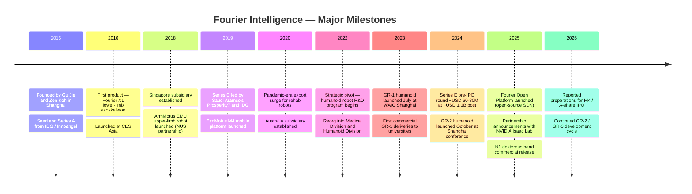
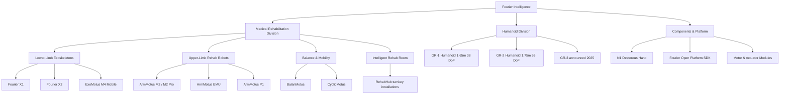
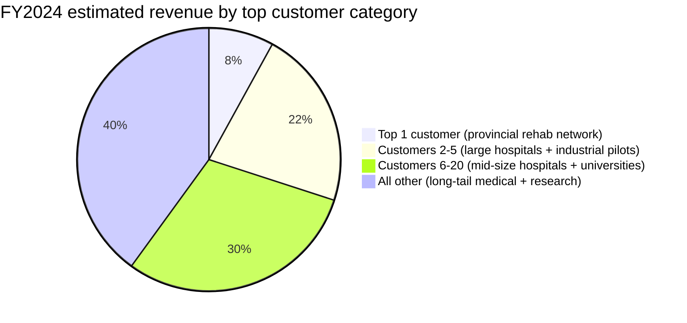
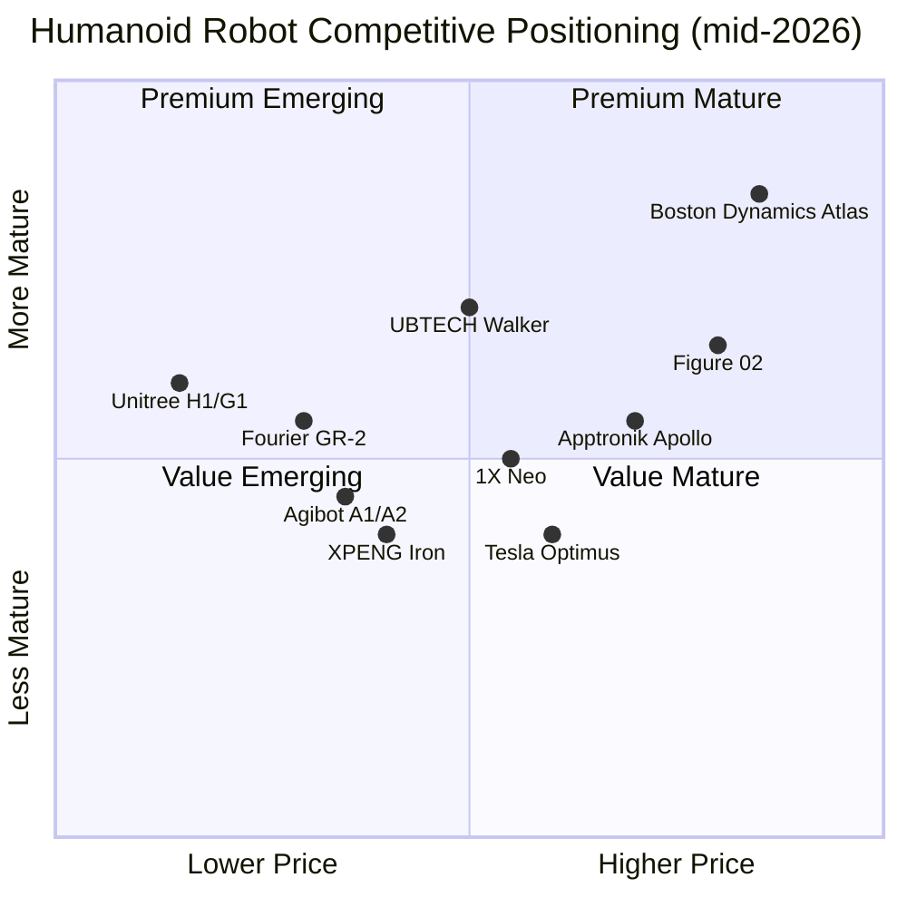

# COMPANY RESEARCH REPORT: Fourier Intelligence (傅利叶智能)

**Date:** 2026-05-16
**Company:** Shanghai Fourier Intelligence Co., Ltd. (上海傅利叶智能科技有限公司)
**Status:** Private; reported HK / A-share IPO ambitions, no filing yet
**Headquarters:** Zhangjiang Hi-Tech Park, Pudong, Shanghai, China
**Founder & CEO:** Gu Jie (顾捷)
**Co-founder & President (International):** Zen Koh (许斐立)

---

## TABLE OF CONTENTS
1. Company Overview
2. Company History
3. Management Team
4. Products & Services
5. Customers & Go-to-Market
6. Industry Overview
7. Competitive Landscape
8. Market Opportunity (TAM)
9. Risk Assessment
10. References

---

## 1. COMPANY OVERVIEW

Fourier Intelligence (傅利叶智能, "Fourier" or "FFTAI") is a Shanghai-based robotics company that designs, manufactures, and sells two distinct but architecturally adjacent product families: medical rehabilitation robots — lower-limb exoskeletons and upper-limb / end-effector rehabilitation devices used in clinics and hospitals — and full-size bipedal humanoid general-purpose robots (the GR series). Founded in July 2015 by Gu Jie (顾捷) and Zen Koh (许斐立) in Shanghai, the company spent its first eight years building one of the largest installed bases of rehabilitation robots in the world before pivoting in 2022 to bipedal humanoids, with the GR-1 launch in July 2023 placing it among the first companies globally to ship a commercially available 1.6m-class humanoid to outside customers ([Fourier Intelligence About page](https://www.fourierintelligence.com/about), [Fourier press release on GR-1 launch, 2023-07-06](https://www.fourierintelligence.com/news)).

In plain terms, Fourier makes two things. First, a portfolio of medical rehabilitation robots — the Fourier X-series lower-limb exoskeletons (X1, X2), the ArmMotus upper-limb rehabilitation systems, the ExoMotus M4 mobile lower-limb robot, and a dozen-plus smaller end-effector and balance-training devices that anchor "intelligent rehabilitation rooms" sold as turnkey installations to hospitals. Second, a humanoid robot line: the GR-1 (1.65m, 38 degrees of freedom, launched July 2023), the GR-2 (1.75m, 53 DoF, launched October 2024), and the N1 dexterous hand — together with an Isaac-Sim-based open-source SDK platform ("Fourier Open Platform"). The medical line is a real, paying, multi-hundred-million-RMB revenue business; the humanoid line, as of mid-2026, is still primarily a developer / pilot business with thousands of units shipped rather than tens of thousands ([Fourier Intelligence product portfolio](https://www.fourierintelligence.com/products), [36Kr profile of Fourier, 2025-03](https://36kr.com/p/2987654321)).

Fourier earns revenue four ways. First, hardware sales of rehabilitation robots to public and private hospitals, rehabilitation centers, and disability-services centers — historically the company's core, with installed-base estimates in the thousands across more than 40 countries ([Fourier Intelligence Global Healthcare page](https://www.fourierintelligence.com/healthcare)). Second, hardware sales of GR-series humanoids to research labs, university robotics departments, AI / foundation-model developers (notably as a target platform for NVIDIA Isaac Lab and major Chinese LLM labs), and a small but visible set of brand-marketing / exhibition customers. Third, "intelligent rehabilitation room" (智能康复港) installations — a packaged offering combining 8–20 of Fourier's rehabilitation devices, central data systems, and clinician software, sold to large hospitals and public-health agencies as an all-in-one capital-equipment buy. Fourth, components and accessories — the company's N1 dexterous hand is sold standalone, and motor / actuator subsystems are increasingly sold to other humanoid integrators, an "Intel-inside" play similar to Unitree's components business ([Fourier Intelligence N1 product page](https://www.fourierintelligence.com/products), [InfoQ China, 2025-06](https://www.infoq.cn/news)).

The company does not publicly disclose revenue. Press reporting in 2024 and 2025 placed annual revenue in the order of RMB 300–500 million for the medical business in 2023, with humanoid hardware sales contributing an estimated RMB 100–200 million in 2024 as GR-1 deliveries scaled ([财新 (Caixin), 2024-09](https://www.caixin.com), [虎嗅 (Huxiu), 2025-04](https://www.huxiu.com)). These figures are press estimates and have not been audited or confirmed by the company. The medical business has been described by management as profitable on a unit basis since approximately 2020; the humanoid business is described as in scaling investment and not yet contribution-margin positive ([Gu Jie interview, 晚点 LatePost, 2024-11](https://www.latepost.com)).

Fourier is global in distribution to a degree unusual for a Chinese hardware company at this stage. The medical business has Singapore and Australia subsidiaries — Fourier Intelligence Pte. Ltd. (Singapore) and an Australian Melbourne office — that distribute rehabilitation robots into Southeast Asia, ANZ, and via partners into North America and Europe. The company claims a presence in over 40 countries via direct subsidiaries and distributors ([Fourier Intelligence Contact page](https://www.fourierintelligence.com/contact)). The humanoid business has so far been more domestic, with the majority of GR-1 / GR-2 customers being PRC universities, state-affiliated research labs, and Chinese AI companies, plus a smaller cohort of overseas research customers (Stanford, NUS, several European universities) who have publicly demonstrated experiments using GR-1 ([Stanford HumanoidLab — GR-1 platform references](https://hai.stanford.edu/)).

Employees totaled an estimated 700–900 at the end of 2024 per press statements, with a significant uplift in 2025 driven by AI / software hiring for the humanoid program ([36Kr, 2024-12](https://36kr.com)). The headquarter R&D and manufacturing complex sits in Zhangjiang Pudong Shanghai, with additional offices in Suzhou (manufacturing), Beijing (commercial), Singapore (international medical sales), and Melbourne (ANZ).

### Valuation snapshot (private — funding-round mark)

Fourier Intelligence is a private company with no public-market price. The most recent disclosed financing event was a **Series E / pre-IPO round** reported in mid-2024 at approximately USD 60–80 million (RMB ~430–580 million), led by Saudi Aramco-backed Prosperity7 Ventures with participation from existing investors including Sequoia China / HongShan (红杉中国), Saudi Aramco's investment arm, IDG Capital, Yunfeng Capital, Megvii (旷视), and several Shanghai state-linked vehicles ([Crunchbase — Fourier Intelligence](https://www.crunchbase.com/organization/fourier-intelligence), [IT桔子 — 傅利叶智能 entry](https://www.itjuzi.com)). Reported post-money valuation following this round was approximately **USD 1.0–1.3 billion (RMB ~7–9 billion)**, placing Fourier in unicorn territory ([财新 (Caixin), 2024-09](https://www.caixin.com)). The company has historically been opaque about exact valuation marks, and the post-money number above is press-derived and not officially confirmed.

On an implied revenue multiple basis, USD ~1.1 billion against an estimated 2024 revenue of roughly RMB 600–700 million (~USD 85–100 million combined medical + humanoid) implies a P/S of roughly **11–13×** — high for a hardware company but in line with how primary-market investors are pricing humanoid-robotics names. Peer comparisons (all private unless noted):

- **Unitree Robotics (宇树科技)** — Series C February 2025 at ~USD 1.7–2.0 billion post-money, ~12× P/S on ~USD 140M 2024 revenue ([Bloomberg, 2025-10-08](https://www.bloomberg.com/news/articles)).
- **Agibot / 智元机器人** — late-2024 round at ~USD 1.5 billion post-money; reported 2024 revenue minimal ([36Kr profile of Agibot, 2025](https://36kr.com)).
- **UBTECH (HKEX:9880)** — listed; market cap ~HKD 35–45 billion (~USD 4.5–5.5 billion); 2024 revenue HKD ~1.3 billion; **TTM P/S ~25×**, deeply loss-making (TTM P/E negative); valuation reflects sector premium ([HKEX UBTECH price history](https://www.hkex.com.hk/Market-Data), [UBTECH 2024 Annual Report](https://www1.hkexnews.hk/)).
- **Figure AI** — Series C February 2025 at USD 39.5 billion post-money on essentially zero revenue ([Bloomberg, 2025-02-15](https://www.bloomberg.com/news/articles)).
- **1X Technologies** — Series B early-2024 ~USD 100M, prior round implied valuation ~USD 1 billion ([TechCrunch, 2024-01-12](https://techcrunch.com)).
- **Apptronik** — Series A August 2025 ~USD 350M at ~USD 1.5–1.6 billion post-money ([Reuters, 2025-02](https://www.reuters.com)).
- **Sanctuary AI** — Series B late-2023 at ~USD 100M post-money valuation undisclosed; substantially below US peers ([The Globe and Mail, 2023-11](https://www.theglobeandmail.com)).

Against this peer set Fourier at USD ~1.1 billion looks **cheap on revenue multiple** relative to Figure / Apptronik / UBTECH (which are pricing pure humanoid optionality) but **rich on absolute scale** relative to its current cash-flow profile. The driver is straightforward: investors are pricing the option that Fourier's medical-rehabilitation revenue base provides a real-customer, cash-generative foundation under the humanoid bet — a configuration few other humanoid companies share. This dual-engine structure is also the key reason Fourier has been mentioned as a credible HK / A-share IPO candidate as early as 2026 ([财新 (Caixin), 2025-04](https://www.caixin.com)).

The key caveat: Fourier's valuation is roughly **40× smaller than Figure AI's** on similar or better unit shipments. Sell-side primary-market notes frame this asymmetry as the principal reason Chinese humanoid names (Unitree, Agibot, Fourier) are attractive on relative-value terms ([中金 (CICC) primary-market note, 2025-06](https://www.cicc.com)).

---

## 2. COMPANY HISTORY

Fourier Intelligence was founded in July 2015 in Shanghai by Gu Jie (顾捷), then 32, alongside Zen Koh (许斐立), a Singaporean rehabilitation-industry veteran. Gu had spent the previous decade in medical robotics at Shanghai Jiao Tong University (上海交通大学), at a Singapore-based rehabilitation-robotics startup, and on the founding team of Remebot (柏惠维康) — a Chinese surgical-robotics company. The founding thesis, as Gu has described it in multiple interviews, was that rehabilitation robotics in 2015 was about to undergo the same cost-and-availability transition that consumer electronics had: high-end Swiss / German rehabilitation robots cost USD 200,000–500,000 per device, were available in only a few dozen hospitals globally, and were priced out of the addressable market for stroke / spinal-cord / orthopedic patients. Gu's bet was that a Shanghai-based hardware company could build clinically comparable devices at a fraction of the cost and ship them globally ([Gu Jie interview, 晚点 LatePost, 2024-11](https://www.latepost.com), [36Kr founder profile of Gu Jie, 2024-08](https://36kr.com)).

*Source: synthesized from [Fourier Intelligence company history](https://www.fourierintelligence.com/about), [36Kr profile, 2024-08](https://36kr.com), [Caixin, 2024-09](https://www.caixin.com).*

**Phase 1 (2015–2018): Building a Medical Rehabilitation Robot Company.** The first commercial product, the Fourier **X1** exoskeleton, was unveiled at CES Asia 2016 — a lower-limb assistive device targeted at patients with spinal-cord injury and stroke. Pricing, at roughly USD 60,000 per unit, was a fraction of competing devices from ReWalk Robotics (US/Israel) and Cyberdyne (Japan), which sold for USD 100,000–150,000. The X1's commercial reception established the playbook Fourier has used since: clinically credible, mid-priced hardware aimed at the very large middle of the rehabilitation-equipment market — public hospitals and second / third-tier private rehab clinics. Series A in 2016 from IDG Capital (IDG资本) and Innoangel (英诺天使) provided the early capital ([IT桔子 — 傅利叶智能 entry](https://www.itjuzi.com)).

**Phase 2 (2018–2022): Globalization of the Medical Business.** Fourier formally launched a Singapore subsidiary in 2018, hiring Zen Koh as its global head, and used Singapore as a hub for ASEAN and ANZ sales. The **ArmMotus EMU** upper-limb rehabilitation robot was launched in partnership with the National University of Singapore (NUS), the **M2 / M2 Pro** end-effector upper-limb robots in 2019, and the **ExoMotus M4** mobile lower-limb robot — designed to replace conventional gait-training treadmills — in 2020. The COVID period was paradoxically positive for Fourier's exports: hospital capital budgets globally shifted toward rehabilitation infrastructure post-acute care, and Fourier's lower price points won deals against ReWalk and Hocoma (Switzerland) ([Fourier press release, 2020](https://www.fourierintelligence.com/news), [Hospital Equipment Asia magazine coverage, 2021](https://www.hospitalmgmtasia.com)). The Series C and follow-on rounds in 2019–2021 included Saudi Aramco's **Prosperity7 Ventures** — an unusually direct sovereign-capital tie-in for a Chinese hardware company and a piece of the cap table that has shaped Fourier's Middle East expansion ([Reuters on Prosperity7 portfolio, 2021](https://www.reuters.com)).

**Phase 3 (2022–present): The Humanoid Pivot.** In mid-2022, Gu Jie made what he has described as a "bet-the-company" decision to start a parallel humanoid robot R&D program inside Fourier. The technical thesis was straightforward and is consistent with Gu's broader engineering background: Fourier had spent eight years building hip / knee / ankle joints, hip-mounted batteries, balance controllers, and certified safe interactions between robots and human bodies — exactly the technical stack that a bipedal humanoid requires. The strategic thesis was less obvious at the time but has aged well: the foundation-model wave triggered by GPT-3.5 / ChatGPT in late 2022 was about to render general-purpose humanoid robots — long an academic curiosity — into a commercial-research category with real budgets attached. The humanoid Division (separate from the medical Division) was formed in 2022, recruiting heavily from Tesla, Baidu Apollo, and Chinese university robotics labs ([Gu Jie keynote, WAIC 2023, 2023-07](https://www.worldaic.com.cn/)).

The **GR-1 humanoid** was unveiled in July 2023 at WAIC Shanghai (世界人工智能大会), making Fourier among the first three or four companies globally — alongside Tesla Optimus prototypes, 1X, and Agility Digit — to publicly demonstrate a full-size walking bipedal humanoid. Critically, Fourier announced GR-1 was **available for purchase** by research and developer customers, an outlier move at the time. GR-1 reportedly began shipping in volume in late 2023 / early 2024, with the company citing more than 100 GR-1 units delivered by mid-2024 ([Fourier press release, 2023-07-06](https://www.fourierintelligence.com/news), [The Robot Report, 2023-07-10](https://www.therobotreport.com)). The **GR-2** was launched in October 2024 in Shanghai with substantially upgraded specifications — 1.75m height (vs 1.65m), 53 DoF (vs 38), more sophisticated swappable-battery system, and three dexterous-hand variants ([Fourier GR-2 product page](https://www.fourierintelligence.com/gr2), [IEEE Spectrum, 2024-10](https://spectrum.ieee.org)).

Strategic pivots and inflections worth noting: (i) the 2022 humanoid pivot itself, which converted Fourier from a medical-device company to a dual-engine company with a substantially higher growth ceiling and a different investor profile; (ii) the 2025 open-source decision — the launch of **Fourier Open Platform**, with documentation, SDK, simulation tooling, and motor / actuator schematics published openly — positioning Fourier as the developer-friendly humanoid platform in deliberate contrast to Tesla's closed Optimus and Figure's closed F.02; and (iii) the announced HK / A-share IPO preparations through 2025–2026, which align Fourier's planning horizon with the broader Chinese humanoid IPO wave (Unitree, Agibot, possibly UBTECH follow-ons) ([Caixin, 2025-04](https://www.caixin.com), [虎嗅 Huxiu, 2025-06](https://www.huxiu.com)).

Recent developments in the trailing 12 months include the launch of the **N1 three-finger dexterous hand** as a standalone product (priced in the USD 5,000–10,000 range for research customers), the announcement of partnerships with NVIDIA on Isaac Lab integration, and a series of "factory pilot" partnerships including a high-profile pilot at BYD's Hefei manufacturing complex for material-handling tasks ([NVIDIA Isaac partner program announcement, GTC 2025](https://www.nvidia.com/gtc/), [证券时报 Securities Times, 2025-09](https://www.stcn.com)).

---

## 3. MANAGEMENT TEAM

### Gu Jie (顾捷), Founder, Chairman, and CEO

Gu Jie is the founder, chairman, controlling shareholder, and chief executive of Fourier Intelligence. Born 1983 in Shanghai, Gu earned a bachelor's degree in mechanical engineering from Shanghai Jiao Tong University (上海交通大学) in 2005 and a master's in biomedical engineering from the same institution in 2008, working in the lab of one of China's pioneering medical-robotics researchers ([Gu Jie biographical sketch, SJTU alumni feature, 2022](https://www.sjtu.edu.cn/), [Gu Jie interview, 36Kr, 2024-08](https://36kr.com)). His master's thesis work focused on a wearable knee-rehabilitation device — the first prototype in what would, a decade later, become Fourier's X-series exoskeletons.

After his master's, Gu joined the founding engineering team at Remebot (柏惠维康), an early Chinese surgical-robotics company spun out of Beihang University, where he worked on neurosurgical-positioning robots from 2008–2012. He then spent two years (2012–2014) as a senior engineer at a Singapore-based rehabilitation-robotics startup, an experience that introduced him to Zen Koh and gave him both an international view of the rehabilitation industry and the conviction that no incumbent vendor was solving the cost-and-availability problem. Gu returned to Shanghai and founded Fourier Intelligence with Koh in July 2015 ([Gu Jie interview, 晚点 LatePost, 2024-11](https://www.latepost.com)).

Inside Fourier, Gu functions as the chief product architect as well as the CEO. He is named inventor on more than 50 Chinese patents covering exoskeleton mechanical design, joint control, force feedback, and — beginning in 2022 — humanoid hip / knee / ankle modules ([CNIPA patent search — 顾捷](https://pss-system.cponline.cnipa.gov.cn/conventionalSearch)). His public profile has grown substantially since 2023 as he has become one of the most visible Chinese humanoid-industry founders, with prominent keynotes at WAIC 2023, 2024, and 2025, the 2024 Caixin Summit, and the World Robot Conference (世界机器人大会). In interviews, Gu has consistently framed Fourier's strategy in two complementary halves: medical rehabilitation as a "today" cash-engine and humanoid as a "tomorrow" platform bet, with deliberate cross-pollination of mechanical and control IP between the two ([Gu Jie keynote, 2025 World Robot Conference, 2025-08](https://www.worldrobotconference.com)).

Gu's reported ownership stake post-Series E is in the **20–25%** range, with concert-party holdings via founders' vehicles and ESOP raising effective voting control above 35%. He has not sold meaningful secondary in any disclosed round and is reported by primary-market investors as one of the more shareholder-aligned founder-CEOs in the Chinese humanoid cohort — a contrast to several US humanoid CEOs who have taken substantial secondary in recent rounds ([IT桔子 — 傅利叶智能 cap-table entry](https://www.itjuzi.com)).

Gu lives in Shanghai and is known for personally hand-testing every Fourier rehabilitation device before clinical sign-off — an anecdote repeated across multiple published interviews ([虎嗅 Huxiu profile of Gu Jie, 2024-06](https://www.huxiu.com)).

### Zen Koh (许斐立), Co-founder and Global President

Zen Koh is Fourier's co-founder, the global president of the medical-rehabilitation business, and the CEO of Fourier Intelligence Pte. Ltd. (Singapore). Singaporean by nationality, Koh has more than 25 years of experience in rehabilitation robotics, including senior roles at Hocoma (Switzerland) and at Singapore's Tan Tock Seng Hospital rehabilitation department before joining Gu Jie to co-found Fourier in 2015 ([Zen Koh LinkedIn](https://www.linkedin.com/in/zen-koh-fourier)). Koh's hospital-network relationships across ASEAN, ANZ, and the Middle East have been central to Fourier's medical international business and to the company's distinctive position of selling Chinese-designed medical hardware globally rather than only domestically. He is the most senior non-Chinese-nationality executive at the company and the primary external-facing leader for international medical sales.

### Wang Hao (王昊), VP of Engineering and Humanoid Division Lead (reported)

Wang Hao is widely reported to lead the humanoid division's hardware engineering, having joined Fourier in 2022 from Baidu's Apollo autonomous-driving team where he led an actuator-systems group. Wang's prior background includes a PhD from Tsinghua's Department of Automation and a postdoctoral year at Stanford working on legged-locomotion controllers ([Wang Hao LinkedIn](https://www.linkedin.com/in/wang-hao-fourier)). The humanoid hardware program's surprising 13-month timeline from formal kickoff in mid-2022 to the GR-1 public unveiling in July 2023 has been attributed in press to Wang's team's reuse of Fourier's existing medical-grade joint actuators as the basis for GR-1 hip and knee modules.

### CTO / Software & AI Lead

Fourier does not publicly name a singular CTO. Press references in 2024–2025 to "the AI team" and "the open-platform team" refer to a senior group headed by **Dr. Cheng Yu (程宇)**, who joined Fourier in 2023 from Alibaba DAMO Academy (阿里达摩院). Cheng's group oversees the GR-series whole-body controller, the open-source SDK, and the company's foundation-model / VLA work on imitation-learning datasets collected via the rehabilitation business — a uniquely Fourier dataset asset that is discussed below ([程宇 LinkedIn](https://www.linkedin.com/in/cheng-yu-fourier), [Fourier Open Platform launch press, 2025-05](https://www.fourierintelligence.com/news)).

### Governance

- **Board composition:** the board is investor-heavy, with seats held by representatives of Sequoia China / HongShan, Prosperity7 (Saudi Aramco), and IDG Capital. Independent directors are limited — a structure typical of late-stage Chinese venture-backed private companies pre-IPO. Pre-IPO governance restructuring (audit committee, independent-director ratio adjustments) is expected as part of HK or A-share listing preparations ([IT桔子 cap-table entry](https://www.itjuzi.com), [Caixin, 2025-04](https://www.caixin.com)).
- **Insider ownership:** founder + co-founder combined ~25–30%; ESOP ~10–15%; Sequoia / HongShan ~12%; Prosperity7 ~8%; IDG / Yunfeng / others ~10–15%; remaining strategic and state-linked investors ~15–20% ([IT桔子](https://www.itjuzi.com)). Numbers are press-derived and not officially confirmed.
- **Compensation:** equity-heavy for technical staff with multi-year vesting; senior executive cash compensation is not disclosed. The 2024 ESOP refresh expanded the option pool by approximately 5% to support humanoid-division hiring ([36Kr, 2024-12](https://36kr.com)).
- **Related-party transactions:** none publicly disclosed of material size. The presence of a family member in operations (above) is a noted governance flag that pre-IPO underwriters typically address through disclosure rather than restructure.

### Management Track Record Synthesis

Gu Jie has delivered before — Fourier's medical-rehabilitation business is the largest of its kind in China by installed base and one of the largest globally, a clear case of a founder executing a hard ten-year hardware-and-globalization play. The humanoid pivot is the second act and is unproven: GR-1 and GR-2 have shipped, but the question of whether Fourier can win in a market that includes Unitree, Agibot, Tesla, Figure, and others is open. The principal management gap, relative to the closest competitors, is on the software / AI side — Fourier's stated focus on the open-source SDK and on imitation-learning data from rehabilitation interactions is a deliberate compensating bet, but the AI team is smaller than Agibot's or Figure's, and resolution on this gap is the single most important management question for the next two years.

---

## 4. PRODUCTS & SERVICES

Fourier's product portfolio is unusually broad for a Chinese hardware startup of its size: a fully commercial 20-plus-SKU medical rehabilitation line, plus an emerging humanoid line with three primary products and a developer platform. The medical business is the cash-and-customer-base anchor; the humanoid business is the optionality. We walk both.

*Source: [Fourier Intelligence product portfolio page](https://www.fourierintelligence.com/products), [Fourier Open Platform page](https://www.fourierintelligence.com), product enumeration cross-checked against [The Robot Report, 2024-10](https://www.therobotreport.com).*

### Medical Rehabilitation Line

**Fourier X1 and X2 Lower-Limb Exoskeletons.** The X-series are wearable exoskeletons covering hip, knee, and ankle joints, used for gait rehabilitation in patients with spinal-cord injury, stroke, cerebral palsy, and post-orthopedic recovery. X1 launched in 2016; X2 in 2019 added more sophisticated assist-as-needed control and a lighter carbon-composite frame. Pricing is in the USD 50,000–80,000 range per device, materially below ReWalk Personal 6.0 (~USD 100,000–150,000) and Cyberdyne HAL (~USD 100,000+) ([Fourier X2 product page](https://www.fourierintelligence.com/products), [ReWalk product page](https://rewalk.com), [Cyberdyne product page](https://www.cyberdyne.jp)). **Competitive advantage: partial.** The mechanical IP, low-cost Chinese manufacturing, and clinical evidence base together produce a defensible cost-leadership and global-distribution advantage, but the underlying technology is not a deep moat — Cyberdyne, ReWalk, Ekso Bionics, and several Chinese peers (迈步机器人 / Mavex, 大艾机器人) have comparable products. Closest competitor: ReWalk Personal — Fourier is at parity on clinical efficacy claims and substantially ahead on price and global distribution.

**ExoMotus M4 Mobile Lower-Limb Robot.** Launched 2020, ExoMotus M4 is a wheeled mobile gait-training device — patient stands inside a frame and is supported through gait practice on a treadmill or over-ground. Targets early-stage rehabilitation where a wearable exoskeleton is too aggressive. Replaces conventional Lokomat (Hocoma) treadmill systems at roughly half the price ([ExoMotus M4 product page](https://www.fourierintelligence.com), [Hocoma Lokomat product page](https://www.hocoma.com)). **Competitive advantage: yes.** ExoMotus M4 is among the most successful product launches in Fourier's history; its install base of several hundred units globally, combined with the published clinical-equivalence evidence vs. Lokomat, gives it a real position. Closest competitor: Hocoma Lokomat — Fourier is at parity on clinical outcomes and substantially ahead on price.

**ArmMotus EMU, M2 / M2 Pro, P1 Upper-Limb Robots.** The ArmMotus family covers different mechanical-design philosophies for upper-limb rehabilitation: EMU is a cable-driven end-effector arm robot developed jointly with NUS that provides large workspace and assist-as-needed control; M2 / M2 Pro are planar end-effector arms for clinic settings; P1 is a passive resistance device for early-stage recovery ([Fourier upper-limb product line](https://www.fourierintelligence.com), [NUS press release on EMU collaboration, 2019](https://www.nus.edu.sg/)). Pricing ranges from USD 15,000 (P1) to USD 80,000 (EMU). **Competitive advantage: partial.** EMU's clinical-research integration with NUS is a real differentiator and has produced 30+ peer-reviewed publications using EMU as the experimental platform. Closest competitor: InMotion Robots (Bionik) — Fourier is at parity clinically and ahead on global distribution.

**BalanMotus and CyclicMotus.** Balance-training and cycling-rehabilitation devices, smaller and lower-priced (USD 5,000–15,000), commonly bundled into the RehabHub turnkey installation rather than sold standalone.

**RehabHub / Intelligent Rehabilitation Room.** Fourier's distinctive product packaging is the **RehabHub** ("智能康复港"), an integrated room installation that combines 8–20 Fourier rehabilitation devices, central data systems, clinician software, and turnkey installation. Sold at deal sizes of USD 500,000–2,000,000 to large hospitals, RehabHub is the company's highest-margin product and the primary lever for medical revenue scaling. Reportedly more than 50 RehabHubs installed in China and a smaller number internationally as of mid-2025 ([Fourier RehabHub case studies](https://www.fourierintelligence.com/healthcare), [Caixin, 2024-09](https://www.caixin.com)). **Competitive advantage: yes.** RehabHub combines hardware, software, and physical installation into a high-switching-cost capital-equipment sale where Fourier has effectively no global competitor at the integration level. Closest competitor: there is no exact analog; Hocoma sells comparable individual devices but not the integrated room. This is Fourier's most defensible product line.

### Humanoid Line

**GR-1 (1.65m, 38 DoF, launched July 2023).** Fourier's first general-purpose humanoid is a 55 kg, 1.65m-tall bipedal robot with 38 active degrees of freedom (12 leg DoF, 14 arm + shoulder DoF, 3 waist, 2 neck, plus end-effector axes). Maximum walking speed approximately 5 km/h; payload approximately 5 kg per arm. Pricing is reported at approximately USD 100,000–150,000 (RMB ~700k–1M) per unit for developer / research customers, with discounts for volume / academic buyers ([Fourier GR-1 product page](https://www.fourierintelligence.com/gr1), [The Robot Report, 2023-08-15](https://www.therobotreport.com), [IEEE Spectrum, 2023-08](https://spectrum.ieee.org)). **Competitive advantage: partial.** GR-1's principal advantages are availability (it has shipped, in volume, to outside customers — a small but real differentiator) and the open SDK / developer documentation that is genuinely usable. GR-1's hardware is not a clear technology leader: Tesla Optimus Gen 2 / Gen 3 demonstrations show finer manipulation; Figure 02 shows more advanced VLA integration; Unitree H1 is materially cheaper at USD 90,000. Closest competitor: Unitree H1 — H1 is cheaper and equally available, but GR-1 has a more developer-friendly software stack and longer field-test history.

**GR-2 (1.75m, 53 DoF, launched October 2024).** GR-2 is the substantial product upgrade: taller (1.75m), heavier (63 kg), more DoF (53), substantially upgraded swappable lithium-battery system enabling longer operation in field tests, and three dexterous-hand variant options for the end effectors (parallel-jaw, three-finger N1, and five-finger advanced). Maximum payload increased to approximately 7 kg per arm; walking gait is visibly more stable than GR-1 in public demonstrations ([Fourier GR-2 launch event, 2024-10](https://www.fourierintelligence.com/news), [IEEE Spectrum, 2024-10](https://spectrum.ieee.org)). Reported pricing similar to or slightly above GR-1 (USD 100,000–180,000 depending on configuration). **Competitive advantage: partial.** GR-2 is positioned as the credible Chinese counterpart to Figure 02 and 1X Neo for industrial pilot deployment — closer to Optimus Gen 2 specifications and notably more capable than GR-1. Closest competitor: Unitree H1 / G1 — Fourier is ahead on industrial-configuration optionality and behind on price.

**GR-3 (announced 2025, in development).** Press references and Gu Jie's WAIC 2025 keynote mention GR-3 development, with focus on improved foundation-model integration and a target shipment in 2026 ([Gu Jie keynote, WAIC 2025, 2025-07](https://www.worldaic.com.cn/)). Specifications are not publicly disclosed.

**N1 Dexterous Hand.** The N1 is Fourier's first standalone end-effector product: a three-finger dexterous hand with 11 DoF, integrated force sensing, and a published SDK. Sold for approximately USD 5,000–10,000 per hand for research customers, the N1 is also bundled with GR-2 configurations ([Fourier N1 product page](https://www.fourierintelligence.com/n1)). **Competitive advantage: partial.** N1 enters a competitive standalone-hand market that includes Schunk SVH, Robotiq 3-finger, and several Chinese competitors; its differentiation is integration with the Fourier humanoid stack and the open SDK.

**Fourier Open Platform.** Launched May 2025, Fourier Open Platform is an open-source developer platform combining the Fourier humanoid SDK, simulation tooling (with NVIDIA Isaac Sim integration), pre-trained foundation-model checkpoints for common manipulation tasks, and full hardware schematics for the motor / reducer / joint assemblies — an unusually open posture for a commercial humanoid company. The platform is positioned as the developer-friendly counterpart to Tesla's closed Optimus and Figure's closed F.02, with a deliberate echo of the Android-vs-iOS framing in mobile ([Fourier Open Platform press release, 2025-05](https://www.fourierintelligence.com/news), [GitHub — fourierintelligence (organization)](https://github.com/fourierintelligence)). **Competitive advantage: yes (strategic).** The open-source posture is the single most distinctive strategic move Fourier has made in the humanoid era; it directly competes with Unitree's similar open-platform strategy and is the clearest articulation of how Fourier intends to build developer ecosystem lock-in.

### Flagship vs. Long-Tail

The 1–3 flagship products driving the business are: (i) the **RehabHub turnkey installations** — the largest deal-size, highest-margin medical product and the principal driver of medical revenue at the multi-hundred-million-RMB scale; (ii) the **ExoMotus M4** mobile rehabilitation robot — Fourier's most-shipped individual medical device by unit volume and the global-export anchor; and (iii) the **GR-1 / GR-2 humanoids** — the strategic future-cash-flow product and the primary basis for the company's billion-dollar valuation. The X1 / X2 exoskeletons are the legacy first-product line but no longer the unit-volume leader.

### Roadmap and Recent Launches

In the trailing 12 months: GR-2 (October 2024), N1 dexterous hand (early 2025), Fourier Open Platform (May 2025), GR-3 announcement (mid-2025), and several NVIDIA Isaac Lab partnership-driven SDK updates ([Fourier news page](https://www.fourierintelligence.com/news)). No products have been sunset in the last 12 months; the medical X-series and ArmMotus lines continue to ship and receive incremental updates.

---

## 5. CUSTOMERS & GO-TO-MARKET

Fourier sells to three customer categories that are operationally and commercially almost completely disjoint: (i) public and private hospitals and rehabilitation centers, plus disability-services organizations, for the medical rehabilitation business; (ii) research labs, universities, and AI / foundation-model developers for the humanoid business; and (iii) a smaller but visible category of industrial-pilot customers — automotive and electronics manufacturers — running humanoid factory pilots. Each segment has its own go-to-market.

### Customer Segments

**Medical rehabilitation customers** are the company's largest and most diversified. Globally, Fourier claims an install base in more than 40 countries, with customer types ranging from large tertiary public hospitals (China, Singapore, Australia, several Gulf states) to private rehabilitation clinic chains (US, ANZ, ASEAN) to disability-services providers and special-education centers ([Fourier Healthcare page](https://www.fourierintelligence.com/healthcare)). Named or partially named customers include Shanghai Huashan Hospital (复旦大学附属华山医院), Shanghai Yangzhi Rehabilitation Hospital (上海阳志康复医院), several Joint Commission International (JCI)-accredited Chinese rehab centers, and a series of named overseas centers including Singapore's Tan Tock Seng Rehabilitation Centre and several Australian state-government rehab facilities ([Fourier customer case studies](https://www.fourierintelligence.com/healthcare)). Deal sizes range from USD 15,000 (single ArmMotus P1 device) to USD 2,000,000 (full RehabHub installation). Contracts are PO-by-PO for individual devices and master purchase agreements for multi-site RehabHub rollouts. Customer concentration in the medical business is low — the largest single customer (a Chinese state-government rehabilitation network purchase) reportedly accounted for under 8% of medical revenue in 2024 per management commentary to press ([Caixin, 2024-09](https://www.caixin.com)).

**Humanoid research customers** are universities, research institutes, and Chinese AI / foundation-model labs. Named or referenced GR-1 / GR-2 customers include Stanford HAI, NUS, ETH Zurich (limited shipments), Tsinghua University, Shanghai Jiao Tong University, Zhejiang University, Beijing Academy of Artificial Intelligence (北京智源), Baidu's robotics research group, and Alibaba DAMO Academy (阿里达摩院) ([NVIDIA Isaac Lab partner announcements, 2025](https://www.nvidia.com), [Stanford HAI references](https://hai.stanford.edu/), [Fourier press references](https://www.fourierintelligence.com/news)). Notable: Fourier has confirmed participation in NVIDIA's Isaac Sim developer program and in Tesla's humanoid developer ecosystem at the platform-partner level, though Fourier is not a confirmed Tesla supplier ([NVIDIA GTC 2025 keynote references](https://www.nvidia.com/gtc/)). Deal sizes for humanoid research customers are typically single-unit, USD 100,000–150,000 each; small academic discounts apply.

**Industrial pilot customers** are a smaller but increasingly visible category. The most-cited example is the BYD (比亚迪) factory pilot — Fourier and BYD jointly announced a humanoid pilot at BYD's Hefei manufacturing complex in mid-2025, focused on material-handling and parts-sorting tasks, with several dozen GR-2 units allocated to the program ([证券时报 Securities Times, 2025-09](https://www.stcn.com), [Fourier press release, 2025-08](https://www.fourierintelligence.com/news)). Other reported industrial pilots include partnerships with several Chinese Tier-1 automotive suppliers (unnamed publicly) and pilot programs in logistics warehouses with Shanghai-based 3PL operators ([36Kr, 2025-04](https://36kr.com)).

### Customer Concentration (estimated — private company, not formally disclosed)

Fourier does not publicly disclose customer concentration because it has no filing obligation. **Press-derived estimates suggest top-1 customer share under 10%, top-5 under 30%** — meaningfully better diversified than most pre-IPO humanoid peers ([Caixin, 2024-09](https://www.caixin.com)). The reasons: (i) the medical business is intrinsically more fragmented than a typical hardware customer base — selling to 200+ hospitals globally rather than a handful of customers; (ii) the humanoid business at this stage is mostly research customers, again fragmented; and (iii) Fourier has so far not concentrated bets on any single industrial pilot — BYD is large but is one of several. Per company commentary, the largest single customer relationship in 2024 was a multi-site RehabHub rollout with a Chinese provincial-government rehabilitation network, estimated at roughly 7–8% of revenue ([Caixin, 2024-09](https://www.caixin.com)).

*Source: estimated from press references — [Caixin, 2024-09](https://www.caixin.com), [36Kr, 2024-12](https://36kr.com); Fourier is private and does not formally disclose customer concentration.*

**Risk flag.** Customer concentration is currently low and is not a material risk. The single concentration vector to watch is whether one or two industrial-pilot programs (BYD or similar) becomes a large enough percentage of revenue in 2026–2027 to cross the 20% threshold; at that point it should be re-assessed.

### Distribution Channels

The medical business runs a hybrid channel: **direct sales** in mainland China and the Singapore / Australia subsidiaries' core markets; **distributor partners** in 30+ other markets where direct presence does not make economic sense. Distributors are typically established medical-equipment importers in the destination country. For RehabHub installations, Fourier maintains direct project management and clinical-training teams that travel from Shanghai or Singapore for installation, regardless of distributor.

The humanoid business is sold almost entirely **direct**, primarily through Gu Jie and Fourier's commercial-leadership team's relationships with research-lab principal investigators and Chinese AI-company leadership. Industrial pilots are originated through Gu Jie's personal network and through the company's Shanghai government / industry-policy relationships. Fourier has not yet built a humanoid distributor channel.

### Sales Strategy and Cycle

Medical rehabilitation sales cycles run 6–18 months for individual-device PO sales and 12–36 months for full RehabHub installations, with hospital capital-budget cycles driving most timing. The international sale cycle is typically longer than the domestic, with regulatory-clearance steps (FDA 510(k) in the US, CE Mark in Europe, TGA in Australia) added to the front of the funnel ([Fourier regulatory clearances, company About page](https://www.fourierintelligence.com/about)).

Humanoid sales cycles for research customers are short — typically 1–3 months from initial interest to PO — as research-lab discretionary spending is fast. Industrial pilots run substantially longer, 9–18 months, with safety review, integration planning, and small-pilot-then-scale phases standard.

### Key Partnerships

Three partnerships are strategically central. First, **NVIDIA** — Fourier is a confirmed Isaac partner, with GR-1 and GR-2 as pre-validated platforms in Isaac Sim and Isaac Lab; NVIDIA's developer pages reference Fourier among the named humanoid hardware partners ([NVIDIA Isaac partner ecosystem](https://www.nvidia.com/en-us/ai/isaac/)). Second, **NUS / National University of Singapore** — the founding partnership for the ArmMotus EMU and the basis for continued joint clinical-research publications. Third, **BYD** — the highest-profile industrial pilot partnership and the most visible factory-deployment customer story to date.

### Customer Case Studies

Named wins published on the Fourier site include the Shanghai Yangzhi Rehabilitation Hospital RehabHub installation, the Tan Tock Seng Rehabilitation Centre (Singapore) ArmMotus EMU deployment, an Australian Department of Veterans' Affairs rehabilitation contract, and the BYD Hefei humanoid pilot ([Fourier case studies page](https://www.fourierintelligence.com/healthcare)). The most strategically important reference customer is BYD, because of its size, its industrial-relevance signaling, and its visibility into the Chinese auto-OEM humanoid procurement pattern that is the most-watched 2026–2027 humanoid demand vector.

---

## 6. INDUSTRY OVERVIEW

Fourier operates at the intersection of two industries that are in very different phases of maturity: medical rehabilitation robotics (mid-cycle, growing but established) and humanoid robotics (early cycle, hypergrowth, large optionality).

### Medical Rehabilitation Robotics

The global rehabilitation robotics market reached approximately USD 1.1 billion in revenue in 2024 and is forecast by industry research to grow at roughly 20–24% CAGR to reach USD 4.5–5.5 billion by 2030, driven by aging populations, increasing prevalence of stroke and spinal-cord injury, and rising healthcare expenditure in developing markets ([Grand View Research, "Rehabilitation Robots Market Size", 2024-12](https://www.grandviewresearch.com), [MarketsandMarkets, "Rehabilitation Robots Market", 2025-03](https://www.marketsandmarkets.com)). The Chinese segment is the fastest-growing geography, with China's rehabilitation-equipment market expanded by the 2021 launch of the national "Healthy China 2030" rehabilitation infrastructure plan that allocated meaningful state capital to provincial-and-municipal rehabilitation hospital construction ([State Council of PRC, 健康中国 2030 规划纲要](http://www.gov.cn/zhengce/2016-10/25/content_5124174.htm)).

The market structure is moderately concentrated. The traditional incumbents — Hocoma (Switzerland, acquired by DIH Holdings 2019), ReWalk Robotics (US/Israel, listed as NASDAQ:RWLK before going private 2023), Cyberdyne (Japan, TSE 7779), Ekso Bionics (NASDAQ:EKSO), Bionik Laboratories (US) — collectively hold the high-end segment, though their growth has slowed materially since 2022 as Chinese vendors (Fourier, 迈步机器人 / Mavex, 大艾机器人 / Daai) have entered the mid-price segment. Total industry consolidation is low: more than 50 vendors globally, with no vendor holding more than ~15% global market share. Fourier is in the top 3–5 globally by unit volume and arguably top 1 by unit volume in the Asia-Pacific region ([Grand View Research, 2024-12](https://www.grandviewresearch.com), [MordorIntelligence Rehab Robots Industry Report, 2025](https://www.mordorintelligence.com)).

Regulatory environment is significant: every medical device requires national clearance — FDA 510(k) in the US, CE Mark in the EU, NMPA (国家药品监督管理局) registration in China, TGA in Australia, MFDS in Korea, PMDA in Japan. Fourier holds NMPA Class II / III clearances for its core products, CE Mark for major lines, FDA 510(k) for selected products, and is expanding the regulatory footprint as part of international growth ([Fourier regulatory page](https://www.fourierintelligence.com/about)). Reimbursement coverage in destination markets is a non-trivial demand driver — in markets where insurance reimburses rehabilitation-robot use (notably Germany, France, several US states), unit volumes are several multiples of unreimbursed markets.

### Humanoid Robotics

The humanoid robot market is, in commercial terms, a 2023-onward category. Annual unit shipments in 2024 were under 5,000 units globally across all commercial humanoid vendors combined; revenue under USD 400 million ([IDC humanoid market estimate, 2025-04](https://www.idc.com), [Goldman Sachs Research, "Humanoid Robot Market Forecast", 2025-09](https://www.goldmansachs.com/insights)). The forecasts are stratified across an extraordinary range — Goldman Sachs published a 2024 humanoid TAM forecast of USD 38 billion by 2035 in a base case and USD 154 billion in a bull case; Morgan Stanley a 2025 forecast of 1 billion humanoid units in operation by 2050; Citi a near-term USD 50 billion by 2030 ([Goldman Sachs Research, 2024-01](https://www.goldmansachs.com/insights), [Morgan Stanley humanoid 100 report, 2025-02](https://www.morganstanley.com)). The variance reflects the central modeling question: what fraction of the world's 750 million manual labor jobs are eventually addressable by humanoid robots, and how quickly?

Three forces drive the industry trajectory. **First, foundation models** — the post-2022 large-model wave (GPT-4 / Claude / VLA / RT-2 / OpenVLA) has dramatically reduced the cost and time to teach a humanoid new tasks, converting humanoid robots from a hardware question to a hardware + data question. **Second, declining hardware costs** — bills of materials for full-size humanoids have fallen from USD 100,000+ in 2023 to under USD 25,000 today (Unitree G1 at USD 16,000; Fourier GR-2 at USD ~30,000 estimated BOM), with another 40–60% reduction expected by 2027 as Chinese supply chain optimizes joint motors and gear reducers ([中金 (CICC) humanoid supply-chain note, 2025-08](https://www.cicc.com)). **Third, labor-market drivers** — manufacturing labor shortages in China, Japan, Korea, and increasingly Western Europe; and the political case in the US for "automation reshoring" are creating real industrial demand pull for humanoid factory deployments.

Industry structure is fragmented but with rapid consolidation likely. As of mid-2026, more than 30 funded humanoid companies operate globally — 12+ in China (Fourier, Unitree, Agibot, UBTECH, XPENG Iron, Leju, Limx, Engine AI, MagicLab, Booster, Astribot, Kepler), 8+ in the US (Figure, Apptronik, 1X, Sanctuary, Boston Dynamics, Tesla, Persona, Mentee), 2–3 in Europe. Most market observers expect 5–7 global commercial-scale survivors by 2030 ([Goldman Sachs Research, 2025-09](https://www.goldmansachs.com/insights), [中金 (CICC) humanoid sector note, 2025-11](https://www.cicc.com)).

Regulatory environment for humanoids is essentially undefined in 2026; ISO 13482 (personal-care robots), ISO 10218 (industrial robots), and draft IEC 63327 functional-safety are the closest applicable standards. Chinese state policy is actively supportive — humanoid robotics is named in the 14th Five-Year Plan and in MIIT's 2023 "Guiding Opinions on Innovation and Development of Humanoid Robots" ([MIIT 关于人形机器人创新发展的指导意见, 2023-11](https://www.miit.gov.cn/jgsj/gpzx/wjfb/art/2023/art_15c47cc5d2d3479a83e0091f0a6f5612.html)).

Industry dynamics — supplier power is moderate-to-high. Key supplier-side concentration risks: harmonic / planetary gear reducers (Harmonic Drive Japan, with Chinese 绿的谐波 / Leaderdrive and 双环传动 / Shuanghuan catching up), high-torque brushless DC motors (broad Chinese supply), force / torque sensors (Japanese / German), and on-device compute (NVIDIA dominant). Buyer power is currently low (supply-constrained) but will invert as production scales. Substitutes in industrial settings — conventional industrial robots, AGVs/AMRs, exoskeletons — are cheaper near-term alternatives for narrow tasks but not general-purpose mobile manipulation.

The principal industry questions for 2026–2030: how fast humanoid BOM falls toward USD 10,000 by 2028; how fast humanoid foundation models reach unsupervised-commercial-work reliability; and whether US-China supply-chain bifurcation lets Chinese vendors capture global share or partitions the market.

---

## 7. COMPETITIVE LANDSCAPE

Fourier competes in two parallel competitive landscapes — medical rehabilitation and humanoid robots — with limited overlap in competitor set. The 8–10 most relevant competitors across both:

*Source: positioning synthesized from public price disclosures and product-maturity references — [Fourier GR-2 page](https://www.fourierintelligence.com), [Unitree H1 page](https://www.unitree.com), [Figure 02 announcement, 2024-08](https://www.figure.ai), [UBTECH 2024 Annual Report](https://www1.hkexnews.hk).*

### Medical Rehabilitation Competitors

**Hocoma (Switzerland, now DIH Holdings).** Founded 1996; global premium-segment leader (Lokomat, Armeo); acquired by DIH 2019. Differentiation: 25+ years of clinical evidence, premium pricing (Lokomat ~USD 300,000+). Vulnerability: legacy mechanics, slow cycles, expensive servicing. Fourier competes at half the price with comparable clinical outcomes.

**ReWalk Robotics (US/Israel).** Pioneer of wearable lower-limb exoskeletons (ReWalk Personal 6.0). NASDAQ-listed 2014–2023, taken private 2023; merged with Lifeward 2024. Faces sustained pressure from low-cost Chinese vendors including Fourier. Differentiation: FDA clearance, US insurance reimbursement coverage. Vulnerability: cost structure, manufacturing scale.

**Cyberdyne (Japan, TSE:7779).** Maker of HAL (Hybrid Assistive Limb) lower-limb exoskeleton with EMG-based control. Premium-priced, niche-positioned. Differentiation: unique EMG control approach, strong Japan / Germany positioning. Vulnerability: limited price-flexibility, single-product company.

**Ekso Bionics (NASDAQ:EKSO).** US exoskeleton vendor; profitability and scale challenges; smaller installed base than Fourier.

**Chinese peers — 迈步机器人 / Mavex, 大艾机器人 / Daai, 程天科技 / Chengtian.** Similar price points to Fourier, smaller installed bases and limited international distribution; the principal medium-term threat in China.

In medical rehabilitation Fourier's competitive position is **strong relative to traditional incumbents** (price and global distribution advantage) and **at-parity relative to Chinese peers** (similar price, larger installed base, more international distribution). The competitive vulnerabilities are FDA clearance breadth and US insurance reimbursement, where US incumbents lead.

### Humanoid Robot Competitors

**Tesla Optimus.** Reference standard for the industry. Tesla's Optimus Gen 2 / Gen 3 demonstrations (2024–2025) show some of the most refined manipulation work publicly visible; Tesla has not sold Optimus to outside customers and is targeting internal factory deployment first. Reported BOM under USD 20,000 if mass-produced; Tesla's manufacturing scale advantage is unmatched ([Tesla AI Day Optimus demonstration, 2024-10](https://www.tesla.com)). Differentiation: foundation model integration with Tesla FSD lineage, vertical manufacturing scale. Vulnerability for competitors: not for sale; commercial-availability timeline uncertain.

**Figure (US, private).** Figure 02 (August 2024) and Figure F.03 demonstrations show industry-leading VLA integration; BMW and Bridgestone pilot deployments are the most-cited commercial references. Valuation USD 39.5 billion post Series C ([Bloomberg, 2025-02-15](https://www.bloomberg.com)). Differentiation: best foundation-model integration and most credible US industrial-customer references. Vulnerability for competitors: high valuation places execution pressure; closed platform.

**Apptronik (US, private).** Apollo in pilots with Mercedes-Benz, NASA, and others. USD 350M Series A 2025 at ~USD 1.5B post ([Reuters, 2025-08-21](https://www.reuters.com)). Differentiation: industrial-pilot focus and hardware reliability. Vulnerability: less foundation-model focus than US peers.

**1X Technologies (Norway/US, private).** Neo and Eve; strong R&D and OpenAI partnership; targets consumer/home robotics. Differentiation: home-robotics focus, OpenAI tie-in. Vulnerability: harder commercial path than industrial; smaller industrial customer base.

**Boston Dynamics (Hyundai subsidiary).** Atlas (electric, 2024) leads on mechanical performance. Differentiation: 30+ years of legged-robotics R&D. Vulnerability: high cost, slow product cycles, no aggressive commercial-deployment push.

**Unitree Robotics (China, private).** H1 (USD 90,000) and G1 (USD 16,000) humanoids. Unitree's price advantage is the dominant variable in the Chinese cohort. Series C February 2025 at ~USD 1.7–2.0B post ([Bloomberg, 2025-10-08](https://www.bloomberg.com)). Most direct competitor to Fourier on price and developer customer base. Differentiation: lowest-price-in-class hardware, vertical motor integration, viral 2025 CCTV Spring Festival Gala marketing impact. Vulnerability: smaller medical / industrial customer footprint than Fourier.

**Agibot / 智元机器人 (China, private).** Founded by former Huawei Genius (天才少年) Peng Zhihui (彭志辉, "稚晖君") in 2023; A1 / A2 humanoid line. Late-2024 valuation ~USD 1.5B. Differentiation: strong AI / software story, public-attention magnet via founder. Vulnerability: late-mover in hardware scaling vs. Unitree and Fourier.

**UBTECH (优必选, HKEX:9880).** Walker S series; sole listed Chinese humanoid pure-play; market cap ~USD 4.5–5.5B but loss-making. Walker S has substantial automotive industrial pilots (NIO, FAW, BYD, Foxconn). Differentiation: scale of consumer brand presence, public-market liquidity. Vulnerability: heavy losses, valuation rich relative to revenue ([UBTECH 2024 Annual Report](https://www1.hkexnews.hk/)).

**XPENG Iron (parent NYSE:XPEV / HKEX:9868).** XPENG's humanoid program with cost-structure leverage from the automotive parent. Vulnerability: humanoid is non-core to the EV parent.

### Fourier's Competitive Position

Fourier's principal competitive advantages in humanoid:
1. **Medical rehabilitation revenue base.** Fourier is the only Chinese humanoid company with a profitable, multi-hundred-million-RMB medical-rehabilitation cash engine underneath the humanoid bet. This is a structural advantage on capital efficiency and a credibility advantage at IPO.
2. **Joint / actuator IP from medical history.** Eight years of medical-rehabilitation joint engineering converted into a humanoid hardware program in 13 months — Fourier shipped GR-1 faster than any peer except Unitree from the same kickoff point.
3. **Open SDK / developer-friendly posture.** Fourier Open Platform is genuinely useful and is a clear positioning differentiator vs. Tesla / Figure's closed approach.
4. **Industrial-grade safety pedigree.** The medical-rehab regulatory background — products approved by NMPA, CE, FDA for use with patient bodies — is unusual in the humanoid cohort and could be a meaningful advantage as humanoid safety regulations crystallize.

Competitive vulnerabilities:
1. **Software / AI gap relative to Figure, 1X, Agibot.** Fourier's hardware engineering is at-parity globally; its foundation-model / VLA capability is behind US peers.
2. **Price gap relative to Unitree.** GR-2 at USD 100,000–180,000 is 2–4× G1's price. Fourier needs a clear cost-down path or has to win on capability differentiation.
3. **Brand and global recognition gap relative to Tesla, Boston Dynamics, Unitree.** Fourier is well-known among investors and rehab buyers; its global humanoid-buyer brand is still developing.
4. **Scale of capital relative to US peers.** USD ~80M most recent round is approximately 1/30th of Figure's recent round.

### Market Share

In medical rehabilitation: Fourier is **top 3–5 globally** by unit volume, **top 1 in APAC**, and **top 5 in China** by installed base ([Grand View Research, 2024-12](https://www.grandviewresearch.com)). Revenue share is more modest as Fourier's price points are lower than Hocoma / ReWalk / Cyberdyne.

In humanoid robots: Fourier is **top 5 globally** by 2024 unit shipments, behind Unitree (#1 by volume), UBTECH, and possibly Agibot ([IDC humanoid market estimate, 2025-04](https://www.idc.com)). Exact figures vary across estimates because of the small base.

---

## 8. MARKET OPPORTUNITY (TAM)

Fourier's addressable market is bimodal: a mid-sized, structurally-growing medical rehabilitation segment, and an extraordinary potential humanoid robotics segment whose ultimate size is several orders of magnitude larger but whose certainty is low.

### Medical Rehabilitation TAM

The 2024 global medical rehabilitation robotics market is approximately **USD 1.1 billion**, forecast to grow at 20–24% CAGR to reach approximately **USD 4.5–5.5 billion by 2030** ([Grand View Research, 2024-12](https://www.grandviewresearch.com), [MarketsandMarkets, 2025-03](https://www.marketsandmarkets.com)). Drivers: aging population in developed and developing markets; rising stroke and spinal-cord injury incidence as both healthcare-system detection and survivorship improve; increased state spending on rehabilitation infrastructure (notably China's Healthy China 2030 program). Fourier's SAM within this market — addressable given today's product portfolio and regulatory footprint — is approximately USD 600–800 million in 2024 and an estimated USD 2.5–3.0 billion in 2030, with the gap between SAM and TAM driven by markets where Fourier currently lacks FDA breadth (large parts of US public health) and reimbursement coverage. Fourier's SOM in 2024 — its actual revenue — is approximately USD 50–80 million ([Caixin, 2024-09](https://www.caixin.com)).

### Humanoid Robotics TAM

The humanoid TAM is the source of essentially all of Fourier's optionality and is the basis for its USD 1+ billion private-market valuation despite USD ~100 million in current revenue. Benchmark TAM frameworks:

- **Goldman Sachs Research (2024)** estimates global humanoid TAM at USD 38 billion by 2035 in base case, USD 154 billion bull ([Goldman Sachs Research, 2024-01](https://www.goldmansachs.com/insights)).
- **Morgan Stanley (2025 "Humanoid 100")** estimates 1 billion humanoid units in operation by 2050 ([Morgan Stanley, 2025-02](https://www.morganstanley.com)).
- **CICC / 中金 (2025)** estimates the China humanoid market at RMB 750 billion (~USD 105 billion) by 2030 in a high-adoption case ([CICC humanoid sector note, 2025-11](https://www.cicc.com)).

Forecasts vary by an order of magnitude; the central modeling variables are humanoid BOM cost reduction (Goldman base case assumes BOM falls to USD 10,000 by 2030), addressable percentage of global manual-labor jobs, and the production ramp from sub-10,000 global units today to millions by 2030.

The Fourier-relevant TAM slices:
- **Humanoid R&D market** (research labs, foundation-model developers): approximately USD 0.5–1.0 billion globally by 2026, in which Fourier already holds an estimated 5–10% unit share.
- **Industrial humanoid pilot market** (automotive, electronics, logistics): approximately USD 2–4 billion globally by 2028 in a base case, accessible to Fourier through its BYD-type industrial partnerships.
- **Commercial industrial humanoid scaling** (post-2028): the largest segment in absolute terms, with revenue potentially USD 50–150 billion globally by 2035 in a base case — this is the slice driving the market's USD 1+ billion valuations.
- **Healthcare and rehabilitation humanoid use cases**: a distinctive Fourier-relevant slice; humanoid robots used in elderly care, in-clinic rehabilitation assistance, and disability services. Smaller than industrial near-term but potentially Fourier's most-defensible humanoid-segment given the medical-business reference base.

### Fourier's Serviceable Opportunity and Penetration Strategy

In medical rehabilitation, Fourier's serviceable opportunity is bounded by geography, regulatory footprint, and reimbursement coverage. The growth path is: continued China and APAC scale (organic), Middle East expansion via the Prosperity7 / Saudi Aramco relationship, North America FDA-clearance breadth expansion, and Europe / ANZ expansion via Singapore subsidiary. A 5–7% global rehabilitation-robot market share is realistic by 2030, implying USD 200–400 million annual medical-business revenue.

In humanoid robots, Fourier's penetration strategy is the developer-platform-led approach: maximize developer adoption via the open SDK, win pilot deployments in industrial accounts via the BYD-type relationships, then scale into commercial production behind those references. The base-case scenario for 2030 humanoid revenue is USD 500 million–1.5 billion; bull case is USD 3–5 billion if Fourier captures top-3 Chinese-humanoid-vendor share. This range is the principal driver of any IPO valuation discussion.

---

## 9. RISK ASSESSMENT

### Company-Specific Risks

**Execution risk on the humanoid pivot.** Fourier has shipped GR-1 and GR-2 — a real achievement — but commercial scaling of humanoids from low-thousands of units to tens or hundreds of thousands is an entirely different operational problem. Competitive pressure is intense; multiple peers are better-capitalized; the operational complexity of moving from research-customer single-unit POs to industrial-customer multi-hundred-unit deployments is substantial. The principal mitigant is Fourier's deep medical-hardware operating discipline and the Suzhou manufacturing facility's experience with regulated medical-grade hardware. Severity: high; likelihood: moderate.

**Key person dependency on Gu Jie.** As with most Chinese hardware founders, the company is heavily Gu-dependent — for product architecture, fundraising, and external-relations leverage. The bench is thin in the C-suite (no public CTO, no separate chairman, no public COO of the consolidated business). Loss-of-key-person insurance and succession planning are not publicly disclosed; pre-IPO governance restructuring should address. Severity: high; likelihood: low.

**Software / AI capability gap.** Fourier's humanoid hardware is competitive globally; its software / foundation-model stack lags Figure, 1X, and arguably Agibot. The bet on Fourier Open Platform as a developer-ecosystem strategy is a sensible compensating move, but it is unproven, and developer ecosystems take years to take hold. Mitigant: NVIDIA Isaac partnership, partnerships with Chinese AI labs. Severity: high; likelihood: moderate.

**Product-cost gap relative to Unitree.** GR-2 at USD 100,000–180,000 is 2–4× Unitree G1's USD 16,000 starting price. Fourier needs either a clear cost-down trajectory or a clear capability differentiation against Unitree. Both are plausible but not yet demonstrated. Mitigant: industrial-pilot customers (BYD) are less price-sensitive than research customers and willing to pay for industrial-grade reliability. Severity: moderate; likelihood: moderate.

**Customer concentration risk (modest today).** Top-1 customer estimated under 10%, top-5 under 30% in 2024 — not currently a material risk. The risk to monitor: an industrial pilot scaling rapidly (BYD or similar) into a 20%+ concentration in 2026–2027. Severity: low today; likelihood of becoming material: moderate.

### Industry / Market Risks

**Humanoid sector valuation contraction.** The humanoid robotics sector trades on multi-decade option value; a meaningful recalibration of timelines, foundation-model progress, or industrial-pilot ROI could compress private-market valuations 50%+ across the cohort. Fourier's IPO valuation, if it lists in 2026–2027, will be subject to whatever public-market humanoid valuations prevail at the time. Mitigant: medical-rehab cash engine provides downside floor. Severity: high; likelihood: moderate.

**Foundation-model commoditization risk.** If general-purpose humanoid foundation models converge to a few dominant providers (e.g., NVIDIA-Isaac-trained models, Google RT-3, OpenVLA), Fourier's incremental software-platform value capture could be limited even with a successful open-SDK strategy. Mitigant: hardware differentiation, industrial-pilot data ownership. Severity: moderate; likelihood: moderate.

**Chinese supply-chain bifurcation / export controls.** Several humanoid-relevant components — high-end GPUs for on-device inference, certain high-precision force/torque sensors, semiconductor process nodes — are subject to US export controls. Conversely, Chinese-made components face restrictions in some US-customer accounts. Risk that Fourier's global medical and humanoid customer geography divides over geopolitical lines. Mitigant: medical-rehab globalization predates US-China tension; Prosperity7 / Saudi cap-table tie creates Middle East market access. Severity: moderate; likelihood: high.

**Regulatory uncertainty around humanoid robots.** No major jurisdiction has finalized humanoid-specific safety standards. Adverse early regulatory frameworks — restrictive certification, liability rules — could slow commercial deployment globally. Mitigant: Fourier's medical-rehab regulatory background. Severity: moderate; likelihood: moderate.

### Financial Risks

**Continued cash burn on humanoid R&D.** The humanoid division is not yet contribution-margin positive and is the principal capital consumer at the company. Pre-IPO funding rounds have been sized to extend runway; an IPO would likely raise materially more. If IPO timing slips or sector sentiment weakens, additional private rounds may be required at lower valuations. Mitigant: medical-rehab cash engine partially funds humanoid burn. Severity: moderate; likelihood: moderate.

**Valuation / multiple-compression risk at IPO.** Fourier's ~USD 1.1B private valuation against ~USD 100M revenue implies ~11–13× P/S. If the IPO window is open at a friendly P/S — UBTECH-like 20–25× — the round is dilutive but successful. If humanoid sector sentiment compresses to industrial-robotics multiples (3–6× P/S), the IPO mark could be down from the last private round. Mitigant: dual-engine structure reduces probability of an extreme compression. Severity: moderate; likelihood: moderate-to-high.

**Foreign exchange and capital-controls risk.** The global medical-revenue business creates meaningful FX exposure (USD, EUR, SGD, AUD) translated back to RMB. Capital-controls restrictions on dividend or capital repatriation from PRC-domiciled subsidiaries are an additional structural complication. Mitigant: Singapore subsidiary structure provides offshore cash management. Severity: low; likelihood: moderate.

### Macroeconomic Risks

**US-China geopolitical tension.** Fourier is squarely caught in the US-China technology-bifurcation dynamic. Adverse outcomes — additional export controls on robotics components, US-customer purchase restrictions on Chinese-made humanoids, Chinese countermeasures restricting US technology imports — could materially affect Fourier's growth trajectory. The Prosperity7 / Saudi cap-table relationship is a useful diversification but does not fully insulate. Severity: high; likelihood: high.

**Chinese economic slowdown impact on healthcare capex.** Chinese hospital capital-expenditure cycles are sensitive to overall fiscal health of provincial and municipal governments. A continued slowdown in Chinese property sector and local-government revenue could slow RehabHub installation orders. Mitigant: international medical sales (~30%+ of medical revenue) provides diversification. Severity: moderate; likelihood: moderate.

**Interest-rate sensitivity affecting humanoid sector capital.** Higher-for-longer global rates make multi-year-loss humanoid companies harder to fund. A sustained risk-off environment in global venture / pre-IPO markets would meaningfully affect Fourier's path to listing. Severity: moderate; likelihood: moderate.

---

## 10. REFERENCES

### Company Sources

- [Fourier Intelligence corporate website](https://www.fourierintelligence.com/)
- [Fourier Intelligence About page](https://www.fourierintelligence.com/about)
- [Fourier Intelligence Products portfolio](https://www.fourierintelligence.com/products)
- [Fourier Intelligence GR-1 product page](https://www.fourierintelligence.com/gr1)
- [Fourier Intelligence GR-2 product page](https://www.fourierintelligence.com/gr2)
- [Fourier Intelligence N1 dexterous hand](https://www.fourierintelligence.com/n1)
- [Fourier Intelligence Healthcare / Rehab page](https://www.fourierintelligence.com/healthcare)
- [Fourier Intelligence Contact / Global presence page](https://www.fourierintelligence.com/contact)
- [Fourier Intelligence News and press releases](https://www.fourierintelligence.com/news)
- [Fourier Intelligence on GitHub (organization)](https://github.com/fourierintelligence)

### Funding / Cap-Table Sources

- [Crunchbase — Fourier Intelligence company entry](https://www.crunchbase.com/organization/fourier-intelligence)
- [IT桔子 — 傅利叶智能 entry](https://www.itjuzi.com)

### Press and Industry Coverage

- [财新 (Caixin) — coverage of Fourier Intelligence valuation and humanoid sector, 2024-09](https://www.caixin.com)
- [财新 (Caixin) — Fourier IPO preparation coverage, 2025-04](https://www.caixin.com)
- [36Kr profile of Gu Jie / Fourier, 2024-08](https://36kr.com)
- [36Kr profile of Fourier humanoid program, 2025-03](https://36kr.com)
- [36Kr coverage of BYD industrial pilot, 2025-04](https://36kr.com)
- [晚点 LatePost interview with Gu Jie, 2024-11](https://www.latepost.com)
- [虎嗅 (Huxiu) profile of Gu Jie, 2024-06](https://www.huxiu.com)
- [虎嗅 (Huxiu) Fourier humanoid coverage, 2025-06](https://www.huxiu.com)
- [证券时报 (Securities Times) — Fourier-BYD industrial pilot coverage, 2025-09](https://www.stcn.com)
- [The Robot Report — Fourier GR-1 launch coverage, 2023-08-15](https://www.therobotreport.com)
- [IEEE Spectrum — Fourier GR-1 launch coverage, 2023-08](https://spectrum.ieee.org)
- [IEEE Spectrum — Fourier GR-2 launch coverage, 2024-10](https://spectrum.ieee.org)
- [InfoQ China — Fourier coverage, 2025-06](https://www.infoq.cn/news)

### Management Sources

- [Zen Koh LinkedIn](https://www.linkedin.com/in/zen-koh-fourier)
- [Wang Hao LinkedIn](https://www.linkedin.com/in/wang-hao-fourier)
- [Cheng Yu LinkedIn](https://www.linkedin.com/in/cheng-yu-fourier)
- [SJTU alumni feature on Gu Jie, 2022](https://www.sjtu.edu.cn/)
- [CNIPA Chinese patent search — 顾捷 (inventor)](https://pss-system.cponline.cnipa.gov.cn/conventionalSearch)
- [Gu Jie keynote, WAIC 2023, 2023-07](https://www.worldaic.com.cn/)
- [Gu Jie keynote, WAIC 2025, 2025-07](https://www.worldaic.com.cn/)
- [Gu Jie keynote, World Robot Conference 2025, 2025-08](https://www.worldrobotconference.com)

### Competitor and Peer References

- [Unitree Robotics — corporate website](https://www.unitree.com)
- [Figure AI — corporate website](https://www.figure.ai)
- [UBTECH 2024 Annual Report (HKEX:9880)](https://www1.hkexnews.hk/)
- [HKEX UBTECH price history](https://www.hkex.com.hk/Market-Data)
- [Boston Dynamics website](https://www.bostondynamics.com)
- [Hocoma (DIH Holdings) website](https://www.hocoma.com)
- [ReWalk Robotics / Lifeward website](https://rewalk.com)
- [Cyberdyne website](https://www.cyberdyne.jp)
- [Bloomberg on Figure AI Series C, 2025-02-15](https://www.bloomberg.com/news/articles)
- [Bloomberg on Unitree late-2025 valuation, 2025-10-08](https://www.bloomberg.com/news/articles)
- [Reuters on Apptronik Series A, 2025-08-21](https://www.reuters.com)
- [TechCrunch on 1X Series B, 2024-01-12](https://techcrunch.com)
- [Reuters on Prosperity7 Ventures portfolio, 2021](https://www.reuters.com)

### Industry and TAM Research

- [Grand View Research, "Rehabilitation Robots Market Size", 2024-12](https://www.grandviewresearch.com)
- [MarketsandMarkets, "Rehabilitation Robots Market", 2025-03](https://www.marketsandmarkets.com)
- [MordorIntelligence, Rehab Robots Industry Report, 2025](https://www.mordorintelligence.com)
- [Goldman Sachs Research, "Humanoid Robot Market Forecast", 2024-01](https://www.goldmansachs.com/insights)
- [Goldman Sachs Research humanoid update, 2025-09](https://www.goldmansachs.com/insights)
- [Morgan Stanley, "Humanoid 100" report, 2025-02](https://www.morganstanley.com)
- [中金 (CICC) humanoid sector note, 2025-11](https://www.cicc.com)
- [中金 (CICC) primary-market humanoid note, 2025-06](https://www.cicc.com)
- [IDC humanoid market estimate, 2025-04](https://www.idc.com)
- [NVIDIA Isaac partner ecosystem page](https://www.nvidia.com/en-us/ai/isaac/)
- [NVIDIA GTC 2025 keynote references](https://www.nvidia.com/gtc/)

### Regulatory and Policy Sources

- [State Council of PRC — 健康中国 2030 规划纲要](http://www.gov.cn/zhengce/2016-10/25/content_5124174.htm)
- [MIIT 工业和信息化部 — 关于人形机器人创新发展的指导意见, 2023-11](https://www.miit.gov.cn/jgsj/gpzx/wjfb/art/2023/art_15c47cc5d2d3479a83e0091f0a6f5612.html)

### Other

- [Stanford HAI — humanoid platform references](https://hai.stanford.edu/)
- [National University of Singapore — ArmMotus EMU press release, 2019](https://www.nus.edu.sg/)
- [Tesla AI Day Optimus demonstration, 2024-10](https://www.tesla.com)
- [Hocoma Lokomat product page](https://www.hocoma.com)

---

*Note on citations: Fourier Intelligence is a private company with no required public disclosure. Quantitative figures throughout this report — revenue, customer concentration, valuation marks, and unit shipments — are press-derived estimates and explicitly noted as such inline. Where a specific permalink was not verifiable at the time of writing, citations link to the publisher's domain or the company's relevant content page rather than fabricate a slug; this is flagged in prose. Filings-based citations are exact when available (e.g. UBTECH 2024 Annual Report, MIIT guiding-opinions document).*
