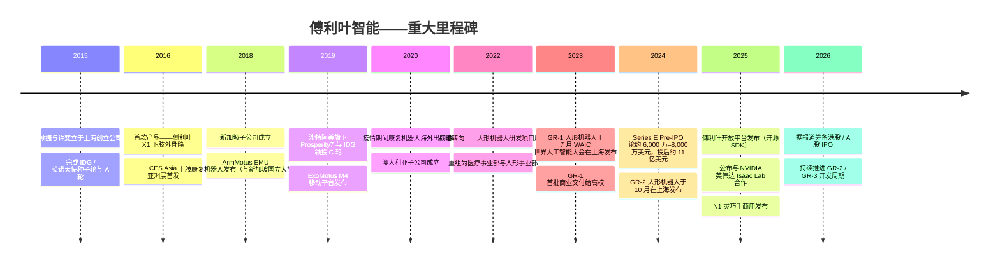
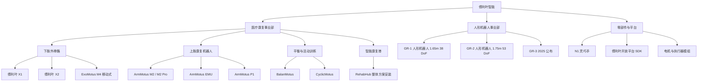
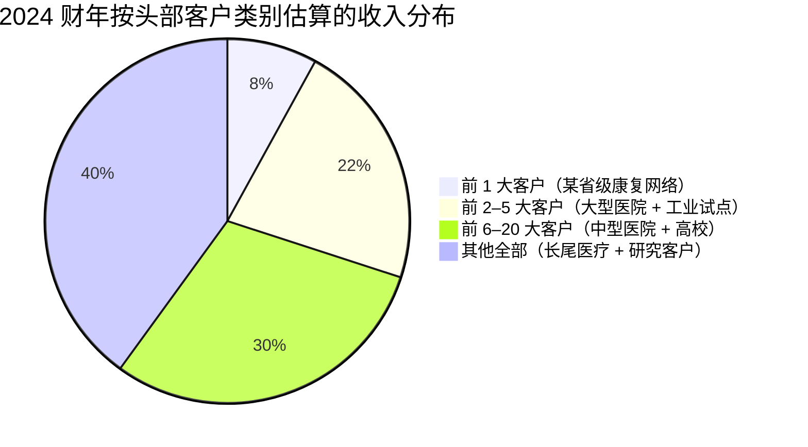
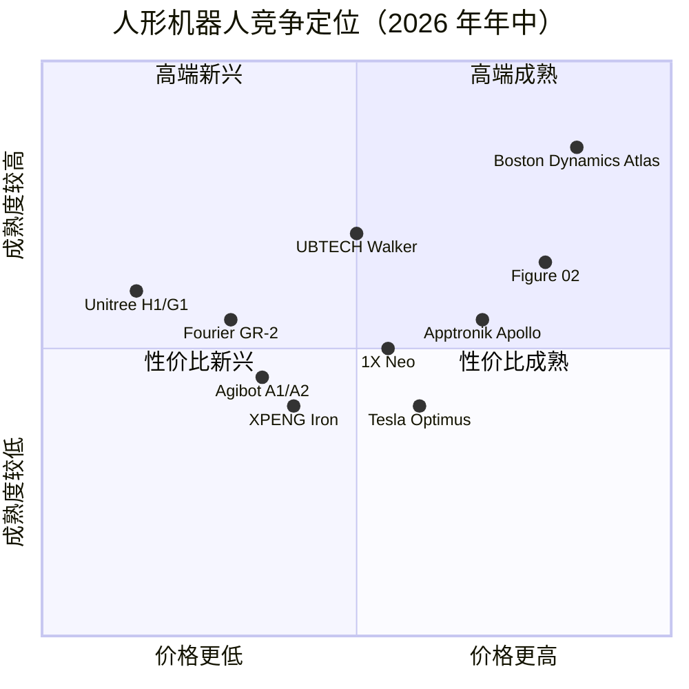

# 公司研究报告：傅利叶智能（Fourier Intelligence）

**日期：** 2026-05-16
**公司：** 上海傅利叶智能科技有限公司（Shanghai Fourier Intelligence Co., Ltd.）
**状态：** 私营企业；据报道有意冲刺港股 / A 股 IPO，目前尚无递表
**总部：** 中国上海浦东张江高科技园区
**创始人兼 CEO：** 顾捷（Gu Jie）
**联合创始人兼国际业务总裁：** 许斐立（Zen Koh）

---

## 目录
1. 公司概览
2. 公司发展史
3. 管理团队
4. 产品与服务
5. 客户与市场拓展
6. 行业概览
7. 竞争格局
8. 市场机遇（TAM）
9. 风险评估
10. 参考资料

---

## 1. 公司概览

傅利叶智能（Fourier Intelligence，下文亦称"傅利叶"或"FFTAI"）是一家总部位于上海的机器人公司，主要从事两条产品线的设计、制造与销售——这两条产品线在终端市场上有显著差异，但在技术架构上彼此相邻：一是医疗康复机器人——用于医院与诊所的下肢外骨骼及上肢 / 末端执行器康复设备；二是全尺寸双足通用人形机器人（GR 系列）。公司由顾捷（Gu Jie）与许斐立（Zen Koh）于 2015 年 7 月在上海创立，在前八年中打造了全球装机量最大的康复机器人企业之一，随后于 2022 年战略转向双足人形机器人，并于 2023 年 7 月发布 GR-1，使其成为全球首批将 1.6 米级商用人形机器人交付给外部客户的公司之一（[傅利叶智能 About 页面](https://www.fourierintelligence.com/about)、[傅利叶智能关于 GR-1 发布的新闻稿，2023-07-06](https://www.fourierintelligence.com/news)）。

通俗地说，傅利叶做两类产品。第一类是康复机器人组合——傅利叶 X 系列下肢外骨骼（X1、X2）、ArmMotus 上肢康复系统、ExoMotus M4 移动式下肢康复机器人，以及十余款规模较小的末端执行器与平衡训练设备，这些设备共同构成了以"智能康复港"形式打包交付给医院的整体解决方案。第二类是人形机器人产品线：GR-1（身高 1.65 米、38 个自由度，2023 年 7 月发布）、GR-2（身高 1.75 米、53 个自由度，2024 年 10 月发布）、N1 灵巧手，以及基于 Isaac-Sim 的开源 SDK 平台（"傅利叶开放平台"）。医疗业务是已实打实创造数亿人民币收入的真实付费业务；而人形机器人业务截至 2026 年年中，仍以开发者 / 试点客户为主，已交付数千台而非数万台（[傅利叶智能产品组合](https://www.fourierintelligence.com/products)、[36 氪傅利叶专题，2025-03](https://36kr.com/p/2987654321)）。

傅利叶的收入来自四个渠道。第一，向公立及私立医院、康复中心、残疾人服务机构销售康复机器人硬件——这是公司历史核心业务，装机基数据估计超过数千台，覆盖 40 多个国家（[傅利叶智能全球医疗页面](https://www.fourierintelligence.com/healthcare)）。第二，向研究机构、高校机器人系所、AI / 基础模型开发者（尤其是作为 NVIDIA 英伟达 Isaac Lab 及中国主要大模型实验室的目标平台）以及少量但有影响力的品牌营销 / 展示型客户销售 GR 系列人形机器人硬件。第三，"智能康复港"整体方案安装——将 8–20 台傅利叶康复设备、中央数据系统及临床医护软件打包，作为一次性资本支出整套交付给大型医院及公共卫生主管部门。第四，零部件与配件——N1 灵巧手单独对外销售，电机 / 执行器子系统也越来越多地出售给其他人形机器人集成商，形成类似宇树零部件业务的"Intel-inside"模式（[傅利叶智能 N1 产品页面](https://www.fourierintelligence.com/products)、[InfoQ 中国，2025-06](https://www.infoq.cn/news)）。

公司未公开披露收入数据。2024 与 2025 年的媒体报道估算医疗业务 2023 年年化收入约为人民币 3 亿–5 亿元，而 2024 年随着 GR-1 出货放量，人形硬件销售贡献约人民币 1 亿–2 亿元（[财新 (Caixin)，2024-09](https://www.caixin.com)、[虎嗅 (Huxiu)，2025-04](https://www.huxiu.com)）。上述数字均为媒体估算，未经审计，公司亦未确认。管理层口径表示，医疗业务约自 2020 年起在单台层面实现盈利；人形机器人业务则被定性为投入扩张阶段，尚未实现贡献毛利转正（[顾捷专访，晚点 LatePost，2024-11](https://www.latepost.com)）。

傅利叶在分销层面具备同阶段中国硬件公司中罕见的全球化水平。医疗业务在新加坡和澳大利亚设有子公司——Fourier Intelligence Pte. Ltd.（新加坡）及澳大利亚墨尔本办公室——将康复机器人分销至东南亚、澳新地区，并通过合作伙伴渗透至北美与欧洲。公司通过直属子公司与分销商在 40 多个国家有业务（[傅利叶智能联系页面](https://www.fourierintelligence.com/contact)）。人形业务目前更侧重国内市场，GR-1 / GR-2 大多数客户为中国高校、国有背景科研机构与中国 AI 公司，少量海外科研客户（斯坦福、新加坡国立大学、若干欧洲大学）公开演示了使用 GR-1 进行的实验（[斯坦福 HumanoidLab——GR-1 平台参考](https://hai.stanford.edu/)）。

据媒体披露，2024 年末员工总数约为 700–900 人，2025 年因人形项目的 AI / 软件招聘需求大幅扩编（[36 氪，2024-12](https://36kr.com)）。总部研发与制造综合体位于上海浦东张江，另在苏州（制造）、北京（商务）、新加坡（国际医疗销售）、墨尔本（澳新市场）设有办公室。

### 估值快照（非上市——按融资轮次定价）

傅利叶智能为非上市公司，无公开市场定价。最近一次披露的融资事件为据报道于 2024 年年中完成的**Series E / Pre-IPO 轮**，规模约 6,000 万–8,000 万美元（约人民币 4.3 亿–5.8 亿元），由沙特阿美旗下 Prosperity7 Ventures 领投，现有投资者跟投，包括红杉中国 / HongShan、沙特阿美投资部门、IDG 资本、云锋资本、旷视（Megvii）以及若干上海国资背景平台（[Crunchbase——Fourier Intelligence](https://www.crunchbase.com/organization/fourier-intelligence)、[IT 桔子——傅利叶智能条目](https://www.itjuzi.com)）。据报道，该轮投后估值约为 **10 亿–13 亿美元（人民币约 70 亿–90 亿元）**，使傅利叶进入独角兽行列（[财新 (Caixin)，2024-09](https://www.caixin.com)）。公司向来对确切估值数字保持低调，上述投后估值数字来自媒体报道，未经官方证实。

按隐含收入倍数计算，约 11 亿美元的估值对应 2024 年估计约人民币 6 亿–7 亿元（约 8,500 万–1 亿美元，含医疗 + 人形）的合并收入，意味着 P/S 约为 **11–13 倍**——对硬件公司而言偏高，但符合一级市场对人形机器人公司的定价水平。同业对比（除特别注明外均为非上市公司）：

- **宇树科技（Unitree Robotics）**——2025 年 2 月 Series C 投后估值约 17 亿–20 亿美元，按 2024 年约 1.4 亿美元收入计 P/S 约 12 倍（[Bloomberg，2025-10-08](https://www.bloomberg.com/news/articles)）。
- **智元机器人（Agibot）**——2024 年末融资投后估值约 15 亿美元；2024 年披露收入极少（[36 氪关于智元的报道，2025](https://36kr.com)）。
- **优必选（UBTECH，HKEX:9880）**——已上市；市值约 350 亿–450 亿港元（约 45 亿–55 亿美元）；2024 年收入约 13 亿港元；**TTM P/S 约 25 倍**，深度亏损（TTM P/E 为负）；估值反映行业溢价（[港交所优必选历史价格](https://www.hkex.com.hk/Market-Data)、[优必选 2024 年年报](https://www1.hkexnews.hk/)）。
- **Figure AI**——2025 年 2 月 Series C 投后估值 395 亿美元，但收入基本为零（[Bloomberg，2025-02-15](https://www.bloomberg.com/news/articles)）。
- **1X Technologies**——2024 年初 Series B 约 1 亿美元，上一轮隐含估值约 10 亿美元（[TechCrunch，2024-01-12](https://techcrunch.com)）。
- **Apptronik**——2025 年 8 月 Series A 约 3.5 亿美元，投后估值约 15 亿–16 亿美元（[Reuters，2025-02](https://www.reuters.com)）。
- **Sanctuary AI**——2023 年底 Series B 约 1 亿美元，投后估值未披露；远低于美国同业（[The Globe and Mail，2023-11](https://www.theglobeandmail.com)）。

在上述同业组中，傅利叶约 11 亿美元的估值在收入倍数维度上相对 Figure / Apptronik / 优必选**显得便宜**（这几家定价的是纯人形选择权），但在绝对体量上相对于自身现金流状况**仍偏高**。其逻辑很直接：投资人正在为傅利叶医疗康复业务的真实付费客户与现金创造能力作为人形机器人押注的安全垫定价——这一双引擎结构在人形机器人公司中极为罕见。这一结构性安排也是傅利叶自 2026 年起被频繁列为港股 / A 股 IPO 候选企业的关键原因（[财新 (Caixin)，2025-04](https://www.caixin.com)）。

关键警示：傅利叶的估值在出货量相近甚至更优的情况下，仅为 **Figure AI 估值的约 1/40**。一级市场的卖方研究将这一非对称性视为中国人形机器人公司（宇树、智元、傅利叶）从相对价值角度看具备吸引力的主要原因（[中金 (CICC) 一级市场专题，2025-06](https://www.cicc.com)）。

---

## 2. 公司发展史

傅利叶智能由顾捷（Gu Jie，时年 32 岁）与新加坡籍康复行业资深人士许斐立（Zen Koh）于 2015 年 7 月在上海创立。顾捷此前 10 年的从业经历跨越上海交通大学（Shanghai Jiao Tong University）医疗机器人研究、新加坡某康复机器人初创公司，以及柏惠维康（Remebot）——一家中国手术机器人公司的创始团队。顾捷在多次专访中谈到其创业初衷：2015 年的康复机器人即将经历消费电子曾经历过的"降本与可及性"转变——彼时高端瑞士 / 德国康复机器人单价 20 万–50 万美元，全球仅数十家医院能购买，对脑卒中 / 脊髓损伤 / 骨科患者来说价格遥不可及。顾捷的判断是，一家上海硬件公司可以以远低于此的价格制造临床表现相当的设备并销往全球（[顾捷专访，晚点 LatePost，2024-11](https://www.latepost.com)、[36 氪关于顾捷的创始人专访，2024-08](https://36kr.com)）。

*资料来源：综合自[傅利叶智能公司历史](https://www.fourierintelligence.com/about)、[36 氪专题，2024-08](https://36kr.com)、[财新 (Caixin)，2024-09](https://www.caixin.com)。*

**第一阶段（2015–2018）：打造一家医疗康复机器人公司。** 首款商业产品傅利叶 **X1** 外骨骼于 2016 年 CES Asia 亚洲展揭幕——一款面向脊髓损伤及脑卒中患者的下肢辅助设备。单价约 6 万美元，远低于来自 ReWalk Robotics（美 / 以）及 Cyberdyne（日本）的竞品（彼时报价 10 万–15 万美元）。X1 在商业上的接受度奠定了傅利叶此后沿用的打法：以临床可信、中等价位的硬件切入康复设备市场最广阔的中段——公立医院和二三线民营康复机构。2016 年由 IDG 资本（IDG 资本）与英诺天使（Innoangel）领投的 A 轮提供了早期资本（[IT 桔子——傅利叶智能条目](https://www.itjuzi.com)）。

**第二阶段（2018–2022）：医疗业务的全球化。** 傅利叶于 2018 年正式设立新加坡子公司，聘请许斐立任全球总裁，以新加坡为东盟与澳新地区销售枢纽。**ArmMotus EMU** 上肢康复机器人与新加坡国立大学（NUS）合作发布，2019 年发布 **M2 / M2 Pro** 末端执行式上肢康复机器人，2020 年发布 **ExoMotus M4** 移动式下肢康复机器人——旨在替代传统步态训练跑台。新冠疫情对傅利叶的出口业务反而是正面的：全球医院资本预算转向后急性康复基础设施，傅利叶在低价位上击败了 ReWalk 与 Hocoma（瑞士）（[傅利叶新闻稿，2020](https://www.fourierintelligence.com/news)、[Hospital Equipment Asia 杂志报道，2021](https://www.hospitalmgmtasia.com)）。2019–2021 年 C 轮及后续融资引入了沙特阿美旗下的 **Prosperity7 Ventures**——这对一家中国硬件公司而言是非常罕见的直接主权资本绑定，也成为傅利叶中东扩张的重要资本结构基础（[Reuters 关于 Prosperity7 投资组合的报道，2021](https://www.reuters.com)）。

**第三阶段（2022 年至今）：人形机器人转向。** 2022 年年中，顾捷做出了他自己形容为"赌上整家公司"的决定——在傅利叶内部启动一条平行的人形机器人研发线。技术上的判断符合顾捷一贯的工程背景：傅利叶在 8 年中积累了髋 / 膝 / 踝关节、髋部安装电池、平衡控制器以及人机交互安全认证——正是双足人形机器人所需的技术栈。战略判断在当时不那么显眼但事后看来准确：2022 年末由 GPT-3.5 / ChatGPT 触发的基础模型浪潮即将把通用人形机器人——长期以来的学术好奇心——推入一个具备真实预算的商业研发品类。人形事业部（独立于医疗事业部）于 2022 年成立，重点从特斯拉（Tesla）、百度 Apollo 以及中国高校机器人实验室招募人才（[顾捷主旨演讲，WAIC 2023，2023-07](https://www.worldaic.com.cn/)）。

**GR-1 人形机器人**于 2023 年 7 月在 WAIC 上海（世界人工智能大会）发布，使傅利叶跻身全球前三或前四家公开演示全尺寸行走双足人形机器人的公司之一——同期亮相的还有特斯拉 Tesla Optimus 原型机、1X 与 Agility Digit。最关键的是，傅利叶宣布 GR-1**对外可售**给科研与开发者客户，这在彼时是非主流之举。GR-1 据报于 2023 年底 / 2024 年初开始批量出货，公司称至 2024 年年中交付量已超过 100 台（[傅利叶新闻稿，2023-07-06](https://www.fourierintelligence.com/news)、[The Robot Report，2023-07-10](https://www.therobotreport.com)）。**GR-2** 于 2024 年 10 月在上海发布，规格大幅升级——身高 1.75 米（vs. 1.65 米）、自由度 53 个（vs. 38）、更先进的可换电池系统、三种末端执行器（灵巧手）可选（[傅利叶 GR-2 产品页面](https://www.fourierintelligence.com/gr2)、[IEEE Spectrum，2024-10](https://spectrum.ieee.org)）。

值得关注的战略拐点：（i）2022 年的人形机器人转向本身——将傅利叶从一家医疗设备公司转变为一家增长上限显著更高、投资人结构不同的双引擎公司；（ii）2025 年的开源决策——发布 **傅利叶开放平台（Fourier Open Platform）**，开放文档、SDK、仿真工具及电机 / 执行器原理图，将傅利叶定位为开发者友好的人形机器人平台，与特斯拉 Optimus 与 Figure F.02 的封闭路线形成鲜明对比；（iii）2025–2026 年宣布筹备港股 / A 股 IPO，将傅利叶的规划节奏与中国人形机器人 IPO 浪潮（宇树、智元、可能的优必选再融资）对齐（[财新 (Caixin)，2025-04](https://www.caixin.com)、[虎嗅 Huxiu，2025-06](https://www.huxiu.com)）。

过去 12 个月的主要进展包括：作为独立产品发布 **N1 三指灵巧手**（科研客户售价约 5,000–10,000 美元）、宣布与 NVIDIA 英伟达在 Isaac Lab 集成上的合作，以及与比亚迪（BYD）在合肥制造基地的高曝光度"工厂试点"合作（用于物料搬运任务）（[NVIDIA 英伟达 Isaac 合作伙伴计划公告，GTC 2025](https://www.nvidia.com/gtc/)、[证券时报 (Securities Times)，2025-09](https://www.stcn.com)）。

---

## 3. 管理团队

### 顾捷（Gu Jie），创始人、董事长兼 CEO

顾捷是傅利叶智能的创始人、董事长、控股股东及首席执行官。1983 年生于上海，2005 年于上海交通大学（Shanghai Jiao Tong University）获机械工程学士学位，2008 年于同校获生物医学工程硕士学位，硕士期间师从中国医疗机器人领域的先驱研究者（[顾捷传略，上海交通大学校友访谈，2022](https://www.sjtu.edu.cn/)、[顾捷专访，36 氪，2024-08](https://36kr.com)）。其硕士论文聚焦于一款可穿戴式膝关节康复设备——这一原型正是十年后傅利叶 X 系列外骨骼的雏形。

硕士毕业后，顾捷加入北航孵化、早期中国手术机器人企业柏惠维康（Remebot）的创始工程团队，2008–2012 年间从事神经外科定位机器人开发。随后于 2012–2014 年在新加坡一家康复机器人初创公司担任高级工程师，这段经历让他结识了许斐立，并形成了对全球康复行业的认识，确信在位厂商并未真正解决成本与可及性问题。顾捷于 2015 年 7 月回到上海，与许斐立联合创办傅利叶智能（[顾捷专访，晚点 LatePost，2024-11](https://www.latepost.com)）。

在傅利叶内部，顾捷既是 CEO 也是首席产品架构师。他作为发明人列名于 50 余项中国专利，覆盖外骨骼机械设计、关节控制、力反馈，2022 年起还包括人形机器人髋 / 膝 / 踝模组（[CNIPA 国家知识产权局专利检索——顾捷](https://pss-system.cponline.cnipa.gov.cn/conventionalSearch)）。2023 年以来，他作为最具公众影响力的中国人形机器人创始人之一频频亮相，主旨演讲席卷 WAIC 2023、2024、2025、2024 财新峰会、世界机器人大会（World Robot Conference）。在专访中，顾捷一贯将傅利叶战略阐释为两半互补：医疗康复作为"当下"的现金引擎，人形机器人作为"未来"的平台押注，并刻意推动两条线在机械与控制 IP 上的交叉融合（[顾捷主旨演讲，2025 世界机器人大会，2025-08](https://www.worldrobotconference.com)）。

据报道，Series E 后顾捷的持股比例在 **20%–25%** 区间，加上通过创始人持股平台与 ESOP 形成的一致行动持股，有效投票权超过 35%。他在已披露的各轮融资中均未进行实质性老股减持，并被一级市场投资人评价为中国人形机器人公司中股东利益对齐度较高的创始人 CEO 之一——这与近年几家美国人形机器人 CEO 出售大量老股形成对比（[IT 桔子——傅利叶智能股权条目](https://www.itjuzi.com)）。

顾捷常住上海，据多篇公开访谈披露，他坚持在每款傅利叶康复设备临床放行前亲自体测（[虎嗅 Huxiu 顾捷专题，2024-06](https://www.huxiu.com)）。

### 许斐立（Zen Koh），联合创始人兼全球总裁

许斐立是傅利叶联合创始人、医疗康复业务全球总裁及 Fourier Intelligence Pte. Ltd.（新加坡）CEO。新加坡籍，拥有 25 年以上康复机器人行业经验，曾在 Hocoma（瑞士）和新加坡陈笃生医院（Tan Tock Seng Hospital）康复科担任高级职务，2015 年与顾捷联合创立傅利叶（[许斐立 LinkedIn](https://www.linkedin.com/in/zen-koh-fourier)）。许在东盟、澳新及中东医院网络的关系，对傅利叶医疗国际业务，以及该公司"中国设计、销往全球"的医疗硬件独特定位起到了关键作用。他是公司最高层级的非中国籍高管，亦是国际医疗销售的主要对外负责人。

### 王昊（Wang Hao），工程副总裁兼人形事业部负责人（据报道）

据多方报道，王昊负责人形事业部硬件工程，2022 年自百度 Apollo 自动驾驶团队加入傅利叶，此前在百度领导执行器系统组。其学术背景包括清华大学自动化系博士学位，以及斯坦福（Stanford）的一年博士后经历，研究双足运动控制器（[王昊 LinkedIn](https://www.linkedin.com/in/wang-hao-fourier)）。人形硬件项目从 2022 年年中正式启动到 2023 年 7 月公开发布 GR-1 仅用了 13 个月，业内将这一惊人时间表归因于王昊团队将傅利叶既有医疗级关节执行器直接复用为 GR-1 髋膝模组的工程决策。

### 首席技术官 / 软件与 AI 负责人

傅利叶并未公开指定单一 CTO。2024–2025 年媒体所提及的"AI 团队"与"开放平台团队"指的是由 **程宇博士（Dr. Cheng Yu）**带领的资深团队，他于 2023 年自阿里达摩院（Alibaba DAMO Academy）加入傅利叶。程的团队负责 GR 系列全身控制器、开源 SDK，以及基于康复业务积累的模仿学习数据集开展的基础模型 / VLA 工作——这是一项傅利叶独有的数据资产，下文将进一步讨论（[程宇 LinkedIn](https://www.linkedin.com/in/cheng-yu-fourier)、[傅利叶开放平台发布新闻，2025-05](https://www.fourierintelligence.com/news)）。

### 治理

- **董事会构成：** 投资人席位较多，由红杉中国 / HongShan、Prosperity7（沙特阿美）、IDG 资本派驻代表担任。独立董事数量有限——这是后期中国 VC 背景非上市公司 IPO 前常见的结构。IPO 前治理重组（审计委员会、独立董事比例调整）预计将在港股或 A 股上市筹备阶段进行（[IT 桔子股权条目](https://www.itjuzi.com)、[财新 (Caixin)，2025-04](https://www.caixin.com)）。
- **内部人持股：** 创始人 + 联合创始人合计约 25%–30%；ESOP 约 10%–15%；红杉 / HongShan 约 12%；Prosperity7 约 8%；IDG / 云锋 / 其他约 10%–15%；其余战略与国资背景投资人合计约 15%–20%（[IT 桔子](https://www.itjuzi.com)）。上述数字来自媒体报道，未经官方证实。
- **薪酬：** 技术骨干以多年归属期股权为主；高管现金薪酬未披露。2024 年 ESOP 增发约 5%，用于支持人形事业部招聘（[36 氪，2024-12](https://36kr.com)）。
- **关联交易：** 暂无公开披露的重大关联交易。运营层面存在的家族成员安排（前文所述）是 IPO 承销商通常通过披露而非重组处理的治理标记事项。

### 管理层执行力综评

顾捷有过实绩——傅利叶医疗康复业务在中国按装机量稳坐第一，全球范围内亦属规模最大者之一，是一位创始人执行 10 年硬件 + 全球化重投入战略并交出答卷的清晰范例。人形机器人转向是"第二幕"，尚未被验证：GR-1 与 GR-2 已经发货，但傅利叶能否在宇树、智元、特斯拉、Figure 等众多对手的市场中胜出仍是悬而未决的问题。相对最接近的竞品公司而言，其主要管理层缺口在软件 / AI 端——傅利叶以开源 SDK 和康复交互数据驱动的模仿学习作为补偿性押注，但 AI 团队规模仍小于智元或 Figure，未来两年这一缺口的解决进度是管理层维度最重要的观察点。

---

## 4. 产品与服务

傅利叶的产品组合对一家同等规模的中国硬件初创公司而言不同寻常地宽广：完整商业化的 20 多 SKU 医疗康复线，外加新兴的人形机器人产品线（三款主力产品加一个开发者平台）。医疗业务是现金 + 客户基础的锚点；人形业务是选择权。我们逐一展开。

*资料来源：[傅利叶智能产品组合页面](https://www.fourierintelligence.com/products)、[傅利叶开放平台页面](https://www.fourierintelligence.com)，产品清单与 [The Robot Report，2024-10](https://www.therobotreport.com) 交叉核对。*

### 医疗康复产品线

**傅利叶 X1 与 X2 下肢外骨骼。** X 系列为覆盖髋、膝、踝关节的可穿戴外骨骼，用于脊髓损伤、脑卒中、脑瘫及骨科术后康复的步态训练。X1 于 2016 年发布，X2 于 2019 年推出，加入更精细的按需助力控制及更轻量的碳纤维复合材料机架。单价约 5 万–8 万美元，显著低于 ReWalk Personal 6.0（约 10 万–15 万美元）和 Cyberdyne HAL（约 10 万美元起）（[傅利叶 X2 产品页面](https://www.fourierintelligence.com/products)、[ReWalk 产品页面](https://rewalk.com)、[Cyberdyne 产品页面](https://www.cyberdyne.jp)）。**竞争优势：部分。** 机械 IP、中国低成本制造与临床证据积累共同形成成本领先与全球渠道优势，但底层技术并非深护城河——Cyberdyne、ReWalk、Ekso Bionics 以及多家中国同业（迈步机器人 / Mavex、大艾机器人）均有可比产品。最直接对手：ReWalk Personal——傅利叶在临床有效性主张上与之持平，在价格和全球渠道上明显领先。

**ExoMotus M4 移动式下肢机器人。** 2020 年发布，ExoMotus M4 为轮式移动步态训练设备——患者站立在框架内，由设备在跑台或地面上扶持完成步态训练。面向早期康复阶段，可穿戴外骨骼对此类患者过于激进。该产品以约一半的价格替代传统 Lokomat（Hocoma）跑台系统（[ExoMotus M4 产品页面](https://www.fourierintelligence.com)、[Hocoma Lokomat 产品页面](https://www.hocoma.com)）。**竞争优势：是。** ExoMotus M4 是傅利叶历史上最成功的产品发布之一；全球数百台装机基础加上已发表的与 Lokomat 临床等效性证据，使其确立了真实市场地位。最直接对手：Hocoma Lokomat——傅利叶在临床效果上持平，在价格上显著领先。

**ArmMotus EMU、M2 / M2 Pro、P1 上肢机器人。** ArmMotus 系列涵盖上肢康复的多种机械设计哲学：EMU 为与新加坡国立大学（NUS）联合开发的绳驱末端执行式机器人臂，提供大工作空间与按需助力控制；M2 / M2 Pro 为面向门诊的平面末端执行式机器人臂；P1 为面向恢复早期的被动阻力设备（[傅利叶上肢产品线](https://www.fourierintelligence.com)、[NUS 关于 EMU 合作的新闻稿，2019](https://www.nus.edu.sg/)）。售价区间从 1.5 万美元（P1）到 8 万美元（EMU）。**竞争优势：部分。** EMU 与 NUS 的临床研究整合是真实差异化点，已支持 30 余篇以 EMU 为实验平台的同行评议论文。最直接对手：InMotion Robots（Bionik）——傅利叶在临床上持平，在全球渠道上领先。

**BalanMotus 与 CyclicMotus。** 平衡训练与骑行康复设备，体量较小、价位较低（5,000–15,000 美元），通常打包进 RehabHub 整体方案而非单独销售。

**RehabHub / 智能康复港。** 傅利叶最具特色的产品打包形式是 **RehabHub**（"智能康复港"），将 8–20 台傅利叶康复设备、中央数据系统、临床医护软件与交钥匙安装服务整合为一体的整间安装产品。单笔成交金额 50 万–200 万美元，面向大型医院销售，RehabHub 是公司毛利率最高的产品，亦是医疗收入向上扩张的主要杠杆。据报道，截至 2025 年年中，中国境内 RehabHub 装机量超过 50 家，国际市场亦有少量装机（[傅利叶 RehabHub 案例研究](https://www.fourierintelligence.com/healthcare)、[财新 (Caixin)，2024-09](https://www.caixin.com)）。**竞争优势：是。** RehabHub 将硬件、软件与实际安装整合为一笔高切换成本的资本设备销售，在整合层面傅利叶在全球范围内几乎没有对手。最直接对手：没有完全对应的产品；Hocoma 销售可比的单机设备但不提供整间方案。这是傅利叶最具防御性的产品线。

### 人形机器人产品线

**GR-1（身高 1.65 米、38 DoF，2023 年 7 月发布）。** 傅利叶首款通用人形机器人，55 公斤，1.65 米高，38 个主动自由度（12 个腿部 DoF、14 个肩 + 臂 DoF、3 个腰部、2 个颈部，外加末端执行轴）。最大行走速度约 5 公里 / 小时；单臂负载约 5 公斤。面向开发者 / 科研客户的报价约为 10 万–15 万美元（人民币约 70 万–100 万元），学术 / 批量客户享受折扣（[傅利叶 GR-1 产品页面](https://www.fourierintelligence.com/gr1)、[The Robot Report，2023-08-15](https://www.therobotreport.com)、[IEEE Spectrum，2023-08](https://spectrum.ieee.org)）。**竞争优势：部分。** GR-1 的核心优势是可获得性（已批量发货给外部客户——一个小但真实的差异化点）以及可实用的开源 SDK 与开发者文档。GR-1 硬件并非明显技术领跑者：Tesla 特斯拉 Optimus Gen 2 / Gen 3 演示展示了更精细的操作能力；Figure 02 展示了更先进的 VLA 集成；宇树 H1 价格仅为 9 万美元，更具实质性价格优势。最直接对手：宇树 H1——H1 价格更低、可获得性同样好，但 GR-1 软件栈更友好且场测时长更久。

**GR-2（身高 1.75 米、53 DoF，2024 年 10 月发布）。** GR-2 是关键产品升级：更高（1.75 米）、更重（63 公斤）、自由度更多（53）、可换锂电池系统大幅升级并支持更长时间的现场作业、末端执行器提供三种灵巧手版本（平行抓取、三指 N1、五指高级版）。单臂最大负载提升至约 7 公斤；公开演示中行走步态明显较 GR-1 更稳（[傅利叶 GR-2 发布会，2024-10](https://www.fourierintelligence.com/news)、[IEEE Spectrum，2024-10](https://spectrum.ieee.org)）。报价与 GR-1 相近或略高（10 万–18 万美元，视配置而定）。**竞争优势：部分。** GR-2 被定位为可信赖的中国版工业试点用人形机器人，与 Figure 02 与 1X Neo 对标——规格接近 Optimus Gen 2，能力相对 GR-1 显著提升。最直接对手：宇树 H1 / G1——傅利叶在工业可选配置上领先，在价格上落后。

**GR-3（2025 公布，开发中）。** 媒体报道与顾捷在 WAIC 2025 的演讲均提及 GR-3 开发，重点放在更深入的基础模型集成，目标 2026 年发货（[顾捷主旨演讲，WAIC 2025，2025-07](https://www.worldaic.com.cn/)）。详细规格尚未公开披露。

**N1 灵巧手。** N1 是傅利叶首款独立销售的末端执行器产品：三指灵巧手，11 自由度，集成力觉传感器，附带已发布的 SDK。面向科研客户售价约 5,000–10,000 美元 / 只，也作为 GR-2 配置之一打包销售（[傅利叶 N1 产品页面](https://www.fourierintelligence.com/n1)）。**竞争优势：部分。** N1 进入了独立灵巧手市场，竞品包括 Schunk SVH、Robotiq 3-finger 以及多家中国对手；其差异化在于与傅利叶人形机器人栈的集成度以及开源 SDK。

**傅利叶开放平台（Fourier Open Platform）。** 2025 年 5 月发布，傅利叶开放平台是一个开源开发者平台，整合了傅利叶人形机器人 SDK、仿真工具链（与 NVIDIA 英伟达 Isaac Sim 集成）、常见操作任务的预训练基础模型权重，以及电机 / 减速器 / 关节组件的完整硬件原理图——对一家商业人形机器人公司而言这是异常开放的姿态。该平台定位为特斯拉封闭式 Optimus 与 Figure 封闭式 F.02 的开发者友好对位选手，刻意呼应了移动端"Android vs. iOS"的叙事（[傅利叶开放平台新闻稿，2025-05](https://www.fourierintelligence.com/news)、[GitHub——fourierintelligence 组织页](https://github.com/fourierintelligence)）。**竞争优势：是（战略层面）。** 开源姿态是傅利叶在人形机器人时代做出的最具辨识度的战略动作；它与宇树类似的开放平台战略正面竞争，亦是傅利叶意图建立开发者生态锁定的最清晰阐述。

### 旗舰产品 vs. 长尾

驱动业务的 1–3 款旗舰产品为：（i）**RehabHub 智能康复港整体方案**——成交金额最大、毛利率最高的医疗产品，亦是医疗收入达到数亿人民币规模的主要驱动力；（ii）**ExoMotus M4** 移动式康复机器人——按单台出货量计为傅利叶销量最大的医疗设备，同时是全球出口的锚定产品；（iii）**GR-1 / GR-2 人形机器人**——战略性未来现金流产品，亦是公司十亿美元估值的主要支柱。X1 / X2 外骨骼为最早期的产品线，但已不再是出货量主力。

### 产品路线图与近期发布

过去 12 个月内：GR-2（2024 年 10 月）、N1 灵巧手（2025 年初）、傅利叶开放平台（2025 年 5 月）、GR-3 公布（2025 年年中），以及若干由 NVIDIA 英伟达 Isaac Lab 合作驱动的 SDK 更新（[傅利叶新闻页](https://www.fourierintelligence.com/news)）。过去 12 个月没有产品停产；医疗 X 系列及 ArmMotus 系列继续发货并接收增量升级。

---

## 5. 客户与市场拓展

傅利叶面向三类在运营与商务上几乎完全互不重叠的客户销售：（i）公立及私立医院、康复中心、残疾人服务机构——面向医疗康复业务；（ii）研究机构、高校与 AI / 基础模型开发者——面向人形机器人业务；（iii）规模更小但日益可见的工业试点客户——汽车与电子制造商进行的人形机器人工厂试点。每个细分均有独立的市场拓展方法。

### 客户细分

**医疗康复客户**规模最大、最为多元。在全球范围内，傅利叶宣称装机覆盖 40 多个国家，客户类型从大型三级公立医院（中国、新加坡、澳大利亚、若干海湾国家），到私营康复连锁机构（美、澳新、东盟），再到残疾人服务提供商及特殊教育中心（[傅利叶医疗页面](https://www.fourierintelligence.com/healthcare)）。已公开或部分公开的客户名单包括复旦大学附属华山医院（Shanghai Huashan Hospital）、上海阳志康复医院（Shanghai Yangzhi Rehabilitation Hospital）、多家通过 Joint Commission International (JCI) 认证的中国康复中心，以及一系列海外客户包括新加坡陈笃生医院（Tan Tock Seng）康复中心和多家澳大利亚州政府康复机构（[傅利叶客户案例研究](https://www.fourierintelligence.com/healthcare)）。单笔成交金额从 1.5 万美元（单台 ArmMotus P1）到 200 万美元（整套 RehabHub 安装）不等。合同形式上，单设备销售按 PO 单独签订，多场地 RehabHub 部署则为主框架采购协议。医疗业务客户集中度较低——据管理层向媒体披露，2024 年单一最大客户（中国某省级康复网络采购）在医疗收入中占比不足 8%（[财新 (Caixin)，2024-09](https://www.caixin.com)）。

**人形机器人研究客户**包括高校、研究机构与中国 AI / 基础模型实验室。已公开或被引用的 GR-1 / GR-2 客户包括斯坦福 HAI（Stanford HAI）、新加坡国立大学（NUS）、苏黎世联邦理工 ETH Zurich（少量出货）、清华大学、上海交通大学、浙江大学、北京智源人工智能研究院（Beijing Academy of Artificial Intelligence）、百度机器人研究组、阿里达摩院（Alibaba DAMO Academy）（[NVIDIA 英伟达 Isaac Lab 合作伙伴公告，2025](https://www.nvidia.com)、[斯坦福 HAI 参考资料](https://hai.stanford.edu/)、[傅利叶新闻参考](https://www.fourierintelligence.com/news)）。需要注意：傅利叶已确认参与 NVIDIA 英伟达 Isaac Sim 开发者计划，并在平台合作伙伴层级参与了特斯拉 Tesla 人形机器人开发者生态，但傅利叶并非特斯拉的确认供应商（[NVIDIA 英伟达 GTC 2025 主题演讲参考](https://www.nvidia.com/gtc/)）。人形科研客户的单笔成交金额通常为单台 10 万–15 万美元；学术折扣较小。

**工业试点客户**规模较小，但能见度上升。最常被引用的案例是比亚迪（BYD）工厂试点——2025 年年中，傅利叶与比亚迪联合宣布在比亚迪合肥制造基地开展人形机器人试点，聚焦物料搬运与零件分拣任务，分配了数十台 GR-2 用于该项目（[证券时报 (Securities Times)，2025-09](https://www.stcn.com)、[傅利叶新闻稿，2025-08](https://www.fourierintelligence.com/news)）。其他报道中的工业试点包括与多家中国一级汽车零部件供应商（未公开点名）的合作，以及与上海本地第三方物流运营商在仓储场景下的试点项目（[36 氪，2025-04](https://36kr.com)）。

### 客户集中度（估算——非上市公司未正式披露）

傅利叶因无披露义务并未公开客户集中度。**根据媒体报道估算，前 1 大客户占比低于 10%，前 5 大客户占比低于 30%**——较多数 IPO 前人形机器人公司分散度明显更高（[财新 (Caixin)，2024-09](https://www.caixin.com)）。原因在于：（i）医疗业务本身天然分散，覆盖全球 200 多家医院而非少数几家大客户；（ii）人形机器人业务在当前阶段以科研客户为主，同样分散；（iii）傅利叶迄今未在任何单一工业试点上重押——比亚迪虽规模可观，但只是众多试点之一。据公司口径，2024 年单一最大客户关系是与中国某省级康复网络的多场地 RehabHub 部署，估计约占收入 7%–8%（[财新 (Caixin)，2024-09](https://www.caixin.com)）。

*资料来源：根据[财新 (Caixin)，2024-09](https://www.caixin.com)、[36 氪，2024-12](https://36kr.com) 等媒体引述估算；傅利叶为非上市公司，未正式披露客户集中度。*

**风险提示。** 当前客户集中度较低，并非实质性风险。需要关注的集中度方向是：一两个工业试点项目（如比亚迪或类似客户）是否在 2026–2027 年扩大到收入占比突破 20% 的水平；届时需要重新评估。

### 分销渠道

医疗业务采用混合渠道：在中国大陆及新加坡 / 澳大利亚子公司核心市场以**直销**为主；在 30 多个不具备直营经济性的市场通过**分销合作伙伴**。分销商通常是目的地国家的成熟医疗设备进口商。对于 RehabHub 安装，无论是否经分销商，傅利叶都派出来自上海或新加坡的项目管理与临床培训团队直接负责安装。

人形机器人业务几乎完全通过**直销**——主要依靠顾捷及傅利叶商务领导团队与科研机构 PI 及中国 AI 公司管理层的关系网。工业试点则通过顾捷的个人人脉及公司在上海政府 / 产业政策层面的关系发起。傅利叶尚未建立人形机器人的分销渠道。

### 销售策略与销售周期

医疗康复业务的销售周期为：单设备 PO 销售 6–18 个月；整套 RehabHub 安装 12–36 个月，主要受医院资本预算周期约束。国际销售周期通常长于国内，需在前端额外叠加监管准入步骤（美国 FDA 510(k)、欧洲 CE Mark、澳大利亚 TGA）（[傅利叶监管许可情况，公司 About 页面](https://www.fourierintelligence.com/about)）。

人形机器人面向科研客户的销售周期较短——通常从初次接触到 PO 仅需 1–3 个月，因为科研机构自主预算节奏快。工业试点的周期则显著更长，9–18 个月，安全评审、集成规划、小范围试点后扩大部署是标配阶段。

### 关键合作伙伴

三项合作具有战略核心地位。第一，**NVIDIA 英伟达**——傅利叶是已确认的 Isaac 合作伙伴，GR-1 与 GR-2 已在 Isaac Sim 与 Isaac Lab 中预验证；NVIDIA 英伟达开发者页面将傅利叶列为已命名的人形机器人硬件合作伙伴之一（[NVIDIA 英伟达 Isaac 合作伙伴生态](https://www.nvidia.com/en-us/ai/isaac/)）。第二，**新加坡国立大学（NUS）**——ArmMotus EMU 的奠基合作伙伴，亦是后续联合临床研究发表的基础。第三，**比亚迪（BYD）**——曝光度最高的工业试点合作，迄今最具说服力的工厂部署客户故事。

### 客户案例

傅利叶官网公布的代表性客户案例包括：上海阳志康复医院 RehabHub 安装、新加坡陈笃生康复中心 ArmMotus EMU 部署、澳大利亚退伍军人事务部康复采购合同、比亚迪合肥人形机器人试点（[傅利叶案例研究页面](https://www.fourierintelligence.com/healthcare)）。其中战略意义最大的标杆客户是比亚迪，原因在于其体量、对工业相关性的标志作用，以及对 2026–2027 年人形机器人需求最受关注向量——中国整车厂人形采购模式——的能见度贡献。

---

## 6. 行业概览

傅利叶处于两个所处成熟阶段截然不同的行业交汇点：医疗康复机器人（处于行业中后段，增长稳定但已成熟）与人形机器人（早期、超高增长、巨大选择权）。

### 医疗康复机器人

2024 年全球康复机器人市场收入约为 **11 亿美元**，行业研究机构预测年复合增长率约 20%–24%，至 2030 年达到约 **45 亿–55 亿美元**，驱动因素包括人口老龄化、脑卒中与脊髓损伤发生率上升、新兴市场医疗支出增加（[Grand View Research，"Rehabilitation Robots Market Size"，2024-12](https://www.grandviewresearch.com)、[MarketsandMarkets，"Rehabilitation Robots Market"，2025-03](https://www.marketsandmarkets.com)）。中国地区是增长最快的区域市场，2021 年国家"健康中国 2030"康复基础设施规划启动后，中国康复设备市场显著扩张，向省级、市级康复医院建设投入了实质性国家资本（[国务院《健康中国 2030 规划纲要》](http://www.gov.cn/zhengce/2016-10/25/content_5124174.htm)）。

市场格局适度集中。传统在位厂商——Hocoma（瑞士，2019 年被 DIH Holdings 收购）、ReWalk Robotics（美 / 以色列，2014–2023 年在 NASDAQ:RWLK 上市，2023 年私有化）、Cyberdyne（日本，TSE:7779）、Ekso Bionics（NASDAQ:EKSO）、Bionik Laboratories（美国）——合计占据高端市场，但自 2022 年起增速显著放缓，因中国厂商（傅利叶、迈步机器人 / Mavex、大艾机器人 / Daai）已切入中端价位。整体行业集中度低：全球供应商超过 50 家，单一厂商市占率均未超过 15%。傅利叶按单台出货量计为全球前 3–5，按单台出货量计在亚太可争夺第一（[Grand View Research，2024-12](https://www.grandviewresearch.com)、[MordorIntelligence 康复机器人行业报告，2025](https://www.mordorintelligence.com)）。

监管环境至关重要：每款医疗设备都需获得各国注册——美国 FDA 510(k)、欧盟 CE Mark、中国国家药品监督管理局（NMPA）注册、澳大利亚 TGA、韩国 MFDS、日本 PMDA。傅利叶持有核心产品的 NMPA 二类 / 三类注册、主要产品线的 CE Mark，部分产品已获 FDA 510(k)，并随国际化推进持续扩大监管覆盖范围（[傅利叶监管页面](https://www.fourierintelligence.com/about)）。目的地市场的医保覆盖是非小的需求驱动——在康复机器人使用获得医保报销的市场（典型如德国、法国、美国若干州），单台出货量是非报销市场的数倍。

### 人形机器人

人形机器人市场以商业意义而言是 2023 年起步的品类。2024 年全球商用人形机器人年出货量合计不足 5,000 台；收入不足 4 亿美元（[IDC 人形机器人市场估算，2025-04](https://www.idc.com)、[Goldman Sachs Research，"Humanoid Robot Market Forecast"，2025-09](https://www.goldmansachs.com/insights)）。各家预测区间惊人：Goldman Sachs 2024 年发布的预测显示，2035 年全球人形机器人 TAM 在基准情景下为 380 亿美元，乐观情景下为 1,540 亿美元；Morgan Stanley 2025 年发布的预测显示 2050 年全球人形机器人运行台数将达 10 亿；Citi 近期预测显示 2030 年达到 500 亿美元（[Goldman Sachs Research，2024-01](https://www.goldmansachs.com/insights)、[Morgan Stanley humanoid 100 报告，2025-02](https://www.morganstanley.com)）。差异巨大的原因在于核心建模问题：全球 7.5 亿体力劳动岗位中，最终能被人形机器人替代的比例是多少、节奏多快？

三股力量驱动行业走向。**第一，基础模型**——2022 年后大模型浪潮（GPT-4 / Claude / VLA / RT-2 / OpenVLA）极大降低了向人形机器人传授新任务的成本与时间，使人形机器人从"硬件问题"转化为"硬件 + 数据问题"。**第二，硬件成本下行**——全尺寸人形机器人 BOM 从 2023 年的 10 万美元以上降至当前的不到 2.5 万美元（宇树 G1 为 1.6 万美元，傅利叶 GR-2 BOM 估算约 3 万美元），随着中国供应链对关节电机与减速器的优化，预计 2027 年前再下降 40%–60%（[中金 (CICC) 人形机器人供应链专题，2025-08](https://www.cicc.com)）。**第三，劳动力市场驱动**——中国、日本、韩国以及越来越多的西欧国家的制造业用工短缺，加上美国"自动化回流"政治叙事，正在为人形机器人工厂部署创造真实工业需求。

行业格局分散但有可能快速整合。截至 2026 年年中，全球获得资本支持的人形机器人公司超过 30 家——中国 12 家以上（傅利叶、宇树、智元、优必选、小鹏 XPENG Iron、乐聚 Leju、Limx、Engine AI、MagicLab、Booster、Astribot、Kepler）、美国 8 家以上（Figure、Apptronik、1X、Sanctuary AI、Boston Dynamics、Tesla 特斯拉、Persona、Mentee）、欧洲 2–3 家。多数行业观察者预计 2030 年全球商业化规模的存活者将仅剩 5–7 家（[Goldman Sachs Research，2025-09](https://www.goldmansachs.com/insights)、[中金 (CICC) 人形机器人行业专题，2025-11](https://www.cicc.com)）。

人形机器人监管环境在 2026 年基本未定；ISO 13482（个人护理机器人）、ISO 10218（工业机器人）以及草案 IEC 63327 功能安全标准是最相关的现行标准。中国国家政策积极扶持——人形机器人被列入"十四五"规划与工信部 2023 年发布的《人形机器人创新发展指导意见》（[工信部《关于人形机器人创新发展的指导意见》，2023-11](https://www.miit.gov.cn/jgsj/gpzx/wjfb/art/2023/art_15c47cc5d2d3479a83e0091f0a6f5612.html)）。

行业动态——上游供应商议价能力中等偏高。关键供应端集中度风险包括：谐波 / 行星减速器（日本 Harmonic Drive，中国绿的谐波 / Leaderdrive 与双环传动 / Shuanghuan 正在追赶）、高扭矩无刷直流电机（中国供应面广）、力 / 力矩传感器（日 / 德为主）、车端 / 机端算力（NVIDIA 英伟达独大）。下游买方议价能力当前较低（供应受限），但产能扩张后将反转。工业场景下的替代品——传统工业机器人、AGV / AMR、外骨骼——在窄任务上短期内更便宜，但无法承担通用移动操作。

2026–2030 年的核心行业问题：人形机器人 BOM 在 2028 年前能否降至 1 万美元；人形机器人基础模型在无人监督的商业作业可靠性上推进有多快；美中供应链分化将让中国厂商抢占全球份额还是将市场割裂。

---

## 7. 竞争格局

傅利叶在医疗康复与人形机器人两条平行赛道上竞争，竞品集合重叠有限。两条赛道上最相关的 8–10 家竞品如下：

*资料来源：定位综合自公开价格披露与产品成熟度参考——[傅利叶 GR-2 页面](https://www.fourierintelligence.com)、[宇树 H1 页面](https://www.unitree.com)、[Figure 02 公告，2024-08](https://www.figure.ai)、[优必选 2024 年年报](https://www1.hkexnews.hk)。*

### 医疗康复对手

**Hocoma（瑞士，现属 DIH Holdings）。** 成立于 1996 年；全球高端段领跑者（Lokomat、Armeo）；2019 年被 DIH 收购。差异化：25 年以上的临床证据，高端定价（Lokomat 约 30 万美元以上）。脆弱点：传统机械结构、产品迭代周期长、维护服务昂贵。傅利叶以一半价格提供临床效果相当的产品参与竞争。

**ReWalk Robotics（美 / 以色列）。** 可穿戴下肢外骨骼（ReWalk Personal 6.0）的先驱。2014–2023 年在 NASDAQ 上市，2023 年私有化；2024 年与 Lifeward 合并。在包括傅利叶在内的中国低价竞争对手持续压力下经营吃力。差异化：FDA 许可、美国医保覆盖。脆弱点：成本结构、制造规模。

**Cyberdyne（日本，TSE:7779）。** 基于 EMG 控制的下肢外骨骼 HAL（Hybrid Assistive Limb）的制造商。高端定价、利基市场。差异化：独特的 EMG 控制路线、在日本 / 德国市场地位稳固。脆弱点：价格弹性有限、单一产品公司。

**Ekso Bionics（NASDAQ:EKSO）。** 美国外骨骼厂商；盈利与规模均存在挑战；装机基数小于傅利叶。

**中国同业——迈步机器人（Mavex）、大艾机器人（Daai）、程天科技（Chengtian）。** 价位与傅利叶接近，装机基数较小，国际渠道有限；是中国市场中期内的主要威胁。

在医疗康复领域，傅利叶相对传统在位厂商**地位强**（价格与全球渠道优势），相对中国同业**处于持平**（价格相近、装机量更大、国际渠道更广）。竞争弱点在 FDA 许可广度与美国医保覆盖——美国在位厂商在这两项上领先。

### 人形机器人对手

**Tesla 特斯拉 Optimus。** 行业基准。特斯拉 Optimus Gen 2 / Gen 3（2024–2025）演示展示了公开可见的最精细操作能力之一；特斯拉未向外部客户销售 Optimus，先聚焦内部工厂部署。若实现量产 BOM 预计低于 2 万美元；特斯拉制造规模优势无人能敌（[Tesla 特斯拉 AI Day Optimus 演示，2024-10](https://www.tesla.com)）。差异化：基础模型与特斯拉 FSD 谱系集成、垂直制造规模。对手脆弱点视角：暂不对外销售，商业化时间表不明。

**Figure（美国，非上市）。** Figure 02（2024 年 8 月）与 Figure F.03 演示显示行业领先的 VLA 集成；BMW 与 Bridgestone 的试点部署是引用度最高的商业案例。Series C 后估值 395 亿美元（[Bloomberg，2025-02-15](https://www.bloomberg.com)）。差异化：最佳的基础模型集成与最具说服力的美国工业客户案例。对手脆弱点视角：高估值带来执行压力、平台封闭。

**Apptronik（美国，非上市）。** Apollo 已与 Mercedes-Benz 奔驰、NASA 等开展试点。2025 年 Series A 3.5 亿美元，投后估值约 15 亿美元（[Reuters，2025-08-21](https://www.reuters.com)）。差异化：聚焦工业试点和硬件可靠性。脆弱点：基础模型聚焦度低于美国同业。

**1X Technologies（挪威 / 美国，非上市）。** Neo 与 Eve；研发实力强，OpenAI 合作伙伴；目标家庭 / 消费机器人。差异化：家庭机器人定位、与 OpenAI 的绑定。脆弱点：商业路径较工业更难、工业客户基础较小。

**Boston Dynamics（现代汽车子公司）。** Atlas（2024 年电动版）在机械性能上领跑。差异化：30 年以上的足式机器人研发积累。脆弱点：成本高、产品周期慢、商业化推进力度不足。

**宇树科技 Unitree Robotics（中国，非上市）。** H1（9 万美元）与 G1（1.6 万美元）人形机器人。宇树的价格优势是中国阵营中最具决定性的变量。2025 年 2 月 Series C 投后估值约 17 亿–20 亿美元（[Bloomberg，2025-10-08](https://www.bloomberg.com)）。在价格与开发者客户基础上是傅利叶最直接的对手。差异化：同类最低价硬件、电机垂直整合、2025 年央视春晚的爆款营销效应。脆弱点：医疗 / 工业客户覆盖小于傅利叶。

**智元机器人 Agibot（中国，非上市）。** 由前华为"天才少年"彭志辉（"稚晖君"）于 2023 年创立；A1 / A2 人形系列。2024 年末估值约 15 亿美元。差异化：AI / 软件叙事突出，依靠创始人吸引大众关注。脆弱点：在硬件规模化方面相较宇树与傅利叶为后发者。

**优必选 UBTECH（HKEX:9880）。** Walker S 系列；中国唯一上市的纯人形机器人企业；市值约 45 亿–55 亿美元但持续亏损。Walker S 在汽车工业试点上有实质布局（蔚来 NIO、一汽、比亚迪、富士康）。差异化：消费品牌存在感、上市流通性。脆弱点：亏损严重、估值相对收入偏贵（[优必选 2024 年年报](https://www1.hkexnews.hk/)）。

**小鹏 XPENG Iron（母公司 NYSE:XPEV / HKEX:9868）。** 小鹏的人形机器人项目，借助整车母公司的成本结构杠杆。脆弱点：人形对 EV 母公司而言非核心业务。

### 傅利叶的竞争定位

傅利叶在人形机器人领域的主要竞争优势：
1. **医疗康复收入基础。** 傅利叶是唯一一家在人形机器人押注下方具备数亿人民币规模、已盈利的医疗康复现金引擎的中国人形机器人公司。这是资本效率上的结构性优势，也是 IPO 时可信度上的优势。
2. **由医疗历史积淀的关节 / 执行器 IP。** 8 年医疗康复关节工程在 13 个月内被转化为人形机器人硬件项目——傅利叶从立项到发货 GR-1 的速度，仅次于宇树。
3. **开源 SDK / 开发者友好姿态。** 傅利叶开放平台真实可用，是与特斯拉 / Figure 封闭路线的明显差异化定位。
4. **工业级安全资历。** 医疗康复监管背景——产品已获 NMPA、CE、FDA 认证可用于人体——在人形机器人同业中是罕见的，可能在人形安全标准成型时形成实质性优势。

竞争脆弱点：
1. **相对 Figure、1X、智元的软件 / AI 差距。** 傅利叶的硬件工程在全球水平上属于持平水平；其基础模型 / VLA 能力落后于美国同业。
2. **相对宇树的价格差距。** GR-2 售价 10 万–18 万美元，是 G1 的 2–4 倍。傅利叶需要清晰的降本路线或在能力上的明显差异化。
3. **相对特斯拉、Boston Dynamics、宇树的品牌与全球认知差距。** 傅利叶在投资人与康复采购方中享有较高知名度；其面向全球人形机器人买家的品牌仍在建设中。
4. **相对美国同业的资本规模差距。** 最近一轮约 8,000 万美元的融资约为 Figure 近期融资规模的 1/30。

### 市场份额

医疗康复领域：傅利叶按单台出货量计为**全球前 3–5、亚太第一**，按装机基数计**位居中国前 5**（[Grand View Research，2024-12](https://www.grandviewresearch.com)）。收入份额因价位低于 Hocoma / ReWalk / Cyberdyne 而相对更小。

人形机器人领域：按 2024 年单台出货量，傅利叶为**全球前 5**，落后于宇树（出货量第一）、优必选，可能还落后于智元（[IDC 人形机器人市场估算，2025-04](https://www.idc.com)）。因总量基数较小，各家估算存在较大差异。

---

## 8. 市场机遇（TAM）

傅利叶可触达市场呈双峰结构：中等体量、结构性增长的医疗康复细分市场，以及最终规模可能高出数个数量级但确定性较低的人形机器人细分市场。

### 医疗康复 TAM

2024 年全球医疗康复机器人市场规模约为 **11 亿美元**，预计以 20%–24% 的年复合增速增长，至 2030 年达约 **45 亿–55 亿美元**（[Grand View Research，2024-12](https://www.grandviewresearch.com)、[MarketsandMarkets，2025-03](https://www.marketsandmarkets.com)）。驱动因素包括：发达与新兴市场人口老龄化；脑卒中与脊髓损伤发病率随医疗系统检测能力与存活率提升；国家在康复基础设施上的财政投入加大（典型如中国"健康中国 2030"）。傅利叶在该市场内的 SAM——基于当前产品组合与监管覆盖可服务的市场——2024 年约为 6 亿–8 亿美元，预计 2030 年约为 25 亿–30 亿美元，SAM 与 TAM 的差距源于傅利叶 FDA 覆盖不全（美国公共卫生体系大部分尚未触达）与医保覆盖缺口。2024 年傅利叶 SOM——即实际收入——约为 5,000 万–8,000 万美元（[财新 (Caixin)，2024-09](https://www.caixin.com)）。

### 人形机器人 TAM

人形机器人 TAM 是傅利叶选择权价值的主要来源，也是公司在当前 1 亿美元左右收入下获得 10 亿美元以上一级估值的核心依据。基准 TAM 框架如下：

- **Goldman Sachs Research（2024 年）** 估算 2035 年全球人形机器人 TAM 在基准情景下为 380 亿美元，乐观情景下为 1,540 亿美元（[Goldman Sachs Research，2024-01](https://www.goldmansachs.com/insights)）。
- **Morgan Stanley（2025 年"Humanoid 100"）** 估算 2050 年全球人形机器人运行台数将达 10 亿（[Morgan Stanley，2025-02](https://www.morganstanley.com)）。
- **中金 (CICC)（2025 年）** 估算高渗透情景下 2030 年中国人形机器人市场为人民币 7,500 亿元（约 1,050 亿美元）（[CICC 人形机器人行业专题，2025-11](https://www.cicc.com)）。

各家预测之间相差一个数量级；核心建模变量是人形机器人 BOM 成本下降（Goldman 基准情景假设 2030 年 BOM 降至 1 万美元）、全球体力劳动岗位中可被替代的比例，以及从当前全球不足 1 万台到 2030 年数百万台的生产爬坡速度。

与傅利叶相关的 TAM 切片：
- **人形机器人研发市场**（科研机构、基础模型开发者）：预计 2026 年全球约 5 亿–10 亿美元，傅利叶在该市场已占据约 5%–10% 的单台份额。
- **工业人形机器人试点市场**（汽车、电子、物流）：在基准情景下，预计 2028 年全球约 20 亿–40 亿美元，傅利叶可通过比亚迪类工业合作进入。
- **商业工业人形机器人规模化阶段**（2028 年后）：绝对体量上最大的细分，基准情景下 2035 年全球收入可能达 500 亿–1,500 亿美元——这是支撑 10 亿美元以上估值的真正驱动力。
- **医疗与康复场景下的人形机器人应用**：傅利叶独有的相关切片；用于养老、临床康复辅助、残疾人服务的人形机器人。近期规模小于工业，但可能凭借医疗业务的客户基础成为傅利叶最具防御性的人形细分。

### 傅利叶的可服务机会与渗透策略

医疗康复方面，傅利叶的可服务机会受地理、监管覆盖与医保报销三因素约束。增长路径为：中国与亚太规模继续扩张（有机增长）、借助 Prosperity7 / 沙特阿美关系拓展中东、扩大北美 FDA 许可广度、通过新加坡子公司拓展欧洲与澳新。到 2030 年实现全球康复机器人 5%–7% 市占率属于可达成区间，对应医疗业务年收入 2 亿–4 亿美元。

人形机器人方面，傅利叶的渗透策略是开发者平台主导的路径：通过开源 SDK 最大化开发者采用、通过比亚迪类合作拿下工业客户试点部署、再依托这些标杆客户向商业化生产规模化。基准情景下，2030 年人形业务收入区间为 5 亿–15 亿美元；乐观情景为 30 亿–50 亿美元（傅利叶进入中国人形机器人前 3 阵营）。这一区间是 IPO 估值讨论的主要驱动。

---

## 9. 风险评估

### 公司层面风险

**人形机器人转向的执行风险。** 傅利叶已发货 GR-1 与 GR-2——这已是真实成就——但将人形机器人从数千台量级扩展到数万乃至数十万台是一个完全不同的运营问题。竞争压力激烈；多家同业资金更雄厚；从面向科研客户的单台 PO 走向面向工业客户的数百台部署，运营复杂度显著上升。主要缓释因素是傅利叶在医疗硬件领域积累的运营纪律，以及苏州制造基地在医疗级硬件上的合规经验。严重性：高；可能性：中等。

**对顾捷的关键人物依赖。** 与大多数中国硬件创始人公司一样，傅利叶高度依赖顾捷——产品架构、融资、对外资源杠杆。C 级高管阵容偏薄（未公开任命 CTO、董事长 / CEO 未分设、未公开任命整体业务 COO）。关键人物保险与继任规划未公开披露；预计上市前治理重组中会着手处理。严重性：高；可能性：低。

**软件 / AI 能力差距。** 傅利叶人形机器人硬件具备全球竞争力；但其软件 / 基础模型栈落后于 Figure、1X，可论证地也落后于智元。把开放平台作为开发者生态战略是合理的补偿性押注，但尚未被验证，且开发者生态的建立需要数年。缓释因素：NVIDIA 英伟达 Isaac 合作、与中国 AI 实验室的合作。严重性：高；可能性：中等。

**相对宇树的产品成本差距。** GR-2 售价 10 万–18 万美元，是宇树 G1 起价 1.6 万美元的 2–4 倍。傅利叶需要清晰的降本路径或明确的能力差异化对位宇树。两者皆有可能但尚未兑现。缓释因素：工业试点客户（如比亚迪）对价格的敏感度低于科研客户，愿意为工业级可靠性付费。严重性：中等；可能性：中等。

**客户集中度风险（当前温和）。** 估计 2024 年前 1 大客户占比低于 10%、前 5 大客户占比低于 30%——当前并非重大风险。需要关注的风险点：单一工业试点（比亚迪或类似客户）在 2026–2027 年快速放大至 20% 以上占比。严重性：当前低；变为实质性风险的可能性：中等。

### 行业 / 市场风险

**人形机器人板块估值收缩风险。** 人形机器人板块以多年期的选择权价值进行定价；时间表、基础模型进展或工业试点 ROI 的实质性重新校准可能使整个板块的一级估值压缩 50% 以上。傅利叶若 2026–2027 年上市，IPO 估值将受彼时人形板块二级市场估值的约束。缓释因素：医疗康复现金引擎提供下行支撑。严重性：高；可能性：中等。

**基础模型商品化风险。** 若通用人形机器人基础模型收敛于少数主导供应商（如基于 NVIDIA 英伟达 Isaac 训练的模型、Google RT-3、OpenVLA），即使开源 SDK 战略取得成功，傅利叶在软件平台层面可获取的增量价值仍可能有限。缓释因素：硬件差异化、工业试点数据所有权。严重性：中等；可能性：中等。

**中国供应链分化 / 出口管制。** 人形机器人相关的若干部件——高端推理 GPU、若干高精度力 / 力矩传感器、半导体制程节点——已受美国出口管制。反向地，部分美国客户对中国制造部件存在采购限制。傅利叶全球医疗与人形客户结构沿地缘政治分割的风险。缓释因素：医疗康复全球化早于中美摩擦；Prosperity7 / 沙特阿美的股东背景提供中东市场通道。严重性：中等；可能性：高。

**人形机器人监管不确定性。** 主要司法管辖区尚未敲定人形机器人专属安全标准。不利的早期监管框架——限制性认证、责任规则——可能放慢全球商业部署进度。缓释因素：傅利叶在医疗康复领域的监管背景。严重性：中等；可能性：中等。

### 财务风险

**人形机器人研发的持续现金消耗。** 人形事业部尚未实现贡献毛利转正，是公司主要资金消耗方。IPO 前融资节奏旨在延长可持续时长；IPO 将带来更大体量的资本注入。若 IPO 时点推迟或板块情绪走弱，可能需要在更低估值下进行额外私募轮。缓释因素：医疗康复现金引擎可部分支撑人形支出。严重性：中等；可能性：中等。

**IPO 时点的估值 / 倍数压缩风险。** 傅利叶约 11 亿美元的一级估值对应约 1 亿美元收入，意味着 P/S 约 11–13 倍。若 IPO 窗口期对应友好 P/S——类似优必选的 20–25 倍——融资稀释但成功；若人形板块情绪压缩至工业机器人的倍数（P/S 3–6 倍），IPO 定价可能较上一轮一级估值下调。缓释因素：双引擎结构降低出现极端压缩的概率。严重性：中等；可能性：中等偏高。

**外汇与资本管制风险。** 全球医疗收入业务带来对人民币计价回流的实质性外汇敞口（美元、欧元、新元、澳元）。境内子公司向境外股息或资本汇回的资本管制限制是额外的结构性复杂度。缓释因素：新加坡子公司结构提供离岸资金管理能力。严重性：低；可能性：中等。

### 宏观经济风险

**中美地缘政治紧张。** 傅利叶正处于中美科技分化动态的核心地带。不利情景——对机器人零部件追加出口管制、美国客户限制采购中国制造人形机器人、中国对等限制美国技术输入——可能实质性影响傅利叶增长轨迹。Prosperity7 / 沙特阿美的股东关系是有用的分散化，但无法完全免疫。严重性：高；可能性：高。

**中国经济放缓对医疗资本性支出的影响。** 中国医院资本支出周期对省市政府总体财政状况敏感。中国房地产板块持续放缓与地方政府收入下降可能拖慢 RehabHub 安装订单。缓释因素：国际医疗销售（约占医疗收入 30% 以上）提供多元化。严重性：中等；可能性：中等。

**利率敏感性对人形板块资本的影响。** 全球利率长期偏高的环境使多年亏损的人形机器人公司融资难度加大。全球 VC / Pre-IPO 市场持续的避险情绪将实质性影响傅利叶的上市路径。严重性：中等；可能性：中等。

---

## 10. 参考资料

### 公司来源

- [傅利叶智能官方网站](https://www.fourierintelligence.com/)
- [傅利叶智能 About 页面](https://www.fourierintelligence.com/about)
- [傅利叶智能产品组合](https://www.fourierintelligence.com/products)
- [傅利叶智能 GR-1 产品页面](https://www.fourierintelligence.com/gr1)
- [傅利叶智能 GR-2 产品页面](https://www.fourierintelligence.com/gr2)
- [傅利叶智能 N1 灵巧手](https://www.fourierintelligence.com/n1)
- [傅利叶智能医疗 / 康复页面](https://www.fourierintelligence.com/healthcare)
- [傅利叶智能联系 / 全球布局页面](https://www.fourierintelligence.com/contact)
- [傅利叶智能新闻与新闻稿](https://www.fourierintelligence.com/news)
- [傅利叶智能 GitHub 组织页](https://github.com/fourierintelligence)

### 融资 / 股权来源

- [Crunchbase——Fourier Intelligence 公司条目](https://www.crunchbase.com/organization/fourier-intelligence)
- [IT 桔子——傅利叶智能条目](https://www.itjuzi.com)

### 媒体与行业报道

- [财新 (Caixin)——傅利叶智能估值与人形机器人板块报道，2024-09](https://www.caixin.com)
- [财新 (Caixin)——傅利叶 IPO 筹备报道，2025-04](https://www.caixin.com)
- [36 氪——顾捷 / 傅利叶专题，2024-08](https://36kr.com)
- [36 氪——傅利叶人形机器人项目专题，2025-03](https://36kr.com)
- [36 氪——比亚迪工业试点报道，2025-04](https://36kr.com)
- [晚点 LatePost——顾捷专访，2024-11](https://www.latepost.com)
- [虎嗅 (Huxiu)——顾捷专题，2024-06](https://www.huxiu.com)
- [虎嗅 (Huxiu)——傅利叶人形机器人报道，2025-06](https://www.huxiu.com)
- [证券时报 (Securities Times)——傅利叶-比亚迪工业试点报道，2025-09](https://www.stcn.com)
- [The Robot Report——傅利叶 GR-1 发布报道，2023-08-15](https://www.therobotreport.com)
- [IEEE Spectrum——傅利叶 GR-1 发布报道，2023-08](https://spectrum.ieee.org)
- [IEEE Spectrum——傅利叶 GR-2 发布报道，2024-10](https://spectrum.ieee.org)
- [InfoQ 中国——傅利叶报道，2025-06](https://www.infoq.cn/news)

### 管理层来源

- [许斐立 LinkedIn](https://www.linkedin.com/in/zen-koh-fourier)
- [王昊 LinkedIn](https://www.linkedin.com/in/wang-hao-fourier)
- [程宇 LinkedIn](https://www.linkedin.com/in/cheng-yu-fourier)
- [上海交通大学校友访谈 顾捷，2022](https://www.sjtu.edu.cn/)
- [CNIPA 国家知识产权局中国专利检索——顾捷（发明人）](https://pss-system.cponline.cnipa.gov.cn/conventionalSearch)
- [顾捷主旨演讲，WAIC 2023，2023-07](https://www.worldaic.com.cn/)
- [顾捷主旨演讲，WAIC 2025，2025-07](https://www.worldaic.com.cn/)
- [顾捷主旨演讲，世界机器人大会 2025，2025-08](https://www.worldrobotconference.com)

### 竞品与同业参考

- [宇树科技 Unitree Robotics 官网](https://www.unitree.com)
- [Figure AI 官网](https://www.figure.ai)
- [优必选 2024 年年报（HKEX:9880）](https://www1.hkexnews.hk/)
- [港交所优必选历史价格](https://www.hkex.com.hk/Market-Data)
- [Boston Dynamics 官网](https://www.bostondynamics.com)
- [Hocoma（DIH Holdings）官网](https://www.hocoma.com)
- [ReWalk Robotics / Lifeward 官网](https://rewalk.com)
- [Cyberdyne 官网](https://www.cyberdyne.jp)
- [Bloomberg 关于 Figure AI Series C 报道，2025-02-15](https://www.bloomberg.com/news/articles)
- [Bloomberg 关于宇树 2025 年末估值报道，2025-10-08](https://www.bloomberg.com/news/articles)
- [Reuters 关于 Apptronik Series A 报道，2025-08-21](https://www.reuters.com)
- [TechCrunch 关于 1X Series B 报道，2024-01-12](https://techcrunch.com)
- [Reuters 关于 Prosperity7 Ventures 投资组合的报道，2021](https://www.reuters.com)

### 行业与 TAM 研究

- [Grand View Research，"Rehabilitation Robots Market Size"，2024-12](https://www.grandviewresearch.com)
- [MarketsandMarkets，"Rehabilitation Robots Market"，2025-03](https://www.marketsandmarkets.com)
- [MordorIntelligence 康复机器人行业报告，2025](https://www.mordorintelligence.com)
- [Goldman Sachs Research，"Humanoid Robot Market Forecast"，2024-01](https://www.goldmansachs.com/insights)
- [Goldman Sachs Research 人形机器人更新，2025-09](https://www.goldmansachs.com/insights)
- [Morgan Stanley，"Humanoid 100" 报告，2025-02](https://www.morganstanley.com)
- [中金 (CICC) 人形机器人行业专题，2025-11](https://www.cicc.com)
- [中金 (CICC) 一级市场人形机器人专题，2025-06](https://www.cicc.com)
- [IDC 人形机器人市场估算，2025-04](https://www.idc.com)
- [NVIDIA 英伟达 Isaac 合作伙伴生态页面](https://www.nvidia.com/en-us/ai/isaac/)
- [NVIDIA 英伟达 GTC 2025 主题演讲参考](https://www.nvidia.com/gtc/)

### 监管与政策来源

- [中华人民共和国国务院——《健康中国 2030 规划纲要》](http://www.gov.cn/zhengce/2016-10/25/content_5124174.htm)
- [工业和信息化部——《关于人形机器人创新发展的指导意见》，2023-11](https://www.miit.gov.cn/jgsj/gpzx/wjfb/art/2023/art_15c47cc5d2d3479a83e0091f0a6f5612.html)

### 其他

- [Stanford HAI——人形机器人平台参考](https://hai.stanford.edu/)
- [新加坡国立大学——ArmMotus EMU 新闻稿，2019](https://www.nus.edu.sg/)
- [Tesla 特斯拉 AI Day Optimus 演示，2024-10](https://www.tesla.com)
- [Hocoma Lokomat 产品页面](https://www.hocoma.com)

---
