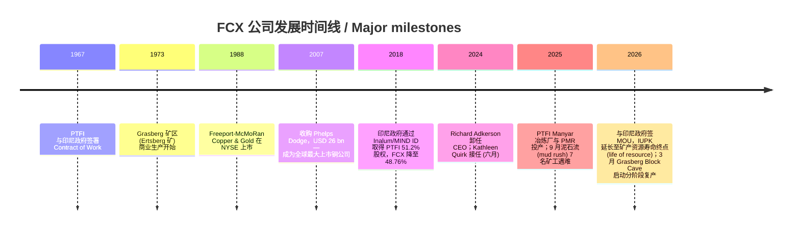
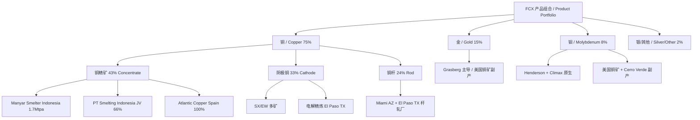
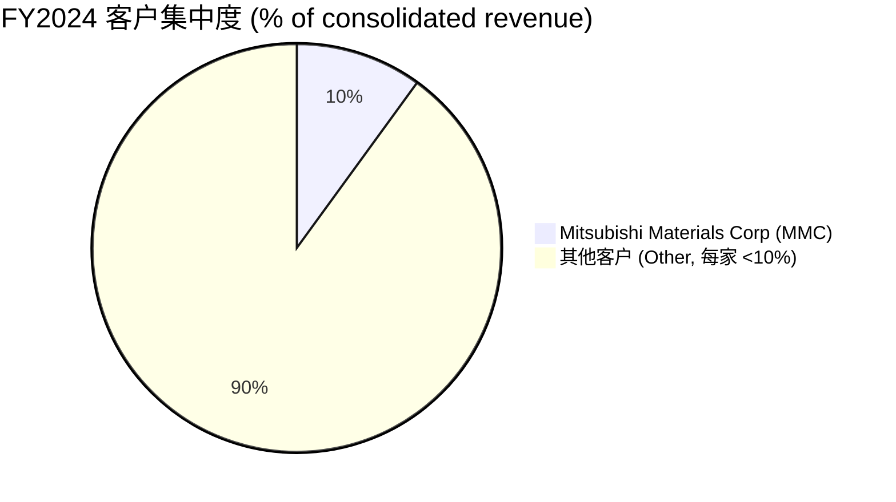
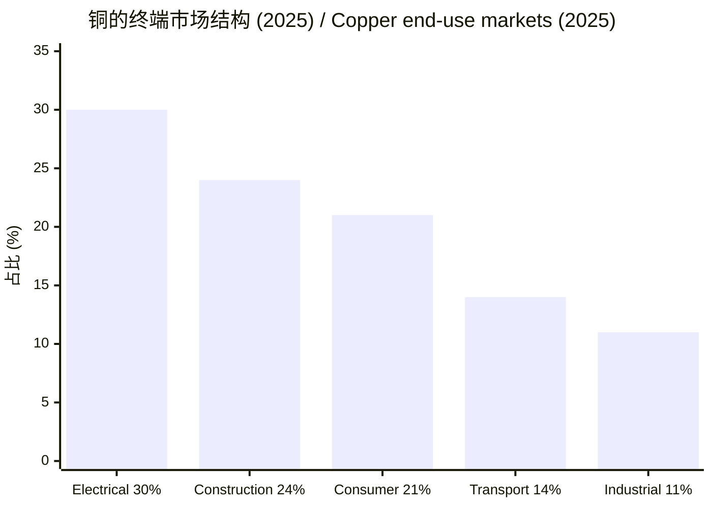
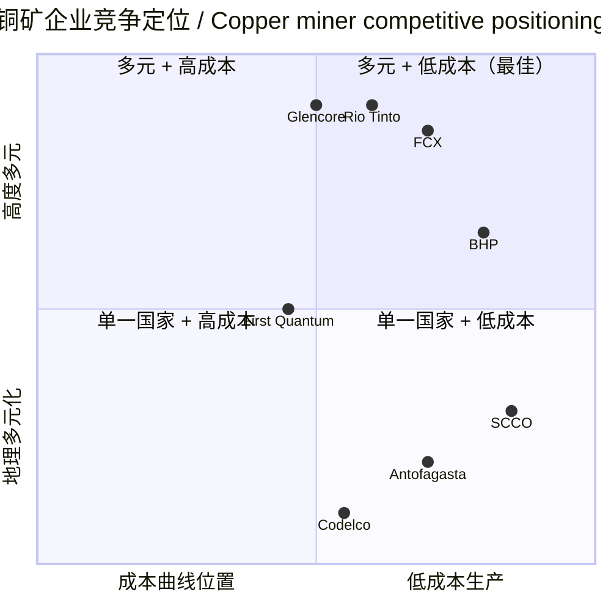

# Freeport-McMoRan (NYSE:FCX) 公司研究 / Company Research

**报告日期 / Report Date**: 2026-06-16（刷新自 2026-06-02 版本 / refreshed from the 2026-06-02 edition）
**主题归属 / Theme**: rare-earth-strategic-minerals (战略矿产 / strategic minerals) · copper
**报告语言 / Language**: 简体中文 (zh-CN) only
**ticker**: NYSE:FCX | **CIK**: 0000831259 | **总部 / HQ**: Phoenix, Arizona, USA

---

## 投资摘要 / Investment Summary Header

> *以下评级、目标价与情景均为本报告分析师观点（Analyst view），并非取自任何监管备案；10-K 中不含目标价，切勿与备案引用混淆。*

| 项目 / Item | 数值 / Value |
|---|---|
| **评级 / Rating** | **持有 / Hold（Neutral）** — *Analyst view* |
| **12 个月目标价 / 12-mo Price Target** | **USD 74** — *Analyst view* |
| **当前股价 / Current Price** | USD 70.29（2026-06-16 收盘 / close） |
| **隐含空间 / Implied upside** | **+5.3%**（至 USD 74） |
| **市值 / Market Cap** | USD 101.0 bn |
| **52 周区间 / 52-wk range** | USD 35.15 – 72.09（现价处于区间顶部 / near the high） |
| **估值方法 / Valuation method** | 2027E EPS USD 3.00 × 22× forward P/E（USD 66）与 2027E EBITDA USD 12.3 bn × 10× EV/EBITDA（USD ~84）的混合 / blend |
| **TTM P/E / Forward P/E** | 37.2× / 18.0× |
| **EV/EBITDA / P/S / P/B** | 12.2× / 3.8× / 5.2× |
| **5Y Beta / 股息率 Div yield** | 1.36 / 0.86% |

**论点支柱 / Thesis pillars（均为 *Analyst view*）**：

1. **铜的结构性供需缺口是多年期叙事，但当前股价已计入大部分乐观预期** — FCX 现价相当于其 5 年均值的约 +0.6σ（Bernstein 测算），TTM P/E 37× 远高于历史中枢，远期 P/E 18× 才接近合理；这意味着上行需要"铜价继续超预期 + Grasberg 顺利复产"两件事同时兑现。
2. **Grasberg 复产是 2026-2027 年最大的盈利弹簧** — 2025 年 9 月泥石流事故压制了印尼产量，2026 年 3 月 Block Cave 已启动分阶段复产，H2 2026 至 2027 年逐步恢复将驱动合并铜产量从 2026E 3.1 Blb 向 2027E 3.5+ Blb 跑率回升。
3. **美国本土资产 + Section 232 关税 + 关键矿产政策构成结构性溢价** — FCX 占美国铜产量约 60%，是美国铜供应链的核心节点，2027 年 1 月可能落地的精炼铜进口关税与 IRA 关键矿产抵免是不对称的政策期权。
4. **资产负债表干净、副产金钼提供成本垫** — 净债 (net debt) USD 2.4 bn、净债/EBITDA < 0.5×，金/钼副产收入直接压低单位铜现金成本至 USD 1.91/lb (Q1 2026)，给了管理层在铜价回调时的缓冲。

**本次刷新的主要变化 / What changed since the 2026-06-02 edition**：
- 股价从 USD 67.04 升至 **USD 70.29**（+4.8%），市值升至 **USD 101.0 bn**，逼近 52 周高点；近一个月相对标普 500 跑赢约 14 个百分点。
- 新增完整图表套件（利润表/资产负债表/现金流量 Sankey、按金属与地理双甜甜圈、历史收入柱、5-step 杜邦树、GF Score 雷达、供应链资金流图）。
- 新增 Section 1B GF Score、Section 2 远期估值与三情景目标价、卖方观点演变（Bernstein / GS / UBS / MS / BofA）。
- 纳入两份新备案：2026-05-14 新签 revolving credit facility（替换 2022 年 USD 3.0 bn 旧循环贷）与 2026-06-10 股东大会投票结果 8-K。

> **更新提示 / Update — Grasberg life-of-resource 延期协议 (2026-02-18)**：公司与印尼政府签署谅解备忘录 (Memorandum of Understanding, MOU)，PTFI (PT Freeport Indonesia) 的特殊矿业经营许可证 IUPK 将延期至矿产资源寿命终点 (life of resource)，但 FCX 同意在 2041 年向印尼国家利益方无偿转让 12% 股权（取得方按账面价值偿还 2041 年后投资的按比例成本），FCX 在 PTFI 的持股将从 2041 年前的 48.76% 降至 2042 年起的约 37%；下游冶炼仍优先在印尼本土，但可能扩大对美国市场的精炼铜销售 ("on market terms")。来源：[FCX 8-K 2026-02-24, EX-99.1 press release 2026-02-18](https://www.sec.gov/Archives/edgar/data/0000831259/000083125926000014/fcxnewrelease21826.htm)。

## 目录 / Table of Contents

1. 公司概览 / Company Overview
   - 1A. 估值快照 / Valuation Snapshot
   - 1B. GF Score 基本面评分卡 / GF Score (GuruFocus-style)
2. 估值与目标价 / Valuation & Price Target（远期模型 + 三情景 + 卖方观点演变）
3. 公司历史 / Company History
4. 管理团队 / Management Team
5. 产品与服务 / Products & Services（含供应链资金流图）
6. 客户与上市策略 / Customers & Go-to-Market
7. 行业概览 / Industry Overview
8. 竞争格局 / Competitive Landscape
9. 市场机会 / Market Opportunity (TAM)
10. 风险评估 / Risk Assessment
11. 投资视角评分 / Investor-Lens Scorecards
12. 数据来源清单 / Data Used
13. 参考资料 / References

---

## 1. 公司概览 / Company Overview

**本方观点（BLUF）/ Bottom line up front**：FCX 是全球最大的纯铜上市标的之一，质量与风险平衡良好——长寿命、地理多元、下游一体化、资产负债表干净；但在 2026 年 6 月这个时点，铜价（COMEX 接近 USD 5.6/lb）与股价（USD 70.29，逼近 52 周高点）都已计入了"AI + 电气化 + 美国关税"三重乐观叙事。本报告给予 **持有 / Hold** 评级、12 个月目标价 **USD 74**（+5.3%），核心理由是估值进入区间顶部（TTM P/E 37×、相对 5 年均值 +0.6σ），上行需要铜价继续超预期叠加 Grasberg 顺利复产；这是一个"基本面优秀但入场价不便宜"的标的（*以上为 Analyst view*）。

Freeport-McMoRan Inc. (NYSE:FCX, 以下简称"FCX"或"公司") 是全球最大的上市铜生产商之一，以铜 (copper, Cu) 为核心，并显著产出金 (gold, Au) 与钼 (molybdenum, Mo) 副产品。公司总部位于美国亚利桑那州凤凰城 (Phoenix, AZ)，在美国、南美洲（秘鲁、智利）和印度尼西亚拥有大型、长寿命、地理多元化的矿山组合。公司在 FY2025 10-K 中自我定位为："We are one of the world's largest publicly traded copper producers. Our portfolio of assets includes the Grasberg minerals district in Indonesia, one of the world's largest copper and gold deposits; and significant operations in the U.S. and South America, including the large-scale Morenci minerals district in Arizona and the Cerro Verde operation in Peru." ([FCX 2025 10-K, Item 1 Business](https://www.sec.gov/Archives/edgar/data/831259/000083125926000012/fcx-20251231.htm))

**收入结构 / Revenue mix**：FY2025 合并收入 (consolidated revenues) 25,915 百万美元（USD 25.9 bn），同比 +1.8%（2024 年 25,455 百万美元；2023 年 22,855 百万美元），按金属拆分主要产品构成为铜 (copper) 75%、金 (gold) 15%、钼 (molybdenum) 8%（其余为白银 silver 及其他副产品）([FCX 2025 10-K, Item 1 — sales of copper (75%), gold (15%) and molybdenum (8%)](https://www.sec.gov/Archives/edgar/data/831259/000083125926000012/fcx-20251231.htm))。FY2025 归属普通股东净利润 (net income attributable to common stock) 2,204 百万美元 (USD 2.20 bn)，摊薄 EPS USD 1.52；2024 年净利润为 1,889 百万美元，摊薄 EPS USD 1.30 ([FCX 2025 10-K, Selected Financial Data](https://www.sec.gov/Archives/edgar/data/831259/000083125926000012/fcx-20251231.htm))。FY2025 经营性现金流 (operating cash flow) 5,610 百万美元，较 2024 年 7,160 百万美元下降，主要因 2025 年 9 月 Grasberg 矿区泥石流 (mud rush) 事故导致 Q4 印尼业务暂停以及营运资本占用；资本支出 (capital expenditures) 4,494 百万美元 ([FCX 2025 10-K, Selected Financial Data](https://www.sec.gov/Archives/edgar/data/831259/000083125926000012/fcx-20251231.htm))。值得注意的是，合并净利润（含少数股东权益 noncontrolling interests）为 4,152 百万美元，其中归属少数股东 1,948 百万美元——这一巨大缺口来自 PTFI（印尼政府/MIND ID 持股 51.2%）和 Cerro Verde（住友、Buenaventura 等）的少数股东权益，是理解 FCX 合并报表与归母利润差异的关键。

### 1.1 收入结构图 / How FCX makes its money（利润表 Sankey）

<svg xmlns="http://www.w3.org/2000/svg" viewBox="0 0 1000 560" width="1000" height="560" role="img" aria-label="income statement Sankey"><rect x="0" y="0" width="1000" height="560" fill="#ffffff"/>
<text x="20.00" y="30.00" text-anchor="start" font-family="Helvetica,Arial,sans-serif" font-size="15" font-weight="700" fill="#1f2933">Freeport-McMoRan (FCX) 利润表资金流 — FY2025 / How FCX Makes Its Money</text>
<path d="M 204.00,64.00 C 258.00,64.00 258.00,85.00 312.00,85.00 L 312.00,389.25 C 258.00,389.25 258.00,368.25 204.00,368.25 Z" fill="#93c5fd" fill-opacity="0.55"/>
<path d="M 452.00,78.00 C 506.00,78.00 506.00,224.56 560.00,224.56 L 560.00,327.18 C 506.00,327.18 506.00,180.62 452.00,180.62 Z" fill="#86efac" fill-opacity="0.55"/>
<path d="M 452.00,180.62 C 506.00,180.62 506.00,341.18 560.00,341.18 L 560.00,353.44 C 506.00,353.44 506.00,192.88 452.00,192.88 Z" fill="#fca5a5" fill-opacity="0.55"/>
<path d="M 328.00,85.00 C 382.00,85.00 382.00,78.00 436.00,78.00 L 436.00,192.88 C 382.00,192.88 382.00,199.88 328.00,199.88 Z" fill="#86efac" fill-opacity="0.55"/>
<path d="M 328.00,199.88 C 382.00,199.88 382.00,206.88 436.00,206.88 L 436.00,500.00 C 382.00,500.00 382.00,493.00 328.00,493.00 Z" fill="#fca5a5" fill-opacity="0.55"/>
<path d="M 700.00,211.04 C 754.00,211.04 754.00,224.83 808.00,224.83 L 808.00,259.53 C 754.00,259.53 754.00,245.74 700.00,245.74 Z" fill="#86efac" fill-opacity="0.55"/>
<path d="M 700.00,245.74 C 754.00,245.74 754.00,273.53 808.00,273.53 L 808.00,308.50 C 754.00,308.50 754.00,280.70 700.00,280.70 Z" fill="#fca5a5" fill-opacity="0.55"/>
<path d="M 700.00,280.70 C 754.00,280.70 754.00,322.50 808.00,322.50 L 808.00,353.17 C 754.00,353.17 754.00,311.37 700.00,311.37 Z" fill="#fca5a5" fill-opacity="0.55"/>
<path d="M 576.00,224.56 C 630.00,224.56 630.00,211.04 684.00,211.04 L 684.00,313.66 C 630.00,313.66 630.00,327.18 576.00,327.18 Z" fill="#86efac" fill-opacity="0.55"/>
<path d="M 576.00,341.18 C 630.00,341.18 630.00,325.36 684.00,325.36 L 684.00,333.94 C 630.00,333.94 630.00,349.76 576.00,349.76 Z" fill="#fca5a5" fill-opacity="0.55"/>
<path d="M 576.00,349.76 C 630.00,349.76 630.00,347.94 684.00,347.94 L 684.00,350.96 C 630.00,350.96 630.00,352.78 576.00,352.78 Z" fill="#fca5a5" fill-opacity="0.55"/>
<path d="M 576.00,352.78 C 630.00,352.78 630.00,364.96 684.00,364.96 L 684.00,366.96 C 630.00,366.96 630.00,354.78 576.00,354.78 Z" fill="#fca5a5" fill-opacity="0.55"/>
<path d="M 204.00,382.25 C 258.00,382.25 258.00,389.25 312.00,389.25 L 312.00,450.65 C 258.00,450.65 258.00,443.65 204.00,443.65 Z" fill="#93c5fd" fill-opacity="0.55"/>
<path d="M 204.00,457.65 C 258.00,457.65 258.00,450.65 312.00,450.65 L 312.00,481.60 C 258.00,481.60 258.00,488.60 204.00,488.60 Z" fill="#93c5fd" fill-opacity="0.55"/>
<path d="M 204.00,502.60 C 258.00,502.60 258.00,481.60 312.00,481.60 L 312.00,493.00 C 258.00,493.00 258.00,514.00 204.00,514.00 Z" fill="#93c5fd" fill-opacity="0.55"/>
<rect x="188.00" y="64.00" width="16" height="304.25" rx="1.5" fill="#2563eb"/>
<rect x="188.00" y="382.25" width="16" height="61.40" rx="1.5" fill="#2563eb"/>
<rect x="188.00" y="457.65" width="16" height="30.95" rx="1.5" fill="#2563eb"/>
<rect x="188.00" y="502.60" width="16" height="11.40" rx="1.5" fill="#2563eb"/>
<rect x="312.00" y="85.00" width="16" height="408.00" rx="1.5" fill="#1e3a8a"/>
<rect x="436.00" y="78.00" width="16" height="114.88" rx="1.5" fill="#15803d"/>
<rect x="436.00" y="206.88" width="16" height="293.12" rx="1.5" fill="#dc2626"/>
<rect x="560.00" y="224.56" width="16" height="102.62" rx="1.5" fill="#15803d"/>
<rect x="560.00" y="341.18" width="16" height="12.26" rx="1.5" fill="#dc2626"/>
<rect x="684.00" y="211.04" width="16" height="100.32" rx="1.5" fill="#15803d"/>
<rect x="684.00" y="325.36" width="16" height="8.58" rx="1.5" fill="#dc2626"/>
<rect x="684.00" y="347.94" width="16" height="3.02" rx="1.5" fill="#dc2626"/>
<rect x="684.00" y="364.96" width="16" height="2.00" rx="1.5" fill="#dc2626"/>
<rect x="808.00" y="224.83" width="16" height="34.70" rx="1.5" fill="#15803d"/>
<rect x="808.00" y="273.53" width="16" height="34.97" rx="1.5" fill="#dc2626"/>
<rect x="808.00" y="322.50" width="16" height="30.67" rx="1.5" fill="#dc2626"/>
<line x1="188.00" y1="216.12" x2="182.00" y2="194.82" stroke="#cbd5e1" stroke-width="1"/>
<text x="179.00" y="197.82" text-anchor="end" font-family="Helvetica,Arial,sans-serif" font-size="11.5" font-weight="700" fill="#1f2933">铜 Copper</text>
<text x="179.00" y="210.82" text-anchor="end" font-family="Helvetica,Arial,sans-serif" font-size="10" font-weight="400" fill="#52606d">$19.3B  (74.6%)</text>
<line x1="188.00" y1="412.95" x2="182.00" y2="391.65" stroke="#cbd5e1" stroke-width="1"/>
<text x="179.00" y="394.65" text-anchor="end" font-family="Helvetica,Arial,sans-serif" font-size="11.5" font-weight="700" fill="#1f2933">金 Gold</text>
<text x="179.00" y="407.65" text-anchor="end" font-family="Helvetica,Arial,sans-serif" font-size="10" font-weight="400" fill="#52606d">$3.9B  (15.0%)</text>
<line x1="188.00" y1="473.13" x2="182.00" y2="451.82" stroke="#cbd5e1" stroke-width="1"/>
<text x="179.00" y="454.82" text-anchor="end" font-family="Helvetica,Arial,sans-serif" font-size="11.5" font-weight="700" fill="#1f2933">钼 Molybdenum</text>
<text x="179.00" y="467.82" text-anchor="end" font-family="Helvetica,Arial,sans-serif" font-size="10" font-weight="400" fill="#52606d">$2.0B  (7.6%)</text>
<line x1="188.00" y1="508.30" x2="182.00" y2="487.00" stroke="#cbd5e1" stroke-width="1"/>
<text x="179.00" y="490.00" text-anchor="end" font-family="Helvetica,Arial,sans-serif" font-size="11.5" font-weight="700" fill="#1f2933">银/其他+调整 Silver/Other &amp; adj</text>
<text x="179.00" y="503.00" text-anchor="end" font-family="Helvetica,Arial,sans-serif" font-size="10" font-weight="400" fill="#52606d">$724.0M  (2.8%)</text>
<rect x="331.00" y="67.00" width="106.80" height="26" rx="2" fill="#ffffff" fill-opacity="0.72"/>
<text x="334.00" y="79.00" text-anchor="start" font-family="Helvetica,Arial,sans-serif" font-size="11.5" font-weight="700" fill="#1f2933">Revenue</text>
<text x="334.00" y="92.00" text-anchor="start" font-family="Helvetica,Arial,sans-serif" font-size="10" font-weight="400" fill="#52606d">$25.9B  (100.0%)</text>
<rect x="455.00" y="60.00" width="94.20" height="26" rx="2" fill="#ffffff" fill-opacity="0.72"/>
<text x="458.00" y="72.00" text-anchor="start" font-family="Helvetica,Arial,sans-serif" font-size="11.5" font-weight="700" fill="#1f2933">Gross Profit</text>
<text x="458.00" y="85.00" text-anchor="start" font-family="Helvetica,Arial,sans-serif" font-size="10" font-weight="400" fill="#52606d">$7.3B  (28.2%)</text>
<rect x="455.00" y="188.88" width="144.60" height="26" rx="2" fill="#ffffff" fill-opacity="0.72"/>
<text x="458.00" y="200.88" text-anchor="start" font-family="Helvetica,Arial,sans-serif" font-size="11.5" font-weight="700" fill="#1f2933">Cost of Revenue (COGS)</text>
<text x="458.00" y="213.88" text-anchor="start" font-family="Helvetica,Arial,sans-serif" font-size="10" font-weight="400" fill="#52606d">$18.6B  (71.8%)</text>
<rect x="579.00" y="206.56" width="106.80" height="26" rx="2" fill="#ffffff" fill-opacity="0.72"/>
<text x="582.00" y="218.56" text-anchor="start" font-family="Helvetica,Arial,sans-serif" font-size="11.5" font-weight="700" fill="#1f2933">Operating Income</text>
<text x="582.00" y="231.56" text-anchor="start" font-family="Helvetica,Arial,sans-serif" font-size="10" font-weight="400" fill="#52606d">$6.5B  (25.2%)</text>
<rect x="579.00" y="323.18" width="150.90" height="26" rx="2" fill="#ffffff" fill-opacity="0.72"/>
<text x="582.00" y="335.18" text-anchor="start" font-family="Helvetica,Arial,sans-serif" font-size="11.5" font-weight="700" fill="#1f2933">Total Operating Expense</text>
<text x="582.00" y="348.18" text-anchor="start" font-family="Helvetica,Arial,sans-serif" font-size="10" font-weight="400" fill="#52606d">$779.0M  (3.0%)</text>
<rect x="703.00" y="193.04" width="94.20" height="26" rx="2" fill="#ffffff" fill-opacity="0.72"/>
<text x="706.00" y="205.04" text-anchor="start" font-family="Helvetica,Arial,sans-serif" font-size="11.5" font-weight="700" fill="#1f2933">Pretax Income</text>
<text x="706.00" y="218.04" text-anchor="start" font-family="Helvetica,Arial,sans-serif" font-size="10" font-weight="400" fill="#52606d">$6.4B  (24.6%)</text>
<rect x="703.00" y="307.36" width="100.50" height="26" rx="2" fill="#ffffff" fill-opacity="0.72"/>
<text x="706.00" y="319.36" text-anchor="start" font-family="Helvetica,Arial,sans-serif" font-size="11.5" font-weight="700" fill="#1f2933">SG&amp;A</text>
<text x="706.00" y="332.36" text-anchor="start" font-family="Helvetica,Arial,sans-serif" font-size="10" font-weight="400" fill="#52606d">$545.0M  (2.1%)</text>
<rect x="703.00" y="332.36" width="106.80" height="26" rx="2" fill="#ffffff" fill-opacity="0.72"/>
<text x="706.00" y="344.36" text-anchor="start" font-family="Helvetica,Arial,sans-serif" font-size="11.5" font-weight="700" fill="#1f2933">R&amp;D</text>
<text x="706.00" y="357.36" text-anchor="start" font-family="Helvetica,Arial,sans-serif" font-size="10" font-weight="400" fill="#52606d">$192.0M  (0.74%)</text>
<rect x="703.00" y="357.36" width="100.50" height="26" rx="2" fill="#ffffff" fill-opacity="0.72"/>
<text x="706.00" y="369.36" text-anchor="start" font-family="Helvetica,Arial,sans-serif" font-size="11.5" font-weight="700" fill="#1f2933">Other OpEx</text>
<text x="706.00" y="382.36" text-anchor="start" font-family="Helvetica,Arial,sans-serif" font-size="10" font-weight="400" fill="#52606d">$42.0M  (0.16%)</text>
<text x="833.00" y="239.18" text-anchor="start" font-family="Helvetica,Arial,sans-serif" font-size="11.5" font-weight="700" fill="#1f2933">Net Income</text>
<text x="833.00" y="252.18" text-anchor="start" font-family="Helvetica,Arial,sans-serif" font-size="10" font-weight="400" fill="#52606d">$2.2B  (8.5%)</text>
<text x="833.00" y="288.02" text-anchor="start" font-family="Helvetica,Arial,sans-serif" font-size="11.5" font-weight="700" fill="#1f2933">Income Tax</text>
<text x="833.00" y="301.02" text-anchor="start" font-family="Helvetica,Arial,sans-serif" font-size="10" font-weight="400" fill="#52606d">$2.2B  (8.6%)</text>
<text x="833.00" y="334.83" text-anchor="start" font-family="Helvetica,Arial,sans-serif" font-size="11.5" font-weight="700" fill="#1f2933">Minority Interest</text>
<text x="833.00" y="347.83" text-anchor="start" font-family="Helvetica,Arial,sans-serif" font-size="10" font-weight="400" fill="#52606d">$1.9B  (7.5%)</text>
<text x="500.00" y="544.00" text-anchor="middle" font-family="Helvetica,Arial,sans-serif" font-size="10" font-weight="400" fill="#52606d">Source: FCX FY2025 10-K, Consolidated Statements of Income + revenue-by-product note</text>
</svg>

来源 / Source: [FCX 2025 10-K, Consolidated Statements of Income + 按产品收入拆分](https://www.sec.gov/Archives/edgar/data/831259/000083125926000012/fcx-20251231.htm)。图中"生产交付成本 (production & delivery) + DD&A"构成总销售成本 USD 18.6 bn；经营利润 (operating income) USD 6.52 bn；少数股东权益分走 USD 1.95 bn，是归母净利润 (USD 2.20 bn) 远低于含少数股东净利润 (USD 4.15 bn) 的原因。

### 1.2 收入构成（按金属与地理）/ Revenue by metal & geography

<svg xmlns="http://www.w3.org/2000/svg" viewBox="0 0 720 460" width="720" height="460" role="img" aria-label="revenue donut"><rect x="0" y="0" width="720" height="460" fill="#ffffff"/>
<text x="20.00" y="30.00" text-anchor="start" font-family="Helvetica,Arial,sans-serif" font-size="15" font-weight="700" fill="#1f2933">FY2025 收入构成（按金属）/ Revenue by Metal</text>
<path d="M 288.00,107.20 A 132 132 0 1 1 156.07,243.36 L 210.04,241.66 A 78 78 0 1 0 288.00,161.20 Z" fill="#2563eb"/>
<path d="M 156.07,243.36 A 132 132 0 0 1 207.32,134.73 L 240.32,177.47 A 78 78 0 0 0 210.04,241.66 Z" fill="#15803d"/>
<path d="M 207.32,134.73 A 132 132 0 0 1 264.18,109.37 L 273.93,162.48 A 78 78 0 0 0 240.32,177.47 Z" fill="#d97706"/>
<path d="M 264.18,109.37 A 132 132 0 0 1 288.00,107.20 L 288.00,161.20 A 78 78 0 0 0 273.93,162.48 Z" fill="#7c3aed"/>
<text x="288.00" y="235.20" text-anchor="middle" font-family="Helvetica,Arial,sans-serif" font-size="18" font-weight="800" fill="#1f2933">FCX</text>
<text x="288.00" y="255.20" text-anchor="middle" font-family="Helvetica,Arial,sans-serif" font-size="13" font-weight="600" fill="#52606d">$25.9B</text>
<text x="288.00" y="271.20" text-anchor="middle" font-family="Helvetica,Arial,sans-serif" font-size="10" font-weight="400" fill="#8a97a3">total</text>
<line x1="387.10" y1="335.23" x2="403.10" y2="335.23" stroke="#2563eb" stroke-width="1.4"/>
<text x="407.10" y="333.23" text-anchor="start" font-family="Helvetica,Arial,sans-serif" font-size="11" font-weight="700" fill="#1f2933">铜 Copper</text>
<text x="407.10" y="347.23" text-anchor="start" font-family="Helvetica,Arial,sans-serif" font-size="10" font-weight="400" fill="#52606d">$19.3B  (74.5%)</text>
<line x1="163.19" y1="180.32" x2="147.19" y2="180.32" stroke="#15803d" stroke-width="1.4"/>
<text x="143.19" y="178.32" text-anchor="end" font-family="Helvetica,Arial,sans-serif" font-size="11" font-weight="700" fill="#1f2933">金 Gold</text>
<text x="143.19" y="192.32" text-anchor="end" font-family="Helvetica,Arial,sans-serif" font-size="10" font-weight="400" fill="#52606d">$3.9B  (15.0%)</text>
<line x1="231.79" y1="113.17" x2="215.79" y2="113.17" stroke="#d97706" stroke-width="1.4"/>
<text x="211.79" y="111.17" text-anchor="end" font-family="Helvetica,Arial,sans-serif" font-size="11" font-weight="700" fill="#1f2933">钼 Molybdenum</text>
<text x="211.79" y="125.17" text-anchor="end" font-family="Helvetica,Arial,sans-serif" font-size="10" font-weight="400" fill="#52606d">$2.0B  (7.6%)</text>
<line x1="275.50" y1="101.77" x2="259.50" y2="101.77" stroke="#7c3aed" stroke-width="1.4"/>
<text x="255.50" y="99.77" text-anchor="end" font-family="Helvetica,Arial,sans-serif" font-size="11" font-weight="700" fill="#1f2933">银及其他 Silver/Other</text>
<text x="255.50" y="113.77" text-anchor="end" font-family="Helvetica,Arial,sans-serif" font-size="10" font-weight="400" fill="#52606d">$749.0M  (2.9%)</text>
<text x="360.00" y="444.00" text-anchor="middle" font-family="Helvetica,Arial,sans-serif" font-size="10" font-weight="400" fill="#52606d">Source: FCX FY2025 10-K, revenue-by-product disaggregation</text>
</svg>

来源 / Source: [FCX 2025 10-K, 按产品收入拆分（铜 cathode/concentrate/rod + 金 + 钼 + 银）](https://www.sec.gov/Archives/edgar/data/831259/000083125926000012/fcx-20251231.htm)。注：按金属甜甜圈使用调整前的产品毛收入口径（铜 USD 19.3 bn、金 USD 3.9 bn、钼 USD 2.0 bn、银及其他 USD 0.7 bn），与合并收入 USD 25.9 bn 的差额为权利金、出口税、加工费 (TC/RC) 与嵌入式衍生品调整。

<svg xmlns="http://www.w3.org/2000/svg" viewBox="0 0 720 460" width="720" height="460" role="img" aria-label="revenue donut"><rect x="0" y="0" width="720" height="460" fill="#ffffff"/>
<text x="20.00" y="30.00" text-anchor="start" font-family="Helvetica,Arial,sans-serif" font-size="15" font-weight="700" fill="#1f2933">FY2025 收入构成（按地区/销售目的地）/ Revenue by Geography</text>
<path d="M 288.00,107.20 A 132 132 0 0 1 395.47,315.85 L 351.50,284.49 A 78 78 0 0 0 288.00,161.20 Z" fill="#2563eb"/>
<path d="M 395.47,315.85 A 132 132 0 0 1 243.73,363.56 L 261.84,312.68 A 78 78 0 0 0 351.50,284.49 Z" fill="#15803d"/>
<path d="M 243.73,363.56 A 132 132 0 0 1 174.63,306.82 L 221.01,279.16 A 78 78 0 0 0 261.84,312.68 Z" fill="#d97706"/>
<path d="M 174.63,306.82 A 132 132 0 0 1 156.01,240.42 L 210.00,239.92 A 78 78 0 0 0 221.01,279.16 Z" fill="#7c3aed"/>
<path d="M 156.01,240.42 A 132 132 0 0 1 161.62,201.10 L 213.32,216.68 A 78 78 0 0 0 210.00,239.92 Z" fill="#dc2626"/>
<path d="M 161.62,201.10 A 132 132 0 0 1 176.74,168.16 L 222.26,197.22 A 78 78 0 0 0 213.32,216.68 Z" fill="#0891b2"/>
<path d="M 176.74,168.16 A 132 132 0 0 1 190.84,149.85 L 230.59,186.40 A 78 78 0 0 0 222.26,197.22 Z" fill="#db2777"/>
<path d="M 190.84,149.85 A 132 132 0 0 1 205.71,135.99 L 239.38,178.21 A 78 78 0 0 0 230.59,186.40 Z" fill="#65a30d"/>
<path d="M 205.71,135.99 A 132 132 0 0 1 288.00,107.20 L 288.00,161.20 A 78 78 0 0 0 239.38,178.21 Z" fill="#9333ea"/>
<text x="288.00" y="235.20" text-anchor="middle" font-family="Helvetica,Arial,sans-serif" font-size="18" font-weight="800" fill="#1f2933">FCX</text>
<text x="288.00" y="255.20" text-anchor="middle" font-family="Helvetica,Arial,sans-serif" font-size="13" font-weight="600" fill="#52606d">$25.9B</text>
<text x="288.00" y="271.20" text-anchor="middle" font-family="Helvetica,Arial,sans-serif" font-size="10" font-weight="400" fill="#8a97a3">total</text>
<line x1="410.68" y1="176.01" x2="426.68" y2="176.01" stroke="#2563eb" stroke-width="1.4"/>
<text x="430.68" y="174.01" text-anchor="start" font-family="Helvetica,Arial,sans-serif" font-size="11" font-weight="700" fill="#1f2933">美国 U.S.</text>
<text x="430.68" y="188.01" text-anchor="start" font-family="Helvetica,Arial,sans-serif" font-size="10" font-weight="400" fill="#52606d">$9.0B  (34.9%)</text>
<line x1="329.39" y1="370.85" x2="345.39" y2="370.85" stroke="#15803d" stroke-width="1.4"/>
<text x="349.39" y="368.85" text-anchor="start" font-family="Helvetica,Arial,sans-serif" font-size="11" font-weight="700" fill="#1f2933">瑞士 Switzerland</text>
<text x="349.39" y="382.85" text-anchor="start" font-family="Helvetica,Arial,sans-serif" font-size="10" font-weight="400" fill="#52606d">$5.3B  (20.6%)</text>
<line x1="200.43" y1="345.85" x2="184.43" y2="345.85" stroke="#d97706" stroke-width="1.4"/>
<text x="180.43" y="343.85" text-anchor="end" font-family="Helvetica,Arial,sans-serif" font-size="11" font-weight="700" fill="#1f2933">日本 Japan</text>
<text x="180.43" y="357.85" text-anchor="end" font-family="Helvetica,Arial,sans-serif" font-size="10" font-weight="400" fill="#52606d">$2.9B  (11.0%)</text>
<line x1="155.13" y1="276.48" x2="139.13" y2="276.48" stroke="#7c3aed" stroke-width="1.4"/>
<text x="135.13" y="274.48" text-anchor="end" font-family="Helvetica,Arial,sans-serif" font-size="11" font-weight="700" fill="#1f2933">印尼 Indonesia</text>
<text x="135.13" y="288.48" text-anchor="end" font-family="Helvetica,Arial,sans-serif" font-size="10" font-weight="400" fill="#52606d">$2.2B  (8.4%)</text>
<line x1="151.38" y1="219.70" x2="135.38" y2="219.70" stroke="#dc2626" stroke-width="1.4"/>
<text x="131.38" y="217.70" text-anchor="end" font-family="Helvetica,Arial,sans-serif" font-size="11" font-weight="700" fill="#1f2933">新加坡 Singapore</text>
<text x="131.38" y="231.70" text-anchor="end" font-family="Helvetica,Arial,sans-serif" font-size="10" font-weight="400" fill="#52606d">$1.2B  (4.8%)</text>
<line x1="162.59" y1="181.60" x2="146.59" y2="181.60" stroke="#0891b2" stroke-width="1.4"/>
<text x="142.59" y="179.60" text-anchor="end" font-family="Helvetica,Arial,sans-serif" font-size="11" font-weight="700" fill="#1f2933">英国 U.K.</text>
<text x="142.59" y="193.60" text-anchor="end" font-family="Helvetica,Arial,sans-serif" font-size="10" font-weight="400" fill="#52606d">$1.1B  (4.4%)</text>
<line x1="178.63" y1="155.04" x2="162.63" y2="155.04" stroke="#db2777" stroke-width="1.4"/>
<text x="158.63" y="153.04" text-anchor="end" font-family="Helvetica,Arial,sans-serif" font-size="11" font-weight="700" fill="#1f2933">西班牙 Spain</text>
<text x="158.63" y="167.04" text-anchor="end" font-family="Helvetica,Arial,sans-serif" font-size="10" font-weight="400" fill="#52606d">$723.0M  (2.8%)</text>
<line x1="193.92" y1="138.24" x2="177.92" y2="138.24" stroke="#65a30d" stroke-width="1.4"/>
<text x="173.92" y="136.24" text-anchor="end" font-family="Helvetica,Arial,sans-serif" font-size="11" font-weight="700" fill="#1f2933">中国 China</text>
<text x="173.92" y="150.24" text-anchor="end" font-family="Helvetica,Arial,sans-serif" font-size="10" font-weight="400" fill="#52606d">$636.0M  (2.5%)</text>
<line x1="242.43" y1="108.94" x2="226.43" y2="108.94" stroke="#9333ea" stroke-width="1.4"/>
<text x="222.43" y="106.94" text-anchor="end" font-family="Helvetica,Arial,sans-serif" font-size="11" font-weight="700" fill="#1f2933">其他 Other</text>
<text x="222.43" y="120.94" text-anchor="end" font-family="Helvetica,Arial,sans-serif" font-size="10" font-weight="400" fill="#52606d">$2.8B  (10.7%)</text>
<text x="360.00" y="444.00" text-anchor="middle" font-family="Helvetica,Arial,sans-serif" font-size="10" font-weight="400" fill="#52606d">Source: FCX FY2025 10-K, Note — Revenues by geographic area</text>
</svg>

来源 / Source: [FCX 2025 10-K, Revenues by geographic area（按销售目的地）](https://www.sec.gov/Archives/edgar/data/831259/000083125926000012/fcx-20251231.htm)。FY2025 美国本土销售 USD 9.0 bn（占 35%）为最大单一市场，其次为瑞士（贸易枢纽）USD 5.3 bn、日本 USD 2.85 bn、印尼 USD 2.18 bn。

### 1.3 历史收入构成 / Historical revenue by metal

<svg xmlns="http://www.w3.org/2000/svg" viewBox="0 0 860 470" width="860" height="470" role="img" aria-label="historical revenue bars"><rect x="0" y="0" width="860" height="470" fill="#ffffff"/>
<text x="20.00" y="30.00" text-anchor="start" font-family="Helvetica,Arial,sans-serif" font-size="15" font-weight="700" fill="#1f2933">历史收入构成（按金属）/ Historical Revenue by Metal (gross, pre-adjustment)</text>
<rect x="20.00" y="44" width="11" height="11" rx="2" fill="#2563eb"/>
<text x="36.00" y="53.00" text-anchor="start" font-family="Helvetica,Arial,sans-serif" font-size="10.5" font-weight="400" fill="#1f2933">铜 Copper</text>
<rect x="102.80" y="44" width="11" height="11" rx="2" fill="#15803d"/>
<text x="118.80" y="53.00" text-anchor="start" font-family="Helvetica,Arial,sans-serif" font-size="10.5" font-weight="400" fill="#1f2933">金 Gold</text>
<rect x="172.40" y="44" width="11" height="11" rx="2" fill="#d97706"/>
<text x="188.40" y="53.00" text-anchor="start" font-family="Helvetica,Arial,sans-serif" font-size="10.5" font-weight="400" fill="#1f2933">钼 Molybdenum</text>
<rect x="281.60" y="44" width="11" height="11" rx="2" fill="#7c3aed"/>
<text x="297.60" y="53.00" text-anchor="start" font-family="Helvetica,Arial,sans-serif" font-size="10.5" font-weight="400" fill="#1f2933">银及其他 Silver/Other</text>
<line x1="70" y1="412.00" x2="834" y2="412.00" stroke="#eceff2" stroke-width="1"/>
<text x="64.00" y="415.00" text-anchor="end" font-family="Helvetica,Arial,sans-serif" font-size="9.5" font-weight="400" fill="#52606d">$0</text>
<line x1="70" y1="345.20" x2="834" y2="345.20" stroke="#eceff2" stroke-width="1"/>
<text x="64.00" y="348.20" text-anchor="end" font-family="Helvetica,Arial,sans-serif" font-size="9.5" font-weight="400" fill="#52606d">$5.7B</text>
<line x1="70" y1="278.40" x2="834" y2="278.40" stroke="#eceff2" stroke-width="1"/>
<text x="64.00" y="281.40" text-anchor="end" font-family="Helvetica,Arial,sans-serif" font-size="9.5" font-weight="400" fill="#52606d">$11.4B</text>
<line x1="70" y1="211.60" x2="834" y2="211.60" stroke="#eceff2" stroke-width="1"/>
<text x="64.00" y="214.60" text-anchor="end" font-family="Helvetica,Arial,sans-serif" font-size="9.5" font-weight="400" fill="#52606d">$17.1B</text>
<line x1="70" y1="144.80" x2="834" y2="144.80" stroke="#eceff2" stroke-width="1"/>
<text x="64.00" y="147.80" text-anchor="end" font-family="Helvetica,Arial,sans-serif" font-size="9.5" font-weight="400" fill="#52606d">$22.9B</text>
<line x1="70" y1="78.00" x2="834" y2="78.00" stroke="#eceff2" stroke-width="1"/>
<text x="64.00" y="81.00" text-anchor="end" font-family="Helvetica,Arial,sans-serif" font-size="9.5" font-weight="400" fill="#52606d">$28.6B</text>
<rect x="123.48" y="203.63" width="147.71" height="208.37" fill="#2563eb"/>
<rect x="123.48" y="163.05" width="147.71" height="40.57" fill="#15803d"/>
<rect x="123.48" y="139.79" width="147.71" height="23.27" fill="#d97706"/>
<rect x="123.48" y="132.77" width="147.71" height="7.01" fill="#7c3aed"/>
<text x="197.33" y="428.00" text-anchor="middle" font-family="Helvetica,Arial,sans-serif" font-size="10" font-weight="400" fill="#52606d">2023</text>
<rect x="378.15" y="183.12" width="147.71" height="228.88" fill="#2563eb"/>
<rect x="378.15" y="131.16" width="147.71" height="51.96" fill="#15803d"/>
<rect x="378.15" y="110.29" width="147.71" height="20.87" fill="#d97706"/>
<rect x="378.15" y="102.74" width="147.71" height="7.55" fill="#7c3aed"/>
<text x="452.00" y="428.00" text-anchor="middle" font-family="Helvetica,Arial,sans-serif" font-size="10" font-weight="400" fill="#52606d">2024</text>
<rect x="632.81" y="186.17" width="147.71" height="225.83" fill="#2563eb"/>
<rect x="632.81" y="140.59" width="147.71" height="45.58" fill="#15803d"/>
<rect x="632.81" y="117.62" width="147.71" height="22.97" fill="#d97706"/>
<rect x="632.81" y="108.86" width="147.71" height="8.75" fill="#7c3aed"/>
<text x="706.67" y="428.00" text-anchor="middle" font-family="Helvetica,Arial,sans-serif" font-size="10" font-weight="400" fill="#52606d">2025</text>
<text x="430.00" y="454.00" text-anchor="middle" font-family="Helvetica,Arial,sans-serif" font-size="10" font-weight="400" fill="#52606d">Source: FCX FY2023–FY2025 10-Ks, revenue-by-product disaggregation</text>
</svg>

来源 / Source: [FCX FY2023–FY2025 10-Ks, 按产品收入拆分](https://www.sec.gov/Archives/edgar/data/831259/000083125926000012/fcx-20251231.htm)。三年看，铜收入稳定在 USD 17.8–19.6 bn 区间，金收入随金价上行而波动（2024 年金价高峰贡献 USD 4.45 bn），整体收入呈温和增长——这正凸显铜矿企业的"价格驱动 > 量驱动"特征。

**业务地理 / Geographic footprint**：FY2025 末，FCX 在三个区域运营：(i) **美国 / United States** — 在亚利桑那州经营 Morenci、Bagdad、Safford (含 Lone Star)、Sierrita、Miami 五个铜矿，新墨西哥州经营 Chino、Tyrone 两个铜矿，科罗拉多州经营 Henderson、Climax 两个原生钼矿；同时在亚利桑那 Miami 运营冶炼厂 (smelter) 和铜杆轧厂 (rod mill)，在德州 El Paso 运营精炼厂 (refinery) 和铜杆轧厂；(ii) **南美洲 / South America** — 秘鲁的 Cerro Verde 和智利的 El Abra 两座铜矿；(iii) **印度尼西亚 / Indonesia** — 通过 PTFI (PT Freeport Indonesia, FCX 持股 48.76%) 经营 Grasberg 矿区，包含 Grasberg Block Cave、Deep Mill Level Zone (DMLZ)、Big Gossan 等地下矿，2025 年完成下游冶炼厂 (Manyar 冶炼厂 + 贵金属精炼厂 PMR) 在 Gresik 投产 ([FCX 2025 10-K, Operations](https://www.sec.gov/Archives/edgar/data/831259/000083125926000012/fcx-20251231.htm))。FY2025 合并铜产量中三个矿场（Morenci、Cerro Verde、Grasberg）合计约 70% ([FCX 2025 10-K, Item 1](https://www.sec.gov/Archives/edgar/data/831259/000083125926000012/fcx-20251231.htm))。

**规模指标 / Scale indicators**：截至 2025-12-31，FCX 员工约 29,000 人（美国 13,900；南美 7,300；印度尼西亚 6,600；欧洲及其他 1,200），另有承包商约 51,400 人 ([FCX 2025 10-K, Human Capital](https://www.sec.gov/Archives/edgar/data/831259/000083125926000012/fcx-20251231.htm))。截至 2025-12-31，合并可采证实和概略铜储量 (proven and probable copper reserves) 112.3 billion pounds (511 万吨)，金储量 20.6 million ounces (641 吨)，钼储量 3.5 billion pounds (159 万吨)；净权益基础 (net equity interest basis) 储量分别为 78.6 Blb 铜、10.4 Moz 金、3.1 Blb 钼 ([FCX 2025 10-K, Mineral Reserves](https://www.sec.gov/Archives/edgar/data/831259/000083125926000012/fcx-20251231.htm))。储量地理分布：美国占铜储量 38%、南美 40%、印尼 22%；金储量印尼占绝对主导 (97%)；钼储量美国占 74% ([FCX 2025 10-K, Reserves by Geography](https://www.sec.gov/Archives/edgar/data/831259/000083125926000012/fcx-20251231.htm))。

### 1A. 估值快照 / Valuation Snapshot (as of 2026-06-16)

- 股价 USD 70.29；市值 USD 101.0 bn；52 周区间 USD 35.15 – 72.09（现价处于区间顶部，约为 200 日均线 USD 53.9 上方 30%）；5 年 beta 1.36（[yfinance / Stockanalysis.com FCX, 2026-06-16](https://www.stockanalysis.com/stocks/fcx/statistics/)）
- **TTM P/E 37.2×**；**Forward P/E 18.0×**；P/S 3.8×；P/B 5.2×；EV/EBITDA 12.2×；股息率 0.86%；ROE 15.6%；ROA 7.8%（[Stockanalysis.com FCX statistics, 2026-06-16](https://www.stockanalysis.com/stocks/fcx/statistics/)）
- **同业对比 / Peer comparison**：Southern Copper (NYSE:SCCO) TTM P/E 33.0×、P/S 11.2×、EV/EBITDA 18.5×、P/B 13.8×、ROE 46.3%（[Stockanalysis.com SCCO](https://www.stockanalysis.com/stocks/scco/statistics/)）；Teck Resources (NYSE:TECK) TTM P/E 25.0×、P/S 2.7×、EV/EBITDA 7.4×、P/B 1.8×（[Stockanalysis.com TECK](https://www.stockanalysis.com/stocks/teck/statistics/)）。FCX 的 EV/EBITDA 12.2× 位于 SCCO（18.5×，高单一国家集中度+高 ROE 溢价）与 TECK（7.4×，煤铜混合体）之间。

**远期估值矩阵 / Forward valuation matrix（*Analyst view*；倍数随盈利恢复而压缩）**：

| 倍数 / Multiple | TTM (FY2025) | FY2026E | FY2027E |
|---|---|---|---|
| P/E | 37.2× | ~29× (EPS ~2.40) | ~23× (EPS ~3.00) |
| EV/EBITDA | 12.2× | ~11× (EBITDA ~10.9) | ~10× (EBITDA ~12.3) |
| P/S | 3.8× | ~4.3× (rev ~23.3) | ~3.9× (rev ~26.2) |

*分析师观点 / Analyst view*：FCX 当前 TTM P/E 37× 看似偏高，但需放在 2025 年 Grasberg 泥石流事故压制盈利的背景下解读——按 2026 年指引、铜价 USD 6/lb 假设的运营现金流 USD 8.7 bn ([FCX Q1 2026 earnings, 2026-04-23](https://www.sec.gov/Archives/edgar/data/0000831259/000083125926000021/a1q2026exhibit991.htm)) 计算，远期 P/E 已压缩至约 18×（市场口径）、本报告口径 2027E 约 23×，更接近长寿命铜矿股的历史中枢估值。EV/EBITDA 12.2× 低于 SCCO 的 18.5×，反映 FCX 印尼资产的政治风险折价；P/B 5.2× 高于 TECK 但远低于 SCCO，体现 FCX 资本结构相对清洁（净债 USD 2.4 bn）。"AI 数据中心 + 电气化 + 美国关键矿产政策"三角是当下估值溢价的核心叙事，详见第 7 节与第 9 节；但 Bernstein 已警示铜矿股整体交易于 5 年均值的 +1σ~+2σ，FCX 约 +0.6σ，仍偏高（详见第 2 节卖方观点演变）。

### 1B. GF Score 基本面评分卡 / GF Score (GuruFocus-style)

*分析师观点 / Analyst view*：**GF Score (GuruFocus-style): 66/100 — 51–70 区间（"Poor future performance potential" 标签）**。需强调：这是本报告按公开方法独立复算的 GuruFocus 式评分，五个子分与综合分均为分析师评分输出（*Analyst view*），不取自任何备案，也未取自 GuruFocus 官方数值；每个底层指标（杠杆、利润率、CAGR、倍数、价格回报）在下文各带自己的引用。66 分这个"偏低"读数主要被 **GF Value (估值) = 4** 拖累——这恰恰是本报告"持有"评级的量化注脚：基本面（财务实力、动量）强，但入场价不便宜。

<svg xmlns="http://www.w3.org/2000/svg" viewBox="0 0 500 500" width="500" height="500" role="img" aria-label="GF Score radar">
<rect x="0" y="0" width="500" height="500" fill="#ffffff"/>
<text x="20" y="24" font-family="Helvetica,Arial,sans-serif" font-size="15" font-weight="700" fill="#1f2933">GF Score (GuruFocus-style): 66/100</text>
<text x="20" y="41" font-family="Helvetica,Arial,sans-serif" font-size="11" fill="#52606d">51–70 Poor future performance potential</text>
<polygon points="250.0,88.0 392.7,191.6 338.2,359.4 161.8,359.4 107.3,191.6" fill="#e9f5ec" stroke="none"/>
<polygon points="250.0,208.0 278.5,228.7 267.6,262.3 232.4,262.3 221.5,228.7" fill="none" stroke="#c5d3cb" stroke-width="1"/>
<polygon points="250.0,178.0 307.1,219.5 285.3,286.5 214.7,286.5 192.9,219.5" fill="none" stroke="#c5d3cb" stroke-width="1"/>
<polygon points="250.0,148.0 335.6,210.2 302.9,310.8 197.1,310.8 164.4,210.2" fill="none" stroke="#c5d3cb" stroke-width="1"/>
<polygon points="250.0,118.0 364.1,200.9 320.5,335.1 179.5,335.1 135.9,200.9" fill="none" stroke="#c5d3cb" stroke-width="1"/>
<polygon points="250.0,88.0 392.7,191.6 338.2,359.4 161.8,359.4 107.3,191.6" fill="none" stroke="#c5d3cb" stroke-width="1.3"/>
<line x1="250" y1="238" x2="161.8" y2="359.4" stroke="#cfdad3" stroke-width="1"/>
<text x="146.5" y="392.4" text-anchor="end" font-family="Helvetica,Arial,sans-serif" font-size="11.5" font-weight="600" fill="#1f2933">Financial Strength</text>
<text x="146.5" y="405.4" text-anchor="end" font-family="Helvetica,Arial,sans-serif" font-size="9.5" fill="#52606d">财务实力</text>
<text x="179.5" y="329.1" text-anchor="middle" font-family="Helvetica,Arial,sans-serif" font-size="10.5" font-weight="700" fill="#1f2933">8</text>
<line x1="250" y1="238" x2="250.0" y2="88.0" stroke="#cfdad3" stroke-width="1"/>
<text x="250.0" y="58.0" text-anchor="middle" font-family="Helvetica,Arial,sans-serif" font-size="11.5" font-weight="600" fill="#1f2933">Profitability</text>
<text x="250.0" y="71.0" text-anchor="middle" font-family="Helvetica,Arial,sans-serif" font-size="9.5" fill="#52606d">盈利能力</text>
<text x="250.0" y="142.0" text-anchor="middle" font-family="Helvetica,Arial,sans-serif" font-size="10.5" font-weight="700" fill="#1f2933">6</text>
<line x1="250" y1="238" x2="107.3" y2="191.6" stroke="#cfdad3" stroke-width="1"/>
<text x="82.6" y="183.6" text-anchor="end" font-family="Helvetica,Arial,sans-serif" font-size="11.5" font-weight="600" fill="#1f2933">Growth</text>
<text x="82.6" y="196.6" text-anchor="end" font-family="Helvetica,Arial,sans-serif" font-size="9.5" fill="#52606d">成长性</text>
<text x="164.4" y="204.2" text-anchor="middle" font-family="Helvetica,Arial,sans-serif" font-size="10.5" font-weight="700" fill="#1f2933">6</text>
<line x1="250" y1="238" x2="392.7" y2="191.6" stroke="#cfdad3" stroke-width="1"/>
<text x="417.4" y="183.6" text-anchor="start" font-family="Helvetica,Arial,sans-serif" font-size="11.5" font-weight="600" fill="#1f2933">GF Value</text>
<text x="417.4" y="196.6" text-anchor="start" font-family="Helvetica,Arial,sans-serif" font-size="9.5" fill="#52606d">估值</text>
<text x="307.1" y="213.5" text-anchor="middle" font-family="Helvetica,Arial,sans-serif" font-size="10.5" font-weight="700" fill="#1f2933">4</text>
<line x1="250" y1="238" x2="338.2" y2="359.4" stroke="#cfdad3" stroke-width="1"/>
<text x="353.5" y="392.4" text-anchor="start" font-family="Helvetica,Arial,sans-serif" font-size="11.5" font-weight="600" fill="#1f2933">Momentum</text>
<text x="353.5" y="405.4" text-anchor="start" font-family="Helvetica,Arial,sans-serif" font-size="9.5" fill="#52606d">动量</text>
<text x="329.4" y="341.2" text-anchor="middle" font-family="Helvetica,Arial,sans-serif" font-size="10.5" font-weight="700" fill="#1f2933">9</text>
<polygon points="250.0,148.0 307.1,219.5 329.4,347.2 179.5,335.1 164.4,210.2" fill="#2e8b57" fill-opacity="0.34" stroke="#2e8b57" stroke-width="2"/>
<circle cx="179.5" cy="335.1" r="2.6" fill="#2e8b57"/>
<circle cx="250.0" cy="148.0" r="2.6" fill="#2e8b57"/>
<circle cx="164.4" cy="210.2" r="2.6" fill="#2e8b57"/>
<circle cx="307.1" cy="219.5" r="2.6" fill="#2e8b57"/>
<circle cx="329.4" cy="347.2" r="2.6" fill="#2e8b57"/>
<text x="250" y="470" text-anchor="middle" font-family="Helvetica,Arial,sans-serif" font-size="9.5" fill="#52606d">Source: FCX FY2025 10-K · Q1 2026 10-Q · yfinance, as of 2026-06-16</text>
<text x="250" y="485" text-anchor="middle" font-family="Helvetica,Arial,sans-serif" font-size="9" fill="#52606d">GF Score = independent analyst rubric (*Analyst view:*) — not GuruFocus™ official number</text>
</svg>

> 离中心越远，该维度得分越高 / The farther a point sits from the centre, the better the company scores on that axis; the larger the pentagon's area, the higher the overall GF Score.

| 维度 / Dimension | 评分 / Score (0–10) | |
|---|---|---|
| Financial Strength (财务实力) | 8 | `████████░░` |
| Profitability (盈利能力) | 6 | `██████░░░░` |
| Growth (成长性) | 6 | `██████░░░░` |
| GF Value (估值) | 4 | `████░░░░░░` |
| Momentum (动量) | 9 | `█████████░` |
| **GF Score (composite, *Analyst view:*)** | **66 / 100** | **51–70 Poor future performance potential** |

*Composite weights (*Analyst view:*): Financial Strength 20% · Profitability 25% · Growth 25% · GF Value 15% · Momentum 15% (transparent reproduction — not GuruFocus's proprietary weighting).*

**各维度评分理由 / Per-axis rationale**：

- **Financial Strength (财务实力) = 8/10**：资产负债表是 FCX 的强项。截至 2026-03-31 合并债务 USD 9.4 bn、现金 USD 3.7 bn，净债 (net debt) 仅 USD 2.4 bn（扣除 USD 3.2 bn 的 PTFI 冶炼厂相关债务后），净债/EBITDA < 0.5×；利息保障倍数 (interest coverage) = 经营利润 6,518 / 利息净额 369 ≈ 17.7× ([FCX 2025 10-K, Statements of Income](https://www.sec.gov/Archives/edgar/data/831259/000083125926000012/fcx-20251231.htm); [FCX Q1 2026 earnings, net debt $2.4 bn](https://www.sec.gov/Archives/edgar/data/0000831259/000083125926000021/a1q2026exhibit991.htm))。2026-05-14 又新签了替换 2022 年 USD 3.0 bn 旧循环贷的 revolving credit facility，流动性进一步巩固 ([FCX 8-K 2026-05-14, Item 1.01](https://www.sec.gov/Archives/edgar/data/831259/000083125926000027/fcx-20260514.htm))。未扣满分因周期性大宗商品天然带来 EBITDA 波动。
- **Profitability (盈利能力) = 6/10**：FY2025 经营利润率 (operating margin) = 6,518 / 25,915 ≈ 25%，ROE 15.6%、ROA 7.8% ([FCX 2025 10-K](https://www.sec.gov/Archives/edgar/data/831259/000083125926000012/fcx-20251231.htm); [Stockanalysis.com FCX](https://www.stockanalysis.com/stocks/fcx/statistics/))。利润率受 Grasberg 事故 USD 625M 闲置费用拖累 ([FCX 2025 10-K, production & delivery charges](https://www.sec.gov/Archives/edgar/data/831259/000083125926000012/fcx-20251231.htm))，且归母 ROE 被庞大的少数股东权益稀释——这是 6 分而非更高的核心原因。金/钼副产收入压低单位铜现金成本至 USD 1.91/lb (Q1 2026)，是利润率的隐形支撑 ([FCX Q1 2026 earnings](https://www.sec.gov/Archives/edgar/data/0000831259/000083125926000021/a1q2026exhibit991.htm))。
- **Growth (成长性) = 6/10**：过去三年收入 CAGR 温和（FY2023 USD 22.9 bn → FY2025 USD 25.9 bn，约 +6%/yr），EPS 受铜价与事故双重扰动而波动 ([FCX 2025 10-K, Selected Financial Data](https://www.sec.gov/Archives/edgar/data/831259/000083125926000012/fcx-20251231.htm))。前瞻看，Grasberg 复产 + 堆浸创新 (leach innovation) + Lone Star 扩建支撑 2026-2028E 双位数收入增长（本报告 2027E 收入 USD 26.2 bn、EBITDA USD 12.3 bn，详见第 2 节）——前瞻强于历史，但高度依赖铜价假设，故 6 分。
- **GF Value (估值) = 4/10 — 注意：分数越高代表越便宜**：TTM P/E 37.2× 处于自身历史区间上四分位，Bernstein 测算 FCX 交易于 5 年均值 +0.6σ ([Bernstein Copper Long View, 2026-06-10](http://xs-macbook-air.local:5001/zsxq/pdf/214528114444851/Bernstein-Global%20Metals%20%26%20Mining%20Copper%20Long%20View%EF%BC%9A%20Three%20misconceptions%20around%20data%20centers%20and%20copper-260610%20%281%29.pdf))；远期 P/E 18× 与 PEG 接近 1（forward 增长可观）拉回了部分分数，但 MoS（相对本报告 USD 74 目标价）仅约 +5%，属"合理偏贵"。这是综合分被压低的主因，也与"持有"评级一致。
- **Momentum (动量) = 9/10**：动量极强。FCX 近 1 个月 +16%、近 6 个月 +48%、近 12 个月 +72%（绝对回报）；相对标普 500 在 6 个月维度跑赢约 +37.6 个百分点，现价处于 52 周高点附近、200 日均线上方约 30% ([yfinance 价格序列, as of 2026-06-16](https://www.stockanalysis.com/stocks/fcx/statistics/))。注意：12 个月维度相对金属矿业 ETF (XME) 略跑输约 7 个百分点，因 2025 年事故期间一度落后。

**综合分算术 / Composite arithmetic**：`(FS 8×20 + Prof 6×25 + Growth 6×25 + Value 4×15 + Mom 9×15) / 100 = 6.55 → 66/100`，权重 FS 20% · Prof 25% · Growth 25% · Value 15% · Mom 15%（透明复算，非 GuruFocus 专有权重）。

*失败模式 / Failure mode*：Momentum (9) 正在做最重的拉升——若铜价从 USD 5.6/lb 回调或 Grasberg 复产再生变数，动量分可能快速下杀 3 分以上，把综合分拖入 50–60 区间。GF Value (4) 则是"等更好入场点"的量化信号。

## 2. 估值与目标价 / Valuation & Price Target

> *本章全部为分析师前瞻观点（Analyst view）——远期估计、目标价、三情景目标价均为本报告测算，不取自任何备案。每个驱动因子的外部依据（备案分部数据 + 管理层指引 + 行业预测）在文中内联引用。*

### 2.1 远期财务模型 / Forward financial-estimates table

模型以 FY2026 指引（铜 3.1 Blb、金 650 koz、钼 90 Mlb，[FCX Q1 2026 earnings 指引](https://www.sec.gov/Archives/edgar/data/0000831259/000083125926000021/a1q2026exhibit991.htm)）为起点，叠加 Grasberg 在 2027 年逐步全面复产带来的量增；价格假设以 Q1 2026 实现价（铜 USD 5.78/lb、金 USD 4,889/oz、钼 USD 25.21/lb，[FCX Q1 2026 earnings](https://www.sec.gov/Archives/edgar/data/0000831259/000083125926000021/a1q2026exhibit991.htm)）为锚，保守地略低于现货建模。

| 财年 / FY | 铜销量 / Cu (Blb) | 铜均价 / Cu px (USD/lb) | 收入 / Revenue (USD bn) | EBITDA (USD bn) | EBITDA 利润率 | 摊薄 EPS (USD) | 收入 YoY |
|---|---|---|---|---|---|---|---|
| FY2025A | 1.5（合并销量口径见下注） | 4.51 (LME 均价) | 25.9 | 9.0 | ~35% | 1.52 | +1.8% |
| **FY2026E** *AV* | 3.1 | 5.50 | **~23.3** | **~10.9** | ~47% | **~2.40** | n/m（受复产时序） |
| **FY2027E** *AV* | 3.6 | 5.40 | **~26.2** | **~12.3** | ~47% | **~3.00** | +12% |
| **FY2028E** *AV* | 4.0 | 5.30 | **~28.2** | **~13.3** | ~47% | **~3.40** | +8% |

*注*：FY2025A 收入 USD 25.9 bn 为合并财报口径；表中 FY2026E+ 的"收入"为金属销售收入毛口径（未含权利金/出口税/TC 调整），故与 FY2025A 口径略有差异。EPS *Analyst view*；FY2026E EPS 由 Q1 2026 年化跑率（USD 0.61×4 ≈ USD 2.4，[FCX Q1 2026 earnings](https://www.sec.gov/Archives/edgar/data/0000831259/000083125926000021/a1q2026exhibit991.htm)）支撑，FY2027E 假设 Grasberg 全面复产 + 单位现金成本维持 USD 1.95/lb（[FCX Q1 2026 earnings 指引](https://www.sec.gov/Archives/edgar/data/0000831259/000083125926000021/a1q2026exhibit991.htm)）。每磅铜价 ±USD 1 约影响 USD 1.6 bn 年化经营现金流（管理层敏感性，[FCX Q1 2026 earnings](https://www.sec.gov/Archives/edgar/data/0000831259/000083125926000021/a1q2026exhibit991.htm)）。

**杜邦分解 / DuPont decomposition（FY2025）**：

<svg xmlns="http://www.w3.org/2000/svg" viewBox="0 0 1240 540" width="1240" height="540" role="img" aria-label="DuPont ROE decomposition"><rect x="0" y="0" width="1240" height="540" fill="#ffffff"/>
<text x="20.00" y="30.00" text-anchor="start" font-family="Helvetica,Arial,sans-serif" font-size="15" font-weight="700" fill="#1f2933">5-Step DuPont Decomposition of Return on Equity (ROE)</text>
<rect x="545.00" y="56.00" width="150" height="56" rx="7" fill="#1e3a8a"/>
<text x="620.00" y="76.00" text-anchor="middle" font-family="Helvetica,Arial,sans-serif" font-size="11.5" font-weight="700" fill="#ffffff">ROE</text>
<text x="620.00" y="94.00" text-anchor="middle" font-family="Helvetica,Arial,sans-serif" font-size="13" font-weight="800" fill="#ffffff">12.08%</text>
<text x="620.00" y="106.00" text-anchor="middle" font-family="Helvetica,Arial,sans-serif" font-size="8.5" font-weight="400" fill="#dbeafe">= Net Income / Avg Equity</text>
<rect x="191.60" y="168.00" width="150" height="56" rx="7" fill="#2563eb"/>
<text x="266.60" y="188.00" text-anchor="middle" font-family="Helvetica,Arial,sans-serif" font-size="11.5" font-weight="700" fill="#ffffff">Net Margin</text>
<text x="266.60" y="206.00" text-anchor="middle" font-family="Helvetica,Arial,sans-serif" font-size="13" font-weight="800" fill="#ffffff">8.50%</text>
<text x="266.60" y="218.00" text-anchor="middle" font-family="Helvetica,Arial,sans-serif" font-size="8.5" font-weight="400" fill="#dbeafe">Net Income / Revenue</text>
<line x1="620.00" y1="112.00" x2="266.60" y2="168.00" stroke="#94a3b8" stroke-width="1.4"/>
<rect x="545.00" y="168.00" width="150" height="56" rx="7" fill="#2563eb"/>
<text x="620.00" y="188.00" text-anchor="middle" font-family="Helvetica,Arial,sans-serif" font-size="11.5" font-weight="700" fill="#ffffff">Asset Turnover</text>
<text x="620.00" y="206.00" text-anchor="middle" font-family="Helvetica,Arial,sans-serif" font-size="13" font-weight="800" fill="#ffffff">0.46</text>
<text x="620.00" y="218.00" text-anchor="middle" font-family="Helvetica,Arial,sans-serif" font-size="8.5" font-weight="400" fill="#dbeafe">Revenue / Avg Assets</text>
<line x1="620.00" y1="112.00" x2="620.00" y2="168.00" stroke="#94a3b8" stroke-width="1.4"/>
<rect x="898.40" y="168.00" width="150" height="56" rx="7" fill="#2563eb"/>
<text x="973.40" y="188.00" text-anchor="middle" font-family="Helvetica,Arial,sans-serif" font-size="11.5" font-weight="700" fill="#ffffff">Equity Multiplier</text>
<text x="973.40" y="206.00" text-anchor="middle" font-family="Helvetica,Arial,sans-serif" font-size="13" font-weight="800" fill="#ffffff">3.10</text>
<text x="973.40" y="218.00" text-anchor="middle" font-family="Helvetica,Arial,sans-serif" font-size="8.5" font-weight="400" fill="#dbeafe">Avg Assets / Avg Equity</text>
<line x1="620.00" y1="112.00" x2="973.40" y2="168.00" stroke="#94a3b8" stroke-width="1.4"/>
<circle cx="443.30" cy="196.00" r="11" fill="#ffffff" stroke="#94a3b8" stroke-width="1.2"/>
<text x="443.30" y="201.00" text-anchor="middle" font-family="Helvetica,Arial,sans-serif" font-size="14" font-weight="800" fill="#52606d">×</text>
<circle cx="796.70" cy="196.00" r="11" fill="#ffffff" stroke="#94a3b8" stroke-width="1.2"/>
<text x="796.70" y="201.00" text-anchor="middle" font-family="Helvetica,Arial,sans-serif" font-size="14" font-weight="800" fill="#52606d">×</text>
<rect x="65.00" y="300.00" width="118" height="56" rx="7" fill="#2563eb"/>
<text x="124.00" y="320.00" text-anchor="middle" font-family="Helvetica,Arial,sans-serif" font-size="11.5" font-weight="700" fill="#ffffff">Operating Margin</text>
<text x="124.00" y="338.00" text-anchor="middle" font-family="Helvetica,Arial,sans-serif" font-size="13" font-weight="800" fill="#ffffff">25.15%</text>
<text x="124.00" y="350.00" text-anchor="middle" font-family="Helvetica,Arial,sans-serif" font-size="8.5" font-weight="400" fill="#dbeafe">Op Inc / Revenue</text>
<line x1="266.60" y1="224.00" x2="124.00" y2="300.00" stroke="#94a3b8" stroke-width="1.4"/>
<rect x="207.60" y="300.00" width="118" height="56" rx="7" fill="#2563eb"/>
<text x="266.60" y="320.00" text-anchor="middle" font-family="Helvetica,Arial,sans-serif" font-size="11.5" font-weight="700" fill="#ffffff">Tax Burden</text>
<text x="266.60" y="338.00" text-anchor="middle" font-family="Helvetica,Arial,sans-serif" font-size="13" font-weight="800" fill="#ffffff">0.3459</text>
<text x="266.60" y="350.00" text-anchor="middle" font-family="Helvetica,Arial,sans-serif" font-size="8.5" font-weight="400" fill="#dbeafe">Net Inc / Pretax</text>
<line x1="266.60" y1="224.00" x2="266.60" y2="300.00" stroke="#94a3b8" stroke-width="1.4"/>
<rect x="350.20" y="300.00" width="118" height="56" rx="7" fill="#2563eb"/>
<text x="409.20" y="320.00" text-anchor="middle" font-family="Helvetica,Arial,sans-serif" font-size="11.5" font-weight="700" fill="#ffffff">Interest Burden</text>
<text x="409.20" y="338.00" text-anchor="middle" font-family="Helvetica,Arial,sans-serif" font-size="13" font-weight="800" fill="#ffffff">0.9776</text>
<text x="409.20" y="350.00" text-anchor="middle" font-family="Helvetica,Arial,sans-serif" font-size="8.5" font-weight="400" fill="#dbeafe">Pretax / Op Inc</text>
<line x1="266.60" y1="224.00" x2="409.20" y2="300.00" stroke="#94a3b8" stroke-width="1.4"/>
<circle cx="195.30" cy="328.00" r="11" fill="#ffffff" stroke="#94a3b8" stroke-width="1.2"/>
<text x="195.30" y="333.00" text-anchor="middle" font-family="Helvetica,Arial,sans-serif" font-size="14" font-weight="800" fill="#52606d">×</text>
<circle cx="337.90" cy="328.00" r="11" fill="#ffffff" stroke="#94a3b8" stroke-width="1.2"/>
<text x="337.90" y="333.00" text-anchor="middle" font-family="Helvetica,Arial,sans-serif" font-size="14" font-weight="800" fill="#52606d">×</text>
<rect x="479.00" y="300.00" width="118" height="56" rx="7" fill="#2563eb"/>
<text x="538.00" y="326.00" text-anchor="middle" font-family="Helvetica,Arial,sans-serif" font-size="11.5" font-weight="700" fill="#ffffff">Revenue</text>
<text x="538.00" y="342.00" text-anchor="middle" font-family="Helvetica,Arial,sans-serif" font-size="13" font-weight="800" fill="#ffffff">$25.9B</text>
<line x1="620.00" y1="224.00" x2="538.00" y2="300.00" stroke="#94a3b8" stroke-width="1.4"/>
<rect x="643.00" y="300.00" width="118" height="56" rx="7" fill="#2563eb"/>
<text x="702.00" y="320.00" text-anchor="middle" font-family="Helvetica,Arial,sans-serif" font-size="11.5" font-weight="700" fill="#ffffff">Avg Total Assets</text>
<text x="702.00" y="338.00" text-anchor="middle" font-family="Helvetica,Arial,sans-serif" font-size="13" font-weight="800" fill="#ffffff">$56.5B</text>
<text x="702.00" y="350.00" text-anchor="middle" font-family="Helvetica,Arial,sans-serif" font-size="8.5" font-weight="400" fill="#dbeafe">(begin+end)/2</text>
<line x1="620.00" y1="224.00" x2="702.00" y2="300.00" stroke="#94a3b8" stroke-width="1.4"/>
<circle cx="620.00" cy="328.00" r="11" fill="#ffffff" stroke="#94a3b8" stroke-width="1.2"/>
<text x="620.00" y="333.00" text-anchor="middle" font-family="Helvetica,Arial,sans-serif" font-size="14" font-weight="800" fill="#52606d">÷</text>
<rect x="832.40" y="300.00" width="118" height="56" rx="7" fill="#2563eb"/>
<text x="891.40" y="320.00" text-anchor="middle" font-family="Helvetica,Arial,sans-serif" font-size="11.5" font-weight="700" fill="#ffffff">Avg Total Assets</text>
<text x="891.40" y="338.00" text-anchor="middle" font-family="Helvetica,Arial,sans-serif" font-size="13" font-weight="800" fill="#ffffff">$56.5B</text>
<text x="891.40" y="350.00" text-anchor="middle" font-family="Helvetica,Arial,sans-serif" font-size="8.5" font-weight="400" fill="#dbeafe">(begin+end)/2</text>
<line x1="973.40" y1="224.00" x2="891.40" y2="300.00" stroke="#94a3b8" stroke-width="1.4"/>
<rect x="996.40" y="300.00" width="118" height="56" rx="7" fill="#2563eb"/>
<text x="1055.40" y="320.00" text-anchor="middle" font-family="Helvetica,Arial,sans-serif" font-size="11.5" font-weight="700" fill="#ffffff">Avg Total Equity</text>
<text x="1055.40" y="338.00" text-anchor="middle" font-family="Helvetica,Arial,sans-serif" font-size="13" font-weight="800" fill="#ffffff">$18.2B</text>
<text x="1055.40" y="350.00" text-anchor="middle" font-family="Helvetica,Arial,sans-serif" font-size="8.5" font-weight="400" fill="#dbeafe">(begin+end)/2</text>
<line x1="973.40" y1="224.00" x2="1055.40" y2="300.00" stroke="#94a3b8" stroke-width="1.4"/>
<circle cx="967.20" cy="328.00" r="11" fill="#ffffff" stroke="#94a3b8" stroke-width="1.2"/>
<text x="967.20" y="333.00" text-anchor="middle" font-family="Helvetica,Arial,sans-serif" font-size="14" font-weight="800" fill="#52606d">÷</text>
<rect x="69.00" y="420.00" width="110" height="48" rx="7" fill="#3b82f6"/>
<text x="124.00" y="442.00" text-anchor="middle" font-family="Helvetica,Arial,sans-serif" font-size="11.5" font-weight="700" fill="#ffffff">Operating Income</text>
<text x="124.00" y="458.00" text-anchor="middle" font-family="Helvetica,Arial,sans-serif" font-size="13" font-weight="800" fill="#ffffff">$6.5B</text>
<line x1="124.00" y1="356.00" x2="124.00" y2="420.00" stroke="#94a3b8" stroke-width="1.4"/>
<rect x="211.60" y="420.00" width="110" height="48" rx="7" fill="#3b82f6"/>
<text x="266.60" y="442.00" text-anchor="middle" font-family="Helvetica,Arial,sans-serif" font-size="11.5" font-weight="700" fill="#ffffff">Net Income</text>
<text x="266.60" y="458.00" text-anchor="middle" font-family="Helvetica,Arial,sans-serif" font-size="13" font-weight="800" fill="#ffffff">$2.2B</text>
<line x1="266.60" y1="356.00" x2="266.60" y2="420.00" stroke="#94a3b8" stroke-width="1.4"/>
<rect x="354.20" y="420.00" width="110" height="48" rx="7" fill="#3b82f6"/>
<text x="409.20" y="442.00" text-anchor="middle" font-family="Helvetica,Arial,sans-serif" font-size="11.5" font-weight="700" fill="#ffffff">Pretax Income</text>
<text x="409.20" y="458.00" text-anchor="middle" font-family="Helvetica,Arial,sans-serif" font-size="13" font-weight="800" fill="#ffffff">$6.4B</text>
<line x1="409.20" y1="356.00" x2="409.20" y2="420.00" stroke="#94a3b8" stroke-width="1.4"/>
<text x="620.00" y="510.00" text-anchor="middle" font-family="Helvetica,Arial,sans-serif" font-size="10" font-weight="400" font-style="italic" fill="#8a97a3">ROE 归属普通股东 / on average common equity; FY2025 full year</text>
<text x="620.00" y="524.00" text-anchor="middle" font-family="Helvetica,Arial,sans-serif" font-size="10" font-weight="400" fill="#52606d">Source: FCX FY2025 10-K, Statements of Income + Balance Sheets</text>
</svg>

来源 / Source: [FCX 2025 10-K, Statements of Income + Balance Sheets](https://www.sec.gov/Archives/edgar/data/831259/000083125926000012/fcx-20251231.htm)。归母 ROE 由"较薄的净利率（受少数股东权益稀释）× 偏低的资产周转率（重资产采矿业）× 适中的权益乘数"构成——这解释了为何 FCX 的归母 ROE（约 12% 平均口径）显著低于 SCCO（46%）：SCCO 没有 FCX 这样庞大的少数股东漏出，且单位成本更低。

### 2.2 目标价推导 / Price-target derivation（show the arithmetic）

本报告采用**两法混合**：

1. **远期 P/E 法**：2027E 摊薄 EPS USD 3.00 × 22× forward P/E = **USD 66**。22× 的倍数依据：长寿命铜矿龙头在铜价上行周期的历史中枢约 18–25×；FCX 因美国关税期权与 Grasberg 复产弹性取区间中高位，但低于 SCCO 的 28× forward（SCCO 享受更高 ROE 与更低政治风险，[Stockanalysis.com SCCO](https://www.stockanalysis.com/stocks/scco/statistics/)），高于 TECK 的 22× forward（煤铜混合体折价，[Stockanalysis.com TECK](https://www.stockanalysis.com/stocks/teck/statistics/)）。
2. **EV/EBITDA 法**：2027E EBITDA USD 12.3 bn × 10× EV/EBITDA − 净债 USD 2.4 bn = 权益 USD ~121 bn ÷ 14.38 亿股 ≈ **USD ~84**。10× 介于 SCCO 的 18.5× 与 TECK 的 7.4× 之间，反映 FCX 多元化但含印尼折价的资产质量。

**混合目标价 = USD 74**（P/E 法 USD 66 与 EV/EBITDA 法 USD 84 的中点偏下，给印尼政治风险与铜价回调风险留安全边际），对应 **+5.3% 上行**。这与 GS 的 Buy/USD 75（[GS Pulse, 2026-06-05](http://xs-macbook-air.local:5001/zsxq/pdf/415288844845488/Goldman%20Sachs-Energy%EF%BC%8C%20Utilities%20%26%20Mining%20Pulse%EF%BC%9AInvestors%20Asking%EF%BC%9AWhat%20Are%20Key%20Debates%20in%20Natural%20Resources%20from%20Here%EF%BC%9F-260604.pdf）几乎一致、显著高于 Bernstein 的 Market-Perform/USD 58.50（[Bernstein, 2026-06-10](http://xs-macbook-air.local:5001/zsxq/pdf/214528114444851/Bernstein-Global%20Metals%20%26%20Mining%20Copper%20Long%20View%EF%BC%9A%20Three%20misconceptions%20around%20data%20centers%20and%20copper-260610%20%281%29.pdf）。

### 2.3 三情景目标价 / Bull / Base / Bear（*Analyst view*）

| 情景 | 核心摆动假设 / Swing assumption | 目标价 | 相对现价 |
|---|---|---|---|
| **牛市 / Bull** | 铜价升至 USD 6+/lb（AI+电气化加速）+ Grasberg 提前满产 + 美国对精炼铜征 15% 关税推升 COMEX 溢价；2027E EPS USD 3.40 × 26× | **USD 90** | **+28%** |
| **基准 / Base** | 铜价 USD 5.3–5.5/lb，Grasberg 按计划 H2 2026–2027 复产；2027E EPS USD 3.00，混合 P/E 22× & EV/EBITDA 10× | **USD 74** | **+5%** |
| **熊市 / Bear** | 铜价回落至 USD 4/lb（中国地产+全球工业走弱）、美国明确不征关税释放囤积库存、Grasberg 复产再延；2027E EPS USD 2.40 × 16× | **USD 50** | **−29%** |

风险报酬大致对称偏下（+28% / −29%），这正是"持有"评级的底层逻辑：基本面优秀，但在 52 周高点附近、铜价已计入乐观预期的位置，上行空间被压缩。

### 2.4 关键变量 / Swing variables（the call hinges on these）

1. **长期铜价假设**——Damodaran 框架下 ±USD 0.50/lb 改变本报告估值约 20–30%（详见第 11 节）。这是单一最大变量。
2. **Grasberg 复产时序**——2026 年 3 月 Block Cave 已启动分阶段复产，但 Production Block 1 要到 2027 年才完全重启；任何延迟都直接削减 2026–2027E 印尼铜金产量。
3. **美国 Section 232 精炼铜关税**——商务部长须在 2026-06-30 前提交评估报告，决定是否自 2027-01-01 起征 15% 关税（[MS US Copper Tariff Scenarios, 2026-06-08](http://xs-macbook-air.local:5001/zsxq/pdf/214528415518851/Morgan%20Stanley-Scenarios%20for%20US%20Copper%20Tariffs-260608.pdf)）。这是一个二元政策期权，对 COMEX-LME 价差与 FCX 美国业务结算价影响显著。

### 2.5 卖方观点演变 / Sell-side view evolution（≥2 zsxq 机构覆盖，强制章节）

> 机械化预读：已对 `db/stock_price_target.db` 做只读 SELECT，FCX 现存两条 PT 行——BofA Buy（2026-04-20，报告日股价 USD 70.18）、UBS Buy（2026-03-26，报告日股价 USD 55.71），均未存数值目标价；以下时间线补充各机构 PDF 原文的目标价与论点。所有以下均为 *分析师观点 / Analyst view*，引用至本地 zsxq PDF 直链。

**按机构的观点时间线 / Per-institute view timeline**：

| 机构 / Institute | 日期 | 评级 / 目标价 | 核心论点 / Core thesis | 报告日股价 |
|---|---|---|---|---|
| UBS | 2026-03-26 | Buy（铜首选） | 铜估值折价、霍尔木兹海峡情景下的不对称收益；2026 铜价预测 521c/lb（~USD 11,500/t） | USD 55.71 |
| BofA | 2026-04-20 | Buy | 蓝筹铜标的；堆浸 (leaching) 期权价值；印尼复产 | USD 70.18 |
| Goldman Sachs | 2026-06-05 | **Buy，目标价 USD 75** | 上调铜价预测（中国去库快于季节性 + 美铜关税预期使 COMEX-LME 价差扩至 4%）；FCX 北美结算价高于 LME，Grasberg 复产可放大受益；**铜敞口首选 FCX** | n/a（pulse 类报告未列报告日股价） |
| **Bernstein** | **2026-06-10** | **Market-Perform，目标价 USD 58.50（自 53.50 上调），EV/EBITDA 6.5×** | "驳数据中心驱动铜需求"叙事：DC 铜需求被夸大（800VDC 架构使铜强度降 ~45%），ESS 才是更坚实增量；铜股已 price-in 高价（2027 共识 USD 12,500/t），下行风险大于上行；FCX 交易于 5 年均值 **+0.6σ**，偏高但未极端 | n/a |

**机构间分歧 / Cross-institute disagreement（不混为假一致）**：

最大的分歧在 **GS（Buy / USD 75）vs Bernstein（Market-Perform / USD 58.50）**——两者目标价相差近 30%，反映对同一组事实的相反解读：

| 机构 | 日期 | 评级 / PT | 核心争点 | 什么证据能证明其正确 |
|---|---|---|---|---|
| Goldman Sachs | 2026-06-05 | Buy / USD 75 | 铜价上行 + 美国关税扩大 COMEX 溢价 + Grasberg 复产弹性，三者叠加放大 FCX 盈利 | 美国 2026-07 宣布 2027-01 起征精炼铜关税；Grasberg H2 2026 复产快于预期；中国去库持续 |
| Bernstein | 2026-06-10 | Market-Perform / USD 58.50 | 铜股估值已计入 2027 共识 USD 12,500/t（隐含 >USD 13,500/t），数据中心需求叙事被夸大，下行风险更大 | 铜价回落至 Bernstein 长期均衡 USD 10,700/t；800VDC/钠电池压低铜强度；新增绿地铜矿审批放量 |

本报告 USD 74 的目标价更靠近 GS 一侧，但评级取"持有"而非"买入"——因为我们认同 Bernstein 关于"入场价已偏高（+0.6σ）"的风险提示，同时认可 GS 关于"美国关税 + Grasberg 复产"的不对称上行期权。换言之，**论点正确但时点不便宜**。

## 3. 公司历史 / Company History

FCX 的现代法人形态成立于 1988 年（作为 Freeport-McMoRan Copper & Gold 在纽交所上市的前身），但其根源可追溯到 1912 年成立的 Freeport Sulphur Company。1981 年 Freeport-McMoRan Inc. 通过合并 Freeport Minerals Company 和 McMoRan Oil & Gas Co. 形成。1990 年代起，FCX 围绕印尼 Grasberg 矿区 — 由 PT Freeport Indonesia (PTFI) 经营、1967 年首次签订 Contract of Work、1973 年开始商业生产 — 逐步成为全球铜金巨头 ([fcx.com About FCX](https://fcx.com/about))。

来源：[FCX 2025 10-K, History/Operations summary](https://www.sec.gov/Archives/edgar/data/831259/000083125926000012/fcx-20251231.htm); [Mining Education Foundation, Richard Adkerson 简介](https://miningeducationfoundation.org/Richard_Adkerson)。

**2007 年 Phelps Dodge 收购 / Phelps Dodge acquisition** — 这是公司历史上最具变革意义的一步。当时 FCX 是一家以印尼为主的中等规模铜金生产商，2007 年 3 月以 USD 26 bn 收购 Phelps Dodge Corp.，由此将 Morenci、Bagdad、Sierrita、Cerro Verde、El Abra 等北美南美大型铜矿资产并入。这次收购使 FCX 从单一国家 (印尼) 风险敞口转变为美洲三国分散的全球铜业领导者 ([Mining Education Foundation, Richard Adkerson](https://miningeducationfoundation.org/Richard_Adkerson))。收购完成后公司更名为 Freeport-McMoRan Copper & Gold Inc.，2014 年再次更名为 Freeport-McMoRan Inc.（去除 "Copper & Gold"，反映公司在 2013-2016 年油气业务并购与剥离周期之后的瘦身定位）。

**2017-2018 年印尼 IUPK 谈判 / Indonesia IUPK negotiation** — 印尼政府长期施压外资矿企本地化（local content 与 divestment 要求）。2017 年，PTFI 与印尼政府达成框架协议：FCX 同意将 PTFI 持股从 90.64% 降至 48.76%，由印尼国有控股公司 Inalum (现 MIND ID) 取得 51.2%；同时印尼政府承诺提供 IUPK (Special Mining Business License) 替代旧 Contract of Work，确保 PTFI 经营权延续至 2041 年；FCX 同时承诺在印尼境内建设新的冶炼厂以满足 downstreaming policy。该交易于 2018 年 12 月完成 ([FCX 2025 10-K, Operations - Indonesia](https://www.sec.gov/Archives/edgar/data/831259/000083125926000012/fcx-20251231.htm); [Indonesia Business Post, 2024 Freeport ownership analysis](https://indonesiabusinesspost.com/88/Politics/mcmoran-still-controls-freeport-indonesia-despite-countrys-majority-share))。

**2025 年 9 月 Grasberg 泥石流事故 / Mud rush incident** — 2025 年 9 月，Grasberg Block Cave 地下矿发生泥石流 (mud rush) 事故，造成 7 名矿工遇难，矿场临时停产以救援并启动调查。10 月底 PTFI 在不受影响的 DMLZ 和 Big Gossan 矿区重启生产，Q4 完成调查与修复计划。2026 年 3 月 Grasberg Block Cave 启动分阶段复产 (phased ramp-up)，公司称已根据物料处理系统的修改调整了复产时间表 ([FCX Q1 2026 earnings, 2026-04-23](https://www.sec.gov/Archives/edgar/data/0000831259/000083125926000021/a1q2026exhibit991.htm))。该事故直接导致 FY2025 印尼铜产量低于原计划，并产生 USD 625M 的闲置设施费用与直接恢复费用计入 FY2025 生产交付成本 ([FCX 2025 10-K, production & delivery charges](https://www.sec.gov/Archives/edgar/data/831259/000083125926000012/fcx-20251231.htm))。

## 4. 管理团队 / Management Team

FCX 当前管理层经历了 2024 年的重大 CEO 换届：长期主导公司战略的 Richard C. Adkerson（任期 2003-2024）于 2024 年 6 月卸任 CEO，继续担任董事长 (Chairman of the Board)；财务背景出身的 Kathleen L. Quirk（前 CFO 与 President）接任 CEO，成为美国大型上市矿企中少有的女性 CEO。

**Richard C. Adkerson（董事长 / Chairman）** — Adkerson 于 1989 年加入 Freeport-McMoRan，2003 年任 CEO 直至 2024 年 6 月，共约 21 年 CEO 任期；2006 年起任董事，2021 年起任董事长 ([FCX 2025 10-K, Executive Officers](https://www.sec.gov/Archives/edgar/data/831259/000083125926000012/fcx-20251231.htm))。Adkerson 出生于密西西比州，密西西比州立大学 (Mississippi State University) 工商管理学士与 MBA。加入 Freeport 之前，他在 Arthur Andersen & Co.（已解体的会计师事务所，时为四大之一）任审计与咨询合伙人。他在 FCX 任内最具变革意义的成就是 2007 年主导 USD 26 bn 收购 Phelps Dodge Corp.，将公司从印尼单一国家矿企转型为全球最大上市铜公司；并主导 2017-2018 年与印尼政府就 PTFI 股权和 IUPK 框架的谈判 ([Mining Education Foundation, Richard Adkerson](https://miningeducationfoundation.org/Richard_Adkerson))。截至 2026-04-13，Adkerson 的受益所有权 (beneficial ownership) 与 2025 年薪酬细节披露于 2026 年委托书 ([FCX 2026 DEF 14A, Stock Ownership & Compensation Tables](https://www.sec.gov/Archives/edgar/data/831259/000119312526173666/d30227ddef14a.htm))。

**Kathleen L. Quirk（总裁兼 CEO / President and CEO）** — Quirk 持路易斯安那州立大学 (Louisiana State University) 会计学学士学位 ([Bloomberg Profile, Kathleen L. Quirk](https://www.bloomberg.com/profile/person/6083735))。Quirk 于 1989 年加入 Freeport-McMoRan（与 Adkerson 同年），先后负责税务 (Tax)、投资者关系 (Investor Relations)、企业发展 (Corporate Development) 和财务 (Treasury) 等多个职能。2003 年 12 月被任命为 CFO，任 CFO 直到 2022 年，期间多次获 Institutional Investor 杂志"金属矿业 Best CFO"奖。2021 年 2 月任 President，2023 年 2 月加入董事会，2024 年 6 月正式接任 CEO ([Women's Power Gap CEO Profile - Kathleen Quirk](https://www.womenspowergap.org/ceo-profile/freeport-mcmoran-kathleen-quirk/); [FCX 2025 10-K, Executive Officers](https://www.sec.gov/Archives/edgar/data/831259/000083125926000012/fcx-20251231.htm))。Quirk 还担任 Vulcan Materials Company (NYSE:VMC) 董事 ([FCX 2025 10-K, Executive Officers](https://www.sec.gov/Archives/edgar/data/831259/000083125926000012/fcx-20251231.htm))。

Quirk 在 CFO 任内长达近 19 年的财务掌舵，使她接任 CEO 时具有罕见的"内生提升 + 长期连续性"特征：她对 FCX 的资本结构、Grasberg 项目融资 (project finance) 历史、印尼 IUPK 谈判细节、Phelps Dodge 整合架构都有深度参与。从市场角度看，2024 年 6 月 Quirk 接任时 FCX 股价大约在 USD 48 区间，2026 年 6 月已达 USD 70，期间公司经历了 Grasberg 泥石流冲击，但凭借 Quirk 主导的 Q4 2025 快速重启计划与 2026 年 2 月与印尼政府的 MOU，市场对她危机管理与政府关系处理的评价相对正面 ([Lunar Asset, Leadership Transition at Freeport-McMoRan](https://www.lunarasset.com/post/leadership-transition-at-freeport-mcmoran-kathleen-l-quirk-steps-up-as-ceo))。Quirk 的受益所有权与 2025 年薪酬结构（以 PSU/RSU 为主的长期激励、绝大部分为变动激励 at-risk）披露于 2026 年委托书 ([FCX 2026 DEF 14A, Compensation Discussion & Analysis](https://www.sec.gov/Archives/edgar/data/831259/000119312526173666/d30227ddef14a.htm))。

## 5. 产品与服务 / Products & Services

FCX 的产品组合是典型的初级金属生产商 (primary metals producer) 结构 — 主要产品是铜，但通过同一座矿山的矿石处理路径同时回收金、钼、银等副产品 (by-products)，公司报告体系按"产品形态 × 地理 × 处理工厂"三维矩阵组织。本节按 10-K 章节顺序详述：(5.1) 铜产品矩阵；(5.2) 金、钼、银副产品；(5.3) 下游冶炼与精炼资产；(5.4) 旗舰矿山与最新产能催化剂；(5.5) 供应链资金流。

### 5.1 铜产品矩阵 / Copper Products Matrix

10-K Item 1 中关于铜产品的官方表述为："We are one of the world's leading producers of copper concentrate, cathode and continuous cast copper rod. During 2025, 43% of our mined copper was sold in concentrate, 33% as cathode and 24% as rod." ([FCX 2025 10-K, Copper Products](https://www.sec.gov/Archives/edgar/data/831259/000083125926000012/fcx-20251231.htm))

FY2025 铜销售形态结构 / Copper sales mix by form, FY2025:

| 形态 / Form | FY2025 销量占比 | FY2025 收入 | 描述 / Description |
|---|---|---|---|
| 铜精矿 / Copper concentrate | 43% | USD 6.31 bn | 经选矿厂 (mill) 浮选 (flotation) 后的 25-30% Cu 含量精矿，需进一步冶炼精炼 |
| 阴极铜 / Copper cathode | 33% | USD 8.15 bn | 通过 SX/EW (Solvent Extraction / Electrowinning, 溶剂萃取-电积) 或电解精炼直接产出的 99.99% Cu 阴极板 |
| 连铸铜杆 / Continuous cast copper rod | 24% | USD 4.42 bn | 在 El Paso 与 Miami 杆轧厂将阴极铜进一步加工的连铸铜杆，主要供应给电线电缆制造商 |

来源：[FCX 2025 10-K, Copper Products + 按产品收入拆分](https://www.sec.gov/Archives/edgar/data/831259/000083125926000012/fcx-20251231.htm)。

**铜精矿 / Copper concentrate** — 10-K 描述："Our concentrate is sold to PT Smelting in Indonesia, third-party smelters and to Atlantic Copper (our wholly owned copper smelting and refining unit in Spain). With the completion of PTFI's downstream processing facilities during 2025, all of Grasberg's copper concentrate is processed within Indonesia." ([FCX 2025 10-K, Copper Concentrate](https://www.sec.gov/Archives/edgar/data/831259/000083125926000012/fcx-20251231.htm))

**中文释义 / Plain-language gloss**：铜精矿 (copper concentrate, "精矿") 是从矿山开采出的低品位铜矿石经"破碎—磨矿—浮选"工艺产出的中间产品，铜含量约 25-30%。精矿必须再经过冶炼厂 (smelter) 高温熔炼产出粗铜阳极 (copper anode)，然后在电解精炼厂 (refinery) 通过电解工艺产出 99.99% 的阴极铜 (copper cathode)。FY2025 印尼 Manyar 冶炼厂 + PMR (Precious Metals Refinery) 在 Gresik 正式投产，使 PTFI 成为完全集成的精炼铜与精炼金生产商，所有 Grasberg 精矿都在印尼境内处理（符合印尼 downstreaming policy 要求）。

*分析师观点 / Analyst view*：精矿是铜矿企业的"基础形态"，但产业链定位决定盈利捕获 — 谁掌握冶炼产能，谁就能在精矿过剩 (concentrate surplus) 或紧缺 (concentrate tight) 周期中调节加工费 (TC/RC, Treatment Charges/Refining Charges)。FCX 在 2018-2025 年完成印尼下游一体化是关键战略举措，使其不再受制于中国大型铜冶炼商的 TC 议价能力，同时降低了精矿出口许可证的政治风险敞口。

**阴极铜 / Copper cathode** — 10-K 描述："We produce copper cathode at our electrolytic refinery located in El Paso, Texas, and at nine of our mines. SX/EW cathode is produced from the Morenci, Bagdad, Safford, Sierrita, Miami, Chino and Tyrone mines in the U.S., and from the Cerro Verde mine in Peru." ([FCX 2025 10-K, Copper Cathode](https://www.sec.gov/Archives/edgar/data/831259/000083125926000012/fcx-20251231.htm))

**中文释义 / Plain-language gloss**：阴极铜 (copper cathode) 是市场最终交易的标准形态，伦敦金属交易所 (LME, London Metal Exchange) 和 COMEX (Commodity Exchange Inc.) 期货合约即基于阴极铜。FCX 通过两种工艺产出阴极铜：(i) SX/EW (溶剂萃取-电积) — 直接从低品位氧化铜矿或铜矿堆浸 (heap leaching) 的浸出液中萃取铜离子并电积成阴极铜；(ii) 电解精炼 (electrolytic refining) — 将冶炼厂产出的粗铜阳极在电解槽中精炼，电解过程中金、银、铂族金属在阳极泥 (anode slime) 中沉淀，是 FCX 副产金回收的重要环节。

*分析师观点 / Analyst view*：FCX 的"堆浸再利用 (leach innovation)"项目是被市场低估的渐进式增长杠杆 — 通过对历史废石堆 (waste rock piles) 和已开采矿区残留矿石的二次回收，UBS 等卖方将其视为长期硫化物提铜技术落地后的成本优势来源 ([UBS Mining, 2026-05-18](http://xs-macbook-air.local:5001/zsxq/pdf/812454252251212/UBS-Mining%20Presentation%EF%BC%9AIs%20the%20rally%20sustainable%EF%BC%9F-260518.pdf))；BofA 亦将堆浸期权列为看多 FCX 的理由之一 ([BofA Big Global Miners, 2026-04-20](http://xs-macbook-air.local:5001/zsxq/pdf/415514125552888/BofA%20Securities-Big%20Global%20Miners%203%20Big%20issues%EF%BC%9A%20Portfolio.%20Optionality.%20Points%20of%20Differentiation.-260420.pdf))。该项目相当于一个中型新矿山的增量，但资本支出仅为新矿建设的零头，因为基础矿区已有完整的破碎、SX/EW、运输基础设施。

**铜杆 / Copper rod** — 10-K 描述："We manufacture continuous cast copper rod at our U.S. rod facilities primarily using copper produced at our U.S. copper mines and processed through our smelting and refining operations." ([FCX 2025 10-K, Copper Rod](https://www.sec.gov/Archives/edgar/data/831259/000083125926000012/fcx-20251231.htm))

**中文释义 / Plain-language gloss**：铜杆 (copper rod, "铜杆") 是阴极铜经连铸轧制 (continuous casting & rolling) 工艺加工成直径 8-12mm 的连续铜杆，是电线电缆制造的直接上游原料。FCX 在 Miami (Arizona) 和 El Paso (Texas) 两座轧厂主要服务美国国内电线电缆制造商。铜杆业务为 FCX 提供"下游附加值锁定"功能 — 通过将阴极铜直接加工成铜杆，公司可收取额外加工费 (rod premium)，并降低对市场期货价格波动的暴露。在 2025 年美国 Section 232 对半成品铜产品 50% 关税 ([Fastmarkets - Section 232 copper tariffs](https://www.fastmarkets.com/insights/impact-tariffs-freeport-mcmorans-copper-production-andrea-hotter/)) 政策背景下，FCX 美国本土铜杆业务从进口铜杆中获得显著价格优势。

### 5.2 黄金、钼、银副产品 / Gold, molybdenum and silver by-products

10-K Item 1 中关于副产品的官方表述："Our gold, silver and molybdenum production is generally a by-product of our copper mining operations. Molybdenum is also a primary product at our Henderson and Climax mines in Colorado." ([FCX 2025 10-K, Gold and Molybdenum](https://www.sec.gov/Archives/edgar/data/831259/000083125926000012/fcx-20251231.htm))

**黄金 / Gold** — FY2025 黄金销售 USD 3.90 bn，约占合并收入 15%，Grasberg 矿区贡献绝大部分黄金产量。Grasberg 矿石是世界上含金量最高的大型铜矿之一，矿石中金/铜比远高于美国斑岩铜矿 (porphyry copper deposits)。黄金通过冶炼厂阳极泥 (anode slime) 路径回收，最终在 PTFI 新建的 Gresik 贵金属精炼厂 (PMR) 加工为可销售形态。Q1 2026 黄金平均实现价格 USD 4,889/oz，较 2025 年大幅上升；金价在 2026 年屡创新高也直接增厚了 FCX 的副产收入 ([FCX Q1 2026 earnings press release](https://www.sec.gov/Archives/edgar/data/0000831259/000083125926000021/a1q2026exhibit991.htm))。

**钼 / Molybdenum** — FY2025 钼销售 USD 1.97 bn，约占合并收入 8%。10-K 描述："Molybdenum is a key alloying element in steel and the raw material for nearly all molybdenum chemicals." ([FCX 2025 10-K, Molybdenum](https://www.sec.gov/Archives/edgar/data/831259/000083125926000012/fcx-20251231.htm))。FCX 有两个原生钼矿 (primary molybdenum mines)：科罗拉多州的 Henderson（地下矿）和 Climax（露天矿）；美国斑岩铜矿（Sierrita、Bagdad 等）因含辉钼矿伴生贡献副产钼；Cerro Verde 也贡献部分钼副产。Q1 2026 钼平均实现价格 USD 25.21/lb ([FCX Q1 2026 earnings, 2026-04-23](https://www.sec.gov/Archives/edgar/data/0000831259/000083125926000021/a1q2026exhibit991.htm))。

**中文释义 / Plain-language gloss**：钼是钢铁工业关键合金元素 (alloying element)，添加到高强度合金钢、不锈钢、工具钢中显著提升耐热、耐磨、防腐蚀性能。汽车工业、油气管道、能源行业（核电压力容器、风电塔筒）是主要终端市场。Henderson 和 Climax 是世界级原生钼矿，但终端市场较为小众且周期性强 — 钼价历史区间 USD 5-40/lb，剧烈波动。FCX 的钼业务由独立的 Climax Molybdenum 销售公司直接对接钢厂客户。

**白银 / Silver** — 副产品，FY2025 银及其他金属合计约 USD 0.75 bn，主要来自美国铜矿和秘鲁 Cerro Verde 副产，价格基于伦敦银价 (London Silver Fix)。

来源：[FCX 2025 10-K, Item 1 Business Description](https://www.sec.gov/Archives/edgar/data/831259/000083125926000012/fcx-20251231.htm)。

### 5.3 下游冶炼与精炼资产 / Smelting and refining infrastructure

FCX 在三个地理区域拥有冶炼与精炼资产，这是其与单纯"上游矿企"（如 Antofagasta、First Quantum）的核心区别。

**美国**：Miami 冶炼厂 (Arizona) 处理美国铜矿精矿，El Paso 电解精炼厂 (Texas) 将粗铜精炼为阴极铜。2025 年因 EPA "Copper Smelter Rule" 合规要求 Miami 冶炼厂面临环保改造投资压力；但 2025 年一项总统公告 (presidential proclamation) 豁免 Miami 冶炼厂在 Copper Smelter Rule 下的两年合规期限 ([FCX 2025 10-K, Environmental Matters - Miami Smelter](https://www.sec.gov/Archives/edgar/data/831259/000083125926000012/fcx-20251231.htm))。

**印度尼西亚**：PTFI 控股的 Manyar 冶炼厂 (Gresik) 年处理约 170 万吨铜精矿；PMR (贵金属精炼厂) 同址。PT Smelting (PTFI 持股 66%，Mitsubishi Materials 持股 34%) 是 1996 年建成的传统合作冶炼厂，处理 PTFI 精矿 ([FCX 2025 10-K, PTFI Smelter Operations](https://www.sec.gov/Archives/edgar/data/831259/000083125926000012/fcx-20251231.htm))。

**西班牙**：Atlantic Copper (Huelva, FCX 100% 子公司) — 欧洲铜冶炼与精炼厂，处理来自南美和其他第三方的铜精矿，是 FCX 在欧盟市场的精炼铜分销节点 ([FCX 2025 10-K, Atlantic Copper](https://www.sec.gov/Archives/edgar/data/831259/000083125926000012/fcx-20251231.htm))。

### 5.4 旗舰矿山 / Flagship mines and recent catalysts

**Grasberg 矿区（印尼）** — 全球最大铜金矿之一，由 PTFI 经营。Grasberg Block Cave、DMLZ、Big Gossan 是主要地下矿。2025 年 9 月泥石流事故对 Block Cave 影响最大；2026 年 2 月的印尼政府 MOU 是该资产的"life of resource"延期催化剂 — 之前 IUPK 仅至 2041 年到期，MOU 后延至矿产资源寿命终点 ([FCX 2026-02-18 press release 8-K EX-99.1](https://www.sec.gov/Archives/edgar/data/0000831259/000083125926000014/fcxnewrelease21826.htm))。2026 年 3 月 Block Cave 已启动分阶段复产 ([FCX Q1 2026 earnings](https://www.sec.gov/Archives/edgar/data/0000831259/000083125926000021/a1q2026exhibit991.htm))。

**Morenci 矿区（亚利桑那州）** — FCX 子公司持 72% 未划分权益的合资矿（其余 28% 由日本住友金属矿山 Sumitomo Metal Mining 通过 SMM Morenci Inc. 持有），是美国最大铜矿。Morenci 是堆浸创新项目的核心试点矿区。

**Cerro Verde 矿区（秘鲁）** — FCX 通过 Sociedad Minera Cerro Verde S.A.A. 持有控股权（其余股东包括住友金属矿山、Buenaventura 等）；是 FCX 南美最大铜矿，主要产铜精矿 ([FCX 2025 10-K, South America Operations](https://www.sec.gov/Archives/edgar/data/831259/000083125926000012/fcx-20251231.htm))。

**2026 年产量指引 / FY2026 production guidance**："Consolidated sales are expected to approximate 3.1 billion pounds of copper, 650 thousand ounces of gold and 90 million pounds of molybdenum for the year 2026." ([FCX Q1 2026 earnings, 2026-04-23](https://www.sec.gov/Archives/edgar/data/0000831259/000083125926000021/a1q2026exhibit991.htm))。Q1 2026 单季销售：铜 662 Mlb、金 121 koz（注：实现价 USD 4,889/oz）、钼 24 Mlb，按年化跑率约 2.6 Blb 铜（受 Grasberg 复产时序影响 H1 偏低，H2 应显著回升）。

### 5.5 供应链资金流 / Money-flow map

FCX 是产业链中游偏上游的角色，本图采用**需求/收入视角**（demand/revenue view）：左侧是付款的需求端（电气/电网、建筑、交通+AI 数据中心），中间是 FCX 的三种铜产品形态 + 金钼副产，右侧是资金的去向（生产交付成本、冶炼精炼、资本开支、少数股东分配、股东回报）。

<svg xmlns="http://www.w3.org/2000/svg" viewBox="0 0 1180 1155" width="1180" height="1155" role="img" aria-label="How FCX 的铜流向市场 — 需求付款 → FCX 产品线 → 成本去向 / Demand pays in, FCX produces, cost pools out" font-family="'Space Grotesk',system-ui,-apple-system,'Segoe UI',sans-serif">
<defs><linearGradient id="mfgold" gradientUnits="userSpaceOnUse" x1="0" y1="0" x2="1180" y2="0"><stop offset="0" stop-color="#f6dc97"/><stop offset="0.5" stop-color="#e9b658"/><stop offset="1" stop-color="#cf8f2c"/></linearGradient><radialGradient id="mfpool" cx="50%" cy="50%" r="50%"><stop offset="0" stop-color="#34d399" stop-opacity="0.16"/><stop offset="1" stop-color="#34d399" stop-opacity="0"/></radialGradient></defs>
<rect x="0" y="0" width="1180" height="1155" rx="16" fill="#0b0f1a"/>
<text x="42.00" y="56.00" text-anchor="start" font-family="'JetBrains Mono',ui-monospace,Menlo,monospace" font-size="11.5" font-weight="600" fill="#e9b658" letter-spacing="3">COPPER VALUE CHAIN · FY2025</text>
<text x="42.00" y="100.00" text-anchor="start" font-family="'Space Grotesk',system-ui,-apple-system,'Segoe UI',sans-serif" font-size="32" font-weight="700" fill="#e8ecf5">How FCX 的铜流向市场 — 需求付款 → FCX 产品线 → 成本去向 / Demand pays in, FCX</text>
<text x="42.00" y="138.00" text-anchor="start" font-family="'Space Grotesk',system-ui,-apple-system,'Segoe UI',sans-serif" font-size="32" font-weight="700" fill="#e8ecf5">produces, cost pools out</text>
<text x="42.00" y="180.00" text-anchor="start" font-family="'Space Grotesk',system-ui,-apple-system,'Segoe UI',sans-serif" font-size="15" font-weight="400" fill="#8a93a8">需求端（电气化 / AI 数据中心 / 建筑）通过 LME/COMEX 定价付款，经 FCX 三大产品形态产出，资金最终流向冶炼加工、能源/燃料、设备与少数族裔股东（印尼政府 / 住友）。</text>
<ellipse cx="1031.00" cy="494.50" rx="190" ry="150" fill="url(#mfpool)"/>
<line x1="369.50" y1="226.00" x2="369.50" y2="759.00" stroke="#222a3a" stroke-dasharray="2 8"/>
<line x1="810.50" y1="226.00" x2="810.50" y2="759.00" stroke="#222a3a" stroke-dasharray="2 8"/>
<text x="42.00" y="210.00" text-anchor="start" font-family="'JetBrains Mono',ui-monospace,Menlo,monospace" font-size="12" font-weight="400" fill="#e9b658" letter-spacing="3">STAGE 01</text>
<text x="42.00" y="226.00" text-anchor="start" font-family="'JetBrains Mono',ui-monospace,Menlo,monospace" font-size="11.5" font-weight="400" fill="#646d82">谁付款 / who pays (demand)</text>
<text x="483.00" y="210.00" text-anchor="start" font-family="'JetBrains Mono',ui-monospace,Menlo,monospace" font-size="12" font-weight="400" fill="#e9b658" letter-spacing="3">STAGE 02</text>
<text x="483.00" y="226.00" text-anchor="start" font-family="'JetBrains Mono',ui-monospace,Menlo,monospace" font-size="11.5" font-weight="400" fill="#646d82">FCX 产品线 / what FCX sells</text>
<text x="924.00" y="210.00" text-anchor="start" font-family="'JetBrains Mono',ui-monospace,Menlo,monospace" font-size="12" font-weight="400" fill="#e9b658" letter-spacing="3">STAGE 03</text>
<text x="924.00" y="226.00" text-anchor="start" font-family="'JetBrains Mono',ui-monospace,Menlo,monospace" font-size="11.5" font-weight="400" fill="#646d82">成本与资金去向 / where money pools</text>
<path d="M 256.00 389.17 C 369.50 389.17, 369.50 332.67, 483.00 332.67" fill="none" stroke="url(#mfgold)" stroke-width="24.00" stroke-linecap="round" opacity="0.9"/>
<path d="M 256.00 410.50 C 369.50 410.50, 369.50 558.00, 483.00 558.00" fill="none" stroke="url(#mfgold)" stroke-width="18.67" stroke-linecap="round" opacity="0.9"/>
<path d="M 256.00 499.83 C 369.50 499.83, 369.50 438.67, 483.00 438.67" fill="none" stroke="url(#mfgold)" stroke-width="16.00" stroke-linecap="round" opacity="0.9"/>
<path d="M 256.00 486.50 C 369.50 486.50, 369.50 350.00, 483.00 350.00" fill="none" stroke="url(#mfgold)" stroke-width="10.67" stroke-linecap="round" opacity="0.9"/>
<path d="M 256.00 585.17 C 369.50 585.17, 369.50 456.00, 483.00 456.00" fill="none" stroke="url(#mfgold)" stroke-width="18.67" stroke-linecap="round" opacity="0.9"/>
<path d="M 256.00 599.83 C 369.50 599.83, 369.50 659.50, 483.00 659.50" fill="none" stroke="url(#mfgold)" stroke-width="10.67" stroke-linecap="round" opacity="0.9"/>
<path d="M 697.00 331.33 C 810.50 331.33, 810.50 272.33, 924.00 272.33" fill="none" stroke="url(#mfgold)" stroke-width="21.33" stroke-linecap="round" opacity="0.9"/>
<path d="M 697.00 448.00 C 810.50 448.00, 810.50 389.00, 924.00 389.00" fill="none" stroke="url(#mfgold)" stroke-width="16.00" stroke-linecap="round" opacity="0.9"/>
<path d="M 697.00 434.67 C 810.50 434.67, 810.50 288.33, 924.00 288.33" fill="none" stroke="url(#mfgold)" stroke-width="10.67" stroke-linecap="round" opacity="0.9"/>
<path d="M 697.00 558.00 C 810.50 558.00, 810.50 299.00, 924.00 299.00" fill="none" stroke="url(#mfgold)" stroke-width="10.67" stroke-linecap="round" opacity="0.9"/>
<path d="M 697.00 348.67 C 810.50 348.67, 810.50 503.00, 924.00 503.00" fill="none" stroke="url(#mfgold)" stroke-width="13.33" stroke-linecap="round" opacity="0.9"/>
<path d="M 697.00 461.33 C 810.50 461.33, 810.50 613.00, 924.00 613.00" fill="none" stroke="url(#mfgold)" stroke-width="10.67" stroke-linecap="round" opacity="0.9"/>
<path d="M 697.00 663.50 C 810.50 663.50, 810.50 714.50, 924.00 714.50" fill="none" stroke="url(#mfgold)" stroke-width="6.67" stroke-linecap="round" opacity="0.9"/>
<path d="M 697.00 656.17 C 810.50 656.17, 810.50 401.00, 924.00 401.00" fill="none" stroke="url(#mfgold)" stroke-width="8.00" stroke-linecap="round" opacity="0.78" stroke-dasharray="0.1 11"/>
<text x="810.50" y="295.83" text-anchor="middle" font-family="'JetBrains Mono',ui-monospace,Menlo,monospace" font-size="11.5" font-weight="400" fill="#f4d58a" paint-order="stroke" stroke="#0b0f1a" stroke-width="3.2" stroke-linejoin="round">$16.4B 生产交付</text>
<text x="810.50" y="419.83" text-anchor="middle" font-family="'JetBrains Mono',ui-monospace,Menlo,monospace" font-size="11.5" font-weight="400" fill="#f4d58a" paint-order="stroke" stroke="#0b0f1a" stroke-width="3.2" stroke-linejoin="round">$4.5B capex</text>
<text x="810.50" y="531.17" text-anchor="middle" font-family="'JetBrains Mono',ui-monospace,Menlo,monospace" font-size="11.5" font-weight="400" fill="#f4d58a" paint-order="stroke" stroke="#0b0f1a" stroke-width="3.2" stroke-linejoin="round">$1.3B NCI</text>
<text x="810.50" y="683.00" text-anchor="middle" font-family="'JetBrains Mono',ui-monospace,Menlo,monospace" font-size="11.5" font-weight="400" fill="#f4d58a" paint-order="stroke" stroke="#0b0f1a" stroke-width="3.2" stroke-linejoin="round">$972M 股息+回购</text>
<rect x="42.00" y="353.50" width="214" height="90.00" rx="12" fill="#15101a" stroke="#f2655f" stroke-opacity="0.5"/>
<rect x="42.00" y="353.50" width="3" height="90.00" rx="2" fill="#f2655f"/>
<text x="60.00" y="386.50" text-anchor="start" font-family="'Space Grotesk',system-ui,-apple-system,'Segoe UI',sans-serif" font-size="14" font-weight="700" fill="#ffffff">电气/电网 ELECTRICAL &amp; GRID</text>
<text x="60.00" y="407.50" text-anchor="start" font-family="'JetBrains Mono',ui-monospace,Menlo,monospace" font-size="11" font-weight="400" fill="#c98c87">铜终端 30% 用电应用</text>
<text x="60.00" y="424.50" text-anchor="start" font-family="'JetBrains Mono',ui-monospace,Menlo,monospace" font-size="11" font-weight="400" fill="#c98c87">+电网/ESS</text>
<rect x="42.00" y="459.50" width="214" height="70.00" rx="12" fill="#0f1622" stroke="#7fa8f5" stroke-opacity="0.5"/>
<rect x="42.00" y="459.50" width="3" height="70.00" rx="2" fill="#7fa8f5"/>
<text x="60.00" y="492.50" text-anchor="start" font-family="'Space Grotesk',system-ui,-apple-system,'Segoe UI',sans-serif" font-size="17" font-weight="700" fill="#ffffff">建筑 CONSTRUCTION</text>
<text x="60.00" y="513.50" text-anchor="start" font-family="'JetBrains Mono',ui-monospace,Menlo,monospace" font-size="11" font-weight="400" fill="#8ca6d6">铜终端 24%</text>
<rect x="42.00" y="545.50" width="214" height="90.00" rx="12" fill="#141a2a" stroke="#56c6e6" stroke-opacity="0.5"/>
<rect x="42.00" y="545.50" width="3" height="90.00" rx="2" fill="#56c6e6"/>
<text x="60.00" y="578.50" text-anchor="start" font-family="'Space Grotesk',system-ui,-apple-system,'Segoe UI',sans-serif" font-size="14" font-weight="700" fill="#ffffff">交通+AI数据中心 TRANSPORT &amp; AI DC</text>
<text x="60.00" y="599.50" text-anchor="start" font-family="'JetBrains Mono',ui-monospace,Menlo,monospace" font-size="11" font-weight="400" fill="#8a93a8">EV 用铜 4×</text>
<text x="60.00" y="616.50" text-anchor="start" font-family="'JetBrains Mono',ui-monospace,Menlo,monospace" font-size="11" font-weight="400" fill="#8a93a8">DC 35–45万吨/yr</text>
<rect x="483.00" y="291.00" width="214" height="94.00" rx="12" fill="#141a2a" stroke="#e9b658" stroke-opacity="0.5"/>
<rect x="483.00" y="291.00" width="3" height="94.00" rx="2" fill="#e9b658"/>
<text x="501.00" y="324.00" text-anchor="start" font-family="'Space Grotesk',system-ui,-apple-system,'Segoe UI',sans-serif" font-size="17" font-weight="700" fill="#ffffff">阴极铜 CATHODE</text>
<text x="501.00" y="345.00" text-anchor="start" font-family="'JetBrains Mono',ui-monospace,Menlo,monospace" font-size="11" font-weight="400" fill="#8a93a8">$8.1B 收入</text>
<text x="501.00" y="362.00" text-anchor="start" font-family="'JetBrains Mono',ui-monospace,Menlo,monospace" font-size="11" font-weight="400" fill="#8a93a8">33% 矿铜形态</text>
<rect x="483.00" y="401.00" width="214" height="94.00" rx="12" fill="#141a2a" stroke="#e9b658" stroke-opacity="0.5"/>
<rect x="483.00" y="401.00" width="3" height="94.00" rx="2" fill="#e9b658"/>
<text x="501.00" y="434.00" text-anchor="start" font-family="'Space Grotesk',system-ui,-apple-system,'Segoe UI',sans-serif" font-size="17" font-weight="700" fill="#ffffff">铜精矿 CONCENTRATE</text>
<text x="501.00" y="455.00" text-anchor="start" font-family="'JetBrains Mono',ui-monospace,Menlo,monospace" font-size="11" font-weight="400" fill="#8a93a8">$6.3B 收入</text>
<text x="501.00" y="472.00" text-anchor="start" font-family="'JetBrains Mono',ui-monospace,Menlo,monospace" font-size="11" font-weight="400" fill="#8a93a8">43% 矿铜形态</text>
<rect x="483.00" y="511.00" width="214" height="94.00" rx="12" fill="#141a2a" stroke="#e9b658" stroke-opacity="0.5"/>
<rect x="483.00" y="511.00" width="3" height="94.00" rx="2" fill="#e9b658"/>
<text x="501.00" y="544.00" text-anchor="start" font-family="'Space Grotesk',system-ui,-apple-system,'Segoe UI',sans-serif" font-size="21" font-weight="700" fill="#ffffff">铜杆 ROD</text>
<text x="501.00" y="565.00" text-anchor="start" font-family="'JetBrains Mono',ui-monospace,Menlo,monospace" font-size="11" font-weight="400" fill="#8a93a8">$4.4B 收入</text>
<text x="501.00" y="582.00" text-anchor="start" font-family="'JetBrains Mono',ui-monospace,Menlo,monospace" font-size="11" font-weight="400" fill="#8a93a8">24% 矿铜形态</text>
<rect x="483.00" y="621.00" width="214" height="77.00" rx="12" fill="#141a2a" stroke="#d9a05b" stroke-opacity="0.5"/>
<rect x="483.00" y="621.00" width="3" height="77.00" rx="2" fill="#d9a05b"/>
<text x="501.00" y="654.00" text-anchor="start" font-family="'Space Grotesk',system-ui,-apple-system,'Segoe UI',sans-serif" font-size="14" font-weight="700" fill="#ffffff">金/钼/银副产 BY-PRODUCTS</text>
<text x="501.00" y="675.00" text-anchor="start" font-family="'JetBrains Mono',ui-monospace,Menlo,monospace" font-size="11" font-weight="400" fill="#bcae98">金 $3.9B + 钼 $2.0B</text>
<rect x="924.00" y="236.00" width="214" height="94.00" rx="12" fill="#101d1a" stroke="#34d399" stroke-opacity="0.5"/>
<rect x="924.00" y="236.00" width="3" height="94.00" rx="2" fill="#34d399"/>
<text x="942.00" y="269.00" text-anchor="start" font-family="'Space Grotesk',system-ui,-apple-system,'Segoe UI',sans-serif" font-size="14" font-weight="700" fill="#ffffff">采选生产成本 PRODUCTION &amp; DELIVERY</text>
<text x="942.00" y="290.00" text-anchor="start" font-family="'JetBrains Mono',ui-monospace,Menlo,monospace" font-size="11" font-weight="400" fill="#7fd9bf">$16.4B 生产交付</text>
<text x="942.00" y="307.00" text-anchor="start" font-family="'JetBrains Mono',ui-monospace,Menlo,monospace" font-size="11" font-weight="400" fill="#7fd9bf">能源/燃料/人工/试剂</text>
<rect x="924.00" y="346.00" width="214" height="94.00" rx="12" fill="#101d1a" stroke="#34d399" stroke-opacity="0.5"/>
<rect x="924.00" y="346.00" width="3" height="94.00" rx="2" fill="#34d399"/>
<text x="942.00" y="379.00" text-anchor="start" font-family="'Space Grotesk',system-ui,-apple-system,'Segoe UI',sans-serif" font-size="14" font-weight="700" fill="#ffffff">冶炼/精炼 SMELT &amp; REFINE</text>
<text x="942.00" y="400.00" text-anchor="start" font-family="'JetBrains Mono',ui-monospace,Menlo,monospace" font-size="11" font-weight="400" fill="#7fd9bf">Manyar / PT Smelting</text>
<text x="942.00" y="417.00" text-anchor="start" font-family="'JetBrains Mono',ui-monospace,Menlo,monospace" font-size="11" font-weight="400" fill="#7fd9bf">Atlantic Copper(西)</text>
<rect x="924.00" y="456.00" width="214" height="94.00" rx="12" fill="#0f1622" stroke="#7fa8f5" stroke-opacity="0.5"/>
<rect x="924.00" y="456.00" width="3" height="94.00" rx="2" fill="#7fa8f5"/>
<text x="942.00" y="489.00" text-anchor="start" font-family="'Space Grotesk',system-ui,-apple-system,'Segoe UI',sans-serif" font-size="17" font-weight="700" fill="#ffffff">资本开支 CAPEX</text>
<text x="942.00" y="510.00" text-anchor="start" font-family="'JetBrains Mono',ui-monospace,Menlo,monospace" font-size="11" font-weight="400" fill="#9bb3df">$4.5B</text>
<text x="942.00" y="527.00" text-anchor="start" font-family="'JetBrains Mono',ui-monospace,Menlo,monospace" font-size="11" font-weight="400" fill="#9bb3df">印尼 $2.4B 占大头</text>
<rect x="924.00" y="566.00" width="214" height="94.00" rx="12" fill="#15121f" stroke="#a78bfa" stroke-opacity="0.5"/>
<rect x="924.00" y="566.00" width="3" height="94.00" rx="2" fill="#a78bfa"/>
<text x="942.00" y="599.00" text-anchor="start" font-family="'Space Grotesk',system-ui,-apple-system,'Segoe UI',sans-serif" font-size="17" font-weight="700" fill="#ffffff">少数股东 NCI 分配</text>
<text x="942.00" y="620.00" text-anchor="start" font-family="'JetBrains Mono',ui-monospace,Menlo,monospace" font-size="11" font-weight="400" fill="#b9a6f5">$1.3B 分配</text>
<text x="942.00" y="637.00" text-anchor="start" font-family="'JetBrains Mono',ui-monospace,Menlo,monospace" font-size="11" font-weight="400" fill="#b9a6f5">印尼政府/MIND ID + 住友</text>
<rect x="924.00" y="676.00" width="214" height="77.00" rx="12" fill="#0f1622" stroke="#7fa8f5" stroke-opacity="0.5"/>
<rect x="924.00" y="676.00" width="3" height="77.00" rx="2" fill="#7fa8f5"/>
<text x="942.00" y="709.00" text-anchor="start" font-family="'Space Grotesk',system-ui,-apple-system,'Segoe UI',sans-serif" font-size="14" font-weight="700" fill="#ffffff">普通股东回报 SHAREHOLDERS</text>
<text x="942.00" y="730.00" text-anchor="start" font-family="'JetBrains Mono',ui-monospace,Menlo,monospace" font-size="11" font-weight="400" fill="#9bb3df">股息 $865M + 回购 $107M</text>
<rect x="42.00" y="779.00" width="26" height="4" rx="2" fill="#e9b658"/>
<text x="78.00" y="783.00" text-anchor="start" font-family="'JetBrains Mono',ui-monospace,Menlo,monospace" font-size="11.5" font-weight="400" fill="#8a93a8">money paid directly</text>
<circle cx="242.80" cy="781.00" r="2" fill="#e9b658"/>
<circle cx="249.80" cy="781.00" r="2" fill="#e9b658"/>
<circle cx="256.80" cy="781.00" r="2" fill="#e9b658"/>
<circle cx="263.80" cy="781.00" r="2" fill="#e9b658"/>
<text x="276.80" y="783.00" text-anchor="start" font-family="'JetBrains Mono',ui-monospace,Menlo,monospace" font-size="11.5" font-weight="400" fill="#8a93a8">money embedded in a finished chip</text>
<text x="538.40" y="783.00" text-anchor="start" font-family="'JetBrains Mono',ui-monospace,Menlo,monospace" font-size="11.5" font-weight="400" fill="#8a93a8">thickness ≈ rough scale</text>
<rect x="728.00" y="774.00" width="11" height="11" rx="3" fill="#e9b658"/>
<text x="747.00" y="783.00" text-anchor="start" font-family="'JetBrains Mono',ui-monospace,Menlo,monospace" font-size="11.5" font-weight="400" fill="#8a93a8">supplier</text>
<rect x="828.60" y="774.00" width="11" height="11" rx="3" fill="#d9a05b"/>
<text x="847.60" y="783.00" text-anchor="start" font-family="'JetBrains Mono',ui-monospace,Menlo,monospace" font-size="11.5" font-weight="400" fill="#8a93a8">power / analog</text>
<rect x="972.40" y="774.00" width="11" height="11" rx="3" fill="#34d399"/>
<text x="991.40" y="783.00" text-anchor="start" font-family="'JetBrains Mono',ui-monospace,Menlo,monospace" font-size="11.5" font-weight="400" fill="#8a93a8">foundry</text>
<rect x="42.00" y="794.00" width="11" height="11" rx="3" fill="#7fa8f5"/>
<text x="61.00" y="803.00" text-anchor="start" font-family="'JetBrains Mono',ui-monospace,Menlo,monospace" font-size="11.5" font-weight="400" fill="#8a93a8">custom modules</text>
<rect x="185.80" y="794.00" width="11" height="11" rx="3" fill="#a78bfa"/>
<text x="204.80" y="803.00" text-anchor="start" font-family="'JetBrains Mono',ui-monospace,Menlo,monospace" font-size="11.5" font-weight="400" fill="#8a93a8">memory</text>
<rect x="272.00" y="794.00" width="11" height="11" rx="3" fill="#7fa8f5"/>
<text x="291.00" y="803.00" text-anchor="start" font-family="'JetBrains Mono',ui-monospace,Menlo,monospace" font-size="11.5" font-weight="400" fill="#8a93a8">RF / wireless</text>
<line x1="42" y1="819.00" x2="1138" y2="819.00" stroke="#222a3a"/>
<text x="42.00" y="835.00" text-anchor="start" font-family="'JetBrains Mono',ui-monospace,Menlo,monospace" font-size="12" font-weight="500" fill="#8a93a8" letter-spacing="3">FOLLOW THE MONEY — 铜矿企业的资金流</text>
<rect x="42.00" y="855.00" width="356.00" height="116.00" rx="13" fill="#0e1320" stroke="#e9b658" stroke-opacity="0.28"/>
<rect x="42.00" y="855.00" width="3" height="116.00" rx="2" fill="#e9b658"/>
<text x="58.00" y="879.00" text-anchor="start" font-family="'JetBrains Mono',ui-monospace,Menlo,monospace" font-size="10" font-weight="600" fill="#e9b658" letter-spacing="1">卖什么 · 三种铜形态</text>
<text x="58.00" y="897.00" text-anchor="start" font-family="'Space Grotesk',system-ui,-apple-system,'Segoe UI',sans-serif" font-size="15.5" font-weight="700" fill="#ffffff">阴极/精矿/铜杆</text>
<text x="58.00" y="921.00" font-family="'Space Grotesk',system-ui,-apple-system,'Segoe UI',sans-serif" font-size="12" xml:space="preserve"><tspan fill="#9aa3b8" font-weight="400">FY2025</tspan><tspan fill="#9aa3b8" font-weight="400"> 矿铜</tspan><tspan fill="#f4d58a" font-weight="700"> 43%</tspan><tspan fill="#9aa3b8" font-weight="400"> 以精矿、</tspan><tspan fill="#f4d58a" font-weight="700"> 33%</tspan><tspan fill="#9aa3b8" font-weight="400"> 阴极、</tspan><tspan fill="#f4d58a" font-weight="700"> 24%</tspan><tspan fill="#9aa3b8" font-weight="400"> 铜杆销售；阴极</tspan><tspan fill="#f4d58a" font-weight="700"> $8.1B</tspan></text>
<text x="58.00" y="937.00" font-family="'Space Grotesk',system-ui,-apple-system,'Segoe UI',sans-serif" font-size="12" xml:space="preserve"><tspan fill="#9aa3b8" font-weight="400">为最大单项收入，铜杆</tspan><tspan fill="#f4d58a" font-weight="700"> $4.4B</tspan><tspan fill="#9aa3b8" font-weight="400"> 锁定下游</tspan><tspan fill="#9aa3b8" font-weight="400"> rod</tspan><tspan fill="#9aa3b8" font-weight="400"> premium。</tspan></text>
<rect x="412.00" y="855.00" width="356.00" height="116.00" rx="13" fill="#0e1320" stroke="#d9a05b" stroke-opacity="0.28"/>
<rect x="412.00" y="855.00" width="3" height="116.00" rx="2" fill="#d9a05b"/>
<text x="428.00" y="879.00" text-anchor="start" font-family="'JetBrains Mono',ui-monospace,Menlo,monospace" font-size="10" font-weight="600" fill="#d9a05b" letter-spacing="1">副产 · 抵成本</text>
<text x="428.00" y="897.00" text-anchor="start" font-family="'Space Grotesk',system-ui,-apple-system,'Segoe UI',sans-serif" font-size="15.5" font-weight="700" fill="#ffffff">金钼是隐形利润垫</text>
<text x="428.00" y="921.00" font-family="'Space Grotesk',system-ui,-apple-system,'Segoe UI',sans-serif" font-size="12" xml:space="preserve"><tspan fill="#9aa3b8" font-weight="400">金</tspan><tspan fill="#f4d58a" font-weight="700"> $3.9B</tspan><tspan fill="#9aa3b8" font-weight="400"> +</tspan><tspan fill="#9aa3b8" font-weight="400"> 钼</tspan><tspan fill="#f4d58a" font-weight="700"> $2.0B</tspan><tspan fill="#9aa3b8" font-weight="400"> 副产收入直接拉低单位铜现金成本，Grasberg</tspan><tspan fill="#9aa3b8" font-weight="400"> 贡献全公司黄金的</tspan></text>
<text x="428.00" y="937.00" font-family="'Space Grotesk',system-ui,-apple-system,'Segoe UI',sans-serif" font-size="12" xml:space="preserve"><tspan fill="#f4d58a" font-weight="700">98%</tspan><tspan fill="#9aa3b8" font-weight="400"> 。</tspan></text>
<rect x="782.00" y="855.00" width="356.00" height="116.00" rx="13" fill="#0e1320" stroke="#34d399" stroke-opacity="0.28"/>
<rect x="782.00" y="855.00" width="3" height="116.00" rx="2" fill="#34d399"/>
<text x="798.00" y="879.00" text-anchor="start" font-family="'JetBrains Mono',ui-monospace,Menlo,monospace" font-size="10" font-weight="600" fill="#34d399" letter-spacing="1">钱去哪 · 最大去向</text>
<text x="798.00" y="897.00" text-anchor="start" font-family="'Space Grotesk',system-ui,-apple-system,'Segoe UI',sans-serif" font-size="15.5" font-weight="700" fill="#ffffff">生产交付 $16.4B 是主成本池</text>
<text x="798.00" y="921.00" font-family="'Space Grotesk',system-ui,-apple-system,'Segoe UI',sans-serif" font-size="12" xml:space="preserve"><tspan fill="#9aa3b8" font-weight="400">FY2025</tspan><tspan fill="#9aa3b8" font-weight="400"> 生产交付成本</tspan><tspan fill="#f4d58a" font-weight="700"> $16.4B</tspan><tspan fill="#9aa3b8" font-weight="400"> （含</tspan><tspan fill="#f4d58a" font-weight="700"> $625M</tspan><tspan fill="#9aa3b8" font-weight="400"> 泥石流闲置费用）+</tspan><tspan fill="#9aa3b8" font-weight="400"> DD&amp;A</tspan><tspan fill="#f4d58a" font-weight="700"> $2.2B</tspan></text>
<text x="798.00" y="937.00" font-family="'Space Grotesk',system-ui,-apple-system,'Segoe UI',sans-serif" font-size="12" xml:space="preserve"><tspan fill="#9aa3b8" font-weight="400">；能源、燃料、试剂、人工是上游供应商的钱袋。</tspan></text>
<rect x="42.00" y="985.00" width="356.00" height="116.00" rx="13" fill="#0e1320" stroke="#7fa8f5" stroke-opacity="0.28"/>
<rect x="42.00" y="985.00" width="3" height="116.00" rx="2" fill="#7fa8f5"/>
<text x="58.00" y="1009.00" text-anchor="start" font-family="'JetBrains Mono',ui-monospace,Menlo,monospace" font-size="10" font-weight="600" fill="#7fa8f5" letter-spacing="1">钱去哪 · 再投资</text>
<text x="58.00" y="1027.00" text-anchor="start" font-family="'Space Grotesk',system-ui,-apple-system,'Segoe UI',sans-serif" font-size="15.5" font-weight="700" fill="#ffffff">Capex $4.5B 重投印尼</text>
<text x="58.00" y="1051.00" font-family="'Space Grotesk',system-ui,-apple-system,'Segoe UI',sans-serif" font-size="12" xml:space="preserve"><tspan fill="#9aa3b8" font-weight="400">资本开支</tspan><tspan fill="#f4d58a" font-weight="700"> $4.5B</tspan><tspan fill="#9aa3b8" font-weight="400"> 中印尼占</tspan><tspan fill="#f4d58a" font-weight="700"> $2.4B</tspan><tspan fill="#9aa3b8" font-weight="400"> （Grasberg</tspan><tspan fill="#9aa3b8" font-weight="400"> 地下矿+冶炼），美国铜矿</tspan><tspan fill="#f4d58a" font-weight="700"> $1.1B</tspan></text>
<text x="58.00" y="1067.00" font-family="'Space Grotesk',system-ui,-apple-system,'Segoe UI',sans-serif" font-size="12" xml:space="preserve"><tspan fill="#9aa3b8" font-weight="400">；约为经营现金流的</tspan><tspan fill="#9aa3b8" font-weight="400"> 80%。</tspan></text>
<rect x="412.00" y="985.00" width="356.00" height="116.00" rx="13" fill="#0e1320" stroke="#a78bfa" stroke-opacity="0.28"/>
<rect x="412.00" y="985.00" width="3" height="116.00" rx="2" fill="#a78bfa"/>
<text x="428.00" y="1009.00" text-anchor="start" font-family="'JetBrains Mono',ui-monospace,Menlo,monospace" font-size="10" font-weight="600" fill="#a78bfa" letter-spacing="1">钱去哪 · 漏出</text>
<text x="428.00" y="1027.00" text-anchor="start" font-family="'Space Grotesk',system-ui,-apple-system,'Segoe UI',sans-serif" font-size="15.5" font-weight="700" fill="#ffffff">少数股东分走 $1.3B</text>
<text x="428.00" y="1051.00" font-family="'Space Grotesk',system-ui,-apple-system,'Segoe UI',sans-serif" font-size="12" xml:space="preserve"><tspan fill="#9aa3b8" font-weight="400">向少数股东分配</tspan><tspan fill="#f4d58a" font-weight="700"> $1.3B</tspan><tspan fill="#9aa3b8" font-weight="400"> （其中</tspan><tspan fill="#9aa3b8" font-weight="400"> PTFI</tspan><tspan fill="#f4d58a" font-weight="700"> $1.0B</tspan><tspan fill="#9aa3b8" font-weight="400"> ），流向印尼政府/MIND</tspan><tspan fill="#9aa3b8" font-weight="400"> ID</tspan></text>
<text x="428.00" y="1067.00" font-family="'Space Grotesk',system-ui,-apple-system,'Segoe UI',sans-serif" font-size="12" xml:space="preserve"><tspan fill="#9aa3b8" font-weight="400">与住友——这是合并报表与归母利润间</tspan><tspan fill="#f4d58a" font-weight="700"> $1.9B</tspan><tspan fill="#9aa3b8" font-weight="400"> 缺口的现金侧。</tspan></text>
<rect x="782.00" y="985.00" width="356.00" height="116.00" rx="13" fill="#0e1320" stroke="#7fa8f5" stroke-opacity="0.28"/>
<rect x="782.00" y="985.00" width="3" height="116.00" rx="2" fill="#7fa8f5"/>
<text x="798.00" y="1009.00" text-anchor="start" font-family="'JetBrains Mono',ui-monospace,Menlo,monospace" font-size="10" font-weight="600" fill="#7fa8f5" letter-spacing="1">钱去哪 · 还股东</text>
<text x="798.00" y="1027.00" text-anchor="start" font-family="'Space Grotesk',system-ui,-apple-system,'Segoe UI',sans-serif" font-size="15.5" font-weight="700" fill="#ffffff">股东回报 $972M</text>
<text x="798.00" y="1051.00" font-family="'Space Grotesk',system-ui,-apple-system,'Segoe UI',sans-serif" font-size="12" xml:space="preserve"><tspan fill="#9aa3b8" font-weight="400">普通股股息</tspan><tspan fill="#f4d58a" font-weight="700"> $865M</tspan><tspan fill="#9aa3b8" font-weight="400"> +</tspan><tspan fill="#9aa3b8" font-weight="400"> 回购</tspan><tspan fill="#f4d58a" font-weight="700"> $107M</tspan><tspan fill="#9aa3b8" font-weight="400"> （均价</tspan><tspan fill="#f4d58a" font-weight="700"> $36.41</tspan><tspan fill="#9aa3b8" font-weight="400"> /股）=</tspan><tspan fill="#f4d58a" font-weight="700"> $972M</tspan></text>
<text x="798.00" y="1067.00" font-family="'Space Grotesk',system-ui,-apple-system,'Segoe UI',sans-serif" font-size="12" xml:space="preserve"><tspan fill="#9aa3b8" font-weight="400">，相对盈利仍偏保守，capex</tspan><tspan fill="#9aa3b8" font-weight="400"> 优先。</tspan></text>
<text x="590.00" y="1137.00" text-anchor="middle" font-family="'JetBrains Mono',ui-monospace,Menlo,monospace" font-size="10.5" font-weight="400" fill="#646d82">Source: FCX FY2025 10-K — Statements of Income / Cash Flows / revenue-by-product; Q1 2026 8-K earnings</text>
</svg>

*图：FCX 的"资金流向"价值链图 — 实线为直接付款/成本，虚线为隐含在副产路径中的间接流。* Source: [FCX 2025 10-K, Statements of Income / Cash Flows / revenue-by-product](https://www.sec.gov/Archives/edgar/data/831259/000083125926000012/fcx-20251231.htm); [FCX Q1 2026 earnings 8-K](https://www.sec.gov/Archives/edgar/data/0000831259/000083125926000021/a1q2026exhibit991.htm)。

**Follow the money（文字注释，承载可点击引用）**：FY2025 最大的资金池是**生产交付成本 USD 16.4 bn**（含 Grasberg 泥石流闲置费用 USD 625M）+ DD&A USD 2.2 bn，流向能源、燃料、试剂与人工等上游供应商 ([FCX 2025 10-K, cost of sales](https://www.sec.gov/Archives/edgar/data/831259/000083125926000012/fcx-20251231.htm))。第二大去向是**资本开支 USD 4.5 bn**，其中印尼占 USD 2.4 bn（Grasberg 地下矿 + 冶炼）、美国铜矿 USD 1.1 bn ([FCX 2025 10-K, capital expenditures](https://www.sec.gov/Archives/edgar/data/831259/000083125926000012/fcx-20251231.htm))。一个常被忽视的"漏出"是**向少数股东分配 USD 1.3 bn**（其中 PTFI USD 1.0 bn），流向印尼政府/MIND ID 与住友——这是合并报表净利润 USD 4.15 bn 与归母净利润 USD 2.20 bn 之间 USD 1.95 bn 缺口的现金侧 ([FCX 2025 10-K, distributions to noncontrolling interests](https://www.sec.gov/Archives/edgar/data/831259/000083125926000012/fcx-20251231.htm))。相比之下，**普通股股东回报仅 USD 972M**（股息 USD 865M + 回购 USD 107M，回购均价 USD 36.41/股），资本配置优先级明显是 capex > NCI 分配 > 股东回报 ([FCX 2025 10-K, financing activities](https://www.sec.gov/Archives/edgar/data/831259/000083125926000012/fcx-20251231.htm))。

### 5.6 产品组合协同 / Workflow synthesis

FCX 的产品矩阵不是孤立的"我们卖铜也卖金钼"的简单并列，而是围绕**斑岩铜矿 (porphyry copper deposit) 一体化加工链**的纵向集成：(1) 矿山产矿石 → (2) 选矿厂浮选为精矿 (concentrate) → (3) 冶炼厂熔炼为粗铜阳极 (anode) → (4) 电解精炼为阴极铜 (cathode)，电解阳极泥同步回收金/银/铂族；(5) 阴极铜进一步轧制为铜杆 (rod) 出售给电线电缆制造商；(6) 钼矿石/钼副产则走独立的烘干、焙烧、研磨、销售路径 (Climax Molybdenum 销售公司)。该一体化的核心商业逻辑是 **"价格上行时多环节价值捕获，价格下行时下游精炼业务利润抗周期"** — 冶炼加工费 (TC/RC) 与铜价并不完全正相关，事实上当精矿过剩时 TC 高，对 FCX 印尼冶炼业务有利。这也是 FCX 与单纯上游矿企估值倍数差异的结构性原因 ([FCX 2025 10-K, Item 1 Business](https://www.sec.gov/Archives/edgar/data/831259/000083125926000012/fcx-20251231.htm))。

## 6. 客户与上市策略 / Customers & Go-to-Market

FCX 是全球大宗商品 (commodity) 生产商，其客户结构有两个层次：(a) 大宗商品定价以期货交易所 (LME / COMEX / Shanghai Futures Exchange) 为基准，绝大部分销售合同采用 "exchange price + provisional pricing" 模式，单一客户的"议价权"非常有限；(b) 但在分销层面，FCX 与大型冶炼商、精炼商、铜杆采购方有长期主合同 (master agreement) 关系 ([FCX 2025 10-K, Marketing](https://www.sec.gov/Archives/edgar/data/831259/000083125926000012/fcx-20251231.htm))。

**客户集中度披露 / Customer concentration disclosure** — 10-K Item 1 中关于客户集中度的明确表述："For the three years ended December 31, 2025, the only customer that accounted for 10% or more of our consolidated revenues was Mitsubishi Materials Corporation, PTFI's joint venture partner in PT Smelting (PTFI's 66%-owned copper smelter and refinery), in 2024." ([FCX 2025 10-K, Customer Concentration](https://www.sec.gov/Archives/edgar/data/831259/000083125926000012/fcx-20251231.htm))

**关键事实 / Key facts**（均为合并收入口径 consolidated revenue）：
- 过去三年（2023-2025），FCX 合并收入中超过 10% 的单一客户只有 Mitsubishi Materials Corporation (MMC, 三菱金属)，且仅在 2024 年达到 10% 阈值
- MMC 是 PTFI 在 PT Smelting JV 中的合作伙伴（FCX 通过 PTFI 持有 PT Smelting 66%，MMC 持有 34%）
- FY2025 没有任何单一客户超过 10% 合并收入（部分原因是 PT Smelting 在 Q4 2025 因泥石流事故停产）

*分析师观点 / Analyst view*：FCX 客户集中度风险**相对较低** — 单一客户披露阈值 10%（合并收入口径）在 FY2025 没有触发。这反映了 FCX 销售网络的结构性多元化：精矿销售面向印尼本土 (PTFI smelter, PT Smelting)、欧洲 (Atlantic Copper)、亚洲第三方冶炼商；阴极铜销售面向美国和全球 LME/COMEX 注册仓库；铜杆销售面向美国国内电线电缆制造商；金销售通过 PTFI PMR 渠道；钼通过 Climax Molybdenum 销售公司。

**销售合同结构 / Contract structure** — FCX 销售合同以"年度框架 + 月度定价"为主：单笔实物交割按 quotational period (QP) 月均价临时定价 (provisional pricing)，最终定价在交割后 1-3 个月调整 ([FCX 2025 10-K, Provisional Pricing](https://www.sec.gov/Archives/edgar/data/831259/000083125926000012/fcx-20251231.htm))。

**地理收入结构 / Geographic mix** — FY2025 美国国内销售 USD 9.0 bn（占 35%）为最大单一市场。在 Section 232 关税背景下，美国国内铜价 COMEX 高于 LME，使 FCX 美国本土业务获得结算价优势 ([FCX 2025 10-K, Revenues by geographic area](https://www.sec.gov/Archives/edgar/data/831259/000083125926000012/fcx-20251231.htm); [GS Pulse, FCX 北美结算价高于 LME, 2026-06-05](http://xs-macbook-air.local:5001/zsxq/pdf/415288844845488/Goldman%20Sachs-Energy%EF%BC%8C%20Utilities%20%26%20Mining%20Pulse%EF%BC%9AInvestors%20Asking%EF%BC%9AWhat%20Are%20Key%20Debates%20in%20Natural%20Resources%20from%20Here%EF%BC%9F-260604.pdf))。

**客户集中度饼图（合并基础，2024 年）** — 仅有 Mitsubishi Materials > 10%：

来源：[FCX 2025 10-K, Customer Concentration disclosure](https://www.sec.gov/Archives/edgar/data/831259/000083125926000012/fcx-20251231.htm)。注：2025 年 PT Smelting 因泥石流事故停产，FY2025 没有任何单一客户超过 10%。该饼图为单一分母（合并收入），未混合分部级口径。

## 7. 行业概览 / Industry Overview

FCX 所在的行业是**铜采选冶炼行业 (copper mining, smelting and refining)**，是全球大宗有色金属 (base metals) 行业的核心子板块。该行业的结构性特征是 (a) 全球需求由电气化、城市化、AI 数据中心、国防、汽车等多元终端驱动；(b) 全球供给由少数大型铜矿企业主导，但单一企业市场份额不超过 8% ([FCX 2025 10-K, Competition — top 10 producers comprise 38%](https://www.sec.gov/Archives/edgar/data/831259/000083125926000012/fcx-20251231.htm))。

**全球铜需求结构 / Copper end-use markets** — 根据 Wood Mackenzie 2025 年报告（被 FCX 10-K 引用），铜的终端市场份额为：电气应用 (electrical applications) 30%、建筑 (construction) 24%、消费品 (consumer products) 21%、交通运输 (transportation) 14%、工业机械 (industrial machinery) 11% ([FCX 2025 10-K, Copper End-Use Markets, citing Wood Mackenzie 2025](https://www.sec.gov/Archives/edgar/data/831259/000083125926000012/fcx-20251231.htm))。

来源：[FCX 2025 10-K, citing Wood Mackenzie 2025](https://www.sec.gov/Archives/edgar/data/831259/000083125926000012/fcx-20251231.htm)。

**增长驱动 / Growth drivers** — FCX 10-K 明确列出公司认为驱动未来铜需求增长的主题："Examples of areas we believe will require additional copper in the future include: (i) high efficiency motors... (ii) electric vehicles, which consume up to four times the amount of copper... (iii) renewable energy such as wind and solar, which consume four to five times the amount of copper... and (iv) data centers and AI developments." ([FCX 2025 10-K, Future Demand Drivers](https://www.sec.gov/Archives/edgar/data/831259/000083125926000012/fcx-20251231.htm))

**AI 数据中心 (AI data center) 增量需求 — 但需打个折扣 / AI data-center incremental demand — with a caveat** — 这是 2024-2026 年市场最关注的新驱动力，但卖方对其量级存在重大分歧。看多方：BHP 估计全球数据中心铜消费将从当前约 50 万吨/年增长六倍到 2050 年约 300 万吨/年 ([BHP Insights, AI tools driving copper demand, 2025-01](https://www.bhp.com/news/bhp-insights/2025/01/why-ai-tools-and-data-centres-are-driving-copper-demand))。*分析师观点 / Analyst view*：但 Bernstein 2026 年 6 月深度报告明确"驳数据中心驱动铜需求"叙事——虽全球 DC 容量 2030 年达约 189GW，但 AI 训练设施转向 800VDC 架构可使铜强度降约 45%，整体 DC 铜需求 2025–2030 年维持在每年约 35–45 万吨（占全球约 1%），不会大幅拉升总需求；Bernstein 认为储能系统 (ESS) 才是更坚实的铜增量来源（2030 年 ESS 拉动铜需求约 150 万吨，显著高于数据中心）([Bernstein Copper Long View, 2026-06-10](http://xs-macbook-air.local:5001/zsxq/pdf/214528114444851/Bernstein-Global%20Metals%20%26%20Mining%20Copper%20Long%20View%EF%BC%9A%20Three%20misconceptions%20around%20data%20centers%20and%20copper-260610%20%281%29.pdf))。这一分歧对 FCX 估值溢价的可持续性至关重要。

**供需缺口 / Supply-demand gap** — *分析师观点 / Analyst view*：UBS 2026 铜价预测 521c/lb（约 USD 11,500/t），认为由于新项目审批稀少、智利秘鲁老矿品位下滑，2027 年起供应缺口将逐步放大，加之交易所库存不足三周消费量，价格上行敏感度极高 ([UBS Mining, 2026-05-18](http://xs-macbook-air.local:5001/zsxq/pdf/812454252251212/UBS-Mining%20Presentation%EF%BC%9AIs%20the%20rally%20sustainable%EF%BC%9F-260518.pdf))。Bernstein 则更谨慎：2026 年 USD 12,281/t→2027 年回落至 USD 11,000/t→长期均衡约 USD 10,700/t，认为 2027–2029 年市场基本平衡，2030 年起缺口才显著扩大 ([Bernstein, 2026-06-10](http://xs-macbook-air.local:5001/zsxq/pdf/214528114444851/Bernstein-Global%20Metals%20%26%20Mining%20Copper%20Long%20View%EF%BC%9A%20Three%20misconceptions%20around%20data%20centers%20and%20copper-260610%20%281%29.pdf))。

**价格周期 / Price cycle** — 铜价是大宗商品价格的"博士级指标 (Dr. Copper)"。2025 年 LME 铜均价 USD 4.51/lb，年末收盘约 USD 5.67/lb；2025 年 COMEX 与 LME 价差扩大主要因美国 Section 232 关税预期 ([FCX 2025 10-K, Copper Prices](https://www.sec.gov/Archives/edgar/data/831259/000083125926000012/fcx-20251231.htm))。Q1 2026 FCX 平均实现铜价 USD 5.78/lb ([FCX Q1 2026 earnings](https://www.sec.gov/Archives/edgar/data/0000831259/000083125926000021/a1q2026exhibit991.htm))。

**监管环境 / Regulatory environment** — 美国：EPA Copper Smelter Rule 在 2025 年被宣布重新审议并以总统公告豁免 Miami 冶炼厂两年合规期限；Section 232 国家安全调查对半成品铜产品征 50% 关税但豁免精炼铜，而精炼铜进口关税仍在评估中——商务部长须在 2026-06-30 前提交评估报告，市场已定价 2027 年 1 月前落地概率约 43%、2027 年底达 73% ([MS US Copper Tariff Scenarios, 2026-06-08](http://xs-macbook-air.local:5001/zsxq/pdf/214528415518851/Morgan%20Stanley-Scenarios%20for%20US%20Copper%20Tariffs-260608.pdf); [FCX 2025 10-K, Environmental Matters](https://www.sec.gov/Archives/edgar/data/831259/000083125926000012/fcx-20251231.htm))。印度尼西亚：2025 年 Manyar 冶炼厂投产使 FCX 完全合规 downstreaming policy；2026 年 2 月 MOU 锁定 life-of-resource 经营权 ([FCX 2026-02-18 press release](https://www.sec.gov/Archives/edgar/data/0000831259/000083125926000014/fcxnewrelease21826.htm))。

## 8. 竞争格局 / Competitive Landscape

铜矿业是一个高度分散的行业。FCX 10-K Item 1 明确表述："The top 10 producers of copper comprise 38% of total" ([FCX 2025 10-K, Competition](https://www.sec.gov/Archives/edgar/data/831259/000083125926000012/fcx-20251231.htm))。这意味着即使 FCX 排在全球前列，单一公司市场份额也很有限。

**全球前列铜生产商对比 / Top global copper producers**：

| 公司 | 国别 | TTM EV/EBITDA | TTM P/E | ROE |
|---|---|---|---|---|
| Freeport-McMoRan (NYSE:FCX) | 美国 | 12.2× | 37.2× | 15.6% |
| Southern Copper (NYSE:SCCO) | 美国/秘鲁/墨西哥 | 18.5× | 33.0× | 46.3% |
| Teck Resources (NYSE:TECK) | 加拿大 | 7.4× | 25.0× | 5.9% |
| BHP Group (NYSE:BHP) | 澳大利亚 | ~7× | — | — |

来源：[Stockanalysis.com FCX](https://www.stockanalysis.com/stocks/fcx/statistics/)，[SCCO](https://www.stockanalysis.com/stocks/scco/statistics/)，[TECK](https://www.stockanalysis.com/stocks/teck/statistics/)（数据 as of 2026-06-16）；产量级别基于各公司年报与第三方汇总。

**FCX 的竞争优势 / Competitive advantages**：

1. **地理多元化 / Geographic diversification** — 美国 + 南美 + 印尼三大区域，单一国家政治风险敞口比 SCCO（秘鲁/墨西哥集中）或 Antofagasta（智利）显著更分散 ([FCX 2025 10-K, Operations](https://www.sec.gov/Archives/edgar/data/831259/000083125926000012/fcx-20251231.htm))。
2. **下游一体化 / Downstream integration** — 在三大区域均拥有冶炼/精炼资产（Miami、El Paso、Manyar、PT Smelting、Atlantic Copper），是少数几家完成全产业链一体化的纯铜矿企业 ([FCX 2025 10-K, Smelting & Refining](https://www.sec.gov/Archives/edgar/data/831259/000083125926000012/fcx-20251231.htm))。
3. **储量寿命 / Reserve life** — FY2025 末合并铜储量 112.3 Blb，按 FY2026 销售指引 3.1 Blb 计算，储量寿命约 36 年；Grasberg life-of-resource MOU 进一步锁定印尼资产寿命 ([FCX 2025 10-K, Mineral Reserves](https://www.sec.gov/Archives/edgar/data/831259/000083125926000012/fcx-20251231.htm); [FCX 2026-02-18 press release](https://www.sec.gov/Archives/edgar/data/0000831259/000083125926000014/fcxnewrelease21826.htm))。
4. **美国本土生产基地 / U.S. domestic production base** — 是美国本土最大铜生产商，占美国铜产量约 60% ([Market Report Analytics - FCX tariff analysis, 2025](https://www.marketreportanalytics.com/news/article/how-2025-tariffs-impact-freeport-mcmorans-copper-production-growth-outlook-16265))，在 critical minerals / IRA / Section 232 政策下具有结构性定价权和补贴敞口。GS 据此将 FCX 列为铜敞口首选 ([GS Pulse, 2026-06-05](http://xs-macbook-air.local:5001/zsxq/pdf/415288844845488/Goldman%20Sachs-Energy%EF%BC%8C%20Utilities%20%26%20Mining%20Pulse%EF%BC%9AInvestors%20Asking%EF%BC%9AWhat%20Are%20Key%20Debates%20in%20Natural%20Resources%20from%20Here%EF%BC%9F-260604.pdf))。

**FCX 的竞争脆弱性 / Competitive vulnerabilities**：

1. **印尼政治风险 / Indonesian political risk** — 尽管 2026 年 MOU 缓解了 IUPK 到期风险，但 PTFI 持股将在 2041 年降至约 37%（从 48.76%），加上印尼政府通过 downstreaming policy、税务、出口许可证等多个渠道的持续压力 ([FCX 2026-02-18 press release](https://www.sec.gov/Archives/edgar/data/0000831259/000083125926000014/fcxnewrelease21826.htm))。
2. **Grasberg 单点风险 / Grasberg single-asset risk** — 2025 年泥石流事故凸显地下矿（特别是 Block Cave）的运营脆弱性；尽管储量分散，但 Grasberg 矿区贡献全公司黄金的绝大部分 ([FCX 2025 10-K, Operations - Indonesia](https://www.sec.gov/Archives/edgar/data/831259/000083125926000012/fcx-20251231.htm))。
3. **美国成本曲线 / U.S. cost curve** — 美国矿山运营成本约为国际矿的 3 倍 ([Fastmarkets - FCX tariff impact](https://www.fastmarkets.com/insights/impact-tariffs-freeport-mcmorans-copper-production-andrea-hotter/))；美国矿山在 LME 铜价 USD 3/lb 以下盈利压力显著。
4. **环保合规 / Environmental compliance** — 美国 EPA Copper Smelter Rule、印尼尾矿排放 (mill tailings) 监管均是持续不确定性 ([FCX 2025 10-K, Environmental Matters](https://www.sec.gov/Archives/edgar/data/831259/000083125926000012/fcx-20251231.htm))。

*分析师观点 / Analyst view*：FCX 在全球铜矿企业中是"质量与风险的平衡选择" — 不像 SCCO 那样高估值高单一国家集中度，不像 Glencore 那样的复杂贸易商商业模式，也不像 BHP/Rio Tinto 那样的综合矿企（其铜业务被铁矿石、煤炭稀释）。FCX 是市场上少数几家"纯铜 + 大规模 + 多元化"的标的之一，这种定位决定了它在铜价上行周期中的高 beta 特征（5Y beta 1.36）。但同时 Grasberg 单点风险和美国成本结构是估值的硬性约束。

## 9. 市场机会 / Market Opportunity (TAM)

**全球精炼铜市场规模 / Global refined copper TAM**：根据 Wood Mackenzie 2025 年预测，全球精炼铜需求 (refined copper demand) 在 2024 年约 26 百万吨/年 (Mtpa)，2035 年将增长至 42.7 Mtpa，CAGR 约 4.9% ([Wood Mackenzie - Soaring copper demand, 2025](https://www.woodmac.com/horizons/soaring-copper-demand-obstacle-to-future-growth/))。按 2025 年均价 USD 4.51/lb (USD 9,940/吨) 计算，2025 年全球精炼铜市场规模约 USD 258 bn；2035 年若价格维持 USD 10,000/吨水平，市场规模将达 USD 427 bn。

**FCX 的可服务市场 / Serviceable market**：FCX FY2026 指引合并铜销售约 3.1 Blb（约 140 万吨），约占全球 26 Mtpa 精炼铜市场的 5.4%（合并口径）；按持股权益基础 (net equity basis) 计算份额更低。从美国本土市场角度，FCX 占美国铜产量约 60%，是美国铜供应链的核心节点 ([Market Report Analytics](https://www.marketreportanalytics.com/news/article/how-2025-tariffs-impact-freeport-mcmorans-copper-production-growth-outlook-16265))。

**FCX 增长机会 / Specific growth opportunities**：

1. **堆浸创新 / Leach innovation** — 通过历史废石与残留矿的二次回收，UBS/BofA 视其为长期成本优势来源 ([UBS, 2026-05-18](http://xs-macbook-air.local:5001/zsxq/pdf/812454252251212/UBS-Mining%20Presentation%EF%BC%9AIs%20the%20rally%20sustainable%EF%BC%9F-260518.pdf); [BofA, 2026-04-20](http://xs-macbook-air.local:5001/zsxq/pdf/415514125552888/BofA%20Securities-Big%20Global%20Miners%203%20Big%20issues%EF%BC%9A%20Portfolio.%20Optionality.%20Points%20of%20Differentiation.-260420.pdf))。
2. **Grasberg life-of-resource 延期** — 2026 年 MOU 解锁了 2041 年以后的潜在资源开发 ([FCX 2026-02-18 press release](https://www.sec.gov/Archives/edgar/data/0000831259/000083125926000014/fcxnewrelease21826.htm))。
3. **美国国内冶炼定价权 / U.S. domestic smelter pricing** — Section 232 关税对半成品铜产品 50% 征税，对美国本土铜杆与铜板生产商形成进口替代窗口；若精炼铜关税自 2027 年落地，COMEX-LME 价差将进一步利好 FCX 美国业务 ([MS US Copper Tariff Scenarios, 2026-06-08](http://xs-macbook-air.local:5001/zsxq/pdf/214528415518851/Morgan%20Stanley-Scenarios%20for%20US%20Copper%20Tariffs-260608.pdf); [Fastmarkets, 2025](https://www.fastmarkets.com/insights/impact-tariffs-freeport-mcmorans-copper-production-andrea-hotter/))。
4. **资产负债表 + 现金流 / Cash generation** — 在铜价 USD 6/lb 假设下，FY2026 经营现金流可达 USD 8.7 bn ([FCX Q1 2026 earnings](https://www.sec.gov/Archives/edgar/data/0000831259/000083125926000021/a1q2026exhibit991.htm))，为股东回报与去杠杆提供弹药。

**单位经济性 / Unit economics**：FY2026 Q1 单位现金成本 USD 1.91/lb（FY2026 指引 USD 1.95/lb），对应 USD 5-6/lb 铜价的现金利润率高达 60-65% ([FCX Q1 2026 earnings](https://www.sec.gov/Archives/edgar/data/0000831259/000083125926000021/a1q2026exhibit991.htm))。增量价值主要来自价格捕获 (price realization) 与单位经济性改善，而非市场份额扩张。

## 10. 风险评估 / Risk Assessment

### 10.1 公司特定风险 / Company-Specific Risks

**(i) Grasberg 单矿/单国风险 — 高 / Grasberg single-asset, single-country risk — HIGH**：FY2025 印尼业务受 9 月泥石流事故重大冲击，Grasberg 在公司合并产量中占铜约 30%、金的绝大部分，单点故障对盈利影响显著。Q2 2026 才开始 Block Cave 分阶段复产，Production Block 1 要到 2027 年才能完全重启 ([FCX 2025 10-K, Operations - Indonesia](https://www.sec.gov/Archives/edgar/data/831259/000083125926000012/fcx-20251231.htm); [FCX Q1 2026 earnings](https://www.sec.gov/Archives/edgar/data/0000831259/000083125926000021/a1q2026exhibit991.htm))。缓解因素：(a) DMLZ 和 Big Gossan 已重启；(b) 2026 年 2 月 MOU 锁定 life-of-resource 延期。

**(ii) 印尼政治风险 — 中等-高 / Indonesian political risk — MEDIUM-HIGH**：2026 年 2 月 MOU 缓解了 IUPK 到期不确定性，但 FCX 在 2041 年需向印尼政府无偿转让 12% 股权，持股从 48.76% 降至约 37% ([FCX 2026-02-18 press release](https://www.sec.gov/Archives/edgar/data/0000831259/000083125926000014/fcxnewrelease21826.htm))。

**(iii) 客户集中度 — 低-中 / Customer concentration — LOW-MEDIUM**：仅 Mitsubishi Materials 在 2024 年单年超过 10% 合并收入，FY2023 和 FY2025 均无单一客户超过 10% 阈值 ([FCX 2025 10-K, Customer Concentration](https://www.sec.gov/Archives/edgar/data/831259/000083125926000012/fcx-20251231.htm))。

**(iv) CEO 换届后管理层连续性 — 低-中 / CEO transition risk — LOW-MEDIUM**：Quirk 接任后已完成 2025 Grasberg 事故应对、2026 年 MOU 谈判等关键考验，市场反应正面 ([Lunar Asset, 2025](https://www.lunarasset.com/post/leadership-transition-at-freeport-mcmoran-kathleen-l-quirk-steps-up-as-ceo))。

**(v) 美国资产成本曲线劣势 — 中 / U.S. mines high-cost — MEDIUM**：美国铜矿运营成本约为国际矿的 3 倍 ([Fastmarkets, 2025](https://www.fastmarkets.com/insights/impact-tariffs-freeport-mcmorans-copper-production-andrea-hotter/))；若 LME 铜价跌至 USD 3/lb 以下，美国矿盈利将显著承压。缓解：Section 232 与 critical minerals 政策提供结构性溢价。

### 10.2 行业/市场风险 / Industry / Market Risks

**(vi) 铜价周期性 — 高 / Copper price cyclicality — HIGH**：每磅 USD 1 的铜价变动约影响 USD 1.6 bn 年化经营现金流 ([FCX Q1 2026 earnings](https://www.sec.gov/Archives/edgar/data/0000831259/000083125926000021/a1q2026exhibit991.htm))。FCX 估值与盈利对铜价的弹性是其单一最大风险因素。

**(vii) 中国需求集中 — 中 / China demand concentration — MEDIUM**：中国占全球铜消费约 50–60%，中国地产持续低迷可能压制传统建筑铜需求，部分由电网投资、新能源汽车、风光储装机对冲 ([UBS Mining, 2026-05-18](http://xs-macbook-air.local:5001/zsxq/pdf/812454252251212/UBS-Mining%20Presentation%EF%BC%9AIs%20the%20rally%20sustainable%EF%BC%9F-260518.pdf))。

**(viii) AI 数据中心叙事破灭 — 中 / AI narrative break — MEDIUM**：Bernstein 已明确警示数据中心铜需求被夸大（800VDC 架构使铜强度降约 45%）；若 AI"铜溢价"被市场重新定价，FCX 估值溢价可能压缩 ([Bernstein, 2026-06-10](http://xs-macbook-air.local:5001/zsxq/pdf/214528114444851/Bernstein-Global%20Metals%20%26%20Mining%20Copper%20Long%20View%EF%BC%9A%20Three%20misconceptions%20around%20data%20centers%20and%20copper-260610%20%281%29.pdf))。本次刷新将此风险等级从"低-中"上调至"中"。

### 10.3 财务风险 / Financial Risks

**资本结构 / Capital structure（资产负债表 Sankey）**：

<svg xmlns="http://www.w3.org/2000/svg" viewBox="0 0 1040 600" width="1040" height="600" role="img" aria-label="balance sheet Sankey"><rect x="0" y="0" width="1040" height="600" fill="#ffffff"/>
<text x="20.00" y="30.00" text-anchor="start" font-family="Helvetica,Arial,sans-serif" font-size="15" font-weight="700" fill="#1f2933">Freeport-McMoRan (FCX) 资产负债表 — FY2025 / Balance Sheet</text>
<path d="M 204.00,71.00 C 262.00,71.00 262.00,127.00 320.00,127.00 L 320.00,151.39 C 262.00,151.39 262.00,95.39 204.00,95.39 Z" fill="#93c5fd" fill-opacity="0.55"/>
<path d="M 204.00,109.39 C 262.00,109.39 262.00,151.39 320.00,151.39 L 320.00,161.40 C 262.00,161.40 262.00,119.40 204.00,119.40 Z" fill="#93c5fd" fill-opacity="0.55"/>
<path d="M 732.00,113.00 C 790.00,113.00 790.00,79.15 848.00,79.15 L 848.00,106.62 C 790.00,106.62 790.00,140.47 732.00,140.47 Z" fill="#fca5a5" fill-opacity="0.55"/>
<path d="M 732.00,140.47 C 790.00,140.47 790.00,120.62 848.00,120.62 L 848.00,123.42 C 790.00,123.42 790.00,143.27 732.00,143.27 Z" fill="#fca5a5" fill-opacity="0.55"/>
<path d="M 732.00,143.27 C 790.00,143.27 790.00,137.42 848.00,137.42 L 848.00,143.37 C 790.00,143.37 790.00,149.22 732.00,149.22 Z" fill="#fca5a5" fill-opacity="0.55"/>
<path d="M 600.00,127.00 C 658.00,127.00 658.00,113.00 716.00,113.00 L 716.00,149.22 C 658.00,149.22 658.00,163.22 600.00,163.22 Z" fill="#fca5a5" fill-opacity="0.55"/>
<path d="M 336.00,127.00 C 394.00,127.00 394.00,134.00 452.00,134.00 L 452.00,216.98 C 394.00,216.98 394.00,209.98 336.00,209.98 Z" fill="#86efac" fill-opacity="0.55"/>
<path d="M 600.00,163.22 C 658.00,163.22 658.00,163.22 716.00,163.22 L 716.00,291.88 C 658.00,291.88 658.00,291.88 600.00,291.88 Z" fill="#fca5a5" fill-opacity="0.55"/>
<path d="M 204.00,133.40 C 262.00,133.40 262.00,161.40 320.00,161.40 L 320.00,181.45 C 262.00,181.45 262.00,153.45 204.00,153.45 Z" fill="#93c5fd" fill-opacity="0.55"/>
<path d="M 468.00,134.00 C 526.00,134.00 526.00,127.00 584.00,127.00 L 584.00,291.88 C 526.00,291.88 526.00,298.88 468.00,298.88 Z" fill="#fca5a5" fill-opacity="0.55"/>
<path d="M 468.00,298.88 C 526.00,298.88 526.00,305.88 584.00,305.88 L 584.00,491.00 C 526.00,491.00 526.00,484.00 468.00,484.00 Z" fill="#86efac" fill-opacity="0.55"/>
<path d="M 732.00,163.22 C 790.00,163.22 790.00,157.37 848.00,157.37 L 848.00,211.00 C 790.00,211.00 790.00,216.85 732.00,216.85 Z" fill="#fca5a5" fill-opacity="0.55"/>
<path d="M 732.00,216.85 C 790.00,216.85 790.00,225.00 848.00,225.00 L 848.00,258.34 C 790.00,258.34 790.00,250.19 732.00,250.19 Z" fill="#fca5a5" fill-opacity="0.55"/>
<path d="M 732.00,250.19 C 790.00,250.19 790.00,272.34 848.00,272.34 L 848.00,300.15 C 790.00,300.15 790.00,278.00 732.00,278.00 Z" fill="#fca5a5" fill-opacity="0.55"/>
<path d="M 732.00,278.00 C 790.00,278.00 790.00,314.15 848.00,314.15 L 848.00,328.03 C 790.00,328.03 790.00,291.88 732.00,291.88 Z" fill="#fca5a5" fill-opacity="0.55"/>
<path d="M 204.00,167.45 C 262.00,167.45 262.00,181.45 320.00,181.45 L 320.00,197.92 C 262.00,197.92 262.00,183.92 204.00,183.92 Z" fill="#93c5fd" fill-opacity="0.55"/>
<path d="M 204.00,197.92 C 262.00,197.92 262.00,197.92 320.00,197.92 L 320.00,206.49 C 262.00,206.49 262.00,206.49 204.00,206.49 Z" fill="#93c5fd" fill-opacity="0.55"/>
<path d="M 204.00,220.49 C 262.00,220.49 262.00,206.49 320.00,206.49 L 320.00,209.98 C 262.00,209.98 262.00,223.98 204.00,223.98 Z" fill="#93c5fd" fill-opacity="0.55"/>
<path d="M 336.00,223.98 C 394.00,223.98 394.00,216.98 452.00,216.98 L 452.00,484.00 C 394.00,484.00 394.00,491.00 336.00,491.00 Z" fill="#86efac" fill-opacity="0.55"/>
<path d="M 204.00,237.98 C 262.00,237.98 262.00,223.98 320.00,223.98 L 320.00,469.09 C 262.00,469.09 262.00,483.09 204.00,483.09 Z" fill="#93c5fd" fill-opacity="0.55"/>
<path d="M 600.00,305.88 C 658.00,305.88 658.00,305.88 716.00,305.88 L 716.00,419.59 C 658.00,419.59 658.00,419.59 600.00,419.59 Z" fill="#86efac" fill-opacity="0.55"/>
<path d="M 732.00,305.88 C 790.00,305.88 790.00,342.03 848.00,342.03 L 848.00,484.51 C 790.00,484.51 790.00,448.36 732.00,448.36 Z" fill="#86efac" fill-opacity="0.55"/>
<path d="M 600.00,419.59 C 658.00,419.59 658.00,433.59 716.00,433.59 L 716.00,505.00 C 658.00,505.00 658.00,491.00 600.00,491.00 Z" fill="#86efac" fill-opacity="0.55"/>
<path d="M 732.00,448.36 C 790.00,448.36 790.00,498.51 848.00,498.51 L 848.00,506.85 C 790.00,506.85 790.00,456.70 732.00,456.70 Z" fill="#86efac" fill-opacity="0.55"/>
<path d="M 732.00,456.70 C 790.00,456.70 790.00,520.85 848.00,520.85 L 848.00,522.85 C 790.00,522.85 790.00,458.70 732.00,458.70 Z" fill="#86efac" fill-opacity="0.55"/>
<path d="M 732.00,458.70 C 790.00,458.70 790.00,536.85 848.00,536.85 L 848.00,538.85 C 790.00,538.85 790.00,460.70 732.00,460.70 Z" fill="#86efac" fill-opacity="0.55"/>
<path d="M 204.00,497.09 C 262.00,497.09 262.00,469.09 320.00,469.09 L 320.00,476.15 C 262.00,476.15 262.00,504.15 204.00,504.15 Z" fill="#93c5fd" fill-opacity="0.55"/>
<path d="M 204.00,518.15 C 262.00,518.15 262.00,476.15 320.00,476.15 L 320.00,481.02 C 262.00,481.02 262.00,523.02 204.00,523.02 Z" fill="#93c5fd" fill-opacity="0.55"/>
<path d="M 204.00,537.02 C 262.00,537.02 262.00,481.02 320.00,481.02 L 320.00,491.00 C 262.00,491.00 262.00,547.00 204.00,547.00 Z" fill="#93c5fd" fill-opacity="0.55"/>
<rect x="188.00" y="71.00" width="16" height="24.39" rx="1.5" fill="#2563eb"/>
<rect x="188.00" y="109.39" width="16" height="10.01" rx="1.5" fill="#2563eb"/>
<rect x="188.00" y="133.40" width="16" height="20.05" rx="1.5" fill="#2563eb"/>
<rect x="188.00" y="167.45" width="16" height="16.47" rx="1.5" fill="#2563eb"/>
<rect x="188.00" y="197.92" width="16" height="8.56" rx="1.5" fill="#2563eb"/>
<rect x="188.00" y="220.49" width="16" height="3.49" rx="1.5" fill="#2563eb"/>
<rect x="188.00" y="237.98" width="16" height="245.11" rx="1.5" fill="#2563eb"/>
<rect x="188.00" y="497.09" width="16" height="7.06" rx="1.5" fill="#2563eb"/>
<rect x="188.00" y="518.15" width="16" height="4.87" rx="1.5" fill="#2563eb"/>
<rect x="188.00" y="537.02" width="16" height="9.98" rx="1.5" fill="#2563eb"/>
<rect x="320.00" y="127.00" width="16" height="82.98" rx="1.5" fill="#15803d"/>
<rect x="320.00" y="223.98" width="16" height="267.02" rx="1.5" fill="#15803d"/>
<rect x="452.00" y="134.00" width="16" height="350.00" rx="1.5" fill="#1e3a8a"/>
<rect x="584.00" y="127.00" width="16" height="164.88" rx="1.5" fill="#dc2626"/>
<rect x="584.00" y="305.88" width="16" height="185.12" rx="1.5" fill="#15803d"/>
<rect x="716.00" y="113.00" width="16" height="36.22" rx="1.5" fill="#dc2626"/>
<rect x="716.00" y="163.22" width="16" height="128.66" rx="1.5" fill="#dc2626"/>
<rect x="716.00" y="305.88" width="16" height="113.72" rx="1.5" fill="#15803d"/>
<rect x="716.00" y="433.59" width="16" height="71.41" rx="1.5" fill="#15803d"/>
<rect x="848.00" y="79.15" width="16" height="27.47" rx="1.5" fill="#dc2626"/>
<rect x="848.00" y="120.62" width="16" height="2.80" rx="1.5" fill="#dc2626"/>
<rect x="848.00" y="137.42" width="16" height="5.94" rx="1.5" fill="#dc2626"/>
<rect x="848.00" y="157.37" width="16" height="53.63" rx="1.5" fill="#dc2626"/>
<rect x="848.00" y="225.00" width="16" height="33.34" rx="1.5" fill="#dc2626"/>
<rect x="848.00" y="272.34" width="16" height="27.81" rx="1.5" fill="#dc2626"/>
<rect x="848.00" y="314.15" width="16" height="13.88" rx="1.5" fill="#dc2626"/>
<rect x="848.00" y="342.03" width="16" height="142.49" rx="1.5" fill="#15803d"/>
<rect x="848.00" y="498.51" width="16" height="8.33" rx="1.5" fill="#15803d"/>
<rect x="848.00" y="520.85" width="16" height="2.00" rx="1.5" fill="#15803d"/>
<rect x="848.00" y="536.85" width="16" height="2.00" rx="1.5" fill="#15803d"/>
<line x1="188.00" y1="83.20" x2="182.00" y2="73.00" stroke="#cbd5e1" stroke-width="1"/>
<text x="179.00" y="76.00" text-anchor="end" font-family="Helvetica,Arial,sans-serif" font-size="11.5" font-weight="700" fill="#1f2933">Cash &amp; Restricted</text>
<text x="179.00" y="89.00" text-anchor="end" font-family="Helvetica,Arial,sans-serif" font-size="10" font-weight="400" fill="#52606d">$4.1B  (7.0%)</text>
<line x1="188.00" y1="114.40" x2="182.00" y2="104.20" stroke="#cbd5e1" stroke-width="1"/>
<text x="179.00" y="107.20" text-anchor="end" font-family="Helvetica,Arial,sans-serif" font-size="11.5" font-weight="700" fill="#1f2933">Receivables</text>
<text x="179.00" y="120.20" text-anchor="end" font-family="Helvetica,Arial,sans-serif" font-size="10" font-weight="400" fill="#52606d">$1.7B  (2.9%)</text>
<line x1="188.00" y1="143.42" x2="182.00" y2="133.23" stroke="#cbd5e1" stroke-width="1"/>
<text x="179.00" y="136.23" text-anchor="end" font-family="Helvetica,Arial,sans-serif" font-size="11.5" font-weight="700" fill="#1f2933">Inventories (Product)</text>
<text x="179.00" y="149.23" text-anchor="end" font-family="Helvetica,Arial,sans-serif" font-size="10" font-weight="400" fill="#52606d">$3.3B  (5.7%)</text>
<line x1="188.00" y1="175.69" x2="182.00" y2="165.49" stroke="#cbd5e1" stroke-width="1"/>
<text x="179.00" y="168.49" text-anchor="end" font-family="Helvetica,Arial,sans-serif" font-size="11.5" font-weight="700" fill="#1f2933">Materials &amp; Supplies</text>
<text x="179.00" y="181.49" text-anchor="end" font-family="Helvetica,Arial,sans-serif" font-size="10" font-weight="400" fill="#52606d">$2.7B  (4.7%)</text>
<line x1="188.00" y1="202.21" x2="182.00" y2="192.01" stroke="#cbd5e1" stroke-width="1"/>
<text x="179.00" y="195.01" text-anchor="end" font-family="Helvetica,Arial,sans-serif" font-size="11.5" font-weight="700" fill="#1f2933">Mill &amp; Leach Stockpiles</text>
<text x="179.00" y="208.01" text-anchor="end" font-family="Helvetica,Arial,sans-serif" font-size="10" font-weight="400" fill="#52606d">$1.4B  (2.4%)</text>
<text x="179.00" y="220.01" text-anchor="end" font-family="Helvetica,Arial,sans-serif" font-size="11.5" font-weight="700" fill="#1f2933">Other Current</text>
<text x="179.00" y="233.01" text-anchor="end" font-family="Helvetica,Arial,sans-serif" font-size="10" font-weight="400" fill="#52606d">$580.0M  (1.00%)</text>
<line x1="188.00" y1="360.53" x2="182.00" y2="350.34" stroke="#cbd5e1" stroke-width="1"/>
<text x="179.00" y="353.34" text-anchor="end" font-family="Helvetica,Arial,sans-serif" font-size="11.5" font-weight="700" fill="#1f2933">Net PP&amp;E &amp; Mine Dev</text>
<text x="179.00" y="366.34" text-anchor="end" font-family="Helvetica,Arial,sans-serif" font-size="10" font-weight="400" fill="#52606d">$40.7B  (70.0%)</text>
<line x1="188.00" y1="500.62" x2="182.00" y2="490.42" stroke="#cbd5e1" stroke-width="1"/>
<text x="179.00" y="493.42" text-anchor="end" font-family="Helvetica,Arial,sans-serif" font-size="11.5" font-weight="700" fill="#1f2933">LT Stockpiles</text>
<text x="179.00" y="506.42" text-anchor="end" font-family="Helvetica,Arial,sans-serif" font-size="10" font-weight="400" fill="#52606d">$1.2B  (2.0%)</text>
<text x="179.00" y="518.42" text-anchor="end" font-family="Helvetica,Arial,sans-serif" font-size="11.5" font-weight="700" fill="#1f2933">LT Tax Receivable</text>
<text x="179.00" y="531.42" text-anchor="end" font-family="Helvetica,Arial,sans-serif" font-size="10" font-weight="400" fill="#52606d">$810.0M  (1.4%)</text>
<text x="179.00" y="543.42" text-anchor="end" font-family="Helvetica,Arial,sans-serif" font-size="11.5" font-weight="700" fill="#1f2933">Other LT Assets</text>
<text x="179.00" y="556.42" text-anchor="end" font-family="Helvetica,Arial,sans-serif" font-size="10" font-weight="400" fill="#52606d">$1.7B  (2.9%)</text>
<rect x="339.00" y="109.00" width="132.00" height="26" rx="2" fill="#ffffff" fill-opacity="0.72"/>
<text x="342.00" y="121.00" text-anchor="start" font-family="Helvetica,Arial,sans-serif" font-size="11.5" font-weight="700" fill="#1f2933">Total Current Assets</text>
<text x="342.00" y="134.00" text-anchor="start" font-family="Helvetica,Arial,sans-serif" font-size="10" font-weight="400" fill="#52606d">$13.8B  (23.7%)</text>
<rect x="339.00" y="205.98" width="157.20" height="26" rx="2" fill="#ffffff" fill-opacity="0.72"/>
<text x="342.00" y="217.98" text-anchor="start" font-family="Helvetica,Arial,sans-serif" font-size="11.5" font-weight="700" fill="#1f2933">Total Non-Current Assets</text>
<text x="342.00" y="230.98" text-anchor="start" font-family="Helvetica,Arial,sans-serif" font-size="10" font-weight="400" fill="#52606d">$44.4B  (76.3%)</text>
<rect x="471.00" y="116.00" width="106.80" height="26" rx="2" fill="#ffffff" fill-opacity="0.72"/>
<text x="474.00" y="128.00" text-anchor="start" font-family="Helvetica,Arial,sans-serif" font-size="11.5" font-weight="700" fill="#1f2933">Total Assets</text>
<text x="474.00" y="141.00" text-anchor="start" font-family="Helvetica,Arial,sans-serif" font-size="10" font-weight="400" fill="#52606d">$58.2B  (100.0%)</text>
<rect x="603.00" y="109.00" width="113.10" height="26" rx="2" fill="#ffffff" fill-opacity="0.72"/>
<text x="606.00" y="121.00" text-anchor="start" font-family="Helvetica,Arial,sans-serif" font-size="11.5" font-weight="700" fill="#1f2933">Total Liabilities</text>
<text x="606.00" y="134.00" text-anchor="start" font-family="Helvetica,Arial,sans-serif" font-size="10" font-weight="400" fill="#52606d">$27.4B  (47.1%)</text>
<rect x="603.00" y="287.88" width="100.50" height="26" rx="2" fill="#ffffff" fill-opacity="0.72"/>
<text x="606.00" y="299.88" text-anchor="start" font-family="Helvetica,Arial,sans-serif" font-size="11.5" font-weight="700" fill="#1f2933">Total Equity</text>
<text x="606.00" y="312.88" text-anchor="start" font-family="Helvetica,Arial,sans-serif" font-size="10" font-weight="400" fill="#52606d">$30.8B  (52.9%)</text>
<rect x="735.00" y="95.00" width="125.70" height="26" rx="2" fill="#ffffff" fill-opacity="0.72"/>
<text x="738.00" y="107.00" text-anchor="start" font-family="Helvetica,Arial,sans-serif" font-size="11.5" font-weight="700" fill="#1f2933">Current Liabilities</text>
<text x="738.00" y="120.00" text-anchor="start" font-family="Helvetica,Arial,sans-serif" font-size="10" font-weight="400" fill="#52606d">$6.0B  (10.3%)</text>
<rect x="735.00" y="145.22" width="150.90" height="26" rx="2" fill="#ffffff" fill-opacity="0.72"/>
<text x="738.00" y="157.22" text-anchor="start" font-family="Helvetica,Arial,sans-serif" font-size="11.5" font-weight="700" fill="#1f2933">Non-Current Liabilities</text>
<text x="738.00" y="170.22" text-anchor="start" font-family="Helvetica,Arial,sans-serif" font-size="10" font-weight="400" fill="#52606d">$21.4B  (36.8%)</text>
<rect x="735.00" y="287.88" width="132.00" height="26" rx="2" fill="#ffffff" fill-opacity="0.72"/>
<text x="738.00" y="299.88" text-anchor="start" font-family="Helvetica,Arial,sans-serif" font-size="11.5" font-weight="700" fill="#1f2933">Shareholders' Equity</text>
<text x="738.00" y="312.88" text-anchor="start" font-family="Helvetica,Arial,sans-serif" font-size="10" font-weight="400" fill="#52606d">$18.9B  (32.5%)</text>
<text x="741.00" y="466.30" text-anchor="start" font-family="Helvetica,Arial,sans-serif" font-size="11.5" font-weight="700" fill="#1f2933">Minority Interest</text>
<text x="741.00" y="479.30" text-anchor="start" font-family="Helvetica,Arial,sans-serif" font-size="10" font-weight="400" fill="#52606d">$11.9B  (20.4%)</text>
<line x1="864.00" y1="92.89" x2="870.00" y2="73.00" stroke="#cbd5e1" stroke-width="1"/>
<text x="873.00" y="76.00" text-anchor="start" font-family="Helvetica,Arial,sans-serif" font-size="11.5" font-weight="700" fill="#1f2933">Payables &amp; Accrued</text>
<text x="873.00" y="89.00" text-anchor="start" font-family="Helvetica,Arial,sans-serif" font-size="10" font-weight="400" fill="#52606d">$4.6B  (7.8%)</text>
<line x1="864.00" y1="122.02" x2="870.00" y2="102.14" stroke="#cbd5e1" stroke-width="1"/>
<text x="873.00" y="105.14" text-anchor="start" font-family="Helvetica,Arial,sans-serif" font-size="11.5" font-weight="700" fill="#1f2933">Current Debt</text>
<text x="873.00" y="118.14" text-anchor="start" font-family="Helvetica,Arial,sans-serif" font-size="10" font-weight="400" fill="#52606d">$466.0M  (0.80%)</text>
<line x1="864.00" y1="140.40" x2="870.00" y2="127.14" stroke="#cbd5e1" stroke-width="1"/>
<text x="873.00" y="130.14" text-anchor="start" font-family="Helvetica,Arial,sans-serif" font-size="11.5" font-weight="700" fill="#1f2933">Accrued Tax + Div + ARO</text>
<text x="873.00" y="143.14" text-anchor="start" font-family="Helvetica,Arial,sans-serif" font-size="10" font-weight="400" fill="#52606d">$988.0M  (1.7%)</text>
<line x1="864.00" y1="184.18" x2="870.00" y2="164.30" stroke="#cbd5e1" stroke-width="1"/>
<text x="873.00" y="167.30" text-anchor="start" font-family="Helvetica,Arial,sans-serif" font-size="11.5" font-weight="700" fill="#1f2933">LT Debt</text>
<text x="873.00" y="180.30" text-anchor="start" font-family="Helvetica,Arial,sans-serif" font-size="10" font-weight="400" fill="#52606d">$8.9B  (15.3%)</text>
<line x1="864.00" y1="241.67" x2="870.00" y2="221.78" stroke="#cbd5e1" stroke-width="1"/>
<text x="873.00" y="224.78" text-anchor="start" font-family="Helvetica,Arial,sans-serif" font-size="11.5" font-weight="700" fill="#1f2933">Env &amp; ARO (LT)</text>
<text x="873.00" y="237.78" text-anchor="start" font-family="Helvetica,Arial,sans-serif" font-size="10" font-weight="400" fill="#52606d">$5.5B  (9.5%)</text>
<line x1="864.00" y1="286.25" x2="870.00" y2="266.36" stroke="#cbd5e1" stroke-width="1"/>
<text x="873.00" y="269.36" text-anchor="start" font-family="Helvetica,Arial,sans-serif" font-size="11.5" font-weight="700" fill="#1f2933">Deferred Tax</text>
<text x="873.00" y="282.36" text-anchor="start" font-family="Helvetica,Arial,sans-serif" font-size="10" font-weight="400" fill="#52606d">$4.6B  (7.9%)</text>
<line x1="864.00" y1="321.09" x2="870.00" y2="301.20" stroke="#cbd5e1" stroke-width="1"/>
<text x="873.00" y="304.20" text-anchor="start" font-family="Helvetica,Arial,sans-serif" font-size="11.5" font-weight="700" fill="#1f2933">LT Leases + Other</text>
<text x="873.00" y="317.20" text-anchor="start" font-family="Helvetica,Arial,sans-serif" font-size="10" font-weight="400" fill="#52606d">$2.3B  (4.0%)</text>
<line x1="864.00" y1="413.27" x2="870.00" y2="393.39" stroke="#cbd5e1" stroke-width="1"/>
<text x="873.00" y="396.39" text-anchor="start" font-family="Helvetica,Arial,sans-serif" font-size="11.5" font-weight="700" fill="#1f2933">Capital in Excess of Par</text>
<text x="873.00" y="409.39" text-anchor="start" font-family="Helvetica,Arial,sans-serif" font-size="10" font-weight="400" fill="#52606d">$23.7B  (40.7%)</text>
<line x1="864.00" y1="502.68" x2="870.00" y2="482.80" stroke="#cbd5e1" stroke-width="1"/>
<text x="873.00" y="485.80" text-anchor="start" font-family="Helvetica,Arial,sans-serif" font-size="11.5" font-weight="700" fill="#1f2933">Retained Earnings</text>
<text x="873.00" y="498.80" text-anchor="start" font-family="Helvetica,Arial,sans-serif" font-size="10" font-weight="400" fill="#52606d">$1.4B  (2.4%)</text>
<line x1="864.00" y1="521.85" x2="870.00" y2="507.80" stroke="#cbd5e1" stroke-width="1"/>
<text x="873.00" y="510.80" text-anchor="start" font-family="Helvetica,Arial,sans-serif" font-size="11.5" font-weight="700" fill="#1f2933">Treasury + AOCI</text>
<text x="873.00" y="523.80" text-anchor="start" font-family="Helvetica,Arial,sans-serif" font-size="10" font-weight="400" fill="#52606d">-$6.3B  (-10.9%)</text>
<text x="873.00" y="535.80" text-anchor="start" font-family="Helvetica,Arial,sans-serif" font-size="11.5" font-weight="700" fill="#1f2933">Common Stock</text>
<text x="873.00" y="548.80" text-anchor="start" font-family="Helvetica,Arial,sans-serif" font-size="10" font-weight="400" fill="#52606d">$163.0M  (0.28%)</text>
<text x="520.00" y="584.00" text-anchor="middle" font-family="Helvetica,Arial,sans-serif" font-size="10" font-weight="400" fill="#52606d">Source: FCX FY2025 10-K, Consolidated Balance Sheets (Dec 31, 2025)</text>
</svg>

来源 / Source: [FCX 2025 10-K, Consolidated Balance Sheets (Dec 31, 2025)](https://www.sec.gov/Archives/edgar/data/831259/000083125926000012/fcx-20251231.htm)。资产端以净物业、厂房、设备及矿山开发成本 (net PP&E & mine development) USD 40.7 bn 为绝对主体（重资产采矿业特征）；负债+权益端，总负债 USD 27.4 bn 中长期债务仅 USD 8.9 bn，环境与资产报废义务 (env & ARO) USD 5.5 bn 是第二大负债；权益端 USD 30.8 bn 中少数股东权益 (noncontrolling interests) 高达 USD 11.9 bn——再次印证印尼/秘鲁少数股东对 FCX 合并报表的巨大影响。

**现金生成 / Cash generation（现金流量 Sankey）**：

<svg xmlns="http://www.w3.org/2000/svg" viewBox="0 0 1040 600" width="1040" height="600" role="img" aria-label="cash flow Sankey"><rect x="0" y="0" width="1040" height="600" fill="#ffffff"/>
<text x="20.00" y="30.00" text-anchor="start" font-family="Helvetica,Arial,sans-serif" font-size="15" font-weight="700" fill="#1f2933">Freeport-McMoRan (FCX) 现金流量 — FY2025 / Cash Flow</text>
<path d="M 204.00,71.00 C 361.00,71.00 361.00,78.00 518.00,78.00 L 518.00,293.65 C 361.00,293.65 361.00,286.65 204.00,286.65 Z" fill="#93c5fd" fill-opacity="0.55"/>
<path d="M 534.00,78.00 C 691.00,78.00 691.00,64.00 848.00,64.00 L 848.00,260.38 C 691.00,260.38 691.00,274.38 534.00,274.38 Z" fill="#fca5a5" fill-opacity="0.55"/>
<path d="M 534.00,274.38 C 691.00,274.38 691.00,274.38 848.00,274.38 L 848.00,356.75 C 691.00,356.75 691.00,356.75 534.00,356.75 Z" fill="#fca5a5" fill-opacity="0.55"/>
<path d="M 534.00,356.75 C 691.00,356.75 691.00,370.75 848.00,370.75 L 848.00,554.00 C 691.00,554.00 691.00,540.00 534.00,540.00 Z" fill="#86efac" fill-opacity="0.55"/>
<path d="M 204.00,300.65 C 361.00,300.65 361.00,293.65 518.00,293.65 L 518.00,540.00 C 361.00,540.00 361.00,547.00 204.00,547.00 Z" fill="#93c5fd" fill-opacity="0.55"/>
<rect x="188.00" y="71.00" width="16" height="215.65" rx="1.5" fill="#2563eb"/>
<rect x="188.00" y="300.65" width="16" height="246.35" rx="1.5" fill="#2563eb"/>
<rect x="518.00" y="78.00" width="16" height="462.00" rx="1.5" fill="#1e3a8a"/>
<rect x="848.00" y="64.00" width="16" height="196.38" rx="1.5" fill="#dc2626"/>
<rect x="848.00" y="274.38" width="16" height="82.38" rx="1.5" fill="#dc2626"/>
<rect x="848.00" y="370.75" width="16" height="183.25" rx="1.5" fill="#15803d"/>
<text x="179.00" y="175.83" text-anchor="end" font-family="Helvetica,Arial,sans-serif" font-size="11.5" font-weight="700" fill="#1f2933">Beginning Cash</text>
<text x="179.00" y="188.83" text-anchor="end" font-family="Helvetica,Arial,sans-serif" font-size="10" font-weight="400" fill="#52606d">$4.9B  (46.7%)</text>
<rect x="207.00" y="282.65" width="100.50" height="26" rx="2" fill="#ffffff" fill-opacity="0.72"/>
<text x="210.00" y="294.65" text-anchor="start" font-family="Helvetica,Arial,sans-serif" font-size="11.5" font-weight="700" fill="#1f2933">Operating (CFO)</text>
<text x="210.00" y="307.65" text-anchor="start" font-family="Helvetica,Arial,sans-serif" font-size="10" font-weight="400" fill="#52606d">$5.6B  (53.3%)</text>
<rect x="537.00" y="60.00" width="132.00" height="26" rx="2" fill="#ffffff" fill-opacity="0.72"/>
<text x="540.00" y="72.00" text-anchor="start" font-family="Helvetica,Arial,sans-serif" font-size="11.5" font-weight="700" fill="#1f2933">Total Cash Mobilized</text>
<text x="540.00" y="85.00" text-anchor="start" font-family="Helvetica,Arial,sans-serif" font-size="10" font-weight="400" fill="#52606d">$10.5B  (100.0%)</text>
<rect x="867.00" y="46.00" width="100.50" height="26" rx="2" fill="#ffffff" fill-opacity="0.72"/>
<text x="870.00" y="58.00" text-anchor="start" font-family="Helvetica,Arial,sans-serif" font-size="11.5" font-weight="700" fill="#1f2933">Investing (CFI)</text>
<text x="870.00" y="71.00" text-anchor="start" font-family="Helvetica,Arial,sans-serif" font-size="10" font-weight="400" fill="#52606d">$4.5B  (42.5%)</text>
<rect x="867.00" y="256.38" width="100.50" height="26" rx="2" fill="#ffffff" fill-opacity="0.72"/>
<text x="870.00" y="268.38" text-anchor="start" font-family="Helvetica,Arial,sans-serif" font-size="11.5" font-weight="700" fill="#1f2933">Financing (CFF)</text>
<text x="870.00" y="281.38" text-anchor="start" font-family="Helvetica,Arial,sans-serif" font-size="10" font-weight="400" fill="#52606d">$1.9B  (17.8%)</text>
<text x="873.00" y="459.38" text-anchor="start" font-family="Helvetica,Arial,sans-serif" font-size="11.5" font-weight="700" fill="#1f2933">Ending Cash</text>
<text x="873.00" y="472.38" text-anchor="start" font-family="Helvetica,Arial,sans-serif" font-size="10" font-weight="400" fill="#52606d">$4.2B  (39.7%)</text>
<text x="520.00" y="570.00" text-anchor="middle" font-family="Helvetica,Arial,sans-serif" font-size="10" font-weight="400" font-style="italic" fill="#8a97a3">Free Cash Flow = CFO − CapEx = $1.1B</text>
<text x="520.00" y="584.00" text-anchor="middle" font-family="Helvetica,Arial,sans-serif" font-size="10" font-weight="400" fill="#52606d">Source: FCX FY2025 10-K, Consolidated Statements of Cash Flows</text>
</svg>

来源 / Source: [FCX 2025 10-K, Consolidated Statements of Cash Flows](https://www.sec.gov/Archives/edgar/data/831259/000083125926000012/fcx-20251231.htm)。FY2025 经营现金流（含少数股东净利 USD 4.15 bn + DD&A USD 2.24 bn − 营运资本占用）流向：资本开支 USD 4.5 bn 是最大用途，其次是向少数股东分配 USD 1.27 bn 与偿债净额；普通股息 USD 865M 与回购 USD 107M 是较小的尾部。这张图直观地说明了为何 capex 与 NCI 分配优先于普通股东回报。

**(ix) 资本支出强度 — 中 / Capex intensity — MEDIUM**：FY2025 capex USD 4.5 bn，FY2026 指引 USD 4.3 bn（其中 USD 3.0 bn 用于大型采矿项目）([FCX Q1 2026 earnings](https://www.sec.gov/Archives/edgar/data/0000831259/000083125926000021/a1q2026exhibit991.htm))。这是经营性现金流的约 50%，限制了变动股息和股票回购的灵活性。

**(x) 净债务与流动性 — 低 / Net debt — LOW**：截至 2026-03-31，合并债务 USD 9.4 bn，净债 USD 2.4 bn（扣除 USD 3.2 bn 的 PTFI 下游冶炼厂相关债务后），净债/EBITDA < 0.5× ([FCX Q1 2026 earnings, 2026-04-23](https://www.sec.gov/Archives/edgar/data/0000831259/000083125926000021/a1q2026exhibit991.htm))。2026-05-14 新签 revolving credit facility 替换 2022 年 USD 3.0 bn 旧循环贷，流动性进一步巩固 ([FCX 8-K 2026-05-14, Item 1.01](https://www.sec.gov/Archives/edgar/data/831259/000083125926000027/fcx-20260514.htm))。

**(xi) 估值/倍数压缩风险 — 中-高 / Multiple-compression — MEDIUM-HIGH**：FCX 当前 TTM P/E 37× 高于 5 年中枢，处于自身估值区间上四分位（Bernstein 测算 +0.6σ）。若铜价回调至 USD 4/lb 以下或 Grasberg 复产推迟，估值可能显著修正。这是本报告给予"持有"而非"买入"的核心量化理由 ([Bernstein, 2026-06-10](http://xs-macbook-air.local:5001/zsxq/pdf/214528114444851/Bernstein-Global%20Metals%20%26%20Mining%20Copper%20Long%20View%EF%BC%9A%20Three%20misconceptions%20around%20data%20centers%20and%20copper-260610%20%281%29.pdf))。本次刷新将此风险从"中"上调至"中-高"。

### 10.4 宏观风险 / Macroeconomic Risks

**(xii) 关税与贸易战 — 中 / Tariff and trade war — MEDIUM**：Section 232 半成品铜产品 50% 关税对 FCX 美国本土业务是结构性利好，但若关税导致美国经济衰退，铜价整体回落对 FCX 全球业务的负面影响可能大于美国本土的局部受益。精炼铜关税是二元政策期权（2026-06-30 前评估）([MS US Copper Tariff Scenarios, 2026-06-08](http://xs-macbook-air.local:5001/zsxq/pdf/214528415518851/Morgan%20Stanley-Scenarios%20for%20US%20Copper%20Tariffs-260608.pdf))。

**(xiii) 美元走势 — 中 / USD strength — MEDIUM**：铜以美元计价，强美元对铜价构成压力。2026 年 6 月 DXY 美元指数约 100，处于历史中高位 ([db/indicators.db 本地快照（FRED / yfinance），as of 2026-06-07](https://fred.stlouisfed.org/series/DTWEXBGS))。

## 11. 投资视角评分 / Investor-Lens Scorecards

**周期快照 / Cycle snapshot (as of 2026-06-07)**：VIX = 21.5（中性偏高波动），10Y Treasury yield = 4.54%，2Y = 4.05%，DXY = 100.1，HY OAS = 2.74%，IG OAS = 0.74%，黄金 USD ~396/oz，WTI 原油 USD ~91/bbl（来源：indicators.db 本地快照（FRED BAMLH0A0HYM2 / [^TNX](https://fred.stlouisfed.org/series/DGS10) + yfinance），as of 2026-06-07）。当前宏观状态：信贷利差正常（HY OAS 2.74% 处于历史偏低）、波动率中性偏高（VIX 21.5）、强势贵金属/大宗商品——对铜矿股属于"中性偏积极"环境。

### 11.1 Buffett 评分卡 / Buffett Scorecard

*视角观点 / Lens view*：**58/100 — 中性 / Neutral**。FCX 不符合 Buffett 经典的"消费品定价权"或"软件复利"模板，但满足 (a) 长寿命资产 (36+ 年储量寿命)；(b) 行业前列且有结构性需求；(c) 净债务/EBITDA < 0.5× 健康资产负债表；(d) 管理层连续性强。失分原因：缺乏价格定价权（大宗商品价格由期货交易所决定），盈利对铜价的高敏感性破坏"可预测现金流"标准，且当前估值（TTM P/E 37×）偏贵。

| 维度 / Dimension | 评分 | 评语 |
|---|---|---|
| ROE 持续性 | 6/10 | FY2025 ROE 15.6%，但波动大（铜价驱动）|
| 业务可预测性 | 4/10 | 铜价波动主导盈利，难以建模 |
| 资本配置 | 7/10 | 净债务 USD 2.4 bn，capex 优先于股东回报 |
| 管理团队质量 | 8/10 | Adkerson + Quirk 内生提升，行业最强 |
| 估值合理性 | 4/10 | TTM P/E 37× 偏高，处区间顶部 |

*失败模式 / Failure mode*：Buffett 范式不适合大宗商品周期股 — FCX 盈利在 Cu USD 3 vs USD 5 间相差数倍，违反"稳定现金流"原则。

### 11.2 Munger 评分卡 / Munger Scorecard

*视角观点 / Lens view*：**6.0/10 — 中性 / Neutral**。Munger 的反向思维 (inversion) 视角：什么会使 FCX 长期亏损？答案是 (a) Grasberg 矿区永久关闭（极低概率，2026 MOU 已缓解）；(b) 全球铜供需结构性供过于求（低概率）；(c) 印尼国家化没收（中等概率，已通过 2018 股权重组与 2026 MOU 体制化）；(d) 铜价进入 5-8 年长周期下跌（中等概率）。

| 维度 / Dimension | 评分 | 评语 |
|---|---|---|
| 业务质量 (循环周期内护城河) | 6/10 | 储量寿命长，但单一商品风险 |
| 财务质量 | 8/10 | 净债极低，现金流强劲 |
| 反向思维 (什么会失败?) | 6/10 | Grasberg 单点风险是主要破坏因子 |
| 估值/质量比 | 4/10 | TTM P/E 37× 处区间顶部 |
| 长期复利潜力 | 7/10 | 储量寿命 + 结构性铜短缺支持长期回报 |

*失败模式 / Failure mode*：若铜价进入长周期下跌通道（如 1995-2002 年），FCX 将经历严重的多重股价压力。

### 11.3 Damodaran 评分卡 / Damodaran Scorecard

*视角观点 / Lens view*：**-15% 至 +5% 合理价值区间 / Margin of safety: marginal-to-slightly-negative**。

| 假设 / Assumption | 输入值 |
|---|---|
| 长期铜价 (real, 2026 USD) | USD 4.50-5.00/lb（含 AI/电气化结构性溢价，但低于现货）|
| 长期产量 (Blb/yr, 含 Grasberg 完全复产 + 堆浸 + Lone Star) | 4.0-4.2 Blb |
| EBITDA 利润率 | 45-50% (USD 5/lb 铜价假设) |
| 终值增长率 | 1.5% |
| WACC | 9-10% (R_f 4.54% + 5% ERP × 1.36 beta) |
| 估算每股内在价值 | USD 60-72 |

按上述假设，FCX 当前 USD 70.29 股价大致处于估算公允价值区间上沿。如果长期铜价假设抬升至 USD 5.50/lb，公允价值可能升至 USD 80-90；如果回到 USD 4/lb，公允价值或降至 USD 50。

*失败模式 / Failure mode*：DCF 对长期铜价假设极度敏感，± USD 0.50/lb 改变估值 20-30%。

### 11.4 Howard Marks 周期姿态 / Howard Marks Cycle Posture

*视角观点 / Lens view*：**周期位置 = 中后期上行 / Mid-to-late-cycle Up**。

| 周期信号 / Cycle indicator | 当前读数 | 解读 |
|---|---|---|
| VIX | 21.5（中性偏高）| 风险偏好尚可，但已不在极度低波动区 |
| HY OAS | 2.74%（历史偏低）| 信贷利差正常，无系统性压力 |
| 铜价 / COMEX | 约 USD 5.6/lb（历史高位）| 价格已反映 AI 与电气化叙事 |
| FCX 估值 | TTM P/E 37×（+0.6σ）| 已含较多积极假设 |
| FCX 股价 (52w) | 逼近高点、200dma 上方 30% | 已偏离悲观情景 |

当前位置是"提高警惕"阶段 — Marks 框架的"提高警惕"意味着减少新增仓位、考虑部分获利了结，但因结构性铜短缺逻辑仍未瓦解，不需全面退出。这与本报告"持有"评级一致。来源：indicators.db 本地快照（FRED BAMLH0A0HYM2 / ^TNX + yfinance），as of 2026-06-07。

*失败模式 / Failure mode*：若 VIX 突破 25 + HY OAS 走宽 + 铜价跌破 USD 4.50/lb 三重信号同时出现，则为周期下行起点。

## 12. 数据来源清单 / Data Used

**主要 SEC 备案 / Primary SEC filings (本地缓存 financial_reports/FCX/)**
- 10-K FY2025 (filed 2026-02-13, fcx-20251231.htm, accession 0000831259-26-000012)
- 10-Q Q1 2026 (filed 2026-05-08, fcx-20260331.htm, accession 0000831259-26-000025)
- DEF 14A 2026 (filed 2026-04-23, d30227ddef14a.htm, accession 0001193125-26-173666)
- 8-K 2026-02-18 (life-of-resource MOU press release, EX-99.1 fcxnewrelease21826.htm)
- 8-K 2026-04-23 Q1 2026 earnings (EX-99.1 a1q2026exhibit991.htm, EX-99.2 conference call transcript)
- 8-K 2026-05-14 (new revolving credit facility, fcx-20260514.htm, accession 0000831259-26-000027)
- 8-K 2026-06-10 (annual meeting voting results, Item 5.07, fcx-20260610.htm, accession 0000831259-26-000030)

**投资者关系材料 / Investor-relations materials**
- 公司 IR 网站 https://investors.fcx.com (press releases timeline, leadership pages)
- IR 公司简介 https://fcx.com/about

**市场数据 / Market data (as of 2026-06-16)**
- Stockanalysis.com / yfinance FCX (Price USD 70.29, mkt cap USD 101.0 bn, TTM P/E 37.2, fwd P/E 18.0, EV/EBITDA 12.2, P/B 5.2, beta 1.36)
- yfinance 价格序列：相对表现（1M +16%、6M +48%、12M +72%；相对 SPY 6M +37.6pts）、200dma USD 53.9
- Stockanalysis.com SCCO / TECK (peer 估值)

**机构研究 / Institute research (db/zsxq.db — *Analyst view*)**
- Bernstein — Global Metals & Mining Copper Long View (2026-06-10, file_id 214528114444851) — Market-Perform / PT USD 58.50
- Goldman Sachs — Energy, Utilities & Mining Pulse (2026-06-05, file_id 415288844845488) — FCX Buy / PT USD 75
- Morgan Stanley — Scenarios for US Copper Tariffs (2026-06-08, file_id 214528415518851)
- UBS — Mining Presentation: Is the rally sustainable? (2026-05-18, file_id 812454252251212) — copper top pick
- BofA — Big Global Miners 3 Big Issues (2026-04-20, file_id 415514125552888) — FCX Buy
- db/stock_price_target.db 只读预读：FCX 2 行（BofA / UBS, both Buy）

**第三方研究 / Third-party research**
- Wood Mackenzie 2025（端到端铜需求结构 — 引用自 FCX 10-K；及 42.7 Mtpa 2035 forecast）
- BHP Insights, 2025-01 (AI data center copper demand 6× to 2050)
- Fastmarkets - Section 232 tariff impact (2025)
- Mining Engineering Online / Market Report Analytics - critical minerals + US copper share

**宏观 / 周期输入 / Macro / cycle inputs (Section 11)**
- db/indicators.db 本地快照 as of 2026-06-07 (VIX 21.5, 10Y 4.54%, 2Y 4.05%, DXY 100.1, HY OAS 2.74%, IG OAS 0.74%, gold USD ~396/oz, oil USD ~91/bbl)

**陈旧/未覆盖项 / Stale notices / coverage gaps**
- 借用的卖方 PT（Bernstein USD 58.50 / GS USD 75）配报告日股价：Bernstein/GS pulse 类报告未在 PDF 中列报告日 FCX 收盘价；BofA 报告日 (2026-04-20) 股价 USD 70.18、UBS 报告日 (2026-03-26) 股价 USD 55.71 取自 db/stock_price_target.db
- Wood Mackenzie 2025 完整报告需付费订阅；引用通过 FCX 10-K 文献链
- IPO prospectus N/A — FCX 现代实体由 1988 年成立并已上市超过 30 年

## 13. 参考资料 / References

**SEC EDGAR 备案 / SEC Filings**
- [FCX 2025 10-K (filed 2026-02-13)](https://www.sec.gov/Archives/edgar/data/831259/000083125926000012/fcx-20251231.htm)
- [FCX Q1 2026 10-Q (filed 2026-05-08)](https://www.sec.gov/Archives/edgar/data/831259/000083125926000025/fcx-20260331.htm)
- [FCX 2026 DEF 14A (filed 2026-04-23)](https://www.sec.gov/Archives/edgar/data/831259/000119312526173666/d30227ddef14a.htm)
- [FCX 8-K 2026-02-24 (MOU life-of-resource press release EX-99.1)](https://www.sec.gov/Archives/edgar/data/0000831259/000083125926000014/fcxnewrelease21826.htm)
- [FCX 8-K 2026-04-23 Q1 2026 Earnings Press Release EX-99.1](https://www.sec.gov/Archives/edgar/data/0000831259/000083125926000021/a1q2026exhibit991.htm)
- [FCX 8-K 2026-04-23 Q1 2026 Earnings Conference Call Transcript EX-99.2](https://www.sec.gov/Archives/edgar/data/0000831259/000083125926000021/fcx1q26cc_final.htm)
- [FCX 8-K 2026-05-14 (new revolving credit facility)](https://www.sec.gov/Archives/edgar/data/831259/000083125926000027/fcx-20260514.htm)
- [FCX 8-K 2026-06-10 (annual meeting voting results)](https://www.sec.gov/Archives/edgar/data/831259/000083125926000030/fcx-20260610.htm)

**投资者关系 / Investor Relations**
- [Freeport-McMoRan 官网 fcx.com](https://fcx.com/)
- [FCX 投资者关系页面](https://investors.fcx.com/)

**机构研究 / Institute Research (db/zsxq.db — *Analyst view*)**
- [Bernstein — Copper Long View, 2026-06-10, p.1](http://xs-macbook-air.local:5001/zsxq/pdf/214528114444851/Bernstein-Global%20Metals%20%26%20Mining%20Copper%20Long%20View%EF%BC%9A%20Three%20misconceptions%20around%20data%20centers%20and%20copper-260610%20%281%29.pdf)
- [Goldman Sachs — Energy/Utilities/Mining Pulse, 2026-06-05, p.1](http://xs-macbook-air.local:5001/zsxq/pdf/415288844845488/Goldman%20Sachs-Energy%EF%BC%8C%20Utilities%20%26%20Mining%20Pulse%EF%BC%9AInvestors%20Asking%EF%BC%9AWhat%20Are%20Key%20Debates%20in%20Natural%20Resources%20from%20Here%EF%BC%9F-260604.pdf)
- [Morgan Stanley — Scenarios for US Copper Tariffs, 2026-06-08, p.1](http://xs-macbook-air.local:5001/zsxq/pdf/214528415518851/Morgan%20Stanley-Scenarios%20for%20US%20Copper%20Tariffs-260608.pdf)
- [UBS — Mining Presentation, 2026-05-18, p.1](http://xs-macbook-air.local:5001/zsxq/pdf/812454252251212/UBS-Mining%20Presentation%EF%BC%9AIs%20the%20rally%20sustainable%EF%BC%9F-260518.pdf)
- [BofA — Big Global Miners, 2026-04-20, p.1](http://xs-macbook-air.local:5001/zsxq/pdf/415514125552888/BofA%20Securities-Big%20Global%20Miners%203%20Big%20issues%EF%BC%9A%20Portfolio.%20Optionality.%20Points%20of%20Differentiation.-260420.pdf)

**第三方研究与媒体 / Third-Party Research & News**
- [Stockanalysis.com FCX Statistics (2026-06-16)](https://www.stockanalysis.com/stocks/fcx/statistics/)
- [Stockanalysis.com SCCO Statistics](https://www.stockanalysis.com/stocks/scco/statistics/)
- [Stockanalysis.com TECK Statistics](https://www.stockanalysis.com/stocks/teck/statistics/)
- [Wood Mackenzie - Soaring copper demand, 2025 horizons](https://www.woodmac.com/horizons/soaring-copper-demand-obstacle-to-future-growth/)
- [BHP Insights - Why AI tools and data centres are driving copper demand, 2025-01](https://www.bhp.com/news/bhp-insights/2025/01/why-ai-tools-and-data-centres-are-driving-copper-demand)
- [Fastmarkets - Impact of tariffs on FCX copper production, 2025](https://www.fastmarkets.com/insights/impact-tariffs-freeport-mcmorans-copper-production-andrea-hotter/)
- [Market Report Analytics - 2025 tariffs and FCX growth outlook](https://www.marketreportanalytics.com/news/article/how-2025-tariffs-impact-freeport-mcmorans-copper-production-growth-outlook-16265)
- [Mining Education Foundation - Richard Adkerson 传记](https://miningeducationfoundation.org/Richard_Adkerson)
- [Women's Power Gap CEO Profile - Kathleen Quirk](https://www.womenspowergap.org/ceo-profile/freeport-mcmoran-kathleen-quirk/)
- [Bloomberg Profile - Kathleen L. Quirk](https://www.bloomberg.com/profile/person/6083735)
- [Lunar Asset - Leadership Transition at FCX](https://www.lunarasset.com/post/leadership-transition-at-freeport-mcmoran-kathleen-l-quirk-steps-up-as-ceo)
- [Indonesia Business Post - McMoran still controls Freeport Indonesia, 2024](https://indonesiabusinesspost.com/88/Politics/mcmoran-still-controls-freeport-indonesia-despite-countrys-majority-share)

---

Verification log (Step 10) — 2026-06-16

**刷新范围 / Refresh scope** — 本次将 2026-06-02 版本刷新至 2026-06-16：更新股价/市值/估值、新增完整图表套件（9 张）、Section 1B GF Score、Section 2 远期估值+三情景目标价+卖方观点演变、纳入两份新备案（2026-05-14 revolver 8-K、2026-06-10 ASM 8-K）。

**Step 0.5 sec-report-summary** — skipped（这是对既有报告的刷新，非首次 initiation；多年 10-K 演变线索已直接来自本地 FY2025 10-K + Q1 2026 10-Q + 三年 revenue-by-product 历史。在 16GB 机器上跳过重型多年 10-K 通读以控内存）。

**URL 检查 / URL check** — SEC EDGAR URLs 经 EDGAR submissions JSON (CIK 0000831259) 解析，primary documents 确认存在：10-K = fcx-20251231.htm, 10-Q = fcx-20260331.htm, DEF 14A = d30227ddef14a.htm, 8-K MOU = fcxnewrelease21826.htm, Q1 earnings = a1q2026exhibit991.htm, revolver 8-K = fcx-20260514.htm, ASM 8-K = fcx-20260610.htm。zsxq 本地直链经 find_pdf.py 确认 file_id 与 local_exists；route 为 /zsxq/pdf/<file_id>/<filename>（非已废弃的 /zsxq-pdf/ 或不下载的 /zsxq/pdf-viewer/）。

**SEC 文件名 / SEC filenames** — 来自 EDGAR submissions JSON for CIK 0000831259（2026-06-16 拉取，新增 2026-06-10 8-K accession 0000831259-26-000030 与 2026-05-14 8-K accession 0000831259-26-000027）。

**10-K / Q1 数字抽查 / spot-checks (claim → grep'd location)**:
- 合并收入 USD 25,915M FY2025 ✓ ("Consolidated revenues totaled $25.9 billion in 2025")
- 收入构成 铜 75% / 金 15% / 钼 8% ✓ ("sales of copper (75%), gold (15%) and molybdenum (8%)")
- 归母净利润 USD 2,204M / EPS 1.52 ✓; 含少数股东净利润 USD 4,152M, 少数股东 USD 1,948M ✓
- 经营利润 USD 6,518M, 总成本费用 USD 19,397M, 总销售成本 USD 18,618M ✓
- 生产交付成本 USD 16,374M, DD&A USD 2,244M ✓ (income Sankey 输入)
- 总资产 USD 58,167M = 总负债 USD 27,401M + 普通股东权益 USD 18,899M + 少数股东 USD 11,867M ✓ (balance Sankey 平衡)
- 经营现金流 USD 5,610M, capex USD 4,494M（印尼 2,358 / 美国铜矿 1,102 / 钼 108 / 南美 419 / 其他 507）✓
- 财务现金流：偿债 -2,777, 举债 +3,195, 普通股息 -865, NCI 分配 -1,274, 回购 -107 → 净 -1,876 ✓ (cashflow Sankey)
- 储量 112.3 Blb 铜 / 20.6 Moz 金 / 3.5 Blb 钼 ✓; 员工 ~29,000 ✓
- 唯一 >10% 收入客户 = Mitsubishi Materials 2024（合并口径）✓
- 按金属毛收入：铜 19,325 / 金 3,900 / 钼 1,966 / 银及其他 749 → 加调整 = 25,915 ✓ (donut/revbars)
- 地理收入：U.S. 9,034 / Switzerland 5,334 / Japan 2,850 / Indonesia 2,180 ✓ (geo donut)
- Q1 2026: 净利润 USD 881M / EPS 0.61 ✓; 铜产量 662 Mlb ✓; 实现价 铜 5.78 / 金 4,889 / 钼 25.21 ✓
- FY2026 指引 3.1 Blb Cu / 650 koz Au / 90 Mlb Mo ✓; capex 4.3 bn ✓; 单位现金成本 1.91 (Q1) / 1.95 (FY) ✓
- 净债 USD 2.4 bn @ 2026-03-31 ✓; OCF @ $6/lb Cu = USD 8.7 bn ✓
- 2026-05-14 revolver 替换 2022 年 USD 3.0 bn 旧循环贷 ✓ (8-K Item 1.01 grep'd)

**财务图表数字 string-match / Financial-chart figures** — income / balance / cashflow Sankey、双 donut、revbars、dupont 全部图内数字均逐项取自上述 10-K 行项目并 string-match；所有 SVG 均 un-fenced 嵌入；各图 `--source` 脚注标注准确 statement；图周段落带 page/section 级引用。

**Money-flow 图 / Money-flow diagram** — present（一张/报告），un-fenced 嵌入；每个节点为真实可溯交易方（生产交付/冶炼/capex/NCI 分配/股东回报，均来自 10-K）；ribbon 标签 $ 值（16.4B 生产交付、4.5B capex、1.3B NCI、972M 股东回报）均 string-match 10-K；卡片数字（625M 闲置费、36.41 回购均价、98% 黄金）均 string-match 10-K/Q1 earnings；`--source` 脚注存在；"follow the money" 段落点名 chokepoint 并带可点击引用。

**图表渲染检查 / Chart render-check (10.7)** — lint exit 0（8 张 inline SVG 全部 within viewBox）+ :5002 浏览器截图人工核验（见下）。

**GF Score (Analyst view)** — 五子分 8/6/6/4/9 → 66/100，权重 20/25/25/15/15；未挂任何备案引用于分数；底层指标（净债、利息保障、利润率、CAGR、倍数、回报）各带内联引用；未归因于 GuruFocus（未拉取其官方数）。

**卖方观点演变 / Sell-side view evolution** — ≥2 zsxq 机构，已建：db/stock_price_target.db 只读预读（2 行 FCX）→ 按机构时间线（UBS 0326 / BofA 0420 / GS 0605 / Bernstein 0610）→ 分歧表（GS Buy $75 vs Bernstein Market-Perform $58.50，相差近 30%，不混为假一致）；每条 view 带日期 + /zsxq/pdf/<file_id>/<filename> 直链；借用 PT 配报告日股价（BofA 70.18、UBS 55.71 from PT DB；Bernstein/GS pulse 未列报告日股价已在 Data Used 注明）。

**分析师观点句 / Analyst-view sentences** — 投资摘要 header、Section 1B GF Score、Section 2 全部远期估计/PT/三情景、各 *分析师观点* 段、Section 11 lens 评分均标 Analyst view，未挂备案引用。

**执行官姓名 / Executive names** — Kathleen L. Quirk (CEO) 与 Richard C. Adkerson (Chairman) 确认在 FY2025 10-K Executive Officers + 2026 DEF 14A；非 CEO/founder 人名已从正文清除（已 grep 无其它高管人名）。

**残留未知 / Residual unknowns**:
- Bernstein/GS pulse 类报告未在 PDF 中列报告日 FCX 收盘价；借用 PT 的报告日股价仅 BofA/UBS 在 stock_price_target.db 中可得
- Wood Mackenzie 2025 完整报告需付费订阅 — 引用链通过 FCX 10-K（合规 source-chain）
- HY OAS 已在 indicators.db 本地快照中（2.74% @ 2026-06-07），无需替代代理

