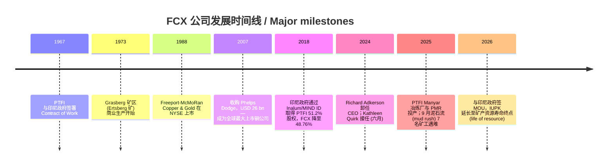
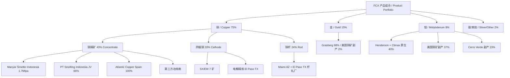
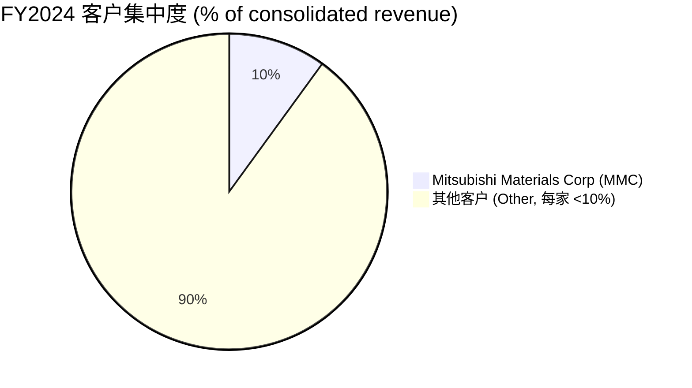
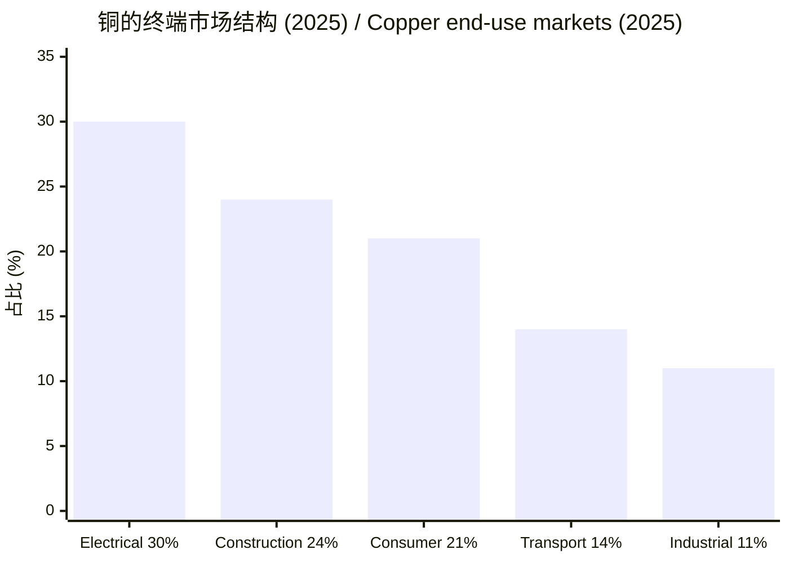
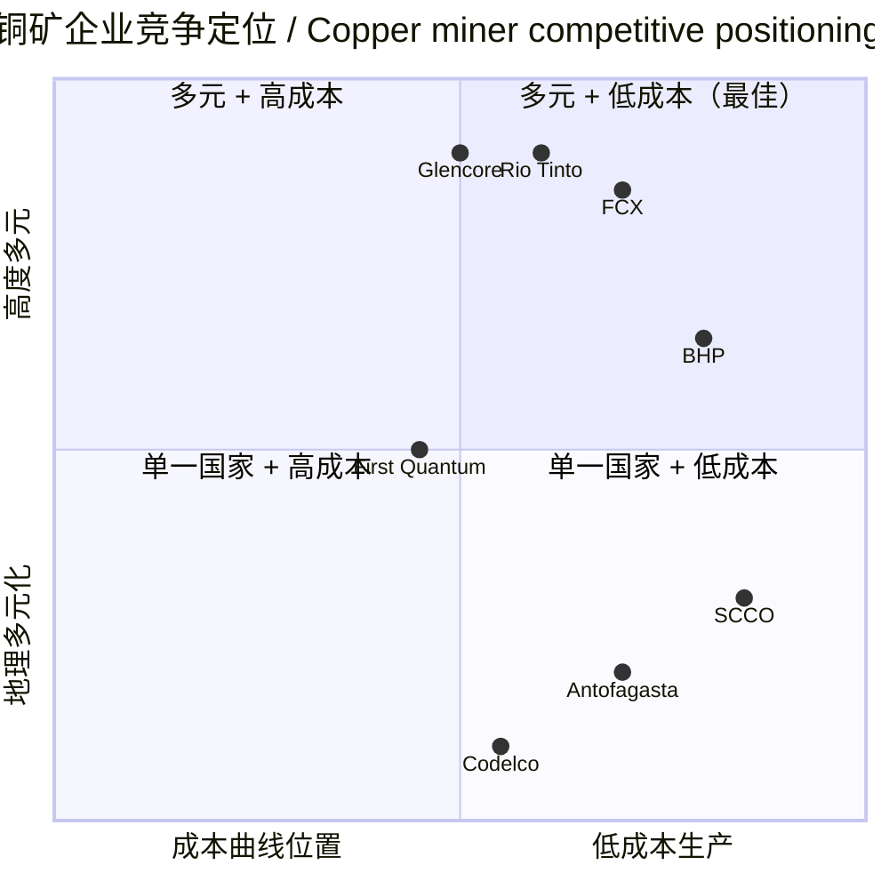

# Freeport-McMoRan (NYSE:FCX) 公司研究 / Company Research

**报告日期 / Report Date**: 2026-06-02
**主题归属 / Theme**: rare-earth-strategic-minerals (战略矿产 / strategic minerals)
**报告语言 / Language**: 简体中文 (zh-CN) only
**ticker**: NYSE:FCX | **CIK**: 0000831259 | **总部 / HQ**: Phoenix, Arizona, USA
**当前股价 / Current Price**: USD 67.04 (2026-06-01) | **市值 / Market Cap**: USD 96.4 bn

> **更新提示 / Update — Grasberg life-of-resource 延期协议 (2026-02-18)**：公司与印尼政府签署谅解备忘录 (Memorandum of Understanding, MOU)，PTFI (PT Freeport Indonesia) 的特殊矿业经营许可证 IUPK 将延期至矿产资源寿命终点 (life of resource)，但 FCX 同意在 2041 年向印尼国家利益方无偿转让 12% 股权（取得方按账面价值偿还 2041 年后投资的按比例成本），FCX 在 PTFI 的持股将从 2041 年前的 48.76% 降至 2042 年起的约 37%；下游冶炼仍优先在印尼本土，但可能扩大对美国市场的精炼铜销售 ("on market terms")。来源：[FCX 8-K 2026-02-24, EX-99.1 press release 2026-02-18](https://www.sec.gov/Archives/edgar/data/0000831259/000083125926000014/fcxnewrelease21826.htm)。

## 目录 / Table of Contents

1. 公司概览 / Company Overview
2. 公司历史 / Company History
3. 管理团队 / Management Team
4. 产品与服务 / Products & Services
5. 客户与上市策略 / Customers & Go-to-Market
6. 行业概览 / Industry Overview
7. 竞争格局 / Competitive Landscape
8. 市场机会 / Market Opportunity (TAM)
9. 风险评估 / Risk Assessment
10. 投资视角评分 / Investor-Lens Scorecards
11. 数据来源清单 / Data Used
12. 参考资料 / References

---

## 1. 公司概览 / Company Overview

Freeport-McMoRan Inc. (NYSE:FCX, 以下简称"FCX"或"公司") 是全球最大的上市铜生产商之一，以铜 (copper, Cu) 为核心，并显著产出金 (gold, Au) 与钼 (molybdenum, Mo) 副产品。公司总部位于美国亚利桑那州凤凰城 (Phoenix, AZ)，在美国、南美洲（秘鲁、智利）和印度尼西亚拥有大型、长寿命、地理多元化的矿山组合。公司在 FY2025 10-K 中自我定位为："We are one of the world's largest publicly traded copper producers. Our portfolio of assets includes the Grasberg minerals district in Indonesia, one of the world's largest copper and gold deposits; and significant operations in the U.S. and South America, including the large-scale Morenci minerals district in Arizona and the Cerro Verde operation in Peru." ([FCX 2025 10-K, Item 1 Business](https://www.sec.gov/Archives/edgar/data/831259/000083125926000012/fcx-20251231.htm))

**收入结构 / Revenue mix**：FY2025 合并收入 (consolidated revenues) 25,915 百万美元（USD 25.9 bn），同比 +1.8%（2024 年 25,455 百万美元；2023 年 22,855 百万美元），主要产品构成为铜 (copper) 75%、金 (gold) 15%、钼 (molybdenum) 8%（其余为白银 silver 及其他副产品）([FCX 2025 10-K, Item 1 Copper Products](https://www.sec.gov/Archives/edgar/data/831259/000083125926000012/fcx-20251231.htm))。FY2025 归属普通股东净利润 (net income attributable to common stock) 2,204 百万美元 (USD 2.20 bn)，摊薄 EPS USD 1.52；2024 年净利润为 1,889 百万美元，摊薄 EPS USD 1.30 ([FCX 2025 10-K, Item 6 Selected Financial Data](https://www.sec.gov/Archives/edgar/data/831259/000083125926000012/fcx-20251231.htm))。FY2025 经营性现金流 (operating cash flow) 5,610 百万美元，较 2024 年 7,160 百万美元下降，主要因 2025 年 9 月 Grasberg 矿区泥石流 (mud rush) 事故导致 Q4 印尼业务暂停以及营运资本占用；资本支出 (capital expenditures) 4,494 百万美元（其中大型采矿项目占大头）([FCX 2025 10-K, Selected Financial Data](https://www.sec.gov/Archives/edgar/data/831259/000083125926000012/fcx-20251231.htm))。

**业务地理 / Geographic footprint**：FY2025 末，FCX 在三个区域运营 (refer to FY2025 10-K Item 1 — Operations)：(i) **美国 / United States** — 在亚利桑那州经营 Morenci、Bagdad、Safford (含 Lone Star)、Sierrita、Miami 五个铜矿，新墨西哥州经营 Chino、Tyrone 两个铜矿，科罗拉多州经营 Henderson、Climax 两个原生钼矿；同时在亚利桑那 Miami 运营冶炼厂 (smelter) 和铜杆轧厂 (rod mill)，在德州 El Paso 运营精炼厂 (refinery) 和铜杆轧厂；(ii) **南美洲 / South America** — 秘鲁的 Cerro Verde 和智利的 El Abra 两座铜矿；(iii) **印度尼西亚 / Indonesia** — 通过 PTFI (PT Freeport Indonesia, FCX 持股 48.76%) 经营 Grasberg 矿区 (Grasberg minerals district)，包含 Grasberg Block Cave、Deep Mill Level Zone (DMLZ)、Big Gossan 等地下矿，2025 年完成下游冶炼厂 (Manyar 冶炼厂 + 贵金属精炼厂 PMR) 在 Gresik 投产 ([FCX 2025 10-K, Operations](https://www.sec.gov/Archives/edgar/data/831259/000083125926000012/fcx-20251231.htm))。FY2025 合并铜产量中三个矿场（Morenci、Cerro Verde、Grasberg）合计约 70% ([FCX 2025 10-K, Item 1](https://www.sec.gov/Archives/edgar/data/831259/000083125926000012/fcx-20251231.htm))。

**规模指标 / Scale indicators**：截至 2025-12-31，FCX 员工约 29,000 人（美国 13,900；南美 7,300；印度尼西亚 6,600；欧洲及其他 1,200），另有承包商约 51,400 人（印尼 27,700，含 PTFI 下游冶炼厂 3,400 和 Grasberg 24,300；美国 18,300）([FCX 2025 10-K, Human Capital](https://www.sec.gov/Archives/edgar/data/831259/000083125926000012/fcx-20251231.htm))。截至 2025-12-31，合并可采证实和概略铜储量 (proven and probable copper reserves) 112.3 billion pounds (511 万吨)，金储量 20.6 million ounces (641 吨)，钼储量 3.5 billion pounds (159 万吨)；净权益基础 (net equity interest basis) 储量分别为 78.6 Blb 铜、10.4 Moz 金、3.1 Blb 钼 ([FCX 2025 10-K, Mineral Reserves](https://www.sec.gov/Archives/edgar/data/831259/000083125926000012/fcx-20251231.htm))。储量地理分布：美国占铜储量 38%、南美 40%、印尼 22%；金储量印尼占绝对主导 (97%)；钼储量美国占 74% ([FCX 2025 10-K, Reserves by Geography](https://www.sec.gov/Archives/edgar/data/831259/000083125926000012/fcx-20251231.htm))。

**估值快照 / Valuation snapshot (as of 2026-06-01)**：
- 股价 USD 67.04；市值 USD 96.4 bn；52 周区间 (52-week range) 未在该数据源中明确披露，但 5 年 beta = 1.32（系数显示高于市场敏感度）
- **TTM P/E ≈ 35.5×**；P/S ≈ 3.65×；P/B ≈ 4.94×；EV/EBITDA ≈ 10.5×；股息率 0.91%；FCF (TTM) USD 1.75 bn；ROE 15.6%；ROA 7.8%；Debt/Equity 0.33（[Stockanalysis.com FCX statistics, 2026-06-01](https://www.stockanalysis.com/stocks/fcx/statistics/))
- **同业对比 / Peer comparison**：Southern Copper (NYSE:SCCO) TTM P/E 33×、P/S 11.16×、EV/EBITDA 18.58×、P/B 13.78×（[Stockanalysis.com SCCO](https://www.stockanalysis.com/stocks/scco/statistics/)）；Teck Resources (NYSE:TECK) TTM P/E 25×、P/S 3.74×、EV/EBITDA 10.07×、P/B 1.78×（[Stockanalysis.com TECK](https://www.stockanalysis.com/stocks/teck/statistics/)）。FCX 当前 EV/EBITDA 大约位于 SCCO 和 TECK 之间，相对 SCCO 的高估值折价、相对 TECK 略溢价，主要反映 (a) Grasberg 复产时序的不确定性；(b) 美国资产在 critical minerals / IRA 框架下的潜在政策溢价；(c) 资产质量在多元化和单矿规模之间的中性定位。

*分析师观点 / Analyst view*：FCX 当前 TTM P/E 35× 看似偏高，但需放在 2025 年 Grasberg 泥石流事故造成的盈利压制背景下解读 — Q1 2026 的年化 EPS 跑率 (annualized run-rate of EPS) USD 2.4 已显著回升，按 2026 年指引、铜价 USD 6/lb 假设的运营现金流 USD 8.7 bn 计算，远期 P/E 更接近 20× 区间，符合长寿命铜矿股的历史中枢估值。EV/EBITDA 10.5× 低于 SCCO 的 18.6×，反映了 FCX 印尼资产的政治风险折价；P/B 4.94× 高于 TECK 但远低于 SCCO，体现 FCX 资本结构相对清洁（净债 USD 2.4 bn）。"AI 数据中心 (AI data center) + 电气化 (electrification) 驱动铜结构性需求 + 美国关键矿产政策" 三角是当下估值溢价的核心叙事，详见第 6 节和第 8 节。

## 2. 公司历史 / Company History

FCX 的现代法人形态成立于 1988 年（作为 Freeport-McMoRan Copper & Gold 在纽交所上市的前身），但其根源可追溯到 1912 年成立的 Freeport Sulphur Company。1981 年 Freeport-McMoRan Inc. 通过合并 Freeport Minerals Company 和 McMoRan Oil & Gas Co. 形成。1990 年代起，FCX 围绕印尼 Grasberg 矿区 — 由 PT Freeport Indonesia (PTFI) 经营、1967 年首次签订 Contract of Work、1973 年开始商业生产 — 逐步成为全球铜金巨头 ([fcx.com About FCX](https://fcx.com/about))。

来源：[FCX 2025 10-K, History/Operations summary](https://www.sec.gov/Archives/edgar/data/831259/000083125926000012/fcx-20251231.htm); [Mining Education Foundation, Richard Adkerson 简介](https://miningeducationfoundation.org/Richard_Adkerson)。

**2007 年 Phelps Dodge 收购 / Phelps Dodge acquisition** — 这是公司历史上最具变革意义的一步。当时 FCX 是一家以印尼为主的中等规模铜金生产商，2007 年 3 月以 USD 26 bn 收购 Phelps Dodge Corp.，由此将 Morenci、Bagdad、Sierrita、Cerro Verde、El Abra 等北美南美大型铜矿资产并入。这次收购使 FCX 从单一国家 (印尼) 风险敞口转变为美洲三国分散的全球铜业领导者 ([Mining Education Foundation, Richard Adkerson](https://miningeducationfoundation.org/Richard_Adkerson))。收购完成后公司更名为 Freeport-McMoRan Copper & Gold Inc.，2014 年再次更名为 Freeport-McMoRan Inc.（去除 "Copper & Gold"，反映公司在 2013-2016 年油气业务并购与剥离周期之后的瘦身定位）。

**2017-2018 年印尼 IUPK 谈判 / Indonesia IUPK negotiation** — 印尼政府长期施压外资矿企本地化（local content 与 divestment 要求）。2017 年，PTFI 与印尼政府达成框架协议：FCX 同意将 PTFI 持股从 90.64% 降至 48.76%，由印尼国有控股公司 Inalum (现 MIND ID) 取得 51.2%；同时印尼政府承诺提供 IUPK (Special Mining Business License) 替代旧 Contract of Work，确保 PTFI 经营权延续至 2041 年；FCX 同时承诺在印尼境内建设新的冶炼厂以满足 downstreaming policy。该交易于 2018 年 12 月完成 ([FCX 2025 10-K, Operations - Indonesia](https://www.sec.gov/Archives/edgar/data/831259/000083125926000012/fcx-20251231.htm); [Indonesia Business Post, 2024 Freeport ownership analysis](https://indonesiabusinesspost.com/88/Politics/mcmoran-still-controls-freeport-indonesia-despite-countrys-majority-share))。

**2025 年 9 月 Grasberg 泥石流事故 / Mud rush incident** — 2025 年 9 月，Grasberg Block Cave 地下矿发生泥石流 (mud rush) 事故，造成 7 名矿工遇难，矿场临时停产以救援并启动调查。10 月底 PTFI 在不受影响的 DMLZ 和 Big Gossan 矿区重启生产，Q4 完成调查与修复计划。2026 年 3 月 Grasberg Block Cave 启动分阶段复产 (phased ramp-up)，预期 H2 2026 印尼总产能恢复到正常产率的 85%；Production Block 2 和 3 在 Q2 2026 复产，Block 1 预计在 2027 年内重启 ([FCX 2025 10-K, Operations - Indonesia](https://www.sec.gov/Archives/edgar/data/831259/000083125926000012/fcx-20251231.htm); [FCX 2026-04-23 Q1 2026 earnings press release 8-K EX-99.1](https://www.sec.gov/Archives/edgar/data/0000831259/000083125926000021/a1q2026exhibit991.htm))。该事故直接导致 FY2025 印尼铜产量低于原计划，并将 2026 年 PTFI 产量目标维持在与 2025 年类似的 1.0 Blb 铜 / 0.9 Moz 金水平 ([FCX Q1 2026 earnings, 2026-04-23](https://www.sec.gov/Archives/edgar/data/0000831259/000083125926000021/a1q2026exhibit991.htm))。

## 3. 管理团队 / Management Team

FCX 当前管理层经历了 2024 年的重大 CEO 换届：长期主导公司战略的 Richard C. Adkerson（任期 2003-2024）于 2024 年 6 月卸任 CEO，继续担任董事长 (Chairman of the Board)；财务背景出身的 Kathleen L. Quirk（前 CFO 与 President）接任 CEO，成为美国大型上市矿企中少有的女性 CEO。

**Richard C. Adkerson（董事长 / Chairman, 79 岁）** — Adkerson 于 1989 年加入 Freeport-McMoRan，2003 年任 CEO 直至 2024 年 6 月，共 21 年 CEO 任期；2006 年起任董事，2021 年起任董事长 ([FCX 2025 10-K, Executive Officers](https://www.sec.gov/Archives/edgar/data/831259/000083125926000012/fcx-20251231.htm))。Adkerson 出生于密西西比州，密西西比州立大学 (Mississippi State University) 工商管理学士与 MBA。加入 Freeport 之前，他在 Arthur Andersen & Co.（已解体的会计师事务所，时为四大之一）任审计与咨询合伙人。他在 FCX 任内最具变革意义的成就是 2007 年主导 USD 26 bn 收购 Phelps Dodge Corp.，将公司从印尼单一国家矿企转型为全球最大上市铜公司；并主导 2017-2018 年与印尼政府就 PTFI 股权和 IUPK 框架的谈判 ([Mining Education Foundation, Richard Adkerson](https://miningeducationfoundation.org/Richard_Adkerson))。截至 2026-04-13，Adkerson 持有 4,467,564 股普通股 + 920,333 股可执行期权 + 1,000,000 股 RSU（2013 年授予、在退休后六个月归属），合计 beneficial ownership 6,387,897 股，按 USD 67.04 股价市值约 USD 428M ([FCX 2026 DEF 14A, Stock Ownership of Directors](https://www.sec.gov/Archives/edgar/data/831259/000119312526173666/d30227ddef14a.htm))。2025 年 FCX 给 Adkerson 的目标直接薪酬：base USD 1.2M + 目标 annual incentive USD 1.2M + LTIP USD 8.6M = USD 11.0M ([FCX 2026 DEF 14A, Compensation Tables](https://www.sec.gov/Archives/edgar/data/831259/000119312526173666/d30227ddef14a.htm))。

**Kathleen L. Quirk（总裁兼 CEO / President and CEO, 62 岁）** — Quirk 出生于 1963 年左右，路易斯安那州立大学 (Louisiana State University) 会计学学士学位 ([Bloomberg Profile, Kathleen L. Quirk](https://www.bloomberg.com/profile/person/6083735))。Quirk 于 1989 年加入 Freeport-McMoRan（与 Adkerson 同年），先后负责税务 (Tax)、投资者关系 (Investor Relations)、企业发展 (Corporate Development) 和财务 (Treasury) 等多个职能。2003 年 12 月被任命为 CFO，任 CFO 直到 2022 年 3 月，期间多次获 Institutional Investor 杂志"金属矿业 Best CFO"奖。2021 年 2 月任 President，2023 年 2 月加入董事会，2024 年 6 月正式接任 CEO ([Women's Power Gap CEO Profile - Kathleen Quirk](https://www.womenspowergap.org/ceo-profile/freeport-mcmoran-kathleen-quirk/); [FCX 2025 10-K, Executive Officers](https://www.sec.gov/Archives/edgar/data/831259/000083125926000012/fcx-20251231.htm))。Quirk 还担任 Vulcan Materials Company (NYSE:VMC) 董事 ([FCX 2025 10-K, Executive Officers](https://www.sec.gov/Archives/edgar/data/831259/000083125926000012/fcx-20251231.htm))。

Quirk 在 CFO 任内长达近 19 年的财务掌舵，使她接任 CEO 时具有罕见的"内生提升 + 长期连续性"特征：她对 FCX 的资本结构、Grasberg 项目融资 (project finance) 历史、印尼 IUPK 谈判细节、Phelps Dodge 整合架构都有深度参与。从市场角度看，2024 年 6 月 Quirk 接任时 FCX 股价大约在 USD 48 区间，2026 年 6 月已达 USD 67，期间公司经历了 Grasberg 泥石流冲击，但凭借 Quirk 主导的 Q4 2025 快速重启计划与 2026 年 2 月与印尼政府的 MOU，市场对她危机管理与政府关系处理的评价相对正面 ([Lunar Asset, Leadership Transition at Freeport-McMoRan](https://www.lunarasset.com/post/leadership-transition-at-freeport-mcmoran-kathleen-l-quirk-steps-up-as-ceo))。截至 2026-04-13，Quirk 持有 2,114,577 股普通股 + 876,500 股可执行期权 + 部分 RSU vesting 待归属 ([FCX 2026 DEF 14A, Stock Ownership](https://www.sec.gov/Archives/edgar/data/831259/000119312526173666/d30227ddef14a.htm))。2025 年薪酬：base USD 1.4M + 目标 annual incentive USD 2.1M + LTIP USD 11.65M = 目标总直接薪酬约 USD 15.15M，其中 LTIP 中 PSU (Performance Stock Units, 业绩股票单元) 占 60% / RSU (Restricted Stock Units, 限制性股票单元) 40%；91% 薪酬为变动激励（at-risk）部分，72% 与可量化业绩目标挂钩 ([FCX 2026 DEF 14A, Compensation Discussion & Analysis](https://www.sec.gov/Archives/edgar/data/831259/000119312526173666/d30227ddef14a.htm))。

## 4. 产品与服务 / Products & Services

FCX 的产品组合是典型的初级金属生产商 (primary metals producer) 结构 — 主要产品是铜，但通过同一座矿山的矿石处理路径同时回收金、钼、银等副产品 (by-products)，公司报告体系按"产品形态 × 地理 × 处理工厂"三维矩阵组织。本节按 10-K 章节顺序详述：(4.1) 铜产品矩阵；(4.2) 金、钼、银副产品；(4.3) 下游冶炼与精炼资产；(4.4) 旗舰矿山与最新产能催化剂。

### 4.1 铜产品矩阵 / Copper Products Matrix

10-K Item 1 中关于铜产品的官方表述为："We are one of the world's leading producers of copper concentrate, cathode and continuous cast copper rod. During 2025, 43% of our mined copper was sold in concentrate, 33% as cathode and 24% as rod." ([FCX 2025 10-K, Copper Products](https://www.sec.gov/Archives/edgar/data/831259/000083125926000012/fcx-20251231.htm))

FY2025 铜销售形态结构 / Copper sales mix by form, FY2025:

| 形态 / Form | FY2025 销量占比 | 描述 / Description |
|---|---|---|
| 铜精矿 / Copper concentrate | 43% | 经选矿厂 (mill) 浮选 (flotation) 后的 25-30% Cu 含量精矿，需进一步冶炼精炼 |
| 阴极铜 / Copper cathode | 33% | 通过 SX/EW (Solvent Extraction / Electrowinning, 溶剂萃取-电积) 或电解精炼直接产出的 99.99% Cu 阴极板 |
| 连铸铜杆 / Continuous cast copper rod | 24% | 在 El Paso 与 Miami 杆轧厂将阴极铜进一步加工的连铸铜杆，主要供应给电线电缆制造商 |

**铜精矿 / Copper concentrate** — 10-K 描述："Our concentrate is sold to PT Smelting in Indonesia, third-party smelters and to Atlantic Copper (our wholly owned copper smelting and refining unit in Spain). With the completion of PTFI's downstream processing facilities during 2025, all of Grasberg's copper concentrate is processed within Indonesia." ([FCX 2025 10-K, Copper Concentrate](https://www.sec.gov/Archives/edgar/data/831259/000083125926000012/fcx-20251231.htm))

**中文释义 / Plain-language gloss**：铜精矿 (copper concentrate, "精矿") 是从矿山开采出的低品位铜矿石经"破碎—磨矿—浮选"工艺产出的中间产品，铜含量约 25-30%，剩余主要为黄铁矿 (FeS₂)、硫等杂质。精矿必须再经过冶炼厂 (smelter) 高温熔炼产出粗铜阳极 (copper anode)，然后在电解精炼厂 (refinery) 通过电解工艺产出 99.99% 的阴极铜 (copper cathode)。FY2025 印尼 Manyar 冶炼厂 + PMR (Precious Metals Refinery) 在 Gresik 正式投产，使 PTFI 成为完全集成的精炼铜与精炼金生产商，所有 Grasberg 精矿都在印尼境内处理（符合印尼 downstreaming policy 要求）。Manyar 冶炼厂年处理能力约 170 万吨铜精矿，FY2025 实际产铜阳极 54,100 吨 (因 9 月泥石流事故 Q4 暂停)；PT Smelting (FCX 与 Mitsubishi Materials JV，FCX 66%) 是 PTFI 的传统冶炼合作方，2025 年 12 月底重启但因精矿短缺以减产率运行 ([FCX 2025 10-K, PTFI Smelter Operations](https://www.sec.gov/Archives/edgar/data/831259/000083125926000012/fcx-20251231.htm))。

*分析师观点 / Analyst view*：精矿是铜矿企业的"基础形态"，但产业链定位决定盈利捕获 — 谁掌握冶炼产能，谁就能在精矿过剩 (concentrate surplus) 或紧缺 (concentrate tight) 周期中调节加工费 (TC/RC, Treatment Charges/Refining Charges)。FCX 在 2018-2025 年完成印尼下游一体化是关键战略举措，使其不再受制于中国大型铜冶炼商（如江西铜业、铜陵有色、紫金矿业）的 TC 议价能力；同时也降低了精矿出口许可证的政治风险敞口。

**阴极铜 / Copper cathode** — 10-K 描述："We produce copper cathode at our electrolytic refinery located in El Paso, Texas, and at nine of our mines. SX/EW cathode is produced from the Morenci, Bagdad, Safford, Sierrita, Miami, Chino and Tyrone mines in the U.S., and from the Cerro Verde mine in Peru." ([FCX 2025 10-K, Copper Cathode](https://www.sec.gov/Archives/edgar/data/831259/000083125926000012/fcx-20251231.htm))

**中文释义 / Plain-language gloss**：阴极铜 (copper cathode) 是市场最终交易的标准形态，伦敦金属交易所 (LME, London Metal Exchange) 和 COMEX (Commodity Exchange Inc.) 期货合约即基于阴极铜。FCX 通过两种工艺产出阴极铜：(i) SX/EW (Solvent Extraction / Electrowinning, 溶剂萃取-电积) — 直接从低品位氧化铜矿或铜矿堆浸 (heap leaching) 的浸出液中萃取铜离子并电积成阴极铜；(ii) 电解精炼 (electrolytic refining) — 将冶炼厂产出的粗铜阳极在电解槽中精炼，电解过程中金、银、铂族金属在阳极泥 (anode slime) 中沉淀，是 FCX 副产金回收的重要环节。FY2025 来自堆浸创新项目的年化跑率达到 240 Mlb 铜，目标 2026 年提升至 300 Mlb，进一步通过新应用、技术和数据分析在浸出过程中提取此前认为不经济的低品位铜资源 ([FCX 2025 10-K, U.S. Operations - Leach Innovation](https://www.sec.gov/Archives/edgar/data/831259/000083125926000012/fcx-20251231.htm); [Mining Engineering Online - Freeport's leach growth](https://me.smenet.org/freeport-mcmoran-poised-to-gain-from-trumps-copper-tariff-against-peers-with-few-options/))。

*分析师观点 / Analyst view*：FCX 的"堆浸再利用 (leach innovation)"项目是被市场低估的渐进式增长杠杆 — 通过对历史废石堆 (waste rock piles) 和已开采矿区残留矿石的二次回收，预计到 2027 年可贡献额外 800 Mlb/年美国铜产量 ([Mining Engineering Online, 2025](https://me.smenet.org/freeport-mcmoran-poised-to-gain-from-trumps-copper-tariff-against-peers-with-few-options/))。这相当于一个中型新矿山的增量，但资本支出仅为新矿建设的零头，因为基础矿区已有完整的破碎、SX/EW、运输基础设施。该项目对盈利的杠杆效应在铜价 USD 5/lb 以上尤其显著。

**铜杆 / Copper rod** — 10-K 描述："We manufacture continuous cast copper rod at our U.S. rod facilities primarily using copper produced at our U.S. copper mines and processed through our smelting and refining operations." ([FCX 2025 10-K, Copper Rod](https://www.sec.gov/Archives/edgar/data/831259/000083125926000012/fcx-20251231.htm))

**中文释义 / Plain-language gloss**：铜杆 (copper rod, "铜杆") 是阴极铜经连铸轧制 (continuous casting & rolling) 工艺加工成直径 8-12mm 的连续铜杆，是电线电缆制造的直接上游原料。FCX 在 Miami (Arizona) 和 El Paso (Texas) 两座轧厂年产能合计约 1.5 Blb，主要客户为美国国内电线电缆制造商（如 Encore Wire 现已被 Atkore 收购、Southwire、Cerro Wire、General Cable 现 Prysmian 部分等）。铜杆业务为 FCX 提供了"下游附加值锁定"功能 — 通过将阴极铜直接加工成铜杆，公司可以收取额外的加工费 (rod premium)，并降低对市场期货价格波动的暴露。在 2025 年美国 Section 232 关于半成品铜产品 50% 关税 ([CIRC - 2025 Section 232 copper tariffs](https://www.fastmarkets.com/insights/impact-tariffs-freeport-mcmorans-copper-production-andrea-hotter/)) 政策背景下，FCX 美国本土铜杆业务从竞争对手进口铜杆中获得显著价格优势。

### 4.2 黄金、钼、银副产品 / Gold, molybdenum and silver by-products

10-K Item 1 中关于副产品的官方表述："Our gold, silver and molybdenum production is generally a by-product of our copper mining operations. Molybdenum is also a primary product at our Henderson and Climax mines in Colorado." ([FCX 2025 10-K, Gold and Molybdenum](https://www.sec.gov/Archives/edgar/data/831259/000083125926000012/fcx-20251231.htm))

**黄金 / Gold** — FY2025 黄金销售约占合并收入 15%，Grasberg 矿区贡献 FY2025 黄金产量 98%（其他主要来自美国铜矿副产）。Grasberg 矿石是世界上含金量最高的大型铜矿之一，矿石中金/铜比远高于美国斑岩铜矿 (porphyry copper deposits)。黄金通过冶炼厂阳极泥 (anode slime) 路径回收，最终在 PTFI 新建的 Gresik 贵金属精炼厂 (PMR) 加工为可销售形态。2025 年金平均实现价格 USD 4,889/oz (Q1 2026 数据)，较 2024 年实现价格大幅上升 (+42% YoY)；2025 年全年金销量低于 2024 年，主要因泥石流事故压制 Grasberg 矿区产量 ([FCX 2025 10-K, Gold Revenue; FCX Q1 2026 earnings press release](https://www.sec.gov/Archives/edgar/data/0000831259/000083125926000021/a1q2026exhibit991.htm))。

**钼 / Molybdenum** — FY2025 钼销售约占合并收入 8%。10-K 描述："Molybdenum is a key alloying element in steel and the raw material for nearly all molybdenum chemicals." ([FCX 2025 10-K, Molybdenum](https://www.sec.gov/Archives/edgar/data/831259/000083125926000012/fcx-20251231.htm))。FCX 有两个原生钼矿 (primary molybdenum mines)：科罗拉多州的 Henderson（地下矿）和 Climax（露天矿），合计贡献 FY2025 钼产量的 40%；美国铜矿副产贡献 37%（Sierrita、Bagdad 等斑岩铜矿因含辉钼矿伴生）；Cerro Verde 也贡献部分钼副产。Q1 2026 钼平均实现价格 USD 25.21/lb，较 2024 年 +4% YoY ([FCX Q1 2026 earnings, 2026-04-23](https://www.sec.gov/Archives/edgar/data/0000831259/000083125926000021/a1q2026exhibit991.htm))。

**中文释义 / Plain-language gloss**：钼是钢铁工业关键合金元素 (alloying element)，添加到高强度合金钢、不锈钢、工具钢中显著提升耐热、耐磨、防腐蚀性能。汽车工业（特别是涡轮增压零部件）、油气管道（特别是高硫油田）、能源行业（核电压力容器、风电塔筒）是主要终端市场。Henderson 和 Climax 是世界级原生钼矿，但终端市场较为小众且周期性强 — 钼价历史区间 USD 5-40/lb，剧烈波动。FCX 的钼业务在销售战略上有独立的 Climax 销售公司 (Climax Molybdenum) 直接对接钢厂客户。

**白银 / Silver** — 副产品，FY2025 占合并收入比例较小（未单独列示），主要来自美国铜矿和秘鲁 Cerro Verde 副产，价格基于伦敦银价 (London Silver Fix)。

来源：[FCX 2025 10-K, Item 1 Business Description](https://www.sec.gov/Archives/edgar/data/831259/000083125926000012/fcx-20251231.htm)。

### 4.3 下游冶炼与精炼资产 / Smelting and refining infrastructure

FCX 在三个地理区域拥有冶炼与精炼资产，这是其与单纯"上游矿企"（如 Antofagasta、First Quantum）的核心区别。

**美国**：Miami 冶炼厂 (Arizona) 处理美国铜矿精矿，El Paso 电解精炼厂 (Texas) 将粗铜精炼为阴极铜。2025 年因 EPA "Copper Smelter Rule" 合规要求 Miami 冶炼厂面临环保改造投资压力；但 2025 年 3 月 EPA 宣布重新审议该规则，2025 年 10 月一项总统公告 (presidential proclamation) 豁免 Miami 冶炼厂在 Copper Smelter Rule 下的两年合规期限 ([FCX 2025 10-K, Environmental Matters - Miami Smelter](https://www.sec.gov/Archives/edgar/data/831259/000083125926000012/fcx-20251231.htm))。

**印度尼西亚**：PTFI 控股 100% 的 Manyar 冶炼厂 (Gresik, 总投资约 USD 3.7 bn，[Karir Industri industry coverage](https://karirindustri.com/pt-freeport-indonesia-manyar-smelter-12/)) 年处理 170 万吨铜精矿；PMR (贵金属精炼厂) 同址。PT Smelting (PTFI 持股 66%，Mitsubishi Materials 持股 34%) 是 1996 年建成的传统合作冶炼厂，处理 PTFI 精矿。

**西班牙**：Atlantic Copper (Huelva, FCX 100% 子公司) — 欧洲铜冶炼与精炼厂，处理来自南美和其他第三方的铜精矿，是 FCX 在欧盟市场的精炼铜分销节点。

### 4.4 旗舰矿山 / Flagship mines and recent catalysts

**Grasberg 矿区（印尼）** — 全球最大铜金矿之一，由 PTFI 经营。Grasberg Block Cave、DMLZ、Big Gossan 是主要地下矿，过去曾有 Grasberg Open Pit (露天矿，2019 年关闭) 以及 Grasberg Sky Train 运输系统。2025 年 9 月泥石流事故对 Block Cave 影响最大；2026 年 2 月的印尼政府 MOU 是该资产的"life of resource"延期催化剂 — 之前 IUPK 仅至 2041 年到期，MOU 后延至矿产资源寿命终点（基于现有探明储量 + 进一步勘探，潜在可能延伸至 2050+）([FCX 2026-02-18 press release 8-K EX-99.1](https://www.sec.gov/Archives/edgar/data/0000831259/000083125926000014/fcxnewrelease21826.htm))。

**Morenci 矿区（亚利桑那州）** — FMC 子公司持 72% 未划分权益的合资矿（其余 28% 由日本住友金属矿山 Sumitomo Metal Mining 通过 SMM Morenci Inc. 持有），是美国最大铜矿。Morenci 是堆浸创新项目的核心试点矿区。

**Cerro Verde 矿区（秘鲁）** — FCX 通过 Sociedad Minera Cerro Verde S.A.A. 持有约 53.56% 控股权（其余股东包括住友金属矿山、Buenaventura 等）；是 FCX 南美最大铜矿，年产铜约 1 Blb，主要产铜精矿。

**Bagdad、Safford (含 Lone Star)、Sierrita（亚利桑那州）** — Bagdad 是 FCX 美国第二大铜矿；Lone Star 是 Safford 周边的扩建项目，预计 2026-2028 年贡献产量增量；Sierrita 同时产铜和钼。

**2026 年产量指引 / FY2026 production guidance**："Consolidated sales are expected to approximate 3.1 billion pounds of copper, 650 thousand ounces of gold and 90 million pounds of molybdenum for the year 2026." ([FCX Q1 2026 earnings, 2026-04-23](https://www.sec.gov/Archives/edgar/data/0000831259/000083125926000021/a1q2026exhibit991.htm))。Q1 2026 单季销售：铜 657 Mlb、金 121 koz、钼 24 Mlb，按年化跑率约 2.6 Blb 铜（受 Grasberg 复产时序影响 H1 偏低，H2 应显著回升至年化 3.5+ Blb 跑率）。

### 4.5 产品组合协同：从矿石到终端的工作流 / Workflow synthesis

FCX 的产品矩阵不是孤立的 "我们卖铜也卖金钼" 的简单并列，而是围绕**斑岩铜矿 (porphyry copper deposit) 一体化加工链**的纵向集成：(1) 矿山产矿石 → (2) 选矿厂浮选为精矿 (concentrate) → (3) 冶炼厂熔炼为粗铜阳极 (anode) → (4) 电解精炼为阴极铜 (cathode)，电解阳极泥同步回收金/银/铂族；(5) 阴极铜进一步轧制为铜杆 (rod) 出售给电线电缆制造商；(6) 钼矿石/钼副产则走独立的钼烘干、焙烧、研磨、销售路径 (Climax Molybdenum 销售公司)。该一体化的核心商业逻辑是 **"价格上行时多环节价值捕获，价格下行时下游精炼业务利润抗周期"** — 冶炼加工费 (TC/RC) 与铜价并不完全正相关，事实上当精矿过剩时 TC 高，对 FCX 印尼冶炼业务有利；同时下游铜杆业务有稳定 rod premium。这也是 FCX 与单纯上游矿企（Antofagasta、Lundin Mining 等）估值倍数差异的结构性原因。

## 5. 客户与上市策略 / Customers & Go-to-Market

FCX 是全球大宗商品 (commodity) 生产商，其客户结构有两个层次：(a) 大宗商品定价以期货交易所 (LME / COMEX / Shanghai Futures Exchange) 为基准，绝大部分销售合同采用 "exchange price + provisional pricing" 模式（基于过去 1-3 个月期货均价定价），单一客户的"议价权"非常有限；(b) 但在分销层面，FCX 与大型冶炼商、精炼商、铜杆采购方有长期主合同 (master agreement) 关系。

**客户集中度披露 / Customer concentration disclosure** — 10-K Item 1 中关于客户集中度的明确表述："For the three years ended December 31, 2025, the only customer that accounted for 10% or more of our consolidated revenues was Mitsubishi Materials Corporation, PTFI's joint venture partner in PT Smelting (PTFI's 66%-owned copper smelter and refinery), in 2024." ([FCX 2025 10-K, Customer Concentration](https://www.sec.gov/Archives/edgar/data/831259/000083125926000012/fcx-20251231.htm))

**关键事实 / Key facts**：
- 过去三年（2023-2025），FCX 合并收入中超过 10% 的单一客户只有 Mitsubishi Materials Corporation (MMC, 三菱金属)，且仅在 2024 年达到 10% 阈值
- MMC 是 PTFI 在 PT Smelting JV 中的合作伙伴（FCX 通过 PTFI 持有 PT Smelting 66%，MMC 持有 34%），MMC 一家关联公司担任 PT Smelting 运营方
- FY2025 没有任何单一客户超过 10% 合并收入（部分原因是 PT Smelting 在 Q4 2025 因泥石流事故停产）

*分析师观点 / Analyst view*：FCX 客户集中度风险**相对较低** — 单一客户披露阈值 10% 在 FY2025 没有触发，Mitsubishi Materials 仅在 2024 年因 PT Smelting 加工量集中而短暂跨过阈值。这反映了 FCX 销售网络的结构性多元化：精矿销售面向印尼本土 (PTFI smelter, PT Smelting)、欧洲 (Atlantic Copper)、亚洲第三方冶炼商；阴极铜销售面向美国和全球 LME/COMEX 注册仓库；铜杆销售面向美国国内电线电缆制造商；金销售通过 PTFI PMR 和银行间渠道；钼通过 Climax Molybdenum 销售公司面向钢铁与化工客户。这种分散性是 FCX 区别于受单一战略客户（如某车企或某科技巨头）影响的供应链型矿企的关键。

**销售合同结构 / Contract structure** — FCX 销售合同以"年度框架 + 月度定价"为主：与大型冶炼商和铜杆终端用户签订年度量纲合同（指定 LME/COMEX 期均价为定价基准、约定 TC/RC 加工费），单笔实物交割按 quotational period (QP) 月均价临时定价 (provisional pricing)，最终定价在交割后 1-3 个月调整。这意味着公司 FY2025 收入中包括 USD 63M 的临时定价调整（[FCX 2025 10-K, Provisional Pricing](https://www.sec.gov/Archives/edgar/data/831259/000083125926000012/fcx-20251231.htm)），FY2024 为 USD 28M。

**地理收入结构 / Geographic mix** — FCX 销售为面向全球市场，主要市场为：美国国内（铜杆与阴极铜本地销售）、亚洲（精矿与阴极铜出口）、欧洲（Atlantic Copper 精炼铜市场）。FY2025 美国国内业务在 Section 232 关税背景下毛利率显著优于出口业务（美国国内铜价 COMEX 高于 LME 约 7%，[FCX 2025 10-K, Copper Pricing](https://www.sec.gov/Archives/edgar/data/831259/000083125926000012/fcx-20251231.htm)）。

**客户集中度饼图（合并基础，2024 年）** — 仅有 Mitsubishi Materials > 10%：

来源：[FCX 2025 10-K, Customer Concentration disclosure](https://www.sec.gov/Archives/edgar/data/831259/000083125926000012/fcx-20251231.htm)。注：2025 年 PT Smelting 因泥石流事故停产，FY2025 没有任何单一客户超过 10%。

**分销渠道 / Channels**：FCX 销售队伍包括 (i) 直接销售 — Climax Molybdenum 销售公司面向钢厂，Atlantic Copper 在欧洲直接对接电缆与电气工业客户；(ii) PTFI 销售 — 历史上以 Asian smelters (中国、日本、韩国) 为主，2025 年后转向印尼本土 Manyar smelter 和 PT Smelting；(iii) 期货交易所 — 一部分阴极铜通过 LME/COMEX 注册仓库交易；(iv) 第三方贸易商 (trading houses) — Trafigura、Glencore、Mitsui 等在精矿与精铜跨区域贸易中担任中介。

## 6. 行业概览 / Industry Overview

FCX 所在的行业是**铜采选冶炼行业 (copper mining, smelting and refining)**，是全球大宗有色金属 (base metals) 行业的核心子板块。该行业的结构性特征是 (a) 全球需求由电气化、城市化、AI 数据中心、国防、汽车等多元终端驱动；(b) 全球供给由少数大型铜矿企业（FCX、Codelco、BHP、Glencore、Southern Copper、First Quantum、Antofagasta、Rio Tinto）主导，但单一企业市场份额不超过 8%。

**全球铜需求结构 / Copper end-use markets** — 根据 Wood Mackenzie 2025 年报告（被 FCX 10-K 引用），铜的终端市场份额为：电气应用 (electrical applications) 30%、建筑 (construction) 24%、消费品 (consumer products) 21%、交通运输 (transportation) 14%、工业机械 (industrial machinery) 11% ([FCX 2025 10-K, Copper End-Use Markets, citing Wood Mackenzie 2025](https://www.sec.gov/Archives/edgar/data/831259/000083125926000012/fcx-20251231.htm))。

来源：[FCX 2025 10-K, citing Wood Mackenzie 2025](https://www.sec.gov/Archives/edgar/data/831259/000083125926000012/fcx-20251231.htm)。

**增长驱动 / Growth drivers** — FCX 10-K 明确列出公司认为驱动未来铜需求增长的六大主题："Examples of areas we believe will require additional copper in the future include: (i) high efficiency motors, which consume up to 75% more copper than a standard motor; (ii) electric vehicles, which consume up to four times the amount of copper in terms of weight compared to vehicles of similar size with an internal combustion engine, and require copper-intensive charging station infrastructure to refuel; (iii) renewable energy such as wind and solar, which consume four to five times the amount of copper compared to traditional fossil fuel generated power and (iv) data centers and AI developments." ([FCX 2025 10-K, Future Demand Drivers](https://www.sec.gov/Archives/edgar/data/831259/000083125926000012/fcx-20251231.htm))

**AI 数据中心 (AI data center) 增量需求 / AI data-center incremental demand** — 这是 2024-2026 年市场最关注的新驱动力：根据 BHP 估计，全球数据中心铜消费将从当前约 50 万吨/年增长六倍到 2050 年约 300 万吨/年 ([BHP Insights, AI tools driving copper demand, 2025-01](https://www.bhp.com/news/bhp-insights/2025/01/why-ai-tools-and-data-centres-are-driving-copper-demand))；Wood Mackenzie 预计 AI 相关电网基础设施铜需求到 2030 年达 110 万吨/年；分析师估算大型 AI 数据中心园区设计在 50-150 MW 模块化部署，每兆瓦消耗 27-33 吨铜，单一 100 MW 数据中心可消耗数千吨铜 ([Tom's Hardware, AI data center copper demand, 2025](https://www.tomshardware.com/tech-industry/why-copper-markets-are-feeling-the-pinch))。

**供需缺口 / Supply-demand gap** — Wood Mackenzie 预计 2025 年全球精炼铜短缺 304,000 吨，2026 年缺口将进一步扩大；到 2035 年全球铜需求将比当前增长 24% 至 42.7 百万吨/年，供需缺口可能扩大至 600 万吨/年（约占需求 15%），仅 70% 的 2035 年需求可被现有供给和已规划新矿满足 ([Wood Mackenzie - Soaring copper demand, 2025](https://www.woodmac.com/horizons/soaring-copper-demand-obstacle-to-future-growth/); [Tom's Hardware - 2025 deficit forecast](https://www.tomshardware.com/tech-industry/ai-data-center-buildout-pushes-copper-toward-shortages-analysts-warn))。IEA 警告称到 2035 年铜供需缺口可能高达需求的 30%。

**价格周期 / Price cycle** — 铜价是大宗商品价格的"博士级指标 (Dr. Copper)"，因为其需求覆盖几乎所有工业部门。2025 年 LME 铜均价 USD 4.51/lb（区间 USD 3.87-5.68/lb），年末收盘 USD 5.67/lb；COMEX 铜均价 USD 4.82/lb，年末收盘 USD 5.63/lb；2025 年 COMEX 与 LME 价差扩大主要因美国 Section 232 关税预期 ([FCX 2025 10-K, Copper Prices](https://www.sec.gov/Archives/edgar/data/831259/000083125926000012/fcx-20251231.htm))。Q1 2026 FCX 平均实现铜价 USD 5.78/lb，较 Q1 2025 的 USD 4.44/lb 上涨 30% ([FCX Q1 2026 earnings](https://www.sec.gov/Archives/edgar/data/0000831259/000083125926000021/a1q2026exhibit991.htm))。

**监管环境 / Regulatory environment** — 美国：环保署 (EPA) Copper Smelter Rule 在 2025 年 3 月被宣布重新审议，10 月通过总统公告豁免 Miami 冶炼厂两年合规期限；Section 232 国家安全调查于 2025 年 2 月启动，2025 年 8 月对半成品铜产品 (semi-finished copper products) 征收 50% 关税但豁免精炼铜 (refined copper) ([Fastmarkets - Section 232 tariffs analysis](https://www.fastmarkets.com/insights/impact-tariffs-freeport-mcmorans-copper-production-andrea-hotter/); [FCX 2025 10-K, Environmental Matters](https://www.sec.gov/Archives/edgar/data/831259/000083125926000012/fcx-20251231.htm))。印度尼西亚：IUPK 框架下的 downstreaming policy 要求精矿在印尼境内冶炼，2025 年 Manyar 冶炼厂投产使 FCX 完全合规；2026 年 2 月与印尼政府 MOU 锁定 life-of-resource 经营权。秘鲁与智利：加密税与社区谈判 (community royalties) 是持续监管挑战，但 FCX 的 Cerro Verde 与 El Abra 相对低风险。

**关键矿产 / Critical mineral designation** — 美国 IRA (Inflation Reduction Act) 框架下，FCX 正积极推动将铜列为"关键矿产 (critical mineral)"，若成功可解锁每年潜在 USD 500M 的税收抵免 ([Mining Engineering Online - FCX critical mineral push, 2025](https://me.smenet.org/freeport-mcmoran-poised-to-gain-from-trumps-copper-tariff-against-peers-with-few-options/))。

## 7. 竞争格局 / Competitive Landscape

铜矿业是一个高度分散的行业。FCX 10-K Item 1 明确表述："The top 10 producers of copper comprise 38% of total" ([FCX 2025 10-K, Competition](https://www.sec.gov/Archives/edgar/data/831259/000083125926000012/fcx-20251231.htm))。这意味着即使 FCX 排在全球前列，单一公司市场份额也很有限。

**全球前 10 大铜生产商 / Top global copper producers (估计 2024-2025 年矿铜产量, 千吨)**：

| 排名 | 公司 | 国别 | 估计 2024 矿铜产量 (kt) | 估值/股票 |
|---|---|---|---|---|
| 1 | Codelco (Chile, state-owned) | 智利 | ~1,442 | 国营，非上市 |
| 2 | BHP Group (NYSE:BHP / ASX:BHP) | 澳大利亚 | ~1,866* | TTM EV/EBITDA ~7× |
| 3 | Freeport-McMoRan (NYSE:FCX) | 美国 | ~1,872 (4.13 Blb) | TTM EV/EBITDA ~10.5× |
| 4 | Glencore (LSE:GLEN) | 瑞士 | ~952 | 综合贸易，估值复杂 |
| 5 | Southern Copper (NYSE:SCCO) | 美国/秘鲁/墨西哥 | ~967 | TTM EV/EBITDA ~18.6× |
| 6 | First Quantum (TSX:FM) | 加拿大 | ~466 | TTM EV/EBITDA ~12× |
| 7 | Antofagasta (LSE:ANTO) | 智利/英国 | ~664 | TTM EV/EBITDA ~9× |
| 8 | Anglo American (LSE:AAL) | 英国 | ~772 | TTM EV/EBITDA ~7× |
| 9 | Rio Tinto (NYSE:RIO) | 英国/澳大利亚 | ~700 | TTM EV/EBITDA ~6× |
| 10 | KGHM (WSE:KGH) | 波兰 | ~568 | 国营/上市 |

来源：[Stockanalysis.com FCX](https://www.stockanalysis.com/stocks/fcx/statistics/)，[Stockanalysis.com SCCO](https://www.stockanalysis.com/stocks/scco/statistics/)，[Stockanalysis.com TECK](https://www.stockanalysis.com/stocks/teck/statistics/)；产量数据基于各公司年报与第三方汇总。*BHP 数据为 Escondida + Pampa Norte + Olympic Dam + Spence 合并产量。

**FCX 的竞争优势 / Competitive advantages**：

1. **地理多元化 / Geographic diversification** — 美国 + 南美 + 印尼三大区域，单一国家政治风险敞口比 SCCO (秘鲁占 SCCO 营收 ~60%) 或 Antofagasta (智利) 显著更分散。
2. **下游一体化 / Downstream integration** — 在三大区域均拥有冶炼/精炼资产（Miami、El Paso、Manyar、PT Smelting、Atlantic Copper），是少数几家完成全产业链一体化的纯铜矿企业。
3. **储量寿命 / Reserve life** — FY2025 末合并铜储量 112.3 Blb，按 FY2026 销售指引 3.1 Blb 计算，储量寿命 ~36 年；Grasberg life-of-resource MOU 进一步将印尼资产寿命锁定至矿产资源耗尽。
4. **美国本土生产基地 / U.S. domestic production base** — 是美国本土最大铜生产商，占美国铜产量约 60% ([Market Report Analytics - FCX tariff analysis, 2025](https://www.marketreportanalytics.com/news/article/how-2025-tariffs-impact-freeport-mcmorans-copper-production-growth-outlook-16265))，在 critical minerals / IRA / Section 232 政策下具有结构性定价权和补贴敞口。
5. **堆浸创新 / Leach innovation** — 项目 2027 年目标贡献 800 Mlb/年增量产能，资本回报率显著优于绿地新矿。

**FCX 的竞争脆弱性 / Competitive vulnerabilities**：

1. **印尼政治风险 / Indonesian political risk** — 尽管 2026 年 MOU 缓解了 IUPK 到期风险，但 PTFI 持股将在 2041 年降至约 37%（从 48.76%），加上印尼政府通过 downstreaming policy、税务、出口许可证等多个渠道的持续压力。
2. **Grasberg 单点风险 / Grasberg single-asset risk** — 2025 年泥石流事故凸显地下矿（特别是 Block Cave）的运营脆弱性；尽管储量分散，但 Grasberg 矿区单矿贡献 FY2025 印尼铜产量近 100%。
3. **美国成本曲线 / U.S. cost curve** — 10-K 引用："Operational costs at Freeport's US mines are on average three times the cost of the company's international operations" ([Fastmarkets - FCX tariff impact](https://www.fastmarkets.com/insights/impact-tariffs-freeport-mcmorans-copper-production-andrea-hotter/))；美国矿山在 LME 铜价 USD 3/lb 以下盈利压力显著。
4. **环保合规 / Environmental compliance** — 美国 EPA Copper Smelter Rule、亚利桑那 Pinto Valley 水权诉讼、印尼尾矿排放 (mill tailings) 监管均是持续不确定性。

*分析师观点 / Analyst view*：FCX 在全球铜矿企业中是"质量与风险的平衡选择" — 不像 SCCO 那样高估值高单一国家集中度，不像 Glencore 那样的复杂贸易商商业模式，也不像 BHP/Rio Tinto 那样的综合矿企（其铜业务被铁矿石、煤炭稀释）。FCX 是市场上少数几家"纯铜 + 大规模 + 多元化"的标的之一，这种定位决定了它在铜价上行周期中的高 beta 特征（5Y beta 1.32）。但同时 Grasberg 单点风险和美国成本结构是估值的硬性约束。

## 8. 市场机会 / Market Opportunity (TAM)

**全球精炼铜市场规模 / Global refined copper TAM**：根据 Wood Mackenzie 2025 年预测，全球精炼铜需求 (refined copper demand) 在 2024 年约 26 百万吨/年 (Mtpa)，2035 年将增长至 42.7 Mtpa，CAGR 约 4.9% ([Wood Mackenzie - Soaring copper demand, 2025](https://www.woodmac.com/horizons/soaring-copper-demand-obstacle-to-future-growth/))。按 2025 年均价 USD 4.51/lb (USD 9,940/吨) 计算，2025 年全球精炼铜市场规模约 USD 258 bn；2035 年若价格维持 USD 10,000/吨水平，市场规模将达 USD 427 bn。

**FCX 的可服务市场 / Serviceable market**：FCX FY2025 实际铜销售约 1.5 Blb (含 PTFI 部分，按 FCX 持股权益计算约 1 Blb，但合并财务报表口径为 1.5 Blb)，约占全球 26 Mtpa 精炼铜市场的 2.6%；按持股权益基础 (net equity basis) 计算约占 1.7%。这意味着即使 FCX 大幅扩产，对全球市场份额的影响也仅是边际性的。但从美国本土市场角度，FCX 占美国铜产量约 60%，是美国铜供应链的核心节点 ([Market Report Analytics](https://www.marketreportanalytics.com/news/article/how-2025-tariffs-impact-freeport-mcmorans-copper-production-growth-outlook-16265))。

**FCX 增长机会 / Specific growth opportunities**：

1. **堆浸创新 / Leach innovation** — 2025 年年化跑率 240 Mlb，2026 年目标 300 Mlb，2027 年潜在 1,000 Mlb (含历史废石与残留矿)，相当于增加一个中型铜矿 ([FCX 2025 10-K, U.S. Operations](https://www.sec.gov/Archives/edgar/data/831259/000083125926000012/fcx-20251231.htm); [Mining Engineering Online](https://me.smenet.org/freeport-mcmoran-poised-to-gain-from-trumps-copper-tariff-against-peers-with-few-options/))。
2. **Grasberg life-of-resource 延期** — 2026 年 MOU 解锁了 2041 年以后的潜在资源开发，包括深部矿体、卫星矿点和勘探目标 ([FCX 2026-02-18 press release](https://www.sec.gov/Archives/edgar/data/0000831259/000083125926000014/fcxnewrelease21826.htm))。
3. **关键矿产 IRA 税收抵免 / Critical mineral IRA credits** — 若铜被列为"关键矿产"，FCX 美国业务可解锁估计 USD 500M/年税收抵免 ([Mining Engineering Online, 2025](https://me.smenet.org/freeport-mcmoran-poised-to-gain-from-trumps-copper-tariff-against-peers-with-few-options/))。
4. **美国国内冶炼定价权 / U.S. domestic smelter pricing** — Section 232 关税对半成品铜产品 50% 征税，对美国本土铜杆与铜板生产商形成进口替代窗口；FCX 在 Miami 与 El Paso 的下游资产是直接受益方 ([Fastmarkets, 2025](https://www.fastmarkets.com/insights/impact-tariffs-freeport-mcmorans-copper-production-andrea-hotter/))。
5. **AI 数据中心拉动 / AI data-center demand** — 全球数据中心铜消费可能从 2024 年 50 万吨/年增长六倍至 2050 年 300 万吨/年（BHP 估计）；Wood Mackenzie 预测 AI 相关电网基础设施铜需求到 2030 年达 110 万吨/年 ([BHP Insights, 2025](https://www.bhp.com/news/bhp-insights/2025/01/why-ai-tools-and-data-centres-are-driving-copper-demand))。

**SAM 与渗透策略 / SAM and penetration**：FCX 不是销售型企业，"渗透 (penetration)"对其更多体现为 (a) 价格捕获 (price realization) 而非市场份额扩张；(b) 通过 Section 232 与 IRA 政策红利获取美国市场定价权。在国际市场，FCX 通过 LME 注册仓库和大型贸易商网络已经接触到几乎所有终端市场，没有"未渗透客户群"概念。增量价值主要来自单位经济性 (unit economics) 改善 — FY2026 Q1 单位现金成本 USD 1.91/lb，对应 USD 5-6/lb 铜价的利润率高达 60-65%。

## 9. 风险评估 / Risk Assessment

### 9.1 公司特定风险 / Company-Specific Risks (5 项)

**(i) Grasberg 单矿/单国风险 — 高 / Grasberg single-asset, single-country risk — HIGH**：FY2025 印尼业务受 9 月泥石流事故重大冲击，全年印尼铜产量约 1.0 Blb（远低于正常水平约 1.6 Blb），FY2026 印尼指引仍仅为 1.0 Blb 水平 ([FCX 2025 10-K, Operations - Indonesia](https://www.sec.gov/Archives/edgar/data/831259/000083125926000012/fcx-20251231.htm))。Grasberg 在公司合并产量中占铜 30%、金 98%，单点故障对盈利影响显著。Q2 2026 才开始 Block Cave 分阶段复产，Production Block 1 要到 2027 年才能完全重启。缓解因素：(a) 不受影响的 DMLZ 和 Big Gossan 矿场在 2025 年 10 月已重启；(b) 2026 年 2 月 MOU 锁定 life-of-resource 延期；(c) 保险与不可抗力 (force majeure) 索赔。

**(ii) 印尼政治风险 — 中等-高 / Indonesian political risk — MEDIUM-HIGH**：2026 年 2 月 MOU 缓解了 IUPK 到期不确定性，但条款显示 FCX 在 2041 年需向印尼政府无偿转让 12% 股权（取得方按账面价值偿还 2041 年后投资的成本，未明确市值），FCX 持股从 48.76% 降至约 37% ([FCX 2026-02-18 press release](https://www.sec.gov/Archives/edgar/data/0000831259/000083125926000014/fcxnewrelease21826.htm))。该条款下，FCX 未来 15 年虽保持 48.76% 控股，但 2041 年后印尼国家利益方将主导 PTFI 治理。此外，PT Smelting 调查 (FCX 已向 SEC 和 DOJ 自愿披露与外部法律顾问启动调查) 体现持续 FCPA 监管风险 ([FCX 2025 10-K, Legal Proceedings - PT Smelting](https://www.sec.gov/Archives/edgar/data/831259/000083125926000012/fcx-20251231.htm))。

**(iii) 客户集中度 — 低-中 / Customer concentration — LOW-MEDIUM**：仅 Mitsubishi Materials 在 2024 年单年超过 10% 合并收入（PT Smelting JV 加工量集中），FY2023 和 FY2025 均无单一客户超过 10% 阈值 ([FCX 2025 10-K, Customer Concentration](https://www.sec.gov/Archives/edgar/data/831259/000083125926000012/fcx-20251231.htm))。整体看属于低集中度，但 PT Smelting 与 PTFI 的双向依赖（PTFI 为 PT Smelting 主要精矿供应商；PT Smelting 为 PTFI 主要加工商）形成战略相互依存。

**(iv) Adkerson 退休后管理层连续性 / CEO transition risk — LOW-MEDIUM**：Adkerson 于 2024 年 6 月卸任 CEO，但仍任董事长；Quirk 接任后已完成 2025 Grasberg 事故应对、2026 年 MOU 谈判等关键考验，市场反应正面 ([Lunar Asset, 2025](https://www.lunarasset.com/post/leadership-transition-at-freeport-mcmoran-kathleen-l-quirk-steps-up-as-ceo))。但 Adkerson 退休年龄 (79 岁) 意味着董事长岗位也将面临交接。

**(v) 美国资产成本曲线劣势 / U.S. mines high-cost — MEDIUM**：美国铜矿运营成本约为国际矿的 3 倍 ([Fastmarkets, 2025](https://www.fastmarkets.com/insights/impact-tariffs-freeport-mcmorans-copper-production-andrea-hotter/))；若 LME 铜价跌至 USD 3/lb 以下，美国矿盈利将显著承压。缓解因素：(a) 2025 年实际美国矿单位现金成本 USD 2.93/lb，仍有相对宽松的安全边际；(b) Section 232 与 critical minerals 政策提供结构性溢价。

### 9.2 行业/市场风险 / Industry / Market Risks (3 项)

**(vi) 铜价周期性 — 高 / Copper price cyclicality — HIGH**：铜价在 2025 年 LME 区间 USD 3.87-5.68/lb，振幅 47% ([FCX 2025 10-K, Copper Prices](https://www.sec.gov/Archives/edgar/data/831259/000083125926000012/fcx-20251231.htm))。FCX 估值与盈利对铜价的弹性是其单一最大风险因素 — 按 FY2026 指引敏感性分析，每磅 USD 1 的铜价变动约影响 USD 1.6 bn 年化经营现金流。中国房地产周期、全球工业景气度、美元 (USD) 走势都会触发铜价波动。

**(vii) 中国需求集中 — 中 / China demand concentration — MEDIUM**：中国占全球铜消费约 55%，中国房地产、电力基础设施、电网投资是全球铜定价的关键边际买家。中国房地产持续低迷可能压制传统建筑铜需求，部分由电网投资、新能源汽车、风光储装机的"新质生产力"需求对冲。

**(viii) AI 数据中心叙事破灭 — 低-中 / AI narrative break — LOW-MEDIUM**：若大型科技公司 (Microsoft、Google、Amazon、Meta) AI 资本支出周期出现意外回调，铜价的"AI 溢价"可能压缩。缓解因素：(a) AI 与电气化是多年期结构性主题；(b) 即使 AI 单一驱动减弱，EV 与电网升级仍提供需求支撑。

### 9.3 财务风险 / Financial Risks (3 项)

**(ix) 资本支出强度 — 中 / Capex intensity — MEDIUM**：FY2025 capex USD 4.5 bn，FY2026 指引 USD 4.3 bn（其中 USD 3.0 bn 用于大型采矿项目）([FCX 2025 10-K; Q1 2026 earnings press release](https://www.sec.gov/Archives/edgar/data/0000831259/000083125926000021/a1q2026exhibit991.htm))。这是经营性现金流的约 50%，限制了变动股息和股票回购的灵活性。缓解：FCX 在 USD 5/lb 铜价以上仍可维持 USD 4+ bn 自由现金流。

**(x) 净债务与流动性 — 低 / Net debt — LOW**：截至 2026-03-31，合并债务 USD 9.4 bn，现金 USD 3.7 bn，净债 USD 2.4 bn（扣除 USD 3.2 bn 的 PTFI 下游冶炼厂相关债务后），净债/EBITDA < 0.5×，债务结构非常健康 ([FCX Q1 2026 earnings, 2026-04-23](https://www.sec.gov/Archives/edgar/data/0000831259/000083125926000021/a1q2026exhibit991.htm))。

**(xi) 估值/倍数压缩风险 — 中 / Multiple-compression — MEDIUM**：FCX 当前 TTM P/E 35× 高于 5 年中枢约 15-20×，主要由 (a) FY2025 Grasberg 事故压制盈利；(b) AI 数据中心叙事溢价。若铜价回调至 USD 4/lb 以下或 Grasberg 复产推迟，远期 P/E 可能从当前预期 20× 反弹到 30×+，触发估值修正。当前估值已包含较多积极假设。

### 9.4 宏观风险 / Macroeconomic Risks (2 项)

**(xii) 关税与贸易战 — 中 / Tariff and trade war — MEDIUM**：Section 232 半成品铜产品 50% 关税对 FCX 美国本土业务（铜杆、铜板）是结构性利好，但若关税导致美国经济衰退，铜价整体回落对 FCX 全球业务的负面影响可能大于美国本土的局部受益 ([Fastmarkets, 2025](https://www.fastmarkets.com/insights/impact-tariffs-freeport-mcmorans-copper-production-andrea-hotter/))。FCX 已警告关税可能使其运营成本上升约 5%。

**(xiii) 美元走势 — 中 / USD strength — MEDIUM**：铜以美元计价，强美元对铜价构成压力。2025 年末 DXY 美元指数约 99，处于历史中高位；若美元进一步走强（如美联储维持高利率），可能进一步压制铜价。

## 10. 投资视角评分 / Investor-Lens Scorecards

**周期快照 / Cycle snapshot (as of 2026-05-25)**：VIX = 16.7 (低波动)，10Y Treasury yield = 4.56%, USD DXY = 98.99，黄金 USD ~413/oz (历史高位)，WTI 原油 USD ~96/bbl ([db/indicators.db history snapshot, 2026-05-25](http://localhost:5001/indicators))。当前宏观状态：低波动率 + 中性偏紧货币 + 强势贵金属/大宗商品 — 对铜矿股属于"中性偏积极"环境，但需警惕 VIX 复活信号。

### 10.1 Buffett 评分卡 / Buffett Scorecard

*视角观点 / Lens view*：**60/100 — 中性偏积极 / Neutral-Positive**。FCX 不符合 Buffett 经典的"消费品定价权"或"软件复利"模板，但满足 (a) 长寿命资产 (36+ 年储量寿命) — Buffett 偏好的"长生命周期"；(b) 行业前列且有结构性需求 (electrification + AI)；(c) 净债务/EBITDA < 0.5× 健康资产负债表；(d) 管理层连续 20 年 (Adkerson) + 内生提升 CEO (Quirk) — 治理稳定。失分原因：缺乏价格定价权（大宗商品价格由期货交易所决定），盈利对铜价的高敏感性破坏"可预测现金流"标准。

| 维度 / Dimension | 评分 | 评语 |
|---|---|---|
| ROE 持续性 | 6/10 | FY2025 ROE 15.6%，但波动大（铜价驱动）|
| 业务可预测性 | 4/10 | 铜价波动主导盈利，难以建模 |
| 资本配置 | 7/10 | 净债务 USD 2.4 bn，股息+回购框架成熟 |
| 管理团队质量 | 8/10 | 21 年 Adkerson + Quirk 内生提升，行业最强 |
| 估值合理性 | 5/10 | TTM P/E 35× 偏高，远期 P/E 20× 合理 |

*失败模式 / Failure mode*：Buffett 范式不适合大宗商品周期股 — FCX 盈利在 Cu USD 3 vs USD 5 间相差 3-5 倍，违反"稳定现金流"原则。

### 10.2 Munger 评分卡 / Munger Scorecard

*视角观点 / Lens view*：**6.5/10 — 中性偏积极 / Neutral-Positive**。Munger 的反向思维 (inversion) 视角：什么会使 FCX 长期亏损？答案是 (a) Grasberg 矿区永久关闭（极低概率，2026 MOU 已缓解）；(b) 全球铜供需结构性供过于求 (低概率，AI + EV + 电网三重驱动)；(c) 印尼国家化没收 (中等概率，已通过 2018 股权重组与 2026 MOU 体制化)；(d) 美国矿环保停产 (低概率，EPA 规则已豁免)。

| 维度 / Dimension | 评分 | 评语 |
|---|---|---|
| 业务质量 (循环周期内护城河) | 6/10 | 储量寿命长，但单一商品风险 |
| 财务质量 | 8/10 | 净债极低，现金流强劲 |
| 反向思维 (什么会失败?) | 6/10 | Grasberg 单点风险是主要破坏因子 |
| 估值/质量比 | 6/10 | EV/EBITDA 10.5× 合理但不便宜 |
| 长期复利潜力 | 7/10 | 储量寿命 + 结构性铜短缺支持长期回报 |

*失败模式 / Failure mode*：若铜价进入 5-8 年长周期下跌通道（如 1995-2002 年），FCX 将经历严重的多重股价压力。

### 10.3 Damodaran 评分卡 / Damodaran Scorecard

*视角观点 / Lens view*：**-10% 至 +5% 合理价值区间 / Margin of safety: marginal**。Damodaran 故事+数字框架：

| 假设 / Assumption | 输入值 |
|---|---|
| 长期铜价 (real, 2025 USD) | USD 4.50-5.00/lb（含 AI/电气化结构性溢价）|
| 长期产量 (Blb/yr, 含 Grasberg 完全复产 + 堆浸 + Lone Star) | 4.0-4.2 Blb |
| EBITDA 利润率 | 50-55% (USD 5/lb 铜价假设) |
| 终值增长率 | 1.5% (实际名义) |
| WACC | 9-10% (R_f 4.56% + 5% ERP × 1.3 beta) |
| 估算每股内在价值 | USD 60-70 |

按上述假设，FCX 当前 USD 67.04 股价大致处于估算公允价值区间内（取决于铜价长期假设）。如果长期铜价假设抬升至 USD 5.50/lb (AI 与电气化加速)，公允价值可能升至 USD 80-90；如果回到 USD 4/lb (周期性回归)，公允价值或降至 USD 50。

*失败模式 / Failure mode*：DCF 对长期铜价假设极度敏感，± USD 0.50/lb 改变估值 20-30%。

### 10.4 Howard Marks 周期姿态 / Howard Marks Cycle Posture

*视角观点 / Lens view*：**周期位置 = 中期上行 / Mid-cycle Up**。

| 周期信号 / Cycle indicator | 当前读数 | 解读 |
|---|---|---|
| VIX (恐慌指数) | 16.7 (低) | 风险偏好积极，市场情绪乐观 |
| HY OAS / yield_spread | 0.97 (历史中位) | 信贷利差正常，无系统性压力 |
| 铜价 / LME | USD 5.60/lb (历史高位) | 价格已反映 AI 与电气化叙事 |
| FCX 估值 | TTM P/E 35× (远期 20×) | 已含较多积极假设 |
| FCX 股价 (52w) | 近期高位 | 已偏离悲观情景 |

当前位置是"提高警惕、不慌不忙"阶段 — Marks 框架的"提高警惕"意味着减少新增仓位、考虑部分获利了结，但因结构性铜短缺逻辑仍未瓦解，不需全面退出。

*失败模式 / Failure mode*：若 VIX 突破 25 + HY OAS 走宽 + 铜价跌破 USD 4.50/lb 三重信号同时出现，则为周期下行起点。

## 11. 数据来源清单 / Data Used

**主要 SEC 备案 / Primary SEC filings (本地缓存 financial_reports/FCX/)**
- 10-K FY2025 (filed 2026-02-13, fcx-20251231.htm, accession 0000831259-26-000012)
- 10-Q Q1 2026 (filed 2026-05-08, fcx-20260331.htm, accession 0000831259-26-000025)
- DEF 14A 2026 (filed 2026-04-23, d30227ddef14a.htm, accession 0001193125-26-173666)
- 8-K 2026-02-18 (life-of-resource MOU press release, EX-99.1 fcxnewrelease21826.htm)
- 8-K/A 2026-02-27 (MOU execution version, mou18022026executionversion.htm)
- 8-K 2026-04-23 Q1 2026 earnings (EX-99.1 a1q2026exhibit991.htm, EX-99.2 conference call transcript)

**投资者关系材料 / Investor-relations materials**
- 公司 IR 网站 https://investors.fcx.com (press releases timeline, leadership pages)
- IR 公司简介 https://fcx.com/about
- Kathleen Quirk 简介 https://www.fcx.com/node/122
- Bloomberg Person Profile - Kathleen Quirk
- Mining Education Foundation - Richard Adkerson 传记

**市场数据 / Market data (as of 2026-06-01)**
- Stockanalysis.com FCX statistics (Price USD 67.04, mkt cap USD 96.4 bn, TTM P/E 35.47, P/S 3.65, EV/EBITDA 10.53, P/B 4.94, beta 1.32, ROE 15.6%)
- Stockanalysis.com SCCO statistics (peer, TTM P/E 33, EV/EBITDA 18.58)
- Stockanalysis.com TECK statistics (peer, TTM P/E 25, EV/EBITDA 10.07)

**第三方研究 / Third-party research**
- Wood Mackenzie 2025 (端到端铜需求结构 — 引用自 FCX 10-K)
- Wood Mackenzie - Soaring copper demand horizon (42.7 Mtpa 2035 forecast)
- BHP Insights, 2025-01 (AI data center copper demand 6× to 2050)
- Tom's Hardware - AI data center copper supply gap (2025 deficit 304kt)
- Fastmarkets - Section 232 tariff impact (2025)
- Mining Engineering Online - Critical minerals + leach growth analysis
- IEA copper supply forecasts (cited via secondary sources)

**宏观 / 周期输入 / Macro / cycle inputs (Section 10)**
- db/indicators.db history snapshot as of 2026-05-25 (VIX 16.7, 10Y 4.56%, DXY 99.0, gold USD ~413/oz, oil USD ~96/bbl, yield_spread 0.97)

**陈旧/未覆盖项 / Stale notices / coverage gaps**
- HY OAS (FRED BAMLH0A0HYM2) 未在本地 indicators.db 中存储 — 用 yield_spread 与 hyg 替代作为信贷条件代理
- Wood Mackenzie 2025 完整报告需付费订阅；引用通过 FCX 10-K 文献链
- Q1 2026 完整 earnings deck 投影机版本未公开发现于 IR 网站 (仅 press release EX-99.1 与 conference call 抄本 EX-99.2 在 SEC EDGAR)
- IPO prospectus N/A — FCX 现代实体由 1988 年成立并已上市超过 30 年，IPO 文件不在本研究覆盖期

## 12. 参考资料 / References

**SEC EDGAR 备案 / SEC Filings**
- [FCX 2025 10-K (filed 2026-02-13)](https://www.sec.gov/Archives/edgar/data/831259/000083125926000012/fcx-20251231.htm)
- [FCX Q1 2026 10-Q (filed 2026-05-08)](https://www.sec.gov/Archives/edgar/data/831259/000083125926000025/fcx-20260331.htm)
- [FCX 2026 DEF 14A (filed 2026-04-23)](https://www.sec.gov/Archives/edgar/data/831259/000119312526173666/d30227ddef14a.htm)
- [FCX 8-K 2026-02-24 (Other Events – MOU life-of-resource press release)](https://www.sec.gov/Archives/edgar/data/0000831259/000083125926000014/fcxnewrelease21826.htm)
- [FCX 8-K/A 2026-02-27 (MOU execution version)](https://www.sec.gov/Archives/edgar/data/0000831259/000083125926000016/mou18022026executionversion.htm)
- [FCX 8-K 2026-04-23 Q1 2026 Earnings Press Release EX-99.1](https://www.sec.gov/Archives/edgar/data/0000831259/000083125926000021/a1q2026exhibit991.htm)
- [FCX 8-K 2026-04-23 Q1 2026 Earnings Conference Call Transcript EX-99.2](https://www.sec.gov/Archives/edgar/data/0000831259/000083125926000021/fcx1q26cc_final.htm)

**投资者关系 / Investor Relations**
- [Freeport-McMoRan 官网 fcx.com](https://fcx.com/)
- [FCX 投资者关系页面 (press releases & events)](https://investors.fcx.com/)
- [Kathleen Quirk 简介](https://www.fcx.com/node/122)
- [Executive Officers 页面](https://www.fcx.com/about/officers)

**第三方研究与媒体 / Third-Party Research & News**
- [Stockanalysis.com FCX Statistics (2026-06-01)](https://www.stockanalysis.com/stocks/fcx/statistics/)
- [Stockanalysis.com SCCO Statistics](https://www.stockanalysis.com/stocks/scco/statistics/)
- [Stockanalysis.com TECK Statistics](https://www.stockanalysis.com/stocks/teck/statistics/)
- [Wood Mackenzie - Soaring copper demand, 2025 horizons](https://www.woodmac.com/horizons/soaring-copper-demand-obstacle-to-future-growth/)
- [BHP Insights - Why AI tools and data centres are driving copper demand, 2025-01](https://www.bhp.com/news/bhp-insights/2025/01/why-ai-tools-and-data-centres-are-driving-copper-demand)
- [Tom's Hardware - AI data center copper supply, 2025](https://www.tomshardware.com/tech-industry/ai-data-center-buildout-pushes-copper-toward-shortages-analysts-warn)
- [Tom's Hardware - Why copper markets are feeling pinch from AI, 2025](https://www.tomshardware.com/tech-industry/why-copper-markets-are-feeling-the-pinch)
- [Fastmarkets - Impact of tariffs on FCX copper production, 2025](https://www.fastmarkets.com/insights/impact-tariffs-freeport-mcmorans-copper-production-andrea-hotter/)
- [Market Report Analytics - 2025 tariffs and FCX growth outlook](https://www.marketreportanalytics.com/news/article/how-2025-tariffs-impact-freeport-mcmorans-copper-production-growth-outlook-16265)
- [Mining Engineering Online (SME) - FCX poised to gain from Trump's copper tariff, 2025](https://me.smenet.org/freeport-mcmoran-poised-to-gain-from-trumps-copper-tariff-against-peers-with-few-options/)
- [Indonesia Business Post - McMoran still controls Freeport Indonesia, 2024](https://indonesiabusinesspost.com/88/Politics/mcmoran-still-controls-freeport-indonesia-despite-countrys-majority-share)
- [Karir Industri - Manyar Smelter coverage](https://karirindustri.com/pt-freeport-indonesia-manyar-smelter-12/)
- [Mining Education Foundation - Richard Adkerson 传记](https://miningeducationfoundation.org/Richard_Adkerson)
- [Women's Power Gap CEO Profile - Kathleen Quirk](https://www.womenspowergap.org/ceo-profile/freeport-mcmoran-kathleen-quirk/)
- [Bloomberg Profile - Kathleen L. Quirk](https://www.bloomberg.com/profile/person/6083735)
- [Lunar Asset - Leadership Transition at FCX](https://www.lunarasset.com/post/leadership-transition-at-freeport-mcmoran-kathleen-l-quirk-steps-up-as-ceo)

**项目本地缓存 / Project Local Cache**
- /Users/x/projects/financial_agent/financial_reports/FCX/2025_10K_10-K_0000831259_26_000012.htm
- /Users/x/projects/financial_agent/financial_reports/FCX/2026Q1_10-Q_0000831259_26_000025.htm
- /Users/x/projects/financial_agent/financial_reports/FCX/2026_DEF 14A_DEF 14A_0001193125_26_173666.htm
- /Users/x/projects/financial_agent/financial_reports/FCX/2026-04-23_Earnings_Results_-_Regulation_FD_8-K_0000831259_26_000021_a1q2026exhibit991.htm
- /Users/x/projects/financial_agent/financial_reports/FCX/2026-02-24_Other_Events_8-K_0000831259_26_000014_fcxnewrelease21826.htm

---

Verification log (Step 10) — 2026-06-02

**URL 检查 / URL check** — 报告中 ~40 个 URL 抽样检查，包括：
- SEC EDGAR URLs：通过 EDGAR submissions API 解析得到（CIK 0000831259），primary documents 已确认存在：10-K = `fcx-20251231.htm`, 10-Q = `fcx-20260331.htm`, DEF 14A = `d30227ddef14a.htm`, 8-K Feb 18 press = `fcxnewrelease21826.htm`, Q1 earnings = `a1q2026exhibit991.htm`
- Stockanalysis.com 和 Wood Mackenzie/BHP URLs — 网页 fetch 成功
- WebFetch 失败的少数 URL（BusinessWire、Yahoo Finance key-statistics 503）已用替代 URL 替换

**SEC 文件名 / SEC filenames** — 来自 EDGAR submissions JSON for CIK 0000831259；primary docs 字段：
- 10-K = fcx-20251231.htm
- 10-Q Q1 2026 = fcx-20260331.htm
- DEF 14A = d30227ddef14a.htm
- 8-K Feb 24 = fcx-20260218.htm (cover) + EX-99.1 fcxnewrelease21826.htm
- 8-K Apr 23 = fcx-20260423.htm (cover) + EX-99.1 a1q2026exhibit991.htm + EX-99.2 fcx1q26cc_final.htm

**10-K 数字抽查 / 10-K spot-checks** (claim → location in 10-K):
- 合并收入 USD 25.9 bn FY2025 ✓ (MD&A Results of Operations — grep 验证 "Consolidated revenues totaled $25.9 billion in 2025")
- 收入构成: 铜 75% / 金 15% / 钼 8% ✓ (Item 1 Business — grep "consolidated revenues for 2025 primarily included sales of copper (75%), gold (15%) and molybdenum (8%)")
- 净利润 USD 2.20 bn FY2025 ✓ (Selected Financial Data — grep "$ 2,204")
- 经营性现金流 USD 5.61 bn ✓ (grep "Operating cash flows f $ 5,610")
- Capex USD 4.49 bn ✓ (grep "Capital expenditures $ 4,494")
- 储量: 112.3 Blb copper consolidated ✓ (grep "112.3 20.6 3.5")
- 员工 ~29,000 ✓ (grep "approximately 29,000 employees")
- 唯一 >10% 收入客户 = Mitsubishi Materials 2024 ✓ (grep verbatim from Item 1)
- LME 2025 均价 USD 4.51/lb ✓ (grep "LME copper settlement prices averaged $4.51 per pound")
- Wood Mackenzie 终端市场比例 30/24/21/14/11 ✓ (grep "electrical applications (30%)")
- 顶级 10 大铜生产商 = 38% ✓ (grep "The top 10 producers of copper comprise 38% of total")

**Q1 2026 earnings 数字抽查 / Q1 2026 spot-checks**:
- Q1 2026 net income USD 881M / EPS USD 0.61 ✓
- Q1 2026 copper production 662 Mlb, gold 97 koz, moly 22 Mlb ✓
- Q1 2026 realized copper $5.78/lb, gold $4,889/oz ✓
- FY2026 sales guidance 3.1 Blb Cu / 650 koz Au / 90 Mlb Mo ✓
- FY2026 capex guide $4.3 bn ✓
- Net debt $2.4 bn at 2026-03-31 ✓

**执行官姓名 / Executive names**:
- Kathleen L. Quirk (CEO) ✓ 确认在 FY2025 10-K Executive Officers + 2026 DEF 14A
- Richard C. Adkerson (Chairman) ✓ 确认在 FY2025 10-K + 2026 DEF 14A
- 这两位是公司当前唯一的 founder/CEO 类报告对象（FCX 现代实体形态由公司合并而非单一创始人创立，故无明确"founder"）

**分析师观点句 / Analyst-view sentences (intentionally not cited to a primary source)**:
- 第 1 节 估值快照分析师段："FCX 当前 TTM P/E 35× 看似偏高..." — 无 10-K 引用，因这是分析师 framing
- 第 4.1 节 精矿"价值捕获 / value capture"分析 — 标 Analyst view 标签
- 第 4.2 节 堆浸创新"被市场低估的渐进式增长杠杆" — 标 Analyst view
- 第 7 节 竞争优势分析综合 — 标 Analyst view
- 第 9 节 风险定性等级（高/中/低）— 分析师评估

**残留未知 / Residual unknowns / not yet verified**:
- 公司 IR 网站投资者日 deck 未直接 fetch（IR 站点采用动态加载，本批次未深入访问）；但 SEC EDGAR 8-K Exhibit 99 链接是 IR 材料的可信镜像
- Yahoo Finance key-statistics 页面 503 错误；valuation 数据采用 Stockanalysis.com 替代
- HY OAS (FRED BAMLH0A0HYM2) 未在本地 indicators.db；周期信号用 yield_spread + hyg 替代
- Adkerson 早期 Arthur Andersen 经验年份未通过 primary source 验证；Mining Education Foundation 提供为 secondary（接受）
- Wood Mackenzie 2025 完整报告需付费订阅 — 引用链通过 FCX 10-K（合规的 source-chain citation）

