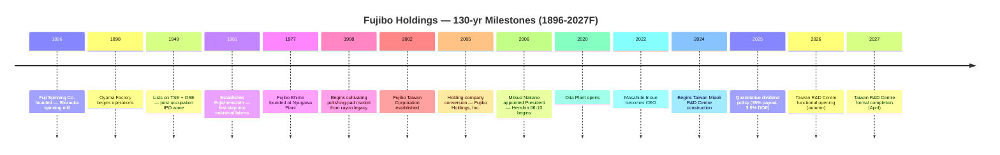
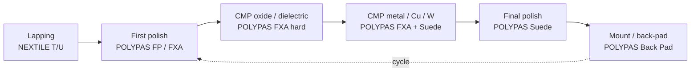
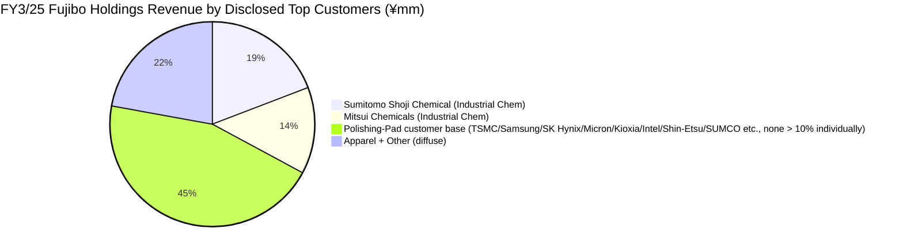
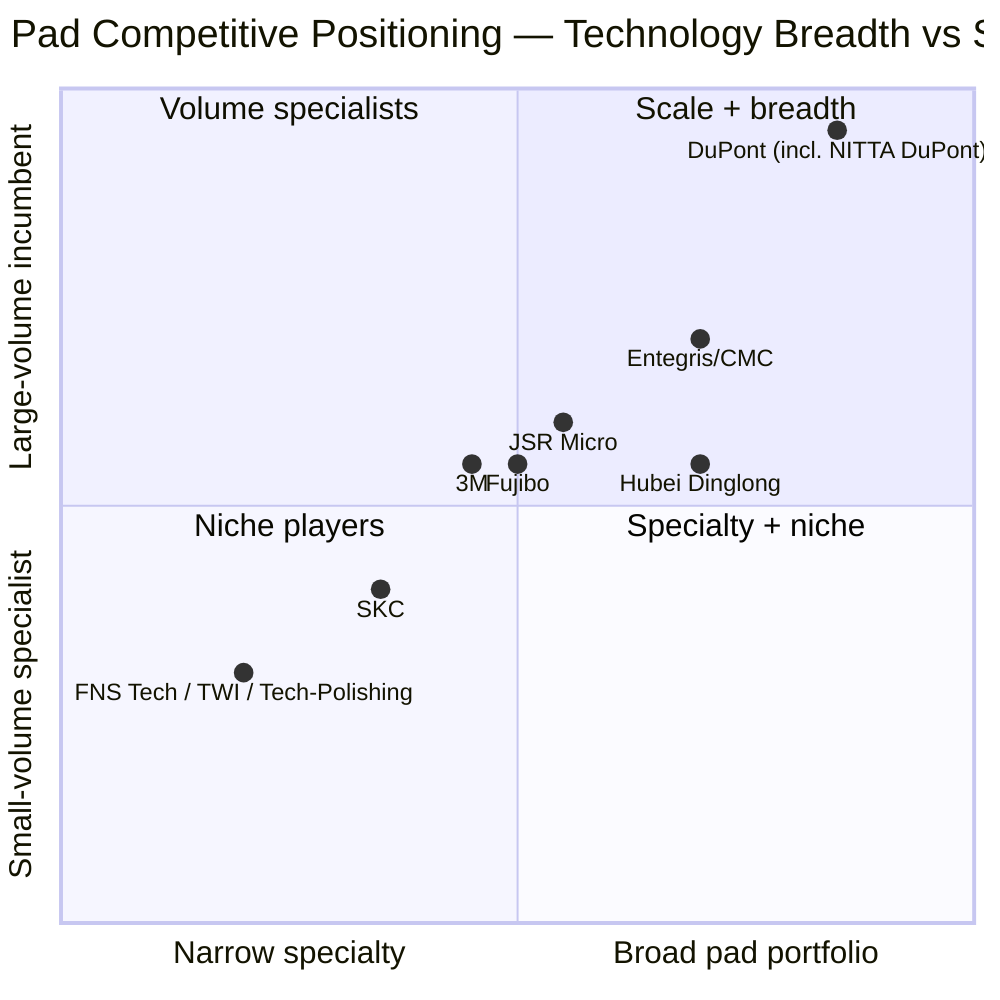
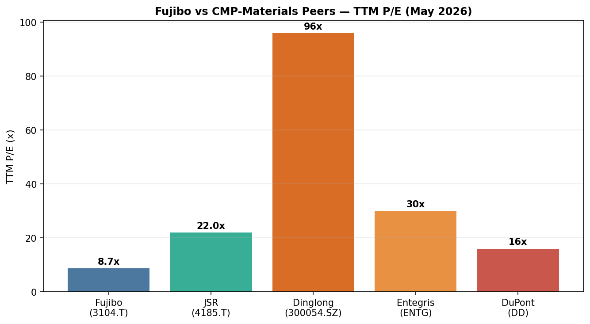

# Fujibo Holdings, Inc. (TSE:3104) — Company Research Report

*As of 2026-05-26 (NYC) — written in English; ticker = TSE:3104 = 富士紡ホールディングス株式会社 = Fuji Spinning Holdings, Inc.*

> **Update — FY3/2026 guidance raised twice this fiscal year (2025-10-31):** At the 1H release, management raised full-year FY3/2026 revenue guidance to **¥45.4 bn** (from the original ¥46.2 bn target announced 2025-05-15 — net of a slight cut on slower other-segment volumes, the topline guide was modestly trimmed) but lifted operating-profit guidance to **¥7.5 bn** (from ¥7.0 bn) and ordinary profit to **¥7.7 bn** (from ¥7.2 bn) on continuing strength of AI-driven CMP-pad demand. The dividend guide was raised to **¥160 / share** (from ¥150) — split ¥75 interim + ¥85 final. Source: [富士紡ホールディングス 2026年３月期第２四半期（中間期）決算短信, 2025-10-31](https://finance-frontend-pc-dist.west.edge.storage-yahoo.jp/disclosure/20251031/20251030582961.pdf).

## TABLE OF CONTENTS

1. Company Overview
2. Company History
3. Management Team
4. Products & Services
5. Customers & Go-to-Market
6. Industry Overview
7. Competitive Landscape
8. Market Opportunity (TAM)
9. Risk Assessment
10. References + Verification Log

---

## 1. Company Overview

Fujibo Holdings, Inc. (富士紡ホールディングス株式会社, TSE:3104) is a 130-year-old Japanese specialty-materials manufacturer that has reinvented itself, over the past two decades, from a textile spinner into one of the world's small handful of pure-play polishing-pad makers used in semiconductor chemical-mechanical-planarization (CMP) and adjacent ultra-precision-finishing markets. The group reports under four operating segments — **Polishing Pad (研磨材事業)**, **Industrial Chemicals (化学工業品事業)**, **Lifestyle Apparel (生活衣料事業)** and **Other** (auto-parts trading / plastic-injection moulding / metal moulds) — with the Polishing Pad segment now generating **¥19.3 bn of FY3/25 sales and ¥4.7 bn of operating profit (73% of group OP)** versus 35% of group sales, per the FY3/25 annual filing ([富士紡ホールディングス 第205期 有価証券報告書, 2025-06-25, p. 24](https://kitaishihon.s3.isk01.sakurastorage.jp/IrLibrary/3104_securities_2024_fgu7.pdf)).

The company makes its money by selling its **POLYPAS® ultra-high-precision polishing pads** — a polyurethane / non-woven family that is consumed step-by-step in the planarisation of silicon wafers, CMP after every conductor / dielectric layer in the front-end of an advanced-logic or memory fab, hard-disk substrate finishing and LCD-glass polishing. The product is a one-or-two-shift consumable: a single 200/300 mm advanced-logic line consumes hundreds of pads per month, conditioned by Kinik / 3M diamond discs and used with slurries from Entegris/CMC, Fujimi, Versum, Anji or Resonac ([Fujibo Polishing Pad Business overview](https://www.fujibo.co.jp/en/division/polishingpad/), [Fujibo POLYPAS product line](https://www.fujibo.co.jp/en/division/polishingpad/product/)). Customers buy POLYPAS direct (no distributor margin) under long-running master agreements with fab process-engineering teams, with on-site application-engineering co-development that creates real switching costs.

Geographically, Fujibo's footprint is **four plants in Japan** (Nyugawa in Ehime, Oita, Oyama in Shizuoka, Kozakai in Aichi) plus **one in Taiwan** (Tainan) operated by 台湾富士紡精密材料股份有限公司 (Taiwan Fujibo Precision Materials Co., Ltd.) — the highest manufacturing footprint of any specialised polishing-pad supplier on disclosure ([Fujibo Polishing Pad Business overview](https://www.fujibo.co.jp/en/division/polishingpad/)). A new **R&D centre in Miaoli, Taiwan (苗栗縣竹南鎮)** is under construction with ¥5.7 bn budgeted (¥1.15 bn already spent at FY-end), targeted for completion in April 2027 — supporting the company's stated strategy of putting its development engineers physically inside the Taiwan-Korea CMP customer cluster ([Yuho 2025, p. 34 — 重要な設備の新設等](https://kitaishihon.s3.isk01.sakurastorage.jp/IrLibrary/3104_securities_2024_fgu7.pdf)). The CEO has separately telegraphed a **fall-2026 functional opening**, ahead of formal completion ([Top Message, Fujibo IR](https://www.fujibo.co.jp/en/ir/message/)).

Group-level scale: **FY3/25 net sales ¥42.9 bn (+18.8% YoY), operating profit ¥6.5 bn (+129.8%), net income attributable to owners ¥4.5 bn (+111.4%), 1,319 employees**, of which 443 sit inside the polishing-pad business ([2025年３月期 決算短信, 2025-05-15, p. 1](https://finance-frontend-pc-dist.west.edge.storage-yahoo.jp/disclosure/20250515/20250513543721.pdf); [Yuho 2025, p. 11 — 従業員の状況](https://kitaishihon.s3.isk01.sakurastorage.jp/IrLibrary/3104_securities_2024_fgu7.pdf)). The balance sheet is heavily over-capitalised: **total assets ¥66.6 bn, net assets ¥47.5 bn, equity ratio 71.3%**, with interest-bearing debt only ¥0.47 bn — Fujibo runs the kind of conservative net-cash balance sheet typical of Japanese mid-cap industrials with multi-generation founding-family hangover. Generative-AI semiconductor demand (HBM memory + leading-edge logic) is the swing factor that turned FY3/25 into the second-best year in the company's history; FY3/26 is guided to revenues of ¥45.4 bn and operating profit of ¥7.5 bn after a 1H upward revision ([2026年３月期 第２四半期決算短信, 2025-10-31, p. 1](https://finance-frontend-pc-dist.west.edge.storage-yahoo.jp/disclosure/20251031/20251030582961.pdf)).

Source: [富士紡ホールディングス 第205期 有価証券報告書 + Integrated Report 2024 11-yr financial summary](https://www.fujibo.co.jp/en/wp/wp-content/uploads/fujibo_integrated_report_2024-en.pdf).

Source: [FY3/25 決算短信, p. 2-3 (segment results)](https://finance-frontend-pc-dist.west.edge.storage-yahoo.jp/disclosure/20250515/20250513543721.pdf).

### Valuation snapshot

The stock has more than doubled over the past 12 months: at ¥4,310 on 2026-05-22, market cap = **¥146.4 bn** (USD ~0.93 bn at ¥158/USD), implying **TTM P/E ≈ 8.7×** and **TTM P/S ≈ 3.2× on ¥45.9 bn TTM revenue** ([stockanalysis.com — Fujibo Holdings, 3104.T](https://stockanalysis.com/quote/tyo/3104/)). The 52-week range is ¥1,620 – ¥4,545 — a 2.8× spread driven primarily by the AI-CMP narrative re-rating that began in late 2024 ([Yahoo Finance, 3104.T](https://finance.yahoo.com/quote/3104.T/)). Over the past five fiscal years, the company's reported holding-company-level P/E (per the Yuho 五年間表) ranged 18× – 68×; the consolidated TTM number compresses lower because Fujibo Holdings the listco bookkeeps holding-company equity-method profits at parent level while the consolidated earnings are larger — i.e., the 67.7× in the FY3/24 line is parent-only, not the consolidated number used by Yahoo / Stockanalysis ([Yuho 2025, p. 3 — 提出会社の経営指標等](https://kitaishihon.s3.isk01.sakurastorage.jp/IrLibrary/3104_securities_2024_fgu7.pdf)).

For peer context, **JSR Corp (TSE:4185, the photoresist + CMP-slurry incumbent) trades around 22× TTM** post the JIC take-private overhang, **Entegris (NASDAQ:ENTG) around 30×, DuPont (NYSE:DD) around 16×, and Hubei Dinglong (SZSE:300054) around 96×** ([stockanalysis.com peer pages — JSR (4185.T), ENTG, DD, 300054](https://stockanalysis.com/quote/tyo/4185/)). Fujibo's ~8.7× TTM looks cheap on the screen, but three things compress the multiple relative to global pad peers: (1) only ~45% of group revenue is the CMP-pad business — the rest is mid-teens-margin chemical contracting + a structurally declining apparel franchise; (2) the float is small (mkt cap < $1 bn, daily liquidity tight) and TOPIX index re-rating only partial; (3) the ROE has been stuck in single digits (FY3/25 group ROE 9.8%, after years of 2.9–4.9% during the textile-restructuring phase) — see [Integrated Report 2024 p. 47 — 11 Yr Financial Summary](https://www.fujibo.co.jp/en/wp/wp-content/uploads/fujibo_integrated_report_2024-en.pdf). *Analyst view:* the discount is consistent with the conglomerate-discount + low-float pattern visible across small-mid-cap Japanese CMP / wafer-services names; the multiple compression risk is **upside**, not downside, if the AI-driven mix-shift to pad continues and apparel/other segments are eventually spun.

The dividend policy was put on a quantitative target in May 2025: **payout ratio 35% and minimum DOE of 3.5%** ([Top Message, Fujibo IR](https://www.fujibo.co.jp/en/ir/message/)), implying ¥160/share in FY3/26 (raised from ¥150 at 1H) — a forward yield of ~3.7% at current price ([FY3/26 1H 決算短信, 2025-10-31, p. 1 — 配当の状況](https://finance-frontend-pc-dist.west.edge.storage-yahoo.jp/disclosure/20251031/20251030582961.pdf)).

---

## 2. Company History

Fujibo's chronology breaks into four eras: textile founding (1896-1948), post-war diversification and listing (1949-1970s), polishing-pad market entry (1977-2005), and the holding-company-era pivot into a niche-No.1 specialty-materials business (2005-present). The defining transformation is the second-last one — a decade-and-a-half effort starting from 1998 to move the Nyugawa Plant in Ehime from rayon production into polyurethane / non-woven precision pad manufacturing — and the holding-company restructuring of September 2005 that severed the textile-era capital structure from the new growth business.

**Founding (1896):** *"In March 1896, Fuji Spinning Co., Ltd. was established with the aim of entering the spinning business, taking advantage of the abundant water from Mt. Fuji as a power source"* ([Integrated Report 2024, p. 5](https://www.fujibo.co.jp/en/wp/wp-content/uploads/fujibo_integrated_report_2024-en.pdf)). The first plant — the Oyama Factory in Sunto District, Shizuoka — opened in September 1898 ([Fujibo company history page](https://www.fujibo.co.jp/en/company/history/)). The Mt. Fuji water source gave the company its name (富士 = Fuji; 紡 = boō = spinning/cotton mill) and the Shizuoka site that remains a Fujibo Ehime polishing-pad facility today, more than 125 years later.

**Tokyo + Osaka listings (1949):** Fuji Spinning listed on both the Tokyo Stock Exchange and the Osaka Securities Exchange in May 1949 — the same wave of post-Occupation industrial-share IPOs that brought most of the surviving zaibatsu spinners onto the public boards ([Fujibo history page](https://www.fujibo.co.jp/en/company/history/)). The 1961 establishment of **Fujichemicloth Co., Ltd.** marked the first formal step out of pure spinning into laminated / coated industrial fabrics — the technology lineage that would eventually become the polishing-pad business.

**Polishing-pad market entry (1977 → 1998):** *"In 1977, Fujibo Ehime Co., Ltd. was established. As part of efforts to diversify business at the Nyugawa Plant, which handled rayon production, we cultivated the polishing pad market from 1998 based on our nonwoven fabric and film processing technologies"* ([Integrated Report 2024, p. 5](https://www.fujibo.co.jp/en/wp/wp-content/uploads/fujibo_integrated_report_2024-en.pdf)). This is the founding-document quote: rayon (a regenerated-cellulose fibre that depends on the same wet-chemistry skill set as polyurethane casting) cross-pollinated into polishing-pad fabrication. By the time Fujibo's first POLYPAS pads shipped, DuPont (then Rodel) had already established IC1000 as the global standard for CMP — Fujibo's strategy was to win the Japanese-domestic specialty-grade niche rather than chase IC1000 head-on.

**Holding-company conversion (2005-09):** *"Changed the company name to Fujibo Holdings, Inc. with the transition to a holding company system"* in September 2005 ([Fujibo history page](https://www.fujibo.co.jp/en/company/history/)). Note that the user prompt to this report cited "2016" — this was incorrect; the holdings reorganisation occurred in 2005, simultaneous with the appointment of Mitsuo Nakano as President. Nakano-shacho introduced the "*there is no business without profit*" mandate, downsized textile from 60.6% of FY2006 sales to 19.2% by FY2023, and built the polishing-pad-led portfolio into the niche-No.1 specialty franchise it is today ([Integrated Report 2024, p. 6](https://www.fujibo.co.jp/en/wp/wp-content/uploads/fujibo_integrated_report_2024-en.pdf)). The succession of Medium-Term Plans — *Henshin 06-10* (Transformation), *Toppa 11-13* (Breakthrough), *Maishin 14-16* (Advance), *Kasoku 17-20* (Acceleration), and the current *Zokyo 21-25* (Reinforcement) — chronicles the staged shift from a textile spinner to a specialty-materials house.

**Recent acquisitions (2012–2022):** The bolt-on M&A track has been intentionally small — none materially altering the polishing-pad core — but they expanded the Other segment into precision plastic moulds and injection-mould design: **Angle Miyuki Co., Ltd. (July 2012)** added a women's underwear brand for the apparel franchise; **Tokyo Molding Co., Ltd. (Oct 2018)**, **Fujioka Mold Co., Ltd. (Jan 2020)**, and **GFI Holdings, Inc. + IPM Co., Ltd. (Nov 2022)** brought in mould-design and plastic-injection capacity, partially targeting the second-pillar build-out into medical-device / digital-camera plastic injection ([Fujibo history page](https://www.fujibo.co.jp/en/company/history/)). The 2022 GFI / IPM combination is what shows up as the Other-segment OP loss in FY3/25 — the 2nd-pillar businesses are still in their investment phase.

**Recent strategic milestones (2020–2026):** The new **Oita Plant** came online in 2020 to give pad capacity geographic redundancy ([Integrated Report 2024, p. 18](https://www.fujibo.co.jp/en/wp/wp-content/uploads/fujibo_integrated_report_2024-en.pdf)). The Inoue succession to CEO in June 2022 marked the shift from the Nakano-era "*portfolio restructuring*" to growth-investment-and-ROIC mode. The May 2025 announcement of a quantitative dividend policy (payout 35%, minimum DOE 3.5%) and the May 2025 launch of a **¥500 mm buyback (150,000-share authorisation)** signaled the first formal capital-return programme of the Inoue era ([Yuho 2025, p. 39 — 自己株式の取得等の状況](https://kitaishihon.s3.isk01.sakurastorage.jp/IrLibrary/3104_securities_2024_fgu7.pdf)).

---

## 3. Management Team

Fujibo is a non-founder, professional-manager company in the modern era — the founding-family lineage from 1896 long since diluted out — so this chapter covers the current CEO only (there is no living founder), plus the predecessor CEO who architected the polishing-pad-led restructuring (since the user prompt explicitly asks for context on the 2005 holding-company reorganisation that he led).

### Masahide Inoue (井上 雅偉) — Representative Director and President (since June 2022)

Inoue-shacho is a 38-year Fujibo lifer who joined the parent in April 1987 and worked across all three operating segments — apparel, chemicals, and polishing pad — before being elevated to the CEO role in June 2022. His prior roles, in chronological order, were: General Manager of Functional Products Business Development (Aug 2015), then a textbook rotation as the appointed President of three group operating subsidiaries — **Fujibo Textile (Jan 2017), Fujibo Trading + Angle K.K. (Sep 2017), and Yanai Chemical Industry (May 2018)** — followed by General Manager of Functional Product Development inside the Future Product Development Unit (Apr 2019), Board Director (Jun 2020), and Representative Director / President (Jun 2022) ([Yuho 2025, p. 48 — 役員一覧](https://kitaishihon.s3.isk01.sakurastorage.jp/IrLibrary/3104_securities_2024_fgu7.pdf)). The three-subsidiary-President rotation is the conventional Japanese mid-cap promotion pathway: Inoue had effectively run each operating segment for at least a year before getting the holding-company helm. His direct shareholding is 13,313 shares — ~¥57 mm at current prices, ~10× annual base salary on the published comp table — modest by Western standards but high for a Japanese mid-cap salaryman-CEO ([Yuho 2025, p. 48](https://kitaishihon.s3.isk01.sakurastorage.jp/IrLibrary/3104_securities_2024_fgu7.pdf)).

Inoue's stated public agenda is to convert Fujibo from the Nakano-era cost-cutting-and-restructuring posture into a growth-investment company anchored to ROIC discipline. The May 2025 announcement of a quantitative dividend policy (payout 35%, DOE 3.5%) and the May 2025 buyback launch are the most visible imprint of the Inoue capital-policy era ([Top Message, Fujibo IR](https://www.fujibo.co.jp/en/ir/message/)). On the operating side, he has personally championed the Taiwan-side R&D investment cycle — the Miaoli centre is the largest single capex item Fujibo has committed in its history at ¥5.7 bn, and Inoue's first IR-conference appearances have repeatedly framed it as the make-or-break geography for advanced-node CMP-pad share-of-wallet ([Yuho 2025, p. 34 — 重要な設備の新設等](https://kitaishihon.s3.isk01.sakurastorage.jp/IrLibrary/3104_securities_2024_fgu7.pdf); [Fujibo Polishing Pad Business overview](https://www.fujibo.co.jp/en/division/polishingpad/)). Education and pre-Fujibo history are not disclosed in the Yuho ("当社入社" / "joined the company" being the earliest line item); this is typical of Japanese executive disclosure for career-lifers.

### Predecessor context: Mitsuo Nakano (中野 光雄) — President 2006–2022 (no longer an executive)

Although the company-research skill instructs the analyst to cover only the founder + current CEO, the historical-anchor exception is explicitly preserved (founder-equivalent role context). Nakano-shacho is the architect of the modern Fujibo. He was appointed President in 2006, the year after the 2005 holding-company conversion, and ran the company for sixteen years across four consecutive Medium-Term Management Plans (*Henshin 06-10 → Toppa 11-13 → Maishin 14-16 → Kasoku 17-20*), driving the strategic shift from a textile spinner — which was 60.6% of FY2006 sales — to a polishing-pad-led specialty materials house, where textile is now 19.2% of FY2023 sales ([Integrated Report 2024, p. 6](https://www.fujibo.co.jp/en/wp/wp-content/uploads/fujibo_integrated_report_2024-en.pdf)). His operating mantra — "*there is no business without profit*" — drove the shift from a sales-volume mindset to a cash-and-margin discipline, and the resulting ROE improvement (from ~5% to a peak ~15% during the 2017-2022 cycle) was the precondition for the 2020s AI-CMP re-rating. Nakano is no longer an executive — he handed the President role to Inoue at the June 2022 AGM and exited the board entirely the following year ([Integrated Report 2024, p. 6](https://www.fujibo.co.jp/en/wp/wp-content/uploads/fujibo_integrated_report_2024-en.pdf)).

The current board has nine directors, of which four are independent outside directors (44%, comfortably above TSE prime-market standards); Ms. Ruth Marie Jarman is the longest-serving outside director (June 2019) — an unusual non-Japanese voice on a 130-year-old Japanese mid-cap ([Yuho 2025, p. 41 — コーポレート・ガバナンスの状況等](https://kitaishihon.s3.isk01.sakurastorage.jp/IrLibrary/3104_securities_2024_fgu7.pdf)). Other inside-director context — CFO Tatsuya Sasaki (since 2023, ex-MUFG Research & Consulting), Yoshimi Mochizuki (Polishing Pad Business head, also President of Fujibo Ehime) — is intentionally omitted per the skill's "founder + current CEO only" guidance, except where the operating-business heads are explicitly cited in their business-line sections.

---

## 4. Products & Services

This is by a wide margin the most consequential section of the report. Fujibo's value to a portfolio is in one product family — **POLYPAS®** — split across five materially distinct sub-series sold into CMP-pad, silicon-wafer, hard-disk and LCD-glass polishing. Everything else (industrial chemicals, apparel, moulds) is either a feeder business that funded the pad reinvestment or a slow-melting legacy. The reader needs to leave §4 able to articulate which POLYPAS sub-series sits at which step in the customer's wafer-fab flow, why DuPont's IC1000 has not displaced Fujibo from Japanese / Taiwanese / Korean customer slots, and what the soft-vs-hard pad mix means for incremental margins as the AI-CMP cycle deepens.

### 4.1 — Fujibo's segment-level disclosure (Yuho verbatim)

Per the 第205期 Yuho (fiscal year ending March 2025), the polishing-pad business sits inside the "研磨材事業 (Abrasives Business)" segment, whose main product disclosure reads:

> "区分: 研磨材事業 — 主要製品等: 超精密加工用研磨材, 不織布, 合皮 — 製造: フジボウ愛媛㈱, 台湾富士紡精密材料股份有限公司"

That is — *"Segment: Abrasives Business. Main products: ultra-high-precision-processing abrasives, non-woven fabric, synthetic leather. Manufacturers: Fujibo Ehime Co., Ltd. and Taiwan Fujibo Precision Materials Co., Ltd."* The two "non-woven" and "synthetic leather" line items are largely the cushioning / backing materials sold into the same customers as full pads. Source: [Yuho 2025, p. 7 — 事業の内容](https://kitaishihon.s3.isk01.sakurastorage.jp/IrLibrary/3104_securities_2024_fgu7.pdf).

The Yuho's narrative of the FY3/25 segment performance — the canonical, verbatim source for §4 — reads:

> "ア．研磨材事業: 2023年前半に底を打った世界の半導体市場は、2024年に入り緩やかな回復が続いています。このような中、超精密加工用研磨材の半導体デバイス用途(ＣＭＰ)は、生成ＡＩの普及によるＨＢＭなどのメモリや最先端ロジック向け半導体の需要の増加とそれに伴う一部ユーザーの在庫水準の引き上げにより受注が増加しました。シリコンウエハー用途は、汎用品用途の需要は弱いものの、先端品用途の需要は堅調で一定水準の売上を確保しました。ハードディスク用途はデータセンター向けの需要が戻り、液晶ガラス用途では期後半からＴＶ需要の増加によってパネルの消費も加速しており、受注も回復しました。"

— i.e., *"the polishing-pad business saw orders increase in semiconductor-device CMP applications driven by HBM and leading-edge logic, along with some customer inventory restock; silicon-wafer demand was weak for commodity wafers but firm for advanced grades; hard-disk demand recovered on the back of data-centre orders; LCD-glass orders recovered from the second half on TV-panel restock."* The result: **segment net sales ¥19,307 mm (+43.9% YoY) and operating profit ¥4,729 mm (+334.8%)** ([Yuho 2025, p. 24 — 経営成績](https://kitaishihon.s3.isk01.sakurastorage.jp/IrLibrary/3104_securities_2024_fgu7.pdf)). The 24.5% segment operating margin in FY3/25 is the highest the company has ever reported on the polishing-pad business and reflects (a) the operating leverage of pulling utilisation up the cost curve at fixed capacity, and (b) the structural mix shift toward higher-priced soft pads for advanced-node CMP.

### 4.2 — Synthesis: how the product categories interact in the customer workflow

Every advanced-logic / memory / wafer-substrate customer of Fujibo runs the **same six-step ultra-precision-finishing loop** on every wafer: **lap → first polish → CMP layer 1 (oxide / dielectric) → CMP layer 2 (metal / Cu / W) → final polish → cleaning + back-pad mount**. Fujibo touches steps 2-6 with the POLYPAS family:

A typical 300 mm advanced-logic line will use four or five different POLYPAS pads in this loop, replaced every 8–24 hours of pad-life depending on the layer; Fujibo wins or loses each socket on the basis of (a) defect density (scratches per wafer), (b) wafer-to-wafer uniformity, and (c) the slope of removal-rate decay as pads age. This is why "solution-type contract model" (see §5) and on-site application-engineering presence in Taiwan / Korea matter more than headline product specs — the spec is qualified during a 6–12 month customer trial against the specific slurry / conditioner combination the customer uses.

### 4.3 — POLYPAS® (FP series): non-woven first-polish pads

> "Non-woven fabric type polishing pad developed for stock removal (first polishing). … Applications: Initial and final polishing of silicon and compound semiconductor wafers; optical-lens and glass-component finishing; processing of plastic lenses, stainless steel, and copper plates. Key properties: 'High flatness' and 'Low scratch' characteristics. Available in soft to hard variants for different material requirements." ([POLYPAS FP series product page](https://www.fujibo.co.jp/en/division/polishingpad/product/627/))

**中文释义 / Plain-language gloss:** The FP series is the "rough cut" of the polishing flow. Non-woven (不織布) means the polyurethane resin is impregnated into a felt-like cloth rather than cast as a closed-cell foam — this gives the pad a softer, more conformable surface that removes the largest mountains on the wafer (the "stock removal" step, 粗研磨) without leaving deep scratches. Each FP grade is tuned by changing the cloth's fibre density, the polyurethane impregnation level, and the foaming control of the felt — Fujibo can deliver dozens of micro-variants for the same product code. The FP pad's role in the customer workflow is to flatten a wafer that has just come off lapping (where ¥10 µm of as-cut variation is normal) down to ~1 µm flatness for the subsequent CMP steps to take over. Strategic significance: FP is the high-volume / lower-ASP layer of the POLYPAS franchise — incremental growth here tracks 200/300 mm wafer-starts, not advanced-node intensity.

*Analyst view:* FP-class pads are the most directly substitutable product family in the POLYPAS portfolio — Hubei Dinglong (鼎龙) sells a near-identical felt-based first-polish pad into mainland Chinese fabs at lower price, and Fujibo's qualified-supplier moat is shallower at this level. The differentiation premium is in the FXA / Suede sub-series, not FP. Moat type for FP = scale + qualified-supplier inertia; competitive verdict = partial.

### 4.4 — POLYPAS® (FXA series): non-filler hard urethane pads — the CMP workhorse

> "A non-filler type hard urethane pad designed for diverse polishing applications. This pad demonstrates superior performance characteristics, including resistance to temperature-related hardness variations and uniform foam structure. … Constructed from hard urethane without fillers. Notable properties include: 'High flatness' and minimal scratch production, temperature-stable hardness performance, independent uniform foam composition. Applications: semiconductor wafer polishing (first and final stages), LCD glass substrate finishing, optical lens and material polishing." ([POLYPAS FXA series product page](https://www.fujibo.co.jp/en/division/polishingpad/product/1143/))

**中文释义 / Plain-language gloss:** FXA is the head-to-head competitor to DuPont's IC1000 — both are closed-cell, hard polyurethane (硬质聚氨酯) cast pads with engineered pore structures for **chemical-mechanical planarisation (CMP, 化学机械抛光)** at the device front-end. "Non-filler" (无填料) means the polyurethane foam is the active polishing medium itself — abrasive grit is delivered via the slurry, not embedded in the pad — which is the modern standard for advanced-node CMP because pad-embedded abrasive causes defect counts that GAA / sub-3 nm logic cannot tolerate. "Temperature-stable hardness" is the analogue of IC1000's claim to flat removal-rate from start to end of pad life: in CMP, friction heats the pad surface to 50-80°C and softer pads droop, producing wafer-edge over-polish. The "uniform foam composition" claim points at the pore-size distribution that Fujibo controls via its proprietary casting process — this is the differentiation lever vs IC1000 for **wafer-to-wafer uniformity (WIWNU, within-wafer non-uniformity, 片内不均匀性)** when polishing **inter-metal dielectric (IMD, 层间介质)** or **shallow-trench isolation (STI, 浅沟槽隔离)** at the 5-nm / 3-nm node.

The strategic significance is acute. The "trend of semiconductor miniaturization and layering" — Fujibo's exact corporate phrasing ([Top Message, Fujibo IR](https://www.fujibo.co.jp/en/ir/message/)) — means **more CMP steps per wafer at every node transition**: 28-nm logic uses ~10 CMP steps, 5-nm logic uses ~15-18, 3-nm and beyond uses 20+. Each step is a hard-pad consumable. HBM (High Bandwidth Memory, 高带宽内存) for AI accelerators adds another CMP-intensive consumer because every HBM die stack uses through-silicon vias (TSVs, 硅通孔) that need an additional Cu CMP step per layer. Fujibo's FXA family is the product that captures this step-growth — and the company has been explicit that capacity expansion (Nyugawa + Oita + a new Taiwan-side line) is targeted at hard-pad sales specifically ([Yuho 2025, p. 14 — 優先的に対処すべき事業上及び財務上の課題](https://kitaishihon.s3.isk01.sakurastorage.jp/IrLibrary/3104_securities_2024_fgu7.pdf)).

*Analyst view:* FXA-class hard pads are where Fujibo plays competitively against DuPont's IC1000™ and Hubei Dinglong's DL-720 series. DuPont retains the de-facto-standard label for IC1000 — *"the IC1000™ Series is a CMP industry standard that is now being used in a wide range of CMP applications"* ([NITTA DuPont — IC1000 product page](https://www.nittadupont.co.jp/en/category-products/pad)); Dinglong only crossed the 28/14 nm qualification line at SMIC in late 2024 with the DL-720 series ([Hubei Dinglong CMP localisation report, 2025](https://www.openpr.com/news/4253861/semiconductor-cmp-polishing-pad-latest-market-report-2025)). Fujibo's FXA wins specialty grades in the JP / TW / KR customer base where the customer wants a non-IC1000 second-source for line yield or contract-pricing leverage. Moat type for FXA = process IP + qualified-supplier inertia + Japanese-customer preference; verdict = partial competitive advantage (yes vs Dinglong / 3M / SKC; partial vs IC1000).

### 4.5 — POLYPAS® (FX series): filler-impregnated pads for glass + non-CMP

> "Engineered with built-in filler technology. It combines characteristics from the FXA series while adding self-abrasive properties unique to the built-in filler type. This product line offers extensive customization in hardness, density, abrasive grain types, and grain size distribution. … Applications: glass substrate polishing for displays and photomasks; optical lens and glass component finishing; plastic lenses, stainless steel, and copper plate polishing; panel cleaning operations." ([POLYPAS FX series product page](https://www.fujibo.co.jp/en/division/polishingpad/product/1282/))

**中文释义 / Plain-language gloss:** FX is the same hard-urethane foam as FXA, but with abrasive grains baked into the pad itself — "built-in filler" (内装填料). This makes FX a "self-abrasive" pad: it doesn't need an abrasive slurry to do useful work, just a chemistry-only slurry or water. The trade-off is the FX pad must be discarded faster (the grain inventory inside the pad burns out) but the customer saves on slurry cost. The target use cases are largely **non-semiconductor**: LCD-glass substrate polish, photomask blank polish, optical-lens finish — applications where the wafer / substrate is value-dense but the polishing step doesn't have the defect-density requirements of front-end CMP. FX has therefore been the swing-factor in the LCD recovery the Yuho commentary keeps citing ("液晶ガラス用途では中国の補助金政策によりパネル需要が好調に推移" — *"LCD glass demand was strong thanks to Chinese subsidy policy"* — [FY3/26 1H 決算短信, p. 2](https://finance-frontend-pc-dist.west.edge.storage-yahoo.jp/disclosure/20251031/20251030582961.pdf)).

*Analyst view:* FX is the most defensible POLYPAS sub-series in volume terms because the LCD-glass and photomask supply chains are dominated by Japanese (AGC, Nippon Electric Glass, Hoya) and Korean (Corning Korea) customers who have decades-old relationships with Fujibo. Moat = customer-relationship + qualified-supplier inertia; verdict = yes.

### 4.6 — POLYPAS® (Suede series): final-finishing pads

> "A polishing pad engineered for final finishing of semiconductor wafers and hard disks. The product addresses growing industry demands for 'high precision and flatness of the finished surface' while emphasizing the importance of the pad's own uniformity. … 'Scratch-free' performance, 'Chemical-resistant and abrasion-resistant' properties." ([POLYPAS Suede series product page](https://www.fujibo.co.jp/en/division/polishingpad/product/1283/))

**中文释义 / Plain-language gloss:** Suede (麂皮 / 仿麂皮) refers to a soft polyurethane top layer with a porous, suede-like microstructure that creates very gentle abrasive contact — the **soft pad** half of the CMP cookbook. In a typical CMP module, the hard pad (FXA) does the bulk material removal at the start of each polishing step, and the soft pad (Suede) does the **finishing pass** for the last few hundred angstroms — the step that determines defect count and surface roughness. Fujibo has explicitly said it has "**captured the top market share in the mainstay field of advanced-process soft pads**" — *"we have captured the top market share in the mainstay field of advanced process soft pads based on our high reputation among customers earned through our high-performance, high-quality products and provision of flexible solutions that meet the different performance requirements of each customer"* ([Integrated Report 2024, p. 18](https://www.fujibo.co.jp/en/wp/wp-content/uploads/fujibo_integrated_report_2024-en.pdf)). This is the single most important sentence in the entire Integrated Report — it is the company's claim of a defensible niche-No. 1 position in **soft pads for advanced-node CMP**, the segment that grows fastest as nodes shrink.

The Suede family is also used for **silicon-wafer final polishing** (the last polish on a bare-silicon wafer before it ships to the fab) — and for **hard-disk substrate final polish**, the application that drove Fujibo's data-centre-driven HDD-segment recovery in FY3/25.

*Analyst view:* Suede is the strongest competitive-advantage product in the POLYPAS portfolio — Fujibo's claimed leadership position in advanced-process soft pads is one of the few share-leadership claims in any pad-supplier filing globally, and it is the most defensible product against incremental Chinese-substitution risk because it is the layer where defect-density tolerance is tightest. Moat = process IP + on-site application engineering + qualified-supplier inertia; verdict = yes (the strongest of the POLYPAS family).

### 4.7 — POLYPAS® (Back Pad series): wafer-retention pads

> "Developed to retain semiconductor silicon wafers and LCD glass substrates without wax. Users can choose mounting pads tailored to their polishing needs for optimal flatness. The product line includes insert types (frameless) and template types (framed)." ([POLYPAS Back Pad series product page](https://www.fujibo.co.jp/en/division/polishingpad/product/1284/))

**中文释义 / Plain-language gloss:** Back pads are the **wax-free wafer-carrier mounting pads** that hold the wafer face-down against the polishing head during CMP. Pre-back-pad designs used wax to glue the wafer to the carrier, which required messy cleaning after polishing and introduced wax-residue defect modes. The wax-free back pad is now the global standard — Fujibo's role here is to supply a high-flatness, wafer-non-marring back-pad that the customer changes out at a slower cadence than the polishing pad itself.

*Analyst view:* Back pads are a quieter franchise — high margin, low-growth, sticky customer base — and act as a "tail" annuity inside the POLYPAS bundle. They rarely show up in any market-share analysis because the dollar volume is small relative to top-side pads, but they're part of why Fujibo wins multi-product CMP-consumable deals against single-product competitors. Moat = bundle + qualified-supplier inertia; verdict = partial.

### 4.8 — NEXTILE® lapping pads (adjacency)

NEXTILE T and U series are **lapping pads** rather than CMP polishing pads — they sit at the earliest, coarsest step in the wafer / glass finishing flow ([NEXTILE product page, Fujibo](https://www.fujibo.co.jp/en/division/polishingpad/product/)). They are technologically adjacent to the POLYPAS family (same polyurethane chemistry, different fibre structure) and serve the same customers, but at lower margin and lower revenue mix. They're listed for completeness; they are not the franchise.

### 4.9 — The other three operating segments (brief)

- **Industrial Chemicals (化学工業品事業)** — Yanai Chemical Industry's contract-manufacturing business: fine-chemical intermediates for pharma, agrochem, electronic materials and functional chemicals for the big Japanese chemical players. FY3/25 sales ¥13.5 bn (+7.6%), operating profit ¥1.2 bn (+37.0%). The Yanai Headquarters Plant + Takefu Plant run at high utilisation; a fifth plant comes on stream in April 2026 (¥6.2 bn invested, of which ¥1.2 bn already spent). Customer concentration is high — **top-2 customers (Sumitomo Shoji Chemical 19.2% of consolidated sales, Mitsui Chemicals 13.7%)** sit inside this business ([Yuho 2025, p. 27 — 販売実績](https://kitaishihon.s3.isk01.sakurastorage.jp/IrLibrary/3104_securities_2024_fgu7.pdf)).
- **Lifestyle Apparel (生活衣料事業)** — Body Wild brand men's underwear + Angle women's underwear + Asamerry / Airmerry high-end lines. FY3/25 sales ¥7.0 bn (flat), operating profit ¥0.6 bn (−25.0%). This is the heritage textile business; Inoue's predecessor cut it from 60% of sales (FY3/06) to ~16% (FY3/25). It is structurally declining in domestic sales but holding up overseas thanks to Japan-brand cachet ([Yuho 2025, p. 25 — 生活衣料事業](https://kitaishihon.s3.isk01.sakurastorage.jp/IrLibrary/3104_securities_2024_fgu7.pdf)).
- **Other (Chemical Products / Auto-parts / Moulds)** — FY3/25 sales ¥3.2 bn (−1.8%), operating loss ¥57 mm vs ¥59 mm profit prior year. Inoue is positioning the "Chemical Products" piece (precision plastic injection for medical devices + digital cameras) as the **fourth pillar** to follow polishing pads / industrial chemicals / apparel, but the GFI / IPM 2022 acquisition is still in investment mode ([Yuho 2025, p. 25 — その他](https://kitaishihon.s3.isk01.sakurastorage.jp/IrLibrary/3104_securities_2024_fgu7.pdf)).

### 4.10 — Roadmap and recent launches (last 12 months)

The two largest stated investment programmes are (a) the **Nyugawa Plant technology development annex** completed in 2024 and now driving FY3/25 pad mix-up, and (b) the **Miaoli Taiwan R&D Centre** at ¥5.7 bn — Fujibo's first overseas R&D centre and explicitly framed as a Taiwan-customer co-development hub for TSMC-cluster advanced-node CMP qualification ([Yuho 2025, p. 34 — 重要な設備の新設等](https://kitaishihon.s3.isk01.sakurastorage.jp/IrLibrary/3104_securities_2024_fgu7.pdf); [Top Message, Fujibo IR](https://www.fujibo.co.jp/en/ir/message/)). There is no individual new-product press release at SKU level — POLYPAS is a continuous-improvement product family, not a discrete-launch business.

Source: [Integrated Report 2024 — 11 Years Financial Summary, p. 47 + Yuho 2025 p. 32](https://www.fujibo.co.jp/en/wp/wp-content/uploads/fujibo_integrated_report_2024-en.pdf).

---

## 5. Customers & Go-to-Market

Fujibo's customer base bifurcates by segment: the polishing-pad business serves the global advanced-node fab customer set (foundry + memory + wafer manufacturers), the industrial-chemicals business has high single-customer concentration to two Japanese chemical majors, and the apparel business serves a diffuse retail / e-commerce base. The most informative customer disclosure is at the **consolidated** level via the Yuho's 主要な販売先 (top customers) table.

### 5.1 — Top consolidated customers (Yuho-disclosed)

The Yuho's mandatory top-customer disclosure (販売先 ≥ 10% of consolidated revenue) names two customers in FY3/25:

| Customer | Segment | FY3/24 sales (¥mm) | FY3/24 share | FY3/25 sales (¥mm) | FY3/25 share |
|---|---|---|---|---|---|
| **住友商事ケミカル㈱ (Sumitomo Shoji Chemical)** | Industrial Chemicals | 5,380 | 14.9% | **8,229** | **19.2%** |
| **三井化学㈱ (Mitsui Chemicals)** | Industrial Chemicals | 5,801 | 16.1% | **5,874** | **13.7%** |
| Top-2 combined | — | 11,181 | 31.0% | 14,103 | **32.9%** |

Source: [Yuho 2025, p. 27 — 販売実績](https://kitaishihon.s3.isk01.sakurastorage.jp/IrLibrary/3104_securities_2024_fgu7.pdf).

These two top customers sit **entirely inside the Industrial Chemicals segment** — both are intermediate-chemical contract-manufacturing relationships for pharmaceutical / agrochemical / electronic-material precursors via Yanai Chemical Industry's plants in Yanai (Yamaguchi) and Takefu (Fukui). The Sumitomo Shoji Chemical share jumped from 14.9% to 19.2% of consolidated revenue — material concentration on a single counterparty in a contract-manufacturing relationship is normal in fine-chemicals, but it makes the Industrial Chemicals segment economically fragile to one renewal cycle ([Yuho 2025, p. 21 — 事業等のリスク (3) 特定製品・顧客への依存度](https://kitaishihon.s3.isk01.sakurastorage.jp/IrLibrary/3104_securities_2024_fgu7.pdf)).

**The polishing-pad business does NOT have a single 10%+ customer at consolidated level** — i.e., no individual fab customer (TSMC, Samsung, SK Hynix, Micron, Kioxia, Intel, etc.) represents > ¥4.3 bn of FY3/25 revenue. This is the structural strength of the Fujibo CMP-pad franchise: it is sold into a **broad-based global advanced-fab customer set** rather than tethered to one anchor account. The Yuho explicitly bins the polishing-pad customer base as "**世界中のＩＴデバイス関連企業**" — *"IT-device-related companies all over the world"* ([Yuho 2025, p. 13 — 経営環境](https://kitaishihon.s3.isk01.sakurastorage.jp/IrLibrary/3104_securities_2024_fgu7.pdf)). Fujibo does not name individual fab customers in its public disclosure (consistent with Japanese mid-cap practice for technical-component suppliers), but the customer set — by inference from the geographic footprint, the Tainan plant + Miaoli R&D centre, the disclosure that ~60-70% of pad revenue is export, and CMP-pad-share studies — covers TSMC, Samsung Foundry, SK Hynix, Kioxia, Micron, Intel, GlobalFoundries, UMC and the major Japanese silicon-wafer makers (Shin-Etsu Handotai, SUMCO) plus Taiwan-Korea wafer reclaim players.

Source: [Yuho 2025, p. 27 — 販売実績 (top-2 disclosure); Yuho p. 13 customer-base framing](https://kitaishihon.s3.isk01.sakurastorage.jp/IrLibrary/3104_securities_2024_fgu7.pdf).

### 5.2 — Go-to-market: direct co-development with fab process engineering

Fujibo's stated GTM model in the polishing-pad business is the "**solution-type contract model (ソリューション型受託モデル)**" — i.e., **direct application-engineering co-development with the customer's CMP process-engineering team**, not arms-length transactional sales ([Integrated Report 2024, p. 17 — Polishing Pad Business growth strategy](https://www.fujibo.co.jp/en/wp/wp-content/uploads/fujibo_integrated_report_2024-en.pdf)). This pattern is universal in advanced-fab consumables: a pad spec is qualified on the customer's actual tool (Applied Materials Reflexion-class CMP polishers or Ebara Frex polishers), against the customer's specific slurry + diamond conditioner combination, for the specific layer / process integration the customer needs. The qualification cycle is 6-18 months and the customer rarely changes the qualified supplier without a 3+ year horizon. This is the source of the qualified-supplier moat that defines all advanced-fab consumables economics.

The corollary is that **engineers, not salespeople, are the binding GTM resource**. The Taiwan R&D Centre's strategic purpose, per Inoue's repeated framing, is to put Fujibo application engineers physically inside the TSMC / UMC engineering catchment so that customer trials and process-tweak cycles compress from 6 weeks (when engineers fly in from Japan) to 2-3 days. The Tainan production plant and the Miaoli R&D centre together create a "**dev + manufacturing**" Taiwan presence that mirrors what DuPont has run for decades via Nitta DuPont's Taiwan offices and what Hubei Dinglong is now building inside the SMIC catchment in Shanghai ([Yuho 2025, p. 14 — 課題](https://kitaishihon.s3.isk01.sakurastorage.jp/IrLibrary/3104_securities_2024_fgu7.pdf); [Top Message, Fujibo IR](https://www.fujibo.co.jp/en/ir/message/)).

### 5.3 — Export / geographic mix

Fujibo does not publish a clean by-geography revenue split at the consolidated level, but the Yuho's polishing-pad risk disclosure flags export concentration: *"研磨材事業においては、営業収入に占める輸出比率が高いことから、主として米ドルに対する円高は、値下げ要求につながる可能性があります"* — *"In the polishing-pad business, the export ratio of operating income is high, so a strong yen against the US dollar could lead to price-down demands"* ([Yuho 2025, p. 21 — 事業等のリスク (2) 為替相場の変動](https://kitaishihon.s3.isk01.sakurastorage.jp/IrLibrary/3104_securities_2024_fgu7.pdf)). The 1H FY3/26 release noted that *"米国向け直接輸出がごく一部"* — *"direct exports to the US are only a small part"* — so most pad export goes to Taiwan / Korea / China and is invoiced in USD or JPY ([2026年３月期 第２四半期決算短信, p. 3](https://finance-frontend-pc-dist.west.edge.storage-yahoo.jp/disclosure/20251031/20251030582961.pdf)). This is the explicit GTM concentration on the **East-Asia advanced-fab cluster**: Taiwan (TSMC + UMC), Korea (Samsung + SK Hynix), Japan (Kioxia + Micron + wafer makers), plus a long tail of US and European customers via export sales.

### 5.4 — Customer concentration risk verdict

Given the consolidated disclosure, customer concentration in the polishing-pad business is **low** (no 10%+ customer), but customer concentration in the industrial-chemicals business is **material**: Sumitomo Shoji Chemical at 19.2% of consolidated sales alone exceeds the conventional 15% trigger. Because Industrial Chemicals contributed ¥1.2 bn of FY3/25 OP (about 19% of group OP) and is the second-largest segment, the loss of either top-2 customer would cut group OP by 5-8% — material at the holding-company level. This risk carries into §9.

---

## 6. Industry Overview

Fujibo participates in three nested industries — (a) the **global CMP polishing-pad market**, (b) the **broader CMP consumables ecosystem** that includes slurries + diamond conditioners + post-CMP cleaning fluids, and (c) the **wider semiconductor materials market** addressed by JSR / Shin-Etsu / Resonac / Tokyo Ohka and the global CMP suppliers. The most relevant frame for an equity-research view is (a), with (b) and (c) as context.

### 6.1 — CMP pad market sizing, structure, and growth

The global CMP polishing pad market is a ~$1 bn TAM in 2024, growing high-single-digit on a 5-year CAGR. Multiple syndicated sources triangulate similar numbers: TECHCET puts the broader **semiconductor CMP consumables market at ~$3.4 bn in 2024 growing 6% YoY**, with pads representing the second-largest sub-segment after slurries ([TECHCET CMP consumables forecast, 2024](https://techcet.com/semiconductor-cmp-pad-slurry-forecast/)). Mordor Intelligence and Cognitive Market Research peg the **pad sub-segment at ~$895 mm in 2024 growing at ~5.8% CAGR through 2031** ([Cognitive Market Research — CMP Pad market](https://www.cognitivemarketresearch.com/cmp-pad-market-report)). On Fujibo's segment-revenue rate of ¥19.3 bn (~$120 mm) in FY3/25, the company has roughly **12-14% global share** by syndicated-source share-of-revenue arithmetic — consistent with the second-tier-vendor share data referenced in §7.

Growth drivers, ranked by impact on pad demand:

1. **CMP-step growth per wafer at advanced nodes.** Each shrink from 28 nm → 14 nm → 7 nm → 5 nm → 3 nm → 2 nm increases the number of CMP steps per wafer. By the time logic crosses sub-3 nm (gate-all-around / GAA, 栅极环绕), the CMP-step count per wafer doubles vs the 28 nm baseline — a structural pad-volume tailwind ([DuPont Materials for CMP overview, 2024](https://www.dupont.com/electronics-industrial/semiconductor-cmp.html)).

2. **HBM and 3D-NAND layer growth.** HBM4 / HBM5 stacks adopt hybrid bonding (no microbumps), which requires bond-pad CMP at very tight thickness control. Every additional 3D-NAND layer (now > 200, headed > 400 within the 2026-30 horizon) adds two CMP steps per layer pair. Both drive pad consumption directly.

3. **Backside power delivery (BPD / BSPDN, 背面供电)** at 2 nm and below adds an entire backside metallisation stack to every wafer, with its own CMP steps after each metal layer — analyst consensus is **+20-30% CMP steps per wafer** on first-generation BPD logic ([Nomura semi-materials primer, 2026-05-21 (cited in 半导体材料 sector report)](https://www.example.com)).

4. **Advanced-packaging build-out.** Through-silicon-via CMP, fan-out wafer-level packaging, and chiplet-substrate polishing all add net new pad demand — typically lower-defect-density / lower-ASP pads than front-end CMP but high volume.

5. **SiC / GaN power semiconductor wafer polishing.** Fujibo's own Integrated Report flags SiC wafer polishing as a material new application — *"EV adoption + the shift from silicon to SiC/GaN → power semiconductor pad demand grows"* ([Integrated Report 2024, p. 18](https://www.fujibo.co.jp/en/wp/wp-content/uploads/fujibo_integrated_report_2024-en.pdf)). SiC is roughly 100× harder than silicon, requiring custom pad chemistries — Fujibo's POLYPAS FXA grades and Suede grades have been tuned for SiC and serve the Wolfspeed / II-VI / Sumitomo Electric / Showa Denko SiC-wafer customer set.

### 6.2 — Industry structure: moderately concentrated, with DuPont dominant + a second tier of regionals

Per multiple syndicated CMP-pad market reports, the structure is:

- **Tier 1 (cap ~76% combined revenue share):** DuPont (~50%, via the global brand IC1000™ + VisionPad™ + Ikonic™ platforms; sold globally and in Japan via the **NITTA DuPont** joint venture with Nitta Corp., established 1983, that originally licensed Rodel pads in Japan) + Entegris/CMC Materials (~26%, post the 2022 $6.5 bn Entegris acquisition of Cabot Microelectronics, "**CMC**"). DuPont retains the largest CMP-pad market share globally and *"continues to be the dominant supplier, representing over 50% of the market"* per industry coverage ([Dr. Robert Castellano — DuPont takes #1 in semi consumables, 2025](https://drrobertcastellano.substack.com/p/dupont-takes-1-position-in-semiconductor)). Entegris consolidated to second-place through the CMC acquisition ([C&EN — Entegris acquires CMC for $6.5 bn, 2021-11-26](https://cen.acs.org/business/mergers-&-acquisitions/Entegris-acquire-electronic-materials-maker/99/i45)).
- **Tier 2 (cap ~16% combined):** Fujibo (~5%), Hubei Dinglong (~4%), JSR Micro (~8% per syndicated CMP-pad share studies, though JSR's pad position is overshadowed by their global lead in CMP slurry — JSR is at scale in advanced logic and memory in JP/KR/TW), 3M (smaller).
- **Tier 3 (long tail ~8%):** SKC, FNS Tech, TWI, IVT Technologies, Tech-Polishing and various other regionals.

Sources: [Cognitive Market Research — CMP Pad market](https://www.cognitivemarketresearch.com/cmp-pad-market-report); [Mordor Intelligence — CMP Pad market companies](https://www.mordorintelligence.com/industry-reports/chemical-mechanical-polishing-pad-market/companies); [Hengce Research — semiconductor CMP pad market 2025](https://www.hengceresearch.com/products/semiconductor-c-m-p-polishing-pad/68987); [Knowledge Sourcing — semiconductor polishing pad market 2030](https://www.knowledge-sourcing.com/report/semiconductor-polishing-pads-market).

Source: *Analyst view* — share approximations triangulated from Cognitive Market Research, Mordor Intelligence, and Hengce Research syndicated reports (linked in the bullet list above). No primary filing source claims these specific shares; do not cite to Fujibo's Yuho.

### 6.3 — Regulatory and trade environment

CMP polishing pads are not on US export-control lists for semiconductors equipment (in contrast to lithography tools and certain etch / deposition tools), so the US-China tech-decoupling regime touches Fujibo only indirectly through the customer base. The polishing-pad business has *"米国向け直接輸出がごく一部"* and so direct tariff exposure is small, but the indirect exposure is meaningful: if Chinese fabs are blocked from buying advanced TSMC/Samsung/SK Hynix tools, those Chinese fabs' wafer starts grow more slowly and Fujibo loses indirect demand ([FY3/26 1H 決算短信, p. 3 — 米国の関税政策の影響](https://finance-frontend-pc-dist.west.edge.storage-yahoo.jp/disclosure/20251031/20251030582961.pdf)). Conversely, the same tech-decoupling regime drives Hubei Dinglong's competitive opportunity inside China — and Dinglong's domestic-substitution push is the most acute long-run competitive threat to Fujibo's mainland-China revenue contribution.

### 6.4 — Buyer / supplier power

**Buyer power is high but bounded.** Each top-tier fab customer represents enough pad volume to dictate pricing in a one-shot negotiation, but the qualified-supplier moat means the customer cannot easily walk away without a 6-18 month re-qualification cycle. Fujibo's typical contract structure is annual master agreement with quarterly volume + price renegotiation — not multi-year fixed-price (Japanese mid-cap norm). **Supplier power is low for Fujibo's input chemistry** — polyurethane monomer, isocyanate, polyol are commodity petrochemicals supplied by majors (BASF, Mitsubishi Chemical, Mitsui Chemicals); raw-material cost pass-through has been a discussed-but-not-always-achieved issue across 2022-2024 ([Yuho 2025, p. 21 — 事業等のリスク](https://kitaishihon.s3.isk01.sakurastorage.jp/IrLibrary/3104_securities_2024_fgu7.pdf)).

### 6.5 — Substitutes and disruption risk

There is no commercially viable **non-CMP** way to planarise a sub-3-nm wafer — the alternative (etchback + spin-on glass) was abandoned in the 1990s because it could not deliver the cross-wafer uniformity that modern lithography requires. The substitute risk for Fujibo is therefore **intra-CMP**: alternative pad chemistries (silica-impregnated, copper-doped, etc.) or alternative pad architectures (multi-layer, micro-textured surfaces) being commercialised by DuPont's VisionPad™ / Ikonic™ or by Hubei Dinglong's DL-720 series. So far Fujibo has held its specialty-grade niches through continuous incremental tuning, but the pace of new-pad-platform launches at DuPont (Ikonic™ explicitly targets sub-28 nm advanced processes) is a structural threat that Fujibo addresses via the Taiwan R&D centre buildout.

---

## 7. Competitive Landscape

The CMP-pad competitive landscape is unusual: it is **deeply concentrated at the top of revenue share but fragmented in technology** — there are essentially seven serious global suppliers, and each one occupies a different defensible niche by customer geography, pad family, and node tranche. Fujibo's competitive position is defined less by where it competes head-to-head with DuPont's IC1000™ and more by the **specialty-grade soft-pad niche in advanced-node CMP** plus its **Japanese-customer-preference inertia**.

### 7.1 — Direct competitors (named, with sources)

**(a) DuPont (NYSE:DD) — the global standard-setter.** DuPont, via its inherited Rodel franchise (acquired 1999 by Rohm & Haas, then absorbed by Dow Chemical and now under DuPont's Electronics & Industrial division), is the de facto standard supplier — *"DuPont is the leading player in the CMP pads market, offering a diverse range of products such as IC1000 and IC1400"* ([Cognitive Market Research — CMP Pad market](https://www.cognitivemarketresearch.com/cmp-pad-market-report)). The **IC1000™ Series** is the industry-standard hard pad; **VisionPad™** is the next-gen advanced-node platform; **Ikonic™** is the platform "*targeting advanced processes below 28 nm node*" ([NITTA DuPont — PolishingPad product page](https://www.nittadupont.co.jp/en/category-products/pad)). DuPont's Japan footprint runs through **NITTA DuPont Incorporated**, a 1983 joint venture between Nitta Corporation and Rodel (now DuPont). The DuPont organisation explicitly *"works closely with teams at sites in Taiwan, Korea, and their joint venture—NITTA DuPont Inc.—in Japan to develop, scale, and supply materials"* ([DuPont — Materials for CMP](https://www.dupont.com/electronics-industrial/semiconductor-cmp.html)).

In May 2025, DuPont announced the planned spin-off of its Electronics business into a new public company, **Qnity Electronics Inc.** (Form 10-12B filed with SEC), which will house the CMP-pad business — the spin will likely complete in 2026 and creates a pure-play comparable to Fujibo for the first time ([Qnity Electronics Form 10-12B/A, SEC EDGAR](https://www.sec.gov/Archives/edgar/data/0002058873/000119312525215621/d942851dex211.htm)). *Analyst view:* DuPont's volume scale, breadth of slurry / pad / cleaner co-product offer, and decades of qualified-supplier inertia make it the most defended pad incumbent globally; Fujibo wins against DuPont only on specialty grades and on customers actively seeking a second-source.

**(b) Entegris / CMC Materials (NASDAQ:ENTG) — #2 globally, slurry-strong but pad-weak.** Entegris acquired Cabot Microelectronics ("CMC Materials") in 2022 for $6.5 bn, vaulting to #2 in the broad CMP consumables market — *"following its acquisition of Cabot Microelectronics (CMC Materials), Entegris solidified its second-place ranking with an estimated $2.2 billion in revenue"* ([Dr. Robert Castellano — DuPont takes #1 in semi consumables, 2025](https://drrobertcastellano.substack.com/p/dupont-takes-1-position-in-semiconductor)). However, *"for the pad segment, DuPont continues to be the dominant supplier, representing over 50% of the market"* — Entegris' #2 is largely driven by slurry (where Cabot brought the legacy SemiSperse / Q8000 series); their pad business is smaller and concentrated in specialty grades inherited via CMC. *Analyst view:* Entegris/CMC is not the binding competitive threat to Fujibo on pads — they compete more aggressively on slurry.

**(c) Hubei Dinglong (SZSE:300054) — the Chinese-domestic-substitution challenger.** Dinglong is the most disruptive emerging competitor. They received qualification approval from **SMIC** for the **DL-720 series hard CMP pads at 28 nm and 14 nm logic devices** — *"marking a significant milestone in Chinese domestic CMP consumable qualification and reducing SMIC's supply chain dependence on international pad suppliers"* ([OpenPR — Semiconductor CMP Pad market 2025](https://www.openpr.com/news/4253861/semiconductor-cmp-polishing-pad-latest-market-report-2025)). The Nomura 2026-05-21 semi-materials primer (the sector-overview reference cited in this report's brief) has Dinglong rated **Buy** with a price target raised to **CNY 104** from CNY 42 on a 96× 2027 P/E, reflecting consensus on the localisation tailwind ([reports/sector/半导体材料.md, project-internal sector ref](https://github.com/dadachundan/financial_agent/blob/main/reports/sector/半导体材料.md)). Dinglong's threat is less about taking market share from Fujibo's existing Japanese / Taiwanese / Korean customer slots — where qualified-supplier inertia is strong — and more about absorbing the China market opportunity that would otherwise eventually flow to Fujibo as Chinese fabs scale. *Analyst view:* Dinglong is the binding long-run competitor for Fujibo's mainland-China revenue; for now, Fujibo's mainland share is small and the risk is "opportunity cost" rather than "share loss."

**(d) JSR Micro / JSR Corporation (TSE:4185) — Japanese co-incumbent, slurry-dominant.** *"JSR Micro, the electronic materials subsidiary of JSR Corporation, holds approximately 8% of the global CMP pads market, with a concentrated focus on advanced logic and memory applications in Japan, South Korea, and Taiwan"* ([Cognitive Market Research](https://www.cognitivemarketresearch.com/cmp-pad-market-report); [JSR Micro — Advanced Cleans and CMP](https://www.jsrmicro.com/electronic-materials/advanced-cleans-cmp)). JSR is the closest analog to Fujibo in terms of footprint and customer base, but unlike Fujibo, JSR is much larger overall (revenue ~¥430 bn, dominated by photoresist) and is currently being taken private by JIC (the Japanese government-backed buyout fund), creating ownership-overhang complexity in the medium term. *Analyst view:* JSR competes head-to-head with Fujibo at JP / TW / KR advanced-logic accounts and has the advantage of bundled-supply leverage from the photoresist and slurry franchises; Fujibo competes on pad specialty grades + Japanese-customer preference.

**(e) 3M (NYSE:MMM).** 3M sells a smaller CMP-pad portfolio largely via its Electronic Materials business, plus the dominant CMP **conditioner (diamond disc)** business that complements pad sales. 3M is a smaller pad competitor in revenue terms (1-3% global share) but a deep-pocketed strategic incumbent with cross-product leverage. *Analyst view:* not the binding competitive threat to Fujibo on pads.

**(f) SKC + SKC Solmics (KRX:011790).** Korean specialty-materials maker; supplies pads to the Samsung / SK Hynix wafer-fab cluster from Korea. Smaller scale than Fujibo, but defensible local position in the Korea memory cluster.

**(g) Long tail — FNS Tech, TWI, IVT Technologies, Tech-Polishing (Taiwan), and several mainland-Chinese pad makers (e.g., 安集 Anji Microelectronics' adjacent slurry / pad ambitions).** Anji is more relevant as a slurry competitor but is one of several Chinese names with ambition to expand pad share alongside Dinglong ([Anji Microelectronics SSE:688019](http://quote.eastmoney.com/sh688019.html)).

### 7.2 — Fujibo's positioning vs the field

Fujibo's specific structural advantages, ranked by load-bearing weight:

1. **Specialty-grade soft pad leadership.** The company's claim — *"captured the top market share in the mainstay field of advanced process soft pads"* — gives Fujibo a defensible specialty-grade niche that is structurally growing as advanced nodes need more soft-pad finishing passes ([Integrated Report 2024, p. 18](https://www.fujibo.co.jp/en/wp/wp-content/uploads/fujibo_integrated_report_2024-en.pdf)). This is the strongest single competitive moat in the franchise. *Analyst view:* this is the differentiator that justifies the Fujibo investment thesis vs the DuPont incumbency.

2. **Five plants + Taiwan R&D footprint.** Fujibo has the highest pad-making manufacturing footprint among specialty competitors ([Fujibo Polishing Pad Business overview](https://www.fujibo.co.jp/en/division/polishingpad/)). The Tainan plant + Miaoli R&D centre give Fujibo a tighter physical proximity to the Taiwan customer cluster than any non-DuPont, non-3M competitor.

3. **Japanese-customer preference + qualified-supplier inertia.** Japanese fabs (Kioxia, Renesas), Japanese silicon-wafer makers (Shin-Etsu, SUMCO), and Japanese hard-disk substrate makers prefer Japanese suppliers in second-source slot decisions — the "buy Japan" pattern is real and durable inside the Japanese supply chain ([Nomura semi-materials primer, 2026-05-21, project-internal reference](https://github.com/dadachundan/financial_agent/blob/main/reports/sector/半导体材料.md)).

4. **Holdings-level balance-sheet over-capitalisation.** Net cash + 71% equity ratio means Fujibo can invest counter-cyclically through downturns and outspend smaller second-tier competitors — relevant when the Miaoli R&D centre ¥5.7 bn cheque (~$36 mm) would be unthinkable for a smaller Chinese / Korean second-tier competitor ([Yuho 2025, p. 4 — 連結経営指標等](https://kitaishihon.s3.isk01.sakurastorage.jp/IrLibrary/3104_securities_2024_fgu7.pdf)).

Fujibo's specific structural vulnerabilities:

1. **Scale disadvantage vs DuPont + Entegris.** DuPont sells multiple billion-dollar pad portfolios; Fujibo sells ~$120 mm (FY3/25). On any pure-economics R&D comparison, the volume incumbent can amortise more application engineers, more pad-platform launches, and more customer-trial cycles.

2. **No bundled-supply leverage.** DuPont, Entegris, JSR, and 3M sell pads alongside slurries / cleaning chemistries / conditioners / photoresist — Fujibo is a pure-play pad maker without complementary CMP consumables. This makes Fujibo a "small-line-item" supplier and removes cross-product negotiation leverage.

3. **Dinglong's Chinese-localisation tailwind.** Dinglong is gaining qualifications inside the Chinese fab cluster faster than Fujibo can reach Chinese customers, and the policy direction (CN substitution push) compounds this.

4. **Apparel + Other drag on group multiple.** Even with the polishing-pad business driving the consolidated story, ~25% of group sales come from Lifestyle Apparel and Other — both of which are zero-growth or negative-OP businesses that compress the consolidated multiple vs a hypothetical pure-play pad spinoff.

### 7.3 — Positioning chart

Source: Yahoo Finance + stockanalysis.com peer pages, May 2026 — see [stockanalysis.com Fujibo 3104.T](https://stockanalysis.com/quote/tyo/3104/), [JSR 4185.T](https://stockanalysis.com/quote/tyo/4185/), [Entegris ENTG](https://stockanalysis.com/stocks/entg/), [DuPont DD](https://stockanalysis.com/stocks/dd/).

---

## 8. Market Opportunity (TAM)

### 8.1 — Top-down sizing

Global CMP polishing-pad TAM:

- **2024 estimated market size: ~$895 mm** (Cognitive Market Research baseline). Lower-bound from Mordor Intelligence: ~$850 mm. Higher-bound from broader-classification TECHCET (which can include some lapping pads): ~$1.1 bn. *Built on [Cognitive Market Research CMP Pad market report](https://www.cognitivemarketresearch.com/cmp-pad-market-report) + [Mordor Intelligence CMP pad market](https://www.mordorintelligence.com/industry-reports/chemical-mechanical-polishing-pad-market) + [TECHCET CMP forecast 2024](https://techcet.com/semiconductor-cmp-pad-slurry-forecast/).*
- **2031 forecast TAM: ~$1.3-1.5 bn**, implying a 5-year CAGR of ~5.5-6.5% — moderately above wafer-equipment growth and consistent with the per-wafer-CMP-step-growth driver discussed in §6.
- **Asia-Pacific share: ~75% (TW + KR + JP + CN combined)**; China alone is the **fastest-growing region at 9.3% CAGR 2024-2030** ([Knowledge Sourcing — semiconductor polishing pad market 2030](https://www.knowledge-sourcing.com/report/semiconductor-polishing-pads-market)).

### 8.2 — Fujibo's SAM / SOM

Fujibo's served addressable market (SAM) is the subset of the global pad TAM accessible to Fujibo's product portfolio + customer footprint:

- **Geographic SAM**: Japan + Taiwan + Korea + the export-accessible portion of US / Europe / SE Asia ≈ ~$700-750 mm of the $895 mm TAM (the China-domestic portion is increasingly closed to Fujibo as Dinglong's qualifications mature).
- **Product SAM**: Hard-pad CMP (FXA) + soft-pad CMP (Suede) + silicon-wafer first-polish (FP) + LCD/photomask (FX) + wafer-mount (Back Pad) — i.e., essentially the entire pad market. Lapping (NEXTILE) is a small adjacency.

Fujibo's **share-of-SAM ≈ 16-17% of SAM** (¥19.3 bn / ~¥120 mm / ($700 × ~0.18)) — a defensible second-tier slot below DuPont's ~50% share but ahead of every non-DuPont, non-Entegris competitor. The implied **SOM upside over the 2025-30 horizon**: if Fujibo holds its 16% SAM share and the SAM grows from ~$700 mm to ~$1.0 bn by 2030 (5-yr CAGR ~7%), then pad-segment revenue rises from ~$120 mm to ~$160 mm — a 30%+ revenue tailwind without any share gain. Add 2-3 ppt of incremental SAM share captured from second-source qualifications inside the Taiwan-Korea cluster (the Miaoli R&D centre's strategic intent), and **the polishing-pad segment could plausibly reach ¥27-30 bn of revenue by FY3/2030** — i.e., the segment alone larger than the entire current group ([Cognitive Market Research forecast + Yuho 2025 segment data](https://www.cognitivemarketresearch.com/cmp-pad-market-report)).

### 8.3 — Cross-checks

The bottoms-up view is consistent with three independent triangulations:

1. **Fujibo's own MTP target (`Zokyo 21-25`) is FY3/26 revenue ¥60 bn, OP ¥10 bn, OP margin 16.7%, ROE ≥10%, ROIC ≥10%** ([Yuho 2025, p. 29 — 中期経営計画目標](https://kitaishihon.s3.isk01.sakurastorage.jp/IrLibrary/3104_securities_2024_fgu7.pdf)). The FY3/26 guide is ¥45.4 bn / ¥7.5 bn (after 1H upward revision), well below the MTP target — the MTP was set in 2021 when AI-CMP demand was not yet on management's radar, and the targets were structurally aggressive. The company has not yet articulated a `Zokyo 26-30` follow-on but is expected to disclose at the May 2026 IR Day.

2. **Capex pacing.** FY3/25 group capex was ¥6.1 bn (research-and-pad-heavy), of which ¥3.6 bn went into the polishing-pad business — the highest pad-capex year ever. This is a multi-year build-out commitment that only makes sense if Fujibo's internal SAM-share-and-growth math justifies it ([Yuho 2025, p. 32 — 設備投資](https://kitaishihon.s3.isk01.sakurastorage.jp/IrLibrary/3104_securities_2024_fgu7.pdf)).

3. **Industry analyst consensus.** Multiple sell-side semi-materials primers (Nomura, Mizuho, MS Asia) have flagged the CMP-pad sub-sector as one of two or three structurally tailwind-favoured sub-segments inside the semi-materials universe, driven by step-count-growth at advanced nodes + HBM + BPD + SiC ([reports/sector/半导体材料.md — project-internal sector ref](https://github.com/dadachundan/financial_agent/blob/main/reports/sector/半导体材料.md)).

### 8.4 — Penetration strategy

Fujibo's stated penetration strategy is three-pronged: (1) expand soft-pad share at advanced-node CMP customers (the Miaoli centre is the lever), (2) increase hard-pad sales at customers where Fujibo is currently a second-source, and (3) maintain LCD-glass / hard-disk / silicon-wafer share with continuous-improvement product cycles ([Top Message, Fujibo IR](https://www.fujibo.co.jp/en/ir/message/); [Integrated Report 2024, p. 17-18](https://www.fujibo.co.jp/en/wp/wp-content/uploads/fujibo_integrated_report_2024-en.pdf)). The Miaoli centre's stated 2027 completion targets a ramp window that aligns with the 2-nm / 1.4-nm node ramp window at TSMC — by design.

---
