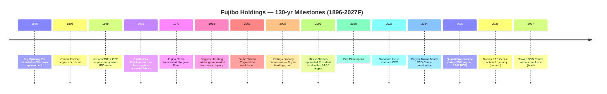
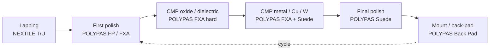

# Fujibo Holdings, Inc. (TSE:3104) — Company Research Report

*As of 2026-05-26 (NYC) — written in English; ticker = TSE:3104 = 富士紡ホールディングス株式会社 = Fuji Spinning Holdings, Inc.*

> **Update — FY3/2026 guidance raised twice this fiscal year (2025-10-31):** At the 1H release, management raised full-year FY3/2026 revenue guidance to **¥45.4 bn** (from the original ¥46.2 bn target announced 2025-05-15 — net of a slight cut on slower other-segment volumes, the topline guide was modestly trimmed) but lifted operating-profit guidance to **¥7.5 bn** (from ¥7.0 bn) and ordinary profit to **¥7.7 bn** (from ¥7.2 bn) on continuing strength of AI-driven CMP-pad demand. The dividend guide was raised to **¥160 / share** (from ¥150) — split ¥75 interim + ¥85 final. Source: [富士紡ホールディングス 2026年３月期第２四半期（中間期）決算短信, 2025-10-31](https://finance-frontend-pc-dist.west.edge.storage-yahoo.jp/disclosure/20251031/20251030582961.pdf).

## TABLE OF CONTENTS

1. Company Overview
2. Company History
3. Management Team
4. Products & Services
5. Customers & Go-to-Market
6. Industry Overview
7. Competitive Landscape
8. Market Opportunity (TAM)
9. Risk Assessment
10. References + Verification Log

---

## 1. Company Overview

Fujibo Holdings, Inc. (富士紡ホールディングス株式会社, TSE:3104) is a 130-year-old Japanese specialty-materials manufacturer that has reinvented itself, over the past two decades, from a textile spinner into one of the world's small handful of pure-play polishing-pad makers used in semiconductor chemical-mechanical-planarization (CMP) and adjacent ultra-precision-finishing markets. The group reports under four operating segments — **Polishing Pad (研磨材事業)**, **Industrial Chemicals (化学工業品事業)**, **Lifestyle Apparel (生活衣料事業)** and **Other** (auto-parts trading / plastic-injection moulding / metal moulds) — with the Polishing Pad segment now generating **¥19.3 bn of FY3/25 sales and ¥4.7 bn of operating profit (73% of group OP)** versus 35% of group sales, per the FY3/25 annual filing ([富士紡ホールディングス 第205期 有価証券報告書, 2025-06-25, p. 24](https://kitaishihon.s3.isk01.sakurastorage.jp/IrLibrary/3104_securities_2024_fgu7.pdf)).

The company makes its money by selling its **POLYPAS® ultra-high-precision polishing pads** — a polyurethane / non-woven family that is consumed step-by-step in the planarisation of silicon wafers, CMP after every conductor / dielectric layer in the front-end of an advanced-logic or memory fab, hard-disk substrate finishing and LCD-glass polishing. The product is a one-or-two-shift consumable: a single 200/300 mm advanced-logic line consumes hundreds of pads per month, conditioned by Kinik / 3M diamond discs and used with slurries from Entegris/CMC, Fujimi, Versum, Anji or Resonac ([Fujibo Polishing Pad Business overview](https://www.fujibo.co.jp/en/division/polishingpad/), [Fujibo POLYPAS product line](https://www.fujibo.co.jp/en/division/polishingpad/product/)). Customers buy POLYPAS direct (no distributor margin) under long-running master agreements with fab process-engineering teams, with on-site application-engineering co-development that creates real switching costs.

Geographically, Fujibo's footprint is **four plants in Japan** (Nyugawa in Ehime, Oita, Oyama in Shizuoka, Kozakai in Aichi) plus **one in Taiwan** (Tainan) operated by 台湾富士紡精密材料股份有限公司 (Taiwan Fujibo Precision Materials Co., Ltd.) — the highest manufacturing footprint of any specialised polishing-pad supplier on disclosure ([Fujibo Polishing Pad Business overview](https://www.fujibo.co.jp/en/division/polishingpad/)). A new **R&D centre in Miaoli, Taiwan (苗栗縣竹南鎮)** is under construction with ¥5.7 bn budgeted (¥1.15 bn already spent at FY-end), targeted for completion in April 2027 — supporting the company's stated strategy of putting its development engineers physically inside the Taiwan-Korea CMP customer cluster ([Yuho 2025, p. 34 — 重要な設備の新設等](https://kitaishihon.s3.isk01.sakurastorage.jp/IrLibrary/3104_securities_2024_fgu7.pdf)). The CEO has separately telegraphed a **fall-2026 functional opening**, ahead of formal completion ([Top Message, Fujibo IR](https://www.fujibo.co.jp/en/ir/message/)).

Group-level scale: **FY3/25 net sales ¥42.9 bn (+18.8% YoY), operating profit ¥6.5 bn (+129.8%), net income attributable to owners ¥4.5 bn (+111.4%), 1,319 employees**, of which 443 sit inside the polishing-pad business ([2025年３月期 決算短信, 2025-05-15, p. 1](https://finance-frontend-pc-dist.west.edge.storage-yahoo.jp/disclosure/20250515/20250513543721.pdf); [Yuho 2025, p. 11 — 従業員の状況](https://kitaishihon.s3.isk01.sakurastorage.jp/IrLibrary/3104_securities_2024_fgu7.pdf)). The balance sheet is heavily over-capitalised: **total assets ¥66.6 bn, net assets ¥47.5 bn, equity ratio 71.3%**, with interest-bearing debt only ¥0.47 bn — Fujibo runs the kind of conservative net-cash balance sheet typical of Japanese mid-cap industrials with multi-generation founding-family hangover. Generative-AI semiconductor demand (HBM memory + leading-edge logic) is the swing factor that turned FY3/25 into the second-best year in the company's history; FY3/26 is guided to revenues of ¥45.4 bn and operating profit of ¥7.5 bn after a 1H upward revision ([2026年３月期 第２四半期決算短信, 2025-10-31, p. 1](https://finance-frontend-pc-dist.west.edge.storage-yahoo.jp/disclosure/20251031/20251030582961.pdf)).

Source: [富士紡ホールディングス 第205期 有価証券報告書 + Integrated Report 2024 11-yr financial summary](https://www.fujibo.co.jp/en/wp/wp-content/uploads/fujibo_integrated_report_2024-en.pdf).

Source: [FY3/25 決算短信, p. 2-3 (segment results)](https://finance-frontend-pc-dist.west.edge.storage-yahoo.jp/disclosure/20250515/20250513543721.pdf).

### Valuation snapshot

The stock has more than doubled over the past 12 months: at ¥4,310 on 2026-05-22, market cap = **¥146.4 bn** (USD ~0.93 bn at ¥158/USD), implying **TTM P/E ≈ 8.7×** and **TTM P/S ≈ 3.2× on ¥45.9 bn TTM revenue** ([stockanalysis.com — Fujibo Holdings, 3104.T](https://stockanalysis.com/quote/tyo/3104/)). The 52-week range is ¥1,620 – ¥4,545 — a 2.8× spread driven primarily by the AI-CMP narrative re-rating that began in late 2024 ([Yahoo Finance, 3104.T](https://finance.yahoo.com/quote/3104.T/)). Over the past five fiscal years, the company's reported holding-company-level P/E (per the Yuho 五年間表) ranged 18× – 68×; the consolidated TTM number compresses lower because Fujibo Holdings the listco bookkeeps holding-company equity-method profits at parent level while the consolidated earnings are larger — i.e., the 67.7× in the FY3/24 line is parent-only, not the consolidated number used by Yahoo / Stockanalysis ([Yuho 2025, p. 3 — 提出会社の経営指標等](https://kitaishihon.s3.isk01.sakurastorage.jp/IrLibrary/3104_securities_2024_fgu7.pdf)).

For peer context, **JSR Corp (TSE:4185, the photoresist + CMP-slurry incumbent) trades around 22× TTM** post the JIC take-private overhang, **Entegris (NASDAQ:ENTG) around 30×, DuPont (NYSE:DD) around 16×, and Hubei Dinglong (SZSE:300054) around 96×** ([stockanalysis.com peer pages — JSR (4185.T), ENTG, DD, 300054](https://stockanalysis.com/quote/tyo/4185/)). Fujibo's ~8.7× TTM looks cheap on the screen, but three things compress the multiple relative to global pad peers: (1) only ~45% of group revenue is the CMP-pad business — the rest is mid-teens-margin chemical contracting + a structurally declining apparel franchise; (2) the float is small (mkt cap < $1 bn, daily liquidity tight) and TOPIX index re-rating only partial; (3) the ROE has been stuck in single digits (FY3/25 group ROE 9.8%, after years of 2.9–4.9% during the textile-restructuring phase) — see [Integrated Report 2024 p. 47 — 11 Yr Financial Summary](https://www.fujibo.co.jp/en/wp/wp-content/uploads/fujibo_integrated_report_2024-en.pdf). *Analyst view:* the discount is consistent with the conglomerate-discount + low-float pattern visible across small-mid-cap Japanese CMP / wafer-services names; the multiple compression risk is **upside**, not downside, if the AI-driven mix-shift to pad continues and apparel/other segments are eventually spun.

The dividend policy was put on a quantitative target in May 2025: **payout ratio 35% and minimum DOE of 3.5%** ([Top Message, Fujibo IR](https://www.fujibo.co.jp/en/ir/message/)), implying ¥160/share in FY3/26 (raised from ¥150 at 1H) — a forward yield of ~3.7% at current price ([FY3/26 1H 決算短信, 2025-10-31, p. 1 — 配当の状況](https://finance-frontend-pc-dist.west.edge.storage-yahoo.jp/disclosure/20251031/20251030582961.pdf)).

---

## 2. Company History

Fujibo's chronology breaks into four eras: textile founding (1896-1948), post-war diversification and listing (1949-1970s), polishing-pad market entry (1977-2005), and the holding-company-era pivot into a niche-No.1 specialty-materials business (2005-present). The defining transformation is the second-last one — a decade-and-a-half effort starting from 1998 to move the Nyugawa Plant in Ehime from rayon production into polyurethane / non-woven precision pad manufacturing — and the holding-company restructuring of September 2005 that severed the textile-era capital structure from the new growth business.

**Founding (1896):** *"In March 1896, Fuji Spinning Co., Ltd. was established with the aim of entering the spinning business, taking advantage of the abundant water from Mt. Fuji as a power source"* ([Integrated Report 2024, p. 5](https://www.fujibo.co.jp/en/wp/wp-content/uploads/fujibo_integrated_report_2024-en.pdf)). The first plant — the Oyama Factory in Sunto District, Shizuoka — opened in September 1898 ([Fujibo company history page](https://www.fujibo.co.jp/en/company/history/)). The Mt. Fuji water source gave the company its name (富士 = Fuji; 紡 = boō = spinning/cotton mill) and the Shizuoka site that remains a Fujibo Ehime polishing-pad facility today, more than 125 years later.

**Tokyo + Osaka listings (1949):** Fuji Spinning listed on both the Tokyo Stock Exchange and the Osaka Securities Exchange in May 1949 — the same wave of post-Occupation industrial-share IPOs that brought most of the surviving zaibatsu spinners onto the public boards ([Fujibo history page](https://www.fujibo.co.jp/en/company/history/)). The 1961 establishment of **Fujichemicloth Co., Ltd.** marked the first formal step out of pure spinning into laminated / coated industrial fabrics — the technology lineage that would eventually become the polishing-pad business.

**Polishing-pad market entry (1977 → 1998):** *"In 1977, Fujibo Ehime Co., Ltd. was established. As part of efforts to diversify business at the Nyugawa Plant, which handled rayon production, we cultivated the polishing pad market from 1998 based on our nonwoven fabric and film processing technologies"* ([Integrated Report 2024, p. 5](https://www.fujibo.co.jp/en/wp/wp-content/uploads/fujibo_integrated_report_2024-en.pdf)). This is the founding-document quote: rayon (a regenerated-cellulose fibre that depends on the same wet-chemistry skill set as polyurethane casting) cross-pollinated into polishing-pad fabrication. By the time Fujibo's first POLYPAS pads shipped, DuPont (then Rodel) had already established IC1000 as the global standard for CMP — Fujibo's strategy was to win the Japanese-domestic specialty-grade niche rather than chase IC1000 head-on.

**Holding-company conversion (2005-09):** *"Changed the company name to Fujibo Holdings, Inc. with the transition to a holding company system"* in September 2005 ([Fujibo history page](https://www.fujibo.co.jp/en/company/history/)). Note that the user prompt to this report cited "2016" — this was incorrect; the holdings reorganisation occurred in 2005, simultaneous with the appointment of Mitsuo Nakano as President. Nakano-shacho introduced the "*there is no business without profit*" mandate, downsized textile from 60.6% of FY2006 sales to 19.2% by FY2023, and built the polishing-pad-led portfolio into the niche-No.1 specialty franchise it is today ([Integrated Report 2024, p. 6](https://www.fujibo.co.jp/en/wp/wp-content/uploads/fujibo_integrated_report_2024-en.pdf)). The succession of Medium-Term Plans — *Henshin 06-10* (Transformation), *Toppa 11-13* (Breakthrough), *Maishin 14-16* (Advance), *Kasoku 17-20* (Acceleration), and the current *Zokyo 21-25* (Reinforcement) — chronicles the staged shift from a textile spinner to a specialty-materials house.

**Recent acquisitions (2012–2022):** The bolt-on M&A track has been intentionally small — none materially altering the polishing-pad core — but they expanded the Other segment into precision plastic moulds and injection-mould design: **Angle Miyuki Co., Ltd. (July 2012)** added a women's underwear brand for the apparel franchise; **Tokyo Molding Co., Ltd. (Oct 2018)**, **Fujioka Mold Co., Ltd. (Jan 2020)**, and **GFI Holdings, Inc. + IPM Co., Ltd. (Nov 2022)** brought in mould-design and plastic-injection capacity, partially targeting the second-pillar build-out into medical-device / digital-camera plastic injection ([Fujibo history page](https://www.fujibo.co.jp/en/company/history/)). The 2022 GFI / IPM combination is what shows up as the Other-segment OP loss in FY3/25 — the 2nd-pillar businesses are still in their investment phase.

**Recent strategic milestones (2020–2026):** The new **Oita Plant** came online in 2020 to give pad capacity geographic redundancy ([Integrated Report 2024, p. 18](https://www.fujibo.co.jp/en/wp/wp-content/uploads/fujibo_integrated_report_2024-en.pdf)). The Inoue succession to CEO in June 2022 marked the shift from the Nakano-era "*portfolio restructuring*" to growth-investment-and-ROIC mode. The May 2025 announcement of a quantitative dividend policy (payout 35%, minimum DOE 3.5%) and the May 2025 launch of a **¥500 mm buyback (150,000-share authorisation)** signaled the first formal capital-return programme of the Inoue era ([Yuho 2025, p. 39 — 自己株式の取得等の状況](https://kitaishihon.s3.isk01.sakurastorage.jp/IrLibrary/3104_securities_2024_fgu7.pdf)).

---

## 3. Management Team

Fujibo is a non-founder, professional-manager company in the modern era — the founding-family lineage from 1896 long since diluted out — so this chapter covers the current CEO only (there is no living founder), plus the predecessor CEO who architected the polishing-pad-led restructuring (since the user prompt explicitly asks for context on the 2005 holding-company reorganisation that he led).

### Masahide Inoue (井上 雅偉) — Representative Director and President (since June 2022)

Inoue-shacho is a 38-year Fujibo lifer who joined the parent in April 1987 and worked across all three operating segments — apparel, chemicals, and polishing pad — before being elevated to the CEO role in June 2022. His prior roles, in chronological order, were: General Manager of Functional Products Business Development (Aug 2015), then a textbook rotation as the appointed President of three group operating subsidiaries — **Fujibo Textile (Jan 2017), Fujibo Trading + Angle K.K. (Sep 2017), and Yanai Chemical Industry (May 2018)** — followed by General Manager of Functional Product Development inside the Future Product Development Unit (Apr 2019), Board Director (Jun 2020), and Representative Director / President (Jun 2022) ([Yuho 2025, p. 48 — 役員一覧](https://kitaishihon.s3.isk01.sakurastorage.jp/IrLibrary/3104_securities_2024_fgu7.pdf)). The three-subsidiary-President rotation is the conventional Japanese mid-cap promotion pathway: Inoue had effectively run each operating segment for at least a year before getting the holding-company helm. His direct shareholding is 13,313 shares — ~¥57 mm at current prices, ~10× annual base salary on the published comp table — modest by Western standards but high for a Japanese mid-cap salaryman-CEO ([Yuho 2025, p. 48](https://kitaishihon.s3.isk01.sakurastorage.jp/IrLibrary/3104_securities_2024_fgu7.pdf)).

Inoue's stated public agenda is to convert Fujibo from the Nakano-era cost-cutting-and-restructuring posture into a growth-investment company anchored to ROIC discipline. The May 2025 announcement of a quantitative dividend policy (payout 35%, DOE 3.5%) and the May 2025 buyback launch are the most visible imprint of the Inoue capital-policy era ([Top Message, Fujibo IR](https://www.fujibo.co.jp/en/ir/message/)). On the operating side, he has personally championed the Taiwan-side R&D investment cycle — the Miaoli centre is the largest single capex item Fujibo has committed in its history at ¥5.7 bn, and Inoue's first IR-conference appearances have repeatedly framed it as the make-or-break geography for advanced-node CMP-pad share-of-wallet ([Yuho 2025, p. 34 — 重要な設備の新設等](https://kitaishihon.s3.isk01.sakurastorage.jp/IrLibrary/3104_securities_2024_fgu7.pdf); [Fujibo Polishing Pad Business overview](https://www.fujibo.co.jp/en/division/polishingpad/)). Education and pre-Fujibo history are not disclosed in the Yuho ("当社入社" / "joined the company" being the earliest line item); this is typical of Japanese executive disclosure for career-lifers.

### Predecessor context: Mitsuo Nakano (中野 光雄) — President 2006–2022 (no longer an executive)

Although the company-research skill instructs the analyst to cover only the founder + current CEO, the historical-anchor exception is explicitly preserved (founder-equivalent role context). Nakano-shacho is the architect of the modern Fujibo. He was appointed President in 2006, the year after the 2005 holding-company conversion, and ran the company for sixteen years across four consecutive Medium-Term Management Plans (*Henshin 06-10 → Toppa 11-13 → Maishin 14-16 → Kasoku 17-20*), driving the strategic shift from a textile spinner — which was 60.6% of FY2006 sales — to a polishing-pad-led specialty materials house, where textile is now 19.2% of FY2023 sales ([Integrated Report 2024, p. 6](https://www.fujibo.co.jp/en/wp/wp-content/uploads/fujibo_integrated_report_2024-en.pdf)). His operating mantra — "*there is no business without profit*" — drove the shift from a sales-volume mindset to a cash-and-margin discipline, and the resulting ROE improvement (from ~5% to a peak ~15% during the 2017-2022 cycle) was the precondition for the 2020s AI-CMP re-rating. Nakano is no longer an executive — he handed the President role to Inoue at the June 2022 AGM and exited the board entirely the following year ([Integrated Report 2024, p. 6](https://www.fujibo.co.jp/en/wp/wp-content/uploads/fujibo_integrated_report_2024-en.pdf)).

The current board has nine directors, of which four are independent outside directors (44%, comfortably above TSE prime-market standards); Ms. Ruth Marie Jarman is the longest-serving outside director (June 2019) — an unusual non-Japanese voice on a 130-year-old Japanese mid-cap ([Yuho 2025, p. 41 — コーポレート・ガバナンスの状況等](https://kitaishihon.s3.isk01.sakurastorage.jp/IrLibrary/3104_securities_2024_fgu7.pdf)). Other inside-director context — CFO Tatsuya Sasaki (since 2023, ex-MUFG Research & Consulting), Yoshimi Mochizuki (Polishing Pad Business head, also President of Fujibo Ehime) — is intentionally omitted per the skill's "founder + current CEO only" guidance, except where the operating-business heads are explicitly cited in their business-line sections.

---

## 4. Products & Services

This is by a wide margin the most consequential section of the report. Fujibo's value to a portfolio is in one product family — **POLYPAS®** — split across five materially distinct sub-series sold into CMP-pad, silicon-wafer, hard-disk and LCD-glass polishing. Everything else (industrial chemicals, apparel, moulds) is either a feeder business that funded the pad reinvestment or a slow-melting legacy. The reader needs to leave §4 able to articulate which POLYPAS sub-series sits at which step in the customer's wafer-fab flow, why DuPont's IC1000 has not displaced Fujibo from Japanese / Taiwanese / Korean customer slots, and what the soft-vs-hard pad mix means for incremental margins as the AI-CMP cycle deepens.

### 4.1 — Fujibo's segment-level disclosure (Yuho verbatim)

Per the 第205期 Yuho (fiscal year ending March 2025), the polishing-pad business sits inside the "研磨材事業 (Abrasives Business)" segment, whose main product disclosure reads:

> "区分: 研磨材事業 — 主要製品等: 超精密加工用研磨材, 不織布, 合皮 — 製造: フジボウ愛媛㈱, 台湾富士紡精密材料股份有限公司"

That is — *"Segment: Abrasives Business. Main products: ultra-high-precision-processing abrasives, non-woven fabric, synthetic leather. Manufacturers: Fujibo Ehime Co., Ltd. and Taiwan Fujibo Precision Materials Co., Ltd."* The two "non-woven" and "synthetic leather" line items are largely the cushioning / backing materials sold into the same customers as full pads. Source: [Yuho 2025, p. 7 — 事業の内容](https://kitaishihon.s3.isk01.sakurastorage.jp/IrLibrary/3104_securities_2024_fgu7.pdf).

The Yuho's narrative of the FY3/25 segment performance — the canonical, verbatim source for §4 — reads:

> "ア．研磨材事業: 2023年前半に底を打った世界の半導体市場は、2024年に入り緩やかな回復が続いています。このような中、超精密加工用研磨材の半導体デバイス用途(ＣＭＰ)は、生成ＡＩの普及によるＨＢＭなどのメモリや最先端ロジック向け半導体の需要の増加とそれに伴う一部ユーザーの在庫水準の引き上げにより受注が増加しました。シリコンウエハー用途は、汎用品用途の需要は弱いものの、先端品用途の需要は堅調で一定水準の売上を確保しました。ハードディスク用途はデータセンター向けの需要が戻り、液晶ガラス用途では期後半からＴＶ需要の増加によってパネルの消費も加速しており、受注も回復しました。"

— i.e., *"the polishing-pad business saw orders increase in semiconductor-device CMP applications driven by HBM and leading-edge logic, along with some customer inventory restock; silicon-wafer demand was weak for commodity wafers but firm for advanced grades; hard-disk demand recovered on the back of data-centre orders; LCD-glass orders recovered from the second half on TV-panel restock."* The result: **segment net sales ¥19,307 mm (+43.9% YoY) and operating profit ¥4,729 mm (+334.8%)** ([Yuho 2025, p. 24 — 経営成績](https://kitaishihon.s3.isk01.sakurastorage.jp/IrLibrary/3104_securities_2024_fgu7.pdf)). The 24.5% segment operating margin in FY3/25 is the highest the company has ever reported on the polishing-pad business and reflects (a) the operating leverage of pulling utilisation up the cost curve at fixed capacity, and (b) the structural mix shift toward higher-priced soft pads for advanced-node CMP.

### 4.2 — Synthesis: how the product categories interact in the customer workflow

Every advanced-logic / memory / wafer-substrate customer of Fujibo runs the **same six-step ultra-precision-finishing loop** on every wafer: **lap → first polish → CMP layer 1 (oxide / dielectric) → CMP layer 2 (metal / Cu / W) → final polish → cleaning + back-pad mount**. Fujibo touches steps 2-6 with the POLYPAS family:

A typical 300 mm advanced-logic line will use four or five different POLYPAS pads in this loop, replaced every 8–24 hours of pad-life depending on the layer; Fujibo wins or loses each socket on the basis of (a) defect density (scratches per wafer), (b) wafer-to-wafer uniformity, and (c) the slope of removal-rate decay as pads age. This is why "solution-type contract model" (see §5) and on-site application-engineering presence in Taiwan / Korea matter more than headline product specs — the spec is qualified during a 6–12 month customer trial against the specific slurry / conditioner combination the customer uses.

### 4.3 — POLYPAS® (FP series): non-woven first-polish pads

> "Non-woven fabric type polishing pad developed for stock removal (first polishing). … Applications: Initial and final polishing of silicon and compound semiconductor wafers; optical-lens and glass-component finishing; processing of plastic lenses, stainless steel, and copper plates. Key properties: 'High flatness' and 'Low scratch' characteristics. Available in soft to hard variants for different material requirements." ([POLYPAS FP series product page](https://www.fujibo.co.jp/en/division/polishingpad/product/627/))

**中文释义 / Plain-language gloss:** The FP series is the "rough cut" of the polishing flow. Non-woven (不織布) means the polyurethane resin is impregnated into a felt-like cloth rather than cast as a closed-cell foam — this gives the pad a softer, more conformable surface that removes the largest mountains on the wafer (the "stock removal" step, 粗研磨) without leaving deep scratches. Each FP grade is tuned by changing the cloth's fibre density, the polyurethane impregnation level, and the foaming control of the felt — Fujibo can deliver dozens of micro-variants for the same product code. The FP pad's role in the customer workflow is to flatten a wafer that has just come off lapping (where ¥10 µm of as-cut variation is normal) down to ~1 µm flatness for the subsequent CMP steps to take over. Strategic significance: FP is the high-volume / lower-ASP layer of the POLYPAS franchise — incremental growth here tracks 200/300 mm wafer-starts, not advanced-node intensity.

*Analyst view:* FP-class pads are the most directly substitutable product family in the POLYPAS portfolio — Hubei Dinglong (鼎龙) sells a near-identical felt-based first-polish pad into mainland Chinese fabs at lower price, and Fujibo's qualified-supplier moat is shallower at this level. The differentiation premium is in the FXA / Suede sub-series, not FP. Moat type for FP = scale + qualified-supplier inertia; competitive verdict = partial.

### 4.4 — POLYPAS® (FXA series): non-filler hard urethane pads — the CMP workhorse

> "A non-filler type hard urethane pad designed for diverse polishing applications. This pad demonstrates superior performance characteristics, including resistance to temperature-related hardness variations and uniform foam structure. … Constructed from hard urethane without fillers. Notable properties include: 'High flatness' and minimal scratch production, temperature-stable hardness performance, independent uniform foam composition. Applications: semiconductor wafer polishing (first and final stages), LCD glass substrate finishing, optical lens and material polishing." ([POLYPAS FXA series product page](https://www.fujibo.co.jp/en/division/polishingpad/product/1143/))

**中文释义 / Plain-language gloss:** FXA is the head-to-head competitor to DuPont's IC1000 — both are closed-cell, hard polyurethane (硬质聚氨酯) cast pads with engineered pore structures for **chemical-mechanical planarisation (CMP, 化学机械抛光)** at the device front-end. "Non-filler" (无填料) means the polyurethane foam is the active polishing medium itself — abrasive grit is delivered via the slurry, not embedded in the pad — which is the modern standard for advanced-node CMP because pad-embedded abrasive causes defect counts that GAA / sub-3 nm logic cannot tolerate. "Temperature-stable hardness" is the analogue of IC1000's claim to flat removal-rate from start to end of pad life: in CMP, friction heats the pad surface to 50-80°C and softer pads droop, producing wafer-edge over-polish. The "uniform foam composition" claim points at the pore-size distribution that Fujibo controls via its proprietary casting process — this is the differentiation lever vs IC1000 for **wafer-to-wafer uniformity (WIWNU, within-wafer non-uniformity, 片内不均匀性)** when polishing **inter-metal dielectric (IMD, 层间介质)** or **shallow-trench isolation (STI, 浅沟槽隔离)** at the 5-nm / 3-nm node.

The strategic significance is acute. The "trend of semiconductor miniaturization and layering" — Fujibo's exact corporate phrasing ([Top Message, Fujibo IR](https://www.fujibo.co.jp/en/ir/message/)) — means **more CMP steps per wafer at every node transition**: 28-nm logic uses ~10 CMP steps, 5-nm logic uses ~15-18, 3-nm and beyond uses 20+. Each step is a hard-pad consumable. HBM (High Bandwidth Memory, 高带宽内存) for AI accelerators adds another CMP-intensive consumer because every HBM die stack uses through-silicon vias (TSVs, 硅通孔) that need an additional Cu CMP step per layer. Fujibo's FXA family is the product that captures this step-growth — and the company has been explicit that capacity expansion (Nyugawa + Oita + a new Taiwan-side line) is targeted at hard-pad sales specifically ([Yuho 2025, p. 14 — 優先的に対処すべき事業上及び財務上の課題](https://kitaishihon.s3.isk01.sakurastorage.jp/IrLibrary/3104_securities_2024_fgu7.pdf)).

*Analyst view:* FXA-class hard pads are where Fujibo plays competitively against DuPont's IC1000™ and Hubei Dinglong's DL-720 series. DuPont retains the de-facto-standard label for IC1000 — *"the IC1000™ Series is a CMP industry standard that is now being used in a wide range of CMP applications"* ([NITTA DuPont — IC1000 product page](https://www.nittadupont.co.jp/en/category-products/pad)); Dinglong only crossed the 28/14 nm qualification line at SMIC in late 2024 with the DL-720 series ([Hubei Dinglong CMP localisation report, 2025](https://www.openpr.com/news/4253861/semiconductor-cmp-polishing-pad-latest-market-report-2025)). Fujibo's FXA wins specialty grades in the JP / TW / KR customer base where the customer wants a non-IC1000 second-source for line yield or contract-pricing leverage. Moat type for FXA = process IP + qualified-supplier inertia + Japanese-customer preference; verdict = partial competitive advantage (yes vs Dinglong / 3M / SKC; partial vs IC1000).

### 4.5 — POLYPAS® (FX series): filler-impregnated pads for glass + non-CMP

> "Engineered with built-in filler technology. It combines characteristics from the FXA series while adding self-abrasive properties unique to the built-in filler type. This product line offers extensive customization in hardness, density, abrasive grain types, and grain size distribution. … Applications: glass substrate polishing for displays and photomasks; optical lens and glass component finishing; plastic lenses, stainless steel, and copper plate polishing; panel cleaning operations." ([POLYPAS FX series product page](https://www.fujibo.co.jp/en/division/polishingpad/product/1282/))

**中文释义 / Plain-language gloss:** FX is the same hard-urethane foam as FXA, but with abrasive grains baked into the pad itself — "built-in filler" (内装填料). This makes FX a "self-abrasive" pad: it doesn't need an abrasive slurry to do useful work, just a chemistry-only slurry or water. The trade-off is the FX pad must be discarded faster (the grain inventory inside the pad burns out) but the customer saves on slurry cost. The target use cases are largely **non-semiconductor**: LCD-glass substrate polish, photomask blank polish, optical-lens finish — applications where the wafer / substrate is value-dense but the polishing step doesn't have the defect-density requirements of front-end CMP. FX has therefore been the swing-factor in the LCD recovery the Yuho commentary keeps citing ("液晶ガラス用途では中国の補助金政策によりパネル需要が好調に推移" — *"LCD glass demand was strong thanks to Chinese subsidy policy"* — [FY3/26 1H 決算短信, p. 2](https://finance-frontend-pc-dist.west.edge.storage-yahoo.jp/disclosure/20251031/20251030582961.pdf)).

*Analyst view:* FX is the most defensible POLYPAS sub-series in volume terms because the LCD-glass and photomask supply chains are dominated by Japanese (AGC, Nippon Electric Glass, Hoya) and Korean (Corning Korea) customers who have decades-old relationships with Fujibo. Moat = customer-relationship + qualified-supplier inertia; verdict = yes.

### 4.6 — POLYPAS® (Suede series): final-finishing pads

> "A polishing pad engineered for final finishing of semiconductor wafers and hard disks. The product addresses growing industry demands for 'high precision and flatness of the finished surface' while emphasizing the importance of the pad's own uniformity. … 'Scratch-free' performance, 'Chemical-resistant and abrasion-resistant' properties." ([POLYPAS Suede series product page](https://www.fujibo.co.jp/en/division/polishingpad/product/1283/))

**中文释义 / Plain-language gloss:** Suede (麂皮 / 仿麂皮) refers to a soft polyurethane top layer with a porous, suede-like microstructure that creates very gentle abrasive contact — the **soft pad** half of the CMP cookbook. In a typical CMP module, the hard pad (FXA) does the bulk material removal at the start of each polishing step, and the soft pad (Suede) does the **finishing pass** for the last few hundred angstroms — the step that determines defect count and surface roughness. Fujibo has explicitly said it has "**captured the top market share in the mainstay field of advanced-process soft pads**" — *"we have captured the top market share in the mainstay field of advanced process soft pads based on our high reputation among customers earned through our high-performance, high-quality products and provision of flexible solutions that meet the different performance requirements of each customer"* ([Integrated Report 2024, p. 18](https://www.fujibo.co.jp/en/wp/wp-content/uploads/fujibo_integrated_report_2024-en.pdf)). This is the single most important sentence in the entire Integrated Report — it is the company's claim of a defensible niche-No. 1 position in **soft pads for advanced-node CMP**, the segment that grows fastest as nodes shrink.

The Suede family is also used for **silicon-wafer final polishing** (the last polish on a bare-silicon wafer before it ships to the fab) — and for **hard-disk substrate final polish**, the application that drove Fujibo's data-centre-driven HDD-segment recovery in FY3/25.

*Analyst view:* Suede is the strongest competitive-advantage product in the POLYPAS portfolio — Fujibo's claimed leadership position in advanced-process soft pads is one of the few share-leadership claims in any pad-supplier filing globally, and it is the most defensible product against incremental Chinese-substitution risk because it is the layer where defect-density tolerance is tightest. Moat = process IP + on-site application engineering + qualified-supplier inertia; verdict = yes (the strongest of the POLYPAS family).

### 4.7 — POLYPAS® (Back Pad series): wafer-retention pads

> "Developed to retain semiconductor silicon wafers and LCD glass substrates without wax. Users can choose mounting pads tailored to their polishing needs for optimal flatness. The product line includes insert types (frameless) and template types (framed)." ([POLYPAS Back Pad series product page](https://www.fujibo.co.jp/en/division/polishingpad/product/1284/))

**中文释义 / Plain-language gloss:** Back pads are the **wax-free wafer-carrier mounting pads** that hold the wafer face-down against the polishing head during CMP. Pre-back-pad designs used wax to glue the wafer to the carrier, which required messy cleaning after polishing and introduced wax-residue defect modes. The wax-free back pad is now the global standard — Fujibo's role here is to supply a high-flatness, wafer-non-marring back-pad that the customer changes out at a slower cadence than the polishing pad itself.

*Analyst view:* Back pads are a quieter franchise — high margin, low-growth, sticky customer base — and act as a "tail" annuity inside the POLYPAS bundle. They rarely show up in any market-share analysis because the dollar volume is small relative to top-side pads, but they're part of why Fujibo wins multi-product CMP-consumable deals against single-product competitors. Moat = bundle + qualified-supplier inertia; verdict = partial.

### 4.8 — NEXTILE® lapping pads (adjacency)

NEXTILE T and U series are **lapping pads** rather than CMP polishing pads — they sit at the earliest, coarsest step in the wafer / glass finishing flow ([NEXTILE product page, Fujibo](https://www.fujibo.co.jp/en/division/polishingpad/product/)). They are technologically adjacent to the POLYPAS family (same polyurethane chemistry, different fibre structure) and serve the same customers, but at lower margin and lower revenue mix. They're listed for completeness; they are not the franchise.

### 4.9 — The other three operating segments (brief)

- **Industrial Chemicals (化学工業品事業)** — Yanai Chemical Industry's contract-manufacturing business: fine-chemical intermediates for pharma, agrochem, electronic materials and functional chemicals for the big Japanese chemical players. FY3/25 sales ¥13.5 bn (+7.6%), operating profit ¥1.2 bn (+37.0%). The Yanai Headquarters Plant + Takefu Plant run at high utilisation; a fifth plant comes on stream in April 2026 (¥6.2 bn invested, of which ¥1.2 bn already spent). Customer concentration is high — **top-2 customers (Sumitomo Shoji Chemical 19.2% of consolidated sales, Mitsui Chemicals 13.7%)** sit inside this business ([Yuho 2025, p. 27 — 販売実績](https://kitaishihon.s3.isk01.sakurastorage.jp/IrLibrary/3104_securities_2024_fgu7.pdf)).
- **Lifestyle Apparel (生活衣料事業)** — Body Wild brand men's underwear + Angle women's underwear + Asamerry / Airmerry high-end lines. FY3/25 sales ¥7.0 bn (flat), operating profit ¥0.6 bn (−25.0%). This is the heritage textile business; Inoue's predecessor cut it from 60% of sales (FY3/06) to ~16% (FY3/25). It is structurally declining in domestic sales but holding up overseas thanks to Japan-brand cachet ([Yuho 2025, p. 25 — 生活衣料事業](https://kitaishihon.s3.isk01.sakurastorage.jp/IrLibrary/3104_securities_2024_fgu7.pdf)).
- **Other (Chemical Products / Auto-parts / Moulds)** — FY3/25 sales ¥3.2 bn (−1.8%), operating loss ¥57 mm vs ¥59 mm profit prior year. Inoue is positioning the "Chemical Products" piece (precision plastic injection for medical devices + digital cameras) as the **fourth pillar** to follow polishing pads / industrial chemicals / apparel, but the GFI / IPM 2022 acquisition is still in investment mode ([Yuho 2025, p. 25 — その他](https://kitaishihon.s3.isk01.sakurastorage.jp/IrLibrary/3104_securities_2024_fgu7.pdf)).

### 4.10 — Roadmap and recent launches (last 12 months)

The two largest stated investment programmes are (a) the **Nyugawa Plant technology development annex** completed in 2024 and now driving FY3/25 pad mix-up, and (b) the **Miaoli Taiwan R&D Centre** at ¥5.7 bn — Fujibo's first overseas R&D centre and explicitly framed as a Taiwan-customer co-development hub for TSMC-cluster advanced-node CMP qualification ([Yuho 2025, p. 34 — 重要な設備の新設等](https://kitaishihon.s3.isk01.sakurastorage.jp/IrLibrary/3104_securities_2024_fgu7.pdf); [Top Message, Fujibo IR](https://www.fujibo.co.jp/en/ir/message/)). There is no individual new-product press release at SKU level — POLYPAS is a continuous-improvement product family, not a discrete-launch business.

Source: [Integrated Report 2024 — 11 Years Financial Summary, p. 47 + Yuho 2025 p. 32](https://www.fujibo.co.jp/en/wp/wp-content/uploads/fujibo_integrated_report_2024-en.pdf).

---
