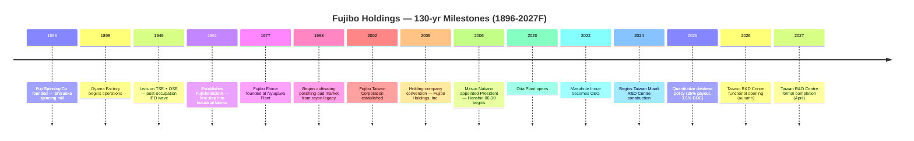

# Fujibo Holdings, Inc. (TSE:3104) — Company Research Report

*As of 2026-05-26 (NYC) — written in English; ticker = TSE:3104 = 富士紡ホールディングス株式会社 = Fuji Spinning Holdings, Inc.*

> **Update — FY3/2026 guidance raised twice this fiscal year (2025-10-31):** At the 1H release, management raised full-year FY3/2026 revenue guidance to **¥45.4 bn** (from the original ¥46.2 bn target announced 2025-05-15 — net of a slight cut on slower other-segment volumes, the topline guide was modestly trimmed) but lifted operating-profit guidance to **¥7.5 bn** (from ¥7.0 bn) and ordinary profit to **¥7.7 bn** (from ¥7.2 bn) on continuing strength of AI-driven CMP-pad demand. The dividend guide was raised to **¥160 / share** (from ¥150) — split ¥75 interim + ¥85 final. Source: [富士紡ホールディングス 2026年３月期第２四半期（中間期）決算短信, 2025-10-31](https://finance-frontend-pc-dist.west.edge.storage-yahoo.jp/disclosure/20251031/20251030582961.pdf).

## TABLE OF CONTENTS

1. Company Overview
2. Company History
3. Management Team
4. Products & Services
5. Customers & Go-to-Market
6. Industry Overview
7. Competitive Landscape
8. Market Opportunity (TAM)
9. Risk Assessment
10. References + Verification Log

---

## 1. Company Overview

Fujibo Holdings, Inc. (富士紡ホールディングス株式会社, TSE:3104) is a 130-year-old Japanese specialty-materials manufacturer that has reinvented itself, over the past two decades, from a textile spinner into one of the world's small handful of pure-play polishing-pad makers used in semiconductor chemical-mechanical-planarization (CMP) and adjacent ultra-precision-finishing markets. The group reports under four operating segments — **Polishing Pad (研磨材事業)**, **Industrial Chemicals (化学工業品事業)**, **Lifestyle Apparel (生活衣料事業)** and **Other** (auto-parts trading / plastic-injection moulding / metal moulds) — with the Polishing Pad segment now generating **¥19.3 bn of FY3/25 sales and ¥4.7 bn of operating profit (73% of group OP)** versus 35% of group sales, per the FY3/25 annual filing ([富士紡ホールディングス 第205期 有価証券報告書, 2025-06-25, p. 24](https://kitaishihon.s3.isk01.sakurastorage.jp/IrLibrary/3104_securities_2024_fgu7.pdf)).

The company makes its money by selling its **POLYPAS® ultra-high-precision polishing pads** — a polyurethane / non-woven family that is consumed step-by-step in the planarisation of silicon wafers, CMP after every conductor / dielectric layer in the front-end of an advanced-logic or memory fab, hard-disk substrate finishing and LCD-glass polishing. The product is a one-or-two-shift consumable: a single 200/300 mm advanced-logic line consumes hundreds of pads per month, conditioned by Kinik / 3M diamond discs and used with slurries from Entegris/CMC, Fujimi, Versum, Anji or Resonac ([Fujibo Polishing Pad Business overview](https://www.fujibo.co.jp/en/division/polishingpad/), [Fujibo POLYPAS product line](https://www.fujibo.co.jp/en/division/polishingpad/product/)). Customers buy POLYPAS direct (no distributor margin) under long-running master agreements with fab process-engineering teams, with on-site application-engineering co-development that creates real switching costs.

Geographically, Fujibo's footprint is **four plants in Japan** (Nyugawa in Ehime, Oita, Oyama in Shizuoka, Kozakai in Aichi) plus **one in Taiwan** (Tainan) operated by 台湾富士紡精密材料股份有限公司 (Taiwan Fujibo Precision Materials Co., Ltd.) — the highest manufacturing footprint of any specialised polishing-pad supplier on disclosure ([Fujibo Polishing Pad Business overview](https://www.fujibo.co.jp/en/division/polishingpad/)). A new **R&D centre in Miaoli, Taiwan (苗栗縣竹南鎮)** is under construction with ¥5.7 bn budgeted (¥1.15 bn already spent at FY-end), targeted for completion in April 2027 — supporting the company's stated strategy of putting its development engineers physically inside the Taiwan-Korea CMP customer cluster ([Yuho 2025, p. 34 — 重要な設備の新設等](https://kitaishihon.s3.isk01.sakurastorage.jp/IrLibrary/3104_securities_2024_fgu7.pdf)). The CEO has separately telegraphed a **fall-2026 functional opening**, ahead of formal completion ([Top Message, Fujibo IR](https://www.fujibo.co.jp/en/ir/message/)).

Group-level scale: **FY3/25 net sales ¥42.9 bn (+18.8% YoY), operating profit ¥6.5 bn (+129.8%), net income attributable to owners ¥4.5 bn (+111.4%), 1,319 employees**, of which 443 sit inside the polishing-pad business ([2025年３月期 決算短信, 2025-05-15, p. 1](https://finance-frontend-pc-dist.west.edge.storage-yahoo.jp/disclosure/20250515/20250513543721.pdf); [Yuho 2025, p. 11 — 従業員の状況](https://kitaishihon.s3.isk01.sakurastorage.jp/IrLibrary/3104_securities_2024_fgu7.pdf)). The balance sheet is heavily over-capitalised: **total assets ¥66.6 bn, net assets ¥47.5 bn, equity ratio 71.3%**, with interest-bearing debt only ¥0.47 bn — Fujibo runs the kind of conservative net-cash balance sheet typical of Japanese mid-cap industrials with multi-generation founding-family hangover. Generative-AI semiconductor demand (HBM memory + leading-edge logic) is the swing factor that turned FY3/25 into the second-best year in the company's history; FY3/26 is guided to revenues of ¥45.4 bn and operating profit of ¥7.5 bn after a 1H upward revision ([2026年３月期 第２四半期決算短信, 2025-10-31, p. 1](https://finance-frontend-pc-dist.west.edge.storage-yahoo.jp/disclosure/20251031/20251030582961.pdf)).

Source: [富士紡ホールディングス 第205期 有価証券報告書 + Integrated Report 2024 11-yr financial summary](https://www.fujibo.co.jp/en/wp/wp-content/uploads/fujibo_integrated_report_2024-en.pdf).

Source: [FY3/25 決算短信, p. 2-3 (segment results)](https://finance-frontend-pc-dist.west.edge.storage-yahoo.jp/disclosure/20250515/20250513543721.pdf).

### Valuation snapshot

The stock has more than doubled over the past 12 months: at ¥4,310 on 2026-05-22, market cap = **¥146.4 bn** (USD ~0.93 bn at ¥158/USD), implying **TTM P/E ≈ 8.7×** and **TTM P/S ≈ 3.2× on ¥45.9 bn TTM revenue** ([stockanalysis.com — Fujibo Holdings, 3104.T](https://stockanalysis.com/quote/tyo/3104/)). The 52-week range is ¥1,620 – ¥4,545 — a 2.8× spread driven primarily by the AI-CMP narrative re-rating that began in late 2024 ([Yahoo Finance, 3104.T](https://finance.yahoo.com/quote/3104.T/)). Over the past five fiscal years, the company's reported holding-company-level P/E (per the Yuho 五年間表) ranged 18× – 68×; the consolidated TTM number compresses lower because Fujibo Holdings the listco bookkeeps holding-company equity-method profits at parent level while the consolidated earnings are larger — i.e., the 67.7× in the FY3/24 line is parent-only, not the consolidated number used by Yahoo / Stockanalysis ([Yuho 2025, p. 3 — 提出会社の経営指標等](https://kitaishihon.s3.isk01.sakurastorage.jp/IrLibrary/3104_securities_2024_fgu7.pdf)).

For peer context, **JSR Corp (TSE:4185, the photoresist + CMP-slurry incumbent) trades around 22× TTM** post the JIC take-private overhang, **Entegris (NASDAQ:ENTG) around 30×, DuPont (NYSE:DD) around 16×, and Hubei Dinglong (SZSE:300054) around 96×** ([stockanalysis.com peer pages — JSR (4185.T), ENTG, DD, 300054](https://stockanalysis.com/quote/tyo/4185/)). Fujibo's ~8.7× TTM looks cheap on the screen, but three things compress the multiple relative to global pad peers: (1) only ~45% of group revenue is the CMP-pad business — the rest is mid-teens-margin chemical contracting + a structurally declining apparel franchise; (2) the float is small (mkt cap < $1 bn, daily liquidity tight) and TOPIX index re-rating only partial; (3) the ROE has been stuck in single digits (FY3/25 group ROE 9.8%, after years of 2.9–4.9% during the textile-restructuring phase) — see [Integrated Report 2024 p. 47 — 11 Yr Financial Summary](https://www.fujibo.co.jp/en/wp/wp-content/uploads/fujibo_integrated_report_2024-en.pdf). *Analyst view:* the discount is consistent with the conglomerate-discount + low-float pattern visible across small-mid-cap Japanese CMP / wafer-services names; the multiple compression risk is **upside**, not downside, if the AI-driven mix-shift to pad continues and apparel/other segments are eventually spun.

The dividend policy was put on a quantitative target in May 2025: **payout ratio 35% and minimum DOE of 3.5%** ([Top Message, Fujibo IR](https://www.fujibo.co.jp/en/ir/message/)), implying ¥160/share in FY3/26 (raised from ¥150 at 1H) — a forward yield of ~3.7% at current price ([FY3/26 1H 決算短信, 2025-10-31, p. 1 — 配当の状況](https://finance-frontend-pc-dist.west.edge.storage-yahoo.jp/disclosure/20251031/20251030582961.pdf)).

---

## 2. Company History

Fujibo's chronology breaks into four eras: textile founding (1896-1948), post-war diversification and listing (1949-1970s), polishing-pad market entry (1977-2005), and the holding-company-era pivot into a niche-No.1 specialty-materials business (2005-present). The defining transformation is the second-last one — a decade-and-a-half effort starting from 1998 to move the Nyugawa Plant in Ehime from rayon production into polyurethane / non-woven precision pad manufacturing — and the holding-company restructuring of September 2005 that severed the textile-era capital structure from the new growth business.

**Founding (1896):** *"In March 1896, Fuji Spinning Co., Ltd. was established with the aim of entering the spinning business, taking advantage of the abundant water from Mt. Fuji as a power source"* ([Integrated Report 2024, p. 5](https://www.fujibo.co.jp/en/wp/wp-content/uploads/fujibo_integrated_report_2024-en.pdf)). The first plant — the Oyama Factory in Sunto District, Shizuoka — opened in September 1898 ([Fujibo company history page](https://www.fujibo.co.jp/en/company/history/)). The Mt. Fuji water source gave the company its name (富士 = Fuji; 紡 = boō = spinning/cotton mill) and the Shizuoka site that remains a Fujibo Ehime polishing-pad facility today, more than 125 years later.

**Tokyo + Osaka listings (1949):** Fuji Spinning listed on both the Tokyo Stock Exchange and the Osaka Securities Exchange in May 1949 — the same wave of post-Occupation industrial-share IPOs that brought most of the surviving zaibatsu spinners onto the public boards ([Fujibo history page](https://www.fujibo.co.jp/en/company/history/)). The 1961 establishment of **Fujichemicloth Co., Ltd.** marked the first formal step out of pure spinning into laminated / coated industrial fabrics — the technology lineage that would eventually become the polishing-pad business.

**Polishing-pad market entry (1977 → 1998):** *"In 1977, Fujibo Ehime Co., Ltd. was established. As part of efforts to diversify business at the Nyugawa Plant, which handled rayon production, we cultivated the polishing pad market from 1998 based on our nonwoven fabric and film processing technologies"* ([Integrated Report 2024, p. 5](https://www.fujibo.co.jp/en/wp/wp-content/uploads/fujibo_integrated_report_2024-en.pdf)). This is the founding-document quote: rayon (a regenerated-cellulose fibre that depends on the same wet-chemistry skill set as polyurethane casting) cross-pollinated into polishing-pad fabrication. By the time Fujibo's first POLYPAS pads shipped, DuPont (then Rodel) had already established IC1000 as the global standard for CMP — Fujibo's strategy was to win the Japanese-domestic specialty-grade niche rather than chase IC1000 head-on.

**Holding-company conversion (2005-09):** *"Changed the company name to Fujibo Holdings, Inc. with the transition to a holding company system"* in September 2005 ([Fujibo history page](https://www.fujibo.co.jp/en/company/history/)). Note that the user prompt to this report cited "2016" — this was incorrect; the holdings reorganisation occurred in 2005, simultaneous with the appointment of Mitsuo Nakano as President. Nakano-shacho introduced the "*there is no business without profit*" mandate, downsized textile from 60.6% of FY2006 sales to 19.2% by FY2023, and built the polishing-pad-led portfolio into the niche-No.1 specialty franchise it is today ([Integrated Report 2024, p. 6](https://www.fujibo.co.jp/en/wp/wp-content/uploads/fujibo_integrated_report_2024-en.pdf)). The succession of Medium-Term Plans — *Henshin 06-10* (Transformation), *Toppa 11-13* (Breakthrough), *Maishin 14-16* (Advance), *Kasoku 17-20* (Acceleration), and the current *Zokyo 21-25* (Reinforcement) — chronicles the staged shift from a textile spinner to a specialty-materials house.

**Recent acquisitions (2012–2022):** The bolt-on M&A track has been intentionally small — none materially altering the polishing-pad core — but they expanded the Other segment into precision plastic moulds and injection-mould design: **Angle Miyuki Co., Ltd. (July 2012)** added a women's underwear brand for the apparel franchise; **Tokyo Molding Co., Ltd. (Oct 2018)**, **Fujioka Mold Co., Ltd. (Jan 2020)**, and **GFI Holdings, Inc. + IPM Co., Ltd. (Nov 2022)** brought in mould-design and plastic-injection capacity, partially targeting the second-pillar build-out into medical-device / digital-camera plastic injection ([Fujibo history page](https://www.fujibo.co.jp/en/company/history/)). The 2022 GFI / IPM combination is what shows up as the Other-segment OP loss in FY3/25 — the 2nd-pillar businesses are still in their investment phase.

**Recent strategic milestones (2020–2026):** The new **Oita Plant** came online in 2020 to give pad capacity geographic redundancy ([Integrated Report 2024, p. 18](https://www.fujibo.co.jp/en/wp/wp-content/uploads/fujibo_integrated_report_2024-en.pdf)). The Inoue succession to CEO in June 2022 marked the shift from the Nakano-era "*portfolio restructuring*" to growth-investment-and-ROIC mode. The May 2025 announcement of a quantitative dividend policy (payout 35%, minimum DOE 3.5%) and the May 2025 launch of a **¥500 mm buyback (150,000-share authorisation)** signaled the first formal capital-return programme of the Inoue era ([Yuho 2025, p. 39 — 自己株式の取得等の状況](https://kitaishihon.s3.isk01.sakurastorage.jp/IrLibrary/3104_securities_2024_fgu7.pdf)).

---

## 3. Management Team

Fujibo is a non-founder, professional-manager company in the modern era — the founding-family lineage from 1896 long since diluted out — so this chapter covers the current CEO only (there is no living founder), plus the predecessor CEO who architected the polishing-pad-led restructuring (since the user prompt explicitly asks for context on the 2005 holding-company reorganisation that he led).

### Masahide Inoue (井上 雅偉) — Representative Director and President (since June 2022)

Inoue-shacho is a 38-year Fujibo lifer who joined the parent in April 1987 and worked across all three operating segments — apparel, chemicals, and polishing pad — before being elevated to the CEO role in June 2022. His prior roles, in chronological order, were: General Manager of Functional Products Business Development (Aug 2015), then a textbook rotation as the appointed President of three group operating subsidiaries — **Fujibo Textile (Jan 2017), Fujibo Trading + Angle K.K. (Sep 2017), and Yanai Chemical Industry (May 2018)** — followed by General Manager of Functional Product Development inside the Future Product Development Unit (Apr 2019), Board Director (Jun 2020), and Representative Director / President (Jun 2022) ([Yuho 2025, p. 48 — 役員一覧](https://kitaishihon.s3.isk01.sakurastorage.jp/IrLibrary/3104_securities_2024_fgu7.pdf)). The three-subsidiary-President rotation is the conventional Japanese mid-cap promotion pathway: Inoue had effectively run each operating segment for at least a year before getting the holding-company helm. His direct shareholding is 13,313 shares — ~¥57 mm at current prices, ~10× annual base salary on the published comp table — modest by Western standards but high for a Japanese mid-cap salaryman-CEO ([Yuho 2025, p. 48](https://kitaishihon.s3.isk01.sakurastorage.jp/IrLibrary/3104_securities_2024_fgu7.pdf)).

Inoue's stated public agenda is to convert Fujibo from the Nakano-era cost-cutting-and-restructuring posture into a growth-investment company anchored to ROIC discipline. The May 2025 announcement of a quantitative dividend policy (payout 35%, DOE 3.5%) and the May 2025 buyback launch are the most visible imprint of the Inoue capital-policy era ([Top Message, Fujibo IR](https://www.fujibo.co.jp/en/ir/message/)). On the operating side, he has personally championed the Taiwan-side R&D investment cycle — the Miaoli centre is the largest single capex item Fujibo has committed in its history at ¥5.7 bn, and Inoue's first IR-conference appearances have repeatedly framed it as the make-or-break geography for advanced-node CMP-pad share-of-wallet ([Yuho 2025, p. 34 — 重要な設備の新設等](https://kitaishihon.s3.isk01.sakurastorage.jp/IrLibrary/3104_securities_2024_fgu7.pdf); [Fujibo Polishing Pad Business overview](https://www.fujibo.co.jp/en/division/polishingpad/)). Education and pre-Fujibo history are not disclosed in the Yuho ("当社入社" / "joined the company" being the earliest line item); this is typical of Japanese executive disclosure for career-lifers.

### Predecessor context: Mitsuo Nakano (中野 光雄) — President 2006–2022 (no longer an executive)

Although the company-research skill instructs the analyst to cover only the founder + current CEO, the historical-anchor exception is explicitly preserved (founder-equivalent role context). Nakano-shacho is the architect of the modern Fujibo. He was appointed President in 2006, the year after the 2005 holding-company conversion, and ran the company for sixteen years across four consecutive Medium-Term Management Plans (*Henshin 06-10 → Toppa 11-13 → Maishin 14-16 → Kasoku 17-20*), driving the strategic shift from a textile spinner — which was 60.6% of FY2006 sales — to a polishing-pad-led specialty materials house, where textile is now 19.2% of FY2023 sales ([Integrated Report 2024, p. 6](https://www.fujibo.co.jp/en/wp/wp-content/uploads/fujibo_integrated_report_2024-en.pdf)). His operating mantra — "*there is no business without profit*" — drove the shift from a sales-volume mindset to a cash-and-margin discipline, and the resulting ROE improvement (from ~5% to a peak ~15% during the 2017-2022 cycle) was the precondition for the 2020s AI-CMP re-rating. Nakano is no longer an executive — he handed the President role to Inoue at the June 2022 AGM and exited the board entirely the following year ([Integrated Report 2024, p. 6](https://www.fujibo.co.jp/en/wp/wp-content/uploads/fujibo_integrated_report_2024-en.pdf)).

The current board has nine directors, of which four are independent outside directors (44%, comfortably above TSE prime-market standards); Ms. Ruth Marie Jarman is the longest-serving outside director (June 2019) — an unusual non-Japanese voice on a 130-year-old Japanese mid-cap ([Yuho 2025, p. 41 — コーポレート・ガバナンスの状況等](https://kitaishihon.s3.isk01.sakurastorage.jp/IrLibrary/3104_securities_2024_fgu7.pdf)). Other inside-director context — CFO Tatsuya Sasaki (since 2023, ex-MUFG Research & Consulting), Yoshimi Mochizuki (Polishing Pad Business head, also President of Fujibo Ehime) — is intentionally omitted per the skill's "founder + current CEO only" guidance, except where the operating-business heads are explicitly cited in their business-line sections.

---
