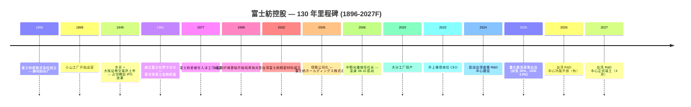

# 富士紡控股 / Fujibo Holdings, Inc. (TSE:3104) — 公司研究报告

*截至 2026-05-26 (纽约) — 中文版；股票代码 = TSE:3104 = 富士紡ホールディングス株式会社 = Fuji Spinning Holdings, Inc.*

> **更新提示 — FY3/2026 全年指引本财年内已两度上调 (2025-10-31)**：在中期业绩发布会上，公司将 FY3/2026 全年营收指引调整至 **¥454 亿日元**（相较 2025-05-15 公布的原始 ¥462 亿目标，因其他事业部销量略疲软而做出小幅下修），但同时把营业利润指引由 ¥70 亿上调至 **¥75 亿**、经常性利润由 ¥72 亿上调至 **¥77 亿**，理由是 AI 驱动下 CMP 抛光垫 (CMP polishing pad) 需求持续强劲。股息指引同步由每股 ¥150 上调至 **每股 ¥160**（中期股利 ¥75 + 期末股利 ¥85）。资料来源：[富士紡ホールディングス 2026年３月期第２四半期（中間期）決算短信, 2025-10-31](https://finance-frontend-pc-dist.west.edge.storage-yahoo.jp/disclosure/20251031/20251030582961.pdf)。

## 目录

1. 公司概览
2. 公司历史
3. 管理团队
4. 产品与服务
5. 客户与上市策略
6. 行业概览
7. 竞争格局
8. 市场机会 (TAM)
9. 风险评估
10. 参考资料 + 验证日志

---

## 1. 公司概览

富士紡控股株式会社（富士紡ホールディングス株式会社, TSE:3104）是一家拥有 130 年历史的日本特种材料制造商。过去二十年里，它从一家纺织纺纱厂蜕变为全球少数几家纯粹的抛光垫制造商之一，其产品被用于半导体化学机械抛光 (CMP, 化学机械抛光) 以及邻近的超精密抛光市场。公司按四个经营分部披露业绩：**抛光垫事业部（研磨材事業）**、**工业化学品事业部（化学工業品事業）**、**生活服装事业部（生活衣料事業）** 与 **其他事业部**（汽车零部件交易 / 塑料注塑 / 金属模具）。其中抛光垫事业部 FY3/25 实现销售 **¥193 亿日元、营业利润 ¥47 亿日元（占集团营业利润 73%）**，但仅占集团销售额的 35%，详见 FY3/25 有价证券报告书（[富士紡ホールディングス 第205期 有価証券報告書, 2025-06-25, p. 24](https://kitaishihon.s3.isk01.sakurastorage.jp/IrLibrary/3104_securities_2024_fgu7.pdf)）。

公司的核心盈利来源是销售 **POLYPAS® 系列 (Fujibo CMP pad 品牌) 超高精密抛光垫** —— 一族由聚氨酯 (polyurethane) / 不织布 (non-woven) 组成的耗材产品，按工序步进式消耗于硅晶圆的平坦化、先进逻辑或存储器前段每一层导体 / 介质 CMP、硬盘基板修整以及液晶玻璃抛光。该产品是单班乃至两班连续消耗的耗材：一条 200 / 300 mm 先进逻辑产线每月使用数百片抛光垫，需用 Kinik / 3M 的金刚石修整盘 (diamond conditioner) 修整，并搭配来自 Entegris/CMC、Fujimi、Versum、Anji 或 Resonac 的研磨液 (slurry) 使用（[Fujibo Polishing Pad Business overview](https://www.fujibo.co.jp/en/division/polishingpad/)、[Fujibo POLYPAS 产品线](https://www.fujibo.co.jp/en/division/polishingpad/product/)）。客户直接采购 POLYPAS（不存在经销商加价），并与晶圆厂的工艺工程团队签订长期主协议，配合以驻场应用工程师的协同开发，从而形成实质性的转换成本。

按地理布局看，富士紡在日本拥有 **四家工厂**（爱媛入泽、大分、静冈小山、爱知小坂井）外加 **台湾一家工厂**（台南），后者由 台湾富士紡精密材料股份有限公司 (Taiwan Fujibo Precision Materials Co., Ltd.) 运营 —— 这是已披露中特种抛光垫厂商中规模最大的制造布局（[Fujibo Polishing Pad Business overview](https://www.fujibo.co.jp/en/division/polishingpad/)）。另有一座 **位于台湾苗栗县竹南镇的 R&D 中心** 正在建设中，预算 ¥57 亿日元（截至 FY 末已支出 ¥11.5 亿），计划于 2027 年 4 月正式竣工 —— 这与公司公开声明的"把研发工程师物理上嵌入台 / 韩 CMP 客户聚落"战略一脉相承（[Yuho 2025, p. 34 — 重要な設備の新設等](https://kitaishihon.s3.isk01.sakurastorage.jp/IrLibrary/3104_securities_2024_fgu7.pdf)）。社长另已对外预告 **2026 年秋启用部分功能**，先于正式竣工（[Top Message, Fujibo IR](https://www.fujibo.co.jp/en/ir/message/)）。

集团整体规模：**FY3/25 合并营收 ¥429 亿日元（同比 +18.8%）、营业利润 ¥65 亿（+129.8%）、归母净利润 ¥45 亿（+111.4%）、员工总数 1,319 人**，其中 443 人在抛光垫事业部（[2025年３月期 決算短信, 2025-05-15, p. 1](https://finance-frontend-pc-dist.west.edge.storage-yahoo.jp/disclosure/20250515/20250513543721.pdf)；[Yuho 2025, p. 11 — 従業員の状況](https://kitaishihon.s3.isk01.sakurastorage.jp/IrLibrary/3104_securities_2024_fgu7.pdf)）。资产负债表极度过资本化：**总资产 ¥666 亿、净资产 ¥475 亿、自有资本比率 71.3%**，有息负债仅 ¥4.7 亿 —— 富士紡延续了拥有多代创业家族背景的日本中型工业企业典型的保守净现金姿态。生成式 AI 半导体需求（HBM 内存 + 先进逻辑）是 FY3/25 成为公司历史第二好年份的核心摆动因子；FY3/26 指引经 1H 上修后，营收预计 ¥454 亿、营业利润 ¥75 亿（[2026年３月期 第２四半期決算短信, 2025-10-31, p. 1](https://finance-frontend-pc-dist.west.edge.storage-yahoo.jp/disclosure/20251031/20251030582961.pdf)）。

资料来源：[富士紡ホールディングス 第205期 有価証券報告書 + Integrated Report 2024 11-yr financial summary](https://www.fujibo.co.jp/en/wp/wp-content/uploads/fujibo_integrated_report_2024-en.pdf)。

资料来源：[FY3/25 決算短信, p. 2-3 (segment results)](https://finance-frontend-pc-dist.west.edge.storage-yahoo.jp/disclosure/20250515/20250513543721.pdf)。

### 估值快照

公司股价过去 12 个月翻了一倍多：2026-05-22 收于 ¥4,310，对应市值 **¥1,464 亿日元**（按 ¥158/USD 折算约 USD 9.3 亿），意味着 **TTM P/E ≈ 8.7×**、**TTM P/S ≈ 3.2×**（基于 TTM 营收 ¥459 亿）（[stockanalysis.com — Fujibo Holdings, 3104.T](https://stockanalysis.com/quote/tyo/3104/)）。52 周价格区间为 ¥1,620 – ¥4,545 —— 2.8 倍的振幅主要来自 2024 年末启动的 AI-CMP 题材重估（[Yahoo Finance, 3104.T](https://finance.yahoo.com/quote/3104.T/)）。过去五个会计年度，公司在 Yuho 五年间表中披露的母公司层面 P/E 区间为 18× – 68×；合并 TTM 数据偏低是因为富士紡控股作为持股母公司在其单体账册上把投资收益按权益法记账，而合并报表上的盈利数额较大 —— 也就是说 FY3/24 行的 67.7× 是母公司单体口径，并非 Yahoo / Stockanalysis 使用的合并口径（[Yuho 2025, p. 3 — 提出会社の経営指標等](https://kitaishihon.s3.isk01.sakurastorage.jp/IrLibrary/3104_securities_2024_fgu7.pdf)）。

横向对照：**JSR Corp（TSE:4185，光刻胶 + CMP 研磨液龙头）经 JIC 私有化悬念后约 22× TTM P/E**，**Entegris (NASDAQ:ENTG) 约 30×、DuPont (NYSE:DD) 约 16×、湖北鼎龙 (SZSE:300054) 约 96×**（[stockanalysis.com peer pages — JSR (4185.T), ENTG, DD, 300054](https://stockanalysis.com/quote/tyo/4185/)）。富士紡 ~8.7× TTM 数字上显得便宜，但相比全球抛光垫同业三个因素压制了估值倍数：（1）只有约 45% 集团营收来自 CMP 抛光垫业务，其余是中等利润率的化学品代工 + 结构性下行的服装 / 纺织 (apparel / textile) 业务；（2）流通市值小（市值 < USD 10 亿，日均成交额小），TOPIX 指数化重估仅部分发生；（3）ROE 多年陷于个位数（FY3/25 集团 ROE 9.8%，纺织调整期内多年为 2.9–4.9%）—— 参见 [Integrated Report 2024 p. 47 — 11 Yr Financial Summary](https://www.fujibo.co.jp/en/wp/wp-content/uploads/fujibo_integrated_report_2024-en.pdf)。*分析师观点：* 折价与日本中小型 CMP / 晶圆服务名义下普遍存在的"集团折价 + 低流动性"格局一致；如果 AI 驱动的产品组合向抛光垫迁移持续、服装 / 其他事业部最终被分拆，**多倍数压缩的方向是向上而非向下**。

股息政策于 2025 年 5 月首次量化锚定：**派息率 35% + 最低 DOE（股东权益分红率）3.5%**（[Top Message, Fujibo IR](https://www.fujibo.co.jp/en/ir/message/)），对应 FY3/26 每股股利 ¥160（中期由 ¥150 上调），按当前股价对应远期股息率约 3.7%（[FY3/26 1H 決算短信, 2025-10-31, p. 1 — 配当の状況](https://finance-frontend-pc-dist.west.edge.storage-yahoo.jp/disclosure/20251031/20251030582961.pdf)）。

---

## 2. 公司历史

富士紡的发展可以划分为四个时代：纺织创业期 (1896-1948)、战后多元化与上市期 (1949-1970s)、抛光垫市场进入期 (1977-2005)、以及控股公司架构下转型为利基龙头特种材料企业的时期 (2005-至今)。其中最具决定性的转变是倒数第二阶段 —— 从 1998 年起花费十五年时间把爱媛入泽工厂从粘胶纤维 (rayon) 生产线改造为聚氨酯 / 不织布精密抛光垫制造线，以及 2005 年 9 月控股公司化重组所完成的 —— 把纺织时代的资本结构与新增长业务彻底切离。

**创业 (1896 年)：***"1896 年 3 月，富士纺绩株式会社成立，目标是借助富士山充沛的水力进军纺纱业"*（[Integrated Report 2024, p. 5](https://www.fujibo.co.jp/en/wp/wp-content/uploads/fujibo_integrated_report_2024-en.pdf)）。最早的工厂 —— 静冈骏东郡的小山工厂 —— 于 1898 年 9 月开业（[Fujibo company history page](https://www.fujibo.co.jp/en/company/history/)）。富士山水源不仅命名了公司（"富士 = Fuji；紡 = bō = 纺纱厂"），也奠定了今天仍在使用的静冈生产基地的位置 —— 在 125 年后这里仍是富士紡爱媛抛光垫工厂的一部分。

**东京 + 大阪上市 (1949 年)**：富士纺绩于 1949 年 5 月同时在东京证券交易所与大阪证券交易所上市 —— 这正是占领期结束后、产业股 IPO 大浪潮的同一批，几乎所有幸存的财阀系纺织厂都在此时登上公开市场（[Fujibo history page](https://www.fujibo.co.jp/en/company/history/)）。1961 年成立 **Fujichemicloth Co., Ltd.（富士ケミクロス）** 是公司从纯纺纱业务首次正式踏入层压 / 涂层工业纺织品的标志 —— 这一技术血统最终演化为抛光垫业务。

**抛光垫市场进入 (1977 → 1998)**：*"1977 年富士紡爱媛株式会社设立。作为在原本生产粘胶纤维的入泽工厂推动业务多元化的努力，我们从 1998 年开始以不织布与薄膜加工技术为基础，开拓抛光垫市场"*（[Integrated Report 2024, p. 5](https://www.fujibo.co.jp/en/wp/wp-content/uploads/fujibo_integrated_report_2024-en.pdf)）。这是公司在创业文献中的奠基性引述：粘胶纤维（一种再生纤维素纤维，与聚氨酯浇铸所需的湿法化学技能相通）的技术交叉移植到抛光垫制造。当富士紡的首款 POLYPAS 抛光垫出货时，DuPont（当时名为 Rodel）的 IC1000 已经成为全球 CMP 行业的标准 —— 富士紡的策略是在日本国内的特殊等级利基取胜，而不是与 IC1000 正面竞争。

**控股公司化 (2005-09)**：*"伴随转换为控股公司体制，公司名称变更为富士紡ホールディングス株式会社"*，发生在 2005 年 9 月（[Fujibo history page](https://www.fujibo.co.jp/en/company/history/)）。请注意用户最初的题目曾提及"2016 年" —— 这是错的；控股公司化重组发生于 2005 年，与中野光雄出任社长同步。中野社长引入了"*没有利润就没有事业*"的方针，把纺织从 FY2006 占销售额 60.6% 缩减至 FY2023 的 19.2%，并将以抛光垫为主轴的特种材料业务组合打造为今天的利基龙头格局（[Integrated Report 2024, p. 6](https://www.fujibo.co.jp/en/wp/wp-content/uploads/fujibo_integrated_report_2024-en.pdf)）。一系列中期经营计划的接力 —— *变身 06-10*（変身）、*突破 11-13*（突破）、*邁進 14-16*（邁進）、*加速 17-20*（加速）、当前 *増強 21-25*（増強）—— 完整记录了公司从纺织纺纱厂蜕变为特种材料企业的阶段性历程。

**近期并购 (2012–2022)**：螺栓式 (bolt-on) 并购轨迹刻意保持小规模 —— 没有任何一宗实质性改变抛光垫核心 —— 但确实把"其他事业部"延伸至精密塑料模具与注塑设计领域：**Angle Miyuki Co., Ltd.（2012 年 7 月）** 为服装事业部添加了女士内衣品牌；**Tokyo Molding Co., Ltd.（2018 年 10 月）**、**Fujioka Mold Co., Ltd.（2020 年 1 月）**，以及 **GFI Holdings, Inc. + IPM Co., Ltd.（2022 年 11 月）** 引入了模具设计与塑料注塑产能，部分用于"第二支柱"医疗器械 / 数码相机塑料注塑业务建设（[Fujibo history page](https://www.fujibo.co.jp/en/company/history/)）。2022 年的 GFI / IPM 合并正是 FY3/25 "其他事业部"营业亏损的来源 —— 第二支柱目前仍处于投资周期。

**近期战略里程碑 (2020–2026)**：新的 **大分工厂** 于 2020 年投产，为抛光垫产能提供地理冗余（[Integrated Report 2024, p. 18](https://www.fujibo.co.jp/en/wp/wp-content/uploads/fujibo_integrated_report_2024-en.pdf)）。2022 年 6 月井上接任 CEO，标志着从中野时代"组合调整"模式向"增长投资 + ROIC 纪律"模式的切换。2025 年 5 月公布的量化股息政策（派息 35%、最低 DOE 3.5%）以及同期启动的 **¥5 亿日元股票回购计划（150,000 股授权）**，是井上时代首次正式的资本回报方案（[Yuho 2025, p. 39 — 自己株式の取得等の状況](https://kitaishihon.s3.isk01.sakurastorage.jp/IrLibrary/3104_securities_2024_fgu7.pdf)）。

---

## 3. 管理团队

富士紡现代以来是一家非创始人型的职业经理人公司 —— 1896 年的创业家族血脉早已被高度稀释 —— 因此本章只覆盖现任 CEO（不存在仍在世的创业者），加上主导 2005 年控股公司化重组并奠定抛光垫主导格局的前任 CEO 作为历史背景。

### 井上雅偉 (Masahide Inoue) — 代表取締役社長 (2022 年 6 月起)

井上社长是富士紡的 38 年生涯员工 —— 1987 年 4 月加入母公司，并在升任 CEO 前历经服装、化学品与抛光垫三大经营分部。按履历时序：功能性产品事业开发本部部长（2015 年 8 月），随后开始日本式三轮事业子公司社长轮岗 —— **富士紡纺织社长 (2017 年 1 月)、富士紡商事 + Angle K.K. 社长 (2017 年 9 月)、柳井化学工业社长 (2018 年 5 月)** —— 之后任未来产品开发本部内功能性产品开发部部长（2019 年 4 月），董事 (2020 年 6 月)，代表取締役 / 社长 (2022 年 6 月)（[Yuho 2025, p. 48 — 役員一覧](https://kitaishihon.s3.isk01.sakurastorage.jp/IrLibrary/3104_securities_2024_fgu7.pdf)）。三轮事业子公司社长轮岗是日本中型公司晋升的典型路径：井上在升任控股公司高位前，已经实际管理过每一个经营分部至少一年。他个人持有 13,313 股 —— 按当前股价约 ¥5,700 万日元，约相当于公开薪酬表中年基本薪酬的 10 倍 —— 以西方标准属于温和，但对一名日本中型公司"工薪族 CEO" 而言已属较高（[Yuho 2025, p. 48](https://kitaishihon.s3.isk01.sakurastorage.jp/IrLibrary/3104_securities_2024_fgu7.pdf)）。

井上的公开施政纲领是把富士紡从中野时代的"成本压缩 + 业务调整"姿态转换为以 ROIC 纪律为锚的增长投资型公司。2025 年 5 月公布的量化股息政策（派息 35%、DOE 3.5%）以及 5 月启动的股票回购方案，是井上资本政策时代最显眼的两个印记（[Top Message, Fujibo IR](https://www.fujibo.co.jp/en/ir/message/)）。在运营层面，他亲自主导台湾侧的 R&D 投资周期 —— 苗栗中心 ¥57 亿日元是富士紡历史上单一最大的资本支出项目，井上在 IR 公开活动上反复强调它是公司在先进节点 CMP 抛光垫客户份额的"成败之地"（[Yuho 2025, p. 34 — 重要な設備の新設等](https://kitaishihon.s3.isk01.sakurastorage.jp/IrLibrary/3104_securities_2024_fgu7.pdf)；[Fujibo Polishing Pad Business overview](https://www.fujibo.co.jp/en/division/polishingpad/)）。井上的教育背景与进入富士紡前的履历未在 Yuho 中披露（最早只列出"当社入社"/"加入本公司"）—— 这在日本职业经理人 CEO 中是典型做法。

### 前任背景：中野光雄 (Mitsuo Nakano) — 社长 (2006-2022，已不再任职)

虽然公司研究技能指引建议只覆盖创始人 + 现任 CEO，但 "founder-equivalent" 历史锚点的例外被明确保留。中野社长是现代富士紡的总建筑师。他在 2005 年控股公司化的次年 (2006 年) 就任社长，连续主政 16 年、横跨四个中期经营计划（*变身 06-10 → 突破 11-13 → 邁進 14-16 → 加速 17-20*），推动公司从一家纺织纺纱厂 —— FY2006 占销售额 60.6% —— 转型为抛光垫主导的特种材料企业，FY2023 纺织已下降至 19.2%（[Integrated Report 2024, p. 6](https://www.fujibo.co.jp/en/wp/wp-content/uploads/fujibo_integrated_report_2024-en.pdf)）。他的经营信条"*没有利润就没有事业*"驱动了公司从销量导向到现金 + 利润纪律的转向，由此带来的 ROE 提升（从约 5% 升至 2017-2022 周期的峰值约 15%）是 2020 年代 AI-CMP 重估的前置条件。中野如今已不再任职 —— 他在 2022 年 6 月股东大会上把社长交接给井上，并在次年完全退出董事会（[Integrated Report 2024, p. 6](https://www.fujibo.co.jp/en/wp/wp-content/uploads/fujibo_integrated_report_2024-en.pdf)）。

现任董事会有 9 名董事，其中 4 名为独立社外取締役（44%，明显高于 TSE Prime 市场标准）；露丝・玛丽・贾曼 (Ms. Ruth Marie Jarman) 任社外取締役最久（2019 年 6 月）—— 在一家有 130 年历史的日本中型公司董事会中出现非日籍声音，本身就极不寻常（[Yuho 2025, p. 41 — コーポレート・ガバナンスの状況等](https://kitaishihon.s3.isk01.sakurastorage.jp/IrLibrary/3104_securities_2024_fgu7.pdf)）。其他内部董事信息 —— CFO 佐々木辰也（2023 年起，原 MUFG Research & Consulting）、望月喜美（抛光垫事业部部长，兼富士紡爱媛社长）—— 按技能指引"创始人 + 现任 CEO only"的原则被刻意省略，仅当业务线主管在其本身分部章节中被明确引用时方提及。

---
