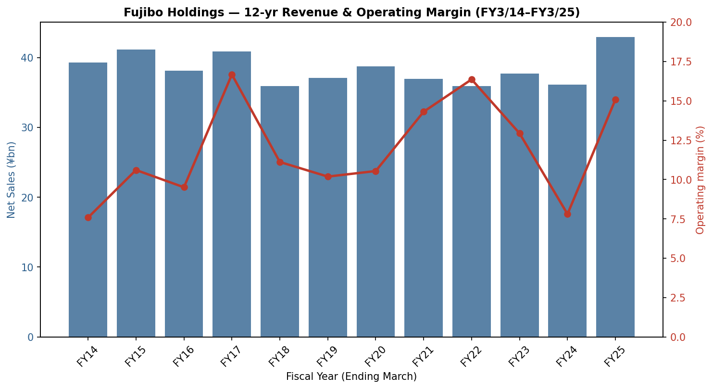
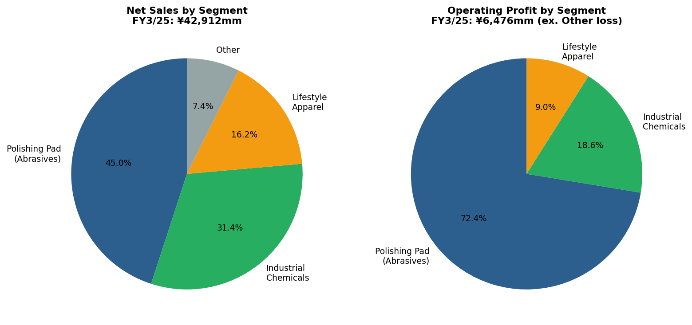
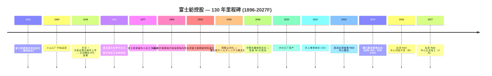
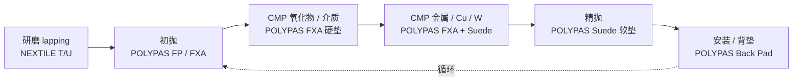
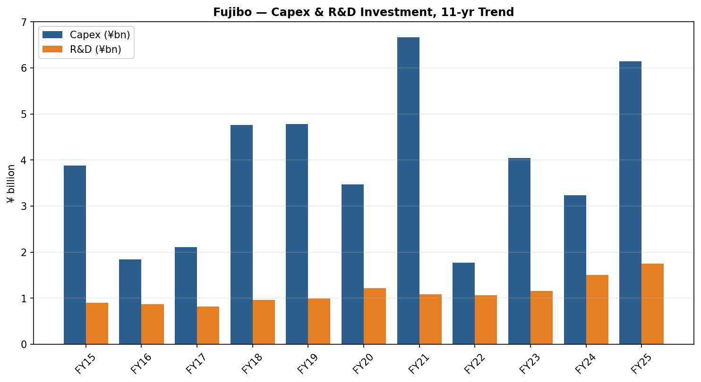
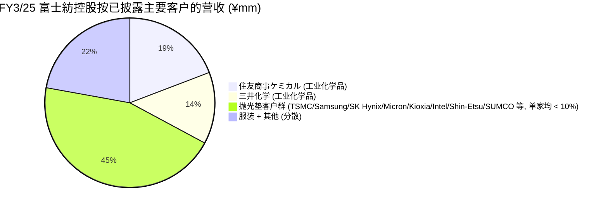
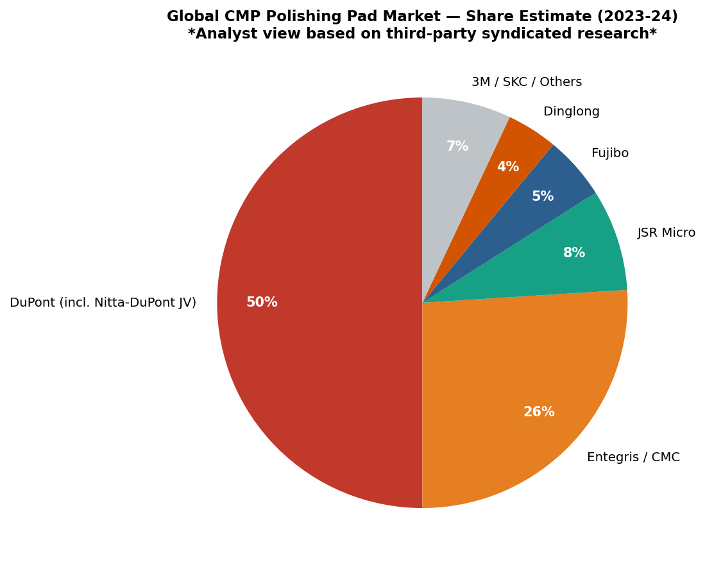

# 富士紡控股 / Fujibo Holdings, Inc. (TSE:3104) — 公司研究报告

*截至 2026-05-26 (纽约) — 中文版；股票代码 = TSE:3104 = 富士紡ホールディングス株式会社 = Fuji Spinning Holdings, Inc.*

> **更新提示 — FY3/2026 全年指引本财年内已两度上调 (2025-10-31)**：在中期业绩发布会上，公司将 FY3/2026 全年营收指引调整至 **¥454 亿日元**（相较 2025-05-15 公布的原始 ¥462 亿目标，因其他事业部销量略疲软而做出小幅下修），但同时把营业利润指引由 ¥70 亿上调至 **¥75 亿**、经常性利润由 ¥72 亿上调至 **¥77 亿**，理由是 AI 驱动下 CMP 抛光垫 (CMP polishing pad) 需求持续强劲。股息指引同步由每股 ¥150 上调至 **每股 ¥160**（中期股利 ¥75 + 期末股利 ¥85）。资料来源：[富士紡ホールディングス 2026年３月期第２四半期（中間期）決算短信, 2025-10-31](https://finance-frontend-pc-dist.west.edge.storage-yahoo.jp/disclosure/20251031/20251030582961.pdf)。

## 目录

1. 公司概览
2. 公司历史
3. 管理团队
4. 产品与服务
5. 客户与上市策略
6. 行业概览
7. 竞争格局
8. 市场机会 (TAM)
9. 风险评估
10. 参考资料 + 验证日志

---

## 1. 公司概览

富士紡控股株式会社（富士紡ホールディングス株式会社, TSE:3104）是一家拥有 130 年历史的日本特种材料制造商。过去二十年里，它从一家纺织纺纱厂蜕变为全球少数几家纯粹的抛光垫制造商之一，其产品被用于半导体化学机械抛光 (CMP, 化学机械抛光) 以及邻近的超精密抛光市场。公司按四个经营分部披露业绩：**抛光垫事业部（研磨材事業）**、**工业化学品事业部（化学工業品事業）**、**生活服装事业部（生活衣料事業）** 与 **其他事业部**（汽车零部件交易 / 塑料注塑 / 金属模具）。其中抛光垫事业部 FY3/25 实现销售 **¥193 亿日元、营业利润 ¥47 亿日元（占集团营业利润 73%）**，但仅占集团销售额的 35%，详见 FY3/25 有价证券报告书（[富士紡ホールディングス 第205期 有価証券報告書, 2025-06-25, p. 24](https://kitaishihon.s3.isk01.sakurastorage.jp/IrLibrary/3104_securities_2024_fgu7.pdf)）。

公司的核心盈利来源是销售 **POLYPAS® 系列 (Fujibo CMP pad 品牌) 超高精密抛光垫** —— 一族由聚氨酯 (polyurethane) / 不织布 (non-woven) 组成的耗材产品，按工序步进式消耗于硅晶圆的平坦化、先进逻辑或存储器前段每一层导体 / 介质 CMP、硬盘基板修整以及液晶玻璃抛光。该产品是单班乃至两班连续消耗的耗材：一条 200 / 300 mm 先进逻辑产线每月使用数百片抛光垫，需用 Kinik / 3M 的金刚石修整盘 (diamond conditioner) 修整，并搭配来自 Entegris/CMC、Fujimi、Versum、Anji 或 Resonac 的研磨液 (slurry) 使用（[Fujibo Polishing Pad Business overview](https://www.fujibo.co.jp/en/division/polishingpad/)、[Fujibo POLYPAS 产品线](https://www.fujibo.co.jp/en/division/polishingpad/product/)）。客户直接采购 POLYPAS（不存在经销商加价），并与晶圆厂的工艺工程团队签订长期主协议，配合以驻场应用工程师的协同开发，从而形成实质性的转换成本。

按地理布局看，富士紡在日本拥有 **四家工厂**（爱媛入泽、大分、静冈小山、爱知小坂井）外加 **台湾一家工厂**（台南），后者由 台湾富士紡精密材料股份有限公司 (Taiwan Fujibo Precision Materials Co., Ltd.) 运营 —— 这是已披露中特种抛光垫厂商中规模最大的制造布局（[Fujibo Polishing Pad Business overview](https://www.fujibo.co.jp/en/division/polishingpad/)）。另有一座 **位于台湾苗栗县竹南镇的 R&D 中心** 正在建设中，预算 ¥57 亿日元（截至 FY 末已支出 ¥11.5 亿），计划于 2027 年 4 月正式竣工 —— 这与公司公开声明的"把研发工程师物理上嵌入台 / 韩 CMP 客户聚落"战略一脉相承（[Yuho 2025, p. 34 — 重要な設備の新設等](https://kitaishihon.s3.isk01.sakurastorage.jp/IrLibrary/3104_securities_2024_fgu7.pdf)）。社长另已对外预告 **2026 年秋启用部分功能**，先于正式竣工（[Top Message, Fujibo IR](https://www.fujibo.co.jp/en/ir/message/)）。

集团整体规模：**FY3/25 合并营收 ¥429 亿日元（同比 +18.8%）、营业利润 ¥65 亿（+129.8%）、归母净利润 ¥45 亿（+111.4%）、员工总数 1,319 人**，其中 443 人在抛光垫事业部（[2025年３月期 決算短信, 2025-05-15, p. 1](https://finance-frontend-pc-dist.west.edge.storage-yahoo.jp/disclosure/20250515/20250513543721.pdf)；[Yuho 2025, p. 11 — 従業員の状況](https://kitaishihon.s3.isk01.sakurastorage.jp/IrLibrary/3104_securities_2024_fgu7.pdf)）。资产负债表极度过资本化：**总资产 ¥666 亿、净资产 ¥475 亿、自有资本比率 71.3%**，有息负债仅 ¥4.7 亿 —— 富士紡延续了拥有多代创业家族背景的日本中型工业企业典型的保守净现金姿态。生成式 AI 半导体需求（HBM 内存 + 先进逻辑）是 FY3/25 成为公司历史第二好年份的核心摆动因子；FY3/26 指引经 1H 上修后，营收预计 ¥454 亿、营业利润 ¥75 亿（[2026年３月期 第２四半期決算短信, 2025-10-31, p. 1](https://finance-frontend-pc-dist.west.edge.storage-yahoo.jp/disclosure/20251031/20251030582961.pdf)）。

资料来源：[富士紡ホールディングス 第205期 有価証券報告書 + Integrated Report 2024 11-yr financial summary](https://www.fujibo.co.jp/en/wp/wp-content/uploads/fujibo_integrated_report_2024-en.pdf)。

资料来源：[FY3/25 決算短信, p. 2-3 (segment results)](https://finance-frontend-pc-dist.west.edge.storage-yahoo.jp/disclosure/20250515/20250513543721.pdf)。

### 估值快照

公司股价过去 12 个月翻了一倍多：2026-05-22 收于 ¥4,310，对应市值 **¥1,464 亿日元**（按 ¥158/USD 折算约 USD 9.3 亿），意味着 **TTM P/E ≈ 8.7×**、**TTM P/S ≈ 3.2×**（基于 TTM 营收 ¥459 亿）（[stockanalysis.com — Fujibo Holdings, 3104.T](https://stockanalysis.com/quote/tyo/3104/)）。52 周价格区间为 ¥1,620 – ¥4,545 —— 2.8 倍的振幅主要来自 2024 年末启动的 AI-CMP 题材重估（[Yahoo Finance, 3104.T](https://finance.yahoo.com/quote/3104.T/)）。过去五个会计年度，公司在 Yuho 五年间表中披露的母公司层面 P/E 区间为 18× – 68×；合并 TTM 数据偏低是因为富士紡控股作为持股母公司在其单体账册上把投资收益按权益法记账，而合并报表上的盈利数额较大 —— 也就是说 FY3/24 行的 67.7× 是母公司单体口径，并非 Yahoo / Stockanalysis 使用的合并口径（[Yuho 2025, p. 3 — 提出会社の経営指標等](https://kitaishihon.s3.isk01.sakurastorage.jp/IrLibrary/3104_securities_2024_fgu7.pdf)）。

横向对照：**JSR Corp（TSE:4185，光刻胶 + CMP 研磨液龙头）经 JIC 私有化悬念后约 22× TTM P/E**，**Entegris (NASDAQ:ENTG) 约 30×、DuPont (NYSE:DD) 约 16×、湖北鼎龙 (SZSE:300054) 约 96×**（[stockanalysis.com peer pages — JSR (4185.T), ENTG, DD, 300054](https://stockanalysis.com/quote/tyo/4185/)）。富士紡 ~8.7× TTM 数字上显得便宜，但相比全球抛光垫同业三个因素压制了估值倍数：（1）只有约 45% 集团营收来自 CMP 抛光垫业务，其余是中等利润率的化学品代工 + 结构性下行的服装 / 纺织 (apparel / textile) 业务；（2）流通市值小（市值 < USD 10 亿，日均成交额小），TOPIX 指数化重估仅部分发生；（3）ROE 多年陷于个位数（FY3/25 集团 ROE 9.8%，纺织调整期内多年为 2.9–4.9%）—— 参见 [Integrated Report 2024 p. 47 — 11 Yr Financial Summary](https://www.fujibo.co.jp/en/wp/wp-content/uploads/fujibo_integrated_report_2024-en.pdf)。*分析师观点：* 折价与日本中小型 CMP / 晶圆服务名义下普遍存在的"集团折价 + 低流动性"格局一致；如果 AI 驱动的产品组合向抛光垫迁移持续、服装 / 其他事业部最终被分拆，**多倍数压缩的方向是向上而非向下**。

股息政策于 2025 年 5 月首次量化锚定：**派息率 35% + 最低 DOE（股东权益分红率）3.5%**（[Top Message, Fujibo IR](https://www.fujibo.co.jp/en/ir/message/)），对应 FY3/26 每股股利 ¥160（中期由 ¥150 上调），按当前股价对应远期股息率约 3.7%（[FY3/26 1H 決算短信, 2025-10-31, p. 1 — 配当の状況](https://finance-frontend-pc-dist.west.edge.storage-yahoo.jp/disclosure/20251031/20251030582961.pdf)）。

---

## 2. 公司历史

富士紡的发展可以划分为四个时代：纺织创业期 (1896-1948)、战后多元化与上市期 (1949-1970s)、抛光垫市场进入期 (1977-2005)、以及控股公司架构下转型为利基龙头特种材料企业的时期 (2005-至今)。其中最具决定性的转变是倒数第二阶段 —— 从 1998 年起花费十五年时间把爱媛入泽工厂从粘胶纤维 (rayon) 生产线改造为聚氨酯 / 不织布精密抛光垫制造线，以及 2005 年 9 月控股公司化重组所完成的 —— 把纺织时代的资本结构与新增长业务彻底切离。

**创业 (1896 年)：***"1896 年 3 月，富士纺绩株式会社成立，目标是借助富士山充沛的水力进军纺纱业"*（[Integrated Report 2024, p. 5](https://www.fujibo.co.jp/en/wp/wp-content/uploads/fujibo_integrated_report_2024-en.pdf)）。最早的工厂 —— 静冈骏东郡的小山工厂 —— 于 1898 年 9 月开业（[Fujibo company history page](https://www.fujibo.co.jp/en/company/history/)）。富士山水源不仅命名了公司（"富士 = Fuji；紡 = bō = 纺纱厂"），也奠定了今天仍在使用的静冈生产基地的位置 —— 在 125 年后这里仍是富士紡爱媛抛光垫工厂的一部分。

**东京 + 大阪上市 (1949 年)**：富士纺绩于 1949 年 5 月同时在东京证券交易所与大阪证券交易所上市 —— 这正是占领期结束后、产业股 IPO 大浪潮的同一批，几乎所有幸存的财阀系纺织厂都在此时登上公开市场（[Fujibo history page](https://www.fujibo.co.jp/en/company/history/)）。1961 年成立 **Fujichemicloth Co., Ltd.（富士ケミクロス）** 是公司从纯纺纱业务首次正式踏入层压 / 涂层工业纺织品的标志 —— 这一技术血统最终演化为抛光垫业务。

**抛光垫市场进入 (1977 → 1998)**：*"1977 年富士紡爱媛株式会社设立。作为在原本生产粘胶纤维的入泽工厂推动业务多元化的努力，我们从 1998 年开始以不织布与薄膜加工技术为基础，开拓抛光垫市场"*（[Integrated Report 2024, p. 5](https://www.fujibo.co.jp/en/wp/wp-content/uploads/fujibo_integrated_report_2024-en.pdf)）。这是公司在创业文献中的奠基性引述：粘胶纤维（一种再生纤维素纤维，与聚氨酯浇铸所需的湿法化学技能相通）的技术交叉移植到抛光垫制造。当富士紡的首款 POLYPAS 抛光垫出货时，DuPont（当时名为 Rodel）的 IC1000 已经成为全球 CMP 行业的标准 —— 富士紡的策略是在日本国内的特殊等级利基取胜，而不是与 IC1000 正面竞争。

**控股公司化 (2005-09)**：*"伴随转换为控股公司体制，公司名称变更为富士紡ホールディングス株式会社"*，发生在 2005 年 9 月（[Fujibo history page](https://www.fujibo.co.jp/en/company/history/)）。请注意用户最初的题目曾提及"2016 年" —— 这是错的；控股公司化重组发生于 2005 年，与中野光雄出任社长同步。中野社长引入了"*没有利润就没有事业*"的方针，把纺织从 FY2006 占销售额 60.6% 缩减至 FY2023 的 19.2%，并将以抛光垫为主轴的特种材料业务组合打造为今天的利基龙头格局（[Integrated Report 2024, p. 6](https://www.fujibo.co.jp/en/wp/wp-content/uploads/fujibo_integrated_report_2024-en.pdf)）。一系列中期经营计划的接力 —— *变身 06-10*（変身）、*突破 11-13*（突破）、*邁進 14-16*（邁進）、*加速 17-20*（加速）、当前 *増強 21-25*（増強）—— 完整记录了公司从纺织纺纱厂蜕变为特种材料企业的阶段性历程。

**近期并购 (2012–2022)**：螺栓式 (bolt-on) 并购轨迹刻意保持小规模 —— 没有任何一宗实质性改变抛光垫核心 —— 但确实把"其他事业部"延伸至精密塑料模具与注塑设计领域：**Angle Miyuki Co., Ltd.（2012 年 7 月）** 为服装事业部添加了女士内衣品牌；**Tokyo Molding Co., Ltd.（2018 年 10 月）**、**Fujioka Mold Co., Ltd.（2020 年 1 月）**，以及 **GFI Holdings, Inc. + IPM Co., Ltd.（2022 年 11 月）** 引入了模具设计与塑料注塑产能，部分用于"第二支柱"医疗器械 / 数码相机塑料注塑业务建设（[Fujibo history page](https://www.fujibo.co.jp/en/company/history/)）。2022 年的 GFI / IPM 合并正是 FY3/25 "其他事业部"营业亏损的来源 —— 第二支柱目前仍处于投资周期。

**近期战略里程碑 (2020–2026)**：新的 **大分工厂** 于 2020 年投产，为抛光垫产能提供地理冗余（[Integrated Report 2024, p. 18](https://www.fujibo.co.jp/en/wp/wp-content/uploads/fujibo_integrated_report_2024-en.pdf)）。2022 年 6 月井上接任 CEO，标志着从中野时代"组合调整"模式向"增长投资 + ROIC 纪律"模式的切换。2025 年 5 月公布的量化股息政策（派息 35%、最低 DOE 3.5%）以及同期启动的 **¥5 亿日元股票回购计划（150,000 股授权）**，是井上时代首次正式的资本回报方案（[Yuho 2025, p. 39 — 自己株式の取得等の状況](https://kitaishihon.s3.isk01.sakurastorage.jp/IrLibrary/3104_securities_2024_fgu7.pdf)）。

---

## 3. 管理团队

富士紡现代以来是一家非创始人型的职业经理人公司 —— 1896 年的创业家族血脉早已被高度稀释 —— 因此本章只覆盖现任 CEO（不存在仍在世的创业者），加上主导 2005 年控股公司化重组并奠定抛光垫主导格局的前任 CEO 作为历史背景。

### 井上雅偉 (Masahide Inoue) — 代表取締役社長 (2022 年 6 月起)

井上社长是富士紡的 38 年生涯员工 —— 1987 年 4 月加入母公司，并在升任 CEO 前历经服装、化学品与抛光垫三大经营分部。按履历时序：功能性产品事业开发本部部长（2015 年 8 月），随后开始日本式三轮事业子公司社长轮岗 —— **富士紡纺织社长 (2017 年 1 月)、富士紡商事 + Angle K.K. 社长 (2017 年 9 月)、柳井化学工业社长 (2018 年 5 月)** —— 之后任未来产品开发本部内功能性产品开发部部长（2019 年 4 月），董事 (2020 年 6 月)，代表取締役 / 社长 (2022 年 6 月)（[Yuho 2025, p. 48 — 役員一覧](https://kitaishihon.s3.isk01.sakurastorage.jp/IrLibrary/3104_securities_2024_fgu7.pdf)）。三轮事业子公司社长轮岗是日本中型公司晋升的典型路径：井上在升任控股公司高位前，已经实际管理过每一个经营分部至少一年。他个人持有 13,313 股 —— 按当前股价约 ¥5,700 万日元，约相当于公开薪酬表中年基本薪酬的 10 倍 —— 以西方标准属于温和，但对一名日本中型公司"工薪族 CEO" 而言已属较高（[Yuho 2025, p. 48](https://kitaishihon.s3.isk01.sakurastorage.jp/IrLibrary/3104_securities_2024_fgu7.pdf)）。

井上的公开施政纲领是把富士紡从中野时代的"成本压缩 + 业务调整"姿态转换为以 ROIC 纪律为锚的增长投资型公司。2025 年 5 月公布的量化股息政策（派息 35%、DOE 3.5%）以及 5 月启动的股票回购方案，是井上资本政策时代最显眼的两个印记（[Top Message, Fujibo IR](https://www.fujibo.co.jp/en/ir/message/)）。在运营层面，他亲自主导台湾侧的 R&D 投资周期 —— 苗栗中心 ¥57 亿日元是富士紡历史上单一最大的资本支出项目，井上在 IR 公开活动上反复强调它是公司在先进节点 CMP 抛光垫客户份额的"成败之地"（[Yuho 2025, p. 34 — 重要な設備の新設等](https://kitaishihon.s3.isk01.sakurastorage.jp/IrLibrary/3104_securities_2024_fgu7.pdf)；[Fujibo Polishing Pad Business overview](https://www.fujibo.co.jp/en/division/polishingpad/)）。井上的教育背景与进入富士紡前的履历未在 Yuho 中披露（最早只列出"当社入社"/"加入本公司"）—— 这在日本职业经理人 CEO 中是典型做法。

### 前任背景：中野光雄 (Mitsuo Nakano) — 社长 (2006-2022，已不再任职)

虽然公司研究技能指引建议只覆盖创始人 + 现任 CEO，但 "founder-equivalent" 历史锚点的例外被明确保留。中野社长是现代富士紡的总建筑师。他在 2005 年控股公司化的次年 (2006 年) 就任社长，连续主政 16 年、横跨四个中期经营计划（*变身 06-10 → 突破 11-13 → 邁進 14-16 → 加速 17-20*），推动公司从一家纺织纺纱厂 —— FY2006 占销售额 60.6% —— 转型为抛光垫主导的特种材料企业，FY2023 纺织已下降至 19.2%（[Integrated Report 2024, p. 6](https://www.fujibo.co.jp/en/wp/wp-content/uploads/fujibo_integrated_report_2024-en.pdf)）。他的经营信条"*没有利润就没有事业*"驱动了公司从销量导向到现金 + 利润纪律的转向，由此带来的 ROE 提升（从约 5% 升至 2017-2022 周期的峰值约 15%）是 2020 年代 AI-CMP 重估的前置条件。中野如今已不再任职 —— 他在 2022 年 6 月股东大会上把社长交接给井上，并在次年完全退出董事会（[Integrated Report 2024, p. 6](https://www.fujibo.co.jp/en/wp/wp-content/uploads/fujibo_integrated_report_2024-en.pdf)）。

现任董事会有 9 名董事，其中 4 名为独立社外取締役（44%，明显高于 TSE Prime 市场标准）；露丝・玛丽・贾曼 (Ms. Ruth Marie Jarman) 任社外取締役最久（2019 年 6 月）—— 在一家有 130 年历史的日本中型公司董事会中出现非日籍声音，本身就极不寻常（[Yuho 2025, p. 41 — コーポレート・ガバナンスの状況等](https://kitaishihon.s3.isk01.sakurastorage.jp/IrLibrary/3104_securities_2024_fgu7.pdf)）。其他内部董事信息 —— CFO 佐々木辰也（2023 年起，原 MUFG Research & Consulting）、望月喜美（抛光垫事业部部长，兼富士紡爱媛社长）—— 按技能指引"创始人 + 现任 CEO only"的原则被刻意省略，仅当业务线主管在其本身分部章节中被明确引用时方提及。

---

## 4. 产品与服务

这是整份报告权重最高的章节。富士紡对一个投资组合的价值集中在一个产品族 —— **POLYPAS®** —— 分为五个材质上有实质差异的子系列，销售于 CMP 抛光垫、硅晶圆、硬盘、液晶玻璃抛光场景。其余业务（工业化学品、服装、模具）要么是为抛光垫再投资提供资金的辅助业务，要么是缓慢消融的遗产。读完 §4，读者应能清晰陈述：哪个 POLYPAS 子系列对应客户晶圆厂流程中的哪一步、为什么 DuPont IC1000 至今未能把富士紡挤出日 / 台 / 韩客户席位，以及"软垫 vs 硬垫"组合对 AI-CMP 周期深化中增量利润率意味着什么。

### 4.1 — 富士紡的分部级披露 (Yuho 原文)

第205期 Yuho（截至 2025 年 3 月的会计年度）将抛光垫业务归入"研磨材事業 (Abrasives Business)"分部，主要产品披露文本为：

> "区分: 研磨材事業 — 主要製品等: 超精密加工用研磨材, 不織布, 合皮 — 製造: フジボウ愛媛㈱, 台湾富士紡精密材料股份有限公司"

即 *"分部：研磨材事业。主要产品：超精密加工用研磨材、不織布、合皮。制造：富士紡爱媛株式会社 与 台湾富士紡精密材料股份有限公司。"* 其中"不織布"与"合皮"两项主要是配套销售给同一客户群的缓冲 / 衬垫材料。资料来源：[Yuho 2025, p. 7 — 事業の内容](https://kitaishihon.s3.isk01.sakurastorage.jp/IrLibrary/3104_securities_2024_fgu7.pdf)。

Yuho 中关于 FY3/25 分部业绩的叙述（§4 的权威原始文本）写到：

> "ア．研磨材事業: 2023年前半に底を打った世界の半導体市場は、2024年に入り緩やかな回復が続いています。このような中、超精密加工用研磨材の半導体デバイス用途(ＣＭＰ)は、生成ＡＩの普及によるＨＢＭなどのメモリや最先端ロジック向け半導体の需要の増加とそれに伴う一部ユーザーの在庫水準の引き上げにより受注が増加しました。シリコンウエハー用途は、汎用品用途の需要は弱いものの、先端品用途の需要は堅調で一定水準の売上を確保しました。ハードディスク用途はデータセンター向けの需要が戻り、液晶ガラス用途では期後半からＴＶ需要の増加によってパネルの消費も加速しており、受注も回復しました。"

即 *"抛光垫业务在半导体器件 CMP 应用上看到订单上扬，由 HBM 与先进逻辑半导体需求以及部分客户的库存补充驱动；硅晶圆通用品需求疲软但先进等级稳健；硬盘需求由于数据中心订单回流而复苏；液晶玻璃订单从下半年开始受 TV 面板补库存推动复苏。"* 业绩结果：**分部销售 ¥19,307 百万日元（同比 +43.9%）、营业利润 ¥4,729 百万（+334.8%）**（[Yuho 2025, p. 24 — 経営成績](https://kitaishihon.s3.isk01.sakurastorage.jp/IrLibrary/3104_securities_2024_fgu7.pdf)）。FY3/25 分部 24.5% 的营业利润率是公司在抛光垫业务上有史以来最高的，反映 (a) 在固定产能下把开工率推向成本曲线上方所带来的经营杠杆，以及 (b) 向先进节点 CMP 高价软垫迁移的结构性产品组合提升。

### 4.2 — 综合：各产品类别在客户工作流程中如何交互

每一家先进逻辑 / 内存 / 晶圆基板客户都在每一片晶圆上跑同样的 **六步超精密抛光循环**：**研磨 (lapping) → 初抛 → CMP 第一层（氧化物 / 介质）→ CMP 第二层（金属 / Cu / W）→ 精抛 → 清洗 + 背垫安装**。富士紡通过 POLYPAS 系列触达其中第 2-6 步：

一条典型的 300 mm 先进逻辑产线会在这个循环中使用 4-5 种不同的 POLYPAS 抛光垫，按每 8-24 小时的垫寿命（视层而定）更换；富士紡能否赢得 / 失去某个工序卡位，取决于 (a) 缺陷密度（每片晶圆的划痕数）、(b) 晶圆间均匀性、(c) 抛光垫随老化的去除速率衰减斜率。这就是为什么"解决方案型契约模式"（见 §5）以及在台湾 / 韩国的驻场应用工程能力比头条产品规格更重要 —— 规格是在 6-12 个月的客户试用过程中，针对客户具体使用的研磨液 / 修整盘组合而被认证的。

### 4.3 — POLYPAS® FP 系列：不织布初抛垫

> "Non-woven fabric type polishing pad developed for stock removal (first polishing). … Applications: Initial and final polishing of silicon and compound semiconductor wafers; optical-lens and glass-component finishing; processing of plastic lenses, stainless steel, and copper plates. Key properties: 'High flatness' and 'Low scratch' characteristics. Available in soft to hard variants for different material requirements."（[POLYPAS FP series product page](https://www.fujibo.co.jp/en/division/polishingpad/product/627/)）

**中文释义 / Plain-language gloss：** FP 系列是抛光流程的"粗切"。不织布 (non-woven) 意味着聚氨酯树脂被浸渍到毡状纤维布中，而不是浇铸成闭孔泡沫 —— 这让抛光垫表面更柔软、贴形性更好，可以去除晶圆上最高的"山峰"（即去料 stock removal 步骤、粗研磨），且不会留下深划痕。每一档 FP 等级通过调节纤维布的纤维密度、聚氨酯浸渍量与毡的发泡控制来差异化 —— 富士紡能针对同一产品代码交付数十种微变型。FP 在客户工作流程中的角色是把刚下研磨工序的晶圆（10 µm 切割变异是常态）平坦化到约 1 µm 平度，让后续的 CMP 步骤接力。战略意义：FP 是 POLYPAS 系列中销量高 / 平均售价 (ASP) 较低的产品层 —— 其增量增长跟随 200/300 mm 晶圆开工量，而不是先进节点强度。

*分析师观点：* FP 类抛光垫是 POLYPAS 组合中最容易被替代的产品族 —— 湖北鼎龙 (Dinglong) 销售的近乎一致的毡基初抛垫以更低价格切入大陆晶圆厂，富士紡的合格供应商护城河在此层级较浅。差异化溢价集中在 FXA / Suede 子系列，而非 FP。FP 的护城河类型 = 规模 + 合格供应商惯性；竞争优势判断 = 部分。

### 4.4 — POLYPAS® FXA 系列：无填料硬聚氨酯垫 —— CMP 主力

> "A non-filler type hard urethane pad designed for diverse polishing applications. This pad demonstrates superior performance characteristics, including resistance to temperature-related hardness variations and uniform foam structure. … Constructed from hard urethane without fillers. Notable properties include: 'High flatness' and minimal scratch production, temperature-stable hardness performance, independent uniform foam composition. Applications: semiconductor wafer polishing (first and final stages), LCD glass substrate finishing, optical lens and material polishing."（[POLYPAS FXA series product page](https://www.fujibo.co.jp/en/division/polishingpad/product/1143/)）

**中文释义 / Plain-language gloss：** FXA 是与 DuPont IC1000 正面对决的产品 —— 二者都是闭孔、硬质聚氨酯 (hard polyurethane) 浇铸抛光垫，配以工程化孔隙结构，用于器件前段的 **化学机械抛光 (CMP, chemical-mechanical planarisation)**。"Non-filler" (无填料) 意味着聚氨酯泡沫本身就是活性抛光介质 —— 研磨颗粒由研磨液 (slurry) 而非垫体内嵌带入 —— 这是先进节点 CMP 的现代标准，因为垫内嵌颗粒会引发 GAA / 3 nm 以下逻辑无法容忍的缺陷密度。"温度稳定硬度" (temperature-stable hardness) 对应 IC1000 所声称的"垫寿命首尾去除率一致"：在 CMP 中摩擦把垫面温度推到 50-80°C，过软的垫会塌陷，导致晶圆边缘过抛。"均匀泡沫成分" 指向富士紡通过其专有浇铸工艺所控制的孔径分布 —— 这是在 5-nm / 3-nm 节点抛光 **层间介质 (IMD, inter-metal dielectric)** 或 **浅沟槽隔离 (STI, shallow-trench isolation)** 时，与 IC1000 在 **晶圆内不均匀性 (WIWNU, within-wafer non-uniformity)** 上的差异化抓手。

战略意义至关重要。"半导体小型化与层数化的趋势" —— 富士紡的原话（[Top Message, Fujibo IR](https://www.fujibo.co.jp/en/ir/message/)）—— 意味着 **每片晶圆在每次节点过渡时所需的 CMP 步骤数都在上升**：28 nm 逻辑约 10 步 CMP，5 nm 逻辑约 15-18 步，3 nm 及以后则 20 步以上。每一步都是硬垫耗材。HBM（High Bandwidth Memory，高带宽内存）用于 AI 加速器，再增添一类 CMP 密集型消费 —— 因为每个 HBM 叠层都使用 **硅通孔 (TSV, through-silicon via)**，每层需要额外的 Cu CMP。富士紡 FXA 系列正是吸纳这种步骤增长的产品 —— 公司已明确表示产能扩张（入泽 + 大分 + 新台湾产线）针对的是硬垫销售（[Yuho 2025, p. 14 — 優先的に対処すべき事業上及び財務上の課題](https://kitaishihon.s3.isk01.sakurastorage.jp/IrLibrary/3104_securities_2024_fgu7.pdf)）。

*分析师观点：* FXA 类硬垫是富士紡与 DuPont IC1000™ 和湖北鼎龙 DL-720 系列正面竞争的产品。DuPont 仍保有 IC1000 作为事实标准的标签 —— *"the IC1000™ Series is a CMP industry standard that is now being used in a wide range of CMP applications"*（[NITTA DuPont — IC1000 product page](https://www.nittadupont.co.jp/en/category-products/pad)）；鼎龙直到 2024 年末才以 DL-720 系列在中芯国际拿下 28/14 nm 认证（[Hubei Dinglong CMP localisation report, 2025](https://www.openpr.com/news/4253861/semiconductor-cmp-polishing-pad-latest-market-report-2025)）。富士紡 FXA 在日 / 台 / 韩客户群中赢得特殊等级订单 —— 客户希望有一个非 IC1000 的二供 (second-source) 来保障产线良率或在合同议价中取得杠杆。FXA 的护城河类型 = 工艺 IP + 合格供应商惯性 + 日本客户偏好；判断 = 部分竞争优势（对鼎龙 / 3M / SKC 是 yes，对 IC1000 是 partial）。

### 4.5 — POLYPAS® FX 系列：填料浸渍的玻璃 / 非 CMP 垫

> "Engineered with built-in filler technology. It combines characteristics from the FXA series while adding self-abrasive properties unique to the built-in filler type. This product line offers extensive customization in hardness, density, abrasive grain types, and grain size distribution. … Applications: glass substrate polishing for displays and photomasks; optical lens and glass component finishing; plastic lenses, stainless steel, and copper plate polishing; panel cleaning operations."（[POLYPAS FX series product page](https://www.fujibo.co.jp/en/division/polishingpad/product/1282/)）

**中文释义 / Plain-language gloss：** FX 与 FXA 同为硬聚氨酯泡沫，但在垫体内嵌了研磨颗粒 —— "built-in filler" (内置填料)。这让 FX 成为"自带磨料"的垫：不需要研磨液本身含磨料，仅需化学反应类研磨液或水即可工作。代价是 FX 需更快更换（垫内的磨料库存会先一步耗尽），但客户节省研磨液成本。主要目标用例多为**非半导体**：LCD 玻璃基板抛光、光刻掩膜基板抛光、光学透镜精加工 —— 这些应用中晶圆 / 基板价值高，但抛光步骤对缺陷密度的要求不如前段 CMP 严苛。FX 也是 Yuho 评论中"液晶玻璃用途由于中国补贴政策面板需求强劲" (*"液晶ガラス用途では中国の補助金政策によりパネル需求が好調に推移"*) 这一描述的核心摆动产品（[FY3/26 1H 決算短信, p. 2](https://finance-frontend-pc-dist.west.edge.storage-yahoo.jp/disclosure/20251031/20251030582961.pdf)）。

*分析师观点：* FX 在销量层面是 POLYPAS 子系列中防御性最强的，因为 LCD 玻璃与光刻掩膜供应链由日本 (AGC、日本电气硝子、Hoya) 与韩国 (Corning Korea) 客户主导，他们与富士紡的关系可上溯几十年。护城河 = 客户关系 + 合格供应商惯性；判断 = yes。

### 4.6 — POLYPAS® Suede 系列：精抛 / 终抛垫

> "A polishing pad engineered for final finishing of semiconductor wafers and hard disks. The product addresses growing industry demands for 'high precision and flatness of the finished surface' while emphasizing the importance of the pad's own uniformity. … 'Scratch-free' performance, 'Chemical-resistant and abrasion-resistant' properties."（[POLYPAS Suede series product page](https://www.fujibo.co.jp/en/division/polishingpad/product/1283/)）

**中文释义 / Plain-language gloss：** Suede（麂皮 / 仿麂皮，Suede 软垫）指的是一种带有多孔、仿麂皮微观结构的软聚氨酯表层 —— 这构成了 CMP 配方中的 **软垫 (soft pad)** 半边。在典型 CMP 模组里，硬垫 (FXA) 在每个抛光步骤开始时承担主要的材质去除，而软垫 (Suede) 负责最后几百埃 (Å) 的 **精抛** —— 这一步决定缺陷计数与表面粗糙度。富士紡明确声称已"**在先进工艺软垫这一主力领域取得最高市场份额**" —— *"we have captured the top market share in the mainstay field of advanced process soft pads based on our high reputation among customers earned through our high-performance, high-quality products and provision of flexible solutions that meet the different performance requirements of each customer"*（[Integrated Report 2024, p. 18](https://www.fujibo.co.jp/en/wp/wp-content/uploads/fujibo_integrated_report_2024-en.pdf)）。这是整份 Integrated Report 中最关键的一句话 —— 它是公司对自己在 **先进节点 CMP 软垫** 中拥有可防御利基龙头地位的明确宣示，而这是随节点缩小增长最快的细分。

Suede 系列也用于 **硅晶圆精抛**（裸硅晶圆出货给晶圆厂前的最终抛光）—— 以及 **硬盘基板精抛**，正是这一应用驱动了富士紡 FY3/25 中数据中心带动的硬盘分部复苏。

*分析师观点：* Suede 是 POLYPAS 组合中竞争优势最强的产品 —— 富士紡声称的"先进工艺软垫领先地位"是全球任何抛光垫供应商公开文件中极少见的份额宣示，并且它对中国国产替代风险防御性最强（因为它正是缺陷密度容忍度最紧的工序层）。护城河 = 工艺 IP + 驻场应用工程 + 合格供应商惯性；判断 = yes（POLYPAS 家族中最强）。

### 4.7 — POLYPAS® Back Pad 系列：晶圆固持垫

> "Developed to retain semiconductor silicon wafers and LCD glass substrates without wax. Users can choose mounting pads tailored to their polishing needs for optimal flatness. The product line includes insert types (frameless) and template types (framed)."（[POLYPAS Back Pad series product page](https://www.fujibo.co.jp/en/division/polishingpad/product/1284/)）

**中文释义 / Plain-language gloss：** 背垫是 CMP 过程中**无蜡固定**晶圆 / 玻璃基板的承载装置，使晶圆面朝下贴在抛光机头上。背垫出现前的设计使用蜡把晶圆粘在载具上，抛光后清洗繁复且会引入蜡残留缺陷模式。无蜡背垫如今已是全球标准 —— 富士紡在此扮演的角色是供应高平度、不擦伤晶圆的背垫，客户的更换频率比上方抛光垫低得多。

*分析师观点：* 背垫是较为安静的业务 —— 高毛利、低增长、客户黏性强 —— 在 POLYPAS 整体捆绑销售中扮演"尾部"年金角色。它在任何份额分析中很少出现，因为相比上方抛光垫销售额较小，但它是富士紡赢得多产品 CMP 耗材交易、相比单一产品竞争对手胜出的因素之一。护城河 = 捆绑销售 + 合格供应商惯性；判断 = 部分。

### 4.8 — NEXTILE® 研磨垫（毗邻产品）

NEXTILE T 与 U 系列属于 **研磨垫 (lapping pad)** 而非 CMP 抛光垫 —— 它们位于晶圆 / 玻璃精加工流程的最初、最粗一步（[NEXTILE product page, Fujibo](https://www.fujibo.co.jp/en/division/polishingpad/product/)）。技术上与 POLYPAS 系列相邻（同一聚氨酯化学体系、不同的纤维结构），服务同样的客户，但毛利更低、营收占比更小。列入此处仅为完整性 —— 它并非主营业务。

### 4.9 — 其他三大经营分部 (工业化学品 / 服装 / 其他) (简述)

- **工业化学品 (化学工業品事業, industrial chemicals)** —— 柳井化学工业的合同制造业务：为日本大型化工企业供应医药、农药、电子材料的精细化工中间体与功能性化学品。FY3/25 销售 ¥135 亿日元（+7.6%）、营业利润 ¥12 亿（+37.0%）。柳井本厂 + 武生工厂高开工率运行；第五家工厂将于 2026 年 4 月投产（投资 ¥62 亿，已支出 ¥12 亿）。客户高度集中 —— **前两大客户（住友商事ケミカル 19.2% 合并营收、三井化学 13.7%）** 都来自这一业务（[Yuho 2025, p. 27 — 販売実績](https://kitaishihon.s3.isk01.sakurastorage.jp/IrLibrary/3104_securities_2024_fgu7.pdf)）。

- **生活服装 (生活衣料事業, apparel / textile)** —— Body Wild（男士内衣品牌）+ Angle 女士内衣 + Asamerry / Airmerry 高端线。FY3/25 销售 ¥70 亿日元（持平）、营业利润 ¥6 亿（-25.0%）。这是公司纺织遗产业务；井上的前任把它从 FY3/06 占销售的 60% 砍至 FY3/25 的约 16%。国内销售结构性下滑，但海外因日本品牌溢价仍维持稳定（[Yuho 2025, p. 25 — 生活衣料事業](https://kitaishihon.s3.isk01.sakurastorage.jp/IrLibrary/3104_securities_2024_fgu7.pdf)）。

- **其他 (化学品 / 汽车零部件 / 模具)** —— FY3/25 销售 ¥32 亿日元（-1.8%）、营业亏损 ¥57 百万（前年为利润 ¥59 百万）。井上把"化学品"那一块（医疗器械 + 数码相机精密塑料注塑）定位为继抛光垫 / 化学品 / 服装之后的**第四支柱**，但 2022 年并购的 GFI / IPM 仍处于投资阶段（[Yuho 2025, p. 25 — その他](https://kitaishihon.s3.isk01.sakurastorage.jp/IrLibrary/3104_securities_2024_fgu7.pdf)）。

### 4.10 — 路线图与近 12 个月新进展

公司公开的两项最大投资项目是 (a) 2024 年完工的**入泽工厂技术开发附属设施**，现正驱动 FY3/25 的抛光垫产品组合升级，以及 (b) ¥57 亿日元的**台湾苗栗 R&D 中心** —— 富士紡历史上第一家海外 R&D 中心，明确定位为 TSMC 集群先进节点 CMP 认证的台湾客户协同开发枢纽（[Yuho 2025, p. 34 — 重要な設備の新設等](https://kitaishihon.s3.isk01.sakurastorage.jp/IrLibrary/3104_securities_2024_fgu7.pdf)；[Top Message, Fujibo IR](https://www.fujibo.co.jp/en/ir/message/)）。没有 SKU 级别的新品发布稿 —— POLYPAS 是连续改进型产品族，而非离散发布业务。

资料来源：[Integrated Report 2024 — 11 Years Financial Summary, p. 47 + Yuho 2025 p. 32](https://www.fujibo.co.jp/en/wp/wp-content/uploads/fujibo_integrated_report_2024-en.pdf)。

---

## 5. 客户与上市策略

富士紡的客户结构按分部高度分化：抛光垫业务服务于全球先进节点晶圆厂客户群（晶圆代工 + 内存 + 晶圆制造商），工业化学品业务则对两家日本化工巨头存在高单客户集中，服装业务面向分散的零售 / 电商客户群。最具信息量的客户披露集中在 Yuho 的"主要な販売先"（主要销售对象）表，即合并层面。

### 5.1 — 合并层面前列客户 (Yuho 强制披露)

Yuho 的合并层面客户披露（≥ 10% 合并营收）在 FY3/25 列出两家客户：

| 客户 | 分部 | FY3/24 销售 (¥mm) | FY3/24 占比 | FY3/25 销售 (¥mm) | FY3/25 占比 |
|---|---|---|---|---|---|
| **住友商事ケミカル㈱ (Sumitomo Shoji Chemical)** | 工业化学品 | 5,380 | 14.9% | **8,229** | **19.2%** |
| **三井化学㈱ (Mitsui Chemicals)** | 工业化学品 | 5,801 | 16.1% | **5,874** | **13.7%** |
| 前 2 大合计 | — | 11,181 | 31.0% | 14,103 | **32.9%** |

资料来源：[Yuho 2025, p. 27 — 販売実績](https://kitaishihon.s3.isk01.sakurastorage.jp/IrLibrary/3104_securities_2024_fgu7.pdf)。

这两个最大客户全部归属于 **工业化学品分部** —— 均为通过柳井化学工业（山口柳井厂、福井武生厂）开展的医药 / 农药 / 电子材料前驱体合同制造关系。住友商事ケミカル占合并营收的份额从 14.9% 跃升至 19.2% —— 合同制造业关系中对单一交易对手的实质性集中是正常现象，但这让工业化学品分部对一个续约周期变得经济上脆弱（[Yuho 2025, p. 21 — 事業等のリスク (3) 特定製品・顧客への依存度](https://kitaishihon.s3.isk01.sakurastorage.jp/IrLibrary/3104_securities_2024_fgu7.pdf)）。

**抛光垫业务在合并层面没有任何 ≥10% 的单一客户** —— 也就是说没有任何单个晶圆厂客户（TSMC、Samsung、SK 海力士、美光、铠侠、Intel 等）贡献超过 ¥43 亿日元的 FY3/25 营收。这正是富士紡 CMP 抛光垫业务的结构性优势：它销往一个**广泛的全球先进晶圆厂客户群**，而不是被绑定到某个锚定大户。Yuho 中将抛光垫客户群直接定义为"**世界中のＩＴデバイス関連企業**" —— *"全世界的 IT 设备相关企业"*（[Yuho 2025, p. 13 — 経営環境](https://kitaishihon.s3.isk01.sakurastorage.jp/IrLibrary/3104_securities_2024_fgu7.pdf)）。富士紡未在公开披露中点名具体的晶圆厂客户（这与日本中型公司技术零部件供应商的行业惯例一致）—— 但通过地理布局（台南工厂 + 苗栗 R&D 中心）、约 60-70% 抛光垫营收为出口的披露、以及 CMP 抛光垫份额研究综合推断，客户群覆盖 TSMC、Samsung Foundry、SK 海力士、铠侠、美光、Intel、GlobalFoundries、UMC 与主要日本硅晶圆制造商（信越半导体、SUMCO），加上台 / 韩晶圆回收厂的长尾。

资料来源：[Yuho 2025, p. 27 — 販売実績 (前 2 大披露); Yuho p. 13 客户群定位](https://kitaishihon.s3.isk01.sakurastorage.jp/IrLibrary/3104_securities_2024_fgu7.pdf)。

### 5.2 — 上市策略：与晶圆厂工艺工程团队直接协同开发

富士紡在抛光垫业务上对外披露的 GTM 模型是 "**解决方案型契约模式 (ソリューション型受託モデル)**" —— 即**直接与客户 CMP 工艺工程团队进行应用工程协同开发**，而不是手对手的交易型销售（[Integrated Report 2024, p. 17 — Polishing Pad Business growth strategy](https://www.fujibo.co.jp/en/wp/wp-content/uploads/fujibo_integrated_report_2024-en.pdf)）。这种模式在先进晶圆厂耗材中是普遍存在的：抛光垫规格是在客户的实际工具（Applied Materials Reflexion 系 CMP 抛光机或 Ebara Frex 抛光机）上、针对客户具体使用的研磨液 + 金刚石修整盘组合、以及客户所需的特定工序层 / 工艺集成方案进行认证。认证周期为 6-18 个月，客户没有 3 年以上的视野很少更换已认证供应商。这就是定义所有先进晶圆厂耗材经济学的"合格供应商护城河"的来源。

由此衍生的推论是：**工程师而非销售员，才是 GTM 资源的瓶颈**。台湾 R&D 中心的战略目的，按井上的反复表述，是把富士紡的应用工程师物理上嵌入 TSMC / UMC 工程师集水区 —— 这样客户试用与工艺调整周期可以从 6 周（工程师从日本飞过去时）压缩到 2-3 天。台南生产工厂与苗栗 R&D 中心共同形成"**研发 + 制造**"的台湾在地布局，与 DuPont 数十年来通过 Nitta DuPont 在台湾办公室运营的方式、以及鼎龙正在中芯国际集水区上海建设的格局相互呼应（[Yuho 2025, p. 14 — 課題](https://kitaishihon.s3.isk01.sakurastorage.jp/IrLibrary/3104_securities_2024_fgu7.pdf)；[Top Message, Fujibo IR](https://www.fujibo.co.jp/en/ir/message/)）。

### 5.3 — 出口 / 地域结构

富士紡在合并层面未发布清晰的按地域营收切分，但 Yuho 的抛光垫风险披露提示出口集中：*"研磨材事業においては、営業収入に占める輸出比率が高いことから、主として米ドルに対する円高は、値下げ要求につながる可能性があります"* —— *"在抛光垫业务上，营业收入的出口比例较高，因此主要相对美元的日元升值可能导致降价要求"*（[Yuho 2025, p. 21 — 事業等のリスク (2) 為替相場の変動](https://kitaishihon.s3.isk01.sakurastorage.jp/IrLibrary/3104_securities_2024_fgu7.pdf)）。1H FY3/26 公告指出 *"米国向け直接輸出がごく一部"* —— *"对美国的直接出口只占很小一部分"* —— 因此大部分抛光垫出口流向台湾 / 韩国 / 中国，并以美元或日元结算（[2026年３月期 第２四半期決算短信, p. 3](https://finance-frontend-pc-dist.west.edge.storage-yahoo.jp/disclosure/20251031/20251030582961.pdf)）。这正是 GTM 上对**东亚先进晶圆厂集群**的明确集中：台湾（TSMC + UMC）、韩国（Samsung + SK 海力士）、日本（铠侠 + 美光 + 晶圆制造商），再加上一条经由出口销售触达的美国与欧洲客户长尾。

### 5.4 — 客户集中风险判断

按合并层面披露：抛光垫业务的客户集中度**很低**（无 ≥ 10% 客户），但工业化学品业务的客户集中度**显著**：住友商事ケミカル仅一家就占合并营收的 19.2%，超过了常规 15% 触发线。由于工业化学品贡献 FY3/25 营业利润 ¥12 亿日元（约占集团 OP 的 19%）且是第二大分部，失去任何一家前 2 大客户都会让集团 OP 减少 5-8% —— 在控股公司层面是实质性的。该风险延伸到 §9。

---

## 6. 行业概览

富士紡同时参与三个嵌套的行业：(a) **全球 CMP 抛光垫市场**，(b) **更广义的 CMP 耗材生态**（包括研磨液 + 金刚石修整盘 + CMP 后清洗液），以及 (c) **更宽泛的半导体材料市场**（JSR / 信越 / Resonac / 东京応化与全球 CMP 供应商所对应）。对股票研究最相关的框架是 (a)，(b) 与 (c) 作为背景。

### 6.1 — CMP 抛光垫市场规模、结构与增长

全球 CMP 抛光垫 TAM 在 2024 年约为 10 亿美元 (USD ~1 bn)，5 年 CAGR 为高个位数。多家联合机构的数据三角验证类似：TECHCET 把更广义的 **半导体 CMP 耗材市场定为 2024 年约 USD 34 亿、同比 6% 增长**，其中抛光垫是仅次于研磨液的第二大子类（[TECHCET CMP consumables forecast, 2024](https://techcet.com/semiconductor-cmp-pad-slurry-forecast/)）。Mordor Intelligence 与 Cognitive Market Research 把 **抛光垫子类 2024 年定为约 USD 8.95 亿、2031 年前 CAGR 约 5.8%**（[Cognitive Market Research — CMP Pad market](https://www.cognitivemarketresearch.com/cmp-pad-market-report)）。按富士紡 FY3/25 抛光垫分部营收 ¥193 亿日元（约 USD 1.2 亿）粗算，公司在全球抛光垫市场的份额约为 **12-14%** —— 与 §7 引用的二级供应商份额数据一致。

按对抛光垫需求的影响排序，增长驱动因子如下：

1. **先进节点每片晶圆的 CMP 步骤数增长**。每次从 28 nm → 14 nm → 7 nm → 5 nm → 3 nm → 2 nm 缩节，每片晶圆所需的 CMP 步骤数都在上升。当逻辑进入 3 nm 以下（栅极环绕 GAA, gate-all-around）时，单片晶圆 CMP 步骤总数相比 28 nm 基线翻倍 —— 这是结构性的抛光垫量增长（[DuPont Materials for CMP overview, 2024](https://www.dupont.com/electronics-industrial/semiconductor-cmp.html)）。

2. **HBM 与 3D-NAND 层数增长**。HBM4 / HBM5 叠层采用混合键合（不使用微凸点）—— 需要在极紧的厚度控制下做键合点 CMP。3D-NAND 层数（已超过 200，2026-30 区间将超过 400）每加一对层都意味着每层两步 CMP。两者直接驱动抛光垫消耗增长。

3. **背面供电 (BPD / BSPDN, backside power delivery)**：2 nm 及以下节点在每片晶圆背面增加一整套金属化叠层，每层金属都需要自己的 CMP 步骤 —— 分析师共识为 **首代 BPD 逻辑下每片晶圆 CMP 步骤数增加 20-30%**（[Nomura 半导体材料 primer, 2026-05-21（项目内 sector ref）](https://github.com/dadachundan/financial_agent/blob/main/reports/sector/半导体材料.md)）。

4. **先进封装扩产**。硅通孔 CMP、扇出晶圆级封装、芯粒基板抛光均带来净新增抛光垫需求 —— 通常缺陷密度 / ASP 低于前段 CMP，但量大。

5. **SiC / GaN 功率半导体晶圆抛光**。富士紡自己的 Integrated Report 把 SiC 晶圆抛光列为重要新应用 —— *"EV 渗透 + 从硅向 SiC/GaN 切换 → 功率半导体抛光垫需求上升"*（[Integrated Report 2024, p. 18](https://www.fujibo.co.jp/en/wp/wp-content/uploads/fujibo_integrated_report_2024-en.pdf)）。SiC 的硬度约为硅的 100 倍，需要定制的抛光垫化学体系 —— 富士紡的 POLYPAS FXA 与 Suede 等级已为 SiC 定制，服务于 Wolfspeed / II-VI / 住友电工 / 昭和电工等 SiC 晶圆客户。

### 6.2 — 行业结构：适度集中，DuPont 主导 + 地域型第二梯队

按多份联合发布的 CMP 抛光垫市场报告，行业结构如下：

- **第一梯队 (合计约 76% 营收份额)：** DuPont（约 50%，通过全球品牌 IC1000™ + VisionPad™ + Ikonic™ 平台，全球销售；在日本通过 1983 年与 Nitta 株式会社成立、原本授权 Rodel 抛光垫的 **NITTA DuPont** 合资公司销售）+ Entegris/CMC Materials（约 26%，2022 年 Entegris 以 USD 65 亿收购 Cabot Microelectronics 即 "CMC" 后形成）。DuPont 仍保有全球最大的 CMP 抛光垫份额 —— *"continues to be the dominant supplier, representing over 50% of the market"*（[Dr. Robert Castellano — DuPont takes #1 in semi consumables, 2025](https://drrobertcastellano.substack.com/p/dupont-takes-1-position-in-semiconductor)）。Entegris 通过收购 CMC 巩固第二位（[C&EN — Entegris acquires CMC for $6.5 bn, 2021-11-26](https://cen.acs.org/business/mergers-&-acquisitions/Entegris-acquire-electronic-materials-maker/99/i45)）。
- **第二梯队 (合计约 16%)：** 富士紡（约 5%）、湖北鼎龙（约 4%）、JSR Micro（按联合发布的 CMP 抛光垫份额研究约 8%，尽管 JSR 在抛光垫上的位置被其在 CMP 研磨液上的全球领导地位所遮蔽 —— JSR 在日 / 韩 / 台先进逻辑与内存上有规模）、3M（更小）。
- **第三梯队 (长尾约 8%)：** SKC、FNS Tech、TWI、IVT Technologies、Tech-Polishing 等众多地域型厂商。

资料来源：[Cognitive Market Research — CMP Pad market](https://www.cognitivemarketresearch.com/cmp-pad-market-report)；[Mordor Intelligence — CMP Pad market companies](https://www.mordorintelligence.com/industry-reports/chemical-mechanical-polishing-pad-market/companies)；[Hengce Research — semiconductor CMP pad market 2025](https://www.hengceresearch.com/products/semiconductor-c-m-p-polishing-pad/68987)；[Knowledge Sourcing — semiconductor polishing pad market 2030](https://www.knowledge-sourcing.com/report/semiconductor-polishing-pads-market)。

资料来源：*分析师观点* —— 份额值由 Cognitive Market Research、Mordor Intelligence、Hengce Research 几份联合发布的报告（上文链接）三角拟合而成。没有任何原始备案文件声明这些具体份额；不要把它们引到富士紡 Yuho 上。

### 6.3 — 监管与贸易环境

CMP 抛光垫并不在美国半导体设备出口管制清单上（与光刻机和某些刻蚀 / 沉积设备不同），因此中美科技脱钩对富士紡的直接触及只通过客户群间接发生。抛光垫业务 *"米国向け直接輸出がごく一部"*，直接关税敞口很小，但间接敞口实质性：如果中国大陆晶圆厂被禁止采购先进 TSMC / Samsung / SK 海力士工具，那些中国晶圆厂的晶圆开工量增长就会变慢，富士紡也就失去了间接需求（[FY3/26 1H 決算短信, p. 3 — 米国の関税政策の影響](https://finance-frontend-pc-dist.west.edge.storage-yahoo.jp/disclosure/20251031/20251030582961.pdf)）。相反，同样的脱钩格局让湖北鼎龙在国内享受替代红利 —— 鼎龙的国产替代推动是富士紡在大陆营收贡献长期受挫的最锐利威胁。

### 6.4 — 买卖方议价能力

**买方议价力强但有边界**。每一家头部晶圆厂客户单次采购量足以单点定价，但合格供应商护城河意味着客户不能轻易脱离 6-18 个月的重新认证周期。富士紡典型的合同结构是年度主协议 + 季度量价重谈 —— 不是多年固定价格（这是日本中型公司惯例）。**对富士紡输入化学品而言，供方议价力较低** —— 聚氨酯单体、异氰酸酯、多元醇是大宗石化品，由 BASF、三菱化学、三井化学等供应；原料成本传导在 2022-2024 年间是被讨论但未必能始终实现的议题（[Yuho 2025, p. 21 — 事業等のリスク](https://kitaishihon.s3.isk01.sakurastorage.jp/IrLibrary/3104_securities_2024_fgu7.pdf)）。

### 6.5 — 替代品与颠覆风险

不存在商业上可行的**非 CMP** 平坦化 3 nm 以下晶圆的方法 —— 1990 年代曾尝试的替代方案（回刻 + 旋涂玻璃）已被放弃，因其无法满足现代光刻所需的全晶圆均匀性。因此富士紡的替代风险是**CMP 内部**：例如 DuPont VisionPad™ / Ikonic™ 或湖北鼎龙 DL-720 系列正在商业化的替代抛光垫化学体系（含硅、含铜等）或新抛光垫架构（多层、微纹理表面）。至今为止，富士紡通过连续微调维持了特殊等级的利基，但 DuPont 新抛光垫平台发布的节奏（Ikonic™ 明确瞄准 sub-28 nm 先进工艺）是结构性威胁 —— 富士紡通过台湾 R&D 中心建设来应对。

---
