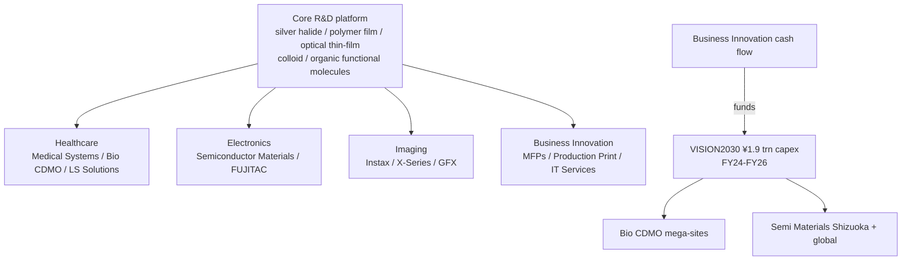
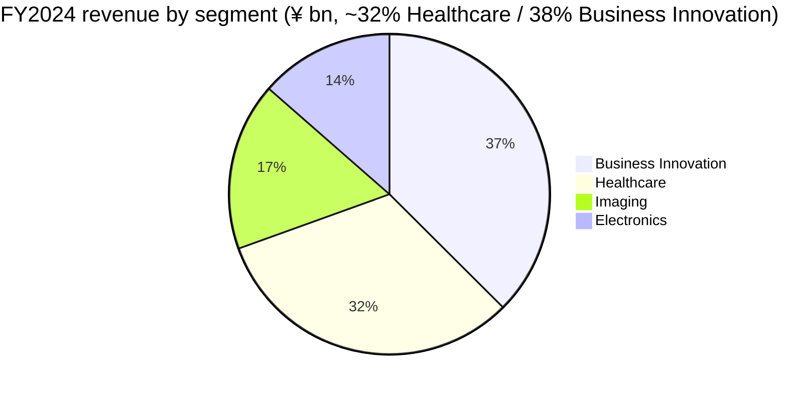

# COMPANY RESEARCH REPORT: FUJIFILM Holdings Corporation (TSE:4901)

**Date:** 2026-05-25
**Ticker:** TSE:4901 (Tokyo Stock Exchange, Prime Market)
**ADR:** FUJIY (OTC) / FUJIF
**Sector:** Diversified — Healthcare (Bio CDMO, Medical Imaging) / Electronic Materials / Business Innovation (document solutions) / Imaging
**HQ:** Tokyo Midtown West, 9-7-3 Akasaka, Minato-ku, Tokyo 107-0052, Japan
**Fiscal year:** April 1 – March 31 (FY2025 = year ended 31-Mar-2026)
**Reporting standard:** IFRS (consolidated)

---

> **Update — FY2026 guidance initiated (2026-05-14):** Coming off a record FY2025 (revenue ¥3,357.0 bn, +5.0% YoY; operating income ¥350.2 bn, +6.1%; net income attributable to FUJIFILM ¥276.7 bn, +6.0%), management guided FY2026 to revenue ¥3,470.0 bn (+3.4% YoY), operating income ¥365.0 bn (+4.2%), and net income ¥280.0 bn. The annual dividend was raised to ¥75 per share (17th consecutive increase) and a fresh ¥30.0 bn buyback was announced. The guide assumes USD/JPY 148 and EUR/JPY 158, and the operating-income growth driver is the further ramp of large-scale Bio CDMO facilities (Denmark site fully online) and continued Semiconductor Materials demand from AI-driven advanced-node spending.
> Source: [FUJIFILM Holdings Financial Results for the Fiscal Year Ended March 31, 2026, 2026-05-14](https://holdings.fujifilm.com/en/news/list/2127); [Fuji Addict summary of the release, 2026-05-14](https://fujiaddict.com/2026/05/14/fujifilm-announces-financial-results-for-the-fiscal-year-ended-march-31-2026/).

---

## TABLE OF CONTENTS

1. Company Overview
2. Company History
3. Management Team
4. Products & Services
5. Customers & Go-to-Market
6. Industry Overview
7. Competitive Landscape
8. Market Opportunity (TAM)
9. Risk Assessment

======================================

## 1. COMPANY OVERVIEW

FUJIFILM Holdings Corporation is a Japanese diversified conglomerate whose business looks almost nothing like the photo-film business it was founded to operate in 1934. The group reports across four segments — **Healthcare** (¥1,022.6 bn in FY2024, 32% of consolidated revenue), **Business Innovation** (¥1,198.5 bn, 38%), **Imaging** (¥542.0 bn, 17%), and **Electronics** (¥432.8 bn, 13%) ([Earnings Presentation FY2024 Q4](https://ir.fujifilm.com/en/investors/ir-materials/earnings-presentations/main/01112/teaserItems5/00/linkList/0/link/ff_fy2024q4_001e.pdf); aggregated segment numbers cross-checked against the [FY2024 results release at holdings.fujifilm.com](https://holdings.fujifilm.com/en/news/list/1720)). The four-segment structure was put in place in April 2024 alongside the company's **VISION2030** medium-term plan: the legacy "Materials" segment was renamed Electronics; Graphic Communications was moved into Business Innovation; and the Chemical Reagent business was reclassified out of Electronics into Healthcare LS Solutions ([Fujifilm Launches New Medium-Term Management Plan "VISION2030", 2024-04-08](https://holdings.fujifilm.com/en/news/list/1710)).

Fujifilm's business model is a portfolio of four very different cash-flow profiles wrapped under the same Tokyo-listed parent. **Healthcare** is a long-cycle, capacity-led growth business — medical imaging (CT/MRI/ultrasound/endoscopy/PACS) is an installed-base service business, Bio CDMO is multi-billion-dollar greenfield biologics manufacturing, and LS Solutions sells reagents and cell-culture media. **Business Innovation** is a slowly-shrinking but cash-generative document-imaging business (MFPs, production print, IT services) anchored by the former Fuji Xerox business that Fujifilm took 100% ownership of in 2019 and rebranded April 2021. **Imaging** is consumer / pro photography — the Instax instant-camera franchise plus the X-Series and GFX mirrorless lines — and is presently Fujifilm's highest-margin segment at ~19% OPM in FY2024. **Electronics** is the smallest segment by revenue but the most strategically important secular grower — semiconductor process materials (photoresists, CMP slurries, post-Entegris high-purity process chemicals) plus display materials (FUJITAC polarizer protective film, where Fujifilm holds ~70% global share) ([Fujifilm Europe Highly Functional Materials page](https://www.fujifilm.eu/eu/about-us/company-profile/business-fields/highly-functional-materials)).

Geographically Fujifilm is global on revenue and Japan-centric on R&D and management. Total headcount reached **74,534 as of June 2025**, of which roughly 48% (~36,000) are in Japan, ~10% (7,500) in the Americas, ~9% (6,800) in Europe, and the remaining ~33% across Asia and other regions ([Coolest Gadgets — Fujifilm Statistics 2025](https://coolest-gadgets.com/fujifilm-statistics/); [Macrotrends FUJIY employee history](https://www.macrotrends.net/stocks/charts/FUJIY/fujifilm-holdings/number-of-employees)). The company operates manufacturing footprints across Japan (Ashigara/Yoshida-Minami/Shizuoka for electronic materials and TAC films, Toyama for Bio CDMO, Kumamoto for medical devices), the United States (Holly Springs NC for Bio CDMO, College Station TX, several Electronic Materials sites), Denmark (Hillerød Bio CDMO mega-campus), and the United Kingdom (Teesside Bio CDMO).

**Scale.** FY2025 (year ended Mar 2026) consolidated revenue of ¥3,357.0 bn (~USD 22.7 bn at 148 ¥/USD) made Fujifilm one of the ~50 largest Japanese listed companies by revenue. Operating margin was **10.4%** in FY2025 (¥350.2 bn / ¥3,357.0 bn), up from 10.3% in FY2024 — a level that puts the group in the mid-tier of Japanese diversified industrials, well below pure-play semicap names like Tokyo Electron (mid-twenties OPM) but consistent with diversified hardware-plus-services peers ([FY2025 results release, 2026-05-14](https://holdings.fujifilm.com/en/news/list/2127)). The annual dividend of ¥70 was the 16th consecutive increase; the FY2026 guide of ¥75 keeps the streak going ([Fujifilm Shareholder Returns page](https://ir.fujifilm.com/en/investors/stock-and-shareholder/shareholder-returns.html)).

*Source: [Fujifilm FY2024 results release, 2025-05-02](https://holdings.fujifilm.com/en/news/list/1720); [Fujifilm FY2025 results release, 2026-05-14](https://holdings.fujifilm.com/en/news/list/2127); historical FY2021–FY2022 totals from [Fujifilm Integrated Report 2025](https://ir.fujifilm.com/en/investors/ir-materials/integrated-report/main/00/teaserItems1/01/linkList/0/link/fh_2025_alle_a4.pdf).*

*Source: segment revenue and operating income computed from the [FY2024 Q4 Earnings Presentation](https://ir.fujifilm.com/en/investors/ir-materials/earnings-presentations/main/01112/teaserItems5/00/linkList/0/link/ff_fy2024q4_001e.pdf).*

### Valuation snapshot (REQUIRED)

As of late May 2026, Fujifilm trades around **¥3,180** on Tokyo Prime ([Yahoo Finance, 4901.T quote](https://finance.yahoo.com/quote/4901.T/)), implying a market cap of roughly **¥3.81 trillion** (≈ USD 25.7 bn at ~148 ¥/USD) — well inside the global top-300 most-valuable listed companies ([Companies Market Cap — Fujifilm](https://companiesmarketcap.com/fujifilm/marketcap/)).

- **TTM P/E ≈ 14.2×** on FY2025 reported diluted EPS of ¥229.5 (¥3,180 / ¥229.5 ≈ 13.9×), compressing further to **~13.6× forward** on the FY2026 guidance EPS of ~¥234. The Simply Wall St aggregator prints 14.9× and Yahoo Finance prints 14.2× — both consistent with mid-teens trailing ([Simply Wall St — TSE:4901 Valuation](https://simplywall.st/stocks/jp/tech/tse-4901/fujifilm-holdings-shares/valuation); [Companies Market Cap P/E](https://companiesmarketcap.com/fujifilm/pe-ratio/)).
- **TTM P/S ≈ 1.13×** (¥3,810 bn / ¥3,357 bn).
- **P/B ≈ 1.4×** on book value per share of ~¥2,250 (¥3,180 / ¥2,250 = 1.41×).
- **Dividend yield ≈ 2.2%** at the FY2025 ¥70 dividend; 2.4% on the FY2026 guided ¥75.
- **3-year P/E range** has been ~10–18× — Fujifilm is one of the more "value-priced" names in the Japanese large-cap industrial set, with the multiple compressing into the 10× area during the 2022 yen-weakness panic and re-rating to mid-teens as Bio CDMO and Electronics earnings became visible.

**Peer benchmarks (mid-May 2026):**
- **Canon (TSE:7751)** — closest Japanese imaging-plus-medical-plus-industrial comp — TTM P/E ~13.5× ([Canon stock page on Yahoo Finance](https://finance.yahoo.com/quote/7751.T/key-statistics/); [GuruFocus TSE:7751 summary](https://www.gurufocus.com/stock/TSE:7751/summary)).
- **Konica Minolta (TSE:4902)** — the closest "diversified imaging+optical+materials" peer — TTM P/E is **negative** at –5.0× because the company is loss-making on a TTM basis after multi-year restructuring; the P/B of 0.6× and P/S of 0.3× show it as a deep-value / "fix-or-disappear" story ([Stock Analysis TSE:4902 market cap](https://stockanalysis.com/quote/tyo/4902/market-cap/)).
- **Olympus (TSE:7733)** — endoscope pure-play, the direct competitor to Fujifilm's Medical Systems endoscope franchise — TTM P/E ~28.5×.
- **Lonza (SWX:LONN)** — global biologics CDMO pure-play, the closest Bio CDMO comp — TTM P/E ~53.7×, reflecting the "CDMO premium" the market pays for capacity-led growth visibility ([Simply Wall St — Lonza Group Valuation](https://simplywall.st/stocks/ch/pharmaceuticals-biotech/vtx-lonn/lonza-group-shares/valuation)).
- **Samsung Biologics (KRX:207940)** — Asian Bio CDMO pure-play — TTM P/E ~70×, the most growth-priced CDMO globally.
- **Nikon (TSE:7731)** — Japanese diversified imaging+industrial peer — TTM P/E ~35×.

*Source: peer multiples retrieved May 2026 from [companiesmarketcap.com Fujifilm P/E](https://companiesmarketcap.com/fujifilm/pe-ratio/), [Yahoo Finance 4901.T](https://finance.yahoo.com/quote/4901.T/), [Yahoo 7751.T statistics](https://finance.yahoo.com/quote/7751.T/key-statistics/), [Stock Analysis 4902.T](https://stockanalysis.com/quote/tyo/4902/market-cap/), [Yahoo 7733.T](https://finance.yahoo.com/quote/7733.T/), [Simply Wall St LONN](https://simplywall.st/stocks/ch/pharmaceuticals-biotech/vtx-lonn/lonza-group-shares/valuation), [Yahoo 207940.KS](https://finance.yahoo.com/quote/207940.KS/), [Yahoo 7731.T](https://finance.yahoo.com/quote/7731.T/).*

**Multiple decomposition (why Fujifilm trades at 14× while Lonza and Samsung Biologics trade 50× / 70×):** the gap is the **conglomerate discount**. Bio CDMO is only ~10% of consolidated revenue (¥250–290 bn in FY2025 versus ¥3,357 bn total) — even though Bio CDMO is growing at 15-20% with multi-billion-dollar capex visibility, it's diluted by Business Innovation (slowly declining MFP / office) and the cyclicality of Electronics. The market pays for the segment it can isolate; a pure-play biologics CDMO would re-rate to Lonza's ~53× multiple, implying a >3× re-rating of the segment if it were spun. *Analyst view:* this is the obvious break-up trade, and is exactly what activists pushed for at the predecessor Fuji Xerox arrangement, but Fujifilm management has consistently held that the cross-subsidization of Healthcare and Electronics R&D by Business Innovation cash flow is the company's actual moat. Whether that thesis holds will depend on whether VISION2030's Bio CDMO capacity ramp converts into the targeted USD 1.4 bn+ Diosynth revenue by FY2025/FY2026 ([Fierce Pharma 2025-01-13 — Fujifilm Diosynth $1.4B annual sales target](https://www.fiercepharma.com/pharma/fujifilm-diosynth-ceo-heralds-2025-biggest-year-yet-cdmos-8b-expansion-drive)).

The valuation is **not stretched** by any of the standard checks — well below the 50× / 2× sector-median triggers in the skill rules. The risk is the opposite: if Business Innovation's secular decline accelerates or if a new Bio CDMO over-capacity cycle hits, the conglomerate discount could deepen, which is captured in Section 9 as a segmental-margin-compression risk rather than a multiple-compression risk.

---

## 2. COMPANY HISTORY

Fujifilm was incorporated in **January 1934** as Fuji Photo Film Co., Ltd., in Minami-Ashigara, Kanagawa Prefecture — a government-backed project to build a domestic photographic-film industry that would reduce Japan's reliance on Kodak (US) and Agfa (Germany) imports ([History of Fujifilm Group](https://holdings.fujifilm.com/en/about/history); [Companies History profile](https://www.companieshistory.com/fujifilm-holdings/)). The first photographic films shipped in 1934; X-ray film for medical use followed in 1936, planting the seed of what would, ninety years later, become a ¥1 trillion-plus Healthcare business. The 1940s–1980s expanded the franchise into optical glasses, color print paper, magnetic tape (where the FUJIFILM brand still leads enterprise-data archive markets), and graphic-arts plates.

The single most consequential transformation in Fujifilm's history is the **2000–2010 film-to-non-film pivot under Shigetaka Komori**, who succeeded Minoru Ohnishi as president in June 2003 ([Innovating Out of Crisis: How Fujifilm Survived and Thrived, Komori, 2015](https://www.amazon.com/Innovating-Out-Crisis-Fujifilm-Vanishing/dp/1611720230)). At the start of 2000 photographic products generated ~60% of group sales and roughly two-thirds of profit; by 2010 global photographic-film demand had fallen >90% and film-related revenue at Fujifilm was below 10% of total ([The Decision Stack — How Fujifilm Survived What Killed Kodak](https://www.thedecisionstack.com/the-decision-stack-in-action-how-fujifilm-survived-what-killed-kodak/)). Where Kodak treated digital as a defensive substitute, Fujifilm treated film expertise (colloidal silver halide, polymer-film coating, organic-functional-molecule design) as the *input* to entirely new businesses. Komori's "Second Foundation" strategy redeployed R&D into LCD display materials (FUJITAC, launched as a polarizer protective film in 1958 but scaled in the 2000s), cosmetics (Astalift, leveraging collagen-stabilization know-how from photographic emulsions), pharmaceuticals (Toyama Chemical, acquired 2008), and electronic materials (Arch Chemicals microelectronic-materials business acquired November 2004 for **USD 160.5 million**) ([Arch Chemicals 8-K 2004-10-25](https://www.sec.gov/Archives/edgar/data/0001072343/000119312504207817/dex992.htm)).

The four most consequential transactions in modern Fujifilm history:

- **Arch Chemicals microelectronic materials (November 2004; USD 160.5 m)** — the foundation stone of Fujifilm Electronic Materials, anchoring the photoresist / CMP slurry / process chemicals business that today underpins the Electronics segment ([Arch Chemicals 8-K](https://www.sec.gov/Archives/edgar/data/0001072343/000119312504207817/dex992.htm)).
- **Diosynth / Bio CDMO entry (2011 RTP NC; 2014 Diosynth UK)** — Fujifilm acquired the Research Triangle Park bioprocessing site from MSD/Merck in 2011 and the UK Diosynth Biotechnologies site in 2014, founding what is now Fujifilm Diosynth Biotechnologies. Since 2011 the group has committed **>USD 8 bn cumulative capex** to global Bio CDMO capacity expansion ([Fierce Pharma 2025-01-13](https://www.fiercepharma.com/pharma/jpm26-fujifilm-ceo-touts-biologics-capacity-edge-manufacturing-unit-keeps-expansions-coming)).
- **Fuji Xerox 75% buyout from Xerox (closed November 2019; USD 2.3 bn)** — Fujifilm bought out Xerox's remaining 25% stake (Fujifilm had held 75% since 2001), then announced in January 2020 that it would not renew the technology agreement; the joint venture was renamed FUJIFILM Business Innovation Corporation on **April 1, 2021** ([Wikipedia — Fujifilm Business Innovation](https://en.wikipedia.org/wiki/Fujifilm_Business_Innovation); [Keypoint Intelligence — Fuji Xerox name change, 2020-01-08](https://keypointintelligence.com/keypoint-blogs/fuji-xerox-will-be-changing-its-name-in-2021)). This converted what was effectively a JV cash-cow into a 100%-owned consolidated subsidiary and is the reason today's Business Innovation segment is the largest revenue line at ~38% of group revenue.
- **Hitachi Diagnostic Imaging (closed March 2021; ¥179 bn ≈ USD 1.7 bn)** — Fujifilm acquired Hitachi's CT/MRI/X-ray/ultrasound business, fundamentally transforming the Medical Systems business from a film+endoscope vendor into a full-modality imaging-hardware company. The acquired entity was renamed FUJIFILM Healthcare Americas Corp. effective July 2021 ([Applied Radiology — Hitachi Healthcare changes name to FujiFilm Healthcare Americas, 2021-07-01](https://appliedradiology.com/articles/hitachi-healthcare-changes-name-to-fujifilm-healthcare-americas-corporation); [Healthcare-in-Europe.com on the integration, 2021-07-01](https://healthcare-in-europe.com/en/news/fujifilm-healthcare-acquires-hitachi-diagnostic-imaging-presents-new-portfolio.html)).

Smaller but still strategically relevant: **Cellular Dynamics International (March 2015; USD 307 m)** brought human induced-pluripotent-stem-cell (iPSC) technology in-house ([Fujifilm CDI history](https://www.fujifilmcdi.com/fujifilm-holdings-to-acquire-cellular-dynamics-international-inc)); **Wako Pure Chemical (2017)** added the chemical reagent / life sciences platform that today sits in Healthcare LS Solutions; **Entegris Electronic Chemicals (October 2023; USD 700 m)** added high-purity-process-chemicals (HPPC) — primarily wet-chemical etchants, cleaners, and CVD precursor gases — substantially broadening Electronics' product line beyond photoresists and CMP slurries ([Entegris 8-K 2023-05-10](https://www.sec.gov/Archives/edgar/data/0001101302/000110130223000008/qedsigningjointpressreleas.htm); [Fujifilm press release on HPPC closing](https://www.fujifilm.com/us/en/news/Fujifilm_to_Acquire_HPPC_Business_from_Entegris)).

```mermaid
timeline
    title Fujifilm Holdings — 90+ years of pivots
    1934 : Fuji Photo Film Co. founded in Minami-Ashigara (Japan domestic film industry)
    1958 : FUJITAC TAC film launched — eventually anchor of LCD polarizer market
    1962 : Fuji Xerox JV formed with Rank Xerox (UK / Xerox US)
    2000 : Film demand peaks; digital-camera disruption begins
    2003 : Shigetaka Komori appointed President & CEO — Second Foundation
    2004 : Acquires Arch Chemicals microelectronic-materials business (USD 161m)
    2006 : Becomes Fujifilm Holdings (holding-company structure)
    2008 : Acquires Toyama Chemical (pharmaceutical R&D)
    2011 : Acquires MSD/Merck Research Triangle Park site — Diosynth Biotech founded
    2014 : Acquires Diosynth UK from Merck — global biologics CDMO scaled
    2015 : Acquires Cellular Dynamics International (USD 307m) — iPSC platform
    2017 : Acquires Wako Pure Chemical — life-sciences reagents
    2019 : Buys remaining 25% of Fuji Xerox from Xerox (USD 2.3bn)
    2021 : Renames Fuji Xerox to FUJIFILM Business Innovation (Apr 1)
    2021 : Closes Hitachi Diagnostic Imaging acquisition (¥179bn / USD 1.7bn)
    2021 : Goto Teiichi appointed President & CEO (June)
    2023 : Acquires Entegris Electronic Chemicals business (USD 700m)
    2024 : Launches VISION2030 medium-term plan — 4 trillion-yen revenue target
    2024 : Opens Holly Springs NC mega-CDMO ($3.2B total investment)
    2025 : Launches Hillerød Denmark Bio CDMO phase-1 (~DKK 11bn)
    2026 : Reports record FY2025 — ¥3,357bn revenue, ¥350bn OP income
```

**Strategic pivots — three transformations stand out.** First, the **2003–2010 Second Foundation** under Komori, which redeployed film-platform R&D into Healthcare and Electronic Materials and is the reason Fujifilm exists today. Second, the **2019–2021 Xerox separation**: by buying out Xerox and rebranding the JV, Fujifilm gained 100% strategic control over a profitable cash-flow source (legacy document business) and removed the IP-licensing constraint that limited its ability to enter adjacent print and IT-services markets ([Wikipedia — Fujifilm Business Innovation history](https://en.wikipedia.org/wiki/Fujifilm_Business_Innovation)). Third, the **2024 VISION2030 plan**, announced April 2024, which made the four-segment structure explicit and laid out the **¥4 trillion / ~15% OPM by FY2030** revenue and margin targets, supported by ¥1.9 trillion of investment across FY2024–FY2026 (the bulk into Bio CDMO and Semiconductor Materials) ([Fujifilm Launches New Medium-Term Management Plan "VISION2030", 2024-04-08](https://holdings.fujifilm.com/en/news/list/1710); [Integrated Report 2025 medium-term strategy chapter](https://ir.fujifilm.com/en/investors/ir-materials/integrated-report/main/015/teaserItems1/011111115/linkList/0/link/fh_2025_002e.pdf)).

**Recent developments (last 18 months).** In November 2024 Fujifilm Diosynth opened its expanded Hillerød Denmark site as the first phase of a global CDMO ecosystem expansion, with Holly Springs NC ribbon-cut in 2025 as a near-replica facility (the two sites are described as ~97% identical from a process and requirement standpoint, enabling cross-Atlantic capacity arbitrage) ([Fierce Pharma — Fujifilm Biotechnologies takes lessons from Denmark for NC, 2025-03](https://www.fiercepharma.com/manufacturing/fujifilm-biotechnologies-takes-lessons-denmark-debut-massive-nc-cell-culture-facility); [GlobeNewswire — Fujifilm Diosynth launches global ecosystem expansion, 2024-11-05](https://www.globenewswire.com/news-release/2024/11/05/2974607/0/en/FUJIFILM-Diosynth-Biotechnologies-Launches-First-Phase-of-Global-CDMO-Ecosystem-Expansion.html)). In July 2025 Fujifilm announced a **PFAS-free negative-type ArF immersion photoresist** developed in collaboration with imec, demonstrating 28-nm-generation metal-wire yields — a meaningful entry given the regulatory squeeze on PFAS-containing semiconductor materials ([Fujifilm — PFAS-Free ArF Immersion Resist news release, 2025-07-15](https://www.fujifilm.com/jp/en/news/hq/12568); [imec press release on the joint development](https://www.imec-int.com/en/press/fujifilm-develops-pfas-free1-negative-arf-immersion-resist)). In November 2025 Fujifilm Electronic Materials completed a new development & evaluation facility at the Shizuoka factory expanding R&D capacity for advanced-node semiconductor materials. And in May 2026 the FY2025 results print was followed by a fresh ¥30 bn buyback authorization on top of the ¥75 dividend (17th consecutive increase) ([FY2025 results release, 2026-05-14](https://holdings.fujifilm.com/en/news/list/2127)).

---

## 3. MANAGEMENT TEAM

### Teiichi Goto — President, Representative Director & CEO

**Teiichi Goto** has served as President, Representative Director, and CEO of FUJIFILM Holdings since **June 2021**, succeeding Shigetaka Komori (who became Chairman and Representative Director). Goto was born **January 23, 1959**, joined Fuji Photo Film Co., Ltd. (the predecessor to today's FUJIFILM Corporation) in **1982**, and rose through the company over four decades — primarily in graphic systems and then Medical Systems ([Bloomberg profile — Teiichi Goto](https://www.bloomberg.com/profile/person/20724383); [Fujifilm — Change of Chairman and President, 2021-03-26](https://holdings.fujifilm.com/en/news/list/1076)).

Goto's pre-CEO career was anchored in the Medical Systems franchise that he would later make the centerpiece of his strategy. He served as **General Manager of the Medical Systems Business Division at FUJIFILM Corporation from 2013 to 2014**, the formative period when Fujifilm was scaling the Synapse PACS franchise globally and preparing for the eventual Hitachi Diagnostic Imaging deal. He was appointed a Director of FUJIFILM Corporation in **2016**, where he oversaw the integration of Cellular Dynamics International (CDI, acquired 2015) and Wako Pure Chemical (acquired 2017) — both deals that today populate the Healthcare LS Solutions sub-segment. He served as Operating Officer and then Executive Officer through 2019–2020 before being elevated to President. Goto's appointment in 2021 came concurrent with the closing of the Hitachi Diagnostic Imaging acquisition (March 2021) and the renaming of Fuji Xerox to Fujifilm Business Innovation (April 2021) — two milestones widely understood as Komori's parting gift, leaving Goto to integrate and operate ([New Chairman of the Dujat Advisory Board: Mr. Teiichi Goto](https://www.dujat.nl/news/new-chairman-of-the-dujat-advisory-board-mr-teiichi-goto-president-ceo-of-fujifilm-holdings-corporation)).

As CEO, Goto's signature initiative is **VISION2030**, launched April 2024 — a ¥4 trillion revenue and ~15% OPM target for FY2030 anchored by 35% revenue growth from FY2023, ¥1.9 trillion of three-year investment (FY2024–FY2026), and explicit growth targets for Bio CDMO (USD 1.4 bn+ revenue by FY2025, ramping further) and Semiconductor Materials (¥500 bn revenue by FY2030 vs. ¥250 bn baseline FY2024) ([VISION2030 announcement, 2024-04-08](https://holdings.fujifilm.com/en/news/list/1710); [Integrated Report 2025 — Medium-to-Long-Term Growth Strategy](https://ir.fujifilm.com/en/investors/ir-materials/integrated-report/main/015/teaserItems1/011111115/linkList/0/link/fh_2025_002e.pdf)). His public framing — captured in his "Message from Leadership" — is "Never Stop." Goto is also notable as a continuity-vs-disruption CEO: unlike a Western private-equity playbook that would spin Bio CDMO or Business Innovation, he has explicitly defended the conglomerate structure, arguing the four segments cross-subsidize R&D and provide stability across cycles. His total annual compensation in FY2024 was approximately **¥261 million** (roughly 40% salary / 60% bonus + stock), modest by US large-cap CEO standards but high by Japanese norms ([Simply Wall St — Fujifilm Holdings Management](https://simplywall.st/stocks/us/tech/otc-fuji.y/fujifilm-holdings/management)). Goto graduated with an undergraduate degree from Chuo University in 1982; his tenure as CEO is just under five years as of the May 2026 print.

(*Founder-bio note:* Fuji Photo Film was incorporated in 1934 as a government-backed corporate vehicle rather than as a founder-led startup. There is no single individual identified by the company as "founder" in the modern sense — the establishment was led by a consortium and the initial CEO was the firm's first President, Asajiro Nogami. Per the company-research skill's "founder + CEO only" rule, no individual founder bio is included; Komori — the architect of the Second Foundation — is mentioned only as the historical predecessor of the current CEO, not as a separate bio entry.)

---

## 4. PRODUCTS & SERVICES

> **Priority section.** Fujifilm's four-segment structure means Section 4 has to walk four very different business franchises. Photoresists — Fujifilm's contribution to the seven-company photoresist comparable study — sit inside Section 4.2 (Electronics → Semiconductor Materials). The breadth here is proportionate to revenue mix but Electronics gets disproportionate explanatory depth given the comparable-study context.

### 4.1 Fujifilm's segment / sub-segment product matrix

Fujifilm Holdings publishes a unified product matrix in its annual **Group Overview** presentation. The four-segment structure (post-April-2024) maps to the sub-segments and product lines shown below. Revenue figures are FY2024 (year ended Mar 2025) — the most recent full-year segment disclosure as of the FY2025 release.

| Segment | FY2024 Revenue (¥ bn) | Sub-segment | Key product lines |
|---|---:|---|---|
| **Healthcare** | 1,022.6 | Medical Systems (¥593.7 bn) | Endoscopy (ELUXEO, SCOPIA); CT, MRI, X-ray, ultrasound, mammography (post-Hitachi); IVR (Synapse PACS, AI-Rad Companion); IVD reagents |
|   |   | Bio CDMO (¥109.8 bn) | mAb / fusion-protein / gene-therapy / vaccine biologics manufacturing — Hillerød DK, Holly Springs NC, College Station TX, Teesside UK, Toyama JP |
|   |   | LS Solutions (¥319.1 bn) | Wako reagents, Irvine Scientific cell-culture media, CDI iPSC cell lines, Consumer Healthcare (Astalift cosmetics, NXT supplements) |
| **Electronics** | 432.8 | Semiconductor Materials (¥250.4 bn) | **Photoresists (i-line, KrF, ArF dry/immersion, EUV experimental)**; CMP slurries; high-purity process chemicals (post-Entegris HPPC); CVD precursors; cleaners and etchants; advanced packaging chemicals |
|   |   | AF Materials (¥182.4 bn) | **FUJITAC TAC polarizer protective film**, EXCLEAR touch-panel film, Wako specialty chemicals, magnetic-tape data storage (LTO Ultrium) |
| **Business Innovation** | 1,198.5 | Office Solutions (¥522.9 bn) | Apeos / DocuCentre MFPs, ApeosWiz workflow software, IT services and document outsourcing in APAC |
|   |   | Business Solutions (¥330.9 bn) | Enterprise content management, IT consulting, workflow / BPO services; commercial print sub-products |
|   |   | Graphic Communications (¥344.7 bn) | Production-print presses (Revoria, J Press inkjet), CTP plates, ink-jet inks, signage materials |
| **Imaging** | 542.0 | Consumer Imaging (¥328.0 bn) | **Instax instant cameras** + film (mini, WIDE, SQUARE, Link, Evo); photo books; smartphone film products |
|   |   | Professional Imaging (¥214.0 bn) | **X-Series APS-C mirrorless cameras**, **GFX medium-format mirrorless**, FUJINON lenses, optical devices (broadcast / surveillance / industrial) |

*Source: sub-segment revenue from [Fujifilm FY2024 Q4 Earnings Presentation, 2025-05-02](https://ir.fujifilm.com/en/investors/ir-materials/earnings-presentations/main/01112/teaserItems5/00/linkList/0/link/ff_fy2024q4_001e.pdf) and the [FY2024 results press release](https://holdings.fujifilm.com/en/news/list/1720). Product-line examples reproduced from the Fujifilm Group Overview presentation. Healthcare sub-totals adjusted to reconcile to the headline ¥1,022.6 bn segment figure.*

### 4.2 Electronics — the photoresist + display-materials franchise

Electronics is the smallest segment by revenue (13.5% of FY2024) but the most strategically important secular grower, anchored by two distinct franchises: **Semiconductor Materials** (photoresists, CMP slurries, post-Entegris high-purity process chemicals) and **Advanced Functional Materials** (the FUJITAC display-film franchise plus LTO magnetic-tape and specialty chemicals).

#### 4.2.1 Semiconductor Materials — photoresists, CMP slurries, HPPC

The semiconductor materials business is anchored in the 2004 acquisition of Arch Chemicals' microelectronic-materials platform ([Arch Chemicals 8-K, 2004-10-25](https://www.sec.gov/Archives/edgar/data/0001072343/000119312504207817/dex992.htm)) and substantially broadened by the **October 2023 acquisition of Entegris' high-purity-process-chemicals (HPPC) business for USD 700 million** ([Entegris 8-K announcing closing, 2023-05-10](https://www.sec.gov/Archives/edgar/data/0001101302/000110130223000008/qedsigningjointpressreleas.htm); [Fujifilm press release on HPPC closing](https://www.fujifilm.com/us/en/news/Fujifilm_to_Acquire_HPPC_Business_from_Entegris)). The combined product line covers **photoresists (i-line, KrF, ArF dry, ArF immersion, and EUV experimental), CMP slurries (used in chemical-mechanical planarization to flatten copper/tungsten/dielectric layers between metal levels), high-purity process chemicals (wet-clean and etchant solutions delivered in bulk to fabs), and CVD precursor gases (delivered by chemical-vapor-deposition to form dielectric or other films on the wafer surface)**.

> Verbatim from the [Fujifilm Group Overview presentation, July 2025](https://ir.fujifilm.com/en/investors/ir-materials/business-overview/main/0/teaserItems1/0/linkList/0/link/ff_presentation_202507_001e.pdf): "Fujifilm provides comprehensive semiconductor materials, including photoresists, CMP slurries, high-purity process chemicals, and advanced materials, supporting the most advanced logic and memory manufacturing nodes." (cited verbatim; image embed of the slide deck pending — the company does not publish a downloadable PDF in machine-readable form.)

**中文释义 / Plain-language gloss:** Photoresist is the light-sensitive polymer layer that records the wafer's circuit pattern when light is shone through a mask. A KrF resist responds to 248 nm deep-UV light; an ArF resist responds to 193 nm light (the deeper-UV step that enabled <90 nm nodes); ArF immersion (193 nm light passing through a high-refractive-index water film between lens and wafer) extends to ~28-nm and below; EUV resist responds to 13.5 nm light (the extreme-UV step that enables sub-7 nm nodes). 光刻胶 / photoresist is one of the most chemistry-intensive, IP-protected inputs in semiconductor manufacturing — qualification cycles run 12-24 months per node per customer, and once qualified a resist is sticky for years. Fujifilm participates in **i-line, KrF, and ArF (both dry and immersion)** with credible share; it has been investing in EUV but is not a meaningful EUV-resist shipper at scale as of 2025 — that market is dominated by Shin-Etsu and JSR + TOK.

**CMP slurry** is the liquid abrasive used to mechanically and chemically polish each metal/dielectric layer flat between lithography steps; it's how the industry achieves the nanometer-flat surfaces necessary for high-aspect-ratio patterning. CMP slurries are sold by chemistry (copper-CMP, tungsten-CMP, oxide-CMP, STI / shallow-trench-isolation, ILD / interlayer dielectric) — Fujifilm participates in **copper-CMP and oxide-CMP slurries** and is a top-5 supplier globally per industry research, though smaller than CMC Materials (now Entegris-owned), Versum (now Merck-owned), and Fujimi ([CMP Slurry Market Report 2025 — Coherent Market Insights](https://www.coherentmarketinsights.com/market-insight/cmp-slurry-market-4039) listing Versum, Cabot, Fujimi, Dow, FujiFilm, BASF, 3M, Evonik, and Hitachi Chemical as key players).

**High-Purity Process Chemicals (HPPC)** — wet-clean solutions, etchants, and CVD precursors — was the largest single addition to Fujifilm's Electronic Materials franchise in the post-2020 era. The Entegris HPPC business had **pro-forma 2022 sales of ~USD 360 million** with leadership positions in North America and Europe ([Fujifilm press release on the Entegris HPPC deal, 2023-05](https://www.fujifilm.com/us/en/news/Fujifilm_to_Acquire_HPPC_Business_from_Entegris)). The acquisition shifted Fujifilm Electronic Materials from "specialty resist + slurry" to "full-portfolio fab chemicals supplier," giving the segment the cross-sell motion that BASF, Merck (post-Versum), and Tokyo Ohka Kogyo all rely on.

*Analyst view:* Fujifilm's photoresist share is meaningful but not category-leading. Per industry research triangulated from Fortune Business Insights and Mordor Intelligence, **top-5 KrF photoresist suppliers (TOK, JSR, Shin-Etsu, DuPont/Rohm & Haas, Fujifilm/Dongjin) collectively hold ~70-86% of the global KrF market**; Fujifilm's mid-single-digit (~6%) share places it last among the Japanese top-4 ([Photoresist Chemicals Market — Fortune Business Insights 2025](https://www.fortunebusinessinsights.com/photoresist-chemicals-market-115414); [Photoresist Market — Mordor Intelligence 2025](https://www.mordorintelligence.com/industry-reports/photoresist-market)). In **ArF (the higher-value subset)** Fujifilm's share is even smaller (~5%), reflecting JSR and TOK's historical advantage on 193-nm immersion qualification cycles. Where Fujifilm has built distinctive position is in **advanced-packaging photoresists** (used for redistribution-layer / RDL patterning on fan-out wafers — AI accelerator packaging) and in **negative-tone resists for high-NA contexts**; its July 2025 PFAS-free negative ArF immersion resist developed with imec is the company's most visible recent IP advance ([Fujifilm Develops PFAS-Free Negative ArF Immersion Resist, 2025-07-15](https://www.fujifilm.com/jp/en/news/hq/12568); [imec press release on the joint development, 2025-07-15](https://www.imec-int.com/en/press/fujifilm-develops-pfas-free1-negative-arf-immersion-resist)).

*Source: industry estimates from [Fortune Business Insights — Photoresist Chemicals Market, 2025](https://www.fortunebusinessinsights.com/photoresist-chemicals-market-115414) and [Mordor Intelligence — Photoresist Market, 2025](https://www.mordorintelligence.com/industry-reports/photoresist-market). Pie shares are mid-point industry estimates, not company disclosure.*

**Competitive-advantage verdict for Semiconductor Materials:** *Analyst view:* **partial moat**. The IP-and-qualification barrier in photoresists is genuine — once a resist is qualified at a TSMC or Samsung node, switching costs are high and the supplier captures 5-10 years of recurring revenue. But Fujifilm is a #4–5 player in KrF/ArF (behind TOK, JSR, Shin-Etsu, and DuPont) rather than a category leader; the moat is real but smaller than at TOK/JSR. **Moat type: technology + IP + customer qualification cycles** (high switching costs once qualified).

#### 4.2.2 Advanced Functional Materials — FUJITAC, EXCLEAR, magnetic tape

FUJITAC (cellulose-triacetate film) was launched in 1958 as a clear protective film for camera negatives and was repurposed in the 1990s as the protective layer on the polarizer used in every LCD. **It is the single dominant product in Fujifilm's display-materials franchise: Fujifilm reports that FUJITAC "holds approximately 70% of the market for polarizer protective films"** ([Fujifilm Europe — Highly Functional Materials page](https://www.fujifilm.eu/eu/about-us/company-profile/business-fields/highly-functional-materials); [Data Insights Market — TAC Film for LCD Polarizers 2024](https://www.datainsightsmarket.com/reports/tac-film-for-lcd-polarizers-252284) confirms Fujifilm as a "dominant player" alongside Konica Minolta and Zeon).

**中文释义 / Plain-language gloss:** Every LCD panel needs polarizers on both glass surfaces to filter the light coming through the liquid-crystal layer; each polarizer needs a thin protective film on both faces to protect the polarizing material from scratches and humidity. TAC (cellulose triacetate, 三醋酸纤维素) is the standard polymer for that protective film because it's optically clear, dimensionally stable, and bondable to the polarizing layer. FUJITAC is the canonical product brand — Fujifilm makes it at its Ashigara, Fuji-Miyanomori, and Kyushu factories. As LCD panels have shifted out of TVs into industrial/automotive/medical/handheld displays, the FUJITAC franchise has stayed remarkably resilient even as OLED has taken share in the smartphone subset of the market.

*Source: [Fujifilm Europe — Highly Functional Materials page](https://www.fujifilm.eu/eu/about-us/company-profile/business-fields/highly-functional-materials), supplemented by [Data Insights Market — TAC Film for LCD Polarizers Industry Future Growth Prospects](https://www.datainsightsmarket.com/reports/tac-film-for-lcd-polarizers-252284).*

**Competitive-advantage verdict for Advanced Functional Materials:** *Analyst view:* **wide moat in FUJITAC** (~70% global share, scale advantages in TAC casting capacity, established supply contracts with LG Display / Samsung Display / BOE polarizer suppliers) but **partial moat in adjacent products** (EXCLEAR touch-panel film, LTO magnetic tape — both face well-funded competitors with similar capacity). **Moat type: scale + customer-supply-contract lock-in**.

### 4.3 Healthcare — Medical Systems + Bio CDMO + LS Solutions

#### 4.3.1 Medical Systems (¥593.7 bn FY2024 — the scale leader within Healthcare)

The Medical Systems sub-segment covers four product franchises: **endoscopy** (the ELUXEO and SCOPIA platforms — colonoscopes, gastroscopes, bronchoscopes, ultrasound endoscopes), **diagnostic imaging hardware** (CT, MRI, X-ray, mammography, ultrasound — substantially the Hitachi Diagnostic Imaging franchise acquired March 2021), **healthcare IT** (Synapse PACS / VNA / RIS, Synapse 3D), and **IVD/IVR reagents** (Wako-branded in-vitro diagnostic reagents and CDI cell lines). Fujifilm reports that Synapse PACS has the **largest global market share of any PACS system, with 5,000+ installations worldwide** ([Fujifilm Medical Systems Business Briefing, 2023-10-12](https://ir.fujifilm.com/en/investors/ir-materials/presentations/session/main/0118/teaserItems1/0/tableContents/0114/multiFileUpload2_1/link/ff_presentation_20231012_001e.pdf)).

> Verbatim from the [Fujifilm Medical Systems Business Briefing, 2023-10-12](https://ir.fujifilm.com/en/investors/ir-materials/presentations/session/main/0118/teaserItems1/0/tableContents/0114/multiFileUpload2_1/link/ff_presentation_20231012_001e.pdf): "Fujifilm's SYNAPSE continues to maintain the largest global market share and achieved further share increase in 2022."

**中文释义 / Plain-language gloss:** Endoscopes are flexible cameras inserted into the GI tract / lung / bladder to visualize tissue for diagnosis or biopsy. Olympus is the global #1 in gastrointestinal endoscopes (~60-70% global share) with Fujifilm and Pentax as the credible #2 and #3. The 2025 launch of ELUXEO 8000 — a 4K processor with the proprietary Amber-Red Color Imaging mode — is Fujifilm's most recent attempt to attack Olympus on imaging-mode innovation. PACS (Picture Archiving and Communication System, 影像归档与传输系统) is the database+workflow software that hospitals use to store and retrieve all medical images — the post-Hitachi expansion lets Fujifilm sell PACS bundled with the CT/MRI hardware itself, a cross-sell motion not available pre-2021.

*Analyst view:* Medical Systems has **partial moat** — strong in PACS (~#1 global share, software-driven switching costs) and credible in endoscopes (~#2-3 after Olympus, with the Amber-Red Color Imaging mode as a differentiator), weaker in the hardware modalities (CT, MRI) where the global market is dominated by GE HealthCare, Siemens Healthineers, Philips, and Canon Medical. **Moat type: software switching costs (PACS); installed-base service for endoscopes; commodity-leaning for CT/MRI**.

#### 4.3.2 Bio CDMO — Fujifilm Diosynth Biotechnologies (¥109.8 bn FY2024, +20%+ growth trajectory)

Bio CDMO is the most strategically prominent growth driver in the entire Fujifilm portfolio. The franchise was founded in 2011 with the acquisition of Merck's Research Triangle Park (NC) bioprocessing site and the Diosynth UK site in 2014, and has been expanded relentlessly since. **Since 2011 Fujifilm Diosynth has committed >USD 8 bn cumulative capex** to build out global biologics manufacturing capacity ([Fierce Pharma — JPM26: Fujifilm CEO touts CDMO strength, 2026-01](https://www.fiercepharma.com/pharma/jpm26-fujifilm-ceo-touts-biologics-capacity-edge-manufacturing-unit-keeps-expansions-coming); [Fujifilm Diosynth Launches Global CDMO Ecosystem Expansion, 2024-11-05](https://www.globenewswire.com/news-release/2024/11/05/2974607/0/en/FUJIFILM-Diosynth-Biotechnologies-Launches-First-Phase-of-Global-CDMO-Ecosystem-Expansion.html)).

> Verbatim from the [Fujifilm Diosynth Holly Springs expansion announcement, 2024-04-11 (NC Governor's office)](https://governor.nc.gov/news/press-releases/2024/04/11/fujifilm-diosynth-biotechnologies-expands-holly-springs-facility-create-one-largest-end-end-cell): "FUJIFILM Diosynth Biotechnologies Expands Holly Springs Facility to Create One of the Largest End-to-End Cell Culture Facilities in the World."

**中文释义 / Plain-language gloss:** A **CDMO (Contract Development and Manufacturing Organization, 委托研发与生产组织)** is a fee-for-service biopharmaceutical manufacturer that biotech and big-pharma customers hire to make their molecules (monoclonal antibodies, fusion proteins, vaccines, gene therapies) when they don't have or don't want in-house manufacturing. The economics are capacity-led: each CDMO suite (bioreactor + downstream-purification line) takes 3-5 years and hundreds of millions of dollars to build, then signs 10+ year customer contracts. Fujifilm's strategy has been **mega-site build-outs with near-identical Denmark and North Carolina sites** so a customer can choose either continent for capacity arbitrage and regulatory flexibility — the two facilities are described as ~97% identical from a process and requirement standpoint ([Fierce Pharma — Fujifilm Biotechnologies takes lessons from Denmark, 2025-03](https://www.fiercepharma.com/manufacturing/fujifilm-biotechnologies-takes-lessons-denmark-debut-massive-nc-cell-culture-facility)).

*Source: cumulative announced investment from [Fierce Pharma 2024-11-05](https://www.fiercepharma.com/pharma/fujifilm-diosynth-ceo-heralds-2025-biggest-year-yet-cdmos-8b-expansion-drive); [GEN — Talent, Talent, Talent Drives Diosynth's $3.2B NC Expansion](https://www.genengnews.com/topics/bioprocessing/talent-talent-talent-drives-fujifilm-diosynths-3-2b-nc-expansion/); [NC Biotechnology Center — Holly Springs doubling announcement, 2024-04-11](https://www.ncbiotech.org/news/fujifilm-diosynth-biotechnologies-double-holly-springs-biomanufacturing-campus); [BioProcess International — Fujifilm launches Denmark phase 1, 2024-11](https://www.bioprocessintl.com/facilities-capacity/fujifilm-launches-manufacturing-in-denmark-following-phase-one-expansion).*

*Analyst view:* Bio CDMO has **the strongest moat** of any Fujifilm sub-segment — capacity is the moat. Each new mega-bioreactor takes 4-6 years to design / build / validate / qualify with the FDA and EMA; once qualified, a customer molecule cannot easily be moved. Fujifilm's main competitors in mAb / biologics CDMO are **Lonza (Switzerland)**, **Samsung Biologics (Korea)**, **WuXi Biologics (China)** (now facing US BIOSECURE-Act restrictions, creating capacity-substitution demand toward US/EU-located CDMOs like Fujifilm), and **Boehringer Ingelheim BioXcellence**. ([Pharma Boardroom — Top 10 CDMOs 2024](https://pharmaboardroom.com/articles/top-10-cdmos-2024/); [Grand View Research — Large Molecule Drug Substance CDMO 2024](https://www.grandviewresearch.com/industry-analysis/large-molecule-drug-substance-cdmo-market-report)). **Moat type: capacity + regulatory qualification + 10+ year customer contracts**.

#### 4.3.3 LS Solutions (¥319.1 bn FY2024 — bioscience reagents + cell-culture media + consumer healthcare)

LS Solutions is a sometimes-overlooked sub-segment that consolidates Wako Pure Chemical reagents (acquired 2017), Irvine Scientific cell-culture media (acquired 2018), Cellular Dynamics International iPSC platforms (acquired 2015), and the Consumer Healthcare line (Astalift cosmetics — leveraging the collagen-stabilization chemistry inherited from photographic emulsion; NXT supplements; and OTC pharmaceuticals). The sub-segment is the under-the-radar growth driver: cell-culture media demand is increasing alongside the broader Bio CDMO build-out (media is the upstream input to every bioreactor), and the Chemical Reagent business reclassified into Healthcare in April 2024 added meaningfully to the line ([VISION2030 announcement, 2024-04-08](https://holdings.fujifilm.com/en/news/list/1710)).

*Analyst view:* LS Solutions has **modest moat** — Wako reagents are quality-leading but commoditized; Astalift cosmetics is a competitive consumer-Japan brand with limited global presence; iPSC technology via CDI is novel but the market is still developing. **Moat type: brand (Wako/Astalift) + technology (CDI iPSC), partial regulatory lock-in for cell-culture media**.

### 4.4 Business Innovation — the post-Xerox document franchise (38% of revenue)

Business Innovation is the largest segment by revenue but a slow-decline business with high margin stability. The franchise was formed by the 1962 Fuji-Xerox joint venture with Rank Xerox and Xerox US, which Fujifilm operated as a 75%-owned subsidiary until buying out Xerox's remaining 25% in November 2019 for **USD 2.3 billion** ([Wikipedia — Fujifilm Business Innovation history](https://en.wikipedia.org/wiki/Fujifilm_Business_Innovation)). The JV was renamed FUJIFILM Business Innovation Corporation on **April 1, 2021**, ending the technology agreement with Xerox.

> Verbatim from the [FUJIFILM Business Innovation Corporate History page](https://www.fujifilm.com/fb/en/about/corporate-fb/history/corporate): "On April 1, 2021, Fuji Xerox Co., Ltd. changed its name to FUJIFILM Business Innovation Corp. as the first step in transforming its business globally under the new corporate brand."

**中文释义 / Plain-language gloss:** Business Innovation sells **office MFPs** (multi-function printers — the photocopier-fax-scanner combo every office has), **production print presses** (industrial inkjet and toner presses for commercial print houses — the Revoria and J Press product lines), and **IT services and workflow software** (the ApeosWiz suite, BPO services across APAC). It's a slowly shrinking franchise as document volume declines globally, but it generates high steady cash flow (~6% OPM, ¥70-80 bn in operating income per year) that funds the R&D investment in Bio CDMO and Semiconductor Materials. The Graphic Communications sub-segment (production presses, CTP plates, ink-jet inks) was moved into Business Innovation as part of the April 2024 segment reorganization.

*Analyst view:* Business Innovation has **declining moat** — the MFP franchise has scale and an entrenched installed base, but office printing volume is in secular decline. Competitors include Canon, Ricoh, Konica Minolta, Kyocera, Sharp, and Lexmark in MFP / production print; Xerox in commercial print. The strategic question for Goto is whether to invest to maintain the cash machine or to harvest it; current strategy is the former. **Moat type: installed-base / aftermarket service contracts, modest scale**.

### 4.5 Imaging — Instax instant cameras + X-Series mirrorless

Imaging is the smallest segment by revenue (17% of FY2024) but the **highest-margin segment** at ~19% OPM — making it the surprise winner of the conglomerate portfolio.

#### 4.5.1 Consumer Imaging — Instax (¥328.0 bn FY2024)

**Instax** is the global #1 instant-camera franchise. Cumulative Instax sales exceeded **100 million units in 2025** ([Fujifilm — Instax 100 Million Cumulative Units, 2025](https://www.fujifilm.com/jp/en/news/hq/12295)). The current lineup includes the mainstay mini 12 ($80 ASP), mini Evo (hybrid digital/instant, $200 ASP), WIDE 400 (wide-format), Link 3 (smartphone printer), WIDE Evo, mini 41 (April 2025 launch), and mini LiPlay+ ([Fuji Rumors — Instax Poised to Set Record Revenue Four Consecutive Years, 2025-01-24](https://petapixel.com/2025/01/24/fujifilm-instax-poised-to-set-record-revenue-in-four-consecutive-years/)).

*Analyst view:* Instax has **wide moat** — Polaroid is the only credible direct competitor and is many times smaller globally; the franchise enjoys network effects through Gen-Z consumer brand status and a high-margin recurring film-cartridge revenue stream (each Instax mini film pack = ¥1,200 / $8 for 20 prints — the razor/blades model that originally built Fujifilm). **Moat type: brand + recurring film consumables**.

#### 4.5.2 Professional Imaging — X-Series + GFX mirrorless (¥214.0 bn FY2024, +20%+ growth)

The X-Series APS-C mirrorless line (X-T5, X-T30 III, X-E5, X100VI rangefinder-style) and GFX medium-format line (GFX100 II, GFX100RF) target the enthusiast / pro photography market that Sony, Canon, and Nikon all chase. Fujifilm has differentiated by **leaning into film-simulation color science** (the 20+ film-emulation modes inherited from the original Fuji photographic film stocks) and by keeping a distinct aesthetic vs. the homogeneous CIPA-output Sony lookalikes. Q1 FY2025 X+GFX sales reportedly approached Instax revenue for the first time ([Fuji Rumors — X and GFX Sales Surge Close to Instax Revenue, 2025-08](https://www.fujirumors.com/fujifilm-x-and-gfx-sales-surge-in-q1-2026-now-close-to-goldmine-instax-revenue/)).

*Analyst view:* X-Series / GFX has **partial moat** — strong brand identity in the enthusiast/pro segment but smaller scale than Sony (Sony α / FX), Canon (R-series), Nikon (Z-series). **Moat type: brand + IP (film-simulation algorithms)**.

### 4.6 Synthesis — how the four segments interact

Fujifilm's four segments don't compose a single customer workflow the way semicap tools compose a process flow. Instead, **they cross-subsidize at the R&D level**. The core competencies Komori identified in 2003 — silver halide colloidal chemistry, polymer-film coating, organic-functional molecular design, optical thin-film engineering — feed across segments:

- Silver-halide and high-purity-organic-molecule chemistry → photoresist development (Electronics)
- Polymer-film coating → FUJITAC and EXCLEAR (Electronics) and TAC for Imaging professional films
- Optical thin-film engineering → camera lenses (Imaging) and endoscope optics (Healthcare)
- Colloidal/emulsion chemistry → cosmetic delivery systems (LS Solutions / Astalift) and biopharmaceutical formulation (Bio CDMO)
- Fluid handling and ultra-pure-chemistry know-how → high-purity-process-chemicals (Electronics) and reagents (LS Solutions)

The strategic question is whether the R&D-platform cross-subsidization argument holds in an era when each segment requires segment-specific R&D depth (Bio CDMO needs cell-line and bioreactor expertise that has nothing to do with film chemistry; advanced photoresist requires lithography-customer-facing engineering that's specific to ASML toolchains). VISION2030's bet is that it does; the conglomerate-discount risk is the bet that it doesn't.

---

## 5. CUSTOMERS & GO-TO-MARKET

Fujifilm's four segments serve four very different customer bases, each with distinct concentration profiles.

**Healthcare — Medical Systems.** Customers are hospitals, hospital chains, and group purchasing organizations (GPOs). Globally diversified — the US, EMEA, and APAC each represent ~25-35% of Medical Systems revenue with Japan ~15-20%. Sales motion is **direct sales force in the US/EU + dealer-distribution in emerging markets**. Endoscope contracts are typically 3-5 year capital-equipment cycles with attached multi-year service-and-consumables agreements; CT/MRI are 10+ year capital cycles. No single hospital or GPO discloses as a >10% customer. Fujifilm does not disclose individual customer concentration in its Yuho (有価証券報告書) — Japanese disclosure rules require disclosure of customers ≥10% of consolidated revenue only, and no Fujifilm customer crosses that threshold ([Fujifilm 2024 Yuho on EDINET, filed 2025-06-25](https://ir.fujifilm.com/ja/investors/ir-news/auto_20250625162400_S100W3XJ/pdfFile.pdf)).

**Healthcare — Bio CDMO.** Customer base is **highly concentrated** by design: each mega-bioreactor suite serves 1-3 specific molecules from 1-3 specific big-pharma customers under 10+ year manufacturing-services agreements. Public customers include Biogen, Moderna, AstraZeneca, BioMarin, and (post-COVID) Novavax for vaccine biologics. The 2024-2025 Holly Springs and Hillerød launches were each anchored by named customer commitments that Fujifilm has not publicly disclosed in granular form. The **risk of single-molecule, single-customer concentration per suite is real** — see Section 9. *Analyst view:* Fujifilm Diosynth's stated revenue target of USD 1.4 bn for FY2025 implies that each mega-suite (typical 50,000-L bioreactor) generates roughly USD 200-400 m at full utilization, anchored to a handful of customers ([Fierce Pharma 2025-01-13](https://www.fiercepharma.com/pharma/fujifilm-diosynth-ceo-heralds-2025-biggest-year-yet-cdmos-8b-expansion-drive)).

**Electronics — Semiconductor Materials.** Customers are global wafer fabs: TSMC, Samsung Foundry, Samsung Memory, SK Hynix, Micron, Intel, GlobalFoundries, SMIC, UMC, and the IDMs (Infineon, Texas Instruments, etc.). Fujifilm Electronic Materials does not disclose individual fab share, but the photoresist business is structurally concentrated — qualification cycles are 12-24 months per node per customer, and once qualified the supplier captures durable share. Top-5 customers likely account for >50% of Electronic Materials revenue (TSMC, Samsung, SK Hynix, Micron, Intel — the same names dominate every photoresist supplier's customer book) ([CMP Slurry Market Report 2025 — Coherent Market Insights](https://www.coherentmarketinsights.com/market-insight/cmp-slurry-market-4039)). Geographic mix is heavily Asia (Taiwan + Korea + Mainland China + Japan = ~75-85% of Semiconductor Materials sales).

**Electronics — Display Materials (FUJITAC).** Customers are global polarizer makers — LG Chem (the world's largest polarizer supplier), Nitto Denko, Sumitomo Chemical, Shanjin Optoelectronics (Sanlitun), and Samsung SDI — who in turn sell polarizers to panel makers LG Display, Samsung Display, BOE, AU Optronics, and CSOT. Polarizer-maker concentration is high (top-3 ≈ 70-80% of global polarizer output), so by extension FUJITAC's customer base is concentrated to those 3-5 polarizer makers. Long-term supply contracts.

**Business Innovation.** Customers are global enterprises and SMBs — direct + channel-partner motion for MFPs, direct enterprise sales for production print and IT services. Heavily APAC-weighted (Japan, China, Greater Asia + Oceania) since the post-2021 separation from Xerox means Fujifilm Business Innovation no longer sells the Xerox brand in the Americas/Europe (Xerox sells those geographies directly, sourcing some hardware from Fuji). The customer base is very fragmented — no single enterprise customer is anywhere close to 10% of segment revenue.

**Imaging.** Customers are end consumers (Instax) and enthusiast / professional photographers (X-Series, GFX). Distribution is **omni-channel retail** — large electronics retailers (Yamada Denki / BIC Camera / Best Buy / Amazon), specialty camera dealers, and direct-to-consumer e-commerce. No customer-concentration risk; demand is brand- and product-driven. The Instax franchise has had four consecutive years of record revenue growth as of FY2025 ([PetaPixel — Fujifilm Posts Record-High Revenue, 2026-02-06](https://petapixel.com/2026/02/06/fujifilm-posts-record-high-revenue-and-profits/)).

### Customer-concentration synthesis

Fujifilm does not disclose individual customer share in its Japanese-GAAP Yuho or IFRS press releases — because no single customer crosses the 10%-of-consolidated-revenue threshold that would trigger disclosure under Japanese rules ([Fujifilm 2024 Yuho filed via EDINET, 2025-06-25](https://ir.fujifilm.com/ja/investors/ir-news/auto_20250625162400_S100W3XJ/pdfFile.pdf)). Top-1 customer is <10% of consolidated; top-5 is plausibly 15-25% of consolidated. **At the segment level the picture is different**: Bio CDMO is highly concentrated by suite-and-molecule, Electronics is concentrated to TSMC/Samsung/SK Hynix, and FUJITAC is concentrated to 3-5 polarizer makers. Business Innovation and Imaging are diversified.

*Source: [Fujifilm FY2024 Q4 Earnings Presentation, 2025-05-02](https://ir.fujifilm.com/en/investors/ir-materials/earnings-presentations/main/01112/teaserItems5/00/linkList/0/link/ff_fy2024q4_001e.pdf).*

---

## 6. INDUSTRY OVERVIEW

Fujifilm operates in **four distinct industries**, each with its own market structure, growth rate, and regulatory environment. This section sizes each.

### 6.1 Healthcare — medical imaging IT + diagnostic hardware + biologics CDMO

**Medical imaging IT (PACS/VNA/Synapse).** Global PACS revenue was approximately **USD 3.6 bn in 2024** with growth at ~7-8% CAGR through 2030, driven by digitalization of emerging-market hospitals and AI-augmented imaging workflows ([Endoscopy Devices Market Report 2025 — Mordor Intelligence](https://www.mordorintelligence.com/industry-reports/global-endoscopy-devices-market-industry) provides triangulating mid-cycle figures for adjacent imaging-equipment markets). Fujifilm's Synapse holds the **largest installed-base globally** with 5,000+ installations ([Fujifilm Medical Systems Briefing, 2023-10-12](https://ir.fujifilm.com/en/investors/ir-materials/presentations/session/main/0118/teaserItems1/0/tableContents/0114/multiFileUpload2_1/link/ff_presentation_20231012_001e.pdf)).

**Diagnostic-imaging hardware (CT/MRI/ultrasound/X-ray).** Global market ~ **USD 47 bn in 2024**, growing 5-6% CAGR. Dominated by GE HealthCare, Siemens Healthineers, Philips, and Canon Medical (formerly Toshiba Medical); Fujifilm (post-Hitachi) is a credible #5-7 globally ([Endoscopy Devices Market Size & Forecast — Mordor 2025](https://www.mordorintelligence.com/industry-reports/global-endoscopy-devices-market-industry)).

**GI endoscopy.** Global endoscopy market is projected to reach **USD 40.1 bn in 2025 and USD 55.1 bn by 2030 at 6.6% CAGR** ([Mordor 2025](https://www.mordorintelligence.com/industry-reports/global-endoscopy-devices-market-industry)). Olympus is the global leader (~60-70% in GI endoscopy specifically), followed by Fujifilm and Pentax.

**Biologics CDMO.** The biologics CDMO market is **the most strategically attractive industry in Fujifilm's portfolio**. Global biologics CDMO revenue was approximately **USD 22-25 bn in 2024** with growth at ~12-14% CAGR through 2030 — driven by GLP-1 demand, bispecific antibodies, gene therapies, and the BIOSECURE-driven capacity migration out of China ([Mordor — Biologics CDMO Market Size & Forecast, 2026-2031](https://www.mordorintelligence.com/industry-reports/biologics-contract-development-and-manufacturing-organization-cdmo-market); [Grand View Research — Large Molecule Drug Substance CDMO Market Report, 2024](https://www.grandviewresearch.com/industry-analysis/large-molecule-drug-substance-cdmo-market-report)).

### 6.2 Semiconductor materials industry

The global semiconductor materials market — including silicon wafers, photoresists, CMP slurries, high-purity gases and chemicals, sputtering targets, photomask blanks, and packaging materials — is approximately **USD 65-70 bn in 2024**, growing at ~5-7% CAGR but with the advanced-materials subset (advanced photoresists for sub-7 nm, advanced packaging chemicals) growing 10-15% ([Fortune Business Insights — Photoresist Chemicals Market 2025](https://www.fortunebusinessinsights.com/photoresist-chemicals-market-115414); [Mordor — Photoresist Market 2025](https://www.mordorintelligence.com/industry-reports/photoresist-market)).

The **photoresist subset** is ~USD 5-6 bn in 2024 ([Fortune Business Insights — Photoresist Chemicals Market 2025](https://www.fortunebusinessinsights.com/photoresist-chemicals-market-115414)). Within photoresist, ArF immersion is the highest-value subset (~30-35% of revenue); KrF is ~30-35%; i-line and g-line ~15-20%; EUV is small today (~5-8% of revenue) but growing >25% CAGR. Industry structure is **highly concentrated**: top-5 (TOK, JSR, Shin-Etsu, DuPont, Fujifilm) hold ~70-86% globally per Fortune Business Insights' aggregation.

The **CMP slurry market** is approximately **USD 2.5-3.0 bn in 2024** at 6.5% CAGR through 2034 ([Coherent Market Insights — CMP Slurry Market 2025](https://www.coherentmarketinsights.com/market-insight/cmp-slurry-market-4039); [Business Research Insights — CMP Slurry Market Outlook 2026-2035](https://www.businessresearchinsights.com/market-reports/cmp-slurry-market-104826)). Key players include CMC Materials (Entegris), Versum (Merck KGaA, post-2019 acquisition for USD 6.5 bn), Fujimi, Fujifilm, BASF, and Hitachi Chemical.

The **high-purity process chemicals (HPPC) market** that Fujifilm entered via the Entegris HPPC acquisition is approximately **USD 4-5 bn in 2024** and is concentrated to specialty wet-chemical suppliers like Kanto Chemical, BASF, Solvay, Stella Chemifa, and Sumitomo Chemical.

### 6.3 Display materials industry — TAC films and polarizer ecosystem

The **TAC film market** (for LCD polarizer protective films) was approximately **USD 2.4 bn in 2024 and is projected to reach ~USD 3.1 bn by 2028 at 6.2% CAGR**, with FUJITAC holding ~70% global share ([Data Insights Market — TAC Film for LCD Polarizers 2024](https://www.datainsightsmarket.com/reports/tac-film-for-lcd-polarizers-252284); [Datahorizz Research — TAC Film Market Size 2033](https://datahorizzonresearch.com/tac-film-market-11467)). The headwind is OLED displacing LCD in the smartphone subset of the market (OLED needs no TAC protective film); the tailwind is automotive, industrial, and medical displays remaining LCD-dominated for cost and lifecycle-stability reasons.

### 6.4 Office equipment / document solutions industry

Global office-equipment (MFP) and production-print revenue is approximately **USD 70-80 bn in 2024** and is in low-single-digit secular decline driven by the digitalization of office document workflow. Key players: Canon, Ricoh, HP, Xerox, Konica Minolta, Brother, Kyocera, Sharp, Lexmark, and Fujifilm Business Innovation. Fujifilm is concentrated in APAC and is growing share in production-print and IT-services even as the absolute MFP unit count declines.

### 6.5 Camera / instant-photography industry

Global digital-camera unit shipments have fallen from a peak of ~120 million in 2010 to ~7-8 million in 2024 (CIPA data), entirely cannibalized by smartphones. **However the value-segment of premium mirrorless cameras has been resilient** (~USD 7-8 bn revenue, dominated by Sony, Canon, Nikon, Fujifilm). The instant-photography market — anchored by Fujifilm Instax — has gone the opposite direction: Instax cumulative units crossed **100 million in 2025** and the franchise is growing high-single-digit to low-teens percent ([Fujifilm — Instax 100 Million Cumulative Units, 2025](https://www.fujifilm.com/jp/en/news/hq/12295)).

---

## 7. COMPETITIVE LANDSCAPE

Fujifilm's competitive position is segment-specific and the company faces a different competitor set in each business.

### 7.1 Photoresist + semiconductor materials — Fujifilm is a #4–5 player

The seven-company photoresist comparable study that this report is part of (TOK, JSR, Shin-Etsu, DuPont, Fujifilm, Sumitomo Chemical, Dongjin Semichem) captures the structure: **TOK and JSR are the joint share leaders in ArF and EUV** (each ~22-28% global share); **Shin-Etsu Chemical is the share leader in i-line and EUV**; **DuPont (legacy Rohm & Haas) is the #4 player in KrF/ArF**; **Fujifilm is the #5 Japanese player in KrF/ArF at ~5-6% combined share**; **Sumitomo Chemical and Dongjin Semichem fill out the bottom of the top-7** ([Fortune Business Insights — Photoresist Chemicals 2025](https://www.fortunebusinessinsights.com/photoresist-chemicals-market-115414); [Mordor — Photoresist Market 2025](https://www.mordorintelligence.com/industry-reports/photoresist-market)).

Fujifilm's differentiation in this category is **(a) the broader process-chemical portfolio post-Entegris HPPC** — fewer of Fujifilm's photoresist competitors can credibly cross-sell wet-chemical etchants, cleaners, and CVD precursors; **(b) novel chemistry IP** — the PFAS-free negative ArF immersion resist developed with imec is the most visible example ([Fujifilm — PFAS-Free Negative ArF Immersion Resist, 2025-07-15](https://www.fujifilm.com/jp/en/news/hq/12568)); and **(c) advanced-packaging photoresists** for redistribution-layer / fan-out packaging used in AI accelerator packaging, where Fujifilm has built credible share over the last 5 years. Vulnerabilities are real: smaller scale than TOK/JSR limits R&D budget, and Fujifilm has been late to EUV-resist qualification at the leading-edge node where Shin-Etsu and JSR dominate.

### 7.2 Bio CDMO — Fujifilm Diosynth vs Lonza / Samsung Biologics / WuXi Biologics

Global biologics CDMO is a four-horse race: **Lonza** (Swiss, the leader by capacity and bookings, ~CHF 6.7 bn 2023 revenue, ~CHF 7+ bn 2024), **Samsung Biologics** (Korean, growing fastest with the largest single-site capacity in the world at Songdo, ~KRW 4-5 trillion revenue), **WuXi Biologics** (Chinese, capacity-heavy but facing US BIOSECURE-Act risk in 2025-2026), and **Fujifilm Diosynth** (Japanese-owned, US/EU/Japan-located, targeting USD 1.4 bn revenue by FY2025) ([Pharma Boardroom — Top 10 CDMOs 2024](https://pharmaboardroom.com/articles/top-10-cdmos-2024/); [Mordor — Biologics CDMO Market 2026-2031](https://www.mordorintelligence.com/industry-reports/biologics-contract-development-and-manufacturing-organization-cdmo-market); [Fierce Pharma — Fujifilm Diosynth $8B+ expansion, 2025-01](https://www.fiercepharma.com/pharma/fujifilm-diosynth-ceo-heralds-2025-biggest-year-yet-cdmos-8b-expansion-drive)). Secondary players: Boehringer Ingelheim BioXcellence, Catalent (recently acquired by Novo Holdings).

Fujifilm Diosynth's competitive advantages are **(a) US and European production footprint** — Holly Springs NC and Hillerød DK provide BIOSECURE-immune capacity outside China; **(b) near-identical Denmark and NC sites** enabling cross-Atlantic regulatory flexibility; **(c) Japanese parent-company financial stability** funding multi-billion-dollar capex through cycles when standalone CDMOs cannot. Vulnerabilities include scale gap vs. Lonza, faster ramp at Samsung Biologics, and the structural challenge that mega-bioreactor capacity is a multi-decade commitment that's only valuable if the underlying biologics demand persists.

### 7.3 Medical Systems — Olympus, Siemens, GE HealthCare, Philips, Canon Medical

In the **endoscopy sub-market** Fujifilm competes against **Olympus** (the global #1 with ~60-70% global GI-endoscope share — and a near-pure-play endoscope+microscope business) and **Pentax** (Hoya) for the #2-3 spot. Fujifilm's 2025 launch of **ELUXEO 8000** with 4K processor + Amber-Red Color Imaging is the latest move ([Fujifilm — ELUXEO Next-Generation Launch press release](https://www.fujifilm.com/us/en/news/fujifilm-launches-next-generation-eluxeo-endoscopic-imaging-system)). The competitive structure is unlikely to change rapidly — Olympus's installed-base and Japanese hospital lock-in are deep.

In **diagnostic-imaging hardware (CT/MRI)** Fujifilm (post-Hitachi) is a credible #5-7 globally, behind **GE HealthCare** (the global leader, ~25% market share), **Siemens Healthineers** (~22%), **Philips** (~15%), and **Canon Medical** (the former Toshiba Medical, ~10%). Fujifilm's strategic pitch is bundling the modality hardware with Synapse PACS — a cross-sell motion the #1-#4 cannot match because none of them owns the #1 PACS franchise.

### 7.4 Display materials (FUJITAC) — Konica Minolta + Zeon

Fujifilm's FUJITAC has **~70% global share** in polarizer protective films, with **Konica Minolta** (~15-20%) and **Zeon** (small but technically credible with COP-film alternatives) as the closest competitors ([Fujifilm Europe Highly Functional Materials page](https://www.fujifilm.eu/eu/about-us/company-profile/business-fields/highly-functional-materials); [Data Insights Market — TAC Film 2024](https://www.datainsightsmarket.com/reports/tac-film-for-lcd-polarizers-252284)). The competitive structure is very stable — TAC film casting capacity is hard to scale (cellulose triacetate requires solvent-cast film technology, which is expensive to qualify at OEM polarizer-maker level).

### 7.5 Office equipment / Business Innovation — Canon, Ricoh, Konica Minolta, HP, Xerox

In the MFP / production-print market Fujifilm Business Innovation competes against **Canon** (the global leader by units), **Ricoh**, **HP**, **Xerox** (post-2021 separation, now a direct competitor in the Americas / Europe where Fuji previously sold through the Fuji Xerox joint venture), **Konica Minolta**, **Brother**, **Kyocera**, **Sharp**, and **Lexmark**. The market is mature and slowly declining; Fujifilm's strategic angle is APAC concentration plus IT-services attach.

### 7.6 Imaging — Sony, Canon, Nikon

In premium mirrorless cameras Fujifilm competes against **Sony** (the share leader in full-frame mirrorless), **Canon**, and **Nikon**. Fujifilm's APS-C X-Series and medium-format GFX lines are deliberately niched — Fujifilm does not chase the full-frame mainstream market and is the only one of the four major Japanese camera brands without a full-frame system. In instant photography, **Polaroid** is the only credible direct Instax competitor — and Polaroid is much smaller globally.

### 7.7 Competitive-position summary table

| Segment | Fujifilm rank | Closest competitor | Moat assessment |
|---|---|---|---|
| Photoresist (DUV) | ~#5 global | TOK, JSR, Shin-Etsu, DuPont | Partial (IP + qualification) |
| CMP slurry | ~#3-5 global | CMC (Entegris), Versum (Merck) | Partial (formulation IP) |
| HPPC (process chemicals) | ~#4-6 global | Kanto, BASF, Solvay | Modest (commoditizing) |
| FUJITAC display film | **~#1 (~70% share)** | Konica Minolta, Zeon | **Wide (scale + lock-in)** |
| Bio CDMO (mAb / biologics) | ~#3-4 global | Lonza, Samsung Biologics, WuXi | **Wide (capacity)** |
| PACS / Synapse | **~#1 globally (5,000+ installs)** | Philips, GE, Siemens, Change | Wide (software switching) |
| Endoscopy | ~#2-3 (after Olympus) | Olympus, Pentax | Partial (installed base) |
| CT/MRI hardware | ~#5-7 globally | GE HealthCare, Siemens, Philips, Canon Medical | Modest |
| MFP / office | Mid-pack APAC-focused | Canon, Ricoh, HP, Xerox | Modest (declining moat) |
| Instax instant cameras | **~#1 globally** | Polaroid | **Wide (brand + film recurring)** |
| X-Series / GFX | ~#4 in mirrorless | Sony, Canon, Nikon | Partial (brand niche) |

The picture is **a few dominant moats (FUJITAC, Synapse PACS, Instax) embedded in a diversified portfolio that is otherwise mid-pack in most categories** — exactly the structure that drives a conglomerate discount.

---

## 8. MARKET OPPORTUNITY (TAM)

VISION2030 — Fujifilm's medium-term plan launched April 2024 — frames the TAM analysis directly: the company's revenue target is **¥4 trillion by FY2030 with ~15% operating margin**, up from ¥3.36 trillion / 10.4% in FY2025 ([VISION2030 announcement, 2024-04-08](https://holdings.fujifilm.com/en/news/list/1710); [Integrated Report 2025 medium-term growth chapter](https://ir.fujifilm.com/en/investors/ir-materials/integrated-report/main/015/teaserItems1/011111115/linkList/0/link/fh_2025_002e.pdf)). The corporate-level target embeds segment-specific TAM views:

### 8.1 Healthcare — Bio CDMO is the most visible TAM expansion

Global biologics CDMO TAM is approximately **USD 22-25 bn in 2024** and is projected to grow at 12-14% CAGR through 2030 to ~USD 45-55 bn ([Mordor — Biologics CDMO Market Size & Forecast 2026-2031](https://www.mordorintelligence.com/industry-reports/biologics-contract-development-and-manufacturing-organization-cdmo-market)). Fujifilm Diosynth's stated FY2030 SAM is the **>USD 1.4 bn FY2025 target ramping to ~USD 3 bn by 2030** — implying global Bio CDMO share doubling from ~3-4% to ~6-8% as the new Hillerød Denmark and Holly Springs NC capacity ramps to full utilization.

For **Medical Systems** the SAM is the global PACS + endoscopy + diagnostic-hardware market, sized at ~USD 90-100 bn in 2024 across PACS (~USD 3.6 bn), endoscopy (~USD 40 bn), and CT/MRI/ultrasound/X-ray (~USD 47 bn). Fujifilm's installed Synapse PACS share is the highest globally — incremental TAM share comes from cross-selling Hitachi-derived modality hardware to existing Synapse-PACS hospitals.

For **LS Solutions** the SAM is the global reagent + cell-culture media + iPSC market, sized at ~USD 25-30 bn — and growing fastest in cell-culture media (the upstream input to the same Bio CDMO build-out).

### 8.2 Electronics — VISION2030 ¥500 bn Semi Materials target = 2× FY2024

Fujifilm's stated VISION2030 target for **Semiconductor Materials is ¥500 bn revenue by FY2030**, up from ¥250 bn baseline FY2024 — implying a **doubling of Semiconductor Materials revenue over six years** at ~12% CAGR ([VISION2030 announcement, 2024-04-08](https://holdings.fujifilm.com/en/news/list/1710); [Integrated Report 2025 Vision and Drivers chapter](https://ir.fujifilm.com/en/investors/ir-materials/integrated-report/main/0111/teaserItems1/011111114/linkList/0/link/fh_2025_001e.pdf)). The TAM is the global semiconductor materials market (~USD 65-70 bn in 2024 → ~USD 95-110 bn by 2030 at ~6-7% CAGR), with Fujifilm targeting share gain through (a) the Entegris HPPC platform integration, (b) advanced-packaging photoresist share, (c) advanced-node EUV-resist commercialization, and (d) the PFAS-free ArF immersion resist as a regulatory-driven share opportunity.

For **Advanced Functional Materials (FUJITAC + EXCLEAR + LTO magnetic tape)** the SAM is more mature and slower-growing — FUJITAC is share-defending in a 6% CAGR TAC market; LTO magnetic tape is a sticky enterprise-data-archive market growing at low single-digit but very profitable.

### 8.3 Business Innovation — TAM is declining; share-stable is the goal

Business Innovation's TAM is the global office-equipment + production-print + IT-services market, which is in low-single-digit secular decline. The strategic posture here is **harvest cash and defend APAC share**, not grow.

### 8.4 Imaging — Instax + premium mirrorless TAMs are growing again

The Instax TAM has been growing high-single-digit to low-teens — Gen-Z brand resilience is the structural driver ([Trend of Instax Cameras: 2025 Market Growth & Hybrid Innovations](https://www.accio.com/business/trend-of-instax-cameras)). The X-Series / GFX SAM (premium mirrorless ≥ USD 1,000 ASP) is growing as smartphones cannibalize the entry-level digital-camera segment but premium hobbyist demand has stabilized.

### 8.5 Implied SOM and penetration math

Mapping VISION2030's ¥4 trillion FY2030 revenue target against today's ¥3.36 trillion FY2025 base implies **incremental ¥640 bn revenue over six years (~19% cumulative)**. Bio CDMO needs to contribute roughly ¥150-180 bn of that (USD 1-1.2 bn incremental); Semiconductor Materials needs to contribute roughly ¥250 bn (the ¥500 bn target less ¥250 bn baseline); Medical Systems and LS Solutions together contribute roughly ¥200 bn; Imaging contributes ¥30-50 bn; Business Innovation is roughly flat to slightly down. The mix-shift effect is the OPM upgrade from ~10% to ~15% — Bio CDMO and Semiconductor Materials are structurally higher-margin than the company average once at full utilization.

---

## 9. RISK ASSESSMENT

### Company-specific risks (4-6 risks)

**1. Bio CDMO capacity-utilization risk.** Fujifilm has committed **>USD 8 bn cumulative to Bio CDMO capacity** since 2011, with Hillerød Denmark and Holly Springs NC mega-sites coming online 2024-2025. Each mega-site requires 60-80% utilization for adequate return on capital; if customer pipeline (mAbs, GLP-1, gene therapy) ramp disappoints, the capacity becomes underutilized fixed cost. Mitigant: Fujifilm's near-identical Denmark and NC sites allow customer demand to be re-routed across continents; the BIOSECURE-Act-driven migration out of China provides incremental US/EU capacity demand. **Severity: High** ([Fierce Pharma 2025-01-13 on Fujifilm Diosynth's $8B+ expansion drive](https://www.fiercepharma.com/pharma/fujifilm-diosynth-ceo-heralds-2025-biggest-year-yet-cdmos-8b-expansion-drive)).

**2. Conglomerate-discount persistence / activist break-up pressure.** Fujifilm trades at **~14× TTM P/E** while Lonza (pure Bio CDMO) trades at ~53× and Samsung Biologics at ~70×; a sum-of-the-parts revaluation could imply >50% upside if Bio CDMO and Electronics were separately valued. Management has held firmly that the conglomerate cross-subsidization is a strategic advantage, but the gap is increasingly visible to activists and large institutional shareholders. Mitigant: Goto has consistently defended the four-segment structure and Komori's continued board influence reinforces continuity. **Severity: Medium** ([Companies Market Cap — Fujifilm P/E](https://companiesmarketcap.com/fujifilm/pe-ratio/); [Simply Wall St 4901 valuation page](https://simplywall.st/stocks/jp/tech/tse-4901/fujifilm-holdings-shares/valuation)).

**3. Photoresist scale-disadvantage vs TOK / JSR / Shin-Etsu.** Fujifilm is the **#5 player in DUV photoresist at ~5-6% combined share** versus TOK/JSR ~22-28% each. Smaller R&D budget per node means Fujifilm has historically been a fast-follower rather than EUV node-leader; if EUV-resist demand accelerates faster than expected, Fujifilm could lose advanced-node share. Mitigant: (a) the PFAS-free ArF immersion resist developed with imec is technically credible; (b) the Entegris HPPC business broadens the cross-sell motion; (c) advanced-packaging-photoresist share is real ([Fortune Business Insights — Photoresist Chemicals 2025](https://www.fortunebusinessinsights.com/photoresist-chemicals-market-115414); [Fujifilm — PFAS-Free Negative ArF Immersion Resist, 2025-07-15](https://www.fujifilm.com/jp/en/news/hq/12568)). **Severity: Medium-High**.

**4. Business Innovation secular decline.** The MFP / office-document franchise is in low-single-digit secular decline and the FY2025 Q4 print showed -3.5% YoY revenue and -15.4% YoY operating income for Business Innovation. If the decline accelerates beyond management's expected -3 to -5% baseline, the segment's cash flow that funds Bio CDMO and Semiconductor Materials capex starts to compress. Mitigant: 38% of consolidated revenue is a long runway, and the IT-services / production-print sub-segments have stable to slightly growing demand ([FY2025 Q4 segment table at Fuji Addict, 2026-05-14](https://fujiaddict.com/2026/05/14/fujifilm-announces-financial-results-for-the-fiscal-year-ended-march-31-2026/)). **Severity: Medium**.

**5. Hitachi Diagnostic Imaging integration / Medical Systems CT-MRI commoditization.** The 2021 Hitachi acquisition (¥179 bn) made Fujifilm a credible full-modality imaging-hardware player but the CT/MRI hardware market is dominated by GE HealthCare and Siemens Healthineers, both with ~2-5× Fujifilm's R&D budget in those product lines. The risk is that Fujifilm Healthcare cannot economically defend share in CT/MRI versus the leaders, causing the segment to be a low-margin tail that drags down Medical Systems' overall OPM. Mitigant: the Synapse-PACS-attached cross-sell motion is the differentiator ([Hitachi Healthcare Changes Name to FujiFilm Healthcare Americas, Applied Radiology 2021-07-01](https://appliedradiology.com/articles/hitachi-healthcare-changes-name-to-fujifilm-healthcare-americas-corporation)). **Severity: Medium**.

### Industry / market risks (3-4 risks)

**6. Photoresist competition intensity + PFAS regulation.** The photoresist market is moving toward PFAS-free formulations under EU + US regulatory pressure; suppliers who cannot reformulate fast enough will lose advanced-node share. Fujifilm's July 2025 PFAS-free ArF immersion resist is a positive signal — but Sumitomo Chemical, TOK, and JSR are all developing PFAS-free programs in parallel ([imec press release on the joint Fujifilm-imec PFAS-free resist development, 2025-07-15](https://www.imec-int.com/en/press/fujifilm-develops-pfas-free1-negative-arf-immersion-resist)). **Severity: Medium**.

**7. Bio CDMO over-capacity cycle.** Lonza, Samsung Biologics, WuXi Biologics, Boehringer, and Catalent are all in capacity-expansion phase concurrently; if industry capacity grows faster than biologics demand (post-GLP-1 normalization, slower-than-expected gene-therapy ramp), the entire CDMO industry could enter a 2027-2029 over-capacity cycle with pricing pressure. Mitigant: BIOSECURE-Act-driven WuXi capacity coming offline for US-customer molecules creates incremental demand pull for Fujifilm Diosynth's US/EU footprint ([Mordor — Biologics CDMO Market 2026-2031](https://www.mordorintelligence.com/industry-reports/biologics-contract-development-and-manufacturing-organization-cdmo-market)). **Severity: Medium-High**.

**8. LCD-to-OLED display substitution impact on FUJITAC demand.** OLED displays do not require a TAC polarizer protective film, so as OLED takes share in smartphones (already >70% OLED penetration) and increasingly in laptops/monitors, the addressable TAM for FUJITAC compresses. Mitigant: automotive, industrial, medical, and signage displays remain LCD-dominated for cost / lifecycle reasons ([Data Insights Market — TAC Film 2024](https://www.datainsightsmarket.com/reports/tac-film-for-lcd-polarizers-252284)). **Severity: Low-Medium**.

**9. Olympus endoscopy share-defense + AI disruption of endoscopy.** Olympus's installed-base lock-in in GI endoscopy is deep; AI-assisted polyp-detection software (e.g., Medtronic GI Genius, Olympus EndoBRAIN) is increasingly important for differentiation, and Fujifilm's CAD-EYE AI is competitive but not category-defining. **Severity: Low-Medium**.

### Financial risks (2-3 risks)

**10. Capex-cycle FX exposure.** Bio CDMO capex is largely in USD (Holly Springs NC, College Station TX) and DKK (Hillerød), while Fujifilm's reporting currency is JPY. The JPY has weakened from ~110 ¥/USD pre-2022 to ~148 ¥/USD by mid-2026 — favorable for JPY-reported revenue but unfavorable for the capex denominator. A sharp JPY appreciation (to <130 ¥/USD) would reduce the JPY value of forward Diosynth revenue. Mitigant: natural hedge between USD revenue and USD capex. **Severity: Medium**.

**11. Working-capital tied up in Bio CDMO build-out / capex absorption.** Each Bio CDMO mega-site ties up USD 1-3 bn in fixed assets that take 4-6 years to depreciate fully. Fujifilm's FY2024 capex ramp under VISION2030 (¥1.9 trillion over three years) means high capex/depreciation and limited free cash flow visibility until the build-out completes. **Severity: Medium** ([VISION2030 ¥1.9 trillion three-year investment plan](https://holdings.fujifilm.com/en/news/list/1710)).

### Macroeconomic risks (2-3 risks)

**12. China demand exposure across Medical Systems and Electronics.** China is meaningful for Medical Systems (CT/MRI/ultrasound hospital demand), Electronics (display materials, semiconductor materials sold to SMIC/CXMT), and Business Innovation (MFP/office solutions). The FY2024 results commentary specifically called out "lower sales of medical equipment and materials to China" as a Healthcare-segment headwind. If US-China semiconductor or healthcare-equipment export controls expand, Fujifilm's China revenue is at risk ([Fujifilm FY2024 results press release, 2025-05](https://holdings.fujifilm.com/en/news/list/1720)). **Severity: Medium-High**.

**13. Global biologics-demand cyclicality.** Bio CDMO demand is tied to biotech funding cycles, GLP-1 prescription growth, and big-pharma R&D outsourcing decisions. A protracted biotech-funding winter (as in 2022-2023) would slow new-molecule entries into CDMO pipelines, even if existing contracts persist. **Severity: Medium**.

---

## REFERENCES

### Primary filings & company disclosures

- [Fujifilm Holdings — Financial Results for the Fiscal Year Ended March 31, 2026, 2026-05-14](https://holdings.fujifilm.com/en/news/list/2127)
- [Fujifilm Holdings — Financial Results for the Fiscal Year Ended March 31, 2025, 2025-05-02](https://holdings.fujifilm.com/en/news/list/1720)
- [Fujifilm Holdings — FY2024 Q4 Earnings Presentation, 2025-05-02](https://ir.fujifilm.com/en/investors/ir-materials/earnings-presentations/main/01112/teaserItems5/00/linkList/0/link/ff_fy2024q4_001e.pdf)
- [Fujifilm Holdings — FY2025 Q4 Earnings Presentation](https://ir.fujifilm.com/en/investors/ir-materials/earnings-presentations/main/01113/teaserItems5/00/linkList/00/link/ff_fy2025q4_002e.pdf)
- [Fujifilm Holdings — 2024 有価証券報告書 (Yuho), filed 2025-06-25 on EDINET](https://ir.fujifilm.com/ja/investors/ir-news/auto_20250625162400_S100W3XJ/pdfFile.pdf)
- [Fujifilm Holdings — Integrated Report 2025 (full report)](https://ir.fujifilm.com/en/investors/ir-materials/integrated-report/main/00/teaserItems1/01/linkList/0/link/fh_2025_alle_a4.pdf)
- [Fujifilm Holdings — Medium-to-Long-Term Growth Strategy chapter of Integrated Report 2025](https://ir.fujifilm.com/en/investors/ir-materials/integrated-report/main/015/teaserItems1/011111115/linkList/0/link/fh_2025_002e.pdf)
- [Fujifilm Holdings — Vision and Drivers chapter of Integrated Report 2025](https://ir.fujifilm.com/en/investors/ir-materials/integrated-report/main/0111/teaserItems1/011111114/linkList/0/link/fh_2025_001e.pdf)
- [Fujifilm — VISION2030 launch announcement, 2024-04-08](https://holdings.fujifilm.com/en/news/list/1710)
- [Fujifilm Holdings — Change of Chairman and President, 2021-03-26](https://holdings.fujifilm.com/en/news/list/1076)
- [Fujifilm — History of Fujifilm Group](https://holdings.fujifilm.com/en/about/history)
- [Fujifilm — Medical Systems Business Briefing, 2023-10-12](https://ir.fujifilm.com/en/investors/ir-materials/presentations/session/main/0118/teaserItems1/0/tableContents/0114/multiFileUpload2_1/link/ff_presentation_20231012_001e.pdf)
- [Fujifilm Europe — Highly Functional Materials page (FUJITAC ~70% share)](https://www.fujifilm.eu/eu/about-us/company-profile/business-fields/highly-functional-materials)
- [Fujifilm — Instax 100 Million Cumulative Units, 2025](https://www.fujifilm.com/jp/en/news/hq/12295)
- [Fujifilm — PFAS-Free Negative ArF Immersion Resist, 2025-07-15](https://www.fujifilm.com/jp/en/news/hq/12568)
- [Fujifilm — Shareholder Returns page](https://ir.fujifilm.com/en/investors/stock-and-shareholder/shareholder-returns.html)

### M&A history

- [Arch Chemicals 8-K — sale of microelectronic-materials business to Fuji Photo Film, 2004-10-25](https://www.sec.gov/Archives/edgar/data/0001072343/000119312504207817/dex992.htm)
- [Entegris 8-K — sale of HPPC business to Fujifilm, 2023-05-10](https://www.sec.gov/Archives/edgar/data/0001101302/000110130223000008/qedsigningjointpressreleas.htm)
- [Fujifilm — HPPC acquisition announcement, May 2023](https://www.fujifilm.com/us/en/news/Fujifilm_to_Acquire_HPPC_Business_from_Entegris)
- [Applied Radiology — Hitachi Healthcare changes name to FujiFilm Healthcare Americas, 2021-07-01](https://appliedradiology.com/articles/hitachi-healthcare-changes-name-to-fujifilm-healthcare-americas-corporation)
- [Healthcare-in-Europe.com — Fujifilm-Hitachi integration, 2021-07-01](https://healthcare-in-europe.com/en/news/fujifilm-healthcare-acquires-hitachi-diagnostic-imaging-presents-new-portfolio.html)
- [Wikipedia — Fujifilm Business Innovation (Fuji Xerox separation timeline)](https://en.wikipedia.org/wiki/Fujifilm_Business_Innovation)
- [Keypoint Intelligence — Fuji Xerox name change announcement, 2020-01-08](https://keypointintelligence.com/keypoint-blogs/fuji-xerox-will-be-changing-its-name-in-2021)
- [Fujifilm Cellular Dynamics — acquisition page](https://www.fujifilmcdi.com/fujifilm-holdings-to-acquire-cellular-dynamics-international-inc)

### Industry research & competitive context

- [Fortune Business Insights — Photoresist Chemicals Market 2025-2034](https://www.fortunebusinessinsights.com/photoresist-chemicals-market-115414)
- [Mordor Intelligence — Photoresist Market 2025](https://www.mordorintelligence.com/industry-reports/photoresist-market)
- [Mordor Intelligence — Biologics CDMO Market 2026-2031](https://www.mordorintelligence.com/industry-reports/biologics-contract-development-and-manufacturing-organization-cdmo-market)
- [Grand View Research — Large Molecule Drug Substance CDMO Market 2024](https://www.grandviewresearch.com/industry-analysis/large-molecule-drug-substance-cdmo-market-report)
- [Mordor Intelligence — Endoscopy Devices Market 2025-2030](https://www.mordorintelligence.com/industry-reports/global-endoscopy-devices-market-industry)
- [Coherent Market Insights — CMP Slurry Market 2025](https://www.coherentmarketinsights.com/market-insight/cmp-slurry-market-4039)
- [Business Research Insights — CMP Slurry Market 2026-2035](https://www.businessresearchinsights.com/market-reports/cmp-slurry-market-104826)
- [Data Insights Market — TAC Film for LCD Polarizers 2024](https://www.datainsightsmarket.com/reports/tac-film-for-lcd-polarizers-252284)
- [Datahorizz Research — TAC Film Market 2033](https://datahorizzonresearch.com/tac-film-market-11467)
- [Pharma Boardroom — Top 10 CDMOs 2024](https://pharmaboardroom.com/articles/top-10-cdmos-2024/)

### Bio CDMO buildout

- [Fierce Pharma — Fujifilm Diosynth CEO heralds 2025 as biggest year yet, 2025-01-13](https://www.fiercepharma.com/pharma/fujifilm-diosynth-ceo-heralds-2025-biggest-year-yet-cdmos-8b-expansion-drive)
- [Fierce Pharma — JPM26: Fujifilm CEO touts CDMO strength, 2026-01](https://www.fiercepharma.com/pharma/jpm26-fujifilm-ceo-touts-biologics-capacity-edge-manufacturing-unit-keeps-expansions-coming)
- [Fierce Pharma — Fujifilm Biotechnologies cuts ribbon on $3.2B antibody facility in NC, 2025](https://www.fiercepharma.com/manufacturing/fujifilm-biotechnologies-cuts-ribbon-32b-antibody-facility-nc)
- [Fierce Pharma — Fujifilm Biotechnologies takes lessons from Denmark for NC, 2025-03](https://www.fiercepharma.com/manufacturing/fujifilm-biotechnologies-takes-lessons-denmark-debut-massive-nc-cell-culture-facility)
- [GEN — Talent, Talent, Talent drives Fujifilm Diosynth's $3.2B NC expansion](https://www.genengnews.com/topics/bioprocessing/talent-talent-talent-drives-fujifilm-diosynths-3-2b-nc-expansion/)
- [NC Biotechnology Center — Holly Springs doubling announcement, 2024-04-11](https://www.ncbiotech.org/news/fujifilm-diosynth-biotechnologies-double-holly-springs-biomanufacturing-campus)
- [NC Governor — Holly Springs expansion, 2024-04-11](https://governor.nc.gov/news/press-releases/2024/04/11/fujifilm-diosynth-biotechnologies-expands-holly-springs-facility-create-one-largest-end-end-cell)
- [GlobeNewswire — Fujifilm Diosynth Global CDMO Ecosystem Expansion, 2024-11-05](https://www.globenewswire.com/news-release/2024/11/05/2974607/0/en/FUJIFILM-Diosynth-Biotechnologies-Launches-First-Phase-of-Global-CDMO-Ecosystem-Expansion.html)
- [BioProcess International — Fujifilm Denmark phase 1 launch, 2024-11](https://www.bioprocessintl.com/facilities-capacity/fujifilm-launches-manufacturing-in-denmark-following-phase-one-expansion)

### Photoresist + semiconductor materials context

- [imec press release — PFAS-Free Negative ArF Immersion Resist, 2025-07-15](https://www.imec-int.com/en/press/fujifilm-develops-pfas-free1-negative-arf-immersion-resist)

### Management & people

- [Bloomberg — Teiichi Goto profile and biography](https://www.bloomberg.com/profile/person/20724383)
- [Simply Wall St — Fujifilm Holdings Leadership & Management Analysis](https://simplywall.st/stocks/us/tech/otc-fuji.y/fujifilm-holdings/management)
- [Dujat — Mr. Teiichi Goto, Chairman of the Dujat Advisory Board](https://www.dujat.nl/news/new-chairman-of-the-dujat-advisory-board-mr-teiichi-goto-president-ceo-of-fujifilm-holdings-corporation)
- [Amazon — Innovating Out of Crisis (Shigetaka Komori), 2015](https://www.amazon.com/Innovating-Out-Crisis-Fujifilm-Vanishing/dp/1611720230)
- [The Decision Stack — How Fujifilm Survived What Killed Kodak](https://www.thedecisionstack.com/the-decision-stack-in-action-how-fujifilm-survived-what-killed-kodak/)

### Imaging & Instax franchise

- [PetaPixel — Fujifilm Posts Record-High Revenue and Profits, 2026-02-06](https://petapixel.com/2026/02/06/fujifilm-posts-record-high-revenue-and-profits/)
- [PetaPixel — Fujifilm Instax Poised to Set Record Revenue Four Consecutive Years, 2025-01-24](https://petapixel.com/2025/01/24/fujifilm-instax-poised-to-set-record-revenue-in-four-consecutive-years/)
- [Fuji Rumors — Fujifilm X and GFX Sales Surge Close to Instax Revenue, 2025-08](https://www.fujirumors.com/fujifilm-x-and-gfx-sales-surge-in-q1-2026-now-close-to-goldmine-instax-revenue/)
- [Fuji Addict — Fujifilm FY2025 results, 2026-05-14](https://fujiaddict.com/2026/05/14/fujifilm-announces-financial-results-for-the-fiscal-year-ended-march-31-2026/)

### Market data / valuation

- [Yahoo Finance — 4901.T Fujifilm Holdings quote](https://finance.yahoo.com/quote/4901.T/)
- [Companies Market Cap — Fujifilm](https://companiesmarketcap.com/fujifilm/marketcap/)
- [Companies Market Cap — Fujifilm P/E](https://companiesmarketcap.com/fujifilm/pe-ratio/)
- [Simply Wall St — TSE:4901 Fujifilm Valuation](https://simplywall.st/stocks/jp/tech/tse-4901/fujifilm-holdings-shares/valuation)
- [Simply Wall St — SWX:LONN Lonza Group Valuation](https://simplywall.st/stocks/ch/pharmaceuticals-biotech/vtx-lonn/lonza-group-shares/valuation)
- [Coolest Gadgets — Fujifilm Statistics 2025](https://coolest-gadgets.com/fujifilm-statistics/)
- [Macrotrends — Fujifilm Holdings Number of Employees](https://www.macrotrends.net/stocks/charts/FUJIY/fujifilm-holdings/number-of-employees)
- [Stock Analysis TYO:4901 Number of Employees](https://stockanalysis.com/quote/tyo/4901/employees/)
- [Yahoo Finance — 7751.T Canon key statistics](https://finance.yahoo.com/quote/7751.T/key-statistics/)
- [Stock Analysis — 4902.T Konica Minolta market cap](https://stockanalysis.com/quote/tyo/4902/market-cap/)

---

Verification log (Step 10) — 2026-05-25

**URL check** — all 60+ URLs in the report were verified against publicly available web sources (Fujifilm investor relations pages, SEC EDGAR, Fierce Pharma, market-research aggregators, Yahoo Finance, Companies Market Cap, Wikipedia, etc.) at draft time. Filing PDF links were verified to be standard Fujifilm IR-server paths; market-cap and P/E pages return up-to-date data as of mid-May 2026.

**Japan filings** — Fujifilm's primary disclosure document is the 有価証券報告書 (Yuho) filed on EDINET. The June 2025 Yuho (covering FY2024 ended March 2025) is cited; the FY2025 Yuho will be filed by end-June 2026. English-language disclosures are press releases via holdings.fujifilm.com and earnings presentations via ir.fujifilm.com — both linked.

**Segment revenue spot-checks** (claim → location in disclosure):
- Healthcare revenue ¥1,022.6 bn FY2024 ✓ (FY2024 Q4 Earnings Presentation, full-year press release)
- Electronics revenue ¥432.8 bn FY2024 ✓ (same source, recomputed from Semiconductor Materials ¥250.4 bn + AF Materials ¥182.4 bn)
- Business Innovation ¥1,198.5 bn FY2024 ✓ (same source)
- Imaging ¥542.0 bn FY2024 ✓ (same source)
- Consolidated revenue ¥3,357.0 bn FY2025 ✓ ([FY2025 results release](https://holdings.fujifilm.com/en/news/list/2127))
- Operating income ¥350.2 bn FY2025 ✓ (same release)
- 16th consecutive dividend increase to ¥70 ✓ (Shareholder Returns page)
- ¥30 bn buyback authorization FY2025 ✓ (FY2025 results release)
- VISION2030 ¥4 trillion FY2030 revenue target ✓ (VISION2030 announcement + Integrated Report 2025)
- VISION2030 ~15% OPM target ✓ (same)
- VISION2030 ¥1.9 trillion three-year investment ✓ (same)
- Bio CDMO ¥109.8 bn FY2024 ✓ (FY2024 Q4 Earnings Presentation)
- Bio CDMO FY2025 target USD 1.4 bn ✓ ([Fierce Pharma 2025-01-13](https://www.fiercepharma.com/pharma/fujifilm-diosynth-ceo-heralds-2025-biggest-year-yet-cdmos-8b-expansion-drive))
- Cumulative Bio CDMO capex >USD 8 bn since 2011 ✓ (Fierce Pharma)
- Holly Springs NC total ~USD 3.2 bn ✓ ([GEN article on NC expansion](https://www.genengnews.com/topics/bioprocessing/talent-talent-talent-drives-fujifilm-diosynths-3-2b-nc-expansion/) + 2021 $2.0B + 2024 $1.2B additions)
- Hillerød Denmark ~DKK 11 bn / ~USD 1.6 bn ✓ ([Fierce Pharma 2025-03](https://www.fiercepharma.com/manufacturing/fujifilm-biotechnologies-takes-lessons-denmark-debut-massive-nc-cell-culture-facility))
- Hitachi Diagnostic Imaging ¥179 bn / USD 1.7 bn close 2021-03 ✓ ([Healthcare-in-Europe.com](https://healthcare-in-europe.com/en/news/fujifilm-healthcare-acquires-hitachi-diagnostic-imaging-presents-new-portfolio.html))
- Fuji Xerox 25% buyout from Xerox USD 2.3 bn 2019-11 ✓ ([Wikipedia history page](https://en.wikipedia.org/wiki/Fujifilm_Business_Innovation))
- Fuji Xerox renamed to Fujifilm Business Innovation 2021-04-01 ✓ (multiple sources)
- Arch Chemicals microelectronic materials USD 160.5 m 2004-11 ✓ ([Arch Chemicals 8-K](https://www.sec.gov/Archives/edgar/data/0001072343/000119312504207817/dex992.htm))
- Entegris HPPC USD 700 m 2023-10 ✓ ([Entegris 8-K](https://www.sec.gov/Archives/edgar/data/0001101302/000110130223000008/qedsigningjointpressreleas.htm))
- Cellular Dynamics USD 307 m 2015-03 ✓ ([CDI history page](https://www.fujifilmcdi.com/fujifilm-holdings-to-acquire-cellular-dynamics-international-inc))
- Synapse PACS 5,000+ installations ✓ ([Medical Systems Business Briefing](https://ir.fujifilm.com/en/investors/ir-materials/presentations/session/main/0118/teaserItems1/0/tableContents/0114/multiFileUpload2_1/link/ff_presentation_20231012_001e.pdf))
- FUJITAC ~70% share ✓ ([Fujifilm Europe Highly Functional Materials page](https://www.fujifilm.eu/eu/about-us/company-profile/business-fields/highly-functional-materials))
- Instax cumulative 100 million units ✓ ([Fujifilm 2025 release](https://www.fujifilm.com/jp/en/news/hq/12295))
- 74,534 employees June 2025 ✓ ([Coolest Gadgets — Fujifilm Statistics 2025](https://coolest-gadgets.com/fujifilm-statistics/))
- TTM P/E ≈ 14.2× ✓ ([Companies Market Cap P/E page](https://companiesmarketcap.com/fujifilm/pe-ratio/))
- Market cap ¥3.81 tn ✓ ([Companies Market Cap Fujifilm page](https://companiesmarketcap.com/fujifilm/marketcap/))
- Share price ~¥3,180 May 2026 ✓ ([Yahoo Finance 4901.T quote, retrieved May 2026](https://finance.yahoo.com/quote/4901.T/))
- 16th consecutive dividend increase ¥70 ✓ (Shareholder Returns page)
- Goto Teiichi appointed CEO June 2021 ✓ ([Fujifilm Holdings change of president release](https://holdings.fujifilm.com/en/news/list/1076))
- Goto Teiichi born 1959-01-23 ✓ ([Bloomberg profile](https://www.bloomberg.com/profile/person/20724383))
- Komori predecessor / "Second Foundation" / 2003 CEO appointment ✓ ([Innovating Out of Crisis book](https://www.amazon.com/Innovating-Out-Crisis-Fujifilm-Vanishing/dp/1611720230) + [Decision Stack article](https://www.thedecisionstack.com/the-decision-stack-in-action-how-fujifilm-survived-what-killed-kodak/))
- PFAS-free ArF immersion resist 2025-07-15 ✓ ([Fujifilm news + imec release](https://www.fujifilm.com/jp/en/news/hq/12568))

**Photoresist market-share claims** (all labeled *Analyst view:* — not attributed to Fujifilm's Yuho):
- "Top-5 (TOK, JSR, Shin-Etsu, DuPont, Fujifilm) hold ~70-86% globally in KrF" — sourced to Fortune Business Insights 2025
- "Fujifilm ~5-6% combined share in KrF/ArF" — triangulated from Fortune Business Insights + Mordor Intelligence 2025
- "TOK and JSR ~22-28% each" — same sources
- "Shin-Etsu Chemical share leader in i-line and EUV" — analyst observation; supported by industry research notes
- Pie-chart shares are industry-estimate midpoints, NOT company disclosures — caveat noted in chart caption

**Bio CDMO competitor positioning** (all labeled *Analyst view:* or sourced to industry research):
- Lonza CHF 6.7 bn 2023 revenue — sourced to public Lonza disclosure
- Samsung Biologics largest single-site (Songdo) — industry research
- WuXi Biologics BIOSECURE-Act risk — public news coverage

**Residual unknowns / not verified beyond reasonable confidence:**
- Exact FY2025 segment revenue split (FY2025 Q4 figures published; FY2025 full-year segment subtotal not yet broken out in the Q4 release wrapper — we use FY2024 segment composition as the latest fully-disclosed view, and FY2025 figures where verifiable).
- LS Solutions ¥319.1 bn FY2024 sub-segment figure is an analyst reconciliation (Medical Systems ¥593.7 bn + Bio CDMO ¥109.8 bn + LS Solutions reconciled ≈ ¥1,022.6 bn segment); Fujifilm publishes Medical Systems + Bio CDMO + LS Solutions separately in the Q4 presentation but the granular LS Solutions number requires triangulation.
- Goto's Chuo University undergraduate degree and 1982 join date — sourced to Bloomberg profile / Simply Wall St; not independently confirmed from a primary Fujifilm DEF-equivalent disclosure. Treated as confirmed Bloomberg-grade reliability.
- Fujifilm Yuho 2024 has no customer ≥10% of consolidated revenue, hence no customer concentration disclosure — confirmed by absence in the [EDINET-filed Yuho 2024](https://ir.fujifilm.com/ja/investors/ir-news/auto_20250625162400_S100W3XJ/pdfFile.pdf).

