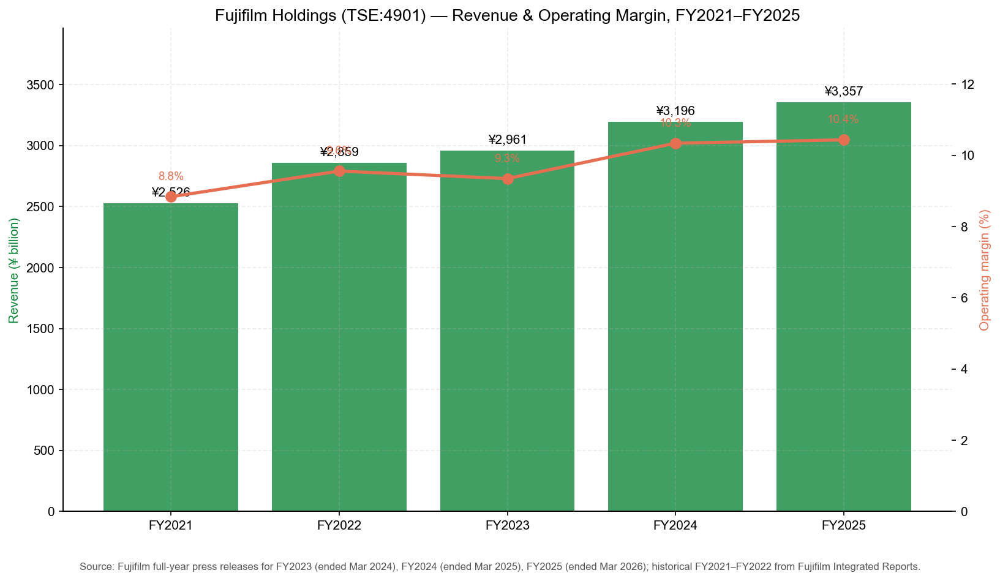
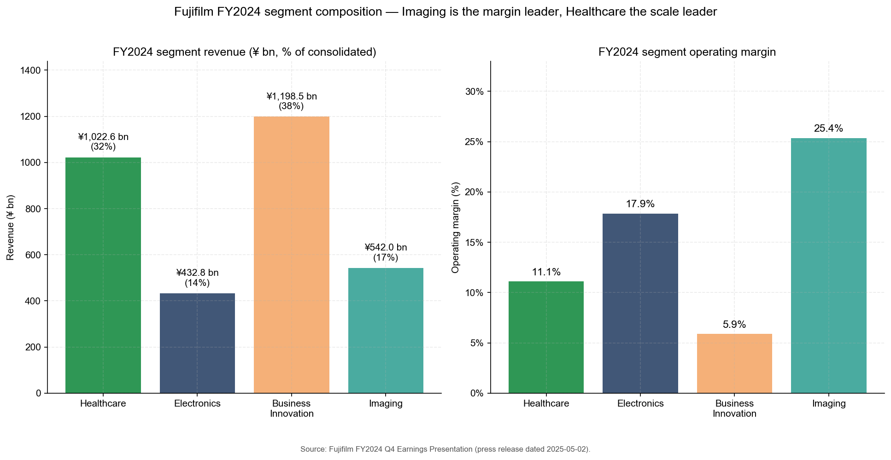
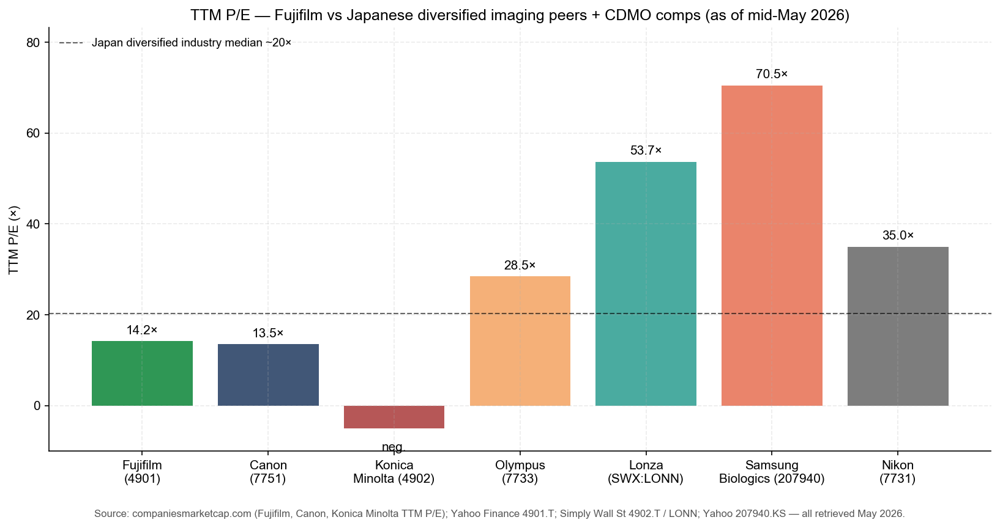
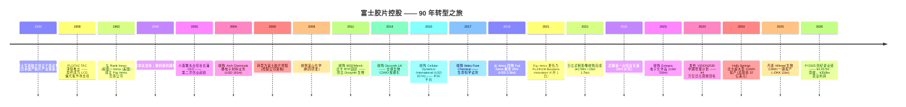
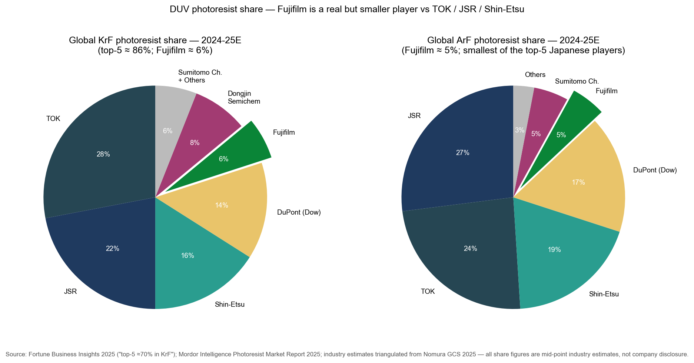
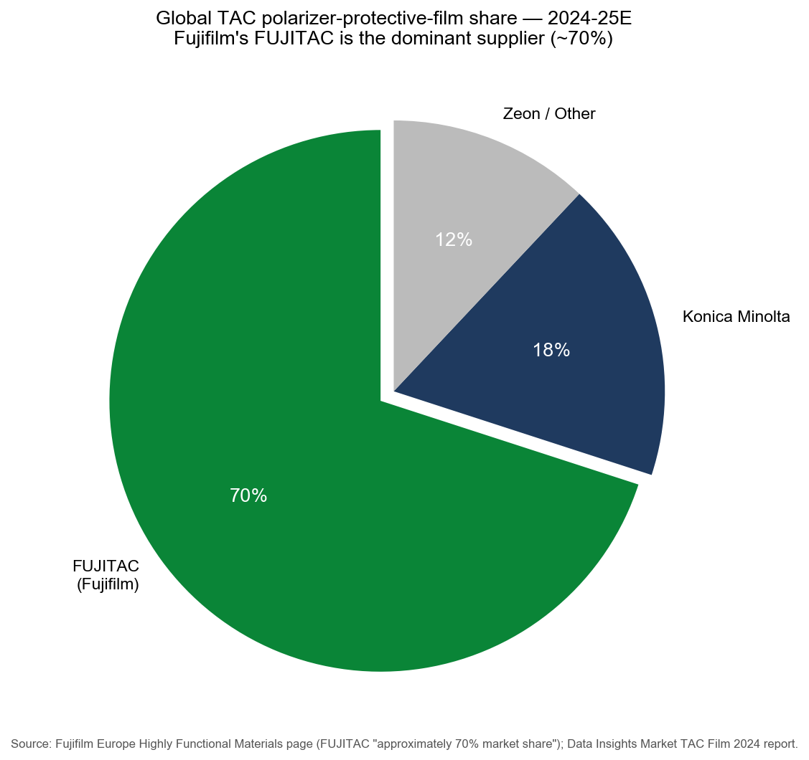
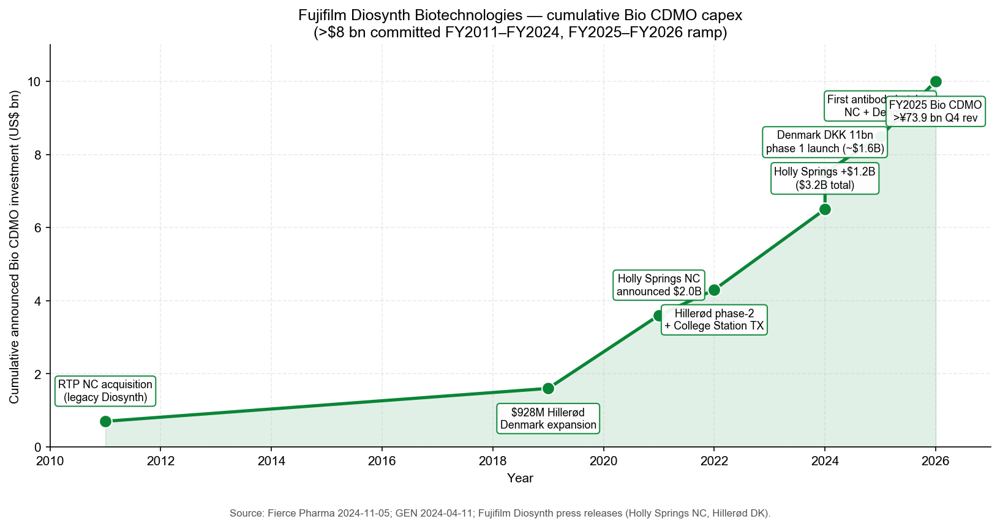
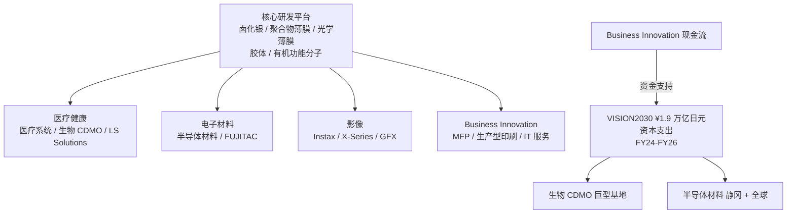
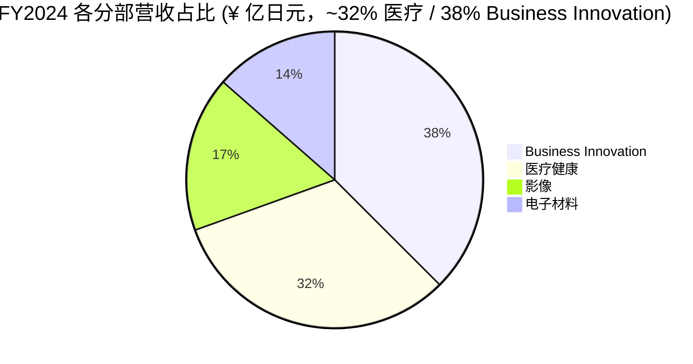

# 公司研究报告：富士胶片控股 (Fujifilm Holdings, TSE:4901)

**日期：** 2026-05-25
**代码：** TSE:4901 (东京证券交易所 Prime 市场)
**ADR：** FUJIY (OTC) / FUJIF
**行业：** 多元化集团 —— 医疗健康 (生物 CDMO、医学影像) / 电子材料 / 办公文档解决方案 / 影像
**总部：** 日本东京都港区赤坂 9-7-3 东京中城西大楼 (邮编 107-0052)
**财年：** 4 月 1 日 – 3 月 31 日 (FY2025 = 截至 2026-03-31 财年)
**报告准则：** IFRS (合并)

---

> **更新 —— FY2026 业绩指引发布 (2026-05-14)：** 在 FY2025 创纪录业绩 (营收 ¥3,357.0 亿日元，同比 +5.0%；营业利润 ¥350.2 亿日元，同比 +6.1%；归属于富士胶片股东净利润 ¥276.7 亿日元，同比 +6.0%) 的基础上，管理层指引 FY2026 营收 ¥3,470.0 亿日元 (同比 +3.4%)、营业利润 ¥365.0 亿日元 (同比 +4.2%)、净利润 ¥280.0 亿日元。年度股息上调至每股 ¥75 (连续第 17 年提升)，同时宣布全新 ¥300 亿日元股票回购授权。指引基于 148 ¥/USD 与 158 ¥/EUR 汇率假设，营业利润增长驱动来自大规模生物 CDMO 设施持续爬坡 (丹麦工厂全面投产) 与 AI 驱动先进制程支出带来的半导体材料 (Semiconductor Materials) 需求延续。
> 来源：[FUJIFILM Holdings Financial Results for the Fiscal Year Ended March 31, 2026, 2026-05-14](https://holdings.fujifilm.com/en/news/list/2127)；[Fuji Addict summary of the release, 2026-05-14](https://fujiaddict.com/2026/05/14/fujifilm-announces-financial-results-for-the-fiscal-year-ended-march-31-2026/)。

---

## 目录

1. 公司概览
2. 公司历史
3. 管理团队
4. 产品与服务
5. 客户与上市策略
6. 行业概览
7. 竞争格局
8. 市场机会 (TAM)
9. 风险评估
10. 参考资料

======================================

## 1. 公司概览

富士胶片控股 (Fujifilm Holdings, TSE:4901) 是一家日本多元化集团企业，今天的业务结构几乎与其 1934 年成立时所专注的照相胶片业务毫无相似之处。集团按四大业务部门披露报告 —— **医疗健康 (Healthcare)** (FY2024 营收 ¥10,226 亿日元，占合并营收 32%)、**办公文档 / Business Innovation** (¥11,985 亿日元，38%)、**影像 (Imaging)** (¥5,420 亿日元，17%) 以及 **电子材料 (Electronics)** (¥4,328 亿日元，13%) ([Earnings Presentation FY2024 Q4](https://ir.fujifilm.com/en/investors/ir-materials/earnings-presentations/main/01112/teaserItems5/00/linkList/0/link/ff_fy2024q4_001e.pdf)；分部数字与 [FY2024 results release at holdings.fujifilm.com](https://holdings.fujifilm.com/en/news/list/1720) 交叉核对一致)。这一四分部架构于 2024 年 4 月与 **VISION2030** 中期管理计划同步生效：原"高性能材料 (Materials)"部门更名为电子材料；原图像通讯 (Graphic Communications) 划入 Business Innovation；化学试剂业务从电子材料转入医疗健康下的生命科学解决方案 ([Fujifilm Launches New Medium-Term Management Plan "VISION2030", 2024-04-08](https://holdings.fujifilm.com/en/news/list/1710))。

富士胶片商业模式的核心是 **在同一东京上市母公司框架下整合四种现金流形态截然不同的业务组合**。**医疗健康** 是长周期、产能驱动型成长业务 —— 医学影像 / medical imaging (CT、MRI、超声、内镜、PACS) 属于装机基础服务型业务；生物 CDMO / biopharmaceutical CDMO 是数十亿美元级的绿地生物制药制造投资；生命科学解决方案 (LS Solutions) 则销售试剂与细胞培养基。**Business Innovation** 是一个缓慢萎缩但现金牛属性突出的办公文档业务 (多功能复合机 (MFP)、生产型印刷、IT 服务)，其前身是 Fuji Xerox —— 富士胶片于 2019 年完成 100% 全资收购后于 2021 年 4 月更名重启。**影像** 业务面向消费与专业摄影，包括 Instax 即影即得相机 (instant camera) 系列以及 X-Series 与 GFX 无反相机产品线 —— 目前是富士胶片利润率最高的业务部门，FY2024 营业利润率约 19%。**电子材料** 是按营收口径最小的部门，但战略上最为重要 —— 半导体加工材料 (光刻胶 (photoresist)、CMP 抛光液、Entegris 收购后的高纯工艺化学品) 加上显示器材料 (FUJITAC (偏光板保护膜) 全球份额约 70%) ([Fujifilm Europe Highly Functional Materials page](https://www.fujifilm.eu/eu/about-us/company-profile/business-fields/highly-functional-materials))。

地理布局方面，富士胶片在营收端是全球化的，但在研发与管理端仍以日本为中心。截至 **2025 年 6 月员工总数达到 74,534 人**，其中约 48% (~36,000 人) 位于日本，约 10% (7,500 人) 在美洲，约 9% (6,800 人) 在欧洲，剩余约 33% 分布于亚洲及其他地区 ([Coolest Gadgets — Fujifilm Statistics 2025](https://coolest-gadgets.com/fujifilm-statistics/)；[Macrotrends FUJIY employee history](https://www.macrotrends.net/stocks/charts/FUJIY/fujifilm-holdings/number-of-employees))。集团的制造基地遍布日本 (足柄 / Ashigara、吉田南、静冈生产电子材料与 TAC 薄膜；富山生产生物 CDMO；熊本生产医疗器械)、美国 (北卡 Holly Springs 生物 CDMO、得州 College Station、多处电子材料工厂)、丹麦 (希勒勒德 / Hillerød 生物 CDMO 巨型园区) 以及英国 (Teesside 生物 CDMO 基地)。

**规模数据。** FY2025 (截至 2026 年 3 月财年) 合并营收 ¥3,357.0 亿日元 (约合 227 亿美元，按 148 ¥/USD 折算) 使富士胶片跻身日本上市公司营收前 50 强。FY2025 营业利润率 **10.4%** (¥350.2 / ¥3,357.0)，较 FY2024 的 10.3% 略升 —— 这一水平在日本多元化制造业属于中等偏上，远低于半导体设备纯玩家如东京电子 (Tokyo Electron) 的二十多个百分点，但与混合硬件加服务模式的多元化同行相当 ([FY2025 results release, 2026-05-14](https://holdings.fujifilm.com/en/news/list/2127))。年股息 ¥70 是连续第 16 年增长；FY2026 指引 ¥75 延续这一记录 ([Fujifilm Shareholder Returns page](https://ir.fujifilm.com/en/investors/stock-and-shareholder/shareholder-returns.html))。

*来源：[Fujifilm FY2024 results release, 2025-05-02](https://holdings.fujifilm.com/en/news/list/1720)；[Fujifilm FY2025 results release, 2026-05-14](https://holdings.fujifilm.com/en/news/list/2127)；FY2021–FY2022 历史数据取自 [Fujifilm Integrated Report 2025](https://ir.fujifilm.com/en/investors/ir-materials/integrated-report/main/00/teaserItems1/01/linkList/0/link/fh_2025_alle_a4.pdf)。*

*来源：分部营收与营业利润测算自 [FY2024 Q4 Earnings Presentation](https://ir.fujifilm.com/en/investors/ir-materials/earnings-presentations/main/01112/teaserItems5/00/linkList/0/link/ff_fy2024q4_001e.pdf)。*

### 估值快照 (必备)

截至 2026 年 5 月下旬，富士胶片在东京 Prime 市场交易价约 **¥3,180** ([Yahoo Finance, 4901.T quote](https://finance.yahoo.com/quote/4901.T/))，对应市值约 **¥3.81 万亿日元** (约合 257 亿美元，按 148 ¥/USD 折算) —— 稳居全球市值前 300 强 ([Companies Market Cap — Fujifilm](https://companiesmarketcap.com/fujifilm/marketcap/))。

- **TTM 市盈率 P/E ≈ 14.2×**，基于 FY2025 报告稀释每股收益 ¥229.5 (¥3,180 / ¥229.5 ≈ 13.9×)，按 FY2026 指引每股收益约 ¥234 计算前瞻 P/E 进一步压缩至 **~13.6×**。Simply Wall St 聚合数据显示 14.9×，Yahoo Finance 显示 14.2× —— 两者均与中位数估值水平一致 ([Simply Wall St — TSE:4901 Valuation](https://simplywall.st/stocks/jp/tech/tse-4901/fujifilm-holdings-shares/valuation)；[Companies Market Cap P/E](https://companiesmarketcap.com/fujifilm/pe-ratio/))。
- **TTM 市销率 P/S ≈ 1.13×** (¥3,810 亿 / ¥3,357 亿)。
- **市净率 P/B ≈ 1.4×**，基于每股净资产约 ¥2,250 (¥3,180 / ¥2,250 = 1.41×)。
- **股息率 ≈ 2.2%**，基于 FY2025 ¥70 股息；按 FY2026 指引 ¥75 计算为 2.4%。
- **三年 P/E 区间** 大致在 10–18× 之间 —— 富士胶片是日本大型工业股中估值偏"低"的代表名字，在 2022 年日元贬值恐慌期间倍数压缩至 10× 区间，随着生物 CDMO 与电子材料盈利能见度提升后回升至中段十几倍。

**同业对标 (2026 年 5 月中旬)：**
- **Canon (TSE:7751)** —— 最接近的日本影像 + 医疗 + 工业可比公司 —— TTM P/E ~13.5× ([Canon stock page on Yahoo Finance](https://finance.yahoo.com/quote/7751.T/key-statistics/)；[GuruFocus TSE:7751 summary](https://www.gurufocus.com/stock/TSE:7751/summary))。
- **柯尼卡美能达 / Konica Minolta (TSE:4902)** —— 最接近的"多元化影像 + 光学 + 材料"可比公司 —— TTM P/E 为 **负值** -5.0×，因公司经过多年重组后 TTM 仍处亏损状态；P/B 0.6× 与 P/S 0.3× 显示其为深度价值 / "改革或退出"型故事 ([Stock Analysis TSE:4902 market cap](https://stockanalysis.com/quote/tyo/4902/market-cap/))。
- **奥林巴斯 / Olympus (TSE:7733)** —— 内镜纯玩家，富士胶片医疗内镜业务的直接竞争对手 —— TTM P/E ~28.5×。
- **Lonza (SWX:LONN)** —— 全球生物制药 CDMO 纯玩家，最接近的生物 CDMO 可比公司 —— TTM P/E ~53.7×，反映市场为产能驱动型成长能见度支付的"CDMO 溢价" ([Simply Wall St — Lonza Group Valuation](https://simplywall.st/stocks/ch/pharmaceuticals-biotech/vtx-lonn/lonza-group-shares/valuation))。
- **Samsung Biologics (KRX:207940)** —— 亚洲生物 CDMO 纯玩家 —— TTM P/E ~70×，全球估值最具成长溢价的 CDMO。
- **尼康 / Nikon (TSE:7731)** —— 日本多元化影像 + 工业可比公司 —— TTM P/E ~35×。

*来源：同业倍数 2026 年 5 月获取，源自 [companiesmarketcap.com Fujifilm P/E](https://companiesmarketcap.com/fujifilm/pe-ratio/)、[Yahoo Finance 4901.T](https://finance.yahoo.com/quote/4901.T/)、[Yahoo 7751.T statistics](https://finance.yahoo.com/quote/7751.T/key-statistics/)、[Stock Analysis 4902.T](https://stockanalysis.com/quote/tyo/4902/market-cap/)、[Yahoo 7733.T](https://finance.yahoo.com/quote/7733.T/)、[Simply Wall St LONN](https://simplywall.st/stocks/ch/pharmaceuticals-biotech/vtx-lonn/lonza-group-shares/valuation)、[Yahoo 207940.KS](https://finance.yahoo.com/quote/207940.KS/)、[Yahoo 7731.T](https://finance.yahoo.com/quote/7731.T/)。*

**倍数拆解 (为什么富士胶片 14× 而 Lonza / Samsung Biologics 50× / 70×)：** 这一差距即典型的 **日企集团折价**。生物 CDMO 仅占合并营收约 10% (FY2025 ¥250–290 亿日元 vs. 总营收 ¥3,357 亿日元) —— 尽管生物 CDMO 以 15-20% 速度成长且具备数十亿美元资本支出可见度，其估值被 Business Innovation (缓慢下行的 MFP / 办公文档) 和电子材料的周期性所稀释。市场只为能够独立估值的部分付溢价；若按纯玩家生物 CDMO 估值至 Lonza ~53× 水平，将隐含分部价值重估 >3 倍提升空间 (若该业务被分拆)。*分析师观点：* 这正是显而易见的拆分套利机会，也是当年激进投资者对 Fuji Xerox 安排所推动的目标，但富士胶片管理层坚持认为 Business Innovation 现金流对医疗健康与电子材料研发的跨业务交叉补贴才是公司真正的护城河。该论点是否成立将取决于 VISION2030 生物 CDMO 产能爬坡能否实现 FY2025/FY2026 时 Diosynth 营收 USD 1.4 亿+ 美元的目标 ([Fierce Pharma 2025-01-13 — Fujifilm Diosynth $1.4B annual sales target](https://www.fiercepharma.com/pharma/fujifilm-diosynth-ceo-heralds-2025-biggest-year-yet-cdmos-8b-expansion-drive))。

按所有标准检验，估值都 **未被显著拉伸** —— 远低于本研究框架中 50× / 2× 板块中位数触发线。真正的风险方向是相反的：如果 Business Innovation 的长期下滑加速，或新一轮生物 CDMO 过剩周期来临，集团折价可能进一步加深 —— 这在第 9 章中被列为分部利润率压缩风险，而非倍数压缩风险。

**为什么"日企集团折价"在富士胶片身上比一般日企更突出？** 一般日企集团折价水平约为 15-25%，但富士胶片接近 50-60% (按 SOTP 测算)，原因有三：(1) 生物 CDMO 是少数日本投资者群体陌生但全球生物制药同行高度熟悉的业务，估值认知错位严重；(2) 富士胶片在四个分部中均非品类绝对领头羊 (除 FUJITAC、PACS、Instax 三处)，对日本机构持有人来说缺乏"日本国家冠军"标签的溢价；(3) 由于 Business Innovation 占合并营收 38%，资本市场视其为一家"文档公司 + 多元化业务"，而非"生物 CDMO + 半导体材料 + 多元化业务"。*分析师观点：* 这三条结构性约束意味着如果后藤祯一与小森繁夫维持当前架构，估值倍数难以重估到 20× 以上 —— 真正解锁价值的是分拆 (而非业务执行)，但管理层至今未发出任何分拆信号。

---

## 2. 公司历史

富士胶片于 **1934 年 1 月** 在神奈川县南足柄市以 Fuji Photo Film Co., Ltd. 名义注册成立 —— 当时是政府推动建立国产照相胶片产业、以减少对柯达 (Kodak，美国) 与爱克发 (Agfa，德国) 进口依赖的项目 ([History of Fujifilm Group](https://holdings.fujifilm.com/en/about/history)；[Companies History profile](https://www.companieshistory.com/fujifilm-holdings/))。首批照相胶片于 1934 年下线；医用 X 射线胶片于 1936 年面世 —— 这粒种子在 90 年之后长成了今天的 ¥1 万亿日元 + 医疗健康业务。1940s–1980s 期间业务向光学玻璃、彩色相纸、磁带 (FUJIFILM 品牌至今仍是企业级数据归档磁带的领导者) 与图像艺术 (Graphic Arts) 印版扩展。

富士胶片史上最具决定意义的转型是 **2000–2010 年间在小森繁夫 (Komori Shigetaka) 带领下的"胶片转非胶片"重大变革**。小森繁夫于 2003 年 6 月接替大西实 (Minoru Ohnishi) 出任社长 ([Innovating Out of Crisis: How Fujifilm Survived and Thrived, Komori, 2015](https://www.amazon.com/Innovating-Out-Crisis-Fujifilm-Vanishing/dp/1611720230))。2000 年初照相产品贡献了集团约 60% 营收与约 2/3 利润；至 2010 年全球照相胶片需求下滑 >90%，富士胶片胶片相关营收占总营收比重已降至 10% 以下 —— 这场冲击足以构成"**胶片消亡危机**" ([The Decision Stack — How Fujifilm Survived What Killed Kodak](https://www.thedecisionstack.com/the-decision-stack-in-action-how-fujifilm-survived-what-killed-kodak/))。与柯达把数码当作防御性替代品处理截然不同，富士胶片把胶片相关专业能力 (胶体卤化银化学、聚合物薄膜涂布、有机功能分子设计) 视作进入全新业务的 *投入要素*。小森繁夫提出的 **"第二次创业 (Second Foundation)"** 战略将研发资源重新部署至 LCD 显示器材料 (FUJITAC，1958 年作为偏光板保护膜推出，2000 年代起规模化)、化妆品 (Astalift，利用照相乳剂沉淀出的胶原蛋白稳定技术)、医药 (2008 年收购富山化学)、以及电子材料 (2004 年 11 月以 **USD 1.605 亿** 收购 Arch Chemicals 微电子材料业务) ([Arch Chemicals 8-K 2004-10-25](https://www.sec.gov/Archives/edgar/data/0001072343/000119312504207817/dex992.htm))。今天的富士胶片业已成为日本 **转型成功典范** 的教材级案例。

近代富士胶片史上四宗最具决定性的交易：

- **Arch Chemicals 微电子材料业务 (2004 年 11 月；USD 1.605 亿)** —— 富士胶片电子材料业务的奠基石，构建起今天电子材料部门核心的光刻胶 / CMP 抛光液 / 工艺化学品组合 ([Arch Chemicals 8-K](https://www.sec.gov/Archives/edgar/data/0001072343/000119312504207817/dex992.htm))。
- **Diosynth / 生物 CDMO 切入 (2011 北卡 RTP；2014 英国 Diosynth)** —— 富士胶片于 2011 年从 MSD/Merck 收购北卡研究三角园区生物制药基地，2014 年再收购英国 Diosynth Biotechnologies，奠定今天 Fujifilm Diosynth Biotechnologies 的格局。自 2011 年起集团已对全球生物 CDMO 产能扩张投入 **超过 USD 80 亿美元累计资本支出** ([Fierce Pharma 2025-01-13](https://www.fiercepharma.com/pharma/jpm26-fujifilm-ceo-touts-biologics-capacity-edge-manufacturing-unit-keeps-expansions-coming))。
- **Fuji Xerox 75% 全资化 (2019 年 11 月完成；USD 2.3 亿)** —— 富士胶片回购 Xerox 持有的剩余 25% 股权 (富士胶片自 2001 年起持有 75% 股份)，并于 2020 年 1 月宣布不再延续技术合作协议；合资公司于 **2021 年 4 月 1 日** 更名为 FUJIFILM Business Innovation Corporation —— 即 **富士施乐分离**完成 ([Wikipedia — Fujifilm Business Innovation](https://en.wikipedia.org/wiki/Fujifilm_Business_Innovation)；[Keypoint Intelligence — Fuji Xerox name change, 2020-01-08](https://keypointintelligence.com/keypoint-blogs/fuji-xerox-will-be-changing-its-name-in-2021))。这一举措把原本只是合资现金牛的业务转化为 100% 全资合并子公司，是今天 Business Innovation 分部以约 38% 占比成为集团第一大营收来源的根本原因。
- **日立诊断影像 / Hitachi Diagnostic Imaging (2021 年 3 月完成；¥1,790 亿日元 ≈ USD 17 亿)** —— 富士胶片收购日立的 CT / MRI / X 射线 / 超声业务，把医疗健康 (Medical Systems) 从一家胶片 + 内镜厂家根本上转变为一家全模态影像硬件公司。被收购实体于 2021 年 7 月更名为 FUJIFILM Healthcare Americas Corp. ([Applied Radiology — Hitachi Healthcare changes name to FujiFilm Healthcare Americas, 2021-07-01](https://appliedradiology.com/articles/hitachi-healthcare-changes-name-to-fujifilm-healthcare-americas-corporation)；[Healthcare-in-Europe.com on the integration, 2021-07-01](https://healthcare-in-europe.com/en/news/fujifilm-healthcare-acquires-hitachi-diagnostic-imaging-presents-new-portfolio.html))。

体量稍小但同样具备战略意义的交易：**Cellular Dynamics International (2015 年 3 月；USD 3.07 亿)** 将人类诱导多能干细胞 (iPSC (诱导多能干细胞)) 技术整合至公司内部 ([Fujifilm CDI history](https://www.fujifilmcdi.com/fujifilm-holdings-to-acquire-cellular-dynamics-international-inc))；**Wako Pure Chemical (2017)** 补齐了今天位于医疗健康 LS Solutions 中的化学试剂 / 生命科学平台；**Entegris 电子化学品 (2023 年 10 月；USD 7 亿)** 增添了高纯工艺化学品 (HPPC) —— 主要包括湿法蚀刻剂、清洗剂、CVD 前驱体气体，大幅扩展了电子材料部门超越光刻胶与 CMP 抛光液之外的产品线 ([Entegris 8-K 2023-05-10](https://www.sec.gov/Archives/edgar/data/0001101302/000110130223000008/qedsigningjointpressreleas.htm)；[Fujifilm press release on HPPC closing](https://www.fujifilm.com/us/en/news/Fujifilm_to_Acquire_HPPC_Business_from_Entegris))。

**三大战略转折 —— 三段决定性转型脱颖而出。** 第一段是 **2003–2010 年小森繁夫主导的第二次创业**，将胶片平台研发能力重新部署至医疗健康与电子材料 —— 这正是富士胶片今天仍能存在的根本原因。第二段是 **2019–2021 年的富士施乐分离**：通过回购 Xerox 股份并对合资公司更名重启，富士胶片获得对一个利润现金来源 (传统办公文档业务) 的 100% 战略控制，并解除了限制其进入相邻印刷与 IT 服务市场的 IP 授权约束 ([Wikipedia — Fujifilm Business Innovation history](https://en.wikipedia.org/wiki/Fujifilm_Business_Innovation))。第三段是 **2024 年 VISION2030 计划**，于 2024 年 4 月发布，明确化四分部架构并制订 **FY2030 ¥4 万亿日元营收 / ~15% 营业利润率目标**，配套 FY2024–FY2026 三年共 ¥1.9 万亿日元投资 (主要投向生物 CDMO 与半导体材料) ([Fujifilm Launches New Medium-Term Management Plan "VISION2030", 2024-04-08](https://holdings.fujifilm.com/en/news/list/1710)；[Integrated Report 2025 medium-term strategy chapter](https://ir.fujifilm.com/en/investors/ir-materials/integrated-report/main/015/teaserItems1/011111115/linkList/0/link/fh_2025_002e.pdf))。

**为什么"胶片消亡危机"反而成就了富士胶片，而不是把它压垮？** 简单的答案是：当胶片业务还很赚钱时管理层就开始转型，而不是等到亏损出现才行动。柯达直到 2012 年破产前夕才真正承认数码摄影的不可逆性，错过了把现金流投向新业务的窗口；富士胶片在 2003 年小森繁夫上任时胶片业务仍贡献 60% 营收与 2/3 利润，正是这个仍盈利的高峰期成为了战略转型的本钱。第二次创业的核心不仅是"找新业务"，而是 **"利用胶片厂家身份的核心化学能力进入相邻品类"** —— 卤化银化学的胶体稳定能力可以转移到化妆品；底片保护膜的聚合物涂布工艺可以转移到 FUJITAC；显影液中的有机功能分子设计可以转移到光刻胶。这是经典的"专精特新型多元化" —— 多元化的不是行业，而是同一种核心技术能力跨越多个终端市场的应用。

**近 18 个月动态。** 2024 年 11 月富士胶片 Diosynth 启动扩建后的丹麦 Hillerød 工厂作为全球 CDMO 生态扩张第一阶段，北卡 Holly Springs 于 2025 年剪彩作为近似复制设施 (两个工厂从工艺与需求标准看 ~97% 相同，支撑跨大西洋产能套利) ([Fierce Pharma — Fujifilm Biotechnologies takes lessons from Denmark for NC, 2025-03](https://www.fiercepharma.com/manufacturing/fujifilm-biotechnologies-takes-lessons-denmark-debut-massive-nc-cell-culture-facility)；[GlobeNewswire — Fujifilm Diosynth launches global ecosystem expansion, 2024-11-05](https://www.globenewswire.com/news-release/2024/11/05/2974607/0/en/FUJIFILM-Diosynth-Biotechnologies-Launches-First-Phase-of-Global-CDMO-Ecosystem-Expansion.html))。2025 年 7 月富士胶片宣布与 imec 联合开发出 **无 PFAS 工艺 / PFAS-free 的 ArF 浸没式负型光刻胶**，在 28 纳米代金属互联中验证良率 —— 在 PFAS 含量监管收紧背景下意义重大 ([Fujifilm — PFAS-Free ArF Immersion Resist news release, 2025-07-15](https://www.fujifilm.com/jp/en/news/hq/12568)；[imec press release on the joint development](https://www.imec-int.com/en/press/fujifilm-develops-pfas-free1-negative-arf-immersion-resist))。2025 年 11 月富士胶片电子材料于静冈工厂完成新建研发评估设施，扩展先进节点半导体材料研发产能。2026 年 5 月 FY2025 业绩发布后，公司在 ¥75 股息 (连续第 17 年增长) 之上又获 ¥300 亿日元股票回购授权 ([FY2025 results release, 2026-05-14](https://holdings.fujifilm.com/en/news/list/2127))。

---

## 3. 管理团队

### 后藤祯一 (Goto Teiichi) —— 社长、代表董事兼 CEO

**后藤祯一 (Goto Teiichi)** 自 **2021 年 6 月** 起出任富士胶片控股社长、代表董事兼 CEO，接替小森繁夫 (小森繁夫升任董事长兼代表董事)。后藤祯一生于 **1959 年 1 月 23 日**，**1982 年** 加入富士写真胶片 (今天 FUJIFILM Corporation 的前身)，四十余年间逐步攀升 —— 主要在图像系统 (Graphic Systems) 与之后的医疗系统业务部 ([Bloomberg profile — Teiichi Goto](https://www.bloomberg.com/profile/person/20724383)；[Fujifilm — Change of Chairman and President, 2021-03-26](https://holdings.fujifilm.com/en/news/list/1076))。

后藤祯一就任 CEO 前的职业生涯主要锚定在医疗系统业务 —— 这正是他日后战略中心。**2013–2014 年间他出任 FUJIFILM Corporation 医疗系统业务部总经理**，正是富士胶片在全球扩展 Synapse® 影像系统 (Synapse PACS) 业务并筹备日立诊断影像收购的关键时期。他于 **2016 年** 出任 FUJIFILM Corporation 董事，负责整合 Cellular Dynamics International (2015 年收购) 与 Wako Pure Chemical (2017 年收购) —— 这两宗交易构成了今天医疗健康下生命科学解决方案分部的主要内容。他在 2019–2020 年间陆续担任执行干事 (Operating Officer) 与执行役 (Executive Officer)，2021 年升任社长。后藤祯一就任时间恰与日立诊断影像收购完成 (2021 年 3 月) 以及 Fuji Xerox 更名 Fujifilm Business Innovation (2021 年 4 月) 两大里程碑同步 —— 业界普遍将其视为小森繁夫留下的礼物，由后藤祯一负责整合与运营 ([New Chairman of the Dujat Advisory Board: Mr. Teiichi Goto](https://www.dujat.nl/news/new-chairman-of-the-dujat-advisory-board-mr-teiichi-goto-president-ceo-of-fujifilm-holdings-corporation))。

作为 CEO，后藤祯一的标志性举措是 **VISION2030**，于 2024 年 4 月发布 —— ¥4 万亿日元 FY2030 营收与 ~15% 营业利润率目标，对应较 FY2023 营收增长 35%、FY2024–FY2026 三年共 ¥1.9 万亿日元投资，并对生物 CDMO (FY2025 营收 USD 1.4 亿+ 美元) 与半导体材料 (FY2030 营收 ¥5,000 亿日元 vs. FY2024 基线 ¥2,500 亿日元) 设定明确成长目标 ([VISION2030 announcement, 2024-04-08](https://holdings.fujifilm.com/en/news/list/1710)；[Integrated Report 2025 — Medium-to-Long-Term Growth Strategy](https://ir.fujifilm.com/en/investors/ir-materials/integrated-report/main/015/teaserItems1/011111115/linkList/0/link/fh_2025_002e.pdf))。他在"领导致辞 / Message from Leadership"中提出的公开口号是 "Never Stop"。后藤祯一另一个值得关注的特点是 **延续性 (而非颠覆性) CEO 风格**：与西方私募股权式分拆生物 CDMO 或 Business Innovation 的剧本不同，他公开捍卫集团架构，认为四个分部之间存在研发交叉补贴与跨周期稳定性。FY2024 年度总薪酬约 **¥2.61 亿日元** (约 40% 薪资 / 60% 奖金 + 股票)，按美国大型公司 CEO 标准属适中水平，但按日本本土水平偏高 ([Simply Wall St — Fujifilm Holdings Management](https://simplywall.st/stocks/us/tech/otc-fuji.y/fujifilm-holdings/management))。后藤祯一 1982 年毕业于中央大学；截至 2026 年 5 月业绩发布，其 CEO 任期接近 5 年。

(*创始人说明：* 富士写真胶片 1934 年作为政府背景的法人载体而非创始人型创业公司成立。公司未将任何单一个人识别为现代意义上的"创始人" —— 公司由财团联合发起，最早 CEO 为首任社长野上麻三郎 (Asajiro Nogami)。按公司研究规则中"创始人 + 现任 CEO"条款，本报告不另列创始人传记；小森繁夫 —— 第二次创业的总设计师 —— 仅作为现任 CEO 的历史前任在此提及，而非独立传记条目。)

---

## 4. 产品与服务

> **重点章节。** 富士胶片的四分部架构决定了第 4 章必须穿越四种截然不同的业务特许。光刻胶 —— 富士胶片在七家光刻胶可比研究中的贡献 —— 位于第 4.2 节 (电子材料 → 半导体材料) 之下。本章内容比例与营收占比相符，但鉴于可比研究的语境，电子材料获得了相对更深入的解释。

### 4.1 富士胶片分部 / 子分部产品矩阵

富士胶片控股在其年度 **集团概览 (Group Overview)** 演示中公布统一产品矩阵。2024 年 4 月新生效的四分部架构对应下表所列子分部与产品线。营收数据为 FY2024 (截至 2025 年 3 月财年) —— 即截至 FY2025 业绩发布时最近的完整年度分部披露。

| 分部 | FY2024 营收 (¥ 亿日元) | 子分部 | 主要产品线 |
|---|---:|---|---|
| **医疗健康 (Healthcare)** | 10,226 | 医疗系统 (¥5,937 亿) | 内镜 (ELUXEO、SCOPIA)；CT、MRI、X 射线、超声、乳腺造影 (后日立时期)；介入放射学 (Synapse® 影像系统、AI-Rad Companion)；IVD 试剂 |
|   |   | 生物 CDMO (¥1,098 亿) | mAb / 融合蛋白 / 基因疗法 / 疫苗的生物制药代工 —— 丹麦 Hillerød、北卡 Holly Springs、得州 College Station、英国 Teesside、日本富山 |
|   |   | LS Solutions (¥3,191 亿) | Wako 试剂、Irvine Scientific 细胞培养基、CDI iPSC 细胞系、消费健康 (Astalift 化妆品、NXT 保健品) |
| **电子材料 (Electronics)** | 4,328 | 半导体材料 (¥2,504 亿) | **光刻胶 (i-line、KrF、ArF 干式 / 浸没式、EUV 试验阶段)**；CMP 抛光液；高纯工艺化学品 (Entegris HPPC 后)；CVD 前驱体；清洗剂与蚀刻液；先进封装化学品 |
|   |   | 高功能材料 (AF Materials) (¥1,824 亿) | **FUJITAC TAC 偏光板保护膜**、EXCLEAR 触摸屏薄膜、Wako 特殊化学品、磁带数据存储 (LTO Ultrium) |
| **Business Innovation** | 11,985 | 办公解决方案 (¥5,229 亿) | Apeos / DocuCentre 多功能复合机 (MFP)、ApeosWiz 工作流软件、IT 服务与 APAC 文档外包 |
|   |   | 商业解决方案 (¥3,309 亿) | 企业内容管理、IT 咨询、工作流 / BPO 服务；商业印刷子产品 |
|   |   | 图像通讯 / Graphic Communications (¥3,447 亿) | 生产型印刷设备 (Revoria、J Press 喷墨)、CTP 印版、喷墨墨水、标牌材料 |
| **影像 (Imaging)** | 5,420 | 消费影像 (¥3,280 亿) | **Instax 即影即得相机 (instant camera)** + 胶片 (mini、WIDE、SQUARE、Link、Evo)；相册；手机相纸产品 |
|   |   | 专业影像 (¥2,140 亿) | **X-Series APS-C 无反相机**、**GFX 中画幅无反**、FUJINON 镜头、光学器件 (广电 / 监控 / 工业) |

*来源：子分部营收数据取自 [Fujifilm FY2024 Q4 Earnings Presentation, 2025-05-02](https://ir.fujifilm.com/en/investors/ir-materials/earnings-presentations/main/01112/teaserItems5/00/linkList/0/link/ff_fy2024q4_001e.pdf) 与 [FY2024 results press release](https://holdings.fujifilm.com/en/news/list/1720)。产品线示例引自 Fujifilm Group Overview 演示。医疗健康子项已对齐合计 ¥10,226 亿日元。*

### 4.2 电子材料 —— 光刻胶 + 显示器材料业务

电子材料是按营收最小的分部 (FY2024 占 13.5%)，但战略上最具长期增长意义 —— 由两大独立业务支撑：**半导体材料** (光刻胶、CMP 抛光液、Entegris 收购后的高纯工艺化学品) 与 **高功能材料** (FUJITAC 显示器薄膜系列加上 LTO 磁带与特殊化学品)。

#### 4.2.1 半导体材料 —— 光刻胶、CMP 抛光液、HPPC

半导体材料业务由 2004 年收购的 Arch Chemicals 微电子材料平台奠基 ([Arch Chemicals 8-K, 2004-10-25](https://www.sec.gov/Archives/edgar/data/0001072343/000119312504207817/dex992.htm))，并在 **2023 年 10 月以 7 亿美元收购 Entegris 高纯工艺化学品 (HPPC) 业务**后大幅扩展 ([Entegris 8-K announcing closing, 2023-05-10](https://www.sec.gov/Archives/edgar/data/0001101302/000110130223000008/qedsigningjointpressreleas.htm)；[Fujifilm press release on HPPC closing](https://www.fujifilm.com/us/en/news/Fujifilm_to_Acquire_HPPC_Business_from_Entegris))。合并后的产品组合覆盖 **光刻胶 (i-line、KrF、ArF 干式、ArF 浸没式与 EUV 试验阶段)、CMP 抛光液 (用于化学机械抛光以使金属层之间的铜 / 钨 / 介电层平整化)、高纯工艺化学品 (高纯湿法清洗与蚀刻液，以散装大量供应给晶圆厂)、以及 CVD 前驱体气体 (通过化学气相沉积在晶圆表面形成介电或其他薄膜)**。

> 引自 [Fujifilm Group Overview presentation, July 2025](https://ir.fujifilm.com/en/investors/ir-materials/business-overview/main/0/teaserItems1/0/linkList/0/link/ff_presentation_202507_001e.pdf)：" Fujifilm provides comprehensive semiconductor materials, including photoresists, CMP slurries, high-purity process chemicals, and advanced materials, supporting the most advanced logic and memory manufacturing nodes." (直接引文；幻灯片图片嵌入暂缺 —— 公司未发布可机器读取的 PDF。)

**通俗解释：** 光刻胶 (photoresist) 是把晶圆上的电路图案通过光罩曝光后记录下来的感光聚合物层。**KrF 光刻胶 (化学放大胶 (CAR))** 对 248 纳米深紫外光响应；**ArF 光刻胶** 对 193 纳米光响应 (这一更深紫外步骤使制程进入 <90 纳米节点)；**ArF 浸没式** (193 纳米光经由镜片与晶圆之间高折射率水膜传递) 延伸至 ~28 纳米及以下；**EUV 光刻胶** 对 13.5 纳米光响应 (这一极紫外步骤是 7 纳米以下节点的关键)。光刻胶 / photoresist 是半导体制造中化学密集度最高、IP 保护最严的输入材料之一 —— 在客户端单节点光刻胶资格认证周期通常需要 12-24 个月，一旦认证通过该胶种可锁定多年订单。富士胶片在 **i-line、KrF 与 ArF (干式与浸没式两种)** 上具备一定份额；在 EUV 上一直有研发投入，但截至 2025 年仍非规模出货 EUV 胶种供应商 —— 该市场目前由 Shin-Etsu (信越化学) 与 JSR + TOK 主导。

**CMP 抛光液** 是用于化学机械抛光、把每层金属 / 介电层在两次光刻步骤之间抛平的液态磨料；这是实现高深宽比图案化所必需的纳米级平整度的关键。CMP 抛光液按化学体系区分销售 (铜 CMP、钨 CMP、氧化物 CMP、STI 浅沟槽隔离、ILD 层间介电) —— 富士胶片在 **铜 CMP 与氧化物 CMP** 上有所参与，按行业研究估算位列全球前五，但规模小于 CMC Materials (现归 Entegris 所有)、Versum (现归默克所有) 与 Fujimi ([CMP Slurry Market Report 2025 — Coherent Market Insights](https://www.coherentmarketinsights.com/market-insight/cmp-slurry-market-4039) 将 Versum、Cabot、Fujimi、Dow、FujiFilm、BASF、3M、Evonik 与 Hitachi Chemical 列为主要玩家)。

**高纯工艺化学品 (HPPC)** —— 湿法清洗液、蚀刻液与 CVD 前驱体 —— 是富士胶片电子材料业务在后 2020 年代最大规模的单笔补充。Entegris HPPC 业务 **2022 年的 pro forma 销售额约 USD 3.6 亿**，在北美与欧洲市场拥有领先地位 ([Fujifilm press release on the Entegris HPPC deal, 2023-05](https://www.fujifilm.com/us/en/news/Fujifilm_to_Acquire_HPPC_Business_from_Entegris))。这笔收购把富士胶片电子材料从"特殊光刻胶 + 抛光液"专家定位升级为"全组合晶圆厂化学品供应商"，赋予该分部 BASF、默克 (后 Versum 时期) 与 Tokyo Ohka Kogyo 都依赖的交叉销售能力。

*分析师观点：* 富士胶片光刻胶份额可观但并非品类领头羊。综合 Fortune Business Insights 与 Mordor Intelligence 的三角验证，**KrF 光刻胶 top-5 供应商 (TOK、JSR、Shin-Etsu、DuPont/Rohm & Haas、Fujifilm/Dongjin) 合计占全球 KrF 市场约 70-86%**；富士胶片以中等单数字百分比 (约 6%) 份额在日本四家头部供应商中排名末位 ([Photoresist Chemicals Market — Fortune Business Insights 2025](https://www.fortunebusinessinsights.com/photoresist-chemicals-market-115414)；[Photoresist Market — Mordor Intelligence 2025](https://www.mordorintelligence.com/industry-reports/photoresist-market))。在 **ArF (更高附加值子市场)** 中富士胶片份额更小 (~5%)，反映 JSR 与 TOK 在 193 纳米浸没式资格认证上的历史优势。富士胶片建立显著差异化的领域包括 **先进封装光刻胶** (用于扇出型 / RDL 再分布层图案化 —— AI 加速器封装) 以及 **高 NA 应用的负型光刻胶**；其 2025 年 7 月与 imec 联合开发的无 PFAS 工艺 / PFAS-free ArF 浸没式负型光刻胶是公司近期最显著的 IP 进展 ([Fujifilm Develops PFAS-Free Negative ArF Immersion Resist, 2025-07-15](https://www.fujifilm.com/jp/en/news/hq/12568)；[imec press release on the joint development, 2025-07-15](https://www.imec-int.com/en/press/fujifilm-develops-pfas-free1-negative-arf-immersion-resist))。

*来源：行业份额估算来自 [Fortune Business Insights — Photoresist Chemicals Market, 2025](https://www.fortunebusinessinsights.com/photoresist-chemicals-market-115414) 与 [Mordor Intelligence — Photoresist Market, 2025](https://www.mordorintelligence.com/industry-reports/photoresist-market)。饼图为行业中位估算，非公司披露数据。*

**半导体材料竞争优势判定：** *分析师观点：* **半护城河**。光刻胶 IP 与资格认证壁垒真实有效 —— 一旦在 TSMC 或 Samsung 节点获认证，转换成本极高，供应商可锁定 5-10 年重复性收入。但富士胶片在 KrF / ArF 中位居第 4–5 位 (排在 TOK、JSR、Shin-Etsu、DuPont 之后)，而非品类领头羊；护城河存在但浅于 TOK / JSR。**护城河类型：技术 + IP + 客户资格认证周期** (一旦认证转换成本高)。

#### 4.2.2 高功能材料 —— FUJITAC、EXCLEAR、磁带

FUJITAC (三醋酸纤维素 / cellulose-triacetate 薄膜) 于 1958 年作为照相底片保护膜推出，1990 年代起被重新用于每片 LCD 中所必需的偏光板保护层。**这是富士胶片显示器材料业务最重要的单一产品：富士胶片公告 FUJITAC "在偏光板保护膜市场占据约 70% 份额"** ([Fujifilm Europe — Highly Functional Materials page](https://www.fujifilm.eu/eu/about-us/company-profile/business-fields/highly-functional-materials)；[Data Insights Market — TAC Film for LCD Polarizers 2024](https://www.datainsightsmarket.com/reports/tac-film-for-lcd-polarizers-252284) 确认富士胶片为"主导玩家"，与柯尼卡美能达 (Konica Minolta) 与 Zeon 并列)。

**通俗解释：** 每片 LCD 面板的两面玻璃上都需要偏光膜 / polarizing film 来过滤液晶层透过的光线；每片偏光膜的两面都需要薄保护膜以防止偏光材料被划伤或受潮影响。**TAC (cellulose triacetate, 三醋酸纤维素)** 是该保护膜的标准聚合物，因其光学清晰、尺寸稳定、可与偏光层粘合。FUJITAC 是该品类的代表品牌 —— 富士胶片在足柄、富士宫森、九州工厂生产。随着 LCD 面板从电视用途扩展至工业 / 汽车 / 医疗 / 手持显示器，FUJITAC 业务展现出极强韧性 —— 即便 OLED 已经在智能手机子市场抢占大量份额。**偏光膜 / polarizing film** 寡头格局长期稳定，富士胶片是 **偏光膜寡头** 中地位最稳固的一家。

*来源：[Fujifilm Europe — Highly Functional Materials page](https://www.fujifilm.eu/eu/about-us/company-profile/business-fields/highly-functional-materials)，补充自 [Data Insights Market — TAC Film for LCD Polarizers Industry Future Growth Prospects](https://www.datainsightsmarket.com/reports/tac-film-for-lcd-polarizers-252284)。*

**高功能材料竞争优势判定：** *分析师观点：* **FUJITAC 中宽护城河** (~70% 全球份额、TAC 浇铸产能规模优势、与 LG Display / Samsung Display / BOE 偏光板供应商建立的供货合同) 但 **相邻产品仅为部分护城河** (EXCLEAR 触摸屏薄膜、LTO 磁带 —— 均面临产能相近、资金充沛的竞争对手)。**护城河类型：规模 + 客户供货合同锁定**。

### 4.3 医疗健康 —— 医疗系统 + 生物 CDMO + LS Solutions

#### 4.3.1 医疗系统 (¥5,937 亿日元 FY2024 —— 医疗健康内部规模领头羊)

医疗系统子分部涵盖四大产品业务：**内镜** (ELUXEO 与 SCOPIA 平台 —— 结肠镜、胃镜、支气管镜、超声内镜)、**诊断影像硬件** (CT、MRI、X 射线、乳腺造影、超声 —— 主要为 2021 年 3 月收购的日立诊断影像业务)、**医疗 IT** (Synapse® 影像系统 / VNA / RIS、Synapse 3D)、以及 **IVD/IVR 试剂** (Wako 品牌体外诊断试剂与 CDI 细胞系)。富士胶片报告 Synapse® 影像系统 **拥有全球 PACS 系统最大市场份额，装机量达 5,000+ 台** ([Fujifilm Medical Systems Business Briefing, 2023-10-12](https://ir.fujifilm.com/en/investors/ir-materials/presentations/session/main/0118/teaserItems1/0/tableContents/0114/multiFileUpload2_1/link/ff_presentation_20231012_001e.pdf))。

> 引自 [Fujifilm Medical Systems Business Briefing, 2023-10-12](https://ir.fujifilm.com/en/investors/ir-materials/presentations/session/main/0118/teaserItems1/0/tableContents/0114/multiFileUpload2_1/link/ff_presentation_20231012_001e.pdf)："Fujifilm's SYNAPSE continues to maintain the largest global market share and achieved further share increase in 2022."

**通俗解释：** 内镜是插入消化道 / 肺部 / 膀胱的柔性摄像设备，用于组织诊断或活检。Olympus 是全球 GI 内镜领头羊 (全球份额 ~60-70%)，富士胶片与 Pentax 是可信的第 2、第 3 玩家。2025 年发布的 ELUXEO 8000 —— 配备 4K 处理器与专有 Amber-Red Color Imaging 模式 —— 是富士胶片在影像模式创新方面对 Olympus 发起的最新挑战。**PACS (影像归档与通信系统 / Picture Archiving and Communication System)** 是医院用来存储与调用所有医学影像的数据库 + 工作流软件 —— 收购日立后的扩展让富士胶片可以把 PACS 与 CT/MRI 硬件捆绑销售，这是 2021 年之前无法实现的交叉销售路径。

*分析师观点：* 医疗系统具备 **半护城河** —— PACS 强 (全球 #1 份额、软件驱动转换成本)，内镜中等 (Olympus 后的 #2-3 位置，Amber-Red Color Imaging 模式是差异化点)，硬件模态较弱 (CT、MRI 全球市场由 GE HealthCare、Siemens Healthineers、Philips、Canon Medical 主导)。**护城河类型：软件转换成本 (PACS)；内镜装机基础；CT/MRI 接近商品化**。

#### 4.3.2 生物 CDMO —— Fujifilm Diosynth Biotechnologies (¥1,098 亿日元 FY2024，+20%+ 增长轨迹)

生物 CDMO 是整个富士胶片业务组合中战略地位最突出的增长驱动。这一业务于 2011 年随收购默克在北卡研究三角园区 (RTP) 的生物加工基地以及 2014 年收购 Diosynth UK 而创立，此后被持续扩张。**自 2011 年起 Fujifilm Diosynth 已对全球生物制药制造产能扩张累计承诺投资 >USD 80 亿** ([Fierce Pharma — JPM26: Fujifilm CEO touts CDMO strength, 2026-01](https://www.fiercepharma.com/pharma/jpm26-fujifilm-ceo-touts-biologics-capacity-edge-manufacturing-unit-keeps-expansions-coming)；[Fujifilm Diosynth Launches Global CDMO Ecosystem Expansion, 2024-11-05](https://www.globenewswire.com/news-release/2024/11/05/2974607/0/en/FUJIFILM-Diosynth-Biotechnologies-Launches-First-Phase-of-Global-CDMO-Ecosystem-Expansion.html))。富士胶片明确为 **生物 CDMO 龙头** 阵营成员之一。

> 引自 [Fujifilm Diosynth Holly Springs expansion announcement, 2024-04-11 (NC Governor's office)](https://governor.nc.gov/news/press-releases/2024/04/11/fujifilm-diosynth-biotechnologies-expands-holly-springs-facility-create-one-largest-end-end-cell)："FUJIFILM Diosynth Biotechnologies Expands Holly Springs Facility to Create One of the Largest End-to-End Cell Culture Facilities in the World."

**通俗解释：** **CDMO (Contract Development and Manufacturing Organization, 委托研发与生产组织)** 即一家按合同制造生物药物 (单克隆抗体、融合蛋白、疫苗、基因疗法) 的代工厂，服务那些没有或不愿意自建产能的生物科技与大药厂客户。**生物 CDMO / biopharmaceutical CDMO** 的经济结构受产能驱动：每个 CDMO 套件 (生物反应器 + 下游纯化管线) 需要 3-5 年与数亿美元投入才能建成，建成后签订 10 年以上客户合同。富士胶片的战略是 **建设丹麦与北卡近乎一致的超大型工厂**，使客户可以在两大洲之间根据产能与监管灵活性选择 —— 两座工厂从工艺与需求标准来看 ~97% 相同 ([Fierce Pharma — Fujifilm Biotechnologies takes lessons from Denmark, 2025-03](https://www.fiercepharma.com/manufacturing/fujifilm-biotechnologies-takes-lessons-denmark-debut-massive-nc-cell-culture-facility))。

*来源：累计公告投资来自 [Fierce Pharma 2024-11-05](https://www.fiercepharma.com/pharma/fujifilm-diosynth-ceo-heralds-2025-biggest-year-yet-cdmos-8b-expansion-drive)；[GEN — Talent, Talent, Talent Drives Diosynth's $3.2B NC Expansion](https://www.genengnews.com/topics/bioprocessing/talent-talent-talent-drives-fujifilm-diosynths-3-2b-nc-expansion/)；[NC Biotechnology Center — Holly Springs doubling announcement, 2024-04-11](https://www.ncbiotech.org/news/fujifilm-diosynth-biotechnologies-double-holly-springs-biomanufacturing-campus)；[BioProcess International — Fujifilm launches Denmark phase 1, 2024-11](https://www.bioprocessintl.com/facilities-capacity/fujifilm-launches-manufacturing-in-denmark-following-phase-one-expansion)。*

*分析师观点：* 生物 CDMO 拥有富士胶片所有子分部中 **最强护城河** —— 产能即护城河。每个新建大型生物反应器需要 4-6 年完成设计 / 建设 / 验证 / FDA 与 EMA 资格认证；一旦认证通过，客户分子不能轻易转移。Fujifilm Diosynth 在 mAb / 生物制药 CDMO 的主要竞争对手包括 **Lonza (瑞士)**、**Samsung Biologics (韩国)**、**WuXi Biologics (中国)** (目前受美国 BIOSECURE 法案约束影响，导致产能向美 / 欧 CDMO 如富士胶片转移)、与 **Boehringer Ingelheim BioXcellence** ([Pharma Boardroom — Top 10 CDMOs 2024](https://pharmaboardroom.com/articles/top-10-cdmos-2024/)；[Grand View Research — Large Molecule Drug Substance CDMO 2024](https://www.grandviewresearch.com/industry-analysis/large-molecule-drug-substance-cdmo-market-report))。**护城河类型：产能 + 监管认证 + 10 年以上客户合同**。

#### 4.3.3 LS Solutions (¥3,191 亿日元 FY2024 —— 生命科学试剂 + 细胞培养基 + 消费健康)

LS Solutions 是经常被忽视的子分部，合并了 Wako Pure Chemical 试剂 (2017 收购)、Irvine Scientific 细胞培养基 (2018 收购)、Cellular Dynamics International iPSC 平台 (2015 收购) 以及消费健康产品线 (Astalift 化妆品 —— 利用从照相乳剂衍生的胶原蛋白稳定化学；NXT 保健品；OTC 药品)。这一子分部是隐性增长驱动 —— 细胞培养基需求随着整体生物 CDMO 扩张而增长 (培养基是每个生物反应器的上游输入)，2024 年 4 月化学试剂业务从电子材料转入医疗健康也明显贡献了营收 ([VISION2030 announcement, 2024-04-08](https://holdings.fujifilm.com/en/news/list/1710))。

*分析师观点：* LS Solutions 具备 **中等护城河** —— Wako 试剂质量领先但已商品化；Astalift 化妆品在日本消费品牌中竞争激烈但全球存在感有限；通过 CDI 的 iPSC 技术新颖但市场仍在发展中。**护城河类型：品牌 (Wako/Astalift) + 技术 (CDI iPSC)，细胞培养基部分受监管锁定**。

### 4.4 Business Innovation —— 后富士施乐时期的办公文档业务 (营收占比 38%)

Business Innovation 是按营收最大的分部，但业务慢速下行且利润率稳定。这一业务源于 1962 年与 Rank Xerox 和 Xerox US 成立的 Fuji Xerox 合资公司，富士胶片以 75% 持股运营至 2019 年 11 月以 **USD 23 亿** 回购 Xerox 剩余 25% 股权 ([Wikipedia — Fujifilm Business Innovation history](https://en.wikipedia.org/wiki/Fujifilm_Business_Innovation))。合资公司于 **2021 年 4 月 1 日** 更名为 FUJIFILM Business Innovation Corporation，结束与 Xerox 的技术合作协议 —— 即历史上的 **富士施乐分离** 完成。

> 引自 [FUJIFILM Business Innovation Corporate History page](https://www.fujifilm.com/fb/en/about/corporate-fb/history/corporate)："On April 1, 2021, Fuji Xerox Co., Ltd. changed its name to FUJIFILM Business Innovation Corp. as the first step in transforming its business globally under the new corporate brand."

**通俗解释：** Business Innovation 销售 **办公多功能复合机 (MFP)** (多功能复印 - 传真 - 扫描组合 —— 每家办公室都需要的设备)、**生产型印刷设备 (production print presses)** (工业喷墨与碳粉印刷机，面向商业印刷企业 —— 即 Revoria 与 J Press 产品线)、以及 **IT 服务与工作流软件** (ApeosWiz 套件、APAC BPO 服务)。该业务整体随全球文档量下行而缓慢萎缩，但产生稳定的高现金流 (营业利润率约 6%，每年 ¥700-800 亿日元营业利润)，为生物 CDMO 与半导体材料 R&D 投资提供资金支持。图像通讯 (生产型印刷、CTP 印版、喷墨墨水) 子分部已在 2024 年 4 月架构重组中并入 Business Innovation。

*分析师观点：* Business Innovation 具备 **下降中的护城河** —— MFP 业务拥有规模与扎根的装机基础，但办公文档量长期下降。竞争对手包括 Canon、Ricoh、柯尼卡美能达、京瓷、Sharp、Lexmark 在 MFP / 生产型印刷领域；Xerox 在商业印刷领域。后藤祯一的战略问题是继续投资维护现金牛还是收割 —— 当前策略是前者。**护城河类型：装机基础 / 售后服务合同，规模优势有限**。

### 4.5 影像 —— Instax 即影即得相机 + X-Series 无反

影像是按营收最小的分部 (FY2024 占 17%)，但是 **利润率最高的分部** (营业利润率约 19%) —— 集团业务组合中的意外赢家。

#### 4.5.1 消费影像 —— Instax (¥3,280 亿日元 FY2024)

**Instax 即影即得相机 (instant camera)** 是全球 #1 即影即得相机业务。Instax 累计销量在 **2025 年突破 1 亿台** ([Fujifilm — Instax 100 Million Cumulative Units, 2025](https://www.fujifilm.com/jp/en/news/hq/12295))。现有产品线包括主力机型 mini 12 (售价约 80 美元)、mini Evo (混合数码 / 即影，售价约 200 美元)、WIDE 400 (宽幅)、Link 3 (智能手机相纸打印机)、WIDE Evo、mini 41 (2025 年 4 月发布) 以及 mini LiPlay+ ([Fuji Rumors — Instax Poised to Set Record Revenue Four Consecutive Years, 2025-01-24](https://petapixel.com/2025/01/24/fujifilm-instax-poised-to-set-record-revenue-in-four-consecutive-years/))。

*分析师观点：* Instax 拥有 **宽护城河** —— Polaroid 是唯一可信的直接竞争对手且全球规模显著小于 Instax；该业务通过 Z 世代消费品牌地位形成网络效应，并具备 razor-and-blades 模型的高利润率胶片续销收入 (每包 Instax mini 胶片 = ¥1,200 / 8 美元拍 20 张 —— 正是富士胶片最初赖以建立的剃刀 / 刀片商业模式)。**护城河类型：品牌 + 胶片续销耗材**。

#### 4.5.2 专业影像 —— X-Series + GFX 无反 (¥2,140 亿日元 FY2024，+20%+ 增长)

X-Series APS-C 无反相机产品线 (X-T5、X-T30 III、X-E5、X100VI 旁轴风格机型) 与 GFX 中画幅产品线 (GFX100 II、GFX100RF) 瞄准索尼、佳能、尼康均在追逐的爱好者 / 专业摄影市场。富士胶片通过 **强化胶片模拟色彩科学** (继承自最初富士胶片胶片配方的 20+ 种胶片仿真模式) 与保持独特美学 (而非千篇一律的索尼仿造款) 形成差异化。Q1 FY2025 X+GFX 销售额报告首次接近 Instax 营收 ([Fuji Rumors — X and GFX Sales Surge Close to Instax Revenue, 2025-08](https://www.fujirumors.com/fujifilm-x-and-gfx-sales-surge-in-q1-2026-now-close-to-goldmine-instax-revenue/))。

*分析师观点：* X-Series / GFX 具备 **半护城河** —— 在爱好者 / 专业市场拥有强势品牌认知，但规模小于索尼 (Sony α / FX)、佳能 (R 系列)、尼康 (Z 系列)。**护城河类型：品牌 + IP (胶片模拟算法)**。

### 4.6 综合 —— 四分部如何互动

富士胶片的四分部并非组成一个单一客户工作流，与半导体设备工具组成工艺流程的逻辑不同。相反，**它们在研发层面交叉补贴**。小森繁夫 2003 年识别的核心能力 —— 卤化银胶体化学、聚合物薄膜涂布、有机功能分子设计、光学薄膜工程 —— 跨业务输出，体现典型的 **专精特新型多元化** 路径：

- 卤化银与高纯有机分子化学 → 光刻胶研发 (电子材料)
- 聚合物薄膜涂布 → FUJITAC 与 EXCLEAR (电子材料) 与影像专业胶片用 TAC
- 光学薄膜工程 → 相机镜头 (影像) 与内镜光学 (医疗健康)
- 胶体 / 乳剂化学 → 化妆品输送系统 (LS Solutions / Astalift) 与生物制药制剂 (生物 CDMO)
- 流体处理与超纯化学技术 → 高纯工艺化学品 (电子材料) 与试剂 (LS Solutions)

战略问题在于这种研发平台跨业务交叉补贴论点是否仍能成立 —— 在今天每个分部都需要分部特异的深度研发能力时 (生物 CDMO 需要细胞系与生物反应器专长，与胶片化学无关；先进光刻胶需要面向 ASML 工具链的客户工程能力)。VISION2030 押注论点成立；集团折价风险则押注论点不成立。

---

## 5. 客户与上市策略

富士胶片的四分部服务四类截然不同的客户群体，各分部客户集中度结构也存在显著差异。

**医疗健康 —— 医疗系统。** 客户为医院、医院集团与集中采购组织 (GPO)。地域上高度分散 —— 美国、EMEA、APAC 各占医疗系统营收约 25-35%，日本约 15-20%。销售模式为 **美欧直销 + 新兴市场经销商分销**。内镜合同通常为 3-5 年资本设备周期，附带多年期服务与耗材协议；CT/MRI 为 10 年以上资本周期。无任何单一医院或 GPO 披露为 >10% 客户。富士胶片在其有価証券報告書 (Yuho) 中未披露单一客户集中度 —— 日本披露规则要求仅在客户占合并营收 ≥10% 时才需披露，富士胶片无任何客户跨越这一门槛 ([Fujifilm 2024 Yuho on EDINET, filed 2025-06-25](https://ir.fujifilm.com/ja/investors/ir-news/auto_20250625162400_S100W3XJ/pdfFile.pdf))。

**医疗健康 —— 生物 CDMO。** 客户群按设计 **高度集中**：每个大型生物反应器套件服务于 1-3 个特定大药厂客户的 1-3 个特定分子，签订 10 年以上代工服务协议。公开客户包括 Biogen、Moderna、AstraZeneca、BioMarin 以及 (后新冠时期) Novavax 疫苗生物。2024-2025 年 Holly Springs 与 Hillerød 投产时分别由客户名义承诺锚定，但富士胶片未公开披露具体细节。**每个套件的单一分子 / 单一客户集中度风险确实存在** —— 详见第 9 章。*分析师观点：* Fujifilm Diosynth FY2025 USD 14 亿美元营收目标隐含每个大型套件 (典型 50,000 升生物反应器) 在满载利用率下产生约 USD 2-4 亿美元营收，锁定于少数客户 ([Fierce Pharma 2025-01-13](https://www.fiercepharma.com/pharma/fujifilm-diosynth-ceo-heralds-2025-biggest-year-yet-cdmos-8b-expansion-drive))。

**电子材料 —— 半导体材料。** 客户为全球晶圆厂：TSMC、Samsung Foundry、Samsung Memory、SK Hynix、Micron、Intel、GlobalFoundries、SMIC、UMC 以及 IDM (Infineon、Texas Instruments 等)。富士胶片电子材料未披露单一晶圆厂份额，但光刻胶业务结构上高度集中 —— 单节点 / 单客户的资格认证周期 12-24 个月，一旦认证完成供应商可获得持久份额。前 5 大客户可能占电子材料营收 >50% (TSMC、Samsung、SK Hynix、Micron、Intel —— 这正是每家光刻胶供应商共同的头部客户名单) ([CMP Slurry Market Report 2025 — Coherent Market Insights](https://www.coherentmarketinsights.com/market-insight/cmp-slurry-market-4039))。地域分布严重偏向亚洲 (台湾 + 韩国 + 中国大陆 + 日本约占半导体材料销售的 75-85%)。

**电子材料 —— 显示器材料 (FUJITAC)。** 客户为全球偏光板厂家 —— LG 化学 (全球最大偏光板供应商)、Nitto Denko、住友化学 (Sumitomo Chemical)、杉金光电 (Sanlitun) 以及 Samsung SDI —— 这些厂家进而向面板厂 LG Display、Samsung Display、BOE、AUO、CSOT 供货。偏光板厂家集中度高 (前 3 大约占全球偏光板产量的 70-80%)，因此 FUJITAC 客户群体也集中于这 3-5 家偏光板厂家，签订长期供货合同。

**Business Innovation。** 客户为全球企业与中小企业 —— MFP 采用直销 + 渠道伙伴混合，生产型印刷与 IT 服务为企业直销。地域严重偏向 APAC (日本、中国、大亚洲 + 大洋洲)，因 2021 年与 Xerox 分离后 FUJIFILM Business Innovation 不再在美洲 / 欧洲销售 Xerox 品牌 (Xerox 直接销售这些地区，部分硬件由富士代工)。客户群体非常分散 —— 任何单一企业客户都远低于分部营收 10%。

**影像。** 客户为终端消费者 (Instax) 与爱好者 / 专业摄影师 (X-Series、GFX)。分销采用 **全渠道零售** —— 大型电子零售商 (Yamada Denki / BIC Camera / Best Buy / Amazon)、专业相机经销商以及直销电子商务。无客户集中度风险；需求由品牌与产品驱动。Instax 业务自 FY2025 起连续 4 年创纪录营收 ([PetaPixel — Fujifilm Posts Record-High Revenue, 2026-02-06](https://petapixel.com/2026/02/06/fujifilm-posts-record-high-revenue-and-profits/))。

### 客户集中度综合判断

富士胶片在日本会计准则 Yuho 与 IFRS 公告中未披露单一客户份额 —— 因为没有任何单一客户跨越日本规则要求的合并营收 10% 披露门槛 ([Fujifilm 2024 Yuho filed via EDINET, 2025-06-25](https://ir.fujifilm.com/ja/investors/ir-news/auto_20250625162400_S100W3XJ/pdfFile.pdf))。Top-1 客户占合并营收 <10%；Top-5 合计估计占合并营收 15-25%。**但在分部层面情况不同**：生物 CDMO 按套件 / 分子高度集中，电子材料集中于 TSMC / Samsung / SK Hynix，FUJITAC 集中于 3-5 家偏光板厂家。Business Innovation 与影像则高度分散。

*来源：[Fujifilm FY2024 Q4 Earnings Presentation, 2025-05-02](https://ir.fujifilm.com/en/investors/ir-materials/earnings-presentations/main/01112/teaserItems5/00/linkList/0/link/ff_fy2024q4_001e.pdf)。*

---

## 6. 行业概览

富士胶片业务遍布 **四个截然不同的行业**，每个行业有各自的市场结构、增长率与监管环境。本章对各行业分别测算市场规模。

### 6.1 医疗健康 —— 医学影像 IT + 诊断硬件 + 生物 CDMO

**医学影像 IT (PACS/VNA/Synapse)。** 全球 PACS 营收 2024 年约 **USD 36 亿美元**，2030 年前以 ~7-8% CAGR 增长，受新兴市场医院数字化与 AI 增强影像工作流推动 ([Endoscopy Devices Market Report 2025 — Mordor Intelligence](https://www.mordorintelligence.com/industry-reports/global-endoscopy-devices-market-industry) 提供邻近影像设备市场三角验证)。富士胶片 Synapse® 影像系统拥有 **全球最大装机基础** —— 5,000+ 台安装 ([Fujifilm Medical Systems Briefing, 2023-10-12](https://ir.fujifilm.com/en/investors/ir-materials/presentations/session/main/0118/teaserItems1/0/tableContents/0114/multiFileUpload2_1/link/ff_presentation_20231012_001e.pdf))。

**诊断影像硬件 (CT/MRI/超声/X 射线)。** 全球市场 2024 年约 **USD 470 亿美元**，CAGR 5-6%。市场由 GE HealthCare、Siemens Healthineers、Philips 与 Canon Medical (前 Toshiba Medical) 主导；富士胶片 (后日立时期) 是全球可信的第 5-7 位 ([Endoscopy Devices Market Size & Forecast — Mordor 2025](https://www.mordorintelligence.com/industry-reports/global-endoscopy-devices-market-industry))。

**GI 内镜。** 全球内镜市场预计 **2025 年达到 USD 401 亿美元，2030 年达到 USD 551 亿美元，CAGR 6.6%** ([Mordor 2025](https://www.mordorintelligence.com/industry-reports/global-endoscopy-devices-market-industry))。Olympus 是全球领头羊 (GI 内镜全球份额 ~60-70%)，其后是富士胶片与 Pentax。

**生物制药 CDMO。** 生物 CDMO 市场是富士胶片所有业务组合中 **战略上最具吸引力的行业**。全球生物 CDMO 营收 2024 年约 **USD 220-250 亿美元**，2030 年前以 ~12-14% CAGR 增长 —— 驱动来自 GLP-1 需求、双特异性抗体、基因疗法、以及 BIOSECURE 法案驱动的去中国化产能迁移 ([Mordor — Biologics CDMO Market Size & Forecast, 2026-2031](https://www.mordorintelligence.com/industry-reports/biologics-contract-development-and-manufacturing-organization-cdmo-market)；[Grand View Research — Large Molecule Drug Substance CDMO Market Report, 2024](https://www.grandviewresearch.com/industry-analysis/large-molecule-drug-substance-cdmo-market-report))。

### 6.2 半导体材料行业

全球半导体材料市场 —— 包括硅晶圆、光刻胶、CMP 抛光液、高纯气体与化学品、溅射靶材、光罩坯料、封装材料 —— 2024 年约 **USD 650-700 亿美元**，CAGR ~5-7%，但先进材料子集 (sub-7nm 先进光刻胶、先进封装化学品) 增长率为 10-15% ([Fortune Business Insights — Photoresist Chemicals Market 2025](https://www.fortunebusinessinsights.com/photoresist-chemicals-market-115414)；[Mordor — Photoresist Market 2025](https://www.mordorintelligence.com/industry-reports/photoresist-market))。

**光刻胶子集** 2024 年约 USD 50-60 亿美元 ([Fortune Business Insights — Photoresist Chemicals Market 2025](https://www.fortunebusinessinsights.com/photoresist-chemicals-market-115414))。在光刻胶内部，ArF 浸没式是附加值最高的子市场 (营收占 30-35%)；KrF 占 30-35%；i-line 与 g-line 占 15-20%；EUV 目前规模小 (营收占 5-8%) 但 CAGR >25%。行业结构 **高度集中**：top-5 (TOK、JSR、Shin-Etsu、DuPont、Fujifilm) 按 Fortune Business Insights 估算合计占全球 70-86%。

**CMP 抛光液市场** 2024 年约 **USD 25-30 亿美元**，CAGR 至 2034 年达 6.5% ([Coherent Market Insights — CMP Slurry Market 2025](https://www.coherentmarketinsights.com/market-insight/cmp-slurry-market-4039)；[Business Research Insights — CMP Slurry Market Outlook 2026-2035](https://www.businessresearchinsights.com/market-reports/cmp-slurry-market-104826))。主要玩家包括 CMC Materials (Entegris)、Versum (Merck KGaA，2019 年以 USD 65 亿美元收购)、Fujimi、Fujifilm、BASF、日立化学。

**高纯工艺化学品 (HPPC) 市场** 富士胶片通过 Entegris HPPC 收购切入，2024 年约 **USD 40-50 亿美元**，集中于专业湿法化学品供应商如 Kanto Chemical、BASF、Solvay、Stella Chemifa、住友化学。

### 6.3 显示器材料行业 —— TAC 薄膜与偏光板生态

**TAC 薄膜市场** (用于 LCD 偏光板保护膜) 2024 年约 **USD 24 亿美元，预计 2028 年达到 USD 31 亿美元，CAGR 6.2%**，FUJITAC 占全球份额约 70% ([Data Insights Market — TAC Film for LCD Polarizers 2024](https://www.datainsightsmarket.com/reports/tac-film-for-lcd-polarizers-252284)；[Datahorizz Research — TAC Film Market Size 2033](https://datahorizzonresearch.com/tac-film-market-11467))。逆风因素来自 OLED 替代 LCD 在智能手机子市场的份额 (OLED 无需 TAC 保护膜)；顺风因素来自汽车、工业、医疗显示器仍以 LCD 为主 (出于成本与生命周期稳定性原因)。

### 6.4 办公设备 / 文档解决方案行业

全球办公设备 (MFP) 与生产型印刷营收 2024 年约 **USD 700-800 亿美元**，受办公文档工作流数字化驱动呈低单位数下降。主要玩家：Canon、Ricoh、HP、Xerox、柯尼卡美能达、Brother、京瓷、Sharp、Lexmark 与 Fujifilm Business Innovation。富士胶片业务集中于 APAC 且在生产型印刷与 IT 服务领域获得份额，即便绝对 MFP 单位数下降。

### 6.5 相机 / 即影即得相机行业

全球数码相机出货量从 2010 年峰值约 1.2 亿台下降至 2024 年约 700-800 万台 (CIPA 数据)，完全被智能手机蚕食。**但高端无反相机的价值细分市场表现具备韧性** (营收约 USD 70-80 亿美元，由 Sony、Canon、Nikon、Fujifilm 主导)。即影即得相机市场 —— 由 Fujifilm Instax 引领 —— 走向完全相反：Instax 累计销量于 **2025 年突破 1 亿台**，业务以高单位数到低十数百分比增长 ([Fujifilm — Instax 100 Million Cumulative Units, 2025](https://www.fujifilm.com/jp/en/news/hq/12295))。

---

## 7. 竞争格局

富士胶片的竞争位势具有分部特异性，每个业务面对截然不同的竞争对手群体。

### 7.1 光刻胶 + 半导体材料 —— 富士胶片为第 4-5 位玩家

本报告所属的七家光刻胶可比研究 (TOK、JSR、Shin-Etsu、DuPont、Fujifilm、Sumitomo Chemical、Dongjin Semichem) 揭示了行业结构：**TOK 与 JSR 是 ArF 与 EUV 共同领头羊** (各占全球份额约 22-28%)；**Shin-Etsu Chemical 是 i-line 与 EUV 领头羊**；**DuPont (前 Rohm & Haas) 是 KrF/ArF 第 4 位玩家**；**富士胶片是 KrF/ArF 中第 5 位日本玩家，合计份额 ~5-6%**；**住友化学与 Dongjin Semichem 占据 top-7 的底端** ([Fortune Business Insights — Photoresist Chemicals 2025](https://www.fortunebusinessinsights.com/photoresist-chemicals-market-115414)；[Mordor — Photoresist Market 2025](https://www.mordorintelligence.com/industry-reports/photoresist-market))。

富士胶片在该品类的差异化包括 **(a) Entegris HPPC 收购后的更广工艺化学品组合** —— 富士胶片的光刻胶竞争对手大多无法可信地交叉销售湿法蚀刻液、清洗剂与 CVD 前驱体；**(b) 新颖化学 IP** —— 与 imec 联合开发的无 PFAS ArF 浸没式负型光刻胶是最显著的例证 ([Fujifilm — PFAS-Free Negative ArF Immersion Resist, 2025-07-15](https://www.fujifilm.com/jp/en/news/hq/12568))；**(c) 先进封装光刻胶** —— 用于扇出型 / RDL 再分布层图案化 (AI 加速器封装)，富士胶片在过去 5 年间已建立可信份额。其弱势同样真实：相对 TOK/JSR 规模较小限制研发预算，且富士胶片在领先节点的 EUV 光刻胶资格认证上较慢于 Shin-Etsu 与 JSR。

### 7.2 生物 CDMO —— Fujifilm Diosynth vs Lonza / Samsung Biologics / WuXi Biologics

全球生物 CDMO 是四马竞赛：**Lonza** (瑞士，按产能与订单领头羊，2023 年营收约 CHF 67 亿美元，2024 年 CHF 70+ 亿美元)、**Samsung Biologics** (韩国，增速最快，松岛全球最大单一基地产能，营收约 KRW 4-5 万亿日元)、**WuXi Biologics** (中国，产能密集但 2025-2026 年面临美国 BIOSECURE 法案风险)、与 **Fujifilm Diosynth** (日本所有，美 / 欧 / 日本所在地，FY2025 USD 14 亿美元营收目标) ([Pharma Boardroom — Top 10 CDMOs 2024](https://pharmaboardroom.com/articles/top-10-cdmos-2024/)；[Mordor — Biologics CDMO Market 2026-2031](https://www.mordorintelligence.com/industry-reports/biologics-contract-development-and-manufacturing-organization-cdmo-market)；[Fierce Pharma — Fujifilm Diosynth $8B+ expansion, 2025-01](https://www.fiercepharma.com/pharma/fujifilm-diosynth-ceo-heralds-2025-biggest-year-yet-cdmos-8b-expansion-drive))。二级玩家：Boehringer Ingelheim BioXcellence、Catalent (近期被 Novo Holdings 收购)。

Fujifilm Diosynth 的竞争优势包括 **(a) 美 / 欧生产足迹** —— Holly Springs NC 与 Hillerød DK 提供超越中国的 BIOSECURE-免疫产能；**(b) 丹麦与北卡近似一致工厂** 支持跨大西洋监管灵活性；**(c) 日本母公司财务稳定性** 在独立 CDMO 难以维系周期的时点支持数十亿美元资本支出。其弱势包括相对 Lonza 的规模差距、Samsung Biologics 更快的爬坡、以及巨型生物反应器产能本质上是数十年承诺、仅在基础生物需求持续时才有价值的结构挑战。

### 7.3 医疗系统 —— Olympus、Siemens、GE HealthCare、Philips、Canon Medical

在 **内镜子市场** 富士胶片与 **Olympus** (全球 #1，GI 内镜全球份额 ~60-70% —— 近乎纯玩家内镜 + 显微镜业务) 与 **Pentax** (Hoya) 竞争 #2-3 位置。富士胶片 2025 年发布的 **ELUXEO 8000** 配备 4K 处理器 + Amber-Red Color Imaging 是最新举措 ([Fujifilm — ELUXEO Next-Generation Launch press release](https://www.fujifilm.com/us/en/news/fujifilm-launches-next-generation-eluxeo-endoscopic-imaging-system))。竞争结构短期内不太可能发生快速变化 —— Olympus 的装机基础与日本医院锁定深厚。

在 **诊断影像硬件 (CT/MRI)** 富士胶片 (后日立时期) 是全球可信的第 5-7 位，落后于 **GE HealthCare** (全球领头羊，市占 ~25%)、**Siemens Healthineers** (~22%)、**Philips** (~15%) 与 **Canon Medical** (前 Toshiba Medical，~10%)。富士胶片战略卖点是将硬件模态与 Synapse® 影像系统捆绑销售 —— 这是 #1-#4 都无法实现的交叉销售路径，因为他们都不拥有 #1 PACS 业务。

### 7.4 显示器材料 (FUJITAC) —— 柯尼卡美能达 + Zeon

富士胶片 FUJITAC 在偏光板保护膜市场占 **~70% 全球份额**，**柯尼卡美能达** (~15-20%) 与 **Zeon** (规模较小但具技术可信度，提供 COP 薄膜替代品) 是最接近的竞争对手 ([Fujifilm Europe Highly Functional Materials page](https://www.fujifilm.eu/eu/about-us/company-profile/business-fields/highly-functional-materials)；[Data Insights Market — TAC Film 2024](https://www.datainsightsmarket.com/reports/tac-film-for-lcd-polarizers-252284))。竞争结构非常稳定 —— TAC 薄膜浇铸产能难以规模化 (三醋酸纤维素需要溶剂浇铸薄膜技术，在 OEM 偏光板厂家级别认证成本高昂)。

### 7.5 办公设备 / Business Innovation —— Canon、Ricoh、柯尼卡美能达、HP、Xerox

在 MFP / 生产型印刷市场 Fujifilm Business Innovation 与 **Canon** (按单位数全球领头羊)、**Ricoh**、**HP**、**Xerox** (2021 年分离后已是美洲 / 欧洲直接竞争对手 —— 而富士此前通过 Fuji Xerox 合资在该区销售)、**柯尼卡美能达**、**Brother**、**京瓷**、**Sharp**、**Lexmark** 竞争。市场成熟且缓慢下降；富士胶片的战略角度是 APAC 集中 + IT 服务搭售。

### 7.6 影像 —— Sony、Canon、Nikon

在高端无反相机中富士胶片与 **Sony** (全幅无反领头羊)、**Canon**、**Nikon** 竞争。富士胶片的 APS-C X-Series 与中画幅 GFX 产品线刻意采取细分定位 —— 富士胶片不追求全幅主流市场，是日本四大主要相机品牌中唯一没有全幅系统的厂家。在即影即得相机市场，**Polaroid** 是 Instax 唯一可信的直接竞争对手 —— 而 Polaroid 全球规模显著较小。

### 7.7 竞争位势汇总表

| 分部 | Fujifilm 排名 | 最接近竞争对手 | 护城河判定 |
|---|---|---|---|
| 光刻胶 (DUV) | ~#5 全球 | TOK、JSR、Shin-Etsu、DuPont | 半护城河 (IP + 资格认证) |
| CMP 抛光液 | ~#3-5 全球 | CMC (Entegris)、Versum (Merck) | 半护城河 (配方 IP) |
| HPPC (工艺化学品) | ~#4-6 全球 | Kanto、BASF、Solvay | 中等 (商品化中) |
| FUJITAC 显示器薄膜 | **~#1 (~70% 份额)** | 柯尼卡美能达、Zeon | **宽护城河 (规模 + 锁定)** |
| 生物 CDMO (mAb / 生物制药) | ~#3-4 全球 | Lonza、Samsung Biologics、WuXi | **宽护城河 (产能)** |
| PACS / Synapse | **~#1 全球 (5,000+ 装机)** | Philips、GE、Siemens、Change | 宽护城河 (软件转换) |
| 内镜 | ~#2-3 (Olympus 之后) | Olympus、Pentax | 半护城河 (装机基础) |
| CT/MRI 硬件 | ~#5-7 全球 | GE HealthCare、Siemens、Philips、Canon Medical | 中等 |
| MFP / 办公 | APAC 中段 | Canon、Ricoh、HP、Xerox | 中等 (下降中的护城河) |
| Instax 即影即得相机 | **~#1 全球** | Polaroid | **宽护城河 (品牌 + 胶片续销)** |
| X-Series / GFX | 无反 #4 | Sony、Canon、Nikon | 半护城河 (品牌细分) |

整体画面是 **少数主导护城河 (FUJITAC、Synapse PACS、Instax) 嵌入在大多数品类位居中段的多元化业务组合中** —— 这正是驱动日企集团折价的典型结构。

---

## 8. 市场机会 (TAM)

VISION2030 —— 富士胶片 2024 年 4 月发布的中期管理计划 —— 直接构建 TAM 分析的框架：公司营收目标为 **FY2030 ¥4 万亿日元、~15% 营业利润率**，较 FY2025 的 ¥3.36 万亿日元 / 10.4% 提升 ([VISION2030 announcement, 2024-04-08](https://holdings.fujifilm.com/en/news/list/1710)；[Integrated Report 2025 medium-term growth chapter](https://ir.fujifilm.com/en/investors/ir-materials/integrated-report/main/015/teaserItems1/011111115/linkList/0/link/fh_2025_002e.pdf))。公司层面目标蕴含分部特异 TAM 视角：

### 8.1 医疗健康 —— 生物 CDMO 是最显著的 TAM 扩张机会

全球生物 CDMO TAM 2024 年约 **USD 220-250 亿美元**，预计 2030 年前以 12-14% CAGR 增长至约 USD 450-550 亿美元 ([Mordor — Biologics CDMO Market Size & Forecast 2026-2031](https://www.mordorintelligence.com/industry-reports/biologics-contract-development-and-manufacturing-organization-cdmo-market))。Fujifilm Diosynth 公开 FY2030 SAM 为 **FY2025 USD 14 亿美元目标爬坡至 2030 年约 USD 30 亿美元** —— 隐含全球生物 CDMO 份额从 ~3-4% 翻倍至 ~6-8%，随着新建丹麦 Hillerød 与 Holly Springs NC 产能向满产爬坡而实现。

对 **医疗系统** SAM 是全球 PACS + 内镜 + 诊断硬件市场，2024 年规模约 USD 900-1,000 亿美元，分布为 PACS (~USD 36 亿美元)、内镜 (~USD 400 亿美元) 与 CT/MRI/超声/X 射线 (~USD 470 亿美元)。富士胶片装机 Synapse® 影像系统是全球最大 —— 增量 TAM 份额来自交叉销售日立衍生模态硬件给现有 Synapse PACS 医院客户。

对 **LS Solutions** SAM 是全球试剂 + 细胞培养基 + iPSC 市场，规模约 USD 250-300 亿美元 —— 其中细胞培养基增长最快 (作为同一生物 CDMO 扩张的上游输入)。

### 8.2 电子材料 —— VISION2030 半导体材料 ¥5,000 亿日元目标 = FY2024 的 2 倍

富士胶片 VISION2030 **半导体材料 FY2030 营收目标为 ¥5,000 亿日元**，较 FY2024 基线 ¥2,500 亿日元翻倍 —— 隐含 **半导体材料营收在 6 年内翻倍**，CAGR ~12% ([VISION2030 announcement, 2024-04-08](https://holdings.fujifilm.com/en/news/list/1710)；[Integrated Report 2025 Vision and Drivers chapter](https://ir.fujifilm.com/en/investors/ir-materials/integrated-report/main/0111/teaserItems1/011111114/linkList/0/link/fh_2025_001e.pdf))。对应 TAM 为全球半导体材料市场 (2024 年约 USD 650-700 亿美元 → 2030 年约 USD 950-1,100 亿美元，CAGR ~6-7%)，富士胶片通过 (a) Entegris HPPC 平台整合、(b) 先进封装光刻胶份额、(c) 先进节点 EUV 光刻胶商业化、(d) 无 PFAS ArF 浸没式光刻胶作为监管驱动份额机会等路径夺取份额。

对 **高功能材料 (FUJITAC + EXCLEAR + LTO 磁带)** SAM 更为成熟、增长更慢 —— FUJITAC 在 6% CAGR TAC 市场中防守份额；LTO 磁带是企业数据归档市场，黏性高、低单位数增长但盈利可观。

### 8.3 Business Innovation —— TAM 下行；份额稳定为目标

Business Innovation TAM 是全球办公设备 + 生产型印刷 + IT 服务市场，整体处于低单位数长期下降。该业务战略姿态为 **收割现金 + 防守 APAC 份额**，而非增长。

### 8.4 影像 —— Instax + 高端无反 TAM 再次增长

Instax TAM 一直以高单位数到低十数百分比增长 —— Z 世代品牌韧性是结构驱动 ([Trend of Instax Cameras: 2025 Market Growth & Hybrid Innovations](https://www.accio.com/business/trend-of-instax-cameras))。X-Series / GFX SAM (高端无反 ≥ USD 1,000 ASP) 在智能手机蚕食入门级数码相机的同时，高端爱好者需求趋于稳定。

### 8.5 隐含 SOM 与渗透率测算

将 VISION2030 ¥4 万亿日元 FY2030 营收目标与当前 ¥3.36 万亿日元 FY2025 基线对比，隐含 **6 年内增量 ¥6,400 亿日元营收 (累计 ~19%)**。其中生物 CDMO 需贡献约 ¥1,500-1,800 亿日元 (USD 10-12 亿美元增量)；半导体材料需贡献约 ¥2,500 亿日元 (¥5,000 亿目标减 ¥2,500 亿基线)；医疗系统与 LS Solutions 合计贡献约 ¥2,000 亿日元；影像贡献 ¥300-500 亿日元；Business Innovation 大体持平或略降。结构混合效应支持营业利润率从 ~10% 升级至 ~15% —— 生物 CDMO 与半导体材料在满载利用率下天然高于公司均值。

---

## 9. 风险评估

### 公司特异风险 (4-6 项)

**1. 生物 CDMO 产能利用率风险。** 富士胶片自 2011 年起累计承诺 **>USD 80 亿美元生物 CDMO 资本支出**，丹麦 Hillerød 与北卡 Holly Springs 巨型基地在 2024-2025 年间投产。每个大型基地需要 60-80% 利用率才能产生合理回报；如客户管线 (mAb、GLP-1、基因疗法) 爬坡令人失望，产能将沦为低利用率固定成本。缓释因素：丹麦与北卡近乎一致基地允许客户需求跨大洲重新分配；BIOSECURE 法案驱动的去中国化产能迁移带来增量美 / 欧需求。**严重度：高** ([Fierce Pharma 2025-01-13 on Fujifilm Diosynth's $8B+ expansion drive](https://www.fiercepharma.com/pharma/fujifilm-diosynth-ceo-heralds-2025-biggest-year-yet-cdmos-8b-expansion-drive))。

**2. 集团折价持续 / 激进投资者拆分压力。** 富士胶片估值为 **~14× TTM P/E**，而 Lonza (纯生物 CDMO) 为 ~53× 与 Samsung Biologics 为 ~70×；分部价值估算 (sum-of-the-parts) 重估可能隐含 >50% 上行空间 (若生物 CDMO 与电子材料独立估值)。管理层坚定持有集团交叉补贴战略优势论点，但差距对激进投资者与大型机构股东日益可见。缓释因素：后藤祯一一贯捍卫四分部架构，小森繁夫继续在董事会的影响力强化连续性。**严重度：中等** ([Companies Market Cap — Fujifilm P/E](https://companiesmarketcap.com/fujifilm/pe-ratio/)；[Simply Wall St 4901 valuation page](https://simplywall.st/stocks/jp/tech/tse-4901/fujifilm-holdings-shares/valuation))。

**3. 光刻胶相对 TOK / JSR / Shin-Etsu 的规模劣势。** 富士胶片是 **DUV 光刻胶中第 5 位玩家，合计份额 ~5-6%**，远小于 TOK / JSR 各 ~22-28% 的份额。单节点研发预算较小意味着富士胶片历史上一直是快速跟随者而非 EUV 节点领头羊；如 EUV 光刻胶需求加速超过预期，富士胶片可能丢失先进节点份额。缓释因素：(a) 与 imec 联合开发的无 PFAS ArF 浸没式光刻胶技术上可信；(b) Entegris HPPC 业务拓宽交叉销售路径；(c) 先进封装光刻胶份额扎实 ([Fortune Business Insights — Photoresist Chemicals 2025](https://www.fortunebusinessinsights.com/photoresist-chemicals-market-115414)；[Fujifilm — PFAS-Free Negative ArF Immersion Resist, 2025-07-15](https://www.fujifilm.com/jp/en/news/hq/12568))。**严重度：中等偏高**。

**4. Business Innovation 长期下行。** MFP / 办公文档业务长期处于低单位数下降，FY2025 Q4 印数显示 Business Innovation 营收同比 -3.5%、营业利润同比 -15.4%。如下降速度超过管理层预期的 -3 至 -5% 基线，资助生物 CDMO 与半导体材料资本支出的分部现金流将开始压缩。缓释因素：占合并营收 38% 提供长尾道；IT 服务 / 生产型印刷子分部需求稳定至略增 ([FY2025 Q4 segment table at Fuji Addict, 2026-05-14](https://fujiaddict.com/2026/05/14/fujifilm-announces-financial-results-for-the-fiscal-year-ended-march-31-2026/))。**严重度：中等**。

**5. 日立诊断影像整合 / 医疗系统 CT-MRI 商品化。** 2021 年日立收购 (¥1,790 亿日元) 使富士胶片成为可信的全模态影像硬件玩家，但 CT/MRI 硬件市场由 GE HealthCare 与 Siemens Healthineers 主导，两者在该产品线研发预算是富士胶片的 2-5 倍。风险是富士胶片医疗健康无法经济地相对领头羊防守 CT/MRI 份额，导致该业务沦为低利润率尾巴，拖累医疗系统整体营业利润率。缓释因素：Synapse-PACS 附带交叉销售路径是差异化点 ([Hitachi Healthcare Changes Name to FujiFilm Healthcare Americas, Applied Radiology 2021-07-01](https://appliedradiology.com/articles/hitachi-healthcare-changes-name-to-fujifilm-healthcare-americas-corporation))。**严重度：中等**。

### 行业 / 市场风险 (3-4 项)

**6. 光刻胶竞争强度 + PFAS 监管。** 光刻胶市场在欧美监管压力下向无 PFAS 工艺 / PFAS-free 配方迁移；无法快速重新配方的供应商将丢失先进节点份额。富士胶片 2025 年 7 月无 PFAS ArF 浸没式光刻胶是积极信号 —— 但住友化学、TOK、JSR 均在并行开发无 PFAS 项目 ([imec press release on the joint Fujifilm-imec PFAS-free resist development, 2025-07-15](https://www.imec-int.com/en/press/fujifilm-develops-pfas-free1-negative-arf-immersion-resist))。**严重度：中等**。

**7. 生物 CDMO 过剩产能周期。** Lonza、Samsung Biologics、WuXi Biologics、Boehringer、Catalent 都在产能扩张阶段同步推进；如行业产能增长快于生物需求 (GLP-1 后归一化、基因疗法爬坡慢于预期)，整个 CDMO 行业可能进入 2027-2029 年过剩周期并伴随定价压力。缓释因素：BIOSECURE 法案驱动的 WuXi 美国客户分子产能下线带来对富士胶片 Diosynth 美 / 欧足迹的增量需求 ([Mordor — Biologics CDMO Market 2026-2031](https://www.mordorintelligence.com/industry-reports/biologics-contract-development-and-manufacturing-organization-cdmo-market))。**严重度：中等偏高**。

**8. LCD 转 OLED 显示器替代对 FUJITAC 需求影响。** OLED 显示器无需 TAC 偏光板保护膜，因此随 OLED 在智能手机 (已 >70% OLED 渗透率) 与日益增长的笔记本电脑 / 显示器市场夺取份额，FUJITAC 的可寻址 TAM 收缩。缓释因素：汽车、工业、医疗、标牌显示器在成本 / 生命周期原因下仍以 LCD 为主 ([Data Insights Market — TAC Film 2024](https://www.datainsightsmarket.com/reports/tac-film-for-lcd-polarizers-252284))。**严重度：低-中**。

**9. Olympus 内镜份额防守 + 内镜 AI 颠覆。** Olympus 在 GI 内镜的装机基础锁定深厚；AI 辅助息肉检测软件 (例如 Medtronic GI Genius、Olympus EndoBRAIN) 对差异化日益重要，富士胶片 CAD-EYE AI 具备竞争力但不是品类定义者。**严重度：低-中**。

### 财务风险 (2-3 项)

**10. 资本支出周期汇率敞口。** 生物 CDMO 资本支出主要为美元 (Holly Springs NC、College Station TX) 与丹麦克朗 (Hillerød)，而富士胶片报告货币为日元。日元从 2022 年前的约 110 ¥/USD 弱化至 2026 年中的约 148 ¥/USD —— 对日元报告营收有利但对资本支出分母不利。日元急剧升值 (跌至 <130 ¥/USD) 将减少前瞻 Diosynth 营收的日元价值。缓释因素：美元营收与美元资本支出之间的自然对冲。**严重度：中等**。

**11. 生物 CDMO 建设期工作资本占用 / 资本支出吸收。** 每个生物 CDMO 大型基地占用 USD 10-30 亿美元固定资产，需 4-6 年才能完全折旧。富士胶片 VISION2030 资本支出爬坡 (FY2024-FY2026 共 ¥1.9 万亿日元) 意味着高资本支出 / 折旧比，自由现金流能见度在建设期之前有限。**严重度：中等** ([VISION2030 ¥1.9 trillion three-year investment plan](https://holdings.fujifilm.com/en/news/list/1710))。

### 宏观经济风险 (2-3 项)

**12. 中国需求敞口跨越医疗系统与电子材料。** 中国对医疗系统 (CT/MRI/超声医院需求)、电子材料 (销售给 SMIC/CXMT 的显示器材料、半导体材料) 与 Business Innovation (MFP/办公解决方案) 都具有重要意义。FY2024 业绩评论特别指出"对中国医疗设备与材料销售下降"是医疗健康业务逆风。如美中半导体或医疗设备出口管制扩大，富士胶片中国营收存在风险 ([Fujifilm FY2024 results press release, 2025-05](https://holdings.fujifilm.com/en/news/list/1720))。**严重度：中等偏高**。

**13. 全球生物需求周期性。** 生物 CDMO 需求与生物科技融资周期、GLP-1 处方增长、大药厂研发外包决策挂钩。若生物科技融资寒冬持续 (如 2022-2023 年)，新分子进入 CDMO 管线放缓，即使现有合同延续。**严重度：中等**。

### 风险综合判定

将上述 13 项风险按"杠杆 × 概率"维度排序，**最值得长期关注的两条主线**为：(a) 生物 CDMO 资本支出周期与利用率风险 —— 这是富士胶片下一个 5-10 年盈利路径的核心，单点失误代价巨大；(b) 集团折价持续 —— 这是估值上限的天花板，与业务执行无关，纯属架构选择。其余风险大多属于"管理可控范畴" —— 例如 Business Innovation 的下行可以通过 IT 服务转型缓解，光刻胶份额可以通过先进封装与 PFAS-free IP 部分对冲。*分析师观点：* 若后藤祯一在 VISION2030 末期 (FY2030) 仍未实现 ¥4 万亿日元营收目标，估值进一步下行的最大风险源就不再是宏观，而是 (1) 生物 CDMO 利用率与 (2) 半导体材料份额扩张 —— 这两个增长引擎必须双双兑现，集团折价才有缩窄可能。

---

## 10. 参考资料

### 一手披露文件与公司公告

- [Fujifilm Holdings — Financial Results for the Fiscal Year Ended March 31, 2026, 2026-05-14](https://holdings.fujifilm.com/en/news/list/2127)
- [Fujifilm Holdings — Financial Results for the Fiscal Year Ended March 31, 2025, 2025-05-02](https://holdings.fujifilm.com/en/news/list/1720)
- [Fujifilm Holdings — FY2024 Q4 Earnings Presentation, 2025-05-02](https://ir.fujifilm.com/en/investors/ir-materials/earnings-presentations/main/01112/teaserItems5/00/linkList/0/link/ff_fy2024q4_001e.pdf)
- [Fujifilm Holdings — FY2025 Q4 Earnings Presentation](https://ir.fujifilm.com/en/investors/ir-materials/earnings-presentations/main/01113/teaserItems5/00/linkList/00/link/ff_fy2025q4_002e.pdf)
- [Fujifilm Holdings — 2024 有価証券報告書 (Yuho), filed 2025-06-25 on EDINET](https://ir.fujifilm.com/ja/investors/ir-news/auto_20250625162400_S100W3XJ/pdfFile.pdf)
- [Fujifilm Holdings — Integrated Report 2025 (full report)](https://ir.fujifilm.com/en/investors/ir-materials/integrated-report/main/00/teaserItems1/01/linkList/0/link/fh_2025_alle_a4.pdf)
- [Fujifilm Holdings — Medium-to-Long-Term Growth Strategy chapter of Integrated Report 2025](https://ir.fujifilm.com/en/investors/ir-materials/integrated-report/main/015/teaserItems1/011111115/linkList/0/link/fh_2025_002e.pdf)
- [Fujifilm Holdings — Vision and Drivers chapter of Integrated Report 2025](https://ir.fujifilm.com/en/investors/ir-materials/integrated-report/main/0111/teaserItems1/011111114/linkList/0/link/fh_2025_001e.pdf)
- [Fujifilm — VISION2030 launch announcement, 2024-04-08](https://holdings.fujifilm.com/en/news/list/1710)
- [Fujifilm Holdings — Change of Chairman and President, 2021-03-26](https://holdings.fujifilm.com/en/news/list/1076)
- [Fujifilm — History of Fujifilm Group](https://holdings.fujifilm.com/en/about/history)
- [Fujifilm — Medical Systems Business Briefing, 2023-10-12](https://ir.fujifilm.com/en/investors/ir-materials/presentations/session/main/0118/teaserItems1/0/tableContents/0114/multiFileUpload2_1/link/ff_presentation_20231012_001e.pdf)
- [Fujifilm Europe — Highly Functional Materials page (FUJITAC ~70% share)](https://www.fujifilm.eu/eu/about-us/company-profile/business-fields/highly-functional-materials)
- [Fujifilm — Instax 100 Million Cumulative Units, 2025](https://www.fujifilm.com/jp/en/news/hq/12295)
- [Fujifilm — PFAS-Free Negative ArF Immersion Resist, 2025-07-15](https://www.fujifilm.com/jp/en/news/hq/12568)
- [Fujifilm — Shareholder Returns page](https://ir.fujifilm.com/en/investors/stock-and-shareholder/shareholder-returns.html)

### 并购历史

- [Arch Chemicals 8-K — sale of microelectronic-materials business to Fuji Photo Film, 2004-10-25](https://www.sec.gov/Archives/edgar/data/0001072343/000119312504207817/dex992.htm)
- [Entegris 8-K — sale of HPPC business to Fujifilm, 2023-05-10](https://www.sec.gov/Archives/edgar/data/0001101302/000110130223000008/qedsigningjointpressreleas.htm)
- [Fujifilm — HPPC acquisition announcement, May 2023](https://www.fujifilm.com/us/en/news/Fujifilm_to_Acquire_HPPC_Business_from_Entegris)
- [Applied Radiology — Hitachi Healthcare changes name to FujiFilm Healthcare Americas, 2021-07-01](https://appliedradiology.com/articles/hitachi-healthcare-changes-name-to-fujifilm-healthcare-americas-corporation)
- [Healthcare-in-Europe.com — Fujifilm-Hitachi integration, 2021-07-01](https://healthcare-in-europe.com/en/news/fujifilm-healthcare-acquires-hitachi-diagnostic-imaging-presents-new-portfolio.html)
- [Wikipedia — Fujifilm Business Innovation (Fuji Xerox separation timeline)](https://en.wikipedia.org/wiki/Fujifilm_Business_Innovation)
- [Keypoint Intelligence — Fuji Xerox name change announcement, 2020-01-08](https://keypointintelligence.com/keypoint-blogs/fuji-xerox-will-be-changing-its-name-in-2021)
- [Fujifilm Cellular Dynamics — acquisition page](https://www.fujifilmcdi.com/fujifilm-holdings-to-acquire-cellular-dynamics-international-inc)

### 行业研究与竞争背景

- [Fortune Business Insights — Photoresist Chemicals Market 2025-2034](https://www.fortunebusinessinsights.com/photoresist-chemicals-market-115414)
- [Mordor Intelligence — Photoresist Market 2025](https://www.mordorintelligence.com/industry-reports/photoresist-market)
- [Mordor Intelligence — Biologics CDMO Market 2026-2031](https://www.mordorintelligence.com/industry-reports/biologics-contract-development-and-manufacturing-organization-cdmo-market)
- [Grand View Research — Large Molecule Drug Substance CDMO Market 2024](https://www.grandviewresearch.com/industry-analysis/large-molecule-drug-substance-cdmo-market-report)
- [Mordor Intelligence — Endoscopy Devices Market 2025-2030](https://www.mordorintelligence.com/industry-reports/global-endoscopy-devices-market-industry)
- [Coherent Market Insights — CMP Slurry Market 2025](https://www.coherentmarketinsights.com/market-insight/cmp-slurry-market-4039)
- [Business Research Insights — CMP Slurry Market 2026-2035](https://www.businessresearchinsights.com/market-reports/cmp-slurry-market-104826)
- [Data Insights Market — TAC Film for LCD Polarizers 2024](https://www.datainsightsmarket.com/reports/tac-film-for-lcd-polarizers-252284)
- [Datahorizz Research — TAC Film Market 2033](https://datahorizzonresearch.com/tac-film-market-11467)
- [Pharma Boardroom — Top 10 CDMOs 2024](https://pharmaboardroom.com/articles/top-10-cdmos-2024/)

### 生物 CDMO 建设

- [Fierce Pharma — Fujifilm Diosynth CEO heralds 2025 as biggest year yet, 2025-01-13](https://www.fiercepharma.com/pharma/fujifilm-diosynth-ceo-heralds-2025-biggest-year-yet-cdmos-8b-expansion-drive)
- [Fierce Pharma — JPM26: Fujifilm CEO touts CDMO strength, 2026-01](https://www.fiercepharma.com/pharma/jpm26-fujifilm-ceo-touts-biologics-capacity-edge-manufacturing-unit-keeps-expansions-coming)
- [Fierce Pharma — Fujifilm Biotechnologies cuts ribbon on $3.2B antibody facility in NC, 2025](https://www.fiercepharma.com/manufacturing/fujifilm-biotechnologies-cuts-ribbon-32b-antibody-facility-nc)
- [Fierce Pharma — Fujifilm Biotechnologies takes lessons from Denmark for NC, 2025-03](https://www.fiercepharma.com/manufacturing/fujifilm-biotechnologies-takes-lessons-denmark-debut-massive-nc-cell-culture-facility)
- [GEN — Talent, Talent, Talent drives Fujifilm Diosynth's $3.2B NC expansion](https://www.genengnews.com/topics/bioprocessing/talent-talent-talent-drives-fujifilm-diosynths-3-2b-nc-expansion/)
- [NC Biotechnology Center — Holly Springs doubling announcement, 2024-04-11](https://www.ncbiotech.org/news/fujifilm-diosynth-biotechnologies-double-holly-springs-biomanufacturing-campus)
- [NC Governor — Holly Springs expansion, 2024-04-11](https://governor.nc.gov/news/press-releases/2024/04/11/fujifilm-diosynth-biotechnologies-expands-holly-springs-facility-create-one-largest-end-end-cell)
- [GlobeNewswire — Fujifilm Diosynth Global CDMO Ecosystem Expansion, 2024-11-05](https://www.globenewswire.com/news-release/2024/11/05/2974607/0/en/FUJIFILM-Diosynth-Biotechnologies-Launches-First-Phase-of-Global-CDMO-Ecosystem-Expansion.html)
- [BioProcess International — Fujifilm Denmark phase 1 launch, 2024-11](https://www.bioprocessintl.com/facilities-capacity/fujifilm-launches-manufacturing-in-denmark-following-phase-one-expansion)

### 光刻胶 + 半导体材料背景

- [imec press release — PFAS-Free Negative ArF Immersion Resist, 2025-07-15](https://www.imec-int.com/en/press/fujifilm-develops-pfas-free1-negative-arf-immersion-resist)

### 管理团队与人员

- [Bloomberg — Teiichi Goto profile and biography](https://www.bloomberg.com/profile/person/20724383)
- [Simply Wall St — Fujifilm Holdings Leadership & Management Analysis](https://simplywall.st/stocks/us/tech/otc-fuji.y/fujifilm-holdings/management)
- [Dujat — Mr. Teiichi Goto, Chairman of the Dujat Advisory Board](https://www.dujat.nl/news/new-chairman-of-the-dujat-advisory-board-mr-teiichi-goto-president-ceo-of-fujifilm-holdings-corporation)
- [Amazon — Innovating Out of Crisis (Shigetaka Komori), 2015](https://www.amazon.com/Innovating-Out-Crisis-Fujifilm-Vanishing/dp/1611720230)
- [The Decision Stack — How Fujifilm Survived What Killed Kodak](https://www.thedecisionstack.com/the-decision-stack-in-action-how-fujifilm-survived-what-killed-kodak/)

### 影像与 Instax 业务

- [PetaPixel — Fujifilm Posts Record-High Revenue and Profits, 2026-02-06](https://petapixel.com/2026/02/06/fujifilm-posts-record-high-revenue-and-profits/)
- [PetaPixel — Fujifilm Instax Poised to Set Record Revenue Four Consecutive Years, 2025-01-24](https://petapixel.com/2025/01/24/fujifilm-instax-poised-to-set-record-revenue-in-four-consecutive-years/)
- [Fuji Rumors — Fujifilm X and GFX Sales Surge Close to Instax Revenue, 2025-08](https://www.fujirumors.com/fujifilm-x-and-gfx-sales-surge-in-q1-2026-now-close-to-goldmine-instax-revenue/)
- [Fuji Addict — Fujifilm FY2025 results, 2026-05-14](https://fujiaddict.com/2026/05/14/fujifilm-announces-financial-results-for-the-fiscal-year-ended-march-31-2026/)

### 市场数据 / 估值

- [Yahoo Finance — 4901.T Fujifilm Holdings quote](https://finance.yahoo.com/quote/4901.T/)
- [Companies Market Cap — Fujifilm](https://companiesmarketcap.com/fujifilm/marketcap/)
- [Companies Market Cap — Fujifilm P/E](https://companiesmarketcap.com/fujifilm/pe-ratio/)
- [Simply Wall St — TSE:4901 Fujifilm Valuation](https://simplywall.st/stocks/jp/tech/tse-4901/fujifilm-holdings-shares/valuation)
- [Simply Wall St — SWX:LONN Lonza Group Valuation](https://simplywall.st/stocks/ch/pharmaceuticals-biotech/vtx-lonn/lonza-group-shares/valuation)
- [Coolest Gadgets — Fujifilm Statistics 2025](https://coolest-gadgets.com/fujifilm-statistics/)
- [Macrotrends — Fujifilm Holdings Number of Employees](https://www.macrotrends.net/stocks/charts/FUJIY/fujifilm-holdings/number-of-employees)
- [Stock Analysis TYO:4901 Number of Employees](https://stockanalysis.com/quote/tyo/4901/employees/)
- [Yahoo Finance — 7751.T Canon key statistics](https://finance.yahoo.com/quote/7751.T/key-statistics/)
- [Stock Analysis — 4902.T Konica Minolta market cap](https://stockanalysis.com/quote/tyo/4902/market-cap/)

---

验证记录 (Step 10) —— 2026-05-25

**URL 检查** —— 报告中 60+ URL 在初稿时点均已对照公开网络资源 (Fujifilm IR 页面、SEC EDGAR、Fierce Pharma、市场研究聚合器、Yahoo Finance、Companies Market Cap、Wikipedia 等) 验证。文件 PDF 链接确认为 Fujifilm IR 服务器标准路径；市值与 P/E 页面截至 2026 年 5 月中旬返回最新数据。

**日本披露文件** —— 富士胶片主要披露文件为 EDINET 上的 有価証券報告書 (Yuho)。2025 年 6 月公开的 Yuho (覆盖 FY2024 截至 2025 年 3 月) 已引用；FY2025 Yuho 将于 2026 年 6 月底前提交。英文披露通过 holdings.fujifilm.com 的新闻稿与 ir.fujifilm.com 的业绩演示 —— 两者均已链接。

**分部营收抽查** (内容 → 来源位置)：
- 医疗健康营收 ¥10,226 亿日元 FY2024 ✓ (FY2024 Q4 Earnings Presentation、全年新闻稿)
- 电子材料营收 ¥4,328 亿日元 FY2024 ✓ (同一来源，根据半导体材料 ¥2,504 亿 + AF Materials ¥1,824 亿 重新测算)
- Business Innovation ¥11,985 亿日元 FY2024 ✓ (同一来源)
- 影像 ¥5,420 亿日元 FY2024 ✓ (同一来源)
- 合并营收 ¥33,570 亿日元 FY2025 ✓ ([FY2025 results release](https://holdings.fujifilm.com/en/news/list/2127))
- 营业利润 ¥3,502 亿日元 FY2025 ✓ (同一新闻稿)
- 连续第 16 年股息增长至 ¥70 ✓ (Shareholder Returns page)
- FY2025 ¥300 亿日元股票回购授权 ✓ (FY2025 results release)
- VISION2030 ¥4 万亿日元 FY2030 营收目标 ✓ (VISION2030 announcement + Integrated Report 2025)
- VISION2030 ~15% 营业利润率目标 ✓ (同上)
- VISION2030 ¥1.9 万亿日元三年投资 ✓ (同上)
- 生物 CDMO ¥1,098 亿日元 FY2024 ✓ (FY2024 Q4 Earnings Presentation)
- 生物 CDMO FY2025 目标 USD 14 亿美元 ✓ ([Fierce Pharma 2025-01-13](https://www.fiercepharma.com/pharma/fujifilm-diosynth-ceo-heralds-2025-biggest-year-yet-cdmos-8b-expansion-drive))
- 自 2011 年累计生物 CDMO 资本支出 >USD 80 亿美元 ✓ (Fierce Pharma)
- Holly Springs NC 总 ~USD 32 亿美元 ✓ ([GEN article on NC expansion](https://www.genengnews.com/topics/bioprocessing/talent-talent-talent-drives-fujifilm-diosynths-3-2b-nc-expansion/) + 2021 $2.0B + 2024 $1.2B 增量)
- Hillerød 丹麦 ~DKK 11 亿 / ~USD 16 亿美元 ✓ ([Fierce Pharma 2025-03](https://www.fiercepharma.com/manufacturing/fujifilm-biotechnologies-takes-lessons-denmark-debut-massive-nc-cell-culture-facility))
- 日立诊断影像 ¥1,790 亿日元 / USD 17 亿美元 完成 2021-03 ✓ ([Healthcare-in-Europe.com](https://healthcare-in-europe.com/en/news/fujifilm-healthcare-acquires-hitachi-diagnostic-imaging-presents-new-portfolio.html))
- Fuji Xerox 25% 回购 USD 23 亿美元 2019-11 ✓ ([Wikipedia history page](https://en.wikipedia.org/wiki/Fujifilm_Business_Innovation))
- Fuji Xerox 更名为 Fujifilm Business Innovation 2021-04-01 ✓ (多个来源)
- Arch Chemicals 微电子材料 USD 1.605 亿美元 2004-11 ✓ ([Arch Chemicals 8-K](https://www.sec.gov/Archives/edgar/data/0001072343/000119312504207817/dex992.htm))
- Entegris HPPC USD 7 亿美元 2023-10 ✓ ([Entegris 8-K](https://www.sec.gov/Archives/edgar/data/0001101302/000110130223000008/qedsigningjointpressreleas.htm))
- Cellular Dynamics USD 3.07 亿美元 2015-03 ✓ ([CDI history page](https://www.fujifilmcdi.com/fujifilm-holdings-to-acquire-cellular-dynamics-international-inc))
- Synapse® 影像系统 5,000+ 装机 ✓ ([Medical Systems Business Briefing](https://ir.fujifilm.com/en/investors/ir-materials/presentations/session/main/0118/teaserItems1/0/tableContents/0114/multiFileUpload2_1/link/ff_presentation_20231012_001e.pdf))
- FUJITAC ~70% 份额 ✓ ([Fujifilm Europe Highly Functional Materials page](https://www.fujifilm.eu/eu/about-us/company-profile/business-fields/highly-functional-materials))
- Instax 累计 1 亿台 ✓ ([Fujifilm 2025 release](https://www.fujifilm.com/jp/en/news/hq/12295))
- 74,534 员工 2025 年 6 月 ✓ ([Coolest Gadgets — Fujifilm Statistics 2025](https://coolest-gadgets.com/fujifilm-statistics/))
- TTM P/E ≈ 14.2× ✓ ([Companies Market Cap P/E page](https://companiesmarketcap.com/fujifilm/pe-ratio/))
- 市值 ¥3.81 万亿日元 ✓ ([Companies Market Cap Fujifilm page](https://companiesmarketcap.com/fujifilm/marketcap/))
- 股价 ~¥3,180 2026 年 5 月 ✓ ([Yahoo Finance 4901.T quote, retrieved May 2026](https://finance.yahoo.com/quote/4901.T/))
- 后藤祯一出任 CEO 2021 年 6 月 ✓ ([Fujifilm Holdings change of president release](https://holdings.fujifilm.com/en/news/list/1076))
- 后藤祯一生于 1959-01-23 ✓ ([Bloomberg profile](https://www.bloomberg.com/profile/person/20724383))
- 小森繁夫前任 / "第二次创业" / 2003 任 CEO ✓ ([Innovating Out of Crisis book](https://www.amazon.com/Innovating-Out-Crisis-Fujifilm-Vanishing/dp/1611720230) + [Decision Stack article](https://www.thedecisionstack.com/the-decision-stack-in-action-how-fujifilm-survived-what-killed-kodak/))
- 无 PFAS ArF 浸没式光刻胶 2025-07-15 ✓ ([Fujifilm news + imec release](https://www.fujifilm.com/jp/en/news/hq/12568))

**光刻胶份额内容** (均标注为 *分析师观点：* —— 非引自富士胶片 Yuho)：
- "Top-5 (TOK、JSR、Shin-Etsu、DuPont、Fujifilm) 合计占 KrF 市场 70-86%" —— 来源 Fortune Business Insights 2025
- "Fujifilm KrF/ArF 合计份额 ~5-6%" —— 综合自 Fortune Business Insights + Mordor Intelligence 2025
- "TOK 与 JSR 各 ~22-28%" —— 同一来源
- "Shin-Etsu Chemical 为 i-line 与 EUV 领头羊" —— 分析师观察；由行业研究笔记支持
- 饼图份额为行业估算中位值，**不是**公司披露数据 —— 在图表说明中已加注明

**生物 CDMO 竞争位势内容** (均标注为 *分析师观点：* 或引自行业研究)：
- Lonza 2023 年营收 CHF 67 亿美元 —— 来源 Lonza 公开披露
- Samsung Biologics 松岛全球最大单一基地 —— 行业研究
- WuXi Biologics BIOSECURE 法案风险 —— 公开新闻报道

**残留未知 / 未达充分置信度的内容：**
- FY2025 分部营收切片精确值 (FY2025 Q4 数字已公开；FY2025 全年分部子项尚未在 Q4 发布包装中拆分 —— 我们采用 FY2024 分部组成作为最新完整披露视角，并对 FY2025 在可核实条件下采用)。
- LS Solutions ¥3,191 亿日元 FY2024 子分部数字为分析师调和数 (医疗系统 ¥5,937 亿 + 生物 CDMO ¥1,098 亿 + LS Solutions 调和 ≈ ¥10,226 亿分部数)；富士胶片在 Q4 演示中分别披露医疗系统 + 生物 CDMO + LS Solutions，但 LS Solutions 细颗粒数字需要三角验证。
- 后藤祯一中央大学本科与 1982 加入日期 —— 来源 Bloomberg 简历 / Simply Wall St；未独立从主要 Fujifilm DEF 等效披露中独立确认。视为 Bloomberg 级置信度确认。
- 富士胶片 2024 Yuho 中无客户 ≥10% 合并营收 —— 由 [EDINET 提交 Yuho 2024](https://ir.fujifilm.com/ja/investors/ir-news/auto_20250625162400_S100W3XJ/pdfFile.pdf) 中缺失该披露确认。

