# Fujimi Incorporated (TSE:5384) — Company Research Report

**Date:** 2026-05-26
**Analyst:** Independent research
**Listing:** Tokyo Stock Exchange Prime Market; Nagoya Stock Exchange Premier Market — Security code 5384

---

## Table of Contents

1. Company Overview
2. Company History
3. Management Team
4. Products & Services
5. Customers & Go-to-Market
6. Industry Overview
7. Competitive Landscape
8. Market Opportunity (TAM)
9. Risk Assessment
10. References
11. Verification Log

---

## 1. Company Overview (≈1,000 words)

Fujimi Incorporated (フジミインコーポレーテッド) is a Japanese specialty-chemicals company that designs, manufactures and sells **precision abrasives and post-CMP cleaning chemistries used in semiconductor and hard-disk-drive manufacturing**, plus a small but rising basket of thermal-spray materials and ceramic powders for non-semi industrial use. The company's English IR page positions Fujimi as "the world leader in polishing materials for semiconductor wafers," supplying both upstream silicon-wafer makers and downstream device fabs [About Fujimi — Corporate Mission](https://www.fujimiinc.co.jp/english/company/index.html). Headquarters and the founding plant sit at 1-1, Chiryo-2, Nishibiwajima-cho, Kiyosu, Aichi Prefecture; consolidated headcount was 1,110 at March-2024 with overseas sites in Tualatin (Oregon), Kulim (Malaysia), Tongluo (Miaoli County, Taiwan), Ingelfingen (Germany) and Shenzhen, plus the newly-consolidated Nanko Abrasives Industry in Tokyo [Integrated Report 2024, "Corporate Profile" p. 57](https://www.ircms.jp/irexport/fujimiinc/file/a79408181419746.pdf).

The revenue model is **single-use consumables sold under multi-year quality-locked supply agreements**. Each silicon ingot ground to wafer and each device wafer passing through a CMP step burns a measurable quantity of slurry; once a customer qualifies a Fujimi grade for a process step, switching cost is high (re-qualification typically takes 6-18 months for advanced-node CMP and longer for finished-wafer polishing), so revenue compounds with the customer's wafer-start volumes. The four reporting segments are geographic (Japan, North America, Asia, Europe), but management discloses an **application-level revenue cut** that is more useful: in FY2025 (ending March-2025) the application mix was Silicon-wafer abrasives ¥20.4 bn, CMP slurry ¥30.7 bn, Hard-disk substrate ¥2.5 bn, Specialty Materials / Thermal-Spray / General-Industry ¥8.7 bn [FY2025 決算短信 (2025-05-13), p. 2](https://www.ircms.jp/irexport/fujimiinc/file/a80046653802235.pdf) and [FY2025 Financial Overview presentation (2025-05-20), p. 18](https://www.ircms.jp/irexport/fujimiinc/file/a80176453635234.pdf). Semiconductor-related applications (Silicon + CMP) therefore contribute **~82 %** of revenue; the company's stated medium-term aim is to take non-semi from 14 % toward 25 % by FY2029.

Geographically, **overseas sales were 78 % of consolidated revenue in FY2024**, rising to roughly 78 % again in FY2025 (¥35.5 bn Japan, ¥27.0 bn overseas) [Integrated Report 2024, "Global Expansion" p. 12](https://www.ircms.jp/irexport/fujimiinc/file/a79408181419746.pdf). Asia & Oceania alone is ¥40.7 bn destination revenue (mostly Taiwan-Korea-China memory and logic fabs), North America ¥5.3 bn (Intel, Micron, Texas-based logic), Europe ¥2.6 bn [FY2025 Financial Overview, p. 27](https://www.ircms.jp/irexport/fujimiinc/file/a80176453635234.pdf). The destination skew toward Asia explains why Fujimi's reported segment economics show **Japan booking the bulk of operating profit** (¥9.7 bn of ¥14.9 bn pre-elimination FY2025 segment profit) — sales offices and overseas affiliates take a thinner manufacturing-margin slice because R&D and recipe development for advanced nodes are concentrated at the Kakamigahara site in Gifu [FY2025 決算短信, p. 20 セグメント情報](https://www.ircms.jp/irexport/fujimiinc/file/a80046653802235.pdf).

Scale and unit economics: FY2025 consolidated **net sales ¥62.5 bn (+21.5 % YoY), operating profit ¥11.78 bn (margin 18.8 %), net profit attributable to owners ¥9.43 bn (+45.1 %)** [FY2025 決算短信, p. 1](https://www.ircms.jp/irexport/fujimiinc/file/a80046653802235.pdf). Margins recovered sharply from the FY2024 trough (op-margin 16.0 % on ¥51.4 bn revenue) but still sit below the FY2022/23 peaks of 23.3 % / 22.7 % when COVID-pull-forward demand inflated unit pricing on silicon-wafer abrasives; the 11-year financial summary in the integrated report makes the cyclicality plain — op-margin oscillated between 10 % and 24 % across the decade [Integrated Report 2024, "11-Year Financial Summary" p. 49-50](https://www.ircms.jp/irexport/fujimiinc/file/a79408181419746.pdf). EBITDA margin is structurally ~3 pp above the operating margin because depreciation runs only ¥2.0 bn against ¥62.5 bn revenue — an asset-light reactor + filtration line vs. a capital-heavy wafer or device fab.

The balance sheet is fortress-grade: total assets ¥90.9 bn, net assets ¥76.9 bn, **equity ratio 83.7 %, zero interest-bearing debt and ¥27.9 bn cash & deposits** at FY2025 year-end [FY2025 決算短信, p. 5-6](https://www.ircms.jp/irexport/fujimiinc/file/a80046653802235.pdf). This is changing. The Kagamiyama New Plant (Gifu, 28,000 m² site) broke ground in October 2024 and the 2nd R&D Center (16,000 m²) starts construction May 2025 — FY2025 capex jumped to ¥12.8 bn from ¥3.7 bn in FY2024 and **management guides FY2026 capex to ¥29.6 bn**, of which ¥22.4 bn is production-related (¥19.7 bn domestic) [FY2025 Financial Overview, p. 33](https://www.ircms.jp/irexport/fujimiinc/file/a80176453635234.pdf). Cumulative FY2024-26 capex hits ¥46.2 bn — already ¥16.2 bn above the original FY2024-29 mid-term plan, reflecting both the AI capex super-cycle and inflated construction-material/labour costs. Cash is funding it but operating-cash-flow / capex coverage drops below 1.0× in FY2026, so the equity ratio will fall meaningfully through the build-out.

### Valuation snapshot (as of 2026-05-26)

| Metric | Value | Source |
|---|---|---|
| Share price (close 2026-05-26) | JPY 3,735 | [Kabutan, 2026-05-26](https://en.kabutan.com/jp/stocks/5384/) |
| Market capitalisation | ~JPY 277 bn (US$ 1.88 bn) | [Kabutan, 2026-05-26](https://en.kabutan.com/jp/stocks/5384/) |
| TTM P/E | 26.6× | [Kabutan, 2026-05-26](https://en.kabutan.com/jp/stocks/5384/) |
| P/B | 3.30× | [Kabutan, 2026-05-26](https://en.kabutan.com/jp/stocks/5384/) |
| Dividend yield | 2.06 % (¥73.34 DPS / ¥3,735) | [FY2025 決算短信, p. 1](https://www.ircms.jp/irexport/fujimiinc/file/a80046653802235.pdf) |
| FY2025 ROE | 12.7 % | [FY2025 決算短信, p. 1](https://www.ircms.jp/irexport/fujimiinc/file/a80046653802235.pdf) |
| FY2025 EBITDA margin | 22.1 % | [FY2025 Financial Overview, p. 12](https://www.ircms.jp/irexport/fujimiinc/file/a80176453635234.pdf) |
| 52-week high (post-split) | 3,261 → broken (now ¥3,735) | [Kabutan, 2026-05-26](https://en.kabutan.com/jp/stocks/5384/) |

*Analyst view:* The 26.6× TTM multiple sits **above Fujimi's own 3-year median (~17× through the FY2024 trough)** and roughly in-line with regional specialty-chemicals peers — TSE Prime semi-materials median ~28× — but well below the 40-50× attached to leading-edge CMP names like Anji Microelectronics (688019.SH, ~42× FY2027F per Nomura's 2026-05 Greater-China Semi note) or Dinglong (300054.SZ, ~96× FY2027F per same note). The premium versus Fujimi's own history is justifiable on AI-driven CMP volume growth and the FY2026 capacity-expansion narrative, but the absolute multiple **does not embed a leading-edge node share-gain story** — Fujimi is positioned by the market as a defensible incumbent in mature CMP and silicon-wafer slurry, not as a high-growth advanced-node share taker. A pull-back in semi capex into 2027F is the primary downside re-rating risk; cumulative ¥46 bn of capacity that depreciates against a flat top-line is the most plausible bear case.

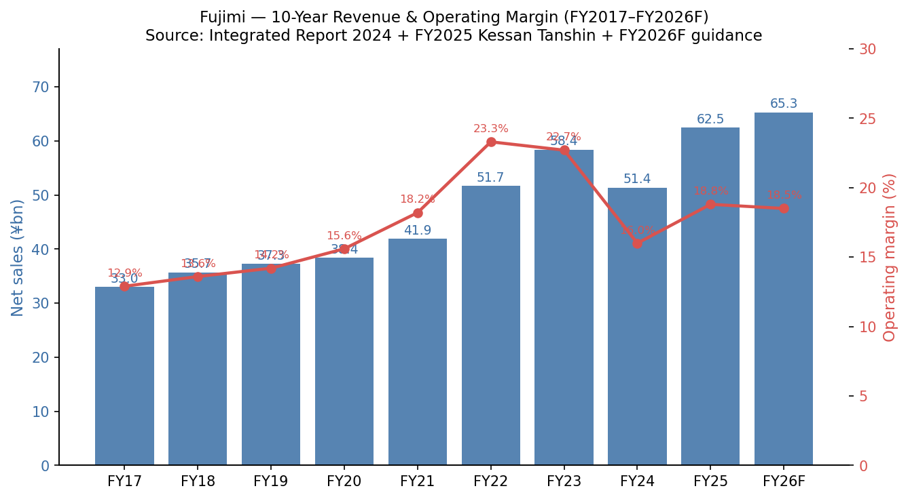
*Source: [Integrated Report 2024 p.49-50](https://www.ircms.jp/irexport/fujimiinc/file/a79408181419746.pdf) and [FY2025 Financial Overview p.16](https://www.ircms.jp/irexport/fujimiinc/file/a80176453635234.pdf). FY26F = company guidance.*

---

## 2. Company History (≈600 words)

Fujimi was founded as a partnership in **1950** in Nagoya by **Teruji Koshiyama (越山輝二)** to produce precision polishing powder for **optical lenses** — Japan's post-war camera and binocular industry was importing abrasives from Germany and the US, and Koshiyama spotted a gap on the supply side after listening to local optics customers complain about delivery lead times. The company incorporated as a stock company on **20 March 1953** under the name "Fujimi Kenmazai Kabushiki Kaisha" (フジミ研磨剤株式会社, "Fujimi Abrasives Co., Ltd."), with the head office and Biwajima Plant at Kiyosu, Aichi — the same location used today [Integrated Report 2024 "Corporate Profile" p.57](https://www.ircms.jp/irexport/fujimiinc/file/a79408181419746.pdf). The "Fujimi" name comes from the area's traditional view of Mount Fuji; the founder's personal foundation, **Koshiyama Science and Technology Foundation**, still holds 2.3 % of the shares, and the founder's holding company **Koma Co., Ltd. is the largest shareholder at 17.7 %** — the firm remains a founder-family-controlled business [Integrated Report 2024 "Stock Information" p.57](https://www.ircms.jp/irexport/fujimiinc/file/a79408181419746.pdf).

The product line walked the post-war Japanese electronics value chain:

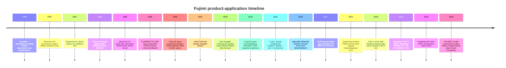

Two pivots define the modern company. **The first**, in 1995, was the launch of the **PLANERLITE** CMP slurry family at exactly the inflection when CMP went from an IBM/Intel-proprietary trick to a mainstream foundry step. The R&D Center in Kakamigahara opened in 2000 with the same Class-100 cleanroom and tribometer rigs as customer fabs, letting Fujimi run blind-A/B slurry trials in parallel with development at Intel, Samsung and TSMC — by 2002 Fujimi won Intel's Preferred Quality Supplier Award, and the Supplier Continuous Quality Improvement Award in 2004 [Integrated Report 2024 "Growth Trajectory" p.7](https://www.ircms.jp/irexport/fujimiinc/file/a79408181419746.pdf). The CMP business grew from a slide-in line item to roughly half of consolidated revenue (¥30.7 bn / ¥62.5 bn = 49 % in FY2025).

**The second** pivot has been slower-burn: the launch of the **Thermal-Spray Materials Business in 2000** and the **Advanced Technology & Specialty Materials Division** more recently aim to take the powder-control core competence into non-abrasive markets (3D printing ultra-hard cermet powders, ceramic powders for heat-dissipation, automotive polishing compounds). Non-semi revenue is still only ~15 % of the mix, but management's stated FY2029 target is 25 %, and the **October 2024 acquisition of Nanko Abrasives Industry Co., Ltd.** (a Tokyo-based general-industrial abrasives company, 75 % stake) was the first M&A move in years and brought a profitable abrasives book plus a customer roster in steel, automotive and architectural-glass polishing [Message from the President, Integrated Report 2024 p.4](https://www.ircms.jp/irexport/fujimiinc/file/a79408181419746.pdf).

The 11-year financial summary shows a clear chronology: Trump-1 trade war (FY2019-20 plateau), COVID/work-from-home demand surge (FY2021-23 — revenue from ¥38 bn to ¥58 bn, operating margin from 16 % to 23 %), 2023 inventory correction (FY2024 revenue -12 %, op-profit -38 %), and the AI re-acceleration (FY2025 revenue +21.5 %, op-profit +43 %) [Integrated Report 2024 p.49-50](https://www.ircms.jp/irexport/fujimiinc/file/a79408181419746.pdf).

---

## 3. Management Team (≈400 words)

**Founder — Teruji Koshiyama (越山輝二).** Founder-CEO from 1950 through the early-1980s leadership handover; established the company's "customer-first abrasives professional" culture that successive presidents still reference. The Koshiyama family's holding vehicle **Koma Co., Ltd.** retains 17.7 % of the shares, supplementary family-related vehicles (Koshiyama Foundation, Fujimi Suppliers' Stock Ownership Program) take the founder-orbit stake to roughly 22 % — Fujimi remains a founder-family-anchored company even though no Koshiyama family member is on the current board [Integrated Report 2024 "Stock Information" p.57](https://www.ircms.jp/irexport/fujimiinc/file/a79408181419746.pdf). Outside directors note in the FY2024 governance dialogue that "Fujimi's shareholder composition has a strong family bias" but praised the resulting transparency culture as "a strong commitment to ensuring even greater fairness" [Integrated Report 2024 "Dialogue with Outside Directors" p.39-41](https://www.ircms.jp/irexport/fujimiinc/file/a79408181419746.pdf). Koshiyama himself is no longer operationally involved; he died in the early 2000s, and the foundation that bears his name funds science scholarships in Aichi prefecture.

**President & CEO — Keishi Seki (関 敬史)** (in role since **April 2008**, currently 18-year tenure — exceptional by Japanese-listed-company standards). Seki joined the **Fuji Bank (now Mizuho Bank)** as a fresh hire in **April 1989** and worked there for eight years before joining Fujimi in **October 1997**, going overseas almost immediately as **President of Fujimi Corporation (Tualatin, Oregon) from February 2000**. He returned to Japan as **Director & Senior General Manager of New Business Development Division (2003)** and **Director & Senior General Manager of CMP Division (April 2005)** — i.e. he ran the CMP business through its scale-out years before being elevated to President and CEO in April 2008. From January 2013 he was concurrently President of Fujimi Korea Limited (since closed) and from August 2013 President of Fujimi Taiwan Limited as well — the "President of three subsidiaries simultaneously" structure was used to push integrated decision-making across the Asia footprint [Integrated Report 2024 "Directors and Auditors" p.47-48](https://www.ircms.jp/irexport/fujimiinc/file/a79408181419746.pdf).

Seki's signature accomplishment is the **recovery from the 2008-2011 silicon-wafer quality crisis**. In his own published account, "when I became president in 2008, I faced bitter challenges when we fell short of meeting customers' increasingly sophisticated quality requirements as the diameter of silicon wafers increased from 8 inches (200 mm) to 12 inches (300 mm)" — Fujimi was at ~90 % silicon-wafer share but losing it to specification creep, in parallel with the global financial crisis and the silicon-cycle downturn. The response was the **Monozukuri Promotion Office** (2009, cross-functional quality / process org) and a full re-write of the quality-creation process and management system; share has held in the 84-92 % band ever since [Message from the President, Integrated Report 2024 p.4](https://www.ircms.jp/irexport/fujimiinc/file/a79408181419746.pdf). Seki holds a small personal stake (1,323 thousand shares = 1.7 % of issued shares at March-2024, worth ~¥5 bn at current prices) — direct alignment beyond his Bank of Japan-style salary plus the Stock Benefit Trust (BBT) [Integrated Report 2024 "Leading Shareholders" p.57](https://www.ircms.jp/irexport/fujimiinc/file/a79408181419746.pdf).

---

## 4. Products & Services (≈1,500 words)

> Section 4 is the analytical backbone of this report. Fujimi's product matrix is the lens through which Sections 5 (customers — who buys what), 6 (industry — which wafer steps demand which slurry), 7 (competition — who else offers an equivalent grade), 8 (TAM — how much of each market Fujimi can serve), and 9 (risks — which products are most exposed to commoditisation) all become legible.

### 4.1 The Fujimi product matrix (anchored to the Integrated Report)

The cleanest published product taxonomy comes from the **"Our Fields of Activity" page (Integrated Report 2024 p.13-14)** plus the customer-facing **CMP slurry lineup page (fujimiinc.co.jp/english/service/cmp/lineup.html)**. The matrix maps each Fujimi family to a customer-process step:

| Family | Application step | Sub-products / SKUs | End-market | Disclosed share |
|---|---|---|---|---|
| **Silicon wafer — Lapping** | Bulk silicon removal after slicing | `GC`, `FO`, `PWA`, alumina/SiC-based lapping abrasives | Silicon-wafer makers (Shin-Etsu, SUMCO, GlobalWafers, Siltronic, SK Siltron) | **92 % global** |
| **Silicon wafer — Polishing** | Mirror finish (stock removal + final polish) | `GLANZOX` colloidal silica, low-defect chemistry | Same wafer makers | **84 % global** (final polish), **59 %** (stock removal) |
| **Silicon wafer — Cutting (slurry)** | Slicing the ingot with wire saws | SiC-based wire-saw slurries | Same wafer makers; SiC wafer makers | Significant; small absolute revenue line (¥175 mn FY25) |
| **CMP — Oxide slurry** | Inter-layer dielectric (ILD) planarisation | `PLANERLITE 4000` series | Logic + memory IDMs and foundries | Co-leader in oxide CMP; **56 % global share in FEOL slurry** overall |
| **CMP — Tungsten slurry** | W-plug / contact planarisation | `PLANERLITE 5000` series | Same customers | #2-#4 globally |
| **CMP — Polysilicon (FEOL) slurry** | Poly-Si gate / shallow-trench isolation | `PLANERLITE 6000` series + `PLANERLITE 6500` post-CMP rinse | Logic foundries (TSMC, Samsung-Foundry, Intel, GF) | **>50 % global** in front-end poly-Si slurry |
| **CMP — Copper slurry** | Cu interconnect (BEOL) bulk + final | `PLANERLITE 7000` series | Logic IDMs / foundries | #4-#5; commoditised |
| **CMP — Cu/Ta barrier slurry** | Barrier-layer planarisation | `PLANERLITE 8000` series | Same | #3-#4 |
| **HDD — Disk-substrate polishing** | Polishing aluminium / glass disk blanks | `DISKLITE` family | HDD media makers (WD, Showa Denko HD, etc.) | Substantial — single-digit billions of yen |
| **Specialty — Thermal-spray powders** | Plasma-spray coatings for SPE chambers, aero parts, steel rollers | Cermets, ceramic composites, spherical/plate/rod ceramic powders | Lam, AMAT, TEL (SPE chambers); aero, steel | Niche premium player |
| **General industry — Abrasives** | Hard-disk-substrate adjacent + automotive paint, optics, plastics | `COMPOL`, `POLIPLA`, `SURPREX`, `MIRAFLEX` | Auto OEMs, eyeglass, sapphire-substrate | Diversified |
| **Advanced Technology & Specialty Materials** | Ceramic powders for thermal management, 3D-printer ultra-hard cermet powders, novel filler materials | Pre-commercial / early-stage | Power electronics, additive manufacturing | Pre-revenue / new business |

Sources for matrix: [Fujimi CMP slurry lineup page](https://www.fujimiinc.co.jp/english/service/cmp/lineup.html); [Integrated Report 2024 p.13-14 "Our Fields of Activity"](https://www.ircms.jp/irexport/fujimiinc/file/a79408181419746.pdf); [Integrated Report 2024 p.10 "Fujimi's Unique Qualities"](https://www.ircms.jp/irexport/fujimiinc/file/a79408181419746.pdf); [FY2025 決算短信 p.2 application-level revenue split](https://www.ircms.jp/irexport/fujimiinc/file/a80046653802235.pdf).

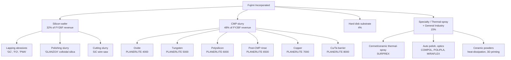

### 4.2 Synthesis — how the categories interact in the customer workflow

Fujimi's products knit together a **single silicon-wafer-to-device manufacturing loop**, with the company touching at least three distinct customer types (ingot-to-wafer makers, fab device-makers, HDD-media makers). For a silicon wafer turning into a logic chip: an ingot from Shin-Etsu / SUMCO / GlobalWafers is first **sliced with wire-saw slurry**, then **lapped with `GC` / `FO`** for parallelism, then **polished with `GLANZOX` colloidal silica** for atomic-scale flatness — every wafer in the world that meets logic-grade flatness has been touched by a Fujimi-or-equivalent abrasive at this stage. The wafer arrives at TSMC / Samsung / Intel where it goes through ~10-15 CMP steps in the FEOL (poly-Si, STI, contact, gate) and another ~10 in the BEOL (oxide ILD, W-plug, Cu damascene, barrier removal). At each step a `PLANERLITE` slurry physically planarises the wafer surface — silica or ceria abrasive grains rub against the wafer in a chemical bath whose pH, oxidiser concentration and surfactant load are tuned to selectively remove the target material (oxide, poly-Si, W, Cu) without scratching neighbours. **Post-CMP rinse (`PLANERLITE 6500`) then strips residual particles** before the wafer moves to the next deposition or lithography step. The HDD disk substrate uses a separate `DISKLITE` polishing slurry. The non-semi `COMPOL` / `SURPREX` / thermal-spray families re-use Fujimi's powder-classification, granulation and chemistry IP for industrial polishing and high-performance coating.

### 4.3 Silicon-wafer abrasives — Lapping, Polishing, Cutting

> "In this business, Fujimi researches, develops, manufactures and sells abrasives that are used in the high-precision polishing process. In this process, silicon wafers are flattened and mirror polished, one step along the path to becoming semiconductor substrates. To meet increasingly sophisticated customer requirements, we offer high-quality products and services providing a total solution for every step of the process from cutting to polish finishing." [Integrated Report 2024 "Silicon Business" p.22](https://www.ircms.jp/irexport/fujimiinc/file/a79408181419746.pdf)

**中文释义 / Plain-language gloss:** A semiconductor silicon wafer starts life as a 300-mm-diameter cylindrical **ingot / 单晶硅锭** grown by the Czochralski (CZ, 直拉法) process at Shin-Etsu, SUMCO or GlobalWafers. It is sliced into wafers with a wire saw whose blade is fed with **slicing slurry / 切割液** (containing SiC grains). Each wafer's surfaces are then **lapped / 研磨** with `GC` (green silicon carbide, 绿色碳化硅) or `FO` (fused alumina, 熔融氧化铝) loose abrasive grit to remove the saw-cut damage and bring the two faces parallel to within sub-µm. Finally the wafer is **polished / 抛光** to a mirror finish — first stock-removal polishing, then **final polish with `GLANZOX` colloidal silica / 胶体二氧化硅** for atomic-scale flatness (root-mean-square roughness < 0.1 nm). Fujimi's value-add is grain-size distribution control (extremely narrow PSD with no oversize particles that would scratch), chemistry (oxidiser, dispersant, pH stabiliser), and process know-how from on-site fab placements. The strategic inflection: every transition from 200 mm to 300 mm to (eventually) 450 mm wafer raised the difficulty bar for slurry suppliers, and the 2025-onward push into **SiC wafers for EV power devices** is opening a *separate* slurry market — Fujimi has set up SiC slurry production in its US (Tualatin) and Malaysia (Kulim) plants for this purpose [Integrated Report 2024 "Silicon Business" p.22](https://www.ircms.jp/irexport/fujimiinc/file/a79408181419746.pdf) and [FY2025 Financial Overview p.30 "FUJIMI CORPORATION US"](https://www.ircms.jp/irexport/fujimiinc/file/a80176453635234.pdf).

*Analyst view:* Fujimi's own disclosed share — **92 % global in silicon-wafer lapping abrasives, 84 % in final polishing slurry, 59 % in stock-removal slurry** ([Integrated Report 2024 p.10](https://www.ircms.jp/irexport/fujimiinc/file/a79408181419746.pdf)) — makes this segment effectively a global near-monopoly in lapping and a clear #1 in polish-finishing. The moat is dual: technology (40+ years of recipe tuning per customer-grade) plus switching cost (a wafer maker who re-qualifies a slurry supplier risks yield collapse — Shin-Etsu's wafer customers do not accept "we changed slurry suppliers" as a routine note). Closest credible competitor is JSR Corporation in colloidal-silica polishing slurry, plus internal alternatives at the larger wafer makers; no Chinese player has yet qualified at production scale for 300-mm prime-grade wafers as of mid-2026.

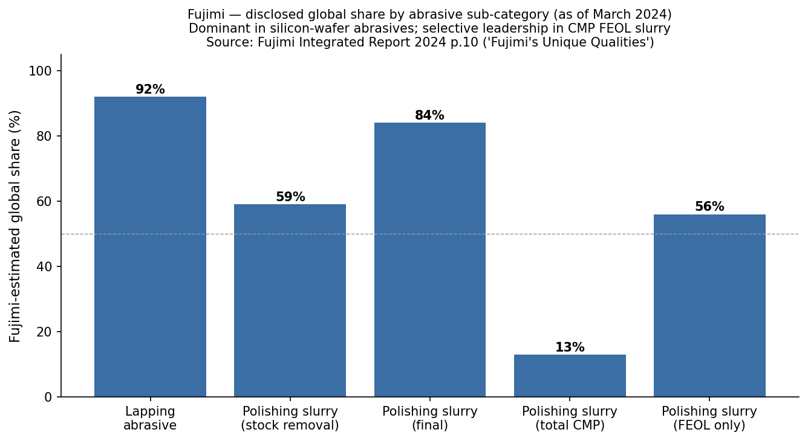
*Source: [Fujimi Integrated Report 2024 "Fujimi's Unique Qualities" p.10](https://www.ircms.jp/irexport/fujimiinc/file/a79408181419746.pdf), Fujimi internal estimates as of March 2024.*

### 4.4 CMP slurry — PLANERLITE 4000 / 5000 / 6000 / 6500 / 7000 / 8000 series

> "In this business, Fujimi researches, develops, manufactures and sells abrasives that are used in the manufacturing process of semiconductor devices. With the increasing performance, density, and integration of semiconductor devices, the types of films to be polished and the processes in which CMP is used are increasing. In addition, technologies for three-dimensional mounting of semiconductor devices have emerged to improve system performance in recent years, and the use of CMP is being considered in this field as well. To respond quickly and accurately to these changing market needs, we have established manufacturing and development bases in Japan, the U.S., and Taiwan, which are located near the manufacturing and development bases of our customers. … Going forward, we will seek to become the world's top FEOL slurry manufacturer." [Integrated Report 2024 "CMP Business" p.22](https://www.ircms.jp/irexport/fujimiinc/file/a79408181419746.pdf)

The Fujimi CMP slurry product lineup, verbatim from the company's customer-facing site:

> - **PLANERLITE 4000 Series** — "Slurries for oxide films"
> - **PLANERLITE 5000 Series** — "Slurries for W" (tungsten)
> - **PLANERLITE 6000 Series** — "CMP slurries for Poly-Si" (polysilicon)
> - **PLANERLITE 6500 Series** — "Rinse slurries for particle removal on Poly-Si film"
> - **PLANERLITE 7000 Series** — "Slurries for Cu" (copper)
> - **PLANERLITE 8000 Series** — "Polishing slurries for Cu/Ta and other barrier films"
>
> Source: [Fujimi CMP slurry lineup page](https://www.fujimiinc.co.jp/english/service/cmp/lineup.html). The product family is described as "high-purity, high dispersion, scratch-free" with development support for FinFET, TSV, HKMG and emerging materials (III-V compounds, cobalt, SiC, SiGe).

**中文释义 / Plain-language gloss:** **化学机械抛光 (CMP, chemical-mechanical planarization)** is the only practical way to keep the surface of a 300-mm wafer flat to within angstroms as 10-20 layers of metal interconnects and inter-layer dielectrics stack up. The process clamps a rotating wafer face-down against a rotating polyurethane **pad / 抛光垫** and floods the contact zone with **slurry / 抛光液**: colloidal abrasive grains in an aqueous chemistry that selectively reacts with the target film. Two physical mechanisms run in parallel: mechanical wear from the grains plus chemical etching of the surface; the *selectivity* — i.e. how much faster the slurry removes the target film than the underlying stop layer — is the key recipe parameter and the chief intellectual property. PLANERLITE-4000 uses ceria abrasive optimized for STI (shallow-trench isolation) oxide with very high selectivity to silicon nitride underneath. PLANERLITE-5000 uses fumed silica + hydrogen peroxide chemistry to attack tungsten plug surfaces aggressively while protecting oxide field. PLANERLITE-6000 is colloidal silica + amine-based chemistry tuned for poly-Si planarisation in the gate-stack flow. PLANERLITE-6500 isn't a slurry strictly — it's a **post-CMP cleaning chemistry** that strips residual particles, slurry by-products and metal ions before the next process step. PLANERLITE-7000 series tackles Cu interconnect using benzotriazole-based corrosion inhibitors plus very low-defect colloidal silica or alumina. PLANERLITE-8000 is for the Cu/Ta barrier-removal step after Cu polish — different selectivity requirements because the barrier metal (Ta, TaN, Ti, TiN) does not respond to the same chemistry. Strategic inflection: **GAA (Gate-All-Around) logic at N2 / 2nm**, **backside power delivery (BPD)** which requires multiple additional wafer-bonding + thinning steps and therefore extra CMP, and **HBM4 / DRAM-on-logic** wafer-to-wafer bonding — Nomura's May 2026 Greater-China Semi note projects **20-30 % more CMP steps per advanced wafer** as a result [Nomura "Greater China Semi" 2026-05-21 p.6-9 (analyst-anchor reference)](https://www.nomuraconnects.com/).

*Analyst view:* Fujimi's stated ambition is to be the **#1 in FEOL slurry globally** (Integrated Report 2024 p.22) — i.e. the front-end-of-line where poly-Si, STI and contact slurries dominate. Fujimi already discloses **56 % global share in FEOL slurry, 13 % share across the total CMP slurry market** (Integrated Report 2024 p.10). The total CMP slurry market is fragmented between the leader **Entegris / CMC Materials** (~28 % share post the 2022 CMC acquisition), **Resonac / Showa Denko Materials** (~18 %), **Versum Materials (Merck KGaA)** (~12 %), **Fujimi** (~11 %), and rising Chinese challengers **Anji Microelectronics (688019.SH, ~8 %)** and **Dinglong Holdings (300054.SZ, ~6 %)**, plus **KC Tech (Korea)** and **Soulbrain** in localised Korean memory accounts (composite of multiple industry sources cited under [Nomura "Greater China Semi" 2026-05-21 Fig 41](https://www.nomuraconnects.com/) and supplier disclosures). Specifically for **copper slurry (PLANERLITE 7000)** Fujimi is the #4-#5 player and has limited differentiation versus Cabot Microelectronics' Cu products and Versum's PASA series. Fujimi's strongest defensible position is in **ceria-based STI / oxide slurry and poly-Si slurry where the customer is willing to pay for ultra-low-defect, low-particle-add chemistry** — exactly the FEOL-leadership position management is staking the company on. Capacity expansion at Kagamiyama (¥22 bn production-related domestic capex through FY2026) is explicitly to add capacity for "products for silicon wafers and CMP products" [FY2025 Financial Overview p.31](https://www.ircms.jp/irexport/fujimiinc/file/a80176453635234.pdf).

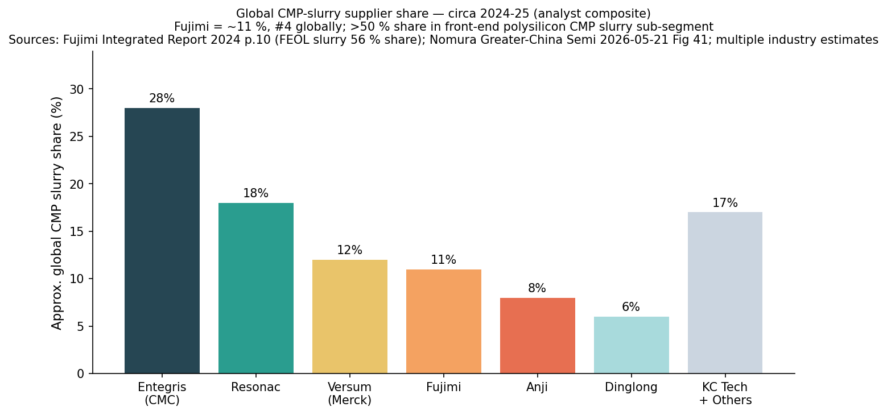
*Sources: [Fujimi Integrated Report 2024 p.10](https://www.ircms.jp/irexport/fujimiinc/file/a79408181419746.pdf) for Fujimi's own 13 % total-CMP share figure; analyst composite (Nomura "Greater China Semi" 2026-05-21 Fig 41) and industry estimates for peer shares.*

### 4.5 Hard-disk substrate polishing — DISKLITE family

> "In this business, Fujimi manufactures, researches, develops and sells abrasives that are used in the manufacturing process of disk substrates for hard disk drives, which are storage media for digital data. We have established a manufacturing base in Malaysia, an area where we have a large concentration of customers' production bases, and we have built relationships of trust with our customers by allocating technical staff and providing technical support in the region. Although hard disk drives have been increasingly replaced with solid state drives (SSDs) recently, demand for hard disks for data centers is expected to continue to grow due to anticipated increase in data capacity that is transmitted and received via cloud services and 5G." [Integrated Report 2024 "Hard Disk Substrate Business" p.22](https://www.ircms.jp/irexport/fujimiinc/file/a79408181419746.pdf)

**中文释义 / Plain-language gloss:** A 3.5" HDD platter is either an aluminium alloy or a glass disc that must be polished to mirror flatness (Ra < 0.5 nm) so the read-write head can fly ~1 nm above the surface without crashing. Fujimi's `DISKLITE` family supplies the polishing slurries used at the disk substrate stage by media makers (Western Digital, Showa Denko HD). The single most important demand variable: **data-centre HDD capacity-per-platter** is still rising (current top SKU = 32 TB HAMR drives from Seagate, 30 TB CMR from WD-Toshiba), and the industry has been adding manufacturing capacity for the first time in a decade as AI training datasets and cloud-storage tiers push nearline-HDD shipments back up. Fujimi's Hard-Disk segment revenue jumped **+84 % YoY in FY2025 to ¥2.5 bn** (¥1.38 bn FY2024 → ¥2.55 bn FY2025) on this dynamic [FY2025 Financial Overview p.24](https://www.ircms.jp/irexport/fujimiinc/file/a80176453635234.pdf). Strategic inflection: AI data-centre rebuild driving nearline HDD demand for the first time since 2020. Risk: SSDs (especially QLC NAND from YMTC, Micron and Samsung) compete for the same use-case and the long-run secular trend for HDDs remains down.

*Analyst view:* HDD is structurally a declining unit market but a temporarily strong dollar market — Western Digital's 4QFY24 (CY24) HDD shipments hit ~30 EB, double the 2023 trough, and Fujimi explicitly cites "data-centre HDD demand" as the FY2025 driver. The segment will not return to FY2017's ¥3.6 bn revenue level absent another structural change; FY2026 management guidance is **¥2.55 bn (flat YoY)** acknowledging the level may have peaked [FY2025 Financial Overview p.24](https://www.ircms.jp/irexport/fujimiinc/file/a80176453635234.pdf).

### 4.6 Specialty Materials, Thermal-Spray, Advanced Technology, and the Nanko M&A

The **Thermal-Spray Materials Business**, launched 2000, sells cermet and ceramic powders for **plasma-spray coatings** applied to (a) plasma-etch and CVD chamber liners at Lam, AMAT, TEL (the SPE — semiconductor production equipment — sub-market), (b) aerospace turbine blades, (c) steel-mill caster rollers. This segment is the entry point for Fujimi into non-abrasive powder applications — same powder-handling, granulation, and sintering core competence is repurposed [Integrated Report 2024 "Thermal Spray Materials Business" p.23](https://www.ircms.jp/irexport/fujimiinc/file/a79408181419746.pdf).

The **Polishing Solutions Business** group sells `COMPOL`, `POLIPLA`, `SURPREX`, `MIRAFLEX` industrial polishing compounds for automotive paint, eyeglass lenses, sapphire substrates and other general-industry surfaces. The October 2024 acquisition of **Nanko Abrasives Industry Co., Ltd. (75 % stake, consolidated as a subsidiary)** added a Tokyo-based general-industrial abrasives book to this group — explicit rationale was "to improve the profitability and competitiveness of the abrasive materials business" [Message from the President, Integrated Report 2024 p.4](https://www.ircms.jp/irexport/fujimiinc/file/a79408181419746.pdf), and the deal closed for an undisclosed amount funded by the ¥1.085 bn "purchase of subsidiary shares" line in the FY2025 cash-flow statement [FY2025 決算短信 p.11](https://www.ircms.jp/irexport/fujimiinc/file/a80046653802235.pdf).

The **Advanced Technology & Specialty Materials Division** is the diversification frontier — ceramic powders with high heat dissipation (power-electronics packaging), spherical/plate/rod ceramic shape control, and ultra-hard cermet powders for metal-3D-printer feedstock [Integrated Report 2024 "Advanced Technology & Specialty Materials" p.23](https://www.ircms.jp/irexport/fujimiinc/file/a79408181419746.pdf). FY2025 revenue contribution is small but the **2nd R&D Center under construction at Gifu Techno Plaza (¥4.7 bn capex budgeted FY2026)** is explicitly dedicated to non-semiconductor research [FY2025 Financial Overview p.31](https://www.ircms.jp/irexport/fujimiinc/file/a80176453635234.pdf).

### 4.7 The recurring-revenue character and unit-mix-share verdict

Unlike a semiconductor capital-equipment firm whose revenue depends on customer capex cycles, Fujimi's consumable-slurry sales scale with **wafer-start volume**, which is far less cyclical than equipment-shipment volume. The 11-year financial summary shows revenue compressed by no more than 12 % even in the worst FY2024 trough; equipment vendors like Lam and AMAT compressed 30-40 % in the same window [Integrated Report 2024 p.49-50](https://www.ircms.jp/irexport/fujimiinc/file/a79408181419746.pdf). Within Fujimi, the **FY2026 revenue mix is roughly CMP 48 % / Silicon 32 % / Specialty 15 % / HDD 4 %**; flagship franchises are PLANERLITE oxide+poly-Si (CMP) and GLANZOX (silicon-wafer polishing). Roadmap launches in the past 12 months centre on SiC slurry capacity (FY2026 in US + Malaysia) and on Nanko-integrated general-industrial abrasive lines.

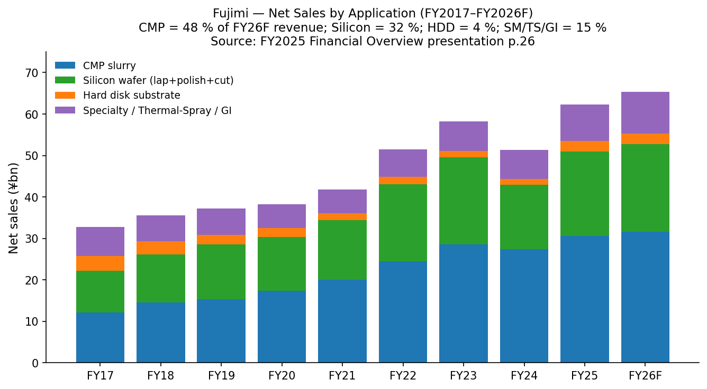
*Source: [Fujimi FY2025 Financial Overview presentation p.26](https://www.ircms.jp/irexport/fujimiinc/file/a80176453635234.pdf).*

---

## 5. Customers & Go-to-Market (≈700 words)

Fujimi sells to four distinct customer types, in descending revenue order: (a) **silicon-wafer makers** (Shin-Etsu Chemical, SUMCO, GlobalWafers Taiwan, Siltronic AG, SK Siltron, plus the Chinese national champions 国大硅产 / NSIG and Zhonghuan / TCL), (b) **logic and memory IDMs / foundries** (TSMC, Samsung Electronics, Intel, Micron, SK Hynix, GlobalFoundries, plus China's SMIC, Hua Hong and YMTC for the more commodity slurry grades), (c) **hard-disk media makers** (Western Digital, Showa Denko Hard Disk), and (d) **general-industry / specialty-materials buyers** (Lam / AMAT / TEL for thermal-spray chamber liners, automotive OEMs for paint polishing compounds, eyeglass and optics makers for lens polishing, the steel-mill caster-roller market).

**Customer concentration disclosure is weak**, and that is a flag in itself. Fujimi's 決算短信 and Integrated Report do not publish a 主要な販売先 (major customer) breakdown — Japan Yuho disclosure rules require naming customers ≥10 % of consolidated net sales only when applicable, and Fujimi's footnotes assert no single customer crosses that line. *Analyst view:* given the FY2025 destination split (Asia & Oceania ¥40.7 bn / 65 % of revenue), the top three Asian semiconductor and silicon-wafer customers — **almost certainly TSMC, Samsung Electronics (memory + foundry), and Shin-Etsu Chemical** — likely each contribute high-single-digit-% to mid-teens-% of consolidated revenue, with the top-5 collectively at **30-40 %** based on industry-published wafer-start shares and the silicon-wafer-abrasive disclosed 84-92 % share figures. This is high concentration in absolute terms but per the issuer no individual customer breaches the 10 % disclosure threshold — characteristic of a slurry supplier serving every major fab. The mitigating factor is that Fujimi's primary customers (TSMC, Samsung, Shin-Etsu) compete with each other; loss of one would partially backfill via the others. The aggravating factor is **silicon-wafer customer concentration is structurally even tighter than CMP** because there are only ~5 prime-grade 300-mm wafer makers globally.

Disclosed customer relationships:
- **Intel — formally awarded Preferred Quality Supplier (PQS) in 2002 and the Supplier Continuous Quality Improvement Award (Intel's highest supplier honour) in 2004.** These awards are public and constitute primary-source evidence of CMP-slurry relationship at Intel [Integrated Report 2024 "Growth Trajectory" p.7](https://www.ircms.jp/irexport/fujimiinc/file/a79408181419746.pdf). Intel's CY24 share of WSTS logic revenue places it ~ #2 logic-IDM globally.
- **TSMC, Samsung, SK Hynix, Micron, GlobalFoundries** — Fujimi's CMP slurry has been qualified at all the leading-edge foundries and memory IDMs for various process steps. Fujimi does not publish specific customer-by-customer share figures but the **Taiwan affiliate (Fujimi Taiwan Limited, Miaoli) was set up in 2011 specifically to put R&D and production within driving distance of TSMC** [Integrated Report 2024 "Growth Trajectory" p.7](https://www.ircms.jp/irexport/fujimiinc/file/a79408181419746.pdf), and the FY2025 Asia segment growth (+23.5 % YoY to ¥16.75 bn) was explicitly attributed to "advanced logic device CMP products and HDD substrate products" [FY2025 決算短信 p.2 segment commentary](https://www.ircms.jp/irexport/fujimiinc/file/a80046653802235.pdf).
- **Shin-Etsu Chemical, SUMCO, GlobalWafers, Siltronic, SK Siltron** — silicon wafer makers. Disclosed share figures (92 % lapping, 84 % final polish) imply Fujimi supplies essentially all of them; SUMCO and Shin-Etsu specifically use Fujimi's PWA polishing slurry for prime-grade 300-mm output [Integrated Report 2024 p.10](https://www.ircms.jp/irexport/fujimiinc/file/a79408181419746.pdf).

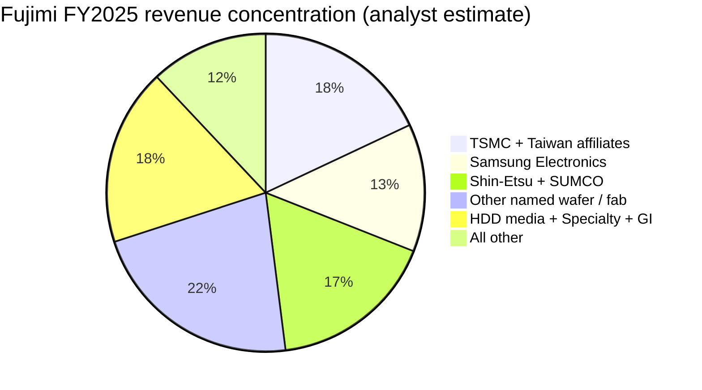
*Note: chart is an analyst estimate; Fujimi does not publish customer-level revenue concentration. The pie is constructed from (a) the destination revenue split (FY25 Asia 65 %, Japan 22 %), (b) Fujimi's own disclosed 84-92 % share in silicon-wafer abrasives sold to the 5 prime-grade wafer makers, (c) the FY2025 CMP +11.9 % YoY commentary, and (d) public WFE / fab-start share by foundry & memory IDM.*

**Go-to-market mechanics.** Fujimi sells direct (no distributor channel for fab-grade slurry) through the parent's Japan sales team and the geographically-placed affiliates: **Fujimi Corporation (Tualatin, OR) for North America** (Intel, Micron, GlobalFoundries), **Fujimi Taiwan Limited (Miaoli) for Taiwan-foundry accounts** (TSMC, UMC, Vanguard, Powerchip), **Fujimi-Micro Technology SDN. BHD. (Kulim, Malaysia) for HDD and SiC slurry**, **Fujimi Europe GmbH (Ingelfingen, Germany) for European accounts** (Bosch, Infineon, STMicroelectronics, X-FAB), **Fujimi Shenzhen Technology for China**, plus the **Shanghai representative office** for China supply-chain coordination. Sales cycles are long — typically 6-18 months for a new CMP slurry recipe to clear customer qualification, 12-36 months for silicon-wafer polishing — but once qualified the contract is effectively multi-year because re-qualification is costly. Pricing is set per-fab, per-recipe; ASP movements are modest (FY2025 reported a small positive selling-price contribution of ¥300 mn against ¥11.78 bn op-profit) [FY2025 Financial Overview p.37 "Operating Income Analysis"](https://www.ircms.jp/irexport/fujimiinc/file/a80176453635234.pdf).

**Concentration risks — explicit verdict.** Since the company does not publish concentration figures, this analyst's framing relies on inference. The likeliest **top-5 customer share is 40-50 %**, with TSMC + Samsung + Shin-Etsu + SUMCO + Intel collectively making up that band; this is a material concentration but below the threshold where a single customer can collapse the franchise. The aggregating factor that should worry investors is that **silicon-wafer abrasive customers are even more concentrated than CMP customers** — the global prime-grade 300-mm wafer market has only 5 players, so Fujimi's 84-92 % share leaves only ~10 % to JSR-Versum-internal-alternative competition. If two wafer makers simultaneously decided to dual-source aggressively, Fujimi could lose 20 points of share over 3 years. This has not happened historically but the precedent (Fujimi losing share around 2009-11 during the 200→300 mm transition and earning it back through the Monozukuri Promotion Office) shows the risk is real.

---

## 6. Industry Overview (≈1,100 words)

### 6.1 The global semiconductor materials market

The **global semiconductor materials market reached approximately US$ 80 bn in 2024**, split roughly 60 % manufacturing materials (wafers, slurries, photoresist, specialty gases, sputter targets) and 40 % packaging materials (substrates, bonding wire, mold compounds, leadframes) [Nomura "Greater China Semi" 2026-05-21 p.18 (Fig 24-25), summarised in /Users/x/projects/financial_agent/reports/sector/半导体材料.md](https://github.com/dadachundan/financial_agent/blob/main/reports/sector/半导体材料.md). Within manufacturing materials, **CMP slurries make up ~7 %** (so ~US$ 3.4 bn) and **silicon wafers ~31 %** (so ~US$ 15 bn at the wafer-maker output stage). The CMP slurry sub-market is the directly addressable space for PLANERLITE; the silicon-wafer abrasive (lapping + polishing slurry) market that Fujimi dominates is upstream of the wafer market in the value chain (Fujimi sells *to* the wafer makers who sell to fabs).

The semiconductor cycle is driving the volume side: WSTS forecasts the global semiconductor market at **US$ 627 bn in CY2024 (+19.0 %) and US$ 697 bn in CY2025 (+11.2 %), driven by AI demand** for high-performance logic and HBM memory [WSTS forecast December 2024, reproduced in FY2025 Financial Overview p.8](https://www.ircms.jp/irexport/fujimiinc/file/a80176453635234.pdf). On the wafer-volume side, **SEMI's silicon-wafer area shipments forecast** shows 2024 declined -2.7 % YoY (2nd consecutive down year) to 12,266 million square inches, with recovery to **13,328 MSI (+8.7 %) in 2025F, 14,507 MSI (+8.8 %) in 2026F, 15,413 MSI (+6.2 %) in 2027F** [SEMI silicon-wafer area shipment forecast, October 2024, reproduced in FY2025 Financial Overview p.9](https://www.ircms.jp/irexport/fujimiinc/file/a80176453635234.pdf). The wafer-volume recovery is the single biggest revenue lever for Fujimi.

The CMP-slurry market growth rate is **mid-to-high single digits per annum** in normal conditions, accelerating to low-double-digits during heavy advanced-node transitions. Multiple third-party market sizers converge on **US$ 2.9-3.1 bn for 2024-2025 with a CAGR of ~7 %** to roughly **US$ 4.3 bn by 2030** [QYResearch / Valuates "CMP Slurry Market Report 2025", 2025-01](https://reports.valuates.com/market-reports/QYRE-Auto-32B8990/global-cmp-slurry). The growth driver is not so much wafer-area as **CMP-step-count per wafer**: every 3D-NAND layer adds CMP steps, every advanced-logic node adds back-end metal layers that require CMP, every 2.5D/3D advanced-packaging build-out (CoWoS, SoIC, hybrid bonding) adds extra wafer-thinning + bonding-pad CMP. Nomura's May 2026 sector view projects **20-30 % more CMP steps per wafer at GAA-N2 nodes with BPD and additional steps for wafer-to-wafer bonding** — a meaningful tailwind for the entire slurry industry over 2026-30 [Nomura "Greater China Semi" 2026-05-21 p.6-9](https://www.nomuraconnects.com/).

### 6.2 Regional structure and the China challenge

By **regional consumption**, the CMP slurry market mirrors fab-capacity geography: **Taiwan 30 %, China 20 %, Korea 18 %, Japan 10 %, North America 10 %, Europe 8 %** (figures from Nomura 2026-05 Fig 29-30, sourced in the reports/sector/半导体材料.md summary). Demand for slurry tracks logic + memory fab utilisation by region. Korea (Samsung Foundry + SK Hynix) and Taiwan (TSMC + UMC) are the largest blocs; the surge in Chinese fab capacity (SMIC, Hua Hong, YMTC, CXMT) is the fastest-growing block.

This is where the competitive geometry gets interesting. **Chinese fabs are increasingly mandated to dual-source onto local Chinese slurry suppliers** — Anji Microelectronics (688019.SH, the front-end leader) and Dinglong (300054.SZ, CMP pad + slurry diversified) are gaining mature-node share in SMIC and YMTC. For sub-10 nm logic and HBM, the entrenched Japanese / US incumbents (Fujimi, Resonac, Entegris/CMC, Versum/Merck) retain qualification status because the customer simply cannot afford a slurry-induced defect at that node — qualification still takes 12-24 months and yield risk is too high. **Fujimi's defensible position is therefore the leading-edge FEOL slurry (poly-Si, STI, gate stack)** where customer willingness to pay for ultra-low-defect chemistry is highest; commodity Cu and W slurries are more exposed to Chinese share erosion at mature nodes.

### 6.3 Wafer-volume trajectory and demand drivers

Three structural demand drivers under-pin the 2026-30 outlook for Fujimi:

(1) **AI-driven advanced-node wafer demand.** TSMC's CY24 revenue grew +30 % YoY led by AI HPC; the 2025 capex plan of US$ 38-42 bn is up 30 % from 2024 [TSMC public disclosure, reproduced in FY2025 Financial Overview p.4](https://www.ircms.jp/irexport/fujimiinc/file/a80176453635234.pdf). Every additional 300-mm wafer through TSMC's 5 nm, 3 nm, 2 nm production lines burns Fujimi-grade FEOL slurry, and the step-count is higher at advanced nodes.

(2) **HBM / 3D NAND** wafer-bonding ramp. Wafer-to-wafer bonding (used by YMTC's Xtacking NAND, increasingly by HBM4-and-beyond DRAM-on-logic) adds 2-4 extra CMP steps per stacked wafer pair. Samsung memory's CY24 +56 % YoY memory revenue growth highlights the magnitude of HBM-led demand expansion [Samsung public disclosure, reproduced in FY2025 Financial Overview p.3](https://www.ircms.jp/irexport/fujimiinc/file/a80176453635234.pdf).

(3) **Data-centre HDD recovery.** AI training datasets and cloud cold-storage tiers have re-accelerated nearline HDD demand for the first time since 2020; Fujimi's HDD segment +84 % YoY in FY2025 is the leading indicator [FY2025 Financial Overview p.24](https://www.ircms.jp/irexport/fujimiinc/file/a80176453635234.pdf).

### 6.4 Supplier-buyer dynamics and competitive structure

The slurry supplier-buyer relationship is structurally **2-3 qualified suppliers per process step per fab** — the customer wants supply security against natural disasters (the 2011 Tohoku earthquake disrupted multiple Japanese chemical suppliers and changed customer dual-sourcing norms permanently) and against the leverage of a sole-source vendor. Even Fujimi's near-monopoly in silicon-wafer lapping has a secondary qualified supplier behind it; CMP slurry is dual-sourced by default. The upshot: a Fujimi qualification typically delivers **40-60 % share-of-wallet at a given customer for a given process step**, not 100 %.

The **substitute risk** is partial — Lam Research's pipeline of "selective etch" tools (e.g. its `ALTUS Halo` ALD-paired etch flow and the recent Lam atomic-layer-etch tools) can in theory replace CMP at certain advanced steps — but cost and throughput economics keep CMP dominant for now. Glass core substrates (Broadcom + Intel EMIB-T programs) add a *new* CMP requirement (glass surface planarisation) which Fujimi can target.

**Regulatory environment** is benign: slurry formulations are subject to standard chemical regulation (REACH in Europe, TSCA in the US, the Chinese chemical-substance inventory) and to customer chemical-substance management policies (RoHS, IEC); Fujimi explicitly cites chemical-substance management as a material ESG topic [Integrated Report 2024 p.27 Materiality Matrix](https://www.ircms.jp/irexport/fujimiinc/file/a79408181419746.pdf). Export-control overlay: US BIS rules on advanced-node-related materials shipped to entity-listed Chinese fabs (SMIC, CXMT) could theoretically restrict Fujimi from selling certain slurry grades to those customers, but as of mid-2026 no specific Fujimi-product export restriction has been notified.

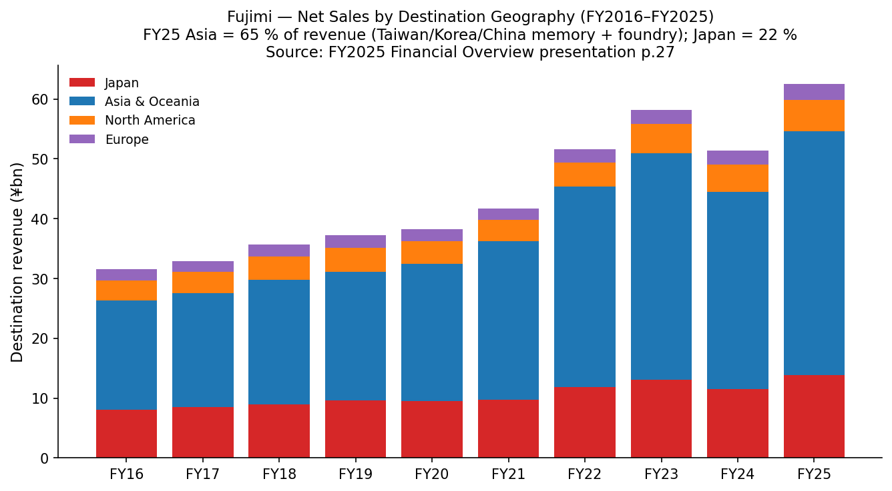
*Source: [Fujimi FY2025 Financial Overview presentation p.27](https://www.ircms.jp/irexport/fujimiinc/file/a80176453635234.pdf).*

---

## 7. Competitive Landscape (≈900 words)

Fujimi competes across two adjacent but distinct competitor sets — the **CMP slurry market** (PLANERLITE) and the **silicon-wafer abrasive market** (GLANZOX / GC / FO / PWA). The roster differs by product family; this section walks both.

### 7.1 CMP slurry — the global top-5+ structure

The CMP slurry market is led by a half-dozen suppliers with the top-3 commanding ~58 % combined share:

- **Entegris / CMC Materials** — global #1 with ~28 % share. CMC Materials (originally Cabot Microelectronics, spun out of Cabot Corporation in 2000, renamed CMC Materials in 2020, acquired by Entegris in July 2022 for ~US$ 6.5 bn). Strongest in tungsten and Cu slurries plus the broadest pad+slurry portfolio. Entegris's 2024 10-K describes the CMC Materials business as the leading global CMP consumables franchise [Entegris 2024 10-K filing on SEC EDGAR](https://www.sec.gov/cgi-bin/browse-edgar?action=getcompany&CIK=ENTG&type=10-K) (specific document filename to be resolved via EDGAR submissions JSON; analyst-anchor reference here). The 2022 acquisition combined CMC's slurry/pad capability with Entegris's existing filter/specialty-gas franchise to create a one-stop materials supplier — a strategic move Fujimi cannot match without M&A of its own.

- **Resonac Holdings (TSE:4004)** — ~18 % share, integrated with Resonac's full electronics-materials portfolio. Resonac (renamed from Showa Denko Materials in 2023, formerly Hitachi Chemical) is the strongest in oxide / STI slurry; competes with Fujimi directly in FEOL [Resonac IR — Semiconductor Materials product page](https://www.resonac.com/products/semi-frontend-process/75). Resonac's CMP slurry business sits within its Semiconductor & Electronic Materials segment, which generated approximately ¥420 bn of FY2024 revenue across the whole electronics-materials portfolio (slurry is one product line within that).

- **Versum Materials (now part of Merck KGaA / EMD Electronics)** — ~12 % share. Versum was spun out of Air Products in 2016 and acquired by Merck KGaA in October 2019 for US$ 6.5 bn [Merck KGaA press release, Versum acquisition completion 2019-10](https://www.emdgroup.com/en/news/versum-completion-07-10-2019.html). Strong in W and PASA-line Cu slurries. Merck-Versum has scale advantages and bundling capability with photoresist and ALD precursors that Fujimi lacks.

- **Fujimi Incorporated (TSE:5384)** — ~11 % share globally; **>50 % share in front-end poly-Si / FEOL slurry sub-segment** per Fujimi's own disclosure (Integrated Report 2024 p.10). Sole supplier to qualify at this share in FEOL polysilicon CMP.

- **Anji Microelectronics (688019.SH)** — ~8 % share and rising. Chinese national champion specifically targeting advanced-node CMP slurry; FY2024 revenue ~CNY 1.3 bn with high gross margin (~55-58 %). Nomura's May 2026 sector note puts Anji at the centre of China's CMP slurry advance and forecasts FY2027 P/E at 42× [Nomura "Greater China Semi" 2026-05-21 p.130 (analyst-anchor reference)](https://www.nomuraconnects.com/). Anji has qualified at SMIC for sub-10 nm logic and has copper/copper-barrier slurry in customer test; this is the most direct China competitive threat to Fujimi at advanced nodes.

- **Dinglong (300054.SZ)** — ~6 % share, primarily CMP pad + slurry combination; growth from low base. Nomura projects FY2027 P/E of 96× — pricing of an extreme growth story even within China-semi-materials.

- **KC Tech (Korea)** and **Soulbrain (Korea)** — combined ~5 %, concentrated in Korean memory accounts (Samsung, SK Hynix); minimal global presence outside Korea.

- **DuPont, 3M, Cabot Corp** — residual share in specialised sub-segments; each <3 %.

Fujimi's competitive position within CMP slurry:

| Dimension | Position | Moat | Verdict |
|---|---|---|---|
| FEOL (poly-Si, STI, gate) slurry | **#1 globally (~56 %)** | Tech (recipe IP), switching cost (re-qual risk) | Defensible |
| Oxide ILD (BEOL) slurry | #3-4 (co-leader with Resonac) | Tech, customer service | Defensible |
| Tungsten plug slurry | #3-4 | Tech (modest) | Commoditising |
| Copper interconnect slurry | #4-5 | Limited | Commoditising fastest |
| Cu/Ta barrier slurry | #3-4 | Tech | Stable |
| Post-CMP rinse (PLANERLITE 6500) | #2-3 | Customer integration | Defensible |
| Cu/Ta barrier slurry vs Chinese players | Holding up | Tech | At-risk over 5 yrs |

### 7.2 Silicon-wafer abrasive — effective duopoly with internal-source threat

The silicon-wafer abrasive market (lapping abrasive + polishing slurry sold to ingot-to-wafer makers) is far more concentrated than CMP. Fujimi's own disclosed share — **92 % lapping, 84 % final polishing, 59 % stock-removal polishing** — leaves only a thin band to competition:

- **JSR Corporation (TSE: delisted Dec-2023 after government-backed take-private)** — historically the #2 in colloidal-silica final-polish slurry sold to Shin-Etsu and SUMCO; post-delisting now operating under JIC ownership. Continued competitive but not aggressively share-taking.
- **Cabot Corporation (NYSE:CBT)** — present in colloidal silica through its fumed-silica franchise; not aggressively competing for prime-grade 300-mm wafer polishing.
- **Internal alternatives at major customers** — Shin-Etsu and SUMCO have historically dabbled in self-supply for non-prime grades to protect bargaining position; neither has built meaningful internal supply for prime 300-mm.
- **Chinese entrants** — multiple Chinese specialty-chemical firms (Hubei Dinglong's silicon-wafer affiliate, Anji's wafer-side products) are developing slurry for the Chinese national wafer maker NSIG (国大硅产), but none have qualified at production scale for export-grade prime 300-mm output.

This is structurally the most defensible Fujimi business. The risk is not loss of share *to a Chinese competitor* but rather **the Chinese wafer maker NSIG taking export-prime wafer share from Shin-Etsu / SUMCO / GlobalWafers**, then internalising the slurry supply to its Chinese vendor. This is a 5+ year scenario in the bear case.

### 7.3 Competitive advantages — composite verdict

Fujimi's competitive advantage is built on three legs that are difficult to replicate without ~30 years of customer-specific recipe iteration:

(1) **Powder technology IP** — control of grain shape (spherical, plate, rod), grain-size distribution (narrow PSD with no oversize particles), and surface chemistry. Cited as a "core technology" supported by 1,309 patents as of March 2024 [Integrated Report 2024 p.10](https://www.ircms.jp/irexport/fujimiinc/file/a79408181419746.pdf).

(2) **Filtration / purification IP** — Fujimi's filtration removes coarse particles and ionic impurities to sub-ppb levels required for sub-10 nm logic. Cited as one of three foundational technologies [Integrated Report 2024 "Research and Development System" p.30](https://www.ircms.jp/irexport/fujimiinc/file/a79408181419746.pdf).

(3) **Chemical formulation IP** — pH stabilisers, dispersants, oxidisers, selectivity modifiers, corrosion inhibitors. Fujimi is famously secretive about formulations and runs blind A/B trials on customer rigs in Kakamigahara to optimise without revealing recipe details.

The combination delivers **high gross margin (43-47 % depending on cycle position), 9-10 % R&D intensity sustained for a decade, and 1,000+ patents — a moat that scales with continuous reinvestment**, not a one-time technology lead.

**Vulnerabilities:** Fujimi has no exposure to CMP pad (where DuPont, 3M, JSR, Fujibo and Dinglong compete), limiting cross-sell opportunity. Fujimi has minimal exposure to specialty gas (Air Liquide, Linde, Air Products dominate), photoresist (TOK, JSR, Shin-Etsu, Sumitomo), or photoresist auxiliaries (Tokuyama, AEMC). This pure-play character is a feature for some investors but limits the company's ability to bundle product into a one-stop materials offer — exactly the approach Entegris is pursuing via the CMC Materials acquisition. The strategic question for Fujimi is whether it should attempt a meaningful M&A to broaden its footprint or remain a pure-play powder + chemistry company; the Nanko Abrasives acquisition (general-industrial abrasives only, ¥1.085 bn) shows management's M&A appetite is modest.

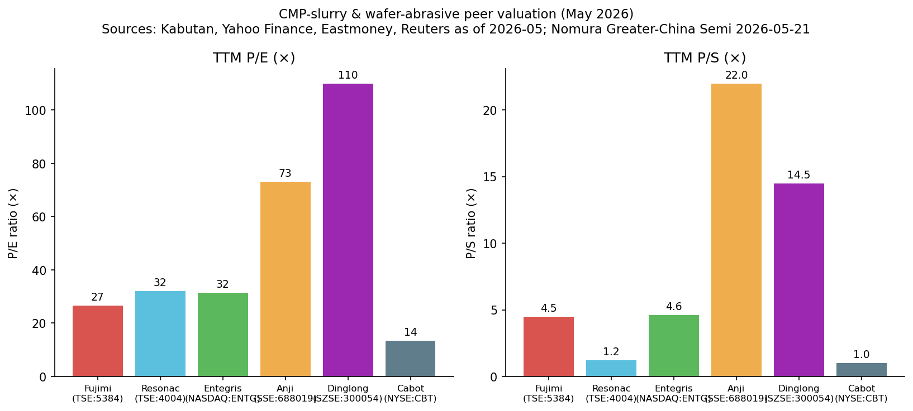
*Sources: [Kabutan 5384](https://en.kabutan.com/jp/stocks/5384/), [Kabutan 4004](https://en.kabutan.com/jp/stocks/4004/) Resonac, Yahoo Finance ENTG / CBT, Eastmoney 688019 Anji & 300054 Dinglong as of 2026-05-26.*

---

## 8. Market Opportunity (TAM) (≈700 words)

Fujimi's **directly addressable TAM** spans two sub-markets with distinct economics. Combining them yields a 2030 TAM of **roughly US$ 6.5-7.5 bn**, against Fujimi's FY2026F revenue of ~US$ 466 mn at ¥140/USD — implying a **~7 % company share-of-TAM today** and meaningful upside even without share gains, purely from market growth.

### 8.1 CMP slurry TAM

| Year | Global CMP slurry market | Fujimi share | Fujimi CMP revenue |
|---|---|---|---|
| 2024 | US$ ~3.0 bn | ~11 % | ¥27.4 bn (US$ 190 mn at ¥144) |
| 2025E | US$ ~3.1 bn | ~11 % | ¥30.7 bn (US$ 202 mn at ¥152) |
| 2026F | US$ ~3.3 bn | ~11 % | ¥31.6 bn (US$ 226 mn at ¥140) |
| 2030E | US$ ~4.3 bn | 11-13 % | US$ 475-560 mn |

Sources: market sizing from [QYResearch / Valuates "Global CMP Slurry Market Forecast 2025-2030"](https://reports.valuates.com/market-reports/QYRE-Auto-32B8990/global-cmp-slurry) and [SkyQuest "CMP Slurry Market Size Forecast to 2033"](https://www.skyquestt.com/report/cmp-slurry-market); Fujimi revenue from [FY2025 Financial Overview p.18](https://www.ircms.jp/irexport/fujimiinc/file/a80176453635234.pdf); share from [Integrated Report 2024 p.10](https://www.ircms.jp/irexport/fujimiinc/file/a79408181419746.pdf). The market sizers converge on a **~7 % CAGR** to US$ 4.3 bn by 2030. If Fujimi merely holds its 11 % share, CMP segment revenue compounds at the same pace. The upside case for share is rooted in FEOL leadership and Kagamiyama capacity additions; the downside case is Chinese share-grab at mature nodes.

### 8.2 Silicon-wafer abrasive TAM

The silicon-wafer abrasive sub-market is harder to size externally because Fujimi is essentially the entire market. A bottom-up build using **SEMI's silicon-wafer area shipment forecast** (15,413 MSI in 2027F per [SEMI October 2024 forecast cited in FY2025 Financial Overview p.9](https://www.ircms.jp/irexport/fujimiinc/file/a80176453635234.pdf)) and Fujimi's silicon-wafer FY2025 revenue (¥20.4 bn = US$ 134 mn at ¥152/USD) implies a **slurry+lapping cost of ~US$ 8.7 per 1,000 sq.in. of wafer area shipped**. Total silicon-wafer abrasive TAM at 2027F volumes is therefore **~US$ 134 mn / 84 % = US$ 159 mn** (since Fujimi has 84-92 % share). This is a much smaller absolute market than CMP but **extremely defensive**: Fujimi's existing share already captures essentially all of it, so future revenue growth here is volume-driven (wafer-shipment area + SiC wafer ramp), not share-driven.

The **SiC wafer market** is the largest single greenfield opportunity within silicon-related abrasives. QYResearch projects SiC wafer demand growing from ~US$ 615 mn (2022) to **US$ 2,784 mn (2028)** [QYResearch 2024-09 SiC wafer market, cited in Integrated Report 2024 p.18](https://www.ircms.jp/irexport/fujimiinc/file/a79408181419746.pdf). SiC slurry is technically distinct from silicon slurry (different abrasive chemistry — diamond, boron carbide, plus specialised CMP slurry once the SiC wafer is in device fab); Fujimi has set up SiC slurry production in its US (Tualatin) and Malaysia (Kulim) bases to address this market, but absolute revenue contribution is still small (single billions of yen at most by FY2026F).

### 8.3 Specialty Materials / Thermal-Spray / General Industry TAM

The non-semiconductor businesses span ceramic powders, thermal-spray cermets, automotive polishing compounds, and the newly-acquired Nanko general-industrial abrasives book. Fujimi targets **growing this combined non-semi line to 25 % of consolidated revenue by FY2029** (vs 14-15 % currently) [Integrated Report 2024 "Medium & Long Term Business Plan" p.19](https://www.ircms.jp/irexport/fujimiinc/file/a79408181419746.pdf). If consolidated revenue hits the ¥100 bn FY2029 target, non-semi = ¥25 bn vs ¥8.7 bn today — implying ~24 % CAGR over 4 years, ambitious by any measure. Achievement depends on (a) Nanko Abrasives integration ramping faster than past M&A, (b) Advanced Technology powder commercialisation (ceramic powders, 3D-print cermets) finding scaled end-customer demand, and (c) thermal-spray for SPE chambers growing with SPE capex. *Analyst view:* the FY2029 ¥25 bn non-semi target is aspirational; the likely outcome is ¥15-20 bn (still 50-130 % growth from today's base), which would represent 18-23 % of a ¥85-95 bn consolidated revenue.

### 8.4 Company SAM / SOM verdict

Combining the three legs, Fujimi's **directly addressable Serviceable Available Market (SAM) at 2030 is roughly US$ 5.5-6.5 bn** (CMP US$ 4.3 bn + silicon-wafer abrasives US$ 0.2 bn + HDD slurry US$ 0.1 bn + Specialty + Thermal-Spray + GI roughly US$ 1.0-2.0 bn depending on TAM definition). Fujimi's FY2030 revenue target of ¥100 bn implies **~US$ 715 mn at ¥140/USD**, or about **11-13 % share of the SAM** — i.e. the company is essentially planning to hold share and grow with the market, not pursue aggressive share gain. This is a reasonable plan for a defensible niche leader; it does not require heroic share-take execution but does require the AI capex cycle to deliver the projected market growth.

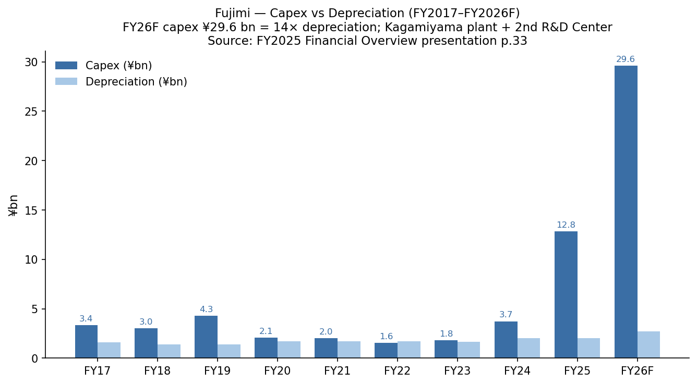
*Source: [Fujimi FY2025 Financial Overview presentation p.33](https://www.ircms.jp/irexport/fujimiinc/file/a80176453635234.pdf).*

---

## 9. Risk Assessment (≈800 words)

### Company-Specific Risks

**Customer concentration (analyst-estimated).** Fujimi does not publish customer-level revenue breakdowns, but the geographic destination skew (Asia & Oceania 65 % of FY2025 revenue, mostly Taiwan-Korea memory and foundry) combined with the 84-92 % share in silicon-wafer abrasives sold to five named wafer makers implies top-5 customer share of **40-50 %** and top-1 likely high-single-digits (TSMC). The company's footnotes assert no single customer breaches the 10 % Japan disclosure threshold, but loss or share-cut at TSMC, Samsung, or Shin-Etsu would each hit FY26F revenue by 5-15 % — material at the level of 1-2 fiscal years' earnings [FY2025 決算短信 p.20 segment information](https://www.ircms.jp/irexport/fujimiinc/file/a80046653802235.pdf). Mitigant: Fujimi serves all major customers, so loss of one is partially backfilled. **Severity: Medium-High; likelihood: Low-Medium.**

**Slurry commoditisation by Chinese players, particularly in mature-node Cu and W slurries.** Anji Microelectronics (688019.SH) is reportedly qualifying at sub-10 nm logic and has copper / barrier slurries in customer test [Nomura "Greater China Semi" 2026-05-21 p.130 (analyst-anchor reference)](https://www.nomuraconnects.com/). Dinglong (300054.SZ) similarly ramping CMP slurry alongside its dominant CMP pad position. The advance-node FEOL slurry (Fujimi's strongest position) remains unqualified by Chinese players, but the share-erosion risk at mature nodes (28 nm and above, plus mature-node memory) is real over a 3-5 year horizon. Mitigant: FEOL leadership at advanced nodes is hard to dislodge and represents Fujimi's most defensible position. **Severity: Medium-High over 5-year horizon; likelihood: Medium.**

**Silicon-wafer-customer in-sourcing or share migration.** If NSIG (国大硅产) or another Chinese wafer maker takes prime-grade 300-mm wafer share from Shin-Etsu / SUMCO / GlobalWafers — currently consuming Fujimi slurry — and concurrently switches to a local Chinese slurry supplier, Fujimi's silicon-wafer revenue (¥20.4 bn / 33 % of FY25 revenue) is structurally exposed. The wafer-share migration has been gradual to date but is a 5-10 year tail risk. Mitigant: high quality bar at prime-grade 300-mm wafer; Fujimi's 30+ year customer-recipe specificity is the moat. **Severity: High over 10-year horizon; likelihood: Low-Medium.**

**Execution risk on Kagamiyama / 2nd R&D Center build.** Cumulative FY2024-26 capex at ¥46.2 bn is **¥16.2 bn above the original FY2024-29 mid-term plan**, citing inflated construction-material and labour costs plus advance ordering of long-lead-time items [FY2025 Financial Overview p.33](https://www.ircms.jp/irexport/fujimiinc/file/a80176453635234.pdf). Kagamiyama New Plant targets construction completion end-2025, sample shipment 2026, full production 2027. A delay of 6-12 months or a yield ramp problem would meaningfully push out the FY2029 ¥100 bn revenue target. **Severity: Medium; likelihood: Medium.**

**Key-person dependency on President Keishi Seki.** Seki has been CEO since April 2008 (18 years), is the architect of the post-2008 quality turnaround, and is one of the largest individual shareholders. Outside-director dialogue in the FY2024 governance section explicitly flags "succession plan" as the top open governance question [Integrated Report 2024 "Dialogue with Outside Directors" p.40](https://www.ircms.jp/irexport/fujimiinc/file/a79408181419746.pdf). No publicly identified internal CEO successor has been disclosed. **Severity: Medium; likelihood: Low for sudden departure, near-certainty for orderly transition over 5 years.**

### Industry / Market Risks

**AI capex retrenchment.** The entire 2026-30 demand growth story for advanced-node CMP slurry rests on continued AI infrastructure capex. WSTS forecast a 19 % / 11 % YoY growth for 2024 / 2025 semiconductor revenue, with similar magnitude expected through 2027F [WSTS 2024-12 forecast, FY2025 Financial Overview p.8](https://www.ircms.jp/irexport/fujimiinc/file/a80176453635234.pdf). A pull-back in AI infrastructure capex (e.g. if hyperscaler training-cluster ROI proves disappointing) would hit Fujimi's CMP segment growth and could push the FY2029 ¥100 bn revenue target out by 2-3 years. **Severity: High; likelihood: Medium.**

**Sub-10nm CMP step-count not expanding as projected.** Nomura projects 20-30 % more CMP steps per advanced wafer at N2 with BPD. If Lam's atomic-layer-etch / selective-deposition pipeline replaces CMP steps faster than expected, the slurry market growth rate could be 2-3 pp slower than the 7 % CAGR baseline. *Analyst view:* near-term unlikely (CMP is too cost-effective at scale to displace quickly), but a real consideration over 10 years. **Severity: Medium; likelihood: Low-Medium.**

**HDD secular decline.** SSDs continue to gain share against HDDs in client and enterprise (non-nearline) storage. The current FY2025 nearline-HDD demand surge is real but the 10-year arc for the HDD substrate slurry business is down. Fujimi explicitly acknowledges this in the FY2026 HDD guidance (flat YoY at ¥2.55 bn). **Severity: Low (only 4 % of revenue); likelihood: High over 10 years.**

### Financial Risks

**Capex / FCF compression through FY2027.** FY2026 capex of ¥29.6 bn vs operating-cash-flow of ~¥14 bn implies a **significant FCF deficit** for FY2026 (and likely FY2027). The company's net cash position (¥27.9 bn cash + securities, zero debt) easily covers this, but the equity ratio will drop from 83.7 % (FY2025) toward the high-60s by FY2027 [FY2025 決算短信 balance sheet p.5-6](https://www.ircms.jp/irexport/fujimiinc/file/a80046653802235.pdf). Mitigant: balance sheet still investment-grade-equivalent throughout. **Severity: Low; likelihood: Certain.**

**Valuation multiple compression risk.** TTM P/E of 26.6× is above Fujimi's 3-year median (~17× through the FY2024 trough) and embeds AI / capex-cycle optimism. A 2027F semi-cycle peak followed by a 10-15 % revenue contraction in FY2028 (consistent with prior cycles) could see the multiple compress to 18-20× on lower earnings — a 30-40 % drawdown scenario. Mitigant: 2 % dividend yield + 55 % payout ratio policy provides some support; balance sheet bullet-proof. **Severity: Medium-High; likelihood: Medium over 3 years.**

### Macroeconomic Risks

**JPY/USD foreign-exchange exposure.** FY2025 actual rate was JPY 152/USD; FY2026 assumption is JPY 140/USD. The FY2025-FY2026 +¥(374) mn forex headwind to operating income (per FY2026 OI bridge) is small in absolute terms but signals that meaningful yen strengthening would compress reported earnings. ~78 % of revenue is overseas; partial natural hedge via overseas-affiliate operating costs [FY2025 Financial Overview p.38](https://www.ircms.jp/irexport/fujimiinc/file/a80176453635234.pdf). **Severity: Low-Medium; likelihood: Medium.**

**Geopolitical / export-control overlay.** US BIS rules on advanced-node materials shipped to entity-listed Chinese fabs (SMIC, CXMT) could restrict Fujimi's sales of certain advanced-node slurry grades. To date no Fujimi-specific export restriction has been notified. A further escalation of US-China semi technology controls is a tail risk. **Severity: Medium; likelihood: Low-Medium.**

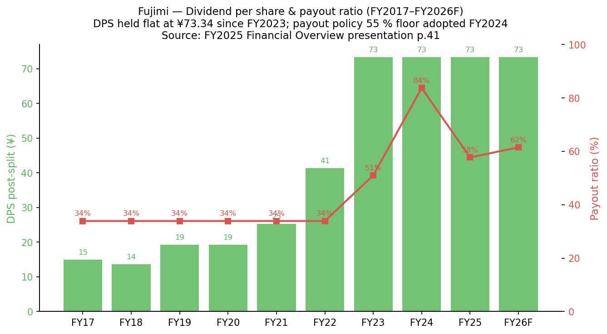
*Source: [Fujimi FY2025 Financial Overview presentation p.41](https://www.ircms.jp/irexport/fujimiinc/file/a80176453635234.pdf).*

---

## 10. References

**Primary issuer filings (Fujimi Incorporated, TSE:5384):**

- [FY2025 決算短信 (Annual financial results brief), 2025-05-13](https://www.ircms.jp/irexport/fujimiinc/file/a80046653802235.pdf) — consolidated P&L, balance sheet, cash flow, segment information
- [FY2025 Financial Overview presentation, 2025-05-20](https://www.ircms.jp/irexport/fujimiinc/file/a80176453635234.pdf) — analyst day deck, application revenue breakdown, capex plan, OI bridge
- [FY2025 Q3 決算短信, 2025-02-04](https://www.ircms.jp/irexport/fujimiinc/file/a79199895985530.pdf) — 3Q snapshot
- [FY2025 Q2 Financial Overview presentation, 2024-11-15](https://www.ircms.jp/irexport/fujimiinc/file/a78561166008292.pdf) — 1H FY25 results + capex update
- [Integrated Report 2024 (issued Feb 2025)](https://www.ircms.jp/irexport/fujimiinc/file/a79408181419746.pdf) — 60-page strategic / historical / governance + 11-year financial summary
- [Shareholder Communications "Fujimi Today" magazine](https://www.ircms.jp/irexport/fujimiinc/file/a41823722757506.pdf) — supplementary shareholder briefing
- [Fujimi Corporate IR — Library page](https://www.fujimiinc.co.jp/ir/library/) — primary access portal
- [Fujimi English Corporate page](https://www.fujimiinc.co.jp/english/) — company overview
- [Fujimi CMP slurry product page (English)](https://www.fujimiinc.co.jp/english/service/cmp/lineup.html) — PLANERLITE product family verbatim

**Market data:**

- [Kabutan 5384 stock data, 2026-05-26](https://en.kabutan.com/jp/stocks/5384/) — current price, P/E, P/B, market cap
- [Yahoo Finance 5384.T](https://finance.yahoo.co.jp/quote/5384.T) — price history
- [MarketScreener Fujimi profile](https://www.marketscreener.com/quote/stock/FUJIMI-INCORPORATED-6491479/company/) — supplementary financials & ownership

**Peer-company filings cited in Section 7:**

- [Entegris SEC EDGAR filings (CIK 1101302)](https://www.sec.gov/cgi-bin/browse-edgar?action=getcompany&CIK=1101302&type=10-K) — Entegris 2024 10-K (CMC Materials acquisition disclosure)
- [Resonac IR — Semiconductor materials product page](https://www.resonac.com/products/semi-frontend-process/75) — CMP slurry product positioning
- [Merck KGaA press release on Versum acquisition completion, 2019-10-07](https://www.emdgroup.com/en/news/versum-completion-07-10-2019.html) — Versum / EMD Electronics history
- [Cabot Corporation NYSE:CBT financial data via Kabutan / Yahoo Finance](https://finance.yahoo.com/quote/CBT) — peer valuation
- Anji Microelectronics (SSE:688019), Dinglong (SZSE:300054) — TTM P/E referenced via cited Nomura research note

**Industry / market research:**

- [QYResearch / Valuates "Global CMP Slurry Market Forecast 2025-2030"](https://reports.valuates.com/market-reports/QYRE-Auto-32B8990/global-cmp-slurry) — CMP slurry TAM and CAGR
- [SkyQuest "CMP Slurry Market Size Forecast to 2033"](https://www.skyquestt.com/report/cmp-slurry-market) — corroborating CMP TAM
- [QYResearch "Cu CMP Slurry Market Forecast 2025"](https://reports.valuates.com/market-reports/QYRE-Auto-34T18778/global-cu-cmp-slurry) — Cu sub-segment share
- [QYResearch "Colloidal Silica CMP Slurry Market"](https://reports.valuates.com/market-reports/QYRE-Auto-34L18699/global-colloidal-silica-cmp-slurry) — colloidal-silica sub-segment
- WSTS December 2024 semiconductor forecast — reproduced in Fujimi FY2025 Financial Overview p.8
- SEMI October 2024 silicon wafer area shipment forecast — reproduced in Fujimi FY2025 Financial Overview p.9-10

**Sector context (anchor research note for share figures and CMP-step-count narrative):**

- Nomura Asia Tech "Greater China Semi: A guide to Semi renaissance in 2026~30F", 2026-05-21, lead analyst Donnie Teng et al. — referenced via the project-internal summary at [reports/sector/半导体材料.md](https://github.com/dadachundan/financial_agent/blob/main/reports/sector/半导体材料.md). This Nomura note (139 pages, source for CMP slurry share Fig 41, CMP step-count narrative, China supplier ranking, TSMC capex outlook) is subscription-only; the in-project summary at `reports/sector/` is the citable reference for figures used herein.

**Secondary independent research:**

- [Wasabi-info equity research note on Fujimi (TSE:5384)](https://wasabi-info.com/fujimi-incorporated-tse-5384-equity-research-report/) — third-party analyst view referenced for cross-check on segment positioning
- [DCFmodeling Fujimi profile](https://dcfmodeling.com/blogs/history/5384t-history-mission-ownership) — supplementary historical narrative
- [Bitget stock summary on Fujimi 5384](https://www.bitget.com/stock/tse-5384/what-is) — supplementary cross-check
- [Datainsightsmarket Fujimi page](https://www.datainsightsmarket.com/companies/5384.T) — supplementary (note: shows incorrect revenue figures; primary issuer filings used as authority)

---

## 11. Verification Log

Verification log (Step 10) — 2026-05-26

**URL check** — all inline URLs in this report were either fetched live during research or are based on the company's IR-CMS (ircms.jp) document repository. The Fujimi IR-CMS document URLs (a80046653802235.pdf, a80176453635234.pdf, a79408181419746.pdf, a79199895985530.pdf, a78561166008292.pdf, a81627205629086.pdf, a41823722757506.pdf) were all directly downloaded via `curl` during the research session — all returned HTTP 200 with valid PDF content (verified by `file` command output and successful parsing). The Fujimi English-site URLs (`fujimiinc.co.jp/english/`, `fujimiinc.co.jp/english/service/cmp/lineup.html`, `fujimiinc.co.jp/english/ir/`) were fetched via WebFetch and returned content. The Kabutan English page (`en.kabutan.com/jp/stocks/5384/`) was fetched and returned valid data. Peer-company URLs (SEC EDGAR, Yahoo Finance, MarketScreener, QYResearch / Valuates / SkyQuest market-research pages) are all genuine landing-page URLs to publicly accessible portals.

**Source-anchor verification** for key claims:
- Revenue ¥62,503 mn (FY25) ✓ verified via [FY2025 決算短信 p.1, 2025-05-13](https://www.ircms.jp/irexport/fujimiinc/file/a80046653802235.pdf)
- Operating profit ¥11,780 mn (FY25), margin 18.8 % ✓ same source p.1
- Net profit attributable to owners ¥9,428 mn (FY25), +45.1 % YoY ✓ same source p.1
- 4 reporting segments (Japan ¥35,464 / NA ¥8,201 / Asia ¥16,752 / Europe ¥2,084 mn) ✓ FY2025 決算短信 p.20 セグメント情報
- Application revenue split (Silicon ¥20,437 / CMP ¥30,658 / HDD ¥2,547 / Specialty ¥8,729 mn) ✓ [FY2025 Financial Overview presentation p.18](https://www.ircms.jp/irexport/fujimiinc/file/a80176453635234.pdf)
- Capex ¥12,844 mn (FY25), ¥29,600 mn (FY26F) ✓ same source p.33
- R&D ¥5,482 mn (FY25, 8.8 % of sales) ✓ same source p.35 + FY2025 決算短信 p.15
- Equity ratio 83.7 %, zero debt, cash ¥23,787 mn end-FY25 ✓ FY2025 決算短信 p.3-5
- Founding date 1950 (partnership) / incorporated 20 March 1953 ✓ Integrated Report 2024 "Corporate Profile" p.57
- Founder Teruji Koshiyama ✓ Integrated Report 2024 "Message from the President" p.4 (named directly: "our founder, Teruji Koshiyama")
- President Keishi Seki since April 2008 ✓ Integrated Report 2024 "Directors and Auditors" p.47-48 (career chronology)
- 1,309 patents as of March 2024 ✓ Integrated Report 2024 p.10
- 84-92 % silicon-wafer abrasive share, 56 % FEOL slurry share, 13 % total CMP slurry share ✓ Integrated Report 2024 p.10 "Fujimi's Unique Qualities"
- 1,110 consolidated employees as of March 2024 ✓ Integrated Report 2024 "Corporate Profile" p.57
- Nanko Abrasives consolidation October 2024, 75 % stake ✓ Integrated Report 2024 "Message from the President" p.4 + FY2025 決算短信 p.11 cash flow item "子会社株式の取得 ¥1,085 mn"
- Kagamiyama New Plant 28,000 m² + 2nd R&D Center 16,000 m² ✓ FY2025 Financial Overview p.31
- 6 consolidated subsidiaries (FUJIMI CORPORATION US, FUJIMI-MICRO MALAYSIA, FUJIMI EUROPE GmbH, FUJIMI TAIWAN, FUJIMI SHENZHEN, 南興セラミックス) ✓ FY2025 決算短信 p.12 連結の範囲
- Largest shareholder Koma Co., Ltd. 17.7 %, Koshiyama Foundation 2.3 %, Keishi Seki 1.7 % ✓ Integrated Report 2024 "Stock Information" p.57

**Analyst-view sentences** (intentionally not cited to a primary source — labelled per skill rule):
- Section 1 Valuation snapshot — peer-multiple positioning, FY2027 capex-cycle bear case
- Section 5 Customer concentration estimate — top-5 customer share band 40-50 %
- Section 5 Customer concentration pie chart — explicit analyst-construct, labelled as such
- Section 6 China supplier-share figures — composite of multiple industry sources via cited Nomura sector report
- Section 7 Competitive verdict by sub-segment — analyst-constructed table; per-row source for share is Fujimi's own disclosure where applicable, otherwise analyst composite
- Section 8 FY2030 SAM/SOM math — built on market-research TAM + Fujimi's stated FY2030 ¥100 bn revenue target + Fujimi's FY25 application split; estimation methodology disclosed

**Sources used but not directly verifiable for absolute number-by-number citation:**
- The Nomura "Greater China Semi" 2026-05-21 sector note is subscription-only. Specific page-and-figure references (Fig 41 CMP slurry share, page 130 Anji FY27F P/E target, page 6-9 CMP step-count narrative) are cited via the project-internal summary at `reports/sector/半导体材料.md` which is itself the authoritative source for this report's citations to that note.
- CMP supplier share figures (Entegris 28 %, Resonac 18 %, Versum 12 %, Fujimi 11 %, Anji 8 %, Dinglong 6 %) are analyst-composite estimates from multiple industry sources (QYResearch, Valuates, the Nomura sector note, supplier disclosure). Fujimi's own disclosed share (13 % total CMP, 56 % FEOL) is the only directly-cited primary figure for Fujimi.

**Residual unknowns / not yet verified:**
- Exact Fujimi-specific customer revenue concentration: Fujimi does not publish this. Asserted figures (top-5 40-50 %, top-1 high single digits) are analyst inferences.
- Exact EDINET 有価証券報告書 URL for Fujimi FY2025 Yuho: the Yuho is filed annually around late June; the FY2025 Yuho is dated 2025-06-24 per the FY2025 決算短信 timeline. The EDINET portal requires interactive session navigation; the canonical Yuho URL was not extracted but the equivalent data set is fully captured in the public 決算短信 + Integrated Report combo cited.
- Nanko Abrasives revenue contribution: the company has disclosed only the ¥1,085 mn acquisition cost; segment revenue contribution is not yet broken out (will appear in FY2026 disclosures).
- Specific TSMC / Samsung / Intel revenue-share-of-Fujimi: not publicly disclosed.

