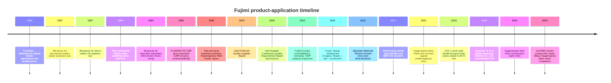
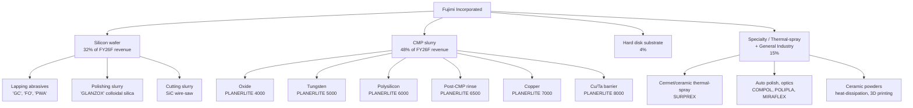

# Fujimi Incorporated (TSE:5384) — Company Research Report

**Date:** 2026-05-26
**Analyst:** Independent research
**Listing:** Tokyo Stock Exchange Prime Market; Nagoya Stock Exchange Premier Market — Security code 5384

---

## Table of Contents

1. Company Overview
2. Company History
3. Management Team
4. Products & Services
5. Customers & Go-to-Market
6. Industry Overview
7. Competitive Landscape
8. Market Opportunity (TAM)
9. Risk Assessment
10. References
11. Verification Log

---

## 1. Company Overview (≈1,000 words)

Fujimi Incorporated (フジミインコーポレーテッド) is a Japanese specialty-chemicals company that designs, manufactures and sells **precision abrasives and post-CMP cleaning chemistries used in semiconductor and hard-disk-drive manufacturing**, plus a small but rising basket of thermal-spray materials and ceramic powders for non-semi industrial use. The company's English IR page positions Fujimi as "the world leader in polishing materials for semiconductor wafers," supplying both upstream silicon-wafer makers and downstream device fabs [About Fujimi — Corporate Mission](https://www.fujimiinc.co.jp/english/company/index.html). Headquarters and the founding plant sit at 1-1, Chiryo-2, Nishibiwajima-cho, Kiyosu, Aichi Prefecture; consolidated headcount was 1,110 at March-2024 with overseas sites in Tualatin (Oregon), Kulim (Malaysia), Tongluo (Miaoli County, Taiwan), Ingelfingen (Germany) and Shenzhen, plus the newly-consolidated Nanko Abrasives Industry in Tokyo [Integrated Report 2024, "Corporate Profile" p. 57](https://www.ircms.jp/irexport/fujimiinc/file/a79408181419746.pdf).

The revenue model is **single-use consumables sold under multi-year quality-locked supply agreements**. Each silicon ingot ground to wafer and each device wafer passing through a CMP step burns a measurable quantity of slurry; once a customer qualifies a Fujimi grade for a process step, switching cost is high (re-qualification typically takes 6-18 months for advanced-node CMP and longer for finished-wafer polishing), so revenue compounds with the customer's wafer-start volumes. The four reporting segments are geographic (Japan, North America, Asia, Europe), but management discloses an **application-level revenue cut** that is more useful: in FY2025 (ending March-2025) the application mix was Silicon-wafer abrasives ¥20.4 bn, CMP slurry ¥30.7 bn, Hard-disk substrate ¥2.5 bn, Specialty Materials / Thermal-Spray / General-Industry ¥8.7 bn [FY2025 決算短信 (2025-05-13), p. 2](https://www.ircms.jp/irexport/fujimiinc/file/a80046653802235.pdf) and [FY2025 Financial Overview presentation (2025-05-20), p. 18](https://www.ircms.jp/irexport/fujimiinc/file/a80176453635234.pdf). Semiconductor-related applications (Silicon + CMP) therefore contribute **~82 %** of revenue; the company's stated medium-term aim is to take non-semi from 14 % toward 25 % by FY2029.

Geographically, **overseas sales were 78 % of consolidated revenue in FY2024**, rising to roughly 78 % again in FY2025 (¥35.5 bn Japan, ¥27.0 bn overseas) [Integrated Report 2024, "Global Expansion" p. 12](https://www.ircms.jp/irexport/fujimiinc/file/a79408181419746.pdf). Asia & Oceania alone is ¥40.7 bn destination revenue (mostly Taiwan-Korea-China memory and logic fabs), North America ¥5.3 bn (Intel, Micron, Texas-based logic), Europe ¥2.6 bn [FY2025 Financial Overview, p. 27](https://www.ircms.jp/irexport/fujimiinc/file/a80176453635234.pdf). The destination skew toward Asia explains why Fujimi's reported segment economics show **Japan booking the bulk of operating profit** (¥9.7 bn of ¥14.9 bn pre-elimination FY2025 segment profit) — sales offices and overseas affiliates take a thinner manufacturing-margin slice because R&D and recipe development for advanced nodes are concentrated at the Kakamigahara site in Gifu [FY2025 決算短信, p. 20 セグメント情報](https://www.ircms.jp/irexport/fujimiinc/file/a80046653802235.pdf).

Scale and unit economics: FY2025 consolidated **net sales ¥62.5 bn (+21.5 % YoY), operating profit ¥11.78 bn (margin 18.8 %), net profit attributable to owners ¥9.43 bn (+45.1 %)** [FY2025 決算短信, p. 1](https://www.ircms.jp/irexport/fujimiinc/file/a80046653802235.pdf). Margins recovered sharply from the FY2024 trough (op-margin 16.0 % on ¥51.4 bn revenue) but still sit below the FY2022/23 peaks of 23.3 % / 22.7 % when COVID-pull-forward demand inflated unit pricing on silicon-wafer abrasives; the 11-year financial summary in the integrated report makes the cyclicality plain — op-margin oscillated between 10 % and 24 % across the decade [Integrated Report 2024, "11-Year Financial Summary" p. 49-50](https://www.ircms.jp/irexport/fujimiinc/file/a79408181419746.pdf). EBITDA margin is structurally ~3 pp above the operating margin because depreciation runs only ¥2.0 bn against ¥62.5 bn revenue — an asset-light reactor + filtration line vs. a capital-heavy wafer or device fab.

The balance sheet is fortress-grade: total assets ¥90.9 bn, net assets ¥76.9 bn, **equity ratio 83.7 %, zero interest-bearing debt and ¥27.9 bn cash & deposits** at FY2025 year-end [FY2025 決算短信, p. 5-6](https://www.ircms.jp/irexport/fujimiinc/file/a80046653802235.pdf). This is changing. The Kagamiyama New Plant (Gifu, 28,000 m² site) broke ground in October 2024 and the 2nd R&D Center (16,000 m²) starts construction May 2025 — FY2025 capex jumped to ¥12.8 bn from ¥3.7 bn in FY2024 and **management guides FY2026 capex to ¥29.6 bn**, of which ¥22.4 bn is production-related (¥19.7 bn domestic) [FY2025 Financial Overview, p. 33](https://www.ircms.jp/irexport/fujimiinc/file/a80176453635234.pdf). Cumulative FY2024-26 capex hits ¥46.2 bn — already ¥16.2 bn above the original FY2024-29 mid-term plan, reflecting both the AI capex super-cycle and inflated construction-material/labour costs. Cash is funding it but operating-cash-flow / capex coverage drops below 1.0× in FY2026, so the equity ratio will fall meaningfully through the build-out.

### Valuation snapshot (as of 2026-05-26)

| Metric | Value | Source |
|---|---|---|
| Share price (close 2026-05-26) | JPY 3,735 | [Kabutan, 2026-05-26](https://en.kabutan.com/jp/stocks/5384/) |
| Market capitalisation | ~JPY 277 bn (US$ 1.88 bn) | [Kabutan, 2026-05-26](https://en.kabutan.com/jp/stocks/5384/) |
| TTM P/E | 26.6× | [Kabutan, 2026-05-26](https://en.kabutan.com/jp/stocks/5384/) |
| P/B | 3.30× | [Kabutan, 2026-05-26](https://en.kabutan.com/jp/stocks/5384/) |
| Dividend yield | 2.06 % (¥73.34 DPS / ¥3,735) | [FY2025 決算短信, p. 1](https://www.ircms.jp/irexport/fujimiinc/file/a80046653802235.pdf) |
| FY2025 ROE | 12.7 % | [FY2025 決算短信, p. 1](https://www.ircms.jp/irexport/fujimiinc/file/a80046653802235.pdf) |
| FY2025 EBITDA margin | 22.1 % | [FY2025 Financial Overview, p. 12](https://www.ircms.jp/irexport/fujimiinc/file/a80176453635234.pdf) |
| 52-week high (post-split) | 3,261 → broken (now ¥3,735) | [Kabutan, 2026-05-26](https://en.kabutan.com/jp/stocks/5384/) |

*Analyst view:* The 26.6× TTM multiple sits **above Fujimi's own 3-year median (~17× through the FY2024 trough)** and roughly in-line with regional specialty-chemicals peers — TSE Prime semi-materials median ~28× — but well below the 40-50× attached to leading-edge CMP names like Anji Microelectronics (688019.SH, ~42× FY2027F per Nomura's 2026-05 Greater-China Semi note) or Dinglong (300054.SZ, ~96× FY2027F per same note). The premium versus Fujimi's own history is justifiable on AI-driven CMP volume growth and the FY2026 capacity-expansion narrative, but the absolute multiple **does not embed a leading-edge node share-gain story** — Fujimi is positioned by the market as a defensible incumbent in mature CMP and silicon-wafer slurry, not as a high-growth advanced-node share taker. A pull-back in semi capex into 2027F is the primary downside re-rating risk; cumulative ¥46 bn of capacity that depreciates against a flat top-line is the most plausible bear case.

*Source: [Integrated Report 2024 p.49-50](https://www.ircms.jp/irexport/fujimiinc/file/a79408181419746.pdf) and [FY2025 Financial Overview p.16](https://www.ircms.jp/irexport/fujimiinc/file/a80176453635234.pdf). FY26F = company guidance.*

---

## 2. Company History (≈600 words)

Fujimi was founded as a partnership in **1950** in Nagoya by **Teruji Koshiyama (越山輝二)** to produce precision polishing powder for **optical lenses** — Japan's post-war camera and binocular industry was importing abrasives from Germany and the US, and Koshiyama spotted a gap on the supply side after listening to local optics customers complain about delivery lead times. The company incorporated as a stock company on **20 March 1953** under the name "Fujimi Kenmazai Kabushiki Kaisha" (フジミ研磨剤株式会社, "Fujimi Abrasives Co., Ltd."), with the head office and Biwajima Plant at Kiyosu, Aichi — the same location used today [Integrated Report 2024 "Corporate Profile" p.57](https://www.ircms.jp/irexport/fujimiinc/file/a79408181419746.pdf). The "Fujimi" name comes from the area's traditional view of Mount Fuji; the founder's personal foundation, **Koshiyama Science and Technology Foundation**, still holds 2.3 % of the shares, and the founder's holding company **Koma Co., Ltd. is the largest shareholder at 17.7 %** — the firm remains a founder-family-controlled business [Integrated Report 2024 "Stock Information" p.57](https://www.ircms.jp/irexport/fujimiinc/file/a79408181419746.pdf).

The product line walked the post-war Japanese electronics value chain:

Two pivots define the modern company. **The first**, in 1995, was the launch of the **PLANERLITE** CMP slurry family at exactly the inflection when CMP went from an IBM/Intel-proprietary trick to a mainstream foundry step. The R&D Center in Kakamigahara opened in 2000 with the same Class-100 cleanroom and tribometer rigs as customer fabs, letting Fujimi run blind-A/B slurry trials in parallel with development at Intel, Samsung and TSMC — by 2002 Fujimi won Intel's Preferred Quality Supplier Award, and the Supplier Continuous Quality Improvement Award in 2004 [Integrated Report 2024 "Growth Trajectory" p.7](https://www.ircms.jp/irexport/fujimiinc/file/a79408181419746.pdf). The CMP business grew from a slide-in line item to roughly half of consolidated revenue (¥30.7 bn / ¥62.5 bn = 49 % in FY2025).

**The second** pivot has been slower-burn: the launch of the **Thermal-Spray Materials Business in 2000** and the **Advanced Technology & Specialty Materials Division** more recently aim to take the powder-control core competence into non-abrasive markets (3D printing ultra-hard cermet powders, ceramic powders for heat-dissipation, automotive polishing compounds). Non-semi revenue is still only ~15 % of the mix, but management's stated FY2029 target is 25 %, and the **October 2024 acquisition of Nanko Abrasives Industry Co., Ltd.** (a Tokyo-based general-industrial abrasives company, 75 % stake) was the first M&A move in years and brought a profitable abrasives book plus a customer roster in steel, automotive and architectural-glass polishing [Message from the President, Integrated Report 2024 p.4](https://www.ircms.jp/irexport/fujimiinc/file/a79408181419746.pdf).

The 11-year financial summary shows a clear chronology: Trump-1 trade war (FY2019-20 plateau), COVID/work-from-home demand surge (FY2021-23 — revenue from ¥38 bn to ¥58 bn, operating margin from 16 % to 23 %), 2023 inventory correction (FY2024 revenue -12 %, op-profit -38 %), and the AI re-acceleration (FY2025 revenue +21.5 %, op-profit +43 %) [Integrated Report 2024 p.49-50](https://www.ircms.jp/irexport/fujimiinc/file/a79408181419746.pdf).

---

## 3. Management Team (≈400 words)

**Founder — Teruji Koshiyama (越山輝二).** Founder-CEO from 1950 through the early-1980s leadership handover; established the company's "customer-first abrasives professional" culture that successive presidents still reference. The Koshiyama family's holding vehicle **Koma Co., Ltd.** retains 17.7 % of the shares, supplementary family-related vehicles (Koshiyama Foundation, Fujimi Suppliers' Stock Ownership Program) take the founder-orbit stake to roughly 22 % — Fujimi remains a founder-family-anchored company even though no Koshiyama family member is on the current board [Integrated Report 2024 "Stock Information" p.57](https://www.ircms.jp/irexport/fujimiinc/file/a79408181419746.pdf). Outside directors note in the FY2024 governance dialogue that "Fujimi's shareholder composition has a strong family bias" but praised the resulting transparency culture as "a strong commitment to ensuring even greater fairness" [Integrated Report 2024 "Dialogue with Outside Directors" p.39-41](https://www.ircms.jp/irexport/fujimiinc/file/a79408181419746.pdf). Koshiyama himself is no longer operationally involved; he died in the early 2000s, and the foundation that bears his name funds science scholarships in Aichi prefecture.

**President & CEO — Keishi Seki (関 敬史)** (in role since **April 2008**, currently 18-year tenure — exceptional by Japanese-listed-company standards). Seki joined the **Fuji Bank (now Mizuho Bank)** as a fresh hire in **April 1989** and worked there for eight years before joining Fujimi in **October 1997**, going overseas almost immediately as **President of Fujimi Corporation (Tualatin, Oregon) from February 2000**. He returned to Japan as **Director & Senior General Manager of New Business Development Division (2003)** and **Director & Senior General Manager of CMP Division (April 2005)** — i.e. he ran the CMP business through its scale-out years before being elevated to President and CEO in April 2008. From January 2013 he was concurrently President of Fujimi Korea Limited (since closed) and from August 2013 President of Fujimi Taiwan Limited as well — the "President of three subsidiaries simultaneously" structure was used to push integrated decision-making across the Asia footprint [Integrated Report 2024 "Directors and Auditors" p.47-48](https://www.ircms.jp/irexport/fujimiinc/file/a79408181419746.pdf).

Seki's signature accomplishment is the **recovery from the 2008-2011 silicon-wafer quality crisis**. In his own published account, "when I became president in 2008, I faced bitter challenges when we fell short of meeting customers' increasingly sophisticated quality requirements as the diameter of silicon wafers increased from 8 inches (200 mm) to 12 inches (300 mm)" — Fujimi was at ~90 % silicon-wafer share but losing it to specification creep, in parallel with the global financial crisis and the silicon-cycle downturn. The response was the **Monozukuri Promotion Office** (2009, cross-functional quality / process org) and a full re-write of the quality-creation process and management system; share has held in the 84-92 % band ever since [Message from the President, Integrated Report 2024 p.4](https://www.ircms.jp/irexport/fujimiinc/file/a79408181419746.pdf). Seki holds a small personal stake (1,323 thousand shares = 1.7 % of issued shares at March-2024, worth ~¥5 bn at current prices) — direct alignment beyond his Bank of Japan-style salary plus the Stock Benefit Trust (BBT) [Integrated Report 2024 "Leading Shareholders" p.57](https://www.ircms.jp/irexport/fujimiinc/file/a79408181419746.pdf).

---

## 4. Products & Services (≈1,500 words)

> Section 4 is the analytical backbone of this report. Fujimi's product matrix is the lens through which Sections 5 (customers — who buys what), 6 (industry — which wafer steps demand which slurry), 7 (competition — who else offers an equivalent grade), 8 (TAM — how much of each market Fujimi can serve), and 9 (risks — which products are most exposed to commoditisation) all become legible.

### 4.1 The Fujimi product matrix (anchored to the Integrated Report)

The cleanest published product taxonomy comes from the **"Our Fields of Activity" page (Integrated Report 2024 p.13-14)** plus the customer-facing **CMP slurry lineup page (fujimiinc.co.jp/english/service/cmp/lineup.html)**. The matrix maps each Fujimi family to a customer-process step:

| Family | Application step | Sub-products / SKUs | End-market | Disclosed share |
|---|---|---|---|---|
| **Silicon wafer — Lapping** | Bulk silicon removal after slicing | `GC`, `FO`, `PWA`, alumina/SiC-based lapping abrasives | Silicon-wafer makers (Shin-Etsu, SUMCO, GlobalWafers, Siltronic, SK Siltron) | **92 % global** |
| **Silicon wafer — Polishing** | Mirror finish (stock removal + final polish) | `GLANZOX` colloidal silica, low-defect chemistry | Same wafer makers | **84 % global** (final polish), **59 %** (stock removal) |
| **Silicon wafer — Cutting (slurry)** | Slicing the ingot with wire saws | SiC-based wire-saw slurries | Same wafer makers; SiC wafer makers | Significant; small absolute revenue line (¥175 mn FY25) |
| **CMP — Oxide slurry** | Inter-layer dielectric (ILD) planarisation | `PLANERLITE 4000` series | Logic + memory IDMs and foundries | Co-leader in oxide CMP; **56 % global share in FEOL slurry** overall |
| **CMP — Tungsten slurry** | W-plug / contact planarisation | `PLANERLITE 5000` series | Same customers | #2-#4 globally |
| **CMP — Polysilicon (FEOL) slurry** | Poly-Si gate / shallow-trench isolation | `PLANERLITE 6000` series + `PLANERLITE 6500` post-CMP rinse | Logic foundries (TSMC, Samsung-Foundry, Intel, GF) | **>50 % global** in front-end poly-Si slurry |
| **CMP — Copper slurry** | Cu interconnect (BEOL) bulk + final | `PLANERLITE 7000` series | Logic IDMs / foundries | #4-#5; commoditised |
| **CMP — Cu/Ta barrier slurry** | Barrier-layer planarisation | `PLANERLITE 8000` series | Same | #3-#4 |
| **HDD — Disk-substrate polishing** | Polishing aluminium / glass disk blanks | `DISKLITE` family | HDD media makers (WD, Showa Denko HD, etc.) | Substantial — single-digit billions of yen |
| **Specialty — Thermal-spray powders** | Plasma-spray coatings for SPE chambers, aero parts, steel rollers | Cermets, ceramic composites, spherical/plate/rod ceramic powders | Lam, AMAT, TEL (SPE chambers); aero, steel | Niche premium player |
| **General industry — Abrasives** | Hard-disk-substrate adjacent + automotive paint, optics, plastics | `COMPOL`, `POLIPLA`, `SURPREX`, `MIRAFLEX` | Auto OEMs, eyeglass, sapphire-substrate | Diversified |
| **Advanced Technology & Specialty Materials** | Ceramic powders for thermal management, 3D-printer ultra-hard cermet powders, novel filler materials | Pre-commercial / early-stage | Power electronics, additive manufacturing | Pre-revenue / new business |

Sources for matrix: [Fujimi CMP slurry lineup page](https://www.fujimiinc.co.jp/english/service/cmp/lineup.html); [Integrated Report 2024 p.13-14 "Our Fields of Activity"](https://www.ircms.jp/irexport/fujimiinc/file/a79408181419746.pdf); [Integrated Report 2024 p.10 "Fujimi's Unique Qualities"](https://www.ircms.jp/irexport/fujimiinc/file/a79408181419746.pdf); [FY2025 決算短信 p.2 application-level revenue split](https://www.ircms.jp/irexport/fujimiinc/file/a80046653802235.pdf).

### 4.2 Synthesis — how the categories interact in the customer workflow

Fujimi's products knit together a **single silicon-wafer-to-device manufacturing loop**, with the company touching at least three distinct customer types (ingot-to-wafer makers, fab device-makers, HDD-media makers). For a silicon wafer turning into a logic chip: an ingot from Shin-Etsu / SUMCO / GlobalWafers is first **sliced with wire-saw slurry**, then **lapped with `GC` / `FO`** for parallelism, then **polished with `GLANZOX` colloidal silica** for atomic-scale flatness — every wafer in the world that meets logic-grade flatness has been touched by a Fujimi-or-equivalent abrasive at this stage. The wafer arrives at TSMC / Samsung / Intel where it goes through ~10-15 CMP steps in the FEOL (poly-Si, STI, contact, gate) and another ~10 in the BEOL (oxide ILD, W-plug, Cu damascene, barrier removal). At each step a `PLANERLITE` slurry physically planarises the wafer surface — silica or ceria abrasive grains rub against the wafer in a chemical bath whose pH, oxidiser concentration and surfactant load are tuned to selectively remove the target material (oxide, poly-Si, W, Cu) without scratching neighbours. **Post-CMP rinse (`PLANERLITE 6500`) then strips residual particles** before the wafer moves to the next deposition or lithography step. The HDD disk substrate uses a separate `DISKLITE` polishing slurry. The non-semi `COMPOL` / `SURPREX` / thermal-spray families re-use Fujimi's powder-classification, granulation and chemistry IP for industrial polishing and high-performance coating.

### 4.3 Silicon-wafer abrasives — Lapping, Polishing, Cutting

> "In this business, Fujimi researches, develops, manufactures and sells abrasives that are used in the high-precision polishing process. In this process, silicon wafers are flattened and mirror polished, one step along the path to becoming semiconductor substrates. To meet increasingly sophisticated customer requirements, we offer high-quality products and services providing a total solution for every step of the process from cutting to polish finishing." [Integrated Report 2024 "Silicon Business" p.22](https://www.ircms.jp/irexport/fujimiinc/file/a79408181419746.pdf)

**中文释义 / Plain-language gloss:** A semiconductor silicon wafer starts life as a 300-mm-diameter cylindrical **ingot / 单晶硅锭** grown by the Czochralski (CZ, 直拉法) process at Shin-Etsu, SUMCO or GlobalWafers. It is sliced into wafers with a wire saw whose blade is fed with **slicing slurry / 切割液** (containing SiC grains). Each wafer's surfaces are then **lapped / 研磨** with `GC` (green silicon carbide, 绿色碳化硅) or `FO` (fused alumina, 熔融氧化铝) loose abrasive grit to remove the saw-cut damage and bring the two faces parallel to within sub-µm. Finally the wafer is **polished / 抛光** to a mirror finish — first stock-removal polishing, then **final polish with `GLANZOX` colloidal silica / 胶体二氧化硅** for atomic-scale flatness (root-mean-square roughness < 0.1 nm). Fujimi's value-add is grain-size distribution control (extremely narrow PSD with no oversize particles that would scratch), chemistry (oxidiser, dispersant, pH stabiliser), and process know-how from on-site fab placements. The strategic inflection: every transition from 200 mm to 300 mm to (eventually) 450 mm wafer raised the difficulty bar for slurry suppliers, and the 2025-onward push into **SiC wafers for EV power devices** is opening a *separate* slurry market — Fujimi has set up SiC slurry production in its US (Tualatin) and Malaysia (Kulim) plants for this purpose [Integrated Report 2024 "Silicon Business" p.22](https://www.ircms.jp/irexport/fujimiinc/file/a79408181419746.pdf) and [FY2025 Financial Overview p.30 "FUJIMI CORPORATION US"](https://www.ircms.jp/irexport/fujimiinc/file/a80176453635234.pdf).

*Analyst view:* Fujimi's own disclosed share — **92 % global in silicon-wafer lapping abrasives, 84 % in final polishing slurry, 59 % in stock-removal slurry** ([Integrated Report 2024 p.10](https://www.ircms.jp/irexport/fujimiinc/file/a79408181419746.pdf)) — makes this segment effectively a global near-monopoly in lapping and a clear #1 in polish-finishing. The moat is dual: technology (40+ years of recipe tuning per customer-grade) plus switching cost (a wafer maker who re-qualifies a slurry supplier risks yield collapse — Shin-Etsu's wafer customers do not accept "we changed slurry suppliers" as a routine note). Closest credible competitor is JSR Corporation in colloidal-silica polishing slurry, plus internal alternatives at the larger wafer makers; no Chinese player has yet qualified at production scale for 300-mm prime-grade wafers as of mid-2026.

*Source: [Fujimi Integrated Report 2024 "Fujimi's Unique Qualities" p.10](https://www.ircms.jp/irexport/fujimiinc/file/a79408181419746.pdf), Fujimi internal estimates as of March 2024.*

### 4.4 CMP slurry — PLANERLITE 4000 / 5000 / 6000 / 6500 / 7000 / 8000 series

> "In this business, Fujimi researches, develops, manufactures and sells abrasives that are used in the manufacturing process of semiconductor devices. With the increasing performance, density, and integration of semiconductor devices, the types of films to be polished and the processes in which CMP is used are increasing. In addition, technologies for three-dimensional mounting of semiconductor devices have emerged to improve system performance in recent years, and the use of CMP is being considered in this field as well. To respond quickly and accurately to these changing market needs, we have established manufacturing and development bases in Japan, the U.S., and Taiwan, which are located near the manufacturing and development bases of our customers. … Going forward, we will seek to become the world's top FEOL slurry manufacturer." [Integrated Report 2024 "CMP Business" p.22](https://www.ircms.jp/irexport/fujimiinc/file/a79408181419746.pdf)

The Fujimi CMP slurry product lineup, verbatim from the company's customer-facing site:

> - **PLANERLITE 4000 Series** — "Slurries for oxide films"
> - **PLANERLITE 5000 Series** — "Slurries for W" (tungsten)
> - **PLANERLITE 6000 Series** — "CMP slurries for Poly-Si" (polysilicon)
> - **PLANERLITE 6500 Series** — "Rinse slurries for particle removal on Poly-Si film"
> - **PLANERLITE 7000 Series** — "Slurries for Cu" (copper)
> - **PLANERLITE 8000 Series** — "Polishing slurries for Cu/Ta and other barrier films"
>
> Source: [Fujimi CMP slurry lineup page](https://www.fujimiinc.co.jp/english/service/cmp/lineup.html). The product family is described as "high-purity, high dispersion, scratch-free" with development support for FinFET, TSV, HKMG and emerging materials (III-V compounds, cobalt, SiC, SiGe).

**中文释义 / Plain-language gloss:** **化学机械抛光 (CMP, chemical-mechanical planarization)** is the only practical way to keep the surface of a 300-mm wafer flat to within angstroms as 10-20 layers of metal interconnects and inter-layer dielectrics stack up. The process clamps a rotating wafer face-down against a rotating polyurethane **pad / 抛光垫** and floods the contact zone with **slurry / 抛光液**: colloidal abrasive grains in an aqueous chemistry that selectively reacts with the target film. Two physical mechanisms run in parallel: mechanical wear from the grains plus chemical etching of the surface; the *selectivity* — i.e. how much faster the slurry removes the target film than the underlying stop layer — is the key recipe parameter and the chief intellectual property. PLANERLITE-4000 uses ceria abrasive optimized for STI (shallow-trench isolation) oxide with very high selectivity to silicon nitride underneath. PLANERLITE-5000 uses fumed silica + hydrogen peroxide chemistry to attack tungsten plug surfaces aggressively while protecting oxide field. PLANERLITE-6000 is colloidal silica + amine-based chemistry tuned for poly-Si planarisation in the gate-stack flow. PLANERLITE-6500 isn't a slurry strictly — it's a **post-CMP cleaning chemistry** that strips residual particles, slurry by-products and metal ions before the next process step. PLANERLITE-7000 series tackles Cu interconnect using benzotriazole-based corrosion inhibitors plus very low-defect colloidal silica or alumina. PLANERLITE-8000 is for the Cu/Ta barrier-removal step after Cu polish — different selectivity requirements because the barrier metal (Ta, TaN, Ti, TiN) does not respond to the same chemistry. Strategic inflection: **GAA (Gate-All-Around) logic at N2 / 2nm**, **backside power delivery (BPD)** which requires multiple additional wafer-bonding + thinning steps and therefore extra CMP, and **HBM4 / DRAM-on-logic** wafer-to-wafer bonding — Nomura's May 2026 Greater-China Semi note projects **20-30 % more CMP steps per advanced wafer** as a result [Nomura "Greater China Semi" 2026-05-21 p.6-9 (analyst-anchor reference)](https://www.nomuraconnects.com/research/).

*Analyst view:* Fujimi's stated ambition is to be the **#1 in FEOL slurry globally** (Integrated Report 2024 p.22) — i.e. the front-end-of-line where poly-Si, STI and contact slurries dominate. Fujimi already discloses **56 % global share in FEOL slurry, 13 % share across the total CMP slurry market** (Integrated Report 2024 p.10). The total CMP slurry market is fragmented between the leader **Entegris / CMC Materials** (~28 % share post the 2022 CMC acquisition), **Resonac / Showa Denko Materials** (~18 %), **Versum Materials (Merck KGaA)** (~12 %), **Fujimi** (~11 %), and rising Chinese challengers **Anji Microelectronics (688019.SH, ~8 %)** and **Dinglong Holdings (300054.SZ, ~6 %)**, plus **KC Tech (Korea)** and **Soulbrain** in localised Korean memory accounts (composite of multiple industry sources cited under [Nomura "Greater China Semi" 2026-05-21 Fig 41](https://www.nomuraconnects.com/research/) and supplier disclosures). Specifically for **copper slurry (PLANERLITE 7000)** Fujimi is the #4-#5 player and has limited differentiation versus Cabot Microelectronics' Cu products and Versum's PASA series. Fujimi's strongest defensible position is in **ceria-based STI / oxide slurry and poly-Si slurry where the customer is willing to pay for ultra-low-defect, low-particle-add chemistry** — exactly the FEOL-leadership position management is staking the company on. Capacity expansion at Kagamiyama (¥22 bn production-related domestic capex through FY2026) is explicitly to add capacity for "products for silicon wafers and CMP products" [FY2025 Financial Overview p.31](https://www.ircms.jp/irexport/fujimiinc/file/a80176453635234.pdf).

*Sources: [Fujimi Integrated Report 2024 p.10](https://www.ircms.jp/irexport/fujimiinc/file/a79408181419746.pdf) for Fujimi's own 13 % total-CMP share figure; analyst composite (Nomura "Greater China Semi" 2026-05-21 Fig 41) and industry estimates for peer shares.*

### 4.5 Hard-disk substrate polishing — DISKLITE family

> "In this business, Fujimi manufactures, researches, develops and sells abrasives that are used in the manufacturing process of disk substrates for hard disk drives, which are storage media for digital data. We have established a manufacturing base in Malaysia, an area where we have a large concentration of customers' production bases, and we have built relationships of trust with our customers by allocating technical staff and providing technical support in the region. Although hard disk drives have been increasingly replaced with solid state drives (SSDs) recently, demand for hard disks for data centers is expected to continue to grow due to anticipated increase in data capacity that is transmitted and received via cloud services and 5G." [Integrated Report 2024 "Hard Disk Substrate Business" p.22](https://www.ircms.jp/irexport/fujimiinc/file/a79408181419746.pdf)

**中文释义 / Plain-language gloss:** A 3.5" HDD platter is either an aluminium alloy or a glass disc that must be polished to mirror flatness (Ra < 0.5 nm) so the read-write head can fly ~1 nm above the surface without crashing. Fujimi's `DISKLITE` family supplies the polishing slurries used at the disk substrate stage by media makers (Western Digital, Showa Denko HD). The single most important demand variable: **data-centre HDD capacity-per-platter** is still rising (current top SKU = 32 TB HAMR drives from Seagate, 30 TB CMR from WD-Toshiba), and the industry has been adding manufacturing capacity for the first time in a decade as AI training datasets and cloud-storage tiers push nearline-HDD shipments back up. Fujimi's Hard-Disk segment revenue jumped **+84 % YoY in FY2025 to ¥2.5 bn** (¥1.38 bn FY2024 → ¥2.55 bn FY2025) on this dynamic [FY2025 Financial Overview p.24](https://www.ircms.jp/irexport/fujimiinc/file/a80176453635234.pdf). Strategic inflection: AI data-centre rebuild driving nearline HDD demand for the first time since 2020. Risk: SSDs (especially QLC NAND from YMTC, Micron and Samsung) compete for the same use-case and the long-run secular trend for HDDs remains down.

*Analyst view:* HDD is structurally a declining unit market but a temporarily strong dollar market — Western Digital's 4QFY24 (CY24) HDD shipments hit ~30 EB, double the 2023 trough, and Fujimi explicitly cites "data-centre HDD demand" as the FY2025 driver. The segment will not return to FY2017's ¥3.6 bn revenue level absent another structural change; FY2026 management guidance is **¥2.55 bn (flat YoY)** acknowledging the level may have peaked [FY2025 Financial Overview p.24](https://www.ircms.jp/irexport/fujimiinc/file/a80176453635234.pdf).

### 4.6 Specialty Materials, Thermal-Spray, Advanced Technology, and the Nanko M&A

The **Thermal-Spray Materials Business**, launched 2000, sells cermet and ceramic powders for **plasma-spray coatings** applied to (a) plasma-etch and CVD chamber liners at Lam, AMAT, TEL (the SPE — semiconductor production equipment — sub-market), (b) aerospace turbine blades, (c) steel-mill caster rollers. This segment is the entry point for Fujimi into non-abrasive powder applications — same powder-handling, granulation, and sintering core competence is repurposed [Integrated Report 2024 "Thermal Spray Materials Business" p.23](https://www.ircms.jp/irexport/fujimiinc/file/a79408181419746.pdf).

The **Polishing Solutions Business** group sells `COMPOL`, `POLIPLA`, `SURPREX`, `MIRAFLEX` industrial polishing compounds for automotive paint, eyeglass lenses, sapphire substrates and other general-industry surfaces. The October 2024 acquisition of **Nanko Abrasives Industry Co., Ltd. (75 % stake, consolidated as a subsidiary)** added a Tokyo-based general-industrial abrasives book to this group — explicit rationale was "to improve the profitability and competitiveness of the abrasive materials business" [Message from the President, Integrated Report 2024 p.4](https://www.ircms.jp/irexport/fujimiinc/file/a79408181419746.pdf), and the deal closed for an undisclosed amount funded by the ¥1.085 bn "purchase of subsidiary shares" line in the FY2025 cash-flow statement [FY2025 決算短信 p.11](https://www.ircms.jp/irexport/fujimiinc/file/a80046653802235.pdf).

The **Advanced Technology & Specialty Materials Division** is the diversification frontier — ceramic powders with high heat dissipation (power-electronics packaging), spherical/plate/rod ceramic shape control, and ultra-hard cermet powders for metal-3D-printer feedstock [Integrated Report 2024 "Advanced Technology & Specialty Materials" p.23](https://www.ircms.jp/irexport/fujimiinc/file/a79408181419746.pdf). FY2025 revenue contribution is small but the **2nd R&D Center under construction at Gifu Techno Plaza (¥4.7 bn capex budgeted FY2026)** is explicitly dedicated to non-semiconductor research [FY2025 Financial Overview p.31](https://www.ircms.jp/irexport/fujimiinc/file/a80176453635234.pdf).

### 4.7 The recurring-revenue character and unit-mix-share verdict

Unlike a semiconductor capital-equipment firm whose revenue depends on customer capex cycles, Fujimi's consumable-slurry sales scale with **wafer-start volume**, which is far less cyclical than equipment-shipment volume. The 11-year financial summary shows revenue compressed by no more than 12 % even in the worst FY2024 trough; equipment vendors like Lam and AMAT compressed 30-40 % in the same window [Integrated Report 2024 p.49-50](https://www.ircms.jp/irexport/fujimiinc/file/a79408181419746.pdf). Within Fujimi, the **FY2026 revenue mix is roughly CMP 48 % / Silicon 32 % / Specialty 15 % / HDD 4 %**; flagship franchises are PLANERLITE oxide+poly-Si (CMP) and GLANZOX (silicon-wafer polishing). Roadmap launches in the past 12 months centre on SiC slurry capacity (FY2026 in US + Malaysia) and on Nanko-integrated general-industrial abrasive lines.

*Source: [Fujimi FY2025 Financial Overview presentation p.26](https://www.ircms.jp/irexport/fujimiinc/file/a80176453635234.pdf).*

---

