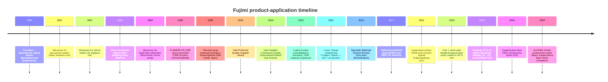

# Fujimi Incorporated (TSE:5384) — Company Research Report

**Date:** 2026-05-26
**Analyst:** Independent research
**Listing:** Tokyo Stock Exchange Prime Market; Nagoya Stock Exchange Premier Market — Security code 5384

---

## Table of Contents

1. Company Overview
2. Company History
3. Management Team
4. Products & Services
5. Customers & Go-to-Market
6. Industry Overview
7. Competitive Landscape
8. Market Opportunity (TAM)
9. Risk Assessment
10. References
11. Verification Log

---

## 1. Company Overview (≈1,000 words)

Fujimi Incorporated (フジミインコーポレーテッド) is a Japanese specialty-chemicals company that designs, manufactures and sells **precision abrasives and post-CMP cleaning chemistries used in semiconductor and hard-disk-drive manufacturing**, plus a small but rising basket of thermal-spray materials and ceramic powders for non-semi industrial use. The company's English IR page positions Fujimi as "the world leader in polishing materials for semiconductor wafers," supplying both upstream silicon-wafer makers and downstream device fabs [About Fujimi — Corporate Mission](https://www.fujimiinc.co.jp/english/company/index.html). Headquarters and the founding plant sit at 1-1, Chiryo-2, Nishibiwajima-cho, Kiyosu, Aichi Prefecture; consolidated headcount was 1,110 at March-2024 with overseas sites in Tualatin (Oregon), Kulim (Malaysia), Tongluo (Miaoli County, Taiwan), Ingelfingen (Germany) and Shenzhen, plus the newly-consolidated Nanko Abrasives Industry in Tokyo [Integrated Report 2024, "Corporate Profile" p. 57](https://www.ircms.jp/irexport/fujimiinc/file/a79408181419746.pdf).

The revenue model is **single-use consumables sold under multi-year quality-locked supply agreements**. Each silicon ingot ground to wafer and each device wafer passing through a CMP step burns a measurable quantity of slurry; once a customer qualifies a Fujimi grade for a process step, switching cost is high (re-qualification typically takes 6-18 months for advanced-node CMP and longer for finished-wafer polishing), so revenue compounds with the customer's wafer-start volumes. The four reporting segments are geographic (Japan, North America, Asia, Europe), but management discloses an **application-level revenue cut** that is more useful: in FY2025 (ending March-2025) the application mix was Silicon-wafer abrasives ¥20.4 bn, CMP slurry ¥30.7 bn, Hard-disk substrate ¥2.5 bn, Specialty Materials / Thermal-Spray / General-Industry ¥8.7 bn [FY2025 決算短信 (2025-05-13), p. 2](https://www.ircms.jp/irexport/fujimiinc/file/a80046653802235.pdf) and [FY2025 Financial Overview presentation (2025-05-20), p. 18](https://www.ircms.jp/irexport/fujimiinc/file/a80176453635234.pdf). Semiconductor-related applications (Silicon + CMP) therefore contribute **~82 %** of revenue; the company's stated medium-term aim is to take non-semi from 14 % toward 25 % by FY2029.

Geographically, **overseas sales were 78 % of consolidated revenue in FY2024**, rising to roughly 78 % again in FY2025 (¥35.5 bn Japan, ¥27.0 bn overseas) [Integrated Report 2024, "Global Expansion" p. 12](https://www.ircms.jp/irexport/fujimiinc/file/a79408181419746.pdf). Asia & Oceania alone is ¥40.7 bn destination revenue (mostly Taiwan-Korea-China memory and logic fabs), North America ¥5.3 bn (Intel, Micron, Texas-based logic), Europe ¥2.6 bn [FY2025 Financial Overview, p. 27](https://www.ircms.jp/irexport/fujimiinc/file/a80176453635234.pdf). The destination skew toward Asia explains why Fujimi's reported segment economics show **Japan booking the bulk of operating profit** (¥9.7 bn of ¥14.9 bn pre-elimination FY2025 segment profit) — sales offices and overseas affiliates take a thinner manufacturing-margin slice because R&D and recipe development for advanced nodes are concentrated at the Kakamigahara site in Gifu [FY2025 決算短信, p. 20 セグメント情報](https://www.ircms.jp/irexport/fujimiinc/file/a80046653802235.pdf).

Scale and unit economics: FY2025 consolidated **net sales ¥62.5 bn (+21.5 % YoY), operating profit ¥11.78 bn (margin 18.8 %), net profit attributable to owners ¥9.43 bn (+45.1 %)** [FY2025 決算短信, p. 1](https://www.ircms.jp/irexport/fujimiinc/file/a80046653802235.pdf). Margins recovered sharply from the FY2024 trough (op-margin 16.0 % on ¥51.4 bn revenue) but still sit below the FY2022/23 peaks of 23.3 % / 22.7 % when COVID-pull-forward demand inflated unit pricing on silicon-wafer abrasives; the 11-year financial summary in the integrated report makes the cyclicality plain — op-margin oscillated between 10 % and 24 % across the decade [Integrated Report 2024, "11-Year Financial Summary" p. 49-50](https://www.ircms.jp/irexport/fujimiinc/file/a79408181419746.pdf). EBITDA margin is structurally ~3 pp above the operating margin because depreciation runs only ¥2.0 bn against ¥62.5 bn revenue — an asset-light reactor + filtration line vs. a capital-heavy wafer or device fab.

The balance sheet is fortress-grade: total assets ¥90.9 bn, net assets ¥76.9 bn, **equity ratio 83.7 %, zero interest-bearing debt and ¥27.9 bn cash & deposits** at FY2025 year-end [FY2025 決算短信, p. 5-6](https://www.ircms.jp/irexport/fujimiinc/file/a80046653802235.pdf). This is changing. The Kagamiyama New Plant (Gifu, 28,000 m² site) broke ground in October 2024 and the 2nd R&D Center (16,000 m²) starts construction May 2025 — FY2025 capex jumped to ¥12.8 bn from ¥3.7 bn in FY2024 and **management guides FY2026 capex to ¥29.6 bn**, of which ¥22.4 bn is production-related (¥19.7 bn domestic) [FY2025 Financial Overview, p. 33](https://www.ircms.jp/irexport/fujimiinc/file/a80176453635234.pdf). Cumulative FY2024-26 capex hits ¥46.2 bn — already ¥16.2 bn above the original FY2024-29 mid-term plan, reflecting both the AI capex super-cycle and inflated construction-material/labour costs. Cash is funding it but operating-cash-flow / capex coverage drops below 1.0× in FY2026, so the equity ratio will fall meaningfully through the build-out.

### Valuation snapshot (as of 2026-05-26)

| Metric | Value | Source |
|---|---|---|
| Share price (close 2026-05-26) | JPY 3,735 | [Kabutan, 2026-05-26](https://en.kabutan.com/jp/stocks/5384/) |
| Market capitalisation | ~JPY 277 bn (US$ 1.88 bn) | [Kabutan, 2026-05-26](https://en.kabutan.com/jp/stocks/5384/) |
| TTM P/E | 26.6× | [Kabutan, 2026-05-26](https://en.kabutan.com/jp/stocks/5384/) |
| P/B | 3.30× | [Kabutan, 2026-05-26](https://en.kabutan.com/jp/stocks/5384/) |
| Dividend yield | 2.06 % (¥73.34 DPS / ¥3,735) | [FY2025 決算短信, p. 1](https://www.ircms.jp/irexport/fujimiinc/file/a80046653802235.pdf) |
| FY2025 ROE | 12.7 % | [FY2025 決算短信, p. 1](https://www.ircms.jp/irexport/fujimiinc/file/a80046653802235.pdf) |
| FY2025 EBITDA margin | 22.1 % | [FY2025 Financial Overview, p. 12](https://www.ircms.jp/irexport/fujimiinc/file/a80176453635234.pdf) |
| 52-week high (post-split) | 3,261 → broken (now ¥3,735) | [Kabutan, 2026-05-26](https://en.kabutan.com/jp/stocks/5384/) |

*Analyst view:* The 26.6× TTM multiple sits **above Fujimi's own 3-year median (~17× through the FY2024 trough)** and roughly in-line with regional specialty-chemicals peers — TSE Prime semi-materials median ~28× — but well below the 40-50× attached to leading-edge CMP names like Anji Microelectronics (688019.SH, ~42× FY2027F per Nomura's 2026-05 Greater-China Semi note) or Dinglong (300054.SZ, ~96× FY2027F per same note). The premium versus Fujimi's own history is justifiable on AI-driven CMP volume growth and the FY2026 capacity-expansion narrative, but the absolute multiple **does not embed a leading-edge node share-gain story** — Fujimi is positioned by the market as a defensible incumbent in mature CMP and silicon-wafer slurry, not as a high-growth advanced-node share taker. A pull-back in semi capex into 2027F is the primary downside re-rating risk; cumulative ¥46 bn of capacity that depreciates against a flat top-line is the most plausible bear case.

*Source: [Integrated Report 2024 p.49-50](https://www.ircms.jp/irexport/fujimiinc/file/a79408181419746.pdf) and [FY2025 Financial Overview p.16](https://www.ircms.jp/irexport/fujimiinc/file/a80176453635234.pdf). FY26F = company guidance.*

---

## 2. Company History (≈600 words)

Fujimi was founded as a partnership in **1950** in Nagoya by **Teruji Koshiyama (越山輝二)** to produce precision polishing powder for **optical lenses** — Japan's post-war camera and binocular industry was importing abrasives from Germany and the US, and Koshiyama spotted a gap on the supply side after listening to local optics customers complain about delivery lead times. The company incorporated as a stock company on **20 March 1953** under the name "Fujimi Kenmazai Kabushiki Kaisha" (フジミ研磨剤株式会社, "Fujimi Abrasives Co., Ltd."), with the head office and Biwajima Plant at Kiyosu, Aichi — the same location used today [Integrated Report 2024 "Corporate Profile" p.57](https://www.ircms.jp/irexport/fujimiinc/file/a79408181419746.pdf). The "Fujimi" name comes from the area's traditional view of Mount Fuji; the founder's personal foundation, **Koshiyama Science and Technology Foundation**, still holds 2.3 % of the shares, and the founder's holding company **Koma Co., Ltd. is the largest shareholder at 17.7 %** — the firm remains a founder-family-controlled business [Integrated Report 2024 "Stock Information" p.57](https://www.ircms.jp/irexport/fujimiinc/file/a79408181419746.pdf).

The product line walked the post-war Japanese electronics value chain:

Two pivots define the modern company. **The first**, in 1995, was the launch of the **PLANERLITE** CMP slurry family at exactly the inflection when CMP went from an IBM/Intel-proprietary trick to a mainstream foundry step. The R&D Center in Kakamigahara opened in 2000 with the same Class-100 cleanroom and tribometer rigs as customer fabs, letting Fujimi run blind-A/B slurry trials in parallel with development at Intel, Samsung and TSMC — by 2002 Fujimi won Intel's Preferred Quality Supplier Award, and the Supplier Continuous Quality Improvement Award in 2004 [Integrated Report 2024 "Growth Trajectory" p.7](https://www.ircms.jp/irexport/fujimiinc/file/a79408181419746.pdf). The CMP business grew from a slide-in line item to roughly half of consolidated revenue (¥30.7 bn / ¥62.5 bn = 49 % in FY2025).

**The second** pivot has been slower-burn: the launch of the **Thermal-Spray Materials Business in 2000** and the **Advanced Technology & Specialty Materials Division** more recently aim to take the powder-control core competence into non-abrasive markets (3D printing ultra-hard cermet powders, ceramic powders for heat-dissipation, automotive polishing compounds). Non-semi revenue is still only ~15 % of the mix, but management's stated FY2029 target is 25 %, and the **October 2024 acquisition of Nanko Abrasives Industry Co., Ltd.** (a Tokyo-based general-industrial abrasives company, 75 % stake) was the first M&A move in years and brought a profitable abrasives book plus a customer roster in steel, automotive and architectural-glass polishing [Message from the President, Integrated Report 2024 p.4](https://www.ircms.jp/irexport/fujimiinc/file/a79408181419746.pdf).

The 11-year financial summary shows a clear chronology: Trump-1 trade war (FY2019-20 plateau), COVID/work-from-home demand surge (FY2021-23 — revenue from ¥38 bn to ¥58 bn, operating margin from 16 % to 23 %), 2023 inventory correction (FY2024 revenue -12 %, op-profit -38 %), and the AI re-acceleration (FY2025 revenue +21.5 %, op-profit +43 %) [Integrated Report 2024 p.49-50](https://www.ircms.jp/irexport/fujimiinc/file/a79408181419746.pdf).

---

## 3. Management Team (≈400 words)

**Founder — Teruji Koshiyama (越山輝二).** Founder-CEO from 1950 through the early-1980s leadership handover; established the company's "customer-first abrasives professional" culture that successive presidents still reference. The Koshiyama family's holding vehicle **Koma Co., Ltd.** retains 17.7 % of the shares, supplementary family-related vehicles (Koshiyama Foundation, Fujimi Suppliers' Stock Ownership Program) take the founder-orbit stake to roughly 22 % — Fujimi remains a founder-family-anchored company even though no Koshiyama family member is on the current board [Integrated Report 2024 "Stock Information" p.57](https://www.ircms.jp/irexport/fujimiinc/file/a79408181419746.pdf). Outside directors note in the FY2024 governance dialogue that "Fujimi's shareholder composition has a strong family bias" but praised the resulting transparency culture as "a strong commitment to ensuring even greater fairness" [Integrated Report 2024 "Dialogue with Outside Directors" p.39-41](https://www.ircms.jp/irexport/fujimiinc/file/a79408181419746.pdf). Koshiyama himself is no longer operationally involved; he died in the early 2000s, and the foundation that bears his name funds science scholarships in Aichi prefecture.

**President & CEO — Keishi Seki (関 敬史)** (in role since **April 2008**, currently 18-year tenure — exceptional by Japanese-listed-company standards). Seki joined the **Fuji Bank (now Mizuho Bank)** as a fresh hire in **April 1989** and worked there for eight years before joining Fujimi in **October 1997**, going overseas almost immediately as **President of Fujimi Corporation (Tualatin, Oregon) from February 2000**. He returned to Japan as **Director & Senior General Manager of New Business Development Division (2003)** and **Director & Senior General Manager of CMP Division (April 2005)** — i.e. he ran the CMP business through its scale-out years before being elevated to President and CEO in April 2008. From January 2013 he was concurrently President of Fujimi Korea Limited (since closed) and from August 2013 President of Fujimi Taiwan Limited as well — the "President of three subsidiaries simultaneously" structure was used to push integrated decision-making across the Asia footprint [Integrated Report 2024 "Directors and Auditors" p.47-48](https://www.ircms.jp/irexport/fujimiinc/file/a79408181419746.pdf).

Seki's signature accomplishment is the **recovery from the 2008-2011 silicon-wafer quality crisis**. In his own published account, "when I became president in 2008, I faced bitter challenges when we fell short of meeting customers' increasingly sophisticated quality requirements as the diameter of silicon wafers increased from 8 inches (200 mm) to 12 inches (300 mm)" — Fujimi was at ~90 % silicon-wafer share but losing it to specification creep, in parallel with the global financial crisis and the silicon-cycle downturn. The response was the **Monozukuri Promotion Office** (2009, cross-functional quality / process org) and a full re-write of the quality-creation process and management system; share has held in the 84-92 % band ever since [Message from the President, Integrated Report 2024 p.4](https://www.ircms.jp/irexport/fujimiinc/file/a79408181419746.pdf). Seki holds a small personal stake (1,323 thousand shares = 1.7 % of issued shares at March-2024, worth ~¥5 bn at current prices) — direct alignment beyond his Bank of Japan-style salary plus the Stock Benefit Trust (BBT) [Integrated Report 2024 "Leading Shareholders" p.57](https://www.ircms.jp/irexport/fujimiinc/file/a79408181419746.pdf).

---

