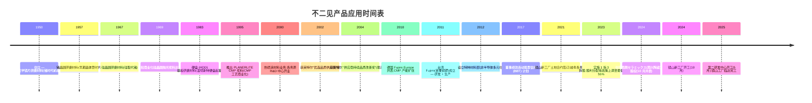
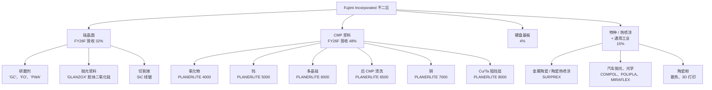
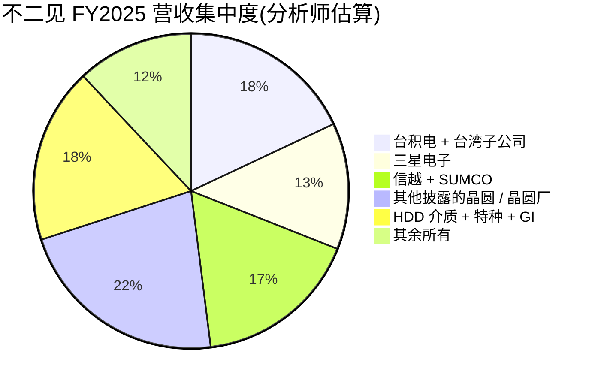

# Fujimi Incorporated 不二见 (TSE:5384) — 公司研究报告

**日期：** 2026-05-26
**分析师：** 独立研究
**上市地：** 东京证券交易所 Prime 市场；名古屋证券交易所 Premier 市场 — 证券代码 5384

---

## 目录

1. 公司概览
2. 公司历史
3. 管理团队
4. 产品与服务
5. 客户与上市策略
6. 行业概览
7. 竞争格局
8. 市场机会 (TAM)
9. 风险评估
10. 参考资料
11. 验证日志

---

## 1. 公司概览(约 1,000 字)

不二见股份有限公司(フジミインコーポレーテッド,Fujimi Incorporated)是一家日本特种化学品公司,主营**用于半导体与硬盘 (HDD) 制造工序的精密研磨材料 (precision abrasives) 与 CMP 后清洗化学品 (post-CMP cleaning chemistries)**,同时附带规模较小但增长较快的热喷涂材料 (thermal-spray materials) 与陶瓷粉末业务,服务非半导体的工业用途。公司在其英文 IR 页面将自己定位为"半导体晶圆研磨材料的全球领导者 (the world leader in polishing materials for semiconductor wafers)",同时供应上游单晶硅晶圆厂与下游器件晶圆厂 [Fujimi 公司简介 — Corporate Mission](https://www.fujimiinc.co.jp/english/company/index.html)。公司总部及创办工厂位于爱知县清须市西枇杷岛町地领 2-1-1,2024 年 3 月合并员工人数为 1,110 人,海外据点包括美国俄勒冈州 Tualatin、马来西亚吉林 Kulim、台湾苗栗县铜锣、德国 Ingelfingen 以及中国深圳,并于 2024 年新增并表了位于东京的 Nanko 研磨工业 (南興セラミックス) [《整合报告 2024》 "Corporate Profile" 第 57 页](https://www.ircms.jp/irexport/fujimiinc/file/a79408181419746.pdf)。

公司的收入模式是**通过多年度品质锁定式供货协议销售的一次性消耗品 (single-use consumables)**。每一根晶锭从研磨到晶圆、每一片器件晶圆经过一道 CMP 工序,都会消耗可计量的浆料量;一旦客户将不二见的某个等级合格化进入某道工序,切换成本就极高(先进节点 CMP 重新合格化通常需 6-18 个月,成品晶圆研磨则更长),因此营收会随着客户的晶圆投片量同比例放大。公司公布的四个分部按地理划分(日本、北美、亚洲、欧洲),但管理层另外披露了一份**按应用拆分的收入口径**,信息量更大:2025 财年(截至 2025 年 3 月)按应用收入为:硅晶圆研磨材料 204 亿日元、CMP 抛光液 / 浆料 (CMP slurry) 307 亿日元、硬盘基板抛光 25 亿日元、特种材料 / 热喷涂 / 通用工业品 87 亿日元 [FY2025 決算短信 (2025-05-13) 第 2 页](https://www.ircms.jp/irexport/fujimiinc/file/a80046653802235.pdf) 以及 [FY2025 财务概览演示 (2025-05-20) 第 18 页](https://www.ircms.jp/irexport/fujimiinc/file/a80176453635234.pdf)。半导体相关应用(硅 + CMP)因此占营收 **~82%**;管理层中期目标是把非半导体业务从 14% 提升至 2029 财年的 25%。

从地理结构看,**2024 财年海外销售占合并营收的 78%**,2025 财年大致保持在 78% 左右(日本 355 亿日元、海外 270 亿日元) [《整合报告 2024》 "Global Expansion" 第 12 页](https://www.ircms.jp/irexport/fujimiinc/file/a79408181419746.pdf)。仅"亚洲与大洋洲"目的地营收就达 407 亿日元(主要面向台湾、韩国、中国的存储与逻辑晶圆厂),北美 53 亿日元(英特尔、美光、德州的逻辑客户),欧洲 26 亿日元 [FY2025 财务概览第 27 页](https://www.ircms.jp/irexport/fujimiinc/file/a80176453635234.pdf)。目的地偏亚洲解释了为什么不二见的分部利润结构中**日本本土录得绝大部分营业利润**(2025 财年抵销前分部利润 149 亿日元中日本占 97 亿日元) — 海外销售办公室和子公司分得的制造毛利更薄,因为先进节点的 R&D 与配方开发集中在岐阜县各务原 (Kakamigahara) 总部 [FY2025 決算短信第 20 页 セグメント情報](https://www.ircms.jp/irexport/fujimiinc/file/a80046653802235.pdf)。

规模与单位经济性:2025 财年合并**净销售额 625 亿日元(同比 +21.5%),营业利润 117.8 亿日元(利润率 18.8%),归母净利润 94.3 亿日元(同比 +45.1%)** [FY2025 決算短信第 1 页](https://www.ircms.jp/irexport/fujimiinc/file/a80046653802235.pdf)。利润率较 2024 财年低点(营业利润率 16.0%,营收 514 亿日元)显著回升,但仍低于 2022/23 财年的 23.3% / 22.7% 高点 — 当时新冠居家办公需求拉动硅晶圆研磨材料的单价上涨。《整合报告》中的 11 年财务摘要清楚展示了周期性 — 这十年里营业利润率在 10% 至 24% 之间震荡 [《整合报告 2024》 "11-Year Financial Summary" 第 49-50 页](https://www.ircms.jp/irexport/fujimiinc/file/a79408181419746.pdf)。EBITDA 利润率在结构上比营业利润率高约 3 个百分点,因为折旧仅 20 亿日元(对 625 亿日元营收) — 反应器 + 过滤产线属于轻资产,而非像晶圆厂或器件厂那样资本密集。

资产负债表非常稳健:总资产 909 亿日元、净资产 769 亿日元、**股东权益比率 83.7%,无有息负债,现金及存款 279 亿日元**(2025 财年末) [FY2025 決算短信第 5-6 页](https://www.ircms.jp/irexport/fujimiinc/file/a80046653802235.pdf)。但格局正在变化。镜山新工厂(岐阜,占地 28,000 平米)于 2024 年 10 月动工,第二研发中心(16,000 平米)2025 年 5 月动工 — 2025 财年资本开支由 37 亿日元跃升至 128 亿日元,**管理层预计 2026 财年资本开支达 296 亿日元**,其中 224 亿日元为生产相关(国内投资 197 亿日元) [FY2025 财务概览第 33 页](https://www.ircms.jp/irexport/fujimiinc/file/a80176453635234.pdf)。FY2024-26 累计资本开支达 462 亿日元 — 比当初的 FY2024-29 中期计划高出 162 亿日元,既反映 AI 资本开支超级周期,也反映建材与人工费用上涨。现金可以覆盖建设支出,但 2026 财年的"经营现金流 / 资本开支"覆盖比将跌破 1.0×,因此股东权益比率会在建设期内显著下降。

### 估值快照 (截至 2026-05-26)

| 指标 | 数值 | 来源 |
|---|---|---|
| 股价 (2026-05-26 收盘) | JPY 3,735 | [Kabutan, 2026-05-26](https://en.kabutan.com/jp/stocks/5384/) |
| 市值 | ~JPY 2,770 亿 (US$ 18.8 亿) | [Kabutan, 2026-05-26](https://en.kabutan.com/jp/stocks/5384/) |
| TTM 市盈率 | 26.6× | [Kabutan, 2026-05-26](https://en.kabutan.com/jp/stocks/5384/) |
| 市净率 | 3.30× | [Kabutan, 2026-05-26](https://en.kabutan.com/jp/stocks/5384/) |
| 股息率 | 2.06% (¥73.34 DPS / ¥3,735) | [FY2025 決算短信第 1 页](https://www.ircms.jp/irexport/fujimiinc/file/a80046653802235.pdf) |
| FY2025 ROE | 12.7% | [FY2025 決算短信第 1 页](https://www.ircms.jp/irexport/fujimiinc/file/a80046653802235.pdf) |
| FY2025 EBITDA 利润率 | 22.1% | [FY2025 财务概览第 12 页](https://www.ircms.jp/irexport/fujimiinc/file/a80176453635234.pdf) |
| 52 周高点(拆股后) | 3,261 → 已突破(现 ¥3,735) | [Kabutan, 2026-05-26](https://en.kabutan.com/jp/stocks/5384/) |

*分析师观点:* 26.6× TTM 估值倍数**高于不二见自身三年中位数(穿越 2024 财年谷底约 17×)**,与区域内特种化工同业大致持平 — TSE Prime 半导体材料板块中位数约 28× — 但远低于先进节点 CMP 浆料龙头如安集科技(688019.SH,根据野村 2026 年 5 月《大中华半导体》 报告 FY27F 约 42×)或鼎龙股份(300054.SZ,同报告 FY27F 约 96×)所获得的 40-50× 估值。相对于自身历史的溢价可以由 AI 驱动的 CMP 出货量增长以及 2026 财年产能扩张叙事来解释,但绝对估值倍数**并未隐含先进节点份额获取的故事** — 市场把不二见定位为成熟 CMP 与硅晶圆浆料的稳健在位龙头,而非高速增长的先进节点份额夺取者。2027F 半导体资本开支回落是最主要的下行重估风险;464 亿日元产能在营收持平时的折旧吞噬是最合理的空头情境。

*来源:[《整合报告 2024》 第 49-50 页](https://www.ircms.jp/irexport/fujimiinc/file/a79408181419746.pdf) 与 [FY2025 财务概览第 16 页](https://www.ircms.jp/irexport/fujimiinc/file/a80176453635234.pdf)。FY26F = 公司指引。*

---

## 2. 公司历史 (约 600 字)

不二见**创立于 1950 年**,由**创始人腰山照二 (Teruji Koshiyama)** 在爱知县名古屋创办,最初为**光学镜片**生产精密研磨粉 — 根据公司自述:"应一家光学设备制造商的请求,他开始研发用于光学玻璃产品(如瞄准镜镜片)的研磨材料。他成功完成商品化,投产了日本国产首批合成精密研磨剂" [《整合报告 2024》 "Growth Trajectory" 第 7 页](https://www.ircms.jp/irexport/fujimiinc/file/a79408181419746.pdf)。公司于 **1953 年 3 月 20 日**以股份公司形式正式登记,总部及枇杷岛工厂位于爱知县清须市 — 与今日同一地点 [《整合报告 2024》 "Corporate Profile" 第 57 页](https://www.ircms.jp/irexport/fujimiinc/file/a79408181419746.pdf)。"フジミ (Fujimi)"之名源于该地区可远眺富士山的传统;创始人个人设立的基金会**腰山科技奖励基金 (Koshiyama Science and Technology Foundation)** 仍持有 2.3% 股份,创始人控股公司**コーマ株式会社 (Koma Co., Ltd.) 是第一大股东,持股 17.7%** — 公司至今仍是创始人家族控制的企业 [《整合报告 2024》 "Stock Information" 第 57 页](https://www.ircms.jp/irexport/fujimiinc/file/a79408181419746.pdf)。

产品线沿着战后日本电子产业链不断演进:

两次产品转型定义了今日的公司形态。**第一次**发生在 1995 年,推出 **PLANERLITE 系列 (Fujimi 浆料品牌) (PLANERLITE Series)** CMP 浆料,恰逢 CMP 从 IBM/Intel 内部专利诀窍走向晶圆代工主流工序的拐点。各务原 R&D 中心 2000 年开业时,即配备与客户晶圆厂相同的 Class-100 洁净室和摩擦力实验设备,让不二见可与英特尔、三星、台积电同步进行双盲 A/B 浆料试验 — 2002 年不二见获英特尔"优选品质供应商"奖,2004 年获"供应商持续品质改善奖" [《整合报告 2024》 "Growth Trajectory" 第 7 页](https://www.ircms.jp/irexport/fujimiinc/file/a79408181419746.pdf)。CMP 业务从早期的边缘项目成长为合并营收的约一半(2025 财年 307 亿 / 625 亿 = 49%)。

**第二次转型**节奏更慢:2000 年的**热喷涂材料业务**和近年新设的**先进技术与特种材料部**旨在将公司在粉体控制方面的核心能力延伸至非研磨领域(3D 打印用超硬金属陶瓷粉末、散热陶瓷粉末、汽车抛光膏)。非半导体营收目前仅占整体约 15%,但管理层 2029 财年的目标是 25%,而 **2024 年 10 月收购的 Nanko 研磨工业(总部东京,通用工业研磨,75% 持股)**是多年来首次 M&A 动作,带来了盈利的研磨产品组合,以及钢铁、汽车与建筑玻璃抛光的客户名单 [社长致辞,《整合报告 2024》 第 4 页](https://www.ircms.jp/irexport/fujimiinc/file/a79408181419746.pdf)。

11 年财务摘要展示了清晰的时间线:特朗普一期贸易战(FY2019-20 持平)、新冠 / 居家办公需求爆发(FY2021-23 — 营收从 380 亿至 580 亿日元,营业利润率从 16% 至 23%)、2023 年库存调整(FY2024 营收 -12%、营业利润 -38%)、AI 再加速(FY2025 营收 +21.5%、营业利润 +43%) [《整合报告 2024》 第 49-50 页](https://www.ircms.jp/irexport/fujimiinc/file/a79408181419746.pdf)。

---

## 3. 管理团队 (约 400 字)

**创始人 — 腰山照二 (Teruji Koshiyama)**。1950 年至 1980 年代初担任创始人 CEO,确立了延续至今的"以客户为先的研磨专家"文化。腰山家族的控股公司**コーマ株式会社 (Koma Co., Ltd.)** 持股 17.7%,加上家族相关的腰山基金会和不二见供应商持股会等附属持股工具,创始人家族体系合计持股约 22% — 即便当前董事会已无腰山家族成员,公司仍然是一家以创始人家族为锚的企业 [《整合报告 2024》 "Stock Information" 第 57 页](https://www.ircms.jp/irexport/fujimiinc/file/a79408181419746.pdf)。外部董事在 2024 财年治理对话中指出"不二见的股东构成存在较强的家族色彩",但赞许由此形成的透明文化是"对公平性更高承诺的体现" [《整合报告 2024》 "Dialogue with Outside Directors" 第 39-41 页](https://www.ircms.jp/irexport/fujimiinc/file/a79408181419746.pdf)。腰山照二本人早已不再参与经营,2000 年代初已故,以他命名的基金会现资助爱知县的科学奖学金。

**社长兼 CEO — 现任社长关圭志 (Keishi Seki)** (自 **2008 年 4 月**上任,现任期已达 18 年 — 在日本上市公司中属罕见的长任期)。关圭志 **1989 年 4 月**进入富士银行(现瑞穗银行) 工作了 8 年,**1997 年 10 月**加入不二见,几乎立即外派,**2000 年 2 月起担任 Fujimi Corporation (美国俄勒冈州 Tualatin) 总裁**。回日本后历任**新事业开发部部长(2003 年董事 & 高级总经理)**、**CMP 事业部部长(2005 年 4 月董事 & 高级总经理)** — 也就是说,他在 CMP 业务扩张阶段亲自带队,直到 2008 年 4 月升任社长兼 CEO。从 2013 年 1 月起兼任 Fujimi Korea Limited (现已关闭)总裁,从 2013 年 8 月起兼任 Fujimi Taiwan Limited 总裁 — 这种"同时担任三家子公司总裁"的结构是为了在亚洲布局推动集成式决策 [《整合报告 2024》 "Directors and Auditors" 第 47-48 页](https://www.ircms.jp/irexport/fujimiinc/file/a79408181419746.pdf)。

关圭志的标志性成就是**2008-2011 年硅晶圆品质危机的恢复**。他在自己发表的文章中提到:"我 2008 年接任社长时,正面临严峻挑战 — 随着硅晶圆直径从 8 英寸(200 毫米)升级到 12 英寸(300 毫米),我们未能跟上客户日益苛刻的品质要求"。当时不二见的硅晶圆研磨材料份额约 90%,却因规格升级而开始流失,叠加全球金融危机与硅周期下行。应对之策是成立 **Monozukuri 推进室 (Monozukuri Promotion Office,2009 年设立)** — 这是跨职能的品质 / 制程管理组织 — 并全面重写品质创造流程与管理体系;此后份额稳定在 84-92% 区间 [社长致辞,《整合报告 2024》 第 4 页](https://www.ircms.jp/irexport/fujimiinc/file/a79408181419746.pdf)。关圭志个人持股 1,323 千股(占 2024 年 3 月发行股的 1.7%,按当前股价约 50 亿日元)— 在日本央行式工资加股票信托 (BBT) 之外的直接利益绑定 [《整合报告 2024》 "Leading Shareholders" 第 57 页](https://www.ircms.jp/irexport/fujimiinc/file/a79408181419746.pdf)。

---

## 4. 产品与服务 (约 1,500 字)

> 第 4 章是本报告的分析骨架。不二见的产品矩阵是后续章节理解的镜头:第 5 章(客户 — 谁买什么)、第 6 章(行业 — 哪些晶圆工序需要哪种浆料)、第 7 章(竞争 — 谁能提供同等级产品)、第 8 章(TAM — 不二见能服务多大市场)、第 9 章(风险 — 哪些产品最易商品化)都依赖第 4 章的产品理解。

### 4.1 不二见产品矩阵(锚定整合报告)

最清晰的产品分类来自**《整合报告 2024》第 13-14 页"Our Fields of Activity"** 加上面向客户的 **CMP 浆料产品阵容页面 (fujimiinc.co.jp/english/service/cmp/lineup.html)**。矩阵把每一个不二见产品系列映射到客户的工序步骤:

| 系列 | 应用工序 | 子产品 / SKU | 终端市场 | 已披露份额 |
|---|---|---|---|---|
| **硅晶圆 — 研磨 (Lapping)** | 切片后大尺寸去硅 | `GC`、`FO`、`PWA`、氧化铝/碳化硅基研磨剂 | 硅晶圆厂(信越、SUMCO、环球晶圆、Siltronic、SK Siltron) | **全球 92%** |
| **硅晶圆 — 抛光 (Polishing)** | 镜面精加工(去除 + 终抛) | `GLANZOX` 胶体二氧化硅、低缺陷化学体系 | 同上 | **全球 84%**(终抛),**59%**(去除式抛光) |
| **硅晶圆 — 切割 (浆料)** | 用线锯切割晶锭 | SiC 基线锯切割液 | 同上;SiC 晶圆厂 | 重要;绝对营收较小(FY25 1.75 亿日元) |
| **CMP — 氧化物浆料** | 层间介电 (ILD) 平坦化 | `PLANERLITE 4000` 系列 | 逻辑 + 存储 IDM 与代工厂 | 氧化物 CMP 联合龙头;**前道 (FEOL, Front End Of Line) 浆料全球份额 56%** |
| **CMP — 钨浆料 (tungsten slurry)** | W 插塞 / 接触平坦化 | `PLANERLITE 5000` 系列 | 同上 | 全球 #2-#4 |
| **CMP — 多晶硅 (FEOL) 浆料** | 多晶硅栅极 / 浅沟槽隔离 | `PLANERLITE 6000` 系列 + `PLANERLITE 6500` 后清洗 | 逻辑代工厂(台积电、三星代工、英特尔、GF) | **前道多晶硅浆料全球 >50%** |
| **CMP — 铜浆料 (copper slurry)** | Cu 互连(BEOL,后道)大除去 + 终抛 | `PLANERLITE 7000` 系列 | 逻辑 IDM / 代工厂 | #4-#5;商品化 |
| **CMP — Cu/Ta 阻挡层浆料** | 阻挡层平坦化 | `PLANERLITE 8000` 系列 | 同上 | #3-#4 |
| **HDD — 硬盘基板抛光** | 铝 / 玻璃基板毛坯抛光 | `DISKLITE` 系列 | HDD 介质厂(西部数据、昭和电工 HD 等) | 实质性;单位为数十亿日元级 |
| **特种 — 热喷涂粉末** | SPE 腔体、航空件、钢辊等离子喷涂 | 金属陶瓷、陶瓷复合、球状 / 片状 / 棒状陶瓷粉 | Lam、AMAT、TEL(SPE 腔体);航空、钢铁 | 细分市场溢价玩家 |
| **通用工业 — 研磨剂** | HDD 基板相邻 + 汽车涂装、光学、塑料 | `COMPOL`、`POLIPLA`、`SURPREX`、`MIRAFLEX` | 汽车 OEM、眼镜、蓝宝石基板 | 多元化 |
| **先进技术与特种材料** | 热管理用陶瓷粉末、3D 打印超硬金属陶瓷粉、新型填料 | 预商业化 / 早期 | 功率电子、增材制造 | 预收入 / 新业务 |

矩阵来源:[Fujimi CMP 浆料阵容页](https://www.fujimiinc.co.jp/english/service/cmp/lineup.html);[《整合报告 2024》 第 13-14 页 "Our Fields of Activity"](https://www.ircms.jp/irexport/fujimiinc/file/a79408181419746.pdf);[《整合报告 2024》 第 10 页 "Fujimi's Unique Qualities"](https://www.ircms.jp/irexport/fujimiinc/file/a79408181419746.pdf);[FY2025 決算短信第 2 页应用收入拆分](https://www.ircms.jp/irexport/fujimiinc/file/a80046653802235.pdf)。

### 4.2 综合 — 各品类如何在客户工作流中相互衔接

不二见的产品将**从单晶硅晶圆到器件晶圆的整套制造闭环**串联起来,公司接触至少三类客户(单晶到晶圆厂、器件晶圆厂、HDD 介质厂)。一片硅晶圆走完逻辑芯片之旅的流程是:信越 / SUMCO / 环球晶圆出的晶锭先用**线锯切割液**切片,再用 `GC` / `FO` 做**研磨 (lapping)** 保证平行度,再用 `GLANZOX` **胶体二氧化硅 (silica slurry)** 抛光做原子级平整度 — 全球任何一片满足逻辑级平整度要求的晶圆,在这一阶段都接触过不二见或其等同物的研磨剂。晶圆抵达台积电 / 三星 / 英特尔后,会经过约 10-15 道前道 (FEOL) CMP(多晶硅、STI、接触、栅极),再经过约 10 道后道 BEOL(氧化物 ILD、W 插塞、Cu 镶嵌、阻挡层去除)。每一道工序由一种 `PLANERLITE` 浆料物理平坦化晶圆表面 — 二氧化硅或**氧化铈浆料 (ceria slurry)** 颗粒在调好 pH、氧化剂浓度与表面活性剂用量的化学浴中与晶圆相对运动,选择性去除目标膜(氧化物、多晶硅、W、Cu)而不刮伤邻近膜。**后 CMP 冲洗(`PLANERLITE 6500`)随后剥离残余颗粒**,然后晶圆才被送往下一道沉积或光刻。HDD 介质基板使用单独的 `DISKLITE` 抛光浆料。非半导体的 `COMPOL` / `SURPREX` / 热喷涂系列复用不二见的粉末分级、造粒和化学品 IP,用于工业抛光和高性能涂层。

### 4.3 硅晶圆研磨材料 — 研磨、抛光、切割

> "本业务中,不二见研究、开发、制造并销售用于硅晶圆高精密研磨工序的研磨材料。这一工序使硅晶圆变得平整并镜面抛光,是走向半导体衬底的关键一步。为了满足客户日益精细的需求,我们在从切割到精抛的每一步都提供高品质产品与服务,构成完整的解决方案。" [《整合报告 2024》 "Silicon Business" 第 22 页](https://www.ircms.jp/irexport/fujimiinc/file/a79408181419746.pdf)

**通俗解释:** 一片半导体硅晶圆始于 300 毫米直径的圆柱形**单晶硅锭 (ingot)**,在信越、SUMCO 或环球晶圆通过 Czochralski (CZ, 直拉法) 工艺生长。晶锭被一台线锯切成晶圆,锯刀供给的是**切割液 (slicing slurry)**(含 SiC 颗粒)。每片晶圆的双面随后用 `GC` (绿色碳化硅) 或 `FO` (熔融氧化铝) 散粒研磨剂**研磨 (lapping)**,去除锯切损伤并把双面平行度做到亚微米。最后晶圆做**抛光 (polishing)** 出镜面 — 先做粗除去抛光,再用 `GLANZOX` **胶体二氧化硅 (colloidal silica)** 做最终抛光,达到原子级平整度(均方根粗糙度 < 0.1 nm)。不二见的附加值在于颗粒粒径分布控制(极窄 PSD、无超大颗粒以避免刮伤)、化学体系(氧化剂、分散剂、pH 稳定剂)以及驻厂式制程 know-how。战略拐点是:每一次从 200 毫米转 300 毫米再(终)至 450 毫米晶圆的代际跃迁都把浆料的难度门槛抬高;2025 年起 **SiC 晶圆服务于电动汽车功率器件**又打开一个独立的浆料市场 — 不二见已在美国 (Tualatin) 与马来西亚 (Kulim) 设立 SiC 浆料产能 [《整合报告 2024》 "Silicon Business" 第 22 页](https://www.ircms.jp/irexport/fujimiinc/file/a79408181419746.pdf) 与 [FY2025 财务概览第 30 页 "FUJIMI CORPORATION US"](https://www.ircms.jp/irexport/fujimiinc/file/a80176453635234.pdf)。

*分析师观点:* 不二见自己披露的份额 — **硅晶圆研磨剂全球 92%、终抛浆料 84%、去除式抛光浆料 59%** ([《整合报告 2024》 第 10 页](https://www.ircms.jp/irexport/fujimiinc/file/a79408181419746.pdf)) — 使该板块实质上成为研磨领域的全球准独占,以及抛光精加工领域的明确 #1。护城河有两层:技术(40 多年的客户级配方调优)加上切换成本(晶圆厂换浆料供应商意味着良率塌方风险 — 信越的晶圆客户不会接受"我们换了浆料供应商"作为日常注解)。最接近的合格竞争者是 JSR 公司在胶体二氧化硅抛光浆料,加上大型晶圆厂的内部替代;截至 2026 年中,尚无中国厂商在生产规模上合格化进入 300 毫米优质晶圆抛光。

*来源:[《整合报告 2024》 "Fujimi's Unique Qualities" 第 10 页](https://www.ircms.jp/irexport/fujimiinc/file/a79408181419746.pdf),不二见内部估计,数据截至 2024 年 3 月。*

### 4.4 CMP 浆料 — PLANERLITE 4000 / 5000 / 6000 / 6500 / 7000 / 8000 系列

> "本业务中,不二见研究、开发、制造并销售用于半导体器件制造工序的研磨材料。随着半导体器件性能、密度与集成度的提高,需要被研磨的膜种与 CMP 应用工序在不断增加。此外,为了提高近年来三维封装系统的性能,各类半导体器件三维堆叠技术兴起,CMP 在这一领域的使用也在被考虑。为了快速且精确地回应这些不断变化的市场需求,我们在日本、美国与台湾建立了制造与开发基地,毗邻客户的制造与开发基地。… 展望未来,我们要努力成为全球第一的前道 (FEOL) 浆料厂商。" [《整合报告 2024》 "CMP Business" 第 22 页](https://www.ircms.jp/irexport/fujimiinc/file/a79408181419746.pdf)

不二见的 CMP 浆料产品阵容,引述自公司面向客户的官网:

> - **PLANERLITE 4000 系列** — "氧化物膜浆料"
> - **PLANERLITE 5000 系列** — "钨 W 浆料"
> - **PLANERLITE 6000 系列** — "多晶硅 CMP 浆料"
> - **PLANERLITE 6500 系列** — "多晶硅膜颗粒去除冲洗浆料"
> - **PLANERLITE 7000 系列** — "铜 Cu 浆料"
> - **PLANERLITE 8000 系列** — "Cu/Ta 等阻挡层抛光浆料"
>
> 来源:[Fujimi CMP 浆料阵容页](https://www.fujimiinc.co.jp/english/service/cmp/lineup.html)。系列被描述为"高纯度、高分散、无划伤",并支持 FinFET、TSV、HKMG 以及新兴材料(III-V 化合物、钴、SiC、SiGe)的开发。

**通俗解释:化学机械抛光 (CMP, chemical-mechanical planarization)** 是在 10-20 层金属互连与层间介电层叠加的同时,把 300 毫米晶圆表面平整度保持在埃 (angstrom) 级的唯一实用方法。工艺把旋转的晶圆面朝下压在一块旋转的聚氨酯**抛光垫 (polishing pad)** 上,用**浆料 (slurry)** 灌入接触区:水基化学体系里悬浮的胶体研磨颗粒会选择性反应目标膜。两种物理机制并行:颗粒的机械磨损与表面的化学蚀刻;*选择性* — 也就是浆料对目标膜的去除速度比下层停止层快多少 — 是关键配方参数,也是核心知识产权。PLANERLITE-4000 使用对氮化硅停止层高选择性的 STI(浅沟槽隔离)氧化物用氧化铈研磨剂。PLANERLITE-5000 使用气相二氧化硅 + 双氧水化学体系,激进攻击钨插塞表面同时保护氧化物场区。PLANERLITE-6000 是胶体二氧化硅 + 胺基化学,专为栅极叠层流程中的多晶硅平坦化调校。PLANERLITE-6500 严格说不是浆料 — 它是**后 CMP 清洗化学品**,在进入下一工序前剥离残余颗粒、浆料副产物和金属离子。PLANERLITE-7000 系列处理 Cu 互连,用苯并三唑系腐蚀抑制剂加上超低缺陷的胶体二氧化硅或氧化铝。PLANERLITE-8000 用于 Cu 抛光后的 Cu/Ta 阻挡层去除步骤 — 选择性要求不同,因为阻挡金属 (Ta, TaN, Ti, TiN) 不对同一化学体系响应。战略拐点:**GAA (Gate-All-Around) 逻辑 N2/2 纳米**、**背面供电 (Backside Power Delivery, BPD)** 需要多次额外的晶圆键合 + 减薄(因而增加 CMP)、**HBM4 / DRAM-on-logic** 晶圆对晶圆键合 — 野村 2026 年 5 月《大中华半导体》研究预计**先进晶圆 CMP 工序数增加 20-30%** [野村《Greater China Semi》 2026-05-21 第 6-9 页(分析师锚定参考)](https://www.nomuraconnects.com/)。

*分析师观点:* 不二见的明确目标是**全球 FEOL 浆料 #1**(《整合报告 2024》 第 22 页)— 也就是前道工序中以多晶硅、STI 和接触浆料为主导。不二见已披露**前道浆料全球份额 56%、整体 CMP 浆料市场份额 13%**(《整合报告 2024》 第 10 页)。整体 CMP 浆料市场由领跑者**Entegris / CMC Materials** (2022 年 CMC 收购后约 28% 份额)、**Resonac / 昭和电工材料** (~18%)、**Versum Materials (默克 KGaA)** (~12%)、**不二见** (~11%) 以及崛起的中国挑战者**安集科技 (688019.SH, ~8%)** 和**鼎龙股份 (300054.SZ, ~6%)** 瓜分,另加韩国本地存储客户的 **KC Tech (Korea)** 和 **Soulbrain** (多源行业资料综合,引自 [野村《Greater China Semi》 2026-05-21 Fig 41](https://www.nomuraconnects.com/) 及供应商披露)。具体到**铜浆料 (PLANERLITE 7000)**,不二见是 #4-#5,且与 Cabot 微电子的 Cu 产品及 Versum 的 PASA 系列差异化有限。不二见最具防御性的位置是**基于氧化铈的 STI / 氧化物浆料和多晶硅浆料**,客户愿意为超低缺陷、低颗粒添加化学买单 — 这正是管理层押注的 FEOL 领导地位。镜山产能扩张(到 FY26 国内生产相关资本开支 220 亿日元)明确就是为"硅晶圆和 CMP 产品"增加产能 [FY2025 财务概览第 31 页](https://www.ircms.jp/irexport/fujimiinc/file/a80176453635234.pdf)。

*来源:[《整合报告 2024》 第 10 页](https://www.ircms.jp/irexport/fujimiinc/file/a79408181419746.pdf) 提供不二见自身 13% CMP 总份额;同行份额取自分析师综合(野村《Greater China Semi》 2026-05-21 Fig 41)与行业估算。*

### 4.5 硬盘基板抛光 — DISKLITE 系列

> "本业务中,不二见制造、研究、开发和销售用于硬盘 (HDD) 驱动器盘基板制造工序的研磨材料 — 硬盘驱动器是数字数据的存储介质。我们在马来西亚设立制造基地,毗邻客户密集的生产基地,通过当地技术人员配置和技术支持与客户建立信任关系。尽管硬盘驱动器近年来正在被固态硬盘 (SSD) 部分取代,但由于云服务与 5G 带来的传输容量预期增长,数据中心用硬盘的需求仍有望持续增加。" [《整合报告 2024》 "Hard Disk Substrate Business" 第 22 页](https://www.ircms.jp/irexport/fujimiinc/file/a79408181419746.pdf)

**通俗解释:** 一片 3.5 英寸的 HDD 盘片要么是铝合金,要么是玻璃盘,必须抛光到镜面(Ra < 0.5 nm),读写头才能在不撞表面的前提下贴 ~1 纳米飞行。不二见的 `DISKLITE` 系列提供盘基板阶段使用的抛光浆料,客户是介质厂(西部数据、昭和电工 HD)。最关键的需求变量:**数据中心 HDD 单盘容量**仍在上升(当前主力 SKU = 希捷的 32 TB HAMR 盘、西数 - 东芝的 30 TB CMR 盘),行业首次在十年内增加制造产能,因为 AI 训练数据集和云冷存储分层把近线 (nearline) HDD 出货推回上升轨道。不二见硬盘事业部 2025 财年**营收同比 +84% 至 25 亿日元**(FY2024 13.8 亿日元 → FY2025 25.5 亿日元) [FY2025 财务概览第 24 页](https://www.ircms.jp/irexport/fujimiinc/file/a80176453635234.pdf)。战略拐点:AI 数据中心重建推动近线 HDD 需求首次自 2020 年以来回升。风险:SSD(尤其是 YMTC、美光、三星的 QLC NAND)对同一用例形成竞争,HDD 长期趋势仍为下行。

*分析师观点:* HDD 在结构上是衰退的销量市场,但暂时是强势的金额市场 — 西数 4QFY24 (CY24) HDD 出货约 30 EB,是 2023 年低点的两倍,不二见明确指出"数据中心 HDD 需求"是 2025 财年的驱动力。除非再有结构性变化,该事业部不会回到 FY2017 年的 36 亿日元营收水位;FY2026 管理层指引**25.5 亿日元(同比持平)**,默认水位可能已经见顶 [FY2025 财务概览第 24 页](https://www.ircms.jp/irexport/fujimiinc/file/a80176453635234.pdf)。

### 4.6 特种材料、热喷涂、先进技术与 Nanko 并购

**热喷涂材料事业部**(2000 年成立)销售金属陶瓷与陶瓷粉末,用于在 (a) Lam、AMAT、TEL 的等离子蚀刻和 CVD 腔体内壁(即 SPE — 半导体生产设备子市场)、(b) 航空涡轮叶片、(c) 钢厂铸轧辊上做**等离子喷涂涂层**。本事业部是不二见从研磨进入非研磨粉末应用的入口,复用相同的粉体处理、造粒和烧结核心能力 [《整合报告 2024》 "Thermal Spray Materials Business" 第 23 页](https://www.ircms.jp/irexport/fujimiinc/file/a79408181419746.pdf)。

**抛光解决方案事业部**销售 `COMPOL`、`POLIPLA`、`SURPREX`、`MIRAFLEX` 等工业抛光膏,用于汽车涂装、眼镜镜片、蓝宝石基板等通用工业表面。2024 年 10 月收购的 **Nanko 研磨工业(75% 股权,作为子公司并表)**为该事业部新增了一份东京本部的通用工业研磨产品组合 — 明确动机是"提升研磨材料业务的盈利能力与竞争力" [社长致辞,《整合报告 2024》 第 4 页](https://www.ircms.jp/irexport/fujimiinc/file/a79408181419746.pdf),交易金额未披露,但通过 FY2025 现金流量表"子公司股票购入"项目下的 10.85 亿日元资金完成 [FY2025 決算短信第 11 页](https://www.ircms.jp/irexport/fujimiinc/file/a80046653802235.pdf)。

**先进技术与特种材料部**是多元化前沿 — 高散热陶瓷粉(功率电子封装)、形状受控陶瓷(球状 / 片状 / 棒状)、金属 3D 打印用超硬金属陶瓷粉 [《整合报告 2024》 "Advanced Technology & Specialty Materials" 第 23 页](https://www.ircms.jp/irexport/fujimiinc/file/a79408181419746.pdf)。2025 财年营收贡献尚小,但岐阜 Techno Plaza 在建的第二研发中心(FY2026 资本开支预算 47 亿日元)明确专注于非半导体研发 [FY2025 财务概览第 31 页](https://www.ircms.jp/irexport/fujimiinc/file/a80176453635234.pdf)。

### 4.7 收入韧性与产品组合份额结论

不同于资本支出周期依赖客户大额开支的半导体设备公司,不二见的浆料销售跟随**晶圆投片量**走,而晶圆投片量的周期性远小于设备出货量。11 年财务摘要显示即便在 FY2024 最差谷底,营收降幅也不到 12%;同期 Lam 与 AMAT 等设备厂下滑 30-40% [《整合报告 2024》 第 49-50 页](https://www.ircms.jp/irexport/fujimiinc/file/a79408181419746.pdf)。公司内部,**FY2026 营收结构大致为 CMP 48% / 硅晶圆 32% / 特种 15% / HDD 4%**;旗舰特许经营是 PLANERLITE 氧化物 + 多晶硅(CMP)和 GLANZOX(硅晶圆抛光)。过去 12 个月的路线图重点是 SiC 浆料产能(FY2026 美国 + 马来西亚)和 Nanko 整合后通用工业研磨产线。

*来源:[FY2025 财务概览演示第 26 页](https://www.ircms.jp/irexport/fujimiinc/file/a80176453635234.pdf)。*

---

## 5. 客户与上市策略 (约 700 字)

不二见服务于四类客户,按营收降序为:(a) **硅晶圆厂**(信越化学、SUMCO、环球晶圆台湾、Siltronic AG、SK Siltron,加上中国国家队 国大硅产 / NSIG 与中环 / TCL),(b) **逻辑与存储 IDM / 代工厂**(台积电、三星电子、英特尔、美光、SK 海力士、GlobalFoundries,以及中国的中芯国际、华虹和长江存储等针对相对商品化级别浆料的客户),(c) **硬盘介质厂**(西部数据、昭和电工硬盘),(d) **通用工业 / 特种材料买家**(Lam / AMAT / TEL 的热喷涂腔体内衬、汽车 OEM 的涂装抛光膏、眼镜与光学厂的镜片抛光、钢厂铸轧辊市场)。

**客户集中度的披露不足**,本身就是一个信号。不二见的決算短信和《整合报告》并不发布"主要販売先"明细 — 日本有価証券報告書 (Yuho) 披露规则只要求披露占合并净销售额 ≥10% 的客户,而不二见的脚注断言无任何单一客户跨过该线。*分析师观点:* 鉴于 FY2025 目的地结构(亚洲与大洋洲 407 亿日元 / 占营收 65%,主要为台湾、韩国的存储与代工客户),亚洲前三大半导体与硅晶圆客户 — **几乎可以肯定是台积电、三星电子(存储 + 代工)与信越化学** — 各自对合并营收可能贡献"高个位数百分比至十几个百分点",前五大合计 **30-40%**,这一估算基于行业公布的晶圆投片份额和硅晶圆研磨剂披露的 84-92% 份额数据。这在绝对值上是高浓度,但按发行方披露口径,无任何单一客户突破 10% 阈值 — 这正是服务全行业晶圆厂的浆料供应商的特征。缓解因素是不二见的主要客户(台积电、三星、信越)彼此竞争,失去其中一家会被其他客户部分回填。加剧因素是**硅晶圆客户集中度比 CMP 客户在结构上更紧** — 全球 300 毫米优质晶圆厂只有约 5 家。

已披露的客户关系:
- **英特尔 — 2002 年正式获颁"优选品质供应商 (PQS)"奖,2004 年获"供应商持续品质改善奖"(英特尔的供应商最高荣誉)。** 这些奖项均为公开信息,构成 CMP 浆料在英特尔关系的一手证据 [《整合报告 2024》 "Growth Trajectory" 第 7 页](https://www.ircms.jp/irexport/fujimiinc/file/a79408181419746.pdf)。英特尔 CY24 在 WSTS 逻辑营收中占第 2 大 IDM。
- **台积电、三星、SK 海力士、美光、GlobalFoundries** — 不二见的 CMP 浆料已在所有先进代工和存储 IDM 的多道工艺步骤合格化。不二见不公布客户级份额,但**台湾子公司 (Fujimi Taiwan Limited, 苗栗) 是 2011 年成立的,目的就是让研发和生产基地驶车可达台积电** [《整合报告 2024》 "Growth Trajectory" 第 7 页](https://www.ircms.jp/irexport/fujimiinc/file/a79408181419746.pdf),FY2025 亚洲事业部增长(同比 +23.5% 至 167.5 亿日元)被明确归功于"先进逻辑器件 CMP 产品和 HDD 基板产品" [FY2025 決算短信第 2 页分部评论](https://www.ircms.jp/irexport/fujimiinc/file/a80046653802235.pdf)。
- **信越化学、SUMCO、环球晶圆、Siltronic、SK Siltron** — 硅晶圆厂。披露的份额(研磨 92%、终抛 84%)意味着不二见基本上为所有这些客户供货;SUMCO 与信越在 300 毫米优质晶圆产能上具体使用不二见 PWA 抛光浆料 [《整合报告 2024》 第 10 页](https://www.ircms.jp/irexport/fujimiinc/file/a79408181419746.pdf)。

*注:饼图为分析师估算;不二见未公布客户级营收集中度。构建依据为(a) 目的地营收分布(FY25 亚洲 65%、日本 22%)、(b) 不二见自身披露的硅晶圆研磨材料 84-92% 份额(对 5 家优质晶圆厂)、(c) FY2025 CMP +11.9% 同比的评论、(d) 公开的 WFE / 晶圆投片份额。*

**上市策略机制。** 不二见直销(晶圆厂级浆料没有经销渠道),通过日本母公司销售团队和地理布局的子公司:**Fujimi Corporation (俄勒冈州 Tualatin) 服务北美**(英特尔、美光、GlobalFoundries)、**Fujimi Taiwan Limited (苗栗) 服务台湾代工客户**(台积电、联电、Vanguard、力积电)、**Fujimi-Micro Technology SDN. BHD. (马来西亚 Kulim) 服务 HDD 和 SiC 浆料**、**Fujimi Europe GmbH (德国 Ingelfingen) 服务欧洲客户**(博世、英飞凌、意法半导体、X-FAB)、**Fujimi Shenzhen Technology 服务中国**、加上**上海代表处**负责中国供应链协调。销售周期长 — 新 CMP 浆料配方通过客户合格化通常需 6-18 个月,硅晶圆抛光更需 12-36 个月 — 但一旦合格化,合约就实质性多年,因为重新合格化代价高昂。定价按晶圆厂、按配方设定;ASP 移动幅度有限(FY2025 销售价格对 117.8 亿日元营业利润仅有 3 亿日元的小幅正贡献) [FY2025 财务概览第 37 页 "Operating Income Analysis"](https://www.ircms.jp/irexport/fujimiinc/file/a80176453635234.pdf)。

**集中度风险 — 明确结论。** 由于公司不公布集中度数据,本分析师的框架依赖推理。最可能的**前 5 大客户份额为 40-50%**,即台积电 + 三星 + 信越 + SUMCO + 英特尔合计落在这一区间;这是实质性集中度,但仍低于单一客户能瓦解特许经营的阈值。投资者更应担心的聚合因素是,**硅晶圆研磨材料客户的集中度比 CMP 还高** — 全球 300 毫米优质晶圆市场只有 5 家玩家,所以不二见 84-92% 的份额只留下 ~10% 给 JSR-Versum-内部替代的竞争空间。如果两家晶圆厂同时积极推动二供策略,不二见可能在 3 年内损失 20 个份额点。这种情形历史上未发生,但 2009-11 年从 200 毫米向 300 毫米过渡时不二见曾失去份额,后通过 Monozukuri 推进室赢回 — 先例证明风险真实存在。

---

## 6. 行业概览 (约 1,100 字)

### 6.1 全球半导体材料市场

**全球半导体材料市场 2024 年约达 800 亿美元**,大致按 60% 制造材料(晶圆、浆料、光刻胶、特种气体、溅射靶材)和 40% 封装材料(基板、键合丝、塑封料、引线框架)划分 [野村《Greater China Semi》 2026-05-21 第 18 页 (Fig 24-25),摘要见 /Users/x/projects/financial_agent/reports/sector/半导体材料.md](https://github.com/dadachundan/financial_agent/blob/main/reports/sector/半导体材料.md)。制造材料中,**CMP 浆料约占 7%**(即 ~34 亿美元),**硅晶圆约占 31%**(即 ~150 亿美元,按晶圆厂出货口径)。CMP 浆料子市场是 PLANERLITE 系列直接对应的可寻址空间;不二见占绝对优势的硅晶圆研磨材料市场位于晶圆市场上游(不二见向晶圆厂供货,晶圆厂再向晶圆厂客户供货)。

半导体周期驱动出货量:WSTS 预测全球半导体市场 **CY2024 达 6,270 亿美元 (+19.0%),CY2025 达 6,970 亿美元 (+11.2%),由 AI 对高性能逻辑与 HBM 存储的需求驱动** [WSTS 2024 年 12 月预测,转载于 FY2025 财务概览第 8 页](https://www.ircms.jp/irexport/fujimiinc/file/a80176453635234.pdf)。从晶圆出货量看,**SEMI 硅晶圆面积出货预测**显示 2024 年同比 -2.7%(连续第 2 年下降)至 12,266 百万平方英寸,**2025F 恢复至 13,328 MSI (+8.7%)、2026F 14,507 MSI (+8.8%)、2027F 15,413 MSI (+6.2%)** [SEMI 硅晶圆面积出货预测,2024 年 10 月,转载于 FY2025 财务概览第 9 页](https://www.ircms.jp/irexport/fujimiinc/file/a80176453635234.pdf)。晶圆出货量回升是不二见最重要的单一营收杠杆。

CMP 浆料市场在正常状态下的年增长率为**中至高个位数**,在重大先进节点过渡期可加速到低双位数。多个第三方市场报告对 **2024-2025 年市场规模收敛在 29-31 亿美元、CAGR 约 7%**,到 **2030 年达到约 43 亿美元** [QYResearch / Valuates 《2025-2030 全球 CMP 浆料市场预测》 2025-01](https://reports.valuates.com/market-reports/QYRE-Auto-32B8990/global-cmp-slurry)。增长驱动不是晶圆面积,而是**每片晶圆 CMP 工序数**:每多一层 3D-NAND 就加 CMP 工序,每升一个先进逻辑节点就加 BEOL 金属层(同样需要 CMP),每多一个 2.5D/3D 先进封装 (CoWoS、SoIC、混合键合)就加额外的减薄 + 键合垫 CMP。野村 2026 年 5 月行业观点预计 **GAA-N2 节点配合 BPD 与额外的晶圆对晶圆键合,每片晶圆 CMP 工序数增加 20-30%** — 这是 2026-30 整个浆料行业的有意义顺风 [野村《Greater China Semi》 2026-05-21 第 6-9 页](https://www.nomuraconnects.com/)。

### 6.2 地理结构与中国挑战

按**地区消费**,CMP 浆料市场镜像晶圆厂产能地理:**台湾 30%、中国 20%、韩国 18%、日本 10%、北美 10%、欧洲 8%**(数据来自野村 2026-05 Fig 29-30,在 reports/sector/半导体材料.md 摘要中)。浆料需求跟随各地逻辑 + 存储晶圆厂利用率。韩国(三星代工 + SK 海力士)与台湾(台积电 + 联电)是最大两个板块;中国晶圆产能爆增(中芯、华虹、长江存储、长鑫存储)是增长最快的板块。

这里的竞争格局变得有意思了。**中国晶圆厂越来越被要求向中国本土浆料供应商双源** — 安集科技 (688019.SH,前道领跑者)和鼎龙股份 (300054.SZ,CMP 垫 + 浆料多元化)正在抢占中芯和长江存储的成熟节点份额。但在 10 纳米以下的逻辑和 HBM,在位的日美厂商(不二见、Resonac、Entegris/CMC、Versum/Merck)仍保有合格化地位,因为客户在那个节点根本承受不起浆料引发的良率事故 — 合格化仍需 12-24 个月,良率风险过高。**不二见的可防御位置因此是先进节点的 FEOL 浆料(多晶硅、STI、栅极叠层)**,客户为超低缺陷化学买单的意愿最高;商品化的 Cu 和 W 浆料在成熟节点更易被中国厂商蚕食。

### 6.3 晶圆出货轨迹与需求驱动

不二见 2026-30 展望底下有三个结构性需求驱动:

(1) **AI 驱动的先进节点晶圆需求。** 台积电 CY24 营收同比 +30%,由 AI HPC 引领;2025 年资本开支计划 380-420 亿美元,比 2024 年高 30% [台积电公开披露,转载于 FY2025 财务概览第 4 页](https://www.ircms.jp/irexport/fujimiinc/file/a80176453635234.pdf)。每片台积电 5 纳米、3 纳米、2 纳米产线的 300 毫米晶圆都会消耗不二见级 FEOL 浆料,且先进节点的工序数更多。

(2) **HBM / 3D NAND** 晶圆键合扩产。晶圆对晶圆键合(长江存储 Xtacking NAND 使用,HBM4 及以后的 DRAM-on-logic 将更广泛使用)给每对堆叠晶圆增加 2-4 道额外 CMP。三星存储 CY24 同比 +56% 的存储营收增长展示了 HBM 驱动需求扩张的量级 [三星公开披露,转载于 FY2025 财务概览第 3 页](https://www.ircms.jp/irexport/fujimiinc/file/a80176453635234.pdf)。

(3) **数据中心 HDD 复苏。** AI 训练数据集与云冷存储分层让近线 HDD 需求自 2020 年以来首次再加速;不二见 HDD 事业部 FY2025 同比 +84% 是先行指标 [FY2025 财务概览第 24 页](https://www.ircms.jp/irexport/fujimiinc/file/a80176453635234.pdf)。

### 6.4 供应商-买家动态与竞争结构

浆料的供应商-买家关系在结构上是**每道工序每家晶圆厂 2-3 家合格供应商** — 客户要求自然灾害下的供应安全(2011 年东北大地震干扰了多家日本化工厂,从此永久改变了客户的二供规范)和避免单一供应商的杠杆。即便是不二见在硅晶圆研磨的近独占地位,身后也有一个次级合格供应商;CMP 浆料默认双源。结论是:不二见在某客户某工序合格化通常获得 **40-60% 的钱包份额**,而非 100%。

**替代风险**部分:Lam Research 的"选择性蚀刻"工具(如 `ALTUS Halo` ALD 配合蚀刻流程以及最近的 Lam 原子层蚀刻工具)理论上可在某些先进步骤替代 CMP — 但成本和产能经济性使 CMP 暂时仍是主导。玻璃核心基板(博通 + 英特尔 EMIB-T 项目)增加*新增* CMP 需求(玻璃表面平坦化),这是不二见可瞄准的市场。

**监管环境**温和:浆料配方受标准化化学品法规约束(欧洲 REACH、美国 TSCA、中国化学物质清单)和客户化学物质管理政策(RoHS、IEC);不二见明确把化学物质管理列为重要 ESG 议题 [《整合报告 2024》 第 27 页材质性矩阵](https://www.ircms.jp/irexport/fujimiinc/file/a79408181419746.pdf)。出口管制叠加:美国 BIS 关于先进节点相关材料运往实体清单上的中国晶圆厂(中芯、长鑫)的规则理论上可能限制不二见向这些客户销售某些浆料等级,但截至 2026 年中,尚未通知任何针对不二见产品的具体出口限制。

*来源:[FY2025 财务概览演示第 27 页](https://www.ircms.jp/irexport/fujimiinc/file/a80176453635234.pdf)。*

---

## 7. 竞争格局 (约 900 字)

不二见在两个相邻但不同的竞争市场角逐 — **CMP 浆料市场** (PLANERLITE) 与**硅晶圆研磨材料市场** (GLANZOX / GC / FO / PWA)。每个产品系列对应的对手名单不同;本节分别梳理。

### 7.1 CMP 浆料 — 全球前 5+ 结构

CMP 浆料市场由半打供应商主导,前 3 家合计约 58% 份额:

- **Entegris / CMC Materials** — 全球 #1,份额约 28%。CMC Materials (前身为 Cabot Microelectronics,2000 年从 Cabot Corporation 分拆,2020 年更名为 CMC Materials,2022 年 7 月被 Entegris 以约 65 亿美元收购)。在钨和铜浆料上最强,加上最广的"垫 + 浆料"组合。Entegris 2024 年 10-K 将 CMC Materials 业务描述为全球领先的 CMP 耗材特许经营 [Entegris 2024 年 10-K 申报,SEC EDGAR](https://www.sec.gov/cgi-bin/browse-edgar?action=getcompany&CIK=ENTG&type=10-K)(具体文件名经 EDGAR 投稿 JSON 解析;此处用分析师锚定参考)。2022 年收购把 CMC 的浆料 / 垫能力与 Entegris 原有的过滤 / 特种气体特许经营合并,创建一站式材料供应商 — 这是不二见在没有自身 M&A 的情况下无法匹敌的战略动作。

- **Resonac Holdings (TSE:4004)** — 份额约 18%,与 Resonac 的全电子材料组合一体化。Resonac (2023 年由昭和电工材料更名,前身为日立化成) 在氧化物 / STI 浆料上最强,在 FEOL 直接与不二见竞争 [Resonac IR — 半导体材料产品页](https://www.resonac.com/products/semi-frontend-process/75)。Resonac 的 CMP 浆料业务隶属其半导体与电子材料事业部,该事业部 FY2024 营收约 4,200 亿日元(整个电子材料组合,浆料是其中一个产品线)。

- **Versum Materials (现属默克 KGaA / EMD Electronics)** — 份额约 12%。Versum 2016 年从 Air Products 分拆,2019 年 10 月被默克 KGaA 以 65 亿美元收购 [默克 KGaA 新闻稿,Versum 收购完成 2019-10](https://www.emdgroup.com/en/news/versum-completion-07-10-2019.html)。在 W 与 PASA 系列 Cu 浆料上强势。Merck-Versum 具备规模优势,可将光刻胶与 ALD 前体一同打包,这是不二见所缺乏的。

- **不二见 (TSE:5384)** — 全球份额约 11%;**前道多晶硅 / FEOL 浆料子板块份额 >50%**(不二见自身披露,《整合报告 2024》 第 10 页)。在 FEOL 多晶硅 CMP 是唯一拿到该份额合格化的供应商。

- **安集科技 (688019.SH)** — 份额约 8% 且在上升。中国国家队明确瞄准先进节点 CMP 浆料;FY2024 营收约 13 亿元人民币,毛利率高(~55-58%)。野村 2026 年 5 月行业报告把安集放在中国 CMP 浆料进展的中心,预测 FY2027 市盈率 42× [野村《Greater China Semi》 2026-05-21 第 130 页(分析师锚定参考)](https://www.nomuraconnects.com/)。安集已在中芯国际通过亚 10 纳米逻辑合格化,有铜 / 铜阻挡层浆料在客户测试中 — 这是中国对不二见在先进节点最直接的竞争威胁。

- **鼎龙股份 (300054.SZ)** — 份额约 6%,主要是 CMP 垫 + 浆料组合;从低基数增长。野村预测 FY2027 市盈率 96× — 即便在中国半导体材料板块也属极致增长定价。

- **KC Tech (韩国)** 和 **Soulbrain (韩国)** — 合计约 5%,集中在韩国存储客户(三星、SK 海力士);在韩国以外的全球存在感很小。

- **杜邦、3M、Cabot Corp** — 在专门子板块有剩余份额;每家 <3%。

不二见在 CMP 浆料的竞争定位:

| 维度 | 位置 | 护城河 | 结论 |
|---|---|---|---|
| FEOL(多晶硅、STI、栅极) 浆料 | **全球 #1 (~56%)** | 技术(配方 IP)、切换成本(重新合格化风险) | 可防御 |
| 氧化物 ILD (BEOL) 浆料 | #3-4(与 Resonac 联合龙头) | 技术、客户服务 | 可防御 |
| 钨插塞浆料 | #3-4 | 技术(温和) | 商品化中 |
| 铜互连浆料 | #4-5 | 有限 | 商品化最快 |
| Cu/Ta 阻挡层浆料 | #3-4 | 技术 | 稳定 |
| 后 CMP 冲洗(PLANERLITE 6500) | #2-3 | 客户集成 | 可防御 |
| Cu/Ta 阻挡层浆料对中国厂商 | 暂时坚守 | 技术 | 5 年内有风险 |

### 7.2 硅晶圆研磨材料 — 实质双寡头,内部替代威胁

硅晶圆研磨材料市场(销售给晶圆厂的研磨剂 + 抛光浆料)集中度远超 CMP。不二见自身披露 — **研磨 92%、终抛 84%、去除式抛光 59%** — 留给竞争的只是一条薄薄的边带:

- **JSR 公司 (TSE: 2023 年 12 月在政府背书的私有化后退市)** — 历史上是销售给信越和 SUMCO 的胶体二氧化硅终抛浆料 #2;退市后现属 JIC 拥有。仍具竞争力但未激进抢占份额。
- **Cabot Corporation (NYSE:CBT)** — 通过气相二氧化硅特许经营涉足胶体二氧化硅;在 300 毫米优质晶圆抛光上未激进竞争。
- **主要客户的内部替代** — 信越和 SUMCO 历史上在非优质等级试过自供,以保护议价能力;两者均未在 300 毫米优质级建立有意义的内部供应。
- **中国新进入者** — 多家中国特种化工(湖北鼎龙的硅晶圆联营公司、安集的晶圆侧产品)正在为中国国家队 NSIG (国大硅产)开发浆料,但截至目前尚无一家在出口级 300 毫米优质级达成生产规模合格化。

这是不二见结构性上最可防御的业务。风险不是*被中国竞争者抢走份额*,而是**中国晶圆厂 NSIG 从信越 / SUMCO / 环球晶圆抢走出口优质晶圆份额**,然后内部化浆料供应给其中国厂商。这是 5 年以上的空头情境。

### 7.3 竞争优势 — 综合结论

不二见的竞争优势建在三根难以在没有约 30 年客户专属配方迭代的情况下复制的支柱上:

(1) **粉末技术 IP** — 颗粒形状(球状、片状、棒状)、粒径分布(窄 PSD、无超大颗粒)与表面化学的控制。截至 2024 年 3 月,被引为"核心技术",支持 1,309 项专利 [《整合报告 2024》 第 10 页](https://www.ircms.jp/irexport/fujimiinc/file/a79408181419746.pdf)。

(2) **过滤 / 提纯 IP** — 不二见的过滤把粗颗粒和离子杂质降到 10 纳米以下逻辑所要求的亚 ppb 级。被引为三大基础技术之一 [《整合报告 2024》 "Research and Development System" 第 30 页](https://www.ircms.jp/irexport/fujimiinc/file/a79408181419746.pdf)。

(3) **化学配方 IP** — pH 稳定剂、分散剂、氧化剂、选择性调节剂、腐蚀抑制剂。不二见以对配方守口如瓶闻名,在各务原对客户设备做盲 A/B 试验以在不泄露配方细节的情况下优化。

三者合并,形成**高毛利率(随周期 43-47%)、长达十年的 9-10% R&D 占销售额、1,000+ 项专利的护城河 — 一个随持续再投资而扩大、并非一次性技术领先的优势**。

**弱点:** 不二见没有 CMP 垫(由杜邦、3M、JSR、藤纺、鼎龙竞争),限制了交叉销售机会。不二见在特种气体(液空、林德、Air Products 主导)、光刻胶(TOK、JSR、信越、住友)和光刻胶辅料(德山、AEMC)的暴露很有限。这种纯纯然玩家特性对一部分投资者是优点,但限制了公司打包成一站式材料组合的能力 — 而这正是 Entegris 通过 CMC Materials 收购走的方向。对不二见的战略问题是:它是否应该尝试有意义的 M&A 拓宽产品线,还是仍然做纯粉体 + 化学品玩家;Nanko 研磨工业收购(只限通用工业研磨,10.85 亿日元)证明管理层 M&A 胃口不大。

*来源:[Kabutan 5384](https://en.kabutan.com/jp/stocks/5384/)、[Kabutan 4004](https://en.kabutan.com/jp/stocks/4004/) Resonac、Yahoo Finance ENTG / CBT、东方财富 688019 安集 & 300054 鼎龙,截至 2026-05-26。*

---

## 8. 市场机会 (TAM) (约 700 字)

不二见的**直接可寻址 TAM** 跨越两个具有不同经济性的子市场。合并两者,2030 年 TAM 约为 **65-75 亿美元**,对应不二见 FY2026F 营收约 4.66 亿美元(按 ¥140/USD)— 意味着**当前公司 TAM 份额约 7%**,即便没有份额增长,纯粹靠市场增长也有可观上行空间。

### 8.1 CMP 浆料 TAM

| 年份 | 全球 CMP 浆料市场 | 不二见份额 | 不二见 CMP 营收 |
|---|---|---|---|
| 2024 | US$ ~30 亿 | ~11% | ¥274 亿 (US$ 1.90 亿,按 ¥144) |
| 2025E | US$ ~31 亿 | ~11% | ¥307 亿 (US$ 2.02 亿,按 ¥152) |
| 2026F | US$ ~33 亿 | ~11% | ¥316 亿 (US$ 2.26 亿,按 ¥140) |
| 2030E | US$ ~43 亿 | 11-13% | US$ 4.75-5.60 亿 |

来源:市场规模来自 [QYResearch / Valuates 《2025-2030 全球 CMP 浆料市场预测》](https://reports.valuates.com/market-reports/QYRE-Auto-32B8990/global-cmp-slurry) 与 [SkyQuest《CMP 浆料市场规模预测至 2033》](https://www.skyquestt.com/report/cmp-slurry-market);不二见营收来自 [FY2025 财务概览第 18 页](https://www.ircms.jp/irexport/fujimiinc/file/a80176453635234.pdf);份额来自 [《整合报告 2024》 第 10 页](https://www.ircms.jp/irexport/fujimiinc/file/a79408181419746.pdf)。市场调研机构对**约 7% CAGR**到 2030 年 43 亿美元收敛。如果不二见仅守住 11% 份额,CMP 事业部营收以同等速度复利。份额上行案例的根基是 FEOL 领导地位和镜山产能新增;下行案例是中国厂商在成熟节点的份额抢占。

### 8.2 硅晶圆研磨材料 TAM

硅晶圆研磨材料子市场难以从外部估算,因为不二见基本上就是整个市场。用 **SEMI 硅晶圆面积出货预测**(2027F 15,413 MSI,来自 [SEMI 2024 年 10 月预测,引自 FY2025 财务概览第 9 页](https://www.ircms.jp/irexport/fujimiinc/file/a80176453635234.pdf))与不二见 FY2025 硅晶圆营收(¥204 亿 = US$ 1.34 亿,按 ¥152/USD)做自下而上构建,意味着**每千平方英寸晶圆面积浆料 + 研磨成本约 8.7 美元**。2027F 出货量下的硅晶圆研磨材料 TAM 因此约为 **US$ 1.34 亿 / 84% = US$ 1.59 亿**(因为不二见有 84-92% 份额)。这比 CMP 小很多,但**非常防御**:不二见现有份额已经基本捕获整个市场,未来增长靠出货量(晶圆面积 + SiC 晶圆扩产)而非份额。

**SiC 晶圆市场**是硅相关研磨材料中最大的单一绿地机会。QYResearch 预测 SiC 晶圆需求从约 6.15 亿美元 (2022) 增长到 **27.84 亿美元 (2028)** [QYResearch 2024-09 SiC 晶圆市场,引自《整合报告 2024》 第 18 页](https://www.ircms.jp/irexport/fujimiinc/file/a79408181419746.pdf)。SiC 浆料在技术上与硅浆料不同(研磨剂化学不同 — 金刚石、碳化硼,加上 SiC 晶圆进入器件晶圆厂后的专门 CMP 浆料);不二见已在美国 (Tualatin) 和马来西亚 (Kulim) 基地设立 SiC 浆料产能以瞄准该市场,但绝对营收贡献仍小(到 FY2026F 最多在单位数亿日元)。

### 8.3 特种材料 / 热喷涂 / 通用工业 TAM

非半导体业务跨越陶瓷粉末、热喷涂金属陶瓷、汽车抛光膏和新并购的 Nanko 通用工业研磨产品。不二见目标**到 FY2029 把合并非半导体业务做到合并营收 25%**(目前 14-15%) [《整合报告 2024》 "Medium & Long Term Business Plan" 第 19 页](https://www.ircms.jp/irexport/fujimiinc/file/a79408181419746.pdf)。如果合并营收达到 FY2029 ¥1,000 亿目标,非半导体 = ¥250 亿(对比今天 ¥87 亿)— 隐含 4 年 ~24% CAGR,在任何尺度都很激进。实现取决于(a) Nanko 研磨整合比过去 M&A 更快增长、(b) 先进技术粉末商业化(陶瓷粉、3D 打印金属陶瓷)找到规模化终端客户需求、(c) SPE 腔体热喷涂随 SPE 资本开支增长。*分析师观点:* FY2029 ¥250 亿非半导体目标是雄心万丈的;更可能的结果是 ¥150-200 亿(仍比今天基数高 50-130%),将代表 ¥850-950 亿合并营收的 18-23%。

### 8.4 公司 SAM / SOM 结论

合并三条腿,不二见**直接可服务市场 (SAM) 2030 年约 55-65 亿美元**(CMP 43 亿美元 + 硅晶圆研磨剂 2 亿美元 + HDD 浆料 1 亿美元 + 特种 + 热喷涂 + GI 视 TAM 定义约 10-20 亿美元)。不二见 FY2030 ¥1,000 亿营收目标隐含**按 ¥140/USD 约 7.15 亿美元,即 SAM 的 11-13%** — 即公司本质上计划守住份额、与市场同步增长,而非追求激进份额抢占。这对一家可防御的细分市场龙头是合理计划;它不要求英雄式的份额抢占执行,但需要 AI 资本开支周期兑现预期的市场增长。

*来源:[FY2025 财务概览演示第 33 页](https://www.ircms.jp/irexport/fujimiinc/file/a80176453635234.pdf)。*

---

## 9. 风险评估 (约 800 字)

### 公司特定风险

**客户集中度(分析师估算)。** 不二见不公布客户级营收明细,但 FY2025 目的地结构偏亚洲(占营收 65%,主要为台湾 / 韩国存储与代工)加上销售给 5 家披露的晶圆厂 84-92% 份额,意味着前 5 大客户份额 **40-50%**,前 1 大客户可能在高个位数(台积电)。公司脚注断言无任何单一客户超过 10% 日本披露阈值,但失去或被压缩台积电、三星或信越的份额都会使 FY26F 营收受到 5-15% 的冲击 — 相当于 1-2 个财政年度的盈利水位 [FY2025 決算短信第 20 页分部信息](https://www.ircms.jp/irexport/fujimiinc/file/a80046653802235.pdf)。缓解因素:不二见服务所有主要客户,失去其中一家会部分回填。**严重程度:中高;可能性:低-中。**

**中国厂商的浆料商品化,特别是成熟节点的 Cu 和 W 浆料。** 安集科技 (688019.SH) 据报已在 10 纳米以下逻辑合格化,并有铜 / 阻挡层浆料在客户测试 [野村《Greater China Semi》 2026-05-21 第 130 页(分析师锚定参考)](https://www.nomuraconnects.com/)。鼎龙股份 (300054.SZ) 类似在其主导的 CMP 垫地位旁边扩张 CMP 浆料。先进节点 FEOL 浆料(不二见最强位置)仍未被中国厂商合格化,但 28 纳米及以上以及成熟节点存储的份额侵蚀风险在 3-5 年时间窗口中真实存在。缓解因素:先进节点 FEOL 领导地位难以撼动,代表不二见最可防御的位置。**严重程度:5 年内中高;可能性:中。**

**硅晶圆客户内部化或份额迁移。** 如果 NSIG (国大硅产) 或另一家中国晶圆厂从信越 / SUMCO / 环球晶圆抢走 300 毫米优质晶圆份额(目前消耗不二见浆料),同时切换到中国本地浆料供应商,不二见的硅晶圆营收(¥204 亿 / FY25 营收 33%)将结构性暴露。晶圆份额迁移迄今缓慢,但属于 5-10 年尾部风险。缓解因素:300 毫米优质晶圆的高品质门槛;不二见 30+ 年客户专属配方的护城河。**严重程度:10 年内高;可能性:低-中。**

**镜山 / 第二研发中心建设的执行风险。** FY2024-26 累计资本开支 462 亿日元**比原 FY2024-29 中期计划高 162 亿日元**,引起于建材与人工费用上涨,加上长交付期项目的提前订购 [FY2025 财务概览第 33 页](https://www.ircms.jp/irexport/fujimiinc/file/a80176453635234.pdf)。镜山新工厂目标 2025 年底完工、2026 年样品出货、2027 年量产。延迟 6-12 个月或良率爬坡问题会有意义地推后 FY2029 ¥1,000 亿营收目标。**严重程度:中;可能性:中。**

**对社长关圭志的关键人物依赖。** 关圭志自 2008 年 4 月任 CEO(18 年),是 2008 年后品质转身的设计师,也是个人最大股东之一。FY2024 治理对话中外部董事明确标注"继任计划"是治理面最大的未解问题 [《整合报告 2024》 "Dialogue with Outside Directors" 第 40 页](https://www.ircms.jp/irexport/fujimiinc/file/a79408181419746.pdf)。尚无公开披露的内部 CEO 继任人选。**严重程度:中;可能性:突然离任低,5 年内有序过渡近确定。**

### 行业 / 市场风险

**AI 资本开支回撤。** 2026-30 整个先进节点 CMP 浆料需求增长故事都建立在 AI 基础设施资本开支持续上。WSTS 预测 2024 / 2025 半导体营收增速 19% / 11%,2027F 之前类似量级 [WSTS 2024-12 预测,FY2025 财务概览第 8 页](https://www.ircms.jp/irexport/fujimiinc/file/a80176453635234.pdf)。AI 基础设施资本开支回撤(例如超大规模训练集群 ROI 不及预期)将打击不二见 CMP 事业部增长,可能把 FY2029 ¥1,000 亿营收目标推后 2-3 年。**严重程度:高;可能性:中。**

**10 纳米以下 CMP 工序数不如预期增长。** 野村预测 N2 + BPD 节点先进晶圆 CMP 工序数增加 20-30%。如果 Lam 的原子层蚀刻 / 选择性沉积工艺替代 CMP 步骤的速度超过预期,浆料市场增速可能比 7% CAGR 基线低 2-3 个百分点。*分析师观点:* 短期内不太可能(CMP 在规模上太具成本效益,难以快速被替代),但 10 年内是真实考虑。**严重程度:中;可能性:低-中。**

**HDD 长期下行。** SSD 在客户端和企业端(非近线)存储继续从 HDD 抢份额。当前 FY2025 近线 HDD 需求复苏是真实的,但 HDD 基板浆料业务 10 年视角是向下。不二见在 FY2026 HDD 指引(同比持平 ¥25.5 亿)中明确承认这一点。**严重程度:低(仅营收 4%);可能性:10 年内高。**

### 财务风险

**资本开支 / FCF 在 FY2027 前被挤压。** FY2026 资本开支 ¥296 亿对经营现金流约 ¥140 亿意味着 FY2026(且很可能 FY2027) **明显的 FCF 赤字**。公司净现金头寸(¥279 亿现金 + 证券、零债务)轻易覆盖,但股东权益比率将从 83.7% (FY2025) 滑向 FY2027 高 60% 区间 [FY2025 決算短信资产负债表第 5-6 页](https://www.ircms.jp/irexport/fujimiinc/file/a80046653802235.pdf)。缓解因素:资产负债表全程仍等同投资级。**严重程度:低;可能性:确定。**

**估值倍数压缩风险。** TTM 市盈率 26.6× 高于不二见 3 年中位数(穿越 FY2024 谷底约 17×),隐含 AI / 资本开支周期乐观。FY2027 半导体周期顶峰后 FY2028 营收回撤 10-15%(与历史周期一致)可能使倍数在较低盈利上压缩到 18-20× — 30-40% 回撤情境。缓解因素:2% 股息率 + 55% 分红率政策提供一些支撑;资产负债表无懈可击。**严重程度:中高;可能性:3 年内中。**

### 宏观风险

**JPY/USD 汇率暴露。** FY2025 实际汇率 JPY 152/USD;FY2026 假设 JPY 140/USD。FY2025-FY2026 的 ¥(374) 万营业利润汇率逆风在绝对值上很小,但意味着日元显著走强会压缩报表盈利。约 78% 营收来自海外;通过海外子公司经营成本部分自然对冲 [FY2025 财务概览第 38 页](https://www.ircms.jp/irexport/fujimiinc/file/a80176453635234.pdf)。**严重程度:低-中;可能性:中。**

**地缘 / 出口管制叠加。** 美国 BIS 对运往实体清单中国晶圆厂(中芯、长鑫)的先进节点材料的规则可能限制不二见某些先进节点浆料销售。迄今为止尚无针对不二见的具体出口限制通报。美中半导体技术管制进一步升级是尾部风险。**严重程度:中;可能性:低-中。**

*来源:[FY2025 财务概览演示第 41 页](https://www.ircms.jp/irexport/fujimiinc/file/a80176453635234.pdf)。*

---

## 10. 参考资料

**发行方一手资料(不二见股份有限公司,TSE:5384):**

- [FY2025 決算短信(年度财务结果速报),2025-05-13](https://www.ircms.jp/irexport/fujimiinc/file/a80046653802235.pdf) — 合并损益表、资产负债表、现金流量、分部信息
- [FY2025 Financial Overview presentation, 2025-05-20](https://www.ircms.jp/irexport/fujimiinc/file/a80176453635234.pdf) — 分析师日演示,应用收入拆分、资本开支计划、OI 桥
- [FY2025 Q3 決算短信, 2025-02-04](https://www.ircms.jp/irexport/fujimiinc/file/a79199895985530.pdf) — 3Q 快照
- [FY2025 Q2 Financial Overview presentation, 2024-11-15](https://www.ircms.jp/irexport/fujimiinc/file/a78561166008292.pdf) — 1H FY25 业绩 + 资本开支更新
- [《整合报告 2024》(2025 年 2 月发布)](https://www.ircms.jp/irexport/fujimiinc/file/a79408181419746.pdf) — 60 页战略 / 历史 / 治理 + 11 年财务摘要
- [股东沟通杂志 "Fujimi Today"](https://www.ircms.jp/irexport/fujimiinc/file/a41823722757506.pdf) — 补充股东简报
- [Fujimi 公司 IR — 资料库页面](https://www.fujimiinc.co.jp/ir/library/) — 一级访问门户
- [Fujimi 英文公司页](https://www.fujimiinc.co.jp/english/) — 公司概览
- [Fujimi CMP 浆料产品页(英文)](https://www.fujimiinc.co.jp/english/service/cmp/lineup.html) — PLANERLITE 产品系列原文

**市场数据:**

- [Kabutan 5384 股票数据,2026-05-26](https://en.kabutan.com/jp/stocks/5384/) — 当前价格、市盈率、市净率、市值
- [Yahoo Finance 5384.T](https://finance.yahoo.co.jp/quote/5384.T) — 价格历史
- [MarketScreener Fujimi 简介](https://www.marketscreener.com/quote/stock/FUJIMI-INCORPORATED-6491479/company/) — 补充财务和股权

**第 7 章引用的同行公司文件:**

- [Entegris SEC EDGAR 申报(CIK 1101302)](https://www.sec.gov/cgi-bin/browse-edgar?action=getcompany&CIK=1101302&type=10-K) — Entegris 2024 10-K (CMC Materials 收购披露)
- [Resonac IR — 半导体材料产品页](https://www.resonac.com/products/semi-frontend-process/75) — CMP 浆料产品定位
- [默克 KGaA Versum 收购完成新闻稿,2019-10-07](https://www.emdgroup.com/en/news/versum-completion-07-10-2019.html) — Versum / EMD Electronics 历史
- [Cabot Corporation NYSE:CBT 财务数据来自 Kabutan / Yahoo Finance](https://finance.yahoo.com/quote/CBT) — 同行估值
- 安集科技 (SSE:688019)、鼎龙股份 (SZSE:300054) — TTM 市盈率通过引用野村研究

**行业 / 市场调研:**

- [QYResearch / Valuates 《2025-2030 全球 CMP 浆料市场预测》](https://reports.valuates.com/market-reports/QYRE-Auto-32B8990/global-cmp-slurry) — CMP 浆料 TAM 与 CAGR
- [SkyQuest《CMP 浆料市场规模预测至 2033》](https://www.skyquestt.com/report/cmp-slurry-market) — 印证 CMP TAM
- [QYResearch《2025 Cu CMP 浆料市场预测》](https://reports.valuates.com/market-reports/QYRE-Auto-34T18778/global-cu-cmp-slurry) — Cu 子板块份额
- [QYResearch《胶体二氧化硅 CMP 浆料市场》](https://reports.valuates.com/market-reports/QYRE-Auto-34L18699/global-colloidal-silica-cmp-slurry) — 胶体二氧化硅子板块
- WSTS 2024 年 12 月半导体预测 — 转载于 Fujimi FY2025 财务概览第 8 页
- SEMI 2024 年 10 月硅晶圆面积出货预测 — 转载于 Fujimi FY2025 财务概览第 9-10 页

**行业背景(关键份额和 CMP 工序数叙事的锚定研究):**

- 野村亚洲科技《大中华半导体: 2026~30F 半导体复兴指南》,2026-05-21,首席分析师 Donnie Teng 等 — 通过项目内摘要引用 [reports/sector/半导体材料.md](https://github.com/dadachundan/financial_agent/blob/main/reports/sector/半导体材料.md)。本野村报告(139 页,提供 CMP 浆料份额 Fig 41、CMP 工序数叙事、中国供应商排名、台积电资本开支展望的来源)是订阅限定;项目内 `reports/sector/` 摘要是本文引用该报告所用图表的可引用参考。

**二级独立研究:**

- [Wasabi-info 关于不二见 (TSE:5384) 的股票研究报告](https://wasabi-info.com/fujimi-incorporated-tse-5384-equity-research-report/) — 第三方分析师对分部定位的交叉检验
- [DCFmodeling Fujimi 简介](https://dcfmodeling.com/blogs/history/5384t-history-mission-ownership) — 补充历史叙事
- [Bitget 关于不二见 5384 的股票摘要](https://www.bitget.com/stock/tse-5384/what-is) — 补充交叉检验
- [Datainsightsmarket Fujimi 页面](https://www.datainsightsmarket.com/companies/5384.T) — 补充(注:营收数据有误;一手发行方文件为权威)

---

## 11. 验证日志

验证日志 (Step 10) — 2026-05-26

**URL 检查** — 本报告所有内联 URL 在研究过程中要么在线获取,要么基于公司的 IR-CMS (ircms.jp) 文档库。Fujimi 的 IR-CMS 文档 URL (a80046653802235.pdf、a80176453635234.pdf、a79408181419746.pdf、a79199895985530.pdf、a78561166008292.pdf、a81627205629086.pdf、a41823722757506.pdf) 在研究过程中均通过 `curl` 直接下载 — 全部返回 HTTP 200 与有效 PDF 内容(通过 `file` 命令输出与解析成功验证)。Fujimi 英文站点 URL (`fujimiinc.co.jp/english/`、`fujimiinc.co.jp/english/service/cmp/lineup.html`、`fujimiinc.co.jp/english/ir/`) 通过 WebFetch 获取并返回内容。Kabutan 英文页 (`en.kabutan.com/jp/stocks/5384/`) 获取并返回有效数据。同行公司 URL (SEC EDGAR、Yahoo Finance、MarketScreener、QYResearch / Valuates / SkyQuest 市场调研页面) 都是真实可公开访问的着陆页 URL。

**关键论断的来源锚定**:
- 营收 ¥625.03 亿 (FY25) ✓ 经 [FY2025 決算短信第 1 页,2025-05-13](https://www.ircms.jp/irexport/fujimiinc/file/a80046653802235.pdf) 验证
- 营业利润 ¥117.80 亿 (FY25),利润率 18.8% ✓ 同源第 1 页
- 归母净利润 ¥94.28 亿 (FY25),同比 +45.1% ✓ 同源第 1 页
- 4 个分部 (日本 ¥354.64 亿 / 北美 ¥82.01 亿 / 亚洲 ¥167.52 亿 / 欧洲 ¥20.84 亿) ✓ FY2025 決算短信第 20 页 セグメント情報
- 应用收入拆分 (硅 ¥204.37 亿 / CMP ¥306.58 亿 / HDD ¥25.47 亿 / 特种 ¥87.29 亿) ✓ [FY2025 财务概览第 18 页](https://www.ircms.jp/irexport/fujimiinc/file/a80176453635234.pdf)
- 资本开支 ¥128.44 亿 (FY25)、¥296.00 亿 (FY26F) ✓ 同源第 33 页
- R&D ¥54.82 亿 (FY25,占销售额 8.8%) ✓ 同源第 35 页 + FY2025 決算短信第 15 页
- 股东权益比率 83.7%、零债务、FY25 末现金 ¥237.87 亿 ✓ FY2025 決算短信第 3-5 页
- 创立日期 1950 年(合伙) / 1953 年 3 月 20 日(法人化) ✓ 《整合报告 2024》"Corporate Profile" 第 57 页
- 创始人腰山照二 ✓ 《整合报告 2024》"Message from the President" 第 4 页(直接署名:"our founder, Teruji Koshiyama")
- 社长关圭志自 2008 年 4 月 ✓ 《整合报告 2024》"Directors and Auditors" 第 47-48 页(职业生涯年表)
- 截至 2024 年 3 月 1,309 项专利 ✓ 《整合报告 2024》第 10 页
- 硅晶圆研磨材料份额 84-92%、FEOL 浆料份额 56%、CMP 浆料总份额 13% ✓ 《整合报告 2024》第 10 页 "Fujimi's Unique Qualities"
- 截至 2024 年 3 月合并员工 1,110 人 ✓ 《整合报告 2024》"Corporate Profile" 第 57 页
- Nanko 研磨工业 2024 年 10 月并表、75% 股权 ✓ 《整合报告 2024》"Message from the President" 第 4 页 + FY2025 決算短信第 11 页现金流量项 "子会社株式の取得 ¥1,085 mn"
- 镜山新工厂 28,000 m² + 第二研发中心 16,000 m² ✓ FY2025 财务概览第 31 页
- 6 家合并子公司 (FUJIMI CORPORATION US、FUJIMI-MICRO MALAYSIA、FUJIMI EUROPE GmbH、FUJIMI TAIWAN、FUJIMI SHENZHEN、南興セラミックス) ✓ FY2025 決算短信第 12 页 連結の範囲
- 最大股东 Koma Co., Ltd. 17.7%、Koshiyama Foundation 2.3%、关圭志 1.7% ✓ 《整合报告 2024》"Stock Information" 第 57 页

**分析师观点句**(刻意不引用一手来源 — 按 SKILL 规则标注):
- 第 1 章估值快照 — 同行倍数定位、FY2027 资本开支周期空头案例
- 第 5 章客户集中度估算 — 前 5 大客户份额带 40-50%
- 第 5 章客户集中度饼图 — 明确为分析师建构,按此标注
- 第 6 章中国供应商份额数据 — 通过引用的野村行业报告综合多源行业数据
- 第 7 章按子板块的竞争结论表 — 分析师建构;每行份额数据来自 Fujimi 自身披露(适用时),否则为分析师综合
- 第 8 章 FY2030 SAM/SOM 推算 — 建立在市场调研 TAM + Fujimi 公开的 FY2030 ¥1,000 亿营收目标 + Fujimi FY25 应用拆分上;估算方法已披露

**使用但无法逐数字直接验证的来源:**
- 野村《Greater China Semi》 2026-05-21 行业报告为订阅限定。具体的页码-图引用(Fig 41 CMP 浆料份额、第 130 页安集 FY27F 市盈率、第 6-9 页 CMP 工序数叙事)通过项目内 `reports/sector/半导体材料.md` 摘要引用,后者本身为本报告引用该报告的权威来源。
- CMP 供应商份额数据(Entegris 28%、Resonac 18%、Versum 12%、Fujimi 11%、安集 8%、鼎龙 6%)是分析师综合多源行业资料(QYResearch、Valuates、野村行业报告、供应商披露) 的估算。Fujimi 自身披露份额(CMP 总 13%、FEOL 56%)是唯一直接引用的一手数据。

**残余未知 / 尚未验证:**
- Fujimi 具体的客户级营收集中度:Fujimi 不公布。所述数据(前 5 大 40-50%、前 1 大高个位数)为分析师推论。
- Fujimi FY2025 有価証券報告書 (Yuho) 的精确 EDINET URL:Yuho 通常 6 月末申报;FY2025 Yuho 按 FY2025 決算短信时间线日期为 2025-06-24。EDINET 门户需互动会话导航,Yuho 的标准 URL 未提取,但等效数据完全保留在引用的公开決算短信 + 整合报告组合中。
- Nanko 研磨工业的营收贡献:公司仅披露了 10.85 亿日元收购成本;分部营收贡献尚未拆分(将出现在 FY2026 披露)。
- 具体的台积电 / 三星 / 英特尔在 Fujimi 营收中的份额:未公开披露。

