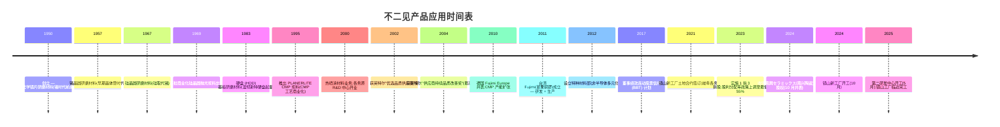

# Fujimi Incorporated 不二见 (TSE:5384) — 公司研究报告

**日期：** 2026-05-26
**分析师：** 独立研究
**上市地：** 东京证券交易所 Prime 市场；名古屋证券交易所 Premier 市场 — 证券代码 5384

---

## 目录

1. 公司概览
2. 公司历史
3. 管理团队
4. 产品与服务
5. 客户与上市策略
6. 行业概览
7. 竞争格局
8. 市场机会 (TAM)
9. 风险评估
10. 参考资料
11. 验证日志

---

## 1. 公司概览(约 1,000 字)

不二见股份有限公司(フジミインコーポレーテッド,Fujimi Incorporated)是一家日本特种化学品公司,主营**用于半导体与硬盘 (HDD) 制造工序的精密研磨材料 (precision abrasives) 与 CMP 后清洗化学品 (post-CMP cleaning chemistries)**,同时附带规模较小但增长较快的热喷涂材料 (thermal-spray materials) 与陶瓷粉末业务,服务非半导体的工业用途。公司在其英文 IR 页面将自己定位为"半导体晶圆研磨材料的全球领导者 (the world leader in polishing materials for semiconductor wafers)",同时供应上游单晶硅晶圆厂与下游器件晶圆厂 [Fujimi 公司简介 — Corporate Mission](https://www.fujimiinc.co.jp/english/company/index.html)。公司总部及创办工厂位于爱知县清须市西枇杷岛町地领 2-1-1,2024 年 3 月合并员工人数为 1,110 人,海外据点包括美国俄勒冈州 Tualatin、马来西亚吉林 Kulim、台湾苗栗县铜锣、德国 Ingelfingen 以及中国深圳,并于 2024 年新增并表了位于东京的 Nanko 研磨工业 (南興セラミックス) [《整合报告 2024》 "Corporate Profile" 第 57 页](https://www.ircms.jp/irexport/fujimiinc/file/a79408181419746.pdf)。

公司的收入模式是**通过多年度品质锁定式供货协议销售的一次性消耗品 (single-use consumables)**。每一根晶锭从研磨到晶圆、每一片器件晶圆经过一道 CMP 工序,都会消耗可计量的浆料量;一旦客户将不二见的某个等级合格化进入某道工序,切换成本就极高(先进节点 CMP 重新合格化通常需 6-18 个月,成品晶圆研磨则更长),因此营收会随着客户的晶圆投片量同比例放大。公司公布的四个分部按地理划分(日本、北美、亚洲、欧洲),但管理层另外披露了一份**按应用拆分的收入口径**,信息量更大:2025 财年(截至 2025 年 3 月)按应用收入为:硅晶圆研磨材料 204 亿日元、CMP 抛光液 / 浆料 (CMP slurry) 307 亿日元、硬盘基板抛光 25 亿日元、特种材料 / 热喷涂 / 通用工业品 87 亿日元 [FY2025 決算短信 (2025-05-13) 第 2 页](https://www.ircms.jp/irexport/fujimiinc/file/a80046653802235.pdf) 以及 [FY2025 财务概览演示 (2025-05-20) 第 18 页](https://www.ircms.jp/irexport/fujimiinc/file/a80176453635234.pdf)。半导体相关应用(硅 + CMP)因此占营收 **~82%**;管理层中期目标是把非半导体业务从 14% 提升至 2029 财年的 25%。

从地理结构看,**2024 财年海外销售占合并营收的 78%**,2025 财年大致保持在 78% 左右(日本 355 亿日元、海外 270 亿日元) [《整合报告 2024》 "Global Expansion" 第 12 页](https://www.ircms.jp/irexport/fujimiinc/file/a79408181419746.pdf)。仅"亚洲与大洋洲"目的地营收就达 407 亿日元(主要面向台湾、韩国、中国的存储与逻辑晶圆厂),北美 53 亿日元(英特尔、美光、德州的逻辑客户),欧洲 26 亿日元 [FY2025 财务概览第 27 页](https://www.ircms.jp/irexport/fujimiinc/file/a80176453635234.pdf)。目的地偏亚洲解释了为什么不二见的分部利润结构中**日本本土录得绝大部分营业利润**(2025 财年抵销前分部利润 149 亿日元中日本占 97 亿日元) — 海外销售办公室和子公司分得的制造毛利更薄,因为先进节点的 R&D 与配方开发集中在岐阜县各务原 (Kakamigahara) 总部 [FY2025 決算短信第 20 页 セグメント情報](https://www.ircms.jp/irexport/fujimiinc/file/a80046653802235.pdf)。

规模与单位经济性:2025 财年合并**净销售额 625 亿日元(同比 +21.5%),营业利润 117.8 亿日元(利润率 18.8%),归母净利润 94.3 亿日元(同比 +45.1%)** [FY2025 決算短信第 1 页](https://www.ircms.jp/irexport/fujimiinc/file/a80046653802235.pdf)。利润率较 2024 财年低点(营业利润率 16.0%,营收 514 亿日元)显著回升,但仍低于 2022/23 财年的 23.3% / 22.7% 高点 — 当时新冠居家办公需求拉动硅晶圆研磨材料的单价上涨。《整合报告》中的 11 年财务摘要清楚展示了周期性 — 这十年里营业利润率在 10% 至 24% 之间震荡 [《整合报告 2024》 "11-Year Financial Summary" 第 49-50 页](https://www.ircms.jp/irexport/fujimiinc/file/a79408181419746.pdf)。EBITDA 利润率在结构上比营业利润率高约 3 个百分点,因为折旧仅 20 亿日元(对 625 亿日元营收) — 反应器 + 过滤产线属于轻资产,而非像晶圆厂或器件厂那样资本密集。

资产负债表非常稳健:总资产 909 亿日元、净资产 769 亿日元、**股东权益比率 83.7%,无有息负债,现金及存款 279 亿日元**(2025 财年末) [FY2025 決算短信第 5-6 页](https://www.ircms.jp/irexport/fujimiinc/file/a80046653802235.pdf)。但格局正在变化。镜山新工厂(岐阜,占地 28,000 平米)于 2024 年 10 月动工,第二研发中心(16,000 平米)2025 年 5 月动工 — 2025 财年资本开支由 37 亿日元跃升至 128 亿日元,**管理层预计 2026 财年资本开支达 296 亿日元**,其中 224 亿日元为生产相关(国内投资 197 亿日元) [FY2025 财务概览第 33 页](https://www.ircms.jp/irexport/fujimiinc/file/a80176453635234.pdf)。FY2024-26 累计资本开支达 462 亿日元 — 比当初的 FY2024-29 中期计划高出 162 亿日元,既反映 AI 资本开支超级周期,也反映建材与人工费用上涨。现金可以覆盖建设支出,但 2026 财年的"经营现金流 / 资本开支"覆盖比将跌破 1.0×,因此股东权益比率会在建设期内显著下降。

### 估值快照 (截至 2026-05-26)

| 指标 | 数值 | 来源 |
|---|---|---|
| 股价 (2026-05-26 收盘) | JPY 3,735 | [Kabutan, 2026-05-26](https://en.kabutan.com/jp/stocks/5384/) |
| 市值 | ~JPY 2,770 亿 (US$ 18.8 亿) | [Kabutan, 2026-05-26](https://en.kabutan.com/jp/stocks/5384/) |
| TTM 市盈率 | 26.6× | [Kabutan, 2026-05-26](https://en.kabutan.com/jp/stocks/5384/) |
| 市净率 | 3.30× | [Kabutan, 2026-05-26](https://en.kabutan.com/jp/stocks/5384/) |
| 股息率 | 2.06% (¥73.34 DPS / ¥3,735) | [FY2025 決算短信第 1 页](https://www.ircms.jp/irexport/fujimiinc/file/a80046653802235.pdf) |
| FY2025 ROE | 12.7% | [FY2025 決算短信第 1 页](https://www.ircms.jp/irexport/fujimiinc/file/a80046653802235.pdf) |
| FY2025 EBITDA 利润率 | 22.1% | [FY2025 财务概览第 12 页](https://www.ircms.jp/irexport/fujimiinc/file/a80176453635234.pdf) |
| 52 周高点(拆股后) | 3,261 → 已突破(现 ¥3,735) | [Kabutan, 2026-05-26](https://en.kabutan.com/jp/stocks/5384/) |

*分析师观点:* 26.6× TTM 估值倍数**高于不二见自身三年中位数(穿越 2024 财年谷底约 17×)**,与区域内特种化工同业大致持平 — TSE Prime 半导体材料板块中位数约 28× — 但远低于先进节点 CMP 浆料龙头如安集科技(688019.SH,根据野村 2026 年 5 月《大中华半导体》 报告 FY27F 约 42×)或鼎龙股份(300054.SZ,同报告 FY27F 约 96×)所获得的 40-50× 估值。相对于自身历史的溢价可以由 AI 驱动的 CMP 出货量增长以及 2026 财年产能扩张叙事来解释,但绝对估值倍数**并未隐含先进节点份额获取的故事** — 市场把不二见定位为成熟 CMP 与硅晶圆浆料的稳健在位龙头,而非高速增长的先进节点份额夺取者。2027F 半导体资本开支回落是最主要的下行重估风险;464 亿日元产能在营收持平时的折旧吞噬是最合理的空头情境。

*来源:[《整合报告 2024》 第 49-50 页](https://www.ircms.jp/irexport/fujimiinc/file/a79408181419746.pdf) 与 [FY2025 财务概览第 16 页](https://www.ircms.jp/irexport/fujimiinc/file/a80176453635234.pdf)。FY26F = 公司指引。*

---

## 2. 公司历史 (约 600 字)

不二见**创立于 1950 年**,由**创始人腰山照二 (Teruji Koshiyama)** 在爱知县名古屋创办,最初为**光学镜片**生产精密研磨粉 — 根据公司自述:"应一家光学设备制造商的请求,他开始研发用于光学玻璃产品(如瞄准镜镜片)的研磨材料。他成功完成商品化,投产了日本国产首批合成精密研磨剂" [《整合报告 2024》 "Growth Trajectory" 第 7 页](https://www.ircms.jp/irexport/fujimiinc/file/a79408181419746.pdf)。公司于 **1953 年 3 月 20 日**以股份公司形式正式登记,总部及枇杷岛工厂位于爱知县清须市 — 与今日同一地点 [《整合报告 2024》 "Corporate Profile" 第 57 页](https://www.ircms.jp/irexport/fujimiinc/file/a79408181419746.pdf)。"フジミ (Fujimi)"之名源于该地区可远眺富士山的传统;创始人个人设立的基金会**腰山科技奖励基金 (Koshiyama Science and Technology Foundation)** 仍持有 2.3% 股份,创始人控股公司**コーマ株式会社 (Koma Co., Ltd.) 是第一大股东,持股 17.7%** — 公司至今仍是创始人家族控制的企业 [《整合报告 2024》 "Stock Information" 第 57 页](https://www.ircms.jp/irexport/fujimiinc/file/a79408181419746.pdf)。

产品线沿着战后日本电子产业链不断演进:

两次产品转型定义了今日的公司形态。**第一次**发生在 1995 年,推出 **PLANERLITE 系列 (Fujimi 浆料品牌) (PLANERLITE Series)** CMP 浆料,恰逢 CMP 从 IBM/Intel 内部专利诀窍走向晶圆代工主流工序的拐点。各务原 R&D 中心 2000 年开业时,即配备与客户晶圆厂相同的 Class-100 洁净室和摩擦力实验设备,让不二见可与英特尔、三星、台积电同步进行双盲 A/B 浆料试验 — 2002 年不二见获英特尔"优选品质供应商"奖,2004 年获"供应商持续品质改善奖" [《整合报告 2024》 "Growth Trajectory" 第 7 页](https://www.ircms.jp/irexport/fujimiinc/file/a79408181419746.pdf)。CMP 业务从早期的边缘项目成长为合并营收的约一半(2025 财年 307 亿 / 625 亿 = 49%)。

**第二次转型**节奏更慢:2000 年的**热喷涂材料业务**和近年新设的**先进技术与特种材料部**旨在将公司在粉体控制方面的核心能力延伸至非研磨领域(3D 打印用超硬金属陶瓷粉末、散热陶瓷粉末、汽车抛光膏)。非半导体营收目前仅占整体约 15%,但管理层 2029 财年的目标是 25%,而 **2024 年 10 月收购的 Nanko 研磨工业(总部东京,通用工业研磨,75% 持股)**是多年来首次 M&A 动作,带来了盈利的研磨产品组合,以及钢铁、汽车与建筑玻璃抛光的客户名单 [社长致辞,《整合报告 2024》 第 4 页](https://www.ircms.jp/irexport/fujimiinc/file/a79408181419746.pdf)。

11 年财务摘要展示了清晰的时间线:特朗普一期贸易战(FY2019-20 持平)、新冠 / 居家办公需求爆发(FY2021-23 — 营收从 380 亿至 580 亿日元,营业利润率从 16% 至 23%)、2023 年库存调整(FY2024 营收 -12%、营业利润 -38%)、AI 再加速(FY2025 营收 +21.5%、营业利润 +43%) [《整合报告 2024》 第 49-50 页](https://www.ircms.jp/irexport/fujimiinc/file/a79408181419746.pdf)。

---

## 3. 管理团队 (约 400 字)

**创始人 — 腰山照二 (Teruji Koshiyama)**。1950 年至 1980 年代初担任创始人 CEO,确立了延续至今的"以客户为先的研磨专家"文化。腰山家族的控股公司**コーマ株式会社 (Koma Co., Ltd.)** 持股 17.7%,加上家族相关的腰山基金会和不二见供应商持股会等附属持股工具,创始人家族体系合计持股约 22% — 即便当前董事会已无腰山家族成员,公司仍然是一家以创始人家族为锚的企业 [《整合报告 2024》 "Stock Information" 第 57 页](https://www.ircms.jp/irexport/fujimiinc/file/a79408181419746.pdf)。外部董事在 2024 财年治理对话中指出"不二见的股东构成存在较强的家族色彩",但赞许由此形成的透明文化是"对公平性更高承诺的体现" [《整合报告 2024》 "Dialogue with Outside Directors" 第 39-41 页](https://www.ircms.jp/irexport/fujimiinc/file/a79408181419746.pdf)。腰山照二本人早已不再参与经营,2000 年代初已故,以他命名的基金会现资助爱知县的科学奖学金。

**社长兼 CEO — 现任社长关圭志 (Keishi Seki)** (自 **2008 年 4 月**上任,现任期已达 18 年 — 在日本上市公司中属罕见的长任期)。关圭志 **1989 年 4 月**进入富士银行(现瑞穗银行) 工作了 8 年,**1997 年 10 月**加入不二见,几乎立即外派,**2000 年 2 月起担任 Fujimi Corporation (美国俄勒冈州 Tualatin) 总裁**。回日本后历任**新事业开发部部长(2003 年董事 & 高级总经理)**、**CMP 事业部部长(2005 年 4 月董事 & 高级总经理)** — 也就是说,他在 CMP 业务扩张阶段亲自带队,直到 2008 年 4 月升任社长兼 CEO。从 2013 年 1 月起兼任 Fujimi Korea Limited (现已关闭)总裁,从 2013 年 8 月起兼任 Fujimi Taiwan Limited 总裁 — 这种"同时担任三家子公司总裁"的结构是为了在亚洲布局推动集成式决策 [《整合报告 2024》 "Directors and Auditors" 第 47-48 页](https://www.ircms.jp/irexport/fujimiinc/file/a79408181419746.pdf)。

关圭志的标志性成就是**2008-2011 年硅晶圆品质危机的恢复**。他在自己发表的文章中提到:"我 2008 年接任社长时,正面临严峻挑战 — 随着硅晶圆直径从 8 英寸(200 毫米)升级到 12 英寸(300 毫米),我们未能跟上客户日益苛刻的品质要求"。当时不二见的硅晶圆研磨材料份额约 90%,却因规格升级而开始流失,叠加全球金融危机与硅周期下行。应对之策是成立 **Monozukuri 推进室 (Monozukuri Promotion Office,2009 年设立)** — 这是跨职能的品质 / 制程管理组织 — 并全面重写品质创造流程与管理体系;此后份额稳定在 84-92% 区间 [社长致辞,《整合报告 2024》 第 4 页](https://www.ircms.jp/irexport/fujimiinc/file/a79408181419746.pdf)。关圭志个人持股 1,323 千股(占 2024 年 3 月发行股的 1.7%,按当前股价约 50 亿日元)— 在日本央行式工资加股票信托 (BBT) 之外的直接利益绑定 [《整合报告 2024》 "Leading Shareholders" 第 57 页](https://www.ircms.jp/irexport/fujimiinc/file/a79408181419746.pdf)。

---
