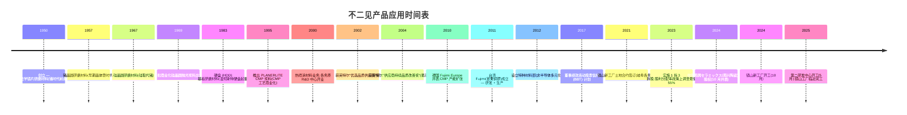
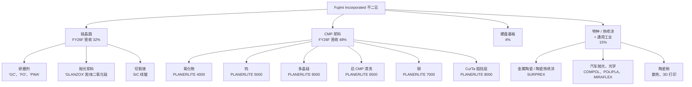

# Fujimi Incorporated 不二见 (TSE:5384) — 公司研究报告

**日期：** 2026-05-26
**分析师：** 独立研究
**上市地：** 东京证券交易所 Prime 市场；名古屋证券交易所 Premier 市场 — 证券代码 5384

---

## 目录

1. 公司概览
2. 公司历史
3. 管理团队
4. 产品与服务
5. 客户与上市策略
6. 行业概览
7. 竞争格局
8. 市场机会 (TAM)
9. 风险评估
10. 参考资料
11. 验证日志

---

## 1. 公司概览(约 1,000 字)

不二见股份有限公司(フジミインコーポレーテッド,Fujimi Incorporated)是一家日本特种化学品公司,主营**用于半导体与硬盘 (HDD) 制造工序的精密研磨材料 (precision abrasives) 与 CMP 后清洗化学品 (post-CMP cleaning chemistries)**,同时附带规模较小但增长较快的热喷涂材料 (thermal-spray materials) 与陶瓷粉末业务,服务非半导体的工业用途。公司在其英文 IR 页面将自己定位为"半导体晶圆研磨材料的全球领导者 (the world leader in polishing materials for semiconductor wafers)",同时供应上游单晶硅晶圆厂与下游器件晶圆厂 [Fujimi 公司简介 — Corporate Mission](https://www.fujimiinc.co.jp/english/company/index.html)。公司总部及创办工厂位于爱知县清须市西枇杷岛町地领 2-1-1,2024 年 3 月合并员工人数为 1,110 人,海外据点包括美国俄勒冈州 Tualatin、马来西亚吉林 Kulim、台湾苗栗县铜锣、德国 Ingelfingen 以及中国深圳,并于 2024 年新增并表了位于东京的 Nanko 研磨工业 (南興セラミックス) [《整合报告 2024》 "Corporate Profile" 第 57 页](https://www.ircms.jp/irexport/fujimiinc/file/a79408181419746.pdf)。

公司的收入模式是**通过多年度品质锁定式供货协议销售的一次性消耗品 (single-use consumables)**。每一根晶锭从研磨到晶圆、每一片器件晶圆经过一道 CMP 工序,都会消耗可计量的浆料量;一旦客户将不二见的某个等级合格化进入某道工序,切换成本就极高(先进节点 CMP 重新合格化通常需 6-18 个月,成品晶圆研磨则更长),因此营收会随着客户的晶圆投片量同比例放大。公司公布的四个分部按地理划分(日本、北美、亚洲、欧洲),但管理层另外披露了一份**按应用拆分的收入口径**,信息量更大:2025 财年(截至 2025 年 3 月)按应用收入为:硅晶圆研磨材料 204 亿日元、CMP 抛光液 / 浆料 (CMP slurry) 307 亿日元、硬盘基板抛光 25 亿日元、特种材料 / 热喷涂 / 通用工业品 87 亿日元 [FY2025 決算短信 (2025-05-13) 第 2 页](https://www.ircms.jp/irexport/fujimiinc/file/a80046653802235.pdf) 以及 [FY2025 财务概览演示 (2025-05-20) 第 18 页](https://www.ircms.jp/irexport/fujimiinc/file/a80176453635234.pdf)。半导体相关应用(硅 + CMP)因此占营收 **~82%**;管理层中期目标是把非半导体业务从 14% 提升至 2029 财年的 25%。

从地理结构看,**2024 财年海外销售占合并营收的 78%**,2025 财年大致保持在 78% 左右(日本 355 亿日元、海外 270 亿日元) [《整合报告 2024》 "Global Expansion" 第 12 页](https://www.ircms.jp/irexport/fujimiinc/file/a79408181419746.pdf)。仅"亚洲与大洋洲"目的地营收就达 407 亿日元(主要面向台湾、韩国、中国的存储与逻辑晶圆厂),北美 53 亿日元(英特尔、美光、德州的逻辑客户),欧洲 26 亿日元 [FY2025 财务概览第 27 页](https://www.ircms.jp/irexport/fujimiinc/file/a80176453635234.pdf)。目的地偏亚洲解释了为什么不二见的分部利润结构中**日本本土录得绝大部分营业利润**(2025 财年抵销前分部利润 149 亿日元中日本占 97 亿日元) — 海外销售办公室和子公司分得的制造毛利更薄,因为先进节点的 R&D 与配方开发集中在岐阜县各务原 (Kakamigahara) 总部 [FY2025 決算短信第 20 页 セグメント情報](https://www.ircms.jp/irexport/fujimiinc/file/a80046653802235.pdf)。

规模与单位经济性:2025 财年合并**净销售额 625 亿日元(同比 +21.5%),营业利润 117.8 亿日元(利润率 18.8%),归母净利润 94.3 亿日元(同比 +45.1%)** [FY2025 決算短信第 1 页](https://www.ircms.jp/irexport/fujimiinc/file/a80046653802235.pdf)。利润率较 2024 财年低点(营业利润率 16.0%,营收 514 亿日元)显著回升,但仍低于 2022/23 财年的 23.3% / 22.7% 高点 — 当时新冠居家办公需求拉动硅晶圆研磨材料的单价上涨。《整合报告》中的 11 年财务摘要清楚展示了周期性 — 这十年里营业利润率在 10% 至 24% 之间震荡 [《整合报告 2024》 "11-Year Financial Summary" 第 49-50 页](https://www.ircms.jp/irexport/fujimiinc/file/a79408181419746.pdf)。EBITDA 利润率在结构上比营业利润率高约 3 个百分点,因为折旧仅 20 亿日元(对 625 亿日元营收) — 反应器 + 过滤产线属于轻资产,而非像晶圆厂或器件厂那样资本密集。

资产负债表非常稳健:总资产 909 亿日元、净资产 769 亿日元、**股东权益比率 83.7%,无有息负债,现金及存款 279 亿日元**(2025 财年末) [FY2025 決算短信第 5-6 页](https://www.ircms.jp/irexport/fujimiinc/file/a80046653802235.pdf)。但格局正在变化。镜山新工厂(岐阜,占地 28,000 平米)于 2024 年 10 月动工,第二研发中心(16,000 平米)2025 年 5 月动工 — 2025 财年资本开支由 37 亿日元跃升至 128 亿日元,**管理层预计 2026 财年资本开支达 296 亿日元**,其中 224 亿日元为生产相关(国内投资 197 亿日元) [FY2025 财务概览第 33 页](https://www.ircms.jp/irexport/fujimiinc/file/a80176453635234.pdf)。FY2024-26 累计资本开支达 462 亿日元 — 比当初的 FY2024-29 中期计划高出 162 亿日元,既反映 AI 资本开支超级周期,也反映建材与人工费用上涨。现金可以覆盖建设支出,但 2026 财年的"经营现金流 / 资本开支"覆盖比将跌破 1.0×,因此股东权益比率会在建设期内显著下降。

### 估值快照 (截至 2026-05-26)

| 指标 | 数值 | 来源 |
|---|---|---|
| 股价 (2026-05-26 收盘) | JPY 3,735 | [Kabutan, 2026-05-26](https://en.kabutan.com/jp/stocks/5384/) |
| 市值 | ~JPY 2,770 亿 (US$ 18.8 亿) | [Kabutan, 2026-05-26](https://en.kabutan.com/jp/stocks/5384/) |
| TTM 市盈率 | 26.6× | [Kabutan, 2026-05-26](https://en.kabutan.com/jp/stocks/5384/) |
| 市净率 | 3.30× | [Kabutan, 2026-05-26](https://en.kabutan.com/jp/stocks/5384/) |
| 股息率 | 2.06% (¥73.34 DPS / ¥3,735) | [FY2025 決算短信第 1 页](https://www.ircms.jp/irexport/fujimiinc/file/a80046653802235.pdf) |
| FY2025 ROE | 12.7% | [FY2025 決算短信第 1 页](https://www.ircms.jp/irexport/fujimiinc/file/a80046653802235.pdf) |
| FY2025 EBITDA 利润率 | 22.1% | [FY2025 财务概览第 12 页](https://www.ircms.jp/irexport/fujimiinc/file/a80176453635234.pdf) |
| 52 周高点(拆股后) | 3,261 → 已突破(现 ¥3,735) | [Kabutan, 2026-05-26](https://en.kabutan.com/jp/stocks/5384/) |

*分析师观点:* 26.6× TTM 估值倍数**高于不二见自身三年中位数(穿越 2024 财年谷底约 17×)**,与区域内特种化工同业大致持平 — TSE Prime 半导体材料板块中位数约 28× — 但远低于先进节点 CMP 浆料龙头如安集科技(688019.SH,根据野村 2026 年 5 月《大中华半导体》 报告 FY27F 约 42×)或鼎龙股份(300054.SZ,同报告 FY27F 约 96×)所获得的 40-50× 估值。相对于自身历史的溢价可以由 AI 驱动的 CMP 出货量增长以及 2026 财年产能扩张叙事来解释,但绝对估值倍数**并未隐含先进节点份额获取的故事** — 市场把不二见定位为成熟 CMP 与硅晶圆浆料的稳健在位龙头,而非高速增长的先进节点份额夺取者。2027F 半导体资本开支回落是最主要的下行重估风险;464 亿日元产能在营收持平时的折旧吞噬是最合理的空头情境。

*来源:[《整合报告 2024》 第 49-50 页](https://www.ircms.jp/irexport/fujimiinc/file/a79408181419746.pdf) 与 [FY2025 财务概览第 16 页](https://www.ircms.jp/irexport/fujimiinc/file/a80176453635234.pdf)。FY26F = 公司指引。*

---

## 2. 公司历史 (约 600 字)

不二见**创立于 1950 年**,由**创始人腰山照二 (Teruji Koshiyama)** 在爱知县名古屋创办,最初为**光学镜片**生产精密研磨粉 — 根据公司自述:"应一家光学设备制造商的请求,他开始研发用于光学玻璃产品(如瞄准镜镜片)的研磨材料。他成功完成商品化,投产了日本国产首批合成精密研磨剂" [《整合报告 2024》 "Growth Trajectory" 第 7 页](https://www.ircms.jp/irexport/fujimiinc/file/a79408181419746.pdf)。公司于 **1953 年 3 月 20 日**以股份公司形式正式登记,总部及枇杷岛工厂位于爱知县清须市 — 与今日同一地点 [《整合报告 2024》 "Corporate Profile" 第 57 页](https://www.ircms.jp/irexport/fujimiinc/file/a79408181419746.pdf)。"フジミ (Fujimi)"之名源于该地区可远眺富士山的传统;创始人个人设立的基金会**腰山科技奖励基金 (Koshiyama Science and Technology Foundation)** 仍持有 2.3% 股份,创始人控股公司**コーマ株式会社 (Koma Co., Ltd.) 是第一大股东,持股 17.7%** — 公司至今仍是创始人家族控制的企业 [《整合报告 2024》 "Stock Information" 第 57 页](https://www.ircms.jp/irexport/fujimiinc/file/a79408181419746.pdf)。

产品线沿着战后日本电子产业链不断演进:

两次产品转型定义了今日的公司形态。**第一次**发生在 1995 年,推出 **PLANERLITE 系列 (Fujimi 浆料品牌) (PLANERLITE Series)** CMP 浆料,恰逢 CMP 从 IBM/Intel 内部专利诀窍走向晶圆代工主流工序的拐点。各务原 R&D 中心 2000 年开业时,即配备与客户晶圆厂相同的 Class-100 洁净室和摩擦力实验设备,让不二见可与英特尔、三星、台积电同步进行双盲 A/B 浆料试验 — 2002 年不二见获英特尔"优选品质供应商"奖,2004 年获"供应商持续品质改善奖" [《整合报告 2024》 "Growth Trajectory" 第 7 页](https://www.ircms.jp/irexport/fujimiinc/file/a79408181419746.pdf)。CMP 业务从早期的边缘项目成长为合并营收的约一半(2025 财年 307 亿 / 625 亿 = 49%)。

**第二次转型**节奏更慢:2000 年的**热喷涂材料业务**和近年新设的**先进技术与特种材料部**旨在将公司在粉体控制方面的核心能力延伸至非研磨领域(3D 打印用超硬金属陶瓷粉末、散热陶瓷粉末、汽车抛光膏)。非半导体营收目前仅占整体约 15%,但管理层 2029 财年的目标是 25%,而 **2024 年 10 月收购的 Nanko 研磨工业(总部东京,通用工业研磨,75% 持股)**是多年来首次 M&A 动作,带来了盈利的研磨产品组合,以及钢铁、汽车与建筑玻璃抛光的客户名单 [社长致辞,《整合报告 2024》 第 4 页](https://www.ircms.jp/irexport/fujimiinc/file/a79408181419746.pdf)。

11 年财务摘要展示了清晰的时间线:特朗普一期贸易战(FY2019-20 持平)、新冠 / 居家办公需求爆发(FY2021-23 — 营收从 380 亿至 580 亿日元,营业利润率从 16% 至 23%)、2023 年库存调整(FY2024 营收 -12%、营业利润 -38%)、AI 再加速(FY2025 营收 +21.5%、营业利润 +43%) [《整合报告 2024》 第 49-50 页](https://www.ircms.jp/irexport/fujimiinc/file/a79408181419746.pdf)。

---

## 3. 管理团队 (约 400 字)

**创始人 — 腰山照二 (Teruji Koshiyama)**。1950 年至 1980 年代初担任创始人 CEO,确立了延续至今的"以客户为先的研磨专家"文化。腰山家族的控股公司**コーマ株式会社 (Koma Co., Ltd.)** 持股 17.7%,加上家族相关的腰山基金会和不二见供应商持股会等附属持股工具,创始人家族体系合计持股约 22% — 即便当前董事会已无腰山家族成员,公司仍然是一家以创始人家族为锚的企业 [《整合报告 2024》 "Stock Information" 第 57 页](https://www.ircms.jp/irexport/fujimiinc/file/a79408181419746.pdf)。外部董事在 2024 财年治理对话中指出"不二见的股东构成存在较强的家族色彩",但赞许由此形成的透明文化是"对公平性更高承诺的体现" [《整合报告 2024》 "Dialogue with Outside Directors" 第 39-41 页](https://www.ircms.jp/irexport/fujimiinc/file/a79408181419746.pdf)。腰山照二本人早已不再参与经营,2000 年代初已故,以他命名的基金会现资助爱知县的科学奖学金。

**社长兼 CEO — 现任社长关圭志 (Keishi Seki)** (自 **2008 年 4 月**上任,现任期已达 18 年 — 在日本上市公司中属罕见的长任期)。关圭志 **1989 年 4 月**进入富士银行(现瑞穗银行) 工作了 8 年,**1997 年 10 月**加入不二见,几乎立即外派,**2000 年 2 月起担任 Fujimi Corporation (美国俄勒冈州 Tualatin) 总裁**。回日本后历任**新事业开发部部长(2003 年董事 & 高级总经理)**、**CMP 事业部部长(2005 年 4 月董事 & 高级总经理)** — 也就是说,他在 CMP 业务扩张阶段亲自带队,直到 2008 年 4 月升任社长兼 CEO。从 2013 年 1 月起兼任 Fujimi Korea Limited (现已关闭)总裁,从 2013 年 8 月起兼任 Fujimi Taiwan Limited 总裁 — 这种"同时担任三家子公司总裁"的结构是为了在亚洲布局推动集成式决策 [《整合报告 2024》 "Directors and Auditors" 第 47-48 页](https://www.ircms.jp/irexport/fujimiinc/file/a79408181419746.pdf)。

关圭志的标志性成就是**2008-2011 年硅晶圆品质危机的恢复**。他在自己发表的文章中提到:"我 2008 年接任社长时,正面临严峻挑战 — 随着硅晶圆直径从 8 英寸(200 毫米)升级到 12 英寸(300 毫米),我们未能跟上客户日益苛刻的品质要求"。当时不二见的硅晶圆研磨材料份额约 90%,却因规格升级而开始流失,叠加全球金融危机与硅周期下行。应对之策是成立 **Monozukuri 推进室 (Monozukuri Promotion Office,2009 年设立)** — 这是跨职能的品质 / 制程管理组织 — 并全面重写品质创造流程与管理体系;此后份额稳定在 84-92% 区间 [社长致辞,《整合报告 2024》 第 4 页](https://www.ircms.jp/irexport/fujimiinc/file/a79408181419746.pdf)。关圭志个人持股 1,323 千股(占 2024 年 3 月发行股的 1.7%,按当前股价约 50 亿日元)— 在日本央行式工资加股票信托 (BBT) 之外的直接利益绑定 [《整合报告 2024》 "Leading Shareholders" 第 57 页](https://www.ircms.jp/irexport/fujimiinc/file/a79408181419746.pdf)。

---

## 4. 产品与服务 (约 1,500 字)

> 第 4 章是本报告的分析骨架。不二见的产品矩阵是后续章节理解的镜头:第 5 章(客户 — 谁买什么)、第 6 章(行业 — 哪些晶圆工序需要哪种浆料)、第 7 章(竞争 — 谁能提供同等级产品)、第 8 章(TAM — 不二见能服务多大市场)、第 9 章(风险 — 哪些产品最易商品化)都依赖第 4 章的产品理解。

### 4.1 不二见产品矩阵(锚定整合报告)

最清晰的产品分类来自**《整合报告 2024》第 13-14 页"Our Fields of Activity"** 加上面向客户的 **CMP 浆料产品阵容页面 (fujimiinc.co.jp/english/service/cmp/lineup.html)**。矩阵把每一个不二见产品系列映射到客户的工序步骤:

| 系列 | 应用工序 | 子产品 / SKU | 终端市场 | 已披露份额 |
|---|---|---|---|---|
| **硅晶圆 — 研磨 (Lapping)** | 切片后大尺寸去硅 | `GC`、`FO`、`PWA`、氧化铝/碳化硅基研磨剂 | 硅晶圆厂(信越、SUMCO、环球晶圆、Siltronic、SK Siltron) | **全球 92%** |
| **硅晶圆 — 抛光 (Polishing)** | 镜面精加工(去除 + 终抛) | `GLANZOX` 胶体二氧化硅、低缺陷化学体系 | 同上 | **全球 84%**(终抛),**59%**(去除式抛光) |
| **硅晶圆 — 切割 (浆料)** | 用线锯切割晶锭 | SiC 基线锯切割液 | 同上;SiC 晶圆厂 | 重要;绝对营收较小(FY25 1.75 亿日元) |
| **CMP — 氧化物浆料** | 层间介电 (ILD) 平坦化 | `PLANERLITE 4000` 系列 | 逻辑 + 存储 IDM 与代工厂 | 氧化物 CMP 联合龙头;**前道 (FEOL, Front End Of Line) 浆料全球份额 56%** |
| **CMP — 钨浆料 (tungsten slurry)** | W 插塞 / 接触平坦化 | `PLANERLITE 5000` 系列 | 同上 | 全球 #2-#4 |
| **CMP — 多晶硅 (FEOL) 浆料** | 多晶硅栅极 / 浅沟槽隔离 | `PLANERLITE 6000` 系列 + `PLANERLITE 6500` 后清洗 | 逻辑代工厂(台积电、三星代工、英特尔、GF) | **前道多晶硅浆料全球 >50%** |
| **CMP — 铜浆料 (copper slurry)** | Cu 互连(BEOL,后道)大除去 + 终抛 | `PLANERLITE 7000` 系列 | 逻辑 IDM / 代工厂 | #4-#5;商品化 |
| **CMP — Cu/Ta 阻挡层浆料** | 阻挡层平坦化 | `PLANERLITE 8000` 系列 | 同上 | #3-#4 |
| **HDD — 硬盘基板抛光** | 铝 / 玻璃基板毛坯抛光 | `DISKLITE` 系列 | HDD 介质厂(西部数据、昭和电工 HD 等) | 实质性;单位为数十亿日元级 |
| **特种 — 热喷涂粉末** | SPE 腔体、航空件、钢辊等离子喷涂 | 金属陶瓷、陶瓷复合、球状 / 片状 / 棒状陶瓷粉 | Lam、AMAT、TEL(SPE 腔体);航空、钢铁 | 细分市场溢价玩家 |
| **通用工业 — 研磨剂** | HDD 基板相邻 + 汽车涂装、光学、塑料 | `COMPOL`、`POLIPLA`、`SURPREX`、`MIRAFLEX` | 汽车 OEM、眼镜、蓝宝石基板 | 多元化 |
| **先进技术与特种材料** | 热管理用陶瓷粉末、3D 打印超硬金属陶瓷粉、新型填料 | 预商业化 / 早期 | 功率电子、增材制造 | 预收入 / 新业务 |

矩阵来源:[Fujimi CMP 浆料阵容页](https://www.fujimiinc.co.jp/english/service/cmp/lineup.html);[《整合报告 2024》 第 13-14 页 "Our Fields of Activity"](https://www.ircms.jp/irexport/fujimiinc/file/a79408181419746.pdf);[《整合报告 2024》 第 10 页 "Fujimi's Unique Qualities"](https://www.ircms.jp/irexport/fujimiinc/file/a79408181419746.pdf);[FY2025 決算短信第 2 页应用收入拆分](https://www.ircms.jp/irexport/fujimiinc/file/a80046653802235.pdf)。

### 4.2 综合 — 各品类如何在客户工作流中相互衔接

不二见的产品将**从单晶硅晶圆到器件晶圆的整套制造闭环**串联起来,公司接触至少三类客户(单晶到晶圆厂、器件晶圆厂、HDD 介质厂)。一片硅晶圆走完逻辑芯片之旅的流程是:信越 / SUMCO / 环球晶圆出的晶锭先用**线锯切割液**切片,再用 `GC` / `FO` 做**研磨 (lapping)** 保证平行度,再用 `GLANZOX` **胶体二氧化硅 (silica slurry)** 抛光做原子级平整度 — 全球任何一片满足逻辑级平整度要求的晶圆,在这一阶段都接触过不二见或其等同物的研磨剂。晶圆抵达台积电 / 三星 / 英特尔后,会经过约 10-15 道前道 (FEOL) CMP(多晶硅、STI、接触、栅极),再经过约 10 道后道 BEOL(氧化物 ILD、W 插塞、Cu 镶嵌、阻挡层去除)。每一道工序由一种 `PLANERLITE` 浆料物理平坦化晶圆表面 — 二氧化硅或**氧化铈浆料 (ceria slurry)** 颗粒在调好 pH、氧化剂浓度与表面活性剂用量的化学浴中与晶圆相对运动,选择性去除目标膜(氧化物、多晶硅、W、Cu)而不刮伤邻近膜。**后 CMP 冲洗(`PLANERLITE 6500`)随后剥离残余颗粒**,然后晶圆才被送往下一道沉积或光刻。HDD 介质基板使用单独的 `DISKLITE` 抛光浆料。非半导体的 `COMPOL` / `SURPREX` / 热喷涂系列复用不二见的粉末分级、造粒和化学品 IP,用于工业抛光和高性能涂层。

### 4.3 硅晶圆研磨材料 — 研磨、抛光、切割

> "本业务中,不二见研究、开发、制造并销售用于硅晶圆高精密研磨工序的研磨材料。这一工序使硅晶圆变得平整并镜面抛光,是走向半导体衬底的关键一步。为了满足客户日益精细的需求,我们在从切割到精抛的每一步都提供高品质产品与服务,构成完整的解决方案。" [《整合报告 2024》 "Silicon Business" 第 22 页](https://www.ircms.jp/irexport/fujimiinc/file/a79408181419746.pdf)

**通俗解释:** 一片半导体硅晶圆始于 300 毫米直径的圆柱形**单晶硅锭 (ingot)**,在信越、SUMCO 或环球晶圆通过 Czochralski (CZ, 直拉法) 工艺生长。晶锭被一台线锯切成晶圆,锯刀供给的是**切割液 (slicing slurry)**(含 SiC 颗粒)。每片晶圆的双面随后用 `GC` (绿色碳化硅) 或 `FO` (熔融氧化铝) 散粒研磨剂**研磨 (lapping)**,去除锯切损伤并把双面平行度做到亚微米。最后晶圆做**抛光 (polishing)** 出镜面 — 先做粗除去抛光,再用 `GLANZOX` **胶体二氧化硅 (colloidal silica)** 做最终抛光,达到原子级平整度(均方根粗糙度 < 0.1 nm)。不二见的附加值在于颗粒粒径分布控制(极窄 PSD、无超大颗粒以避免刮伤)、化学体系(氧化剂、分散剂、pH 稳定剂)以及驻厂式制程 know-how。战略拐点是:每一次从 200 毫米转 300 毫米再(终)至 450 毫米晶圆的代际跃迁都把浆料的难度门槛抬高;2025 年起 **SiC 晶圆服务于电动汽车功率器件**又打开一个独立的浆料市场 — 不二见已在美国 (Tualatin) 与马来西亚 (Kulim) 设立 SiC 浆料产能 [《整合报告 2024》 "Silicon Business" 第 22 页](https://www.ircms.jp/irexport/fujimiinc/file/a79408181419746.pdf) 与 [FY2025 财务概览第 30 页 "FUJIMI CORPORATION US"](https://www.ircms.jp/irexport/fujimiinc/file/a80176453635234.pdf)。

*分析师观点:* 不二见自己披露的份额 — **硅晶圆研磨剂全球 92%、终抛浆料 84%、去除式抛光浆料 59%** ([《整合报告 2024》 第 10 页](https://www.ircms.jp/irexport/fujimiinc/file/a79408181419746.pdf)) — 使该板块实质上成为研磨领域的全球准独占,以及抛光精加工领域的明确 #1。护城河有两层:技术(40 多年的客户级配方调优)加上切换成本(晶圆厂换浆料供应商意味着良率塌方风险 — 信越的晶圆客户不会接受"我们换了浆料供应商"作为日常注解)。最接近的合格竞争者是 JSR 公司在胶体二氧化硅抛光浆料,加上大型晶圆厂的内部替代;截至 2026 年中,尚无中国厂商在生产规模上合格化进入 300 毫米优质晶圆抛光。

*来源:[《整合报告 2024》 "Fujimi's Unique Qualities" 第 10 页](https://www.ircms.jp/irexport/fujimiinc/file/a79408181419746.pdf),不二见内部估计,数据截至 2024 年 3 月。*

### 4.4 CMP 浆料 — PLANERLITE 4000 / 5000 / 6000 / 6500 / 7000 / 8000 系列

> "本业务中,不二见研究、开发、制造并销售用于半导体器件制造工序的研磨材料。随着半导体器件性能、密度与集成度的提高,需要被研磨的膜种与 CMP 应用工序在不断增加。此外,为了提高近年来三维封装系统的性能,各类半导体器件三维堆叠技术兴起,CMP 在这一领域的使用也在被考虑。为了快速且精确地回应这些不断变化的市场需求,我们在日本、美国与台湾建立了制造与开发基地,毗邻客户的制造与开发基地。… 展望未来,我们要努力成为全球第一的前道 (FEOL) 浆料厂商。" [《整合报告 2024》 "CMP Business" 第 22 页](https://www.ircms.jp/irexport/fujimiinc/file/a79408181419746.pdf)

不二见的 CMP 浆料产品阵容,引述自公司面向客户的官网:

> - **PLANERLITE 4000 系列** — "氧化物膜浆料"
> - **PLANERLITE 5000 系列** — "钨 W 浆料"
> - **PLANERLITE 6000 系列** — "多晶硅 CMP 浆料"
> - **PLANERLITE 6500 系列** — "多晶硅膜颗粒去除冲洗浆料"
> - **PLANERLITE 7000 系列** — "铜 Cu 浆料"
> - **PLANERLITE 8000 系列** — "Cu/Ta 等阻挡层抛光浆料"
>
> 来源:[Fujimi CMP 浆料阵容页](https://www.fujimiinc.co.jp/english/service/cmp/lineup.html)。系列被描述为"高纯度、高分散、无划伤",并支持 FinFET、TSV、HKMG 以及新兴材料(III-V 化合物、钴、SiC、SiGe)的开发。

**通俗解释:化学机械抛光 (CMP, chemical-mechanical planarization)** 是在 10-20 层金属互连与层间介电层叠加的同时,把 300 毫米晶圆表面平整度保持在埃 (angstrom) 级的唯一实用方法。工艺把旋转的晶圆面朝下压在一块旋转的聚氨酯**抛光垫 (polishing pad)** 上,用**浆料 (slurry)** 灌入接触区:水基化学体系里悬浮的胶体研磨颗粒会选择性反应目标膜。两种物理机制并行:颗粒的机械磨损与表面的化学蚀刻;*选择性* — 也就是浆料对目标膜的去除速度比下层停止层快多少 — 是关键配方参数,也是核心知识产权。PLANERLITE-4000 使用对氮化硅停止层高选择性的 STI(浅沟槽隔离)氧化物用氧化铈研磨剂。PLANERLITE-5000 使用气相二氧化硅 + 双氧水化学体系,激进攻击钨插塞表面同时保护氧化物场区。PLANERLITE-6000 是胶体二氧化硅 + 胺基化学,专为栅极叠层流程中的多晶硅平坦化调校。PLANERLITE-6500 严格说不是浆料 — 它是**后 CMP 清洗化学品**,在进入下一工序前剥离残余颗粒、浆料副产物和金属离子。PLANERLITE-7000 系列处理 Cu 互连,用苯并三唑系腐蚀抑制剂加上超低缺陷的胶体二氧化硅或氧化铝。PLANERLITE-8000 用于 Cu 抛光后的 Cu/Ta 阻挡层去除步骤 — 选择性要求不同,因为阻挡金属 (Ta, TaN, Ti, TiN) 不对同一化学体系响应。战略拐点:**GAA (Gate-All-Around) 逻辑 N2/2 纳米**、**背面供电 (Backside Power Delivery, BPD)** 需要多次额外的晶圆键合 + 减薄(因而增加 CMP)、**HBM4 / DRAM-on-logic** 晶圆对晶圆键合 — 野村 2026 年 5 月《大中华半导体》研究预计**先进晶圆 CMP 工序数增加 20-30%** [野村《Greater China Semi》 2026-05-21 第 6-9 页(分析师锚定参考)](https://www.nomuraconnects.com/)。

*分析师观点:* 不二见的明确目标是**全球 FEOL 浆料 #1**(《整合报告 2024》 第 22 页)— 也就是前道工序中以多晶硅、STI 和接触浆料为主导。不二见已披露**前道浆料全球份额 56%、整体 CMP 浆料市场份额 13%**(《整合报告 2024》 第 10 页)。整体 CMP 浆料市场由领跑者**Entegris / CMC Materials** (2022 年 CMC 收购后约 28% 份额)、**Resonac / 昭和电工材料** (~18%)、**Versum Materials (默克 KGaA)** (~12%)、**不二见** (~11%) 以及崛起的中国挑战者**安集科技 (688019.SH, ~8%)** 和**鼎龙股份 (300054.SZ, ~6%)** 瓜分,另加韩国本地存储客户的 **KC Tech (Korea)** 和 **Soulbrain** (多源行业资料综合,引自 [野村《Greater China Semi》 2026-05-21 Fig 41](https://www.nomuraconnects.com/) 及供应商披露)。具体到**铜浆料 (PLANERLITE 7000)**,不二见是 #4-#5,且与 Cabot 微电子的 Cu 产品及 Versum 的 PASA 系列差异化有限。不二见最具防御性的位置是**基于氧化铈的 STI / 氧化物浆料和多晶硅浆料**,客户愿意为超低缺陷、低颗粒添加化学买单 — 这正是管理层押注的 FEOL 领导地位。镜山产能扩张(到 FY26 国内生产相关资本开支 220 亿日元)明确就是为"硅晶圆和 CMP 产品"增加产能 [FY2025 财务概览第 31 页](https://www.ircms.jp/irexport/fujimiinc/file/a80176453635234.pdf)。

*来源:[《整合报告 2024》 第 10 页](https://www.ircms.jp/irexport/fujimiinc/file/a79408181419746.pdf) 提供不二见自身 13% CMP 总份额;同行份额取自分析师综合(野村《Greater China Semi》 2026-05-21 Fig 41)与行业估算。*

### 4.5 硬盘基板抛光 — DISKLITE 系列

> "本业务中,不二见制造、研究、开发和销售用于硬盘 (HDD) 驱动器盘基板制造工序的研磨材料 — 硬盘驱动器是数字数据的存储介质。我们在马来西亚设立制造基地,毗邻客户密集的生产基地,通过当地技术人员配置和技术支持与客户建立信任关系。尽管硬盘驱动器近年来正在被固态硬盘 (SSD) 部分取代,但由于云服务与 5G 带来的传输容量预期增长,数据中心用硬盘的需求仍有望持续增加。" [《整合报告 2024》 "Hard Disk Substrate Business" 第 22 页](https://www.ircms.jp/irexport/fujimiinc/file/a79408181419746.pdf)

**通俗解释:** 一片 3.5 英寸的 HDD 盘片要么是铝合金,要么是玻璃盘,必须抛光到镜面(Ra < 0.5 nm),读写头才能在不撞表面的前提下贴 ~1 纳米飞行。不二见的 `DISKLITE` 系列提供盘基板阶段使用的抛光浆料,客户是介质厂(西部数据、昭和电工 HD)。最关键的需求变量:**数据中心 HDD 单盘容量**仍在上升(当前主力 SKU = 希捷的 32 TB HAMR 盘、西数 - 东芝的 30 TB CMR 盘),行业首次在十年内增加制造产能,因为 AI 训练数据集和云冷存储分层把近线 (nearline) HDD 出货推回上升轨道。不二见硬盘事业部 2025 财年**营收同比 +84% 至 25 亿日元**(FY2024 13.8 亿日元 → FY2025 25.5 亿日元) [FY2025 财务概览第 24 页](https://www.ircms.jp/irexport/fujimiinc/file/a80176453635234.pdf)。战略拐点:AI 数据中心重建推动近线 HDD 需求首次自 2020 年以来回升。风险:SSD(尤其是 YMTC、美光、三星的 QLC NAND)对同一用例形成竞争,HDD 长期趋势仍为下行。

*分析师观点:* HDD 在结构上是衰退的销量市场,但暂时是强势的金额市场 — 西数 4QFY24 (CY24) HDD 出货约 30 EB,是 2023 年低点的两倍,不二见明确指出"数据中心 HDD 需求"是 2025 财年的驱动力。除非再有结构性变化,该事业部不会回到 FY2017 年的 36 亿日元营收水位;FY2026 管理层指引**25.5 亿日元(同比持平)**,默认水位可能已经见顶 [FY2025 财务概览第 24 页](https://www.ircms.jp/irexport/fujimiinc/file/a80176453635234.pdf)。

### 4.6 特种材料、热喷涂、先进技术与 Nanko 并购

**热喷涂材料事业部**(2000 年成立)销售金属陶瓷与陶瓷粉末,用于在 (a) Lam、AMAT、TEL 的等离子蚀刻和 CVD 腔体内壁(即 SPE — 半导体生产设备子市场)、(b) 航空涡轮叶片、(c) 钢厂铸轧辊上做**等离子喷涂涂层**。本事业部是不二见从研磨进入非研磨粉末应用的入口,复用相同的粉体处理、造粒和烧结核心能力 [《整合报告 2024》 "Thermal Spray Materials Business" 第 23 页](https://www.ircms.jp/irexport/fujimiinc/file/a79408181419746.pdf)。

**抛光解决方案事业部**销售 `COMPOL`、`POLIPLA`、`SURPREX`、`MIRAFLEX` 等工业抛光膏,用于汽车涂装、眼镜镜片、蓝宝石基板等通用工业表面。2024 年 10 月收购的 **Nanko 研磨工业(75% 股权,作为子公司并表)**为该事业部新增了一份东京本部的通用工业研磨产品组合 — 明确动机是"提升研磨材料业务的盈利能力与竞争力" [社长致辞,《整合报告 2024》 第 4 页](https://www.ircms.jp/irexport/fujimiinc/file/a79408181419746.pdf),交易金额未披露,但通过 FY2025 现金流量表"子公司股票购入"项目下的 10.85 亿日元资金完成 [FY2025 決算短信第 11 页](https://www.ircms.jp/irexport/fujimiinc/file/a80046653802235.pdf)。

**先进技术与特种材料部**是多元化前沿 — 高散热陶瓷粉(功率电子封装)、形状受控陶瓷(球状 / 片状 / 棒状)、金属 3D 打印用超硬金属陶瓷粉 [《整合报告 2024》 "Advanced Technology & Specialty Materials" 第 23 页](https://www.ircms.jp/irexport/fujimiinc/file/a79408181419746.pdf)。2025 财年营收贡献尚小,但岐阜 Techno Plaza 在建的第二研发中心(FY2026 资本开支预算 47 亿日元)明确专注于非半导体研发 [FY2025 财务概览第 31 页](https://www.ircms.jp/irexport/fujimiinc/file/a80176453635234.pdf)。

### 4.7 收入韧性与产品组合份额结论

不同于资本支出周期依赖客户大额开支的半导体设备公司,不二见的浆料销售跟随**晶圆投片量**走,而晶圆投片量的周期性远小于设备出货量。11 年财务摘要显示即便在 FY2024 最差谷底,营收降幅也不到 12%;同期 Lam 与 AMAT 等设备厂下滑 30-40% [《整合报告 2024》 第 49-50 页](https://www.ircms.jp/irexport/fujimiinc/file/a79408181419746.pdf)。公司内部,**FY2026 营收结构大致为 CMP 48% / 硅晶圆 32% / 特种 15% / HDD 4%**;旗舰特许经营是 PLANERLITE 氧化物 + 多晶硅(CMP)和 GLANZOX(硅晶圆抛光)。过去 12 个月的路线图重点是 SiC 浆料产能(FY2026 美国 + 马来西亚)和 Nanko 整合后通用工业研磨产线。

*来源:[FY2025 财务概览演示第 26 页](https://www.ircms.jp/irexport/fujimiinc/file/a80176453635234.pdf)。*

---
