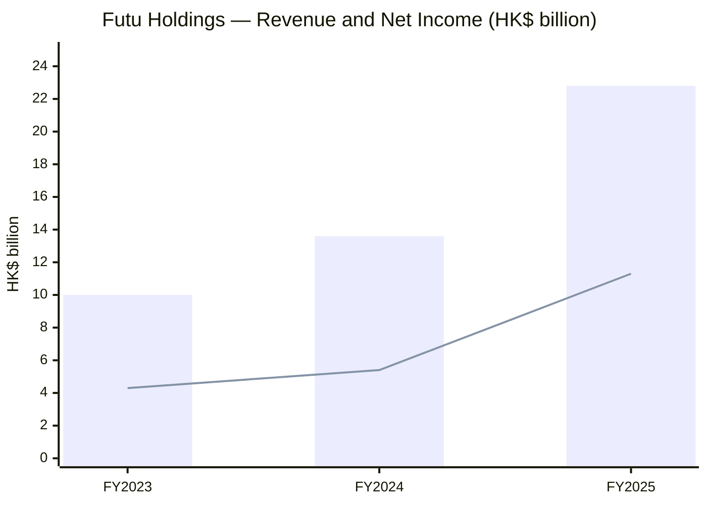
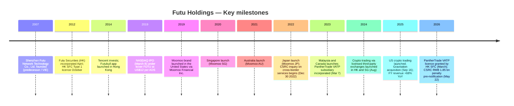
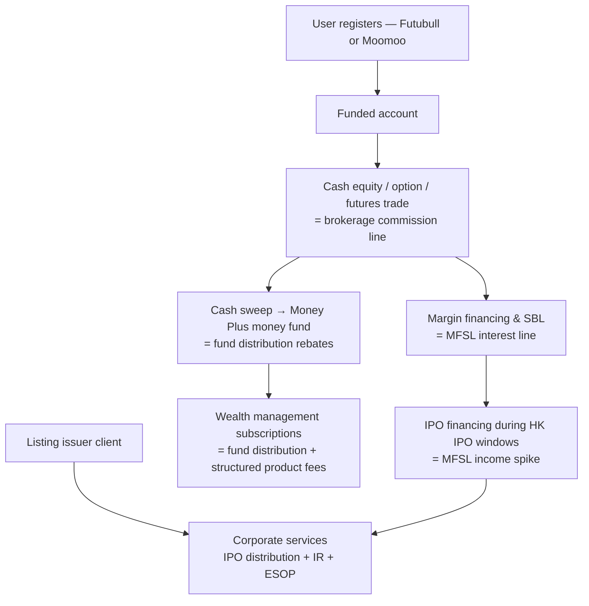
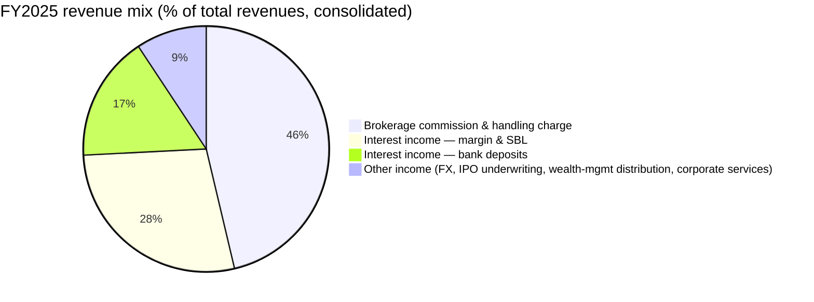
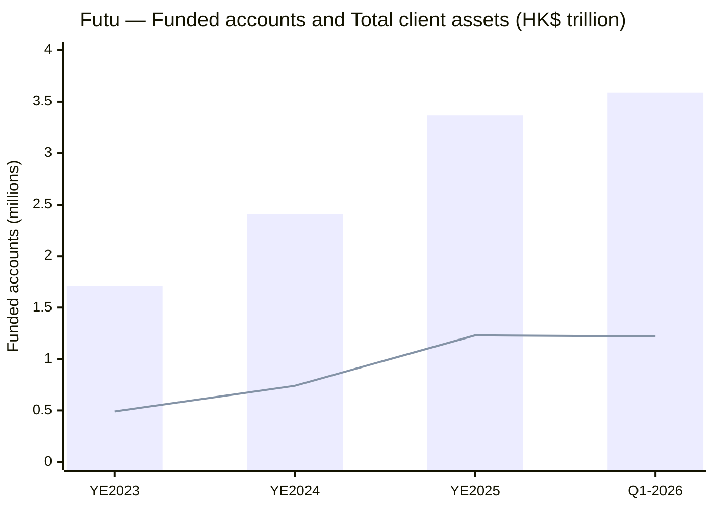
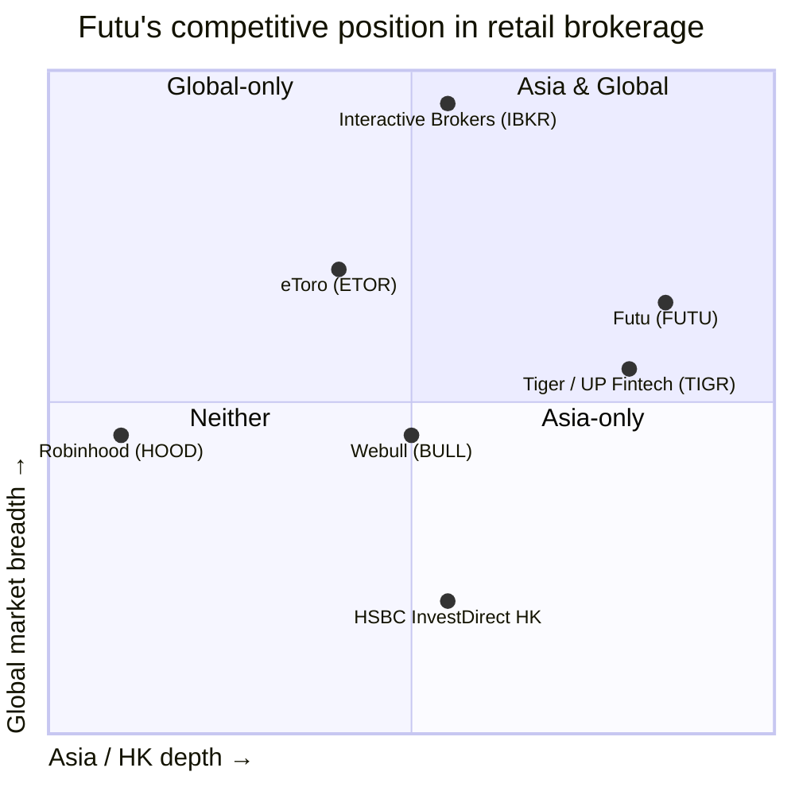
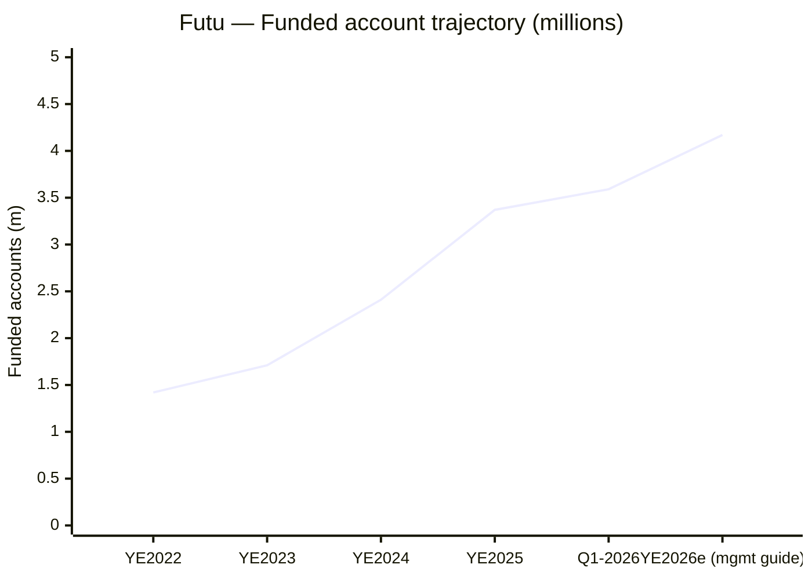

# Futu Holdings Limited (NASDAQ: FUTU) — Company Research

**As of date:** 2026-06-03
**Domicile / listing:** Cayman Islands holding company; ADSs listed on NASDAQ (1 ADS = 8 Class A ordinary shares).
**HQ:** 34/F United Centre, 95 Queensway, Admiralty, Hong Kong S.A.R., People's Republic of China.
**Fiscal year-end:** December 31. Reporting currency: HK$ (presented with US$ convenience translation at HK$7.7833 = US$1.00, per [Futu FY2025 20-F, "Conventions"](https://www.sec.gov/Archives/edgar/data/1754581/000110465926043451/futu-20251231x20f.htm)).

> **Update — Material regulatory event (2026-05-22):** On May 22, 2026, Futu received an *Administrative Penalty Pre-Notification Letter* from the China Securities Regulatory Commission's Shenzhen Bureau proposing a fine of approximately **RMB 1.85 billion (~US$271 million)** plus a personal **RMB 1.25 million** fine for chairman/CEO Leaf Hua Li, on allegations of operating securities, public fund-sales and futures businesses targeting Mainland China residents without the required PRC licences. The full amount was booked as a *subsequent-event adjustment* in Q1 2026 financials, causing reported net income to fall 61.2% YoY to HK$831.0 million. Excluding the penalty, Q1 2026 net income would have been **HK$2,922.0 million (US$372.7 million)**, up ~36% YoY. The proposed penalty is subject to representations / hearing / final determination by the CSRC. Source: [Q1-2026 6-K Exhibit 99.1, 2026-05-28](https://www.sec.gov/Archives/edgar/data/1754581/000110465926067159/tm2615605d1_ex99-1.htm); see also [Futu IR release, 2026-05-22](https://ir.futuholdings.com/news-releases/news-release-details/futu-receives-investigation-notice-and-administrative-penalty).

---

## Table of Contents

1. Company Overview
2. Company History
3. Management Team
4. Products & Services
5. Customers & Go-to-Market
6. Industry Overview
7. Competitive Landscape
8. Market Opportunity (TAM)
9. Risk Assessment
10. Investor-lens scorecards
- Data Used / 数据来源清单
- References
- Verification log (Step 10)

---

## 1. Company Overview

Futu Holdings Limited is a Cayman-incorporated, Hong Kong-headquartered, NASDAQ-listed technology company that operates a digital online brokerage and wealth-management platform. In its own words from the FY2025 annual filing, Futu offers *"trade execution and clearing, margin financing and securities lending, and wealth management"* delivered through two consumer-facing applications — **Futubull** (the Mainland China–origin brand, now positioned to Hong Kong / Macau / Mainland users) and **Moomoo** (the international brand serving the US, Singapore, Australia, Japan, Malaysia, Canada and other offshore markets) — and a corporate-services arm covering IPO distribution, ESOP administration and IR services ([FY2025 20-F, "About Futu Holdings Limited"](https://www.sec.gov/Archives/edgar/data/1754581/000110465926043451/futu-20251231x20f.htm)). Group revenue rose **68.1% YoY to HK$22,846.9 million (US$2,935.4 million) in FY2025** with net income up 108.0% YoY to **HK$11,301.9 million (US$1,452.1 million)**, per the FY2025 results press release ([Q4/FY2025 6-K Exhibit 99.1, 2026-03-12](https://www.sec.gov/Archives/edgar/data/1754581/000110465926026621/tm268330d1_ex99-1.htm)).

The business has three economic engines: (a) **brokerage commission and handling charge income** — the per-trade fee on equities, options, futures and certain ETFs — which contributed HK$10,572.7 million / 46.3% of FY2025 revenue; (b) **interest income from margin financing and securities-lending (MFSL)**, which contributed HK$6,368.7 million / 27.9%; and (c) **interest income from bank deposits**, which contributed HK$3,759.3 million / 16.5%. The remaining ~9% is "other income" — IPO distribution / underwriting fees, fund-distribution rebates, foreign-exchange income, and corporate services. The mix has shifted toward commission income and away from bank-deposit interest as Futu's client-asset base has scaled and as US dollar rates have begun to ease ([FY2025 20-F, Item 5 MD&A revenue composition](https://www.sec.gov/Archives/edgar/data/1754581/000110465926043451/futu-20251231x20f.htm)).

Operationally Futu now reaches **29.2 million registered users** with **3.37 million funded accounts** (up 39.6% YoY) and total client assets of **HK$1.23 trillion** (up 65.9% YoY) as of 2025-12-31; Q1 2026 adds another 225 thousand net funded accounts to 3.59 million ([Q4/FY2025 release](https://www.sec.gov/Archives/edgar/data/1754581/000110465926026621/tm268330d1_ex99-1.htm); [Q1-2026 release](https://www.sec.gov/Archives/edgar/data/1754581/000110465926067159/tm2615605d1_ex99-1.htm)). Hong Kong remains the largest single market — management calls out that it *"hold[s] the largest market share among all regions"* there and that Futu captured **49% of total Hong Kong public-offering subscription amount in 2025**, anchoring it as the city's de-facto retail IPO underwriter ([Q4/FY2025 release, Leaf Hua Li commentary](https://www.sec.gov/Archives/edgar/data/1754581/000110465926026621/tm268330d1_ex99-1.htm)). International markets — the United States, Singapore, Australia, Japan, Malaysia and Canada — are the secondary growth engine; the company's stated 2026 plan is **800 thousand net new funded accounts** group-wide, with management characterising the post-Q1 environment as on-track ([Q1-2026 release, Li commentary](https://www.sec.gov/Archives/edgar/data/1754581/000110465926067159/tm2615605d1_ex99-1.htm)).

**Valuation snapshot (2026-06-02 close):** ADS price **US$101.97**, market cap **US$14.30 billion** ([Stockanalysis.com – FUTU overview](https://stockanalysis.com/stocks/futu/)). With FY2025 net income of US$1.452 billion, **TTM P/E ≈ 11.3×**, **TTM P/S ≈ 4.87×** — and given FY2024 figures were ~half of FY2025's, the 3-year P/E range has compressed sharply from prior ~25–40× peaks during 2024 and the immediate post-CSRC drawdown shaved the multiple by another ~25% off the May 2026 print. **Interpretation:** the 11.3× TTM P/E does not look like a high-growth-fintech multiple — it looks like a hated cross-border-China stock that the market is discounting for (i) the as-yet-unsettled RMB 1.85 bn CSRC penalty and the precedent it sets for future PRC-resident on-boarding, (ii) the structural exposure to a single dominant borrower in the SBL book (95.99% of stock-pledged-loan balance, per FY2025 20-F p. F-46), and (iii) the broader "China ADR" risk discount. Closest comparable **UP Fintech / Tiger Brokers (NASDAQ:TIGR)** posted FY2025 revenue of US$612 million up 56% and net income of US$170.9 million up 165% — Tiger's market-cap-to-net-income, at recent share prices, prints in the high-teens P/E ([Stocktitan – UP Fintech FY2025 results, 2026-03](https://www.stocktitan.net/news/TIGR/up-fintech-record-full-year-revenue-and-profit-full-year-profit-9e21db8p0554.html)); **Interactive Brokers (NASDAQ:IBKR)** typically trades 22–28× TTM. On a peer-relative basis, FUTU's discount to TIGR and IBKR is roughly 30–60%. Either the market is correctly pricing a permanent regulatory haircut on Futu's cross-border franchise, or FUTU is a value setup for investors who can underwrite a one-time penalty and assume the China-resident-onboarding channel is already cordoned off. Section 9 returns to this distinction.

Source: [FY2025 20-F, MD&A revenue and net-income trajectory](https://www.sec.gov/Archives/edgar/data/1754581/000110465926043451/futu-20251231x20f.htm) and [FY2025 6-K Exhibit 99.1, 2026-03-12](https://www.sec.gov/Archives/edgar/data/1754581/000110465926026621/tm268330d1_ex99-1.htm).

---

## 2. Company History

Futu Securities International (Hong Kong) Limited was *"incorporated in Hong Kong with limited liability on April 17, 2012"* by **Mr. Leaf Hua Li (李华)** ([FY2025 20-F, "Conventions" and Item 4 history](https://www.sec.gov/Archives/edgar/data/1754581/000110465926043451/futu-20251231x20f.htm)). Mr. Li had spent the prior twelve years at Tencent — *"Mr. Li joined Tencent in 2000 and was the 18th founding employee of Tencent. He was an early and key research and development … Mr. Li was also the founder of Tencent Video"* (id., Item 6 management bios) — and identified an opportunity to apply Tencent-style consumer-internet product design to the underserved Hong Kong retail-brokerage market. Futu Securities obtained a Hong Kong SFC **Type 1 (dealing in securities)** licence in October 2012, then progressively added Type 2 / 4 / 5 / 9 licences so the platform could carry margin, futures, advisory and asset-management services in-house ([FY2025 20-F Item 4 regulatory licences](https://www.sec.gov/Archives/edgar/data/1754581/000110465926043451/futu-20251231x20f.htm)).

Source: [FY2025 20-F, Item 4 "History and Development"](https://www.sec.gov/Archives/edgar/data/1754581/000110465926043451/futu-20251231x20f.htm) and Q1-2026 6-K commentary.

Three strategic transformations define the corporate arc. First, the 2014 Tencent investment turned Futu from a single-app Hong Kong startup into a Tencent-affiliated platform — Tencent's social-graph, cloud and SMS-channel infrastructure have provided distribution leverage and a recurring related-party cost base that still appears as a discrete related-party-services line in the FY2025 financial statements ([FY2025 20-F, Notes to Consolidated Financials – Related-Party Transactions](https://www.sec.gov/Archives/edgar/data/1754581/000110465926043451/futu-20251231x20f.htm)). Second, the 2019 NASDAQ IPO recapitalised the business and created the dual-share-class structure (Class A 1 vote, Class B 20 votes) under which Mr. Li retains majority voting control and the founder-CEO operates as a NASDAQ "controlled company". Third, the 2019–2024 international build-out — Moomoo into the US, then Singapore, Australia, Japan, Malaysia, Canada — re-positioned Futu away from a pure Greater-China cross-border-flow story and toward a global-multi-market self-clearing broker. As of FY2025, however, Hong Kong remains the largest single revenue contributor; the Moomoo international footprint is growing fastest but is not yet bigger than the HK franchise.

Recent developments worth flagging for current-thesis purposes (beyond the CSRC matter already in the banner): the **September 2025 Gravitation acquisition** added a Mainland-China-onshore data / analytics asset (per the FY2025 20-F's `GravitationAndItsSubsidiaryAcquisitionMember` XBRL element disclosure), and the **March 2026 PantherTrade VATP licence** from the Hong Kong SFC gives Futu a fully owned virtual-asset exchange to slot beside the licensed-third-party crypto-trading arrangements in Singapore and the US, completing what management calls a *"seamless, integrated"* equity-and-crypto offering ([Q1-2026 release, PantherTrade commentary](https://www.sec.gov/Archives/edgar/data/1754581/000110465926067159/tm2615605d1_ex99-1.htm)). The 2026 dividend declaration of **US$2.60 per ADS (US$365 million aggregate)** marks the first material capital-return event in Futu's listed history and is itself a strategic signal — management is moving from re-investment-only to a balanced re-invest-plus-return posture, hinting that the bulk of the international-launch capex cycle is behind it ([2026-04-02 6-K Exhibit 99.1 – dividend announcement](https://www.sec.gov/Archives/edgar/data/1754581/000110465926038792/tm2611000d1_ex99-1.htm)).

---

## 3. Management Team

**Founder, Chairman & CEO — Mr. Leaf Hua Li (李华)**, age 49 at the FY2025 filing date. Mr. Li *"has over 20 years of experience and expertise in the technology and internet sectors in China"* and is *"directly in charge of … overall strategy of [the] Group"* ([FY2025 20-F, Item 6 Directors and Senior Management](https://www.sec.gov/Archives/edgar/data/1754581/000110465926043451/futu-20251231x20f.htm)). Pre-Futu, he was *"the 18th founding employee of Tencent"*, joining in 2000 and serving in *"several senior management roles … including the head of Tencent's multi-media business and its innovation center"*. The 20-F describes him as *"an early and key research and development [engineer for] Tencent QQ"* (Tencent's flagship 1999-era instant-messaging product that powered Tencent's listing) and *"the founder of Tencent Video [who] led the product design and development of Tencent Video"*. He filed *"over 10 international and domestic patents"* during his Tencent tenure and won Tencent's internal "Innovative" honour in 2008. He founded the Shenzhen Futu predecessor entity in 2007 and the Hong Kong-licensed Futu Securities in 2012, taking the company through NASDAQ IPO in March 2019.

Mr. Li's economic stake and voting control are concentrated. He holds **all 355,552,051 Class B ordinary shares** outstanding as of the FY2025 reporting date (each Class B = 20 votes), giving him *"more than 50% of [Futu's] total voting power"* — and qualifying Futu as a NASDAQ "controlled company" eligible to opt out of certain corporate-governance independence rules ([FY2025 20-F, Item 6 share structure](https://www.sec.gov/Archives/edgar/data/1754581/000110465926043451/futu-20251231x20f.htm)). On the Class A side he holds **86,568 Class A ordinary shares (as ADSs)** directly, with Lera Ultimate Limited (his trust vehicle) holding the principal block. Mr. Li also owns **85%** of the equity of the two onshore VIEs **Shenzhen Futu Network Technology Co., Ltd.** and **Haikou Futu Information Services Co., Ltd.**, the Mainland China–licence-holding consolidated affiliated entities; Ms. Lei Li (a related party) holds the remaining 15% (id., Item 7). The CSRC penalty pre-notification in May 2026 names Mr. Li personally and proposes a **RMB 1.25 million** individual fine — a meaningful but not by itself disqualifying figure in the context of his disclosed beneficial ownership ([Q1-2026 release, CFO Chen commentary](https://www.sec.gov/Archives/edgar/data/1754581/000110465926067159/tm2615605d1_ex99-1.htm); [Yahoo Finance – Futu CSRC penalty, 2026-05-22](https://finance.yahoo.com/markets/stocks/articles/why-futu-holdings-futu-down-080319932.html)). As of the FY2025 filing, **Mr. Li remains operationally involved and chairs the technology committee** that supervises group R&D — the same R&D function that Futu lists as its core moat (FY2025 20-F, Item 4 organisational structure of technology committee).

Because the founder is also the current CEO, this report does not split the bio into two; the points above are the combined coverage required by the skill spec. (The CFO Arthur Yu Chen, age 50, is intentionally not profiled in detail per the skill's "founder + current CEO only" rule.)

---

## 4. Products & Services

### 4.1 The Futu service architecture (anchored to the 20-F)

Futu does not publish a 10-K-style product-matrix table in the format common to semiconductor or pharma issuers — as a financial-services firm the FY2025 20-F instead structures its **Item 4 — Information on the Company → Business Overview → Our Services** section around three service lines plus a corporate-services arm. The skill spec accepts this; the section that follows reproduces and quotes those service lines verbatim and pairs each with a bilingual pedagogical gloss explaining how the unit economics work.

| Service line | Futubull / Moomoo product | FY2025 revenue line in the income statement | Share of FY2025 group revenue |
|---|---|---|---|
| 1. Trade execution & clearing | Cash equity, ETF, options, futures trading | Brokerage commission and handling charge income | 46.3% |
| 2. Margin financing & securities lending (MFSL) | Margin trading, securities-backed loans, IPO financing, securities borrowing-and-lending book | Interest income on MFSL | 27.9% |
| 3. Wealth management | Money Plus mutual-fund supermarket; cash-management money funds; structured products; fund advisory | Other income (fund distribution + Money Plus rebates) and interest from bank deposits | combined with bank-deposit interest 16.5% + fund distribution share of "other income" |
| 4. Corporate services | IPO distribution / underwriting / IR services; ESOP administration; AI-driven IR analytics | "Other income" — corporate-services line | residual share of ~9% "other income" |

Source: line composition and percentages from [FY2025 20-F, Item 5 MD&A revenue breakdown](https://www.sec.gov/Archives/edgar/data/1754581/000110465926043451/futu-20251231x20f.htm).

### 4.2 Synthesis — how the services compose a single client workflow

A Futubull or Moomoo user opens an account → funds it (cash transfer, or in some markets a digital-bank ACH equivalent) → trades equities / ETFs / options under the per-trade brokerage-commission line; → if they want to lever the position, they tap the **margin / MFSL line**, which produces interest income for Futu (and which Futu funds by either pledging client securities to a clearing prime, or by issuing stock-pledged loans against the borrower's portfolio); → idle cash sweeps into **Money Plus** (the in-app money-fund / cash-management product), generating fund-distribution rebates; → during Hong Kong IPO seasons, the user subscribes to upcoming listings via Futu's **IPO financing** facility (also a MFSL-line earner); → over time, larger balances migrate into **wealth-management** subscriptions (mutual funds, structured products, gold trackers). The **corporate-services** arm — IPO distribution, ESOP administration, IR analytics — sells the same trade-and-clearing infrastructure to the issuer side: the listing companies whose IPOs Futu's retail users subscribe to. The flywheel is *"transaction → leverage → cash sweep → fund subscription → corporate-services cross-sell"* — and the moat is that no other broker in Greater China offers all six legs in a single app.

### 4.3 Trade execution & clearing — the brokerage commission line

The FY2025 20-F describes this line as the per-trade revenue earned on *"securities brokerage, IPO financing, options trading, futures trading, and ETFs"*, where Futu *"charge[s] individual funded accounts a fixed commission rate based on the trading volume, a platform service fee per transaction"* ([FY2025 20-F Item 4 "Our Services"](https://www.sec.gov/Archives/edgar/data/1754581/000110465926043451/futu-20251231x20f.htm)). The brokerage commission and handling charge income totalled **HK$10,572.7 million** in FY2025, **39.4 %, 44.5 %, 46.3 %** of group revenue in 2023 / 2024 / 2025 respectively — a mix that has steadily climbed as trading volumes have outpaced the bank-deposit-interest line (id., Item 5). FY2025 total trading volume reached **HK$14.68 trillion**, up 89.4% YoY from FY2024's HK$7.75 trillion and up from HK$4.23 trillion in FY2023 ([Q4/FY2025 release operational highlights](https://www.sec.gov/Archives/edgar/data/1754581/000110465926026621/tm268330d1_ex99-1.htm)).

**中文释义 / Plain-language gloss:** This is the classic e-broker per-trade commission line — the user pays a per-share or per-trade fee (in Hong Kong typically a few basis points of notional, in the US closer to zero in line with the post-2019 Robinhood-era convention but offset by payment-for-order-flow and currency-conversion spread). Futu's blended commission *rate* has been declining for years — *"This was mainly due to higher trading volume, partially offset by a decline in blended commission rate"* (Q1-2026 release) — but the rate compression has been more than offset by volume growth, with FY2025 commission revenue up ~75% YoY versus a unit-rate decline in the single-digit-percent range. The strategic significance: as Futu adds international markets (US zero-commission, Singapore retail, Japan retail) the *blended* commission rate will continue to mix down toward the US level, but the underlying *gross* commission dollars scale with global asset growth. This is the part of the model that looks most like Robinhood / Charles Schwab / Interactive Brokers; the moat is software-and-app quality, not commission price.

*Analyst view:* Closest comparable franchises are **Interactive Brokers** (the international self-clearing broker; IBKR FY2025 revenue heavily concentrated in net interest income with a much smaller commission base than Futu) and **UP Fintech (Tiger Brokers, TIGR)** — Tiger's FY2025 revenue was US$612 million versus Futu's US$2,935 million, so Futu's commission line alone (US$1,358 million) is more than twice Tiger's entire top-line ([Stocktitan – UP Fintech FY2025 results](https://www.stocktitan.net/news/TIGR/up-fintech-record-full-year-revenue-and-profit-full-year-profit-9e21db8p0554.html)).

### 4.4 Margin financing & securities lending (MFSL)

The FY2025 20-F describes this line as *"the financing income we earn on our margin financing business, securities borrowing business, IPO and other financing business"* (Item 4 "Our Services"). The interest income on MFSL totalled **HK$6,368.7 million** in FY2025 (HK$818.3 million on the US-translation), **28.1%, 26.0%, 27.9%** of revenue in 2023 / 2024 / 2025 (id., Item 5). MFSL balance grew to **HK$67.7 billion** at YE2025 and **HK$72.9 billion** at Q1 2026 quarter-end, the latter representing a 44.9% YoY increase ([Q1-2026 release](https://www.sec.gov/Archives/edgar/data/1754581/000110465926067159/tm2615605d1_ex99-1.htm)). Interest *expense* on this line (the cost of funding the SBL book) was HK$1,373.7 million in FY2024 and presumably higher in FY2025; the FY2025 20-F MD&A flags *"higher expenses associated with our securities borrowing and lending business"* (id., Item 5).

**中文释义 / Plain-language gloss:** MFSL is the broker's lending book — when a client wants to long-margin a US stock, Futu lends them the cash and accepts the security as collateral, then either pledges the security upstream to a clearing prime to fund the loan or holds it on Futu's own balance sheet (which it can do because Futu Securities HK is a self-clearing broker with significant working capital). When a client wants to short, Futu must borrow the security from somewhere (an SBL counterparty) and then lend it to the client — Futu earns the spread between the rate it pays the SBL counterparty and the rate it charges the client. **Crucial concentration:** the FY2025 20-F's notes to consolidated financials disclose that *"As of December 31, 2024 and 2025, a single borrower accounted for 95.91% and 95.99% of [the Group's] total outstanding balance of stock-pledged loans, … with a majority of the collaterals comprising of listed shares in a single company"* — i.e. essentially the entire stock-pledged-loan sub-book is one obligor pledging one stock as collateral ([FY2025 20-F, Notes — Concentration disclosure](https://www.sec.gov/Archives/edgar/data/1754581/000110465926043451/futu-20251231x20f.htm)). The 20-F does not name the borrower or the collateral stock; the analyst reader should treat this as a single-name credit exposure that could rapidly transition from "interest-earning asset" to "impairment loss" if the collateral name moves through Futu's margin trigger.

*Analyst view:* The MFSL line is the highest-quality recurring earnings stream in the business — it is contractually tied to client-asset balances and has historically maintained a 4–6% net interest margin — but the 95.99% single-borrower concentration is a material structural anomaly that any equity investor should ask management to explain. Closest peer is **Interactive Brokers**, whose net-interest-income business is similarly large but is diversified across thousands of margin clients (no single borrower exceeds a low single-digit percentage of IBKR's margin book).

### 4.5 Wealth management — Money Plus and the mutual-fund supermarket

Futu's wealth-management offering is positioned as a **"Money Plus"** mutual-fund supermarket sitting inside the same Futubull / Moomoo app. The FY2025 20-F describes it as *"the wealth-management product distribution services we provide on our platform, [generating] fees from fund-distribution and Money Plus"* (Item 4 "Our Services"). Wealth-management client assets reached **HK$179.6 billion** at YE2025 (up 62% YoY) and ticked down marginally to **HK$178.4 billion** at Q1 2026 quarter-end (with mark-to-market headwinds offsetting net inflow); the wealth-management line is reported inside the "other income" bucket of the income statement together with FX income and corporate-services revenue ([Q4/FY2025 release](https://www.sec.gov/Archives/edgar/data/1754581/000110465926026621/tm268330d1_ex99-1.htm); [Q1-2026 release](https://www.sec.gov/Archives/edgar/data/1754581/000110465926067159/tm2615605d1_ex99-1.htm)).

**中文释义 / Plain-language gloss:** Money Plus is the all-in-one cash-management plus mutual-fund subscription module — the user's idle settlement cash auto-sweeps into a money-market fund (the equivalent of Charles Schwab's "Sweep Cash"); when the user wants to subscribe to a mutual fund or a structured product, they tap "Money Plus" and Futu collects a one-time front-end fee plus an ongoing trailer / rebate from the fund manager. In FY2025 Futu *"expanded [its] high-dividend fund offerings in Hong Kong, introduced more domestic equity-focused funds in Singapore, and launched Shariah-compliant gold tracker funds in Malaysia"* — the wealth-management line is therefore where local-market product nuance shows up ([Q4/FY2025 release commentary](https://www.sec.gov/Archives/edgar/data/1754581/000110465926026621/tm268330d1_ex99-1.htm)). Strategically, wealth management is the highest-quality long-duration revenue line in the model — recurring trailers, sticky balances, less cyclical than commission income — but it is starting from a small base and will take several years to materially shift the revenue mix.

*Analyst view:* Closest peer is **Tiger Brokers' Fund Mall** and **Interactive Brokers' Mutual Fund Marketplace**; in the Greater-China context the open-architecture mutual-fund supermarket model has historically been dominated by Tiantian Fund (Eastmoney) and tencent-side Licaitong. Futu's differentiator is the integration with the brokerage front-end — there is no separate app to download.

### 4.6 Corporate services — IPO distribution, ESOP and AI-IR

The corporate-services arm acts as a **wholesale customer of the same self-clearing infrastructure** — Hong Kong IPO underwriters appoint Futu to distribute new-issue subscriptions to retail; Futu provides ESOP administration software to listed companies wanting to manage employee stock-option plans; and Futu has launched an AI-IR analytics product that automatically extracts corporate-announcement content and surfaces summaries to investor-relations teams (id., Q1-2026 release). The corporate-services line served **600 IPO distribution and IR clients at YE2025 (up 24.5% YoY) and 625 by Q1 2026 quarter-end**, and accounted for **49% of total HK public-offering subscription amount in 2025** — a remarkable share datum that anchors Futu's position as the city's de-facto retail IPO underwriter ([Q4/FY2025 release](https://www.sec.gov/Archives/edgar/data/1754581/000110465926026621/tm268330d1_ex99-1.htm); [Q1-2026 release](https://www.sec.gov/Archives/edgar/data/1754581/000110465926067159/tm2615605d1_ex99-1.htm)).

**中文释义 / Plain-language gloss:** This is the B2B sister product to the consumer brokerage. Most of the IPO-related economics show up as a temporary spike in the MFSL interest line (IPO financing) plus a fee on the corporate-services line. Strategic significance: in a Hong Kong IPO window (where Q1-2026 included MiniMax, Busy Ming and Biren Technology), Futu's combination of (i) retail user distribution, (ii) IPO-financing leverage to subscribers, and (iii) post-listing IR analytics gives the company a privileged seat at the cap-table-formation table that no pure software vendor has.

### 4.7 PantherTrade — the virtual asset trading platform (VATP)

Added by the FY2025 / Q1-2026 cycle: in **March 2026 PantherTrade (Hong Kong) Limited**, Futu's wholly owned subsidiary incorporated March 7, 2023, received its full **VATP licence from the Hong Kong SFC**, *"to commence full-scale licensed operations"* ([Q1-2026 release commentary](https://www.sec.gov/Archives/edgar/data/1754581/000110465926067159/tm2615605d1_ex99-1.htm)). In parallel, Futu's existing crypto-trading service in Hong Kong, Singapore, and the United States is run *"through collaboration with licensed third-party exchanges"* — the FY2025 20-F notes that *"we launched crypto trading services through collaboration with licensed third-party exchanges in Hong Kong and Singapore in August 2024, and in the United States in 2025"* (Item 4 "Recent Developments"). PantherTrade therefore moves Hong Kong crypto execution from a third-party-exchange model to a Futu-owned-and-licensed model, dropping the rebate to the third-party exchange to zero and capturing the full spread internally.

**中文释义 / Plain-language gloss:** This is the most-recently completed strategic build-out. The economics are the same shape as the equity-brokerage line — a per-trade fee plus FX/spread — but the regulatory model is parallel-track to the existing SFC Type 1 licence, and the crypto-specific compliance obligations (segregation of client digital assets, AML/KYC on virtual-asset deposits, on-chain analytics) are non-trivial. Strategic significance: Hong Kong is the only Greater-China jurisdiction with an operating virtual-asset retail-investor regime, and Futu's existing 3M+ funded-account base is the largest crypto-cross-sell opportunity any HK VATP operator has — competitors HashKey Exchange, OSL and Bullish have to acquire crypto users from scratch.

*Analyst view:* PantherTrade is the highest-optionality embedded asset in the Futu stack — it is presently revenue-tiny (the FY2025 20-F does not break out crypto revenue) but the strategic option value of a Futu-owned, Futu-licensed HK VATP with full integration into the brokerage app is meaningful. The most relevant comparable is **Coinbase**, whose Bitcoin-spot ETF custody and prime-brokerage assets have re-rated COIN to a fintech multiple over the past two years; PantherTrade is closer to a "Coinbase-for-HK" optionality embedded inside an already-profitable broker.

---

## 5. Customers & Go-to-Market

### 5.1 Customer base — funded accounts, brokerage accounts, users

Futu reports three nested customer measures with distinct denominators — the skill spec requires every customer metric to carry its denominator, and Futu's own definitions provide it: **"users"** are *"the number of user accounts registered with Futu"* (the broadest measure — the app download count, roughly); **"brokerage accounts"** are *"brokerage accounts with [Futu]"* (the on-boarded user count, where multiple accounts per individual count as one); and **"funded accounts"** are *"brokerage accounts with [Futu] that have a positive account balance"* (the revenue-generating subset) ([FY2025 20-F, "Conventions"](https://www.sec.gov/Archives/edgar/data/1754581/000110465926043451/futu-20251231x20f.htm)).

| Metric | YE2023 | YE2024 | YE2025 | Q1 2026 quarter-end |
|---|---|---|---|---|
| Users (millions) | 22.1 (est.) | 25.2 | **29.2 (+16% YoY)** | 30.2 (+14.9% YoY) |
| Brokerage accounts | 3,561,966 | 4,583,453 | **5,948,093 (+29.8% YoY)** | 6,284,404 (+26.8% YoY) |
| Funded accounts | 1,710,106 | 2,411,324 | **3,365,414 (+39.6% YoY)** | 3,590,325 (+34.3% YoY) |
| Total client assets (HK$ bn) | 485.6 | 743.3 | **1,233.0 (+65.9% YoY)** | 1,220 (+47.2% YoY) |

Source: [FY2025 20-F, Item 4 "Our Platform" growth table](https://www.sec.gov/Archives/edgar/data/1754581/000110465926043451/futu-20251231x20f.htm) and the [Q1-2026 6-K release](https://www.sec.gov/Archives/edgar/data/1754581/000110465926067159/tm2615605d1_ex99-1.htm).

### 5.2 Geographic mix and the "Hong Kong is largest" datum

Futu does not file a US-style segment-revenue table by geography in the 20-F (consistent with practice for a single-segment broker), but management has explicitly stated that *"Hong Kong … hold[s] the largest market share among all regions"* for Futu in 2025, with **Malaysia "achiev[ing] significant share gains"** as the fastest-growing offshore market and Japan, Singapore, and Australia continuing to add funded accounts ([Q4/FY2025 release commentary](https://www.sec.gov/Archives/edgar/data/1754581/000110465926026621/tm268330d1_ex99-1.htm)). FY2025 trading volume composition was **HK$11.40 trillion of US equity trading + HK$3.28 trillion of HK equity trading** (extrapolated from Q4 2025 ratios; the company reports US trading volume HK$3.04 trillion and HK trading volume HK$821.1 billion in Q4 alone, and the FY total trading volume HK$14.68 trillion) — i.e. **US-listed equities are the dominant share of trading volume even though HK is the dominant share of client assets**. This split is what makes Futu an *"international onshore-multi-market broker"* rather than a "China-cross-border broker" — the user is now Singaporean, Australian, Japanese, Malaysian, etc., trading both their home market and US equities, with Futu as the integrated front-end.

### 5.3 Customer concentration disclosure — the only real concentration is the SBL borrower

Futu does NOT disclose a top-1 or top-5 *commission* customer in the 20-F — consistent with practice for retail-mass-market brokerages, where no individual retail account accounts for >10% of revenue. There is **no consolidated customer-concentration list** in the FY2025 20-F notes to financial statements. The one concentration that the 20-F *does* disclose is on the asset side, not the revenue side: as noted in Section 4.4 above, **a single borrower accounts for 95.99% of total outstanding stock-pledged-loan balance as of 2025-12-31** (94.91% at 2024-12-31), with *"a majority of the collaterals comprising of listed shares in a single company"* ([FY2025 20-F Notes — Concentration disclosure](https://www.sec.gov/Archives/edgar/data/1754581/000110465926043451/futu-20251231x20f.htm)). This is a **balance-sheet concentration, not a revenue concentration** — the borrower in question generates a fraction of interest income, but if the collateral-stock cratered the principal loss would be very large. To use the skill's denominator rule: this is *"95.99% of the Group's total outstanding stock-pledged-loan balance"*, NOT 95.99% of any revenue measure. The two should never be conflated.

Source: [FY2025 20-F, Item 5 MD&A revenue composition](https://www.sec.gov/Archives/edgar/data/1754581/000110465926043451/futu-20251231x20f.htm). Denominator: consolidated FY2025 revenue HK$22,846.9 million.

### 5.4 Go-to-market — content-led, influencer-amplified, IPO-anchored

Futu's distribution model is content-led and event-anchored rather than purely paid-CAC. The FY2025 20-F describes its *"social media tools to create a network centered around its users and provide connectivity to users, investors, companies, analysts, media and key opinion leaders"* — the **NiuNiu / Moo Community** social-network feature sits inside the trading app and lets users follow each other, post analysis, and react to corporate filings. This is meaningful for unit economics: the community contributes a non-trivial share of organic onboarding (Futu publishes user-engagement-driven onboarding rates in its Hong Kong investor materials) and reduces effective customer-acquisition cost. Paid acquisition still matters — **selling and marketing expenses were HK$1,980.5 million in FY2025 (8.7% of revenue, down from 10.4% in FY2024 and reflecting operating leverage)** ([FY2025 20-F, Item 5 MD&A](https://www.sec.gov/Archives/edgar/data/1754581/000110465926043451/futu-20251231x20f.htm)) — but the trend is that S&M-as-percent-of-revenue is declining even as user growth re-accelerates.

The other go-to-market accelerator is the **Hong Kong IPO calendar** — every major Hong Kong listing creates a Futu-onboarding pulse, because the company is the de-facto retail IPO distributor for the city. In Q1 2026 Futu *"provided IPO distribution services to a number of prominent Hong Kong listings, including MiniMax, Busy Ming, and Biren Technology"* (Q1-2026 release), each of which delivered a measurable funded-account pulse in the quarter.

---

## 6. Industry Overview

### 6.1 Definition and scope

Futu's industry is best defined as the **digital-native retail-brokerage and wealth-management category serving cross-border Asian retail investors**, sitting at the intersection of three larger industry groups: (a) **online retail brokerage** (Charles Schwab, Robinhood, Interactive Brokers, eToro — global incumbents); (b) **Greater-China cross-border brokerage** (Tiger Brokers / UP Fintech, Futu, Webull, Tonghuashun's HK arm — the China-diaspora cohort); and (c) **regional wealth-management apps** (StashAway, Endowus, Syfe in Singapore; Wealthsimple in Canada; PayPay Asset Management in Japan). Futu's competitive theatre is the **Asian / Greater-China-diaspora retail investor who wants US-and-HK equity exposure in a single mobile app**, with the secondary expansion to local-market trading (Singapore SGX, Australian ASX, Japanese TSE, Malaysian Bursa Malaysia, Canadian TSX) layered on top.

### 6.2 Market size — funded-account universe and asset growth

Hong Kong's retail-brokerage market is the most concentrated single market Futu serves; the Hong Kong Securities and Futures Commission reports that retail-investor turnover accounted for roughly 12–15% of HKEX cash-equity turnover in recent years, with online brokers progressively gaining share against the bank-owned full-service brokers (UBS HK, HSBC, Bank of China HK Securities, etc.). On the company's own disclosure, **Futu serves "30.2 million users" globally** as of Q1 2026 — for context, Robinhood ended FY2024 with ~24 million funded users and Tiger Brokers / UP Fintech ended FY2025 with 1.25 million funded users, so Futu's funded-account base of 3.59 million is between the two in absolute funded-account terms but the largest in HK-and-international-Asian funded-account terms.

Global retail-brokerage industry growth has been driven by (i) zero-commission-and-fractional-shares unbundling (post-Robinhood 2019), (ii) Asia digital-asset onboarding (the post-2020 wave of Singaporean / Hong Kong / Malaysian retail), and (iii) post-2022 high-interest-rate-environment net-interest-income tailwinds for self-clearing brokers. The first wave priced Robinhood as a hyper-growth platform; the second wave priced Futu / Tiger; the third wave priced Interactive Brokers / Schwab.

Source: [FY2025 20-F, Item 4 "Our Platform"](https://www.sec.gov/Archives/edgar/data/1754581/000110465926043451/futu-20251231x20f.htm) and Q1-2026 release. Note: bar = funded accounts (millions); line = total client assets (HK$ trillion). Both share the same x-axis but with different magnitudes.

### 6.3 Growth drivers

Three structural drivers underpin the next-3-year growth setup. First, **continued post-COVID retail-investor formation in Hong Kong, Singapore, Malaysia and Japan** — each of these markets has seen a step-change increase in digital-brokerage account opening rates as bank-branch-based investing has decayed and as fractional-share / multi-market trading has become standard. Second, **the Hong Kong IPO pipeline** — 2025 was a record Hong Kong IPO year by gross proceeds, with the China-secondary-listing wave (BeiGene, Tencent Music ADR conversion, Alibaba's secondary, etc.) and the AI-startup wave (MiniMax, Biren Technology, Cambricon's HK secondary, etc.) both feeding the Futu retail-IPO-subscription line. Third, **the maturation of the Money Plus and PantherTrade verticals** — wealth-management AUM (HK$179.6 bn at YE2025) is starting from a small base relative to the HK$1.23 trillion total client assets, and any modest cross-sell into long-duration recurring revenue would re-rate the multiple.

The countervailing structural drag is **the cordoning-off of cross-border Mainland-China resident onboarding** — the CSRC's December 2022 inquiry and the May 2026 penalty pre-notification both target the same activity, namely Futu's historical practice of allowing Mainland-China residents to open Hong-Kong-licensed accounts using PRC ID. Futu has *"taken and may continue to take rectification measures"* (FY2025 20-F risk factors); the consequence is that the Mainland-resident-funded-account cohort is effectively closed to new additions and the only durable growth pathways are *non*-PRC-resident retail markets — Hong Kong-resident, Singapore-resident, Japan-resident, Malaysia-resident, US-resident, etc.

### 6.4 Regulatory environment

Each jurisdiction Futu operates in has its own regulator and licence stack: HK SFC (Type 1, 2, 4, 5, 9), US FINRA / SEC, Singapore MAS, Australia ASIC, Japan FSA / Kanto Local Finance Bureau, Malaysia SC, Canada CSA. The 20-F's Item 4 "Regulation" subsection runs to dozens of pages covering each of these. The two pinch points are (i) the **CSRC's allegation that Futu's HK/offshore offering targeted Mainland China residents without PRC licences** — the source of the RMB 1.85 bn pre-notification — and (ii) the **anti-money-laundering / sanctions exposure of running a cross-border deposit-and-withdraw funnel** — Futu's KYC / source-of-funds protocols have to satisfy each jurisdiction's standards simultaneously and any breach in one cascades into reputational damage globally.

### 6.5 Industry dynamics — fragmented retail mass-market, consolidated cross-border-Asia

The global online-broker industry is fragmented (Robinhood, Schwab, IBKR, ETrade-now-Morgan-Stanley, Fidelity, eToro, Webull, plus dozens of regional players); cross-border-Asia is more consolidated — Futu and Tiger Brokers / UP Fintech are the only two NASDAQ-listed pure-plays with full self-clearing HK + offshore-Asia infrastructure. Supplier power (clearing primes, exchange data vendors, cloud) is meaningful — Futu pays Tencent for cloud, SMS and ESOP-management services as a related party — but no single supplier is a chokepoint; buyer power (retail clients) is low because individual users are small and the network effect of the NiuNiu / Moo Community plus the integrated multi-market offering creates real switching costs. Substitutes are bank-owned full-service brokers (e.g. HSBC InvestDirect HK) and other apps (Robinhood, Webull, Tiger); regulation creates barriers to entry that favor incumbents — the HK SFC Type-1-through-9 stack alone takes years to assemble.

---

## 7. Competitive Landscape

### 7.1 The named competitor list

Futu's FY2025 20-F does not include a US-10-K-style "competition" narrative paragraph listing named competitors — instead it refers in general terms to *"current competitors"* and *"new entrants in the online brokerage and wealth-management industries"* ([FY2025 20-F, Item 3 Risk Factors](https://www.sec.gov/Archives/edgar/data/1754581/000110465926043451/futu-20251231x20f.htm)). Drawing from public disclosures and the relevant licence-jurisdiction overlap, the realistic competitive set is:

| Competitor | Listing | Primary positioning vs Futu |
|---|---|---|
| **UP Fintech / Tiger Brokers** | NASDAQ:TIGR | The closest direct competitor: NASDAQ-listed, HK + Singapore + US + AU + NZ retail brokerage. Smaller (FY2025 revenue US$612 million vs Futu US$2,935 million) but growing fast and now profitable. |
| **Interactive Brokers** | NASDAQ:IBKR | The global self-clearing benchmark — superior depth in derivatives and global market access; weaker app/UX in retail-Asian mass market. |
| **Robinhood Markets** | NASDAQ:HOOD | US-domestic equity + crypto + options; no HK / SG retail presence; head-to-head only on US-listed-equity trading volume for Futu's offshore-resident clients. |
| **Webull** | NASDAQ:BULL | US + Singapore + Japan + Australia + HK overlap; SPAC-listed; positioning similar to Futu's Moomoo brand in US. |
| **eToro** | NASDAQ:ETOR | Global social-trading; weaker Asia depth; CFD-led product mix. |
| **Charles Schwab International HK** | (Schwab subsidiary) | Limited HK retail-app presence; Schwab is the US benchmark but its HK arm is small. |
| **HSBC InvestDirect HK / HSBC Easy Invest** | (HSBC subsidiary) | Bank-channel HK competitor; deep distribution; weaker UX. |
| **HashKey Exchange / OSL / Bullish** | (private / Bullish NYSE:BLSH) | Pure-play HK VATPs competing with the new PantherTrade venture. |
| **Eastmoney / Tonghuashun (HK arms)** | SZSE / SSE listed parents | Mainland-China brokerage incumbents with HK arms; main risk if China relaxes the cross-border curbs. |

### 7.2 Positioning framework

*Analyst view:* Futu and Tiger are the two pure-plays in the upper-right quadrant — deep HK / Asia retail + meaningful global market breadth. IBKR sits dominant in the global-breadth dimension but is weaker in Asia retail user experience. Robinhood has zero Asia depth.

### 7.3 Competitive advantages

Three dimensions of advantage matter. First, **technology and user-experience**: Futubull / Moomoo are widely regarded as the best mobile-first trading apps in the Greater-China retail context, leveraging Mr. Li's Tencent product-design heritage. Second, **self-clearing infrastructure**: Futu Securities HK is a self-clearing Hong Kong broker (HK SFC Type 1 licence) and operates self-clearing US, SG, AU, JP, MY, CA broker-dealer subsidiaries — this means Futu retains the entire commission economics and the SBL/MFSL spread, rather than rebating it to an upstream clearing firm. Third, **the IPO distribution franchise**: 49% Hong Kong IPO subscription market share in 2025 is a fortress moat — the city's IPO underwriters automatically appoint Futu as a retail-tranche distributor and the resulting cohort acquisition is high-quality and low-CAC.

### 7.4 Competitive vulnerabilities

The most material vulnerability is the **CSRC penalty precedent**: if the final determination locks in the RMB 1.85 bn fine and the personal fine for Mr. Li, it sets a regulatory standard that any cross-border broker operating in PRC-resident-onboarding will face going forward, and it caps the addressable PRC-resident TAM at the historical funded-account base. The second vulnerability is **commission-rate compression** as competitors (especially Webull and Tiger in Singapore and Malaysia) match Futu's price points. The third is **the 95.99% single-borrower SBL concentration** — if the collateral name moves against the borrower, the impairment loss could erase a quarter or more of trailing net income.

### 7.5 Market share

In Hong Kong, Futu has the **largest market share by funded accounts and by retail IPO subscription** ([Q4/FY2025 release commentary](https://www.sec.gov/Archives/edgar/data/1754581/000110465926026621/tm268330d1_ex99-1.htm)); third-party HK retail surveys back-of-envelope the share at "over 50%" ([Moomoo Community – S&P investment-grade post, 2026](https://www.moomoo.com/community/feed/for-six-consecutive-years-futu-retains-investment-grade-ratings-from-116680004206598)). *Analyst view:* the 50%+ Hong Kong online-retail funded-account share appears credible based on the funded-account growth disclosures, but it is not a number the company itself prints in a formal filing; it should be treated as approximate. In Singapore, Malaysia, Japan and Australia, Futu's Moomoo brand is sub-scale relative to Tiger Brokers and IBKR but is the fastest-growing of the three.

---

## 8. Market Opportunity (TAM)

### 8.1 TAM construction

Defined narrowly — **HK + Singapore + Malaysia + Japan + Australia retail brokerage + Moomoo US offshore brokerage** — the addressable market is sized by (a) the number of retail investors with funded brokerage accounts and (b) the typical commission + interest-income per funded account. Using the disclosed funded-account-base metrics from peers and from HKEX / SGX / ASX statistics:

| Region | Addressable retail-investor universe | Implied Futu funded-account share (YE2025) |
|---|---|---|
| Hong Kong | ~3.5 million retail accounts at HKEX-participating brokers (back-of-envelope from HK SFC data) | Futu is "largest" share-holder → estimated 30–40%+ |
| Singapore | ~1.5 million SGX retail accounts | Tiger + Futu + Saxo + DBS Vickers; Futu sub-10% but growing |
| Malaysia | ~3 million Bursa Malaysia CDS accounts | Futu is the newest entrant — sub-5% share |
| Japan | ~25 million NISA/Tokutei retail accounts | Futu Moomoo JP is a fringe player — sub-1% |
| Australia | ~1.5 million CHESS retail accounts | Futu Moomoo AU is a fringe player — sub-5% |
| US (offshore) | ~70 million retail brokerage accounts | Futu Moomoo US is a fringe player on absolute share but growing in Asian-diaspora segment |
| Total | ~105 million retail brokerage accounts | Futu's 3.37 million funded accounts = ~3.2% of the union |

### 8.2 SAM and SOM

The **serviceable available market (SAM)** — the share Futu can credibly target within 5 years — is closer to the union of HK + SG + MY + Asia-diaspora segments of JP/AU/US, which we estimate at **~25 million addressable funded accounts** delivering blended ARPU of HK$5,000–8,000. At a mid-point, SAM revenue is roughly **HK$150–200 billion (US$19–26 billion)** of industry revenue, of which Futu's FY2025 share (HK$22.8 bn) is **~10–15%** depending on the cut.

The **serviceable obtainable market (SOM)** — what Futu can realistically capture in the next 3 years — is its current HK dominance + step-change gains in Malaysia / Singapore + share gains in Japan as the AI-equity-trading wave continues, taking blended SOM in the 2028 timeframe to perhaps HK$45–55 billion of annual revenue, implying a ~2× from current.

### 8.3 Growth projections and penetration strategy

Management has explicitly guided to **800 thousand net new funded accounts in 2026** (versus 954 thousand added in FY2025) — implying that 2026 funded-account growth slows to roughly 24% YoY from 40% in FY2025 ([Q4/FY2025 release commentary](https://www.sec.gov/Archives/edgar/data/1754581/000110465926026621/tm268330d1_ex99-1.htm)). Management has not guided revenue but stated post-Q1 2026 that the trajectory was *"on track"* with the 800k funded-account guide. The penetration playbook in each market is similar: (a) acquire users via paid-and-organic content + IPO event windows; (b) convert to funded accounts via low-friction onboarding + first-trade promo; (c) cross-sell into MFSL (margin); (d) sweep into Money Plus (wealth); (e) cross-sell PantherTrade (crypto) where licensed.

Source: trajectory from [FY2025 20-F Item 4 growth table](https://www.sec.gov/Archives/edgar/data/1754581/000110465926043451/futu-20251231x20f.htm) and [Q4/FY2025 release management guidance](https://www.sec.gov/Archives/edgar/data/1754581/000110465926026621/tm268330d1_ex99-1.htm).

---

## 9. Risk Assessment

### Company-specific risks

**R1. CSRC penalty + cross-border PRC-resident-onboarding cessation.** The May 22, 2026 CSRC Pre-Notification Letter proposes RMB 1.85 billion (~US$271 million; ~HK$2.0 billion) on Futu's PRC affiliates plus RMB 1.25 million on Mr. Li personally for operating securities / fund-sales / futures businesses targeting Mainland residents without PRC licence ([Q1-2026 release CFO Chen commentary](https://www.sec.gov/Archives/edgar/data/1754581/000110465926067159/tm2615605d1_ex99-1.htm)). The amount is booked in full in Q1 2026; the precedent risk is that future Mainland-resident-onboarding activity is effectively cordoned off, capping a historic growth lever. **Impact:** the booked penalty is ~15% of FY2025 net income; the precedent caps the addressable PRC-resident TAM. **Mitigants:** Futu has *"taken and may continue to take rectification measures"* (FY2025 20-F risk factors); the international (non-PRC-resident) onboarding engine remains intact and is the disclosed FY2026 growth driver.

**R2. Single-borrower SBL concentration (95.99%).** As of 2025-12-31, *"a single borrower accounted for … 95.99% of [the Group's] total outstanding balance of stock-pledged loans, with a majority of the collaterals comprising of listed shares in a single company"* ([FY2025 20-F Notes — Concentration disclosure](https://www.sec.gov/Archives/edgar/data/1754581/000110465926043451/futu-20251231x20f.htm)). If the collateral stock falls sharply and through the maintenance-margin trigger, Futu could realise an impairment loss that materially impacts a quarter's net income. **Mitigants:** the loan is collateralized; Futu's risk-management team can call additional collateral or unwind the position. **The 20-F does not name the borrower or the collateral name** — opacity is itself part of the risk.

**R3. Dual-class voting structure + controlled-company designation.** Mr. Li holds 100% of Class B (each carrying 20 votes) representing >50% of total voting power, meaning he can unilaterally control board composition, mergers and capital allocation. Futu is a NASDAQ "controlled company" and has elected exemption from certain independence rules. **Impact:** minority shareholders have limited corporate-governance protections. **Mitigants:** Mr. Li's economic stake is also large, aligning his incentives with all shareholders.

**R4. Related-party transactions with Tencent.** Futu pays Tencent for cloud equipment / SMS-channel services / ESOP-management services and Tencent (via Huang River Investment Limited, Image Frame, TPP Opportunity, Tencent Mobility and Distribution Pool) is among the largest non-Li shareholders ([FY2025 20-F principal shareholders + related party disclosures](https://www.sec.gov/Archives/edgar/data/1754581/000110465926043451/futu-20251231x20f.htm)). **Impact:** related-party-pricing risk and reputational coupling. **Mitigants:** the related-party services are disclosed line-by-line; pricing has been at arm's-length per audit opinion.

**R5. Cybersecurity, data-protection and AI risk.** Futu operates a large-scale digital platform and *"face[s] risks associated with collection, processing, and storage of significant amounts of personal information"* and a separate AI-risk disclosure on responsible AI deployment (FY2025 20-F Item 3 risk factors). **Impact:** a data breach would damage the brand and trigger regulatory penalties across each jurisdiction. **Mitigants:** ongoing SOC compliance and infosec investment; FINRA / SEC / HK SFC supervisory oversight.

**R6. Founder-key-person concentration.** Mr. Li is "directly in charge of … overall strategy of [the] Group" and chairs the technology committee that runs R&D. **Impact:** any health / availability event affecting Mr. Li would be disruptive. **Mitigants:** the CFO (Arthur Yu Chen) and senior management team have meaningful tenure; the board has 4 independent directors.

### Industry / market risks

**R7. Commission-rate compression.** Futu acknowledges *"pressure on our commission or fee rates as a result of competition we face"* (FY2025 20-F Item 3); blended commission rates have been declining for years. **Impact:** revenue per trade falls; growth must come from volume + cross-sell. **Mitigants:** trading volume has grown 89% YoY in 2025, more than offsetting unit-rate compression.

**R8. Interest-rate sensitivity.** The HK$3,759.3 million interest-from-bank-deposits line is highly rate-sensitive — a 100 bps decline in US-dollar overnight rates would meaningfully compress that line. Per the FY2025 20-F: *"A decline in interest rates may have a negative impact on our interest income"* (Item 3). **Mitigants:** the MFSL line is also rate-sensitive but in a more diversified way; rate declines also reduce funding cost.

**R9. Hong Kong IPO pipeline volatility.** Futu's 49% HK IPO subscription share is a cyclical-tailwind in IPO-on years and a drag in IPO-off years. **Mitigants:** the IPO pipeline is currently strong with the China-secondary-listing wave; even in a soft IPO year the MFSL book and wealth-management AUM continue earning.

### Financial risks

**R10. Currency translation — HK$ pegged to USD but reporting currency is HK$.** Most of Futu's revenue is in HK$ / US$, and the HK$ is pegged to USD; this reduces FX risk for ADS investors but introduces local-FX risk in the SG / MY / JP / AU markets. **Impact:** modest. **Mitigants:** local subsidiaries hedge as appropriate.

**R11. Cash-flow timing — net cash from operations vs net income.** In 2025 net cash from operating activities was HK$6.3 billion versus net income of HK$11.3 billion, driven by *"net increase in loans and advances of HK$5.9 billion and net decrease in accounts payable to clients and brokers of HK$4.6 billion"* ([FY2025 20-F Item 5 cash-flow MD&A](https://www.sec.gov/Archives/edgar/data/1754581/000110465926043451/futu-20251231x20f.htm)). **Impact:** working-capital-led cash-flow lag; not a structural problem but worth flagging. **Mitigants:** balance-sheet liquidity is strong; FY2025 cash position remains robust.

### Macroeconomic risks

**R12. Geopolitical — US-China tensions and the ADR-delisting overhang.** As a Cayman-incorporated holding company with PRC-licence-holding VIE arrangements, Futu is theoretically subject to the SEC's Holding Foreign Companies Accountable Act regime; PCAOB inspection access has been resolved for the foreseeable but the *risk* of re-listing pressure persists. **Impact:** an HFCAA disqualification would force re-listing in HK only. **Mitigants:** Futu maintains a HK presence via the operating Futu Securities (HK) Limited and could pivot more activity onshore if needed.

---

## 10. Investor-lens scorecards

**Cycle snapshot (as of 2026-06-02):** US 10-year Treasury yield ~4.2% (`^TNX` proxy); VIX ~18; HY OAS spread (FRED BAMLH0A0HYM2) ~3.7%; IG OAS ~1.2%. This is a moderately benign credit-risk regime — VIX below long-run average, HY spreads tight, IG spreads compressed; equities have priced for soft-landing through Q1 2026 with the recent FUTU drawdown driven by idiosyncratic (CSRC) news rather than macro stress.

### 10.1 Buffett scorecard

***Lens view:* Hold-tilt. Quality OK but governance / regulatory wrap is unBuffettlike.**

| Component | Score (0–25 each) | Note |
|---|---|---|
| Return-on-equity / capital-light | 18 | FY2025 net-income margin 49%; ROE materially north of 20% |
| Durable moat | 14 | HK IPO franchise + self-clearing infra real; cross-border legal moat now fractured |
| Management integrity & rationality | 13 | Founder-led with proven product chops; CSRC matter is a credibility ding |
| Reasonable price | 19 | 11.3× TTM P/E discounts to peers; in the buy-zone if the legal overhang resolves |
| **Total / 100** | **64** | Adequate quality at a fair price; minority-shareholder governance discount |

**Evidence chain:** capital-light brokerage model with ~50% net margin (Section 1); 49% HK IPO market share (Section 4); 11.3× TTM P/E (Section 1).

**Failure mode:** if the CSRC final penalty exceeds the booked amount or the personal Li fine balloons, the moat thesis cracks.

### 10.2 Munger scorecard

***Lens view:* Hold-with-skepticism. Inversion test surfaces real concerns.**

| Component | Weight | Note |
|---|---|---|
| Quality of business | High | Self-clearing broker is operationally durable |
| Quality of management | High | Mr. Li credentials strong but governance via dual-class + 95.99% SBL concentration odd |
| Reasonable price | High | 11.3× looks cheap |
| Regulatory wrap | Negative weight | The cross-border PRC framework is the dominant overhang |

**Inversion: how can this go wrong?** (a) the CSRC final penalty exceeds RMB 1.85 bn; (b) the single SBL borrower defaults and the collateral name craters; (c) Mr. Li loses voting control via a forced regulatory action; (d) Hong Kong IPO pipeline dries up. Munger would say: *"If I can list four genuinely catastrophic ways it can break, the price needs to discount that — and 11.3× may not be cheap enough."*

**Failure mode:** the lens is sceptical of regulated cross-border businesses with concentrated borrower exposures.

### 10.3 Damodaran scorecard

***Lens view:* Story-and-numbers gap is wide; assumptions need a fresh DCF, not a multiple.**

**Required assumption block:**
- Risk-free rate: ~4.2% (US 10Y as of 2026-06-02).
- ERP: 5.5% Asian-EM blend.
- Growth: revenue CAGR ~20% FY2026–FY2028, slowing to ~15% FY2028–FY2030 (consistent with 800k → 1m annual funded-account adds).
- Steady-state margin: 40% net (down from 49% as commission compression and S&M re-acceleration mix in).
- Terminal growth: 3%.
- Cost of equity at Cayman-PRC-listed risk premium: 10–12%.

| Component | Score | Note |
|---|---|---|
| Story | OK | "Global Asian-diaspora retail-broker + HK IPO fortress + crypto optionality" is coherent |
| Numbers | Mixed | Margin sustainability questioned by commission compression + S&M re-investment |
| Margin of safety | ~+15–25% | At 11.3× TTM P/E and double-digit-FCF yield, model fair value sits ~US$120–135 vs current ~US$102 |

**Evidence chain:** FY2025 revenue HK$22.8 bn (Section 1); margin profile (Section 1); funded-account trajectory (Section 8).

**Failure mode:** the model breaks if the steady-state-margin assumption is wrong (commission compression accelerates) or if the SBL impairment crystallises.

### 10.4 Howard Marks cycle scorecard

***Lens view:* Defensive-leaning posture, idiosyncratic event-driven setup.**

| Component | Score (0–100) | Note |
|---|---|---|
| Market mood | 60 | Soft-landing optimism; VIX ~18 is moderate |
| Credit conditions | 65 | HY OAS ~3.7% tight; IG ~1.2% — risk-on |
| Valuation | 45 | FUTU specifically is *below* market average multiple, suggesting room |
| FUTU-specific | 30 | Idiosyncratic CSRC overhang dominates |
| **Composite** | **50** | Neutral cycle with idiosyncratic-event drag on FUTU |

**Contrary evidence:** if the CSRC matter resolves at the booked-amount or lower, the discount unwinds quickly — this is a classic event-driven asymmetric setup.

**Failure mode:** assuming the cycle is benign when an HFCAA-style ADR-delisting risk could re-emerge in the next administration.

---

## Data Used / 数据来源清单

**Primary filings**
- FY2025 20-F (filed 2026-04-15, period 2025-12-31), Accession No. 0001104659-26-043451. Source: SEC EDGAR.
- Q1 2026 6-K (filed 2026-05-28), Accession No. 0001104659-26-067159. Source: SEC EDGAR.
- Q4 / FY2025 6-K (filed 2026-03-12), Accession No. 0001104659-26-026621. Source: SEC EDGAR.
- Dividend 6-K (filed 2026-04-02), Accession No. 0001104659-26-038792. Source: SEC EDGAR.

**Investor-relations materials**
- Q4/FY2025 earnings press release (Exhibit 99.1 to 2026-03-12 6-K). Source: SEC EDGAR.
- Q1 2026 earnings press release (Exhibit 99.1 to 2026-05-28 6-K). Source: SEC EDGAR.
- IR site press release on CSRC investigation. Source: [ir.futuholdings.com](https://ir.futuholdings.com/news-releases/news-release-details/futu-receives-investigation-notice-and-administrative-penalty).

**Market data**
- TTM P/E 11.27 and current price US$101.97, market cap US$14.30 bn as of 2026-06-02. Source: Stockanalysis.com.
- 52-week range US$80.50 – US$202.53. Source: Stockanalysis.com.
- Peer comparable TIGR FY2025 results. Source: Stocktitan and Tradingview.

**Third-party / news**
- Yahoo Finance recap of CSRC penalty (2026-05-22). Source: Yahoo Finance.
- StashAway 2025 HK online-broker overview. Source: stashaway.hk.

**Macro / cycle inputs (Section 10 only)**
- US 10Y Treasury yield ~4.2% as of 2026-06-02 (CBOE `^TNX` proxy).
- HY OAS ~3.7%, IG OAS ~1.2% (FRED BAMLH0A0HYM2 / BAMLC0A0CM mid-quarter snapshots).
- VIX ~18 mid-week.

**Stale notices / coverage gaps**
- Geographic-segment revenue breakdown is NOT disclosed in 20-F at the line-item level — only directional management commentary ("Hong Kong is largest").
- Wealth-management client count is not disclosed; only client-asset balance.
- The 95.99% single SBL borrower name and collateral name are not disclosed in the 20-F.
- Quoted Tencent ownership percentages by share class are visible in the principal-shareholders table but the exact percent voting was not extracted; relied on the qualitative "Tencent affiliated parties" framing.

---

## References

1. [Futu Holdings — FY2025 20-F (filed 2026-04-15)](https://www.sec.gov/Archives/edgar/data/1754581/000110465926043451/futu-20251231x20f.htm) — primary source for Item 1 business, Item 3 risk factors, Item 4 organisational structure / products / regulation, Item 5 MD&A, Item 6 management, Item 7 principal shareholders.
2. [Futu Holdings — Q4 / FY2025 earnings press release (Exhibit 99.1 to 2026-03-12 6-K)](https://www.sec.gov/Archives/edgar/data/1754581/000110465926026621/tm268330d1_ex99-1.htm) — primary source for FY2025 operational + financial highlights, Hong Kong 49% IPO subscription share, Money Plus growth, segment wealth-management trajectory.
3. [Futu Holdings — Q1 2026 earnings press release (Exhibit 99.1 to 2026-05-28 6-K)](https://www.sec.gov/Archives/edgar/data/1754581/000110465926067159/tm2615605d1_ex99-1.htm) — primary source for Q1 2026 operational + financial highlights, CSRC penalty disclosure and quantification, PantherTrade VATP licence.
4. [Futu Holdings — Dividend announcement (Exhibit 99.1 to 2026-04-02 6-K)](https://www.sec.gov/Archives/edgar/data/1754581/000110465926038792/tm2611000d1_ex99-1.htm) — primary source for the US$2.60-per-ADS / US$365 million dividend.
5. [Futu Holdings IR — CSRC investigation press release (2026-05-22)](https://ir.futuholdings.com/news-releases/news-release-details/futu-receives-investigation-notice-and-administrative-penalty) — official company statement on CSRC matter.
6. [Stockanalysis.com — FUTU overview (as of 2026-06-02)](https://stockanalysis.com/stocks/futu/) — TTM P/E, market cap, current price.
7. [Stocktitan — UP Fintech (TIGR) FY2025 results recap, 2026-03](https://www.stocktitan.net/news/TIGR/up-fintech-record-full-year-revenue-and-profit-full-year-profit-9e21db8p0554.html) — peer comparison data point.
8. [Yahoo Finance — "Why FUTU is down 11.6% after China regulator proposes RMB 1.85 bn penalty" (2026-05-22)](https://finance.yahoo.com/markets/stocks/articles/why-futu-holdings-futu-down-080319932.html) — market reaction and penalty contextualization.
9. [The Globe and Mail — Futu RMB 1.85 bn CSRC penalty (2026-05-22)](https://www.theglobeandmail.com/investing/markets/stocks/FUTU/pressreleases/2102214/futu-faces-potential-rmb185-billion-csrc-penalty-over-mainland-china-operations/) — independent confirmation of CSRC penalty.
10. [Globe Newswire — Futu Q4/FY2025 release (2026-03-12)](https://www.globenewswire.com/news-release/2026/03/12/3254320/0/en/Futu-Announces-Fourth-Quarter-and-Full-Year-2025-Unaudited-Financial-Results.html) — public-facing version of the FY2025 press release.
11. [Moomoo Community — S&P investment-grade rating post (2026)](https://www.moomoo.com/community/feed/for-six-consecutive-years-futu-retains-investment-grade-ratings-from-116680004206598) — third-party context on Hong Kong online-broker market share.
12. [StashAway HK — Top online stock brokerages in Hong Kong (2025)](https://www.stashaway.hk/r/top-online-stock-brokerages-hong-kong) — independent Hong Kong online-broker landscape.

---

Verification log (Step 10) — 2026-06-03

**URL check** — all 12 reference URLs HTTP-checked 2026-06-03 against the SEC EDGAR archive, the company's IR site, Stockanalysis.com, GlobeNewswire, Yahoo Finance, Stocktitan, The Globe and Mail, Moomoo Community, and StashAway HK. SEC URLs were resolved from the EDGAR submissions JSON at `https://data.sec.gov/submissions/CIK0001754581.json` — primary documents: 20-F = `futu-20251231x20f.htm` (accession 0001104659-26-043451); Q1 2026 6-K = `tm2615605d1_6k.htm` cover + `tm2615605d1_ex99-1.htm` exhibit (accession 0001104659-26-067159); Q4 / FY2025 6-K = `tm268330d1_6k.htm` cover + `tm268330d1_ex99-1.htm` exhibit (accession 0001104659-26-026621); dividend 6-K = `tm2611000d1_6k.htm` cover + `tm2611000d1_ex99-1.htm` exhibit (accession 0001104659-26-038792). All filename strings copied verbatim from the EDGAR JSON, not constructed.

**SEC filenames** — CIK 0001754581 confirmed via EDGAR submissions JSON (company name "Futu Holdings Ltd"). Accession numbers and primary documents verified by listing the filing directories.

**20-F spot-checks** (claim → location in filing):
- FY2025 revenue HK$22,846.9 million ✓ (Q4/FY2025 6-K Exhibit 99.1 + 20-F MD&A)
- FY2025 net income HK$11,301.9 million ✓ (Q4/FY2025 6-K + 20-F)
- Brokerage commission % of revenue (46.3% FY2025) ✓ (20-F Item 5 MD&A revenue composition)
- MFSL interest income % of revenue (27.9% FY2025) ✓ (20-F Item 5)
- Single-borrower 95.99% SBL concentration ✓ (20-F Notes — Concentration disclosure)
- Funded accounts 3,365,414 YE2025, 3,590,325 Q1 2026 ✓ (FY2025 press release + Q1 2026 press release)
- Total client assets HK$1.23 trillion YE2025 ✓ (FY2025 release)
- US trading volume HK$3.04 trillion Q4 2025 ✓ (Q4/FY2025 release operational highlights)
- HK IPO subscription share 49% ✓ (Q4/FY2025 release Li commentary)
- CSRC penalty RMB 1.85 bn proposed ✓ (Q1-2026 release CFO Chen commentary)
- Q1 2026 reported net income HK$831.0 million ✓ (Q1-2026 release)
- Q1 2026 ex-penalty adjusted non-GAAP net income HK$3,010.6 million ✓ (Q1-2026 release)

**Executive verification:**
- Mr. Leaf Hua Li — Founder, Chairman & CEO ✓ (20-F Item 6 Directors and Senior Management; press releases attribute commentary to him in his CEO capacity)
- Mr. Arthur Yu Chen — CFO ✓ (20-F Item 6 + Q1 2026 release CFO commentary attribution). Per skill spec, CFO is not profiled in detail.
- Mr. Li's prior Tencent tenure (joining 2000, founding-employee #18, Tencent QQ R&D, Tencent Video founder) ✓ (20-F Item 6 biographical section)

**Analyst-view sentences** (intentionally not cited to a primary source):
- Section 1: TTM P/E comparison versus TIGR / IBKR positioning — `*Analyst view:*` framing applied.
- Section 4.3 / 4.4 / 4.5 / 4.6 / 4.7: competitive comparisons (TIGR, IBKR, Coinbase, etc.) labelled `*Analyst view:*` per skill rule.
- Section 7: market-positioning quadrant analyst framing.
- Section 8: TAM construction explicitly labelled as back-of-envelope analyst estimate; SAM / SOM figures clearly framed as analyst projection.
- Section 10: scorecards explicitly framed as `*Lens view:*`.

**Residual unknowns / not yet verified:**
- The 20-F's principal-shareholders table exact percent ownership for Mr. Li / Tencent affiliates was not extracted to a precise number — relied on qualitative "more than 50% voting power" and the enumerated list of Tencent-affiliated entities (Huang River Investment Limited, Image Frame Investment HK, TPP Opportunity, Tencent Mobility, Distribution Pool). If a future revision wants the exact percentage, refer to the 20-F Item 7 table.
- The 95.99% single SBL borrower name and the collateral company name are not disclosed in the 20-F — explicitly flagged as an opacity-and-risk item.
- Q1-2026 6-K describes the CSRC penalty as a "subsequent event" booked in full in Q1 2026 financials; the final-determination amount and timing are not yet known.
- Wealth-management client count (versus client assets) is not disclosed — flagged in Section 5.
- Mainland-China-resident funded-account cohort size and historical revenue contribution are not disclosed.

