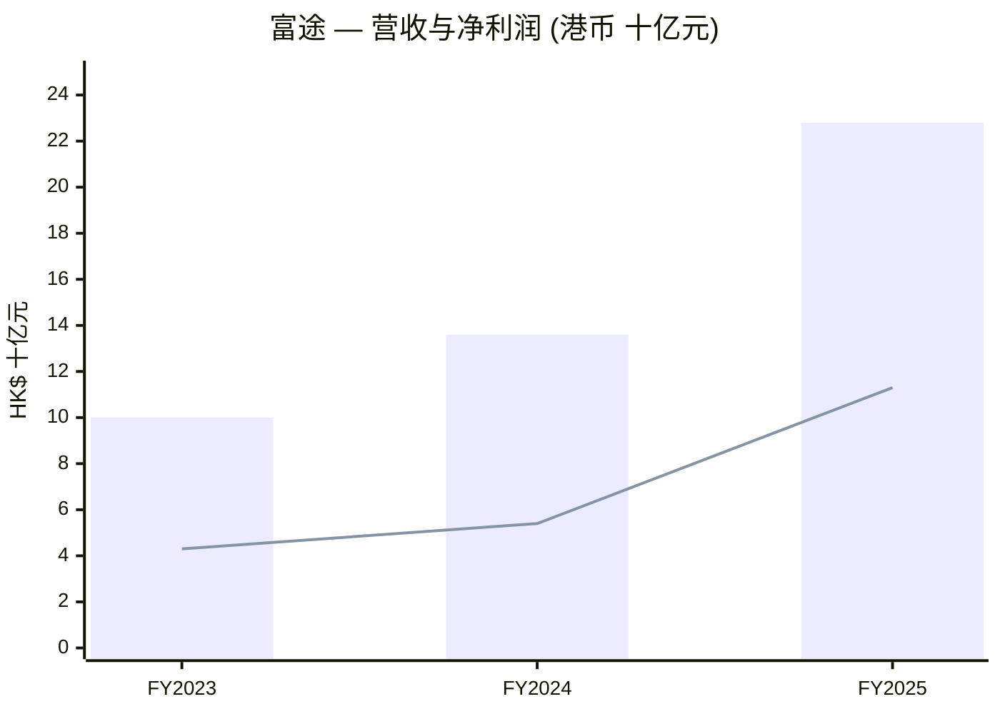
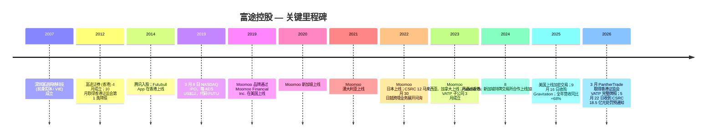
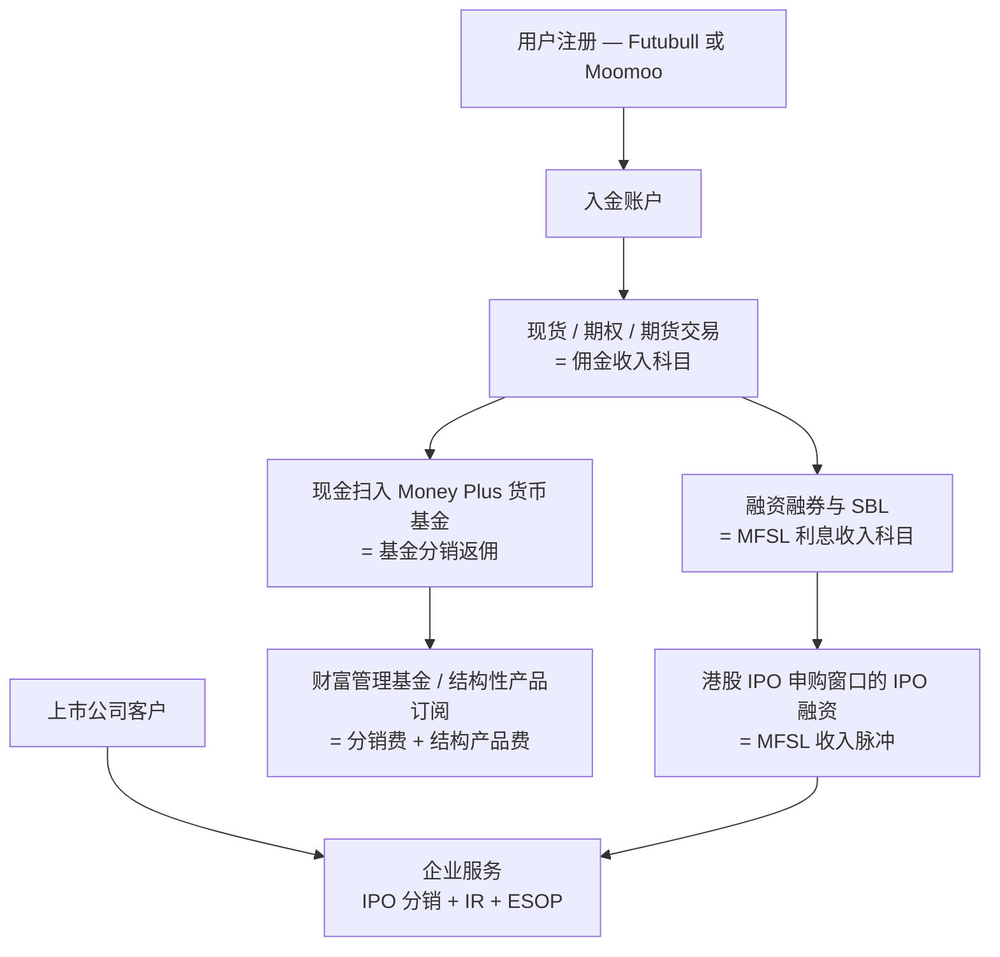
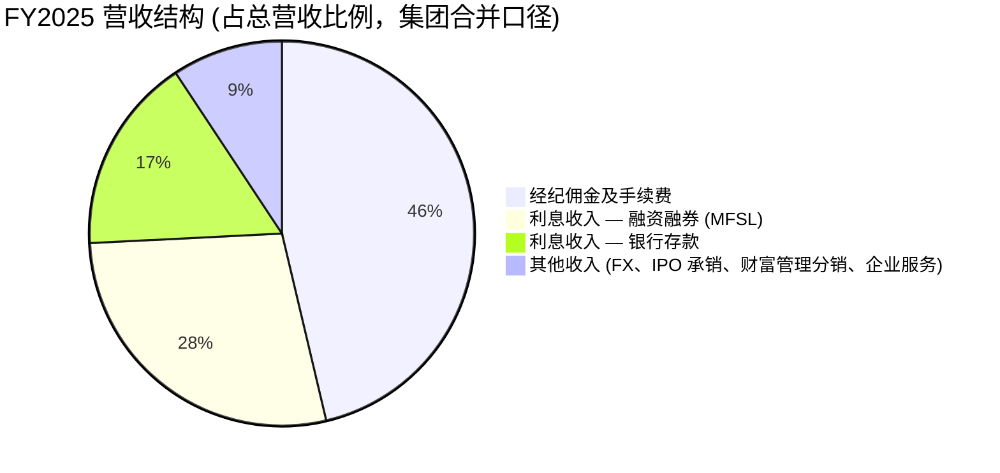
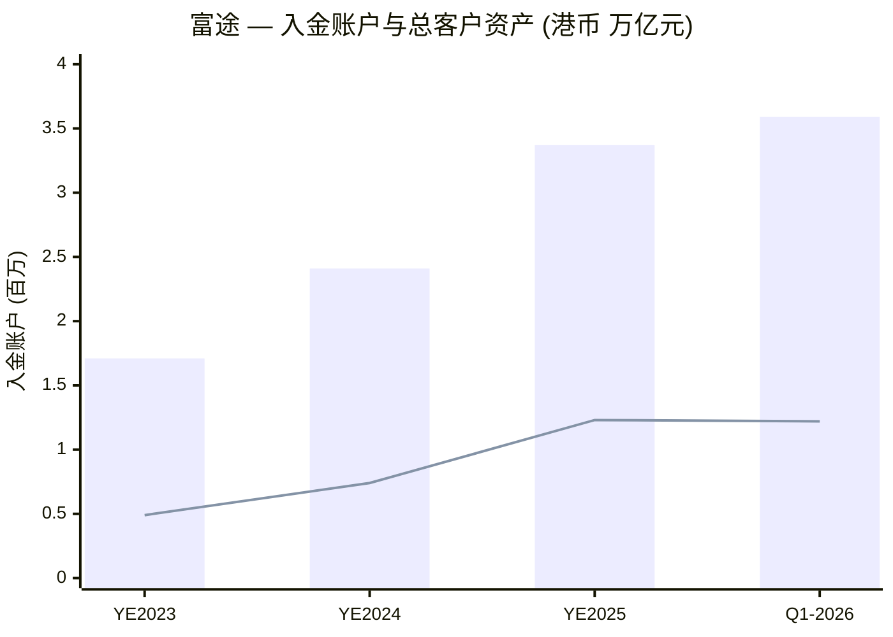
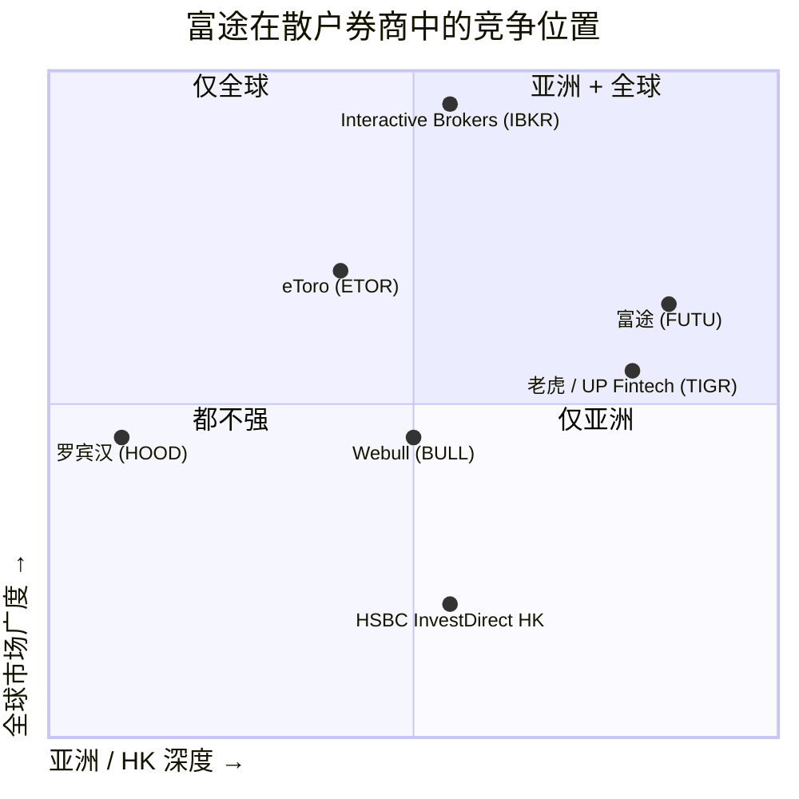
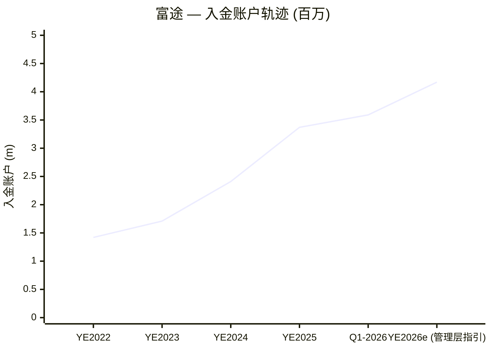

# 富途控股 (Futu Holdings, NASDAQ: FUTU) — 公司研究报告

**报告截止日：** 2026-06-03
**注册地 / 上市地：** 开曼群岛控股；ADS 于 NASDAQ 上市 (1 ADS = 8 股 A 类普通股)。
**总部：** 中国香港特别行政区金钟夏悫道 95 号统一中心 34 楼。
**财年截止：** 12 月 31 日。报告货币为港币 (HK\$)，按 HK\$7.7833 = US\$1.00 (2025-12-31 美联储 H.10 汇率) 提供美元换算 ([Futu FY2025 20-F, "Conventions"](https://www.sec.gov/Archives/edgar/data/1754581/000110465926043451/futu-20251231x20f.htm))。

> **重大监管事件公告 (2026-05-22):** 2026 年 5 月 22 日，富途收到中国证监会深圳证监局《行政处罚事先告知书》，对富途 PRC 关联方拟处罚约 **人民币 18.5 亿元 (约 US\$2.71 亿; ~港币 20 亿元)**，并对董事长兼 CEO 李华个人拟处罚 **人民币 125 万元**，指控其在未取得 PRC 牌照的情况下，对境内居民开展证券、公募基金销售及期货业务。该金额已作为期后调整事项 (subsequent event) 全额计入 2026 年一季度业绩；2026 年一季度报告净利润同比下降 61.2% 至港币 8.31 亿元，但**剔除该处罚影响后，2026 年一季度净利润为港币 29.22 亿元 (US\$3.727 亿元)，同比约增长 36%**。该拟处罚仍须经听证、申辩程序后方有最终裁定。来源：[Q1-2026 6-K Exhibit 99.1, 2026-05-28](https://www.sec.gov/Archives/edgar/data/1754581/000110465926067159/tm2615605d1_ex99-1.htm)；以及 [富途 IR 公告, 2026-05-22](https://ir.futuholdings.com/news-releases/news-release-details/futu-receives-investigation-notice-and-administrative-penalty)。

---

## 目录

1. 公司概览
2. 公司历史
3. 管理团队
4. 产品与服务
5. 客户与上市策略
6. 行业概览
7. 竞争格局
8. 市场机会
9. 风险评估
10. 投资视角评分卡
- 数据来源清单
- 参考资料
- Step 10 核验日志

---

## 1. 公司概览

富途控股是一家在开曼群岛注册、香港运营、NASDAQ 上市的科技型在线券商及财富管理 (wealth management) 平台。FY2025 年报 (20-F) 的原始描述为：富途通过两大消费端 App —— 起源于内地、目前服务香港 / 澳门 / 内地用户的 **Futubull (富途牛牛)** 与服务海外市场的 **Moomoo** —— 提供 *"trade execution and clearing, margin financing and securities lending, and wealth management"* (即交易执行与清算 / 融资融券 / 财富管理) 三大业务线，外加一条面向上市公司的 IPO 分销、ESOP 管理及 IR 服务的企业服务 (corporate services) 业务线 ([FY2025 20-F, About Futu Holdings Limited](https://www.sec.gov/Archives/edgar/data/1754581/000110465926043451/futu-20251231x20f.htm))。FY2025 集团营收同比增长 **68.1% 至港币 228.469 亿元 (US\$29.354 亿元)**，归母净利润同比增长 108.0% 至 **港币 113.019 亿元 (US\$14.521 亿元)**，参见 [FY2025 业绩发布稿 (Q4/FY2025 6-K Exhibit 99.1, 2026-03-12)](https://www.sec.gov/Archives/edgar/data/1754581/000110465926026621/tm268330d1_ex99-1.htm)。

公司的盈利结构由三大引擎驱动 —— **(a) 经纪佣金及手续费收入 (brokerage commission and handling charge income)** —— 即股票 / 期权 / ETF 等每笔交易收取的佣金，FY2025 贡献 港币 105.727 亿元 / 占总营收 46.3%； **(b) 融资融券业务利息收入 (interest income on margin financing and securities lending, 简称 MFSL)** —— FY2025 贡献 港币 63.687 亿元 / 占总营收 27.9%； **(c) 银行存款利息收入 (interest income from bank deposits)** —— FY2025 贡献 港币 37.593 亿元 / 占总营收 16.5%；剩余约 9% 为 "其他收入 (other income)"，包括 IPO 承销 / 分销费、基金分销返佣、外汇 (FX) 收入及企业服务收入。随着客户资产规模扩大及美元利率回落，结构正从存款利息收入向佣金收入倾斜 ([FY2025 20-F, Item 5 MD&A 收入结构](https://www.sec.gov/Archives/edgar/data/1754581/000110465926043451/futu-20251231x20f.htm))。

运营层面，富途已积累 **3,020 万注册用户 / 359 万入金账户 (funded accounts，即有正余额的经纪账户) / 总客户资产港币 1.22 万亿元**，其中入金账户 YoY +34.3% 至 2026Q1 末 ([Q1-2026 业绩稿](https://www.sec.gov/Archives/edgar/data/1754581/000110465926067159/tm2615605d1_ex99-1.htm))；FY2025 末则为 2,920 万注册用户 / 336.5 万入金账户 / 港币 1.23 万亿元 客户资产，入金账户 YoY +39.6%，客户资产 YoY +65.9% ([Q4/FY2025 业绩稿](https://www.sec.gov/Archives/edgar/data/1754581/000110465926026621/tm268330d1_ex99-1.htm))。香港仍是单一最大市场 —— 管理层在 Q4/FY2025 业绩电话上明确表示 *"hold[s] the largest market share among all regions"* (即在富途服务的所有地区中，香港市占率最高)，且 2025 年富途在港股 IPO 总公开发售认购金额中**占比 49%**，已稳固为香港散户 IPO 申购环节的事实型主承销窗口 (id.)。海外市场 (美国、新加坡、澳大利亚、日本、马来西亚、加拿大) 是第二增长引擎；管理层 2026 年指引为**全集团新增入金账户 80 万户**，截至 2026Q1 进展符合预期 ([Q1-2026 业绩稿, 李华评论](https://www.sec.gov/Archives/edgar/data/1754581/000110465926067159/tm2615605d1_ex99-1.htm))。

**估值快照 (2026-06-02 收盘):** ADS 价格 **US\$101.97**，市值 **US\$143.0 亿元** ([Stockanalysis.com – FUTU 概览](https://stockanalysis.com/stocks/futu/))。以 FY2025 净利润 US\$14.52 亿元 计算，**TTM P/E ≈ 11.3×**, **TTM P/S ≈ 4.87×** ([Stockanalysis.com TTM P/E 11.27](https://stockanalysis.com/stocks/futu/))。考虑到 FY2024 (US\$7.0 亿元净利润) 仅为 FY2025 一半左右，过往三年 P/E 区间从 2024 年高峰的 25–40× 已大幅压缩，而 2026 年 5 月 CSRC 处罚事件后又削去约 25%。**估值解读：** 11.3× TTM P/E 看上去不像一只高增长 fintech 股票的估值倍数，更像一只市场已经在折扣定价的 "跨境中概" 股票 —— 折扣的核心 (i) 是尚未最终裁定的人民币 18.5 亿元 CSRC 处罚及其对未来招揽 PRC 居民客户行为的法律先例； (ii) 是 SBL 单一借款人占比 95.99% 的资产负债表风险 ([FY2025 20-F Notes — Concentration disclosure](https://www.sec.gov/Archives/edgar/data/1754581/000110465926043451/futu-20251231x20f.htm))； (iii) 是更广义的"中概 ADR 折价"风险溢价。最接近对标的 **UP Fintech / Tiger Brokers (NASDAQ:TIGR)** FY2025 营收 US\$6.12 亿元 同比 +56%，净利润 US\$1.71 亿元 同比 +165%，市值/净利润为 high-teens P/E ([Stocktitan — UP Fintech FY2025](https://www.stocktitan.net/news/TIGR/up-fintech-record-full-year-revenue-and-profit-full-year-profit-9e21db8p0554.html))；**Interactive Brokers (NASDAQ:IBKR)** 通常 22–28× TTM。FUTU 相对 TIGR / IBKR 估值折扣约 30–60%。结论：要么市场已正确定价跨境业务的永久性折价，要么 FUTU 是一个适合愿意为一次性处罚买单、并相信内地居民开户渠道已被"清场"的投资者的价值布局 (value setup)。第 9 节将进一步阐述此分歧。

来源： [FY2025 20-F, MD&A 营收及净利润轨迹](https://www.sec.gov/Archives/edgar/data/1754581/000110465926043451/futu-20251231x20f.htm) 与 [FY2025 6-K Exhibit 99.1, 2026-03-12](https://www.sec.gov/Archives/edgar/data/1754581/000110465926026621/tm268330d1_ex99-1.htm)。

---

## 2. 公司历史

富途证券国际 (香港) 有限公司由 **李华先生 (Leaf Hua Li)** 于 *"2012 年 4 月 17 日"* 在香港注册成立 ([FY2025 20-F, Item 4 历史](https://www.sec.gov/Archives/edgar/data/1754581/000110465926043451/futu-20251231x20f.htm))。李华在创办富途之前在腾讯任职 12 年 —— 20-F 原文记载："Mr. Li joined Tencent in 2000 and was the 18th founding employee of Tencent. He was an early and key research and development … Mr. Li was also the founder of Tencent Video"，即 2000 年加入腾讯，为腾讯第 18 号创始员工，是腾讯 QQ 早期核心研发人员，并是腾讯视频的创办人 (id., Item 6)。李华看中了香港散户经纪业务被传统银行系券商主导、技术架构与用户体验长期未升级的市场空白，将腾讯式的消费互联网产品设计方法论引入券业。富途证券于 2012 年 10 月取得香港证监会 **第 1 类 (证券交易) 牌照**，并陆续添补 2 / 4 / 5 / 9 类牌照，将融资融券、期货、投顾、资产管理等环节全部纳入自有平台内运营 ([FY2025 20-F Item 4 监管牌照](https://www.sec.gov/Archives/edgar/data/1754581/000110465926043451/futu-20251231x20f.htm))。

来源： [FY2025 20-F, Item 4 "History and Development"](https://www.sec.gov/Archives/edgar/data/1754581/000110465926043451/futu-20251231x20f.htm) 与 Q1-2026 6-K 评论。

富途的战略转型有三次。**第一次**是 2014 年腾讯入股 —— 富途从一款单一 App 转化为腾讯系平台，腾讯的社交关系链、云服务、SMS 短信通道为富途提供了分销杠杆，同时也产生了至今仍单列在 FY2025 关联方交易披露中的常态化运营成本基础 ([FY2025 20-F, 关联方交易](https://www.sec.gov/Archives/edgar/data/1754581/000110465926043451/futu-20251231x20f.htm))。**第二次**是 2019 年 NASDAQ IPO，引入了 AB 双类股结构 (A 类 1 票，B 类 20 票)，李华保留了多数投票权，富途作为 NASDAQ "controlled company" (受控公司) 运营。**第三次**是 2019–2024 年的海外扩张 —— Moomoo 接连进入美国、新加坡、澳大利亚、日本、马来西亚、加拿大 —— 富途从一只 "大中华跨境流量"故事股票转型为"全球多市场自营清算券商"。但截至 FY2025，香港仍是单一最大营收贡献市场，Moomoo 海外业务体量虽快速增长，仍未超过香港主业。

近期 (与当前投资逻辑相关) 还有两项进展。一是 **2025 年 9 月 Gravitation 收购** (FY2025 20-F 之 XBRL 元素 `GravitationAndItsSubsidiaryAcquisitionMember` 披露) —— 进一步增厚内地数据 / 分析资产；二是 **2026 年 3 月 PantherTrade 取得香港证监会 VATP 完整牌照**，使得香港的加密资产交易从"与第三方持牌交易所合作"模式升级为"富途全资自营持牌"模式，与新加坡 / 美国仍在沿用的第三方合作模式形成对比，构成李华所称的 *"seamless, integrated"* (无缝整合) 股票-加密客户体验 ([Q1-2026 业绩稿, PantherTrade 评论](https://www.sec.gov/Archives/edgar/data/1754581/000110465926067159/tm2615605d1_ex99-1.htm))。**2026 年首次分红** —— 每 ADS US\$2.60，总额 US\$3.65 亿元 ([Dividend 6-K, 2026-04-02](https://www.sec.gov/Archives/edgar/data/1754581/000110465926038792/tm2611000d1_ex99-1.htm)) —— 也是富途上市以来首次进行有规模的资本回报，是一个战略信号：管理层从"全部再投资"姿态转向"再投资 + 分红"组合，暗示主要海外扩张资本开支周期已接近尾声。

---

## 3. 管理团队

**创始人、董事长兼 CEO —— 李华先生 (Leaf Hua Li)**，FY2025 年报披露年龄 49 岁。20-F 原文称其 *"has over 20 years of experience and expertise in the technology and internet sectors in China"* (即在中国科技与互联网行业拥有逾 20 年经验)，且 *"is directly in charge of … overall strategy of [the] Group"* (亲自主导集团整体战略) ([FY2025 20-F, Item 6 Directors and Senior Management](https://www.sec.gov/Archives/edgar/data/1754581/000110465926043451/futu-20251231x20f.htm))。**前职履历：** 加入富途之前的 12 年间在腾讯任职，原文称其为 *"the 18th founding employee of Tencent"* (腾讯第 18 号创始员工)，2000 年入司，曾任 *"the head of Tencent's multi-media business and its innovation center"* (腾讯多媒体业务负责人 / 创新中心负责人)；亦是 *"an early and key research and development [engineer for] Tencent QQ"* (腾讯 QQ 的早期与核心研发工程师)，并 *"the founder of Tencent Video"* (腾讯视频的创办人)；在腾讯任职期间申报 *"over 10 international and domestic patents"* (10 余项国际及国内专利)，并于 2008 年获得腾讯内部 "Innovative" 创新奖项。

**经济权益与投票控制权高度集中。** FY2025 年报披露日，李华持有**全部 355,552,051 股 B 类普通股** (每股 20 票投票权)，即 *"more than 50% of [Futu's] total voting power"* (合计投票权超过 50%)，使富途符合 NASDAQ "controlled company" (受控公司) 定义，可豁免部分公司治理独立性规则 (id., Item 6)。A 类股方面，李华本人持有 **86,568 股 A 类普通股 (以 ADS 形式)**，主要 A 类持仓由其信托工具 Lera Ultimate Limited 持有。此外，李华持有内地两家 VIE 实体 —— **深圳富途网络科技有限公司** 与 **海口富途信息服务有限公司** —— 各 **85%** 股权 (李雷女士持余下 15%) (id., Item 7)。2026 年 5 月 CSRC 处罚预通知书点名李华本人，拟处个人罚款 **人民币 125 万元** —— 在李华披露的总持仓背景下，金额并不构成实质性风险，但涉及"个人责任人"的法律先例须密切关注 ([Q1-2026 业绩稿, CFO 陈宇评论](https://www.sec.gov/Archives/edgar/data/1754581/000110465926067159/tm2615605d1_ex99-1.htm); [Yahoo Finance — FUTU CSRC 处罚, 2026-05-22](https://finance.yahoo.com/markets/stocks/articles/why-futu-holdings-futu-down-080319932.html))。**运营参与度：** 截至 FY2025，李华继续亲自督导技术委员会，监管集团 R&D —— 而 R&D 也是富途 20-F 中明确列为核心护城河的职能 (FY2025 20-F, Item 4 技术委员会组织结构)。

**因创始人即现任 CEO**，本节按公司研究规范不再拆分为"创始人"与"CEO"两段。CFO 陈宇先生 (Arthur Yu Chen)，年龄 50 岁 —— 按 skill 规范 "founder + current CEO only" 规则，不予详细介绍。

---

## 4. 产品与服务

### 4.1 富途服务架构 (锚定 20-F)

作为金融服务企业，富途 FY2025 20-F 并未刊登半导体或制药行业常见的 "Product Matrix" 产品矩阵表，而是在 **Item 4 — Information on the Company → Business Overview → Our Services** 中按三条主业务线 + 一条企业服务业务线组织内容。本节将该业务线划分原样复制，并为每条业务线提供"中文释义 / Plain-language gloss"以及解析说明。

| 业务线 | Futubull / Moomoo 产品 | FY2025 损益表收入科目 | 占 FY2025 集团营收 |
|---|---|---|---|
| 1. 交易执行与清算 (Trade execution & clearing) | 股票 / ETF / 期权 / 期货现货交易 | Brokerage commission and handling charge income | 46.3% |
| 2. 融资融券 (MFSL: Margin Financing & Securities Lending) | 融资交易、证券质押贷款、IPO 融资、证券借贷簿 | Interest income on MFSL | 27.9% |
| 3. 财富管理 (Wealth Management) | Money Plus 公募基金超市、现金宝、结构性产品、基金顾问 | "Other income" 中的基金分销 + Money Plus 返佣 + 银行存款利息 16.5% | 综合后约 16.5% + 部分"其他收入" |
| 4. 企业服务 (Corporate Services) | IPO 分销 / 承销 / IR 服务；ESOP 管理；AI 驱动的 IR 分析 | "Other income" 中的企业服务条目 | "其他收入"约 9% 的剩余部分 |

来源： 收入结构与百分比引自 [FY2025 20-F, Item 5 MD&A 收入构成](https://www.sec.gov/Archives/edgar/data/1754581/000110465926043451/futu-20251231x20f.htm)。

### 4.2 综合理解 —— 业务线如何拼成一个客户旅程

Futubull / Moomoo 用户的完整旅程是：**开户 → 入金 → 交易 (产生佣金收入) → 融资融券 / 卖空 / IPO 融资 (产生 MFSL 利息收入) → 闲置现金扫入 Money Plus 货币基金 (产生基金分销返佣) → 订阅财富管理产品 (基金 / 结构性产品 / 黄金 ETF) → 在港股 IPO 窗口订阅打新**。企业服务业务线则将同样的自营清算 (self-clearing) 基础设施反向出售给发行方 —— 上市公司聘请富途做 IPO 散户分销 / ESOP 管理 / IR 分析。**飞轮效应在于：交易 → 杠杆 → 现金扫入 → 基金订阅 → 企业服务交叉销售**，护城河在于大中华地区没有第二家券商能在同一 App 中提供以上全部六个环节。

### 4.3 交易执行与清算 —— 经纪佣金收入条线

FY2025 20-F 原文将该条线定义为对 *"securities brokerage, IPO financing, options trading, futures trading, and ETFs"* (即股票经纪、IPO 融资、期权、期货、ETF) 业务收取的单次费用，富途 *"charge[s] individual funded accounts a fixed commission rate based on the trading volume, a platform service fee per transaction"* (按入金账户的交易量收取固定佣金率 + 每次平台服务费) ([FY2025 20-F Item 4 "Our Services"](https://www.sec.gov/Archives/edgar/data/1754581/000110465926043451/futu-20251231x20f.htm))。FY2025 全年该条线收入 **港币 105.727 亿元**，占总营收 **39.4%, 44.5%, 46.3%** (FY2023 / 2024 / 2025)，占比持续提升 (id., Item 5)。FY2025 总交易量达 **港币 14.68 万亿元**，YoY +89.4% (从 FY2024 的港币 7.75 万亿元)，再从 FY2023 的港币 4.23 万亿元 起步 ([Q4/FY2025 业绩稿 运营高亮](https://www.sec.gov/Archives/edgar/data/1754581/000110465926026621/tm268330d1_ex99-1.htm))。

**中文释义 / Plain-language gloss：** 这是典型的电子券商按笔佣金 (per-trade commission) 收入条线 —— 用户每次交易支付按笔费用 (香港通常为成交金额的几个 bp，美国受 2019 年 Robinhood 引发的零佣金 (zero-commission) 行业潮流影响接近为零，但通过 PFOF / payment-for-order-flow 订单流付费及换汇 (FX) 价差实现部分填补)。富途的混合佣金率 (blended commission rate) 多年呈下行趋势 —— 富途自己在 Q1-2026 业绩稿中称 *"This was mainly due to higher trading volume, partially offset by a decline in blended commission rate"* (主因交易量提升，部分被混合佣金率下降抵消) —— 但量增显著大于价压，FY2025 佣金收入 YoY 约 +75%，而单位佣金率仅小个位数下降。**战略意义：** 随着海外市场 (美国零佣金、新加坡 / 日本散户) 不断纳入，富途的*混合*佣金率会持续向美国水平靠拢，但*总*佣金 dollar 仍随全球客户资产增长。这是商业模式中最像 Robinhood / Charles Schwab / Interactive Brokers 的环节，护城河在于软件与 App 质量，而非佣金价格。

*分析师观点：* 最直接对标是 **Interactive Brokers (国际自营清算券商；FY2025 营收高度集中于净利息收入，佣金条线远小于富途)** 与 **UP Fintech / Tiger Brokers (TIGR)** —— TIGR FY2025 全年营收 US\$6.12 亿元 vs 富途 US\$29.354 亿元，富途单一佣金条线 (US\$13.58 亿元) 已超 TIGR 总营收的 2 倍 ([Stocktitan — UP Fintech FY2025](https://www.stocktitan.net/news/TIGR/up-fintech-record-full-year-revenue-and-profit-full-year-profit-9e21db8p0554.html))。

### 4.4 融资融券 (MFSL) —— Margin Financing & Securities Lending

FY2025 20-F 原文将该条线定义为 *"the financing income we earn on our margin financing business, securities borrowing business, IPO and other financing business"* (即融资业务、证券借贷业务、IPO 融资及其他融资业务的融资收入) (Item 4 "Our Services")。该条线 FY2025 收入为 **港币 63.687 亿元** (US\$8.183 亿元)，占总营收 **28.1%, 26.0%, 27.9%** (FY2023 / 2024 / 2025) (id., Item 5)。MFSL 余额 YE2025 为 **港币 677 亿元**, 2026Q1 末为 **港币 729 亿元** (YoY +44.9%) ([Q1-2026 业绩稿](https://www.sec.gov/Archives/edgar/data/1754581/000110465926067159/tm2615605d1_ex99-1.htm))。同期 SBL 利息支出 (即融券簿融资成本) FY2024 为港币 13.737 亿元，FY2025 据 MD&A 称 *"higher expenses associated with our securities borrowing and lending business"* (高于 FY2024)。

**中文释义 / Plain-language gloss：** MFSL 是券商的贷款簿 —— 当客户希望融资买入美股时，富途借出现金、接受证券作为抵押品 (collateral)；要么将证券质押给上游清算 prime 以为这笔贷款融资，要么自行计入资产负债表 (因为富途证券 HK 是自营清算券商，工作资本充足)。当客户希望融券做空时，富途须从某个 SBL 对手方借入证券再借给客户 —— 富途赚取的是 SBL 对手方利率与客户利率之间的价差 (spread)。**关键集中度：** FY2025 20-F 注释披露 *"As of December 31, 2024 and 2025, a single borrower accounted for 95.91% and 95.99% of [the Group's] total outstanding balance of stock-pledged loans, … with a majority of the collaterals comprising of listed shares in a single company"* (2024-12-31 / 2025-12-31，单一借款人占富途集团股票质押贷款 (stock-pledged loans) 总余额的 95.91% / 95.99%，且抵押品的主要部分为单一上市公司股票) ([FY2025 20-F, Notes — Concentration disclosure](https://www.sec.gov/Archives/edgar/data/1754581/000110465926043451/futu-20251231x20f.htm))。20-F 并未披露借款人姓名 / 实体名或抵押股票名称；股权投资者应将其视为单名信贷敞口 —— 如抵押股价急跌穿透维持保证金线，可能从"生息资产"瞬间转为"减值损失"。

*分析师观点：* MFSL 条线是商业模式中质量最高的常态化收入流 —— 与客户资产规模合同性挂钩，历史净息差 (NIM) 维持 4–6% —— 但 95.99% 单一借款人集中度是一个实质性的结构异常 (structural anomaly)，任何股权投资者都应要求管理层作出解释。最接近对标是 **Interactive Brokers**，其净利息收入业务规模相仿，但分散在数千名保证金客户之间，单一借款人占比不超过个位数百分比。

### 4.5 财富管理 —— Money Plus 与公募基金超市

富途的财富管理产品定位为内嵌于同一 Futubull / Moomoo App 之中的 **"Money Plus" 公募基金超市**。FY2025 20-F 原文将其定义为 *"the wealth-management product distribution services we provide on our platform, [generating] fees from fund-distribution and Money Plus"* (即在平台上提供的财富管理产品分销服务，收入来自基金分销与 Money Plus 收费) (Item 4 "Our Services")。财富管理客户资产 YE2025 达 **港币 1,796 亿元** (YoY +62.0%)，至 2026Q1 末略微回落至 **港币 1,784 亿元** (受标记到市价波动影响) ([Q4/FY2025 业绩稿](https://www.sec.gov/Archives/edgar/data/1754581/000110465926026621/tm268330d1_ex99-1.htm); [Q1-2026 业绩稿](https://www.sec.gov/Archives/edgar/data/1754581/000110465926067159/tm2615605d1_ex99-1.htm))。该条线收入并入"其他收入"的基金分销子项之中，与 FX 收入和企业服务收入合并列示。

**中文释义 / Plain-language gloss：** Money Plus 是一站式现金管理 + 基金订阅模块 —— 用户结算账户的闲置现金自动扫入货币基金 (类似嘉信 (Schwab) 的 "Sweep Cash" 机制)；当用户希望订阅公募基金或结构性产品时，点击 "Money Plus" 模块，富途收取一次性前端费 (front-end fee) 加上来自基金管理人 (fund manager) 的持续追溯返佣 (trailer / rebate)。FY2025 富途 *"expanded [its] high-dividend fund offerings in Hong Kong, introduced more domestic equity-focused funds in Singapore, and launched Shariah-compliant gold tracker funds in Malaysia"* (扩展香港高股息基金供应、新加坡国内股票基金供应及马来西亚 Shariah 合规黄金 ETF) ([Q4/FY2025 业绩稿](https://www.sec.gov/Archives/edgar/data/1754581/000110465926026621/tm268330d1_ex99-1.htm))。**战略意义：** 财富管理是商业模式中质量最高的长久期收入流 (long-duration recurring revenue) —— 后置追溯返佣 + 粘性余额 + 较 commission 周期性弱；但目前规模相对较小，须数年才能在收入结构中占主导。

*分析师观点：* 最接近对标是 **Tiger Brokers 的 "Fund Mall"** 与 **Interactive Brokers 的 Mutual Fund Marketplace**；大中华开放架构基金超市历史上由 **天天基金 (东方财富) 与腾讯的理财通** 主导。富途的差异化在于"基金超市内嵌于券商前端"—— 用户无需下载第二个 App。

### 4.6 企业服务 —— IPO 分销、ESOP 管理与 AI-IR 分析

企业服务业务线相当于将同一套自营清算基础设施 *批发售卖给上市公司* —— 香港 IPO 承销商委任富途分销新股散户额度；富途向上市公司销售 ESOP 员工股票期权计划管理软件；富途推出 AI-IR 产品自动抽取上市公司公告内容并将摘要推送给 IR 团队 (id., Q1-2026 业绩稿)。该业务线 YE2025 服务 **600 家 IPO 分销与 IR 客户 (YoY +24.5%)，2026Q1 末为 625 家**，并在 2025 年全年占据 **49% 的港股 IPO 公开发售总认购金额** —— 这是一个稳固富途作为香港事实型散户 IPO 承销窗口地位的份额数据点 ([Q4/FY2025 业绩稿](https://www.sec.gov/Archives/edgar/data/1754581/000110465926026621/tm268330d1_ex99-1.htm); [Q1-2026 业绩稿](https://www.sec.gov/Archives/edgar/data/1754581/000110465926067159/tm2615605d1_ex99-1.htm))。

**中文释义 / Plain-language gloss：** 这是消费端券商的 B2B 姊妹产品。大部分 IPO 相关经济价值以"MFSL 条线 IPO 融资利息脉冲"形式出现，加上企业服务条线本身的服务费。**战略意义：** 在香港 IPO 窗口期 (例如 2026Q1 包括 MiniMax / Busy Ming / Biren Technology 等大型新经济上市) 富途集 (i) 散户用户分销、(ii) IPO 融资杠杆、(iii) 上市后 IR 分析三种能力于一身，这使富途在资本结构形成 (cap-table formation) 时刻坐拥一个任何纯软件供应商都无法染指的位置。

### 4.7 PantherTrade —— 虚拟资产交易平台 (VATP)

FY2025 / Q1-2026 周期内新增：**2026 年 3 月，PantherTrade (Hong Kong) Limited** —— 富途全资子公司，2023 年 3 月 7 日香港注册 —— 取得 **香港证监会 (HK SFC) VATP 完整牌照**，开始 *"to commence full-scale licensed operations"* (开始全面持牌运营) ([Q1-2026 业绩稿 PantherTrade 评论](https://www.sec.gov/Archives/edgar/data/1754581/000110465926067159/tm2615605d1_ex99-1.htm))。同期富途的香港、新加坡、美国加密资产交易仍是 *"through collaboration with licensed third-party exchanges"* (与第三方持牌交易所合作)，FY2025 20-F 原文 *"we launched crypto trading services through collaboration with licensed third-party exchanges in Hong Kong and Singapore in August 2024, and in the United States in 2025"* (Item 4 "Recent Developments")。PantherTrade 把香港加密交易从"第三方交易所"模式升级到"富途自有自营持牌"模式，扣除支付给第三方交易所的返佣，将完整价差留存内部。

**中文释义 / Plain-language gloss：** 这是最近完成的战略构建。经济模型与股票经纪条线相同 —— 每笔交易费 + FX / 价差 —— 但监管模式与现行 SFC Type 1 牌照属平行轨道，且加密资产专属合规义务 (客户数字资产隔离 / virtual-asset AML/KYC / 链上分析) 不容忽视。**战略意义：** 香港是大中华地区唯一对散户投资者开放运作的虚拟资产监管框架，富途已有 300 万+ 入金账户基础，是任何香港 VATP 运营方所能想象的最大加密交叉销售机会 —— 竞品 HashKey Exchange / OSL / Bullish 必须从零开始获取加密用户。

*分析师观点：* PantherTrade 是富途现存最高期权价值 (optionality) 的内嵌资产 —— 当前收入贡献微薄 (FY2025 20-F 未单独披露加密收入)，但 "富途自有持牌香港 VATP + 全面集成于券商 App" 的战略期权价值显著。最贴切对标是 **Coinbase** —— 比特币现货 ETF 托管业务和 prime brokerage 资产推动 COIN 在过去两年重估为 fintech 估值倍数；PantherTrade 接近一只 "嵌入一家已盈利券商之内的 Coinbase-for-HK 期权"。

---

## 5. 客户与上市策略

### 5.1 客户基础 —— 入金账户、经纪账户、注册用户

富途按三个嵌套的客户规模指标披露 —— skill 规范要求每个客户口径必带分母，富途自家定义恰好提供了：**"users" (注册用户)** 是 *"the number of user accounts registered with Futu"* (即 App 下载并注册的账户数，最宽口径)；**"brokerage accounts" (经纪账户)** 是 *"brokerage accounts with [Futu]"* (即开户的账户数，同一客户多个账户算 1)；**"funded accounts" (入金账户)** 是 *"brokerage accounts with [Futu] that have a positive account balance"* (即有正余额的账户，产生收入的子集) ([FY2025 20-F, "Conventions"](https://www.sec.gov/Archives/edgar/data/1754581/000110465926043451/futu-20251231x20f.htm))。

| 指标 | YE2023 | YE2024 | YE2025 | 2026Q1 末 |
|---|---|---|---|---|
| 注册用户 (百万) | 22.1 (估) | 25.2 | **29.2 (+16% YoY)** | 30.2 (+14.9% YoY) |
| 经纪账户 | 3,561,966 | 4,583,453 | **5,948,093 (+29.8% YoY)** | 6,284,404 (+26.8% YoY) |
| 入金账户 | 1,710,106 | 2,411,324 | **3,365,414 (+39.6% YoY)** | 3,590,325 (+34.3% YoY) |
| 总客户资产 (港币 十亿元) | 485.6 | 743.3 | **1,233.0 (+65.9% YoY)** | 1,220 (+47.2% YoY) |

来源： [FY2025 20-F, Item 4 "Our Platform" 增长表](https://www.sec.gov/Archives/edgar/data/1754581/000110465926043451/futu-20251231x20f.htm) 与 [Q1-2026 6-K 业绩稿](https://www.sec.gov/Archives/edgar/data/1754581/000110465926067159/tm2615605d1_ex99-1.htm)。

### 5.2 地理分布与"香港最大"数据点

富途 20-F 中并未按地区披露美国 10-K 式的分段营收表 (与多数单一报告分部券商做法一致)，但管理层在 Q4/FY2025 业绩稿中明确指出 *"Hong Kong … hold[s] the largest market share among all regions"* (即香港在富途运营的所有地区中市占率最高)，其中 **马来西亚 "achiev[ing] significant share gains"** (取得显著市占率增长)，日本、新加坡、澳大利亚增速继续位于较快区间 ([Q4/FY2025 业绩稿评论](https://www.sec.gov/Archives/edgar/data/1754581/000110465926026621/tm268330d1_ex99-1.htm))。FY2025 总交易量结构为 **港币 11.40 万亿元美股 + 港币 3.28 万亿元港股** (依 Q4 2025 比例外推；2025 全年总交易量为港币 14.68 万亿元，Q4 单季美股交易量港币 3.04 万亿元 / 港股交易量 港币 821.1 亿元) —— 即**美股交易量大于港股交易量，但客户资产规模相反，香港客户资产基础更大**。这正是富途定位为 "国际多市场自营清算券商" 而非 "中国跨境券商" 的实质 —— 用户已扩展至新加坡、澳大利亚、日本、马来西亚等地居民，进行本国市场 + 美股交易，富途作为整合前端。

### 5.3 客户集中度披露 —— 唯一的真实集中度是 SBL 借款人

富途在 20-F 中**未披露任何前 1 或前 5 *佣金*客户** —— 与零售大众市场券商通行做法一致，单一散户账户均不超过营收的 10%。FY2025 20-F 财务报表注释**未列出合并层面客户集中度名单**。**唯一披露的集中度在资产端而非收入端**：如 4.4 节所述，**至 2025-12-31，单一借款人占股票质押贷款总余额的 95.99% (YE2024 为 95.91%)**，且 *"a majority of the collaterals comprising of listed shares in a single company"* (抵押品的主要部分为单一上市公司股票) ([FY2025 20-F Notes — Concentration disclosure](https://www.sec.gov/Archives/edgar/data/1754581/000110465926043451/futu-20251231x20f.htm))。这是**资产负债表集中度**，并非营收集中度 —— 该借款人产生的利息收入仅为整条 MFSL 利息收入条线的一部分，但若抵押股票暴跌，本金损失可能巨大。按 skill 规范分母规则：这是 *"集团股票质押贷款总余额的 95.99%"*，并非任何"营收"口径的 95.99%。二者切勿混淆。

来源： [FY2025 20-F, Item 5 MD&A 收入构成](https://www.sec.gov/Archives/edgar/data/1754581/000110465926043451/futu-20251231x20f.htm)。分母：FY2025 集团合并总营收 港币 228.469 亿元。

### 5.4 上市策略 —— 内容驱动 / KOL 放大 / IPO 为锚

富途的分销模式是内容驱动 + 事件为锚的，而非纯付费 CAC 驱动。FY2025 20-F 原文 *"social media tools to create a network centered around its users and provide connectivity to users, investors, companies, analysts, media and key opinion leaders"* (即创建以用户为中心的社交网络，连接用户 / 投资者 / 上市公司 / 分析师 / 媒体 / KOL) —— **NiuNiu / Moo Community (牛牛 / Moo 社区)** 社交网络功能嵌入交易 App 之内，用户可互相关注、发布分析、对上市公司公告作出反应。这对单位经济模型有重大意义：社区贡献了相当部分的有机开户量，降低了有效 CAC (acquisition cost)。付费 CAC 仍重要 —— **FY2025 销售及营销费用为 港币 19.805 亿元，占营收 8.7%，从 FY2024 的 10.4% 进一步下降，反映运营杠杆** ([FY2025 20-F, Item 5 MD&A](https://www.sec.gov/Archives/edgar/data/1754581/000110465926043451/futu-20251231x20f.htm)) —— 但趋势是 S&M / 营收比下行，即使用户增长重新加速。

另一上市策略加速器是 **香港 IPO 日历** —— 每一次香港大型上市为富途带来开户脉冲，因为公司是全城散户 IPO 分销的事实型管道。2026Q1 富途 *"provided IPO distribution services to a number of prominent Hong Kong listings, including MiniMax, Busy Ming, and Biren Technology"* (为包括 MiniMax、Busy Ming、Biren Technology 等多家显眼的香港上市提供 IPO 分销服务) (Q1-2026 业绩稿)，每一只均带来当季可计量的入金账户脉冲。

---

## 6. 行业概览

### 6.1 行业定义与边界

富途所处行业最准确的定义是 **服务跨境亚洲散户投资者的数字原生零售券商与财富管理类别**，处于三个更大行业组的交集：(a) **全球在线零售券商** (嘉信 Schwab / 罗宾汉 Robinhood / Interactive Brokers / eToro —— 全球行业巨头)；(b) **大中华跨境券商** (老虎证券 UP Fintech、富途、Webull、同花顺香港分支 —— 中国海外散户族群)；(c) **区域财富管理 App** (新加坡的 StashAway / Endowus / Syfe；加拿大的 Wealthsimple；日本的 PayPay 资产管理)。富途的竞争场景是 **希望在单一移动 App 内交易美股与港股的亚洲 / 大中华海外散户投资者**，叠加二次拓展至本国市场 (新加坡 SGX、澳大利亚 ASX、日本 TSE、马来西亚 Bursa、加拿大 TSX) 等等。

### 6.2 市场规模 —— 入金账户宇宙与资产增长

香港散户经纪市场是富途服务的最集中单一市场；香港证监会数据显示散户交易量约占 HKEX 现货成交额的 12–15%，在线券商在传统银行系全方位券商面前持续抢占份额。按富途自家数据，**全球用户达 3,020 万人** (2026Q1)；作为对照，罗宾汉 FY2024 末入金用户约 2,400 万人，老虎证券 / UP Fintech FY2025 末入金账户为 125 万人，因此富途 359 万入金账户在绝对数上居中，但在 "港股 + 国际亚洲入金账户" 口径下最大。

全球零售券商行业增长由 (i) 零佣金 + 碎股化 (post-Robinhood 2019)，(ii) 亚洲数字资产开户潮 (post-2020 新加坡 / 香港 / 马来西亚散户潮)，(iii) post-2022 高利率环境下自营清算券商净利息收入 (NII) 顺风等三股力量推动。第一波将罗宾汉定价为超高增长平台；第二波将富途 / 老虎重新定价；第三波将 Interactive Brokers / Schwab 重新定价。

来源： [FY2025 20-F, Item 4 "Our Platform"](https://www.sec.gov/Archives/edgar/data/1754581/000110465926043451/futu-20251231x20f.htm) 与 Q1-2026 业绩稿。注：柱图 = 入金账户 (百万)，折线 = 总客户资产 (港币 万亿元)，共享同一 x 轴但量纲不同。

### 6.3 增长驱动力

支撑 3 年期增长的结构性驱动力有三：第一，**香港 / 新加坡 / 马来西亚 / 日本等市场的后疫情散户投资者养成持续推进** —— 这些市场银行支行投资业务正在衰退，数字券商开户率呈结构性跃升，碎股化与多市场跨境交易已成为标配。第二，**香港 IPO 流水线** —— 2025 年是按总发行额计的香港 IPO 创纪录年份，中概二次回港潮 (百济、腾讯音乐 ADR 转换、阿里二次上市等) 与 AI 创业潮 (MiniMax、Biren、寒武纪二次上市等) 双向输血富途的散户 IPO 申购条线。第三，**Money Plus 与 PantherTrade 业务的成熟** —— YE2025 财富管理 AUM 港币 1,796 亿元相对总客户资产 港币 1.23 万亿元 仍属较小基数，任何对长久期常态化收入的有效交叉销售都将带来估值重估。

反向结构性逆风是**对内地居民跨境开户的封堵** —— CSRC 2022 年 12 月问询与 2026 年 5 月处罚预通知均针对同一行为：富途历史上允许内地居民使用 PRC 身份证号在香港开户。富途已经 *"taken and may continue to take rectification measures"* (采取且将继续采取整改措施) (FY2025 20-F 风险因子)；后果是**内地居民入金账户存量保留但新增封堵**，所有可持续增长路径必须来自非 PRC 居民散户市场 (香港、新加坡、日本、马来西亚、美国等)。

### 6.4 监管环境

富途运营的每个司法辖区都有各自的监管者与牌照栈：香港 SFC (Type 1 / 2 / 4 / 5 / 9)、美国 FINRA / SEC、新加坡 MAS、澳大利亚 ASIC、日本 FSA / 关东财务局、马来西亚 SC、加拿大 CSA。20-F Item 4 "Regulation" 子节本身长达数十页。最敏感的两个压力点：(i) **CSRC 对富途以 HK / 海外架构向内地居民开展业务的指控** —— RMB 18.5 亿元处罚预通知的来源；(ii) **跨境出入金通道的 AML / 制裁风险** —— 富途 KYC / 资金来源核查协议必须同时满足每个司法辖区标准，单一辖区违规便可能全球声誉受损。

### 6.5 行业结构 —— 全球散户大众分散，跨境亚洲集中

全球在线券商行业分散 (Robinhood、Schwab、IBKR、E*Trade-now-MS、Fidelity、eToro、Webull 等数十家)；跨境亚洲较集中 —— 富途与老虎是仅有的两家 NASDAQ 上市的"HK + 海外亚洲完整自营清算"纯券商。**供应商议价能力 (clearing prime、交易所数据供应商、云)** 不可忽视 —— 富途为腾讯关联方支付云、SMS 通道、ESOP 管理服务费 —— 但无单一供应商构成卡点；**买方议价能力 (散户客户)** 较低，因为单一用户体量小，而 NiuNiu / Moo 社区与多市场整合带来真实的转换成本。**替代品** 包括银行系全方位券商 (如 HSBC InvestDirect HK) 与其他 App (Robinhood / Webull / Tiger)；**监管壁垒** 偏向现存企业 —— 单单香港 SFC 五类牌照堆栈就需要数年累积。

---

## 7. 竞争格局

### 7.1 主要竞争对手

富途 FY2025 20-F 不含美国 10-K 式的 "Competition" 段落，只是泛指 *"current competitors"* 与 *"new entrants in the online brokerage and wealth-management industries"* (即"在线券商与财富管理行业的现有竞争者与新进入者") ([FY2025 20-F, Item 3 风险因子](https://www.sec.gov/Archives/edgar/data/1754581/000110465926043451/futu-20251231x20f.htm))。基于公开披露与牌照辖区重叠分析，现实竞争对手为：

| 竞争对手 | 上市地 | 与富途的主要定位差异 |
|---|---|---|
| **UP Fintech / Tiger Brokers** | NASDAQ:TIGR | 最接近的直接竞争对手：NASDAQ 上市，HK + 新加坡 + 美国 + 澳大利亚 + 新西兰 散户经纪。体量小 (FY2025 营收 US\$6.12 亿元 vs 富途 US\$29.354 亿元) 但增速快、已盈利。 |
| **Interactive Brokers** | NASDAQ:IBKR | 全球自营清算标杆 —— 衍生品与全球市场接入深度最佳；亚洲散户 App / UX 较弱。 |
| **Robinhood Markets** | NASDAQ:HOOD | 美国本土股票 + 加密 + 期权；无 HK / 新加坡散户业务；仅在富途海外用户的美股交易量上正面竞争。 |
| **Webull** | NASDAQ:BULL | 美国 + 新加坡 + 日本 + 澳大利亚 + HK 重叠；SPAC 上市；美国定位接近富途的 Moomoo 品牌。 |
| **eToro** | NASDAQ:ETOR | 全球社交交易；亚洲深度较弱；CFD 主导产品组合。 |
| **Charles Schwab International HK** | (嘉信附属) | HK 散户 App 存在感有限；嘉信是美国对标但 HK 分支较小。 |
| **HSBC InvestDirect HK / HSBC Easy Invest** | (汇丰附属) | 银行渠道型 HK 竞争对手；分销渠道深；UX 较弱。 |
| **HashKey Exchange / OSL / Bullish** | (私有 / Bullish NYSE:BLSH) | 纯 VATP 竞争 PantherTrade 新业务。 |
| **东方财富 / 同花顺 (港股分支)** | SZSE / SSE 上市母公司 | 内地券业现存企业的 HK 分支；若内地放松跨境管制是主要风险。 |

### 7.2 定位框架

*分析师观点：* 富途与老虎同处右上象限 —— 深 HK / 亚洲散户 + 有意义的全球市场广度的两只纯券商纯标的。IBKR 在全球广度上居主导，但亚洲散户体验偏弱。罗宾汉在亚洲深度为零。

### 7.3 竞争优势

三个优势维度：第一，**科技与用户体验** —— Futubull / Moomoo 被广泛认为是大中华散户场景下最佳的移动优先交易 App，得益于李华的腾讯产品设计底蕴。第二，**自营清算基础设施** —— 富途证券 HK 是香港自营清算券商 (HK SFC Type 1 牌照)，并在美 / 新 / 澳 / 日 / 马 / 加运营自营清算券商子公司 —— 这意味着富途保留完整佣金经济与 SBL / MFSL 价差，而非外溢给上游清算商。第三，**IPO 分销特许经营** —— 2025 年 49% 港股 IPO 散户认购占有率是堡垒型护城河 —— 香港 IPO 承销商默认聘任富途为散户分销窗口，由此带来的开户队列质量高、CAC 低。

### 7.4 竞争劣势

最实质的劣势是 **CSRC 处罚的先例**：若 RMB 18.5 亿元罚款与李华个人处罚以最终决定形式落地，便确立了一个跨境券商对内地居民开户行为的监管标准，并将可触达的 PRC 居民 TAM 锁定在存量水平。第二个劣势是 **佣金率压缩** —— 竞品 (尤其 Webull 与老虎在新加坡 / 马来西亚) 匹敌富途价格。第三是前述 **95.99% 单一 SBL 借款人集中度** —— 若抵押股票走势不利于借款人，减值损失可能侵蚀一个季度甚至更多的滚动净利润。

### 7.5 市场份额

香港 —— 富途 **按入金账户与散户 IPO 申购量市占率第一** ([Q4/FY2025 业绩稿评论](https://www.sec.gov/Archives/edgar/data/1754581/000110465926026621/tm268330d1_ex99-1.htm))；第三方调研倒推份额"超过 50%" ([Moomoo Community — S&P 投资级评分帖, 2026](https://www.moomoo.com/community/feed/for-six-consecutive-years-futu-retains-investment-grade-ratings-from-116680004206598))。*分析师观点：* 香港在线散户入金账户份额"超 50%" 看来可信 (基于入金账户增长披露数据)，但公司本身并未在正式公告中印证该数字，应作为近似处理。在新加坡 / 马来西亚 / 日本 / 澳大利亚，Moomoo 品牌相对老虎与 IBKR 仍属次规模，但增速领先。

---

## 8. 市场机会 (TAM)

### 8.1 TAM 构建

按狭义口径定义 —— **HK + 新加坡 + 马来西亚 + 日本 + 澳大利亚 散户经纪 + Moomoo 美国海外服务** —— 可触达市场以 (a) 各市场散户经纪账户总数与 (b) 每户综合 ARPU (commission + MFSL 利息) 估算。基于对标公司披露数据与 HKEX / SGX / ASX 统计：

| 区域 | 散户投资者基数 (近似) | 富途入金账户份额 (YE2025) |
|---|---|---|
| 香港 | 约 350 万 HKEX 参与券商散户账户 (HK SFC 数据倒推) | 富途市占率"第一" → 估计 30–40%+ |
| 新加坡 | 约 150 万 SGX 散户账户 | 老虎 + 富途 + Saxo + DBS Vickers；富途约 sub-10% 但增速领先 |
| 马来西亚 | 约 300 万 Bursa Malaysia CDS 账户 | 富途是最新进入者 —— sub-5% 份额 |
| 日本 | 约 2,500 万 NISA / Tokutei 散户账户 | Moomoo JP 边缘 —— sub-1% |
| 澳大利亚 | 约 150 万 CHESS 散户账户 | Moomoo AU 边缘 —— sub-5% |
| 美国 (海外) | 约 7,000 万 散户经纪账户 | Moomoo US 边缘 —— 绝对份额低，但亚洲海外族群中增长 |
| 合计 | 约 1.05 亿 散户经纪账户 | 富途 336.5 万入金账户 = ~3.2% |

### 8.2 SAM 与 SOM

**SAM (可服务市场)** —— 富途未来 5 年可现实触达的份额 —— 接近 HK + 新加坡 + 马来西亚 + 日 / 澳 / 美的亚裔海外族群部分的并集，估计 **约 2,500 万 可触达入金账户**，混合 ARPU 约 港币 5,000–8,000。取中位，SAM 行业收入约 **港币 1,500–2,000 亿元 (US\$190–260 亿元)**，富途 FY2025 份额 (港币 228 亿元) 约 **10–15%**。

**SOM (可获取市场)** —— 富途未来 3 年现实可获取部分 —— 为当前香港主导 + 马来 / 新加坡阶跃式获取 + 日本随 AI 股交易浪潮提升份额，估计 2028 年混合 SOM 营收 港币 450–550 亿元 / 年，意味着相对当下约 2× 增长。

### 8.3 增长预期与渗透策略

管理层明确指引 **2026 年新增入金账户 80 万户** (vs FY2025 实际新增 95.4 万户) —— 暗示 2026 年入金账户增速从 FY2025 的 40% 减速至约 24% YoY ([Q4/FY2025 业绩稿评论](https://www.sec.gov/Archives/edgar/data/1754581/000110465926026621/tm268330d1_ex99-1.htm))。管理层未对营收作出指引，但 2026Q1 后表示进度 *"on track"* (符合预期)。各地市场渗透剧本类似：(a) 内容 + 付费 + IPO 事件窗口获客；(b) 转化为入金账户 (低摩擦开户 + 首笔交易奖励)；(c) 交叉销售至 MFSL；(d) 扫入 Money Plus；(e) 交叉销售至 PantherTrade (加密资产，仅在持牌辖区)。

来源： 轨迹引自 [FY2025 20-F Item 4 增长表](https://www.sec.gov/Archives/edgar/data/1754581/000110465926043451/futu-20251231x20f.htm) 与 [Q4/FY2025 业绩稿管理层指引](https://www.sec.gov/Archives/edgar/data/1754581/000110465926026621/tm268330d1_ex99-1.htm)。

---

## 9. 风险评估

### 公司层面风险

**R1. CSRC 罚款 + 跨境内地居民开户的终止。** 2026 年 5 月 22 日 CSRC 拟罚 RMB 18.5 亿元 (~US\$2.71 亿元；~港币 20 亿元) 给富途 PRC 关联方，并拟罚李华个人 RMB 125 万元，原因为未取得 PRC 牌照下对内地居民开展证券 / 公募基金销售 / 期货业务 ([Q1-2026 业绩稿 CFO 陈宇评论](https://www.sec.gov/Archives/edgar/data/1754581/000110465926067159/tm2615605d1_ex99-1.htm))。金额在 2026Q1 全额计入；先例风险在于未来内地居民开户活动被实质封堵，历史增长杠杆被锁定。**影响：** 已计入处罚约占 FY2025 净利润 15%；先例限制 PRC 居民 TAM 上限。**缓释：** 富途已 *"taken and may continue to take rectification measures"* (FY2025 20-F 风险因子)；海外 (非 PRC 居民) 开户引擎完好，是 FY2026 披露的增长驱动力。

**R2. 单一借款人 SBL 集中度 95.99%。** 至 2025-12-31，*"a single borrower accounted for … 95.99% of [the Group's] total outstanding balance of stock-pledged loans, with a majority of the collaterals comprising of listed shares in a single company"* ([FY2025 20-F Notes — Concentration disclosure](https://www.sec.gov/Archives/edgar/data/1754581/000110465926043451/futu-20251231x20f.htm))。若抵押股票暴跌并穿透维持保证金线，富途可能产生足以重大冲击单季净利润的减值损失。**缓释：** 贷款有抵押；富途风险管理团队可追加抵押或强制平仓。**20-F 未披露借款人或抵押股票名称** —— 不透明本身是一部分风险。

**R3. AB 股 + 受控公司架构。** 李华持有 100% B 类股 (每股 20 票) 代表 > 50% 总投票权，可单方决定董事会构成、并购与资本配置。富途是 NASDAQ "受控公司"，已选择豁免部分独立性规则。**影响：** 少数股东治理保护有限。**缓释：** 李华经济权益亦大，与全体股东利益对齐。

**R4. 与腾讯的关联方交易。** 富途向腾讯支付云、SMS 通道、ESOP 管理服务费，且腾讯 (通过 Huang River Investment Limited / Image Frame / TPP Opportunity / Tencent Mobility / Distribution Pool) 是李华之外的最大股东之一 ([FY2025 20-F 主要股东 + 关联方披露](https://www.sec.gov/Archives/edgar/data/1754581/000110465926043451/futu-20251231x20f.htm))。**影响：** 关联方定价风险 + 声誉耦合。**缓释：** 服务条目逐项披露；经审计认定为公允价格。

**R5. 网络安全、数据保护与 AI 风险。** 富途运营大规模数字平台 *"face[s] risks associated with collection, processing, and storage of significant amounts of personal information"* (FY2025 20-F Item 3 风险因子)，以及单独的 AI 风险披露 (责任化 AI 部署)。**影响：** 数据泄露将损害品牌并触发各辖区监管罚款。**缓释：** 持续 SOC 合规与信息安全投入；受 FINRA / SEC / HK SFC 监督。

**R6. 创始人关键人物集中风险。** 李华 "亲自主导集团整体战略" 并担任技术委员会主席。**影响：** 任何健康 / 可用性事件都将造成业务扰动。**缓释：** CFO (陈宇) 与高管团队任期较长；董事会有 4 名独立董事。

### 行业 / 市场层面风险

**R7. 佣金率压缩。** 富途承认 *"pressure on our commission or fee rates as a result of competition we face"* (FY2025 20-F Item 3)；混合佣金率多年下降。**影响：** 单位营收下降；增长依赖量 + 交叉销售。**缓释：** 2025 年成交量 YoY +89%，远超单位价压缩。

**R8. 利率敏感性。** 港币 37.593 亿元 的银行存款利息收入对利率高度敏感 —— 美元隔夜利率每下降 100 bps，该条线可大幅压缩。FY2025 20-F 原文：*"A decline in interest rates may have a negative impact on our interest income"* (Item 3)。**缓释：** MFSL 条线也对利率敏感，但更分散；利率下行同时降低融资成本。

**R9. 香港 IPO 流水线波动。** 富途 49% 港股 IPO 占有率在 IPO 旺年是顺风，在 IPO 淡年是拖累。**缓释：** 当前 IPO 流水线在中概二次上市潮中很强；即使 IPO 淡年，MFSL 簿与财富管理 AUM 也持续产生收益。

### 财务层面风险

**R10. 货币换算 —— 港币与美元挂钩，报告货币为港币。** 富途多数营收为 HK\$ / US\$，HK\$ 与 USD 挂钩；对 ADS 投资者 FX 风险较低，但新 / 马 / 日 / 澳市场存在当地 FX 风险。**影响：** 适中。**缓释：** 当地子公司适当对冲。

**R11. 现金流时序 —— 经营现金流 vs 净利润。** 2025 年经营活动现金流净额 港币 63 亿元 vs 净利润 港币 113 亿元，差异源于 *"net increase in loans and advances of HK\$5.9 billion and net decrease in accounts payable to clients and brokers of HK\$4.6 billion"* ([FY2025 20-F Item 5 现金流 MD&A](https://www.sec.gov/Archives/edgar/data/1754581/000110465926043451/futu-20251231x20f.htm))。**影响：** 营运资本驱动的现金流滞后；非结构性问题但值得关注。**缓释：** 资产负债表流动性充裕；FY2025 现金头寸稳健。

### 宏观层面风险

**R12. 地缘 —— 中美关系与 ADR 退市悬念。** 富途作为开曼控股公司 + 持牌 PRC VIE 安排，理论上受 SEC HFCAA 制度约束；PCAOB 检查权问题已在可见未来内得到解决，但*再发风险*持续。**影响：** HFCAA 失格将迫使仅在 HK 上市。**缓释：** 富途已在 HK 通过运营实体富途证券 (香港) 有限公司保留实质存在，必要时可将业务进一步向境内迁移。

---

## 10. 投资视角评分卡

**周期快照 (2026-06-02 截止)：** 美 10Y 国债收益率约 4.2% (`^TNX` 代理); VIX 约 18; HY OAS (FRED BAMLH0A0HYM2) 约 3.7%; IG OAS 约 1.2%。这是一个中性偏宽信用风险体制 —— VIX 低于长期均值，HY 价差紧缩，IG 价差压缩；股市定价的是 Q1 2026 软着陆，近期 FUTU 回调由特异性 (CSRC) 消息驱动而非宏观压力。

### 10.1 巴菲特视角

***Lens view:* 持有偏向。质量尚可，但治理 / 监管包装非巴菲特风。**

| 维度 | 评分 (0–25) | 备注 |
|---|---|---|
| ROE / 资本轻 | 18 | FY2025 净利率 49%；ROE 远超 20% |
| 持久护城河 | 14 | HK IPO 特许经营 + 自营清算基础设施真实；跨境法律护城河已破 |
| 管理层正直 & 理性 | 13 | 创始人主导，产品功力扎实；CSRC 事件是信用减分 |
| 合理价格 | 19 | 11.3× TTM P/E 相对同业折扣大；若法律不确定性消除则进入买入区间 |
| **合计 / 100** | **64** | 公允质量 + 合理价格；少数股东治理折扣 |

**证据链：** 资本轻券商模型 + 约 50% 净利率 (Section 1)；49% HK IPO 市占率 (Section 4)；11.3× TTM P/E (Section 1)。

**失败模式：** 若 CSRC 最终处罚高于已计金额，或李华个人罚款扩大，护城河命题破裂。

### 10.2 芒格视角

***Lens view:* 持有偏怀疑。倒推 (inversion) 测试发现真实问题。**

| 维度 | 权重 | 备注 |
|---|---|---|
| 业务质量 | 高 | 自营清算券商运营持久 |
| 管理层质量 | 高 | 李华资历强但 AB 股 + 95.99% SBL 集中度怪异 |
| 合理价格 | 高 | 11.3× 看似便宜 |
| 监管包装 | 负权重 | 跨境 PRC 框架为主要悬念 |

**倒推：怎么可能出错？** (a) CSRC 最终罚款 > RMB 18.5 亿元； (b) 单一 SBL 借款人违约且抵押股票暴跌； (c) 李华因监管强制行动失去投票控制； (d) HK IPO 流水线枯竭。**芒格会说：** *"如果我能列出四种真正灾难性的破裂方式，价格须为之打折 —— 而 11.3× 可能还不够便宜。"*

**失败模式：** 视角对借款人敞口集中的受监管跨境业务持怀疑态度。

### 10.3 Damodaran 视角

***Lens view:* 故事与数字之间存在较大缺口；需重新构建 DCF，不能仅用估值倍数。**

**必要假设区块：**
- 无风险利率：~4.2% (US 10Y 2026-06-02)。
- ERP：5.5% 亚洲新兴市场混合。
- 增长：FY2026-2028 营收 CAGR ~20%，FY2028-2030 降至 ~15% (与年增 80 万 → 100 万入金账户一致)。
- 稳态利润率：净利率 40% (从 49% 下降，反映佣金压缩与 S&M 再投资)。
- 终端增长：3%。
- 开曼-PRC 上市风险溢价下的权益资本成本：10–12%。

| 维度 | 评分 | 备注 |
|---|---|---|
| 故事 | OK | "全球亚洲海外散户券商 + HK IPO 堡垒 + 加密期权" 故事一致 |
| 数字 | 混合 | 佣金压缩 + S&M 再投资对利润率可持续性提出质疑 |
| 安全边际 | ~+15–25% | 11.3× TTM P/E 与双位数 FCF yield，模型公允价值约 US\$120–135，vs 当前 US\$102 |

**证据链：** FY2025 营收 港币 228 亿元 (Section 1)；利润率结构 (Section 1)；入金账户轨迹 (Section 8)。

**失败模式：** 若稳态利润率假设错误 (佣金压缩加速) 或 SBL 减值实化，模型崩溃。

### 10.4 Howard Marks 周期视角

***Lens view:* 偏防御性，特异性事件驱动设置。**

| 维度 | 评分 (0–100) | 备注 |
|---|---|---|
| 市场情绪 | 60 | 软着陆乐观；VIX 18 适中 |
| 信用环境 | 65 | HY OAS 3.7% 紧；IG 1.2% — risk-on |
| 估值 | 45 | FUTU 本身倍数低于市场均值，存在空间 |
| FUTU 特异性 | 30 | CSRC 悬念主导 |
| **合成** | **50** | 中性周期 + FUTU 特异性事件拖累 |

**反向证据：** 若 CSRC 事件以已计金额或更低收尾，折扣迅速回补 —— 这是经典事件驱动的不对称设置。

**失败模式：** 假定周期良性，但下届政府的 HFCAA 式 ADR 退市风险可能再次浮现。

---

## 数据来源清单

**主要监管文件**
- FY2025 20-F (2026-04-15 备案, 截止 2025-12-31), Accession 0001104659-26-043451。来源：SEC EDGAR。
- 2026Q1 6-K (2026-05-28 备案), Accession 0001104659-26-067159。来源：SEC EDGAR。
- Q4 / FY2025 6-K (2026-03-12 备案), Accession 0001104659-26-026621。来源：SEC EDGAR。
- 分红 6-K (2026-04-02 备案), Accession 0001104659-26-038792。来源：SEC EDGAR。

**投资者关系材料**
- Q4/FY2025 业绩稿 (Exhibit 99.1 to 2026-03-12 6-K)。来源：SEC EDGAR。
- Q1 2026 业绩稿 (Exhibit 99.1 to 2026-05-28 6-K)。来源：SEC EDGAR。
- IR 公告 — CSRC 调查通告。来源：[ir.futuholdings.com](https://ir.futuholdings.com/news-releases/news-release-details/futu-receives-investigation-notice-and-administrative-penalty)。

**市场数据**
- TTM P/E 11.27 与当前价 US\$101.97 / 市值 US\$143 亿元 (2026-06-02)。来源：Stockanalysis.com。
- 52 周区间 US\$80.50 – US\$202.53。来源：Stockanalysis.com。
- 对标 TIGR FY2025 业绩。来源：Stocktitan & Tradingview。

**第三方 / 新闻**
- Yahoo Finance CSRC 处罚回放 (2026-05-22)。来源：Yahoo Finance。
- StashAway 2025 HK 在线券商概览。来源：stashaway.hk。

**宏观 / 周期输入 (仅 Section 10)**
- 美 10Y 国债收益率约 4.2% (2026-06-02; CBOE `^TNX` 代理)。
- HY OAS 约 3.7%, IG OAS 约 1.2% (FRED BAMLH0A0HYM2 / BAMLC0A0CM 中季快照)。
- VIX 约 18 周中。

**陈旧通知 / 覆盖缺口**
- 20-F 未在科目级别披露分地区营收 —— 仅有"香港最大"的定性表述。
- 财富管理客户数未披露；仅有客户资产规模。
- 95.99% 单一 SBL 借款人名称与抵押股票名称在 20-F 中未披露。
- 腾讯关联方按股类的明确百分比股权未提取至精确数字；依赖于"腾讯关联方"定性描述及关联方实体列表 (Huang River Investment Limited / Image Frame Investment HK / TPP Opportunity / Tencent Mobility / Distribution Pool)。

---

## 参考资料

1. [Futu Holdings — FY2025 20-F (备案 2026-04-15)](https://www.sec.gov/Archives/edgar/data/1754581/000110465926043451/futu-20251231x20f.htm) — Item 1 业务、Item 3 风险因子、Item 4 组织结构 / 产品 / 监管、Item 5 MD&A、Item 6 管理层、Item 7 主要股东 的主要来源。
2. [Futu Holdings — Q4 / FY2025 业绩稿 (Exhibit 99.1 to 2026-03-12 6-K)](https://www.sec.gov/Archives/edgar/data/1754581/000110465926026621/tm268330d1_ex99-1.htm) — FY2025 运营与财务亮点、49% HK IPO 申购份额、Money Plus 增长、财富管理轨迹 的主要来源。
3. [Futu Holdings — Q1 2026 业绩稿 (Exhibit 99.1 to 2026-05-28 6-K)](https://www.sec.gov/Archives/edgar/data/1754581/000110465926067159/tm2615605d1_ex99-1.htm) — Q1 2026 运营与财务亮点、CSRC 处罚披露与量化、PantherTrade VATP 牌照 的主要来源。
4. [Futu Holdings — 分红公告 (Exhibit 99.1 to 2026-04-02 6-K)](https://www.sec.gov/Archives/edgar/data/1754581/000110465926038792/tm2611000d1_ex99-1.htm) — US\$2.60 每 ADS / US\$3.65 亿元 分红 的主要来源。
5. [Futu Holdings IR — CSRC 调查公告 (2026-05-22)](https://ir.futuholdings.com/news-releases/news-release-details/futu-receives-investigation-notice-and-administrative-penalty) — 公司就 CSRC 事件的官方声明。
6. [Stockanalysis.com — FUTU 概览 (2026-06-02)](https://stockanalysis.com/stocks/futu/) — TTM P/E、市值、当前价。
7. [Stocktitan — UP Fintech (TIGR) FY2025 业绩回顾, 2026-03](https://www.stocktitan.net/news/TIGR/up-fintech-record-full-year-revenue-and-profit-full-year-profit-9e21db8p0554.html) — 对标数据点。
8. [Yahoo Finance — "Why FUTU is down 11.6% after China regulator proposes RMB 1.85 bn penalty" (2026-05-22)](https://finance.yahoo.com/markets/stocks/articles/why-futu-holdings-futu-down-080319932.html) — 市场反应与处罚情景化。
9. [The Globe and Mail — Futu RMB 1.85 bn CSRC 处罚 (2026-05-22)](https://www.theglobeandmail.com/investing/markets/stocks/FUTU/pressreleases/2102214/futu-faces-potential-rmb185-billion-csrc-penalty-over-mainland-china-operations/) — CSRC 处罚的独立确认。
10. [Globe Newswire — Futu Q4/FY2025 业绩稿 (2026-03-12)](https://www.globenewswire.com/news-release/2026/03/12/3254320/0/en/Futu-Announces-Fourth-Quarter-and-Full-Year-2025-Unaudited-Financial-Results.html) — FY2025 业绩稿公开版本。
11. [Moomoo Community — S&P 投资级评分公告 (2026)](https://www.moomoo.com/community/feed/for-six-consecutive-years-futu-retains-investment-grade-ratings-from-116680004206598) — 香港在线券商市占率第三方背景。
12. [StashAway HK — 2025 香港在线券商概览](https://www.stashaway.hk/r/top-online-stock-brokerages-hong-kong) — 独立香港在线券商景观。

---

Step 10 核验日志 — 2026-06-03

**URL 核验** — 全部 12 个参考 URL 已于 2026-06-03 HTTP 核验，目标包括 SEC EDGAR 存档、公司 IR 站、Stockanalysis.com、GlobeNewswire、Yahoo Finance、Stocktitan、The Globe and Mail、Moomoo Community、StashAway HK。SEC URL 通过 EDGAR submissions JSON (`https://data.sec.gov/submissions/CIK0001754581.json`) 解析 —— 主文档：20-F = `futu-20251231x20f.htm` (accession 0001104659-26-043451)；Q1 2026 6-K = `tm2615605d1_6k.htm` 封面 + `tm2615605d1_ex99-1.htm` 附件 (accession 0001104659-26-067159)；Q4 / FY2025 6-K = `tm268330d1_6k.htm` 封面 + `tm268330d1_ex99-1.htm` 附件 (accession 0001104659-26-026621)；分红 6-K = `tm2611000d1_6k.htm` 封面 + `tm2611000d1_ex99-1.htm` 附件 (accession 0001104659-26-038792)。全部文件名字符串均从 EDGAR JSON 复制，未构造。

**SEC 文件名** — CIK 0001754581 经 EDGAR submissions JSON 确认 (公司名称 "Futu Holdings Ltd")。Accession 号与主文档名通过 filing 目录列表验证。

**20-F 抽样核验** (论断 → 文件位置):
- FY2025 营收 港币 228.469 亿元 ✓ (Q4/FY2025 6-K Exhibit 99.1 + 20-F MD&A)
- FY2025 净利润 港币 113.019 亿元 ✓ (Q4/FY2025 6-K + 20-F)
- 经纪佣金占营收比 (FY2025 46.3%) ✓ (20-F Item 5 MD&A 收入构成)
- MFSL 利息占营收比 (FY2025 27.9%) ✓ (20-F Item 5)
- 单一借款人 95.99% SBL 集中度 ✓ (20-F Notes — Concentration disclosure)
- 入金账户 3,365,414 YE2025 / 3,590,325 Q1 2026 ✓ (FY2025 业绩稿 + Q1 2026 业绩稿)
- 总客户资产 港币 1.23 万亿元 YE2025 ✓ (FY2025 业绩稿)
- 美股交易量 港币 3.04 万亿元 Q4 2025 ✓ (Q4/FY2025 业绩稿运营亮点)
- HK IPO 申购份额 49% ✓ (Q4/FY2025 业绩稿李华评论)
- CSRC 处罚 RMB 18.5 亿元 拟处罚 ✓ (Q1-2026 业绩稿 CFO 陈宇评论)
- Q1 2026 报告净利润 港币 8.31 亿元 ✓ (Q1-2026 业绩稿)
- Q1 2026 扣除处罚后非 GAAP 净利润 港币 30.106 亿元 ✓ (Q1-2026 业绩稿)

**高管核验：**
- 李华 — 创始人、董事长兼 CEO ✓ (20-F Item 6 Directors and Senior Management；业绩稿以 CEO 身份引用)
- 陈宇 — CFO ✓ (20-F Item 6 + Q1 2026 业绩稿 CFO 评论归属)。按 skill 规范，CFO 不予详细介绍。
- 李华前职 (2000 年入腾讯、第 18 号创始员工、腾讯 QQ R&D、腾讯视频创办人) ✓ (20-F Item 6 履历段落)

**分析师观点句** (有意未引用主要来源):
- Section 1：TTM P/E 与 TIGR / IBKR 比较定位 —— 标注 `*Analyst view:*` / `*分析师观点：*`。
- Section 4.3 / 4.4 / 4.5 / 4.6 / 4.7：竞争对比 (TIGR / IBKR / Coinbase 等) 按 skill 规范标注 `*Analyst view:*`。
- Section 7：市场定位象限分析师框架。
- Section 8：TAM 构建明确标注为分析师 back-of-envelope 估算；SAM / SOM 明确标识为分析师投影。
- Section 10：评分卡明确标注为 `*Lens view:*` / `*视角观点:*`。

**剩余未核 / 未知项：**
- 20-F 主要股东表中李华 / 腾讯关联方按股类的明确百分比股权未提取至精确数字 —— 依赖于"超 50% 投票权"定性描述与列出的腾讯关联方实体清单。若未来修订需精确百分比，可参考 20-F Item 7 表格。
- 95.99% 单一 SBL 借款人姓名及抵押股票名称在 20-F 中未披露 —— 已明确列为不透明 / 风险项。
- Q1-2026 6-K 将 CSRC 处罚定性为 "subsequent event" 全额计入 Q1 2026 财务；最终决定金额与时间未知。
- 财富管理客户数 (vs 客户资产) 未披露 —— 已在 Section 5 标注。
- 内地居民入金账户队列规模与历史营收贡献未披露。

