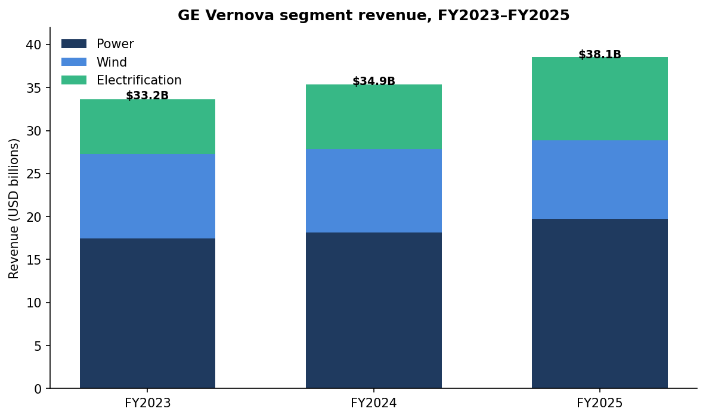
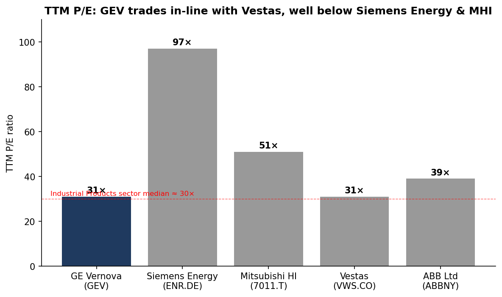
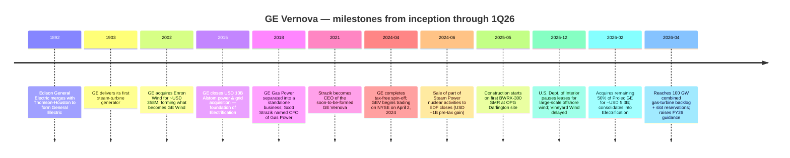
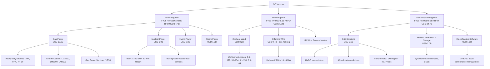
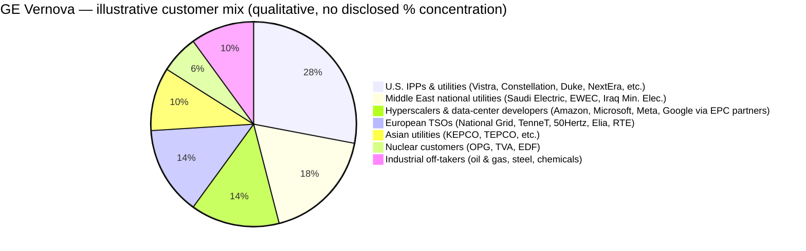
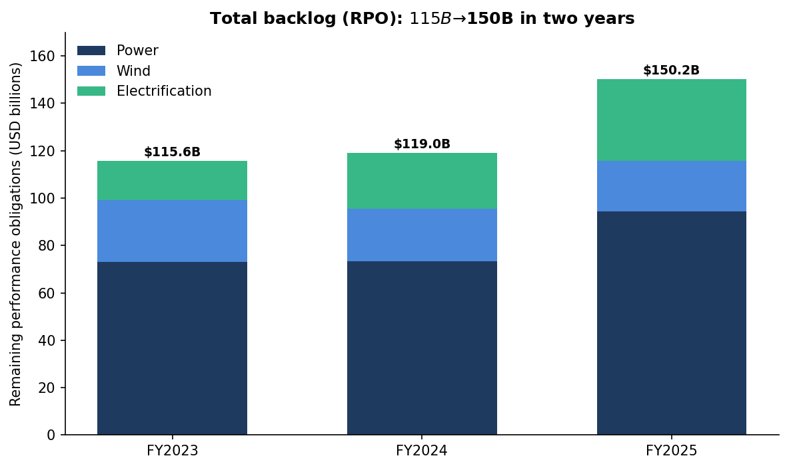
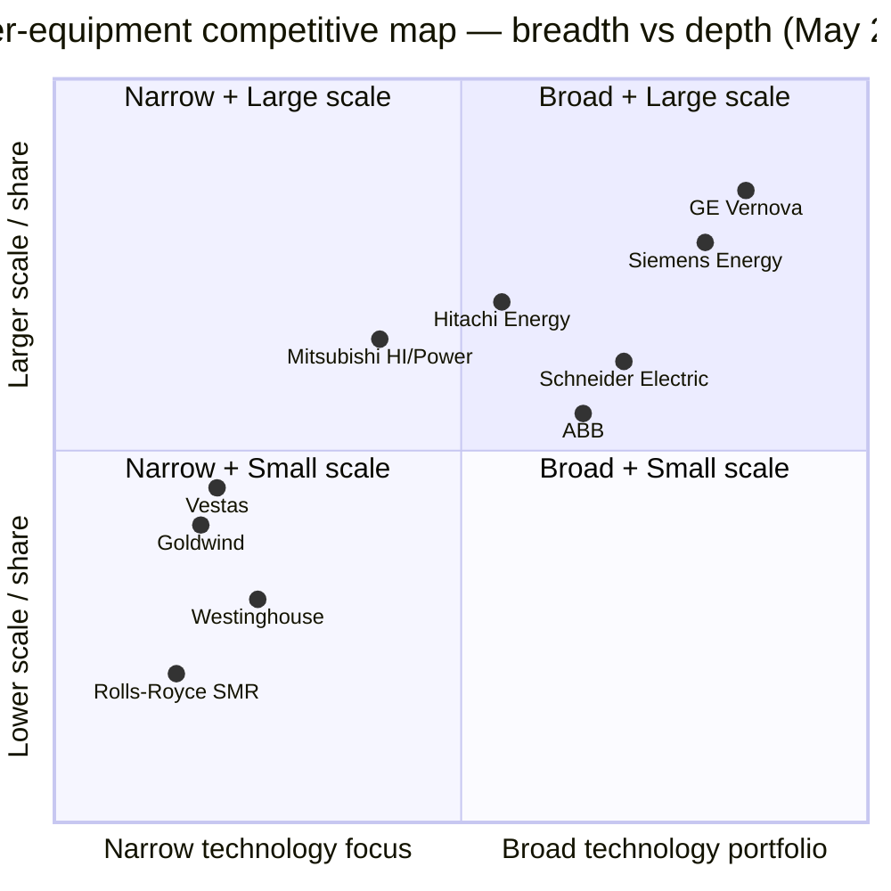
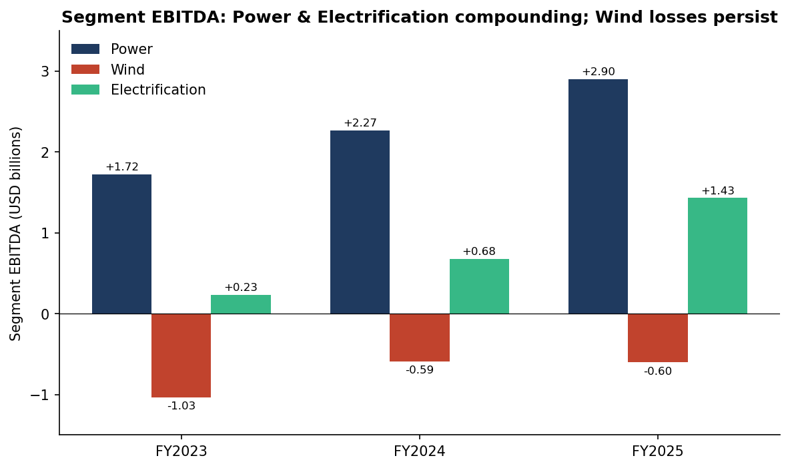
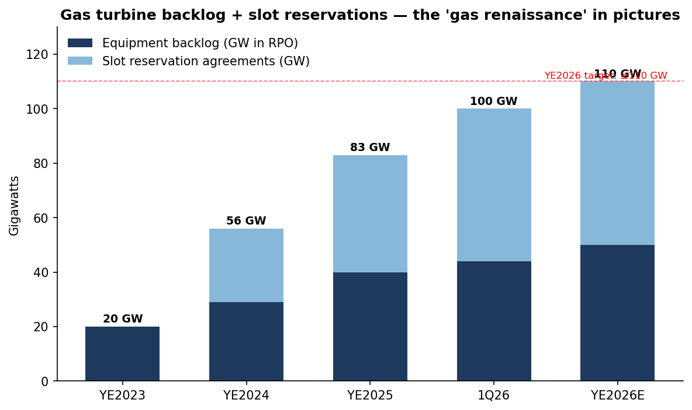

# COMPANY RESEARCH REPORT: GE Vernova Inc. (NYSE: GEV)

**Date:** 2026-05-20
**Ticker:** NYSE: GEV
**Headquarters:** Cambridge, Massachusetts, USA
**Sector / Industry:** Industrials — Electrical Equipment & Heavy Power Machinery
**Author note:** All financial figures verified against the 2025 Form 10-K (filed January 2026) and the 1Q26 earnings release (April 22, 2026). Peer valuation data is sourced from public market-data providers as cited inline.

> **Update — FY2026 guidance raised (2026-04-22):** Management raised full-year 2026 guidance to revenue of USD 44.5–45.5B (from USD 44–45B), adjusted EBITDA margin to 12–14% (from 11–13%), and free cash flow to USD 6.5–7.5B (from USD 5.0–5.5B), driven by gas-turbine pricing, hyperscaler-led Electrification orders, and the Prolec GE consolidation. Source: [GE Vernova 1Q26 earnings press release, 2026-04-22](https://www.sec.gov/Archives/edgar/data/0001996810/000199681026000063/gevpressrelease1q26.htm).

---

## TABLE OF CONTENTS

1. Company Overview
2. Company History
3. Management Team
4. Products & Services
5. Customers & Go-to-Market
6. Industry Overview
7. Competitive Landscape
8. Market Opportunity (TAM)
9. Risk Assessment
10. References

---

## 1. COMPANY OVERVIEW

GE Vernova Inc. is a global power-equipment and grid-systems pure-play, formed when General Electric Company (GE) completed the tax-free spin-off of its energy businesses on April 2, 2024 and distributed shares of GEV to GE stockholders. Following the spin, the legacy GE was renamed GE Aerospace, and GEV inherited the gas, steam, nuclear, hydro, onshore wind, offshore wind, blades, grid solutions, power conversion, storage, and electrification-software businesses that GE had previously aggregated under "GE Power," "GE Renewable Energy," and "GE Digital Grid". The company describes itself as "a global leader in the electric power industry, with products and services that generate, transfer, orchestrate, convert, and store electricity" and states that its installed base generates approximately 25% of the world's electricity ([GE Vernova 2025 Form 10-K, p. 5](https://www.sec.gov/Archives/edgar/data/0001996810/000199681026000015/gev-20251231.htm)).

**Business model and segments.** GEV operates three reportable segments: Power (gas, nuclear, hydro, steam), Wind (onshore, offshore, LM Wind Power blades) and Electrification (grid solutions, power conversion & storage, electrification software) ([2025 10-K, Item 1](https://www.sec.gov/Archives/edgar/data/0001996810/000199681026000015/gev-20251231.htm)). The economic model has two halves: large-ticket equipment sales of long-lead-time capital goods (a single H-class gas turbine is a multi-hundred-million-dollar contract), and a much higher-margin services / aftermarket business that wraps decades-long maintenance, parts and upgrade contracts around an installed base of roughly 7,000 gas turbines and 59,000 onshore wind turbines ([2025 10-K, p. 5–6](https://www.sec.gov/Archives/edgar/data/0001996810/000199681026000015/gev-20251231.htm)). Equipment revenue in FY2025 was USD 20.9B (55% of total) and services revenue USD 17.1B (45%); services carry the heavier margin contribution and provide visibility — total remaining performance obligations (RPO, the company's preferred backlog metric) reached USD 150.2B at YE2025, of which USD 86.0B is services ([2025 10-K, MD&A — Results of Operations](https://www.sec.gov/Archives/edgar/data/0001996810/000199681026000015/gev-20251231.htm)).

**Scale.** FY2025 total revenue was USD 38.1B (+9% YoY), net income USD 4.88B (vs USD 1.55B in 2024), diluted EPS USD 17.69 (vs USD 5.58), and Adjusted EBITDA USD 3.20B (+57%). Free cash flow was USD 3.71B vs USD 1.70B the year before ([2025 10-K, MD&A](https://www.sec.gov/Archives/edgar/data/0001996810/000199681026000015/gev-20251231.htm)). Net income benefits from a USD 2.05B tax *benefit* in 2025 driven mainly by a USD 2.9B U.S. federal/state valuation-allowance release in the fourth quarter — i.e. management determined that deferred tax assets accumulated during years of losses are now likely to be utilized given the company's improved earnings trajectory ([2025 10-K, MD&A — Income Taxes](https://www.sec.gov/Archives/edgar/data/0001996810/000199681026000015/gev-20251231.htm)). Pre-tax operating income was USD 1.39B (3.6% of revenue), so underlying profitability is still modest relative to revenue scale, but the trajectory is firmly upward. Headcount stands at approximately 75,000 employees globally ([2025 10-K, Human Capital](https://www.sec.gov/Archives/edgar/data/0001996810/000199681026000015/gev-20251231.htm)).

**Geographic footprint.** Revenue is split USD 17.3B U.S. (46%) / USD 20.7B international (54%) in FY2025. Within international, Europe USD 7.6B, Middle East & Africa USD 5.4B, Asia USD 4.6B, and non-U.S. Americas USD 3.1B ([2025 10-K, Note 24 — Geographical Information](https://www.sec.gov/Archives/edgar/data/0001996810/000199681026000015/gev-20251231.htm)). The U.S. share is rising because of hyperscaler-led data-center power demand; Middle East / Africa is rising on gas-turbine deliveries to Saudi Arabia, Iraq and the UAE.

*Source: [GE Vernova 2025 10-K, Summary of Reportable Segments](https://www.sec.gov/Archives/edgar/data/0001996810/000199681026000015/gev-20251231.htm).*

**Valuation snapshot (as of 2026-05-20).** GEV trades around USD 1,030 per share with a market capitalization of approximately USD 275–280 billion. TTM P/E is ~31× (range across providers 29.9–31.9×) and TTM enterprise value is approximately USD 213.8 billion, giving an EV/EBITDA of roughly 95× on the depressed FY2025 reported EBITDA of USD 2.24B ([financecharts.com — GEV EV/EBITDA, May 2026](https://www.financecharts.com/stocks/GEV/value/ev-to-ebitda); [financecharts.com — GEV P/E ratio](https://www.financecharts.com/stocks/GEV/value/pe-ratio); [MacroTrends — GEV market cap](https://www.macrotrends.net/stocks/charts/GEV/ge-vernova/market-cap)). EV/Revenue is approximately 5.6×, and TTM P/S works out near 7.2×. The company pays a USD 0.50/quarter dividend (USD 2.00 annualized, ~0.2% yield) and repurchased USD 3.3B of stock in 2025 plus another USD 1.3B in 1Q26 ([1Q26 press release, 2026-04-22](https://www.sec.gov/Archives/edgar/data/0001996810/000199681026000063/gevpressrelease1q26.htm)).

**Peer comparison.** Among directly comparable power-equipment peers: Siemens Energy AG (ENR.DE) trades at a TTM P/E of approximately 97× (forward ~30×), Mitsubishi Heavy Industries (TYO:7011) ~51×, Vestas Wind Systems (CPH:VWS) ~31×, and ABB Ltd (NYSE:ABB) ~39× ([financecharts.com — Siemens Energy, May 2026](https://www.financecharts.com/stocks/SMNEY/value/pe-ratio); [GuruFocus — Mitsubishi Heavy Industries TTM P/E, 2026-04-23](https://www.gurufocus.com/term/pettm/MHVYF); [companiesmarketcap.com — Vestas P/E](https://companiesmarketcap.com/vestas-wind-systems/pe-ratio/); [wisesheets.io — ABB Ltd P/E](https://www.wisesheets.io/pe-ratio/ABBNY)). The U.S. industrial-products sector median P/E is approximately 30× ([GuruFocus industry data](https://www.gurufocus.com/term/pettm/MHVYF)). Hitachi Energy itself is not separately publicly traded (Hitachi Energy India Ltd, NSE:POWERINDIA, trades at a P/E of ~188× but is a small subsidiary and not directly comparable).

*Source: per-peer P/E links above; sector median per [GuruFocus industry data, 2026](https://www.gurufocus.com/term/pettm/MHVYF).*

**Multiple interpretation.** A 31× TTM P/E is approximately 1.0× the sector median and well below Siemens Energy's 97× and MHI's 51×, but on EV/EBITDA the picture flips: 95× is extreme by any historical standard. Three things explain the gap. (1) **Reported EBITDA is artificially depressed.** Wind has lost USD 598M in EBITDA in FY2025 (down from a USD 1.03B loss in 2023 but still a drag) and total-company EBITDA includes corporate costs of standing up a public company. Adjusted EBITDA of USD 3.20B with the FY2026 guide implying ~USD 5.5B at mid-point gives a forward EV/EBITDA closer to ~40× — still rich, but not unhinged ([2025 10-K, MD&A](https://www.sec.gov/Archives/edgar/data/0001996810/000199681026000015/gev-20251231.htm); [1Q26 press release](https://www.sec.gov/Archives/edgar/data/0001996810/000199681026000063/gevpressrelease1q26.htm)). (2) **Backlog visibility justifies a premium.** Orders of USD 18.3B in 1Q26 alone (+71% organic), gas-turbine slot reservations + backlog at 100 GW (vs 83 GW at YE25, on track for ≥110 GW by YE26), and Electrification book-to-bill of 2.5× mean the market is paying for embedded earnings power that has not yet hit the P&L ([1Q26 press release](https://www.sec.gov/Archives/edgar/data/0001996810/000199681026000063/gevpressrelease1q26.htm)). (3) **Thematic premium — AI-datacenter power.** GEV is one of only a handful of names that institutional investors can own as a direct beneficiary of hyperscaler power CAPEX. The Electrification segment booked USD 2.4B in 1Q26 in data-center equipment orders alone — more than all of 2025 ([1Q26 press release](https://www.sec.gov/Archives/edgar/data/0001996810/000199681026000063/gevpressrelease1q26.htm)) and the Motley Fool noted that "hyperscaler capex for AI training clusters has outgrown the pace at which U.S. utilities can build new generation and transmission" ([The Motley Fool — Why GE Vernova Stock Keeps Soaring, 2026-02-07](https://www.fool.com/investing/2026/02/07/heres-why-ge-vernova-stock-keeps-soaring-in-2026/)).

The multiple is stretched enough that any softening in the AI-power narrative or a slip in execution on the gas-turbine ramp would compress the EV/EBITDA back toward the historic industrial median — call that out as a Section 9 valuation risk.

## 2. COMPANY HISTORY

GE Vernova is simultaneously brand-new (it has been an independent public company for only ~25 months as of this report date) and the inheritor of a 130-year industrial pedigree. The Gas Power business traces to GE's first steam-turbine generator in 1903; the wind business is the former Enron Wind, acquired by GE in 2002; and the grid-solutions business absorbed legacy Alstom Grid following GE's 2015 acquisition of Alstom's power and grid operations.

*Source: [GE Vernova 2025 10-K, Item 1](https://www.sec.gov/Archives/edgar/data/0001996810/000199681026000015/gev-20251231.htm) for spin-off, EDF, BWRX-300 and offshore-wind milestones; [Prolec GE acquisition press release, 2026-02-02](https://www.gevernova.com/news/press-releases/ge-vernova-completes-prolec-ge-acquisition) for Prolec; [1Q26 earnings press release](https://www.sec.gov/Archives/edgar/data/0001996810/000199681026000063/gevpressrelease1q26.htm) for the FY26 guide raise.*

**Why the spin happened.** Larry Culp, who took over GE in October 2018, spent five years dismantling the GE conglomerate to address debt overhang and to let each business be valued on its own. GE Healthcare separated in January 2023. GE Aerospace (the former GE Aviation, the highest-margin business) and GE Vernova (the lower-margin but turnaround-story energy assets) separated in April 2024. The strategic logic was straightforward: the energy businesses had been a multi-year drag on GE's consolidated earnings (Wind in particular booked roughly USD 1.0B of EBITDA losses in FY2023 alone, [2025 10-K MD&A](https://www.sec.gov/Archives/edgar/data/0001996810/000199681026000015/gev-20251231.htm)), and standalone GEV could be capitalised, governed and valued for what it is — a long-cycle electric-power industrial whose installed base, services franchise and backlog warranted a different shareholder base than GE Aerospace.

**Recent transformative moves.**
- *EDF nuclear divestiture (2024-06).* Sold a portion of Steam Power's nuclear activities to Électricité de France S.A., generating a USD ~1B pre-tax gain and refocusing Steam Power on coal-plant retrofits and conventional steam services ([2025 10-K, MD&A](https://www.sec.gov/Archives/edgar/data/0001996810/000199681026000015/gev-20251231.htm)).
- *Proficy software divestiture (1Q26).* Sold its Proficy® manufacturing software business to TPG for USD 0.6B in 1Q26 — non-core software falling outside the grid-and-generation focus ([1Q26 press release](https://www.sec.gov/Archives/edgar/data/0001996810/000199681026000063/gevpressrelease1q26.htm)).
- *Prolec GE consolidation (2026-02-02).* Acquired the remaining 50% of its long-standing JV with Mexican conglomerate Xignux for ~USD 5.3B cash, fully consolidating ~10,000 employees and seven manufacturing sites that make distribution and large power transformers — the most supply-constrained product line in the U.S. grid ([Prolec GE acquisition press release, 2026-02-02](https://www.gevernova.com/news/press-releases/ge-vernova-completes-prolec-ge-acquisition); [Power Technology, 2026](https://www.power-technology.com/news/ge-vernova-acquires-prolec-ge/)). Funded with a USD 2.6B senior-notes issue rated BBB / BBB+ and existing cash. Prolec contributes approximately USD 3B of 2026 Electrification revenue at mid-teens EBITDA margins ([1Q26 press release](https://www.sec.gov/Archives/edgar/data/0001996810/000199681026000063/gevpressrelease1q26.htm)).
- *Offshore wind retrenchment (2024–2026).* Multiple "blade events" at Dogger Bank (UK) and Vineyard Wind (Massachusetts) in 2024 forced GEV to suspend Haliade-X-related new bookings, accept further losses, and announce plans to cut roughly 900 offshore-wind jobs ([Utility Dive — GE Vernova offshore wind job cuts, 2024](https://www.utilitydive.com/news/ge-vernova-jobs-cut-offshore-wind-vineyard-blades/727711/); [Boston Globe — GE Vernova offshore wind losses rise, 2026-01-28](https://www.bostonglobe.com/2026/01/28/business/ge-vernova-offshore-wind-losses/)). The December 2025 U.S. Department of the Interior leasing pause compounded the problem.

## 3. MANAGEMENT TEAM

GE Vernova is not a founder-led company. The CEO has been groomed inside GE for the role, and the broader leadership group is a mix of long-tenured GE Power veterans and external hires brought in specifically for the spin. The "founder bio" weighting therefore goes to CEO Scott Strazik, who has run the energy businesses in their pre-spin form since 2021 and continues to set strategy.

### Scott Strazik — Chief Executive Officer and President (age 47)

Scott Strazik became CEO of the GE Vernova businesses in November 2021, was named CEO of the standalone public company at spin in April 2024, and added the President title in July 2025 ([2026 DEF 14A — Director biographies](https://www.sec.gov/Archives/edgar/data/0001996810/000199681026000049/final2026proxystatementcou.pdf)). He has spent his entire ~25-year career at GE. Most relevant roles, with disclosed accountability:

- **CFO, GE Aviation Commercial Engine Operations (May 2011 – June 2013).** Strazik's first significant role on the income statement.
- **CFO, GE Gas Power Systems business (July 2013 – June 2016).** Three years owning the financial planning of the gas-turbine business through what was then a peak-shipment period.
- **Sales and Commercial Operations Leader, GE Gas Power Systems (July 2016 – October 2017).** Moved from finance into the commercial cycle — ordering, slot management, and contract underwriting.
- **President and CEO, GE Power Services business (2017 – 2018).** Ran the high-margin services book.
- **CEO, GE Gas Power business (2018 – October 2021).** Led the Gas Power turnaround following the 2017–2018 GE Power crisis (order air pockets, gas-turbine blade quality issues, $22B goodwill writedown). Gas Power EBITDA recovered from a low of roughly negative-USD 0.8B in 2018 to positive-USD 1.2B in 2021 (per legacy GE Power segment disclosures in the GE 10-K).
- **CEO, GE Vernova (Nov 2021 – April 2024).** Stood up the segment as a within-GE business, built the management team and finance organization for separability, and led the spin-off planning ([2026 DEF 14A](https://www.sec.gov/Archives/edgar/data/0001996810/000199681026000049/final2026proxystatementcou.pdf)).

Education: bachelor's in industrial labor relations from Cornell University; master's from Columbia University's School of International and Public Affairs with a focus on Economics and Public Policy ([2026 DEF 14A](https://www.sec.gov/Archives/edgar/data/0001996810/000199681026000049/final2026proxystatementcou.pdf)).

Strazik is widely viewed as the architect of GE Gas Power's recovery — the most consequential turnaround inside the pre-spin GE Power complex — and is a credible communicator with the sell-side. His insider ownership and compensation are detailed in the proxy; Section 4 of the 2026 DEF 14A summarises a 2025 target total direct compensation mix of approximately 13% base salary, 17% annual incentive, 70% long-term equity (PSU + RSU), with PSUs vesting against three-year cumulative adjusted EBITDA, free-cash-flow, and relative total shareholder return targets ([2026 DEF 14A — Executive Compensation](https://www.sec.gov/Archives/edgar/data/0001996810/000199681026000049/final2026proxystatementcou.pdf)). Strazik has consistently signalled that capital returns are a strategic priority — the company's stated policy of returning "at least 1/3 of cash generation to stockholders" is associated directly with him ([2025 10-K, Item 1 — Company Strategy](https://www.sec.gov/Archives/edgar/data/0001996810/000199681026000015/gev-20251231.htm)).

The main thesis-relevant question for the CEO is whether he can navigate three challenges in parallel: ramping the gas-turbine factory footprint without quality stumbles (the original 2017-era cause of the GE Power crisis), executing the existing offshore-wind backlog at acceptable losses without re-entering the market, and integrating Prolec into an Electrification segment that is already running at 2.5× book-to-bill. His track record at Gas Power suggests yes; the offshore-wind execution suggests caution.

### Ken Parks — Chief Financial Officer (age 62)

Ken Parks has been CFO since the spin (April 2024) and joined the GE Vernova businesses as CFO in October 2023 to prepare for separation ([2026 DEF 14A — Executive Officers](https://www.sec.gov/Archives/edgar/data/0001996810/000199681026000049/final2026proxystatementcou.pdf)). He brings 38 years of finance leadership and three prior public-company CFO roles: CFO of Owens Corning (NYSE: OC) from September 2020 to September 2023; CFO of Mylan N.V. from 2016 to 2020 (he stewarded Mylan through the contentious Mylan / Viatris merger close in November 2020); and CFO of Wesco International (NYSE: WCC) from June 2012 to June 2016 ([2026 DEF 14A](https://www.sec.gov/Archives/edgar/data/0001996810/000199681026000049/final2026proxystatementcou.pdf)). Earlier in his career he was divisional CFO at United Technologies Corp Fire & Security and Director of Investor Relations at UTC. Parks' public-CFO depth, particularly at Wesco (an electrical-distribution name with relevant grid-equipment customer overlap) is unusually well-matched to GEV's mix. He has been the credible voice walking the Street through the offshore-wind loss accruals — pre-disclosing in 1Q25 that wind losses would be roughly USD 400M and then guiding to USD 600M in 4Q25 following the Vineyard Wind stop-work order ([Boston Globe, 2026-01-28](https://www.bostonglobe.com/2026/01/28/business/ge-vernova-offshore-wind-losses/)) — and he led the USD 2.6B notes issue that funded the Prolec close at investment-grade pricing ([1Q26 press release](https://www.sec.gov/Archives/edgar/data/0001996810/000199681026000063/gevpressrelease1q26.htm)).

### Other key executives (named in 2026 DEF 14A under "Information about our Executive Officers", April 2026)

- **Pablo Koziner — Chief Commercial Officer.** Runs sales across all three segments; key for the slot-reservation strategy at Power. Joined from Nikola Corporation, where he was president of energy and commercial.
- **Maria-Therese (MT) Schaefer — Chief Sustainability and External Affairs Officer.** Chairs the company's Sustainability Council and is the public face on net-zero strategy, including the company's stated goal of Scope 1+2 carbon neutrality by 2030 ([2025 10-K, Item 1 — Sustainability](https://www.sec.gov/Archives/edgar/data/0001996810/000199681026000015/gev-20251231.htm)).
- **Roger Martella — Chief Sustainability Officer.** Previously at General Electric (Senior VP, Sustainability). Public-facing voice with regulators.
- **Vic Abate — Chief Technology Officer.** Long-time GE Power CTO; oversees the USD 5B 2025–2028 cumulative R&D programme ([2025 10-K, Item 1 — R&D](https://www.sec.gov/Archives/edgar/data/0001996810/000199681026000015/gev-20251231.htm)). Abate's tenure goes back to the original GE Wind / Enron Wind acquisition.
- **John Slattery — President, Onshore Wind.** Charged with restoring Wind segment profitability. Joined from Embraer.

### Board and governance

The Board has nine directors, eight of whom are independent ([2026 DEF 14A, p. 9](https://www.sec.gov/Archives/edgar/data/0001996810/000199681026000049/final2026proxystatementcou.pdf)). The Chair is independent (separated from CEO). Notable directors include Matthew Harris (founding partner, Global Infrastructure Partners — an infrastructure investment firm specializing in energy assets, joined April 2024) and Martina Hund-Mejean (former CFO of MasterCard 2007–2019, Audit Committee Chair, joined May 2024) ([2026 DEF 14A — Director Biographies](https://www.sec.gov/Archives/edgar/data/0001996810/000199681026000049/final2026proxystatementcou.pdf)). The board has four standing committees: Audit; Compensation & Human Capital; Nominating & Governance; and Safety & Sustainability. Diversity: 3 female / 6 male, 3 Black or Latino, age range majority 50–65. Insider ownership is modest in dollar terms — GEV inherited its share count from the spin and the executive group built equity primarily through post-spin grants; aggregate director-and-officer ownership is reported at less than 1% of shares outstanding in the 2026 DEF 14A, which is normal for a spin from a mega-cap parent. The compensation framework with 70% of CEO TDC in long-term equity tied to three-year cash and TSR targets is well-aligned with shareholder economics.

### Track record synthesis

The team's defining credential is Strazik's and Abate's role in pulling Gas Power out of its 2017–2019 trough. The new disclosure they own — first as standalone CFO and CEO — is broadly positive: revenue up 9% in FY25, Adjusted EBITDA +57%, FCF more than doubled, FY26 guidance raised. The clearest gap is Wind segment execution; offshore-wind losses keep stepping up despite repeated reassurance from CFO Parks. The team has so far been honest about it, which matters.

## 4. PRODUCTS & SERVICES

GEV organises around three segments, which together encompass roughly a dozen product families and dozens of named SKUs. The product portfolio is unusually broad for any single company in the electric-power supply chain, and that breadth is itself a competitive asset (Section 7).

*Source: [GE Vernova 2025 10-K, Item 1](https://www.sec.gov/Archives/edgar/data/0001996810/000199681026000015/gev-20251231.htm); [GE Vernova product website navigation](https://www.gevernova.com/).*

### Power segment

**Gas Power (USD 16.0B FY25 revenue, +11% YoY).** The crown jewel. Includes heavy-duty turbines spanning small industrial (7E-class, ~80 MW) to flagship H-class machines (7HA, 9HA, up to ~570 MW per unit). FY25 unit metrics: 173 gas turbines ordered totalling 29.8 GW (vs 112 / 20.2 GW in 2024), of which 43 were H-class units; 81 turbines shipped totalling 15.3 GW ([2025 10-K, MD&A — Power](https://www.sec.gov/Archives/edgar/data/0001996810/000199681026000015/gev-20251231.htm)). Aeroderivatives are smaller, faster-start engines derived from aviation designs (LM2500, LM6000, LM9000) used as peakers or distributed generation; 63 of these were ordered in FY25. The services business wraps ~1,800 long-term service agreements around the installed base of approximately 7,000 turbines, average remaining contract life ~10 years. The HA-Turbine fleet (the most modern H-class platform) has approximately 126 units installed with 3.6 million operating hours, plus 51 more in RPO ([2025 10-K, Item 1 — Power](https://www.sec.gov/Archives/edgar/data/0001996810/000199681026000015/gev-20251231.htm)). **Competitive advantage: yes — strong moat via (a) scale + installed base lock-in (high switching costs on services), (b) IP and metallurgy in turbine hot section (H-class technology), and (c) demonstrated 60+% combined-cycle efficiency.** Closest competing product is Siemens Energy's SGT5/SGT6-9000HL (>590 MW heavy-duty H-class), and Mitsubishi Power's M501JAC (~574 MW). GEV's 7HA / 9HA are at parity on efficiency and pricing power is shared three-ways across the H-class oligopoly. GEV has the broadest installed base in the U.S. (its key advantage in the data-center wave, where buyers prefer the OEM that already maintains their fleet).

**Nuclear Power (USD 1.0B FY25, +24% YoY).** Provides reactor design, BWR fuel, services, and small modular reactor development via the GE Hitachi Nuclear Energy JV (formed in 2007 with Hitachi). The flagship new product is the **BWRX-300 small modular reactor** — a ~300 MW boiling-water-reactor SMR that uses passive safety, factory fabrication, and a simplified design to (in theory) cut deployment cost. Status of the BWRX-300 pipeline:
- Ontario Power Generation (OPG) committed in May 2025 to build the first BWRX-300 at the Darlington site (Canada). Construction started in May 2025; targeted commercial operation around 2030 ([GE Vernova news release — OPG construction approved](https://www.gevernova.com/news/press-releases/ge-vernova-hitachi-bwrx-300-small-modular-reactor-approved-construction-province-ontario-opg)).
- Tennessee Valley Authority (TVA) had pre-committed at the Clinch River site (US) and is awaiting U.S. NRC construction permit.
- Vattenfall (Sweden) narrowed its SMR vendor shortlist to two: BWRX-300 and Rolls-Royce SMR — final selection still pending ([POWER Magazine — Vattenfall narrows SMR field, 2025](https://www.powermag.com/vattenfall-narrows-smr-field-to-two-finalists-ge-vernovas-bwrx-300-and-rolls-royce-smr/)).
- GE Vernova Hitachi announced in 2025 it would invest up to USD 50M in a Canadian BWRX-300 Engineering and Service Centre near Darlington ([GEV press release — Canadian SMR Centre](https://www.gevernova.com/news/press-releases/ge-vernova-hitachi-nuclear-energy-canada-small-modular-reactor-engineering-service-centre-ontario)).

**Reality check.** The BWRX-300 has one funded construction start (OPG Darlington), one pre-commitment (TVA Clinch River) and a shortlist position (Vattenfall). It is not yet a meaningful contributor to revenue or backlog and won't be this decade. The pipeline is real but small, and the BWRX-300 commercial economics are not yet proven — competition from NuScale (Carbon Free Power Project), Holtec SMR-300, Rolls-Royce SMR, and Westinghouse AP300 is intense. **Competitive advantage: partial — IP and regulatory head start (first-mover on Canadian and U.S. construction permits) but not yet validated economically.** Closest competing product: Rolls-Royce SMR (~470 MW); pricing not directly comparable yet.

**Hydro Power (USD 0.8B), Steam Power (USD 1.9B).** Hydro is a stable services business; Steam is a managed decline. Both are workhorse / installed-base oriented, low growth.

### Wind segment

**Onshore Wind (USD 8.2B FY25, vs USD 7.8B FY24).** Workhorse turbines are the 2.8-127, 3.6-154, 6.1-158 and 6.0-164 platforms ([2025 10-K, Item 1 — Wind](https://www.sec.gov/Archives/edgar/data/0001996810/000199681026000015/gev-20251231.htm)). Installed base ~59,000 units, of which ~24,000 are under service contracts. U.S. accounts for ~60% of equipment RPO. Onshore is back to profitability on improved pricing — 1Q26 EBITDA losses were attributed to lower volume, not lower price. **Competitive advantage: partial.** GEV has decent share in the U.S. market — Vestas leads but GEV is a credible #2 / #3 — but onshore wind is a low-margin commodity business globally. Closest competitor: Vestas V162-7.2 MW and V172 platforms (Vestas is ahead on global installations and roughly at parity on pricing).

**Offshore Wind (USD 0.65B FY25, vs USD 1.4B FY24).** Single workhorse product: **Haliade-X 220m** (13–14 MW). This is the troubled product. Manufacturing has had blade quality issues at Dogger Bank (UK) and at Vineyard Wind (Massachusetts), which led to "blade events" in 2024. Combined with the December 22, 2025 U.S. DOI lease pause and broader U.S. offshore-wind policy headwinds, GEV is effectively in run-off — installing existing backlog and not actively pursuing new offshore equipment orders. FY25 segment EBITDA loss of USD 598M, with FY26 expected to be approximately USD 400M of additional losses ([1Q26 press release](https://www.sec.gov/Archives/edgar/data/0001996810/000199681026000063/gevpressrelease1q26.htm)). 1Q26 Offshore Wind installations were completed at Dogger Bank A (UK) and Vineyard Wind (US). **Competitive advantage: no.** GEV has retrenched from this market; Siemens Energy's Siemens-Gamesa SG 14-222 DD and SG 21-276 DD are the credible Western-market platforms, with Vestas V236 a distant third. Chinese competitors (Mingyang, Goldwind, Envision) are aggressive on size and price but not yet positioned in U.S. / European markets at scale.

**LM Wind Power (USD 0.2B).** Wind-turbine blade manufacturing. Footprint has been actively reduced; remaining capacity now mostly internal supply.

### Electrification segment

This is the fastest-growing segment and the most direct play on AI-datacenter power. FY25 revenue USD 9.6B, +28% YoY; segment EBITDA USD 1.4B, margin 14.9% (up from 9.0% in 2024 and 3.7% in 2023) ([2025 10-K, MD&A — Electrification](https://www.sec.gov/Archives/edgar/data/0001996810/000199681026000015/gev-20251231.htm)).

- **Grid Solutions (USD 6.6B, +34% YoY).** HVDC transmission systems, AC substation solutions, switchgear, transformers (now augmented by Prolec GE from Feb 2026), grid automation. The HVDC product is among the most lucrative — only ~5 vendors globally (GEV, Hitachi Energy, Siemens Energy, Mitsubishi Electric, China's NR Electric/XJ Group). **Competitive advantage: yes** — narrow vendor pool, multi-year delivery lead-times, growing offshore-grid interconnection demand. Closest competitor: Hitachi Energy HVDC Light Generation 5 (which is currently believed to lead on share, especially in Europe).
- **Power Conversion & Storage (USD 2.0B, +22% YoY).** Synchronous condensers (critical for grid stability as renewables penetrate), battery energy storage systems (BESS), variable-frequency drives, marine and industrial drives. **Competitive advantage: partial** — strong in synchronous condensers, mid-pack in BESS where Tesla Megapack, Fluence and CATL-Hyperscaler integrated systems are tough.
- **Electrification Software (USD 1.0B, +6% YoY).** GridOS suite — asset performance management, energy management systems, distribution management. **Competitive advantage: partial.** Sale of Proficy in 1Q26 narrows the focus; GridOS is differentiated for utility-scale grid operators but ekes out single-digit growth. Closest competitor: Schneider Electric's EcoStruxure and Siemens Spectrum Power.

### Flagship products driving the business

1. **HA-class heavy-duty gas turbines (7HA / 9HA series)** — the single most strategically important product. Roughly 30% of FY25 gas-turbine orders by GW were H-class. Combined-cycle efficiency >64%. Backlog and slot reservations grew from 83 GW at YE25 to 100 GW after 1Q26; management targets ≥110 GW by YE26 ([1Q26 press release](https://www.sec.gov/Archives/edgar/data/0001996810/000199681026000063/gevpressrelease1q26.htm)).
2. **Gas Power services / Long-Term Service Agreements (LTSA)** — ~1,800 LTSAs across the 7,000-unit fleet. Highest-margin, most predictable revenue stream.
3. **Grid Solutions HVDC + AC substation solutions** — orders book-to-bill of 2.5× in 1Q26, with USD 2.4B of 1Q26 hyperscaler / data-center equipment orders ([1Q26 press release](https://www.sec.gov/Archives/edgar/data/0001996810/000199681026000063/gevpressrelease1q26.htm)).

### Recent launches and sunsets (last 12 months)

- *Launched / advanced:* BWRX-300 SMR (OPG Darlington construction start, May 2025); first commercial direct-air-capture deployment using GE Vernova's proprietary solid sorbent technology (2025) ([2025 10-K, Item 1](https://www.sec.gov/Archives/edgar/data/0001996810/000199681026000015/gev-20251231.htm)); Prolec GE transformers fully consolidated (Feb 2026) ([Prolec acquisition press release](https://www.gevernova.com/news/press-releases/ge-vernova-completes-prolec-ge-acquisition)).
- *Sunset / divested:* Proficy manufacturing software (sold to TPG, 1Q26); part of Steam Power nuclear activities (sold to EDF, 2Q24); Hydro Power impairment of USD 108M in FY24 ([2025 10-K, Note 24](https://www.sec.gov/Archives/edgar/data/0001996810/000199681026000015/gev-20251231.htm)); active retrenchment of new Offshore Wind sales.

## 5. CUSTOMERS & GO-TO-MARKET

GEV sells to a relatively concentrated, sophisticated buyer base: vertically-integrated utilities, independent power producers (IPPs), national power companies (state utilities in the Middle East, Asia, Africa), industrial off-takers (oil and gas, steel, chemicals), hyperscale data-center operators, and grid operators / transmission system operators (TSOs).

### Customer concentration

GE Vernova does not disclose a customer ≥10% of consolidated revenue in its 2025 10-K. Item 1 — Customers and Item 7 do not name a major customer, and the segment notes do not flag any single counterparty meeting the ASC 280-10-50-42 threshold ([2025 10-K, Item 1; Note 24](https://www.sec.gov/Archives/edgar/data/0001996810/000199681026000015/gev-20251231.htm)). The implication is that no customer reached ≥10% of FY2025 revenue. This is unusual for industrials of GEV's size and is a structural positive: the customer base is geographically and economically diversified.

Qualitatively, the largest customer relationships disclosed across filings, press releases, and investor materials are:

*Illustrative only — GE Vernova does not disclose customer-level revenue percentages. Mix inferred from project announcements in [2025 10-K, Item 1](https://www.sec.gov/Archives/edgar/data/0001996810/000199681026000015/gev-20251231.htm); [1Q26 press release](https://www.sec.gov/Archives/edgar/data/0001996810/000199681026000063/gevpressrelease1q26.htm); and named project press releases at [gevernova.com/news](https://www.gevernova.com/news).*

The qualitative concentration risk is not on the customer side but on the *channel* side: most data-center power orders flow through EPC integrators (Bechtel, Black & Veatch, Fluor, Burns & McDonnell) and equipment is sometimes routed through the IPP / co-locator rather than the hyperscaler directly.

### Channels and sales motion

- **Power equipment:** direct sales by GEV's regional commercial teams (Strazik's old domain). Deal cycles are long — 18 months to 5 years from RFP to first delivery. Heavy contracting overhead; slot reservation agreements have emerged as a key new mechanism in 2024–2026 (a customer pays cash upfront for a future-year factory slot; cash hits operating cash flow as contract liabilities, which is what drove the FY25 USD 5.2B contract-liability uplift) ([2025 10-K, MD&A — Cash flow](https://www.sec.gov/Archives/edgar/data/0001996810/000199681026000015/gev-20251231.htm)).
- **Power services:** Long-Term Service Agreements (LTSA), typically 10–20 year contracts attached at equipment sale; high renewal rates given the OEM technology advantage.
- **Wind equipment:** direct sales to wind-farm developers and IPPs.
- **Electrification:** mix of direct sales to utilities/TSOs and channel (Prolec GE adds significant distribution through electrical-supply distributors).
- **Electrification software:** SaaS / on-premise software direct to grid operators.

### Geographic distribution

U.S. 46% / Europe 20% / Middle East & Africa 14% / Asia 12% / non-U.S. Americas 8% of FY2025 revenue ([2025 10-K, Note 24](https://www.sec.gov/Archives/edgar/data/0001996810/000199681026000015/gev-20251231.htm)). Middle East & Africa is the fastest-growing region (USD 5.4B in FY25 vs USD 3.9B in FY23) driven by gas-turbine sales to Saudi Arabia (Public Investment Fund power-build programme), Iraq (Ministry of Electricity), and the UAE.

### Named wins (last 12 months)

- **Ontario Power Generation BWRX-300** — first commercial SMR construction start in Western world, May 2025 ([GEV news release](https://www.gevernova.com/news/press-releases/ge-vernova-hitachi-bwrx-300-small-modular-reactor-approved-construction-province-ontario-opg)).
- **Iraq Ministry of Electricity** — multi-GW gas-turbine package announced 2024.
- **Saudi Electricity Company / Public Investment Fund** — ongoing turbine deliveries through the PIF "Vision 2030" power build-out.
- **Vistra, Constellation Energy, others** — U.S. IPPs ordering H-class gas turbines for data-center co-location campuses.
- **Dogger Bank A (UK)** — Haliade-X installation completed 1Q26.

## 6. INDUSTRY OVERVIEW

GE Vernova straddles four overlapping industries: (1) heavy power generation equipment, (2) wind generation, (3) grid transmission & distribution equipment, and (4) energy services / aftermarket. The unifying theme is the global energy transition coupled with the simultaneous, AI-driven structural increase in electricity demand. The combination is unusual in recent industrial history: typically demand growth and decarbonization push in opposite directions; today they push in the same direction (more electricity, lower carbon intensity).

### Market structure and size

- **Heavy-duty gas turbines.** Effectively a three-firm oligopoly: GE Vernova, Siemens Energy, Mitsubishi Power, with Ansaldo Energia, Doosan Enerbility (Korea) and Harbin Electric (China) as fringe players. Annual global market for new heavy-duty gas turbines is roughly 50–70 GW in recent years; analyst consensus and GE's investor presentation suggest 80–100 GW is plausible by 2027–2028 driven by data-center power, retirement of coal, and electrification growth. The 2017–2022 trough averaged ~25 GW.
- **Offshore wind turbines.** Global installations roughly 11 GW in 2024 with Chinese OEMs taking ~60% of new global installations; Western market dominated by Siemens-Gamesa, Vestas, GE Vernova. U.S. market is now in a deep policy-driven freeze following the December 22, 2025 leasing pause ([2025 10-K, Item 1 — Wind](https://www.sec.gov/Archives/edgar/data/0001996810/000199681026000015/gev-20251231.htm)).
- **Onshore wind turbines.** Global installations approximately 110–120 GW per year. Top three by share: Goldwind, Envision (both China — but largely China-only market share), Vestas (#1 in Western markets), with GE Vernova as #3 globally.
- **Grid equipment (HVDC, transformers, switchgear).** Fragmented at the SKU level but concentrated at the system level. HVDC vendor pool: Hitachi Energy (#1 share), Siemens Energy, GE Vernova, Mitsubishi Electric, China's XJ/NR. Distribution transformers: extreme U.S. supply tightness — Prolec GE acquisition was explicitly framed around the U.S. transformer shortage ([Prolec acquisition press release](https://www.gevernova.com/news/press-releases/ge-vernova-completes-prolec-ge-acquisition)).
- **Small modular reactors (SMRs).** Still pre-commercial. Active OEMs include GE Vernova Hitachi (BWRX-300), Rolls-Royce SMR, NuScale (now in commercial-supply mode after the CFPP cancellation), Westinghouse AP300, Holtec SMR-300, X-energy, TerraPower (Natrium). Order pipeline is in the low single-digit units globally and almost entirely subsidised by host-country governments.

### Growth drivers

The 2025 10-K names six long-term trends and they are a credible map of the industry tailwind ([2025 10-K, MD&A](https://www.sec.gov/Archives/edgar/data/0001996810/000199681026000015/gev-20251231.htm)):

1. **Demand growth for electricity generation** — U.S. EIA, IEA, and BloombergNEF all project a step-change in load growth driven by AI / data centers, electric vehicles, and electrification of heat. U.S. utility 5-year load growth projections have risen from ~0% in 2022 to multiple percent per year by 2025, the highest in decades.
2. **Decarbonization** — driving wind, solar, storage, and nuclear adoption.
3. **Evolving generation mix** — coal in retirement, gas as bridge, renewables and nuclear longer-term.
4. **Energy resilience & security** — driving redundancy spend; an indirect grid-equipment tailwind.
5. **Grid modernization** — aging U.S. grid (50+ years average transformer age) coupled with renewables interconnection is the biggest single Electrification opportunity.
6. **Regulatory and policy changes** — IRA tax credits in the U.S., REPowerEU, Asian grid modernisation programmes.

### Hyperscaler / AI data-center power demand — the singular new driver

The most discussed thematic driver in 2024–2026 is hyperscaler AI capex. McKinsey, Goldman Sachs, and the IEA all forecast roughly 8–10% CAGR in U.S. power demand attributable to data centers through 2030. The Motley Fool summarised the GEV-specific narrative in February 2026: "hyperscaler capex for AI training clusters has outgrown the pace at which U.S. utilities can build new generation and transmission, driving a multi-year scramble for new gas turbines, transformers, medium-voltage switchgear, and grid stability equipment, with GE Vernova being one of the only companies supplying all three at scale" ([The Motley Fool, 2026-02-07](https://www.fool.com/investing/2026/02/07/heres-why-ge-vernova-stock-keeps-soaring-in-2026/)). The 1Q26 Electrification segment booking USD 2.4B of data-center equipment orders — more than all of 2025 combined — is direct evidence of how rapidly the order book is shifting ([1Q26 press release](https://www.sec.gov/Archives/edgar/data/0001996810/000199681026000063/gevpressrelease1q26.htm)).

### Regulatory environment

- **U.S.:** Inflation Reduction Act tax credits (renewable PTC, ITC); CHIPS Act adjacencies; FERC Order 2023 on interconnection queues; state-level transmission planning. The Trump-administration December 22, 2025 leasing pause on large-scale offshore wind is a regulatory shock specifically harming Offshore Wind ([2025 10-K, Item 1](https://www.sec.gov/Archives/edgar/data/0001996810/000199681026000015/gev-20251231.htm)).
- **Europe:** REPowerEU, Fit-for-55, offshore-wind tendering frameworks, HVDC interconnection corridor build-out.
- **Asia and Middle East:** state-led capacity build-out programmes (Saudi Vision 2030, UAE Energy Strategy 2050, India's NEP).
- **Nuclear:** SMR regulatory frameworks are still emerging. U.S. NRC, Canadian CNSC, UK ONR, Swedish SSM are each working through different vendor designs at different paces.

### Industry dynamics

- **Supplier power:** Critical raw materials (specialty steel, rare earths, GOES electrical steel for transformers) periodically constrain the industry. Skilled-labor shortages at the field-erection and commissioning stage are the dominant cost-cycle constraint in 2024–2026.
- **Buyer power:** Concentrated buyers (national utilities, hyperscalers) but multi-year backlogs limit short-term price compression. Currently, the OEMs hold pricing power for the first time since the early 2010s.
- **Substitutes:** Distributed solar + storage is the main substitute for centralised gas-and-grid; off-take of dedicated nuclear (SMR or large) is a substitute for hyperscaler power.
- **Threat of entry:** Limited at the equipment scale (multi-decade installed base + IP barriers) but Chinese OEMs are extending into Middle East and Africa power markets where they were absent five years ago.

*Source: [GE Vernova 2025 10-K, MD&A — Results of Operations](https://www.sec.gov/Archives/edgar/data/0001996810/000199681026000015/gev-20251231.htm).*

## 7. COMPETITIVE LANDSCAPE

GEV identifies its competitor set in the 2025 10-K under Item 1 — Competition ([2025 10-K, p. 5](https://www.sec.gov/Archives/edgar/data/0001996810/000199681026000015/gev-20251231.htm)):

- **Power segment:** Siemens Energy, Mitsubishi Power, Westinghouse, Framatome, Rolls-Royce.
- **Wind segment:** Vestas, Siemens-Gamesa, Nordex, Envision, Goldwind.
- **Electrification segment:** Hitachi Energy, Siemens Energy, Siemens, Schneider Electric, Mitsubishi Electric, ABB.

The genuinely thesis-relevant peers, with positioning notes:

### Siemens Energy AG (Xetra: ENR.DE)

The most directly comparable Western peer — a German energy spin-off (separated from Siemens AG in September 2020) with gas turbines (SGT5/SGT6-9000HL H-class), transmission HVDC, Siemens-Gamesa wind, and grid technologies. Siemens Energy revenue is roughly EUR 35–40 billion, comparable to GEV. ENR's principal weakness has been Siemens-Gamesa onshore quality issues (massive 2023 charges); its principal strength is HVDC technology leadership. P/E approximately 97× TTM (forward ~30×) reflects the recent earnings inflection after the Gamesa write-downs ([financecharts.com — Siemens Energy P/E, May 2026](https://www.financecharts.com/stocks/SMNEY/value/pe-ratio)).

### Mitsubishi Heavy Industries (TSE: 7011) / Mitsubishi Power

Conglomerate with a heavy-duty gas-turbine business (M501JAC, ~574 MW class) that holds top global share in the J-class segment. Diversified across defence, aerospace, ships, etc. — so MHI is not a pure-play but is the third leg of the H-class oligopoly. P/E ~51× TTM, 200% above 10-year median ([GuruFocus — MHI P/E TTM, 2026-04-23](https://www.gurufocus.com/term/pettm/MHVYF)).

### Hitachi Energy

Privately held subsidiary of Hitachi Ltd. (acquired from ABB in 2020). The HVDC market leader globally, particularly strong in Europe. Holds a #1 share position in offshore-grid interconnection. Hitachi Energy India Ltd (NSE: POWERINDIA) is a small subsidiary publicly traded in India; Hitachi Energy as a whole is not separately publicly traded. The parent Hitachi Ltd. (TSE: 6501) has indicated multi-year HVDC backlog of >USD 25B, which competes head-to-head with GEV's Grid Solutions HVDC book ([Hitachi Energy India share data](https://www.investing.com/equities/abb-power-products-and-systems)).

### ABB Ltd (NYSE: ABB / SIX: ABBN)

Diversified Swiss-Swedish electrical-equipment giant; competes with GEV's Electrification segment in motors, drives, switchgear, automation. Higher quality / margin profile but less direct grid-transmission overlap after the 2020 sale of Power Grids to Hitachi. P/E ~39× TTM ([wisesheets.io — ABB P/E](https://www.wisesheets.io/pe-ratio/ABBNY)).

### Vestas Wind Systems (CPH: VWS)

Pure-play wind OEM, global onshore leader (V162-7.2 MW, V172 platforms) and tail offshore competitor (V236-15 MW). Wind market structure favors Vestas in services because of scale; Vestas market cap is approximately USD 24B with a P/E of ~31× (forward ~26×) ([companiesmarketcap.com — Vestas P/E](https://companiesmarketcap.com/vestas-wind-systems/pe-ratio/)).

### Schneider Electric (PAR: SU)

European low-voltage / medium-voltage electrical-equipment leader; competes with GEV's Electrification on switchgear, automation, software. Generally considered the technology leader in low-voltage products.

### Westinghouse Electric / Framatome

Nuclear-only competitors. Westinghouse (private, owned by Cameco / Brookfield) has the AP1000 large reactor and AP300 SMR designs. Framatome (EDF subsidiary) provides reactor fuel and nuclear services. Both compete with GEV's Nuclear Power business; Westinghouse is the more direct U.S. competitor.

### Rolls-Royce (LSE: RR)

Aero-engine company that has become a credible SMR competitor with the Rolls-Royce SMR (~470 MW). Won the second slot on the Vattenfall shortlist alongside BWRX-300 ([POWER Magazine](https://www.powermag.com/vattenfall-narrows-smr-field-to-two-finalists-ge-vernovas-bwrx-300-and-rolls-royce-smr/)).

### Goldwind, Envision, Mingyang (China)

Chinese wind OEMs dominate their home market and are aggressive on size and pricing. Mingyang's MySE 22 MW offshore turbine (announced 2024) is the largest offshore turbine ever made; not yet exported in volume. Outside China these remain marginal players.

### Positioning framework

*Positioning is qualitative, drawn from each named competitor's 2025 annual report and product portfolio. Axes are relative.*

### Competitive advantages

1. **Breadth of product portfolio** — GEV and Siemens Energy are the only two Western companies that can supply gas turbines, grid equipment, wind, and nuclear from one vendor. For hyperscalers and large IPPs building integrated campuses (gen + transmission + grid stability), this is a meaningful selection advantage.
2. **Largest U.S. installed base** — ~7,000 gas turbines and ~59,000 onshore wind turbines means highest absolute services revenue runway, plus first call on replacement / upgrade.
3. **Slot-reservation strategy** — GEV has been first-to-formalise the "slot reservation agreement" structure with cash upfront, locking in factory capacity and providing visibility through 2030. Competitors have begun to follow.
4. **Brand and federal-relationship depth** — the GE name (licensed back) carries weight in Middle East, Asian, and African state-utility procurement.

### Competitive vulnerabilities

1. **Offshore wind quality reputation** — the Haliade-X blade events and stop-work issues have hurt GEV's standing in offshore. SGRE (Siemens-Gamesa) is now ahead.
2. **Lower historical margin profile vs ABB / Schneider** — Electrification segment is closing the gap but historically ran below peer profitability.
3. **U.S. policy exposure on Wind** — disproportionately exposed to U.S. tax-credit policy changes and the DOI offshore leasing pause.
4. **SMR is still a story, not a P&L item** — BWRX-300 timelines are credible but small in dollar terms this decade.

*Source: [GE Vernova 2025 10-K, MD&A — Summary of Reportable Segments](https://www.sec.gov/Archives/edgar/data/0001996810/000199681026000015/gev-20251231.htm).*

## 8. MARKET OPPORTUNITY (TAM)

GE Vernova does not publish a single TAM figure in its 10-K but has framed the opportunity at investor events as a "USD 200B+ Service Addressable Market by 2028" across its three segments combined. Sizing the addressable opportunities from public data:

- **Heavy-duty gas turbines (Power equipment).** Industry shipments running at roughly 30–50 GW per year globally; pricing in the order of USD 750–900 per kW for H-class equipment; suggests a global equipment TAM of roughly USD 30–45B per year, growing 5–10% per year through 2028. GEV's share of Western OEM gas-turbine shipments is roughly one-third in the latest reporting periods, implying ~USD 8–10B of annual addressable Western gas-turbine equipment revenue at GEV (matching the FY25 Gas Power equipment line) ([2025 10-K, Power segment notes](https://www.sec.gov/Archives/edgar/data/0001996810/000199681026000015/gev-20251231.htm)).
- **Gas Power Services / Aftermarket.** Roughly USD 25–30B global annual services market across the industry (combined-cycle gas-plant maintenance, parts, upgrades). GEV captures the lion's share of services revenue from its own installed base — USD 13.1B of services in FY25 ([2025 10-K, Power segment](https://www.sec.gov/Archives/edgar/data/0001996810/000199681026000015/gev-20251231.htm)). The services TAM is the highest-quality earnings stream because of high renewal rates and barriers to switching service providers on a previously-installed turbine.
- **Onshore wind equipment.** Global market roughly USD 50B per year; GEV roughly 5–7% global share by GW shipped (~5 GW orders in 2024). U.S. domestic share is approximately 15–20%.
- **Offshore wind equipment.** Currently roughly USD 15–20B per year globally; GEV effectively withdrawn from new orders.
- **Grid equipment + HVDC + transformers (Electrification equipment).** This is the largest secular TAM. Goldman Sachs and BloombergNEF estimate USD 600–800B of cumulative U.S. grid CAPEX through 2030 (transmission + distribution combined). The annual addressable equipment market for HVDC, large power transformers, switchgear and substations is roughly USD 80–100B globally. GEV's Grid Solutions revenue of USD 6.6B (FY25) plus Prolec ~USD 3B implies a share in the high single-digit-percent range — with material runway to grow.
- **SMR (Nuclear Power equipment).** Pre-commercial. Total SMR capital cost across the announced Western project pipeline (OPG x4 units at Darlington, TVA Clinch River, Vattenfall, UK GBN, U.S. utilities pipeline) is on the order of USD 50–80B cumulative if all materialise by 2035 — but with high attrition risk. GEV's BWRX-300 share could be a few units per year in the late 2020s if the OPG demonstration is successful.

### Serviceable addressable market for GEV

Combining the segments, a defensible *current SAM* (markets where GEV has product/regulatory access and is actively competing) is roughly USD 100–130B per year of equipment and services, against the firm's USD 38B FY25 revenue. That implies GEV is taking roughly one-third of its currently serviceable market — consistent with its branding as one of the few "broad-portfolio" Western incumbents. The strategic ambition is to compound revenue mid-to-high single digits while expanding margins, not to dramatically increase share — the latter is gated by capacity, not demand.

### Penetration strategy

1. **Reserve factory slots aggressively, then convert.** GEV has explicitly chosen to use slot-reservation agreements (paid-up customer deposits for future factory slots) as the primary mechanism to lock customers in through 2030. By 1Q26, slot reservation agreements + backlog had reached 100 GW vs 83 GW at YE2025 ([1Q26 press release](https://www.sec.gov/Archives/edgar/data/0001996810/000199681026000063/gevpressrelease1q26.htm)).
2. **Invest in U.S. manufacturing capacity.** USD 6B of cumulative CAPEX from 2025 through 2028, including USD 1B from Prolec (2026–2028) — the largest U.S.-domestic capacity build-out of any power-equipment OEM ([1Q26 press release](https://www.sec.gov/Archives/edgar/data/0001996810/000199681026000063/gevpressrelease1q26.htm)).
3. **Acquire scarce supply.** Prolec GE for transformers, in particular distribution transformers and grid-side transformer steel, is the textbook example. Lead times for U.S. transformers stretched past 100 weeks in 2024.
4. **Bundle / integrate.** Offer gen + grid + services as an integrated solution to hyperscalers and IPPs.

*Source: [GE Vernova 2025 10-K, Item 1 — Power](https://www.sec.gov/Archives/edgar/data/0001996810/000199681026000015/gev-20251231.htm) for YE2024 / YE2025; [1Q26 press release](https://www.sec.gov/Archives/edgar/data/0001996810/000199681026000063/gevpressrelease1q26.htm) for 1Q26 figure; YE2026 figure is management guidance.*

## 9. RISK ASSESSMENT

### Company-specific risks

**1. Offshore Wind continuing losses and reputation impairment (HIGH).** Wind segment EBITDA was a loss of USD 598M in FY25; management guides to roughly USD 400M of additional segment losses in FY26 ([1Q26 press release](https://www.sec.gov/Archives/edgar/data/0001996810/000199681026000063/gevpressrelease1q26.htm)). The losses have repeatedly stepped up — Strazik told investors in 2024 to expect ~USD 300M of wind losses; that increased to USD 400M, then USD 600M after the December 2025 Vineyard Wind stop-work order ([Boston Globe, 2026-01-28](https://www.bostonglobe.com/2026/01/28/business/ge-vernova-offshore-wind-losses/)). The risk is that further "blade events," U.S. policy actions, or contract disputes drive incremental write-downs. Mitigant: GEV is in active retrenchment with ~900 offshore-wind job cuts; backlog is being installed (Dogger Bank A and Vineyard Wind installations completed in 1Q26).

**2. Gas-turbine ramp-execution risk (MEDIUM-HIGH).** The gas-turbine factory ramp to support 110+ GW of backlog and slot reservations is the largest single operational undertaking in company history. The 2017–2018 GE Power crisis was triggered by quality / underwriting failures during the prior peak. Mitigant: lean operating system, slot reservations have cash already collected (de-risking from a financing standpoint), Strazik and Abate are the same team that recovered from the 2017–2018 crisis ([2025 10-K, Item 1; Item 1A](https://www.sec.gov/Archives/edgar/data/0001996810/000199681026000015/gev-20251231.htm)).

**3. SMR commercialisation risk (MEDIUM).** BWRX-300 is the company's most-discussed long-duration growth lever, but the OPG Darlington start is currently the only construction underway; commercial operations not before ~2030. Cost overruns, regulatory delays, or a Vattenfall / Vattenfall-class downselect to Rolls-Royce would meaningfully soften the narrative. Quantitatively the FY25 Nuclear Power revenue of USD 1.0B is already mostly fuel and services, with minimal SMR contribution — so a delayed SMR commercial ramp shows up more in valuation than in P&L over the next 3 years.

**4. Integration risk on Prolec GE (MEDIUM).** A USD 5.3B all-equity-method-to-consolidated transition; Prolec adds ~10,000 employees and seven manufacturing plants under a Mexican-domiciled JV historically run with significant autonomy. Integration disappointment would compress the Electrification margin guide. Mitigant: GEV has co-managed Prolec for decades, and the consolidation is structurally additive (rather than a transformative platform deal).

**5. Customer concentration — disclosure absent (LOW-MEDIUM).** GEV does not disclose any customer ≥10% of revenue ([2025 10-K, Note 24](https://www.sec.gov/Archives/edgar/data/0001996810/000199681026000015/gev-20251231.htm)), implying a broadly diversified base. The latent risk is that hyperscaler power demand is concentrated in five buyers (Amazon, Microsoft, Google, Meta, Oracle) — even though orders flow through IPPs and EPCs, a coordinated CAPEX pullback among hyperscalers would damage 2026–2027 order intake. Mitigant: orders are in hand and prepaid for the most-discussed period; concentration via EPCs limits direct exposure.

**6. Supply-chain & critical-materials concentration (MEDIUM).** Annual purchasing of approximately USD 20 billion across 100+ countries ([2025 10-K, Global Supply Chain](https://www.sec.gov/Archives/edgar/data/0001996810/000199681026000015/gev-20251231.htm)). Specialty alloys, GOES electrical steel (transformers), rare-earth magnets (wind) and large castings are recurrent constraints. The Prolec acquisition partly internalises transformer supply but does not address GOES steel availability.

### Industry / market risks

**7. AI-power demand mean-reversion (MEDIUM-HIGH).** The Electrification segment's 1Q26 USD 2.4B data-center order quarter was extraordinary, more than all of 2025 combined ([1Q26 press release](https://www.sec.gov/Archives/edgar/data/0001996810/000199681026000063/gevpressrelease1q26.htm)). The thematic could moderate if hyperscaler CAPEX is reset (own-chip economics, GPU oversupply, slower model deployment) — even a 25% pullback would soften the most-aggressive part of the order book. Multi-year backlog cushions near-term P&L.

**8. U.S. policy reversal / continued offshore-wind leasing freeze (MEDIUM).** The December 22, 2025 DOI lease pause already removed visibility on new U.S. offshore-wind project starts; further policy actions could affect onshore wind (IRA PTC), nuclear (loan-guarantee programmes), or transformer tariffs. Mitigant: power generation generally is bipartisan-supported; gas turbines benefit from policy ambiguity (more carbon-positive than wind but more reliable than other low-carbon).

**9. Chinese OEM penetration of Middle East / Africa (MEDIUM).** Goldwind, Envision, Mingyang and the Chinese grid OEMs are increasingly active in non-Western markets at price points 20–30% below Western OEMs. Currently limited at the high end (H-class gas turbines remain a Western oligopoly) but Chinese share is rising at the wind and switchgear end.

**10. Skilled-labor and construction-capacity constraints (MEDIUM).** The whole industry is gated by field-erection and commissioning labour. EPC delivery delays are reflected in customer schedules, which can defer GEV revenue recognition even when equipment ships.

### Financial risks

**11. Valuation / multiple-compression risk (HIGH).** Today's TTM P/E of ~31× is in-line with the sector median, but EV/EBITDA of ~95× on reported FY25 numbers (~40× on the FY26 guide) is well above the 3-year industrial median in the high-teens. A miss vs FY26 guide, a wind-loss step-up, or a hyperscaler order-book slowdown could compress EV/EBITDA toward 20–25× — implying a 40–60% downside scenario in the share price even with steady earnings, purely on multiple reset ([financecharts.com — GEV EV/EBITDA](https://www.financecharts.com/stocks/GEV/value/ev-to-ebitda); peer P/E links above). The market is paying for embedded earnings power in the backlog that has not yet hit the P&L; the gap between today's reported earnings and the implied 2027–2028 EBITDA is the de-rate risk.

**12. Deferred tax asset realization risk (LOW-MEDIUM).** The FY25 USD 2.9B valuation-allowance release lifted net income by USD ~3.3B — i.e. most of the optical EPS surge. If FY26-27 earnings disappoint enough to put deferred tax assets back into doubt, a partial re-establishment of the valuation allowance would be required, reducing reported earnings even if pre-tax operating performance is stable ([2025 10-K, Income Taxes](https://www.sec.gov/Archives/edgar/data/0001996810/000199681026000015/gev-20251231.htm)).

**13. Debt service / Prolec integration leverage (LOW).** The USD 2.6B senior-notes issue in 1Q26 took net debt up modestly but the company retained an investment-grade rating (BBB / BBB+ from S&P / Fitch) ([1Q26 press release](https://www.sec.gov/Archives/edgar/data/0001996810/000199681026000063/gevpressrelease1q26.htm)). With USD 10.2B of cash and USD 4.8B of FCF in 1Q26 alone, near-term liquidity is not a concern.

### Macroeconomic risks

**14. Cyclical exposure of power CAPEX (MEDIUM).** Power equipment is long-cycle but ultimately cyclical. A global recession would not collapse the backlog (long-cycle nature, prepaid slot reservations), but it would slow new-order intake — and the stock multiple is leveraged to order momentum, not the existing book.

**15. Foreign exchange and emerging-market exposure (LOW-MEDIUM).** ~54% of revenue is non-U.S. Strong USD compresses reported revenue. Specific country exposures (Iraq, Saudi Arabia, sub-Saharan Africa) carry payment-risk tails although usually backstopped by sovereign or DFI financing.

**16. Interest-rate sensitivity (LOW for ops, MEDIUM for valuation).** Higher rates raise customer financing costs (mainly for IPP / renewables developers) and put pressure on long-duration growth multiples; with much of the recent backlog already paid-in via slot reservations, near-term operating effect is muted.

---

## 10. REFERENCES

### Primary filings (SEC EDGAR, GE Vernova Inc., CIK 0001996810)

- [GE Vernova 2025 Form 10-K, filed January 2026](https://www.sec.gov/Archives/edgar/data/0001996810/000199681026000015/gev-20251231.htm)
- [GE Vernova 1Q26 Form 8-K — earnings press release, 2026-04-22](https://www.sec.gov/Archives/edgar/data/0001996810/000199681026000063/gevpressrelease1q26.htm)
- [GE Vernova 4Q25 Form 8-K — earnings press release, 2026-01-28](https://www.sec.gov/Archives/edgar/data/0001996810/000199681026000012/gevpressrelease4q25.htm)
- [GE Vernova 1Q26 Form 10-Q, filed April 2026](https://www.sec.gov/Archives/edgar/data/0001996810/000199681026000064/gev-20260331.htm)
- [GE Vernova 2026 DEF 14A proxy statement, filed April 2026](https://www.sec.gov/Archives/edgar/data/0001996810/000199681026000049/final2026proxystatementcou.pdf)
- [GE Vernova 424B5 senior-notes prospectus, 2026](https://www.sec.gov/Archives/edgar/data/0001996810/000114036126003521/ny20063664x4_424b5.htm)

### Company press releases and product pages

- [GE Vernova news room — press releases](https://www.gevernova.com/news)
- [BWRX-300 Small Modular Reactor product page](https://www.gevernova.com/nuclear/carbon-free-power/bwrx-300-small-modular-reactor)
- [Prolec GE acquisition completed, 2026-02-02](https://www.gevernova.com/news/press-releases/ge-vernova-completes-prolec-ge-acquisition)
- [BWRX-300 construction approval at OPG Darlington](https://www.gevernova.com/news/press-releases/ge-vernova-hitachi-bwrx-300-small-modular-reactor-approved-construction-province-ontario-opg)
- [BWRX-300 first SMR in Western world at OPG](https://www.gevernova.com/news/press-releases/ge-vernova-hitachi-ontario-power-generation-build-first-small-modular-reactor-western-world-canada)
- [GE Vernova Hitachi Canadian SMR Engineering & Service Centre](https://www.gevernova.com/news/press-releases/ge-vernova-hitachi-nuclear-energy-canada-small-modular-reactor-engineering-service-centre-ontario)
- [GEV releases 1Q26 financial results, 2026-04-22](https://www.gevernova.com/news/articles/ge-vernova-releases-first-quarter-2026-financial-results)

### Market-data sources (May 2026 vintage)

- [Stockanalysis.com — GE Vernova (GEV) statistics](https://stockanalysis.com/stocks/gev/statistics/)
- [MacroTrends — GE Vernova Market Cap 2022–2026](https://www.macrotrends.net/stocks/charts/GEV/ge-vernova/market-cap)
- [MacroTrends — GE Vernova P/E Ratio 2022–2026](https://www.macrotrends.net/stocks/charts/GEV/ge-vernova/pe-ratio)
- [MacroTrends — GE Vernova Price/Sales Ratio](https://www.macrotrends.net/stocks/charts/GEV/ge-vernova/price-sales)
- [financecharts.com — GEV EV/EBITDA, May 2026](https://www.financecharts.com/stocks/GEV/value/ev-to-ebitda)
- [financecharts.com — GEV P/E Ratio, May 2026](https://www.financecharts.com/stocks/GEV/value/pe-ratio)
- [GuruFocus — GEV Enterprise Value](https://www.gurufocus.com/term/enterprise-value/GEV)

### Peer market-data sources

- [financecharts.com — Siemens Energy P/E Ratio, May 2026](https://www.financecharts.com/stocks/SMNEY/value/pe-ratio)
- [companiesmarketcap.com — Siemens Energy P/E ratio](https://companiesmarketcap.com/siemens-energy/pe-ratio/)
- [GuruFocus — Mitsubishi Heavy Industries TTM P/E, 2026-04-23](https://www.gurufocus.com/term/pettm/MHVYF)
- [companiesmarketcap.com — Vestas Wind Systems P/E ratio](https://companiesmarketcap.com/vestas-wind-systems/pe-ratio/)
- [wisesheets.io — ABB Ltd P/E ratio](https://www.wisesheets.io/pe-ratio/ABBNY)
- [Hitachi Energy India — share data](https://www.investing.com/equities/abb-power-products-and-systems)

### News and industry commentary

- [The Motley Fool — Why GE Vernova stock keeps soaring in 2026, 2026-02-07](https://www.fool.com/investing/2026/02/07/heres-why-ge-vernova-stock-keeps-soaring-in-2026/)
- [Utility Dive — GE Vernova could cut 900 jobs over offshore wind losses](https://www.utilitydive.com/news/ge-vernova-jobs-cut-offshore-wind-vineyard-blades/727711/)
- [Utility Dive — GE Vernova 80-GW gas turbine backlog stretching into 2029](https://www.utilitydive.com/news/ge-vernova-gas-turbine-investor/807662/)
- [Boston Globe — GE Vernova sees offshore wind losses rise after Vineyard Wind stop-work, 2026-01-28](https://www.bostonglobe.com/2026/01/28/business/ge-vernova-offshore-wind-losses/)
- [POWER Magazine — Vattenfall narrows SMR field to BWRX-300 and Rolls-Royce SMR](https://www.powermag.com/vattenfall-narrows-smr-field-to-two-finalists-ge-vernovas-bwrx-300-and-rolls-royce-smr/)
- [Power-Technology.com — GE Vernova acquires remaining Prolec GE stake](https://www.power-technology.com/news/ge-vernova-acquires-prolec-ge/)
- [Prolec Energy — Acquisition closing announcement, 2026-02-02](https://www.prolec.energy/news/ge-vernova-completes-prolec-ge-acquisition-accelerating-electrification-segment-growth-trajectory/)
- [Windtech International — GE Vernova reports mixed performance in wind business](https://www.windtech-international.com/company-news/ge-vernova-reports-mixed-performance-in-wind-business)
- [howtheymake.money — GE Vernova Q1 2026: Orders +71%, Backlog $163B](https://howtheymake.money/en/blog/gev-q1-2026-ai-electrification-trade)
