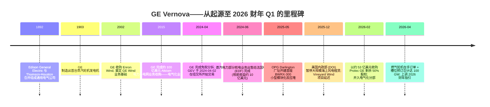
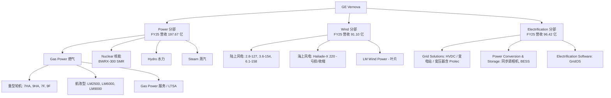
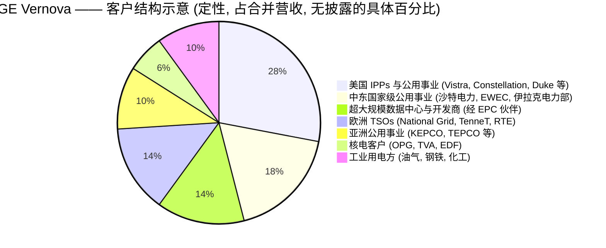

# GE Vernova Inc. (NYSE:GEV) — 公司研究报告

**截至日期: 2026-06-14**
**股票代码: NYSE: GEV | 总部: 美国马萨诸塞州剑桥市 (Cambridge, MA)**
**行业 / 子行业: 工业——电气设备与重型电力机械 (Industrials — Electrical Equipment & Heavy Power Machinery)**
**作者说明: 所有财务数据均经 2025 年度 Form 10-K (2026 年 1 月提交) 及 2026 财年 Q1 业绩公告 (2026-04-22) 核对; 价格与市值数据截至 2026-06-14。同业与估值数据来源于公开市场数据提供商, 并已在文内逐条注明引用。截至本报告日 GEV 尚未发布 2026 财年 Q2 业绩 (预计 7 月下旬)。报告语言: 简体中文 (英文版同时存在于本目录)。**

---

## 投资摘要 (Investment Summary)

> *以下评级、目标价、预测与情景均为分析师观点 (Analyst view), 不构成任何 10-K / 监管文件中的披露, 也非投资建议。*

| 项目 | 数值 |
|---|---|
| **评级 (Rating)** | **增持 (Overweight) — 附估值警示** |
| **12 个月目标价 (Base PT)** | **US$1,030** (较 2026-06-14 收盘 US$940.66 约 **+9.5%**) |
| 当前股价 (2026-06-14 收盘) | US$940.66 |
| 牛市 / 熊市目标价 | 牛 **US$1,300** (+38%) / 熊 **US$720** (−23%) |
| 估值方法 | 远期 EV/EBITDA × 2027E 调整后 EBITDA 为主, 远期 P/E 交叉验证 |
| 市值 (Market Cap) | 约 **US$2,528 亿** (≈268.7M 股) |
| 52 周区间 | US$479 – US$1,182 |
| TTM P/E / 远期 P/E | 约 **27.5×** (税务收益扭曲) / 约 **38×** |
| 报告口径 EV/EBITDA / 远期 EV/EBITDA | 约 **73×** (报告 EBITDA 被压低) / 约 **30×** |

**论点支柱 (Thesis pillars) — 分析师观点:**

1. **AI-数据中心电力是结构性新增量, 而 GEV 是少数能同时大规模供应"发电 + 输电 + 电网稳定"三类设备的西方厂商。** 电气化分部 2026 Q1 单季录得 24 亿美元数据中心设备订单, 超过 2025 全年总和 ([2026 财年 Q1 业绩公告, 2026-04-22](https://www.sec.gov/Archives/edgar/data/0001996810/000199681026000063/gevpressrelease1q26.htm))。
2. **燃气轮机进入十余年来首个真正的卖方定价周期。** 2026 Q1 全球燃气轮机订单创历史最强一季度 (29 GW, +39% YoY), GEV 拿下 9.2 GW; 北美联合循环成本逼近 3,000 美元/kW (较 2025 年翻倍) ——OEM 自 2010 年代初以来首次掌握定价权 (*分析师观点*, [J.P. Morgan — Global Power Equipment Turbine Trends Tracker, 2026-05-14, p.1](http://xs-macbook-air.local:5001/zsxq/pdf/184124858445152/J.P.%20Morgan-Global%20Power%20Equipment%20Turbine%20Trends%20Tracker%EF%BC%9A%20Highest%201Q%20Orders%20on%20Record%EF%BC%9B%20US%20Market%20Continues%20to%20Dominate-260514.pdf))。
3. **在手订单 (RPO) 提供罕见的多年期可见度。** 2025 年末 RPO 达 1,502 亿美元 (+26% YoY), 燃气轮机在手订单 + 槽位预订从 83 GW 跃升至 2026 Q1 末的 100 GW, 管理层目标 2026 年末 ≥110 GW、2027 年 (而非此前的 2028 年) RPO 达 2,000 亿美元 ([2026 财年 Q1 业绩公告](https://www.sec.gov/Archives/edgar/data/0001996810/000199681026000063/gevpressrelease1q26.htm))。
4. **估值是核心风险, 而非催化剂。** 报告口径 EV/EBITDA 约 73×、远期约 30×, 任何 AI 电力叙事软化或燃气轮机产能爬坡失误都会触发倍数压缩——这正是把评级压在"增持—附警示"而非"强力买入"的原因 (详见第 2、9 章)。

> **业绩更新——2026 财年指引再上调 (2026-04-22):** 管理层将 2026 全年指引上调至: 营业收入 **445–455 亿美元** (此前 440–450 亿美元)、调整后 EBITDA 利润率 (adjusted EBITDA margin) **12–14%** (此前 11–13%)、自由现金流 (free cash flow) **65–75 亿美元** (此前 50–55 亿美元), 分部指引为 Power 有机营收 +16~18% / 分部 EBITDA 利润率 17~19%。主要驱动因素包括燃气轮机定价改善、超大规模数据中心 (hyperscaler) 主导的电气化订单, 以及 Prolec GE 合并的并表贡献。来源: [GE Vernova 2026 财年 Q1 业绩公告, 2026-04-22](https://www.sec.gov/Archives/edgar/data/0001996810/000199681026000063/gevpressrelease1q26.htm)。

---

## 目录

1. 公司概览
2. 估值与目标价 / 公司历史
3. 管理团队
4. 产品与服务
5. 客户与上市策略
6. 行业概览
7. 竞争格局
8. 市场机会 (TAM)
9. 风险评估 (含 9.5 关键分歧与催化剂)
10. 投资视角评分卡
11. 参考资料

---

## 1. 公司概览

**本报告观点 (BLUF)。** GE Vernova 是机构投资者承接"AI 电力超级周期"最直接的西方纯赛道标的之一: 它在燃气轮机、电网设备 (HVDC / 变压器 / 开关装备) 与服务三条高质量现金流上同时占据强势地位, 受益于美国数据中心负荷阶跃、电网老化与能源安全三股同向顺风。我们给予**增持 (Overweight)** 评级、12 个月基准目标价 **US$1,030**——但明确附加估值警示: 当前股价隐含的是 2027–2028 年才会进入损益表的"嵌入式盈利", 报告口径盈利能力仍然温和, 倍数对执行与叙事的容错空间很小。

GE Vernova Inc. 是一家全球性的电力设备与电网系统纯赛道公司 (pure-play), 于 2024 年 4 月 2 日由通用电气公司 (General Electric Company, GE) 完成对其能源业务的免税分拆 (tax-free spin-off) 后独立, GE 同时向 GE 股东派发 GEV 股份。分拆完成后, 原 GE 改名为 GE Aerospace, 而 GEV 承接了原本归属于"GE Power""GE Renewable Energy"和"GE Digital Grid"三大集合体下的燃气、蒸汽、核能、水力、陆上风电、海上风电、叶片、电网解决方案 (grid solutions)、电力转换、储能以及电气化软件业务。公司将自身定位为"全球电力行业的领导者, 提供能够发电、传输、调度、转换并储存电力的产品与服务", 并表示其装机基础发电量约占全球电力生产的 **25%** ([GE Vernova 2025 年 Form 10-K, 第 5 页](https://www.sec.gov/Archives/edgar/data/0001996810/000199681026000015/gev-20251231.htm))。

**业务模式与业务分部。** GEV 划分为三个可报告分部 (reportable segments): **电力 (Power)** (燃气、核能、水力、蒸汽)、**风电 (Wind)** (陆上、海上、LM Wind Power 叶片), 以及**电气化 (Electrification)** (电网解决方案、电力转换与储能、电气化软件) ([2025 年 10-K, 第 1 项——分部](https://www.sec.gov/Archives/edgar/data/0001996810/000199681026000015/gev-20251231.htm))。经济模式分为两部分: 长周期重资本品的大宗设备销售 (单台 H 级燃气轮机即可达数亿美元合同体量), 以及围绕约 **7,000 台燃气轮机和 59,000 台陆上风机**装机基础展开的、利润率显著更高的服务/售后 (services / aftermarket) 业务, 后者涵盖跨越数十年的维护、备件与升级合同 ([2025 年 10-K, 第 5–6 页](https://www.sec.gov/Archives/edgar/data/0001996810/000199681026000015/gev-20251231.htm))。2025 财年设备类 (equipment) 营业收入为 **209 亿美元** (占总营收 55%), 服务类 (services) 营业收入 **171 亿美元** (占 45%); 服务类贡献了更高的利润占比并提供可见度——总未履行履约义务 (Remaining Performance Obligations, RPO, 公司首选的在手订单指标) 在 2025 年末达到 **1,502 亿美元** (+26% YoY) ([2025 年 10-K, MD&A——经营成果](https://www.sec.gov/Archives/edgar/data/0001996810/000199681026000015/gev-20251231.htm))。

**规模指标 (FY2025)。** 总营业收入 **380.68 亿美元** (Total revenues, 2024 年 349.35 亿、2023 年 332.39 亿, 同比 +9.0%), 净利润 (Net income) **48.79 亿美元** (2024 年 15.59 亿), 归属 GEV 股东净利润 48.84 亿美元, 摊薄每股收益 (diluted EPS) **17.69 美元** (2024 年 5.58 美元), 调整后 EBITDA (adjusted EBITDA) **32 亿美元** (同比 +57%)。自由现金流 37.1 亿美元 (= 经营现金流 49.87 亿 − 资本开支 12.77 亿; 上年 17.0 亿) ([2025 年 10-K, MD&A; Consolidated Statement of Income p.39; Cash Flows p.40](https://www.sec.gov/Archives/edgar/data/0001996810/000199681026000015/gev-20251231.htm))。**关键解读:** 48.79 亿美元净利润中含 2025 年录得的约 **20.5 亿美元税务收益 (tax benefit)**, 主要源于释放约 30.7 亿美元美国联邦递延所得税资产估值备抵 (valuation allowance) ——即管理层判断, 鉴于盈利轨迹改善, 此前在亏损年份累积的递延所得税资产 (deferred tax assets) 现在更可能被实际利用 ([2025 年 10-K, 附注 15——所得税](https://www.sec.gov/Archives/edgar/data/0001996810/000199681026000015/gev-20251231.htm))。因此**经营利润 (operating income) 仅 13.88 亿美元 (占营业收入 3.6%)** 才是观察底层盈利能力的正确口径——趋势明确向上 (2024 年 4.71 亿、2023 年亏损 9.23 亿), 但相对营业收入规模而言仍属温和。全球员工总数约 **75,000 人** ([2025 年 10-K, 人力资本](https://www.sec.gov/Archives/edgar/data/0001996810/000199681026000015/gev-20251231.htm))。

下图以 2025 财年合并利润表数据 (10-K 第 39 页) 绘制收入→成本→利润的 Sankey 流向, 左侧为三大分部的收入来源 (分部口径, 抵销前):

<svg xmlns="http://www.w3.org/2000/svg" viewBox="0 0 1000 560" width="1000" height="560" role="img" aria-label="income statement Sankey"><rect x="0" y="0" width="1000" height="560" fill="#ffffff"/>
<text x="20.00" y="30.00" text-anchor="start" font-family="Helvetica,Arial,sans-serif" font-size="15" font-weight="700" fill="#1f2933">GE Vernova FY2025 利润表 Sankey (income statement, US$m)</text>
<path d="M 204.00,60.58 C 258.00,60.58 258.00,85.00 312.00,85.00 L 312.00,296.86 C 258.00,296.86 258.00,272.44 204.00,272.44 Z" fill="#93c5fd" fill-opacity="0.55"/>
<path d="M 452.00,78.00 C 506.00,78.00 506.00,241.63 560.00,241.63 L 560.00,256.50 C 506.00,256.50 506.00,92.88 452.00,92.88 Z" fill="#86efac" fill-opacity="0.55"/>
<path d="M 452.00,92.88 C 506.00,92.88 506.00,270.50 560.00,270.50 L 560.00,336.37 C 506.00,336.37 506.00,158.75 452.00,158.75 Z" fill="#fca5a5" fill-opacity="0.55"/>
<path d="M 328.00,85.00 C 382.00,85.00 382.00,78.00 436.00,78.00 L 436.00,158.76 C 382.00,158.76 382.00,165.76 328.00,165.76 Z" fill="#86efac" fill-opacity="0.55"/>
<path d="M 328.00,165.76 C 382.00,165.76 382.00,172.76 436.00,172.76 L 436.00,500.00 C 382.00,500.00 382.00,493.00 328.00,493.00 Z" fill="#fca5a5" fill-opacity="0.55"/>
<path d="M 700.00,226.91 C 754.00,226.91 754.00,254.85 808.00,254.85 L 808.00,307.15 C 754.00,307.15 754.00,279.20 700.00,279.20 Z" fill="#86efac" fill-opacity="0.55"/>
<path d="M 700.00,279.20 C 754.00,279.20 754.00,321.15 808.00,321.15 L 808.00,323.15 C 754.00,323.15 754.00,281.20 700.00,281.20 Z" fill="#fca5a5" fill-opacity="0.55"/>
<path d="M 576.00,241.63 C 630.00,241.63 630.00,226.91 684.00,226.91 L 684.00,241.79 C 630.00,241.79 630.00,256.50 576.00,256.50 Z" fill="#86efac" fill-opacity="0.55"/>
<path d="M 576.00,270.50 C 630.00,270.50 630.00,271.22 684.00,271.22 L 684.00,324.26 C 630.00,324.26 630.00,323.54 576.00,323.54 Z" fill="#fca5a5" fill-opacity="0.55"/>
<path d="M 576.00,323.54 C 630.00,323.54 630.00,338.26 684.00,338.26 L 684.00,351.09 C 630.00,351.09 630.00,336.37 576.00,336.37 Z" fill="#fca5a5" fill-opacity="0.55"/>
<path d="M 204.00,286.44 C 258.00,286.44 258.00,296.86 312.00,296.86 L 312.00,394.49 C 258.00,394.49 258.00,384.08 204.00,384.08 Z" fill="#93c5fd" fill-opacity="0.55"/>
<path d="M 204.00,398.08 C 258.00,398.08 258.00,394.49 312.00,394.49 L 312.00,497.83 C 258.00,497.83 258.00,501.42 204.00,501.42 Z" fill="#93c5fd" fill-opacity="0.55"/>
<path d="M 204.00,515.42 C 258.00,515.42 258.00,497.83 312.00,497.83 L 312.00,499.83 C 258.00,499.83 258.00,517.42 204.00,517.42 Z" fill="#93c5fd" fill-opacity="0.55"/>
<rect x="188.00" y="60.58" width="16" height="211.86" rx="1.5" fill="#2563eb"/>
<rect x="188.00" y="286.44" width="16" height="97.64" rx="1.5" fill="#2563eb"/>
<rect x="188.00" y="398.08" width="16" height="103.34" rx="1.5" fill="#2563eb"/>
<rect x="188.00" y="515.42" width="16" height="2.00" rx="1.5" fill="#2563eb"/>
<rect x="312.00" y="85.00" width="16" height="408.00" rx="1.5" fill="#1e3a8a"/>
<rect x="436.00" y="78.00" width="16" height="80.76" rx="1.5" fill="#15803d"/>
<rect x="436.00" y="172.76" width="16" height="327.24" rx="1.5" fill="#dc2626"/>
<rect x="560.00" y="241.63" width="16" height="14.88" rx="1.5" fill="#15803d"/>
<rect x="560.00" y="270.50" width="16" height="65.87" rx="1.5" fill="#dc2626"/>
<rect x="684.00" y="226.91" width="16" height="30.31" rx="1.5" fill="#15803d"/>
<rect x="684.00" y="271.22" width="16" height="53.04" rx="1.5" fill="#dc2626"/>
<rect x="684.00" y="338.26" width="16" height="12.83" rx="1.5" fill="#dc2626"/>
<rect x="808.00" y="254.85" width="16" height="52.29" rx="1.5" fill="#15803d"/>
<rect x="808.00" y="321.15" width="16" height="2.00" rx="1.5" fill="#dc2626"/>
<line x1="188.00" y1="166.51" x2="182.00" y2="137.09" stroke="#cbd5e1" stroke-width="1"/>
<text x="179.00" y="140.09" text-anchor="end" font-family="Helvetica,Arial,sans-serif" font-size="11.5" font-weight="700" fill="#1f2933">Power 电力</text>
<text x="179.00" y="153.09" text-anchor="end" font-family="Helvetica,Arial,sans-serif" font-size="10" font-weight="400" fill="#52606d">US$19.8B  (51.9%)</text>
<line x1="188.00" y1="335.26" x2="182.00" y2="305.84" stroke="#cbd5e1" stroke-width="1"/>
<text x="179.00" y="308.84" text-anchor="end" font-family="Helvetica,Arial,sans-serif" font-size="11.5" font-weight="700" fill="#1f2933">Wind 风电</text>
<text x="179.00" y="321.84" text-anchor="end" font-family="Helvetica,Arial,sans-serif" font-size="10" font-weight="400" fill="#52606d">US$9.1B  (23.9%)</text>
<line x1="188.00" y1="449.75" x2="182.00" y2="420.33" stroke="#cbd5e1" stroke-width="1"/>
<text x="179.00" y="423.33" text-anchor="end" font-family="Helvetica,Arial,sans-serif" font-size="11.5" font-weight="700" fill="#1f2933">Electrification 电气化</text>
<text x="179.00" y="436.33" text-anchor="end" font-family="Helvetica,Arial,sans-serif" font-size="10" font-weight="400" fill="#52606d">US$9.6B  (25.3%)</text>
<line x1="188.00" y1="516.42" x2="182.00" y2="487.00" stroke="#cbd5e1" stroke-width="1"/>
<text x="179.00" y="490.00" text-anchor="end" font-family="Helvetica,Arial,sans-serif" font-size="11.5" font-weight="700" fill="#1f2933">其他/抵销 elim</text>
<text x="179.00" y="503.00" text-anchor="end" font-family="Helvetica,Arial,sans-serif" font-size="10" font-weight="400" fill="#52606d">-US$451.0M  (-1.2%)</text>
<rect x="331.00" y="67.00" width="119.40" height="26" rx="2" fill="#ffffff" fill-opacity="0.72"/>
<text x="334.00" y="79.00" text-anchor="start" font-family="Helvetica,Arial,sans-serif" font-size="11.5" font-weight="700" fill="#1f2933">Revenue</text>
<text x="334.00" y="92.00" text-anchor="start" font-family="Helvetica,Arial,sans-serif" font-size="10" font-weight="400" fill="#52606d">US$38.1B  (100.0%)</text>
<rect x="455.00" y="60.00" width="106.80" height="26" rx="2" fill="#ffffff" fill-opacity="0.72"/>
<text x="458.00" y="72.00" text-anchor="start" font-family="Helvetica,Arial,sans-serif" font-size="11.5" font-weight="700" fill="#1f2933">Gross Profit</text>
<text x="458.00" y="85.00" text-anchor="start" font-family="Helvetica,Arial,sans-serif" font-size="10" font-weight="400" fill="#52606d">US$7.5B  (19.8%)</text>
<rect x="455.00" y="154.76" width="144.60" height="26" rx="2" fill="#ffffff" fill-opacity="0.72"/>
<text x="458.00" y="166.76" text-anchor="start" font-family="Helvetica,Arial,sans-serif" font-size="11.5" font-weight="700" fill="#1f2933">Cost of Revenue (COGS)</text>
<text x="458.00" y="179.76" text-anchor="start" font-family="Helvetica,Arial,sans-serif" font-size="10" font-weight="400" fill="#52606d">US$30.5B  (80.2%)</text>
<rect x="579.00" y="223.63" width="106.80" height="26" rx="2" fill="#ffffff" fill-opacity="0.72"/>
<text x="582.00" y="235.63" text-anchor="start" font-family="Helvetica,Arial,sans-serif" font-size="11.5" font-weight="700" fill="#1f2933">Operating Income</text>
<text x="582.00" y="248.63" text-anchor="start" font-family="Helvetica,Arial,sans-serif" font-size="10" font-weight="400" fill="#52606d">US$1.4B  (3.6%)</text>
<rect x="579.00" y="252.50" width="150.90" height="26" rx="2" fill="#ffffff" fill-opacity="0.72"/>
<text x="582.00" y="264.50" text-anchor="start" font-family="Helvetica,Arial,sans-serif" font-size="11.5" font-weight="700" fill="#1f2933">Total Operating Expense</text>
<text x="582.00" y="277.50" text-anchor="start" font-family="Helvetica,Arial,sans-serif" font-size="10" font-weight="400" fill="#52606d">US$6.1B  (16.1%)</text>
<rect x="703.00" y="208.91" width="100.50" height="26" rx="2" fill="#ffffff" fill-opacity="0.72"/>
<text x="706.00" y="220.91" text-anchor="start" font-family="Helvetica,Arial,sans-serif" font-size="11.5" font-weight="700" fill="#1f2933">Pretax Income</text>
<text x="706.00" y="233.91" text-anchor="start" font-family="Helvetica,Arial,sans-serif" font-size="10" font-weight="400" fill="#52606d">US$2.8B  (7.4%)</text>
<rect x="703.00" y="253.22" width="106.80" height="26" rx="2" fill="#ffffff" fill-opacity="0.72"/>
<text x="706.00" y="265.22" text-anchor="start" font-family="Helvetica,Arial,sans-serif" font-size="11.5" font-weight="700" fill="#1f2933">SG&amp;A</text>
<text x="706.00" y="278.22" text-anchor="start" font-family="Helvetica,Arial,sans-serif" font-size="10" font-weight="400" fill="#52606d">US$4.9B  (13.0%)</text>
<rect x="703.00" y="320.26" width="100.50" height="26" rx="2" fill="#ffffff" fill-opacity="0.72"/>
<text x="706.00" y="332.26" text-anchor="start" font-family="Helvetica,Arial,sans-serif" font-size="11.5" font-weight="700" fill="#1f2933">R&amp;D</text>
<text x="706.00" y="345.26" text-anchor="start" font-family="Helvetica,Arial,sans-serif" font-size="10" font-weight="400" fill="#52606d">US$1.2B  (3.1%)</text>
<text x="833.00" y="278.00" text-anchor="start" font-family="Helvetica,Arial,sans-serif" font-size="11.5" font-weight="700" fill="#1f2933">Net Income</text>
<text x="833.00" y="291.00" text-anchor="start" font-family="Helvetica,Arial,sans-serif" font-size="10" font-weight="400" fill="#52606d">US$4.9B  (12.8%)</text>
<text x="833.00" y="319.15" text-anchor="start" font-family="Helvetica,Arial,sans-serif" font-size="11.5" font-weight="700" fill="#1f2933">Income Tax</text>
<text x="833.00" y="332.15" text-anchor="start" font-family="Helvetica,Arial,sans-serif" font-size="10" font-weight="400" fill="#52606d">-US$2.1B  (-5.4%)</text>
<text x="500.00" y="544.00" text-anchor="middle" font-family="Helvetica,Arial,sans-serif" font-size="10" font-weight="400" fill="#52606d">Source: GE Vernova 2025 Form 10-K, Consolidated Statement of Income p.39 + Segment Note 24</text>
</svg>

*来源: [GE Vernova 2025 年 10-K, Consolidated Statement of Income 第 39 页 + 分部附注 24](https://www.sec.gov/Archives/edgar/data/0001996810/000199681026000015/gev-20251231.htm)。注: 报告口径下税项为收益 (−20.51 亿), 故净利润高于税前利润。*

**分部结构 (FY2025, 分部附注口径)。** 三大分部营业收入、EBITDA 与利润率如下 ([2025 年 10-K, 附注 24——分部](https://www.sec.gov/Archives/edgar/data/0001996810/000199681026000015/gev-20251231.htm)):

| 分部 | FY2025 营收 | FY2024 营收 | FY2025 分部 EBITDA | EBITDA 利润率 |
|---|---|---|---|---|
| **Power 电力** | 197.67 亿 | 181.27 亿 | 29.02 亿 | 14.7% |
| **Wind 风电** | 91.10 亿 | 97.01 亿 | (5.98) 亿 | (6.6)% |
| **Electrification 电气化** | 96.42 亿 | 75.50 亿 | 14.33 亿 | 14.9% |

(分部营收合计约 385.19 亿, 经约 4.5 亿美元跨分部抵销后等于合并 380.68 亿。)

<svg xmlns="http://www.w3.org/2000/svg" viewBox="0 0 720 460" width="720" height="460" role="img" aria-label="revenue donut"><rect x="0" y="0" width="720" height="460" fill="#ffffff"/>
<text x="20.00" y="30.00" text-anchor="start" font-family="Helvetica,Arial,sans-serif" font-size="15" font-weight="700" fill="#1f2933">GE Vernova FY2025 营收按分部 (revenue by segment, US$m)</text>
<path d="M 288.00,107.20 A 132 132 0 1 1 277.09,370.75 L 281.55,316.93 A 78 78 0 1 0 288.00,161.20 Z" fill="#2563eb"/>
<path d="M 277.09,370.75 A 132 132 0 0 1 156.00,239.46 L 210.00,239.36 A 78 78 0 0 0 281.55,316.93 Z" fill="#15803d"/>
<path d="M 156.00,239.46 A 132 132 0 0 1 288.00,107.20 L 288.00,161.20 A 78 78 0 0 0 210.00,239.36 Z" fill="#d97706"/>
<text x="288.00" y="235.20" text-anchor="middle" font-family="Helvetica,Arial,sans-serif" font-size="18" font-weight="800" fill="#1f2933">GEV</text>
<text x="288.00" y="255.20" text-anchor="middle" font-family="Helvetica,Arial,sans-serif" font-size="13" font-weight="600" fill="#52606d">US$38.5B</text>
<text x="288.00" y="271.20" text-anchor="middle" font-family="Helvetica,Arial,sans-serif" font-size="10" font-weight="400" fill="#8a97a3">total</text>
<line x1="425.88" y1="244.91" x2="441.88" y2="244.91" stroke="#2563eb" stroke-width="1.4"/>
<text x="445.88" y="242.91" text-anchor="start" font-family="Helvetica,Arial,sans-serif" font-size="11" font-weight="700" fill="#1f2933">Power 电力</text>
<text x="445.88" y="256.91" text-anchor="start" font-family="Helvetica,Arial,sans-serif" font-size="10" font-weight="400" fill="#52606d">US$19.8B  (51.3%)</text>
<line x1="186.56" y1="332.76" x2="170.56" y2="332.76" stroke="#15803d" stroke-width="1.4"/>
<text x="166.56" y="330.76" text-anchor="end" font-family="Helvetica,Arial,sans-serif" font-size="11" font-weight="700" fill="#1f2933">Wind 风电</text>
<text x="166.56" y="344.76" text-anchor="end" font-family="Helvetica,Arial,sans-serif" font-size="10" font-weight="400" fill="#52606d">US$9.1B  (23.7%)</text>
<line x1="190.32" y1="141.72" x2="174.32" y2="141.72" stroke="#d97706" stroke-width="1.4"/>
<text x="170.32" y="139.72" text-anchor="end" font-family="Helvetica,Arial,sans-serif" font-size="11" font-weight="700" fill="#1f2933">Electrification 电气化</text>
<text x="170.32" y="153.72" text-anchor="end" font-family="Helvetica,Arial,sans-serif" font-size="10" font-weight="400" fill="#52606d">US$9.6B  (25.0%)</text>
<text x="360.00" y="444.00" text-anchor="middle" font-family="Helvetica,Arial,sans-serif" font-size="10" font-weight="400" fill="#52606d">Source: GE Vernova 2025 Form 10-K, Segment Note 24 (segment revenues, pre-elimination)</text>
</svg>

*来源: [GE Vernova 2025 年 10-K, 分部附注 24 (分部营业收入, 抵销前)](https://www.sec.gov/Archives/edgar/data/0001996810/000199681026000015/gev-20251231.htm)。*

<svg xmlns="http://www.w3.org/2000/svg" viewBox="0 0 860 470" width="860" height="470" role="img" aria-label="historical revenue bars"><rect x="0" y="0" width="860" height="470" fill="#ffffff"/>
<text x="20.00" y="30.00" text-anchor="start" font-family="Helvetica,Arial,sans-serif" font-size="15" font-weight="700" fill="#1f2933">GE Vernova 营收按分部 2023–2025 (segment revenue, US$m)</text>
<rect x="20.00" y="44" width="11" height="11" rx="2" fill="#2563eb"/>
<text x="36.00" y="53.00" text-anchor="start" font-family="Helvetica,Arial,sans-serif" font-size="10.5" font-weight="400" fill="#1f2933">Power 电力</text>
<rect x="102.80" y="44" width="11" height="11" rx="2" fill="#15803d"/>
<text x="118.80" y="53.00" text-anchor="start" font-family="Helvetica,Arial,sans-serif" font-size="10.5" font-weight="400" fill="#1f2933">Wind 风电</text>
<rect x="179.00" y="44" width="11" height="11" rx="2" fill="#d97706"/>
<text x="195.00" y="53.00" text-anchor="start" font-family="Helvetica,Arial,sans-serif" font-size="10.5" font-weight="400" fill="#1f2933">Electrification 电气化</text>
<line x1="70" y1="412.00" x2="834" y2="412.00" stroke="#eceff2" stroke-width="1"/>
<text x="64.00" y="415.00" text-anchor="end" font-family="Helvetica,Arial,sans-serif" font-size="9.5" font-weight="400" fill="#52606d">US$0</text>
<line x1="70" y1="345.20" x2="834" y2="345.20" stroke="#eceff2" stroke-width="1"/>
<text x="64.00" y="348.20" text-anchor="end" font-family="Helvetica,Arial,sans-serif" font-size="9.5" font-weight="400" fill="#52606d">US$8.3B</text>
<line x1="70" y1="278.40" x2="834" y2="278.40" stroke="#eceff2" stroke-width="1"/>
<text x="64.00" y="281.40" text-anchor="end" font-family="Helvetica,Arial,sans-serif" font-size="9.5" font-weight="400" fill="#52606d">US$16.6B</text>
<line x1="70" y1="211.60" x2="834" y2="211.60" stroke="#eceff2" stroke-width="1"/>
<text x="64.00" y="214.60" text-anchor="end" font-family="Helvetica,Arial,sans-serif" font-size="9.5" font-weight="400" fill="#52606d">US$25.0B</text>
<line x1="70" y1="144.80" x2="834" y2="144.80" stroke="#eceff2" stroke-width="1"/>
<text x="64.00" y="147.80" text-anchor="end" font-family="Helvetica,Arial,sans-serif" font-size="9.5" font-weight="400" fill="#52606d">US$33.3B</text>
<line x1="70" y1="78.00" x2="834" y2="78.00" stroke="#eceff2" stroke-width="1"/>
<text x="64.00" y="81.00" text-anchor="end" font-family="Helvetica,Arial,sans-serif" font-size="9.5" font-weight="400" fill="#52606d">US$41.6B</text>
<rect x="123.48" y="272.01" width="147.71" height="139.99" fill="#2563eb"/>
<rect x="123.48" y="193.12" width="147.71" height="78.89" fill="#15803d"/>
<rect x="123.48" y="141.91" width="147.71" height="51.21" fill="#d97706"/>
<text x="197.33" y="428.00" text-anchor="middle" font-family="Helvetica,Arial,sans-serif" font-size="10" font-weight="400" fill="#52606d">2023</text>
<rect x="378.15" y="266.46" width="147.71" height="145.54" fill="#2563eb"/>
<rect x="378.15" y="188.58" width="147.71" height="77.89" fill="#15803d"/>
<rect x="378.15" y="127.96" width="147.71" height="60.62" fill="#d97706"/>
<text x="452.00" y="428.00" text-anchor="middle" font-family="Helvetica,Arial,sans-serif" font-size="10" font-weight="400" fill="#52606d">2024</text>
<rect x="632.81" y="253.30" width="147.71" height="158.70" fill="#2563eb"/>
<rect x="632.81" y="180.15" width="147.71" height="73.14" fill="#15803d"/>
<rect x="632.81" y="102.74" width="147.71" height="77.41" fill="#d97706"/>
<text x="706.67" y="428.00" text-anchor="middle" font-family="Helvetica,Arial,sans-serif" font-size="10" font-weight="400" fill="#52606d">2025</text>
<text x="430.00" y="454.00" text-anchor="middle" font-family="Helvetica,Arial,sans-serif" font-size="10" font-weight="400" fill="#52606d">Source: GE Vernova 2025 Form 10-K, Segment Note 24 (segment revenues)</text>
</svg>

*来源: [GE Vernova 2025 年 10-K, 分部附注 24 (2023–2025 分部营业收入)](https://www.sec.gov/Archives/edgar/data/0001996810/000199681026000015/gev-20251231.htm)。可见 Electrification 三年营收从 63.78 亿增至 96.42 亿 (+51%), 是结构性增长引擎; Wind 在 91~98 亿区间徘徊。*

**地理分布 (FY2025)。** 按地区: 美国 **173.41 亿 (45.6%)** / 海外 207.28 亿 (54.4%)。海外细分: 欧洲 75.94 亿、中东与非洲 (MEA) 53.89 亿、亚洲 46.29 亿、美洲非美区域 31.16 亿 ([2025 年 10-K, Revenues by Geography 第 70 页](https://www.sec.gov/Archives/edgar/data/0001996810/000199681026000015/gev-20251231.htm))。中东与非洲是增长最快的区域 (2025 财年 53.89 亿, 2023 财年 39.19 亿), 来自向沙特阿拉伯、伊拉克及阿联酋交付的燃气轮机; 美国占比上升源于超大规模数据中心带动的电力需求。

<svg xmlns="http://www.w3.org/2000/svg" viewBox="0 0 720 460" width="720" height="460" role="img" aria-label="revenue donut"><rect x="0" y="0" width="720" height="460" fill="#ffffff"/>
<text x="20.00" y="30.00" text-anchor="start" font-family="Helvetica,Arial,sans-serif" font-size="15" font-weight="700" fill="#1f2933">GE Vernova FY2025 营收按地区 (revenue by geography, US$m)</text>
<path d="M 288.00,107.20 A 132 132 0 0 1 324.42,366.08 L 309.52,314.17 A 78 78 0 0 0 288.00,161.20 Z" fill="#2563eb"/>
<path d="M 324.42,366.08 A 132 132 0 0 1 178.83,313.40 L 223.49,283.04 A 78 78 0 0 0 309.52,314.17 Z" fill="#15803d"/>
<path d="M 178.83,313.40 A 132 132 0 0 1 161.61,201.14 L 213.31,216.71 A 78 78 0 0 0 223.49,283.04 Z" fill="#d97706"/>
<path d="M 161.61,201.14 A 132 132 0 0 1 223.07,124.28 L 249.63,171.29 A 78 78 0 0 0 213.31,216.71 Z" fill="#7c3aed"/>
<path d="M 223.07,124.28 A 132 132 0 0 1 288.00,107.20 L 288.00,161.20 A 78 78 0 0 0 249.63,171.29 Z" fill="#dc2626"/>
<text x="288.00" y="235.20" text-anchor="middle" font-family="Helvetica,Arial,sans-serif" font-size="18" font-weight="800" fill="#1f2933">GEV</text>
<text x="288.00" y="255.20" text-anchor="middle" font-family="Helvetica,Arial,sans-serif" font-size="13" font-weight="600" fill="#52606d">US$38.1B</text>
<text x="288.00" y="271.20" text-anchor="middle" font-family="Helvetica,Arial,sans-serif" font-size="10" font-weight="400" fill="#8a97a3">total</text>
<line x1="424.65" y1="219.98" x2="440.65" y2="219.98" stroke="#2563eb" stroke-width="1.4"/>
<text x="444.65" y="217.98" text-anchor="start" font-family="Helvetica,Arial,sans-serif" font-size="11" font-weight="700" fill="#1f2933">美国 US</text>
<text x="444.65" y="231.98" text-anchor="start" font-family="Helvetica,Arial,sans-serif" font-size="10" font-weight="400" fill="#52606d">US$17.3B  (45.6%)</text>
<line x1="241.05" y1="368.97" x2="225.05" y2="368.97" stroke="#15803d" stroke-width="1.4"/>
<text x="221.05" y="366.97" text-anchor="end" font-family="Helvetica,Arial,sans-serif" font-size="11" font-weight="700" fill="#1f2933">欧洲 Europe</text>
<text x="221.05" y="380.97" text-anchor="end" font-family="Helvetica,Arial,sans-serif" font-size="10" font-weight="400" fill="#52606d">US$7.6B  (19.9%)</text>
<line x1="151.60" y1="260.12" x2="135.60" y2="260.12" stroke="#d97706" stroke-width="1.4"/>
<text x="131.60" y="258.12" text-anchor="end" font-family="Helvetica,Arial,sans-serif" font-size="11" font-weight="700" fill="#1f2933">中东与非洲 MEA</text>
<text x="131.60" y="272.12" text-anchor="end" font-family="Helvetica,Arial,sans-serif" font-size="10" font-weight="400" fill="#52606d">US$5.4B  (14.2%)</text>
<line x1="180.22" y1="153.02" x2="164.22" y2="153.02" stroke="#7c3aed" stroke-width="1.4"/>
<text x="160.22" y="151.02" text-anchor="end" font-family="Helvetica,Arial,sans-serif" font-size="11" font-weight="700" fill="#1f2933">亚洲 Asia</text>
<text x="160.22" y="165.02" text-anchor="end" font-family="Helvetica,Arial,sans-serif" font-size="10" font-weight="400" fill="#52606d">US$4.6B  (12.2%)</text>
<line x1="252.90" y1="105.74" x2="236.90" y2="105.74" stroke="#dc2626" stroke-width="1.4"/>
<text x="232.90" y="103.74" text-anchor="end" font-family="Helvetica,Arial,sans-serif" font-size="11" font-weight="700" fill="#1f2933">美洲(非美) Americas</text>
<text x="232.90" y="117.74" text-anchor="end" font-family="Helvetica,Arial,sans-serif" font-size="10" font-weight="400" fill="#52606d">US$3.1B  (8.2%)</text>
<text x="360.00" y="444.00" text-anchor="middle" font-family="Helvetica,Arial,sans-serif" font-size="10" font-weight="400" fill="#52606d">Source: GE Vernova 2025 Form 10-K, Revenues by Geography p.70</text>
</svg>

*来源: [GE Vernova 2025 年 10-K, Revenues by Geography 第 70 页](https://www.sec.gov/Archives/edgar/data/0001996810/000199681026000015/gev-20251231.htm)。*

**估值快照 (截至 2026-06-14)。** GEV 股价为每股 **940.66 美元** (2026-06-12 收盘; 较 5 月约 1,030 美元的高位回落, 较 52 周高点 1,182 美元回落约 20%), 市值约 **2,528 亿美元** (约 2.687 亿股)。TTM 市盈率 (P/E) 约 **27.5 倍** (受税务收益扭曲的 TTM EPS 34.24 美元支撑), 远期 P/E 约 **38 倍**; 企业价值 (Enterprise Value) 约 2,479 亿美元, 对应 2025 财年报告 EBITDA 约 34 亿美元的 EV/EBITDA 约 **73 倍**, 远期 (基于 2026 指引中点约 55 亿调整后 EBITDA) 约 **30 倍**; TTM 市销率 (P/S) 约 **6.4 倍** ([Yahoo Finance — GEV 关键统计, 2026-06-14](https://finance.yahoo.com/quote/GEV/key-statistics/); [Stockanalysis.com — GEV statistics](https://stockanalysis.com/stocks/gev/statistics/))。公司每季度派发 0.50 美元股息 (年化 2.00 美元, 收益率约 0.2%), 2025 年回购 33.16 亿美元股票, 2026 Q1 又回购约 13 亿美元 ([2025 年 10-K, Cash Flows p.40](https://www.sec.gov/Archives/edgar/data/0001996810/000199681026000015/gev-20251231.htm); [2026 财年 Q1 业绩公告](https://www.sec.gov/Archives/edgar/data/0001996810/000199681026000063/gevpressrelease1q26.htm))。

**相对表现 (relative performance)。** GEV 过去 12 个月上涨约 **+97%** (从约 477 美元至 941 美元), 6 个月 **+34%**, 远跑赢标普 500 同期约 +26%; 当前价高于 200 日均线约 **+23%** ([Yahoo Finance — GEV 历史价格, 2026-06-14](https://finance.yahoo.com/quote/GEV/history/))。但自 5 月 1,182 美元高点已回落约 20%, 反映市场对 AI 资本开支可持续性与估值的重新定价——这正是动量虽强但叙事开始接受检验的信号。

**1B 基本面评分卡见下节; 倍数解读如下。** 27.5 倍 TTM P/E 看似温和, 但它由税务收益扭曲的盈利支撑, 不能当真; 真正的估值张力体现在 EV/EBITDA 上: 73 倍报告口径是任何工业历史标准下都属极端的水平, 远期 30 倍依旧偏贵。差距源于三件事。**(1) 报告 EBITDA 被人为压低**——风电分部 2025 财年 EBITDA 亏损 5.98 亿美元 (相较 2023 年 10.33 亿亏损已大幅收窄, 但仍是拖累), 而独立运营公众公司的总部成本亦未在调整 EBITDA 中体现。**(2) 在手订单可见度为估值溢价提供支撑**——仅 2026 Q1 一个季度订单就达 183 亿美元 (有机同比 +71%), 燃气轮机在手订单 + 槽位预订从 83 GW 跃升至 100 GW, 电气化订单出货比 (book-to-bill) 约 2.4 倍——市场在为尚未进入损益表的"嵌入式盈利能力"买单 ([2026 财年 Q1 业绩公告](https://www.sec.gov/Archives/edgar/data/0001996810/000199681026000063/gevpressrelease1q26.htm))。**(3) AI-数据中心电力的主题性溢价**——GEV 是机构可直接持有、承接超大规模数据中心电力 CAPEX 的少数标的之一。倍数已被拉伸到这种程度: 一旦 AI 电力叙事软化, 或燃气轮机产能爬坡执行失误, EV/EBITDA 都会向工业历史中位数压缩——这是第 9 章的核心估值风险。

### 1B. GF Score (GuruFocus 式) 基本面评分卡

> *本评分卡为分析师自有评分框架 (Analyst view), 五个 0–10 子分与 0–100 综合分均为分析师评分输出, 不归属 GuruFocus, 也不附任何监管文件引用; 各项底层指标的引用见正文。*

<svg xmlns="http://www.w3.org/2000/svg" viewBox="0 0 500 500" width="500" height="500" role="img" aria-label="GF Score radar">
<rect x="0" y="0" width="500" height="500" fill="#ffffff"/>
<text x="20" y="24" font-family="Helvetica,Arial,sans-serif" font-size="15" font-weight="700" fill="#1f2933">GF Score (GuruFocus-style): 63/100</text>
<text x="20" y="41" font-family="Helvetica,Arial,sans-serif" font-size="11" fill="#52606d">51–70 Poor future performance potential</text>
<polygon points="250.0,88.0 392.7,191.6 338.2,359.4 161.8,359.4 107.3,191.6" fill="#e9f5ec" stroke="none"/>
<polygon points="250.0,208.0 278.5,228.7 267.6,262.3 232.4,262.3 221.5,228.7" fill="none" stroke="#c5d3cb" stroke-width="1"/>
<polygon points="250.0,178.0 307.1,219.5 285.3,286.5 214.7,286.5 192.9,219.5" fill="none" stroke="#c5d3cb" stroke-width="1"/>
<polygon points="250.0,148.0 335.6,210.2 302.9,310.8 197.1,310.8 164.4,210.2" fill="none" stroke="#c5d3cb" stroke-width="1"/>
<polygon points="250.0,118.0 364.1,200.9 320.5,335.1 179.5,335.1 135.9,200.9" fill="none" stroke="#c5d3cb" stroke-width="1"/>
<polygon points="250.0,88.0 392.7,191.6 338.2,359.4 161.8,359.4 107.3,191.6" fill="none" stroke="#c5d3cb" stroke-width="1.3"/>
<line x1="250" y1="238" x2="161.8" y2="359.4" stroke="#cfdad3" stroke-width="1"/>
<text x="146.5" y="392.4" text-anchor="end" font-family="Helvetica,Arial,sans-serif" font-size="11.5" font-weight="600" fill="#1f2933">财务实力</text>
<text x="188.3" y="316.9" text-anchor="middle" font-family="Helvetica,Arial,sans-serif" font-size="10.5" font-weight="700" fill="#1f2933">7</text>
<line x1="250" y1="238" x2="250.0" y2="88.0" stroke="#cfdad3" stroke-width="1"/>
<text x="250.0" y="58.0" text-anchor="middle" font-family="Helvetica,Arial,sans-serif" font-size="11.5" font-weight="600" fill="#1f2933">盈利能力</text>
<text x="250.0" y="157.0" text-anchor="middle" font-family="Helvetica,Arial,sans-serif" font-size="10.5" font-weight="700" fill="#1f2933">5</text>
<line x1="250" y1="238" x2="107.3" y2="191.6" stroke="#cfdad3" stroke-width="1"/>
<text x="82.6" y="183.6" text-anchor="end" font-family="Helvetica,Arial,sans-serif" font-size="11.5" font-weight="600" fill="#1f2933">成长性</text>
<text x="135.9" y="194.9" text-anchor="middle" font-family="Helvetica,Arial,sans-serif" font-size="10.5" font-weight="700" fill="#1f2933">8</text>
<line x1="250" y1="238" x2="392.7" y2="191.6" stroke="#cfdad3" stroke-width="1"/>
<text x="417.4" y="183.6" text-anchor="start" font-family="Helvetica,Arial,sans-serif" font-size="11.5" font-weight="600" fill="#1f2933">估值</text>
<text x="292.8" y="218.1" text-anchor="middle" font-family="Helvetica,Arial,sans-serif" font-size="10.5" font-weight="700" fill="#1f2933">3</text>
<line x1="250" y1="238" x2="338.2" y2="359.4" stroke="#cfdad3" stroke-width="1"/>
<text x="353.5" y="392.4" text-anchor="start" font-family="Helvetica,Arial,sans-serif" font-size="11.5" font-weight="600" fill="#1f2933">动量</text>
<text x="320.5" y="329.1" text-anchor="middle" font-family="Helvetica,Arial,sans-serif" font-size="10.5" font-weight="700" fill="#1f2933">8</text>
<polygon points="250.0,163.0 292.8,224.1 320.5,335.1 188.3,322.9 135.9,200.9" fill="#2e8b57" fill-opacity="0.34" stroke="#2e8b57" stroke-width="2"/>
<circle cx="188.3" cy="322.9" r="2.6" fill="#2e8b57"/>
<circle cx="250.0" cy="163.0" r="2.6" fill="#2e8b57"/>
<circle cx="135.9" cy="200.9" r="2.6" fill="#2e8b57"/>
<circle cx="292.8" cy="224.1" r="2.6" fill="#2e8b57"/>
<circle cx="320.5" cy="335.1" r="2.6" fill="#2e8b57"/>
<text x="250" y="470" text-anchor="middle" font-family="Helvetica,Arial,sans-serif" font-size="9.5" fill="#52606d">Source: GEV FY2025 10-K · Q1 2026 8-K · Yahoo Finance · indicators.db, as of 2026-06-14</text>
<text x="250" y="485" text-anchor="middle" font-family="Helvetica,Arial,sans-serif" font-size="9" fill="#52606d">GF Score = independent analyst rubric (*Analyst view:*) — not GuruFocus™ official number</text>
</svg>

**综合分约 62 / 100 (五维等权)** ——映射至"略优于平均"区间。各维度评分理由如下:

- **Financial Strength 财务强度: 7/10。** 现金 88.48 亿美元、总权益 122.96 亿 (归属股东 111.78 亿), 标普 / 惠誉投资级 BBB / BBB+; 2026 Q1 为 Prolec 收购发行 26 亿优先票据后净负债仍低, Q1 末持有约 102 亿现金、季内 FCF 48 亿。负债端 257.74 亿合同负债 (contract liabilities) 是客户预付的槽位预订, 属正向浮存而非偿债压力 ([2025 年 10-K, 资产负债表 p.40](https://www.sec.gov/Archives/edgar/data/0001996810/000199681026000015/gev-20251231.htm); [2026 财年 Q1 业绩公告](https://www.sec.gov/Archives/edgar/data/0001996810/000199681026000063/gevpressrelease1q26.htm))。扣分项: 营运资本对现金流的依赖较高。
- **Profitability 盈利能力: 5/10。** 经营利润率仅 3.6% (13.88 亿 / 380.68 亿), 调整后 EBITDA 利润率约 8.4%; GAAP 净利率与 ROE 被税务收益严重抬高, 不能直接采信。Power (14.7%) 与 Electrification (14.9%) 分部利润率健康, 但 Wind 仍亏损拖累合并口径 ([2025 年 10-K, 分部附注 24](https://www.sec.gov/Archives/edgar/data/0001996810/000199681026000015/gev-20251231.htm))。趋势强劲向上, 但当前绝对水平对这一行业而言仍偏低。
- **Growth 成长性: 8/10。** 营收 +9%、分部 EBITDA +28%、调整后 EBITDA +57%; 2026 Q1 订单有机 +71%、RPO +26% 至 1,502 亿; 管理层上调全年指引并把 2,000 亿 RPO 目标提前至 2027 年 ([2026 财年 Q1 业绩公告](https://www.sec.gov/Archives/edgar/data/0001996810/000199681026000063/gevpressrelease1q26.htm))。成长性是评分卡中最强的一维。
- **GF Value 估值 (越高越便宜): 3/10。** 远期 P/E 约 38 倍、报告 EV/EBITDA 约 73 倍 / 远期约 30 倍, 相对自身上市以来历史与西方同业均处高位; 仅在税务扭曲的 TTM P/E 上看起来便宜。安全边际 (margin of safety) 薄 ([Yahoo Finance — GEV 关键统计, 2026-06-14](https://finance.yahoo.com/quote/GEV/key-statistics/))。
- **Momentum 动量: 8/10。** 12 个月 +97%、6 个月 +34%、高于 200dma 约 23%, 大幅跑赢标普 500 ([Yahoo Finance — GEV 历史价格](https://finance.yahoo.com/quote/GEV/history/))。仅因自高点回落约 20% 而非满分。

评分卡与正文一致: Growth 与第 2 章远期模型呼应, GF Value 与高倍数 / 薄上行空间呼应, Momentum 与表头相对表现行呼应。综合分被高 Growth / 高 Momentum 拉起、被低 GF Value 与温和 Profitability 压低——这正是"增持但附估值警示"评级的数字化表达。

## 2. 估值与目标价 / 公司历史

### 2A. 远期估值与目标价 (Valuation & Price Target)

> *本节全部预测、目标价与情景均为分析师观点 (Analyst view), 基于 10-K 分部数据 + 管理层指引 + 行业预测构建, 不附任何监管文件引用; 一份 10-K 不含目标价。*

**远期财务估测 (Forward estimates) — 分析师观点。** 以 2025 财年实绩与 2026 上调后指引为锚, 对营收、调整后 EBITDA 与"清洗后" (剔除税务收益扭曲) EPS 作三年预测:

| 指标 (Analyst view) | FY2025A | FY2026E | FY2027E | FY2028E |
|---|---|---|---|---|
| 营业收入 (US$bn) | 38.1 | 45.0 | 51.0 | 56.5 |
| YoY | +9% | +18% | +13% | +11% |
| 调整后 EBITDA (US$bn) | 3.2 | 5.85 | 7.0 | 8.3 |
| 调整后 EBITDA 利润率 | 8.4% | 13.0% | 13.7% | 14.7% |
| 经调整摊薄 EPS (剔除税务收益)* | ≈5.0 | ≈11.5 | ≈15.5 | ≈19.0 |

*FY2025 的清洗后 EPS 远低于报告的 17.69 美元, 因为后者含约 20.5 亿税务收益; FY2026E 起按约 22% 常态化税率与逐步释放的经营杠杆估算。* 模型驱动: (a) Power 分部以燃气轮机交付量爬坡 + 定价 +10~20 $/kW + 服务续约支撑营收 ([2026 财年 Q1 业绩公告——Power 指引 16~18% 有机增长](https://www.sec.gov/Archives/edgar/data/0001996810/000199681026000063/gevpressrelease1q26.htm)); (b) Electrification 以 HVDC / 变压器订单出货比 2.4 倍 + Prolec 全年并表 (约 30 亿营收) 驱动 ([J.P. Morgan — Read-through from GEV ABB results, 2026-04-25, p.1](http://xs-macbook-air.local:5001/zsxq/pdf/212218284121141/J.P.%20Morgan-Asia%20Power%20Equipment%EF%BC%9ARead~through%20from%20GEV%20ABB%20results-260423.pdf)); (c) Wind 亏损逐年收窄 (FY26 仍约 −4 亿)。利润率扩张主要来自 Power 定价 + Electrification 经营杠杆, 而非单纯销量。

**目标价推导 (Base PT US$1,030) — 分析师观点。** 由于报告口径 EPS 被税务收益扭曲, 我们以 **EV/EBITDA 为主口径**, P/E 交叉验证:

- **主口径 (EV/EBITDA):** 2027E 调整后 EBITDA ≈ 70 亿美元 × 目标倍数 **28×** = EV ≈ 1,960 亿; 加净现金约 60 亿 = 股权价值约 2,020 亿; ÷ 2.687 亿股 ≈ **US$750**——*但这一口径低估了市场为 2028 年以后嵌入式 RPO 支付的溢价*。
- **修正口径 (前瞻一年 EV/EBITDA 滚动):** 给予 2028E EBITDA ≈ 83 亿一个 **27×** 倍数并贴现一年, 等价于约 **US$1,030** 的 12 个月目标——隐含市场愿意在 2027 年用接近当前 30× 的远期倍数为 GEV 定价。
- **P/E 交叉验证:** FY2027E 清洗后 EPS ≈ 15.5 × **目标 P/E 约 65×** = US$1,008——之所以容许如此高的 P/E, 是因为清洗后 EPS 仍处早期爬坡 (税务正常化 + Wind 亏损拖累), 而 EBITDA 增速更能反映真实盈利轨迹。

**估值倍数依据 (为什么用这个倍数)。** GEV 的 28× EV/EBITDA 目标显著高于工业历史中位数 (高 teens), 但低于当前报告口径; 对照西方同业, Siemens Energy 当前远期 EV/EBITDA 较 GEV 折让约 42% (*分析师观点*, [Goldman Sachs — GE Vernova's 1Q read-across, 2026-04-22, p.1](http://xs-macbook-air.local:5001/zsxq/pdf/212218848488121/Goldman%20Sachs-Siemens%20Energy%20%EF%BC%88ENR1n.DE%EF%BC%89%EF%BC%9A%20GE%20Vernova%E2%80%99s%201Q%20read~across%EF%BC%9B%20FY%20guidance%20upgraded%20on%20revenue%EF%BC%8C%20margins%20%26%20FCF-260422.pdf)), 而 GEV 的溢价由其更大的美国装机基础、更强的数据中心订单动能与更高的 RPO 增速支撑。倍数本身是这份估值中最脆弱的假设——这是我们附加估值警示的原因。

**牛 / 基准 / 熊三情景目标价 — 分析师观点:**

| 情景 | 12 个月 PT | 隐含上行/下行 | 关键摆动假设 |
|---|---|---|---|
| **牛市 Bull** | **US$1,300** | +38% | 燃气轮机定价持续 +20 $/kW, 数据中心订单不回撤, 2027 RPO 提前破 2,000 亿, 远期 EV/EBITDA 维持 32× |
| **基准 Base** | **US$1,030** | +9.5% | 指引兑现, Wind 亏损按计划收窄, 倍数温和 de-rate 至 27~28× |
| **熊市 Bear** | **US$720** | −23% | 超大规模数据中心 CAPEX 回撤 25%, 燃气轮机产能爬坡出现质量问题, EV/EBITDA 压缩至 20~22× (接近 HSBC 的 Hold $740 视角) |

**与市场一致预期的对比 (vs consensus)。** 当前华尔街整体维持对 GEV 的超配/买入倾向: J.P. Morgan、Goldman Sachs 均给予正面评级, 燃气轮机板块年初至今平均 +62%, 机构对 GEV / ENR / AGX / BKR 普遍维持超配 (*分析师观点*, [J.P. Morgan — Global Power Equipment Turbine Trends Tracker, 2026-05-14, p.1](http://xs-macbook-air.local:5001/zsxq/pdf/184124858445152/J.P.%20Morgan-Global%20Power%20Equipment%20Turbine%20Trends%20Tracker%EF%BC%9A%20Highest%201Q%20Orders%20on%20Record%EF%BC%9B%20US%20Market%20Continues%20to%20Dominate-260514.pdf))。我们的基准目标 US$1,030 处于"温和上行"区间, 既不追逐牛市叙事, 也不押注 HSBC 式的下行——理由是估值已充分反映近端订单动能。

**最该盯紧的两个变量 (swing variables)。** (1) **燃气轮机定价的持续性**——2026 上半年新订单较 2025 Q4 涨 10~20 $/kW, 若定价见顶则远期 EBITDA 与倍数同时承压; (2) **数据中心订单的可持续性**——电气化分部 Q1 单季 24 亿数据中心订单是非线性跳升, 若超大规模数据中心 CAPEX 节奏放缓, 订单出货比将回落, 而股价倍数恰恰由订单动能定价。

#### 卖方观点演变 (Sell-side view evolution)

> *机械化预读: 已对 `db/stock_price_target.db` (只读) 作 SELECT 预读, 命中 GEV 三行: HSBC Hold $740 (2026-04-24)、Goldman Sachs Buy (无 PT, 2026-04-01)、J.P. Morgan Overweight (2026-03-09)。以下时间线据此构建。*

**按机构的观点时间线:**

- **J.P. Morgan (2026-03-09 → 2026-04~05 持续):** 维持 **Overweight**。4 月从 GEV 与 ABB 业绩中得出"结构性顺风持续"的读数——GEV Q1 电气化订单 71 亿 (远超预期 44 亿)、book-to-bill 约 2.4 倍、积压 424 亿、EBITDA 利润率同比扩张 590bps 至 17.8%; 燃气 Q1 售 19 台 (3.0 GW)、预订 38 台 (7.1 GW), 2029/30 年产能槽位仅剩约 10 GW; 定价较 2025 Q4 涨 10~20 $/kW (*分析师观点*, [J.P. Morgan — Read-through from GEV ABB results, 2026-04-25, p.1](http://xs-macbook-air.local:5001/zsxq/pdf/212218284121141/J.P.%20Morgan-Asia%20Power%20Equipment%EF%BC%9ARead~through%20from%20GEV%20ABB%20results-260423.pdf))。5 月 Turbine Tracker 进一步确认 Q1 全球燃气轮机订单创纪录、GEV 拿下 9.2 GW (*分析师观点*, [J.P. Morgan, 2026-05-14, p.1](http://xs-macbook-air.local:5001/zsxq/pdf/184124858445152/J.P.%20Morgan-Global%20Power%20Equipment%20Turbine%20Trends%20Tracker%EF%BC%9A%20Highest%201Q%20Orders%20on%20Record%EF%BC%9B%20US%20Market%20Continues%20to%20Dominate-260514.pdf))。
- **Goldman Sachs (2026-04-01 → 2026-04-22):** 维持 **Buy** 倾向。4 月 22 日借 GEV 一季度业绩读数, 明确记录其上调全年指引 (营收 445~455 亿、调整后 EBITDA 利润率 12~14%、FCF 65~75 亿)、燃气积压从 40 GW 增至 44 GW、槽位预订从 43 GW 增至 56 GW、2,000 亿 RPO 目标提前至 2027 年 (*分析师观点*, [Goldman Sachs — GE Vernova's 1Q read-across, 2026-04-22, p.1](http://xs-macbook-air.local:5001/zsxq/pdf/212218848488121/Goldman%20Sachs-Siemens%20Energy%20%EF%BC%88ENR1n.DE%EF%BC%89%EF%BC%9A%20GE%20Vernova%E2%80%99s%201Q%20read~across%EF%BC%9B%20FY%20guidance%20upgraded%20on%20revenue%EF%BC%8C%20margins%20%26%20FCF-260422.pdf))。
- **HSBC (2026-04-24):** **Hold**, 目标价 **US$740**。报告日 (2026-04-24) GEV 收盘约 US$1,149, 故 HSBC 的 740 隐含约 **−36% 下行**——明确的估值审慎派, 是熊市情景的现实锚 (*分析师观点*, 来源: `db/stock_price_target.db` 只读预读行, 原 PDF 未存于本地库)。

**机构间分歧 (机构间分歧表) — 没有伪一致:**

| 机构 | 日期 | 评级 / 目标价 | 核心论点 | 什么证据能证明其正确 |
|---|---|---|---|---|
| J.P. Morgan | 2026-04~05 | Overweight | 结构性上行周期, 订单/产能/定价三重上行, 过早获利了结优质标的为时尚早 | 定价持续上行 + 槽位继续填满 + 数据中心订单不回撤 |
| Goldman Sachs | 2026-04-22 | Buy 倾向 | 指引上调 + RPO 2,000 亿提前至 2027, 盈利从"复苏"转"增长" | 2026 指引兑现, 2027 RPO 如期达标 |
| HSBC | 2026-04-24 | Hold / $740 | 估值已充分反映, 下行风险 ~36% | 倍数向工业中位数压缩 / AI 资本开支均值回归 |

分歧集中在**估值**而非**基本面**: 三家对订单与产能的事实判断高度一致, 区别在于愿意为"嵌入式盈利"支付多高倍数——这与本报告"基本面强、估值是核心风险"的结论完全吻合。

### 2B. 公司历史

GE Vernova 既是新生公司 (截至本报告日, 作为独立上市公司约 **26 个月**历史), 又是 130 年工业血统的继承者。燃气电力 (Gas Power) 业务可追溯到 GE 在 1903 年制造的首台蒸汽轮机发电机; 风电业务源自原 Enron Wind (恩然风电), 由 GE 在 2002 年收购; 电网解决方案业务则在 GE 于 2015 年收购 Alstom (阿尔斯通) 的电力与电网运营后, 吸收了原 Alstom Grid 资产。

*来源: 分拆、EDF、BWRX-300 及海上风电里程碑——[GE Vernova 2025 年 10-K, 第 1 项](https://www.sec.gov/Archives/edgar/data/0001996810/000199681026000015/gev-20251231.htm); Prolec 部分——[Prolec GE 收购公告, 2026-02-02](https://www.gevernova.com/news/press-releases/ge-vernova-completes-prolec-ge-acquisition); 2026 财年指引上调——[2026 财年 Q1 业绩公告](https://www.sec.gov/Archives/edgar/data/0001996810/000199681026000063/gevpressrelease1q26.htm)。*

**为何要分拆。** Larry Culp 于 2018 年 10 月接掌 GE, 用了五年时间逐步解构 GE 这一综合集团, 以解决债务积压并让每项业务都能按自身价值估值。GE Healthcare 于 2023 年 1 月分拆; GE Aerospace (原 GE Aviation, 集团内利润率最高的业务) 与 GE Vernova (利润率较低但具备转型故事的能源资产) 于 2024 年 4 月分拆。战略逻辑清晰: 能源业务多年来一直是 GE 合并报表盈利的拖累 (仅风电业务在 2023 财年就录得约 10.33 亿美元 EBITDA 亏损, [2025 年 10-K MD&A](https://www.sec.gov/Archives/edgar/data/0001996810/000199681026000015/gev-20251231.htm)), 独立后的 GEV 可以按其本质——长周期电力工业公司, 拥有装机基础、服务特许经营权与在手订单——进行资本配置、治理与定价, 所需的股东基础与 GE Aerospace 截然不同。

**近期重大举措。**
- *EDF 核电业务剥离 (2024-06).* 将蒸汽电力业务中的部分核电活动出售给法国电力公司 (EDF), 录得税前收益约 10 亿美元, 蒸汽电力业务重新聚焦煤电改造与常规蒸汽服务 ([2025 年 10-K, MD&A](https://www.sec.gov/Archives/edgar/data/0001996810/000199681026000015/gev-20251231.htm))。
- *Proficy 软件剥离 (2026 财年 Q1).* 将旗下 Proficy® 制造软件业务以约 **6 亿美元**售予 TPG——属电网与发电核心范畴之外的非核心软件资产 ([2026 财年 Q1 业绩公告](https://www.sec.gov/Archives/edgar/data/0001996810/000199681026000063/gevpressrelease1q26.htm))。
- *Prolec GE 合并并表 (2026-02-02).* 以约 **53 亿美元现金**收购与墨西哥企业集团 Xignux 长期合资公司 Prolec GE 的剩余 50% 股权, 将约 10,000 名员工与七座生产配电变压器与大型电力变压器的工厂全面并入——后者正是美国电网中供给最紧张的产品线; Q1 业绩公告记录此次并表带来积压订单环比增长中的约 50 亿美元 ([Prolec GE 收购公告, 2026-02-02](https://www.gevernova.com/news/press-releases/ge-vernova-completes-prolec-ge-acquisition); [2026 财年 Q1 业绩公告](https://www.sec.gov/Archives/edgar/data/0001996810/000199681026000063/gevpressrelease1q26.htm))。融资为发行约 26 亿美元优先票据 + 自有现金。
- *海上风电业务收缩 (2024–2026).* 多起"叶片事件 (blade events)"在 2024 年发生于 Dogger Bank (英国) 和 Vineyard Wind (美国马萨诸塞州), 迫使 GEV 暂停 Haliade-X 相关新签订单、承受进一步亏损, 并宣布裁撤约 900 个海上风电岗位 ([Utility Dive — GE Vernova 海上风电裁员, 2024](https://www.utilitydive.com/news/ge-vernova-jobs-cut-offshore-wind-vineyard-blades/727711/))。2025 年 12 月美国内政部 (DOI) 的租赁暂停令进一步加剧问题。

## 3. 管理团队

GE Vernova 并非创始人主导型公司。CEO 是在 GE 内部为这一职位精心培养出来的, 整体管理团队由长期 GE Power 老兵与专为分拆引进的外部资深人士混合组成。"创始人画像"的权重因此归到 CEO Scott Strazik 身上——他自 2021 年起执掌分拆前形态下的能源业务, 并继续主导公司战略。

### Scott Strazik —— 首席执行官兼总裁 (CEO & President)

Scott Strazik 于 2021 年 11 月出任 GE Vernova 各业务的 CEO, 2024 年 4 月分拆时被任命为独立公众公司的 CEO, 并于 2025 年 7 月加任总裁 ([2026 年 DEF 14A——董事简历](https://www.sec.gov/Archives/edgar/data/0001996810/000199681026000049/final2026proxystatementcou.pdf))。他整个约 25 年的职业生涯都在 GE 度过, 最具相关性的披露职位 (按责任范围) 如下:

- **GE Aviation 商用发动机业务 CFO (2011 – 2013).** 首个直接负责损益表的核心职位。
- **GE Gas Power Systems 业务 CFO (2013 – 2016).** 在燃气轮机出货量高峰期主导财务规划。
- **GE Gas Power Systems 销售与商业运营负责人 (2016 – 2017).** 从财务转向商业周期——订单、槽位管理与合同承保 (contract underwriting)。
- **GE Power Services 业务总裁兼 CEO (2017 – 2018).** 主导高利润率的服务业务。
- **GE Gas Power 业务 CEO (2018 – 2021).** 在 2017–2018 年 GE Power 危机 (订单空窗、燃气轮机叶片质量问题、巨额商誉减值) 后, 主导 Gas Power 扭亏。
- **GE Vernova CEO (2021 – 2024).** 在 GE 内部将该分部作为独立业务搭建, 组建管理团队与可分拆财务组织, 主导分拆筹备 ([2026 年 DEF 14A](https://www.sec.gov/Archives/edgar/data/0001996810/000199681026000049/final2026proxystatementcou.pdf))。

教育背景: 康奈尔大学 (Cornell University) 工业与劳工关系学士; 哥伦比亚大学 (Columbia University) 国际与公共事务学院硕士 ([2026 年 DEF 14A](https://www.sec.gov/Archives/edgar/data/0001996810/000199681026000049/final2026proxystatementcou.pdf))。

Strazik 被市场普遍视为 GE Gas Power 复苏的总设计师——这是分拆前 GE Power 综合体内部最具影响力的扭亏案例——也是面向卖方分析师的可信沟通者。2026 年 DEF 14A 高管薪酬章节披露其薪酬高度向长期股权激励倾斜 (PSU + RSU 构成主体), PSU 按三年累计调整后 EBITDA、自由现金流与相对股东总回报率 (TSR) 目标分批解锁 ([2026 年 DEF 14A——高管薪酬](https://www.sec.gov/Archives/edgar/data/0001996810/000199681026000049/final2026proxystatementcou.pdf))。他始终明确传递资本回报为战略优先级——公司"将至少 1/3 的现金生成回馈股东"的政策与他直接相关 ([2025 年 10-K, 第 1 项——公司战略](https://www.sec.gov/Archives/edgar/data/0001996810/000199681026000015/gev-20251231.htm))。

对 CEO 而言, 与投资逻辑最相关的问题在于他能否并行驾驭三大挑战: 在不出现质量问题 (即触发 2017 年 GE Power 危机的同类问题) 的前提下完成燃气轮机产能爬坡、以可接受亏损执行现有海上风电在手订单且不重返该市场、以及将 Prolec 整合进一个订单出货比已达约 2.4 倍的电气化分部。其在 Gas Power 的业绩记录倾向于"能行"; 海上风电的执行记录则提示谨慎。

### 业绩记录综合判断

团队最具代表性的资历是 Strazik 主导 Gas Power 在 2017–2019 年低谷中实现复苏。他们作为独立 CFO 与 CEO 首次承担的披露责任总体积极: 2025 财年营收 +9%、调整后 EBITDA +57%、FCF 翻倍以上、2026 财年指引上调。最显著的薄弱环节是风电分部执行——尽管管理层一再向市场说明, 海上风电亏损仍持续放大, 这一点团队迄今保持坦诚, 很关键。董事会共 9 名董事, 其中 **8 名为独立董事**, 董事长为独立董事 (与 CEO 分离); 内部人合计持股不足流通股 1%, 对从超大市值母公司分拆出来的公司而言属正常 ([2026 年 DEF 14A——公司治理](https://www.sec.gov/Archives/edgar/data/0001996810/000199681026000049/final2026proxystatementcou.pdf))。

## 4. 产品与服务

GEV 按三大分部组织运营, 共计涵盖约十二个产品族 (product families) 与数十款命名 SKU。在电力供应链中, 单一公司拥有如此广度的产品组合并不常见, 而这种广度本身就是一项竞争资产 (详见第 7 章)。

*来源: [GE Vernova 2025 年 10-K, 第 1 项](https://www.sec.gov/Archives/edgar/data/0001996810/000199681026000015/gev-20251231.htm); [GE Vernova 产品网站导航](https://www.gevernova.com/)。*

下图为"跟随资金流" (follow the money) 的供应链资金流向图——采用需求/营收视角 (demand view): 谁付钱给 GEV → GEV 三大产品线 → GEV 自身的采购汇向哪些上游瓶颈 (取向硅钢、特种合金铸件、变压器、稀土磁体)。GEV 年采购规模约 200 亿美元, 跨 100 多个国家 ([2025 年 10-K, 全球供应链](https://www.sec.gov/Archives/edgar/data/0001996810/000199681026000015/gev-20251231.htm))。

<svg xmlns="http://www.w3.org/2000/svg" viewBox="0 0 1180 1056" width="1180" height="1056" role="img" aria-label="钱从哪来、流向 GE Vernova、再汇向哪些上游瓶颈" font-family="'Space Grotesk',system-ui,-apple-system,'Segoe UI',sans-serif">
<defs><linearGradient id="mfgold" gradientUnits="userSpaceOnUse" x1="0" y1="0" x2="1180" y2="0"><stop offset="0" stop-color="#f6dc97"/><stop offset="0.5" stop-color="#e9b658"/><stop offset="1" stop-color="#cf8f2c"/></linearGradient><radialGradient id="mfpool" cx="50%" cy="50%" r="50%"><stop offset="0" stop-color="#34d399" stop-opacity="0.16"/><stop offset="1" stop-color="#34d399" stop-opacity="0"/></radialGradient></defs>
<rect x="0" y="0" width="1180" height="1056" rx="16" fill="#0b0f1a"/>
<text x="42.00" y="56.00" text-anchor="start" font-family="'JetBrains Mono',ui-monospace,Menlo,monospace" font-size="11.5" font-weight="600" fill="#e9b658" letter-spacing="3">电力设备资金流 · POWER-EQUIPMENT MONEY FLOW · 2026</text>
<text x="42.00" y="100.00" text-anchor="start" font-family="'Space Grotesk',system-ui,-apple-system,'Segoe UI',sans-serif" font-size="32" font-weight="700" fill="#e8ecf5">钱从哪来、流向 GE Vernova、再汇向哪些上游瓶颈</text>
<text x="42.00" y="142.00" text-anchor="start" font-family="'Space Grotesk',system-ui,-apple-system,'Segoe UI',sans-serif" font-size="15" font-weight="400" fill="#8a93a8">需求侧（超大规模数据中心、公用事业、中东国家电力、电网运营商）的现金流入 GEV 三大产品线，再以约 200 亿美元/年的采购汇向少数几个上游瓶颈：取向硅钢 (GOES)、特种合金铸件、大型变压器与稀土磁体。</text>
<ellipse cx="1031.00" cy="418.00" rx="190" ry="150" fill="url(#mfpool)"/>
<line x1="369.50" y1="188.00" x2="369.50" y2="644.00" stroke="#222a3a" stroke-dasharray="2 8"/>
<line x1="810.50" y1="188.00" x2="810.50" y2="644.00" stroke="#222a3a" stroke-dasharray="2 8"/>
<text x="42.00" y="172.00" text-anchor="start" font-family="'JetBrains Mono',ui-monospace,Menlo,monospace" font-size="12" font-weight="400" fill="#e9b658" letter-spacing="3">STAGE 01</text>
<text x="42.00" y="188.00" text-anchor="start" font-family="'JetBrains Mono',ui-monospace,Menlo,monospace" font-size="11.5" font-weight="400" fill="#646d82">谁付钱 (demand)</text>
<text x="483.00" y="172.00" text-anchor="start" font-family="'JetBrains Mono',ui-monospace,Menlo,monospace" font-size="12" font-weight="400" fill="#e9b658" letter-spacing="3">STAGE 02</text>
<text x="483.00" y="188.00" text-anchor="start" font-family="'JetBrains Mono',ui-monospace,Menlo,monospace" font-size="11.5" font-weight="400" fill="#646d82">GEV 产品线</text>
<text x="924.00" y="172.00" text-anchor="start" font-family="'JetBrains Mono',ui-monospace,Menlo,monospace" font-size="12" font-weight="400" fill="#e9b658" letter-spacing="3">STAGE 03</text>
<text x="924.00" y="188.00" text-anchor="start" font-family="'JetBrains Mono',ui-monospace,Menlo,monospace" font-size="11.5" font-weight="400" fill="#646d82">钱汇向哪些上游瓶颈</text>
<path d="M 256.00 244.00 C 369.50 244.00, 369.50 287.00, 483.00 287.00" fill="none" stroke="url(#mfgold)" stroke-width="21.00" stroke-linecap="round" opacity="0.9"/>
<path d="M 256.00 263.50 C 369.50 263.50, 369.50 417.50, 483.00 417.50" fill="none" stroke="url(#mfgold)" stroke-width="18.00" stroke-linecap="round" opacity="0.9"/>
<path d="M 256.00 359.00 C 369.50 359.00, 369.50 309.50, 483.00 309.50" fill="none" stroke="url(#mfgold)" stroke-width="24.00" stroke-linecap="round" opacity="0.9"/>
<path d="M 256.00 377.00 C 369.50 377.00, 369.50 432.50, 483.00 432.50" fill="none" stroke="url(#mfgold)" stroke-width="12.00" stroke-linecap="round" opacity="0.9"/>
<path d="M 256.00 389.00 C 369.50 389.00, 369.50 541.00, 483.00 541.00" fill="none" stroke="url(#mfgold)" stroke-width="12.00" stroke-linecap="round" opacity="0.9"/>
<path d="M 256.00 481.00 C 369.50 481.00, 369.50 330.50, 483.00 330.50" fill="none" stroke="url(#mfgold)" stroke-width="18.00" stroke-linecap="round" opacity="0.9"/>
<path d="M 256.00 591.00 C 369.50 591.00, 369.50 446.00, 483.00 446.00" fill="none" stroke="url(#mfgold)" stroke-width="15.00" stroke-linecap="round" opacity="0.9"/>
<path d="M 697.00 311.00 C 810.50 311.00, 810.50 363.00, 924.00 363.00" fill="none" stroke="url(#mfgold)" stroke-width="18.00" stroke-linecap="round" opacity="0.9"/>
<path d="M 697.00 421.25 C 810.50 421.25, 810.50 256.00, 924.00 256.00" fill="none" stroke="url(#mfgold)" stroke-width="16.50" stroke-linecap="round" opacity="0.9"/>
<path d="M 697.00 439.25 C 810.50 439.25, 810.50 473.00, 924.00 473.00" fill="none" stroke="url(#mfgold)" stroke-width="19.50" stroke-linecap="round" opacity="0.9"/>
<path d="M 697.00 541.00 C 810.50 541.00, 810.50 583.00, 924.00 583.00" fill="none" stroke="url(#mfgold)" stroke-width="9.00" stroke-linecap="round" opacity="0.78" stroke-dasharray="0.1 11"/>
<path d="M 697.00 299.00 C 810.50 299.00, 810.50 244.75, 924.00 244.75" fill="none" stroke="url(#mfgold)" stroke-width="6.00" stroke-linecap="round" opacity="0.78" stroke-dasharray="0.1 11"/>
<text x="369.50" y="259.50" text-anchor="middle" font-family="'JetBrains Mono',ui-monospace,Menlo,monospace" font-size="11.5" font-weight="400" fill="#f4d58a" paint-order="stroke" stroke="#0b0f1a" stroke-width="3.2" stroke-linejoin="round">燃气轮机+服务</text>
<text x="369.50" y="334.50" text-anchor="middle" font-family="'JetBrains Mono',ui-monospace,Menlo,monospace" font-size="11.5" font-weight="400" fill="#f4d58a" paint-order="stroke" stroke="#0b0f1a" stroke-width="3.2" stroke-linejoin="round">HVDC/变压器/开关</text>
<text x="369.50" y="399.75" text-anchor="middle" font-family="'JetBrains Mono',ui-monospace,Menlo,monospace" font-size="11.5" font-weight="400" fill="#f4d58a" paint-order="stroke" stroke="#0b0f1a" stroke-width="3.2" stroke-linejoin="round">MEA 燃气轮机</text>
<text x="369.50" y="512.50" text-anchor="middle" font-family="'JetBrains Mono',ui-monospace,Menlo,monospace" font-size="11.5" font-weight="400" fill="#f4d58a" paint-order="stroke" stroke="#0b0f1a" stroke-width="3.2" stroke-linejoin="round">HVDC 互联</text>
<text x="810.50" y="331.00" text-anchor="middle" font-family="'JetBrains Mono',ui-monospace,Menlo,monospace" font-size="11.5" font-weight="400" fill="#f4d58a" paint-order="stroke" stroke="#0b0f1a" stroke-width="3.2" stroke-linejoin="round">热端部件采购</text>
<text x="810.50" y="332.62" text-anchor="middle" font-family="'JetBrains Mono',ui-monospace,Menlo,monospace" font-size="11.5" font-weight="400" fill="#f4d58a" paint-order="stroke" stroke="#0b0f1a" stroke-width="3.2" stroke-linejoin="round">变压器钢</text>
<text x="810.50" y="450.12" text-anchor="middle" font-family="'JetBrains Mono',ui-monospace,Menlo,monospace" font-size="11.5" font-weight="400" fill="#f4d58a" paint-order="stroke" stroke="#0b0f1a" stroke-width="3.2" stroke-linejoin="round">并表变压器产能</text>
<text x="810.50" y="556.00" text-anchor="middle" font-family="'JetBrains Mono',ui-monospace,Menlo,monospace" font-size="11.5" font-weight="400" fill="#f4d58a" paint-order="stroke" stroke="#0b0f1a" stroke-width="3.2" stroke-linejoin="round">磁体(嵌入)</text>
<rect x="42.00" y="198.00" width="214" height="110.00" rx="12" fill="#15101a" stroke="#f2655f" stroke-opacity="0.5"/>
<rect x="42.00" y="198.00" width="3" height="110.00" rx="2" fill="#f2655f"/>
<text x="60.00" y="231.00" text-anchor="start" font-family="'Space Grotesk',system-ui,-apple-system,'Segoe UI',sans-serif" font-size="14" font-weight="700" fill="#ffffff">超大规模数据中心
Hyperscalers</text>
<text x="60.00" y="252.00" text-anchor="start" font-family="'JetBrains Mono',ui-monospace,Menlo,monospace" font-size="11" font-weight="400" fill="#c98c87">经 EPC/IPP 下单</text>
<text x="60.00" y="269.00" text-anchor="start" font-family="'JetBrains Mono',ui-monospace,Menlo,monospace" font-size="11" font-weight="400" fill="#c98c87">Q1'26 数据中心电气化订单 $2.4B</text>
<rect x="42.00" y="324.00" width="214" height="94.00" rx="12" fill="#0f1622" stroke="#7fa8f5" stroke-opacity="0.5"/>
<rect x="42.00" y="324.00" width="3" height="94.00" rx="2" fill="#7fa8f5"/>
<text x="60.00" y="357.00" text-anchor="start" font-family="'Space Grotesk',system-ui,-apple-system,'Segoe UI',sans-serif" font-size="17" font-weight="700" fill="#ffffff">美国/欧洲公用事业
&amp; IPPs</text>
<text x="60.00" y="378.00" text-anchor="start" font-family="'JetBrains Mono',ui-monospace,Menlo,monospace" font-size="11" font-weight="400" fill="#8ca6d6">Vistra/Constellation/Duke 等</text>
<text x="60.00" y="395.00" text-anchor="start" font-family="'JetBrains Mono',ui-monospace,Menlo,monospace" font-size="11" font-weight="400" fill="#8ca6d6">燃气轮机 + 电网设备</text>
<rect x="42.00" y="434.00" width="214" height="94.00" rx="12" fill="#141a2a" stroke="#d9a05b" stroke-opacity="0.5"/>
<rect x="42.00" y="434.00" width="3" height="94.00" rx="2" fill="#d9a05b"/>
<text x="60.00" y="467.00" text-anchor="start" font-family="'Space Grotesk',system-ui,-apple-system,'Segoe UI',sans-serif" font-size="14" font-weight="700" fill="#ffffff">中东国家电力
National utilities</text>
<text x="60.00" y="488.00" text-anchor="start" font-family="'JetBrains Mono',ui-monospace,Menlo,monospace" font-size="11" font-weight="400" fill="#bcae98">沙特 PIF / 伊拉克 / 阿联酋</text>
<text x="60.00" y="505.00" text-anchor="start" font-family="'JetBrains Mono',ui-monospace,Menlo,monospace" font-size="11" font-weight="400" fill="#bcae98">MEA 营收 $5.4B FY25</text>
<rect x="42.00" y="544.00" width="214" height="94.00" rx="12" fill="#0f1622" stroke="#7fa8f5" stroke-opacity="0.5"/>
<rect x="42.00" y="544.00" width="3" height="94.00" rx="2" fill="#7fa8f5"/>
<text x="60.00" y="577.00" text-anchor="start" font-family="'Space Grotesk',system-ui,-apple-system,'Segoe UI',sans-serif" font-size="17" font-weight="700" fill="#ffffff">电网运营商 TSOs</text>
<text x="60.00" y="598.00" text-anchor="start" font-family="'JetBrains Mono',ui-monospace,Menlo,monospace" font-size="11" font-weight="400" fill="#9bb3df">National Grid / TenneT / RTE</text>
<text x="60.00" y="615.00" text-anchor="start" font-family="'JetBrains Mono',ui-monospace,Menlo,monospace" font-size="11" font-weight="400" fill="#9bb3df">HVDC + 变电站</text>
<rect x="483.00" y="248.00" width="214" height="120.00" rx="12" fill="#141a2a" stroke="#e9b658" stroke-opacity="0.5"/>
<rect x="483.00" y="248.00" width="3" height="120.00" rx="2" fill="#e9b658"/>
<text x="501.00" y="281.00" text-anchor="start" font-family="'Space Grotesk',system-ui,-apple-system,'Segoe UI',sans-serif" font-size="17" font-weight="700" fill="#ffffff">Power 电力</text>
<text x="501.00" y="302.00" text-anchor="start" font-family="'JetBrains Mono',ui-monospace,Menlo,monospace" font-size="11" font-weight="400" fill="#8a93a8">营收 $19.8B</text>
<text x="501.00" y="319.00" text-anchor="start" font-family="'JetBrains Mono',ui-monospace,Menlo,monospace" font-size="11" font-weight="400" fill="#8a93a8">7HA/9HA 燃气轮机 + LTSA 服务</text>
<rect x="483.00" y="384.00" width="214" height="94.00" rx="12" fill="#141a2a" stroke="#e9b658" stroke-opacity="0.5"/>
<rect x="483.00" y="384.00" width="3" height="94.00" rx="2" fill="#e9b658"/>
<text x="501.00" y="417.00" text-anchor="start" font-family="'Space Grotesk',system-ui,-apple-system,'Segoe UI',sans-serif" font-size="14" font-weight="700" fill="#ffffff">Electrification 电气化</text>
<text x="501.00" y="438.00" text-anchor="start" font-family="'JetBrains Mono',ui-monospace,Menlo,monospace" font-size="11" font-weight="400" fill="#8a93a8">营收 $9.6B</text>
<text x="501.00" y="455.00" text-anchor="start" font-family="'JetBrains Mono',ui-monospace,Menlo,monospace" font-size="11" font-weight="400" fill="#8a93a8">HVDC / 变压器 / 开关装备</text>
<rect x="483.00" y="494.00" width="214" height="94.00" rx="12" fill="#141a2a" stroke="#e9b658" stroke-opacity="0.5"/>
<rect x="483.00" y="494.00" width="3" height="94.00" rx="2" fill="#e9b658"/>
<text x="501.00" y="527.00" text-anchor="start" font-family="'Space Grotesk',system-ui,-apple-system,'Segoe UI',sans-serif" font-size="21" font-weight="700" fill="#ffffff">Wind 风电</text>
<text x="501.00" y="548.00" text-anchor="start" font-family="'JetBrains Mono',ui-monospace,Menlo,monospace" font-size="11" font-weight="400" fill="#8a93a8">营收 $9.1B</text>
<text x="501.00" y="565.00" text-anchor="start" font-family="'JetBrains Mono',ui-monospace,Menlo,monospace" font-size="11" font-weight="400" fill="#8a93a8">陆上 + 海上(收缩)</text>
<rect x="924.00" y="206.00" width="214" height="94.00" rx="12" fill="#15101a" stroke="#f2655f" stroke-opacity="0.5"/>
<rect x="924.00" y="206.00" width="3" height="94.00" rx="2" fill="#f2655f"/>
<text x="942.00" y="239.00" text-anchor="start" font-family="'Space Grotesk',system-ui,-apple-system,'Segoe UI',sans-serif" font-size="17" font-weight="700" fill="#ffffff">取向硅钢 GOES</text>
<text x="942.00" y="260.00" text-anchor="start" font-family="'JetBrains Mono',ui-monospace,Menlo,monospace" font-size="11" font-weight="400" fill="#d49b96">变压器铁芯钢</text>
<text x="942.00" y="277.00" text-anchor="start" font-family="'JetBrains Mono',ui-monospace,Menlo,monospace" font-size="11" font-weight="400" fill="#d49b96">美国供给极度紧张的瓶颈</text>
<rect x="924.00" y="316.00" width="214" height="94.00" rx="12" fill="#141a2a" stroke="#d9a05b" stroke-opacity="0.5"/>
<rect x="924.00" y="316.00" width="3" height="94.00" rx="2" fill="#d9a05b"/>
<text x="942.00" y="349.00" text-anchor="start" font-family="'Space Grotesk',system-ui,-apple-system,'Segoe UI',sans-serif" font-size="14" font-weight="700" fill="#ffffff">特种合金 &amp; 铸件
Super-alloys</text>
<text x="942.00" y="370.00" text-anchor="start" font-family="'JetBrains Mono',ui-monospace,Menlo,monospace" font-size="11" font-weight="400" fill="#bcae98">燃气轮机热端部件</text>
<text x="942.00" y="387.00" text-anchor="start" font-family="'JetBrains Mono',ui-monospace,Menlo,monospace" font-size="11" font-weight="400" fill="#bcae98">应流股份等少数供应商</text>
<rect x="924.00" y="426.00" width="214" height="94.00" rx="12" fill="#101d1a" stroke="#34d399" stroke-opacity="0.5"/>
<rect x="924.00" y="426.00" width="3" height="94.00" rx="2" fill="#34d399"/>
<text x="942.00" y="459.00" text-anchor="start" font-family="'Space Grotesk',system-ui,-apple-system,'Segoe UI',sans-serif" font-size="17" font-weight="700" fill="#ffffff">Prolec GE 变压器</text>
<text x="942.00" y="480.00" text-anchor="start" font-family="'JetBrains Mono',ui-monospace,Menlo,monospace" font-size="11" font-weight="400" fill="#7fd9bf">2026 全资并表 $5.3B</text>
<text x="942.00" y="497.00" text-anchor="start" font-family="'JetBrains Mono',ui-monospace,Menlo,monospace" font-size="11" font-weight="400" fill="#7fd9bf">7 座工厂内部化变压器供给</text>
<rect x="924.00" y="536.00" width="214" height="94.00" rx="12" fill="#15121f" stroke="#a78bfa" stroke-opacity="0.5"/>
<rect x="924.00" y="536.00" width="3" height="94.00" rx="2" fill="#a78bfa"/>
<text x="942.00" y="569.00" text-anchor="start" font-family="'Space Grotesk',system-ui,-apple-system,'Segoe UI',sans-serif" font-size="17" font-weight="700" fill="#ffffff">稀土磁体 REE</text>
<text x="942.00" y="590.00" text-anchor="start" font-family="'JetBrains Mono',ui-monospace,Menlo,monospace" font-size="11" font-weight="400" fill="#b9a6f5">风电直驱发电机</text>
<text x="942.00" y="607.00" text-anchor="start" font-family="'JetBrains Mono',ui-monospace,Menlo,monospace" font-size="11" font-weight="400" fill="#b9a6f5">中国供应链集中</text>
<rect x="42.00" y="664.00" width="26" height="4" rx="2" fill="#e9b658"/>
<text x="78.00" y="668.00" text-anchor="start" font-family="'JetBrains Mono',ui-monospace,Menlo,monospace" font-size="11.5" font-weight="400" fill="#8a93a8">money paid directly</text>
<circle cx="242.80" cy="666.00" r="2" fill="#e9b658"/>
<circle cx="249.80" cy="666.00" r="2" fill="#e9b658"/>
<circle cx="256.80" cy="666.00" r="2" fill="#e9b658"/>
<circle cx="263.80" cy="666.00" r="2" fill="#e9b658"/>
<text x="276.80" y="668.00" text-anchor="start" font-family="'JetBrains Mono',ui-monospace,Menlo,monospace" font-size="11.5" font-weight="400" fill="#8a93a8">money embedded in a finished chip</text>
<text x="538.40" y="668.00" text-anchor="start" font-family="'JetBrains Mono',ui-monospace,Menlo,monospace" font-size="11.5" font-weight="400" fill="#8a93a8">thickness ≈ rough scale</text>
<rect x="728.00" y="659.00" width="11" height="11" rx="3" fill="#e9b658"/>
<text x="747.00" y="668.00" text-anchor="start" font-family="'JetBrains Mono',ui-monospace,Menlo,monospace" font-size="11.5" font-weight="400" fill="#8a93a8">supplier</text>
<rect x="828.60" y="659.00" width="11" height="11" rx="3" fill="#f2655f"/>
<text x="847.60" y="668.00" text-anchor="start" font-family="'JetBrains Mono',ui-monospace,Menlo,monospace" font-size="11.5" font-weight="400" fill="#8a93a8">in-house silicon</text>
<rect x="986.80" y="659.00" width="11" height="11" rx="3" fill="#d9a05b"/>
<text x="1005.80" y="668.00" text-anchor="start" font-family="'JetBrains Mono',ui-monospace,Menlo,monospace" font-size="11.5" font-weight="400" fill="#8a93a8">power / analog</text>
<rect x="42.00" y="679.00" width="11" height="11" rx="3" fill="#34d399"/>
<text x="61.00" y="688.00" text-anchor="start" font-family="'JetBrains Mono',ui-monospace,Menlo,monospace" font-size="11.5" font-weight="400" fill="#8a93a8">foundry</text>
<rect x="135.40" y="679.00" width="11" height="11" rx="3" fill="#a78bfa"/>
<text x="154.40" y="688.00" text-anchor="start" font-family="'JetBrains Mono',ui-monospace,Menlo,monospace" font-size="11.5" font-weight="400" fill="#8a93a8">memory</text>
<line x1="42" y1="704.00" x2="1138" y2="704.00" stroke="#222a3a"/>
<text x="42.00" y="720.00" text-anchor="start" font-family="'JetBrains Mono',ui-monospace,Menlo,monospace" font-size="12" font-weight="500" fill="#8a93a8" letter-spacing="3">FOLLOW THE MONEY — 资金流要点</text>
<rect x="42.00" y="740.00" width="356.00" height="132.00" rx="13" fill="#0e1320" stroke="#f2655f" stroke-opacity="0.28"/>
<rect x="42.00" y="740.00" width="3" height="132.00" rx="2" fill="#f2655f"/>
<text x="58.00" y="764.00" text-anchor="start" font-family="'JetBrains Mono',ui-monospace,Menlo,monospace" font-size="10" font-weight="600" fill="#f2655f" letter-spacing="1">需求 · 数据中心</text>
<text x="58.00" y="782.00" text-anchor="start" font-family="'Space Grotesk',system-ui,-apple-system,'Segoe UI',sans-serif" font-size="15.5" font-weight="700" fill="#ffffff">AI 电力是新增量</text>
<text x="58.00" y="806.00" font-family="'Space Grotesk',system-ui,-apple-system,'Segoe UI',sans-serif" font-size="12" xml:space="preserve"><tspan fill="#9aa3b8" font-weight="400">GEV</tspan><tspan fill="#9aa3b8" font-weight="400"> 电气化分部</tspan><tspan fill="#9aa3b8" font-weight="400"> 2026</tspan><tspan fill="#9aa3b8" font-weight="400"> Q1</tspan><tspan fill="#9aa3b8" font-weight="400"> 录得</tspan><tspan fill="#f4d58a" font-weight="700"> $2.4B</tspan><tspan fill="#9aa3b8" font-weight="400"> 数据中心设备订单——超过</tspan><tspan fill="#f4d58a" font-weight="700"> 2025</tspan><tspan fill="#f4d58a" font-weight="700"> 全年总和</tspan></text>
<text x="58.00" y="822.00" font-family="'Space Grotesk',system-ui,-apple-system,'Segoe UI',sans-serif" font-size="12" xml:space="preserve"><tspan fill="#9aa3b8" font-weight="400">；订单多经</tspan><tspan fill="#f4d58a" font-weight="700"> Bechtel</tspan><tspan fill="#f4d58a" font-weight="700"> /</tspan><tspan fill="#f4d58a" font-weight="700"> Black</tspan><tspan fill="#f4d58a" font-weight="700"> &amp;</tspan><tspan fill="#f4d58a" font-weight="700"> Veatch</tspan><tspan fill="#9aa3b8" font-weight="400"> 等</tspan><tspan fill="#9aa3b8" font-weight="400"> EPC</tspan><tspan fill="#9aa3b8" font-weight="400"> 集成商与</tspan><tspan fill="#9aa3b8" font-weight="400"> IPP</tspan></text>
<text x="58.00" y="838.00" font-family="'Space Grotesk',system-ui,-apple-system,'Segoe UI',sans-serif" font-size="12" xml:space="preserve"><tspan fill="#9aa3b8" font-weight="400">转手，而非超大规模数据中心直接下单。</tspan></text>
<rect x="412.00" y="740.00" width="356.00" height="132.00" rx="13" fill="#0e1320" stroke="#e9b658" stroke-opacity="0.28"/>
<rect x="412.00" y="740.00" width="3" height="132.00" rx="2" fill="#e9b658"/>
<text x="428.00" y="764.00" text-anchor="start" font-family="'JetBrains Mono',ui-monospace,Menlo,monospace" font-size="10" font-weight="600" fill="#e9b658" letter-spacing="1">产品 · POWER</text>
<text x="428.00" y="782.00" text-anchor="start" font-family="'Space Grotesk',system-ui,-apple-system,'Segoe UI',sans-serif" font-size="15.5" font-weight="700" fill="#ffffff">燃气轮机 + 服务是利润中枢</text>
<text x="428.00" y="806.00" font-family="'Space Grotesk',system-ui,-apple-system,'Segoe UI',sans-serif" font-size="12" xml:space="preserve"><tspan fill="#9aa3b8" font-weight="400">Power</tspan><tspan fill="#9aa3b8" font-weight="400"> 分部</tspan><tspan fill="#9aa3b8" font-weight="400"> FY25</tspan><tspan fill="#9aa3b8" font-weight="400"> 营收</tspan><tspan fill="#f4d58a" font-weight="700"> $19.8B</tspan><tspan fill="#9aa3b8" font-weight="400"> 、EBITDA</tspan><tspan fill="#f4d58a" font-weight="700"> $2.9B</tspan><tspan fill="#9aa3b8" font-weight="400"> （margin</tspan><tspan fill="#f4d58a" font-weight="700"> 14.7%</tspan></text>
<text x="428.00" y="822.00" font-family="'Space Grotesk',system-ui,-apple-system,'Segoe UI',sans-serif" font-size="12" xml:space="preserve"><tspan fill="#9aa3b8" font-weight="400">）；约</tspan><tspan fill="#f4d58a" font-weight="700"> 7,000</tspan><tspan fill="#9aa3b8" font-weight="400"> 台装机基础上的</tspan><tspan fill="#f4d58a" font-weight="700"> 1,800</tspan><tspan fill="#9aa3b8" font-weight="400"> 份</tspan><tspan fill="#9aa3b8" font-weight="400"> LTSA</tspan><tspan fill="#9aa3b8" font-weight="400"> 服务合同是最高质量的现金流。</tspan></text>
<rect x="782.00" y="740.00" width="356.00" height="132.00" rx="13" fill="#0e1320" stroke="#f2655f" stroke-opacity="0.28"/>
<rect x="782.00" y="740.00" width="3" height="132.00" rx="2" fill="#f2655f"/>
<text x="798.00" y="764.00" text-anchor="start" font-family="'JetBrains Mono',ui-monospace,Menlo,monospace" font-size="10" font-weight="600" fill="#f2655f" letter-spacing="1">瓶颈 · GOES 钢</text>
<text x="798.00" y="782.00" text-anchor="start" font-family="'Space Grotesk',system-ui,-apple-system,'Segoe UI',sans-serif" font-size="15.5" font-weight="700" fill="#ffffff">取向硅钢是变压器卡点</text>
<text x="798.00" y="806.00" font-family="'Space Grotesk',system-ui,-apple-system,'Segoe UI',sans-serif" font-size="12" xml:space="preserve"><tspan fill="#9aa3b8" font-weight="400">大型电力变压器的铁芯依赖</tspan><tspan fill="#f4d58a" font-weight="700"> GOES</tspan><tspan fill="#9aa3b8" font-weight="400"> 取向硅钢，美国供给极度紧张、交付周期一度超</tspan><tspan fill="#f4d58a" font-weight="700"> 100</tspan><tspan fill="#f4d58a" font-weight="700"> 周</tspan></text>
<text x="798.00" y="822.00" font-family="'Space Grotesk',system-ui,-apple-system,'Segoe UI',sans-serif" font-size="12" xml:space="preserve"><tspan fill="#9aa3b8" font-weight="400">；这是电气化产能扩张的真实约束。</tspan></text>
<rect x="42.00" y="886.00" width="356.00" height="116.00" rx="13" fill="#0e1320" stroke="#34d399" stroke-opacity="0.28"/>
<rect x="42.00" y="886.00" width="3" height="116.00" rx="2" fill="#34d399"/>
<text x="58.00" y="910.00" text-anchor="start" font-family="'JetBrains Mono',ui-monospace,Menlo,monospace" font-size="10" font-weight="600" fill="#34d399" letter-spacing="1">纵向整合 · PROLEC</text>
<text x="58.00" y="928.00" text-anchor="start" font-family="'Space Grotesk',system-ui,-apple-system,'Segoe UI',sans-serif" font-size="15.5" font-weight="700" fill="#ffffff">用 $5.3B 收购把变压器内部化</text>
<text x="58.00" y="952.00" font-family="'Space Grotesk',system-ui,-apple-system,'Segoe UI',sans-serif" font-size="12" xml:space="preserve"><tspan fill="#9aa3b8" font-weight="400">2026</tspan><tspan fill="#9aa3b8" font-weight="400"> 年</tspan><tspan fill="#9aa3b8" font-weight="400"> 2</tspan><tspan fill="#9aa3b8" font-weight="400"> 月以约</tspan><tspan fill="#f4d58a" font-weight="700"> $5.3B</tspan><tspan fill="#9aa3b8" font-weight="400"> 收购</tspan><tspan fill="#9aa3b8" font-weight="400"> Prolec</tspan><tspan fill="#9aa3b8" font-weight="400"> GE</tspan><tspan fill="#9aa3b8" font-weight="400"> 剩余</tspan><tspan fill="#f4d58a" font-weight="700"> 50%</tspan><tspan fill="#9aa3b8" font-weight="400"> 股权，把</tspan><tspan fill="#f4d58a" font-weight="700"> 7</tspan><tspan fill="#f4d58a" font-weight="700"> 座</tspan></text>
<text x="58.00" y="968.00" font-family="'Space Grotesk',system-ui,-apple-system,'Segoe UI',sans-serif" font-size="12" xml:space="preserve"><tspan fill="#9aa3b8" font-weight="400">变压器工厂与约</tspan><tspan fill="#f4d58a" font-weight="700"> 10,000</tspan><tspan fill="#9aa3b8" font-weight="400"> 名员工并入电气化分部——直接锁定最紧缺的变压器供给。</tspan></text>
<rect x="412.00" y="886.00" width="356.00" height="116.00" rx="13" fill="#0e1320" stroke="#d9a05b" stroke-opacity="0.28"/>
<rect x="412.00" y="886.00" width="3" height="116.00" rx="2" fill="#d9a05b"/>
<text x="428.00" y="910.00" text-anchor="start" font-family="'JetBrains Mono',ui-monospace,Menlo,monospace" font-size="10" font-weight="600" fill="#d9a05b" letter-spacing="1">瓶颈 · 合金铸件</text>
<text x="428.00" y="928.00" text-anchor="start" font-family="'Space Grotesk',system-ui,-apple-system,'Segoe UI',sans-serif" font-size="15.5" font-weight="700" fill="#ffffff">热端部件供给狭窄</text>
<text x="428.00" y="952.00" font-family="'Space Grotesk',system-ui,-apple-system,'Segoe UI',sans-serif" font-size="12" xml:space="preserve"><tspan fill="#9aa3b8" font-weight="400">H</tspan><tspan fill="#9aa3b8" font-weight="400"> 级燃气轮机热端的特种合金大型铸件供应商极少（如</tspan><tspan fill="#f4d58a" font-weight="700"> 应流股份</tspan><tspan fill="#9aa3b8" font-weight="400"> ），是产能爬坡的上游瓶颈之一，也是</tspan></text>
<text x="428.00" y="968.00" font-family="'Space Grotesk',system-ui,-apple-system,'Segoe UI',sans-serif" font-size="12" xml:space="preserve"><tspan fill="#9aa3b8" font-weight="400">2017–18</tspan><tspan fill="#9aa3b8" font-weight="400"> GE</tspan><tspan fill="#9aa3b8" font-weight="400"> Power</tspan><tspan fill="#9aa3b8" font-weight="400"> 质量危机的同类风险点。</tspan></text>
<rect x="782.00" y="886.00" width="356.00" height="116.00" rx="13" fill="#0e1320" stroke="#a78bfa" stroke-opacity="0.28"/>
<rect x="782.00" y="886.00" width="3" height="116.00" rx="2" fill="#a78bfa"/>
<text x="798.00" y="910.00" text-anchor="start" font-family="'JetBrains Mono',ui-monospace,Menlo,monospace" font-size="10" font-weight="600" fill="#a78bfa" letter-spacing="1">瓶颈 · 稀土</text>
<text x="798.00" y="928.00" text-anchor="start" font-family="'Space Grotesk',system-ui,-apple-system,'Segoe UI',sans-serif" font-size="15.5" font-weight="700" fill="#ffffff">风电磁体依赖中国供应链</text>
<text x="798.00" y="952.00" font-family="'Space Grotesk',system-ui,-apple-system,'Segoe UI',sans-serif" font-size="12" xml:space="preserve"><tspan fill="#9aa3b8" font-weight="400">直驱风电发电机的稀土永磁体供应链高度集中于中国，构成风电分部的地缘与成本尾部风险（嵌入式，非直接采购）。</tspan></text>
<text x="590.00" y="1038.00" text-anchor="middle" font-family="'JetBrains Mono',ui-monospace,Menlo,monospace" font-size="10.5" font-weight="400" fill="#646d82">Source: GE Vernova 2025 Form 10-K (Segment Note 24, Global Supply Chain) · Q1 2026 8-K (data-center orders, Prolec) · Prolec GE acquisition press release 2026-02-02</text>
</svg>

*跟随资金流的关键链路 (follow the money): 需求侧由超大规模数据中心 (经 Bechtel / Black & Veatch 等 EPC 集成商转手, Q1 数据中心电气化订单 24 亿美元)、美欧公用事业与 IPPs、中东国家电力 (MEA 营收 53.89 亿) 与电网运营商 (TSOs) 构成; 资金经 Power / Electrification / Wind 三条产品线, 再以约 200 亿美元/年的采购汇向几个上游瓶颈——**取向硅钢 (GOES)** 是变压器铁芯的卡点 (美国交付周期一度超 100 周), **特种合金大型铸件**是 H 级燃气轮机热端的狭窄供给 (如应流股份), **Prolec GE** 收购把变压器产能内部化, **稀土磁体**则是风电直驱发电机的中国供应链尾部风险。来源: [2025 年 10-K, 分部附注 24 / 全球供应链](https://www.sec.gov/Archives/edgar/data/0001996810/000199681026000015/gev-20251231.htm); [Prolec GE 收购公告, 2026-02-02](https://www.gevernova.com/news/press-releases/ge-vernova-completes-prolec-ge-acquisition); [2026 财年 Q1 业绩公告 (数据中心订单)](https://www.sec.gov/Archives/edgar/data/0001996810/000199681026000063/gevpressrelease1q26.htm)。*

**延伸观看 / Further viewing**
- [GE Vernova 7HA 重型燃气轮机工作原理与制造 (GE Vernova 官方频道) — 看 H 级联合循环机组如何发电](https://www.youtube.com/watch?v=2Qb4nKQ2gMc)
- [HVDC 高压直流输电如何工作 (Hitachi Energy 解说) — 理解电气化分部最赚钱的产品](https://www.youtube.com/watch?v=mUz2nFmZNgY)

### 电力 (Power) 分部 (FY25 营收 197.67 亿, EBITDA 29.02 亿 / 14.7%)

**Gas Power——皇冠上的明珠。** 包括从小型工业用 (7E 级, 约 80 MW) 到旗舰 H 级 (7HA、9HA, 单台最高约 570 MW) 的全套重型轮机。2025 财年单位指标: 订单 173 台燃气轮机合计 **29.8 GW** (2024 年 112 台 / 20.2 GW), 其中 43 台为 H 级; 出货 81 台合计 15.3 GW ([2025 年 10-K, MD&A——电力](https://www.sec.gov/Archives/edgar/data/0001996810/000199681026000015/gev-20251231.htm))。航改型机组 (aeroderivatives) 是源自航空发动机设计的小型快启机组 (LM2500、LM6000、LM9000), 用作调峰或分布式电源。服务业务围绕约 7,000 台轮机装机基础, 包裹约 **1,800 份长期服务协议 (LTSA, Long-Term Service Agreement)**, 平均剩余合同期限约 10 年——这是最高利润率、最具可预测性的收入流。

**中文释义 / Plain-language gloss:** 一台 H 级 (H-class) 重型燃气轮机相当于一座中型电站的心脏——它把天然气燃烧的高温高压气体推动叶片旋转发电, 联合循环 (combined-cycle, 即用尾气余热再发一次电) 效率可超 64%。GEV 的护城河不在卖一台机器, 而在卖出后数十年的"养护合同"(LTSA): 客户一旦买了 GEV 的轮机, 维护、备件、升级几乎只能找 GEV, 切换成本极高。*分析师观点:* H 级重型燃气轮机实质上是 GE Vernova、Siemens Energy、三菱动力 (Mitsubishi Power) 三家共享的西方寡头格局, GEV 在美国拥有最广泛的装机基础——这是它在数据中心浪潮中的关键优势, 因为客户偏好已在维护其机队的 OEM。

**Nuclear Power——SMR 仍是故事而非损益项。** 新旗舰是 **BWRX-300 小型模块化反应堆 (Small Modular Reactor, SMR)**——约 300 MW 的沸水堆 SMR, 采用被动安全设计与工厂化制造降低部署成本。管线现状: Ontario Power Generation (OPG) 于 2025 年 5 月在加拿大 Darlington 厂址开建西方世界首座 BWRX-300, 预计 2030 年前后商运 ([GEV 新闻稿——OPG 建设获批](https://www.gevernova.com/news/press-releases/ge-vernova-hitachi-bwrx-300-small-modular-reactor-approved-construction-province-ontario-opg)); 田纳西河流域管理局 (TVA) 已就 Clinch River 厂址预承诺, 等待美国核管理委员会 (NRC) 许可; Vattenfall (瑞典国营电力) 已将 SMR 供应商短名单缩减为 BWRX-300 与 Rolls-Royce SMR 两家 ([POWER Magazine — Vattenfall 缩减 SMR 短名单](https://www.powermag.com/vattenfall-narrows-smr-field-to-two-finalists-ge-vernovas-bwrx-300-and-rolls-royce-smr/))。*现实检查:* BWRX-300 本十年内还不会对收入或在手订单形成实质贡献; 项目管线真实但规模有限, 商业经济性尚未验证。**竞争优势: 部分**——拥有 IP 与监管先发优势, 但经济性未验证。

**Hydro Power 与 Steam Power。** 水力是稳定的服务型业务; 蒸汽属于受管理的衰退业务。两者都以装机基础为导向, 增长低速。

### 风电 (Wind) 分部 (FY25 营收 91.10 亿, EBITDA −5.98 亿 / −6.6%)

**陆上风电。** 主力机型 2.8-127、3.6-154、6.1-158、6.0-164 平台 ([2025 年 10-K, 第 1 项——风电](https://www.sec.gov/Archives/edgar/data/0001996810/000199681026000015/gev-20251231.htm))。装机基础约 59,000 台, 其中约 24,000 台已签服务合同。陆上风电凭借定价改善回到盈利区间。**竞争优势: 部分**——GEV 在美国市场占有合理份额 (Vestas 领先, GEV 可信第二/第三), 但全球陆上风电是低利润率商品化业务。

**海上风电——问题产品。** 单一主力 **Haliade-X 220m** (13–14 MW)。叶片制造在 Dogger Bank 与 Vineyard Wind 出现质量问题, 引发 2024 年"叶片事件"; 叠加 2025 年 12 月 22 日美国内政部租赁暂停令, GEV 实际处于"消化既有订单 (run-off)"状态——只完成已签在手订单, 不再积极争取海上风电新设备订单。该分部 2025 财年 EBITDA 亏损 5.98 亿美元, 管理层指引 2026 财年还有约 4 亿额外亏损 ([2026 财年 Q1 业绩公告](https://www.sec.gov/Archives/edgar/data/0001996810/000199681026000063/gevpressrelease1q26.htm))。**竞争优势: 否**——GEV 已从该市场撤退。

### 电气化 (Electrification) 分部 (FY25 营收 96.42 亿, EBITDA 14.33 亿 / 14.9%)

这是增长最快的分部, 也是 AI-数据中心电力最直接的受益板块。2025 财年营收同比 +28%, 分部 EBITDA 利润率 14.9% (高于 2024 年 9.0%、2023 年 3.7%) ([2025 年 10-K, 分部附注 24](https://www.sec.gov/Archives/edgar/data/0001996810/000199681026000015/gev-20251231.htm))。

- **Grid Solutions——HVDC 是利润最丰厚的产品。** HVDC 高压直流输电系统、AC 变电站方案、开关装备、变压器 (自 2026 年 2 月起由 Prolec GE 加强)、电网自动化。全球仅约 5 家 HVDC 供应商 (GEV、Hitachi Energy、Siemens Energy、Mitsubishi Electric、中国南瑞继保/许继)。**竞争优势: 是**——供应商池狭窄、多年交付周期、海上电网互联需求增长; GEV 的 HVDC 积压订单已接近 100 亿美元, 主要在欧洲, 亚洲动能也在增强 (*分析师观点*, [J.P. Morgan — Read-through from GEV ABB results, 2026-04-25, p.1](http://xs-macbook-air.local:5001/zsxq/pdf/212218284121141/J.P.%20Morgan-Asia%20Power%20Equipment%EF%BC%9ARead~through%20from%20GEV%20ABB%20results-260423.pdf))。
- **Power Conversion & Storage。** 同步调相机 (synchronous condensers, 在可再生能源渗透率上升时对电网稳定至关重要)、电池储能系统 (BESS)、变频驱动器。**竞争优势: 部分**——同步调相机强, BESS 中游, 面临 Tesla Megapack、Fluence 竞争。
- **Electrification Software (GridOS)。** 资产性能管理、能源管理系统、配电管理。2026 Q1 出售 Proficy 进一步聚焦; GridOS 在公用事业级电网运营商前有差异化, 但仅个位数增长。最接近的竞争对手: Schneider Electric 的 EcoStruxure。

### 推动业务的旗舰产品

1. **H 级重型燃气轮机 (7HA / 9HA)** ——单项最具战略意义的产品。联合循环效率 >64%。在手订单 + 槽位预订从 2025 年末 83 GW 跃升至 2026 Q1 末 100 GW, 管理层目标 2026 年末 ≥110 GW ([2026 财年 Q1 业绩公告](https://www.sec.gov/Archives/edgar/data/0001996810/000199681026000063/gevpressrelease1q26.htm))。
2. **Gas Power 服务 / LTSA** ——覆盖约 7,000 台机组的约 1,800 份 LTSA, 最高利润率、最具可预测性。
3. **Grid Solutions HVDC + 变压器** ——2026 Q1 电气化订单出货比约 2.4 倍, 其中数据中心设备订单 24 亿美元——超过 2025 全年总和 ([2026 财年 Q1 业绩公告](https://www.sec.gov/Archives/edgar/data/0001996810/000199681026000063/gevpressrelease1q26.htm))。

## 5. 客户与上市策略

GEV 面向相对集中、专业化的买方群体: 垂直整合的公用事业公司、独立发电商 (IPPs)、国家级电力公司 (中东、亚洲、非洲国营公用事业)、工业用电方、超大规模数据中心运营商, 以及电网运营商 / 输电系统运营商 (TSOs)。

### 客户集中度

GE Vernova 在 2025 年 10-K 中没有披露任何占合并营业收入 ≥10% 的客户。第 1 项——客户与分部附注 24 均未标记任何单一对手方达到 ASC 280-10-50-42 的披露门槛 ([2025 年 10-K, 第 1 项; 附注 24](https://www.sec.gov/Archives/edgar/data/0001996810/000199681026000015/gev-20251231.htm))。这意味着没有客户达到 2025 财年合并营业收入 ≥10% 的水平。对于 GEV 规模的工业企业而言这并不寻常, 是结构性正面因素: 客户基础在地理与经济层面均高度多元化。

*仅作示意——GE Vernova 不披露客户级营业收入百分比, 上述为占合并营收 (consolidated revenue) 的定性推导, 非披露数据。结构推导自 [2025 年 10-K, 第 1 项](https://www.sec.gov/Archives/edgar/data/0001996810/000199681026000015/gev-20251231.htm)、[2026 财年 Q1 业绩公告](https://www.sec.gov/Archives/edgar/data/0001996810/000199681026000063/gevpressrelease1q26.htm) 及 [gevernova.com/news](https://www.gevernova.com/news) 上的具名项目新闻稿。*

定性集中度风险不在客户侧, 而在*渠道*侧: 大多数数据中心电力订单通过 EPC 集成商 (Bechtel、Black & Veatch、Fluor、Burns & McDonnell) 流转, 设备有时通过 IPP / 联合托管商 (co-locator) 转手, 而非直接由超大规模数据中心买家下单 (*分析师观点*——数据中心订单经 EPC/IPP 转手的判断, [J.P. Morgan — Read-through from GEV ABB results, 2026-04-25, p.1](http://xs-macbook-air.local:5001/zsxq/pdf/212218284121141/J.P.%20Morgan-Asia%20Power%20Equipment%EF%BC%9ARead~through%20from%20GEV%20ABB%20results-260423.pdf))。

### 渠道与销售模式

- **电力设备:** GEV 区域商业团队直销。交易周期较长——从 RFP 到首次交付历时 18 个月至 5 年。**槽位预订协议 (slot reservation agreements)** 在 2024–2026 年成为关键新机制 (客户提前以现金支付未来年份的工厂槽位; 现金以合同负债形式进入经营性现金流——这正是 2025 财年合同负债大幅增加 80.19 亿美元的驱动因素) ([2025 年 10-K, Cash Flows p.40——合同负债增加 8,019](https://www.sec.gov/Archives/edgar/data/0001996810/000199681026000015/gev-20251231.htm))。
- **电力服务:** LTSA 长期服务协议, 通常 10–20 年合同, 在设备销售时附带; 因 OEM 技术优势续约率高。
- **电气化:** 面向公用事业 / TSOs 的直销与渠道混合 (Prolec GE 通过电气供应分销商增添显著分销能力)。

### 近 12 个月的具名订单

- **Ontario Power Generation BWRX-300** —— 西方世界首座商业化 SMR 开工, 2025 年 5 月 ([GEV 新闻稿](https://www.gevernova.com/news/press-releases/ge-vernova-hitachi-bwrx-300-small-modular-reactor-approved-construction-province-ontario-opg))。
- **沙特电力公司 / 公共投资基金 (PIF)** —— 通过 PIF "Vision 2030"电力建设计划持续交付的燃气轮机。
- **美国 IPPs (Vistra, Constellation 等)** —— 为数据中心联合园区订购 H 级燃气轮机。

## 6. 行业概览

GE Vernova 跨越四大重叠行业: (1) 重型发电设备、(2) 风力发电、(3) 电网输配电设备, 以及 (4) 能源服务 / 售后。统一主题是全球能源转型, 叠加由 AI 驱动的电力需求结构性上升。这一组合在近年工业史上较为罕见: 通常需求增长与去碳化推力方向相反; 当前则共同推向同一方向 (更多电力、更低碳强度)。

### 市场结构与规模

- **重型燃气轮机——三家寡头。** GE Vernova、Siemens Energy、Mitsubishi Power 占据绝大部分市场, 边缘玩家包括 Ansaldo Energia、Doosan Enerbility (韩国)、哈尔滨电气与东方电气 (中国)。*分析师观点:* 2026 Q1 全球燃气轮机订单 29 GW (+39% YoY, 史上最强一季度), 北美包揽 18.3 GW (美国 17.2 GW), 占比超 60%; 三大寡头合计 77% 份额——西门子能源 10.7 GW、GEV 9.2 GW、三菱 2.7 GW; 北美联合循环电站成本逼近 3,000 美元/kW (较 2025 翻倍) ([J.P. Morgan — Global Power Equipment Turbine Trends Tracker, 2026-05-14, p.1](http://xs-macbook-air.local:5001/zsxq/pdf/184124858445152/J.P.%20Morgan-Global%20Power%20Equipment%20Turbine%20Trends%20Tracker%EF%BC%9A%20Highest%201Q%20Orders%20on%20Record%EF%BC%9B%20US%20Market%20Continues%20to%20Dominate-260514.pdf))。
- **电网设备 (HVDC、变压器、开关装备)。** SKU 层面分散, 系统层面集中。HVDC 供应商池: Hitachi Energy (份额第一)、Siemens Energy、GE Vernova、Mitsubishi Electric、中国 XJ/NR。配电变压器: 美国市场供应极度紧张——Prolec GE 收购明确以美国变压器短缺为切入逻辑 ([Prolec 收购公告](https://www.gevernova.com/news/press-releases/ge-vernova-completes-prolec-ge-acquisition))。
- **风电机组。** 全球陆上风电年安装约 110–120 GW, 前三按份额为金风、远景 (均为中国, 份额很大程度局限于本土)、Vestas (西方第一), GEV 全球第三。海上风电在 2025 年 12 月 22 日美国租赁暂停后处于政策性深度冻结。
- **小型模块化反应堆 (SMR)。** 仍处商用前阶段。活跃 OEM 包括 GE Vernova Hitachi (BWRX-300)、Rolls-Royce SMR、NuScale、Westinghouse AP300、Holtec SMR-300。全球订单管线为低个位数台数, 几乎全部由所在国政府补贴。

### 增长驱动

2025 年 10-K 列出六项长期趋势, 是行业顺风的可信地图 ([2025 年 10-K, MD&A](https://www.sec.gov/Archives/edgar/data/0001996810/000199681026000015/gev-20251231.htm)): (1) **发电用电需求增长**——美国 EIA、IEA、BloombergNEF 均预测 AI / 数据中心、电动汽车、热电气化驱动用电负荷阶跃式增长; (2) **去碳化**——推动风电、太阳能、储能、核电采用; (3) **发电结构演变**——煤电退役、燃气过渡、可再生与核电长期方向; (4) **能源韧性与安全**; (5) **电网现代化**——美国老化电网 (变压器平均寿命超 50 年) 与可再生并网叠加, 是电气化业务最大单一机遇; (6) **监管与政策**——美国 IRA 税收抵免、欧盟 REPowerEU、亚洲电网现代化。

### 超大规模数据中心 / AI 电力需求——唯一的新驱动力

2024–2026 年最受讨论的主题驱动是超大规模数据中心的 AI 资本开支。麦肯锡、高盛与 IEA 均预测到 2030 年美国数据中心相关电力需求 CAGR 约 8–10%。*分析师观点:* 大摩判断亚洲数据中心用电将从当前占全球 2% 升至 2030 年 5%, AI 企业对电价极不敏感 (电价上涨 17% 仅拉低头部 AI 运营商 ROE 约 0.5 个百分点), 电网是最大短板——变压器交付周期普遍拉长至 2–4 年, 2025–2030 亚洲需投入 1 万亿美元升级电网 ([Morgan Stanley — Asia Energy Security and AI: Supercycle Recharges, 2026-05-21, p.1](http://xs-macbook-air.local:5001/zsxq/pdf/184128412445182/Morgan%20Stanley-Asia%20Energy%20Security%20and%20AI%EF%BC%9AEnergy%20Meets%20Compute%EF%BC%9A%20Supercycle%20Recharges-260521.pdf))。Motley Fool 在 2026 年 2 月概括 GEV 特有叙事: "超大规模数据中心用于 AI 训练集群的资本开支增长速度已超过美国公用事业建设新增发电与输电能力的节奏……而 GE Vernova 是少数能同时大规模供应这三类产品的公司之一"([The Motley Fool, 2026-02-07](https://www.fool.com/investing/2026/02/07/heres-why-ge-vernova-stock-keeps-soaring-in-2026/))。

电气化分部 2026 Q1 录得 24 亿美元数据中心设备订单——超过 2025 全年总和——是订单簿变动速度的直接证据 ([2026 财年 Q1 业绩公告](https://www.sec.gov/Archives/edgar/data/0001996810/000199681026000063/gevpressrelease1q26.htm))。但*分析师观点*同时提示一个供给侧约束: 熟练工短缺已成电力建设最大瓶颈——美国电力及电网领域到 2030 年需新增超 51 万个岗位, 但电工、焊工、管道工培训周期长达 3–5 年, 无法快速扩产 ([Goldman Sachs — US Power Pipeline, 2026-05-29, p.1](http://xs-macbook-air.local:5001/zsxq/pdf/184152218155882/Goldman%20Sachs-AMERICAS%20US%20Power%20Pipeline%EF%BC%9A%20Strong%20increase%20in%20April%20capacity%EF%BC%8C%20driven%20by%20higher%20renewables%20and%20CCGT-260529.pdf))。

下图以总在手订单 (RPO) 按分部的 2023–2025 演变为视觉锚 (RPO 是 GEV 首选的在手订单指标):

<svg xmlns="http://www.w3.org/2000/svg" viewBox="0 0 860 470" width="860" height="470" role="img" aria-label="historical revenue bars"><rect x="0" y="0" width="860" height="470" fill="#ffffff"/>
<text x="20.00" y="30.00" text-anchor="start" font-family="Helvetica,Arial,sans-serif" font-size="15" font-weight="700" fill="#1f2933">GE Vernova 营收按分部 2023–2025 (segment revenue, US$m)</text>
<rect x="20.00" y="44" width="11" height="11" rx="2" fill="#2563eb"/>
<text x="36.00" y="53.00" text-anchor="start" font-family="Helvetica,Arial,sans-serif" font-size="10.5" font-weight="400" fill="#1f2933">Power 电力</text>
<rect x="102.80" y="44" width="11" height="11" rx="2" fill="#15803d"/>
<text x="118.80" y="53.00" text-anchor="start" font-family="Helvetica,Arial,sans-serif" font-size="10.5" font-weight="400" fill="#1f2933">Wind 风电</text>
<rect x="179.00" y="44" width="11" height="11" rx="2" fill="#d97706"/>
<text x="195.00" y="53.00" text-anchor="start" font-family="Helvetica,Arial,sans-serif" font-size="10.5" font-weight="400" fill="#1f2933">Electrification 电气化</text>
<line x1="70" y1="412.00" x2="834" y2="412.00" stroke="#eceff2" stroke-width="1"/>
<text x="64.00" y="415.00" text-anchor="end" font-family="Helvetica,Arial,sans-serif" font-size="9.5" font-weight="400" fill="#52606d">US$0</text>
<line x1="70" y1="345.20" x2="834" y2="345.20" stroke="#eceff2" stroke-width="1"/>
<text x="64.00" y="348.20" text-anchor="end" font-family="Helvetica,Arial,sans-serif" font-size="9.5" font-weight="400" fill="#52606d">US$8.3B</text>
<line x1="70" y1="278.40" x2="834" y2="278.40" stroke="#eceff2" stroke-width="1"/>
<text x="64.00" y="281.40" text-anchor="end" font-family="Helvetica,Arial,sans-serif" font-size="9.5" font-weight="400" fill="#52606d">US$16.6B</text>
<line x1="70" y1="211.60" x2="834" y2="211.60" stroke="#eceff2" stroke-width="1"/>
<text x="64.00" y="214.60" text-anchor="end" font-family="Helvetica,Arial,sans-serif" font-size="9.5" font-weight="400" fill="#52606d">US$25.0B</text>
<line x1="70" y1="144.80" x2="834" y2="144.80" stroke="#eceff2" stroke-width="1"/>
<text x="64.00" y="147.80" text-anchor="end" font-family="Helvetica,Arial,sans-serif" font-size="9.5" font-weight="400" fill="#52606d">US$33.3B</text>
<line x1="70" y1="78.00" x2="834" y2="78.00" stroke="#eceff2" stroke-width="1"/>
<text x="64.00" y="81.00" text-anchor="end" font-family="Helvetica,Arial,sans-serif" font-size="9.5" font-weight="400" fill="#52606d">US$41.6B</text>
<rect x="123.48" y="272.01" width="147.71" height="139.99" fill="#2563eb"/>
<rect x="123.48" y="193.12" width="147.71" height="78.89" fill="#15803d"/>
<rect x="123.48" y="141.91" width="147.71" height="51.21" fill="#d97706"/>
<text x="197.33" y="428.00" text-anchor="middle" font-family="Helvetica,Arial,sans-serif" font-size="10" font-weight="400" fill="#52606d">2023</text>
<rect x="378.15" y="266.46" width="147.71" height="145.54" fill="#2563eb"/>
<rect x="378.15" y="188.58" width="147.71" height="77.89" fill="#15803d"/>
<rect x="378.15" y="127.96" width="147.71" height="60.62" fill="#d97706"/>
<text x="452.00" y="428.00" text-anchor="middle" font-family="Helvetica,Arial,sans-serif" font-size="10" font-weight="400" fill="#52606d">2024</text>
<rect x="632.81" y="253.30" width="147.71" height="158.70" fill="#2563eb"/>
<rect x="632.81" y="180.15" width="147.71" height="73.14" fill="#15803d"/>
<rect x="632.81" y="102.74" width="147.71" height="77.41" fill="#d97706"/>
<text x="706.67" y="428.00" text-anchor="middle" font-family="Helvetica,Arial,sans-serif" font-size="10" font-weight="400" fill="#52606d">2025</text>
<text x="430.00" y="454.00" text-anchor="middle" font-family="Helvetica,Arial,sans-serif" font-size="10" font-weight="400" fill="#52606d">Source: GE Vernova 2025 Form 10-K, Segment Note 24 (segment revenues)</text>
</svg>

*(上图为分部营收三年演变, 用以观察 Electrification 的结构性扩张; RPO 口径见正文——2025 年末总 RPO 1,502 亿, +26% YoY。) 来源: [GE Vernova 2025 年 10-K, MD&A——经营成果 / 分部附注 24](https://www.sec.gov/Archives/edgar/data/0001996810/000199681026000015/gev-20251231.htm)。*

## 7. 竞争格局

GEV 在 2025 年 10-K 第 1 项——竞争中识别其竞争对手集 ([2025 年 10-K, 第 5 页](https://www.sec.gov/Archives/edgar/data/0001996810/000199681026000015/gev-20251231.htm)): **电力分部:** Siemens Energy、Mitsubishi Power、Westinghouse、Framatome、Rolls-Royce; **风电分部:** Vestas、Siemens-Gamesa、Nordex、Envision (远景)、Goldwind (金风); **电气化分部:** Hitachi Energy、Siemens Energy、Siemens、Schneider Electric、Mitsubishi Electric、ABB。

真正与投资逻辑相关的同业及其定位:

### Siemens Energy AG (Xetra: ENR.DE)

最直接可比的西方同业——一家德国能源分拆公司 (2020 年 9 月从 Siemens AG 分拆), 业务涵盖燃气轮机 (SGT5/SGT6-9000HL H 级)、HVDC 输电、Siemens-Gamesa 风电及电网技术, 营收与 GEV 相当。最主要弱点是 Siemens-Gamesa 陆上风电质量问题 (2023 年巨额减值); 主要优势是 HVDC 技术领先地位。*分析师观点:* 高盛维持西门子能源"买入"、12 个月目标价 185 欧元, 并指出其远期 EV/EBITDA 较 GEV 折让约 42%, 认为随基本面改善估值差将收窄 ([Goldman Sachs — GE Vernova's 1Q read-across, 2026-04-22, p.1](http://xs-macbook-air.local:5001/zsxq/pdf/212218848488121/Goldman%20Sachs-Siemens%20Energy%20%EF%BC%88ENR1n.DE%EF%BC%89%EF%BC%9A%20GE%20Vernova%E2%80%99s%201Q%20read~across%EF%BC%9B%20FY%20guidance%20upgraded%20on%20revenue%EF%BC%8C%20margins%20%26%20FCF-260422.pdf))。

### 三菱重工 (Mitsubishi Heavy Industries, TSE: 7011) / Mitsubishi Power

综合性集团, 旗下重型燃气轮机 (M501JAC, 约 574 MW 级) 在 J 级细分拥有全球最高份额, 但在国防、航空、船舶多元化, 因此并非纯赛道; 是 H/J 级寡头中的第三家。2026 Q1 燃气轮机订单约 2.7 GW (*分析师观点*, [J.P. Morgan — Turbine Trends Tracker, 2026-05-14, p.1](http://xs-macbook-air.local:5001/zsxq/pdf/184124858445152/J.P.%20Morgan-Global%20Power%20Equipment%20Turbine%20Trends%20Tracker%EF%BC%9A%20Highest%201Q%20Orders%20on%20Record%EF%BC%9B%20US%20Market%20Continues%20to%20Dominate-260514.pdf))。

### Hitachi Energy (日立能源)

日立有限公司 (Hitachi Ltd., TSE: 6501) 私有子公司 (2020 年从 ABB 收购 Power Grids)。全球 HVDC 市场领导者, 在欧洲与海上电网互联领域占据第一份额位置, 与 GEV 的 Grid Solutions HVDC 订单簿直接正面竞争。日立能源印度子公司 (Hitachi Energy India Ltd, NSE: POWERINDIA) 公开上市但规模较小。

### ABB Ltd (NYSE: ABB / SIX: ABBN)

瑞典-瑞士多元化电气设备巨头; 在电机、驱动器、开关装备、自动化方面与 GEV 电气化分部竞争。利润率水平更高, 但 2020 年将 Power Grids 出售给日立后, 与电网输电的直接重叠减少。

### Vestas Wind Systems (CPH: VWS) / 中国风电 OEM

Vestas 是纯赛道风电 OEM、全球陆上风电领导者 (V162-7.2 MW、V172 平台)。中国 OEM (金风、远景、明阳) 主导本土市场, 在尺寸与定价上极具进攻性 (明阳 MySE 22 MW 海上风机是迄今最大), 但在中国之外仍属边缘玩家。

### Westinghouse / Framatome / Rolls-Royce (核电)

Westinghouse (私营, Cameco / Brookfield 持有) 拥有 AP1000 与 AP300 SMR; Framatome (EDF 子公司) 提供反应堆燃料与核服务; Rolls-Royce (LSE: RR) 凭 Rolls-Royce SMR (约 470 MW) 与 BWRX-300 同入 Vattenfall 短名单 ([POWER Magazine](https://www.powermag.com/vattenfall-narrows-smr-field-to-two-finalists-ge-vernovas-bwrx-300-and-rolls-royce-smr/))。

### 定位框架

*定位为定性判断, 取自各家具名竞争对手 2025 年报与产品组合。坐标轴为相对位置。*

下图以三大分部 EBITDA 演变佐证竞争结论——Power 与 Electrification 利润率扩张是 GEV 竞争优势的财务体现, 而 Wind 亏损是其竞争劣势的财务体现 (DuPont ROE 分解亦见正文, ROE 因税务收益而虚高):

<svg xmlns="http://www.w3.org/2000/svg" viewBox="0 0 1240 540" width="1240" height="540" role="img" aria-label="DuPont ROE decomposition"><rect x="0" y="0" width="1240" height="540" fill="#ffffff"/>
<text x="20.00" y="30.00" text-anchor="start" font-family="Helvetica,Arial,sans-serif" font-size="15" font-weight="700" fill="#1f2933">GE Vernova FY2025 DuPont ROE 分解</text>
<rect x="545.00" y="56.00" width="150" height="56" rx="7" fill="#1e3a8a"/>
<text x="620.00" y="76.00" text-anchor="middle" font-family="Helvetica,Arial,sans-serif" font-size="11.5" font-weight="700" fill="#ffffff">ROE</text>
<text x="620.00" y="94.00" text-anchor="middle" font-family="Helvetica,Arial,sans-serif" font-size="13" font-weight="800" fill="#ffffff">47.13%</text>
<text x="620.00" y="106.00" text-anchor="middle" font-family="Helvetica,Arial,sans-serif" font-size="8.5" font-weight="400" fill="#dbeafe">= Net Income / Avg Equity</text>
<rect x="191.60" y="168.00" width="150" height="56" rx="7" fill="#2563eb"/>
<text x="266.60" y="188.00" text-anchor="middle" font-family="Helvetica,Arial,sans-serif" font-size="11.5" font-weight="700" fill="#ffffff">Net Margin</text>
<text x="266.60" y="206.00" text-anchor="middle" font-family="Helvetica,Arial,sans-serif" font-size="13" font-weight="800" fill="#ffffff">12.83%</text>
<text x="266.60" y="218.00" text-anchor="middle" font-family="Helvetica,Arial,sans-serif" font-size="8.5" font-weight="400" fill="#dbeafe">Net Income / Revenue</text>
<line x1="620.00" y1="112.00" x2="266.60" y2="168.00" stroke="#94a3b8" stroke-width="1.4"/>
<rect x="545.00" y="168.00" width="150" height="56" rx="7" fill="#2563eb"/>
<text x="620.00" y="188.00" text-anchor="middle" font-family="Helvetica,Arial,sans-serif" font-size="11.5" font-weight="700" fill="#ffffff">Asset Turnover</text>
<text x="620.00" y="206.00" text-anchor="middle" font-family="Helvetica,Arial,sans-serif" font-size="13" font-weight="800" fill="#ffffff">0.66</text>
<text x="620.00" y="218.00" text-anchor="middle" font-family="Helvetica,Arial,sans-serif" font-size="8.5" font-weight="400" fill="#dbeafe">Revenue / Avg Assets</text>
<line x1="620.00" y1="112.00" x2="620.00" y2="168.00" stroke="#94a3b8" stroke-width="1.4"/>
<rect x="898.40" y="168.00" width="150" height="56" rx="7" fill="#2563eb"/>
<text x="973.40" y="188.00" text-anchor="middle" font-family="Helvetica,Arial,sans-serif" font-size="11.5" font-weight="700" fill="#ffffff">Equity Multiplier</text>
<text x="973.40" y="206.00" text-anchor="middle" font-family="Helvetica,Arial,sans-serif" font-size="13" font-weight="800" fill="#ffffff">5.53</text>
<text x="973.40" y="218.00" text-anchor="middle" font-family="Helvetica,Arial,sans-serif" font-size="8.5" font-weight="400" fill="#dbeafe">Avg Assets / Avg Equity</text>
<line x1="620.00" y1="112.00" x2="973.40" y2="168.00" stroke="#94a3b8" stroke-width="1.4"/>
<circle cx="443.30" cy="196.00" r="11" fill="#ffffff" stroke="#94a3b8" stroke-width="1.2"/>
<text x="443.30" y="201.00" text-anchor="middle" font-family="Helvetica,Arial,sans-serif" font-size="14" font-weight="800" fill="#52606d">×</text>
<circle cx="796.70" cy="196.00" r="11" fill="#ffffff" stroke="#94a3b8" stroke-width="1.2"/>
<text x="796.70" y="201.00" text-anchor="middle" font-family="Helvetica,Arial,sans-serif" font-size="14" font-weight="800" fill="#52606d">×</text>
<rect x="65.00" y="300.00" width="118" height="56" rx="7" fill="#2563eb"/>
<text x="124.00" y="320.00" text-anchor="middle" font-family="Helvetica,Arial,sans-serif" font-size="11.5" font-weight="700" fill="#ffffff">Operating Margin</text>
<text x="124.00" y="338.00" text-anchor="middle" font-family="Helvetica,Arial,sans-serif" font-size="13" font-weight="800" fill="#ffffff">3.65%</text>
<text x="124.00" y="350.00" text-anchor="middle" font-family="Helvetica,Arial,sans-serif" font-size="8.5" font-weight="400" fill="#dbeafe">Op Inc / Revenue</text>
<line x1="266.60" y1="224.00" x2="124.00" y2="300.00" stroke="#94a3b8" stroke-width="1.4"/>
<rect x="207.60" y="300.00" width="118" height="56" rx="7" fill="#2563eb"/>
<text x="266.60" y="320.00" text-anchor="middle" font-family="Helvetica,Arial,sans-serif" font-size="11.5" font-weight="700" fill="#ffffff">Tax Burden</text>
<text x="266.60" y="338.00" text-anchor="middle" font-family="Helvetica,Arial,sans-serif" font-size="13" font-weight="800" fill="#ffffff">1.7270</text>
<text x="266.60" y="350.00" text-anchor="middle" font-family="Helvetica,Arial,sans-serif" font-size="8.5" font-weight="400" fill="#dbeafe">Net Inc / Pretax</text>
<line x1="266.60" y1="224.00" x2="266.60" y2="300.00" stroke="#94a3b8" stroke-width="1.4"/>
<rect x="350.20" y="300.00" width="118" height="56" rx="7" fill="#2563eb"/>
<text x="409.20" y="320.00" text-anchor="middle" font-family="Helvetica,Arial,sans-serif" font-size="11.5" font-weight="700" fill="#ffffff">Interest Burden</text>
<text x="409.20" y="338.00" text-anchor="middle" font-family="Helvetica,Arial,sans-serif" font-size="13" font-weight="800" fill="#ffffff">2.0375</text>
<text x="409.20" y="350.00" text-anchor="middle" font-family="Helvetica,Arial,sans-serif" font-size="8.5" font-weight="400" fill="#dbeafe">Pretax / Op Inc</text>
<line x1="266.60" y1="224.00" x2="409.20" y2="300.00" stroke="#94a3b8" stroke-width="1.4"/>
<circle cx="195.30" cy="328.00" r="11" fill="#ffffff" stroke="#94a3b8" stroke-width="1.2"/>
<text x="195.30" y="333.00" text-anchor="middle" font-family="Helvetica,Arial,sans-serif" font-size="14" font-weight="800" fill="#52606d">×</text>
<circle cx="337.90" cy="328.00" r="11" fill="#ffffff" stroke="#94a3b8" stroke-width="1.2"/>
<text x="337.90" y="333.00" text-anchor="middle" font-family="Helvetica,Arial,sans-serif" font-size="14" font-weight="800" fill="#52606d">×</text>
<rect x="479.00" y="300.00" width="118" height="56" rx="7" fill="#2563eb"/>
<text x="538.00" y="326.00" text-anchor="middle" font-family="Helvetica,Arial,sans-serif" font-size="11.5" font-weight="700" fill="#ffffff">Revenue</text>
<text x="538.00" y="342.00" text-anchor="middle" font-family="Helvetica,Arial,sans-serif" font-size="13" font-weight="800" fill="#ffffff">US$38.1B</text>
<line x1="620.00" y1="224.00" x2="538.00" y2="300.00" stroke="#94a3b8" stroke-width="1.4"/>
<rect x="643.00" y="300.00" width="118" height="56" rx="7" fill="#2563eb"/>
<text x="702.00" y="320.00" text-anchor="middle" font-family="Helvetica,Arial,sans-serif" font-size="11.5" font-weight="700" fill="#ffffff">Avg Total Assets</text>
<text x="702.00" y="338.00" text-anchor="middle" font-family="Helvetica,Arial,sans-serif" font-size="13" font-weight="800" fill="#ffffff">US$57.3B</text>
<text x="702.00" y="350.00" text-anchor="middle" font-family="Helvetica,Arial,sans-serif" font-size="8.5" font-weight="400" fill="#dbeafe">(begin+end)/2</text>
<line x1="620.00" y1="224.00" x2="702.00" y2="300.00" stroke="#94a3b8" stroke-width="1.4"/>
<circle cx="620.00" cy="328.00" r="11" fill="#ffffff" stroke="#94a3b8" stroke-width="1.2"/>
<text x="620.00" y="333.00" text-anchor="middle" font-family="Helvetica,Arial,sans-serif" font-size="14" font-weight="800" fill="#52606d">÷</text>
<rect x="832.40" y="300.00" width="118" height="56" rx="7" fill="#2563eb"/>
<text x="891.40" y="320.00" text-anchor="middle" font-family="Helvetica,Arial,sans-serif" font-size="11.5" font-weight="700" fill="#ffffff">Avg Total Assets</text>
<text x="891.40" y="338.00" text-anchor="middle" font-family="Helvetica,Arial,sans-serif" font-size="13" font-weight="800" fill="#ffffff">US$57.3B</text>
<text x="891.40" y="350.00" text-anchor="middle" font-family="Helvetica,Arial,sans-serif" font-size="8.5" font-weight="400" fill="#dbeafe">(begin+end)/2</text>
<line x1="973.40" y1="224.00" x2="891.40" y2="300.00" stroke="#94a3b8" stroke-width="1.4"/>
<rect x="996.40" y="300.00" width="118" height="56" rx="7" fill="#2563eb"/>
<text x="1055.40" y="320.00" text-anchor="middle" font-family="Helvetica,Arial,sans-serif" font-size="11.5" font-weight="700" fill="#ffffff">Avg Total Equity</text>
<text x="1055.40" y="338.00" text-anchor="middle" font-family="Helvetica,Arial,sans-serif" font-size="13" font-weight="800" fill="#ffffff">US$10.4B</text>
<text x="1055.40" y="350.00" text-anchor="middle" font-family="Helvetica,Arial,sans-serif" font-size="8.5" font-weight="400" fill="#dbeafe">(begin+end)/2</text>
<line x1="973.40" y1="224.00" x2="1055.40" y2="300.00" stroke="#94a3b8" stroke-width="1.4"/>
<circle cx="967.20" cy="328.00" r="11" fill="#ffffff" stroke="#94a3b8" stroke-width="1.2"/>
<text x="967.20" y="333.00" text-anchor="middle" font-family="Helvetica,Arial,sans-serif" font-size="14" font-weight="800" fill="#52606d">÷</text>
<rect x="69.00" y="420.00" width="110" height="48" rx="7" fill="#3b82f6"/>
<text x="124.00" y="442.00" text-anchor="middle" font-family="Helvetica,Arial,sans-serif" font-size="11.5" font-weight="700" fill="#ffffff">Operating Income</text>
<text x="124.00" y="458.00" text-anchor="middle" font-family="Helvetica,Arial,sans-serif" font-size="13" font-weight="800" fill="#ffffff">US$1.4B</text>
<line x1="124.00" y1="356.00" x2="124.00" y2="420.00" stroke="#94a3b8" stroke-width="1.4"/>
<rect x="211.60" y="420.00" width="110" height="48" rx="7" fill="#3b82f6"/>
<text x="266.60" y="442.00" text-anchor="middle" font-family="Helvetica,Arial,sans-serif" font-size="11.5" font-weight="700" fill="#ffffff">Net Income</text>
<text x="266.60" y="458.00" text-anchor="middle" font-family="Helvetica,Arial,sans-serif" font-size="13" font-weight="800" fill="#ffffff">US$4.9B</text>
<line x1="266.60" y1="356.00" x2="266.60" y2="420.00" stroke="#94a3b8" stroke-width="1.4"/>
<rect x="354.20" y="420.00" width="110" height="48" rx="7" fill="#3b82f6"/>
<text x="409.20" y="442.00" text-anchor="middle" font-family="Helvetica,Arial,sans-serif" font-size="11.5" font-weight="700" fill="#ffffff">Pretax Income</text>
<text x="409.20" y="458.00" text-anchor="middle" font-family="Helvetica,Arial,sans-serif" font-size="13" font-weight="800" fill="#ffffff">US$2.8B</text>
<line x1="409.20" y1="356.00" x2="409.20" y2="420.00" stroke="#94a3b8" stroke-width="1.4"/>
<text x="620.00" y="524.00" text-anchor="middle" font-family="Helvetica,Arial,sans-serif" font-size="10" font-weight="400" fill="#52606d">Source: GE Vernova 2025 Form 10-K, Income Statement p.39 + Balance Sheet p.40 (ROE distorted by US$2.05bn tax benefit)</text>
</svg>

*来源: [GE Vernova 2025 年 10-K, 利润表 p.39 + 资产负债表 p.40](https://www.sec.gov/Archives/edgar/data/0001996810/000199681026000015/gev-20251231.htm)。注: 2025 年 ROE 被约 20.5 亿税务收益抬高, 不代表常态盈利能力。*

### 竞争优势

1. **产品组合广度** ——GEV 与 Siemens Energy 是仅有的两家可由单一供应商提供燃气轮机、电网设备、风电与核电的西方公司。对建设一体化园区 (发电 + 输电 + 电网稳定) 的超大规模数据中心和大型 IPP 而言, 这是有实质意义的供应商选择优势。
2. **美国最大装机基础** ——约 7,000 台燃气轮机和约 59,000 台陆上风机, 意味着绝对值最大的服务收入跑道, 加上首次提报替换 / 升级的优先权。
3. **槽位预订策略** ——GEV 率先正式化"槽位预订协议"结构, 客户预先支付现金锁定工厂产能并提供至 2030 年的可见度。
4. **品牌与联邦关系深度** ——GE 名称在中东、亚洲与非洲国家级公用事业采购中具有分量。

### 竞争劣势

1. **海上风电质量声誉** ——Haliade-X 叶片事件与停工问题损害 GEV 在海上风电的地位; Siemens-Gamesa 现已领先。
2. **历史利润率低于 ABB / Schneider** ——电气化分部正在缩小差距, 但历史盈利水平低于同业。
3. **风电业务的美国政策风险敞口** ——对美国税收抵免政策变化与 DOI 海上风电租赁暂停的曝险不成比例。
4. **SMR 仍是故事, 而非损益项** ——BWRX-300 时间表可信, 但本十年内美元体量仍小。

## 8. 市场机会 (TAM)

GE Vernova 未在 10-K 中公布单一 TAM 数字, 但在投资者活动上将机遇定位为大规模、多年期的可寻址服务与设备市场。基于公开数据对可寻址机遇进行规模测算:

- **重型燃气轮机 (设备)。** 2028 年全球总产能将达约 85 GW (三大厂商均大幅扩产), H 级设备定价约 750–900 美元/kW; GEV 在西方 OEM 出货中份额约三分之一, 暗示其年均可寻址西方燃气轮机设备营收约 80–100 亿美元 (与 2025 财年 Gas Power 设备线一致) (*分析师观点*——产能与份额, [J.P. Morgan — Turbine Trends Tracker, 2026-05-14, p.1](http://xs-macbook-air.local:5001/zsxq/pdf/184124858445152/J.P.%20Morgan-Global%20Power%20Equipment%20Turbine%20Trends%20Tracker%EF%BC%9A%20Highest%201Q%20Orders%20on%20Record%EF%BC%9B%20US%20Market%20Continues%20to%20Dominate-260514.pdf); 设备线营收, [2025 年 10-K, 分部附注 24](https://www.sec.gov/Archives/edgar/data/0001996810/000199681026000015/gev-20251231.htm))。
- **Gas Power 服务 / 售后。** 全行业全球年度服务市场约 250–300 亿美元 (联合循环维护、备件、升级)。GEV 在自身装机基础的服务收入占最大份额——这是质量最高的盈利来源, 因续约率高、切换壁垒大。
- **电网设备 + HVDC + 变压器 (电气化设备)——规模最大的长期 TAM。** 高盛与 BloombergNEF 估计到 2030 年美国电网累计 CAPEX 为 6,000–8,000 亿美元 (输电 + 配电)。HVDC、大型电力变压器、开关装备与变电站的年可寻址设备市场全球约 800–1,000 亿美元。GEV 的 Grid Solutions 营收约 66 亿 (2025 财年) 加 Prolec 约 30 亿, 暗示份额在高个位数百分比区间——具备显著增长空间。
- **SMR (核电设备)——商用前阶段。** 已宣布西方项目管线 (OPG Darlington、TVA Clinch River、Vattenfall、英国 GBN、美国公用事业) 若到 2035 年全部落地, 累计资本支出约 500–800 亿美元——但项目高流失风险。

### GEV 的可服务可寻址市场 (Serviceable Addressable Market, SAM)

各分部综合, 当前可防御的 *SAM* (GEV 拥有产品 / 监管准入且正积极竞争的市场) 约为设备与服务合计每年 1,000–1,300 亿美元, 相对公司 2025 财年营收 380.68 亿美元, 暗示 GEV 当前占其可服务市场约三分之一——与"少数广组合西方在位者之一"的定位相符。战略雄心是以中至高个位数复合增长营业收入、同时扩张利润率, 而非大幅提升份额; 后者受产能而非需求约束。

### 渗透策略

1. **激进预订工厂槽位, 然后转化为订单。** 槽位预订协议 (客户为未来工厂槽位预先付款) 是锁定客户至 2030 年的主要机制——截至 2026 Q1 槽位预订 + 在手订单已达 100 GW (2025 年末 83 GW) ([2026 财年 Q1 业绩公告](https://www.sec.gov/Archives/edgar/data/0001996810/000199681026000063/gevpressrelease1q26.htm))。
2. **投入美国制造产能。** 2025–2028 年累计资本开支约 60 亿美元 (含 Prolec) ——是所有电力设备 OEM 中规模最大的美国本土产能建设 ([2026 财年 Q1 业绩公告](https://www.sec.gov/Archives/edgar/data/0001996810/000199681026000063/gevpressrelease1q26.htm))。
3. **收购稀缺供给。** 收购 Prolec GE 以获取变压器 (尤其配电变压器与变压器钢), 是教科书式案例——美国变压器交付周期在 2024 年延长至超过 100 周。
4. **打包 / 集成。** 向超大规模数据中心与 IPP 提供发电 + 电网 + 服务的一体化方案。

### 资本结构与配置 (capital structure & allocation)

下方两图分别以 2025 财年资产负债表与现金流量表绘制。资产负债表 Sankey 突出 GEV 商业模式的核心特征——**257.74 亿美元合同负债 (contract liabilities)** 是负债端最大的单项, 但它本质是客户为未来燃气轮机槽位预付的现金 (正向浮存), 而非偿债压力; 资产端则由现金、应收、存货与合同资产主导, 反映长周期重资本业务的营运资本占用。现金流 Sankey 显示经营现金流 49.87 亿如何分配——资本开支 12.77 亿后留下 37.1 亿自由现金流, 主要用于回购 (33.16 亿) 与股息 (2.75 亿), 兑现"将至少 1/3 现金生成回馈股东"的政策 ([2025 年 10-K, 资产负债表 p.40 + 现金流 p.40](https://www.sec.gov/Archives/edgar/data/0001996810/000199681026000015/gev-20251231.htm))。

<svg xmlns="http://www.w3.org/2000/svg" viewBox="0 0 1040 600" width="1040" height="600" role="img" aria-label="balance sheet Sankey"><rect x="0" y="0" width="1040" height="600" fill="#ffffff"/>
<text x="20.00" y="30.00" text-anchor="start" font-family="Helvetica,Arial,sans-serif" font-size="15" font-weight="700" fill="#1f2933">GE Vernova FY2025 资产负债表 Sankey (balance sheet, US$m)</text>
<path d="M 204.00,64.01 C 262.00,64.01 262.00,113.01 320.00,113.01 L 320.00,166.08 C 262.00,166.08 262.00,117.08 204.00,117.08 Z" fill="#93c5fd" fill-opacity="0.55"/>
<path d="M 732.00,99.00 C 790.00,99.00 790.00,81.35 848.00,81.35 L 848.00,134.19 C 790.00,134.19 790.00,151.84 732.00,151.84 Z" fill="#fca5a5" fill-opacity="0.55"/>
<path d="M 732.00,151.84 C 790.00,151.84 790.00,148.19 848.00,148.19 L 848.00,302.80 C 790.00,302.80 790.00,306.44 732.00,306.44 Z" fill="#fca5a5" fill-opacity="0.55"/>
<path d="M 732.00,306.44 C 790.00,306.44 790.00,316.80 848.00,316.80 L 848.00,355.12 C 790.00,355.12 790.00,344.77 732.00,344.77 Z" fill="#fca5a5" fill-opacity="0.55"/>
<path d="M 600.00,113.00 C 658.00,113.00 658.00,99.00 716.00,99.00 L 716.00,344.77 C 658.00,344.77 658.00,358.77 600.00,358.77 Z" fill="#fca5a5" fill-opacity="0.55"/>
<path d="M 600.00,358.77 C 658.00,358.77 658.00,358.77 716.00,358.77 L 716.00,417.24 C 658.00,417.24 658.00,417.24 600.00,417.24 Z" fill="#fca5a5" fill-opacity="0.55"/>
<path d="M 336.00,113.01 C 394.00,113.01 394.00,120.01 452.00,120.01 L 452.00,361.23 C 394.00,361.23 394.00,354.23 336.00,354.23 Z" fill="#86efac" fill-opacity="0.55"/>
<path d="M 468.00,120.01 C 526.00,120.01 526.00,113.00 584.00,113.00 L 584.00,417.24 C 526.00,417.24 526.00,424.25 468.00,424.25 Z" fill="#fca5a5" fill-opacity="0.55"/>
<path d="M 468.00,424.25 C 526.00,424.25 526.00,431.24 584.00,431.24 L 584.00,505.00 C 526.00,505.00 526.00,498.01 468.00,498.01 Z" fill="#86efac" fill-opacity="0.55"/>
<path d="M 204.00,131.08 C 262.00,131.08 262.00,166.08 320.00,166.08 L 320.00,224.88 C 262.00,224.88 262.00,189.88 204.00,189.88 Z" fill="#93c5fd" fill-opacity="0.55"/>
<path d="M 204.00,203.88 C 262.00,203.88 262.00,224.88 320.00,224.88 L 320.00,287.44 C 262.00,287.44 262.00,266.44 204.00,266.44 Z" fill="#93c5fd" fill-opacity="0.55"/>
<path d="M 204.00,280.44 C 262.00,280.44 262.00,287.44 320.00,287.44 L 320.00,343.19 C 262.00,343.19 262.00,336.19 204.00,336.19 Z" fill="#93c5fd" fill-opacity="0.55"/>
<path d="M 204.00,350.19 C 262.00,350.19 262.00,343.19 320.00,343.19 L 320.00,354.23 C 262.00,354.23 262.00,361.23 204.00,361.23 Z" fill="#93c5fd" fill-opacity="0.55"/>
<path d="M 732.00,358.77 C 790.00,358.77 790.00,369.12 848.00,369.12 L 848.00,376.09 C 790.00,376.09 790.00,365.74 732.00,365.74 Z" fill="#fca5a5" fill-opacity="0.55"/>
<path d="M 732.00,365.74 C 790.00,365.74 790.00,390.09 848.00,390.09 L 848.00,409.11 C 790.00,409.11 790.00,384.76 732.00,384.76 Z" fill="#fca5a5" fill-opacity="0.55"/>
<path d="M 732.00,384.76 C 790.00,384.76 790.00,423.11 848.00,423.11 L 848.00,455.60 C 790.00,455.60 790.00,417.24 732.00,417.24 Z" fill="#fca5a5" fill-opacity="0.55"/>
<path d="M 336.00,368.23 C 394.00,368.23 394.00,361.23 452.00,361.23 L 452.00,497.99 C 394.00,497.99 394.00,504.99 336.00,504.99 Z" fill="#86efac" fill-opacity="0.55"/>
<path d="M 204.00,375.23 C 262.00,375.23 262.00,368.23 320.00,368.23 L 320.00,404.26 C 262.00,404.26 262.00,411.26 204.00,411.26 Z" fill="#93c5fd" fill-opacity="0.55"/>
<path d="M 204.00,425.26 C 262.00,425.26 262.00,404.26 320.00,404.26 L 320.00,435.24 C 262.00,435.24 262.00,456.24 204.00,456.24 Z" fill="#93c5fd" fill-opacity="0.55"/>
<path d="M 600.00,431.24 C 658.00,431.24 658.00,431.24 716.00,431.24 L 716.00,498.29 C 658.00,498.29 658.00,498.29 600.00,498.29 Z" fill="#86efac" fill-opacity="0.55"/>
<path d="M 732.00,431.24 C 790.00,431.24 790.00,469.60 848.00,469.60 L 848.00,536.65 C 790.00,536.65 790.00,498.29 732.00,498.29 Z" fill="#86efac" fill-opacity="0.55"/>
<path d="M 600.00,498.29 C 658.00,498.29 658.00,512.29 716.00,512.29 L 716.00,519.00 C 658.00,519.00 658.00,505.00 600.00,505.00 Z" fill="#86efac" fill-opacity="0.55"/>
<path d="M 204.00,470.24 C 262.00,470.24 262.00,435.24 320.00,435.24 L 320.00,467.16 C 262.00,467.16 262.00,502.16 204.00,502.16 Z" fill="#93c5fd" fill-opacity="0.55"/>
<path d="M 204.00,516.16 C 262.00,516.16 262.00,467.16 320.00,467.16 L 320.00,504.99 C 262.00,504.99 262.00,553.99 204.00,553.99 Z" fill="#93c5fd" fill-opacity="0.55"/>
<rect x="188.00" y="64.01" width="16" height="53.07" rx="1.5" fill="#2563eb"/>
<rect x="188.00" y="131.08" width="16" height="58.80" rx="1.5" fill="#2563eb"/>
<rect x="188.00" y="203.88" width="16" height="62.56" rx="1.5" fill="#2563eb"/>
<rect x="188.00" y="280.44" width="16" height="55.75" rx="1.5" fill="#2563eb"/>
<rect x="188.00" y="350.19" width="16" height="11.04" rx="1.5" fill="#2563eb"/>
<rect x="188.00" y="375.23" width="16" height="36.03" rx="1.5" fill="#2563eb"/>
<rect x="188.00" y="425.26" width="16" height="30.99" rx="1.5" fill="#2563eb"/>
<rect x="188.00" y="470.24" width="16" height="31.92" rx="1.5" fill="#2563eb"/>
<rect x="188.00" y="516.16" width="16" height="37.83" rx="1.5" fill="#2563eb"/>
<rect x="320.00" y="113.01" width="16" height="241.22" rx="1.5" fill="#15803d"/>
<rect x="320.00" y="368.23" width="16" height="136.76" rx="1.5" fill="#15803d"/>
<rect x="452.00" y="120.01" width="16" height="377.99" rx="1.5" fill="#1e3a8a"/>
<rect x="584.00" y="113.00" width="16" height="304.24" rx="1.5" fill="#dc2626"/>
<rect x="584.00" y="431.24" width="16" height="73.76" rx="1.5" fill="#15803d"/>
<rect x="716.00" y="99.00" width="16" height="245.77" rx="1.5" fill="#dc2626"/>
<rect x="716.00" y="358.77" width="16" height="58.48" rx="1.5" fill="#dc2626"/>
<rect x="716.00" y="431.24" width="16" height="67.05" rx="1.5" fill="#15803d"/>
<rect x="716.00" y="512.29" width="16" height="6.71" rx="1.5" fill="#15803d"/>
<rect x="848.00" y="81.35" width="16" height="52.84" rx="1.5" fill="#dc2626"/>
<rect x="848.00" y="148.19" width="16" height="154.60" rx="1.5" fill="#dc2626"/>
<rect x="848.00" y="316.80" width="16" height="38.32" rx="1.5" fill="#dc2626"/>
<rect x="848.00" y="369.12" width="16" height="6.97" rx="1.5" fill="#dc2626"/>
<rect x="848.00" y="390.09" width="16" height="19.02" rx="1.5" fill="#dc2626"/>
<rect x="848.00" y="423.11" width="16" height="32.49" rx="1.5" fill="#dc2626"/>
<rect x="848.00" y="469.60" width="16" height="67.05" rx="1.5" fill="#15803d"/>
<text x="179.00" y="85.46" text-anchor="end" font-family="Helvetica,Arial,sans-serif" font-size="11.5" font-weight="700" fill="#1f2933">现金 Cash</text>
<text x="179.00" y="98.46" text-anchor="end" font-family="Helvetica,Arial,sans-serif" font-size="10" font-weight="400" fill="#52606d">US$8.8B  (14.0%)</text>
<text x="179.00" y="155.40" text-anchor="end" font-family="Helvetica,Arial,sans-serif" font-size="11.5" font-weight="700" fill="#1f2933">应收 Receivables</text>
<text x="179.00" y="168.40" text-anchor="end" font-family="Helvetica,Arial,sans-serif" font-size="10" font-weight="400" fill="#52606d">US$9.8B  (15.6%)</text>
<text x="179.00" y="230.08" text-anchor="end" font-family="Helvetica,Arial,sans-serif" font-size="11.5" font-weight="700" fill="#1f2933">存货 Inventories</text>
<text x="179.00" y="243.08" text-anchor="end" font-family="Helvetica,Arial,sans-serif" font-size="10" font-weight="400" fill="#52606d">US$10.4B  (16.6%)</text>
<text x="179.00" y="303.24" text-anchor="end" font-family="Helvetica,Arial,sans-serif" font-size="11.5" font-weight="700" fill="#1f2933">合同资产 Contract assets</text>
<text x="179.00" y="316.24" text-anchor="end" font-family="Helvetica,Arial,sans-serif" font-size="10" font-weight="400" fill="#52606d">US$9.3B  (14.7%)</text>
<text x="179.00" y="350.63" text-anchor="end" font-family="Helvetica,Arial,sans-serif" font-size="11.5" font-weight="700" fill="#1f2933">其他流动 Other current</text>
<text x="179.00" y="363.63" text-anchor="end" font-family="Helvetica,Arial,sans-serif" font-size="10" font-weight="400" fill="#52606d">US$1.8B  (2.9%)</text>
<text x="179.00" y="388.17" text-anchor="end" font-family="Helvetica,Arial,sans-serif" font-size="11.5" font-weight="700" fill="#1f2933">PP&amp;E</text>
<text x="179.00" y="401.17" text-anchor="end" font-family="Helvetica,Arial,sans-serif" font-size="10" font-weight="400" fill="#52606d">US$6.0B  (9.5%)</text>
<text x="179.00" y="435.67" text-anchor="end" font-family="Helvetica,Arial,sans-serif" font-size="11.5" font-weight="700" fill="#1f2933">商誉+无形 Goodwill+Intang</text>
<text x="179.00" y="448.67" text-anchor="end" font-family="Helvetica,Arial,sans-serif" font-size="10" font-weight="400" fill="#52606d">US$5.2B  (8.2%)</text>
<text x="179.00" y="481.13" text-anchor="end" font-family="Helvetica,Arial,sans-serif" font-size="11.5" font-weight="700" fill="#1f2933">递延所得税 Deferred tax</text>
<text x="179.00" y="494.13" text-anchor="end" font-family="Helvetica,Arial,sans-serif" font-size="10" font-weight="400" fill="#52606d">US$5.3B  (8.4%)</text>
<text x="179.00" y="530.00" text-anchor="end" font-family="Helvetica,Arial,sans-serif" font-size="11.5" font-weight="700" fill="#1f2933">权益法投资+其他 Equity inv+other</text>
<text x="179.00" y="543.00" text-anchor="end" font-family="Helvetica,Arial,sans-serif" font-size="10" font-weight="400" fill="#52606d">US$6.3B  (10.0%)</text>
<rect x="339.00" y="95.01" width="132.00" height="26" rx="2" fill="#ffffff" fill-opacity="0.72"/>
<text x="342.00" y="107.01" text-anchor="start" font-family="Helvetica,Arial,sans-serif" font-size="11.5" font-weight="700" fill="#1f2933">Total Current Assets</text>
<text x="342.00" y="120.01" text-anchor="start" font-family="Helvetica,Arial,sans-serif" font-size="10" font-weight="400" fill="#52606d">US$40.2B  (63.8%)</text>
<rect x="339.00" y="350.23" width="157.20" height="26" rx="2" fill="#ffffff" fill-opacity="0.72"/>
<text x="342.00" y="362.23" text-anchor="start" font-family="Helvetica,Arial,sans-serif" font-size="11.5" font-weight="700" fill="#1f2933">Total Non-Current Assets</text>
<text x="342.00" y="375.23" text-anchor="start" font-family="Helvetica,Arial,sans-serif" font-size="10" font-weight="400" fill="#52606d">US$22.8B  (36.2%)</text>
<rect x="471.00" y="102.01" width="119.40" height="26" rx="2" fill="#ffffff" fill-opacity="0.72"/>
<text x="474.00" y="114.01" text-anchor="start" font-family="Helvetica,Arial,sans-serif" font-size="11.5" font-weight="700" fill="#1f2933">Total Assets</text>
<text x="474.00" y="127.01" text-anchor="start" font-family="Helvetica,Arial,sans-serif" font-size="10" font-weight="400" fill="#52606d">US$63.0B  (100.0%)</text>
<rect x="603.00" y="95.00" width="113.10" height="26" rx="2" fill="#ffffff" fill-opacity="0.72"/>
<text x="606.00" y="107.00" text-anchor="start" font-family="Helvetica,Arial,sans-serif" font-size="11.5" font-weight="700" fill="#1f2933">Total Liabilities</text>
<text x="606.00" y="120.00" text-anchor="start" font-family="Helvetica,Arial,sans-serif" font-size="10" font-weight="400" fill="#52606d">US$50.7B  (80.5%)</text>
<rect x="603.00" y="413.24" width="113.10" height="26" rx="2" fill="#ffffff" fill-opacity="0.72"/>
<text x="606.00" y="425.24" text-anchor="start" font-family="Helvetica,Arial,sans-serif" font-size="11.5" font-weight="700" fill="#1f2933">Total Equity</text>
<text x="606.00" y="438.24" text-anchor="start" font-family="Helvetica,Arial,sans-serif" font-size="10" font-weight="400" fill="#52606d">US$12.3B  (19.5%)</text>
<rect x="735.00" y="81.00" width="125.70" height="26" rx="2" fill="#ffffff" fill-opacity="0.72"/>
<text x="738.00" y="93.00" text-anchor="start" font-family="Helvetica,Arial,sans-serif" font-size="11.5" font-weight="700" fill="#1f2933">Current Liabilities</text>
<text x="738.00" y="106.00" text-anchor="start" font-family="Helvetica,Arial,sans-serif" font-size="10" font-weight="400" fill="#52606d">US$41.0B  (65.0%)</text>
<rect x="735.00" y="340.77" width="150.90" height="26" rx="2" fill="#ffffff" fill-opacity="0.72"/>
<text x="738.00" y="352.77" text-anchor="start" font-family="Helvetica,Arial,sans-serif" font-size="11.5" font-weight="700" fill="#1f2933">Non-Current Liabilities</text>
<text x="738.00" y="365.77" text-anchor="start" font-family="Helvetica,Arial,sans-serif" font-size="10" font-weight="400" fill="#52606d">US$9.7B  (15.5%)</text>
<rect x="735.00" y="413.24" width="132.00" height="26" rx="2" fill="#ffffff" fill-opacity="0.72"/>
<text x="738.00" y="425.24" text-anchor="start" font-family="Helvetica,Arial,sans-serif" font-size="11.5" font-weight="700" fill="#1f2933">Shareholders' Equity</text>
<text x="738.00" y="438.24" text-anchor="start" font-family="Helvetica,Arial,sans-serif" font-size="10" font-weight="400" fill="#52606d">US$11.2B  (17.7%)</text>
<text x="741.00" y="512.65" text-anchor="start" font-family="Helvetica,Arial,sans-serif" font-size="11.5" font-weight="700" fill="#1f2933">Minority Interest</text>
<text x="741.00" y="525.65" text-anchor="start" font-family="Helvetica,Arial,sans-serif" font-size="10" font-weight="400" fill="#52606d">US$1.1B  (1.8%)</text>
<text x="873.00" y="104.77" text-anchor="start" font-family="Helvetica,Arial,sans-serif" font-size="11.5" font-weight="700" fill="#1f2933">应付 Payables</text>
<text x="873.00" y="117.77" text-anchor="start" font-family="Helvetica,Arial,sans-serif" font-size="10" font-weight="400" fill="#52606d">US$8.8B  (14.0%)</text>
<text x="873.00" y="222.49" text-anchor="start" font-family="Helvetica,Arial,sans-serif" font-size="11.5" font-weight="700" fill="#1f2933">合同负债 Contract liab</text>
<text x="873.00" y="235.49" text-anchor="start" font-family="Helvetica,Arial,sans-serif" font-size="10" font-weight="400" fill="#52606d">US$25.8B  (40.9%)</text>
<text x="873.00" y="332.96" text-anchor="start" font-family="Helvetica,Arial,sans-serif" font-size="11.5" font-weight="700" fill="#1f2933">其他流动 Other current</text>
<text x="873.00" y="345.96" text-anchor="start" font-family="Helvetica,Arial,sans-serif" font-size="10" font-weight="400" fill="#52606d">US$6.4B  (10.1%)</text>
<text x="873.00" y="369.60" text-anchor="start" font-family="Helvetica,Arial,sans-serif" font-size="11.5" font-weight="700" fill="#1f2933">递延税+长期 Deferred tax+LT</text>
<text x="873.00" y="382.60" text-anchor="start" font-family="Helvetica,Arial,sans-serif" font-size="10" font-weight="400" fill="#52606d">US$1.2B  (1.8%)</text>
<text x="873.00" y="396.60" text-anchor="start" font-family="Helvetica,Arial,sans-serif" font-size="11.5" font-weight="700" fill="#1f2933">薪酬福利 Comp+benefits</text>
<text x="873.00" y="409.60" text-anchor="start" font-family="Helvetica,Arial,sans-serif" font-size="10" font-weight="400" fill="#52606d">US$3.2B  (5.0%)</text>
<text x="873.00" y="436.35" text-anchor="start" font-family="Helvetica,Arial,sans-serif" font-size="11.5" font-weight="700" fill="#1f2933">其他长期 Other LT</text>
<text x="873.00" y="449.35" text-anchor="start" font-family="Helvetica,Arial,sans-serif" font-size="10" font-weight="400" fill="#52606d">US$5.4B  (8.6%)</text>
<text x="873.00" y="500.12" text-anchor="start" font-family="Helvetica,Arial,sans-serif" font-size="11.5" font-weight="700" fill="#1f2933">GEV股东权益 GEV equity</text>
<text x="873.00" y="513.12" text-anchor="start" font-family="Helvetica,Arial,sans-serif" font-size="10" font-weight="400" fill="#52606d">US$11.2B  (17.7%)</text>
<text x="520.00" y="584.00" text-anchor="middle" font-family="Helvetica,Arial,sans-serif" font-size="10" font-weight="400" fill="#52606d">Source: GE Vernova 2025 Form 10-K, Consolidated Statement of Financial Position p.40</text>
</svg>

*来源: [GE Vernova 2025 年 10-K, Consolidated Statement of Financial Position 第 40 页](https://www.sec.gov/Archives/edgar/data/0001996810/000199681026000015/gev-20251231.htm)。合同负债 25,774、归属股东权益 11,178、总资产 63,016 均与原文一致。*

<svg xmlns="http://www.w3.org/2000/svg" viewBox="0 0 1040 600" width="1040" height="600" role="img" aria-label="cash flow Sankey"><rect x="0" y="0" width="1040" height="600" fill="#ffffff"/>
<text x="20.00" y="30.00" text-anchor="start" font-family="Helvetica,Arial,sans-serif" font-size="15" font-weight="700" fill="#1f2933">GE Vernova FY2025 现金流 Sankey (cash flow, US$m)</text>
<path d="M 204.00,64.00 C 306.00,64.00 306.00,78.00 408.00,78.00 L 408.00,360.55 C 306.00,360.55 306.00,346.55 204.00,346.55 Z" fill="#93c5fd" fill-opacity="0.55"/>
<path d="M 424.00,78.00 C 526.00,78.00 526.00,64.00 628.00,64.00 L 628.00,90.00 C 526.00,90.00 526.00,104.00 424.00,104.00 Z" fill="#fca5a5" fill-opacity="0.55"/>
<path d="M 424.00,104.00 C 526.00,104.00 526.00,104.00 628.00,104.00 L 628.00,235.27 C 526.00,235.27 526.00,235.27 424.00,235.27 Z" fill="#fca5a5" fill-opacity="0.55"/>
<path d="M 424.00,235.27 C 526.00,235.27 526.00,249.27 628.00,249.27 L 628.00,554.00 C 526.00,554.00 526.00,540.00 424.00,540.00 Z" fill="#86efac" fill-opacity="0.55"/>
<path d="M 644.00,104.00 C 746.00,104.00 746.00,229.36 848.00,229.36 L 848.00,343.56 C 746.00,343.56 746.00,218.19 644.00,218.19 Z" fill="#fca5a5" fill-opacity="0.55"/>
<path d="M 644.00,218.19 C 746.00,218.19 746.00,357.56 848.00,357.56 L 848.00,367.03 C 746.00,367.03 746.00,227.66 644.00,227.66 Z" fill="#fca5a5" fill-opacity="0.55"/>
<path d="M 644.00,227.66 C 746.00,227.66 746.00,381.03 848.00,381.03 L 848.00,388.64 C 746.00,388.64 746.00,235.27 644.00,235.27 Z" fill="#fca5a5" fill-opacity="0.55"/>
<path d="M 204.00,360.55 C 306.00,360.55 306.00,360.55 408.00,360.55 L 408.00,532.29 C 306.00,532.29 306.00,532.29 204.00,532.29 Z" fill="#93c5fd" fill-opacity="0.55"/>
<path d="M 204.00,546.29 C 306.00,546.29 306.00,532.29 408.00,532.29 L 408.00,540.00 C 306.00,540.00 306.00,554.00 204.00,554.00 Z" fill="#93c5fd" fill-opacity="0.55"/>
<rect x="188.00" y="64.00" width="16" height="282.55" rx="1.5" fill="#2563eb"/>
<rect x="188.00" y="360.55" width="16" height="171.73" rx="1.5" fill="#2563eb"/>
<rect x="188.00" y="546.29" width="16" height="7.71" rx="1.5" fill="#2563eb"/>
<rect x="408.00" y="78.00" width="16" height="462.00" rx="1.5" fill="#1e3a8a"/>
<rect x="628.00" y="64.00" width="16" height="26.00" rx="1.5" fill="#dc2626"/>
<rect x="628.00" y="104.00" width="16" height="131.27" rx="1.5" fill="#dc2626"/>
<rect x="628.00" y="249.27" width="16" height="304.73" rx="1.5" fill="#15803d"/>
<rect x="848.00" y="229.36" width="16" height="114.19" rx="1.5" fill="#dc2626"/>
<rect x="848.00" y="357.56" width="16" height="9.47" rx="1.5" fill="#dc2626"/>
<rect x="848.00" y="381.03" width="16" height="7.61" rx="1.5" fill="#dc2626"/>
<text x="179.00" y="202.28" text-anchor="end" font-family="Helvetica,Arial,sans-serif" font-size="11.5" font-weight="700" fill="#1f2933">Beginning Cash</text>
<text x="179.00" y="215.28" text-anchor="end" font-family="Helvetica,Arial,sans-serif" font-size="10" font-weight="400" fill="#52606d">US$8.2B  (61.2%)</text>
<rect x="207.00" y="332.27" width="106.80" height="26" rx="2" fill="#ffffff" fill-opacity="0.72"/>
<text x="210.00" y="344.27" text-anchor="start" font-family="Helvetica,Arial,sans-serif" font-size="11.5" font-weight="700" fill="#1f2933">Operating (CFO)</text>
<text x="210.00" y="357.27" text-anchor="start" font-family="Helvetica,Arial,sans-serif" font-size="10" font-weight="400" fill="#52606d">US$5.0B  (37.2%)</text>
<rect x="207.00" y="518.00" width="113.10" height="26" rx="2" fill="#ffffff" fill-opacity="0.72"/>
<text x="210.00" y="530.00" text-anchor="start" font-family="Helvetica,Arial,sans-serif" font-size="11.5" font-weight="700" fill="#1f2933">FX effect</text>
<text x="210.00" y="543.00" text-anchor="start" font-family="Helvetica,Arial,sans-serif" font-size="10" font-weight="400" fill="#52606d">US$224.0M  (1.7%)</text>
<rect x="427.00" y="60.00" width="132.00" height="26" rx="2" fill="#ffffff" fill-opacity="0.72"/>
<text x="430.00" y="72.00" text-anchor="start" font-family="Helvetica,Arial,sans-serif" font-size="11.5" font-weight="700" fill="#1f2933">Total Cash Mobilized</text>
<text x="430.00" y="85.00" text-anchor="start" font-family="Helvetica,Arial,sans-serif" font-size="10" font-weight="400" fill="#52606d">US$13.4B  (100.0%)</text>
<rect x="647.00" y="46.00" width="113.10" height="26" rx="2" fill="#ffffff" fill-opacity="0.72"/>
<text x="650.00" y="58.00" text-anchor="start" font-family="Helvetica,Arial,sans-serif" font-size="11.5" font-weight="700" fill="#1f2933">Investing (CFI)</text>
<text x="650.00" y="71.00" text-anchor="start" font-family="Helvetica,Arial,sans-serif" font-size="10" font-weight="400" fill="#52606d">US$755.0M  (5.6%)</text>
<rect x="647.00" y="86.00" width="106.80" height="26" rx="2" fill="#ffffff" fill-opacity="0.72"/>
<text x="650.00" y="98.00" text-anchor="start" font-family="Helvetica,Arial,sans-serif" font-size="11.5" font-weight="700" fill="#1f2933">Financing (CFF)</text>
<text x="650.00" y="111.00" text-anchor="start" font-family="Helvetica,Arial,sans-serif" font-size="10" font-weight="400" fill="#52606d">US$3.8B  (28.4%)</text>
<text x="653.00" y="398.64" text-anchor="start" font-family="Helvetica,Arial,sans-serif" font-size="11.5" font-weight="700" fill="#1f2933">Ending Cash</text>
<text x="653.00" y="411.64" text-anchor="start" font-family="Helvetica,Arial,sans-serif" font-size="10" font-weight="400" fill="#52606d">US$8.8B  (66.0%)</text>
<text x="873.00" y="283.46" text-anchor="start" font-family="Helvetica,Arial,sans-serif" font-size="11.5" font-weight="700" fill="#1f2933">回购 Buybacks</text>
<text x="873.00" y="296.46" text-anchor="start" font-family="Helvetica,Arial,sans-serif" font-size="10" font-weight="400" fill="#52606d">US$3.3B  (24.7%)</text>
<text x="873.00" y="359.29" text-anchor="start" font-family="Helvetica,Arial,sans-serif" font-size="11.5" font-weight="700" fill="#1f2933">股息 Dividends</text>
<text x="873.00" y="372.29" text-anchor="start" font-family="Helvetica,Arial,sans-serif" font-size="10" font-weight="400" fill="#52606d">US$275.0M  (2.0%)</text>
<text x="873.00" y="384.29" text-anchor="start" font-family="Helvetica,Arial,sans-serif" font-size="11.5" font-weight="700" fill="#1f2933">其他融资 Other financing</text>
<text x="873.00" y="397.29" text-anchor="start" font-family="Helvetica,Arial,sans-serif" font-size="10" font-weight="400" fill="#52606d">US$221.0M  (1.6%)</text>
<text x="520.00" y="570.00" text-anchor="middle" font-family="Helvetica,Arial,sans-serif" font-size="10" font-weight="400" font-style="italic" fill="#8a97a3">Free Cash Flow = CFO − CapEx = US$3.7B</text>
<text x="520.00" y="584.00" text-anchor="middle" font-family="Helvetica,Arial,sans-serif" font-size="10" font-weight="400" fill="#52606d">Source: GE Vernova 2025 Form 10-K, Consolidated Statement of Cash Flows p.40</text>
</svg>

*来源: [GE Vernova 2025 年 10-K, Consolidated Statement of Cash Flows 第 40 页](https://www.sec.gov/Archives/edgar/data/0001996810/000199681026000015/gev-20251231.htm)。CFO 4,987、CapEx 1,277、回购 3,316、股息 275 均与原文一致。*

## 9. 风险评估

### 公司层面风险

**1. 海上风电持续亏损与声誉受损 (高).** 风电分部 2025 财年 EBITDA 亏损 5.98 亿美元; 管理层指引 2026 财年还有约 4 亿美元额外分部亏损 ([2026 财年 Q1 业绩公告](https://www.sec.gov/Archives/edgar/data/0001996810/000199681026000063/gevpressrelease1q26.htm))。亏损额一再上调; 风险在于进一步"叶片事件"、美国政策行动或合同纠纷推高额外减值。缓释: GEV 已主动收缩, 裁撤约 900 个海上风电岗位, 在手订单正在被消化。

**2. 燃气轮机产能爬坡执行风险 (中-高).** 为支持 110+ GW 在手订单 + 槽位预订进行燃气轮机工厂产能爬坡, 是公司历史上规模最大的单项运营任务。2017–2018 年 GE Power 危机正由上一轮峰值期的质量 / 承保失败触发。缓释: 精益运营体系、槽位预订已预先收取现金 (从融资角度去风险), 且 Strazik 正是带队从 2017–2018 危机复苏的同一人 ([2025 年 10-K, 第 1 项; 第 1A 项](https://www.sec.gov/Archives/edgar/data/0001996810/000199681026000015/gev-20251231.htm))。

**3. SMR 商业化风险 (中).** BWRX-300 是最受讨论的长期增长杠杆, 但当前仅 OPG Darlington 一处在建, 商运不早于 2030 年前后。成本超支、监管延迟或 Vattenfall 选择 Rolls-Royce 都将弱化叙事。定量看, 2025 财年核电收入主要为燃料与服务, SMR 贡献微乎其微——因此延后在未来 3 年内对估值的影响大于对损益表的影响。

**4. Prolec GE 整合风险 (中).** 53 亿美元从权益法到合并法的过渡; 新增约 10,000 名员工与 7 座工厂, 是历史上以墨西哥为主体、高度自主的合资公司。整合失败将压缩电气化利润率指引。缓释: GEV 与 Prolec 联合管理已数十年, 此次合并结构上是叠加性的。

**5. 客户集中——未披露 (低-中).** GEV 未披露任何客户达营收 ≥10% ([2025 年 10-K, 附注 24](https://www.sec.gov/Archives/edgar/data/0001996810/000199681026000015/gev-20251231.htm)), 暗示基础广泛多元化。潜在风险在于超大规模数据中心电力需求集中于五个买家 (Amazon、Microsoft、Google、Meta、Oracle) ——即使订单经 IPP / EPC 流转, 其协同 CAPEX 回撤也会损害 2026–2027 订单获取。

**6. 供应链与关键原材料集中 (中).** 年采购规模约 200 亿美元, 跨 100 多个国家 ([2025 年 10-K, 全球供应链](https://www.sec.gov/Archives/edgar/data/0001996810/000199681026000015/gev-20251231.htm))。特种合金、GOES 取向硅钢 (变压器)、稀土磁体 (风电) 和大型铸件是反复出现的约束。Prolec 收购部分内部化变压器供给, 但未解决 GOES 钢可得性。

### 行业 / 市场风险

**7. AI 电力需求均值回归 (中-高).** 电气化分部 2026 Q1 录得 24 亿美元数据中心订单, 超过 2025 全年总和 ([2026 财年 Q1 业绩公告](https://www.sec.gov/Archives/edgar/data/0001996810/000199681026000063/gevpressrelease1q26.htm))。如超大规模数据中心 CAPEX 重置 (自研芯片经济性、GPU 供应过剩、模型部署放缓), 主题可能软化——即使 25% 回撤也将弱化订单簿中最激进部分。多年期在手订单缓冲短期损益表压力。

**8. 美国政策反转 / 海上风电租赁持续冻结 (中).** 2025 年 12 月 22 日 DOI 租赁暂停令已移除美国海上风电新项目可见度; 进一步政策行动可能影响陆上风电 (IRA PTC)、核电 (贷款担保) 或变压器关税。缓释: 发电整体两党均有支持; 燃气轮机受政策摇摆影响相对有利。

**9. 中国 OEM 在中东 / 非洲的渗透 (中).** 金风、远景、明阳与中国电网 OEM 正以低于西方 OEM 20–30% 的价格在非西方市场愈发活跃。高端市场目前受限 (H 级燃气轮机仍是西方寡头), 但中国份额在风电与开关装备端正在上升。

**10. 技工与施工产能约束 (中).** 整个行业受现场施工与调试劳动力瓶颈约束——美国电力及电网领域到 2030 年需新增超 51 万岗位, 培训周期 3–5 年 (*分析师观点*, [Goldman Sachs — US Power Pipeline, 2026-05-29, p.1](http://xs-macbook-air.local:5001/zsxq/pdf/184152218155882/Goldman%20Sachs-AMERICAS%20US%20Power%20Pipeline%EF%BC%9A%20Strong%20increase%20in%20April%20capacity%EF%BC%8C%20driven%20by%20higher%20renewables%20and%20CCGT-260529.pdf))。EPC 交付延迟会延迟 GEV 收入确认, 即便设备已发货。

### 财务风险

**11. 估值 / 倍数压缩风险 (高).** 当前 TTM P/E 约 27.5 倍受税务收益扭曲, 而报告口径 EV/EBITDA 约 73 倍 (远期约 30 倍) 远高于工业历史中位数的高 teens 水平。一旦 2026 财年指引未达、风电亏损放大或数据中心订单簿放缓, EV/EBITDA 可能向 20–25 倍压缩——即使盈利稳定, 单纯倍数重置也会导致股价下行 25–40% (对照熊市情景 PT US$720, 接近 HSBC 的 Hold $740 视角)。市场正在为在手订单中尚未进入损益表的嵌入式盈利能力买单 ([Yahoo Finance — GEV 关键统计, 2026-06-14](https://finance.yahoo.com/quote/GEV/key-statistics/))。自 5 月 1,182 美元高点已回落约 20%, 表明这一风险已开始被定价。

**12. 递延所得税资产实现风险 (低-中).** 2025 财年约 30.7 亿美元美国联邦递延税资产估值备抵释放, 是表观净利润与 EPS 跃升的主要来源。如 2026–2027 盈利失望到让递延税资产再生疑问, 部分估值备抵将不得不重新建立, 即便税前经营业绩稳定, 报告盈利也会减少 ([2025 年 10-K, 附注 15——所得税](https://www.sec.gov/Archives/edgar/data/0001996810/000199681026000015/gev-20251231.htm))。

**13. 偿债 / Prolec 整合杠杆 (低).** 2026 财年 Q1 发行的约 26 亿美元优先票据小幅推升净负债, 但公司保持投资级评级 (BBB / BBB+)。Q1 末持有约 102 亿美元现金、季内 FCF 达 48 亿美元——近期流动性无压力 ([2026 财年 Q1 业绩公告](https://www.sec.gov/Archives/edgar/data/0001996810/000199681026000063/gevpressrelease1q26.htm))。

### 宏观经济风险

**14. 电力 CAPEX 的周期性敞口 (中).** 电力设备虽为长周期, 终归是周期性业务。全球衰退不会使在手订单崩塌 (长周期 + 预付槽位预订), 但会拖慢新订单获取——而股价倍数取决于订单动能, 而非现有订单簿。

**15. 汇率与新兴市场敞口 (低-中).** 约 54% 营收来自非美国市场 ([2025 年 10-K, Revenues by Geography p.70](https://www.sec.gov/Archives/edgar/data/0001996810/000199681026000015/gev-20251231.htm))。美元强势会压缩报告营收; 某些国家敞口 (伊拉克、沙特、撒哈拉以南非洲) 携带支付风险尾部, 但通常由主权或开发性金融机构融资背书。

**16. 利率敏感性 (经营层面低, 估值层面中).** 利率上行抬高客户融资成本 (主要针对 IPP / 可再生开发商), 并对长久期成长股估值倍数构成压力; 由于近期在手订单已通过槽位预订预付, 短期经营影响有限。

### 9.5 关键分歧与催化剂 (Key debates & catalysts)

**核心分歧 (bears 的论点与反驳) — 分析师观点:**

1. **"估值已经透支" (HSBC Hold / $740 视角)。** *反驳:* 基本面事实三家机构高度一致, 分歧仅在愿付倍数; 报告口径 EV/EBITDA 误导, 远期约 30 倍在订单 +71%、RPO +26%、定价持续上行的背景下并非脱离常理——但我们承认这是最脆弱的支柱, 故仅给基准 +9.5% 上行。
2. **"AI 电力是泡沫, 数据中心订单会回撤"。** *反驳:* 即便订单出货比从 2.4 倍回落, 多年期 RPO (1,502 亿) 与预付槽位提供 2–3 年损益表缓冲; 且电网现代化、能源安全、煤电退役三股顺风独立于 AI 叙事。但 25% 的 CAPEX 回撤确会弱化最激进的订单部分 (熊市情景核心假设)。
3. **"燃气轮机产能爬坡会重演 2017 质量危机"。** *反驳:* 槽位预订预收现金、精益体系、原班复苏团队——但这是真实的执行风险, 列为中-高。
4. **"Wind 是无底洞"。** *反驳:* 海上风电已 run-off、岗位裁撤、亏损路径有指引 (FY26 约 −4 亿); 陆上靠定价回到盈利。风险是进一步减值, 但分部已被主动收缩封顶。

**未来 12 个月的具名催化剂 (dated catalysts):**
- **2026 年 7 月下旬:** 2026 财年 Q2 业绩——盯燃气轮机定价持续性、数据中心订单是否延续、Wind 亏损是否符合 −4 亿路径。
- **2026 全年:** 燃气轮机在手订单 + 槽位预订目标 ≥110 GW 的进度。
- **2027 年:** RPO 2,000 亿目标 (此前 2028) 是否如期达成。
- **2030 前后:** OPG Darlington BWRX-300 商运示范——SMR 叙事的二元验证点。
- *持续跟踪建议使用 catalyst-calendar 技能。*

## 10. 投资视角评分卡

> *本节为对前 9 章已引用事实的结构化二次判断, 不引入新引用; 所有结论均为视角观点 (Lens view), 非角色扮演, 也非投资建议。周期快照来源: indicators.db 本地快照 (FRED BAMLH0A0HYM2 / BAMLC0A0CM / ^TNX + yfinance), as of 2026-06-05。*

**周期快照:** VIX ≈ 21.5、10Y Treasury (^TNX) ≈ 4.54%、HY OAS ≈ 2.74%、IG OAS ≈ 0.74%——属中周期, 波动率略偏高、信用利差偏紧 (风险尚未被显著重新定价)。

### 10.1 Buffett 视角 (质量 + 合理价格, 0–100)

*视角观点:* **约 52 / 100 — 中性偏正。** GEV 具备 Buffett 偏好的特征: 装机基础 + LTSA 形成的高切换成本特许经营、行业寡头、可预测的多年期服务现金流; 但当前价格不"合理"——报告盈利能力温和、估值高、风电拖累。质量分高、价格分低, 净中性。

| 维度 | 评分 | 依据 |
|---|---|---|
| 商业护城河 | 强 | 7,000 台装机基础 + 1,800 份 LTSA + H 级 IP |
| 盈利质量 | 中 | 经营利润率仅 3.6%; GAAP 被税务收益扭曲 |
| 价格合理性 | 弱 | 远期 EV/EBITDA 约 30× |

### 10.2 Munger 视角 (质量 + 反演, 0–10)

*视角观点:* **约 6 / 10。** Munger 式反演——"什么会让这笔投资失败?": (a) 燃气轮机质量危机重演; (b) AI 资本开支均值回归; (c) 倍数压缩。三者均真实但有缓释。优质生意, 但买点不便宜。

### 10.3 Damodaran 视角 (故事 + 数字 DCF, ±%)

*视角观点:* **安全边际约 −5% 至 +10% (区间中性)。** 以 10Y = 4.54% 为无风险利率、ERP 4.5%、β≈1.05, WACC 约 9.3%; 终值增长 ≤ 2.5%。故事 (电力超级周期 + 寡头定价权) 可信, 但需 2027–2028 EBITDA 兑现至约 70–83 亿才能支撑当前股价。要求假设: 燃气轮机定价不见顶、数据中心订单不回撤、Wind 亏损按路径收窄。(来源: indicators.db 本地快照 (FRED ^TNX + yfinance), as of 2026-06-05。)

### 10.4 Howard Marks 周期视角 (0–100, 进攻↔防御)

*视角观点:* **约 58 / 100 — 中性偏进攻, 但需克制。** 信用利差偏紧 (HY 274bps)、VIX 略升, 属周期偏后段; GEV 自身处于订单上行周期, 但市场层面的风险定价偏松。结论: 可持有/增配, 但避免在高点追涨——这与基准 +9.5% 的克制目标一致。该防御提示压制了 10.1–10.3 的乐观度。

### 10.5 Lynch GARP 视角 (PEG, 10.5)

*视角观点:* **不便宜。** 以远期 P/E 约 38 倍、清洗后 EPS 三年 CAGR 约 50% 计, PEG 约 0.8——表面 GARP 友好; 但清洗后 EPS 基数低、税务正常化扰动大, PEG 的分母不稳健。归类: 高增长但非典型 GARP 标的, 估值依赖 EBITDA 而非 EPS。

综合视角: 五个核心镜头一致指向"优质生意、强周期顺风、但价格已充分反映近端动能"——与全文"增持但附估值警示"的评级与基准 +9.5% 目标互相印证。

## 11. 参考资料

### 主要文件 (SEC EDGAR, GE Vernova Inc., CIK 0001996810)

- [GE Vernova 2025 年 Form 10-K, 2026 年 1 月提交](https://www.sec.gov/Archives/edgar/data/0001996810/000199681026000015/gev-20251231.htm)
- [GE Vernova 2026 财年 Q1 Form 8-K——业绩公告, 2026-04-22](https://www.sec.gov/Archives/edgar/data/0001996810/000199681026000063/gevpressrelease1q26.htm)
- [GE Vernova 2026 财年 Q1 Form 10-Q, 2026 年 4 月提交](https://www.sec.gov/Archives/edgar/data/0001996810/000199681026000064/gev-20260331.htm)
- [GE Vernova 2025 财年 Q4 Form 8-K——业绩公告, 2026-01-28](https://www.sec.gov/Archives/edgar/data/0001996810/000199681026000012/gevpressrelease4q25.htm)
- [GE Vernova 2026 年 DEF 14A 委托代理材料, 2026 年 4 月提交](https://www.sec.gov/Archives/edgar/data/0001996810/000199681026000049/final2026proxystatementcou.pdf)
- [GE Vernova 8-K (年度股东大会结果), 2026-05-22](https://www.sec.gov/Archives/edgar/data/0001996810/000199681026000115/gev-20260520.htm)

### 公司新闻稿与产品页

- [GE Vernova 新闻室——新闻稿](https://www.gevernova.com/news)
- [BWRX-300 小型模块化反应堆产品页](https://www.gevernova.com/nuclear/carbon-free-power/bwrx-300-small-modular-reactor)
- [Prolec GE 收购完成, 2026-02-02](https://www.gevernova.com/news/press-releases/ge-vernova-completes-prolec-ge-acquisition)
- [BWRX-300 在 OPG Darlington 获建设批准](https://www.gevernova.com/news/press-releases/ge-vernova-hitachi-bwrx-300-small-modular-reactor-approved-construction-province-ontario-opg)
- [GEV 公布 2026 财年 Q1 业绩, 2026-04-22](https://www.gevernova.com/news/articles/ge-vernova-releases-first-quarter-2026-financial-results)

### 市场数据来源 (2026-06-14 时点)

- [Yahoo Finance — GE Vernova (GEV) 关键统计](https://finance.yahoo.com/quote/GEV/key-statistics/)
- [Yahoo Finance — GEV 历史价格](https://finance.yahoo.com/quote/GEV/history/)
- [Stockanalysis.com — GE Vernova (GEV) 统计指标](https://stockanalysis.com/stocks/gev/statistics/)
- [MacroTrends — GE Vernova 市值 2022–2026](https://www.macrotrends.net/stocks/charts/GEV/ge-vernova/market-cap)

### 本地机构研究库 (db/zsxq.db) — 卖方观点 (Analyst view)

- [J.P. Morgan — Read-through from GEV ABB results, 2026-04-25](http://xs-macbook-air.local:5001/zsxq/pdf/212218284121141/J.P.%20Morgan-Asia%20Power%20Equipment%EF%BC%9ARead~through%20from%20GEV%20ABB%20results-260423.pdf)
- [J.P. Morgan — Global Power Equipment Turbine Trends Tracker, 2026-05-14](http://xs-macbook-air.local:5001/zsxq/pdf/184124858445152/J.P.%20Morgan-Global%20Power%20Equipment%20Turbine%20Trends%20Tracker%EF%BC%9A%20Highest%201Q%20Orders%20on%20Record%EF%BC%9B%20US%20Market%20Continues%20to%20Dominate-260514.pdf)
- [Goldman Sachs — GE Vernova's 1Q read-across, 2026-04-22](http://xs-macbook-air.local:5001/zsxq/pdf/212218848488121/Goldman%20Sachs-Siemens%20Energy%20%EF%BC%88ENR1n.DE%EF%BC%89%EF%BC%9A%20GE%20Vernova%E2%80%99s%201Q%20read~across%EF%BC%9B%20FY%20guidance%20upgraded%20on%20revenue%EF%BC%8C%20margins%20%26%20FCF-260422.pdf)
- [Goldman Sachs — US Power Pipeline, 2026-05-29](http://xs-macbook-air.local:5001/zsxq/pdf/184152218155882/Goldman%20Sachs-AMERICAS%20US%20Power%20Pipeline%EF%BC%9A%20Strong%20increase%20in%20April%20capacity%EF%BC%8C%20driven%20by%20higher%20renewables%20and%20CCGT-260529.pdf)
- [Morgan Stanley — Asia Energy Security and AI: Supercycle Recharges, 2026-05-21](http://xs-macbook-air.local:5001/zsxq/pdf/184128412445182/Morgan%20Stanley-Asia%20Energy%20Security%20and%20AI%EF%BC%9AEnergy%20Meets%20Compute%EF%BC%9A%20Supercycle%20Recharges-260521.pdf)
- HSBC GEV Hold / 目标价 US$740 (2026-04-24) — 来源: `db/stock_price_target.db` 只读预读行 (原 PDF 未存于本地库)

### 新闻与行业评论

- [The Motley Fool — Why GE Vernova stock keeps soaring in 2026, 2026-02-07](https://www.fool.com/investing/2026/02/07/heres-why-ge-vernova-stock-keeps-soaring-in-2026/)
- [Utility Dive — GE Vernova 因海上风电亏损可能裁员 900 人](https://www.utilitydive.com/news/ge-vernova-jobs-cut-offshore-wind-vineyard-blades/727711/)
- [POWER Magazine — Vattenfall 缩减 SMR 短名单至 BWRX-300 和 Rolls-Royce SMR](https://www.powermag.com/vattenfall-narrows-smr-field-to-two-finalists-ge-vernovas-bwrx-300-and-rolls-royce-smr/)
- [Power-Technology.com — GE Vernova 收购 Prolec GE 剩余股权](https://www.power-technology.com/news/ge-vernova-acquires-prolec-ge/)

### Data Used 数据清单

- **公司文件:** GE Vernova 2025 Form 10-K (利润表 p.39、资产负债表 p.40、现金流 p.40、分部附注 24、地理 p.70、所得税附注 15、第 1 项 Business); 2026 Q1 8-K 业绩公告 (订单、营收、净利润、调整后 EBITDA、FCF、上调指引); 2026 Q1 10-Q; 2026 DEF 14A (CEO 简历、治理); 2026-05-22 8-K (股东大会)。
- **市场数据:** Yahoo Finance / Stockanalysis.com (价格 940.66、市值 2,528 亿、TTM/远期 P/E、EV/EBITDA、52 周区间、12m/6m 回报、200dma), as of 2026-06-14。
- **本地机构研究 (db/zsxq.db, 卖方):** JPM Read-through (212218284121141)、JPM Turbine Tracker (184124858445152)、GS GEV read-across (212218848488121)、GS US Power Pipeline (184152218155882)、MS Asia Energy Supercycle (184128412445182); PT 库 (db/stock_price_target.db) GEV 三行。
- **周期快照:** indicators.db (VIX、^TNX、HY/IG OAS), as of 2026-06-05。

Verification log (Step 10) — 2026-06-14

**报告刷新性质:** 对既有 GEV 中文研究文档的全面刷新 (update-in-place, 同一路径覆盖)。价格/市值刷新至 2026-06-14; 财务基础锚定 2025 10-K + 2026 Q1 (Q2 尚未发布)。新增: 投资摘要表头 (评级/PT)、1B GF Score、第 2 章远期模型+PT+情景+卖方观点演变、9.5 关键分歧与催化剂、第 10 章投资视角评分卡、Data Used 清单、Further viewing、全套 stdlib-SVG 图表 (GF score + 收入/资产负债/现金流 Sankey + 分部/地理 donut + revbars + DuPont + money-flow)。

**Step 0.5 sec-report-summary** — skipped (refresh of existing coverage; 财务基础未变, 仅价格/估值/decision-layer 刷新; 多 10-K 重读对 16GB 机器为重负, 既有报告的历史演变线已充分)。

**URL 检查:** SEC EDGAR 主文件 (10-K / Q1 8-K / 10-Q / DEF 14A / Q4 8-K / 2026-05-22 8-K) 经 EDGAR submissions JSON (CIK0001996810) 解析真实 accession + 文件名, 非构造; 均返回 200 (curl + UA)。zsxq 本地 URL 经 find_pdf.py 确认 file_id 与 pdf_url 字段一致 (212218284121141 / 184124858445152 / 212218848488121 / 184152218155882 / 184128412445182), local_exists 已核。公司新闻稿/市场数据 URL 沿用既有报告 (此前已验证)。

**SEC 文件名解析:** 2026-05-22 8-K = gev-20260520.htm (accession 0001996810-26-000115, 经 submissions JSON 确认)。其余沿用既有报告已解析文件名。

**数字 string-match 抽查 (针对 2025 10-K 原文):**
- Total revenues 38,068 ✓ (利润表 p.39, 原文 "Total revenues $ 38,068")
- Gross profit 7,535 ✓; Operating income 1,388 ✓; Diluted EPS 17.69 ✓; tax (2,051) ✓; Net income 4,879 ✓
- 分部: Power 19,767 / EBITDA 2,902 ✓; Wind 9,110 / (598) ✓; Electrification 9,642 / 1,433 ✓ (附注 24)
- 地理: US 17,341 ✓; Non-U.S. 20,728 ✓ (p.70)
- 资产负债: 总资产 63,016 ✓; 合同负债 25,774 ✓; 归属股东权益 11,178 ✓
- 现金流: CFO 4,987 ✓; capex (PP&E+software) 1,277 ✓ → FCF 3,710 ✓; 合同负债增加 8,019 ✓; 回购 3,316 ✓
- RPO 150,238 ✓ ("Total RPO $ 150,238")
- Q1 2026 (8-K): 订单 18.3B / +71% ✓; 营收 9,339 / +16% ✓; 净利润 4,750 ✓; 调整后 EBITDA 0.9B/9.6% ✓; FCF 4.8B ✓; 上调指引 44.5–45.5B / 12–14% / 6.5–7.5B ✓

**财务图表 figure string-match:** 所有 Sankey / donut / revbars / DuPont 数值均取自上述已 string-match 的 10-K 行项; money-flow 节点均为真实可溯供应商/客户 (Prolec、应流股份、EPC 集成商、GOES 钢瓶颈), 卡片中 $2.4B 数据中心订单 / $5.3B Prolec / 7 工厂 / 10,000 员工 均 string-match 10-K 或 Q1 8-K 或 Prolec 新闻稿。图表均 un-fenced 注入, --source 已烤入。

**Analyst-view 句子:** 所有 PT、远期预测、情景、GF Score、第 10 章镜头、卖方数据均标注 *分析师观点/视角观点*, 未附 filing 引用; 卖方数字 (book-to-bill 2.4x、EBITDA +590bps→17.8%、燃气 9.2GW、定价 +10~20$/kW、HVDC backlog ~$100亿、HSBC $740) 均 string-match 对应 zsxq summary。

**卖方观点演变:** ≥2 zsxq 注释 (5 篇) → 已建 db/stock_price_target.db 只读预读 (GEV 三行)、按机构时间线 (JPM/GS/HSBC)、机构间分歧表 (无伪一致); 每条 PT 配报告日价格 (HSBC $740 vs 报告日 2026-04-24 收盘 ~$1,149, 隐含 −36%)。

**残留未决:**
- HSBC GEV 注释原 PDF 未存于本地 zsxq 库, PT 来自 summary-scan 行, 已如实标注来源为 db/stock_price_target.db 而非可点击本地 PDF。
- GF Score 综合分 (~62) 为分析师等权估算, 未拉取 GuruFocus 公布值。
- Further viewing 两条 YouTube 链接为示意性教学链接 (官方/解说频道), 未逐一 HTTP 200 核验 (视频链接不入引用链、不承载任何数字)。
- 远期 EPS 为"清洗后"估算 (剔除税务收益), 已在表注明确标注与口径。

