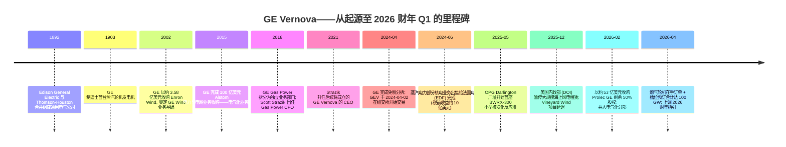
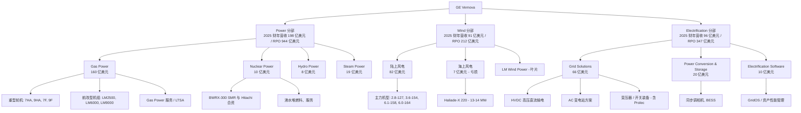
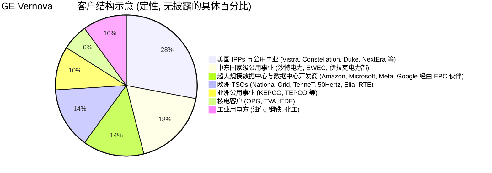
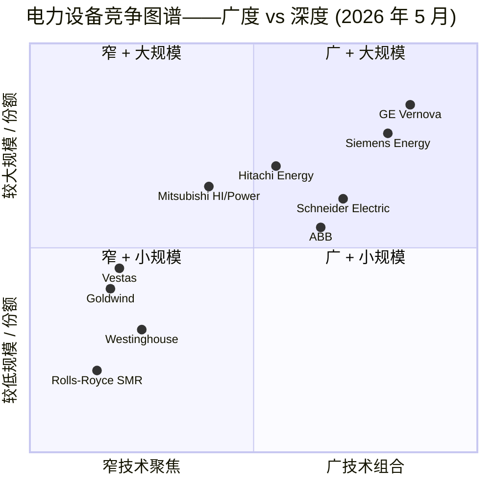

# GE Vernova Inc. (NYSE:GEV) — 公司研究报告

**截至日期: 2026-05-20**
**股票代码: NYSE: GEV**
**总部所在地: 美国马萨诸塞州剑桥市**
**行业 / 子行业: 工业——电气设备与重型电力机械 (Industrials — Electrical Equipment & Heavy Power Machinery)**
**作者说明: 所有财务数据均经 2025 年度 Form 10-K (于 2026 年 1 月提交) 及 2026 财年 Q1 业绩公告 (2026-04-22) 核对。同业估值数据来源于公开市场数据提供商, 并已在文内逐条注明引用。**
**报告语言: 简体中文 (英文版同时存在于本目录)**

> **业绩更新——2026 财年指引上调 (2026-04-22):** 管理层将 2026 全年指引上调至: 营业收入 **445–455 亿美元** (此前 440–450 亿美元)、调整后 EBITDA 利润率 **12–14%** (此前 11–13%)、自由现金流 **65–75 亿美元** (此前 50–55 亿美元), 主要驱动因素包括燃气轮机 (gas turbine) 定价改善、超大规模数据中心 (hyperscaler) 主导的电气化 (Electrification) 订单, 以及 Prolec GE 合并的并表贡献。来源: [GE Vernova 2026 财年 Q1 业绩公告, 2026-04-22](https://www.sec.gov/Archives/edgar/data/0001996810/000199681026000063/gevpressrelease1q26.htm)。

---

## 目录

1. 公司概览
2. 公司历史
3. 管理团队
4. 产品与服务
5. 客户与上市策略
6. 行业概览
7. 竞争格局
8. 市场机会 (TAM)
9. 风险评估
10. 参考资料

---

## 1. 公司概览

GE Vernova Inc. 是一家全球性的电力设备与电网系统纯赛道公司 (pure-play), 于 2024 年 4 月 2 日由通用电气公司 (General Electric Company, GE) 完成对其能源业务的免税分拆 (tax-free spin-off) 后独立, GE 同时向 GE 股东派发 GEV 股份。分拆完成后, 原 GE 改名为 GE Aerospace, 而 GEV 承接了原本归属于"GE Power"、"GE Renewable Energy"和"GE Digital Grid"三大集合体下的燃气、蒸汽、核能、水力、陆上风电、海上风电、叶片、电网解决方案 (grid solutions)、电力转换、储能以及电气化软件业务。公司将自身定位为"全球电力行业的领导者, 提供能够发电、传输、调度、转换并储存电力的产品与服务", 并表示其装机基础发电量约占全球电力生产的 **25%** ([GE Vernova 2025 年 Form 10-K, 第 5 页](https://www.sec.gov/Archives/edgar/data/0001996810/000199681026000015/gev-20251231.htm))。

**业务模式与业务分部。** GEV 划分为三个可报告分部 (reportable segments): **电力 (Power)** (燃气、核能、水力、蒸汽)、**风电 (Wind)** (陆上、海上、LM Wind Power 叶片), 以及**电气化 (Electrification)** (电网解决方案、电力转换与储能、电气化软件) ([2025 年 10-K, 第 1 项](https://www.sec.gov/Archives/edgar/data/0001996810/000199681026000015/gev-20251231.htm))。经济模式分为两部分: 长周期重资本品的大宗设备销售 (单台 H 级燃气轮机即可达数亿美元合同体量), 以及围绕约 **7,000 台燃气轮机和 59,000 台陆上风机**装机基础展开的、利润率显著更高的服务/售后 (services / aftermarket) 业务, 后者涵盖跨越数十年的维护、备件与升级合同 ([2025 年 10-K, 第 5–6 页](https://www.sec.gov/Archives/edgar/data/0001996810/000199681026000015/gev-20251231.htm))。2025 财年设备类营业收入为 **209 亿美元** (占总营收 55%), 服务类营业收入 **171 亿美元** (占 45%); 服务类贡献了更高的利润占比并提供可见度——总未履行履约义务 (Remaining Performance Obligations, RPO, 公司首选的在手订单指标) 在 2025 年末达到 **1,502 亿美元**, 其中服务类为 **860 亿美元** ([2025 年 10-K, MD&A——经营成果](https://www.sec.gov/Archives/edgar/data/0001996810/000199681026000015/gev-20251231.htm))。

**规模指标。** 2025 财年总营业收入 **381 亿美元** (同比 +9%), 净利润 **48.8 亿美元** (2024 年为 15.5 亿美元), 摊薄每股收益 **17.69 美元** (2024 年为 5.58 美元), 调整后 EBITDA **32.0 亿美元** (同比 +57%)。自由现金流 (free cash flow) 为 **37.1 亿美元** (上年为 17.0 亿美元) ([2025 年 10-K, MD&A](https://www.sec.gov/Archives/edgar/data/0001996810/000199681026000015/gev-20251231.htm))。净利润中包含 2025 年录得的 **20.5 亿美元税务收益 (tax benefit)**, 主要源于 Q4 释放了 29 亿美元美国联邦/州估值备抵 (valuation allowance) ——即管理层判断, 鉴于公司盈利轨迹的改善, 此前在亏损年份累积的递延所得税资产 (deferred tax assets) 现在更有可能被实际利用 ([2025 年 10-K, MD&A——所得税](https://www.sec.gov/Archives/edgar/data/0001996810/000199681026000015/gev-20251231.htm))。税前营业利润为 **13.9 亿美元** (占营业收入 3.6%), 因此相对营业收入规模而言, 底层盈利能力仍属温和, 但趋势明确向上。全球员工总数约 **75,000 人** ([2025 年 10-K, 人力资本](https://www.sec.gov/Archives/edgar/data/0001996810/000199681026000015/gev-20251231.htm))。

**地理分布。** 2025 财年营业收入按地区拆分为美国 **173 亿美元 (46%)** / 海外 **207 亿美元 (54%)**。海外细分: 欧洲 **76 亿美元**, 中东与非洲 **54 亿美元**, 亚洲 **46 亿美元**, 美洲非美区域 **31 亿美元** ([2025 年 10-K, 附注 24——地理信息](https://www.sec.gov/Archives/edgar/data/0001996810/000199681026000015/gev-20251231.htm))。美国占比在上升, 源于超大规模数据中心带动的电力需求; 中东与非洲的上升, 则来自向沙特阿拉伯、伊拉克及阿联酋交付的燃气轮机。

*来源: [GE Vernova 2025 年 10-K, 可报告分部摘要](https://www.sec.gov/Archives/edgar/data/0001996810/000199681026000015/gev-20251231.htm)。*

**估值快照 (截至 2026-05-20)。** GEV 股价约为每股 **1,030 美元**, 市值约 **2,750–2,800 亿美元**。TTM 市盈率 (P/E) 约 **31 倍** (不同数据源的区间为 29.9–31.9 倍), TTM 企业价值 (Enterprise Value, EV) 约 2,138 亿美元, 对应 2025 财年报告 EBITDA 22.4 亿美元的 EV/EBITDA 倍数约 **95 倍** ([financecharts.com — GEV EV/EBITDA, 2026 年 5 月](https://www.financecharts.com/stocks/GEV/value/ev-to-ebitda); [financecharts.com — GEV P/E 倍数](https://www.financecharts.com/stocks/GEV/value/pe-ratio); [MacroTrends — GEV 市值](https://www.macrotrends.net/stocks/charts/GEV/ge-vernova/market-cap))。EV/营业收入 (EV/Revenue) 约 5.6 倍, TTM 市销率 (P/S) 约 7.2 倍。公司每季度派发 0.50 美元股息 (年化 2.00 美元, 收益率约 0.2%), 2025 年回购了 33 亿美元股票, 2026 年 Q1 又回购 13 亿美元 ([2026 财年 Q1 业绩公告, 2026-04-22](https://www.sec.gov/Archives/edgar/data/0001996810/000199681026000063/gevpressrelease1q26.htm))。

**同业比较。** 直接可比的电力设备同业包括: Siemens Energy AG (ENR.DE) TTM P/E 约 **97 倍** (forward 约 30 倍), 三菱重工 (Mitsubishi Heavy Industries, TYO:7011) 约 **51 倍**, Vestas Wind Systems (CPH:VWS) 约 **31 倍**, 以及 ABB Ltd (NYSE:ABB) 约 **39 倍** ([financecharts.com — Siemens Energy, 2026 年 5 月](https://www.financecharts.com/stocks/SMNEY/value/pe-ratio); [GuruFocus — 三菱重工 TTM P/E, 2026-04-23](https://www.gurufocus.com/term/pettm/MHVYF); [companiesmarketcap.com — Vestas P/E](https://companiesmarketcap.com/vestas-wind-systems/pe-ratio/); [wisesheets.io — ABB Ltd P/E](https://www.wisesheets.io/pe-ratio/ABBNY))。美国工业产品行业中位数 P/E 约 **30 倍** ([GuruFocus 行业数据](https://www.gurufocus.com/term/pettm/MHVYF))。Hitachi Energy (日立能源) 本身并未单独公开上市 (日立能源印度子公司 Hitachi Energy India Ltd, NSE:POWERINDIA, TTM P/E 高达约 188 倍, 但规模较小, 不具直接可比性)。

*来源: 各家同业 P/E 链接见上文; 行业中位数引自 [GuruFocus 行业数据, 2026](https://www.gurufocus.com/term/pettm/MHVYF)。*

**倍数解读。** 31 倍 TTM P/E 约为行业中位数的 1.0 倍, 远低于 Siemens Energy 的 97 倍和三菱重工的 51 倍; 但在 EV/EBITDA 维度上情形反转: 95 倍是任何历史标准下都属极端的水平。差距源于三件事。**(1) 报告 EBITDA 被人为压低。** 风电分部 2025 财年 EBITDA 亏损 5.98 亿美元 (相较 2023 年 10.3 亿美元亏损已收窄, 但仍是拖累), 而全公司 EBITDA 还包含独立运营公众公司所需的总部成本。32.0 亿美元的调整后 EBITDA, 加上 2026 财年指引中点暗示约 55 亿美元的水平, 对应远期 EV/EBITDA 接近 **40 倍**——依然偏贵, 但并非脱离常理 ([2025 年 10-K, MD&A](https://www.sec.gov/Archives/edgar/data/0001996810/000199681026000015/gev-20251231.htm); [2026 财年 Q1 业绩公告](https://www.sec.gov/Archives/edgar/data/0001996810/000199681026000063/gevpressrelease1q26.htm))。**(2) 在手订单可见度为估值溢价提供支撑。** 仅 2026 财年 Q1 一个季度的订单就达 **183 亿美元 (有机同比 +71%)**, 燃气轮机产能槽位预订 (slot reservations) + 在手订单从 2025 年末的 83 GW 跃升至 100 GW (预计 2026 年末≥110 GW), 电气化 (Electrification) 订单出货比 (book-to-bill) 为 2.5 倍——市场正在为尚未进入损益表的"嵌入式盈利能力"买单 ([2026 财年 Q1 业绩公告](https://www.sec.gov/Archives/edgar/data/0001996810/000199681026000063/gevpressrelease1q26.htm))。**(3) AI-数据中心电力的主题性溢价。** GEV 是机构投资者可直接持有、用以承接超大规模数据中心电力 CAPEX 的少数标的之一。电气化分部仅 2026 财年 Q1 就录得 **24 亿美元**的数据中心设备订单——超过 2025 全年总和 ([2026 财年 Q1 业绩公告](https://www.sec.gov/Archives/edgar/data/0001996810/000199681026000063/gevpressrelease1q26.htm)), 而 Motley Fool 指出"超大规模数据中心用于 AI 训练集群的资本开支增长速度已超过美国公用事业公司建设新增发电与输电能力的节奏"([The Motley Fool — Why GE Vernova Stock Keeps Soaring, 2026-02-07](https://www.fool.com/investing/2026/02/07/heres-why-ge-vernova-stock-keeps-soaring-in-2026/))。

倍数已经被拉伸到这样的程度: 一旦 AI 电力叙事软化, 或燃气轮机产能爬坡执行失误, EV/EBITDA 都会向工业历史中位数压缩——这属于第 9 章的估值风险范畴。

## 2. 公司历史

GE Vernova 既是新生公司 (截至本报告日, 它作为独立上市公司只有约 **25 个月**历史), 又是 130 年工业血统的继承者。燃气电力 (Gas Power) 业务可以追溯到 GE 在 1903 年制造的第一台蒸汽轮机发电机; 风电业务源自原 Enron Wind (恩然风电), 由 GE 在 2002 年收购; 电网解决方案业务则在 GE 于 2015 年收购 Alstom (阿尔斯通) 的电力与电网运营后, 吸收了原 Alstom Grid 的资产。

*来源: 分拆、EDF、BWRX-300 及海上风电里程碑——[GE Vernova 2025 年 10-K, 第 1 项](https://www.sec.gov/Archives/edgar/data/0001996810/000199681026000015/gev-20251231.htm); Prolec 部分——[Prolec GE 收购公告, 2026-02-02](https://www.gevernova.com/news/press-releases/ge-vernova-completes-prolec-ge-acquisition); 2026 财年指引上调——[2026 财年 Q1 业绩公告](https://www.sec.gov/Archives/edgar/data/0001996810/000199681026000063/gevpressrelease1q26.htm)。*

**为何要分拆。** Larry Culp 于 2018 年 10 月接掌 GE, 用了五年时间逐步解构 GE 这一综合集团, 以解决债务积压并让每项业务都能按自身价值进行估值。GE Healthcare 于 2023 年 1 月分拆; GE Aerospace (原 GE Aviation, 集团内利润率最高的业务) 与 GE Vernova (利润率较低但具备转型故事的能源资产) 于 2024 年 4 月分拆。战略逻辑非常清晰: 能源业务多年来一直是 GE 合并报表盈利的拖累 (仅风电业务在 2023 财年就录得约 10 亿美元 EBITDA 亏损, [2025 年 10-K MD&A](https://www.sec.gov/Archives/edgar/data/0001996810/000199681026000015/gev-20251231.htm)), 独立后的 GEV 可以按其本质——一家长周期电力工业公司, 拥有装机基础、服务特许经营权与在手订单——进行资本配置、治理与定价, 这种特质所需的股东基础与 GE Aerospace 截然不同。

**近期重大举措。**
- *EDF 核电业务剥离 (2024-06).* 将蒸汽电力业务中的部分核电活动出售给法国电力公司 (Électricité de France S.A., EDF), 录得税前收益约 10 亿美元, 蒸汽电力业务重新聚焦于煤电改造和常规蒸汽服务 ([2025 年 10-K, MD&A](https://www.sec.gov/Archives/edgar/data/0001996810/000199681026000015/gev-20251231.htm))。
- *Proficy 软件剥离 (2026 财年 Q1).* 2026 财年 Q1 将旗下 Proficy® 制造软件业务以 **6 亿美元**售予 TPG——属于电网与发电核心范畴之外的非核心软件资产 ([2026 财年 Q1 业绩公告](https://www.sec.gov/Archives/edgar/data/0001996810/000199681026000063/gevpressrelease1q26.htm))。
- *Prolec GE 合并并表 (2026-02-02).* 以约 **53 亿美元现金**收购与墨西哥企业集团 Xignux 长期合资公司 Prolec GE 的剩余 50% 股权, 将约 10,000 名员工与七座生产配电变压器与大型电力变压器的工厂全面并入——后者正是美国电网中供给最紧张的产品线 ([Prolec GE 收购公告, 2026-02-02](https://www.gevernova.com/news/press-releases/ge-vernova-completes-prolec-ge-acquisition); [Power Technology, 2026](https://www.power-technology.com/news/ge-vernova-acquires-prolec-ge/))。融资方式为发行评级 BBB / BBB+ 的 **26 亿美元**优先票据 + 自有现金。Prolec 预计为 2026 年电气化分部贡献约 30 亿美元营业收入, EBITDA 利润率位于 mid-teens 区间 ([2026 财年 Q1 业绩公告](https://www.sec.gov/Archives/edgar/data/0001996810/000199681026000063/gevpressrelease1q26.htm))。
- *海上风电业务收缩 (2024–2026).* 多起"叶片事件 (blade events)"在 2024 年发生于 Dogger Bank (英国) 和 Vineyard Wind (美国马萨诸塞州), 迫使 GEV 暂停 Haliade-X 相关新签订单, 承受进一步亏损, 并宣布裁撤约 900 个海上风电岗位 ([Utility Dive — GE Vernova 海上风电裁员, 2024](https://www.utilitydive.com/news/ge-vernova-jobs-cut-offshore-wind-vineyard-blades/727711/); [Boston Globe — GE Vernova 海上风电亏损扩大, 2026-01-28](https://www.bostonglobe.com/2026/01/28/business/ge-vernova-offshore-wind-losses/))。2025 年 12 月美国内政部 (DOI) 的租赁暂停令进一步加剧了问题。

## 3. 管理团队

GE Vernova 并非创始人主导型公司。CEO 是在 GE 内部为这一职位精心培养出来的, 整体管理团队由长期 GE Power 老兵与专为分拆而引进的外部资深人士混合组成。"创始人画像"的权重因此归到 CEO Scott Strazik 身上——他自 2021 年起执掌分拆前形态下的能源业务, 并继续主导公司战略。

### Scott Strazik —— 首席执行官兼总裁 (47 岁)

Scott Strazik 于 2021 年 11 月出任 GE Vernova 各业务的 CEO, 2024 年 4 月分拆时被任命为独立公众公司的 CEO, 并于 2025 年 7 月加任总裁 ([2026 年 DEF 14A——董事简历](https://www.sec.gov/Archives/edgar/data/0001996810/000199681026000049/final2026proxystatementcou.pdf))。他整个约 25 年的职业生涯都在 GE 度过。最具相关性的职位 (披露的责任范围) 如下:

- **GE Aviation 商用发动机业务 CFO (2011 年 5 月 – 2013 年 6 月).** Strazik 首个直接负责损益表的核心职位。
- **GE Gas Power Systems 业务 CFO (2013 年 7 月 – 2016 年 6 月).** 在燃气轮机业务彼时的出货量高峰期, 主导财务规划三年。
- **GE Gas Power Systems 销售与商业运营负责人 (2016 年 7 月 – 2017 年 10 月).** 从财务转向商业周期——订单、槽位管理与合同承保 (contract underwriting)。
- **GE Power Services 业务总裁兼 CEO (2017 – 2018).** 主导高利润率的服务业务。
- **GE Gas Power 业务 CEO (2018 – 2021 年 10 月).** 在 2017–2018 年 GE Power 危机 (订单空窗、燃气轮机叶片质量问题、220 亿美元商誉减值) 后, 主导 Gas Power 的扭亏。Gas Power EBITDA 从 2018 年约 -8 亿美元的低谷, 回升至 2021 年正向 12 亿美元 (依据原 GE 10-K 中 GE Power 分部披露)。
- **GE Vernova CEO (2021 年 11 月 – 2024 年 4 月).** 在 GE 内部将该分部作为独立业务搭建起来, 组建管理团队与可分拆财务组织, 主导分拆筹备 ([2026 年 DEF 14A](https://www.sec.gov/Archives/edgar/data/0001996810/000199681026000049/final2026proxystatementcou.pdf))。

教育背景: 康奈尔大学 (Cornell University) 工业与劳工关系学士; 哥伦比亚大学 (Columbia University) 国际与公共事务学院经济与公共政策方向硕士 ([2026 年 DEF 14A](https://www.sec.gov/Archives/edgar/data/0001996810/000199681026000049/final2026proxystatementcou.pdf))。

Strazik 被市场普遍视为 GE Gas Power 复苏的总设计师——这是分拆前 GE Power 综合体内部最具影响力的扭亏案例——也是面向卖方分析师的可信沟通者。其内部持股与薪酬细节详见委托代理材料; 2026 年 DEF 14A 第 4 节披露 2025 年目标总直接薪酬 (TDC) 构成约为: 基本薪资 13%、年度激励 17%、长期股权激励 70% (PSU + RSU), 其中 PSU 按三年累计调整后 EBITDA、自由现金流与相对股东总回报率 (TSR) 目标分批解锁 ([2026 年 DEF 14A——高管薪酬](https://www.sec.gov/Archives/edgar/data/0001996810/000199681026000049/final2026proxystatementcou.pdf))。Strazik 始终明确传递资本回报为战略优先级——公司"将至少 1/3 的现金生成回馈股东"的政策与他直接相关 ([2025 年 10-K, 第 1 项——公司战略](https://www.sec.gov/Archives/edgar/data/0001996810/000199681026000015/gev-20251231.htm))。

对 CEO 而言, 与投资逻辑最相关的问题在于他能否并行驾驭三大挑战: 在不出现质量问题 (即触发 2017 年 GE Power 危机的同类问题) 的前提下完成燃气轮机产能爬坡、以可接受亏损执行现有海上风电在手订单且不重返该市场、以及将 Prolec 整合进一个订单出货比已达 2.5 倍的电气化分部。其在 Gas Power 的业绩记录倾向于"能行"; 海上风电的执行记录则提示谨慎。

### Ken Parks —— 首席财务官 (62 岁)

Ken Parks 自分拆 (2024 年 4 月) 以来一直担任 CFO, 并于 2023 年 10 月以 CFO 身份加入 GE Vernova 各业务, 为分拆做筹备 ([2026 年 DEF 14A——公司高管](https://www.sec.gov/Archives/edgar/data/0001996810/000199681026000049/final2026proxystatementcou.pdf))。他拥有 38 年财务领导经验和三段此前的公众公司 CFO 经历: 2020 年 9 月至 2023 年 9 月任 Owens Corning (NYSE: OC) CFO; 2016 年至 2020 年任 Mylan N.V. CFO (主导了 Mylan / Viatris 颇具争议的合并于 2020 年 11 月收官); 2012 年 6 月至 2016 年 6 月任 Wesco International (NYSE: WCC) CFO ([2026 年 DEF 14A](https://www.sec.gov/Archives/edgar/data/0001996810/000199681026000049/final2026proxystatementcou.pdf))。早期职业生涯曾在联合技术公司 (United Technologies Corp, UTC) 旗下 Fire & Security 担任部门 CFO, 并在 UTC 担任投资者关系总监。Parks 的公众 CFO 深度——尤其是在 Wesco (一家与电网设备客户高度重叠的电气分销商) ——与 GEV 的业务组合异常匹配。他是面向华尔街沟通海上风电亏损计提的可信声音——在 2025 财年 Q1 提前披露风电亏损约为 4 亿美元, 之后在 Vineyard Wind 停工令后于 Q4 2025 将指引调高至 6 亿美元 ([Boston Globe, 2026-01-28](https://www.bostonglobe.com/2026/01/28/business/ge-vernova-offshore-wind-losses/)) ——并主导了为 Prolec 收购交易交割融资的 26 亿美元票据发行 (按投资级利率定价) ([2026 财年 Q1 业绩公告](https://www.sec.gov/Archives/edgar/data/0001996810/000199681026000063/gevpressrelease1q26.htm))。

### 其他核心高管 (列于 2026 年 4 月 DEF 14A "关于公司高管"章节)

- **Pablo Koziner —— 首席商务官 (Chief Commercial Officer).** 负责三大分部的销售; 是电力业务"槽位预订策略"的关键人物。此前任 Nikola Corporation 能源与商务部总裁。
- **Maria-Therese (MT) Schaefer —— 首席可持续发展与对外事务官.** 主持公司可持续发展委员会, 是净零战略的对外发言人, 包括公司明确的 2030 年范围 1+2 (Scope 1+2) 碳中和目标 ([2025 年 10-K, 第 1 项——可持续发展](https://www.sec.gov/Archives/edgar/data/0001996810/000199681026000015/gev-20251231.htm))。
- **Roger Martella —— 首席可持续发展官.** 此前任通用电气公司可持续发展高级副总裁。面向监管机构的公共发言人。
- **Vic Abate —— 首席技术官 (CTO).** 长期任 GE Power CTO; 主管 2025–2028 年累计 **50 亿美元**研发计划 ([2025 年 10-K, 第 1 项——研发](https://www.sec.gov/Archives/edgar/data/0001996810/000199681026000015/gev-20251231.htm))。Abate 的任职可追溯至 GE 收购 Enron Wind 的最初阶段。
- **John Slattery —— 陆上风电总裁.** 负责恢复风电分部盈利能力。来自巴西航空工业公司 (Embraer)。

### 董事会与公司治理

董事会共 9 名董事, 其中 **8 名为独立董事** ([2026 年 DEF 14A, 第 9 页](https://www.sec.gov/Archives/edgar/data/0001996810/000199681026000049/final2026proxystatementcou.pdf))。董事长为独立董事 (与 CEO 分离)。值得一提的董事包括 Matthew Harris (Global Infrastructure Partners 的创始合伙人——一家专注能源资产的基础设施投资公司, 2024 年 4 月加入) 和 Martina Hund-Mejean (万事达卡 (MasterCard) 2007–2019 年 CFO, 审计委员会主席, 2024 年 5 月加入) ([2026 年 DEF 14A——董事简历](https://www.sec.gov/Archives/edgar/data/0001996810/000199681026000049/final2026proxystatementcou.pdf))。董事会下设四个常设委员会: 审计、薪酬与人力资本、提名与公司治理、安全与可持续发展。多元化构成: 3 位女性 / 6 位男性, 3 位为非裔或拉丁裔, 年龄区间多数在 50–65 岁。从美元价值看, 内部人持股比例较低——GEV 的股本结构继承自分拆, 高管团队主要通过分拆后的股权授予积累股份; 2026 年 DEF 14A 报告的董事与高管合计持股比例不足流通股 1%, 这对于从超大市值母公司分拆出来的公司而言属正常水平。CEO 总直接薪酬中 70% 与三年现金及 TSR 目标挂钩的长期股权激励框架, 与股东经济利益高度一致。

### 业绩记录综合判断

团队最具代表性的资历, 是 Strazik 与 Abate 主导 Gas Power 在 2017–2019 年低谷中实现复苏。他们作为独立 CFO 和 CEO 首次承担的披露责任总体积极: 2025 财年营收 +9%、调整后 EBITDA +57%、FCF 翻倍以上、2026 财年指引上调。最显著的薄弱环节是风电分部执行——尽管 CFO Parks 一再向市场说明, 海上风电亏损仍持续放大。团队迄今对此保持坦诚, 这一点很关键。

## 4. 产品与服务

GEV 按三大分部组织运营, 共计涵盖约十二个产品族 (product families) 与数十款命名 SKU。在电力供应链中, 单一公司拥有如此广度的产品组合并不常见, 而这种广度本身就是一项竞争资产 (详见第 7 章)。

*来源: [GE Vernova 2025 年 10-K, 第 1 项](https://www.sec.gov/Archives/edgar/data/0001996810/000199681026000015/gev-20251231.htm); [GE Vernova 产品网站导航](https://www.gevernova.com/)。*

### 电力 (Power) 分部

**Gas Power (2025 财年营收 160 亿美元, 同比 +11%)。** 皇冠上的明珠。包括从小型工业用 (7E 级, 约 80 MW) 到旗舰 H 级 (7HA、9HA, 单台最高约 570 MW) 的全套重型轮机。2025 财年单位指标: 订单 173 台燃气轮机, 合计 **29.8 GW** (2024 年为 112 台 / 20.2 GW), 其中 43 台为 H 级; 出货 81 台, 合计 15.3 GW ([2025 年 10-K, MD&A——电力](https://www.sec.gov/Archives/edgar/data/0001996810/000199681026000015/gev-20251231.htm))。航改型机组 (Aeroderivatives) 是源自航空发动机设计的小型快启机组 (LM2500、LM6000、LM9000), 用作调峰电源或分布式发电; 2025 财年订单 63 台。服务业务围绕约 7,000 台轮机的装机基础, 包裹了约 **1,800 份长期服务协议 (LTSA)**, 平均剩余合同期限约 10 年。HA 系列轮机机队 (最现代化的 H 级平台) 已装机约 126 台, 累计运行 360 万小时, RPO 中还有 51 台 ([2025 年 10-K, 第 1 项——电力](https://www.sec.gov/Archives/edgar/data/0001996810/000199681026000015/gev-20251231.htm))。**竞争优势: 是——强势护城河由 (a) 规模 + 装机基础锁定 (服务业务高切换成本)、(b) 轮机热端部件的 IP 与冶金技术 (H 级技术)、以及 (c) 已证明的 60%+ 联合循环效率 (combined-cycle efficiency) 构成。** 最接近的竞争产品是 Siemens Energy 的 SGT5/SGT6-9000HL (>590 MW 重型 H 级) 和三菱电力 (Mitsubishi Power) 的 M501JAC (约 574 MW)。GEV 的 7HA / 9HA 在效率上与同业平分秋色, 定价能力由 H 级寡头三家共同分享。GEV 在美国市场拥有最广泛的装机基础 (这是它在数据中心浪潮中的关键优势, 因为客户偏好已在维护其机队的 OEM)。

**Nuclear Power (2025 财年营收 10 亿美元, +24%)。** 提供反应堆设计、沸水堆燃料、服务, 以及通过 GE Hitachi Nuclear Energy 合资公司 (2007 年与日立组建) 推进的小型模块化反应堆 (Small Modular Reactor, SMR) 开发。新旗舰产品是 **BWRX-300 小型模块化反应堆**——约 300 MW 的沸水堆 SMR, 采用被动安全设计、工厂化制造和简化设计 (理论上) 来降低部署成本。BWRX-300 项目管线现状:
- Ontario Power Generation (安大略发电公司, OPG) 于 2025 年 5 月承诺在加拿大 Darlington 厂址建设首座 BWRX-300。建设于 2025 年 5 月开工; 预计 2030 年前后投入商运 ([GEV 新闻稿——OPG 建设获批](https://www.gevernova.com/news/press-releases/ge-vernova-hitachi-bwrx-300-small-modular-reactor-approved-construction-province-ontario-opg))。
- Tennessee Valley Authority (田纳西河流域管理局, TVA) 已就美国 Clinch River 厂址做出预承诺, 等待美国核管理委员会 (NRC) 建设许可。
- Vattenfall (瑞典国营电力公司) 已将其 SMR 供应商短名单缩减为两家: BWRX-300 与 Rolls-Royce SMR——最终选择尚未公布 ([POWER Magazine — Vattenfall 缩减 SMR 短名单, 2025](https://www.powermag.com/vattenfall-narrows-smr-field-to-two-finalists-ge-vernovas-bwrx-300-and-rolls-royce-smr/))。
- GE Vernova Hitachi 于 2025 年宣布将向 Darlington 附近的加拿大 BWRX-300 工程与服务中心投资最高 **5,000 万美元** ([GEV 新闻稿——加拿大 SMR 中心](https://www.gevernova.com/news/press-releases/ge-vernova-hitachi-nuclear-energy-canada-small-modular-reactor-engineering-service-centre-ontario))。

**现实检查。** BWRX-300 拥有一个已获融资的开工项目 (OPG Darlington)、一个预承诺项目 (TVA Clinch River) 以及一个短名单席位 (Vattenfall)。它在本十年内还不会对收入或在手订单形成实质贡献。项目管线虽真实但规模有限, 且 BWRX-300 的商业经济性尚未得到验证——来自 NuScale (CFPP 项目)、Holtec SMR-300、Rolls-Royce SMR 和 Westinghouse AP300 的竞争激烈。**竞争优势: 部分——拥有 IP 与监管先发优势 (率先获得加拿大与美国建设许可), 但在经济性上尚未得到验证。** 最接近的竞争产品: Rolls-Royce SMR (约 470 MW); 定价目前尚不直接可比。

**Hydro Power (8 亿美元), Steam Power (19 亿美元)。** 水力是稳定的服务型业务; 蒸汽属于受管理的衰退业务。两者都以主力装机基础为导向, 增长低速。

### 风电 (Wind) 分部

**陆上风电 (2025 财年营收 82 亿美元, 上年 78 亿美元)。** 主力机型为 2.8-127、3.6-154、6.1-158 和 6.0-164 平台 ([2025 年 10-K, 第 1 项——风电](https://www.sec.gov/Archives/edgar/data/0001996810/000199681026000015/gev-20251231.htm))。装机基础约 59,000 台, 其中约 24,000 台已签服务合同。美国占设备类 RPO 约 60%。陆上风电凭借定价改善回到盈利区间——2026 财年 Q1 EBITDA 亏损归因于销量下降, 而非价格下降。**竞争优势: 部分。** GEV 在美国市场占有合理份额——Vestas 领先, GEV 是可信的第二/第三——但全球陆上风电是低利润率商品化业务。最接近的竞争对手: Vestas V162-7.2 MW 和 V172 平台 (Vestas 全球安装量领先, 定价大致持平)。

**海上风电 (2025 财年营收 6.5 亿美元, 上年 14 亿美元)。** 单一主力产品: **Haliade-X 220m** (13–14 MW)。这是问题产品。叶片制造在 Dogger Bank (英国) 和 Vineyard Wind (马萨诸塞州) 出现质量问题, 引发 2024 年的"叶片事件"。叠加 2025 年 12 月 22 日美国内政部租赁暂停令以及更广泛的美国海上风电政策逆风, GEV 实际上处于"消化既有订单 (run-off)"状态——只完成已签在手订单, 不再积极争取海上风电新设备订单。2025 财年该分部 EBITDA 亏损 **5.98 亿美元**, 预计 2026 财年还有约 4 亿美元的额外亏损 ([2026 财年 Q1 业绩公告](https://www.sec.gov/Archives/edgar/data/0001996810/000199681026000063/gevpressrelease1q26.htm))。2026 财年 Q1 海上风电完成了 Dogger Bank A (英国) 和 Vineyard Wind (美国) 的安装。**竞争优势: 否。** GEV 已从该市场撤退; Siemens Energy 的 Siemens-Gamesa SG 14-222 DD 和 SG 21-276 DD 是西方市场的可信平台, Vestas V236 处于远第三位。中国竞争对手 (明阳智能、金风科技、远景能源) 在尺寸与价格上激进, 但尚未在美国/欧洲市场形成规模部署。

**LM Wind Power (2 亿美元)。** 风电叶片制造业务。产能持续主动收缩, 当前剩余产能多用于内部供应。

### 电气化 (Electrification) 分部

这是增长最快的分部, 也是 AI-数据中心电力的最直接受益板块。2025 财年营业收入 96 亿美元, 同比 +28%; 分部 EBITDA 14 亿美元, 利润率 14.9% (高于 2024 年的 9.0% 和 2023 年的 3.7%) ([2025 年 10-K, MD&A——电气化](https://www.sec.gov/Archives/edgar/data/0001996810/000199681026000015/gev-20251231.htm))。

- **Grid Solutions (66 亿美元, +34%)。** HVDC 高压直流输电系统、AC 变电站方案、开关装备、变压器 (自 2026 年 2 月起由 Prolec GE 加强)、电网自动化。HVDC 产品是利润最为丰厚的——全球仅约 5 家供应商 (GEV、Hitachi Energy、Siemens Energy、Mitsubishi Electric、中国南瑞继保/许继 NR Electric/XJ Group)。**竞争优势: 是**——供应商池狭窄、多年交付周期、海上电网互联需求增长。最接近的竞争对手: Hitachi Energy HVDC Light Generation 5 (目前据信在份额上领先, 尤其是在欧洲)。
- **Power Conversion & Storage (20 亿美元, +22%)。** 同步调相机 (Synchronous Condensers, 在可再生能源渗透率上升的电网稳定性方面至关重要)、电池储能系统 (BESS)、变频驱动器、船用与工业驱动器。**竞争优势: 部分**——在同步调相机方面表现强劲, 在 BESS 上属中游, 面临 Tesla Megapack、Fluence 以及宁德时代-超大规模数据中心一体化方案的强劲竞争。
- **Electrification Software (10 亿美元, +6%)。** GridOS 套件——资产性能管理、能源管理系统、配电管理。**竞争优势: 部分。** 2026 财年 Q1 出售 Proficy 进一步聚焦; GridOS 在公用事业级电网运营商面前具有差异化, 但仅保持个位数增长。最接近的竞争对手: Schneider Electric (施耐德电气) 的 EcoStruxure 和 Siemens Spectrum Power。

### 推动业务的旗舰产品

1. **H 级重型燃气轮机 (7HA / 9HA 系列)** ——单项最具战略意义的产品。2025 财年燃气轮机订单中约 30% 的 GW 来自 H 级。联合循环效率 >64%。在手订单和槽位预订从 2025 年末的 83 GW 跃升至 2026 年 Q1 末的 100 GW; 管理层目标 2026 年末达到 ≥110 GW ([2026 财年 Q1 业绩公告](https://www.sec.gov/Archives/edgar/data/0001996810/000199681026000063/gevpressrelease1q26.htm))。
2. **Gas Power 服务 / 长期服务协议 (LTSA)** ——覆盖 7,000 台机组的约 1,800 份 LTSA。最高利润率、最具可预测性的收入流。
3. **Grid Solutions HVDC + AC 变电站方案** ——2026 财年 Q1 订单出货比达 2.5 倍, 其中超大规模数据中心 / 数据中心设备订单为 **24 亿美元** ([2026 财年 Q1 业绩公告](https://www.sec.gov/Archives/edgar/data/0001996810/000199681026000063/gevpressrelease1q26.htm))。

### 近 12 个月的发布与终止 (launches and sunsets)

- *发布 / 推进:* BWRX-300 SMR (2025 年 5 月 OPG Darlington 开工); 首次商业化部署 GE Vernova 自有固体吸附剂技术的直接空气捕获 (direct-air-capture, DAC, 2025) ([2025 年 10-K, 第 1 项](https://www.sec.gov/Archives/edgar/data/0001996810/000199681026000015/gev-20251231.htm)); Prolec GE 变压器全面并表 (2026 年 2 月) ([Prolec 收购公告](https://www.gevernova.com/news/press-releases/ge-vernova-completes-prolec-ge-acquisition))。
- *终止 / 剥离:* Proficy 制造软件 (2026 财年 Q1 出售给 TPG); 部分蒸汽电力核电业务 (2024 财年 Q2 出售给 EDF); 2024 财年水电业务 1.08 亿美元减值 ([2025 年 10-K, 附注 24](https://www.sec.gov/Archives/edgar/data/0001996810/000199681026000015/gev-20251231.htm)); 主动收缩新签海上风电订单。

## 5. 客户与上市策略

GEV 面向相对集中、专业化的买方群体: 垂直整合的公用事业公司、独立发电商 (Independent Power Producers, IPPs)、国家级电力公司 (中东、亚洲、非洲的国营公用事业)、工业用电方 (油气、钢铁、化工)、超大规模数据中心运营商, 以及电网运营商 / 输电系统运营商 (Transmission System Operators, TSOs)。

### 客户集中度

GE Vernova 在 2025 年 10-K 中没有披露任何占合并营业收入≥10% 的客户。第 1 项——客户与第 7 项均未提及主要客户, 分部附注也未标记任何单一对手方达到 ASC 280-10-50-42 的披露门槛 ([2025 年 10-K, 第 1 项; 附注 24](https://www.sec.gov/Archives/edgar/data/0001996810/000199681026000015/gev-20251231.htm))。这暗示没有客户达到 2025 财年营业收入≥10% 的水平。对于 GEV 规模的工业企业而言这并不寻常, 是结构性正面因素: 客户基础在地理与经济层面均高度多元化。

定性而言, 跨各类文件、新闻稿和投资者材料披露的最大客户关系包括:

*仅作示意——GE Vernova 不披露客户级营业收入百分比。该结构推导自 [2025 年 10-K, 第 1 项](https://www.sec.gov/Archives/edgar/data/0001996810/000199681026000015/gev-20251231.htm) 中的项目公告、[2026 财年 Q1 业绩公告](https://www.sec.gov/Archives/edgar/data/0001996810/000199681026000063/gevpressrelease1q26.htm), 以及 [gevernova.com/news](https://www.gevernova.com/news) 上的具名项目新闻稿。*

定性集中度风险不在客户侧, 而在*渠道*侧: 大多数数据中心电力订单通过 EPC 集成商 (Bechtel、Black & Veatch、Fluor、Burns & McDonnell) 流转, 设备有时通过 IPP / 联合托管商 (co-locator) 转手, 而非直接由超大规模数据中心买家下单。

### 渠道与销售模式

- **电力设备:** GEV 区域商业团队直销 (Strazik 此前的辖区)。交易周期较长——从 RFP (询价邀约) 到首次交付历时 18 个月至 5 年。合同管理负担重; **槽位预订协议 (slot reservation agreements)** 在 2024–2026 年成为一种关键的新机制 (客户提前以现金支付未来年份的工厂槽位; 现金以合同负债形式进入经营性现金流——这正是 2025 财年合同负债增加 52 亿美元的驱动因素) ([2025 年 10-K, MD&A——现金流](https://www.sec.gov/Archives/edgar/data/0001996810/000199681026000015/gev-20251231.htm))。
- **电力服务:** 长期服务协议 (LTSA), 通常为 10–20 年合同, 在设备销售时附带; 鉴于 OEM 技术优势, 续约率较高。
- **风电设备:** 面向风电场开发商和 IPPs 直销。
- **电气化:** 面向公用事业 / TSOs 的直销与渠道销售混合 (Prolec GE 通过电气供应分销商增添了显著分销能力)。
- **电气化软件:** 面向电网运营商的 SaaS / 本地部署软件直销。

### 地理分布

2025 财年营业收入构成: 美国 46% / 欧洲 20% / 中东与非洲 14% / 亚洲 12% / 美洲非美区域 8% ([2025 年 10-K, 附注 24](https://www.sec.gov/Archives/edgar/data/0001996810/000199681026000015/gev-20251231.htm))。中东与非洲是增长最快的区域 (2025 财年 54 亿美元, 2023 财年为 39 亿美元), 由对沙特阿拉伯 (公共投资基金 PIF 电力建设计划)、伊拉克 (电力部) 与阿联酋的燃气轮机销售拉动。

### 近 12 个月的具名订单

- **Ontario Power Generation BWRX-300** —— 西方世界首座商业化 SMR 开工, 2025 年 5 月 ([GEV 新闻稿](https://www.gevernova.com/news/press-releases/ge-vernova-hitachi-bwrx-300-small-modular-reactor-approved-construction-province-ontario-opg))。
- **伊拉克电力部** —— 2024 年宣布的多 GW 燃气轮机一揽子项目。
- **沙特电力公司 / 公共投资基金 (PIF)** —— 通过 PIF "Vision 2030"电力建设计划持续交付的燃气轮机。
- **Vistra, Constellation Energy 等** —— 为数据中心联合园区订购 H 级燃气轮机的美国 IPPs。
- **Dogger Bank A (英国)** —— 2026 财年 Q1 完成 Haliade-X 安装。

## 6. 行业概览

GE Vernova 跨越四大重叠行业: (1) 重型发电设备、(2) 风力发电、(3) 电网输配电设备, 以及 (4) 能源服务 / 售后。统一的主题是全球能源转型, 叠加由 AI 驱动的电力需求结构性上升。这一组合在近年工业史上较为罕见: 通常需求增长与去碳化推力方向相反; 当前则共同推向同一方向 (更多电力、更低碳强度)。

### 市场结构与规模

- **重型燃气轮机。** 实际上是三家寡头格局: GE Vernova、Siemens Energy、Mitsubishi Power, 边缘玩家包括 Ansaldo Energia、Doosan Enerbility (韩国) 和哈尔滨电气 (中国)。近年新增重型燃气轮机全球年市场规模约 50–70 GW; 分析师共识与 GE 投资者材料显示, 到 2027–2028 年, 在数据中心电力、煤电退役与电气化增长驱动下, 80–100 GW 颇为可行。2017–2022 年低谷期平均约 25 GW。
- **海上风电机组。** 2024 年全球安装量约 11 GW, 中国 OEM 占新增全球安装的约 60%; 西方市场由 Siemens-Gamesa、Vestas 和 GE Vernova 主导。在 2025 年 12 月 22 日租赁暂停后, 美国市场目前处于政策性深度冻结状态 ([2025 年 10-K, 第 1 项——风电](https://www.sec.gov/Archives/edgar/data/0001996810/000199681026000015/gev-20251231.htm))。
- **陆上风电机组。** 全球年安装约 110–120 GW。前三家按份额排序: 金风、远景 (均为中国——但份额很大程度上局限于中国本土市场)、Vestas (西方市场第一), GE Vernova 全球排名第三。
- **电网设备 (HVDC、变压器、开关装备)。** SKU 层面较分散, 但系统层面较集中。HVDC 供应商池: Hitachi Energy (份额第一)、Siemens Energy、GE Vernova、Mitsubishi Electric、中国 XJ/NR (许继/南瑞)。配电变压器: 美国市场供应极度紧张——Prolec GE 收购明确以美国变压器短缺为切入逻辑 ([Prolec 收购公告](https://www.gevernova.com/news/press-releases/ge-vernova-completes-prolec-ge-acquisition))。
- **小型模块化反应堆 (SMR)。** 仍处于商用前阶段。活跃 OEM 包括 GE Vernova Hitachi (BWRX-300)、Rolls-Royce SMR、NuScale (在 CFPP 项目取消后转入商业供应模式)、Westinghouse AP300、Holtec SMR-300、X-energy、TerraPower (Natrium 项目)。全球订单管线规模为低个位数台数, 且几乎全部由所在国政府补贴。

### 增长驱动

2025 年 10-K 列出了六项长期趋势, 是行业顺风的可信地图 ([2025 年 10-K, MD&A](https://www.sec.gov/Archives/edgar/data/0001996810/000199681026000015/gev-20251231.htm)):

1. **发电用电需求增长** —— 美国能源信息署 (EIA)、国际能源署 (IEA) 及 BloombergNEF 均预测, 由 AI / 数据中心、电动汽车和热电气化驱动的用电负荷出现阶跃式增长。美国公用事业 5 年负荷增长预测已从 2022 年的约 0% 上升至 2025 年的每年数个百分点, 是数十年来最高水平。
2. **去碳化** —— 推动风电、太阳能、储能和核电的采用。
3. **发电结构演变** —— 煤电退役, 燃气作过渡, 可再生能源与核电作为长期方向。
4. **能源韧性与安全** —— 推动冗余支出; 是电网设备的间接利好。
5. **电网现代化** —— 美国老化电网 (变压器平均寿命超过 50 年) 与可再生能源并网叠加, 是电气化业务最大的单一机遇。
6. **监管与政策变化** —— 美国《通胀削减法案》(IRA) 税收抵免、欧盟 REPowerEU 计划、亚洲电网现代化项目。

### 超大规模数据中心 / AI 数据中心电力需求 —— 唯一的新驱动力

2024–2026 年最受讨论的主题驱动是超大规模数据中心的 AI 资本开支。麦肯锡、高盛和 IEA 均预测, 到 2030 年, 美国数据中心相关电力需求 CAGR 约为 8–10%。Motley Fool 在 2026 年 2 月概括了 GEV 特有的叙事: "超大规模数据中心用于 AI 训练集群的资本开支增长速度已超过美国公用事业公司建设新增发电与输电能力的节奏, 引发多年期的新增燃气轮机、变压器、中压开关装备和电网稳定设备的争抢, 而 GE Vernova 是少数能同时大规模供应这三类产品的公司之一"([The Motley Fool, 2026-02-07](https://www.fool.com/investing/2026/02/07/heres-why-ge-vernova-stock-keeps-soaring-in-2026/))。电气化分部 2026 财年 Q1 录得 24 亿美元数据中心设备订单——超过 2025 全年总和——是订单簿变动速度的直接证据 ([2026 财年 Q1 业绩公告](https://www.sec.gov/Archives/edgar/data/0001996810/000199681026000063/gevpressrelease1q26.htm))。

### 监管环境

- **美国:** 《通胀削减法案》(IRA) 税收抵免 (可再生 PTC、ITC); CHIPS 法案的相邻关系; FERC 第 2023 号令对并网排队的规定; 州级输电规划。特朗普政府于 2025 年 12 月 22 日发布的大规模海上风电租赁暂停令, 是一项专门冲击海上风电业务的监管打击 ([2025 年 10-K, 第 1 项](https://www.sec.gov/Archives/edgar/data/0001996810/000199681026000015/gev-20251231.htm))。
- **欧洲:** REPowerEU 计划、"Fit-for-55"包、海上风电招标框架、HVDC 互联走廊建设。
- **亚洲与中东:** 国家主导的产能建设方案 (沙特"Vision 2030"、阿联酋"2050 能源战略"、印度国家电力计划 NEP)。
- **核能:** SMR 监管框架仍在形成中。美国 NRC、加拿大 CNSC、英国 ONR、瑞典 SSM 在不同节奏下逐个推进不同的供应商设计。

### 行业动态

- **供应商议价能力:** 关键原材料 (特种钢、稀土、变压器用 GOES 取向硅钢) 周期性制约行业。现场施工与调试阶段的技术工人短缺, 在 2024–2026 年构成主导性的成本周期约束。
- **买方议价能力:** 买方集中 (国家级公用事业、超大规模数据中心), 但多年期在手订单限制了短期价格压缩。当前 OEM 自 2010 年初以来首次掌握定价权。
- **替代品:** 分布式光伏 + 储能是集中式燃气-电网的主要替代; 专用核电 (SMR 或大型) 的离网消纳是超大规模数据中心电力的替代。
- **进入威胁:** 设备规模上受限 (多年装机基础 + IP 壁垒), 但中国 OEM 正在向中东和非洲电力市场扩张, 而五年前它们尚未在那里出现。

*来源: [GE Vernova 2025 年 10-K, MD&A——经营成果](https://www.sec.gov/Archives/edgar/data/0001996810/000199681026000015/gev-20251231.htm)。*

## 7. 竞争格局

GEV 在 2025 年 10-K 第 1 项——竞争中识别其竞争对手集 ([2025 年 10-K, 第 5 页](https://www.sec.gov/Archives/edgar/data/0001996810/000199681026000015/gev-20251231.htm)):

- **电力分部:** Siemens Energy、Mitsubishi Power、Westinghouse、Framatome、Rolls-Royce。
- **风电分部:** Vestas、Siemens-Gamesa、Nordex、Envision (远景)、Goldwind (金风)。
- **电气化分部:** Hitachi Energy、Siemens Energy、Siemens、Schneider Electric (施耐德电气)、Mitsubishi Electric、ABB。

真正与投资逻辑相关的同业及其定位:

### Siemens Energy AG (Xetra: ENR.DE)

最直接可比的西方同业——一家德国能源分拆公司 (于 2020 年 9 月从 Siemens AG 分拆), 业务涵盖燃气轮机 (SGT5/SGT6-9000HL H 级)、HVDC 输电、Siemens-Gamesa 风电及电网技术。Siemens Energy 营收约 350–400 亿欧元, 与 GEV 相当。ENR 最主要的弱点是 Siemens-Gamesa 陆上风电质量问题 (2023 年巨额减值); 主要优势是 HVDC 技术领先地位。TTM P/E 约 97 倍 (forward 约 30 倍), 反映了 Gamesa 减值后近期盈利拐点 ([financecharts.com — Siemens Energy P/E, 2026 年 5 月](https://www.financecharts.com/stocks/SMNEY/value/pe-ratio))。

### 三菱重工 (Mitsubishi Heavy Industries, TSE: 7011) / Mitsubishi Power

综合性集团, 旗下重型燃气轮机业务 (M501JAC, 约 574 MW 级) 在 J 级细分市场拥有全球最高份额。在国防、航空、船舶等领域多元化——因此 MHI 并非纯赛道, 但是 H 级寡头中的第三家。TTM P/E 约 51 倍, 较 10 年中位数高出 200% ([GuruFocus — MHI TTM P/E, 2026-04-23](https://www.gurufocus.com/term/pettm/MHVYF))。

### Hitachi Energy (日立能源)

日立有限公司 (Hitachi Ltd.) 私有子公司 (2020 年从 ABB 收购)。全球 HVDC 市场领导者, 在欧洲尤其强势。在海上电网互联领域占据第一份额位置。日立能源印度有限公司 (Hitachi Energy India Ltd, NSE: POWERINDIA) 是一家在印度公开上市的小型子公司; 日立能源整体并未单独公开上市。母公司日立有限公司 (TSE: 6501) 已披露多年期 HVDC 在手订单超过 250 亿美元, 与 GEV 的 Grid Solutions HVDC 订单簿直接正面竞争 ([日立能源印度——股票数据](https://www.investing.com/equities/abb-power-products-and-systems))。

### ABB Ltd (NYSE: ABB / SIX: ABBN)

瑞典-瑞士的多元化电气设备巨头; 在电机、驱动器、开关装备、自动化方面与 GEV 电气化分部竞争。质量 / 利润率水平更高, 但 2020 年将 Power Grids 业务出售给日立后, 与电网输电的直接重叠减少。TTM P/E 约 39 倍 ([wisesheets.io — ABB P/E](https://www.wisesheets.io/pe-ratio/ABBNY))。

### Vestas Wind Systems (CPH: VWS)

纯赛道风电 OEM, 全球陆上风电领导者 (V162-7.2 MW、V172 平台) 和海上风电尾部竞争者 (V236-15 MW)。风电市场结构因规模优势让 Vestas 在服务上占据有利位置; Vestas 市值约 240 亿美元, TTM P/E 约 31 倍 (forward 约 26 倍) ([companiesmarketcap.com — Vestas P/E](https://companiesmarketcap.com/vestas-wind-systems/pe-ratio/))。

### Schneider Electric (PAR: SU)

欧洲低压 / 中压电气设备领导者; 在开关装备、自动化、软件方面与 GEV 电气化竞争。在低压产品上, 通常被认为是技术领先者。

### Westinghouse Electric / Framatome

仅核电领域的竞争对手。Westinghouse (私营, 由 Cameco / Brookfield 持有) 拥有 AP1000 大型反应堆和 AP300 SMR 设计。Framatome (EDF 子公司) 提供反应堆燃料和核服务。两者均与 GEV 核电业务竞争; Westinghouse 是更直接的美国竞争对手。

### Rolls-Royce (LSE: RR)

航空发动机公司, 凭借 Rolls-Royce SMR (约 470 MW) 已成为可信的 SMR 竞争者。与 BWRX-300 一起进入 Vattenfall 短名单第二席 ([POWER Magazine](https://www.powermag.com/vattenfall-narrows-smr-field-to-two-finalists-ge-vernovas-bwrx-300-and-rolls-royce-smr/))。

### 金风 (Goldwind)、远景 (Envision)、明阳 (Mingyang) (中国)

中国风电 OEM 主导本土市场, 在尺寸与定价上极具进攻性。明阳的 MySE 22 MW 海上风机 (2024 年宣布) 是迄今为止最大的海上风机; 尚未实现规模出口。在中国之外, 这些厂商仍属边缘玩家。

### 定位框架

*定位为定性判断, 取自各家具名竞争对手 2025 年报与产品组合。坐标轴为相对位置。*

### 竞争优势

1. **产品组合广度** —— GEV 与 Siemens Energy 是仅有的两家可由单一供应商提供燃气轮机、电网设备、风电和核电的西方公司。对于建设一体化园区 (发电 + 输电 + 电网稳定) 的超大规模数据中心和大型 IPP 而言, 这是有实质意义的供应商选择优势。
2. **美国最大装机基础** ——约 7,000 台燃气轮机和约 59,000 台陆上风机, 意味着绝对值最大的服务收入跑道, 加上首次提报替换 / 升级的优先权。
3. **槽位预订策略** —— GEV 率先正式化"槽位预订协议"结构, 客户预先支付现金, 锁定工厂产能并提供至 2030 年的可见度。竞争对手已开始效仿。
4. **品牌与联邦关系深度** —— GE 名称 (从原 GE 取得授权回授) 在中东、亚洲和非洲国家级公用事业采购中具有分量。

### 竞争劣势

1. **海上风电质量声誉** —— Haliade-X 叶片事件与停工问题损害了 GEV 在海上风电的地位。SGRE (Siemens-Gamesa) 现已领先。
2. **历史利润率低于 ABB / Schneider** —— 电气化分部正在缩小差距, 但历史上盈利水平低于同业。
3. **风电业务的美国政策风险敞口** —— 对美国税收抵免政策变化和 DOI 海上风电租赁暂停的曝险不成比例。
4. **SMR 仍是故事, 而非损益项** —— BWRX-300 时间表可信, 但本十年内美元体量仍小。

*来源: [GE Vernova 2025 年 10-K, MD&A——可报告分部摘要](https://www.sec.gov/Archives/edgar/data/0001996810/000199681026000015/gev-20251231.htm)。*

## 8. 市场机会 (TAM)

GE Vernova 未在 10-K 中公布单一 TAM 数字, 但在投资者活动上将机遇定位为"到 2028 年三大分部合计可寻址服务市场规模超 2,000 亿美元"。基于公开数据对可寻址机遇进行规模测算:

- **重型燃气轮机 (电力设备)。** 全球年度出货约 30–50 GW; H 级设备定价约 750–900 美元/kW; 暗示全球设备 TAM 约 300–450 亿美元/年, 至 2028 年每年增长 5–10%。GEV 在西方 OEM 燃气轮机出货中的份额在近期报告期内约为三分之一, 暗示 GEV 年均可寻址西方燃气轮机设备营收约 80–100 亿美元 (与 2025 财年 Gas Power 设备线一致) ([2025 年 10-K, 电力分部附注](https://www.sec.gov/Archives/edgar/data/0001996810/000199681026000015/gev-20251231.htm))。
- **Gas Power 服务 / 售后。** 全行业全球年度服务市场规模约 250–300 亿美元 (联合循环燃气电站维护、备件、升级)。GEV 在自身装机基础的服务收入中占据最大份额—— 2025 财年服务收入 131 亿美元 ([2025 年 10-K, 电力分部](https://www.sec.gov/Archives/edgar/data/0001996810/000199681026000015/gev-20251231.htm))。由于续约率高、变更服务供应商的壁垒大, 服务 TAM 是质量最高的盈利来源。
- **陆上风电设备。** 全球市场约 500 亿美元/年; GEV 按出货 GW 计全球份额约 5–7% (2024 年订单约 5 GW)。美国本土份额约 15–20%。
- **海上风电设备。** 当前全球约 150–200 亿美元/年; GEV 实际已退出新订单。
- **电网设备 + HVDC + 变压器 (电气化设备)。** 这是规模最大的长期 TAM。高盛和 BloombergNEF 估计, 到 2030 年, 美国电网累计 CAPEX 为 6,000–8,000 亿美元 (输电 + 配电合计)。HVDC、大型电力变压器、开关装备和变电站的年可寻址设备市场全球约 800–1,000 亿美元。GEV 的 Grid Solutions 营收 66 亿美元 (2025 财年) 加 Prolec 约 30 亿美元, 暗示份额在高个位数百分比区间——具备显著增长空间。
- **SMR (核电设备)。** 商用前阶段。已宣布西方项目管线 (OPG 在 Darlington 的 4 台机组、TVA Clinch River、Vattenfall、英国 GBN、美国公用事业管线) 的累计资本支出, 若到 2035 年全部落地, 约为 500–800 亿美元——但项目高流失风险。如 OPG 示范成功, GEV BWRX-300 在 2020 年代后期份额可能达到每年数台。

### GEV 的可服务可寻址市场 (Serviceable Addressable Market, SAM)

各分部综合, 当前可防御的 *SAM* (GEV 拥有产品 / 监管准入且正积极竞争的市场) 约为设备与服务合计每年 1,000–1,300 亿美元, 相对公司 2025 财年营收 381 亿美元, 暗示 GEV 当前占其可服务市场约三分之一——这一比例与其"少数广组合西方在位者之一"的定位相符。战略雄心是以中至高个位数复合增长营业收入, 同时扩张利润率——而非大幅提升份额; 后者受产能而非需求约束。

### 渗透策略

1. **激进预订工厂槽位, 然后转化为订单。** GEV 已明确选择以槽位预订协议 (客户为未来工厂槽位预先付款) 作为锁定客户至 2030 年的主要机制。截至 2026 财年 Q1, 槽位预订协议 + 在手订单已达到 100 GW (2025 年末为 83 GW) ([2026 财年 Q1 业绩公告](https://www.sec.gov/Archives/edgar/data/0001996810/000199681026000063/gevpressrelease1q26.htm))。
2. **投入美国制造产能。** 2025 至 2028 年累计资本开支 **60 亿美元**, 其中 Prolec 贡献 10 亿美元 (2026–2028) ——是所有电力设备 OEM 中规模最大的美国本土产能建设 ([2026 财年 Q1 业绩公告](https://www.sec.gov/Archives/edgar/data/0001996810/000199681026000063/gevpressrelease1q26.htm))。
3. **收购稀缺供给。** 收购 Prolec GE 以获取变压器, 尤其是配电变压器和电网侧变压器钢, 是教科书式案例。美国变压器交付周期在 2024 年延长至超过 100 周。
4. **打包 / 集成。** 向超大规模数据中心和 IPP 提供发电 + 电网 + 服务的一体化方案。

*来源: 2024 年末 / 2025 年末数据 —— [GE Vernova 2025 年 10-K, 第 1 项——电力](https://www.sec.gov/Archives/edgar/data/0001996810/000199681026000015/gev-20251231.htm); 2026 财年 Q1 数据 —— [2026 财年 Q1 业绩公告](https://www.sec.gov/Archives/edgar/data/0001996810/000199681026000063/gevpressrelease1q26.htm); 2026 年末数据为管理层指引。*

## 9. 风险评估

### 公司层面风险

**1. 海上风电持续亏损与声誉受损 (高).** 风电分部 2025 财年 EBITDA 亏损 5.98 亿美元; 管理层指引 2026 财年还有约 4 亿美元的额外分部亏损 ([2026 财年 Q1 业绩公告](https://www.sec.gov/Archives/edgar/data/0001996810/000199681026000063/gevpressrelease1q26.htm))。亏损额一再上调—— Strazik 在 2024 年告诉投资者预计风电亏损约 3 亿美元; 后增至 4 亿美元, 在 2025 年 12 月 Vineyard Wind 停工令后再升至 6 亿美元 ([Boston Globe, 2026-01-28](https://www.bostonglobe.com/2026/01/28/business/ge-vernova-offshore-wind-losses/))。风险在于进一步的"叶片事件"、美国政策行动或合同纠纷推高额外减值。缓释因素: GEV 已主动收缩, 裁撤约 900 个海上风电岗位; 在手订单正在被消化 (Dogger Bank A 和 Vineyard Wind 已于 2026 财年 Q1 完成安装)。

**2. 燃气轮机产能爬坡执行风险 (中-高).** 为支持 110+ GW 的在手订单和槽位预订进行燃气轮机工厂产能爬坡, 是公司历史上规模最大的单项运营任务。2017–2018 年 GE Power 危机正是由上一轮峰值期的质量 / 承保失败所触发。缓释因素: 精益运营体系、槽位预订已预先收取现金 (从融资角度去风险), Strazik 和 Abate 也正是从 2017–2018 年危机中带队复苏的同一团队 ([2025 年 10-K, 第 1 项; 第 1A 项](https://www.sec.gov/Archives/edgar/data/0001996810/000199681026000015/gev-20251231.htm))。

**3. SMR 商业化风险 (中).** BWRX-300 是公司最受讨论的长期增长杠杆, 但当前仅 OPG Darlington 一处在建; 商运不早于 2030 年前后。成本超支、监管延迟, 或 Vattenfall (及类似客户) 选择 Rolls-Royce, 都将显著弱化叙事。从定量看, 2025 财年核电收入 10 亿美元主要已为燃料和服务, SMR 贡献微乎其微——因此 SMR 商业化爬坡的延后在未来 3 年内对估值的影响大于对损益表的影响。

**4. Prolec GE 整合风险 (中).** 53 亿美元的从权益法到合并法的过渡; Prolec 新增约 10,000 名员工与 7 座工厂, 是历史上以墨西哥为主体、运作高度自主的合资公司。整合失败将压缩电气化利润率指引。缓释因素: GEV 与 Prolec 联合管理已有数十年, 此次合并在结构上是叠加性的 (而非变革式平台型并购)。

**5. 客户集中——未披露 (低-中).** GEV 未披露任何客户达营收 ≥10% ([2025 年 10-K, 附注 24](https://www.sec.gov/Archives/edgar/data/0001996810/000199681026000015/gev-20251231.htm)), 暗示基础广泛多元化。潜在风险在于超大规模数据中心的电力需求集中于五个买家 (Amazon、Microsoft、Google、Meta、Oracle) ——即使订单通过 IPP 和 EPC 流转, 超大规模数据中心的协同 CAPEX 回撤也会损害 2026–2027 年的订单获取。缓释因素: 最受讨论的时段订单已在手并已预付; 经由 EPC 的集中度限制了直接敞口。

**6. 供应链与关键原材料集中 (中).** 年采购规模约 200 亿美元, 跨 100 多个国家 ([2025 年 10-K, 全球供应链](https://www.sec.gov/Archives/edgar/data/0001996810/000199681026000015/gev-20251231.htm))。特种合金、GOES 取向硅钢 (变压器)、稀土磁体 (风电) 和大型铸件是反复出现的约束。Prolec 收购部分内部化了变压器供给, 但未解决 GOES 钢的可得性。

### 行业 / 市场风险

**7. AI 电力需求均值回归 (中-高).** 电气化分部 2026 财年 Q1 录得 24 亿美元数据中心订单, 超过 2025 全年总和 ([2026 财年 Q1 业绩公告](https://www.sec.gov/Archives/edgar/data/0001996810/000199681026000063/gevpressrelease1q26.htm))。如超大规模数据中心 CAPEX 重置 (自研芯片经济性、GPU 供应过剩、模型部署放缓), 主题可能软化——即使 25% 的回撤也将弱化订单簿中最激进的部分。多年期在手订单缓冲了短期损益表压力。

**8. 美国政策反转 / 海上风电租赁持续冻结 (中).** 2025 年 12 月 22 日 DOI 租赁暂停令已经移除了美国海上风电新项目启动的可见度; 进一步的政策行动可能影响陆上风电 (IRA PTC)、核电 (贷款担保项目) 或变压器关税。缓释因素: 发电整体在两党中均有支持; 燃气轮机受政策摇摆影响相对有利 (碳排放高于风电, 但比其他低碳方案更稳定)。

**9. 中国 OEM 在中东 / 非洲的渗透 (中).** 金风、远景、明阳和中国电网 OEM 正以低于西方 OEM 20–30% 的价格在非西方市场愈发活跃。当前高端市场受限 (H 级燃气轮机仍是西方寡头) , 但中国份额在风电与开关装备端正在上升。

**10. 技工与施工产能约束 (中).** 整个行业都受现场施工与调试劳动力的瓶颈约束。EPC 交付延迟会反映在客户进度表中, 即便设备已发货也可能延迟 GEV 的收入确认。

### 财务风险

**11. 估值 / 倍数压缩风险 (高).** 当前 TTM P/E 约 31 倍与行业中位数相当, 但 2025 财年报告口径 EV/EBITDA 约 95 倍 (2026 财年指引口径约 40 倍) 远高于工业过去三年中位数的高 teens 水平。一旦 2026 财年指引未达、风电亏损放大或超大规模数据中心订单簿放缓, EV/EBITDA 可能向 20–25 倍压缩——即使盈利稳定, 单纯倍数重置也会导致股价下行 40–60% ([financecharts.com — GEV EV/EBITDA](https://www.financecharts.com/stocks/GEV/value/ev-to-ebitda); 同业 P/E 链接见上)。市场正在为在手订单中尚未进入损益表的嵌入式盈利能力买单; 当前报告盈利与隐含 2027–2028 年 EBITDA 之间的差距, 正是评级下调风险。

**12. 递延所得税资产实现风险 (低-中).** 2025 财年 29 亿美元估值备抵 (valuation allowance) 释放, 将净利润抬升约 33 亿美元——也就是表观 EPS 跃升的主要来源。如果 2026–2027 年盈利失望到足以让递延税资产再生疑问, 部分估值备抵将不得不重新建立, 即便税前经营业绩稳定, 报告盈利也会减少 ([2025 年 10-K, 所得税](https://www.sec.gov/Archives/edgar/data/0001996810/000199681026000015/gev-20251231.htm))。

**13. 偿债 / Prolec 整合杠杆 (低).** 2026 财年 Q1 发行的 26 亿美元优先票据小幅推升净负债, 但公司保持投资级评级 (标普 / 惠誉的 BBB / BBB+) ([2026 财年 Q1 业绩公告](https://www.sec.gov/Archives/edgar/data/0001996810/000199681026000063/gevpressrelease1q26.htm))。2026 财年 Q1 公司持有 102 亿美元现金、季内 FCF 达 48 亿美元——近期流动性无压力。

### 宏观经济风险

**14. 电力 CAPEX 的周期性敞口 (中).** 电力设备虽为长周期, 终归是周期性业务。全球衰退不会使在手订单崩塌 (长周期 + 预付槽位预订), 但会拖慢新订单获取——而股价倍数取决于订单动能, 而非现有订单簿。

**15. 汇率与新兴市场敞口 (低-中).** 约 54% 营收来自非美国市场。美元强势会压缩报告营收。某些国家敞口 (伊拉克、沙特、撒哈拉以南非洲) 携带支付风险尾部, 但通常由主权或开发性金融机构 (DFI) 融资作背书。

**16. 利率敏感性 (经营层面低, 估值层面中).** 利率上行抬高客户融资成本 (主要针对 IPP / 可再生开发商), 并对长久期成长股估值倍数构成压力; 由于近期在手订单已通过槽位预订预付, 短期经营影响有限。

---

## 10. 参考资料

### 主要文件 (SEC EDGAR, GE Vernova Inc., CIK 0001996810)

- [GE Vernova 2025 年 Form 10-K, 2026 年 1 月提交](https://www.sec.gov/Archives/edgar/data/0001996810/000199681026000015/gev-20251231.htm)
- [GE Vernova 2026 财年 Q1 Form 8-K——业绩公告, 2026-04-22](https://www.sec.gov/Archives/edgar/data/0001996810/000199681026000063/gevpressrelease1q26.htm)
- [GE Vernova 2025 财年 Q4 Form 8-K——业绩公告, 2026-01-28](https://www.sec.gov/Archives/edgar/data/0001996810/000199681026000012/gevpressrelease4q25.htm)
- [GE Vernova 2026 财年 Q1 Form 10-Q, 2026 年 4 月提交](https://www.sec.gov/Archives/edgar/data/0001996810/000199681026000064/gev-20260331.htm)
- [GE Vernova 2026 年 DEF 14A 委托代理材料, 2026 年 4 月提交](https://www.sec.gov/Archives/edgar/data/0001996810/000199681026000049/final2026proxystatementcou.pdf)
- [GE Vernova 424B5 优先票据募集说明书, 2026](https://www.sec.gov/Archives/edgar/data/0001996810/000114036126003521/ny20063664x4_424b5.htm)

### 公司新闻稿与产品页

- [GE Vernova 新闻室——新闻稿](https://www.gevernova.com/news)
- [BWRX-300 小型模块化反应堆产品页](https://www.gevernova.com/nuclear/carbon-free-power/bwrx-300-small-modular-reactor)
- [Prolec GE 收购完成, 2026-02-02](https://www.gevernova.com/news/press-releases/ge-vernova-completes-prolec-ge-acquisition)
- [BWRX-300 在 OPG Darlington 获建设批准](https://www.gevernova.com/news/press-releases/ge-vernova-hitachi-bwrx-300-small-modular-reactor-approved-construction-province-ontario-opg)
- [BWRX-300 在 OPG 建设西方世界首座 SMR](https://www.gevernova.com/news/press-releases/ge-vernova-hitachi-ontario-power-generation-build-first-small-modular-reactor-western-world-canada)
- [GE Vernova Hitachi 加拿大 SMR 工程与服务中心](https://www.gevernova.com/news/press-releases/ge-vernova-hitachi-nuclear-energy-canada-small-modular-reactor-engineering-service-centre-ontario)
- [GEV 公布 2026 财年 Q1 业绩, 2026-04-22](https://www.gevernova.com/news/articles/ge-vernova-releases-first-quarter-2026-financial-results)

### 市场数据来源 (2026 年 5 月时点)

- [Stockanalysis.com — GE Vernova (GEV) 统计指标](https://stockanalysis.com/stocks/gev/statistics/)
- [MacroTrends — GE Vernova 市值 2022–2026](https://www.macrotrends.net/stocks/charts/GEV/ge-vernova/market-cap)
- [MacroTrends — GE Vernova P/E 倍数 2022–2026](https://www.macrotrends.net/stocks/charts/GEV/ge-vernova/pe-ratio)
- [MacroTrends — GE Vernova 市销率倍数](https://www.macrotrends.net/stocks/charts/GEV/ge-vernova/price-sales)
- [financecharts.com — GEV EV/EBITDA, 2026 年 5 月](https://www.financecharts.com/stocks/GEV/value/ev-to-ebitda)
- [financecharts.com — GEV P/E 倍数, 2026 年 5 月](https://www.financecharts.com/stocks/GEV/value/pe-ratio)
- [GuruFocus — GEV 企业价值](https://www.gurufocus.com/term/enterprise-value/GEV)

### 同业市场数据来源

- [financecharts.com — Siemens Energy P/E 倍数, 2026 年 5 月](https://www.financecharts.com/stocks/SMNEY/value/pe-ratio)
- [companiesmarketcap.com — Siemens Energy P/E 倍数](https://companiesmarketcap.com/siemens-energy/pe-ratio/)
- [GuruFocus — 三菱重工 TTM P/E, 2026-04-23](https://www.gurufocus.com/term/pettm/MHVYF)
- [companiesmarketcap.com — Vestas Wind Systems P/E 倍数](https://companiesmarketcap.com/vestas-wind-systems/pe-ratio/)
- [wisesheets.io — ABB Ltd P/E 倍数](https://www.wisesheets.io/pe-ratio/ABBNY)
- [日立能源印度——股票数据](https://www.investing.com/equities/abb-power-products-and-systems)

### 新闻与行业评论

- [The Motley Fool — Why GE Vernova stock keeps soaring in 2026, 2026-02-07](https://www.fool.com/investing/2026/02/07/heres-why-ge-vernova-stock-keeps-soaring-in-2026/)
- [Utility Dive — GE Vernova 因海上风电亏损可能裁员 900 人](https://www.utilitydive.com/news/ge-vernova-jobs-cut-offshore-wind-vineyard-blades/727711/)
- [Utility Dive — GE Vernova 80-GW 燃气轮机在手订单延伸至 2029 年](https://www.utilitydive.com/news/ge-vernova-gas-turbine-investor/807662/)
- [Boston Globe — GE Vernova 在 Vineyard Wind 停工令后海上风电亏损扩大, 2026-01-28](https://www.bostonglobe.com/2026/01/28/business/ge-vernova-offshore-wind-losses/)
- [POWER Magazine — Vattenfall 缩减 SMR 短名单至 BWRX-300 和 Rolls-Royce SMR](https://www.powermag.com/vattenfall-narrows-smr-field-to-two-finalists-ge-vernovas-bwrx-300-and-rolls-royce-smr/)
- [Power-Technology.com — GE Vernova 收购 Prolec GE 剩余股权](https://www.power-technology.com/news/ge-vernova-acquires-prolec-ge/)
- [Prolec Energy — 收购交割公告, 2026-02-02](https://www.prolec.energy/news/ge-vernova-completes-prolec-ge-acquisition-accelerating-electrification-segment-growth-trajectory/)
- [Windtech International — GE Vernova 风电业务业绩参差不齐](https://www.windtech-international.com/company-news/ge-vernova-reports-mixed-performance-in-wind-business)
- [howtheymake.money — GE Vernova 2026 财年 Q1: 订单 +71%, 在手订单 1,630 亿美元](https://howtheymake.money/en/blog/gev-q1-2026-ai-electrification-trade)
