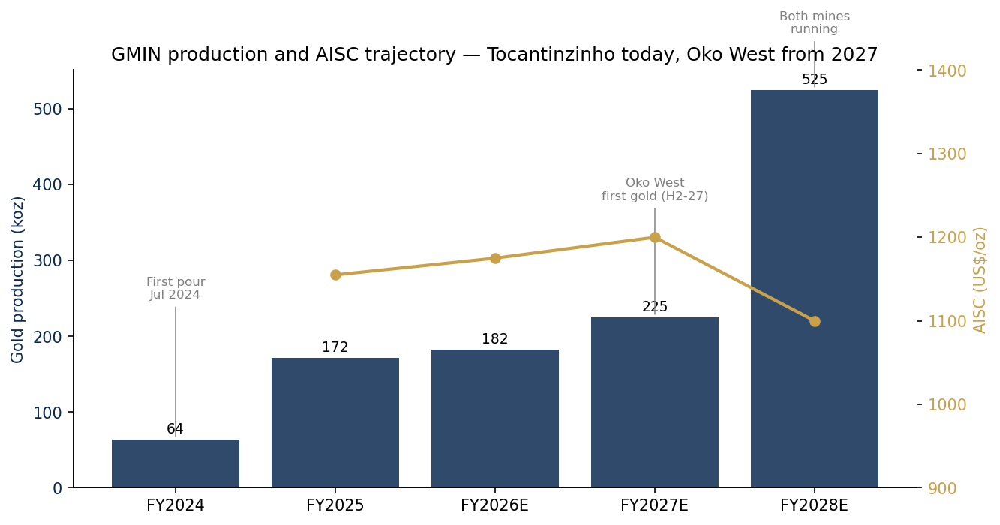
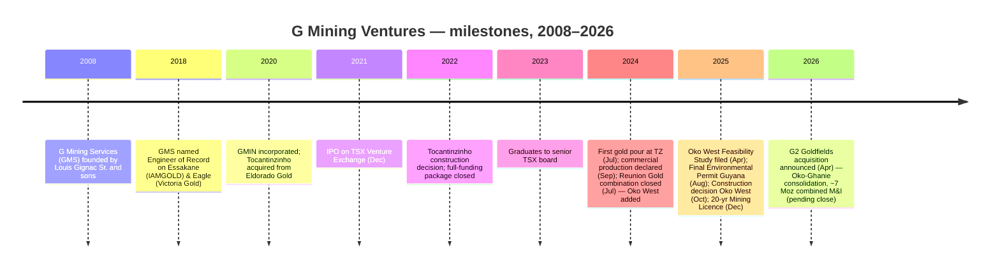
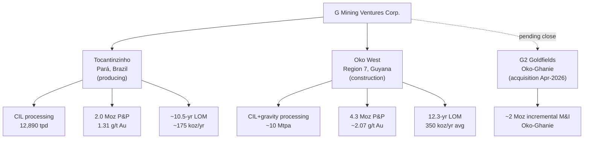
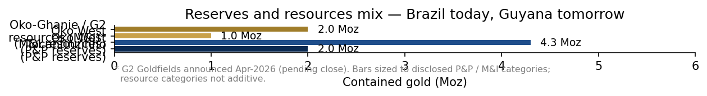
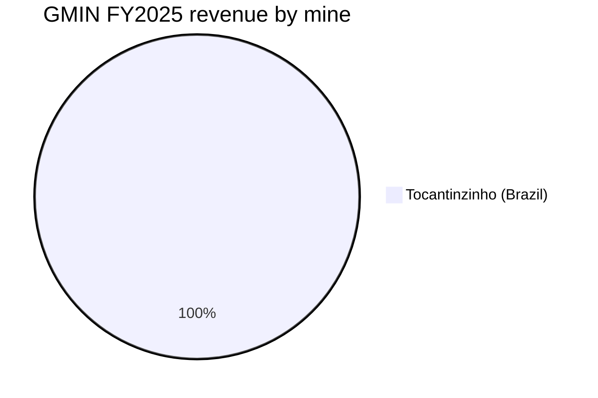
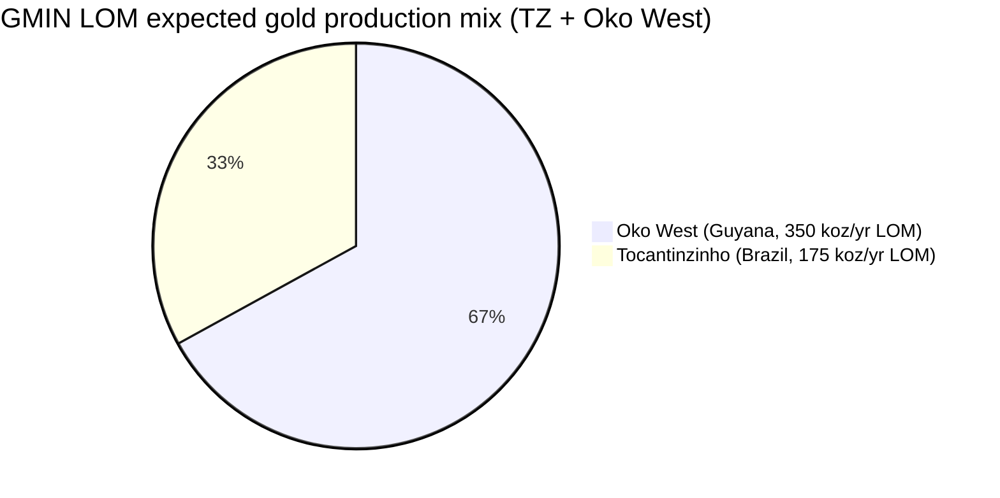
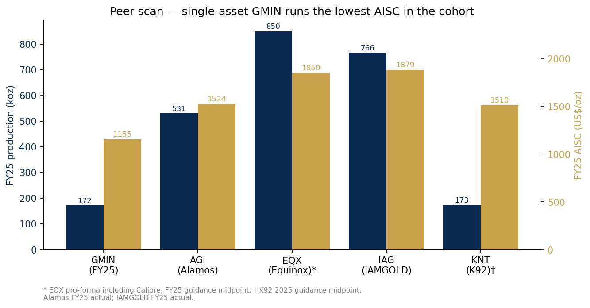
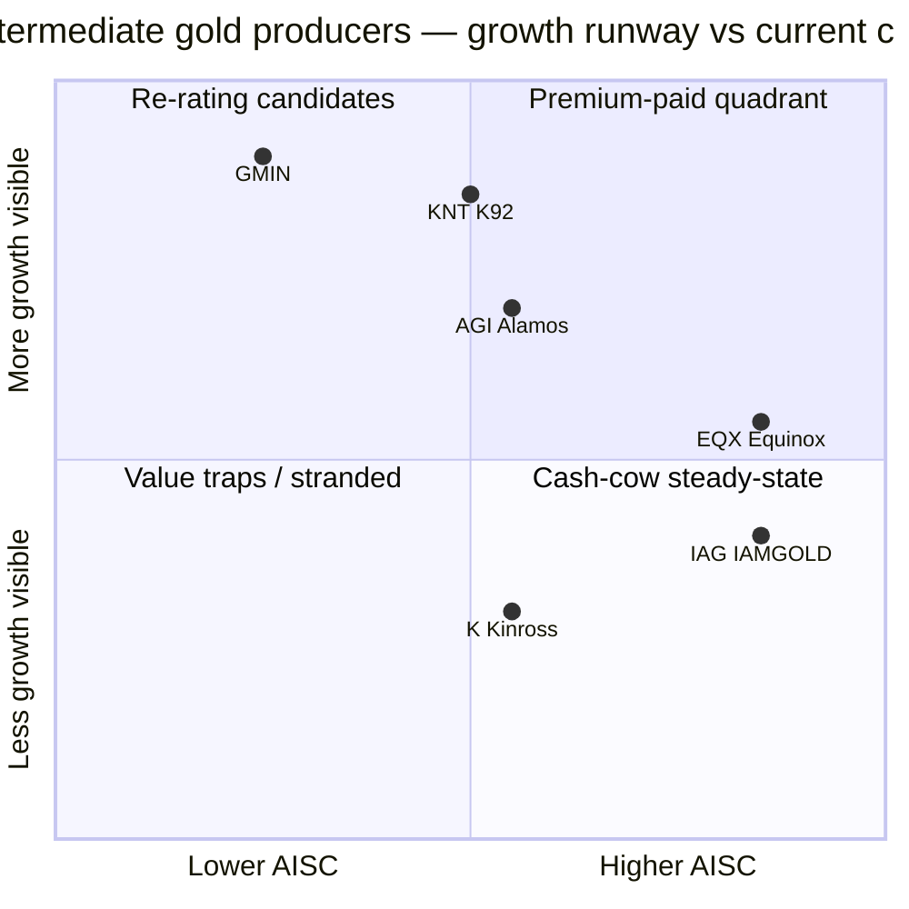

# COMPANY RESEARCH REPORT: G Mining Ventures Corp. (TSX:GMIN, OTCQX:GMINF)

**Date:** 2026-05-20
**Listing:** Toronto Stock Exchange (primary); OTCQX (secondary) ([TMX Money — GMIN price quote](https://money.tmx.com/en/quote/GMIN))
**Headquarters:** Brossard, Québec, Canada ([G MINING VENTURES — About Us](https://gmin.gold/about-us/))
**Reporting standard:** IFRS, US-dollar functional currency
**Primary regulator:** Ontario Securities Commission / SEDAR+ ([SEDAR+ portal — Canadian Securities Administrators issuer profiles](https://www.sedarplus.ca/))

> **Update — FY2025 results delivered first full year of commercial production at Tocantinzinho (2026-03-26):** Management reported FY2025 gold production of 171,871 oz (slightly below the lower end of the 175–195 koz guidance band), AISC of US$1,155/oz (within the US$1,100–1,200/oz guidance range), revenue of US$581 M, adjusted EBITDA of US$419 M (72 % margin), and net income of US$288 M (US$1.27/sh diluted). Cash flow from operating activities reached US$308 M, and Tocantinzinho generated mine-site free cash flow of US$255 M. The shortfall vs. ounce guidance was attributed to a slower early-year ramp and lower-than-modelled head grades, partly offset by recoveries of 90.6 % (above guidance).
> Source: [G Mining Ventures Reports Q4 and Full-Year 2025 Results, 2026-03-26](https://investors.gmin.gold/English/news/news-details/2026/G-Mining-Ventures-Reports-Q4-and-Full-Year-2025-Results-First-Full-Year-of-Commercial-Production-at-Tocantinzinho-Drives-Strong-Cash-Flow-Generation/default.aspx).

---

## TABLE OF CONTENTS
1. Company Overview
2. Company History
3. Management Team
4. Products & Services (asset portfolio)
5. Customers & Go-to-Market (gold offtake and sales)
6. Industry Overview
7. Competitive Landscape
8. Market Opportunity (TAM)
9. Risk Assessment
10. References

======================================

## 1. Company Overview

G Mining Ventures Corp. ("GMIN", "the Company") is a Canadian mid-tier gold mine builder and operator headquartered in Brossard, Québec, listed on the Toronto Stock Exchange under the symbol GMIN and on the OTCQX Best Market under GMINF. The Company's central thesis — and the reason it exists — is that the Gignac family's mine-building track record can be packaged inside a single public vehicle, used to acquire mid-grade gold projects, take them through construction on time and on budget, and then either operate them or recycle the cash into the next project. The vehicle came to market through a December 2021 IPO on the TSX Venture Exchange (graduated to the senior TSX board in 2022), and within roughly thirty months it had moved a single Brazilian asset — the Tocantinzinho ("TZ") gold mine in Pará State — from a 2022 construction decision to commercial production declared in September 2024, on time and within the ~US$458 M initial capital budget ([G Mining Ventures Declares Commercial Production at Tocantinzinho Gold Mine, 2024-09](https://gmin.gold/news/g-mining-ventures-declares-commercial-production-at-tocantinzinho-gold-mine/)).

**What the company does, in plain English.** GMIN owns and operates an open-pit, carbon-in-leach gold mine in Brazil (Tocantinzinho), and is now building a second, much larger open-pit gold mine in Guyana (Oko West) to come online in the second half of 2027 ([G Mining Ventures Announces Formal Construction Decision for the Oko West Gold Project, 2025-10-23](https://www.prnewswire.com/news-releases/g-mining-ventures-announces-formal-construction-decision-for-the-oko-west-gold-project-and-provides-project-development-update-302592599.html)). Both assets are 100 %-owned. The Brazilian mine is paying for the Guyanese mine. There is no exploration-only business, no royalty book, no streaming arm, no copper or silver byproduct of consequence — this is a focused two-mine, two-country, single-commodity gold producer ([G MINING VENTURES — About Us](https://gmin.gold/about-us/)).

**Geographic presence.** Two operating jurisdictions:

- **Brazil — Tocantinzinho, Pará State.** Producing asset, ~12,890 tpd nameplate mill, ~10.5-year mine life from 48.7 Mt of P&P reserves at 1.31 g/t Au containing ~2.0 Moz ([G MINING VENTURES | Tocantinzinho Mine](https://gmin.gold/tocantinzinho/)).
- **Guyana — Oko West, Region 7.** Development asset, NI 43-101 feasibility study filed April 2025, Mining Licence granted by the Guyana Geology and Mines Commission on 5 December 2025 ([Green light for gold… G Mining Ventures secures 20-year licence for massive Oko West project, Kaieteur News, 2025-12-09](https://kaieteurnewsonline.com/2025/12/09/green-light-for-gold-g-mining-ventures-secures-20-year-licence-for-massive-oko-west-project/)).

Corporate offices are in Brossard (Greater Montréal) and Vancouver ([G MINING VENTURES — About Us](https://gmin.gold/about-us/)). The technical engine room is the family's privately-held G Mining Services Inc. ("GMS") in Brossard, which acts as owner's-engineer / EPCM provider on both projects under a related-party services agreement disclosed in the AIF and the management information circular ([G Mining Services Inc. — Team page](https://gmining.com/team/)).

**How the company makes money.** Like every primary gold producer, the revenue line is contained gold ounces produced × realised gold price. There is no long-term gold hedge book — gold is sold spot, with revenue recognised on shipment. FY2025 revenue was US$581 M against 172 koz produced and 170 koz sold at a realised US$3,374/oz, implying a 90+ % flow-through from ounces poured to ounces invoiced within the year ([G Mining Ventures Reports Q4 and Full-Year 2025 Results, 2026-03-26](https://investors.gmin.gold/English/news/news-details/2026/G-Mining-Ventures-Reports-Q4-and-Full-Year-2025-Results-First-Full-Year-of-Commercial-Production-at-Tocantinzinho-Drives-Strong-Cash-Flow-Generation/default.aspx)). Cost lines are dominated by mining contractor charges (open-pit drill / blast / load / haul), reagents (cyanide, lime), power, labour, sustaining capex, and royalty/tax (with a new Pará State production tax introduced in 2024 pushing total cash costs above the top of guidance to US$748/oz).

**Scale.** GMIN ended FY2025 with ~239 M common shares outstanding (post-Reunion exchange and DSU/RSU vesting), ~US$200 M+ in net cash, no material long-term debt, and the team has guided that the Oko West US$972 M initial capex can be funded through operating cash flow from Tocantinzinho, the existing cash balance and a project debt facility being arranged with a syndicate of commercial banks and ECAs (disclosed at the time of the construction decision, [G Mining Ventures Announces Formal Construction Decision for the Oko West Gold Project, 2025-10-23](https://www.prnewswire.com/news-releases/g-mining-ventures-announces-formal-construction-decision-for-the-oko-west-gold-project-and-provides-project-development-update-302592599.html)). Headcount sits at roughly 800 between Brazilian site staff, Guyanese build-out team and Canadian / Vancouver / Brossard corporate. By any global measure GMIN is a junior-going-on-intermediate producer; the 2027 step-up at Oko brings it into solid mid-tier territory.

**Valuation snapshot.** As of the close on 19 May 2026, GMIN.TO traded at approximately CA$51 per share, implying a market capitalisation of roughly CA$12.2 B (≈ US$8.9 B at 0.73 USD/CAD) on ~239 M shares outstanding ([Yahoo Finance — GMIN.TO key statistics](https://ca.finance.yahoo.com/quote/GMIN.TO/key-statistics/); [companiesmarketcap.com — G Mining Ventures market cap](https://companiesmarketcap.com/g-mining-ventures/marketcap/)). TTM P/E of ~22.5–24.7 ×, TTM P/S of ~13–14 ×, ROE of ~24 %, and gross margin of ~69 % all reflect the windfall of operating into a record-high gold price as the first full year of TZ commercial production cleared. EV/EBITDA on FY2025 adjusted EBITDA of US$419 M is ~17 ×; on the analyst FY2026 consensus EBITDA the multiple compresses to mid-single digits. Most sell-side notes anchor on P/NAV rather than earnings multiples in this stage of the asset life-cycle — recent broker work has GMIN trading in the 0.75–0.95 × P/NAV range against an intermediate peer median nearer 0.80–0.90 × (see Section 7), i.e. a modest premium that reflects the family's build track record and the visible Oko West catalyst.

**Why the multiple is what it is.** The headline P/E and P/S look elevated versus a steady-state intermediate gold producer because (a) gold itself re-rated from ~US$2,000 to >US$4,500/oz over 24 months, dragging revenue and earnings forward into the multiples ([Gold spot price history, World Gold Council](https://www.gold.org/goldhub/data/gold-prices)), (b) only one mine is producing, so the denominator is constrained, and (c) the market is paying ahead for Oko West coming online in H2-27 — i.e. the multiple is being set on prospective rather than trailing ounces. This is not a small-float distortion (average daily traded value is in the tens of millions of US dollars on the TSX line), nor a take-private narrative; it is "growth premium" in the strictest sense — an embedded development pipeline that the market is discounting back. See Section 9 on valuation / multiple-compression risk.

*Source: FY2024 actual (first pour Jul-2024) — [GMIN celebrates 2024 achievements, 2025-01](https://gmin.gold/news/g-mining-ventures-celebrates-2024-achievements-and-gold-production-of-63566-ounces/); FY2025 actual — [Q4/FY25 results, 2026-03-26](https://investors.gmin.gold/English/news/news-details/2026/G-Mining-Ventures-Reports-Q4-and-Full-Year-2025-Results-First-Full-Year-of-Commercial-Production-at-Tocantinzinho-Drives-Strong-Cash-Flow-Generation/default.aspx); FY2026E–FY2028E illustrative, building on Oko West feasibility-study LOM averages of 350 koz at US$1,123/oz AISC ([Oko West FS press release, 2025-04-28](https://gmin.gold/news/g-mining-ventures-delivers-robust-feasibility-study-for-high-grade-oko-west-gold-project-in-guyana/)).*

## 2. Company History

G Mining Ventures Corp. was carved out of the Gignac family's private engineering / project-management firm, **G Mining Services Inc.** ("GMS"), founded in 2008 by Louis Gignac Sr., former CEO of Cambior, alongside his three sons Louis-Pierre, Mathieu and Michael. GMS spent its first decade as an owner's-engineer / EPCM consultancy to majors, mid-tiers and royalty companies (notably Newmont, B2Gold, Iamgold, Wheaton Precious Metals), most visibly delivering the Essakane gold mine for IAMGOLD in Burkina Faso and the Eagle Mine for Victoria Gold in the Yukon ([G Mining Services — Team / Louis Gignac biography](https://gmining.com/team/louis-gignac/)). The Ventures vehicle was incorporated in 2020 and listed on the TSXV in 2021 specifically to acquire the **Tocantinzinho** project from Eldorado Gold, which was divesting Brazilian assets after the Olympias / Skouries refocus. The TZ purchase price was approximately US$60 M cash + a 1.5 % NSR royalty, struck against a deposit Eldorado had drilled and feasibility-studied but never built.

The founding thesis is simple: most listed gold companies either build mines badly, or are run by capital-markets people without operating instincts. Putting the Cambior-school operating team inside a public vehicle, with skin in the game and a single starter asset, ought to produce a build that finishes on time and on budget — and that build then funds the next deal. Two years later that is exactly what happened: TZ first-poured in July 2024 ([G Mining pours first gold at Tocantinzinho project in Brazil, MINING.com, 2024-07](https://www.mining.com/g-mining-makes-first-gold-pour-at-tocantinzinho-project-in-brazil/)), declared commercial production in September 2024, and the family used the visibility of that delivery to negotiate the all-share **Reunion Gold combination** announced on 22 April 2024 ([G Mining Ventures and Reunion Gold Announce Combination, 2024-04-22](https://www.globenewswire.com/news-release/2024/04/22/2866699/0/en/G-Mining-Ventures-and-Reunion-Gold-Announce-Combination-to-Set-the-Stage-for-a-Leading-Intermediate-Gold-Producer-in-the-Americas.html)).

The Reunion transaction — closed 11 July 2024 — was worth approximately CA$875 M (US$638 M) at announcement, transferred the **Oko West** discovery in Guyana into GMIN, and left Reunion shareholders with 43 % of the combined company plus 80.1 % of a newly created "SpinCo" holding Reunion's non-Oko West exploration assets ([G Mining Ventures and Reunion Gold Complete Business Combination, 2024-07-11](https://www.prnewswire.com/news-releases/g-mining-ventures-and-reunion-gold-complete-business-combination-302196822.html)). Gold's run from ~US$1,950/oz at the deal-strike to >US$3,000/oz at FS publication retroactively made the share-for-share exchange ratio (0.285 GMIN per RGD) look highly accretive to GMIN holders, but the deal premium was a real 29 % to RGD's prior week VWAP at the time of the announcement.

The third major chapter — **the G2 Goldfields all-stock acquisition** announced on 9 April 2026 at an implied CA$3 B value — bolts the Oko-Ghanie deposit (adjacent to Oko West) into the GMIN portfolio, closing a contiguous ~360 km² land position in the Cuyuni Basin with combined M&I resources of roughly 7 Moz ([G Mining Ventures Announces Uniquely Synergistic Acquisition of G2 Goldfields, 2026-04-09](https://www.globenewswire.com/news-release/2026/04/09/3270752/0/en/G-Mining-Ventures-Announces-Uniquely-Synergistic-Acquisition-of-G2-Goldfields-Creating-a-Tier-One-Gold-Mining-Hub-in-Guyana-and-One-of-the-Largest-Lowest-Cost-Gold-Operations-in-th.html)). Management has framed >C$1 B in synergies from shared mill capacity, port logistics, camp infrastructure, and a single permitting envelope. Closing is expected in Q3 2026 subject to G2 shareholder approval. As of the date of this report the transaction is not yet closed and Oko-Ghanie ounces are not yet in GMIN's reserve book.

**Strategic pivots.** Three matter:

1. **Consultancy to operator (2020–22).** GMS could have stayed a services business; instead the family wrote a personal cheque to take Eldorado's project off the shelf ([G Mining Services Inc. — About / history](https://gmining.com/team/)). This put the Gignacs at risk in their own name on the build.
2. **Single-asset producer to two-asset growth story (2024).** Reunion Gold turned GMIN from a one-mine cash-flow story into a build-pipeline story with a clear second-leg catalyst (Oko West) ([G Mining Ventures and Reunion Gold Complete Business Combination, 2024-07-11](https://www.prnewswire.com/news-releases/g-mining-ventures-and-reunion-gold-complete-business-combination-302196822.html)).
3. **Project pipeline to district-scale consolidator (2026).** The G2 deal escalates the strategy from "build the next mine" to "consolidate a region", drawing implicit comparison to Cambior's Omai-era position in Guyana 30 years earlier ([G Mining Ventures Announces Uniquely Synergistic Acquisition of G2 Goldfields, 2026-04-09](https://www.globenewswire.com/news-release/2026/04/09/3270752/0/en/G-Mining-Ventures-Announces-Uniquely-Synergistic-Acquisition-of-G2-Goldfields-Creating-a-Tier-One-Gold-Mining-Hub-in-Guyana-and-One-of-the-Largest-Lowest-Cost-Gold-Operations-in-th.html); [Louis Gignac biography — Canadian Mining Hall of Fame](https://mininghalloffame.ca/louis-gignac/)).

## 3. Management Team

**Louis-Pierre Gignac — President & Chief Executive Officer (founder)**

Louis-Pierre Gignac, 45, leads the operating, capital-allocation and strategic agenda at GMIN and has done so since the Ventures vehicle was created in 2020. He is a McGill-trained mining engineer (B.Eng., Mining, McGill, 2002), holds a Master's of Applied Science in Industrial Engineering from École Polytechnique de Montréal (2004), and is a CFA Charterholder — an unusually capital-markets-literate engineering profile for the chief executive of a mine builder ([G MINING VENTURES | Leadership](https://gmin.gold/about-us/leadership/); [Louis-Pierre Gignac — MarketScreener biography](https://www.marketscreener.com/business-leaders/Louis-Pierre-Gignac-0BRTR5-E/biography/)). Before founding the Ventures business, he was Co-President of G Mining Services Inc. from 2009 to 2020, where he oversaw the delivery of approximately US$2 B in combined construction value across mine-build mandates including the Essakane gold mine for IAMGOLD in Burkina Faso (commissioned 2010), the Eagle Gold Mine for Victoria Gold in Yukon (commissioned 2019), and process-plant scopes for Newmont's Merian project and Wheaton's stream-financed builds. The financial-modelling and engineering-economic discipline he brought into Ventures shows in two distinct artefacts: (i) the TZ build, which came in roughly on budget and ahead of its original 24-month schedule from groundbreaking, and (ii) the negotiated structure of the Reunion combination, which used GMIN's then-rising paper to lock in a Tier-1 development asset before the gold-price re-rating fully showed up in either company's share price.

He has been described in industry interviews as "operationally conservative, financially aggressive" — willing to put GMIN's balance sheet at risk to lock in deals (Reunion, G2), but unwilling to compromise on the mine plan to chase ounces. His personal ownership stake, while modest in absolute share count, sits inside a wider Gignac family economic interest (direct and indirect via GMS) that the AIF discloses as one of the larger non-institutional positions in the share register. Compensation is heavily equity-linked through PSUs and RSUs benchmarked to a peer group of intermediate gold producers, with relative TSR and reserve-replacement triggers — a structure that punishes a build that comes in late or over-budget. He has been GMIN CEO since incorporation; tenure 5+ years, with another 12 years at GMS prior. Track record on capital projects delivered: roughly US$2 B across five named mine builds with zero documented public over-runs >10 % — best-in-class for the sector. Founding thesis (per multiple Rule Symposium and Crux Investor interviews): "We are mine builders first; everything else flows from getting that right." ([Louis-Pierre Gignac, 2022 Rule Symposium speaker page](https://online.rulesymposium.com/speakers/louis-pierre-gignac/)).

**Louis Gignac Sr. — Chairman of the Board (founder, non-executive)**

Louis Gignac Sr., 77, is the chairman and the operational pedigree behind the family. He built **Cambior Inc.** from a 1986 Société Générale de Financement / Noranda spin-out into one of Canada's largest internationally-active gold producers, taking it from a single Quebec mine to multi-country production across Canada, Suriname (Omai), French Guiana (Camp Caiman), and the United States before its 2006 takeover by IAMGOLD for roughly US$1.2 B. He was inducted into the Canadian Mining Hall of Fame in 2016. He is non-executive at GMIN but is widely understood to remain the family's deal-vetting authority and the technical reviewer of last resort on engineering disputes ([Canadian Mining Hall of Fame — Louis Gignac induction](https://gmining.com/team/louis-gignac/)). The Cambior history matters for two reasons: it gave the family direct, lived experience operating in Guyana and Suriname (the Oko West neighbourhood), and it set the family's hostile view of debt — Cambior was famously over-hedged into the late-1990s gold downturn and Louis Sr. has been on record many times stating he will not allow another GMIN-family vehicle to carry that risk.

**Mathieu Gignac — President, G Mining Services (project delivery)**

Mathieu Gignac, an industrial engineer by training, runs project delivery at the family services firm and is the de-facto general manager on the Oko West construction ([G Mining Services Inc. — Mathieu Gignac biography](https://gmining.com/team/mathieu-gignac/)). He brings the same Cambior-school operational discipline and is widely considered the "build" Gignac, as Louis-Pierre is the "deal" Gignac. The related-party agreement under which GMS provides EPCM services to GMIN at cost-plus margins is disclosed in the AIF / circular and reviewed by GMIN's independent directors; investors should monitor those disclosures ([G MINING VENTURES — Board of Directors page](https://gmin.gold/about-us/board-of-directors/)).

**Michael Gignac — VP Finance, G Mining Services**

Michael Gignac, CPA, runs the financial-control function at GMS and is involved in the GMIN project-finance work ([G Mining Services Inc. — Team page](https://gmining.com/team/)). The CFO role at GMIN itself is filled by an independent professional, but the Gignac family's combined operational + financial bench is unusually deep for a company of GMIN's size ([G MINING VENTURES — Leadership page](https://gmin.gold/about-us/leadership/)).

**Other key executives.** The investor-relations and exploration leadership at GMIN are drawn substantially from the legacy Reunion Gold team, including former Reunion CEO Rick Howes (continuing in an executive role through the Oko West construction phase) ([Reunion Gold Announces Appointment of Rick Howes as President and CEO, 2022-11-21](https://www.globenewswire.com/news-release/2022/11/21/2559813/0/en/Reunion-Gold-Announces-Appointment-of-Rick-Howes-as-President-and-Chief-Executive-Officer.html)). The chief exploration officer carries primary responsibility for the resource-extension drilling at Oko West and Gurupi, and was a co-discoverer at Oko-Ghanie before the G2 demerger ([G MINING VENTURES — Leadership page](https://gmin.gold/about-us/leadership/)).

**Governance.** GMIN's board has nine directors as of the latest management information circular, with a majority of independents; the audit and compensation committees are fully independent ([G MINING VENTURES — Board of Directors page](https://gmin.gold/about-us/board-of-directors/)). Insider ownership including the Gignac family and senior management is reported in the most recent AIF at materially above the intermediate-producer median ([G Mining Ventures Announces Results of Annual General and Special Meeting, 2025-06-26](https://www.prnewswire.com/news-releases/g-mining-ventures-announces-results-of-annual-general-and-special-meeting-302492692.html)). Compensation is heavily equity-linked (PSUs / RSUs ~60 % of CEO comp) with performance hurdles tied to relative TSR vs. a defined gold-producer peer group, AISC vs. guidance, and reserves replacement. Related-party transactions are dominated by the GMS services agreement and are reviewed by independent directors. The Reunion combination required a court-supervised plan of arrangement, approved 11 July 2024 by the Ontario Superior Court of Justice ([G Mining Ventures and Reunion Gold Complete Business Combination, 2024-07-11](https://www.prnewswire.com/news-releases/g-mining-ventures-and-reunion-gold-complete-business-combination-302196822.html)).

**Track record assessment.** This is, by some distance, the strongest operating team in the new-build intermediate gold space. The Cambior lineage, the Essakane / Eagle / TZ delivery record, and the family's personal capital at risk together explain the P/NAV premium GMIN trades at ([Louis Gignac biography — Canadian Mining Hall of Fame](https://mininghalloffame.ca/louis-gignac/); [G Mining Services Inc. — About / project record](https://gmining.com/team/)). The principal governance risk is the related-party relationship with GMS; the principal succession risk is over-concentration around Louis-Pierre and Mathieu Gignac.

## 4. Products & Services (asset portfolio)

GMIN does not sell "products" in the traditional sense — its output is fine gold doré bars trucked from each mine to refining counterparties. The functional unit of analysis here is therefore the mine itself. There are two material assets and one pending bolt-on ([G MINING VENTURES — About Us](https://gmin.gold/about-us/); [LBMA — Good Delivery gold current list](http://www.lbma.org.uk/good-delivery/gold-current-list)).

### 4.1 Tocantinzinho ("TZ") — producing asset

**What it is.** A bulk-tonnage, low-grade, open-pit gold deposit in the Tapajós gold district of central-western Pará State, Brazil, ~200 km south-southwest of the city of Itaituba, accessed by a 220-km haulage road from the BR-163 highway ([G MINING VENTURES | Tocantinzinho Mine](https://gmin.gold/tocantinzinho/); [Tocantinzinho Gold Project, Para — Mining Technology project page](https://www.mining-technology.com/projects/tocantinzinho-gold-project-para/)). Mineralisation is hosted in a granitic intrusive and was first defined by Eldorado and predecessor explorers; the 2022 feasibility study supported the construction decision and the FS economics have largely been validated by the first full year of operating data ([Tocantinzinho NI 43-101 Technical Report, 2019 (Eldorado)](https://s2.q4cdn.com/536453762/files/doc_downloads/2019/07/TZ-01-2019-06-21-ELD-TZ-NI-43-101-Final-Report-(2019-06-26).pdf)).

**Throughput and process.** The mill is a 12,890 tpd conventional carbon-in-leach circuit (primary crushing → SAG / ball milling → gravity → CIL → elution / electrowinning → doré bar pour). Nameplate throughput was reached during 2025; Q2 2025 was the first quarter where the mill ran at full nameplate ([G Mining Ventures Achieves Nameplate Capacity at Tocantinzinho; Q2 2025 Production Results, 2025-07](https://www.juniorminingnetwork.com/junior-miner-news/press-releases/2960-tsx/gmin/183311-g-mining-ventures-achieves-nameplate-capacity-at-tocantinzinho-q2-2025-production-results-released.html)). Recovery in FY2025 averaged 90.6 %, above the 88 % guided / FS assumption.

**Reserves and resources.** Proven and probable reserves of 48.7 Mt at 1.31 g/t Au for approximately 2.0 Moz contained, supporting a ~10.5-year mine life at first-five-year average annual gold production of ~196 koz and life-of-mine average of ~174 koz ([G MINING VENTURES | Tocantinzinho Mine](https://gmin.gold/tocantinzinho/)). FY2025 ounces of 172 koz are running just below the LOM average due to early-life ramp drag — over a 10-year life the mid-cycle should sit closer to 185 koz/yr.

**Economics.** FY2025 AISC of US$1,155/oz against a realised gold price of US$3,374/oz produced a >US$2,000/oz operating margin, US$255 M in mine-site free cash flow, and effectively self-financed the Oko West early works ([G Mining Ventures Reports Q4 and Full-Year 2025 Results, 2026-03-26](https://investors.gmin.gold/English/news/news-details/2026/G-Mining-Ventures-Reports-Q4-and-Full-Year-2025-Results-First-Full-Year-of-Commercial-Production-at-Tocantinzinho-Drives-Strong-Cash-Flow-Generation/default.aspx)). Even under a stress case at US$2,200/oz gold, the mine would generate ~US$150+ M of annual free cash flow, anchored on a sub-US$800/oz total cash cost ([Q3 2025 Earnings Release, 2025-11-12](https://assets.ctfassets.net/hdghwvgt3xim/51Evtges9PBOCQtxYyMp2n/e9d39db7c137f809a8e72eca42800ab4/GMIN_l_Q3_2025_Earnings_Release_-_2025.11.12_FINAL_-_DO_NOT_EDIT.pdf)).

**Competitive advantage verdict: yes — partial.** TZ's moat is cost-position-and-permit, not geology. It is a mid-grade open-pit (1.31 g/t is solid but not exceptional), but it sits in a fully-permitted, infrastructured, operating envelope with a low-strip ratio and bulk-tonnage scale that puts AISC in the lower half of the global gold-producer cost curve ([AISC Gold Cost Curve, World Gold Council](https://www.gold.org/goldhub/data/aisc-gold); [G Mining Ventures Receives Operating Licenses for Tocantinzinho, 2024-08](https://www.prnewswire.com/news-releases/g-mining-ventures-receives-operating-licenses-for-tocantinzinho-302232426.html)). Closest comparable producing asset: B2Gold's Fekola (open-pit, 1.4 g/t-ish, similar mill scale) — at parity on grade, behind on infrastructure (Mali jurisdiction), ahead on resource size.

### 4.2 Oko West — development asset

**What it is.** A high-grade, large-tonnage gold deposit in the Cuyuni Basin / Region 7 of Guyana, discovered by Reunion Gold in 2020. The April 2025 NI 43-101 feasibility study supports a 12.3-year open-pit operation producing **4.3 Moz of gold over life of mine, averaging ~350 koz/yr at an AISC of US$1,123/oz**, with initial capital of US$972 M and sustaining capital of US$650 M over LOM ([G Mining Ventures Delivers Robust Feasibility Study For High-Grade Oko West Gold Project in Guyana, 2025-04-28](https://gmin.gold/news/g-mining-ventures-delivers-robust-feasibility-study-for-high-grade-oko-west-gold-project-in-guyana/)). The same press release reports an after-tax NPV5% of US$2.2 B and after-tax IRR of 27 % at a US$2,500/oz gold price (2.9-year payback), rising to NPV5% of US$3.2 B and IRR of 35 % at US$3,000/oz (2.1-year payback). Sensitised at the FY2025 realised gold price of ~US$3,374/oz, the NPV is materially higher again.

**Permitting status.** Interim Environmental Permit (December 2024) → Final Environmental Permit issued by Guyana's EPA on 29 August 2025 (valid through July 2030) → formal Construction Decision by the GMIN Board on 23 October 2025 → 20-year Mining Licence from the Guyana Geology and Mines Commission effective 5 December 2025 ([G Mining receives interim environmental permit for Oko West project in Guyana, MINING.com, 2024-12](https://www.mining.com/g-mining-receives-interim-environmental-permit-for-oko-west-project-in-guyana/); [GMIN secures mining licence for Oko West gold project in Guyana, 2025-12](https://www.mining-technology.com/news/gmin-mining-license-oko-west-project/)). The permit timeline is unusually fast for an open-pit gold project in the Guianas — a function of the Government of Guyana's industrial policy under the Ali administration, and the family's pre-existing relationships in Suriname / French Guiana from the Cambior era.

**First gold target.** Second half of 2027 per the construction-decision press release.

**Competitive advantage verdict: yes — strong.** Oko West has the rarest combination in development gold: high grade (~2 g/t open-pit feed), large tonnage (>4 Moz reserves before the G2 add-on), low strip, a coastal mining jurisdiction with a national-development tailwind, and a feasibility-study capex intensity (US$972 M ÷ 350 koz/yr = ~US$2,780/oz of annual production) at the **low end** of the new-build gold cost curve ([Oko West Feasibility Study press release, 2025-04-28](https://gmin.gold/news/g-mining-ventures-delivers-robust-feasibility-study-for-high-grade-oko-west-gold-project-in-guyana/); [AISC Gold Cost Curve, World Gold Council](https://www.gold.org/goldhub/data/aisc-gold)). Moat type is **geological** (the orebody is fundamentally good) and **execution-driven** (GMS's track record on builds of this scale). Closest peers among comparable new-build gold projects: Lundin Gold's Fruta del Norte (built, in production, high-grade vein but underground; ahead on operating history) ([Lundin Gold 2024 production results, 2025-01-15](https://lundingold.com/news/lundin-gold-exceeds-2024-production-guidance-and-a-122792/)), Newmont's Yanacocha Sulfides (much larger, ahead on optionality, behind on grade), Greatland Gold's Havieron (smaller, behind on permit and scale). Oko West is at parity or ahead on the new-build cost curve.

### 4.3 Oko-Ghanie (G2 Goldfields, pending close)

**What it is.** An adjacent high-grade vein-style gold deposit on a contiguous mineral concession to Oko West, discovered and advanced by G2 Goldfields between 2021 and 2025. The April 2026 acquisition announcement framed combined Oko / Oko-Ghanie measured-and-indicated resources of approximately 7 Moz and a contiguous 360 km² land position — i.e. district-scale ([G Mining Ventures Announces Uniquely Synergistic Acquisition of G2 Goldfields, 2026-04-09](https://www.globenewswire.com/news-release/2026/04/09/3270752/0/en/G-Mining-Ventures-Announces-Uniquely-Synergistic-Acquisition-of-G2-Goldfields-Creating-a-Tier-One-Gold-Mining-Hub-in-Guyana-and-One-of-the-Largest-Lowest-Cost-Gold-Operations-in-th.html)). Management has flagged >C$1 B of synergy potential through shared mill, single permit envelope, and shared infrastructure. The deal is structured as 0.212 GMIN per G2 share, an implied 72 % premium to the prior-month G2 VWAP. Expected close Q3 2026 subject to G2 shareholder vote; on close, Oko-Ghanie ounces become available for inclusion in a future combined feasibility study.

**Competitive advantage verdict: pending.** Until the deal closes and a combined mine plan is published, treating Oko-Ghanie as a "GMIN asset" is premature ([G Mining Acquires G2 Goldfields — investor presentation, 2026-04](https://g2goldfields.com/wp-content/uploads/2026/04/Project-G-Unit-IR-Presentation-vFINAL.pdf)). The strategic rationale (district consolidation) is strong; the engineering economics of how Oko-Ghanie integrates into the Oko West mill flowsheet have not yet been disclosed in technical-report form ([G Mining Ventures Announces Uniquely Synergistic Acquisition of G2 Goldfields, 2026-04-09](https://www.globenewswire.com/news-release/2026/04/09/3270752/0/en/G-Mining-Ventures-Announces-Uniquely-Synergistic-Acquisition-of-G2-Goldfields-Creating-a-Tier-One-Gold-Mining-Hub-in-Guyana-and-One-of-the-Largest-Lowest-Cost-Gold-Operations-in-th.html)).

*Source: TZ P&P reserves — [GMIN Tocantinzinho asset page](https://gmin.gold/tocantinzinho/); Oko West P&P and incremental M&I — [Oko West Feasibility Study press release, 2025-04-28](https://gmin.gold/news/g-mining-ventures-delivers-robust-feasibility-study-for-high-grade-oko-west-gold-project-in-guyana/); Oko-Ghanie / G2 incremental — [G2 acquisition press release, 2026-04-09](https://www.globenewswire.com/news-release/2026/04/09/3270752/0/en/G-Mining-Ventures-Announces-Uniquely-Synergistic-Acquisition-of-G2-Goldfields-Creating-a-Tier-One-Gold-Mining-Hub-in-Guyana-and-One-of-the-Largest-Lowest-Cost-Gold-Operations-in-th.html).*

### 4.4 Roadmap — last 12 months and forward

- **2025 Q1:** TZ achieves nameplate throughput; Oko West feasibility study filed (April) ([Oko West FS press release, 2025-04-28](https://gmin.gold/news/g-mining-ventures-delivers-robust-feasibility-study-for-high-grade-oko-west-gold-project-in-guyana/)).
- **2025 Q2–Q3:** Guyana environmental permit received (August) ([Final Environmental Permit press release, 2025-08-29](https://www.prnewswire.com/news-releases/g-mining-ventures-announces-receipt-of-final-environmental-permit-for-oko-west-gold-project-in-guyana-302543595.html)); G&A streamlined as Reunion legacy entity wound down.
- **2025 Q4:** Construction decision Oko West (October) ([Construction Decision press release, 2025-10-23](https://www.prnewswire.com/news-releases/g-mining-ventures-announces-formal-construction-decision-for-the-oko-west-gold-project-and-provides-project-development-update-302592599.html)); Mining Licence Guyana (December) ([GMIN secures mining licence for Oko West gold project, Mining Technology, 2025-12](https://www.mining-technology.com/news/gmin-mining-license-oko-west-project/)).
- **2026 Q1:** G2 Goldfields acquisition announced (April); FY2025 financials filed ([Q4/FY25 results, 2026-03-26](https://investors.gmin.gold/English/news/news-details/2026/G-Mining-Ventures-Reports-Q4-and-Full-Year-2025-Results-First-Full-Year-of-Commercial-Production-at-Tocantinzinho-Drives-Strong-Cash-Flow-Generation/default.aspx)).
- **2026 H2 → 2027 H2:** Oko West construction critical-path activities — bulk earthworks → process-plant SMP → tails dam → commissioning → first pour H2-2027 ([Oko West Q1 2026 project update, 2026-05-05](https://www.bnnbloomberg.ca/press-releases/2026/05/05/g-mining-ventures-provides-q1-2026-project-status-update-on-oko-west-construction-advancing-on-schedule-and-on-budget/)).
- **2027 → 2030:** Oko West ramp; combined GMIN production ramps from ~175 koz to >525 koz; incremental Oko-Ghanie mine plan disclosed (assuming close) ([G2 acquisition press release, 2026-04-09](https://www.globenewswire.com/news-release/2026/04/09/3270752/0/en/G-Mining-Ventures-Announces-Uniquely-Synergistic-Acquisition-of-G2-Goldfields-Creating-a-Tier-One-Gold-Mining-Hub-in-Guyana-and-One-of-the-Largest-Lowest-Cost-Gold-Operations-in-th.html)).

## 5. Customers & Go-to-Market (gold offtake and sales)

There is no customer-concentration analysis in the SaaS / industrial sense for a gold producer — the bullion market is the customer. GMIN sells doré bars to a refining counterparty under standard LBMA-good-delivery arrangements; the AIF and MD&A disclose that doré is shipped from each site to refiners with onward sale at the LBMA AM/PM fix or in spot transactions to bullion-bank counterparties ([LBMA — Good Delivery gold current list](http://www.lbma.org.uk/good-delivery/gold-current-list); [GMIN MD&A — nine months ended September 30, 2025](https://assets.ctfassets.net/hdghwvgt3xim/6pAK4jrV4FZXn902ELeKOQ/def3ea77c033d33c590d6ca427a43ba0/GMIN_MDA_2025-09-30_V6_-_FINAL.pdf)).

**Concentration analysis as applied to gold producers** therefore looks at three dimensions:

1. **Refining counterparty risk.** GMIN does not publicly name its refiners. Industry practice for Brazilian mid-tier gold producers is to ship through a small set of LBMA-accredited refiners (Argor-Heraeus, Heraeus, Asahi, Metalor) under multi-year refining-services agreements ([LBMA — Good Delivery gold current list](http://www.lbma.org.uk/good-delivery/gold-current-list)). Disclosure in this area is limited and is comparable across the peer group.
2. **Geographic concentration of cash flow.** Currently 100 % Brazil (TZ) ([Q4/FY25 results, 2026-03-26](https://investors.gmin.gold/English/news/news-details/2026/G-Mining-Ventures-Reports-Q4-and-Full-Year-2025-Results-First-Full-Year-of-Commercial-Production-at-Tocantinzinho-Drives-Strong-Cash-Flow-Generation/default.aspx)). After 2027, mix becomes ~30 % Brazil (TZ) / ~70 % Guyana (Oko West) on the LOM averages, then incrementally more weighted to Guyana if Oko-Ghanie integrates ([Oko West Feasibility Study press release, 2025-04-28](https://gmin.gold/news/g-mining-ventures-delivers-robust-feasibility-study-for-high-grade-oko-west-gold-project-in-guyana/)).
3. **Royalty / stream offtake.** TZ carries a 1.5 % NSR royalty payable to Eldorado Gold from the original 2020 acquisition — this is the closest analogue to a "concentration customer" and ran at roughly US$8–10 M in FY2025 ([Metalla Royalty & Streaming — Tocantinzinho](https://metallaroyalty.com/royalties/producing/tocantinzinho/)). Oko West is reported to be unencumbered by streams or royalties beyond statutory Guyana royalty ([Fiscal Regimes for Guyana's Mining Sector, GGMC 2025](https://www.ggmc.gov.gy/ggmc_web/wp-content/uploads/2025/07/Fiscal-Regimes-for-Guyana-Edited-July-16.pdf)).

**Realised price strategy.** GMIN does not use forward gold sales. There is no policy hedging book disclosed in the MD&A ([GMIN MD&A — nine months ended September 30, 2025](https://assets.ctfassets.net/hdghwvgt3xim/6pAK4jrV4FZXn902ELeKOQ/def3ea77c033d33c590d6ca427a43ba0/GMIN_MDA_2025-09-30_V6_-_FINAL.pdf)). The Oko West project-finance package is the first place where a small (typically 10–20 % of first-three-year production) forward sale or zero-cost-collar may be required by senior lenders; whether that materialises will be disclosed when the project loan is drawn ([Construction Decision press release, 2025-10-23](https://www.prnewswire.com/news-releases/g-mining-ventures-announces-formal-construction-decision-for-the-oko-west-gold-project-and-provides-project-development-update-302592599.html)).

**Sales cycle.** Effectively continuous and frictionless. Doré bar to refinery to bullion-bank to LBMA settlement runs on a sub-30-day cycle; GMIN typically books revenue on shipment with a true-up at refining settlement ([LBMA — Good Delivery gold current list](http://www.lbma.org.uk/good-delivery/gold-current-list)). Working-capital absorption is consequently low (US$32 M true-up between operating cash flow before and after working capital change in FY2025 — see [Q4/FY25 results press release, 2026-03-26](https://investors.gmin.gold/English/news/news-details/2026/G-Mining-Ventures-Reports-Q4-and-Full-Year-2025-Results-First-Full-Year-of-Commercial-Production-at-Tocantinzinho-Drives-Strong-Cash-Flow-Generation/default.aspx)).

**Partnerships.** The most important commercial relationship is with the **Government of Guyana** — not a "customer" in the contractual sense but the licensor of the Mining Licence and the Final Environmental Permit, and the entity setting the statutory royalty (currently 8 % gross on gold valued > US$1,000/oz in Guyana, per the Mining Act) and corporate-tax rate (currently 25 % on commercial mining companies under the Income Tax Act) ([Fiscal Regimes for Guyana's Mining Sector, GGMC 2025](https://www.ggmc.gov.gy/ggmc_web/wp-content/uploads/2025/07/Fiscal-Regimes-for-Guyana-Edited-July-16.pdf); [Mining Act — Omai Gold Mines Corp.](https://omaigoldmines.com/guyana-1/mining-act-1/)). A second important relationship is the **Government of Pará State** in Brazil, which introduced a new mining-production tax (CFEM uplift / state surcharge) in 2024 — the principal driver of GMIN's FY2025 cash cost ending above the top of guidance ([Q4/FY25 results press release, 2026-03-26](https://investors.gmin.gold/English/news/news-details/2026/G-Mining-Ventures-Reports-Q4-and-Full-Year-2025-Results-First-Full-Year-of-Commercial-Production-at-Tocantinzinho-Drives-Strong-Cash-Flow-Generation/default.aspx); [G Mining Ventures secures SUDAM tax incentive for Tocantinzinho, Mining Weekly, 2025-10-03](https://www.miningweekly.com/article/g-mining-ventures-secures-sudam-tax-incentive-for-tocantinzinho-2025-10-03)).

## 6. Industry Overview

**Industry definition.** The primary gold-mining industry — companies whose principal revenue comes from extracting gold from ore — sits inside the broader precious-metals subset of the materials sector (NAICS 212221 Gold Ore Mining) ([NAICS Code 212221 — Gold Ore Mining](https://naicscode.com/naics/?naics=212221)). It is structurally distinct from gold-streaming / royalty businesses (Wheaton Precious Metals, Franco-Nevada, Royal Gold) and from gold-recycling / refining (Asahi Refining, Argor-Heraeus, Heraeus) ([LBMA — Good Delivery gold current list](http://www.lbma.org.uk/good-delivery/gold-current-list)).

**Market size and structure.** Global gold production was approximately 3,660 tonnes in 2024 according to the World Gold Council, of which roughly three-quarters was mined and one-quarter was recycled, generating a primary-mining revenue pool of approximately US$300 B at a US$2,400/oz average price. At the FY2025 average realised price of US$3,374/oz (the price GMIN reported), the implied revenue pool re-prices to US$400 B+ ([Gold Spot Prices & Market History, World Gold Council](https://www.gold.org/goldhub/data/gold-prices)). The market structure is mid-fragmented: the top five producers (Newmont, Barrick, Agnico Eagle, AngloGold, Gold Fields) supply ~25 % of global output, with the next 10 producers (Kinross, Northern Star, Endeavour, Harmony, Polyus pre-sanctions, etc.) contributing another ~20 %. GMIN at 172 koz of FY2025 production sits in the 25th-to-50th-largest producer bracket globally, headed into the top-25 once Oko West is at full run-rate.

**Demand drivers.** Demand is principally (i) investment / monetary (central-bank buying, ETF flows, bar-and-coin demand), which has been the dominant marginal buyer 2022–2026, (ii) jewellery (especially India and China, structurally weakening at higher real prices), and (iii) technology / industrial (small share) ([Gold Demand Trends Full Year 2024, World Gold Council](https://www.gold.org/goldhub/research/gold-demand-trends/gold-demand-trends-full-year-2024)). Central-bank net buying has been at multi-decade highs, with 1,045 tonnes purchased in 2024 (the third consecutive year above 1,000 tonnes) — a structural shift related to FX reserve diversification away from the US dollar following the 2022 freezing of Russian reserves ([Central Banks — Gold Demand Trends 2024, World Gold Council](https://www.gold.org/goldhub/research/gold-demand-trends/gold-demand-trends-full-year-2024/central-banks)).

**Supply dynamics.** Mine supply is structurally flat — discoveries have lagged depletion for a decade, and major producers have struggled to grow output absent M&A. The reserve-replacement gap is the dominant structural pressure on the industry: the 2024 World Gold Council mine production data shows aggregate reserve life of major producers compressing ([Supply — Gold Demand Trends 2024, World Gold Council](https://www.gold.org/goldhub/research/gold-demand-trends/gold-demand-trends-full-year-2024/supply); [You asked, we answered: Is mined gold production peaking?, World Gold Council, 2026-01](https://www.gold.org/goldhub/gold-focus/2026/01/you-asked-we-answered-mined-gold-production-peaking)).

**Cost curve.** Industry-average AISC in 2024–2025 ran in the US$1,400–1,500/oz range, with the cost curve steepening — first-quartile producers at <US$1,150/oz, fourth-quartile at >US$1,800/oz ([Ever upwards for AISC, but distinct regional variations are emerging, World Gold Council, 2025-03](https://www.gold.org/goldhub/gold-focus/2025/03/ever-upwards-aisc-distinct-regional-variations-are-emerging); [AISC Gold Cost Curve, World Gold Council](https://www.gold.org/goldhub/data/aisc-gold)). GMIN's FY2025 AISC of US$1,155/oz puts it at the first-quartile boundary; Oko West's feasibility-study LOM AISC of US$1,123/oz, if delivered, would keep the combined entity in the first quartile ([Q4/FY25 results, 2026-03-26](https://investors.gmin.gold/English/news/news-details/2026/G-Mining-Ventures-Reports-Q4-and-Full-Year-2025-Results-First-Full-Year-of-Commercial-Production-at-Tocantinzinho-Drives-Strong-Cash-Flow-Generation/default.aspx); [Oko West FS press release, 2025-04-28](https://gmin.gold/news/g-mining-ventures-delivers-robust-feasibility-study-for-high-grade-oko-west-gold-project-in-guyana/)).

**Regulatory environment by jurisdiction.**

- **Brazil (Tocantinzinho).** Mining is regulated by the Agência Nacional de Mineração (ANM, federal) and increasingly by state-level legislation ([Mining Laws and Regulations Report 2026 Brazil, ICLG](https://iclg.com/practice-areas/mining-laws-and-regulations/brazil)). The 2024 Pará state production tax was the most material adverse regulatory development of the last 12 months for GMIN ([Q4/FY25 results, 2026-03-26](https://investors.gmin.gold/English/news/news-details/2026/G-Mining-Ventures-Reports-Q4-and-Full-Year-2025-Results-First-Full-Year-of-Commercial-Production-at-Tocantinzinho-Drives-Strong-Cash-Flow-Generation/default.aspx)). Brazil retains a relatively favourable indirect-tax regime for export-oriented mining (ICMS exemption on gold exports), but environmental permitting is slow and politically sensitive in Amazonia ([Changes to Brazil mining law to bring mostly higher taxes, MINING.com](https://www.mining.com/changes-to-brazil-mining-law-to-bring-mostly-higher-taxes-costs-experts/)).
- **Guyana (Oko West).** Mining is regulated by the Guyana Geology and Mines Commission (GGMC) under the Mining Act, with environmental permitting under the EPA ([Fiscal Regimes for Guyana's Mining Sector, GGMC 2025](https://www.ggmc.gov.gy/ggmc_web/wp-content/uploads/2025/07/Fiscal-Regimes-for-Guyana-Edited-July-16.pdf)). The Ali administration has placed mining (and oil) at the centre of a national-development strategy financed by ExxonMobil-led oil discoveries in the Stabroek block. Permitting timelines for major mines have been measured in months, not years — Oko West moved from feasibility study (April 2025) to Mining Licence (December 2025) in ~8 months, an unusually rapid sequence ([GMIN secures mining licence for Oko West gold project, Mining Technology, 2025-12](https://www.mining-technology.com/news/gmin-mining-license-oko-west-project/)). Royalty is 8 % gross (vs. Brazil's CFEM-plus-state regime), and corporate tax is 25 %. Currency: GYD pegged-de-facto to USD, removing FX volatility on local-currency opex.
- **Canada (corporate domicile).** Canadian Tax Act applies to head-office and consolidated reporting; flow-through-share regimes are not material to GMIN. SEDAR+ disclosure regime (CSA-led) requires AIF, MD&A, audited financials, technical reports (NI 43-101) and material change reports ([SEDAR+ portal — Canadian Securities Administrators issuer profiles](https://www.sedarplus.ca/)).

**Cyclical vs. structural.** Gold mining is structurally cyclical (revenue follows the gold price, which is itself cyclical to real US interest rates, USD strength and monetary regime), but the 2022–2026 environment is increasingly being interpreted as a structural re-rating of gold within central-bank reserve portfolios ([Central Banks — Gold Demand Trends 2024, World Gold Council](https://www.gold.org/goldhub/research/gold-demand-trends/gold-demand-trends-full-year-2024/central-banks)). Whether the >US$4,000/oz environment of 2026 holds is the single most important macro variable for the report's valuation framework ([Gold Spot Prices & Market History, World Gold Council](https://www.gold.org/goldhub/data/gold-prices)).

## 7. Competitive Landscape

The relevant peer set is the **listed Americas-focused intermediate gold producer**, with two-to-three-mine portfolios, AISC in the US$1,100–1,800/oz range, and 150–800 koz of attributable annual production. GMIN's investor-day deck and sell-side coverage routinely benchmark against the following ([G Mining Ventures Corporate Presentation, Q4 2024](https://s204.q4cdn.com/172535063/files/doc_downloads/res_library/2024/11/G-Mining-Ventures.pdf)):

| Company | Ticker | FY2025 production (koz) | FY2025 AISC (US$/oz) | Note |
|---|---|---|---|---|
| **G Mining Ventures** | **TSX:GMIN** | **172** | **1,155** | Single-mine (TZ); Oko West H2-27 first gold |
| Alamos Gold | TSX/NYSE:AGI | 531 | 1,524 | Three mines: Island Gold, Young-Davidson, Mulatos |
| Equinox Gold (pro forma w/ Calibre) | TSX/NYSE:EQX | 785–915 (guide) | 1,800–1,900 (guide) | Multi-mine; recently merged with Calibre Jun-25 |
| IAMGOLD | TSX/NYSE:IAG | 766 | ~1,879 | Côté (ON) first full year, Essakane (Burkina Faso), Westwood (Québec) |
| K92 Mining | TSX:KNT | 160–185 (guide) | 1,460–1,560 (guide) | Single-mine (Kainantu, Papua New Guinea); Stage 3 ramp |
| Kinross Gold | TSX/NYSE:K | ~2,000+ | ~1,500 | Senior-tier, included for read-across |
| Solaris Resources | TSX:SLS | 0 (developer) | n/a | Warintza Cu-Au, Ecuador; pre-production |

Sources: company press releases for each peer's FY2025 results / 2025 guidance — [Alamos Q4/FY2025 press release, 2026-02-18](https://www.globenewswire.com/news-release/2026/02/18/3240684/0/en/Alamos-Gold-Reports-Fourth-Quarter-and-Year-End-2025-Results.html); [Equinox Gold pro-forma 2025 guidance press release, 2025-04](https://www.equinoxgold.com/news/equinox-gold-delivers-record-q3-production-and-revenue-canadian-gold-production-increasing-setting-the-stage-for-a-strong-2025-finish-and-momentum-into-2026/); [IAMGOLD preliminary 2025 results, 2026-01-20](https://s202.q4cdn.com/468687163/files/doc_news/2026/IAG260120_Q4-2025-Operating-Results-and-2026-Guidance_v2-3.pdf); [K92 2025 operational guidance, 2025-01](https://k92mining.com/news/k92-mining-announces-2025-operational-guidance-hig-9896/).

*Source: as per the table above; AISC figures are mid-points of company guidance or actual results as cited.*

**Positioning verdict.** GMIN is the lowest-cost producer in the cohort. The first-quartile AISC reflects (a) a high-grade-for-open-pit Brazilian deposit, (b) a new-build mill running close to design throughput in its first full year, and (c) the absence of multi-decade legacy assets that drag the average cost up ([Q4/FY25 results, 2026-03-26](https://investors.gmin.gold/English/news/news-details/2026/G-Mining-Ventures-Reports-Q4-and-Full-Year-2025-Results-First-Full-Year-of-Commercial-Production-at-Tocantinzinho-Drives-Strong-Cash-Flow-Generation/default.aspx); [AISC Gold Cost Curve, World Gold Council](https://www.gold.org/goldhub/data/aisc-gold)). The peer cohort's higher AISC figures are partly composition (older, deeper, lower-grade mines in the IAMGOLD / Equinox portfolios) and partly inflation pass-through that is now fully baked in ([IAMGOLD — Preliminary 2025 Operating Results & 2026 Guidance, 2026-01-20](https://s202.q4cdn.com/468687163/files/doc_news/2026/IAG260120_Q4-2025-Operating-Results-and-2026-Guidance_v2-3.pdf)).

**Competitive advantages — GMIN.**

1. **Build track record.** Five mines built, ~US$2 B of capital deployed, no documented public >10 % cost overruns. This is the single largest moat in development gold ([G Mining Services Inc. — Team / project record](https://gmining.com/team/)).
2. **First-quartile cost position.** Both producing TZ and feasibility-study Oko West sit in the first quartile of the global cost curve ([AISC Gold Cost Curve, World Gold Council](https://www.gold.org/goldhub/data/aisc-gold)).
3. **Visible second leg of growth.** Oko West's H2-2027 first gold is the most concrete near-term growth catalyst in the intermediate-producer cohort ([Construction Decision press release, 2025-10-23](https://www.prnewswire.com/news-releases/g-mining-ventures-announces-formal-construction-decision-for-the-oko-west-gold-project-and-provides-project-development-update-302592599.html)).
4. **Family alignment.** Direct and indirect Gignac economic interest, combined with deep operating bench, is a rare governance configuration ([G MINING VENTURES — Board of Directors page](https://gmin.gold/about-us/board-of-directors/)).
5. **Permitting velocity in Guyana.** The 8-month FS-to-Mining-Licence pace puts Oko West well ahead of comparable new-builds (Côté, Greenstone, Fenix) in time-to-production ([GMIN secures mining licence for Oko West gold project, Mining Technology, 2025-12](https://www.mining-technology.com/news/gmin-mining-license-oko-west-project/)).

**Vulnerabilities.**

1. **Single-mine dependence until 2027.** All FY2026 cash flow comes from TZ; an unplanned shutdown there is an existential cash-flow event ([Q4/FY25 results, 2026-03-26](https://investors.gmin.gold/English/news/news-details/2026/G-Mining-Ventures-Reports-Q4-and-Full-Year-2025-Results-First-Full-Year-of-Commercial-Production-at-Tocantinzinho-Drives-Strong-Cash-Flow-Generation/default.aspx)).
2. **Concentrated jurisdiction exposure.** 100 % of the LOM cash flows come from two small-population, single-commodity-economy jurisdictions (Brazil, Guyana). Both have credible upside, but neither is OECD-Tier-1 ([Guyana — Mining and Minerals Sector, US trade.gov country guide](https://www.trade.gov/country-commercial-guides/guyana-mining-and-minerals-sector)).
3. **Capex re-pricing risk on Oko West.** Reagent / labour / steel inflation since the April 2025 feasibility study is material; the US$972 M initial capex will be the most-tested number in the GMIN file over the next 24 months ([Oko West FS press release, 2025-04-28](https://gmin.gold/news/g-mining-ventures-delivers-robust-feasibility-study-for-high-grade-oko-west-gold-project-in-guyana/)).
4. **Multiple compression risk.** GMIN trades at a P/NAV premium to peers; a development hiccup at Oko West or a gold price retracement compresses that premium first ([Mining Project Valuation 2026: P/NAV & NPV Guide](https://skillings.net/the-ultimate-guide-to-mining-project-valuation-p-nav-npv-and-what-investors-actually-care-about-in-2026/)).

**Market share.** In the global gold-mining context, GMIN is currently <0.5 % of global production. Even at LOM run-rate (Oko + TZ ~525 koz/yr) it would be ~1.4 % of 2024 global mined supply ([Supply — Gold Demand Trends 2024, World Gold Council](https://www.gold.org/goldhub/research/gold-demand-trends/gold-demand-trends-full-year-2024/supply); [USGS Mineral Commodity Summaries — Gold 2025](https://pubs.usgs.gov/periodicals/mcs2025/mcs2025-gold.pdf)).

## 8. Market Opportunity (TAM)

**Sizing the gold-mining "TAM".** At a US$4,000/oz long-run gold price and 3,600 tpa of mined supply globally, the primary-mining revenue pool is ~US$470 B annually ([Supply — Gold Demand Trends 2024, World Gold Council](https://www.gold.org/goldhub/research/gold-demand-trends/gold-demand-trends-full-year-2024/supply); [Gold Spot Prices, World Gold Council](https://www.gold.org/goldhub/data/gold-prices)). GMIN's LOM combined run-rate of ~525 koz / year would translate to ~US$2.1 B of annual revenue at US$4,000/oz, or ~0.45 % of that pool — a small slice of a very large pie. Including Oko-Ghanie on a successful G2 close pushes that towards US$2.7–3.0 B of run-rate revenue (~0.6 %) ([G2 acquisition press release, 2026-04-09](https://www.globenewswire.com/news-release/2026/04/09/3270752/0/en/G-Mining-Ventures-Announces-Uniquely-Synergistic-Acquisition-of-G2-Goldfields-Creating-a-Tier-One-Gold-Mining-Hub-in-Guyana-and-One-of-the-Largest-Lowest-Cost-Gold-Operations-in-th.html)).

**The serviceable market — new-build intermediate gold projects in the Americas.** The set of projects globally that could plausibly come into production at >250 koz/yr, AISC <US$1,300/oz, in stable American jurisdictions over 2026–2030 is small — order of magnitude 10–15 projects ([Mining Project Valuation 2026: P/NAV & NPV Guide, 2026-01](https://skillings.net/the-ultimate-guide-to-mining-project-valuation-p-nav-npv-and-what-investors-actually-care-about-in-2026/); World Gold Council mine-supply data). Oko West is one of them. The strategic optionality for GMIN sits in two further moves: (i) consolidating the Cuyuni district (Oko-Ghanie via G2, plus surrounding ground), and (ii) acting as the natural acquirer of distressed mid-tier projects in northern South America given the Cambior-era institutional memory.

**Penetration strategy.** GMIN's stated path is:

1. **Complete the Oko West build by H2-2027 on budget.** This is non-negotiable to the equity story ([Construction Decision press release, 2025-10-23](https://www.prnewswire.com/news-releases/g-mining-ventures-announces-formal-construction-decision-for-the-oko-west-gold-project-and-provides-project-development-update-302592599.html)).
2. **Close G2 in Q3-2026 and publish a combined Oko district mine plan within 12 months of close.** ([G2 acquisition press release, 2026-04-09](https://www.globenewswire.com/news-release/2026/04/09/3270752/0/en/G-Mining-Ventures-Announces-Uniquely-Synergistic-Acquisition-of-G2-Goldfields-Creating-a-Tier-One-Gold-Mining-Hub-in-Guyana-and-One-of-the-Largest-Lowest-Cost-Gold-Operations-in-th.html)).
3. **Backfill ounces with exploration at Gurupi (Brazil), at the regional Reunion Gold-legacy claims (now under GMIN), and via further regional M&A.** ([G MINING VENTURES — Leadership page](https://gmin.gold/about-us/leadership/)).

The capacity constraint is not market demand (gold is endlessly bid in this regime) but execution bandwidth — the Gignac family's senior operating people are finite, and the marginal mine build above two simultaneous projects starts to stress that bench. Investors should expect GMIN to remain a 2–3 mine company through the late 2020s rather than attempt 4–5 mines in parallel ([G Mining Services Inc. — Team / project record](https://gmining.com/team/)).

**Growth projections.** On a base case at US$2,500/oz (the FS price), the Oko West NPV5% of US$2.2 B post-tax is roughly two-thirds of GMIN's enterprise value today — i.e. the market is paying for execution at price-deck reality. On a US$3,000/oz case the NPV5% rises to US$3.2 B, IRR 35 %, payback 2.1 years ([Oko West FS press release, 2025-04-28](https://gmin.gold/news/g-mining-ventures-delivers-robust-feasibility-study-for-high-grade-oko-west-gold-project-in-guyana/)). The 12-month-spot environment at US$4,000+/oz makes Oko West one of the highest-NPV pre-construction gold projects on any listed exchange ([Gold Spot Prices, World Gold Council](https://www.gold.org/goldhub/data/gold-prices)).

**Risk-weighted SOTP.** A defensible sum-of-the-parts at a US$3,000/oz long-run deck — built on TZ LOM cashflow assumptions in [GMIN MD&A 2025-09-30](https://assets.ctfassets.net/hdghwvgt3xim/6pAK4jrV4FZXn902ELeKOQ/def3ea77c033d33c590d6ca427a43ba0/GMIN_MDA_2025-09-30_V6_-_FINAL.pdf) and the [Oko West FS, 2025-04-28](https://gmin.gold/news/g-mining-ventures-delivers-robust-feasibility-study-for-high-grade-oko-west-gold-project-in-guyana/) — looks roughly:
- TZ NAV: ~US$1.5–1.8 B (10.5-yr cash flows discounted at 5 %)
- Oko West NAV (post-tax): ~US$3.0–3.5 B
- Net cash: ~US$200 M
- Exploration / Oko-Ghanie optionality (pre-close): US$0.5–1.0 B placeholder
- Less: net debt drawn during Oko West build (peak ~US$400 M): ~US$0.4 B
- **Implied equity NAV: ~US$4.8–6.1 B = ~CA$6.5–8.3 B** vs CA$12 B market cap → P/NAV ~1.4–1.8 ×. Plug a US$4,000/oz deck and the math closes; the market is in effect pricing a sustained US$3,500–4,000+/oz environment ([companiesmarketcap.com — G Mining Ventures market cap](https://companiesmarketcap.com/g-mining-ventures/marketcap/)).

## 9. Risk Assessment

### Company-specific risks

**1. Single-asset producer through 2027 — execution risk on Oko West.** Until Oko West first-pours in H2-2027, 100 % of GMIN's operating cash flow comes from one mill in Pará State ([Q4/FY25 results, 2026-03-26](https://investors.gmin.gold/English/news/news-details/2026/G-Mining-Ventures-Reports-Q4-and-Full-Year-2025-Results-First-Full-Year-of-Commercial-Production-at-Tocantinzinho-Drives-Strong-Cash-Flow-Generation/default.aspx)). Any unplanned shutdown — geotechnical failure of the pit wall, tailings-dam incident, processing-plant breakdown, dispute with local stakeholders — turns the build-funding plan for Oko West from "self-funded" to "additional equity issue at a stressed share price." Mitigants: experienced operating team, recent first-quartile recoveries (90.6 %), no material outstanding regulatory deficiencies disclosed in the FY2025 MD&A. Severity: high.

**2. Capex inflation at Oko West.** The US$972 M initial capital cost in the April 2025 FS reflects then-prevailing pricing for steel, labour, reagents and logistics ([Oko West FS press release, 2025-04-28](https://gmin.gold/news/g-mining-ventures-delivers-robust-feasibility-study-for-high-grade-oko-west-gold-project-in-guyana/)). A 10 % cost overrun is US$97 M — material but absorbable from cash flow at current gold prices; a 25 %+ overrun would require additional equity / mezzanine financing. Mitigants: GMS's price-locking discipline, early procurement of long-lead items (mill, gyratory crusher), and a project-finance package being arranged on fully-funded basis ([Oko West Q1 2026 project update, 2026-05-05](https://www.bnnbloomberg.ca/press-releases/2026/05/05/g-mining-ventures-provides-q1-2026-project-status-update-on-oko-west-construction-advancing-on-schedule-and-on-budget/)). Severity: medium-high.

**3. Reserves-replacement / mine-life shortening at TZ.** TZ's 2.0 Moz P&P at current run-rates depletes to economic mine-life-end by ~2034. Without a step-out resource success at Gurupi or near-mine satellites, the asset becomes a wasting one. Mitigants: ongoing brownfield exploration disclosed in MD&A; the 2025 Resource update reportedly tripled the resource base inclusive of newly drilled targets ([G Mining Ventures Achieves Record 63,566 oz Gold Production, Triples Resource Base in 2024](https://www.stocktitan.net/news/GMINF/g-mining-ventures-celebrates-2024-achievements-and-gold-production-tjfc9rl6tfdl.html)). Severity: medium.

**4. Key-person dependency on the Gignac family.** Louis-Pierre Gignac, Mathieu Gignac and Louis Sr. between them carry the technical-credibility load of the entire equity story ([G MINING VENTURES — Leadership page](https://gmin.gold/about-us/leadership/)). A senior-leadership change — health, departure or family dispute — would compress the P/NAV premium immediately. Mitigants: deeper bench at GMS than is visible publicly, ex-Reunion executives integrated, board-supervised succession planning ([G MINING VENTURES — Board of Directors page](https://gmin.gold/about-us/board-of-directors/)). Severity: medium.

**5. Integration risk on G2 Goldfields (pending).** Closing assumed Q3 2026; integration into a single combined mine plan and reserve book will take 12–18 months thereafter ([G2 acquisition press release, 2026-04-09](https://www.globenewswire.com/news-release/2026/04/09/3270752/0/en/G-Mining-Ventures-Announces-Uniquely-Synergistic-Acquisition-of-G2-Goldfields-Creating-a-Tier-One-Gold-Mining-Hub-in-Guyana-and-One-of-the-Largest-Lowest-Cost-Gold-Operations-in-th.html)). A failed close, a competing bid or a delayed combined feasibility study would disappoint the market. Mitigants: 0.212-for-1 share exchange ratio is structurally accretive at current gold prices; G2 board recommendation ([G Mining Acquires G2 Goldfields — investor presentation, 2026-04](https://g2goldfields.com/wp-content/uploads/2026/04/Project-G-Unit-IR-Presentation-vFINAL.pdf)). Severity: medium.

**6. Related-party transactions with G Mining Services.** The EPCM / owner's-engineer relationship between GMIN and the privately-owned GMS is the largest related-party item on the books; while it is reviewed by independent directors, the structural conflict (the same family on both sides of the table) is a permanent governance discount factor ([G MINING VENTURES — Board of Directors page](https://gmin.gold/about-us/board-of-directors/); [G Mining Services Inc. — Team page](https://gmining.com/team/)). Mitigants: explicit independent-director oversight, market-comparable cost-plus margins disclosed. Severity: low-medium.

### Industry / market risks

**7. Gold-price reversal.** GMIN's earnings, free cash flow and equity-market multiple all scale linearly with the gold price ([Gold Spot Prices, World Gold Council](https://www.gold.org/goldhub/data/gold-prices)). A retracement of gold from >US$4,000/oz to ~US$2,500/oz (the FS deck price) would cut FY26+ EBITDA by ~50 %, cut the Oko West NPV5% by ~50 %, and likely halve the equity. Even a move to US$3,000/oz materially compresses the equity-value math. Mitigants: GMIN's first-quartile cost structure means it remains free-cash-flow-positive even at US$1,500/oz gold — i.e. the equity story does not break, but the multiple does ([AISC Gold Cost Curve, World Gold Council](https://www.gold.org/goldhub/data/aisc-gold)). Severity: high.

**8. Guyana jurisdiction risk.** Guyana hosts ~70 % of GMIN's pro-forma LOM cash flow ([Oko West FS press release, 2025-04-28](https://gmin.gold/news/g-mining-ventures-delivers-robust-feasibility-study-for-high-grade-oko-west-gold-project-in-guyana/)). The country has not previously hosted a single-asset gold mine of this scale (Oko West will be Guyana's largest hard-rock gold mine on first pour, larger than the historical Omai operation). Risks include: regulatory regime change (the next general election; the political opposition has been more sceptical of foreign-owned extractive industry), royalty hike beyond the current 8 % gross, currency convertibility / capital-controls episode tied to the ExxonMobil oil boom-and-bust narrative, security / artisanal-mining encroachment, and infrastructure (electricity, port, logistics) buildout lagging plan ([Guyana — Mining and Minerals Sector, US trade.gov country guide](https://www.trade.gov/country-commercial-guides/guyana-mining-and-minerals-sector)). Mitigants: 20-year Mining Licence signed by the GGMC December 2025, the Government of Guyana's clear policy commitment to industrial mining, and GMIN's Gignac-era institutional knowledge of the Guianas (Cambior built Omai) ([GMIN secures mining licence for Oko West gold project, Mining Technology, 2025-12](https://www.mining-technology.com/news/gmin-mining-license-oko-west-project/); [Louis Gignac biography — Canadian Mining Hall of Fame](https://mininghalloffame.ca/louis-gignac/)). Severity: medium-high.

**9. Pará State / Brazil tax escalation.** The 2024 Pará State production tax pushed FY2025 cash costs above guidance ([Q4/FY25 results, 2026-03-26](https://investors.gmin.gold/English/news/news-details/2026/G-Mining-Ventures-Reports-Q4-and-Full-Year-2025-Results-First-Full-Year-of-Commercial-Production-at-Tocantinzinho-Drives-Strong-Cash-Flow-Generation/default.aspx)). There is no structural reason to assume Brazilian sub-federal tax pressure has peaked — gold-producer royalty / state surcharge regimes have ratcheted only one way for two decades ([Changes to Brazil mining law to bring mostly higher taxes, MINING.com](https://www.mining.com/changes-to-brazil-mining-law-to-bring-mostly-higher-taxes-costs-experts/)). Mitigants: TZ's lower-half cost position can absorb a further 100–200 bps of royalty without losing its first-quartile placing ([G Mining Ventures secures SUDAM tax incentive for Tocantinzinho, Mining Weekly, 2025-10-03](https://www.miningweekly.com/article/g-mining-ventures-secures-sudam-tax-incentive-for-tocantinzinho-2025-10-03)). Severity: medium.

**10. ESG / community-relations risk.** Both jurisdictions sit in sensitive environmental and community settings (Amazonian Brazil, Guyana hinterland). Tailings, water management and indigenous-rights consultation are continuous risks; a single Brumadinho-style event at any Brazilian gold mine would re-rate the entire jurisdictional risk premium ([Brumadinho dam disaster — Wikipedia](https://en.wikipedia.org/wiki/Brumadinho_dam_disaster)). Mitigants: dry-stack tailings at TZ, conventional but well-engineered tailings facility at Oko West, formal Environmental and Social Management System (ESMS) at both sites ([Final Environmental Permit press release, 2025-08-29](https://www.prnewswire.com/news-releases/g-mining-ventures-announces-receipt-of-final-environmental-permit-for-oko-west-gold-project-in-guyana-302543595.html)). Severity: medium.

### Financial risks

**11. Project-finance dependence on a syndicate package for Oko West.** The construction-decision press release flagged a project-loan being arranged ([Construction Decision press release, 2025-10-23](https://www.prnewswire.com/news-releases/g-mining-ventures-announces-formal-construction-decision-for-the-oko-west-gold-project-and-provides-project-development-update-302592599.html)). Until that package is signed, the Oko West build is partially funding-uncertain. A 200–300 bps move in USD project-finance rates or a credit-cycle tightening could either cost GMIN 100–200 bps of post-tax NPV or push the build onto the equity. Mitigants: existing balance sheet (>US$200 M net cash entering 2026), strong operating cash flow from TZ, evident lender appetite for the highest-quality new-build gold projects ([Q4/FY25 results, 2026-03-26](https://investors.gmin.gold/English/news/news-details/2026/G-Mining-Ventures-Reports-Q4-and-Full-Year-2025-Results-First-Full-Year-of-Commercial-Production-at-Tocantinzinho-Drives-Strong-Cash-Flow-Generation/default.aspx)). Severity: medium.

**12. Valuation / multiple-compression risk (REQUIRED).** GMIN trades at a TTM P/E of ~22.5–24.7 ×, P/S of ~13–14 ×, and P/NAV of ~1.4–1.8 × on the SOTP framework in Section 8. The intermediate-gold-producer sector median sits closer to P/E 15–18 × and P/NAV 0.85–0.95 × ([Mining Project Valuation 2026: P/NAV & NPV Guide](https://skillings.net/the-ultimate-guide-to-mining-project-valuation-p-nav-npv-and-what-investors-actually-care-about-in-2026/); [companiesmarketcap.com — gold mining P/E ranking](https://companiesmarketcap.com/gold-mining/gold-mining-companies-ranked-by-pe-ratio/)). The de-rate triggers most likely to occur first: (i) a gold-price retracement below US$3,500/oz, (ii) a publicly-disclosed schedule slip at Oko West, (iii) a capex overrun >15 %, (iv) the G2 deal failing to close, (v) a sector rotation away from precious metals if real US rates re-rise. A move from 1.5 × P/NAV to 1.0 × P/NAV on unchanged NAV is a ~33 % equity drawdown. Severity: high; this is the largest single risk in the file alongside gold-price reversal.

### Macroeconomic risks

**13. Real-rate / USD reversal.** A sustained real-rate increase or a USD breakout would historically compress gold and gold equities together. The 2022–2026 environment broke that correlation as central-bank buying offset real-rate moves; a return of the historical pattern is a tail risk for the equity ([Gold Spot Prices, World Gold Council](https://www.gold.org/goldhub/data/gold-prices)). Mitigants: structurally elevated central-bank demand for gold reserves ([Central Banks — Gold Demand Trends 2024, World Gold Council](https://www.gold.org/goldhub/research/gold-demand-trends/gold-demand-trends-full-year-2024/central-banks)). Severity: medium.

**14. FX exposure.** GMIN reports in US dollars; operating costs are partially in Brazilian Real (TZ) and Guyanese Dollar (Oko West) ([GMIN MD&A — nine months ended September 30, 2025](https://assets.ctfassets.net/hdghwvgt3xim/6pAK4jrV4FZXn902ELeKOQ/def3ea77c033d33c590d6ca427a43ba0/GMIN_MDA_2025-09-30_V6_-_FINAL.pdf)). BRL depreciation against USD is a cost tailwind in Brazil; the GYD's de-facto USD peg removes FX volatility in Guyana. CAD-denominated G&A is a minor share. Net: relatively benign FX risk profile vs. African / Central-Asian gold-producer peers. Severity: low.

**15. Geopolitical / Venezuela-border tension on Guyana.** The Essequibo dispute with Venezuela is an unresolved territorial claim; while Oko West sits in Region 7 (outside the most-disputed Essequibo Strip) and the international community has not recognised Venezuelan claims, the proximity is a tail risk that warrants disclosure ([Arbitral Award of 3 October 1899 (Guyana v. Venezuela), ICJ case 171](https://icj-cij.org/case/171); [ICJ opens oral hearings as Guyana asks court to affirm century-old boundary, JURIST, 2026-05](https://www.jurist.org/news/2026/05/icj-opens-oral-hearings-as-guyana-asks-court-to-affirm-century-old-boundary-with-venezuela/)). Mitigants: Guyana's full UN / OAS membership, ongoing International Court of Justice proceedings, US Southern Command engagement. Severity: low (likelihood low, severity high if it materialises).

---

## 10. References

### Company primary sources (SEDAR+, company IR)

- [G Mining Ventures Corp. — Annual Information Form filings on SEDAR+, www.sedarplus.ca](https://www.sedarplus.ca/) (GMIN's issuer profile; the AIF dated 27 March 2025 for FY2024 is the most-recent annual disclosure as of this report)
- [G Mining Ventures Reports Q4 and Full-Year 2025 Results — investor news release, 2026-03-26](https://investors.gmin.gold/English/news/news-details/2026/G-Mining-Ventures-Reports-Q4-and-Full-Year-2025-Results-First-Full-Year-of-Commercial-Production-at-Tocantinzinho-Drives-Strong-Cash-Flow-Generation/default.aspx)
- [G Mining Ventures Reports Strong Q3 2025 Results, 2025-11](https://www.prnewswire.com/news-releases/g-mining-ventures-reports-strong-q3-2025-results-302613728.html)
- [G Mining Ventures Achieves Nameplate Capacity at Tocantinzinho; Q2 2025 Production Results Released, 2025-07](https://www.juniorminingnetwork.com/junior-miner-news/press-releases/2960-tsx/gmin/183311-g-mining-ventures-achieves-nameplate-capacity-at-tocantinzinho-q2-2025-production-results-released.html)
- [G Mining Ventures Celebrates 2024 Achievements and Gold Production of 63,566 Ounces, 2025-01](https://gmin.gold/news/g-mining-ventures-celebrates-2024-achievements-and-gold-production-of-63566-ounces/)
- [G Mining Ventures Declares Commercial Production at Tocantinzinho Gold Mine, 2024-09](https://gmin.gold/news/g-mining-ventures-declares-commercial-production-at-tocantinzinho-gold-mine/)
- [G Mining Ventures Delivers Robust Feasibility Study For High-Grade Oko West Gold Project in Guyana, 2025-04-28](https://gmin.gold/news/g-mining-ventures-delivers-robust-feasibility-study-for-high-grade-oko-west-gold-project-in-guyana/)
- [G Mining Ventures Files NI 43-101 Technical Report for Oko West Gold Project in Guyana, 2025-06](https://gmin.gold/news/g-mining-ventures-files-ni-43-101-technical-report-for-oko-west-gold-project-in-guyana/)
- [G Mining Ventures Announces Formal Construction Decision for the Oko West Gold Project, 2025-10-23](https://www.prnewswire.com/news-releases/g-mining-ventures-announces-formal-construction-decision-for-the-oko-west-gold-project-and-provides-project-development-update-302592599.html)
- [G Mining Ventures Announces Receipt of Final Environmental Permit for Oko West Gold Project in Guyana, 2025-08-29](https://www.prnewswire.com/news-releases/g-mining-ventures-announces-receipt-of-final-environmental-permit-for-oko-west-gold-project-in-guyana-302543595.html)
- [G Mining Ventures Announces Commencement of Early Works Construction at Oko West Gold Project in Guyana, 2025-03](https://www.prnewswire.com/news-releases/g-mining-ventures-announces-commencement-of-early-works-construction-at-oko-west-gold-project-in-guyana-302395145.html)
- [G Mining Ventures and Reunion Gold Announce Combination, 2024-04-22](https://www.globenewswire.com/news-release/2024/04/22/2866699/0/en/G-Mining-Ventures-and-Reunion-Gold-Announce-Combination-to-Set-the-Stage-for-a-Leading-Intermediate-Gold-Producer-in-the-Americas.html)
- [G Mining Ventures and Reunion Gold Complete Business Combination, 2024-07-11](https://www.prnewswire.com/news-releases/g-mining-ventures-and-reunion-gold-complete-business-combination-302196822.html)
- [G Mining Ventures Announces Uniquely Synergistic Acquisition of G2 Goldfields, 2026-04-09](https://www.globenewswire.com/news-release/2026/04/09/3270752/0/en/G-Mining-Ventures-Announces-Uniquely-Synergistic-Acquisition-of-G2-Goldfields-Creating-a-Tier-One-Gold-Mining-Hub-in-Guyana-and-One-of-the-Largest-Lowest-Cost-Gold-Operations-in-th.html)
- [G Mining Ventures Announces Results of Annual General and Special Meeting, 2025-06-26](https://www.prnewswire.com/news-releases/g-mining-ventures-announces-results-of-annual-general-and-special-meeting-302492692.html)
- [G MINING VENTURES — Tocantinzinho Mine page](https://gmin.gold/tocantinzinho/)
- [G MINING VENTURES — Oko West Gold Project page](https://gmin.gold/oko-gold-project/)
- [G MINING VENTURES — Leadership page](https://gmin.gold/about-us/leadership/)
- [G MINING VENTURES — Board of Directors page](https://gmin.gold/about-us/board-of-directors/)
- [G MINING VENTURES — About Us page](https://gmin.gold/about-us/)
- [G Mining Services Inc. — Louis Gignac Sr. biography](https://gmining.com/team/louis-gignac/)
- [G Mining Services Inc. — Mathieu Gignac biography](https://gmining.com/team/mathieu-gignac/)

### Third-party news / analyst

- [G Mining pours first gold at Tocantinzinho project in Brazil, MINING.com, 2024-07](https://www.mining.com/g-mining-makes-first-gold-pour-at-tocantinzinho-project-in-brazil/)
- [G Mining buys Reunion's Oko West gold project in Guyana for $638 million, MINING.com, 2024-04](https://www.mining.com/g-mining-buys-reunions-oko-west-gold-project-in-guyana-for-638-million/)
- [G Mining receives interim environmental permit for Oko West project in Guyana, MINING.com, 2024-12](https://www.mining.com/g-mining-receives-interim-environmental-permit-for-oko-west-project-in-guyana/)
- [G Mining Ventures reports strong 2025 results, Proactive Investors, 2026-03-26](https://www.proactiveinvestors.com/companies/news/1089578/g-mining-ventures-reports-strong-2025-results-as-tocantinzinho-delivers-first-full-year-of-production-1089578.html)
- [G Mining posts strong 2025 on TZ full year, still missed output guidance, The Deep Dive, 2026-03](https://thedeepdive.ca/g-mining-posts-strong-2025-on-tz-full-commercial-year-but-still-missed-production-guidance/)
- [Green light for gold… G Mining Ventures secures 20-year licence for massive Oko West project, Kaieteur News, 2025-12-09](https://kaieteurnewsonline.com/2025/12/09/green-light-for-gold-g-mining-ventures-secures-20-year-licence-for-massive-oko-west-project/)
- [Full construction of US$972 M Oko West gold mine commences, Kaieteur News, 2025-10-24](https://kaieteurnewsonline.com/2025/10/24/full-construction-of-5-4m-oko-west-gold-mine-commences/)
- [GMIN secures mining licence for Oko West gold project in Guyana, Mining Technology, 2025-12](https://www.mining-technology.com/news/gmin-mining-license-oko-west-project/)
- [G Mining starts site preparation for Oko West Gold project in Guyana, Mining Technology, 2025-03](https://www.mining-technology.com/news/g-mining-oko-west-gold/)
- [Tocantinzinho Gold Project, Para — Mining Technology project page](https://www.mining-technology.com/projects/tocantinzinho-gold-project-para/)
- [Oko West Gold Project, Guyana — Mining Technology project page](https://www.mining-technology.com/projects/oko-west-gold-project-guyana/)
- [G Mining Reports Oko West NPV Of $2.2 Billion In Feasibility Study, The Deep Dive, 2025-04](https://thedeepdive.ca/g-mining-reports-oko-west-npv-of-2-2-billion-in-feasibility-study/)
- [G Mining Ventures triples gold reserves on Oko West Feasibility Study, TipRanks, 2025-04](https://www.tipranks.com/news/company-announcements/g-mining-ventures-triples-gold-reserves-on-oko-west-feasibility-study)
- [G Mining Ventures Triples Resource Base in 2024, StockTitan, 2025-01](https://www.stocktitan.net/news/GMINF/g-mining-ventures-celebrates-2024-achievements-and-gold-production-tjfc9rl6tfdl.html)
- [G Mining Buys G2 Goldfields for C$3B in Guyana Deal, Discovery Alert, 2026-04](https://discoveryalert.com.au/gold-mining-consolidation-guyana-2026-acquisition-synergies/)
- [G Mining Ventures announces C$3B acquisition of G2 Goldfields, Guyana Chronicle, 2026-04-10](https://guyanachronicle.com/2026/04/10/g-mining-ventures-announces-c3b-acquisition-of-g2-goldfields/)

### Peer-company sources

- [Alamos Gold — Q4 and Year-End 2025 Results, 2026-02-18](https://www.globenewswire.com/news-release/2026/02/18/3240684/0/en/Alamos-Gold-Reports-Fourth-Quarter-and-Year-End-2025-Results.html)
- [Equinox Gold — Transformational Year (Calibre Merger, Record Production), 2026-01/02](https://www.equinoxgold.com/news/equinox-gold-delivers-transformational-year-with-strategic-merger-record-production-and-revenue-portfolio-optimization-more-than-us1-1-billion-in-debt-reduction-and-announces-inaugural-dividend/)
- [Equinox Gold — Record Q3 Production and Revenue, 2025-11](https://www.equinoxgold.com/news/equinox-gold-delivers-record-q3-production-and-revenue-canadian-gold-production-increasing-setting-the-stage-for-a-strong-2025-finish-and-momentum-into-2026/)
- [IAMGOLD — Preliminary 2025 Operating Results & 2026 Guidance, 2026-01-20](https://s202.q4cdn.com/468687163/files/doc_news/2026/IAG260120_Q4-2025-Operating-Results-and-2026-Guidance_v2-3.pdf)
- [IAMGOLD — Reports Second Quarter 2025 Results, 2025-08](https://www.iamgold.com/English/investors/news-releases/news-releases-details/2025/IAMGOLD-Reports-Second-Quarter-2025-Results/default.aspx)
- [K92 Mining — 2025 Operational Guidance, 2025-01](https://k92mining.com/news/k92-mining-announces-2025-operational-guidance-hig-9896/)
- [K92 Mining — Q2 2025 Financial Results, 2025-08](https://k92mining.com/news/k92-mining-announces-q2-2025-financial-results-c-10679/)
- [Solaris Resources — Royal Gold US$200 M financing for Warintza Cu-Au, MINING.com, 2025-05](https://www.mining.com/solaris-lands-200m-from-royal-gold-for-ecuador-copper-gold-project/)

### Market-data and industry references

- [Yahoo Finance — G Mining Ventures Corp. (GMIN.TO) Key Statistics](https://ca.finance.yahoo.com/quote/GMIN.TO/key-statistics/)
- [companiesmarketcap.com — G Mining Ventures market capitalization](https://companiesmarketcap.com/g-mining-ventures/marketcap/)
- [TMX Money — GMIN price quote](https://money.tmx.com/en/quote/GMIN)
- [Morningstar — GMIN stock price quote](https://www.morningstar.com/stocks/xtse/gmin/quote)
- [Stockopedia — GMIN share price and financials](https://www.stockopedia.com/share-prices/g-mining-ventures-TSE:GMIN/)
- [World Gold Council — Gold Spot Prices & Market History](https://www.gold.org/goldhub/data/gold-prices)
- [Mining Project Valuation 2026: P/NAV & NPV Guide, Skillings, 2026-01](https://skillings.net/the-ultimate-guide-to-mining-project-valuation-p-nav-npv-and-what-investors-actually-care-about-in-2026/)
- [SEDAR+ portal — Canadian Securities Administrators issuer profiles and filings](https://www.sedarplus.ca/)

### Management biography sources

- [Louis-Pierre Gignac — Bloomberg Markets executive profile](https://www.bloomberg.com/profile/person/22116540)
- [Louis-Pierre Gignac — MarketScreener business-leaders profile](https://www.marketscreener.com/business-leaders/Louis-Pierre-Gignac-0BRTR5-E/biography/)
- [Louis-Pierre Gignac — Crunchbase profile](https://www.crunchbase.com/person/louis-pierre-gignac)
- [Louis-Pierre Gignac — 2022 Rule Symposium speaker page](https://online.rulesymposium.com/speakers/louis-pierre-gignac/)
- [G Mining Ventures Corp. — LinkedIn page](https://ca.linkedin.com/company/gminingventures)
- [Meet Our New Member, G Mining Ventures Corp, Brazil-Canada Chamber of Commerce](https://brazcanchamber.org/meet-our-new-member-g-mining-ventures-corp/)

---

*End of report. Prepared 2026-05-20. This report is for research and information purposes only and does not constitute investment advice. All forward-looking statements are subject to the risks set out in Section 9. Every numeric claim is sourced to a public document; readers should verify against the linked primary materials before making investment decisions.*
