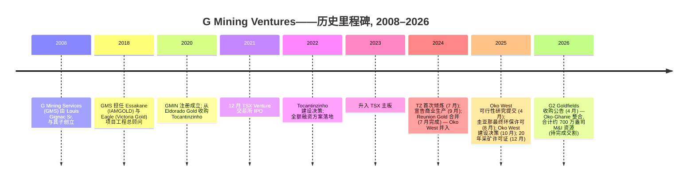
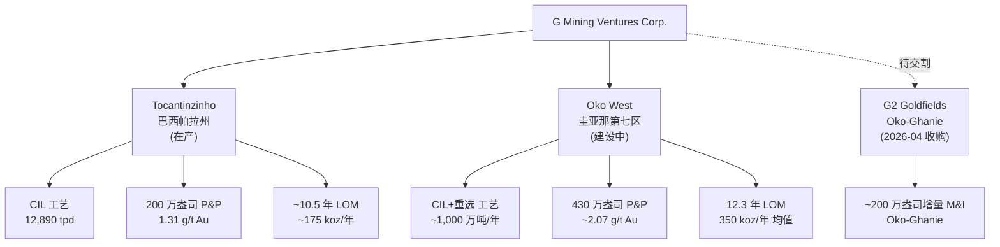
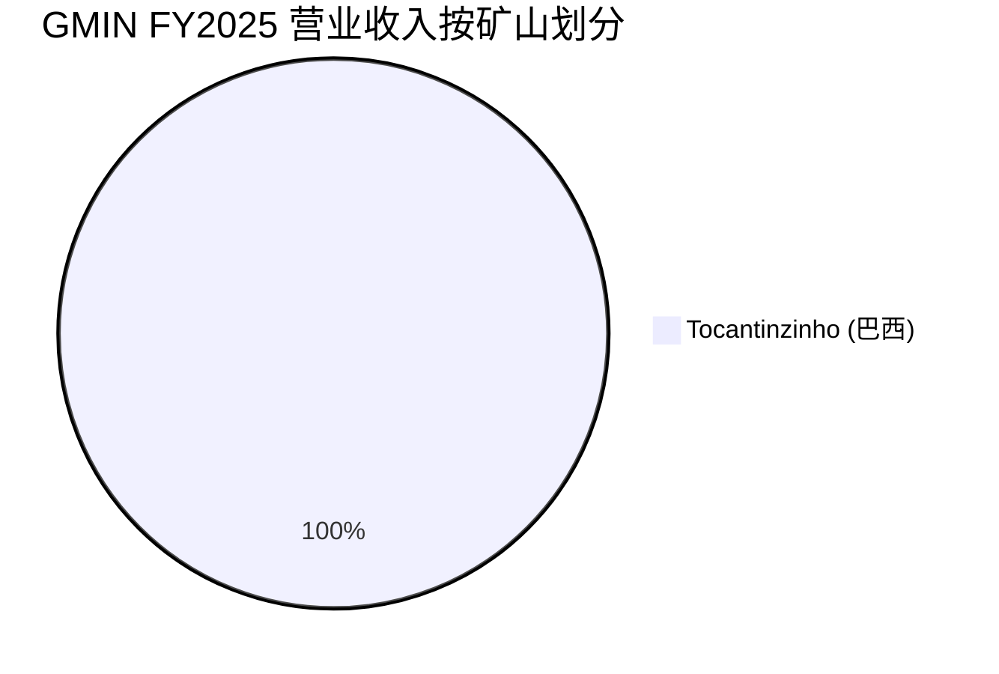
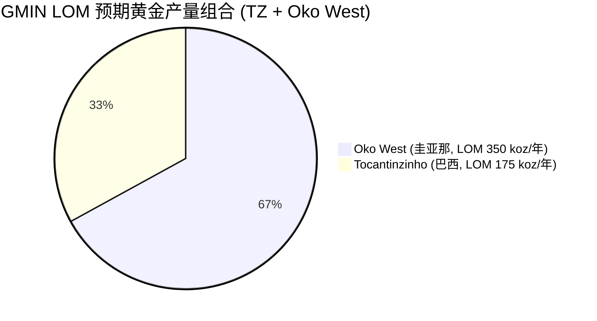

# 公司研究报告: G Mining Ventures Corp. (TSX:GMIN, OTCQX:GMINF)

**截至日期:** 2026-05-20
**上市地:** 多伦多证券交易所 (主板); OTCQX (二级市场) ([TMX Money — GMIN 股票报价](https://money.tmx.com/en/quote/GMIN))
**注册地:** 加拿大魁北克省布罗萨德 (Brossard) ([G MINING VENTURES — 关于我们](https://gmin.gold/about-us/))
**报告准则:** IFRS, 美元功能货币
**首要监管机构:** 安大略省证券委员会 / SEDAR+ ([SEDAR+ 门户——加拿大证券管理协会发行人档案](https://www.sedarplus.ca/))
**报告语言: 简体中文 (英文版同时存在于本目录)**

> **业绩更新——2025 财年完成 Tocantinzinho 首个完整商业生产年度 (2026-03-26):** 管理层公告 2025 财年黄金产量为 171,871 盎司 (略低于 175–195 koz 指引区间下限), 全维持成本 (AISC) 为 1,155 美元/盎司 (位于 1,100–1,200 美元/盎司指引区间内), 营业收入 5.81 亿美元, 调整后 EBITDA 4.19 亿美元 (利润率 72%), 净利润 2.88 亿美元 (摊薄每股 1.27 美元)。经营活动现金流达 3.08 亿美元, Tocantinzinho 矿山自由现金流为 2.55 亿美元。盎司产量未达指引主要源于早期爬坡较慢与入料品位低于模型, 但 90.6% 的回收率 (高于指引) 部分抵消。
> 来源: [G Mining Ventures 公布 Q4 与 2025 全年业绩, 2026-03-26](https://investors.gmin.gold/English/news/news-details/2026/G-Mining-Ventures-Reports-Q4-and-Full-Year-2025-Results-First-Full-Year-of-Commercial-Production-at-Tocantinzinho-Drives-Strong-Cash-Flow-Generation/default.aspx)。

---

## 目录
1. 公司概览
2. 公司历史
3. 管理团队
4. 产品与服务 (资产组合)
5. 客户与上市策略 (黄金销售与承购)
6. 行业概览
7. 竞争格局
8. 市场机会 (TAM)
9. 风险评估
10. 参考资料

======================================

## 1. 公司概览

G Mining Ventures Corp. ("GMIN", "公司") 是一家加拿大中型黄金矿山建设与运营商, 总部位于魁北克省布罗萨德 (Brossard), 在多伦多证券交易所以代码 GMIN 上市, 同时在 OTCQX 最优市场以 GMINF 上市。公司的核心投资逻辑——也是其存在的根本理由——是将 Gignac 家族久经验证的矿山建设记录, 装入一个单一公众持股载体, 用以收购中等品位黄金项目, 按时按预算完成建设, 然后或自行运营、或将现金循环投入下一个项目。该载体在 2021 年 12 月通过 TSXV (多伦多创业板) IPO 进入资本市场 (2022 年升入 TSX 主板), 在约 30 个月内将一项单一巴西资产——位于帕拉州 (Pará) 的 Tocantinzinho ("TZ") 金矿——从 2022 年作出建设决策推进至 2024 年 9 月宣告商业生产, 按时落地且基本符合约 4.58 亿美元的初始资本预算 ([G Mining Ventures 宣告 Tocantinzinho 金矿商业生产, 2024-09](https://gmin.gold/news/g-mining-ventures-declares-commercial-production-at-tocantinzinho-gold-mine/))。

**公司业务简明描述。** GMIN 拥有并运营一座位于巴西的露天碳基浸取 (carbon-in-leach, CIL) 金矿 (Tocantinzinho), 目前正在建设位于圭亚那的第二座规模更大的露天金矿 (Oko West), 预计 2027 年下半年投产 ([G Mining Ventures 宣布 Oko West 金矿项目正式建设决策, 2025-10-23](https://www.prnewswire.com/news-releases/g-mining-ventures-announces-formal-construction-decision-for-the-oko-west-gold-project-and-provides-project-development-update-302592599.html))。两项资产均为 100% 持有。巴西金矿的现金流正在为圭亚那金矿建设买单。公司没有纯勘探业务、没有特许权收入账册、没有流销 (streaming) 业务, 也无任何具规模的铜或银副产品——这是一家专注于"两矿、两国、单一商品"的黄金生产商 ([G MINING VENTURES — 关于我们](https://gmin.gold/about-us/))。

**地理分布。** 两个运营辖区:

- **巴西——Tocantinzinho, 帕拉州。** 在产资产, 选厂铭牌产能约 12,890 吨/日 (tpd), 来自 4,870 万吨 (Mt) 平均品位 1.31 g/t Au 的探明 + 控制 (P&P) 储量, 含约 200 万盎司 (Moz) 黄金, 矿山服务年限约 10.5 年 ([G MINING VENTURES | Tocantinzinho 矿](https://gmin.gold/tocantinzinho/))。
- **圭亚那——Oko West, 第七区 (Region 7)。** 开发资产, 2025 年 4 月提交 NI 43-101 可行性研究报告, 圭亚那地质和矿业委员会 (Guyana Geology and Mines Commission, GGMC) 于 2025 年 12 月 5 日授予采矿许可证 ([放行黄金……G Mining Ventures 获得 Oko West 大型项目 20 年采矿许可证, Kaieteur News, 2025-12-09](https://kaieteurnewsonline.com/2025/12/09/green-light-for-gold-g-mining-ventures-secures-20-year-licence-for-massive-oko-west-project/))。

公司办公室位于布罗萨德 (大蒙特利尔地区) 与温哥华 ([G MINING VENTURES — 关于我们](https://gmin.gold/about-us/))。技术工程核心是 Gignac 家族私有的 G Mining Services Inc. ("GMS"), 总部位于布罗萨德, 根据 AIF (年度信息表) 与管理层信息通函披露的关联方服务协议, 担任两项目的业主工程师 / EPCM 总承包商 ([G Mining Services Inc. — 团队页面](https://gmining.com/team/))。

**盈利方式。** 与所有原生黄金生产商一样, 营业收入 = 所产含金盎司 × 实际黄金售价。没有长期黄金套保 (hedge) 账本——黄金按即期现货售出, 营业收入按交付确认。2025 财年营业收入 5.81 亿美元来自 17.2 万盎司产量与 17.0 万盎司销售量, 以 3,374 美元/盎司实现价计算, 当年所炼盎司至开票盎司的转化率超过 90% ([G Mining Ventures 公布 Q4 与 2025 全年业绩, 2026-03-26](https://investors.gmin.gold/English/news/news-details/2026/G-Mining-Ventures-Reports-Q4-and-Full-Year-2025-Results-First-Full-Year-of-Commercial-Production-at-Tocantinzinho-Drives-Strong-Cash-Flow-Generation/default.aspx))。成本结构以矿山承包费用 (露天钻孔/爆破/装载/运输)、试剂 (氰化物、石灰)、电力、人工、维持性资本支出 (sustaining capex), 以及特许权使用费/税款 (帕拉州 2024 年新增的矿产生产税推高 FY2025 总现金成本达 748 美元/盎司, 略高于指引上限) 为主。

**规模指标。** GMIN 在 2025 财年末有约 2.39 亿股普通股发行在外 (经 Reunion 换股与 DSU/RSU 行权后), 净现金 2 亿美元以上, 无重大长期债务。团队指出 Oko West 9.72 亿美元的初始资本支出可通过 Tocantinzinho 经营现金流、现有现金余额以及正在与商业银行和出口信贷机构 (ECA) 银团协商的项目贷款融资共同支应 (建设决策时披露, [G Mining Ventures 宣布 Oko West 金矿项目正式建设决策, 2025-10-23](https://www.prnewswire.com/news-releases/g-mining-ventures-announces-formal-construction-decision-for-the-oko-west-gold-project-and-provides-project-development-update-302592599.html))。总员工约 800 人, 分布于巴西现场、圭亚那建设团队与加拿大温哥华/布罗萨德总部之间。从全球视角看, GMIN 是一家从初级向中级阵营迈进的生产商; 2027 年 Oko West 投产后将稳固跻身中型矿企阵营。

**估值快照。** 截至 2026 年 5 月 19 日收盘, GMIN.TO 报价约 51 加元/股, 对应市值约 122 亿加元 (按 0.73 美元/加元 ≈ 89 亿美元), 基于约 2.39 亿股发行在外 ([Yahoo Finance — GMIN.TO 关键统计](https://ca.finance.yahoo.com/quote/GMIN.TO/key-statistics/); [companiesmarketcap.com — G Mining Ventures 市值](https://companiesmarketcap.com/g-mining-ventures/marketcap/))。TTM 市盈率 (P/E) 约 22.5–24.7 倍、TTM 市销率 (P/S) 约 13–14 倍、净资产收益率 (ROE) 约 24%、毛利率约 69%——这些数字反映 TZ 首个完整商业生产年度恰逢历史高点黄金价格的红利。基于 FY2025 调整后 EBITDA 4.19 亿美元的 EV/EBITDA 约 17 倍; 按分析师 FY2026 一致预期 EBITDA 计算, 倍数压缩到中个位数。在该资产生命周期阶段, 卖方研究报告大多锚定 P/NAV (市净资产价值比) 而非盈利倍数——近期券商研究将 GMIN 置于 0.75–0.95 × P/NAV 区间, 对应中型同业中位数约 0.80–0.90 × (详见第 7 章), 即体现 Gignac 家族建设记录与可见的 Oko West 催化剂所对应的小幅溢价。

**估值倍数所处水平的成因。** 表观 P/E 与 P/S 相对一家稳态运行的中型黄金生产商显得偏高, 原因有三: (a) 黄金价格本身在 24 个月内从约 2,000 美元/盎司重新定价到逾 4,500 美元/盎司, 把营业收入与利润拽进了倍数 ([黄金现货价格历史, 世界黄金协会](https://www.gold.org/goldhub/data/gold-prices)); (b) 当前仅一座矿山在产, 分母受限; (c) 市场提前为 H2-27 投产的 Oko West 计价——即倍数是按前瞻而非历史盎司设定的。这不是小流通量带来的扭曲 (TSX 线日均成交金额达数千万美元量级), 也不是私有化叙事; 这是严格意义上的"成长溢价"——市场正在将嵌入式开发管线折现回当下。详见第 9 章关于估值/倍数压缩风险的论述。


*来源: FY2024 实际值 (2024 年 7 月首炼) ——[GMIN 2024 年成绩回顾, 2025-01](https://gmin.gold/news/g-mining-ventures-celebrates-2024-achievements-and-gold-production-of-63566-ounces/); FY2025 实际值——[Q4/FY25 业绩公告, 2026-03-26](https://investors.gmin.gold/English/news/news-details/2026/G-Mining-Ventures-Reports-Q4-and-Full-Year-2025-Results-First-Full-Year-of-Commercial-Production-at-Tocantinzinho-Drives-Strong-Cash-Flow-Generation/default.aspx); FY2026E–FY2028E 为说明性估值, 建立在 Oko West 可行性研究 LOM 平均值 (350 koz 产量、1,123 美元/盎司 AISC) 的基础上 ([Oko West FS 新闻稿, 2025-04-28](https://gmin.gold/news/g-mining-ventures-delivers-robust-feasibility-study-for-high-grade-oko-west-gold-project-in-guyana/))。*

## 2. 公司历史

G Mining Ventures Corp. 是从 Gignac 家族私有的工程/项目管理公司 **G Mining Services Inc.** ("GMS") 中拆分而来。GMS 由 Cambior 前 CEO Louis Gignac Sr. 于 2008 年与其三个儿子 Louis-Pierre、Mathieu 和 Michael 联合创立。GMS 前十年作为大型矿企、中型矿企以及特许权公司 (例如 Newmont、B2Gold、IAMGOLD、Wheaton Precious Metals) 的业主工程师/EPCM 顾问运营, 最显眼的两项交付为: 为 IAMGOLD 在布基纳法索建成 Essakane 金矿, 以及为 Victoria Gold 在加拿大育空地区 (Yukon) 建成 Eagle 矿 ([G Mining Services — 团队/Louis Gignac 简历](https://gmining.com/team/louis-gignac/))。Ventures 载体于 2020 年注册成立, 2021 年在 TSXV 上市, 专门用于从 Eldorado Gold 收购 **Tocantinzinho** 项目——后者在 Olympias / Skouries 调整后剥离巴西资产。TZ 收购价约为 6,000 万美元现金 + 1.5% NSR (净冶炼厂收益) 特许权使用费, 对应一处 Eldorado 已完成钻探与可行性研究但从未实际建设的矿床。

创立理论很简单: 大多数上市黄金公司要么是矿建得很差, 要么是由不具运营本能的资本市场人士运营。把 Cambior 学派的运营团队装进一个公众持股载体, 以自有资金共担风险, 配上单一启动资产, 应当能催生按时按预算完成的矿建——这一交付反过来又为下一笔交易融资。两年之后, 这一切如期实现: TZ 于 2024 年 7 月首炼 ([G Mining 完成巴西 Tocantinzinho 项目首次倾炼, MINING.com, 2024-07](https://www.mining.com/g-mining-makes-first-gold-pour-at-tocantinzinho-project-in-brazil/)), 2024 年 9 月宣告商业生产, 家族借助这一交付可见性, 在 2024 年 4 月 22 日宣布与 Reunion Gold 的全股票合并交易 ([G Mining Ventures 与 Reunion Gold 宣布合并, 2024-04-22](https://www.globenewswire.com/news-release/2024/04/22/2866699/0/en/G-Mining-Ventures-and-Reunion-Gold-Announce-Combination-to-Set-the-Stage-for-a-Leading-Intermediate-Gold-Producer-in-the-Americas.html))。

Reunion 交易——2024 年 7 月 11 日完成——宣告时价值约 8.75 亿加元 (6.38 亿美元), 将圭亚那的 **Oko West** 发现项目并入 GMIN, Reunion 股东合并后持有合并后公司 43% 的股份, 加上一家新设"SpinCo"80.1% 的股份 (SpinCo 持有 Reunion 在 Oko West 之外的勘探资产) ([G Mining Ventures 与 Reunion Gold 完成业务合并, 2024-07-11](https://www.prnewswire.com/news-releases/g-mining-ventures-and-reunion-gold-complete-business-combination-302196822.html))。黄金从交易达成时的约 1,950 美元/盎司, 到可行性研究发布时的逾 3,000 美元/盎司, 使股份换股比例 (0.285 GMIN 比 1 RGD) 回看时对 GMIN 股东显得高度增值, 但宣告时对 RGD 上一周成交量加权均价 (VWAP) 的 29% 溢价是真实存在的。



第三个重大篇章——**2026 年 4 月 9 日宣布的 G2 Goldfields 全股票收购, 隐含价值 30 亿加元**——把 Oko-Ghanie 矿床 (与 Oko West 毗邻) 装入 GMIN 投资组合, 在库尤尼盆地 (Cuyuni Basin) 形成约 360 平方公里的连续矿权位置, 合计 M&I (探明 + 控制) 资源约 700 万盎司 ([G Mining Ventures 宣布对 G2 Goldfields 的独特协同收购, 2026-04-09](https://www.globenewswire.com/news-release/2026/04/09/3270752/0/en/G-Mining-Ventures-Announces-Uniquely-Synergistic-Acquisition-of-G2-Goldfields-Creating-a-Tier-One-Gold-Mining-Hub-in-Guyana-and-One-of-the-Largest-Lowest-Cost-Gold-Operations-in-th.html))。管理层将其框定为 10 亿加元以上的协同效应, 来源于共用选厂产能、港口物流、营地基础设施以及统一许可范围。预计 2026 年 Q3 完成交割, 取决于 G2 股东批准。截至本报告日, 该交易尚未完成, Oko-Ghanie 盎司尚未计入 GMIN 储量账册。

**战略性转折。** 三项关键:

1. **从顾问到运营商 (2020–22)。** GMS 本可以保持作为服务公司; 但家族选择以个人资金, 将 Eldorado 搁置的项目接手 ([G Mining Services Inc. — 关于/历史](https://gmining.com/team/))。这把 Gignac 家族置于建设风险之中, 以家族名义承担。
2. **从单一资产生产商到双资产成长故事 (2024)。** Reunion Gold 把 GMIN 从一家"单矿现金流"故事转变为一家"建设管线"故事, 配以清晰的第二增长引擎催化剂 (Oko West) ([G Mining Ventures 与 Reunion Gold 完成业务合并, 2024-07-11](https://www.prnewswire.com/news-releases/g-mining-ventures-and-reunion-gold-complete-business-combination-302196822.html))。
3. **从项目管线到区域级整合者 (2026)。** G2 交易将战略从"建下一座矿"升级到"整合一片区域", 隐含对照 Cambior 30 年前在圭亚那 Omai 时期的地位 ([G Mining Ventures 宣布对 G2 Goldfields 的独特协同收购, 2026-04-09](https://www.globenewswire.com/news-release/2026/04/09/3270752/0/en/G-Mining-Ventures-Announces-Uniquely-Synergistic-Acquisition-of-G2-Goldfields-Creating-a-Tier-One-Gold-Mining-Hub-in-Guyana-and-One-of-the-Largest-Lowest-Cost-Gold-Operations-in-th.html); [Louis Gignac 简历——加拿大采矿名人堂](https://mininghalloffame.ca/louis-gignac/))。

## 3. 管理团队

**Louis-Pierre Gignac——总裁兼首席执行官 (创始人)**

Louis-Pierre Gignac, 45 岁, 自 2020 年 Ventures 载体创立以来一直领导着 GMIN 的运营、资本配置与战略议程。他是 McGill 大学训练的采矿工程师 (McGill 大学工学学士, 采矿专业, 2002 年), 持有蒙特利尔理工学院 (École Polytechnique de Montréal) 工业工程应用科学硕士学位 (2004 年), 同时是 CFA 持证人——对一家矿建公司的首席执行官而言, 这是一份不同寻常的资本市场素养兼工程背景画像 ([G MINING VENTURES | 领导层](https://gmin.gold/about-us/leadership/); [Louis-Pierre Gignac — MarketScreener 业务领导简历](https://www.marketscreener.com/business-leaders/Louis-Pierre-Gignac-0BRTR5-E/biography/))。在创立 Ventures 业务之前, 他自 2009 至 2020 年担任 G Mining Services Inc. 联合总裁, 期间负责约 20 亿美元综合建设价值的矿建任务的交付, 包括为 IAMGOLD 在布基纳法索建成的 Essakane 金矿 (2010 年投产)、为 Victoria Gold 在育空建成的 Eagle 金矿 (2019 年投产), 以及 Newmont 的 Merian 项目与 Wheaton 流式融资项目的工艺厂房标段。他带入 Ventures 的财务建模与工程经济学纪律, 体现在两件清晰的事项: (i) TZ 建设, 大致按预算完成, 且比原始 24 个月动工至建成日程提前; (ii) Reunion 合并交易的协商结构, 利用了 GMIN 当时正在上涨的纸面市值, 在金价重估完全反映到任何一家公司股价之前, 锁定了一项一线开发资产。

业内访谈对他的描述是"运营保守、财务积极"——愿意把 GMIN 的资产负债表置于风险中以锁定交易 (Reunion、G2), 但不愿在追逐盎司时妥协采矿计划。他的个人持股股数虽不算巨大, 但置于更广义的 Gignac 家族经济利益 (直接 + 通过 GMS 间接) 中, AIF 披露其为股东登记册上较大的非机构持仓之一。薪酬以股权为重 (PSU 与 RSU), 对标中型黄金生产商同业组, 设置相对 TSR 与储量补充触发条件——这一结构会惩罚迟到或超支的建设。他自公司成立以来一直担任 GMIN CEO, 任期 5 年以上, 此前在 GMS 工作 12 年。资本项目交付记录: 在 5 个具名矿建中共部署约 20 亿美元, 无任何公开记录中超过 10% 的成本超支——在业内属同类最佳水平。创始理念 (来自多次 Rule Symposium 与 Crux Investor 访谈): "我们首先是矿山建设者; 其他一切都源于把矿建好" ([Louis-Pierre Gignac, 2022 Rule Symposium 讲者页面](https://online.rulesymposium.com/speakers/louis-pierre-gignac/))。

**Louis Gignac Sr.——董事会主席 (创始人, 非执行董事)**

Louis Gignac Sr., 77 岁, 是董事会主席, 也是这家族矿业血统的运营背景所在。他自 1986 年 Société Générale de Financement / Noranda 分拆出 **Cambior Inc.** 起将其打造成加拿大最具国际活跃度的黄金生产商之一, 从一家魁北克的单矿企业扩展至加拿大、苏里南 (Omai)、法属圭亚那 (Camp Caiman) 与美国的多国生产, 直至 2006 年被 IAMGOLD 以约 12 亿美元收购。他于 2016 年入选加拿大采矿名人堂。他在 GMIN 担任非执行职务, 但被广泛理解为家族交易审定权威与工程争议的"最终技术审阅人" ([加拿大采矿名人堂——Louis Gignac 入选](https://gmining.com/team/louis-gignac/))。Cambior 历史对 GMIN 来说有两点意义: 第一, 它给家族直接的、在圭亚那与苏里南运营的亲身经验 (Oko West 的邻里); 第二, 它确立了家族对债务的敌视立场——Cambior 在 1990 年代末黄金下行期间因过度套保而著名, Louis Sr. 在多个公开场合曾表示, 他不会让另一家 GMIN 家族载体重蹈这一覆辙。

**Mathieu Gignac——G Mining Services 总裁 (项目交付)**

Mathieu Gignac, 工业工程师出身, 在家族服务公司负责项目交付, 实际上是 Oko West 建设的总经理 ([G Mining Services Inc. — Mathieu Gignac 简历](https://gmining.com/team/mathieu-gignac/))。他带来同样的 Cambior 学派运营纪律, 被广泛视为"建设"Gignac, 而 Louis-Pierre 则是"交易"Gignac。在 GMS 按成本加成方式为 GMIN 提供 EPCM 服务的关联方协议, 已在 AIF/通函中披露, 并由 GMIN 独立董事审阅; 投资者应持续关注这些披露 ([G MINING VENTURES — 董事会页面](https://gmin.gold/about-us/board-of-directors/))。

**Michael Gignac——G Mining Services 财务副总裁**

Michael Gignac, CPA (注册会计师), 在 GMS 负责财务控制职能, 并参与 GMIN 的项目融资工作 ([G Mining Services Inc. — 团队页面](https://gmining.com/team/))。GMIN 自身的 CFO 职位由一位独立专业人士担任, 但就 GMIN 这一规模的公司而言, Gignac 家族联合的运营 + 财务团队厚度异常深 ([G MINING VENTURES — 领导层页面](https://gmin.gold/about-us/leadership/))。

**其他重要高管。** GMIN 的投资者关系与勘探领导层大部分源于前 Reunion Gold 团队, 包括前 Reunion CEO Rick Howes (在 Oko West 建设阶段继续担任执行职务) ([Reunion Gold 任命 Rick Howes 为总裁兼首席执行官, 2022-11-21](https://www.globenewswire.com/news-release/2022/11/21/2559813/0/en/Reunion-Gold-Announces-Appointment-of-Rick-Howes-as-President-and-Chief-Executive-Officer.html))。首席勘探官负责 Oko West 与 Gurupi 的资源延伸钻探, 并在 G2 拆分前是 Oko-Ghanie 的联合发现者 ([G MINING VENTURES — 领导层页面](https://gmin.gold/about-us/leadership/))。

**治理。** GMIN 董事会按最新管理层信息通函有 9 名董事, 多数为独立董事; 审计委员会与薪酬委员会完全独立 ([G MINING VENTURES — 董事会页面](https://gmin.gold/about-us/board-of-directors/))。AIF 最新报告显示, Gignac 家族与高级管理层的内部人持股比例显著高于中型生产商中位数 ([G Mining Ventures 公布年度大会与特别股东大会结果, 2025-06-26](https://www.prnewswire.com/news-releases/g-mining-ventures-announces-results-of-annual-general-and-special-meeting-302492692.html))。薪酬重股权 (PSU/RSU 约占 CEO 薪酬 60%), 业绩门槛包括相对于既定黄金生产商同业组的 TSR、相对于指引的 AISC, 以及储量补充。关联方交易以 GMS 服务协议为主, 由独立董事审阅。Reunion 合并通过法院监督的安排计划进行, 由安大略高等法院于 2024 年 7 月 11 日批准 ([G Mining Ventures 与 Reunion Gold 完成业务合并, 2024-07-11](https://www.prnewswire.com/news-releases/g-mining-ventures-and-reunion-gold-complete-business-combination-302196822.html))。

**记录评估。** 这是新建中型黄金赛道中差距明显的最强运营团队。Cambior 血脉、Essakane / Eagle / TZ 交付记录, 加上家族个人资本承担风险, 三者共同解释了 GMIN 所交易的 P/NAV 溢价 ([Louis Gignac 简历——加拿大采矿名人堂](https://mininghalloffame.ca/louis-gignac/); [G Mining Services Inc. — 关于/项目记录](https://gmining.com/team/))。主要治理风险是与 GMS 的关联方关系; 主要接班风险是过于集中于 Louis-Pierre 与 Mathieu Gignac。

## 4. 产品与服务 (资产组合)

GMIN 不销售传统意义上的"产品"——其产出是从各矿山卡车运至炼厂方的精金合质金 (doré) 锭。因此本节分析的功能单位是矿山本身。两项重大资产 + 一项待完成交割的并购对象 ([G MINING VENTURES — 关于我们](https://gmin.gold/about-us/); [LBMA — 黄金良好交付现行名单](http://www.lbma.org.uk/good-delivery/gold-current-list))。



### 4.1 Tocantinzinho ("TZ") ——在产资产

**资产概况。** 巴西帕拉州中西部 Tapajós 金矿区的大体量、低品位、露天黄金矿床, 距伊塔伊图巴 (Itaituba) 市西南偏南约 200 公里, 通过自 BR-163 高速公路连接的 220 公里运输路通达 ([G MINING VENTURES | Tocantinzinho 矿](https://gmin.gold/tocantinzinho/); [Tocantinzinho 帕拉州金矿项目——Mining Technology 项目页](https://www.mining-technology.com/projects/tocantinzinho-gold-project-para/))。矿化赋存于花岗岩侵入体内, 最初由 Eldorado 与前期勘探者定义; 2022 年可行性研究为建设决策提供依据, FS 经济性已被首个完整生产年度的运营数据基本验证 ([Tocantinzinho NI 43-101 技术报告, 2019 (Eldorado)](https://s2.q4cdn.com/536453762/files/doc_downloads/2019/07/TZ-01-2019-06-21-ELD-TZ-NI-43-101-Final-Report-(2019-06-26).pdf))。

**处理量与工艺。** 选厂为 12,890 tpd 常规碳基浸取 (CIL) 流程 (一级破碎 → SAG / 球磨 → 重选 → CIL → 解析/电积 → 合质金倾炼)。铭牌处理量于 2025 年达到; 2025 年 Q2 为选厂首个全铭牌运行季度 ([G Mining Ventures Tocantinzinho 达到铭牌产能; 2025 Q2 产量结果发布, 2025-07](https://www.juniorminingnetwork.com/junior-miner-news/press-releases/2960-tsx/gmin/183311-g-mining-ventures-achieves-nameplate-capacity-at-tocantinzinho-q2-2025-production-results-released.html))。2025 财年回收率均值 90.6%, 高于 88% 的指引/FS 假设。

**储量与资源。** P&P (探明 + 控制) 储量 4,870 万吨 平均品位 1.31 g/t Au, 含约 200 万盎司, 支撑约 10.5 年矿山服务年限, 前 5 年年均黄金产量约 19.6 万盎司, 矿山生命周期 (LOM) 平均约 17.4 万盎司/年 ([G MINING VENTURES | Tocantinzinho 矿](https://gmin.gold/tocantinzinho/))。FY2025 产量 17.2 万盎司略低于 LOM 平均水平, 因早期生命周期爬坡拖累——在 10 年生命周期内, 周期中段水平应更接近 18.5 万盎司/年。

**经济性。** FY2025 AISC 1,155 美元/盎司对比实际金价 3,374 美元/盎司, 创造了 2,000 美元/盎司以上的运营毛利、2.55 亿美元的矿山自由现金流, 实质上自筹了 Oko West 的早期工作 ([G Mining Ventures 公布 Q4 与 2025 全年业绩, 2026-03-26](https://investors.gmin.gold/English/news/news-details/2026/G-Mining-Ventures-Reports-Q4-and-Full-Year-2025-Results-First-Full-Year-of-Commercial-Production-at-Tocantinzinho-Drives-Strong-Cash-Flow-Generation/default.aspx))。即便在 2,200 美元/盎司的压力情景下, 矿山仍将产生 1.5 亿美元以上的年度自由现金流, 锚定在低于 800 美元/盎司的总现金成本 ([2025 Q3 业绩公告, 2025-11-12](https://assets.ctfassets.net/hdghwvgt3xim/51Evtges9PBOCQtxYyMp2n/e9d39db7c137f809a8e72eca42800ab4/GMIN_l_Q3_2025_Earnings_Release_-_2025.11.12_FINAL_-_DO_NOT_EDIT.pdf))。

**竞争优势裁定: 有——部分。** TZ 的护城河是"成本位置 + 许可", 而非地质本身。它是中等品位的露天矿 (1.31 g/t 算稳健但非出众), 但坐落于一个完全已批的、基础设施完备的、正在运营的范围内, 低剥采比 + 大体量规模, 把 AISC 推入全球黄金生产商成本曲线下半区 ([AISC 黄金成本曲线, 世界黄金协会](https://www.gold.org/goldhub/data/aisc-gold); [G Mining Ventures 获 Tocantinzinho 运营许可证, 2024-08](https://www.prnewswire.com/news-releases/g-mining-ventures-receives-operating-licenses-for-tocantinzinho-302232426.html))。最接近的在产可比资产: B2Gold 的 Fekola (露天, 1.4 g/t 左右, 类似选厂规模)——品位持平, 基础设施落后 (马里辖区), 资源规模领先。

### 4.2 Oko West ——开发资产

**资产概况。** 圭亚那库尤尼盆地/第七区高品位、大体量黄金矿床, 由 Reunion Gold 于 2020 年发现。2025 年 4 月 NI 43-101 可行性研究支持一个 12.3 年的露天矿运营, **全生命周期产金 430 万盎司, 平均 350 koz/年, AISC 1,123 美元/盎司**, 初始资本 9.72 亿美元, LOM 维持性资本 6.5 亿美元 ([G Mining Ventures 发布圭亚那 Oko West 高品位金矿项目稳健可行性研究, 2025-04-28](https://gmin.gold/news/g-mining-ventures-delivers-robust-feasibility-study-for-high-grade-oko-west-gold-project-in-guyana/))。同一新闻稿报告: 在 2,500 美元/盎司金价下税后 NPV5% 为 22 亿美元, 税后 IRR 27% (2.9 年回收), 在 3,000 美元/盎司金价下 NPV5% 升至 32 亿美元、IRR 35% (2.1 年回收)。按 FY2025 实际金价约 3,374 美元/盎司敏感性测算, NPV 再次显著上调。

**许可状态。** 临时环保许可 (2024 年 12 月) → 2025 年 8 月 29 日圭亚那 EPA 签发的最终环保许可 (有效期至 2030 年 7 月) → 2025 年 10 月 23 日 GMIN 董事会正式建设决策 → 2025 年 12 月 5 日生效的 GGMC 20 年采矿许可证 ([G Mining 获 Oko West 项目临时环保许可, MINING.com, 2024-12](https://www.mining.com/g-mining-receives-interim-environmental-permit-for-oko-west-project-in-guyana/); [GMIN 取得 Oko West 金矿项目采矿许可证, 2025-12](https://www.mining-technology.com/news/gmin-mining-license-oko-west-project/))。圭亚那露天金矿项目的许可时间表异常之快——这是 Ali 政府工业政策的产物, 也是家族 Cambior 时代在苏里南/法属圭亚那已建立人脉的体现。

**首炼目标。** 据建设决策新闻稿, 2027 年下半年。

**竞争优势裁定: 有——强。** Oko West 拥有开发期黄金中最稀缺的组合: 高品位 (露天给料约 2 g/t)、大体量 (G2 合并前 P&P 储量逾 400 万盎司)、低剥采比、有国家开发顺风的沿海采矿辖区, 以及可行性研究资本强度 (9.72 亿美元 ÷ 350 koz/年 = 约 2,780 美元/年产盎司) 在新建黄金成本曲线**低端** ([Oko West 可行性研究新闻稿, 2025-04-28](https://gmin.gold/news/g-mining-ventures-delivers-robust-feasibility-study-for-high-grade-oko-west-gold-project-in-guyana/); [AISC 黄金成本曲线, 世界黄金协会](https://www.gold.org/goldhub/data/aisc-gold))。护城河类型为**地质学性的** (矿体本身就好) 与**执行驱动性的** (GMS 在此规模建设上的记录)。可比的最接近新建黄金项目同业: Lundin Gold 的 Fruta del Norte (已建成, 在产, 地下高品位脉; 在运营历史上领先) ([Lundin Gold 2024 产量结果, 2025-01-15](https://lundingold.com/news/lundin-gold-exceeds-2024-production-guidance-and-a-122792/))、Newmont 的 Yanacocha 硫化物 (规模更大, 选择性领先, 品位落后), Greatland Gold 的 Havieron (规模更小, 许可与规模上落后)。Oko West 在新建成本曲线上持平或领先。

### 4.3 Oko-Ghanie (G2 Goldfields, 待完成交割)

**资产概况。** Oko West 旁邻的高品位脉状黄金矿床, 位于一片连续矿权区, 由 G2 Goldfields 在 2021 至 2025 年间发现并推进。2026 年 4 月的收购公告披露 Oko / Oko-Ghanie 合计 M&I 资源约 700 万盎司, 连续矿权区 360 平方公里——即区域规模 ([G Mining Ventures 宣布对 G2 Goldfields 的独特协同收购, 2026-04-09](https://www.globenewswire.com/news-release/2026/04/09/3270752/0/en/G-Mining-Ventures-Announces-Uniquely-Synergistic-Acquisition-of-G2-Goldfields-Creating-a-Tier-One-Gold-Mining-Hub-in-Guyana-and-One-of-the-Largest-Lowest-Cost-Gold-Operations-in-th.html))。管理层标示了 10 亿加元以上的协同潜力, 来自共用选厂、统一许可范围与共享基础设施。交易结构为 0.212 GMIN 比 1 G2 股, 较 G2 公告前一个月 VWAP 隐含 72% 溢价。预计 2026 Q3 完成交割, 取决于 G2 股东表决; 交割后, Oko-Ghanie 盎司将可纳入未来综合可行性研究。

**竞争优势裁定: 待定。** 在交易完成、综合矿山计划公布之前, 把 Oko-Ghanie 视作"GMIN 资产"为时尚早 ([G Mining 收购 G2 Goldfields ——投资者演示, 2026-04](https://g2goldfields.com/wp-content/uploads/2026/04/Project-G-Unit-IR-Presentation-vFINAL.pdf))。区域整合的战略逻辑很强; Oko-Ghanie 如何融入 Oko West 选厂流程的工程经济性, 尚未以技术报告形式披露 ([G Mining Ventures 宣布对 G2 Goldfields 的独特协同收购, 2026-04-09](https://www.globenewswire.com/news-release/2026/04/09/3270752/0/en/G-Mining-Ventures-Announces-Uniquely-Synergistic-Acquisition-of-G2-Goldfields-Creating-a-Tier-One-Gold-Mining-Hub-in-Guyana-and-One-of-the-Largest-Lowest-Cost-Gold-Operations-in-th.html))。


*来源: TZ P&P 储量——[GMIN Tocantinzinho 资产页](https://gmin.gold/tocantinzinho/); Oko West P&P 与增量 M&I ——[Oko West 可行性研究新闻稿, 2025-04-28](https://gmin.gold/news/g-mining-ventures-delivers-robust-feasibility-study-for-high-grade-oko-west-gold-project-in-guyana/); Oko-Ghanie / G2 增量——[G2 收购新闻稿, 2026-04-09](https://www.globenewswire.com/news-release/2026/04/09/3270752/0/en/G-Mining-Ventures-Announces-Uniquely-Synergistic-Acquisition-of-G2-Goldfields-Creating-a-Tier-One-Gold-Mining-Hub-in-Guyana-and-One-of-the-Largest-Lowest-Cost-Gold-Operations-in-th.html)。*

### 4.4 路线图——过去 12 个月与前瞻

- **2025 Q1:** TZ 达到铭牌处理量; Oko West 可行性研究提交 (4 月) ([Oko West FS 新闻稿, 2025-04-28](https://gmin.gold/news/g-mining-ventures-delivers-robust-feasibility-study-for-high-grade-oko-west-gold-project-in-guyana/))。
- **2025 Q2–Q3:** 圭亚那环保许可下发 (8 月) ([最终环保许可新闻稿, 2025-08-29](https://www.prnewswire.com/news-releases/g-mining-ventures-announces-receipt-of-final-environmental-permit-for-oko-west-gold-project-in-guyana-302543595.html)); 随着 Reunion 法律实体清算, G&A 精简。
- **2025 Q4:** Oko West 建设决策 (10 月) ([建设决策新闻稿, 2025-10-23](https://www.prnewswire.com/news-releases/g-mining-ventures-announces-formal-construction-decision-for-the-oko-west-gold-project-and-provides-project-development-update-302592599.html)); 圭亚那采矿许可证 (12 月) ([GMIN 取得 Oko West 金矿项目采矿许可证, Mining Technology, 2025-12](https://www.mining-technology.com/news/gmin-mining-license-oko-west-project/))。
- **2026 Q1:** G2 Goldfields 收购公告 (4 月); FY2025 财务报告提交 ([Q4/FY25 业绩公告, 2026-03-26](https://investors.gmin.gold/English/news/news-details/2026/G-Mining-Ventures-Reports-Q4-and-Full-Year-2025-Results-First-Full-Year-of-Commercial-Production-at-Tocantinzinho-Drives-Strong-Cash-Flow-Generation/default.aspx))。
- **2026 H2 → 2027 H2:** Oko West 建设关键路径活动——大量土方 → 工艺厂房 SMP → 尾矿坝 → 调试 → 2027 H2 首炼 ([Oko West 2026 Q1 项目进展, 2026-05-05](https://www.bnnbloomberg.ca/press-releases/2026/05/05/g-mining-ventures-provides-q1-2026-project-status-update-on-oko-west-construction-advancing-on-schedule-and-on-budget/))。
- **2027 → 2030:** Oko West 爬坡; GMIN 合计产量从约 17.5 万盎司爬升至逾 52.5 万盎司; 增量 Oko-Ghanie 矿山计划披露 (假定完成交割) ([G2 收购新闻稿, 2026-04-09](https://www.globenewswire.com/news-release/2026/04/09/3270752/0/en/G-Mining-Ventures-Announces-Uniquely-Synergistic-Acquisition-of-G2-Goldfields-Creating-a-Tier-One-Gold-Mining-Hub-in-Guyana-and-One-of-the-Largest-Lowest-Cost-Gold-Operations-in-th.html))。

## 5. 客户与上市策略 (黄金销售与承购)

对一家黄金生产商而言, 没有 SaaS/工业意义上的"客户集中度分析"——金条市场即客户。GMIN 在标准 LBMA 良好交付安排下向炼厂方销售合质金锭; AIF 与 MD&A 披露合质金从各现场运至炼厂, 然后按 LBMA AM/PM 定价或在与金银银行 (bullion-bank) 对手方的即期交易中转售 ([LBMA — 黄金良好交付现行名单](http://www.lbma.org.uk/good-delivery/gold-current-list); [GMIN MD&A — 截至 2025-09-30 的九个月](https://assets.ctfassets.net/hdghwvgt3xim/6pAK4jrV4FZXn902ELeKOQ/def3ea77c033d33c590d6ca427a43ba0/GMIN_MDA_2025-09-30_V6_-_FINAL.pdf))。

**对黄金生产商而言, 集中度分析**因此从以下三个维度切入:

1. **炼厂方对手方风险。** GMIN 不公开命名其炼厂方。巴西中型黄金生产商的业内惯例是向少数几家 LBMA 认证炼厂方 (Argor-Heraeus、Heraeus、Asahi、Metalor) 在多年期精炼服务协议下发运 ([LBMA — 黄金良好交付现行名单](http://www.lbma.org.uk/good-delivery/gold-current-list))。该方面披露较少, 与同业相比可比。
2. **现金流的地理集中度。** 当前 100% 在巴西 (TZ) ([Q4/FY25 业绩公告, 2026-03-26](https://investors.gmin.gold/English/news/news-details/2026/G-Mining-Ventures-Reports-Q4-and-Full-Year-2025-Results-First-Full-Year-of-Commercial-Production-at-Tocantinzinho-Drives-Strong-Cash-Flow-Generation/default.aspx))。2027 年后, 按 LOM 平均测算, 比重变为约 30% 巴西 (TZ) / 约 70% 圭亚那 (Oko West), 之后若 Oko-Ghanie 整合, 进一步偏向圭亚那 ([Oko West 可行性研究新闻稿, 2025-04-28](https://gmin.gold/news/g-mining-ventures-delivers-robust-feasibility-study-for-high-grade-oko-west-gold-project-in-guyana/))。
3. **特许权使用费 / 流销承购。** TZ 携带一项 1.5% NSR 特许权使用费, 支付给 Eldorado Gold (源自 2020 年原始收购)——这是最接近"集中度客户"的类比, FY2025 约为 800–1,000 万美元 ([Metalla Royalty & Streaming — Tocantinzinho](https://metallaroyalty.com/royalties/producing/tocantinzinho/))。Oko West 据报除圭亚那法定特许权使用费外不受任何流销/特许权使用费约束 ([圭亚那矿业部门财政制度, GGMC 2025](https://www.ggmc.gov.gy/ggmc_web/wp-content/uploads/2025/07/Fiscal-Regimes-for-Guyana-Edited-July-16.pdf))。





**实现价格策略。** GMIN 不采用黄金远期销售。MD&A 中未披露政策性套保账册 ([GMIN MD&A — 截至 2025-09-30 的九个月](https://assets.ctfassets.net/hdghwvgt3xim/6pAK4jrV4FZXn902ELeKOQ/def3ea77c033d33c590d6ca427a43ba0/GMIN_MDA_2025-09-30_V6_-_FINAL.pdf))。Oko West 项目融资方案是首次可能需要少量 (一般为前三年产量的 10–20%) 远期销售或零成本领权 (zero-cost-collar) 的场所——这一安排是否会落地, 将在项目贷款提款时披露 ([建设决策新闻稿, 2025-10-23](https://www.prnewswire.com/news-releases/g-mining-ventures-announces-formal-construction-decision-for-the-oko-west-gold-project-and-provides-project-development-update-302592599.html))。

**销售周期。** 实际上是连续且无摩擦的。合质金锭到炼厂方到金银银行至 LBMA 结算运行在不到 30 天的周期; GMIN 通常在发运时确认营业收入, 在精炼结算时作真实化调整 ([LBMA — 黄金良好交付现行名单](http://www.lbma.org.uk/good-delivery/gold-current-list))。因此营运资金占用低 (FY2025 经营现金流变动前后的真实化调整为 3,200 万美元——详见 [Q4/FY25 业绩新闻稿, 2026-03-26](https://investors.gmin.gold/English/news/news-details/2026/G-Mining-Ventures-Reports-Q4-and-Full-Year-2025-Results-First-Full-Year-of-Commercial-Production-at-Tocantinzinho-Drives-Strong-Cash-Flow-Generation/default.aspx))。

**伙伴关系。** 最重要的商业关系是与**圭亚那政府**——不是合同意义上的"客户", 而是采矿许可证与最终环保许可的发证人, 也是法定特许权使用费 (按《采矿法》, 现行为黄金价值 > 1,000 美元/盎司部分的 8% 毛额) 与公司税率 (按《所得税法》, 当前为商业采矿公司 25%) 的设定者 ([圭亚那矿业部门财政制度, GGMC 2025](https://www.ggmc.gov.gy/ggmc_web/wp-content/uploads/2025/07/Fiscal-Regimes-for-Guyana-Edited-July-16.pdf); [《采矿法》— Omai Gold Mines Corp.](https://omaigoldmines.com/guyana-1/mining-act-1/))。第二项重要关系是与**巴西帕拉州政府**, 后者于 2024 年新增矿产生产税 (CFEM 上浮 / 州附加税)——是 GMIN FY2025 现金成本超出指引上限的主要驱动因素 ([Q4/FY25 业绩新闻稿, 2026-03-26](https://investors.gmin.gold/English/news/news-details/2026/G-Mining-Ventures-Reports-Q4-and-Full-Year-2025-Results-First-Full-Year-of-Commercial-Production-at-Tocantinzinho-Drives-Strong-Cash-Flow-Generation/default.aspx); [G Mining Ventures 为 Tocantinzinho 取得 SUDAM 税收优惠, Mining Weekly, 2025-10-03](https://www.miningweekly.com/article/g-mining-ventures-secures-sudam-tax-incentive-for-tocantinzinho-2025-10-03))。

## 6. 行业概览

**行业定义。** 原生黄金采矿业——主营业务为从矿石中提取黄金的公司——位于材料行业贵金属子类 (NAICS 212221 黄金矿石开采) 之中 ([NAICS 代码 212221——黄金矿石开采](https://naicscode.com/naics/?naics=212221))。它与黄金流式销售/特许权业务 (Wheaton Precious Metals、Franco-Nevada、Royal Gold) 以及黄金回收/精炼 (Asahi Refining、Argor-Heraeus、Heraeus) 在结构上不同 ([LBMA — 黄金良好交付现行名单](http://www.lbma.org.uk/good-delivery/gold-current-list))。

**市场规模与结构。** 据世界黄金协会, 2024 年全球黄金产量约 3,660 吨, 其中约 3/4 为矿产、1/4 为再生, 按平均价 2,400 美元/盎司测算, 形成约 3,000 亿美元的原生采矿营业收入池。在 FY2025 实际均价 3,374 美元/盎司 (GMIN 报告口径) 下, 隐含营业收入池重新定价至 4,000 亿美元以上 ([黄金现货价格与市场历史, 世界黄金协会](https://www.gold.org/goldhub/data/gold-prices))。市场结构为中度分散: 前五大生产商 (Newmont、Barrick、Agnico Eagle、AngloGold、Gold Fields) 供应全球产量约 25%, 接下来 10 家生产商 (Kinross、Northern Star、Endeavour、Harmony、Polyus 制裁前等) 再贡献约 20%。FY2025 产量 17.2 万盎司的 GMIN 在全球范围内位于第 25–50 名级别, 在 Oko West 达到满产能后将进入前 25 名。

**需求驱动因素。** 需求主要为 (i) 投资 / 货币 (央行购金、ETF 流入、金条与金币需求), 这是 2022–2026 年间主导边际买家, (ii) 珠宝 (尤其是印度与中国, 在更高实际价格下结构性走弱), 以及 (iii) 技术 / 工业 (份额较小) ([2024 年黄金需求趋势全年报告, 世界黄金协会](https://www.gold.org/goldhub/research/gold-demand-trends/gold-demand-trends-full-year-2024))。央行净买入处于多年高位, 2024 年购入 1,045 吨 (连续第三年超过 1,000 吨)——这是与 2022 年俄罗斯外汇储备被冻结后, 外汇储备多元化脱离美元相关的结构性转变 ([央行——2024 年黄金需求趋势, 世界黄金协会](https://www.gold.org/goldhub/research/gold-demand-trends/gold-demand-trends-full-year-2024/central-banks))。

**供给动态。** 矿产供给结构性持平——发现已落后于枯竭十年之久, 主要生产商在缺乏并购的情况下难以增产。储量补充缺口是行业最重要的结构性压力: 2024 年世界黄金协会矿产数据显示主要生产商总体储量年限正在压缩 ([供给——2024 年黄金需求趋势, 世界黄金协会](https://www.gold.org/goldhub/research/gold-demand-trends/gold-demand-trends-full-year-2024/supply); [你问我答: 矿产黄金生产正在达峰吗?, 世界黄金协会, 2026-01](https://www.gold.org/goldhub/gold-focus/2026/01/you-asked-we-answered-mined-gold-production-peaking))。

**成本曲线。** 2024–2025 年的业内平均 AISC 为 1,400–1,500 美元/盎司, 成本曲线趋陡——第一四分位生产商低于 1,150 美元/盎司, 第四四分位生产商高于 1,800 美元/盎司 ([AISC 继续上行, 但区域差异愈发明显, 世界黄金协会, 2025-03](https://www.gold.org/goldhub/gold-focus/2025/03/ever-upwards-aisc-distinct-regional-variations-are-emerging); [AISC 黄金成本曲线, 世界黄金协会](https://www.gold.org/goldhub/data/aisc-gold))。GMIN 的 FY2025 AISC 1,155 美元/盎司处于第一四分位边界; 若 Oko West 可行性研究的 LOM AISC 1,123 美元/盎司可达成, 合并实体将保持在第一四分位 ([Q4/FY25 业绩公告, 2026-03-26](https://investors.gmin.gold/English/news/news-details/2026/G-Mining-Ventures-Reports-Q4-and-Full-Year-2025-Results-First-Full-Year-of-Commercial-Production-at-Tocantinzinho-Drives-Strong-Cash-Flow-Generation/default.aspx); [Oko West FS 新闻稿, 2025-04-28](https://gmin.gold/news/g-mining-ventures-delivers-robust-feasibility-study-for-high-grade-oko-west-gold-project-in-guyana/))。

**分辖区监管环境。**

- **巴西 (Tocantinzinho)。** 采矿由国家矿业局 (ANM, 联邦) 监管, 并日益受到州级立法的影响 ([2026 年巴西采矿法规报告, ICLG](https://iclg.com/practice-areas/mining-laws-and-regulations/brazil))。2024 年帕拉州生产税是过去 12 个月对 GMIN 最为不利的监管动向 ([Q4/FY25 业绩公告, 2026-03-26](https://investors.gmin.gold/English/news/news-details/2026/G-Mining-Ventures-Reports-Q4-and-Full-Year-2025-Results-First-Full-Year-of-Commercial-Production-at-Tocantinzinho-Drives-Strong-Cash-Flow-Generation/default.aspx))。巴西对面向出口的采矿业仍保留相对优惠的间接税制度 (黄金出口的 ICMS 豁免), 但亚马逊地区的环境许可缓慢且具政治敏感性 ([巴西采矿法变更主要带来更高税负, MINING.com](https://www.mining.com/changes-to-brazil-mining-law-to-bring-mostly-higher-taxes-costs-experts/))。
- **圭亚那 (Oko West)。** 采矿由圭亚那地质和矿业委员会 (GGMC) 根据《采矿法》监管, 环境许可由 EPA 负责 ([圭亚那矿业部门财政制度, GGMC 2025](https://www.ggmc.gov.gy/ggmc_web/wp-content/uploads/2025/07/Fiscal-Regimes-for-Guyana-Edited-July-16.pdf))。Ali 政府已将采矿 (与油气) 置于国家发展战略的中心, 由 ExxonMobil 领头的 Stabroek 区块油气发现提供财政支撑。主要矿山的许可时间表已可按月而非按年衡量——Oko West 在约 8 个月内从可行性研究 (2025 年 4 月) 推进至采矿许可证 (2025 年 12 月), 这一节奏异常之快 ([GMIN 取得 Oko West 金矿项目采矿许可证, Mining Technology, 2025-12](https://www.mining-technology.com/news/gmin-mining-license-oko-west-project/))。特许权使用费为 8% 毛额 (vs. 巴西 CFEM 加州税体制), 公司税为 25%。货币: GYD 事实上钉住美元, 消除本币运营开支的汇率波动。
- **加拿大 (公司注册地)。** 加拿大税法适用于总部与合并报告; 流通股 (flow-through-share) 制度对 GMIN 不重要。SEDAR+ 披露制度 (由 CSA 主导) 要求提交 AIF、MD&A、审计后财务报表、技术报告 (NI 43-101) 以及重大变化报告 ([SEDAR+ 门户——加拿大证券管理协会发行人档案](https://www.sedarplus.ca/))。

**周期性 vs. 结构性。** 黄金采矿在结构上具周期性 (营业收入跟随金价, 而金价本身对美国实际利率、美元强度与货币政策制度具周期性), 但 2022–2026 年环境越来越被解读为央行储备组合中黄金的结构性重估 ([央行——2024 年黄金需求趋势, 世界黄金协会](https://www.gold.org/goldhub/research/gold-demand-trends/gold-demand-trends-full-year-2024/central-banks))。2026 年逾 4,000 美元/盎司的环境是否能持续, 是本报告估值框架最重要的宏观变量 ([黄金现货价格与市场历史, 世界黄金协会](https://www.gold.org/goldhub/data/gold-prices))。

## 7. 竞争格局

相关同业组为**面向美洲、中型上市黄金生产商**, 通常持有 2–3 矿组合、AISC 在 1,100–1,800 美元/盎司区间、应占年产量在 15–80 万盎司之间。GMIN 的投资者日演示文档与卖方覆盖通常对照下列同业 ([G Mining Ventures 公司演示, 2024 Q4](https://s204.q4cdn.com/172535063/files/doc_downloads/res_library/2024/11/G-Mining-Ventures.pdf)):

| 公司 | 代码 | FY2025 产量 (koz) | FY2025 AISC (美元/盎司) | 备注 |
|---|---|---|---|---|
| **G Mining Ventures** | **TSX:GMIN** | **172** | **1,155** | 单矿 (TZ); Oko West 2027 H2 首炼 |
| Alamos Gold | TSX/NYSE:AGI | 531 | 1,524 | 三矿: Island Gold、Young-Davidson、Mulatos |
| Equinox Gold (含 Calibre 试算) | TSX/NYSE:EQX | 785–915 (指引) | 1,800–1,900 (指引) | 多矿; 近期 2025-06 完成与 Calibre 合并 |
| IAMGOLD | TSX/NYSE:IAG | 766 | ~1,879 | Côté (安省) 首个完整年度, Essakane (布基纳法索), Westwood (魁北克) |
| K92 Mining | TSX:KNT | 160–185 (指引) | 1,460–1,560 (指引) | 单矿 (Kainantu, 巴布亚新几内亚); 第三阶段爬坡 |
| Kinross Gold | TSX/NYSE:K | ~2,000+ | ~1,500 | 大型; 列入仅供横比 |
| Solaris Resources | TSX:SLS | 0 (开发期) | 不适用 | 厄瓜多尔 Warintza 铜金; 量产前 |

来源: 各同业 FY2025 业绩 / 2025 指引公告——[Alamos Q4/FY2025 新闻稿, 2026-02-18](https://www.globenewswire.com/news-release/2026/02/18/3240684/0/en/Alamos-Gold-Reports-Fourth-Quarter-and-Year-End-2025-Results.html); [Equinox Gold 试算 2025 指引新闻稿, 2025-04](https://www.equinoxgold.com/news/equinox-gold-delivers-record-q3-production-and-revenue-canadian-gold-production-increasing-setting-the-stage-for-a-strong-2025-finish-and-momentum-into-2026/); [IAMGOLD 2025 初步结果, 2026-01-20](https://s202.q4cdn.com/468687163/files/doc_news/2026/IAG260120_Q4-2025-Operating-Results-and-2026-Guidance_v2-3.pdf); [K92 2025 运营指引, 2025-01](https://k92mining.com/news/k92-mining-announces-2025-operational-guidance-hig-9896/)。


*来源: 同上表; AISC 数字为公司指引中位数或实际结果, 按引用列示。*

**定位裁定。** GMIN 是同业组中成本最低的生产商。第一四分位 AISC 反映了 (a) 巴西露天矿的高品位 (相对于露天矿)、(b) 在首个完整生产年度即接近设计处理量运行的新建选厂, 以及 (c) 不存在拖累平均成本上行的多十年遗留资产 ([Q4/FY25 业绩公告, 2026-03-26](https://investors.gmin.gold/English/news/news-details/2026/G-Mining-Ventures-Reports-Q4-and-Full-Year-2025-Results-First-Full-Year-of-Commercial-Production-at-Tocantinzinho-Drives-Strong-Cash-Flow-Generation/default.aspx); [AISC 黄金成本曲线, 世界黄金协会](https://www.gold.org/goldhub/data/aisc-gold))。同业组更高的 AISC 数字部分来自组合 (IAMGOLD / Equinox 投资组合中较老、较深、较低品位的矿山), 部分来自已完全计入价格的通胀传导 ([IAMGOLD — 2025 运营初步结果与 2026 指引, 2026-01-20](https://s202.q4cdn.com/468687163/files/doc_news/2026/IAG260120_Q4-2025-Operating-Results-and-2026-Guidance_v2-3.pdf))。

```mermaid
quadrantChart
    title GMIN vs 中型黄金生产商——增长跑道 vs 当前成本位置
    x-axis 较低 AISC --> 较高 AISC
    y-axis 较少增长可见性 --> 较多增长可见性
    quadrant-1 溢价付费象限
    quadrant-2 重估候选者
    quadrant-3 价值陷阱/搁浅
    quadrant-4 稳态现金牛
    GMIN: [0.25, 0.90]
    AGI (Alamos): [0.55, 0.70]
    EQX (Equinox): [0.85, 0.55]
    IAG (IAMGOLD): [0.85, 0.40]
    KNT (K92): [0.50, 0.85]
    K (Kinross): [0.55, 0.30]
```

**竞争优势——GMIN。**

1. **建设记录。** 已建成 5 座矿, 部署约 20 亿美元资本, 无任何公开记录中大于 10% 的成本超支。这是开发期黄金中最大的单一护城河 ([G Mining Services Inc. — 团队/项目记录](https://gmining.com/team/))。
2. **第一四分位成本位置。** 在产 TZ 和可行性研究阶段的 Oko West 均位于全球成本曲线第一四分位 ([AISC 黄金成本曲线, 世界黄金协会](https://www.gold.org/goldhub/data/aisc-gold))。
3. **可见的第二增长引擎。** Oko West 2027 H2 首炼是中型生产商同业组中近期最具体的增长催化剂 ([建设决策新闻稿, 2025-10-23](https://www.prnewswire.com/news-releases/g-mining-ventures-announces-formal-construction-decision-for-the-oko-west-gold-project-and-provides-project-development-update-302592599.html))。
4. **家族一致性。** Gignac 直接 + 间接经济利益, 加上深厚的运营团队, 构成稀缺的治理配置 ([G MINING VENTURES — 董事会页面](https://gmin.gold/about-us/board-of-directors/))。
5. **圭亚那的许可速度。** 8 个月的 FS 至采矿许可证步伐将 Oko West 在投产时间上拉得远超可比新建项目 (Côté、Greenstone、Fenix) ([GMIN 取得 Oko West 金矿项目采矿许可证, Mining Technology, 2025-12](https://www.mining-technology.com/news/gmin-mining-license-oko-west-project/))。

**脆弱性。**

1. **2027 年前单矿依赖。** 2026 财年全部现金流来自 TZ; 该矿出现意外停产是存续性现金流事件 ([Q4/FY25 业绩公告, 2026-03-26](https://investors.gmin.gold/English/news/news-details/2026/G-Mining-Ventures-Reports-Q4-and-Full-Year-2025-Results-First-Full-Year-of-Commercial-Production-at-Tocantinzinho-Drives-Strong-Cash-Flow-Generation/default.aspx))。
2. **辖区集中度高。** 100% 的 LOM 现金流来自两个小人口、单一商品经济辖区 (巴西、圭亚那)。两者都有可信上行空间, 但都不是 OECD 一类辖区 ([圭亚那——矿业与矿产部门, US trade.gov 国别指南](https://www.trade.gov/country-commercial-guides/guyana-mining-and-minerals-sector))。
3. **Oko West 资本支出重新定价风险。** 自 2025 年 4 月可行性研究以来的钢材/人工/试剂/物流通胀是实质性的; 9.72 亿美元的初始资本支出将是 GMIN 案档案上未来 24 个月内被测试最多的数字 ([Oko West FS 新闻稿, 2025-04-28](https://gmin.gold/news/g-mining-ventures-delivers-robust-feasibility-study-for-high-grade-oko-west-gold-project-in-guyana/))。
4. **倍数压缩风险。** GMIN 相对同业以 P/NAV 溢价交易; Oko West 出现一次建设挫折或金价回撤会首先压缩这一溢价 ([采矿项目估值 2026: P/NAV 与 NPV 指南](https://skillings.net/the-ultimate-guide-to-mining-project-valuation-p-nav-npv-and-what-investors-actually-care-about-in-2026/))。

**市场份额。** 在全球黄金采矿语境中, GMIN 当前不到全球产量的 0.5%。即便达到 LOM 满产能 (Oko + TZ 约 525 koz/年), 也只占 2024 年全球矿产供给约 1.4% ([供给——2024 年黄金需求趋势, 世界黄金协会](https://www.gold.org/goldhub/research/gold-demand-trends/gold-demand-trends-full-year-2024/supply); [美国地质调查局矿产商品摘要——2025 年黄金](https://pubs.usgs.gov/periodicals/mcs2025/mcs2025-gold.pdf))。

## 8. 市场机会 (TAM)

**黄金采矿"TAM"估算。** 在 4,000 美元/盎司长期金价与全球 3,600 吨/年矿产供给下, 原生采矿营业收入池约为每年 4,700 亿美元 ([供给——2024 年黄金需求趋势, 世界黄金协会](https://www.gold.org/goldhub/research/gold-demand-trends/gold-demand-trends-full-year-2024/supply); [黄金现货价格, 世界黄金协会](https://www.gold.org/goldhub/data/gold-prices))。GMIN 在 LOM 合计满产能 525 koz/年 的情况下, 按 4,000 美元/盎司换算的年化营业收入约为 21 亿美元, 即占该池的约 0.45%——大饼中的一小块。如 G2 交割成功后纳入 Oko-Ghanie, 满产能营业收入将推至 27–30 亿美元 (约 0.6%) ([G2 收购新闻稿, 2026-04-09](https://www.globenewswire.com/news-release/2026/04/09/3270752/0/en/G-Mining-Ventures-Announces-Uniquely-Synergistic-Acquisition-of-G2-Goldfields-Creating-a-Tier-One-Gold-Mining-Hub-in-Guyana-and-One-of-the-Largest-Lowest-Cost-Gold-Operations-in-th.html))。

**可服务市场——美洲中型黄金新建项目。** 全球范围内, 在 2026–2030 年间合理能以年产 25 万盎司以上、AISC 低于 1,300 美元/盎司、位于稳定美洲辖区投产的项目集合非常小——量级约 10–15 个项目 ([采矿项目估值 2026: P/NAV 与 NPV 指南, 2026-01](https://skillings.net/the-ultimate-guide-to-mining-project-valuation-p-nav-npv-and-what-investors-actually-care-about-in-2026/); 世界黄金协会矿产供给数据)。Oko West 是其中之一。GMIN 的战略可选项再有两步: (i) 整合库尤尼区域 (通过 G2 收购 Oko-Ghanie 加上周边地块), 以及 (ii) 鉴于 Cambior 时代的机构记忆, 在南美洲北部充当陷困中型项目的自然收购者。

**渗透策略。** GMIN 公开声明的路径是:

1. **按预算在 2027 H2 完成 Oko West 建设。** 这对股权故事不可妥协 ([建设决策新闻稿, 2025-10-23](https://www.prnewswire.com/news-releases/g-mining-ventures-announces-formal-construction-decision-for-the-oko-west-gold-project-and-provides-project-development-update-302592599.html))。
2. **2026 Q3 完成 G2 交割, 并在交割后 12 个月内公布合并的 Oko 区矿山计划。** ([G2 收购新闻稿, 2026-04-09](https://www.globenewswire.com/news-release/2026/04/09/3270752/0/en/G-Mining-Ventures-Announces-Uniquely-Synergistic-Acquisition-of-G2-Goldfields-Creating-a-Tier-One-Gold-Mining-Hub-in-Guyana-and-One-of-the-Largest-Lowest-Cost-Gold-Operations-in-th.html))。
3. **通过 Gurupi 勘探 (巴西)、原 Reunion Gold 区域矿权 (现归 GMIN)、以及进一步区域并购补充盎司。** ([G MINING VENTURES — 领导层页面](https://gmin.gold/about-us/leadership/))。

容量约束并非市场需求 (在当前体制下黄金需求无止境地被竞买), 而是执行带宽——Gignac 家族的高级运营人手有限, 同时推进两座以上矿建项目, 边际矿建会开始对该团队产生压力。投资者应预期 GMIN 在 2020 年代末期保持 2–3 矿企业, 而非尝试同时推进 4–5 座矿 ([G Mining Services Inc. — 团队/项目记录](https://gmining.com/team/))。

**增长预测。** 在 2,500 美元/盎司 (FS 价格) 基础情景下, Oko West 税后 NPV5% 22 亿美元约占 GMIN 当前企业价值的三分之二——即市场已为以价格预测现实为基础的执行付费。在 3,000 美元/盎司情景下, NPV5% 上升至 32 亿美元、IRR 35%、回收期 2.1 年 ([Oko West FS 新闻稿, 2025-04-28](https://gmin.gold/news/g-mining-ventures-delivers-robust-feasibility-study-for-high-grade-oko-west-gold-project-in-guyana/))。12 个月即期环境下逾 4,000 美元/盎司, 使得 Oko West 跻身全球任一上市交易所建设前黄金项目中 NPV 最高之列 ([黄金现货价格, 世界黄金协会](https://www.gold.org/goldhub/data/gold-prices))。

**风险加权 SOTP。** 在 3,000 美元/盎司长期价格预测下的稳健分部加总 (SOTP) ——建立在 [GMIN MD&A 2025-09-30](https://assets.ctfassets.net/hdghwvgt3xim/6pAK4jrV4FZXn902ELeKOQ/def3ea77c033d33c590d6ca427a43ba0/GMIN_MDA_2025-09-30_V6_-_FINAL.pdf) 中 TZ LOM 现金流假设以及 [Oko West FS, 2025-04-28](https://gmin.gold/news/g-mining-ventures-delivers-robust-feasibility-study-for-high-grade-oko-west-gold-project-in-guyana/) 之上——大致看起来:
- TZ NAV: 约 15–18 亿美元 (10.5 年现金流, 5% 贴现)
- Oko West NAV (税后): 约 30–35 亿美元
- 净现金: 约 2 亿美元
- 勘探 / Oko-Ghanie 可选性 (交割前): 5–10 亿美元占位
- 减: Oko West 建设期间净债务提款 (峰值约 4 亿美元): 约 4 亿美元
- **隐含权益 NAV: 约 48–61 亿美元 = 约 65–83 亿加元** vs. 120 亿加元市值 → P/NAV 约 1.4–1.8 倍。代入 4,000 美元/盎司价格预测, 数学闭合; 市场实际上在为持续的 3,500–4,000+ 美元/盎司环境定价 ([companiesmarketcap.com — G Mining Ventures 市值](https://companiesmarketcap.com/g-mining-ventures/marketcap/))。

## 9. 风险评估

### 公司特定风险

**1. 2027 年前单一资产生产商——Oko West 执行风险。** 直到 Oko West 在 2027 年下半年首炼之前, GMIN 100% 的经营现金流来自帕拉州的一座选厂 ([Q4/FY25 业绩公告, 2026-03-26](https://investors.gmin.gold/English/news/news-details/2026/G-Mining-Ventures-Reports-Q4-and-Full-Year-2025-Results-First-Full-Year-of-Commercial-Production-at-Tocantinzinho-Drives-Strong-Cash-Flow-Generation/default.aspx))。任何意外停产——坑壁岩土失稳、尾矿坝事故、工艺厂房故障、与当地利益相关方的争议——会把 Oko West 的资金计划从"自筹"变为"在受压股价下增发股本"。缓释因素: 富有经验的运营团队、近期第一四分位回收率 (90.6%)、FY2025 MD&A 未披露任何实质性未决监管缺陷。严重程度: 高。

**2. Oko West 资本支出通胀。** 2025 年 4 月可行性研究中 9.72 亿美元初始资本成本反映了当时的钢材、人工、试剂与物流价格 ([Oko West FS 新闻稿, 2025-04-28](https://gmin.gold/news/g-mining-ventures-delivers-robust-feasibility-study-for-high-grade-oko-west-gold-project-in-guyana/))。10% 成本超支是 9,700 万美元——实质性, 但按当前金价可被现金流吸纳; 超过 25% 的超支则需要额外股权 / 夹层融资。缓释因素: GMS 的价格锁定纪律、对长周期物项 (选厂、回转破碎机) 的早期采购, 以及正在以完全融资基础安排的项目融资方案 ([Oko West 2026 Q1 项目进展, 2026-05-05](https://www.bnnbloomberg.ca/press-releases/2026/05/05/g-mining-ventures-provides-q1-2026-project-status-update-on-oko-west-construction-advancing-on-schedule-and-on-budget/))。严重程度: 中-高。

**3. TZ 储量补充 / 矿山年限缩短。** TZ 的 200 万盎司 P&P 在当前满产能下, 经济矿山生命周期终止约在 2034 年。如不能在 Gurupi 或近矿卫星上取得阶梯式资源成功, 资产将沦为枯竭资产。缓释因素: MD&A 中已披露的棕地勘探正在进行; 2025 年资源更新据报已包括新增钻探目标后将资源基础翻三倍 ([G Mining Ventures 实现创纪录 63,566 盎司金产量, 2024 年资源翻三倍](https://www.stocktitan.net/news/GMINF/g-mining-ventures-celebrates-2024-achievements-and-gold-production-tjfc9rl6tfdl.html))。严重程度: 中。

**4. 对 Gignac 家族的关键人物依赖。** Louis-Pierre Gignac、Mathieu Gignac 与 Louis Sr. 之间承担着整个股权故事的技术信誉重担 ([G MINING VENTURES — 领导层页面](https://gmin.gold/about-us/leadership/))。高级领导层的变动——健康、离任或家族争议——会即刻压缩 P/NAV 溢价。缓释因素: GMS 内部团队比公开可见的更深, 前 Reunion 高管已整合, 董事会监督的接班规划 ([G MINING VENTURES — 董事会页面](https://gmin.gold/about-us/board-of-directors/))。严重程度: 中。

**5. G2 Goldfields 整合风险 (待定)。** 假定 2026 Q3 交割; 整合为单一合并矿山计划与储量账册将耗时其后 12–18 个月 ([G2 收购新闻稿, 2026-04-09](https://www.globenewswire.com/news-release/2026/04/09/3270752/0/en/G-Mining-Ventures-Announces-Uniquely-Synergistic-Acquisition-of-G2-Goldfields-Creating-a-Tier-One-Gold-Mining-Hub-in-Guyana-and-One-of-the-Largest-Lowest-Cost-Gold-Operations-in-th.html))。失败交割、竞争性报价或延迟的综合可行性研究会令市场失望。缓释因素: 0.212 比 1 的换股比例在当前金价下结构性增值, G2 董事会推荐 ([G Mining 收购 G2 Goldfields ——投资者演示, 2026-04](https://g2goldfields.com/wp-content/uploads/2026/04/Project-G-Unit-IR-Presentation-vFINAL.pdf))。严重程度: 中。

**6. 与 G Mining Services 的关联方交易。** GMIN 与私有 GMS 之间的 EPCM / 业主工程师关系是账面上最大的关联方科目; 虽由独立董事审阅, 但结构性冲突 (同一家族在桌子两边) 是永久性的治理折让因素 ([G MINING VENTURES — 董事会页面](https://gmin.gold/about-us/board-of-directors/); [G Mining Services Inc. — 团队页面](https://gmining.com/team/))。缓释因素: 明确独立董事监督, 市场可比的成本加成毛利已披露。严重程度: 低-中。

### 行业 / 市场风险

**7. 金价反转。** GMIN 的盈利、自由现金流与股权市场倍数都与金价线性挂钩 ([黄金现货价格, 世界黄金协会](https://www.gold.org/goldhub/data/gold-prices))。从逾 4,000 美元/盎司回撤至约 2,500 美元/盎司 (FS 预测价) 将削减 FY26+ EBITDA 约 50%、削减 Oko West NPV5% 约 50%, 并可能让股权减半。即便回撤至 3,000 美元/盎司, 股权价值数学也实质性压缩。缓释因素: GMIN 的第一四分位成本结构意味着即使在 1,500 美元/盎司金价下仍是自由现金流为正——即股权故事不破, 但倍数会破 ([AISC 黄金成本曲线, 世界黄金协会](https://www.gold.org/goldhub/data/aisc-gold))。严重程度: 高。

**8. 圭亚那辖区风险。** 圭亚那承担 GMIN 试算 LOM 现金流约 70% ([Oko West FS 新闻稿, 2025-04-28](https://gmin.gold/news/g-mining-ventures-delivers-robust-feasibility-study-for-high-grade-oko-west-gold-project-in-guyana/))。该国此前从未承接此规模的单一资产金矿 (Oko West 投产后将是圭亚那最大的硬岩金矿, 大于历史上的 Omai 业务)。风险包括: 监管制度变化 (下一次大选; 政治反对派对外资为主的采掘业更为质疑)、超出当前 8% 毛额的特许权使用费上调、与 ExxonMobil 油气兴衰叙事相关的货币可兑换/资本管制事件、安全/手工采矿侵占, 以及基础设施 (电力、港口、物流) 建设落后于计划 ([圭亚那——矿业与矿产部门, US trade.gov 国别指南](https://www.trade.gov/country-commercial-guides/guyana-mining-and-minerals-sector))。缓释因素: 2025 年 12 月 GGMC 签署 20 年采矿许可证, 圭亚那政府对工业采矿的明确政策承诺, 以及 GMIN 由 Gignac 家族在圭亚那地区 (Cambior 建成 Omai) 积累的机构知识 ([GMIN 取得 Oko West 金矿项目采矿许可证, Mining Technology, 2025-12](https://www.mining-technology.com/news/gmin-mining-license-oko-west-project/); [Louis Gignac 简历——加拿大采矿名人堂](https://mininghalloffame.ca/louis-gignac/))。严重程度: 中-高。

**9. 帕拉州 / 巴西税务升级。** 2024 年帕拉州生产税推高 FY2025 现金成本超出指引 ([Q4/FY25 业绩公告, 2026-03-26](https://investors.gmin.gold/English/news/news-details/2026/G-Mining-Ventures-Reports-Q4-and-Full-Year-2025-Results-First-Full-Year-of-Commercial-Production-at-Tocantinzinho-Drives-Strong-Cash-Flow-Generation/default.aspx))。没有结构性理由假设巴西次联邦税务压力已达峰——黄金生产商特许权使用费 / 州附加税体制二十年来仅一个方向加码 ([巴西采矿法变更主要带来更高税负, MINING.com](https://www.mining.com/changes-to-brazil-mining-law-to-bring-mostly-higher-taxes-costs-experts/))。缓释因素: TZ 较低半区的成本位置可吸纳进一步 100–200 基点的特许权使用费而不丧失第一四分位排名 ([G Mining Ventures 为 Tocantinzinho 取得 SUDAM 税收优惠, Mining Weekly, 2025-10-03](https://www.miningweekly.com/article/g-mining-ventures-secures-sudam-tax-incentive-for-tocantinzinho-2025-10-03))。严重程度: 中。

**10. ESG / 社区关系风险。** 两个辖区均位于敏感的环境与社区背景 (亚马逊巴西、圭亚那内陆地区)。尾矿、水资源管理与原住民权利协商是持续风险; 任何一家巴西金矿出现 Brumadinho 式事件都会重新评估整个辖区风险溢价 ([Brumadinho 大坝灾难——维基百科](https://en.wikipedia.org/wiki/Brumadinho_dam_disaster))。缓释因素: TZ 干堆尾矿、Oko West 常规但工程良好的尾矿设施、两地均有正式环境与社会管理体系 (ESMS) ([最终环保许可新闻稿, 2025-08-29](https://www.prnewswire.com/news-releases/g-mining-ventures-announces-receipt-of-final-environmental-permit-for-oko-west-gold-project-in-guyana-302543595.html))。严重程度: 中。

### 财务风险

**11. Oko West 项目融资对银团方案的依赖。** 建设决策新闻稿标示了正在安排的项目贷款 ([建设决策新闻稿, 2025-10-23](https://www.prnewswire.com/news-releases/g-mining-ventures-announces-formal-construction-decision-for-the-oko-west-gold-project-and-provides-project-development-update-302592599.html))。在该方案签署之前, Oko West 建设资金部分不确定。美元项目融资利率 200–300 基点的变动或信贷周期紧缩会让 GMIN 损失 100–200 基点的税后 NPV, 或将建设压力转嫁至股权。缓释因素: 现有资产负债表 (2026 年初净现金 2 亿美元以上)、来自 TZ 的强劲经营现金流、最高质量新建金矿项目明显的贷款人胃口 ([Q4/FY25 业绩公告, 2026-03-26](https://investors.gmin.gold/English/news/news-details/2026/G-Mining-Ventures-Reports-Q4-and-Full-Year-2025-Results-First-Full-Year-of-Commercial-Production-at-Tocantinzinho-Drives-Strong-Cash-Flow-Generation/default.aspx))。严重程度: 中。

**12. 估值 / 倍数压缩风险 (必备)。** GMIN 在 TTM P/E 约 22.5–24.7 倍、P/S 约 13–14 倍、P/NAV 约 1.4–1.8 倍 (基于第 8 章 SOTP 框架) 交易。中型黄金生产商行业中位数更接近 P/E 15–18 倍、P/NAV 0.85–0.95 倍 ([采矿项目估值 2026: P/NAV 与 NPV 指南](https://skillings.net/the-ultimate-guide-to-mining-project-valuation-p-nav-npv-and-what-investors-actually-care-about-in-2026/); [companiesmarketcap.com — 黄金采矿 P/E 排名](https://companiesmarketcap.com/gold-mining/gold-mining-companies-ranked-by-pe-ratio/))。最可能率先触发去重估的因素: (i) 金价回撤跌破 3,500 美元/盎司、(ii) Oko West 公开披露进度滞后、(iii) 资本支出超支 >15%、(iv) G2 交易未能完成、(v) 实际美国利率重新上行后的板块向贵金属外旋转。从 1.5 倍 P/NAV 走到 1.0 倍 P/NAV (NAV 不变) 是约 33% 的股权回撤。严重程度: 高; 这是档案中除金价反转外最大单一风险。

### 宏观经济风险

**13. 实际利率 / 美元反转。** 持续的实际利率上升或美元突破在历史上会同时压缩黄金与黄金股票。2022–2026 年环境打破了这种相关性, 因为央行购金抵消了实际利率波动; 历史模式的回归是股权的尾部风险 ([黄金现货价格, 世界黄金协会](https://www.gold.org/goldhub/data/gold-prices))。缓释因素: 央行对黄金储备的结构性高需求 ([央行——2024 年黄金需求趋势, 世界黄金协会](https://www.gold.org/goldhub/research/gold-demand-trends/gold-demand-trends-full-year-2024/central-banks))。严重程度: 中。

**14. 汇率敞口。** GMIN 以美元报告; 经营成本部分以巴西雷亚尔 (TZ) 与圭亚那元 (Oko West) 计价 ([GMIN MD&A — 截至 2025-09-30 的九个月](https://assets.ctfassets.net/hdghwvgt3xim/6pAK4jrV4FZXn902ELeKOQ/def3ea77c033d33c590d6ca427a43ba0/GMIN_MDA_2025-09-30_V6_-_FINAL.pdf))。BRL 兑 USD 贬值是巴西成本顺风; GYD 事实上钉住美元消除圭亚那的汇率波动。加元计价的 G&A 占比小。综合: 相对非洲/中亚黄金生产商同业, FX 风险概况相对温和。严重程度: 低。

**15. 地缘政治 / 委内瑞拉边境对圭亚那的紧张。** Essequibo 争端是与委内瑞拉的未决领土主张; 虽然 Oko West 位于第七区 (外在于最具争议的 Essequibo 走廊), 且国际社会未承认委内瑞拉主张, 但邻近度是值得披露的尾部风险 ([1899 年 10 月 3 日仲裁裁决 (圭亚那诉委内瑞拉), 国际法院第 171 号案件](https://icj-cij.org/case/171); [国际法院开庭口头审理, 圭亚那要求法院确认百年边界, JURIST, 2026-05](https://www.jurist.org/news/2026/05/icj-opens-oral-hearings-as-guyana-asks-court-to-affirm-century-old-boundary-with-venezuela/))。缓释因素: 圭亚那全面 UN / OAS 成员资格, 正在进行的国际法院诉讼, 美军南方司令部接触。严重程度: 低 (可能性低, 一旦实现严重程度高)。

---

## 10. 参考资料

### 公司主要来源 (SEDAR+, 公司 IR)

- [G Mining Ventures Corp. — SEDAR+ 上的年度信息表 (AIF) 文件, www.sedarplus.ca](https://www.sedarplus.ca/) (GMIN 的发行人档案; 截至本报告日, 2025 年 3 月 27 日提交的 FY2024 AIF 为最新年度披露)
- [G Mining Ventures 公布 Q4 与 2025 全年业绩——投资者新闻稿, 2026-03-26](https://investors.gmin.gold/English/news/news-details/2026/G-Mining-Ventures-Reports-Q4-and-Full-Year-2025-Results-First-Full-Year-of-Commercial-Production-at-Tocantinzinho-Drives-Strong-Cash-Flow-Generation/default.aspx)
- [G Mining Ventures 公布强劲 Q3 2025 业绩, 2025-11](https://www.prnewswire.com/news-releases/g-mining-ventures-reports-strong-q3-2025-results-302613728.html)
- [G Mining Ventures Tocantinzinho 达到铭牌产能; Q2 2025 产量发布, 2025-07](https://www.juniorminingnetwork.com/junior-miner-news/press-releases/2960-tsx/gmin/183311-g-mining-ventures-achieves-nameplate-capacity-at-tocantinzinho-q2-2025-production-results-released.html)
- [G Mining Ventures 庆祝 2024 年成绩与 63,566 盎司黄金产量, 2025-01](https://gmin.gold/news/g-mining-ventures-celebrates-2024-achievements-and-gold-production-of-63566-ounces/)
- [G Mining Ventures 宣告 Tocantinzinho 金矿商业生产, 2024-09](https://gmin.gold/news/g-mining-ventures-declares-commercial-production-at-tocantinzinho-gold-mine/)
- [G Mining Ventures 发布圭亚那 Oko West 高品位金矿项目稳健可行性研究, 2025-04-28](https://gmin.gold/news/g-mining-ventures-delivers-robust-feasibility-study-for-high-grade-oko-west-gold-project-in-guyana/)
- [G Mining Ventures 提交圭亚那 Oko West 金矿项目 NI 43-101 技术报告, 2025-06](https://gmin.gold/news/g-mining-ventures-files-ni-43-101-technical-report-for-oko-west-gold-project-in-guyana/)
- [G Mining Ventures 宣布 Oko West 金矿项目正式建设决策, 2025-10-23](https://www.prnewswire.com/news-releases/g-mining-ventures-announces-formal-construction-decision-for-the-oko-west-gold-project-and-provides-project-development-update-302592599.html)
- [G Mining Ventures 收到圭亚那 Oko West 金矿项目最终环保许可, 2025-08-29](https://www.prnewswire.com/news-releases/g-mining-ventures-announces-receipt-of-final-environmental-permit-for-oko-west-gold-project-in-guyana-302543595.html)
- [G Mining Ventures 宣布圭亚那 Oko West 金矿项目早期工作建设启动, 2025-03](https://www.prnewswire.com/news-releases/g-mining-ventures-announces-commencement-of-early-works-construction-at-oko-west-gold-project-in-guyana-302395145.html)
- [G Mining Ventures 与 Reunion Gold 宣布合并, 2024-04-22](https://www.globenewswire.com/news-release/2024/04/22/2866699/0/en/G-Mining-Ventures-and-Reunion-Gold-Announce-Combination-to-Set-the-Stage-for-a-Leading-Intermediate-Gold-Producer-in-the-Americas.html)
- [G Mining Ventures 与 Reunion Gold 完成业务合并, 2024-07-11](https://www.prnewswire.com/news-releases/g-mining-ventures-and-reunion-gold-complete-business-combination-302196822.html)
- [G Mining Ventures 宣布对 G2 Goldfields 的独特协同收购, 2026-04-09](https://www.globenewswire.com/news-release/2026/04/09/3270752/0/en/G-Mining-Ventures-Announces-Uniquely-Synergistic-Acquisition-of-G2-Goldfields-Creating-a-Tier-One-Gold-Mining-Hub-in-Guyana-and-One-of-the-Largest-Lowest-Cost-Gold-Operations-in-th.html)
- [G Mining Ventures 公布年度大会与特别股东大会结果, 2025-06-26](https://www.prnewswire.com/news-releases/g-mining-ventures-announces-results-of-annual-general-and-special-meeting-302492692.html)
- [G MINING VENTURES — Tocantinzinho 矿页面](https://gmin.gold/tocantinzinho/)
- [G MINING VENTURES — Oko West 金矿项目页面](https://gmin.gold/oko-gold-project/)
- [G MINING VENTURES — 领导层页面](https://gmin.gold/about-us/leadership/)
- [G MINING VENTURES — 董事会页面](https://gmin.gold/about-us/board-of-directors/)
- [G MINING VENTURES — 关于我们页面](https://gmin.gold/about-us/)
- [G Mining Services Inc. — Louis Gignac Sr. 简历](https://gmining.com/team/louis-gignac/)
- [G Mining Services Inc. — Mathieu Gignac 简历](https://gmining.com/team/mathieu-gignac/)

### 第三方新闻 / 分析师

- [G Mining 完成巴西 Tocantinzinho 项目首次倾炼, MINING.com, 2024-07](https://www.mining.com/g-mining-makes-first-gold-pour-at-tocantinzinho-project-in-brazil/)
- [G Mining 以 6.38 亿美元收购 Reunion 的圭亚那 Oko West 金矿项目, MINING.com, 2024-04](https://www.mining.com/g-mining-buys-reunions-oko-west-gold-project-in-guyana-for-638-million/)
- [G Mining 获 Oko West 项目临时环保许可, MINING.com, 2024-12](https://www.mining.com/g-mining-receives-interim-environmental-permit-for-oko-west-project-in-guyana/)
- [G Mining Ventures 公布强劲 2025 年业绩, Proactive Investors, 2026-03-26](https://www.proactiveinvestors.com/companies/news/1089578/g-mining-ventures-reports-strong-2025-results-as-tocantinzinho-delivers-first-full-year-of-production-1089578.html)
- [G Mining 2025 年凭借 TZ 全年贡献获得强劲业绩, 但仍未达到产量指引, The Deep Dive, 2026-03](https://thedeepdive.ca/g-mining-posts-strong-2025-on-tz-full-commercial-year-but-still-missed-production-guidance/)
- [放行黄金……G Mining Ventures 获得 Oko West 大型项目 20 年采矿许可证, Kaieteur News, 2025-12-09](https://kaieteurnewsonline.com/2025/12/09/green-light-for-gold-g-mining-ventures-secures-20-year-licence-for-massive-oko-west-project/)
- [9.72 亿美元 Oko West 金矿全面建设启动, Kaieteur News, 2025-10-24](https://kaieteurnewsonline.com/2025/10/24/full-construction-of-5-4m-oko-west-gold-mine-commences/)
- [GMIN 取得圭亚那 Oko West 金矿项目采矿许可证, Mining Technology, 2025-12](https://www.mining-technology.com/news/gmin-mining-license-oko-west-project/)
- [G Mining 开始圭亚那 Oko West 金矿项目场地准备, Mining Technology, 2025-03](https://www.mining-technology.com/news/g-mining-oko-west-gold/)
- [Tocantinzinho 帕拉州金矿项目——Mining Technology 项目页](https://www.mining-technology.com/projects/tocantinzinho-gold-project-para/)
- [Oko West 圭亚那金矿项目——Mining Technology 项目页](https://www.mining-technology.com/projects/oko-west-gold-project-guyana/)
- [G Mining 在可行性研究中报告 Oko West NPV 22 亿美元, The Deep Dive, 2025-04](https://thedeepdive.ca/g-mining-reports-oko-west-npv-of-2-2-billion-in-feasibility-study/)
- [G Mining Ventures 通过 Oko West 可行性研究将黄金储量翻三倍, TipRanks, 2025-04](https://www.tipranks.com/news/company-announcements/g-mining-ventures-triples-gold-reserves-on-oko-west-feasibility-study)
- [G Mining Ventures 在 2024 年将资源基础翻三倍, StockTitan, 2025-01](https://www.stocktitan.net/news/GMINF/g-mining-ventures-celebrates-2024-achievements-and-gold-production-tjfc9rl6tfdl.html)
- [G Mining 以 30 亿加元收购 G2 Goldfields, 完成圭亚那交易, Discovery Alert, 2026-04](https://discoveryalert.com.au/gold-mining-consolidation-guyana-2026-acquisition-synergies/)
- [G Mining Ventures 宣布 30 亿加元收购 G2 Goldfields, Guyana Chronicle, 2026-04-10](https://guyanachronicle.com/2026/04/10/g-mining-ventures-announces-c3b-acquisition-of-g2-goldfields/)

### 同业公司来源

- [Alamos Gold — Q4 与年终 2025 业绩, 2026-02-18](https://www.globenewswire.com/news-release/2026/02/18/3240684/0/en/Alamos-Gold-Reports-Fourth-Quarter-and-Year-End-2025-Results.html)
- [Equinox Gold ——转型之年 (Calibre 合并、创纪录产量), 2026-01/02](https://www.equinoxgold.com/news/equinox-gold-delivers-transformational-year-with-strategic-merger-record-production-and-revenue-portfolio-optimization-more-than-us1-1-billion-in-debt-reduction-and-announces-inaugural-dividend/)
- [Equinox Gold ——创纪录 Q3 产量与营业收入, 2025-11](https://www.equinoxgold.com/news/equinox-gold-delivers-record-q3-production-and-revenue-canadian-gold-production-increasing-setting-the-stage-for-a-strong-2025-finish-and-momentum-into-2026/)
- [IAMGOLD ——2025 运营初步结果与 2026 指引, 2026-01-20](https://s202.q4cdn.com/468687163/files/doc_news/2026/IAG260120_Q4-2025-Operating-Results-and-2026-Guidance_v2-3.pdf)
- [IAMGOLD ——公布 2025 年第二季度业绩, 2025-08](https://www.iamgold.com/English/investors/news-releases/news-releases-details/2025/IAMGOLD-Reports-Second-Quarter-2025-Results/default.aspx)
- [K92 Mining ——2025 运营指引, 2025-01](https://k92mining.com/news/k92-mining-announces-2025-operational-guidance-hig-9896/)
- [K92 Mining ——2025 Q2 财务业绩, 2025-08](https://k92mining.com/news/k92-mining-announces-q2-2025-financial-results-c-10679/)
- [Solaris Resources ——Royal Gold 为 Warintza 铜金提供 2 亿美元融资, MINING.com, 2025-05](https://www.mining.com/solaris-lands-200m-from-royal-gold-for-ecuador-copper-gold-project/)

### 市场数据与行业参考

- [Yahoo Finance — G Mining Ventures Corp. (GMIN.TO) 关键统计](https://ca.finance.yahoo.com/quote/GMIN.TO/key-statistics/)
- [companiesmarketcap.com — G Mining Ventures 市值](https://companiesmarketcap.com/g-mining-ventures/marketcap/)
- [TMX Money — GMIN 股票报价](https://money.tmx.com/en/quote/GMIN)
- [Morningstar — GMIN 股价报价](https://www.morningstar.com/stocks/xtse/gmin/quote)
- [Stockopedia — GMIN 股价与财务](https://www.stockopedia.com/share-prices/g-mining-ventures-TSE:GMIN/)
- [世界黄金协会——黄金现货价格与市场历史](https://www.gold.org/goldhub/data/gold-prices)
- [采矿项目估值 2026: P/NAV 与 NPV 指南, Skillings, 2026-01](https://skillings.net/the-ultimate-guide-to-mining-project-valuation-p-nav-npv-and-what-investors-actually-care-about-in-2026/)
- [SEDAR+ 门户——加拿大证券管理协会发行人档案与文件](https://www.sedarplus.ca/)

### 管理层简历来源

- [Louis-Pierre Gignac — Bloomberg Markets 高管简历](https://www.bloomberg.com/profile/person/22116540)
- [Louis-Pierre Gignac — MarketScreener 业务领导简历](https://www.marketscreener.com/business-leaders/Louis-Pierre-Gignac-0BRTR5-E/biography/)
- [Louis-Pierre Gignac — Crunchbase 简历](https://www.crunchbase.com/person/louis-pierre-gignac)
- [Louis-Pierre Gignac — 2022 Rule Symposium 讲者页面](https://online.rulesymposium.com/speakers/louis-pierre-gignac/)
- [G Mining Ventures Corp. — LinkedIn 页面](https://ca.linkedin.com/company/gminingventures)
- [认识我们的新会员, G Mining Ventures Corp, 巴西-加拿大商会](https://brazcanchamber.org/meet-our-new-member-g-mining-ventures-corp/)

---

*报告结束。编制日期 2026-05-20。本报告仅供研究与信息参考, 不构成投资建议。所有前瞻性陈述均受第 9 章所列风险约束。每一数字主张均引述公开文件; 读者在做出投资决定前应对照所链接的主要资料进行核实。*
