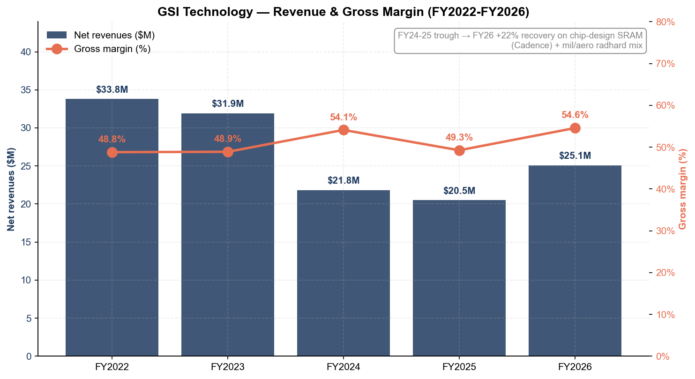
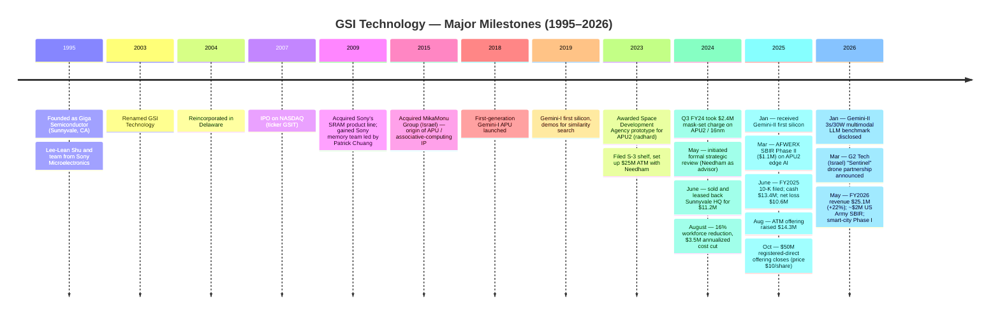
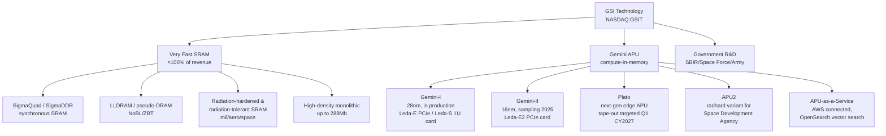
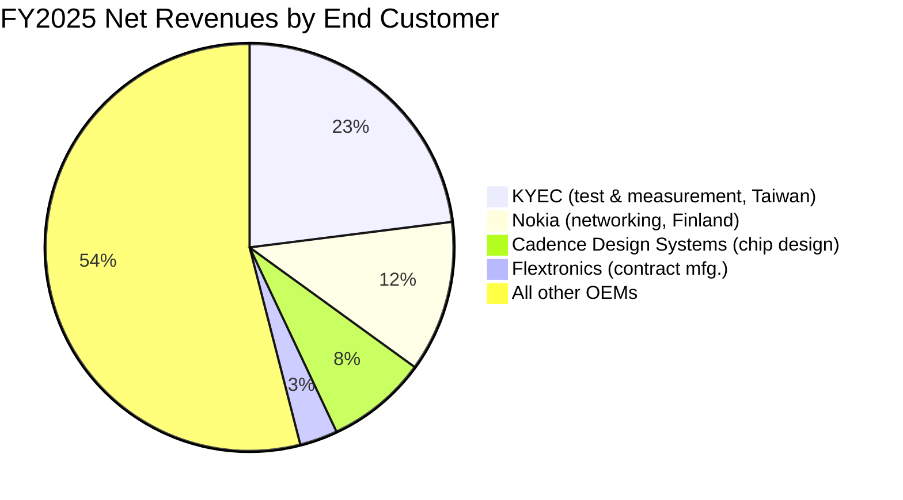
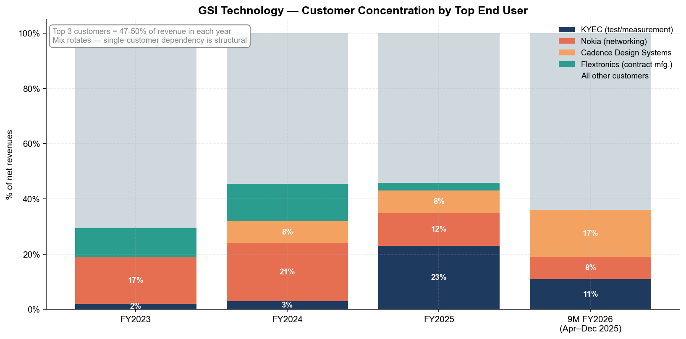
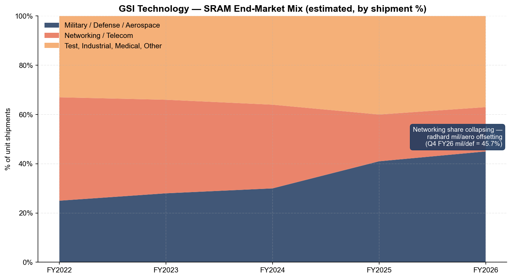
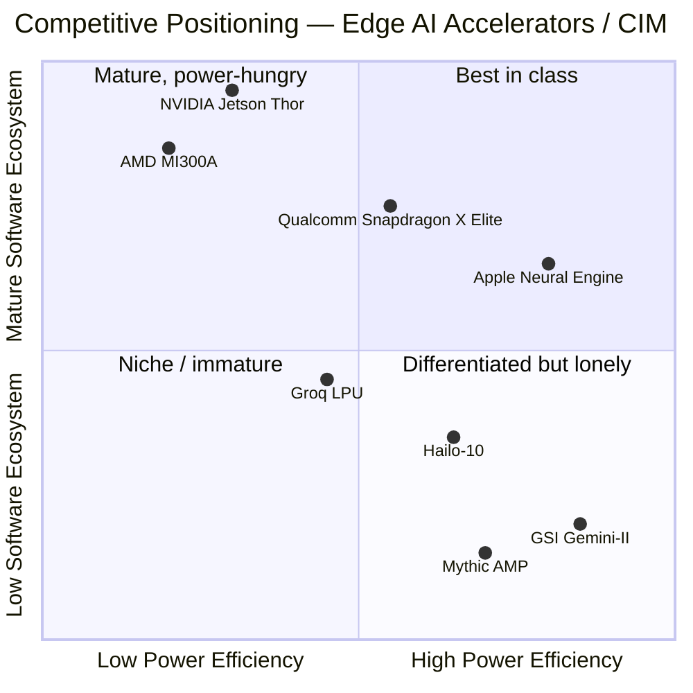

# COMPANY RESEARCH REPORT: GSI Technology, Inc. (NASDAQ: GSIT)

**Date:** 2026-05-20
**Sector:** Semiconductors — Specialty Memory & Compute-in-Memory (CIM)
**Listing:** NASDAQ Global Market, ticker `GSIT`
**Fiscal year:** April 1 – March 31 (FY2026 ended March 31, 2026)

> **Update — FY2026 revenue +22%, full-year results released 2026-05-07.** Full-year FY2026 revenue rose to **$25.1 million** (vs. $20.5M in FY2025, +22%) with gross margin expanding to **54.5%** (from 49.4%) on a richer chip-design and military/aerospace SRAM mix. The company guided Q1 FY2027 net revenue of **$5.9M–$6.7M** at **54%–56% gross margin**. Quarter-end cash stood at **$67.2 million with no debt** following an October 2025 $50M registered-direct equity raise. Net loss for FY2026 was **$13.2M** (compared with $10.6M in FY2025). Source: [GSI Technology fiscal Q4 / FY2026 press release, 2026-05-07](https://www.sec.gov/Archives/edgar/data/1126741/000117184326003155/exh_991.htm).

---

## Table of Contents

1. Company Overview
2. Company History
3. Management Team
4. Products & Services
5. Customers & Go-to-Market
6. Industry Overview
7. Competitive Landscape
8. Market Opportunity (TAM)
9. Risk Assessment
10. References

---

## 1. Company Overview

GSI Technology, Inc. is a small-cap, fabless semiconductor company headquartered in Sunnyvale, California. The firm has two distinct businesses welded together in a single 121-person organization: (i) a legacy, but cash-generative, **Very Fast SRAM** memory product line serving networking, test equipment, and military/aerospace customers; and (ii) an emerging **Gemini family of Associative Processing Units ("APUs")**, a proprietary compute-in-memory architecture that GSI is positioning as a low-power alternative to GPUs and CPUs for similarity search, vector search, synthetic-aperture-radar (SAR) processing, edge AI inference, and other parallel workloads. The legacy SRAM business pays the bills; the APU business is the call option ([GSI Technology FY2025 10-K, Item 1 — Business](https://www.sec.gov/Archives/edgar/data/1126741/000155837025008723/0001558370-25-008723-index.htm)).

**Business model.** GSI is fabless: all SRAM and APU wafers are manufactured by TSMC under purchase orders without a long-term supply contract; assembly and test are likewise outsourced. The company sells through three distinct channels — direct to OEMs, indirect through contract manufacturers (most notably Flextronics, historically), and through a global distributor network anchored by Avnet Logistics, Holystone, Nexcomm, Mouser, and Digi-Key. In FY2025, **91.7% of net revenues flowed through distributors and only 7.9% through direct contract-manufacturer sales**, a structural change from FY2023 when distributors carried 77.5% ([GSI Technology FY2025 10-K, p. 11](https://www.sec.gov/Archives/edgar/data/1126741/000155837025008723/0001558370-25-008723-index.htm)). The shift reflects both Flextronics's declining share (10.4% → 13.5% → 2.7% of revenues in FY2023/24/25) and the rise of Asian distributors (Holystone in particular jumped from 2.5% to 22.6% between FY2024 and FY2025).

**Geographic footprint.** Headquarters and most management functions are in Sunnyvale, California; a Taiwan office (40 employees) handles operations and foundry interface with TSMC; an Israel facility (33 employees) is the center for APU software development and was inherited from the 2015 MikaMonu acquisition. International revenue accounted for **47.3% of FY2025 net revenues** ([10-K FY2025, Risk Factors](https://www.sec.gov/Archives/edgar/data/1126741/000155837025008723/0001558370-25-008723-index.htm)). The Israel operation is exposed to the ongoing Middle East conflict — GSI flags this explicitly as a material risk.

**Scale.** By every metric this is a micro-cap. Net revenues of **$25.1 million in FY2026** ([Q4 FY2026 press release, 2026-05-07](https://www.sec.gov/Archives/edgar/data/1126741/000117184326003155/exh_991.htm)), 121 full-time employees including 82 engineers (47 in R&D, of whom 32 hold PhD or MS degrees) as of March 31, 2025 ([10-K FY2025, Human Capital](https://www.sec.gov/Archives/edgar/data/1126741/000155837025008723/0001558370-25-008723-index.htm)). The company holds **142 issued US patents** (60 memory, 82 associative computing) and over a dozen pending applications — a meaningful IP estate for a company this size.

*Source: GSI Technology [FY2025 10-K](https://www.sec.gov/Archives/edgar/data/1126741/000155837025008723/0001558370-25-008723-index.htm) and [FY2026 Q4 press release, 2026-05-07](https://www.sec.gov/Archives/edgar/data/1126741/000117184326003155/exh_991.htm).*

**Valuation snapshot.** GSIT trades at extreme multiples that are not interpretable through a conventional P/E lens because the company is structurally unprofitable on a GAAP basis. As of mid-May 2026, the share price was approximately **$9–12** with a market capitalization of approximately **$306–324 million** ([GSI Technology — stockanalysis.com](https://stockanalysis.com/stocks/gsit/)). The trailing-12-month P/E is **negative** — GSI reported a net loss of $13.2M for FY2026 — so the multiple is "not meaningful" in the textbook sense. On a price-to-sales basis, the stock trades at approximately **12-13× TTM revenue** ($25.1M FY2026 revenue against ~$315M market cap), an extraordinary multiple for a semiconductor business that has shrunk on a multi-year horizon (FY2022 revenue of ~$33.8M, FY2024 $21.8M, FY2025 $20.5M, FY2026 $25.1M). The market is not paying for SRAM revenue at 12× sales — it is pricing in optionality on the APU/Gemini-II/Plato compute-in-memory roadmap and the prospect that GSI's architecture finds a foothold in edge AI inference. The stock is up roughly **227% over the trailing 12 months** ([stockanalysis.com](https://stockanalysis.com/stocks/gsit/)), re-rating sharply on the back of (a) third-party benchmarks showing Gemini-II hitting a **3-second time-to-first-token on a 12B-parameter multimodal LLM at ~30W** versus 12s/30W for Qualcomm Snapdragon X Elite and 3s/>100W for NVIDIA Jetson Thor ([GSI Technology press release, 2026-01-29](https://www.globenewswire.com/news-release/2026/01/29/3228572/0/en/GSI-Technology-Reports-3-Second-Time-to-First-Token-for-Edge-Multimodal-LLM-Inference-on-Gemini-II.html)), and (b) the October 2025 capital raise that erased near-term solvency questions. Peer-comparison anchors are difficult — there is no clean pure-play peer for compute-in-memory at GSI's scale — but for context, mature SRAM/specialty-memory peers such as Cypress Semiconductor (pre-acquisition) and Integrated Silicon Solution historically traded at 1.5–3× sales when profitable; AI-narrative peers like Cerebras (private), Groq (private), and the publicly listed Ambarella (NASDAQ: AMBA) trade at 5-12× sales but with revenue scales 10-30× larger than GSIT's. The takeaway: **GSIT is priced as a binary option on Gemini-II commercial traction, not as a memory company**. We treat this stretched multiple as a Section 9 financial / multiple-compression risk in its own right.

Cash and runway: At March 31, 2026 GSI held **$67.2 million in cash and equivalents with no debt** ([Q4 FY2026 press release](https://www.sec.gov/Archives/edgar/data/1126741/000117184326003155/exh_991.htm)). At a ~$13M annual operating cash burn (FY2025 used $13.0M in operations [10-K FY2025, Liquidity section](https://www.sec.gov/Archives/edgar/data/1126741/000155837025008723/0001558370-25-008723-index.htm)), the runway without further dilution exceeds five years on cash alone — although FY2026 R&D will step up as Plato development ramps, narrowing that horizon to roughly 3-4 years of self-funding before the next capital event. Going-concern language has been removed from recent filings; the 10-K explicitly states "we believe that our existing balances … will be sufficient to meet our cash needs for working capital and capital expenditures for at least the next 12 months" ([10-K FY2025, Liquidity](https://www.sec.gov/Archives/edgar/data/1126741/000155837025008723/0001558370-25-008723-index.htm)).

---

## 2. Company History

GSI Technology was incorporated in California in **March 1995 under the name Giga Semiconductor, Inc.** by Lee-Lean Shu and a small group of co-founders, several of whom — including Patrick Chuang (Senior VP, Memory Design) — joined later from Sony Microelectronics Corporation, where Shu had been Director of SRAM Design ([10-K FY2025, p. 13, Item 1](https://www.sec.gov/Archives/edgar/data/1126741/000155837025008723/0001558370-25-008723-index.htm)). The company changed its name to GSI Technology, Inc. in December 2003 and reincorporated in Delaware in June 2004. The founding thesis was simple: build the fastest synchronous SRAMs available, displacing incumbents in networking and telecommunications infrastructure equipment.

**Acquisitions and strategic pivots.** Three transactions reshape the GSI story.

- **July 2009 — Sony SRAM line acquisition.** GSI acquired substantially all of the SRAM memory device product-line assets of Sony Microelectronics. This brought Patrick Chuang (then SVP of Memory Design at Sony) and the broader Sony SRAM design team into GSI, instantly doubling the technical headcount in memory and giving GSI access to higher-density and higher-speed product designs. The deal explains why several senior executives at GSI have decades-long histories at Sony.
- **November 2015 — MikaMonu Group Ltd. acquisition.** This is the single most consequential transaction in the company's history. MikaMonu was an Israeli developer of compute-in-memory / associative-computing intellectual property founded by Dr. Avidan Akerib (Weizmann Institute PhD; ~50+ patents on in-memory associative computing). MikaMonu is the technical seed crystal of the entire Gemini APU family, and Dr. Akerib remains VP, Associative Computing today. GSI carries **$8.0 million of goodwill** and ~$1.3M of intangibles from this acquisition on its FY2025 balance sheet ([10-K FY2025, Note 1](https://www.sec.gov/Archives/edgar/data/1126741/000155837025008723/0001558370-25-008723-index.htm)). Contingent consideration tied to APU revenue targets has been re-valued to **$0** as the milestones have not been hit — a tacit admission that APU revenue has lagged the original 2015 plan by roughly a decade.
- **June 2024 — Sunnyvale HQ sale-leaseback.** In a transaction designed to extend operating runway during the strategic review, GSI sold its 1213 Elko Drive headquarters and leased it back, recognizing **$11.2 million of cash proceeds and a $5.8M GAAP gain** ([10-K FY2025, MD&A](https://www.sec.gov/Archives/edgar/data/1126741/000155837025008723/0001558370-25-008723-index.htm)). This was effectively a one-time real-estate monetization, not a recurring source of cash.

**Strategic review (May 2024 – ongoing).** On May 2, 2024 GSI announced a "broad strategic review to maximize stockholder value," explicitly including "equity or debt financing, divestiture of assets, technology licensing or other strategic arrangements including a sale of the Company," with **Needham & Company as financial advisor** ([10-K FY2025, Risk Factors](https://www.sec.gov/Archives/edgar/data/1126741/000155837025008723/0001558370-25-008723-index.htm)). No outright sale has materialized as of the FY2026 earnings release. The most concrete output of the review has been the **October 2025 $50M registered-direct equity raise**, which has effectively re-set the runway and removed the most acute solvency overhang.

**Workforce reduction (August 2024).** Tied to the strategic review, GSI executed an approximately 16% reduction in global headcount, generating $3.5 million of annualized run-rate savings. Termination cash costs were $668,000, paid out in Q2 FY2025. Critically, the company stated that "none of the Gemini-II chip development and core APU software development … will be affected by the reduction" — the cuts hit shared services and SRAM-side roles rather than the APU team ([10-K FY2025, MD&A](https://www.sec.gov/Archives/edgar/data/1126741/000155837025008723/0001558370-25-008723-index.htm)). This is consistent with management's stated capital allocation: SRAM revenue funds APU R&D.

---

## 3. Management Team

GSI's leadership is older and unusually stable for a small-cap semiconductor company. Five of the seven executive officers listed in the FY2025 10-K joined the company before 2010, and the executive group's average age is approximately 69 ([10-K FY2025, p. 16, Executive Officers](https://www.sec.gov/Archives/edgar/data/1126741/000155837025008723/0001558370-25-008723-index.htm)). This is both a strength (institutional memory, deep technical expertise, low key-person rotation risk) and a weakness (age-related succession risk in the C-suite is real and not yet addressed publicly).

### Lee-Lean Shu — Chairman, President and Chief Executive Officer (~350 words)

Lee-Lean Shu, age 70 as of June 2025, **co-founded GSI Technology in March 1995** and has served as President and CEO since inception. He has been Chairman of the Board since October 2000 ([10-K FY2025, p. 16](https://www.sec.gov/Archives/edgar/data/1126741/000155837025008723/0001558370-25-008723-index.htm); [DEF 14A 2025, p. 5](https://www.sec.gov/Archives/edgar/data/1126741/000110465925068655/0001104659-25-068655-index.htm)). Educationally, Shu holds a B.S. in Electrical Engineering from Tatung Institute of Technology (Taiwan) and an M.S. in Electrical Engineering from UCLA. Prior to founding GSI he spent **July 1990 to March 1995 at Sony Microelectronics Corporation**, the US subsidiary of Sony, where he progressed from design manager to Director of SRAM Design. That role is the technical seed of GSI — Shu effectively spun out a Sony SRAM design competence and built a company around it, and the 2009 acquisition of Sony's SRAM line was a continuation of the same relationship.

**Operating accomplishments at GSI.** Over a 31-year tenure as CEO, Shu has taken the company from a venture-backed start-up to a NASDAQ-listed business with multiple foundry generations of SRAMs in production (currently spanning 0.13µm through 16nm at TSMC) and pivoted the firm through three macro cycles in the networking/telecom equipment market. The most consequential strategic decision attributable to Shu is the **2015 MikaMonu acquisition** — buying associative-computing IP at a time when neither the AI workloads nor the GPU shortage existed at the scale they do today. A decade later that IP underpins the entire Gemini APU thesis. The most material strategic *failure* is also attributable to Shu: APU revenue has not materialized on the original 2015 timeline (contingent consideration accrual has been written to zero), and the SRAM business has shrunk substantially over a multi-year window. Whether that delay reflects under-investment, under-capitalization, technology immaturity, or simply being too early is debatable — but Shu owns it.

**Ownership and compensation.** Shu owns **3,614,615 shares (12.0% of outstanding)** as of June 30, 2025 ([DEF 14A 2025, Beneficial Ownership table](https://www.sec.gov/Archives/edgar/data/1126741/000110465925068655/0001104659-25-068655-index.htm)) — meaningfully founder-aligned. In a notable governance gesture, Shu accepted a **30% reduction in base salary in November 2022** (to $302,339 annually) as part of cost-reduction initiatives ([DEF 14A 2025, Compensation Discussion and Analysis](https://www.sec.gov/Archives/edgar/data/1126741/000110465925068655/0001104659-25-068655-index.htm)). His target bonus for FY2025 was $275,000; he actually earned only **$54,828** in incentive comp as APU revenue targets were missed and SRAM revenue came in just 0.3% below plan. Total FY2025 cash compensation was therefore close to $357,000 — modest for a US-listed semiconductor CEO and consistent with deep founder alignment.

### Douglas Schirle — Chief Financial Officer (~180 words)

Douglas Schirle, age 70, has served as **CFO since August 2000** — a 25-year tenure ([10-K FY2025, p. 16](https://www.sec.gov/Archives/edgar/data/1126741/000155837025008723/0001558370-25-008723-index.htm)). Before joining GSI he was the company's Corporate Controller (June 1999 – August 2000). Prior to that he spent two years as Corporate Controller at Pericom Semiconductor and held senior finance roles (Controller, then VP-Finance) at Paradigm Technology, a SRAM manufacturer that exited the market in the late 1990s. Schirle was formerly a certified public accountant. He took GSI through its 2007 NASDAQ IPO, the 2009 Sony SRAM acquisition, the 2015 MikaMonu transaction, the 2023 ATM facility, the 2024 sale-leaseback, the August 2024 RIF, and the October 2025 $50M registered-direct raise — a long capital-markets résumé concentrated entirely at one issuer. As an indicator of the depth of GSI's finance bench, the 10-K notes: **"we currently have only four employees in our finance department in the United States, including our Chief Financial Officer"** ([10-K FY2025, Risk Factors](https://www.sec.gov/Archives/edgar/data/1126741/000155837025008723/0001558370-25-008723-index.htm)). At age 70 with no announced successor, CFO succession is an underappreciated near-term governance risk.

### Other key executives (~280 words)

**Dr. Avidan Akerib — Vice President, Associative Computing (Israel).** Age 69. Joined GSI in November 2015 as part of the MikaMonu acquisition. He was MikaMonu's co-founder and chief technologist (July 2011 – November 2015), and previously served as chief scientist of ZikBit Ltd. (DRAM computing) and as General Manager of NeoMagic Israel. PhD in applied mathematics and computer science from the Weizmann Institute; MSc and BSc in EE from Tel Aviv University and Ben Gurion University respectively. **Dr. Akerib is the inventor of 50+ patents on parallel and in-memory associative computing**, and is the single most important technical figure in the company outside Shu. He leads the Israel-based software team that is critical to APU adoption — by GSI's own admission, "this team is needed for the development of software required in the use of our APU product offering" ([10-K FY2025, p. 60](https://www.sec.gov/Archives/edgar/data/1126741/000155837025008723/0001558370-25-008723-index.htm)).

**Patrick Chuang — Senior Vice President, Memory Design.** Age 75. Joined GSI from Sony Microelectronics in July 2009 alongside the SRAM product-line acquisition. Was SVP, Memory Design at Sony Microelectronics from 1990 to 2009, and before that Design Director of NMOS DRAM at AMD (1980-1990). Chuang has run GSI's SRAM design organization for 16 years.

**Didier Lasserre — VP, Sales.** Age 60. Joined GSI in 1997, promoted to VP Sales in 2002. Sales background from Cypress Semiconductor (1988-96) and Solectron (1996-97).

**Ping Wu — VP, US Operations.** Returned to GSI in 2006 after a stint at QPixel Technology; first joined the company in 1999.

**Bor-Tay Wu — VP, Taiwan Operations.** With GSI since January 1997.

### Board & governance (~120 words)

GSI's five-director board after the 2025 annual meeting comprises Lee-Lean Shu (the only non-independent director), **Elizabeth Cholawsky** (former CEO of HG Insights; operating advisor at Updata Partners), **Haydn Hsieh** (Chairman/CSO of Wistron NeWeb Corp., a related-party manufacturing partner — see below), **Ruey L. Lu** (President of eMPIA Technology), and new independent director **Ronald R. Steger** (former KPMG audit partner; board member of Great Lakes Dredge & Dock) replacing Jack Bradley ([DEF 14A 2025](https://www.sec.gov/Archives/edgar/data/1126741/000110465925068655/0001104659-25-068655-index.htm)).

**Insider ownership** (D&O as a group, June 30, 2025) is **25.4%** of shares outstanding ([DEF 14A 2025, Beneficial Ownership](https://www.sec.gov/Archives/edgar/data/1126741/000110465925068655/0001104659-25-068655-index.htm)). The largest outside holder disclosed is **HolyStone / Mr. Tang** with 5.2% — Tang is also the CEO of HolyStone Enterprises (the GSI distributor that accounted for 22.6% of FY2025 revenues), an intertwined ownership-and-sales relationship that bears watching but is publicly disclosed.

**Related-party flag.** Board member Haydn Hsieh is Chairman and CSO of **Wistron NeWeb Corporation (WNC)**, which GSI uses to manufacture single-APU PCIe boards. GSI paid WNC ~$140,000 in FY2025 and ~$500,000 in FY2024 in NRE and manufacturing services ([DEF 14A 2025, Certain Relationships and Related Transactions](https://www.sec.gov/Archives/edgar/data/1126741/000110465925068655/0001104659-25-068655-index.htm)). The amounts are immaterial but the relationship is genuine related-party.

### Management track record synthesis (~80 words)

Shu and team have delivered persistent technical execution against a strategically difficult market — they built and shipped multiple SRAM generations, integrated two acquisitions, and brought a clean-sheet compute-in-memory architecture (Gemini-I in production, Gemini-II first silicon Jan 2025) to a working chip. What they have **not** delivered is APU revenue, on the original 2015 timeline or any subsequent revised timeline. The Section 9 thesis hinges on whether Gemini-II changes that. Founder ownership (Shu 12%), accepted pay cuts, and a 31-year tenure argue for genuine alignment.

---

## 4. Products & Services

GSI's portfolio splits cleanly into two product families: **(A) Very Fast SRAM memory products** that generate essentially 100% of current revenue, and **(B) the Gemini APU family** (associative processing units / compute-in-memory chips) that has yet to produce material commercial revenue but is the basis for the entire equity narrative.

*Source: [GSI Technology FY2025 10-K, Item 1 — Products](https://www.sec.gov/Archives/edgar/data/1126741/000155837025008723/0001558370-25-008723-index.htm) and [Q3 FY2026 10-Q, MD&A](https://www.sec.gov/Archives/edgar/data/1126741/000117184326000515/exh_991.htm).*

### A. Very Fast SRAM portfolio

GSI is one of a handful of merchant SRAM suppliers globally and the only supplier offering monolithic densities up to **288Mb** ([10-K FY2025, p. 8](https://www.sec.gov/Archives/edgar/data/1126741/000155837025008723/0001558370-25-008723-index.htm)). Sub-10-nanosecond ("Very Fast") synchronous SRAMs are used as external pin-accessible cache and lookup memory in:

- **Networking and telecom equipment** — routers, switches, wide-area-network infrastructure, wireless base stations and network-access equipment. **Historical anchor market**; declining as ASIC/controller vendors embed more SRAM on-die. Networking and telecom accounted for **19% of FY2025 shipments** versus 34% in FY2024 ([10-K FY2025, MD&A](https://www.sec.gov/Archives/edgar/data/1126741/000155837025008723/0001558370-25-008723-index.htm)). The single largest historical customer is **Nokia**, primarily for radio access network equipment.
- **Test and measurement equipment** — high-speed testers (e.g., automatic test equipment / ATE) and instrumentation that require very high random transaction rates. **KYEC** is the largest end customer in this segment (and the largest GSI end customer overall in FY2025, at 23% of net revenues).
- **Military, defense, and aerospace** — radar, guidance systems, missiles, satellites, and signal-processing platforms. Demand here is **radiation-tolerant / radiation-hardened SRAM** (rad-hard) — a much higher-margin niche than commercial SRAM. Named OEM customers in this segment include **Lockheed Martin, Northrop Grumman, BAE Systems, Airbus, and Rockwell Collins** ([10-K FY2025, p. 11 — representative customer list](https://www.sec.gov/Archives/edgar/data/1126741/000155837025008723/0001558370-25-008723-index.htm)). GSI's "the only SRAM manufacturer to offer monolithic 288Mb densities as well as offering the highest truly random transaction rate in the industry – 1866 million transactions per second" claim is a real technical differentiator in radar and SAR applications ([10-K FY2025, Item 1](https://www.sec.gov/Archives/edgar/data/1126741/000155837025008723/0001558370-25-008723-index.htm)).
- **Industrial, medical, automotive, audio/video** — long-tail residual applications.

**Process technology.** SRAM products span 0.13µm, 90nm, 65nm, and 40nm processes at TSMC on 300mm wafers ([10-K FY2025, p. 12](https://www.sec.gov/Archives/edgar/data/1126741/000155837025008723/0001558370-25-008723-index.htm)). APU products are at 28nm (Gemini-I) and 16nm (Gemini-II / APU2). The 16nm transition triggered a $2.4M pre-production mask charge in Q3 FY2024 and a separate $3.2M intellectual-property charge in Q3 FY2026 for the Plato project ([Q3 FY2026 10-Q, MD&A](https://www.sec.gov/Archives/edgar/data/1126741/000117184326000515/exh_991.htm)).

**Competitive advantage assessment — SRAM.** *Yes, partial.* The moat type is **technology + customer-qualification lock-in**: in radar, defense, and ATE, GSI's parts are designed-in over multi-year programs and switching costs are high (re-qualification, board redesign, system-level recertification). Gross margins of **49–55% in FY2024-FY2026** are higher than commodity memory benchmarks and consistent with a specialty product positioning. *However*, the commercial-grade SRAM portion is a structurally shrinking market — networking ASICs internalize SRAM, and customers like Nokia have reduced their external SRAM consumption. GSI's bet is that radhard, high-density, and test/measurement niches survive and grow even as the commercial SRAM TAM erodes. Closest competing products: **Cypress Semiconductor's (now Infineon's) synchronous SRAM line** (broader portfolio, higher volume, but Infineon has de-emphasized SRAM); **Integrated Silicon Solution Inc. (ISSI)**'s SRAM products (volume-oriented, mainstream); **Renesas SRAM** (specialty, broadly comparable). GSI's edge: density (288Mb monolithic), speed (sub-10ns), and rad-hard versions. GSI's vulnerability: low absolute volume vs. competitors with deeper foundry relationships.

### B. Gemini APU family

The Associative Processing Unit (APU) is GSI's proprietary **non-Von Neumann compute-in-memory** integrated circuit. The architecture combines large arrays of bit-cell memory with in-place arithmetic and Boolean logic, enabling parallel operations on data without moving it between memory and a separate processor. This eliminates the so-called "memory wall" that bottlenecks conventional CPU and GPU architectures on certain memory-bound workloads — most notably **similarity search, vector search, real-time SAR image processing, and (per recent benchmarks) low-power multimodal LLM inference at the edge**.

- **Gemini-I (28nm).** In production. Sold as the **Leda-E** full-size PCIe card and the **Leda-S** 1U E1.L card. Targeted at similarity search and vector-search acceleration. Independent third-party testing reported in a March 2026 press release showed **Gemini-I achieving GPU-class throughput on a RAG (retrieval-augmented generation) workload at 98% lower energy consumption versus NVIDIA A6000** ([GSI Technology press release, 2026-03-10](https://www.stocktitan.net/news/GSIT/compute-in-memory-apu-achieves-gpu-class-ai-performance-at-a-a9souzbf11hy.html)).
- **Gemini-II (16nm).** First silicon received January 2024; sampling on **Leda-E2** PCIe cards by late 2025. Order-of-magnitude performance improvement over Gemini-I. The marquee benchmark disclosed January 29, 2026: **3-second time-to-first-token (TTFT) on a Gemma-3 12B multimodal LLM at ~30W** at the AI sub-system level — versus reported third-party numbers of **12s/30W on Qualcomm Snapdragon X Elite** and **3s/>100W on NVIDIA Jetson Thor** ([GSI Technology press release, 2026-01-29](https://www.globenewswire.com/news-release/2026/01/29/3228572/0/en/GSI-Technology-Reports-3-Second-Time-to-First-Token-for-Edge-Multimodal-LLM-Inference-on-Gemini-II.html)). If reproducible by customers, this is a material performance-per-watt differentiation in the embedded edge AI segment.
- **APU2 (16nm radhard variant).** Funded by a **Space Development Agency prototype agreement** (initial $1.25M, amended September 2025 to $2.0M with added radhard-characterization milestones). GSI is developing radhard APU2 silicon for in-orbit big-data processing for the US Space Force ([Q3 FY2026 10-Q, p. 60](https://www.sec.gov/Archives/edgar/data/1126741/000117184326000515/exh_991.htm)).
- **Plato.** Next-generation edge-AI APU, currently in design. Per GSI commentary on the Q3 FY2026 call (as relayed by investing.com): **tape-out targeted around Q1 calendar 2027, initial wafers in summer 2027** ([Investing.com Q3 FY2026 earnings call summary](https://in.investing.com/news/transcripts/earnings-call-transcript-gsi-technology-q3-2026-reveals-revenue-growth-eps-miss-93CH-5217818)). In Q3 FY2026 GSI booked a **$3.2 million IP-purchase charge** for Plato to R&D ([Q3 FY2026 10-Q, MD&A](https://www.sec.gov/Archives/edgar/data/1126741/000117184326000515/exh_991.htm)).
- **APU-as-a-Service.** Cloud-hosted Gemini APUs accessible via AWS, intended to serve OpenSearch vector-search acceleration and SAR image processing as SaaS. GSI explicitly states that APU revenue, including SaaS, **"has not resulted in material revenues to date"** ([Q3 FY2026 10-Q, MD&A](https://www.sec.gov/Archives/edgar/data/1126741/000117184326000515/exh_991.htm)).

**Competitive advantage assessment — APU.** *Partial, with high binary risk.* The technical moat is real — 142 patents (82 specifically on associative computing), Gemini-II silicon working, third-party validated benchmarks. The architecture is *genuinely* differentiated relative to GPUs and CPUs on the specific class of workloads (similarity search, vector search, SAR, multimodal LLM inference at the edge). The commercial moat is *not* yet demonstrated — there are no material APU revenues, no large named anchor customer, no design-win disclosure framework comparable to NVIDIA or AMD. The closest competing architectures are:

- **NVIDIA Jetson family** (edge AI GPUs) — far larger ecosystem, broader software, but higher power for the same workload per the Gemini-II benchmark.
- **Qualcomm Snapdragon X Elite / AI100** — competitive on power but slower TTFT on the multimodal benchmark.
- **Groq LPU** — alternative non-GPU compute-in-cache architecture, private, raising at high valuations.
- **Cerebras** — wafer-scale compute, very different form factor and target market (data center, not edge), private.
- **Mythic, Untether AI, EnCharge AI, Axelera AI, Hailo, Sima.ai** — venture-backed compute-in-memory or near-memory inference start-ups; most are private and pre-revenue or early revenue. **Mythic** has Series-funded analog CIM; **EnCharge** raised on switched-capacitor analog CIM; **Untether** had a Series funded device. None are public peers.

The one-line verdict: GSI's APU has a defensible technical differentiation and benchmark validation that the competitive field cannot match on a performance-per-watt basis for vector and multimodal workloads. Whether that converts to revenue is purely an execution and go-to-market question — and is what the stock is pricing.

### Recent launches and roadmap (last 12 months)

- **June 2025** — Q4 FY25 earnings, $14.3M ATM raise initiated
- **August 2025** — completion of $14.3M ATM equity raise
- **October 21, 2025** — $50M registered-direct offering closes
- **January 29, 2026** — Gemini-II 3-second TTFT benchmark on Gemma-3 12B multimodal
- **March 2026** — Gemini-II "drone security bake-off" benchmark vs. NVIDIA and Qualcomm
- **April 2026** — Q3 FY26 10-Q reveals $3.2M IP purchase for Plato project
- **May 2026** — FY26 results: Phase I Smart City contract awarded; ~$2M US Army SBIR Phase II contract awarded for ruggedized Gemini-II edge AI defense platform; G2 Tech "Sentinel" drone POC scheduled for June 2026 demo

The Plato roadmap (Q1 CY2027 tape-out) and the SBIR/government contract pipeline suggest GSI has a 12-24-month window of catalysts ahead.

---

## 5. Customers & Go-to-Market

GSI's customer base is concentrated, structurally dependent on a small number of OEMs, and routes through a handful of distributors. This is the single most important commercial fact about the company.

### Customer concentration (REQUIRED — from FY2025 10-K and Q3 FY2026 10-Q)

*Source: [GSI Technology FY2025 10-K, p. 11, customer-concentration table](https://www.sec.gov/Archives/edgar/data/1126741/000155837025008723/0001558370-25-008723-index.htm). Percentages reflect direct and indirect end-customer revenue based on information provided by contract manufacturers and distributors.*

**Top 1 end customer (FY2025):** KYEC (Taiwan), 23% of net revenues — a Taiwan-based test-and-measurement equipment company; purchases routed through contract manufacturers and distributors. Sales to KYEC grew from **$0.5M in FY2024 to $4.6M in FY2025**, an 8× swing that explains most of the customer-mix shift between the two years.

**Top 5 end customers (FY2025):** KYEC (23%) + Nokia (12%) + Cadence Design Systems (8%) + Flextronics (3%, contract mfr.) + the next largest unnamed customer would push the top-5 share to approximately **50–55%** — a level that is unambiguously **material concentration** under any standard rule. The risk taxonomy (top-1 > 20%, top-5 > 50%) flags this as a Section 9 high-severity risk.

**Distributor concentration is even more extreme.** **Avnet Logistics accounted for 49.6% of FY2025 net revenues**, 50.6% in FY2024, and 48.1% in FY2023 ([10-K FY2025, Risk Factors](https://www.sec.gov/Archives/edgar/data/1126741/000155837025008723/0001558370-25-008723-index.htm)). **Holystone** jumped from 2.5% in FY2024 to 22.6% in FY2025. Both relationships are operational pass-through arrangements rather than commitments — distributors can shift to competitor products at any time.

**Three-year customer-share trend (10% direct customers):**

| Direct customer | FY2023 | FY2024 | FY2025 | 9M FY2026 |
|---|---|---|---|---|
| Avnet Logistics (distributor) | 48.1% | 50.6% | 49.6% | not disclosed |
| Holystone (distributor) | 2.4% | 2.5% | 22.6% | not disclosed |
| Nexcomm (distributor) | 16.6% | 9.3% | 9.8% | not disclosed |
| Flextronics (contract mfr.) | 10.4% | 13.5% | 2.7% | not disclosed |

*Source: [10-K FY2025, p. 11](https://www.sec.gov/Archives/edgar/data/1126741/000155837025008723/0001558370-25-008723-index.htm) and [Q3 FY2026 10-Q](https://www.sec.gov/Archives/edgar/data/1126741/000117184326000515/exh_991.htm).*

**End-customer trend by Nokia / KYEC / Cadence Design Systems share of net revenues:**

| End customer | FY2023 | FY2024 | FY2025 | 9M FY2026 |
|---|---|---|---|---|
| KYEC | 2% | 3% | 23% | 11% |
| Nokia | 17% | 21% | 12% | 8% |
| Cadence Design Systems | 0% | 8% | 8% | 17% |

*Source: [10-K FY2025](https://www.sec.gov/Archives/edgar/data/1126741/000155837025008723/0001558370-25-008723-index.htm) and [Q3 FY2026 10-Q, p. 41](https://www.sec.gov/Archives/edgar/data/1126741/000117184326000515/exh_991.htm).*

*Source: as above. KYEC, Nokia and Cadence rotate as top end customer; combined they have been roughly 35-50% of net revenues each year — the dependency is structural even if the names rotate.*

**Key observations.**
1. **The top customer rotates year to year.** Nokia was #1 in FY23-FY24; KYEC took over in FY25; Cadence Design Systems is the 9M FY26 leader. This rotation indicates that GSI does *not* have a single irreplaceable anchor relationship — but it also means **single-customer demand swings can move full-year revenue by ±15-20%** in either direction.
2. **No long-term purchase commitments.** Per the 10-K: "We do not have long-term contracts with KYEC and Nokia or any of our other major OEM customers, distributors or contract manufacturers that obligate them to purchase our products" ([10-K FY2025, p. 22](https://www.sec.gov/Archives/edgar/data/1126741/000155837025008723/0001558370-25-008723-index.htm)). Orders are placed on a PO-by-PO basis with reschedule/cancel rights up to 30 days before delivery.
3. **Sales cycles are long but design wins are sticky.** "Our sales cycle can take up to 24 months to complete… If an OEM customer decides at the design stage not to incorporate our products into their products, we will not have another opportunity for a design win with respect to that customer's product for many months or years" ([10-K FY2025, p. 26](https://www.sec.gov/Archives/edgar/data/1126741/000155837025008723/0001558370-25-008723-index.htm)).
4. **Cadence's emergence is meaningful for the thesis.** Chip-design simulation and verification at advanced nodes uses high-density external SRAM — this is a structurally growing application as semiconductor design complexity rises, and GSI's 288Mb monolithic SRAM is well-suited to it. The 9M FY26 jump to 17% suggests Cadence is becoming a durable customer rather than a one-quarter spike.

### Go-to-market

GSI sells through **roughly 200 independent sales representatives** worldwide ([10-K FY2025, p. 12](https://www.sec.gov/Archives/edgar/data/1126741/000155837025008723/0001558370-25-008723-index.htm)) and a small in-house sales/marketing organization of approximately 15 people as of March 2025. Regional sales offices are in Hong Kong, Israel, and the United States. The distributor anchor relationships (Avnet, Mouser, Digi-Key in the US; Holystone and Nexcomm in Asia) effectively act as the company's logistics and credit infrastructure.

The APU go-to-market is markedly different: it relies on **proof-of-concept (POC) and SBIR-funded contracts** to seed customer engagements rather than catalog sales through distributors. The G2 Tech "Sentinel" drone POC, the US Army SBIR Phase II contract for a ruggedized Gemini-II edge platform, the Phase I Smart City deployment, and the AFWERX/AFRL contracts all follow this pattern. The CEO described the strategy on the Q4 FY2026 call: "we are leveraging a repeatable development platform to reuse core software, models, and system architecture across applications, reducing incremental development time and cost" ([Q4 FY2026 press release, 2026-05-07](https://www.sec.gov/Archives/edgar/data/1126741/000117184326003155/exh_991.htm)). This is a sensible play for a small-cap with limited sales reach — but it depends on conversion from POC to design win to revenue, and that conversion has historically been slow.

### Customer case studies (named wins)

- **Nokia (since at least FY2018).** Networking-equipment SRAM customer, primarily for radio-access-network gear. Direct + indirect Nokia revenue: $4.5M (FY24) → $2.5M (FY25) → $1.4M (9M FY26) — declining trajectory.
- **KYEC (Taiwan).** Tester equipment SRAM. $0.5M (FY24) → $4.6M (FY25) — sharp ramp tied to a single end-market cycle.
- **Cadence Design Systems.** EDA / chip-design simulation. Spent $3.1M with GSI in 9M FY2026 — emerging anchor.
- **US Government (Air Force Research Laboratory, Space Development Agency, US Army).** Total ~$5.0M of non-dilutive SBIR funding awarded to date ([Q4 FY2026 press release, 2026-05-07](https://www.sec.gov/Archives/edgar/data/1126741/000117184326003155/exh_991.htm)), funding APU2 and Gemini-II development for edge AI, SAR processing, and radhard space applications.
- **G2 Tech (Israel).** Partner on the "Sentinel" autonomous perimeter security system; June 2026 demo targeted.
- **Lockheed Martin, Northrop Grumman, BAE Systems, Airbus, Rockwell.** Listed as representative OEM customers of $480,000+ in FY2025 SRAM purchases ([10-K FY2025, p. 10](https://www.sec.gov/Archives/edgar/data/1126741/000155837025008723/0001558370-25-008723-index.htm)) — these are the mil/aero radhard customers.

### Note on Nokia Bell Labs

Public commentary occasionally references a "Nokia Bell Labs partnership." We could not find an explicit Bell Labs partnership disclosed in the 10-K, 10-Q, DEF 14A, or any press release filed with the SEC through May 2026; web searches surface only Bell Labs itself and unrelated GSI press items. **Nokia is a customer for SRAM products consumed in Nokia networking equipment, but a research-collaboration relationship with Nokia Bell Labs is not disclosed in primary filings — we are not able to confirm this from public sources.**

---

## 6. Industry Overview

GSI Technology straddles two industries: **specialty / high-performance SRAM memory** (the legacy business) and **compute-in-memory (CIM) / AI accelerator semiconductors** (the call option). The two have very different size, growth, and competitive dynamics.

### Static Random-Access Memory (SRAM) market

SRAM is the fastest commercial memory technology but is significantly more expensive per bit than DRAM or NAND. It is used in three principal contexts: (i) on-chip cache (overwhelmingly the largest application, but embedded — not addressed by merchant SRAM suppliers like GSI); (ii) discrete external SRAM for high-speed lookup, packet buffering, and pipeline registers in networking equipment; and (iii) specialty radhard or industrial-temperature SRAM for mil/aero, ATE, and other niche applications. **Merchant SRAM (the segment GSI participates in) is a small, mature, and structurally declining market**. Industry analyst estimates of the *standalone discrete* SRAM market vary widely depending on definition:

- Mordor Intelligence: "Static Random Access Memory market size at USD 1.71 billion in 2025… growing to USD 2.37 billion by 2031, at a CAGR of 5.56%" ([Mordor Intelligence](https://www.mordorintelligence.com/industry-reports/static-random-access-memory-market)).
- Global Market Insights: SRAM market "valued at USD 718 million in 2025… growing to USD 1.16 billion in 2035, at a CAGR of 4.9%" — narrower scope, closer to merchant external SRAM ([GMI](https://www.gminsights.com/industry-analysis/static-random-access-memory-market)).
- Verified Market Reports: "SRAM Chip Market Revenue was valued at USD 15.8 Billion in 2025… growing at CAGR 6.5%" — broadest definition, including embedded SRAM ([VMR](https://www.verifiedmarketreports.com/product/sram-chip-market/)).

The merchant external SRAM TAM relevant to GSI is closer to the GMI definition ($0.7-1.2B globally). GSI's **$25.1M FY2026 revenue implies roughly 2–3% global merchant SRAM market share** — a reasonable position for a specialty supplier but not a scale player. The structural headwind is well known and is acknowledged in every GSI annual report: "The networking and telecom market demand for high-speed synchronous SRAMs has been declining, and is expected to continue to decline, due to the industry trend of embedding greater amounts of SRAM into each generation of ASICs/controllers products" ([10-K FY2025, p. 8](https://www.sec.gov/Archives/edgar/data/1126741/000155837025008723/0001558370-25-008723-index.htm)). GSI's strategic response is to retreat from commodity networking SRAM and reposition toward (a) higher-density chip-design / EDA workloads (Cadence), (b) test-and-measurement instrumentation (KYEC), and (c) radiation-hardened / radiation-tolerant mil/aero/space SRAM. The Q4 FY2026 mil/defense share of shipments hit **45.7%** — the highest in years ([Q4 FY2026 press release](https://www.sec.gov/Archives/edgar/data/1126741/000117184326003155/exh_991.htm)).

*Estimated end-market mix from disclosed shipment-share percentages. Source: [GSI Technology FY2025 10-K](https://www.sec.gov/Archives/edgar/data/1126741/000155837025008723/0001558370-25-008723-index.htm) and [Q4 FY2026 press release, 2026-05-07](https://www.sec.gov/Archives/edgar/data/1126741/000117184326003155/exh_991.htm). FY2022/FY2023 splits are estimated and should be read as indicative.*

### Compute-in-Memory (CIM) / Edge AI Accelerator market

This is the high-growth narrative driving GSI's equity valuation. Compute-in-memory is a broad architectural category that includes:

- **In-SRAM analog compute** (Mythic, Untether AI in earlier generations)
- **In-SRAM digital compute** (GSI's APU, EnCharge AI, others)
- **In-DRAM compute** (UPMEM, Samsung's HBM-PIM efforts)
- **Resistive / memristor compute** (research-stage, MRAM-based approaches)
- **Wafer-scale and dataflow compute** (Cerebras, SambaNova, Groq — adjacent but architecturally distinct)

The total addressable market for AI inference silicon — the umbrella under which CIM competes — is in the **hundreds of billions of dollars by 2030** per multiple industry forecasts, but this includes data-center inference where NVIDIA, AMD, and the major hyperscaler custom silicon teams (Google TPU, AWS Trainium/Inferentia, Microsoft Maia) capture the vast majority of spend. GSI is not credibly competing in cloud data-center inference. **GSI's serviceable market is edge AI inference**, particularly:

- **Embedded drone / robotics AI** — sub-50W power envelope, vision and SAR workloads. GSI references a **$2.7B drone market by 2030** in its Edge Strategy press release ([GSI Technology Edge Strategy, IR page](https://ir.gsitechnology.com/news-releases/news-release-details/gsi-technology-defines-edge-strategy-capture-growth-27-billion/)) — this is the addressable adjacent market, not GSI's revenue opportunity, and we treat it as the *outer-bound* SAM.
- **Vector / similarity search acceleration** — on-prem and at the edge for OpenSearch, Elasticsearch, NoSQL workloads, drug discovery similarity search, cybersecurity matching, and ecommerce visual search.
- **Real-time SAR processing** — defense and remote-sensing applications where data volumes are too large for round-tripping to a cloud GPU.
- **Edge multimodal LLM inference** — emerging segment, demonstrated by the January 2026 3-second TTFT benchmark.

The industry structure here is **fragmented and pre-consolidation**. Public players are limited — NVIDIA Jetson dominates the edge AI dev market by mindshare, Qualcomm Snapdragon has the smartphone-derived volume, and AMD/Intel have lesser positions. Private CIM and inference-accelerator players have raised aggressive rounds (Groq, Cerebras, Mythic, EnCharge, Axelera, Hailo, Sima.ai, Untether). GSI's competitive position is unique in being **the only publicly listed pure-play compute-in-memory company** — which both increases visibility (the stock trades as a CIM proxy) and exposes it to small-float / narrative-driven re-rating.

### Regulatory environment

- **Export controls.** GSI's SRAM and APU products are subject to US export controls (EAR), with heightened scrutiny on shipments to certain foreign customers given the military/defense applications. Tightening US-China semiconductor export rules add complexity to Asian sales (Taiwan, where KYEC is based, is currently outside the restricted-end-user lists but supply-chain exposure exists).
- **Government contracting.** SBIR awards from Space Development Agency, US Air Force, US Army are subject to standard DFARS / FAR clauses including IP retention provisions. GSI states it "retains all developed intellectual property" under its prototype agreements and applies IAS 20 to recognize awards as R&D offset rather than revenue ([Q3 FY2026 10-Q, p. 30](https://www.sec.gov/Archives/edgar/data/1126741/000117184326000515/exh_991.htm)).
- **Tariffs and trade.** Recent US tariff increases and trade restrictions on semiconductor inputs and finished goods are flagged repeatedly as macro headwinds in management discussion ([10-K FY2025, MD&A](https://www.sec.gov/Archives/edgar/data/1126741/000155837025008723/0001558370-25-008723-index.htm); [Q3 FY2026 10-Q, MD&A](https://www.sec.gov/Archives/edgar/data/1126741/000117184326000515/exh_991.htm)).

### Industry dynamics

- **Supplier power: high.** GSI is dependent on TSMC for all wafer fabrication. The 10-K explicitly states "we do not currently have a long-term supply contract with our foundry, and, therefore, TSMC is not obligated to manufacture products for us for any specified period, in any specified quantity or at any specified price" ([10-K FY2025, p. 12](https://www.sec.gov/Archives/edgar/data/1126741/000155837025008723/0001558370-25-008723-index.htm)). At GSI's volumes, the company is a very small customer of TSMC's 90nm/65nm/40nm/28nm/16nm capacity and could be deprioritized in a tight-allocation environment.
- **Buyer power: high.** A handful of distributors and a handful of OEMs drive most of the revenue; none have signed long-term commitments.
- **Substitution risk: high for commodity SRAM, lower for radhard and APU.** Embedded SRAM and faster DDR memory continue to take share from external SRAM in commercial networking; radhard SRAM and compute-in-memory APUs have no near-perfect substitutes in their specific niches.
- **Capital intensity: low (fabless model).** GSI's CapEx is $45K-$645K per year ([10-K FY2025, Cash Flow Statements](https://www.sec.gov/Archives/edgar/data/1126741/000155837025008723/0001558370-25-008723-index.htm)). Mask sets are the dominant non-R&D-payroll cash outflow ($2.4M-$3.2M one-time charges per major node).

---

## 7. Competitive Landscape

GSI competes in two adjacent landscapes: the **shrinking merchant SRAM market** (where competitors are large diversified semiconductor companies for which SRAM is a side business) and the **emerging compute-in-memory inference market** (where competitors are mostly private venture-funded start-ups and large platform players like NVIDIA and Qualcomm).

*Positioning is illustrative and based on publicly reported performance-per-watt benchmarks and ecosystem maturity assessments. Sources: [GSI Technology January 2026 benchmark release](https://www.globenewswire.com/news-release/2026/01/29/3228572/0/en/GSI-Technology-Reports-3-Second-Time-to-First-Token-for-Edge-Multimodal-LLM-Inference-on-Gemini-II.html); company product pages.*

### Direct SRAM competitors

Per the FY2025 10-K, GSI identifies its principal SRAM competitors as **Cypress Semiconductor (now Infineon Technologies AG), Integrated Silicon Solution Inc. (ISSI), and Renesas Electronics Corporation** ([10-K FY2025, p. 14](https://www.sec.gov/Archives/edgar/data/1126741/000155837025008723/0001558370-25-008723-index.htm)). All three are far larger diversified semiconductor companies for which merchant SRAM is a small fraction of total revenue. Infineon, post-Cypress acquisition, has de-prioritized merchant SRAM and may eventually exit; ISSI was taken private by a Chinese consortium in 2015 and continues to compete on volume; Renesas focuses on specialty memory and automotive. GSI's competitive position in SRAM is sustainable in the niche segments (288Mb high-density, sub-10ns speed grade, radhard) because the larger competitors have moved upstream or out, but it is not a growth business.

### Compute-in-memory / Edge AI inference competitors

This is a crowded but mostly private field:

- **NVIDIA Jetson family** (Jetson Thor, Jetson AGX Orin, Jetson Orin Nano) — the dominant edge AI development platform. Strengths: enormous software ecosystem (CUDA, TensorRT, JetPack), massive developer base, broad model support. Weaknesses: power-hungry (Jetson Thor needs >100W in the multimodal LLM benchmark cited above); GPU architecture is not optimal for similarity / vector search at GSI's specific workload class.
- **Qualcomm Snapdragon X Elite / AI100** — leveraging smartphone-SoC scale economics. Competitive on power; weaker on multimodal LLM TTFT per GSI-cited benchmark.
- **AMD (Instinct MI300A, edge Ryzen AI)** — focused on data center; minimal edge inference penetration.
- **Apple Neural Engine** — closed ecosystem, captive (iPhone, Mac).
- **Groq LPU** — specialized inference accelerator, focused on data-center LLM serving rather than edge. Private; raised at $2.8B valuation in 2024.
- **Cerebras Systems** — wafer-scale AI compute, very different form factor; data-center positioning. Filed S-1 in 2024.
- **Mythic** — analog compute-in-memory; restructured and refinanced multiple times.
- **EnCharge AI** — switched-capacitor analog CIM; Series-funded.
- **Hailo** — edge AI inference accelerator (Israeli); private.
- **Sima.ai, Axelera AI, Untether AI** — various edge inference startups.
- **Tenstorrent** — RISC-V-based AI compute; private, growing.

GSI's distinctive position is that it is **the only publicly listed pure-play compute-in-memory company** and the only one with a working silicon-and-software stack that has shipped product (Gemini-I) and demonstrated competitive performance on a public multimodal LLM benchmark (Gemini-II, 3s TTFT at ~30W).

### Competitive advantages

1. **Architectural differentiation on memory-bound workloads.** The associative-memory APU model genuinely outperforms GPUs on similarity search, vector search, and a class of low-bit-width inference workloads. This is not marketing — it is reflected in the third-party validated benchmarks.
2. **Power efficiency.** **15W envelope versus 2kW for a comparable GPU configuration** is the headline GSI metric on edge / drone workloads ([GSI Technology Edge Strategy, IR](https://ir.gsitechnology.com/news-releases/news-release-details/gsi-technology-defines-edge-strategy-capture-growth-27-billion/)). For battery-powered edge platforms this is decisive.
3. **Defense / radhard credentials.** Existing relationships with Lockheed, Northrop, BAE, Airbus, Rockwell, and active SBIR contracts with Air Force / Space Force / Army create a defensible non-commercial revenue stream.
4. **Intellectual property estate.** 142 issued US patents, 82 of which are on associative computing — meaningful in a field where many competitors are still pre-product.
5. **Founder-led, long-tenured technical leadership.** Shu (31 years), Akerib (10+ years post-MikaMonu), Chuang (16 years from Sony) — institutional memory is exceptional.

### Competitive vulnerabilities

1. **Software ecosystem is the bottleneck.** GSI explicitly invested in 2024-2026 to "support the Gemini-II with a python supported compiler" and "an integrated framework environment for the compute-in-memory" ([10-K FY2025, p. 9](https://www.sec.gov/Archives/edgar/data/1126741/000155837025008723/0001558370-25-008723-index.htm)). Even so, the gap versus NVIDIA's CUDA ecosystem is enormous, and porting effort is the single largest barrier to APU customer adoption.
2. **Scale and sales reach.** 15 sales/marketing staff and ~200 independent reps cannot match NVIDIA's enterprise-sales motion or Qualcomm's OEM relationships.
3. **Cash position relative to competitor R&D budgets.** $67.2M cash vs. competitor R&D budgets running in the hundreds of millions to billions annually.
4. **SRAM business is declining.** The funding source for APU development is itself shrinking, creating a clock on the APU commercialization runway.
5. **Customer concentration risk** — covered in Section 5.

---

## 8. Market Opportunity (TAM)

GSI presents two TAMs in its disclosures and IR materials, layered together:

**Layer 1 — Legacy specialty SRAM TAM.** Approximately **$0.7-1.2B globally** for merchant external SRAM (Mordor Intelligence, Global Market Insights), with sub-segments in (a) chip design / EDA simulation, (b) test and measurement, (c) military / defense / aerospace radhard, and (d) declining networking/telecom infrastructure. SAM for GSI within this is roughly **$200-400M** in the high-density (≥72Mb) sub-segment where GSI's 288Mb monolithic and 1866 MT/s parts have differentiated value. Current revenue of $25.1M implies a SOM of roughly **6-12% of SAM** — there is room to grow within this market through share capture in EDA, ATE, and radhard, but the *total* market is not growing fast.

**Layer 2 — Edge AI inference / compute-in-memory TAM.** This is the equity-narrative TAM. GSI cites a **$2.7 billion drone market by 2030** as one of its target adjacencies ([GSI Technology Edge Strategy](https://ir.gsitechnology.com/news-releases/news-release-details/gsi-technology-defines-edge-strategy-capture-growth-27-billion/)). Edge AI inference accelerator silicon is forecast by various industry analysts to grow from **single-digit billions today to $30-100B+ by 2030**, depending on definition. Within that, GSI is targeting specific verticals:

- **Defense / aerospace edge AI** — SAR processing, autonomous drone perimeter security, edge intelligence for radar systems. Probably $1-3B by 2030, driven by US DoD edge-AI procurement programs.
- **Vector search / RAG inference** — embedded LLM and similarity-search acceleration in data center and at the edge. The recent **98% energy-reduction benchmark on RAG workloads vs. NVIDIA A6000** ([GSI Technology press release, March 2026](https://www.stocktitan.net/news/GSIT/compute-in-memory-apu-achieves-gpu-class-ai-performance-at-a-a9souzbf11hy.html)) is the proof point GSI is using to chase this opportunity.
- **Edge multimodal LLM inference** — emerging segment driven by Gemma-class small multimodal LLMs (12B parameters and below). Likely $1-5B SAM by 2030; GSI's January 2026 benchmark positions Gemini-II as a credible contender.
- **Smart-city / industrial autonomous systems** — the Phase I smart-city contract announced May 2026 is a marker of intent rather than scale.

**SOM scenarios for the APU business (illustrative, not GSI guidance):**

- *Bull case:* Gemini-II + Plato capture 1-2% of a $30B edge AI inference TAM by 2030 — implied revenue $300-600M. This is the case the stock is pricing on a 12-13× P/S basis.
- *Base case:* GSI builds a $50-150M APU business by 2030 from defense + niche industrial + early hyperscaler engagements. Still a 5-15× revenue from current levels but well below the bull.
- *Bear case:* APU revenue stays sub-$25M into 2030 (similar trajectory to prior decade); the strategic alternative becomes a sale of the IP estate to a strategic buyer or wind-down.

**Penetration strategy.** GSI's commercialization playbook is (a) SBIR / government-funded development to seed the platform without dilution, (b) POC engagements with system integrators (G2 Tech, smart-city operators) to validate Gemini-II in target verticals, and (c) "repeatable development platform" model to amortize software work across customers — explicitly cited by CEO Shu on the Q4 FY2026 call ([Q4 FY2026 press release](https://www.sec.gov/Archives/edgar/data/1126741/000117184326003155/exh_991.htm)). With Plato targeting Q1 CY2027 tape-out, the next 18-24 months will determine whether GSI's APU revenue inflects out of immateriality.

---

## 9. Risk Assessment

### Company-Specific Risks (6)

**1. Customer concentration — material to high severity.** Top-1 end customer represented 23% of net revenues in FY2025; top-5 OEMs likely approach 50%. The single distributor Avnet Logistics accounts for ~50% of revenues, and a second distributor (Holystone) jumped to 23% in FY2025. There are no long-term purchase commitments. A 20-25% revenue swing from loss or pullback of any single top customer is the historical norm — the company itself notes operating losses ranged from $2.3M to $6.7M per quarter over a recent two-year window on net revenue ranging from $4.6M to $9.0M ([10-K FY2025, p. 20](https://www.sec.gov/Archives/edgar/data/1126741/000155837025008723/0001558370-25-008723-index.htm)). Mitigant: end-customer rotation has worked in GSI's favor (KYEC, then Cadence, then SBIR contracts) — no single customer has been irreplaceable.

**2. APU commercialization risk — high severity, high uncertainty.** The Gemini APU has not yet produced material revenue ten years after the MikaMonu acquisition. The contingent consideration liability tied to MikaMonu revenue milestones has been written to $0, reflecting management's own assessment that those targets are not within reach. The current valuation embeds substantial APU revenue inflection; failure to convert POCs and benchmarks into design wins would render the multiple unsupportable. Mitigant: Gemini-II benchmark validation (Jan 2026), expanding SBIR pipeline, and Plato roadmap suggest tangible technical progress.

**3. Key-person dependency — high.** Lee-Lean Shu (age 70, 31-year tenure as CEO and founder), Avidan Akerib (age 69, sole architect of associative-computing IP), Patrick Chuang (age 75), Douglas Schirle (age 70). GSI does not maintain key-person insurance and has no employment contracts. There is no announced succession plan for any of these positions ([10-K FY2025, Risk Factors](https://www.sec.gov/Archives/edgar/data/1126741/000155837025008723/0001558370-25-008723-index.htm)).

**4. Supplier concentration — high.** TSMC fabricates 100% of GSI's wafers without a long-term supply contract. At GSI's scale, the company is a small customer of TSMC's older-node capacity and could be deprioritized. The Israel-based software team is GSI's only APU software competence and is exposed to ongoing Middle East conflict.

**5. Strategic-review uncertainty.** The strategic review process has been open since May 2024 with no announced outcome. Continued open-endedness creates customer hesitation, retention risk for key engineering staff, and uncertainty for shareholders. Mitigant: the October 2025 $50M equity raise effectively put the most-acute solvency outcome off the table.

**6. Software ecosystem gap.** Without a robust software stack matching NVIDIA's CUDA or even Qualcomm's SDK, customer adoption is slow. GSI has been investing in Python-supported compilers and pre-built APIs but the gap is structurally hard to close at GSI's scale.

### Industry / Market Risks (3)

**7. Networking and telecom SRAM secular decline.** External SRAM consumption in networking equipment continues to be replaced by on-die embedded SRAM in ASICs. Nokia, GSI's anchor networking customer, has reduced direct + indirect purchases from $4.5M in FY2024 to $1.4M in 9M FY2026. This trend is not reversible.

**8. Competitive intensity — edge AI inference.** NVIDIA, Qualcomm, AMD, and a swarm of venture-funded CIM start-ups are all chasing the same edge inference TAM. NVIDIA's CUDA ecosystem and Qualcomm's OEM relationships make displacement difficult even with a superior performance-per-watt point design.

**9. Technology disruption — alternative architectures.** Resistive memory (memristor), in-DRAM compute, photonics-based compute, and HBM-PIM (Samsung) are all alternative compute-in-memory approaches that could leapfrog SRAM-based APU architectures over a 5-10 year horizon.

### Financial Risks (3)

**10. Valuation / multiple-compression risk — high.** GSIT trades at approximately **12-13× TTM revenue** with negative TTM earnings, on a market cap of ~$315M against $25.1M of FY2026 revenue. The stock is up 227% in 12 months on the back of Gemini-II benchmark disclosures and the October 2025 capital raise. There is no defensible "fair multiple" anchored in current fundamentals — the multiple is a discounted call option on APU revenue inflection. Triggers for a de-rate: (a) a Gemini-II POC failing to convert to a design win, (b) Plato tape-out delays beyond Q1 CY2027, (c) a meaningful loss of an existing top-5 SRAM customer that the market cannot dismiss as transitory, (d) sector rotation away from small-cap AI narrative names, (e) dilutive follow-on equity raise. With cash burn of ~$13M/year against ~$67M cash, a follow-on raise is not imminent but could be triggered if Plato development accelerates.

**11. Profitability timeline / cash burn.** Operating cash burn of approximately **$13-17M annually over FY2024-FY2025**, with FY2026 R&D step-up to $19.9M from $16.0M as Plato development accelerates. Even with current cash of $67.2M, the runway is 3-5 years on a status-quo basis; if APU revenue does not begin to inflect by FY2028-FY2029, another equity raise is likely.

**12. Dilution risk.** GSI has used both ATM offerings (~$14.3M raised May-Aug 2025) and registered-direct placements ($50M Oct 2025), accreting share count meaningfully. The October 2025 placement added approximately **5.0M shares (1.5M shares + 3.5M pre-funded warrants, all exercised)** to a base of ~29M shares — roughly **17% dilution in a single transaction**. Future dilution risk remains real until APU revenue is self-funding.

### Macroeconomic Risks (2)

**13. Tariffs, export controls, and US-China decoupling.** GSI ships extensively to Asia and depends on TSMC (Taiwan) for all wafer production. Escalating semiconductor export restrictions, tariffs on finished electronics, and Taiwan geopolitical risk all affect both supply and demand. Management explicitly cites "increased or new tariffs, export controls and other trade barriers and trade disputes" as ongoing demand drags in the Q3 FY2026 MD&A ([Q3 FY2026 10-Q](https://www.sec.gov/Archives/edgar/data/1126741/000117184326000515/exh_991.htm)).

**14. Geopolitical risk — Israel and Taiwan exposure.** 33 of GSI's 121 employees are in Israel (APU software development); 40 are in Taiwan (operations / foundry interface). Both jurisdictions carry meaningful geopolitical risk in 2026 (Israel-Gaza conflict ongoing; Taiwan Strait tensions persistent). A single major disruption to either could materially impair GSI's product roadmap or production capability.

---

## 10. References

**SEC filings (primary sources)**
- [GSI Technology, Inc. — Form 10-K for fiscal year ended March 31, 2025 (filed 2025-06-18)](https://www.sec.gov/Archives/edgar/data/1126741/000155837025008723/0001558370-25-008723-index.htm) — central source for business description, products, customer concentration, MD&A, financials, executive officers, risk factors.
- [GSI Technology, Inc. — Form 10-Q for the quarter ended December 31, 2025 (filed 2026-02-06)](https://www.sec.gov/Archives/edgar/data/1126741/000110465926011501/0001104659-26-011501-index.htm) — Q3 FY2026 financials, updated customer concentration including Cadence Design Systems, Plato IP charge, $50M registered-direct disclosure.
- [GSI Technology, Inc. — DEF 14A Proxy Statement, 2025 Annual Meeting (filed 2025-07-17)](https://www.sec.gov/Archives/edgar/data/1126741/000110465925068655/0001104659-25-068655-index.htm) — beneficial ownership table, executive bios, compensation discussion, related-party transactions (Wistron NeWeb).
- [GSI Technology 8-K — Q4 FY2026 / FY2026 results press release, 2026-05-07](https://www.sec.gov/Archives/edgar/data/1126741/000117184326003155/exh_991.htm) — FY2026 full-year financials, Q1 FY2027 guidance, US Army SBIR Phase II, smart-city Phase I.
- [GSI Technology 8-K — $50 million registered-direct offering, 2025-10-21](https://www.sec.gov/Archives/edgar/data/1126741/000110465925101301/tm2529173d1_ex99-1.htm) — pricing details, use of proceeds, Needham as placement agent.
- [GSI Technology 8-K — Q3 FY2026 results press release, 2026-01-29](https://www.sec.gov/Archives/edgar/data/1126741/000117184326000515/exh_991.htm) — Plato chip references; Q3 financial summary.

**Company press releases and investor materials**
- [GSI Technology — Gemini-II 3-second TTFT multimodal LLM benchmark release, 2026-01-29](https://www.globenewswire.com/news-release/2026/01/29/3228572/0/en/GSI-Technology-Reports-3-Second-Time-to-First-Token-for-Edge-Multimodal-LLM-Inference-on-Gemini-II.html)
- [GSI Technology — Gemini-I 98% energy reduction RAG benchmark vs. NVIDIA A6000, 2026-03](https://www.stocktitan.net/news/GSIT/compute-in-memory-apu-achieves-gpu-class-ai-performance-at-a-a9souzbf11hy.html)
- [GSI Technology — Edge Strategy press release ($2.7B drone market)](https://ir.gsitechnology.com/news-releases/news-release-details/gsi-technology-defines-edge-strategy-capture-growth-27-billion/)
- [GSI Technology — Government-Funded GEMINI-II Proof-of-Concept with G2 Tech, 2026-01-14](https://www.globenewswire.com/news-release/2026/01/14/3218534/0/en/GSI-Technology-Announces-Government-Funded-GEMINI-II-Proof-of-Concept-with-G2-Tech-For-Edge-AI-Autonomous-Security-System.html)
- [GSI Technology — Gemini-II drone security bake-off vs. NVIDIA and Qualcomm, 2026-03-10](https://www.stocksfoundry.com/articles/gsi-technologys-gemini-ii-wins-drone-security-bake-off-against-nvidia-and-qualcomm-on-power-efficiency-20260310)
- [GSI Technology — Investor relations website](https://ir.gsitechnology.com/)

**Market data**
- [GSI Technology — stockanalysis.com overview](https://stockanalysis.com/stocks/gsit/) — current price, market cap, 12-month return.
- [GSI Technology — Yahoo Finance](https://finance.yahoo.com/quote/GSIT/)
- [GSI Technology — Stocktitan summary, "Tiny chipmaker GSI piles up $70.7M cash"](https://www.stocktitan.net/news/GSIT/gsi-technology-inc-announces-third-quarter-fiscal-2026-fplcmj3hg33z.html)

**Industry / market sizing**
- [Mordor Intelligence — Static Random Access Memory Market Report, 2025-2031](https://www.mordorintelligence.com/industry-reports/static-random-access-memory-market)
- [Global Market Insights — Static Random Access Memory Market Size, 2025-2035](https://www.gminsights.com/industry-analysis/static-random-access-memory-market)
- [Verified Market Reports — SRAM Chip Market](https://www.verifiedmarketreports.com/product/sram-chip-market/)
- [Fortune Business Insights — Semiconductor Memory Market](https://www.fortunebusinessinsights.com/semiconductor-memory-market-114132)

**Earnings-call commentary (secondary)**
- [Investing.com — GSI Technology Q3 FY2026 earnings call transcript summary](https://in.investing.com/news/transcripts/earnings-call-transcript-gsi-technology-q3-2026-reveals-revenue-growth-eps-miss-93CH-5217818) — Plato Q1 CY2027 tape-out, OpEx step-up.
- [Quiver Quantitative — GSI Technology Edge Strategy](https://www.quiverquant.com/news/GSI+Technology+Announces+Edge+Strategy+for+Gemini-II+APU+to+Capitalize+on+Growing+AI+Processor+Market)
- [Dr. Robert Castellano — "GSI Technology 2025: The Moonshot for AI at the Edge" (Substack)](https://drrobertcastellano.substack.com/p/gsi-technology-2025-the-moonshot)

---

*This report is based exclusively on publicly available primary filings (SEC EDGAR) and public press releases as cited. Where a fact could not be confirmed from primary sources — most notably any "Nokia Bell Labs partnership" — the absence has been disclosed in the body of the report rather than papered over with secondary speculation. GSI Technology is a micro-cap with thin sell-side coverage and high information asymmetry; readers should treat all forward-looking content as subject to material revision as new disclosures emerge.*
